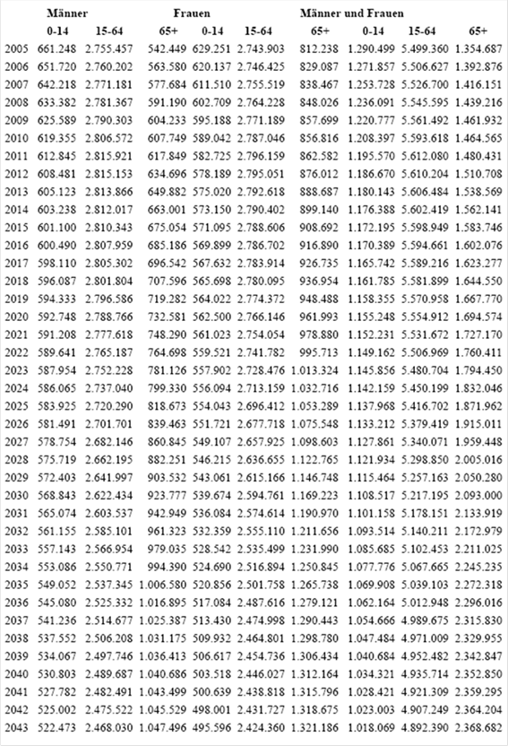
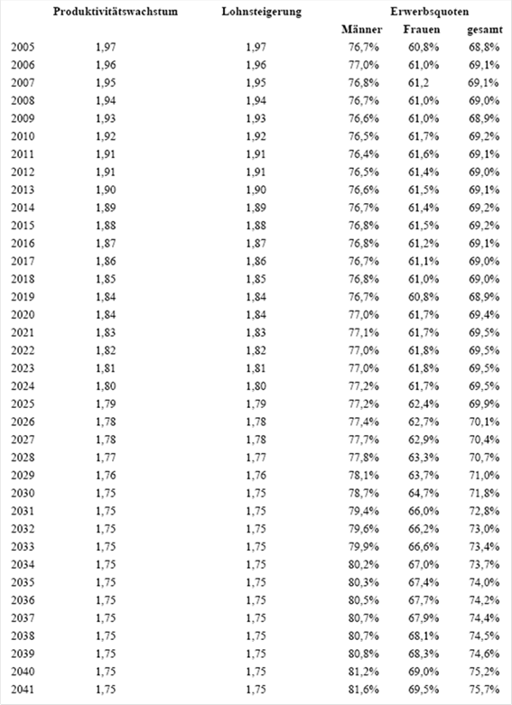
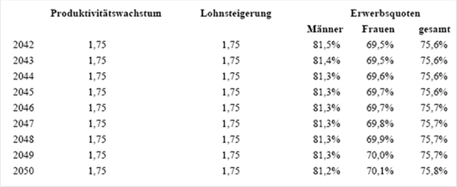
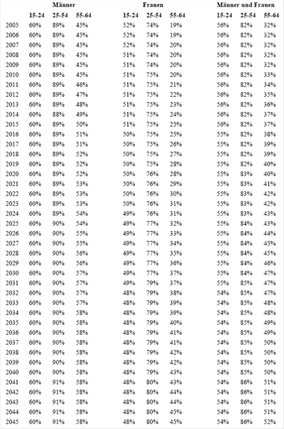

# BG.ASVG.056 — Allgemeines Sozialversicherungsgesetz (ASVG)
**Typ:** Bundesgesetz  
**Kurztitel:** ASVG  
**Langtitel:** Bundesgesetz vom 9. September 1955 über die Allgemeine Sozialversicherung (Allgemeines Sozialversicherungsgesetz – ASVG.).  
**Gesamte Rechtsvorschrift in der Fassung vom:** 08.07.2025  
**Quelle:** https://www.ris.bka.gv.at/GeltendeFassung.wxe?Abfrage=Bundesnormen&Gesetzesnummer=10008147  
**Letzte Änderung im RIS:** BGBl. I Nr. 25/2025 (NR: GP XXVIII RV 69 und Zu 69 AB 100 S. 30. BR: 11643 AB 11645 S. 979.)  
**LawAT Permalink:** https://github.com/clairexen/LawAT/blob/main/files/BG.ASVG.056.md  
*Mit RisEx für RisEn, RisEn-GPT, und LawAT von HTML zu MarkDown konvertiert. (Irrtümer und Fehler vorbehalten.)*

*Das ist die "AI-Friendly" multi-part Variante dieser Rechtsvorschrift mit kompakter Formatierung. Siehe [BG.ASVG.md](BG.ASVG.md) für die "Human-Friendly" single-page Variante dieser Norm mit hübscherer Formatierung.*

*(Fortsetzg. v. [BG.ASVG.055](BG.ASVG.055.md))*

## Anlage 12

### Anl. 12 ASVG

<table><tbody>
<tr><td colspan=2 style="vertical-align:top"> </td><td rowspan=2 colspan=6 style="vertical-align:top;text-align:center">Referenzlebenserwartung</td><td rowspan=2 colspan=5 style="vertical-align:top;text-align:center">Gesamtbevölkerung</td><td rowspan=3 colspan=2 style="vertical-align:top;text-align:center">Anteil der über 65-Jäh-rigen</td></tr>
<tr><td colspan=2 style="vertical-align:top"> </td></tr>
<tr><td colspan=2 style="vertical-align:top"> </td><td style="vertical-align:top;text-align:center">Männer</td><td colspan=2 style="vertical-align:top;text-align:center">Frauen</td><td colspan=3 style="vertical-align:top;text-align:center">gesamt</td><td colspan=2 style="vertical-align:top;text-align:center">Männer</td><td style="vertical-align:top;text-align:center">Frauen</td><td colspan=2 style="vertical-align:top;text-align:center">gesamt</td></tr>
<tr><td colspan=2 style="vertical-align:top;text-align:center">2005</td><td style="vertical-align:top;text-align:center">16,7</td><td colspan=2 style="vertical-align:top;text-align:center">20,3</td><td colspan=3 style="vertical-align:top;text-align:center">18,5</td><td colspan=2 style="vertical-align:top;text-align:center">3.959.154</td><td style="vertical-align:top;text-align:center">4.185.392</td><td colspan=2 style="vertical-align:top;text-align:center">8.144.546</td><td colspan=2 style="vertical-align:top;text-align:center">246</td></tr>
<tr><td colspan=2 style="vertical-align:top;text-align:center">2006</td><td style="vertical-align:top;text-align:center">16,8</td><td colspan=2 style="vertical-align:top;text-align:center">20,4</td><td colspan=3 style="vertical-align:top;text-align:center">18,6</td><td colspan=2 style="vertical-align:top;text-align:center">3.975.502</td><td style="vertical-align:top;text-align:center">4.195.649</td><td colspan=2 style="vertical-align:top;text-align:center">8.171.151</td><td colspan=2 style="vertical-align:top;text-align:center">253</td></tr>
<tr><td colspan=2 style="vertical-align:top;text-align:center">2007</td><td style="vertical-align:top;text-align:center">16,9</td><td colspan=2 style="vertical-align:top;text-align:center">20,5</td><td colspan=3 style="vertical-align:top;text-align:center">18,7</td><td colspan=2 style="vertical-align:top;text-align:center">3.991.083</td><td style="vertical-align:top;text-align:center">4.205.496</td><td colspan=2 style="vertical-align:top;text-align:center">8.196.579</td><td colspan=2 style="vertical-align:top;text-align:center">256</td></tr>
<tr><td colspan=2 style="vertical-align:top;text-align:center">2008</td><td style="vertical-align:top;text-align:center">17,0</td><td colspan=2 style="vertical-align:top;text-align:center">20,6</td><td colspan=3 style="vertical-align:top;text-align:center">18,8</td><td colspan=2 style="vertical-align:top;text-align:center">4.005.939</td><td style="vertical-align:top;text-align:center">4.214.963</td><td colspan=2 style="vertical-align:top;text-align:center">8.220.902</td><td colspan=2 style="vertical-align:top;text-align:center">260</td></tr>
<tr><td colspan=2 style="vertical-align:top;text-align:center">2009</td><td style="vertical-align:top;text-align:center">17,1</td><td colspan=2 style="vertical-align:top;text-align:center">20,7</td><td colspan=3 style="vertical-align:top;text-align:center">18,9</td><td colspan=2 style="vertical-align:top;text-align:center">4.020.125</td><td style="vertical-align:top;text-align:center">4.224.076</td><td colspan=2 style="vertical-align:top;text-align:center">8.244.201</td><td colspan=2 style="vertical-align:top;text-align:center">263</td></tr>
<tr><td colspan=2 style="vertical-align:top;text-align:center">2010</td><td style="vertical-align:top;text-align:center">17,2</td><td colspan=2 style="vertical-align:top;text-align:center">20,8</td><td colspan=3 style="vertical-align:top;text-align:center">19,0</td><td colspan=2 style="vertical-align:top;text-align:center">4.033.676</td><td style="vertical-align:top;text-align:center">4.232.904</td><td colspan=2 style="vertical-align:top;text-align:center">8.266.580</td><td colspan=2 style="vertical-align:top;text-align:center">262</td></tr>
<tr><td colspan=2 style="vertical-align:top;text-align:center">2011</td><td style="vertical-align:top;text-align:center">17,3</td><td colspan=2 style="vertical-align:top;text-align:center">20,9</td><td colspan=3 style="vertical-align:top;text-align:center">19,1</td><td colspan=2 style="vertical-align:top;text-align:center">4.046.615</td><td style="vertical-align:top;text-align:center">4.241.466</td><td colspan=2 style="vertical-align:top;text-align:center">8.288.081</td><td colspan=2 style="vertical-align:top;text-align:center">264</td></tr>
<tr><td colspan=2 style="vertical-align:top;text-align:center">2012</td><td style="vertical-align:top;text-align:center">17,4</td><td colspan=2 style="vertical-align:top;text-align:center">21,0</td><td colspan=3 style="vertical-align:top;text-align:center">19,2</td><td colspan=2 style="vertical-align:top;text-align:center">4.058.330</td><td style="vertical-align:top;text-align:center">4.249.252</td><td colspan=2 style="vertical-align:top;text-align:center">8.307.582</td><td colspan=2 style="vertical-align:top;text-align:center">269</td></tr>
<tr><td colspan=2 style="vertical-align:top;text-align:center">2013</td><td style="vertical-align:top;text-align:center">17,5</td><td colspan=2 style="vertical-align:top;text-align:center">21,1</td><td colspan=3 style="vertical-align:top;text-align:center">19,3</td><td colspan=2 style="vertical-align:top;text-align:center">4.068.871</td><td style="vertical-align:top;text-align:center">4.256.325</td><td colspan=2 style="vertical-align:top;text-align:center">8.325.196</td><td colspan=2 style="vertical-align:top;text-align:center">274</td></tr>
<tr><td colspan=2 style="vertical-align:top;text-align:center">2014</td><td style="vertical-align:top;text-align:center">17,6</td><td colspan=2 style="vertical-align:top;text-align:center">21,2</td><td colspan=3 style="vertical-align:top;text-align:center">19,4</td><td colspan=2 style="vertical-align:top;text-align:center">4.078.256</td><td style="vertical-align:top;text-align:center">4.262.692</td><td colspan=2 style="vertical-align:top;text-align:center">8.340.948</td><td colspan=2 style="vertical-align:top;text-align:center">279</td></tr>
<tr><td colspan=2 style="vertical-align:top;text-align:center">2015</td><td style="vertical-align:top;text-align:center">17,7</td><td colspan=2 style="vertical-align:top;text-align:center">21,3</td><td colspan=3 style="vertical-align:top;text-align:center">19,5</td><td colspan=2 style="vertical-align:top;text-align:center">4.086.497</td><td style="vertical-align:top;text-align:center">4.268.393</td><td colspan=2 style="vertical-align:top;text-align:center">8.354.890</td><td colspan=2 style="vertical-align:top;text-align:center">283</td></tr>
<tr><td colspan=2 style="vertical-align:top;text-align:center">2016</td><td style="vertical-align:top;text-align:center">17,8</td><td colspan=2 style="vertical-align:top;text-align:center">21,4</td><td colspan=3 style="vertical-align:top;text-align:center">19,6</td><td colspan=2 style="vertical-align:top;text-align:center">4.093.635</td><td style="vertical-align:top;text-align:center">4.273.491</td><td colspan=2 style="vertical-align:top;text-align:center">8.367.126</td><td colspan=2 style="vertical-align:top;text-align:center">286</td></tr>
<tr><td colspan=2 style="vertical-align:top;text-align:center">2017</td><td style="vertical-align:top;text-align:center">17,9</td><td colspan=2 style="vertical-align:top;text-align:center">21,5</td><td colspan=3 style="vertical-align:top;text-align:center">19,7</td><td colspan=2 style="vertical-align:top;text-align:center">4.099.954</td><td style="vertical-align:top;text-align:center">4.278.281</td><td colspan=2 style="vertical-align:top;text-align:center">8.378.235</td><td colspan=2 style="vertical-align:top;text-align:center">290</td></tr>
<tr><td colspan=2 style="vertical-align:top;text-align:center">2018</td><td style="vertical-align:top;text-align:center">18,0</td><td colspan=2 style="vertical-align:top;text-align:center">21,6</td><td colspan=3 style="vertical-align:top;text-align:center">19,8</td><td colspan=2 style="vertical-align:top;text-align:center">4.105.487</td><td style="vertical-align:top;text-align:center">4.282.747</td><td colspan=2 style="vertical-align:top;text-align:center">8.388.234</td><td colspan=2 style="vertical-align:top;text-align:center">295</td></tr>
<tr><td colspan=2 style="vertical-align:top;text-align:center">2019</td><td style="vertical-align:top;text-align:center">18,1</td><td colspan=2 style="vertical-align:top;text-align:center">21,7</td><td colspan=3 style="vertical-align:top;text-align:center">19,9</td><td colspan=2 style="vertical-align:top;text-align:center">4.110.201</td><td style="vertical-align:top;text-align:center">4.286.882</td><td colspan=2 style="vertical-align:top;text-align:center">8.397.083</td><td colspan=2 style="vertical-align:top;text-align:center">299</td></tr>
<tr><td colspan=2 style="vertical-align:top;text-align:center">2020</td><td style="vertical-align:top;text-align:center">18,2</td><td colspan=2 style="vertical-align:top;text-align:center">21,8</td><td colspan=3 style="vertical-align:top;text-align:center">20,0</td><td colspan=2 style="vertical-align:top;text-align:center">4.114.095</td><td style="vertical-align:top;text-align:center">4.290.639</td><td colspan=2 style="vertical-align:top;text-align:center">8.404.734</td><td colspan=2 style="vertical-align:top;text-align:center">305</td></tr>
<tr><td colspan=2 style="vertical-align:top;text-align:center">2021</td><td style="vertical-align:top;text-align:center">18,3</td><td colspan=2 style="vertical-align:top;text-align:center">21,9</td><td colspan=3 style="vertical-align:top;text-align:center">20,1</td><td colspan=2 style="vertical-align:top;text-align:center">4.117.116</td><td style="vertical-align:top;text-align:center">4.293.957</td><td colspan=2 style="vertical-align:top;text-align:center">8.411.073</td><td colspan=2 style="vertical-align:top;text-align:center">312</td></tr>
<tr><td colspan=2 style="vertical-align:top;text-align:center">2022</td><td style="vertical-align:top;text-align:center">18,4</td><td colspan=2 style="vertical-align:top;text-align:center">22,0</td><td colspan=3 style="vertical-align:top;text-align:center">20,2</td><td colspan=2 style="vertical-align:top;text-align:center">4.119.526</td><td style="vertical-align:top;text-align:center">4.297.016</td><td colspan=2 style="vertical-align:top;text-align:center">8.416.542</td><td colspan=2 style="vertical-align:top;text-align:center">320</td></tr>
<tr><td colspan=2 style="vertical-align:top;text-align:center">2023</td><td style="vertical-align:top;text-align:center">18,5</td><td colspan=2 style="vertical-align:top;text-align:center">22,1</td><td colspan=3 style="vertical-align:top;text-align:center">20,3</td><td colspan=2 style="vertical-align:top;text-align:center">4.121.308</td><td style="vertical-align:top;text-align:center">4.299.702</td><td colspan=2 style="vertical-align:top;text-align:center">8.421.010</td><td colspan=2 style="vertical-align:top;text-align:center">327</td></tr>
<tr><td colspan=2 style="vertical-align:top;text-align:center">2024</td><td style="vertical-align:top;text-align:center">18,6</td><td colspan=2 style="vertical-align:top;text-align:center">22,2</td><td colspan=3 style="vertical-align:top;text-align:center">20,4</td><td colspan=2 style="vertical-align:top;text-align:center">4.122.435</td><td style="vertical-align:top;text-align:center">4.301.969</td><td colspan=2 style="vertical-align:top;text-align:center">8.424.404</td><td colspan=2 style="vertical-align:top;text-align:center">336</td></tr>
<tr><td colspan=2 style="vertical-align:top;text-align:center">2025</td><td style="vertical-align:top;text-align:center">18,7</td><td colspan=2 style="vertical-align:top;text-align:center">22,3</td><td colspan=3 style="vertical-align:top;text-align:center">20,5</td><td colspan=2 style="vertical-align:top;text-align:center">4.122.888</td><td style="vertical-align:top;text-align:center">4.303.744</td><td colspan=2 style="vertical-align:top;text-align:center">8.426.632</td><td colspan=2 style="vertical-align:top;text-align:center">346</td></tr>
<tr><td colspan=2 style="vertical-align:top;text-align:center">2026</td><td style="vertical-align:top;text-align:center">18,8</td><td colspan=2 style="vertical-align:top;text-align:center">22,4</td><td colspan=3 style="vertical-align:top;text-align:center">20,6</td><td colspan=2 style="vertical-align:top;text-align:center">4.122.655</td><td style="vertical-align:top;text-align:center">4.304.987</td><td colspan=2 style="vertical-align:top;text-align:center">8.427.642</td><td colspan=2 style="vertical-align:top;text-align:center">356</td></tr>
<tr><td colspan=2 style="vertical-align:top;text-align:center">2027</td><td style="vertical-align:top;text-align:center">18,9</td><td colspan=2 style="vertical-align:top;text-align:center">22,5</td><td colspan=3 style="vertical-align:top;text-align:center">20,7</td><td colspan=2 style="vertical-align:top;text-align:center">4.121.745</td><td style="vertical-align:top;text-align:center">4.305.635</td><td colspan=2 style="vertical-align:top;text-align:center">8.427.380</td><td colspan=2 style="vertical-align:top;text-align:center">367</td></tr>
<tr><td colspan=2 style="vertical-align:top;text-align:center">2028</td><td style="vertical-align:top;text-align:center">19,0</td><td colspan=2 style="vertical-align:top;text-align:center">22,6</td><td colspan=3 style="vertical-align:top;text-align:center">20,8</td><td colspan=2 style="vertical-align:top;text-align:center">4.120.165</td><td style="vertical-align:top;text-align:center">4.305.635</td><td colspan=2 style="vertical-align:top;text-align:center">8.425.800</td><td colspan=2 style="vertical-align:top;text-align:center">378</td></tr>
<tr><td colspan=2 style="vertical-align:top;text-align:center">2029</td><td style="vertical-align:top;text-align:center">19,1</td><td colspan=2 style="vertical-align:top;text-align:center">22,7</td><td colspan=3 style="vertical-align:top;text-align:center">20,9</td><td colspan=2 style="vertical-align:top;text-align:center">4.117.932</td><td style="vertical-align:top;text-align:center">4.304.975</td><td colspan=2 style="vertical-align:top;text-align:center">8.422.907</td><td colspan=2 style="vertical-align:top;text-align:center">390</td></tr>
<tr><td colspan=2 style="vertical-align:top;text-align:center">2030</td><td style="vertical-align:top;text-align:center">19,2</td><td colspan=2 style="vertical-align:top;text-align:center">22,8</td><td colspan=3 style="vertical-align:top;text-align:center">21,0</td><td colspan=2 style="vertical-align:top;text-align:center">4.115.054</td><td style="vertical-align:top;text-align:center">4.303.658</td><td colspan=2 style="vertical-align:top;text-align:center">8.418.712</td><td colspan=2 style="vertical-align:top;text-align:center">401</td></tr>
<tr><td colspan=2 style="vertical-align:top;text-align:center">2031</td><td style="vertical-align:top;text-align:center">19,3</td><td colspan=2 style="vertical-align:top;text-align:center">22,9</td><td colspan=3 style="vertical-align:top;text-align:center">21,1</td><td colspan=2 style="vertical-align:top;text-align:center">4.111.560</td><td style="vertical-align:top;text-align:center">4.301.668</td><td colspan=2 style="vertical-align:top;text-align:center">8.413.228</td><td colspan=2 style="vertical-align:top;text-align:center">412</td></tr>
<tr><td colspan=2 style="vertical-align:top;text-align:center">2032</td><td style="vertical-align:top;text-align:center">19,4</td><td colspan=2 style="vertical-align:top;text-align:center">23,0</td><td colspan=3 style="vertical-align:top;text-align:center">21,2</td><td colspan=2 style="vertical-align:top;text-align:center">4.107.579</td><td style="vertical-align:top;text-align:center">4.299.125</td><td colspan=2 style="vertical-align:top;text-align:center">8.406.704</td><td colspan=2 style="vertical-align:top;text-align:center">423</td></tr>
<tr><td colspan=2 style="vertical-align:top;text-align:center">2033</td><td style="vertical-align:top;text-align:center">19,5</td><td colspan=2 style="vertical-align:top;text-align:center">23,1</td><td colspan=3 style="vertical-align:top;text-align:center">21,3</td><td colspan=2 style="vertical-align:top;text-align:center">4.103.132</td><td style="vertical-align:top;text-align:center">4.296.031</td><td colspan=2 style="vertical-align:top;text-align:center">8.399.163</td><td colspan=2 style="vertical-align:top;text-align:center">433</td></tr>
<tr><td colspan=2 style="vertical-align:top;text-align:center">2034</td><td style="vertical-align:top;text-align:center">19,6</td><td colspan=2 style="vertical-align:top;text-align:center">23,2</td><td colspan=3 style="vertical-align:top;text-align:center">21,4</td><td colspan=2 style="vertical-align:top;text-align:center">4.098.247</td><td style="vertical-align:top;text-align:center">4.292.429</td><td colspan=2 style="vertical-align:top;text-align:center">8.390.676</td><td colspan=2 style="vertical-align:top;text-align:center">443</td></tr>
<tr><td colspan=2 style="vertical-align:top;text-align:center">2035</td><td style="vertical-align:top;text-align:center">19,7</td><td colspan=2 style="vertical-align:top;text-align:center">23,3</td><td colspan=3 style="vertical-align:top;text-align:center">21,5</td><td colspan=2 style="vertical-align:top;text-align:center">4.092.977</td><td style="vertical-align:top;text-align:center">4.288.352</td><td colspan=2 style="vertical-align:top;text-align:center">8.381.329</td><td colspan=2 style="vertical-align:top;text-align:center">451</td></tr>
<tr><td colspan=2 style="vertical-align:top;text-align:center">2036</td><td style="vertical-align:top;text-align:center">19,8</td><td colspan=2 style="vertical-align:top;text-align:center">23,4</td><td colspan=3 style="vertical-align:top;text-align:center">21,6</td><td colspan=2 style="vertical-align:top;text-align:center">4.087.307</td><td style="vertical-align:top;text-align:center">4.283.821</td><td colspan=2 style="vertical-align:top;text-align:center">8.371.128</td><td colspan=2 style="vertical-align:top;text-align:center">458</td></tr>
<tr><td colspan=2 style="vertical-align:top;text-align:center">2037</td><td style="vertical-align:top;text-align:center">19,9</td><td colspan=2 style="vertical-align:top;text-align:center">23,5</td><td colspan=3 style="vertical-align:top;text-align:center">21,7</td><td colspan=2 style="vertical-align:top;text-align:center">4.081.300</td><td style="vertical-align:top;text-align:center">4.278.871</td><td colspan=2 style="vertical-align:top;text-align:center">8.360.171</td><td colspan=2 style="vertical-align:top;text-align:center">464</td></tr>
<tr><td colspan=2 style="vertical-align:top;text-align:center">2038</td><td style="vertical-align:top;text-align:center">20,0</td><td colspan=2 style="vertical-align:top;text-align:center">23,6</td><td colspan=3 style="vertical-align:top;text-align:center">21,8</td><td colspan=2 style="vertical-align:top;text-align:center">4.074.935</td><td style="vertical-align:top;text-align:center">4.273.513</td><td colspan=2 style="vertical-align:top;text-align:center">8.348.448</td><td colspan=2 style="vertical-align:top;text-align:center">469</td></tr>
<tr><td colspan=2 style="vertical-align:top;text-align:center">2039</td><td style="vertical-align:top;text-align:center">20,1</td><td colspan=2 style="vertical-align:top;text-align:center">23,7</td><td colspan=3 style="vertical-align:top;text-align:center">21,9</td><td colspan=2 style="vertical-align:top;text-align:center">4.068.226</td><td style="vertical-align:top;text-align:center">4.267.787</td><td colspan=2 style="vertical-align:top;text-align:center">8.336.013</td><td colspan=2 style="vertical-align:top;text-align:center">473</td></tr>
<tr><td colspan=2 style="vertical-align:top;text-align:center">2040</td><td style="vertical-align:top;text-align:center">20,2</td><td colspan=2 style="vertical-align:top;text-align:center">23,8</td><td colspan=3 style="vertical-align:top;text-align:center">22,0</td><td colspan=2 style="vertical-align:top;text-align:center">4.061.176</td><td style="vertical-align:top;text-align:center">4.261.709</td><td colspan=2 style="vertical-align:top;text-align:center">8.322.885</td><td colspan=2 style="vertical-align:top;text-align:center">477</td></tr>
<tr><td colspan=2 style="vertical-align:top;text-align:center">2041</td><td style="vertical-align:top;text-align:center">20,3</td><td colspan=2 style="vertical-align:top;text-align:center">23,9</td><td colspan=3 style="vertical-align:top;text-align:center">22,1</td><td colspan=2 style="vertical-align:top;text-align:center">4.053.772</td><td style="vertical-align:top;text-align:center">4.255.253</td><td colspan=2 style="vertical-align:top;text-align:center">8.309.025</td><td colspan=2 style="vertical-align:top;text-align:center">479</td></tr>
<tr><td colspan=2 style="vertical-align:top;text-align:center">2042</td><td style="vertical-align:top;text-align:center">20,4</td><td colspan=2 style="vertical-align:top;text-align:center">24,0</td><td colspan=3 style="vertical-align:top;text-align:center">22,2</td><td colspan=2 style="vertical-align:top;text-align:center">4.046.053</td><td style="vertical-align:top;text-align:center">4.248.403</td><td colspan=2 style="vertical-align:top;text-align:center">8.294.456</td><td colspan=2 style="vertical-align:top;text-align:center">482</td></tr>
<tr><td colspan=2 style="vertical-align:top;text-align:center">2043</td><td style="vertical-align:top;text-align:center">20,5</td><td colspan=2 style="vertical-align:top;text-align:center">24,1</td><td colspan=3 style="vertical-align:top;text-align:center">22,3</td><td colspan=2 style="vertical-align:top;text-align:center">4.037.999</td><td style="vertical-align:top;text-align:center">4.241.142</td><td colspan=2 style="vertical-align:top;text-align:center">8.279.141</td><td colspan=2 style="vertical-align:top;text-align:center">484</td></tr>
<tr><td colspan=2 style="vertical-align:top;text-align:center">2044</td><td style="vertical-align:top;text-align:center">20,6</td><td colspan=2 style="vertical-align:top;text-align:center">24,2</td><td colspan=3 style="vertical-align:top;text-align:center">22,4</td><td colspan=2 style="vertical-align:top;text-align:center">4.029.662</td><td style="vertical-align:top;text-align:center">4.233.449</td><td colspan=2 style="vertical-align:top;text-align:center">8.263.111</td><td colspan=2 style="vertical-align:top;text-align:center">487</td></tr>
<tr><td colspan=2 style="vertical-align:top;text-align:center">2045</td><td style="vertical-align:top;text-align:center">20,7</td><td colspan=2 style="vertical-align:top;text-align:center">24,3</td><td colspan=3 style="vertical-align:top;text-align:center">22,5</td><td colspan=2 style="vertical-align:top;text-align:center">4.021.040</td><td style="vertical-align:top;text-align:center">4.225.293</td><td colspan=2 style="vertical-align:top;text-align:center">8.246.333</td><td colspan=2 style="vertical-align:top;text-align:center">490</td></tr>
<tr><td colspan=2 style="vertical-align:top;text-align:center">2046</td><td style="vertical-align:top;text-align:center">20,8</td><td colspan=2 style="vertical-align:top;text-align:center">24,3</td><td colspan=3 style="vertical-align:top;text-align:center">22,6</td><td colspan=2 style="vertical-align:top;text-align:center">4.012.153</td><td style="vertical-align:top;text-align:center">4.216.670</td><td colspan=2 style="vertical-align:top;text-align:center">8.228.823</td><td colspan=2 style="vertical-align:top;text-align:center">494</td></tr>
<tr><td colspan=2 style="vertical-align:top;text-align:center">2047</td><td style="vertical-align:top;text-align:center">20,9</td><td colspan=2 style="vertical-align:top;text-align:center">24,4</td><td colspan=3 style="vertical-align:top;text-align:center">22,7</td><td colspan=2 style="vertical-align:top;text-align:center">4.003.068</td><td style="vertical-align:top;text-align:center">4.207.612</td><td colspan=2 style="vertical-align:top;text-align:center">8.210.680</td><td colspan=2 style="vertical-align:top;text-align:center">498</td></tr>
<tr><td colspan=2 style="vertical-align:top;text-align:center">2048</td><td style="vertical-align:top;text-align:center">21,0</td><td colspan=2 style="vertical-align:top;text-align:center">24,5</td><td colspan=3 style="vertical-align:top;text-align:center">22,7</td><td colspan=2 style="vertical-align:top;text-align:center">3.993.783</td><td style="vertical-align:top;text-align:center">4.198.141</td><td colspan=2 style="vertical-align:top;text-align:center">8.191.924</td><td colspan=2 style="vertical-align:top;text-align:center">501</td></tr>
<tr><td colspan=2 style="vertical-align:top;text-align:center">2049</td><td style="vertical-align:top;text-align:center">21,1</td><td colspan=2 style="vertical-align:top;text-align:center">24,6</td><td colspan=3 style="vertical-align:top;text-align:center">22,8</td><td colspan=2 style="vertical-align:top;text-align:center">3.984.363</td><td style="vertical-align:top;text-align:center">4.188.252</td><td colspan=2 style="vertical-align:top;text-align:center">8.172.615</td><td colspan=2 style="vertical-align:top;text-align:center">505</td></tr>
<tr><td colspan=2 style="vertical-align:top;text-align:center">2050</td><td style="vertical-align:top;text-align:center">21,1</td><td colspan=2 style="vertical-align:top;text-align:center">24,7</td><td colspan=3 style="vertical-align:top;text-align:center">22,9</td><td colspan=2 style="vertical-align:top;text-align:center">3.974.827</td><td style="vertical-align:top;text-align:center">4.177.976</td><td colspan=2 style="vertical-align:top;text-align:center">8.152.803</td><td colspan=2 style="vertical-align:top;text-align:center">507</td></tr>
<tr><td colspan=14 style="vertical-align:top;text-align:center">Bevölkerung</td><td></td></tr>
<tr><td style="vertical-align:top"> </td><td colspan=3 style="vertical-align:top"> </td><td colspan=2 style="vertical-align:top"> </td><td colspan=3 style="vertical-align:top"> </td><td colspan=3 style="vertical-align:top"> </td><td colspan=2 style="vertical-align:top"> </td><td></td></tr>
<tr><td style="vertical-align:top"> </td><td colspan=11 style="vertical-align:top;text-align:center">Bevölkerung zum Jahresendstand</td><td colspan=2 style="vertical-align:top"> </td><td></td></tr>
<tr><td style="vertical-align:top"> </td><td colspan=3 style="vertical-align:top"> </td><td colspan=2 style="vertical-align:top"> </td><td style="vertical-align:top"> </td><td colspan=5 style="vertical-align:top"> </td><td colspan=2 style="vertical-align:top"> </td><td></td></tr>
<tr><td></td><td></td><td></td><td></td><td></td><td></td><td></td><td></td><td></td><td></td><td></td><td></td><td></td><td></td><td></td></tr>
</tbody></table>

### Anl. 13 ASVG

#### Anlage 13 Parameter für Langfristszenarien 2004

#### Parameter für Langfristszenarien 2004: Erwerbsquoten

## Anlage 14 # Datenverwendung bei der Risiko- und Auffälligkeitsanalyse

### Anl. 14 ASVG

`Anl. 14 ASVG.`  
Folgende Daten können bei der Erstellung der Auswertungen nach § 42b Abs. 1 verwendet werden:  
im Dienstgeberbereich: Stammdaten, Beitragskontodaten, GPLA-Daten, Prüfakte-Daten, Beitragsabrechnungsdaten, ÖNACE-Daten und Meldedaten;  
im DienstnehmerInnenbereich: Stammdaten, Versicherungsdaten und Leistungsdaten.

`END-OF-DATA-SET`
