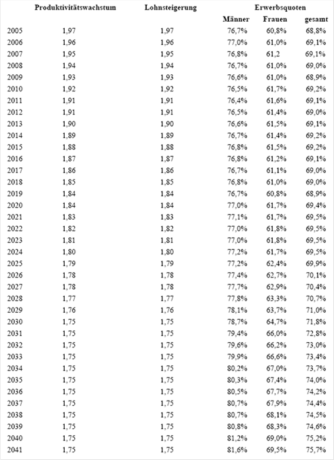
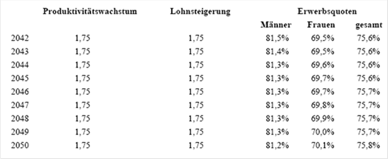
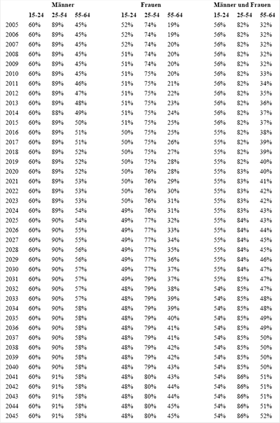

# BG.ASVG — Allgemeines Sozialversicherungsgesetz (ASVG)
**Typ:** Bundesgesetz  
**Kurztitel:** ASVG  
**Langtitel:** Bundesgesetz vom 9. September 1955 über die Allgemeine Sozialversicherung (Allgemeines Sozialversicherungsgesetz – ASVG.).  
**Gesamte Rechtsvorschrift in der Fassung vom:** 07.07.2025  
**Quelle:** https://www.ris.bka.gv.at/GeltendeFassung.wxe?Abfrage=Bundesnormen&Gesetzesnummer=10008147  
**Letzte Änderung im RIS:** BGBl. I Nr. 25/2025 (NR: GP XXVIII RV 69 und Zu 69 AB 100 S. 30. BR: 11643 AB 11645 S. 979.)  
**LawAT Permalink:** https://github.com/clairexen/LawAT/blob/main/files/BG.ASVG.md  
*Mit RisEx für RisEn, RisEn-GPT, und LawAT von HTML zu MarkDown konvertiert. (Irrtümer und Fehler vorbehalten.)*

## Inhaltsverzeichnis

**ERSTER TEIL.**  
**Allgemeine Bestimmungen.**  
**ABSCHNITT I.**  
**Geltungsbereich.**  
* [§ 1 ASVG — Geltungsbereich im allgemeinen](#-1-asvg--geltungsbereich-im-allgemeinen)  
* [§ 2 ASVG — Umfang der Allgemeinen Sozialversicherung](#-2-asvg--umfang-der-allgemeinen-sozialversicherung)  
* [§ 2a ASVG — Umfang des Leistungsrechtes der Pensionsversicherung](#-2a-asvg--umfang-des-leistungsrechtes-der-pensionsversicherung)  
* [§ 3 ASVG — Beschäftigung im Inland; Beschäftigungsort](#-3-asvg--beschäftigung-im-inland-beschäftigungsort)  
* [§ 3a ASVG — Sprachliche Gleichbehandlung](#-3a-asvg--sprachliche-gleichbehandlung)  
* [§ 3b ASVG — Umsetzung von Unionsrecht](#-3b-asvg--umsetzung-von-unionsrecht)

**ABSCHNITT II.**  
**Umfang der Versicherung.**  
**1. UNTERABSCHNITT.**  
**Pflichtversicherung.**  
* [§ 4 ASVG — Vollversicherung](#-4-asvg--vollversicherung)  
* [§ 5 ASVG — Ausnahmen von der Vollversicherung](#-5-asvg--ausnahmen-von-der-vollversicherung)  
* [§ 5a ASVG — Betriebsvereinbarung zur Errichtung einer betrieblichen Gesundheitseinrichtung](#-5a-asvg--betriebsvereinbarung-zur-errichtung-einer-betrieblichen-gesundheitseinrichtung)  
* [§ 5b ASVG — Errichtung und Feststellung der Gleichartigkeit einer betrieblichen Gesundheitseinrichtung](#-5b-asvg--errichtung-und-feststellung-der-gleichartigkeit-einer-betrieblichen-gesundheitseinrichtung)  
* [§ 6 ASVG](#-6-asvg)  
* [§ 7 ASVG — Teilversicherung von im § 4 genannten Personen](#-7-asvg--teilversicherung-von-im--4-genannten-personen)  
* [§ 8 ASVG — Sonstige Teilversicherung](#-8-asvg--sonstige-teilversicherung)  
* [§ 9 ASVG — Einbeziehung in die Krankenversicherung im Verordnungsweg](#-9-asvg--einbeziehung-in-die-krankenversicherung-im-verordnungsweg)  
* [§ 10 ASVG — Beginn der Pflichtversicherung](#-10-asvg--beginn-der-pflichtversicherung)  
* [§ 11 ASVG — Ende der Pflichtversicherung](#-11-asvg--ende-der-pflichtversicherung)  
* [§ 12 ASVG](#-12-asvg)

**2. UNTERABSCHNITT.**  
**Versicherungszugehörigkeit der Pflichtversicherten zu den einzelnen Arten der Pensionsversicherung.**  
* [§ 13 ASVG — a) Pensionsversicherung der Arbeiter](#-13-asvg--a-pensionsversicherung-der-arbeiter)  
* [§ 14 ASVG — b) Pensionsversicherung der Angestellten](#-14-asvg--b-pensionsversicherung-der-angestellten)  
* [§ 15 ASVG — c) Knappschaftliche Pensionsversicherung](#-15-asvg--c-knappschaftliche-pensionsversicherung)

**3. UNTERABSCHNITT.**  
**Freiwillige Versicherung.**  
* [§ 16 ASVG — Selbstversicherung in der Krankenversicherung](#-16-asvg--selbstversicherung-in-der-krankenversicherung)  
* [§ 16a ASVG — Selbstversicherung in der Pensionsversicherung](#-16a-asvg--selbstversicherung-in-der-pensionsversicherung)  
* [§ 17 ASVG — Weiterversicherung in der Pensionsversicherung](#-17-asvg--weiterversicherung-in-der-pensionsversicherung)  
* [§ 18 ASVG — Nachträgliche Selbstversicherung in der Pensionsversicherung für Zeiten des Besuches einer Bildungseinrichtung](#-18-asvg--nachträgliche-selbstversicherung-in-der-pensionsversicherung-für-zeiten-des-besuches-einer-bildungseinrichtung)  
* [§ 18a ASVG — Selbstversicherung in der Pensionsversicherung für Zeiten der Pflege eines behinderten Kindes](#-18a-asvg--selbstversicherung-in-der-pensionsversicherung-für-zeiten-der-pflege-eines-behinderten-kindes)  
* [§ 18b ASVG — Selbstversicherung in der Pensionsversicherung für Zeiten der Pflege naher Angehöriger](#-18b-asvg--selbstversicherung-in-der-pensionsversicherung-für-zeiten-der-pflege-naher-angehöriger)  
* [§ 19 ASVG — Selbstversicherung in der Unfallversicherung](#-19-asvg--selbstversicherung-in-der-unfallversicherung)  
* [§ 19a ASVG — Selbstversicherung bei geringfügiger Beschäftigung](#-19a-asvg--selbstversicherung-bei-geringfügiger-beschäftigung)  
* [§ 20 ASVG — Höherversicherung in der Unfallversicherung und in der Pensionsversicherung](#-20-asvg--höherversicherung-in-der-unfallversicherung-und-in-der-pensionsversicherung)

**4. UNTERABSCHNITT.**  
**Formalversicherung**  
* [§ 21 ASVG — a) in der Pflichtversicherung](#-21-asvg--a-in-der-pflichtversicherung)  
* [§ 22 ASVG — b) in der freiwilligen Versicherung](#-22-asvg--b-in-der-freiwilligen-versicherung)

**5. UNTERABSCHNITT**  
* [§ 22a ASVG — Zusatzversicherung in der Unfallversicherung](#-22a-asvg--zusatzversicherung-in-der-unfallversicherung)

**ABSCHNITT III.**  
**Versicherungsträger und ihre Zuständigkeit; Dachverband der Sozialversicherungsträger**  
**1. UNTERABSCHNITT**  
**Träger der Versicherung und ihre Aufgaben**  
* [§ 23 ASVG — Träger der Krankenversicherung](#-23-asvg--träger-der-krankenversicherung)  
* [§ 24 ASVG — Träger der Unfallversicherung](#-24-asvg--träger-der-unfallversicherung)  
* [§ 25 ASVG — Träger der Pensionsversicherung](#-25-asvg--träger-der-pensionsversicherung)

**2. UNTERABSCHNITT**  
**Zuständigkeit der Versicherungsträger**  
* [§ 26 ASVG — Sachliche Zuständigkeit der Träger der Krankenversicherung](#-26-asvg--sachliche-zuständigkeit-der-träger-der-krankenversicherung)  
* [§ 27 ASVG — Land- und forstwirtschaftliche Betriebe](#-27-asvg--land--und-forstwirtschaftliche-betriebe)  
* [§ 28 ASVG — Sachliche Zuständigkeit der Träger der Unfallversicherung](#-28-asvg--sachliche-zuständigkeit-der-träger-der-unfallversicherung)  
* [§ 29 ASVG — Sachliche Zuständigkeit der Träger der Pensionsversicherung](#-29-asvg--sachliche-zuständigkeit-der-träger-der-pensionsversicherung)

**3. UNTERABSCHNITT**  
**Dachverband der Sozialversicherungsträger**  
* [§ 30 ASVG — Aufgaben](#-30-asvg--aufgaben)  
* [§ 30a ASVG — Beschlussfassung von Richtlinien](#-30a-asvg--beschlussfassung-von-richtlinien)  
* [§ 30b ASVG — Koordination der Vollziehungstätigkeit](#-30b-asvg--koordination-der-vollziehungstätigkeit)  
* [§ 30c ASVG — Wahrnehmung trägerübergreifender Verwaltungsaufgaben](#-30c-asvg--wahrnehmung-trägerübergreifender-verwaltungsaufgaben)  
* [§ 30d ASVG — Datenschutz](#-30d-asvg--datenschutz)  
* [§ 31 ASVG](#-31-asvg)

**4. Unterabschnitt**  
**Elektronisches Verwaltungssystem und Elektronische Gesundheitsakte**  
* [§ 31a ASVG — Grundlagen des Elektronischen Verwaltungssystems (ELSY)](#-31a-asvg--grundlagen-des-elektronischen-verwaltungssystems-elsy)  
* [§ 31b ASVG — Durchführung des ELSY](#-31b-asvg--durchführung-des-elsy)  
* [§ 31c ASVG — Service-Entgelt](#-31c-asvg--service-entgelt)  
* [§ 31d ASVG — Elektronische Gesundheitsakte (ELGA)](#-31d-asvg--elektronische-gesundheitsakte-elga)

**5. Unterabschnitt**  
* [§ 32 ASVG — Rechtliche Stellung der Versicherungsträger und des Dachverbandes](#-32-asvg--rechtliche-stellung-der-versicherungsträger-und-des-dachverbandes)

**6. Unterabschnitt**  
**Kontrolle und Controlling in der Sozialversicherung**  
* [§ 32a ASVG — Kontrolle im Vertragspartnerbereich](#-32a-asvg--kontrolle-im-vertragspartnerbereich)  
* [§ 32b ASVG — Mitwirkung der Nicht-Vertragspartner/innen](#-32b-asvg--mitwirkung-der-nicht-vertragspartnerinnen)  
* [§ 32h ASVG — Vertragspartner-Analyse](#-32h-asvg--vertragspartner-analyse)

**ABSCHNITT IV.**  
**Meldungen und Auskunftspflicht.**  
* [§ 33 ASVG — An- und Abmeldung der Pflichtversicherten](#-33-asvg--an--und-abmeldung-der-pflichtversicherten)  
* [§ 34 ASVG — Meldung von Änderungen und der monatlichen Beitragsgrundlagen](#-34-asvg--meldung-von-änderungen-und-der-monatlichen-beitragsgrundlagen)  
* [§ 35 ASVG — Dienstgeber](#-35-asvg--dienstgeber)  
* [§ 35a ASVG — Scheinunternehmen](#-35a-asvg--scheinunternehmen)  
* [§ 36 ASVG — Sonstige meldepflichtige Personen (Stellen)](#-36-asvg--sonstige-meldepflichtige-personen-stellen)  
* [§ 37 ASVG — Meldung nur unfallversicherter Personen](#-37-asvg--meldung-nur-unfallversicherter-personen)  
* [§ 37a ASVG — Meldung nur pensionsversicherter Personen](#-37a-asvg--meldung-nur-pensionsversicherter-personen)  
* [§ 37b ASVG — Meldung der in der Zusatzversicherung Versicherten](#-37b-asvg--meldung-der-in-der-zusatzversicherung-versicherten)  
* [§ 37c ASVG — Meldung über die Dauer des Präsenz- oder Ausbildungsdienstes](#-37c-asvg--meldung-über-die-dauer-des-präsenz--oder-ausbildungsdienstes)  
* [§ 37d ASVG — Meldung über die Dauer des ordentlichen Zivildienstes](#-37d-asvg--meldung-über-die-dauer-des-ordentlichen-zivildienstes)  
* [§ 38 ASVG — Meldung in der Krankenversicherung der Rentner](#-38-asvg--meldung-in-der-krankenversicherung-der-rentner)  
* [§ 38a ASVG — Meldung zur Pflichtversicherung der LeistungsbezieherInnen](#-38a-asvg--meldung-zur-pflichtversicherung-der-leistungsbezieherinnen)  
* [§ 39 ASVG — Meldung der freiwillig Versicherten](#-39-asvg--meldung-der-freiwillig-versicherten)  
* [§ 40 ASVG — Meldung der Zahlungsempfänger (Leistungswerber)](#-40-asvg--meldung-der-zahlungsempfänger-leistungswerber)  
* [§ 41 ASVG — Form der Meldungen](#-41-asvg--form-der-meldungen)  
* [§ 41a ASVG — Sozialversicherungsprüfung](#-41a-asvg--sozialversicherungsprüfung)  
* [§ 42 ASVG — Auskünfte zwischen Versicherungsträgern und Dienstgebern](#-42-asvg--auskünfte-zwischen-versicherungsträgern-und-dienstgebern)  
* [§ 42a ASVG — Besondere Auskunftspflicht der Inhaber (Bevollmächtigten) von knappschaftlichen und diesen gleichgestellten Betrieben](#-42a-asvg--besondere-auskunftspflicht-der-inhaber-bevollmächtigten-von-knappschaftlichen-und-diesen-gleichgestellten-betrieben)  
* [§ 42b ASVG — Risiko- und Auffälligkeitsanalyse](#-42b-asvg--risiko--und-auffälligkeitsanalyse)  
* [§ 43 ASVG — Auskunftspflicht der Versicherten und der Zahlungs(Leistungs)empfänger](#-43-asvg--auskunftspflicht-der-versicherten-und-der-zahlungsleistungsempfänger)  
* [§ 43a ASVG — Auskunftspflicht der Versicherungsträger](#-43a-asvg--auskunftspflicht-der-versicherungsträger)

**ABSCHNITT V.**  
**Mittel der Sozialversicherung.**  
**1. UNTERABSCHNITT.**  
**Beiträge zur Pflichtversicherung auf Grund des Arbeitsverdienstes (Erwerbseinkommens).**  
* [§ 44 ASVG — Allgemeine Beitragsgrundlage, Entgelt](#-44-asvg--allgemeine-beitragsgrundlage-entgelt)  
* [§ 45 ASVG — Höchstbeitragsgrundlage](#-45-asvg--höchstbeitragsgrundlage)  
* [§ 47 ASVG — Allgemeine Beitragsgrundlage in besonderen Fällen](#-47-asvg--allgemeine-beitragsgrundlage-in-besonderen-fällen)  
* [§ 48 ASVG — Mindestbeitragsgrundlage in der Pensionsversicherung für Personen nach § 4 Abs. 1 Z 9](#-48-asvg--mindestbeitragsgrundlage-in-der-pensionsversicherung-für-personen-nach--4-abs-1-z-9)  
* [§ 49 ASVG — Entgelt](#-49-asvg--entgelt)  
* [§ 50 ASVG — Bewertung von Sachbezügen](#-50-asvg--bewertung-von-sachbezügen)  
* [§ 50a ASVG — Start-Up-Mitarbeiterbeteiligung; Beitragsgrundlage](#-50a-asvg--start-up-mitarbeiterbeteiligung-beitragsgrundlage)  
* [§ 51 ASVG — Allgemeine Beiträge für Vollversicherte](#-51-asvg--allgemeine-beiträge-für-vollversicherte)  
* [§ 51a ASVG — Zusatzbeitrag in der knappschaftlichen Pensionsversicherung](#-51a-asvg--zusatzbeitrag-in-der-knappschaftlichen-pensionsversicherung)  
* [§ 51d ASVG — Zusatzbeitrag für Angehörige](#-51d-asvg--zusatzbeitrag-für-angehörige)  
* [§ 52 ASVG — Allgemeine Beiträge für Teilversicherte](#-52-asvg--allgemeine-beiträge-für-teilversicherte)  
* [§ 53 ASVG — Sondervorschriften über die Aufteilung des allgemeinen Beitrages](#-53-asvg--sondervorschriften-über-die-aufteilung-des-allgemeinen-beitrages)  
* [§ 53a ASVG — Beiträge für Versicherte, die in geringfügigen Beschäftigungsverhältnissen stehen](#-53a-asvg--beiträge-für-versicherte-die-in-geringfügigen-beschäftigungsverhältnissen-stehen)  
* [§ 53b ASVG — Zuschüsse an die Dienstgeber/innen](#-53b-asvg--zuschüsse-an-die-dienstgeberinnen)  
* [§ 54 ASVG — Sonderbeiträge](#-54-asvg--sonderbeiträge)  
* [§ 54a ASVG — Entrichtung von Beitragsteilen durch Dritte](#-54a-asvg--entrichtung-von-beitragsteilen-durch-dritte)  
* [§ 54b ASVG — Beitragsübernahme des Bundes für erwerbstätige Pensionsbezieher/innen](#-54b-asvg--beitragsübernahme-des-bundes-für-erwerbstätige-pensionsbezieherinnen)  
* [§ 55 ASVG — Dauer der Beitragspflicht](#-55-asvg--dauer-der-beitragspflicht)  
* [§ 56a ASVG — Beiträge während der Leistung des Präsenz- oder Ausbildungsdienstes](#-56a-asvg--beiträge-während-der-leistung-des-präsenz--oder-ausbildungsdienstes)  
* [§ 57 ASVG — Beitragspflicht während einer Arbeitsunfähigkeit](#-57-asvg--beitragspflicht-während-einer-arbeitsunfähigkeit)  
* [§ 58 ASVG — Fälligkeit und Einzahlung der Beiträge; Beitragsvorauszahlung](#-58-asvg--fälligkeit-und-einzahlung-der-beiträge-beitragsvorauszahlung)  
* [§ 59 ASVG — Verzugszinsen](#-59-asvg--verzugszinsen)  
* [§ 60 ASVG — Abzug des Versichertenbeitrages vom Entgelt (auch von Sonderzahlungen)](#-60-asvg--abzug-des-versichertenbeitrages-vom-entgelt-auch-von-sonderzahlungen)  
* [§ 61 ASVG — Getrennte Einzahlung der Beitragsteile](#-61-asvg--getrennte-einzahlung-der-beitragsteile)  
* [§ 62 ASVG — Mitteilung über Beitragsrückstände, Beitragsabrechnung](#-62-asvg--mitteilung-über-beitragsrückstände-beitragsabrechnung)  
* [§ 63 ASVG — Abfuhr der Beiträge an die Träger der Unfall- und Pensionsversicherung](#-63-asvg--abfuhr-der-beiträge-an-die-träger-der-unfall--und-pensionsversicherung)  
* [§ 64 ASVG — Verfahren zur Eintreibung der Beiträge](#-64-asvg--verfahren-zur-eintreibung-der-beiträge)  
* [§ 65 ASVG — Behandlung der Beiträge im Insolvenzverfahren sowie bei der Zwangsverwaltung und Zwangsverpachtung im Exekutions- und Sicherungsverfahren](#-65-asvg--behandlung-der-beiträge-im-insolvenzverfahren-sowie-bei-der-zwangsverwaltung-und-zwangsverpachtung-im-exekutions--und-sicherungsverfahren)  
* [§ 66 ASVG — Sicherung der Beiträge](#-66-asvg--sicherung-der-beiträge)  
* [§ 67 ASVG — Haftung für Beitragsschuldigkeiten](#-67-asvg--haftung-für-beitragsschuldigkeiten)  
* [§ 67a ASVG — Haftung bei Beauftragung zur Erbringung von Bauleistungen](#-67a-asvg--haftung-bei-beauftragung-zur-erbringung-von-bauleistungen)  
* [§ 67b ASVG — Liste der haftungsfreistellenden Unternehmen (HFU-Liste)](#-67b-asvg--liste-der-haftungsfreistellenden-unternehmen-hfu-liste)  
* [§ 67c ASVG — Dienstleistungszentrum](#-67c-asvg--dienstleistungszentrum)  
* [§ 67e ASVG — Sondervorschriften für natürliche Personen ohne DienstnehmerInnen](#-67e-asvg--sondervorschriften-für-natürliche-personen-ohne-dienstnehmerinnen)  
* [§ 68 ASVG — Verjährung der Beiträge](#-68-asvg--verjährung-der-beiträge)  
* [§ 68a ASVG — Nachentrichtung verjährter Beiträge zur Pensionsversicherung](#-68a-asvg--nachentrichtung-verjährter-beiträge-zur-pensionsversicherung)  
* [§ 69 ASVG — Rückforderung ungebührlich entrichteter Beiträge](#-69-asvg--rückforderung-ungebührlich-entrichteter-beiträge)  
* [§ 70 ASVG — Erstattung von Beiträgen in der Pensionsversicherung](#-70-asvg--erstattung-von-beiträgen-in-der-pensionsversicherung)  
* [§ 70a ASVG — Erstattung von Beiträgen in der Krankenversicherung](#-70a-asvg--erstattung-von-beiträgen-in-der-krankenversicherung)  
* [§ 70b ASVG — Erstattung von Beiträgen, die nach § 227 Abs. 3 und 4 entrichtet wurden](#-70b-asvg--erstattung-von-beiträgen-die-nach--227-abs-3-und-4-entrichtet-wurden)

**2. UNTERABSCHNITT**  
**Sonstige Beiträge zur Pflichtversicherung**  
* [§ 73 ASVG — Beiträge in der Krankenversicherung für Pensionisten (Übergangsgeldbezieher)](#-73-asvg--beiträge-in-der-krankenversicherung-für-pensionisten-übergangsgeldbezieher)  
* [§ 73a ASVG — Beiträge in der Krankenversicherung von mit inländischen Pensionsleistungen vergleichbaren ausländischen Renten](#-73a-asvg--beiträge-in-der-krankenversicherung-von-mit-inländischen-pensionsleistungen-vergleichbaren-ausländischen-renten)  
* [§ 74 ASVG — Beiträge für Teilversicherte in der Unfallversicherung](#-74-asvg--beiträge-für-teilversicherte-in-der-unfallversicherung)  
* [§ 74a ASVG — Beitrag für Zusatzversicherte in der Unfallversicherung](#-74a-asvg--beitrag-für-zusatzversicherte-in-der-unfallversicherung)  
* [§ 75 ASVG — Aufbringung der Mittel im Falle der Einbeziehung in die Teilversicherung durch Verordnung](#-75-asvg--aufbringung-der-mittel-im-falle-der-einbeziehung-in-die-teilversicherung-durch-verordnung)  
* [§ 75a ASVG — Aufwandersatz des Bundes für die in die Krankenversicherung einbezogenen Bezieher/innen von Leistungen der Sozialhilfe oder der Bedarfsorientierten Mindestsicherung](#-75a-asvg--aufwandersatz-des-bundes-für-die-in-die-krankenversicherung-einbezogenen-bezieherinnen-von-leistungen-der-sozialhilfe-oder-der-bedarfsorientierten-mindestsicherung)

**3. UNTERABSCHNITT.**  
**Beiträge zur freiwilligen Versicherung.**  
* [§ 76 ASVG — Beitragsgrundlage für Selbstversicherte in der Krankenversicherung](#-76-asvg--beitragsgrundlage-für-selbstversicherte-in-der-krankenversicherung)  
* [§ 76a ASVG — Beitragsgrundlage für Weiterversicherte in der Pensionsversicherung](#-76a-asvg--beitragsgrundlage-für-weiterversicherte-in-der-pensionsversicherung)  
* [§ 76b ASVG — Beitragsgrundlage für Selbstversicherte](#-76b-asvg--beitragsgrundlage-für-selbstversicherte)  
* [§ 77 ASVG — Ausmaß und Entrichtung](#-77-asvg--ausmaß-und-entrichtung)  
* [§ 78 ASVG — Fälligkeit, Einzahlung und Haftung](#-78-asvg--fälligkeit-einzahlung-und-haftung)  
* [§ 79 ASVG — Sonstige Bestimmungen](#-79-asvg--sonstige-bestimmungen)

**4. UNTERABSCHNITT**  
* [§ 79a ASVG — Maßnahmen zur nachhaltigen Finanzierbarkeit der Pensionsversicherung](#-79a-asvg--maßnahmen-zur-nachhaltigen-finanzierbarkeit-der-pensionsversicherung)  
* [§ 80 ASVG — Beitrag des Bundes ab 1. Jänner 1998](#-80-asvg--beitrag-des-bundes-ab-1-jänner-1998)  
* [§ 80a ASVG](#-80a-asvg)  
* [§ 80b ASVG — Verwaltungs- und Verrechnungsaufwand der Pensionsversicherungsträger](#-80b-asvg--verwaltungs--und-verrechnungsaufwand-der-pensionsversicherungsträger)  
* [§ 80c ASVG — Beitrag des Bundes zur Finanzierung von Kieferregulierungen](#-80c-asvg--beitrag-des-bundes-zur-finanzierung-von-kieferregulierungen)

**5. UNTERABSCHNITT.**  
**Gemeinsame Bestimmungen.**  
* [§ 81 ASVG — Verwendung der Mittel](#-81-asvg--verwendung-der-mittel)  
* [§ 81a ASVG — Informations- und Aufklärungspflicht](#-81a-asvg--informations--und-aufklärungspflicht)  
* [§ 82 ASVG — Vergütung für die Mitwirkung an fremden Aufgaben](#-82-asvg--vergütung-für-die-mitwirkung-an-fremden-aufgaben)  
* [§ 83 ASVG — Verzugszinsen und Verwaltungskostenersätze](#-83-asvg--verzugszinsen-und-verwaltungskostenersätze)

**6. UNTERABSCHNITT.**  
* [§ 84 ASVG — Unterstützungsfonds](#-84-asvg--unterstützungsfonds)

**7. UNTERABSCHNITT**  
**Mitwirkung und Beteiligung der Sozialversicherung an der Planung und Steuerung des Gesundheitswesens sowie an der Zielsteuerung-Gesundheit**  
* [§ 84a ASVG — Grundsätze](#-84a-asvg--grundsätze)  
* [§ 84b ASVG — Nahtstellenmanagement](#-84b-asvg--nahtstellenmanagement)  
* [§ 84c ASVG — Beteiligung an der Zielsteuerung-Gesundheit](#-84c-asvg--beteiligung-an-der-zielsteuerung-gesundheit)

**8. UNTERABSCHNITT**  
**Mitwirkung und Beteiligung der Sozialversicherung an der Vereinbarung gemäß Art. 15a B-VG über die Finanzierung der flächendeckenden und bedarfsgerechten Bereitstellung von Frühen Hilfen („Frühe-Hilfen-Vereinbarung“)**  
* [§ 84d ASVG — Entsendung von Vertreterinnen und Vertretern in Gremien](#-84d-asvg--entsendung-von-vertreterinnen-und-vertretern-in-gremien)  
* [§ 84e ASVG — Finanzielle Beteiligung der Kranken- und Pensionsversicherungsträger](#-84e-asvg--finanzielle-beteiligung-der-kranken--und-pensionsversicherungsträger)

**ABSCHNITT VI.**  
**Leistungsansprüche.**  
* [§ 85 ASVG — Entstehen der Leistungsansprüche](#-85-asvg--entstehen-der-leistungsansprüche)  
* [§ 86 ASVG — Anfall der Leistungen](#-86-asvg--anfall-der-leistungen)  
* [§ 87 ASVG — Verschollenheit](#-87-asvg--verschollenheit)  
* [§ 88 ASVG — Verwirkung des Leistungsanspruches](#-88-asvg--verwirkung-des-leistungsanspruches)  
* [§ 89 ASVG — Ruhen der Leistungsansprüche bei Haft und Auslandsaufenthalt](#-89-asvg--ruhen-der-leistungsansprüche-bei-haft-und-auslandsaufenthalt)  
* [§ 89a ASVG — Ruhen der Leistungsansprüche bei Leistung des Präsenz- oder Ausbildungsdienstes](#-89a-asvg--ruhen-der-leistungsansprüche-bei-leistung-des-präsenz--oder-ausbildungsdienstes)  
* [§ 90 ASVG — Zusammentreffen eines Pensionsanspruches aus eigener Pensionsversicherung mit einem Anspruch auf Krankengeld](#-90-asvg--zusammentreffen-eines-pensionsanspruches-aus-eigener-pensionsversicherung-mit-einem-anspruch-auf-krankengeld)  
* [§ 90a ASVG — Zusammentreffen eines Anspruchs auf Versehrtenrente mit einem Anspruch auf Krankengeld oder Unterstützungsleistung bei lang andauernder Krankheit nach § 104a GSVG](#-90a-asvg--zusammentreffen-eines-anspruchs-auf-versehrtenrente-mit-einem-anspruch-auf-krankengeld-oder-unterstützungsleistung-bei-lang-andauernder-krankheit-nach--104a-gsvg)  
* [§ 91 ASVG — Berücksichtigung von Erwerbseinkommen bei Leistungen](#-91-asvg--berücksichtigung-von-erwerbseinkommen-bei-leistungen)  
* [§ 92 ASVG — Jahresausgleich bei Anspruch auf Teilpension](#-92-asvg--jahresausgleich-bei-anspruch-auf-teilpension)  
* [§ 95 ASVG — Gemeinsame Bestimmungen für das Ruhen von Renten- und Pensionsansprüchen](#-95-asvg--gemeinsame-bestimmungen-für-das-ruhen-von-renten--und-pensionsansprüchen)  
* [§ 96 ASVG — Beginn und Ende des Ruhens von Renten- und Pensionsansprüchen](#-96-asvg--beginn-und-ende-des-ruhens-von-renten--und-pensionsansprüchen)  
* [§ 97 ASVG — Wirksamkeitsbeginn von Änderungen in den Rentenansprüchen aus der Unfall- und Pensionsversicherung](#-97-asvg--wirksamkeitsbeginn-von-änderungen-in-den-rentenansprüchen-aus-der-unfall--und-pensionsversicherung)  
* [§ 98 ASVG — Übertragung und Verpfändung von Leistungsansprüchen](#-98-asvg--übertragung-und-verpfändung-von-leistungsansprüchen)  
* [§ 98a ASVG — Pfändung von Leistungsansprüchen](#-98a-asvg--pfändung-von-leistungsansprüchen)  
* [§ 99 ASVG — Entziehung von Leistungsansprüchen](#-99-asvg--entziehung-von-leistungsansprüchen)  
* [§ 100 ASVG — Erlöschen von Leistungsansprüchen](#-100-asvg--erlöschen-von-leistungsansprüchen)  
* [§ 101 ASVG — Rückwirkende Herstellung des gesetzlichen Zustandes bei Geldleistungen](#-101-asvg--rückwirkende-herstellung-des-gesetzlichen-zustandes-bei-geldleistungen)  
* [§ 102 ASVG — Verfall von Leistungsansprüchen infolge Zeitablaufes](#-102-asvg--verfall-von-leistungsansprüchen-infolge-zeitablaufes)  
* [§ 103 ASVG — Aufrechnung](#-103-asvg--aufrechnung)  
* [§ 104 ASVG — Auszahlung der Leistungen](#-104-asvg--auszahlung-der-leistungen)  
* [§ 105 ASVG — Pensions(Renten)sonderzahlungen](#-105-asvg--pensionsrentensonderzahlungen)  
* [§ 106 ASVG — Zahlungsempfänger](#-106-asvg--zahlungsempfänger)  
* [§ 107 ASVG — Rückforderung zu Unrecht erbrachter Leistungen](#-107-asvg--rückforderung-zu-unrecht-erbrachter-leistungen)  
* [§ 107a ASVG — Bezugsberechtigung im Falle des Todes des Anspruchsberechtigten](#-107a-asvg--bezugsberechtigung-im-falle-des-todes-des-anspruchsberechtigten)

**Abschnitt VIa**  
**Aufwertung und Anpassung in der Sozialversicherung**  
**1. Unterabschnitt: Grundlagen**  
* [§ 108 ASVG](#-108-asvg)

**2. Unterabschnitt: Durchführung**  
* [§ 108a ASVG — Aufwertungszahl](#-108a-asvg--aufwertungszahl)  
* [§ 108c ASVG — Aufwertungsfaktoren](#-108c-asvg--aufwertungsfaktoren)  
* [§ 108f ASVG — Festsetzung des Anpassungsfaktors](#-108f-asvg--festsetzung-des-anpassungsfaktors)  
* [§ 108g ASVG — Anpassung der Renten aus der Unfallversicherung](#-108g-asvg--anpassung-der-renten-aus-der-unfallversicherung)  
* [§ 108h ASVG — Anpassung der Pensionen aus der Pensionsversicherung](#-108h-asvg--anpassung-der-pensionen-aus-der-pensionsversicherung)  
* [§ 108i ASVG — Anpassung von Kranken-, Rehabilitations- und Wiedereingliederungsgeld](#-108i-asvg--anpassung-von-kranken--rehabilitations--und-wiedereingliederungsgeld)  
* [§ 108k ASVG — Anpassung der Leistungen von Amts wegen](#-108k-asvg--anpassung-der-leistungen-von-amts-wegen)  
* [§ 108l ASVG](#-108l-asvg)

**ABSCHNITT VII.**  
**Befreiung von Abgaben.**  
* [§ 109 ASVG — Persönliche Abgabenfreiheit](#-109-asvg--persönliche-abgabenfreiheit)  
* [§ 110 ASVG — Sachliche Abgabenfreiheit](#-110-asvg--sachliche-abgabenfreiheit)

**ABSCHNITT VIII.**  
**Strafbestimmungen.**  
* [§ 111 ASVG — Verstöße gegen melderechtliche Vorschriften](#-111-asvg--verstöße-gegen-melderechtliche-vorschriften)  
* [§ 111a ASVG — Parteistellung im Verwaltungsstrafverfahren](#-111a-asvg--parteistellung-im-verwaltungsstrafverfahren)  
* [§ 112 ASVG](#-112-asvg)  
* [§ 112a ASVG — Verstöße gegen besondere Auskunfts- und Einsichtsgewährungspflichten](#-112a-asvg--verstöße-gegen-besondere-auskunfts--und-einsichtsgewährungspflichten)  
* [§ 113 ASVG — Beitragszuschläge](#-113-asvg--beitragszuschläge)  
* [§ 114 ASVG — Säumniszuschläge](#-114-asvg--säumniszuschläge)  
* [§ 115 ASVG — Vorschreibung der Beitrags- und Säumniszuschläge](#-115-asvg--vorschreibung-der-beitrags--und-säumniszuschläge)

**ZWEITER TEIL.**  
**Leistungen der Krankenversicherung.**  
**ABSCHNITT I.**  
**Gemeinsame Bestimmungen.**  
* [§ 116 ASVG — Aufgaben](#-116-asvg--aufgaben)  
* [§ 117 ASVG — Leistungen](#-117-asvg--leistungen)  
* [§ 119 ASVG](#-119-asvg)  
* [§ 120 ASVG — Eintritt des Versicherungsfalles](#-120-asvg--eintritt-des-versicherungsfalles)  
* [§ 120a ASVG — Organspende](#-120a-asvg--organspende)  
* [§ 121 ASVG — Art der Leistungen](#-121-asvg--art-der-leistungen)  
* [§ 122 ASVG — Anspruchsberechtigung während der Dauer der Versicherung und nach dem Ausscheiden aus der Versicherung](#-122-asvg--anspruchsberechtigung-während-der-dauer-der-versicherung-und-nach-dem-ausscheiden-aus-der-versicherung)  
* [§ 123 ASVG — Anspruchsberechtigung für Angehörige](#-123-asvg--anspruchsberechtigung-für-angehörige)  
* [§ 124 ASVG — Sonderregelungen für Selbstversicherte und Rentner](#-124-asvg--sonderregelungen-für-selbstversicherte-und-rentner)  
* [§ 125 ASVG — Bemessungsgrundlage](#-125-asvg--bemessungsgrundlage)  
* [§ 126 ASVG — Leistungen bei Wechsel der Versicherungszuständigkeit](#-126-asvg--leistungen-bei-wechsel-der-versicherungszuständigkeit)  
* [§ 127 ASVG — Leistungen bei Satzungsänderungen](#-127-asvg--leistungen-bei-satzungsänderungen)  
* [§ 128 ASVG — Leistungen bei mehrfacher Versicherung](#-128-asvg--leistungen-bei-mehrfacher-versicherung)  
* [§ 130 ASVG — Erkrankung im Ausland](#-130-asvg--erkrankung-im-ausland)  
* [§ 131 ASVG — Erstattung von Kosten der Krankenbehandlung](#-131-asvg--erstattung-von-kosten-der-krankenbehandlung)  
* [§ 131a ASVG — Kostenerstattung bei Fehlen vertraglicher Regelungen](#-131a-asvg--kostenerstattung-bei-fehlen-vertraglicher-regelungen)  
* [§ 131b ASVG — Kostenzuschüsse bei Fehlen vertraglicher Regelungen](#-131b-asvg--kostenzuschüsse-bei-fehlen-vertraglicher-regelungen)  
* [§ 132 ASVG — Bare Leistungen an Stelle von Sachleistungen](#-132-asvg--bare-leistungen-an-stelle-von-sachleistungen)

**ABSCHNITT II.**  
**Leistungen im Besonderen.**  
**1. UNTERABSCHNITT**  
**Evidenzbasierte Früherkennung von und Frühintervention bei Krankheiten und sonstige Maßnahmen zur Erhaltung der Volksgesundheit**  
* [§ 132a ASVG — Jugendlichenuntersuchungen](#-132a-asvg--jugendlichenuntersuchungen)  
* [§ 132b ASVG — Vorsorge(Gesunden)untersuchungen](#-132b-asvg--vorsorgegesundenuntersuchungen)  
* [§ 132c ASVG — Sonstige Maßnahmen zur Erhaltung der Volksgesundheit](#-132c-asvg--sonstige-maßnahmen-zur-erhaltung-der-volksgesundheit)

**2. UNTERABSCHNITT.**  
**Krankenbehandlung.**  
* [§ 133 ASVG — Umfang der Krankenbehandlung](#-133-asvg--umfang-der-krankenbehandlung)  
* [§ 134 ASVG — Dauer der Krankenbehandlung](#-134-asvg--dauer-der-krankenbehandlung)  
* [§ 135 ASVG — Ärztliche Hilfe](#-135-asvg--ärztliche-hilfe)  
* [§ 136 ASVG — Heilmittel](#-136-asvg--heilmittel)  
* [§ 137 ASVG — Heilbehelfe](#-137-asvg--heilbehelfe)

**3. UNTERABSCHNITT.**  
**Krankengeld.**  
* [§ 138 ASVG — Anspruchsberechtigung](#-138-asvg--anspruchsberechtigung)  
* [§ 139 ASVG — Dauer des Krankengeldanspruches](#-139-asvg--dauer-des-krankengeldanspruches)  
* [§ 140 ASVG — Anrechnung von Zeiten auf die Höchstdauer des Krankengeldanspruches](#-140-asvg--anrechnung-von-zeiten-auf-die-höchstdauer-des-krankengeldanspruches)  
* [§ 141 ASVG — Höhe des Krankengeldes](#-141-asvg--höhe-des-krankengeldes)  
* [§ 142 ASVG — Versagung des Krankengeldes](#-142-asvg--versagung-des-krankengeldes)  
* [§ 143 ASVG — Ruhen des Krankengeldanspruches](#-143-asvg--ruhen-des-krankengeldanspruches)

**3a. Unterabschnitt**  
* [§ 143a ASVG — Rehabilitationsgeld](#-143a-asvg--rehabilitationsgeld)  
* [§ 143b ASVG — Case Management](#-143b-asvg--case-management)  
* [§ 143c ASVG — Kostenersatz](#-143c-asvg--kostenersatz)

**3b. Unterabschnitt**  
**Wiedereingliederungsgeld**  
* [§ 143d ASVG — Anspruchsberechtigung und Höhe](#-143d-asvg--anspruchsberechtigung-und-höhe)

**4. UNTERABSCHNITT.**  
**Anstaltspflege, medizinische Hauskrankenpflege**  
* [§ 144 ASVG — Gewährung der Pflege in Krankenanstalten, die über Landesgesundheitsfonds finanziert werden, oder der medizinischen Hauskrankenpflege](#-144-asvg--gewährung-der-pflege-in-krankenanstalten-die-über-landesgesundheitsfonds-finanziert-werden-oder-der-medizinischen-hauskrankenpflege)  
* [§ 145 ASVG — Einweisung in Krankenanstalten, die über Landesgesundheitsfonds finanziert werden](#-145-asvg--einweisung-in-krankenanstalten-die-über-landesgesundheitsfonds-finanziert-werden)  
* [§ 148 ASVG — Beziehungen zu den Krankenanstalten, die über Landesgesundheitsfonds finanziert werden](#-148-asvg--beziehungen-zu-den-krankenanstalten-die-über-landesgesundheitsfonds-finanziert-werden)  
* [§ 149 ASVG — Beziehungen zu anderen als in § 148 genannten Krankenanstalten](#-149-asvg--beziehungen-zu-anderen-als-in--148-genannten-krankenanstalten)  
* [§ 150 ASVG — Pflegekostenzuschuß des Versicherungsträgers bei Anstaltspflege](#-150-asvg--pflegekostenzuschuß-des-versicherungsträgers-bei-anstaltspflege)  
* [§ 150a ASVG — Kostenersatz bei Organtransplantationen für die Anmelde- und Registrierungskosten](#-150a-asvg--kostenersatz-bei-organtransplantationen-für-die-anmelde--und-registrierungskosten)  
* [§ 151 ASVG — Medizinische Hauskrankenpflege](#-151-asvg--medizinische-hauskrankenpflege)  
* [§ 152 ASVG — Gleichstellung der betrieblichen Gesundheitseinrichtungen als Vertragspartner/innen](#-152-asvg--gleichstellung-der-betrieblichen-gesundheitseinrichtungen-als-vertragspartnerinnen)

**5. UNTERABSCHNITT.**  
**Zahnbehandlung und Zahnersatz; Hilfe bei körperlichen Gebrechen.**  
* [§ 153 ASVG — Zahnbehandlung und Zahnersatz](#-153-asvg--zahnbehandlung-und-zahnersatz)  
* [§ 153a ASVG — Kieferregulierungen für Kinder und Jugendliche](#-153a-asvg--kieferregulierungen-für-kinder-und-jugendliche)  
* [§ 154 ASVG — Hilfe bei körperlichen Gebrechen](#-154-asvg--hilfe-bei-körperlichen-gebrechen)  
* [§ 154a ASVG — Medizinische Maßnahmen der Rehabilitation in der Krankenversicherung](#-154a-asvg--medizinische-maßnahmen-der-rehabilitation-in-der-krankenversicherung)  
* [§ 154b ASVG — Gesundheitsförderung und Prävention](#-154b-asvg--gesundheitsförderung-und-prävention)

**6. UNTERABSCHNITT.**  
**Maßnahmen zur Festigung der Gesundheit; Krankheitsverhütung**  
* [§ 155 ASVG — Maßnahmen der Krankenversicherungsträger zur Festigung der Gesundheit](#-155-asvg--maßnahmen-der-krankenversicherungsträger-zur-festigung-der-gesundheit)  
* [§ 156 ASVG — Krankheitsverhütung](#-156-asvg--krankheitsverhütung)

**7. UNTERABSCHNITT.**  
**Leistungen aus dem Versicherungsfall der Mutterschaft.**  
* [§ 157 ASVG — Umfang des Versicherungsschutzes](#-157-asvg--umfang-des-versicherungsschutzes)  
* [§ 158 ASVG — Anspruchsberechtigung](#-158-asvg--anspruchsberechtigung)  
* [§ 159 ASVG — Ärztlicher Beistand, Hebammenbeistand und Beistand durch Angehörige des gehobenen Dienstes für Gesundheits- und Krankenpflege](#-159-asvg--ärztlicher-beistand-hebammenbeistand-und-beistand-durch-angehörige-des-gehobenen-dienstes-für-gesundheits--und-krankenpflege)  
* [§ 160 ASVG — Heilmittel und Heilbehelfe](#-160-asvg--heilmittel-und-heilbehelfe)  
* [§ 161 ASVG — Pflege in einer Krankenanstalt](#-161-asvg--pflege-in-einer-krankenanstalt)  
* [§ 162 ASVG — Wochengeld](#-162-asvg--wochengeld)  
* [§ 163 ASVG — Sonderwochengeld](#-163-asvg--sonderwochengeld)  
* [§ 165 ASVG — Zusammentreffen von Ansprüchen auf Wochengeld, Krankengeld und Wiedereingliederungsgeld](#-165-asvg--zusammentreffen-von-ansprüchen-auf-wochengeld-krankengeld-und-wiedereingliederungsgeld)  
* [§ 166 ASVG — Ruhen des Wochengeldes](#-166-asvg--ruhen-des-wochengeldes)  
* [§ 167 ASVG — Wochengeld beim Tod der Wöchnerin](#-167-asvg--wochengeld-beim-tod-der-wöchnerin)  
* [§ 168 ASVG — Aufwendungen für das Wochengeld](#-168-asvg--aufwendungen-für-das-wochengeld)

**DRITTER TEIL.**  
**Unfallversicherung.**  
**ABSCHNITT I.**  
**Gemeinsame Bestimmungen.**  
* [§ 172 ASVG — Aufgaben](#-172-asvg--aufgaben)  
* [§ 173 ASVG — Leistungen](#-173-asvg--leistungen)  
* [§ 174 ASVG — Eintritt des Versicherungsfalles](#-174-asvg--eintritt-des-versicherungsfalles)  
* [§ 175 ASVG — Arbeitsunfall](#-175-asvg--arbeitsunfall)  
* [§ 176 ASVG — Arbeitsunfällen gleichgestellte Unfälle](#-176-asvg--arbeitsunfällen-gleichgestellte-unfälle)  
* [§ 177 ASVG — Berufskrankheiten](#-177-asvg--berufskrankheiten)  
* [§ 178 ASVG — Bemessungsgrundlage für die Geldleistungen; Allgemeines](#-178-asvg--bemessungsgrundlage-für-die-geldleistungen-allgemeines)  
* [§ 179 ASVG — Bemessungsgrundlage unter Berücksichtigung der Beitragsgrundlagen](#-179-asvg--bemessungsgrundlage-unter-berücksichtigung-der-beitragsgrundlagen)  
* [§ 180 ASVG — Besondere Bemessungsgrundlage für Personen unter 30 Jahren](#-180-asvg--besondere-bemessungsgrundlage-für-personen-unter-30-jahren)  
* [§ 181 ASVG — Bemessungsgrundlage nach festen Beträgen](#-181-asvg--bemessungsgrundlage-nach-festen-beträgen)  
* [§ 181a ASVG — Bemessungsgrundlage in sonstigen Fällen](#-181a-asvg--bemessungsgrundlage-in-sonstigen-fällen)  
* [§ 181b ASVG — Bemessungsgrundlage in der Unfallversicherung nach § 8 Abs. 1 Z 3 lit. h, i und l](#-181b-asvg--bemessungsgrundlage-in-der-unfallversicherung-nach--8-abs-1-z-3-lit-h-i-und-l)  
* [§ 182 ASVG — Festsetzung der Bemessungsgrundlage nach billigem Ermessen](#-182-asvg--festsetzung-der-bemessungsgrundlage-nach-billigem-ermessen)  
* [§ 182a ASVG — Ausmaß der monatlichen Rente](#-182a-asvg--ausmaß-der-monatlichen-rente)  
* [§ 183 ASVG — Neufeststellung der Rente](#-183-asvg--neufeststellung-der-rente)  
* [§ 184 ASVG — Abfindung von Renten](#-184-asvg--abfindung-von-renten)

**ABSCHNITT II.**  
**Unfallverhütung; Vorsorge für eine erste Hilfeleistung.**  
* [§ 185 ASVG — Verpflichtung zur Unfallverhütung und Vorsorge für eine erste Hilfeleistung](#-185-asvg--verpflichtung-zur-unfallverhütung-und-vorsorge-für-eine-erste-hilfeleistung)  
* [§ 186 ASVG — Mittel der Unfallverhütung und der Vorsorge für eine erste Hilfeleistung](#-186-asvg--mittel-der-unfallverhütung-und-der-vorsorge-für-eine-erste-hilfeleistung)  
* [§ 187 ASVG — Unfallverhütungsdienst](#-187-asvg--unfallverhütungsdienst)  
* [§ 188 ASVG — Zusammenarbeit mit Behörden und Körperschaften](#-188-asvg--zusammenarbeit-mit-behörden-und-körperschaften)  
* [§ 188a ASVG — Vorbeugende Maßnahmen gegen Berufskrankheiten](#-188a-asvg--vorbeugende-maßnahmen-gegen-berufskrankheiten)  
* [§ 188b ASVG — Sonstige vorbeugende Maßnahmen](#-188b-asvg--sonstige-vorbeugende-maßnahmen)

**ABSCHNITT III.**  
**Leistungen.**  
**1. UNTERABSCHNITT.**  
**Leistungen im Falle einer körperlichen Schädigung des Versicherten.**  
* [§ 189 ASVG — Unfallheilbehandlung](#-189-asvg--unfallheilbehandlung)  
* [§ 190 ASVG — Dauer der Unfallheilbehandlung](#-190-asvg--dauer-der-unfallheilbehandlung)  
* [§ 191 ASVG — Gewährung der Unfallheilbehandlung durch den Träger der Unfallversicherung](#-191-asvg--gewährung-der-unfallheilbehandlung-durch-den-träger-der-unfallversicherung)  
* [§ 192 ASVG — Unfallheilbehandlung für bestimmte Gruppen von Teilversicherten](#-192-asvg--unfallheilbehandlung-für-bestimmte-gruppen-von-teilversicherten)  
* [§ 193 ASVG — Durchführung der Unfallheilbehandlung](#-193-asvg--durchführung-der-unfallheilbehandlung)  
* [§ 194 ASVG — Richtlinien für die Unfallheilbehandlung](#-194-asvg--richtlinien-für-die-unfallheilbehandlung)  
* [§ 194a ASVG — Kostenersatz anstelle von Unfallheilbehandlung](#-194a-asvg--kostenersatz-anstelle-von-unfallheilbehandlung)  
* [§ 195 ASVG — Familien- und Taggeld bei Gewährung von Anstaltspflege](#-195-asvg--familien--und-taggeld-bei-gewährung-von-anstaltspflege)  
* [§ 196 ASVG — Besondere Unterstützung](#-196-asvg--besondere-unterstützung)  
* [§ 197 ASVG — Versagung der Versehrtenrente und allfälliger Zuschüsse bei Zuwiderhandlung](#-197-asvg--versagung-der-versehrtenrente-und-allfälliger-zuschüsse-bei-zuwiderhandlung)  
* [§ 198 ASVG — Berufliche Maßnahmen der Rehabilitation](#-198-asvg--berufliche-maßnahmen-der-rehabilitation)  
* [§ 199 ASVG — Übergangsgeld](#-199-asvg--übergangsgeld)  
* [§ 200 ASVG — Übertragung der Durchführung von beruflichen Maßnahmen der Rehabilitation](#-200-asvg--übertragung-der-durchführung-von-beruflichen-maßnahmen-der-rehabilitation)  
* [§ 201 ASVG — Soziale Maßnahmen der Rehabilitation](#-201-asvg--soziale-maßnahmen-der-rehabilitation)  
* [§ 201a ASVG — Zustimmung zur Einleitung von Maßnahmen der Rehabilitation des Unfallversicherungsträgers](#-201a-asvg--zustimmung-zur-einleitung-von-maßnahmen-der-rehabilitation-des-unfallversicherungsträgers)  
* [§ 202 ASVG — Körperersatzstücke, orthopädische Behelfe und andere Hilfsmittel](#-202-asvg--körperersatzstücke-orthopädische-behelfe-und-andere-hilfsmittel)  
* [§ 203 ASVG — Anspruch auf Versehrtenrente](#-203-asvg--anspruch-auf-versehrtenrente)  
* [§ 204 ASVG — Anfall der Versehrtenrente](#-204-asvg--anfall-der-versehrtenrente)  
* [§ 205 ASVG — Bemessung der Versehrtenrente](#-205-asvg--bemessung-der-versehrtenrente)  
* [§ 205a ASVG — Zusatzrente für Schwerversehrte](#-205a-asvg--zusatzrente-für-schwerversehrte)  
* [§ 207 ASVG — Kinderzuschuß](#-207-asvg--kinderzuschuß)  
* [§ 208 ASVG — Ruhen der Versehrtenrente bei Anstaltspflege](#-208-asvg--ruhen-der-versehrtenrente-bei-anstaltspflege)  
* [§ 209 ASVG — Vorläufige Versehrtenrente, Gesamtvergütung](#-209-asvg--vorläufige-versehrtenrente-gesamtvergütung)  
* [§ 210 ASVG — Entschädigung aus mehreren Versicherungsfällen](#-210-asvg--entschädigung-aus-mehreren-versicherungsfällen)  
* [§ 211 ASVG — Übergangsrente und Übergangsbetrag](#-211-asvg--übergangsrente-und-übergangsbetrag)  
* [§ 212 ASVG — Versehrtengeld aus der Unfallversicherung](#-212-asvg--versehrtengeld-aus-der-unfallversicherung)  
* [§ 213 ASVG — Witwen(Witwer)beihilfe](#-213-asvg--witwenwitwerbeihilfe)  
* [§ 213a ASVG — Integritätsabgeltung](#-213a-asvg--integritätsabgeltung)

**2. UNTERABSCHNITT.**  
**Leistungen im Falle des Todes des Versicherten.**  
* [§ 214 ASVG — Teilersatz der Bestattungskosten](#-214-asvg--teilersatz-der-bestattungskosten)  
* [§ 215 ASVG — Witwen(Witwer)rente](#-215-asvg--witwenwitwerrente)  
* [§ 215a ASVG — Abfertigung und Wiederaufleben der Witwen(Witwer)rente](#-215a-asvg--abfertigung-und-wiederaufleben-der-witwenwitwerrente)  
* [§ 216 ASVG — Rente für hinterbliebene eingetragene Partner/Partnerinnen](#-216-asvg--rente-für-hinterbliebene-eingetragene-partnerpartnerinnen)  
* [§ 217 ASVG — Eheschließung nach dem Eintritt des Versicherungsfalles](#-217-asvg--eheschließung-nach-dem-eintritt-des-versicherungsfalles)  
* [§ 218 ASVG — Waisenrente](#-218-asvg--waisenrente)  
* [§ 219 ASVG — Eltern- und Geschwisterrente](#-219-asvg--eltern--und-geschwisterrente)  
* [§ 220 ASVG — Höchstausmaß der Hinterbliebenenrenten](#-220-asvg--höchstausmaß-der-hinterbliebenenrenten)

**VIERTER TEIL.**  
**Pensionsversicherung.**  
**ABSCHNITT I.**  
**Gemeinsame Bestimmungen.**  
* [§ 221 ASVG — Aufgaben](#-221-asvg--aufgaben)  
* [§ 222 ASVG — Leistungen der Pensionsversicherung](#-222-asvg--leistungen-der-pensionsversicherung)  
* [§ 223 ASVG — Eintritt des Versicherungsfalles; Stichtag](#-223-asvg--eintritt-des-versicherungsfalles-stichtag)  
* [§ 224 ASVG — Versicherungszeiten](#-224-asvg--versicherungszeiten)  
* [§ 225 ASVG — Beitragszeiten nach dem 31. Dezember 1955](#-225-asvg--beitragszeiten-nach-dem-31-dezember-1955)  
* [§ 226 ASVG — Beitragszeiten vor dem 1. Jänner 1956](#-226-asvg--beitragszeiten-vor-dem-1-jänner-1956)  
* [§ 227 ASVG — Ersatzzeiten aus der Zeit nach dem 31. Dezember 1955 und vor dem 1. Jänner 2005](#-227-asvg--ersatzzeiten-aus-der-zeit-nach-dem-31-dezember-1955-und-vor-dem-1-jänner-2005)  
* [§ 227a ASVG — Ersatzzeiten für Zeiten der Kindererziehung aus der Zeit nach dem 31. Dezember 1955 und vor dem 1. Jänner 2005](#-227a-asvg--ersatzzeiten-für-zeiten-der-kindererziehung-aus-der-zeit-nach-dem-31-dezember-1955-und-vor-dem-1-jänner-2005)  
* [§ 228 ASVG — Ersatzzeiten allgemeiner Art aus der Zeit vor dem 1. Jänner 1956](#-228-asvg--ersatzzeiten-allgemeiner-art-aus-der-zeit-vor-dem-1-jänner-1956)  
* [§ 228a ASVG — Ersatzzeiten für Zeiten der Kindererziehung vor dem 1. Jänner 1956](#-228a-asvg--ersatzzeiten-für-zeiten-der-kindererziehung-vor-dem-1-jänner-1956)  
* [§ 229 ASVG — Ersatzzeiten für einzelne Zweige der Pensionsversicherung aus der Zeit vor dem 1. Jänner 1956](#-229-asvg--ersatzzeiten-für-einzelne-zweige-der-pensionsversicherung-aus-der-zeit-vor-dem-1-jänner-1956)  
* [§ 229a ASVG — Behandlung in einem Ruhe(Versorgungs)genuß berücksichtigter Versicherungszeiten](#-229a-asvg--behandlung-in-einem-ruheversorgungsgenuß-berücksichtigter-versicherungszeiten)  
* [§ 229b ASVG — Behandlung von Ersatzzeiten als Beitragszeiten der freiwilligen Versicherung](#-229b-asvg--behandlung-von-ersatzzeiten-als-beitragszeiten-der-freiwilligen-versicherung)  
* [§ 230 ASVG — Unwirksame Beiträge](#-230-asvg--unwirksame-beiträge)  
* [§ 231 ASVG — Versicherungsmonate, Begriff](#-231-asvg--versicherungsmonate-begriff)  
* [§ 232 ASVG — Versicherungsmonate, Arten](#-232-asvg--versicherungsmonate-arten)  
* [§ 233 ASVG — Berücksichtigung von Versicherungsmonaten](#-233-asvg--berücksichtigung-von-versicherungsmonaten)  
* [§ 234 ASVG — Neutrale Monate](#-234-asvg--neutrale-monate)  
* [§ 235 ASVG — Wartezeit als allgemeine Voraussetzung der Leistungsansprüche](#-235-asvg--wartezeit-als-allgemeine-voraussetzung-der-leistungsansprüche)  
* [§ 236 ASVG — Erfüllung der Wartezeit](#-236-asvg--erfüllung-der-wartezeit)  
* [§ 238 ASVG — Bemessungsgrundlage](#-238-asvg--bemessungsgrundlage)  
* [§ 239 ASVG — Bemessungsgrundlage für Zeiten der Kindererziehung (§§ 227a, 228a)](#-239-asvg--bemessungsgrundlage-für-zeiten-der-kindererziehung--227a-228a)  
* [§ 240 ASVG — Berücksichtigung der Bemessungsgrundlagen bei der Berechnung des Steigerungsbetrages](#-240-asvg--berücksichtigung-der-bemessungsgrundlagen-bei-der-berechnung-des-steigerungsbetrages)  
* [§ 241 ASVG — Bemessungsgrundlage in besonderen Fällen](#-241-asvg--bemessungsgrundlage-in-besonderen-fällen)  
* [§ 242 ASVG — Berücksichtigung der Beitragsgrundlagen in der Bemessungsgrundlage](#-242-asvg--berücksichtigung-der-beitragsgrundlagen-in-der-bemessungsgrundlage)  
* [§ 243 ASVG — Beitragsgrundlage in normalen Fällen](#-243-asvg--beitragsgrundlage-in-normalen-fällen)  
* [§ 244 ASVG — Beitragsgrundlage in besonderen Fällen](#-244-asvg--beitragsgrundlage-in-besonderen-fällen)  
* [§ 245 ASVG — Leistungszugehörigkeit des Versicherten in der Pensionsversicherung](#-245-asvg--leistungszugehörigkeit-des-versicherten-in-der-pensionsversicherung)  
* [§ 246 ASVG — Leistungszuständigkeit der Versicherungsträger](#-246-asvg--leistungszuständigkeit-der-versicherungsträger)  
* [§ 247 ASVG — Feststellung von Versicherungs- und Schwerarbeitszeiten](#-247-asvg--feststellung-von-versicherungs--und-schwerarbeitszeiten)  
* [§ 247a ASVG — Rückwirkende Herstellung des gesetzlichen Zustandes bei der Feststellung von Versicherungs- und Schwerarbeitszeiten](#-247a-asvg--rückwirkende-herstellung-des-gesetzlichen-zustandes-bei-der-feststellung-von-versicherungs--und-schwerarbeitszeiten)  
* [§ 248 ASVG — Höherversicherung, Berücksichtigung in der Leistung](#-248-asvg--höherversicherung-berücksichtigung-in-der-leistung)  
* [§ 248a ASVG — Anrechnung von Beiträgen zur freiwilligen Versicherung in der Pensionsversicherung für die Höherversicherung](#-248a-asvg--anrechnung-von-beiträgen-zur-freiwilligen-versicherung-in-der-pensionsversicherung-für-die-höherversicherung)  
* [§ 248b ASVG — Anrechnung von Beiträgen zur knappschaftlichen Pensionsversicherung für die Höherversicherung](#-248b-asvg--anrechnung-von-beiträgen-zur-knappschaftlichen-pensionsversicherung-für-die-höherversicherung)  
* [§ 248c ASVG — Besondere Höherversicherung für erwerbstätige PensionsbezieherInnen](#-248c-asvg--besondere-höherversicherung-für-erwerbstätige-pensionsbezieherinnen)  
* [§ 249 ASVG — Annahme der Höherversicherung bei Versicherungszeiten vor dem 1. Jänner 1956](#-249-asvg--annahme-der-höherversicherung-bei-versicherungszeiten-vor-dem-1-jänner-1956)  
* [§ 250 ASVG — Sonderbestimmungen für ehemalige Versicherte der Sonderversicherungsanstalten und der Pensionsinstitute für Verkehr und öffentliche Einrichtungen](#-250-asvg--sonderbestimmungen-für-ehemalige-versicherte-der-sonderversicherungsanstalten-und-der-pensionsinstitute-für-verkehr-und-öffentliche-einrichtungen)  
* [§ 251 ASVG — Sonderbestimmungen für Zeiten, für die Beiträge nachentrichtet wurden](#-251-asvg--sonderbestimmungen-für-zeiten-für-die-beiträge-nachentrichtet-wurden)  
* [§ 251a ASVG — Leistungszugehörigkeit des Versicherten und Berücksichtigung von Zeiten und Beiträgen bei Erwerb von Versicherungsmonaten auch in anderen Pensionsversicherungen (Wanderversicherung, Mehrfachversicherung)](#-251a-asvg--leistungszugehörigkeit-des-versicherten-und-berücksichtigung-von-zeiten-und-beiträgen-bei-erwerb-von-versicherungsmonaten-auch-in-anderen-pensionsversicherungen-wanderversicherung-mehrfachversicherung)  
* [§ 252 ASVG — Kinder](#-252-asvg--kinder)

**ABSCHNITT II.**  
**Pensionsversicherung der Arbeiter.**  
* [§ 253 ASVG — Alterspension](#-253-asvg--alterspension)  
* [§ 253e ASVG — Anspruch auf berufliche Rehabilitation bei (drohender) Invalidität, Feststellung des Berufsfeldes](#-253e-asvg--anspruch-auf-berufliche-rehabilitation-bei-drohender-invalidität-feststellung-des-berufsfeldes)  
* [§ 253f ASVG — Medizinische Maßnahmen der Rehabilitation, Anspruch](#-253f-asvg--medizinische-maßnahmen-der-rehabilitation-anspruch)  
* [§ 254 ASVG — Invaliditätsrente](#-254-asvg--invaliditätsrente)  
* [§ 255 ASVG — Begriff der Invalidität](#-255-asvg--begriff-der-invalidität)  
* [§ 255a ASVG — Feststellung der Invalidität](#-255a-asvg--feststellung-der-invalidität)  
* [§ 255b ASVG — Feststellung des Anspruches auf Rehabilitationsgeld](#-255b-asvg--feststellung-des-anspruches-auf-rehabilitationsgeld)  
* [§ 257 ASVG — Hinterbliebenenpensionen](#-257-asvg--hinterbliebenenpensionen)  
* [§ 258 ASVG — Witwen(Witwer)pension](#-258-asvg--witwenwitwerpension)  
* [§ 259 ASVG — Pension für hinterbliebene eingetragene PartnerInnen](#-259-asvg--pension-für-hinterbliebene-eingetragene-partnerinnen)  
* [§ 260 ASVG — Waisenrente](#-260-asvg--waisenrente)  
* [§ 261 ASVG — Alters(Invaliditäts)pension, Ausmaß](#-261-asvg--altersinvaliditätspension-ausmaß)  
* [§ 261c ASVG — Erhöhung der Alterspension bei Aufschub der Geltendmachung des Anspruches](#-261c-asvg--erhöhung-der-alterspension-bei-aufschub-der-geltendmachung-des-anspruches)  
* [§ 262 ASVG — Kinderzuschüsse](#-262-asvg--kinderzuschüsse)  
* [§ 262a ASVG — Frühstarterbonus](#-262a-asvg--frühstarterbonus)  
* [§ 264 ASVG — Witwen(Witwer)pension, Ausmaß](#-264-asvg--witwenwitwerpension-ausmaß)  
* [§ 265 ASVG — Abfertigung und Wiederaufleben der Witwen(Witwer)pension](#-265-asvg--abfertigung-und-wiederaufleben-der-witwenwitwerpension)  
* [§ 266 ASVG — Waisenpension, Ausmaß](#-266-asvg--waisenpension-ausmaß)  
* [§ 269 ASVG — Abfindung](#-269-asvg--abfindung)

**ABSCHNITT III.**  
**Pensionsversicherung der Angestellten.**  
* [§ 270 ASVG — Leistungen mit Ausnahme der Berufsunfähigkeitspension](#-270-asvg--leistungen-mit-ausnahme-der-berufsunfähigkeitspension)  
* [§ 270a ASVG — Anspruch auf berufliche Rehabilitation bei (drohender) Berufsunfähigkeit, Feststellung des Berufsfeldes](#-270a-asvg--anspruch-auf-berufliche-rehabilitation-bei-drohender-berufsunfähigkeit-feststellung-des-berufsfeldes)  
* [§ 270b ASVG — Medizinische Maßnahmen der Rehabilitation, Anspruch](#-270b-asvg--medizinische-maßnahmen-der-rehabilitation-anspruch)  
* [§ 271 ASVG — Berufsunfähigkeitsrente](#-271-asvg--berufsunfähigkeitsrente)  
* [§ 273 ASVG — Begriff der Berufsunfähigkeit](#-273-asvg--begriff-der-berufsunfähigkeit)  
* [§ 273a ASVG — Feststellung der Berufsunfähigkeit](#-273a-asvg--feststellung-der-berufsunfähigkeit)  
* [§ 273b ASVG — Feststellung des Anspruches auf Rehabilitationsgeld](#-273b-asvg--feststellung-des-anspruches-auf-rehabilitationsgeld)  
* [§ 274 ASVG — Berufsunfähigkeitspension, Ausmaß](#-274-asvg--berufsunfähigkeitspension-ausmaß)

**ABSCHNITT IV.**  
**Knappschaftliche Pensionsversicherung.**  
* [§ 275 ASVG — Knappschaftssold](#-275-asvg--knappschaftssold)  
* [§ 276 ASVG — Knappschaftsalterspension](#-276-asvg--knappschaftsalterspension)  
* [§ 276e ASVG — Anspruch auf berufliche Rehabilitation bei (drohender) Invalidität, Feststellung des Berufsfeldes](#-276e-asvg--anspruch-auf-berufliche-rehabilitation-bei-drohender-invalidität-feststellung-des-berufsfeldes)  
* [§ 276f ASVG — Medizinische Maßnahmen der Rehabilitation, Anspruch](#-276f-asvg--medizinische-maßnahmen-der-rehabilitation-anspruch)  
* [§ 277 ASVG — Knappschaftsrente](#-277-asvg--knappschaftsrente)  
* [§ 278 ASVG — Begriff der Dienstunfähigkeit](#-278-asvg--begriff-der-dienstunfähigkeit)  
* [§ 279 ASVG — Knappschaftsvollrente](#-279-asvg--knappschaftsvollrente)  
* [§ 280 ASVG — Begriff der Invalidität](#-280-asvg--begriff-der-invalidität)  
* [§ 280a ASVG — Feststellung der Invalidität](#-280a-asvg--feststellung-der-invalidität)  
* [§ 280b ASVG — Feststellung des Anspruches auf Rehabilitationsgeld](#-280b-asvg--feststellung-des-anspruches-auf-rehabilitationsgeld)  
* [§ 281 ASVG — Bergmannstreuegeld](#-281-asvg--bergmannstreuegeld)  
* [§ 282 ASVG — Hinterbliebenenrenten](#-282-asvg--hinterbliebenenrenten)  
* [§ 283 ASVG — Knappschaftssold, Ausmaß](#-283-asvg--knappschaftssold-ausmaß)  
* [§ 284 ASVG — Knappschaftsalters-(Knappschaftsvoll-)Pension, Ausmaß](#-284-asvg--knappschaftsalters-knappschaftsvoll-pension-ausmaß)  
* [§ 284c ASVG — Erhöhung der Knappschaftsalterspension bei Aufschub der Geltendmachung des Anspruches](#-284c-asvg--erhöhung-der-knappschaftsalterspension-bei-aufschub-der-geltendmachung-des-anspruches)  
* [§ 285 ASVG — Knappschaftspension, Ausmaß](#-285-asvg--knappschaftspension-ausmaß)  
* [§ 286 ASVG — Kinderzuschüsse](#-286-asvg--kinderzuschüsse)  
* [§ 286a ASVG — Frühstarterbonus](#-286a-asvg--frühstarterbonus)  
* [§ 288 ASVG — Bergmannstreuegeld, Ausmaß](#-288-asvg--bergmannstreuegeld-ausmaß)  
* [§ 289 ASVG — Hinterbliebenenpensionen, Ausmaß](#-289-asvg--hinterbliebenenpensionen-ausmaß)  
* [§ 291 ASVG — Abfindung](#-291-asvg--abfindung)

**ABSCHNITT V**  
**Ausgleichszulage zu Pensionen aus der Pensionsversicherung**  
* [§ 292 ASVG — Voraussetzungen für den Anspruch auf Ausgleichszulage](#-292-asvg--voraussetzungen-für-den-anspruch-auf-ausgleichszulage)  
* [§ 293 ASVG — Richtsätze](#-293-asvg--richtsätze)  
* [§ 294 ASVG — Unterhaltsansprüche und Nettoeinkommen](#-294-asvg--unterhaltsansprüche-und-nettoeinkommen)  
* [§ 295 ASVG — Anwendung der Bestimmungen über die Pensionen auf die Ausgleichszulage](#-295-asvg--anwendung-der-bestimmungen-über-die-pensionen-auf-die-ausgleichszulage)  
* [§ 296 ASVG — Höhe und Feststellung der Ausgleichszulage](#-296-asvg--höhe-und-feststellung-der-ausgleichszulage)

**Verwaltungshilfe der Träger der Sozialhilfe**  
* [§ 297 ASVG](#-297-asvg)  
* [§ 298 ASVG — Verpflichtung zur Anzeige von Änderungen des Nettoeinkommens und des in Betracht kommenden Richtsatzes](#-298-asvg--verpflichtung-zur-anzeige-von-änderungen-des-nettoeinkommens-und-des-in-betracht-kommenden-richtsatzes)  
* [§ 299 ASVG — Tragung des Aufwandes für die Ausgleichszulage](#-299-asvg--tragung-des-aufwandes-für-die-ausgleichszulage)  
* [§ 299a ASVG — Ausgleichszulagenbonus/Pensionsbonus](#-299a-asvg--ausgleichszulagenbonuspensionsbonus)

**ABSCHNITT VI**  
**Rehabilitation und Maßnahmen der Gesundheitsvorsorge**  
* [§ 300 ASVG — Aufgaben der Rehabilitation](#-300-asvg--aufgaben-der-rehabilitation)  
* [§ 301 ASVG — Maßnahmen der Rehabilitation](#-301-asvg--maßnahmen-der-rehabilitation)  
* [§ 302 ASVG — Medizinische Maßnahmen](#-302-asvg--medizinische-maßnahmen)  
* [§ 303 ASVG — Berufliche Maßnahmen](#-303-asvg--berufliche-maßnahmen)  
* [§ 304 ASVG — Soziale Maßnahmen](#-304-asvg--soziale-maßnahmen)  
* [§ 305 ASVG — Einleitung von Maßnahmen der Rehabilitation des Pensionsversicherungsträgers](#-305-asvg--einleitung-von-maßnahmen-der-rehabilitation-des-pensionsversicherungsträgers)  
* [§ 306 ASVG — Übergangsgeld](#-306-asvg--übergangsgeld)  
* [§ 306a ASVG — Nichtanrechnung von Übergangsgeld](#-306a-asvg--nichtanrechnung-von-übergangsgeld)  
* [§ 307 ASVG — Anspruch auf Pension während der Rehabilitation](#-307-asvg--anspruch-auf-pension-während-der-rehabilitation)  
* [§ 307a ASVG — Übertragung der Durchführung von Maßnahmen der Rehabilitation, Kostenersatz](#-307a-asvg--übertragung-der-durchführung-von-maßnahmen-der-rehabilitation-kostenersatz)  
* [§ 307b ASVG — Versagung](#-307b-asvg--versagung)  
* [§ 307c ASVG — Vereinbarungen zur Durchführung der Rehabilitation](#-307c-asvg--vereinbarungen-zur-durchführung-der-rehabilitation)  
* [§ 307d ASVG — Gesundheitsvorsorge der Pensionsversicherungsträger](#-307d-asvg--gesundheitsvorsorge-der-pensionsversicherungsträger)  
* [§ 307e ASVG — Geldleistungen während der Gewährung von Maßnahmen der Gesundheitsvorsorge durch den Pensionsversicherungsträger](#-307e-asvg--geldleistungen-während-der-gewährung-von-maßnahmen-der-gesundheitsvorsorge-durch-den-pensionsversicherungsträger)  
* [§ 307f ASVG — Pension und Maßnahmen der Gesundheitsvorsorge](#-307f-asvg--pension-und-maßnahmen-der-gesundheitsvorsorge)  
* [§ 307g ASVG — Kompetenzzentrum Begutachtung](#-307g-asvg--kompetenzzentrum-begutachtung)  
* [§ 307h ASVG — Gutachtenserstellung](#-307h-asvg--gutachtenserstellung)

**ABSCHNITT VII.**  
**Aufnahme in ein pensionsversicherungsfreies Dienstverhältnis und Ausscheiden aus einem solchen.**  
**1. UNTERABSCHNITT.**  
**Aufnahme in ein pensionsversicherungsfreies Dienstverhältnis.**  
* [§ 308 ASVG — Überweisungsbetrag und Beitragserstattung](#-308-asvg--überweisungsbetrag-und-beitragserstattung)  
* [§ 309 ASVG — Fälligkeit des Überweisungsbetrages](#-309-asvg--fälligkeit-des-überweisungsbetrages)  
* [§ 310 ASVG — Wirkung der Leistung des Überweisungsbetrages](#-310-asvg--wirkung-der-leistung-des-überweisungsbetrages)

**2. UNTERABSCHNITT.**  
**Ausscheiden aus einem pensionsversicherungsfreien Dienstverhältnis.**  
* [§ 311 ASVG — Überweisungsbeträge](#-311-asvg--überweisungsbeträge)  
* [§ 311a ASVG — Ende der Pensionsversicherungsfreiheit eines aufrechten Dienstverhältnisses](#-311a-asvg--ende-der-pensionsversicherungsfreiheit-eines-aufrechten-dienstverhältnisses)  
* [§ 312 ASVG — Fälligkeit der Überweisungsbeträge](#-312-asvg--fälligkeit-der-überweisungsbeträge)  
* [§ 313 ASVG — Wirkung der Zahlung der Überweisungsbeträge](#-313-asvg--wirkung-der-zahlung-der-überweisungsbeträge)

**ABSCHNITT VIII**  
**Überweisungsbeträge für Geistliche und Angehörige von Orden und Kongregationen der Katholischen Kirche**  
* [§ 314 ASVG](#-314-asvg)

**ABSCHNITT IX**  
**Überweisungsbeträge für geistliche Amtsträger der Evangelischen Kirche A.B. und Angehörige von Diakonissenanstalten**  
* [§ 314a ASVG](#-314a-asvg)

**FÜNFTER TEIL.**  
**Beziehungen der Versicherungsträger (des Dachverbandes) zueinander und Ersatzleistungen, Haftung des Dienstgebers bei Arbeitsunfällen**  
**ABSCHNITT I.**  
**Beziehungen der Versicherungsträger zueinander.**  
**1. UNTERABSCHNITT.**  
**Ersatzansprüche im Verhältnis zwischen Kranken- und Unfallversicherung.**  
* [§ 315 ASVG — Ersatzanspruch des Trägers der Krankenversicherung](#-315-asvg--ersatzanspruch-des-trägers-der-krankenversicherung)  
* [§ 316 ASVG — Ersatzanspruch des Trägers der Unfallversicherung](#-316-asvg--ersatzanspruch-des-trägers-der-unfallversicherung)  
* [§ 317 ASVG — Ausmaß des Ersatzanspruches](#-317-asvg--ausmaß-des-ersatzanspruches)  
* [§ 318 ASVG — Festsetzung des Inhaltes der Vereinbarung (§ 317 Abs. 3) durch das Bundesministerium für soziale Verwaltung](#-318-asvg--festsetzung-des-inhaltes-der-vereinbarung--317-abs-3-durch-das-bundesministerium-für-soziale-verwaltung)  
* [§ 319 ASVG — Geltendmachung des Ersatzanspruches](#-319-asvg--geltendmachung-des-ersatzanspruches)  
* [§ 319a ASVG — Besonderer Pauschbetrag](#-319a-asvg--besonderer-pauschbetrag)

**2. UNTERABSCHNITT.**  
**Ersatzansprüche im Verhältnis zwischen Kranken- und Pensionsversicherung.**  
* [§ 320 ASVG](#-320-asvg)

**3. UNTERABSCHNITT.**  
* [§ 320b ASVG — Sonstige Ersatzansprüche der Versicherungsträger untereinander](#-320b-asvg--sonstige-ersatzansprüche-der-versicherungsträger-untereinander)

**4. UNTERABSCHNITT.**  
**Zusammenarbeit der Versicherungsträger (des Dachverbandes)**  
* [§ 321 ASVG — Gegenseitige Verwaltungshilfe](#-321-asvg--gegenseitige-verwaltungshilfe)  
* [§ 322 ASVG — Verpflegskosten in den Einrichtungen der Sozialversicherungsträger](#-322-asvg--verpflegskosten-in-den-einrichtungen-der-sozialversicherungsträger)  
* [§ 322a ASVG — Belastungsausgleich der Krankenversicherungsträger für den Aufwand für Anstaltspflege](#-322a-asvg--belastungsausgleich-der-krankenversicherungsträger-für-den-aufwand-für-anstaltspflege)  
* [§ 322b ASVG — Belastungsausgleich der Krankenversicherungsträger für die zusätzlichen Aufwände aus der Einführung der Obergrenze bei Rezeptgebühren](#-322b-asvg--belastungsausgleich-der-krankenversicherungsträger-für-die-zusätzlichen-aufwände-aus-der-einführung-der-obergrenze-bei-rezeptgebühren)

**ABSCHNITT II.**  
**Beziehungen der Versicherungsträger zu den Trägern der Sozialhilfe**  
* [§ 323 ASVG — Pflichten der Träger der Sozialhilfe](#-323-asvg--pflichten-der-träger-der-sozialhilfe)  
* [§ 324 ASVG — Ersatzanspruch des Trägers der Sozialhilfe](#-324-asvg--ersatzanspruch-des-trägers-der-sozialhilfe)  
* [§ 325 ASVG — Ersatzleistungen aus der Krankenversicherung](#-325-asvg--ersatzleistungen-aus-der-krankenversicherung)  
* [§ 326 ASVG — Ersatzleistungen aus der Unfallversicherung](#-326-asvg--ersatzleistungen-aus-der-unfallversicherung)  
* [§ 327 ASVG — Ersatzleistungen aus der Pensionsversicherung](#-327-asvg--ersatzleistungen-aus-der-pensionsversicherung)  
* [§ 328 ASVG — Abgeltung des Ersatzanspruches bei Krankenbehandlung](#-328-asvg--abgeltung-des-ersatzanspruches-bei-krankenbehandlung)  
* [§ 329 ASVG — Abzug von den Geldleistungen der Sozialversicherung](#-329-asvg--abzug-von-den-geldleistungen-der-sozialversicherung)  
* [§ 330 ASVG — Frist für die Geltendmachung des Ersatzanspruches](#-330-asvg--frist-für-die-geltendmachung-des-ersatzanspruches)

**ABSCHNITT IIa**  
* [§ 330a ASVG — Verbot des Pflegeregresses](#-330a-asvg--verbot-des-pflegeregresses)  
* [§ 330b ASVG — Bereitstellung von Mitteln zur Abschaffung des Pflegeregresses](#-330b-asvg--bereitstellung-von-mitteln-zur-abschaffung-des-pflegeregresses)

**ABSCHNITT III.**  
* [§ 331 ASVG — Bevorschussung von Pensionen aus der Pensionsversicherung und des Übergangsgeldes aus den Mitteln der Arbeitslosenversicherung](#-331-asvg--bevorschussung-von-pensionen-aus-der-pensionsversicherung-und-des-übergangsgeldes-aus-den-mitteln-der-arbeitslosenversicherung)

**ABSCHNITT IV.**  
**Schadenersatz und Haftung.**  
* [§ 332 ASVG — Übergang von Schadenersatzansprüchen auf die Versicherungsträger](#-332-asvg--übergang-von-schadenersatzansprüchen-auf-die-versicherungsträger)  
* [§ 333 ASVG — Einschränkung der Schadenersatzpflicht des Dienstgebers gegenüber dem Dienstnehmer bei Arbeitsunfällen (Berufskrankheiten)](#-333-asvg--einschränkung-der-schadenersatzpflicht-des-dienstgebers-gegenüber-dem-dienstnehmer-bei-arbeitsunfällen-berufskrankheiten)  
* [§ 334 ASVG — Haftung des Dienstgebers bei Arbeitsunfällen (Berufskrankheiten) gegenüber den Trägern der Sozialversicherung](#-334-asvg--haftung-des-dienstgebers-bei-arbeitsunfällen-berufskrankheiten-gegenüber-den-trägern-der-sozialversicherung)  
* [§ 335 ASVG — Schadenersatzpflicht und Haftung bei juristischen Personen](#-335-asvg--schadenersatzpflicht-und-haftung-bei-juristischen-personen)  
* [§ 336 ASVG — Konkurrenz von Ersatzansprüchen mehrerer Versicherungsträger](#-336-asvg--konkurrenz-von-ersatzansprüchen-mehrerer-versicherungsträger)  
* [§ 337 ASVG — Verjährung der Ersatzansprüche](#-337-asvg--verjährung-der-ersatzansprüche)

**SECHSTER TEIL.**  
**Beziehungen der Träger der Sozialversicherung (des Dachverbandes) zu den Angehörigen der Gesundheitsberufe und anderen Vertragspartnerinnen und Vertragspartnern**  
**ABSCHNITT I.**  
**Gemeinsame Bestimmungen.**  
* [§ 338 ASVG — Regelung durch Verträge](#-338-asvg--regelung-durch-verträge)

**ABSCHNITT II.**  
**Beziehungen der Träger der Sozialversicherung (des Dachverbandes) zu den Ärztinnen/Ärzten und Zahnärztinnen/Zahnärzten**  
**1. Unterabschnitt**  
**Ärztinnen/Ärzte**  
* [§ 340 ASVG — Ärzteausschüsse](#-340-asvg--ärzteausschüsse)  
* [§ 340a ASVG — Elektronische Abrechnung](#-340a-asvg--elektronische-abrechnung)  
* [§ 341 ASVG — Gesamtverträge](#-341-asvg--gesamtverträge)  
* [§ 342 ASVG — Inhalt der Gesamtverträge](#-342-asvg--inhalt-der-gesamtverträge)  
* [§ 342a ASVG — Sonderregelungen für Gruppenpraxen, die keine Primärversorgungseinheiten sind](#-342a-asvg--sonderregelungen-für-gruppenpraxen-die-keine-primärversorgungseinheiten-sind)  
* [§ 342b ASVG — Primärversorgungs-Gesamtvertrag für Primärversorgungseinheiten betreffend ärztliche Hilfe und dessen Inhalt](#-342b-asvg--primärversorgungs-gesamtvertrag-für-primärversorgungseinheiten-betreffend-ärztliche-hilfe-und-dessen-inhalt)  
* [§ 342c ASVG — Vertragliche Beziehungen zu Primärversorgungseinheiten nach § 8 Abs. 1 Z 1 und 3 des Primärversorgungsgesetzes](#-342c-asvg--vertragliche-beziehungen-zu-primärversorgungseinheiten-nach--8-abs-1-z-1-und-3-des-primärversorgungsgesetzes)  
* [§ 342d ASVG — Gesamtvertragliche Regelung betreffend Turnusärztinnen und -ärzte in Ausbildung bei Vertragsärztinnen und -ärzten und in Vertragsgruppenpraxen](#-342d-asvg--gesamtvertragliche-regelung-betreffend-turnusärztinnen-und--ärzte-in-ausbildung-bei-vertragsärztinnen-und--ärzten-und-in-vertragsgruppenpraxen)  
* [§ 342e ASVG — Gesamtvertragliche Regelung betreffend angestellte Ärztinnen/Ärzte in Vertragsordinationen und Vertragsgruppenpraxen](#-342e-asvg--gesamtvertragliche-regelung-betreffend-angestellte-ärztinnenärzte-in-vertragsordinationen-und-vertragsgruppenpraxen)  
* [§ 343 ASVG — Aufnahme der Ärzte in den Vertrag und Auflösung des Vertragsverhältnisses](#-343-asvg--aufnahme-der-ärzte-in-den-vertrag-und-auflösung-des-vertragsverhältnisses)  
* [§ 343a ASVG — Gesamtvertrag für die Durchführung der Untersuchungen nach den §§ 132a und 132b sowie der sonstigen Maßnahmen zur Erhaltung der Volksgesundheit nach § 132c Abs. 1 Z 1](#-343a-asvg--gesamtvertrag-für-die-durchführung-der-untersuchungen-nach-den--132a-und-132b-sowie-der-sonstigen-maßnahmen-zur-erhaltung-der-volksgesundheit-nach--132c-abs-1-z-1)  
* [§ 343b ASVG — Gesamtvertrag für die Durchführung der arbeitsmedizinischen Betreuung](#-343b-asvg--gesamtvertrag-für-die-durchführung-der-arbeitsmedizinischen-betreuung)

**2. Unterabschnitt**  
**Zahnärztinnen/Zahnärzte**  
* [§ 343c ASVG — Gesamtvertrag über Richttarife für den festsitzenden Zahnersatz](#-343c-asvg--gesamtvertrag-über-richttarife-für-den-festsitzenden-zahnersatz)  
* [§ 343d ASVG — Zahnärzte/Zahnärztinnen](#-343d-asvg--zahnärztezahnärztinnen)  
* [§ 343e ASVG — Vertragliche Regelung für die Durchführung von Kieferregulierungen für Kinder und Jugendliche](#-343e-asvg--vertragliche-regelung-für-die-durchführung-von-kieferregulierungen-für-kinder-und-jugendliche)  
* [§ 343f ASVG — Preistransparenz](#-343f-asvg--preistransparenz)

**3. Unterabschnitt**  
**Verfahren bei Streitigkeiten**  
* [§ 344 ASVG — Paritätische Schiedskommission](#-344-asvg--paritätische-schiedskommission)  
* [§ 345 ASVG — Landesschiedskommission](#-345-asvg--landesschiedskommission)  
* [§ 346 ASVG — Bundesschiedskommission](#-346-asvg--bundesschiedskommission)  
* [§ 347 ASVG — Allgemeine Bestimmungen über die Kommissionen](#-347-asvg--allgemeine-bestimmungen-über-die-kommissionen)  
* [§ 347a ASVG — Beschwerdeverfahren](#-347a-asvg--beschwerdeverfahren)  
* [§ 347b ASVG — Bundesverwaltungsgericht, Mitwirkung fachkundiger Laienrichter/Laienrichterinnen](#-347b-asvg--bundesverwaltungsgericht-mitwirkung-fachkundiger-laienrichterlaienrichterinnen)  
* [§ 348 ASVG — Festsetzung des Inhaltes eines Gesamtvertrags oder einer gesamtvertraglichen Honorarvereinbarung nach § 342b Abs. 4 durch die Bundesschiedskommission](#-348-asvg--festsetzung-des-inhaltes-eines-gesamtvertrags-oder-einer-gesamtvertraglichen-honorarvereinbarung-nach--342b-abs-4-durch-die-bundesschiedskommission)

**ABSCHNITT III**  
**Beziehungen der Krankenversicherungsträger (des Dachverbandes) zu den Apothekern**  
* [§ 348a ASVG — Gesamtvertrag](#-348a-asvg--gesamtvertrag)  
* [§ 348b ASVG — Auflösung des Gesamtvertrages](#-348b-asvg--auflösung-des-gesamtvertrages)  
* [§ 348c ASVG — Beendigung von Vertragsbeziehungen](#-348c-asvg--beendigung-von-vertragsbeziehungen)  
* [§ 348d ASVG](#-348d-asvg)  
* [§ 348e ASVG — Verfahren bei Streitigkeiten](#-348e-asvg--verfahren-bei-streitigkeiten)  
* [§ 348f ASVG — Verfahren der Bundesschiedskommission](#-348f-asvg--verfahren-der-bundesschiedskommission)  
* [§ 348g ASVG — Elektronische Abrechnung](#-348g-asvg--elektronische-abrechnung)

**ABSCHNITT IV**  
**Beziehungen der Träger der Sozialversicherung (des Dachverbandes) zu anderen Vertragspartnerinnen und Vertragspartnern**  
* [§ 349 ASVG — Gesamtverträge](#-349-asvg--gesamtverträge)  
* [§ 349a ASVG — Elektronische Abrechnung](#-349a-asvg--elektronische-abrechnung)  
* [§ 350 ASVG — Abgabe von Heilmitteln](#-350-asvg--abgabe-von-heilmitteln)  
* [§ 351 ASVG — Entscheidung von Streitigkeiten aus dem Einzel- und Gesamtvertrag](#-351-asvg--entscheidung-von-streitigkeiten-aus-dem-einzel--und-gesamtvertrag)  
* [§ 351a ASVG — Verträge für die Durchführung der Untersuchungen nach § 132b mit anderen Vertragspartnern](#-351a-asvg--verträge-für-die-durchführung-der-untersuchungen-nach--132b-mit-anderen-vertragspartnern)  
* [§ 351b ASVG — Verträge zwischen den Trägern der Pensionsversicherung und den Gebietskörperschaften oder anderen öffentlich-rechtlichen Einrichtungen über die Durchführung medizinischer Begutachtung](#-351b-asvg--verträge-zwischen-den-trägern-der-pensionsversicherung-und-den-gebietskörperschaften-oder-anderen-öffentlich-rechtlichen-einrichtungen-über-die-durchführung-medizinischer-begutachtung)

**Abschnitt V**  
**Erstattungskodex**  
* [§ 351c ASVG — Aufnahme von Arzneispezialitäten in den Erstattungskodex](#-351c-asvg--aufnahme-von-arzneispezialitäten-in-den-erstattungskodex)  
* [§ 351d ASVG — Entscheidung des Dachverbandes](#-351d-asvg--entscheidung-des-dachverbandes)  
* [§ 351e ASVG — Änderung der Verschreibbarkeit, Preiserhöhung](#-351e-asvg--änderung-der-verschreibbarkeit-preiserhöhung)  
* [§ 351f ASVG — Streichung aus dem Erstattungskodex](#-351f-asvg--streichung-aus-dem-erstattungskodex)  
* [§ 351g ASVG — Verordnungsermächtigung, Werbeverbot](#-351g-asvg--verordnungsermächtigung-werbeverbot)  
* [§ 351h ASVG — Beschwerde an das Bundesverwaltungsgericht im Zusammenhang mit dem Erstattungskodex](#-351h-asvg--beschwerde-an-das-bundesverwaltungsgericht-im-zusammenhang-mit-dem-erstattungskodex)  
* [§ 351i ASVG — Bundesverwaltungsgericht, Mitwirkung fachkundiger Laienrichter/Laienrichterinnen](#-351i-asvg--bundesverwaltungsgericht-mitwirkung-fachkundiger-laienrichterlaienrichterinnen)  
* [§ 351j ASVG — Kostentragung im Verfahren vor dem Bundesverwaltungsgericht](#-351j-asvg--kostentragung-im-verfahren-vor-dem-bundesverwaltungsgericht)

**SIEBENTER TEIL.**  
**Verfahren.**  
**ABSCHNITT I.**  
**Allgemeine Bestimmungen.**  
**1. UNTERABSCHNITT.**  
**Arten des Verfahrens.**  
* [§ 352 ASVG — Geltungsbereich der Regelung](#-352-asvg--geltungsbereich-der-regelung)  
* [§ 353 ASVG — Verfahrensarten](#-353-asvg--verfahrensarten)  
* [§ 354 ASVG — Leistungssachen](#-354-asvg--leistungssachen)  
* [§ 355 ASVG — Verwaltungssachen](#-355-asvg--verwaltungssachen)  
* [§ 356 ASVG — Zuständigkeit der Gerichte](#-356-asvg--zuständigkeit-der-gerichte)

**2. UNTERABSCHNITT.**  
**Gemeinsame Bestimmungen für das Verfahren in Verwaltungs- und in Leistungssachen vor den Versicherungsträgern.**  
* [§ 358 ASVG — Feststellung von Geburtsdaten](#-358-asvg--feststellung-von-geburtsdaten)  
* [§ 359 ASVG — Kosten des Verfahrens](#-359-asvg--kosten-des-verfahrens)  
* [§ 360 ASVG — Rechts- und Verwaltungshilfe](#-360-asvg--rechts--und-verwaltungshilfe)  
* [§ 360a ASVG — Auskünfte an Verwaltungsgerichte](#-360a-asvg--auskünfte-an-verwaltungsgerichte)  
* [§ 360b ASVG — Anwendung des AVG](#-360b-asvg--anwendung-des-avg)

**ABSCHNITT II.**  
**Verfahren in Leistungssachen.**  
**1. UNTERABSCHNITT.**  
**Feststellung von Leistungsansprüchen durch die Versicherungsträger.**  
* [§ 361 ASVG — Einleitung des Verfahrens](#-361-asvg--einleitung-des-verfahrens)  
* [§ 362 ASVG — Zurückweisung von Leistungsanträgen in der Unfall- und Pensionsversicherung](#-362-asvg--zurückweisung-von-leistungsanträgen-in-der-unfall--und-pensionsversicherung)  
* [§ 362a ASVG — Feststellung des Sachverhaltes](#-362a-asvg--feststellung-des-sachverhaltes)  
* [§ 363 ASVG — Unfallmeldung](#-363-asvg--unfallmeldung)  
* [§ 364 ASVG — Erhebung von Arbeitsunfällen durch den Versicherungsträger](#-364-asvg--erhebung-von-arbeitsunfällen-durch-den-versicherungsträger)  
* [§ 365 ASVG — Behördliche Erhebung von Arbeitsunfällen](#-365-asvg--behördliche-erhebung-von-arbeitsunfällen)  
* [§ 366 ASVG — Mitwirkung des Anspruchswerbers oder Anspruchsberechtigten](#-366-asvg--mitwirkung-des-anspruchswerbers-oder-anspruchsberechtigten)  
* [§ 367 ASVG — Bescheide der Versicherungsträger in Leistungssachen](#-367-asvg--bescheide-der-versicherungsträger-in-leistungssachen)  
* [§ 367a ASVG — Widerspruch gegen Bescheide über die Feststellung der Kontoerstgutschrift (Ergänzungsgutschrift) nach § 15 APG](#-367a-asvg--widerspruch-gegen-bescheide-über-die-feststellung-der-kontoerstgutschrift-ergänzungsgutschrift-nach--15-apg)  
* [§ 368 ASVG — Frist für die Bescheiderteilung](#-368-asvg--frist-für-die-bescheiderteilung)  
* [§ 368a ASVG — Übermittlung von Bescheiden der Pensionsversicherungsträger an die Träger der Krankenversicherung](#-368a-asvg--übermittlung-von-bescheiden-der-pensionsversicherungsträger-an-die-träger-der-krankenversicherung)

**2. UNTERABSCHNITT.**  
* [§ 369 ASVG — Verfahren über Ersatzansprüche der Träger der Sozialhilfe gemäß Abschnitt II des Fünften Teiles](#-369-asvg--verfahren-über-ersatzansprüche-der-träger-der-sozialhilfe-gemäß-abschnitt-ii-des-fünften-teiles)

**3. UNTERABSCHNITT**  
* [§ 408 ASVG — Fortsetzung des Verfahrens durch die Angehörigen](#-408-asvg--fortsetzung-des-verfahrens-durch-die-angehörigen)

**ABSCHNITT III.**  
**Verfahren in Verwaltungssachen.**  
* [§ 409 ASVG — Zuständigkeit der Versicherungsträger in Verwaltungssachen](#-409-asvg--zuständigkeit-der-versicherungsträger-in-verwaltungssachen)  
* [§ 410 ASVG — Bescheide der Versicherungsträger in Verwaltungssachen](#-410-asvg--bescheide-der-versicherungsträger-in-verwaltungssachen)  
* [§ 411 ASVG — Wirkung der Bescheide der Krankenversicherungsträger in anderen Versicherungen](#-411-asvg--wirkung-der-bescheide-der-krankenversicherungsträger-in-anderen-versicherungen)  
* [§ 412 ASVG — Entscheidungen über die Versicherungs(Leistungs)zugehörigkeit und –zuständigkeit](#-412-asvg--entscheidungen-über-die-versicherungsleistungszugehörigkeit-und-zuständigkeit)  
* [§ 412a ASVG — Verfahren zur Klärung der Versicherungszuordnung](#-412a-asvg--verfahren-zur-klärung-der-versicherungszuordnung)  
* [§ 412b ASVG — Versicherungszuordnung auf Grund einer amtswegigen Sachverhaltsfeststellung (Neuzuordnung)](#-412b-asvg--versicherungszuordnung-auf-grund-einer-amtswegigen-sachverhaltsfeststellung-neuzuordnung)  
* [§ 412c ASVG — Bindungswirkung, Bescheidzustellung](#-412c-asvg--bindungswirkung-bescheidzustellung)  
* [§ 412d ASVG — Versicherungszuordnung auf Grund der Anmeldung zur Pflichtversicherung (Vorabprüfung)](#-412d-asvg--versicherungszuordnung-auf-grund-der-anmeldung-zur-pflichtversicherung-vorabprüfung)  
* [§ 412e ASVG — Versicherungszuordnung auf Antrag](#-412e-asvg--versicherungszuordnung-auf-antrag)  
* [§ 413 ASVG — Entscheidungen über Streitigkeiten zwischen Versicherungsträgern (und dem Dachverband)](#-413-asvg--entscheidungen-über-streitigkeiten-zwischen-versicherungsträgern-und-dem-dachverband)  
* [§ 414 ASVG — Beschwerde an das Bundesverwaltungsgericht](#-414-asvg--beschwerde-an-das-bundesverwaltungsgericht)  
* [§ 415 ASVG — Revision](#-415-asvg--revision)  
* [§ 416 ASVG — Nichtigerklärung von Bescheiden](#-416-asvg--nichtigerklärung-von-bescheiden)

**ACHTER TEIL**  
**Aufbau der Verwaltung**  
**ABSCHNITT I**  
**Verwaltungsstellen der Versicherungsträger**  
* [§ 418 ASVG — Haupt-, Landes- und Außenstellen](#-418-asvg--haupt--landes--und-außenstellen)

**ABSCHNITT II**  
**Verwaltungskörper der Versicherungsträger**  
* [§ 419 ASVG — Arten der Verwaltungskörper](#-419-asvg--arten-der-verwaltungskörper)  
* [§ 420 ASVG — Versicherungsvertreter/innen](#-420-asvg--versicherungsvertreterinnen)  
* [§ 421 ASVG — Bestellung der Versicherungsvertreter/innen](#-421-asvg--bestellung-der-versicherungsvertreterinnen)  
* [§ 422 ASVG — Ablehnung des Amtes und Recht zur Amtsausübung](#-422-asvg--ablehnung-des-amtes-und-recht-zur-amtsausübung)  
* [§ 423 ASVG — Enthebung von Versicherungsvertreter/inne/n](#-423-asvg--enthebung-von-versicherungsvertreterinnen)  
* [§ 424 ASVG — Pflichten und Haftung der Versicherungsvertreter/innen](#-424-asvg--pflichten-und-haftung-der-versicherungsvertreterinnen)  
* [§ 425 ASVG — Amtsdauer](#-425-asvg--amtsdauer)  
* [§ 426 ASVG — Zusammensetzung der Verwaltungskörper](#-426-asvg--zusammensetzung-der-verwaltungskörper)  
* [§ 427 ASVG — Verwaltungsrat](#-427-asvg--verwaltungsrat)  
* [§ 428 ASVG — Hauptversammlung](#-428-asvg--hauptversammlung)  
* [§ 429 ASVG — Landesstellenausschüsse](#-429-asvg--landesstellenausschüsse)  
* [§ 430 ASVG — Vorsitz in den Verwaltungskörpern](#-430-asvg--vorsitz-in-den-verwaltungskörpern)  
* [§ 431 ASVG — Angelobung der Versicherungsvertreter/innen](#-431-asvg--angelobung-der-versicherungsvertreterinnen)

**ABSCHNITT III**  
**Aufgaben der Verwaltungskörper**  
* [§ 432 ASVG — Aufgaben des Verwaltungsrates und Vertretung des Versicherungsträgers](#-432-asvg--aufgaben-des-verwaltungsrates-und-vertretung-des-versicherungsträgers)  
* [§ 433 ASVG — Aufgaben der Hauptversammlung](#-433-asvg--aufgaben-der-hauptversammlung)  
* [§ 434 ASVG — Aufgaben der Landesstellenausschüsse](#-434-asvg--aufgaben-der-landesstellenausschüsse)  
* [§ 435 ASVG — Sitzungen](#-435-asvg--sitzungen)  
* [§ 436 ASVG — Teilnahme der Betriebsvertretung](#-436-asvg--teilnahme-der-betriebsvertretung)  
* [§ 437 ASVG — Veröffentlichung von Beschlüssen](#-437-asvg--veröffentlichung-von-beschlüssen)

**ABSCHNITT IVa**  
**Verwaltungskörper des Dachverbandes**  
* [§ 441 ASVG — Arten der Verwaltungskörper](#-441-asvg--arten-der-verwaltungskörper)  
* [§ 441a ASVG — Konferenz](#-441a-asvg--konferenz)  
* [§ 441b ASVG — Hauptversammlung](#-441b-asvg--hauptversammlung)  
* [§ 441c ASVG — Aufgaben der Konferenz](#-441c-asvg--aufgaben-der-konferenz)  
* [§ 441d ASVG — Aufgaben der Hauptversammlung](#-441d-asvg--aufgaben-der-hauptversammlung)  
* [§ 441e ASVG — Büro des Dachverbandes](#-441e-asvg--büro-des-dachverbandes)  
* [§ 441f ASVG — Zielsteuerung-Sozialversicherung](#-441f-asvg--zielsteuerung-sozialversicherung)  
* [§ 441g ASVG — Teilnahme der Betriebsvertretungen an den Sitzungen der Verwaltungskörper des Dachverbandes](#-441g-asvg--teilnahme-der-betriebsvertretungen-an-den-sitzungen-der-verwaltungskörper-des-dachverbandes)

**ABSCHNITT V.**  
**Vermögensverwaltung.**  
* [§ 443 ASVG — Jahresvoranschlag und Gebarungsvorschaurechnung](#-443-asvg--jahresvoranschlag-und-gebarungsvorschaurechnung)  
* [§ 444 ASVG — Rechnungsabschluss und Nachweisungen](#-444-asvg--rechnungsabschluss-und-nachweisungen)  
* [§ 446 ASVG — Schulden-, Vermögens- und Liquiditätsmanagement](#-446-asvg--schulden--vermögens--und-liquiditätsmanagement)  
* [§ 446a ASVG — Genehmigung der Beteiligung an fremden Einrichtungen](#-446a-asvg--genehmigung-der-beteiligung-an-fremden-einrichtungen)  
* [§ 447 ASVG — Genehmigung zu Veränderungen von Vermögensbeständen](#-447-asvg--genehmigung-zu-veränderungen-von-vermögensbeständen)  
* [§ 447a ASVG — Innovations- und Zielsteuerungsfonds der Österreichischen Gesundheitskasse](#-447a-asvg--innovations--und-zielsteuerungsfonds-der-österreichischen-gesundheitskasse)  
* [§ 447f ASVG — Beiträge der Träger der Sozialversicherung für die Krankenanstaltenfinanzierung; Ausgleichsfonds](#-447f-asvg--beiträge-der-träger-der-sozialversicherung-für-die-krankenanstaltenfinanzierung-ausgleichsfonds)  
* [§ 447g ASVG — Beiträge nach dem Gesundheits-Zielsteuerungsgesetz – G-ZG](#-447g-asvg--beiträge-nach-dem-gesundheits-zielsteuerungsgesetz--g-zg)  
* [§ 447h ASVG — Fonds für Vorsorge(Gesunden)untersuchungen und Gesundheitsförderung](#-447h-asvg--fonds-für-vorsorgegesundenuntersuchungen-und-gesundheitsförderung)  
* [§ 447i ASVG — Zahngesundheitsfonds](#-447i-asvg--zahngesundheitsfonds)

**ABSCHNITT VI**  
**Aufsicht des Bundes**  
* [§ 448 ASVG — Aufsichtsbehörde](#-448-asvg--aufsichtsbehörde)  
* [§ 449 ASVG — Aufgaben der Aufsicht](#-449-asvg--aufgaben-der-aufsicht)  
* [§ 450 ASVG — Entscheidungsbefugnis](#-450-asvg--entscheidungsbefugnis)  
* [§ 451 ASVG — Vorläufige Geschäftsführung und Vertretung](#-451-asvg--vorläufige-geschäftsführung-und-vertretung)  
* [§ 452 ASVG — Kosten der Aufsicht](#-452-asvg--kosten-der-aufsicht)  
* [§ 452a ASVG — Beschwerde an das Bundesverwaltungsgericht](#-452a-asvg--beschwerde-an-das-bundesverwaltungsgericht)

**ABSCHNITT VII**  
**Satzung, Krankenordnung und Geschäftsordnungen**  
* [§ 453 ASVG — Satzung der Versicherungsträger (des Dachverbandes)](#-453-asvg--satzung-der-versicherungsträger-des-dachverbandes)  
* [§ 454 ASVG — Satzung des Dachverbandes](#-454-asvg--satzung-des-dachverbandes)  
* [§ 455 ASVG — Genehmigungspflicht](#-455-asvg--genehmigungspflicht)  
* [§ 456 ASVG — Krankenordnung der Träger der Krankenversicherung](#-456-asvg--krankenordnung-der-träger-der-krankenversicherung)  
* [§ 456a ASVG — Geschäftsordnungen der Verwaltungskörper](#-456a-asvg--geschäftsordnungen-der-verwaltungskörper)

**ABSCHNITT VIII.**  
**Versicherungsunterlagen für die Pensionsversicherung.**  
* [§ 457 ASVG — Führung der Versicherungsunterlagen](#-457-asvg--führung-der-versicherungsunterlagen)  
* [§ 458 ASVG — Mitwirkung der Behörden der Arbeitslosenversicherung und der Kriegsopferversorgung](#-458-asvg--mitwirkung-der-behörden-der-arbeitslosenversicherung-und-der-kriegsopferversorgung)  
* [§ 459 ASVG — Nähere Vorschriften über die Führung der Versicherungsunterlagen](#-459-asvg--nähere-vorschriften-über-die-führung-der-versicherungsunterlagen)  
* [§ 459a ASVG — Mitwirkung der Abgabenbehörden des Bundes](#-459a-asvg--mitwirkung-der-abgabenbehörden-des-bundes)  
* [§ 459b ASVG — Mitwirkung der Abgabenbehörden des Bundes hinsichtlich des Bezuges einer Familienbeihilfe](#-459b-asvg--mitwirkung-der-abgabenbehörden-des-bundes-hinsichtlich-des-bezuges-einer-familienbeihilfe)  
* [§ 459c ASVG — Mitwirkung für Zwecke der Ermittlung der Höhe der Witwen(Witwer)pension und der Pension nach § 259](#-459c-asvg--mitwirkung-für-zwecke-der-ermittlung-der-höhe-der-witwenwitwerpension-und-der-pension-nach--259)  
* [§ 459d ASVG — Mitwirkung bei der Feststellung von Kindererziehungszeiten](#-459d-asvg--mitwirkung-bei-der-feststellung-von-kindererziehungszeiten)

**ABSCHNITT VIIIa**  
**Mitwirkung im Gesundheitsbereich und Berechtigung zur Datenverarbeitung**  
* [§ 459e ASVG — Zusammenwirken bei der Gesundheitsversorgung](#-459e-asvg--zusammenwirken-bei-der-gesundheitsversorgung)

**ABSCHNITT VIIIb**  
* [§ 459f ASVG — Mitwirkung bei der Feststellung des gewöhnlichen Aufenthalts im Inland](#-459f-asvg--mitwirkung-bei-der-feststellung-des-gewöhnlichen-aufenthalts-im-inland)

**ABSCHNITT VIIIc**  
* [§ 459g ASVG — Mitwirkung der Abgabenbehörden des Bundes hinsichtlich des Bezuges ausländischer Renten (§ 73a)](#-459g-asvg--mitwirkung-der-abgabenbehörden-des-bundes-hinsichtlich-des-bezuges-ausländischer-renten--73a)

**ABSCHNITT VIIId**  
**Zusammenwirken in Fällen der geminderten Arbeitsfähigkeit**  
* [§ 459h ASVG — Zusammenwirken von Pensionsversicherungsträgern und Arbeitsmarktservice](#-459h-asvg--zusammenwirken-von-pensionsversicherungsträgern-und-arbeitsmarktservice)  
* [§ 459i ASVG — Zusammenwirken von Pensions- und Krankenversicherungsträgern](#-459i-asvg--zusammenwirken-von-pensions--und-krankenversicherungsträgern)

**ABSCHNITT IX**  
* [§ 460 ASVG — Bedienstete](#-460-asvg--bedienstete)  
* [§ 460a ASVG — Verschwiegenheitspflicht der Bediensteten](#-460a-asvg--verschwiegenheitspflicht-der-bediensteten)  
* [§ 460b ASVG — Mittel für Pensionen nach den Dienstordnungen](#-460b-asvg--mittel-für-pensionen-nach-den-dienstordnungen)  
* [§ 460c ASVG — Sicherungsbeitrag für Pensionen nach den Dienstordnungen](#-460c-asvg--sicherungsbeitrag-für-pensionen-nach-den-dienstordnungen)

**ABSCHNITT X**  
* [§ 460d ASVG — Elektronische Datenverarbeitung](#-460d-asvg--elektronische-datenverarbeitung)  
* [§ 460e ASVG — Berechtigung zur Datenverarbeitung](#-460e-asvg--berechtigung-zur-datenverarbeitung)  
* [§ 460f ASVG — Datenübermittlung an den Bundesminister für Soziales, Gesundheit, Pflege und Konsumentenschutz; Datenverarbeitung](#-460f-asvg--datenübermittlung-an-den-bundesminister-für-soziales-gesundheit-pflege-und-konsumentenschutz-datenverarbeitung)

**NEUNTER TEIL**  
**Sonderbestimmungen**  
**ABSCHNITT Ib**  
**Sonderbestimmungen über die Pflichtversicherung bei doppelter oder mehrfacher geringfügiger Beschäftigung nach diesem Bundesgesetz oder dem Dienstleistungsscheckgesetz**  
* [§ 471f ASVG — Geltungsbereich](#-471f-asvg--geltungsbereich)  
* [§ 471g ASVG — Besondere Formalversicherung](#-471g-asvg--besondere-formalversicherung)  
* [§ 471h ASVG — Beginn und Ende der Pflichtversicherung](#-471h-asvg--beginn-und-ende-der-pflichtversicherung)  
* [§ 471i ASVG — Träger der Krankenversicherung](#-471i-asvg--träger-der-krankenversicherung)  
* [§ 471j ASVG — Pensionsversicherungszugehörigkeit](#-471j-asvg--pensionsversicherungszugehörigkeit)  
* [§ 471k ASVG — Beitragsgrundlage für den Versicherten](#-471k-asvg--beitragsgrundlage-für-den-versicherten)  
* [§ 471l ASVG — Bemessungsgrundlage für Barleistungen](#-471l-asvg--bemessungsgrundlage-für-barleistungen)  
* [§ 471m ASVG — Beiträge für Personen, die dem Dienstleistungsscheckgesetz unterliegen](#-471m-asvg--beiträge-für-personen-die-dem-dienstleistungsscheckgesetz-unterliegen)

**ABSCHNITT II**  
**Sonderbestimmungen für die bei der Versicherungsanstalt für Eisenbahnen und Bergbau versicherten Personen**  
**3. UNTERABSCHNITT.**  
**Pensionsversicherung.**  
* [§ 479 ASVG — Zusätzliche Pensionsversicherung](#-479-asvg--zusätzliche-pensionsversicherung)

**ABSCHNITT III**  
**Übertragung von Leistungen und Anwartschaften des Pensionsinstitutes für Verkehr und öffentliche Einrichtungen**  
* [§ 480 ASVG — Besonderer Steigerungsbetrag für Zuschussleistungen](#-480-asvg--besonderer-steigerungsbetrag-für-zuschussleistungen)  
* [§ 481 ASVG — Besonderer Steigerungsbetrag für Anwartschaften auf Zuschussleistungen](#-481-asvg--besonderer-steigerungsbetrag-für-anwartschaften-auf-zuschussleistungen)  
* [§ 482 ASVG — Kapitalübertragung an die Versicherungsanstalt](#-482-asvg--kapitalübertragung-an-die-versicherungsanstalt)  
* [§ 483 ASVG — Beitragsorientiertes System](#-483-asvg--beitragsorientiertes-system)  
* [§ 484 ASVG — Übertragung der Vermögensanteile von Leistungen aus dem beitragsorientierten System](#-484-asvg--übertragung-der-vermögensanteile-von-leistungen-aus-dem-beitragsorientierten-system)  
* [§ 485 ASVG — Übertragung der Vermögensanteile von Anwartschaften aus dem beitragsorientierten System](#-485-asvg--übertragung-der-vermögensanteile-von-anwartschaften-aus-dem-beitragsorientierten-system)  
* [§ 486 ASVG — Auswahl einer Pensionskasse und einer betrieblichen Kollektivversicherung durch das Pensionsinstitut](#-486-asvg--auswahl-einer-pensionskasse-und-einer-betrieblichen-kollektivversicherung-durch-das-pensionsinstitut)  
* [§ 487 ASVG — Rechtsnachfolge des Pensionsinstitutes in Gerichts- und Verwaltungsverfahren](#-487-asvg--rechtsnachfolge-des-pensionsinstitutes-in-gerichts--und-verwaltungsverfahren)  
* [§ 488 ASVG — Aufnahme in die zusätzliche Pensionsversicherung des Pensionsinstitutes der Linz AG](#-488-asvg--aufnahme-in-die-zusätzliche-pensionsversicherung-des-pensionsinstitutes-der-linz-ag)  
* [§ 489 ASVG — Übernahme der Verwaltung des Pensionsinstitutes](#-489-asvg--übernahme-der-verwaltung-des-pensionsinstitutes)

**ABSCHNITT IV.**  
**Begünstigungen für Geschädigte aus politischen oder religiösen Gründen oder aus Gründen der Abstammung.**  
* [§ 500 ASVG — Begünstigter Personenkreis](#-500-asvg--begünstigter-personenkreis)  
* [§ 501 ASVG — Wiederaufleben von Rentenansprüchen](#-501-asvg--wiederaufleben-von-rentenansprüchen)  
* [§ 502 ASVG — Begünstigte Erwerbung von Anwartschaften und Ansprüchen](#-502-asvg--begünstigte-erwerbung-von-anwartschaften-und-ansprüchen)  
* [§ 503 ASVG — Auslandsaufenthalt](#-503-asvg--auslandsaufenthalt)  
* [§ 506 ASVG — Verfahren](#-506-asvg--verfahren)

**ABSCHNITT V.**  
**Erwerbung von Versicherungszeiten**  
* [§ 506a ASVG — Erwerbung von Versicherungszeiten bei Gewährung von strafrechtlichen Entschädigungen](#-506a-asvg--erwerbung-von-versicherungszeiten-bei-gewährung-von-strafrechtlichen-entschädigungen)  
* [§ 506b ASVG — Erwerb von Pensionsversicherungszeiten und Selbstversicherung in der Krankenversicherung nach Beendigung eines Dienstverhältnisses zu einer internationalen Organisation](#-506b-asvg--erwerb-von-pensionsversicherungszeiten-und-selbstversicherung-in-der-krankenversicherung-nach-beendigung-eines-dienstverhältnisses-zu-einer-internationalen-organisation)

**ZEHNTER TEIL.**  
**Übergangs- und Schlußbestimmungen.**  
**ABSCHNITT I.**  
**Übergangsbestimmungen.**  
**1. UNTERABSCHNITT.**  
**Übergangsbestimmungen zum Ersten Teil (Allgemeine Bestimmungen) mit Ausnahme des Abschnittes VI.**  
* [§ 507 ASVG — Fortdauer einer nach früherer Vorschrift bestehenden Pflichtversicherung](#-507-asvg--fortdauer-einer-nach-früherer-vorschrift-bestehenden-pflichtversicherung)  
* [§ 508 ASVG — Aufkündigung von Versicherungsverträgen](#-508-asvg--aufkündigung-von-versicherungsverträgen)  
* [§ 509 ASVG — Einbeziehung von bisher durch Gewährung der Krankenpflege betreuten Personen in die Krankenversicherung](#-509-asvg--einbeziehung-von-bisher-durch-gewährung-der-krankenpflege-betreuten-personen-in-die-krankenversicherung)  
* [§ 511 ASVG — Einbeziehung bisher versicherungsfreier Dienstnehmer in die Pflichtversicherung](#-511-asvg--einbeziehung-bisher-versicherungsfreier-dienstnehmer-in-die-pflichtversicherung)  
* [§ 512 ASVG — Ausnahme der Bediensteten der Donau-Save-Adria-Eisenbahn-Gesellschaft von der Versicherungspflicht](#-512-asvg--ausnahme-der-bediensteten-der-donau-save-adria-eisenbahn-gesellschaft-von-der-versicherungspflicht)  
* [§ 512a ASVG — Krankenversicherung von Beziehern einer Rente aus der Unfallversicherung, bei denen der Versicherungsfall vor dem 1. Jänner 1939 eingetreten ist](#-512a-asvg--krankenversicherung-von-beziehern-einer-rente-aus-der-unfallversicherung-bei-denen-der-versicherungsfall-vor-dem-1-jänner-1939-eingetreten-ist)  
* [§ 513 ASVG — Erlöschen bisheriger Zusatzversicherungen in der Krankenversicherung](#-513-asvg--erlöschen-bisheriger-zusatzversicherungen-in-der-krankenversicherung)  
* [§ 514 ASVG — Sonderbestimmungen über die Versicherungszugehörigkeit auf Grund der bisherigen Versicherungspflicht in einer Rentenversicherung](#-514-asvg--sonderbestimmungen-über-die-versicherungszugehörigkeit-auf-grund-der-bisherigen-versicherungspflicht-in-einer-rentenversicherung)  
* [§ 515 ASVG — Fortdauer einer nach früherer Vorschrift bestehenden Weiterversicherung, Selbstversicherung oder Zusatzversicherung der Unternehmer](#-515-asvg--fortdauer-einer-nach-früherer-vorschrift-bestehenden-weiterversicherung-selbstversicherung-oder-zusatzversicherung-der-unternehmer)  
* [§ 516 ASVG — Verlängerte Frist für die Weiterversicherung in der Pensionsversicherung in der Übergangszeit](#-516-asvg--verlängerte-frist-für-die-weiterversicherung-in-der-pensionsversicherung-in-der-übergangszeit)  
* [§ 516a ASVG — Weiterversicherung in der Pensionsversicherung für selbständige bildende Künstler](#-516a-asvg--weiterversicherung-in-der-pensionsversicherung-für-selbständige-bildende-künstler)  
* [§ 517 ASVG — Umbenennung bisheriger Versicherungsträger](#-517-asvg--umbenennung-bisheriger-versicherungsträger)  
* [§ 518 ASVG — Aufhebung der Eigenunfallversicherung der Gemeinde Wien](#-518-asvg--aufhebung-der-eigenunfallversicherung-der-gemeinde-wien)  
* [§ 519 ASVG — Bisherige Zuständigkeit in der Krankenversicherung der Rentner](#-519-asvg--bisherige-zuständigkeit-in-der-krankenversicherung-der-rentner)  
* [§ 520 ASVG — Meldungen der bisherigen Zahlungs(Leistungs)empfänger](#-520-asvg--meldungen-der-bisherigen-zahlungsleistungsempfänger)  
* [§ 521 ASVG — Beitragsgrundlage bei bisheriger freiwilliger Rentenversicherung](#-521-asvg--beitragsgrundlage-bei-bisheriger-freiwilliger-rentenversicherung)

**2. UNTERABSCHNITT.**  
**Übergangsbestimmungen zum Abschnitt VI des Ersten Teiles, zum Zweiten bis Vierten und Neunten Teil (Leistungen).**  
* [§ 522 ASVG — Anwendung des Leistungsrechtes](#-522-asvg--anwendung-des-leistungsrechtes)  
* [§ 522a ASVG — Bemessung der Altrenten](#-522a-asvg--bemessung-der-altrenten)  
* [§ 522b ASVG](#-522b-asvg)  
* [§ 522c ASVG](#-522c-asvg)  
* [§ 522d ASVG](#-522d-asvg)  
* [§ 522e ASVG — Umrechnung von Altrenten](#-522e-asvg--umrechnung-von-altrenten)  
* [§ 522f ASVG — Neubemessung von Renten aus der Pensionsversicherung der Arbeiter und aus der knappschaftlichen Pensionsversicherung, die nach den vor dem 1. Sozialversicherungs-Neuregelungsgesetz, BGBl. Nr. 86/1952, in Geltung gestandenen Bestimmungen bemessen wurden](#-522f-asvg--neubemessung-von-renten-aus-der-pensionsversicherung-der-arbeiter-und-aus-der-knappschaftlichen-pensionsversicherung-die-nach-den-vor-dem-1-sozialversicherungs-neuregelungsgesetz-bgbl-nr-861952-in-geltung-gestandenen-bestimmungen-bemessen-wurden)  
* [§ 522g ASVG — Neuberechnung von Renten aus der Pensionsversicherung, die nach den vor dem 1. Jänner 1956 in Geltung gestandenen Vorschriften bemessen worden sind und die nicht schon nach den Vorschriften des § 522f neu zu bemessen sind](#-522g-asvg--neuberechnung-von-renten-aus-der-pensionsversicherung-die-nach-den-vor-dem-1-jänner-1956-in-geltung-gestandenen-vorschriften-bemessen-worden-sind-und-die-nicht-schon-nach-den-vorschriften-des--522f-neu-zu-bemessen-sind)  
* [§ 522h ASVG — Neubemessung von Renten aus der Unfallversicherung](#-522h-asvg--neubemessung-von-renten-aus-der-unfallversicherung)  
* [§ 522i ASVG — Gemeinsame Bestimmungen für die Anwendung der §§ 522f, 522g und 522h](#-522i-asvg--gemeinsame-bestimmungen-für-die-anwendung-der--522f-522g-und-522h)  
* [§ 522k ASVG — Witwenrente aus der Pensionsversicherung bei Eintritt des Versicherungsfalles vor dem 1. Jänner 1939](#-522k-asvg--witwenrente-aus-der-pensionsversicherung-bei-eintritt-des-versicherungsfalles-vor-dem-1-jänner-1939)  
* [§ 522l ASVG — Witwenpension aus der Pensionsversicherung bei Eintritt des Versicherungsfalles vor dem 1. Mai 1942 und Nichterfüllung der Wartezeit](#-522l-asvg--witwenpension-aus-der-pensionsversicherung-bei-eintritt-des-versicherungsfalles-vor-dem-1-mai-1942-und-nichterfüllung-der-wartezeit)  
* [§ 525 ASVG — Bemessungsgrundlage für Leistungen aus der Unfallversicherung](#-525-asvg--bemessungsgrundlage-für-leistungen-aus-der-unfallversicherung)  
* [§ 526 ASVG — Entschädigung nach mehreren Versicherungsfällen in der Unfallversicherung](#-526-asvg--entschädigung-nach-mehreren-versicherungsfällen-in-der-unfallversicherung)  
* [§ 527 ASVG — Leistungen bei Berufskrankheiten](#-527-asvg--leistungen-bei-berufskrankheiten)  
* [§ 528a ASVG — Ruhen von Leistungsansprüchen bei Auslandsaufenthalt](#-528a-asvg--ruhen-von-leistungsansprüchen-bei-auslandsaufenthalt)  
* [§ 529 ASVG — Öffentlich-rechtliche Dienstverhältnisse](#-529-asvg--öffentlich-rechtliche-dienstverhältnisse)  
* [§ 529a ASVG — Behandlung von Versicherungszeiten, die beim ehemaligen Arbeiter-Kranken- und Renteninstitut der Stadtgemeinde Graz erworben wurden](#-529a-asvg--behandlung-von-versicherungszeiten-die-beim-ehemaligen-arbeiter-kranken--und-renteninstitut-der-stadtgemeinde-graz-erworben-wurden)  
* [§ 531 ASVG — Nachversicherung; Leistung von Überweisungsbeträgen für versicherungsfreie Dienstverhältnisse bei reichsdeutschen Dienststellen; Rückzahlung von Überweisungsbeträgen](#-531-asvg--nachversicherung-leistung-von-überweisungsbeträgen-für-versicherungsfreie-dienstverhältnisse-bei-reichsdeutschen-dienststellen-rückzahlung-von-überweisungsbeträgen)  
* [§ 532 ASVG — Anrechenbarkeit von Versicherungszeiten in der Pensionsversicherung](#-532-asvg--anrechenbarkeit-von-versicherungszeiten-in-der-pensionsversicherung)  
* [§ 533 ASVG — Außerordentliche Nachentrichtung von Beiträgen](#-533-asvg--außerordentliche-nachentrichtung-von-beiträgen)

**3. UNTERABSCHNITT.**  
**Übergangsbestimmungen zum Sechsten Teil.**  
* [§ 534 ASVG — Regelung der Beziehungen der Träger der Sozialversicherung und ihrer Verbände zu den im Sechsten Teil genannten Vertragspartnern](#-534-asvg--regelung-der-beziehungen-der-träger-der-sozialversicherung-und-ihrer-verbände-zu-den-im-sechsten-teil-genannten-vertragspartnern)

**4. UNTERABSCHNITT.**  
**Übergangsbestimmungen zum Siebenten Teil (Verfahren) und zum Achten Teil (Aufbau der Verwaltung).**  
* [§ 537 ASVG — Dienst-, besoldungs- und pensionsrechtliche Verhältnisse der Bediensteten der Sozialversicherungsträger (Verbände)](#-537-asvg--dienst--besoldungs--und-pensionsrechtliche-verhältnisse-der-bediensteten-der-sozialversicherungsträger-verbände)  
* [§ 538 ASVG — Vermögensanlagen](#-538-asvg--vermögensanlagen)

**5. Unterabschnitt**  
**Zusammenführung der Pensionsversicherungsanstalt der Arbeiter und der Pensionsversicherungsanstalt der Angestellten**  
* [§ 538a ASVG — Pensionsversicherungsanstalt – Errichtung](#-538a-asvg--pensionsversicherungsanstalt--errichtung)  
* [§ 538b ASVG — Pensionsversicherungsanstalt – Versicherungsvertreter und Konstituierung der Verwaltungskörper](#-538b-asvg--pensionsversicherungsanstalt--versicherungsvertreter-und-konstituierung-der-verwaltungskörper)  
* [§ 538c ASVG — Überleitungsausschuss – Errichtung](#-538c-asvg--überleitungsausschuss--errichtung)  
* [§ 538d ASVG — Überleitungsausschuss – Aufgaben](#-538d-asvg--überleitungsausschuss--aufgaben)  
* [§ 538e ASVG — Überleitungskontrollausschuss – Errichtung](#-538e-asvg--überleitungskontrollausschuss--errichtung)  
* [§ 538f ASVG — Überleitungskontrollausschuss – Aufgaben](#-538f-asvg--überleitungskontrollausschuss--aufgaben)  
* [§ 538g ASVG — Mitwirkung der Controllinggruppe](#-538g-asvg--mitwirkung-der-controllinggruppe)

**6. UNTERABSCHNITT**  
**Zusammenführung der Versicherungsanstalt der österreichischen Eisenbahnen und der Versicherungsanstalt des österreichischen Bergbaues**  
* [§ 538h ASVG — Versicherungsanstalt für Eisenbahnen und Bergbau – Errichtung](#-538h-asvg--versicherungsanstalt-für-eisenbahnen-und-bergbau--errichtung)  
* [§ 538i ASVG — Versicherungsanstalt für Eisenbahnen und Bergbau – Versicherungsvertreter und Konstituierung der Verwaltungskörper](#-538i-asvg--versicherungsanstalt-für-eisenbahnen-und-bergbau--versicherungsvertreter-und-konstituierung-der-verwaltungskörper)  
* [§ 538j ASVG — Überleitungsausschuss – Errichtung](#-538j-asvg--überleitungsausschuss--errichtung)  
* [§ 538k ASVG — Überleitungsausschuss – Aufgaben](#-538k-asvg--überleitungsausschuss--aufgaben)  
* [§ 538l ASVG — Überleitungskontrollausschuss – Errichtung](#-538l-asvg--überleitungskontrollausschuss--errichtung)  
* [§ 538m ASVG — Überleitungskontrollausschuss – Aufgaben](#-538m-asvg--überleitungskontrollausschuss--aufgaben)  
* [§ 538n ASVG — Mitwirkung der Controllinggruppe](#-538n-asvg--mitwirkung-der-controllinggruppe)

**7. UNTERABSCHNITT**  
**Zusammenführung der Betriebskrankenkasse Alpine Donawitz und der Betriebskrankenkasse Kindberg**  
* [§ 538o ASVG — Betriebskrankenkasse voestalpine Bahnsysteme – Errichtung](#-538o-asvg--betriebskrankenkasse-voestalpine-bahnsysteme--errichtung)  
* [§ 538p ASVG — Betriebskrankenkasse voestalpine Bahnsysteme – Versicherungsvertreter/innen und Konstituierung der Verwaltungskörper](#-538p-asvg--betriebskrankenkasse-voestalpine-bahnsysteme--versicherungsvertreterinnen-und-konstituierung-der-verwaltungskörper)  
* [§ 538q ASVG — Erweiterte Verwaltungskörper](#-538q-asvg--erweiterte-verwaltungskörper)  
* [§ 538r ASVG — Abgestimmte Beschlussfassung](#-538r-asvg--abgestimmte-beschlussfassung)  
* [§ 538s ASVG — Mitwirkung der Controllinggruppe](#-538s-asvg--mitwirkung-der-controllinggruppe)

**8. Unterabschnitt**  
**Zusammenführung der Gebietskrankenkassen**  
* [§ 538t ASVG — Österreichische Gesundheitskasse – Errichtung](#-538t-asvg--österreichische-gesundheitskasse--errichtung)  
* [§ 538u ASVG — Österreichische Gesundheitskasse – Versicherungsvertreter/innen und Konstituierung der Verwaltungskörper](#-538u-asvg--österreichische-gesundheitskasse--versicherungsvertreterinnen-und-konstituierung-der-verwaltungskörper)  
* [§ 538v ASVG — Überleitungsausschuss – Errichtung](#-538v-asvg--überleitungsausschuss--errichtung)  
* [§ 538w ASVG — Überleitungsausschuss – Aufgaben](#-538w-asvg--überleitungsausschuss--aufgaben)  
* [§ 538x ASVG — Allgemeine Unfallversicherungsanstalt – Versicherungsvertreter/innen und Konstituierung der Verwaltungskörper](#-538x-asvg--allgemeine-unfallversicherungsanstalt--versicherungsvertreterinnen-und-konstituierung-der-verwaltungskörper)  
* [§ 538y ASVG — Pensionsversicherungsanstalt – Versicherungsvertreter/innen und Konstituierung der Verwaltungskörper](#-538y-asvg--pensionsversicherungsanstalt--versicherungsvertreterinnen-und-konstituierung-der-verwaltungskörper)  
* [§ 538z ASVG — Dachverband der Sozialversicherungsträger – Mitglieder und Konstituierung der Verwaltungskörper](#-538z-asvg--dachverband-der-sozialversicherungsträger--mitglieder-und-konstituierung-der-verwaltungskörper)

**ABSCHNITT II.**  
**Schlußbestimmungen.**  
* [§ 539 ASVG — Rechtsunwirksame Vereinbarungen](#-539-asvg--rechtsunwirksame-vereinbarungen)  
* [§ 539a ASVG — Grundsätze der Sachverhaltsfeststellung](#-539a-asvg--grundsätze-der-sachverhaltsfeststellung)  
* [§ 540 ASVG — Zusätzliche Aufgaben der Versicherungsträger (Verbände)](#-540-asvg--zusätzliche-aufgaben-der-versicherungsträger-verbände)  
* [§ 541 ASVG — Einstellung von Leistungen und Unwirksamerklärung des Nachlasses von Verbindlichkeiten aus der Sozialversicherung auf Grund des Verbotsgesetzes 1947](#-541-asvg--einstellung-von-leistungen-und-unwirksamerklärung-des-nachlasses-von-verbindlichkeiten-aus-der-sozialversicherung-auf-grund-des-verbotsgesetzes-1947)  
* [§ 542 ASVG — Übergangsbestimmungen für begünstigte Personen](#-542-asvg--übergangsbestimmungen-für-begünstigte-personen)  
* [§ 543 ASVG — Aufhebung bisheriger Vorschriften](#-543-asvg--aufhebung-bisheriger-vorschriften)  
* [§ 544 ASVG](#-544-asvg)  
* [§ 545 ASVG — Vollzug des Bundesgesetzes](#-545-asvg--vollzug-des-bundesgesetzes)  
* [§ 545a ASVG — Vollziehung in unmittelbarer Bundesverwaltung](#-545a-asvg--vollziehung-in-unmittelbarer-bundesverwaltung)  
* [§ 546 ASVG — Wirksamkeitsbeginn](#-546-asvg--wirksamkeitsbeginn)  
* [§ 547 ASVG — Schlußbestimmungen zum Bundesgesetz BGBl. Nr. 676/1991 (50. Novelle)](#-547-asvg--schlußbestimmungen-zum-bundesgesetz-bgbl-nr-6761991-50-novelle)  
* [§ 548 ASVG — Schlußbestimmungen zu Art. I des Sozialrechts-Änderungsgesetzes 1992, BGBl. Nr. 474](#-548-asvg--schlußbestimmungen-zu-art-i-des-sozialrechts-änderungsgesetzes-1992-bgbl-nr-474)  
* [§ 549 ASVG — Schlußbestimmung zu Art. IV des Arbeitsrechtlichen Begleitgesetzes, BGBl. Nr. 833/1992](#-549-asvg--schlußbestimmung-zu-art-iv-des-arbeitsrechtlichen-begleitgesetzes-bgbl-nr-8331992)  
* [§ 550 ASVG — Schlußbestimmung zu Art. I des 2. Sozialrechts-Änderungsgesetzes 1992, BGBl. Nr. 17/1993](#-550-asvg--schlußbestimmung-zu-art-i-des-2-sozialrechts-änderungsgesetzes-1992-bgbl-nr-171993)  
* [§ 551 ASVG — Schlußbestimmungen zu Art. I des Sozialrechts-Änderungsgesetzes 1993, BGBl. Nr. 335 (51. Novelle)](#-551-asvg--schlußbestimmungen-zu-art-i-des-sozialrechts-änderungsgesetzes-1993-bgbl-nr-335-51-novelle)  
* [§ 552 ASVG — Schlußbestimmung zu Art. VI der Beschäftigungssicherungsnovelle 1993, BGBl. Nr. 502](#-552-asvg--schlußbestimmung-zu-art-vi-der-beschäftigungssicherungsnovelle-1993-bgbl-nr-502)  
* [§ 553 ASVG — Schlußbestimmungen zum Bundesgesetz BGBl. Nr. 20/1994 (52. Novelle)](#-553-asvg--schlußbestimmungen-zum-bundesgesetz-bgbl-nr-201994-52-novelle)  
* [§ 554 ASVG — Schlußbestimmungen zu Art. 1 des Arbeitsmarktservice-Begleitgesetzes, BGBl. Nr. 314/1994](#-554-asvg--schlußbestimmungen-zu-art-1-des-arbeitsmarktservice-begleitgesetzes-bgbl-nr-3141994)  
* [§ 555 ASVG — Schlußbestimmungen zu Art. II des Bundesgesetzes BGBl. Nr. 450/1994](#-555-asvg--schlußbestimmungen-zu-art-ii-des-bundesgesetzes-bgbl-nr-4501994)  
* [§ 557 ASVG — Schlußbestimmung zu Art. XVII des Bundesgesetzes BGBl. Nr. 665/1994](#-557-asvg--schlußbestimmung-zu-art-xvii-des-bundesgesetzes-bgbl-nr-6651994)  
* [§ 558 ASVG — Schlußbestimmungen zu Art. I des Bundesgesetzes BGBl. Nr. 132/1995](#-558-asvg--schlußbestimmungen-zu-art-i-des-bundesgesetzes-bgbl-nr-1321995)  
* [§ 559 ASVG — Schlußbestimmungen zu Art. XXIX des Strukturanpassungsgesetzes, BGBl. Nr. 297/1995](#-559-asvg--schlußbestimmungen-zu-art-xxix-des-strukturanpassungsgesetzes-bgbl-nr-2971995)  
* [§ 560 ASVG — Schlußbestimmung zu Art. VI des Sozialrechts-Änderungsgesetzes 1995, BGBl. Nr. 832](#-560-asvg--schlußbestimmung-zu-art-vi-des-sozialrechts-änderungsgesetzes-1995-bgbl-nr-832)  
* [§ 560a ASVG — Schlußbestimmung zu Art. II des Antimißbrauchsgesetzes, BGBl. Nr. 895/1995](#-560a-asvg--schlußbestimmung-zu-art-ii-des-antimißbrauchsgesetzes-bgbl-nr-8951995)  
* [§ 561 ASVG](#-561-asvg)  
* [§ 562 ASVG — Schlußbestimmung zu Art. 4 des Arbeitsmarktpolitikgesetzes 1996, BGBl. Nr. 153](#-562-asvg--schlußbestimmung-zu-art-4-des-arbeitsmarktpolitikgesetzes-1996-bgbl-nr-153)  
* [§ 563 ASVG — Schlußbestimmungen zu Art. 34 des Strukturanpassungsgesetzes 1996, BGBl. Nr. 201](#-563-asvg--schlußbestimmungen-zu-art-34-des-strukturanpassungsgesetzes-1996-bgbl-nr-201)  
* [§ 564 ASVG — Schlußbestimmungen zu Art. I des Sozialrechts-Änderungsgesetzes 1996, BGBl. Nr. 411 (53. Novelle)](#-564-asvg--schlußbestimmungen-zu-art-i-des-sozialrechts-änderungsgesetzes-1996-bgbl-nr-411-53-novelle)  
* [§ 565 ASVG — Schlußbestimmung zu Art. IV des Bundesgesetzes BGBl. Nr. 417/1996](#-565-asvg--schlußbestimmung-zu-art-iv-des-bundesgesetzes-bgbl-nr-4171996)  
* [§ 566 ASVG — Schlußbestimmungen zu Art. I des Bundesgesetzes BGBl. Nr. 600/1996](#-566-asvg--schlußbestimmungen-zu-art-i-des-bundesgesetzes-bgbl-nr-6001996)  
* [§ 567 ASVG — Schlußbestimmungen zu Art. I des 2. Sozialrechts-Änderungsgesetzes 1996, BGBl. Nr. 764](#-567-asvg--schlußbestimmungen-zu-art-i-des-2-sozialrechts-änderungsgesetzes-1996-bgbl-nr-764)  
* [§ 568 ASVG — Schlußbestimmungen zu Art. 7 des Bundesgesetzes BGBl. I Nr. 47/1997](#-568-asvg--schlußbestimmungen-zu-art-7-des-bundesgesetzes-bgbl-i-nr-471997)  
* [§ 569 ASVG — Schlußbestimmung zu Art. 20 des Bezügebegrenzungsgesetzes, BGBl. I Nr. 64/1997](#-569-asvg--schlußbestimmung-zu-art-20-des-bezügebegrenzungsgesetzes-bgbl-i-nr-641997)  
* [§ 570 ASVG — Schlußbestimmungen zu Art. XXVIII des Bundesgesetzes BGBl. I Nr. 61/1997](#-570-asvg--schlußbestimmungen-zu-art-xxviii-des-bundesgesetzes-bgbl-i-nr-611997)  
* [§ 571 ASVG — Schlußbestimmungen zu Art. II des Bundesgesetzes BGBl. I Nr. 79/1997](#-571-asvg--schlußbestimmungen-zu-art-ii-des-bundesgesetzes-bgbl-i-nr-791997)  
* [§ 572 ASVG — Schlußbestimmungen zu Art. 7 des Arbeits- und Sozialrechts-Änderungsgesetzes 1997, BGBl. I Nr. 139 (54. Novelle)](#-572-asvg--schlußbestimmungen-zu-art-7-des-arbeits--und-sozialrechts-änderungsgesetzes-1997-bgbl-i-nr-139-54-novelle)  
* [§ 573 ASVG — Schlußbestimmungen zu Art. 3 des Bundesgesetzes BGBl. I Nr. 6/1998](#-573-asvg--schlußbestimmungen-zu-art-3-des-bundesgesetzes-bgbl-i-nr-61998)  
* [§ 574 ASVG — Schlußbestimmung zu Art. 8 des Gesetzes über die Ausbildung von Frauen im Bundesheer, BGBl. I Nr. 30/1998](#-574-asvg--schlußbestimmung-zu-art-8-des-gesetzes-über-die-ausbildung-von-frauen-im-bundesheer-bgbl-i-nr-301998)  
* [§ 575 ASVG — Schlußbestimmungen zum Bundesgesetz BGBl. I Nr. 138/1998 (55. Novelle)](#-575-asvg--schlußbestimmungen-zum-bundesgesetz-bgbl-i-nr-1381998-55-novelle)  
* [§ 576 ASVG — Schlußbestimmung zu Art. III des Bundesgesetzes BGBl. I Nr. 12/1999](#-576-asvg--schlußbestimmung-zu-art-iii-des-bundesgesetzes-bgbl-i-nr-121999)  
* [§ 577 ASVG — Zusätzliche Ausgleichszulage 1999](#-577-asvg--zusätzliche-ausgleichszulage-1999)  
* [§ 578 ASVG — Besondere Pensionszulage 1999](#-578-asvg--besondere-pensionszulage-1999)  
* [§ 579 ASVG — Schlußbestimmung zu Art. X des Vertragsbedienstetenreformgesetzes, BGBl. I Nr. 10/1999](#-579-asvg--schlußbestimmung-zu-art-x-des-vertragsbedienstetenreformgesetzes-bgbl-i-nr-101999)  
* [§ 580 ASVG — Schlußbestimmungen zu Art. II des Bundesgesetzes BGBl. I Nr. 68/1999](#-580-asvg--schlußbestimmungen-zu-art-ii-des-bundesgesetzes-bgbl-i-nr-681999)  
* [§ 581 ASVG — Schlußbestimmungen zum Bundesgesetz BGBl. I Nr. 173/1999 (57. Novelle)](#-581-asvg--schlußbestimmungen-zum-bundesgesetz-bgbl-i-nr-1731999-57-novelle)  
* [§ 582 ASVG — Schlußbestimmungen zu Art. XVIII des Bundesgesetzes BGBl. I Nr. 106/1999](#-582-asvg--schlußbestimmungen-zu-art-xviii-des-bundesgesetzes-bgbl-i-nr-1061999)  
* [§ 583 ASVG — Schlußbestimmung zu Art. 6 des Bundesgesetzes BGBl. I Nr. 179/1999](#-583-asvg--schlußbestimmung-zu-art-6-des-bundesgesetzes-bgbl-i-nr-1791999)  
* [§ 584 ASVG — Schlussbestimmungen zu Art. 1 des Sozialrechts-Änderungsgesetzes 1999, BGBl. I Nr. 1/2000](#-584-asvg--schlussbestimmungen-zu-art-1-des-sozialrechts-änderungsgesetzes-1999-bgbl-i-nr-12000)  
* [§ 585 ASVG — Schlussbestimmung zu Art. 1 des Sozialversicherungs-Änderungsgesetzes 1999, BGBl. I Nr. 2/2000](#-585-asvg--schlussbestimmung-zu-art-1-des-sozialversicherungs-änderungsgesetzes-1999-bgbl-i-nr-22000)  
* [§ 585a ASVG — Schlussbestimmung zu Art. 25 des Bundesgesetzes BGBl. I Nr. 26/2000](#-585a-asvg--schlussbestimmung-zu-art-25-des-bundesgesetzes-bgbl-i-nr-262000)  
* [§ 585b ASVG — Schlussbestimmung zum Bundesgesetz BGBl. I Nr. 35/2000](#-585b-asvg--schlussbestimmung-zum-bundesgesetz-bgbl-i-nr-352000)  
* [§ 586 ASVG — Schlussbestimmung zu Art. 12 des Bundesgesetzes BGBl. I Nr. 44/2000](#-586-asvg--schlussbestimmung-zu-art-12-des-bundesgesetzes-bgbl-i-nr-442000)  
* [§ 587 ASVG — Schlussbestimmungen zu Art. 1 des Sozialversicherungs-Änderungsgesetzes 2000, BGBl. I Nr. 43](#-587-asvg--schlussbestimmungen-zu-art-1-des-sozialversicherungs-änderungsgesetzes-2000-bgbl-i-nr-43)  
* [§ 588 ASVG — Schlussbestimmungen zu Art. 1 des Sozialrechts-Änderungsgesetzes 2000, BGBl. I Nr. 92](#-588-asvg--schlussbestimmungen-zu-art-1-des-sozialrechts-änderungsgesetzes-2000-bgbl-i-nr-92)  
* [§ 589 ASVG — Schlussbestimmungen zu Art. 66 des Budgetbegleitgesetzes 2001, BGBl. I Nr. 142/2000](#-589-asvg--schlussbestimmungen-zu-art-66-des-budgetbegleitgesetzes-2001-bgbl-i-nr-1422000)  
* [§ 590 ASVG — Schlussbestimmungen zu Art. 3 des Bundesgesetzes BGBl. I Nr. 5/2001](#-590-asvg--schlussbestimmungen-zu-art-3-des-bundesgesetzes-bgbl-i-nr-52001)  
* [§ 591 ASVG — Zusätzliche Ausgleichszulage 2001](#-591-asvg--zusätzliche-ausgleichszulage-2001)  
* [§ 592 ASVG — Schlussbestimmungen zu Art. 2 des Bundesgesetzes BGBl. I Nr. 12/2001](#-592-asvg--schlussbestimmungen-zu-art-2-des-bundesgesetzes-bgbl-i-nr-122001)  
* [§ 593 ASVG — Schlussbestimmungen zum Bundesgesetz BGBl. I Nr. 99/2001 (58. Novelle)](#-593-asvg--schlussbestimmungen-zum-bundesgesetz-bgbl-i-nr-992001-58-novelle)  
* [§ 594 ASVG — Schlussbestimmungen zu Art. 1 des Sozialversicherungs-Währungsumstellungs-Begleitgesetzes, BGBl. I Nr. 67/2001](#-594-asvg--schlussbestimmungen-zu-art-1-des-sozialversicherungs-währungsumstellungs-begleitgesetzes-bgbl-i-nr-672001)  
* [§ 595 ASVG — Schlussbestimmungen zu Art. 3 des Bundesgesetzes BGBl. I Nr. 103/2001](#-595-asvg--schlussbestimmungen-zu-art-3-des-bundesgesetzes-bgbl-i-nr-1032001)  
* [§ 596 ASVG — Schlussbestimmungen zu Art. 7 des Bundesgesetzes BGBl. I Nr. 131/2001](#-596-asvg--schlussbestimmungen-zu-art-7-des-bundesgesetzes-bgbl-i-nr-1312001)  
* [§ 597 ASVG — Schlussbestimmungen zum Bundesgesetz BGBl. I Nr. 1/2002 (59. Novelle)](#-597-asvg--schlussbestimmungen-zum-bundesgesetz-bgbl-i-nr-12002-59-novelle)  
* [§ 598 ASVG — Schlussbestimmungen zum Bundesgesetz BGBl. I Nr. 82/2002](#-598-asvg--schlussbestimmungen-zum-bundesgesetz-bgbl-i-nr-822002)  
* [§ 599 ASVG — Schlussbestimmung zu Art. 29 des Bundesgesetzes BGBl. I Nr. 100/2002](#-599-asvg--schlussbestimmung-zu-art-29-des-bundesgesetzes-bgbl-i-nr-1002002)  
* [§ 600 ASVG — Schlussbestimmungen zum Bundesgesetz BGBl. I Nr. 140/2002 (60. Novelle)](#-600-asvg--schlussbestimmungen-zum-bundesgesetz-bgbl-i-nr-1402002-60-novelle)  
* [§ 601 ASVG — Schlussbestimmungen zu Art. XI des Bundesgesetzes BGBl. I Nr. 132/2002](#-601-asvg--schlussbestimmungen-zu-art-xi-des-bundesgesetzes-bgbl-i-nr-1322002)  
* [§ 602 ASVG — Schlussbestimmung zu Art. VII des Bundesgesetzes BGBl. I Nr. 169/2002](#-602-asvg--schlussbestimmung-zu-art-vii-des-bundesgesetzes-bgbl-i-nr-1692002)  
* [§ 603 ASVG — Schlussbestimmungen zu Art. 6 des Bundesgesetzes BGBl. I Nr. 155/2002](#-603-asvg--schlussbestimmungen-zu-art-6-des-bundesgesetzes-bgbl-i-nr-1552002)  
* [§ 604 ASVG — Schlussbestimmung zu Art. 1 des Sozialversicherungs-Änderungsgesetzes 2003, BGBl. I Nr. 8/2003](#-604-asvg--schlussbestimmung-zu-art-1-des-sozialversicherungs-änderungsgesetzes-2003-bgbl-i-nr-82003)  
* [§ 605 ASVG — Schlussbestimmung zu Art. 2 des Bundesgesetzes BGBl. I Nr. 28/2003](#-605-asvg--schlussbestimmung-zu-art-2-des-bundesgesetzes-bgbl-i-nr-282003)  
* [§ 606 ASVG — Schlussbestimmungen zu Art. 73 Teil 1 des Budgetbegleitgesetzes 2003, BGBl. I Nr. 71](#-606-asvg--schlussbestimmungen-zu-art-73-teil-1-des-budgetbegleitgesetzes-2003-bgbl-i-nr-71)  
* [§ 607 ASVG — Schlussbestimmungen zu Art. 73 Teil 2 des Budgetbegleitgesetzes 2003, BGBl. I Nr. 71](#-607-asvg--schlussbestimmungen-zu-art-73-teil-2-des-budgetbegleitgesetzes-2003-bgbl-i-nr-71)  
* [§ 608 ASVG — Schlussbestimmung zu Art. 73 Teil 3 des Budgetbegleitgesetzes 2003, BGBl. I Nr. 71](#-608-asvg--schlussbestimmung-zu-art-73-teil-3-des-budgetbegleitgesetzes-2003-bgbl-i-nr-71)  
* [§ 609 ASVG — Schlussbestimmungen zu Art. 1 Teil 1 des Bundesgesetzes BGBl. I Nr. 145/2003 (61. Novelle)](#-609-asvg--schlussbestimmungen-zu-art-1-teil-1-des-bundesgesetzes-bgbl-i-nr-1452003-61-novelle)  
* [§ 610 ASVG — Schlussbestimmungen zu Art. 1 Teil 2 des Bundesgesetzes BGBl. I Nr. 145/2003 (61. Novelle)](#-610-asvg--schlussbestimmungen-zu-art-1-teil-2-des-bundesgesetzes-bgbl-i-nr-1452003-61-novelle)  
* [§ 611 ASVG — Schlussbestimmungen zu Art. 1 des Sozialversicherungs-Änderungsgesetzes 2004, BGBl. I Nr. 18](#-611-asvg--schlussbestimmungen-zu-art-1-des-sozialversicherungs-änderungsgesetzes-2004-bgbl-i-nr-18)  
* [§ 612 ASVG — Einmalzahlung für das Jahr 2004](#-612-asvg--einmalzahlung-für-das-jahr-2004)  
* [§ 613 ASVG — Ersatzanspruch des Landes](#-613-asvg--ersatzanspruch-des-landes)  
* [§ 614 ASVG — Schlussbestimmung zu Art. 1 des 2. Sozialversicherungs-Änderungsgesetzes 2004, BGBl. I Nr. 78](#-614-asvg--schlussbestimmung-zu-art-1-des-2-sozialversicherungs-änderungsgesetzes-2004-bgbl-i-nr-78)  
* [§ 615 ASVG — Schlussbestimmungen zu Art. 3 des Bundesgesetzes BGBl. I Nr. 106/2004](#-615-asvg--schlussbestimmungen-zu-art-3-des-bundesgesetzes-bgbl-i-nr-1062004)  
* [§ 616 ASVG — Schlussbestimmungen zu Art. 1 des Sozialrechts-Änderungsgesetzes 2004, BGBl. I Nr. 105](#-616-asvg--schlussbestimmungen-zu-art-1-des-sozialrechts-änderungsgesetzes-2004-bgbl-i-nr-105)  
* [§ 617 ASVG — Schlussbestimmungen zu Art. 2 des Bundesgesetzes BGBl. I Nr. 142/2004 (62. Novelle)](#-617-asvg--schlussbestimmungen-zu-art-2-des-bundesgesetzes-bgbl-i-nr-1422004-62-novelle)  
* [§ 618 ASVG — Schlussbestimmungen zu Art. 1 Teil 1 des Bundesgesetzes BGBl. I Nr. 171/2004 (63. Novelle)](#-618-asvg--schlussbestimmungen-zu-art-1-teil-1-des-bundesgesetzes-bgbl-i-nr-1712004-63-novelle)  
* [§ 619 ASVG — Schlussbestimmungen zu Art. 1 Teil 2 des Bundesgesetzes BGBl. I Nr. 171/2004 (63. Novelle)](#-619-asvg--schlussbestimmungen-zu-art-1-teil-2-des-bundesgesetzes-bgbl-i-nr-1712004-63-novelle)  
* [§ 620 ASVG — Schlussbestimmungen zu Art. 3 des Bundesgesetzes BGBl. I Nr. 156/2004](#-620-asvg--schlussbestimmungen-zu-art-3-des-bundesgesetzes-bgbl-i-nr-1562004)  
* [§ 621 ASVG — Schlussbestimmungen zu Art. 2 des Bundesgesetzes BGBl. I Nr. 179/2004](#-621-asvg--schlussbestimmungen-zu-art-2-des-bundesgesetzes-bgbl-i-nr-1792004)  
* [§ 622 ASVG — Schlussbestimmungen zu Art. II des Bundesgesetzes BGBl. I Nr. 152/2004](#-622-asvg--schlussbestimmungen-zu-art-ii-des-bundesgesetzes-bgbl-i-nr-1522004)  
* [§ 623 ASVG — Schlussbestimmung zu Art. 2 des Bundesgesetzes BGBl. I Nr. 45/2005](#-623-asvg--schlussbestimmung-zu-art-2-des-bundesgesetzes-bgbl-i-nr-452005)  
* [§ 624 ASVG — Schlussbestimmungen zu Art. 1 des Bundesgesetzes BGBl. I Nr. 71/2005 (64. Novelle)](#-624-asvg--schlussbestimmungen-zu-art-1-des-bundesgesetzes-bgbl-i-nr-712005-64-novelle)  
* [§ 625 ASVG — Schlussbestimmungen zu Art. 1 des Bundesgesetzes BGBl. I Nr. 132/2005 (65. Novelle)](#-625-asvg--schlussbestimmungen-zu-art-1-des-bundesgesetzes-bgbl-i-nr-1322005-65-novelle)  
* [§ 626 ASVG — Schlussbestimmungen zu Art. 6 des Bundesgesetzes BGBl. I Nr. 155/2005](#-626-asvg--schlussbestimmungen-zu-art-6-des-bundesgesetzes-bgbl-i-nr-1552005)  
* [§ 627 ASVG — Schlussbestimmungen zu Art. 1 des Bundesgesetzes BGBl. I Nr. 130/2006](#-627-asvg--schlussbestimmungen-zu-art-1-des-bundesgesetzes-bgbl-i-nr-1302006)  
* [§ 628 ASVG — Schlussbestimmungen zu Art. 1 des Bundesgesetzes BGBl. I Nr. 131/2006 (66. Novelle)](#-628-asvg--schlussbestimmungen-zu-art-1-des-bundesgesetzes-bgbl-i-nr-1312006-66-novelle)  
* [§ 629 ASVG — Einmalzahlung für das Jahr 2007](#-629-asvg--einmalzahlung-für-das-jahr-2007)  
* [§ 630 ASVG — Schlussbestimmungen zu Art. 1 des Bundesgesetzes BGBl. I Nr. 169/2006](#-630-asvg--schlussbestimmungen-zu-art-1-des-bundesgesetzes-bgbl-i-nr-1692006)  
* [§ 631 ASVG — Schlussbestimmungen zu Art. 1 Teil 1 des Bundesgesetzes BGBl. I Nr. 31/2007 (67. Novelle)](#-631-asvg--schlussbestimmungen-zu-art-1-teil-1-des-bundesgesetzes-bgbl-i-nr-312007-67-novelle)  
* [§ 632 ASVG — Schlussbestimmungen zu Art. 1 Teil 2 des Bundesgesetzes BGBl. I Nr. 31/2007 (67. Novelle)](#-632-asvg--schlussbestimmungen-zu-art-1-teil-2-des-bundesgesetzes-bgbl-i-nr-312007-67-novelle)  
* [§ 633 ASVG — Schlussbestimmung zu Artikel 3 des Bundesgesetzes BGBl. I Nr. 76/2007](#-633-asvg--schlussbestimmung-zu-artikel-3-des-bundesgesetzes-bgbl-i-nr-762007)  
* [§ 634 ASVG — Schlussbestimmungen zu Art. 4 des Bundesgesetzes BGBl. I Nr. 101/2007 (68. Novelle)](#-634-asvg--schlussbestimmungen-zu-art-4-des-bundesgesetzes-bgbl-i-nr-1012007-68-novelle)  
* [§ 635 ASVG — Schlussbestimmungen zum Bundesgesetz BGBl. I Nr. 91/2008](#-635-asvg--schlussbestimmungen-zum-bundesgesetz-bgbl-i-nr-912008)  
* [§ 636 ASVG — Pensionsanpassung, Anpassung der Renten aus der Unfallversicherung und Vervielfachung der Ausgleichszulagen-Richtsätze für das Jahr 2009](#-636-asvg--pensionsanpassung-anpassung-der-renten-aus-der-unfallversicherung-und-vervielfachung-der-ausgleichszulagen-richtsätze-für-das-jahr-2009)  
* [§ 637 ASVG — Schlussbestimmungen zu Art. 1 des Bundesgesetzes BGBl. I Nr. 129/2008](#-637-asvg--schlussbestimmungen-zu-art-1-des-bundesgesetzes-bgbl-i-nr-1292008)  
* [§ 638 ASVG — Zuschuss zu den Energiekosten](#-638-asvg--zuschuss-zu-den-energiekosten)  
* [§ 639 ASVG — Einmalzahlung für das Jahr 2008](#-639-asvg--einmalzahlung-für-das-jahr-2008)  
* [§ 640 ASVG — Anpassung der Leistungen aus der Unfallversicherung und der Ausgleichszulagenrichtsätze für das Kalenderjahr 2009](#-640-asvg--anpassung-der-leistungen-aus-der-unfallversicherung-und-der-ausgleichszulagenrichtsätze-für-das-kalenderjahr-2009)  
* [§ 641 ASVG — Neufestsetzung des Schutzbetrages bei der Witwen(Witwer)pension](#-641-asvg--neufestsetzung-des-schutzbetrages-bei-der-witwenwitwerpension)  
* [§ 642 ASVG — Schlussbestimmungen zu Art. 1 des Bundesgesetzes BGBl. I Nr. 33/2009](#-642-asvg--schlussbestimmungen-zu-art-1-des-bundesgesetzes-bgbl-i-nr-332009)  
* [§ 643 ASVG — Schlussbestimmungen zu Art. 48 des Budgetbegleitgesetzes 2009, BGBl. I Nr. 52](#-643-asvg--schlussbestimmungen-zu-art-48-des-budgetbegleitgesetzes-2009-bgbl-i-nr-52)  
* [§ 644 ASVG — Schlussbestimmungen zu Art. 1 des Bundesgesetzes BGBl. I Nr. 83/2009 (69. Novelle)](#-644-asvg--schlussbestimmungen-zu-art-1-des-bundesgesetzes-bgbl-i-nr-832009-69-novelle)  
* [§ 645 ASVG — Schlussbestimmungen zu Art. 1 des Bundesgesetzes BGBl. I Nr. 84/2009 (70. Novelle)](#-645-asvg--schlussbestimmungen-zu-art-1-des-bundesgesetzes-bgbl-i-nr-842009-70-novelle)  
* [§ 646 ASVG — Schlussbestimmung zu Art. 8 des Bundesgesetzes BGBl. I Nr. 116/2009](#-646-asvg--schlussbestimmung-zu-art-8-des-bundesgesetzes-bgbl-i-nr-1162009)  
* [§ 647 ASVG — Schlussbestimmungen zu Art. 1 Teil 1 des Bundesgesetzes BGBl. I Nr. 147/2009 (71. Novelle)](#-647-asvg--schlussbestimmungen-zu-art-1-teil-1-des-bundesgesetzes-bgbl-i-nr-1472009-71-novelle)  
* [§ 648 ASVG — Schlussbestimmung zu Art. 1 Teil 2 des Bundesgesetzes BGBl. I Nr. 147/2009 (71. Novelle)](#-648-asvg--schlussbestimmung-zu-art-1-teil-2-des-bundesgesetzes-bgbl-i-nr-1472009-71-novelle)  
* [§ 649 ASVG — Einmalzahlung](#-649-asvg--einmalzahlung)  
* [§ 650 ASVG — Schlussbestimmung zu Art. 22 des Bundesgesetzes BGBl. I Nr. 135/2009](#-650-asvg--schlussbestimmung-zu-art-22-des-bundesgesetzes-bgbl-i-nr-1352009)  
* [§ 651 ASVG — Schlussbestimmungen zu Art. 3 des Bundesgesetzes BGBl. I Nr. 63/2010](#-651-asvg--schlussbestimmungen-zu-art-3-des-bundesgesetzes-bgbl-i-nr-632010)  
* [§ 652 ASVG — Schlussbestimmungen zu Art. 4 des Bundesgesetzes BGBl. I Nr. 61/2010 (72. Novelle)](#-652-asvg--schlussbestimmungen-zu-art-4-des-bundesgesetzes-bgbl-i-nr-612010-72-novelle)  
* [§ 653 ASVG — Schlussbestimmungen zu Art. 1 des Bundesgesetzes BGBl. I Nr. 62/2010 (73. Novelle)](#-653-asvg--schlussbestimmungen-zu-art-1-des-bundesgesetzes-bgbl-i-nr-622010-73-novelle)  
* [§ 654 ASVG — Schlussbestimmung zu Art. 4 des Bundesgesetzes BGBl. I Nr. 64/2010](#-654-asvg--schlussbestimmung-zu-art-4-des-bundesgesetzes-bgbl-i-nr-642010)  
* [§ 655 ASVG — Schlussbestimmung zu Art. 1 des Bundesgesetzes BGBl. I Nr. 58/2010](#-655-asvg--schlussbestimmung-zu-art-1-des-bundesgesetzes-bgbl-i-nr-582010)  
* [§ 656 ASVG — Schlussbestimmung zu Art. 1 des Bundesgesetzes BGBl. I Nr. 92/2010](#-656-asvg--schlussbestimmung-zu-art-1-des-bundesgesetzes-bgbl-i-nr-922010)  
* [§ 657 ASVG — Schlussbestimmungen zu Art. 1 des Bundesgesetzes BGBl. I Nr. 102/2010 (74. Novelle)](#-657-asvg--schlussbestimmungen-zu-art-1-des-bundesgesetzes-bgbl-i-nr-1022010-74-novelle)  
* [§ 658 ASVG — Schlussbestimmungen zu Art. 115 Teil 1 des Budgetbegleitgesetzes 2011, BGBl. I Nr. 111/2010 (75. Novelle)](#-658-asvg--schlussbestimmungen-zu-art-115-teil-1-des-budgetbegleitgesetzes-2011-bgbl-i-nr-1112010-75-novelle)  
* [§ 659 ASVG — Schlussbestimmungen zu Art. 115 Teil 2 des Budgetbegleitgesetzes 2011, BGBl. I Nr. 111/2010 (75. Novelle)](#-659-asvg--schlussbestimmungen-zu-art-115-teil-2-des-budgetbegleitgesetzes-2011-bgbl-i-nr-1112010-75-novelle)  
* [§ 660 ASVG — Schlussbestimmung zu Art. 5 des Bundesgesetzes BGBl. I Nr. 24/2011](#-660-asvg--schlussbestimmung-zu-art-5-des-bundesgesetzes-bgbl-i-nr-242011)  
* [§ 661 ASVG — Schlussbestimmung zu Art. 2 des Bundesgesetzes BGBl. I Nr. 52/2011](#-661-asvg--schlussbestimmung-zu-art-2-des-bundesgesetzes-bgbl-i-nr-522011)  
* [§ 662 ASVG — Auflösung des Pensionsinstitutes für Verkehr und öffentliche Einrichtungen](#-662-asvg--auflösung-des-pensionsinstitutes-für-verkehr-und-öffentliche-einrichtungen)  
* [§ 663 ASVG — Schlussbestimmungen zu Art. 1 des Bundesgesetzes BGBl. I Nr. 122/2011 (76. Novelle)](#-663-asvg--schlussbestimmungen-zu-art-1-des-bundesgesetzes-bgbl-i-nr-1222011-76-novelle)  
* [§ 664 ASVG — Schlussbestimmung zu Art. 3 des Bundesgesetzes BGBl. I Nr. 17/2012](#-664-asvg--schlussbestimmung-zu-art-3-des-bundesgesetzes-bgbl-i-nr-172012)  
* [§ 665 ASVG — Schlussbestimmungen zu Art. 48 Teil 1 des 2. Stabilitätsgesetzes 2012, BGBl. I Nr. 35 (77. Novelle)](#-665-asvg--schlussbestimmungen-zu-art-48-teil-1-des-2-stabilitätsgesetzes-2012-bgbl-i-nr-35-77-novelle)  
* [§ 666 ASVG — Schlussbestimmungen zu Art. 48 Teil 2 des 2. Stabilitätsgesetzes 2012, BGBl. I Nr. 35 (77. Novelle)](#-666-asvg--schlussbestimmungen-zu-art-48-teil-2-des-2-stabilitätsgesetzes-2012-bgbl-i-nr-35-77-novelle)  
* [§ 667 ASVG — Besondere Pensionsanpassung](#-667-asvg--besondere-pensionsanpassung)  
* [§ 668 ASVG — Schlussbestimmungen zu Art. 8 des Bundesgesetzes BGBl. I Nr. 89/2012](#-668-asvg--schlussbestimmungen-zu-art-8-des-bundesgesetzes-bgbl-i-nr-892012)  
* [§ 669 ASVG — Schlussbestimmungen zu Art. 5 des Bundesgesetzes BGBl. I Nr. 3/2013 (78. Novelle)](#-669-asvg--schlussbestimmungen-zu-art-5-des-bundesgesetzes-bgbl-i-nr-32013-78-novelle)  
* [§ 670 ASVG — Schlussbestimmung zu Art. 3 des Bundesgesetzes BGBl. I Nr. 4/2013](#-670-asvg--schlussbestimmung-zu-art-3-des-bundesgesetzes-bgbl-i-nr-42013)  
* [§ 671 ASVG — Schlussbestimmungen zu Art. 1 des Bundesgesetzes BGBl. I Nr. 123/2012 (79. Novelle)](#-671-asvg--schlussbestimmungen-zu-art-1-des-bundesgesetzes-bgbl-i-nr-1232012-79-novelle)  
* [§ 672 ASVG — Schlussbestimmung zu Art. 7 des Bundesgesetzes BGBl. I Nr. 67/2013](#-672-asvg--schlussbestimmung-zu-art-7-des-bundesgesetzes-bgbl-i-nr-672013)  
* [§ 673 ASVG — Schlussbestimmung zu Art. 1 des Bundesgesetzes BGBl. I Nr. 87/2013 (80. Novelle)](#-673-asvg--schlussbestimmung-zu-art-1-des-bundesgesetzes-bgbl-i-nr-872013-80-novelle)  
* [§ 674 ASVG — Schlussbestimmungen zu Art. 1 des Bundesgesetzes BGBl. I Nr. 130/2013 (81. Novelle)](#-674-asvg--schlussbestimmungen-zu-art-1-des-bundesgesetzes-bgbl-i-nr-1302013-81-novelle)  
* [§ 675 ASVG — Schlussbestimmungen zu Art. 3 des Bundesgesetzes BGBl. I Nr. 81/2013 (82. Novelle)](#-675-asvg--schlussbestimmungen-zu-art-3-des-bundesgesetzes-bgbl-i-nr-812013-82-novelle)  
* [§ 676 ASVG — Schlussbestimmungen zu Art. 1 des Bundesgesetzes BGBl. I Nr. 86/2013 (83. Novelle)](#-676-asvg--schlussbestimmungen-zu-art-1-des-bundesgesetzes-bgbl-i-nr-862013-83-novelle)  
* [§ 677 ASVG — Schlussbestimmungen zu Art. 2 des Bundesgesetzes BGBl. I Nr. 187/2013](#-677-asvg--schlussbestimmungen-zu-art-2-des-bundesgesetzes-bgbl-i-nr-1872013)  
* [§ 678 ASVG — Schlussbestimmung zu Art. 10 des Bundesgesetzes BGBl. I Nr. 138/2013](#-678-asvg--schlussbestimmung-zu-art-10-des-bundesgesetzes-bgbl-i-nr-1382013)  
* [§ 679 ASVG — Schlussbestimmungen zu Art. 2 des Bundesgesetzes BGBl. I Nr. 137/2013](#-679-asvg--schlussbestimmungen-zu-art-2-des-bundesgesetzes-bgbl-i-nr-1372013)  
* [§ 680 ASVG — Schlussbestimmung zu Art. 1 des Bundesgesetzes BGBl. I Nr. 139/2013](#-680-asvg--schlussbestimmung-zu-art-1-des-bundesgesetzes-bgbl-i-nr-1392013)  
* [§ 681 ASVG — Schlussbestimmung zu Art. 4 des Bundesgesetzes BGBl. I Nr. 30/2014](#-681-asvg--schlussbestimmung-zu-art-4-des-bundesgesetzes-bgbl-i-nr-302014)  
* [§ 682 ASVG — Schlussbestimmung zu Art. 1 des Bundesgesetzes BGBl. I Nr. 28/2014](#-682-asvg--schlussbestimmung-zu-art-1-des-bundesgesetzes-bgbl-i-nr-282014)  
* [§ 683 ASVG — Schlussbestimmung zu Art. 34 des Bundesgesetzes BGBl. I Nr. 40/2014](#-683-asvg--schlussbestimmung-zu-art-34-des-bundesgesetzes-bgbl-i-nr-402014)  
* [§ 684 ASVG — Schlussbestimmungen zu Art. 7 des Bundesgesetzes BGBl. I Nr. 46/2014](#-684-asvg--schlussbestimmungen-zu-art-7-des-bundesgesetzes-bgbl-i-nr-462014)  
* [§ 685 ASVG — Schlussbestimmung zu Art. 3 des Bundesgesetzes BGBl. I Nr. 68/2014](#-685-asvg--schlussbestimmung-zu-art-3-des-bundesgesetzes-bgbl-i-nr-682014)  
* [§ 686 ASVG — Schlussbestimmung zum Bundesgesetz BGBl. I Nr. 56/2014](#-686-asvg--schlussbestimmung-zum-bundesgesetz-bgbl-i-nr-562014)  
* [§ 687 ASVG — Schlussbestimmung zu Art. 2 des Bundesgesetzes BGBl. I Nr. 82/2014](#-687-asvg--schlussbestimmung-zu-art-2-des-bundesgesetzes-bgbl-i-nr-822014)  
* [§ 688 ASVG — Schlussbestimmungen zu Art. 1 des Bundesgesetzes BGBl. I Nr. 2/2015 (84. Novelle)](#-688-asvg--schlussbestimmungen-zu-art-1-des-bundesgesetzes-bgbl-i-nr-22015-84-novelle)  
* [§ 689 ASVG — Schlussbestimmungen zu Art. 1 des Bundesgesetzes BGBl. I Nr. 79/2015 (85. Novelle)](#-689-asvg--schlussbestimmungen-zu-art-1-des-bundesgesetzes-bgbl-i-nr-792015-85-novelle)  
* [§ 690 ASVG — Schlussbestimmungen zu Art. 14 Teil 1 des Bundesgesetzes BGBl. I Nr. 118/2015](#-690-asvg--schlussbestimmungen-zu-art-14-teil-1-des-bundesgesetzes-bgbl-i-nr-1182015)  
* [§ 691 ASVG — Schlussbestimmung zu Art. 14 Teil 2 des Bundesgesetzes BGBl. I Nr. 118/2015](#-691-asvg--schlussbestimmung-zu-art-14-teil-2-des-bundesgesetzes-bgbl-i-nr-1182015)  
* [§ 692 ASVG — Schlussbestimmungen zu Art. 2 des Bundesgesetzes BGBl. I Nr. 113/2015](#-692-asvg--schlussbestimmungen-zu-art-2-des-bundesgesetzes-bgbl-i-nr-1132015)  
* [§ 693 ASVG — Schlussbestimmungen zu Art. 10 des Bundesgesetzes BGBl. I Nr. 144/2015](#-693-asvg--schlussbestimmungen-zu-art-10-des-bundesgesetzes-bgbl-i-nr-1442015)  
* [§ 694 ASVG — Schlussbestimmungen zu Art. 1 Teil 1 des Bundesgesetzes BGBl. I Nr. 162/2015 (86. Novelle)](#-694-asvg--schlussbestimmungen-zu-art-1-teil-1-des-bundesgesetzes-bgbl-i-nr-1622015-86-novelle)  
* [§ 695 ASVG — Schlussbestimmungen zu Art. 1 Teil 2 des Bundesgesetzes BGBl. I Nr. 162/2015 (86. Novelle)](#-695-asvg--schlussbestimmungen-zu-art-1-teil-2-des-bundesgesetzes-bgbl-i-nr-1622015-86-novelle)  
* [§ 696 ASVG — Schlussbestimmungen zum Bundesgesetz BGBl. I Nr. 18/2016](#-696-asvg--schlussbestimmungen-zum-bundesgesetz-bgbl-i-nr-182016)  
* [§ 697 ASVG — Schlussbestimmung zu Art. 11 des Bundesgesetzes BGBl. I Nr. 44/2016](#-697-asvg--schlussbestimmung-zu-art-11-des-bundesgesetzes-bgbl-i-nr-442016)  
* [§ 698 ASVG — Schlussbestimmung zu Art. 3 des Bundesgesetzes BGBl. I Nr. 53/2016](#-698-asvg--schlussbestimmung-zu-art-3-des-bundesgesetzes-bgbl-i-nr-532016)  
* [§ 699 ASVG — Schlussbestimmung zu Artikel 2 des Bundesgesetzes BGBl. I Nr. 75/2016](#-699-asvg--schlussbestimmung-zu-artikel-2-des-bundesgesetzes-bgbl-i-nr-752016)  
* [§ 700 ASVG — Schlussbestimmungen zu Art. 1 des Bundesgesetzes BGBl. I Nr. 29/2017 (87. Novelle)](#-700-asvg--schlussbestimmungen-zu-art-1-des-bundesgesetzes-bgbl-i-nr-292017-87-novelle)  
* [§ 700a ASVG — Einmalzahlung](#-700a-asvg--einmalzahlung)  
* [§ 701 ASVG — Schlussbestimmungen zu Art. 3 des Bundesgesetzes BGBl. I Nr. 26/2017](#-701-asvg--schlussbestimmungen-zu-art-3-des-bundesgesetzes-bgbl-i-nr-262017)  
* [§ 702 ASVG — Schlussbestimmung zu Art. 3 des Bundesgesetzes BGBl. I Nr. 32/2017](#-702-asvg--schlussbestimmung-zu-art-3-des-bundesgesetzes-bgbl-i-nr-322017)  
* [§ 703 ASVG — Schlussbestimmung zu Art. 1 des Bundesgesetzes BGBl. I Nr. 30/2017](#-703-asvg--schlussbestimmung-zu-art-1-des-bundesgesetzes-bgbl-i-nr-302017)  
* [§ 704 ASVG — Schlussbestimmung zu Art. 1 des Bundesgesetzes BGBl. I Nr. 38/2017](#-704-asvg--schlussbestimmung-zu-art-1-des-bundesgesetzes-bgbl-i-nr-382017)  
* [§ 705 ASVG — Schlussbestimmung zum Bundesgesetz BGBl. I Nr. 49/2017](#-705-asvg--schlussbestimmung-zum-bundesgesetz-bgbl-i-nr-492017)  
* [§ 706 ASVG — Schlussbestimmung zu Art. 2 des Bundesgesetzes BGBl. I Nr. 66/2017](#-706-asvg--schlussbestimmung-zu-art-2-des-bundesgesetzes-bgbl-i-nr-662017)  
* [§ 707 ASVG — Schlussbestimmungen zu Art. 1 des Bundesgesetzes BGBl. I Nr. 125/2017](#-707-asvg--schlussbestimmungen-zu-art-1-des-bundesgesetzes-bgbl-i-nr-1252017)  
* [§ 707a ASVG — Weitere Schlussbestimmungen zu Art. 1 des Bundesgesetzes BGBl. I Nr. 125/2017](#-707a-asvg--weitere-schlussbestimmungen-zu-art-1-des-bundesgesetzes-bgbl-i-nr-1252017)  
* [§ 708 ASVG — Schlussbestimmung zu Art. 6 des Bundesgesetzes BGBl. I Nr. 126/2017](#-708-asvg--schlussbestimmung-zu-art-6-des-bundesgesetzes-bgbl-i-nr-1262017)  
* [§ 709 ASVG — Schlussbestimmungen zu Art. 3 des Bundesgesetzes BGBl. I Nr. 131/2017 (88. Novelle)](#-709-asvg--schlussbestimmungen-zu-art-3-des-bundesgesetzes-bgbl-i-nr-1312017-88-novelle)  
* [§ 710 ASVG — Schlussbestimmung zu Art. 5 des Bundesgesetzes BGBl. I Nr. 105/2017](#-710-asvg--schlussbestimmung-zu-art-5-des-bundesgesetzes-bgbl-i-nr-1052017)  
* [§ 711 ASVG — Pensionsanpassung 2018](#-711-asvg--pensionsanpassung-2018)  
* [§ 712 ASVG — Schlussbestimmungen zu Art. 1 des Bundesgesetzes BGBl. I Nr. 151/2017](#-712-asvg--schlussbestimmungen-zu-art-1-des-bundesgesetzes-bgbl-i-nr-1512017)  
* [§ 713 ASVG — Schlussbestimmungen zu Art. 21 des Bundesgesetzes BGBl. I Nr. 30/2018](#-713-asvg--schlussbestimmungen-zu-art-21-des-bundesgesetzes-bgbl-i-nr-302018)  
* [§ 714 ASVG — Schlussbestimmung zu Art. 71 des Bundesgesetzes BGBl. I Nr. 37/2018](#-714-asvg--schlussbestimmung-zu-art-71-des-bundesgesetzes-bgbl-i-nr-372018)  
* [§ 715 ASVG — Schlussbestimmung zu Art. 1 des Bundesgesetzes BGBl. I Nr. 54/2018](#-715-asvg--schlussbestimmung-zu-art-1-des-bundesgesetzes-bgbl-i-nr-542018)  
* [§ 716 ASVG — Schlussbestimmungen zu Art. 10 des Bundesgesetzes BGBl. I Nr. 59/2018](#-716-asvg--schlussbestimmungen-zu-art-10-des-bundesgesetzes-bgbl-i-nr-592018)  
* [§ 717 ASVG — Schlussbestimmung zum Bundesgesetz BGBl. I Nr. 53/2018](#-717-asvg--schlussbestimmung-zum-bundesgesetz-bgbl-i-nr-532018)  
* [§ 717a ASVG — Pensionsanpassung 2019](#-717a-asvg--pensionsanpassung-2019)  
* [§ 717b ASVG — Vorbereitung der Neuordnung der Verwaltungskörper](#-717b-asvg--vorbereitung-der-neuordnung-der-verwaltungskörper)  
* [§ 718 ASVG — Schlussbestimmungen zu Art. 1 des Bundesgesetzes BGBl. I Nr. 100/2018 (89. Novelle)](#-718-asvg--schlussbestimmungen-zu-art-1-des-bundesgesetzes-bgbl-i-nr-1002018-89-novelle)  
* [§ 719 ASVG — Zuständigkeitsänderungen](#-719-asvg--zuständigkeitsänderungen)  
* [§ 720 ASVG — Ersetzung von Begriffen](#-720-asvg--ersetzung-von-begriffen)  
* [§ 721 ASVG — Schlussbestimmung zu Art. 4 des Bundesgesetzes BGBl. I Nr. 98/2018](#-721-asvg--schlussbestimmung-zu-art-4-des-bundesgesetzes-bgbl-i-nr-982018)  
* [§ 722 ASVG — Schlussbestimmungen zum Bundesgesetz BGBl. I Nr. 8/2019](#-722-asvg--schlussbestimmungen-zum-bundesgesetz-bgbl-i-nr-82019)  
* [§ 723 ASVG — Schlussbestimmung zu Art. 2 des Bundesgesetzes BGBl. I Nr. 20/2019](#-723-asvg--schlussbestimmung-zu-art-2-des-bundesgesetzes-bgbl-i-nr-202019)  
* [§ 724 ASVG — Schlussbestimmungen zum Bundesgesetz BGBl. I Nr. 23/2019](#-724-asvg--schlussbestimmungen-zum-bundesgesetz-bgbl-i-nr-232019)  
* [§ 725 ASVG — Schlussbestimmung zum Bundesgesetz BGBl. I Nr. 65/2019](#-725-asvg--schlussbestimmung-zum-bundesgesetz-bgbl-i-nr-652019)  
* [§ 726 ASVG — Schlussbestimmungen zu Art. 1 des Bundesgesetzes BGBl. I Nr. 84/2019](#-726-asvg--schlussbestimmungen-zu-art-1-des-bundesgesetzes-bgbl-i-nr-842019)  
* [§ 727 ASVG — Schlussbestimmungen zu Art. 1 des Bundesgesetzes BGBl. I Nr. 98/2019](#-727-asvg--schlussbestimmungen-zu-art-1-des-bundesgesetzes-bgbl-i-nr-982019)  
* [§ 728 ASVG — Pensionsanpassung 2020](#-728-asvg--pensionsanpassung-2020)  
* [§ 729 ASVG — Schlussbestimmung zu Art. 9 des Bundesgesetzes BGBl. I Nr. 104/2019](#-729-asvg--schlussbestimmung-zu-art-9-des-bundesgesetzes-bgbl-i-nr-1042019)  
* [§ 730 ASVG — Schlussbestimmung zu Art. 23 des Bundesgesetzes BGBl. I Nr. 105/2019](#-730-asvg--schlussbestimmung-zu-art-23-des-bundesgesetzes-bgbl-i-nr-1052019)  
* [§ 731 ASVG — Ergänzende Schlussbestimmungen zum Sozialversicherungs-Organisationsgesetz, BGBl. I Nr. 100/2018](#-731-asvg--ergänzende-schlussbestimmungen-zum-sozialversicherungs-organisationsgesetz-bgbl-i-nr-1002018)  
* [§ 732 ASVG — Übergangsbestimmungen für bestimmte Betriebskrankenkassen](#-732-asvg--übergangsbestimmungen-für-bestimmte-betriebskrankenkassen)  
* [§ 733 ASVG — Beitragsrechtliche Erleichterungen für Dienstgeber/innen auf Grund der Coronavirus-Pandemie](#-733-asvg--beitragsrechtliche-erleichterungen-für-dienstgeberinnen-auf-grund-der-coronavirus-pandemie)  
* [§ 734 ASVG — Schlussbestimmungen zu Art. 45 des Bundesgesetzes BGBl. I Nr. 23/2020](#-734-asvg--schlussbestimmungen-zu-art-45-des-bundesgesetzes-bgbl-i-nr-232020)  
* [§ 736 ASVG — Schlussbestimmungen zu Art. 1 des Bundesgesetzes BGBl. I Nr. 31/2020](#-736-asvg--schlussbestimmungen-zu-art-1-des-bundesgesetzes-bgbl-i-nr-312020)  
* [§ 737 ASVG — Schlussbestimmungen zu Art. 3 des Bundesgesetzes BGBl. I Nr. 54/2020](#-737-asvg--schlussbestimmungen-zu-art-3-des-bundesgesetzes-bgbl-i-nr-542020)  
* [§ 738 ASVG — Schlussbestimmung zu Art. 20 des Bundesgesetzes BGBl. I Nr. 99/2020](#-738-asvg--schlussbestimmung-zu-art-20-des-bundesgesetzes-bgbl-i-nr-992020)  
* [§ 739 ASVG — Schlussbestimmungen zu Art. 1 des Bundesgesetzes BGBl. I Nr. 73/2020](#-739-asvg--schlussbestimmungen-zu-art-1-des-bundesgesetzes-bgbl-i-nr-732020)  
* [§ 740 ASVG — Schlussbestimmungen zum Bundesgesetz BGBl. I Nr. 100/2020](#-740-asvg--schlussbestimmungen-zum-bundesgesetz-bgbl-i-nr-1002020)  
* [§ 743 ASVG — Schlussbestimmung zu Art. 1 des Bundesgesetzes BGBl. I Nr. 105/2020](#-743-asvg--schlussbestimmung-zu-art-1-des-bundesgesetzes-bgbl-i-nr-1052020)  
* [§ 744 ASVG — Pensionsanpassung 2021](#-744-asvg--pensionsanpassung-2021)  
* [§ 745 ASVG — Schlussbestimmungen zu Art. 1 des Bundesgesetzes BGBl. I Nr. 28/2021](#-745-asvg--schlussbestimmungen-zu-art-1-des-bundesgesetzes-bgbl-i-nr-282021)  
* [§ 746 ASVG — Schlussbestimmungen zu Art. 1 des Bundesgesetzes BGBl. I Nr. 158/2020](#-746-asvg--schlussbestimmungen-zu-art-1-des-bundesgesetzes-bgbl-i-nr-1582020)  
* [§ 747 ASVG — Impfung gegen SARS-CoV-2 im niedergelassenen Bereich](#-747-asvg--impfung-gegen-sars-cov-2-im-niedergelassenen-bereich)

**Schlussbestimmung zum Bundesgesetz BGBl. I Nr. 22/2021**  
* [§ 749 ASVG](#-749-asvg)  
* [§ 751 ASVG — Schlussbestimmungen zum Bundesgesetz BGBl. I Nr. 35/2021](#-751-asvg--schlussbestimmungen-zum-bundesgesetz-bgbl-i-nr-352021)  
* [§ 752 ASVG — Schlussbestimmungen zu Art. 5 des Bundesgesetzes BGBl. I Nr. 61/2021](#-752-asvg--schlussbestimmungen-zu-art-5-des-bundesgesetzes-bgbl-i-nr-612021)  
* [§ 753 ASVG — Schlussbestimmung zu Art. 4 des Bundesgesetzes BGBl. I Nr. 78/2021](#-753-asvg--schlussbestimmung-zu-art-4-des-bundesgesetzes-bgbl-i-nr-782021)  
* [§ 754 ASVG — Schlussbestimmung zum Bundesgesetz BGBl. I Nr. 68/2021](#-754-asvg--schlussbestimmung-zum-bundesgesetz-bgbl-i-nr-682021)  
* [§ 755 ASVG — Schlussbestimmung zum Bundesgesetz BGBl. I Nr. 99/2021](#-755-asvg--schlussbestimmung-zum-bundesgesetz-bgbl-i-nr-992021)  
* [§ 756 ASVG — Schlussbestimmung zum Bundesgesetz BGBl. I Nr. 85/2021](#-756-asvg--schlussbestimmung-zum-bundesgesetz-bgbl-i-nr-852021)  
* [§ 757 ASVG — Schlussbestimmungen zum Bundesgesetz BGBl. I Nr. 114/2021](#-757-asvg--schlussbestimmungen-zum-bundesgesetz-bgbl-i-nr-1142021)  
* [§ 758 ASVG — Schlussbestimmung zum Bundesgesetz BGBl. I Nr. 179/2021](#-758-asvg--schlussbestimmung-zum-bundesgesetz-bgbl-i-nr-1792021)  
* [§ 759 ASVG — Pensionsanpassung 2022](#-759-asvg--pensionsanpassung-2022)  
* [§ 759a ASVG — Einmalzahlung 2022](#-759a-asvg--einmalzahlung-2022)  
* [§ 759b ASVG — Teuerungsausgleich](#-759b-asvg--teuerungsausgleich)  
* [§ 760 ASVG — Schlussbestimmung zum Bundesgesetz BGBl. I Nr. 197/2021](#-760-asvg--schlussbestimmung-zum-bundesgesetz-bgbl-i-nr-1972021)  
* [§ 761 ASVG — Schlussbestimmungen zu Art. 1 des Bundesgesetzes BGBl. I Nr. 238/2021](#-761-asvg--schlussbestimmungen-zu-art-1-des-bundesgesetzes-bgbl-i-nr-2382021)  
* [§ 761a ASVG — Schlussbestimmung zu Artikel 5 des Bundesgesetzes BGBl. I Nr. 15/2022](#-761a-asvg--schlussbestimmung-zu-artikel-5-des-bundesgesetzes-bgbl-i-nr-152022)  
* [§ 762 ASVG — Schlussbestimmungen zum Bundesgesetz BGBl. I Nr. 31/2022](#-762-asvg--schlussbestimmungen-zum-bundesgesetz-bgbl-i-nr-312022)  
* [§ 763 ASVG — Schlussbestimmung zu Art. 2 des Bundesgesetzes BGBl. I Nr. 29/2022](#-763-asvg--schlussbestimmung-zu-art-2-des-bundesgesetzes-bgbl-i-nr-292022)  
* [§ 766 ASVG — Schlussbestimmungen zu Art. 1 des Bundesgesetzes BGBl. I Nr. 32/2022](#-766-asvg--schlussbestimmungen-zu-art-1-des-bundesgesetzes-bgbl-i-nr-322022)  
* [§ 767 ASVG — Schlussbestimmung zu Art. 2 des Bundesgesetzes BGBl. I Nr. 60/2022](#-767-asvg--schlussbestimmung-zu-art-2-des-bundesgesetzes-bgbl-i-nr-602022)  
* [§ 768 ASVG — Schlussbestimmungen zum Bundesgesetz BGBl. I Nr. 42/2022](#-768-asvg--schlussbestimmungen-zum-bundesgesetz-bgbl-i-nr-422022)  
* [§ 769 ASVG — Schlussbestimmung zu Art. 1 des Bundesgesetzes BGBl. I Nr. 81/2022](#-769-asvg--schlussbestimmung-zu-art-1-des-bundesgesetzes-bgbl-i-nr-812022)  
* [§ 770 ASVG — Schlussbestimmung zu Art. 1 des Bundesgesetzes BGBl. I Nr. 92/2022](#-770-asvg--schlussbestimmung-zu-art-1-des-bundesgesetzes-bgbl-i-nr-922022)  
* [§ 771 ASVG — Teuerungsausgleich](#-771-asvg--teuerungsausgleich)  
* [§ 772 ASVG — Schlussbestimmung zu Art. 1 des Bundesgesetzes BGBl. I Nr. 93/2022](#-772-asvg--schlussbestimmung-zu-art-1-des-bundesgesetzes-bgbl-i-nr-932022)  
* [§ 772a ASVG — Außerordentliche Einmalzahlung](#-772a-asvg--außerordentliche-einmalzahlung)  
* [§ 773 ASVG — Schlussbestimmungen zu Art. 7 des Bundesgesetzes BGBl. I Nr. 108/2022](#-773-asvg--schlussbestimmungen-zu-art-7-des-bundesgesetzes-bgbl-i-nr-1082022)  
* [§ 774 ASVG — Schlussbestimmung zu Art. 1 des Bundesgesetzes BGBl. I Nr. 174/2022](#-774-asvg--schlussbestimmung-zu-art-1-des-bundesgesetzes-bgbl-i-nr-1742022)  
* [§ 775 ASVG — Pensionsanpassung 2023](#-775-asvg--pensionsanpassung-2023)  
* [§ 776 ASVG — Direktzahlung für das Jahr 2023](#-776-asvg--direktzahlung-für-das-jahr-2023)  
* [§ 777 ASVG — Schlussbestimmung zu Art. 1 des Bundesgesetzes BGBl. I Nr. 175/2022](#-777-asvg--schlussbestimmung-zu-art-1-des-bundesgesetzes-bgbl-i-nr-1752022)  
* [§ 778 ASVG — Schlussbestimmung zum Bundesgesetz BGBl. I Nr. 177/2022](#-778-asvg--schlussbestimmung-zum-bundesgesetz-bgbl-i-nr-1772022)  
* [§ 779 ASVG — Schlussbestimmungen zu Art. 1 des Bundesgesetzes BGBl. I Nr. 179/2022](#-779-asvg--schlussbestimmungen-zu-art-1-des-bundesgesetzes-bgbl-i-nr-1792022)  
* [§ 780 ASVG — Schlussbestimmung zum Bundesgesetz BGBl. I Nr. 217/2022](#-780-asvg--schlussbestimmung-zum-bundesgesetz-bgbl-i-nr-2172022)  
* [§ 781 ASVG — Schlussbestimmung zum Bundesgesetz BGBl. I Nr. 236/2022](#-781-asvg--schlussbestimmung-zum-bundesgesetz-bgbl-i-nr-2362022)  
* [§ 782 ASVG — Schlussbestimmungen zum Bundesgesetz BGBl. I Nr. 11/2023](#-782-asvg--schlussbestimmungen-zum-bundesgesetz-bgbl-i-nr-112023)  
* [§ 783 ASVG — Schlussbestimmungen zum Bundesgesetz BGBl. I Nr. 36/2023](#-783-asvg--schlussbestimmungen-zum-bundesgesetz-bgbl-i-nr-362023)  
* [§ 784 ASVG — Schlussbestimmung zu Art. 2 des Bundesgesetzes BGBl. I Nr. 81/2023](#-784-asvg--schlussbestimmung-zu-art-2-des-bundesgesetzes-bgbl-i-nr-812023)  
* [§ 785 ASVG — Übergangsbestimmung zur Beschaffung von Schutzausrüstung](#-785-asvg--übergangsbestimmung-zur-beschaffung-von-schutzausrüstung)  
* [§ 786 ASVG — Schlussbestimmungen zu Art. 4 des Bundesgesetzes BGBl. I Nr. 69/2023](#-786-asvg--schlussbestimmungen-zu-art-4-des-bundesgesetzes-bgbl-i-nr-692023)  
* [§ 787 ASVG — Schlussbestimmung zu Art. 3 des Bundesgesetzes BGBl. I Nr. 82/2023](#-787-asvg--schlussbestimmung-zu-art-3-des-bundesgesetzes-bgbl-i-nr-822023)  
* [§ 788 ASVG — Schlussbestimmungen zu Art. 3 des Bundesgesetzes BGBl. I Nr. 108/2023](#-788-asvg--schlussbestimmungen-zu-art-3-des-bundesgesetzes-bgbl-i-nr-1082023)  
* [§ 789 ASVG — Schlussbestimmung zu Art. 18 des Bundesgesetzes BGBl. I Nr. 110/2023](#-789-asvg--schlussbestimmung-zu-art-18-des-bundesgesetzes-bgbl-i-nr-1102023)  
* [§ 790 ASVG — Pensionsanpassung 2024](#-790-asvg--pensionsanpassung-2024)  
* [§ 791 ASVG — Schlussbestimmungen zu Art. 28 des Bundesgesetzes BGBl. I Nr. 152/2023](#-791-asvg--schlussbestimmungen-zu-art-28-des-bundesgesetzes-bgbl-i-nr-1522023)  
* [§ 792 ASVG — Schlussbestimmungen zu Art. 5 des Bundesgesetzes BGBl. I Nr. 200/2023](#-792-asvg--schlussbestimmungen-zu-art-5-des-bundesgesetzes-bgbl-i-nr-2002023)  
* [§ 793 ASVG — Schlussbestimmung zum Bundesgesetz BGBl. I Nr. 190/2023](#-793-asvg--schlussbestimmung-zum-bundesgesetz-bgbl-i-nr-1902023)  
* [§ 794 ASVG — Schlussbestimmungen zu Art. 1 des Bundesgesetzes BGBl. I Nr. 189/2023](#-794-asvg--schlussbestimmungen-zu-art-1-des-bundesgesetzes-bgbl-i-nr-1892023)  
* [§ 795 ASVG — Schlussbestimmungen zu Art. 3 des Bundesgesetzes BGBl. I Nr. 191/2023](#-795-asvg--schlussbestimmungen-zu-art-3-des-bundesgesetzes-bgbl-i-nr-1912023)  
* [§ 796 ASVG — Verfügung über Impfstoffe und Bedarfsmaterialien zur Verabreichung von COVID-19-Impfstoffen sowie über COVID-19-Arzneimittel](#-796-asvg--verfügung-über-impfstoffe-und-bedarfsmaterialien-zur-verabreichung-von-covid-19-impfstoffen-sowie-über-covid-19-arzneimittel)  
* [§ 797 ASVG — Schlussbestimmungen zum Bundesgesetz BGBl. I Nr. 16/2024](#-797-asvg--schlussbestimmungen-zum-bundesgesetz-bgbl-i-nr-162024)  
* [§ 798 ASVG — Schlussbestimmungen zum Bundesgesetz BGBl. I Nr. 18/2024](#-798-asvg--schlussbestimmungen-zum-bundesgesetz-bgbl-i-nr-182024)  
* [§ 799 ASVG — Schlussbestimmungen zu Art. 1 des Bundesgesetzes BGBl. I Nr. 46/2024](#-799-asvg--schlussbestimmungen-zu-art-1-des-bundesgesetzes-bgbl-i-nr-462024)  
* [§ 800 ASVG — Schlussbestimmung zum Bundesgesetz BGBl. I Nr. 64/2024](#-800-asvg--schlussbestimmung-zum-bundesgesetz-bgbl-i-nr-642024)  
* [§ 801 ASVG — Schlussbestimmung zu Art. 2 des Bundesgesetzes BGBl. I Nr. 105/2024](#-801-asvg--schlussbestimmung-zu-art-2-des-bundesgesetzes-bgbl-i-nr-1052024)  
* [§ 802 ASVG — Schlussbestimmungen zum Bundesgesetz BGBl. I Nr. 65/2024](#-802-asvg--schlussbestimmungen-zum-bundesgesetz-bgbl-i-nr-652024)  
* [§ 803 ASVG — Schlussbestimmungen zu Art. 1 des Bundesgesetzes BGBl. I Nr. 106/2024 (90. Novelle)](#-803-asvg--schlussbestimmungen-zu-art-1-des-bundesgesetzes-bgbl-i-nr-1062024-90-novelle)  
* [§ 804 ASVG — Schlussbestimmung zu Art. 3 des BGBl. I Nr. 107/2024](#-804-asvg--schlussbestimmung-zu-art-3-des-bgbl-i-nr-1072024)  
* [§ 805 ASVG — Schlussbestimmung zu Art. 1 des Bundesgesetzes BGBl. I Nr. 109/2024](#-805-asvg--schlussbestimmung-zu-art-1-des-bundesgesetzes-bgbl-i-nr-1092024)  
* [§ 806 ASVG — Schlussbestimmung zu Art. 5 des Bundesgesetzes BGBl. I Nr. 110/2024](#-806-asvg--schlussbestimmung-zu-art-5-des-bundesgesetzes-bgbl-i-nr-1102024)  
* [§ 807 ASVG — Pensionsanpassung 2025](#-807-asvg--pensionsanpassung-2025)  
* [§ 808 ASVG — Schlussbestimmungen zu Art. 1 des Bundesgesetzes BGBl. I Nr. 145/2024](#-808-asvg--schlussbestimmungen-zu-art-1-des-bundesgesetzes-bgbl-i-nr-1452024)  
* [§ 809 ASVG — Schlussbestimmungen zu Art. 8 des Bundesgesetzes BGBl. I Nr. 20/2025](#-809-asvg--schlussbestimmungen-zu-art-8-des-bundesgesetzes-bgbl-i-nr-202025)  
* [§ 810 ASVG — Schlussbestimmung zu Art. 28 des Bundesgesetzes BGBl. I Nr. 25/2025](#-810-asvg--schlussbestimmung-zu-art-28-des-bundesgesetzes-bgbl-i-nr-252025)

**Anlage 1**  
**Liste der Berufskrankheiten (§ 177)**  
* [Anl. 1 ASVG — Inhaltsverzeichnis](#anl-1-asvg--inhaltsverzeichnis)

**Anlage 2**  
**Beitragsgrundlage im Sinne der §§ 243 Abs. 1 Z 2 lit. b und d sowie 244 Abs. 2**  
* [Anl. 2 ASVG](#anl-2-asvg)

**Anlage 3**  
**Beitrag zur Höherversicherung im Sinne des § 248 Abs. 2 lit. a**  
* [Anl. 3 ASVG](#anl-3-asvg)

**Anlage 4**  
**Beitrag zur Höherversicherung im Sinne des § 248 Abs. 2 lit. b**  
* [Anl. 4 ASVG](#anl-4-asvg)

**Anlage 6**  
**Aufwertungsfaktoren im Sinne des § 522f.**  
* [Anl. 6 ASVG](#anl-6-asvg)

**Anlage 7**  
**Höchstbeträge der Renten für die Ermittlung des Erhöhungsbetrages nach § 522f**  
* [Anl. 7 ASVG](#anl-7-asvg)

**Anlage 8**  
* [Anl. 8 ASVG — Aufwertungsfaktoren im Sinne des § 522h](#anl-8-asvg--aufwertungsfaktoren-im-sinne-des--522h)

**Anlage 9**  
* [Anl. 9 ASVG — Liste der Arbeiten, die als wesentlich bergmännische oder ihnen gleichgestellte Arbeiten anzusehen sind (§ 236 Abs. 3)](#anl-9-asvg--liste-der-arbeiten-die-als-wesentlich-bergmännische-oder-ihnen-gleichgestellte-arbeiten-anzusehen-sind--236-abs-3)

**Anlage 10**  
* [Anl. 10 ASVG — Liste der Arbeiten, die als Gewinnungshauertätigkeit oder ihr gleichgestellte Tätigkeit anzusehen sind (§ 281 Abs. 3)](#anl-10-asvg--liste-der-arbeiten-die-als-gewinnungshauertätigkeit-oder-ihr-gleichgestellte-tätigkeit-anzusehen-sind--281-abs-3)

**Anlage 11**  
* [Anl. 11 ASVG — Bei der Anwendung des § 529 einem öffentlich-rechtlichen Dienstverhältnis gleichgestellte Dienstverhältnisse](#anl-11-asvg--bei-der-anwendung-des--529-einem-öffentlich-rechtlichen-dienstverhältnis-gleichgestellte-dienstverhältnisse)

**Anlage 12**  
* [Anl. 12 ASVG](#anl-12-asvg)  
* [Anl. 13 ASVG](#anl-13-asvg)

**Anlage 14**  
**Datenverwendung bei der Risiko- und Auffälligkeitsanalyse**  
* [Anl. 14 ASVG](#anl-14-asvg)

----

Der Nationalrat hat beschlossen:

## ERSTER TEIL.

## Allgemeine Bestimmungen.

## ABSCHNITT I.

## Geltungsbereich.

### § 1 ASVG — Geltungsbereich im allgemeinen

> Dieses Bundesgesetz regelt die Allgemeine Sozialversicherung im Inland beschäftigter Personen einschließlich der den Dienstnehmern nach Maßgabe dieses Bundesgesetzes gleichgestellten selbständig Erwerbstätigen und die Krankenversicherung der Rentner aus der Allgemeinen Sozialversicherung\.

\[ [🔗 Permalink](https://github.com/clairexen/LawAT/blob/main/files/BG.ASVG.md#-1-asvg--geltungsbereich-im-allgemeinen) | [📜 RIS-Paragraphenansicht](http://www.ris.bka.gv.at/NormDokument.wxe?Abfrage=Bundesnormen&Gesetzesnummer=None&Paragraf=1) | [📖 RIS-Gesamtansicht](https://www.ris.bka.gv.at/GeltendeFassung.wxe?Abfrage=Bundesnormen&Gesetzesnummer=10008147#MainContent_DocumentRepeater_BundesnormenCompleteNormDocumentData_1_TextContainer_1) | [🤖 KI-freundliche Fassung](https://github.com/clairexen/LawAT/blob/main/files/BG.ASVG.001.md#-1-asvg--geltungsbereich-im-allgemeinen) \]

----

### § 2 ASVG — Umfang der Allgemeinen Sozialversicherung

> `(1)` Die Allgemeine Sozialversicherung umfaßt die Krankenversicherung, die Unfallversicherung und die Pensionsversicherung mit Ausnahme der im Abs\. 2 bezeichneten Sonderversicherungen\. Die Pensionsversicherung gliedert sich in folgende Zweige: Pensionsversicherung der Arbeiter, Pensionsversicherung der Angestellten, knappschaftliche Pensionsversicherung\.

> `(2)` Für die nachstehend bezeichneten Sonderversicherungen gelten die Vorschriften dieses Bundesgesetzes nur so weit, als dies in den Vorschriften über diese Sonderversicherungen oder in diesem Bundesgesetz angeordnet ist:
>
>> `1.` Kranken\- und Unfallversicherung öffentlich Bediensteter,
>
>> `2.` Kranken\-, Unfall\- und Pensionsversicherung der Bauern*,*
>
>> `3.` Gewerbliche Selbständigen\-Kranken\- und Pensionsversicherung,
>
>> `4.` Krankenversicherung der Bezieher von Leistungen aus der Arbeitslosenversicherung\.
>
>> `5.` Krankenversicherung der Kriegshinterbliebenen,
>
>> `6.` Krankenversicherung der Hinterbliebenen nach dem Heeresversorgungsgesetz,
>
>> `7.` Kranken\-, Unfall\- und Pensionsversicherung der in beruflicher Ausbildung stehenden Beschädigten nach dem Kriegsopferversorgungsgesetz 1957,
>
>> `8.` Kranken\-, Unfall\- und Pensionsversicherung der in beruflicher Ausbildung stehenden Beschädigten nach dem Heeresversorgungsgesetz,
>
>> `9.` Krankenversicherung der Empfänger der Sonderunterstützung nach dem Mutterschutzgesetz 1979,
>
>> `10.` Krankenversicherung der Bezieher von Sonderunterstützung nach dem Bundesgesetz über die Gewährung einer Sonderunterstützung an Personen, die in bestimmten, von Betriebseinschränkung oder Betriebsstillegung betroffenen Betrieben beschäftigt waren \(Sonderunterstützungsgesetz\),
>
>> `11.` Krankenversicherung der Bezieher von Überbrückungshilfe, Karenzhilfe oder erweiterter Überbrückungshilfe nach dem Bundesgesetz über die Gewährung von Überbrückungshilfen an ehemalige Bundesbedienstete,
>
>> `12.` Kranken\-, Unfall\- und Pensionsversicherung der Beihilfenempfänger nach dem Arbeitsmarktservicegesetz, BGBl\. Nr\. 313/1994,
>
> &nbsp; *\(Anm\.: Z 13 und 14 aufgehoben durch BGBl\. Nr\. 684/1978\)*  
> &nbsp; *\(Anm\.: Z 15 aufgehoben durch Art\. 1 Z 1, BGBl\. I Nr\. 100/2018\)*

\[ [🔗 Permalink](https://github.com/clairexen/LawAT/blob/main/files/BG.ASVG.md#-2-asvg--umfang-der-allgemeinen-sozialversicherung) | [📜 RIS-Paragraphenansicht](http://www.ris.bka.gv.at/NormDokument.wxe?Abfrage=Bundesnormen&Gesetzesnummer=None&Paragraf=2) | [📖 RIS-Gesamtansicht](https://www.ris.bka.gv.at/GeltendeFassung.wxe?Abfrage=Bundesnormen&Gesetzesnummer=10008147#MainContent_DocumentRepeater_BundesnormenCompleteNormDocumentData_2_TextContainer_2) | [🤖 KI-freundliche Fassung](https://github.com/clairexen/LawAT/blob/main/files/BG.ASVG.001.md#-2-asvg--umfang-der-allgemeinen-sozialversicherung) \]

----

### § 2a ASVG — Umfang des Leistungsrechtes der Pensionsversicherung

> `(1)` Auf Personen, die erstmals nach dem 31\. Dezember 2004 in der Pensionsversicherung nach diesem oder einem anderen Bundesgesetz pflichtversichert sind, ist der Vierte Teil nur so weit anzuwenden, als das Allgemeine Pensionsgesetz \(APG\), BGBl\. I Nr\. 142/2004, nichts anderes bestimmt\.

> `(2)` Auf Personen, die nach dem 31\. Dezember 1954 geboren sind und bis zum Ablauf des 31\. Dezember 2004 mindestens einen Versicherungsmonat nach diesem oder einem anderen Bundesgesetz erworben haben, sind die Bestimmungen des Vierten und Zehnten Teiles nur so weit anzuwenden, als das APG nichts anderes bestimmt\.

\[ [🔗 Permalink](https://github.com/clairexen/LawAT/blob/main/files/BG.ASVG.md#-2a-asvg--umfang-des-leistungsrechtes-der-pensionsversicherung) | [📜 RIS-Paragraphenansicht](http://www.ris.bka.gv.at/NormDokument.wxe?Abfrage=Bundesnormen&Gesetzesnummer=None&Paragraf=2a) | [📖 RIS-Gesamtansicht](https://www.ris.bka.gv.at/GeltendeFassung.wxe?Abfrage=Bundesnormen&Gesetzesnummer=10008147#MainContent_DocumentRepeater_BundesnormenCompleteNormDocumentData_3_TextContainer_3) | [🤖 KI-freundliche Fassung](https://github.com/clairexen/LawAT/blob/main/files/BG.ASVG.001.md#-2a-asvg--umfang-des-leistungsrechtes-der-pensionsversicherung) \]

----

### § 3 ASVG — Beschäftigung im Inland; Beschäftigungsort

> `(1)` Als im Inland beschäftigt gelten unselbständig Erwerbstätige, deren Beschäftigungsort \(Abs\. 4\) im Inland gelegen ist, selbständig Erwerbstätige, wenn der Sitz ihres Betriebes im Inland gelegen ist\.

> `(2)` Als im Inland beschäftigt gelten auch
>
>> `a)` Dienstnehmer, die dem fahrenden Personal einer dem internationalen Verkehr auf Flüssen oder Seen dienenden Schiffahrtsunternehmung angehören, wenn sie ihren Wohnsitz im Inland haben oder – ohne im Ausland einen Wohnsitz zu haben – auf dem Schiffe, auf dem sie beschäftigt sind, wohnen und die Schiffahrtsunternehmung im Inland ihren Sitz oder eine Zweigniederlassung hat, ferner Dienstnehmer österreichischer Staatsangehörigkeit, die der Besatzung eines die österreichische Flagge führenden Seeschiffes angehören;
>
>> `b)` Dienstnehmer einer dem öffentlichen Verkehr dienenden Eisenbahn, ihrer Eigenbetriebe und ihrer Hilfsanstalten, die auf im Ausland liegenden Anschlußstrecken oder Grenzbahnhöfen tätig sind;
>
>> `c)` Dienstnehmer, die dem fliegenden Personal einer dem internationalen Verkehr dienenden Luftschiffahrtsunternehmung angehören, wenn sie ihren Wohnsitz im Inland haben und die Luftschiffahrtsunternehmung im Inland ihren Sitz hat;
>
>> `d)` Dienstnehmer, deren Dienstgeber den Sitz in Österreich haben und die ins Ausland entsendet werden, sofern ihre Beschäftigung im Ausland die Dauer von fünf Jahren nicht übersteigt; das Bundesministerium für soziale Verwaltung kann, wenn die Art der Beschäftigung es begründet, diese Frist entsprechend verlängern;
>
>> `e)` die nach § 4 Abs\. 1 Z 9 und 11 Versicherten für die Dauer ihrer Beschäftigung im Ausland;
>
>> `f)` DienstnehmerInnen, die bei einer österreichischen Berufsvertretungsbehörde im Ausland oder bei Mitgliedern einer solchen Behörde im Ausland beschäftigt sind, sofern sie von den Vorschriften über soziale Sicherheit des Empfangsstaates befreit sind und nicht bereits der lit\. d unterliegen\.

> `(3)` Als im Inland beschäftigt gelten unbeschadet und unvorgreiflich einer anderen zwischenstaatlichen Regelung insbesondere nicht die Dienstnehmer inländischer Betriebe für die Zeit ihrer dauernden Beschäftigung im Ausland, die ausschließlich für den Dienst im Ausland bestellten Reisenden, die ihren Wohnsitz im Ausland haben, und Dienstnehmer, die sich in Begleitung eines Dienstgebers, der im Inland keinen Wohnsitz hat, nur vorübergehend im Inland aufhalten\. Die Dienstnehmer eines ausländischen Betriebes, der im Inland keine Betriebsstätte \(Niederlassung, Geschäftsstelle, Niederlage\) unterhält, gelten nur dann als im Inland beschäftigt, wenn sie ihre Beschäftigung \(Tätigkeit\) von einem im Inland gelegenen Wohnsitz aus ausüben und sie nicht auf Grund dieser Beschäftigung einem System der sozialen Sicherheit im Ausland unterliegen\. Als im Inland beschäftigt gelten auch Personen, die gemäß § 16 des Arbeitskräfteüberlassungsgesetzes, BGBl\. Nr\. 196/1988, bei einem inländischen Betrieb beschäftigt werden\. Personen gemäß § 4 Abs\. 4, die für einen ausländischen Betrieb, der im Inland keine Betriebsstätte \(Niederlassung, Geschäftsstelle, Niederlage\) unterhält, tätig sind, gelten nur dann als im Inland beschäftigt, wenn sie ihre Beschäftigung \(Tätigkeit\) von einem im Inland gelegenen Wohnsitz oder einer im Inland gelegenen Arbeitsstätte \(Kanzlei, Büro\) aus ausüben\.

> `(4)` Beschäftigungsort ist der Ort, an dem die Beschäftigung ausgeübt wird\. Wird eine Beschäftigung abwechselnd an verschiedenen Orten ausgeübt, aber von einer festen Arbeitsstätte aus, so gilt diese als Beschäftigungsort\. Wird eine Beschäftigung ohne feste Arbeitsstätte ausgeübt, so gilt der Wohnsitz des/der Versicherten als Beschäftigungsort\. Der Beschäftigungsort von Hausgehilf/inn/en, die beim Dienstgeber/bei der Dienstgeberin wohnen, ist der Wohnsitz des Dienstgebers/der Dienstgeberin\. Hat der Dienstgeber/die Dienstgeberin mehrere Wohnsitze, so ist der Wohnsitz maßgebend, an dem der Dienstgeber/die Dienstgeberin den überwiegenden Teil des Jahres verbringt\.

\[ [🔗 Permalink](https://github.com/clairexen/LawAT/blob/main/files/BG.ASVG.md#-3-asvg--beschäftigung-im-inland-beschäftigungsort) | [📜 RIS-Paragraphenansicht](http://www.ris.bka.gv.at/NormDokument.wxe?Abfrage=Bundesnormen&Gesetzesnummer=None&Paragraf=3) | [📖 RIS-Gesamtansicht](https://www.ris.bka.gv.at/GeltendeFassung.wxe?Abfrage=Bundesnormen&Gesetzesnummer=10008147#MainContent_DocumentRepeater_BundesnormenCompleteNormDocumentData_4_TextContainer_4) | [🤖 KI-freundliche Fassung](https://github.com/clairexen/LawAT/blob/main/files/BG.ASVG.001.md#-3-asvg--beschäftigung-im-inland-beschäftigungsort) \]

----

### § 3a ASVG — Sprachliche Gleichbehandlung

> Soweit im folgenden personenbezogene Bezeichnungen nur in männlicher Form angeführt sind, beziehen sie sich auf Frauen und Männer in gleicher Weise\. Bei der Anwendung auf bestimmte Personen ist die jeweils geschlechtsspezifische Form zu verwenden\.

\[ [🔗 Permalink](https://github.com/clairexen/LawAT/blob/main/files/BG.ASVG.md#-3a-asvg--sprachliche-gleichbehandlung) | [📜 RIS-Paragraphenansicht](http://www.ris.bka.gv.at/NormDokument.wxe?Abfrage=Bundesnormen&Gesetzesnummer=None&Paragraf=3a) | [📖 RIS-Gesamtansicht](https://www.ris.bka.gv.at/GeltendeFassung.wxe?Abfrage=Bundesnormen&Gesetzesnummer=10008147#MainContent_DocumentRepeater_BundesnormenCompleteNormDocumentData_5_TextContainer_5) | [🤖 KI-freundliche Fassung](https://github.com/clairexen/LawAT/blob/main/files/BG.ASVG.001.md#-3a-asvg--sprachliche-gleichbehandlung) \]

----

### § 3b ASVG — Umsetzung von Unionsrecht

> Durch dieses Bundesgesetz werden umgesetzt:
>
>> `1.` die Richtlinie 89/105/EWG betreffend die Transparenz von Maßnahmen zur Regelung der Preisfestsetzung bei Arzneimitteln für den menschlichen Gebrauch und ihre Einbeziehung in die staatlichen Krankenversicherungssysteme, ABl\. Nr\. L 40 vom 11\.02\.1989 S\. 8;
>
>> `2.` die Richtlinie 2005/36/EG über die Anerkennung von Berufsqualifikationen, ABl\. Nr\. L 255 vom 30\.09\.2005 S\. 22, zuletzt geändert durch die Richtlinie 2013/55/EU, ABl\. Nr\. L 354 vom 28\.12\.2013 S\. 132;
>
>> `3.` die Richtlinie 2011/24/EU über die Ausübung der Patientenrechte in der grenzüberschreitenden Gesundheitsversorgung, ABl\. Nr\. L 88 vom 04\.04\.2011 S\. 45;
>
>> `4.` die Richtlinie 79/7/EWG zur schrittweisen Verwirklichung des Grundsatzes der Gleichbehandlung von Männern und Frauen im Bereich der sozialen Sicherheit, ABl\. Nr\. L 6 vom 10\.01\.1979 S\. 24;
>
>> `5.` die Richtlinie 96/34/EG zu der von UNICE, CEEP und EGB geschlossenen Rahmenvereinbarung über Elternurlaub, ABl\. Nr\. L 145 vom 19\.06\.1996 S\. 4, aufgehoben durch die Richtlinie 2010/18/EU, ABl\. Nr\. L 68 vom 18\.03\.2010 S\. 13;
>
>> `6.` die Richtlinie 2000/43/EG zur Anwendung des Gleichbehandlungsgrundsatzes ohne Unterschied der Rasse oder der ethnischen Herkunft, ABl\. Nr\. L 180 vom 19\.07\.2000 S\. 22;
>
>> `7.` die Richtlinie 2003/109/EG betreffend die Rechtsstellung der langfristig aufenthaltsberechtigten Drittstaatsangehörigen, ABl\. Nr\. L 16 vom 23\.01\.2004 S\. 44, in der Fassung der Richtlinie 2011/51/EU, ABl\. Nr\. L 132 vom 19\.05\.2011 S\. 1;
>
>> `8.` die Richtlinie 2004/38/EG über das Recht der Unionsbürger und ihrer Familienangehörigen, sich im Hoheitsgebiet der Mitgliedstaaten frei zu bewegen und aufzuhalten, zur Änderung der Verordnung \(EWG\) Nr\. 1612/68 und zur Aufhebung der Richtlinien 64/221/EWG, 68/360/EWG, 72/194/EWG, 73/148/EWG, 75/34/EWG, 75/35/EWG, 90/364/EWG, 90/365/EWG und 93/96/EWG, ABl\. Nr\. L 158 vom 30\.04\.2004 S\. 77, zuletzt berichtigt durch ABl\. Nr\. L 204 vom 04\.08\.2007 S\. 28;
>
>> `9.` die Richtlinie 2005/71/EG über ein besonderes Zulassungsverfahren für Drittstaatsangehörige zum Zwecke der wissenschaftlichen Forschung, ABl\. Nr\. L 289 vom 03\.11\.2005 S\. 15;
>
>> `10.` die Richtlinie 2009/50/EG über die Bedingungen und den Aufenthalt von Drittstaatsangehörigen zur Ausübung einer hochqualifizierten Beschäftigung, ABl\. Nr\. L 155 vom 18\.06\.2009 S\. 17;
>
>> `11.` die Richtlinie 2011/98/EU über ein einheitliches Verfahren zur Beantragung einer kombinierten Erlaubnis für Drittstaatsangehörige, sich im Hoheitsgebiet eines Mitgliedstaats aufzuhalten und zu arbeiten, sowie über ein gemeinsames Bündel von Rechten für Drittstaatsarbeitnehmer, die sich rechtmäßig in einem Mitgliedstaat aufhalten, ABl\. Nr\. L 343 vom 23\.12\.2011 S\. 1;
>
>> `11a.` die Richtlinie 2014/36/EU über die Bedingungen für die Einreise und den Aufenthalt von Drittstaatsangehörigen zwecks Beschäftigung als Saisonarbeitnehmer, ABl\. Nr\. L 94 vom 28\.03\.2014 S\. 375;
>
>> `12.` die Richtlinie 2014/66/EU über die Bedingungen für die Einreise und den Aufenthalt von Drittstaatsangehörigen im Rahmen eines unternehmensinternen Transfers, ABl\. Nr\. L 157 vom 27\.05\.2014 S\. 1\.

\[ [🔗 Permalink](https://github.com/clairexen/LawAT/blob/main/files/BG.ASVG.md#-3b-asvg--umsetzung-von-unionsrecht) | [📜 RIS-Paragraphenansicht](http://www.ris.bka.gv.at/NormDokument.wxe?Abfrage=Bundesnormen&Gesetzesnummer=None&Paragraf=3b) | [📖 RIS-Gesamtansicht](https://www.ris.bka.gv.at/GeltendeFassung.wxe?Abfrage=Bundesnormen&Gesetzesnummer=10008147#MainContent_DocumentRepeater_BundesnormenCompleteNormDocumentData_6_TextContainer_6) | [🤖 KI-freundliche Fassung](https://github.com/clairexen/LawAT/blob/main/files/BG.ASVG.001.md#-3b-asvg--umsetzung-von-unionsrecht) \]

----

## ABSCHNITT II.

## Umfang der Versicherung.

## 1. UNTERABSCHNITT.

## Pflichtversicherung.

### § 4 ASVG — Vollversicherung

> `(1)` In der Kranken\-, Unfall\- und Pensionsversicherung sind auf Grund dieses Bundesgesetzes versichert \(vollversichert\), wenn die betreffende Beschäftigung weder gemäß den §§ 5 und 6 von der Vollversicherung ausgenommen ist, noch nach § 7 nur eine Teilversicherung begründet:
>
>> `1.` die bei einem oder mehreren Dienstgebern beschäftigten Dienstnehmer;
>
>> `2.` die in einem Lehrverhältnis stehenden Personen \(Lehrlinge\);
>
>> `3.` die im Betrieb der Eltern, Großeltern, Wahl\- oder Stiefeltern ohne Entgelt regelmäßig beschäftigten Kinder, Enkel, Wahl\- oder Stiefkinder, die das 17\. Lebensjahr vollendet haben und keiner anderen Erwerbstätigkeit hauptberuflich nachgehen, alle diese soweit es sich nicht um eine Beschäftigung in einem land\- oder forstwirtschaftlichen oder gleichgestellten Betrieb \(§ 27 Abs\. 2\) handelt;
>
>> `4.` die zum Zwecke der vorgeschriebenen Ausbildung für den künftigen, abgeschlossene Hochschulbildung erfordernden Beruf nach Abschluß dieser Hochschulbildung beschäftigten Personen, wenn die Ausbildung nicht im Rahmen eines Dienst\- oder Lehrverhältnisses erfolgt, jedoch mit Ausnahme der Volontäre;
>
>> `5.` Schülerinnen/Schüler an Schulen für Gesundheits\- und Krankenpflege und Auszubildende in Lehrgängen nach dem Gesundheits\- und Krankenpflegegesetz \(GuKG\), BGBl\. I Nr\. 108/1997, Schülerinnen/Schüler und Auszubildende in Schulen und Lehrgängen nach dem Medizinische Assistenzberufe\-Gesetz \(MABG\), BGBl\. I Nr\. 89/2012, sowie Studierende an einer medizinisch\-technischen Akademie nach dem MTD\-Gesetz, BGBl\. Nr\. 460/1992;
>
>> `6.` Vorstandsmitglieder \(Geschäftsleiter\) von Aktiengesellschaften, Sparkassen, Landeshypothekenbanken sowie Versicherungsvereinen auf Gegenseitigkeit und hauptberufliche Vorstandsmitglieder \(Geschäftsleiter\) von Kreditgenossenschaften, alle diese, soweit sie auf Grund ihrer Tätigkeit als Vorstandsmitglied \(GeschäftsleiterIn\) nicht schon nach Z 1 in Verbindung mit Abs\. 2 pflichtversichert sind;
>
>> `7.` die Heimarbeiter und die diesen nach den jeweiligen gesetzlichen Vorschriften über die Heimarbeit arbeitsrechtlich gleichgestellten Personen;
>
>> `8.` Personen, denen im Rahmen beruflicher Maßnahmen der Rehabilitation nach den §§ 198 oder 303 berufliche Ausbildung gewährt wird, wenn die Ausbildung nicht auf Grund eines Dienst\- oder Lehrverhältnisses erfolgt;
>
>> `9.` Fachkräfte der Entwicklungshilfe nach § 2 des Entwicklungshelfergesetzes, BGBl\. Nr\. 574/1983;
>
>> `10.` Personen, die an einer Eignungsausbildung im Sinne der §§ 2b bis 2d des Vertragsbedienstetengesetzes 1948, BGBl\. Nr\. 86, teilnehmen;
>
>> `11.` die Teilnehmer/innen des Freiwilligen Sozialjahres, des Freiwilligen Umweltschutzjahres, des Gedenkdienstes oder des Friedens\- und Sozialdienstes im Ausland nach dem Freiwilligengesetz, BGBl\. I Nr\. 17/2012;
>
>> `12.` Personen, die eine Geldleistung gemäß § 4 des Militärberufsförderungsgesetzes, BGBl\. Nr\. 524/1994, beziehen;
>
>> `13.` geistliche Amtsträger der Evangelischen Kirchen AB und HB hinsichtlich der Seelsorgetätigkeit und der sonstigen Tätigkeit, die sie in Erfüllung ihrer geistlichen Verpflichtung ausüben, zum Beispiel des Religionsunterrichtes, ferner Lehrvikare, Pfarramtskandidaten, Diakonissen und die Mitglieder der evangelischen Kirchenleitung, letztere soweit sie nicht ehrenamtlich tätig sind;
>
>> `14.` die den Dienstnehmern im Sinne des Abs\. 4 gleichgestellten Personen\.

> `(2)` Dienstnehmer im Sinne dieses Bundesgesetzes ist, wer in einem Verhältnis persönlicher und wirtschaftlicher Abhängigkeit gegen Entgelt beschäftigt wird; hiezu gehören auch Personen, bei deren Beschäftigung die Merkmale persönlicher und wirtschaftlicher Abhängigkeit gegenüber den Merkmalen selbständiger Ausübung der Erwerbstätigkeit überwiegen\. Als Dienstnehmer gelten jedenfalls Personen, die mit Dienstleistungsscheck nach dem Dienstleistungsscheckgesetz \(DLSG\), BGBl\. I Nr\. 45/2005, entlohnt werden\. Als Dienstnehmer gilt jedenfalls auch, wer nach § 47 Abs\. 1 in Verbindung mit Abs\. 2 EStG 1988 lohnsteuerpflichtig ist, es sei denn, es handelt sich um
>
>> `1.` Bezieher von Einkünften nach § 25 Abs\. 1 Z 4 lit\. a oder b EStG 1988 oder
>
>> `2.` Bezieher von Einkünften nach § 25 Abs\. 1 Z 4 lit\. c EStG 1988, die in einem öffentlich\-rechtlichen Verhältnis zu einer Gebietskörperschaft stehen oder
>
>> `3.` Bezieher/innen von Geld\- oder Sachleistungen nach dem Freiwilligengesetz\.
>
> *\(Anm\.: Abs\. 3 aufgehoben durch BGBl\. I Nr\. 139/1997\)*

> `(4)` Den Dienstnehmern stehen im Sinne dieses Bundesgesetzes Personen gleich, die sich auf Grund freier Dienstverträge auf bestimmte oder unbestimmte Zeit zur Erbringung von Dienstleistungen verpflichten, und zwar für
>
>> `1.` einen Dienstgeber im Rahmen seines Geschäftsbetriebes, seiner Gewerbeberechtigung, seiner berufsrechtlichen Befugnis \(Unternehmen, Betrieb usw\.\) oder seines statutenmäßigen Wirkungsbereiches \(Vereinsziel usw\.\), mit Ausnahme der bäuerlichen Nachbarschaftshilfe,
>
>> `2.` eine Gebietskörperschaft oder eine sonstige juristische Person des öffentlichen Rechts bzw\. die von ihnen verwalteten Betriebe, Anstalten, Stiftungen oder Fonds \(im Rahmen einer Teilrechtsfähigkeit\),
>
> &nbsp; wenn sie aus dieser Tätigkeit ein Entgelt beziehen, die Dienstleistungen im wesentlichen persönlich erbringen und über keine wesentlichen eigenen Betriebsmittel verfügen; es sei denn,
>
>> `a)` dass sie auf Grund dieser Tätigkeit bereits nach § 2 Abs\. 1 Z 1 bis 3 GSVG oder § 2 Abs\. 1 BSVG oder nach § 2 Abs\. 1 und 2 FSVG versichert sind oder
>
>> `b)` dass es sich bei dieser Tätigkeit um eine \(Neben\-\)Tätigkeit nach § 19 Abs\. 1 Z 1 lit\. f B\-KUVG handelt oder
>
>> `c)` dass eine selbständige Tätigkeit, die die Zugehörigkeit zu einer der Kammern der freien Berufe begründet, ausgeübt wird oder
>
>> `d)` dass es sich um eine Tätigkeit als Kunstschaffender, insbesondere als Künstler im Sinne des § 2 Abs\. 1 des Künstler\-Sozialversicherungsfondsgesetzes, handelt\.
>
> *\(Anm\.: Abs\. 5 aufgehoben durch BGBl\. I Nr\. 39/1997\)*

> `(6)` Eine Pflichtversicherung gemäß Abs\. 1 schließt für dieselbe Tätigkeit \(Leistung\) eine Pflichtversicherung gemäß Abs\. 4 aus\.
> *\(Anm\.: Abs\. 7 aufgehoben durch BGBl\. I Nr\. 39/1997\)*

\[ [🔗 Permalink](https://github.com/clairexen/LawAT/blob/main/files/BG.ASVG.md#-4-asvg--vollversicherung) | [📜 RIS-Paragraphenansicht](http://www.ris.bka.gv.at/NormDokument.wxe?Abfrage=Bundesnormen&Gesetzesnummer=None&Paragraf=4) | [📖 RIS-Gesamtansicht](https://www.ris.bka.gv.at/GeltendeFassung.wxe?Abfrage=Bundesnormen&Gesetzesnummer=10008147#MainContent_DocumentRepeater_BundesnormenCompleteNormDocumentData_7_TextContainer_7) | [🤖 KI-freundliche Fassung](https://github.com/clairexen/LawAT/blob/main/files/BG.ASVG.002.md#-4-asvg--vollversicherung) \]

----

### § 5 ASVG — Ausnahmen von der Vollversicherung

> `(1)` Von der Vollversicherung nach § 4 sind – unbeschadet einer nach § 7 oder nach § 8 eintretenden Teilversicherung – ausgenommen:
>
>> `1.` Die Kinder, Enkel, Wahlkinder, Stiefkinder und Schwiegerkinder eines selbständigen Landwirtes im Sinne des § 2 Abs\. 1 Z\. 1 des Bauern\-Sozialversicherungsgesetzes, wenn sie hauptberuflich in dessen land\(forst\)wirtschaftlichem Betrieb beschäftigt sind;
>
>> `2.` Dienstnehmer und ihnen gemäß § 4 Abs\. 4 gleichgestellte Personen, ferner Heimarbeiter und ihnen gleichgestellte Personen sowie die im § 4 Abs\. 1 Z 6 genannten Personen, wenn das ihnen aus einem oder mehreren Beschäftigungsverhältnissen im Kalendermonat gebührende Entgelt den Betrag gemäß Abs\. 2 nicht übersteigt \(geringfügig beschäftigte Personen\);
>
>> `3.` > `a)` Dienstnehmer hinsichtlich einer Beschäftigung in einem öffentlich\-rechtlichen oder unkündbaren privatrechtlichen Dienstverhältnis zum Bund, zu einem Bundesland, einem Bezirk oder einer Gemeinde sowie zu von diesen Körperschaften verwalteten Betrieben, Anstalten, Stiftungen oder Fonds, ferner die dauernd angestellten Dienstnehmer der gesetzlich anerkannten Religionsgesellschaften und die dauernd angestellten Dienstnehmer und die Vorstandsmitglieder der Salzburger Sparkasse sowie deren Rechtsnachfolger alle diese, wenn
>>>
>>>> `undefined` ihnen aus ihrem Dienstverhältnis die Anwartschaft auf Ruhe\- und Versorgungsgenüsse, die den Leistungen der betreffenden Unfall\- und Pensionsversicherung gleichwertig sind – im Falle des Vorbereitungsdienstes spätestens mit Ablauf dieses Dienstes – zusteht und
>>>
>>>> `undefined` sie im Erkrankungsfalle Anspruch auf Weiterzahlung ihrer Dienstbezüge durch mindestens sechs Monate haben;
>>
>>> `b)` nicht schon unter lit\. a fallende Dienstnehmer hinsichtlich einer Beschäftigung in einem Dienstverhältnis, das die Krankenversicherung nach den Vorschriften über die Krankenversicherung öffentlich Bediensteter bei der Versicherungsanstalt öffentlich Bediensteter, Eisenbahnen und Bergbau begründet, wenn ihnen aus ihrem Dienstverhältnis die Anwartschaft auf Ruhe\- und Versorgungsgenüsse, die den Leistungen der betreffenden Unfall\- und Pensionsversicherung gleichwertig sind – im Falle des Vorbereitungsdienstes spätestens mit Ablauf dieses Dienstes – zusteht;
>>
>>> `c)` nicht schon unter lit\. a und b fallende Dienstnehmer/innen und ihnen nach § 1 Abs\. 6 B\-KUVG gleichgestellte Personen hinsichtlich einer Beschäftigung in einem \(freien\) Dienstverhältnis \(Beschäftigungsverhältnis\), das die Krankenversicherung nach den Vorschriften über die Krankenversicherung öffentlich Bediensteter bei der Versicherungsanstalt öffentlich Bediensteter, Eisenbahnen und Bergbau begründet;
>>
>>> `d)` die in einem Lehrverhältnis stehenden Personen \(Lehrlinge\), sofern sie als Dienstnehmer/innen der Pflichtversicherung nach dem B\-KUVG unterliegen würden;
>
>> `3a.` Bedienstete des Bundes,
>>
>>> `a)` deren Dienstverhältnis gemäß dem Vertragsbedienstetengesetz 1948 nach Ablauf des 31\. Dezember 1998 begründet wird oder
>>
>>> `b)` auf deren öffentlich\-rechtliches Dienstverhältnis gemäß § 136b Abs\. 4 des Beamten\-Dienstrechtsgesetzes 1979 die für Vertragsbedienstete des Bundes geltenden besoldungs\- und sozialversicherungsrechtlichen Vorschriften anzuwenden sind;
>
>> `3b.` Bedienstete der Länder, Gemeindeverbände und Gemeinden,
>>
>>> `a)` deren auf einer dem Vertragsbedienstetengesetz 1948 gleichartigen landesgesetzlichen Regelung beruhendes Dienstverhältnis nach Ablauf des 31\. Dezember 2000 begründet wird oder
>>
>>> `b)` auf deren öffentlich\-rechtliches Dienstverhältnis nach einer dem § 136b Abs\. 4 BDG 1979 gleichartigen landesgesetzlichen Regelung die für Vertragsbedienstete geltenden besoldungs\- und sozialversicherungsrechtlichen Vorschriften anzuwenden sind;
>
>> `3c.` die zur Fremdsprachenassistenz nach § 3a des Lehrbeauftragtengesetzes, BGBl\. Nr\. 656/1987, bestellten Personen;
>
>> `4.` Universitäts\(Hochschul\)assistenten, soweit sie nicht unter Z 3 fallen, und die Angestellten des Dorotheums, soweit sie im pragmatischen Dienstverhältnis stehen oder der vom Vorstand des Dorotheums erlassenen und vom Kuratorium genehmigten Dienstordnung unterliegen;
>
>> `5.` die ArbeitnehmerInnen der Universitäten nach dem Universitätsgesetz 2002, BGBl\. I Nr\. 120;
>
>> `6.` die ständigen Arbeiter des Hauptmünzamtes, die den Bestimmungen über die Ruhe\- und Versorgungsgenüsse der Münzarbeiterschaft sowie deren Hinterbliebenen unterstellt sind;
>
>> `7.` Priester der Katholischen Kirche hinsichtlich der Seelsorgetätigkeit und der sonstigen Tätigkeit, die sie in Erfüllung ihrer geistlichen Verpflichtung ausüben, zum Beispiel des Religionsunterrichtes, ferner Angehörige der Orden und Kongregationen der Katholischen Kirche sowie der Anstalten der Evangelischen Diakonie, alle diese Personen, wenn sie nicht in einem Dienstverhältnis zu einer anderen Körperschaft \(Person\) als ihrer Kirche bzw\. deren Einrichtungen \(Orden, Kongregation, Anstalt der Evangelischen Diakonie\) stehen;
>
>> `8.` Notariatskandidaten/Notariatskandidatinnen hinsichtlich einer Beschäftigung, welche die Einbeziehung in die Vorsorge nach dem Notarversorgungsgesetz begründet, sowie Rechtsanwaltsanwärter/innen;
>
>> `9.` \(freie\) Dienstnehmer/innen und Lehrlinge, die einem Betrieb, für den zum 31\. Dezember 2019 eine Betriebskrankenkasse errichtet war, zugehörig sind, wenn und solange sie im Erkrankungsfall gegenüber einer auf Betriebsvereinbarung beruhenden betrieblichen Gesundheitseinrichtung nach den §§ 5a und 5b Anspruch auf Leistungen haben, die den Leistungen nach diesem Bundesgesetz gleichartig oder zumindest annähernd gleichwertig sind;
>
>> `10.` den Heimarbeitern nach den jeweiligen gesetzlichen Vorschriften über die Heimarbeit gleichgestellte Zwischenmeister \(Stückmeister\), die als solche in der Gewerblichen Selbständigenkrankenversicherung versichert sind;
>
>> `11.` Präsenz\- oder Ausbildungsdienst Leistende nach dem Wehrgesetz 2001, BGBl\. I Nr\. 146;
>
>> `12.` in einem befristeten öffentlich\-rechtlichen Dienstverhältnis ohne Pensionsanwartschaft zu einem Land \(zur Gemeinde Wien\) stehende Mitglieder eines Landesverwaltungsgerichtes, wenn sie zum Zweck der Ausübung dieser Mitgliedschaft in einem pensionsversicherungsfreien Dienstverhältnis gegen Entfall der Bezüge beurlaubt sind \(Karenzurlaub\) und die Zeit dieses Karenzurlaubes für den Ruhegenuß wirksam ist;
>
> &nbsp; *\(Anm\.: Z 13 aufgehoben durch Art\. 2 Z 2, BGBl\. I Nr\. 66/2017\)*
>
>> `14.` Rechtsanwälte hinsichtlich einer Beschäftigung, die die Teilnahme an der Versorgungseinrichtung einer Rechtsanwaltskammer begründet;
>
>> `15.` die nach § 2 Abs\. 1 Z 3 FSVG pflichtversicherten ZiviltechnikerInnen;
>
>> `16.` Personen in einem Ausbildungsverhältnis nach § 4 Abs\. 1 Z 5, wenn
>>
>>> `a)` sie nach § 8 Abs\. 1 Z 2 lit\. b in der Pensionsversicherung teilversichert sind,
>>
>>> `b)` ihre Ausbildung im Rahmen eines der Vollversicherung unterliegenden Dienstverhältnisses nach §§ 25 oder 26g MABG durchgeführt wird oder
>>
>>> `c)` sie ihre Ausbildung zu einem Pflegeassistenzberuf \(§ 82 GuKG\) an einer Schule im Sinne des Schulorganisationsgesetzes, BGBl\. Nr\. 242/1962, oder an einer Privatschule im Sinne des Privatschulgesetzes, BGBl\. Nr\. 244/1962, absolvieren;
>
>> `17.` die nach § 2 Abs\. 2a Z 3 FSVG pflichtversicherten Ärzte und Ärztinnen\.
>
>> `18.` die Zusteller/innen von Zeitungen und sonstigen Druckwerken;
>
>> `19.` die Arbeitnehmer/innen nach dem GeoSphere Austria\-Gesetz \(GSAG\), BGBl\. I Nr\. 60/2022\.

> `(2)` Ein Beschäftigungsverhältnis gilt als geringfügig, wenn daraus im Kalendermonat kein höheres Entgelt als 425,70 € *\(Anm\. 1\)* gebührt\. An die Stelle dieses Betrages tritt ab Beginn jedes Beitragsjahres \(§ 242 Abs\. 10\) der unter Bedachtnahme auf § 108 Abs\. 6 mit der jeweiligen Aufwertungszahl \(§ 108a Abs\. 1\) vervielfachte Betrag\.

> `(3)` Kein geringfügiges Beschäftigungsverhältnis liegt vor, wenn
>
>> `1.` das im Kalendermonat gebührende Entgelt den in Abs\. 2 genannten Betrag nur deshalb nicht übersteigt, weil infolge Arbeitsmangels im Betrieb die sonst übliche Zahl von Arbeitsstunden nicht erreicht wird \(Kurzarbeit\) oder die für mindestens einen Monat oder auf unbestimmte Zeit vereinbarte Beschäftigung im Lauf des betreffenden Kalendermonates begonnen oder geendet hat oder unterbrochen wurde;
>
>> `2.` es sich um eine Beschäftigung als HausbesorgerIn nach dem Hausbesorgergesetz, BGBl\. Nr\. 16/1970, handelt, außer während der Zeit eines Beschäftigungsverbotes nach den §§ 3 und 5 des Mutterschutzgesetzes 1979 \(MSchG\), BGBl\. Nr\. 221/1979, oder einer Karenz nach dem MSchG oder dem Väter\-Karenzgesetz \(VKG\), BGBl\. Nr\. 651/1989, oder bei Anspruch auf Wochen\- oder Sonderwochengeld\.

> *\(\_\_\_\_\_\_\_\_\_\_\_\_\_\_\_\_\_*
>
> *Anm\. 1: gemäß BGBl\. II Nr\. 459/2022 für 2023: 500,91 €*  
> &nbsp; *gemäß BGBl\. II Nr\. 407/2023 für 2024: 518,44 €*  
> &nbsp; *gemäß BGBl\. II Nr\. 417/2024 für 2025: 551,1 €\)*

\[ [🔗 Permalink](https://github.com/clairexen/LawAT/blob/main/files/BG.ASVG.md#-5-asvg--ausnahmen-von-der-vollversicherung) | [📜 RIS-Paragraphenansicht](http://www.ris.bka.gv.at/NormDokument.wxe?Abfrage=Bundesnormen&Gesetzesnummer=None&Paragraf=5) | [📖 RIS-Gesamtansicht](https://www.ris.bka.gv.at/GeltendeFassung.wxe?Abfrage=Bundesnormen&Gesetzesnummer=10008147#MainContent_DocumentRepeater_BundesnormenCompleteNormDocumentData_8_TextContainer_8) | [🤖 KI-freundliche Fassung](https://github.com/clairexen/LawAT/blob/main/files/BG.ASVG.002.md#-5-asvg--ausnahmen-von-der-vollversicherung) \]

----

### § 5a ASVG — Betriebsvereinbarung zur Errichtung einer betrieblichen Gesundheitseinrichtung

> Eine Betriebsvereinbarung zur Errichtung einer von betrieblichen Gesundheitseinrichtungen anstelle von bestehenden Betriebskrankenkassen kann insbesondere Regelungen zum Kreis der Anspruchsberechtigten und zum Versicherungs\-, Melde\-, Beitrags\- und Leistungsrecht enthalten\. Anspruchsberechtigte können \(freie\) Dienstnehmer/innen, Lehrlinge, aus dem Dienstverhältnis ausgeschiedene \(freie\) Dienstnehmer/innen, Lehrlinge und deren Angehörige sein\. Eine solche Betriebsvereinbarung kann auch eine Verpflichtung zur Beitragsleistung für Dienstgeber und die Personen nach dem zweiten Satz enthalten\.

\[ [🔗 Permalink](https://github.com/clairexen/LawAT/blob/main/files/BG.ASVG.md#-5a-asvg--betriebsvereinbarung-zur-errichtung-einer-betrieblichen-gesundheitseinrichtung) | [📜 RIS-Paragraphenansicht](http://www.ris.bka.gv.at/NormDokument.wxe?Abfrage=Bundesnormen&Gesetzesnummer=None&Paragraf=5a) | [📖 RIS-Gesamtansicht](https://www.ris.bka.gv.at/GeltendeFassung.wxe?Abfrage=Bundesnormen&Gesetzesnummer=10008147#MainContent_DocumentRepeater_BundesnormenCompleteNormDocumentData_9_TextContainer_9) | [🤖 KI-freundliche Fassung](https://github.com/clairexen/LawAT/blob/main/files/BG.ASVG.002.md#-5a-asvg--betriebsvereinbarung-zur-errichtung-einer-betrieblichen-gesundheitseinrichtung) \]

----

### § 5b ASVG — Errichtung und Feststellung der Gleichartigkeit einer betrieblichen Gesundheitseinrichtung

> `(1)` Zur Errichtung, Ausgestaltung und Auflösung einer von betrieblichen Gesundheitseinrichtungen anstelle von bestehenden Betriebskrankenkassen ist mit dem Betriebsrat eine Betriebsvereinbarung im Sinne des § 5a abzuschließen\. Die betriebliche Gesundheitseinrichtung ist mit eigener Rechtspersönlichkeit einzurichten\. Die Betriebsvereinbarung hat grundsätzliche Regelungen zum Kreis der Anspruchsberechtigten \(wie \(ehemalige\) Arbeitnehmer, Familienangehörige\) sowie zum Leistungs\- und Beitragsrecht vorzusehen\. § 113 ArbVG ist sinngemäß anzuwenden\.

> `(2)` Der Antrag auf Ausnahme aus der Krankenversicherung ist durch den Betriebsunternehmer nach Abschluss einer Betriebsvereinbarung bis längstens 30\. September 2019 zu stellen\. Die Feststellung der Gleichartigkeit oder annähernden Gleichwertigkeit im Sinne des § 5 Abs\. 1 Z 9 hat in Folge durch Verordnung der Bundesministerin für Arbeit, Soziales, Gesundheit und Konsumentenschutz zu erfolgen\. Für die Beurteilung sind neben den leistungsrechtlichen auch die beitrags\- und versicherungsrechtlichen Bestimmungen dieses Bundesgesetzes maßgeblich\. Die Ausnahme ist durch Verordnung zu beenden, wenn wesentliche Änderungen der Sach\- oder Rechtslage eingetreten sind, die die Gleichartigkeit oder annähernde Gleichwertigkeit nicht mehr gewährleisten\. Die Gesundheitseinrichtung ist verpflichtet, dem Bundesministerium für Arbeit, Soziales, Gesundheit und Konsumentenschutz die für die Beurteilung der Ausnahme aus der Krankenversicherung relevanten Unterlagen vorzulegen\.

\[ [🔗 Permalink](https://github.com/clairexen/LawAT/blob/main/files/BG.ASVG.md#-5b-asvg--errichtung-und-feststellung-der-gleichartigkeit-einer-betrieblichen-gesundheitseinrichtung) | [📜 RIS-Paragraphenansicht](http://www.ris.bka.gv.at/NormDokument.wxe?Abfrage=Bundesnormen&Gesetzesnummer=None&Paragraf=5b) | [📖 RIS-Gesamtansicht](https://www.ris.bka.gv.at/GeltendeFassung.wxe?Abfrage=Bundesnormen&Gesetzesnummer=10008147#MainContent_DocumentRepeater_BundesnormenCompleteNormDocumentData_10_TextContainer_10) | [🤖 KI-freundliche Fassung](https://github.com/clairexen/LawAT/blob/main/files/BG.ASVG.002.md#-5b-asvg--errichtung-und-feststellung-der-gleichartigkeit-einer-betrieblichen-gesundheitseinrichtung) \]

----

### § 6 ASVG

> Die Gleichwertigkeit der Anwartschaft auf Ruhe\- und Versorgungsgenüsse mit den Leistungen der Pensions\- oder Unfallversicherung im Sinne des § 5 Abs\. 1 Z\. 3 ist als gegeben anzunehmen, wenn die Anwartschaft auf bundesgesetzlicher oder einer der bundesgesetzlichen Regelung gleichartigen landesgesetzlichen Regelung beruht\. Andernfalls entscheidet das Bundesministerium für soziale Verwaltung über die Gleichwertigkeit, wobei die Gesamtansprüche mit Rücksicht auf den besonderen Personenkreis nach Billigkeit zu veranschlagen sind\. Die Gleichwertigkeit ist jedenfalls nicht gegeben, wenn auf die vom Dienstgeber zugesicherten Ruhe\- und Versorgungsgenüsse nach den hiefür maßgebenden dienstrechtlichen Bestimmungen Leistungen aus der Pensions\- beziehungsweise Unfallversicherung anzurechnen sind\.

\[ [🔗 Permalink](https://github.com/clairexen/LawAT/blob/main/files/BG.ASVG.md#-6-asvg) | [📜 RIS-Paragraphenansicht](http://www.ris.bka.gv.at/NormDokument.wxe?Abfrage=Bundesnormen&Gesetzesnummer=None&Paragraf=6) | [📖 RIS-Gesamtansicht](https://www.ris.bka.gv.at/GeltendeFassung.wxe?Abfrage=Bundesnormen&Gesetzesnummer=10008147#MainContent_DocumentRepeater_BundesnormenCompleteNormDocumentData_11_TextContainer_11) | [🤖 KI-freundliche Fassung](https://github.com/clairexen/LawAT/blob/main/files/BG.ASVG.002.md#-6-asvg) \]

----

### § 7 ASVG — Teilversicherung von im § 4 genannten Personen

> Nur in den nachstehend angeführten Versicherungen sind von den im § 4 genannten Personen auf Grund dieses Bundesgesetzes versichert \(teilversichert\):
>
>> `1.` in der Kranken\- und Unfallversicherung hinsichtlich der nachstehend bezeichneten Beschäftigungsverhältnisse:
>>
>>> `a)` die ständigen Arbeiter der „Austria Tabakwerke A\. G\.“, die dem für diese Arbeiter geltenden Provisionsstatut unterstellt sind;
>>
>>> `b)` die angelobten Arbeiter der „Österreichischen Staatsdruckerei“, die der für diese Arbeiter geltenden Vorschrift über die Ruhe\- und Versorgungsgenüsse in der jeweils geltenden Fassung unterstellt sind;
>>
>>> `c)` Personen, die bei der Post\- und Telegraphenverwaltung in einem vertraglichen Dienstverhältnis stehen und Teilnehmer am ehemaligen Provisionsfonds für Postboten und ihre Hinterbliebenen, BGBl\. Nr\. 375/1926, waren, sofern sie in die Provisionsanwartschaft des Bundes rückübernommen wurden;
>>
>>> `d)` die provisionsberechtigten ständigen Forstarbeiter der Österreichischen Bundesforste;
>>
>>> `e)` die RechtsanwaltsanwärterInnen und die angestellten Rechtsanwälte/Rechtsanwältinnen, ausgenommen GesellschafterInnen\-GeschäftsführerInnen einer Rechtsanwaltsgesellschaft mit beschränkter Haftung sowie Rechtsanwälte/Rechtsanwältinnen, die einer Versorgungseinrichtung nach § 50 Abs\. 4 der Rechtsanwaltsordnung angehören;
>>
>> &nbsp; *\(Anm\.: lit\. f aufgehoben durch Art\. 2 Z 3, BGBl\. I Nr\. 66/2017\)*
>>
>>> `g)` die angestellten Geschäftsführer von Ziviltechnikergesellschaften im Sinne des Ziviltechnikerkammergesetzes 1993\.
>
>> `2.` in der Unfall\- und Pensionsversicherung  
>> &nbsp; *\(Anm\.: lit\. a aufgehoben durch Art\. 1 Z 10, BGBl\. I Nr\. 100/2018\)*
>>
>>> `b)` die gemäß § 5 Abs\. 1 Z\. 10 von der Vollversicherung ausgenommenen Zwischenmeister \(Stückmeister\);
>>
>>> `c)` die nach § 5 Abs\. 1 Z 9 von der Vollversicherung ausgenommenen Personen;
>
>> `3.` in der Unfallversicherung hinsichtlich der nachstehend bezeichneten Tätigkeiten \(Beschäftigungsverhältnisse\):
>>
>>> `a)` die im § 5 Abs\. 1 Z\. 2 von der Vollversicherung ausgenommenen Beschäftigten;
>>
>> &nbsp; *\(Anm\.: lit\. b aufgehoben durch Art\. 1 Z 12, BGBl\. I Nr\. 100/2018\)*
>>
>>> `c)` die öffentlichen Verwalter, soweit sie unmittelbar vor ihrer Bestellung zu öffentlichen Verwaltern ausschließlich selbständig erwerbstätig gewesen sind;
>>
>> &nbsp; *\(Anm\.: lit\. d aufgehoben durch BGBl\. I Nr\. 139/1997\)*
>
>> `4.` in der Pensionsversicherung, wenn das ihnen aus einem oder mehreren Beschäftigungsverhältnissen im Sinne der lit\. a bis p im Kalendermonat gebührende Entgelt den im § 5 Abs\. 2 genannten Betrag übersteigt
>>
>>> `a)` die Vertragsbediensteten des Bundes, deren Dienstverhältnis gemäß dem Vertragsbedienstetengesetz 1948 nach Ablauf des 31\. Dezember 1998 begründet wird;
>>
>> &nbsp; *\(Anm\.: lit\. b aufgehoben durch BGBl\. I Nr\. 62/2010\)*
>>
>>> `c)` Bedienstete der Länder, Gemeindeverbände und Gemeinden,
>>>
>>>> `undefined` deren auf einer dem Vertragsbedienstetengesetz 1948 gleichartigen landesgesetzlichen Regelung beruhendes Dienstverhältnis nach Ablauf des 31\. Dezember 2000 begründet wird oder
>>>
>>>> `undefined` auf deren öffentlich\-rechtliches Dienstverhältnis nach einer dem § 136b Abs\. 4 BDG 1979 gleichartigen landesgesetzlichen Regelung die für Vertragsbedienstete geltenden besoldungs\- und sozialversicherungsrechtlichen Vorschriften anzuwenden sind;
>>>
>>>> `undefined` deren Dienstverhältnis auf dem Landesvertragslehrpersonengesetz 1966 \(LVG\), BGBl\. Nr\. 172/1966, mit Ausnahme der Lehrer/innen des Bundeslandes Wien, oder auf dem Land\- und forstwirtschaftlichen Landesvertragslehrpersonengesetz \(LLVG\), BGBl\. Nr\. 244/1969, beruht und nach Ablauf des 31\. Dezember 2000 begründet wird;
>>
>>> `d)` die Bediensteten der Versicherungsanstalt öffentlich Bediensteter, Eisenbahnen und Bergbau;
>>
>>> `e)` die ArbeitnehmerInnen der Universitäten nach dem Universitätsgesetz 2002;
>>
>>> `f.` Dienstnehmer hinsichtlich einer Beschäftigung in einem Dienstverhältnis zu einer der im § 5 Abs\. 1 Z 3 lit\. a bezeichneten Gebietskörperschaften sowie von solchen Körperschaften verwalteten Betrieben, Anstalten, Stiftungen und Fonds oder zu einem anderen Dienstgeber – ausgenommen die unkündbaren Bediensteten der Versicherungsanstalt öffentlich Bediensteter, Eisenbahnen und Bergbau sowie die Mitglieder von unabhängigen Verwaltungssenaten gemäß § 5 Abs\. 1 Z 12 –, wenn
>>>
>>>> `undefined` sie in dieser Beschäftigung nach den Vorschriften über die Krankenversicherung öffentlich Bediensteter versichert sind oder wenn ihnen durch eine eigene Krankenfürsorgeeinrichtung des Dienstgebers mindestens die Leistungen der Krankenversicherung öffentlich Bediensteter gesichert sind und
>>>
>>>> `undefined` ihnen aus ihrem Dienstverhältnis keine Anwartschaft auf Ruhe\- und Versorgungsgenüsse im Sinne des § 5 Abs\. 1 Z 3 lit\. b und des § 6 zusteht;
>>
>>> `g.` die bei Eisenbahnen im Sinne des 1\. Teiles des Eisenbahngesetzes 1957, BGBl\. Nr\. 60, Beschäftigten, soweit diese Eisenbahnen – unabhängig von der Rechtsform des Betriebes bzw\. Unternehmens – dem öffentlichen Verkehr dienen und Personen oder Sachgüter befördern;
>>
>>> `h.` Beschäftigte von Schlaf\- und Speisewagenbetrieben;
>>
>>> `i.` Beschäftigte in einem Betrieb, an dem ein Unternehmen im Sinne der lit\. f oder lit\. g zu mehr als 25% beteiligt ist oder auf maßgebliche Aufgaben der Geschäftsführung wesentlichen Einfluss hat, und zwar unabhängig von der Rechtsform dieses Betriebes; umfasst sind sowohl Eigenbetriebe als auch solche Hilfseinrichtungen, die dem Bau, Betrieb und Verkehr dienen und in einer organisatorischen oder rechtlichen sowie funktionalen Verbindung zum Eisenbahnunternehmen stehen;
>>
>>> `j.` am 31\. Dezember 2003 bei den Österreichischen Bundesbahnen beschäftigte Dienstnehmer/innen, auch wenn ihre Dienstverhältnisse nach dem 31\. Dezember 2003 infolge eines \(auch mehrmaligen\) Betriebsüberganges auf ein anderes Unternehmen übergehen oder solange sie bei einem der in Art\. I des Bundesbahnstrukturgesetzes 2003 genannten Unternehmen oder einer Rechtsnachfolgerin eines dieser Unternehmen oder bei einem Unternehmen, das durch Maßnahmen der Umgründung im Rahmen des bestehenden Gesellschaftsrechts aus einer der Gesellschaften hervorgegangen ist, beschäftigt sind;
>>
>>> `k.` in knappschaftlichen Betrieben \(§ 15 Abs\. 2 und 3\) Beschäftigte;
>>
>>> `l.` nach § 15 Abs\. 4 zur knappschaftlichen Pensionsversicherung gehörende Personen;
>>
>>> `m.` Beschäftigte jener Betriebe, für deren Beschäftigte die Betriebskrankenkasse Pengg am 31\. Dezember 2001 die Pflichtversicherung in der Krankenversicherung durchgeführt hat;
>>
>>> `n.` die Bediensteten der WIENER LINIEN GmbH & Co KG sowie die dieser Gesellschaft zur Dienstleistung zugewiesenen, in einem bis 31\. Dezember 2000 durch Vertrag begründeten Dienstverhältnis zur Gemeinde Wien stehenden Beschäftigten;
>>
>>> `o)` die freien Dienstnehmer/innen nach § 1 Abs\. 6 B\-KUVG;
>>
>>> `p)` die Arbeitnehmer/innen nach dem GSAG\.
>
>> `5.` in der Pensionsversicherung überdies Lehrlinge, sofern sie nach den Vorschriften über die Krankenversicherung öffentlich Bediensteter bei der Versicherungsanstalt öffentlich Bediensteter, Eisenbahnen und Bergbau versichert sind\.

\[ [🔗 Permalink](https://github.com/clairexen/LawAT/blob/main/files/BG.ASVG.md#-7-asvg--teilversicherung-von-im--4-genannten-personen) | [📜 RIS-Paragraphenansicht](http://www.ris.bka.gv.at/NormDokument.wxe?Abfrage=Bundesnormen&Gesetzesnummer=None&Paragraf=7) | [📖 RIS-Gesamtansicht](https://www.ris.bka.gv.at/GeltendeFassung.wxe?Abfrage=Bundesnormen&Gesetzesnummer=10008147#MainContent_DocumentRepeater_BundesnormenCompleteNormDocumentData_12_TextContainer_12) | [🤖 KI-freundliche Fassung](https://github.com/clairexen/LawAT/blob/main/files/BG.ASVG.002.md#-7-asvg--teilversicherung-von-im--4-genannten-personen) \]

----

### § 8 ASVG — Sonstige Teilversicherung

> `(1)` Nur in den nachstehend angeführten Versicherungen sind überdies auf Grund dieses Bundesgesetzes versichert \(teilversichert\):
>
>> `1.` in der Krankenversicherung
>>
>>> `a)` die Bezieher einer Pension aus der Pensionsversicherung nach diesem Bundesgesetz und die Bezieher von Übergangsgeld gemäß § 306, wenn die Pension gemäß § 86 Abs\. 3 Z 2 letzter Satz nicht angefallen ist und sie nicht gemäß § 4 Abs\. 1 Z 8 versichert sind, mit Ausnahme
>>>
>>>> `undefined` der im § 1 Abs\. 1 Z 18 B\-KUVG genannten Personen und
>>>
>>>> `undefined` der nach § 4 B\-KUVG versicherten Personen, soweit ihre Pension nach diesem Bundesgesetz einen Bestandteil des Ruhe\(Versorgungs\)bezuges bildet, der von einer im § 4 zweiter Satz B\-KUVG genannten Einrichtung gewährt wird;
>>>
>>>> `undefined` der Personen, die einem Betrieb, für den zum 31\. Dezember 2019 eine Betriebskrankenkasse errichtet war, zugehörig waren, wenn und solange sie im Erkrankungsfall gegenüber einer auf Betriebsvereinbarung beruhenden betrieblichen Gesundheitseinrichtung nach den §§ 5a und 5b Anspruch auf Leistungen haben, die den Leistungen nach diesem Bundesgesetz gleichartig oder zumindest annähernd gleichwertig sind;
>>
>>> `b)` die Bezieher einer laufenden Geldleistung aus der zusätzlichen Pensionsversicherung bei den im § 479 genannten Instituten, sofern sie nicht bereits nach lit\. a versichert sind,
>>
>>> `c)` Personen, die aufgrund des Wehrgesetzes 2001 Präsenz\- oder Ausbildungsdienst leisten – ausgenommen die in lit\. e genannten Personen –, soweit sie nicht nach diesem oder einem anderen Bundesgesetz in der Krankenversicherung pflichtversichert sind,
>>
>>> `d)` die BezieherInnen von Rehabilitationsgeld \(§ 143a\) mit Ausnahme der im § 1 Abs\. 1 Z 17 bis 19 und 21 bis 23 B\-KUVG genannten Personen,
>>
>>> `e)` Ausbildungsdienst Leistende nach dem Wehrgesetz 2001 ab dem 13\. Monat des Ausbildungsdienstes,
>>
>>> `f)` BezieherInnen von Kinderbetreuungsgeld nach dem Kinderbetreuungsgeldgesetz \(KBGG\), BGBl\. I Nr\. 103/2001, wenn nach § 28 KBGG ein Krankenversicherungsträger nach diesem Bundesgesetz zuständig ist,
>>
>>> `g)` Bezieher von Familienzeitbonus nach dem Familienzeitbonusgesetz \(FamZeitbG\), BGBl\. I Nr\. 53/2016, wenn nach § 4 FamZeitbG ein Krankenversicherungsträger nach diesem Bundesgesetz zuständig ist,
>>
>>> `h)` Personen, die Sonderwochengeld nach § 163 beziehen, sofern nach § 163 Abs\. 4 ASVG die Österreichische Gesundheitskasse zuständig ist,
>>
>> &nbsp; die unter lit\. a, b und d genannten Personen jedoch nur, wenn und solange sie sich ständig im Inland aufhalten;
>
>> `2.` in der Pensionsversicherung
>>
>>> `a)` Personen, die Wochen\- oder Sonderwochengeld beziehen, oder deren Anspruch ruht;
>>
>>> `b)` Personen, die eine Geldleistung nach dem Arbeitslosenversicherungsgesetz 1977 \(AlVG\), BGBl\. Nr\. 609, nach dem Sonderunterstützungsgesetz \(SUG\), BGBl\. Nr\. 642/1973, oder nach dem Überbrückungshilfengesetz \(ÜHG\), BGBl\. Nr\. 174/1963, oder eine Beihilfe zur Deckung des Lebensunterhaltes nach dem Arbeitsmarktservicegesetz \(AMSG\), BGBl\. Nr\. 313/1994, rechtmäßig beziehen, wenn sie nicht nach § 4 Abs\. 1 Z 8 pflichtversichert sind, oder Notstandshilfe oder erweiterte Überbrückungshilfe ausschließlich wegen Anrechnung des Einkommens des Partners oder der Partnerin nicht beziehen oder deren Anspruch auf Arbeitslosengeld ausschließlich nach § 16 Abs\. 1 lit\. l AlVG ruht;
>>
>>> `c)` die BezieherInnen von Krankengeld, Rehabilitationsgeld und Wiedereingliederungsgeld;
>>
>>> `d)` Personen, die nach dem Wehrgesetz 2001
>>>
>>>> `undefined` Präsenz\- oder Ausbildungsdienst leisten, ausgenommen die in sublit\. bb genannten Personen,
>>>
>>>> `undefined` Ausbildungsdienst leisten, ab dem 13\. Monat des Ausbildungsdienstes,
>>>
>>> &nbsp; wenn sie zuletzt nach diesem Bundesgesetz pensionsversichert oder noch nicht pensionsversichert waren;
>>
>>> `e)` Personen, die auf Grund des Zivildienstgesetzes ordentlichen oder außerordentlichen Zivildienst leisten, wenn sie zuletzt nach diesem Bundesgesetz pensionsversichert oder noch nicht pensionsversichert waren;
>>
>>> `f)` Personen, die Übergangsgeld nach diesem Bundesgesetz beziehen, wenn sie nicht nach § 4 Abs\. 1 Z 8 pflichtversichert sind;
>>
>>> `g)` Personen, die ihr Kind \(§ 227a Abs\. 2\) in den ersten 48 Kalendermonaten nach der Geburt oder im Fall einer Mehrlingsgeburt ihre Kinder in den ersten 60 Kalendermonaten nach der Geburt tatsächlich und überwiegend im Sinne des § 227a Abs\. 4 bis 6 im Inland erziehen, wenn sie zuletzt nach diesem Bundesgesetz pensionsversichert oder noch nicht pensionsversichert waren;
>>
>>> `h)` die Wissenschaftlichen \(Künstlerischen\) MitarbeiterInnen \(in Ausbildung\) nach § 6 des Bundesgesetzes über die Abgeltung von wissenschaftlichen und künstlerischen Tätigkeiten an Universitäten und Universitäten der Künste, BGBl\. Nr\. 463/1974;
>>
>>> `i)` die zur Fremdsprachenassistenz nach § 3a des Lehrbeauftragtengesetzes bestellten Personen;
>>
>>> `j)` pflegeteilzeitbeschäftigte Personen, die ein aliquotes Pflegekarenzgeld nach § 21c des Bundespflegegeldgesetzes beziehen, wenn sie auf Grund des Dienstverhältnisses, in dem Pflegeteilzeit vereinbart wurde, der Pflichtversicherung in der Pensionsversicherung unterliegen;
>>
>>> `k)` die Bezieher des Familienzeitbonus nach dem Familienzeitbonusgesetz, wenn sie zuletzt nach diesem Bundesgesetz pensionsversichert oder noch nicht pensionsversichert waren;
>
>> `3.` in der Unfallversicherung hinsichtlich der nachstehend bezeichneten Tätigkeiten \(Beschäftigungsverhältnisse\):
>>
>>> `a)` alle selbständig Erwerbstätigen, die
>>>
>>>> `undefined` Mitglieder einer Wirtschaftskammer oder
>>>
>>>> `undefined` in der Kranken\- oder Pensionsversicherung gemäß § 2 Abs\. 1 Z 4 GSVG pflichtversichert oder
>>>
>>>> `undefined` in der Krankenversicherung gemäß § 3 Abs\. 1 Z 2 GSVG pflichtversichert
>>>
>>> &nbsp; sind; ferner die Gesellschafter/Gesellschafterinnen einer offenen Gesellschaft, die unbeschränkt haftenden Gesellschafter/Gesellschafterinnen einer Kommanditgesellschaft und die zu Geschäftsführern bestellten Gesellschafter einer Gesellschaft mit beschränkter Haftung, sofern diese Gesellschaften Mitglieder einer Kammer der gewerblichen Wirtschaft sind;
>>
>> &nbsp; *\(Anm\.: lit\. b aufgehoben durch BGBl\. I Nr\. 101/2007\)*
>>
>>> `c)` die Teilnehmer an Umschulungs\-, Nachschulungs\- und sonstigen beruflichen Ausbildungslehrgängen der Gebietskörperschaften, des Arbeitsmarktservice, des Bundesamtes für Soziales und Behindertenwesen, der Sozialversicherungsträger sowie der gesetzlichen beruflichen Vertretungen der Dienstgeber und Dienstnehmer, soweit die Schulung nicht im Rahmen eines Dienst\- oder Lehrverhältnisses durchgeführt wird, sowie die Lehrenden bei solchen Lehrgängen, desgleichen die Volontäre, ferner Personen, die in einer Einrichtung untergebracht sind, die der medizinischen Rehabilitation oder Gesundheitsvorsorge dient;
>>
>>> `d)` Angehörige der Orden und Kongregationen der Katholischen Kirche sowie der Anstalten der Evangelischen Diakonie in ihrer Tätigkeit in einem land\(forst\)wirtschaftlichen Betrieb ihres Ordens, ihrer Kongregation bzw\. ihrer Anstalt;
>>
>>> `e.` die Versicherungsvertreter/innen, Senior/inn/envertreter/innen und Behindertenvertreter/innen in den Verwaltungskörpern der Sozialversicherungsträger – ausgenommen die Verwaltungskörper der Versicherungsanstalt öffentlich Bediensteter, Eisenbahnen und Bergbau – und des Dachverbandes in Ausübung der ihnen auf Grund ihrer Funktion obliegenden Pflichten;
>>
>> &nbsp; *\(Anm\.: lit\. f* a*ufgehoben durch BGBl\. I Nr\. 139/1997\)*
>>
>>> `g)` Einzelorgane und Mitglieder von Kollektivorganen der gesetzlichen beruflichen Vertretungen sowie der kollektivvertragsfähigen Berufsvereinigungen der Dienstnehmer und der Dienstgeber, der Landwirtschaftskammern, der Kammer der Wirtschaftstreuhänder, des Österreichischen Hebammengremiums, des Tiroler Skilehrerverbandes, des Salzburger Berufs\-Schi\- und Snowboardlehrerverbandes, des Vorarlberger Schilehrerverbandes, der Tierärztekammer und der Österreichischen Zahnärztekammer, die aufgrund der diese Vertretung regelnden Vorschriften bzw\. aufgrund des Statuts der Berufsvereinigung gewählt oder sonst bestellt sind, in Ausübung der ihnen aufgrund ihrer Funktion obliegenden Pflichten, soweit nicht eine landesgesetzliche Regelung über Unfallfürsorge besteht;
>>
>>> `h)` Schüler an Schulen im Sinne des Schulorganisationsgesetzes, BGBl\. Nr\. 242/1962, an Schulen zur Ausbildung von Leibeserziehern und Sportlehrern im Sinne des Bundesgesetzes BGBl\. Nr\. 140/1974, an Privatschulen im Sinne des Privatschulgesetzes, BGBl\. Nr\. 244/1962, an land\- und forstwirtschaftlichen Schulen im Sinne des Land\- und forstwirtschaftlichen Bundesschulgesetzes, BGBl\. Nr\. 175/1966, an Forstfachschulen im Sinne des Forstgesetzes 1975, BGBl\. Nr\. 440, an land\- und forstwirtschaftlichen Berufsschulen im Sinne des Bundesgesetzes betreffend die Grundsätze für land\- und forstwirtschaftliche Berufsschulen, BGBl\. Nr\. 319/1975, an land\- und forstwirtschaftlichen Fachschulen im Sinne des Bundesgesetzes betreffend die Grundsätze für land\- und forstwirtschaftliche Fachschulen, BGBl\. Nr\. 320/1975, sowie an land\- und forstwirtschaftlichen Privatschulen im Sinne des land\- und forstwirtschaftlichen Privatschulgesetzes, BGBl\. Nr\. 318/1975;
>>
>>> `i)` Personen im Sinne des § 3 Abs\. 1 Z 1 bis 6 und des § 4 des Studienförderungsgesetzes 1992, BGBl\. Nr\. 305, die im Rahmen des für die betreffende Studienart vorgeschriebenen normalen Studienganges inskribiert \(zum Studium zugelassen\) sind, Hörer \(Lehrgangsteilnehmer\) der Diplomatischen Akademie in Wien sowie Personen, die zur Studienberechtigungsprüfung im Sinne des Studienberechtigungsgesetzes, BGBl\. Nr\. 292/1985, zugelassen sind, und Personen, die sich auf Prüfungen zwecks Zulassung zu einem Fachhochschul\-Studiengang vorbereiten und zwecks Vorbereitung auf diese Prüfungen Kurse bzw\. Lehrgänge an Universitäten, Hochschulen, Einrichtungen der Erwachsenenbildung, privaten Werkmeisterschulen mit Öffentlichkeitsrecht, Einrichtungen, die Fachhochschul\-Studiengänge durchführen, oder staatlich organisierte Lehrgänge besuchen; zum Studien\(Lehr\)gang zählt auch ein angemessener Zeitraum für die Vorbereitung auf die Ablegung der entsprechenden Abschlußprüfungen und auf die Erwerbung eines akademischen Grades;
>>
>>> `j)` Mitglieder \(Ersatzmitglieder\) der Bundesförderungs\- und \-prüfungskommission nach § 8 des Bundesministeriengesetzes 1973, BGBl\. Nr\. 389, der Kommission nach § 7 des Landwirtschaftsgesetzes, BGBl\. Nr\. 299/1976, des Beirates nach § 12 des Bundesgesetzes über das land\- und forstwirtschaftliche Betriebsinformationssystem, BGBl\. Nr\. 448/1980, und der amtlichen Weinkostkommissionen nach § 57 des Weingesetzes 1999, BGBl\. I Nr\. 141, in Ausübung ihrer Funktion, soweit sie nicht aufgrund anderer bundesgesetzlicher Bestimmungen unfallversichert sind;
>>
>>> `k)` fachkundige und fachmännische Laienrichter/Laienrichterinnen *\(Anm\. 1\)* in der ordentlichen Gerichtsbarkeit, an den Verwaltungsgerichten sowie am Bundesfinanzgericht, sowie Schöffen und Geschworene in Ausübung dieser Tätigkeit und bei der Teilnahme an Schulungen \(Informationsveranstaltungen\) für diese Tätigkeit;
>>
>>> `l)` Kinder, die im letzten Jahr vor Schulpflicht eine institutionelle Kinderbetreuungseinrichtung im Sinne des Art\. 3 Z 1 der Vereinbarung gemäß Art\. 15a B\-VG über die Einführung der halbtägigen kostenlosen und verpflichtenden frühen Förderung in institutionellen Kinderbetreuungseinrichtungen, BGBl\. I Nr\. 99/2009, im Ausmaß von 16 Stunden oder mehr besuchen;
>>
>>> `m)` die in den von den Ländern anerkannten Einrichtungen der Beschäftigungstherapie tätigen Personen mit Behinderung;
>
>> `4.` in der Kranken\- und Unfallversicherung Zivildienstleistende im Sinne des Zivildienstgesetzes, BGBl\. Nr\. 187/1974;
>
>> `4a.` in der Kranken\- und Unfallversicherung die Teilnehmer/Teilnehmerinnen am Freiwilligen Integrationsjahr nach dem Freiwilligengesetz \(FreiwG\), BGBl\. I Nr\. 17/2012; Pflichtversicherung in der Krankenversicherung tritt nur ein, wenn die Teilnehmer/Teilnehmerinnen nicht auf Grund anderer gesetzlicher Bestimmungen oder der Verordnung nach § 9 in diesem Versicherungszweig versichert sind\.
>
>> `5.` in der Kranken\- und Pensionsversicherung die BezieherInnen eines Überbrückungsgeldes nach § 13l des Bauarbeiter\-Urlaubs\- und Abfertigungsgesetzes\.

> `(1a)` Abs\. 1 Z 2 lit\. d, e und g ist nicht auf Personen in einem pensionsversicherungsfreien Dienstverhältnis \(§ 308 Abs\. 2\) anzuwenden, die
>
>> `1.` nach dem 31\. Dezember 1954 geboren sind und vor dem 1\. Jänner 2005 in das pensionsversicherungsfreie Dienstverhältnis aufgenommen wurden;
>
>> `2.` nach dem 31\. Dezember 2004 oder nach § 136b des Beamten\-Dienstrechtsgesetzes 1979 in das pensionsversicherungsfreie Dienstverhältnis aufgenommen wurden\.

> `(1b)` Abs\. 1 Z 1 lit\. g und Z 2 lit\. k ist nicht auf Personen anzuwenden, deren Pflichtversicherung nach § 11 Abs\. 3 lit\. b weiter besteht\.

> `(2)` Die Bestimmungen des Abs\. 1 Z\. 3 lit\. a finden keine Anwendung
>
>> `a)` auf die nach § 4 Abs\. 1 Z\. 7 und § 7 Z\. 2 lit\. b versicherten, den Heimarbeitern nach den jeweiligen gesetzlichen Vorschriften über die Heimarbeit gleichgestellten Zwischenmeister \(Stückmeister\), sofern ihre Kammermitgliedschaft ausschließlich auf der ihrer Tätigkeit als Zwischenmeister \(Stückmeister\) zugrunde liegenden Gewerbeberechtigung beruht;
>
> &nbsp; *\(Anm\.: lit\. b aufgehoben durch BGBl\. I Nr\. 139/1997\)*
>
>> `c)` auf Verpächter von Betrieben für die Dauer der Verpachtung sowie auf Personen, die das Ruhen ihres Gewerbebetriebes angezeigt haben, für die Dauer des Ruhens;
>
>> `d)` auf Personen, die das 15\. Lebensjahr noch nicht vollendet haben;
>
>> `e)` auf Personen, die auf Grund der im Abs\. 1 Z 3 lit\. a genannten Tätigkeit bereits nach § 4 Abs\. 1 Z 1 der Vollversicherung oder nach § 7 Z 3 lit\. a der Teilversicherung in der Unfallversicherung unterliegen\.

> `(3)` Eine Pflichtversicherung nach Abs\. 1 Z\. 1 lit\. a bleibt auch für die Dauer einer Versagung nach § 307b aufrecht\.

> `(4)` Abs\. 1 Z 3 lit\. c ist nicht auf Personen anzuwenden, die als Volontäre an einem Programm der Europäischen Union zur Förderung der Mobilität junger Menschen teilnehmen\.
> *\(Anm\.:* *Abs\. 5 *a*ufgehoben durch BGBl\. Nr\. 684/1978\)*

> `(6)` Schüler an berufsbildenden Schulen sind nur dann gemäß Abs\. 1 Z\. 3 lit\. h pflichtversichert, wenn sie nicht bereits auf Grund eines Lehr\- oder Ausbildungsverhältnisses \(§ 4 Abs\. 1 Z\. 2 oder 4\) bzw\. gemäß Abs\. 1 Z\. 3 lit\. c oder gemäß § 4 Abs\. 1 Z\. 8 dieses Bundesgesetzes bzw\. gemäß § 3 Abs\. 1 Z\. 2 des Bauern\-Sozialversicherungsgesetzes pflichtversichert sind\.

> &nbsp; *\(\_\_\_\_\_\_\_\_\_\_\_\_\_\_\_\_\_*  
> &nbsp; *Anm\. 1: Soweit auf den Begriff „fachmännischer Laienrichter“ in der jeweiligen grammatikalischen Form Bezug genommen wird, tritt mit Wirkung vom 1\. Mai 2022 an dessen Stelle der Begriff „fachkundiger Laienrichter“ in der jeweiligen grammatikalisch richtigen Form \(vgl\. § 123 Abs\. 2 Z 3 JN\)\.\)*

\[ [🔗 Permalink](https://github.com/clairexen/LawAT/blob/main/files/BG.ASVG.md#-8-asvg--sonstige-teilversicherung) | [📜 RIS-Paragraphenansicht](http://www.ris.bka.gv.at/NormDokument.wxe?Abfrage=Bundesnormen&Gesetzesnummer=None&Paragraf=8) | [📖 RIS-Gesamtansicht](https://www.ris.bka.gv.at/GeltendeFassung.wxe?Abfrage=Bundesnormen&Gesetzesnummer=10008147#MainContent_DocumentRepeater_BundesnormenCompleteNormDocumentData_13_TextContainer_13) | [🤖 KI-freundliche Fassung](https://github.com/clairexen/LawAT/blob/main/files/BG.ASVG.002.md#-8-asvg--sonstige-teilversicherung) \]

----

### § 9 ASVG — Einbeziehung in die Krankenversicherung im Verordnungsweg

> Das Bundesministerium für soziale Verwaltung kann nach Anhörung der in Betracht kommenden Interessenvertretungen und des Dachverbandes Gruppen von Personen, die keinem Erwerbe nachgehen oder als Grenzgänger in einem benachbarten Staat unselbständig erwerbstätig sind und einer gesetzlichen Pflichtversicherung für den Fall der Krankheit nicht unterliegen, aber eines Versicherungsschutzes bedürfen, durch Verordnung in die Krankenversicherung nach diesem Bundesgesetz einbeziehen, wenn der Einbeziehung nicht öffentliche Rücksichten vom Gesichtspunkt der Sozialversicherung entgegenstehen\. Die Verordnung bedarf der Zustimmung des Hauptausschusses des Nationalrates\.

\[ [🔗 Permalink](https://github.com/clairexen/LawAT/blob/main/files/BG.ASVG.md#-9-asvg--einbeziehung-in-die-krankenversicherung-im-verordnungsweg) | [📜 RIS-Paragraphenansicht](http://www.ris.bka.gv.at/NormDokument.wxe?Abfrage=Bundesnormen&Gesetzesnummer=None&Paragraf=9) | [📖 RIS-Gesamtansicht](https://www.ris.bka.gv.at/GeltendeFassung.wxe?Abfrage=Bundesnormen&Gesetzesnummer=10008147#MainContent_DocumentRepeater_BundesnormenCompleteNormDocumentData_14_TextContainer_14) | [🤖 KI-freundliche Fassung](https://github.com/clairexen/LawAT/blob/main/files/BG.ASVG.002.md#-9-asvg--einbeziehung-in-die-krankenversicherung-im-verordnungsweg) \]

----

### § 10 ASVG — Beginn der Pflichtversicherung

> `(1)` Die Pflichtversicherung der Dienstnehmer, der Personen hinsichtlich einer geringfügigen Beschäftigung nach § 5 Abs\. 2, der in § 4 Abs\. 4 bezeichneten Personen, ferner der gemäß § 4 Abs\. 1 Z 9, 10 und 13 Pflichtversicherten, der gemäß § 4 Abs\. 1 Z\. 3 pflichtversicherten, nicht als Dienstnehmer beschäftigten Personen, der in einem Lehr\- oder Ausbildungsverhältnis stehenden Personen, der Personen, denen eine Leistung der beruflichen Ausbildung gewährt wird, sowie der Heimarbeiter und der diesen gleichgestellten Personen beginnt unabhängig von der Erstattung einer Anmeldung mit dem Tag des Beginnes der Beschäftigung bzw\. des Lehr\- oder Ausbildungsverhältnisses\. Für das Ausscheiden aus einem öffentlich\-rechtlichen Dienstverhältnis, ohne daß dem Ausgeschiedenen ein Ruhegenuß und seinen Hinterbliebenen ein Versorgungsgenuß aus dem Dienstverhältnis zusteht, gilt hinsichtlich des Beginnes der Pflichtversicherung nach diesem Bundesgesetz die Bestimmung des § 11 Abs\. 5 entsprechend\.

> `(1a)` Abweichend von Abs\. 1 beginnt die Pflichtversicherung der im § 4 Abs\. 4 bezeichneten Personen im Fall der Erlassung eines Bescheides gemäß § 410 Abs\. 1 Z 8 mit dem Tag der Erlassung dieses Bescheides\.

> `(2)` Die Pflichtversicherung der selbständig Erwerbstätigen \(§ 8 Abs\. 1 Z 3 lit\. a\) beginnt mit dem Tag der Aufnahme der pflichtversicherten Tätigkeit, bei den nach § 2 Abs\. 1 Z 4 GSVG oder nach § 3 Abs\. 1 Z 2 GSVG pflichtversicherten Personen mit dem Tag, an dem die Pflichtversicherung in der Kranken\- bzw\. Pensionsversicherung nach dem GSVG beginnt\. Die Pflichtversicherung der fachkundigen Laienrichter und der fachmännischen Laienrichter *\(Anm\. 1\)* sowie der Schöffen und Geschworenen \(§ 8 Abs\. 1 Z 3 lit\. k\), der Teilnehmer an Umschulungs\-, Nachschulungs\- und sonstigen Ausbildungslehrgängen sowie der Lehrenden bei solchen Lehrgängen und der Volontäre \(§ 8 Abs\. 1 Z 3 lit\. c\) sowie der Mitglieder der Organe der gesetzlichen beruflichen Vertretungen und der kollektivvertragsfähigen Berufsvereinigungen der Dienstnehmer und Dienstgeber \(§ 8 Abs\. 1 Z 3 lit\. g\) beginnt mit dem Tag der Aufnahme der versicherungspflichtigen Tätigkeit\.

> `(3)` Die Pflichtversicherung der Vorstandsmitglieder \(Geschäftsleiter\), der Versicherungsvertreter und der Beiratsmitglieder \(§ 8 Abs\. 1 Z 3 lit\. e\) sowie der im § 8 Abs\. 1 Z 3 lit\. j genannten Personen beginnt mit der Erteilung der amtlichen Bewilligung zur Ausübung der versicherungspflichtigen Tätigkeit bzw\. der Bestellung zum öffentlichen Verwalter, Vorstandsmitglied \(Geschäftsleiter\), Versicherungsvertreter, Kommissions\- oder Beiratsmitglied\.

> `(4)` Die Pflichtversicherung der Angehörigen der Orden und Kongregationen der Katholischen Kirche sowie der Anstalten der Evangelischen Diakonie \(§ 8 Abs\. 1 Z\. 3 lit\. d\) beginnt mit dem Tage der Aufnahme der versicherungspflichtigen Tätigkeit\.

> `(5)` Die Pflichtversicherung der in den §§ 4 Abs\. 1 Z 11 und 12 und 8 Abs\. 1 Z 1 lit\. c und e, Z 3 lit\. h, i und l sowie Z 4 bezeichneten Personen und der Personen, die in einer Einrichtung untergebracht sind, die der Rehabilitation, Gesundheitsvorsorge oder Beschäftigungstherapie dient \(§ 8 Abs\. 1 Z 3 lit\. c und m\), und die Krankenversicherung der nach § 9 einbezogenen Personen beginnt mit dem Eintritt des Tatbestandes, der den Grund der Versicherung bildet\. Das Nähere hinsichtlich der Krankenversicherung der nach § 9 einbezogenen Personen wird durch die Verordnung über die Einbeziehung geregelt\.

> `(5a)` Die Pflichtversicherung der im § 8 Abs\. 1 Z 1 lit\. d bezeichneten Personen beginnt mit dem Tag, ab dem das Rehabilitationsgeld \(§ 143a\) gebührt\.

> `(5b)` Die Pflichtversicherung der im § 8 Abs\. 1 Z 5 bezeichneten Personen beginnt mit dem Tag, ab dem das Überbrückungsgeld gebührt\.

> `(5c)` Die Pflichtversicherung der im § 8 Abs\. 1 Z 4a bezeichneten Personen beginnt mit dem Beginn des Freiwilligen Integrationsjahres\.

> `(6)` Die Krankenversicherung der Pensionisten \(§ 8 Abs\. 1 Z 1 lit\. a, b und d\) beginnt mit dem Tage des Anfalls der Pension, die Krankenversicherung der Übergangsgeldbezieher \(§ 8 Abs\. 1 Z 1 lit\. a\) beginnt mit dem Tage, ab dem das Übergangsgeld gebührt\.

> `(6a)` Die Krankenversicherung der KinderbetreuungsgeldbezieherInnen \(§ 8 Abs\. 1 Z 1 lit\. f\) beginnt mit dem Tag, ab dem das Kinderbetreuungsgeld gebührt oder nur deshalb nicht gebührt, weil der Anspruch nach § 6 Abs\. 1 Z 1 KBGG ruht\. Die Krankenversicherung der Familienzeitbonusbezieher \(§ 8 Abs\. 1 Z 1 lit\. g\) beginnt mit dem Tag, ab dem der Familienzeitbonus gebührt\. Die Krankenversicherung der Personen, die Sonderwochengeld beziehen \(§ 8 Abs\. 1 Z 1 lit\. h\), beginnt mit dem Tag, ab dem Sonderwochengeld gebührt\.

> `(6b)` Die Pensionsversicherung nach § 8 Abs\. 1 Z 2 beginnt
>
>> `1.` bei den in lit\. a genannten Personen mit dem Tag, ab dem Wochen\- oder Sonderwochengeld bezogen wird;
>
>> `2.` bei den in lit\. b genannten Personen mit dem Tag, ab dem die Geldleistung bezogen wird oder die Notstandshilfe ausschließlich wegen Anrechnung des Einkommens des Partners/der Partnerin nicht bezogen wird;
>
>> `3.` bei den in lit\. c genannten Personen mit dem Tag, ab dem Krankengeld oder Rehabilitationsgeld oder Wiedereingliederungsgeld bezogen wird;
>
>> `4.` bei den in lit\. d genannten Personen mit dem Tag, an dem der Präsenz\- oder Ausbildungsdienst angetreten wird;
>
>> `5.` bei den in lit\. e genannten Personen mit dem Tag, an dem der Zivildienst angetreten wird;
>
>> `6.` bei den in lit\. f genannten Personen mit dem Tag, ab dem Übergangsgeld bezogen wird;
>
>> `7.` bei den in lit\. g genannten Personen
>>
>>> `a)` mit dem der Geburt des Kindes folgenden Kalendermonat,
>>
>>> `b)` mit dem Kalendermonat, in dem die Annahme an Kindes Statt oder die Übernahme der unentgeltlichen Pflege erfolgt;
>
>> `8.` bei den in lit\. h genannten Personen mit dem Eintritt des Tatbestandes, der den Grund der Versicherung bildet;
>
>> `9.` bei den in lit\. j genannten Personen mit dem Tag, ab dem das aliquote Pflegekarenzgeld bezogen wird;
>
>> `10.` bei den in lit\. k genannten Personen mit dem Tag, ab dem der Familienzeitbonus bezogen wird\.

> `(7)` Wurde ein Antrag auf Zuerkennung einer Pension gestellt, deren Bezug die Krankenversicherung nach § 8 Abs\. 1 Z\. 1 lit\. a, b oder d dieses Bundesgesetzes oder nach § 1 Abs\. 1 Z 18 B\-KUVG begründet, so hat der in Betracht kommende Pensionsversicherungsträger bzw\. Träger der zusätzlichen Pensionsversicherung zu prüfen, ob die Zuerkennung der Pension wahrscheinlich ist\. Trifft dies zu, so hat er eine Bescheinigung darüber auszustellen, daß die Krankenversicherung vorläufig mit dem Tage des voraussichtlichen Pensionsanfalles beginnt\. Eine solche Bescheinigung ist mit der gleichen Rechtswirkung und unter der gleichen Voraussetzung auch auszustellen, wenn der Pensionswerber ein Verfahren in Sozialrechtssachen anhängig gemacht hat\. Die Bescheinigung ist sowohl dem Antragsteller als auch dem zuständigen Träger der Krankenversicherung zuzustellen\. Die Ausstellung oder die Ablehnung der Bescheinigung kann durch ein Rechtsmittel nicht angefochten werden\.

> &nbsp; *\(\_\_\_\_\_\_\_\_\_\_\_\_\_\_\_\_\_*  
> &nbsp; *Anm\. 1: Soweit auf den Begriff „fachmännischer Laienrichter“ in der jeweiligen grammatikalischen Form Bezug genommen wird, tritt mit Wirkung vom 1\. Mai 2022 an dessen Stelle der Begriff „fachkundiger Laienrichter“ in der jeweiligen grammatikalisch richtigen Form \(vgl\. § 123 Abs\. 2 Z 3 JN\)\.\)*

\[ [🔗 Permalink](https://github.com/clairexen/LawAT/blob/main/files/BG.ASVG.md#-10-asvg--beginn-der-pflichtversicherung) | [📜 RIS-Paragraphenansicht](http://www.ris.bka.gv.at/NormDokument.wxe?Abfrage=Bundesnormen&Gesetzesnummer=None&Paragraf=10) | [📖 RIS-Gesamtansicht](https://www.ris.bka.gv.at/GeltendeFassung.wxe?Abfrage=Bundesnormen&Gesetzesnummer=10008147#MainContent_DocumentRepeater_BundesnormenCompleteNormDocumentData_15_TextContainer_15) | [🤖 KI-freundliche Fassung](https://github.com/clairexen/LawAT/blob/main/files/BG.ASVG.002.md#-10-asvg--beginn-der-pflichtversicherung) \]

----

### § 11 ASVG — Ende der Pflichtversicherung

> `(1)` Die Pflichtversicherung der im § 10 Abs\. 1 bezeichneten Personen erlischt, soweit in den Abs\. 2 bis 6 nichts anderes bestimmt wird, mit dem Ende des Beschäftigungs\-, Lehr\- oder Ausbildungsverhältnisses\. Fällt jedoch der Zeitpunkt, an dem der Anspruch auf Entgelt endet, nicht mit dem Zeitpunkt des Endes des Beschäftigungsverhältnisses zusammen, so erlischt die Pflichtversicherung mit dem Ende des Entgeltanspruches\.

> `(2)` Wird ein gerichtlicher oder außergerichtlicher Vergleich über den dem Dienstnehmer nach Beendigung des Dienstverhältnisses gebührenden Arbeitslohn oder Gehalt abgeschlossen, so verlängert sich die Pflichtversicherung um den Zeitraum, der durch den Vergleichsbetrag \(Pauschbetrag\) nach Ausscheidung allfälliger, gemäß § 49 nicht zum Entgelt im Sinne dieses Bundesgesetzes gehörender Bezüge, gemessen an den vor dem Austritt aus der Beschäftigung gebührenden Bezügen, gedeckt ist\. Die Pflichtversicherung besteht weiter für die Zeit des Bezuges einer Ersatzleistung für Urlaubsentgelt \(Urlaubsabfindung, Urlaubsentschädigung\) sowie für die Zeit des Bezuges einer Kündigungsentschädigung\. Die zum Zeitpunkt der Beendigung des Dienstverhältnisses fällig werdende pauschalierte Kündigungsentschädigung ist auf den entsprechenden Zeitraum der Kündigungsfrist umzulegen\. Gebühren sowohl eine Kündigungsentschädigung als auch eine Ersatzleistung für Urlaubsentgelt \(Urlaubsabfindung, Urlaubsentschädigung\), so ist zur Bestimmung des maßgeblichen Zeitraumes zunächst die Kündigungsentschädigung heranzuziehen und im Anschluss daran die Ersatzleistung für Urlaubsentgelt \(Urlaubsabfindung, Urlaubsentschädigung\)\. Wird Urlaubsabfindung nach dem Bauarbeiter\-Urlaubs\- und Abfertigungsgesetz gewährt, so ist für die Versicherung die Österreichische Gesundheitskasse zuständig\. Die Versicherung beginnt mit dem achten Tag, der auf die Zahlbarstellung durch die Bauarbeiter\-Urlaubs\- und Abfertigungskasse folgt\. Wird Urlaubsersatzleistung nach dem Bauarbeiter\-Urlaubs\- und Abfertigungsgesetz ausgezahlt, so ist für die Versicherung die Österreichische Gesundheitskasse zuständig\. Der Dienstgeberanteil \(§ 51\) ist von der Bauarbeiter\-Urlaubs\- und Abfertigungskasse zu entrichten\.

> `(2a)` Die Pflichtversicherung besteht für die Zeit des Bezuges einer Winterfeiertagsvergütung \(§ 13j des Bauarbeiter\-Urlaubs\- und Abfertigungsgesetzes\); sofern die Winterfeiertagsvergütung nicht gemeinsam mit dem Urlaubsentgelt ausbezahlt wird, gelten im übrigen die Bestimmungen wie für die Urlaubsabfindung nach dem Bauarbeiter\-Urlaubs\- und Abfertigungsgesetz\.

> `(3)` Die Pflichtversicherung besteht, wenn das Beschäftigungsverhältnis nicht früher beendet wird, weiter
>
>> `a)` für die Zeit einer Arbeitsunterbrechung infolge Urlaubes ohne Entgeltzahlung, sofern dieser Urlaub die Dauer eines Monates nicht überschreitet und es sich dabei nicht um eine Unterbrechung der Erwerbsausübung zum Zwecke der Inanspruchnahme einer Familienzeit nach dem FamZeitbG handelt,
>
>> `b)` für die Zeit einer Arbeitsunterbrechung infolge eines Frühkarenzurlaubes nach § 29o VBG oder nach gleichartigen landesgesetzlichen Regelungen,
>
>> `c)` für die Zeit einer Arbeitsunterbrechung infolge Heranziehung zum Dienst als Schöffe oder Geschworner sowie als Vertrauensperson in den im Geschwornen\- und Schöffenlistengesetz zur Bildung der Ur\- und Jahreslisten berufenen Kommissionen nach dem Bundesgesetz vom 13\. Juni 1946, BGBl\. Nr\. 135, in der jeweils geltenden Fassung,
>
>> `d)` für die Zeit einer Arbeitsunterbrechung auf Grund einer Maßnahme nach den §§ 7, 11, 17, 20, 22 oder 24 des Epidemiegesetzes 1950, BGBl\. Nr\. 186, und für die Dauer der Verhängung einer Sperre wegen Maul\- und Klauenseuche nach dem Tierseuchengesetz, RGBl\. Nr\. 177/1909;
>
>> `e)` für die Zeit einer Arbeitsunterbrechung infolge Teilnahme an Schulungs\- und Bildungsveranstaltungen im Rahmen der besonderen Vorschriften über die erweiterte Bildungsfreistellung\.

> `(4)` Treten bei Fortbestand des Beschäftigungsverhältnisses die Voraussetzungen für die Ausnahme von der Vollversicherung nach § 5 ein, so endet die Pflichtversicherung, soweit nicht Abs\. 5 anderes bestimmt, mit dem Ende des laufenden Beitragszeitraumes, tritt aber der Ausnahmegrund am ersten Tag eines Beitragszeitraumes ein, mit dem Ablauf des vorhergehenden Beitragszeitraumes\.

> `(5)` Die Aufnahme in ein öffentlich\-rechtliches Dienstverhältnis wird hinsichtlich der Pflichtversicherung mit dem Tage des Dienstantrittes wirksam\.

> `(6)` Treten bei Fortbestand des Beschäftigungsverhältnisses, das die Vollversicherung begründet, die Voraussetzungen für die Teilversicherung nach § 7 ein, so gelten bezüglich des Endes der Vollversicherung die Bestimmungen des Abs\. 4 entsprechend\.

> `(7)` Die Pflichtversicherung der im § 10 Abs\. 1 bezeichneten Personen erlischt auch mit der rechtskräftigen Feststellung eines Scheinunternehmens,
>
>> `1.` wenn sie der Aufforderung zum persönlichen Erscheinen beim Versicherungsträger nach § 43 Abs\. 4 nicht oder nicht rechtzeitig nachkommen;
>
>> `2.` wenn sie nicht glaubhaft machen können, dass sie tatsächlich Arbeitsleistungen verrichtet haben\.

\[ [🔗 Permalink](https://github.com/clairexen/LawAT/blob/main/files/BG.ASVG.md#-11-asvg--ende-der-pflichtversicherung) | [📜 RIS-Paragraphenansicht](http://www.ris.bka.gv.at/NormDokument.wxe?Abfrage=Bundesnormen&Gesetzesnummer=None&Paragraf=11) | [📖 RIS-Gesamtansicht](https://www.ris.bka.gv.at/GeltendeFassung.wxe?Abfrage=Bundesnormen&Gesetzesnummer=10008147#MainContent_DocumentRepeater_BundesnormenCompleteNormDocumentData_16_TextContainer_16) | [🤖 KI-freundliche Fassung](https://github.com/clairexen/LawAT/blob/main/files/BG.ASVG.002.md#-11-asvg--ende-der-pflichtversicherung) \]

----

### § 12 ASVG

> `(1)` Die Pflichtversicherung der in § 10 Abs\. 2 bezeichneten Personen erlischt mit dem Letzten des Kalendermonats, in dem die die Pflichtversicherung begründende Tätigkeit aufgegeben wird, bei den nach § 2 Abs\. 1 Z 4 GSVG oder nach § 3 Abs\. 1 Z 2 GSVG pflichtversicherten Personen mit dem Tag, an dem die Pflichtversicherung in der Kranken\- bzw\. Pensionsversicherung endet\.

> `(2)` Die Pflichtversicherung der im § 10 Abs\. 3 bezeichneten Personen endet mit der Entziehung der amtlichen Bewilligung zur Ausübung der versicherungspflichtigen Tätigkeit, mit der Enthebung als öffentlicher Verwalter bzw\. mit dem Ausscheiden des Vorstandsmitgliedes \(Geschäftsleiters\), Kommissions\- oder Beiratsmitgliedes bzw\. mit dem Ende der Funktionsausübung eines Versicherungsvertreters\.

> `(3)` Die Pflichtversicherung der im § 10 Abs\. 4 bezeichneten Personen erlischt mit dem Ende der die Pflichtversicherung begründenden Tätigkeit\.

> `(4)` Die Pflichtversicherung der im § 10 Abs\. 5 bezeichneten Personen endet mit dem Wegfall des für die Versicherung maßgebenden Tatbestandes\. § 10 Abs\. 5 letzter Satz gilt entsprechend\.

> `(4a)` Die Pflichtversicherung der im § 10 Abs\. 5a bezeichneten Personen erlischt mit dem Wegfall des Rehabilitationsgeldes \(§ 143a\)\.

> `(4b)` Die Pflichtversicherung der im § 10 Abs\. 5b bezeichneten Personen endet mit dem Wegfall des Überbrückungsgeldes\.

> `(4c)` Die Pflichtversicherung der im § 8 Abs\. 1 Z 4a bezeichneten Personen endet mit dem Ende des Freiwilligen Integrationsjahres\.

> `(5)` Die Krankenversicherung der Pensionisten und der Übergangsgeldbezieher \(§ 10 Abs\. 6\) endet mit dem Ablauf des Kalendermonates, für den letztmalig die Pension oder das Übergangsgeld im Inland ausgezahlt wird\. Die vorläufige Krankenversicherung \(§ 10 Abs\. 7\) endet spätestens mit der Zustellung des abweisenden Pensionsbescheides bzw\. mit der rechtskräftigen Beendigung des Leistungsstreitverfahrens\.

> `(5a)` Die Krankenversicherung der im § 10 Abs\. 6a bezeichneten Personen endet mit Ablauf des Kalendertages, für den letztmalig Kinderbetreuungsgeld oder Familienzeitbonus gebührt\.

> `(5b)` Die Pensionsversicherung der im § 10 Abs\. 6b bezeichneten Personen endet mit dem Wegfall des für die Versicherung maßgeblichen Tatbestandes, wobei sich das Ende der Pensionsversicherung nach § 8 Abs\. 1 Z 2 lit\. g nach den Bestimmungen des § 227a Abs\. 3 richtet\.

> `(6)` Mit dem Antritt des Präsenz\- oder Ausbildungsdienstes auf Grund des Wehrgesetzes 2001 endet die Pflichtversicherung in der Unfall\- und Pensionsversicherung mit Ausnahme der Unfallversicherung der im § 8 Abs\. 1 Z 3 lit\. a bezeichneten Personen und mit Ausnahme der Pensionsversicherung nach § 8 Abs\. 1 Z 2 lit\. d\.

> `(7)` Die Pflichtversicherung von Personen, die mit Dienstleistungsscheck entlohnt werden, endet bezüglich dieses Beschäftigungsverhältnisses mit Ablauf des Kalendermonates, für den ein Dienstleistungsscheck bei der Österreichischen Gesundheitskasse eingelöst wurde\.

\[ [🔗 Permalink](https://github.com/clairexen/LawAT/blob/main/files/BG.ASVG.md#-12-asvg) | [📜 RIS-Paragraphenansicht](http://www.ris.bka.gv.at/NormDokument.wxe?Abfrage=Bundesnormen&Gesetzesnummer=None&Paragraf=12) | [📖 RIS-Gesamtansicht](https://www.ris.bka.gv.at/GeltendeFassung.wxe?Abfrage=Bundesnormen&Gesetzesnummer=10008147#MainContent_DocumentRepeater_BundesnormenCompleteNormDocumentData_17_TextContainer_17) | [🤖 KI-freundliche Fassung](https://github.com/clairexen/LawAT/blob/main/files/BG.ASVG.002.md#-12-asvg) \]

----

## 2. UNTERABSCHNITT.

## Versicherungszugehörigkeit der Pflichtversicherten zu den einzelnen Arten der Pensionsversicherung.

### § 13 ASVG — a) Pensionsversicherung der Arbeiter

> Zur Pensionsversicherung der Arbeiter gehören die in der Pensionsversicherung pflichtversicherten Personen hinsichtlich jener Beschäftigungen, die nicht die Zugehörigkeit zur Pensionsversicherung der Angestellten nach § 14 oder zur knappschaftlichen Pensionsversicherung nach § 15 begründen\. Zur Pensionsversicherung der Arbeiter gehören auch die nach § 8 Abs\. 1 Z 2 lit\. a bis g und k sowie Z 5 versicherten Personen, die zuletzt in diesem Zweig der Pensionsversicherung pflichtversichert waren\.

\[ [🔗 Permalink](https://github.com/clairexen/LawAT/blob/main/files/BG.ASVG.md#-13-asvg--a-pensionsversicherung-der-arbeiter) | [📜 RIS-Paragraphenansicht](http://www.ris.bka.gv.at/NormDokument.wxe?Abfrage=Bundesnormen&Gesetzesnummer=None&Paragraf=13) | [📖 RIS-Gesamtansicht](https://www.ris.bka.gv.at/GeltendeFassung.wxe?Abfrage=Bundesnormen&Gesetzesnummer=10008147#MainContent_DocumentRepeater_BundesnormenCompleteNormDocumentData_18_TextContainer_18) | [🤖 KI-freundliche Fassung](https://github.com/clairexen/LawAT/blob/main/files/BG.ASVG.003.md#-13-asvg--a-pensionsversicherung-der-arbeiter) \]

----

### § 14 ASVG — b) Pensionsversicherung der Angestellten

> `(1)` Zur Pensionsversicherung der Angestellten gehören die in der Pensionsversicherung pflichtversicherten Personen hinsichtlich jener Beschäftigungen, die nicht die Zugehörigkeit zur knappschaftlichen Pensionsversicherung nach § 15 begründen,
>
>> `1.` wenn ihr Beschäftigungsverhältnis durch das Angestelltengesetz, BGBl\. Nr\. 292/1921, Gutsangestelltengesetz, BGBl\. Nr\. 538/1923, oder Theaterarbeitsgesetz, BGBl\. I Nr\. 100/2010, geregelt ist oder überwiegend Dienstleistungen umfaßt, die den Dienstleistungen in den nach diesen Gesetzen geregelten Beschäftigungsverhältnissen gleichzuhalten sind;
>
>> `2.` wenn ihr Beschäftigungsverhältnis durch das Vertragsbedienstetengesetz 1948, BGBl\. Nr\. 86, oder nach einer gleichartigen landesgesetzlichen Regelung geregelt ist und sie nach dem Entlohnungsschema I, K, I L, II L, v bzw\. nach dem III\. oder IV\. Abschnitt des Vertragsbedienstetengesetzes 1948, BGBl\. Nr\. 86, oder nach einer gleichartigen landesgesetzlichen Regelung entlohnt werden oder zu entlohnen wären, wenn ihre Entlohnung nicht in einem Sondervertrag gemäß § 36 des Vertragsbedienstetengesetzes 1948, BGBl\. Nr\. 86, oder nach einer gleichartigen landesgesetzlichen Regelung geregelt wäre;
>
>> `3.` wenn sie in einem Lehr\- oder Ausbildungsverhältnis stehen, das auf ein Beschäftigungsverhältnis nach Z\. 1 oder Abs\. 3 vorbereitet;
>
>> `4.` wenn sie gemäß § 4 Abs\. 1 Z\. 9 als Entwicklungshelfer oder Experten versichert sind;
>
> &nbsp; *\(Anm\.: Z 5 aufgehoben durch BGBl\. I Nr\. 139/1997\)*
>
>> `6.` wenn die gemäß § 4 Abs\. 1 Z\. 8 pflichtversicherten Personen vor der im Rahmen beruflicher Maßnahmen der Rehabilitation nach den §§ 198 oder 303 gewährten beruflichen Ausbildung auf Grund eines Beschäftigungsverhältnisses gemäß Z\. 1 bis 4 der Pensionsversicherung der Angestellten zugehört haben;
>
>> `7.` wenn sie gemäß § 4 Abs\. 1 Z 12 als geistliche Amtsträger, Lehrvikare, Pfarramtskandidaten, Diakonissen oder Mitglieder der evangelischen Kirchenleitung versichert sind;
>
> &nbsp; *\(Anm\.: Z 8 aufgehoben durch BGBl\. I Nr\. 111/2010\)*
>
>> `9.` wenn sie nach § 4 Abs\. 1 Z 10 oder 11 als Teilnehmer/innen an einer Eignungsausbildung oder als Teilnehmer/innen des Freiwilligen Sozialjahres, des Freiwilligen Umweltschutzjahres, des Gedenkdienstes oder des Friedens\- und Sozialdienstes im Ausland versichert sind;
>
>> `10.` wenn sie gemäß § 4 Abs\. 1 Z 12 als ehemalige Militärpersonen auf Zeit versichert sind;
>
>> `11.` wenn sie am 31\. Dezember 2003 bei den Österreichischen Bundesbahnen beschäftigt waren und ihr Beschäftigungsverhältnis zu den Österreichischen Bundesbahnen oder zu einem der in Art\. I des Bundesbahnstrukturgesetzes 2003 genannten Unternehmen oder zu einer Rechtsnachfolgerin eines dieser Unternehmen, oder zu einem Unternehmen, das durch Maßnahmen der Umgründung im Rahmen des bestehenden Gesellschaftsrechts aus einer der Gesellschaften hervorgegangen ist, oder zu einem Unternehmen, auf das ihre Dienstverhältnisse nach dem 31\. Dezember 2003 infolge eines \(auch mehrmaligen\) Betriebsüberganges übergegangen sind, keine Anwartschaft auf Ruhe\- und Versorgungsgenüsse begründet;
>
>> `12.` wenn sie nach § 8 Abs\. 1 Z 2 lit\. h als Wissenschaftliche \(Künstlerische\) MitarbeiterInnen \(in Ausbildung\) versichert sind;
>
>> `13.` wenn sie nach § 8 Abs\. 1 Z 2 lit\. i als zur Fremdsprachenassistenz bestellte Personen versichert sind;
>
>> `14.` wenn sie nach § 8 Abs\. 1 Z 2 lit\. j als BezieherInnen eines aliquoten Pflegekarenzgeldes nach § 21c des Bundespflegegeldgesetzes versichert sind\.

> `(2)` Das Bundesministerium für soziale Verwaltung kann nach Anhörung der in Betracht kommenden gesetzlichen Interessenvertretungen und des Dachverbandes durch Verordnung die Berufsgruppen bezeichnen, welche nach Abs\. 1 zur Pensionsversicherung der Angestellten zugehörig sind\. Diese Verordnung bedarf der Zustimmung des Hauptausschusses des Nationalrates\.

> `(3)` Über den im Abs\. 1 bezeichneten Personenkreis hinaus gehören auch Arbeiter, die eine besondere Fachausbildung aufweisen und entsprechend dieser Ausbildung in gehobener Verwendung stehen, zur Pensionsversicherung der Angestellten\. Das Bundesministerium für soziale Verwaltung stellt durch Verordnung, die der Zustimmung des Hauptausschusses des Nationalrates bedarf, die Personengruppen fest, bei denen diese Voraussetzungen zutreffen\.

> `(4)` Zur Pensionsversicherung der Angestellten gehören ferner die Vertragsbediensteten öffentlich\-rechtlicher Körperschaften, die nach den für sie geltenden Entlohnungsvorschriften in ein Entlohnungsschema eingereiht sind, das einen gleichartigen Kreis von Bediensteten wie ein im Abs\. 1 Z\. 2 bezeichnetes Entlohnungsschema erfaßt\.

> `(5)` Zur Pensionsversicherung der Angestellten gehören auch die nach § 8 Abs\. 1 Z 2 lit\. a bis g und k versicherten Personen, die zuletzt in diesem Zweig der Pensionsversicherung pflichtversichert waren oder bisher nicht in der Pensionsversicherung pflichtversichert waren\.

\[ [🔗 Permalink](https://github.com/clairexen/LawAT/blob/main/files/BG.ASVG.md#-14-asvg--b-pensionsversicherung-der-angestellten) | [📜 RIS-Paragraphenansicht](http://www.ris.bka.gv.at/NormDokument.wxe?Abfrage=Bundesnormen&Gesetzesnummer=None&Paragraf=14) | [📖 RIS-Gesamtansicht](https://www.ris.bka.gv.at/GeltendeFassung.wxe?Abfrage=Bundesnormen&Gesetzesnummer=10008147#MainContent_DocumentRepeater_BundesnormenCompleteNormDocumentData_19_TextContainer_19) | [🤖 KI-freundliche Fassung](https://github.com/clairexen/LawAT/blob/main/files/BG.ASVG.003.md#-14-asvg--b-pensionsversicherung-der-angestellten) \]

----

### § 15 ASVG — c) Knappschaftliche Pensionsversicherung

> `(1)` Zur knappschaftlichen Pensionsversicherung gehören die in der Pensionsversicherung pflichtversicherten Personen, die in knappschaftlichen Betrieben mit wesentlich bergmännischen oder diesen gleichgestellten Arbeiten im Sinne der Anlagen 9 und 10 zu diesem Bundesgesetz beschäftigt sind\.

> `(2)` Knappschaftliche Betriebe sind jene Betriebe, die gemäß § 2 des Berggesetzes 1975 in dessen Anwendungsbereich fallen sowie jene, in denen Tätigkeiten im Sinne des § 132 des Berggesetzes 1975 von einem Bergbauberechtigten durchgeführt werden, ausgenommen gewerbliche und industrielle Betriebe, die solche grundeigene mineralische Rohstoffe obertägig gewinnen, die durch die Berggesetznovelle 1990, BGBl\. Nr\. 355, in § 5 des Berggesetzes aufgenommen worden sind\.

> `(3)` Den knappschaftlichen Betrieben werden gleichgestellt:
>
>> `1.` Nebenbetriebe, die mit einem knappschaftlichen Betrieb im Sinne des Abs\. 2 räumlich und betrieblich zusammenhängen;
>
>> `2.` gefristete \(zeitweilig eingestellte\) Betriebe der im Abs\. 2 bezeichneten Art;
>
>> `3.` die Versicherungsanstalt öffentlich Bediensteter, Eisenbahnen und Bergbau mit ihren Einrichtungen der Krankenbehandlung hinsichtlich jener Versicherten, die nach § 551 Abs\. 16 der knappschaftlichen Pensionsversicherung zugehören\.

> `(4)` Zur knappschaftlichen Pensionsversicherung gehören ferner Personen, die in nichtknappschaftlichen Betrieben tätig sind, hinsichtlich einer Beschäftigung mit Arbeiten im Bereich eines knappschaftlichen oder gleichgestellten Betriebes, die dem Aufschluß, der Gewinnung oder der Förderung von Bodenschätzen, dem Schutze der Belegschaft oder der Erhaltung des Bergwerks oder gefristeter \(zeitweilig eingestellter\) Bergbauanlagen dienen, sofern es sich nicht um einmalige kurzfristige Arbeiten dieser Art, wie insbesondere Reparatur\- oder Montagearbeiten, handelt\.

> `(5)` Zur knappschaftlichen Pensionsversicherung gehören auch die nach § 8 Abs\. 1 Z 2 lit\. a bis g sowie lit\. j und k versicherten Personen, die zuletzt in diesem Zweig der Pensionsversicherung pflichtversichert waren\.

\[ [🔗 Permalink](https://github.com/clairexen/LawAT/blob/main/files/BG.ASVG.md#-15-asvg--c-knappschaftliche-pensionsversicherung) | [📜 RIS-Paragraphenansicht](http://www.ris.bka.gv.at/NormDokument.wxe?Abfrage=Bundesnormen&Gesetzesnummer=None&Paragraf=15) | [📖 RIS-Gesamtansicht](https://www.ris.bka.gv.at/GeltendeFassung.wxe?Abfrage=Bundesnormen&Gesetzesnummer=10008147#MainContent_DocumentRepeater_BundesnormenCompleteNormDocumentData_20_TextContainer_20) | [🤖 KI-freundliche Fassung](https://github.com/clairexen/LawAT/blob/main/files/BG.ASVG.003.md#-15-asvg--c-knappschaftliche-pensionsversicherung) \]

----

## 3. UNTERABSCHNITT.

## Freiwillige Versicherung.

### § 16 ASVG — Selbstversicherung in der Krankenversicherung

> `(1)` Personen, die nicht in einer gesetzlichen Krankenversicherung pflichtversichert sind, können sich, solange ihr Wohnsitz im Inland gelegen ist, in der Krankenversicherung auf Antrag selbstversichern\.

> `(2)` Abs\. 1 gilt für
>
>> `1.` ordentliche Studierende an einer Lehranstalt oder eines Fachhochschul\-Studienganges im Sinne des § 3 Abs\. 1 Z 1 bis 6 des Studienförderungsgesetzes 1992, die im Rahmen des für die betreffende Studienart vorgeschriebenen normalen Studienganges inskribiert \(zum Studium zugelassen\) sind,
>
>> `2.` Personen, die im Hinblick auf das Fehlen der Gleichwertigkeit ihres Reifezeugnisses Lehrveranstaltungen, Hochschulkurse oder Hochschullehrgänge, die der Vorbereitung auf das Hochschulstudium dienen, besuchen,
>
>> `3.` Personen, die zur Studienberechtigungsprüfung im Sinne des Studienberechtigungsgesetzes zugelassen sind oder sich auf Prüfungen zwecks Zulassung zu einem Fachhochschul\-Studiengang vorbereiten und die zwecks Vorbereitung auf diese Prüfungen Kurse bzw\. Lehrgänge an Universitäten, Hochschulen, Einrichtungen der Erwachsenenbildung, privaten Werkmeisterschulen mit Öffentlichkeitsrecht, Einrichtungen, die Fachhochschul\-Studiengänge durchführen, oder staatlich organisierte Lehrgänge besuchen, sowie
>
>> `4.` Hörer \(Lehrgangsteilnehmer\) der Diplomatischen Akademie in Wien
>
> &nbsp; mit der Maßgabe, daß an die Stelle des Wohnsitzes im Inland der gewöhnliche Aufenthalt im Inland tritt; zum Studien\(Lehr\)gang zählt auch ein angemessener Zeitraum für die Vorbereitung auf die Ablegung der entsprechenden Abschlußprüfungen und auf die Erwerbung eines akademischen Grades\.

> `(2a)` Abweichend von Abs\. 1 können sich Personen, die sich der Pflege eines behinderten Kindes widmen und die Voraussetzungen des § 18a Abs\. 1 und 3 erfüllen, auf Antrag bei sozialer Schutzbedürftigkeit selbstversichern, sofern sie nicht in der Krankenversicherung pflichtversichert und nicht anspruchsberechtigte Angehörige einer in der Krankenversicherung pflichtversicherten Person sind\. Die im Abs\. 3 Z 2 genannte Frist von 60 Kalendermonaten ist nicht anzuwenden\.

> `(2b)` Abweichend von Abs\. 1 können sich Personen, die einen nahen Angehörigen oder eine nahe Angehörige nach § 123 Abs\. 7b mit Anspruch auf Pflegegeld zumindest in Höhe der Stufe 3 nach § 5 des Bundespflegegeldgesetzes unter ganz überwiegender Beanspruchung ihrer Arbeitskraft im Inland pflegen, auf Antrag bei sozialer Schutzbedürftigkeit selbstversichern, sofern sie nicht in der Krankenversicherung pflichtversichert und nicht anspruchsberechtigte Angehörige einer in der Krankenversicherung pflichtversicherten Person sind\. Die im Abs\. 3 Z 2 genannte Frist von 60 Kalendermonaten ist nicht anzuwenden\.

> `(3)` Die Selbstversicherung beginnt
>
>> `1.` unmittelbar im Anschluß an die Krankenversicherung oder Anspruchsberechtigung in der Krankenversicherung nach diesem oder einem anderen Bundesgesetz, mit Ausnahme des GSVG und des BSVG, wenn der Antrag binnen sechs Wochen nach dem Ende der Versicherung oder Anspruchsberechtigung gestellt wird,
>
>> `2.` sonst mit dem der Antragstellung folgenden Tag, im Falle des Ausscheidens
>>
>>> `a)` aus der Pflichtversicherung nach § 2 GSVG oder § 2 BSVG oder
>>
>>> `b)` aus der Selbstversicherung nach § 14a GSVG oder
>>
>>> `c)` aus der Pflichtversicherung nach § 14b GSVG oder aus einer wahlweise zur Pflichtversicherung nach § 2 Abs\. 1 Z 4 GSVG geschaffenen Versorgungseinrichtung einer gesetzlichen beruflichen Vertretung
>>
>> &nbsp; jedoch frühestens 60 Kalendermonate nach dem Ausscheiden\.

> `(4)` Der Antrag auf Selbstversicherung ist bei der Österreichischen Gesundheitskasse einzubringen\.

> `(5)` Die Österreichische Gesundheitskasse ist zur Durchführung dieser Versicherung zuständig\.

> `(6)` Die Selbstversicherung endet außer mit dem Wegfall der Voraussetzungen
>
>> `1.` mit dem Ende des Kalendermonates, in dem der Versicherte seinen Austritt erklärt hat;
>
>> `2.` wenn die für zwei Kalendermonate fällig gewordenen Beiträge nicht entrichtet sind, mit dem Ende des zweiten Kalendermonates, für den ein Beitragsrückstand besteht; bei der Feststellung des Beitragsrückstandes sind die entrichteten Beiträge ohne Rücksicht auf eine vom Beitragszahler vorgenommene Widmung auf die zurückliegenden Kalendermonate in der Reihenfolge der Fälligkeit \(§ 78\) anzurechnen;
>
>> `3.` bei den im Abs\. 2 bezeichneten Personen mit dem Ablauf des dritten Kalendermonates nach dem Ende des Studien\(Schul\)jahres \(§ 6 des Universitäts\-Studiengesetzes bzw\. §§ 2 und 5 des Schulzeitgesetzes\), in dem der ordentliche Studierende \(Hörer\) letztmalig inskribiert war bzw\. einen Lehrgang oder Kurs der Diplomatischen Akademie besucht hat oder in dem die Zulassung zum Studium erloschen ist oder nach dem Verstreichen des letzten Prüfungstermines\.
>
> &nbsp; In den Fällen der Z\. 1 und 2 endet die Selbstversicherung frühestens mit dem Ablauf von sechs aufeinanderfolgenden Kalendermonaten nach dem Beginn der Selbstversicherung, wobei ein neuerlicher Antrag auf Selbstversicherung erst nach Ablauf von weiteren sechs Monaten gestellt werden kann\. Dies gilt nicht in den Fällen der Z\. 1, wenn der Austritt aus dem Grund des Beginnes der Angehörigeneigenschaft im Sinne des § 123, des § 56 des Beamten\-Kranken\- und Unfallversicherungsgesetzes, des § 78 des Bauern\-Sozialversicherungsgesetzes oder des § 83 des Gewerblichen Sozialversicherungsgesetzes oder aus dem Grund des Beginnes einer Krankenfürsorge seitens einer Krankenfürsorgeeinrichtung eines öffentlich\-rechtlichen Dienstgebers erklärt wurde\.

\[ [🔗 Permalink](https://github.com/clairexen/LawAT/blob/main/files/BG.ASVG.md#-16-asvg--selbstversicherung-in-der-krankenversicherung) | [📜 RIS-Paragraphenansicht](http://www.ris.bka.gv.at/NormDokument.wxe?Abfrage=Bundesnormen&Gesetzesnummer=None&Paragraf=16) | [📖 RIS-Gesamtansicht](https://www.ris.bka.gv.at/GeltendeFassung.wxe?Abfrage=Bundesnormen&Gesetzesnummer=10008147#MainContent_DocumentRepeater_BundesnormenCompleteNormDocumentData_21_TextContainer_21) | [🤖 KI-freundliche Fassung](https://github.com/clairexen/LawAT/blob/main/files/BG.ASVG.004.md#-16-asvg--selbstversicherung-in-der-krankenversicherung) \]

----

### § 16a ASVG — Selbstversicherung in der Pensionsversicherung

> `(1)` Personen, die das 15\. Lebensjahr vollendet haben und nicht in einer gesetzlichen Pensionsversicherung pflicht\- oder weiterversichert sind, können sich, solange ihr Wohnsitz im Inland gelegen ist, in der Pensionsversicherung selbstversichern\. Ausgeschlossen von dieser Selbstversicherung sind jedoch Personen, die auf Grund eines Antrages nach § 5 GSVG von der Pflichtversicherung in der Pensionsversicherung ausgenommen sind\.

> `(2)` Von der Selbstversicherung sind Personen für die Zeit ausgeschlossen, während der sie
>
>> `1.` zu einer Weiterversicherung in der Pensionsversicherung berechtigt sind oder gemäß § 17 Abs\. 1 Z 1 berechtigt wären,
>
>> `2.` einen bescheidmäßig zuerkannten Anspruch auf eine monatlich wiederkehrende Geldleistung aus einer eigenen gesetzlichen Pensionsversicherung oder nach einem Sozialhilfegesetz der Länder haben oder
>
>> `3.` in einem öffentlich\-rechtlichen oder unkündbaren privatrechtlichen Dienstverhältnis zu einer öffentlich\-rechtlichen Körperschaft oder zu von solchen Körperschaften verwalteten Betrieben, Anstalten, Stiftungen und Fonds stehen, wenn ihnen aus ihrem Dienstverhältnis die Anwartschaft auf Ruhe\- und Versorgungsgenuß zusteht oder die auf Grund eines solchen Dienstverhältnisses einen Ruhe\(Versorgungs\)genuß beziehen, der den Leistungen der Pensionsversicherung nach diesem Bundesgesetz gleichwertig ist \(§ 6\)\.

> `(3)` Die Selbstversicherung beginnt, unbeschadet der Bestimmungen des § 225 Abs\. 1 Z 3, mit dem Zeitpunkt, den der Versicherte wählt, spätestens jedoch mit dem Monatsersten, der auf die Antragstellung folgt\. War der Antragsteller in der Pensionsversicherung nach diesem Bundesgesetz
>
>> `1.` bereits versichert, so ist der Antrag bei dem Träger der Pensionsversicherung einzubringen, bei dem er zuletzt versichert war; war er zuletzt in mehreren Pensionsversicherungen nach diesem Bundesgesetz versichert, steht es ihm frei, für welche der in Betracht kommenden Pensionsversicherungen er sich entscheidet;
>
>> `2.` nicht versichert oder in der Pensionsversicherung nach einem anderen Bundesgesetz versichert, so ist der Antrag bei der Pensionsversicherungsanstalt einzubringen\.

> `(4)` Der Träger der Pensionsversicherung, bei dem nach Abs\. 3 der Antrag auf Selbstversicherung in der Pensionsversicherung einzubringen ist, ist zur Durchführung dieser Versicherung zuständig\.

> `(5)` Die Selbstversicherung endet, außer mit dem Wegfall der Voraussetzungen, mit dem Ende des Kalendermonates, in dem der \(die\) Versicherte seinen \(ihren\) Austritt erklärt hat\.

\[ [🔗 Permalink](https://github.com/clairexen/LawAT/blob/main/files/BG.ASVG.md#-16a-asvg--selbstversicherung-in-der-pensionsversicherung) | [📜 RIS-Paragraphenansicht](http://www.ris.bka.gv.at/NormDokument.wxe?Abfrage=Bundesnormen&Gesetzesnummer=None&Paragraf=16a) | [📖 RIS-Gesamtansicht](https://www.ris.bka.gv.at/GeltendeFassung.wxe?Abfrage=Bundesnormen&Gesetzesnummer=10008147#MainContent_DocumentRepeater_BundesnormenCompleteNormDocumentData_22_TextContainer_22) | [🤖 KI-freundliche Fassung](https://github.com/clairexen/LawAT/blob/main/files/BG.ASVG.004.md#-16a-asvg--selbstversicherung-in-der-pensionsversicherung) \]

----

### § 17 ASVG — Weiterversicherung in der Pensionsversicherung

> `(1)` Personen, die
>
>> `1.` > `a)` aus der Pflichtversicherung oder der Selbstversicherung gemäß § 16a nach diesem Bundesgesetz oder aus einer nach früherer gesetzlicher Regelung ihr entsprechenden Pensions\(Renten\)versicherung oder aus der Versorgung für das österreichische Notariat ausgeschieden sind oder ausscheiden und die
>>
>>> `b)` in den letzten 24 Monaten vor dem Ausscheiden mindestens zwölf oder in den letzten fünf Jahren vor dem Ausscheiden jährlich mindestens drei Versicherungsmonate in einer oder mehreren gesetzlichen Pensionsversicherungen erworben haben,
>
>> `2.` aus einer Versicherung nach Z 1 lit\. a einen bescheidmäßig zuerkannten Anspruch auf eine laufende Leistung, ausgenommen auf eine Hinterbliebenenpension, hatten,
>
> &nbsp; können sich in der Pensionsversicherung weiterversichern, solange sie nicht in einer gesetzlichen Pensionsversicherung pflichtversichert sind oder einen bescheidmäßig zuerkannten Anspruch auf eine laufende Leistung aus einer eigenen gesetzlichen Pensionsversicherung haben\.

> `(2)` Die Weiterversicherung nach diesem Bundesgesetz ist nur für Personen zulässig, die zuletzt in der Pensionsversicherung nach diesem Bundesgesetz oder nach dem Notarversicherungsgesetz 1972 versichert oder in die Vorsorge nach dem Notarversorgungsgesetz einbezogen waren\.

> `(3)` Die Weiterversicherung ist in dem Zweig der Pensionsversicherung nach diesem Bundesgesetz zulässig, dem der Versicherte zuletzt zugehört hat\. Hat der Versicherte in den letzten 60 Monaten vor dem Ausscheiden aus der Pflichtversicherung Versicherungszeiten in mehreren Pensionsversicherungen nach diesem Bundesgesetz erworben, so steht ihm die Wahl frei, welche dieser Pensionsversicherungen er fortsetzt\. Kommt hienach die Weiterversicherung in der Pensionsversicherung der Arbeiter oder der Angestellten in Betracht, so ist die Pensionsversicherungsanstalt in dem Zweig, in dem der \(die\) Versicherte zuletzt pflichtversichert war, für die Weiterversicherung zuständig\. Werden die Voraussetzungen für die Weiterversicherung in mehreren Pensionsversicherungen nach diesem oder einem anderen Bundesgesetz erfüllt, ist die Weiterversicherung nur in einer Pensionsversicherung zulässig, wobei es dem Versicherten freisteht, für welche der in Betracht kommenden Pensionsversicherungen er sich entscheidet\.

> `(4)` Das Recht auf Weiterversicherung ist geltend zu machen:
>
>> `1.` in den Fällen des Abs\. 1 Z 1 bis zum Ende des sechsten auf das Ausscheiden aus der Pflichtversicherung oder der Selbstversicherung gemäß § 16a folgenden Monates,
>
>> `2.` in den Fällen des Abs\. 1 Z 2 bis zum Ende des sechsten auf das Ende des Anspruches auf die laufende Leistung folgenden Monates\.
>
> &nbsp; In den Fällen, in denen gemäß § 410 Abs\. 1 Z 1 oder 2 ein Bescheid zu erlassen ist, beginnt diese Frist mit dem rechtskräftigen Abschluß des Verfahrens\.

> `(5)` Der im Abs\. 1 genannte Zeitraum, in dem mindestens zwölf Versicherungsmonate erworben sein müssen, der im Abs\. 3 genannte Zeitraum von 60 Monaten und die im Abs\. 4 genannte Frist von sechs Monaten verlängern sich
>
>> `a)` um neutrale Zeiten im Sinne des § 234,
>
>> `b)` um Zeiten gemäß § 227 Abs\. 1 Z 3 bis 6 und § 227a,
>
>> `c)` um die Dauer eines Pensionsfeststellungsverfahrens bis zur Zustellung des Feststellungsbescheides bzw\. bis zur rechtskräftigen Entscheidung im Leistungsstreitverfahren,
>
>> `d)` um Zeiten des Präsenz\- oder Ausbildungsdienstes aufgrund des Wehrgesetzes 2001,
>
>> `e)` um Zeiten des ordentlichen oder außerordentlichen Zivildienstes auf Grund der Bestimmungen des Zivildienstgesetzes, BGBl\. Nr\. 187/1974\.

> `(6)` Personen, die in einer oder mehreren der im Abs\. 1 lit\. a genannten Pensions\(Renten\)versicherungen, in der Pensionsversicherung nach dem Gewerblichen Sozialversicherungsgesetz oder in der Pensionsversicherung nach dem Bauern\-Sozialversicherungsgesetz 60 Versicherungsmonate – ausgenommen Zeiten der Selbstversicherung gemäß § 16a – erworben haben, können das Recht auf Weiterversicherung jederzeit geltend machen oder eine beendete Weiterversicherung erneuern\. Abs\. 3 ist mit der Maßgabe anzuwenden, daß die letzten 60 Monate vor dem Ende des zuletzt erworbenen Versicherungsmonates zu berücksichtigen sind\.

> `(7)` Die Weiterversicherung beginnt, unbeschadet der Bestimmungen des § 225 Abs\. 1 Z\. 3 mit dem Zeitpunkt, den der Versicherte wählt, spätestens jedoch mit dem Monatsersten, der auf die Antragstellung folgt\. Dem Versicherten steht es frei, in der Folge die Monate zu bestimmen, die er durch Beitragsentrichtung als Monate der Weiterversicherung erwerben will\.

> `(8)` Die Weiterversicherung endet, außer mit dem Wegfall der Voraussetzungen,
>
>> `1.` mit dem Ende des Kalendermonates, in dem der Versicherte seinen Austritt erklärt hat;
>
>> `2.` wenn Beiträge für mehr als sechs aufeinanderfolgende Monate nicht entrichtet sind, mit dem Ende des letzten durch Beitragsentrichtung erworbenen Versicherungsmonates\.

> `(9)` Bei der Ermittlung der Versicherungsmonate nach Abs\. 1 und 6 ist § 231 entsprechend anzuwenden\. Soweit dabei Versicherungszeiten in der Gewerblichen Selbständigen\-Pensionsversicherung zu berücksichtigen sind, gilt § 119 Gewerbliches Sozialversicherungsgesetz, soweit dabei Versicherungszeiten in der Pensionsversicherung der Bauern zu berücksichtigen sind, gilt § 105 Bauern\-Sozialversicherungsgesetz\.

\[ [🔗 Permalink](https://github.com/clairexen/LawAT/blob/main/files/BG.ASVG.md#-17-asvg--weiterversicherung-in-der-pensionsversicherung) | [📜 RIS-Paragraphenansicht](http://www.ris.bka.gv.at/NormDokument.wxe?Abfrage=Bundesnormen&Gesetzesnummer=None&Paragraf=17) | [📖 RIS-Gesamtansicht](https://www.ris.bka.gv.at/GeltendeFassung.wxe?Abfrage=Bundesnormen&Gesetzesnummer=10008147#MainContent_DocumentRepeater_BundesnormenCompleteNormDocumentData_23_TextContainer_23) | [🤖 KI-freundliche Fassung](https://github.com/clairexen/LawAT/blob/main/files/BG.ASVG.004.md#-17-asvg--weiterversicherung-in-der-pensionsversicherung) \]

----

### § 18 ASVG — Nachträgliche Selbstversicherung in der Pensionsversicherung für Zeiten des Besuches einer Bildungseinrichtung

> `(1)` Personen, die eine in § 227 Abs\. 1 Z 1 genannte Bildungseinrichtung besucht haben, können sich nachträglich bei einem Versicherungsträger, bei dem mindestens ein Versicherungsmonat erworben wurde, für alle oder einzelne Monate des Besuches der Bildungseinrichtung auf Antrag in der Pensionsversicherung selbstversichern\.

> `(2)` Der Antrag auf Selbstversicherung kann bis zum Stichtag \(§ 223 Abs\. 2\) gestellt werden\. Wird die Berechtigung zur Selbstversicherung erst nach dem Stichtag in einem vor dem Stichtag eingeleiteten Verfahren festgestellt, so können die Beiträge zur Selbstversicherung auch nach dem Stichtag wirksam entrichtet werden\.

> `(3)` Die Dauer der Selbstversicherung darf die in § 227 Abs\. 1 Z 1 jeweils angegebenen Höchstgrenzen für die Berücksichtigung als Ersatzzeiten nicht überschreiten\.

\[ [🔗 Permalink](https://github.com/clairexen/LawAT/blob/main/files/BG.ASVG.md#-18-asvg--nachträgliche-selbstversicherung-in-der-pensionsversicherung-für-zeiten-des-besuches-einer-bildungseinrichtung) | [📜 RIS-Paragraphenansicht](http://www.ris.bka.gv.at/NormDokument.wxe?Abfrage=Bundesnormen&Gesetzesnummer=None&Paragraf=18) | [📖 RIS-Gesamtansicht](https://www.ris.bka.gv.at/GeltendeFassung.wxe?Abfrage=Bundesnormen&Gesetzesnummer=10008147#MainContent_DocumentRepeater_BundesnormenCompleteNormDocumentData_24_TextContainer_24) | [🤖 KI-freundliche Fassung](https://github.com/clairexen/LawAT/blob/main/files/BG.ASVG.004.md#-18-asvg--nachträgliche-selbstversicherung-in-der-pensionsversicherung-für-zeiten-des-besuches-einer-bildungseinrichtung) \]

----

### § 18a ASVG — Selbstversicherung in der Pensionsversicherung für Zeiten der Pflege eines behinderten Kindes

> `(1)` Personen, die ein behindertes Kind, für das erhöhte Familienbeihilfe im Sinne des § 8 Abs\. 4 des Familienlastenausgleichsgesetzes 1967, BGBl\. Nr\. 376, gewährt wird, unter überwiegender Beanspruchung ihrer Arbeitskraft in häuslicher Umgebung pflegen, können sich, solange sie während dieses Zeitraumes ihren Wohnsitz im Inland haben, längstens jedoch bis zur Vollendung des 40\. Lebensjahres des Kindes, in der Pensionsversicherung selbstversichern\. Der gemeinsame Haushalt besteht weiter, wenn sich das behinderte Kind nur zeitweilig wegen Heilbehandlung außerhalb der Hausgemeinschaft aufhält\. Eine Selbstversicherung in der Pensionsversicherung für Zeiten der Pflege eines behinderten Kindes kann jeweils nur für eine Person bestehen\.

> `(2)` Die Selbstversicherung ist ausgeschlossen
>
>> `1.` für die Zeit, in der ein bescheidmäßig zuerkannter Anspruch auf eine monatlich wiederkehrende Geldleistung aus einer eigenen gesetzlichen Pensionsversicherung besteht;
>
>> `2.` für die Zeit einer Ausnahme von der Vollversicherung nach § 5 Abs\. 1 Z 3 oder des Bezuges eines Ruhegenusses auf Grund eines der dort genannten Dienstverhältnisse;
>
> &nbsp; *\(Anm\.: Z 3 aufgehoben durch Art\. 5 Z 1, BGBl\. I Nr\. 200/2023\)*
>
>> `4.` für die Zeit, in der eine Selbstversicherung nach Abs\. 1 bereits auf Grund eines anderen Pflegefalles besteht oder eine Selbstversicherung nach § 18b vorliegt\.

> `(3)` Eine überwiegende Beanspruchung der Arbeitskraft im Sinne des Abs\. 1 wird jedenfalls dann angenommen, wenn und so lange das behinderte Kind
>
>> `1.` das Alter für den Beginn der allgemeinen Schulpflicht \(§ 2 des Schulpflichtgesetzes 1985, BGBl\. Nr\. 76/1985\) noch nicht erreicht hat und ständiger persönlicher Hilfe und besonderer Pflege bedarf,
>
>> `2.` während der Dauer der allgemeinen Schulpflicht wegen Schulunfähigkeit \(§ 15 des Schulpflichtgesetzes 1985\) entweder von der allgemeinen Schulpflicht befreit ist oder ständiger persönlicher Hilfe und besonderer Pflege bedarf,
>
>> `3.` nach Vollendung der allgemeinen Schulpflicht und vor Vollendung des 40\. Lebensjahres dauernd bettlägrig ist oder ständiger persönlicher Hilfe und besonderer Pflege bedarf\.

> `(4)` Die Selbstversicherung ist in dem Zweig der Pensionsversicherung nach diesem Bundesgesetz zulässig, in dem der \(die\) Versicherungsberechtigte zuletzt Versicherungszeiten erworben hat\. Werden keine Versicherungszeiten in der Pensionsversicherung nach diesem Bundesgesetz nachgewiesen oder richtet sich deren Zuordnung nach der ersten nachfolgenden Versicherungszeit, so ist die Selbstversicherung in der Pensionsversicherung der Angestellten zulässig\.

> `(5)` Die Selbstversicherung beginnt mit dem Zeitpunkt, den der \(die\) Versicherte wählt, frühestens mit dem Monatsersten, ab dem die erhöhte Familienbeihilfe \(Abs\. 1\) gewährt wird, spätestens jedoch mit dem Monatsersten, der auf die Antragstellung folgt\.

> `(6)` Die Selbstversicherung endet mit dem Ende des Kalendermonates,
>
>> `1.` in dem die erhöhte Familienbeihilfe oder eine sonstige Voraussetzung \(Abs\. 1\) weggefallen ist,
>
>> `2.` in dem der \(die\) Versicherte seinen \(ihren\) Austritt erklärt hat\.
>
> &nbsp; Ab dem erstmaligen Beginn der Selbstversicherung \(Abs\. 5\) gelten die Voraussetzungen bis zum Ablauf des nächstfolgenden Kalenderjahres als erfüllt; in weiterer Folge hat der Versicherungsträger jeweils jährlich einmal festzustellen, ob die Voraussetzungen für die Selbstversicherung nach Abs\. 1 gegeben sind\. Der Versicherte ist verpflichtet, den Wegfall der erhöhten Familienbeihilfe dem Träger der Pensionsversicherung binnen zwei Wochen anzuzeigen\.

> `(7)` Das Ende der Selbstversicherung steht hinsichtlich der Berechtigung zur Weiterversicherung in der Pensionsversicherung dem Ausscheiden aus der Pflichtversicherung im Sinne des § 17 Abs\. 1 Z 1 lit\. a gleich\.

\[ [🔗 Permalink](https://github.com/clairexen/LawAT/blob/main/files/BG.ASVG.md#-18a-asvg--selbstversicherung-in-der-pensionsversicherung-für-zeiten-der-pflege-eines-behinderten-kindes) | [📜 RIS-Paragraphenansicht](http://www.ris.bka.gv.at/NormDokument.wxe?Abfrage=Bundesnormen&Gesetzesnummer=None&Paragraf=18a) | [📖 RIS-Gesamtansicht](https://www.ris.bka.gv.at/GeltendeFassung.wxe?Abfrage=Bundesnormen&Gesetzesnummer=10008147#MainContent_DocumentRepeater_BundesnormenCompleteNormDocumentData_25_TextContainer_25) | [🤖 KI-freundliche Fassung](https://github.com/clairexen/LawAT/blob/main/files/BG.ASVG.004.md#-18a-asvg--selbstversicherung-in-der-pensionsversicherung-für-zeiten-der-pflege-eines-behinderten-kindes) \]

----

### § 18b ASVG — Selbstversicherung in der Pensionsversicherung für Zeiten der Pflege naher Angehöriger

> `(1)` Personen, die einen nahen Angehörigen oder eine nahe Angehörige mit Anspruch auf Pflegegeld zumindest in Höhe der Stufe 3 nach § 5 des Bundespflegegeldgesetzes oder nach den Bestimmungen der Landespflegegeldgesetze unter erheblicher Beanspruchung ihrer Arbeitskraft in häuslicher Umgebung pflegen, können sich, solange sie während des Zeitraumes dieser Pflegetätigkeit ihren Wohnsitz im Inland haben, in der Pensionsversicherung selbstversichern\. Je Pflegefall kann nur eine Person selbstversichert sein\. Die Pflege in häuslicher Umgebung wird durch einen zeitweiligen stationären Pflegeaufenthalt der pflegebedürftigen Person nicht unterbrochen\.

> `(1a)` Die Selbstversicherung ist ausgeschlossen
>
>> `1.` für die Zeit, in der ein bescheidmäßig zuerkannter Anspruch auf eine monatlich wiederkehrende Geldleistung aus einer eigenen gesetzlichen Pensionsversicherung besteht;
>
>> `2.` für die Zeit einer Pflichtversicherung nach § 8 Abs\. 1 Z 2 lit\. j auf Grund des Bezuges eines aliquoten Pflegekarenzgeldes;
>
>> `3.` für die Zeit, in der eine Selbstversicherung nach Abs\. 1 bereits auf Grund eines anderen Pflegefalles besteht oder eine Selbstversicherung nach § 18a vorliegt\.

> `(2)` Die Selbstversicherung beginnt mit dem Zeitpunkt, den die pflegende Person wählt, frühestens mit dem ersten Tag des Monats, in dem die Pflege aufgenommen wird, spätestens jedoch mit dem Monatsersten, der dem Tag der Antragstellung folgt\.

> `(3)` Die Selbstversicherung endet mit dem Ende des Kalendermonats,
>
>> `1.` in dem die Pflegetätigkeit oder eine sonstige Voraussetzung nach Abs\. 1 weggefallen ist oder
>
>> `2.` in dem die pflegende Person den Austritt aus dieser Versicherung erklärt hat\.

> `(4)` Der Versicherungsträger hat ab dem dem Beginn der Selbstversicherung folgenden Kalenderjahr regelmäßig festzustellen, ob die Voraussetzungen für die Selbstversicherung noch gegeben sind\. Die selbstversicherte Person ist verpflichtet, das Ende der Pflegetätigkeit innerhalb von zwei Wochen dem Versicherungsträger zu melden\.

> `(5)` Das Ende der Selbstversicherung steht hinsichtlich der Berechtigung zur Weiterversicherung in der Pensionsversicherung dem Ausscheiden aus der Pflichtversicherung im Sinne des § 17 Abs\. 1 Z 1 lit\. a gleich\.

> `(6)` Die selbstversicherte Person ist dem Zweig der Pensionsversicherung nach diesem Bundesgesetz zugehörig, in dem sie zuletzt Versicherungszeiten erworben hat\. Liegen keine Versicherungszeiten in der Pensionsversicherung nach diesem Bundesgesetz vor, so ist die selbstversicherte Person der Pensionsversicherung der Angestellten zugehörig\.

\[ [🔗 Permalink](https://github.com/clairexen/LawAT/blob/main/files/BG.ASVG.md#-18b-asvg--selbstversicherung-in-der-pensionsversicherung-für-zeiten-der-pflege-naher-angehöriger) | [📜 RIS-Paragraphenansicht](http://www.ris.bka.gv.at/NormDokument.wxe?Abfrage=Bundesnormen&Gesetzesnummer=None&Paragraf=18b) | [📖 RIS-Gesamtansicht](https://www.ris.bka.gv.at/GeltendeFassung.wxe?Abfrage=Bundesnormen&Gesetzesnummer=10008147#MainContent_DocumentRepeater_BundesnormenCompleteNormDocumentData_26_TextContainer_26) | [🤖 KI-freundliche Fassung](https://github.com/clairexen/LawAT/blob/main/files/BG.ASVG.004.md#-18b-asvg--selbstversicherung-in-der-pensionsversicherung-für-zeiten-der-pflege-naher-angehöriger) \]

----

### § 19 ASVG — Selbstversicherung in der Unfallversicherung

> `(1)` In der Unfallversicherung können der Selbstversicherung hinsichtlich der nachstehend angeführten Tätigkeiten beitreten, soweit es sich nicht um im § 11 des Bauern\-Sozialversicherungsgesetzes genannte Personen handelt:
>
>> `1.` selbständig Erwerbstätige, wenn der Sitz ihres Betriebes im Inland ist,
>
>> `2.` mit Zustimmung der/des selbständig Erwerbstätigen deren/dessen Ehegatte/Ehegattin, deren/dessen eingetragene Partnerin/eingetragener Partner, Kinder, Enkel, Wahl\- und Stiefkinder sowie die Eltern, Großeltern, Wahl\- und Stiefeltern, wenn diese in ihrem/seinem Betrieb tätig sind\.
>
> &nbsp; *\(Anm\.: Z 3 und 4 aufgehoben durch Art\. 1 Z 8, BGBl\. I Nr\. 106/2024\)*

> `(2)` Die Selbstversicherung nach Abs\. 1 beginnt mit dem auf den Beitritt folgenden Tag\.

> `(3)` Die Selbstversicherung endet
>
>> `1.` mit dem Wegfall ihrer Voraussetzungen;
>
>> `2.` mit dem Tage des Austrittes;
>
>> `3.` wenn der fällige Beitrag nicht binnen einem Monat nach schriftlicher Mahnung gezahlt worden ist, mit dem Ende des Monates, für den zuletzt ein Beitrag entrichtet worden ist\.

\[ [🔗 Permalink](https://github.com/clairexen/LawAT/blob/main/files/BG.ASVG.md#-19-asvg--selbstversicherung-in-der-unfallversicherung) | [📜 RIS-Paragraphenansicht](http://www.ris.bka.gv.at/NormDokument.wxe?Abfrage=Bundesnormen&Gesetzesnummer=None&Paragraf=19) | [📖 RIS-Gesamtansicht](https://www.ris.bka.gv.at/GeltendeFassung.wxe?Abfrage=Bundesnormen&Gesetzesnummer=10008147#MainContent_DocumentRepeater_BundesnormenCompleteNormDocumentData_27_TextContainer_27) | [🤖 KI-freundliche Fassung](https://github.com/clairexen/LawAT/blob/main/files/BG.ASVG.004.md#-19-asvg--selbstversicherung-in-der-unfallversicherung) \]

----

### § 19a ASVG — Selbstversicherung bei geringfügiger Beschäftigung

> `(1)` Personen, die von der Vollversicherung gemäß § 5 Abs\. 1 Z 2 oder Teilversicherung nach § 7 Z 4 ausgenommen und auch sonst weder in der Krankenversicherung noch in der Pensionsversicherung nach diesem oder einem anderen Bundesgesetz pflichtversichert sind, können sich, solange sie ihren Wohnsitz im Inland haben, auf Antrag in der Kranken\- und Pensionsversicherung selbstversichern\. Die Pensionsversicherung nach § 8 Abs\. 1 Z 2 lit\. g dieses Bundesgesetzes, nach § 3 Abs\. 3 Z 4 GSVG und nach § 4a Z 4 BSVG gilt nicht als Pflichtversicherung im Sinne des ersten Satzes\. Ausgeschlossen von dieser Selbstversicherung sind jedoch die im § 123 Abs\. 9 und 10 genannten Personen sowie Personen, die einen bescheidmäßig zuerkannten Anspruch auf eine laufende Leistung aus einer eigenen gesetzlichen Pensionsversicherung haben\. Die Selbstversicherung für Personen, die von der Teilversicherung nach § 7 Z 4 ausgenommen sind, erfolgt in der Pensionsversicherung nach diesem Bundesgesetz und in der Krankenversicherung nach dem B\-KUVG \(§ 7a B\-KUVG\)\.

> `(2)` Die Selbstversicherung beginnt
>
>> `1.` > `a)` bei der erstmaligen Inanspruchnahme mit dem Tag des Beginnes der geringfügigen Beschäftigung, wenn der Antrag binnen sechs Wochen nach diesem Zeitpunkt gestellt wird, und
>>
>>> `b)` bei Personen, die mit Dienstleistungsscheck entlohnt werden, mit dem Tag des Beginnes der ersten Beschäftigung, wenn der Antrag spätestens bis zum Ablauf des nächsten Kalendermonates gestellt wird,
>
>> `2.` sonst mit dem der Antragstellung folgenden Tag, im Falle der Beendigung der Selbstversicherung nach Abs\. 3 Z 2 oder 3 jedoch frühestens nach Ablauf von drei Kalendermonaten nach dieser Beendigung,
>
>> `3.` bei Personen, die mit Dienstleistungsscheck entlohnt werden und nach § 471f in der Kranken\- und Pensionsversicherung pflichtversichert waren, am Tag nach dem Ende dieser Pflichtversicherung\.

> `(3)` Die Selbstversicherung endet
>
>> `1.` mit dem Wegfall der Voraussetzungen; für Personen, die mit Dienstleistungsscheck entlohnt werden, fallen die Voraussetzungen mit Ablauf des ersten Kalendermonates weg, wenn für zwei aufeinander folgende Kalendermonate kein Dienstleistungsscheck eingelöst wird;
>
>> `2.` mit dem Tag des Austrittes;
>
>> `3.` wenn der fällige Beitrag nicht binnen zwei Monaten nach Ablauf des Monates, für den er gelten soll, gezahlt worden ist, mit dem Ende des Monates, für den zuletzt ein Beitrag entrichtet worden ist\.

> `(4)` Der Antrag auf Selbstversicherung ist unter Bedachtnahme auf § 26 bei jenem Krankenversicherungsträger zu stellen, der nach dem Wohnsitz des Antragstellers für die Pflichtversicherung zuständig wäre\. Dieser Versicherungsträger ist auch zur Durchführung der Krankenversicherung zuständig\. Ist der Antragsteller bereits bei einem anderen Krankenversicherungsträger pflichtversichert, so ist dieser Versicherungsträger zur Entgegennahme des Antrages und zur Durchführung der Versicherung zuständig\.

> `(5)` Die nach Abs\. 1 Selbstversicherten sind dem Zweig der Pensionsversicherung zugehörig, in dem zuletzt Pflichtversicherung bestand\. Waren sie bisher nicht in der Pensionsversicherung pflichtversichert oder sind sie auf Grund des Bezuges von Dienstleistungsschecks versichert, so sind sie der Pensionsversicherung der Arbeiter zugehörig\.

> `(6)` Bezüglich der Gewährung von Leistungen sowohl nach diesem Bundesgesetz als auch nach dem Mutterschutzgesetz 1979 hat die Selbstversicherung in der Krankenversicherung die gleichen Rechtswirkungen wie eine Pflichtversicherung\. Dies gilt auch hinsichtlich der Berechtigung zur Weiterversicherung in der Pensionsversicherung\.

\[ [🔗 Permalink](https://github.com/clairexen/LawAT/blob/main/files/BG.ASVG.md#-19a-asvg--selbstversicherung-bei-geringfügiger-beschäftigung) | [📜 RIS-Paragraphenansicht](http://www.ris.bka.gv.at/NormDokument.wxe?Abfrage=Bundesnormen&Gesetzesnummer=None&Paragraf=19a) | [📖 RIS-Gesamtansicht](https://www.ris.bka.gv.at/GeltendeFassung.wxe?Abfrage=Bundesnormen&Gesetzesnummer=10008147#MainContent_DocumentRepeater_BundesnormenCompleteNormDocumentData_28_TextContainer_28) | [🤖 KI-freundliche Fassung](https://github.com/clairexen/LawAT/blob/main/files/BG.ASVG.004.md#-19a-asvg--selbstversicherung-bei-geringfügiger-beschäftigung) \]

----

### § 20 ASVG — Höherversicherung in der Unfallversicherung und in der Pensionsversicherung

> `(1)` Selbständig Erwerbstätige, die in der Unfallversicherung gemäß § 8 Abs\. 1 Z 3 lit\. a teilversichert sind, können sich beim zuständigen Versicherungsträger über die nach § 181 in Betracht kommende Bemessungsgrundlage hinaus gemäß § 77 Abs\. 4 höherversichern\. Beginn und Ende in der Höherversicherung regelt die Satzung\.
> *\(Anm\.: Abs\. 2 aufgehoben durch BGBl\. Nr\. 530/1979\)*

> `(3)` Personen, die in einer Pensionsversicherung pflicht\-, weiter\- oder selbstversichert sind, können sich beim zuständigen Versicherungsträger über die für sie in der Pflichtversicherung in Betracht kommende Beitragsgrundlage hinaus höherversichern\. Werden die Voraussetzungen für die Höherversicherung in mehreren Pensionsversicherungen nach diesem oder einem anderen Bundesgesetz erfüllt, ist die Höherversicherung während eines Kalenderjahres nur in einer Pensionsversicherung zulässig, wobei es dem Versicherten freisteht, für welche der in Betracht kommenden Pensionsversicherungen er sich entscheidet\.

\[ [🔗 Permalink](https://github.com/clairexen/LawAT/blob/main/files/BG.ASVG.md#-20-asvg--höherversicherung-in-der-unfallversicherung-und-in-der-pensionsversicherung) | [📜 RIS-Paragraphenansicht](http://www.ris.bka.gv.at/NormDokument.wxe?Abfrage=Bundesnormen&Gesetzesnummer=None&Paragraf=20) | [📖 RIS-Gesamtansicht](https://www.ris.bka.gv.at/GeltendeFassung.wxe?Abfrage=Bundesnormen&Gesetzesnummer=10008147#MainContent_DocumentRepeater_BundesnormenCompleteNormDocumentData_29_TextContainer_29) | [🤖 KI-freundliche Fassung](https://github.com/clairexen/LawAT/blob/main/files/BG.ASVG.004.md#-20-asvg--höherversicherung-in-der-unfallversicherung-und-in-der-pensionsversicherung) \]

----

## 4. UNTERABSCHNITT.

## Formalversicherung

### § 21 ASVG — a) in der Pflichtversicherung

> `(1)` Hat ein Versicherungsträger bei einer nicht der Pflichtversicherung nach diesem oder einem anderen Bundesgesetz unterliegenden Person auf Grund der bei ihm vorbehaltlos erstatteten, nicht vorsätzlich unrichtigen Anmeldung den Bestand der Pflichtversicherung als gegeben angesehen und für den vermeintlich Pflichtversicherten drei Monate ununterbrochen die Beiträge unbeanstandet angenommen, so besteht ab dem Zeitpunkt, für den erstmals die Beiträge entrichtet worden sind, eine Formalversicherung\. Dies gilt nicht für Fälle einer vermeintlichen Teilversicherung in der Pensionsversicherung nach § 8 Abs\. 1 Z 2 lit\. a bis g\.

> `(2)` Die Formalversicherung endet, wenn nicht eine frühere Beendigung gemäß § 11 oder § 12 eintritt, mit dem Tage der Zustellung des Bescheides des Versicherungsträgers über das Ausscheiden aus der Versicherung\. Die Formalversicherung in der Pensionsversicherung endet jedoch spätestens mit dem Tag vor dem Stichtag \(§ 223 Abs\. 2\)\.

> `(3)` Die Formalversicherung hat in allen in Betracht kommenden Versicherungen die gleichen Rechtswirkungen wie die Pflichtversicherung\.

\[ [🔗 Permalink](https://github.com/clairexen/LawAT/blob/main/files/BG.ASVG.md#-21-asvg--a-in-der-pflichtversicherung) | [📜 RIS-Paragraphenansicht](http://www.ris.bka.gv.at/NormDokument.wxe?Abfrage=Bundesnormen&Gesetzesnummer=None&Paragraf=21) | [📖 RIS-Gesamtansicht](https://www.ris.bka.gv.at/GeltendeFassung.wxe?Abfrage=Bundesnormen&Gesetzesnummer=10008147#MainContent_DocumentRepeater_BundesnormenCompleteNormDocumentData_30_TextContainer_30) | [🤖 KI-freundliche Fassung](https://github.com/clairexen/LawAT/blob/main/files/BG.ASVG.005.md#-21-asvg--a-in-der-pflichtversicherung) \]

----

### § 22 ASVG — b) in der freiwilligen Versicherung

> `(1)` § 21 Abs\. 1 gilt entsprechend für den Antrag eines vermeintlich Versicherungsberechtigten auf Weiterversicherung oder auf Selbstversicherung\.

> `(2)` Die Formalversicherung nach Abs\. 1 endet, wenn nicht eine frühere Beendigung gemäß den §§ 16 Abs\. 6, 17 Abs\. 8, 19 Abs\. 3 oder 19a Abs\. 3 eintritt, mit dem Tage der Zustellung des Bescheides des Versicherungsträgers über das Ausscheiden aus der Versicherung\.

> `(3)` Die Formalversicherung nach Abs\. 1 hat die gleichen Rechtswirkungen wie die entsprechende freiwillige Versicherung\.

\[ [🔗 Permalink](https://github.com/clairexen/LawAT/blob/main/files/BG.ASVG.md#-22-asvg--b-in-der-freiwilligen-versicherung) | [📜 RIS-Paragraphenansicht](http://www.ris.bka.gv.at/NormDokument.wxe?Abfrage=Bundesnormen&Gesetzesnummer=None&Paragraf=22) | [📖 RIS-Gesamtansicht](https://www.ris.bka.gv.at/GeltendeFassung.wxe?Abfrage=Bundesnormen&Gesetzesnummer=10008147#MainContent_DocumentRepeater_BundesnormenCompleteNormDocumentData_31_TextContainer_31) | [🤖 KI-freundliche Fassung](https://github.com/clairexen/LawAT/blob/main/files/BG.ASVG.005.md#-22-asvg--b-in-der-freiwilligen-versicherung) \]

----

## 5. UNTERABSCHNITT

### § 22a ASVG — Zusatzversicherung in der Unfallversicherung

> `(1)` Der Bundesminister für soziale Verwaltung kann durch Verordnung folgende Personengruppen in die Zusatzversicherung in der Unfallversicherung einbeziehen, sofern die wirtschaftlichen Bedürfnisse der Angehörigen dieser Personengruppen die Einführung eines zusätzlichen Versicherungsschutzes rechtfertigen*:*
>
>> `1.` die Mitglieder der im § 176 Abs\. 1 Z 7 lit\. a genannten Freiwilligen Feuerwehren \(Feuerwehrverbände\),
>
>> `2.` die Mitglieder der Landesverbände des im § 176 Abs\. 1 Z 7 lit\. a genannten österreichischen Roten Kreuzes,
>
>> `3.` die Mitglieder sonstiger im § 176 Abs\. 1 Z 7 lit\. a genannten Körperschaften \(Vereinigungen\)\.

> `(2)` Das Verfahren zur Erlassung einer Verordnung nach Abs\. 1 wird in den Fällen des Abs\. 1 Z 1 auf Antrag eines Landes eingeleitet\. Die Einbeziehung in die Zusatzversicherung erstreckt sich sodann auf sämtliche Mitglieder der Freiwilligen Feuerwehren \(Feuerwehrverbände\) des betreffenden Landes; in den Fällen des Abs\. 1 Z 2 wird das Verfahren auf Antrag des österreichischen Roten Kreuzes, in den Fällen des Abs\. 1 Z 3 auf Antrag der in Betracht kommenden Körperschaft \(Vereinigung\) eingeleitet\.

> `(3)` Die Zusatzversicherung beginnt mit der Mitgliedschaft zu der jeweils in Betracht kommenden Körperschaft \(Vereinigung\), frühestens mit dem Wirksamkeitsbeginn der betreffenden Einbeziehungsverordnung\. Die Zusatzversicherung endet mit dem Ende der Mitgliedschaft zu der jeweils in Betracht kommenden Körperschaft \(Vereinigung\)\.

> `(4)` Soll sich der Versicherungsschutz auch auf Tätigkeiten gemäß § 176 Abs\. 1 Z 7 lit\. b erstrecken, so ist dies in einem Antrag an den Unfallversicherungsträger gesondert zu erklären\. Der erweiterte Versicherungsschutz beginnt mit jenem Tag, der dem Tag der Antragstellung folgt\. Ein Antrag auf Beendigung dieses erweiterten Versicherungsschutzes kann nur mit Wirkung ab dem jeweils nächstfolgenden Kalenderjahr gestellt werden\. Abs\. 2 ist sinngemäß anzuwenden*\.*

\[ [🔗 Permalink](https://github.com/clairexen/LawAT/blob/main/files/BG.ASVG.md#-22a-asvg--zusatzversicherung-in-der-unfallversicherung) | [📜 RIS-Paragraphenansicht](http://www.ris.bka.gv.at/NormDokument.wxe?Abfrage=Bundesnormen&Gesetzesnummer=None&Paragraf=22a) | [📖 RIS-Gesamtansicht](https://www.ris.bka.gv.at/GeltendeFassung.wxe?Abfrage=Bundesnormen&Gesetzesnummer=10008147#MainContent_DocumentRepeater_BundesnormenCompleteNormDocumentData_32_TextContainer_32) | [🤖 KI-freundliche Fassung](https://github.com/clairexen/LawAT/blob/main/files/BG.ASVG.005.md#-22a-asvg--zusatzversicherung-in-der-unfallversicherung) \]

----

## ABSCHNITT III.

## Versicherungsträger und ihre Zuständigkeit; Dachverband der Sozialversicherungsträger

## 1. UNTERABSCHNITT

## Träger der Versicherung und ihre Aufgaben

### § 23 ASVG — Träger der Krankenversicherung

> `(1)` Träger der Krankenversicherung nach diesem Bundesgesetz für das ganze Bundesgebiet ist die Österreichische Gesundheitskasse mit dem Sitz in Wien\.

> `(2)` Der Träger der Krankenversicherung nach Abs\. 1 führt die Krankenversicherung nach den Bestimmungen dieses Bundesgesetzes durch und wirkt an der Durchführung der Unfallversicherung und der Pensionsversicherung nach diesem Bundesgesetz mit\. Insbesondere obliegt es ihm, für die Krankenbehandlung der Versicherten und ihrer Familienangehörigen ausreichend Vorsorge zu treffen\. Im Falle eines vertragslosen Zustandes kann die Übernahme dieser Versorgung durch die Länder vereinbart werden\. Der Träger der Krankenversicherung hat diese Verpflichtung höchstens im Ausmaß der vergleichbaren ersparten Aufwendungen für ärztliche Hilfe im niedergelassenen Bereich zu übernehmen\.

> `(3)` Der Träger der Krankenversicherung ist berechtigt, nach den hiefür geltenden gesetzlichen Bestimmungen
>
>> `1.` Krankenanstalten, Heil\- und Kuranstalten, sonstige Einrichtungen der Krankenbehandlung und
>
>> `2.` Einrichtungen zur Feststellung des Gesundheitszustandes
>
> &nbsp; zu errichten, zu erwerben und zu betreiben oder sich an solchen Einrichtungen zu beteiligen\. Träger der Krankenversicherung, die am 30\. Juni 1994 eine Krankenanstalt im Sinne des § 2 Abs\. 1 Z 1 des Bundesgesetzes über Krankenanstalten und Kuranstalten \(KAKuG\), BGBl\. Nr\. 1/1957, betreiben, sind ab diesem Zeitpunkt zu deren Betrieb verpflichtet\.

> `(4)` Der Träger der Krankenversicherung ist berechtigt, sich davon zu überzeugen, dass die ärztlichen Anordnungen und die Bestimmungen der Krankenordnung von der versicherten Person eingehalten werden\. Der Träger der Krankenversicherung ist weiters berechtigt, den Gesundheitszustand der erkrankten Person zu prüfen\.

\[ [🔗 Permalink](https://github.com/clairexen/LawAT/blob/main/files/BG.ASVG.md#-23-asvg--träger-der-krankenversicherung) | [📜 RIS-Paragraphenansicht](http://www.ris.bka.gv.at/NormDokument.wxe?Abfrage=Bundesnormen&Gesetzesnummer=None&Paragraf=23) | [📖 RIS-Gesamtansicht](https://www.ris.bka.gv.at/GeltendeFassung.wxe?Abfrage=Bundesnormen&Gesetzesnummer=10008147#MainContent_DocumentRepeater_BundesnormenCompleteNormDocumentData_33_TextContainer_33) | [🤖 KI-freundliche Fassung](https://github.com/clairexen/LawAT/blob/main/files/BG.ASVG.005.md#-23-asvg--träger-der-krankenversicherung) \]

----

### § 24 ASVG — Träger der Unfallversicherung

> `(1)` Träger der Unfallversicherung nach diesem Bundesgesetz sind für das ganze Bundesgebiet im Rahmen ihrer im § 28 bezeichneten sachlichen Zuständigkeit:
>
>> `1.` die Allgemeine Unfallversicherungsanstalt mit dem Sitz in Wien;
>
>> `2.` die Sozialversicherungsanstalt der Selbständigen \(§ 3 SVSG\) mit dem Sitz in Wien\.

> `(2)` Die Träger der Unfallversicherung nach Abs\. 1 führen die Unfallversicherung nach den Bestimmungen dieses Bundesgesetzes durch\.

> `(3)` Die Träger der Unfallversicherung sind berechtigt, nach den hiefür geltenden gesetzlichen Bestimmungen
>
>> `1.` Unfallkrankenhäuser, Unfallstationen, Sonderkrankenanstalten zur Untersuchung und Behandlung von Berufskrankheiten, Krankenanstalten, die vorwiegend der Rehabilitation dienen, sowie Einrichtungen für berufliche Rehabilitation und
>
>> `2.` arbeitsmedizinische Untersuchungs\-, Behandlungs\- und Forschungsstellen sowie arbeitsmedizinische Zentren im Sinne des ArbeitnehmerInnenschutzgesetzes \(ASchG\), BGBl\. Nr\. 450/1994,
>
> &nbsp; zu errichten, zu erwerben und zu betreiben oder sich an solchen Einrichtungen zu beteiligen bzw\. solche Einrichtungen zu fördern\.

> `(4)` Die Allgemeine Unfallversicherungsanstalt hat ab 2020 ihre eigenen Einrichtungen in einer Betreibergesellschaft, die zu 100% im Eigentum der Anstalt zu stehen hat, zusammengefasst zu verwalten\. Die §§ 460 ff\. sind anzuwenden\.

\[ [🔗 Permalink](https://github.com/clairexen/LawAT/blob/main/files/BG.ASVG.md#-24-asvg--träger-der-unfallversicherung) | [📜 RIS-Paragraphenansicht](http://www.ris.bka.gv.at/NormDokument.wxe?Abfrage=Bundesnormen&Gesetzesnummer=None&Paragraf=24) | [📖 RIS-Gesamtansicht](https://www.ris.bka.gv.at/GeltendeFassung.wxe?Abfrage=Bundesnormen&Gesetzesnummer=10008147#MainContent_DocumentRepeater_BundesnormenCompleteNormDocumentData_34_TextContainer_34) | [🤖 KI-freundliche Fassung](https://github.com/clairexen/LawAT/blob/main/files/BG.ASVG.005.md#-24-asvg--träger-der-unfallversicherung) \]

----

### § 25 ASVG — Träger der Pensionsversicherung

> `(1)` Träger der Pensionsversicherung nach diesem Bundesgesetz sind für das ganze Bundesgebiet im Rahmen ihrer im § 29 bezeichneten sachlichen Zuständigkeit:
>
>> `1.` die Pensionsversicherungsanstalt mit dem Sitz in Wien für die Pensionsversicherung der Arbeiter/innen bzw\. die Pensionsversicherung der Angestellten;
>
>> `2.` die Versicherungsanstalt öffentlich Bediensteter, Eisenbahnen und Bergbau mit dem Sitz in Wien für die Pensionsversicherung der Arbeiter/innen bzw\. die Pensionsversicherung der Angestellten und für die knappschaftliche Pensionsversicherung\.

> `(2)` Die Träger der Pensionsversicherung führen die Pensionsversicherung, für die sie zuständig sind, nach den Bestimmungen dieses Bundesgesetzes durch\.

> `(3)` Die Träger der Pensionsversicherung sind nach den jeweils hiefür geltenden Bestimmungen berechtigt, Einrichtungen zur Erfüllung der in den §§ 300 bis 307d bezeichneten Aufgaben, ausgenommen Einrichtungen zur Durchführung von Maßnahmen nach § 34 Abs\. 2 Z 2 und 3 des Arbeitsmarktservicegesetzes, zu errichten, zu erwerben und zu betreiben oder sich an Einrichtungen zur Erfüllung der in den §§ 300 bis 307d bezeichneten Aufgaben zu beteiligen\.

\[ [🔗 Permalink](https://github.com/clairexen/LawAT/blob/main/files/BG.ASVG.md#-25-asvg--träger-der-pensionsversicherung) | [📜 RIS-Paragraphenansicht](http://www.ris.bka.gv.at/NormDokument.wxe?Abfrage=Bundesnormen&Gesetzesnummer=None&Paragraf=25) | [📖 RIS-Gesamtansicht](https://www.ris.bka.gv.at/GeltendeFassung.wxe?Abfrage=Bundesnormen&Gesetzesnummer=10008147#MainContent_DocumentRepeater_BundesnormenCompleteNormDocumentData_35_TextContainer_35) | [🤖 KI-freundliche Fassung](https://github.com/clairexen/LawAT/blob/main/files/BG.ASVG.005.md#-25-asvg--träger-der-pensionsversicherung) \]

----

## 2. UNTERABSCHNITT

## Zuständigkeit der Versicherungsträger

### § 26 ASVG — Sachliche Zuständigkeit der Träger der Krankenversicherung

> `(1)` Zur Durchführung der Krankenversicherung ist die Österreichische Gesundheitskasse sachlich zuständig\.

> `(2)` Wird ein/e Dienstnehmer/in in demselben Beschäftigungsverhältnis vorübergehend, jedoch nicht länger als drei Monate, in einer Art beschäftigt, die die Zugehörigkeit zu einem anderen Versicherungsträger begründen würde, so bleibt die Zuständigkeit des bisherigen Versicherungsträgers auch für die Dauer der vorübergehenden Beschäftigung unberührt\.

> `(3)` Für Personen, denen Leistungen der beruflichen Ausbildung gewährt werden \(§ 4 Abs\. 1 Z 8\), bleibt für die Dauer dieser Ausbildung jener Träger der Krankenversicherung sachlich zuständig, der die der Ausbildung zuletzt vorangegangene Krankenversicherung durchgeführt hat\.

\[ [🔗 Permalink](https://github.com/clairexen/LawAT/blob/main/files/BG.ASVG.md#-26-asvg--sachliche-zuständigkeit-der-träger-der-krankenversicherung) | [📜 RIS-Paragraphenansicht](http://www.ris.bka.gv.at/NormDokument.wxe?Abfrage=Bundesnormen&Gesetzesnummer=None&Paragraf=26) | [📖 RIS-Gesamtansicht](https://www.ris.bka.gv.at/GeltendeFassung.wxe?Abfrage=Bundesnormen&Gesetzesnummer=10008147#MainContent_DocumentRepeater_BundesnormenCompleteNormDocumentData_36_TextContainer_36) | [🤖 KI-freundliche Fassung](https://github.com/clairexen/LawAT/blob/main/files/BG.ASVG.005.md#-26-asvg--sachliche-zuständigkeit-der-träger-der-krankenversicherung) \]

----

### § 27 ASVG — Land- und forstwirtschaftliche Betriebe

> `(1)` Land\- und forstwirtschaftliche Betriebe sind Betriebe im Sinne der Bestimmungen des Landarbeitsgesetzes 2021, BGBl\. I Nr\. 78/2021, mit Ausnahme der von land\- und forstwirtschaftlichen Erwerbs\- und Wirtschaftsgenossenschaften betriebenen Sägen, Harzverarbeitungsstätten, Mühlen und Molkereien, sofern diese dauernd mehr als fünf Dienstnehmer beschäftigen\.

> `(2)` Den land\- oder forstwirtschaftlichen Betrieben werden gleichgestellt:
>
>> `1.` die Versuchsbetriebe der land\- und forstwirtschaftlichen Schulen;
>
>> `2.` die Umschulungs\-, Nachschulungs\- und sonstigen beruflichen Ausbildungslehrgänge der Sozialversicherungsträger sowie der Standes\- und Interessenvertretungen, alle diese, soweit sie für die Dienstnehmer und Dienstgeber in der Land\- und Forstwirtschaft in Betracht kommen\.

\[ [🔗 Permalink](https://github.com/clairexen/LawAT/blob/main/files/BG.ASVG.md#-27-asvg--land--und-forstwirtschaftliche-betriebe) | [📜 RIS-Paragraphenansicht](http://www.ris.bka.gv.at/NormDokument.wxe?Abfrage=Bundesnormen&Gesetzesnummer=None&Paragraf=27) | [📖 RIS-Gesamtansicht](https://www.ris.bka.gv.at/GeltendeFassung.wxe?Abfrage=Bundesnormen&Gesetzesnummer=10008147#MainContent_DocumentRepeater_BundesnormenCompleteNormDocumentData_37_TextContainer_37) | [🤖 KI-freundliche Fassung](https://github.com/clairexen/LawAT/blob/main/files/BG.ASVG.005.md#-27-asvg--land--und-forstwirtschaftliche-betriebe) \]

----

### § 28 ASVG — Sachliche Zuständigkeit der Träger der Unfallversicherung

> Zur Durchführung der Unfallversicherung sind sachlich zuständig:
>
>> `1.` die Allgemeine Unfallversicherungsanstalt, soweit nicht der unter Z 2 genannte Versicherungsträger zuständig ist;
>
>> `2.` die Sozialversicherungsanstalt der Selbständigen für
>>
>>> `a)` die nach § 3 des Bauern\-Sozialversicherungsgesetzes in der Unfallversicherung pflichtversicherten selbständig Erwerbstätigen und ihre teilversicherten Familienangehörigen, soweit es sich nicht um eine Teilversicherung nach § 8 Abs\. 1 Z 3 lit\. h, i und l handelt, sowie die gemäß § 8 Abs\. 1 Z 3 lit\. d teilversicherten Angehörigen von Orden, Kongregationen und Anstalten,
>>
>>> `b)` die nach § 8 Abs\. 1 Z 3 lit\. a pflichtversicherten selbständig Erwerbstätigen,
>>
>>> `c)` die öffentlichen Verwalter eines land\(forst\)wirtschaftlichen Betriebes \(§ 7 Z 3 lit\. c\),
>>
>>> `d)` die Versicherungsvertreter/innen, Senior/inn/envertreter/innen und Behindertenvertreter/innen in den Verwaltungskörpern der Sozialversicherungsanstalt der Selbständigen,
>>
>>> `e)` die in lit\. a und c genannten Personen, die eine der im § 176 Abs\. 1 Z 3 genannten Tätigkeiten ausüben,
>>
>>> `f)` die Personen, die eine der im § 176 Abs\. 1 Z 2, 4, 5, 7 und 13 genannten Tätigkeiten ausüben, sofern die Sozialversicherungsanstalt der Selbständigen für sie nach lit\. a bis c zur Durchführung der Unfallversicherung sachlich zuständig ist, bei den im § 176 Abs\. 1 Z 7 genannten Tätigkeiten jedoch nur, wenn es sich nicht um Tätigkeiten als Mitglied einer der dort genannten Körperschaften \(Vereinigungen\) handelt und diese Personen in der Zusatzversicherung nach § 22a versichert sind,
>>
>>> `g)` die nach § 11 des Bauern\-Sozialversicherungsgesetzes in der Unfallversicherung selbstversicherten selbständig Erwerbstätigen und ihre selbstversicherten Familienangehörigen, die einen land\(forst\)wirtschaftlichen Betrieb führen oder in einem solchen tätig sind,
>>
>>> `h)` Einzelorgane und Mitglieder von Kollektivorganen der Landwirtschaftskammern, der Wirtschaftskammern bzw\. der kollektivvertragsfähigen Berufsvereinigungen der land\(forst\)wirtschaftlichen Dienstgeber,
>>
>>> `i)` die nach § 8 Abs\. 1 Z 3 lit\. c in der Unfallversicherung teilversicherten Personen, die in einer Einrichtung untergebracht sind, die der medizinischen Rehabilitation oder Gesundheitsvorsorge dient, sofern die Sozialversicherungsanstalt der Selbständigen für sie nach lit\. a bis c dieses Bundesgesetzes in Verbindung mit § 3 des Bundesgesetzes über die Sozialversicherungsanstalt der Selbständigen \(SVSG\) zur Durchführung der Kranken\-, Unfall\- oder Pensionsversicherung sachlich zuständig ist,
>>
>>> `j)` die nach § 8 Abs\. 1 Z 3 lit\. j in der Unfallversicherung teilversicherten Personen,
>>
>>> `k)` die nach § 19 Abs\. 1 Z 1 und 2 in der Unfallversicherung selbstversicherten Personen und die nach § 20 Abs\. 1 in der Unfallversicherung höherversicherten Personen\.

\[ [🔗 Permalink](https://github.com/clairexen/LawAT/blob/main/files/BG.ASVG.md#-28-asvg--sachliche-zuständigkeit-der-träger-der-unfallversicherung) | [📜 RIS-Paragraphenansicht](http://www.ris.bka.gv.at/NormDokument.wxe?Abfrage=Bundesnormen&Gesetzesnummer=None&Paragraf=28) | [📖 RIS-Gesamtansicht](https://www.ris.bka.gv.at/GeltendeFassung.wxe?Abfrage=Bundesnormen&Gesetzesnummer=10008147#MainContent_DocumentRepeater_BundesnormenCompleteNormDocumentData_38_TextContainer_38) | [🤖 KI-freundliche Fassung](https://github.com/clairexen/LawAT/blob/main/files/BG.ASVG.005.md#-28-asvg--sachliche-zuständigkeit-der-träger-der-unfallversicherung) \]

----

### § 29 ASVG — Sachliche Zuständigkeit der Träger der Pensionsversicherung

> `(1)` Zur Durchführung der Pensionsversicherung der Arbeiter/innen und der Pensionsversicherung der Angestellten ist unbeschadet des § 17 Abs\. 3 über die Weiterversicherung und des § 245 über die Leistungszugehörigkeit die Pensionsversicherungsanstalt sachlich zuständig, soweit nicht die Versicherungsanstalt öffentlich Bediensteter, Eisenbahnen und Bergbau nach Abs\. 2 zuständig ist\.

> `(2)` Die Versicherungsanstalt öffentlich Bediensteter, Eisenbahnen und Bergbau ist sachlich zuständig:
>
>> `1.` für die bei ihr in der Krankenversicherung pflichtversicherten Personen mit Ausnahme der im § 1 Abs\. 1 Z 17, 19, 20, 21, 23 und 24 B\-KUVG genannten Personen sowie der im § 1 Abs\. 1 Z 38 und Abs\. 6 B\-KUVG genannten Personen, sofern diese als Dienstnehmer der Pflichtversicherung nach § 1 Abs\. 1 Z 25 bis 37 B\-KUVG unterliegen würden;
>
>> `2.` für die Bezieher/innen einer Sonderunterstützung nach § 1 Abs\. 1 oder Art\. V Abs\. 7 des Sonderunterstützungsgesetzes, BGBl\. Nr\. 642/1973, in der Fassung des Bundesgesetzes BGBl\. Nr\. 201/1996\.

\[ [🔗 Permalink](https://github.com/clairexen/LawAT/blob/main/files/BG.ASVG.md#-29-asvg--sachliche-zuständigkeit-der-träger-der-pensionsversicherung) | [📜 RIS-Paragraphenansicht](http://www.ris.bka.gv.at/NormDokument.wxe?Abfrage=Bundesnormen&Gesetzesnummer=None&Paragraf=29) | [📖 RIS-Gesamtansicht](https://www.ris.bka.gv.at/GeltendeFassung.wxe?Abfrage=Bundesnormen&Gesetzesnummer=10008147#MainContent_DocumentRepeater_BundesnormenCompleteNormDocumentData_39_TextContainer_39) | [🤖 KI-freundliche Fassung](https://github.com/clairexen/LawAT/blob/main/files/BG.ASVG.005.md#-29-asvg--sachliche-zuständigkeit-der-träger-der-pensionsversicherung) \]

----

## 3. UNTERABSCHNITT

## Dachverband der Sozialversicherungsträger

### § 30 ASVG — Aufgaben

> `(1)` Die in den §§ 23 bis 25 bezeichneten Versicherungsträger und die Träger der im § 2 Abs\. 2 bezeichneten Sonderversicherungen gehören dem Dachverband der Sozialversicherungsträger \(im Folgenden kurz Dachverband genannt\) an\.

> `(2)` Dem Dachverband obliegt
>
>> `1.` die Beschlussfassung von Richtlinien zur Förderung der Zweckmäßigkeit und Einheitlichkeit der Vollzugspraxis der Sozialversicherungsträger;
>
>> `2.` die Koordination der Vollziehungstätigkeit der Sozialversicherungsträger;
>
>> `3.` die Wahrnehmung trägerübergreifender Verwaltungsaufgaben im Bereich der Sozialversicherung\.

> `(3)` Die vom Dachverband beschlossenen Richtlinien und im Rahmen seines gesetzlichen Wirkungskreises gefassten Beschlüsse sind für die dem Dachverband angehörenden Versicherungsträger verbindlich\.

\[ [🔗 Permalink](https://github.com/clairexen/LawAT/blob/main/files/BG.ASVG.md#-30-asvg--aufgaben) | [📜 RIS-Paragraphenansicht](http://www.ris.bka.gv.at/NormDokument.wxe?Abfrage=Bundesnormen&Gesetzesnummer=None&Paragraf=30) | [📖 RIS-Gesamtansicht](https://www.ris.bka.gv.at/GeltendeFassung.wxe?Abfrage=Bundesnormen&Gesetzesnummer=10008147#MainContent_DocumentRepeater_BundesnormenCompleteNormDocumentData_40_TextContainer_40) | [🤖 KI-freundliche Fassung](https://github.com/clairexen/LawAT/blob/main/files/BG.ASVG.006.md#-30-asvg--aufgaben) \]

----

### § 30a ASVG — Beschlussfassung von Richtlinien

> `(1)` Zur Förderung der Zweckmäßigkeit und der Einheitlichkeit der Vollzugspraxis der Sozialversicherungsträger sind folgende Richtlinien zu beschließen:
>
>> `1.` zur Erstellung von Dienstpostenplänen der Sozialversicherungsträger unter Berücksichtigung der Grundsätze der Sparsamkeit, Wirtschaftlichkeit und Zweckmäßigkeit sowie unter Bedachtnahme auf sich durch den Einsatz der elektronischen Datenverarbeitung ergebende Rationalisierungspotentiale;
>
>> `2.` über die Gewährung von freiwilligen sozialen Zuwendungen an die Bediensteten der Sozialversicherungsträger \(des Dachverbandes\), soweit es sich nicht um Zuwendungen für die im § 49 Abs\. 3 Z 17 genannten Zwecke handelt, mit der Maßgabe, dass hiefür beim jeweiligen Versicherungsträger \(beim Dachverband\) ein Betrag im Ausmaß eines vom Dachverband festzusetzenden Hundertsatzes der laufenden Bezüge aller Sozialversicherungsbediensteten im abgelaufenen Geschäftsjahr, höchstens jedoch 2,5% dieser laufenden Bezüge, verwendet werden kann;
>
>> `3.` für die fachliche Aus\- und Weiterbildung der Sozialversicherungsbediensteten;
>
>> `4.` für die Zusammenarbeit der Versicherungsträger untereinander und mit dem Dachverband auf dem Gebiet der automationsunterstützten Datenverarbeitung mit dem Ziel der Herstellung kompatibler EDV\-Strukturen und der gemeinsamen Entwicklung, Beschaffung und Anwendung der Software unter Beachtung der Grundsätze der Gesamtwirtschaftlichkeit und der Zweckmäßigkeit;
>
>> `5.` für die Koordinierung der Öffentlichkeitsarbeit der Sozialversicherungsträger und des Dachverbandes;
>
>> `6.` zur Erhebung und Verarbeitung der für die Versicherung bzw\. den Leistungsbezug und das Pflegegeld bedeutsamen Daten aller nach den Vorschriften dieses oder eines anderen Bundesgesetzes versicherten Personen und Leistungsbezieher;
>
>> `7.` über die einheitliche Verwendung der Beitragsgruppen \(Tarifsystem\), der Symbole und die den einzelnen Beitragsgruppen zugehörigen Versichertenkategorien;
>
>> `8.` über die Beurteilung der Voraussetzungen für eine Herabsetzung der Beitragsgrundlage für Selbstversicherte in der Krankenversicherung \(§ 76 Abs\. 2 und 3\) und über Form und Inhalt diesbezüglicher Anträge;
>
>> `9.` über die Berücksichtigung ökonomischer Grundsätze bei der Krankenbehandlung unter Bedachtnahme auf § 133 Abs\. 2\. Die Richtlinien sind vom Dachverband im übertragenen Wirkungsbereich zu erlassen; bei der Erlassung unterliegt der Dachverband den Weisungen der Bundesministerin für Arbeit, Soziales, Gesundheit und Konsumentenschutz\. In diesen Richtlinien, die für die Vertragspartner \(§§ 338 ff\) verbindlich sind, sind jene Behandlungsmethoden anzuführen, die entweder allgemein oder unter bestimmten Voraussetzungen \(zB für gewisse Krankheitsgruppen\) erst nach einer ärztlichen Bewilligung des chef\- und kontrollärztlichen Dienstes der Sozialversicherungsträger anzuwenden sind\. Durch diese Richtlinien darf der Zweck der Krankenbehandlung nicht gefährdet werden;
>
>> `10.` über die Verrechnung der Kostenersätze zwischen den Versicherungsträgern \(und dem Dachverband\) für die Vorbereitung von Richtlinien, für die Koordination der Vollziehungstätigkeit und für die Wahrnehmung trägerübergreifender Verwaltungsaufgaben;
>
>> `11.` über die Durchführung, Dokumentation und Qualitätssicherung von Kontrollen im Vertragspartnerbereich nach § 32a;
>
>> `12.` über die ökonomische Verschreibweise von Heilmitteln und Heilbehelfen; in diesen Richtlinien, die für die Vertragspartner/innen \(§§ 338 ff\) verbindlich sind, soll insbesondere auch unter Bedachtnahme auf die Art und Dauer der Erkrankung bestimmt werden, inwieweit Arzneispezialitäten für Rechnung der Sozialversicherungsträger abgegeben werden können; für Arzneispezialitäten im gelben Bereich des Erstattungskodex, die an Stelle der ärztlichen Bewilligung des chef\- und kontrollärztlichen Dienstes einer nachfolgenden Kontrolle unterliegen, ist in diesen Richtlinien eine einheitliche Dokumentation unter Beachtung einer Rahmenvereinbarung oder Verordnung nach § 609 Abs\. 9 festzulegen; durch die Richtlinien darf der Heilzweck nicht gefährdet werden; die Richtlinien sind vom Dachverband im übertragenen Wirkungsbereich zu erlassen; bei der Erlassung unterliegt der Dachverband den Weisungen der Bundesministerin für Arbeit, Soziales, Gesundheit und Konsumentenschutz;
>
>> `13.` für das Zusammenwirken der Versicherungsträger untereinander und mit dem Dachverband auf dem Gebiet der maschinellen \(automationsunterstützten\) Heilmittelabrechnung einschließlich Retaxierung und bei der Auswertung der Ergebnisse dieser Abrechnung mit dem Ziel der Vereinfachung des Abrechnungsvorganges und der Verbesserung der Überprüfungsmöglichkeiten;
>
>> `14.` für das Zusammenwirken der Versicherungsträger untereinander und mit dem Dachverband im Bereich des Vertragspartnerrechtes, der Leistungserbringung und Leistungsverrechnung sowie mit den Abgabenbehörden bei der Sozialversicherungsprüfung nach § 41a;
>
>> `15.` für die Befreiung von der Rezeptgebühr \(Herabsetzung der Rezeptgebühr\) sowie für die Befreiung vom Service\-Entgelt bei Vorliegen einer besonderen sozialen Schutzbedürftigkeit der versicherten Person; in diesen Richtlinien ist der für die Befreiung \(Herabsetzung\) in Betracht kommende Personenkreis nach allgemeinen Gruppenmerkmalen zu umschreiben; darüber hinaus ist eine Befreiungs\(Herabsetzungs\)möglichkeit im Einzelfall in Berücksichtigung der Familien\-, Einkommens\- und Vermögensverhältnisse der versicherten Person sowie der Art und Dauer der Erkrankung vorzusehen; weiters ist nach Einbindung der Österreichischen Apothekerkammer und der Österreichischen Ärztekammer eine Obergrenze für die Entrichtung von Rezeptgebühren vorzusehen; diese ist ohne Berücksichtigung der Sonderzahlungen mit zwei Prozent am jährlichen Nettoeinkommen der versicherten Person für diese und ihre anspruchsberechtigten Angehörigen zu bemessen und über ein vom Dachverband einzurichtendes Rezeptgebührenkonto zu verwalten;
>
>> `16.` für die Befreiung vom Zusatzbeitrag \(Herabsetzung des Zusatzbeitrages\) für Angehörige nach § 51d bei Vorliegen einer besonderen sozialen Schutzbedürftigkeit der versicherten Person; in diesen Richtlinien ist der für die Befreiung \(Herabsetzung\) in Betracht kommende Personenkreis nach allgemeinen Gruppenmerkmalen zu umschreiben; darüber hinaus ist eine Befreiungs\-\(Herabsetzungs\-\)möglichkeit im Einzelfall in Berücksichtigung der Familien\-, Einkommens\- und Vermögensverhältnisse der versicherten Person vorzusehen;
>
>> `17.` für Gesundheitsförderung und Prävention mit Bezug auf gesundheitsrelevante Verhaltensweisen oder Verhältnisse sowie Krankheitsrisiken, präventiv beeinflussbare Krankheiten oder Bedarfe spezifischer Bevölkerungsgruppen nach § 9 des Gesundheits\-Zielsteuerungsgesetzes \(G\-ZG\), BGBl\. I Nr\. 26/2017;
>
>> `18.` für die Durchführung und Auswertung der Ergebnisse der Jugendlichenuntersuchungen \(§ 132a\);
>
>> `19.` für die Durchführung und Auswertung der Ergebnisse der Vorsorge\(Gesunden\)untersuchungen \(§ 132b\);
>
>> `20.` für die Koordinierung der Aufgaben der Kranken\-, Unfall\- und Pensionsversicherungsträger bei der Gewährung freiwilliger Leistungen, insbesondere für das koordinierte Zusammenwirken bei der Behandlung von Anträgen;
>
>> `21.` für die Vorgangsweise, insbesondere das koordinierte Zusammenwirken, der Träger der Kranken\-, Unfall\- und Pensionsversicherung bei der Behandlung und Beurteilung von Leistungsansprüchen und der Erbringung von Leistungen im Rahmen der Rehabilitation sowie die Koordinierung der Aufgaben der Krankenversicherungsträger im Bereich der Frühintervention zur Verhinderung des Ausscheidens aus dem Erwerbsleben; bei der Aufstellung dieser Richtlinien ist insbesondere auf den § 307c und auf den Rehabilitationsplan nach § 30b Abs\. 1 Z 7 Bedacht zu nehmen;
>
>> `22.` für das Zusammenwirken des Dachverbandes und der Versicherungsträger zur Erreichung einer optimalen Auslastung der Sonderkrankenanstalten \(Rehabilitationszentren\), Kurheime und ähnlichen Einrichtungen im Bereich der Kranken\-, Unfall\- und Pensionsversicherung; bei der Aufstellung dieser Richtlinien ist insbesondere auf den Rehabilitationsplan nach § 30b Abs\. 1 Z 7 Bedacht zu nehmen;
>
>> `23.` über die Zusammenarbeit der Träger der Kranken\- und Unfallversicherung bei der Durchführung der Unfallheilbehandlung im Sinne des § 194;
>
>> `24.` im übertragenen Wirkungsbereich für die einheitliche Anwendung des Bundespflegegeldgesetzes; bei der Erlassung unterliegt der Dachverband den Weisungen der Bundesministerin für Arbeit, Soziales, Gesundheit und Konsumentenschutz;
>
>> `25.` für die Beurteilung von Vermögensanlagen im Sinne des § 446 Abs\. 1 und 2;
>
>> `26.` für die einheitliche Anwendung der Verordnungen der Europäischen Union und der zwischenstaatlichen Abkommen im Bereich der Sozialen Sicherheit;
>
>> `27.` für die Befreiung \(Herabsetzung\) von Zuzahlungen bei Vorliegen einer besonderen sozialen Schutzbedürftigkeit nach den §§ 154a Abs\. 7, 155 Abs\. 3, 302 Abs\. 4 und 307d Abs\. 6; hiebei ist der in Betracht kommende Personenkreis nach allgemeinen Gruppenmerkmalen unter Bedachtnahme auf die wirtschaftlichen und sozialen Verhältnisse zu umschreiben;
>
>> `28.` für die Festsetzung von Obergrenzen von Zuschüssen gemäß den §§ 155 Abs\. 4 und 307d Abs\. 2 Z 3 unter Bedachtnahme auf die wirtschaftlichen und sozialen Verhältnisse des \(der\) Versicherten;
>
>> `29.` über Ausnahmen von der Meldungserstattung mittels Datenfernübertragung \(§ 41\);
>
>> `30.` für das Zusammenwirken der Versicherungsträger untereinander und mit dem Dachverband auf dem Gebiet eines automationsunterstützten Cash Managements mit dem Ziel der bestmöglichen Veranlagung der finanziellen Mittel und der größtmöglichen Verringerung der Geldverkehrskosten;
>
>> `31.` für den Ersatz der Reise\- und Aufenthaltskosten für die Mitglieder der Verwaltungskörper unter Bedachtnahme auf § 3 Abs\. 1 Gebührenstufe 3 der Reisegebührenvorschrift 1955, BGBl\. Nr\. 133;
>
>> `32.` für die Vorgangsweise, insbesondere das koordinierte Zusammenwirken, der Träger der Kranken\-, Unfall\- und Pensionsversicherung zur Feststellung des Gesundheitszustandes der Leistungswerber hinsichtlich der Versicherungsfälle der geminderten Arbeitsfähigkeit \(Erwerbsunfähigkeit\);
>
>> `33.` zur einheitlichen Vollzugspraxis der Versicherungsträger bzw\. bestimmter Gruppen von Versicherungsträgern im Bereich des Melde\-, Versicherungs\- und Beitragswesens sowie des Service\-Entgelts samt Rückerstattung \(§ 31c Abs\. 3 bis 5\) nach Anhörung der in Betracht kommenden gesetzlichen Interessenvertretungen; diese Richtlinien sind mindestens ein Mal jährlich neu zu beschließen;
>
>> `34.` zur einheitlichen Vollzugspraxis der Versicherungsträger im Bereich der Bekämpfung von Lohn\- und Sozialdumping nach dem Lohn\- und Sozialdumping\-Bekämpfungsgesetz \(LSD\-BG\), BGBl\. I Nr\. 44/2016, sowie nach den §§ 7d ff des Arbeitsvertragsrechts\-Anpassungsgesetzes \(AVRAG\), BGBl\. Nr\. 459/1993;
>
>> `35.` für die Grundsätze der Erstellung von Gutachten in Angelegenheiten der beruflichen Maßnahmen der Rehabilitation \(§ 307g Abs\. 3\);
>
>> `36.` für das Zusammenwirken der Versicherungsträger untereinander und mit dem Arbeitsmarktservice bei der Durchführung der medizinischen und beruflichen Maßnahmen der Rehabilitation zur Erhaltung oder Wiedererlangung der Arbeitsfähigkeit;
>
>> `37.` für die trägerübergreifende Zusammenarbeit der mit der Internen Revision befassten Abteilungen der Versicherungsträger;
>
>> `38.` für die Zusammenarbeit der Versicherungsträger, soweit davon nicht ein Regelungsbereich betroffen wird, der Gegenstand einer anderen Richtlinie ist oder zu sein hätte;
>
>> `39.` über die Abgabe von parallel importierten Heilmitteln; in diesen Richtlinien, die für die Apotheker/Apothekerinnen \(§ 348a\) sowie die Hausapotheken führenden Ärzte und Ärztinnen verbindlich sind, soll bestimmt werden, inwieweit parallel importierte Arzneispezialitäten für Rechnung der Sozialversicherungsträger abgegeben werden können; durch die Richtlinien darf der Heilzweck nicht gefährdet werden; die Richtlinien sind vom Dachverband im übertragenen Wirkungsbereich zu erlassen; bei der Erlassung unterliegt der Dachverband den Weisungen des Bundesministers für Soziales, Gesundheit, Pflege und Konsumentenschutz\.

> `(2)` Der Dachverband kann die Vorbereitung der Richtlinien nach Abs\. 1 mit Beschluss der Konferenz zur Gänze oder zum Teil auf einen oder mehrere Versicherungsträger übertragen\.

> `(3)` Die Richtlinien nach Abs\. 1 sind im Internet zu verlautbaren\.

> `(4)` Die nach den Sozialversicherungsgesetzen im Internet zu verlautbarenden Rechtsvorschriften und deren Änderungen müssen
>
>> `1.` jederzeit ohne Identitätsnachweis und sondergebührenfrei zugänglich sein;
>
>> `2.` ab 1\. Jänner 2002 in ihrer verlautbarten Form vollständig und auf Dauer ermittelt werden können\.
>
> &nbsp; Die aus der Verlautbarung im Internet zusätzlich entstehenden Kosten sind von jenen Stellen zu tragen, die diese Verlautbarung vorzunehmen haben\.

> `(5)` Soweit der Verlautbarung nach Abs\. 4 ihrem Inhalt nach rechtsverbindliche Kraft zukommt, beginnt diese, wenn nicht ausdrücklich anderes bestimmt ist, mit Ablauf des Tages ihrer Kundmachung\. Schreibfehler in Verlautbarungen im Internet, ferner Verstöße gegen die innere Einrichtung der Verlautbarung \(Nummerierungen, technische Verweisungen, Angabe des Freigabetages usw\.\), werden durch Kundmachung des Dachverbandes berichtigt\. Die technische Einrichtung der Verlautbarung im Internet gehört zu den Aufgaben des Dachverbandes nach 30c Abs\. 1 Z 3\.

> `(6)` Dem Dachverband obliegt die Führung eines Registers der nach den §§ 30a und 30b beschlossenen Richtlinien\.

\[ [🔗 Permalink](https://github.com/clairexen/LawAT/blob/main/files/BG.ASVG.md#-30a-asvg--beschlussfassung-von-richtlinien) | [📜 RIS-Paragraphenansicht](http://www.ris.bka.gv.at/NormDokument.wxe?Abfrage=Bundesnormen&Gesetzesnummer=None&Paragraf=30a) | [📖 RIS-Gesamtansicht](https://www.ris.bka.gv.at/GeltendeFassung.wxe?Abfrage=Bundesnormen&Gesetzesnummer=10008147#MainContent_DocumentRepeater_BundesnormenCompleteNormDocumentData_41_TextContainer_41) | [🤖 KI-freundliche Fassung](https://github.com/clairexen/LawAT/blob/main/files/BG.ASVG.006.md#-30a-asvg--beschlussfassung-von-richtlinien) \]

----

### § 30b ASVG — Koordination der Vollziehungstätigkeit

> `(1)` Zur zentralen Erbringung von Dienstleistungen für die Sozialversicherungsträger gehören:
>
>> `1.` die Beschlussfassung von Richtlinien zur Regelung der dienst\-, besoldungs\- und pensionsrechtlichen Verhältnisse der Bediensteten der Versicherungsträger und des Dachverbandes und der Abschluss der Kollektivverträge für die Versicherungsträger mit Ausnahme der Festsetzung der Mittel für Dienstordnungs\-Pensionen nach § 460b und des Sicherungsbeitrages nach § 460c und § 684 Abs\. 3\. In diesen Richtlinien bzw\. Kollektivverträgen ist ein Zusatzbeitrag zum Sicherungsbeitrag nach § 460c und § 684 Abs\. 3 festzusetzen; bei der Festlegung der Höhe dieses Zusatzbeitrages ist Bedacht zu nehmen
>>
>>> `a)` auf § 13a des Pensionsgesetzes 1965;
>>
>>> `b)` auf die Beitragssätze für die Dienstordnungs\-Pension in den letzten sechs Monaten vor dem Stichtag für die Eigen\- oder Hinterbliebenenpension oder für die Eigenpension, von der die Hinterbliebenenpension abgeleitet wird, wenn der jeweilige Stichtag vor dem 1\. Jänner 2005 liegt und in diesem Zeitraum Anspruch auf einen monatlichen Bezug bestand, der die damals geltende monatliche Höchstbeitragsgrundlage überschritten hat\.
>>
>> &nbsp; Des Weiteren sind darin besondere Fördermaßnahmen für Frauen im Sinne der §§ 11 bis 11d des Bundes\-Gleichbehandlungsgesetzes \(B\-GlBG\), BGBl\. Nr\. 100/1993, vorzusehen\. § 12 Abs\. 1 und 2 B\-GlBG ist so anzuwenden, dass der Dachverband für sich und jeweils für die Versicherungsträger berichtet\. Die Richtlinien dürfen den öffentlichen Interessen vom Gesichtspunkt des Sozialversicherungsrechtes nicht entgegenstehen und die wirtschaftliche Leistungsfähigkeit der Versicherungsträger nicht gefährden;
>
>> `2.` die Beschlussfassung von Vorschriften für die Fachprüfungen der Sozialversicherungsbediensteten;
>
>> `3.` die Beschlussfassung von Vorschriften für die fachliche Information der Versicherungsvertreter/innen;
>
>> `4.` die Herausgabe eines Erstattungskodex der Sozialversicherung für die Abgabe von Arzneispezialitäten auf Rechnung eines Sozialversicherungsträgers im niedergelassenen Bereich; in dieses Verzeichnis sind jene für Österreich zugelassenen, erstattungsfähigen und gesichert lieferbaren Arzneispezialitäten aufzunehmen, die nach den Erfahrungen im In\- und Ausland und nach dem aktuellen Stand der Wissenschaft eine therapeutische Wirkung und einen Nutzen für Patienten und Patientinnen im Sinne der Ziele der Krankenbehandlung \(§ 133 Abs\. 2\) annehmen lassen\. Die Arzneispezialitäten sind nach dem anatomisch\-therapeutisch\-chemischen Klassifikationssystem der Weltgesundheitsorganisation \(ATC\-Code\) zu ordnen\. Sie sind im Erstattungskodex jeweils einem der folgenden Bereiche zuzuordnen:
>>
>>> `a)` Roter Bereich \(red box\): Dieser Bereich beinhaltet zeitlich befristet jene Arzneispezialitäten, die erstmalig am österreichischen Markt lieferbar sind und für deren Aufnahme in den Erstattungskodex ein Antrag nach § 351c Abs\. 1 gestellt wurde\. Sie unterliegen der ärztlichen Bewilligung des chef\- und kontrollärztlichen Dienstes der Sozialversicherungsträger nach Maßgabe der Richtlinien nach § 30a Abs\. 1 Z 12\. Zur Wahrung des finanziellen Gleichgewichts des Systems der sozialen Sicherheit darf einem Sozialversicherungsträger für eine Arzneispezialität dieses Bereiches der ermittelte EU\-Durchschnittspreis verrechnet werden\.
>>
>>> `b)` Gelber Bereich \(yellow box\): Dieser Bereich beinhaltet jene Arzneispezialitäten, die einen wesentlichen zusätzlichen therapeutischen Nutzen für Patienten und Patientinnen aufweisen und die aus medizinischen oder gesundheitsökonomischen Gründen nicht in den grünen Bereich aufgenommen werden\. Arzneispezialitäten dieses Bereiches unterliegen der ärztlichen Bewilligung des chef\- und kontrollärztlichen Dienstes der Sozialversicherungsträger nach Maßgabe der Richtlinien nach § 30a Abs\. 1 Z 12\. Bezieht sich die Aufnahme von Arzneispezialitäten in diesen Bereich auch auf bestimmte Verwendungen \(zB Gruppen von Krankheiten, ärztliche Fachgruppen, Altersstufen von Patient/inn/en, Mengenbegrenzung oder Darreichungsform\), kann die ärztliche Bewilligung des chef\- und kontrollärztlichen Dienstes durch eine nachfolgende Kontrolle der Einhaltung der bestimmten Verwendung ersetzt werden\. Zur Wahrung des finanziellen Gleichgewichts des Systems der sozialen Sicherheit darf einem Sozialversicherungsträger für eine Arzneispezialität dieses Bereiches höchstens der ermittelte EU\-Durchschnittspreis verrechnet werden\.
>>
>>> `c)` Grüner Bereich \(green box\): Dieser Bereich beinhaltet jene Arzneispezialitäten, deren Abgabe ohne ärztliche Bewilligung des chef\- und kontrollärztlichen Dienstes der Sozialversicherungsträger auf Grund ärztlicher Verschreibung medizinisch und gesundheitsökonomisch sinnvoll und vertretbar ist\. Die Aufnahme von Arzneispezialitäten in diesem Bereich kann sich auch auf bestimmte Verwendungen \(zB Gruppen von Krankheiten, ärztliche Fachgruppen, Altersstufen von Patient/inn/en oder Darreichungsform\) beziehen\.
>>
>>> `d)` Die Stoffe für magistrale Zubereitungen gelten als Teil des grünen Bereiches, es sei denn, sie werden auf Grund einer Empfehlung der Heilmittel\-Evaluierungs\-Kommission ausdrücklich im gelben Bereich angeführt\.
>>
>> &nbsp; Arzneispezialitäten und Stoffe für magistrale Zubereitungen können nur dann als Leistung der Krankenbehandlung auf Rechnung eines Sozialversicherungsträgers abgegeben werden, wenn sie im Erstattungskodex angeführt sind \(§ 350\)\. In begründeten Einzelfällen ist die Erstattungsfähigkeit auch dann gegeben, wenn die Arzneispezialität nicht im Erstattungskodex angeführt ist, aber die Behandlung aus zwingenden therapeutische Gründen notwendig ist und damit die Verschreibung in diesen Einzelfällen nicht mit Arzneispezialitäten aus dem Erstattungskodex durchgeführt werden kann\. Diese unterliegen der ärztlichen Bewilligung des chef\- und kontrollärztlichen Dienstes\. Die nähere Organisation und das Verfahren zur Herausgabe des Erstattungskodex regelt der Dachverband in der Verordnung nach § 351g\. Er hat dazu als beratendes Gremium eine Heilmittel\-Evaluierungs\-Kommission einzurichten\.
>
>> `5.` die Besorgung der Statistik der Sozialversicherung sowie der Statistik der Pflegevorsorge im übertragenen Wirkungsbereich sowohl nach den Weisungen der Bundesministerin für Arbeit, Soziales, Gesundheit und Konsumentenschutz als auch insoweit, als dies zur Erfüllung der gesetzlichen Aufgaben des Dachverbandes notwendig ist; in diesem Zusammenhang Aufbau und Führung einer Statistikdatenbank mit Hilfe der elektronischen Datenverarbeitung;
>
>> `6.` die Vertretung der Sozialversicherungsträger in internationalen Angelegenheiten einschließlich EU;
>
>> `7.` die Beschlussfassung eines Rehabilitationsplanes für die Sozialversicherungsträger;
>
>> `8.` die Abgabe von Stellungnahmen in wichtigen und grundsätzlichen Fragen der Sozialversicherung;
>
>> `9.` die Verwaltung des Ausgleichsfonds nach § 447f, die Verwaltung des Fonds für Vorsorge\(Gesunden\)untersuchungen und Gesundheitsförderung nach § 447h sowie die Verwaltung des Zahngesundheitsfonds nach § 447i;
>
>> `10.` der Abschluss von bundesweiten, trägerübergreifenden Gesamtverträgen;
>
>> `11.` die Erlassung einer Verordnung über den Versorgungsplan für den niedergelassenen Bereich gemäß § 24a G\-ZG im übertragenen Wirkungsbereich; bei der Erlassung unterliegt der Dachverband den Weisungen des Bundesministers für Soziales, Gesundheit, Pflege und Konsumentenschutz\.

> `(2)` Die Richtlinien nach Abs\. 1 Z 1 und die Vorschriften nach Abs\. 1 Z 2 sowie der Erstattungskodex nach Abs\. 1 Z 4 sind im Internet zu verlautbaren\. Die Richtlinien nach Abs\. 1 Z 1 können entsprechend den Abschlüssen der Kollektivverträge für die Versicherungsträger auch rückwirkend geändert werden\. § 30a Abs\. 4 und 5 ist anzuwenden\.

> `(3)` Der Dachverband kann die Vorbereitung von Richtlinien, Vorschriften und des Rehabilitationsplanes sowie die Aufgaben nach Abs\. 1 mit Ausnahme der Z 4 und 6 mit Beschluss der Konferenz zur Gänze oder zum Teil auf einen oder mehrere Versicherungsträger übertragen\. 

\[ [🔗 Permalink](https://github.com/clairexen/LawAT/blob/main/files/BG.ASVG.md#-30b-asvg--koordination-der-vollziehungstätigkeit) | [📜 RIS-Paragraphenansicht](http://www.ris.bka.gv.at/NormDokument.wxe?Abfrage=Bundesnormen&Gesetzesnummer=None&Paragraf=30b) | [📖 RIS-Gesamtansicht](https://www.ris.bka.gv.at/GeltendeFassung.wxe?Abfrage=Bundesnormen&Gesetzesnummer=10008147#MainContent_DocumentRepeater_BundesnormenCompleteNormDocumentData_42_TextContainer_42) | [🤖 KI-freundliche Fassung](https://github.com/clairexen/LawAT/blob/main/files/BG.ASVG.006.md#-30b-asvg--koordination-der-vollziehungstätigkeit) \]

----

### § 30c ASVG — Wahrnehmung trägerübergreifender Verwaltungsaufgaben

> `(1)` Zur Wahrnehmung trägerübergreifender Verwaltungsaufgaben gehören:
>
>> `1.` die Vergabe von einheitlichen Versicherungsnummern und deren Verknüpfung mit dem entsprechenden bereichsspezifischen Personenkennzeichen \(§ 9 des E\-Government\-Gesetzes, BGBl\. I Nr\. 10/2004\) zur Verwaltung personenbezogener Daten im Rahmen der der Sozialversicherung gesetzlich übertragenen Aufgaben;
>
>> `2.` > `a)` die Errichtung und Führung einer zentralen Anlage zur Aufbewahrung und Verarbeitung der für die Versicherung bzw\. den Leistungsbezug und das Pflegegeld bedeutsamen Daten aller nach den Vorschriften dieses oder eines anderen Bundesgesetzes versicherten Personen sowie Leistungsbezieher/innen einschließlich der Leistungsbezieher/innen nach den Landespflegegeldgesetzen, wobei dann, wenn hievon für das Pflegegeld bedeutsame Daten verwendet werden, dies im übertragenen Wirkungsbereich nach den Weisungen der Bundesministerin für Arbeit, Soziales, Gesundheit und Konsumentenschutz zu geschehen hat;
>>
>>> `b)` auf Grund der in dieser Anlage enthaltenen Daten nach Maßgabe der technischen Möglichkeiten auf automationsunterstütztem Weg die Erfüllung der ausdrücklich gesetzlich geregelten Pflichten der Versicherungsträger zur Auskunftserteilung;
>
>> `3.` die Festlegung \(Form und Inhalt\) einheitlicher Formulare, Datensatzaufbaue und maschinell lesbarer Datenträger für den gesamten Vollzugsbereich der Sozialversicherung sowie die Schaffung der technischen Voraussetzungen für die Kundmachung von Rechtsvorschriften im Internet;
>
>> `4.` die Vertretung der Sozialversicherung gegenüber ausländischen Einrichtungen;
>
>> `5.` die Herausgabe der Fachzeitschrift „Soziale Sicherheit“ und weitere Initiativen auf dem Gebiet der Öffentlichkeitsarbeit;
>
>> `6.` Erfassung und Verwaltung der in der Pensionsversicherung teilversicherten Personen, für die der Bund, das Arbeitsmarktservice oder ein öffentlicher Fonds die Beiträge zu zahlen hat;
>
>> `7.` die Errichtung und die Führung einer Pseudonymisierungsstelle zur Pseudonymisierung personenbezogener Daten über Diagnosen und Leistungen aus dem stationären und ambulanten Bereich\. Soweit der Dachverband die Pseudonymisierungsstelle für Auftraggeber außerhalb des Kreises der ihm angehörenden Sozialversicherungsträger betreibt, ist er dabei im übertragenen Wirkungsbereich tätig und an die Weisungen der Bundesministerin für Arbeit, Soziales, Gesundheit und Konsumentenschutz gebunden;
>
>> `8.` der Betrieb eines elektronischen Verwaltungssystems \(ELSY\) für den gesamten Vollzugsbereich der Sozialversicherung \(§§ 31a ff\.\);
>
>> `9.` die Unterstützung und Mitwirkung beim Vollzug der Vereinbarungen nach Art\. 15a B\-VG über die Organisation und Finanzierung des Gesundheitswesens und der Vereinbarung über die Zielsteuerung\-Gesundheit, insbesondere durch die Erstellung trägerübergreifender Statistiken, die Erarbeitung und Überlassung standardisierter Datengrundlagen, die Entsendung von Vertreterinnen und Vertretern der Sozialversicherung \(§ 84a Abs\. 2 und 3\) und den Betrieb einer Pseudonymisierungsstelle \(Z 7\);
>
>> `10.` die Zusammenführung aller Rechenzentren der Sozialversicherungsträger und die Erstellung eines strategischen IKT\-Planes\.
>
>> `11.` die Forschung auf dem Gebiet der Sozialen Sicherheit;
>
>> `12.` die Einrichtung und Führung des Pensionskontos;
>
>> `13.` der Aufbau und die Führung einer Dokumentation des österreichischen Sozialversicherungsrechtes im übertragenen Wirkungsbereich nach den Weisungen der Bundesministerin für Arbeit, Soziales, Gesundheit und Konsumentenschutz mit Hilfe der elektronischen Datenverarbeitung nach Maßgabe des Abs\. 2\.

> `(1a)` Soweit die Forschung nach Abs\. 1 Z 11 im Bereich der gesetzlich übertragenen Aufgaben der Versicherungsträger erfolgt, ist sie Aufgabe des jeweiligen Versicherungsträgers\.

> `(2)` Die im Abs\. 1 Z 13 bezeichnete Dokumentation ist unter besonderer Berücksichtigung der einschlägigen Rechtsvorschriften \(Gesetze, Satzungen, Krankenordnungen, Geschäftsordnungen, Richtlinien und dergleichen\) und ihrer Änderungen, der hiezu ergangenen Rechtsprechung und wissenschaftlichen Bearbeitung sowie von Angelegenheiten grundsätzlicher Bedeutung aus dem administrativen Bereich in einer Weise aufzubauen und zu führen, dass sie im Rahmen der gesetzlichen Aufgaben des Bundesministeriums für Arbeit, Soziales, Gesundheit und Konsumentenschutz, der Sozialversicherungsträger, des Dachverbandes sowie für Zwecke der gesetzgebenden Körperschaften des Bundes verwendbar ist\. Der Zugriff zur Dokumentation ist auch den Gerichten, Universitäten und Stellen der Gebietskörperschaften, sofern die von letzteren betriebenen Rechtsdokumentationen auch der Sozialversicherung kostenlos zugänglich gemacht werden, zu ermöglichen\. Die Dokumentation ist nach Maßgabe der technischen und organisatorischen Möglichkeiten gegen Ersatz der dadurch zusätzlich entstehenden Kosten den gesetzlichen beruflichen Vertretungen und anderen Stellen und Personen zugänglich zu machen; dieser Kostenersatz kann, wenn dies der Verwaltungsvereinfachung dient, in einer nach dem durchschnittlichen Ausmaß der Inanspruchnahme bemessenen Pauschalabgeltung festgesetzt werden\. Der durch den Aufbau und den Betrieb der Dokumentation entstehende Aufwand ist, soweit er nicht durch die Kostenersätze der abfragenden Stellen gedeckt wird und soweit er nicht ausschließlich Interessen des Bundesministeriums für Arbeit, Soziales, Gesundheit und Konsumentenschutz dient und daher von diesem im Rahmen der Kostenersätze zu ersetzen ist, vom Dachverband und vom Bundesministerium für Arbeit, Soziales, Gesundheit und Konsumentenschutz je zur Hälfte zu tragen\. Über den Aufbau und die Führung der Dokumentation \(oder eines ihrer Teile\) können mit Zustimmung der Bundesministerin für Arbeit, Soziales, Gesundheit und Konsumentenschutz auch Vereinbarungen mit anderen Personen abgeschlossen werden, soweit dadurch Kosten eingespart werden können\. In solchen Vereinbarungen ist vorzusehen, dass
>
>> `1.` die für die Dokumentation gespeicherten Daten nach Auflösung der Vereinbarung für die Dokumentation erhalten bleiben und
>
>> `2.` die Entscheidungsbefugnis über den Inhalt der Dokumentation und dessen Speicherungsorganisation durch sie nicht verändert wird\.

> `(3)` Der Dachverband kann die Aufgaben nach Abs\. 1 mit Ausnahme der Z 4 mit Beschluss der Konferenz zur Gänze oder zum Teil auf einen oder mehrere Versicherungsträger übertragen\.

\[ [🔗 Permalink](https://github.com/clairexen/LawAT/blob/main/files/BG.ASVG.md#-30c-asvg--wahrnehmung-trägerübergreifender-verwaltungsaufgaben) | [📜 RIS-Paragraphenansicht](http://www.ris.bka.gv.at/NormDokument.wxe?Abfrage=Bundesnormen&Gesetzesnummer=None&Paragraf=30c) | [📖 RIS-Gesamtansicht](https://www.ris.bka.gv.at/GeltendeFassung.wxe?Abfrage=Bundesnormen&Gesetzesnummer=10008147#MainContent_DocumentRepeater_BundesnormenCompleteNormDocumentData_43_TextContainer_43) | [🤖 KI-freundliche Fassung](https://github.com/clairexen/LawAT/blob/main/files/BG.ASVG.006.md#-30c-asvg--wahrnehmung-trägerübergreifender-verwaltungsaufgaben) \]

----

### § 30d ASVG — Datenschutz

> `(1)` Die Versicherungsträger dürfen bei ihrer Datenverarbeitung andere Versicherungsträger, den Dachverband und die Abgabenbehörden des Bundes als Auftragsverarbeiter im Sinne des Art\. 4 Z 8 der Verordnung \(EU\) 2016/679 zum Schutz natürlicher Personen bei der Verarbeitung personenbezogener Daten, zum freien Datenverkehr und zur Aufhebung der Richtlinie 95/46/EG \(Datenschutz\-Grundverordnung\), ABl\. Nr\. L 119 vom 04\.05\.2016 S\. 1, \(im Folgenden: DSGVO\) in Anspruch nehmen\. Auch der Dachverband darf Versicherungsträger als Auftragsverarbeiter in Anspruch nehmen\. Der Dachverband ist in jenen Fällen, in denen er auf Grund gesetzlicher Bestimmungen für die Versicherungsträger tätig wird, jedenfalls Auftragsverarbeiter im Sinne des Art\. 4 Z 8 DSGVO\. Der Dachverband und die Versicherungsträger haften nicht für Nachteile, die bei der Erfüllung ihrer Auskunftspflichten im Sinne des § 30c Abs\. 1 Z 2 lit\. b auf Grund von Unvollständigkeiten oder Unrichtigkeiten der in ihren Anlagen enthaltenen Daten entstehen\.

> `(2)` Der Dachverband ist verpflichtet, eine Datenschutzverordnung für alle Sozialversicherungsträger zu erlassen und im Internet zu veröffentlichen\.

\[ [🔗 Permalink](https://github.com/clairexen/LawAT/blob/main/files/BG.ASVG.md#-30d-asvg--datenschutz) | [📜 RIS-Paragraphenansicht](http://www.ris.bka.gv.at/NormDokument.wxe?Abfrage=Bundesnormen&Gesetzesnummer=None&Paragraf=30d) | [📖 RIS-Gesamtansicht](https://www.ris.bka.gv.at/GeltendeFassung.wxe?Abfrage=Bundesnormen&Gesetzesnummer=10008147#MainContent_DocumentRepeater_BundesnormenCompleteNormDocumentData_44_TextContainer_44) | [🤖 KI-freundliche Fassung](https://github.com/clairexen/LawAT/blob/main/files/BG.ASVG.006.md#-30d-asvg--datenschutz) \]

----

### § 31 ASVG

> Der Dachverband hat für die Krankenversicherungsträger nach diesem Bundesgesetz jährlich eine Verordnung zu erlassen, in der festgestellt wird, ob und in welcher Höhe ein Kostenbeitrag bei Inanspruchnahme ärztlicher Hilfe \(§ 135\), bei Inanspruchnahme chirurgischer oder konservierender Zahnbehandlung \(§ 153\) und bei Behandlung in einer Spitalsambulanz \(§ 26 KAKuG\) im nächstfolgenden Kalenderjahr zu entrichten ist\. Er hat hiebei insbesondere auf die wirtschaftlichen Verhältnisse der Versicherten Bedacht zu nehmen\. Der Kostenbeitrag ist für die genannten Versicherungsträger einheitlich unter Zugrundelegung der von ihnen im Durchschnitt des vorangegangenen Kalenderjahres erbrachten tariflichen Leistungen festzusetzen\. Diese Verordnung bedarf zu ihrer Wirksamkeit der Genehmigung der Bundesministerin für Arbeit, Soziales, Gesundheit und Konsumentenschutz\.

\[ [🔗 Permalink](https://github.com/clairexen/LawAT/blob/main/files/BG.ASVG.md#-31-asvg) | [📜 RIS-Paragraphenansicht](http://www.ris.bka.gv.at/NormDokument.wxe?Abfrage=Bundesnormen&Gesetzesnummer=None&Paragraf=31) | [📖 RIS-Gesamtansicht](https://www.ris.bka.gv.at/GeltendeFassung.wxe?Abfrage=Bundesnormen&Gesetzesnummer=10008147#MainContent_DocumentRepeater_BundesnormenCompleteNormDocumentData_45_TextContainer_45) | [🤖 KI-freundliche Fassung](https://github.com/clairexen/LawAT/blob/main/files/BG.ASVG.006.md#-31-asvg) \]

----

## 4. Unterabschnitt

## Elektronisches Verwaltungssystem und Elektronische Gesundheitsakte

### § 31a ASVG — Grundlagen des Elektronischen Verwaltungssystems (ELSY)

> `(1)` Der Dachverband hat für den gesamten Vollzugsbereich der Sozialversicherung ein elektronisches Verwaltungssystem \(im folgenden ELSY genannt\) flächendeckend einzuführen und dessen Betrieb sicherzustellen\. Das ELSY hat die Verwaltungsabläufe zwischen Versicherten, Dienstgebern, Vertragspartnern und diesen gleichgestellten Personen sowie Sozialversicherungsträgern zu unterstützen und ist so zu gestalten, daß die von den Sozialversicherungsträgern zu vollziehenden Gesetze weitgehend ohne papierschriftliche Unterlagen vollzogen werden können\. Seine Bestandteile \(Chipkarten, autorisierte Lesegeräte, Programme\) sind verbindlich im Rahmen der jeweils vorgesehenen Aufgaben zu verwenden\.

> `(2)` Das ELSY hat Datenschutz und Datensicherheit zu gewährleisten\. Die innerhalb des ELSY zu verwendenden Chipkarten sind bundesweit einheitlich und als Schlüsselkarten zu gestalten\. Die Schlüsselfunktion innerhalb des ELSY darf auch mit Hilfe der Funktion der Bürgerkarte \(§ 2 Z 10 des E\-Government\-Gesetzes\) ausgeführt werden\. In diesem Fall wird eine allfällige Verwendungs\- oder Vorlagepflicht der innerhalb des ELSY zu verwendenden Chipkarten hinsichtlich dieser Funktion durch die Verwendung der Bürgerkarte erfüllt\.

> `(3)` Auf den innerhalb des ELSY zu verwendenden Chipkarten dürfen nur folgende Daten gespeichert werden:
>
>> `1.` Angaben zur Person, für die die Chipkarte ausgestellt wurde:
>>
>>> `a)` Namen, Geburtsdatum, Geschlecht;
>>
>>> `b)` Versicherungsnummer \(§ 30c Abs\. 1 Z 1\);
>
>> `2.` Bezeichnung des Chipkartenausstellers, Datum der Ausstellung und Chipkartennummer samt Gültigkeitskennzeichnung;
>
>> `3.` sonstige Daten, deren Speicherung bundesgesetzlich vorgesehen ist\.
>
> &nbsp; Es ist Vorsorge zu treffen, dass der Zugang zu elektronisch gespeicherten personenbezogenen Daten mittels der innerhalb des ELSY zu verwendenden Chipkarten bis spätestens 31\. Dezember 2010 durch PIN oder biometrische Merkmale abgesichert wird\.

> `(4)` Bestandteile des ELSY dürfen für andere als Sozialversicherungszwecke nur mit bundesgesetzlicher Ermächtigung und nur so weit verarbeitet werden, als dies mit dem Zweck des ELSY nicht unvereinbar \(Art\. 5 Abs\. 1 lit\. b DSGVO\) ist\. Zu Fragen der Unvereinbarkeit neuer Verarbeitungszwecke sowie zu Fragen der Speicherung von personenbezogenen Daten auf den innerhalb des ELSY zu verwendenden Chipkarten ist der Datenschutzrat unter Setzung einer angemessenen Frist anzuhören\. Bestandteile des ELSY dürfen jedenfalls für folgende andere als Sozialversicherungszwecke verarbeitet werden:
>
>> `1.` Prüfung von Ansprüchen gegen und Teilnahme an ELSY durch Krankenfürsorgeeinrichtungen nach § 2 Abs\. 1 Z 2 B\-KUVG;
>
>> `2.` Prüfung von Ansprüchen gegen Sozialhilfeträger nach landesgesetzlichen Vorschriften;
>
>> `3.` Auslesen der auf der e\-card nach § 31a Abs\. 3 Z 1 lit\. a gespeicherten Daten;
>
>> `4.` Dokumentation eines Anspruches auf eine Pension aus einer gesetzlichen Pensionsversicherung oder einen Ruhe\- und Versorgungsgenuss;
>
>> `5.` technische Unterstützung von Sicherheitsmaßnahmen \(zB durch kryptografische Schlüssel\) im Zusammenhang mit der Verarbeitung von Gesundheitsdaten im Sinne des Art\. 4 Z 15 DSGVO;
>
>> `6.` ärztliche Verschreibung von Heilmitteln, die nicht auf Rechnung des Krankenversicherungsträgers bezogen werden;
>
>> `7.` die Umsetzung und laufende Bereitstellung der elektronischen Eltern\-Kind\-Pass\-Anwendung nach dem eEltern\-Kind\-Pass\-Gesetz \(EKPG\), BGBl\. I Nr\. 82/2023;
>
>> `8.` Übermittlung von Daten nach § 6 Abs\. 3 und 4 des Bundesgesetzes über die Dokumentation im Gesundheitswesen;
>
>> `9.` Speicherung von ELGA\-Gesundheitsdaten nach § 2 Z 9 GTelG 2012\.
>
> &nbsp; Der durch die Verarbeitung von Bestandteilen des ELSY für diese Zwecke entstehende Aufwand ist dem Dachverband jeweils nach Maßgabe einer vertraglichen Regelung zu vergüten\.

> `(4a)` Die Verarbeitung von Bestandteilen des ELSY durch Speichern und Auslesen von personenbezogenen Daten der e\-card zu Zwecken nach Abs\. 4 Z 3 und 4 darf jeweils nur auf ausdrückliches Verlangen des Karteninhabers/der Karteninhaberin erfolgen\. Es ist verboten, einen Anspruch des Karteninhabers/der Karteninhaberin von der Verarbeitung von Bestandteilen des ELSY zu Zwecken nach Abs\. 4 Z 3 und 4 abhängig zu machen oder inhaltlich zu beeinflussen; Abs\. 6 zweiter Satz ist anzuwenden\.

> `(5)` Für Zwecke der medizinischen Versorgung des Karteninhabers \(der Karteninhaberin\) können auf ausdrückliches Verlangen des \(der\) Betroffenen jene medizinischen Daten auf den innerhalb des ELSY zu verwendenden Chipkarten gespeichert werden, die für den \(die\) Betroffene\(n\) im medizinischen Notfall von entscheidender Bedeutung sind \(Notfallsdaten\)\. Zur Eintragung, Änderung und Löschung von Notfallsdaten auf den Chipkarten sind nur entsprechend geschulte Personen auf der Grundlage gesicherter medizinischer Daten berechtigt; das Auslesen der auf den Chipkarten gespeicherten Notfallsdaten ist nur unter denselben Sicherheitsbedingungen möglich, die für ELSY\-Anwendungen vorgesehen sind\. Das Nähere ist durch Verordnung des/der Bundesministers/Bundesministerin für Soziales, Gesundheit, Pflege und Konsumentenschutz zu regeln\.

> `(6)` Das Erheben, Verlangen, Annehmen oder sonstige Verwerten von den auf den Chipkarten gespeicherten Notfallsdaten für andere Zwecke als jene der medizinischen Versorgung des Karteninhabers \(der Karteninhaberin\) ist verboten\. Wer gegen dieses Verbot verstößt, begeht – sofern die Tat weder den Tatbestand einer in die Zuständigkeit der Gerichte fallenden strafbaren Handlung bildet noch nach anderen Verwaltungsstrafbestimmungen mit strengerer Strafe bedroht ist – eine Verwaltungsübertretung und ist von der Bezirksverwaltungsbehörde mit Geldstrafe bis zu 18 890 € zu bestrafen\.

> `(7)` Der Dachverband hat nach Maßgabe der technischen Möglichkeiten den Krankenanstalten für deren Leistungserbringung und –verrechnung auf automationsunterstütztem Weg über das elektronische Verwaltungssystem \(§ 31a\) durch Verwendung der e\-card Auskünfte zur Feststellung von Ansprüchen der Versicherten aus der Krankenversicherung zu erteilen\. Die Krankenversicherungsträger haben die für diese Auskunftserteilung notwendigen Daten \(Sozialversicherungsnummer, Vorname, Familienname, Titel, Geburtsdatum, Geschlecht, leistungszuständiger Sozialversicherungsträger, Versicherungsart, Geld\- oder Sachleistungsberechtigung, Versichertenkategorie, Gebührenbefreiung\) bereit zu stellen\. Für Fälle, in denen in der Krankenanstalt keine e\-card vorgelegt wird, ist ebenfalls eine gesicherte online\-Prüfungsmöglichkeit von Versicherungsansprüchen mittels der Sozialversicherungsnummer, der Europäischen Krankenversicherungskarte oder eines gleichwertigen Anspruchsnachweises vorzusehen\.

> `(8)` Ab 1\. Jänner 2020 ist auf allen ab diesem Zeitpunkt an Personen, die das 14\. Lebensjahr vollendet haben, neu ausgegebenen oder ausgetauschten e\-cards ein Lichtbild dauerhaft anzubringen, das den Karteninhaber/die Karteninhaberin erkennbar zeigt\. Bis 31\. Dezember 2023 sind alle e\-cards, auf denen noch kein Lichtbild angebracht ist, auszutauschen\. Zu diesem Zweck ist der Dachverband ermächtigt, personenbezogene Daten wie Lichtbilder in der Reihenfolge
>
>> `1.` aus den Beständen der Passbehörden \(§§ 22a ff\. Passgesetz 1992, BGBl\. Nr\. 839/1992\),
>
>> `2.` aus den Beständen der mit der Registrierung des Elektronischen Identitätsnachweises – E\-ID betrauten Behörden \(§§ 4a und 4b E\-Government\-Gesetz – E\-GovG, BGBl\. I Nr\. 10/2004\),
>
>> `3.` aus den Beständen des Führerscheinregisters \(§§ 16 ff\. und 35 Führerscheingesetz – FSG, BGBl\. I Nr\. 120/1997\),
>
>> `4.` aus den Beständen des Zentralen Fremdenregisters \(§ 26 des BFA\-Verfahrensgesetzes, BGBl\. I Nr\. 87/2012\)
>
> &nbsp; automationsunterstützt im Rahmen einer Online\-Abfrage unter Verwendung des bereichsspezifischen Personenkennzeichens \(bPK\) nach § 9 E\-GovG zu verarbeiten\. Für die Verarbeitung der Bilddaten ist der Dachverband Verantwortlicher nach Art\. 4 Z 7 DSGVO\. Überdies steht der Benutzung eines Lichtbildwerks oder eines Lichtbilds im Sinne des § 74 des Urheberrechtsgesetzes, BGBl\. I Nr\. 111/1936, zu diesem Zweck das Urheberrecht nicht entgegen\.

> `(9)` Sofern in den Beständen nach Abs\. 8 Z 1 bis 4 kein Lichtbild vorhanden ist, ist der Karteninhaber/die Karteninhaberin ab Vollendung des 14\. Lebensjahres verpflichtet, das Lichtbild
>
>> `1.` wahlweise im Rahmen eines der für die Bestände nach Abs\. 8 Z 1 bis 3 vorgesehenen behördlichen Verfahrens oder
>
>> `2.` außerhalb eines solchen Verfahrens bei den Dienststellen der Sozialversicherungsträger, sofern es sich beim Betroffenen/bei der Betroffenen nicht um einen/eine österreichischen/österreichische Staatsbürger/in handeltbei der Landespolizeidirektion,
>
> &nbsp; beizubringen\. Der Dachverband trägt die Gesamtverantwortung für die Umsetzung des Registrierungsprozesses nach Z 2 für österreichische Staatsbürgerinnen und Staatsbürger\. Für die Identitätsfeststellung und die Anforderungen an die beizubringenden Lichtbilder gelten die Bestimmungen der Passgesetz\-Durchführungsverordnung, BGBl\. II Nr\. 223/2006, in der zum Zeitpunkt der Beibringung des Lichtbildes geltenden Fassung\.

> `(9a)` Der/Die Bundesminister/Bundesministerin für Inneres kann im Einvernehmen mit dem/der Bundesminister/Bundesministerin für Soziales, Gesundheit, Pflege und Konsumentenschutz auch die Bürgermeisterinnen und Bürgermeister sowie andere geeignete Behörden durch Verordnung ermächtigen, das Verfahren nach Abs\. 9 Z 2 neben den dort genannten Stellen zu führen\.

> `(10)` Im Falle des Abs\. 9 Z 2 werden die Dienststellen der Sozialversicherungsträger im übertragenen Wirkungsbereich unter Bindung an die Weisungen des Bundesministers für Inneres tätig\. Die zuständigen Behörden dürfen den Namen, das Geburtsdatum, den Geburtsort, das Geschlecht, die Staatsangehörigkeit, das bPK, die Sozialversicherungsnummer, den Hauptwohnsitz und das Lichtbild sowie Informationen zur Dokumentation der Identitätsfeststellung in der Datenanwendung gemäß § 22b des Passgesetzes 1992, BGBl\. Nr\. 839/1992, verarbeiten\. Dabei darf eine Speicherung nur vorgenommen werden, soweit die Daten nicht bereits in dieser Datenanwendung zur Verfügung stehen\. Die Daten sind spätestens nach sieben Jahren zu löschen\. Die Verarbeitung der Daten ist nur zulässig, sofern die Identität des Betroffenen/der Betroffenen eindeutig festgestellt wurde\. Zur Überprüfung der Identität und der vorgelegten Dokumente ist die Behörde ermächtigt, Informationen über diese personenbezogenen Daten und Dokumente aus Datenverarbeitungen von Sicherheits\-, Personenstands\- und Staatsbürgerschaftsbehörden und nach den §§ 26 und 27 BFA\-Verfahrensgesetz im Datenfernverkehr einzuholen\. Die ausschließlich zum Zweck der Anbringung auf der e\-card nach dieser Bestimmung beigebrachten Lichtbilder dürfen im Falle einer späteren Registrierung eines E\-ID nach den dafür vorgesehen Bestimmungen weiterverarbeitet werden\.

> `(11)` Näheres, insbesondere Regeln für Bewilligungspflichten für die Leistungsinanspruchnahme bei einem/einer Vertragspartner/in im Falle einer Neuanmeldung zur Sozialversicherung, bei Ersatzausstellung einer e\-card und bei systembedingtem Kartentausch wird durch die Krankenordnung geregelt\. Der Dachverband hat hiefür für alle Krankenversicherungsträger nach diesem oder einem anderen Bundesgesetz verbindliche Vorgaben im Wege der Musterkrankenordnung \(§ 456 Abs\. 2\) zu erlassen\.

> `(12)` Nähere Bestimmungen über die Verwaltungsabläufe und die Kostentragung sowie Ausnahmen bezüglich der Pflicht ein Lichtbild beizubringen, wenn und solange dies aus besonders schwerwiegenden insbesondere gesundheitlichen Gründen im Einzelfall nicht zumutbar ist, werden durch Verordnung der Bundesregierung festgelegt\. Ebenso können in der Verordnung für einen zwölfjährigen Übergangszeitraum altersbedingte Ausnahmen festgelegt werden\. Die für die Umsetzung der Abs\. 8 und 9 bis 31\. Dezember 2023 erforderlichen Mittel sind dem Hauptverband vom Bundesminister für Finanzen aus dem allgemeinen Bundeshaushalt zusätzlich zur Verfügung zu stellen, wobei der Kostenersatz mit einem Betrag in Höhe von 7,5 Mio\. € begrenzt ist\. Die entstandenen Aufwendungen sind von den jeweiligen beteiligten Behörden selbst zu tragen\. Die bei den Landespolizeidirektionen nach Abs\. 9 Z 2 entstandenen Aufwände werden im Jahr 2020 durch eine vom Bundesministerium für Finanzen an das Bundesministerium für Inneres zu leistenden Pauschale in der Höhe von 500 000 € abgegolten\. Darüber hinaus werden durch den Dachverband beginnend mit dem Jahr 2020 bis einschließlich dem Jahr 2023 dem Bundesministerium für Inneres dessen Aufwände durch eine Pauschale in der Höhe von jeweils 250 000 € abgegolten\.

\[ [🔗 Permalink](https://github.com/clairexen/LawAT/blob/main/files/BG.ASVG.md#-31a-asvg--grundlagen-des-elektronischen-verwaltungssystems-elsy) | [📜 RIS-Paragraphenansicht](http://www.ris.bka.gv.at/NormDokument.wxe?Abfrage=Bundesnormen&Gesetzesnummer=None&Paragraf=31a) | [📖 RIS-Gesamtansicht](https://www.ris.bka.gv.at/GeltendeFassung.wxe?Abfrage=Bundesnormen&Gesetzesnummer=10008147#MainContent_DocumentRepeater_BundesnormenCompleteNormDocumentData_46_TextContainer_46) | [🤖 KI-freundliche Fassung](https://github.com/clairexen/LawAT/blob/main/files/BG.ASVG.007.md#-31a-asvg--grundlagen-des-elektronischen-verwaltungssystems-elsy) \]

----

### § 31b ASVG — Durchführung des ELSY

> `(1)` Der Dachverband ist zur Durchführung der in § 31a getroffenen Anordnungen ermächtigt,
>
>> `1.` eine Gesellschaft mit beschränkter Haftung zu errichten,
>
>> `2.` die Beteiligung von juristischen Personen an der von ihm errichteten Gesellschaft mit beschränkter Haftung zuzulassen,
>
>> `3.` sich an juristischen Personen des Privatrechts zu beteiligen;
>
> &nbsp; eine Beteiligung nach Z 2 oder nach Z 3 ist nur dann zulässig, wenn sie an oder von juristischen Personen erfolgt, die der Kontrolle des Rechnungshofes unterliegen \(Art\. 121 Abs\. 1 B\-VG\), und dem Dachverband maßgeblicher Einfluß auf die Geschäftsführung jener juristischen Person zukommt, die das ELSY betreibt\. Die Verantwortlichkeit des Dachverbandes und der Versicherungsträger als datenschutzrechtliche Verantwortliche bleibt auch im Fall der Errichtung oder Beteiligung an einer juristischen Person im Sinne der Z 1 bis 3 unberührt\.

> `(2)` Beschlüsse des Dachverbandes zur Ausübung der nach Abs\. 1 vorgesehenen Ermächtigungen bedürfen der Zustimmung von drei Vierteln der Mitglieder der Trägerkonferenz\. Die Ausübung der aus der Gesellschaftsgründung nach Abs\. 1 resultierenden Gesellschafterrechte des Dachverbandes bedarf – unbeschadet jener Rechte nach dem Gesetz über Gesellschaften mit beschränkter Haftung, die anderen juristischen Personen aus einer Beteiligung an dieser Gesellschaft zustehen – in folgenden Angelegenheiten der Zustimmung von drei Vierteln der Mitglieder der Trägerkonferenz:
>
>> `1.` Bestellung und Abberufung von Geschäftsführern einschließlich des Abschlusses und der Beendigung des Anstellungsvertrages und der Festlegung seines Inhaltes;
>
>> `2.` Bestellung und Abberufung von Aufsichtsratsmitgliedern;
>
>> `3.` Änderungen des Gesellschaftsvertrages;
>
>> `4.` Auflösung der Gesellschaft;
>
>> `5.` Verfügungen über Geschäftsanteile der Gesellschaft;
>
>> `6.` Beschlüsse, mit denen Weisungen an die Gesellschaftsorgane in den Angelegenheiten des § 442d Abs\. 2 erteilt werden, soweit solche Angelegenheiten von der Gesellschaft besorgt werden, sowie Beschlüsse, mit denen eine Geschäftsordnung für die Geschäftsführung der Gesellschaft festgelegt oder sonst wie die Aufgabenverteilung zwischen den Geschäftsführern geregelt wird\.
>
> &nbsp; Ebenso kann die Trägerkonferenz mit einer Mehrheit von drei Vierteln ihrer Mitglieder ein Schlichtungsverfahren in den Angelegenheiten nach Z 1 und 2 für den Fall vorsehen, dass ein beantragter Beschluss in solchen Angelegenheiten zwar eine absolute Stimmenmehrheit, nicht aber die erforderliche Zustimmung von drei Vierteln der Mitglieder der Trägerkonferenz erreicht\. Die auf Grund eines solchen Schlichtungsverfahrens ergehende Entscheidung ersetzt die Beschlussfassung der Trägerkonferenz\. Solange der Dachverband an der auf Grund von Abs\. 1 Z 1 errichteten Gesellschaft mit mehr als 50% der Geschäftsanteile beteiligt ist, ist der Vorsitzende des Aufsichtsrates der Gesellschaft aus den auf Vorschlag der Trägerkonferenz zu bestellenden Aufsichtsratsmitgliedern der Gesellschaft zu wählen\. Schlagen drei Aufsichtsratsmitglieder der genannten Gruppe ein Mitglied für die Funktion des Vorsitzenden vor, so ist nur dieses Mitglied zum Vorsitzenden des Aufsichtsrates wählbar\. Eine solche Gesellschaft mit beschränkter Haftung hat zwei Geschäftsführer zu haben\. Des Weiteren gilt eine solche Gesellschaft mit beschränkter Haftung als Versicherungsträger im Sinne der §§ 109 und 110\. Die Finanzierung einer solchen Gesellschaft erfolgt durch die Versicherungsträger im Sinne der Bestimmungen über die Aufbringung der Mittel für die Verbandszwecke \(Dachverband\) nach Maßgabe des Abs\. 2a\. Wird zur Wahrung der Aufgaben als Gesellschafter der genannten Gesellschaft ein Ausschuss nach § 442c Abs\. 1 gebildet, so gehören diesem der Präsident, der erste Stellvertreter und der zweite Stellvertreter an\.

> `(2a)` Bei den Kosten für die Finanzierung einer Gesellschaft nach Abs\. 2 ist zwischen Errichtungskosten, Entwicklungskosten und laufenden Betriebskosten zu unterscheiden\.

> `(3)` Die innerhalb des ELSY zu verwendenden Chipkarten sind von dem nach diesem oder einem anderen Bundesgesetz zuständigen Krankenversicherungsträger auszustellen\. Ist kein zuständiger Krankenversicherungsträger vorhanden, so sind diese Chipkarten von der Österreichischen Gesundheitskasse auszustellen\.

> `(4)` Näheres über die Organisation und Technik des ELSY sowie über seine Verwendung ist durch Verordnung des Dachverbandes nach Maßgabe der technischen Entwicklung und der volkswirtschaftlichen Zweckmäßigkeit von Chipkartensystemen zu regeln\. Diese Verordnung bedarf der Zustimmung des Bundesministers für Arbeit, Gesundheit und Soziales im Einvernehmen mit dem Bundesminister für Finanzen\. Sie ist im Internet zu verlautbaren \(§ 30a Abs\. 4\)\.

\[ [🔗 Permalink](https://github.com/clairexen/LawAT/blob/main/files/BG.ASVG.md#-31b-asvg--durchführung-des-elsy) | [📜 RIS-Paragraphenansicht](http://www.ris.bka.gv.at/NormDokument.wxe?Abfrage=Bundesnormen&Gesetzesnummer=None&Paragraf=31b) | [📖 RIS-Gesamtansicht](https://www.ris.bka.gv.at/GeltendeFassung.wxe?Abfrage=Bundesnormen&Gesetzesnummer=10008147#MainContent_DocumentRepeater_BundesnormenCompleteNormDocumentData_47_TextContainer_47) | [🤖 KI-freundliche Fassung](https://github.com/clairexen/LawAT/blob/main/files/BG.ASVG.007.md#-31b-asvg--durchführung-des-elsy) \]

----

### § 31c ASVG — Service-Entgelt

> `(1)` Eine innerhalb des ELSY zu verwendende Chipkarte \(insbesondere die e\-card\) hat alle Arten von Krankenscheinen \(Krankenkassenschecks, Behandlungsscheine, Patientenscheine, Arzthilfescheine\) zu ersetzen\. Sie ist zu diesem Zweck ab dem Zeitpunkt ihrer Verfügbarkeit bei jeder Inanspruchnahme eines/einer mit der entsprechenden technischen Infrastruktur ausgestatteten Vertragspartners/Vertragspartnerin \(§§ 338 ff\.\) vorzulegen\. Die Bundesministerin für Gesundheit und Frauen ist ermächtigt, im Einführungszeitraum regional jeweils den Zeitpunkt festzulegen, ab dem von der Vorlage des Krankenscheines wegen der gesicherten Verfügbarkeit der technischen Infrastruktur der e\-card abzusehen ist\.

> `(2)` Für die e\-card ist vom Versicherten/von der Versicherten ein Service\-Entgelt von 25 Euro pro Kalenderjahr für Rechnung des Versicherungsträgers zu zahlen\. An die Stelle dieses Betrages tritt ab 1\. Jänner eines jeden Jahres, erstmals mit 1\. Jänner 2026, der unter Bedachtnahme auf § 108 Abs\. 6 mit der jeweiligen Aufwertungszahl \(§ 108a Abs\. 1\) vervielfachte Betrag\. Der vervielfachte Betrag ist auf fünf Cent zu runden\. Das Service\-Entgelt ist nicht zu zahlen von  
> &nbsp; *\(Anm\.: Z 1 aufgehoben durch Art\. 28 Z 2, BGBl\. I Nr\. 25/2025\)*
>
>> `2.` Versicherten nach § 479a Abs\. 1 Z 2,
>
>> `3.` Bezieherinnen und Beziehern von Sonderunterstützung nach § 1 Abs\. 1 des Sonderunterstützungsgesetzes, BGBl\. Nr\. 642/1973,
>
>> `4.` Personen, die eine einkommensabhängige Rentenleistung nach dem Kriegsopferversorgungsgesetz 1957, dem Heeresversorgungsgesetz oder dem Opferfürsorgegesetz beziehen,
>
>> `5.` in der Krankenversicherung der Kriegshinterbliebenen sowie in der Krankenversicherung der Hinterbliebenen nach dem Heeresversorgungsgesetz versicherten Personen,
>
>> `6.` Personen, die auf Grund der Richtlinien nach § 30a Abs\. 1 Z 15 hievon befreit sind,
>
>> `7.` Versicherten nach § 8 Abs\. 1 Z 4,
>
>> `8.` Versicherten nach § 8 Abs\. 1 Z 1 lit\. c\.
>
> *\(Anm\.: Z 9 aufgehoben durch BGBl\. I Nr\. 123/2012\)*

> `(3)` Das Service\-Entgelt für ein Kalenderjahr ist jeweils am 15\. November des vorangegangenen Jahres, erstmals am 15\. November 2005, fällig und vom Versicherten/von der Versicherten einzuheben durch
>
>> `1.` den Dienstgeber/die Dienstgeberin von in einem Beschäftigungsverhältnis \(Dienst\-, Lehr\- oder Ausbildungsverhältnis\) stehenden Personen,
>
>> `2.` das Arbeitsmarktservice von krankenversicherten Leistungsbezieherinnen und Leistungsbeziehern nach dem AlVG,
>
>> `2a.` das Bundesamt für Soziales und Behindertenwesen von BezieherInnen eines Pflegekarenzgeldes nach § 21c des Bundespflegegeldgesetzes, sofern es sich um eine Vollzeitkarenzierung handelt,
>
>> `3.` den Krankenversicherungsträger von
>>
>>> `a)` selbstversicherten Personen nach §§ 16 und 19a,
>>
>>> `b)` \(mehrfach\) geringfügig beschäftigten Personen,
>>
>>> `c)` Bezieherinnen und Beziehern von Kinderbetreuungsgeld \(§ 8 Abs\. 1 Z 1 lit\. f\),
>>
>>> `d)` Bezieherinnen und Beziehern von Krankengeld, wenn der Anspruch nicht zur Gänze oder zur Hälfte nach § 143 Abs\. 1 Z 3 ruht,
>>
>>> `e)` Personen, die Wochen\- oder Sonderwochengeld beziehen,
>>
>>> `f)` Bezieherinnen und Beziehern von Rehabilitationsgeld, wenn der Anspruch nicht zur Gänze oder zur Hälfte nach § 143a Abs\. 3 ruht oder Teilrehabilitationsgeld nach § 143a Abs\. 4 geleistet wird,
>>
>>> `g)` Beziehern von Familienzeitbonus \(§ 8 Abs\. 1 Z 1 lit\. g\),
>
>> `3a.` den Pensionsversicherungsträger bei Bezieherinnen und Beziehern einer Pension nach diesem Bundesgesetz oder dem GSVG,
>
>> `4.` die sonst zur Ausstellung von Krankenscheinen \(Abs\. 1\) verpflichtete Stelle bzw\. nach Ablösung des Krankenscheines durch die e\-card zuletzt verpflichtet gewesene Stelle\.

> `(4)` Auf das Service\-Entgelt sind die Vorschriften über die allgemeinen Beiträge entsprechend anzuwenden\. Der Dachverband kann für die Einhebung und Abfuhr der Service\-Entgelte abweichende Bestimmungen in den Richtlinien nach § 31 Abs\. 5 Z 34 vorsehen\.

> `(5)` Das Service\-Entgelt ist auf Antrag der/des Betroffenen vom Krankenversicherungsträger rückzuerstatten,
>
>> `1.` wenn es für eine Person nach Abs\. 2 Z 1 bis 7 eingehoben wurde;
>
>> `2.` wenn es für eine am 15\. November eines Jahres nach diesem Bundesgesetz krankenversicherte Person eingehoben wurde, deren Pensionsstichtag \(§ 223 Abs\. 2 ASVG oder § 113 Abs\. 2 GSVG\) vor dem 1\. April des folgenden Kalenderjahres liegt;
>
>> `3.` wenn es in sonstigen Fällen für eine Person eingehoben wurde, die nicht zur Zahlung des Service\-Entgelts verpflichtet ist;
>
>> `4.` im Ausmaß des über Abs\. 2 hinausgehenden Betrages, wenn es für eine Person für ein Kalenderjahr mehrfach eingehoben wurde\.

\[ [🔗 Permalink](https://github.com/clairexen/LawAT/blob/main/files/BG.ASVG.md#-31c-asvg--service-entgelt) | [📜 RIS-Paragraphenansicht](http://www.ris.bka.gv.at/NormDokument.wxe?Abfrage=Bundesnormen&Gesetzesnummer=None&Paragraf=31c) | [📖 RIS-Gesamtansicht](https://www.ris.bka.gv.at/GeltendeFassung.wxe?Abfrage=Bundesnormen&Gesetzesnummer=10008147#MainContent_DocumentRepeater_BundesnormenCompleteNormDocumentData_48_TextContainer_48) | [🤖 KI-freundliche Fassung](https://github.com/clairexen/LawAT/blob/main/files/BG.ASVG.007.md#-31c-asvg--service-entgelt) \]

----

### § 31d ASVG — Elektronische Gesundheitsakte (ELGA)

> `(1)` Der Dachverband hat sich an der Einführung und Umsetzung der Elektronischen Gesundheitsakte \(ELGA\) zu beteiligen\.

> `(2)` Der Dachverband hat entsprechend den Bestimmungen des Gesundheitstelematikgesetzes – GTelG 2012, BGBl\. I Nr\. 111/2012,
>
>> `1.` die notwendigen Voraussetzungen zur Verwendung des ELSY \(§ 31a\) für die Zwecke von ELGA zu schaffen sowie
>
>> `2.` Verweisregister \(§ 2 Z 13 GTelG 2012\) und Dokumentenspeicher \(§ 2 Z 7 GTelG 2012\) für die von Sozialversicherungsträgern betriebenen Krankenanstalten, einschließlich jener Krankenanstalten, die durch Gesellschaften betrieben werden, die vollständig im Eigentum eines oder mehrerer Sozialversicherungsträger stehen, bereit zu stellen und zu betreiben oder betreiben zu lassen\. Diese Verweisregister und Dokumentenspeicher können weiteren ELGA\-Gesundheitsdiensteanbietern \(§ 2 Z 10 GTelG 2012\) auf vertraglicher Grundlage zur Verfügung gestellt werden\.

> `(3)` Der Dachverband hat im übertragenen Wirkungsbereich
>
>> `1.` die Widerspruchstelle \(§ 17 Abs\. 2 Z 3 GTelG 2012\)
>
>> `2.` die Serviceline \(§ 17 Abs\. 2 Z 4 GTelG 2012\) und
>
>> `3.` bis zum 31\. Dezember 2025 die Funktionen des Zugangsportals von ELGA, insbesondere jene zur Wahrung der ELGA Teilnehmer/innenrechte gemäß § 23 Abs\. 1 GTelG 2012,
>
> &nbsp; bereit zu stellen und zu betreiben oder betreiben zu lassen\. Er ist dabei an die Weisungen des für das Gesundheitswesen zuständigen Bundesministers gebunden\. Die Kundmachung der technisch\-organisatorischen Spezifikationen nach § 28a GTelG 2012 darf rechtswirksam auch im Internet erfolgen\.

> `(4)` Zur Sicherstellung der korrekten Ausübung der Widerspruchs\- sowie Widerrufsrechte nach § 15 GTelG 2012 sowie der Teilnehmer/innen/rechte nach § 16 GTelG 2012 darf auch die Sozialversicherungsnummer verwendet werden\.

\[ [🔗 Permalink](https://github.com/clairexen/LawAT/blob/main/files/BG.ASVG.md#-31d-asvg--elektronische-gesundheitsakte-elga) | [📜 RIS-Paragraphenansicht](http://www.ris.bka.gv.at/NormDokument.wxe?Abfrage=Bundesnormen&Gesetzesnummer=None&Paragraf=31d) | [📖 RIS-Gesamtansicht](https://www.ris.bka.gv.at/GeltendeFassung.wxe?Abfrage=Bundesnormen&Gesetzesnummer=10008147#MainContent_DocumentRepeater_BundesnormenCompleteNormDocumentData_49_TextContainer_49) | [🤖 KI-freundliche Fassung](https://github.com/clairexen/LawAT/blob/main/files/BG.ASVG.007.md#-31d-asvg--elektronische-gesundheitsakte-elga) \]

----

## 5. Unterabschnitt

### § 32 ASVG — Rechtliche Stellung der Versicherungsträger und des Dachverbandes

> `(1)` Die Versicherungsträger und der Dachverband sind Körperschaften des öffentlichen Rechtes und haben Rechtspersönlichkeit\. Sie sind berechtigt, das Wappen der Republik Österreich in Siegeln, Drucksorten und Aufschriften zu führen\.

> `(2)` Der allgemeine Gerichtsstand der Versicherungsträger und des Dachverbandes ist das sachlich und örtlich zuständige Gericht ihres Sitzes*\.*

\[ [🔗 Permalink](https://github.com/clairexen/LawAT/blob/main/files/BG.ASVG.md#-32-asvg--rechtliche-stellung-der-versicherungsträger-und-des-dachverbandes) | [📜 RIS-Paragraphenansicht](http://www.ris.bka.gv.at/NormDokument.wxe?Abfrage=Bundesnormen&Gesetzesnummer=None&Paragraf=32) | [📖 RIS-Gesamtansicht](https://www.ris.bka.gv.at/GeltendeFassung.wxe?Abfrage=Bundesnormen&Gesetzesnummer=10008147#MainContent_DocumentRepeater_BundesnormenCompleteNormDocumentData_50_TextContainer_50) | [🤖 KI-freundliche Fassung](https://github.com/clairexen/LawAT/blob/main/files/BG.ASVG.007.md#-32-asvg--rechtliche-stellung-der-versicherungsträger-und-des-dachverbandes) \]

----

## 6. Unterabschnitt

## Kontrolle und Controlling in der Sozialversicherung

### § 32a ASVG — Kontrolle im Vertragspartnerbereich

> `(1)` Die in den §§ 23 bis 25 bezeichneten Versicherungsträger und die Träger der im § 2 Abs\. 2 bezeichneten Sonderversicherungen sind verpflichtet, die rechtskonforme sowie die gesamt\- und einzelvertragskonforme Vorgehensweise der Vertragspartner/innen zu überprüfen\. Zu diesem Zweck sind die Versicherungsträger ermächtigt, eigens hiefür ausgestellte e\-cards durch die Prüforgane des Versicherungsträgers einzusetzen\. Kontrollen der Vertragspartner/innen mit Hilfe eigens hiefür ausgestellter e\-cards sind nur bei begründetem Verdacht auf eine nicht rechtskonforme oder gesamt\- oder einzelvertragskonforme Vorgangsweise des Vertragspartners/der Vertragspartnerin zulässig und darüber hinaus stichprobenweise auf Grund eines jährlich im Vorhinein zu erstellenden Stichprobenplans\.

> `(2)` Die anlässlich einer Kontrolle nach Abs\. 1 tatsächlich erbrachten Leistungen der Vertragspartner/Vertragspartnerinnen sind entsprechend dem jeweils geltenden Gesamtvertrag abrechenbar\. Nach Durchführung einer Kontrolle ist das Ergebnis durch das Prüforgan unverzüglich zu dokumentieren\. Der jeweilige Versicherungsträger hat über die Kontrollen Aufzeichnungen zu führen\. Der/Die überprüfte Vertragspartner/Vertragspartnerin ist in geeigneter Weise über die Kontrolle zu informieren\.

> `(3)` Der Dachverband hat gemeinsam mit der in Betracht kommenden bundesweiten Interessenvertretung der jeweiligen Vertragspartner/innen mindestens jährlich die Durchführung und die Ergebnisse der Kontrollen nach Abs\. 1 zu beraten und kann gemeinsam mit der Interessenvertretung Empfehlungen zur Durchführung und zur Qualitätssicherung aussprechen\.

\[ [🔗 Permalink](https://github.com/clairexen/LawAT/blob/main/files/BG.ASVG.md#-32a-asvg--kontrolle-im-vertragspartnerbereich) | [📜 RIS-Paragraphenansicht](http://www.ris.bka.gv.at/NormDokument.wxe?Abfrage=Bundesnormen&Gesetzesnummer=None&Paragraf=32a) | [📖 RIS-Gesamtansicht](https://www.ris.bka.gv.at/GeltendeFassung.wxe?Abfrage=Bundesnormen&Gesetzesnummer=10008147#MainContent_DocumentRepeater_BundesnormenCompleteNormDocumentData_51_TextContainer_51) | [🤖 KI-freundliche Fassung](https://github.com/clairexen/LawAT/blob/main/files/BG.ASVG.007.md#-32a-asvg--kontrolle-im-vertragspartnerbereich) \]

----

### § 32b ASVG — Mitwirkung der Nicht-Vertragspartner/innen

> `(1)` Der/Die Leistungserbringer/in, für dessen/deren Leistung Kostenerstattung, Kostenersatz oder ein Kostenzuschuss gewährt werden soll oder gewährt wurde, hat an der Feststellung des jeweiligen Anspruches mitzuwirken\.

> `(2)` Freiberuflich tätige Ärztinnen und Ärzte sowie ärztliche Gruppenpraxen, für deren Leistungen Kostenerstattungen, Kostenersätze oder Kostenzuschüsse gewährt werden sollen, haben dem Krankenversicherungsträger die von den Patientinnen und Patienten nachweislich bezahlten Honorarnoten nach deren Zustimmung mit einem einheitlichen Datensatz in elektronischer Form zu übermitteln\. Der Dachverband hat diesen Datensatz im übertragenen Wirkungsbereich festzusetzen und im Internet kundzumachen\. Bei der Festsetzung des Datensatzes unterliegt er den Weisungen des Bundesministers/der Bundesministerin für Soziales, Gesundheit und Konsumentenschutz\. Ausgenommen von der Übermittlung sind nur jene Ärztinnen und Ärzte sowie ärztliche Gruppenpraxen, denen dies nicht oder nur mit unverhältnismäßigem Aufwand möglich ist\.

\[ [🔗 Permalink](https://github.com/clairexen/LawAT/blob/main/files/BG.ASVG.md#-32b-asvg--mitwirkung-der-nicht-vertragspartnerinnen) | [📜 RIS-Paragraphenansicht](http://www.ris.bka.gv.at/NormDokument.wxe?Abfrage=Bundesnormen&Gesetzesnummer=None&Paragraf=32b) | [📖 RIS-Gesamtansicht](https://www.ris.bka.gv.at/GeltendeFassung.wxe?Abfrage=Bundesnormen&Gesetzesnummer=10008147#MainContent_DocumentRepeater_BundesnormenCompleteNormDocumentData_52_TextContainer_52) | [🤖 KI-freundliche Fassung](https://github.com/clairexen/LawAT/blob/main/files/BG.ASVG.007.md#-32b-asvg--mitwirkung-der-nicht-vertragspartnerinnen) \]

----

### § 32h ASVG — Vertragspartner-Analyse

> Die Krankenversicherungsträger haben gemeinsam die Auswirkungen der Vertragspartner\-Regelungen einem Controlling durch eine strukturierte Analyse jedenfalls mit dem Ziel zu unterziehen, eine Vergleichbarkeit der Kennzahlen \(Benchmarking\) und der verschiedenen Honorierungssysteme, insbesondere hinsichtlich ihrer Anreiz\- und Steuerungswirkung zu ermöglichen\.

\[ [🔗 Permalink](https://github.com/clairexen/LawAT/blob/main/files/BG.ASVG.md#-32h-asvg--vertragspartner-analyse) | [📜 RIS-Paragraphenansicht](http://www.ris.bka.gv.at/NormDokument.wxe?Abfrage=Bundesnormen&Gesetzesnummer=None&Paragraf=32h) | [📖 RIS-Gesamtansicht](https://www.ris.bka.gv.at/GeltendeFassung.wxe?Abfrage=Bundesnormen&Gesetzesnummer=10008147#MainContent_DocumentRepeater_BundesnormenCompleteNormDocumentData_53_TextContainer_53) | [🤖 KI-freundliche Fassung](https://github.com/clairexen/LawAT/blob/main/files/BG.ASVG.007.md#-32h-asvg--vertragspartner-analyse) \]

----

## ABSCHNITT IV.

## Meldungen und Auskunftspflicht.

### § 33 ASVG — An- und Abmeldung der Pflichtversicherten

> `(1)` Die Dienstgeber haben jede von ihnen beschäftigte, nach diesem Bundesgesetz in der Krankenversicherung pflichtversicherte Person \(Vollversicherte und Teilversicherte\) vor Arbeitsantritt beim zuständigen Krankenversicherungsträger anzumelden und binnen sieben Tagen nach dem Ende der Pflichtversicherung abzumelden\. Die An\(Ab\)meldung durch den Dienstgeber wirkt auch für den Bereich der Unfall\- und Pensionsversicherung, soweit die beschäftigte Person in diesen Versicherungen pflichtversichert ist\.

> `(1a)` Der Dienstgeber hat die Anmeldeverpflichtung so zu erfüllen, dass er in zwei Schritten meldet, und zwar
>
>> `1.` vor Arbeitsantritt die Beitragskontonummer, die Namen und Versicherungsnummern bzw\. die Geburtsdaten der beschäftigten Personen, den Tag der Beschäftigungsaufnahme sowie das Vorliegen einer Voll\- oder Teilversicherung und
>
>> `2.` die noch fehlenden Angaben mit der monatlichen Beitragsgrundlagenmeldung für jenen Beitragszeitraum, in dem die Beschäftigung aufgenommen wurde\.

> `(1b)` Erfolgt die Anmeldung nach Abs\. 1a Z 1 nicht mittels elektronischer Datenfernübertragung, so ist die elektronische Übermittlung \(§ 41 Abs\. 1\) – unbeschadet des § 41 Abs\. 4 – innerhalb von sieben Tagen ab dem Beginn der Pflichtversicherung nachzuholen\.

> `(1c)` Die Anmeldung durch Unternehmen, die bescheidmäßig als Scheinunternehmen nach § 35a festgestellt wurden, ist unzulässig und gilt nicht als Meldung nach § 41\. Die davon betroffenen Personen sind nach § 43 Abs\. 4 zur Auskunftserteilung aufzufordern\.

> `(2)` Abs\. 1 gilt für die nur in der Unfall\- und Pensionsversicherung sowie für die nur in der Unfallversicherung nach § 7 Z 3 lit\. a Pflichtversicherten mit der Maßgabe, daß die Meldungen beim Träger der Krankenversicherung, der beim Bestehen einer Krankenversicherung nach diesem Bundesgesetz für sie sachlich und örtlich zuständig wäre, zu erstatten sind\.

> `(3)` Für Personen, die in unregelmäßiger Folge tageweise beim selben Dienstgeber beschäftigt werden und deren Beschäftigung kürzer als eine Woche vereinbart ist \(fallweise beschäftigte Personen\), kann der Krankenversicherungsträger in der Satzung bestimmen, dass die Frist für die Anmeldung sowie die Abmeldung hinsichtlich der innerhalb des Kalendermonates liegenden Beschäftigungstage spätestens mit dem Ersten des nächstfolgenden Kalendermonates beginnt, wenn dies der Verwaltungsvereinfachung dient\.
> *\(Anm\.: Abs\. 4 aufgehoben durch BGBl\. I Nr\. 139/1997\)*

\[ [🔗 Permalink](https://github.com/clairexen/LawAT/blob/main/files/BG.ASVG.md#-33-asvg--an--und-abmeldung-der-pflichtversicherten) | [📜 RIS-Paragraphenansicht](http://www.ris.bka.gv.at/NormDokument.wxe?Abfrage=Bundesnormen&Gesetzesnummer=None&Paragraf=33) | [📖 RIS-Gesamtansicht](https://www.ris.bka.gv.at/GeltendeFassung.wxe?Abfrage=Bundesnormen&Gesetzesnummer=10008147#MainContent_DocumentRepeater_BundesnormenCompleteNormDocumentData_54_TextContainer_54) | [🤖 KI-freundliche Fassung](https://github.com/clairexen/LawAT/blob/main/files/BG.ASVG.008.md#-33-asvg--an--und-abmeldung-der-pflichtversicherten) \]

----

### § 34 ASVG — Meldung von Änderungen und der monatlichen Beitragsgrundlagen

> `(1)` Die Dienstgeber haben während des Bestandes der Pflichtversicherung jede für diese Versicherung bedeutsame Änderung, die nicht von der Meldung nach Abs\. 2 umfasst ist, innerhalb von sieben Tagen dem zuständigen Krankenversicherungsträger zu melden\. Jedenfalls zu melden ist der Wechsel des Abfertigungssystems nach § 47 des Betrieblichen Mitarbeiter\- und Selbständigenvorsorgegesetzes \(BMSVG\), BGBl\. I Nr\. 100/2002, oder nach vergleichbaren österreichischen Rechtsvorschriften\.

> `(2)` Die Meldung der monatlichen Beitragsgrundlagen hat nach Ablauf eines jeden Beitragszeitraumes mittels elektronischer Datenfernübertragung \(§ 41 Abs\. 1 und 4\) zu erfolgen; die Frist für die Vorlage der monatlichen Beitragsgrundlagenmeldung endet mit dem 15\. des Folgemonats\. Wird ein Beschäftigungsverhältnis nach dem 15\. des Eintrittsmonats aufgenommen, endet die Frist für die Meldung der monatlichen Beitragsgrundlage mit dem 15\. des übernächsten Monats\. Dies gilt auch bei Wiedereintritt des Entgeltanspruches nach dem 15\. des Wiedereintrittsmonats\. Davon abweichend kann für Versicherte nach § 4 Abs\. 4 die Meldung der nach § 44 Abs\. 8 ermittelten Beitragsgrundlage bis zum 15\. des der Entgeltleistung folgenden Kalendermonats erfolgen\.

> `(3)` Werden die monatlichen Beitragsgrundlagen nicht oder nicht vollständig übermittelt, so können bis zu ihrer \(vollständigen\) Übermittlung die Beitragsgrundlagen des Vormonats fortgeschrieben werden\. Liegen solche nicht vor, so ist der Träger der Krankenversicherung berechtigt, die Beitragsgrundlagen unter Heranziehung von Daten anderer Versicherungsverhältnisse beim selben Dienstgeber oder, wenn diese nicht vorliegen, von Daten der Versicherungsverhältnisse bei gleichartigen oder ähnlichen Betrieben festzusetzen\.

> `(4)` Berichtigungen der Beitragsgrundlagen können – wenn die Beiträge nicht durch den Träger der Krankenversicherung nach § 58 Abs\. 4 dem Beitragsschuldner/der Beitragsschuldnerin vorgeschrieben werden – innerhalb von zwölf Monaten nach Ablauf des Zeitraumes, für den die Beitragsgrundlagenmeldung gilt, ohne nachteilige Rechtsfolgen vorgenommen werden\.

> `(5)` Werden die Beiträge vom Träger der Krankenversicherung nach § 58 Abs\. 4 dem Beitragsschuldner/der Beitragsschuldnerin vorgeschrieben, so ist die monatliche Beitragsgrundlagenmeldung erstmals für jenen Beitragszeitraum, in dem die Beschäftigung aufgenommen wurde, zu übermitteln\. In der Folge ist eine monatliche Beitragsgrundlagenmeldung nur dann zu erstatten, wenn eine Änderung der Beitragsgrundlage \(§§ 44 und 54\) erfolgt\. Abweichend von Abs\. 2 endet die Frist für die Vorlage der monatlichen Beitragsgrundlagenmeldung mit dem Siebenten des Monats, der dem Monat der Anmeldung zur Pflichtversicherung oder der Änderung der Beitragsgrundlage folgt\. Für Versicherte nach § 4 Abs\. 4 kann die Meldung der nach § 44 Abs\. 8 ermittelten Beitragsgrundlage bis zum Siebenten des der Entgeltleistung folgenden Kalendermonats erfolgen\.

> `(6)` Die Dienstgeber haben die Adresse der Arbeitsstätte am 31\. Dezember oder am letzten Beschäftigungstag des Jahres zu melden\. Die Meldung hat mittels elektronischer Datenfernübertragung bis Ende Februar des folgenden Kalenderjahres zu erfolgen\.

\[ [🔗 Permalink](https://github.com/clairexen/LawAT/blob/main/files/BG.ASVG.md#-34-asvg--meldung-von-änderungen-und-der-monatlichen-beitragsgrundlagen) | [📜 RIS-Paragraphenansicht](http://www.ris.bka.gv.at/NormDokument.wxe?Abfrage=Bundesnormen&Gesetzesnummer=None&Paragraf=34) | [📖 RIS-Gesamtansicht](https://www.ris.bka.gv.at/GeltendeFassung.wxe?Abfrage=Bundesnormen&Gesetzesnummer=10008147#MainContent_DocumentRepeater_BundesnormenCompleteNormDocumentData_55_TextContainer_55) | [🤖 KI-freundliche Fassung](https://github.com/clairexen/LawAT/blob/main/files/BG.ASVG.008.md#-34-asvg--meldung-von-änderungen-und-der-monatlichen-beitragsgrundlagen) \]

----

### § 35 ASVG — Dienstgeber

> `(1)` Als Dienstgeber im Sinne dieses Bundesgesetzes gilt derjenige, für dessen Rechnung der Betrieb \(die Verwaltung, die Hauswirtschaft, die Tätigkeit\) geführt wird, in dem der Dienstnehmer \(Lehrling\) in einem Beschäftigungs\(Lehr\)verhältnis steht, auch wenn der Dienstgeber den Dienstnehmer durch Mittelspersonen in Dienst genommen hat oder ihn ganz oder teilweise auf Leistungen Dritter an Stelle des Entgeltes verweist\. Dies gilt entsprechend auch für die gemäß § 4 Abs\. 1 Z\. 3 pflichtversicherten, nicht als Dienstnehmer beschäftigten Personen\.

> `(2)` Bei den nach § 4 Abs\. 1 Z 4 und 5 Pflichtversicherten sowie den nach § 8 Abs\. 1 Z 3 lit\. c und m Teilversicherten gilt der Träger der Einrichtung, in der die Ausbildung, Beschäftigungstherapie oder Unterbringung erfolgt, bei den nach § 4 Abs\. 1 Z 8 Pflichtversicherten der Versicherungsträger, der die berufliche Ausbildung gewährt, bei den nach § 4 Abs\. 1 Z 9 Pflichtversicherten die Entwicklungshilfeorganisation, bei der die Versicherten beschäftigt oder ausgebildet werden, bei den nach § 4 Abs\. 1 Z 11 und § 8 Abs\. 1 Z 4a Pflichtversicherten der jeweilige Träger nach dem Freiwilligengesetz als Dienstgeber\. Bei Heimarbeitern \(§ 4 Abs\. 1 Z\. 7\) gilt als Dienstgeber der Auftraggeber im Sinne der gesetzlichen Vorschriften über die Heimarbeit, auch wenn sich der Auftraggeber zur Weitergabe der Arbeit an die Heimarbeiter einer Mittelsperson bedient\. Bei den im § 3 Abs\. 3 vorletzter Satz genannten Personen gilt der Beschäftiger im Sinne des § 3 Abs\. 3 des Arbeitskräfteüberlassungsgesetzes als Dienstgeber\. Bei der Überlassung von Arbeitskräften innerhalb eines Zusammenschlusses rechtlich selbständiger Unternehmen unter einheitlicher Leitung insbesondere zur Übernahme einer Organfunktion gilt der/die Beschäftiger/in nicht als Dienstgeber/in; dies gilt sinngemäß auch für Körperschaften des öffentlichen Rechts\.

> `(3)` Der Dienstgeber kann die Erfüllung der ihm nach den §§ 33 und 34 obliegenden Pflichten auf Bevollmächtigte übertragen\. Name und Anschrift dieser Bevollmächtigten sind unter deren Mitfertigung dem zuständigen Versicherungsträger bekanntzugeben\.

> `(4)` Der Dienstnehmer hat die in den §§ 33 und 34 vorgeschriebenen Meldungen selbst zu erstatten,
>
>> `a)` wenn der Dienstgeber die Vorrechte der Exterritorialität genießt oder wenn dem Dienstgeber im Zusammenhang mit einem zwischenstaatlichen Vertrag oder der Mitgliedschaft Österreichs bei einer internationalen Organisation besondere Privilegien oder Immunitäten eingeräumt sind, oder
>
>> `b)` wenn der Dienstgeber im Inland keine Betriebsstätte \(Niederlassung, Geschäftsstelle, Niederlage\) hat, außer in jenen Fällen, in denen dieses Bundesgesetz auf Grund der Verordnung \(EWG\) Nr\. 1408/71 oder der Verordnung \(EG\) Nr\. 883/2004 anzuwenden ist, oder
>
>> `c)` wenn das Beschäftigungsverhältnis dem Dienstleistungsscheckgesetz unterliegt\.

\[ [🔗 Permalink](https://github.com/clairexen/LawAT/blob/main/files/BG.ASVG.md#-35-asvg--dienstgeber) | [📜 RIS-Paragraphenansicht](http://www.ris.bka.gv.at/NormDokument.wxe?Abfrage=Bundesnormen&Gesetzesnummer=None&Paragraf=35) | [📖 RIS-Gesamtansicht](https://www.ris.bka.gv.at/GeltendeFassung.wxe?Abfrage=Bundesnormen&Gesetzesnummer=10008147#MainContent_DocumentRepeater_BundesnormenCompleteNormDocumentData_56_TextContainer_56) | [🤖 KI-freundliche Fassung](https://github.com/clairexen/LawAT/blob/main/files/BG.ASVG.008.md#-35-asvg--dienstgeber) \]

----

### § 35a ASVG — Scheinunternehmen

> `(1)` Die Krankenversicherungsträger sind an die rechtskräftige Feststellung des Vorliegens eines Scheinunternehmens durch die Abgabenbehörden des Bundes nach § 8 des Sozialbetrugsbekämpfungsgesetzes \(SBBG\), BGBl\. I Nr\. 113/2015, gebunden\.

> `(2)` Die Abgabenbehörden des Bundes haben ihre Mitteilungen an Unternehmen über das vermutete Vorliegen eines Scheinunternehmens den Krankenversicherungsträgern zu übermitteln\. Das Gleiche gilt für die Widerlegung dieser Vermutung sowie für Bescheide, mit denen bei Widerspruch das Vorliegen eines Scheinunternehmens festgestellt wird\.

> `(3)` Haben Personen, die der Aufforderung zum persönlichen Erscheinen beim Krankenversicherungsträger nach § 43 Abs\. 4 rechtzeitig nachgekommen sind, glaubhaft gemacht, \(für bestimmte Zeiträume\) tatsächlich Arbeitsleistungen im Bereich eines Scheinunternehmens verrichtet zu haben, so hat der Krankenversicherungsträger den Dienstgeber dieser Personen zu ermitteln\. Ist dies nicht möglich, so gilt – ab der rechtskräftigen Feststellung des Scheinunternehmens – als Dienstgeber das Auftrag gebende Unternehmen, wenn es wusste oder wissen musste, dass es sich beim Auftrag nehmenden Unternehmen um ein Scheinunternehmen nach § 8 SBBG handelt, und nicht beweist, von diesen Personen keine Arbeitsleistungen erhalten zu haben oder zu erhalten\. § 49 ist in solchen Fällen sinngemäß anzuwenden\.

\[ [🔗 Permalink](https://github.com/clairexen/LawAT/blob/main/files/BG.ASVG.md#-35a-asvg--scheinunternehmen) | [📜 RIS-Paragraphenansicht](http://www.ris.bka.gv.at/NormDokument.wxe?Abfrage=Bundesnormen&Gesetzesnummer=None&Paragraf=35a) | [📖 RIS-Gesamtansicht](https://www.ris.bka.gv.at/GeltendeFassung.wxe?Abfrage=Bundesnormen&Gesetzesnummer=10008147#MainContent_DocumentRepeater_BundesnormenCompleteNormDocumentData_57_TextContainer_57) | [🤖 KI-freundliche Fassung](https://github.com/clairexen/LawAT/blob/main/files/BG.ASVG.008.md#-35a-asvg--scheinunternehmen) \]

----

### § 36 ASVG — Sonstige meldepflichtige Personen (Stellen)

> `(1)` Die in den §§ 33 und 34 bezeichneten Pflichten obliegen:
>
>> `1.` für die in einem Ausbildungsverhältnis stehenden Pflichtversicherten \(§ 4 Abs\. 1 Z\. 4 und 5\) dem Träger der Einrichtung, in der die Ausbildung erfolgt;
>
> &nbsp; *\(Anm\.: Z 2 aufgehoben durch BGBl\. I Nr\. 139/1997\)*
>
>> `3.` für die pflichtversicherten Gepäckträger, die einer Gepäckträgergemeinschaft der Österreichischen Bundesbahnen angehören, dem geschäftsführenden Obmann dieser Gemeinschaft;
>
>> `4.` für die gemäß § 9 durch Verordnung in die Krankenversicherung einbezogenen Personen dem in der Verordnung bestimmten Meldepflichtigen;
>
>> `5.` für die pflichtversicherten Zivildienstleistenden \(§ 8 Abs\. 1 Z\. 4\) dem Bundesministerium für Inneres;
>
>> `6.` für die Präsenz\- und Ausbildungsdienst Leistenden nach § 8 Abs\. 1 Z 1 lit\. c und e dem Bundesminister für Landesverteidigung und Sport;
>
>> `7.` für die gemäß § 4 Abs\. 1 Z 10 pflichtversicherten Personen dem Bund;
>
>> `8.` für die gemäß § 4 Abs\. 1 Z 12 pflichtversicherten ehemaligen Militärpersonen auf Zeit dem Bundesministerium für Landesverteidigung;
>
> &nbsp; *\(Anm\.: Z 9 aufgehoben durch BGBl\. I Nr\. 144/2015\)*
>
>> `10.` für die nach § 8 Abs\. 1 Z 2 lit\. h pflichtversicherten Wissenschaftlichen \(Künstlerischen\) MitarbeiterInnen \(in Ausbildung\) der jeweiligen Universität \(Universität der Künste\);
>
>> `11.` für die nach § 8 Abs\. 1 Z 2 lit\. a und die nach § 8 Abs\. 1 Z 1 lit\. h pflichtversicherten Personen, die Anspruch auf Wochen\- oder Sonderwochengeld haben, dem Krankenversicherungsträger;
>
>> `12.` für die nach § 8 Abs\. 1 Z 2 lit\. b pflichtversicherten Personen dem Arbeitsmarktservice;
>
>> `13.` für die nach § 8 Abs\. 1 Z 2 lit\. c pflichtversicherten BezieherInnen von Krankengeld dem Krankenversicherungsträger;
>
>> `13a.` für die nach § 8 Abs\. 1 Z 1 lit\. d und Z 2 lit\. c pflichtversicherten BezieherInnen von Rehabilitationsgeld dem Pensionsversicherungsträger;
>
>> `13b.` für die nach § 8 Abs\. 1 Z 2 lit\. c pflichtversicherten BezieherInnen von Wiedereingliederungsgeld dem Krankenversicherungsträger;
>
>> `14.` für die nach § 8 Abs\. 1 Z 2 lit\. d pflichtversicherten Präsenz\- oder Ausbildungsdienst Leistenden dem Bundesministerium für Landesverteidigung;
>
>> `15.` für die nach § 8 Abs\. 1 Z 2 lit\. e pflichtversicherten Zivildienstleistenden dem Bundesministerium für Inneres;
>
>> `16.` für die nach § 8 Abs\. 1 Z 2 lit\. f pflichtversicherten BezieherInnen von Übergangsgeld dem Unfall\- oder Pensionsversicherungsträger;
>
>> `17.` für die nach § 8 Abs\. 1 Z 2 lit\. g pflichtversicherten Erziehenden dem Krankenversicherungsträger;
>
>> `18.` für die nach § 8 Abs\. 1 Z 2 lit\. i pflichtversicherten Fremdsprachenassistentinnen und Fremdsprachenassistenten dem Bundesministerium für Unterricht, Kunst und Kultur;
>
>> `19.` für die nach § 8 Abs\. 1 Z 2 lit\. j pflichtversicherten BezieherInnen eines aliquoten Pflegekarenzgeldes dem Bundesamt für Soziales und Behindertenwesen;
>
>> `19a.` für die nach § 8 Abs\. 1 Z 2 lit\. k pflichtversicherten Bezieher des Familienzeitbonus dem Krankenversicherungsträger;
>
>> `20.` für die nach § 8 Abs\. 1 Z 5 pflichtversicherten BezieherInnen eines Überbrückungsgeldes der Bauarbeiter\-Urlaubs\- und Abfertigungskasse\.

> `(2)` § 35 Abs\. 3 gilt entsprechend\.

> `(3)` Die im § 4 Abs\. 1 Z 6 genannten Vorstandsmitglieder \(Geschäftsleiter\) sowie die den Heimarbeitern nach den jeweiligen gesetzlichen Vorschriften über die Heimarbeit arbeitsrechtlich gleichgestellten Personen \(§ 4 Abs\. 1 Z\. 7\) haben die in den §§ 33 und 34 vorgeschriebenen Meldungen selbst zu erstatten\. Die Bestimmungen der §§ 33 Abs\. 1 und 34 Abs\. 1 sind hiebei entsprechend anzuwenden\.

\[ [🔗 Permalink](https://github.com/clairexen/LawAT/blob/main/files/BG.ASVG.md#-36-asvg--sonstige-meldepflichtige-personen-stellen) | [📜 RIS-Paragraphenansicht](http://www.ris.bka.gv.at/NormDokument.wxe?Abfrage=Bundesnormen&Gesetzesnummer=None&Paragraf=36) | [📖 RIS-Gesamtansicht](https://www.ris.bka.gv.at/GeltendeFassung.wxe?Abfrage=Bundesnormen&Gesetzesnummer=10008147#MainContent_DocumentRepeater_BundesnormenCompleteNormDocumentData_58_TextContainer_58) | [🤖 KI-freundliche Fassung](https://github.com/clairexen/LawAT/blob/main/files/BG.ASVG.008.md#-36-asvg--sonstige-meldepflichtige-personen-stellen) \]

----

### § 37 ASVG — Meldung nur unfallversicherter Personen

> Für die Meldungen der nur in der Unfallversicherung pflichtversicherten mit Ausnahme der im § 7 Z 3 lit\. a und b und der im § 8 Abs\. 1 Z 3 lit\. a, h, i und l genannten Personen sind die Grundsätze der §§ 33 bis 35 und 36 Abs\. 3 mit der Maßgabe entsprechend anzuwenden, daß die Meldungen beim zuständigen Träger der Unfallversicherung zu erstatten sind\. Für die nach § 8 Abs\. 1 Z 3 lit\. a in der Unfallversicherung Pflichtversicherten sind die Meldungen beim Träger der Pensionsversicherung der in der gewerblichen Wirtschaft selbständig Erwerbstätigen zu erstatten, wobei die Bestimmungen der §§ 18 und 21 des Gewerblichen Sozialversicherungsgesetzes entsprechend anzuwenden sind\. Das Nähere wird in der Satzung des Trägers der Unfallversicherung bestimmt\.

\[ [🔗 Permalink](https://github.com/clairexen/LawAT/blob/main/files/BG.ASVG.md#-37-asvg--meldung-nur-unfallversicherter-personen) | [📜 RIS-Paragraphenansicht](http://www.ris.bka.gv.at/NormDokument.wxe?Abfrage=Bundesnormen&Gesetzesnummer=None&Paragraf=37) | [📖 RIS-Gesamtansicht](https://www.ris.bka.gv.at/GeltendeFassung.wxe?Abfrage=Bundesnormen&Gesetzesnummer=10008147#MainContent_DocumentRepeater_BundesnormenCompleteNormDocumentData_59_TextContainer_59) | [🤖 KI-freundliche Fassung](https://github.com/clairexen/LawAT/blob/main/files/BG.ASVG.008.md#-37-asvg--meldung-nur-unfallversicherter-personen) \]

----

### § 37a ASVG — Meldung nur pensionsversicherter Personen

> Für die Meldung der nur in der Pensionsversicherung pflichtversicherten Personen sind die Grundsätze der §§ 33 bis 35 mit der Maßgabe entsprechend anzuwenden, daß die Meldung beim Träger der Pensionsversicherung zu erstatten ist\.

\[ [🔗 Permalink](https://github.com/clairexen/LawAT/blob/main/files/BG.ASVG.md#-37a-asvg--meldung-nur-pensionsversicherter-personen) | [📜 RIS-Paragraphenansicht](http://www.ris.bka.gv.at/NormDokument.wxe?Abfrage=Bundesnormen&Gesetzesnummer=None&Paragraf=37a) | [📖 RIS-Gesamtansicht](https://www.ris.bka.gv.at/GeltendeFassung.wxe?Abfrage=Bundesnormen&Gesetzesnummer=10008147#MainContent_DocumentRepeater_BundesnormenCompleteNormDocumentData_60_TextContainer_60) | [🤖 KI-freundliche Fassung](https://github.com/clairexen/LawAT/blob/main/files/BG.ASVG.008.md#-37a-asvg--meldung-nur-pensionsversicherter-personen) \]

----

### § 37b ASVG — Meldung der in der Zusatzversicherung Versicherten

> Für die Meldungen der in der Zusatzversicherung in der Unfallversicherung gemäß § 22a Versicherten sind die Grundsätze der §§ 33 und 34 mit der Maßgabe entsprechend anzuwenden, daß die Meldungen von dem Rechtsträger, der die Einbeziehung in die Zusatzversicherung beantragt hat, bei der Allgemeinen Unfallversicherungsanstalt zu erstatten sind; das Nähere ist unter Bedachtnahme auf die besonderen Verhältnisse der in Betracht kommenden Versichertengruppen in der Satzung dieses Versicherungsträgers zu regeln\.

\[ [🔗 Permalink](https://github.com/clairexen/LawAT/blob/main/files/BG.ASVG.md#-37b-asvg--meldung-der-in-der-zusatzversicherung-versicherten) | [📜 RIS-Paragraphenansicht](http://www.ris.bka.gv.at/NormDokument.wxe?Abfrage=Bundesnormen&Gesetzesnummer=None&Paragraf=37b) | [📖 RIS-Gesamtansicht](https://www.ris.bka.gv.at/GeltendeFassung.wxe?Abfrage=Bundesnormen&Gesetzesnummer=10008147#MainContent_DocumentRepeater_BundesnormenCompleteNormDocumentData_61_TextContainer_61) | [🤖 KI-freundliche Fassung](https://github.com/clairexen/LawAT/blob/main/files/BG.ASVG.008.md#-37b-asvg--meldung-der-in-der-zusatzversicherung-versicherten) \]

----

### § 37c ASVG — Meldung über die Dauer des Präsenz- oder Ausbildungsdienstes

> Das Bundesministerium für Landesverteidigung hat für die im § 8 Abs\. 1 Z 1 lit\. c genannten Personen den Beginn, das Ende und die Art des Präsenz\- oder Ausbildungsdienstes sowie den Evidenzbereich dem Dachverband auf automationsunterstütztem Wege mitzuteilen\. Das Nähere über die Art, den Umfang und den Zeitpunkt der Mitteilung hat der Bundesminister für Arbeit und Soziales im Einvernehmen mit dem Bundesminister für Landesverteidigung durch Verordnung festzusetzen\.

\[ [🔗 Permalink](https://github.com/clairexen/LawAT/blob/main/files/BG.ASVG.md#-37c-asvg--meldung-über-die-dauer-des-präsenz--oder-ausbildungsdienstes) | [📜 RIS-Paragraphenansicht](http://www.ris.bka.gv.at/NormDokument.wxe?Abfrage=Bundesnormen&Gesetzesnummer=None&Paragraf=37c) | [📖 RIS-Gesamtansicht](https://www.ris.bka.gv.at/GeltendeFassung.wxe?Abfrage=Bundesnormen&Gesetzesnummer=10008147#MainContent_DocumentRepeater_BundesnormenCompleteNormDocumentData_62_TextContainer_62) | [🤖 KI-freundliche Fassung](https://github.com/clairexen/LawAT/blob/main/files/BG.ASVG.008.md#-37c-asvg--meldung-über-die-dauer-des-präsenz--oder-ausbildungsdienstes) \]

----

### § 37d ASVG — Meldung über die Dauer des ordentlichen Zivildienstes

> Das Bundesministerium für Inneres hat für die pflichtversicherten Zivildienstleistenden den Beginn, das Ende und die Art des ordentlichen Zivildienstes dem Dachverband auf automationsunterstütztem Wege mitzuteilen\. Das Nähere über die Art, den Umfang und den Zeitpunkt der Mitteilung hat der Bundesminister für Arbeit und Soziales im Einvernehmen mit dem Bundesminister für Inneres durch Verordnung festzusetzen\.

\[ [🔗 Permalink](https://github.com/clairexen/LawAT/blob/main/files/BG.ASVG.md#-37d-asvg--meldung-über-die-dauer-des-ordentlichen-zivildienstes) | [📜 RIS-Paragraphenansicht](http://www.ris.bka.gv.at/NormDokument.wxe?Abfrage=Bundesnormen&Gesetzesnummer=None&Paragraf=37d) | [📖 RIS-Gesamtansicht](https://www.ris.bka.gv.at/GeltendeFassung.wxe?Abfrage=Bundesnormen&Gesetzesnummer=10008147#MainContent_DocumentRepeater_BundesnormenCompleteNormDocumentData_63_TextContainer_63) | [🤖 KI-freundliche Fassung](https://github.com/clairexen/LawAT/blob/main/files/BG.ASVG.008.md#-37d-asvg--meldung-über-die-dauer-des-ordentlichen-zivildienstes) \]

----

### § 38 ASVG — Meldung in der Krankenversicherung der Rentner

> Die Träger der Pensionsversicherung haben alle für den Beginn und das Ende der Krankenversicherung des Rentners maßgebenden Umstände sowie jede für diese Versicherung bedeutsame Änderung dem zuständigen Träger der Krankenversicherung unverzüglich bekanntzugeben\.

\[ [🔗 Permalink](https://github.com/clairexen/LawAT/blob/main/files/BG.ASVG.md#-38-asvg--meldung-in-der-krankenversicherung-der-rentner) | [📜 RIS-Paragraphenansicht](http://www.ris.bka.gv.at/NormDokument.wxe?Abfrage=Bundesnormen&Gesetzesnummer=None&Paragraf=38) | [📖 RIS-Gesamtansicht](https://www.ris.bka.gv.at/GeltendeFassung.wxe?Abfrage=Bundesnormen&Gesetzesnummer=10008147#MainContent_DocumentRepeater_BundesnormenCompleteNormDocumentData_64_TextContainer_64) | [🤖 KI-freundliche Fassung](https://github.com/clairexen/LawAT/blob/main/files/BG.ASVG.008.md#-38-asvg--meldung-in-der-krankenversicherung-der-rentner) \]

----

### § 38a ASVG — Meldung zur Pflichtversicherung der LeistungsbezieherInnen

> Für Personen, die auf Grund eines Leistungsbezuges der Pflichtversicherung nach diesem Bundesgesetz unterliegen, haben die meldepflichtigen Stellen alle für den Beginn und das Ende der jeweiligen Pflichtversicherung maßgebenden Umstände sowie jede für diese Pflichtversicherung bedeutsame Änderung dem jeweils zuständigen Träger der Kranken\-, Unfall\- oder Pensionsversicherung unverzüglich bekanntzugeben\.

\[ [🔗 Permalink](https://github.com/clairexen/LawAT/blob/main/files/BG.ASVG.md#-38a-asvg--meldung-zur-pflichtversicherung-der-leistungsbezieherinnen) | [📜 RIS-Paragraphenansicht](http://www.ris.bka.gv.at/NormDokument.wxe?Abfrage=Bundesnormen&Gesetzesnummer=None&Paragraf=38a) | [📖 RIS-Gesamtansicht](https://www.ris.bka.gv.at/GeltendeFassung.wxe?Abfrage=Bundesnormen&Gesetzesnummer=10008147#MainContent_DocumentRepeater_BundesnormenCompleteNormDocumentData_65_TextContainer_65) | [🤖 KI-freundliche Fassung](https://github.com/clairexen/LawAT/blob/main/files/BG.ASVG.008.md#-38a-asvg--meldung-zur-pflichtversicherung-der-leistungsbezieherinnen) \]

----

### § 39 ASVG — Meldung der freiwillig Versicherten

> Die nach den §§ 16 bis 20 freiwillig Versicherten haben alle für die Versicherung bedeutsamen Änderungen dem zuständigen Versicherungsträger binnen einer Woche zu melden\. Die gemäß § 19a Selbstversicherten haben die Meldungen dem zuständigen Krankenversicherungsträger zu erstatten\. Diese Meldungen wirken auch für den Bereich der Pensionsversicherung\.

\[ [🔗 Permalink](https://github.com/clairexen/LawAT/blob/main/files/BG.ASVG.md#-39-asvg--meldung-der-freiwillig-versicherten) | [📜 RIS-Paragraphenansicht](http://www.ris.bka.gv.at/NormDokument.wxe?Abfrage=Bundesnormen&Gesetzesnummer=None&Paragraf=39) | [📖 RIS-Gesamtansicht](https://www.ris.bka.gv.at/GeltendeFassung.wxe?Abfrage=Bundesnormen&Gesetzesnummer=10008147#MainContent_DocumentRepeater_BundesnormenCompleteNormDocumentData_66_TextContainer_66) | [🤖 KI-freundliche Fassung](https://github.com/clairexen/LawAT/blob/main/files/BG.ASVG.008.md#-39-asvg--meldung-der-freiwillig-versicherten) \]

----

### § 40 ASVG — Meldung der Zahlungsempfänger (Leistungswerber)

> `(1)` Die Zahlungsempfänger \(§ 106\) sind verpflichtet, jede Änderung in den für den Fortbestand der Bezugsberechtigung maßgebenden Verhältnissen sowie jede Änderung ihres Wohnsitzes bzw\. des Wohnsitzes des Anspruchsberechtigten, soweit im folgenden nichts anderes bestimmt wird, binnen zwei Wochen dem zuständigen Versicherungsträger anzuzeigen\. Personen, die Anspruch haben
>
>> `1.` auf Kranken\- oder Wochen\- oder Rehabilitations\- oder Wiedereingliederungsgeld,
>
>> `2.` auf Pensionen aus der Pensionsversicherung mit Ausnahme der Ansprüche auf Knappschaftspensionen und Knappschaftssold sowie Waisenpensionen,
>
> &nbsp; haben während des Leistungsbezuges jede Aufnahme einer Erwerbstätigkeit sowie die Höhe des Erwerbseinkommens und jede Änderung der Höhe des Erwerbseinkommens binnen sieben Tagen zu melden, soweit dies für den Fortbestand und das Ausmaß der Bezugsberechtigung maßgebend ist\. Einkommensänderungen, die auf Grund der alljährlichen Rentenanpassung in der Kriegsopfer\- und Heeresversorgung bewirkt werden, unterliegen nicht der Anzeigeverpflichtung\.

> `(2)` Abs\. 1 gilt auch für Personen,
>
>> `1.` die eine Leistung aus einem Versicherungsfall des Alters, der geminderten Arbeitsfähigkeit oder des Todes beantragt haben, wenn sie vom Versicherungsträger nachweislich über den Umfang ihrer Meldeverpflichtung belehrt wurden;
>
> &nbsp; *\(Anm\.: Z 2 aufgehoben durch BGBl\. I Nr\. 71/2003\)*

> `(3)` Durch die Krankenordnung sind nähere Regelungen über die Meldungen nach Abs\. 1 Z 1 zu treffen\.

\[ [🔗 Permalink](https://github.com/clairexen/LawAT/blob/main/files/BG.ASVG.md#-40-asvg--meldung-der-zahlungsempfänger-leistungswerber) | [📜 RIS-Paragraphenansicht](http://www.ris.bka.gv.at/NormDokument.wxe?Abfrage=Bundesnormen&Gesetzesnummer=None&Paragraf=40) | [📖 RIS-Gesamtansicht](https://www.ris.bka.gv.at/GeltendeFassung.wxe?Abfrage=Bundesnormen&Gesetzesnummer=10008147#MainContent_DocumentRepeater_BundesnormenCompleteNormDocumentData_67_TextContainer_67) | [🤖 KI-freundliche Fassung](https://github.com/clairexen/LawAT/blob/main/files/BG.ASVG.008.md#-40-asvg--meldung-der-zahlungsempfänger-leistungswerber) \]

----

### § 41 ASVG — Form der Meldungen

> `(1)` Die Meldungen nach § 33 Abs\. 1 und 2 sowie nach § 34 Abs\. 1 und 2 sind mittels elektronischer Datenfernübertragung in den vom Dachverband festgelegten einheitlichen Datensätzen \(§ 30c Abs\. 1 Z 3\) zu erstatten\.
> *\(Anm\.: Abs\. 2 aufgehoben durch BGBl\. I Nr\. 31/2004 und BGBl\. I Nr\. 152/2004\)*

> `(3)` Das Einlangen der Meldungen ist mittels elektronischer Datenfernübertragung zu bestätigen\.

> `(4)` Meldungen außerhalb elektronischer Datenfernübertragung gelten nur dann als erstattet, wenn sie gemäß den Richtlinien nach § 30a Abs\. 1 Z 29 erfolgen\. Diese Richtlinien haben für Meldungen durch natürliche Personen im Rahmen von Privathaushalten
>
>> `1.` andere Meldungsarten insbesondere dann zuzulassen, wenn
>>
>>> `a)` eine Meldung mittels Datenfernübertragung unzumutbar ist;
>>
>>> `b)` die Meldung nachweisbar durch unverschuldeten Ausfall eines wesentlichen Teiles der Datenfernübertragungseinrichtung technisch ausgeschlossen war;
>
>> `2.` eine Reihenfolge anderer Meldungsarten festzulegen, wobei nachrangige Meldungsarten nur dann zuzulassen sind, wenn vorrangige für den Dienstgeber wirtschaftlich unzumutbar sind\.
>
> &nbsp; Für die Anmeldung nach § 33 Abs\. 1a Z 1 ist in den Richtlinien auch die telefonische Meldung und die Meldung mit Telefax vorzusehen\.

> `(5)` Zwei Abschriften der bestätigten, vollständigen An\(Ab\)meldung sind dem Dienstgeber zu übermitteln\. Eine Abschrift ist vom Dienstgeber unverzüglich an den Dienstnehmer weiterzugeben\.

> `(6)` Die Meldung nach § 35 Abs\. 4 lit\. c wird bei Personen, die dem Dienstleistungsscheckgesetz unterliegen, durch die Übermittlung des Dienstleistungsschecks sowie eines allfälligen Beiblattes im Sinne des § 3 Abs\. 3 DLSG erfüllt\.

\[ [🔗 Permalink](https://github.com/clairexen/LawAT/blob/main/files/BG.ASVG.md#-41-asvg--form-der-meldungen) | [📜 RIS-Paragraphenansicht](http://www.ris.bka.gv.at/NormDokument.wxe?Abfrage=Bundesnormen&Gesetzesnummer=None&Paragraf=41) | [📖 RIS-Gesamtansicht](https://www.ris.bka.gv.at/GeltendeFassung.wxe?Abfrage=Bundesnormen&Gesetzesnummer=10008147#MainContent_DocumentRepeater_BundesnormenCompleteNormDocumentData_68_TextContainer_68) | [🤖 KI-freundliche Fassung](https://github.com/clairexen/LawAT/blob/main/files/BG.ASVG.008.md#-41-asvg--form-der-meldungen) \]

----

### § 41a ASVG — Sozialversicherungsprüfung

> `(1)` Die Österreichische Gesundheitskasse hat die Einhaltung aller für das Versicherungsverhältnis maßgebenden Tatsachen zu prüfen \(Sozialversicherungsprüfung\)\. Hierzu gehört insbesondere
>
>> `1.` die Prüfung der Einhaltung der Meldeverpflichtungen in allen Versicherungs\- und Beitragsangelegenheiten und der Beitragsabrechnung,
>
>> `2.` die Prüfung der Grundlagen von Geldleistungen \(Krankengeld, Wochengeld, Arbeitslosengeld usw\.\),
>
>> `3.` die Beratung in Fragen von Melde\-, Versicherungs\- und Beitragsangelegenheiten\.
>
> &nbsp; Für die Sozialversicherungsprüfung gelten die für Außenprüfungen maßgeblichen Vorschriften der Bundesabgabenordnung\.

> `(2)` Gemeinsam mit der Sozialversicherungsprüfung ist von der Österreichischen Gesundheitskasse auch die Lohnsteuerprüfung \(§ 86 EStG 1988\) durchzuführen\. Bei der Durchführung der Lohnsteuerprüfung ist das Prüfungsorgan der Österreichischen Gesundheitskasse als Organ des Finanzamtes tätig und unterliegt dessen fachlicher Weisung\. Das für die Erhebung der Lohnsteuer zuständige Finanzamt ist von der Prüfung sowie auf Anfrage vom Stand des Prüfungsverfahrens zu unterrichten; nach Abschluss der Außenprüfung ist es vom Inhalt des Prüfungsberichtes oder der aufgenommenen Niederschrift zu verständigen\. Das Finanzamt ist an das Prüfungsergebnis nicht gebunden\.

> `(3)` Gemeinsam mit der Sozialversicherungsprüfung ist von der Österreichischen Gesundheitskasse auch die Kommunalsteuerprüfung \(§ 14 des Kommunalsteuergesetzes 1993, BGBl\. Nr\. 819/1993\) durchzuführen\. Bei der Durchführung der Kommunalsteuerprüfung ist das Prüfungsorgan der Österreichischen Gesundheitskasse als Organ der erhebungsberechtigten Gemeinde tätig und unterliegt deren fachlicher Weisung\. Die erhebungsberechtigte Gemeinde ist von der Prüfung sowie auf Anfrage vom Stand des Prüfungsverfahrens zu unterrichten; nach Abschluss der Außenprüfung ist sie vom Inhalt des Prüfungsberichtes oder der aufgenommenen Niederschrift zu verständigen\. Die Gemeinde ist an das Prüfungsergebnis nicht gebunden\.

> `(4)` Der Prüfungsauftrag ist von der Österreichischen Gesundheitskasse zu erteilen\.

> `(5)` Die Österreichische Gesundheitskasse hat den Finanzämtern und den Gemeinden alle für das Versicherungsverhältnis und die Beitragsentrichtung bedeutsamen Daten zur Verfügung zu stellen\. Diese Daten dürfen nur in der Art und dem Umfang verarbeitet werden, als dies zur Wahrnehmung der gesetzlich übertragenen Aufgaben eine wesentliche Voraussetzung ist\.

\[ [🔗 Permalink](https://github.com/clairexen/LawAT/blob/main/files/BG.ASVG.md#-41a-asvg--sozialversicherungsprüfung) | [📜 RIS-Paragraphenansicht](http://www.ris.bka.gv.at/NormDokument.wxe?Abfrage=Bundesnormen&Gesetzesnummer=None&Paragraf=41a) | [📖 RIS-Gesamtansicht](https://www.ris.bka.gv.at/GeltendeFassung.wxe?Abfrage=Bundesnormen&Gesetzesnummer=10008147#MainContent_DocumentRepeater_BundesnormenCompleteNormDocumentData_69_TextContainer_69) | [🤖 KI-freundliche Fassung](https://github.com/clairexen/LawAT/blob/main/files/BG.ASVG.008.md#-41a-asvg--sozialversicherungsprüfung) \]

----

### § 42 ASVG — Auskünfte zwischen Versicherungsträgern und Dienstgebern

> `(1)` Auf Anfrage des Versicherungsträgers haben
>
>> `1.` die Dienstgeber,
>
>> `2.` Personen, die Geld\- bzw\. Sachbezüge gemäß § 49 Abs\. 1 und 2 leisten oder geleistet haben, unabhängig davon, ob der Empfänger als Dienstnehmer tätig war oder nicht,
>
>> `3.` sonstige meldepflichtige Personen und Stellen \(§ 36\),
>
>> `4.` im Fall einer Bevollmächtigung nach § 35 Abs\. 3 oder § 36 Abs\. 2 auch die Bevollmächtigten,
>
> &nbsp; längstens binnen 14 Tagen wahrheitsgemäß Auskunft über alle für das Versicherungsverhältnis maßgebenden Umstände zu erteilen\. Weiters haben sie den gehörig ausgewiesenen Bediensteten der Versicherungsträger während der Betriebszeit Einsicht in alle Geschäftsbücher und Belege sowie sonstigen Aufzeichnungen zu gewähren, die für das Versicherungsverhältnis von Bedeutung sind\. Die Versicherungsträger sind überdies ermächtigt, den Dienstgebern alle Informationen über die bei ihnen beschäftigten oder beschäftigt gewesenen Dienstnehmer zu erteilen, soweit die Dienstgeber diese Informationen für die Erfüllung der Verpflichtungen benötigen, die ihnen in sozialversicherungs\- und arbeitsrechtlicher Hinsicht aus dem Beschäftigungsverhältnis der bei ihnen beschäftigten oder beschäftigt gewesenen Dienstnehmer erwachsen\.

> `(1a)` Besteht der begründete Verdacht auf das Vorliegen eines Verhaltens, das Sozialbetrug im Sinne des § 2 SBBG darstellt, oder auf das Vorliegen eines Scheinunternehmens nach § 8 SBBG, so sind
>
>> `1.` die Bediensteten der Versicherungsträger berechtigt,
>>
>>> `a)` zur Durchführung ihrer Aufgaben die Betriebsstätten sowie die Aufenthaltsräume der DienstnehmerInnen zu betreten;
>>
>>> `b)` die zur Durchführung ihrer Aufgaben erforderlichen Auskünfte von allen auf der Betriebsstätte anwesenden Personen, die mit Arbeiten an der Betriebsstätte beschäftigt sind, einzuholen;
>
>> `2.` die DienstnehmerInnen verpflichtet, auf Verlangen der Bediensteten der Versicherungsträger ihre Ausweise oder sonstigen Unterlagen zur Feststellung ihrer Identität vorzuzeigen;
>
>> `3.` die Dienstgeber oder ihre Bevollmächtigten verpflichtet, den Bediensteten der Versicherungsträger die zur Durchführung ihrer Aufgaben erforderlichen Auskünfte zu erteilen\.
>
> &nbsp; Der Dienstgeber hat dafür zu sorgen, dass bei seiner Abwesenheit von der Betriebsstätte eine dort anwesende Person den Bediensteten der Versicherungsträger die erforderlichen Auskünfte nach Z 3 erteilt und Einsicht in die erforderlichen Unterlagen gewährt\.

> `(2)` Die Bezirksverwaltungsbehörde kann auf Antrag des Versicherungsträgers die nach Abs\. 1 auskunftspflichtigen Personen \(Stellen\) zur Erfüllung der dort angeführten Pflichten verhalten\. Entstehen durch diese Maßnahmen der Bezirksverwaltungsbehörde dem Versicherungsträger besondere Auslagen \(Kosten von Sachverständigen, Buchprüfern, Reiseauslagen u\. dgl\.\), so kann die Bezirksverwaltungsbehörde diese Auslagen auf Antrag des Versicherungsträgers der auskunftspflichtigen Person \(Stelle\) auferlegen, wenn sie durch Vernachlässigung der ihr auferlegten Pflichten entstanden sind\. Diese Auslagen sind wie Beiträge einzutreiben\.

> `(3)` Reichen die zur Verfügung stehenden Unterlagen für die Beurteilung der für das Versicherungsverhältnis maßgebenden Umstände nicht aus, so ist der Versicherungsträger berechtigt, diese Umstände aufgrund anderer Ermittlungen oder unter Heranziehung von Daten anderer Versicherungsverhältnisse bei demselben Dienstgeber sowie von Daten gleichartiger oder ähnlicher Betriebe festzustellen\. Der Versicherungsträger kann insbesondere die Höhe von Trinkgeldern, wenn solche in gleichartigen oder ähnlichen Betrieben üblich sind, anhand von Schätzwerten ermitteln\.

> `(4)` Die Versicherungsträger sind berechtigt, die zuständigen Behörden zu verständigen, wenn sie im Rahmen ihrer Tätigkeit zu dem begründeten Verdacht gelangen, daß eine Übertretung arbeitsrechtlicher, gewerberechtlicher oder steuerrechtlicher Vorschriften vorliegt\.

\[ [🔗 Permalink](https://github.com/clairexen/LawAT/blob/main/files/BG.ASVG.md#-42-asvg--auskünfte-zwischen-versicherungsträgern-und-dienstgebern) | [📜 RIS-Paragraphenansicht](http://www.ris.bka.gv.at/NormDokument.wxe?Abfrage=Bundesnormen&Gesetzesnummer=None&Paragraf=42) | [📖 RIS-Gesamtansicht](https://www.ris.bka.gv.at/GeltendeFassung.wxe?Abfrage=Bundesnormen&Gesetzesnummer=10008147#MainContent_DocumentRepeater_BundesnormenCompleteNormDocumentData_70_TextContainer_70) | [🤖 KI-freundliche Fassung](https://github.com/clairexen/LawAT/blob/main/files/BG.ASVG.008.md#-42-asvg--auskünfte-zwischen-versicherungsträgern-und-dienstgebern) \]

----

### § 42a ASVG — Besondere Auskunftspflicht der Inhaber (Bevollmächtigten) von knappschaftlichen und diesen gleichgestellten Betrieben

> Die Inhaber \(Bevollmächtigten\) von knappschaftlichen und diesen gleichgestellten Betrieben sind verpflichtet, der Versicherungsanstalt öffentlich Bediensteter, Eisenbahnen und Bergbau jene nichtknappschaftlichen Betriebe bekanntzugeben, die mit Arbeiten im Bereich des knappschaftlichen oder gleichgestellten Betriebes befaßt sind; sie sind ferner verpflichtet, der Versicherungsanstalt öffentlich Bediensteter, Eisenbahnen und Bergbau alle für die Feststellung der Versicherungszugehörigkeit nach § 15 Abs\. 4 erforderlichen Auskünfte über die Art der im Bereich des knappschaftlichen oder gleichgestellten Betriebes vergebenen Arbeiten zu erteilen\. § 42 gilt entsprechend\.

\[ [🔗 Permalink](https://github.com/clairexen/LawAT/blob/main/files/BG.ASVG.md#-42a-asvg--besondere-auskunftspflicht-der-inhaber-bevollmächtigten-von-knappschaftlichen-und-diesen-gleichgestellten-betrieben) | [📜 RIS-Paragraphenansicht](http://www.ris.bka.gv.at/NormDokument.wxe?Abfrage=Bundesnormen&Gesetzesnummer=None&Paragraf=42a) | [📖 RIS-Gesamtansicht](https://www.ris.bka.gv.at/GeltendeFassung.wxe?Abfrage=Bundesnormen&Gesetzesnummer=10008147#MainContent_DocumentRepeater_BundesnormenCompleteNormDocumentData_71_TextContainer_71) | [🤖 KI-freundliche Fassung](https://github.com/clairexen/LawAT/blob/main/files/BG.ASVG.008.md#-42a-asvg--besondere-auskunftspflicht-der-inhaber-bevollmächtigten-von-knappschaftlichen-und-diesen-gleichgestellten-betrieben) \]

----

### § 42b ASVG — Risiko- und Auffälligkeitsanalyse

> `(1)` Die Krankenversicherungsträger haben zur Ergreifung von Maßnahmen gegen den Versicherungsmissbrauch sowie zur Sicherstellung des Versicherungsschutzes Risiko\- und Auffälligkeitsanalysen im Dienstgeber\- und Dienstnehmer/innenbereich durchzuführen\. Dabei ist unter Verarbeitung der in der Anlage 14 genannten Versicherten\- und Dienstgeberdaten nach folgenden Gesichtspunkten zu prüfen:
>
>> `1.` für den Dienstgeberbereich: insbesondere Schwarzarbeitsverdacht, Scheinanmeldung, Versichertenströme, Dienstgeberzusammenhänge, Insolvenzgefahr sowie Melde\- und Beitragszahlungsverhalten;
>
>> `2.` für den Dienstnehmer/innenbereich: Verdacht auf missbräuchliche Inanspruchnahme von Leistungen, insbesondere aus dem Versicherungsfall der Arbeitsunfähigkeit infolge Krankheit; Verdacht auf missbräuchlichen Bezug von Heilmitteln, Hilfsmitteln und Heilbehelfen; Verdacht auf missbräuchliche Verwendung der e–card\.

> `(2)` Die Österreichische Gesundheitskasse hat als Kompetenzzentrum die in Abs\. 1 Z 1 genannten Analysen zu verknüpfen und die Ergebnisse dieser Verknüpfung allen beteiligten Krankenversicherungsträgern, den Abgabenbehörden des Bundes und dem Dachverband zur Verfügung zu stellen\. Soweit die Verarbeitung personenbezogener Daten nicht zwingend geboten ist, sind die Ergebnisse der Datenverarbeitungen zum technisch und organisatorisch frühestmöglichen Zeitpunkt zu pseudonymisieren\.

> `(3)` Die Abgabenbehörden des Bundes sind verpflichtet, den Krankenversicherungsträgern zur Durchführung der in Abs\. 1 Z 1 genannten Analysen die Daten der Umsatzsteuer zu übermitteln\. Der Bundesminister für Finanzen regelt im Einvernehmen mit dem Bundesminister für Arbeit, Soziales und Konsumentenschutz das Verfahren der Übermittlung, den Inhalt der Meldungen und das Verfahren des Datenträgeraustausches sowie der automationsunterstützten Datenübermittlung, mit Verordnung\.

> `(4)` Die Krankenversicherungsträger führen die Risiko\- und Auffälligkeitsanalyse nach Abs\. 1 Z 1 als gemeinsam für die Verarbeitung Verantwortliche nach Art\. 26 DSGVO\. Die Österreichische Gesundheitskasse ist Auftragsverarbeiter im Sinne des Art\. 4 Z 8 DSGVO\. Die Datenbank ist so auszugestalten, dass eine Weitergabe von Daten nach Abs\. 1 Z 1 auf konkrete Krankenversicherungsträger, Abgabenbehörden des Bundes oder den Dachverband beschränkt werden kann\.

> `(5)` Das Nähere über die notwendigen Sicherheitsmaßnahmen bei der Verarbeitung der jeweiligen personenbezogenen Daten nach den Abs\. 1 und 2 ist vom Dachverband in der Datenschutzverordnung nach § 30d Abs\. 2 festzulegen\. Der Dachverband ist dabei im übertragenen Wirkungsbereich tätig und an die Weisungen des Bundesministers für Arbeit, Soziales und Konsumentenschutz gebunden\.

\[ [🔗 Permalink](https://github.com/clairexen/LawAT/blob/main/files/BG.ASVG.md#-42b-asvg--risiko--und-auffälligkeitsanalyse) | [📜 RIS-Paragraphenansicht](http://www.ris.bka.gv.at/NormDokument.wxe?Abfrage=Bundesnormen&Gesetzesnummer=None&Paragraf=42b) | [📖 RIS-Gesamtansicht](https://www.ris.bka.gv.at/GeltendeFassung.wxe?Abfrage=Bundesnormen&Gesetzesnummer=10008147#MainContent_DocumentRepeater_BundesnormenCompleteNormDocumentData_72_TextContainer_72) | [🤖 KI-freundliche Fassung](https://github.com/clairexen/LawAT/blob/main/files/BG.ASVG.008.md#-42b-asvg--risiko--und-auffälligkeitsanalyse) \]

----

### § 43 ASVG — Auskunftspflicht der Versicherten und der Zahlungs(Leistungs)empfänger

> `(1)` Die Versicherten sowie die Zahlungs\-\(Leistungs\-\)empfänger/innen sind verpflichtet, den Versicherungsträgern über alle für das Versicherungsverhältnis, für die Beitragspflicht und für die Prüfung oder die Durchsetzung von Ansprüchen nach den §§ 332 ff\. maßgebenden Umstände längstens binnen 14 Tagen wahrheitsgemäß Auskunft zu erteilen\.

> `(2)` Die gemäß § 4 Abs\. 4 versicherten Personen sind verpflichtet, dem Dienstgeber im Sinne des § 4 Abs\. 4 Z 1 und 2 Auskunft über das Bestehen einer die Pflichtversicherung gemäß § 4 Abs\. 4 ausschließenden anderen Pflichtversicherung auf Grund ein und derselben Tätigkeit zu erteilen\. Die §§ 111 bis 113 sind anzuwenden\.

> `(3)` Die Versicherten sind verpflichtet, dem Krankenversicherungsträger über alle für die Einhebung des Zusatzbeitrages für Angehörige \(§ 51d\) maßgebenden Umstände Auskunft zu erteilen\.

> `(4)` Die Versicherten sind verpflichtet, zur Auskunftserteilung über die Beschäftigung bei einem rechtskräftig als Scheinunternehmen nach § 35a festgestellten Unternehmen binnen sechs Wochen nach schriftlicher Aufforderung persönlich beim Krankenversicherungsträger zu erscheinen\.

\[ [🔗 Permalink](https://github.com/clairexen/LawAT/blob/main/files/BG.ASVG.md#-43-asvg--auskunftspflicht-der-versicherten-und-der-zahlungsleistungsempfänger) | [📜 RIS-Paragraphenansicht](http://www.ris.bka.gv.at/NormDokument.wxe?Abfrage=Bundesnormen&Gesetzesnummer=None&Paragraf=43) | [📖 RIS-Gesamtansicht](https://www.ris.bka.gv.at/GeltendeFassung.wxe?Abfrage=Bundesnormen&Gesetzesnummer=10008147#MainContent_DocumentRepeater_BundesnormenCompleteNormDocumentData_73_TextContainer_73) | [🤖 KI-freundliche Fassung](https://github.com/clairexen/LawAT/blob/main/files/BG.ASVG.008.md#-43-asvg--auskunftspflicht-der-versicherten-und-der-zahlungsleistungsempfänger) \]

----

### § 43a ASVG — Auskunftspflicht der Versicherungsträger

> `(1)` Der zuständige Krankenversicherungsträger \(§ 23 Abs\. 1\) hat auf Anfrage der Beteiligten im Sinne des § 42 Abs\. 1 Z 1 bis 4 schriftlich darüber Auskunft zu geben, ob und inwieweit im einzelnen Fall die Vorschriften über das Melde\-, Versicherungs\- und Beitragswesen anzuwenden sind\. Die Auskunft hat mit Rücksicht auf die Auswirkungen für den Versicherten tunlichst innerhalb der in § 42 Abs\. 1 genannten Frist zu erfolgen\.

> `(2)` Die Österreichische Gesundheitskasse hat der Landwirtschaftskammer Österreich auf ihre Anfrage zur Erfüllung der gesetzlichen Beobachtungspflicht der Arbeitgeberzusammenschlüsse nach § 415 des Landarbeitsgesetzes 2021, BGBl\. I Nr\. 78/2021, schriftlich längstens binnen 14 Tagen Auskunft zu geben über die Anzahl der Dienstnehmer/innen von Arbeitgeberzusammenschlüssen und die Summe der Beitragsgrundlagen aufgeschlüsselt nach Bundesländern\.

\[ [🔗 Permalink](https://github.com/clairexen/LawAT/blob/main/files/BG.ASVG.md#-43a-asvg--auskunftspflicht-der-versicherungsträger) | [📜 RIS-Paragraphenansicht](http://www.ris.bka.gv.at/NormDokument.wxe?Abfrage=Bundesnormen&Gesetzesnummer=None&Paragraf=43a) | [📖 RIS-Gesamtansicht](https://www.ris.bka.gv.at/GeltendeFassung.wxe?Abfrage=Bundesnormen&Gesetzesnummer=10008147#MainContent_DocumentRepeater_BundesnormenCompleteNormDocumentData_74_TextContainer_74) | [🤖 KI-freundliche Fassung](https://github.com/clairexen/LawAT/blob/main/files/BG.ASVG.008.md#-43a-asvg--auskunftspflicht-der-versicherungsträger) \]

----

## ABSCHNITT V.

## Mittel der Sozialversicherung.

## 1. UNTERABSCHNITT.

## Beiträge zur Pflichtversicherung auf Grund des Arbeitsverdienstes (Erwerbseinkommens).

### § 44 ASVG — Allgemeine Beitragsgrundlage, Entgelt

> `(1)` Grundlage für die Bemessung der allgemeinen Beiträge \(allgemeine Beitragsgrundlage\) ist für Pflichtversicherte, sofern im folgenden nichts anderes bestimmt wird, der im Beitragszeitraum gebührende auf Cent gerundete Arbeitsverdienst mit Ausnahme allfälliger Sonderzahlungen nach § 49 Abs\. 2\. Als Arbeitsverdienst in diesem Sinne gilt:
>
>> `1.` bei den pflichtversicherten Dienstnehmern und Lehrlingen das Entgelt im Sinne des § 49 Abs\. 1, 3, 4 und 6;
>
>> `2.` bei den in einem Ausbildungsverhältnis stehenden Pflichtversicherten \(§ 4 Abs\. 1 Z\. 4 und 5\), und bei den nach § 4 Abs\. 1 Z\. 9 Pflichtversicherten die Bezüge, die der Versicherte vom Träger der Einrichtung, in der die Ausbildung erfolgt, bzw\. von der Entwicklungshilfeorganisation für die Dauer der Beschäftigung oder Ausbildung erhält;
>
>> `3.` bei den nach § 7 Z\. 3 lit\. c in der Unfallversicherung teilversicherten öffentlichen Verwaltern das Erwerbseinkommen, das diese Personen aus der die Pflichtversicherung begründenden Beschäftigung erzielen;
>
>> `4.` bei den Heimarbeitern und den diesen gleichgestellten Personen \(§ 4 Abs\. 1 Z\. 7\) das aus der Heimarbeit gebührende Entgelt im Sinne des § 49 Abs\. 5;
>
>> `5.` bei den nach § 8 Abs\. 1 Z 2 lit\. i pflichtversicherten Personen der nach § 3a Abs\. 5 des Lehrbeauftragtengesetzes gebührende Beitrag;
>
>> `6.` bei den nach § 4 Abs\. 1 Z 6 pflichtversicherten Personen die Bezüge, die diese Personen aus der die Pflichtversicherung begründenden Tätigkeit erzielen;
>
>> `7.` bei den nach § 8 Abs\. 1 Z 1 lit\. e pflichtversicherten Personen das Monatsgeld, die Dienstgradzulage, die Anerkennungsprämie, die Monatsprämie, die Einsatzvergütung, die Ausbildungsprämie, die Journaldienstvergütung und die Auslandsübungszulage nach dem Heeresgebührengesetz 2001, BGBl\. I Nr\. 31;
>
>> `8.` bei den nach § 4 Abs\. 1 Z 10 pflichtversicherten Personen der Ausbildungsbeitrag \(§ 2c Abs\. 2 und 3 des Vertragsbedienstetengesetzes 1948, BGBl\. Nr\. 86\);
>
>> `8a.` bei den nach § 4 Abs\. 1 Z 11 pflichtversicherten Personen der Betrag nach § 5 Abs\. 2;
>
>> `9.` bei den nach § 4 Abs\. 1 Z 12 pflichtversicherten Personen die Geldleistung gemäß § 4 Abs\. 1 des Militärberufsförderungsgesetzes;
>
>> `10.` bei Dienstnehmern, für die dem Dienstgeber ein Altersteilzeitgeld, eine Altersteilzeitbeihilfe oder eine Beihilfe zum Solidaritätsprämienmodell gewährt wird – abweichend von Z 1 –, die Beitragsgrundlage vor Herabsetzung der Normalarbeitszeit;
>
>> `11.` bei den nach § 8 Abs\. 1 Z 2 lit\. h pflichtversicherten Personen der Ausbildungsbeitrag nach § 6f des Bundesgesetzes über die Abgeltung von wissenschaftlichen und künstlerischen Tätigkeiten an Universitäten und Universitäten der Künste einschließlich einer gesonderten Abgeltung für die Mitwirkung an der Durchführung der Aufgaben der Universität \(Universität der Künste\) im Rahmen der Teilrechtsfähigkeit;
>
>> `12.` bei den nach § 8 Abs\. 1 Z 2 lit\. a pflichtversicherten Personen das Dreißigfache des täglichen Wochen\- oder Sonderwochengeldes;
>
>> `13.` bei den nach § 8 Abs\. 1 Z 2 lit\. b pflichtversicherten BezieherInnen einer Geldleistung und Personen, welche die Notstandshilfe oder erweiterte Überbrückungshilfe ab dem Jahr 2005 ausschließlich wegen Anrechnung des Einkommens des Partners/der Partnerin nicht beziehen können
>>
>>> `a)` bei Bezug von Arbeitslosengeld oder Überbrückungshilfe oder Übergangsgeld oder Weiterbildungsgeld für jeden Tag des Leistungsbezuges jeweils ein Dreißigstel von 70% der Bemessungsgrundlage nach § 21 AlVG;
>>
>>> `b)` bei Bezug von Notstandshilfe oder erweiterter Überbrückungshilfe sowie bei Nichtbezug von Notstandshilfe oder erweiterter Überbrückungshilfe ausschließlich wegen Anrechnung des Einkommens des Partners/der Partnerin 92% des Wertes nach lit\. a;
>>
>>> `c)` bei Ruhen des Anspruches auf Arbeitslosengeld oder Überbrückungshilfe oder Notstandshilfe oder erweiterte Überbrückungshilfe für Zeiten des Anspruches auf Urlaubsentschädigung nach § 16 Abs\. 1 lit\. l AlVG, in denen keine Pflichtversicherung in der Sozialversicherung besteht, 70% des durchschnittlichen monatlichen Entgelts \(§ 49\), ermittelt aus der letzten vor dem Ruhen liegenden Jahresbeitragsgrundlage;
>>
>>> `d)` bei Bezug einer Sonderunterstützung nach dem Sonderunterstützungsgesetz oder eines Bildungsteilzeitgeldes oder einer Beihilfe zur Deckung des Lebensunterhaltes \(auch in Form eines Fachkräftestipendiums\) diese Geldleistung;
>
>> `14.` bei den nach § 8 Abs\. 1 Z 2 lit\. c pflichtversicherten Bezieher/inne/n von Krankengeld sowie den nach § 8 Abs\. 1 Z 1 lit\. d pflichtversicherten Bezieher/inne/n von Rehabilitationsgeld das Dreißigfache der Bemessungsgrundlage nach § 125 oder – soweit es sich um Krankengeldbezug von Personen nach § 8 Abs\. 1 Z 2 lit\. b handelt – das für die jeweilige Leistung nach Z 13 lit\. a bis d Geltende oder – soweit es sich um den Krankengeldbezug von Selbstversicherten handelt, die nach § 19a Abs\. 6 als Pflichtversicherte gelten – der Betrag nach § 5 Abs\. 2,
>
>> `14a.` bei den nach § 8 Abs\. 1 Z 2 lit\. c pflichtversicherten Bezieher/inne/n von Wiedereingliederungsgeld das Dreißigfache der Bemessungsgrundlage nach § 125 abzüglich des auf Grund der Wiedereingliederungsteilzeit herabgesetzten Entgelts;
>
>> `15.` bei den nach § 8 Abs\. 1 Z 2 lit\. d sublit\. aa pflichtversicherten Präsenz\- oder Ausbildungsdienst Leistenden 1 350 € *\(Anm\. 1\)*;
>
>> `15a.` bei den nach § 8 Abs\. 1 Z 2 lit\. d sublit\. bb pflichtversicherten Ausbildungsdienst Leistenden, 133 % des Monatsgeldes, der Dienstgradzulage, der Anerkennungsprämie, der Monatsprämie, der Einsatzvergütung, der Ausbildungsprämie, der Journaldienstvergütung und der Auslandsübungszulage nach dem Heeresgebührengesetz 2001;
>
>> `16.` bei den nach § 8 Abs\. 1 Z 2 lit\. e pflichtversicherten Zivildienstleistenden 1 350 € *\(Anm\. 1\)*;
>
>> `17.` bei den nach § 8 Abs\. 1 Z 2 lit\. f pflichtversicherten ÜbergangsgeldbezieherInnen das Übergangsgeld;
>
>> `18.` bei den nach § 8 Abs\. 1 Z 2 lit\. g pflichtversicherten Erziehenden 1 350 € *\(Anm\. 1\)*;
>
>> `19.` bei den nach § 8 Abs\. 1 Z 2 lit\. j Pflichtversicherten das aliquote Pflegekarenzgeld sowie die Kinderzuschläge nach § 21c des Bundespflegegeldgesetzes;
>
>> `19a.` bei den nach § 8 Abs\. 1 Z 2 lit\. k Pflichtversicherten der Familienzeitbonus;
>
>> `19b.` bei den nach § 8 Abs\. 1 Z 4a pflichtversicherten Personen der Betrag nach § 5 Abs\. 2;
>
>> `20.` bei den nach § 8 Abs\. 1 Z 5 Pflichtversicherten das Überbrückungsgeld\.
>
> &nbsp; An die Stelle des in den Z 15, 16 und 18 genannten Betrages tritt ab 1\. Jänner eines jeden Jahres, erstmals ab 1\. Jänner 2006, der unter Bedachtnahme auf § 108 Abs\. 6 mit der jeweiligen Aufwertungszahl \(§ 108a Abs\. 1\) vervielfachte Betrag\.

> `(2)` Beitragszeitraum ist der Kalendermonat, der einheitlich mit 30 Tagen anzunehmen ist\.

> `(3)` Der Versicherungsträger kann nach Anhörung der in Betracht kommenden Interessenvertretungen der Dienstnehmer und der Dienstgeber festsetzen, daß bei bestimmten Gruppen von Versicherten, die üblicherweise Trinkgelder erhalten, diese Trinkgelder der Bemessung der Beiträge pauschaliert zugrunde zu legen sind\. Die Festsetzung hat unter Bedachtnahme auf die durchschnittliche Höhe der Trinkgelder, wie sie erfahrungsgemäß den Versicherten in dem betreffenden Erwerbszweig zufließen, zu erfolgen\. Bei der Festsetzung ist auf Umstände, die erfahrungsgemäß auf die Höhe der Trinkgelder Einfluß haben \(zB regionale Unterschiede, Standort und Größe der Betriebe, Art der Tätigkeit\) Bedacht zu nehmen\. Derartige Festsetzungen sind im Internet zu verlautbaren und haben sodann verbindliche Wirkung\.

> `(4)` Zur allgemeinen Beitragsgrundlage gehören bei den in einem Ausbildungsverhältnis stehenden Pflichtversicherten \(§ 4 Abs\. 1 Z 4 und 5\) nicht Bezüge im Sinne des § 49 Abs\. 3 und 4\.

> `(5)` Die allgemeine Beitragsgrundlage erhöht sich um den Betrag der auf den Versicherten entfallenden Beiträge zu einer nach diesem Bundesgesetz geregelten Versicherung sowie der auf den Versicherten entfallenden Abgaben, soweit diese vom Dienstgeber zur Zahlung übernommen werden\.

> `(6)` Als täglicher Arbeitsverdienst ist anzunehmen:
>
>> `a)` bei Pflichtversicherten nach § 4 Abs\. 1 Z\. 8 und bei Pflichtversicherten nach § 8 Abs\. 1 Z 2, die Umschulungsgeld beziehen, der Betrag von 50,07 € *\(Anm\. 2\)*;
>
>> `b)` bei Pflichtversicherten nach § 8 Abs\. 1 Z 4 der Betrag von 26,16 € *\(Anm\. 3\)*;
>
>> `c)` bei Pflichtversicherten, die kein Entgelt oder keine Bezüge der im Abs\. 1 Z\. 2 bezeichneten Art erhalten, der Betrag von 18,60 € *\(Anm\. 4\)*\.
>
> &nbsp; An die Stelle dieser Beträge treten ab Beginn eines jeden Beitragsjahres \(§ 242 Abs\. 10\) die unter Bedachtnahme auf § 108 Abs\. 6 mit der jeweiligen Aufwertungszahl \(§ 108a Abs\. 1\) vervielfachten Beträge\.

> `(7)` Im Falle einer abweichenden Vereinbarung der Arbeitszeit gilt das Entgelt für jene Zeiträume als erworben, die der Versicherte eingearbeitet hat\. Dies gilt auch dann, wenn bei Durchrechnung der Normalarbeitszeit gemäß § 4 Abs\. 4 und 6 des Arbeitszeitgesetzes festgelegt ist, daß der Dienstnehmer nach der jeweils tatsächlich geleisteten Arbeitszeit entlohnt wird\.

> `(8)` Gebührt Versicherten gemäß § 4 Abs\. 4 der Arbeitsverdienst für längere Zeiträume als einen Kalendermonat, so ist der im Beitragszeitraum gebührende Arbeitsverdienst durch Teilung des gesamten Arbeitsverdienstes durch die Anzahl der Kalendermonate der Pflichtversicherung auf Grund der Tätigkeit \(Leistungserbringung\) zu ermitteln\. Dabei sind Kalendermonate, die nur zum Teil von der vereinbarten Tätigkeit \(Leistung\) ausgefüllt werden, als volle Kalendermonate zu zählen\.

> *\(\_\_\_\_\_\_\_\_\_\_\_\_\_*
>
> *Anm\. 1: gemäß BGBl\. II Nr\. 329/2018 für 2019: 1 864,78 €*  
> &nbsp; *gemäß BGBl\. II Nr\. 348/2019 für 2020: 1 922,59 €*  
> &nbsp; *gemäß BGBl\. II Nr\. 576/2020 für 2021:* *1 986,04 €*  
> &nbsp; *gemäß BGBl\. II Nr\. 590/2021 für 2022: 2 027,75 €*  
> &nbsp; *gemäß BGBl\. II Nr\. 459/2022 für 2023:* *2 090,61 €*  
> &nbsp; *gemäß BGBl\. II Nr\. 407/2023 für 2024: 2 163,78 €*  
> &nbsp; *gemäß BGBl\. II Nr\. 417/2024 für 2025: 2 300,10 €,\)*
>
> *Anm\. 2: für 2019: 75,54 €*  
> &nbsp; *für 2020: 77,88 €*  
> &nbsp; *für 2021: 80,45 €*  
> &nbsp; *für 2022: 82,14 €*  
> &nbsp; *für 2023: 84,69 €*  
> &nbsp; *für 2024: 87,65 €*  
> &nbsp; *für 2025: 93,17 €*
>
> *Anm\. 3: für 2019: 39,45 €*  
> &nbsp; *für 2020: 40,67 €*  
> &nbsp; *für 2021: 42,01 €*  
> &nbsp; *für 2022: 42,89 €*  
> &nbsp; *für 2023: 44,22 €*  
> &nbsp; *für 2024: 45,77 €*  
> &nbsp; *für 2025: 48,65 €*
>
> *Anm\. 4: für 2019: 28,04 €*  
> &nbsp; *für 2020: 28,91 €*  
> &nbsp; *für 2021: 29,86 €*  
> &nbsp; *für 2022: 30,49 €*  
> &nbsp; *für 2023: 31,44 €*  
> &nbsp; *für 2024: 32,54 €*  
> &nbsp; *für 2025: 34,59 €\)*

\[ [🔗 Permalink](https://github.com/clairexen/LawAT/blob/main/files/BG.ASVG.md#-44-asvg--allgemeine-beitragsgrundlage-entgelt) | [📜 RIS-Paragraphenansicht](http://www.ris.bka.gv.at/NormDokument.wxe?Abfrage=Bundesnormen&Gesetzesnummer=None&Paragraf=44) | [📖 RIS-Gesamtansicht](https://www.ris.bka.gv.at/GeltendeFassung.wxe?Abfrage=Bundesnormen&Gesetzesnummer=10008147#MainContent_DocumentRepeater_BundesnormenCompleteNormDocumentData_75_TextContainer_75) | [🤖 KI-freundliche Fassung](https://github.com/clairexen/LawAT/blob/main/files/BG.ASVG.009.md#-44-asvg--allgemeine-beitragsgrundlage-entgelt) \]

----

### § 45 ASVG — Höchstbeitragsgrundlage

> `(1)` Die allgemeine Beitragsgrundlage, die im Durchschnitt des Beitragszeitraumes oder des Teiles des Beitragszeitraumes, in dem Beitragspflicht bestanden hat, auf den Kalendertag entfällt, darf die Höchstbeitragsgrundlage nicht überschreiten\. Als Höchstbeitragsgrundlage gilt der gemäß § 108 Abs\. 1 und 3 festgestellte Betrag\. Umfaßt der Beitragszeitraum einen Kalendermonat und hat für den ganzen Kalendermonat Beitragspflicht bestanden, so ist bei der Anwendung der Höchstbeitragsgrundlage der Beitragszeitraum jedenfalls mit 30 Tagen anzusetzen\.

> `(2)` Übt der Pflichtversicherte gleichzeitig mehrere die Versicherungspflicht begründende Beschäftigungen aus, so ist bei der Bemessung der Beiträge in jedem einzelnen Beschäftigungsverhältnis die Höchstbeitragsgrundlage zu berücksichtigen\. Dies gilt entsprechend auch, wenn der Pflichtversicherte außer der die Versicherungspflicht nach diesem Bundesgesetz begründenden Beschäftigung eine die Versicherungspflicht nach den Bestimmungen über die Krankenversicherung öffentlich Bediensteter begründende Beschäftigung ausübt\.

> `(3)` Abweichend von Abs\. 1 darf für die nach § 4 Abs\. 4 Pflichtversicherten die allgemeine Beitragsgrundlage, die im Beitragszeitraum auf den Kalendermonat entfällt, die monatliche Höchstbeitragsgrundlage nicht überschreiten\. Als monatliche Höchstbeitragsgrundlage gilt
>
>> `1.` wenn keine Sonderzahlungen im Sinne des § 49 Abs\. 2 bezogen werden, das 35fache,
>
>> `2.` sonst das 30fache
>
> &nbsp; der Höchstbeitragsgrundlage nach Abs\. 1\.

\[ [🔗 Permalink](https://github.com/clairexen/LawAT/blob/main/files/BG.ASVG.md#-45-asvg--höchstbeitragsgrundlage) | [📜 RIS-Paragraphenansicht](http://www.ris.bka.gv.at/NormDokument.wxe?Abfrage=Bundesnormen&Gesetzesnummer=None&Paragraf=45) | [📖 RIS-Gesamtansicht](https://www.ris.bka.gv.at/GeltendeFassung.wxe?Abfrage=Bundesnormen&Gesetzesnummer=10008147#MainContent_DocumentRepeater_BundesnormenCompleteNormDocumentData_76_TextContainer_76) | [🤖 KI-freundliche Fassung](https://github.com/clairexen/LawAT/blob/main/files/BG.ASVG.009.md#-45-asvg--höchstbeitragsgrundlage) \]

----

### § 47 ASVG — Allgemeine Beitragsgrundlage in besonderen Fällen

> Als allgemeine Beitragsgrundlage gilt für Zeiten
>
>> `a)` einer Arbeitsunterbrechung ohne Entgeltzahlung im Sinne des § 11 Abs\. 3 lit\. a bis c und e der Betrag, der auf den der Dauer einer solchen Arbeitsunterbrechung entsprechenden Zeitabschnitt unmittelbar vor der Unterbrechung entfiel;
>
>> `b)` einer Arbeitsunterbrechung im Sinne des § 11 Abs\. 3 lit\. d die nach den dort genannten Vorschriften gebührende Vergütung für den Verdienstentgang, mindestens jedoch die Beitragsgrundlage des letzten Beitragszeitraumes vor der Arbeitsunterbrechung;
>
>> `c)` einer Minderung der Beitragsgrundlage infolge Ausübung eines öffentlichen Mandates der Betrag, der auf den letzten Beitragszeitraum unmittelbar vor der Minderung der Beitragsgrundlage entfiel\.

\[ [🔗 Permalink](https://github.com/clairexen/LawAT/blob/main/files/BG.ASVG.md#-47-asvg--allgemeine-beitragsgrundlage-in-besonderen-fällen) | [📜 RIS-Paragraphenansicht](http://www.ris.bka.gv.at/NormDokument.wxe?Abfrage=Bundesnormen&Gesetzesnummer=None&Paragraf=47) | [📖 RIS-Gesamtansicht](https://www.ris.bka.gv.at/GeltendeFassung.wxe?Abfrage=Bundesnormen&Gesetzesnummer=10008147#MainContent_DocumentRepeater_BundesnormenCompleteNormDocumentData_77_TextContainer_77) | [🤖 KI-freundliche Fassung](https://github.com/clairexen/LawAT/blob/main/files/BG.ASVG.009.md#-47-asvg--allgemeine-beitragsgrundlage-in-besonderen-fällen) \]

----

### § 48 ASVG — Mindestbeitragsgrundlage in der Pensionsversicherung für Personen nach § 4 Abs. 1 Z 9

> Die allgemeine Beitragsgrundlage in der Pensionsversicherung für Fachkräfte der Entwicklungshilfe nach § 4 Abs\. 1 Z 9 beträgt mindestens 1 614,32 € *\(Anm\. 1\)* monatlich \(Mindestbeitragsgrundlage\)\. An die Stelle dieses Betrages tritt ab 1\. Jänner eines jeden Jahres, erstmals ab 1\. Jänner 2014, der unter Bedachtnahme auf § 108 Abs\. 6 mit der jeweiligen Aufwertungszahl \(§ 108a Abs\. 1\) vervielfachte Betrag\.
>
> *\(\_\_\_\_\_\_\_\_\_\_\_\_\_\_\_\_\_\_\_\_*
>
> *Anm\. 1: gemäß BGBl\. II Nr\. 391/2016 für 2017: 1 776,70 €*  
> &nbsp; *gemäß BGBl\. II Nr\. 339/2017 für 2018: 1 828,22 €*  
> &nbsp; *gemäß BGBl\. II Nr\. 329/2018 für 2019: 1 864,78 €*  
> &nbsp; *gemäß BGBl\. II Nr\. 348/2019 für 2020: 1 922,59 €*  
> &nbsp; *gemäß BGBl\. II Nr\. 576/2020 für 2021:* *1 986,04 €*  
> &nbsp; *gemäß BGBl\. II Nr\. 590/2021 für 2022: 2 027,75 €*  
> &nbsp; *gemäß BGBl\. II Nr\. 459/2022 für 2023:* *2 090,61 €*  
> &nbsp; *gemäß BGBl\. II Nr\. 407/2023 für 2024: 2 163,78 €*  
> &nbsp; *gemäß BGBl\. II Nr\. 417/2024 für 2025: 2 300,10 €\)*

\[ [🔗 Permalink](https://github.com/clairexen/LawAT/blob/main/files/BG.ASVG.md#-48-asvg--mindestbeitragsgrundlage-in-der-pensionsversicherung-für-personen-nach--4-abs-1-z-9) | [📜 RIS-Paragraphenansicht](http://www.ris.bka.gv.at/NormDokument.wxe?Abfrage=Bundesnormen&Gesetzesnummer=None&Paragraf=48) | [📖 RIS-Gesamtansicht](https://www.ris.bka.gv.at/GeltendeFassung.wxe?Abfrage=Bundesnormen&Gesetzesnummer=10008147#MainContent_DocumentRepeater_BundesnormenCompleteNormDocumentData_78_TextContainer_78) | [🤖 KI-freundliche Fassung](https://github.com/clairexen/LawAT/blob/main/files/BG.ASVG.009.md#-48-asvg--mindestbeitragsgrundlage-in-der-pensionsversicherung-für-personen-nach--4-abs-1-z-9) \]

----

### § 49 ASVG — Entgelt

> `(1)` Unter Entgelt sind die Geld\- und Sachbezüge zu verstehen, auf die der pflichtversicherte Dienstnehmer \(Lehrling\) aus dem Dienst\(Lehr\)verhältnis Anspruch hat oder die er darüber hinaus auf Grund des Dienst\(Lehr\)verhältnisses vom Dienstgeber oder von einem Dritten erhält\.

> `(2)` Sonderzahlungen, das sind Bezüge im Sinne des Abs\. 1, die in größeren Zeiträumen als den Beitragszeiträumen gewährt werden, wie zum Beispiel ein 13\. oder 14\. Monatsbezug, Weihnachts\- oder Urlaubsgeld, Gewinnanteile oder Bilanzgeld, sind als Entgelt nur nach Maßgabe der Bestimmungen des § 54 und der sonstigen Bestimmungen dieses Bundesgesetzes, in denen die Sonderzahlungen ausdrücklich erfaßt werden, zu berücksichtigen\.

> `(3)` Als Entgelt im Sinne der Abs\. 1 und 2 gelten nicht:
>
>> `1.` Vergütungen des Dienstgebers an den Dienstnehmer \(Lehrling\), durch welche die durch dienstliche Verrichtungen für den Dienstgeber veranlaßten Aufwendungen des Dienstnehmers abgegolten werden \(Auslagenersatz\); hiezu gehören insbesondere Beträge, die den Dienstnehmern \(Lehrlingen\) als Fahrtkostenvergütungen einschließlich der Vergütungen für Wochenend\(Familien\)heimfahrten, Tages\- und Nächtigungsgelder gezahlt werden, soweit sie nach § 26 des Einkommensteuergesetzes 1988, BGBl\. Nr\. 400, nicht der Einkommensteuer\(Lohnsteuer\)pflicht unterliegen\. § 26 des Einkommensteuergesetzes 1988 ist sinngemäß auch auf Vergütungen, die Versicherten nach § 4 Abs\. 4 gezahlt werden, anzuwenden\. Unter Tages\- und Nächtigungsgelder fallen auch Vergütungen für den bei Arbeiten außerhalb des Betriebes oder mangels zumutbarer täglicher Rückkehrmöglichkeit an den ständigen Wohnort \(Familienwohnsitz\) verbundenen Mehraufwand, wie Bauzulagen, Trennungsgelder, Übernachtungsgelder, Zehrgelder, Entfernungszulagen, Aufwandsentschädigungen, Stör\- und Außerhauszulagen uä\.; sowie Tages\- und Nächtigungsgelder nach § 3 Abs\. 1 Z 16b des Einkommensteuergesetzes 1988;
>
>> `2.` Schmutzzulagen, soweit sie nach § 68 Abs\. 1, 5 und 7 des Einkommensteuergesetzes 1988 nicht der Einkommensteuer\(Lohnsteuer\)pflicht unterliegen;
>
> &nbsp; *\(Anm\.: Z 3 aufgehoben durch BGBl\. I Nr\. 118/2015\)*
>
>> `4.` Umzugskostenvergütungen, soweit sie nach § 26 des Einkommensteuergesetzes 1988 nicht der Einkommensteuer\(Lohnsteuer\)pflicht unterliegen;
>
>> `5.` der Wert der Reinigung der Arbeitskleidung sowie der Wert der unentgeltlich überlassenen Arbeitskleidung, wenn es sich um typische Berufskleidung handelt;
>
> &nbsp; *\(Anm\.: Z 6 aufgehoben durch BGBl\. I Nr\. 118/2015\)*
>
>> `7.` Vergütungen, die aus Anlaß der Beendigung des Dienst\(Lehr\)verhältnisses gewährt werden, wie zum Beispiel Abfertigungen, Abgangsentschädigungen, Übergangsgelder;
>
> &nbsp; *\(Anm\.: Z 8 aufgehoben durch BGBl\. I Nr\. 118/2015\)*
>
>> `9.` Zuschüsse des Dienstgebers, die für die Zeit des Anspruches auf laufende Geldleistungen aus der Krankenversicherung gewährt werden, sofern diese Zuschüsse weniger als 50 v\. H\. der vollen Geld\- und Sachbezüge vor dem Eintritt des Versicherungsfalles, wenn aber die Bezüge auf Grund gesetzlicher oder kollektivvertraglicher Regelungen nach dem Eintritt des Versicherungsfalles erhöht werden, weniger als 50 v\. H\. der erhöhten Bezüge betragen;
>
> &nbsp; *\(Anm\.: Z 10 aufgehoben durch BGBl\. I Nr\. 118/2015\)*
>
>> `11.` freiwillige soziale Zuwendungen, das sind
>>
>>> `a)` Zuwendungen des Dienstgebers an den Betriebsratsfonds, weiters Zuwendungen zur Beseitigung von Katastrophenschäden, insbesondere Hochwasser\-, Erdrutsch\-, Vermurungs\- und Lawinenschäden,
>>
>>> `b)` Zuwendungen des Dienstgebers für zielgerichtete, wirkungsorientierte, vom Leistungsangebot der gesetzlichen Krankenversicherung erfasste Gesundheitsförderung \(Salutogenese\) und Prävention sowie Impfungen, soweit diese Zuwendungen an alle DienstnehmerInnen oder bestimmte Gruppen seiner DienstnehmerInnen gewährt werden,
>>
>>> `c)` Zuwendungen des Dienstgebers für das Begräbnis des Dienstnehmers/der Dienstnehmerin oder dessen/deren \(Ehe\-\)Partners/\(Ehe\-\)Partnerin oder dessen/deren Kinder im Sinne des § 106 EStG 1988,
>>
>>> `d)` Zuschüsse des Dienstgebers für die Betreuung von Kindern bis höchstens 2 000 € pro Kind und Kalenderjahr, die der Dienstgeber allen Dienstnehmer/inne/n oder bestimmten Gruppen seiner DienstnehmerInnen gewährt, wenn die weiteren Voraussetzungen nach Abs\. 9 vorliegen;
>
>> `12.` freie oder verbilligte Mahlzeiten, die der Dienstgeber an nicht in seinen Haushalt aufgenommene Dienstnehmer/innen zur Verköstigung am Arbeitsplatz freiwillig gewährt; Gutscheine gelten bis zu einem Wert von 8 Euro pro Arbeitstag nicht als Entgelt, wenn sie nur zur Konsumation von Mahlzeiten eingelöst werden können, die von einer Gaststätte oder einem Lieferservice zubereitet bzw\. geliefert werden; können Gutscheine zur Bezahlung von Lebensmitteln verwendet werden, die nicht sofort konsumiert werden müssen, so gelten sie bis zu einem Wert von 2 Euro pro Arbeitstag nicht als Entgelt;
>
>> `13.` Getränke, die der Dienstgeber zum Verbrauch im Betrieb unentgeltlich oder verbilligt abgibt;
>
> &nbsp; *\(Anm\.: Z 14 und 15 aufgehoben durch BGBl\. I Nr\. 118/2015\)*
>
>> `16.` die Benützung von Einrichtungen und Anlagen, die der Dienstgeber allen Dienstnehmern oder bestimmten Gruppen seiner Dienstnehmer zur Verfügung stellt \(zum Beispiel Erholungs\- und Kurheime, Betriebsbibliotheken, Sportanlagen, betriebsärztlicher Dienst\);
>
>> `16a.` die Benützung einer dienstgebereigenen elementaren Bildungseinrichtung, die durch alle Dienstnehmer/innen oder bestimmte Gruppen von Dienstnehmer/innen sowie durch betriebsfremde Personen genutzt werden kann\.
>
>> `17.` die Teilnahme an Betriebsveranstaltungen \(zum Beispiel Betriebsausflüge, kulturelle Veranstaltungen, Betriebsfeiern\) bis zur Höhe von 365 € jährlich und die hiebei empfangenen Sachzuwendungen bis zur Höhe von 186 € jährlich sowie aus Anlass eines DienstnehmerInnenjubiläums oder eines Firmenjubiläums gewährte Sachzuwendungen bis zur Höhe von 186 € jährlich;
>
>> `18.` > `a)` Aufwendungen des Dienstgebers für die Zukunftsicherung seiner Dienstnehmer, soweit diese Aufwendungen für alle Dienstnehmer oder bestimmte Gruppen seiner Dienstnehmer getätigt werden oder dem Betriebsratsfonds zufließen und für den einzelnen Dienstnehmer 300 € jährlich nicht übersteigen;
>>
>>> `b)` Beiträge, die DienstgeberInnen für ihre \(freien\) DienstnehmerInnen im Sinne des § 2 Z 1 des Betriebspensionsgesetzes oder im Sinne der §§ 6 und 7 BMSVG oder vergleichbarer österreichischer Rechtsvorschriften leisten, soweit diese Beiträge nach § 4 Abs\. 4 Z 1 lit\. c oder Z 2 lit\. a EStG 1988 oder nach § 26 Z 7 EStG 1988 nicht der Einkommen\(Lohn\)steuerpflicht unterliegen;
>>
>>> `c)` der Vorteil aus der unentgeltlichen oder verbilligten Abgabe von Beteiligungen am Unternehmen des Dienstgebers oder an mit diesem verbundenen Konzernunternehmen, soweit dieser Vorteil nach § 3 Abs\. 1 Z 15 lit\. b EStG 1988 einkommensteuerbefreit ist;
>>
>>> `d)` der Vorteil aus der unentgeltlichen oder verbilligten Abgabe von Aktien an Arbeitgebergesellschaften nach § 4d Abs\. 5 Z 1 EStG 1988 durch diese selbst oder durch eine Mitarbeiterbeteiligungsstiftung nach § 4d Abs\. 4 EStG 1988 bis zu einem Betrag von 4 500 € jährlich, soweit dieser Vorteil nach § 3 Abs\. 1 Z 15 lit\. c EStG 1988 einkommensteuerbefreit ist;
>>
>>> `e)` der Vorteil aus der unentgeltlichen oder verbilligten treuhändigen Verwahrung und Verwaltung von Aktien durch eine Mitarbeiterbeteiligungsstiftung nach § 4d Abs\. 4 EStG 1988 für ihre Begünstigten;
>>
>>> `f)` der Vorteil aus Zuwendungen einer Belegschaftsbeteiligungsstiftung im Sinne des § 4d Abs\. 3 EStG 1988, die nach § 26 Z 8 EStG 1988 nicht zu den Einkünften aus nichtselbständiger Arbeit gehören und nach § 27 Abs\. 5 Z 7 EStG 1988 als Einkünfte aus der Überlassung von Kapital im Sinne von § 27 Abs\. 2 EStG 1988 gelten\.
>
>> `19.` Zinsenersparnisse bei zinsverbilligten oder unverzinslichen Dienstgeberdarlehen, soweit das Darlehen 7 300 € nicht übersteigt;
>
>> `20.` die Beförderung der Dienstnehmer zwischen Wohnung und Arbeitsstätte auf Kosten des Dienstgebers sowie der Ersatz der tatsächlichen Kosten für Fahrten des Dienstnehmers zwischen Wohnung und Arbeitsstätte mit Massenbeförderungsmitteln oder die durch den Dienstgeber für seine Dienstnehmer/innen übernommenen Kosten der Wochen\-, Monats\- oder Jahreskarte für ein Massenbeförderungsmittel, wenn die Karte zumindest am Wohn\- oder Arbeitsort gültig ist;
>
>> `21.` in dem an freigestellte Mitglieder des Betriebsrates sowie an Dienstnehmer im Krankheitsfalle fortgezahlten Entgelt enthaltene Zulagen, Zuschläge und Entschädigungen, die nach den Z\. 1 bis 20 nicht als Entgelt gelten;
>
>> `22.` das Teilentgelt, das Lehrlingen vom Lehrberechtigten nach § 17a des Berufsausbildungsgesetzes, BGBl\. Nr\. 142/1969, in der Fassung des Art\. IV Z\. 2 des Entgeltfortzahlungsgesetzes, BGBl\. Nr\. 399/1974, zu leisten ist;
>
>> `23.` Beträge, die vom Dienstgeber im betrieblichen Interesse für die Ausbildung oder Fortbildung des Dienstnehmers aufgewendet werden; unter den Begriff Ausbildungskosten fallen nicht Vergütungen für die Lehr\- und Anlernausbildung;
>
> &nbsp; *\(Anm\.: Z 24 und 25 aufgehoben durch BGBl\. I Nr\. 118/2015\)*
>
>> `26.` Entgelte der Ärzte für die Behandlung von Pfleglingen der Sonderklasse \(einschließlich ambulatorischer Behandlung\), soweit diese Entgelte nicht von einer Krankenanstalt im eigenen Namen vereinnahmt werden;
>
>> `26a.` Entgelte für die Tätigkeit als Notarzt/Notärztin im landesgesetzlich geregelten Rettungsdienst, sofern diese Tätigkeit weder den Hauptberuf noch die Hauptquelle der Einnahmen bildet;
>
>> `26b.` Entgelte für die ärztliche Behandlung von Insassen und Insassinnen von Justizanstalten nach den §§ 66 ff\. des Strafvollzugsgesetzes, BGBl\. Nr\. 144/1969, sofern diese Tätigkeit weder den Hauptberuf noch die Hauptquelle der Einnahmen bildet;
>
>> `27.` für Au\-pair\-Kräfte nach Abs\. 8 neben dem Wert der vollen freien Station samt Verpflegung jene Beträge, die der Dienstgeber für ihren privaten Krankenversicherungsschutz und für ihre Teilnahme an Sprachkursen und kulturellen Veranstaltungen aufwendet;
>
>> `28.` pauschale Reiseaufwandsentschädigungen, die Sportvereine \(Sportverbände\) an SportlerInnen oder Schieds\(wettkampf\)richterInnen oder SportbetreuerInnen \(z\. B\. TrainerInnen, Masseure und Masseurinnen\) leisten, und zwar bis zu 120 € pro Einsatztag, höchstens aber 720 € pro Kalendermonat der Tätigkeit, sofern diese nicht den Hauptberuf und die Hauptquelle der Einnahmen bildet und Steuerfreiheit nach § 3 Abs\. 1 Z 16c zweiter Satz EStG 1988 zusteht;
>
>> `29.` der geldwerte Vorteil nach § 50 Abs\. 3 aus dem kostenlosen oder verbilligten Bezug von Waren oder Dienstleistungen, die der Dienstgeber oder ein mit dem Dienstgeber verbundenes Konzernunternehmen im allgemeinen Geschäftsverkehr anbietet \(MitarbeiterInnenrabatt\), wenn
>>
>>> `a)` der MitarbeiterInnenrabatt allen oder bestimmten Gruppen von Dienstnehmer/inne/n eingeräumt wird,
>>
>>> `b)` die kostenlos oder verbilligt bezogenen Waren oder Dienstleistungen von den Dienstnehmer/inne/n weder verkauft noch zur Einkünfteerzielung verwendet und nur in einer solchen Menge gewährt werden, die einen Verkauf oder eine Einkünfteerzielung tatsächlich ausschließen, und
>>
>>> `c)` der MitarbeiterInnenrabatt im Einzelfall 20% nicht übersteigt oder – soweit dies nicht zur Anwendung kommt – der Gesamtbetrag der MitarbeiterInnenrabatte 1 000 Euro im Kalenderjahr nicht übersteigt\.
>
>> `30.` steuerfreie Zulagen und Bonuszahlungen nach § 124b Z 350 lit\. a, steuerfreie Teuerungsprämien nach § 124b Z 408 lit\. a und b sowie steuerfreie Mitarbeiterprämien nach § 124b Z 447 EStG 1988;
>
>> `31.` der Wert der digitalen Arbeitsmittel, die Dienstgeber/innen ihren Dienstnehmer/inne/n für die berufliche Tätigkeit unentgeltlich überlassen, und ein Telearbeitspauschale, wenn und soweit dieses nach § 26 Z 9 lit\. a EStG 1988 nicht zu den Einkünften aus nichtselbständiger Arbeit gehört;
>
>> `32.` steuerfreie Zuschüsse oder sonstige Leistungen nach § 3 Abs\. 1 Z 38 lit\. a dritter Teilstrich und lit\. c EStG 1988;
>
>> `33.` Zuschüsse des Dienstgebers/der Dienstgeberin für nicht beruflich veranlasste Fahrten im Rahmen von Carsharing bis zu 200 € pro Kalenderjahr, nach Maßgabe folgender Bestimmungen:
>>
>>> `a)` Carsharing ist die Nutzung von Kraftfahrzeugen, Fahrrädern oder Krafträdern, die einer unbestimmten Anzahl von Fahrer/inne/n auf der Grundlage einer Rahmenvereinbarung und einem die Energiekosten miteinschließenden Zeit\- oder Kilometertarif oder Mischformen solcher Tarife angeboten und vom Dienstnehmer/von der Dienstnehmerin selbständig reserviert und genutzt werden können\.
>>
>>> `b)` Der Zuschuss darf nur für die Nutzung von Kraftfahrzeugen, Fahrrädern oder Krafträdern mit einen CO2\-Emissionswert von 0 Gramm pro Kilometer gemäß § 6 Abs\. 4 Normverbrauchsabgabegesetz, BGBl\. Nr\. 695/1991, verwendet werden\.
>>
>>> `c)` Der Zuschuss muss direkt an den/die Carsharing\-Anbieter:in oder in Form von Gutscheinen geleistet werden\.

> `(4)` Der Dachverband kann, wenn dies zur Wahrung einer einheitlichen Beurteilung der Beitragspflicht bzw\. Beitragsfreiheit von Bezügen dient, nach Anhörung der Interessenvertretungen der Dienstnehmer und Dienstgeber feststellen, ob und inwieweit Bezüge im Sinne des Abs\. 3 Z 1, 2, 6 oder 11 nicht als Entgelt im Sinne des Abs\. 1 gelten\. Die Feststellung hat auch das Ausmaß \(Höchstausmaß\) der Bezüge bzw\. Bezugsteile zu enthalten, das nicht als Entgelt im Sinne des Abs\. 1 gilt\. Derartige Feststellungen sind im Internet zu verlautbaren und für alle Sozialversicherungsträger und Behörden verbindlich\. Die Feststellungen sind rückwirkend ab dem Wirksamkeitsbeginn der zugrundeliegenden Regelungen im Sinne des Abs\. 3 vorzunehmen\.

> `(5)` Die Bestimmungen der Abs\. 1 bis 4 sind auf den Arbeitsverdienst der im § 44 Abs\. 1 Z\. 4 bezeichneten Personen sinngemäß anzuwenden\. Die besonderen Lohnzuschläge \(Unkostenzuschläge\) gelten jedoch bei den Heimarbeitern, soweit sie 10 v\. H\. des Entgelts nicht übersteigen, bei den den Heimarbeitern arbeitsrechtlich gleichgestellten Personen \(Zwischenmeister, Stückmeister\), soweit sie 25 v\. H\. des Entgelts nicht übersteigen, nicht als Entgelt im Sinne der Abs\. 1 und 2\. Bei den Zwischenmeistern \(Stückmeistern\) gelten ferner die Beträge, die von diesen Personen an die in ihrem Betrieb beschäftigten Dienstnehmer und Heimarbeiter als Arbeitslohn gezahlt werden, ferner die Dienstgeberanteile am Sozialversicherungsbeitrag \(Arbeitslosenversicherungsbeitrag\), der Dienstgeberanteil am Wohnbauförderungsbeitrag, der Dienstgeberbeitrag nach den besonderen Vorschriften über den Familienlastenausgleich und der Entgeltfortzahlungsbeitrag nach dem Entgeltfortzahlungsgesetz nicht als Entgelt im Sinne der Abs\. 1 und 2\. Über das im zweiten Satz bestimmte Ausmaß hinaus werden besondere Lohnzuschläge \(Unkostenzuschläge\) nur dann als nicht zum Entgelt gehörend anerkannt, wenn und insoweit sich dies auf Grund von Nachweisungen im Einzelfall bei sinngemäßer Anwendung des Abs\. 3 als gerechtfertigt erweist\.

> `(6)` Die Versicherungsträger, die Verwaltungsbehörden, das Bundesverwaltungsgericht und die Landesverwaltungsgerichte sind an rechtskräftige Entscheidungen der Gerichte, in denen Entgeltansprüche des Dienstnehmers \(Lehrlings\) festgestellt werden, gebunden\. Dieser Bindung steht die Rechtskraft der Beitragsvorschreibung nicht entgegen\. Diese Bindung tritt nicht ein, wenn der gerichtlichen Entscheidung kein streitiges Verfahren vorangegangen ist oder ein Anerkenntnisurteil gefällt oder ein gerichtlicher Vergleich geschlossen wurde\. Die Gerichte erster Instanz haben je eine Ausfertigung der rechtskräftigen Entscheidungen über Entgeltansprüche von Dienstnehmern \(Lehrlingen\) binnen vier Wochen ab Rechtskraft an die Österreichische Gesundheitskasse zu übersenden; gleiches gilt für gerichtliche Vergleiche über die genannten Ansprüche\.

> `(7)` Der Bundesminister für Arbeit, Gesundheit und Soziales kann nach Anhörung des Dachverbandes und der Interessenvertretungen der Dienstnehmer und der Dienstgeber für folgende Gruppen von Dienstnehmern und ihnen gleichgestellte Personen gemäß § 4 Abs\. 4 feststellen, ob und inwieweit pauschalierte Aufwandsentschädigungen nicht als Entgelt im Sinne des Abs\. 1 gelten, sofern die jeweilige Tätigkeit nicht den Hauptberuf und die Hauptquelle der Einnahmen bildet:
>
>> `1.` im Sport\- und Kulturbereich Beschäftigte;
>
>> `2.` Lehrende an Einrichtungen, die
>>
>>> `a)` vorwiegend Erwachsenenbildung im Sinne des § 1 Abs\. 2 des Bundesgesetzes über die Förderung der Erwachsenenbildung und des Volksbüchereiwesens aus Bundesmitteln, BGBl\. Nr\. 171/1973, betreiben;
>>
>>> `b)` vom Arbeitsmarktservice mit der Erbringung von Dienstleistungen betraut sind, hinsichtlich dieser Dienstleistungen;
>>
>> &nbsp; die in der Kundmachung BGBl\. II Nr\. 228/2001 genannten Einrichtungen einschließlich ihrer Institutionen gelten jedenfalls als Einrichtungen nach lit\. a;
>
>> `3.` Beschäftigte, die in Unternehmen, die mindestens wöchentlich erscheinende periodische Druckwerke, die auf Grund ihres Inhaltes über den Kreis der reinen Fachpresse hinausreichen sowie vorwiegend der politischen, allgemeinen, wirtschaftlichen und kulturellen Information und Meinungsbildung dienen und weder Kundenzeitschriften noch Presseorgane von Interessenvertretungen sein dürfen, herstellen oder vertreiben, diese periodischen Druckwerke vertreiben oder zustellen\.

> `(8)` Au\-pair\-Kräfte im Sinne des Abs\. 3 Z 27 sind Personen, die
>
>> `–` mindestens 18 und höchstens 28 Jahre alt und keine österreichischen StaatsbürgerInnen sind,
>
>> `–` sich zum Zweck einer Au\-pair\-Tätigkeit, die der Vervollkommnung der Kenntnisse der deutschen Sprache und dem Kennenlernen der österreichischen Kultur dient, in Österreich aufhalten,
>
>> `–` eine dem Hausgehilfen\- und Hausangestelltengesetz unterliegende und höchstens zwölf Monate dauernde Beschäftigung im Haushalt einer Gastfamilie ausüben,
>
>> `–` in die Hausgemeinschaft aufgenommen sind und
>
>> `–` im Rahmen ihres Beschäftigungsverhältnisses Kinder der Gastfamilie betreuen\.
>
> Sofern § 1 Z 10 der Ausländerbeschäftigungsverordnung, BGBl\. Nr\. 609/1990, anzuwenden ist, muss eine entsprechende Anzeigebestätigung des Arbeitsmarktservice und erforderlichenfalls eine gültige Aufenthaltsbewilligung vorliegen\.

> `(9)` Die weiteren Voraussetzungen für die Ausnahme der Zuschüsse nach Abs\. 3 Z 11 lit\. d vom Entgelt liegen vor, wenn
>
>> `1.` die Betreuung ein Kind im Sinne des § 106 Abs\. 1 EStG 1988 betrifft, für das dem Dienstnehmer/der Dienstnehmerin selbst der Kinderabsetzbetrag \(§ 33 Abs\. 3 EStG 1988\) für mehr als sechs Monate im Kalenderjahr zusteht;
>
>> `2.` das Kind zu Beginn des Kalenderjahres das vierzehnte Lebensjahr noch nicht vollendet hat;
>
>> `3.` die Betreuung in einer öffentlichen institutionellen Kinderbetreuungseinrichtung oder in einer privaten institutionellen Kinderbetreuungseinrichtung erfolgt, die den landesgesetzlichen Vorschriften über Kinderbetreuungseinrichtungen entspricht, oder durch eine pädagogisch qualifizierte Person, ausgenommen haushaltszugehörige Angehörige;
>
>> `4.` der Zuschuss direkt an die Betreuungsperson, direkt an die Kinderbetreuungseinrichtung oder in Form von Gutscheinen geleistet wird, die nur bei institutionellen Kinderbetreuungseinrichtungen eingelöst werden können oder die nachgewiesenen Kosten für die Kinderbetreuung vom Dienstgeber/von der Dienstgeberin ganz oder teilweise ersetzt werden;
>
>> `5.` der Dienstnehmer/die Dienstnehmerin dem Dienstgeber unter Anführung der Versicherungsnummer \(§ 30c Abs\. 1 Z 1\) oder der Kennnummer der Europäischen Krankenversicherungskarte \(§ 31a Abs\. 7\) des Kindes erklärt, dass die Voraussetzungen für einen Zuschuss vorliegen und er/sie selbst von keinem anderen Dienstgeber einen Zuschuss für dieses Kind erhält\. Der Dienstgeber hat die Erklärung des Dienstnehmers/der Dienstnehmerin zum Lohnkonto \(§ 76 EStG 1988\) zu nehmen\. Änderungen der Verhältnisse muss der Dienstnehmer/die Dienstnehmerin dem Dienstgeber innerhalb eines Monats melden\. Ab dem Zeitpunkt dieser Meldung hat der Dienstgeber die geänderten Verhältnisse zu berücksichtigen\.

\[ [🔗 Permalink](https://github.com/clairexen/LawAT/blob/main/files/BG.ASVG.md#-49-asvg--entgelt) | [📜 RIS-Paragraphenansicht](http://www.ris.bka.gv.at/NormDokument.wxe?Abfrage=Bundesnormen&Gesetzesnummer=None&Paragraf=49) | [📖 RIS-Gesamtansicht](https://www.ris.bka.gv.at/GeltendeFassung.wxe?Abfrage=Bundesnormen&Gesetzesnummer=10008147#MainContent_DocumentRepeater_BundesnormenCompleteNormDocumentData_79_TextContainer_79) | [🤖 KI-freundliche Fassung](https://github.com/clairexen/LawAT/blob/main/files/BG.ASVG.009.md#-49-asvg--entgelt) \]

----

### § 50 ASVG — Bewertung von Sachbezügen

> `(1)` Geldwerte Vorteile aus Sachbezügen \(Wohnung, Heizung, Beleuchtung, Kleidung, Kost, Waren, Überlassung von Kraftfahrzeugen zur Privatnutzung und sonstige Sachbezüge\) sind mit den um übliche Preisnachlässe verminderten üblichen Endpreisen des Abgabeortes anzusetzen\.

> `(2)` Die im Einvernehmen mit dem Bundesminister für Arbeit, Soziales und Konsumentenschutz zu erlassende Verordnung des Bundesministers für Finanzen nach § 15 Abs\. 2 Z 2 EStG 1988, mit der die Höhe geldwerter Vorteile festgelegt wird, gilt für die Bewertung von Sachbezügen\.

> `(3)` Ist die Höhe des geldwerten Vorteils nicht mit Verordnung nach Abs\. 2 festgelegt, so ist für MitarbeiterInnenrabatte der geldwerte Vorteil abweichend von Abs\. 1 von jenem um übliche Preisnachlässe verminderten Endpreis zu bemessen, zu dem der Dienstgeber Waren oder Dienstleistungen fremden Letztverbraucher/inne/n im allgemeinen Geschäftsverkehr anbietet\. Sind die AbnehmerInnen des Dienstgebers keine LetztverbraucherInnen \(zum Beispiel Großhandel\), so ist der übliche Endpreis des Abgabeortes anzusetzen\.

\[ [🔗 Permalink](https://github.com/clairexen/LawAT/blob/main/files/BG.ASVG.md#-50-asvg--bewertung-von-sachbezügen) | [📜 RIS-Paragraphenansicht](http://www.ris.bka.gv.at/NormDokument.wxe?Abfrage=Bundesnormen&Gesetzesnummer=None&Paragraf=50) | [📖 RIS-Gesamtansicht](https://www.ris.bka.gv.at/GeltendeFassung.wxe?Abfrage=Bundesnormen&Gesetzesnummer=10008147#MainContent_DocumentRepeater_BundesnormenCompleteNormDocumentData_80_TextContainer_80) | [🤖 KI-freundliche Fassung](https://github.com/clairexen/LawAT/blob/main/files/BG.ASVG.009.md#-50-asvg--bewertung-von-sachbezügen) \]

----

### § 50a ASVG — Start-Up-Mitarbeiterbeteiligung; Beitragsgrundlage

> `(1)` Start\-Up\-Mitarbeiterbeteiligungen nach § 67a Abs\. 2 EStG 1988 gelten als Entgelt nach § 49 Abs\. 1,
>
>> `1.` soweit der Dienstnehmer/die Dienstnehmerin Anteile im aufrechten Dienstverhältnis veräußert, wobei die Rückübertragung der Anteile an den Dienstgeber/die Dienstgeberin ebenfalls als Veräußerung gilt;
>
>> `2.` im Fall der Beendigung des Dienstverhältnisses;
>
>> `3.` soweit die Vinkulierung nach § 67a Abs\. 2 Z 5 EStG 1988 aufgehoben wird und im Kalenderjahr der Aufhebung keine Veräußerung nach Z 1 stattfindet;
>
>> `4.` wenn Umstände eintreten, die zu einem Ende der Pflichtversicherung in Österreich führen\.

> `(2)` Als Beitragsgrundlage ist bei Veräußerung der Anteile im aufrechten Dienstverhältnis der um allfällige Zahlungen nach § 67a Abs\. 2 Z 1 EStG 1988 zu vermindernde Veräußerungserlös heranzuziehen, in allen anderen Fällen \(Abs\. 1 Z 2 bis 4\) der 30fache Betrag der Höchstbeitragsgrundlage nach § 45 Abs\. 1\. Bei einer Rückübertragung der Anteile an den Dienstgeber/die Dienstgeberin ist jedenfalls, insbesondere auch im Zusammenhang mit der Beendigung des Dienstverhältnisses, der Veräußerungserlös heranzuziehen\.

\[ [🔗 Permalink](https://github.com/clairexen/LawAT/blob/main/files/BG.ASVG.md#-50a-asvg--start-up-mitarbeiterbeteiligung-beitragsgrundlage) | [📜 RIS-Paragraphenansicht](http://www.ris.bka.gv.at/NormDokument.wxe?Abfrage=Bundesnormen&Gesetzesnummer=None&Paragraf=50a) | [📖 RIS-Gesamtansicht](https://www.ris.bka.gv.at/GeltendeFassung.wxe?Abfrage=Bundesnormen&Gesetzesnummer=10008147#MainContent_DocumentRepeater_BundesnormenCompleteNormDocumentData_81_TextContainer_81) | [🤖 KI-freundliche Fassung](https://github.com/clairexen/LawAT/blob/main/files/BG.ASVG.009.md#-50a-asvg--start-up-mitarbeiterbeteiligung-beitragsgrundlage) \]

----

### § 51 ASVG — Allgemeine Beiträge für Vollversicherte

> `(1)` Für vollversicherte Dienstnehmer \(Lehrlinge\) sowie für die gemäß § 4 Abs\. 1 Z 3, 8 und 10 und Abs\. 4 pflichtversicherten, nicht als Dienstnehmer beschäftigten Personen ist, sofern im folgenden nichts anderes bestimmt wird, als allgemeiner Beitrag zu leisten:
>
>> `1.` in der Krankenversicherung
>>
>>> `a)` für Dienstnehmer, deren Beschäftigungsverhältnis durch das Angestelltengesetz, BGBl\. Nr\. 292/1921, Gutsangestelltengesetz, BGBl\. Nr\. 538/1923, Journalistengesetz, StGBl\. Nr\. 88/1920, oder Theaterarbeitsgesetz, BGBl\. I Nr\. 100/2010, geregelt ist oder die gemäß § 14 Abs\. 1 Z\. 2 oder Abs\. 4 zur Pensionsversicherung der Angestellten gehören sowie für Versicherte gemäß § 4 Abs\. 1 Z 5, 9, 10, 12 und 13 7,65%
>>
>>> `b)` für Dienstnehmer, die unter den Geltungsbereich des Entgeltfortzahlungsgesetzes fallen, für Dienstnehmer, die gemäß § 1 Abs\. 3 des Entgeltfortzahlungsgesetzes davon ausgenommen sind und zur Pensionsversicherung der Arbeiter gehören, für alle Versicherten, auf die Art\. II, III oder IV des Entgeltfortzahlungsgesetzes anzuwenden ist, sowie für Heimarbeiter 7,65%
>>
>>> `c)` für Dienstnehmer, deren Beschäftigungsverhältnis dem Landarbeitsgesetz 2021 unterliegt 7,65%
>>
>>> `d)` für Dienstnehmer, auf die im Falle der Entgeltfortzahlung § 1154b ABGB anzuwenden ist 7,65%,
>>
>>> `e)` für Vollversicherte gemäß § 4 Abs\. 4 7,65%
>>
>>> `f)` für die übrigen Vollversicherten 7,65%,
>>
>>> `g)` für Lehrlinge3,35%
>>
>> &nbsp; der allgemeinen Beitragsgrundlage;
>
>> `2.` in der Unfallversicherung 1,1%  
>> &nbsp; der allgemeinen Beitragsgrundlage;
>
>> `3.` in der Pensionsversicherung 22,8%  
>> &nbsp; der allgemeinen Beitragsgrundlage\.
>
> *\(Anm\.: Abs\. 2 aufgehoben durch BGBl\. I Nr\. 79/1997\)*

> `(3)` Unbeschadet des § 53 sind die Beiträge nach Abs\. 1 – mit Ausnahme des Beitrages zur Unfallversicherung, der zur Gänze vom Dienstgeber zu zahlen ist – vom Versicherten und seinem Dienstgeber anteilig zu tragen, und zwar wie folgt:
>
>> `1.` In der Krankenversicherung
>>
>>> `a)` der in Abs\. 1 Z 1 lit\. a genannten Personen sowie der bei der Versicherungsanstalt für Eisenbahnen und Bergbau Versicherten, soweit es sich um Personen handelt, die im Erkrankungsfall Anspruch auf Weiterzahlung ihrer Dienstbezüge durch mindestens sechs Wochen haben \(§ 474 Abs\. 1 zweiter Satz\), beläuft sich der Beitragsteil des/der Versicherten auf 3,87%, des Dienstgebers/der Dienstgeberin auf 3,78%,
>>
>>> `b)` der in Abs\. 1 Z 1 lit\. b und d genannten Personen beläuft sich der Beitragsteil des/der Versicherten auf 3,87%, des Dienstgebers/der Dienstgeberin auf 3,78%,
>>
>>> `c)` der in Abs\. 1 Z 1 lit\. c, e und f genannten Personen beläuft sich der Beitragsteil des/der Versicherten auf 3,87%, des Dienstgebers/der Dienstgeberin auf 3,78%,
>>
>>> `d)` der in Abs\. 1 Z 1 lit\. g genannten Personen beläuft sich der Beitragsteil des/der Versicherten auf 1,67%, des Dienstgebers/der Dienstgeberin auf 1,68%
>>
>> &nbsp; der allgemeinen Beitragsgrundlage\.
>
>> `2.` in der Pensionsversicherung beläuft sich der Beitragsteil  
>> &nbsp; des \(der\) Versichertenauf 10,25%,  
>> &nbsp; des Dienstgebersauf 12,55%  
>> &nbsp; der allgemeinen Beitragsgrundlage\.

> `(4)` Die Bestimmungen der Abs\. 1 und 3 gelten auch für die in einem Ausbildungsverhältnis stehenden Pflichtversicherten \(§ 4 Abs\. 1 Z\. 4 und 5\), für die pflichtversicherten Heimarbeiter und die diesen gleichgestellten Personen \(§ 4 Abs\. 1 Z\. 7\), für Entwicklungshelfer und Experten \(§ 4 Abs\. 1 Z\. 9\) sowie für Teilnehmer/innen des Freiwilligen Sozialjahres, des Freiwilligen Umweltschutzjahres, des Gedenkdienstes und des Friedens\- und Sozialdienstes im Ausland \(§ 4 Abs\. 1 Z 11\) mit der Maßgabe, daß der auf den Dienstgeber entfallende Teil des Beitrages vom Träger der Einrichtung, in der die Ausbildung erfolgt, bzw\. vom Auftraggeber im Sinne der gesetzlichen Vorschriften über die Heimarbeit bzw\. von der Entwicklungshilfeorganisation, in der die Pflichtversicherten beschäftigt oder ausgebildet werden, bzw\. vom jeweiligen Träger nach dem Freiwilligengesetz zu tragen ist\.

> `(5)` Für die gemäß § 4 Abs\. 1 Z 6 Vollversicherten sind die Beiträge mit den gleichen Hundertsätzen der allgemeinen Beitragsgrundlage zu bemessen, wie sie für vollversicherte Dienstnehmer in der betreffenden Versicherung für die in Betracht kommende Versichertengruppe gemäß Abs\. 1 festgesetzt sind\. Diese Beiträge sind zur Gänze vom Versicherten zu tragen, jedoch hat dieser gegenüber der Unternehmung, bei der er tätig ist, Anspruch auf Erstattung der Hälfte der Beiträge\.

> `(6)` Abweichend von Abs\. 3 Einleitung ist für Lehrlinge für die Dauer des gesamten Lehrverhältnisses sowie für Personen, die das 60\. Lebensjahr vollendet haben, der allgemeine Beitrag zur Unfallversicherung aus Mitteln der Unfallversicherung zu zahlen\.

> `(7)` Abweichend von Abs\. 3 Z 2 ist für Personen, deren Alterspension sich wegen Aufschubes der Geltendmachung des Anspruches erhöht \(§ 261c, § 5 Abs\. 4 APG\), für jeden für diese Erhöhung zu berücksichtigenden Monat die Hälfte des auf den Dienstgeber und die versicherte Person entfallenden Beitragsteiles aus Mitteln der Pensionsversicherung zu zahlen\.

\[ [🔗 Permalink](https://github.com/clairexen/LawAT/blob/main/files/BG.ASVG.md#-51-asvg--allgemeine-beiträge-für-vollversicherte) | [📜 RIS-Paragraphenansicht](http://www.ris.bka.gv.at/NormDokument.wxe?Abfrage=Bundesnormen&Gesetzesnummer=None&Paragraf=51) | [📖 RIS-Gesamtansicht](https://www.ris.bka.gv.at/GeltendeFassung.wxe?Abfrage=Bundesnormen&Gesetzesnummer=10008147#MainContent_DocumentRepeater_BundesnormenCompleteNormDocumentData_82_TextContainer_82) | [🤖 KI-freundliche Fassung](https://github.com/clairexen/LawAT/blob/main/files/BG.ASVG.009.md#-51-asvg--allgemeine-beiträge-für-vollversicherte) \]

----

### § 51a ASVG — Zusatzbeitrag in der knappschaftlichen Pensionsversicherung

> `(1)` Für Personen, die in der knappschaftlichen Pensionsversicherung pflichtversichert sind, ist ein Zusatzbeitrag im Ausmaß von 5,5% der allgemeinen Beitragsgrundlage zu leisten\. Der Zusatzbeitrag entfällt zur Gänze auf den Dienstgeber\.

> `(2)` Alle für die Beiträge zur Pflichtversicherung in der Pensionsversicherung geltenden Rechtsvorschriften sind, soweit nichts anderes bestimmt wird, auf den Zusatzbeitrag nach Abs\. 1 anzuwenden\.

\[ [🔗 Permalink](https://github.com/clairexen/LawAT/blob/main/files/BG.ASVG.md#-51a-asvg--zusatzbeitrag-in-der-knappschaftlichen-pensionsversicherung) | [📜 RIS-Paragraphenansicht](http://www.ris.bka.gv.at/NormDokument.wxe?Abfrage=Bundesnormen&Gesetzesnummer=None&Paragraf=51a) | [📖 RIS-Gesamtansicht](https://www.ris.bka.gv.at/GeltendeFassung.wxe?Abfrage=Bundesnormen&Gesetzesnummer=10008147#MainContent_DocumentRepeater_BundesnormenCompleteNormDocumentData_83_TextContainer_83) | [🤖 KI-freundliche Fassung](https://github.com/clairexen/LawAT/blob/main/files/BG.ASVG.009.md#-51a-asvg--zusatzbeitrag-in-der-knappschaftlichen-pensionsversicherung) \]

----

### § 51d ASVG — Zusatzbeitrag für Angehörige

> `(1)` Für Angehörige \(§ 123\) ist ein Zusatzbeitrag im Ausmaß von 3,4% der für den Versicherten \(die Versicherte\) heranzuziehenden Beitragsgrundlage \(Pension\) zu leisten\. Der Zusatzbetrag entfällt zur Gänze auf den \(die\) Versicherte\(n\)\.

> `(2)` Alle für die Beiträge zur Pflichtversicherung in der Krankenversicherung geltenden Rechtsvorschriften sind, sofern nichts anderes bestimmt wird, auf den Zusatzbeitrag nach Abs\. 1 anzuwenden\. Der \(die\) Versicherte schuldet jedoch den Zusatzbeitrag selbst und hat ihn auf seine \(ihre\) Gefahr und Kosten selbst einzuzahlen\. Davon abweichend ist bei Pensionsbeziehern auf Antrag der Zusatzbeitrag von der jeweiligen Pension \(Pensionssonderzahlung\) einzubehalten und an den zuständigen Krankenversicherungsträger zu überweisen\.

> `(3)` Kein Zusatzbeitrag nach Abs\. 1 ist einzuheben
>
>> `1.` für Personen nach § 123 Abs\. 2 Z 2 bis 6 sowie Abs\. 4 und 7b;
>
>> `2.` wenn und solange sich der \(die\) Angehörige der Erziehung eines oder mehrerer im gemeinsamen Haushalt lebender Kinder nach § 123 Abs\. 4 erster Satz widmet oder durch mindestens vier Jahre hindurch der Kindererziehung gewidmet hat;
>
>> `3.` wenn und solange der \(die\) Angehörige Anspruch auf Pflegegeld zumindest in Höhe der Stufe 3 nach § 5 des Bundespflegegeldgesetzes oder nach den Bestimmungen der Landespflegegeldgesetze hat\.
>
> &nbsp; *\(Anm\.: Z 4 aufgehoben durch BGBl\. I Nr\. 84/2009\)*

> `(4)` Der Versicherungsträger hat bei Vorliegen einer besonderen sozialen Schutzbedürftigkeit des \(der\) Versicherten nach Maßgabe der vom Dachverband hiezu erlassenen Richtlinien \(§ 30a Abs\. 1 Z 16\) von der Einhebung des Zusatzbeitrages nach Abs\. 1 abzusehen oder diesen herabzusetzen\. Eine besondere soziale Schutzbedürftigkeit liegt jedenfalls dann vor, wenn das Nettoeinkommen im Sinne des § 292 des \(der\) Versicherten den Richtsatz nach § 293 Abs\. 1 lit\. a sublit\. aa nicht übersteigt\.

\[ [🔗 Permalink](https://github.com/clairexen/LawAT/blob/main/files/BG.ASVG.md#-51d-asvg--zusatzbeitrag-für-angehörige) | [📜 RIS-Paragraphenansicht](http://www.ris.bka.gv.at/NormDokument.wxe?Abfrage=Bundesnormen&Gesetzesnummer=None&Paragraf=51d) | [📖 RIS-Gesamtansicht](https://www.ris.bka.gv.at/GeltendeFassung.wxe?Abfrage=Bundesnormen&Gesetzesnummer=10008147#MainContent_DocumentRepeater_BundesnormenCompleteNormDocumentData_84_TextContainer_84) | [🤖 KI-freundliche Fassung](https://github.com/clairexen/LawAT/blob/main/files/BG.ASVG.009.md#-51d-asvg--zusatzbeitrag-für-angehörige) \]

----

### § 52 ASVG — Allgemeine Beiträge für Teilversicherte

> `(1)` Für Teilversicherte nach § 7 ist in den Versicherungen, in die sie einbezogen sind, unbeschadet der Sondervorschriften des § 71, als allgemeiner Beitrag der nach § 51 Abs\. 1 in Betracht kommende Hundertsatz von deren allgemeiner Beitragsgrundlage zu entrichten\. In der Unfallversicherung der öffentlichen Verwalter \(§ 7 Z\. 3 lit\. c\) ist der Beitrag zur Gänze vom Versicherten zu tragen\. Im übrigen gilt für die Aufteilung der Beiträge zwischen Versicherten und Dienstgebern § 51 Abs\. 3 unbeschadet der Sondervorschriften des § 53\.

> `(2)` Für Teilversicherte nach § 8 Abs\. 1 Z 4 sind in der Krankenversicherung die Beiträge mit dem gleichen Hundertsatz der Beitragsgrundlage \(§ 44 Abs\. 6 lit\. b\) zu bemessen, wie er im § 51 Abs\. 1 Z 1 lit\. f festgesetzt ist; für die Unfallversicherung beläuft sich der monatliche Beitrag auf 5,05 € *\(Anm\. 1\)*; an die Stelle dieses Betrages tritt ab 1\. Jänner eines jeden Jahres der unter Bedachtnahme auf § 108 Abs\. 6 mit der jeweiligen Aufwertungszahl \(§ 108a Abs\. 1\) vervielfachte Betrag\. Diese Beiträge sind zur Gänze vom Bund zu tragen\.

> `(2a)` Für Teilversicherte nach § 8 Abs\. 1 Z 4a sind die Beiträge nach dem gleichen Hundertsatz der Beitragsgrundlage \(§ 44 Abs\. 1 Z 19b\) zu bemessen, wie er im § 51 Abs\. 1 Z 1 lit\. f bzw\. Z 2 festgesetzt ist\. Hinsichtlich der Krankenversicherung ist der Beitrag zur Gänze vom jeweiligen Träger nach dem Freiwilligengesetz zu tragen, hinsichtlich der Unfallversicherung ist der Beitrag zur Gänze vom Bund zu tragen\.

> `(3)` Für Teilversicherte nach § 8 Abs\. 1 Z 1 lit\. e sind die Beiträge mit dem gleichen Hundertsatz der Beitragsgrundlage \(§ 44 Abs\. 1 Z 7\) zu bemessen, wie er in § 51 Abs\. 1 Z 1 lit\. a bzw\. Z 3 festgesetzt ist; diese Beiträge sind zur Gänze aus Mitteln des Bundesministeriums für Landesverteidigung und Sport zu tragen\.

> `(3a)` Für Teilversicherte nach § 8 Abs\. 1 Z 5 sind die Beiträge mit dem gleichen Hundertsatz der Beitragsgrundlage \(§ 44 Abs\. 1 Z 20\) zu bemessen, wie er in § 51 Abs\. 1 Z 1 lit\. b bzw\. Z 3 festgesetzt ist; diese Beiträge sind zur Gänze aus Mitteln der Bauarbeiter\-Urlaubs\- und Abfertigungskasse zu tragen\.

> `(4)` Die Beiträge für Teilversicherte nach § 8 Abs\. 1 Z 2 sind mit 22,8% der Beitragsgrundlage \(§ 44 Abs\. 1 Z 11 bis 19a\) zu bemessen\. Diese Beiträge sind zu tragen
>
>> `1.` für Teilversicherte nach § 8 Abs\. 1 Z 2 lit\. a, c, d sublit\. aa sowie lit\. e und f vom Bund;
>
>> `2.` für Teilversicherte nach § 8 Abs\. 1 Z 2 lit\. b vom Arbeitsmarktservice;
>
>> `2a.` für Teilversicherte nach § 8 Abs\. 1 Z 2 lit\. d sublit\. bb aus Mitteln des Bundesministeriums für Landesverteidigung;
>
>> `3.` für Teilversicherte nach § 8 Abs\. 1 Z 2 lit\. g und k zu 75% aus Mitteln des Familienlastenausgleichsfonds und zu 25% aus Mitteln des Bundes;
>
>> `4.` für Teilversicherte nach § 8 Abs\. 1 Z 2 lit\. h wie in § 51 Abs\. 3 Z 2, wobei als Dienstgeber die Universität \(Universität der Künste\) gilt, der die versicherte Person angehört;
>
>> `5.` für Teilversicherte nach § 8 Abs\. 1 Z 2 lit\. i wie in § 51 Abs\. 3 Z 2, wobei als Dienstgeber das Bundesministerium für Unterricht, Kunst und Kultur gilt;
>
>> `6.` für Teilversicherte nach § 8 Abs\. 1 Z 2 lit\. j
>>
>>> `a)` aus Mitteln des Bundes für Pflegegeldaufwendungen, wenn es sich um Fälle des § 21c Abs\. 1 des Bundespflegegeldgesetzes handelt;
>>
>>> `b)` aus Mitteln des Bundes, wenn es sich um Fälle des § 21c Abs\. 3 des Bundespflegegeldgesetzes handelt\.

> *\(\_\_\_\_\_\_\_\_\_\_\_\_\_\_\_\_\_\_\_\_*
>
> *Anm\. 1: gemäß BGBl\. II Nr\. 391/2016 für 2017: 5,29 €*  
> &nbsp; *gemäß BGBl\. II Nr\. 339/2017 für 2018: 5,44 €*  
> &nbsp; *gemäß BGBl\. II Nr\. 329/2018 für 2019: 5,55 €*  
> &nbsp; *gemäß BGBl\. II Nr\. 348/2019 für 2020: 5,72 €*  
> &nbsp; *gemäß BGBl\. II Nr\. 576/2020 für 2021: 5,91 €*  
> &nbsp; *gemäß BGBl\. II Nr\. 590/2021 für 2022: 6,03 €*  
> &nbsp; *gemäß BGBl\. II Nr\. 459/2022 für 2023:* *6,22 €*  
> &nbsp; *gemäß BGBl\. II Nr\. 407/2023 für 2024: 6,44 €*  
> &nbsp; *gemäß BGBl\. II Nr\. 417/2024 für 2025: 6,85 €\)*

\[ [🔗 Permalink](https://github.com/clairexen/LawAT/blob/main/files/BG.ASVG.md#-52-asvg--allgemeine-beiträge-für-teilversicherte) | [📜 RIS-Paragraphenansicht](http://www.ris.bka.gv.at/NormDokument.wxe?Abfrage=Bundesnormen&Gesetzesnummer=None&Paragraf=52) | [📖 RIS-Gesamtansicht](https://www.ris.bka.gv.at/GeltendeFassung.wxe?Abfrage=Bundesnormen&Gesetzesnummer=10008147#MainContent_DocumentRepeater_BundesnormenCompleteNormDocumentData_85_TextContainer_85) | [🤖 KI-freundliche Fassung](https://github.com/clairexen/LawAT/blob/main/files/BG.ASVG.009.md#-52-asvg--allgemeine-beiträge-für-teilversicherte) \]

----

### § 53 ASVG — Sondervorschriften über die Aufteilung des allgemeinen Beitrages

> `(1)` Der den Versicherten belastende Teil der allgemeinen Beiträge darf zusammen mit dem den Versicherten belastenden Teil des Beitrages zur Arbeitslosenversicherung 20 v\. H\. seiner Geldbezüge nicht übersteigen\. Den Unterschiedsbetrag hat der Dienstgeber zu tragen\. Kommt die Mindestbeitragsgrundlage nach § 48 zur Anwendung, so ist der auf die versicherte Person entfallende Teil des Beitrages, der sich aus dem Unterschiedsbetrag zwischen der Mindestbeitragsgrundlage und dem Entgelt der versicherten Person ergibt, nicht bei der Berechnung nach dem ersten Satz zu berücksichtigen\.

> `(2)` Für Pflichtversicherte, die nur Anspruch auf Sachbezüge haben oder kein Entgelt erhalten, hat der Dienstgeber auch die auf den Pflichtversicherten entfallenden Beitragsteile \(§§ 51 und 52\) zu tragen\.

> `(3)` Der Dienstnehmer hat die Beiträge zur Gänze zu entrichten,
>
>> `a)` wenn die Beiträge vom Dienstgeber, der die Vorrechte der Exterritorialität genießt oder dem im Zusammenhang mit einem zwischenstaatlichen Vertrag oder der Mitgliedschaft Österreichs bei einer internationalen Organisation besondere Privilegien oder Immunitäten eingeräumt sind, nicht entrichtet werden,
>
>> `b)` wenn der Dienstgeber im Inland keine Betriebsstätte \(Niederlassung, Geschäftsstelle, Niederlage\) hat, außer in jenen Fällen, in denen dieses Bundesgesetz auf Grund der Verordnung \(EWG\) Nr\. 1408/71 oder der Verordnung \(EG\) Nr\. 883/2004 anzuwenden ist,
>
>> `c)` für die Dauer des Weiterbestandes einer Pflichtversicherung nach § 11 Abs\. 3 lit\. a oder e\.

> `(4)` Im Falle des § 47 lit\. c hat der Dienstgeber den Beitrag zur Gänze zu entrichten\. Er ist berechtigt, unbeschadet der Bestimmungen des § 60 Abs\. 1 auch den Unterschiedsbetrag zwischen dem Beitrag, der sich auf Grund der Beitragsgrundlage nach § 47 lit\. c und der allgemeinen Beitragsgrundlage nach § 44 ergibt, vom Entgelt in barem abzuziehen\.

\[ [🔗 Permalink](https://github.com/clairexen/LawAT/blob/main/files/BG.ASVG.md#-53-asvg--sondervorschriften-über-die-aufteilung-des-allgemeinen-beitrages) | [📜 RIS-Paragraphenansicht](http://www.ris.bka.gv.at/NormDokument.wxe?Abfrage=Bundesnormen&Gesetzesnummer=None&Paragraf=53) | [📖 RIS-Gesamtansicht](https://www.ris.bka.gv.at/GeltendeFassung.wxe?Abfrage=Bundesnormen&Gesetzesnummer=10008147#MainContent_DocumentRepeater_BundesnormenCompleteNormDocumentData_86_TextContainer_86) | [🤖 KI-freundliche Fassung](https://github.com/clairexen/LawAT/blob/main/files/BG.ASVG.009.md#-53-asvg--sondervorschriften-über-die-aufteilung-des-allgemeinen-beitrages) \]

----

### § 53a ASVG — Beiträge für Versicherte, die in geringfügigen Beschäftigungsverhältnissen stehen

> `(1)` Der Dienstgeber hat für alle bei ihm nach § 5 Abs\. 2 beschäftigten Personen einen Beitrag zur Unfallversicherung in der Höhe von 1,1% der allgemeinen Beitragsgrundlage zu leisten\.
> *\(Anm\.: Abs\. 2 aufgehoben durch VfGH, BGBl\. I Nr\. 74/2002\)*

> `(3)` Vollversicherte, die in einem oder mehreren geringfügigen Beschäftigungsverhältnissen nach diesem Bundesgesetz oder dem Dienstleistungsscheckgesetz stehen, haben hinsichtlich dieser geringfügigen Beschäftigungsverhältnisse einen Pauschalbeitrag zu leisten\. Für jeden Kalendermonat beträgt dieser Pauschalbeitrag 14,12% der allgemeinen Beitragsgrundlage\. Davon entfallen
>
>> `a)` auf die Krankenversicherung als allgemeiner Beitrag 3,87%,
>
>> `b)` auf die Pensionsversicherung als allgemeiner Beitrag 9,25% und als Zusatzbeitrag 1%\.

> `(3a)` Für in der Pensionsversicherung teilversicherte Personen nach § 7 Z 4, die in einem oder mehreren geringfügigen Beschäftigungsverhältnissen stehen, ist Abs\. 3 lit\. b entsprechend anzuwenden\.
> *\(Anm\.: Abs\. 3b ist mit 31\.12\.2020 außer Kraft getreten\)*

> `(4)` Beiträge zur Krankenversicherung und zur Pensionsversicherung für Vollversicherte gemäß Abs\. 3 oder für Teilversicherte gemäß Abs\. 3a sind nur so weit vorzuschreiben, als die Summe der allgemeinen Beitragsgrundlagen aus allen Beschäftigungsverhältnissen im Kalendermonat das Dreißigfache der Höchstbeitragsgrundlage \(§ 45 Abs\. 1\) nicht überschreitet\.
> *\(Anm\.: Abs\. 5 aufgehoben durch BGBl\. I Nr\. 142/2004\)*

\[ [🔗 Permalink](https://github.com/clairexen/LawAT/blob/main/files/BG.ASVG.md#-53a-asvg--beiträge-für-versicherte-die-in-geringfügigen-beschäftigungsverhältnissen-stehen) | [📜 RIS-Paragraphenansicht](http://www.ris.bka.gv.at/NormDokument.wxe?Abfrage=Bundesnormen&Gesetzesnummer=None&Paragraf=53a) | [📖 RIS-Gesamtansicht](https://www.ris.bka.gv.at/GeltendeFassung.wxe?Abfrage=Bundesnormen&Gesetzesnummer=10008147#MainContent_DocumentRepeater_BundesnormenCompleteNormDocumentData_87_TextContainer_87) | [🤖 KI-freundliche Fassung](https://github.com/clairexen/LawAT/blob/main/files/BG.ASVG.009.md#-53a-asvg--beiträge-für-versicherte-die-in-geringfügigen-beschäftigungsverhältnissen-stehen) \]

----

### § 53b ASVG — Zuschüsse an die Dienstgeber/innen

> `(1)` Den Dienstgeber/inne/n können Zuschüsse aus Mitteln der Unfallversicherung zur teilweisen Vergütung des Aufwandes für die Entgeltfortzahlung einschließlich allfälliger Sonderzahlungen im Sinne des § 3 EFZG oder vergleichbarer österreichischer Rechtsvorschriften an bei der Allgemeinen Unfallversicherungsanstalt unfallversicherte Dienstnehmer/innen geleistet werden\.

> `(2)` Abs\. 1 ist so anzuwenden, dass die Zuschüsse gebühren
>
>> `1.` nur jenen Dienstgeber/inne/n, die in ihrem Unternehmen durchschnittlich nicht mehr als 50 Dienstnehmer/innen beschäftigen, wobei der Ermittlung des Durchschnitts das Jahr vor Beginn der jeweiligen Entgeltfortzahlung zu Grund zu legen ist; dabei sind auch Zeiträume zu berücksichtigen, in denen vorübergehend keine Dienstnehmer/innen beschäftigt wurden;
>
>> `2.` in der Höhe von 50% des entsprechenden fortgezahlten Entgelts einschließlich allfälliger Sonderzahlungen unter Beachtung der eineinhalbfachen Höchstbeitragsgrundlage \(§ 108 Abs\. 3\);
>
>> `3.` bei Arbeitsverhinderung
>>
>>> `a)` durch Krankheit ab dem elften Tag der Entgeltfortzahlung bis höchstens sechs Wochen je Arbeitsjahr \(Kalenderjahr\), sofern die der Entgeltfortzahlung zugrunde liegende Arbeitsunfähigkeit länger als zehn aufeinanderfolgende Tage gedauert hat;
>>
>>> `b)` nach Unfällen ab dem ersten Tag der Entgeltfortzahlung bis höchstens sechs Wochen je Arbeitsjahr \(Kalenderjahr\), sofern die der Entgeltfortzahlung zugrunde liegende Arbeitsunfähigkeit länger als drei aufeinanderfolgende Tage gedauert hat\.

> `(2a)` Für Dienstgeber/innen, die in ihrem Unternehmen durchschnittlich nicht mehr als zehn Dienstnehmer/innen beschäftigen, ist Abs\. 2 mit der Maßgabe anzuwenden, dass die Zuschüsse in der Höhe von 75% gebühren\.

> `(3)` Den Dienstgeber/inne/n nach den Abs\. 2 und 2a ist in den Fällen des § 176 Abs\. 1 Z 7 lit\. a sowie nach Maßgabe des zweiten Satzes in den Fällen des § 7 Abs\. 3 APSG aus Mitteln der Unfallversicherung auch die Differenz zwischen dem Zuschuss zur Entgeltfortzahlung \(Abs\. 1 und 2 Z 3 lit\. b\) und dem Aufwand für die Entgeltfortzahlung einschließlich allfälliger Sonderzahlungen im Sinne des § 3 EFZG oder vergleichbarer österreichischer Rechtsvorschriften für bei der Allgemeinen Unfallversicherungsanstalt unfallversicherte Dienstnehmer/innen zu vergüten\. Diese Vergütung gebührt den Dienstgeber/inne/n in Fällen der Arbeitsunfähigkeit nach § 7 Abs\. 3 APSG auf Grund von Unfällen, die während eines Einsatzes im Rahmen des Katastrophenschutzes und der Katastrophenhilfe geschehen sind\.

> `(4)` Das Bundesministerium für Inneres hat dem jeweiligen Unfallversicherungsträger jene Kosten der Differenzvergütung nach Abs\. 3 zu ersetzen, die für die Fälle des § 176 Abs\. 1 Z 7 lit\. a und der Entlassung aus dem Zivildienst nach § 7 Abs\. 3 APSG im Sinne des Abs\. 3 zweiter Satz entstanden sind\.

> `(5)` Das Bundesministerium für Landesverteidigung und Sport hat dem jeweiligen Unfallversicherungsträger die Kosten der Differenzvergütung nach Abs\. 3 zu ersetzen, die aus der Entlassung aus dem Präsenz\- oder Ausbildungsdienst nach § 7 Abs\. 3 APSG im Sinne des Abs\. 3 zweiter Satz entstanden sind\.

> `(6)` Näheres über die Gewährung der Zuschüsse und der Differenzvergütung sowie deren Abwicklung ist durch Verordnung der Bundesministerin für Gesundheit im Einvernehmen mit dem Bundesminister für Wissenschaft, Forschung und Wirtschaft festzusetzen\.

\[ [🔗 Permalink](https://github.com/clairexen/LawAT/blob/main/files/BG.ASVG.md#-53b-asvg--zuschüsse-an-die-dienstgeberinnen) | [📜 RIS-Paragraphenansicht](http://www.ris.bka.gv.at/NormDokument.wxe?Abfrage=Bundesnormen&Gesetzesnummer=None&Paragraf=53b) | [📖 RIS-Gesamtansicht](https://www.ris.bka.gv.at/GeltendeFassung.wxe?Abfrage=Bundesnormen&Gesetzesnummer=10008147#MainContent_DocumentRepeater_BundesnormenCompleteNormDocumentData_88_TextContainer_88) | [🤖 KI-freundliche Fassung](https://github.com/clairexen/LawAT/blob/main/files/BG.ASVG.009.md#-53b-asvg--zuschüsse-an-die-dienstgeberinnen) \]

----

### § 54 ASVG — Sonderbeiträge

> `(1)` Von den Sonderzahlungen nach § 49 Abs\. 2 sind in der Kranken\-, Unfall\- und Pensionsversicherung Sonderbeiträge mit dem gleichen Hundertsatz wie für sonstige Bezüge nach § 49 Abs\. 1 zu entrichten; hiebei sind die in einem Kalenderjahr fällig werdenden Sonderzahlungen bis zum 60fachen Betrag der für die betreffende Versicherung in Betracht kommenden Höchstbeitragsgrundlage \(§ 45 Abs\. 1\) unter Bedachtnahme auf § 45 Abs\. 2 zu berücksichtigen\.
> *\(Anm\.: Abs\. 2 aufgehoben durch BGBl\. I Nr\. 79/2015\)*

> `(3)` Die Bestimmungen der §§ 51 bis 53 über die Aufteilung der allgemeinen Beiträge auf den Versicherten und den Dienstgeber gelten entsprechend für die Sonderbeiträge\.

> `(4)` § 44 Abs\. 5 gilt entsprechend\.

> `(5)` Der Pauschalbeitrag nach § 53a ist unter Bedachtnahme auf die Abs\. 1, 2 und 4 auch von den Sonderzahlungen zu leisten\.

\[ [🔗 Permalink](https://github.com/clairexen/LawAT/blob/main/files/BG.ASVG.md#-54-asvg--sonderbeiträge) | [📜 RIS-Paragraphenansicht](http://www.ris.bka.gv.at/NormDokument.wxe?Abfrage=Bundesnormen&Gesetzesnummer=None&Paragraf=54) | [📖 RIS-Gesamtansicht](https://www.ris.bka.gv.at/GeltendeFassung.wxe?Abfrage=Bundesnormen&Gesetzesnummer=10008147#MainContent_DocumentRepeater_BundesnormenCompleteNormDocumentData_89_TextContainer_89) | [🤖 KI-freundliche Fassung](https://github.com/clairexen/LawAT/blob/main/files/BG.ASVG.009.md#-54-asvg--sonderbeiträge) \]

----

### § 54a ASVG — Entrichtung von Beitragsteilen durch Dritte

> `(1)` Die auf den Versicherten entfallenden Beitragsteile sind zu entrichten
>
>> `1.` von einer Gebietskörperschaft oder
>
>> `2.` von einer beruflichen Interessenvertretung oder
>
>> `3.` von einem Verein, der im Wirkungsbereich einer Gebietskörperschaft oder einer beruflichen Interessenvertretung tätig ist,
>
> &nbsp; wenn eine entsprechende Vereinbarung mit dem den Beitrag einhebenden Versicherungsträger unter gleichzeitiger Verständigung des Dienstgebers getroffen wird\. Ab dem Zeitpunkt dieser Verständigung hat der Dienstgeber lediglich den auf ihn selbst entfallenden Beitragsteil zu entrichten\.

> `(2)` Die Gebietskörperschaft oder die berufliche Interessenvertretung oder der Verein, die \(der\) die Entrichtung der auf den Versicherten entfallenden Beitragsteile nach Abs\. 1 vereinbart hat, schuldet diese Beitragsteile selbst und hat sie auf eigene Gefahr und Kosten selbst einzuzahlen\.

\[ [🔗 Permalink](https://github.com/clairexen/LawAT/blob/main/files/BG.ASVG.md#-54a-asvg--entrichtung-von-beitragsteilen-durch-dritte) | [📜 RIS-Paragraphenansicht](http://www.ris.bka.gv.at/NormDokument.wxe?Abfrage=Bundesnormen&Gesetzesnummer=None&Paragraf=54a) | [📖 RIS-Gesamtansicht](https://www.ris.bka.gv.at/GeltendeFassung.wxe?Abfrage=Bundesnormen&Gesetzesnummer=10008147#MainContent_DocumentRepeater_BundesnormenCompleteNormDocumentData_90_TextContainer_90) | [🤖 KI-freundliche Fassung](https://github.com/clairexen/LawAT/blob/main/files/BG.ASVG.009.md#-54a-asvg--entrichtung-von-beitragsteilen-durch-dritte) \]

----

### § 54b ASVG — Beitragsübernahme des Bundes für erwerbstätige Pensionsbezieher/innen

> `(1)` Wird neben dem Bezug einer Pensionsleistung aus eigener Pensionsversicherung ab dem Monatsersten nach Erreichung des Regelpensionsalters eine die Pflichtversicherung nach diesem Bundesgesetz begründende Erwerbstätigkeit ausgeübt, so trägt der Bund abweichend von § 51 Abs\. 3 Z 2 den auf die versicherte Person entfallenden Teil des Beitrages zur Pensionsversicherung bis zum Ausmaß von 10,25% des zweifachen Betrages nach § 5 Abs\. 2\. Der sich aus der Beitragsübernahme ergebende Betrag ist abweichend von § 60 nicht vom Entgelt abzuziehen und auch nicht an den zuständigen Träger der Krankenversicherung einzuzahlen bzw\. von diesem an den Träger der Pensionsversicherung abzuführen\. Die Beitragsübernahme gilt nicht für Sonderbeiträge nach § 54\.

> `(2)` Bei gleichzeitiger Ausübung mehrerer die Pflichtversicherung nach diesem oder einem anderen Bundesgesetz begründenden Erwerbstätigkeiten ist die Beitragsübernahme durch den Bund für den jeweiligen Kalendermonat grundsätzlich mit dem Ausmaß nach Abs\. 1 begrenzt\. Die versicherte Person hat Beitragsteile, die infolge dieser Begrenzung nicht durch die Beitragsübernahme gedeckt sind und auch sonst nicht entrichtet wurden, auf Grund der Vorschreibung durch den zuständigen Versicherungsträger nachzuentrichten\. Das Nähere über den für die Vorschreibung der Nachentrichtung zuständigen Versicherungsträger sowie die Nachentrichtung in Teilbeträgen bei Vorliegen berücksichtigungswürdiger Umstände im Sinne des § 107 Abs\. 3 ist in den Richtlinien nach § 30a Abs\. 1 Z 33 festzulegen\. Aus verwaltungsökonomischen Gründen kann darin lediglich eine stichprobenartige Kontrolle bei gleichzeitiger Ausübung mehrerer Erwerbstätigkeiten vorgesehen werden\.

> `(3)` Der Bund hat die nach Abs\. 1 von ihm zu tragenden Beitragsteile dem Pensionsversicherungsträger monatlich im erforderlichen Ausmaß unter Bedachtnahme auf die Kassenlage des Bundes zu bevorschussen\.

\[ [🔗 Permalink](https://github.com/clairexen/LawAT/blob/main/files/BG.ASVG.md#-54b-asvg--beitragsübernahme-des-bundes-für-erwerbstätige-pensionsbezieherinnen) | [📜 RIS-Paragraphenansicht](http://www.ris.bka.gv.at/NormDokument.wxe?Abfrage=Bundesnormen&Gesetzesnummer=None&Paragraf=54b) | [📖 RIS-Gesamtansicht](https://www.ris.bka.gv.at/GeltendeFassung.wxe?Abfrage=Bundesnormen&Gesetzesnummer=10008147#MainContent_DocumentRepeater_BundesnormenCompleteNormDocumentData_91_TextContainer_91) | [🤖 KI-freundliche Fassung](https://github.com/clairexen/LawAT/blob/main/files/BG.ASVG.009.md#-54b-asvg--beitragsübernahme-des-bundes-für-erwerbstätige-pensionsbezieherinnen) \]

----

### § 55 ASVG — Dauer der Beitragspflicht

> `(1)` Die allgemeinen Beiträge sind, sofern im folgenden nichts anderes bestimmt wird, für die Dauer der Versicherung zu entrichten\.
> *\(Anm\.: Abs\. 2 aufgehoben durch BGBl\. I Nr\. 140/2002\)*

\[ [🔗 Permalink](https://github.com/clairexen/LawAT/blob/main/files/BG.ASVG.md#-55-asvg--dauer-der-beitragspflicht) | [📜 RIS-Paragraphenansicht](http://www.ris.bka.gv.at/NormDokument.wxe?Abfrage=Bundesnormen&Gesetzesnummer=None&Paragraf=55) | [📖 RIS-Gesamtansicht](https://www.ris.bka.gv.at/GeltendeFassung.wxe?Abfrage=Bundesnormen&Gesetzesnummer=10008147#MainContent_DocumentRepeater_BundesnormenCompleteNormDocumentData_92_TextContainer_92) | [🤖 KI-freundliche Fassung](https://github.com/clairexen/LawAT/blob/main/files/BG.ASVG.009.md#-55-asvg--dauer-der-beitragspflicht) \]

----

### § 56a ASVG — Beiträge während der Leistung des Präsenz- oder Ausbildungsdienstes

> `(1)` Für die Dauer des Präsenz\- oder Ausbildungsdienstes auf Grund des Wehrgesetzes 2001 ruht die Beitragspflicht des Versicherten und seines Dienstgebers in der Krankenversicherung\.

> `(2)` Der Bund hat an den Versicherungsträger
>
>> `1.` einen Pauschalbetrag in der Höhe von 48,11 € *\(Anm\. 1\)* sowie
>
>> `2.` einen Zusatzbeitrag in der Höhe von 3,85 € *\(Anm\. 2\)*
>
> &nbsp; monatlich für jeden Familienangehörigen gemäß § 123 des im Präsenz\- oder Ausbildungsdienst stehenden Versicherten \(§ 8 Abs\. 1 Z 1 lit\. c\) zu leisten\. An die Stelle dieser Beträge treten ab Beginn eines jeden Beitragsjahres \(§ 242 Abs\. 10\) die unter Bedachtnahme auf § 108 Abs\. 6 mit der jeweiligen Aufwertungszahl \(§ 108a Abs\. 1\) vervielfachten Beträge\. Der dreißigste Teil des monatlichen Pauschalbetrages \(Zusatzbeitrages\) gilt als auf den Tag entfallender Pauschalbetrag \(Zusatzbeitrag\), der siebenfache Tagespauschalbetrag \(Zusatzbeitrag\) gilt als auf die Woche entfallender Pauschalbetrag \(Zusatzbeitrag\)\.

> `(3)` Die Abs\. 1 und 2 gelten nicht für Personen, die nach § 8 Abs\. 1 Z 1 lit\. e in der Krankenversicherung teilversichert sind\. Für diese Personen gilt § 52 Abs\. 3\.

> *\(\_\_\_\_\_\_\_\_\_\_\_\_\_\_\_\_\_*
>
> *Anm\. 1: gemäß BGBl\. II Nr\. 391/2016 für 2017: 69,13 €*  
> &nbsp; *gemäß BGBl\. II Nr\. 339/2017 für 2018: 71,13 €*  
> &nbsp; *gemäß BGBl\. II Nr\. 329/2018 für 2019: 72,55 €*  
> &nbsp; *gemäß BGBl\. II Nr\. 348/2019 für 2020: 74,80 €*  
> &nbsp; *gemäß BGBl\. II Nr\. 576/2020 für 2021:* *77,27 €*  
> &nbsp; *gemäß BGBl\. II Nr\. 590/2021 für 2022: 78,89 €*  
> &nbsp; *gemäß BGBl\. II Nr\. 459/2022 für 2023:* *81,34 €*  
> &nbsp; *gemäß BGBl\. II Nr\. 407/2023 für 2024: 84,19 €*  
> &nbsp; *gemäß BGBl\. II Nr\. 417/2024 für 2025: 89,49 €*
>
> *Anm\. 2: für 2017: 5,53 €*  
> &nbsp; *für 2018: 5,69 €*  
> &nbsp; *für 2019: 5,80 €*  
> &nbsp; *für 2020: 5,98 €*  
> &nbsp; *für 2021: 6,18 €*  
> &nbsp; *für 2022: 6,31 €*  
> &nbsp; *für 2023: 6,51 €*  
> &nbsp; *für 2024: 6,74 €*  
> &nbsp; *für 2025: 7,16 €\)*

\[ [🔗 Permalink](https://github.com/clairexen/LawAT/blob/main/files/BG.ASVG.md#-56a-asvg--beiträge-während-der-leistung-des-präsenz--oder-ausbildungsdienstes) | [📜 RIS-Paragraphenansicht](http://www.ris.bka.gv.at/NormDokument.wxe?Abfrage=Bundesnormen&Gesetzesnummer=None&Paragraf=56a) | [📖 RIS-Gesamtansicht](https://www.ris.bka.gv.at/GeltendeFassung.wxe?Abfrage=Bundesnormen&Gesetzesnummer=10008147#MainContent_DocumentRepeater_BundesnormenCompleteNormDocumentData_93_TextContainer_93) | [🤖 KI-freundliche Fassung](https://github.com/clairexen/LawAT/blob/main/files/BG.ASVG.009.md#-56a-asvg--beiträge-während-der-leistung-des-präsenz--oder-ausbildungsdienstes) \]

----

### § 57 ASVG — Beitragspflicht während einer Arbeitsunfähigkeit

> `(1)` Für die Dauer einer durch Krankheit hervorgerufenen gemeldeten Arbeitsunfähigkeit oder eines Anspruches auf Wochengeld sind allgemeine Beiträge nur zu entrichten, wenn und solange der \(die\) Versicherte während einer solchen Zeit Entgelt im Sinne des § 49 fortbezieht\.

> `(2)` Für Versicherte ohne Entgelt, die nach § 138 Abs\. 2 vom Anspruch auf Krankengeld ausgeschlossen sind, sind die allgemeinen Beiträge auch für die Dauer einer durch Krankheit hervorgerufenen Arbeitsunfähigkeit weiter zu entrichten\.

\[ [🔗 Permalink](https://github.com/clairexen/LawAT/blob/main/files/BG.ASVG.md#-57-asvg--beitragspflicht-während-einer-arbeitsunfähigkeit) | [📜 RIS-Paragraphenansicht](http://www.ris.bka.gv.at/NormDokument.wxe?Abfrage=Bundesnormen&Gesetzesnummer=None&Paragraf=57) | [📖 RIS-Gesamtansicht](https://www.ris.bka.gv.at/GeltendeFassung.wxe?Abfrage=Bundesnormen&Gesetzesnummer=10008147#MainContent_DocumentRepeater_BundesnormenCompleteNormDocumentData_94_TextContainer_94) | [🤖 KI-freundliche Fassung](https://github.com/clairexen/LawAT/blob/main/files/BG.ASVG.009.md#-57-asvg--beitragspflicht-während-einer-arbeitsunfähigkeit) \]

----

### § 58 ASVG — Fälligkeit und Einzahlung der Beiträge; Beitragsvorauszahlung

> `(1)` Die allgemeinen Beiträge sind am letzten Tag des Kalendermonates fällig, in den das Ende des Beitragszeitraumes fällt, sofern die Beiträge nicht gemäß Abs\. 4 vom Träger der Krankenversicherung dem Beitragsschuldner vorgeschrieben werden\. Die gemäß Abs\. 4 vorgeschriebenen Beiträge sind mit Ablauf des zweiten Werktages nach der Aufgabe der Beitragsvorschreibung zur Post bzw\. mit dem Zeitpunkt der Zustellung durch Organe des Trägers der Krankenversicherung fällig\. Die Fälligkeit der Sonderbeiträge wird durch die Satzung des Versicherungsträgers geregelt\.

> `(1a)` Abweichend von Abs\. 1 sind die allgemeinen Beiträge in den Fällen des § 34 Abs\. 2 zweiter und dritter Satz am letzten Tag des Kalendermonates fällig, der auf den Eintritts\- oder Wiedereintrittsmonat folgt\.

> `(2)` Die auf den Versicherten und den Dienstgeber, bei Heimarbeitern auf den Auftraggeber entfallenden Beiträge schuldet der Dienstgeber \(Auftraggeber\)\. Er hat diese Beiträge auf seine Gefahr und Kosten zur Gänze einzuzahlen\. Die den Heimarbeitern gleichgestellten Personen \(§ 4 Abs\. 1 Z 7\) schulden die Beiträge selbst und haben die Beiträge auf ihre Gefahr und Kosten zur Gänze selbst einzuzahlen\. Bezieher/innen einer beitragspflichtigen ausländischen Rente \(§ 73a\) schulden die von dieser Rente nach § 73a Abs\. 4 und 5 zu entrichtenden Beiträge selbst und haben diese auf ihre Gefahr und Kosten zur Gänze selbst einzuzahlen\. Gleiches gilt für Dienstnehmer hinsichtlich eines Beschäftigungsverhältnisses gemäß § 5 Abs\. 2 für den auf sie entfallenden Beitragsteil\.

> `(3)` Abweichend von Abs\. 2 schulden
>
>> `1.` der Dienstgeber \(die Gebietskörperschaft\),
>
>> `2.` der Dienstnehmer
>
> &nbsp; gemäß § 4 Abs\. 4 für Beitragsnachzahlungen, die auf Grund unwahrer oder mangelnder Auskunft gemäß § 43 Abs\. 2 zu entrichten sind, die jeweils auf sie entfallenden Beitragsteile\. Sie haben die jeweiligen Beitragsteile auf eigene Gefahr und Kosten einzuzahlen\.

> `(4)` Der Beitragsschuldner hat die Beiträge von den jedem Dienstnehmer/jeder Dienstnehmerin im Beitragszeitraum gebührenden und darüber hinaus gezahlten Entgelten zu ermitteln und an den zuständigen Träger der Krankenversicherung unaufgefordert einzuzahlen, sofern dieser die Beiträge nicht vorschreibt\. Durch die Satzung kann geregelt werden, dass bestimmten Gruppen von Dienstgebern die Beiträge vorzuschreiben sind\. Dienstgebern, in deren Betrieb weniger als 15 Dienstnehmer beschäftigt sind, sind auf Verlangen die Beiträge jedenfalls vorzuschreiben\. Für die in der Unfall\- und Pensionsversicherung Teilversicherten, für die nur in der Pensionsversicherung Teilversicherten und für die nur in der Unfallversicherung gemäß § 7 Z 3 lit\. a Teilversicherten sind die Beiträge an den Träger der Krankenversicherung bzw\. an den Träger der Pensionsversicherung einzuzahlen, bei dem die Meldungen gemäß § 33 Abs\. 2 bzw\. § 37a zu erstatten sind\.

> `(5)` Die VertreterInnen juristischer Personen, die gesetzlichen VertreterInnen natürlicher Personen und die VermögensverwalterInnen \(§ 80 BAO\) haben alle Pflichten zu erfüllen, die den von ihnen Vertretenen obliegen, und sind befugt, die diesen zustehenden Rechte wahrzunehmen\. Sie haben insbesondere dafür zu sorgen, dass die Beiträge jeweils bei Fälligkeit aus den Mitteln, die sie verwalten, entrichtet werden\.

> `(6)` Der Träger der Krankenversicherung, bei dem nach Abs\. 4 die Beiträge einzuzahlen sind, ist ausschließlich berufen, die Beitragsforderung rechtlich geltend zu machen\. Soweit ein Versicherungsträger Beiträge für andere Rechtsträger \(Bund, Fonds, Interessenvertretungen, andere Versicherungsträger ua\.\) einhebt, wird er auch dann als deren Vertreter tätig, wenn er alle Beitragsforderungen in einem Betrag geltend macht\. Dies gilt auch für die Einhebung von Zuschlägen, Nebengebühren, Gerichts\- und Justizverwaltungsgebühren usw\. sowie im Verfahren vor Gerichten und Verwaltungsbehörden\. Forderungen aus der Einhebung von Krankenscheingebühren oder Service\-Entgelt \(§§ 135 Abs\. 3, 153 Abs\. 4\) sowie von Gerichts\- und Justizverwaltungsgebühren gelten in diesem Zusammenhang als Beitragsforderungen\.

> `(7)` Die Fälligkeit und die Einzahlung der Beiträge für die nur in der Unfallversicherung Teilversicherten mit Ausnahme der gemäß § 7 Z 3 lit\. a Teilversicherten werden unter Bedachtnahme auf die besonderen Verhältnisse der in Betracht kommenden Versichertengruppen in der Satzung des Versicherungsträgers geregelt\.

> `(8)` In Fällen geringfügiger Beschäftigungsverhältnisse nach § 5 Abs\. 2 kann vereinbart werden, dass die Beiträge bis zum 15\. Jänner des Folgejahres zu entrichten sind\.

\[ [🔗 Permalink](https://github.com/clairexen/LawAT/blob/main/files/BG.ASVG.md#-58-asvg--fälligkeit-und-einzahlung-der-beiträge-beitragsvorauszahlung) | [📜 RIS-Paragraphenansicht](http://www.ris.bka.gv.at/NormDokument.wxe?Abfrage=Bundesnormen&Gesetzesnummer=None&Paragraf=58) | [📖 RIS-Gesamtansicht](https://www.ris.bka.gv.at/GeltendeFassung.wxe?Abfrage=Bundesnormen&Gesetzesnummer=10008147#MainContent_DocumentRepeater_BundesnormenCompleteNormDocumentData_95_TextContainer_95) | [🤖 KI-freundliche Fassung](https://github.com/clairexen/LawAT/blob/main/files/BG.ASVG.009.md#-58-asvg--fälligkeit-und-einzahlung-der-beiträge-beitragsvorauszahlung) \]

----

### § 59 ASVG — Verzugszinsen

> `(1)` Werden Beiträge nicht innerhalb von 15 Tagen
>
>> `1.` nach der Fälligkeit,
>
>> `2.` in den Fällen des § 4 Abs\. 4 nach dem Ende des Monats, in dem der Dienstgeber Entgelt leistet,
>
> &nbsp; eingezahlt, so sind von diesen rückständigen Beiträgen, wenn nicht gemäß § 113 Abs\. 1 ein Beitragszuschlag oder gemäß § 114 Abs\. 1 ein Säumniszuschlag vorgeschrieben wird, Verzugszinsen in einem Hundertsatz der rückständigen Beiträge zu entrichten\. Erfolgt die Einzahlung zwar verspätet, aber noch innerhalb von drei Tagen nach Ablauf der 15\-Tage\-Frist, so bleibt diese Verspätung ohne Rechtsfolgen\. Der Hundertsatz berechnet sich jeweils für ein Kalenderjahr aus dem Basiszinssatz \(Art\. I § 1 Abs\. 1 des 1\. Euro\-Justiz\-Begleitgesetzes, BGBl\. I Nr\. 125/1998\) zuzüglich vier Prozentpunkten; dabei ist der Basiszinssatz, der am 31\. Oktober eines Kalenderjahres gilt, für das nächste Kalenderjahr maßgebend\. Für rückständige Beiträge aus Beitragszeiträumen, die vor dem Zeitpunkt einer Änderung dieses Hundertsatzes liegen, sind die Verzugszinsen, soweit sie zu diesem Zeitpunkt nicht bereits vorgeschrieben sind, mit dem jeweils geänderten Hundertsatz zu berechnen\. § 108 Abs\. 3 der Bundesabgabenordnung, BGBl\. Nr\. 194/1961, gilt entsprechend\. Für die Berechnung der Verzugszinsen können die rückständigen Beiträge auf den vollen Eurobetrag abgerundet werden\.

> `(2)` Der zur Entgegennahme der Zahlung berufene Versicherungsträger kann die Verzugszinsen herabsetzen oder nachsehen, wenn durch ihre Einhebung in voller Höhe die wirtschaftlichen Verhältnisse des Beitragsschuldners gefährdet wären\. Die Verzugszinsen können überdies nachgesehen werden, wenn es sich um einen kurzfristigen Zahlungsverzug handelt und der Beitragsschuldner ansonsten regelmäßig seine Beitragspflicht erfüllt hat\.

> `(3)` Der im Abs\. 1 vorgesehene Zeitraum von 15 Tagen beginnt in den Fällen, in denen die Beiträge vom Träger der Krankenversicherung nach § 58 Abs\. 4 oder § 68a Abs\. 1 dem Beitragsschuldner vorgeschrieben werden, erst mit Ablauf des zweiten Werktages nach Aufgabe der Beitragsvorschreibung \(sie gilt als Zahlungsaufforderung\) zur Post; wird die Beitragsvorschreibung durch Organe des Trägers der Krankenversicherung zugestellt, so beginnt die Frist mit dem Zeitpunkt der Zustellung\.

> `(4)` Die vom Träger der Krankenversicherung eingehobenen Verzugszinsen sind auf die beteiligten Versicherungsträger und sonstigen Stellen schlüsselmäßig nach Maßgabe des auf den einzelnen Versicherungsträger entfallenden Gesamtbeitragsrückstandes am Ende des Vormonates aufzuteilen\.

\[ [🔗 Permalink](https://github.com/clairexen/LawAT/blob/main/files/BG.ASVG.md#-59-asvg--verzugszinsen) | [📜 RIS-Paragraphenansicht](http://www.ris.bka.gv.at/NormDokument.wxe?Abfrage=Bundesnormen&Gesetzesnummer=None&Paragraf=59) | [📖 RIS-Gesamtansicht](https://www.ris.bka.gv.at/GeltendeFassung.wxe?Abfrage=Bundesnormen&Gesetzesnummer=10008147#MainContent_DocumentRepeater_BundesnormenCompleteNormDocumentData_96_TextContainer_96) | [🤖 KI-freundliche Fassung](https://github.com/clairexen/LawAT/blob/main/files/BG.ASVG.009.md#-59-asvg--verzugszinsen) \]

----

### § 60 ASVG — Abzug des Versichertenbeitrages vom Entgelt (auch von Sonderzahlungen)

> `(1)` Der Dienstgeber ist berechtigt, den auf den Versicherten entfallenden Beitragsteil vom Entgelt in barem abzuziehen\. Dieses Recht muß bei sonstigem Verlust spätestens bei der auf die Fälligkeit des Beitrages nächstfolgenden Entgeltzahlung ausgeübt werden, es sei denn, daß die nachträgliche Entrichtung der vollen Beiträge oder eines Teiles dieser vom Dienstgeber nicht verschuldet ist\. Im Falle der nachträglichen Entrichtung der Beiträge ohne Verschulden des Dienstgebers dürfen dem Versicherten bei einer Entgeltzahlung nicht mehr Beiträge abgezogen werden, als auf zwei Lohnzahlungszeiträume entfallen\.

> `(2)` Besteht das Entgelt in barem ganz oder teilweise aus Leistungen Dritter, so bleibt es der Vereinbarung zwischen dem Versicherten und dem Dienstgeber überlassen, auf welche Weise der Dienstgeber den auf den Versicherten entfallenden Beitragsteil einziehen kann\. Die nach den im § 11 Abs\. 3 lit\. d genannten Vorschriften gebührende Vergütung für Verdienstentgang steht dem aus Leistungen Dritter bestehenden Entgelt gleich\.

> `(3)` Abs\. 1 erster Satz gilt entsprechend auch für Sonderbeiträge nach § 54 mit der Maßgabe, daß der auf den Versicherten entfallende Teil des Sonderbeitrages nur von der Sonderzahlung abgezogen werden darf\.

\[ [🔗 Permalink](https://github.com/clairexen/LawAT/blob/main/files/BG.ASVG.md#-60-asvg--abzug-des-versichertenbeitrages-vom-entgelt-auch-von-sonderzahlungen) | [📜 RIS-Paragraphenansicht](http://www.ris.bka.gv.at/NormDokument.wxe?Abfrage=Bundesnormen&Gesetzesnummer=None&Paragraf=60) | [📖 RIS-Gesamtansicht](https://www.ris.bka.gv.at/GeltendeFassung.wxe?Abfrage=Bundesnormen&Gesetzesnummer=10008147#MainContent_DocumentRepeater_BundesnormenCompleteNormDocumentData_97_TextContainer_97) | [🤖 KI-freundliche Fassung](https://github.com/clairexen/LawAT/blob/main/files/BG.ASVG.009.md#-60-asvg--abzug-des-versichertenbeitrages-vom-entgelt-auch-von-sonderzahlungen) \]

----

### § 61 ASVG — Getrennte Einzahlung der Beitragsteile

> `(1)` Der Versicherungsträger kann widerruflich anordnen, daß Dienstgeber, die mit der Entrichtung von Beiträgen im Rückstand sind, nur ihren Beitragsteil entrichten\. Die von ihnen beschäftigten Versicherten haben ihren Beitragsteil an den Zahltagen selbst zu entrichten\. Der Versicherungsträger kann hiebei den Obmann des Betriebsrates um seine Mitwirkung ersuchen\.

> `(2)` Der Dienstgeber hat die Anordnung durch dauernden Aushang in den Arbeitsstätten den Versicherten bekanntzugeben und diese bei jeder Entgeltleistung darauf aufmerksam zu machen, daß sie ihren Beitragsteil selbst zu entrichten haben\.

> `(3)` Einem gegen Verfügungen nach Abs\. 1 eingebrachten Rechtsmittel kommt keine aufschiebende Wirkung zu\.

\[ [🔗 Permalink](https://github.com/clairexen/LawAT/blob/main/files/BG.ASVG.md#-61-asvg--getrennte-einzahlung-der-beitragsteile) | [📜 RIS-Paragraphenansicht](http://www.ris.bka.gv.at/NormDokument.wxe?Abfrage=Bundesnormen&Gesetzesnummer=None&Paragraf=61) | [📖 RIS-Gesamtansicht](https://www.ris.bka.gv.at/GeltendeFassung.wxe?Abfrage=Bundesnormen&Gesetzesnummer=10008147#MainContent_DocumentRepeater_BundesnormenCompleteNormDocumentData_98_TextContainer_98) | [🤖 KI-freundliche Fassung](https://github.com/clairexen/LawAT/blob/main/files/BG.ASVG.009.md#-61-asvg--getrennte-einzahlung-der-beitragsteile) \]

----

### § 62 ASVG — Mitteilung über Beitragsrückstände, Beitragsabrechnung

> `(1)` Der Versicherungsträger, an den die Beiträge einzuzahlen sind, hat dem Dienstgeber auf Verlangen schriftlich mitzuteilen, ob und in welcher Höhe Rückstände an Beiträgen samt Zuschlägen und Nebengebühren aushaften\.

> `(2)` Der Versicherungsträger, an den die Beiträge einzuzahlen sind, kann mit den einzelnen Dienstgebern Vereinbarungen über die Form der Abrechnung der Beiträge treffen\.

\[ [🔗 Permalink](https://github.com/clairexen/LawAT/blob/main/files/BG.ASVG.md#-62-asvg--mitteilung-über-beitragsrückstände-beitragsabrechnung) | [📜 RIS-Paragraphenansicht](http://www.ris.bka.gv.at/NormDokument.wxe?Abfrage=Bundesnormen&Gesetzesnummer=None&Paragraf=62) | [📖 RIS-Gesamtansicht](https://www.ris.bka.gv.at/GeltendeFassung.wxe?Abfrage=Bundesnormen&Gesetzesnummer=10008147#MainContent_DocumentRepeater_BundesnormenCompleteNormDocumentData_99_TextContainer_99) | [🤖 KI-freundliche Fassung](https://github.com/clairexen/LawAT/blob/main/files/BG.ASVG.009.md#-62-asvg--mitteilung-über-beitragsrückstände-beitragsabrechnung) \]

----

### § 63 ASVG — Abfuhr der Beiträge an die Träger der Unfall- und Pensionsversicherung

> `(1)` Die Träger der Krankenversicherung haben die in einem Kalendermonat bei ihnen eingezahlten, auf die Unfall\- und Pensionsversicherung entfallenden Beiträge bis zum 20\. des folgenden Kalendermonates an die zuständigen Träger der Unfall\- und Pensionsversicherung abzuführen\. Auf die abzuführenden Beträge haben die Träger der Krankenversicherung bis zum 10\., 20\. und Letzten des jeweiligen Kalendermonates Anzahlungen in dem Ausmaß zu leisten, das dem Eingang an Beiträgen zur Unfall\- und Pensionsversicherung annähernd entspricht\.

> `(2)` Zu nicht rechtzeitig abgeführten Beiträgen und zu nicht rechtzeitig geleisteten Anzahlungen haben die Träger der Krankenversicherung von den Rückständen Verzugszinsen in der sich nach § 59 Abs\. 1 jeweils ergebenden Höhe an die Träger der Unfall\- und Pensionsversicherung zu entrichten\.

> `(3)` Die Träger der Unfall\- und Pensionsversicherung sind berechtigt, die ordnungsgemäße Bemessung, Einhebung, Verrechnung und Abfuhr der für sie bestimmten Beitragsteile bei den Trägern der Krankenversicherung zu überprüfen und bei diesen während der Geschäftsstunden in alle bezüglichen Bücher und sonstigen Aufzeichnungen durch Beauftragte Einsicht zu nehmen\.

> `(4)` Der zur Entgegennahme der Beiträge berechtigte Träger der Unfall\- oder Pensionsversicherung kann die Verzugszinsen herabsetzen oder nachsehen, wenn den Träger der Krankenversicherung an der verspäteten Abfuhr kein Verschulden trifft\.

\[ [🔗 Permalink](https://github.com/clairexen/LawAT/blob/main/files/BG.ASVG.md#-63-asvg--abfuhr-der-beiträge-an-die-träger-der-unfall--und-pensionsversicherung) | [📜 RIS-Paragraphenansicht](http://www.ris.bka.gv.at/NormDokument.wxe?Abfrage=Bundesnormen&Gesetzesnummer=None&Paragraf=63) | [📖 RIS-Gesamtansicht](https://www.ris.bka.gv.at/GeltendeFassung.wxe?Abfrage=Bundesnormen&Gesetzesnummer=10008147#MainContent_DocumentRepeater_BundesnormenCompleteNormDocumentData_100_TextContainer_100) | [🤖 KI-freundliche Fassung](https://github.com/clairexen/LawAT/blob/main/files/BG.ASVG.009.md#-63-asvg--abfuhr-der-beiträge-an-die-träger-der-unfall--und-pensionsversicherung) \]

----

### § 64 ASVG — Verfahren zur Eintreibung der Beiträge

> `(1)` Den Versicherungsträgern ist zur Eintreibung nicht rechtzeitig entrichteter Beiträge die Einbringung im Verwaltungswege gewährt \(§ 3 Abs\. 3 des Verwaltungsvollstreckungsgesetzes 1991\)\.

> `(2)` Der Versicherungsträger, der nach § 58 Abs\. 6 berufen ist, die Beitragsforderung rechtlich geltend zu machen, hat zur Eintreibung nicht rechtzeitig entrichteter Beiträge einen Rückstandsausweis auszufertigen\. Dieser Ausweis hat den Namen und die Anschrift des Beitragsschuldners, den rückständigen Betrag, die Art des Rückstandes samt Nebengebühren, den Beitragszeitraum, auf den die rückständigen Beiträge entfallen, allenfalls vorgeschriebene Verzugszinsen, Beitragszuschläge und sonstige Nebengebühren sowie den Vermerk des Versicherungsträgers zu enthalten, daß der Rückstandsausweis einem die Vollstreckbarkeit hemmenden Rechtszug nicht unterliegt\. Der Rückstandsausweis ist Exekutionstitel im Sinne des § 1 der Exekutionsordnung\. Im Rückstandsausweis können, wenn dies aus Gründen der Verwaltungsvereinfachung angezeigt erscheint, die Beiträge zur Kranken\-, Unfall\- und Pensionsversicherung sowie alle sonstigen von den Krankenversicherungsträgern einzuhebenden Beiträge und Umlagen als einheitliche Summe und die darauf entfallenden Verzugszinsen und Nebengebühren ebenfalls als einheitliche Summe ausgewiesen werden\.

> `(3)` Vor Ausstellung eines Rückstandsausweises ist der rückständige Betrag einzumahnen\. Die Mahnung wird durch Zustellung eines Mahnschreibens \(Postauftrages\) vollzogen, in dem der Beitragsschuldner unter Hinweis auf die eingetretene Vollstreckbarkeit aufgefordert wird, den Beitragsrückstand binnen zwei Wochen, von der Zustellung an gerechnet, zu bezahlen\. Ein Nachweis der Zustellung des Mahnschreibens ist nicht erforderlich; bei Postversand wird die Zustellung des Mahnschreibens am dritten Tag nach der Aufgabe zur Post vermutet\.

> `(4)` Als Nebengebühren kann der Versicherungsträger in den Rückstandsausweis einen pauschalierten Kostenersatz für die durch die Einleitung und Durchführung der zwangsweisen Eintreibung bedingten Verwaltungsauslagen mit Ausnahme der im Verwaltungsweg oder im gerichtlichen Weg zuzusprechenden Kosten aufnehmen; der Anspruch auf die im Verwaltungsweg oder im gerichtlichen Weg zuzusprechenden Kosten wird hiedurch nicht berührt\. Der pauschalierte Kostenersatz beträgt ein Halbes vom Hundert des einzutreibenden Betrages, mindestens jedoch 1,45 €\. Der Ersatz kann für dieselbe Schuldigkeit nur einmal vorgeschrieben werden\. Allfällige Anwaltskosten des Verfahrens zur Eintreibung der Beiträge dürfen nur insoweit beansprucht werden, als sie im Verfahren über Rechtsmittel auflaufen\. Die vorgeschriebenen und eingehobenen Verwaltungskostenersätze verbleiben dem Versicherungsträger, der das Verfahren durchgeführt hat\.

\[ [🔗 Permalink](https://github.com/clairexen/LawAT/blob/main/files/BG.ASVG.md#-64-asvg--verfahren-zur-eintreibung-der-beiträge) | [📜 RIS-Paragraphenansicht](http://www.ris.bka.gv.at/NormDokument.wxe?Abfrage=Bundesnormen&Gesetzesnummer=None&Paragraf=64) | [📖 RIS-Gesamtansicht](https://www.ris.bka.gv.at/GeltendeFassung.wxe?Abfrage=Bundesnormen&Gesetzesnummer=10008147#MainContent_DocumentRepeater_BundesnormenCompleteNormDocumentData_101_TextContainer_101) | [🤖 KI-freundliche Fassung](https://github.com/clairexen/LawAT/blob/main/files/BG.ASVG.009.md#-64-asvg--verfahren-zur-eintreibung-der-beiträge) \]

----

### § 65 ASVG — Behandlung der Beiträge im Insolvenzverfahren sowie bei der Zwangsverwaltung und Zwangsverpachtung im Exekutions- und Sicherungsverfahren

> `(1)` Für die Behandlung der Beiträge im Insolvenzverfahren sind die Vorschriften der Insolvenzordnung maßgebend\.

> `(2)` Bei der Zwangsverwaltung von Betriebsliegenschaften sowie bei der Zwangsverwaltung oder Zwangsverpachtung von gewerblichen Unternehmungen, Handelsbetrieben und ähnlichen wirtschaftlichen Unternehmungen sind rückständige Beiträge aus dem letzten Jahre vor Bewilligung der Zwangsverwaltung oder Zwangsverpachtung, die sich auf Versicherungsverhältnisse aus dem betreffenden Betrieb oder Unternehmen beziehen, vor den rückständigen Steuern und öffentlichen Abgaben zu berichtigen \(§ 120 Abs\. 2 Z\. 3, § 121 Abs\. 1, § 340 Abs\. 2 und § 344 Exekutionsordnung\)\. Im übrigen sind bei der Zwangsverwaltung von Betriebsliegenschaften rückständige Beiträge, die sich auf Versicherungsverhältnisse aus dem betreffenden Betrieb beziehen, wie von der Liegenschaft zu entrichtende öffentliche Abgaben zu berichtigen \(§ 120 Abs\. 2 Z\. 1 und § 124 Z\. 2 Exekutionsordnung\)\.

\[ [🔗 Permalink](https://github.com/clairexen/LawAT/blob/main/files/BG.ASVG.md#-65-asvg--behandlung-der-beiträge-im-insolvenzverfahren-sowie-bei-der-zwangsverwaltung-und-zwangsverpachtung-im-exekutions--und-sicherungsverfahren) | [📜 RIS-Paragraphenansicht](http://www.ris.bka.gv.at/NormDokument.wxe?Abfrage=Bundesnormen&Gesetzesnummer=None&Paragraf=65) | [📖 RIS-Gesamtansicht](https://www.ris.bka.gv.at/GeltendeFassung.wxe?Abfrage=Bundesnormen&Gesetzesnummer=10008147#MainContent_DocumentRepeater_BundesnormenCompleteNormDocumentData_102_TextContainer_102) | [🤖 KI-freundliche Fassung](https://github.com/clairexen/LawAT/blob/main/files/BG.ASVG.009.md#-65-asvg--behandlung-der-beiträge-im-insolvenzverfahren-sowie-bei-der-zwangsverwaltung-und-zwangsverpachtung-im-exekutions--und-sicherungsverfahren) \]

----

### § 66 ASVG — Sicherung der Beiträge

> Die Bestimmungen der §§ 232 und 233 der Bundesabgabenordnung, BGBl\. Nr\. 194/1961, sind auf Beitragsforderungen nach diesem Bundesgesetz mit der Maßgabe entsprechend anzuwenden, daß an Stelle der Abgabenbehörde der Versicherungsträger tritt, der nach § 58 Abs\. 6 berufen ist, die Beitragsforderung rechtlich geltend zu machen\.

\[ [🔗 Permalink](https://github.com/clairexen/LawAT/blob/main/files/BG.ASVG.md#-66-asvg--sicherung-der-beiträge) | [📜 RIS-Paragraphenansicht](http://www.ris.bka.gv.at/NormDokument.wxe?Abfrage=Bundesnormen&Gesetzesnummer=None&Paragraf=66) | [📖 RIS-Gesamtansicht](https://www.ris.bka.gv.at/GeltendeFassung.wxe?Abfrage=Bundesnormen&Gesetzesnummer=10008147#MainContent_DocumentRepeater_BundesnormenCompleteNormDocumentData_103_TextContainer_103) | [🤖 KI-freundliche Fassung](https://github.com/clairexen/LawAT/blob/main/files/BG.ASVG.009.md#-66-asvg--sicherung-der-beiträge) \]

----

### § 67 ASVG — Haftung für Beitragsschuldigkeiten

> `(1)` Wenn mehrere Dienstgeber im Einvernehmen dieselbe Person, wenn auch gegen gesondertes Entgelt, in einer die Pflichtversicherung begründenden Weise beschäftigen, haften sie zur ungeteilten Hand für die Beiträge, denen das Gesamtentgelt zugrunde zu legen ist\.

> `(2)` Dienstgeber, die auf gemeinsame Rechnung einen Betrieb führen, haften zur ungeteilten Hand für die anläßlich dieser Betriebsführung auflaufenden Beiträge, gleichviel, ob sie die Arbeiten nach einem einheitlichen Plan gemeinsam durchführen \(Mitunternehmer\) oder ob jeder von ihnen einen bestimmten Teil der gesamten Arbeiten selbständig durchführt \(Teilunternehmer\)\.

> `(3)` Fällt einem anderen als dem Dienstgeber die wirtschaftliche Gefahr des Betriebes \(der Verwaltung, des Haushaltes, der Tätigkeit\) oder der erzielte Gewinn vorwiegend zu, so haften beide zur ungeteilten Hand für die fällig gewordenen Beiträge\.

> `(4)` Wird ein Betrieb übereignet, so haftet der Erwerber für Beiträge, die sein Vorgänger zu zahlen gehabt hätte, unbeschadet der fortdauernden Haftung des Vorgängers sowie der Haftung des Betriebsnachfolgers nach § 1409 ABGB unter Bedachtnahme auf § 1409a ABGB und der Haftung des Erwerbers nach § 38 des Unternehmensgesetzbuches \(UGB\), dRGBl\. S\. 219/1897, für die Zeit von höchstens zwölf Monaten vom Tag des Erwerbes zurückgerechnet\. Im Fall einer Anfrage beim Versicherungsträger haftet er jedoch nur mit dem Betrag, der ihm als Rückstand ausgewiesen worden ist\.

> `(5)` Abs\. 4 gilt nicht bei einem Erwerb im Zuge eines Vollstreckungsverfahrens, bei einem Erwerb aus einer Insolvenzmasse oder im Wege der Überwachung der SchuldnerInnen durch TreuhänderInnen der GläubigerInnen\.

> `(6)` Geht der Betrieb auf
>
>> `1.` einen Angehörigen des Betriebsvorgängers gemäß Abs\. 7,
>
>> `2.` eine am Betrieb des Vorgängers wesentlich beteiligte Person gemäß Abs\. 8 oder
>
>> `3.` eine Person mit wesentlichem Einfluß auf die Geschäftsführung des Betriebsvorgängers \(zB Geschäftsführer, leitender Angestellter, Prokurist\) über, so haftet dieser Betriebsnachfolger ohne Rücksicht auf das dem Betriebsübergang zugrunde liegende Rechtsgeschäft wie ein Erwerber gemäß Abs\. 4, solange er nicht nachweist, daß er die Beitragsschulden nicht kannte bzw\. trotz seiner Stellung im Betrieb des Vorgängers nicht kennen konnte\.

> `(7)` Angehörige gemäß Abs\. 6 Z 1 sind:
>
>> `1.` der Ehegatte/die Ehegattin oder der/die eingetragene PartnerIn;
>
>> `2.` die Verwandten in gerader Linie und die Verwandten zweiten und dritten Grades in der Seitenlinie;
>
>> `3.` die Verschwägerten in gerader Linie und die Verschwägerten zweiten Grades in der Seitenlinie;
>
>> `4.` die Wahl\(Pflege\)eltern und die Wahl\(Pflege\)kinder;
>
>> `5.` der Lebensgefährte;
>
>> `6.` unbeschadet der Z 2 die im § 32 Abs\. 2 der Insolvenzordnung genannten Personen\.

> `(8)` Eine Person ist an einem Betrieb wesentlich beteiligt, wenn sie zu mehr als einem Viertel Anteil am Betriebskapital hat\. Bei der Beurteilung des Anteiles am Betriebskapital ist der wahre wirtschaftliche Gehalt und nicht die äußere Erscheinungsform des Sachverhaltes maßgebend\. Die §§ 22 bis 24 der Bundesabgabenordnung sind sinngemäß anzuwenden\.

> `(9)` Stehen Wirtschaftsgüter, die einem Betrieb dienen, nicht im Eigentum des Betriebsinhabers, sondern im Eigentum einer der im Abs\. 6 Z 2 bzw\. 3 genannten Personen, so haftet der Eigentümer der Wirtschaftsgüter mit diesen Gütern für die Beiträge, solange er nicht nachweist, daß er die Beitragsschulden nicht kannte bzw\. trotz seiner Stellung im Betrieb nicht kennen konnte\.

> `(10)` Die zur Vertretung juristischer Personen oder Personenhandelsgesellschaften \(offene Gesellschaft, Kommanditgesellschaft\) berufenen Personen und die gesetzlichen Vertreter natürlicher Personen haften im Rahmen ihrer Vertretungsmacht neben den durch sie vertretenen Beitragsschuldnern für die von diesen zu entrichtenden Beiträge insoweit, als die Beiträge infolge schuldhafter Verletzung der den Vertretern auferlegten Pflichten nicht eingebracht werden können\. Vermögensverwalter haften, soweit ihre Verwaltung reicht, entsprechend\.

\[ [🔗 Permalink](https://github.com/clairexen/LawAT/blob/main/files/BG.ASVG.md#-67-asvg--haftung-für-beitragsschuldigkeiten) | [📜 RIS-Paragraphenansicht](http://www.ris.bka.gv.at/NormDokument.wxe?Abfrage=Bundesnormen&Gesetzesnummer=None&Paragraf=67) | [📖 RIS-Gesamtansicht](https://www.ris.bka.gv.at/GeltendeFassung.wxe?Abfrage=Bundesnormen&Gesetzesnummer=10008147#MainContent_DocumentRepeater_BundesnormenCompleteNormDocumentData_104_TextContainer_104) | [🤖 KI-freundliche Fassung](https://github.com/clairexen/LawAT/blob/main/files/BG.ASVG.009.md#-67-asvg--haftung-für-beitragsschuldigkeiten) \]

----

### § 67a ASVG — Haftung bei Beauftragung zur Erbringung von Bauleistungen

> `(1)` Wird die Erbringung von Bauleistungen nach § 19 Abs\. 1a des Umsatzsteuergesetzes 1994 von einem Unternehmen \(Auftrag gebendes Unternehmen\) an ein anderes Unternehmen \(beauftragtes Unternehmen\) ganz oder teilweise weitergegeben, so haftet das Auftrag gebende Unternehmen für alle Beiträge und Umlagen \(§ 58 Abs\. 6\), die das beauftragte Unternehmen an österreichische Krankenversicherungsträger abzuführen hat oder für die es nach dieser Bestimmung haftet, bis zum Höchstausmaß von 20 % des geleisteten Werklohnes, wenn kein Befreiungsgrund nach Abs\. 3 vorliegt\.

> `(2)` Die Haftung nach Abs\. 1 tritt mit dem Zeitpunkt der Zahlung des Werklohnes ein und umfasst alle vom beauftragten Unternehmen zu entrichtenden Beiträge und Umlagen, die bis zum Ende jenes Kalendermonates fällig werden, in dem die Leistung des Werklohnes erfolgt\. Als Werklohn gilt das gesamte für die Erfüllung des Auftrages zu leistende Entgelt; als Leistung des Werklohnes gilt auch jede Teilleistung dieses Entgeltes; als Leistung gilt insbesondere auch die Erfüllung durch Aufrechnung seitens des Auftrag gebenden Unternehmens oder des beauftragten Unternehmens\. Die Haftung kann geltend gemacht werden, wenn zur Hereinbringung der in Abs\. 1 genannten Beiträge und Umlagen erfolglos Exekution geführt wurde oder bezüglich des beauftragten Unternehmens ein Insolvenztatbestand nach § 1 IESG vorliegt\. Die Haftung besteht unbeschadet von Ansprüchen nach § 13a IESG\.

> `(3)` Die Haftung nach Abs\. 1 entfällt,
>
>> `1.` wenn das beauftragte Unternehmen zum Zeitpunkt der Leistung des Werklohnes in der Gesamtliste der haftungsfreistellenden Unternehmen \(HFU\-Gesamtliste\) nach § 67b Abs\. 6 geführt wird oder
>
>> `2.` – wenn Z 1 nicht zutrifft \- das Auftrag gebende Unternehmen 20 % des zu leistenden Werklohnes \(Haftungsbetrag\) gleichzeitig mit der Leistung des Werklohnes an das Dienstleistungszentrum \(§ 67c\) überweist\.
>
> &nbsp; Als Leistungszeitpunkt nach Z 1 gilt der Kalendertag, an dem die entscheidende Rechtshandlung zur Erfüllung der Werklohnschuld gesetzt wurde; den Zeitpunkt der entscheidenden Rechtshandlung hat das Auftrag gebende Unternehmen nachzuweisen\. Abweichend davon ist der dem Leistungszeitpunkt vorangehende Kalendertag maßgeblich, wenn an diesem die elektronische Einsichtnahme in die HFU\-Gesamtliste erfolgte und die tagesgleiche Erteilung des Auftrages zur Zahlung des Werklohnes unmöglich oder unzumutbar war\.

> `(4)` Die Überweisung nach Abs\. 3 Z 2 wirkt gegenüber dem beauftragten Unternehmen schuldbefreiend; sie gilt als Drittleistung und unterliegt nicht dem Zweiten Abschnitt des Ersten Hauptstückes des Ersten Teiles der Insolvenzordnung\. Der Überweisungsdatensatz bzw\. die elektronische Überweisung ist mit dem Vermerk „AGH“ zu versehen und hat folgende Daten zu enthalten:
>
>> `1.` die DienstgeberInnennummer, wenn nicht vorhanden den Firmennamen und die Adresse des Auftrag gebenden Unternehmens,
>
>> `2.` > `a)` die Umsatzsteuer\-Identifikationsnummer, wenn nicht vorhanden die Steuernummer sowie
>>
>>> `b)` die DienstgeberInnennummer, in Ermangelung einer solchen bei Personen nach § 67e die Versicherungsnummer mit dem Zusatz „v“, in sonstigen Fällen den Firmennamen
>>
>> &nbsp; des beauftragten Unternehmens und
>
>> `3.` das Datum und die Nummer der Rechnung über den Werklohn\.

> `(5)` Das Dienstleistungszentrum \(§ 67c\) hat die bei ihm eingelangten Haftungsbeträge unverzüglich an den oder die für die Beitragseinhebung zuständigen Krankenversicherungsträger weiterzuleiten\. Sind mehrere Krankenversicherungsträger zuständig, so sind die Haftungsbeträge im Verhältnis der Zahl der versicherten Personen, die im Weiterleitungszeitpunkt auf die jeweiligen DienstgeberInnenkonten \(Beitragskonten\) des beauftragten Unternehmens entfallen, aufzuteilen\. Das Nähere ist durch Richtlinien des Dachverbandes zu regeln\.

> `(5a)` Bei Überweisungen von Haftungsbeträgen durch Auftrag gebende Unternehmen von Personen nach § 67e hat das Dienstleistungszentrum die bei ihm eingelangten Haftungsbeträge an die Sozialversicherungsanstalt der Selbständigen weiterzuleiten, sofern nicht ein anderer in Betracht kommender Krankenversicherungsträger diese Haftungsbeträge innerhalb von 14 Tagen ab deren Einlangen anfordert\.

> `(6)` Guthaben auf einem Beitragskonto des beauftragten Unternehmens, die sich auf Grund der Überweisung von Haftungsbeträgen nach Abs\. 3 Z 2 ergeben, sind auf schriftlichen Antrag, der innerhalb von fünf Jahren ab Einlangen der Zahlung an das Dienstleistungszentrum \(§ 67c\) zu richten ist, durch den jeweils zuständigen Krankenversicherungsträger auszuzahlen\. Dem Antrag ist insbesondere dann nicht stattzugeben, wenn am Letzten des Kalendermonats nach dem Einlangen des Antrages beim Dienstleistungszentrum \(§ 67c\)
>
>> `1.` nicht alle Beitragskonten nach dem ASVG und GSVG des beauftragten Unternehmens ausgeglichen sind oder
>
>> `2.` eine oder mehrere Beitragsgrundlagenmeldungen fehlen oder
>
>> `3.` die vorliegenden Beitragsgrundlagenmeldungen in auffälligem Widerspruch zur Zahl der versicherten Personen stehen, die beim beauftragten Unternehmen beschäftigt sind, oder
>
>> `4.` die Höhe des Werklohnes in auffälligem Widerspruch zur Zahl der versicherten Personen steht, es sei denn, das beauftragte Unternehmen weist nach, dass
>>
>>> `a)` für die Erbringung der Bauleistung nur die entsprechende Zahl von Dienstnehmern und Dienstnehmerinnen notwendig war oder
>>
>>> `b)` ein weiteres Unternehmen ganz oder teilweise mit der Erbringung der Leistungen beauftragt wurde und hinsichtlich dieser Beauftragung ein Haftungsbefreiungsgrund nach Abs\. 3 vorliegt oder
>
>> `5.` nicht alle fälligen Zuschläge nach dem BUAG entrichtet sind oder
>
>> `6.` nicht alle fälligen Abgabenforderungen des Bundes erfüllt sind\.
>
> &nbsp; Wird dem Antrag nicht stattgegeben, so ist das Guthaben mit Verbindlichkeiten des beauftragten Unternehmens zu verrechnen, und zwar nach folgender Reihenfolge: offene Beitragsschulden, Ansprüche gegenüber dem beauftragten Unternehmen auf Grund einer Haftung nach Abs\. 1, Zuschlagsleistungen, Abgabenforderungen des Bundes\.

> `(6a)` Bei Unternehmen ohne DienstgeberInnennummer, die nicht unter § 67e fallen, sind die Haftungsbeträge auf schriftlichen Antrag, der innerhalb von fünf Jahren ab Einlangen der Zahlung an das Dienstleistungszentrum zu richten ist, vom Dienstleistungszentrum auszuzahlen, sofern nicht ein in Betracht kommender Krankenversicherungsträger oder die Bauarbeiter\-Urlaubs\- und Abfertigungskasse diese Haftungsbeträge innerhalb von 14 Tagen ab deren Einlangen anfordert\. Wird von einem Krankenversicherungsträger oder der Finanzbehörde die Sozialversicherungs\- oder Lohnsteuerpflicht in Österreich geprüft oder eine Ermittlung zur Feststellung dieser eingeleitet, so kann bis zum Abschluss der Prüfungshandlung die Auszahlung verweigert werden\.

> `(7)` Zum Zweck der Antragstellung nach Abs\. 6 haben die DienstgeberInnen das Recht, auf elektronischem Weg uneingeschränkt und kostenlos Einsicht in ihr Beitragskonto zu nehmen\.

> `(8)` Die Auftrag gebenden Unternehmen haben den Krankenversicherungsträgern wahrheitsgemäß längstens binnen 14 Tagen Auskunft über die von ihnen beauftragten Unternehmen und über die weitergegebenen Bauleistungen zu erteilen\. Erteilt ein auskunftspflichtiges Unternehmen keine Auskunft, so gilt es, so lange die erforderliche Auskunft nicht erteilt wird, bezüglich der weitergegebenen Bauleistungen jedenfalls als Auftrag gebendes Unternehmen aller nachfolgend beauftragten Unternehmen, wenn gegen diese Unternehmen zur Hereinbringung von Beiträgen und Umlagen erfolglos Exekution geführt wurde oder bezüglich dieser Unternehmen ein Insolvenztatbestand nach § 1 IESG vorliegt, es sei denn, dass ein Haftungsbefreiungsgrund nach Abs\. 3 nachgewiesen werden kann\.

> `(8a)` Alle Unternehmen, die einen Antrag auf Aufnahme in die HFU\-Liste stellen bzw\. in der Liste geführt werden oder für die Haftungsbeträge von Auftrag gebenden Unternehmen geleistet wurden, haben den Krankenversicherungsträgern wahrheitsgemäß binnen 14 Tagen alle Auskünfte zu erteilen und Unterlagen vorzulegen, die im Zusammenhang mit den §§ 67a bis 67e von Bedeutung sind\. Hat der Krankenversicherungsträger Zweifel an der Richtigkeit der Angaben oder der vorgelegten Unterlagen, so kann er auch die Vorlage der Originalurkunden verlangen\.

> `(9)` Die Auftrag gebenden Unternehmen haben den gehörig ausgewiesenen Bediensteten der Krankenversicherungsträger während der Betriebszeit Einsicht in alle Geschäftsbücher und Belege sowie sonstige Aufzeichnungen zu gewähren, die für die Haftung nach Abs\. 1 von Bedeutung sind\.

> `(10)` Die Haftung des Auftrag gebenden Unternehmens nach Abs\. 1 erstreckt sich auf jedes weitere beauftragte Unternehmen, wenn die Auftragserteilung als Rechtsgeschäft anzusehen ist, das darauf abzielt, die Haftung zu umgehen \(Umgehungsgeschäft\), und das Auftrag gebende Unternehmen dies wusste oder auf Grund offensichtlicher Hinweise ernsthaft für möglich halten musste und sich damit abfand\.

> `(11)` Liegen Gründe für die Annahme eines Umgehungsgeschäftes nach Abs\. 10 vor, so haben die Auftrag gebenden Unternehmen auf Anfrage durch die Krankenversicherungsträger binnen 14 Tagen alle Auskünfte über die weitergegebenen Bauleistungen zu erteilen, soweit diese Auskünfte nicht vom beauftragten Unternehmen innerhalb von 14 Tagen gegeben werden\.

> `(12)` Die Abgabenbehörden des Bundes, die örtliche Baupolizei sowie die Baustellenkoordinatoren und –koordinatorinnen haben den Krankenversicherungsträgern auf deren Anfrage Auskunft über alle für die Geltendmachung der Haftung nach Abs\. 1 maßgebenden Umstände zu erteilen, soweit ihnen diese aus ihrer Vollzugstätigkeit bekannt sind\. Die Baustellenkoordinatoren und –koordinatorinnen haben darüber hinaus besondere Aufzeichnungen über die ArbeitgeberInnen und die auf der Baustelle tätigen Selbständigen zu führen\.

> `(13)` Ansprüche aus der Haftung der Auftrag gebenden Unternehmen sind im Zivilrechtsweg vor den zur Ausübung der Gerichtsbarkeit in Handelssachen berufenen Gerichten geltend zu machen\.

\[ [🔗 Permalink](https://github.com/clairexen/LawAT/blob/main/files/BG.ASVG.md#-67a-asvg--haftung-bei-beauftragung-zur-erbringung-von-bauleistungen) | [📜 RIS-Paragraphenansicht](http://www.ris.bka.gv.at/NormDokument.wxe?Abfrage=Bundesnormen&Gesetzesnummer=None&Paragraf=67a) | [📖 RIS-Gesamtansicht](https://www.ris.bka.gv.at/GeltendeFassung.wxe?Abfrage=Bundesnormen&Gesetzesnummer=10008147#MainContent_DocumentRepeater_BundesnormenCompleteNormDocumentData_105_TextContainer_105) | [🤖 KI-freundliche Fassung](https://github.com/clairexen/LawAT/blob/main/files/BG.ASVG.009.md#-67a-asvg--haftung-bei-beauftragung-zur-erbringung-von-bauleistungen) \]

----

### § 67b ASVG — Liste der haftungsfreistellenden Unternehmen (HFU-Liste)

> `(1)` Unternehmen, die insgesamt mindestens drei Jahre lang Bauleistungen nach § 19 Abs\. 1a des Umsatzsteuergesetzes 1994 erbracht haben und als DienstgeberInnen nach diesem Bundesgesetz angemeldete DienstnehmerInnen beschäftigen, sind auf schriftlichen Antrag, der an das Dienstleistungszentrum \(§ 67c\) zu richten ist, vom beitragskontenführenden Krankenversicherungsträger in eine von diesem jeweils tagesaktuell zu führende elektronische HFU\-Liste aufzunehmen, wenn sie zum Antragszeitpunkt keine rückständigen Beiträge \(§ 59\) für Zeiträume bis zu dem der Antragstellung zweitvorangegangenen Kalendermonat aufweisen und keine Beitragsgrundlagenmeldungen nach § 34 Abs\. 2 für diesen Zeitraum ausständig sind; eine förmliche Entscheidung über das Bestehen eines Beitragsrückstandes ist nicht erforderlich\. Außer Betracht bleiben dabei Beitragsrückstande, die 10 % der im Kalendermonat vor Antragstellung abzuführenden Beiträge nicht übersteigen, sowie vereinbarungsgemäße Beitragsstundungen und Ratenzahlungen\. Über die Versagung der Aufnahme in die HFU\-Liste ist das Unternehmen zu verständigen; ein Bescheid ist nur dann zu erlassen, wenn dies das Unternehmen im Fall der Versagung verlangt\.

> `(2)` Ein in die HFU\-Liste aufgenommenes Unternehmen ist unverzüglich aus dieser Liste zu streichen, wenn die Voraussetzungen für die Aufnahme in die HFU\-Liste nach Abs\. 1 nicht mehr zutreffen\. Abs\. 1 zweiter Satz ist entsprechend anzuwenden\. Im Mahnschreiben ist auf die drohende Streichung aus der HFU\-Liste hinzuweisen und der Grund dafür anzuführen\. Die Streichung darf frühestens fünf Werktage nach Versendung des Mahnschreibens erfolgen\. Über die Streichung aus der HFU\-Liste ist das Unternehmen zu verständigen; ein Bescheid ist nur dann zu erlassen, wenn dies das Unternehmen verlangt\.

> `(3)` Über den Antrag auf \(Wieder\)Aufnahme in die HFU\-Liste ist innerhalb von acht Wochen ab Antragstellung zu entscheiden\. Die Streichung aus der HFU\-Liste ist auch dann zulässig, wenn die dafür maßgebenden Umstände im Zeitpunkt der Aufnahme in die Liste bereits vorgelegen sind, dem Krankenversicherungsträger aber nicht bekannt waren\.

> `(4)` Unbeschadet der Abs\. 1 und 2 kann die Aufnahme in die HFU\-Liste versagt oder ein Unternehmen aus dieser Liste gestrichen werden, wenn schwerwiegende verwaltungsrechtliche oder strafrechtliche Verstöße vorliegen oder zu erwarten ist, dass das Unternehmen seine sozialversicherungsrechtlichen Pflichten als DienstgeberIn nicht erfüllen wird\. Bei der Ausübung des Ermessens ist insbesondere Bedacht zu nehmen auf
>
>> `1.` einen DienstnehmerInnenzuwachs um mehr als 200 % gegenüber der durchschnittlichen DienstnehmerInnenzahl des vorangegangenen Kalenderjahres, jedoch um mindestens 20 DienstnehmerInnen;
>
>> `2.` das Aufscheinen des betreffenden Unternehmens in der zentralen Verwaltungsstrafevidenz nach § 28b des Ausländerbeschäftigungsgesetzes;
>
>> `3.` die rechtskräftige Verhängung einer Verwaltungsstrafe nach § 111 über das betreffende Unternehmen, wenn diese nicht länger als drei Jahre zurückliegt;
>
>> `4.` die Verhängung eines Beitragszuschlages nach § 113 oder eines Säumniszuschlages nach § 114 über das betreffende Unternehmen in besonders schwerwiegenden Fällen;
>
>> `5.` die rechtskräftige Verurteilung des betreffenden Unternehmens nach den §§ 146, 153c, 153d oder 153e des Strafgesetzbuches, wenn diese nicht länger als drei Jahre zurückliegt\.
>
> &nbsp; Handelt es sich beim betreffenden Unternehmen um eine juristische Person oder Personengemeinschaft ohne Rechtspersönlichkeit, so sind diesem im Fall der Z 3 und 5 alle Personen gleichzuhalten, die seinem zur Vertretung berufenen Organ angehören\. Bei der Entscheidung über die Versagung der Aufnahme oder die Streichung sind auch die Größe des Unternehmens, die Dauer seiner Tätigkeit in der Baubranche und die Einhaltung der sozialversicherungsrechtlichen DienstgeberInnenpflichten innerhalb eines dreijährigen Beobachtungszeitraumes zu berücksichtigen\.

> `(5)` Die Entscheidung in den Fällen des Abs\. 4 obliegt unbeschadet der eigenen Verantwortlichkeit des Verwaltungsrates einem besonderen Ausschuss des Verwaltungsrates des jeweils zuständigen Krankenversicherungsträgers \(Haftungsausschuss\)\. Dieser Ausschuss besteht aus vier vom Verwaltungsrat zu wählenden Mitgliedern der Hauptversammlung; zwei Mitglieder haben der DienstgeberInnengruppe, zwei der DienstnehmerInnengruppe anzugehören\. Den Vorsitz im Haftungsausschuss hat ein aus seiner Mitte gewähltes Mitglied zu führen, wobei die Vorsitzführung kalenderhalbjährlich zwischen den Angehörigen der DienstgeberInnen\- und der DienstnehmerInnengruppe wechselt\. Die §§ 422 bis 425, 438 und 456a sind sinngemäß anzuwenden\.

> `(6)` Die von den Krankenversicherungsträgern geführten HFU\-Listen sind vom Dienstleistungszentrum \(§ 67c\) zu einer Gesamtliste der haftungsfreistellenden Unternehmen \(HFU\-Gesamtliste\) tagesaktuell zusammenzuführen\. Es ist dafür zu sorgen, dass die betroffenen Unternehmen in die HFU\-Gesamtliste auf elektronischem Weg kostenlos Einsicht nehmen können\. Unternehmen, deren Aufnahme in eine HFU\-Liste versagt wurde oder die aus einer HFU\-Liste gestrichen wurden, sind nicht in die HFU\-Gesamtliste aufzunehmen\.

\[ [🔗 Permalink](https://github.com/clairexen/LawAT/blob/main/files/BG.ASVG.md#-67b-asvg--liste-der-haftungsfreistellenden-unternehmen-hfu-liste) | [📜 RIS-Paragraphenansicht](http://www.ris.bka.gv.at/NormDokument.wxe?Abfrage=Bundesnormen&Gesetzesnummer=None&Paragraf=67b) | [📖 RIS-Gesamtansicht](https://www.ris.bka.gv.at/GeltendeFassung.wxe?Abfrage=Bundesnormen&Gesetzesnummer=10008147#MainContent_DocumentRepeater_BundesnormenCompleteNormDocumentData_106_TextContainer_106) | [🤖 KI-freundliche Fassung](https://github.com/clairexen/LawAT/blob/main/files/BG.ASVG.009.md#-67b-asvg--liste-der-haftungsfreistellenden-unternehmen-hfu-liste) \]

----

### § 67c ASVG — Dienstleistungszentrum

> `(1)` Für das Zusammenwirken der Krankenversicherungsträger zur Geltendmachung der Haftung nach § 67a ist bei der Österreichischen Gesundheitskasse ein Dienstleistungszentrum einzurichten, das folgende Aufgaben hat:
>
>> `1.` Entgegennahme, Aufteilung und Weiterleitung des Haftungsbetrages an die beteiligten Krankenversicherungsträger;
>
>> `2.` Entgegennahme, Prüfung und Weiterleitung der Auszahlungsanträge;
>
>> `3.` technische Einrichtung und Führung der HFU\-Gesamtliste nach § 67b Abs\. 6;
>
>> `4.` Entgegennahme und Prüfung der Anträge nach § 67b Abs\. 1 im Zusammenwirken mit allen beteiligten Krankenversicherungsträgern;
>
>> `5.` Verständigung aller beteiligten Krankenversicherungsträger über eingelangte Anträge nach § 67b Abs\. 1;
>
>> `6.` Vertretung der Krankenversicherungsträger in Angelegenheiten der Haftung nach § 67a vor Verwaltungsbehörden und Gerichten gegen Kostenersatz, wobei die Berufung des Dienstleistungszentrums auf die Bevollmächtigung bei allen Verwaltungsbehörden und Gerichten deren urkundlichen Nachweis ersetzt\.
>
> &nbsp; Die Verwaltungsbehörden des Bundes, der Länder und der Gemeinden sind verpflichtet, dem Dienstleistungszentrum und den Krankenversicherungsträgern alle zur Vollziehung der §§ 67b und 67e notwendigen Daten auf Anfrage möglichst auf elektronischem Weg zu übermitteln\. Die Beteiligung der Krankenversicherungsträger an der Finanzierung des Dienstleistungszentrums einschließlich der Höhe des Kostenersatzes nach Z 6 ist durch Richtlinien des Dachverbandes zu regeln\. Abweichend von Z 6 bleibt es dem zuständigen Krankenversicherungsträger unbenommen, die Haftung nach § 67a selbst geltend zu machen\.

> `(2)` Das Bundesministerium für Finanzen hat dem Dienstleistungszentrum und den Krankenversicherungsträgern zur Vollziehung der §§ 67b und 67e die Umsatzsteuer\-Identifikationsnummern, die Namen sowie den Sitz der UnternehmerInnen im Wege der automationsunterstützten Datenübermittlung auf Anfrage gesammelt zu übermitteln, sofern diese Daten verfügbar sind\.

\[ [🔗 Permalink](https://github.com/clairexen/LawAT/blob/main/files/BG.ASVG.md#-67c-asvg--dienstleistungszentrum) | [📜 RIS-Paragraphenansicht](http://www.ris.bka.gv.at/NormDokument.wxe?Abfrage=Bundesnormen&Gesetzesnummer=None&Paragraf=67c) | [📖 RIS-Gesamtansicht](https://www.ris.bka.gv.at/GeltendeFassung.wxe?Abfrage=Bundesnormen&Gesetzesnummer=10008147#MainContent_DocumentRepeater_BundesnormenCompleteNormDocumentData_107_TextContainer_107) | [🤖 KI-freundliche Fassung](https://github.com/clairexen/LawAT/blob/main/files/BG.ASVG.009.md#-67c-asvg--dienstleistungszentrum) \]

----

### § 67e ASVG — Sondervorschriften für natürliche Personen ohne DienstnehmerInnen

> Handelt es sich bei dem Unternehmen um eine natürliche Person ohne DienstnehmerInnen, so gelten die §§ 67a bis 67d mit folgenden Besonderheiten:
>
>> `1.` UnternehmerInnen, die nur deshalb nach § 67b nicht in die HFU\-Liste aufgenommen werden, weil sie als DienstgeberInnen keine DienstnehmerInnen nach diesem Bundesgesetz angemeldet haben, sind für die Dauer ihrer Pflichtversicherung nach dem GSVG auf Grund ihrer selbständigen Erwerbstätigkeit auf schriftlichen Antrag an das Dienstleistungszentrum von jenem Krankenversicherungsträger, in dessen örtlichem Zuständigkeitsbereich der Sitz des Unternehmens liegt, in die HFU\-Liste aufzunehmen, wenn sie zum Antragszeitpunkt die fälligen Beiträge bis zum 15\. jenes Kalendermonats, der dem Quartal folgt, entrichtet haben;
>
>> `2.` ein derartiges, in die HFU\-Liste aufgenommenes Unternehmen ist unverzüglich aus dieser Liste zu streichen, wenn die nach dem GSVG fälligen Beiträge bis zum 15\. jenes Kalendermonats, der dem Quartal folgt, nicht gezahlt wurden\.
>
> &nbsp; Außer Betracht bleiben dabei jeweils Beitragsrückstände bis zu 500 €\.

\[ [🔗 Permalink](https://github.com/clairexen/LawAT/blob/main/files/BG.ASVG.md#-67e-asvg--sondervorschriften-für-natürliche-personen-ohne-dienstnehmerinnen) | [📜 RIS-Paragraphenansicht](http://www.ris.bka.gv.at/NormDokument.wxe?Abfrage=Bundesnormen&Gesetzesnummer=None&Paragraf=67e) | [📖 RIS-Gesamtansicht](https://www.ris.bka.gv.at/GeltendeFassung.wxe?Abfrage=Bundesnormen&Gesetzesnummer=10008147#MainContent_DocumentRepeater_BundesnormenCompleteNormDocumentData_108_TextContainer_108) | [🤖 KI-freundliche Fassung](https://github.com/clairexen/LawAT/blob/main/files/BG.ASVG.009.md#-67e-asvg--sondervorschriften-für-natürliche-personen-ohne-dienstnehmerinnen) \]

----

### § 68 ASVG — Verjährung der Beiträge

> `(1)` Das Recht auf Feststellung der Verpflichtung zur Zahlung von Beiträgen verjährt bei Beitragsschuldnern und Beitragsmithaftenden binnen drei Jahren vom Tag der Fälligkeit der Beiträge\. Hat der Dienstgeber Angaben über Versicherte bzw\. über deren Entgelt nicht innerhalb der in Betracht kommenden Meldefristen gemacht, so beginnt die Verjährungsfrist erst mit dem Tage der Meldung zu laufen\. Diese Verjährungsfrist der Feststellung verlängert sich jedoch auf fünf Jahre, wenn der Dienstgeber oder eine sonstige meldepflichtige Person \(§ 36\) keine oder unrichtige Angaben bzw\. Änderungsmeldungen über die bei ihm beschäftigten Personen bzw\. über deren jeweiliges Entgelt \(auch Sonderzahlungen im Sinne des § 49 Abs\. 2\) gemacht hat, die er bei gehöriger Sorgfalt als notwendig oder unrichtig hätte erkennen müssen\. Die Verjährung des Feststellungsrechtes wird durch jede zum Zwecke der Feststellung getroffene Maßnahme in dem Zeitpunkt unterbrochen, in dem der Zahlungspflichtige hievon in Kenntnis gesetzt wird\. Die Verjährung ist gehemmt, solange ein Verfahren in Verwaltungssachen bzw\. vor den Gerichtshöfen des öffentlichen Rechtes über das Bestehen der Pflichtversicherung oder die Feststellung der Verpflichtung zur Zahlung von Beiträgen anhängig ist\.

> `(2)` Das Recht auf Einforderung festgestellter Beitragsschulden verjährt binnen zwei Jahren nach Verständigung des Zahlungspflichtigen vom Ergebnis der Feststellung\. Die Verjährung wird durch jede zum Zwecke der Hereinbringung getroffene Maßnahme, wie zum Beispiel durch Zustellung einer an den Zahlungspflichtigen gerichteten Zahlungsaufforderung \(Mahnung\) unterbrochen; sie wird durch Bewilligung einer Zahlungserleichterung gehemmt\. Bezüglich der Unterbrechung oder Hemmung der Verjährung im Falle der Eröffnung eines Insolvenzverfahrens über das Vermögen des Beitragsschuldners/der Beitragsschuldnerin gelten die einschlägigen Vorschriften der Insolvenzordnung\.

> `(3)` Sind fällige Beiträge durch eine grundbücherliche Eintragung gesichert, so kann innerhalb von 30 Jahren nach erfolgter Eintragung gegen die Geltendmachung des dadurch erworbenen Pfandrechtes die seither eingetretene Verjährung des Rechtes auf Einforderung der Beiträge nicht geltend gemacht werden\.

\[ [🔗 Permalink](https://github.com/clairexen/LawAT/blob/main/files/BG.ASVG.md#-68-asvg--verjährung-der-beiträge) | [📜 RIS-Paragraphenansicht](http://www.ris.bka.gv.at/NormDokument.wxe?Abfrage=Bundesnormen&Gesetzesnummer=None&Paragraf=68) | [📖 RIS-Gesamtansicht](https://www.ris.bka.gv.at/GeltendeFassung.wxe?Abfrage=Bundesnormen&Gesetzesnummer=10008147#MainContent_DocumentRepeater_BundesnormenCompleteNormDocumentData_109_TextContainer_109) | [🤖 KI-freundliche Fassung](https://github.com/clairexen/LawAT/blob/main/files/BG.ASVG.009.md#-68-asvg--verjährung-der-beiträge) \]

----

### § 68a ASVG — Nachentrichtung verjährter Beiträge zur Pensionsversicherung

> `(1)` Beiträge zur Pensionsversicherung, die nach § 68 bereits verjährt sind, können auf Antrag der versicherten Person von dieser nachentrichtet werden\. Der Antrag ist bis längstens zum Stichtag \(§ 223 Abs\. 2\) beim zuständigen Träger der Krankenversicherung zu stellen, der das Vorliegen der Zeiten der Pflichtversicherung bzw\. die Höhe der Beitragsgrundlagen festzustellen und die nachzuentrichtenden Beiträge vorzuschreiben hat\. BeitragsschuldnerIn ist die versicherte Person\.

> `(2)` Die nach Abs\. 1 vorzuschreibenden Beiträge sind für den Zeitraum ab der ursprünglichen Fälligkeit bis zur Vorschreibung zu vervielfachen, und zwar mit dem Produkt der Aufwertungszahlen nach Anlage 2 zum APG; ab dem Jahr 2006 ist die Reihe dieser Aufwertungszahlen um die Aufwertungszahlen nach § 108a Abs\. 1 zu ergänzen\.

> `(3)` Alle für die Entrichtung von Beiträgen geltenden Bestimmungen gelten auch für die Nachentrichtung verjährter Beiträge, soweit in den Abs\. 1 und 2 nichts anderes bestimmt ist; Einbringungsmaßnahmen bei Nichtzahlung der verjährten Beiträge sind jedoch ausgeschlossen\.

\[ [🔗 Permalink](https://github.com/clairexen/LawAT/blob/main/files/BG.ASVG.md#-68a-asvg--nachentrichtung-verjährter-beiträge-zur-pensionsversicherung) | [📜 RIS-Paragraphenansicht](http://www.ris.bka.gv.at/NormDokument.wxe?Abfrage=Bundesnormen&Gesetzesnummer=None&Paragraf=68a) | [📖 RIS-Gesamtansicht](https://www.ris.bka.gv.at/GeltendeFassung.wxe?Abfrage=Bundesnormen&Gesetzesnummer=10008147#MainContent_DocumentRepeater_BundesnormenCompleteNormDocumentData_110_TextContainer_110) | [🤖 KI-freundliche Fassung](https://github.com/clairexen/LawAT/blob/main/files/BG.ASVG.009.md#-68a-asvg--nachentrichtung-verjährter-beiträge-zur-pensionsversicherung) \]

----

### § 69 ASVG — Rückforderung ungebührlich entrichteter Beiträge

> `(1)` Zu Ungebühr entrichtete Beiträge können, soweit im folgenden nichts anderes bestimmt wird, zurückgefordert werden\. Das Recht auf Rückforderung verjährt nach Ablauf von fünf Jahren nach deren Zahlung\. Der Lauf der Verjährung des Rückforderungsrechtes wird durch Einleitung eines Verwaltungsverfahrens zur Herbeiführung einer Entscheidung, aus der sich die Ungebührlichkeit der Beitragsentrichtung ergibt, bis zu einem Anerkenntnis durch den Versicherungsträger bzw\. bis zum Eintritt der Rechtskraft der Entscheidung im Verwaltungsverfahren unterbrochen\.

> `(2)` Die Rückforderung von Beiträgen, durch welche eine Formalversicherung begründet wurde, sowie von Beiträgen zu einer Versicherung, aus welcher innerhalb des Zeitraumes, für den Beiträge ungebührlich entrichtet worden sind, eine Leistung erbracht wurde, ist für den gesamten Zeitraum ausgeschlossen\. Desgleichen ist die Rückforderung ausgeschlossen, wenn nach dem Zeitraum, für den Beiträge ungebührlich entrichtet worden sind, eine Leistung zuerkannt worden ist und die Beiträge auf den Bestand oder das Ausmaß des Leistungsanspruches von Einfluß waren, es sei denn, der zur Leistungserbringung zuständige Versicherungsträger hatte die Möglichkeit, im Wege einer Wiederaufnahme des Verfahrens \(§ 69 des Allgemeinen Verwaltungsverfahrensgesetzes 1991, BGBl\. Nr\. 51\) neuerlich über den Leistungsanspruch zu entscheiden und konnte die zu Unrecht geleisteten Beträge mit Erfolg zur Gänze zurückfordern\.

> `(3)` Wenn statt des Versicherungsträgers, an den die Beiträge zu Ungebühr entrichtet worden sind, ein anderer Versicherungsträger zur Leistungserbringung zuständig war und dem ersteren Versicherungsträger gegenüber dem letzteren ein Ersatzanspruch für zu Unrecht erbrachte Leistungen gemäß § 320b zusteht, hat der unzuständige Versicherungsträger die ungebührlich entrichteten Beiträge ohne Rücksicht auf die Verjährungsfrist \(Abs\. 1\) für den gesamten Zeitraum, für den an den zuständigen Versicherungsträger nachträglich Beiträge zu entrichten sind, an den zuständigen Versicherungsträger zu überweisen\. Der überwiesene Betrag ist auf die dem zuständigen Versicherungsträger geschuldeten Beiträge anzurechnen\. Der zuständige Versicherungsträger hat einen hiedurch allenfalls entstehenden Überschuß an Beiträgen dem Beitragsschuldner gutzuschreiben bzw\., falls dies nicht möglich ist, zu erstatten\.

> `(4)` Abs\. 2 gilt nicht für Beiträge, die zwar nicht zur Gänze ungebührlich, jedoch von einer zu hohen Beitragsgrundlage oder unter Anwendung eines zu hohen Beitragssatzes entrichtet worden sind, sofern innerhalb des in Betracht kommenden Zeitraumes nur solche Leistungen erbracht wurden, die auch dann, wenn die Beiträge in richtiger Höhe entrichtet worden wären, im gleichen Ausmaß gebührt hätten\.

> `(5)` Wird die Rückforderung ungebührlich entrichteter Beiträge geltend gemacht, so hat der zur Entscheidung zuständige Versicherungsträger vorerst bei den Versicherungsträgern, denen nach § 411 Parteistellung im Verfahren vor den Verwaltungsbehörden zukommt, sowie bei der zuständigen Landesgeschäftsstelle des Arbeitsmarktservice anzufragen, ob gemäß Abs\. 2 im Hinblick auf erbrachte oder zu erbringende Leistungen aus der Unfall\-, Pensions\- oder Arbeitslosenversicherung ein Einwand gegen die Rückerstattung der ungebührlich entrichteten Unfall\-, Pensions\- oder Arbeitslosenversicherungsbeiträge besteht\.

> `(6)` Die Rückforderung ungebührlich entrichteter Beiträge steht dem Versicherten zu, soweit er die Beiträge selbst getragen hat, im übrigen dem Dienstgeber\.

\[ [🔗 Permalink](https://github.com/clairexen/LawAT/blob/main/files/BG.ASVG.md#-69-asvg--rückforderung-ungebührlich-entrichteter-beiträge) | [📜 RIS-Paragraphenansicht](http://www.ris.bka.gv.at/NormDokument.wxe?Abfrage=Bundesnormen&Gesetzesnummer=None&Paragraf=69) | [📖 RIS-Gesamtansicht](https://www.ris.bka.gv.at/GeltendeFassung.wxe?Abfrage=Bundesnormen&Gesetzesnummer=10008147#MainContent_DocumentRepeater_BundesnormenCompleteNormDocumentData_111_TextContainer_111) | [🤖 KI-freundliche Fassung](https://github.com/clairexen/LawAT/blob/main/files/BG.ASVG.009.md#-69-asvg--rückforderung-ungebührlich-entrichteter-beiträge) \]

----

### § 70 ASVG — Erstattung von Beiträgen in der Pensionsversicherung

> `(1)` Überschreitet in einem Kalenderjahr
>
>> `1.` bei einer die Pflichtversicherung nach diesem Bundesgesetz begründenden Beschäftigung oder
>
>> `2.` bei gleichzeitiger Ausübung mehrerer die Pflichtversicherung nach diesem Bundesgesetz begründenden Beschäftigungen
>
> &nbsp; die Summe aller Beitragsgrundlagen der Pflichtversicherung – einschließlich der Sonderzahlungen – die Summe der monatlichen Höchstbeitragsgrundlagen für die im Kalenderjahr liegenden Beitragsmonate der Pflichtversicherung auf Grund einer Erwerbstätigkeit, wobei sich deckende Beitragsmonate nur ein Mal zu zählen sind, so hat die versicherte Person Anspruch auf Beitragserstattung nach Abs\. 2\. Gleiches gilt für die Erstattung von Beiträgen bei gleichzeitigem Vorliegen einer oder mehrerer Pflichtversicherungen nach dem GSVG oder BSVG, wenn ausschließlich Beiträge nach dem ASVG entrichtet wurden\. Monatliche Höchstbeitragsgrundlage ist der 35fache Betrag der Höchstbeitragsgrundlage nach § 45 Abs\. 1\.

> `(2)` Der versicherten Person sind 45% der auf den Überschreitungsbetrag entfallenden aufgewerteten Beiträge zu erstatten, und zwar bis zum 30\. Juni des Kalenderjahres, das dem Jahr der gänzlichen Entrichtung dieser Beiträge für ein Kalenderjahr folgt, erstmals bis zum 30\. Juni 2020 für die im Jahr 2019 gänzlich für ein Kalenderjahr entrichteten Beiträge; die Aufwertung der Beiträge erfolgt mit dem ihrer zeitlichen Lagerung entsprechenden Aufwertungsfaktor \(§ 108 Abs\. 4\)\. Ist jedoch das APG anzuwenden, so ist in gleicher Weise nur der Überschreitungsbetrag nach § 12 Abs\. 1 zweiter Satz APG zu erstatten, wenn die Pflichtversicherung auf Grund einer Erwerbstätigkeit das gesamte Kalenderjahr hindurch bestanden hat; ist dies nicht der Fall, so ist die für die Erstattung maßgebliche Jahreshöchstbeitragsgrundlage – auf Antrag der versicherten Person \- abweichend von § 12 Abs\. 1 zweiter Satz APG aus der Summe der monatlichen Höchstbeitragsgrundlagen zu bilden\.
> *\(Anm\.: Abs\. 3 aufgehoben durch Art\. 1 Z 55, BGBl\. I Nr\. 100/2018\)*

> `(4)` Die Abs\. 1 und 2 sind auf die Fälle eines Anrechnungsbetrages nach § 13 des Bundesbezügegesetzes, BGBl\. I Nr\. 64/1997, entsprechend anzuwenden\.

> `(5)` Versicherte, die im Rahmen eines pensionsversicherungsfreien Dienstverhältnisses gegen Entfall der Bezüge beurlaubt sind \(Karenzurlaub\) und während des Karenzurlaubes eine die Pflichtversicherung in der Pensionsversicherung nach diesem Bundesgesetz begründende Erwerbstätigkeit ausüben, können beantragen, daß ihnen die auf Grund dieser Erwerbstätigkeit für nach dem 31\. Dezember 1994 liegende Zeiten des Karenzurlaubes, soweit diese für die ruhegenußfähige Gesamtdienstzeit angerechnet werden, entrichteten Beiträge erstattet werden; hiebei ist als Beitragssatz jeweils die Hälfte der Summe der Beitragssätze gemäß § 51 Abs\. 1 Z 3 lit\. a und § 51a zur Zeit der Entrichtung heranzuziehen\. Der Antrag auf Erstattung ist beim zuständigen Pensionsversicherungsträger zu stellen und bedarf zu seiner Wirksamkeit einer Bestätigung über die Anrechenbarkeit des Karenzurlaubes für die ruhegenußfähige Gesamtdienstzeit\. Die Beiträge sind aufgewertet mit dem der zeitlichen Lagerung entsprechenden Aufwertungsfaktor \(§ 108 Abs\. 4\) zu erstatten\. Mit der Erstattung der Beiträge erlöschen alle Ansprüche und Berechtigungen aus der Pensionsversicherung, die aus den Versicherungsmonaten erhoben werden können, für die die Beiträge erstattet wurden\.

\[ [🔗 Permalink](https://github.com/clairexen/LawAT/blob/main/files/BG.ASVG.md#-70-asvg--erstattung-von-beiträgen-in-der-pensionsversicherung) | [📜 RIS-Paragraphenansicht](http://www.ris.bka.gv.at/NormDokument.wxe?Abfrage=Bundesnormen&Gesetzesnummer=None&Paragraf=70) | [📖 RIS-Gesamtansicht](https://www.ris.bka.gv.at/GeltendeFassung.wxe?Abfrage=Bundesnormen&Gesetzesnummer=10008147#MainContent_DocumentRepeater_BundesnormenCompleteNormDocumentData_112_TextContainer_112) | [🤖 KI-freundliche Fassung](https://github.com/clairexen/LawAT/blob/main/files/BG.ASVG.009.md#-70-asvg--erstattung-von-beiträgen-in-der-pensionsversicherung) \]

----

### § 70a ASVG — Erstattung von Beiträgen in der Krankenversicherung

> `(1)` Überschreitet bei in der Krankenversicherung Pflichtversicherten nach diesem oder einem anderen Bundesgesetz in einem Kalenderjahr die Summe aller Beitragsgrundlagen der Pflichtversicherung und der beitragspflichtigen Pensionen bzw\. Übergangsgelder, einschließlich der Sonderzahlungen, die Summe der Beträge des 35fachen der Höchstbeitragsgrundlage gemäß § 45 Abs\. 1 für die im Kalenderjahr liegenden Monate der Pflichtversicherung in der Krankenversicherung \(Abs\. 2\), wobei sich deckende Monate der Pflichtversicherung in der Krankenversicherung nur einmal zu zählen sind, so hat der leistungszuständige Versicherungsträger nach Abs\. 3 der versicherten Person die auf den Überschreitungsbetrag entfallenden Beiträge zur Krankenversicherung in jener Höhe zu erstatten, in der diese Beiträge von der versicherten Person zu tragen sind\.

> `(2)` Als Monate der Pflichtversicherung in der Krankenversicherung gemäß Abs\. 1 sind alle Kalendermonate zu zählen, in denen der \(die\) Versicherte zumindest für einen Tag in der Krankenversicherung pflichtversichert war\.

> `(3)` Der durch die Richtlinien nach § 30a Abs\. 1 Z 33 festzulegende leistungszuständige Versicherungsträger hat die Beitragserstattung bis zum 30\. Juni des Kalenderjahres, das dem Jahr der gänzlichen Entrichtung der Beiträge zur Krankenversicherung für ein Kalenderjahr folgt, durchzuführen, erstmals bis zum 30\. Juni 2020 für die im Jahr 2019 gänzlich für ein Kalenderjahr entrichteten Beiträge\.

\[ [🔗 Permalink](https://github.com/clairexen/LawAT/blob/main/files/BG.ASVG.md#-70a-asvg--erstattung-von-beiträgen-in-der-krankenversicherung) | [📜 RIS-Paragraphenansicht](http://www.ris.bka.gv.at/NormDokument.wxe?Abfrage=Bundesnormen&Gesetzesnummer=None&Paragraf=70a) | [📖 RIS-Gesamtansicht](https://www.ris.bka.gv.at/GeltendeFassung.wxe?Abfrage=Bundesnormen&Gesetzesnummer=10008147#MainContent_DocumentRepeater_BundesnormenCompleteNormDocumentData_113_TextContainer_113) | [🤖 KI-freundliche Fassung](https://github.com/clairexen/LawAT/blob/main/files/BG.ASVG.009.md#-70a-asvg--erstattung-von-beiträgen-in-der-krankenversicherung) \]

----

### § 70b ASVG — Erstattung von Beiträgen, die nach § 227 Abs. 3 und 4 entrichtet wurden

> `(1)` Beiträge, die nach § 227 Abs\. 3 und 4 entrichtet wurden, damit Ersatzzeiten für den Besuch von Schulen oder Hochschulen oder für eine vorgeschriebene Ausbildung nach dem Hochschulstudium \(§§ 227 Abs\. 1 Z 1 und 228 Abs\. 1 Z 3\) anspruchs\- oder leistungswirksam werden, sind dem \(der\) Versicherten oder den anspruchsberechtigten Hinterbliebenen in dem Umfang vom leistungspflichtigen Versicherungsträger zu erstatten, als die Anspruchs\- oder Leistungswirksamkeit dieser Ersatzzeiten nicht eintritt\. Die Erstattung hat von Amts wegen innerhalb eines Jahres nach Eintritt der Rechtskraft der Entscheidung über die Zuerkennung der Leistung zu erfolgen\.

> `(2)` Bei der Erstattung gehen Beiträge, die Ersatzmonate für den Hochschulbesuch und für eine vorgeschriebene Ausbildung nach dem Hochschulstudium \(§ 227 Abs\. 3 Z 2\) betreffen, den anderen Beiträgen nach § 227 Abs\. 3 vor\.

> `(3)` Die Beiträge sind entsprechend ihrer zeitlichen Lagerung mit den Aufwertungsfaktoren \(§ 108 Abs\. 4\) zum Stichtag der zuerkannten Leistung aufzuwerten\. Mit der Erstattung erlöschen alle Ansprüche und Berechtigungen, die auf der Beitragsentrichtung beruhen\.

\[ [🔗 Permalink](https://github.com/clairexen/LawAT/blob/main/files/BG.ASVG.md#-70b-asvg--erstattung-von-beiträgen-die-nach--227-abs-3-und-4-entrichtet-wurden) | [📜 RIS-Paragraphenansicht](http://www.ris.bka.gv.at/NormDokument.wxe?Abfrage=Bundesnormen&Gesetzesnummer=None&Paragraf=70b) | [📖 RIS-Gesamtansicht](https://www.ris.bka.gv.at/GeltendeFassung.wxe?Abfrage=Bundesnormen&Gesetzesnummer=10008147#MainContent_DocumentRepeater_BundesnormenCompleteNormDocumentData_114_TextContainer_114) | [🤖 KI-freundliche Fassung](https://github.com/clairexen/LawAT/blob/main/files/BG.ASVG.009.md#-70b-asvg--erstattung-von-beiträgen-die-nach--227-abs-3-und-4-entrichtet-wurden) \]

----

## 2. UNTERABSCHNITT

## Sonstige Beiträge zur Pflichtversicherung

### § 73 ASVG — Beiträge in der Krankenversicherung für Pensionisten (Übergangsgeldbezieher)

> `(1)` Von jeder auszuzahlenden Pension und Pensionssonderzahlung mit Ausnahme von Waisenpensionen sowie von jedem auszuzahlenden Übergangsgeld ist, wenn und solange sich der in Betracht kommende Pensionist \(Übergangsgeldbezieher\) ständig im Inland aufhält, ein Betrag einzubehalten, und zwar
>
>> `1.` bei Personen nach den §§ 8 Abs\. 1 Z 1 lit\. a, 572 Abs\. 4 oder 600 Abs\. 5 in der Höhe von 6%,
>
>> `2.` bei Personen nach § 1 Abs\. 1 Z 18 B\-KUVG oder § 19 Abs\. 2 Z 2 B\-KUVG in der Höhe von 6% handelt es sich dabei jedoch um eine Person, die nach § 2 Abs\. 1 Z 2 B\-KUVG ausgenommen ist, in der nach der jeweiligen landesrechtlichen Bestimmung vorgesehenen Höhe für die Krankenfürsorge
>
> &nbsp; der auszuzahlenden Leistung\. Zu den Pensionen sowie zu den Pensionssonderzahlungen zählen auch die Kinderzuschüsse, die Ausgleichszulagenboni/Pensionsboni und die Ausgleichszulagen\. Der Einbehalt ist auch vorzunehmen, wenn sich der Pensionist \(Übergangsgeldbezieher\) ständig in einem Staat aufhält, mit dem ein zwischenstaatliches Übereinkommen besteht, auf Grund dessen Anspruch auf Sachleistungen bei Krankheit und Mutterschaft zu Lasten der österreichischen Sozialversicherung besteht, es sei denn, daß das Übereinkommen Gegenteiliges bestimmt\.
> *\(Anm\.: Abs\. 1a aufgehoben durch BGBl\. I Nr\. 118/2015\)*

> `(2)` Als Beitrag für die Pensionisten \(Übergangsgeldbezieher\), mit Ausnahme der im § 1 Abs\. 1 Z 18 B\-KUVG oder § 19 Abs\. 2 Z 2 B\-KUVG genannten Personen, hat die Pensionsversicherungsanstalt 178% der nach Abs\. 1 einbehaltenen Beträge an den Dachverband zu überweisen\. Als Beitrag für die im § 1 Abs\. 1 Z 18 B\-KUVG oder § 19 Abs\. 2 Z 2 B\-KUVG genannten Personen, mit Ausnahme jener in Abs\. 2a genannten Personen hat die Pensionsversicherungsanstalt 171% der nach Abs\. 1 einbehaltenen Beträge an die Versicherungsanstalt öffentlich Bediensteter, Eisenbahnen und Bergbau zu überweisen\. Die Versicherungsanstalt öffentlich Bediensteter, Eisenbahnen und Bergbau hat für die im § 1 Abs\. 1 Z 29 B\-KUVG genannten Personen 308% der nach Abs\. 1 einbehaltenen Beträge an die von ihr durchgeführte Krankenversicherung zu überweisen\.

> `(2a)` Als Beitrag für Personen nach § 1 Abs\. 1 Z 18 B\-KUVG, die nach § 2 Abs\. 1 Z 2 B\-KUVG ausgenommen sind, hat die Pensionsversicherungsanstalt die nach Abs\. 1 Z 2 einbehaltenen Beträge vervielfacht mit dem im Abs\. 2 zweiter Satz genannten Hundertsatz an die jeweilige Krankenfürsorgeeinrichtung zu überweisen\. Dabei darf die Differenz zwischen dem so ermittelten Überweisungsbetrag und dem Einbehalt jene Differenz nicht übersteigen, die sich bei Anwendung des Beitragssatzes nach Abs\. 1 Z 2 ergeben würde\.

> `(3)` Die Träger der zusätzlichen Pensionsversicherung nach § 479 haben von jeder von ihnen zur Auszahlung gelangenden laufenden Geldleistung und Sonderzahlung, durch die eine Teilversicherung nach § 8 Abs\. 1 Z 1 lit\. b begründet wird, einen Betrag in der gleichen Höhe einzubehalten, wie er bei den im Abs\. 1 genannten Pensionen einzubehalten ist\. Abs\. 1a ist anzuwenden\.

> `(4)` In der Krankenversicherung der nach § 8 Abs\. 1 Z 1 lit\. b teilversicherten Bezieher einer laufenden Geldleistung aus der zusätzlichen Pensionsversicherung nach § 479 haben die Träger der zusätzlichen Pensionsversicherung 180% der nach Abs\. 3 einbehaltenen Beträge an die Versicherungsanstalt öffentlich Bediensteter, Eisenbahnen und Bergbau zu überweisen\.

> `(5)` Die Beiträge gemäß Abs\. 2 erster Satz sind vorschussweise in monatlichen Raten auf Grund der im vorangegangenen Kalendermonat gemäß Abs\. 1 einbehaltenen Beträge dem Dachverband zu überweisen\. Der Ausgleich zu den gemäß Abs\. 2 erster Satz in einem Kalenderjahr zu überweisenden Beiträgen ist innerhalb der ersten sechs Monate des folgenden Kalenderjahres vorzunehmen\. Der Dachverband teilt die einlangenden Beiträge auf die zuständigen Träger der Krankenversicherung nach einem Schlüssel auf, der von der Bundesministerin für Arbeit, Soziales, Gesundheit und Konsumentenschutz bis 31\. Oktober des folgenden Kalenderjahres mit Verordnung festzusetzen ist\. Der Schlüssel ist für jedes Geschäftsjahr so zu berechnen, dass die Beiträge unter Berücksichtigung des Verhältnisses, in dem der Pensionsaufwand einschließlich des Aufwandes für Ausgleichszulagen aller nach Abs\. 2 erster Satz beitragspflichtigen Träger der Pensionsversicherung auf die bei den einzelnen Trägern der Krankenversicherung gemäß § 8 Abs\. 1 Z 1 lit\. a oder d krankenversicherten Personen entfällt, aufzuteilen sind\. Der Dachverband hat die vorschussweise einlangenden Beiträge nach dem 20\. eines jeden Kalendermonates vorläufig nach einem Schlüssel aufzuteilen und an die zuständigen Träger der Krankenversicherung zu überweisen, der jährlich bis zum 30\. November für das Folgejahr nach den gleichen Grundsätzen wie der endgültige Schlüssel nach den jeweils aktuellsten Daten festzusetzen ist\. Der Ausgleich ist innerhalb von zwei Monaten nach dem Inkrafttreten der jeweiligen Verordnung vorzunehmen\. Hinsichtlich der Bevorschussung der Beiträge gemäß Abs\. 2 zweiter und dritter Satz und des Ausgleiches für ein Kalenderjahr ist entsprechend vorzugehen\.

\[ [🔗 Permalink](https://github.com/clairexen/LawAT/blob/main/files/BG.ASVG.md#-73-asvg--beiträge-in-der-krankenversicherung-für-pensionisten-übergangsgeldbezieher) | [📜 RIS-Paragraphenansicht](http://www.ris.bka.gv.at/NormDokument.wxe?Abfrage=Bundesnormen&Gesetzesnummer=None&Paragraf=73) | [📖 RIS-Gesamtansicht](https://www.ris.bka.gv.at/GeltendeFassung.wxe?Abfrage=Bundesnormen&Gesetzesnummer=10008147#MainContent_DocumentRepeater_BundesnormenCompleteNormDocumentData_115_TextContainer_115) | [🤖 KI-freundliche Fassung](https://github.com/clairexen/LawAT/blob/main/files/BG.ASVG.010.md#-73-asvg--beiträge-in-der-krankenversicherung-für-pensionisten-übergangsgeldbezieher) \]

----

### § 73a ASVG — Beiträge in der Krankenversicherung von mit inländischen Pensionsleistungen vergleichbaren ausländischen Renten

> `(1)` Wird eine ausländische Rente bezogen, die vom Geltungsbereich
>
>> `–` der Verordnungen \(EG\) Nr\. 883/2004 zur Koordinierung der Systeme der sozialen Sicherheit und 987/2009 zur Festlegung der Modalitäten für die Durchführung der Verordnung \(EG\) Nr\. 883/2004 oder
>
>> `–` der Verordnungen \(EWG\) Nr\. 1408/71 zur Anwendung der Systeme der sozialen Sicherheit auf Arbeitnehmer und deren Familien, die innerhalb der Gemeinschaft zu\- und abwandern und 574/72 über die Durchführung der Verordnung \(EWG\) Nr\. 1408/71 oder
>
>> `–` eines auch Regelungen über die Krankenversicherung beinhaltenden bilateralen Abkommens über die soziale Sicherheit
>
> &nbsp; erfasst ist, so ist, wenn ein Anspruch des Beziehers/der Bezieherin der ausländischen Rente auf Leistungen der Krankenversicherung besteht, auch von dieser ausländischen Rente ein Krankenversicherungsbeitrag nach § 73 Abs\. 1 zu entrichten\. Dieser Beitrag ist in dem Zeitpunkt fällig, in dem die ausländische Rente, unbeschadet allfälliger individueller Vereinbarungen mit dem ausländischer Träger über Modalitäten des Rententransfers, nach den gesetzlichen Bestimmungen auszuzahlen ist\.

> `(2)` Der Pensionsversicherungsträger, der eine inländische Pension auszuzahlen hat, hat in regelmäßigen Abständen zu ermitteln, ob eine Rente nach Abs\. 1 bezogen wird\. Er hat deren Höhe, deren Leistungsbestandteile, die auszahlende Stelle \- einschließlich allfälliger Veränderungen \- festzustellen sowie zu ermitteln, in welcher Höhe Beiträge von der ausländischen Rente zu entrichten sind\. Der Krankenversicherungsträger hat über die Beitragspflicht auf Antrag des Leistungsbeziehers mit Bescheid abzusprechen \(§§ 409 ff\.\)\. Werden eine oder mehrere ausländische Renten bezogen, so ist jener Pensionsversicherungsträger zuständig, bei welchem die Eigenpension fällig wurde\. Kommen danach noch mehrere Pensionsversicherungsträger in Betracht, so sind nacheinander die Versicherungsträger nach dem ASVG, dem GSVG und dem BSVG zuständig\.

> `(3)` Wird die ausländische Rente gleichzeitig mit einer inländischen Pension bezogen, hat der die inländische Pension auszahlende Pensionsversicherungsträger den für die ausländische Rente zu entrichtenden Krankenversicherungsbeitrag nach Abs\. 1 und 2 von der inländischen Pension einzubehalten und unmittelbar an den zuständigen Krankenversicherungsträger abzuführen\. Gleiches gilt auch für anfallende Krankenversicherungsbeiträge aus Vormonaten bis zu einer Höhe von insgesamt zehn Euro\. Wird dieser Betrag überschritten, sind die Krankenversicherungsbeiträge aus Vormonaten vom zuständigen Krankenversicherungsträger vorzuschreiben\.

> `(4)` Übersteigt der von einer ausländischen Rente zu entrichtende Krankenversicherungsbeitrag nach Abs\. 1 die Höhe der gleichzeitig bezogenen inländischen Pension, so ist, außer die ausländische Rente ist vom Geltungsbereich der Verordnungen \(EWG\) Nr\. 1408/71 und 574/72 erfasst, dem/der Versicherten der Restbetrag vom zuständigen Krankenversicherungsträger vorzuschreiben\.

> `(5)` Wird neben der ausländischen Rente keine inländische Pension bezogen, so ist der Krankenversicherungsträger zur Vorschreibung des von der ausländischen Rente zu entrichtenden Krankenversicherungsbeitrages nach Abs\. 1 und zur Einhebung vom/von der Versicherten verpflichtet\. Der Krankenversicherungsträger ist berechtigt, zur Vereinfachung der Verwaltung, insbesondere bei geringfügigen Beträgen, die Vorschreibung in längeren Abständen, mindestens jedoch einmal jährlich, vorzunehmen\. Die für die Beiträge zur Pflichtversicherung in der Krankenversicherung geltenden Rechtsvorschriften sind, soweit nichts anderes bestimmt wird, auf die Krankenversicherungsbeiträge nach Abs\. 1 anzuwenden\.

\[ [🔗 Permalink](https://github.com/clairexen/LawAT/blob/main/files/BG.ASVG.md#-73a-asvg--beiträge-in-der-krankenversicherung-von-mit-inländischen-pensionsleistungen-vergleichbaren-ausländischen-renten) | [📜 RIS-Paragraphenansicht](http://www.ris.bka.gv.at/NormDokument.wxe?Abfrage=Bundesnormen&Gesetzesnummer=None&Paragraf=73a) | [📖 RIS-Gesamtansicht](https://www.ris.bka.gv.at/GeltendeFassung.wxe?Abfrage=Bundesnormen&Gesetzesnummer=10008147#MainContent_DocumentRepeater_BundesnormenCompleteNormDocumentData_116_TextContainer_116) | [🤖 KI-freundliche Fassung](https://github.com/clairexen/LawAT/blob/main/files/BG.ASVG.010.md#-73a-asvg--beiträge-in-der-krankenversicherung-von-mit-inländischen-pensionsleistungen-vergleichbaren-ausländischen-renten) \]

----

### § 74 ASVG — Beiträge für Teilversicherte in der Unfallversicherung

> `(1)` Der Beitrag beläuft sich für den Kalendermonat
>
>> `1.` bei den nach § 8 Abs\. 1 Z 3 lit\. a teilversicherten selbständig Erwerbstätigen auf 6,93 € *\(Anm\. 1\)*;
>
>> `2.` bei den nach § 8 Abs\. 1 Z 3 lit\. e, g und j teilversicherten Personen auf 1,75 € *\(Anm\. 2\)*\.
>
> &nbsp; An die Stelle dieser Beträge treten ab 1\. Jänner eines jeden Jahres die unter Bedachtnahme auf § 108 Abs\. 6 mit der jeweiligen Aufwertungszahl \(§ 108a Abs\. 1\) vervielfachten Beträge\.

> `(2)` Der Beitrag für die nach § 8 Abs\. 1 Z 3 lit\. c und f teilversicherten Personen ist von einer festen kalendertagsbezogenen Beitragsgrundlage zu bemessen, deren Höhe durch die Satzung des Unfallversicherungsträgers einheitlich festzusetzen ist; sie muss sich mindestens auf 2,18 € belaufen und darf die Höchstbeitragsgrundlage \(§ 45 Abs\. 1\) nicht überschreiten\. Der Beitragssatz wird gleichfalls durch die Satzung des Trägers der Unfallversicherung im Rahmen des Erforderlichen einheitlich festgesetzt\.

> `(2a)` Der Beitrag für die nach § 8 Abs\. 1 Z 3 lit\. m teilversicherten Personen ist von einer festen kalendertagsbezogenen Beitragsgrundlage zu bemessen, deren Höhe durch die Satzung des Unfallversicherungsträgers festzusetzen ist; sie muss sich mindestens auf 2,18 € belaufen und darf die Höchstbeitragsgrundlage \(§ 45 Abs\. 1\) nicht überschreiten\. Der Beitragssatz wird gleichfalls durch die Satzung des Trägers der Unfallversicherung im Rahmen des Erforderlichen einheitlich festgesetzt\.

> `(3)` Die Beiträge sind zur Gänze zu tragen:
>
>> `1.` für die nach § 8 Abs\. 1 Z 3 lit\. a in der Unfallversicherung teilversicherten selbständig Erwerbstätigen vom Versicherten;
>
>> `2.` für die nach § 8 Abs\. 1 Z\. 3 lit\. c teilversicherten Teilnehmer an Umschulungs\-, Nachschulungs\- und sonstigen beruflichen Ausbildungslehrgängen sowie für Lehrende bei solchen Lehrgängen von der den Lehrgang veranstaltenden Körperschaft, für die nach § 8 Abs\. 1 Z\. 3 lit\. c teilversicherten Volontäre vom Inhaber des Betriebes, in dem die Tätigkeit ausgeübt wird, für die nach § 8 Abs\. 1 Z\. 3 lit\. c teilversicherten Personen, die in einer Einrichtung untergebracht sind, die der medizinischen Rehabilitation oder Gesundheitsvorsorge dient, vom Träger der Einrichtung, in der die Unterbringung erfolgt;
>
>> `3.` für die nach § 8 Abs\. 1 Z\. 3 lit\. e teilversicherten Versicherungsvertreter/innen, Senior/inn/envertreter/innen und Behindertenvertreter/innen von dem in Betracht kommenden Versicherungsträger bzw\. vom Dachverband;
>
>> `4.` für die nach § 8 Abs\. 1 Z\. 3 lit\. g teilversicherten Mitglieder der Organe der gesetzlichen beruflichen Vertretungen \(kollektivvertragsfähigen Berufsvereinigungen\) von der in Betracht kommenden gesetzlichen beruflichen Vertretung \(kollektivvertragsfähigen Berufsvereinigung\);
>
>> `5.` für die nach § 8 Abs\. 1 Z 3 lit\. j teilversicherten Personen vom Bund;
>
>> `6.` für die nach § 8 Abs\. 1 Z 3 lit\. m teilversicherten Personen, die in von den Ländern anerkannten Einrichtungen der Beschäftigungstherapie tätig sind, vom jeweiligen Träger der Einrichtung\.

> `(4)` Auf die Beiträge nach Abs\. 1 und 2 sind die Bestimmungen des § 55 über die Dauer der Beitragspflicht, des § 59 über die Verzugszinsen, des § 62 über die Mitteilung von Beitragsrückständen und Beitragsabrechnung, der §§ 64 bis 67 über die Eintreibung und Sicherung der Beiträge sowie die sonstigen Bestimmungen über Beiträge der §§ 68 und 69 entsprechend anzuwenden\.

> `(5)` Als Beitrag für die gemäß § 8 Abs\. 1 Z 3 lit\. h, i und l teilversicherten Personen hat die Allgemeine Unfallversicherungsanstalt zuzüglich zu dem aus Mitteln des Familienlastenausgleichsfonds zu leistenden Beitrag jährlich den Betrag bereitzustellen, der zur Deckung des Aufwandes der Unfallversicherung für diese Personen notwendig ist\.

> `(6)` Als Beitrag für die nach § 8 Abs\. 1 Z 3 lit\. k teilversicherten Personen hat der Bund jährlich im Voraus einen Pauschbetrag in der Höhe von 23 232,19 € *\(Anm\. 3\)* an die Allgemeine Unfallversicherungsanstalt zu überweisen\. An die Stelle dieses Betrages tritt ab 1\. Jänner eines jeden Jahres der unter Bedachtnahme auf § 108 Abs\. 6 mit der jeweiligen Aufwertungszahl \(§ 108a Abs\. 1\) vervielfachte Betrag\.

> *\(\_\_\_\_\_\_\_\_\_\_\_\_\_\_\_\_\_\_\_*
>
> *Anm\. 1: gemäß BGBl\. II Nr\. 348/2019 für 2020: 10,09 €*  
> &nbsp; *gemäß BGBl\. II Nr\. 576/2020 für 2021:* *10,42 €*  
> &nbsp; *gemäß BGBl\. II Nr\. 590/2021 für 2022: 10,64 €*  
> &nbsp; *gemäß BGBl\. II Nr\. 459/2022 für 2023:* *10,97 €*  
> &nbsp; *gemäß BGBl\. II Nr\. 407/2023 für 2024: 11,35 €*  
> &nbsp; *gemäß BGBl\. II Nr\. 417/2024 für 2025: 12,07 €*
>
> *Anm\. 2: für 2020: 2,54 €*  
> &nbsp; *für 2021: 2,62 €*  
> &nbsp; *für 2022: 2,68 €*  
> &nbsp; *für 2023: 2,76 €*  
> &nbsp; *für 2024: 2,86 €*  
> &nbsp; *für 2025: 3,04 €*
>
> *Anm\. 3: für 2020: 26 361,13 €*  
> &nbsp; *für 2021: 27 231,05 €*  
> &nbsp; *für 2022: 27 802,90 €*  
> &nbsp; *für 2023: 28 664,79 €*  
> &nbsp; *für 2024: 29 668,06 €*  
> &nbsp; *für 2025: 31 537,15 €\)*

\[ [🔗 Permalink](https://github.com/clairexen/LawAT/blob/main/files/BG.ASVG.md#-74-asvg--beiträge-für-teilversicherte-in-der-unfallversicherung) | [📜 RIS-Paragraphenansicht](http://www.ris.bka.gv.at/NormDokument.wxe?Abfrage=Bundesnormen&Gesetzesnummer=None&Paragraf=74) | [📖 RIS-Gesamtansicht](https://www.ris.bka.gv.at/GeltendeFassung.wxe?Abfrage=Bundesnormen&Gesetzesnummer=10008147#MainContent_DocumentRepeater_BundesnormenCompleteNormDocumentData_117_TextContainer_117) | [🤖 KI-freundliche Fassung](https://github.com/clairexen/LawAT/blob/main/files/BG.ASVG.010.md#-74-asvg--beiträge-für-teilversicherte-in-der-unfallversicherung) \]

----

### § 74a ASVG — Beitrag für Zusatzversicherte in der Unfallversicherung

> `(1)` Der Beitrag für jede nach § 22a in der Unfallversicherung zusatzversicherte Person beläuft sich für das Kalenderjahr auf 1,16 €, im Fall des erweiterten Versicherungsschutzes nach § 22a Abs\. 4 jedoch auf 2,18 €\. Er ist zur Gänze von jenem Rechtsträger, der die Einbeziehung in die Zusatzversicherung beantragt hat, an die Allgemeine Unfallversicherungsanstalt zu entrichten\. Reicht dieser Beitrag nicht aus, um den Gesamtaufwand für die Durchführung dieser Zusatzversicherung zu decken, so ist er durch Verordnung des Bundesministers für soziale Verwaltung im erforderlichen Ausmaß festzusetzen\.
> *\(Anm\.: Abs\. 2 aufgehoben durch BGBl\. I Nr\. 144/2015\)*

> `(3)` Die Fälligkeit des Beitrages nach Abs\. 1 ist unter Bedachtnahme auf die besonderen Verhältnisse der in Betracht kommenden Versichertengruppen in der Satzung der Allgemeinen Unfallversicherungsanstalt zu regeln\.

\[ [🔗 Permalink](https://github.com/clairexen/LawAT/blob/main/files/BG.ASVG.md#-74a-asvg--beitrag-für-zusatzversicherte-in-der-unfallversicherung) | [📜 RIS-Paragraphenansicht](http://www.ris.bka.gv.at/NormDokument.wxe?Abfrage=Bundesnormen&Gesetzesnummer=None&Paragraf=74a) | [📖 RIS-Gesamtansicht](https://www.ris.bka.gv.at/GeltendeFassung.wxe?Abfrage=Bundesnormen&Gesetzesnummer=10008147#MainContent_DocumentRepeater_BundesnormenCompleteNormDocumentData_118_TextContainer_118) | [🤖 KI-freundliche Fassung](https://github.com/clairexen/LawAT/blob/main/files/BG.ASVG.010.md#-74a-asvg--beitrag-für-zusatzversicherte-in-der-unfallversicherung) \]

----

### § 75 ASVG — Aufbringung der Mittel im Falle der Einbeziehung in die Teilversicherung durch Verordnung

> Die Aufbringung der Mittel in der Krankenversicherung der nach § 9 in diese Versicherung einbezogenen Personen wird durch Verordnung in der Weise geregelt, daß die Aufwendungen des Versicherungsträgers unter Berücksichtigung eines angemessenen Anteiles an den Verwaltungskosten durch Beiträge der Körperschaften, auf deren Antrag die Einbeziehung in die Versicherung vorgenommen wurde, oder durch Beiträge der Körperschaften privaten Rechtes, der die einbezogenen Versicherten angehören, voraussichtlich gedeckt werden\. Die Beiträge können in einer die Aufwendungen voraussichtlich nicht deckenden Höhe festgesetzt werden, wenn eine gesetzliche Verpflichtung zur Leistung des Unterschiedsbetrages zwischen den Aufwendungen und den Beiträgen für die jeweilige Personengruppe besteht\. Die in die Versicherung einbezogenen Personen selbst können, soweit ein ihnen gewährtes Entgelt eine ausreichende Beitragsgrundlage abgibt, gleichfalls zur Beitragsleistung herangezogen werden\.

\[ [🔗 Permalink](https://github.com/clairexen/LawAT/blob/main/files/BG.ASVG.md#-75-asvg--aufbringung-der-mittel-im-falle-der-einbeziehung-in-die-teilversicherung-durch-verordnung) | [📜 RIS-Paragraphenansicht](http://www.ris.bka.gv.at/NormDokument.wxe?Abfrage=Bundesnormen&Gesetzesnummer=None&Paragraf=75) | [📖 RIS-Gesamtansicht](https://www.ris.bka.gv.at/GeltendeFassung.wxe?Abfrage=Bundesnormen&Gesetzesnummer=10008147#MainContent_DocumentRepeater_BundesnormenCompleteNormDocumentData_119_TextContainer_119) | [🤖 KI-freundliche Fassung](https://github.com/clairexen/LawAT/blob/main/files/BG.ASVG.010.md#-75-asvg--aufbringung-der-mittel-im-falle-der-einbeziehung-in-die-teilversicherung-durch-verordnung) \]

----

### § 75a ASVG — Aufwandersatz des Bundes für die in die Krankenversicherung einbezogenen Bezieher/innen von Leistungen der Sozialhilfe oder der Bedarfsorientierten Mindestsicherung

> `(1)` Übersteigen in einem Geschäftsjahr die gesamten Leistungsaufwendungen der Österreichischen Gesundheitskasse für die mit Verordnung nach § 9 in die Krankenversicherung einbezogenen Bezieher/innen von Leistungen der Sozialhilfe oder der Bedarfsorientierten Mindestsicherung und für ihre anspruchsberechtigten Angehörigen die von den Ländern für diese Personen entrichteten Beiträge zur Krankenversicherung, so leistet der Bund den Unterschiedsbetrag zwischen den gesamten Leistungsaufwendungen und den für diese Personen durch die Länder geleisteten Beiträgen\.

> `(2)` Bei der Ermittlung der geleisteten Beiträge nach Abs\. 1 sind auch Ersätze für Leistungsaufwendungen \(geleistete Regresse\), Rezeptgebühren, Kostenbeteiligungen und Beihilfen für nicht abziehbare Vorsteuer zu berücksichtigen\.

> `(3)` Der Bund überweist den Unterschiedsbetrag nach Abs\. 1 an die Österreichische Gesundheitskasse\. Der der Österreichischen Gesundheitskasse nach Abs\. 1 gebührende Betrag des Bundes ist monatlich im erforderlichen Ausmaß zu bevorschussen\. Die Endabrechnung erfolgt, sobald die Österreichische Gesundheitskasse das endgültige Gebarungsergebnis vorlegt; jedenfalls ist die Endabrechnung jeweils bis zum 31\. Oktober des Folgejahres vorzunehmen\.

\[ [🔗 Permalink](https://github.com/clairexen/LawAT/blob/main/files/BG.ASVG.md#-75a-asvg--aufwandersatz-des-bundes-für-die-in-die-krankenversicherung-einbezogenen-bezieherinnen-von-leistungen-der-sozialhilfe-oder-der-bedarfsorientierten-mindestsicherung) | [📜 RIS-Paragraphenansicht](http://www.ris.bka.gv.at/NormDokument.wxe?Abfrage=Bundesnormen&Gesetzesnummer=None&Paragraf=75a) | [📖 RIS-Gesamtansicht](https://www.ris.bka.gv.at/GeltendeFassung.wxe?Abfrage=Bundesnormen&Gesetzesnummer=10008147#MainContent_DocumentRepeater_BundesnormenCompleteNormDocumentData_120_TextContainer_120) | [🤖 KI-freundliche Fassung](https://github.com/clairexen/LawAT/blob/main/files/BG.ASVG.010.md#-75a-asvg--aufwandersatz-des-bundes-für-die-in-die-krankenversicherung-einbezogenen-bezieherinnen-von-leistungen-der-sozialhilfe-oder-der-bedarfsorientierten-mindestsicherung) \]

----

## 3. UNTERABSCHNITT.

## Beiträge zur freiwilligen Versicherung.

### § 76 ASVG — Beitragsgrundlage für Selbstversicherte in der Krankenversicherung

> `(1)` Die Beitragsgrundlage für den Kalendertag beläuft sich
>
>> `1.` für alle mit Ausnahme der in Z 2 genannten Selbstversicherten auf 125 € *\(Anm\. 1\)*;
>
>> `2.` für jene Selbstversicherten, die der Personengruppe nach § 16 Abs\. 2 angehören, auf 17,44 € *\(Anm\. 2\)*; an die Stelle dieser Beitragsgrundlage tritt jedoch die Beitragsgrundlage nach Z 1, wenn der Selbstversicherte
>>
>>> `a)` ein Einkommen bezieht, das den im § 49 Abs\. 3 des Studienförderungsgesetzes 1992 genannten Betrag übersteigt, oder
>>
>>> `b)` vor dem gegenwärtigen Studium das Studium im Sinne des § 17 des Studienförderungsgesetzes 1992 gewechselt hat oder die gesamte Anspruchsdauer auf Studienbeihilfe für die Studienrichtung im Sinne des § 18 Abs\. 1 und 5 des Studienförderungsgesetzes 1992 ohne wichtige Gründe \(§ 19 Abs\. 2 bis 4 des Studienförderungsgesetzes 1992\) um mehr als vier Semester überschritten hat oder
>>
>>> `c)` vor dem gegenwärtigen Studium schon ein Hochschulstudium im Sinne der §§ 13 bis 15 des Studienförderungsgesetzes 1992 absolviert hat;
>>
>> &nbsp; lit\. c ist nicht anzuwenden für Hörer \(Lehrgangsteilnehmer\) der Diplomatischen Akademie sowie für Selbstversicherte, sofern sie während des Hochschulstudiums keine selbständige oder unselbständige Erwerbstätigkeit ausüben; eine Erwerbstätigkeit, auf Grund derer ein Erwerbseinkommen bezogen wird, das das nach § 5 Abs\. 2 jeweils in Betracht kommende Monatseinkommen nicht übersteigt, bleibt hiebei unberücksichtigt\. Die lit\. a und b sind auf Bezieher eines Studienabschluss\-Stipendiums nach § 52b des Studienförderungsgesetzes 1992 nicht anzuwenden\.
>
>> `3.` für jene Selbstversicherten, die der Personengruppe nach § 16 Abs\. 2a und 2b angehören, auf 22,14 € *\(Anm\. 2\)*; an die Stelle dieses Betrages tritt ab 1\. Jänner eines jeden Jahres, erstmals ab 1\. Jänner 2013, der unter Bedachtnahme auf § 108 Abs\. 6 mit der jeweiligen Aufwertungszahl \(§ 108a Abs\. 1\) vervielfachte Betrag;
>
> &nbsp; An die Stelle der in den Z 1 und 2 genannten Beträge treten ab 1\. Jänner eines jeden Jahres die unter Bedachtnahme auf § 108 Abs\. 6 mit der jeweiligen Aufwertungszahl \(§ 108a Abs\. 1\) vervielfachten Beträge\.

> `(2)` Für Selbstversicherte außerhalb der Personengruppe nach § 16 Abs\. 2 sind die Beiträge unbeschadet des Abs\. 3
>
>> `a)` auf Antrag der/des Versicherten,
>
>> `b)` in den Fällen, in denen das auf Scheidung der Ehe lautende Urteil den Ausspruch nach § 61 Abs\. 3 des Ehegesetzes enthält, auch auf Antrag der/des Ehegattin/Ehegatten, die/der die Ehescheidungsklage eingebracht hat,
>
>> `c)` in den Fällen, in denen das auf Auflösung der eingetragenen Partnerschaft lautende Urteil den Ausspruch nach § 18 Abs\. 3 des Eingetragene Partnerschaft\-Gesetzes \(EPG\), BGBl\. I Nr\. 135/2009, enthält, auch auf Antrag der/des eingetragenen Partnerin/Partners, die/der die Auflösungsklage eingebracht hat,

> von einer niedrigeren als der im Abs\. 1 Z 1 genannten Beitragsgrundlage zu bemessen, sofern dies nach den wirtschaftlichen Verhältnissen der/des Versicherten oder in den Fällen der lit\. b nach den wirtschaftlichen Verhältnissen der Ehegattin/des Ehegatten oder der/des eingetragenen Partnerin/Partners, die/der die Ehescheidungs\- oder Auflösungsklage eingebracht hat, gerechtfertigt erscheint\. Für Selbstversicherte, die Anspruch auf Hilfe zur Sicherung des Lebensbedarfes gegenüber einem Träger der Sozialhilfe oder die gegenüber einem Wohlfahrtsfonds auf Grund einer satzungsmäßigen oder vertraglichen Regelung ganz oder teilweise Anspruch auf Ersatz der Beiträge haben, gilt jedenfalls die nach Abs\. 1 Z 1 in Betracht kommende Beitragsgrundlage\. Die Beitragsgrundlage darf jedoch den Betrag nach Abs\. 1 Z 2 nicht unterschreiten; in den Fällen der lit\. b muss sie überdies mindestens so hoch sein wie der zu leistende Unterhaltsbetrag\. Die Herabsetzung der Beitragsgrundlage wirkt, wenn der Antrag zugleich mit dem Antrag auf Selbstversicherung gestellt wird, ab dem Beginn der Selbstversicherung, sonst ab dem auf die Antragstellung folgenden Monatsersten; die Herabsetzung gilt jeweils bis zum Ablauf des nächstfolgenden Kalenderjahres\. Wurde die Selbstversicherung auf einer niedrigeren als der nach Abs\. 1 Z 1 in Betracht kommenden Beitragsgrundlage zugelassen, so hat der Versicherungsträger ohne Rücksicht auf die Geltungsdauer der Herabsetzung bei einer Änderung in den wirtschaftlichen Verhältnissen des Versicherten auf dessen Antrag oder von Amts wegen eine Erhöhung der Beitragsgrundlage bis auf das nach Abs\. 1 Z 1 in Betracht kommende Ausmaß vorzunehmen\. Solche Festsetzungen wirken in allen diesen Fällen nur für die Zukunft\.

> `(3)` Bei Prüfung der wirtschaftlichen Verhältnisse nach Abs\. 2 sind auch Unterhaltsverpflichtungen von Ehegatten oder eingetragenen Partnern/Partnerinnen, auch geschiedenen Ehegatten oder Personen, deren eingetragene Partnerschaft aufgelöst ist, gegenüber dem/der Versicherten zu berücksichtigen\. Wenn und solange das Nettoeinkommen des Unterhaltspflichtigen nicht nachgewiesen wird, ist
>
>> `a)` während des Bestandes der Ehe oder eingetragenen Partnerschaft anzunehmen, daß eine Herabsetzung in den wirtschaftlichen Verhältnissen des Versicherten nicht gerechtfertigt erscheint,
>
>> `b)` nach Scheidung der Ehe oder Auflösung der eingetragenen Partnerschaft anzunehmen, daß die Höhe der monatlichen Unterhaltsverpflichtung 25 vH des Dreißigfachen der Beitragsgrundlage nach Abs\. 1 Z\. 1 beträgt\. Eine Zurechnung zum Nettoeinkommen erfolgt nur in der Höhe eines Vierzehntels der jährlich tatsächlich zufließenden Unterhaltsleistung, wenn die berechnete Unterhaltsforderung der Höhe nach trotz durchgeführter Zwangsmaßnahmen einschließlich gerichtlicher Exekutionsführung uneinbringlich oder die Verfolgung eines Unterhaltsanspruches in dieser Höhe offenbar aussichtslos ist\.

> `(4)` Die Abs\. 2 und 3 gelten nicht für die im § 16 Abs\. 2 bezeichneten Personen, sofern ihre Beiträge von der Beitragsgrundlage nach Abs\. 1 Z 2 erster Halbsatz berechnet werden\.

> `(5)` Abs\. 2 dritter Satz und Abs\. 3 zweiter bis vierter Satz gelten nicht für Personen, deren Antrag auf Notstandshilfe wegen Anrechnung von Unterhalt nach § 36 Abs\. 3 lit\. a AlVG bescheidmäßig abgewiesen worden ist, wenn und solange sie der Arbeitsvermittlung zur Verfügung stehen\. Darüber hinaus kann von der Anwendung der zitierten Bestimmungen abgesehen werden, wenn die antragstellende Person nach Scheidung ihrer Ehe auf Grund ihrer geringen Einkommens\- und Vermögensverhältnisse eines besonderen sozialen Schutzes bedarf\.

> `(6)` Beitragszeitraum ist der Kalendermonat; er ist einheitlich mit 30 Kalendertagen anzunehmen\.

> *\(\_\_\_\_\_\_\_\_\_\_\_*
>
> *Anm\. 1:* *gemäß BGBl\. II Nr\. 391/2016 für 2017: 179,64 €*  
> &nbsp; *gemäß BGBl\. II Nr\. 339/2017 für 2018: 184,85 €*  
> &nbsp; *gemäß BGBl\. II Nr\. 329/2018 für 2019: 188,55 €*  
> &nbsp; *gemäß BGBl\. II Nr\. 348/2019 für 2020: 194,40 €*  
> &nbsp; *gemäß BGBl\. II Nr\. 576/2020 für 2021:* *200,82 €*  
> &nbsp; *gemäß BGBl\. II Nr\. 590/2021 für 2022: 205,04 €*  
> &nbsp; *gemäß BGBl\. II Nr\. 459/2022 für 2023:* *211,40 €*  
> &nbsp; *gemäß BGBl\. II Nr\. 407/2023 für 2024: 218,80 €*  
> &nbsp; *gemäß BGBl\. II Nr\. 417/2024 für 2025: 232,58 €*
>
> *Anm\. 2:* *für 2017: 25,05 €*  
> &nbsp; *für 2018: 25,78 €*  
> &nbsp; *für 2019: 26,30 €*  
> &nbsp; *für 2020: 27,12 €*  
> &nbsp; *für 2021: 28,01 €*  
> &nbsp; *für 2022: 28,60 €*  
> &nbsp; *für 2023: 29,49 €*  
> &nbsp; *für 2024: 30,52 €*  
> &nbsp; *für 2025: 32,44 €\)*

\[ [🔗 Permalink](https://github.com/clairexen/LawAT/blob/main/files/BG.ASVG.md#-76-asvg--beitragsgrundlage-für-selbstversicherte-in-der-krankenversicherung) | [📜 RIS-Paragraphenansicht](http://www.ris.bka.gv.at/NormDokument.wxe?Abfrage=Bundesnormen&Gesetzesnummer=None&Paragraf=76) | [📖 RIS-Gesamtansicht](https://www.ris.bka.gv.at/GeltendeFassung.wxe?Abfrage=Bundesnormen&Gesetzesnummer=10008147#MainContent_DocumentRepeater_BundesnormenCompleteNormDocumentData_121_TextContainer_121) | [🤖 KI-freundliche Fassung](https://github.com/clairexen/LawAT/blob/main/files/BG.ASVG.011.md#-76-asvg--beitragsgrundlage-für-selbstversicherte-in-der-krankenversicherung) \]

----

### § 76a ASVG — Beitragsgrundlage für Weiterversicherte in der Pensionsversicherung

> `(1)` Beitragsgrundlage für den Kalendertag für Weiterversicherte in der Pensionsversicherung ist der 360\. Teil der Summe der Beitragsgrundlagen des letzten Kalenderjahres vor dem Ausscheiden aus der Pflichtversicherung, wenn die Pflichtversicherung das gesamte Kalenderjahr hindurch bestanden hat; ist dies nicht der Fall, so ist anstelle des 360\. Teiles die Anzahl der Tage der Pflichtversicherung in diesem Kalenderjahr heranzuziehen\. Hat der Versicherte Beitragszeiten der Pflichtversicherung nur im Beitragsjahr des Ausscheidens aus der Pflichtversicherung erworben, so ist dieses Beitragsjahr heranzuziehen\. Die demnach in Betracht kommende Beitragsgrundlage ist mit dem sich gemäß Abs\. 2 ergebenden Faktor zu vervielfachen\. Hat der \(die\) Versicherte vor der Weiterversicherung Beitragszeiten einer Selbstversicherung gemäß § 16a erworben, gilt als Beitragsgrundlage für die Weiterversicherung die Beitragsgrundlage gemäß § 76b Abs\. 5; hat der \(die\) Versicherte vor der Weiterversicherung Beitragszeiten einer Selbstversicherung gemäß § 18a erworben, gilt als Beitragsgrundlage für die Weiterversicherung die Beitragsgrundlage gemäß § 76b Abs\. 4\.

> `(2)` Der nach Abs\. 1 anzuwendende Faktor ergibt sich aus der Teilung der Höchstbeitragsgrundlage des Jahres, für das die Beiträge entrichtet werden, durch die Höchstbeitragsgrundlage des Jahres, aus dem die nach Abs\. 1 heranzuziehende Beitragsgrundlage stammt\.

> `(3)` Die sich nach den Abs\. 1 und 2 ergebende Beitragsgrundlage darf 18,10 € *\(Anm\. 1\)* nicht unterschreiten\. An die Stelle dieses Betrages tritt ab 1\. Jänner eines jeden Jahres der unter Bedachtnahme auf § 108 Abs\. 6 mit der jeweiligen Aufwertungszahl \(§ 108a Abs\. 1\) vervielfachte Betrag\.

> `(4)` Die Weiterversicherung ist auf Antrag des Versicherten, soweit dies nach seinen wirtschaftlichen Verhältnissen gerechtfertigt erscheint, auf einer niedrigeren als der nach Abs\. 1 bis 3 in Betracht kommenden Beitragsgrundlage, jedoch nicht unter den dort angeführten Mindestbeträgen zuzulassen\. Eine solche Änderung der Beitragsgrundlage gilt jeweils bis zum Ablauf des nächstfolgenden Kalenderjahres\. Wurde die Weiterversicherung auf einer niedrigeren als der nach Abs\. 1 bis 3 in Betracht kommenden Beitragsgrundlage zugelassen, so hat der Versicherungsträger bei einer Änderung in den wirtschaftlichen Verhältnissen des Versicherten auf dessen Antrag eine Erhöhung der Beitragsgrundlage bis auf das nach Abs\. 1 bis 3 in Betracht kommende Ausmaß vorzunehmen\. Eine solche Erhöhung hat der Versicherungsträger auch von Amts wegen vorzunehmen, wenn ihm eine entsprechende Änderung in den wirtschaftlichen Verhältnissen des Versicherten bekannt wird\. Solche Festsetzungen wirken in allen diesen Fällen nur für die Zukunft\.

> `(5)` Bei Prüfung der wirtschaftlichen Verhältnisse nach Abs\. 4 ist § 76 Abs\. 3 mit der Maßgabe entsprechend anzuwenden, daß an die Stelle der Beitragsgrundlage nach § 76 Abs\. 1 das Dreißigfache der Höchstbeitragsgrundlage in der Pensionsversicherung \(§ 45 Abs\. 1\) tritt\.

> `(6)` Die Beitragsgrundlage ist ab 1\. Jänner eines jeden Jahres mit dem Faktor zu vervielfachen, der sich aus der Teilung der Höchstbeitragsgrundlage dieses Jahres durch die Höchstbeitragsgrundlage des vorangegangenen Jahres ergibt, jedoch höchstens bis zu dem Betrag der um ein Sechstel ihres Betrages erhöhten Höchstbeitragsgrundlage in der Pensionsversicherung\. Der vervielfachte Betrag ist auf Cent zu runden\.

> `(7)` Beitragszeitraum ist der Kalendermonat, er ist einheitlich mit 30 Kalendertagen anzunehmen\.

> *\(\_\_\_\_\_\_\_\_\_\_\_\_\_\_\_*
>
> *Anm\. 1: gemäß BGBl\. II Nr\. 391/2016 für 2017: 26,01 €*  
> &nbsp; *gemäß BGBl\. II Nr\. 339/2017 für 2018: 26,76 €*  
> &nbsp; *gemäß BGBl\. II Nr\. 329/2018 für 2019: 27,30 €*  
> &nbsp; *gemäß BGBl\. II Nr\. 348/2019 für 2020: 28,15 €*  
> &nbsp; *gemäß BGBl\. II Nr\. 576/2020 für 2021:* *29,08 €*  
> &nbsp; *gemäß BGBl\. II Nr\. 590/2021 für 2022: 29,69 €*  
> &nbsp; *gemäß BGBl\. II Nr\. 459/2022 für 2023:* *30,61 €*  
> &nbsp; *gemäß BGBl\. II Nr\. 407/2023 für 2024: 31,68 €*  
> &nbsp; *gemäß BGBl\. II Nr\. 417/2024 für 2025: 33,68 €\)*

\[ [🔗 Permalink](https://github.com/clairexen/LawAT/blob/main/files/BG.ASVG.md#-76a-asvg--beitragsgrundlage-für-weiterversicherte-in-der-pensionsversicherung) | [📜 RIS-Paragraphenansicht](http://www.ris.bka.gv.at/NormDokument.wxe?Abfrage=Bundesnormen&Gesetzesnummer=None&Paragraf=76a) | [📖 RIS-Gesamtansicht](https://www.ris.bka.gv.at/GeltendeFassung.wxe?Abfrage=Bundesnormen&Gesetzesnummer=10008147#MainContent_DocumentRepeater_BundesnormenCompleteNormDocumentData_122_TextContainer_122) | [🤖 KI-freundliche Fassung](https://github.com/clairexen/LawAT/blob/main/files/BG.ASVG.011.md#-76a-asvg--beitragsgrundlage-für-weiterversicherte-in-der-pensionsversicherung) \]

----

### § 76b ASVG — Beitragsgrundlage für Selbstversicherte

> `(1)` Beitragsgrundlage für den Kalendertag ist für Selbstversicherte in der Unfallversicherung ein durch die Satzung des Versicherungsträgers festzusetzender Betrag, der sich mindestens auf 12,28 € *\(Anm\. 1\)* belaufen muss und die Höchstbeitragsgrundlage \(§ 45 Abs\. 1\) nicht überschreiten darf\. An die Stelle des Betrages von 12,28 € *\(Anm\. 1\)* tritt ab 1\. Jänner eines jeden Jahres der unter Bedachtnahme auf § 108 Abs\. 6 mit der jeweiligen Aufwertungszahl \(§ 108a Abs\. 1\) vervielfachte Betrag\.

> `(2)` Monatliche Beitragsgrundlage für die in der Kranken\- und Pensionsversicherung gemäß § 19a Selbstversicherten ist der Betrag gemäß § 5 Abs\. 2\.

> `(3)` Die monatliche Beitragsgrundlage für Selbstversicherte nach § 18 beläuft sich auf das Dreißigfache der Höchstbeitragsgrundlage in der Pensionsversicherung \(§ 45 Abs\. 1\) des Kalenderjahres, für das die Beiträge entrichtet werden\. Werden die Beiträge erst nach Ablauf jenes Kalenderjahres entrichtet, für das sie gelten sollen, so sind sie mit dem Produkt der Aufwertungszahlen nach dem APG bis zum Kalenderjahr der Beitragsentrichtung zu vervielfachen\.

> `(3a)` Überschneiden sich Zeiten des Besuches einer Bildungseinrichtung, für die eine Selbstversicherung nach § 18 besteht, mit anderen Beitragszeiten nach diesem oder einem anderen Bundesgesetz, so ist die Beitragsgrundlage für die Selbstversicherung nach § 18 abweichend von Abs\. 3 so festzusetzen, dass sie zusammen mit den übrigen Beitragsgrundlagen im jeweiligen Kalendermonat die nach der zeitlichen Lagerung geltende monatliche Höchstbeitragsgrundlage \(§ 70 Abs\. 1 letzter Satz\) nicht übersteigt\.
> *\(Anm\.: Abs\. 4 aufgehoben durch BGBl\. I Nr\. 2/2015\)*

> `(5)` Beitragsgrundlage für den Kalendertag ist für in der Pensionsversicherung gemäß § 16a Selbstversicherte die um ein Sechstel ihres Betrages erhöhte halbe Höchstbeitragsgrundlage \(§ 45 Abs\. 1\)\. Geht der Selbstversicherung gemäß § 16a eine Pflichtversicherung voran, so ist die Beitragsgrundlage für den Kalendertag gemäß § 76a Abs\. 1 zu ermitteln\. § 76a Abs\. 4 und 5 ist anzuwenden\.

> `(5a)` Monatliche Beitragsgrundlage für die Selbstversicherten nach § 18a und nach § 18b ist der Betrag nach § 44 Abs\. 1 Z 18\. Überschneiden sich Zeiten einer solchen Selbstversicherung mit anderen Beitragszeiten nach diesem oder einem anderen Bundesgesetz, so ist die Beitragsgrundlage für die Selbstversicherten nach § 18a und nach § 18b so festzusetzen, dass sie zusammen mit den übrigen Beitragsgrundlagen die jeweils geltende monatliche Höchstbeitragsgrundlage \(§ 70 Abs\. 1 letzter Satz\) nicht übersteigt\.

> `(6)` Beitragszeitraum ist der Kalendermonat; er ist einheitlich mit 30 Kalendertagen anzunehmen\.

> *\(\_\_\_\_\_\_\_\_\_\_\_\_\_\_*
>
> *Anm\. 1: gemäß BGBl\. II Nr\. 391/2016 für 2017: 17,64 €*  
> &nbsp; *gemäß BGBl\. II Nr\. 339/2017 für 2018: 18,15 €*  
> &nbsp; *gemäß BGBl\. II Nr\. 329/2018 für 2019: 18,51 €*  
> &nbsp; *gemäß BGBl\. II Nr\. 348/2019 für 2020: 19,08 €*  
> &nbsp; *gemäß BGBl\. II Nr\. 576/2020 für 2021: 19,71 €*  
> &nbsp; *gemäß BGBl\. II Nr\. 590/2021 für 2022: 20,12 €*  
> &nbsp; *gemäß BGBl\. II Nr\. 459/2022 für 2023:* *20,74 €*  
> &nbsp; *gemäß BGBl\. II Nr\. 407/2023 für 2024: 21,47 €*  
> &nbsp; *gemäß BGBl\. II Nr\. 417/2024 für 2025: 22,82 €\)*

\[ [🔗 Permalink](https://github.com/clairexen/LawAT/blob/main/files/BG.ASVG.md#-76b-asvg--beitragsgrundlage-für-selbstversicherte) | [📜 RIS-Paragraphenansicht](http://www.ris.bka.gv.at/NormDokument.wxe?Abfrage=Bundesnormen&Gesetzesnummer=None&Paragraf=76b) | [📖 RIS-Gesamtansicht](https://www.ris.bka.gv.at/GeltendeFassung.wxe?Abfrage=Bundesnormen&Gesetzesnummer=10008147#MainContent_DocumentRepeater_BundesnormenCompleteNormDocumentData_123_TextContainer_123) | [🤖 KI-freundliche Fassung](https://github.com/clairexen/LawAT/blob/main/files/BG.ASVG.011.md#-76b-asvg--beitragsgrundlage-für-selbstversicherte) \]

----

### § 77 ASVG — Ausmaß und Entrichtung

> `(1)` Der Beitragssatz beträgt für die in der Krankenversicherung Selbstversicherten, ausgenommen für Selbstversicherte nach § 19a, 7,55%\. § 51d ist anzuwenden\. Zahlungen, die für Gruppen von Selbstversicherten von einer Einrichtung zur wirtschaftlichen Selbsthilfe auf Grund einer Vereinbarung mit dem den Beitrag einziehenden Versicherungsträger geleistet werden, sind auf den Beitrag anzurechnen\.

> `(2)` In der Pensionsversicherung ist der Beitragssatz für alle Weiter\- und Selbstversicherten, ausgenommen für Selbstversicherte nach § 19a, jener nach § 51 Abs\. 1 Z 3\. Für die Höherversicherung in der Pensionsversicherung sind Beiträge in einer vom Versicherten gewählten Höhe zu entrichten; der jährliche Beitrag darf das Sechzigfache der Höchstbeitragsgrundlage nach § 45 Abs\. 1 nicht übersteigen\.

> `(2a)` Der monatliche Beitrag für Selbstversicherte in der Kranken\- und Pensionsversicherung gemäß § 19a beträgt 41,79 € *\(Anm\. 1\)*, wovon auf die Krankenversicherung 27,3% und auf die Pensionsversicherung 72,7% entfallen\. An die Stelle des Betrages von 41,79 € *\(Anm\. 1\)* tritt ab 1\. Jänner eines jeden Jahres der unter Bedachtnahme auf § 108 Abs\. 6 mit der jeweiligen Aufwertungszahl \(§ 108a Abs\. 1\) vervielfachte Betrag\.

> `(3)` Der Beitragssatz für Selbstversicherte in der Unfallversicherung \(§ 19\) wird durch die Satzung des Versicherungsträgers im Rahmen des Erforderlichen festgesetzt\.

> `(4)` Die Beiträge für die Höherversicherung in der Unfallversicherung gemäß § 20 Abs\. 1 betragen unter Zugrundelegung der zusätzlichen Bemessungsgrundlage \(§ 181 Abs\. 1 letzter Satz\) von  
> &nbsp; 9 550,66 € *\(Anm\. 2\)* für das Kalenderjahr  77,91 € *\(Anm\. 4\)*,  
> &nbsp; 14 396,49 € *\(Anm\. 3\)* für das Kalenderjahr  117,00 € *\(Anm\. 5\)*\.  
> &nbsp; An die Stelle der Beträge von 9 550,66 € *\(Anm\. 2\)* und 14 396,49 € *\(Anm\. 3\)* treten ab 1\. Jänner eines jeden Jahres die unter Bedachtnahme auf § 108 Abs\. 6 mit dem jeweiligen Anpassungsfaktor \(§ 108f\) vervielfachten Beträge\. An die Stelle der Beträge von 77,91 € *\(Anm\. 4\)* und 117,00 € *\(Anm\. 5\)* treten ab 1\. Jänner eines jeden Jahres die unter Bedachtnahme auf § 108 Abs\. 6 mit der jeweiligen Aufwertungszahl \(§ 108a Abs\. 1\) vervielfachten Beträge\.

> `(5)` Die Beiträge nach den Abs\. 1 bis 4 sind zur Gänze vom Versicherten zu tragen, soweit in den folgenden Absätzen nichts anderes bestimmt wird\.

> `(6)` Für Weiterversicherte nach § 17, die aus der Pflichtversicherung ausgeschieden sind, um einen nahen Angehörigen oder eine nahe Angehörige mit Anspruch auf Pflegegeld zumindest in Höhe der Stufe 3 nach § 5 des Bundespflegegeldgesetzes oder nach den Landespflegegeldgesetzen unter gänzlicher Beanspruchung ihrer Arbeitskraft in häuslicher Umgebung zu pflegen, sind die Beiträge zur Gänze aus Mitteln des Bundes zu tragen\. Eine solche Beitragstragung durch den Bund kommt pro Pflegefall nur für eine einzige Person in Betracht und erfolgt auch während eines zeitweiligen stationären Pflegeaufenthaltes der pflegebedürftigen Person\.

> `(7)` Für die nach § 16 Abs\. 2a und 2b Selbstversicherten sind die Beiträge zur Gänze aus Mitteln des Ausgleichsfonds für Familienbeihilfen zu tragen\. Für die nach § 18a Selbstversicherten sind die Beiträge zu zwei Dritteln aus Mitteln des Ausgleichsfonds für Familienbeihilfen und zu einem Drittel aus Mitteln des Bundes zu tragen\.

> `(8)` Für die nach § 18b Selbstversicherten sind die Beiträge zur Gänze aus Mitteln des Bundes zu tragen\.
> *\(Anm\.: Abs\. 9 aufgehoben durch BGBl\. I Nr\. 83/2009\)*

> *\(\_\_\_\_\_\_\_\_\_\_\_\_\_\_\_\_\_\_\_\_*
>
> *Anm\. 1: gemäß BGBl\. II Nr\. 391/2016 für 2017: 60,09 €*  
> &nbsp; *gemäß BGBl\. II Nr\. 339/2017 für 2018: 61,83 €*  
> &nbsp; *gemäß BGBl\. II Nr\. 329/2018 für 2019: 63,07 €*  
> &nbsp; *gemäß BGBl\. II Nr\. 348/2019 für 2020: 65,03 €*  
> &nbsp; *gemäß BGBl\. II Nr\. 576/2020 für 2021:* *67,18 €*  
> &nbsp; *gemäß BGBl\. II Nr\. 590/2021 für 2022: 68,59 €*  
> &nbsp; *gemäß BGBl\. II Nr\. 459/2022 für 2023:* *70,72 €*  
> &nbsp; *gemäß BGBl\. II Nr\. 407/2023 für 2024: 73,20 €*  
> &nbsp; *gemäß BGBl\. II Nr\. 417/2024 für 2025: 77,81 €*
>
> *Anm\. 2: für 2017: 12 550,74 €*  
> &nbsp; *für 2018: 12 751,55 €*  
> &nbsp; *für 2019: 13 006,58 €*  
> &nbsp; *für 2020: 13 240,70 €*  
> &nbsp; *für 2021: 13 439,31 €*  
> &nbsp; *für 2022: 13 681,22 €*  
> &nbsp; *für 2023: 14 474,73 €*  
> &nbsp; *für 2024: 15 878,78 €*  
> &nbsp; *für 2025: 16 609,20 €*
>
> *Anm\. 3: für 2017: 18 918,76 €*  
> &nbsp; *für 2018: 19 221,46 €*  
> &nbsp; *für 2019: 19 605,89 €*  
> &nbsp; *für 2020: 19 958,80 €*  
> &nbsp; *für 2021: 20 258,18 €*  
> &nbsp; *für 2022: 20 622,83 €*  
> &nbsp; *für 2023: 21 818,95 €*  
> &nbsp; *für 2024: 23 935,39 €*  
> &nbsp; *für 2025: 25 036,42 €*
>
> *Anm\. 4: für 2017: 111,94 €*  
> &nbsp; *für 2018: 115,19 €*  
> &nbsp; *für 2019: 117,49 €*  
> &nbsp; *für 2020: 121,13 €*  
> &nbsp; *für 2021: 125,13 €*  
> &nbsp; *für 2022: 127,76 €*  
> &nbsp; *für 2023: 131,72 €*  
> &nbsp; *für 2024: 136,33 €*  
> &nbsp; *für 2025: 144,92 €*
>
> *Anm\. 5: für 2017: 168,16 €*  
> &nbsp; *für 2018: 173,04 €*  
> &nbsp; *für 2019: 176,50 €*  
> &nbsp; *für 2020: 181,97 €*  
> &nbsp; *für 2021: 187,98 €*  
> &nbsp; *für 2022: 191,93 €*  
> &nbsp; *für 2023: 197,88 €*  
> &nbsp; *für 2024: 204,81 €*  
> &nbsp; *für 2025: 217,71 €\)*

\[ [🔗 Permalink](https://github.com/clairexen/LawAT/blob/main/files/BG.ASVG.md#-77-asvg--ausmaß-und-entrichtung) | [📜 RIS-Paragraphenansicht](http://www.ris.bka.gv.at/NormDokument.wxe?Abfrage=Bundesnormen&Gesetzesnummer=None&Paragraf=77) | [📖 RIS-Gesamtansicht](https://www.ris.bka.gv.at/GeltendeFassung.wxe?Abfrage=Bundesnormen&Gesetzesnummer=10008147#MainContent_DocumentRepeater_BundesnormenCompleteNormDocumentData_124_TextContainer_124) | [🤖 KI-freundliche Fassung](https://github.com/clairexen/LawAT/blob/main/files/BG.ASVG.011.md#-77-asvg--ausmaß-und-entrichtung) \]

----

### § 78 ASVG — Fälligkeit, Einzahlung und Haftung

> `(1)` Die Beiträge für Weiterversicherte in der Pensionsversicherung und für Selbstversicherte in der Krankenversicherung sind zu Beginn des Kalendermonates fällig\. Die Fälligkeit der Beiträge für die übrigen Selbstversicherten ist durch die Satzung des den Beitrag einziehenden Versicherungsträgers zu regeln*\.*

> `(2)` Beiträge zur Höherversicherung in der Unfallversicherung sind gleichzeitig mit jenen Beiträgen fällig, zu denen sie hinzutreten, sofern nicht aus Gründen der Verwaltungsvereinfachung in der Satzung des Versicherungsträgers anderes bestimmt wird oder eine andere Vereinbarung mit dem Versicherungsträger zustande kommt\. Die Beiträge zur Höherversicherung in der Pensionsversicherung sind spätestens am 31\. Dezember des Jahres einzuzahlen, für das sie gelten\.

> `(3)` Die Beiträge zur freiwilligen Versicherung sind zum Fälligkeitstermin unmittelbar an den für die Versicherung zuständigen Versicherungsträger einzuzahlen\. Die gemäß § 19a Selbstversicherten haben die Beiträge zur Kranken\- und Pensionsversicherung an den zuständigen Krankenversicherungsträger einzuzahlen*\.*
> *\(Anm\.: Abs\. 4 aufgehoben durch BGBl\. I Nr\. 139/1997\)*

> `(5)` Für die Beiträge der Familienangehörigen in der Selbstversicherung in der Unfallversicherung \(§ 19 Abs\. 1 Z\. 2\) haftet der selbständig Erwerbstätige zur ungeteilten Hand mit dem Versicherten\.
> *\(Anm\.: Abs\. 6 aufgehoben durch BGBl\. Nr\. 585/1980\)*

\[ [🔗 Permalink](https://github.com/clairexen/LawAT/blob/main/files/BG.ASVG.md#-78-asvg--fälligkeit-einzahlung-und-haftung) | [📜 RIS-Paragraphenansicht](http://www.ris.bka.gv.at/NormDokument.wxe?Abfrage=Bundesnormen&Gesetzesnummer=None&Paragraf=78) | [📖 RIS-Gesamtansicht](https://www.ris.bka.gv.at/GeltendeFassung.wxe?Abfrage=Bundesnormen&Gesetzesnummer=10008147#MainContent_DocumentRepeater_BundesnormenCompleteNormDocumentData_125_TextContainer_125) | [🤖 KI-freundliche Fassung](https://github.com/clairexen/LawAT/blob/main/files/BG.ASVG.011.md#-78-asvg--fälligkeit-einzahlung-und-haftung) \]

----

### § 79 ASVG — Sonstige Bestimmungen

> `(1)` Auf die Beiträge zur freiwilligen Versicherung sind die Bestimmungen des § 69 über die Rückforderung von Beiträgen mit der Maßgabe entsprechend anzuwenden, daß die Rückforderung von Beiträgen ungeachtet einer allfälligen Leistungserbringung auch dann möglich ist, wenn eine Bescheinigung für die vorläufige Krankenversicherung gemäß § 10 Abs\. 7 für den gleichen Zeitraum ausgestellt worden ist, für den Beiträge zur Selbstversicherung in der Krankenversicherung entrichtet wurden, desgleichen auch im Falle einer rückwirkenden Einbeziehung in die Pflichtversicherung nach diesem oder einem anderen Bundesgesetz\. Auf die Beiträge zur Selbstversicherung in der Krankenversicherung sind überdies die Bestimmungen der §§ 59, 62, 64 bis 66 und 68 entsprechend anzuwenden\.

> `(2)` Die Träger der Krankenversicherung haben die bei ihnen von den Selbstversicherten nach § 19a eingezahlten Beiträge zur Pensionsversicherung in entsprechender Anwendung der Bestimmungen des § 63 an den zuständigen Träger der Pensionsversicherung abzuführen\.

\[ [🔗 Permalink](https://github.com/clairexen/LawAT/blob/main/files/BG.ASVG.md#-79-asvg--sonstige-bestimmungen) | [📜 RIS-Paragraphenansicht](http://www.ris.bka.gv.at/NormDokument.wxe?Abfrage=Bundesnormen&Gesetzesnummer=None&Paragraf=79) | [📖 RIS-Gesamtansicht](https://www.ris.bka.gv.at/GeltendeFassung.wxe?Abfrage=Bundesnormen&Gesetzesnummer=10008147#MainContent_DocumentRepeater_BundesnormenCompleteNormDocumentData_126_TextContainer_126) | [🤖 KI-freundliche Fassung](https://github.com/clairexen/LawAT/blob/main/files/BG.ASVG.011.md#-79-asvg--sonstige-bestimmungen) \]

----

## 4. UNTERABSCHNITT

### § 79a ASVG — Maßnahmen zur nachhaltigen Finanzierbarkeit der Pensionsversicherung

> `(1)` Die Finanzierung der gesetzlichen Pensionsversicherung ist durch Beiträge der Versicherten, durch Beiträge des Bundes, durch Beiträge des Arbeitsmarktservice sowie durch Beiträge von Fonds sicherzustellen\.
> *\(Anm\.: Abs\. 2 und 3 aufgehoben durch Art\. 1 Z 6, BGBl\. I Nr\. 29/2017\)*

\[ [🔗 Permalink](https://github.com/clairexen/LawAT/blob/main/files/BG.ASVG.md#-79a-asvg--maßnahmen-zur-nachhaltigen-finanzierbarkeit-der-pensionsversicherung) | [📜 RIS-Paragraphenansicht](http://www.ris.bka.gv.at/NormDokument.wxe?Abfrage=Bundesnormen&Gesetzesnummer=None&Paragraf=79a) | [📖 RIS-Gesamtansicht](https://www.ris.bka.gv.at/GeltendeFassung.wxe?Abfrage=Bundesnormen&Gesetzesnummer=10008147#MainContent_DocumentRepeater_BundesnormenCompleteNormDocumentData_127_TextContainer_127) | [🤖 KI-freundliche Fassung](https://github.com/clairexen/LawAT/blob/main/files/BG.ASVG.011.md#-79a-asvg--maßnahmen-zur-nachhaltigen-finanzierbarkeit-der-pensionsversicherung) \]

----

### § 80 ASVG — Beitrag des Bundes ab 1. Jänner 1998

> `(1)` In der Pensionsversicherung leistet der Bund für jedes Geschäftsjahr einen Beitrag in der Höhe des Betrages, um den die Aufwendungen die Erträge übersteigen\. Hiebei sind bei den Aufwendungen die Ausgleichszulagen und die Leistungen nach dem Kriegsgefangenenentschädigungsgesetz, BGBl\. I Nr\. 142/2000, und bei den Erträgen der Bundesbeitrag sowie die Ersätze für Ausgleichszulagen und für die Leistungen nach dem Kriegsgefangenenentschädigungsgesetz außer Betracht zu lassen\.

> `(2)` Der den einzelnen Trägern der Pensionsversicherung nach Abs\. 1 gebührende Beitrag des Bundes ist monatlich im erforderlichen Ausmaß unter Bedachtnahme auf die Kassenlage des Bundes zu bevorschussen\.

\[ [🔗 Permalink](https://github.com/clairexen/LawAT/blob/main/files/BG.ASVG.md#-80-asvg--beitrag-des-bundes-ab-1-jänner-1998) | [📜 RIS-Paragraphenansicht](http://www.ris.bka.gv.at/NormDokument.wxe?Abfrage=Bundesnormen&Gesetzesnummer=None&Paragraf=80) | [📖 RIS-Gesamtansicht](https://www.ris.bka.gv.at/GeltendeFassung.wxe?Abfrage=Bundesnormen&Gesetzesnummer=10008147#MainContent_DocumentRepeater_BundesnormenCompleteNormDocumentData_128_TextContainer_128) | [🤖 KI-freundliche Fassung](https://github.com/clairexen/LawAT/blob/main/files/BG.ASVG.011.md#-80-asvg--beitrag-des-bundes-ab-1-jänner-1998) \]

----

### § 80a ASVG

> `(1)` Die Allgemeine Unfallversicherungsanstalt hat an den Ausgleichsfonds der Pensionsversicherungsträger \(§ 447g\) 1,5 Milliarden Schilling am 20\. November 1992 zu überweisen\.

> `(2)` Abweichend von § 80 Abs\. 1 leistet der Bund für das Geschäftsjahr 1992 einen Beitrag, der sich gegenüber dem nach § 80 Abs\. 1 zu ermittelnden Betrag vermindert:
>
>> `1.` für die Pensionsversicherungsanstalt der Arbeiter um 1 050 Millionen Schilling,
>
>> `2.` für die Versicherungsanstalt der österreichischen Eisenbahnen um 250 Millionen Schilling,
>
>> `3.` für die Pensionsversicherungsanstalt der Angestellten um 950 Millionen Schilling,
>
>> `4.` für die Versicherungsanstalt des österreichischen Bergbaues um 350 Millionen Schilling\.

> `(3)` Die Allgemeine Unfallversicherungsanstalt hat an den Ausgleichsfonds der Pensionsversicherungsträger \(§ 447g\) 500 Millionen Schilling am 20\. November 1994 zu überweisen\.

> `(4)` Abweichend von § 80 Abs\. 1 leistet der Bund für die Geschäftsjahre 1994 und 1995 einen Beitrag in der Höhe des Betrages, um den die Aufwendungen die Erträge übersteigen\. Hiebei sind bei den Aufwendungen die Ausgleichszulagen, bei den Erträgen der Bundesbeitrag und die Ersätze für Ausgleichszulagen außer Betracht zu lassen\.

> `(5)` Die Allgemeine Unfallversicherungsanstalt hat an den Ausgleichsfonds der Pensionsversicherungsträger \(§ 447g\)
>
>> `1.` 800 Millionen Schilling am 15\. Oktober 1996,
>
>> `2.` 400 Millionen Schilling am 15\. April 1997,
>
>> `3.` 400 Millionen Schilling am 15\. Oktober 1997
>
> &nbsp; zu überweisen\.

> `(6)` Die Allgemeine Unfallversicherungsanstalt hat am 16\. Oktober 2000 an den beim Dachverband eingerichteten Ausgleichsfonds der Träger der Pensionsversicherung \(§ 447g\) 1 000 Millionen Schilling zu überweisen\.

> `(7)` Die Allgemeine Unfallversicherungsanstalt hat an den Ausgleichsfonds der Krankenversicherungsträger \(§ 447a\) 100 Millionen Euro am 15\. September 2005 zu überweisen\.

> `(8)` Der Bund leistet am 1\. Juli 2009 für das Geschäftsjahr 2009 dem Dachverband einen Betrag von 45 Millionen Euro, den dieser auf die Gebietskrankenkassen entsprechend deren negativem Reinvermögen zum 31\. Dezember 2008 unverzüglich aufzuteilen hat\.

> `(9)` Der Bund leistet aus Mitteln des COVID\-19\-Krisenbewältigungsfonds für das Geschäftsjahr 2020 der Österreichischen Gesundheitskasse einen Betrag von 60 Millionen Euro\.

\[ [🔗 Permalink](https://github.com/clairexen/LawAT/blob/main/files/BG.ASVG.md#-80a-asvg) | [📜 RIS-Paragraphenansicht](http://www.ris.bka.gv.at/NormDokument.wxe?Abfrage=Bundesnormen&Gesetzesnummer=None&Paragraf=80a) | [📖 RIS-Gesamtansicht](https://www.ris.bka.gv.at/GeltendeFassung.wxe?Abfrage=Bundesnormen&Gesetzesnummer=10008147#MainContent_DocumentRepeater_BundesnormenCompleteNormDocumentData_129_TextContainer_129) | [🤖 KI-freundliche Fassung](https://github.com/clairexen/LawAT/blob/main/files/BG.ASVG.011.md#-80a-asvg) \]

----

### § 80b ASVG — Verwaltungs- und Verrechnungsaufwand der Pensionsversicherungsträger

> Der Bund leistet in den Geschäftsjahren 1996 und 1997 zur Tragung des Verwaltungs\- und Verrechnungsaufwandes der Pensionsversicherungsträger mit Ausnahme der Vergütungen an Sozialversicherungsträger einen Beitrag in der Höhe des Verwaltungs\- und Verrechnungsaufwandes des Jahres 1995 mit Ausnahme der Vergütungen an Sozialversicherungsträger\. Unterschreitet der tatsächliche Verwaltungs\- und Verrechnungsaufwand eines Pensionsversicherungsträgers im betreffenden Geschäftsjahr den für ihn geltenden Betrag, so leistet der Bund den Zuschuß in der Höhe des tatsächlichen Aufwandes\.

\[ [🔗 Permalink](https://github.com/clairexen/LawAT/blob/main/files/BG.ASVG.md#-80b-asvg--verwaltungs--und-verrechnungsaufwand-der-pensionsversicherungsträger) | [📜 RIS-Paragraphenansicht](http://www.ris.bka.gv.at/NormDokument.wxe?Abfrage=Bundesnormen&Gesetzesnummer=None&Paragraf=80b) | [📖 RIS-Gesamtansicht](https://www.ris.bka.gv.at/GeltendeFassung.wxe?Abfrage=Bundesnormen&Gesetzesnummer=10008147#MainContent_DocumentRepeater_BundesnormenCompleteNormDocumentData_130_TextContainer_130) | [🤖 KI-freundliche Fassung](https://github.com/clairexen/LawAT/blob/main/files/BG.ASVG.011.md#-80b-asvg--verwaltungs--und-verrechnungsaufwand-der-pensionsversicherungsträger) \]

----

### § 80c ASVG — Beitrag des Bundes zur Finanzierung von Kieferregulierungen

> `(1)` Der Bund hat bis zum 31\. Jänner eines jeden Jahres, erstmals bis zum 31\. Jänner 2016 für Kieferregulierungen 80 Mio\. Euro an den beim Dachverband eingerichteten Zahngesundheitsfonds \(§ 447i\) zu überweisen\.

> `(2)` Bis zum 31\. Juli 2015 hat der Bund 20 Mio\. Euro an den beim Dachverband eingerichteten Zahngesundheitsfonds \(§ 447i\) zu überweisen\. Dieser hat diese Mittel auf die Krankenversicherungsträger angemessen aufzuteilen\.

> `(3)` Die Überweisung der Mittel nach Abs\. 1 und 2 erfolgt mit der Maßgabe des Wirksamwerdens des Gesamtvertrages nach § 343e Abs\. 1\.

> `(4)` Wird die Sachleistung nach den §§ 153a dieses Bundesgesetzes, 94a GSVG, 95a BSVG und 69a B\-KUVG auf Grund von Verträgen nach § 343e Abs\. 2 erbracht, so hat der Bund die Mittel für diese Leistungen in der Höhe des voraussichtlich anfallenden Aufwandes, höchstens jedoch in der Höhe nach Abs\. 1, an den beim Dachverband eingerichteten Zahngesundheitsfonds \(§ 447i\) zu überweisen\.

\[ [🔗 Permalink](https://github.com/clairexen/LawAT/blob/main/files/BG.ASVG.md#-80c-asvg--beitrag-des-bundes-zur-finanzierung-von-kieferregulierungen) | [📜 RIS-Paragraphenansicht](http://www.ris.bka.gv.at/NormDokument.wxe?Abfrage=Bundesnormen&Gesetzesnummer=None&Paragraf=80c) | [📖 RIS-Gesamtansicht](https://www.ris.bka.gv.at/GeltendeFassung.wxe?Abfrage=Bundesnormen&Gesetzesnummer=10008147#MainContent_DocumentRepeater_BundesnormenCompleteNormDocumentData_131_TextContainer_131) | [🤖 KI-freundliche Fassung](https://github.com/clairexen/LawAT/blob/main/files/BG.ASVG.011.md#-80c-asvg--beitrag-des-bundes-zur-finanzierung-von-kieferregulierungen) \]

----

## 5. UNTERABSCHNITT.

## Gemeinsame Bestimmungen.

### § 81 ASVG — Verwendung der Mittel

> `(1)` Die Mittel der Sozialversicherung dürfen nur für die gesetzlich vorgeschriebenen oder zulässigen Zwecke verwendet werden\. Zu den zulässigen Zwecken gehören im Rahmen der Zuständigkeit der Versicherungsträger \(des Dachverbandes\) *\(Anm\. 1\)* auch die Aufklärung, Information und sonstige Formen der Öffentlichkeitsarbeit sowie die Mitgliedschaft zu gemeinnützigen Einrichtungen, die der Forschung nach den wirksamsten Methoden und Mitteln zur Erfüllung der Aufgaben der Sozialversicherung dienen\. Darüber hinaus haben die Krankenversicherungsträger einmal im Kalenderjahr die Versicherten über die Kosten der von ihnen und ihren Angehörigen in Anspruch genommenen Sachleistungen zu informieren\. Diese Information hat weiters für die Versicherten und ihre Angehörigen den Hinweis zu enthalten, dass ELGA\-Teilnehmer/inne/n der jederzeitige generelle Widerspruch \(§ 15 Abs\. 2 des Gesundheitstelematikgesetzes 2012 \[GTelG 2012\], BGBl\. I Nr\. 111/2012\), das jederzeitige Einsichtsrecht \(§ 16 Abs\. 1 Z 1 GTelG 2012\), das Recht auf Aufnahme von ELGA\-Gesundheitsdaten \(§ 16 Abs\. 2 Z 1 GTelG 2012\), der Widerspruch im Einzelfall \(§ 16 Abs\. 2 Z 2 GTelG 2012\), die Bestimmung der individuellen Zugriffsberechtigungen für Gesundheitsdiensteanbieter und ELGA\-Gesundheitsdaten \(§ 16 Abs\. 1 Z 2 GTelG 2012\) sowie die Möglichkeit der Inanspruchnahme der ELGA\-Ombudsstelle \(§ 17 GTelG 2012\) offensteht\.

> `(2)` Zulässig ist auch die Errichtung \(Gründung\) von oder die Beteiligung an Vereinen, Fonds und Gesellschaften mit beschränkter Haftung im Rahmen von Finanzierungs\- und Betreibermodellen, wenn sie der Verbesserung der Servicequalität oder der Erzielung von Einsparungen dient; dabei können auch Gebietskörperschaften einbezogen werden\. Unter den gleichen Voraussetzungen ist die Beteiligung von natürlichen oder juristischen Personen an Vereinen, Fonds und Gesellschaften mit beschränkter Haftung, die von einem Versicherungsträger \(dem Dachverband\) errichtet \(gegründet\) wurden, zulässig\.

> `(2a)` Zulässig ist auch die Errichtung \(Gründung\) einer Aktiengesellschaft durch den Dachverband zum Zweck einer Pensionskassenversorgung der Sozialversicherungsbediensteten\.

> `(2b)` Zulässig ist auch die Errichtung \(Gründung\) von oder die Beteiligung an Vereinen, Fonds und Gesellschaften mit beschränkter Haftung zum Zwecke der Finanzierung und Organisation der Dienstverhältnisse nach § 460 Abs\. 1a durch den Dachverband, wobei auch die Beteiligung anderer juristischer Personen, insbesondere Träger von Krankenanstalten, die Österreichische Ärztekammer sowie die Landesärztekammern, und natürlicher Personen an diesen möglich ist\. Wird das Dienstverhältnis für die Ausbildung von Turnusärztinnen und \-ärzten mit einer juristischen Person nach dieser Bestimmung begründet, so sind die entsprechenden Bestimmungen der Dienstordnung anzuwenden\.

> `(3)` Zulässig ist auch die Bereitstellung von Mitteln für epidemiologische Maßnahmen und zur Unterstützung von Versicherten und ihren Angehörigen nach Elementarereignissen, wie zum Beispiel Hochwasser, Erdrutsch, Vermurung oder Lawinen\. Das Nähere hat der Bundesminister für soziale Sicherheit und Generationen im Einvernehmen mit der Bundesministerin für Gesundheit und Frauen und dem Bundesminister für Finanzen nach Anhörung des Dachverbandes durch Verordnung zu regeln\.

> *\(\_\_\_\_\_\_\_\_\_\_\_\_\_\_\_\_\_\_\_\_*
>
> *Anm\. 1: Art\. 1 Z 17 der Novelle BGBl\. I Nr\. 100/2018 lautet: „In der jeweils grammatikalisch richtigen Form wird in den folgenden Paragraphen das Wort „Hauptverband“ durch das Wort „Dachverband“ ersetzt: §§ \.\.\. 81 Abs\. 1 erster Satz, \.\.\.“\. Das zu ersetzende Wort befindet sich in § 81 Abs\. 1 zweiter Satz\.\)*

\[ [🔗 Permalink](https://github.com/clairexen/LawAT/blob/main/files/BG.ASVG.md#-81-asvg--verwendung-der-mittel) | [📜 RIS-Paragraphenansicht](http://www.ris.bka.gv.at/NormDokument.wxe?Abfrage=Bundesnormen&Gesetzesnummer=None&Paragraf=81) | [📖 RIS-Gesamtansicht](https://www.ris.bka.gv.at/GeltendeFassung.wxe?Abfrage=Bundesnormen&Gesetzesnummer=10008147#MainContent_DocumentRepeater_BundesnormenCompleteNormDocumentData_132_TextContainer_132) | [🤖 KI-freundliche Fassung](https://github.com/clairexen/LawAT/blob/main/files/BG.ASVG.012.md#-81-asvg--verwendung-der-mittel) \]

----

### § 81a ASVG — Informations- und Aufklärungspflicht

> Die Versicherungsträger \(der Dachverband\) und das Bundesministerium für soziale Sicherheit und Generationen sowie das Bundesministerium für Gesundheit und Frauen haben die Versicherten \(Dienstgeber, LeistungsbezieherInnen\) über ihre Rechte und Pflichten nach diesem Bundesgesetz zu informieren und aufzuklären\.

\[ [🔗 Permalink](https://github.com/clairexen/LawAT/blob/main/files/BG.ASVG.md#-81a-asvg--informations--und-aufklärungspflicht) | [📜 RIS-Paragraphenansicht](http://www.ris.bka.gv.at/NormDokument.wxe?Abfrage=Bundesnormen&Gesetzesnummer=None&Paragraf=81a) | [📖 RIS-Gesamtansicht](https://www.ris.bka.gv.at/GeltendeFassung.wxe?Abfrage=Bundesnormen&Gesetzesnummer=10008147#MainContent_DocumentRepeater_BundesnormenCompleteNormDocumentData_133_TextContainer_133) | [🤖 KI-freundliche Fassung](https://github.com/clairexen/LawAT/blob/main/files/BG.ASVG.012.md#-81a-asvg--informations--und-aufklärungspflicht) \]

----

### § 82 ASVG — Vergütung für die Mitwirkung an fremden Aufgaben

> `(1)` Soweit die Versicherungsträger an der Durchführung der Unfall\- und Pensionsversicherung und der Beitragseinhebung nach § 73a bei einem anderen Versicherungsträger nach diesem oder einem anderen Bundesgesetz mitwirken, erhalten sie zur Abgeltung der ihnen daraus erwachsenden Kosten eine Vergütung aus den Beiträgen zu diesen Versicherungen in der Höhe eines Hundertsatzes der abgeführten Beiträge\. Das Nähere wird durch Verordnung des Bundesministers für Gesundheit im Einvernehmen mit dem Bundesminister für Arbeit, Soziales und Konsumentenschutz geregelt; in Angelegenheiten der Beitragseinhebung nach § 73a ist die Abgeltung durch Verordnung des Bundesministers für Arbeit, Soziales und Konsumentenschutz im Einvernehmen mit dem Bundesminister für Gesundheit festzulegen\. Die Höhe des Hundertsatzes ist unter Bedachtnahme auf die Ergebnisse der Kostenrechnung festzusetzen\. Für die Einhebung der Zusatzbeiträge fällt keine Vergütung an\.

> `(2)` Soweit die Versicherungsträger auf Grund anderer gesetzlicher Vorschriften oder auf Grund von Vereinbarungen zur Einhebung von Beiträgen, Umlagen u\. dgl\. für öffentlich\-rechtliche Körperschaften oder Einrichtungen verpflichtet sind und in diesen Vorschriften oder Vereinbarungen nicht schon eine Entschädigung festgesetzt ist, gebührt ihnen zur Abgeltung der Kosten eine Vergütung, deren Höhe das Bundesministerium für soziale Verwaltung im Einvernehmen mit dem Bundesministerium für Finanzen nach Anhörung der beteiligten Stellen festsetzt\.

> `(3)` Soweit der Dachverband an der Durchführung der dem Arbeitsmarktservice bzw\. der Arbeitslosenversicherung gesetzlich übertragenen Aufgaben durch Erhebung, Speicherung und Weitergabe von Daten auf automationsunterstütztem Weg mitwirkt, erhält er zur Abgeltung der ihm daraus erwachsenden Kosten eine Vergütung aus Mitteln der Arbeitslosenversicherung bzw\. des Arbeitsmarktservice\. Diese ist durch Verordnung des Bundesministers für Arbeit und Soziales unter Zugrundelegung der Ergebnisse der Kostenrechnung festzulegen\.

> `(4)` Soweit die Versicherungsträger zur Mitwirkung an der Durchführung der den Arbeiterkammern und der Bundesarbeitskammer übertragenen Aufgaben durch Erhebung, Speicherung und Weitergabe von Daten gemäß § 45a des Arbeiterkammergesetzes 1992 verpflichtet sind, gebührt ihnen zur Abgeltung der Kosten eine Vergütung, deren Höhe der Bundesminister für Arbeit und Soziales im Einvernehmen mit dem Bundesminister für Finanzen nach Anhörung der beteiligten Stellen festsetzt\.

> `(5)` Soweit der Dachverband oder ein nach § 30c Abs\. 3 zuständiger Versicherungsträger an der Vollziehung des Bundesgesetzes über die Dokumentation im Gesundheitswesen, BGBl\. Nr\. 745/1996, durch Pseudonymisierung von Daten auf automationsunterstütztem Weg durch die Pseudonymisierungsstelle \(§ 30c Abs\. 1 Z 7\) mitwirkt, erhält er eine Vergütung in Form eines fixen Pauschalbetrages pro Jahr\. Die Finanzierung dieses Pauschalbetrages erfolgt im Wege der Bundesgesundheitsagentur \(§§ 56a ff KAKuG\)\.

\[ [🔗 Permalink](https://github.com/clairexen/LawAT/blob/main/files/BG.ASVG.md#-82-asvg--vergütung-für-die-mitwirkung-an-fremden-aufgaben) | [📜 RIS-Paragraphenansicht](http://www.ris.bka.gv.at/NormDokument.wxe?Abfrage=Bundesnormen&Gesetzesnummer=None&Paragraf=82) | [📖 RIS-Gesamtansicht](https://www.ris.bka.gv.at/GeltendeFassung.wxe?Abfrage=Bundesnormen&Gesetzesnummer=10008147#MainContent_DocumentRepeater_BundesnormenCompleteNormDocumentData_134_TextContainer_134) | [🤖 KI-freundliche Fassung](https://github.com/clairexen/LawAT/blob/main/files/BG.ASVG.012.md#-82-asvg--vergütung-für-die-mitwirkung-an-fremden-aufgaben) \]

----

### § 83 ASVG — Verzugszinsen und Verwaltungskostenersätze

> Die Bestimmungen über Eintreibung und Sicherung, Haftung, Verjährung und Rückforderung von Beiträgen gelten entsprechend für Verzugszinsen und Verwaltungskostenersätze bei zwangsweiser Eintreibung\.

\[ [🔗 Permalink](https://github.com/clairexen/LawAT/blob/main/files/BG.ASVG.md#-83-asvg--verzugszinsen-und-verwaltungskostenersätze) | [📜 RIS-Paragraphenansicht](http://www.ris.bka.gv.at/NormDokument.wxe?Abfrage=Bundesnormen&Gesetzesnummer=None&Paragraf=83) | [📖 RIS-Gesamtansicht](https://www.ris.bka.gv.at/GeltendeFassung.wxe?Abfrage=Bundesnormen&Gesetzesnummer=10008147#MainContent_DocumentRepeater_BundesnormenCompleteNormDocumentData_135_TextContainer_135) | [🤖 KI-freundliche Fassung](https://github.com/clairexen/LawAT/blob/main/files/BG.ASVG.012.md#-83-asvg--verzugszinsen-und-verwaltungskostenersätze) \]

----

## 6. UNTERABSCHNITT.

### § 84 ASVG — Unterstützungsfonds

> `(1)` Die Versicherungsträger können einen Unterstützungsfonds anlegen\.

> `(2)` Die Träger der Krankenversicherung können dem Unterstützungsfonds
>
>> `a)` bis zu 25 vH des im Rechnungsabschluß nachgewiesenen Gebarungsüberschusses, der ohne Berücksichtigung dieser Überweisung zu berechnen ist, höchstens jedoch 1 vH der Erträge an Versicherungsbeiträgen, oder
>
>> `b)` bis zu 3 vT der Erträge an Versicherungsbeiträgen,
>
> &nbsp; überweisen\. Überweisungen nach lit\. b dürfen nur so weit erfolgen, daß die Mittel des Unterstützungsfonds am Ende des Geschäftsjahres den Betrag von 5 vT der Erträge an Versicherungsbeiträgen nicht übersteigen\.

> `(3)` Dem Unterstützungsfonds können
>
>> `1.` die Allgemeine Unfallversicherungsanstalt bis zu 1 vT der Erträge an Versicherungsbeiträgen,
>
>> `2.` die Träger der Pensionsversicherung von den Erträgen an Versicherungsbeiträgen bis zu den nachstehend angeführten Tausendsätzen, und zwar
>>
>>> `a)` die Pensionsversicherungsanstalt bis zu 1,0 vT,
>>
>>> `b)` die Versicherungsanstalt öffentlich Bediensteter, Eisenbahnen und Bergbau bis zu 1,5 vT
>>
>> &nbsp; *\(Anm\.: lit\. c aufgehoben durch BGBl\. I Nr\. 145/2003\)*
>
> &nbsp; überweisen\.

> `(4)` Die Versicherungsanstalt öffentlich Bediensteter, Eisenbahnen und Bergbau als Träger der Unfallversicherung kann zur Auffüllung des Unterstützungsfonds einen Zuschlag zu den Unfallversicherungsbeiträgen bis zu 3 vT dieser Beiträge einheben\.

> `(5)` Überweisungen nach Abs\. 3 und 4 dürfen nur so weit erfolgen, daß die Mittel des Unterstützungsfonds am Ende des Geschäftsjahres
>
>> `1.` bei den Trägern der Unfallversicherung den Betrag von 15 vT und
>
>> `2.` bei den Trägern der Pensionsversicherung den nachstehend angeführten Tausendsatz, und zwar
>>
>>> `a)` bei der Pensionsversicherungsanstalt 2,0 vT,
>>
>>> `b)` bei der Versicherungsanstalt öffentlich Bediensteter, Eisenbahnen und Bergbau 3,0 vT
>>
>> &nbsp; *\(Anm\.: lit\. c aufgehoben durch BGBl\. I Nr\. 145/2003\)*
>
> &nbsp; der Erträge an Versicherungsbeiträgen nicht übersteigen\.

> `(6)` Die Mittel des Unterstützungsfonds können in besonders berücksichtigungswürdigen Fällen, insbesondere in Berücksichtigung der Familien\-, Einkommens\- und Vermögensverhältnisse des zu Unterstützenden, für Unterstützungen nach Maßgabe der hiefür vom Verwaltungsrat zu erlassenden bundesweit einheitlichen Richtlinien verwendet werden\.

\[ [🔗 Permalink](https://github.com/clairexen/LawAT/blob/main/files/BG.ASVG.md#-84-asvg--unterstützungsfonds) | [📜 RIS-Paragraphenansicht](http://www.ris.bka.gv.at/NormDokument.wxe?Abfrage=Bundesnormen&Gesetzesnummer=None&Paragraf=84) | [📖 RIS-Gesamtansicht](https://www.ris.bka.gv.at/GeltendeFassung.wxe?Abfrage=Bundesnormen&Gesetzesnummer=10008147#MainContent_DocumentRepeater_BundesnormenCompleteNormDocumentData_136_TextContainer_136) | [🤖 KI-freundliche Fassung](https://github.com/clairexen/LawAT/blob/main/files/BG.ASVG.012.md#-84-asvg--unterstützungsfonds) \]

----

## 7. UNTERABSCHNITT

## Mitwirkung und Beteiligung der Sozialversicherung an der Planung und Steuerung des Gesundheitswesens sowie an der Zielsteuerung-Gesundheit

### § 84a ASVG — Grundsätze

> `(1)` Zur nachhaltigen Sicherstellung der Versorgung der Versicherten haben sich der Dachverband und die Sozialversicherungsträger unter Einbeziehung von wissenschaftlichen \(insbesondere gesundheitsökonomischen\) Erkenntnissen an einer regionen\- und sektorenübergreifenden Planung im Sinne des 6\. Abschnitts des Gesundheits\-Zielsteuerungsgesetzes, Steuerung und Finanzierung des Gesundheitswesens zu beteiligen\. Die Vertragsparteien nach dem Sechsten Teil haben die dabei abgestimmten, verbindlichen Planungsergebnisse, insbesondere die Verordnungen nach § 23 G\-ZG, ihrem Verwaltungshandeln und der Planung und Umsetzung der Versorgung der Versicherten mit dem Ziel eines optimierten Mitteleinsatzes zu Grunde zu legen\.

> `(2)` Der Dachverband hat jeweils Vertreterinnen/Vertreter nach Maßgabe
>
>> `1.` des § 26 Abs\. 1 G\-ZG in die Bundes\-Zielsteuerungskommission,
>
>> `2.` des § 27 Abs\. 2 G\-ZG in den ständigen Koordinierungsausschuss
>
>> `3.` des § 29 Abs\. 1 G\-ZG in die jeweiligen Gesundheitsplattformen im Rahmen der Landesgesundheitsfonds sowie
>
>> `4.` des § 30 Abs\. 2 Z 4 G\-ZG in die Bundesgesundheitskommission,
>
> &nbsp; zu entsenden\.

> `(3)` Die gesetzlichen Krankenversicherungsträger haben nach § 29 Abs\. 2 und 3 G\-ZG Vertreter/innen in die Gesundheitsplattform sowie in die Landes\-Zielsteuerungskommission des jeweiligen Landesgesundheitsfonds zu entsenden\. Demzufolge haben die gesetzlichen Krankenversicherungsträger jeweils insgesamt sechs Vertreter/innen in die Gesundheitsplattformen und die Landes\-Zielsteuerungskommissionen der Landesgesundheitsfonds zu entsenden, und zwar vier Vertreter/in der Österreichischen Gesundheitskasse, wovon drei Vertreter/innen vom jeweiligen Landesstellenausschuss zu nominieren sind, darunter jedenfalls der/die Vorsitzende des Landesstellenausschusses und der/die Stellvertreter/in des Vorsitzenden, und jeweils ein/e Vertreter/in der Versicherungsanstalt öffentlich Bediensteter, Eisenbahnen und Bergbau und der Sozialversicherungsanstalt der Selbstständigen je Bundesland\. Bei der Entsendung von Vertretern/Vertreterinnen und der Wahrnehmung der Aufgaben ist auf die Wahrung der aus der Selbstverwaltung erfließenden Rechte zu achten\.

> `(4)` Die Sozialversicherungsträger haben für Reformpoolprojekte, die nach dem 31\. Dezember 2012 als Teil der Landes\-Zielsteuerungsübereinkommen fortgeführt werden, im Bedarfsfall die erforderlichen Mittel zu überweisen\.

> `(5)` Für die Datenübermittlung gilt Folgendes:
>
>> `1.` Die Sozialversicherungsträger sind verpflichtet, auf elektronischem Weg
>>
>>> `a)` der Bundesgesundheitsagentur und den Landesgesundheitsfonds auf deren Anforderung die zur Erfüllung ihrer Aufgaben benötigten Daten in entsprechend aufbereiteter und nachvollziehbarer Form zu übermitteln und
>>
>>> `b)` der Bundesgesundheitsagentur und den Landesgesundheitsfonds pseudonymisierte Diagnose\- und Leistungsdaten über die auf ihre Rechnung erbrachten medizinischen Leistungen in einer standardisierten und verschlüsselten Form zur Verfügung zu stellen\.
>
>> `2.` Der Dachverband und die Sozialversicherungsträger sind verpflichtet, die personenbezogenen Daten entsprechend den Bestimmungen des § 4 Abs\. 6 des Bundesgesetzes über die Gesundheit Österreich GmbH, BGBl\. I Nr\. 132/2006 und des Bundesgesetzes über die Dokumentation im Gesundheitswesen, BGBl\. I Nr\. 745/1996, datenschutzrechtskonform auf elektronischem Weg bereitzustellen bzw\. zu übermitteln\.
>
> &nbsp; Alle personenbezogenen Daten sind vor der Übermittlung an die Bundesgesundheitsagentur, die Landesgesundheitsfonds und die im Bundesgesetz über die Dokumentation im Gesundheitswesen genannten Stellen zur Sicherstellung der Einhaltung der datenschutzrechtlichen Bestimmungen durch die Pseudonymisierungsstelle nach § 30c Abs\. 1 Z 7 zu pseudonymisieren\.

\[ [🔗 Permalink](https://github.com/clairexen/LawAT/blob/main/files/BG.ASVG.md#-84a-asvg--grundsätze) | [📜 RIS-Paragraphenansicht](http://www.ris.bka.gv.at/NormDokument.wxe?Abfrage=Bundesnormen&Gesetzesnummer=None&Paragraf=84a) | [📖 RIS-Gesamtansicht](https://www.ris.bka.gv.at/GeltendeFassung.wxe?Abfrage=Bundesnormen&Gesetzesnummer=10008147#MainContent_DocumentRepeater_BundesnormenCompleteNormDocumentData_137_TextContainer_137) | [🤖 KI-freundliche Fassung](https://github.com/clairexen/LawAT/blob/main/files/BG.ASVG.012.md#-84a-asvg--grundsätze) \]

----

### § 84b ASVG — Nahtstellenmanagement

> Die Bundesministerin für Gesundheit und Frauen kann zur Sicherstellung eines dem Stand der medizinischen Wissenschaft entsprechenden Behandlungsprozesses eines Krankheitsbildes für den Übergang zwischen einer Anstaltspflege und einer Krankenbehandlung Kriterien festlegen, die unter Beachtung von ökonomischen Grundsätzen und den Erfordernissen einer einheitlichen Qualitätssicherung insbesondere beinhalten:
>
>> `1.` den Informationsaustausch über die medizinischen Behandlungsdaten,
>
>> `2.` die verantwortlichen Leistungserbringer/innen sowie
>
>> `3.` die Bestimmung über geeignete Koordinationsformen für den gesamten Behandlungsprozess eines Krankheitsbildes\.

\[ [🔗 Permalink](https://github.com/clairexen/LawAT/blob/main/files/BG.ASVG.md#-84b-asvg--nahtstellenmanagement) | [📜 RIS-Paragraphenansicht](http://www.ris.bka.gv.at/NormDokument.wxe?Abfrage=Bundesnormen&Gesetzesnummer=None&Paragraf=84b) | [📖 RIS-Gesamtansicht](https://www.ris.bka.gv.at/GeltendeFassung.wxe?Abfrage=Bundesnormen&Gesetzesnummer=10008147#MainContent_DocumentRepeater_BundesnormenCompleteNormDocumentData_138_TextContainer_138) | [🤖 KI-freundliche Fassung](https://github.com/clairexen/LawAT/blob/main/files/BG.ASVG.012.md#-84b-asvg--nahtstellenmanagement) \]

----

### § 84c ASVG — Beteiligung an der Zielsteuerung-Gesundheit

> Der Dachverband und die Träger der Krankenversicherung haben sich an der Zielsteuerung\-Gesundheit nach dem G\-ZG zu beteiligen und sind zum Abschluss entsprechender Verträge, insbesondere im Sinne der Abschnitte 4 und 5 G\-ZG berechtigt\.

\[ [🔗 Permalink](https://github.com/clairexen/LawAT/blob/main/files/BG.ASVG.md#-84c-asvg--beteiligung-an-der-zielsteuerung-gesundheit) | [📜 RIS-Paragraphenansicht](http://www.ris.bka.gv.at/NormDokument.wxe?Abfrage=Bundesnormen&Gesetzesnummer=None&Paragraf=84c) | [📖 RIS-Gesamtansicht](https://www.ris.bka.gv.at/GeltendeFassung.wxe?Abfrage=Bundesnormen&Gesetzesnummer=10008147#MainContent_DocumentRepeater_BundesnormenCompleteNormDocumentData_139_TextContainer_139) | [🤖 KI-freundliche Fassung](https://github.com/clairexen/LawAT/blob/main/files/BG.ASVG.012.md#-84c-asvg--beteiligung-an-der-zielsteuerung-gesundheit) \]

----

## 8. UNTERABSCHNITT

## Mitwirkung und Beteiligung der Sozialversicherung an der Vereinbarung gemäß Art. 15a B-VG über die Finanzierung der flächendeckenden und bedarfsgerechten Bereitstellung von Frühen Hilfen („Frühe-Hilfen-Vereinbarung“)

### § 84d ASVG — Entsendung von Vertreterinnen und Vertretern in Gremien

> Der Dachverband hat Vertreterinnen und Vertreter der Kranken\- und Pensionsversicherungsträger nach diesem oder einem anderen Bundesgesetz oder des Dachverbandes nach Maßgabe des Art\. 4 der Frühe\-Hilfen\-Vereinbarung
>
>> `1.` in die nationale Koordinierungsgruppe Frühe Hilfen nach Art\. 4 Abs\. 1 sowie
>
>> `2.` in die jeweilige regionale Koordinierungsgruppe nach Art\. 4 Abs\. 2
>
> &nbsp; zu entsenden\. Bei der Entsendung ist das Verhältnis der Finanzierungsverantwortung der einzelnen Träger zu berücksichtigen\.

\[ [🔗 Permalink](https://github.com/clairexen/LawAT/blob/main/files/BG.ASVG.md#-84d-asvg--entsendung-von-vertreterinnen-und-vertretern-in-gremien) | [📜 RIS-Paragraphenansicht](http://www.ris.bka.gv.at/NormDokument.wxe?Abfrage=Bundesnormen&Gesetzesnummer=None&Paragraf=84d) | [📖 RIS-Gesamtansicht](https://www.ris.bka.gv.at/GeltendeFassung.wxe?Abfrage=Bundesnormen&Gesetzesnummer=10008147#MainContent_DocumentRepeater_BundesnormenCompleteNormDocumentData_140_TextContainer_140) | [🤖 KI-freundliche Fassung](https://github.com/clairexen/LawAT/blob/main/files/BG.ASVG.012.md#-84d-asvg--entsendung-von-vertreterinnen-und-vertretern-in-gremien) \]

----

### § 84e ASVG — Finanzielle Beteiligung der Kranken- und Pensionsversicherungsträger

> `(1)` Die Kranken\- und Pensionsversicherungsträger nach diesem oder einem anderen Bundesgesetz sind in den Jahren 2024 bis 2028 verpflichtet, sich jeweils zur Hälfte an der Finanzierung der Frühen Hilfen im Ausmaß von jährlich maximal sieben Millionen Euro nach Maßgabe des Art\. 13 Abs\. 5 der Frühe\-Hilfen\-Vereinbarung zu beteiligen\.

> `(2)` Die Festlegung der von den einzelnen Kranken\- und Pensionsversicherungsträgern aufzubringenden Mittel erfolgt durch Beschluss der Konferenz \(§ 441a\)\.

> `(3)` Der Dachverband überweist den Betrag der Kranken\- und Pensionsversicherungsträger nach Maßgabe des Art\. 7 Abs\. 3 der Frühe\-Hilfen\-Vereinbarung\.

\[ [🔗 Permalink](https://github.com/clairexen/LawAT/blob/main/files/BG.ASVG.md#-84e-asvg--finanzielle-beteiligung-der-kranken--und-pensionsversicherungsträger) | [📜 RIS-Paragraphenansicht](http://www.ris.bka.gv.at/NormDokument.wxe?Abfrage=Bundesnormen&Gesetzesnummer=None&Paragraf=84e) | [📖 RIS-Gesamtansicht](https://www.ris.bka.gv.at/GeltendeFassung.wxe?Abfrage=Bundesnormen&Gesetzesnummer=10008147#MainContent_DocumentRepeater_BundesnormenCompleteNormDocumentData_141_TextContainer_141) | [🤖 KI-freundliche Fassung](https://github.com/clairexen/LawAT/blob/main/files/BG.ASVG.012.md#-84e-asvg--finanzielle-beteiligung-der-kranken--und-pensionsversicherungsträger) \]

----

## ABSCHNITT VI.

## Leistungsansprüche.

### § 85 ASVG — Entstehen der Leistungsansprüche

> `(1)` Die Ansprüche auf die Leistungen aus der Kranken\-, Unfall\- und Pensionsversicherung entstehen in dem Zeitpunkt, in dem die im Zweiten, Dritten und Vierten Teil dieses Bundesgesetzes hiefür vorgesehenen Voraussetzungen erfüllt werden\.

> `(2)` Bei Personen, die mit Dienstleistungsscheck entlohnt werden, entsteht ein Anspruch auf Leistungen der Krankenversicherung nur dann, wenn die für das Bestehen der Pflichtversicherung maßgeblichen Dienstleistungsschecks spätestens bis zum Ablauf des nächsten Kalendermonates an die Österreichische Gesundheitskasse übermittelt wurden, es sei denn, dass der Dienstnehmer/die Dienstnehmerin schwer wiegende Gründe für die verspätete Übermittlung nachweist\.

\[ [🔗 Permalink](https://github.com/clairexen/LawAT/blob/main/files/BG.ASVG.md#-85-asvg--entstehen-der-leistungsansprüche) | [📜 RIS-Paragraphenansicht](http://www.ris.bka.gv.at/NormDokument.wxe?Abfrage=Bundesnormen&Gesetzesnummer=None&Paragraf=85) | [📖 RIS-Gesamtansicht](https://www.ris.bka.gv.at/GeltendeFassung.wxe?Abfrage=Bundesnormen&Gesetzesnummer=10008147#MainContent_DocumentRepeater_BundesnormenCompleteNormDocumentData_142_TextContainer_142) | [🤖 KI-freundliche Fassung](https://github.com/clairexen/LawAT/blob/main/files/BG.ASVG.013.md#-85-asvg--entstehen-der-leistungsansprüche) \]

----

### § 86 ASVG — Anfall der Leistungen

> `(1)` Soweit nichts anderes bestimmt ist, fallen die sich aus den Leistungsansprüchen ergebenden Leistungen mit dem Entstehen des Anspruches \(§ 85\) an\.

> `(2)` Nach dem Tode des Empfängers einer Versehrtenrente fallen Hinterbliebenenrenten aus der Unfallversicherung mit dem Tag an, der auf den Tod des Rentenempfängers folgt\.

> `(3)` Pensionen aus der Pensionsversicherung fallen an:
>
>> `1.` Hinterbliebenenpensionen fallen mit dem dem Eintritt des Versicherungsfalles folgenden Tag an, wenn der Antrag binnen sechs Monaten nach Eintritt des Versicherungsfalles gestellt wird\. Wird der Antrag nach Ablauf dieser Frist gestellt, so fällt die Pension erst mit dem Tag der Antragstellung an\. Ist die anspruchsberechtigte Person bei Ablauf dieser Frist minderjährig oder in ihrer Geschäftsfähigkeit eingeschränkt, so endet die Frist mit Ablauf von sechs Monaten nach dem Eintritt der Volljährigkeit oder dem Wiedererlangen der Geschäftsfähigkeit\. Die Antragsfrist verlängert sich bei Waisenpensionsberechtigten um die Dauer eines Verfahrens zur Feststellung der Vaterschaft\. Bei nachträglicher amtlicher Feststellung des Todestages beginnt die Antragsfrist erst mit dem Zeitpunkt dieser Feststellung\. Wird für ein doppelt verwaistes Kind ein Antrag auf Waisenpension nach einem Elternteil gestellt, so ist dieser Antrag rechtswirksam für den Anspruch auf Waisenpension bzw\. Waisenrente nach beiden Elternteilen und gilt für alle Pensionsversicherungsträger bzw\. Unfallversicherungsträger nach diesem oder einem anderen Bundesgesetz\.
>
>> `2.` Alle übrigen Pensionen fallen mit Erfüllung der Anspruchsvoraussetzungen an, wenn sie auf einen Monatsersten fällt, sonst mit dem der Erfüllung der Voraussetzungen folgenden Monatsersten, sofern die Pension binnen einem Monat nach Erfüllung der Voraussetzungen beantragt wird\. Wird der Antrag auf die Pension erst nach Ablauf dieser Frist gestellt, so fällt die Pension mit dem Stichtag an\. Für den Anfall einer Pension aus den Versicherungsfällen der geminderten Arbeitsfähigkeit ist zusätzlich die Aufgabe oder Karenzierung der Tätigkeit, auf Grund welcher der \(die\) Versicherte als invalid \(berufsunfähig, dienstunfähig\) gilt, erforderlich, es sei denn, der \(die\) Versicherte bezieht ein Pflegegeld ab Stufe 3 nach § 4 des Bundespflegegeldgesetzes, BGBl\. Nr\. 110/1993, oder nach den Bestimmungen der Landespflegegeldgesetze\.

> `(4)` Leistungen aus der Unfallversicherung fallen, wenn innerhalb von zwei Jahren nach Eintritt des Versicherungsfalles weder der Anspruch von Amts wegen festgestellt noch ein Antrag auf Feststellung des Anspruches gestellt wurde, mit dem Tag der späteren Antragstellung bzw\. mit dem Tag der Einleitung des Verfahrens an, das zur Feststellung des Anspruches führt\. Wird eine Unfallmeldung innerhalb von zwei Jahren nach Eintritt des Versicherungsfalles erstattet, so gilt der Zeitpunkt des Einlangens der Unfallmeldung beim Unfallversicherungsträger als Tag der Einleitung des Verfahrens, wenn dem Versicherten zum Zeitpunkt der späteren Antragstellung oder Einleitung des Verfahrens noch ein Anspruch auf Rentenleistungen zusteht\. Wird für ein doppelt verwaistes Kind ein Antrag auf Waisenrente nach einem Elternteil gestellt, so ist dieser Antrag rechtswirksam für den Anspruch auf Waisenrente bzw\. Waisenpension nach beiden Elternteilen und gilt für alle Unfallversicherungsträger bzw\. Pensionsversicherungsträger nach diesem oder einem anderen Bundesgesetz\.

> `(5)` Entfällt für eine Leistung aufgrund der Bestimmung des § 235 Abs\. 3 lit\. c die Wartezeit, so fällt diese Leistung frühestens mit dem Tag der Entlassung des Versicherten aus dem Präsenz\- oder Ausbildungsdienst an\.

> `(6)` Bei einer Entziehung des Rehabilitationsgeldes nach § 99 Abs\. 3 Z 1 lit\. b sublit\. dd fallen die Leistungen aus dem Versicherungsfall der geminderten Arbeitsfähigkeit ohne weitere Antragstellung mit dem Stichtag an, wobei Stichtag im Sinne des § 223 Abs\. 2 der der Wirksamkeit der Entziehung folgende Tag ist und die Wartezeit \(§ 236\) als erfüllt gilt\. Abs\. 3 Z 2 dritter Satz ist anzuwenden\.

\[ [🔗 Permalink](https://github.com/clairexen/LawAT/blob/main/files/BG.ASVG.md#-86-asvg--anfall-der-leistungen) | [📜 RIS-Paragraphenansicht](http://www.ris.bka.gv.at/NormDokument.wxe?Abfrage=Bundesnormen&Gesetzesnummer=None&Paragraf=86) | [📖 RIS-Gesamtansicht](https://www.ris.bka.gv.at/GeltendeFassung.wxe?Abfrage=Bundesnormen&Gesetzesnummer=10008147#MainContent_DocumentRepeater_BundesnormenCompleteNormDocumentData_143_TextContainer_143) | [🤖 KI-freundliche Fassung](https://github.com/clairexen/LawAT/blob/main/files/BG.ASVG.013.md#-86-asvg--anfall-der-leistungen) \]

----

### § 87 ASVG — Verschollenheit

> `(1)` Die Verschollenheit ist bei der Anwendung der Bestimmungen dieses Bundesgesetzes dem Tode gleichzuhalten\. Als verschollen gilt hiebei, wessen Aufenthalt länger als ein Jahr unbekannt ist, ohne daß Nachrichten darüber vorliegen, ob er in dieser Zeit noch gelebt hat oder gestorben ist, sofern nach den Umständen hiedurch ernstliche Zweifel an seinem Fortleben begründet werden\. Als verschollen gilt nicht, wessen Tod nach den Umständen nicht zweifelhaft ist\.

> `(2)` Als Todestag ist der Tag anzunehmen, den der Verschollene nach den Umständen wahrscheinlich nicht überlebt hat, spätestens der erste Tag nach Ablauf des Jahres, während dessen keine Nachrichten im Sinne des Abs\. 1 mehr eingelangt sind\.

> `(3)` Wurde in einem gerichtlichen Todeserklärungsverfahren als Zeitpunkt des Todes ein früherer Zeitpunkt als der nach Abs\. 2 anzunehmende Zeitpunkt festgestellt, so gilt der im gerichtlichen Verfahren festgestellte Zeitpunkt als Todestag\.

\[ [🔗 Permalink](https://github.com/clairexen/LawAT/blob/main/files/BG.ASVG.md#-87-asvg--verschollenheit) | [📜 RIS-Paragraphenansicht](http://www.ris.bka.gv.at/NormDokument.wxe?Abfrage=Bundesnormen&Gesetzesnummer=None&Paragraf=87) | [📖 RIS-Gesamtansicht](https://www.ris.bka.gv.at/GeltendeFassung.wxe?Abfrage=Bundesnormen&Gesetzesnummer=10008147#MainContent_DocumentRepeater_BundesnormenCompleteNormDocumentData_144_TextContainer_144) | [🤖 KI-freundliche Fassung](https://github.com/clairexen/LawAT/blob/main/files/BG.ASVG.013.md#-87-asvg--verschollenheit) \]

----

### § 88 ASVG — Verwirkung des Leistungsanspruches

> `(1)` Ein Anspruch auf Geldleistungen aus dem betreffenden Versicherungsfall steht nicht zu
>
>> `1.` Versicherten, die den Versicherungsfall durch Selbstbeschädigung vorsätzlich herbeigeführt haben,
>
>> `2.` Personen, die den Versicherungsfall durch die Verübung einer mit Vorsatz begangenen gerichtlich strafbaren Handlung veranlaßt haben, derentwegen sie zu einer mehr als einjährigen Freiheitsstrafe rechtskräftig verurteilt worden sind\.

> `(1a)` Ein Anspruch auf Wiedereingliederungsgeld nach § 143d Abs\. 4 steht nicht zu, wenn der Versicherungsfall der Arbeitsunfähigkeit infolge Krankheit aus den im Abs\. 1 Z 1 und 2 genannten Gründen eintritt\.

> `(2)` In den Fällen des Abs\. 1 und 1a gebühren den im Inland wohnenden bedürftigen Angehörigen des Versicherten, wenn ihr Unterhalt mangels anderweitiger Versorgung vorwiegend von diesem bestritten worden ist und nicht ihre Beteiligung an den im Abs\. 1 bezeichneten Handlungen – im Falle der Z\. 2 durch rechtskräftiges Strafurteil – festgestellt ist,
>
>> `a)` aus der Krankenversicherung die Hälfte des Krankengeldes oder des Rehabilitationsgeldes, das der versicherten Person gebührt hätte,
>
>> `b)` aus der Unfall\- und Pensionsversicherung bei Zutreffen der übrigen Voraussetzungen die Hinterbliebenenrenten; in der Unfallversicherung ist hiebei anzunehmen, daß der Tod des Versehrten als Folge eines Arbeitsunfalles eingetreten sei, doch dürfen diese Hinterbliebenenrenten bei Lebzeiten des Versehrten zeitlich und der Höhe nach das Ausmaß der verwirkten Leistungen nicht übersteigen\. Den Leistungsansprüchen der Hinterbliebenen nach dem Ableben des Versicherten \(Versehrten\) wird hiedurch nicht vorgegriffen\.

> `(3)` Das Erfordernis eines rechtskräftigen Strafurteiles entfällt, wenn ein solches wegen des Todes, der Abwesenheit oder eines anderen in der betreffenden Person liegenden Grundes nicht gefällt werden kann\.

\[ [🔗 Permalink](https://github.com/clairexen/LawAT/blob/main/files/BG.ASVG.md#-88-asvg--verwirkung-des-leistungsanspruches) | [📜 RIS-Paragraphenansicht](http://www.ris.bka.gv.at/NormDokument.wxe?Abfrage=Bundesnormen&Gesetzesnummer=None&Paragraf=88) | [📖 RIS-Gesamtansicht](https://www.ris.bka.gv.at/GeltendeFassung.wxe?Abfrage=Bundesnormen&Gesetzesnummer=10008147#MainContent_DocumentRepeater_BundesnormenCompleteNormDocumentData_145_TextContainer_145) | [🤖 KI-freundliche Fassung](https://github.com/clairexen/LawAT/blob/main/files/BG.ASVG.013.md#-88-asvg--verwirkung-des-leistungsanspruches) \]

----

### § 89 ASVG — Ruhen der Leistungsansprüche bei Haft und Auslandsaufenthalt

> `(1)` Die Leistungsansprüche ruhen
>
>> `1.` in der Kranken\-, Unfall\- und Pensionsversicherung, solange der Anspruchsberechtigte oder sein Angehöriger \(§ 123\), für den die Leistung gewährt wird, im In\- oder Ausland eine Freiheitsstrafe verbüßt oder im Fall des § 21 Abs\. 2 des Strafgesetzbuches \(StGB\), BGBl\. Nr\. 60/1974, in einem forensisch\-therapeutischen Zentrum oder in den Fällen der §§ 22 und 23 StGB in einer der dort genannten Anstalten untergebracht ist;
>
>> `2.` in der Krankenversicherung überdies für die Dauer der Untersuchungshaft;
>
>> `3.` in der Kranken\- und Unfallversicherung hinsichtlich der Geldleistungen – mit Ausnahme der Versehrtenrenten \(§§ 203 bis 205a, 207 und 210\) und der Hinterbliebenenrenten \(§§ 215 bis 220\) – solange sich die anspruchsberechtigte Person im Ausland aufhält\.

> `(2)` Das Ruhen von Renten\(Pensions\)ansprüchen aus der Unfallversicherung und aus der Pensionsversicherung nach Abs\. 1 tritt nicht ein, wenn die Freiheitsstrafe oder die Anhaltung nicht länger als einen Monat währt\.

> `(2a)` Das Ruhen von Leistungsansprüchen tritt ferner in den Fällen des Abs\. 1 Z 1 und 2 nicht ein, wenn die Freiheitsstrafe durch Anhaltung im elektronisch überwachten Hausarrest nach dem Fünften Abschnitt des Strafvollzugsgesetzes oder die Untersuchungshaft durch Hausarrest nach § 173a der Strafprozessordnung 1975 vollzogen wird\.

> `(3)` Das Ruhen von Leistungsansprüchen tritt ferner im Falle des Abs\. 1 Z\. 3 nicht ein,
>
>> `1.` wenn durch ein zwischenstaatliches Übereinkommen oder durch eine Verordnung, die der Zustimmung des Hauptausschusses des Nationalrates bedarf, zur Wahrung der Gegenseitigkeit anderes bestimmt wird;
>
>> `2.` wenn der Versicherungsträger dem Anspruchsberechtigten die Zustimmung zum Auslandsaufenthalt erteilt\.

> `(4)` Hat ein Versicherter, dessen Leistungsanspruch in der Krankenversicherung ruht, im Inland Angehörige \(§ 123\), so gebühren ihm die für diese Angehörigen vorgesehenen Leistungen\.

> `(5)` Hat ein Versicherter, dessen Leistungsanspruch in der Unfallversicherung und in der Pensionsversicherung ruht, im Inland Angehörige, so gebührt diesen im Inland sich aufhaltenden Angehörigen, die im Falle des Todes des Versicherten – in der Unfallversicherung im Falle des Todes infolge des Arbeitsunfalles \(der Berufskrankheit\) – Anspruch auf Hinterbliebenenrente \(Pension\) haben, eine Rente \(Pension\) in der Höhe der halben ruhenden Rente \(Pension\) mit Ausnahme allfälliger Kinderzuschüsse\. Zu dieser Rente \(Pension\) gebühren allfällige Kinderzuschüsse in der Höhe, wie sie zu der ruhenden Rente \(Pension\) gebühren\. Der Anspruch steht in folgender Reihenfolge zu: Ehegatte/Ehegattin oder eingetragene PartnerIn, Kinder, Eltern, Geschwister\.

> `(6)` Leistungen nach Abs\. 4 und 5 gebühren Angehörigen nicht, deren Beteiligung an der strafbaren Handlung, die die Freiheitsstrafe oder die Anhaltung \(Abs\. 1 Z\. 1\) verursacht hat, durch rechtskräftiges Erkenntnis des Strafgerichtes oder durch rechtskräftigen Bescheid einer Verwaltungsbehörde festgestellt ist\. § 88 Abs\. 3 gilt entsprechend\.

\[ [🔗 Permalink](https://github.com/clairexen/LawAT/blob/main/files/BG.ASVG.md#-89-asvg--ruhen-der-leistungsansprüche-bei-haft-und-auslandsaufenthalt) | [📜 RIS-Paragraphenansicht](http://www.ris.bka.gv.at/NormDokument.wxe?Abfrage=Bundesnormen&Gesetzesnummer=None&Paragraf=89) | [📖 RIS-Gesamtansicht](https://www.ris.bka.gv.at/GeltendeFassung.wxe?Abfrage=Bundesnormen&Gesetzesnummer=10008147#MainContent_DocumentRepeater_BundesnormenCompleteNormDocumentData_146_TextContainer_146) | [🤖 KI-freundliche Fassung](https://github.com/clairexen/LawAT/blob/main/files/BG.ASVG.013.md#-89-asvg--ruhen-der-leistungsansprüche-bei-haft-und-auslandsaufenthalt) \]

----

### § 89a ASVG — Ruhen der Leistungsansprüche bei Leistung des Präsenz- oder Ausbildungsdienstes

> Für die Dauer des Präsenz\- oder Ausbildungsdienstes nach dem Wehrgesetz 2001 ruht der Anspruch des/der Versicherten auf Leistungen der Krankenversicherung für die eigene Person; ausgenommen davon sind die im § 8 Abs\. 1 Z 1 lit\. e genannten Personen\.

\[ [🔗 Permalink](https://github.com/clairexen/LawAT/blob/main/files/BG.ASVG.md#-89a-asvg--ruhen-der-leistungsansprüche-bei-leistung-des-präsenz--oder-ausbildungsdienstes) | [📜 RIS-Paragraphenansicht](http://www.ris.bka.gv.at/NormDokument.wxe?Abfrage=Bundesnormen&Gesetzesnummer=None&Paragraf=89a) | [📖 RIS-Gesamtansicht](https://www.ris.bka.gv.at/GeltendeFassung.wxe?Abfrage=Bundesnormen&Gesetzesnummer=10008147#MainContent_DocumentRepeater_BundesnormenCompleteNormDocumentData_147_TextContainer_147) | [🤖 KI-freundliche Fassung](https://github.com/clairexen/LawAT/blob/main/files/BG.ASVG.013.md#-89a-asvg--ruhen-der-leistungsansprüche-bei-leistung-des-präsenz--oder-ausbildungsdienstes) \]

----

### § 90 ASVG — Zusammentreffen eines Pensionsanspruches aus eigener Pensionsversicherung mit einem Anspruch auf Krankengeld

> Trifft ein Pensionsanspruch aus eigener Pensionsversicherung, ausgenommen ein Anspruch auf Teilpension oder auf Alterspension \(Knappschaftsalterspension\), mit einem Anspruch auf Krankengeld zusammen, so ruht der Pensionsanspruch für die weitere Dauer des Krankengeldanspruches mit dem Betrag des Krankengeldes\. Das Ruhen des Pensionsanspruches tritt auch dann ein, wenn während der Dauer der Verwirkung \(§ 88 Abs\. 1\) oder Versagung \(§ 142\) des Krankengeldanspruches die Pension anfällt oder wieder auflebt\.

\[ [🔗 Permalink](https://github.com/clairexen/LawAT/blob/main/files/BG.ASVG.md#-90-asvg--zusammentreffen-eines-pensionsanspruches-aus-eigener-pensionsversicherung-mit-einem-anspruch-auf-krankengeld) | [📜 RIS-Paragraphenansicht](http://www.ris.bka.gv.at/NormDokument.wxe?Abfrage=Bundesnormen&Gesetzesnummer=None&Paragraf=90) | [📖 RIS-Gesamtansicht](https://www.ris.bka.gv.at/GeltendeFassung.wxe?Abfrage=Bundesnormen&Gesetzesnummer=10008147#MainContent_DocumentRepeater_BundesnormenCompleteNormDocumentData_148_TextContainer_148) | [🤖 KI-freundliche Fassung](https://github.com/clairexen/LawAT/blob/main/files/BG.ASVG.013.md#-90-asvg--zusammentreffen-eines-pensionsanspruches-aus-eigener-pensionsversicherung-mit-einem-anspruch-auf-krankengeld) \]

----

### § 90a ASVG — Zusammentreffen eines Anspruchs auf Versehrtenrente mit einem Anspruch auf Krankengeld oder Unterstützungsleistung bei lang andauernder Krankheit nach § 104a GSVG

> `(1)` Trifft der Bezug von Krankengeld oder Wiedereingliederungsgeld oder einer Unterstützungsleistung bei lang andauernder Krankheit nach § 104a GSVG mit einem Anspruch auf Versehrtenrente aus der Unfallversicherung zusammen, so ruht, wenn die Arbeitsunfähigkeit Folge des Arbeitsunfalles oder der Berufskrankheit ist, die Versehrtenrente für die weitere Dauer des Bezuges von Krankengeld oder Wiedereingliederungsgeld oder einer Unterstützungsleistung mit dem Betrag des Krankengeldes oder des Wiedereingliederungsgeldes oder der Unterstützungsleistung; hiebei sind der Bezug von Versehrtengeld dem Anspruch auf Versehrtenrente und die Zeit, für die nach § 138 Abs\. 1 Anspruch auf Krankengeld nicht besteht, sowie ein ruhender Anspruch auf Krankengeld oder Unterstützungsleistung dem Bezug des Krankengeldes oder der Unterstützungsleistung gleichzuhalten\.

> `(2)` Das Ruhen nach Abs\. 1 tritt jedoch in dem Ausmaß nicht ein, in dem die Rente unmittelbar vor der Arbeitsunfähigkeit gebührte\.

\[ [🔗 Permalink](https://github.com/clairexen/LawAT/blob/main/files/BG.ASVG.md#-90a-asvg--zusammentreffen-eines-anspruchs-auf-versehrtenrente-mit-einem-anspruch-auf-krankengeld-oder-unterstützungsleistung-bei-lang-andauernder-krankheit-nach--104a-gsvg) | [📜 RIS-Paragraphenansicht](http://www.ris.bka.gv.at/NormDokument.wxe?Abfrage=Bundesnormen&Gesetzesnummer=None&Paragraf=90a) | [📖 RIS-Gesamtansicht](https://www.ris.bka.gv.at/GeltendeFassung.wxe?Abfrage=Bundesnormen&Gesetzesnummer=10008147#MainContent_DocumentRepeater_BundesnormenCompleteNormDocumentData_149_TextContainer_149) | [🤖 KI-freundliche Fassung](https://github.com/clairexen/LawAT/blob/main/files/BG.ASVG.013.md#-90a-asvg--zusammentreffen-eines-anspruchs-auf-versehrtenrente-mit-einem-anspruch-auf-krankengeld-oder-unterstützungsleistung-bei-lang-andauernder-krankheit-nach--104a-gsvg) \]

----

### § 91 ASVG — Berücksichtigung von Erwerbseinkommen bei Leistungen

> `(1)` Als Erwerbseinkommen gilt, sofern in diesem Bundesgesetz nicht anderes bestimmt wird, bei einer
>
>> `1.` unselbständigen Erwerbstätigkeit das aus dieser Tätigkeit gebührende Entgelt;
>
>> `2.` selbständigen Erwerbstätigkeit der auf den Kalendermonat entfallende Teil der nachgewiesenen Einkünfte aus dieser Tätigkeit\. \[Hinsichtlich der Ermittlung des Erwerbseinkommens aus einem land\(forst\)wirtschaftlichen Betrieb ist § 292 Abs\. 5 und 7 entsprechend anzuwenden\.\]
>
> &nbsp; \[Die im § 1 Z 4 lit\. c des Teilpensionsgesetzes, BGBl\. I Nr\. 138/1997, in der am 31\. Dezember 2005 geltenden Fassung genannten Bezüge sowie Bezüge nach § 10 Abs\. 2 des Bundesverfassungsgesetzes über die Begrenzung von Bezügen öffentlicher Funktionäre, BGBl\. I Nr\. 64/1997, sind dem Erwerbseinkommen aus einer die Pflichtversicherung begründenden Erwerbstätigkeit gleichzuhalten\.\]

> *\(Anm\.: Gem\. Art\. 1 Z 10 des SRÄG 2010, BGBl\. I Nr\. 62/2010, entfällt Abs\. 1 zweiter Satz\. Gemeint ist der letzte Satz, vgl\. dazu die *Textgegenüberstellung *in den Parlamentarischen Materialien S\. 4\)*

> `(1a)` Dem Erwerbseinkommen aus einer die Pflichtversicherung begründenden Erwerbstätigkeit nach Abs\. 1 sind folgende Bezüge gleichzuhalten, wenn sie 49 % des Ausgangsbetrages nach § 3 des Bundesverfassungsgesetzes über die Begrenzung von Bezügen öffentlicher Funktionäre, BGBl\. I Nr\. 64/1997, übersteigen:
>
>> `1.` Bezüge nach § 1 Abs\. 1 des Bundesbezügegesetzes, BGBl\. I Nr\. 64/1997;
>
>> `2.` Bezüge nach Art\. 9 des Beschlusses 2005/684/EG, Euratom, zur Annahme des Abgeordnetenstatuts des Europäischen Parlaments, ABl\. Nr\. L 262 vom 7\.10\.2005, S\. 1;
>
>> `3.` Bezüge nach § 10 Abs\. 2 des Bundesverfassungsgesetzes über die Begrenzung von Bezügen öffentlicher Funktionäre, BGBl\. I Nr\. 64/1997;
>
>> `4.` Bezüge nach landesgesetzlichen Vorschriften auf der Grundlage des § 1 Abs\. 2 des Bundesverfassungsgesetzes über die Begrenzung von Bezügen öffentlicher Funktionäre\.

> `(2)` Bei der Anwendung des § 254 Abs\. 6 bis 8 ist ein im Anschluss an einen Entgeltbezug bestehender Anspruch auf Krankengeld dem Erwerbseinkommen im Ausmaß des vorher bezogenen Entgeltes gleichgestellt; weiters zählen bei der Anwendung dieser Bestimmungen Beträge, die für einen größeren Zeitraum als den Kalendermonat gebühren \(zB Weihnachts\- und Urlaubsgeld, Sonderzahlungen, Belohnungen\), nicht zum Erwerbseinkommen\.

\[ [🔗 Permalink](https://github.com/clairexen/LawAT/blob/main/files/BG.ASVG.md#-91-asvg--berücksichtigung-von-erwerbseinkommen-bei-leistungen) | [📜 RIS-Paragraphenansicht](http://www.ris.bka.gv.at/NormDokument.wxe?Abfrage=Bundesnormen&Gesetzesnummer=None&Paragraf=91) | [📖 RIS-Gesamtansicht](https://www.ris.bka.gv.at/GeltendeFassung.wxe?Abfrage=Bundesnormen&Gesetzesnummer=10008147#MainContent_DocumentRepeater_BundesnormenCompleteNormDocumentData_150_TextContainer_150) | [🤖 KI-freundliche Fassung](https://github.com/clairexen/LawAT/blob/main/files/BG.ASVG.013.md#-91-asvg--berücksichtigung-von-erwerbseinkommen-bei-leistungen) \]

----

### § 92 ASVG — Jahresausgleich bei Anspruch auf Teilpension

> `(1)` Besteht in einem Kalenderjahr Anspruch auf Teilpension, so ist deren Höhe unter Berücksichtigung des während des gesamten Kalenderjahres erzielten Erwerbseinkommens – nach den in Betracht kommenden Bestimmungen über die Teilpension – von Amts wegen neu zu ermitteln, wenn der \(die\) Pensionsberechtigte in Kalendermonaten, in denen Anspruch auf Teilpension bestand, ein unterschiedlich hohes Erwerbseinkommen erzielte\. Als monatlich erzieltes Erwerbseinkommen gilt dabei das durchschnittliche Erwerbseinkommen aus jenen Kalendermonaten, in denen Teilpensionsanspruch bestand\.

> `(2)` Ist die gemäß Abs\. 1 ermittelte Teilpension höher als die bereits ausgezahlte, so ist der Unterschiedsbetrag dem \(der\) Pensionsberechtigten zu erstatten; ist die gemäß Abs\. 1 ermittelte Teilpension niedriger als die bereits ausgezahlte, so ist der Unterschiedsbetrag aufzurechnen \(§ 103 Abs\. 1 Z 4\)\.

\[ [🔗 Permalink](https://github.com/clairexen/LawAT/blob/main/files/BG.ASVG.md#-92-asvg--jahresausgleich-bei-anspruch-auf-teilpension) | [📜 RIS-Paragraphenansicht](http://www.ris.bka.gv.at/NormDokument.wxe?Abfrage=Bundesnormen&Gesetzesnummer=None&Paragraf=92) | [📖 RIS-Gesamtansicht](https://www.ris.bka.gv.at/GeltendeFassung.wxe?Abfrage=Bundesnormen&Gesetzesnummer=10008147#MainContent_DocumentRepeater_BundesnormenCompleteNormDocumentData_151_TextContainer_151) | [🤖 KI-freundliche Fassung](https://github.com/clairexen/LawAT/blob/main/files/BG.ASVG.013.md#-92-asvg--jahresausgleich-bei-anspruch-auf-teilpension) \]

----

### § 95 ASVG — Gemeinsame Bestimmungen für das Ruhen von Renten- und Pensionsansprüchen

> `(1)` Bei der Anwendung der §§ 90 und 90a sind die Renten \(Pensionen\) mit dem Leistungszuschlag \(§ 284 Z 1\), jedoch ohne die besonderen Steigerungsbeträge für Höherversicherung \(§ 248\) und die Kinderzuschüsse \(§§ 207, 262\) heranzuziehen\.

> `(2)` Liegen die Voraussetzungen für die Anwendung mehrerer Ruhensbestimmungen vor, so sind diese in der Reihenfolge § 90a und § 90 anzuwenden; bei der Anwendung des § 90 ist das Krankengeld nur mehr mit dem Betrag heranzuziehen, um den es den in der Unfallversicherung gemäß § 90a ruhenden Rentenanspruch übersteigt\.
> *\(Anm\.: Abs\. 3 aufgehoben durch BGBl\. Nr\. 31/1973\)*

\[ [🔗 Permalink](https://github.com/clairexen/LawAT/blob/main/files/BG.ASVG.md#-95-asvg--gemeinsame-bestimmungen-für-das-ruhen-von-renten--und-pensionsansprüchen) | [📜 RIS-Paragraphenansicht](http://www.ris.bka.gv.at/NormDokument.wxe?Abfrage=Bundesnormen&Gesetzesnummer=None&Paragraf=95) | [📖 RIS-Gesamtansicht](https://www.ris.bka.gv.at/GeltendeFassung.wxe?Abfrage=Bundesnormen&Gesetzesnummer=10008147#MainContent_DocumentRepeater_BundesnormenCompleteNormDocumentData_152_TextContainer_152) | [🤖 KI-freundliche Fassung](https://github.com/clairexen/LawAT/blob/main/files/BG.ASVG.013.md#-95-asvg--gemeinsame-bestimmungen-für-das-ruhen-von-renten--und-pensionsansprüchen) \]

----

### § 96 ASVG — Beginn und Ende des Ruhens von Renten- und Pensionsansprüchen

> Das Ruhen von Renten\- und Pensionsansprüchen wird mit dem Tag des Eintritts des Ruhensgrundes wirksam\. Die Renten bzw\. Pensionen sind von dem Tag an wieder zu gewähren, mit dem der Ruhensgrund weggefallen ist\.

\[ [🔗 Permalink](https://github.com/clairexen/LawAT/blob/main/files/BG.ASVG.md#-96-asvg--beginn-und-ende-des-ruhens-von-renten--und-pensionsansprüchen) | [📜 RIS-Paragraphenansicht](http://www.ris.bka.gv.at/NormDokument.wxe?Abfrage=Bundesnormen&Gesetzesnummer=None&Paragraf=96) | [📖 RIS-Gesamtansicht](https://www.ris.bka.gv.at/GeltendeFassung.wxe?Abfrage=Bundesnormen&Gesetzesnummer=10008147#MainContent_DocumentRepeater_BundesnormenCompleteNormDocumentData_153_TextContainer_153) | [🤖 KI-freundliche Fassung](https://github.com/clairexen/LawAT/blob/main/files/BG.ASVG.013.md#-96-asvg--beginn-und-ende-des-ruhens-von-renten--und-pensionsansprüchen) \]

----

### § 97 ASVG — Wirksamkeitsbeginn von Änderungen in den Rentenansprüchen aus der Unfall- und Pensionsversicherung

> `(1)` Die Erhöhung einer Pension aus der Pensionsversicherung bzw\. eine wiederzuerkannte oder neu festgestellte Versehrtenrente \(§ 183\) wird mit dem Zeitpunkt der Anmeldung des Anspruches bzw\. der Einleitung des amtswegigen Verfahrens wirksam\.

> `(2)` Die Erhöhung der Witwen\(Witwer\)rente aus der Unfallversicherung wegen Krankheit oder anderer Gebrechen ist auch für die Zeit der Minderung der Erwerbsfähigkeit vor der Anmeldung des Anspruches, längstens jedoch bis zu drei Monaten vor der Anmeldung zu gewähren\. Das gleiche gilt in der Unfall\- und in der Pensionsversicherung für die Erhöhung von Waisenrenten, für die Erhöhung von Renten infolge Zuerkennung von Kinderzuschüssen sowie für die Weitergewährung von Kinderzuschüssen oder Waisenrenten\.

> `(3)` Die Herabsetzung einer Rente \(Pension\) wird, wenn der Herabsetzungsgrund in der Wiederherstellung oder Besserung des körperlichen oder geistigen Zustandes des Rentners \(Pensionisten\) oder seines Kindes \(§ 252 Abs\. 2 Z 3\) gelegen ist, mit dem Ablauf des Kalendermonates wirksam, der auf die Zustellung des Bescheides folgt, sonst mit dem Ende des Kalendermonates, in dem der Herabsetzungsgrund eingetreten ist\.

\[ [🔗 Permalink](https://github.com/clairexen/LawAT/blob/main/files/BG.ASVG.md#-97-asvg--wirksamkeitsbeginn-von-änderungen-in-den-rentenansprüchen-aus-der-unfall--und-pensionsversicherung) | [📜 RIS-Paragraphenansicht](http://www.ris.bka.gv.at/NormDokument.wxe?Abfrage=Bundesnormen&Gesetzesnummer=None&Paragraf=97) | [📖 RIS-Gesamtansicht](https://www.ris.bka.gv.at/GeltendeFassung.wxe?Abfrage=Bundesnormen&Gesetzesnummer=10008147#MainContent_DocumentRepeater_BundesnormenCompleteNormDocumentData_154_TextContainer_154) | [🤖 KI-freundliche Fassung](https://github.com/clairexen/LawAT/blob/main/files/BG.ASVG.013.md#-97-asvg--wirksamkeitsbeginn-von-änderungen-in-den-rentenansprüchen-aus-der-unfall--und-pensionsversicherung) \]

----

### § 98 ASVG — Übertragung und Verpfändung von Leistungsansprüchen

> `(1)` Die Ansprüche auf Geldleistungen nach diesem Bundesgesetz können unbeschadet der Bestimmungen des Abs\. 3 rechtswirksam nur in folgenden Fällen übertragen, oder verpfändet werden:
>
>> `1.` zur Deckung von Vorschüssen, die dem Anspruchsberechtigten von Sozialversicherungsträgern, vom Dienstgeber oder von einem Träger der Sozialhilfe auf Rechnung der Versicherungsleistung nach deren Anfall, jedoch vor deren Flüssigmachung gewährt wurden;
>
>> `2.` zur Deckung von gesetzlichen Unterhaltsansprüchen gegen den Anspruchsberechtigten mit der Maßgabe, daß § 291b EO sinngemäß anzuwenden ist\.

> `(2)` Der Anspruchsberechtigte kann mit Zustimmung des Versicherungsträgers seine Ansprüche auf Geldleistungen auch in anderen als den im Abs\. 1 angeführten Fällen ganz oder teilweise rechtswirksam übertragen; der Versicherungsträger darf die Zustimmung nur erteilen, wenn die Übertragung im Interesse des Anspruchsberechtigten oder seiner nahen Angehörigen gelegen ist\.

> `(3)` Die nicht auf Geldleistungen gerichteten Ansprüche sowie die Anwartschaften nach diesem Bundesgesetz können weder übertragen noch verpfändet werden\. Der Teilersatz der Bestattungskosten \(§ 173 Z 2 lit\. a\) kann nur in den in Abs\. 1 Z 1 angeführten Fällen übertragen oder verpfändet werden\.

\[ [🔗 Permalink](https://github.com/clairexen/LawAT/blob/main/files/BG.ASVG.md#-98-asvg--übertragung-und-verpfändung-von-leistungsansprüchen) | [📜 RIS-Paragraphenansicht](http://www.ris.bka.gv.at/NormDokument.wxe?Abfrage=Bundesnormen&Gesetzesnummer=None&Paragraf=98) | [📖 RIS-Gesamtansicht](https://www.ris.bka.gv.at/GeltendeFassung.wxe?Abfrage=Bundesnormen&Gesetzesnummer=10008147#MainContent_DocumentRepeater_BundesnormenCompleteNormDocumentData_155_TextContainer_155) | [🤖 KI-freundliche Fassung](https://github.com/clairexen/LawAT/blob/main/files/BG.ASVG.013.md#-98-asvg--übertragung-und-verpfändung-von-leistungsansprüchen) \]

----

### § 98a ASVG — Pfändung von Leistungsansprüchen

> Die Exekutionsordnung regelt, inwieweit Leistungsansprüche nach diesem Bundesgesetz pfändbar sind\.

\[ [🔗 Permalink](https://github.com/clairexen/LawAT/blob/main/files/BG.ASVG.md#-98a-asvg--pfändung-von-leistungsansprüchen) | [📜 RIS-Paragraphenansicht](http://www.ris.bka.gv.at/NormDokument.wxe?Abfrage=Bundesnormen&Gesetzesnummer=None&Paragraf=98a) | [📖 RIS-Gesamtansicht](https://www.ris.bka.gv.at/GeltendeFassung.wxe?Abfrage=Bundesnormen&Gesetzesnummer=10008147#MainContent_DocumentRepeater_BundesnormenCompleteNormDocumentData_156_TextContainer_156) | [🤖 KI-freundliche Fassung](https://github.com/clairexen/LawAT/blob/main/files/BG.ASVG.013.md#-98a-asvg--pfändung-von-leistungsansprüchen) \]

----

### § 99 ASVG — Entziehung von Leistungsansprüchen

> `(1)` Sind die Voraussetzungen des Anspruches auf eine laufende Leistung nicht mehr vorhanden, so ist die Leistung zu entziehen, sofern nicht der Anspruch gemäß § 100 Abs\. 1 ohne weiteres Verfahren erlischt\.

> `(1a)` Das Rehabilitationsgeld ist der anspruchsberechtigten Person zu entziehen, wenn sie sich nach Hinweis auf diese Rechtsfolge weigert, an den ihr zumutbaren medizinischen Maßnahmen der Rehabilitation mitzuwirken\.

> `(1b)` Das Wiedereingliederungsgeld ist der anspruchsberechtigten Person zu entziehen, wenn sie die in der Vereinbarung über die Wiedereingliederungsteilzeit nach § 13a AVRAG festgelegte Arbeitszeit nach Hinweis auf diese Rechtsfolge in einem dem Zweck der Wiedereingliederungsteilzeit widersprechenden Ausmaß überschreitet\. Bei der Beurteilung des Ausmaßes der Überschreitung ist der Wiedereingliederungsplan nach § 1 Abs\. 2 des Arbeit\-und\-Gesundheit\-Gesetzes – AGG, BGBl\. I Nr\. 111/2010 zu berücksichtigen\.

> `(2)` Die Leistung kann ferner auf Zeit ganz oder teilweise entzogen werden, wenn sich der Anspruchsberechtigte nach Hinweis auf diese Folge einer Nachuntersuchung oder Beobachtung entzieht\.

> `(3)` Die Entziehung einer Leistung wird wirksam
>
>> `1.` mit dem Ablauf des Kalendermonates, der auf die Zustellung des Bescheides folgt,
>>
>>> `a)` wenn der Entziehungsgrund in der Wiederherstellung oder Besserung des körperlichen oder geistigen Zustandes der anspruchsberechtigten Person liegt;
>>
>>> `b)` wenn im Fall des Bezuges von Rehabilitationsgeld unter Inanspruchnahme des Kompetenzzentrums Begutachtung \(§ 307g nach diesem Bundesgesetz, § 171a GSVG und § 163a BSVG\) oder der Begutachtungsstelle der Versicherungsanstalt öffentlich Bediensteter, Eisenbahnen und Bergbau festgestellt wird, dass
>>>
>>>> `undefined` vorübergehende Invalidität \(Berufsunfähigkeit\) nicht mehr vorliegt oder
>>>
>>>> `undefined` die zu rehabilitierende Person die ihr zumutbare Mitwirkung an medizinischen Maßnahmen der Rehabilitation verweigert oder
>>>
>>>> `undefined` berufliche Maßnahmen der Rehabilitation \(bezogen auf das Berufsfeld nach § 222 Abs\. 3\) zweckmäßig und zumutbar sind oder
>>>
>>>> `undefined` Invalidität \(Berufsunfähigkeit\) voraussichtlich dauerhaft vorliegt oder Erwerbsunfähigkeit \(§ 133 GSVG und § 124 BSVG\) vorliegt;
>
>> `2.` in allen anderen Fällen mit dem Ende des Kalendermonates, in dem der Entziehungsgrund eingetreten ist\.

> `(4)` Die Entziehung einer Leistung aus einem Versicherungsfall der geminderten Arbeitsfähigkeit ist nach der Erreichung des Anfallsalters für die Alterspension bzw\. Knappschaftsalterspension \(§§ 253 bzw\. 276\) nicht mehr zulässig\.

\[ [🔗 Permalink](https://github.com/clairexen/LawAT/blob/main/files/BG.ASVG.md#-99-asvg--entziehung-von-leistungsansprüchen) | [📜 RIS-Paragraphenansicht](http://www.ris.bka.gv.at/NormDokument.wxe?Abfrage=Bundesnormen&Gesetzesnummer=None&Paragraf=99) | [📖 RIS-Gesamtansicht](https://www.ris.bka.gv.at/GeltendeFassung.wxe?Abfrage=Bundesnormen&Gesetzesnummer=10008147#MainContent_DocumentRepeater_BundesnormenCompleteNormDocumentData_157_TextContainer_157) | [🤖 KI-freundliche Fassung](https://github.com/clairexen/LawAT/blob/main/files/BG.ASVG.013.md#-99-asvg--entziehung-von-leistungsansprüchen) \]

----

### § 100 ASVG — Erlöschen von Leistungsansprüchen

> `(1)` Der Anspruch auf eine laufende Leistung erlischt ohne weiteres Verfahren
>
>> `a)` in der Krankenversicherung, wenn die Voraussetzungen für den Anspruch weggefallen sind;
>
>> `b)` in der Unfallversicherung und in der Pensionsversicherung mit dem Tod des Anspruchsberechtigten, mit der Verheiratung oder mit der Begründung einer eingetragenen Partnerschaft der renten\(pensions\)berechtigten Witwe oder hinterbliebenen eingetragenen Partnerin \[des renten\(pensions\)berechtigten Witwers oder hinterbliebenen eingetragenen Partners\], mit dem Wegfall der Voraussetzungen für die Annahme der Verschollenheit, mit der Vollendung des 18\. Lebensjahres bei Waisenrenten \(\-pensionen\), Geschwisterrenten und Kinderzuschüssen, mit dem Wegfall der Voraussetzungen für die Gewährung von Übergangsgeld sowie nach Ablauf der Dauer, für die eine Rente \(Pension\) zuerkannt wurde\. Für den Kalendermonat, in dem der Grund des Wegfalles eingetreten ist, gebührt nur der verhältnismäßige Teil der Rente \(Pension\), der Ausgleichszulage und des Bonus nach § 299a, des Kinderzuschusses und des Übergangsgeldes, wobei der Kalendermonat einheitlich mit 30 Tagen anzunehmen ist und der verhältnismäßige Teil sich nach der Anzahl der Tage im betreffenden Kalendermonat bis zum Eintritt des Wegfallgrundes bestimmt;
>
>> `c)` in der Pensionsversicherung überdies in den Fällen des § 310; die Pension und allfällige Zuschüsse gebühren noch für den Monat, der dem Einlangen des Antrages nach § 308 Abs\. 1 dieses Bundesgesetzes, nach § 172 Abs\. 1 des Gewerblichen Sozialversicherungsgesetzes oder nach § 164 Abs\. 1 des Bauern\-Sozialversicherungsgesetzes beim zuständigen Versicherungsträger folgt\.

> `(2)` Der Anspruch auf eine laufende Leistung aus eigener Pensionsversicherung erlischt ferner mit dem Anfall eines Anspruches auf eine andere laufende Leistung aus eigener Pensionsversicherung nach dem Allgemeinen Sozialversicherungsgesetz, dem Gewerblichen Sozialversicherungsgesetz oder dem Bauern\-Sozialversicherungsgesetz; § 275 Abs\. 2 erster Satz und § 277 Abs\. 3 erster Satz bleiben hievon unberührt\. Beträge, die nach Erlöschen des früheren Anspruches noch geleistet wurden, sind von den aus dem neuen Anspruch für den gleichen Zeitraum zu leistenden Beträgen einzubehalten und gegebenenfalls dem aus dem früheren Anspruch verpflichteten Versicherungsträger zu überweisen\.

> `(3)` Der Anspruch auf Rehabilitationsgeld aus der Krankenversicherung \(§ 143a\) erlischt
>
>> `1.` mit dem Anfall einer \(vorzeitigen\) Alterspension bzw\. Knappschaftsalterspension nach diesem oder einem anderen Bundesgesetz oder
>
>> `2.` mit Erfüllung der Voraussetzungen für den Anspruch auf Alterspension nach § 253 bzw\. Knappschaftsalterspension nach § 276 \(§ 130 GSVG, § 121 BSVG oder § 4 Abs\. 1 APG\), wenn sie auf einen Monatsersten fällt, sonst mit dem der Erfüllung der Voraussetzungen folgenden Monatsersten\.
>
> &nbsp; § 100 Abs\. 2 letzter Satz ist anzuwenden\.

> `(4)` Der Anspruch auf Wiedereingliederungsgeld aus der Krankenversicherung \(§ 143d\) erlischt mit dem Anfall einer Eigenpension aus der gesetzlichen Pensionsversicherung nach diesem oder einem anderen Bundesgesetz\.

\[ [🔗 Permalink](https://github.com/clairexen/LawAT/blob/main/files/BG.ASVG.md#-100-asvg--erlöschen-von-leistungsansprüchen) | [📜 RIS-Paragraphenansicht](http://www.ris.bka.gv.at/NormDokument.wxe?Abfrage=Bundesnormen&Gesetzesnummer=None&Paragraf=100) | [📖 RIS-Gesamtansicht](https://www.ris.bka.gv.at/GeltendeFassung.wxe?Abfrage=Bundesnormen&Gesetzesnummer=10008147#MainContent_DocumentRepeater_BundesnormenCompleteNormDocumentData_158_TextContainer_158) | [🤖 KI-freundliche Fassung](https://github.com/clairexen/LawAT/blob/main/files/BG.ASVG.013.md#-100-asvg--erlöschen-von-leistungsansprüchen) \]

----

### § 101 ASVG — Rückwirkende Herstellung des gesetzlichen Zustandes bei Geldleistungen

> Ergibt sich nachträglich, daß eine Geldleistung bescheidmäßig infolge eines wesentlichen Irrtums über den Sachverhalt oder eines offenkundigen Versehens zu Unrecht abgelehnt, entzogen, eingestellt, zu niedrig bemessen oder zum Ruhen gebracht wurde, so ist mit Wirkung vom Tage der Auswirkung des Irrtums oder Versehens der gesetzliche Zustand herzustellen\.

\[ [🔗 Permalink](https://github.com/clairexen/LawAT/blob/main/files/BG.ASVG.md#-101-asvg--rückwirkende-herstellung-des-gesetzlichen-zustandes-bei-geldleistungen) | [📜 RIS-Paragraphenansicht](http://www.ris.bka.gv.at/NormDokument.wxe?Abfrage=Bundesnormen&Gesetzesnummer=None&Paragraf=101) | [📖 RIS-Gesamtansicht](https://www.ris.bka.gv.at/GeltendeFassung.wxe?Abfrage=Bundesnormen&Gesetzesnummer=10008147#MainContent_DocumentRepeater_BundesnormenCompleteNormDocumentData_159_TextContainer_159) | [🤖 KI-freundliche Fassung](https://github.com/clairexen/LawAT/blob/main/files/BG.ASVG.013.md#-101-asvg--rückwirkende-herstellung-des-gesetzlichen-zustandes-bei-geldleistungen) \]

----

### § 102 ASVG — Verfall von Leistungsansprüchen infolge Zeitablaufes

> `(1)` Der Anspruch auf Leistungen aus der Krankenversicherung, mit Ausnahme eines Anspruches auf Kostenerstattung \(Kostenersatz\) oder auf einen Kostenzuschuß, ist vom Anspruchsberechtigten bei sonstigem Verlust binnen zwei Jahren nach seinem Entstehen, bei nachträglicher Feststellung der Versicherungspflicht oder Versicherungsberechtigung binnen zwei Jahren nach Rechtskraft dieser Feststellung geltend zu machen\.

> `(2)` Der Anspruch auf Kostenerstattung \(Kostenersatz\) oder auf einen Kostenzuschuß ist vom Anspruchsberechtigten bei sonstigem Verlust binnen 42 Monaten nach Inanspruchnahme der Leistung geltend zu machen\. Bei nachträglicher Feststellung der Versicherungspflicht oder Versicherungsberechtigung verfällt der Anspruch frühestens nach Ablauf von zwei Jahren nach Rechtskraft dieser Feststellung\.

> `(3)` Der Anspruch auf bereits fällig gewordene Raten zuerkannter Renten \(Pensionen\) aus der Unfall\- und Pensionsversicherung verfällt nach Ablauf eines Jahres seit der Fälligkeit\. Diese Frist wird gehemmt, solange dem Anspruchsberechtigten die Inanspruchnahme der Leistungen durch ein unabwendbares Hindernis nicht möglich ist\.

\[ [🔗 Permalink](https://github.com/clairexen/LawAT/blob/main/files/BG.ASVG.md#-102-asvg--verfall-von-leistungsansprüchen-infolge-zeitablaufes) | [📜 RIS-Paragraphenansicht](http://www.ris.bka.gv.at/NormDokument.wxe?Abfrage=Bundesnormen&Gesetzesnummer=None&Paragraf=102) | [📖 RIS-Gesamtansicht](https://www.ris.bka.gv.at/GeltendeFassung.wxe?Abfrage=Bundesnormen&Gesetzesnummer=10008147#MainContent_DocumentRepeater_BundesnormenCompleteNormDocumentData_160_TextContainer_160) | [🤖 KI-freundliche Fassung](https://github.com/clairexen/LawAT/blob/main/files/BG.ASVG.013.md#-102-asvg--verfall-von-leistungsansprüchen-infolge-zeitablaufes) \]

----

### § 103 ASVG — Aufrechnung

> `(1)` Die Versicherungsträger dürfen auf die von ihnen zu erbringenden Geldleistungen aufrechnen:
>
>> `1.` vom Anspruchsberechtigten einem Versicherungsträger nach diesem oder einem anderen Bundesgesetz geschuldete fällige Beiträge \(§ 58 Abs\. 6\), soweit das Recht auf Einforderung nicht verjährt ist;
>
>> `2.` von Versicherungsträgern zu Unrecht erbrachte, vom Anspruchsberechtigten rückzuerstattende Leistungen, soweit das Recht auf Rückforderung nicht verjährt ist;
>
>> `3.` von Versicherungsträgern gewährte Vorschüsse \(§§ 104 Abs\. 1 letzter Satz, 368 Abs\. 2\);
>
>> `4.` die sich aus der Anwendung des § 92 ergebenden Unterschiedsbeträge;
>
>> `5.` von Versicherungsträgern erbrachte Leistungen, die durch den Rechtsgrund der neu anfallenden Leistung für den gleichen Zeitraum zu Unrecht gezahlt wurden\.

> `(2)` Die Aufrechnung nach Abs\. 1 Z 1 und 2 ist nur bis zur Hälfte der zu erbringenden Geldleistung zulässig, wobei jedoch der anspruchsberechtigten Person ein Gesamteinkommen in der Höhe von 90% des jeweils in Betracht kommenden Richtsatzes nach § 293 verbleiben muss\. Gesamteinkommen ist die zu erbringende Geldleistung zuzüglich eines aus übrigen Einkünften der leistungsberechtigten Person erwachsenden Nettoeinkommens \(§ 292\) und der nach § 294 zu berücksichtigenden Beträge\.

> `(3)` Ist im Zeitpunkt des Todes des Anspruchsberechtigten eine fällige Geldleistung noch nicht ausgezahlt, ist die Aufrechnung nach Abs\. 1 Z\. 1 und 2 ohne Begrenzung bis zur vollen Höhe der noch nicht ausgezahlten Geldleistung zulässig\.

\[ [🔗 Permalink](https://github.com/clairexen/LawAT/blob/main/files/BG.ASVG.md#-103-asvg--aufrechnung) | [📜 RIS-Paragraphenansicht](http://www.ris.bka.gv.at/NormDokument.wxe?Abfrage=Bundesnormen&Gesetzesnummer=None&Paragraf=103) | [📖 RIS-Gesamtansicht](https://www.ris.bka.gv.at/GeltendeFassung.wxe?Abfrage=Bundesnormen&Gesetzesnummer=10008147#MainContent_DocumentRepeater_BundesnormenCompleteNormDocumentData_161_TextContainer_161) | [🤖 KI-freundliche Fassung](https://github.com/clairexen/LawAT/blob/main/files/BG.ASVG.013.md#-103-asvg--aufrechnung) \]

----

### § 104 ASVG — Auszahlung der Leistungen

> `(1)` Die laufenden Geldleistungen aus der Krankenversicherung, ferner das Familien\- und Taggeld aus der Unfallversicherung sowie das Versehrtengeld gemäß § 212 Abs\. 1 werden wöchentlich im nachhinein ausgezahlt\. Die Satzung kann bestimmen, daß die Auszahlung auch für längere, längstens vier Wochen betragende Zeiträume im nachhinein vorgenommen wird\. Sie kann weiters bestimmen, dass das Rehabilitationsgeld und das Wiedereingliederungsgeld monatlich im Nachhinein am Ersten des Folgemonats auszuzahlen ist\. Die laufenden Geldleistungen aus der Krankenversicherung können, wenn die Leistungspflicht dem Grunde nach feststeht und dies im wirtschaftlichen Interesse des Versicherten liegt, vom Versicherungsträger bevorschußt werden\.

> `(2)` Die Renten \(Pensionen\) und das Übergangsgeld aus der Unfall\- und Pensionsversicherung werden monatlich im nachhinein am Ersten des Folgemonats ausgezahlt\. Fällt der Auszahlungstermin der genannten Leistungen auf einen Samstag, Sonntag oder gesetzlichen Feiertag, so sind diese Leistungen so zeitgerecht anzuweisen, daß sie an dem diesen Tagen vorhergehenden Werktag dem Leistungsbezieher zur Verfügung stehen\. Die Versicherungsträger können bei der baren Überweisung die Auszahlung auf einen anderen Tag als den Monatsersten vorverlegen\.

> `(3)` Einmalige Geldleistungen sind binnen zwei Wochen nach der Feststellung der Anspruchsberechtigung auszuzahlen\.
> *\(Anm\.: Abs\. 4 aufgehoben durch BGBl\. I Nr\. 67/2001\)*

> `(5)` Auf Verlangen des Versicherungsträgers haben die Anspruchsberechtigten Lebens\- oder Witwen\(Witwer\)schafts\- oder Hinterbliebenenbestätigungen beizubringen\. Solange diese Bestätigungen nicht beigebracht sind, können die Renten zurückgehalten werden\.

> `(6)` Die Geldleistungen sind bargeldlos zu erbringen, wenn und so lange der \(die\) Anspruchsberechtigte nicht ausdrücklich Barzahlung verlangt\. Gebühren für die Auszahlung \(Überweisung\) von Geldleistungen aus der Unfall\- und Pensionsversicherung sind vom Versicherungsträger zu tragen\. Das gleiche gilt in der Krankenversicherung für die Auszahlung \(Überweisung\) der Geldleistungen sowie der anstelle von Sachleistungen gewährten Erstattungsbeträge\. Bei Anspruch auf Ausgleichszulage kann die Leistung für die Dauer des Verfahrens nach § 292 Abs\. 14 bar ausgezahlt werden\.

> `(7)` Die Träger der Pensionsversicherung können sich verpflichten, Geldleistungen der Länder \(zB Heizkostenzuschüsse\) gegen entsprechende Abgeltung der vollen Kosten zusammen mit den Pensionen auszuzahlen\.

\[ [🔗 Permalink](https://github.com/clairexen/LawAT/blob/main/files/BG.ASVG.md#-104-asvg--auszahlung-der-leistungen) | [📜 RIS-Paragraphenansicht](http://www.ris.bka.gv.at/NormDokument.wxe?Abfrage=Bundesnormen&Gesetzesnummer=None&Paragraf=104) | [📖 RIS-Gesamtansicht](https://www.ris.bka.gv.at/GeltendeFassung.wxe?Abfrage=Bundesnormen&Gesetzesnummer=10008147#MainContent_DocumentRepeater_BundesnormenCompleteNormDocumentData_162_TextContainer_162) | [🤖 KI-freundliche Fassung](https://github.com/clairexen/LawAT/blob/main/files/BG.ASVG.013.md#-104-asvg--auszahlung-der-leistungen) \]

----

### § 105 ASVG — Pensions(Renten)sonderzahlungen

> `(1)` Zu Pensionen aus der Pensionsversicherung, die in den Monaten April bzw\. Oktober bezogen werden, und zu Renten aus der Unfallversicherung, die in den Monaten April bzw\. September bezogen werden, gebührt je eine Sonderzahlung\.

> `(2)` Wird die Pension \(Rente\) einer anderen Person oder Stelle als dem ehemals versicherten Berechtigten \(den berechtigten Hinterbliebenen\) auf Grund eines Anspruchsüberganges überwiesen, so werden die Sonderzahlungen nur geleistet, wenn sie dem Berechtigten ungeschmälert zukommen\.

> `(3)` Die Sonderzahlung gebührt in der Höhe der für den Monat April bzw\. Oktober \(September\) ausgezahlten Pension \(Rente\) einschließlich der Zuschüsse, des Ausgleichszulagenbonus/Pensionsbonus und der Ausgleichszulage\. Ruht der Pensions\(Renten\)anspruch für den Monat April bzw\. Oktober \(September\) ganz oder zum Teil wegen des Zusammentreffens mit einem Anspruch auf Krankengeld, so sind die Sonderzahlungen unter Außerachtlassung der Ruhensbestimmung des § 90 beziehungsweise des § 90a zu berechnen\.

> `(3a)` Abweichend von Abs\. 3 gebührt die erstmalige Sonderzahlung nur anteilsmäßig, wenn die Pension \(mit Ausnahme eines Kinderzuschusses und eines besonderen Steigerungsbetrages nach § 248\) im jeweiligen Sonderzahlungsmonat und den letzten fünf Kalendermonaten davor nicht durchgehend bezogen wurde; dabei verringert sich die Höhe der Sonderzahlung je Kalendermonat ohne Pensionsbezug um ein Sechstel\. Bei Hinterbliebenenpensionen, die aus einer Pensionsleistung abgeleitet sind, gelten auch Kalendermonate des Bezuges dieser Pensionsleistung als Kalendermonate mit Pensionsbezug\.

> `(4)` Die Sonderzahlungen sind zu im Monat April bzw\. Oktober \(September\) laufenden Pensionen \(Renten\) in diesen Monaten, sonst zugleich mit der Aufnahme der laufenden Pensions\(Renten\)zahlung flüssigzumachen\.

> `(5)` Ein schriftlicher Bescheid ist nur im Falle der Ablehnung und auch dann nur auf Begehren des Pensions\(Renten\)berechtigten zu erteilen\.

\[ [🔗 Permalink](https://github.com/clairexen/LawAT/blob/main/files/BG.ASVG.md#-105-asvg--pensionsrentensonderzahlungen) | [📜 RIS-Paragraphenansicht](http://www.ris.bka.gv.at/NormDokument.wxe?Abfrage=Bundesnormen&Gesetzesnummer=None&Paragraf=105) | [📖 RIS-Gesamtansicht](https://www.ris.bka.gv.at/GeltendeFassung.wxe?Abfrage=Bundesnormen&Gesetzesnummer=10008147#MainContent_DocumentRepeater_BundesnormenCompleteNormDocumentData_163_TextContainer_163) | [🤖 KI-freundliche Fassung](https://github.com/clairexen/LawAT/blob/main/files/BG.ASVG.013.md#-105-asvg--pensionsrentensonderzahlungen) \]

----

### § 106 ASVG — Zahlungsempfänger

> `(1)` Leistungen werden an den Anspruchsberechtigten ausgezahlt\. Ist der Anspruchsberechtigte minderjährig, so ist die Leistung dem gesetzlichen Vertreter auszuzahlen\. Mündige Minderjährige sind jedoch für Leistungen, die ihnen auf Grund ihrer eigenen Versicherung zustehen, selbst empfangsberechtigt\. In den Fällen des § 361 Abs\. 2 dritter Satz ist die Leistung unmittelbar an den Antragsteller auszuzahlen\. Ist der/die volljährige Anspruchsberechtigte nicht geschäftsfähig, so ist seiner/ihrer gesetzlichen Vertretung \(§ 1034 ABGB\) die Leistung auszuzahlen, wenn die Angelegenheiten, mit deren Besorgung sie betraut worden ist, die Empfangnahme der Leistung umfassen\.

> `(2)` Wird wahrgenommen, daß Waisenrenten oder Kinderzuschüsse vom Zahlungsempfänger nicht zugunsten des Kindes verwendet werden, so kann der Versicherungsträger mit Zustimmung des Pflegschaftsgerichtes einen anderen Zahlungsempfänger bestellen\.

\[ [🔗 Permalink](https://github.com/clairexen/LawAT/blob/main/files/BG.ASVG.md#-106-asvg--zahlungsempfänger) | [📜 RIS-Paragraphenansicht](http://www.ris.bka.gv.at/NormDokument.wxe?Abfrage=Bundesnormen&Gesetzesnummer=None&Paragraf=106) | [📖 RIS-Gesamtansicht](https://www.ris.bka.gv.at/GeltendeFassung.wxe?Abfrage=Bundesnormen&Gesetzesnummer=10008147#MainContent_DocumentRepeater_BundesnormenCompleteNormDocumentData_164_TextContainer_164) | [🤖 KI-freundliche Fassung](https://github.com/clairexen/LawAT/blob/main/files/BG.ASVG.013.md#-106-asvg--zahlungsempfänger) \]

----

### § 107 ASVG — Rückforderung zu Unrecht erbrachter Leistungen

> `(1)` Der Versicherungsträger hat zu Unrecht erbrachte Geldleistungen sowie Aufwendungen für Heilbehelfe und Anstaltspflege und an Stelle von Sachleistungen erbrachte Kostenersätze beziehungsweise bare Leistungen \(§§ 131, 131a, 132 und 150\) zurückzufordern, wenn der Zahlungsempfänger \(§ 106\) beziehungsweise der Leistungsempfänger den Bezug durch bewußt unwahre Angaben, bewußte Verschweigung maßgebender Tatsachen oder Verletzung der Meldevorschriften \(§ 40\) herbeigeführt hat oder wenn der Zahlungsempfänger \(§ 106\) beziehungsweise der Leistungsempfänger erkennen mußte, daß die Leistung nicht oder nicht in dieser Höhe gebührte\. Geldleistungen sind ferner zurückzufordern, wenn und soweit sich wegen eines nachträglich festgestellten Anspruches auf Weiterleistung der Geld\- und Sachbezüge herausstellt, daß sie zu Unrecht erbracht wurden\.

> `(2)` Das Recht auf Rückforderung nach Abs\. 1
>
>> `a)` besteht nicht, wenn der Versicherungsträger zum Zeitpunkt, in dem er erkennen mußte, daß die Leistung zu Unrecht erbracht worden ist, die für eine bescheidmäßige Feststellung erforderlichen Maßnahmen innerhalb einer angemessenen Frist unterlassen hat;
>
>> `b)` verjährt binnen drei Jahren nach dem Zeitpunkt, in dem dem Versicherungsträger bekannt geworden ist, daß die Leistung zu Unrecht erbracht worden ist\.

> `(3)` Der Versicherungsträger kann bei Vorliegen berücksichtigungswürdiger Umstände, insbesondere in Berücksichtigung der Familien\-, Einkommens\- und Vermögensverhältnisse des Empfängers,
>
>> `1.` auf die Rückforderung nach Abs\. 1 verzichten;
>
>> `2.` die Erstattung des zu Unrecht gezahlten Betrages in Teilbeträgen zulassen\.

> `(4)` Zur Eintreibung der Forderungen der Versicherungsträger auf Grund der Rückforderungsbescheide ist den Versicherungsträgern die Einbringung im Verwaltungswege gewährt \(§ 3 Abs\. 3 des Verwaltungsvollstreckungsgesetzes 1991\)\.

> `(5)` Das Recht auf Rückforderung nach Abs\. 1 besteht im Falle des Todes des Anspruchsberechtigten gegenüber allen Personen, die zum Bezug der noch nicht erbrachten Leistungen berechtigt sind, soweit sie eine der im § 107a Abs\. 1 bezeichneten Leistungen bezogen haben\.

\[ [🔗 Permalink](https://github.com/clairexen/LawAT/blob/main/files/BG.ASVG.md#-107-asvg--rückforderung-zu-unrecht-erbrachter-leistungen) | [📜 RIS-Paragraphenansicht](http://www.ris.bka.gv.at/NormDokument.wxe?Abfrage=Bundesnormen&Gesetzesnummer=None&Paragraf=107) | [📖 RIS-Gesamtansicht](https://www.ris.bka.gv.at/GeltendeFassung.wxe?Abfrage=Bundesnormen&Gesetzesnummer=10008147#MainContent_DocumentRepeater_BundesnormenCompleteNormDocumentData_165_TextContainer_165) | [🤖 KI-freundliche Fassung](https://github.com/clairexen/LawAT/blob/main/files/BG.ASVG.013.md#-107-asvg--rückforderung-zu-unrecht-erbrachter-leistungen) \]

----

### § 107a ASVG — Bezugsberechtigung im Falle des Todes des Anspruchsberechtigten

> `(1)` Ist im Zeitpunkt des Todes des Anspruchsberechtigten eine fällige Geldleistung \(Erstattung von Kosten an Stelle von Sachleistungen\) noch nicht ausgezahlt, so sind, sofern in diesem Bundesgesetz nichts anderes bestimmt wird, nacheinander der Ehegatte/die Ehegattin oder der/die eingetragene PartnerIn, die leiblichen Kinder, die Wahlkinder, die Stiefkinder, die Eltern, die Geschwister bezugsberechtigt, alle diese Personen jedoch nur, wenn sie mit dem Anspruchsberechtigten zur Zeit seines Todes in häuslicher Gemeinschaft gelebt haben\. Steht der Anspruch mehreren Kindern, den Eltern oder mehreren Geschwistern des Verstorbenen zu, so sind sie zu gleichen Teilen bezugsberechtigt\. Letztlich sind die Verlassenschaft nach dem Versicherten bzw\. dessen Erben bezugsberechtigt\.

> `(2)` Der Anspruch auf Kostenersatz gemäß § 131 Abs\. 1 und 3 sowie auf Pflegekostenzuschuß gemäß § 150 steht nach dem Tode eines Versicherten den im Abs\. 1 genannten Personen bzw\. denjenigen Personen zu, die die Kosten an Stelle des Versicherten getragen haben\.

\[ [🔗 Permalink](https://github.com/clairexen/LawAT/blob/main/files/BG.ASVG.md#-107a-asvg--bezugsberechtigung-im-falle-des-todes-des-anspruchsberechtigten) | [📜 RIS-Paragraphenansicht](http://www.ris.bka.gv.at/NormDokument.wxe?Abfrage=Bundesnormen&Gesetzesnummer=None&Paragraf=107a) | [📖 RIS-Gesamtansicht](https://www.ris.bka.gv.at/GeltendeFassung.wxe?Abfrage=Bundesnormen&Gesetzesnummer=10008147#MainContent_DocumentRepeater_BundesnormenCompleteNormDocumentData_166_TextContainer_166) | [🤖 KI-freundliche Fassung](https://github.com/clairexen/LawAT/blob/main/files/BG.ASVG.013.md#-107a-asvg--bezugsberechtigung-im-falle-des-todes-des-anspruchsberechtigten) \]

----

## Abschnitt VIa

## Aufwertung und Anpassung in der Sozialversicherung

## 1. Unterabschnitt: Grundlagen

### § 108 ASVG

> `(1)` Der Bundesminister für soziale Sicherheit, Generationen und Konsumentenschutz hat jedes Jahr für das folgende Kalenderjahr eine Aufwertungszahl \(Abs\. 2\), eine Höchstbeitragsgrundlage \(Abs\. 3\), Aufwertungsfaktoren \(Abs\. 4\) und die festen Beträge nach diesem Bundesgesetz \(Abs\. 6\) zu ermitteln und kundzumachen\.

> `(2)` Aufwertungszahl* \(Anm\. 1\)*: Die Aufwertungszahl beruht auf der Veränderung der durchschnittlichen Beitragsgrundlage in der gesetzlichen Pensionsversicherung vom jeweils drittvorangegangenen Kalenderjahr zum jeweils zweitvorangegangenen Kalenderjahr\. Die Aufwertungszahl ist, soweit im Einzelnen nichts anderes angeordnet wird, für die Erhöhung der Höchstbeitragsgrundlage und der festen Beträge, die der Beitragsberechnung dienen, heranzuziehen\.

> `(3)` Höchstbeitragsgrundlage: Im Jahr 2016 beläuft sich die Höchstbeitragsgrundlage für den Kalendertag auf 155 Euro* \(Anm\. 2\)*, vervielfacht mit der Aufwertungszahl für das Jahr 2016 und zuzüglich von 3 Euro\. Für jedes Folgekalenderjahr ergibt sich die Höchstbeitragsgrundlage aus der Vervielfachung der letztgültigen Höchstbeitragsgrundlage mit der Aufwertungszahl des jeweiligen Folgekalenderjahres\. Die Höchstbeitragsgrundlage ist auf den vollen Eurobetrag zu runden\.

> `(4)` Aufwertungsfaktoren* \(Anm\. 1\)*: Die Aufwertungsfaktoren eines Kalenderjahres errechnen sich durch Vervielfachung der zuletzt in Geltung gestandenen Aufwertungsfaktoren mit dem Anpassungsfaktor des Vorjahres\. Sie sind auf drei Dezimalstellen zu runden\. Der Reihe dieser Aufwertungsfaktoren ist der Anpassungsfaktor des Vorjahres als Aufwertungsfaktor für die Beitragsgrundlagen des zweitvorangegangenen Kalenderjahres anzufügen\. Die Aufwertungsfaktoren sind für die Aufwertung von Beitragsgrundlagen, die zur Bildung der Bemessungsgrundlage verwendet werden, heranzuziehen\.

> `(5)` Anpassungsfaktor: Der Bundesminister für soziale Sicherheit, Generationen und Konsumentenschutz hat jedes Jahr für das folgende Kalenderjahr den Anpassungsfaktor \(§ 108f\) bis spätestens 31\. Oktober eines jeden Jahres durch Verordnung festzusetzen\. Die Verordnung ist der Bundesregierung zur Zustimmung vorzulegen\. Der Anpassungsfaktor ist, soweit nichts anderes bestimmt wird, für die Erhöhung der Renten und Pensionen und der leistungsbezogenen festen Beträge in der Sozialversicherung heranzuziehen\.

> `(6)` Anpassung und Aufwertung fester Beträge: Zur Vervielfachung mit der Aufwertungszahl oder mit dem Anpassungsfaktor ist der am 31\. Dezember des vorangegangenen Jahres geltende feste Betrag heranzuziehen; wird jedoch der feste Betrag mit 1\. Jänner eines Jahres in Geltung gesetzt, so ist dieser Betrag zur Vervielfachung heranzuziehen\. Der vervielfachte Betrag ist auf Cent zu runden\.

> *\(\_\_\_\_\_\_\_\_\_\_\_\_\_\_\_\_\_\_\_*
>
> *Anm\. 1: Aufwertungszahl und Aufwertungsfaktoren vgl\. BGBl\. II Nr\. 590/2021, BGBl\. II Nr\. 459/2022, BGBl\. II Nr\. 407/2023 und BGBl\. II Nr\. 417/2024*
>
> *Anm\. 2: tägliche Höchstbeitragsgrundlage*  
> &nbsp; *gemäß BGBl\. II Nr\. 590/2021 für 2022: 189,00 €*  
> &nbsp; *gemäß BGBl\. II Nr\. 459/2022 für 2023:* *195,00 €*  
> &nbsp; *gemäß BGBl\. II Nr\. 407/2023 für 2024: 202,00 €*  
> &nbsp; *gemäß BGBl\. II Nr\. 417/2024 für 2025: 215,00 €\)*

\[ [🔗 Permalink](https://github.com/clairexen/LawAT/blob/main/files/BG.ASVG.md#-108-asvg) | [📜 RIS-Paragraphenansicht](http://www.ris.bka.gv.at/NormDokument.wxe?Abfrage=Bundesnormen&Gesetzesnummer=None&Paragraf=108) | [📖 RIS-Gesamtansicht](https://www.ris.bka.gv.at/GeltendeFassung.wxe?Abfrage=Bundesnormen&Gesetzesnummer=10008147#MainContent_DocumentRepeater_BundesnormenCompleteNormDocumentData_167_TextContainer_167) | [🤖 KI-freundliche Fassung](https://github.com/clairexen/LawAT/blob/main/files/BG.ASVG.014.md#-108-asvg) \]

----

## 2. Unterabschnitt: Durchführung

### § 108a ASVG — Aufwertungszahl

> `(1)` Die Aufwertungszahl eines Kalenderjahres gemäß § 108 Abs\. 2 ist durch Teilung der durchschnittlichen Beitragsgrundlage des zweitvorangegangenen Kalenderjahres \(Ausgangsjahr\) durch die durchschnittliche Beitragsgrundlage des drittvorangegangenen Kalenderjahres \(Vergleichsjahr\) zu errechnen\. Die Berechnung der durchschnittlichen Beitragsgrundlage ist nach Abs\. 2 vorzunehmen\. Die Aufwertungszahl ist auf drei Dezimalstellen zu runden; sie darf den Wert 1 nicht unterschreiten\.* **\(Anm\. 1\)*

> `(2)` Zur Ermittlung der durchschnittlichen Beitragsgrundlage eines Kalenderjahres sind die in den Erfolgsrechnungen der Pensionsversicherungsträger nach diesem Bundesgesetz, dem GSVG, dem FSVG und dem BSVG ausgewiesenen Beiträge für Pflichtversicherte, die Beitragssätze und die Anzahl der im Jahresdurchschnitt in der Pensionsversicherung pflichtversicherten Personen heranzuziehen\. Die monatliche durchschnittliche Beitragsgrundlage ist auf Cent zu runden\.
> *\(Anm\.: Abs\. 3 und 4 aufgehoben durch BGBl\. I Nr\. 142/2004\)*

> *\(\_\_\_\_\_\_\_\_\_\_\_\_\_\_\_\_*
>
> *Anm\. 1: Aufwertungszahl*  
> &nbsp; *gemäß BGBl\. II Nr\. 450/2009 für 2010: 1,024*  
> &nbsp; *gemäß BGBl\. II Nr\. 403/2010 für 2011: 1,021*  
> &nbsp; *gemäß BGBl\. II Nr\. 398/2011 für 2012: 1,006*  
> &nbsp; *gemäß BGBl\. II Nr\. 441/2012 für 2013: 1,028*  
> &nbsp; *gemäß BGBl\. II Nr\. 434/2013 für 2014: 1,022*  
> &nbsp; *gemäß BGBl\. II Nr\. 288/2014 für 2015: 1,027*  
> &nbsp; *gemäß BGBl\. II Nr\. 417/2015 für 2016: 1,024*  
> &nbsp; *gemäß BGBl\. II Nr\. 391/2016 für 2017: 1,024*  
> &nbsp; *gemäß BGBl\. II Nr\. 339/2017 für 2018: 1,029*  
> &nbsp; *gemäß BGBl\. II Nr\. 329/2018 für 2019: 1,020*  
> &nbsp; *gemäß BGBl\. II Nr\. 348/2019 für 2020: 1,031*  
> &nbsp; *gemäß BGBl\. II Nr\. 576/2020 für 2021: 1,033*  
> &nbsp; *gemäß BGBl\. II Nr\. 590/2021 für 2022: 1,021*  
> &nbsp; *gemäß BGBl\. II Nr\. 459/2022 für 2023:* *1,031*  
> &nbsp; *gemäß BGBl\. II Nr\. 407/2023 für 2024: 1,035*  
> &nbsp; *gemäß BGBl\. II Nr\. 417/2024 für 2025: 1,063\)*

\[ [🔗 Permalink](https://github.com/clairexen/LawAT/blob/main/files/BG.ASVG.md#-108a-asvg--aufwertungszahl) | [📜 RIS-Paragraphenansicht](http://www.ris.bka.gv.at/NormDokument.wxe?Abfrage=Bundesnormen&Gesetzesnummer=None&Paragraf=108a) | [📖 RIS-Gesamtansicht](https://www.ris.bka.gv.at/GeltendeFassung.wxe?Abfrage=Bundesnormen&Gesetzesnummer=10008147#MainContent_DocumentRepeater_BundesnormenCompleteNormDocumentData_168_TextContainer_168) | [🤖 KI-freundliche Fassung](https://github.com/clairexen/LawAT/blob/main/files/BG.ASVG.014.md#-108a-asvg--aufwertungszahl) \]

----

### § 108c ASVG — Aufwertungsfaktoren

> Die Aufwertungsfaktoren für das Kalenderjahr 1993 betragen:
>
> <table><tbody>
> <tr><td style="vertical-align:top;text-align:center">für die Jahre</td><td style="vertical-align:top;text-align:center">Faktor</td><td style="vertical-align:top;text-align:center">für die Jahre</td><td style="vertical-align:top;text-align:center">Faktor</td></tr>
> <tr><td style="vertical-align:top;text-align:center">1938 und früher</td><td style="vertical-align:top;text-align:center">65,170</td><td style="vertical-align:top;text-align:center">1969</td><td style="vertical-align:top;text-align:center">3,239</td></tr>
> <tr><td style="vertical-align:top;text-align:center">1939 bis 1946</td><td style="vertical-align:top;text-align:center">57,929</td><td style="vertical-align:top;text-align:center">1970</td><td style="vertical-align:top;text-align:center">3,016</td></tr>
> <tr><td style="vertical-align:top;text-align:center">1947</td><td style="vertical-align:top;text-align:center">32,580</td><td style="vertical-align:top;text-align:center">1971</td><td style="vertical-align:top;text-align:center">2,767</td></tr>
> <tr><td style="vertical-align:top;text-align:center">1948</td><td style="vertical-align:top;text-align:center">19,556</td><td style="vertical-align:top;text-align:center">1972</td><td style="vertical-align:top;text-align:center">2,506</td></tr>
> <tr><td style="vertical-align:top;text-align:center">1949</td><td style="vertical-align:top;text-align:center">16,406</td><td style="vertical-align:top;text-align:center">1973</td><td style="vertical-align:top;text-align:center">2,284</td></tr>
> <tr><td style="vertical-align:top;text-align:center">1950</td><td style="vertical-align:top;text-align:center">13,021</td><td style="vertical-align:top;text-align:center">1974</td><td style="vertical-align:top;text-align:center">2,058</td></tr>
> <tr><td style="vertical-align:top;text-align:center">1951</td><td style="vertical-align:top;text-align:center">9,645</td><td style="vertical-align:top;text-align:center">1975</td><td style="vertical-align:top;text-align:center">1,932</td></tr>
> <tr><td style="vertical-align:top;text-align:center">1952</td><td style="vertical-align:top;text-align:center">8,681</td><td style="vertical-align:top;text-align:center">1976</td><td style="vertical-align:top;text-align:center">1,817</td></tr>
> <tr><td style="vertical-align:top;text-align:center">1953</td><td style="vertical-align:top;text-align:center">8,205</td><td style="vertical-align:top;text-align:center">1977</td><td style="vertical-align:top;text-align:center">1,713</td></tr>
> <tr><td style="vertical-align:top;text-align:center">1954</td><td style="vertical-align:top;text-align:center">7,719</td><td style="vertical-align:top;text-align:center">1978</td><td style="vertical-align:top;text-align:center">1,630</td></tr>
> <tr><td style="vertical-align:top;text-align:center">1955</td><td style="vertical-align:top;text-align:center">7,472</td><td style="vertical-align:top;text-align:center">1979</td><td style="vertical-align:top;text-align:center">1,558</td></tr>
> <tr><td style="vertical-align:top;text-align:center">1956</td><td style="vertical-align:top;text-align:center">7,137</td><td style="vertical-align:top;text-align:center">1980</td><td style="vertical-align:top;text-align:center">1,489</td></tr>
> <tr><td style="vertical-align:top;text-align:center">1957</td><td style="vertical-align:top;text-align:center">6,842</td><td style="vertical-align:top;text-align:center">1981</td><td style="vertical-align:top;text-align:center">1,418</td></tr>
> <tr><td style="vertical-align:top;text-align:center">1958</td><td style="vertical-align:top;text-align:center">6,656</td><td style="vertical-align:top;text-align:center">1982</td><td style="vertical-align:top;text-align:center">1,370</td></tr>
> <tr><td style="vertical-align:top;text-align:center">1959</td><td style="vertical-align:top;text-align:center">6,514</td><td style="vertical-align:top;text-align:center">1983</td><td style="vertical-align:top;text-align:center">1,332</td></tr>
> <tr><td style="vertical-align:top;text-align:center">1960</td><td style="vertical-align:top;text-align:center">6,031</td><td style="vertical-align:top;text-align:center">1984</td><td style="vertical-align:top;text-align:center">1,288</td></tr>
> <tr><td style="vertical-align:top;text-align:center">1961</td><td style="vertical-align:top;text-align:center">5,594</td><td style="vertical-align:top;text-align:center">1985</td><td style="vertical-align:top;text-align:center">1,240</td></tr>
> <tr><td style="vertical-align:top;text-align:center">1962</td><td style="vertical-align:top;text-align:center">5,161</td><td style="vertical-align:top;text-align:center">1986</td><td style="vertical-align:top;text-align:center">1,213</td></tr>
> <tr><td style="vertical-align:top;text-align:center">1963</td><td style="vertical-align:top;text-align:center">4,819</td><td style="vertical-align:top;text-align:center">1987</td><td style="vertical-align:top;text-align:center">1,187</td></tr>
> <tr><td style="vertical-align:top;text-align:center">1964</td><td style="vertical-align:top;text-align:center">4,503</td><td style="vertical-align:top;text-align:center">1988</td><td style="vertical-align:top;text-align:center">1,165</td></tr>
> <tr><td style="vertical-align:top;text-align:center">1965</td><td style="vertical-align:top;text-align:center">4,166</td><td style="vertical-align:top;text-align:center">1989</td><td style="vertical-align:top;text-align:center">1,135</td></tr>
> <tr><td style="vertical-align:top;text-align:center">1966</td><td style="vertical-align:top;text-align:center">3,915</td><td style="vertical-align:top;text-align:center">1990</td><td style="vertical-align:top;text-align:center">1,089</td></tr>
> <tr><td style="vertical-align:top;text-align:center">1967</td><td style="vertical-align:top;text-align:center">3,656</td><td style="vertical-align:top;text-align:center">1991</td><td style="vertical-align:top;text-align:center">1,041.</td></tr>
> <tr><td style="vertical-align:top;text-align:center">1968</td><td style="vertical-align:top;text-align:center">3,469</td><td style="vertical-align:top"> </td><td style="vertical-align:top"> </td></tr>
> </tbody></table>

\[ [🔗 Permalink](https://github.com/clairexen/LawAT/blob/main/files/BG.ASVG.md#-108c-asvg--aufwertungsfaktoren) | [📜 RIS-Paragraphenansicht](http://www.ris.bka.gv.at/NormDokument.wxe?Abfrage=Bundesnormen&Gesetzesnummer=None&Paragraf=108c) | [📖 RIS-Gesamtansicht](https://www.ris.bka.gv.at/GeltendeFassung.wxe?Abfrage=Bundesnormen&Gesetzesnummer=10008147#MainContent_DocumentRepeater_BundesnormenCompleteNormDocumentData_169_TextContainer_169) | [🤖 KI-freundliche Fassung](https://github.com/clairexen/LawAT/blob/main/files/BG.ASVG.014.md#-108c-asvg--aufwertungsfaktoren) \]

----

### § 108f ASVG — Festsetzung des Anpassungsfaktors

> `(1)` Der Bundesminister für soziale Sicherheit, Generationen und Konsumentenschutz hat für jedes Kalenderjahr den Anpassungsfaktor unter Bedachtnahme auf den Richtwert festzusetzen\.

> `(2)` Der Richtwert ist so festzusetzen, dass die Erhöhung der Pensionen auf Grund der Anpassung mit dem Richtwert der Erhöhung der Verbraucherpreise nach Abs\. 3 entspricht\. Er ist auf drei Dezimalstellen zu runden\.

> `(3)` Die Erhöhung der Verbraucherpreise ist auf Grund der durchschnittlichen Erhöhung in zwölf Kalendermonaten bis zum Juli des Jahres, das dem Anpassungsjahr vorangeht, zu ermitteln, wobei der Verbraucherpreisindex 2000 oder ein an seine Stelle tretender Index heranzuziehen ist\. Dazu ist das arithmetische Mittel der für den Berechnungszeitraum von der Statistik Austria veröffentlichten Jahresinflationsraten zu bilden\.

\[ [🔗 Permalink](https://github.com/clairexen/LawAT/blob/main/files/BG.ASVG.md#-108f-asvg--festsetzung-des-anpassungsfaktors) | [📜 RIS-Paragraphenansicht](http://www.ris.bka.gv.at/NormDokument.wxe?Abfrage=Bundesnormen&Gesetzesnummer=None&Paragraf=108f) | [📖 RIS-Gesamtansicht](https://www.ris.bka.gv.at/GeltendeFassung.wxe?Abfrage=Bundesnormen&Gesetzesnummer=10008147#MainContent_DocumentRepeater_BundesnormenCompleteNormDocumentData_170_TextContainer_170) | [🤖 KI-freundliche Fassung](https://github.com/clairexen/LawAT/blob/main/files/BG.ASVG.014.md#-108f-asvg--festsetzung-des-anpassungsfaktors) \]

----

### § 108g ASVG — Anpassung der Renten aus der Unfallversicherung

> `(1)` Mit Wirksamkeit ab 1\. Jänner eines jeden Jahres sind die Renten aus der Unfallversicherung, soweit der Versicherungsfall vor diesem Zeitpunkt eingetreten ist, mit dem Anpassungsfaktor zu vervielfachen\.

> `(2)` Der Anpassung nach Abs\. 1 ist die Rente zugrunde zu legen, auf die nach den am 31\. Dezember des vorangegangenen Jahres in Geltung gestandenen Vorschriften Anspruch bestand, jedoch mit Ausnahme der Kinderzuschüsse und vor Anwendung von Ruhensbestimmungen\. Sie erfaßt im gleichen Ausmaß alle Rentenbestandteile\.

> `(3)` Zu der nach Abs\. 1 und 2 gebührenden Rente treten die Kinderzuschüsse nach den hiefür geltenden Vorschriften\.

> `(4)` Die Bestimmungen der Abs\. 1 und 2 gelten entsprechend auch für andere Geldleistungen aus der Unfallversicherung, deren Höhe sich nach der Bemessungsgrundlage \(nach dem Jahresarbeitsverdienst\) bemißt\.

> `(5)` Bei Anwendung der Abs\. 1 und 4 ist in den Fällen des § 180 von dem Zeitpunkt auszugehen, zu dem die Rente neu festgestellt wurde; in den Fällen des § 215 Abs\. 3 ist vom Todestag des Versicherten auszugehen, falls der Unterhaltsanspruch nicht höher war als 20 vH der Bemessungsgrundlage\.

> `(6)` Bei der Anwendung des Abs\. 5 und der §§ 207 Abs\. 1, 210 Abs\. 2, 213 Abs\. 2 und 220 sowie in Fällen des § 183, die mit einer Änderung der Bemessungsgrundlage gemäß § 181 Abs\. 2 in Verbindung stehen, tritt an die Stelle der Bemessungsgrundlage der mit dem Anpassungsfaktor vervielfachte Betrag der Bemessungsgrundlage\. Diese Vervielfachung ist ab 1\. Jänner eines jeden Jahres in der Weise vorzunehmen, daß der Vervielfachung der für das vorangegangene Jahr ermittelte Betrag zugrunde zu legen ist\.

\[ [🔗 Permalink](https://github.com/clairexen/LawAT/blob/main/files/BG.ASVG.md#-108g-asvg--anpassung-der-renten-aus-der-unfallversicherung) | [📜 RIS-Paragraphenansicht](http://www.ris.bka.gv.at/NormDokument.wxe?Abfrage=Bundesnormen&Gesetzesnummer=None&Paragraf=108g) | [📖 RIS-Gesamtansicht](https://www.ris.bka.gv.at/GeltendeFassung.wxe?Abfrage=Bundesnormen&Gesetzesnummer=10008147#MainContent_DocumentRepeater_BundesnormenCompleteNormDocumentData_171_TextContainer_171) | [🤖 KI-freundliche Fassung](https://github.com/clairexen/LawAT/blob/main/files/BG.ASVG.014.md#-108g-asvg--anpassung-der-renten-aus-der-unfallversicherung) \]

----

### § 108h ASVG — Anpassung der Pensionen aus der Pensionsversicherung

> `(1)` Mit Wirksamkeit ab 1\. Jänner eines jeden Jahres sind
>
>> `a)` alle Pensionen aus der Pensionsversicherung, für die der Stichtag \(§ 223 Abs\. 2\) vor dem 1\. Jänner dieses Jahres liegt,
>
>> `b)` alle Hinterbliebenenpensionen, für die der Stichtag \(§ 223 Abs\. 2\) am 1\. Jänner dieses Jahres liegt, wenn diese Pensionen von der Pension bemessen wurden, auf die der Verstorbene am Todestag Anspruch hatte,
>
> &nbsp; mit dem Anpassungsfaktor zu vervielfachen\. Lit\. b ist nicht anzuwenden, wenn der Stichtag für die Pension des Verstorbenen gleichfalls am 1\. Jänner dieses Jahres liegt\.

> `(1a)` Die erstmalige Anpassung hat abweichend von Abs\. 1 so zu erfolgen, dass Pensionen, deren Stichtag \(§ 223 Abs\. 2\) in dem der Anpassung vorangegangenen Kalenderjahr liegt, mit 50% jenes Erhöhungsbetrages zu erhöhen sind, der sich aus der Anwendung des Anpassungsfaktors ergeben würde\. Für die erstmalige Anpassung von Hinterbliebenenpensionen, die aus einer bereits zuerkannten Leistung abgeleitet sind, ist der Stichtag dieser Leistung maßgebend\.

> `(2)` Der Anpassung nach Abs\. 1 ist die Pension zugrunde zu legen, auf die nach den am 31\. Dezember des vorangegangenen Jahres in Geltung gestandenen Vorschriften Anspruch bestand, jedoch mit Ausnahme der Kinderzuschüsse und der Ausgleichszulage sowie des Bonus nach § 299a und vor Anwendung von Ruhens\- und Wegfallsbestimmungen sowie der Bestimmungen nach § 86 Abs\. 3 Z 2 dritter und vierter Satz\. Sie erfaßt im gleichen Ausmaß alle Pensionsbestandteile\.

> `(2a)` Abweichend von Abs\. 2 ist bei Hinterbliebenenpensionen, für die sich am 31\. Dezember des vorangegangenen Jahres durch die Anwendung des § 264 Abs\. 2 oder 6a kein Auszahlungsbetrag ergibt, die mit dem Hundertsatz von 60 bemessene Pension der Anpassung nach Abs\. 1 zugrunde zu legen\.

> `(3)` Zu der nach Abs\. 1 und 2 gebührenden Pension treten die Kinderzuschüsse und die Ausgleichszulage sowie der Bonus nach § 299a nach den hiefür geltenden Vorschriften\.

> `(4)` An die Stelle des Betrages der Bemessungsgrundlage aus einem früheren Versicherungsfall tritt der Betrag, der sich aus der Vervielfachung dieser Bemessungsgrundlage mit dem Anpassungsfaktor ergibt, der auf die entzogene \(erloschene\) Pension im Falle ihrer Weitergewährung anzuwenden gewesen wäre\. Sind in zeitlicher Folge mehrere Anpassungsfaktoren anzuwenden, ist die Vervielfachung in der Weise vorzunehmen, daß ihr jeweils der für das vorangegangene Jahr ermittelte Betrag zugrunde zu legen ist\. Als Anpassungsfaktor für das Jahr 1990 ist das Produkt der Faktoren 1,030 und 1,010 heranzuziehen\.

> `(5)` Abs\. 4 gilt entsprechend bei der Anwendung des § 267\.

\[ [🔗 Permalink](https://github.com/clairexen/LawAT/blob/main/files/BG.ASVG.md#-108h-asvg--anpassung-der-pensionen-aus-der-pensionsversicherung) | [📜 RIS-Paragraphenansicht](http://www.ris.bka.gv.at/NormDokument.wxe?Abfrage=Bundesnormen&Gesetzesnummer=None&Paragraf=108h) | [📖 RIS-Gesamtansicht](https://www.ris.bka.gv.at/GeltendeFassung.wxe?Abfrage=Bundesnormen&Gesetzesnummer=10008147#MainContent_DocumentRepeater_BundesnormenCompleteNormDocumentData_172_TextContainer_172) | [🤖 KI-freundliche Fassung](https://github.com/clairexen/LawAT/blob/main/files/BG.ASVG.014.md#-108h-asvg--anpassung-der-pensionen-aus-der-pensionsversicherung) \]

----

### § 108i ASVG — Anpassung von Kranken-, Rehabilitations- und Wiedereingliederungsgeld

> `(1)` Mit Wirksamkeit ab 1\. Jänner eines jeden Jahres ist die Bemessungsgrundlage für das Rehabilitationsgeld und das Wiedereingliederungsgeld für jene Personen, die zu diesem Zeitpunkt einen Anspruch auf eine solche Leistung haben, mit dem Anpassungsfaktor zu vervielfachen, sofern der Bemessungszeitraum im vorangegangenen Jahr liegt\. Dies gilt auch für jene Personen, bei denen der Anspruch auf eine solche Leistung nach dem 1\. Jänner entsteht, sofern der Bemessungszeitraum im vorangegangenen Jahr liegt\.

> `(2)` Durch die Satzung kann die Anpassung nach Abs\. 1 auch für das Krankengeld, ausgenommen jenes nach § 141 Abs\. 5 dieses Bundesgesetzes und § 41 Abs\. 1 AlVG, festgelegt werden\.

\[ [🔗 Permalink](https://github.com/clairexen/LawAT/blob/main/files/BG.ASVG.md#-108i-asvg--anpassung-von-kranken--rehabilitations--und-wiedereingliederungsgeld) | [📜 RIS-Paragraphenansicht](http://www.ris.bka.gv.at/NormDokument.wxe?Abfrage=Bundesnormen&Gesetzesnummer=None&Paragraf=108i) | [📖 RIS-Gesamtansicht](https://www.ris.bka.gv.at/GeltendeFassung.wxe?Abfrage=Bundesnormen&Gesetzesnummer=10008147#MainContent_DocumentRepeater_BundesnormenCompleteNormDocumentData_173_TextContainer_173) | [🤖 KI-freundliche Fassung](https://github.com/clairexen/LawAT/blob/main/files/BG.ASVG.014.md#-108i-asvg--anpassung-von-kranken--rehabilitations--und-wiedereingliederungsgeld) \]

----

### § 108k ASVG — Anpassung der Leistungen von Amts wegen

> Die Anpassung der Leistungen gemäß den Bestimmungen der „§§ 108g bis 108i ist von Amts wegen vorzunehmen\.

\[ [🔗 Permalink](https://github.com/clairexen/LawAT/blob/main/files/BG.ASVG.md#-108k-asvg--anpassung-der-leistungen-von-amts-wegen) | [📜 RIS-Paragraphenansicht](http://www.ris.bka.gv.at/NormDokument.wxe?Abfrage=Bundesnormen&Gesetzesnummer=None&Paragraf=108k) | [📖 RIS-Gesamtansicht](https://www.ris.bka.gv.at/GeltendeFassung.wxe?Abfrage=Bundesnormen&Gesetzesnummer=10008147#MainContent_DocumentRepeater_BundesnormenCompleteNormDocumentData_174_TextContainer_174) | [🤖 KI-freundliche Fassung](https://github.com/clairexen/LawAT/blob/main/files/BG.ASVG.014.md#-108k-asvg--anpassung-der-leistungen-von-amts-wegen) \]

----

### § 108l ASVG

> `(1)` Die Aufwertungszahl \(§ 108a in der Fassung der 50\. Novelle, BGBl\. Nr\. 676/1991\) beträgt für das Jahr 1992 1,055\.

> `(2)` Der Richtwert \(§ 108d in der Fassung der 50\. Novelle, BGBl\. Nr\. 676/1991\) beträgt für das Jahr 1992 1,045\.

> `(3)` Die Höchstbeitragsgrundlage \(§ 108b Abs\. 1 in der Fassung der 50\. Novelle, BGBl\. Nr\. 676/1991\) beträgt für das Jahr 1992 77,03 € für den Kalendertag\.

\[ [🔗 Permalink](https://github.com/clairexen/LawAT/blob/main/files/BG.ASVG.md#-108l-asvg) | [📜 RIS-Paragraphenansicht](http://www.ris.bka.gv.at/NormDokument.wxe?Abfrage=Bundesnormen&Gesetzesnummer=None&Paragraf=108l) | [📖 RIS-Gesamtansicht](https://www.ris.bka.gv.at/GeltendeFassung.wxe?Abfrage=Bundesnormen&Gesetzesnummer=10008147#MainContent_DocumentRepeater_BundesnormenCompleteNormDocumentData_175_TextContainer_175) | [🤖 KI-freundliche Fassung](https://github.com/clairexen/LawAT/blob/main/files/BG.ASVG.014.md#-108l-asvg) \]

----

## ABSCHNITT VII.

## Befreiung von Abgaben.

### § 109 ASVG — Persönliche Abgabenfreiheit

> Die Versicherungsträger und der Dachverband genießen die persönliche Gebührenfreiheit von den Stempel\- und Rechtsgebühren\. Inwieweit die Versicherungsträger \(der Dachverband\) körperschaftsteuerpflichtig sind, wird durch das Körperschaftsteuergesetz 1988, BGBl\. Nr\. 401, bestimmt\.

\[ [🔗 Permalink](https://github.com/clairexen/LawAT/blob/main/files/BG.ASVG.md#-109-asvg--persönliche-abgabenfreiheit) | [📜 RIS-Paragraphenansicht](http://www.ris.bka.gv.at/NormDokument.wxe?Abfrage=Bundesnormen&Gesetzesnummer=None&Paragraf=109) | [📖 RIS-Gesamtansicht](https://www.ris.bka.gv.at/GeltendeFassung.wxe?Abfrage=Bundesnormen&Gesetzesnummer=10008147#MainContent_DocumentRepeater_BundesnormenCompleteNormDocumentData_176_TextContainer_176) | [🤖 KI-freundliche Fassung](https://github.com/clairexen/LawAT/blob/main/files/BG.ASVG.014.md#-109-asvg--persönliche-abgabenfreiheit) \]

----

### § 110 ASVG — Sachliche Abgabenfreiheit

> `(1)` Von der Entrichtung der bundesrechtlich geregelten öffentlichen Abgaben und der Bundesverwaltungsabgaben sind – unbeschadet des § 6 des Umsatzsteuergesetzes 1994 – befreit:
>
>> `1.` Rechtsgeschäfte, Rechtsurkunden und sonstige Schriften sowie die im Verfahren vor den Gerichtshöfen des öffentlichen Rechts und Verwaltungsbehörden durchgeführten Amtshandlungen, wenn sie die Übertragung von Liegenschaften, Räumen, Einrichtungsgegenständen und Gerätschaften betreffen, die zwischen den Versicherungsträgern \(dem Dachverband\) untereinander vorgenommen wird, auch wenn diese Gegenstände nicht ganz oder überwiegend der Erfüllung der Aufgaben der Versicherungsträger dienen oder wenn sie die Durchsetzung von Ersatzansprüchen gegen den Dienstgeber \(§ 334\) oder dritte Personen \(§ 335\) betreffen;
>
>> `2.` Rechtsgeschäfte, Rechtsurkunden, sonstige Schriften und die im Verfahren vor den Gerichtshöfen des öffentlichen Rechts, Verwaltungsgerichten, Verwaltungsbehörden, Einigungskommissionen, nach sozialversicherungsrechtlichen Vorschriften errichteten Kommissionen, Ausschüssen und Schiedsgerichten durchgeführten Amtshandlungen, wenn sie Rechtsverhältnisse betreffen, die begründet oder abgewickelt werden,
>>
>>> `a)` in Durchführung der in diesem Bundesgesetz geregelten Versicherungen zwischen den Versicherungsträgern und dem Dachverband einerseits und den Versicherten, deren Dienstgebern, den Anspruchswerbern und Anspruchsberechtigten auf Leistungen der Versicherung, den Vertragspartnern der Versicherung sowie den Trägern der Sozialhilfe anderseits,
>>
>>> `b)` von den Versicherungsträgern und dem Dachverband zur Beschaffung, Sicherung, Instandhaltung oder Erneuerung von Liegenschaften, Räumen, Einrichtungsgegenständen und Gerätschaften, die der Erfüllung der Aufgaben der Versicherung dienen, soweit sie nicht ausschließlich oder überwiegend für die Anlage von Vermögensbeständen bestimmt sind;
>
>> `3.` alle Amtshandlungen, Urkunden und sonstigen Schriften, die zur Bildung der Verwaltungskörper der Versicherungsträger und des Dachverbandes notwendig sind;
>
>> `4.` Kostenbeteiligungen \(Zuzahlungen\), die von den Versicherten bei der Inanspruchnahme der nach diesem Bundesgesetz gebührenden Leistungen zu tragen sind\.
>
> *\(Anm\.: Abs\. 2 aufgehoben durch BGBl\. I Nr\. 106/1999\)*

> `(3)` Die Befreiung nach Abs\. 1 besteht für Rechtsurkunden und sonstige Schriften nur so lange, als diese zur Begründung und Abwicklung der dort bezeichneten Rechtsverhältnisse verwendet werden\. Wird davon ein anderer Gebrauch gemacht, so sind die in Betracht kommenden Abgaben nachträglich zu entrichten\.

> `(4)` Das Disziplinarverfahren gegen Bedienstete der Versicherungsträger und des Dachverbandes ist von den Stempel\- und Rechtsgebühren befreit\.

\[ [🔗 Permalink](https://github.com/clairexen/LawAT/blob/main/files/BG.ASVG.md#-110-asvg--sachliche-abgabenfreiheit) | [📜 RIS-Paragraphenansicht](http://www.ris.bka.gv.at/NormDokument.wxe?Abfrage=Bundesnormen&Gesetzesnummer=None&Paragraf=110) | [📖 RIS-Gesamtansicht](https://www.ris.bka.gv.at/GeltendeFassung.wxe?Abfrage=Bundesnormen&Gesetzesnummer=10008147#MainContent_DocumentRepeater_BundesnormenCompleteNormDocumentData_177_TextContainer_177) | [🤖 KI-freundliche Fassung](https://github.com/clairexen/LawAT/blob/main/files/BG.ASVG.014.md#-110-asvg--sachliche-abgabenfreiheit) \]

----

## ABSCHNITT VIII.

## Strafbestimmungen.

### § 111 ASVG — Verstöße gegen melderechtliche Vorschriften

> `(1)` Ordnungswidrig handelt, wer als Dienstgeber oder sonstige nach § 36 meldepflichtige Person \(Stelle\) oder nach § 42 Abs\. 1 auskunftspflichtige Person oder als bevollmächtigte Person nach § 35 Abs\. 3 entgegen den Vorschriften dieses Bundesgesetzes
>
>> `1.` die Anmeldung zur Pflichtversicherung oder Anzeigen nicht oder falsch oder nicht rechtzeitig erstattet oder
>
>> `2.` Meldungsabschriften nicht oder nicht rechtzeitig weitergibt oder
>
>> `3.` Auskünfte nicht oder falsch erteilt oder
>
>> `4.` gehörig ausgewiesene Bedienstete der Versicherungsträger während der Betriebszeiten nicht in Geschäftsbücher, Belege und sonstige Aufzeichnungen, die für das Versicherungsverhältnis bedeutsam sind, einsehen lässt oder
>
>> `5.` gehörig ausgewiesenen Bediensteten der Versicherungsträger einen Ausweis oder eine sonstige Unterlage zur Feststellung der Identität nicht vorzeigt oder
>
>> `6.` gehörig ausgewiesenen Bediensteten der Versicherungsträger die zur Durchführung ihrer Aufgaben erforderlichen Auskünfte nicht erteilt\.

> `(2)` Die Ordnungswidrigkeit nach Abs\. 1 ist von der Bezirksverwaltungsbehörde als Verwaltungsübertretung zu bestrafen, und zwar
>
>> `–` mit Geldstrafe von 730 € bis zu 2 180 €, im Wiederholungsfall von 2 180 € bis zu 5 000 €,
>
>> `–` bei Uneinbringlichkeit der Geldstrafe mit Freiheitsstrafe bis zu zwei Wochen,
>
> &nbsp; sofern die Tat weder den Tatbestand einer in die Zuständigkeit der Gerichte fallenden strafbaren Handlung bildet noch nach anderen Verwaltungsstrafbestimmungen mit strengerer Strafe bedroht ist\. Unbeschadet der §§ 20 und 21 des Verwaltungsstrafgesetzes 1991 kann die Bezirksverwaltungsbehörde bei erstmaligem ordnungswidrigen Handeln nach Abs\. 1 die Geldstrafe bis auf 365 € herabsetzen, wenn das Verschulden geringfügig und die Folgen unbedeutend sind\.

> `(3)` Die Verjährungsfrist bei Verwaltungsübertretungen nach Abs\. 2 beträgt ein Jahr\.

> `(4)` Die Versicherungsträger, das Amt für Betrugsbekämpfung und die Abgabenbehörden des Bundes, deren Prüforgane Personen betreten haben, sind verpflichtet, alle ihnen auf Grund der Betretung zur Kenntnis gelangenden Ordnungswidrigkeiten nach Abs\. 1 bei der Bezirksverwaltungsbehörde anzuzeigen\.

> `(5)` Die Verwaltungsübertretung gilt als in dem Sprengel der Bezirksverwaltungsbehörde begangen, in dem der Sitz des Betriebes des Dienstgebers liegt\.

\[ [🔗 Permalink](https://github.com/clairexen/LawAT/blob/main/files/BG.ASVG.md#-111-asvg--verstöße-gegen-melderechtliche-vorschriften) | [📜 RIS-Paragraphenansicht](http://www.ris.bka.gv.at/NormDokument.wxe?Abfrage=Bundesnormen&Gesetzesnummer=None&Paragraf=111) | [📖 RIS-Gesamtansicht](https://www.ris.bka.gv.at/GeltendeFassung.wxe?Abfrage=Bundesnormen&Gesetzesnummer=10008147#MainContent_DocumentRepeater_BundesnormenCompleteNormDocumentData_178_TextContainer_178) | [🤖 KI-freundliche Fassung](https://github.com/clairexen/LawAT/blob/main/files/BG.ASVG.015.md#-111-asvg--verstöße-gegen-melderechtliche-vorschriften) \]

----

### § 111a ASVG — Parteistellung im Verwaltungsstrafverfahren

> `(1)` Die Abgabenbehörden des Bundes oder das Amt für Betrugsbekämpfung, durch deren Organe Ordnungswidrigkeiten nach § 111 Abs\. 1 festgestellt wurden, haben in den Verwaltungsstrafverfahren nach § 111 Parteistellung und sind berechtigt, gegen Entscheidungen Beschwerde an das Landesverwaltungsgericht und Revision an den Verwaltungsgerichtshof zu erheben\. Verzichten sie auf die Parteistellung, so tritt der Versicherungsträger in diese Parteistellung ein\. Der Verzicht ist gegenüber der Bezirksverwaltungsbehörde ausdrücklich zu erklären; diese hat den Versicherungsträger davon unverzüglich in Kenntnis zu setzen\. Der Verzicht bewirkt die Unterbrechung aller in Betracht kommenden Verfahrensfristen\.

> `(2)` In den Verwaltungsstrafverfahren nach den §§ 111, 112 und 112a hat der Versicherungsträger, der die Ordnungswidrigkeit bei der Bezirksverwaltungsbehörde angezeigt hat, Parteistellung und ist berechtigt, gegen Entscheidungen Beschwerde beim Verwaltungsgericht und Revision an den Verwaltungsgerichtshof zu erheben\.

\[ [🔗 Permalink](https://github.com/clairexen/LawAT/blob/main/files/BG.ASVG.md#-111a-asvg--parteistellung-im-verwaltungsstrafverfahren) | [📜 RIS-Paragraphenansicht](http://www.ris.bka.gv.at/NormDokument.wxe?Abfrage=Bundesnormen&Gesetzesnummer=None&Paragraf=111a) | [📖 RIS-Gesamtansicht](https://www.ris.bka.gv.at/GeltendeFassung.wxe?Abfrage=Bundesnormen&Gesetzesnummer=10008147#MainContent_DocumentRepeater_BundesnormenCompleteNormDocumentData_179_TextContainer_179) | [🤖 KI-freundliche Fassung](https://github.com/clairexen/LawAT/blob/main/files/BG.ASVG.015.md#-111a-asvg--parteistellung-im-verwaltungsstrafverfahren) \]

----

### § 112 ASVG

> `(1)` Die Bestimmungen des § 111 sind auf Dienstgeber beziehungsweise deren Bevollmächtigte entsprechend anzuwenden, die die Bestätigung nach § 361 Abs\. 3 nicht oder nicht rechtzeitig ausstellen\. Die Bestimmungen des § 111 sind auch auf Betriebsinhaber oder deren Beauftragte entsprechend anzuwenden, die das Betreten beziehungsweise Besichtigen des Betriebes \(Anstalt, Einrichtung und dergleichen\) durch fachkundige Organe der Träger der Unfallversicherung \(§ 187 Abs\. 2\) verweigern\.

> `(2)` Die Bestimmungen des § 111 sind auch auf andere als die im § 111 bezeichneten Personen bei Verstößen gegen die ihnen auf Grund dieses Bundesgesetzes obliegende Melde\-, Anzeige\- und Auskunftspflicht anzuwenden\.

> `(3)` Für Geldstrafen, die über einen Bevollmächtigten verhängt werden, haftet der Dienstgeber zur ungeteilten Hand mit dem Bestraften\.

\[ [🔗 Permalink](https://github.com/clairexen/LawAT/blob/main/files/BG.ASVG.md#-112-asvg) | [📜 RIS-Paragraphenansicht](http://www.ris.bka.gv.at/NormDokument.wxe?Abfrage=Bundesnormen&Gesetzesnummer=None&Paragraf=112) | [📖 RIS-Gesamtansicht](https://www.ris.bka.gv.at/GeltendeFassung.wxe?Abfrage=Bundesnormen&Gesetzesnummer=10008147#MainContent_DocumentRepeater_BundesnormenCompleteNormDocumentData_180_TextContainer_180) | [🤖 KI-freundliche Fassung](https://github.com/clairexen/LawAT/blob/main/files/BG.ASVG.015.md#-112-asvg) \]

----

### § 112a ASVG — Verstöße gegen besondere Auskunfts- und Einsichtsgewährungspflichten

> Wer die Auskunfts\- oder Einsichtsgewährungspflichten nach § 67a Abs\. 8, 8a oder 9 verletzt, begeht eine Verwaltungsübertretung und ist von der Bezirksverwaltungsbehörde mit Geldstrafe von 1 000 bis 10 000 €, im Wiederholungsfall von 2 000 € bis 20 000 €, zu bestrafen, sofern die Tat weder den Tatbestand einer in die Zuständigkeit der Gerichte fallenden strafbaren Handlung bildet noch nach anderen Verwaltungsstrafbestimmungen mit strengerer Strafe bedroht ist\.

\[ [🔗 Permalink](https://github.com/clairexen/LawAT/blob/main/files/BG.ASVG.md#-112a-asvg--verstöße-gegen-besondere-auskunfts--und-einsichtsgewährungspflichten) | [📜 RIS-Paragraphenansicht](http://www.ris.bka.gv.at/NormDokument.wxe?Abfrage=Bundesnormen&Gesetzesnummer=None&Paragraf=112a) | [📖 RIS-Gesamtansicht](https://www.ris.bka.gv.at/GeltendeFassung.wxe?Abfrage=Bundesnormen&Gesetzesnummer=10008147#MainContent_DocumentRepeater_BundesnormenCompleteNormDocumentData_181_TextContainer_181) | [🤖 KI-freundliche Fassung](https://github.com/clairexen/LawAT/blob/main/files/BG.ASVG.015.md#-112a-asvg--verstöße-gegen-besondere-auskunfts--und-einsichtsgewährungspflichten) \]

----

### § 113 ASVG — Beitragszuschläge

> `(1)` Den in § 111 Abs\. 1 genannten Personen \(Stellen\) können nach einer unmittelbaren Betretung Beitragszuschläge vorgeschrieben werden, wenn die Anmeldung zur Pflichtversicherung entgegen § 33 Abs\. 1 nicht vor Arbeitsantritt erstattet wurde\.

> `(2)` Der Beitragszuschlag nach einer unmittelbaren Betretung durch eines der in § 111 Abs\. 4 genannten Prüforgane setzt sich aus zwei Teilbeträgen zusammen, mit denen die Kosten für die gesonderte Bearbeitung und für den Prüfeinsatz pauschal abgegolten werden\. Der Teilbetrag für die gesonderte Bearbeitung beläuft sich auf 400 € je nicht vor Arbeitsantritt angemeldeter Person; der Teilbetrag für den Prüfeinsatz beläuft sich auf 600 €\. Bei einer Betretung durch andere Organe ist ausschließlich der Teilbetrag für die gesonderte Bearbeitung vorzuschreiben\.

> `(3)` Bei erstmaliger verspäteter Anmeldung mit unbedeutenden Folgen kann der Teilbetrag für die gesonderte Bearbeitung entfallen und der Teilbetrag für den Prüfeinsatz auf bis zu 300 € herabgesetzt werden\. In besonders berücksichtigungswürdigen Fällen kann auch der Teilbetrag für den Prüfeinsatz entfallen\.

\[ [🔗 Permalink](https://github.com/clairexen/LawAT/blob/main/files/BG.ASVG.md#-113-asvg--beitragszuschläge) | [📜 RIS-Paragraphenansicht](http://www.ris.bka.gv.at/NormDokument.wxe?Abfrage=Bundesnormen&Gesetzesnummer=None&Paragraf=113) | [📖 RIS-Gesamtansicht](https://www.ris.bka.gv.at/GeltendeFassung.wxe?Abfrage=Bundesnormen&Gesetzesnummer=10008147#MainContent_DocumentRepeater_BundesnormenCompleteNormDocumentData_182_TextContainer_182) | [🤖 KI-freundliche Fassung](https://github.com/clairexen/LawAT/blob/main/files/BG.ASVG.015.md#-113-asvg--beitragszuschläge) \]

----

### § 114 ASVG — Säumniszuschläge

> `(1)` Den in § 111 Abs\. 1 genannten Personen \(Stellen\) werden Säumniszuschläge vorgeschrieben, wenn
>
>> `1.` die Anmeldung zur Pflichtversicherung nicht innerhalb von sieben Tagen ab dem Beginn der Pflichtversicherung mittels elektronischer Datenfernübertragung oder gemäß § 41 Abs\. 4 erstattet wurde oder
>
>> `2.` die Meldung der noch fehlenden Daten zur Anmeldung nicht mit jener monatlichen Beitragsgrundlagenmeldung erfolgte, die für den Kalendermonat des Beginnes der Pflichtversicherung zu erstatten war, oder
>
>> `3.` die Abmeldung nicht oder nicht rechtzeitig erfolgte oder
>
>> `4.` die Frist für die Vorlage der monatlichen Beitragsgrundlagenmeldung \(§ 34 Abs\. 2 und 5\) nicht eingehalten wurde oder
>
>> `5.` die Berichtigung der monatlichen Beitragsgrundlagenmeldung verspätet erfolgte \(§ 34 Abs\. 4\) oder
>
>> `6.` für die Pflichtversicherung bedeutsame sonstige Änderungen nach § 34 Abs\. 1 nicht oder nicht rechtzeitig gemeldet wurden\.

> `(2)` In den Fällen des Abs\. 1 Z 1, 2, 3 und 6 ist ein Säumniszuschlag in der Höhe von 50 € *\(Anm\. 1\)* zu entrichten\.

> `(3)` In den Fällen des Abs\. 1 Z 4 ist bei einer Verspätung von bis zu fünf Tagen ein Säumniszuschlag in der Höhe von 5 € zu entrichten, bei einer Verspätung von sechs bis zu zehn Tagen ein Säumniszuschlag in der Höhe von 10 €* **\(Anm\. 2\)*\. Bei Verspätungen von elf Tagen bis zum Monatsende ist ein Säumniszuschlag in der Höhe von 15 € *\(Anm\. 3\)* zu entrichten\. Wenn nach Ablauf des Kalendermonats immer noch keine monatliche Beitragsgrundlagenmeldung vorliegt, so wird diese nach § 34 Abs\. 3 geschätzt und es fällt ein Säumniszuschlag in der Höhe von 50 € *\(Anm\. 1\)* an\. Der Säumniszuschlag entfällt, wenn für die verspätete Meldung bereits nach Abs\. 2 ein Säumniszuschlag angefallen ist\.

> `(4)` An die Stelle der in den Abs\. 2 und 3 genannten Beträge tritt ab Beginn eines jeden Beitragsjahres \(§ 242 Abs\. 10\), erstmals ab 1\. Jänner 2018, der unter Bedachtnahme auf § 108 Abs\. 6 mit der jeweiligen Aufwertungszahl \(§ 108 Abs\. 1\) vervielfachte Betrag\. Der vervielfachte Betrag ist auf volle Euro zu runden\.

> `(5)` In den Fällen des Abs\. 1 Z 5 ist ein Säumniszuschlag in der Höhe der Verzugszinsen nach § 59 Abs\. 1, gerundet auf volle Euro, zu entrichten, wenn das Entgelt zu niedrig gemeldet wurde\.

> `(6)` Werden die Beiträge vom Träger der Krankenversicherung nach § 58 Abs\. 4 dem Beitragsschuldner/der Beitragsschuldnerin vorgeschrieben, so fällt abweichend von den Abs\. 3 und 5 ein Säumniszuschlag in der Höhe von 50 € an, wenn die Berichtigung der monatlichen Beitragsgrundlagenmeldung verspätet erfolgt \(§ 34 Abs\. 5\)\.

> `(6a)` Erreicht die Summe der in den Fällen des Abs\. 1 Z 2 bis 6 insgesamt angefallenen Säumniszuschläge in einem Beitragszeitraum \(§ 34 Abs\. 2\) je Versicherungsträger das Fünffache der Höchstbeitragsgrundlage \(§ 45 Abs\. 1\), so sind damit alle diesbezüglichen Meldeverstöße pauschal abgegolten\.

> `(7)` Der Versicherungsträger kann in den Fällen des Abs\. 1 unter Berücksichtigung der Art des Meldeverstoßes, der wirtschaftlichen Verhältnisse des Beitragsschuldners/der Beitragsschuldnerin, des Verspätungszeitraumes und der Erfüllung der bisherigen Meldeverpflichtungen auf den Säumniszuschlag zur Gänze oder zum Teil verzichten oder den bereits entrichteten Säumniszuschlag rückerstatten\.

> `(8)` Guthaben wegen zu hoch gemeldeten Entgelts dürfen im Fall einer verspäteten Berichtigung nach Abs\. 1 Z 5 nicht gegen bereits angefallene Verzugszinsen \(§ 59 Abs\. 1\) aufgerechnet werden\.

> *\(\_\_\_\_\_\_\_\_\_\_\_\_\_\_\_*
>
> *Anm\. 1: gemäß BGBl\. II Nr\. 329/2018 für 2019: 52,00 €*  
> &nbsp; *gemäß BGBl\. II Nr\. 348/2019 für 2020: 54,00 €*  
> &nbsp; *gemäß BGBl\. II Nr\. 576/2020 für 2021:* *56,00 €*  
> &nbsp; *gemäß BGBl\. II Nr\. 590/2021 für 2022: 57,00 €*  
> &nbsp; *gemäß BGBl\. II Nr\. 459/2022 für 2023:* *59,00 €*  
> &nbsp; *gemäß BGBl\. II Nr\. 407/2023 für 2024: 61,00 €*  
> &nbsp; *gemäß BGBl\. II Nr\. 417/2024* *für 2025: 65,00 €*  
> &nbsp; *Anm\. 2: für 2025: 11,00 €*
>
> *Anm\. 3: für 2024: 16,00 €*  
> &nbsp; *für 2025: 17,00 €\)*

\[ [🔗 Permalink](https://github.com/clairexen/LawAT/blob/main/files/BG.ASVG.md#-114-asvg--säumniszuschläge) | [📜 RIS-Paragraphenansicht](http://www.ris.bka.gv.at/NormDokument.wxe?Abfrage=Bundesnormen&Gesetzesnummer=None&Paragraf=114) | [📖 RIS-Gesamtansicht](https://www.ris.bka.gv.at/GeltendeFassung.wxe?Abfrage=Bundesnormen&Gesetzesnummer=10008147#MainContent_DocumentRepeater_BundesnormenCompleteNormDocumentData_183_TextContainer_183) | [🤖 KI-freundliche Fassung](https://github.com/clairexen/LawAT/blob/main/files/BG.ASVG.015.md#-114-asvg--säumniszuschläge) \]

----

### § 115 ASVG — Vorschreibung der Beitrags- und Säumniszuschläge

> `(1)` Die Beitrags\- und Säumniszuschläge werden von jenem Versicherungsträger vorgeschrieben, an den die Meldung zu erstatten ist oder dem die Unterlagen vorzulegen sind; die Verpflichtung zur Zahlung der fälligen Beiträge wird davon nicht berührt\.

> `(2)` Die nach § 113 vorgeschriebenen Beitragszuschläge und die nach § 114 Abs\. 2 vorgeschriebenen Säumniszuschläge sind auf die beteiligten Versicherungsträger und sonstigen Stellen schlüsselmäßig nach Maßgabe des auf den einzelnen Versicherungsträger entfallenden Gesamtbeitragsrückstandes am Ende des Vormonats aufzuteilen\. Die nach § 114 Abs\. 3, 5 und 6 vorgeschriebenen Säumniszuschläge fließen dem einhebenden Versicherungsträger zu\.

> `(3)` Die §§ 83 und 112 Abs\. 3 gelten für die Vorschreibung und Eintreibung der Beitrags\- und Säumniszuschläge entsprechend\.

\[ [🔗 Permalink](https://github.com/clairexen/LawAT/blob/main/files/BG.ASVG.md#-115-asvg--vorschreibung-der-beitrags--und-säumniszuschläge) | [📜 RIS-Paragraphenansicht](http://www.ris.bka.gv.at/NormDokument.wxe?Abfrage=Bundesnormen&Gesetzesnummer=None&Paragraf=115) | [📖 RIS-Gesamtansicht](https://www.ris.bka.gv.at/GeltendeFassung.wxe?Abfrage=Bundesnormen&Gesetzesnummer=10008147#MainContent_DocumentRepeater_BundesnormenCompleteNormDocumentData_184_TextContainer_184) | [🤖 KI-freundliche Fassung](https://github.com/clairexen/LawAT/blob/main/files/BG.ASVG.015.md#-115-asvg--vorschreibung-der-beitrags--und-säumniszuschläge) \]

----

## ZWEITER TEIL.

## Leistungen der Krankenversicherung.

## ABSCHNITT I.

## Gemeinsame Bestimmungen.

### § 116 ASVG — Aufgaben

> `(1)` Die Krankenversicherung trifft Vorsorge
>
>> `1.` für die evidenzbasierte Früherkennung von und Frühintervention bei Krankheiten und die Erhaltung der Volksgesundheit;
>
>> `2.` für die Versicherungsfälle der Krankheit, der Arbeitsunfähigkeit infolge Krankheit und der Mutterschaft;
>
>> `2a.` für den Versicherungsfall der Wiedereingliederung nach langem Krankenstand;
>
>> `3.` für Zahnbehandlung und Zahnersatz sowie für die Hilfe bei körperlichen Gebrechen;
>
>> `4.` für medizinische Maßnahmen der Rehabilitation;
>
>> `5.` für zielgerichtete, wirkungsorientierte Gesundheitsförderung \(Salutogenese\) und Prävention\.

> `(2)` Überdies können aus Mitteln der Krankenversicherung
>
>> `1.` Maßnahmen zur Festigung der Gesundheit \(§ 155\) und
>
>> `2.` Maßnahmen zur Krankheitsverhütung \(§ 156\)
>
> &nbsp; gewährt werden\.

> `(3)` Mittel der Krankenversicherung können auch zur Förderung und Unterstützung von gemeinnützigen Einrichtungen, die der Verhütung oder Früherkennung von Krankheiten, der Verhütung von Unfällen, ausgenommen Arbeitsunfälle, der Sicherstellung der Leistung ärztlicher Hilfe oder der Betreuung von Kranken dienen, sowie zur Förderung der Niederlassung von Vertragsärzten \(Vertrags\-Gruppenpraxen\) in medizinisch schlecht versorgten Gebieten und zur Aufrechterhaltung der Praxis in solchen Gebieten verwendet werden, wenn dies der Erfüllung der in den Abs\. 1 und 2 genannten Aufgaben dient\.

> `(4)` Mittel der Krankenversicherung können auch zur Erforschung von Krankheits\- bzw\. Unfallursachen \(ausgenommen Arbeitsunfälle\) verwendet werden, wenn dies der Erfüllung der in den Abs\. 1 und 2 genannten Aufgaben dient\.

> `(5)` Beim Tod des Versicherten, des sonst nach § 122 Anspruchsberechtigten oder eines Angehörigen \(§ 123\) kann durch die Satzung nach Maßgabe der finanziellen Leistungsfähigkeit des Versicherungsträgers ein Zuschuß zu den Bestattungskosten gewährt werden\. Dieser Zuschuß kann unter Bedachtnahme auf die wirtschaftlichen Verhältnisse desjenigen, der die Kosten der Bestattung getragen hat, bis zur Höhe von 436,04 € gezahlt werden\.

\[ [🔗 Permalink](https://github.com/clairexen/LawAT/blob/main/files/BG.ASVG.md#-116-asvg--aufgaben) | [📜 RIS-Paragraphenansicht](http://www.ris.bka.gv.at/NormDokument.wxe?Abfrage=Bundesnormen&Gesetzesnummer=None&Paragraf=116) | [📖 RIS-Gesamtansicht](https://www.ris.bka.gv.at/GeltendeFassung.wxe?Abfrage=Bundesnormen&Gesetzesnummer=10008147#MainContent_DocumentRepeater_BundesnormenCompleteNormDocumentData_185_TextContainer_185) | [🤖 KI-freundliche Fassung](https://github.com/clairexen/LawAT/blob/main/files/BG.ASVG.016.md#-116-asvg--aufgaben) \]

----

### § 117 ASVG — Leistungen

> Als Leistungen der Krankenversicherung werden nach Maßgabe der Bestimmungen dieses Bundesgesetzes gewährt:
>
>> `1.` Zur Früherkennung von Krankheiten: Jugendlichenuntersuchungen und Vorsorge\(Gesunden\)untersuchungen \(§§ 132a und 132b\);
>
>> `2.` aus dem Versicherungsfall der Krankheit: Krankenbehandlung einschließlich jener im Rahmen der Hospiz\- und Palliativversorgung \(§§ 133 bis 137\), erforderlichenfalls medizinische Hauskrankenpflege \(§ 151\) oder Anstaltspflege \(§§ 144 bis 150\);
>
>> `3.` aus dem Versicherungsfall der Arbeitsunfähigkeit infolge Krankheit oder der geminderten Arbeitsfähigkeit: Krankengeld \(§§ 138 bis 143\) oder Rehabilitationsgeld \(§ 143a\);
>
>> `3a.` aus dem Versicherungsfall der Wiedereingliederung nach langem Krankenstand: Wiedereingliederungsgeld \(§ 143d\);
>
>> `4.` aus dem Versicherungsfall der Mutterschaft:
>>
>>> `a)` ärztlicher Beistand, Hebammenbeistand sowie Beistand durch Angehörige des gehobenen Dienstes für Gesundheits\- und Krankenpflege \(§ 159\);
>>
>>> `b)` Heilmittel und Heilbehelfe \(§ 160\);
>>
>>> `c)` Pflege in einer Krankenanstalt \(§ 161\);
>>
>>> `d)` Wochengeld \(§ 162\)\.
>>
>> &nbsp; *\(Anm\.: lit\. e aufgehoben durch BGBl\. Nr\. 588/1981\)*
>
> &nbsp; *\(Anm\.: Z 5 aufgehoben durch BGBl\. Nr\. 609/1987\)*

\[ [🔗 Permalink](https://github.com/clairexen/LawAT/blob/main/files/BG.ASVG.md#-117-asvg--leistungen) | [📜 RIS-Paragraphenansicht](http://www.ris.bka.gv.at/NormDokument.wxe?Abfrage=Bundesnormen&Gesetzesnummer=None&Paragraf=117) | [📖 RIS-Gesamtansicht](https://www.ris.bka.gv.at/GeltendeFassung.wxe?Abfrage=Bundesnormen&Gesetzesnummer=10008147#MainContent_DocumentRepeater_BundesnormenCompleteNormDocumentData_186_TextContainer_186) | [🤖 KI-freundliche Fassung](https://github.com/clairexen/LawAT/blob/main/files/BG.ASVG.016.md#-117-asvg--leistungen) \]

----

### § 119 ASVG

> Die Leistungen der Krankenversicherung werden auch gewährt, wenn es sich um die Folgen eines Arbeitsunfalles \(§§ 175 und 176\) oder um eine Berufskrankheit \(§ 177\) handelt\.

\[ [🔗 Permalink](https://github.com/clairexen/LawAT/blob/main/files/BG.ASVG.md#-119-asvg) | [📜 RIS-Paragraphenansicht](http://www.ris.bka.gv.at/NormDokument.wxe?Abfrage=Bundesnormen&Gesetzesnummer=None&Paragraf=119) | [📖 RIS-Gesamtansicht](https://www.ris.bka.gv.at/GeltendeFassung.wxe?Abfrage=Bundesnormen&Gesetzesnummer=10008147#MainContent_DocumentRepeater_BundesnormenCompleteNormDocumentData_187_TextContainer_187) | [🤖 KI-freundliche Fassung](https://github.com/clairexen/LawAT/blob/main/files/BG.ASVG.016.md#-119-asvg) \]

----

### § 120 ASVG — Eintritt des Versicherungsfalles

> Der Versicherungsfall gilt als eingetreten:
>
>> `1.` im Versicherungsfall der Krankheit mit dem Beginn der Krankheit, das ist ein regelwidriger Körper\- oder Geisteszustand, der die Krankenbehandlung notwendig macht;
>
>> `2.` im Versicherungsfall der Arbeitsunfähigkeit infolge Krankheit mit dem Beginn der durch eine Krankheit im Sinne der Z\. 1 herbeigeführten Arbeitsunfähigkeit;
>
>> `2a.` im Versicherungsfall der Wiedereingliederung nach langem Krankenstand mit dem tatsächlichen Beginn der Wiedereingliederungsteilzeit nach § 13a AVRAG;
>
>> `3.` im Versicherungsfall der Mutterschaft mit dem Beginn der achten Woche vor der voraussichtlichen Entbindung; wenn aber die Entbindung vor diesem Zeitpunkt erfolgt, mit der Entbindung; ist der Tag der voraussichtlichen Entbindung nicht festgestellt worden, mit dem Beginn der achten Woche vor der Entbindung\. Darüber hinaus gilt der Versicherungsfall der Mutterschaft bei Dienstnehmerinnen und Bezieherinnen einer Leistung nach dem AlVG oder KBGG in jenem Zeitpunkt und für jenen Zeitraum als eingetreten, in dem im Einzelfall bei Dienstnehmerinnen nach § 4 Abs\. 2 auf Grund eines fachärztlichen, arbeitsinspektionsärztlichen oder amtsärztlichen, bei Dienstnehmerinnen nach § 4 Abs\. 4 auf Grund eines fachärztlichen oder amtsärztlichen Zeugnisses nachgewiesen wird, dass das Leben oder die Gesundheit von Mutter oder Kind bei Fortdauer der Beschäftigung oder Aufnahme einer Beschäftigung gefährdet wäre\.
>
> &nbsp; *\(Anm\.: Z 4 aufgehoben durch BGBl\. Nr\. 609/1987\)*

\[ [🔗 Permalink](https://github.com/clairexen/LawAT/blob/main/files/BG.ASVG.md#-120-asvg--eintritt-des-versicherungsfalles) | [📜 RIS-Paragraphenansicht](http://www.ris.bka.gv.at/NormDokument.wxe?Abfrage=Bundesnormen&Gesetzesnummer=None&Paragraf=120) | [📖 RIS-Gesamtansicht](https://www.ris.bka.gv.at/GeltendeFassung.wxe?Abfrage=Bundesnormen&Gesetzesnummer=10008147#MainContent_DocumentRepeater_BundesnormenCompleteNormDocumentData_188_TextContainer_188) | [🤖 KI-freundliche Fassung](https://github.com/clairexen/LawAT/blob/main/files/BG.ASVG.016.md#-120-asvg--eintritt-des-versicherungsfalles) \]

----

### § 120a ASVG — Organspende

> `(1)` Einer Krankheit im Sinne des § 120 Z 1 ist gleichzuhalten, wenn ein Versicherter/eine Versicherte \(Angehöriger/Angehörige\) in nicht auf Gewinn gerichteter Absicht einen Teil seines/ihres Körpers zur Übertragung in den Körper eines anderen Menschen spendet\. Der Versicherungsfall der Krankheit gilt mit dem Zeitpunkt als eingetreten, in dem die erste ärztliche Maßnahme gesetzt wird, die der späteren Entnahme des Körperteiles voranzugehen hat\. Der Versicherungsfall umfasst auch die Nachkontrolle nach § 9 Organtransplantationsgesetz – OTPG, BGBl\. I Nr\. 108/2012\.

> `(2)` In grenzüberschreitenden Fällen, in denen weder nach dem Unionsrecht oder einem von Österreich geschlossenen Abkommen noch nach den jeweiligen ausländischen Rechtsvorschriften eine Erstattung der Kosten der Spende durch den ausländischen Träger vorgesehen ist, hat der Träger der Krankenversicherung der Empfängerin/des Empfängers die mit der Spende notwendig verbundenen Sachleistungen für die Spenderin/den Spender wie für eine/n eigene/n Versicherte/n zu erbringen\.

\[ [🔗 Permalink](https://github.com/clairexen/LawAT/blob/main/files/BG.ASVG.md#-120a-asvg--organspende) | [📜 RIS-Paragraphenansicht](http://www.ris.bka.gv.at/NormDokument.wxe?Abfrage=Bundesnormen&Gesetzesnummer=None&Paragraf=120a) | [📖 RIS-Gesamtansicht](https://www.ris.bka.gv.at/GeltendeFassung.wxe?Abfrage=Bundesnormen&Gesetzesnummer=10008147#MainContent_DocumentRepeater_BundesnormenCompleteNormDocumentData_189_TextContainer_189) | [🤖 KI-freundliche Fassung](https://github.com/clairexen/LawAT/blob/main/files/BG.ASVG.016.md#-120a-asvg--organspende) \]

----

### § 121 ASVG — Art der Leistungen

> `(1)` Die Leistungen der Krankenversicherung werden gewährt als:
>
>> `1.` Pflichtleistungen, und zwar als gesetzliche Mindestleistungen oder als satzungsmäßige Mehrleistungen;
>
>> `2.` freiwillige Leistungen\.

> `(2)` Pflichtleistungen sind Leistungen, auf die ein Rechtsanspruch besteht\. Freiwillige Leistungen sind Leistungen, die auf Grund gesetzlicher oder satzungsmäßiger Vorschriften gewährt werden können, ohne daß auf sie ein Rechtsanspruch besteht\.

> `(3)` Der Versicherungsträger kann unter Bedachtnahme auf seine finanzielle Leistungsfähigkeit und das wirtschaftliche Bedürfnis der Versicherten über die gesetzlichen Mindestleistungen hinausgehende Mehrleistungen innerhalb der in den folgenden Bestimmungen festgesetzten Grenzen in der Satzung vorsehen \(satzungsmäßige Mehrleistungen\)\. Durch die Satzung kann der Anspruch auf Mehrleistungen von der Erfüllung einer Wartezeit von sechs Monaten innerhalb der letzten zwölf Monate vor Eintritt des Versicherungsfalles abhängig gemacht werden\.

> `(4)` Sofern nach Maßgabe der Bestimmungen dieses Bundesgesetzes oder der Satzung der Anspruch von der Erfüllung einer Wartezeit abhängig ist, sind auf diese anzurechnen:
>
>> `1.` Zeiten einer Krankenversicherung nach diesem oder einem anderen Bundesgesetz,
>
>> `2.` Zeiten der Zugehörigkeit zu einer Krankenfürsorgeeinrichtung eines öffentlich\-rechtlichen Dienstgebers,
>
>> `3.` Zeiten, während derer der Versicherte Anspruch auf Leistungen aus dem Versicherungsfall der Krankheit, der Arbeitsunfähigkeit infolge Krankheit oder Mutterschaft hat, sofern dieser Anspruch nicht gemäß § 122 Abs\. 2 Z\. 2 oder Abs\. 3 entstanden ist, und zwar
>>
>>> `a)` die ersten drei Tage der Arbeitsunfähigkeit infolge Krankheit, für die gemäß § 138 Abs\. 1 Anspruch auf Krankengeld nicht besteht,
>>
>>> `b)` Zeiten eines Anspruches auf Kranken\- oder Wochengeld, auch wenn dieser Anspruch ruht,
>>
>>> `c)` Zeiten der Gewährung der Anstaltspflege oder der Unterbringung in einem Kurheim oder in einer Sonderkrankenanstalt auf Rechnung eines Versicherungsträgers oder
>>
>>> `d)` Zeiten eines Anspruches auf Ersatz der Verpflegskosten gemäß § 131 oder auf Pflegekostenzuschuß gemäß § 150 gegenüber einem Versicherungsträger;
>
>> `4.` Zeiten, während derer die Voraussetzungen für die Angehörigeneigenschaft nach diesem oder einem anderen Bundesgesetz erfüllt waren, sowie Zeiten der Zugehörigkeit als Angehöriger zu einer Krankenfürsorgeeinrichtung eines öffentlich\-rechtlichen Dienstgebers;
>
> &nbsp; *\(Anm\.: Z 5 aufgehoben durch BGBl\. Nr\. 684/1978\)*  
> &nbsp; *\(Anm\.: Z 6 aufgehoben durch BGBl\. Nr\. 585/1980\)*
>
>> `7.` bei Selbstversicherten nach § 16, sofern innerhalb von sechs Wochen
>>
>>> `a)` nach dem Tod des Versicherten von dessen Angehörigen \(§ 123\),
>>
>>> `b)` nach Nichtigerklärung, Aufhebung oder Scheidung der Ehe mit dem Versicherten vom früheren Ehegatten,
>>
>>> `c)` nach Nichtigerklärung oder Auflösung einer eingetragenen Partnerschaft vom/von der früheren eingetragenen Partnerin/Partner der/des Versicherten,
>>
>>> `d)` nach dem Ausscheiden des Versicherten aus der Pflichtversicherung und Übernahme einer Erwerbstätigkeit im Ausland von dessen Angehörigen \(§ 123\)
>>
>> &nbsp; die Selbstversicherung aufgenommen wird, die in Z\. 1 bis 3 bezeichneten Zeiten, die der Versicherte zurückgelegt hat\.
>
> &nbsp; Zeiten der in der Z\. 1 bis 7 genannten Art, die sich zeitlich decken, sind nur einfach zu zählen\.

\[ [🔗 Permalink](https://github.com/clairexen/LawAT/blob/main/files/BG.ASVG.md#-121-asvg--art-der-leistungen) | [📜 RIS-Paragraphenansicht](http://www.ris.bka.gv.at/NormDokument.wxe?Abfrage=Bundesnormen&Gesetzesnummer=None&Paragraf=121) | [📖 RIS-Gesamtansicht](https://www.ris.bka.gv.at/GeltendeFassung.wxe?Abfrage=Bundesnormen&Gesetzesnummer=10008147#MainContent_DocumentRepeater_BundesnormenCompleteNormDocumentData_190_TextContainer_190) | [🤖 KI-freundliche Fassung](https://github.com/clairexen/LawAT/blob/main/files/BG.ASVG.016.md#-121-asvg--art-der-leistungen) \]

----

### § 122 ASVG — Anspruchsberechtigung während der Dauer der Versicherung und nach dem Ausscheiden aus der Versicherung

> `(1)` Der Versicherte hat nach Maßgabe der folgenden Bestimmungen Anspruch auf die Leistungen der Krankenversicherung für sich und seine Angehörigen \(§ 123\), wenn der Versicherungsfall
>
>> `a)` während der Versicherung oder
>
>> `b)` vor dem auf das Ende der Versicherung nächstfolgenden Arbeitstag
>
> &nbsp; eingetreten ist \(§ 120\)\. Die Leistungen aus dem Versicherungsfall der Krankheit werden auch gewährt, wenn die Krankheit im Zeitpunkt des Beginnes der Versicherung bereits bestanden hat\. Die Leistungen sind in allen diesen Fällen auch über das Ende der Versicherung hinaus weiterzugewähren, solange die Voraussetzungen für den Anspruch gegeben sind\.

> `(2)` Für Versicherungsfälle, die nach dem Ende der Versicherung oder nach Ablauf des im Abs\. 1 lit\. b bezeichneten Zeitraumes eintreten, sind Leistungen, und zwar auch für Familienangehörige, nach Maßgabe der folgenden Bestimmungen zu gewähren:
>
>> `1.` an Personen, die Anspruch aus dem Versicherungsfall der Krankheit, der Arbeitsunfähigkeit infolge Krankheit oder der Mutterschaft haben, sofern dieser Anspruch nicht gemäß Abs\. 3 entstanden ist, und zwar
>>
>>> `a)` während der ersten drei Tage der Arbeitsunfähigkeit infolge Krankheit, für die gemäß § 138 Abs\. 1 ASVG Anspruch auf Krankengeld nicht besteht,
>>
>>> `b)` während des Anspruches auf Kranken\- oder Wochen\- oder Wiedereingliederungsgeld, auch wenn dieser Anspruch ruht,
>>
>>> `c)` während der Gewährung der Anstaltspflege oder der Unterbringung in einem Kurheim oder in einer Sonderkrankenanstalt auf Rechnung eines Versicherungsträgers oder
>>
>>> `d)` während des Anspruches auf Ersatz der Verpflegskosten gemäß § 131 oder auf Pflegekostenzuschuß gemäß § 150 gegenüber einem Versicherungsträger;
>
>> `2.` an Personen, die innerhalb der letzten zwölf Monate vor dem Ausscheiden aus der durch eine Beschäftigung \(ein Lehr\- oder Ausbildungsverhältnis\) begründeten Pflichtversicherung mindestens 26 Wochen oder unmittelbar vorher mindestens sechs Wochen versichert waren und sogleich nach dem Ausscheiden aus der Pflichtversicherung erwerbslos geworden sind, wenn der Versicherungsfall während der Erwerbslosigkeit und binnen sechs Wochen nach dem Ausscheiden aus der Pflichtversicherung eintritt\. War der Versicherte im Zeitpunkt des Ausscheidens aus der Pflichtversicherung infolge Krankheit arbeitsunfähig oder bestand zu diesem Zeitpunkt Anspruch auf Wochengeld, so beginnt die Frist von sechs Wochen erst ab dem Erlöschen des Anspruches auf Krankengeld \(Anstaltspflege\) bzw\. Wochengeld zu laufen\. Die Frist von sechs Wochen verlängert sich
>>
>>> `a)` um die Dauer eines Präsenz\- oder Ausbildungsdienstes auf Grund des Wehrgesetzes 2001 – ausgenommen um Zeiten einer Pflichtversicherung gemäß § 8 Abs\. 1 Z 1 lit\. e – bzw\. eines auf Grund der Bestimmungen des Zivildienstgesetzes zu leistenden ordentlichen oder außerordentlichen Zivildienstes;
>>
>>> `b)` um jenen Zeitraum, um den die Dauer des Anspruchsverlustes auf Arbeitslosengeld oder Notstandshilfe gemäß den §§ 10, 11 bzw\. 25 Abs\. 2 AlVG über die Frist von sechs Wochen hinausgeht;
>
>> `3.` an Personen, die nach § 21a AlVG keinen Anspruch auf Arbeitslosengeld oder Notstandshilfe haben\.
>
> &nbsp; *\(Anm\.: Z 4 aufgehoben durch BGBl\. I Nr\. 102/2010\)*

> `(3)` Über die Bestimmungen des Abs\. 2 hinaus sind die Leistungen aus dem Versicherungsfall der Mutterschaft auch zu gewähren, wenn der Versicherungsfall nach dem Ende der Pflichtversicherung eintritt und der Beginn der 32\. Woche vor dem Eintritt des Versicherungsfalles in den Zeitraum des Bestandes der beendeten Pflichtversicherung, die mindestens 13 Wochen bzw\. drei Kalendermonate ununterbrochen gedauert haben muß, fällt; fallen in diesen Zeitraum auch Zeiten der Arbeitsunfähigkeit infolge Krankheit oder Zeiten eines Leistungsbezuges aus dem Versicherungsfall der Mutterschaft, so gelten solche Zeiten bei der Anwendung dieser Bestimmung als Zeiten der Pflichtversicherung\. Dies gilt jedoch nicht, wenn die Pflichtversicherung auf Grund einer einvernehmlichen Lösung des Dienstverhältnisses, einer Kündigung durch die Dienstnehmerin, eines unberechtigten vorzeitigen Austrittes oder einer verschuldeten Entlassung der Dienstnehmerin geendet hat oder wenn die Dienstnehmerin aus einem dieser Gründe unmittelbar im Anschluß an einen Zeitraum des Bezuges eines Karenzgeldes nach dem KGG ihre vorherige Beschäftigung nicht wieder aufgenommen hat\. Die Voraussetzung von mindestens 13 Wochen bzw\. drei Kalendermonaten entfällt, wenn die Versicherte in den letzten 36 Monaten vor dem Ausscheiden aus der Pflichtversicherung mindestens zwölf Monate in der Krankenversicherung nach diesem oder einem anderen Bundesgesetz pflichtversichert war\. Tritt in der Zeit zwischen dem Ende der Pflichtversicherung und dem Eintritt des Versicherungsfalles oder danach während der Zeit, für die Anspruch auf Leistungen aus dem Versicherungsfall der Mutterschaft besteht, der Versicherungsfall der Krankheit ein, gebühren die Leistungen aus diesem Versicherungsfall\.

> `(3a)` Über die Bestimmungen des Abs\. 2 hinaus sind weiters Leistungen aus dem Versicherungsfall der Krankheit sowie Leistungen der chirurgischen und konservierenden Zahnbehandlung zu gewähren, wenn Versicherungsschutz aufgrund einer Pflichtversicherung oder einer Anspruchsberechtigung als Angehörige/r bestanden hat, die Erkrankung innerhalb von sechs Wochen nach dem Ende der Anspruchsberechtigung eintritt und kein anderer Anspruch auf Leistungen einer gesetzlichen Krankenversicherung oder einer Krankenfürsorgeeinrichtung eines öffentlich\-rechtlichen Dienstgebers gegeben ist\.

> `(4)` Erwerbslosigkeit im Sinne des Abs\. 2 Z\. 2 liegt auch vor, wenn bei einem mehrfach Versicherten \(§ 128\) ein versicherungspflichtiges Beschäftigungsverhältnis endet und das Entgelt aus den weiterbestehenden Beschäftigungs\(Lehr\)verhältnissen den Betrag von 355,01 € *\(Anm\. 1\)* monatlich nicht übersteigt; das gleiche gilt, wenn der aus der Pflichtversicherung Ausgeschiedene eine selbständige Erwerbstätigkeit ausübt, aus der er ein 355,01 € *\(Anm\. 1\)* monatlich nicht übersteigendes Einkommen erzielt\. An die Stelle des Betrages von 355,01 € *\(Anm\. 1\)* tritt ab 1\. Jänner eines jeden Jahres der unter Bedachtnahme auf § 108 Abs\. 6 mit der jeweiligen Aufwertungszahl \(§ 108a Abs\. 1\) vervielfachte Betrag\. In sonstigen Fällen werden Leistungen nach Abs\. 2 Z\. 2 sowie nach Abs\. 3 und 3a nicht gewährt, sobald die betreffende Person auf Grund dieses Bundesgesetzes oder auf Grund anderer gesetzlicher Vorschrift in der Krankenversicherung versichert ist oder wenn sie sich ins Ausland begibt\. Die Selbstversicherung in der Krankenversicherung \(§ 16\), die Krankenversicherung wegen Bezuges einer Pension aus der Sozialversicherung oder eines Ruhe\- bzw\. Versorgungsbezuges aus einem öffentlich\-rechtlichen Dienstverhältnis, ferner die Krankenversicherung der Kriegshinterbliebenen nach dem Kriegsopferversorgungsgesetz 1957 und die Krankenversicherung der Hinterbliebenen nach dem Heeresversorgungsgesetz lassen den Anspruch auf Leistungen nach Abs\. 2 Z\. 2 sowie nach Abs\. 3 unberührt\.

> `(5)` Wo im folgenden Versicherte als Anspruchsberechtigte genannt werden, sind hierunter, soweit nichts anderes bestimmt wird, auch die im Abs\. 2 bezeichneten aus der Versicherung ausgeschiedenen anspruchsberechtigten Personen zu verstehen\.

> *\(\_\_\_\_\_\_\_\_\_\_\_\_\_\_\_\_*
>
> *Anm\. 1: gemäß BGBl\. II Nr\. 391/2016 für 2017: 510,21 €*  
> &nbsp; *gemäß BGBl\. II Nr\. 339/2017 für 2018: 525,01 €*  
> &nbsp; *gemäß BGBl\. II Nr\. 329/2018 für 2019: 535,51 €*  
> &nbsp; *gemäß BGBl\. II Nr\. 348/2019 für 2020: 552,11 €*  
> &nbsp; *gemäß BGBl\. II Nr\. 576/2020 für 2021:* *570,33 €*  
> &nbsp; *gemäß BGBl\. II Nr\. 590/2021 für 2022: 582,31 €*  
> &nbsp; *gemäß BGBl\. II Nr\. 459/2022 für 2023:* *600,36 €*  
> &nbsp; *gemäß BGBl\. II Nr\. 407/2023 für 2024: 621,37 €*  
> &nbsp; *gemäß BGBl\. II Nr\. 417/2024 für 2025: 660,52 €\)*

\[ [🔗 Permalink](https://github.com/clairexen/LawAT/blob/main/files/BG.ASVG.md#-122-asvg--anspruchsberechtigung-während-der-dauer-der-versicherung-und-nach-dem-ausscheiden-aus-der-versicherung) | [📜 RIS-Paragraphenansicht](http://www.ris.bka.gv.at/NormDokument.wxe?Abfrage=Bundesnormen&Gesetzesnummer=None&Paragraf=122) | [📖 RIS-Gesamtansicht](https://www.ris.bka.gv.at/GeltendeFassung.wxe?Abfrage=Bundesnormen&Gesetzesnummer=10008147#MainContent_DocumentRepeater_BundesnormenCompleteNormDocumentData_191_TextContainer_191) | [🤖 KI-freundliche Fassung](https://github.com/clairexen/LawAT/blob/main/files/BG.ASVG.016.md#-122-asvg--anspruchsberechtigung-während-der-dauer-der-versicherung-und-nach-dem-ausscheiden-aus-der-versicherung) \]

----

### § 123 ASVG — Anspruchsberechtigung für Angehörige

> `(1)` Anspruch auf die Leistungen der Krankenversicherung besteht für Angehörige,
>
>> `1.` wenn sie ihren gewöhnlichen Aufenthalt im Inland haben und
>
>> `2.` wenn sie weder nach der Vorschrift dieses Bundesgesetzes noch nach anderer gesetzlicher Vorschrift krankenversichert sind und auch für sie seitens einer Krankenfürsorgeeinrichtung eines öffentlich\-rechtlichen Dienstgebers Krankenfürsorge nicht vorgesehen ist\.
>
> &nbsp; *\(Anm\.: Z 3 aufgehoben durch BGBl\. Nr\. 13/1962\)*

> `(2)` Als Angehörige gelten:
>
>> `1.` der/die Ehegatte/Ehegattin oder eingetragene Partner/Partnerin;
>
>> `2.` die Kinder und die Wahlkinder;
>
> &nbsp; *\(Anm\.: Z 3 und 4 aufgehoben durch BGBl\. I Nr\. 86/2013\)*
>
>> `5.` die Stiefkinder und Enkel, wenn sie mit dem Versicherten ständig in Hausgemeinschaft leben;
>
>> `6.` die Pflegekinder, wenn sie vom Versicherten unentgeltlich verpflegt werden oder das Pflegeverhältnis auf einer behördlichen Bewilligung beruht\.
>
> &nbsp; Die ständige Hausgemeinschaft im Sinne der Z\. 5 besteht weiter, wenn sich das Kind nur vorübergehend oder wegen schulmäßiger \(beruflicher\) Ausbildung oder zeitweilig wegen Heilbehandlung außerhalb der Hausgemeinschaft aufhält; das gleiche gilt, wenn sich das Kind auf Veranlassung des Versicherten und überwiegend auf dessen Kosten oder auf Anordnung der Jugendfürsorge oder des Pflegschaftsgerichtes in Obsorge eines Dritten befindet\.

> `(3)` Stiefkinder einer Person sind die nicht von ihr abstammenden leiblichen Kinder ihrer Ehegattin/ihres Ehegatten oder ihrer eingetragenen Partnerin/ihres eingetragenen Partners, und zwar auch dann, wenn der andere leibliche Elternteil des Kindes noch lebt\. Die Stiefkindschaft besteht nach Auflösung oder Nichtigerklärung der sie begründenden Ehe oder der eingetragenen Partnerschaft weiter\.

> `(4)` Kinder und Enkel \(Abs\. 2 Z\. 2 bis 6\) gelten als Angehörige bis zur Vollendung des 18\. Lebensjahres\. Nach diesem Zeitpunkt gelten sie als Angehörige, wenn und solange sie
>
>> `1.` sich in einer Schul\- oder Berufsausbildung befinden, die ihre Arbeitskraft überwiegend beansprucht, längstens bis zur Vollendung des 27\. Lebensjahres; die Angehörigeneigenschaft von Kindern, die eine im § 3 des Studienförderungsgesetzes 1992 genannte Einrichtung besuchen, verlängert sich nur dann, wenn für sie
>>
>>> `a)` entweder Familienbeihilfe nach dem Familienlastenausgleichsgesetz 1967 bezogen wird oder
>>
>>> `b)` zwar keine Familienbeihilfe bezogen wird, sie jedoch ein ordentliches Studium ernsthaft und zielstrebig im Sinne des § 2 Abs\. 1 lit\. b des Familienlastenausgleichsgesetzes 1967 in der Fassung des Bundesgesetzes BGBl\. Nr\. 311/1992 betreiben;
>
>> `2.` seit der Vollendung des 18\. Lebensjahres oder seit dem Ablauf des in Z\. 1 genannten Zeitraumes
>>
>>> `a)` infolge Krankheit oder Gebrechen erwerbsunfähig sind oder
>>
>>> `b)` erwerbslos sind;
>
>> `3.` an einem Programm der Europäischen Union zur Förderung der Mobilität junger Menschen teilnehmen, längstens bis zur Vollendung des 27\. Lebensjahres\.
>
> &nbsp; Die Angehörigeneigenschaft bleibt in den Fällen der Z 2 lit\. b längstens für die Dauer von 24 Monaten ab den in Z 2 genannten Zeitpunkten gewahrt\.

> `(5)` Kinder und Enkel \(Abs\. 2 Z 2 bis 6\) gelten im Rahmen der Altersgrenzen des Abs\. 4 Z 1 auch dann als Angehörige, wenn sie sich im Ausland in einer Schul\- oder Berufsausbildung befinden; dies gilt auch bei nur vorübergehendem Aufenthalt im Inland\.

> `(6)` Kommt eine mehrfache Angehörigeneigenschaft in Betracht, so wird die Leistung nur einmal gewährt\. Leistungspflichtig ist der Versicherungsträger, bei dem die Leistung zuerst in Anspruch genommen wird\.

> `(7)` Als Angehöriger gilt jeweils auch eine Person aus dem Kreis der Eltern, Wahl\-, Stief\- und Pflegeeltern, der Kinder, Wahl\-, Stief\- und Pflegekinder, der Enkel oder der Geschwister des \(der\) Versicherten, die seit mindestens zehn Monaten mit ihm \(ihr\) in Hausgemeinschaft lebt und ihm \(ihr\) seit dieser Zeit unentgeltlich den Haushalt führt, wenn ein/eine im gemeinsamen Haushalt lebender/lebende arbeitsfähiger/arbeitsfähige Ehegatte/Ehegattin oder eingetragener Partner/eingetragene Partnerin nicht vorhanden ist\. Die Angehörigeneigenschaft bleibt auch dann gewahrt, wenn die als Angehörige/r geltende Person nicht mehr in der Lage ist, den Haushalt zu führen\. Angehöriger aus diesem Grund kann nur eine einzige Person sein\.

> `(7a)` Als Angehörige/r gilt auch eine mit der/dem Versicherten nicht verwandte Person, die seit mindestens zehn Monaten mit ihm/ihr in Hausgemeinschaft lebt und ihm/ihr seit dieser Zeit unentgeltlich den Haushalt führt, wenn eine/ein im gemeinsamen Haushalt lebende/r arbeitsfähige/r Ehegattin/Ehegatte oder eingetragene/r Partnerin/Partner nicht vorhanden ist\. Die Angehörigeneigenschaft bleibt auch dann gewahrt, wenn die als Angehörige/r geltende Person nicht mehr in der Lage ist, den Haushalt zu führen\. Angehörige/r aus diesem Grund \(Abs\. 7 und 7a\) kann nur eine einzige Person sein\.

> `(7b)` Als Angehörige gelten auch Personen, die eine/n Versicherte/n mit Anspruch auf Pflegegeld zumindest in Höhe der Stufe 3 nach § 5 des Bundespflegegeldgesetzes oder nach den Bestimmungen der Landespflegegeldgesetze unter ganz überwiegender Beanspruchung ihrer Arbeitskraft nicht erwerbsmäßig in häuslicher Umgebung pflegen\. Als Angehörige gelten die/der Ehegattin/Ehegatte, eingetragene/r Partnerin/Partner und Personen, die mit der pflegebedürftigen Person in gerader Linie oder bis zum vierten Grad der Seitenlinie verwandt oder verschwägert sind, ferner Wahl\-, Stief\- und Pflegekinder, Wahl\-, Stief\- und Pflegeeltern sowie Angehörige nach Abs\. 7a\.

> `(8)` Durch die Satzung kann nach Maßgabe der finanziellen Leistungsfähigkeit des Versicherungsträgers bestimmt werden, dass auch andere als die in den Abs\. 2 und 4 bis 7 bezeichneten Verwandten und die Wahl\- und Stiefeltern der versicherten Person als Angehörige gelten, wenn sie mit der versicherten Person in Hausgemeinschaft leben und von ihr ganz oder überwiegend erhalten werden\.

> `(9)` Eine im Abs\. 2 Z 1 sowie Abs\. 7, 7a, 7b und 8 genannte Person gilt nur als Angehöriger, soweit es sich nicht um eine Person handelt, die
>
>> `a)` einer Berufsgruppe angehört, die gemäß § 5 Abs\. 1 GSVG von der Pflichtversicherung ausgenommen ist, oder
>
>> `b)` zu den im § 4 Abs\. 2 Z 2 GSVG genannten Personen gehört oder
>
>> `c)` im § 2 Abs\. 1 des Bundesgesetzes über die Sozialversicherung freiberuflich selbständig Erwerbstätiger, BGBl\. Nr\. 624/1978, in der am 31\. Dezember 1997 geltenden Fassung angeführt ist oder
>
>> `d)` eine Pension nach dem in lit\. c genannten Bundesgesetz bezieht oder
>
>> `e)` in die Vorsorge nach dem Notarversorgungsgesetz einbezogen ist oder eine Pension nach dem Notarversicherungsgesetz 1972 oder dem Notarversorgungsgesetz bezieht oder
>
>> `f)` einer Berufsgruppe angehörte, die nach § 5 Abs\. 1 auch von der Pflichtversicherung in der Krankenversicherung ausgenommen ist, und eine Alters\-, Berufsunfähigkeits\- oder Todesversorgungsleistung aus einer Einrichtung ihrer gesetzlichen beruflichen Vertretung bezieht\. Besondere Pensionsleistungen nach den §§ 20c, 20d und 20e FSVG gelten als Versorgungsleistungen\.

> `(10)` Eine im Abs\. 2 und 4 sowie Abs\. 7, 7a, 7b und 8 genannte Person gilt nicht als Angehöriger, wenn sie im Ausland eine Erwerbstätigkeit ausübt, die, würde sie im Inland ausgeübt werden, nach den Bestimmungen dieses oder eines anderen Bundesgesetzes die Versicherungspflicht in der Krankenversicherung begründet, oder eine Pension auf Grund dieser Erwerbstätigkeit bezieht; dies gilt entsprechend für eine Beschäftigung bei einer internationalen Organisation und den Bezug einer Pension auf Grund dieser Beschäftigung\.

> `(11)` Als Pflegekinder gemäß Abs\. 2 Z 6 gelten auch Kinder, die von einem \(einer\) Versicherten gepflegt und erzogen werden, wenn sie mit dem \(der\) Versicherten
>
>> `1.` bis zum dritten Grad verwandt oder verschwägert sind und
>
>> `2.` ständig in Hausgemeinschaft leben\.

\[ [🔗 Permalink](https://github.com/clairexen/LawAT/blob/main/files/BG.ASVG.md#-123-asvg--anspruchsberechtigung-für-angehörige) | [📜 RIS-Paragraphenansicht](http://www.ris.bka.gv.at/NormDokument.wxe?Abfrage=Bundesnormen&Gesetzesnummer=None&Paragraf=123) | [📖 RIS-Gesamtansicht](https://www.ris.bka.gv.at/GeltendeFassung.wxe?Abfrage=Bundesnormen&Gesetzesnummer=10008147#MainContent_DocumentRepeater_BundesnormenCompleteNormDocumentData_192_TextContainer_192) | [🤖 KI-freundliche Fassung](https://github.com/clairexen/LawAT/blob/main/files/BG.ASVG.016.md#-123-asvg--anspruchsberechtigung-für-angehörige) \]

----

### § 124 ASVG — Sonderregelungen für Selbstversicherte und Rentner

> `(1)` Bei den Selbstversicherten in der Krankenversicherung ist die Leistungspflicht allgemein, soweit nicht für einzelne Leistungen eine längere Wartezeit vorgesehen ist, von der Erfüllung einer Wartezeit von drei Monaten unmittelbar vor Eintritt des Versicherungsfalles abhängig\. Dies gilt nicht für die im § 16 Abs\. 2 bezeichneten Personen, sofern ihre Beiträge von der Beitragsgrundlage nach § 76 Abs\. 1 Z 2 erster Halbsatz berechnet werden, sowie für die im § 16 Abs\. 2a und 2b bezeichneten Personen\. Durch die Satzung kann die Wartezeit auf sechs Monate unmittelbar vor Eintritt des Versicherungsfalles erweitert werden\. Die Satzung kann ferner für Selbstversicherte auch den Kreis der Angehörigen, mit Ausnahme der Kinder \(§ 123 Abs\. 2 Z 2 bis 6 und Abs\. 4\) und der EhegattInnen oder eingetragenen Partner/innen, einschränken\.

> `(2)` Das Erfordernis der Erfüllung der Wartezeit entfällt, wenn der Selbstversicherte in den dem Beginn der Selbstversicherung unmittelbar vorangegangenen zwölf Monaten mindestens 26 Wochen oder unmittelbar vorher mindestens sechs Wochen nach diesem oder einem anderen Bundesgesetz krankenversichert war oder für ihn eine Anspruchsberechtigung in einer solchen Krankenversicherung bestand; ist die Pflichtversicherung oder die darauf beruhende Anspruchsberechtigung infolge einer Aussperrung oder eines Streiks erloschen, entfällt ebenfalls das Erfordernis der Erfüllung der Wartezeit\. Die Frist von zwölf Monaten verlängert sich um die Zeiten, während derer der aus der Pflichtversicherung ausgeschiedene Selbstversicherte
>
>> `1.` auf Rechnung eines Versicherungsträgers Anstaltspflege erhielt oder auf Rechnung eines Versicherungsträgers in einem Kurheim oder in einer Sonderkrankenanstalt untergebracht war oder Anspruch auf Pflegegebührenersatz gemäß § 131 oder auf Pflegekostenzuschuß gemäß § 150 einem Versicherungsträger gegenüber hatte oder
>
>> `2.` Kranken\- oder Wochengeld bezogen hat\.

> `(3)` Ist der Rentner \(§ 8 Abs\. 1 Z\. 1\) oder ein Angehöriger des Rentners \(§ 123\) in einer Versorgungsanstalt oder in einer Anstalt der Sozialhilfe, in der er im Rahmen seiner gesamten Betreuung ärztliche Hilfe und Heilmittel erhält, untergebracht, so besteht während der Dauer dieser Unterbringung für seine Person kein Anspruch auf diese Leistungen der Krankenversicherung\.

\[ [🔗 Permalink](https://github.com/clairexen/LawAT/blob/main/files/BG.ASVG.md#-124-asvg--sonderregelungen-für-selbstversicherte-und-rentner) | [📜 RIS-Paragraphenansicht](http://www.ris.bka.gv.at/NormDokument.wxe?Abfrage=Bundesnormen&Gesetzesnummer=None&Paragraf=124) | [📖 RIS-Gesamtansicht](https://www.ris.bka.gv.at/GeltendeFassung.wxe?Abfrage=Bundesnormen&Gesetzesnummer=10008147#MainContent_DocumentRepeater_BundesnormenCompleteNormDocumentData_193_TextContainer_193) | [🤖 KI-freundliche Fassung](https://github.com/clairexen/LawAT/blob/main/files/BG.ASVG.016.md#-124-asvg--sonderregelungen-für-selbstversicherte-und-rentner) \]

----

### § 125 ASVG — Bemessungsgrundlage

> `(1)` Bemessungsgrundlage für das Krankengeld ist der für die Beitragsermittlung heranzuziehende und auf einen Kalendertag entfallende Arbeitsverdienst, der dem/der Versicherten in jenem Beitragszeitraum \(§ 44 Abs\. 2\) gebührte, der dem Ende des vollen Entgeltanspruches voranging; bei freien Dienstnehmern/Dienstnehmerinnen ist die Bemessungsgrundlage aus dem Durchschnitt der drei letzten Beitragszeiträume zu bilden\. Liegen solche Beitragszeiträume nicht vor, so ist der laufende Beitragszeitraum maßgebend\. Lohn\- und Gehaltserhöhungen auf Grund von Normen kollektiver Rechtsgestaltung sind zu berücksichtigen\.

> `(1a)` Abweichend von Abs\. 1 ist bei Personen, bei denen unmittelbar nach dem Ende der Wiedereingliederungsteilzeit nach § 13a AVRAG ein Versicherungsfall der Arbeitsunfähigkeit infolge Krankheit eintritt oder dieser weiterhin vorliegt, ab diesem Zeitpunkt als Bemessungsgrundlage für das Krankengeld die Summe aus dem nach § 13a Abs\. 6 AVRAG aliquot zustehenden Entgelt und dem nach § 143d Abs\. 3 bezogenen Wiedereingliederungsgeld heranzuziehen\.

> `(1b)` In jenen Fällen, in denen ein Versicherungsfall der Arbeitsunfähigkeit infolge Krankheit nicht unmittelbar nach dem Ende der Wiedereingliederungsteilzeit eintritt, ist der laufende Beitragszeitraum maßgebend, solange noch kein ganzer Beitragsmonat erworben wurde\.

> `(2)` Die Satzung kann bestimmen, daß bei der Ermittlung der Bemessungsgrundlage für einzelne Gruppen von Versicherten, wie zum Beispiel für Beschäftigte bei Dienstgebern, mit denen Vereinbarungen über die Form der Abrechnung der Beiträge getroffen werden, und für ganz oder teilweise nicht nach Zeit entlohnte Dienstnehmer ein anderer Beitragszeitraum als der im Abs\. 1 bezeichnete oder daß mehrere dem Versicherungsfall vorangegangene Beitragszeiträume herangezogen werden\.

> `(3)` Die Sonderzahlungen nach § 49 Abs\. 2 sind bei der Bemessung der Barleistungen der Krankenversicherung in der Weise zu berücksichtigen, daß die Bemessungsgrundlage nach Abs\. 1 und 2 um einen durch die Satzung des Versicherungsträgers allgemein festzusetzenden Hundertsatz erhöht wird; der Hundertsatz kann einheitlich oder gesondert für bestimmte Gruppen von Versicherten unter Bedachtnahme auf den Durchschnittswert der für die Beitragsbemessung heranzuziehenden Sonderzahlungen \(§ 54 Abs\. 1\) festgesetzt werden\.
> *\(Anm\.: Abs\. 4 aufgehoben durch BGBl\. Nr\. 588/1981\)*
> *\(Anm\.: Abs\. 5 aufgehoben durch BGBl\. I Nr\. 79/2015\)*

\[ [🔗 Permalink](https://github.com/clairexen/LawAT/blob/main/files/BG.ASVG.md#-125-asvg--bemessungsgrundlage) | [📜 RIS-Paragraphenansicht](http://www.ris.bka.gv.at/NormDokument.wxe?Abfrage=Bundesnormen&Gesetzesnummer=None&Paragraf=125) | [📖 RIS-Gesamtansicht](https://www.ris.bka.gv.at/GeltendeFassung.wxe?Abfrage=Bundesnormen&Gesetzesnummer=10008147#MainContent_DocumentRepeater_BundesnormenCompleteNormDocumentData_194_TextContainer_194) | [🤖 KI-freundliche Fassung](https://github.com/clairexen/LawAT/blob/main/files/BG.ASVG.016.md#-125-asvg--bemessungsgrundlage) \]

----

### § 126 ASVG — Leistungen bei Wechsel der Versicherungszuständigkeit

> `(1)` Tritt während der Gewährung \(des Ruhens\) von Leistungen aus dem Versicherungsfall der Arbeitsunfähigkeit infolge Krankheit oder aus dem Versicherungsfall der Mutterschaft eine Änderung in der Versicherungszuständigkeit ein, so bleibt der frühere Versicherungsträger für den betreffenden Versicherungsfall weiter leistungszuständig\.

> `(2)` Tritt im Falle des § 134 Abs\. 2 oder 3 während der Gewährung von Leistungen aus dem Versicherungsfall der Krankheit eine Änderung in der Versicherungszuständigkeit ein, so geht die Leistungszuständigkeit auf den versicherungszuständig gewordenen Träger der Krankenversicherung über\. Dies gilt auch, wenn die Versicherungszuständigkeit auf den Träger einer nach einem anderen Bundesgesetz geregelten Krankenversicherung übergeht, mit der Maßgabe, daß die Leistungen vom versicherungszuständig gewordenen Träger der Krankenversicherung nach den für ihn geltenden Vorschriften weiterzugewähren sind\.

\[ [🔗 Permalink](https://github.com/clairexen/LawAT/blob/main/files/BG.ASVG.md#-126-asvg--leistungen-bei-wechsel-der-versicherungszuständigkeit) | [📜 RIS-Paragraphenansicht](http://www.ris.bka.gv.at/NormDokument.wxe?Abfrage=Bundesnormen&Gesetzesnummer=None&Paragraf=126) | [📖 RIS-Gesamtansicht](https://www.ris.bka.gv.at/GeltendeFassung.wxe?Abfrage=Bundesnormen&Gesetzesnummer=10008147#MainContent_DocumentRepeater_BundesnormenCompleteNormDocumentData_195_TextContainer_195) | [🤖 KI-freundliche Fassung](https://github.com/clairexen/LawAT/blob/main/files/BG.ASVG.016.md#-126-asvg--leistungen-bei-wechsel-der-versicherungszuständigkeit) \]

----

### § 127 ASVG — Leistungen bei Satzungsänderungen

> Durch eine Satzungsänderung kann für Versicherungsfälle, die bereits eingetreten sind, die satzungsmäßige Mehrleistung erhöht, nicht aber herabgesetzt werden\.

\[ [🔗 Permalink](https://github.com/clairexen/LawAT/blob/main/files/BG.ASVG.md#-127-asvg--leistungen-bei-satzungsänderungen) | [📜 RIS-Paragraphenansicht](http://www.ris.bka.gv.at/NormDokument.wxe?Abfrage=Bundesnormen&Gesetzesnummer=None&Paragraf=127) | [📖 RIS-Gesamtansicht](https://www.ris.bka.gv.at/GeltendeFassung.wxe?Abfrage=Bundesnormen&Gesetzesnummer=10008147#MainContent_DocumentRepeater_BundesnormenCompleteNormDocumentData_196_TextContainer_196) | [🤖 KI-freundliche Fassung](https://github.com/clairexen/LawAT/blob/main/files/BG.ASVG.016.md#-127-asvg--leistungen-bei-satzungsänderungen) \]

----

### § 128 ASVG — Leistungen bei mehrfacher Versicherung

> Bei mehrfacher Krankenversicherung nach den Bestimmungen dieses oder eines anderen Bundesgesetzes sind die Sachleistungen \(die Erstattung von Kosten anstelle von Sachleistungen\) für ein und denselben Versicherungsfall nur einmal zu gewähren, und zwar von dem Versicherungsträger, den die/der Versicherte zuerst in Anspruch nimmt\. Die Barleistungen gebühren aus jeder der in Betracht kommenden Versicherungen\.

\[ [🔗 Permalink](https://github.com/clairexen/LawAT/blob/main/files/BG.ASVG.md#-128-asvg--leistungen-bei-mehrfacher-versicherung) | [📜 RIS-Paragraphenansicht](http://www.ris.bka.gv.at/NormDokument.wxe?Abfrage=Bundesnormen&Gesetzesnummer=None&Paragraf=128) | [📖 RIS-Gesamtansicht](https://www.ris.bka.gv.at/GeltendeFassung.wxe?Abfrage=Bundesnormen&Gesetzesnummer=10008147#MainContent_DocumentRepeater_BundesnormenCompleteNormDocumentData_197_TextContainer_197) | [🤖 KI-freundliche Fassung](https://github.com/clairexen/LawAT/blob/main/files/BG.ASVG.016.md#-128-asvg--leistungen-bei-mehrfacher-versicherung) \]

----

### § 130 ASVG — Erkrankung im Ausland

> `(1)` Hält sich eine in der Krankenversicherung pflichtversicherte Person im dienstlichen Auftrag im Ausland auf, so erhält sie für die Dauer des Auslandsaufenthaltes die ihr beim zuständigen Versicherungsträger zustehenden Leistungen vom Dienstgeber\. Dies gilt auch für ihre sich ebenfalls im Zusammenhang mit dem dienstlichen Auftrag im Ausland aufhaltenden Angehörigen, unbeschadet einer Pflichtversicherung in der Krankenversicherung in Folge eines Kinderbetreuungsgeldbezuges oder hinsichtlich der Sachleistungen unbeschadet einer Anspruchsberechtigung nach § 122 Abs\. 3\. Solange der Dienstgeber das Entgelt im Sinne des § 49 Abs\. 1, 3 und 4 weiter gewährt, beschränkt sich die vorstehende Verpflichtung des Dienstgebers auf die Sachleistungen\.

> `(2)` Der Dienstgeber hat binnen einem Monat den Eintritt des Versicherungsfalles dem Versicherungsträger mitzuteilen; dieser kann die Leistungen auch selbst erbringen\.

> `(3)` Der Versicherungsträger erstattet dem Dienstgeber die Kosten\. Als Ersatz der Kosten für Heilmittel ist höchstens ein Dreißigstel, für ärztliche Hilfe höchstens ein Zwanzigstel der Höchstbeitragsgrundlage \(§ 45 Abs\. 1\) für jeden Kalendertag der Behandlungszeit zu bezahlen\. Für Heilbehelfe sind höchstens jene Kosten zu ersetzen, die dem Versicherungsträger bei Inanspruchnahme der Leistung im Inland erwachsen wären\. Für die Unterbringung in einer Krankenanstalt leistet der Versicherungsträger einen Pflegekostenzuschuß gemäß § 150 Abs\. 2\.

> `(4)` Die im Abs\. 3 als Ersatz der Kosten für Heilmittel und ärztliche Hilfe für den Kalendertag der Behandlungszeit vorgesehenen Höchstsätze werden für jene Zeit verdoppelt, in welcher der Anspruch des Versicherten auf Krankengeld gemäß § 143 Abs\. 1 Z\. 3 zur Gänze ruht\.

\[ [🔗 Permalink](https://github.com/clairexen/LawAT/blob/main/files/BG.ASVG.md#-130-asvg--erkrankung-im-ausland) | [📜 RIS-Paragraphenansicht](http://www.ris.bka.gv.at/NormDokument.wxe?Abfrage=Bundesnormen&Gesetzesnummer=None&Paragraf=130) | [📖 RIS-Gesamtansicht](https://www.ris.bka.gv.at/GeltendeFassung.wxe?Abfrage=Bundesnormen&Gesetzesnummer=10008147#MainContent_DocumentRepeater_BundesnormenCompleteNormDocumentData_198_TextContainer_198) | [🤖 KI-freundliche Fassung](https://github.com/clairexen/LawAT/blob/main/files/BG.ASVG.016.md#-130-asvg--erkrankung-im-ausland) \]

----

### § 131 ASVG — Erstattung von Kosten der Krankenbehandlung

> `(1)` Nimmt der/die Anspruchsberechtigte nicht die Vertragspartner \(§ 338\), die eigenen Einrichtungen oder Vertragseinrichtungen des Versicherungsträgers zur Erbringung der Sachleistungen der Krankenbehandlung \(ärztliche Hilfe, Heilmittel, Heilbehelfe\) in Anspruch, so gebührt ihm der Ersatz der Kosten dieser Krankenbehandlung im Ausmaß von 80% des Betrages, der bei Inanspruchnahme der entsprechenden Vertragspartner des Versicherungsträgers von diesem aufzuwenden gewesen wäre\. Abweichend davon ist zur Gewährleistung einer bundesweit einheitlichen Kostenerstattung bei ärztlicher Hilfe in der Satzung die Höhe der Kostenerstattung unter Bedachtnahme auf die in den Honorarordnungen festgelegten Grundvergütungen und Zuschläge festzusetzen\. Wird die Vergütung für die Tätigkeit des entsprechenden Vertragspartners nicht nach den erbrachten Einzelleistungen oder nicht nach Fallpauschalen, wenn diese einer erbrachten Einzelleistung gleichkommen, bestimmt, so hat die Satzung des Versicherungsträgers Pauschbeträge für die Kostenerstattung festzusetzen\.

> `(2)` Durch die Satzung des Versicherungsträgers sind für die Fälle der Inanspruchnahme einer Ersatzleistung nach Abs\. 1 nähere Bestimmungen über das Verfahren zur Feststellung des Versicherungsfalles, insbesondere des Beginnes und des Endes der durch die Krankheit verursachten Arbeitsunfähigkeit, zu treffen\. Durch die Krankenordnung kann die Erstattung von Kosten der Krankenbehandlung ausgeschlossen werden, wenn der Versicherte in demselben Versicherungsfall einen Vertragspartner oder eine eigene Einrichtung \(Vertragseinrichtung\) des Versicherungsträgers in Anspruch nimmt\.

> `(3)` Bei im Inland eingetretenen Unfällen, plötzlichen Erkrankungen und ähnlichen Ereignissen kann die/der nächsterreichbare Ärztin/Arzt, Zahnärztin/Zahnarzt \(Dentistin/Dentist\) oder die nächsterreichbare Gruppenpraxis, erforderlichenfalls auch die nächsterreichbare Krankenanstalt in Anspruch genommen werden, falls eine/ein Vertragsärztin/Vertragsarzt, Vertragszahnärztin/Vertragszahnarzt \(Vertragsdentistin/Vertragsdentist\), eine Primärversorgungseinheit, eine Vertrags\-Gruppenpraxis, eine Vertragskrankenanstalt oder eine eigene Einrichtung des Versicherungsträgers für die ärztliche Hilfe \(Anstaltspflege\) nicht rechtzeitig die notwendige Hilfe leisten kann\. Der Versicherungsträger hat in solchen Fällen für die dem Versicherten tatsächlich erwachsenen Kosten \(Arztkosten, Heilmittelkosten, Kosten der Anstaltspflege und Transportkosten\) den in der Satzung festgesetzten Ersatz zu leisten\. Darüber hinaus können nach Maßgabe der Satzung auch die notwendigen Reise\(Fahrt\)kosten übernommen werden\. Für die weitere Behandlung ist, sofern der Versicherte nicht eine anderweitige Krankenbehandlung im Sinne des Abs\. 1 in Anspruch nimmt, so bald wie möglich ein Vertragspartner \(§ 338\) oder eine eigene Einrichtung \(Vertragseinrichtung\) des Versicherungsträgers heranzuziehen, wenn der Zustand des Erkrankten \(Verletzten\) dies ohne Gefahr einer Verschlimmerung zuläßt\.

> `(4)` Bergungskosten und die Kosten der Beförderung bis ins Tal werden bei Unfällen in Ausübung von Sport und Touristik nicht ersetzt\.

> `(5)` Für Leistungen eines approbierten Arztes \(§ 44 Abs\. 1 des Ärztegesetzes 1998\) besteht nur dann Anspruch auf Kostenerstattung, wenn der Arzt gemäß Artikel 29 der Richtlinie 2005/36/EG, das Recht erworben hat, den ärztlichen Beruf als Arzt für Allgemeinmedizin im Rahmen eines Sozialversicherungssystems auszuüben\.

> `(6)` Wenn die flächendeckende Versorgung der Versicherten durch Verträge nicht in ausreichendem Maße gesichert ist, so kann in der Satzung des Versicherungsträgers das Ausmaß des Ersatzes der Kosten der Krankenbehandlung gemäß Abs\. 1 mit mehr als 80 vH, höchstens jedoch mit 100 vH des Betrages, der bei Inanspruchnahme der entsprechenden Vertragspartner des Versicherungsträgers von diesem aufzuwenden gewesen wäre, festgesetzt werden\. Die flächendeckende Versorgung ist im Regelfall dann anzunehmen, wenn Gesamtverträge nach dem Sechsten Teil bestehen\.

\[ [🔗 Permalink](https://github.com/clairexen/LawAT/blob/main/files/BG.ASVG.md#-131-asvg--erstattung-von-kosten-der-krankenbehandlung) | [📜 RIS-Paragraphenansicht](http://www.ris.bka.gv.at/NormDokument.wxe?Abfrage=Bundesnormen&Gesetzesnummer=None&Paragraf=131) | [📖 RIS-Gesamtansicht](https://www.ris.bka.gv.at/GeltendeFassung.wxe?Abfrage=Bundesnormen&Gesetzesnummer=10008147#MainContent_DocumentRepeater_BundesnormenCompleteNormDocumentData_199_TextContainer_199) | [🤖 KI-freundliche Fassung](https://github.com/clairexen/LawAT/blob/main/files/BG.ASVG.016.md#-131-asvg--erstattung-von-kosten-der-krankenbehandlung) \]

----

### § 131a ASVG — Kostenerstattung bei Fehlen vertraglicher Regelungen

> Stehen Vertragsärztinnen/Vertragsärzte, Vertragszahnärztinnen/Vertragszahnärzte \(Vertragsdentistinnen/Vertragsdentisten\), Primärversorgungseinheiten oder Vertrags\-Gruppenpraxen infolge des Fehlens einer Regelung durch Verträge \(§ 338\) nicht zur Verfügung oder sind nicht anwendbar \(§ 342b Abs\. 4\), so hat der Versicherungsträger der/dem Versicherten für die außerhalb einer eigenen Einrichtung in Anspruch genommene Behandlung \(den Zahnersatz\) Kostenerstattung in der Höhe des Betrages zu leisten, der vor Eintritt des vertragslosen Zustandes bei Inanspruchnahme einer/eines Wahlärztin/Wahlarztes, Wahlzahnärztin/Wahlzahnarztes \(Wahldentistin/Wahldentist\) oder einer Wahl\-Gruppenpraxis zu leisten gewesen wäre\. Der Versicherungsträger kann diese Kostenerstattung durch die Satzung unter Bedachtnahme auf seine finanzielle Leistungsfähigkeit und das wirtschaftliche Bedürfnis der Versicherten erhöhen\.

\[ [🔗 Permalink](https://github.com/clairexen/LawAT/blob/main/files/BG.ASVG.md#-131a-asvg--kostenerstattung-bei-fehlen-vertraglicher-regelungen) | [📜 RIS-Paragraphenansicht](http://www.ris.bka.gv.at/NormDokument.wxe?Abfrage=Bundesnormen&Gesetzesnummer=None&Paragraf=131a) | [📖 RIS-Gesamtansicht](https://www.ris.bka.gv.at/GeltendeFassung.wxe?Abfrage=Bundesnormen&Gesetzesnummer=10008147#MainContent_DocumentRepeater_BundesnormenCompleteNormDocumentData_200_TextContainer_200) | [🤖 KI-freundliche Fassung](https://github.com/clairexen/LawAT/blob/main/files/BG.ASVG.016.md#-131a-asvg--kostenerstattung-bei-fehlen-vertraglicher-regelungen) \]

----

### § 131b ASVG — Kostenzuschüsse bei Fehlen vertraglicher Regelungen

> `(1)` Stehen andere Vertragspartner infolge Fehlens von Verträgen nicht zur Verfügung, so gilt § 131a mit der Maßgabe, daß in jenen Fällen, in denen noch keine Verträge für den Bereich einer Berufsgruppe bestehen, der Versicherungsträger den Versicherten die in der Satzung festgesetzten Kostenzuschüsse zu leisten hat\. Der Versicherungsträger hat das Ausmaß dieser Zuschüsse unter Bedachtnahme auf seine finanzielle Leistungsfähigkeit und das wirtschaftliche Bedürfnis der Versicherten festzusetzen\.

> `(2)` Für eine als Krankenbehandlung erbrachte ambulante Tumorbehandlung durch eine punktförmige Bestrahlung des Tumors mit Protonen und/oder Kohlenstoffionen ist ein Zuschuss festzusetzen\. Die Höhe des Zuschusses hat sich am Ausmaß der durchschnittlichen Kostentragung von ausländischen gesetzlichen Versicherungsträgern mit Sitz in einem Mitgliedstaat des Europäischen Wirtschaftsraumes für diese Behandlung zu orientieren, wenn diese Behandlung im betreffenden Staat ebenfalls ambulant erfolgt\.

\[ [🔗 Permalink](https://github.com/clairexen/LawAT/blob/main/files/BG.ASVG.md#-131b-asvg--kostenzuschüsse-bei-fehlen-vertraglicher-regelungen) | [📜 RIS-Paragraphenansicht](http://www.ris.bka.gv.at/NormDokument.wxe?Abfrage=Bundesnormen&Gesetzesnummer=None&Paragraf=131b) | [📖 RIS-Gesamtansicht](https://www.ris.bka.gv.at/GeltendeFassung.wxe?Abfrage=Bundesnormen&Gesetzesnummer=10008147#MainContent_DocumentRepeater_BundesnormenCompleteNormDocumentData_201_TextContainer_201) | [🤖 KI-freundliche Fassung](https://github.com/clairexen/LawAT/blob/main/files/BG.ASVG.016.md#-131b-asvg--kostenzuschüsse-bei-fehlen-vertraglicher-regelungen) \]

----

### § 132 ASVG — Bare Leistungen an Stelle von Sachleistungen

> Die Träger der Krankenversicherung können in ihren Satzungen bestimmen, daß für Versicherte, deren Arbeitsverdienst einen in der Satzung festzusetzenden Betrag überschreitet, an Stelle der Sachleistungen bare Leistungen gewährt werden\. Die Höhe der baren Leistungen darf 80 v\. H\. der dem Versicherten tatsächlich erwachsenen Kosten nicht überschreiten\.

\[ [🔗 Permalink](https://github.com/clairexen/LawAT/blob/main/files/BG.ASVG.md#-132-asvg--bare-leistungen-an-stelle-von-sachleistungen) | [📜 RIS-Paragraphenansicht](http://www.ris.bka.gv.at/NormDokument.wxe?Abfrage=Bundesnormen&Gesetzesnummer=None&Paragraf=132) | [📖 RIS-Gesamtansicht](https://www.ris.bka.gv.at/GeltendeFassung.wxe?Abfrage=Bundesnormen&Gesetzesnummer=10008147#MainContent_DocumentRepeater_BundesnormenCompleteNormDocumentData_202_TextContainer_202) | [🤖 KI-freundliche Fassung](https://github.com/clairexen/LawAT/blob/main/files/BG.ASVG.016.md#-132-asvg--bare-leistungen-an-stelle-von-sachleistungen) \]

----

## ABSCHNITT II.

## Leistungen im Besonderen.

## 1. UNTERABSCHNITT

## Evidenzbasierte Früherkennung von und Frühintervention bei Krankheiten und sonstige Maßnahmen zur Erhaltung der Volksgesundheit

### § 132a ASVG — Jugendlichenuntersuchungen

> `(1)` Die Träger der Krankenversicherung haben die bei ihnen pflichtversicherten Jugendlichen zwecks Überwachung ihres Gesundheitszustandes jährlich mindestens einmal einer ärztlichen Untersuchung zu unterziehen\. Für die Durchführung der Untersuchung kommen insbesondere Vertragsärzte, Einrichtungen der Vertragsärzte und sonstiger Vertragspartner, Vertrags\-Gruppenpraxen sowie eigene Einrichtungen in Betracht\.

> `(2)` Als Jugendliche im Sinne des Abs\. 1 gelten Personen nach Vollendung des 15\. Lebensjahres, soweit sie aber das 15\. Lebensjahr vor Beendigung der allgemeinen Schulpflicht vollendet haben, nach dem Ablauf des letzten Schuljahres, alle diese, solange sie das 18\. Lebensjahr noch nicht vollendet haben\.

> `(3)` Der Träger der Krankenversicherung hat dem Jugendlichen die im Zusammenhang mit der Untersuchung entstehenden Fahrtkosten nach Maßgabe der Bestimmungen des § 135 Abs\. 4 zu ersetzen\.
> *\(Anm\.: Abs\. 4 aufgehoben durch BGBl\. I Nr\. 144/2015\)*
> *\(Anm\.: Abs\. 5 aufgehoben durch BGBl\. Nr\. 647/1982\)*

> `(6)` Der Dachverband hat die nach seinen Richtlinien \(§ 30a Abs\. 1 Z 18\) ausgewerteten Ergebnisse der Jugendlichenuntersuchungen unverzüglich nach deren Vorliegen dem Bundesministerium für Arbeit, Soziales, Gesundheit und Konsumentenschutz und den Bundesministerien für Digitalisierung und Wirtschaftsstandort sowie für Nachhaltigkeit und Tourismus bekanntzugeben\.

\[ [🔗 Permalink](https://github.com/clairexen/LawAT/blob/main/files/BG.ASVG.md#-132a-asvg--jugendlichenuntersuchungen) | [📜 RIS-Paragraphenansicht](http://www.ris.bka.gv.at/NormDokument.wxe?Abfrage=Bundesnormen&Gesetzesnummer=None&Paragraf=132a) | [📖 RIS-Gesamtansicht](https://www.ris.bka.gv.at/GeltendeFassung.wxe?Abfrage=Bundesnormen&Gesetzesnummer=10008147#MainContent_DocumentRepeater_BundesnormenCompleteNormDocumentData_203_TextContainer_203) | [🤖 KI-freundliche Fassung](https://github.com/clairexen/LawAT/blob/main/files/BG.ASVG.017.md#-132a-asvg--jugendlichenuntersuchungen) \]

----

### § 132b ASVG — Vorsorge(Gesunden)untersuchungen

> `(1)` Die Versicherten haben für sich und ihre Angehörigen \(§ 123\) Anspruch auf jährlich eine Vorsorge\(Gesunden\)untersuchung\.

> `(2)` Der Dachverband hat die Durchführung dieser Vorsorge\(Gesunden\)untersuchungen durch Richtlinien zu regeln; in diesen Richtlinien sind unter Berücksichtigung des Fortschrittes der medizinischen Wissenschaft sowie der vom Bundesministerium für Gesundheit und Umweltschutz jeweils als besonders vordringlich erklärten Maßnahmen zur Erhaltung der Volksgesundheit die Untersuchungsziele und der Kreis der für die Untersuchung in Betracht kommenden Personen festzulegen\. Bei der Festlegung der Untersuchungsziele ist darauf Bedacht zu nehmen, daß die Vorsorge\(Gesunden\)untersuchungen insbesondere der Früherkennung von Volkskrankheiten, wie Krebs, Diabetes, Herz\- und Kreislaufstörungen, zu dienen haben\. Für die Durchführung der Untersuchungen kommen unter Bedachtnahme auf das Untersuchungsziel insbesondere Vertragsärzte, Einrichtungen der Vertragsärzte und sonstiger Vertragspartner, Vertrags\-Gruppenpraxen sowie eigene Einrichtungen in Betracht\. Die Träger der Krankenversicherung können überdies dafür Vorsorge treffen, daß Vorsorge\(Gesunden\)untersuchungen im Einvernehmen mit dem in Betracht kommenden Dienstgeber \(Träger der Ausbildungsstätte\) und dem in Betracht kommenden Organ der Betriebsvertretung auch in den Arbeits\- oder Ausbildungsstätten der Versicherten durchgeführt werden können\.
> *\(Anm\.: Abs\. 3 aufgehoben durch BGBl\. Nr\. 647/1982\)*

> `(4)` § 132a Abs\. 6 gilt mit der Maßgabe, dass die Ergebnisse der Vorsorge\(Gesunden\)untersuchungen dem Bundesministerium für Arbeit, Soziales, Gesundheit und Konsumentenschutz bekanntzugeben sind\.

> `(5)` Die im Zusammenhang mit den Vorsorge\(Gesunden\)untersuchungen entstehenden Fahrtkosten sind nach Maßgabe der Bestimmungen des § 135 Abs\. 4 zu ersetzen\.

> `(6)` Die Träger der Krankenversicherung haben auch für Personen, die ihren Wohnsitz oder gewöhnlichen Aufenthalt im Inland haben und für die nicht bereits auf Grund einer Pflichtversicherung oder einer freiwilligen Versicherung nach diesem oder einem anderen Bundesgesetz ein Anspruch auf diese Leistung besteht und diese auch nicht durch eine Krankenfürsorgeeinrichtung \(§ 2 Abs\. 1 Z 2 B\-KUVG\) gewährt wird, Vorsorge\(Gesunden\)untersuchungen vorzunehmen\. Dies gilt nicht für Personen, für die aufgrund der Verordnung \(EG\) Nr\. 883/2004 und/oder eines zwischenstaatlichen Abkommens ein anderer Staat für die Durchführung der Krankenversicherung zuständig ist\. Der Bund hat den tatsächlich entstandenen nachgewiesenen Aufwand der Krankenversicherung an derartigen Untersuchungskosten zu ersetzen und dem Dachverband zu überweisen\. Wenn dies der Verwaltungsvereinfachung dient, so kann der Ersatz des Bundes durch einen Pauschbetrag abgegolten werden, der vom Bundesminister für Gesundheit unter Bedachtnahme auf die Zahl der von den einzelnen Trägern der Krankenversicherung vorzunehmenden Untersuchungen und die durchschnittlichen Kosten der Untersuchungen festzusetzen ist\. Der Dachverband hat diesen Betrag auf die von dem genannten Personenkreis in Anspruch genommenen Träger der Krankenversicherung im Verhältnis der Inanspruchnahme durch diesen Personenkreis aufzuteilen\. Im übrigen sind auf diese Vorsorge\(Gesunden\)untersuchungen die Bestimmungen der Abs\. 2 bis 4 entsprechend mit der Maßgabe anzuwenden, daß die Personen, für die nicht bereits auf Grund einer Pflicht\- oder freiwilligen Versicherung ein Anspruch auf diese Leistung besteht, gegenüber den untersuchenden Stellen bei der Durchführung der Vorsorge\(Gesunden\)untersuchungen den Versicherten bzw\. ihren Angehörigen \(§ 123\) gleichgestellt sind\.

\[ [🔗 Permalink](https://github.com/clairexen/LawAT/blob/main/files/BG.ASVG.md#-132b-asvg--vorsorgegesundenuntersuchungen) | [📜 RIS-Paragraphenansicht](http://www.ris.bka.gv.at/NormDokument.wxe?Abfrage=Bundesnormen&Gesetzesnummer=None&Paragraf=132b) | [📖 RIS-Gesamtansicht](https://www.ris.bka.gv.at/GeltendeFassung.wxe?Abfrage=Bundesnormen&Gesetzesnummer=10008147#MainContent_DocumentRepeater_BundesnormenCompleteNormDocumentData_204_TextContainer_204) | [🤖 KI-freundliche Fassung](https://github.com/clairexen/LawAT/blob/main/files/BG.ASVG.017.md#-132b-asvg--vorsorgegesundenuntersuchungen) \]

----

### § 132c ASVG — Sonstige Maßnahmen zur Erhaltung der Volksgesundheit

> `(1)` Maßnahmen zur Erhaltung der Volksgesundheit sind insbesondere
>
>> `1.` humangenetische Vorsorgemaßnahmen insbesondere durch genetische Familienberatung, pränatale Diagnose und zytogenetische Untersuchungen;
>
>> `2.` Impfung \(aktive Immunisierung\) gegen die Frühsommermeningoencephalitis;
>
>> `3.` sonstige vordringliche Maßnahmen zur Erhaltung der Volksgesundheit;
>
>> `4.` Impfung gegen Influenza mit dem Influenzapandemieimpfstoff, wenn und solange die Weltgesundheitsorganisation \(WHO\) eine Influenzapandemie ausgerufen hat\.

> `(2)` Die Bundesministerin für Gesundheit, Familie und Jugend kann unter Bedachtnahme auf den Fortschritt der medizinischen Wissenschaft durch Verordnung festlegen:
>
>> `1.` sonstige vordringliche Maßnahmen im Sinne des Abs\. 1 Z 3;
>
>> `2.` das Ziel der im Abs\. 1 Z 1 bis 3 bezeichneten Maßnahmen sowie den Kreis der hiefür in Betracht kommenden Personen\.

> `(3)` Die Durchführung der in Abs\. 1 Z 1 und 4 bezeichneten Maßnahmen ist den Trägern der Krankenversicherung übertragen\. Hinsichtlich der Maßnahmen nach Abs\. 1 Z 2 und 3 hat die Bundesministerin für Gesundheit, Familie und Jugend den Trägern der Krankenversicherung nach Anhörung des Dachverbandes *\(Anm\. 1\)* durch Verordnung die Mitwirkung durch Leistung eines Kostenzuschusses zu übertragen\. Hiebei ist auf die sonstigen Leistungen der Träger der Krankenversicherung Bedacht zu nehmen\. Die Höhe des Kostenzuschusses ist in der Satzung des Trägers der Krankenversicherung unter Bedachtnahme auf seine finanzielle Leistungsfähigkeit zu regeln\. § 132b Abs\. 2 vorletzter Satz gilt entsprechend\. Die Durchführung einer Maßnahme nach Abs\. 1 Z 4 gilt als Krankenbehandlung und ist Inhalt der Gesamtverträge \(§ 342\)\. § 132b Abs\. 2 letzter Satz ist anzuwenden\. Die §§ 136 Abs\. 2 und 350 sind mit der Maßgabe anzuwenden, dass neben die Apotheken und die hausapothekenführenden Ärzte auch andere nach Vorschriften auf dem Gebiet des Arzneimittelwesens vorgesehene abgebende Stellen treten können\. § 136 Abs\. 4 gilt nicht\.

> `(4)` Die Ergebnisse der sonstigen Maßnahmen zur Erhaltung der Volksgesundheit sind auf Verlangen dem Bundesministerium für Gesundheit, Familie und Jugend bekannt zu geben\.

> `(5)` Die im Zusammenhang mit der Durchführung der Maßnahmen entstehenden Fahrtkosten sind nach Maßgabe der Bestimmungen des § 135 Abs\. 4 zu ersetzen\.

> `(6)` § 132b Abs\. 6 findet bei der Durchführung der sonstigen Maßnahmen zur Erhaltung der Volksgesundheit entsprechend Anwendung\.

> *\(\_\_\_\_\_\_\_\_\_\_\_\_\_\_\_\_\_\_\_\_*
>
> *Anm\. 1: Art\. 1 Z 17 der Novelle BGBl\. I Nr\. 100/2018 lautet: „In der jeweils grammatikalisch richtigen Form wird in den folgenden Paragraphen das Wort „Hauptverband“ durch das Wort „Dachverband“ ersetzt: §§ \.\.\. 132c Abs\. 3 erster Satz, \.\.\.“\. Das zu ersetzende Wort befindet sich in § 132c Abs\. 3 zweiter Satz\.\)*

\[ [🔗 Permalink](https://github.com/clairexen/LawAT/blob/main/files/BG.ASVG.md#-132c-asvg--sonstige-maßnahmen-zur-erhaltung-der-volksgesundheit) | [📜 RIS-Paragraphenansicht](http://www.ris.bka.gv.at/NormDokument.wxe?Abfrage=Bundesnormen&Gesetzesnummer=None&Paragraf=132c) | [📖 RIS-Gesamtansicht](https://www.ris.bka.gv.at/GeltendeFassung.wxe?Abfrage=Bundesnormen&Gesetzesnummer=10008147#MainContent_DocumentRepeater_BundesnormenCompleteNormDocumentData_205_TextContainer_205) | [🤖 KI-freundliche Fassung](https://github.com/clairexen/LawAT/blob/main/files/BG.ASVG.017.md#-132c-asvg--sonstige-maßnahmen-zur-erhaltung-der-volksgesundheit) \]

----

## 2. UNTERABSCHNITT.

## Krankenbehandlung.

### § 133 ASVG — Umfang der Krankenbehandlung

> `(1)` Die Krankenbehandlung umfaßt:
>
>> `1.` ärztliche Hilfe;
>
>> `2.` Heilmittel;
>
>> `3.` Heilbehelfe\.

> `(2)` Die Krankenbehandlung muß ausreichend und zweckmäßig sein, sie darf jedoch das Maß des Notwendigen nicht überschreiten\. Durch die Krankenbehandlung sollen die Gesundheit, die Arbeitsfähigkeit und die Fähigkeit, für die lebenswichtigen persönlichen Bedürfnisse zu sorgen, nach Möglichkeit wiederhergestellt, gefestigt oder gebessert werden\. Die Leistungen der Krankenbehandlung werden, soweit in diesem Bundesgesetz nichts anderes bestimmt wird, als Sachleistungen erbracht\.

> `(3)` Kosmetische Behandlungen gelten als Krankenbehandlung, wenn sie zur Beseitigung anatomischer oder funktioneller Krankheitszustände dienen\. Andere kosmetische Behandlungen können als freiwillige Leistungen gewährt werden, wenn sie der vollen Wiederherstellung der Arbeitsfähigkeit förderlich oder aus Berufsgründen notwendig sind\. Als Leistung der Krankenbehandlung gilt auch die Übernahme der für eine Organtransplantation notwendigen Anmelde\- und Registrierungskosten bei einer Organbank\.

> `(4)` Für Angehörige, die sonst einen gesetzlichen Anspruch auf Krankenbehandlung haben, besteht kein Anspruch auf die Leistungen der Krankenbehandlung nach diesem Bundesgesetz\.

> `(5)` Befindet sich ein Versicherter \(Angehöriger\) in Anstaltspflege, so besteht für diese Zeit kein Anspruch auf Leistungen der Krankenbehandlung, soweit die entsprechenden Leistungen nach dem Bundesgesetz über Krankenanstalten und Kuranstalten, im Rahmen der Anstaltspflege zu gewähren sind\.

\[ [🔗 Permalink](https://github.com/clairexen/LawAT/blob/main/files/BG.ASVG.md#-133-asvg--umfang-der-krankenbehandlung) | [📜 RIS-Paragraphenansicht](http://www.ris.bka.gv.at/NormDokument.wxe?Abfrage=Bundesnormen&Gesetzesnummer=None&Paragraf=133) | [📖 RIS-Gesamtansicht](https://www.ris.bka.gv.at/GeltendeFassung.wxe?Abfrage=Bundesnormen&Gesetzesnummer=10008147#MainContent_DocumentRepeater_BundesnormenCompleteNormDocumentData_206_TextContainer_206) | [🤖 KI-freundliche Fassung](https://github.com/clairexen/LawAT/blob/main/files/BG.ASVG.017.md#-133-asvg--umfang-der-krankenbehandlung) \]

----

### § 134 ASVG — Dauer der Krankenbehandlung

> `(1)` Die Krankenbehandlung wird während der Versicherung für die Dauer der Krankheit ohne zeitliche Begrenzung gewährt\.

> `(2)` Besteht die Notwendigkeit der Krankenbehandlung für eine Erkrankung, die vor dem Ende der Versicherung oder vor dem Ende des Anspruches auf eine der im § 122 Abs\. 2 Z\. 1 genannten Leistungen eingetreten ist, über diesen Zeitpunkt hinaus, so wird für diese Erkrankung, solange es sich um ein und denselben Versicherungsfall handelt, die Krankenbehandlung ohne zeitliche Begrenzung gewährt\.

> `(3)` Für Versicherungsfälle, die nach dem Ende der Versicherung eintreten, sind die Leistungen der Krankenbehandlung sowie der chirurgischen und konservierenden Zahnbehandlung an die im § 122 Abs\. 2 Z 2 bis 4 und Abs\. 3a bezeichneten Personen, auch für deren Familienangehörige, längstens durch 26 Wochen zu gewähren\.

\[ [🔗 Permalink](https://github.com/clairexen/LawAT/blob/main/files/BG.ASVG.md#-134-asvg--dauer-der-krankenbehandlung) | [📜 RIS-Paragraphenansicht](http://www.ris.bka.gv.at/NormDokument.wxe?Abfrage=Bundesnormen&Gesetzesnummer=None&Paragraf=134) | [📖 RIS-Gesamtansicht](https://www.ris.bka.gv.at/GeltendeFassung.wxe?Abfrage=Bundesnormen&Gesetzesnummer=10008147#MainContent_DocumentRepeater_BundesnormenCompleteNormDocumentData_207_TextContainer_207) | [🤖 KI-freundliche Fassung](https://github.com/clairexen/LawAT/blob/main/files/BG.ASVG.017.md#-134-asvg--dauer-der-krankenbehandlung) \]

----

### § 135 ASVG — Ärztliche Hilfe

> `(1)` Die ärztliche Hilfe wird durch Vertragsärztinnen/Vertragsärzte, durch Vertrags\-Gruppenpraxen, Wahlärztinnen/Wahlärzte, Wahl\-Gruppenpraxen sowie in eigenen Einrichtungen oder Vertragseinrichtungen der Versicherungsträger gewährt\. Im Rahmen der Krankenbehandlung \(§ 133 Abs\. 2\) ist der ärztlichen Hilfe gleichgestellt:
>
>> `1.` eine auf Grund ärztlicher Verschreibung erforderliche
>>
>>> `a)` physiotherapeutische,
>>
>>> `b)` logopädisch\-phoniatrisch\-audiologische oder
>>
>>> `c)` ergotherapeutische
>>
>> &nbsp; Behandlung durch Personen, die gemäß § 7 des Bundesgesetzes über die Regelung der gehobenen medizinisch\-technischen Dienste, BGBl\. Nr\. 460/1992, zur freiberuflichen Ausübung des physiotherapeutischen Dienstes, des logopädisch\-phoniatrisch\-audiologischen Dienstes bzw\. des ergotherapeutischen Dienstes berechtigt sind;
>
>> `2.` eine
>>
>>> `a)` auf Grund ärztlicher Verschreibung oder psychotherapeutischer Zuweisung erforderliche diagnostische Leistung oder
>>
>>> `b)` klinisch\-psychologische Behandlung, wenn nachweislich vor oder nach der ersten, jedenfalls vor der zweiten klinisch\-psychologischen Behandlung innerhalb desselben Abrechnungszeitraumes eine ärztliche Untersuchung \(§ 2 Abs\. 2 Z 1 des Ärztegesetzes 1998\) stattgefunden hat,
>>
>> &nbsp; durch einen Klinischen Psychologen oder eine Klinische Psychologin nach § 25 Abs\. 1 des Psychologengesetzes 2013, BGBl\. Nr\. 182/2013;
>
>> `3.` eine psychotherapeutische Behandlung durch Personen, die gemäß § 22 des Psychotherapiegesetzes 2024 \(PThG 2024\), BGBl\. I Nr\. 49/2024, zur selbständigen Ausübung der Psychotherapie berechtigt sind, wenn nachweislich vor oder nach der ersten, jedenfalls vor der zweiten psychotherapeutischen Behandlung innerhalb desselben Abrechnungszeitraumes eine ärztliche Untersuchung \(§ 2 Abs\. 2 Z 1 des Ärztegesetzes 1998\) stattgefunden hat;
>
>> `4.` eine auf Grund ärztlicher Verschreibung erforderliche Leistung eines Heilmasseurs, der nach § 46 des Medizinischer Masseur\- und Heilmasseurgesetzes, BGBl\. I Nr\. 169/2002, zur freiberuflichen Berufsausübung berechtigt ist\.

> `(2)` In der Regel soll die Auswahl zwischen mindestens zwei zur Behandlung berufenen, für den Erkrankten in angemessener Zeit erreichbaren Ärzten oder Gruppenpraxen freigestellt sein\. Bestehen bei einem Versicherungsträger eigene Einrichtungen für die Gewährung der ärztlichen Hilfe oder wird diese durch Vertragseinrichtungen gewährt, muß die Wahl der Behandlung zwischen einer dieser Einrichtungen und einem oder mehreren Vertragsärzten \(Wahlärzten\) bzw\. einer oder mehreren Vertrags\-Gruppenpraxen \(Wahl\-Gruppenpraxen\) unter gleichen Bedingungen freigestellt sein\. Insoweit Zuzahlungen zu den Leistungen vorgesehen sind, müssen diese in den Ambulatorien, bei den freiberuflich tätigen Vertragsärzten und in den Vertrags\-Gruppenpraxen gleich hoch sein\.

> `(3)` Bei der Inanspruchnahme ärztlicher Hilfe durch eine Vertragsärztin oder einen Vertragsarzt, eine Wahlärztin oder einen Wahlarzt, in einer Primärversorgungseinheit, in einer Vertrags\-Gruppenpraxis oder in einer Wahl\-Gruppenpraxis oder in eigenen Einrichtungen oder in Vertragseinrichtungen des Versicherungsträgers hat die/der Erkrankte die innerhalb des ELSY zu verwendende e\-card vorzulegen\. Für die e\-card ist ein Service\-Entgelt nach § 31c zu entrichten\.

> `(3a)` Bei Inanspruchnahme ärztlicher Hilfe hat der \(die\) Versicherte einen Kostenbeitrag nach Maßgabe der Verordnung nach § 31 zu leisten\.

> `(4)` Im Falle der Notwendigkeit der Inanspruchnahme ärztlicher Hilfe kann der Ersatz der Reise\(Fahrt\)kosten gewährt werden\. Bei der Festsetzung des Ausmaßes des Kostenersatzes bzw\. eines allfälligen Kostenanteiles des Versicherten ist auf die örtlichen Verhältnisse und auf den dem Versicherten für sich bzw\. seinen Angehörigen bei Benützung des billigsten öffentlichen Verkehrsmittels erwachsenden Reisekostenaufwand Bedacht zu nehmen; dies gilt auch bei Benützung eines Privatfahrzeuges\. Die Satzung kann überdies bestimmen, daß nach diesen Grundsätzen festgestellte Reise\(Fahrt\)kosten bei Kindern und gebrechlichen Personen auch für eine Begleitperson gewährt werden\. Die tatsächliche Inanspruchnahme der Behandlungsstelle ist in jedem Fall nachzuweisen\.

> `(5)` Die Satzung bestimmt unter Bedachtnahme auf Abs\. 4, unter welchen Voraussetzungen für gehunfähig erkrankte Versicherte und Angehörige der Transport mit einem Krankentransportwagen zur Inanspruchnahme ärztlicher Hilfe sowie der Ersatz der Kosten für die Inanspruchnahme eines Lohnfuhrwerkes bzw\. privaten Kraftfahrzeuges gewährt werden können\. Die medizinische Notwendigkeit eines solchen Transportes muß ärztlich bescheinigt sein\.

> `(6)` In den Fällen der Inanspruchnahme einer Leistung eines Psychotherapeuten \(Abs\. 1 Z 3\) hat der \(die\) Versicherte an den Vertragspartner für Rechnung des Versicherungsträgers einen Behandlungsbeitrag in der Höhe von 20% des jeweiligen Vertragshonorares zu zahlen, wenn Gesamtverträge nach § 349 Abs\. 2 bestehen\.

\[ [🔗 Permalink](https://github.com/clairexen/LawAT/blob/main/files/BG.ASVG.md#-135-asvg--ärztliche-hilfe) | [📜 RIS-Paragraphenansicht](http://www.ris.bka.gv.at/NormDokument.wxe?Abfrage=Bundesnormen&Gesetzesnummer=None&Paragraf=135) | [📖 RIS-Gesamtansicht](https://www.ris.bka.gv.at/GeltendeFassung.wxe?Abfrage=Bundesnormen&Gesetzesnummer=10008147#MainContent_DocumentRepeater_BundesnormenCompleteNormDocumentData_208_TextContainer_208) | [🤖 KI-freundliche Fassung](https://github.com/clairexen/LawAT/blob/main/files/BG.ASVG.017.md#-135-asvg--ärztliche-hilfe) \]

----

### § 136 ASVG — Heilmittel

> `(1)` Die Heilmittel umfassen
>
>> `a)` die notwendigen Arzneien und
>
>> `b)` die sonstigen Mittel, die zur Beseitigung oder Linderung der Krankheit oder zur Sicherung des Heilerfolges dienen\.

> `(2)` Die Kosten der Heilmittel werden vom Träger der Krankenversicherung durch Abrechnung mit den Apotheken übernommen\. Die Apotheken übermitteln zum Zweck der Versorgungsforschung auch die der Abrechnung entsprechenden Daten, wenn keine Abrechnung des Heilmittels mit dem Träger der Krankenversicherung erfolgt, da die Rezeptgebühr nach Abs\. 3 höher ist als der sonst der Krankenversicherung \(inklusive Umsatzsteuer\) verrechnete Preis\.

> `(3)` Für jedes auf einem Rezept verordnete und auf Rechnung des Versicherungsträgers bezogene Heilmittel ist, soweit im Folgenden nichts anderes bestimmt wird, eine Rezeptgebühr in der Höhe von 4,35 € *\(Anm\. 1\)* zu zahlen\. An die Stelle dieses Betrages tritt ab 1\. Jänner eines jeden Jahres der unter Bedachtnahme auf § 108 Abs\. 6 mit der jeweiligen Aufwertungszahl \(§ 108a Abs\. 1\) vervielfachte Betrag\. Der vervielfachte Betrag ist auf fünf Cent zu runden\. Die Rezeptgebühr ist bei Abgabe des Heilmittels an die abgebende Stelle auf Rechnung des Versicherungsträgers zu zahlen\. Die Zahlung ist von dieser Stelle auf dem Rezept zu vermerken\.

> `(4)` Bei anzeigepflichtigen übertragbaren Krankheiten darf eine Rezeptgebühr nicht eingehoben werden\.

> `(5)` Der Versicherungsträger hat bei Vorliegen einer besonderen sozialen Schutzbedürftigkeit des Versicherten nach Maßgabe der vom Dachverband hiezu erlassenen Richtlinien von der Einhebung der Rezeptgebühr abzusehen\.

> `(6)` Der Versicherungsträger hat von der Einhebung der Rezeptgebühr auch bei Erreichen der in den Richtlinien nach § 30a Abs\. 1 Z 15 vorgesehenen Obergrenze abzusehen\.

> *\(\_\_\_\_\_\_\_\_\_\_\_\_\_\_\_*
>
> *Anm\. 1: gemäß BGBl\. II Nr\. 348/2019 für 2020: 6,30 €*  
> &nbsp; *gemäß BGBl\. II Nr\. 576/2020 für 2021: 6,50 €*  
> &nbsp; *gemäß BGBl\. II Nr\. 590/2021 für 2022: 6,65 €*  
> &nbsp; *gemäß BGBl\. II Nr\. 459/2022 für 2023:* *6,85 €*  
> &nbsp; *gemäß BGBl\. II Nr\. 407/2023 für 2024: 7,10 €*  
> &nbsp; *gemäß BGBl\. II Nr\. 417/2024 für 2025: 7,55 €\)*

\[ [🔗 Permalink](https://github.com/clairexen/LawAT/blob/main/files/BG.ASVG.md#-136-asvg--heilmittel) | [📜 RIS-Paragraphenansicht](http://www.ris.bka.gv.at/NormDokument.wxe?Abfrage=Bundesnormen&Gesetzesnummer=None&Paragraf=136) | [📖 RIS-Gesamtansicht](https://www.ris.bka.gv.at/GeltendeFassung.wxe?Abfrage=Bundesnormen&Gesetzesnummer=10008147#MainContent_DocumentRepeater_BundesnormenCompleteNormDocumentData_209_TextContainer_209) | [🤖 KI-freundliche Fassung](https://github.com/clairexen/LawAT/blob/main/files/BG.ASVG.017.md#-136-asvg--heilmittel) \]

----

### § 137 ASVG — Heilbehelfe

> `(1)` Brillen, orthopädische Schuheinlagen, Bruchbänder und sonstige notwendige Heilbehelfe sind dem Versicherten für sich und seine Angehörigen in einfacher und zweckentsprechender Ausführung nach Maßgabe der folgenden Bestimmungen zu gewähren\.

> `(2)` Die Kosten der Heilbehelfe werden vom Versicherungsträger nur dann übernommen, wenn sie höher sind als 20% der Höchstbeitragsgrundlage \(§ 108 Abs\. 3\)\. 10% der Kosten, gerundet auf Cent, mindestens jedoch 20% der Höchstbeitragsgrundlage, sind vom Versicherten zu tragen\.

> `(2a)` Die Kosten für Brillen und Kontaktlinsen werden vom Versicherungsträger nur dann übernommen, wenn sie höher sind als 60% der Höchstbeitragsgrundlage \(§ 108 Abs\. 3\); bei Leistungen für Angehörige nach § 123 Abs\. 2 Z 2 bis 6 und Abs\. 4 ist Abs\. 2 anzuwenden\. 10% der Kosten, gerundet auf Cent, mindestens jedoch 60% der Höchstbeitragsgrundlage \(20% der Höchstbeitragsgrundlage bei Leistungen für Angehörige nach § 123 Abs\. 2 Z 2 bis 6 und Abs\. 4\), sind vom Versicherten/von der Versicherten zu tragen\. Die Kosten für Dreistärkengläser \(Gleitsicht\- und Trifokalgläser\) werden nicht übernommen\.

> `(3)` Abs\. 2 gilt nicht für ständig benötigte Heilbehelfe, die nur einmal oder nur kurzfristig verwendet werden können und daher in der Regel mindestens einmal im Monat erneuert werden müssen\. 10 vH der Kosten für solche Heilbehelfe sind vom Versicherten zu tragen\.

> `(4)` Der Versicherungsträger hat auch die sonst vom Versicherten gemäß Abs\. 2 und 2a jeweils erster Satz zu tragenden Kosten bzw\. den sonst vom Versicherten gemäß Abs\. 2 und 2a jeweils zweiter Satz oder Abs\. 3 zweiter Satz zu tragenden Kostenanteil zu übernehmen:
>
>> `a)` bei Versicherten \(Angehörigen\), die das 15\. Lebensjahr noch nicht vollendet haben bzw\. für die ohne Rücksicht auf das Lebensalter Anspruch auf die erhöhte Familienbeihilfe im Sinne des § 8 Abs\. 4 bis 7 des Familienlastenausgleichsgesetzes 1967, BGBl\. Nr\. 376, besteht und
>
>> `b)` bei Vorliegen einer besonderen sozialen Schutzbedürftigkeit des Versicherten im Sinne des § 136 Abs\. 5\.

> `(5)` Das Ausmaß der vom Versicherungsträger zu übernehmenden Kosten darf einen durch die Satzung festzusetzenden Höchstbetrag nicht übersteigen; die Satzung kann diesen Höchstbetrag einheitlich oder für bestimmte Arten von Heilbehelfen in unterschiedlicher Höhe, höchstens jedoch mit dem 10fachen der Höchstbeitragsgrundlage \(§ 108 Abs\. 3\) festsetzen\. In den Fällen des Abs\. 3 gilt der Höchstbetrag für den Monatsbedarf\.

> `(6)` Die Krankenordnung kann eine Gebrauchsdauer für Heilbehelfe festsetzen\. Die Gebrauchsdauer darf für Brillen drei Jahre nicht unterschreiten\.

> `(7)` Der Versicherungsträger hat auch die Kosten der Instandsetzung notwendiger Heilbehelfe zu übernehmen, wenn eine Instandsetzung zweckentsprechend ist\. Die Abs\. 2, 4 und 5 gelten entsprechend\.

> `(8)` Heilbehelfe, die nur vorübergehend gebraucht werden und die nach ihrer Art ohne gesundheitliche Gefahr von mehreren Personen benützt werden können, können auch leihweise entweder vom Versicherungsträger selbst oder durch Vertragspartner für Rechnung des Versicherungsträgers durch Übernahme der Leihgebühr zur Verfügung gestellt werden\. Wird ein solcher Heilbehelf nicht vom Versicherungsträger oder von einem Vertragspartner entliehen, kann für die angefallenen Leihgebühren ein Kostenersatz bis zur Höhe des mit den Vertragspartnern vereinbarten Tarifes geleistet werden\. Abs\. 2 gilt in diesen Fällen nicht\.

> `(9)` Für die Übernahme von Reise\(Fahrt\)\- bzw\. Transportkosten, die im Zusammenhang mit der körpergerechten Anpassung von Heilbehelfen erwachsen, gilt § 135 Abs\. 4 und 5 entsprechend\.

\[ [🔗 Permalink](https://github.com/clairexen/LawAT/blob/main/files/BG.ASVG.md#-137-asvg--heilbehelfe) | [📜 RIS-Paragraphenansicht](http://www.ris.bka.gv.at/NormDokument.wxe?Abfrage=Bundesnormen&Gesetzesnummer=None&Paragraf=137) | [📖 RIS-Gesamtansicht](https://www.ris.bka.gv.at/GeltendeFassung.wxe?Abfrage=Bundesnormen&Gesetzesnummer=10008147#MainContent_DocumentRepeater_BundesnormenCompleteNormDocumentData_210_TextContainer_210) | [🤖 KI-freundliche Fassung](https://github.com/clairexen/LawAT/blob/main/files/BG.ASVG.017.md#-137-asvg--heilbehelfe) \]

----

## 3. UNTERABSCHNITT.

## Krankengeld.

### § 138 ASVG — Anspruchsberechtigung

> `(1)` Pflichtversicherte, sowie aus der Pflichtversicherung ausgeschiedene nach § 122 Anspruchsberechtigte, diese jedoch nur bei Eintritt des Versicherungsfalles innerhalb der ersten drei Wochen dieser Anspruchsberechtigung, haben aus dem Versicherungsfall der Arbeitsunfähigkeit infolge Krankheit vom vierten Tag der Arbeitsunfähigkeit an Anspruch auf Krankengeld\. § 122 Abs\. 2 Z 2 letzter Satz ist nicht anzuwenden\.

> `(2)` Vom Anspruch auf Krankengeld sind ausgeschlossen:
>
>> `a)` Lehrlinge ohne Entgelt,
>
>> `b)` die gemäß § 4 Abs\. 1 Z\. 3 pflichtversicherten, nicht als Dienstnehmer beschäftigten Personen sowie die gemäß § 4 Abs\. 1 Z\. 4 und 5 und gemäß § 7 Z\. 1 lit\. e pflichtversicherten, in Ausbildung stehenden Personen ohne Bezüge,
>
>> `c)` in der Krankenversicherung der Rentner Bezieher einer Rente aus der Pensionsversicherung gemäß § 8 Abs\. 1 Z\. 1,
>
>> `d)` gemäß § 9 in die Krankenversicherung einbezogene Personen;
>
>> `e)` die nach § 4 Abs\. 1 Z 11 und § 8 Abs\. 1 Z 4a pflichtversicherten Personen;
>
>> `f)` die nach § 8 Abs\. 1 Z 1 lit\. d Teilversicherten;
>
>> `g)` die nach § 8 Abs\. 1 Z 1 lit\. f Teilversicherten;
>
>> `h)` die nach § 8 Abs\. 1 Z 5 Teilversicherten;
>
>> `i)` die nach § 8 Abs\. 1 Z 1 lit\. g Teilversicherten;
>
>> `j)` die nach § 8 Abs\. 1 Z 1 lit\. h Teilversicherten\.

> `(3)` Nach Abs\. 1 Anspruchsberechtigte, die Pflichtmitglieder der Tierärztekammern und die der Österreichischen Zahnärztekammer angehörenden Dentisten/Dentistinnen haben den Beginn der Arbeitsunfähigkeit infolge Krankheit dem Versicherungsträger innerhalb einer Woche zu melden\. Die Meldung der Arbeitsunfähigkeit durch den behandelnden Arzt oder durch eine Krankenanstalt ist der Meldung durch den Anspruchsberechtigten gleichzuhalten\.

\[ [🔗 Permalink](https://github.com/clairexen/LawAT/blob/main/files/BG.ASVG.md#-138-asvg--anspruchsberechtigung) | [📜 RIS-Paragraphenansicht](http://www.ris.bka.gv.at/NormDokument.wxe?Abfrage=Bundesnormen&Gesetzesnummer=None&Paragraf=138) | [📖 RIS-Gesamtansicht](https://www.ris.bka.gv.at/GeltendeFassung.wxe?Abfrage=Bundesnormen&Gesetzesnummer=10008147#MainContent_DocumentRepeater_BundesnormenCompleteNormDocumentData_211_TextContainer_211) | [🤖 KI-freundliche Fassung](https://github.com/clairexen/LawAT/blob/main/files/BG.ASVG.018.md#-138-asvg--anspruchsberechtigung) \]

----

### § 139 ASVG — Dauer des Krankengeldanspruches

> `(1)` Krankengeldanspruch besteht für ein und denselben Versicherungsfall bis zur Dauer von 26 Wochen, auch wenn während dieser Zeit zu der Krankheit, die die Arbeitsunfähigkeit zuerst verursachte, eine neue Krankheit hinzugetreten ist\. Wenn der \(die\) Anspruchsberechtigte innerhalb der letzten zwölf Monate vor dem Eintritt des Versicherungsfalles mindestens sechs Monate in der Krankenversicherung versichert war, verlängert sich für diese Personen, ausgenommen für die nach § 122 Abs\. 2 Z 2 und 3 Anspruchsberechtigten, die Dauer auf bis zu 52 Wochen\.

> `(2)` Durch die Satzung kann die Höchstdauer des Krankengeldanspruches bis auf 78 Wochen erhöht werden\.

> `(2a)` Personen in einem aufrechten Dienstverhältnis, bei denen die Höchstdauer ihres Krankengeldanspruches abgelaufen ist, die einen ablehnenden Bescheid des Pensionsversicherungsträgers über eine beantragte Invaliditäts\- oder Berufsunfähigkeitspension erhalten haben und keinen Anspruch auf Rehabilitationsgeld haben, ist Krankengeld in der zuletzt bezogenen Höhe ab dessen Antragstellung beim Krankenversicherungsträger und längstens bis zur rechtskräftigen Beendigung des Verfahrens vor den ordentlichen Gerichten zu gewähren, jedoch nur solange die Arbeitsunfähigkeit infolge Krankheit andauert\. Wird die Pension rückwirkend zuerkannt, so ist dieses für denselben Zeitraum vom Krankenversicherungsträger geleistete Krankengeld von den Pensionsversicherungsträgern zu ersetzen\.

> `(2b)` Durch die Satzung kann Personen, bei denen die Höchstdauer ihres Krankengeldanspruches abgelaufen und noch kein neuer Krankengeldanspruch entstanden ist, für die Dauer notwendiger, unaufschiebbarer stationärer Aufenthalte \(Krankenhaus\- sowie Rehabilitationsaufenthalte im Anschlussheilverfahren\) ein Krankengeld in der zuletzt bezogenen Höhe gewährt werden\.

> `(3)` Entsteht nach Wegfall des Krankengeldanspruches vor Ablauf der Höchstdauer neuerlich, und zwar innerhalb von 13 Wochen, infolge der Krankheit, für die der weggefallene Krankengeldanspruch bestanden hat, ein Anspruch auf Krankengeld, so werden die Anspruchszeiten für diese Krankheitsfälle zur Feststellung der Höchstdauer zusammengerechnet; die neuerliche mit Arbeitsunfähigkeit verbundene Erkrankung gilt als Fortsetzung der vorausgegangenen Erkrankung\. Für Bezieher/innen einer Leistung nach dem AlVG, dem ÜHG und dem AMSG gebührt das Krankengeld auch diesfalls erst ab dem vierten Tag der Arbeitsunfähigkeit infolge Krankheit\.

> `(4)` Ist mit dem Wegfall des Krankengeldanspruches die Höchstdauer abgelaufen, so kann ein neuer Anspruch auf Krankengeld infolge der Krankheit, für die der weggefallene Krankengeldanspruch bestanden hat, erst wieder entstehen, wenn der Erkrankte in der Zwischenzeit durch mindestens 13 Wochen in einer den Anspruch auf Krankengeld eröffnenden gesetzlichen Krankenversicherung oder durch mindestens 52 Wochen in einer sonstigen gesetzlichen Krankenversicherung versichert war\. Liegen Zeiten einer den Anspruch auf Krankengeld eröffnenden gesetzlichen Krankenversicherung und einer sonstigen gesetzlichen Krankenversicherung vor, so entsteht ein neuer Anspruch, wenn die Zusammenrechnung dieser Zeiten 13 Wochen ergibt, wobei Zeiten einer sonstigen gesetzlichen Krankenversicherung mit einem Viertel der tatsächlich zurückgelegten Dauer zu berücksichtigen sind\.

> `(5)` Die Dauer des Anspruches auf Krankengeld gemäß Abs\. 1 erster Satz wird durch das Entstehen eines Anspruches auf Rente aus dem Versicherungsfall des Alters oder aus einem Versicherungsfall der geminderten Arbeitsfähigkeit oder eine Versehrtenrente aus der Unfallversicherung nicht berührt\.

> `(6)` Der Krankenversicherungsträger ist verpflichtet, die versicherte Person sechs Wochen vor Ablauf der Höchstdauer des Krankengeldanspruches über den bevorstehenden Wegfall dieses Anspruches und die sozialversicherungsrechtlichen Möglichkeiten in der Folge zu informieren\. Gleichzeitig hat er eine Abschrift dieser Information dem zuständigen Pensionsversicherungsträger zu übermitteln\.

\[ [🔗 Permalink](https://github.com/clairexen/LawAT/blob/main/files/BG.ASVG.md#-139-asvg--dauer-des-krankengeldanspruches) | [📜 RIS-Paragraphenansicht](http://www.ris.bka.gv.at/NormDokument.wxe?Abfrage=Bundesnormen&Gesetzesnummer=None&Paragraf=139) | [📖 RIS-Gesamtansicht](https://www.ris.bka.gv.at/GeltendeFassung.wxe?Abfrage=Bundesnormen&Gesetzesnummer=10008147#MainContent_DocumentRepeater_BundesnormenCompleteNormDocumentData_212_TextContainer_212) | [🤖 KI-freundliche Fassung](https://github.com/clairexen/LawAT/blob/main/files/BG.ASVG.018.md#-139-asvg--dauer-des-krankengeldanspruches) \]

----

### § 140 ASVG — Anrechnung von Zeiten auf die Höchstdauer des Krankengeldanspruches

> Zeiten, für die der Anspruch auf Krankengeld gemäß § 89 oder gemäß § 143 Abs\. 1 Z 1, Z 3 zweiter Halbsatz und Z 4 sowie Abs\. 6 ruht, sind auf die Höchstdauer gemäß § 139 anzurechnen\.

\[ [🔗 Permalink](https://github.com/clairexen/LawAT/blob/main/files/BG.ASVG.md#-140-asvg--anrechnung-von-zeiten-auf-die-höchstdauer-des-krankengeldanspruches) | [📜 RIS-Paragraphenansicht](http://www.ris.bka.gv.at/NormDokument.wxe?Abfrage=Bundesnormen&Gesetzesnummer=None&Paragraf=140) | [📖 RIS-Gesamtansicht](https://www.ris.bka.gv.at/GeltendeFassung.wxe?Abfrage=Bundesnormen&Gesetzesnummer=10008147#MainContent_DocumentRepeater_BundesnormenCompleteNormDocumentData_213_TextContainer_213) | [🤖 KI-freundliche Fassung](https://github.com/clairexen/LawAT/blob/main/files/BG.ASVG.018.md#-140-asvg--anrechnung-von-zeiten-auf-die-höchstdauer-des-krankengeldanspruches) \]

----

### § 141 ASVG — Höhe des Krankengeldes

> `(1)` Als gesetzliche Mindestleistung wird das Krankengeld im Ausmaß von 50 v\. H\. der Bemessungsgrundlage für den Kalendertag gewährt\.

> `(2)` Ab dem 43\. Tag einer mit Arbeitsunfähigkeit verbundenen Erkrankung erhöht sich das Krankengeld auf 60 v\. H\. der Bemessungsgrundlage für den Kalendertag\.

> `(3)` Als satzungsmäßige Mehrleistung kann das Krankengeld von einem durch die Satzung zu bestimmenden Zeitpunkt an erhöht werden, wenn der Versicherte Angehörige im Sinne des § 123 Abs\. 2, 4, 7 oder 8 hat, die sich gewöhnlich im Inland aufhalten; eine Erhöhung gebührt nicht für einen Angehörigen, der aus selbständiger oder unselbständiger Erwerbstätigkeit, aus einem Lehr\- oder Ausbildungsverhältnis oder auf Grund des Bezuges von Geldleistungen aus der Sozialversicherung ausgenommen von Einkünften, die wegen des besonderen körperlichen Zustandes gewährt werden, ein Einkommen von mehr als 355,01 € *\(Anm\. 1\)* monatlich bezieht\. An die Stelle dieses Betrages tritt ab 1\. Jänner eines jeden Jahres der unter Bedachtnahme auf § 108 Abs\. 6 mit der jeweiligen Aufwertungszahl \(§ 108a Abs\. 1\) vervielfachte Betrag\.

> `(4)` Das Gesamtausmaß des erhöhten Krankengeldes darf 75 v\. H\. der Bemessungsgrundlage nicht übersteigen\.

> `(5)` Abweichend von den Abs\. 1 bis 4 gebührt das Krankengeld den gemäß § 19a Abs\. 6 als Pflichtversicherte geltenden Selbstversicherten im Ausmaß von 106,39 € *\(Anm\. 2\)* für den Kalendermonat\. Für den Kalendertag gebührt der dreißigste Teil dieses Betrages\. An die Stelle des Betrages von 106,39 € *\(Anm\. 2\)* tritt ab 1\. Jänner eines jeden Jahres der unter Bedachtnahme auf § 108 Abs\. 6 mit der jeweiligen Aufwertungszahl \(§ 108a Abs\. 1\) vervielfachte Betrag\.

> *\(\_\_\_\_\_\_\_\_\_\_\_\_\_\_\_*
>
> *Anm\. 1: gemäß BGBl\. II Nr\. 391/2016 für 2017: 510,21 €*  
> &nbsp; *gemäß BGBl\. II Nr\. 339/2017 für 2018: 525,01 €*  
> &nbsp; *gemäß BGBl\. II Nr\. 329/2018 für 2019: 535,51 €*  
> &nbsp; *gemäß BGBl\. II Nr\. 348/2019 für 2020: 552,11 €*  
> &nbsp; *gemäß BGBl\. II Nr\. 576/2020 für 2021:* *570,33 €*  
> &nbsp; *gemäß BGBl\. II Nr\. 590/2021 für 2022: 582,31 €*  
> &nbsp; *gemäß BGBl\. II Nr\. 459/2022 für 2023:* *600,36 €*  
> &nbsp; *gemäß BGBl\. II Nr\. 407/2023 für 2024: 621,37 €*  
> &nbsp; *gemäß BGBl\. II Nr\. 417/2024 für 2025: 660,52 €*
>
> *Anm\. 2: für 2017: 152,89 €*  
> &nbsp; *für 2018: 157,32 €*  
> &nbsp; *für 2019: 160,47 €*  
> &nbsp; *für 2020: 165,44 €*  
> &nbsp; *für 2021: 170,90 €*  
> &nbsp; *für 2022: 174,49 €*  
> &nbsp; *für 2023: 179,90 €*  
> &nbsp; *für 2024: 186,20 €*  
> &nbsp; *für 2025: 197/93 €\)*

\[ [🔗 Permalink](https://github.com/clairexen/LawAT/blob/main/files/BG.ASVG.md#-141-asvg--höhe-des-krankengeldes) | [📜 RIS-Paragraphenansicht](http://www.ris.bka.gv.at/NormDokument.wxe?Abfrage=Bundesnormen&Gesetzesnummer=None&Paragraf=141) | [📖 RIS-Gesamtansicht](https://www.ris.bka.gv.at/GeltendeFassung.wxe?Abfrage=Bundesnormen&Gesetzesnummer=10008147#MainContent_DocumentRepeater_BundesnormenCompleteNormDocumentData_214_TextContainer_214) | [🤖 KI-freundliche Fassung](https://github.com/clairexen/LawAT/blob/main/files/BG.ASVG.018.md#-141-asvg--höhe-des-krankengeldes) \]

----

### § 142 ASVG — Versagung des Krankengeldes

> `(1)` Das Krankengeld gebührt nicht für die Dauer der Arbeitsunfähigkeit infolge einer Krankheit,
>
>> `1.` die sich der \(die\) Versicherte durch schuldhafte Beteiligung an einem Raufhandel zugezogen hat, sofern er \(sie\) nach § 91 StGB rechtskräftig verurteilt wurde, oder
>
>> `2.` die sich als unmittelbare Folge von Trunkenheit oder Missbrauch von Suchtgiften erweist\.

> `(2)` In den Fällen des Abs\. 1 gebührt den im Inland wohnenden bedürftigen Angehörigen in der im § 123 aufgezählten Reihenfolge, wenn ihr Unterhalt mangels anderweitiger Versorgung vorwiegend vom Versicherten bestritten wurde und sie an der Ursache der Versagung nicht schuldhaft beteiligt waren, die Hälfte des Krankengeldes, das dem Versicherten gebührt hätte\.

\[ [🔗 Permalink](https://github.com/clairexen/LawAT/blob/main/files/BG.ASVG.md#-142-asvg--versagung-des-krankengeldes) | [📜 RIS-Paragraphenansicht](http://www.ris.bka.gv.at/NormDokument.wxe?Abfrage=Bundesnormen&Gesetzesnummer=None&Paragraf=142) | [📖 RIS-Gesamtansicht](https://www.ris.bka.gv.at/GeltendeFassung.wxe?Abfrage=Bundesnormen&Gesetzesnummer=10008147#MainContent_DocumentRepeater_BundesnormenCompleteNormDocumentData_215_TextContainer_215) | [🤖 KI-freundliche Fassung](https://github.com/clairexen/LawAT/blob/main/files/BG.ASVG.018.md#-142-asvg--versagung-des-krankengeldes) \]

----

### § 143 ASVG — Ruhen des Krankengeldanspruches

> `(1)` Der Anspruch auf Krankengeld ruht:
>
>> `1.` solange die Arbeitsunfähigkeit dem Versicherungsträger nicht gemeldet ist;
>
> &nbsp; *\(Anm\.: Z 2 aufgehoben durch BGBl\. Nr\. 676/1991\)*
>
>> `3.` solange der Versicherte auf Grund gesetzlicher oder vertraglicher Bestimmungen Anspruch auf Weiterleistung von mehr als 50 v\. H\. der vollen Geld\- und Sachbezüge \(§ 49 Abs\. 1\) vor dem Eintritt der Arbeitsunfähigkeit hat; besteht ein Anspruch auf Weiterleistung von 50 v\. H\. dieser Bezüge, so ruht das Krankengeld zur Hälfte; Folgeprovisionen gelten nicht als weitergeleistete Bezüge;
>
>> `4.` solange dem Versicherten ein Übergangsgeld \(§§ 199 oder 306\) gewährt wird;
>
>> `5.` solange der Versicherte Zivildienst im Sinne des Zivildienstgesetzes leistet;
>
>> `6.` solange der/die Versicherte Ausbildungsdienst nach dem Wehrgesetz 2001 leistet, ab dem 13\. Monat des Ausbildungsdienstes;
>
>> `7.` solange dem/der Versicherten Pflegekarenzgeld nach § 21c des Bundespflegegeldgesetzes gewährt wird, in der Höhe des Pflegekarenzgeldes nach § 21c des Bundespflegegeldgesetzes;
>
>> `8.` solange dem/der Versicherten ein Wiedereingliederungsgeld \(§ 143d\) gebührt\.

> `(2)` Das Ruhen nach Abs\. 1 Z\. 1 tritt nicht ein, wenn die Arbeitsunfähigkeit innerhalb einer Woche nach Beginn gemeldet wird\. In Fällen, in denen die persönlichen Verhältnisse des Anspruchsberechtigten oder das Vorliegen besonderer Gründe für die nicht rechtzeitige Meldung der Arbeitsunfähigkeit es gerechtfertigt erscheinen lassen, ist das Krankengeld auch für die zurückliegende Zeit zu gewähren\.
> *\(Anm\.: Abs\. 3 aufgehoben durch BGBl\. Nr\. 676/1991\)*

> `(4)` Besteht ein mehrfacher Anspruch auf Krankengeld, so ist Abs\. 1 Z\. 3 nur auf die Versicherung anzuwenden, die auf einem Beschäftigungsverhältnis beruht, aus dem der Versicherte Anspruch auf Fortbezug von mindestens 50 v\. H\. der vollen Geld\- und Sachbezüge \(§ 49 Abs\. 1\) hat\.

> `(5)` Das Ruhen nach Abs\. 1 Z\. 3 tritt nicht ein
>
>> `a)` während des Bezuges des Teilentgeltes, das Lehrlingen vom Lehrberechtigten nach § 17a des Berufsausbildungsgesetzes, BGBl\. Nr\. 142/1969, in der Fassung des Art\. IV Z\. 2 des Entgeltfortzahlungsgesetzes, BGBl\. Nr\. 399/1974, zu leisten ist,
>
>> `b)` während des Bezuges des bei Dienstverhinderung gebührenden Entgeltes aus dem Dienstverhältnis eines Hausbesorgers im Sinne des § 14 Abs\. 3 des Hausbesorgergesetzes\.
>
> &nbsp; In den Fällen des Abs\. 1 Z\. 3 hat eine Erhöhung der Geld\- und Sachbezüge, die nach dem Beginn der Arbeitsunfähigkeit auf Grund gesetzlicher oder kollektivvertraglicher Regelungen eintritt, außer Betracht zu bleiben\.

> `(6)` Der Versicherungsträger kann verfügen, daß das Krankengeld auf Dauer oder für eine bestimmte Zeit zur Gänze oder teilweise ruht, wenn der Versicherte
>
>> `1.` einer Ladung zum Kontrollarzt ohne wichtigen Grund nicht Folge leistet oder
>
>> `2.` trotz Vorliegens der Voraussetzungen des § 144 Abs\. 2 die Anstaltspflege ablehnt oder
>
>> `3.` wiederholt Bestimmungen der Krankenordnung oder Anordnungen des behandelnden Arztes verletzt hat,
>
> &nbsp; in allen diesen Fällen, wenn der Versicherte vorher auf die Folgen seines Verhaltens schriftlich hingewiesen worden ist\.

\[ [🔗 Permalink](https://github.com/clairexen/LawAT/blob/main/files/BG.ASVG.md#-143-asvg--ruhen-des-krankengeldanspruches) | [📜 RIS-Paragraphenansicht](http://www.ris.bka.gv.at/NormDokument.wxe?Abfrage=Bundesnormen&Gesetzesnummer=None&Paragraf=143) | [📖 RIS-Gesamtansicht](https://www.ris.bka.gv.at/GeltendeFassung.wxe?Abfrage=Bundesnormen&Gesetzesnummer=10008147#MainContent_DocumentRepeater_BundesnormenCompleteNormDocumentData_216_TextContainer_216) | [🤖 KI-freundliche Fassung](https://github.com/clairexen/LawAT/blob/main/files/BG.ASVG.018.md#-143-asvg--ruhen-des-krankengeldanspruches) \]

----

## 3a. Unterabschnitt

### § 143a ASVG — Rehabilitationsgeld

> `(1)` Personen, für die auf Antrag bescheidmäßig festgestellt wurde, dass die Anspruchsvoraussetzungen nach § 255b \(§ 273b, § 280b\) erfüllt sind, haben ab dem Stichtag \(§ 223 Abs\. 2\) für die Dauer der vorübergehenden Invalidität \(Berufsunfähigkeit\) Anspruch auf Rehabilitationsgeld\. Das weitere Vorliegen der vorübergehenden Invalidität \(Berufsunfähigkeit\) ist vom Krankenversicherungsträger jeweils bei Bedarf, jedenfalls aber nach Ablauf eines Jahres nach der Zuerkennung des Rehabilitationsgeldes oder der letzten Begutachtung, im Rahmen des Case Managements zu überprüfen, und zwar unter Inanspruchnahme des Kompetenzzentrums Begutachtung \(§ 307g\)\. Die Feststellung, ob Anspruch auf Rehabilitationsgeld besteht \(§ 255b, § 273b, § 280b\), sowie dessen Entziehung \(§ 99\) erfolgt durch Bescheid des Pensionsversicherungsträgers\.

> `(2)` Das Rehabilitationsgeld gebührt im Ausmaß des Krankengeldes nach § 141 Abs\. 1 und ab dem 43\. Tag im Ausmaß des erhöhten Krankengeldes nach § 141 Abs\. 2, das aus der letzten eine Pflichtversicherung in der Krankenversicherung nach diesem Bundesgesetz oder nach dem B\-KUVG begründende Erwerbstätigkeit gebührt hätte, wobei bei Vorliegen von unmittelbar vorangehenden Zeiten des Krankengeldanspruches die nach § 141 Abs\. 2 ermittelten Tage anzurechnen sind\. Zeiten des Bezuges von Wiedereingliederungsgeld sind bei der Berechnung nicht zu berücksichtigen\. Jedenfalls gebührt es jedoch in der Höhe des Richtsatzes nach § 293 Abs\. 1 lit\. a sublit\. bb\. Die Erhöhung bis zu diesem Richtsatz ist nur zu gewähren, so lange die das Rehabilitationsgeld beziehende Person ihren rechtmäßigen, gewöhnlichen Aufenthalt im Inland hat\.

> `(3)` Trifft der Anspruch auf Rehabilitationsgeld mit einem Anspruch auf Entgeltfortzahlung aus einer für die Bemessung des Rehabilitationsgeldes maßgeblichen Erwerbstätigkeit zusammen, so ist § 143 Abs\. 1 Z 3 sinngemäß anzuwenden\. Trifft der Anspruch auf Rehabilitationsgeld mit einem Anspruch auf Krankengeld aus einer für die Bemessung des Rehabilitationsgeldes maßgeblichen Erwerbstätigkeit zusammen, so ruht der Anspruch auf Krankengeld\. Zeiten, für die der Anspruch auf Krankengeld auf Grund des Rehabilitationsgeldbezuges ruht, sind auf die Höchstdauer nach § 139 nicht anzurechnen\.

> `(4)` Trifft der Anspruch auf Rehabilitationsgeld mit einem Anspruch auf Erwerbseinkommen, das den Betrag nach § 5 Abs\. 2 übersteigt, zusammen, so gebührt ein Teilrehabilitationsgeld, dessen Höhe sinngemäß nach § 254 Abs\. 7 zu bestimmen ist\. Resultieren aus dieser Erwerbstätigkeit Ansprüche auf Entgeltfortzahlung oder Krankengeld, so sind Abs\. 3 erster und zweiter Satz nicht anzuwenden\.

> `(5)` Vereitelt oder verzögert die zu rehabilitierende Person die im Rahmen des Case Managements vorgesehenen Abläufe oder Maßnahmen, indem sie ihren Mitwirkungsverpflichtungen wiederholt nicht nachkommt, so kann der Krankenversicherungsträger verfügen, dass das Rehabilitationsgeld auf Dauer oder für eine bestimmte Zeit zur Gänze oder teilweise ruht, wenn die versicherte Person vorher auf die Folgen ihres Verhaltens schriftlich hingewiesen worden ist\.

\[ [🔗 Permalink](https://github.com/clairexen/LawAT/blob/main/files/BG.ASVG.md#-143a-asvg--rehabilitationsgeld) | [📜 RIS-Paragraphenansicht](http://www.ris.bka.gv.at/NormDokument.wxe?Abfrage=Bundesnormen&Gesetzesnummer=None&Paragraf=143a) | [📖 RIS-Gesamtansicht](https://www.ris.bka.gv.at/GeltendeFassung.wxe?Abfrage=Bundesnormen&Gesetzesnummer=10008147#MainContent_DocumentRepeater_BundesnormenCompleteNormDocumentData_217_TextContainer_217) | [🤖 KI-freundliche Fassung](https://github.com/clairexen/LawAT/blob/main/files/BG.ASVG.018.md#-143a-asvg--rehabilitationsgeld) \]

----

### § 143b ASVG — Case Management

> Die Krankenversicherungsträger haben die nach § 8 Abs\. 1 Z 1 lit\. d pflichtversicherten Personen umfassend zu unterstützen, um einen dem Stand der medizinischen Wissenschaft entsprechenden Behandlungsprozess für den Übergang zwischen einer Krankenbehandlung und der Rehabilitation zur Wiederherstellung der Arbeitsfähigkeit sicherzustellen und für einen optimalen Ablauf der notwendigen Versorgungsschritte zu sorgen\. In diesem Rahmen ist die versicherte Person während der Krankenbehandlung sowie der medizinischen Rehabilitation zur Wiederherstellung der Arbeitsfähigkeit bei der Koordinierung der weiter zu setzenden Schritte zu unterstützen und dahingehend zu begleiten, dass nach einer entsprechenden Bedarfserhebung ein individueller Versorgungsplan erstellt und durch die einzelnen LeistungserbringerInnen umgesetzt wird\. Im Rahmen des Case Managements ist darauf Bedacht zu nehmen, dass sich die Versicherten regelmäßigen Begutachtungen im Kompetenzzentrum nach § 307g unterziehen\. Die Krankenversicherungsträger haben sich hiebei mit dem Arbeitsmarktservice und dem zuständigen Pensionsversicherungsträger rechtzeitig abzustimmen\. Der Pensionsversicherungsträger kann eine Begutachtung im Kompetenzzentrum Begutachtung unter Einbindung des Case Managements verlangen\.

\[ [🔗 Permalink](https://github.com/clairexen/LawAT/blob/main/files/BG.ASVG.md#-143b-asvg--case-management) | [📜 RIS-Paragraphenansicht](http://www.ris.bka.gv.at/NormDokument.wxe?Abfrage=Bundesnormen&Gesetzesnummer=None&Paragraf=143b) | [📖 RIS-Gesamtansicht](https://www.ris.bka.gv.at/GeltendeFassung.wxe?Abfrage=Bundesnormen&Gesetzesnummer=10008147#MainContent_DocumentRepeater_BundesnormenCompleteNormDocumentData_218_TextContainer_218) | [🤖 KI-freundliche Fassung](https://github.com/clairexen/LawAT/blob/main/files/BG.ASVG.018.md#-143b-asvg--case-management) \]

----

### § 143c ASVG — Kostenersatz

> `(1)` Die Pensionsversicherungsträger haben für BezieherInnen von Rehabilitationsgeld \(§ 143a und vergleichbare landesgesetzliche Regelungen\) den Krankenversicherungsträgern und – soweit es sich um Vertragsbedienstete handelt – den Krankenfürsorgeeinrichtungen nach § 2 Abs\. 1 Z 2 B\-KUVG die ausgewiesenen tatsächlichen Kosten für das Rehabilitationsgeld sowie die anteiligen Verwaltungskosten zu ersetzen\.

> `(2)` Die für den Kostenersatz gegenüber den Trägern der Krankenversicherung erforderlichen Mittel sind von den Pensionsversicherungsträgern an den Dachverband zu überweisen\. Der Dachverband hat den überwiesenen Betrag auf die Träger der Krankenversicherung im Verhältnis ihres Kostenaufwandes für diesen Personenkreis aufzuteilen\. Zur Ermittlung des Kostenersatzes hat der Krankenversicherungsträger eine eigene Kostenstelle zu führen\. Der Aufwandersatz hat quartalsmäßig jeweils bis zum Ende des Folgemonats nach entsprechender Rechnungslegung zu erfolgen\.

> `(3)` Der Kostenersatz gegenüber den Krankenfürsorgeeinrichtungen ist von den Pensionsversicherungsträgern nach entsprechender Rechnungslegung durch die Krankenfürsorgeeinrichtungen quartalsmäßig jeweils bis zum Ende des Folgemonats vorzunehmen\.

> `(4)` Die Pensionsversicherungsträger haben an die Krankenversicherungsträger und die Krankenfürsorgeeinrichtungen einen pauschalen Krankenversicherungsbeitrag in der Höhe von 7,65 % der Aufwendungen für das Rehabilitationsgeld zu entrichten\.

\[ [🔗 Permalink](https://github.com/clairexen/LawAT/blob/main/files/BG.ASVG.md#-143c-asvg--kostenersatz) | [📜 RIS-Paragraphenansicht](http://www.ris.bka.gv.at/NormDokument.wxe?Abfrage=Bundesnormen&Gesetzesnummer=None&Paragraf=143c) | [📖 RIS-Gesamtansicht](https://www.ris.bka.gv.at/GeltendeFassung.wxe?Abfrage=Bundesnormen&Gesetzesnummer=10008147#MainContent_DocumentRepeater_BundesnormenCompleteNormDocumentData_219_TextContainer_219) | [🤖 KI-freundliche Fassung](https://github.com/clairexen/LawAT/blob/main/files/BG.ASVG.018.md#-143c-asvg--kostenersatz) \]

----

## 3b. Unterabschnitt

## Wiedereingliederungsgeld

### § 143d ASVG — Anspruchsberechtigung und Höhe

> `(1)` Personen, die eine Wiedereingliederungsteilzeit nach § 13a AVRAG vereinbart haben, haben für deren Dauer, jedoch höchstens neun Monate, ab dem Tag des tatsächlichen Dienstantritts Anspruch auf Wiedereingliederungsgeld\. Voraussetzung hiefür ist, dass dieses durch den chef\- und kontrollärztlichen Dienst des zuständigen Krankenversicherungsträgers auf Basis eines im Rahmen der Vereinbarung einer Wiedereingliederungsteilzeit erstellten Wiedereingliederungsplanes für zunächst höchstens sechs Monate bewilligt wurde\. Eine Verlängerung bedarf einer neuerlichen Bewilligung\. Die ärztliche Bewilligung darf nur erteilt werden, wenn die Wiedereingliederungsteilzeit medizinisch zweckmäßig ist\.

> `(2)` Keinen Anspruch auf Wiedereingliederungsgeld haben Personen, die Rehabilitationsgeld oder eine Eigenpension aus der gesetzlichen Pensionsversicherung beziehen und zwar auch dann, wenn diese Leistung ruht\.

> `(3)` Das Wiedereingliederungsgeld errechnet sich aus dem erhöhten Krankengeld nach § 141 Abs\. 2, wobei jene Bemessungsgrundlage heranzuziehen ist, die für die Wiedereingliederungsteilzeit ursächliche Arbeitsunfähigkeit heranzuziehen war oder heranzuziehen gewesen wäre\. Bei einer Herabsetzung der wöchentlichen Normalarbeitszeit um die Hälfte gebührt das Wiedereingliederungsgeld in der Höhe von 50% des erhöhten Krankengeldes\. Wird die wöchentliche Normalarbeitszeit um weniger als die Hälfte herabgesetzt, so ist das Wiedereingliederungsgeld im entsprechenden Ausmaß aliquot zu kürzen\. Wird die Vereinbarung über die wöchentliche Normalarbeitszeit während der Wiedereingliederungsteilzeit abgeändert \(§ 13a Abs\. 4 AVRAG\), so ist die Höhe des Wiedereingliederungsgeldes entsprechend anzupassen\. Wird eine Vereinbarung im Sinne des § 13a Abs\. 2 dritter Satz AVRAG getroffen, so ist das Wiedereingliederungsgeld gleichmäßig entsprechend dem, bezogen auf die Gesamtdauer der Wiedereingliederungsteilzeit, durchschnittlich vereinbarten Arbeitszeitausmaß zu leisten\.

> `(4)` Tritt während der Wiedereingliederungsteilzeit ein Versicherungsfall der Arbeitsunfähigkeit infolge Krankheit, ein Arbeitsunfall oder eine Berufskrankheit ein, so gebührt das Wiedereingliederungsgeld in unveränderter Höhe weiter, solange Anspruch auf Weiterleistung von mehr als 50% der vollen Geld\- und Sachbezüge besteht\. Danach gebührt das Wiedereingliederungsgeld in Höhe des erhöhten Krankengeldes; dieser Anspruch ruht in Höhe der weitergeleisteten Geld\- und Sachbezüge\. Jene Zeiten, in denen die Hälfte oder weniger als die Hälfte der Geld\- und Sachbezüge gebührt, sind auf die Höchstdauer des Krankengeldanspruches nach § 139 anzurechnen\. § 142 ist sinngemäß anzuwenden\.

> `(5)` Ein neuerlicher Anspruch auf Wiedereingliederungsgeld kann erst nach Ablauf von 18 Monaten ab dem Ende der Wiedereingliederungsteilzeit entstehen\.

> `(6)` Der Dienstgeber ist über den Umstand der Bewilligung oder Ablehnung nach Abs\. 1 oder die Entziehung des Wiedereingliederungsgeldes nach § 99 unverzüglich zu informieren\.

> `(7)` Die Abs\. 1 bis 6 gelten entsprechend für eine Wiedereingliederungsteilzeit, die nach landes\- oder bundesgesetzlichen Regelungen vereinbart wurde\. Dies gilt auch für die sonstigen Bestimmungen, in denen auf § 13a AVRAG verwiesen wird\.

\[ [🔗 Permalink](https://github.com/clairexen/LawAT/blob/main/files/BG.ASVG.md#-143d-asvg--anspruchsberechtigung-und-höhe) | [📜 RIS-Paragraphenansicht](http://www.ris.bka.gv.at/NormDokument.wxe?Abfrage=Bundesnormen&Gesetzesnummer=None&Paragraf=143d) | [📖 RIS-Gesamtansicht](https://www.ris.bka.gv.at/GeltendeFassung.wxe?Abfrage=Bundesnormen&Gesetzesnummer=10008147#MainContent_DocumentRepeater_BundesnormenCompleteNormDocumentData_220_TextContainer_220) | [🤖 KI-freundliche Fassung](https://github.com/clairexen/LawAT/blob/main/files/BG.ASVG.018.md#-143d-asvg--anspruchsberechtigung-und-höhe) \]

----

## 4. UNTERABSCHNITT.

## Anstaltspflege, medizinische Hauskrankenpflege

### § 144 ASVG — Gewährung der Pflege in Krankenanstalten, die über Landesgesundheitsfonds finanziert werden, oder der medizinischen Hauskrankenpflege

> `(1)` Pflege in der allgemeinen Gebührenklasse einer Krankenanstalt, die über Landesgesundheitsfonds finanziert wird \(landesgesundheitsfondsfinanzierte Krankenanstalt\), ist, sofern in dem Bundesland, in dem die erkrankte Person ihren Wohnsitz oder Beschäftigungsort hat, eine solche geeignete Krankenanstalt besteht und die erkrankte Person nicht mit ihrer Zustimmung in einer anderen Krankenanstalt untergebracht wird, zu gewähren, wenn und solange es die Art der Krankheit erfordert\. § 134 gilt entsprechend\. Wenn und solange es die Art der Krankheit zuläßt, ist anstelle von Anstaltspflege medizinische Hauskrankenpflege zu gewähren \(§ 151\)\. Die Anstaltspflege kann auch gewährt werden, wenn die Möglichkeit einer medizinischen Hauskrankenpflege nicht gegeben ist\.

> `(2)` Der Erkrankte ist verpflichtet, sich einer Anstaltspflege zu unterziehen,
>
>> `a)` wenn die Art der Krankheit eine Behandlung oder Pflege erfordert, die bei häuslicher Pflege nicht gewährleistet ist, oder
>
>> `b)` wenn das Verhalten oder der Zustand des Erkrankten seine fortgesetzte Beobachtung erfordert, oder
>
>> `c)` wenn der Erkrankte wiederholt den Bestimmungen der Krankenordnung zuwidergehandelt hat, oder
>
>> `d)` wenn es sich um eine ansteckende Krankheit handelt\.

> `(3)` Ist die Anstaltspflege oder die medizinische Hauskrankenpflege nicht durch die Notwendigkeit ärztlicher Behandlung bedingt, so wird sie nicht gewährt\.

> `(4)` Als Anstaltspflege gilt nicht die Unterbringung in einer Pflegeanstalt für chronisch Kranke, die ärztlicher Betreuung und besonderer Pflege bedürfen \(§ 2 Abs\. 1 Z 3 KAKuG\), oder in einer Sonderkrankenanstalt, die vorwiegend der Rehabilitation von Versicherten dient\.

> `(5)` Sofern der körperliche Zustand des Erkrankten oder die Entfernung seines Wohnsitzes seine Beförderung in die oder aus der Anstalt erfordert, sind auch die notwendigen Kosten einer solchen Beförderung vom Versicherungsträger unter Bedachtnahme auf § 135 Abs\. 4 zu übernehmen\.

> `(6)` Bei Behandlung in einer Spitalsambulanz \(§ 26 KAKuG\) hat der \(die\) Versicherte einen Kostenbeitrag nach Maßgabe der Verordnung nach § 31 zu leisten\.

\[ [🔗 Permalink](https://github.com/clairexen/LawAT/blob/main/files/BG.ASVG.md#-144-asvg--gewährung-der-pflege-in-krankenanstalten-die-über-landesgesundheitsfonds-finanziert-werden-oder-der-medizinischen-hauskrankenpflege) | [📜 RIS-Paragraphenansicht](http://www.ris.bka.gv.at/NormDokument.wxe?Abfrage=Bundesnormen&Gesetzesnummer=None&Paragraf=144) | [📖 RIS-Gesamtansicht](https://www.ris.bka.gv.at/GeltendeFassung.wxe?Abfrage=Bundesnormen&Gesetzesnummer=10008147#MainContent_DocumentRepeater_BundesnormenCompleteNormDocumentData_221_TextContainer_221) | [🤖 KI-freundliche Fassung](https://github.com/clairexen/LawAT/blob/main/files/BG.ASVG.019.md#-144-asvg--gewährung-der-pflege-in-krankenanstalten-die-über-landesgesundheitsfonds-finanziert-werden-oder-der-medizinischen-hauskrankenpflege) \]

----

### § 145 ASVG — Einweisung in Krankenanstalten, die über Landesgesundheitsfonds finanziert werden

> `(1)` Der Erkrankte ist, wenn Anstaltspflege gemäß § 144 gewährt wird, in eine landesgesundheitsfondsfinanzierte Krankenanstalt einzuweisen\. Hiebei sind Wünsche des Erkrankten insoweit zu berücksichtigen, als die Art der Krankheit es zuläßt und dadurch kein Mehraufwand für den Versicherungsträger eintritt\.

> `(2)` In Fällen, in denen mit der Aufnahme in die Anstaltspflege bis zur Einweisung durch den Versicherungsträger ohne Gefahr für den Erkrankten nicht zugewartet werden konnte, ist die Aufnahme in eine landesgesundheitsfondsfinanzierte Krankenanstalt der Einweisung durch den Versicherungsträger gleichzuhalten, sofern die übrigen Voraussetzungen für den Anspruch auf Anstaltspflege gegeben sind\. Die Krankenanstalt zeigt dem Versicherungsträger die Aufnahme binnen acht Tagen an\.

\[ [🔗 Permalink](https://github.com/clairexen/LawAT/blob/main/files/BG.ASVG.md#-145-asvg--einweisung-in-krankenanstalten-die-über-landesgesundheitsfonds-finanziert-werden) | [📜 RIS-Paragraphenansicht](http://www.ris.bka.gv.at/NormDokument.wxe?Abfrage=Bundesnormen&Gesetzesnummer=None&Paragraf=145) | [📖 RIS-Gesamtansicht](https://www.ris.bka.gv.at/GeltendeFassung.wxe?Abfrage=Bundesnormen&Gesetzesnummer=10008147#MainContent_DocumentRepeater_BundesnormenCompleteNormDocumentData_222_TextContainer_222) | [🤖 KI-freundliche Fassung](https://github.com/clairexen/LawAT/blob/main/files/BG.ASVG.019.md#-145-asvg--einweisung-in-krankenanstalten-die-über-landesgesundheitsfonds-finanziert-werden) \]

----

### § 148 ASVG — Beziehungen zu den Krankenanstalten, die über Landesgesundheitsfonds finanziert werden

> \(Grundsatzbestimmung\) Die Beziehungen der Versicherungsträger zu den Rechtsträgern von Krankenanstalten, die über Landesgesundheitsfonds nach Art\. 18 der Vereinbarung gemäß Art\. 15a B\-VG über die Organisation und Finanzierung des Gesundheitswesens finanziert werden, sind nach Art\. 12 Abs\. 1 Z 1 B\-VG nach folgenden Grundsätzen zu regeln:
>
>> `1.` Die Krankenanstalten sind verpflichtet, die nach § 145 eingewiesenen Erkrankten in die allgemeine Gebührenklasse aufzunehmen\.
>
>> `2.` Die den Krankenanstalten nach § 27b des Bundesgesetzes über Krankenanstalten und Kuranstalten \(KAKuG\) gebührenden Zahlungen sind zur Gänze von den Landesgesundheitsfonds zu entrichten\.
>
>> `3.` Alle Leistungen der Krankenanstalten, insbesondere im stationären, halbstationären, tagesklinischen und spitalsambulanten Bereich einschließlich der aus dem medizinischen Fortschritt resultierenden Leistungen, sind mit den folgenden Zahlungen abgegolten:
>>
>>> `a)` LKF\-Gebührenersätze der Landesgesundheitsfonds nach § 27b Abs\. 2 KAKuG,
>>
>>> `b)` Zahlungen der Landesgesundheitsfonds nach § 27b Abs\. 3 KAKuG,
>>
>>> `c)` Kostenbeiträge nach § 27a KAKuG,
>>
>>> `d)` Ausgleichszahlungen nach § 27b Abs\. 4 KAKuG\.
>>
>> &nbsp; Ausgenommen davon sind Leistungen im Rahmen der Mutter\-Kind\-Pass\-Untersuchungen, im Einvernehmen zwischen dem Dachverband und den betroffenen Ländern ausgenommene Leistungen \(Art\. 25 der Vereinbarung gemäß Art\. 15a B\-VG über die Organisation und Finanzierung des Gesundheitswesens\) und die im § 27 Abs\. 2 KAKuG angeführten Leistungen\.
>
>> `4.` Der Kostenbeitrag nach § 447f Abs\. 7 ist von der Krankenanstalt für Rechnung des Landesgesundheitsfonds einzuheben\.
>
>> `5.` Die Versicherungsträger haben ohne Einschaltung des Landesgesundheitsfonds folgende Rechte gegenüber dem Rechtsträger der Krankenanstalt:
>>
>>> `a)` das Recht auf Einsichtnahme in alle den Krankheitsfall betreffenden Unterlagen der Krankenanstalt \(zB Krankengeschichte, Röntgenaufnahmen, Befunde\);
>>
>>> `b)` das Recht, Kopien dieser Unterlagen zu erhalten \(§ 10 Abs\. 1 Z 4 KAKuG\);
>>
>>> `c)` das Recht, den Patienten/die Patientin durch eine/n beauftragte/n Fachärztin/Facharzt in der Krankenanstalt im Einvernehmen mit dieser untersuchen zu lassen;
>>
>>> `d)` das Recht, Ausfertigungen aller Unterlagen auf elektronischem Weg zu erhalten, auf Grund derer Zahlungen eines Landesgesundheitsfonds oder einer anderen Stelle für Leistungen einer Krankenanstalt abgerechnet werden \(insbesondere Aufnahmeanzeige und Entlassungsanzeige samt Diagnosen, Versichertenzuständigkeitserklärung, Verrechnungsdaten\); dieses Recht umfasst auch die entsprechenden Statistiken; ferner das Recht auf Übermittlung von Daten der Leistungserbringung an den Patienten auf der Basis des LKF/LDF\-Systems; diese Rechte können jedoch nur dann gegenüber einer Krankenanstalt geltend gemacht werden, wenn diese Unterlagen bzw\. Daten nicht in angemessener Frist vom Landesgesundheitsfonds zur Verfügung gestellt werden\.
>
>> `6.` Der gesamte Datenaustausch zwischen Krankenanstalten und Versicherungsträgern für den stationären und ambulanten Bereich ist elektronisch vorzunehmen, wobei die Datensatzaufbauten und Codeverzeichnisse bundesweit einheitlich zu gestalten sind\. Die Krankenanstalten sind verpflichtet, die e\-card und die e\-card\-Infrastruktur zu verwenden und die Identität des Patienten/der Patientin sowie die rechtmäßige Verwendung der e\-card zu überprüfen\. Die Überprüfung der Identität ist für Patienten/Patientinnen bis zum vollendeten 14\. Lebensjahr nur im Zweifelsfall vorzunehmen\.
>
>> `7.` Die Versicherungsträger haben das Recht auf laufende Information über die festgelegten vorläufigen und endgültigen Punktewerte durch den Landesgesundheitsfonds\.
>
>> `8.` Bei der Leistungsabrechnung gegenüber den Krankenanstalten und in Verfahren vor Gerichten und Verwaltungsbehörden, welche die Verrechnung von Zahlungen gemäß § 27b KAKuG gegenüber den Rechtsträgern der Krankenanstalten betreffen, gilt der jeweilige Landesgesundheitsfonds als Versicherungsträger\. Der Landesgesundheitsfonds kann jedoch Handlungen, welche den Aufwand der Versicherungsträger erhöhen würden, rechtsgültig nur im Einvernehmen mit dem Dachverband vornehmen\. Dieses Einvernehmen kann rechtsgültig nur schriftlich hergestellt werden\.
>
>> `9.` Wenn Leistungen gemäß Z 3 gewährt werden, hat der Rechtsträger der Krankenanstalt oder der Landesgesundheitsfonds gegenüber dem/der Versicherten, dem Patienten, der Patientin oder den für ihn/sie unterhaltspflichtigen Personen hieraus keinen Anspruch auf Gegenleistungen; ausgenommen hievon sind nur der Kostenbeitrag gemäß § 27a KAKuG und der Kostenbeitrag gemäß § 447f Abs\. 7\.
>
>> `10.` Die Beziehungen der Versicherungsträger zu den Krankenanstalten werden durch privatrechtliche Verträge geregelt\. Ansprüche auf Zahlungen können durch diese Verträge nicht rechtsgültig begründet werden, sofern es sich nicht um Leistungen nach Z 3 zweiter Satz handelt\. Die Verträge sind zwischen dem Dachverband *\(Anm\. 1\)* im Einvernehmen mit den in Betracht kommenden Versicherungsträgern einerseits und dem Rechtsträger der Krankenanstalt andererseits im Einvernehmen mit dem zuständigen Landesgesundheitsfonds abzuschließen\. Diese Verträge sind nur dann gültig, wenn sie schriftlich abgeschlossen wurden\.
>
> *\(\_\_\_\_\_\_\_\_\_\_\_\_\_\_\_\_\_\_\_\_*
>
> *Anm\. 1: Art\. 1 Z 17 der Novelle BGBl\. I Nr\. 100/2018 lautet: „In der jeweils grammatikalisch richtigen Form wird in den folgenden Paragraphen das Wort „Hauptverband“ durch das Wort „Dachverband“ ersetzt: §§ \.\.\. 148 Z 10 zweiter Satz, \.\.\.“\. Das zu ersetzende Wort befindet sich in § 148 Z 10 dritter Satz\.\)*

\[ [🔗 Permalink](https://github.com/clairexen/LawAT/blob/main/files/BG.ASVG.md#-148-asvg--beziehungen-zu-den-krankenanstalten-die-über-landesgesundheitsfonds-finanziert-werden) | [📜 RIS-Paragraphenansicht](http://www.ris.bka.gv.at/NormDokument.wxe?Abfrage=Bundesnormen&Gesetzesnummer=None&Paragraf=148) | [📖 RIS-Gesamtansicht](https://www.ris.bka.gv.at/GeltendeFassung.wxe?Abfrage=Bundesnormen&Gesetzesnummer=10008147#MainContent_DocumentRepeater_BundesnormenCompleteNormDocumentData_223_TextContainer_223) | [🤖 KI-freundliche Fassung](https://github.com/clairexen/LawAT/blob/main/files/BG.ASVG.019.md#-148-asvg--beziehungen-zu-den-krankenanstalten-die-über-landesgesundheitsfonds-finanziert-werden) \]

----

### § 149 ASVG — Beziehungen zu anderen als in § 148 genannten Krankenanstalten

> `(1)` Die erkrankte Person kann auch in eine eigene Krankenanstalt des Versicherungsträgers oder in eine andere als in § 148 genannte Krankenanstalt eingewiesen werden, mit der der leistungszuständige Versicherungsträger in einem Vertragsverhältnis steht, wenn in dem Bundesland, in dem die erkrankte Person ihren Wohnsitz hat, keine Krankenanstalt im Sinne des § 148 besteht oder die erkrankte Person zustimmt\. In diesem Fall ist die Pflege in einer solchen Krankenanstalt der Pflege in einer Krankenanstalt im Sinne des § 148 bei der Anwendung der Bestimmungen des § 145 Abs\. 2 gleichzuhalten\. § 144 Abs\. 3 gilt entsprechend\.

> `(2)` \(Grundsatzbestimmung\) Die Verträge mit den in Abs\. 1 genannten Krankenanstalten bedürfen zu ihrer Rechtsgültigkeit der schriftlichen Form und haben insbesondere nähere Bestimmungen über die Einweisung, die Überprüfung der Identität des Patienten/der Patientin und die rechtmäßige Verwendung der e\-card, die Einsichtnahme in alle Unterlagen für die Beurteilung des Krankheitsfalles, wie zB in die Krankengeschichte, Röntgenaufnahmen, Laboratoriumsbefunde, ferner über die ärztliche Untersuchung durch einen vom Versicherungsträger beauftragten Facharzt/eine vom Versicherungsträger beauftragte Fachärztin in der Anstalt im Einvernehmen mit dieser zu enthalten\. Die Überprüfung der Identität ist für Patienten/Patientinnen bis zum vollendeten 14\. Lebensjahr nur im Zweifelsfall vorzunehmen\. Die in Abs\. 1 genannten Krankenanstalten sind verpflichtet, die e\-card und die e\-card\-Infrastruktur nach Maßgabe der technischen Verfügbarkeit zu verwenden\.

> `(3)` Alle Leistungen von bettenführenden Krankenanstalten, die von dem am 31\. Dezember 2000 geltenden Vertrag zwischen Dachverband und Fachverband der Gesundheitsbetriebe erfasst sind, im stationären und tagesklinischen Bereich einschließlich der aus dem medizinischen Fortschritt resultierenden Leistungen sind mit einer Zahlung in der Höhe von 76 306 475,88 € abgegolten\. Dies gilt auch für jene bettenführenden Krankenanstalten, die von einem zwischen Dachverband und Fachverband der Gesundheitsbetriebe abzuschließenden Zusatzvertrag umfasst sind\. Dieser Betrag ist an den nach dem Privatkrankenanstalten\-Finanzierungsfondsgesetz eingerichteten Fonds zu überweisen\. Der Fonds hat die von den Krankenanstalten erbrachten Leistungen nach den Grundsätzen des § 27b KAKuG abzurechnen\. Auf den Fonds ist § 148 Z 8 sinngemäß anzuwenden\.

> `(3a)` Der Betrag nach Abs\. 3 erster Satz erhöht sich im Jahr 2005 um jenen Prozentsatz, um den die Beitragseinnahmen der Träger der Krankenversicherung im Jahr 2005 gegenüber dem Jahr 2004 gestiegen sind\. In den Jahren 2006 und 2007 errechnet sich dieser Betrag aus dem jeweiligen Betrag des Vorjahres, erhöht um jenen Prozentsatz, um den die Beitragseinnahmen der Träger der Krankenversicherung gegenüber dem jeweils vorangegangenen Jahr gestiegen sind\. Im Jahr 2008 erhöht sich dieser Betrag um jenen Prozentsatz, um den die Beitragseinnahmen der Träger der Krankenversicherung im Jahr 2008 gegenüber dem Jahr 2007 gestiegen sind, zuzüglich 380 000 Euro\. Die Pauschalbeträge ab dem Jahr 2009 errechnen sich aus dem jeweiligen Jahresbetrag des Vorjahres, erhöht um jenen Prozentsatz, um den die Beitragseinnahmen der Träger der Krankenversicherung gegenüber dem jeweils vorangegangenen Jahr gestiegen sind\. Im Jahr 2019 erhöht sich dieser Betrag um jenen Prozentsatz, um den die Beitragseinnahmen der Träger der Krankenversicherung im Jahr 2019 gegenüber dem Jahr 2018 gestiegen sind, zuzüglich 14,7 Millionen Euro\. Die Pauschalbeträge ab dem Jahr 2020 errechnen sich aus dem jeweiligen Jahresbetrag des Vorjahres, erhöht um jenen Prozentsatz, um den die Beitragseinnahmen der Träger der Krankenversicherung gegenüber dem jeweils vorangegangenen Jahr gestiegen sind\. § 447f Abs\. 1 letzter Satz ist anzuwenden\. Der vorläufige Betrag ist bis zum 31\. Dezember des jeweiligen Vorjahres aus dem Jahresbetrag des Pauschalbetrages nach endgültiger Abrechnung für das jeweils zweitvorangegangene Jahr, vervielfacht mit den vorläufigen Prozentsätzen des jeweiligen Folgejahres, zu errechnen\. Die endgültige Abrechnung hat jeweils bis zum 31\. Oktober des Folgejahres zu erfolgen\.

> `(3b)` Die Höhe der Verpflegskosten \(stationäre Pflege\) und die Zahlungsbedingungen für die nicht im Abs\. 3 genannten Krankenanstalten sind durch Verträge festzulegen, die für die Träger der Sozialversicherung durch den Dachverband abzuschließen sind\. Nicht umfasst hievon sind die von einem Träger der Sozialversicherung eingerichteten Krankenanstalten\.

> `(4)` Für die von der Allgemeinen Unfallversicherungsanstalt eingerichteten Krankenanstalten sind die Höhe der Verpflegskosten und die Zahlungsbedingungen hiefür durch einen Vertrag festzulegen\. Dieser ist für die Träger der Krankenversicherung durch den Dachverband mit der Allgemeinen Unfallversicherungsanstalt abzuschließen\.

> `(5)` § 447f Abs\. 7 ist mit der Maßgabe anzuwenden, daß der 10%ige Kostenbeitrag von dem nach § 150 Abs\. 2 zweiter Satz in der Satzung festgesetzten Betrag zu berechnen und an den Träger der Sozialversicherung zu leisten ist, soweit jedoch Abs\. 3 erster Satz anzuwenden ist, vom Träger der Krankenanstalt an den Fonds nach Abs\. 3 zweiter Satz zu überweisen ist; die an den Fonds überwiesenen, tatsächlich eingehobenen Kostenbeiträge sind dem Pauschalbeitrag nach Abs\. 3 gegenzuverrechnen\.
> *\(Anm\.: Abs\. 6 aufgehoben durch BGBl\. I Nr\. 71/2003\)*

\[ [🔗 Permalink](https://github.com/clairexen/LawAT/blob/main/files/BG.ASVG.md#-149-asvg--beziehungen-zu-anderen-als-in--148-genannten-krankenanstalten) | [📜 RIS-Paragraphenansicht](http://www.ris.bka.gv.at/NormDokument.wxe?Abfrage=Bundesnormen&Gesetzesnummer=None&Paragraf=149) | [📖 RIS-Gesamtansicht](https://www.ris.bka.gv.at/GeltendeFassung.wxe?Abfrage=Bundesnormen&Gesetzesnummer=10008147#MainContent_DocumentRepeater_BundesnormenCompleteNormDocumentData_224_TextContainer_224) | [🤖 KI-freundliche Fassung](https://github.com/clairexen/LawAT/blob/main/files/BG.ASVG.019.md#-149-asvg--beziehungen-zu-anderen-als-in--148-genannten-krankenanstalten) \]

----

### § 150 ASVG — Pflegekostenzuschuß des Versicherungsträgers bei Anstaltspflege

> `(1)` War die Anstaltspflege notwendig, so hat der Versicherungsträger dem Versicherten einen Pflegekostenzuschuß zu leisten, wenn
>
>> `1.` für die Gewährung der Anstaltspflege durch den Versicherungsträger nicht Vorsorge getroffen werden kann, weil landesgesundheitsfondsfinanzierte Krankenanstalten oder Krankenanstalten nach § 149 Abs\. 3 nicht zur Verfügung stehen und Verträge gemäß § 149 nicht zustande kommen, oder
>
>> `2.` der Erkrankte in einer Krankenanstalt, mit der keine vertragliche Regelung gemäß § 149 besteht, ohne Einweisung durch den Versicherungsträger untergebracht wurde\.

> `(2)` Der Pflegekostenzuschuss ist für Versicherte, die in einer Krankenanstalt nach § 149 Abs\. 3 erster Satz, mit der kein Vertrag besteht, aufgenommen wurden, vom Fonds nach § 149 Abs\. 3 zweiter Satz im Namen der Sozialversicherung in der Höhe zu leisten, die sich aus der Anwendung des § 149 Abs\. 3 vorletzter Satz ergibt\. In allen übrigen Fällen ist der Pflegekostenzuschuss in der Satzung des Versicherungsträgers in dem Ausmaß festzusetzen, der dem Durchschnitt der vom Fonds pro Verpflegstag aufzuwendenden Mittel entspricht\.

> `(3)` § 447f Abs\. 7 ist mit der Maßgabe anzuwenden, daß der 10%ige Kostenbeitrag vom Pflegekostenzuschuss nach Abs\. 2 zweiter Satz zu berechnen und vom Träger der Sozialversicherung einzubehalten ist, soweit jedoch Abs\. 2 erster Satz anzuwenden ist, vom Fonds nach § 149 Abs\. 3 zweiter Satz einzubehalten ist; die tatsächlich einbehaltenen Kostenbeiträge sind dem Pauschalbeitrag nach Abs\. 3 gegenzuverrechnen\.

\[ [🔗 Permalink](https://github.com/clairexen/LawAT/blob/main/files/BG.ASVG.md#-150-asvg--pflegekostenzuschuß-des-versicherungsträgers-bei-anstaltspflege) | [📜 RIS-Paragraphenansicht](http://www.ris.bka.gv.at/NormDokument.wxe?Abfrage=Bundesnormen&Gesetzesnummer=None&Paragraf=150) | [📖 RIS-Gesamtansicht](https://www.ris.bka.gv.at/GeltendeFassung.wxe?Abfrage=Bundesnormen&Gesetzesnummer=10008147#MainContent_DocumentRepeater_BundesnormenCompleteNormDocumentData_225_TextContainer_225) | [🤖 KI-freundliche Fassung](https://github.com/clairexen/LawAT/blob/main/files/BG.ASVG.019.md#-150-asvg--pflegekostenzuschuß-des-versicherungsträgers-bei-anstaltspflege) \]

----

### § 150a ASVG — Kostenersatz bei Organtransplantationen für die Anmelde- und Registrierungskosten

> Der Versicherungsträger hat die für eine Organtransplantation notwendigen Anmelde\- und Registrierungskosten zu übernehmen\. Der entsprechende Betrag wird an den gezahlt, der diese Kosten getragen hat\. Das Nähere wird unter Bedachtnahme auf die im Einzelfall vorliegenden besonderen Erfordernisse des Anmelde\- und Registrierungsverfahrens in der Satzung des Trägers der Krankenversicherung geregelt; dabei kann der Träger der Krankenversicherung unter Bedachtnahme auf seine finanzielle Leistungsfähigkeit auch eine Obergrenze für die Übernahme der Anmelde\- und Registrierungskosten vorsehen\.

\[ [🔗 Permalink](https://github.com/clairexen/LawAT/blob/main/files/BG.ASVG.md#-150a-asvg--kostenersatz-bei-organtransplantationen-für-die-anmelde--und-registrierungskosten) | [📜 RIS-Paragraphenansicht](http://www.ris.bka.gv.at/NormDokument.wxe?Abfrage=Bundesnormen&Gesetzesnummer=None&Paragraf=150a) | [📖 RIS-Gesamtansicht](https://www.ris.bka.gv.at/GeltendeFassung.wxe?Abfrage=Bundesnormen&Gesetzesnummer=10008147#MainContent_DocumentRepeater_BundesnormenCompleteNormDocumentData_226_TextContainer_226) | [🤖 KI-freundliche Fassung](https://github.com/clairexen/LawAT/blob/main/files/BG.ASVG.019.md#-150a-asvg--kostenersatz-bei-organtransplantationen-für-die-anmelde--und-registrierungskosten) \]

----

### § 151 ASVG — Medizinische Hauskrankenpflege

> `(1)` Wenn und solange es die Art der Krankheit erfordert, ist medizinische Hauskrankenpflege zu gewähren\.

> `(2)` Die medizinische Hauskrankenpflege wird erbracht durch Angehörige des gehobenen Dienstes für Gesundheits\- und Krankenpflege \(§ 12 des Gesundheits\- und Krankenpflegegesetzes, BGBl\. I Nr\. 108/1997\), die vom Krankenversicherungsträger beigestellt werden oder die mit dem Krankenversicherungsträger in einem Vertragsverhältnis im Sinne des Sechsten Teiles dieses Bundesgesetzes stehen oder die im Rahmen von Vertragseinrichtungen tätig sind, die medizinische Hauskrankenpflege betreiben\.

> `(3)` Die Tätigkeit des Angehörigen des gehobenen Dienstes für Gesundheits\- und Krankenpflege kann nur auf ärztliche Anordnung erfolgen\. Die Tätigkeit umfaßt medizinische Leistungen und qualifizierte Pflegeleistungen, wie die Verabreichung von Injektionen, Sondenernährung, Dekubitusversorgung\. Zur medizinischen Hauskrankenpflege gehören nicht die Grundpflege und die hauswirtschaftliche Versorgung des Kranken\.

> `(4)` Hat der \(die\) Anspruchsberechtigte nicht die Vertragspartner \(§ 338\) oder die eigenen Einrichtungen \(Vertragseinrichtungen\) des Versicherungsträgers in Anspruch genommen, so gebührt ihm Kostenersatz gemäß § 131\.

> `(5)` Die medizinische Hauskrankenpflege wird für ein und denselben Versicherungsfall für die Dauer von längstens vier Wochen gewährt\. Darüber hinaus wird sie nach Vorliegen einer ärztlichen Bewilligung des chef\- und kontrollärztlichen Dienstes der Sozialversicherungsträger weitergewährt\.

> `(6)` Medizinische Hauskrankenpflege wird nicht gewährt, wenn der \(die\) Anspruchsberechtigte in einer der im § 144 Abs\. 4 bezeichneten Einrichtungen untergebracht ist\.

\[ [🔗 Permalink](https://github.com/clairexen/LawAT/blob/main/files/BG.ASVG.md#-151-asvg--medizinische-hauskrankenpflege) | [📜 RIS-Paragraphenansicht](http://www.ris.bka.gv.at/NormDokument.wxe?Abfrage=Bundesnormen&Gesetzesnummer=None&Paragraf=151) | [📖 RIS-Gesamtansicht](https://www.ris.bka.gv.at/GeltendeFassung.wxe?Abfrage=Bundesnormen&Gesetzesnummer=10008147#MainContent_DocumentRepeater_BundesnormenCompleteNormDocumentData_227_TextContainer_227) | [🤖 KI-freundliche Fassung](https://github.com/clairexen/LawAT/blob/main/files/BG.ASVG.019.md#-151-asvg--medizinische-hauskrankenpflege) \]

----

### § 152 ASVG — Gleichstellung der betrieblichen Gesundheitseinrichtungen als Vertragspartner/innen

> `(1)` Betriebliche Gesundheitseinrichtungen nach den §§ 5a und 5b sind berechtigt, am allgemeinen Versorgungssystem durch Krankenanstalten und am Verrechnungssystem der Landesgesundheitsfonds \(§ 27b KAKuG\) und des Privatkrankenanstalten\-Finanzierungsfonds wie ein Krankenversicherungsträger teilzunehmen, wenn sie alle diesbezüglichen Verpflichtungen, insbesondere Beitragsleistungen, erfüllen und die zu Grunde liegenden Daten zur Verfügung stellen\. Der Dachverband wird ermächtigt, die dafür notwendigen Verträge im Auftrag der betrieblichen Gesundheitseinrichtung abzuschließen\.

> `(2)` Die abgeschlossenen Gesamtverträge sowie die darauf beruhenden Einzelverträge, weitere Rahmen\- und sonstigen Verträge samt Zusatzvereinbarungen der Österreichischen Gesundheitskasse sind auch für die betrieblichen Gesundheitseinrichtungen wirksam, wobei die Bestimmungen des Sechsten Teiles zur Anwendung kommen\.

\[ [🔗 Permalink](https://github.com/clairexen/LawAT/blob/main/files/BG.ASVG.md#-152-asvg--gleichstellung-der-betrieblichen-gesundheitseinrichtungen-als-vertragspartnerinnen) | [📜 RIS-Paragraphenansicht](http://www.ris.bka.gv.at/NormDokument.wxe?Abfrage=Bundesnormen&Gesetzesnummer=None&Paragraf=152) | [📖 RIS-Gesamtansicht](https://www.ris.bka.gv.at/GeltendeFassung.wxe?Abfrage=Bundesnormen&Gesetzesnummer=10008147#MainContent_DocumentRepeater_BundesnormenCompleteNormDocumentData_228_TextContainer_228) | [🤖 KI-freundliche Fassung](https://github.com/clairexen/LawAT/blob/main/files/BG.ASVG.019.md#-152-asvg--gleichstellung-der-betrieblichen-gesundheitseinrichtungen-als-vertragspartnerinnen) \]

----

## 5. UNTERABSCHNITT.

## Zahnbehandlung und Zahnersatz; Hilfe bei körperlichen Gebrechen.

### § 153 ASVG — Zahnbehandlung und Zahnersatz

> `(1)` Zahnbehandlung ist nach Maßgabe der Bestimmungen der Satzung zu gewähren\. Als Leistungen der Zahnbehandlung kommen chirurgische Zahnbehandlung, konservierende Zahnbehandlung und Kieferregulierungen, letztere, soweit sie zur Verhütung von schweren Gesundheitsschädigungen oder zur Beseitigung von berufsstörenden Verunstaltungen notwendig sind, in Betracht\. Diese Leistungen der Zahnbehandlung können in der Satzung des Versicherungsträgers von der Erfüllung einer Wartezeit abhängig gemacht werden\. § 121 Abs\. 3 gilt entsprechend\.

> `(2)` Der unentbehrliche Zahnersatz kann unter Kostenbeteiligung des Versicherten gewährt werden\. An Stelle der Sachleistung können auch Zuschüsse zu den Kosten eines Zahnersatzes geleistet werden\. Das Nähere wird durch die Satzung des Versicherungsträgers bestimmt\.

> `(3)` Zahnbehandlung und Zahnersatz werden als Sachleistungen durch Vertragszahnärzte/Vertragszahnärztinnen oder Vertrags\-Gruppenpraxen, Wahlzahnärzte/Wahlzahnärztinnen oder Wahl\-Gruppenpraxen \(§ 131 Abs\. 1\), Vertragsdentisten/Vertragsdentistinnen, Wahldentisten/Wahldentistinnen \(§ 131 Abs\. 1\), in eigens hiefür ausgestatteten Einrichtungen \(Ambulatorien\) der Versicherungsträger oder in Vertragseinrichtungen gewährt\. § 135 Abs\. 2 erster und zweiter Satz gelten entsprechend\. Insoweit Zuzahlungen zu den Leistungen der Zahnbehandlung und des Zahnersatzes vorgesehen sind, müssen diese in den Zahnambulatorien der Versicherungsträger und bei den freiberuflich tätigen Vertragszahnärzten/Vertragszahnärztinnen und Vertragsdentisten/Vertragsdentistinnen sowie bei den Vertrags\-Gruppenpraxen gleich hoch sein\. Werden in Zahnambulatorien der Versicherungsträger Leistungen, die nicht Gegenstand des Gesamtvertrages oder der Satzung sind oder waren, sowie Maßnahmen zur Vorbeugung von Erkrankungen der Zähne, des Mundes und der Kiefer einschließlich der dazugehörigen Gewebe erbracht, so sind dafür Kostenbeiträge der Versicherten vorzusehen\. Diese Beiträge sind kostendeckend festzusetzen und auf der Homepage des Versicherungsträgers sowie durch Aushang im Zahnambulatorium des Versicherungsträgers zu veröffentlichen\.

> `(3a)` Die Krankenversicherungsträger dürfen in den Zahnambulatorien im Bereich des festsitzenden Zahnersatzes keine kosmetischen Luxusleistungen, ebenso keine umfangreichen festsitzenden Zahnersatzkonstruktionen erbringen, die als Gesamtarbeit wegen ihrer Größe ein außergewöhnliches Risiko darstellen\.

> `(4)` Bei der Inanspruchnahme der chirurgischen oder konservierenden Zahnbehandlung durch einen Vertragszahnarzt oder Vertragsdentisten oder in einer Vertrags\-Gruppenpraxis oder in einer eigenen Einrichtung \(Vertragseinrichtung\) des Versicherungsträgers ist die innerhalb des ELSY als Krankenscheinersatz zu verwendende Chipkarte vorzulegen\. Für die e\-card ist ein Service\-Entgelt nach § 31c zu entrichten\.

> `(4a)` Bei Inanspruchnahme chirurgischer oder konservierender Zahnbehandlung hat der \(die\) Versicherte einen Kostenbeitrag nach Maßgabe der Verordnung nach § 31 zu leisten\.

> `(5)` Für die Übernahme von Reise\(Fahrt\)\- bzw\. Transportkosten gilt § 135 Abs\. 4 und 5 entsprechend\.

\[ [🔗 Permalink](https://github.com/clairexen/LawAT/blob/main/files/BG.ASVG.md#-153-asvg--zahnbehandlung-und-zahnersatz) | [📜 RIS-Paragraphenansicht](http://www.ris.bka.gv.at/NormDokument.wxe?Abfrage=Bundesnormen&Gesetzesnummer=None&Paragraf=153) | [📖 RIS-Gesamtansicht](https://www.ris.bka.gv.at/GeltendeFassung.wxe?Abfrage=Bundesnormen&Gesetzesnummer=10008147#MainContent_DocumentRepeater_BundesnormenCompleteNormDocumentData_229_TextContainer_229) | [🤖 KI-freundliche Fassung](https://github.com/clairexen/LawAT/blob/main/files/BG.ASVG.020.md#-153-asvg--zahnbehandlung-und-zahnersatz) \]

----

### § 153a ASVG — Kieferregulierungen für Kinder und Jugendliche

> `(1)` Behandlungsbedürftigen Kindern und Jugendlichen wird bis zur Vollendung des 18\. Lebensjahres unbeschadet des Anspruches nach § 153 die zahnmedizinisch geeignete Versorgung durch Kieferregulierung als Sachleistung gewährt\. § 153 Abs\. 3 dritter und vierter Satz sind nicht anzuwenden\. Behandlungsbedürftigkeit liegt vor, wenn eine erhebliche Zahn\- oder Kieferfehlstellung besteht\.

> `(2)` Die Behandlungsbedürftigkeit, die geeignete zahnmedizinische Versorgung und die Qualitätsanforderungen für die Erbringung der Sachleistung nach Abs\. 1 sind bundesweit einheitlich in der Satzung des Krankenversicherungsträgers nach den Regelungen der Mustersatzung \(§ 455 Abs\. 2\) entsprechend dem Stand der zahnmedizinischen Wissenschaft zu regeln\.

> `(3)` Der Dachverband hat für die Leistungserbringung nach Abs\. 1 ein Qualitätssicherungssystem vorzusehen\. Die Krankenversicherungsträger haben die Erfüllung der Qualitätsanforderungen, insbesondere die Struktur\- und die Ergebnisqualität \(Behandlungserfolg\) zu überprüfen und darüber dem Dachverband zu berichten\.

> `(4)` Anspruch auf Kostenerstattung nach § 131 besteht für Leistungen nach dieser Bestimmung unter der Voraussetzung, dass
>
>> `1.` die für Kieferregulierungen zu erbringenden Zahlungen \(Honorare\) einschließlich deren Veränderungen vom jeweiligen Anbieter auf Dauer im Internet veröffentlicht werden, und
>
>> `2.` ein Gesamtvertrag über Richttarife nach § 343c besteht,
>
> wenn und solange als der Gesamtvertrag nach § 343e Abs\. 1 eine flächendeckende Sachleistungsversorgung sicherstellt oder die Sachleistungsversorgung nach § 343e Abs\. 3 gegeben ist\.

> `(5)` Das Nicht\-Zustande\-Kommen und der Wegfall eines Gesamtvertrages nach § 343e ist vom Dachverband im Internet kundzumachen\. Die Kostenerstattung für Behandlungen nach Abs\. 1, die zum Zeitpunkt der Kundmachung des Dachverbandes bereits begonnen wurden, bleibt unberührt\. Fällt ein Gesamtvertrag nach § 343e weg, so ist § 131a nicht anzuwenden\.

> `(6)` Der Anspruch, die Höhe und die Qualitätsanforderungen für die Zuerkennung eines Kostenzuschusses sind für den Fall des Fehlens einer regional ausgewogenen flächendeckenden Sachleistungsversorgung \(§ 343e\) bundesweit einheitlich in der Satzung des Krankenversicherungsträgers nach den Regelungen der Mustersatzung \(§ 455 Abs\. 2\) zu regeln\. § 131b ist nicht anzuwenden\.

\[ [🔗 Permalink](https://github.com/clairexen/LawAT/blob/main/files/BG.ASVG.md#-153a-asvg--kieferregulierungen-für-kinder-und-jugendliche) | [📜 RIS-Paragraphenansicht](http://www.ris.bka.gv.at/NormDokument.wxe?Abfrage=Bundesnormen&Gesetzesnummer=None&Paragraf=153a) | [📖 RIS-Gesamtansicht](https://www.ris.bka.gv.at/GeltendeFassung.wxe?Abfrage=Bundesnormen&Gesetzesnummer=10008147#MainContent_DocumentRepeater_BundesnormenCompleteNormDocumentData_230_TextContainer_230) | [🤖 KI-freundliche Fassung](https://github.com/clairexen/LawAT/blob/main/files/BG.ASVG.020.md#-153a-asvg--kieferregulierungen-für-kinder-und-jugendliche) \]

----

### § 154 ASVG — Hilfe bei körperlichen Gebrechen

> `(1)` Bei Verstümmelungen, Verunstaltungen und körperlichen Gebrechen, welche die Gesundheit, die Arbeitsfähigkeit oder die Fähigkeit, für die lebenswichtigen persönlichen Bedürfnisse zu sorgen, wesentlich beeinträchtigen, kann die Satzung Zuschüsse für die Anschaffung der notwendigen Hilfsmittel sowie für deren Instandsetzung vorsehen, soweit nicht ein Anspruch aus der gesetzlichen Unfallversicherung nach diesem oder einem anderen Bundesgesetz, eine Leistungsverpflichtung im Rahmen der medizinischen Maßnahmen der Rehabilitation nach diesem oder einem anderen Bundesgesetz oder ein gleichartiger Anspruch nach dem Kriegsopferversorgungsgesetz 1957, nach dem Heeresversorgungsgesetz, nach dem Opferfürsorgegesetz, nach dem Bundesgesetz über die Gewährung von Hilfeleistungen an Opfer von Verbrechen, nach dem Impfschadengesetz oder nach dem Strafvollzugsgesetz besteht\. Bei der Festsetzung der Höhe der Zuschüsse ist auf § 137 Abs\. 2, 4 und 5 sinngemäß mit der Maßgabe Bedacht zu nehmen, daß der durch die Satzung des Versicherungsträgers für den Kostenzuschuß festzusetzende Höchstbetrag bei Hilfsmitteln, die geeignet sind, die Funktion fehlender oder unzulänglicher Körperteile zu übernehmen und bei Krankenfahrstühlen höchstens das 25fache der Höchstbeitragsgrundlage \(§ 108 Abs\. 3\) betragen darf\. Die Krankenordnung kann eine Gebrauchsdauer für Hilfsmittel vorsehen\. Als Hilfsmittel sind hiebei solche Gegenstände oder Vorrichtungen anzusehen, die geeignet sind,
>
>> `a)` die Funktion fehlender oder unzulänglicher Körperteile zu übernehmen oder
>
>> `b)` die mit einer Verstümmelung, Verunstaltung oder einem Gebrechen verbundene körperliche oder psychische Beeinträchtigung zu mildern oder zu beseitigen\.
>
> &nbsp; Als freiwillige Leistung kann der Versicherungsträger in solchen Fällen überdies, sofern dies notwendig und zweckmäßig ist, Krankenbehandlung und Anstaltspflege gewähren, soweit auf diese Leistungen nicht schon ein Anspruch aus dem Versicherungsfall der Krankheit besteht\.

> `(2)` Bei der Festsetzung der Höhe der Zuschüsse nach Abs\. 1 für ständig benötigte Hilfsmittel, die nur einmal oder nur kurzfristig verwendet werden können und daher in der Regel mindestens einmal im Monat erneuert werden müssen, ist auf § 137 Abs\. 3 entsprechend Bedacht zu nehmen\.

> `(3)` § 137 Abs\. 8 gilt entsprechend\.

> `(4)` Für die Übernahme von Reise\(Fahrt\)\- bzw\. Transportkosten, die im Zusammenhang mit der körpergerechten Anpassung von Hilfsmitteln erwachsen, gilt § 135 Abs\. 4 und 5 entsprechend\.

\[ [🔗 Permalink](https://github.com/clairexen/LawAT/blob/main/files/BG.ASVG.md#-154-asvg--hilfe-bei-körperlichen-gebrechen) | [📜 RIS-Paragraphenansicht](http://www.ris.bka.gv.at/NormDokument.wxe?Abfrage=Bundesnormen&Gesetzesnummer=None&Paragraf=154) | [📖 RIS-Gesamtansicht](https://www.ris.bka.gv.at/GeltendeFassung.wxe?Abfrage=Bundesnormen&Gesetzesnummer=10008147#MainContent_DocumentRepeater_BundesnormenCompleteNormDocumentData_231_TextContainer_231) | [🤖 KI-freundliche Fassung](https://github.com/clairexen/LawAT/blob/main/files/BG.ASVG.020.md#-154-asvg--hilfe-bei-körperlichen-gebrechen) \]

----

### § 154a ASVG — Medizinische Maßnahmen der Rehabilitation in der Krankenversicherung

> `(1)` Die Krankenversicherungsträger gewähren, um den Erfolg der Krankenbehandlung zu sichern oder die Folgen der Krankheit zu erleichtern, im Anschluß an die Krankenbehandlung nach pflichtgemäßem Ermessen und nach Maßgabe des § 133 Abs\. 2 medizinische Maßnahmen der Rehabilitation mit dem Ziel, den Gesundheitszustand der Versicherten und ihrer Angehörigen so weit wiederherzustellen, daß sie in der Lage sind, in der Gemeinschaft einen ihnen angemessenen Platz möglichst dauernd und ohne Betreuung und Hilfe einzunehmen\.

> `(2)` Die Maßnahmen gemäß Abs\. 1 umfassen:
>
>> `1.` die Unterbringung in Krankenanstalten, die vorwiegend der Rehabilitation dienen;
>
>> `2.` die Gewährung von Körperersatzstücken, orthopädischen Behelfen und anderen Hilfsmitteln einschließlich der notwendigen Änderung, Instandsetzung und Ersatzbeschaffung sowie der Ausbildung im Gebrauch der Hilfsmittel;
>
>> `3.` die Gewährung ärztlicher Hilfe sowie die Versorgung mit Heilmitteln und Heilbehelfen, wenn diese Leistungen unmittelbar im Anschluß an eine oder im Zusammenhang mit einer der in Z 1 und 2 genannten Maßnahmen erforderlich sind\.
>
> &nbsp; *\(Anm\.: Z 4 aufgehoben durch BGBl\. Nr\. 411/1996\)*  
> &nbsp; In den Fällen der Z 1 bis 3 sowie im Zusammenhang mit der körpergerechten Anpassung von Körperersatzstücken, orthopädischen Behelfen und anderen Hilfsmitteln können Reise\- und Transportkosten nach Maßgabe der Bestimmungen der Satzung unter Bedachtnahme auf die wirtschaftlichen Verhältnisse des Versicherten bzw\. Angehörigen übernommen werden\.

> `(3)` Die in Abs\. 2 angeführten Maßnahmen sind bei einem Pensionsversicherungsträger oder einem Unfallversicherungsträger zu beantragen, die den Antrag unverzüglich an den zuständigen Krankenversicherungsträger weiterzuleiten haben, soweit sie diese Maßnahmen nicht selbst gemäß den §§ 302 Abs\. 2, 307d Abs\. 2 Z 2 oder gemäß § 189 Abs\. 2 gewähren bzw\. zu gewähren haben oder ihre Gewährung gemäß § 302 Abs\. 2 oder gemäß § 191 Abs\. 2 an sich ziehen\.

> `(4)` Der Krankenversicherungsträger kann die Durchführung von medizinischen Maßnahmen der Rehabilitation einem Pensionsversicherungsträger mit dessen Zustimmung übertragen\. Er hat dem Pensionsversicherungsträger in einem solchen Fall die Kosten zu ersetzen\. Die beteiligten Versicherungsträger können jedoch zur Abgeltung der Ersatzansprüche unter Bedachtnahme auf die Anzahl der in Betracht kommenden Fälle und die Höhe der durchschnittlichen Kosten der in diesen Fällen gewährten medizinischen Maßnahmen der Rehabilitation die Zahlung jährlicher Pauschalbeträge vereinbaren\.

> `(5)` Die Krankenversicherungsträger haben die von ihnen jeweils zu treffenden medizinischen Maßnahmen der Rehabilitation mit den in Frage kommenden Versicherungsträgern, Dienststellen und Einrichtungen im Sinne des § 307c zu koordinieren und aufeinander abzustimmen\.

> `(6)` Die Gewährung von Maßnahmen zur Festigung der Gesundheit bzw\. von Maßnahmen der Gesundheitsvorsorge \(§§ 155 und 307d\) zählt nicht zu den Aufgaben der medizinischen Maßnahmen der Rehabilitation\.

> `(7)` Werden Versicherte \(PensionsbezieherInnen, Angehörige\) für Rechnung des Krankenversicherungsträgers in einer der in Abs\. 2 Z 1 angeführten Einrichtungen untergebracht, so haben diese eine Zuzahlung zu leisten\. Die Zuzahlung beträgt pro Verpflegstag
>
>> `1.` 7,00 € *\(Anm\. 1\)*, wenn das Erwerbseinkommen oder die Pension monatlich den Betrag nach § 293 Abs\. 1 lit\. a sublit\. bb zuzüglich 581,38 € nicht übersteigt;
>
>> `2.` 12,00 € *\(Anm\. 2\)*, wenn das Erwerbseinkommen oder die Pension monatlich den Gesamtbetrag nach Z 1, nicht aber den Betrag nach § 293 Abs\. 1 lit\. a sublit\. bb zuzüglich 1 162,77 € übersteigt;
>
>> `3.` 17,00 € *\(Anm\. 3\)*, wenn das Erwerbseinkommen oder die Pension monatlich den Gesamtbetrag nach Z 2 übersteigt\.

> An die Stelle dieser Zuzahlungsbeträge treten ab 1\. Jänner eines jeden Jahres, erstmals ab 1\. Jänner 2012, die unter Bedachtnahme auf § 108 Abs\. 6 mit der jeweiligen Aufwertungszahl \(§ 108a Abs\. 1\) vervielfachten Beträge\. Der Krankenversicherungsträger hat bei Vorliegen einer besonderen sozialen Schutzbedürftigkeit der versicherten \(pensionsbeziehenden\) Person von der Einhebung der Zuzahlung abzusehen oder diese herabzusetzen, und zwar nach Maßgabe der vom Dachverband hiezu erlassenen Richtlinien \(§ 30a Abs\. 1 Z 27\)\. Die Zuzahlung ist sogleich bei Antritt des Aufenthaltes im Voraus an den Krankenversicherungsträger zu leisten und darf für jede versicherte \(pensionsbeziehende, angehörige\) Person für höchstens 28 Tage pro Kalenderjahr eingehoben werden\.
>
> *\(\_\_\_\_\_\_\_\_\_\_\_\_\_*
>
> *Anm\. 1: gemäß BGBl\. II Nr\. 348/2019 für 2020: 8,62 €*  
> &nbsp; *gemäß BGBl\. II Nr\. 576/2020 für 2021: 8,90 €*  
> &nbsp; *gemäß BGBl\. II Nr\. 590/2021 für 2022: 9,09 €*  
> &nbsp; *gemäß BGBl\. II Nr\. 459/2022 für 2023:* *9,37 €*  
> &nbsp; *gemäß BGBl\. II Nr\. 407/2023 für 2024: 9,70 €*  
> &nbsp; *gemäß BGBl\. II Nr\. 417/2024 für 2025: 10,31 €*
>
> *Anm\. 2: für 2020: 14,77 €*  
> &nbsp; *für 2021: 15,26 €*  
> &nbsp; *für 2022: 15,58 €*  
> &nbsp; *für 2023: 16,06 €*  
> &nbsp; *für 2024: 16,62 €*  
> &nbsp; *für 2025: 17,67 €*
>
> *Anm\. 3: für 2020: 20,94 €*  
> &nbsp; *für 2021: 21,63 €*  
> &nbsp; *für 2022: 22,08 €*  
> &nbsp; *für 2023: 22,76 €*  
> &nbsp; *für 2024: 23,56 €*  
> &nbsp; *für 2025: 25,04 €\)*

\[ [🔗 Permalink](https://github.com/clairexen/LawAT/blob/main/files/BG.ASVG.md#-154a-asvg--medizinische-maßnahmen-der-rehabilitation-in-der-krankenversicherung) | [📜 RIS-Paragraphenansicht](http://www.ris.bka.gv.at/NormDokument.wxe?Abfrage=Bundesnormen&Gesetzesnummer=None&Paragraf=154a) | [📖 RIS-Gesamtansicht](https://www.ris.bka.gv.at/GeltendeFassung.wxe?Abfrage=Bundesnormen&Gesetzesnummer=10008147#MainContent_DocumentRepeater_BundesnormenCompleteNormDocumentData_232_TextContainer_232) | [🤖 KI-freundliche Fassung](https://github.com/clairexen/LawAT/blob/main/files/BG.ASVG.020.md#-154a-asvg--medizinische-maßnahmen-der-rehabilitation-in-der-krankenversicherung) \]

----

### § 154b ASVG — Gesundheitsförderung und Prävention

> `(1)` Die Krankenversicherungsträger haben im Rahmen der Gesundheitsförderung und Prävention dazu beizutragen, den Versicherten und deren Angehörigen ein hohes Maß an Selbstbestimmung über ihre Gesundheit zu ermöglichen und sie damit zur Stärkung ihrer Gesundheit zu befähigen, indem sie insbesondere über Gesundheitsgefährdung, die Bewahrung der Gesundheit und über die Verhütung von Krankheiten und Unfällen – ausgenommen Arbeitsunfälle – aufklären, und darüber zu beraten, wie Gefährdungen vermieden, Krankheiten und Unfälle – ausgenommen Arbeitsunfälle – verhütet werden können\. Dazu sind gezielt für Gruppen von Anspruchsberechtigten abgestellt auf deren Lebenswelten Gesundheitsförderungs\- und Präventionsprogramme und daraus abgeleitete Maßnahmen anzubieten\.

> `(2)` Fallen Maßnahmen gemäß Abs\. 1 auch in den sachlichen oder örtlichen Aufgabenbereich anderer Einrichtungen \(Behörden, Versicherungsträger, gemeinnützige Einrichtungen und dergleichen\), so kann mit diesen eine Vereinbarung über ein planmäßiges Zusammenwirken und eine Beteiligung an den Kosten getroffen werden\.

> `(3)` Der Krankenversicherungsträger kann die im Abs\. 1 bezeichneten Maßnahmen auch dadurch treffen, daß er sich an Einrichtungen der Gesundheitsfürsorge, die den gleichen Zwecken dienen, beteiligt\. Abs\. 2 ist anzuwenden\.

\[ [🔗 Permalink](https://github.com/clairexen/LawAT/blob/main/files/BG.ASVG.md#-154b-asvg--gesundheitsförderung-und-prävention) | [📜 RIS-Paragraphenansicht](http://www.ris.bka.gv.at/NormDokument.wxe?Abfrage=Bundesnormen&Gesetzesnummer=None&Paragraf=154b) | [📖 RIS-Gesamtansicht](https://www.ris.bka.gv.at/GeltendeFassung.wxe?Abfrage=Bundesnormen&Gesetzesnummer=10008147#MainContent_DocumentRepeater_BundesnormenCompleteNormDocumentData_233_TextContainer_233) | [🤖 KI-freundliche Fassung](https://github.com/clairexen/LawAT/blob/main/files/BG.ASVG.020.md#-154b-asvg--gesundheitsförderung-und-prävention) \]

----

## 6. UNTERABSCHNITT.

## Maßnahmen zur Festigung der Gesundheit; Krankheitsverhütung

### § 155 ASVG — Maßnahmen der Krankenversicherungsträger zur Festigung der Gesundheit

> `(1)` Die Krankenversicherungsträger können unter Berücksichtigung des Fortschrittes der medizinischen Wissenschaft sowie unter Bedachtnahme auf ihre finanzielle Leistungsfähigkeit Maßnahmen zur Festigung der Gesundheit gewähren\.

> `(2)` Als Maßnahmen im Sinne des Abs\. 1 kommen insbesondere in Betracht:
>
>> `1.` Landaufenthalt sowie Aufenthalt in Kurorten;
>
>> `2.` Unterbringung in Kuranstalten zur Verhinderung
>>
>>> `a)` einer unmittelbar drohenden Krankheit,
>>
>>> `b)` der Verschlimmerung einer bestehenden Krankheit;
>
>> `3.` die Übernahme der Reisekosten in den Fällen der Z 1 und 2 nach Maßgabe der Bestimmungen der Satzung unter Bedachtnahme auf die wirtschaftlichen Verhältnisse des Versicherten bzw\. Angehörigen\.

> `(3)` Werden Versicherte \(Angehörige\) für Rechnung des Krankenversicherungsträgers in einer der in Abs\. 2 Z 1 und 2 angeführten Einrichtungen \(ausgenommen die Fälle der Zuschussgewährung durch den Krankenversicherungsträger\) untergebracht, so haben diese eine Zuzahlung zu leisten, deren Höhe sich nach § 154a Abs\. 7 zweiter bis vierter Satz richtet\. Sie ist sogleich bei Antritt des Aufenthaltes im Voraus an den Krankenversicherungsträger zu leisten\.

> `(4)` Die Maßnahmen zur Festigung der Gesundheit können auch nach Maßgabe der vom Dachverband hiezu erlassenen Richtlinien \(§ 30a Abs\. 1 Z 28\) durch Gewährung von Zuschüssen für Landaufenthalt und Aufenthalt in Kurorten bzw\. Kuranstalten erbracht werden\.
> *\(Anm\.: Abs\. 5 aufgehoben durch BGBl\. Nr\. 676/1991\)*

\[ [🔗 Permalink](https://github.com/clairexen/LawAT/blob/main/files/BG.ASVG.md#-155-asvg--maßnahmen-der-krankenversicherungsträger-zur-festigung-der-gesundheit) | [📜 RIS-Paragraphenansicht](http://www.ris.bka.gv.at/NormDokument.wxe?Abfrage=Bundesnormen&Gesetzesnummer=None&Paragraf=155) | [📖 RIS-Gesamtansicht](https://www.ris.bka.gv.at/GeltendeFassung.wxe?Abfrage=Bundesnormen&Gesetzesnummer=10008147#MainContent_DocumentRepeater_BundesnormenCompleteNormDocumentData_234_TextContainer_234) | [🤖 KI-freundliche Fassung](https://github.com/clairexen/LawAT/blob/main/files/BG.ASVG.020.md#-155-asvg--maßnahmen-der-krankenversicherungsträger-zur-festigung-der-gesundheit) \]

----

### § 156 ASVG — Krankheitsverhütung

> `(1)` Zur Verhütung des Eintrittes und der Verbreitung von Krankheiten können als freiwillige Leistungen insbesondere gewährt werden:
>
>> `1.` Gesundheitsfürsorge, wie Gesunden\-, Betriebs\- und Schwangerenfürsorge, Säuglings\- und Kinderfürsorge, Fürsorge für gesundheitsgefährdete Jugendliche;
>
>> `2.` Maßnahmen zur Bekämpfung der Volkskrankheiten und der Zahnfäule;
>
>> `3.` Maßnahmen zur Stärkung der Gesundheitskompetenz der Versicherten und ihrer Angehörigen \(Health Literacy\);
>
>> `4.` die Übernahme der Reisekosten in den Fällen der Z 1 bis 3 nach Maßgabe der Bestimmungen der Satzung unter Bedachtnahme auf die wirtschaftlichen Verhältnisse des Versicherten bzw\. Angehörigen\.

> `(2)` Fallen Maßnahmen gemäß Abs\. 1 auch in den sachlichen oder örtlichen Aufgabenbereich anderer Einrichtungen \(Behörden, Versicherungsträger und dergleichen\), so kann mit diesen eine Vereinbarung über ein planmäßiges Zusammenwirken und eine Beteiligung an den Kosten getroffen werden\.

> `(3)` Der Krankenversicherungsträger kann die im Abs\. 1 bezeichneten Maßnahmen auch dadurch treffen, daß er sich an Einrichtungen der Gesundheitsfürsorge, die den gleichen Zwecken dienen, beteiligt\. Abs\. 2 gilt entsprechend\.

\[ [🔗 Permalink](https://github.com/clairexen/LawAT/blob/main/files/BG.ASVG.md#-156-asvg--krankheitsverhütung) | [📜 RIS-Paragraphenansicht](http://www.ris.bka.gv.at/NormDokument.wxe?Abfrage=Bundesnormen&Gesetzesnummer=None&Paragraf=156) | [📖 RIS-Gesamtansicht](https://www.ris.bka.gv.at/GeltendeFassung.wxe?Abfrage=Bundesnormen&Gesetzesnummer=10008147#MainContent_DocumentRepeater_BundesnormenCompleteNormDocumentData_235_TextContainer_235) | [🤖 KI-freundliche Fassung](https://github.com/clairexen/LawAT/blob/main/files/BG.ASVG.020.md#-156-asvg--krankheitsverhütung) \]

----

## 7. UNTERABSCHNITT.

## Leistungen aus dem Versicherungsfall der Mutterschaft.

### § 157 ASVG — Umfang des Versicherungsschutzes

> Der Versicherungsfall der Mutterschaft umfaßt den nach seinem Eintritt \(§ 120 Z 3\) liegenden Zeitraum der Schwangerschaft, die Entbindung und die sich daraus ergebenden Folgen, soweit diese Folgen nicht als Versicherungsfall der Krankheit oder Arbeitsunfähigkeit infolge Krankheit anzusehen sind\.

\[ [🔗 Permalink](https://github.com/clairexen/LawAT/blob/main/files/BG.ASVG.md#-157-asvg--umfang-des-versicherungsschutzes) | [📜 RIS-Paragraphenansicht](http://www.ris.bka.gv.at/NormDokument.wxe?Abfrage=Bundesnormen&Gesetzesnummer=None&Paragraf=157) | [📖 RIS-Gesamtansicht](https://www.ris.bka.gv.at/GeltendeFassung.wxe?Abfrage=Bundesnormen&Gesetzesnummer=10008147#MainContent_DocumentRepeater_BundesnormenCompleteNormDocumentData_236_TextContainer_236) | [🤖 KI-freundliche Fassung](https://github.com/clairexen/LawAT/blob/main/files/BG.ASVG.021.md#-157-asvg--umfang-des-versicherungsschutzes) \]

----

### § 158 ASVG — Anspruchsberechtigung

> `(1)` Aus dem Versicherungsfall der Mutterschaft einer Versicherten sowie für die als Angehörige geltenden Personen \(§ 123\) sind die im § 117 Z\. 4 für diesen Versicherungsfall vorgesehenen Leistungen beim Zutreffen der Voraussetzungen nach Maßgabe der folgenden Bestimmungen zu gewähren\.
> *\(Anm\.: Abs\. 2 aufgehoben durch BGBl\. Nr\. 408/1990\)*

> `(3)` Die Leistungen im Falle der Mutterschaft für die Ehegattin eines Versicherten werden auch nach Auflösung der Ehe durch Tod des Versicherten, Aufhebung oder Scheidung sowie nach Nichtigerklärung der Ehe gewährt, wenn die Entbindung vor dem Ablauf des 302\. Tages nach der Auflösung oder Nichtigerklärung der Ehe stattfindet\.

> `(4)` Ergibt sich bei der Anwendung des Abs\. 3, daß ein Anspruch auf die Leistungen im Falle der Mutterschaft für Angehörige gegen mehrere Versicherungsträger oder gegen einen Versicherungsträger mehrfach begründet ist, so sind diese Leistungen nur einmal zu gewähren\. Leistungspflichtig ist der Versicherungsträger, der zuerst in Anspruch genommen wird\.

> `(5)` Die Leistungen nach §§ 159 bis 161 sind den nach § 8 Abs\. 1 Z 1 lit\. h teilversicherten Personen auch zu gewähren, wenn der im § 120 Z 3 festgelegte Zeitpunkt bereits vor Beginn der Teilversicherung eingetreten ist\.

> `(6)` Hebammenbeistand nach § 159 ist über die Bestimmungen des § 157 hinaus zu gewähren, wenn eine Fehlgeburt nach Vollendung der 18\. Schwangerschaftswoche eintritt\.

\[ [🔗 Permalink](https://github.com/clairexen/LawAT/blob/main/files/BG.ASVG.md#-158-asvg--anspruchsberechtigung) | [📜 RIS-Paragraphenansicht](http://www.ris.bka.gv.at/NormDokument.wxe?Abfrage=Bundesnormen&Gesetzesnummer=None&Paragraf=158) | [📖 RIS-Gesamtansicht](https://www.ris.bka.gv.at/GeltendeFassung.wxe?Abfrage=Bundesnormen&Gesetzesnummer=10008147#MainContent_DocumentRepeater_BundesnormenCompleteNormDocumentData_237_TextContainer_237) | [🤖 KI-freundliche Fassung](https://github.com/clairexen/LawAT/blob/main/files/BG.ASVG.021.md#-158-asvg--anspruchsberechtigung) \]

----

### § 159 ASVG — Ärztlicher Beistand, Hebammenbeistand und Beistand durch Angehörige des gehobenen Dienstes für Gesundheits- und Krankenpflege

> Ärztlicher Beistand, Hebammenbeistand und Beistand durch Angehörige des gehobenen Dienstes für Gesundheits\- und Krankenpflege, die eine Spezialisierung in Kinder\- und Jugendlichenpflege nach § 17 Abs\. 2 Z 1 GuKG haben, werden in entsprechender Anwendung der §§ 134 und 135 gewährt\. Hat die Anspruchsberechtigte nicht die Vertragspartner/innen \(§ 338\) oder die eigenen Einrichtungen \(Vertragseinrichtungen\) des Versicherungsträgers in Anspruch genommen, so gebührt ihr Kostenersatz nach § 131\.

\[ [🔗 Permalink](https://github.com/clairexen/LawAT/blob/main/files/BG.ASVG.md#-159-asvg--ärztlicher-beistand-hebammenbeistand-und-beistand-durch-angehörige-des-gehobenen-dienstes-für-gesundheits--und-krankenpflege) | [📜 RIS-Paragraphenansicht](http://www.ris.bka.gv.at/NormDokument.wxe?Abfrage=Bundesnormen&Gesetzesnummer=None&Paragraf=159) | [📖 RIS-Gesamtansicht](https://www.ris.bka.gv.at/GeltendeFassung.wxe?Abfrage=Bundesnormen&Gesetzesnummer=10008147#MainContent_DocumentRepeater_BundesnormenCompleteNormDocumentData_238_TextContainer_238) | [🤖 KI-freundliche Fassung](https://github.com/clairexen/LawAT/blob/main/files/BG.ASVG.021.md#-159-asvg--ärztlicher-beistand-hebammenbeistand-und-beistand-durch-angehörige-des-gehobenen-dienstes-für-gesundheits--und-krankenpflege) \]

----

### § 160 ASVG — Heilmittel und Heilbehelfe

> `(1)` Heilmittel und Heilbehelfe werden in entsprechender Anwendung der §§ 136 und 137 gewährt\.

> `(2)` Als freiwillige Leistungen können vom Versicherungsträger auch Behelfe zur Mutter\- und Säuglingspflege \(Windeln, Einschlagetücher, wasserundurchlässige Einlagen, Hautpulver und dergleichen\) beigestellt werden\.

\[ [🔗 Permalink](https://github.com/clairexen/LawAT/blob/main/files/BG.ASVG.md#-160-asvg--heilmittel-und-heilbehelfe) | [📜 RIS-Paragraphenansicht](http://www.ris.bka.gv.at/NormDokument.wxe?Abfrage=Bundesnormen&Gesetzesnummer=None&Paragraf=160) | [📖 RIS-Gesamtansicht](https://www.ris.bka.gv.at/GeltendeFassung.wxe?Abfrage=Bundesnormen&Gesetzesnummer=10008147#MainContent_DocumentRepeater_BundesnormenCompleteNormDocumentData_239_TextContainer_239) | [🤖 KI-freundliche Fassung](https://github.com/clairexen/LawAT/blob/main/files/BG.ASVG.021.md#-160-asvg--heilmittel-und-heilbehelfe) \]

----

### § 161 ASVG — Pflege in einer Krankenanstalt

> `(1)` Für die Entbindung ist Pflege in einer Krankenanstalt längstens für zehn Tage zu gewähren; die Bestimmungen der §§ 145 und 148 bis 150 sind hiebei entsprechend anzuwenden\. Wenn es der Zustand der Wöchnerin oder die Entfernung ihres Wohnsitzes erfordert, sind auch die Beförderungskosten in die und aus der Anstalt zu übernehmen\.

> `(2)` Zeiten einer Pflege nach Abs\. 1 sind auf die Höchstdauer des Krankengeldanspruches \(§ 139\) nicht anzurechnen\.
> *\(Anm\.: Abs\. 3 aufgehoben durch BGBl\. Nr\. 13/1962\)*

\[ [🔗 Permalink](https://github.com/clairexen/LawAT/blob/main/files/BG.ASVG.md#-161-asvg--pflege-in-einer-krankenanstalt) | [📜 RIS-Paragraphenansicht](http://www.ris.bka.gv.at/NormDokument.wxe?Abfrage=Bundesnormen&Gesetzesnummer=None&Paragraf=161) | [📖 RIS-Gesamtansicht](https://www.ris.bka.gv.at/GeltendeFassung.wxe?Abfrage=Bundesnormen&Gesetzesnummer=10008147#MainContent_DocumentRepeater_BundesnormenCompleteNormDocumentData_240_TextContainer_240) | [🤖 KI-freundliche Fassung](https://github.com/clairexen/LawAT/blob/main/files/BG.ASVG.021.md#-161-asvg--pflege-in-einer-krankenanstalt) \]

----

### § 162 ASVG — Wochengeld

> `(1)` Weiblichen Versicherten gebührt für die letzten acht Wochen vor der voraussichtlichen Entbindung, für den Tag der Entbindung und für die ersten acht Wochen nach der Entbindung ein tägliches Wochengeld\. Weibliche Versicherte nach Frühgeburten, Mehrlingsgeburten oder Kaiserschnittentbindungen erhalten das Wochengeld nach der Entbindung durch zwölf Wochen\. Über die vorstehenden Fristen vor und nach der Entbindung hinaus gebührt das Wochengeld ferner für jenen Zeitraum, während dessen Dienstnehmerinnen und Bezieherinnen einer Leistung nach dem AlVG oder KBGG im Einzelfall bei Dienstnehmerinnen nach § 4 Abs\. 2 auf Grund eines fachärztlichen, arbeitsinspektionsärztlichen oder amtsärztlichen, bei Dienstnehmerinnen nach § 4 Abs\. 4 auf Grund eines fachärztlichen oder amtsärztlichen Zeugnisses nachgewiesen wird, dass das Leben oder die Gesundheit von Mutter oder Kind bei Fortdauer der Beschäftigung oder Aufnahme einer Beschäftigung gefährdet wäre\. Dienstnehmerinnen nach § 4 Abs\. 2 und 4 haben weiters für den Zeitraum eines Beschäftigungsverbotes für werdende Mütter nach § 13a Abs\. 5 Tabakgesetz Anspruch auf Wochengeld\.

> `(2)` Die Achtwochenfrist vor der voraussichtlichen Entbindung gemäß Abs\. 1 wird auf Grund eines ärztlichen Zeugnisses berechnet\. Erfolgt die Entbindung zu einem anderen als dem vom Arzt angenommenen Zeitpunkt, so verkürzt oder verlängert sich die im Abs\. 1 vorgesehene Frist vor der Entbindung entsprechend\. Die Frist nach der Entbindung verlängert sich jedoch in jedem Falle bis zu dem Zeitpunkt, in dem das Beschäftigungsverbot nach den Vorschriften des Mutterschutzrechtes endet\.

> `(3)` Das Wochengeld gebührt in der Höhe des auf den Kalendertag entfallenden Teiles des durchschnittlichen in den letzten 13 Wochen \(bei Versicherten, deren Arbeitsverdienst nach Kalendermonaten bemessen oder abgerechnet wird, in den letzten drei Kalendermonaten\) vor dem Eintritt des Versicherungsfalles der Mutterschaft gebührenden Arbeitsverdienstes, vermindert um die gesetzlichen Abzüge; die auf diesen Zeitraum entfallenden Sonderzahlungen sind nach Maßgabe des Abs\. 4 zu berücksichtigen\. Für Dienstnehmerinnen nach § 4 Abs\. 4 ist das tägliche Nettoeinkommen unter Zugrundelegung des im ersten Satz genannten Arbeitsverdienstes nach § 21 Abs\. 3 zweiter Satz AlVG zu berechnen\. Wurde von Versicherten, deren Arbeitsverdienst nach Kalendermonaten bemessen oder abgerechnet wird, lediglich im Kalendermonat des Eintrittes des Versicherungsfalles der Mutterschaft ein Arbeitsverdienst erzielt, so gilt dieser für die Ermittlung des durchschnittlichen in den letzten drei Kalendermonaten gebührenden Arbeitsverdienstes als im letzten vollen Kalendermonat vor dem Eintritt des Versicherungsfalles erzielt\. Fallen in den für die Ermittlung des durchschnittlichen Arbeitsverdienstes maßgebenden Zeitraum auch Zeiten des Bezuges einer Leistung nach dem KBGG oder nach dem Arbeitslosenversicherungsgesetz 1977, so gilt für diese Zeiten als Arbeitsverdienst jenes Wochengeld, das auf Grund des Abs\. 3a Z 2 in Verbindung mit Abs\. 5 Z 3 oder auf Grund des Arbeitslosenversicherungsgesetzes 1977 beim Eintritt des Versicherungsfalles der Mutterschaft während des Leistungsbezuges gebührt hätte\. Bei Versicherten, deren Lehrverhältnis während des genannten Zeitraumes geendet hat, ist, wenn es für die Versicherte günstiger ist, für die Ermittlung der Höhe des Wochengeldes der Arbeitsverdienst im letzten Beitragszeitraum, vermindert um die gesetzlichen Abzüge, heranzuziehen\. Fallen in den für die Ermittlung des durchschnittlichen Arbeitsverdienstes maßgebenden Zeitraum
>
>> `a)` Zeiten der im § 11 Abs\. 3 bezeichneten Art,
>
>> `b)` Zeiten, während derer die Versicherte infolge Krankheit, eines mutterschutzrechtlichen Beschäftigungsverbotes oder Kurzarbeit nicht das volle Entgelt bezogen hat,
>
>> `c)` Zeiten, während deren die versicherte Person nach §§ 14a bis 14e AVRAG oder einer gleichartigen Regelung nicht das volle oder kein Arbeitsentgelt bezogen hat oder
>
>> `d)` Zeiten, in denen Wiedereingliederungsgeld bezogen wurde,
>
> &nbsp; so bleiben diese Zeiten bei der Ermittlung des durchschnittlichen Arbeitsverdienstes außer Betracht\. Liegen in dem maßgebenden Zeitraum nur Zeiten der in lit\. a, b, c oder d bezeichneten Art vor, so verlängert sich der maßgebende Zeitraum um diese Zeiten; diese Zeiten bleiben bei der Berechnung des durchschnittlichen Arbeitsverdienstes außer Betracht\. In den Fällen des § 122 Abs\. 3 erster Satz sind, wenn dies für die Versicherte günstiger ist, für die Ermittlung der Höhe des Wochengeldes nicht die letzten 13 Wochen bzw\. drei Kalendermonate vor dem Eintritt des Versicherungsfalles der Mutterschaft heranzuziehen, sondern die letzten 13 Wochen bzw\. drei Kalendermonate vor dem Ende der Pflichtversicherung oder vor dem Ende des Dienstverhältnisses\.

> `(3a)` Wochengeld in Höhe des Sonderwochengeldes gebührt, sofern dies für die versicherte Person günstiger ist, wenn
>
>> `1.` nicht im gesamten Zeitraum der letzten 13 Wochen bzw\. drei Kalendermonate vor dem Eintritt des Versicherungsfalles der Mutterschaft ein Arbeitsverdienst vorlag, da eine Karenz nach dem MSchG oder vergleichbaren österreichischen Rechtsvorschriften in Anspruch genommen wurde, oder
>
>> `2.` der Versicherungsfall der Mutterschaft vor dem Ablauf des zweiten Lebensjahres eines leiblichen, an Kindes statt angenommenen oder in unentgeltliche Pflege genommenen und im gemeinsamen Haushalt lebenden Kindes eintritt und die Arbeitszeit gegenüber der Arbeitszeit vor Bestehen dieses Anspruchs herabgesetzt war\.
>
> &nbsp; § 163 Abs\. 3 ist mit der Maßgabe anzuwenden, dass zur Ermittlung der Bemessungsgrundlage jener Arbeitsverdienst heranzuziehen ist, welcher dem letzten Wochengeldbezug oder im Falle einer Inpflegenahme oder Adoption der letzten Karenz nach dem MSchG voranging\.“

> `(3b)` Abweichend von Abs\. 3 gebührt das Wochengeld
>
>> `1.` den nach § 19a Abs\. 6 als Pflichtversicherte geltenden Selbstversicherten in der Höhe von 6,83 € *\(Anm\. 1\)* täglich;
>
>> `2.` den Bezieherinnen von Kinderbetreuungsgeld in der Höhe des gebührenden, täglichen Kinderbetreuungsgeldes; § 122 Abs\. 3 ist nicht anzuwenden, soweit es sich um Geldleistungen \(Wochengeld\) handelt\.
>
> &nbsp; *\(Anm\.: Z 3 aufgehoben durch BGBl\. I Nr\. 53/2016\)*  
> &nbsp; An die Stelle des in der Z 1 genannten Betrages tritt ab 1\. Jänner eines jeden Jahres der unter Bedachtnahme auf § 108 Abs\. 6 mit dem jeweiligen Anpassungsfaktor \(§ 108f\) vervielfachte Betrag\.

> `(4)` Die auf die letzten 13 Wochen bzw\. auf die letzten drei Kalendermonate entfallenden Sonderzahlungen sind bei der Bemessung des Wochengeldes in der Weise zu berücksichtigen, daß der nach Abs\. 3 ermittelte Netto\-Arbeitsverdienst um einen durch die Satzung des Versicherungsträgers allgemein festzusetzenden Hundertsatz erhöht wird; der Hundertsatz kann einheitlich oder gesondert für bestimmte Gruppen von Versicherten unter Bedachtnahme auf den Durchschnittswert der Sonderzahlungen festgesetzt werden\.

> `(5)` Vom Anspruch auf Wochengeld sind ausgeschlossen:
>
>> `1.` Pflichtversicherte, die nach § 138 Abs\. 2 lit\. a bis e und h vom Anspruch auf Krankengeld ausgeschlossen sind,
>
>> `2.` Selbstversicherte \(§ 16\),
>
>> `3.` Teilversicherte nach § 8 Abs\. 1 Z 1 lit\. f außer jene, die aufgrund der dem Kinderbetreuungsgeld\-Bezug zugrundeliegenden Entbindung Anspruch auf Wochengeld hatten oder deren Kinderbetreuungsgeld\-Bezug eine Inpflegenahme oder Adoption zu Grunde liegt und denen Wochengeld gebührt hätte, wenn an Stelle der Inpflegenahme oder Adoption eine Entbindung stattgefunden hätte\.

> *\(\_\_\_\_\_\_\_\_\_\_\_\_\_*
>
> *Anm\. 1: gemäß BGBl\. II Nr\. 329/2018 für 2019: 9,30 €*  
> &nbsp; *gemäß BGBl\. II Nr\. 348/2019 für 2020: 9,47 €*  
> &nbsp; *gemäß BGBl\. II Nr\. 576/2020 für 2021: 9,61 €*  
> &nbsp; *gemäß BGBl\. II Nr\. 590/2021 für 2022: 9,78 €*  
> &nbsp; *gemäß BGBl\. II Nr\. 459/2022 für 2023:* *10,35 €*  
> &nbsp; *gemäß BGBl\. II Nr\. 407/2023 für 2024: 11,35 €*  
> &nbsp; *gemäß BGBl\. II Nr\. 417/2024 für 2025: 11,87 €\)*

\[ [🔗 Permalink](https://github.com/clairexen/LawAT/blob/main/files/BG.ASVG.md#-162-asvg--wochengeld) | [📜 RIS-Paragraphenansicht](http://www.ris.bka.gv.at/NormDokument.wxe?Abfrage=Bundesnormen&Gesetzesnummer=None&Paragraf=162) | [📖 RIS-Gesamtansicht](https://www.ris.bka.gv.at/GeltendeFassung.wxe?Abfrage=Bundesnormen&Gesetzesnummer=10008147#MainContent_DocumentRepeater_BundesnormenCompleteNormDocumentData_241_TextContainer_241) | [🤖 KI-freundliche Fassung](https://github.com/clairexen/LawAT/blob/main/files/BG.ASVG.021.md#-162-asvg--wochengeld) \]

----

### § 163 ASVG — Sonderwochengeld

> `(1)` Sonderwochengeld gebührt Personen, die sich zum in § 120 Z 3 festgelegten Zeitpunkt in einer Karenz nach dem MSchG oder nach vergleichbaren österreichischen Rechtsvorschriften befinden und keinen Anspruch auf Wochengeld nach § 162 haben, sofern ein solcher Anspruch bestünde, wäre das Dienstverhältnis nicht karenziert, oder zwar kein Anspruch auf Wochengeld bestünde, aber nach der Geburt des Kindes, das den Anspruch auf Karenz begründet, aufgrund einer Selbstversicherung nach § 19a ein Anspruch auf Wochen\- oder Sonderwochengeld bestand\.

> `(2)` Sonderwochengeld gebührt für die letzten acht Wochen vor der voraussichtlichen Entbindung, für den Tag der Entbindung und für die ersten acht Wochen nach der Entbindung\. Davon abweichend gebührt das Sonderwochengeld bei Frühgeburten, Mehrlingsgeburten oder Kaiserschnittentbindungen in den ersten zwölf Wochen nach der Entbindung\. Über die vorstehenden Fristen vor und nach der Entbindung hinaus gebührt Sonderwochengeld in Fällen nach § 120 Z 3 zweiter Satz ab dem Ende der Karenz\. § 162 Abs\. 2 ist anzuwenden\.

> `(3)` Das Sonderwochengeld gebührt im Ausmaß des erhöhten Krankengeldes nach § 141 Abs\. 2, wobei die Bemessungsgrundlage nach § 125 anhand jenes Arbeitsverdienstes zu ermitteln ist, welcher dem Ende des letzten Entgeltanspruches vorangegangen ist\. Liegt der zuletzt gebührende Arbeitsverdienst zur Gänze in einem vergangenen Kalenderjahr, so ist er mit den Anpassungsfaktoren \(§ 108f\) des laufenden Kalenderjahres und der dazwischenliegenden Kalenderjahre zu vervielfachen\. Bestand der der Karenz vorangegangene Anspruch auf Wochengeld aufgrund einer Selbstversicherung nach § 19a, gebührt Sonderwochengeld in Höhe des in § 141 Abs\. 5 genannten Betrags\. §§ 166 und 167 sind anzuwenden\.

> `(4)` Zuständig ist jener Krankenversicherungsträger, bei welchem aufgrund des karenzierten Dienstverhältnisses eine Pflichtversicherung bestand\.

\[ [🔗 Permalink](https://github.com/clairexen/LawAT/blob/main/files/BG.ASVG.md#-163-asvg--sonderwochengeld) | [📜 RIS-Paragraphenansicht](http://www.ris.bka.gv.at/NormDokument.wxe?Abfrage=Bundesnormen&Gesetzesnummer=None&Paragraf=163) | [📖 RIS-Gesamtansicht](https://www.ris.bka.gv.at/GeltendeFassung.wxe?Abfrage=Bundesnormen&Gesetzesnummer=10008147#MainContent_DocumentRepeater_BundesnormenCompleteNormDocumentData_242_TextContainer_242) | [🤖 KI-freundliche Fassung](https://github.com/clairexen/LawAT/blob/main/files/BG.ASVG.021.md#-163-asvg--sonderwochengeld) \]

----

### § 165 ASVG — Zusammentreffen von Ansprüchen auf Wochengeld, Krankengeld und Wiedereingliederungsgeld

> `(1)` Trifft ein Anspruch auf Wochengeld mit einem Anspruch auf Krankengeld oder einem Anspruch auf Wiedereingliederungsgeld zusammen, so gebührt nur das Wochengeld\.

> `(2)` Die Dauer des Wochengeldanspruches wird auf die Höchstdauer des Krankengeldanspruches nicht angerechnet\.

\[ [🔗 Permalink](https://github.com/clairexen/LawAT/blob/main/files/BG.ASVG.md#-165-asvg--zusammentreffen-von-ansprüchen-auf-wochengeld-krankengeld-und-wiedereingliederungsgeld) | [📜 RIS-Paragraphenansicht](http://www.ris.bka.gv.at/NormDokument.wxe?Abfrage=Bundesnormen&Gesetzesnummer=None&Paragraf=165) | [📖 RIS-Gesamtansicht](https://www.ris.bka.gv.at/GeltendeFassung.wxe?Abfrage=Bundesnormen&Gesetzesnummer=10008147#MainContent_DocumentRepeater_BundesnormenCompleteNormDocumentData_243_TextContainer_243) | [🤖 KI-freundliche Fassung](https://github.com/clairexen/LawAT/blob/main/files/BG.ASVG.021.md#-165-asvg--zusammentreffen-von-ansprüchen-auf-wochengeld-krankengeld-und-wiedereingliederungsgeld) \]

----

### § 166 ASVG — Ruhen des Wochengeldes

> `(1)` Der Anspruch auf Wochengeld ruht,  
> &nbsp; *\(Anm\.: Z 1 aufgehoben durch BGBl\. Nr\. 676/1991\)*
>
>> `2.` solange die Versicherte auf Grund gesetzlicher oder vertraglicher Bestimmungen Anspruch auf Fortbezug von mehr als 50 v\. H\. der vollen Geld\- und Sachbezüge \(§ 49 Abs\. 1\) hat; besteht ein Anspruch auf Weiterleistung von 50 v\. H\. dieser Bezüge, so ruht das Wochengeld zur Hälfte\. Urlaubsentschädigungen, Urlaubsabfindungen und Kündigungsentschädigungen gemäß § 11 Abs\. 2 gelten nicht als weitergeleistete Bezüge\. § 143 Abs\. 1 Z 3 letzter Satz und Abs\. 5 gelten entsprechend\.
>
>> `3.` solange die Versicherte während des Anspruches auf Wochengeld eine Erwerbstätigkeit ausübt, in der Höhe des aus dieser Erwerbstätigkeit erzielten Einkommens;
>
>> `4.` solange der Versicherten Pflegekarenzgeld nach § 21c des Bundespflegegeldgesetzes gewährt wird, in der Höhe des Pflegekarenzgeldes nach § 21c des Bundespflegegeldgesetzes\.

> `(2)` Zeiten, für die der Anspruch auf Wochengeld gemäß Abs\. 1 Z\. 2 zur Gänze ruht, werden auf die Höchstdauer des Anspruches auf Wochengeld nicht angerechnet\.
> *\(Anm\.: Abs\. 3 aufgehoben durch BGBl\. Nr\. 676/1991\)*

\[ [🔗 Permalink](https://github.com/clairexen/LawAT/blob/main/files/BG.ASVG.md#-166-asvg--ruhen-des-wochengeldes) | [📜 RIS-Paragraphenansicht](http://www.ris.bka.gv.at/NormDokument.wxe?Abfrage=Bundesnormen&Gesetzesnummer=None&Paragraf=166) | [📖 RIS-Gesamtansicht](https://www.ris.bka.gv.at/GeltendeFassung.wxe?Abfrage=Bundesnormen&Gesetzesnummer=10008147#MainContent_DocumentRepeater_BundesnormenCompleteNormDocumentData_244_TextContainer_244) | [🤖 KI-freundliche Fassung](https://github.com/clairexen/LawAT/blob/main/files/BG.ASVG.021.md#-166-asvg--ruhen-des-wochengeldes) \]

----

### § 167 ASVG — Wochengeld beim Tod der Wöchnerin

> Stirbt eine Wöchnerin bei der Entbindung oder während der Dauer des Bezuges des Wochengeldes, so ist dieses bis zum Ablauf der gesetzlichen Höchstdauer an denjenigen weiterzuzahlen, der für den Unterhalt des Kindes sorgt\.

\[ [🔗 Permalink](https://github.com/clairexen/LawAT/blob/main/files/BG.ASVG.md#-167-asvg--wochengeld-beim-tod-der-wöchnerin) | [📜 RIS-Paragraphenansicht](http://www.ris.bka.gv.at/NormDokument.wxe?Abfrage=Bundesnormen&Gesetzesnummer=None&Paragraf=167) | [📖 RIS-Gesamtansicht](https://www.ris.bka.gv.at/GeltendeFassung.wxe?Abfrage=Bundesnormen&Gesetzesnummer=10008147#MainContent_DocumentRepeater_BundesnormenCompleteNormDocumentData_245_TextContainer_245) | [🤖 KI-freundliche Fassung](https://github.com/clairexen/LawAT/blob/main/files/BG.ASVG.021.md#-167-asvg--wochengeld-beim-tod-der-wöchnerin) \]

----

### § 168 ASVG — Aufwendungen für das Wochengeld

> Die Aufwendungen für das Wochengeld \(§ 162\) und das Sonderwochengeld \(§ 163\) sind unbeschadet des aus Mitteln des Familienlastenausgleichsfonds zu leistenden Ersatzes von den Trägern der Krankenversicherung zu 30 vH zu tragen\.

\[ [🔗 Permalink](https://github.com/clairexen/LawAT/blob/main/files/BG.ASVG.md#-168-asvg--aufwendungen-für-das-wochengeld) | [📜 RIS-Paragraphenansicht](http://www.ris.bka.gv.at/NormDokument.wxe?Abfrage=Bundesnormen&Gesetzesnummer=None&Paragraf=168) | [📖 RIS-Gesamtansicht](https://www.ris.bka.gv.at/GeltendeFassung.wxe?Abfrage=Bundesnormen&Gesetzesnummer=10008147#MainContent_DocumentRepeater_BundesnormenCompleteNormDocumentData_246_TextContainer_246) | [🤖 KI-freundliche Fassung](https://github.com/clairexen/LawAT/blob/main/files/BG.ASVG.021.md#-168-asvg--aufwendungen-für-das-wochengeld) \]

----

## DRITTER TEIL.

## Unfallversicherung.

## ABSCHNITT I.

## Gemeinsame Bestimmungen.

### § 172 ASVG — Aufgaben

> `(1)` Die Unfallversicherung trifft Vorsorge für die Verhütung von Arbeitsunfällen und Berufskrankheiten, für die erste Hilfeleistung bei Arbeitsunfällen sowie für die Unfallheilbehandlung, die Rehabilitation von Versehrten und die Entschädigung nach Arbeitsunfällen und Berufskrankheiten\. Die Vorsorge umfaßt auch die Forschung nach den wirksamsten Methoden und Mitteln zur Erfüllung dieser Aufgaben sowie der sonstigen Aufgaben im Bereich der arbeitsmedizinischen Betreuung der Versicherten, soweit deren Durchführung der Unfallversicherung übertragen ist\. Darüber hinaus hat sie nach pflichtgemäßem Ermessen Kosten an der arbeitsmedizinischen Betreuung im Sinne des 7\. Abschnittes des ArbeitnehmerInnenschutzgesetzes – ASchG und Zuschüsse zur teilweisen Vergütung des Aufwandes für die Entgeltfortzahlung nach § 53b zu übernehmen\.

> `(2)` Die Rehabilitation umfaßt die im Rahmen der Unfallheilbehandlung vorgesehenen medizinischen Maßnahmen, berufliche Maßnahmen und, soweit dies zu ihrer Ergänzung erforderlich ist, soziale Maßnahmen mit dem Ziel, Versehrte bis zu einem solchen Grad ihrer Leistungsfähigkeit wiederherzustellen, der sie in die Lage versetzt, im beruflichen und wirtschaftlichen Leben und in der Gemeinschaft einen ihnen angemessenen Platz möglichst dauernd einnehmen zu können\.

\[ [🔗 Permalink](https://github.com/clairexen/LawAT/blob/main/files/BG.ASVG.md#-172-asvg--aufgaben) | [📜 RIS-Paragraphenansicht](http://www.ris.bka.gv.at/NormDokument.wxe?Abfrage=Bundesnormen&Gesetzesnummer=None&Paragraf=172) | [📖 RIS-Gesamtansicht](https://www.ris.bka.gv.at/GeltendeFassung.wxe?Abfrage=Bundesnormen&Gesetzesnummer=10008147#MainContent_DocumentRepeater_BundesnormenCompleteNormDocumentData_247_TextContainer_247) | [🤖 KI-freundliche Fassung](https://github.com/clairexen/LawAT/blob/main/files/BG.ASVG.022.md#-172-asvg--aufgaben) \]

----

### § 173 ASVG — Leistungen

> Als Leistungen der Unfallversicherung werden nach Maßgabe der Bestimmungen dieses Bundesgesetzes gewährt:
>
>> `1.` im Falle einer durch einen Arbeitsunfall oder eine Berufskrankheit verursachten körperlichen Schädigung des Versicherten:
>>
>>> `a)` Unfallheilbehandlung \(§§ 189 bis 194 und 197\);
>>
>>> `b)` Familien\- und Taggeld sowie besondere Unterstützung \(§§ 195, 196\);
>>
>>> `c)` berufliche und soziale Maßnahmen der Rehabilitation \(§§ 198 bis 201\);
>>
>>> `d)` Beistellung von Körperersatzstücken, orthopädischen Behelfen und anderen Hilfsmitteln \(§ 202\);
>>
>>> `e)` Versehrtenrente \(§§ 203 bis 205a, 207 bis 210\);
>>
>>> `f)` Übergangsrente und Übergangsbetrag \(§ 211\);
>>
>>> `g)` Versehrtengeld \(§ 212\);
>>
>>> `h)` Witwen\(Witwer\)beihilfe \(§ 213\);
>>
>>> `i)` Integritätsabgeltung \(§ 213a\);
>
>> `2.` im Falle des durch einen Arbeitsunfall oder eine Berufskrankheit verursachten Todes des Versicherten:
>>
>>> `a)` Teilersatz der Bestattungskosten \(§ 214\);
>>
>>> `b)` Hinterbliebenenrenten \(§§ 215 bis 220\);
>
>> `3.` im Falle einer durch eine Krankheit oder einen Unfall verursachten Arbeitsverhinderung des/der Versicherten:  
>> &nbsp; Zuschüsse zur teilweisen Vergütung des Aufwandes für die Entgeltfortzahlung nach § 53b\.

\[ [🔗 Permalink](https://github.com/clairexen/LawAT/blob/main/files/BG.ASVG.md#-173-asvg--leistungen) | [📜 RIS-Paragraphenansicht](http://www.ris.bka.gv.at/NormDokument.wxe?Abfrage=Bundesnormen&Gesetzesnummer=None&Paragraf=173) | [📖 RIS-Gesamtansicht](https://www.ris.bka.gv.at/GeltendeFassung.wxe?Abfrage=Bundesnormen&Gesetzesnummer=10008147#MainContent_DocumentRepeater_BundesnormenCompleteNormDocumentData_248_TextContainer_248) | [🤖 KI-freundliche Fassung](https://github.com/clairexen/LawAT/blob/main/files/BG.ASVG.022.md#-173-asvg--leistungen) \]

----

### § 174 ASVG — Eintritt des Versicherungsfalles

> Der Versicherungsfall gilt als eingetreten:
>
>> `1.` bei Arbeitsunfällen mit dem Unfallereignis;
>
>> `2.` bei Berufskrankheiten mit dem Beginn der Krankheit \(§ 120 Abs\. 1 Z\. 1\) oder, wenn dies für den Versicherten günstiger ist, mit dem Beginn der Minderung der Erwerbsfähigkeit \(§ 203\)\.

\[ [🔗 Permalink](https://github.com/clairexen/LawAT/blob/main/files/BG.ASVG.md#-174-asvg--eintritt-des-versicherungsfalles) | [📜 RIS-Paragraphenansicht](http://www.ris.bka.gv.at/NormDokument.wxe?Abfrage=Bundesnormen&Gesetzesnummer=None&Paragraf=174) | [📖 RIS-Gesamtansicht](https://www.ris.bka.gv.at/GeltendeFassung.wxe?Abfrage=Bundesnormen&Gesetzesnummer=10008147#MainContent_DocumentRepeater_BundesnormenCompleteNormDocumentData_249_TextContainer_249) | [🤖 KI-freundliche Fassung](https://github.com/clairexen/LawAT/blob/main/files/BG.ASVG.022.md#-174-asvg--eintritt-des-versicherungsfalles) \]

----

### § 175 ASVG — Arbeitsunfall

> `(1)` Arbeitsunfälle sind Unfälle, die sich im örtlichen, zeitlichen und ursächlichen Zusammenhang mit der die Versicherung begründenden Beschäftigung ereignen\.

> `(1a)` Arbeitsunfälle sind auch Unfälle, die sich im zeitlichen und ursächlichen Zusammenhang mit der die Versicherung begründenden Beschäftigung bei Telearbeit im engeren Sinn oder bei Telearbeit im weiteren Sinn ereignen\.
>
>> `1.` Als Örtlichkeiten von Telearbeit im engeren Sinn gelten:
>>
>>> `a)` eine Wohnung, an der ein Haupt\- oder Nebenwohnsitz des/der Versicherten besteht \(Homeoffice\),
>>
>>> `b)` eine Wohnung eines/einer nahen Angehörigen des/der Versicherten; nahe Angehörige sind Verwandte der ersten, zweiten und dritten Parentel sowie der/die Ehegatte/Ehegattin oder der/die eingetragene Partner/Partnerin, Schwieger\-, Wahl\- und Stiefeltern, Lebensgefährten/Lebensgefährtinnen sowie deren Eltern und Kinder, Schwieger\-, Wahl\- und Stiefkinder,
>>
>>> `c)` Räumlichkeiten eines Coworking\-Spaces; das sind organisatorisch eingerichtete, vom/von der Versicherten angemietete Büroräumlichkeiten\.
>>
>> &nbsp; Wohnungen und Räumlichkeiten nach lit\. b und c gelten nur als Örtlichkeiten von Telearbeit im engeren Sinn, sofern sich diese in der Nähe zur Wohnung nach lit\. a oder Arbeitsstätte befinden oder die Entfernung von der Wohnung nach lit\. a zu Wohnungen und Räumlichkeiten nach lit\. b und c dem sonst üblichen Arbeitsweg entspricht\.
>
>> `2.` Als Örtlichkeiten von Telearbeit im weiteren Sinn gelten alle von der Z 1 verschiedenen Örtlichkeiten, an denen Telearbeit ausgeübt wird und die vom/von der Versicherten selbst gewählt werden\.

> `(1b)` Örtlichkeiten im Sinne des Abs\. 1a Z 1 gelten für den Anwendungsbereich dieses Bundesgesetzes als Arbeitsstätte im Sinne des Abs\. 2 Z 1 und 2 sowie 5 bis 10\. Für Örtlichkeiten im Sinne des Abs\. 1a Z 2 ist Abs\. 2 nicht anzuwenden\.

> `(2)` Arbeitsunfälle sind auch Unfälle, die sich ereignen:
>
>> `1.` auf einem mit der Beschäftigung nach Abs\. 1 zusammenhängenden Weg zur oder von der Arbeits\- oder Ausbildungsstätte; hat der Versicherte wegen der Entfernung seines ständigen Aufenthaltsortes von der Arbeits\(Ausbildungs\)stätte auf dieser oder in ihrer Nähe eine Unterkunft, so wird die Versicherung des Weges von oder nach dem ständigen Aufenthaltsort nicht ausgeschlossen;
>
>> `2.` auf einem Weg von der Arbeits\- oder Ausbildungsstätte oder der Wohnung zu einer Untersuchungs\- oder Behandlungsstelle \(wie freiberuflich tätiger Arzt, Ambulatorium, Krankenanstalt\) zur Inanspruchnahme ärztlicher Hilfe \(§ 135\), Zahnbehandlung \(§ 153\) oder der Durchführung einer Vorsorge\(Gesunden\)untersuchung \(§ 132b\) und anschließend auf dem Weg zurück zur Arbeits\(Ausbildungs\)stätte oder zur Wohnung, sofern dem Dienstgeber oder einer sonst zur Entgegennahme von solchen Mitteilungen befugten Person der Arztbesuch vor Antritt des Weges bekanntgegeben wurde, ferner auf dem Weg von der Arbeits\- oder Ausbildungsstätte oder von der Wohnung zu einer Untersuchungsstelle, wenn sich der Versicherte der Untersuchung auf Grund einer gesetzlichen Vorschrift oder einer Anordnung des Versicherungsträgers oder des Dienstgebers unterziehen muß und anschließend auf dem Weg zurück zur Arbeits\(Ausbildungs\)stätte oder zur Wohnung;
>
>> `3.` bei häuslichen oder anderen Tätigkeiten, zu denen der Versicherte durch den Dienstgeber oder dessen Beauftragten herangezogen wird;
>
>> `4.` bei häuslichen und anderen Tätigkeiten des Versicherten im Zusammenhang mit der Gewinnung und Verarbeitung von Produkten, die ihm vom Dienstgeber als Sachbezüge gewährt werden\.
>
>> `5.` bei einer mit der Beschäftigung zusammenhängenden Verwahrung, Beförderung, Instandhaltung und Erneuerung des Arbeitsgerätes, auch wenn dieses vom Versicherten beigestellt wird;
>
>> `6.` bei einer mit der Beschäftigung zusammenhängenden Inanspruchnahme von gesetzlichen beruflichen Vertretungen oder Berufsvereinigungen\.
>
>> `7.` auf einem Weg von der Arbeits\- oder Ausbildungsstätte, den der Versicherte zurücklegt, um während der Arbeitszeit, einschließlich der in der Arbeitszeit liegenden gesetzlichen sowie kollektivvertraglich oder betrieblich vereinbarten Arbeitspausen, in der Nähe der Arbeits\- oder Ausbildungsstätte oder in seiner Wohnung lebenswichtige persönliche Bedürfnisse zu befriedigen, anschließend auf dem Weg zurück zur Arbeits\- oder Ausbildungsstätte sowie bei dieser Befriedigung der lebensnotwendigen Bedürfnisse, sofern sie in der Nähe der Arbeits\- oder Ausbildungsstätte, jedoch außerhalb der Wohnung des Versicherten erfolgt;
>
>> `8.` auf einem mit der unbaren Überweisung des Entgelts zusammenhängenden Weg von der Arbeits\- oder Ausbildungsstätte oder der Wohnung zu einem Geldinstitut zum Zweck der Behebung des Entgelts und anschließend auf dem Weg zurück zur Arbeits\- oder Ausbildungsstätte oder zur Wohnung;
>
>> `9.` auf einem Weg zur oder von der Arbeits\- oder Ausbildungsstätte, der im Rahmen einer Fahrgemeinschaft von Betriebsangehörigen oder Versicherten zurückgelegt worden ist, die sich auf einem in der Z\. 1 genannten Weg befinden;
>
>> `10.` auf einem Weg eines \(einer\) Versicherten zur oder von der Arbeits\- oder Ausbildungsstätte \(Z 1\) mit dem Zweck, ein Kind zu einer Kinderbetreuungseinrichtung, zur Tagesbetreuung, in fremde Obhut oder zu einer Schule zu bringen oder von dort abzuholen, sofern ihm/ihr für das Kind eine Aufsichtspflicht zukommt\.

> `(3)` In einem land\- oder forstwirtschaftlichen Betrieb gelten als Arbeitsunfälle auch Unfälle, die sich ereignen:
>
>> `1.` bei der Arbeit im Haushalt des Betriebsinhabers oder der Dienstnehmer, wenn der Haushalt dem Betrieb wesentlich dient;
>
>> `2.` bei der Arbeit in der Land\- oder Forstwirtschaft und im Haushalt der ständig im Betrieb beschäftigten Dienstnehmer, die als Entgelt vom Betriebsinhaber Grundstücke oder sonstige Betriebsmittel zur eigenen land\(forst\)wirtschaftlichen Erzeugung erhalten und aus dieser Erzeugung einen wesentlichen Teil ihres Unterhaltes bestreiten;
>
> &nbsp; *\(Anm\.: Z 3 aufgehoben durch BGBl\. Nr\. 31/1973\)*
>
>> `4.` bei Arbeiten, die im Zusammenhang mit der Errichtung, dem Umbau und der Reparatur von Gebäuden, die dem land\(forst\)wirtschaftlichen Betrieb dienen, verrichtet werden, sowie bei Arbeiten im Rahmen der Nachbarschaftshilfe für einen anderen land\(forst\)wirtschaftlichen Betrieb\.

> `(4)` In der Unfallversicherung nach § 8 Abs\. 1 Z 3 lit\. h, i und l sind Arbeitsunfälle Unfälle, die sich im örtlichen, zeitlichen und ursächlichen Zusammenhang mit der die Versicherung begründenden Schul\(Universitäts\)ausbildung oder dem die Versicherung begründenden Besuch einer institutionellen Kinderbetreuungseinrichtung ereignen\. Abs\. 2 Z 1, 2, 5, 6, 7 und 9 sowie Abs\. 6 sind entsprechend anzuwenden\.

> `(5)` In der Unfallversicherung gemäß § 8 Abs\. 1 Z\. 3 lit\. h und i gelten als Arbeitsunfälle auch Unfälle, die sich ereignen:
>
>> `1.` bei der Teilnahme an Schulveranstaltungen, schulbezogenen Veranstaltungen sowie individuellen Berufs\(bildungs\)orientierungen nach den §§ 13, 13a und 13b des Schulunterrichtsgesetzes, BGBl\. Nr\. 472/1986;
>
>> `2.` bei der Ausübung einer im Rahmen des Lehrplanes bzw\. der Studienordnung vorgeschriebenen oder üblichen praktischen Tätigkeit;
>
>> `3.` bei der Absolvierung einer individuellen Berufsorientierung ohne Eingliederung in den Arbeitsprozess im Ausmaß von höchstens 15 Tagen pro Betrieb und Kalenderjahr außerhalb der Unterrichtszeiten und der im § 13b SchUG geregelten Veranstaltungen, sofern es sich um Schüler/Schülerinnen im oder nach dem achten Schuljahr handelt und von der/dem Erziehungsberechtigten eine Zustimmung vorliegt\.

> `(6)` Verbotswidriges Handeln schließt die Annahme eines Arbeitsunfalles nicht aus\.

\[ [🔗 Permalink](https://github.com/clairexen/LawAT/blob/main/files/BG.ASVG.md#-175-asvg--arbeitsunfall) | [📜 RIS-Paragraphenansicht](http://www.ris.bka.gv.at/NormDokument.wxe?Abfrage=Bundesnormen&Gesetzesnummer=None&Paragraf=175) | [📖 RIS-Gesamtansicht](https://www.ris.bka.gv.at/GeltendeFassung.wxe?Abfrage=Bundesnormen&Gesetzesnummer=10008147#MainContent_DocumentRepeater_BundesnormenCompleteNormDocumentData_250_TextContainer_250) | [🤖 KI-freundliche Fassung](https://github.com/clairexen/LawAT/blob/main/files/BG.ASVG.022.md#-175-asvg--arbeitsunfall) \]

----

### § 176 ASVG — Arbeitsunfällen gleichgestellte Unfälle

> `(1)` Den Arbeitsunfällen sind Unfälle gleichgestellt, die sich bei nachstehenden Tätigkeiten ereignen:
>
>> `1.` als Teilnehmer der Betriebs\(Gruppen\-, Betriebshaupt\)versammlung sowie der Jugendversammlung oder als Mitglied des Betriebsrates \(Jugendvertrauensrates\) oder als Behindertenvertrauensperson sowie als Mitglied eines Wahlvorstandes im Sinne des Arbeitsverfassungsgesetzes, BGBl\. Nr\. 22/1974, oder des Landarbeitsgesetzes 2021, ferner als in demselben Betrieb Beschäftigter bei der Mitwirkung an der Besorgung von Aufgaben des Betriebsrates \(Jugendvertrauensrates\) im Auftrag oder über Ersuchen eines Mitgliedes des Betriebsrates \(Jugendvertrauensrates\) sowie als Teilnehmer an einer Schulungs\- und Bildungsveranstaltung, wenn die Teilnahmeberechtigung auf dem Arbeitsverfassungsgesetz \(Behinderteneinstellungsgesetz\) beruht; das gleiche gilt sinngemäß bei gemäß § 1 Abs\. 2 Z\. 3 des Arbeitsverfassungsgesetzes vom Geltungsbereich der Bestimmungen dieses Bundesgesetzes ausgenommenen Arbeitsverhältnissen im Rahmen der auf sie anzuwendenden Vorschriften über die Personalvertretung;
>
>> `2.` bei der Rettung eines Menschen aus tatsächlicher oder vermuteter Lebensgefahr oder dem Versuch einer solchen Rettung, bei Herbeiholung eines Arztes oder eines Sanitäters im Sinne des Sanitätergesetzes oder einer Hebamme zu einer dringenden Hilfeleistung, bei der Suche nach vermißten Personen, bei der Hilfeleistung in sonstigen Unglücksfällen oder allgemeiner Gefahr oder Not, bei der Herbeiholung eines Seelsorgers zu einem in Lebensgefahr befindlichen Erkrankten oder Verunglückten, bei der Blutspende oder der Organspende nach dem OTPG oder bei angemessener Unterstützung der Amtshandlung eines Sicherheitsorganes, in allen diesen Fällen jedoch nur, wenn der Unglücksfall nicht durch den Retter/die Retterin vorsätzlich herbeigeführt wurde und wenn nicht nach anderen unfallversicherungs\- oder unfallfürsorgerechtlichen Bestimmungen ein Leistungsanspruch besteht;
>
>> `3.` bei Tätigkeiten, die vorübergehend auf Grund gesetzlicher Verpflichtung oder im Auftrage oder mit ausdrücklicher Zustimmung der zuständigen Verwaltungsbehörde zur Sicherung, Überwachung, Förderung oder Erhaltung der land\- oder forstwirtschaftlichen Erzeugung oder der Erzeugnisse, Baulichkeiten oder sonstiger Betriebseinrichtungen ausgeübt werden;
>
>> `4.` Hand\- und Zugdienste \(Robot\) sowie sonstige Arbeitsleistungen, wenn sie auf Grund gesetzlicher oder statutarischer Verpflichtung oder auf Grund alten Herkommens erbracht werden;
>
>> `5.` beim Besuch beruflicher Schulungs\(Fortbildungs\)kurse, soweit dieser Besuch geeignet ist, das berufliche Fortkommen des Versicherten zu fördern, ferner bei der Teilnahme an Lehrabschlußprüfungen, an Ausbilderprüfungen gemäß § 29a des Berufsausbildungsgesetzes, BGBl\. Nr\. 142/1969, sowie Meisterprüfungen und sonstigen Befähigungs\- und Konzessionsprüfungen, deren Ablegung eine Voraussetzung für die selbständige Erwerbstätigkeit ist, die die Mitgliedschaft nach § 1 Abs\. 2 des Wirtschaftskammergesetzes 1998, BGBl\. I Nr\. 103, begründet oder bei der Teilnahme an Prüfungen im Bereich der Land\- und Forstwirtschaft, die mit der Ausübung dieser Erwerbstätigkeit in Zusammenhang stehen, und an beruflichen Wettbewerbsveranstaltungen einer Interessenvertretung der Dienstnehmer oder Dienstgeber;
>
>> `6.` bei einer betrieblichen Tätigkeit, wie sie sonst ein nach § 4 Versicherter ausübt, auch wenn dies nur vorübergehend geschieht;
>
>> `7.` a\)in Ausübung der den Mitgliedern von freiwilligen Feuerwehren \(Feuerwehrverbänden\), freiwilligen Wasserwehren, des Österreichischen Roten Kreuzes, der freiwilligen Rettungsgesellschaften, der Rettungsflugwacht, des Österreichischen Bergrettungsdienstes, der Österreichischen Wasser\-Rettung, der Lawinenwarnkommissionen, der Österreichischen Rettungshunde\-Brigade und der Strahlenspür\- und \-meßtrupps im Rahmen der Ausbildung, der Übungen und des Einsatzfalles obliegenden Pflichten sowie bei Tätigkeiten von freiwilligen Helfern dieser Organisationen und der Pflichtfeuerwehren im Einsatzfall bzw\. bei derartigen Tätigkeiten von bei diesen Organisationen ehrenamtlich tätigen Sanitätern im Sinne des § 14 Abs\. 1 Z 1 des Sanitätergesetzes, BGBl\. I Nr\. 30/2002; des weiteren bei Tätigkeiten im Rahmen organisierter Rettungsdienste im Einsatzfall, sofern diese Organisationen nach ihrer Zweckbestimmung auf Einsätze zur Leistung erster ärztlicher Hilfe in Notfällen im Inland ausgerichtet sind und sie die Erzielung eines Gewinnes nicht bezwecken;b\)bei Tätigkeiten, die die Mitglieder der in lit\. a genannten Organisationen darüber hinaus im Rahmen ihres gesetzlichen oder satzungsmäßigen Wirkungsbereiches ausüben, wenn sie für diese Tätigkeiten keine Bezüge erhalten, in die Zusatzversicherung in der Unfallversicherung einbezogen sind und einen Antrag gemäß § 22a Abs\. 4 erster Satz stellen;
>
>> `8.` bei der Inanspruchnahme von Leistungen nach dem Arbeitslosenversicherungsgesetz 1977, BGBl\. Nr\. 609, dem Arbeitsmarktförderungsgesetz, BGBl\. Nr\. 31/1969, dem Kinderbetreuungsgeldgesetz, BGBl\. I Nr\. 103/2001, dem Familienzeitbonusgesetz, BGBl\. I Nr\. 53/2016, oder dem Arbeitsmarktservicegesetz, BGBl\. Nr\. 313/1994, sowie in den Fällen, in denen Personen auf Veranlassung des Arbeitsmarktservice eine Arbeits\- oder Ausbildungsstelle aufsuchen oder sich einer Eignungsuntersuchung oder Eignungsprüfung unterziehen;
>
>> `9.` bei der Ausübung des Wahlrechtes zu einer gesetzlichen beruflichen Vertretung bzw\. Betriebsvertretung;
>
>> `10.` in Ausübung der den mit der Sicherung des Schulweges betrauten Personen im Sinne des § 97a der Straßenverkehrsordnung 1960 obliegenden Pflichten;
>
>> `11.` bei Tätigkeiten im Rahmen der Schülermitverwaltung bzw\. der Schulgemeinschaftsausschüsse im Sinne der §§ 58, 59, 64 und 65 des Schulunterrichtsgesetzes, BGBl\. Nr\. 472/1986, sowie im Rahmen der überschulischen Schülervertretung im Sinne des Schülervertretungengesetzes, BGBl\. Nr\. 284/1990;
>
>> `12.` bei Tätigkeiten in den Organen der Österreichischen Hochschülerschaft im Sinne des Hochschülerschaftsgesetzes 1998, BGBl\. I Nr\. 22/1999;
>
>> `13.` bei der Teilnahme an Lehrabschlußprüfungen, an Ausbilderprüfungen gemäß § 29a des Berufsausbildungsgesetzes, sowie Meisterprüfungen und sonstigen Befähigungs\- und Konzessionsprüfungen, deren Ablegung eine Voraussetzung für die selbständige Erwerbstätigkeit ist, die die Mitgliedschaft nach § 1 Abs\. 2 des Wirtschaftskammergesetzes 1998 begründet, oder bei der Teilnahme an Prüfungen im Bereich der Land\- und Forstwirtschaft, die mit der Ausübung dieser Erwerbstätigkeit in Zusammenhang stehen, im Bereich der Land\- und Forstwirtschaft, sofern die Teilnahme an diesen Prüfungen nicht in den Anwendungsbereich der Z 5 oder 8 fällt\.

> `(2)` Wird durch eine im Abs\. 1 angeführte Tätigkeit eine in der Anlage 1 zu diesem Bundesgesetz bezeichnete Krankheit verursacht, so ist sie unter den dort angeführten Voraussetzungen den Berufskrankheiten \(§ 177\) gleichzustellen\.

> `(3)` Den im Sinne des Abs\. 1 Z 2, 3, 6 bis 8, 10 und 13 tätig werdenden Personen werden die Leistungen der Unfallversicherung aus einem bei dieser Tätigkeit eingetretenen Unfall auch gewährt, wenn sie nicht unfallversichert sind\. Dies gilt auch bei Unfällen im Zusammenhang mit dem Besuch beruflicher Schulungs\(Fortbildungs\)kurse im Sinne des Abs\. 1 Z 5 während einer Karenz nach dem MSchG oder nach dem Väter\-Karenzgesetz, BGBl\. Nr\. 651/1989, soweit nicht Anspruch nach § 7 Abs\. 3 B\-KUVG besteht\.

> `(4)` Ein Unfall, der sich bei der Rettung eines Menschen aus tatsächlicher oder vermuteter Lebensgefahr oder dem Versuch einer solchen Rettung ereignet hat, gilt auch dann als den Arbeitsunfällen gleichgestellt, wenn sich der Unfall im Gebiet eines Nachbarstaates der Republik Österreich ereignet hat und die tätig werdende Person österreichischer Staatsbürger ist, die ihren Wohnsitz im Inland hat\.

> `(5)` § 175 Abs\. 2 Z\. 1 und Abs\. 6 sind entsprechend anzuwenden\.

\[ [🔗 Permalink](https://github.com/clairexen/LawAT/blob/main/files/BG.ASVG.md#-176-asvg--arbeitsunfällen-gleichgestellte-unfälle) | [📜 RIS-Paragraphenansicht](http://www.ris.bka.gv.at/NormDokument.wxe?Abfrage=Bundesnormen&Gesetzesnummer=None&Paragraf=176) | [📖 RIS-Gesamtansicht](https://www.ris.bka.gv.at/GeltendeFassung.wxe?Abfrage=Bundesnormen&Gesetzesnummer=10008147#MainContent_DocumentRepeater_BundesnormenCompleteNormDocumentData_251_TextContainer_251) | [🤖 KI-freundliche Fassung](https://github.com/clairexen/LawAT/blob/main/files/BG.ASVG.022.md#-176-asvg--arbeitsunfällen-gleichgestellte-unfälle) \]

----

### § 177 ASVG — Berufskrankheiten

> `(1)` Als Berufskrankheiten gelten die in der Anlage 1 zu diesem Bundesgesetz bezeichneten Krankheiten unter den dort angeführten Voraussetzungen, wenn sie durch Ausübung der die Versicherung begründenden Beschäftigung in einem in Spalte 3 der Anlage bezeichneten Unternehmen verursacht sind\.

> `(2)` Eine Krankheit, die ihrer Art nach nicht in Anlage 1 zu diesem Bundesgesetz enthalten ist, gilt im Einzelfall als Berufskrankheit, wenn der Träger der Unfallversicherung auf Grund gesicherter wissenschaftlicher Erkenntnisse feststellt, daß diese Krankheit ausschließlich oder überwiegend durch die Verwendung schädigender Stoffe oder Strahlen bei einer vom Versicherten ausgeübten Beschäftigung entstanden ist; diese Feststellung bedarf zu ihrer Wirksamkeit der Zustimmung des Bundesministers für soziale Verwaltung\.

> `(3)` In der Unfallversicherung der nach § 8 Abs\. 1 Z 3 lit\. h, i und l Teilversicherten stehen die Schul\(Universitäts\)ausbildung, der Besuch einer institutionellen Kinderbetreuungseinrichtung im letzten Jahr vor Schulpflicht \(§ 175 Abs\. 4\) und die in § 175 Abs\. 5 und § 176 Abs\. 1 Z 11 und 12 angeführten Tätigkeiten einer Beschäftigung im Sinne der Abs\. 1 und 2 gleich\.

\[ [🔗 Permalink](https://github.com/clairexen/LawAT/blob/main/files/BG.ASVG.md#-177-asvg--berufskrankheiten) | [📜 RIS-Paragraphenansicht](http://www.ris.bka.gv.at/NormDokument.wxe?Abfrage=Bundesnormen&Gesetzesnummer=None&Paragraf=177) | [📖 RIS-Gesamtansicht](https://www.ris.bka.gv.at/GeltendeFassung.wxe?Abfrage=Bundesnormen&Gesetzesnummer=10008147#MainContent_DocumentRepeater_BundesnormenCompleteNormDocumentData_252_TextContainer_252) | [🤖 KI-freundliche Fassung](https://github.com/clairexen/LawAT/blob/main/files/BG.ASVG.022.md#-177-asvg--berufskrankheiten) \]

----

### § 178 ASVG — Bemessungsgrundlage für die Geldleistungen; Allgemeines

> `(1)` Bei der Ermittlung der Bemessungsgrundlage nach den §§ 179 bis 182 sind alle Dienstverhältnisse, Erwerbstätigkeiten und sonstigen Tätigkeiten, sofern sie in die Unfallversicherung nach diesem Bundesgesetz oder nach dem Bauern\-Sozialversicherungsgesetz einbezogen sind, zu berücksichtigen, auch wenn sie nebeneinander ausgeübt werden\.

> `(1a)` Bei der Ermittlung der Bemessungsgrundlage hat eine Wiedereingliederungsteilzeit nach § 13a AVRAG außer Betracht zu bleiben\.

> `(2)` Die Bemessungsgrundlage beträgt jährlich höchstens das 360fache der im letzten Kalenderjahr vor dem Eintritt des Versicherungsfalles geltenden täglichen Höchstbeitragsgrundlage in der Unfallversicherung \(§ 45 Abs\. 1\) zuzüglich allfälliger nach § 179 zu berücksichtigender Sonderzahlungen bis zum 60fachen dieser täglichen Höchstbeitragsgrundlage \(§ 54 Abs\. 1\)\.

\[ [🔗 Permalink](https://github.com/clairexen/LawAT/blob/main/files/BG.ASVG.md#-178-asvg--bemessungsgrundlage-für-die-geldleistungen-allgemeines) | [📜 RIS-Paragraphenansicht](http://www.ris.bka.gv.at/NormDokument.wxe?Abfrage=Bundesnormen&Gesetzesnummer=None&Paragraf=178) | [📖 RIS-Gesamtansicht](https://www.ris.bka.gv.at/GeltendeFassung.wxe?Abfrage=Bundesnormen&Gesetzesnummer=10008147#MainContent_DocumentRepeater_BundesnormenCompleteNormDocumentData_253_TextContainer_253) | [🤖 KI-freundliche Fassung](https://github.com/clairexen/LawAT/blob/main/files/BG.ASVG.022.md#-178-asvg--bemessungsgrundlage-für-die-geldleistungen-allgemeines) \]

----

### § 179 ASVG — Bemessungsgrundlage unter Berücksichtigung der Beitragsgrundlagen

> `(1)` In der Unfallversicherung ist Bemessungsgrundlage, soweit sie nicht nach § 181 zu ermitteln ist, die Summe der allgemeinen Beitragsgrundlagen im letzten Kalenderjahr vor dem Eintritt des Versicherungsfalles\. Dieser Summe sind die im letzten Kalenderjahr vor dem Eintritt des Versicherungsfalles angefallenen Sonderzahlungen hinzuzurechnen, soweit von diesen Sonderbeiträge fällig geworden sind\. Diese Bestimmungen sind auf die gemäß § 7 Z\. 3 lit\. b in der Unfallversicherung Teilversicherten so anzuwenden, als ob für sie Beiträge zur Unfallversicherung wie für Vollversicherte zu entrichten wären\.

> `(2)` Hat die Versicherung im letzten Kalenderjahr vor dem Eintritt des Versicherungsfalles mindestens sechs Wochen gedauert, so ist Bemessungsgrundlage jener Betrag, der sich bei Anwendung des Abs\. 1 ergeben würde, wenn die Versicherung während des gesamten letzten Kalenderjahres vor dem Eintritt des Versicherungsfalles bestanden hätte\.

> `(3)` Kann Abs\. 2 nicht angewendet werden, aber hat die Versicherung vor dem Eintritt des Versicherungsfalles insgesamt mindestens sechs Wochen gedauert, so ist Bemessungsgrundlage jener Betrag, der sich ergeben würde, wenn die Versicherung während des gesamten Kalenderjahres des Eintrittes des Versicherungsfalles bestanden hätte\.

> `(4)` Hat die Versicherung vor dem Eintritt des Versicherungsfalles insgesamt kürzer als sechs Wochen gedauert, so ist die Bemessungsgrundlage auf Grund jener Beitragsgrundlagen zu errechnen, die für Versicherte derselben Art mit ähnlicher Ausbildung in derselben Gegend zutreffen\.

> `(5)` Die nach den Abs\. 1 bis 4 ermittelte Bemessungsgrundlage ist mit dem Anpassungsfaktor des Kalenderjahres des Eintrittes des Versicherungsfalles zu vervielfachen\.

\[ [🔗 Permalink](https://github.com/clairexen/LawAT/blob/main/files/BG.ASVG.md#-179-asvg--bemessungsgrundlage-unter-berücksichtigung-der-beitragsgrundlagen) | [📜 RIS-Paragraphenansicht](http://www.ris.bka.gv.at/NormDokument.wxe?Abfrage=Bundesnormen&Gesetzesnummer=None&Paragraf=179) | [📖 RIS-Gesamtansicht](https://www.ris.bka.gv.at/GeltendeFassung.wxe?Abfrage=Bundesnormen&Gesetzesnummer=10008147#MainContent_DocumentRepeater_BundesnormenCompleteNormDocumentData_254_TextContainer_254) | [🤖 KI-freundliche Fassung](https://github.com/clairexen/LawAT/blob/main/files/BG.ASVG.022.md#-179-asvg--bemessungsgrundlage-unter-berücksichtigung-der-beitragsgrundlagen) \]

----

### § 180 ASVG — Besondere Bemessungsgrundlage für Personen unter 30 Jahren

> `(1)` Befand sich der Versicherte zur Zeit des Eintrittes des Versicherungsfalles noch in einer Berufs\- oder Schulausbildung, so wird von dem Zeitpunkt ab, in dem die begonnene Ausbildung voraussichtlich abgeschlossen gewesen wäre, die Bemessungsgrundlage jeweils nach der Beitragsgrundlage errechnet, die für Personen gleicher Ausbildung durch Kollektivvertrag festgesetzt ist oder sonst von ihnen in der Regel erreicht wird; hiebei sind solche Erhöhungen der Beitragsgrundlage nicht zu berücksichtigen, die der Versicherte erst nach Vollendung seines 30\. Lebensjahres erreicht hätte\.

> `(2)` Die Bestimmung des Abs\. 1 ist entsprechend für Versicherte anzuwenden, die zur Zeit des Eintrittes des Versicherungsfalles noch nicht 30 Jahre alt waren, sofern die Errechnung der Bemessungsgrundlage auf diese Art für den Versicherten günstiger ist\.

\[ [🔗 Permalink](https://github.com/clairexen/LawAT/blob/main/files/BG.ASVG.md#-180-asvg--besondere-bemessungsgrundlage-für-personen-unter-30-jahren) | [📜 RIS-Paragraphenansicht](http://www.ris.bka.gv.at/NormDokument.wxe?Abfrage=Bundesnormen&Gesetzesnummer=None&Paragraf=180) | [📖 RIS-Gesamtansicht](https://www.ris.bka.gv.at/GeltendeFassung.wxe?Abfrage=Bundesnormen&Gesetzesnummer=10008147#MainContent_DocumentRepeater_BundesnormenCompleteNormDocumentData_255_TextContainer_255) | [🤖 KI-freundliche Fassung](https://github.com/clairexen/LawAT/blob/main/files/BG.ASVG.022.md#-180-asvg--besondere-bemessungsgrundlage-für-personen-unter-30-jahren) \]

----

### § 181 ASVG — Bemessungsgrundlage nach festen Beträgen

> `(1)` Für die gemäß § 8 Abs\. 1 Z 3 lit\. a Teilversicherten, die selbständig erwerbstätig sind, gilt als Bemessungsgrundlage ein Betrag von 15 198,91 € *\(Anm\. 1\)* im Kalenderjahr\. An die Stelle dieses Betrages tritt ab 1\. Jänner eines jeden Jahres der unter Bedachtnahme auf § 108 Abs\. 6 mit dem jeweiligen Anpassungsfaktor \(§ 108f\) vervielfachte Betrag\. Hat ein gemäß § 8 Abs\. 1 Z 3 lit\. a Teilversicherter die Höherversicherung gemäß § 20 Abs\. 1 in Anspruch genommen, so erhöht sich die Bemessungsgrundlage um die der Beitragszahlung gemäß § 77 Abs\. 4 zugrunde gelegten Beträge\.

> `(2)` Für die gemäß § 3 des Bauern\-Sozialversicherungsgesetzes und § 8 Abs\. 1 Z 3 lit\. d Teilversicherten gilt als Bemessungsgrundlage
>
>> `1.` zur Bemessung der Versehrtenrenten an Schwerversehrte \(§ 205 Abs\. 4\) und der Witwen\(Witwer\)renten ein Betrag von 9 550,66 € *\(Anm\. 2\)* im Kalenderjahr,
>
>> `2.` in allen übrigen Fällen ein Betrag von 4 774,97 € *\(Anm\. 3\)* im Kalenderjahr\.
>
> &nbsp; An die Stelle dieser Beträge treten ab 1\. Jänner eines jeden Jahres die unter Bedachtnahme auf § 108 Abs\. 6 mit dem jeweiligen Anpassungsfaktor \(§ 108f\) vervielfachten Beträge\.

> `(3)` Für die gemäß § 11 des Bauern\-Sozialversicherungsgesetzes und die gemäß § 19 in der Unfallversicherung Selbstversicherten gilt als Bemessungsgrundlage das 360fache der Beitragsgrundlage gemäß § 76b Abs\. 1\.

> `(4)` Für die gemäß § 8 Abs\. 1 Z 3 lit\. c und m in der Unfallversicherung Teilversicherten gilt als Bemessungsgrundlage das 360fache der Beitragsgrundlage gemäß § 74 Abs\. 2\.

> `(5)` Kommen für Versicherte mehrere der in Abs\. 1 bis 4 genannten Bemessungsgrundlagen in Betracht, so sind sie unbeschadet der Bestimmungen des § 178 zusammenzurechnen\.

> `(6)` Für die gemäß § 8 Abs\. 1 Z 3 lit\. k in der Unfallversicherung Teilversicherten, für die aus anderen Dienstverhältnissen, Erwerbstätigkeiten und sonstigen Tätigkeiten keine Bemessungsgrundlage ermittelt werden kann, gilt als Bemessungsgrundlage ein Betrag von 4 774,97 € *\(Anm\. 3\)* im Kalenderjahr\. An die Stelle dieses Betrages tritt ab 1\. Jänner eines jeden Jahres der unter Bedachtnahme auf § 108 Abs\. 6 mit dem jeweiligen Anpassungsfaktor \(§ 108f\) vervielfachte Betrag\.

> *\(\_\_\_\_\_\_\_\_\_\_\_\_\_\_\_\_*
>
> *Anm\. 1: gemäß BGBl\. II Nr\. 391/2016 für 2017: 19 755,90 €*  
> &nbsp; *gemäß BGBl\. II Nr\. 339/2017 für 2018: 20 071,99 €*  
> &nbsp; *gemäß BGBl\. II Nr\. 329/2018 für 2019: 20 473,43 €*  
> &nbsp; *gemäß BGBl\. II Nr\. 348/2019 für 2020: 20 841,95 €*  
> &nbsp; *gemäß BGBl\. II Nr\. 576/2020 für 2021:* *21 154,58 €*  
> &nbsp; *gemäß BGBl\. II Nr\. 590/2021 für 2022: 21 535,36 €*  
> &nbsp; *gemäß BGBl\. II Nr\. 459/2022 für 2023:* *22 784,41 €*  
> &nbsp; *gemäß BGBl\. II Nr\. 407/2023 für 2024: 24 994,50 €*  
> &nbsp; *gemäß BGBl\. II Nr\. 417/2024 für 2025: 26 144,25 €*
>
> *Anm\. 2: für 2017: 12 550,74 €*  
> &nbsp; *für 2018: 12 751,55 €*  
> &nbsp; *für 2019: 13 006,58 €*  
> &nbsp; *für 2020: 13 240,70 €*  
> &nbsp; *für 2021: 13 439,31 €*  
> &nbsp; *für 2022: 13 681,22 €*  
> &nbsp; *für 2023: 14 474,73 €*  
> &nbsp; *für 2024: 15 878,78 €*  
> &nbsp; *für 2025: 16 609,20 €*
>
> *Anm\. 3: für 2017: 6 274,89 €*  
> &nbsp; *für 2018: 6 375,29 €*  
> &nbsp; *für 2019: 6 502,80 €*  
> &nbsp; *für 2020: 6 619,85 €*  
> &nbsp; *für 2021: 6 719,15 €*  
> &nbsp; *für 2022: 6 840,09 €*  
> &nbsp; *für 2023: 7 236,82 €*  
> &nbsp; *für 2024: 7 938,79 €*  
> &nbsp; *für 2025: 8 303,97 €\)*

\[ [🔗 Permalink](https://github.com/clairexen/LawAT/blob/main/files/BG.ASVG.md#-181-asvg--bemessungsgrundlage-nach-festen-beträgen) | [📜 RIS-Paragraphenansicht](http://www.ris.bka.gv.at/NormDokument.wxe?Abfrage=Bundesnormen&Gesetzesnummer=None&Paragraf=181) | [📖 RIS-Gesamtansicht](https://www.ris.bka.gv.at/GeltendeFassung.wxe?Abfrage=Bundesnormen&Gesetzesnummer=10008147#MainContent_DocumentRepeater_BundesnormenCompleteNormDocumentData_256_TextContainer_256) | [🤖 KI-freundliche Fassung](https://github.com/clairexen/LawAT/blob/main/files/BG.ASVG.022.md#-181-asvg--bemessungsgrundlage-nach-festen-beträgen) \]

----

### § 181a ASVG — Bemessungsgrundlage in sonstigen Fällen

> `(1)` Für die gemäß § 8 Abs\. 1 Z 3 lit\. e, g und k in der Unfallversicherung Teilversicherten ist die Bemessungsgrundlage unter Bedachtnahme auf § 178 nach den §§ 179 bis 181 zu ermitteln\.

> `(2)` Abs\. 1 gilt entsprechend für die Ermittlung der Bemessungsgrundlage in den Fällen des § 176, wenn der Verletzte oder Getötete zur Zeit des Eintrittes des Versicherungsfalles in der Unfallversicherung versichert war\. Wenn der Versicherungsfall in Ausübung der den Mitgliedern der im § 176 Abs\. 1 Z\. 7 genannten Körperschaften \(Vereinigungen\) obliegenden Pflichten eingetreten ist, gilt im Falle einer zu diesem Zeitpunkt bestehenden Zusatzversicherung gemäß § 22a als Bemessungsgrundlage das 1½\-fache des sich nach § 181 Abs\. 1 jeweils ergebenden Betrages, sofern sich nicht aus der Anwendung der §§ 178 bis 181 eine höhere Bemessungsgrundlage ergibt\.

\[ [🔗 Permalink](https://github.com/clairexen/LawAT/blob/main/files/BG.ASVG.md#-181a-asvg--bemessungsgrundlage-in-sonstigen-fällen) | [📜 RIS-Paragraphenansicht](http://www.ris.bka.gv.at/NormDokument.wxe?Abfrage=Bundesnormen&Gesetzesnummer=None&Paragraf=181a) | [📖 RIS-Gesamtansicht](https://www.ris.bka.gv.at/GeltendeFassung.wxe?Abfrage=Bundesnormen&Gesetzesnummer=10008147#MainContent_DocumentRepeater_BundesnormenCompleteNormDocumentData_257_TextContainer_257) | [🤖 KI-freundliche Fassung](https://github.com/clairexen/LawAT/blob/main/files/BG.ASVG.022.md#-181a-asvg--bemessungsgrundlage-in-sonstigen-fällen) \]

----

### § 181b ASVG — Bemessungsgrundlage in der Unfallversicherung nach § 8 Abs. 1 Z 3 lit. h, i und l

> Für die nach § 8 Abs\. 1 Z 3 lit\. h, i und l in der Unfallversicherung Teilversicherten gilt als Bemessungsgrundlage für Barleistungen,
>
>> `a)` die nach Vollendung des 15\., aber vor Vollendung des 18\. Lebensjahres gebühren, ein Betrag von 7 598,87 € *\(Anm\. 1\)*;
>
>> `b)` die nach Vollendung des 18\., aber vor Vollendung des 24\. Lebensjahres gebühren, ein Betrag von 10 132,80 € *\(Anm\. 2\)*;
>
>> `c)` die nach Vollendung des 24\. Lebensjahres gebühren, ein Betrag von 15 198,91 € *\(Anm\. 3\)*\.
>
> &nbsp; An die Stelle dieser Beträge treten ab 1\. Jänner eines jeden Jahres die unter Bedachtnahme auf § 108 Abs\. 6 mit dem jeweiligen Anpassungsfaktor \(§ 108f\) vervielfachten Beträge\. Die Bemessungsgrundlage nach § 180 hat für die nach § 8 Abs\. 1 Z 3 lit\. h, i und l in der Unfallversicherung Teilversicherten außer Betracht zu bleiben\.
>
> *\(\_\_\_\_\_\_\_\_\_\_\_\_\_\_\_*
>
> *Anm\. 1: gemäß BGBl\. II Nr\. 391/2016 für 2017: 9 877,18 €*  
> &nbsp; *gemäß BGBl\. II Nr\. 339/2017 für 2018: 10 035,21 €*  
> &nbsp; *gemäß BGBl\. II Nr\. 329/2018 für 2019: 10 235,91 €*  
> &nbsp; *gemäß BGBl\. II Nr\. 348/2019 für 2020: 10 420,16 €*  
> &nbsp; *gemäß BGBl\. II Nr\. 576/2020 für 2021: 10 576,46 €*  
> &nbsp; *gemäß BGBl\. II Nr\. 590/2021 für 2022: 10 766,84 €*  
> &nbsp; *gemäß BGBl\. II Nr\. 459/2022 für 2023:* *11 391,32 €*  
> &nbsp; *gemäß BGBl\. II Nr\. 407/2023 für 2024: 12 496,28 €*  
> &nbsp; *gemäß BGBl\. II Nr\. 417/2024 für 2025: 13 071,11 €*
>
> *Anm\. 2: für 2017: 13 170,85 €*  
> &nbsp; *für 2018: 13 381,58 €*  
> &nbsp; *für 2019: 13 649,21 €*  
> &nbsp; *für 2020: 13 894,90 €*  
> &nbsp; *für 2021: 14 103,32 €*  
> &nbsp; *für 2022: 14 357,18 €*  
> &nbsp; *für 2023: 15 189,90 €*  
> &nbsp; *für 2024: 16 663,32 €*  
> &nbsp; *für 2025: 17 429,83 €*
>
> *Anm\. 3: für 2017: 19 755,90 €*  
> &nbsp; *für 2018: 20 071,99 €*  
> &nbsp; *für 2019: 20 473,43 €*  
> &nbsp; *für 2020: 20 841,95 €*  
> &nbsp; *für 2021: 21 154,58 €*  
> &nbsp; *für 2022: 21 535,36 €*  
> &nbsp; *für 2023: 22 784,41 €*  
> &nbsp; *für 2024: 24 994,50 €*  
> &nbsp; *für 2025: 26 144,25€\)*

\[ [🔗 Permalink](https://github.com/clairexen/LawAT/blob/main/files/BG.ASVG.md#-181b-asvg--bemessungsgrundlage-in-der-unfallversicherung-nach--8-abs-1-z-3-lit-h-i-und-l) | [📜 RIS-Paragraphenansicht](http://www.ris.bka.gv.at/NormDokument.wxe?Abfrage=Bundesnormen&Gesetzesnummer=None&Paragraf=181b) | [📖 RIS-Gesamtansicht](https://www.ris.bka.gv.at/GeltendeFassung.wxe?Abfrage=Bundesnormen&Gesetzesnummer=10008147#MainContent_DocumentRepeater_BundesnormenCompleteNormDocumentData_258_TextContainer_258) | [🤖 KI-freundliche Fassung](https://github.com/clairexen/LawAT/blob/main/files/BG.ASVG.022.md#-181b-asvg--bemessungsgrundlage-in-der-unfallversicherung-nach--8-abs-1-z-3-lit-h-i-und-l) \]

----

### § 182 ASVG — Festsetzung der Bemessungsgrundlage nach billigem Ermessen

> Kann die Bemessungsgrundlage nach den §§ 179 bis 181b nicht errechnet werden oder würde ihre Errechnung nach diesen Bestimmungen eine Unbilligkeit bedeuten, so ist sie nach billigem Ermessen festzustellen\. Hiebei ist außer den Fähigkeiten, der Ausbildung und der Lebensstellung des Versehrten seine Erwerbstätigkeit zur Zeit des Eintrittes des Versicherungsfalles oder, soweit er nicht gegen Entgelt tätig war, eine gleichartige oder vergleichbare Erwerbstätigkeit zu berücksichtigen\.

\[ [🔗 Permalink](https://github.com/clairexen/LawAT/blob/main/files/BG.ASVG.md#-182-asvg--festsetzung-der-bemessungsgrundlage-nach-billigem-ermessen) | [📜 RIS-Paragraphenansicht](http://www.ris.bka.gv.at/NormDokument.wxe?Abfrage=Bundesnormen&Gesetzesnummer=None&Paragraf=182) | [📖 RIS-Gesamtansicht](https://www.ris.bka.gv.at/GeltendeFassung.wxe?Abfrage=Bundesnormen&Gesetzesnummer=10008147#MainContent_DocumentRepeater_BundesnormenCompleteNormDocumentData_259_TextContainer_259) | [🤖 KI-freundliche Fassung](https://github.com/clairexen/LawAT/blob/main/files/BG.ASVG.022.md#-182-asvg--festsetzung-der-bemessungsgrundlage-nach-billigem-ermessen) \]

----

### § 182a ASVG — Ausmaß der monatlichen Rente

> Die nach den Bestimmungen der §§ 205, 205a, 207, 215, 218 und 219 ermittelten Renten \(Kinderzuschüsse\) gebühren monatlich in der Höhe eines Vierzehntels des Jahresbetrages\.

\[ [🔗 Permalink](https://github.com/clairexen/LawAT/blob/main/files/BG.ASVG.md#-182a-asvg--ausmaß-der-monatlichen-rente) | [📜 RIS-Paragraphenansicht](http://www.ris.bka.gv.at/NormDokument.wxe?Abfrage=Bundesnormen&Gesetzesnummer=None&Paragraf=182a) | [📖 RIS-Gesamtansicht](https://www.ris.bka.gv.at/GeltendeFassung.wxe?Abfrage=Bundesnormen&Gesetzesnummer=10008147#MainContent_DocumentRepeater_BundesnormenCompleteNormDocumentData_260_TextContainer_260) | [🤖 KI-freundliche Fassung](https://github.com/clairexen/LawAT/blob/main/files/BG.ASVG.022.md#-182a-asvg--ausmaß-der-monatlichen-rente) \]

----

### § 183 ASVG — Neufeststellung der Rente

> `(1)` Bei einer wesentlichen Änderung der Verhältnisse, die für die Feststellung einer Rente maßgebend waren, hat der Träger der Unfallversicherung auf Antrag oder von Amts wegen die Rente neu festzustellen\. Als wesentlich gilt eine Änderung der Verhältnisse nur, wenn durch sie die Minderung der Erwerbsfähigkeit des Versehrten durch mehr als drei Monate um mindestens 10 vH geändert wird, durch die Änderung ein Rentenanspruch entsteht oder wegfällt \(§§ 203, 210 Abs\. 1\) oder die Schwerversehrtheit entsteht oder wegfällt \(§ 205 Abs\. 4\)\.

> `(2)` Sind zwei Jahre nach Eintritt des Versicherungsfalles abgelaufen oder ist innerhalb dieser Frist die Dauerrente \(§ 209\) festgestellt worden, so kann die Rente immer nur in Zeiträumen von mindestens einem Jahr nach der letzten Feststellung neu festgestellt werden\. Diese Frist gilt nicht, wenn in der Zwischenzeit eine Heilbehandlung abgeschlossen oder eine vorübergehende Verschlimmerung der Folgen des Arbeitsunfalles oder der Berufskrankheit wieder behoben wurde\.

\[ [🔗 Permalink](https://github.com/clairexen/LawAT/blob/main/files/BG.ASVG.md#-183-asvg--neufeststellung-der-rente) | [📜 RIS-Paragraphenansicht](http://www.ris.bka.gv.at/NormDokument.wxe?Abfrage=Bundesnormen&Gesetzesnummer=None&Paragraf=183) | [📖 RIS-Gesamtansicht](https://www.ris.bka.gv.at/GeltendeFassung.wxe?Abfrage=Bundesnormen&Gesetzesnummer=10008147#MainContent_DocumentRepeater_BundesnormenCompleteNormDocumentData_261_TextContainer_261) | [🤖 KI-freundliche Fassung](https://github.com/clairexen/LawAT/blob/main/files/BG.ASVG.022.md#-183-asvg--neufeststellung-der-rente) \]

----

### § 184 ASVG — Abfindung von Renten

> `(1)` Versehrtenrenten von nicht mehr als 25 v\. H\. der Vollrente \(§ 205 Abs\. 2 Z\. 1\) können mit Zustimmung des Versehrten durch Gewährung eines dem Werte der Rente entsprechenden Kapitals abgefunden werden\.

> `(2)` Auf Antrag des Anspruchsberechtigten kann der Träger der Unfallversicherung auch eine Versehrtenrente von mehr als 25 v\. H\. der Vollrente ganz oder teilweise mit dem dem Werte der Rente oder des Rententeiles entsprechenden Kapital abfinden, wenn die zweckmäßige Verwendung des Abfindungsbetrages gesichert ist\. Vor der Entscheidung über den Antrag ist der zuständige Träger der Sozialhilfe anzuhören\.

> `(3)` Der Anspruch auf Rente besteht trotz der Abfindung, solange die Folgen des Arbeitsunfalles oder der Berufskrankheit nachträglich eine wesentliche Verschlimmerung \(§ 183 Abs\. 1 zweiter Satz\) erfahren\. Die neuzubemessende Rente wird um den Betrag gekürzt, der dem Grad der der abgefundenen Rente zugrundegelegten Minderung der Erwerbsfähigkeit entspricht\.

> `(4)` Durch die Abfindung werden Ansprüche auf Heilbehandlung und Berufsfürsorge, Ansprüche auf Versorgung mit Körperersatzstücken, orthopädischen Behelfen und anderen Hilfsmitteln sowie die Kinderzuschüsse und die Ansprüche der Hinterbliebenen nicht berührt\.

> `(5)` Das Abfindungskapital ist nach versicherungsmathematischen Grundsätzen zu berechnen\. Das Nähere wird durch Verordnung des Bundesministeriums für soziale Verwaltung geregelt\. Die Verordnung bedarf der Zustimmung des Hauptausschusses des Nationalrates\.

\[ [🔗 Permalink](https://github.com/clairexen/LawAT/blob/main/files/BG.ASVG.md#-184-asvg--abfindung-von-renten) | [📜 RIS-Paragraphenansicht](http://www.ris.bka.gv.at/NormDokument.wxe?Abfrage=Bundesnormen&Gesetzesnummer=None&Paragraf=184) | [📖 RIS-Gesamtansicht](https://www.ris.bka.gv.at/GeltendeFassung.wxe?Abfrage=Bundesnormen&Gesetzesnummer=10008147#MainContent_DocumentRepeater_BundesnormenCompleteNormDocumentData_262_TextContainer_262) | [🤖 KI-freundliche Fassung](https://github.com/clairexen/LawAT/blob/main/files/BG.ASVG.022.md#-184-asvg--abfindung-von-renten) \]

----

## ABSCHNITT II.

## Unfallverhütung; Vorsorge für eine erste Hilfeleistung.

### § 185 ASVG — Verpflichtung zur Unfallverhütung und Vorsorge für eine erste Hilfeleistung

> Die Träger der Unfallversicherung treffen nach Maßgabe der folgenden Bestimmungen Vorsorge für die Verhütung von Arbeitsunfällen und Berufskrankheiten \(Unfallverhütung\) sowie für eine wirksame erste Hilfe\.

\[ [🔗 Permalink](https://github.com/clairexen/LawAT/blob/main/files/BG.ASVG.md#-185-asvg--verpflichtung-zur-unfallverhütung-und-vorsorge-für-eine-erste-hilfeleistung) | [📜 RIS-Paragraphenansicht](http://www.ris.bka.gv.at/NormDokument.wxe?Abfrage=Bundesnormen&Gesetzesnummer=None&Paragraf=185) | [📖 RIS-Gesamtansicht](https://www.ris.bka.gv.at/GeltendeFassung.wxe?Abfrage=Bundesnormen&Gesetzesnummer=10008147#MainContent_DocumentRepeater_BundesnormenCompleteNormDocumentData_263_TextContainer_263) | [🤖 KI-freundliche Fassung](https://github.com/clairexen/LawAT/blob/main/files/BG.ASVG.023.md#-185-asvg--verpflichtung-zur-unfallverhütung-und-vorsorge-für-eine-erste-hilfeleistung) \]

----

### § 186 ASVG — Mittel der Unfallverhütung und der Vorsorge für eine erste Hilfeleistung

> `(1)` Mittel der Unfallverhütung und der Vorsorge für eine erste Hilfeleistung sind insbesondere:
>
>> `1.` die Werbung für den Gedanken der Unfallverhütung;
>
>> `2.` die Beratung und Schulung der Dienstgeber und Dienstnehmer sowie sonstiger an der Unfallverhütung interessierter Personen und Einrichtungen;
>
>> `3.` die Zusammenarbeit mit den Betrieben \(Anstalten, Einrichtungen, Hochschulen, Schulen und dergleichen\) zum Zwecke der Einhaltung der der Unfallverhütung dienenden Vorschriften und Anordnungen;
>
>> `4.` die Forschung über die Ursachen der Arbeitsunfälle und Berufskrankheiten und ihre Auswertung für Zwecke der Verhütung;
>
>> `5.` die vorbeugende Betreuung der von Berufskrankheiten bedrohten Versicherten;
>
>> `6.` die Zusammenarbeit mit Einrichtungen und Organisationen, zu deren Aufgaben der Transport von Verletzten \(Erkrankten\) gehört\.

> `(2)` Die Verarbeitung personenbezogener Daten nach § 53 Abs\. 9 ASchG für Zwecke der Forschung und Auswertung nach Abs\. 1 Z 4 darf nur mit Einwilligung der betroffenen Arbeitnehmer/innen erfolgen\.

\[ [🔗 Permalink](https://github.com/clairexen/LawAT/blob/main/files/BG.ASVG.md#-186-asvg--mittel-der-unfallverhütung-und-der-vorsorge-für-eine-erste-hilfeleistung) | [📜 RIS-Paragraphenansicht](http://www.ris.bka.gv.at/NormDokument.wxe?Abfrage=Bundesnormen&Gesetzesnummer=None&Paragraf=186) | [📖 RIS-Gesamtansicht](https://www.ris.bka.gv.at/GeltendeFassung.wxe?Abfrage=Bundesnormen&Gesetzesnummer=10008147#MainContent_DocumentRepeater_BundesnormenCompleteNormDocumentData_264_TextContainer_264) | [🤖 KI-freundliche Fassung](https://github.com/clairexen/LawAT/blob/main/files/BG.ASVG.023.md#-186-asvg--mittel-der-unfallverhütung-und-der-vorsorge-für-eine-erste-hilfeleistung) \]

----

### § 187 ASVG — Unfallverhütungsdienst

> `(1)` Die Träger der Unfallversicherung haben einen Unfallverhütungsdienst einzurichten und die erforderlichen fachkundigen Organe zu bestellen\.

> `(2)` Die fachkundigen Organe des Trägers der Unfallversicherung sind berechtigt, die Betriebe \(Anstalten, Einrichtungen, Hochschulen, Schulen und dergleichen\) zu betreten und zu besichtigen, sowie alle erforderlichen Auskünfte einzuholen\. Das Organ hat sich vor Beginn der Betriebsbesichtigung beim Betriebsinhaber oder seinem Beauftragten unter Hinweis auf seinen Auftrag zu melden\. Der Betriebsinhaber oder sein Beauftragter ist berechtigt und auf Verlangen des fachkundigen Organes verpflichtet, an der Betriebsbesichtigung teilzunehmen\.
> *\(Anm\.: Abs\. 3* *aufgehoben durch BGBl\. Nr\. 6/1968\)*

\[ [🔗 Permalink](https://github.com/clairexen/LawAT/blob/main/files/BG.ASVG.md#-187-asvg--unfallverhütungsdienst) | [📜 RIS-Paragraphenansicht](http://www.ris.bka.gv.at/NormDokument.wxe?Abfrage=Bundesnormen&Gesetzesnummer=None&Paragraf=187) | [📖 RIS-Gesamtansicht](https://www.ris.bka.gv.at/GeltendeFassung.wxe?Abfrage=Bundesnormen&Gesetzesnummer=10008147#MainContent_DocumentRepeater_BundesnormenCompleteNormDocumentData_265_TextContainer_265) | [🤖 KI-freundliche Fassung](https://github.com/clairexen/LawAT/blob/main/files/BG.ASVG.023.md#-187-asvg--unfallverhütungsdienst) \]

----

### § 188 ASVG — Zusammenarbeit mit Behörden und Körperschaften

> `(1)` Die Träger der Unfallversicherung haben in Fragen, die mit der Unfallverhütung zusammenhängen, mit den zuständigen Behörden und den öffentlich\-rechtlichen Interessenvertretungen der Dienstnehmer und der Dienstgeber zusammenzuarbeiten\. Sie sind vor der Erlassung oder Abänderung von Vorschriften, die der Unfallverhütung dienen, zu hören\.

> `(2)` Hinsichtlich der Zusammenarbeit mit den Arbeitsinspektoraten und den Bergbehörden in Fragen der Unfallverhütung gelten die in Betracht kommenden gesetzlichen Bestimmungen über die Arbeitsinspektion\.

\[ [🔗 Permalink](https://github.com/clairexen/LawAT/blob/main/files/BG.ASVG.md#-188-asvg--zusammenarbeit-mit-behörden-und-körperschaften) | [📜 RIS-Paragraphenansicht](http://www.ris.bka.gv.at/NormDokument.wxe?Abfrage=Bundesnormen&Gesetzesnummer=None&Paragraf=188) | [📖 RIS-Gesamtansicht](https://www.ris.bka.gv.at/GeltendeFassung.wxe?Abfrage=Bundesnormen&Gesetzesnummer=10008147#MainContent_DocumentRepeater_BundesnormenCompleteNormDocumentData_266_TextContainer_266) | [🤖 KI-freundliche Fassung](https://github.com/clairexen/LawAT/blob/main/files/BG.ASVG.023.md#-188-asvg--zusammenarbeit-mit-behörden-und-körperschaften) \]

----

### § 188a ASVG — Vorbeugende Maßnahmen gegen Berufskrankheiten

> Zur Abwendung der Gefahr des Entstehens oder Wiederentstehens einer Berufskrankheit bei einem Versicherten kann der Versicherungsträger Leistungen der im § 189 Abs\. 2 angeführten Art gewähren\.

\[ [🔗 Permalink](https://github.com/clairexen/LawAT/blob/main/files/BG.ASVG.md#-188a-asvg--vorbeugende-maßnahmen-gegen-berufskrankheiten) | [📜 RIS-Paragraphenansicht](http://www.ris.bka.gv.at/NormDokument.wxe?Abfrage=Bundesnormen&Gesetzesnummer=None&Paragraf=188a) | [📖 RIS-Gesamtansicht](https://www.ris.bka.gv.at/GeltendeFassung.wxe?Abfrage=Bundesnormen&Gesetzesnummer=10008147#MainContent_DocumentRepeater_BundesnormenCompleteNormDocumentData_267_TextContainer_267) | [🤖 KI-freundliche Fassung](https://github.com/clairexen/LawAT/blob/main/files/BG.ASVG.023.md#-188a-asvg--vorbeugende-maßnahmen-gegen-berufskrankheiten) \]

----

### § 188b ASVG — Sonstige vorbeugende Maßnahmen

> Den Mitgliedern von freiwilligen Feuerwehren \(Feuerwehrverbänden\), die vom Österreichischen Bundesfeuerwehrverband der Allgemeinen Unfallversicherungsanstalt als Personen benannt werden und die einem besonderen Infektionsrisiko ausgesetzt sind, ist als vorbeugende Maßnahme die Impfung gegen Hepatitis A und B zu gewähren\.

\[ [🔗 Permalink](https://github.com/clairexen/LawAT/blob/main/files/BG.ASVG.md#-188b-asvg--sonstige-vorbeugende-maßnahmen) | [📜 RIS-Paragraphenansicht](http://www.ris.bka.gv.at/NormDokument.wxe?Abfrage=Bundesnormen&Gesetzesnummer=None&Paragraf=188b) | [📖 RIS-Gesamtansicht](https://www.ris.bka.gv.at/GeltendeFassung.wxe?Abfrage=Bundesnormen&Gesetzesnummer=10008147#MainContent_DocumentRepeater_BundesnormenCompleteNormDocumentData_268_TextContainer_268) | [🤖 KI-freundliche Fassung](https://github.com/clairexen/LawAT/blob/main/files/BG.ASVG.023.md#-188b-asvg--sonstige-vorbeugende-maßnahmen) \]

----

## ABSCHNITT III.

## Leistungen.

## 1. UNTERABSCHNITT.

## Leistungen im Falle einer körperlichen Schädigung des Versicherten.

### § 189 ASVG — Unfallheilbehandlung

> `(1)` Die Unfallheilbehandlung hat mit allen geeigneten Mitteln die durch den Arbeitsunfall oder die Berufskrankheit hervorgerufene Gesundheitsstörung oder Körperbeschädigung sowie die durch den Arbeitsunfall oder die Berufskrankheit verursachte Minderung der Erwerbsfähigkeit bzw\. der Fähigkeit zur Besorgung der lebenswichtigen persönlichen Angelegenheiten zu beseitigen oder zumindest zu bessern und eine Verschlimmerung der Folgen der Verletzung oder Erkrankung zu verhüten\.

> `(2)` Die Unfallheilbehandlung umfaßt insbesondere:
>
>> `1.` ärztliche Hilfe;
>
>> `2.` Heilmittel;
>
>> `3.` Heilbehelfe;
>
>> `4.` Pflege in Kranken\-, Kur\- und sonstigen Anstalten\.
>
> &nbsp; In den Fällen der Z 1 bis 4 sowie im Zusammenhang mit der körpergerechten Anpassung von Körperersatzstücken, orthopädischen Behelfen und anderen Hilfsmitteln können Reise\- und Transportkosten nach Maßgabe der Bestimmungen der Satzung unter Bedachtnahme auf die wirtschaftlichen Verhältnisse des Versicherten übernommen werden\.

> `(3)` \(Grundsatzbestimmung\) Nach Art\. 12 Abs\. 1 Z 1 B\-VG gilt als Grundsatz, dass die Unfallversicherungsträger im Rahmen der im § 148 geregelten Beziehungen zu den landesgesundheitsfondsfinanzierten Krankenanstalten den Krankenversicherungsträgern gleichgestellt sind\.

\[ [🔗 Permalink](https://github.com/clairexen/LawAT/blob/main/files/BG.ASVG.md#-189-asvg--unfallheilbehandlung) | [📜 RIS-Paragraphenansicht](http://www.ris.bka.gv.at/NormDokument.wxe?Abfrage=Bundesnormen&Gesetzesnummer=None&Paragraf=189) | [📖 RIS-Gesamtansicht](https://www.ris.bka.gv.at/GeltendeFassung.wxe?Abfrage=Bundesnormen&Gesetzesnummer=10008147#MainContent_DocumentRepeater_BundesnormenCompleteNormDocumentData_269_TextContainer_269) | [🤖 KI-freundliche Fassung](https://github.com/clairexen/LawAT/blob/main/files/BG.ASVG.024.md#-189-asvg--unfallheilbehandlung) \]

----

### § 190 ASVG — Dauer der Unfallheilbehandlung

> Die Unfallheilbehandlung wird so lange und so oft gewährt, als eine Besserung der Folgen des Arbeitsunfalles beziehungsweise der Berufskrankheit oder eine Steigerung der Erwerbsfähigkeit zu erwarten ist oder Heilmaßnahmen erforderlich sind, um eine Verschlimmerung zu verhüten\.

\[ [🔗 Permalink](https://github.com/clairexen/LawAT/blob/main/files/BG.ASVG.md#-190-asvg--dauer-der-unfallheilbehandlung) | [📜 RIS-Paragraphenansicht](http://www.ris.bka.gv.at/NormDokument.wxe?Abfrage=Bundesnormen&Gesetzesnummer=None&Paragraf=190) | [📖 RIS-Gesamtansicht](https://www.ris.bka.gv.at/GeltendeFassung.wxe?Abfrage=Bundesnormen&Gesetzesnummer=10008147#MainContent_DocumentRepeater_BundesnormenCompleteNormDocumentData_270_TextContainer_270) | [🤖 KI-freundliche Fassung](https://github.com/clairexen/LawAT/blob/main/files/BG.ASVG.024.md#-190-asvg--dauer-der-unfallheilbehandlung) \]

----

### § 191 ASVG — Gewährung der Unfallheilbehandlung durch den Träger der Unfallversicherung

> `(1)` Anspruch auf Unfallheilbehandlung besteht, wenn und soweit der Versehrte nicht auf die entsprechenden Leistungen aus einer gesetzlichen Krankenversicherung Anspruch hat bzw\. für ihn kein solcher Anspruch besteht\.

> `(2)` Der Träger der Unfallversicherung kann die Gewährung der sonst vom Träger der Krankenversicherung zu erbringenden Leistungen der im § 189 Abs\. 2 bezeichneten Art jederzeit an sich ziehen\. Er tritt dann hinsichtlich dieser Leistungen dem Versehrten und seinen Angehörigen gegenüber in alle Pflichten und Rechte des Trägers der Krankenversicherung ein\. Der Träger der Unfallversicherung hat in diesen Fällen dem Träger der Krankenversicherung anzuzeigen, daß er von einem bestimmten Tage an die Heilbehandlung gewährt; von diesem Zeitpunkt an hat der Versehrte gegen den Träger der Krankenversicherung keinen Anspruch auf die entsprechenden Leistungen der Krankenversicherung\.

\[ [🔗 Permalink](https://github.com/clairexen/LawAT/blob/main/files/BG.ASVG.md#-191-asvg--gewährung-der-unfallheilbehandlung-durch-den-träger-der-unfallversicherung) | [📜 RIS-Paragraphenansicht](http://www.ris.bka.gv.at/NormDokument.wxe?Abfrage=Bundesnormen&Gesetzesnummer=None&Paragraf=191) | [📖 RIS-Gesamtansicht](https://www.ris.bka.gv.at/GeltendeFassung.wxe?Abfrage=Bundesnormen&Gesetzesnummer=10008147#MainContent_DocumentRepeater_BundesnormenCompleteNormDocumentData_271_TextContainer_271) | [🤖 KI-freundliche Fassung](https://github.com/clairexen/LawAT/blob/main/files/BG.ASVG.024.md#-191-asvg--gewährung-der-unfallheilbehandlung-durch-den-träger-der-unfallversicherung) \]

----

### § 192 ASVG — Unfallheilbehandlung für bestimmte Gruppen von Teilversicherten

> Die gemäß § 7 Z\. 2 lit\. b teilversicherten Zwischenmeister \(Stückmeister\), die gemäß § 7 Z\. 3 lit\. c teilversicherten öffentlichen Verwalter, die gemäß den §§ 8 und 19 Unfallversicherten, die selbständig erwerbstätig sind, sowie ihre im Betrieb tätigen gemäß § 19 Abs\. 1 Z\. 2 versicherten Angehörigen, ferner die nach § 8 Abs\. 1 Z 3 lit\. h, i und l dieses Bundesgesetzes Teilversicherten, die gemäß den §§ 3 und 11 Abs\. 1 Z\. 1 des Bauern\-Sozialversicherungsgesetzes Unfallversicherten sowie die gemäß § 11 Abs\. 1 Z\. 2 des Bauern\-Sozialversicherungsgesetzes versicherten Angehörigen erhalten die Heilbehandlung gemäß § 191 erst vom Beginn des dritten Monats nach dem Eintritt des Versicherungsfalles an\. Der Träger der Unfallversicherung kann unter Bedachtnahme auf seine finanzielle Leistungsfähigkeit durch die Satzung bestimmen, ob, unter welchen Voraussetzungen und inwieweit schon von einem früheren Zeitpunkt an Heilbehandlung nach § 191 oder an deren Stelle Geldleistungen zu gewähren sind\.

\[ [🔗 Permalink](https://github.com/clairexen/LawAT/blob/main/files/BG.ASVG.md#-192-asvg--unfallheilbehandlung-für-bestimmte-gruppen-von-teilversicherten) | [📜 RIS-Paragraphenansicht](http://www.ris.bka.gv.at/NormDokument.wxe?Abfrage=Bundesnormen&Gesetzesnummer=None&Paragraf=192) | [📖 RIS-Gesamtansicht](https://www.ris.bka.gv.at/GeltendeFassung.wxe?Abfrage=Bundesnormen&Gesetzesnummer=10008147#MainContent_DocumentRepeater_BundesnormenCompleteNormDocumentData_272_TextContainer_272) | [🤖 KI-freundliche Fassung](https://github.com/clairexen/LawAT/blob/main/files/BG.ASVG.024.md#-192-asvg--unfallheilbehandlung-für-bestimmte-gruppen-von-teilversicherten) \]

----

### § 193 ASVG — Durchführung der Unfallheilbehandlung

> Der Träger der Unfallversicherung kann die Unfallheilbehandlung entweder unmittelbar durch hiezu bestimmte Einrichtungen oder Ärzte gewähren oder einen Krankenversicherungsträger mit der Durchführung der Heilbehandlung gegen Kostenersatz betrauen\. Der Träger der Krankenversicherung ist verpflichtet, einem solchen Ersuchen Folge zu leisten und die Behandlung so zu besorgen, wie es der Träger der Unfallversicherung verlangt\.

\[ [🔗 Permalink](https://github.com/clairexen/LawAT/blob/main/files/BG.ASVG.md#-193-asvg--durchführung-der-unfallheilbehandlung) | [📜 RIS-Paragraphenansicht](http://www.ris.bka.gv.at/NormDokument.wxe?Abfrage=Bundesnormen&Gesetzesnummer=None&Paragraf=193) | [📖 RIS-Gesamtansicht](https://www.ris.bka.gv.at/GeltendeFassung.wxe?Abfrage=Bundesnormen&Gesetzesnummer=10008147#MainContent_DocumentRepeater_BundesnormenCompleteNormDocumentData_273_TextContainer_273) | [🤖 KI-freundliche Fassung](https://github.com/clairexen/LawAT/blob/main/files/BG.ASVG.024.md#-193-asvg--durchführung-der-unfallheilbehandlung) \]

----

### § 194 ASVG — Richtlinien für die Unfallheilbehandlung

> In den vom Dachverband nach § 30a Abs\. 1 Z 23 zu erlassenden Richtlinien ist auch die Zusammenarbeit der Träger der Kranken\- und der Unfallversicherung bei der Durchführung der Unfallheilbehandlung, insbesondere hinsichtlich eines zweckmäßigen Verfahrens zur rechtzeitigen Erfassung der Verletzten für die Heilbehandlung, deren Zuweisung zu der erforderlichen fachärztlichen Behandlung oder Krankenanstaltspflege zu regeln\. Hiebei kann bestimmt werden, daß der in Betracht kommende Facharzt über die weitere Art der Behandlung zu entscheiden hat und bei welcher Art von Verletzungen die Unfallheilbehandlung in besonders bezeichneten Krankenanstalten stattfinden soll\.

\[ [🔗 Permalink](https://github.com/clairexen/LawAT/blob/main/files/BG.ASVG.md#-194-asvg--richtlinien-für-die-unfallheilbehandlung) | [📜 RIS-Paragraphenansicht](http://www.ris.bka.gv.at/NormDokument.wxe?Abfrage=Bundesnormen&Gesetzesnummer=None&Paragraf=194) | [📖 RIS-Gesamtansicht](https://www.ris.bka.gv.at/GeltendeFassung.wxe?Abfrage=Bundesnormen&Gesetzesnummer=10008147#MainContent_DocumentRepeater_BundesnormenCompleteNormDocumentData_274_TextContainer_274) | [🤖 KI-freundliche Fassung](https://github.com/clairexen/LawAT/blob/main/files/BG.ASVG.024.md#-194-asvg--richtlinien-für-die-unfallheilbehandlung) \]

----

### § 194a ASVG — Kostenersatz anstelle von Unfallheilbehandlung

> Der Träger der Unfallversicherung kann unter Bedachtnahme auf seine finanzielle Leistungsfähigkeit durch die Satzung bestimmen, ob, unter welchen Voraussetzungen und inwieweit Versehrten, für die kein Anspruch auf Leistungen aus einer gesetzlichen Krankenversicherung besteht und die die Unfallheilbehandlung nicht in Anspruch genommen haben, an deren Stelle Geldleistungen zu gewähren sind\.

\[ [🔗 Permalink](https://github.com/clairexen/LawAT/blob/main/files/BG.ASVG.md#-194a-asvg--kostenersatz-anstelle-von-unfallheilbehandlung) | [📜 RIS-Paragraphenansicht](http://www.ris.bka.gv.at/NormDokument.wxe?Abfrage=Bundesnormen&Gesetzesnummer=None&Paragraf=194a) | [📖 RIS-Gesamtansicht](https://www.ris.bka.gv.at/GeltendeFassung.wxe?Abfrage=Bundesnormen&Gesetzesnummer=10008147#MainContent_DocumentRepeater_BundesnormenCompleteNormDocumentData_275_TextContainer_275) | [🤖 KI-freundliche Fassung](https://github.com/clairexen/LawAT/blob/main/files/BG.ASVG.024.md#-194a-asvg--kostenersatz-anstelle-von-unfallheilbehandlung) \]

----

### § 195 ASVG — Familien- und Taggeld bei Gewährung von Anstaltspflege

> `(1)` Gewährt der Träger der Unfallversicherung als Unfallheilbehandlung Pflege in einer Kranken\-, Kur\- oder sonstigen Anstalt oder gewährt ein Träger der Krankenversicherung Anstaltspflege wegen der Folgen eines Arbeitsunfalles oder wegen einer Berufskrankheit, so gebührt dem Versehrten Familiengeld für seine Angehörigen \(§ 123 Abs\. 2, 4 und 7\) bzw\. Taggeld nach Maßgabe der Abs\. 2 bis 6\. Das Familiengeld kann unmittelbar den Angehörigen ausgezahlt werden\.

> `(2)` Das tägliche Familiengeld beträgt für einen Angehörigen 1,6 v\. H\., für jeden weiteren Angehörigen 0,4 v\. H\., zusammen jedoch nicht mehr als 2,8 v\. H\. eines Zwölftels der Bemessungsgrundlage\.

> `(3)` Besteht wegen Fehlens von in Betracht kommenden Familienangehörigen kein Anspruch auf Familiengeld, so gebührt Taggeld in der Höhe von 1 v\. H\. eines Zwölftels der Bemessungsgrundlage\.

> `(4)` Familiengeld und Taggeld gebühren nicht, wenn und solange der \(die\) Versehrte eine Pension aus der gesetzlichen Pensionsversicherung oder mehr als 50% der vollen Geld\- und Sachbezüge \(§ 49 Abs\. 1\) vor dem Eintritt der Arbeitsunfähigkeit \(weiter\) bezieht\. Bezieht der Versehrte 50 v\. H\. der vollen Geld\- und Sachbezüge weiter, gebührt Familiengeld bzw\. Taggeld zur Hälfte\. Eine Erhöhung der Geld\- und Sachbezüge, die nach dem Beginn der Arbeitsunfähigkeit auf Grund gesetzlicher oder kollektivvertraglicher Regelungen eintritt, hat außer Betracht zu bleiben\.

> `(5)` Bei Versehrten, die nach den Bestimmungen dieses Bundesgesetzes krankenversichert und vom Anspruch auf Krankengeld nicht ausgeschlossen \(§ 138 Abs\. 2\) sind, fällt das Familiengeld bzw\. das Taggeld mit Beginn der 27\. Woche nach Eintritt des Versicherungsfalles an\.

> `(6)` Trifft der Bezug von Krankengeld aus einer gesetzlichen Krankenversicherung oder eines Wiedereingliederungsgeldes oder einer Unterstützungsleistung bei lang andauernder Krankheit nach § 104a GSVG mit einem Anspruch auf Familiengeld bzw\. Taggeld zusammen, so ruht dieser Anspruch mit dem Betrag des Krankengeldes oder des Wiedereingliederungsgeldes oder der Unterstützungsleistung; hiebei ist einem solchen Bezug die Zeit, für die gemäß § 138 Abs\. 1 Anspruch auf Krankengeld nicht besteht, sowie die Zeit, für die ein Anspruch auf Krankengeld ruht, gleichzuhalten\.

> `(7)` Die in der Unfallversicherung nach § 8 Abs\. 1 Z 3 lit\. h, i und l Teilversicherten sind vom Anspruch auf Familien\- und Taggeld ausgeschlossen\.

\[ [🔗 Permalink](https://github.com/clairexen/LawAT/blob/main/files/BG.ASVG.md#-195-asvg--familien--und-taggeld-bei-gewährung-von-anstaltspflege) | [📜 RIS-Paragraphenansicht](http://www.ris.bka.gv.at/NormDokument.wxe?Abfrage=Bundesnormen&Gesetzesnummer=None&Paragraf=195) | [📖 RIS-Gesamtansicht](https://www.ris.bka.gv.at/GeltendeFassung.wxe?Abfrage=Bundesnormen&Gesetzesnummer=10008147#MainContent_DocumentRepeater_BundesnormenCompleteNormDocumentData_276_TextContainer_276) | [🤖 KI-freundliche Fassung](https://github.com/clairexen/LawAT/blob/main/files/BG.ASVG.024.md#-195-asvg--familien--und-taggeld-bei-gewährung-von-anstaltspflege) \]

----

### § 196 ASVG — Besondere Unterstützung

> Für die Dauer einer Unfallheilbehandlung \(§ 191\) oder einer Krankenbehandlung \(§ 119\) kann der Träger der Unfallversicherung dem Versehrten oder seinen Angehörigen in Berücksichtigung der Schwere der Verletzungsfolgen und der langen Dauer der Behandlung eine besondere Unterstützung gewähren; eine solche Unterstützung kann unter Bedachtnahme auf die Familienverhältnisse des Versehrten und die wirtschaftliche Lage desselben bzw\. der unterhaltspflichtigen Angehörigen auch zu dem Zweck gewährt werden, die Kosten des Transportes des Versehrten vom Ort der Behandlung an den Ort des Wohnsitzes ganz oder teilweise zu ersetzen\.

\[ [🔗 Permalink](https://github.com/clairexen/LawAT/blob/main/files/BG.ASVG.md#-196-asvg--besondere-unterstützung) | [📜 RIS-Paragraphenansicht](http://www.ris.bka.gv.at/NormDokument.wxe?Abfrage=Bundesnormen&Gesetzesnummer=None&Paragraf=196) | [📖 RIS-Gesamtansicht](https://www.ris.bka.gv.at/GeltendeFassung.wxe?Abfrage=Bundesnormen&Gesetzesnummer=10008147#MainContent_DocumentRepeater_BundesnormenCompleteNormDocumentData_277_TextContainer_277) | [🤖 KI-freundliche Fassung](https://github.com/clairexen/LawAT/blob/main/files/BG.ASVG.024.md#-196-asvg--besondere-unterstützung) \]

----

### § 197 ASVG — Versagung der Versehrtenrente und allfälliger Zuschüsse bei Zuwiderhandlung

> `(1)` Befolgt der Versehrte eine die Unfallheilbehandlung oder die Krankenbehandlung \(§ 119\) betreffende Anordnung ohne triftigen Grund nicht und wird dadurch seine Erwerbsfähigkeit ungünstig beeinflußt, so können ihm die Versehrtenrente und allfällige Zuschüsse auf Zeit ganz oder teilweise versagt werden, wenn er vorher auf die Folgen seines Verhaltens schriftlich hingewiesen worden ist\.

> `(2)` Für die Dauer der Versagung gebührt den im Inland sich aufhaltenden Angehörigen, die im Falle des Todes des Versicherten infolge des Arbeitsunfalles \(der Berufskrankheit\) Anspruch auf Hinterbliebenenrenten hätten, eine Rente in der Höhe der Hälfte der versagten Rente bzw\. des versagten Teiles der Rente mit Ausnahme allfälliger Kinderzuschüsse\. Zu dieser Rente gebühren allfällige Kinderzuschüsse in der Höhe der versagten Kinderzuschüsse bzw\. des versagten Teiles dieser Zuschüsse\. Der Anspruch steht in folgender Reihenfolge zu: Ehegatte/Ehegattin oder eingetragener Partner/eingetragene Partnerin, Kinder, Eltern, Geschwister\. Den Leistungsansprüchen der Hinterbliebenen nach dem Ableben des Versicherten wird hiedurch nicht vorgegriffen\.

\[ [🔗 Permalink](https://github.com/clairexen/LawAT/blob/main/files/BG.ASVG.md#-197-asvg--versagung-der-versehrtenrente-und-allfälliger-zuschüsse-bei-zuwiderhandlung) | [📜 RIS-Paragraphenansicht](http://www.ris.bka.gv.at/NormDokument.wxe?Abfrage=Bundesnormen&Gesetzesnummer=None&Paragraf=197) | [📖 RIS-Gesamtansicht](https://www.ris.bka.gv.at/GeltendeFassung.wxe?Abfrage=Bundesnormen&Gesetzesnummer=10008147#MainContent_DocumentRepeater_BundesnormenCompleteNormDocumentData_278_TextContainer_278) | [🤖 KI-freundliche Fassung](https://github.com/clairexen/LawAT/blob/main/files/BG.ASVG.024.md#-197-asvg--versagung-der-versehrtenrente-und-allfälliger-zuschüsse-bei-zuwiderhandlung) \]

----

### § 198 ASVG — Berufliche Maßnahmen der Rehabilitation

> `(1)` Durch die beruflichen Maßnahmen der Rehabilitation soll der Versehrte in die Lage versetzt werden, seinen früheren oder, wenn dies nicht möglich ist, einen neuen Beruf auszuüben\.

> `(2)` Die beruflichen Maßnahmen der Rehabilitation umfassen insbesondere:
>
>> `1.` die berufliche Ausbildung zur Wiedergewinnung oder Erhöhung der Erwerbsfähigkeit und, insoweit der Versehrte durch den Arbeitsunfall oder die Berufskrankheit in der Ausübung seines Berufes oder eines Berufes, der ihm zugemutet werden kann, wesentlich beeinträchtigt ist, die Ausbildung für einen neuen Beruf\. Die berufliche Ausbildung wird so lange gewährt, als durch sie die Erreichung des angestrebten Zieles \(§ 172\) zu erwarten ist;
>
>> `2.` die Gewährung von Zuschüssen, Darlehen und/oder sonstigen Hilfsmaßnahmen zur Ermöglichung der Fortsetzung der Erwerbstätigkeit;
>
>> `3.` die Hilfe zur Erlangung einer Arbeitsstelle oder einer anderen Erwerbsmöglichkeit\.

> `(3)` Als Maßnahmen im Sinne des Abs\. 2 Z\. 3 kann der Unfallversicherungsträger
>
>> `1.` einem Versehrten, der eine Arbeitsstelle angenommen hat, in der er das volle Entgelt erst nach Erlangung der erforderlichen Fertigkeit erreichen kann, für die Übergangszeit, längstens aber für vier Jahre, einen Zuschuß bis zum vollen Entgelt gewähren;
>
>> `2.` einem Versehrten Zuschüsse und/oder Darlehen zur Beschaffung von Arbeitskleidung oder einer Arbeitsausrüstung gewähren;
>
>> `3.` dem Dienstgeber eines Versehrten, der eine Arbeitsstelle angenommen hat, in der er seine volle Leistungsfähigkeit erst nach Erlangung der erforderlichen Fertigkeit erreichen kann, für die Übergangszeit, längstens aber für vier Jahre, wenn er dem Versehrten das betriebsübliche Entgelt zahlt, einen Zuschuß gewähren\.

> `(4)` Bei der Durchführung der Maßnahmen der beruflichen Rehabilitation hat der Träger der Unfallversicherung, soweit er die Durchführung dieser Maßnahmen nicht nach § 200 überträgt, mit dem Arbeitsmarktservice zusammenzuarbeiten\.

\[ [🔗 Permalink](https://github.com/clairexen/LawAT/blob/main/files/BG.ASVG.md#-198-asvg--berufliche-maßnahmen-der-rehabilitation) | [📜 RIS-Paragraphenansicht](http://www.ris.bka.gv.at/NormDokument.wxe?Abfrage=Bundesnormen&Gesetzesnummer=None&Paragraf=198) | [📖 RIS-Gesamtansicht](https://www.ris.bka.gv.at/GeltendeFassung.wxe?Abfrage=Bundesnormen&Gesetzesnummer=10008147#MainContent_DocumentRepeater_BundesnormenCompleteNormDocumentData_279_TextContainer_279) | [🤖 KI-freundliche Fassung](https://github.com/clairexen/LawAT/blob/main/files/BG.ASVG.024.md#-198-asvg--berufliche-maßnahmen-der-rehabilitation) \]

----

### § 199 ASVG — Übergangsgeld

> `(1)` Der Unfallversicherungsträger hat dem Versehrten für die Dauer einer Ausbildung gemäß § 198 Abs\. 2 Z\. 1 ein Übergangsgeld zu leisten\.

> `(2)` Das Übergangsgeld gebührt im Ausmaß von 60 v\. H\. der Bemessungsgrundlage\. Es ist für die Angehörigen von Versehrten \(§ 123\) zu erhöhen, und zwar für den Ehegatten/die Ehegattin oder den eingetragenen Partner/die eingetragene Partnerin um 10 v\. H\. und für jeden sonstigen Angehörigen um 5 v\. H\. der Bemessungsgrundlage\. Das Gesamtausmaß des erhöhten Übergangsgeldes darf die Bemessungsgrundlage nicht übersteigen\. Es gebührt monatlich in der Höhe eines Zwölftels des Jahresbetrages gerundet auf Cent\.

> `(3)` Auf das Übergangsgeld sind ein dem Versehrten gebührendes Erwerbseinkommen, eine sonst gebührende Geldleistung aus der Unfallversicherung, eine Pension aus dem Versicherungsfall der geminderten Arbeitsfähigkeit, ein Rehabilitationsgeld, ein Wiedereingliederungsgeld bzw\. eine Beihilfe zur Deckung des Lebensunterhaltes durch das Arbeitsmarktservice anzurechnen\. Hinsichtlich der Ermittlung des Erwerbseinkommens aus einem land\(forst\)wirtschaftlichen Betrieb ist § 292 Abs\. 5 und 7 entsprechend anzuwenden\.

> `(4)` Während der Dauer einer Ausbildung gemäß § 198 Abs\. 2 Z\. 1 kann der Unfallversicherungsträger neben dem Übergangsgeld dem Versehrten einen Beitrag zu den Kosten des Unterhaltes für ihn und seine Angehörigen \(§ 123\) leisten, soweit billigerweise anzunehmen ist, daß der Versehrte die Kosten der bisherigen Lebensführung aus einem anderen Einkommen nicht decken kann\.

\[ [🔗 Permalink](https://github.com/clairexen/LawAT/blob/main/files/BG.ASVG.md#-199-asvg--übergangsgeld) | [📜 RIS-Paragraphenansicht](http://www.ris.bka.gv.at/NormDokument.wxe?Abfrage=Bundesnormen&Gesetzesnummer=None&Paragraf=199) | [📖 RIS-Gesamtansicht](https://www.ris.bka.gv.at/GeltendeFassung.wxe?Abfrage=Bundesnormen&Gesetzesnummer=10008147#MainContent_DocumentRepeater_BundesnormenCompleteNormDocumentData_280_TextContainer_280) | [🤖 KI-freundliche Fassung](https://github.com/clairexen/LawAT/blob/main/files/BG.ASVG.024.md#-199-asvg--übergangsgeld) \]

----

### § 200 ASVG — Übertragung der Durchführung von beruflichen Maßnahmen der Rehabilitation

> `(1)` Der Unfallversicherungsträger kann die Durchführung von beruflichen Maßnahmen der Rehabilitation dem Arbeitsmarktservice übertragen\. Er hat dem Arbeitsmarktservice die ausgewiesenen tatsächlichen Kosten soweit zu ersetzen, als sie über das hinausgehen, was dieses an Leistungen gewährt hätte, wäre ein Begehren auf derartige Maßnahmen gestellt worden\.

> `(2)` Der Unfallversicherungsträger und das Arbeitsmarktservice können zur Abgeltung der Ersatzansprüche unter Bedachtnahme auf die Zahl der in Betracht kommenden Fälle und auf die Höhe der durchschnittlichen Kosten der in diesen Fällen gewährten beruflichen Maßnahmen der Rehabilitation die Zahlung jährlicher Pauschalbeträge vereinbaren\.

\[ [🔗 Permalink](https://github.com/clairexen/LawAT/blob/main/files/BG.ASVG.md#-200-asvg--übertragung-der-durchführung-von-beruflichen-maßnahmen-der-rehabilitation) | [📜 RIS-Paragraphenansicht](http://www.ris.bka.gv.at/NormDokument.wxe?Abfrage=Bundesnormen&Gesetzesnummer=None&Paragraf=200) | [📖 RIS-Gesamtansicht](https://www.ris.bka.gv.at/GeltendeFassung.wxe?Abfrage=Bundesnormen&Gesetzesnummer=10008147#MainContent_DocumentRepeater_BundesnormenCompleteNormDocumentData_281_TextContainer_281) | [🤖 KI-freundliche Fassung](https://github.com/clairexen/LawAT/blob/main/files/BG.ASVG.024.md#-200-asvg--übertragung-der-durchführung-von-beruflichen-maßnahmen-der-rehabilitation) \]

----

### § 201 ASVG — Soziale Maßnahmen der Rehabilitation

> `(1)` Die sozialen Maßnahmen der Rehabilitation umfassen solche Leistungen, die über die Unfallheilbehandlung und die beruflichen Maßnahmen der Rehabilitation hinaus geeignet sind, zur Erreichung des im § 172 angestrebten Zieles beizutragen\.

> `(2)` Als Maßnahmen im Sinne des Abs\. 1 kann der Unfallversicherungsträger unter Bedachtnahme auf die wirtschaftlichen Verhältnisse des Versehrten insbesondere gewähren:
>
>> `1.` einem Versehrten einen Zuschuß und/oder ein Darlehen zur Adaptierung der von ihm bewohnten oder zu bewohnenden Räumlichkeiten, durch die ihm deren Benutzung erleichtert oder ermöglicht wird;
>
>> `2.` einem Versehrten, dem auf Grund seiner Behinderung die Benützung eines öffentlichen Verkehrsmittels nicht zumutbar ist,
>>
>>> `a)` einen Zuschuß zu den Kosten für die Erlangung der Lenkerbefugnis,
>>
>>> `b)` einen Zuschuß und/oder ein Darlehen zum Ankauf bzw\. zur Adaptierung eines Personenkraftwagens\.

> `(3)` Als Maßnahme im Sinne des Abs\. 1 kann der Unfallversicherungsträger auch den Versehrtensport, wenn er in Gruppen und unter ärztlicher Betreuung ausgeübt wird, durch die Gewährung von Zuschüssen an die in Betracht kommenden Einrichtungen gegen Nachweis der widmungsgemäßen Verwendung fördern\.

> `(4)` Als Maßnahme im Sinne des Abs\. 1 kann der Unfallversicherungsträger überdies durch die Gewährung von Zuschüssen an die in Betracht kommenden Einrichtungen einer Gemeinde, einer Gebietskörperschaft, des Arbeitsmarktservice, des Bundesamtes für Soziales und Behindertenwesen, eines Sozialversicherungsträgers sowie einer gesetzlichen beruflichen Vertretung der Dienstgeber und Dienstnehmer die Beschäftigung des Versehrten in einem Integrativen Betrieb und in einer Einrichtung der Beschäftigungstherapie fördern\.

> `(5)` Mittel der Unfallversicherung können auch zur Förderung und Unterstützung von gemeinnützigen Einrichtungen, die die Förderung der wirtschaftlichen, sozialen und kulturellen Interessen von Behinderten zum Ziele haben, verwendet werden\.

\[ [🔗 Permalink](https://github.com/clairexen/LawAT/blob/main/files/BG.ASVG.md#-201-asvg--soziale-maßnahmen-der-rehabilitation) | [📜 RIS-Paragraphenansicht](http://www.ris.bka.gv.at/NormDokument.wxe?Abfrage=Bundesnormen&Gesetzesnummer=None&Paragraf=201) | [📖 RIS-Gesamtansicht](https://www.ris.bka.gv.at/GeltendeFassung.wxe?Abfrage=Bundesnormen&Gesetzesnummer=10008147#MainContent_DocumentRepeater_BundesnormenCompleteNormDocumentData_282_TextContainer_282) | [🤖 KI-freundliche Fassung](https://github.com/clairexen/LawAT/blob/main/files/BG.ASVG.024.md#-201-asvg--soziale-maßnahmen-der-rehabilitation) \]

----

### § 201a ASVG — Zustimmung zur Einleitung von Maßnahmen der Rehabilitation des Unfallversicherungsträgers

> Die Einleitung von Maßnahmen der Rehabilitation des Unfallversicherungsträgers bedarf der Zustimmung des Versehrten\. Vor dessen Entscheidung ist der Versehrte vom Versicherungsträger über das Ziel und die Möglichkeiten der Rehabilitation nachweislich in geeigneter Weise zu informieren und zu beraten\. Der Versehrte hat bei der Durchführung der Maßnahmen der Rehabilitation entsprechend mitzuwirken\.

\[ [🔗 Permalink](https://github.com/clairexen/LawAT/blob/main/files/BG.ASVG.md#-201a-asvg--zustimmung-zur-einleitung-von-maßnahmen-der-rehabilitation-des-unfallversicherungsträgers) | [📜 RIS-Paragraphenansicht](http://www.ris.bka.gv.at/NormDokument.wxe?Abfrage=Bundesnormen&Gesetzesnummer=None&Paragraf=201a) | [📖 RIS-Gesamtansicht](https://www.ris.bka.gv.at/GeltendeFassung.wxe?Abfrage=Bundesnormen&Gesetzesnummer=10008147#MainContent_DocumentRepeater_BundesnormenCompleteNormDocumentData_283_TextContainer_283) | [🤖 KI-freundliche Fassung](https://github.com/clairexen/LawAT/blob/main/files/BG.ASVG.024.md#-201a-asvg--zustimmung-zur-einleitung-von-maßnahmen-der-rehabilitation-des-unfallversicherungsträgers) \]

----

### § 202 ASVG — Körperersatzstücke, orthopädische Behelfe und andere Hilfsmittel

> `(1)` Der Versehrte hat Anspruch auf Versorgung mit Körperersatzstücken, orthopädischen Behelfen und anderen Hilfsmitteln, die erforderlich sind, um den Erfolg der Heilbehandlung zu sichern oder die Folgen des Arbeitsunfalles oder der Berufskrankheit zu erleichtern\. Alle diese Hilfsmittel müssen den persönlichen und beruflichen Verhältnissen des Versehrten angepaßt sein\.

> `(2)` Wenn bei einem Arbeitsunfall ein Körperersatzstück, ein orthopädischer Behelf oder ein anderes Hilfsmittel schadhaft oder unbrauchbar wird oder verlorengeht, hat der Träger der Unfallversicherung die Kosten für die Beseitigung des eingetretenen Schadens zu übernehmen\.

> `(3)` Schadhaft oder unbrauchbar gewordene oder verlorengegangene Hilfsmittel sind auf Kosten des Trägers der Unfallversicherung wieder herzustellen oder zu erneuern\. Vor Ablauf einer festgesetzten Gebrauchsdauer besteht der Anspruch auf Ersatz oder Erneuerung nur, wenn der Versehrte glaubhaft macht, daß ihn an der Beschädigung, Unbrauchbarkeit oder dem Verlust des Hilfsmittels kein Verschulden trifft\.

> `(4)` Hat der Versehrte die Hilfsmittel selbst beschafft oder instandsetzen lassen, so gebührt ihm, wenn die Beschaffung oder Instandsetzung erforderlich und zweckmäßig war, der Ersatz in dem Betrage, den der Träger der Unfallversicherung hätte aufwenden müssen\.

\[ [🔗 Permalink](https://github.com/clairexen/LawAT/blob/main/files/BG.ASVG.md#-202-asvg--körperersatzstücke-orthopädische-behelfe-und-andere-hilfsmittel) | [📜 RIS-Paragraphenansicht](http://www.ris.bka.gv.at/NormDokument.wxe?Abfrage=Bundesnormen&Gesetzesnummer=None&Paragraf=202) | [📖 RIS-Gesamtansicht](https://www.ris.bka.gv.at/GeltendeFassung.wxe?Abfrage=Bundesnormen&Gesetzesnummer=10008147#MainContent_DocumentRepeater_BundesnormenCompleteNormDocumentData_284_TextContainer_284) | [🤖 KI-freundliche Fassung](https://github.com/clairexen/LawAT/blob/main/files/BG.ASVG.024.md#-202-asvg--körperersatzstücke-orthopädische-behelfe-und-andere-hilfsmittel) \]

----

### § 203 ASVG — Anspruch auf Versehrtenrente

> `(1)` Anspruch auf Versehrtenrente besteht, wenn die Erwerbsfähigkeit des Versehrten durch die Folgen eines Arbeitsunfalles oder eine Berufskrankheit über drei Monate nach dem Eintritt des Versicherungsfalles hinaus um mindestens 20 v\. H\. vermindert ist; die Versehrtenrente gebührt für die Dauer der Minderung der Erwerbsfähigkeit um mindestens 20 v\. H\.

> `(2)` Wegen Arbeitsunfällen der nach § 8 Abs\. 1 Z 3 lit\. h, i und l in der Unfallversicherung Teilversicherten sowie wegen einer Berufskrankheit im Sinne des § 177 Abs\. 2 und 3 besteht, außer in den Fällen des § 175 Abs\. 5 Z 2, nur dann Anspruch auf Versehrtenrente, wenn die dadurch bewirkte Minderung der Erwerbsfähigkeit über drei Monate nach dem Eintritt des Versicherungsfalles hinaus mindestens 50 v\. H\. beträgt; die Versehrtenrente gebührt für die Dauer der Minderung der Erwerbsfähigkeit um mindestens 50 vH\.

\[ [🔗 Permalink](https://github.com/clairexen/LawAT/blob/main/files/BG.ASVG.md#-203-asvg--anspruch-auf-versehrtenrente) | [📜 RIS-Paragraphenansicht](http://www.ris.bka.gv.at/NormDokument.wxe?Abfrage=Bundesnormen&Gesetzesnummer=None&Paragraf=203) | [📖 RIS-Gesamtansicht](https://www.ris.bka.gv.at/GeltendeFassung.wxe?Abfrage=Bundesnormen&Gesetzesnummer=10008147#MainContent_DocumentRepeater_BundesnormenCompleteNormDocumentData_285_TextContainer_285) | [🤖 KI-freundliche Fassung](https://github.com/clairexen/LawAT/blob/main/files/BG.ASVG.024.md#-203-asvg--anspruch-auf-versehrtenrente) \]

----

### § 204 ASVG — Anfall der Versehrtenrente

> `(1)` Besteht für eine durch einen Arbeitsunfall oder eine Berufskrankheit verursachte Arbeitsunfähigkeit ein Anspruch auf Krankengeld aus der Krankenversicherung nach diesem Bundesgesetz, so fällt die Versehrtenrente mit dem Tage nach dem Wegfall des Krankengeldes, spätestens mit Beginn der 27\. Woche nach dem Eintritt des Versicherungsfalles an\.

> `(1a)` Tritt der Arbeitsunfall oder die Berufskrankheit während des Bezugs von Wiedereingliederungsgeld \(§ 143d\) ein, so fällt die Versehrtenrente mit dem Tag nach dem Ende der durch diesen Versicherungsfall bedingten Arbeitsunfähigkeit, spätestens mit Beginn der 27\. Woche nach dem Eintritt des Versicherungsfalls an\.

> `(2)` Den in der Unfallversicherung gemäß § 7 Z\. 2 lit\. a und Z\. 3 lit\. b teilversicherten Personen, sofern sie keinen Anspruch auf Krankengeld haben \(§ 472 Abs\. 3 erster Satz\), fällt die Versehrtenrente vom Tage nach dem Wegfall der durch den Arbeitsunfall oder die Berufskrankheit verursachten Arbeitsunfähigkeit, wenn aber der Gehaltsbezug früher eingestellt wird, vom Tage nach dessen Einstellung an\.

> `(3)` Bei den im § 192 angeführten Versicherten fällt die Versehrtenrente mit dem Beginn des dritten Monates nach dem Eintritt des Versicherungsfalles an\. Die Satzung kann bestimmen, daß die Versehrtenrente bei Gefährdung des Lebensunterhaltes auch zu einem früheren Zeitpunkt nach dem Eintritt des Versicherungsfalles anfällt\.

> `(4)` Bei den in der Unfallversicherung nach § 8 Abs\. 1 Z 3 lit\. h, i und l Teilversicherten fällt die Versehrtenrente mit dem Zeitpunkt an, in dem der Schulbesuch voraussichtlich abgeschlossen gewesen und der Eintritt in das Erwerbsleben erfolgt wäre\.

> `(5)` In allen übrigen Fällen fällt die Versehrtenrente mit dem Tage nach dem Eintritt des Versicherungsfalles an\.

\[ [🔗 Permalink](https://github.com/clairexen/LawAT/blob/main/files/BG.ASVG.md#-204-asvg--anfall-der-versehrtenrente) | [📜 RIS-Paragraphenansicht](http://www.ris.bka.gv.at/NormDokument.wxe?Abfrage=Bundesnormen&Gesetzesnummer=None&Paragraf=204) | [📖 RIS-Gesamtansicht](https://www.ris.bka.gv.at/GeltendeFassung.wxe?Abfrage=Bundesnormen&Gesetzesnummer=10008147#MainContent_DocumentRepeater_BundesnormenCompleteNormDocumentData_286_TextContainer_286) | [🤖 KI-freundliche Fassung](https://github.com/clairexen/LawAT/blob/main/files/BG.ASVG.024.md#-204-asvg--anfall-der-versehrtenrente) \]

----

### § 205 ASVG — Bemessung der Versehrtenrente

> `(1)` Die Versehrtenrente wird nach dem Grade der durch den Arbeitsunfall oder die Berufskrankheit herbeigeführten Minderung der Erwerbsfähigkeit bemessen\.

> `(2)` Die Rente beträgt jährlich, solange der Versehrte infolge des Arbeitsunfalles oder der Berufskrankheit
>
>> `1.` völlig erwerbsunfähig ist, 66⅔ v\. H\. der Bemessungsgrundlage \(Vollrente\);
>
>> `2.` teilweise erwerbsunfähig ist, den Teil der Vollrente, der dem Grade der Minderung der Erwerbsfähigkeit entspricht \(Teilrente\)\.

> `(3)` Solange der Versehrte infolge des Arbeitsunfalles oder der Berufskrankheit unverschuldet arbeitslos ist, kann die Teilrente bis zur Vollrente erhöht werden\.

> `(4)` Versehrte, die Anspruch auf eine Versehrtenrente von mindestens 50 vH oder auf mehrere Versehrtenrenten nach diesem oder einem anderen Bundesgesetz haben, deren Hundertsätze zusammen die Zahl 50 erreichen, gelten als Schwerversehrte\.

\[ [🔗 Permalink](https://github.com/clairexen/LawAT/blob/main/files/BG.ASVG.md#-205-asvg--bemessung-der-versehrtenrente) | [📜 RIS-Paragraphenansicht](http://www.ris.bka.gv.at/NormDokument.wxe?Abfrage=Bundesnormen&Gesetzesnummer=None&Paragraf=205) | [📖 RIS-Gesamtansicht](https://www.ris.bka.gv.at/GeltendeFassung.wxe?Abfrage=Bundesnormen&Gesetzesnummer=10008147#MainContent_DocumentRepeater_BundesnormenCompleteNormDocumentData_287_TextContainer_287) | [🤖 KI-freundliche Fassung](https://github.com/clairexen/LawAT/blob/main/files/BG.ASVG.024.md#-205-asvg--bemessung-der-versehrtenrente) \]

----

### § 205a ASVG — Zusatzrente für Schwerversehrte

> `(1)` Schwerversehrten \(§ 205 Abs\. 4\) gebührt eine Zusatzrente
>
>> `1.` bei einer unter 70% verminderten Erwerbsfähigkeit in der Höhe von 20%,
>
>> `2.` bei einer um zumindest 70% verminderten Erwerbsfähigkeit in der Höhe von 50%
>
> &nbsp; ihrer Versehrtenrente oder der Summe ihrer Versehrtenrenten\.

> `(2)` Auf die Zusatzrente sind die Bestimmungen über die Versehrtenrenten entsprechend anzuwenden\.

\[ [🔗 Permalink](https://github.com/clairexen/LawAT/blob/main/files/BG.ASVG.md#-205a-asvg--zusatzrente-für-schwerversehrte) | [📜 RIS-Paragraphenansicht](http://www.ris.bka.gv.at/NormDokument.wxe?Abfrage=Bundesnormen&Gesetzesnummer=None&Paragraf=205a) | [📖 RIS-Gesamtansicht](https://www.ris.bka.gv.at/GeltendeFassung.wxe?Abfrage=Bundesnormen&Gesetzesnummer=10008147#MainContent_DocumentRepeater_BundesnormenCompleteNormDocumentData_288_TextContainer_288) | [🤖 KI-freundliche Fassung](https://github.com/clairexen/LawAT/blob/main/files/BG.ASVG.024.md#-205a-asvg--zusatzrente-für-schwerversehrte) \]

----

### § 207 ASVG — Kinderzuschuß

> `(1)` Schwerversehrten wird für jedes Kind \(§ 252\) ein Kinderzuschuß im Ausmaß von 10 v\. H\. der Versehrtenrente gewährt\. Der sich aus der Summe von Versehrtenrente und Zusatzrente \(§ 205a\) ergebende Betrag des Kinderzuschusses darf den Betrag von 76,31 € nicht übersteigen\. Die Rente und die Kinderzuschüsse dürfen zusammen die Bemessungsgrundlage nicht übersteigen\.

> `(2)` Nach Vollendung des 18\. Lebensjahres wird der Kinderzuschuß nur auf besonderen Antrag gewährt\.

\[ [🔗 Permalink](https://github.com/clairexen/LawAT/blob/main/files/BG.ASVG.md#-207-asvg--kinderzuschuß) | [📜 RIS-Paragraphenansicht](http://www.ris.bka.gv.at/NormDokument.wxe?Abfrage=Bundesnormen&Gesetzesnummer=None&Paragraf=207) | [📖 RIS-Gesamtansicht](https://www.ris.bka.gv.at/GeltendeFassung.wxe?Abfrage=Bundesnormen&Gesetzesnummer=10008147#MainContent_DocumentRepeater_BundesnormenCompleteNormDocumentData_289_TextContainer_289) | [🤖 KI-freundliche Fassung](https://github.com/clairexen/LawAT/blob/main/files/BG.ASVG.024.md#-207-asvg--kinderzuschuß) \]

----

### § 208 ASVG — Ruhen der Versehrtenrente bei Anstaltspflege

> Wird einem Versehrten wegen der Folgen eines Arbeitsunfalles oder wegen einer Berufskrankheit Anstaltspflege aus der Krankenversicherung oder Unfallversicherung gewährt, so ruht während dieser Zeit die auf Grund dieses Versicherungsfalles gebührende Versehrtenrente einschließlich allfälliger Kinderzuschüsse\. Das Ruhen tritt jedoch in dem Ausmaß nicht ein, in dem die Rente unmittelbar vor der Anstaltspflege bzw\. vor Beginn einer die Anstaltspflege verursachenden Arbeitsunfähigkeit gebührte\.

\[ [🔗 Permalink](https://github.com/clairexen/LawAT/blob/main/files/BG.ASVG.md#-208-asvg--ruhen-der-versehrtenrente-bei-anstaltspflege) | [📜 RIS-Paragraphenansicht](http://www.ris.bka.gv.at/NormDokument.wxe?Abfrage=Bundesnormen&Gesetzesnummer=None&Paragraf=208) | [📖 RIS-Gesamtansicht](https://www.ris.bka.gv.at/GeltendeFassung.wxe?Abfrage=Bundesnormen&Gesetzesnummer=10008147#MainContent_DocumentRepeater_BundesnormenCompleteNormDocumentData_290_TextContainer_290) | [🤖 KI-freundliche Fassung](https://github.com/clairexen/LawAT/blob/main/files/BG.ASVG.024.md#-208-asvg--ruhen-der-versehrtenrente-bei-anstaltspflege) \]

----

### § 209 ASVG — Vorläufige Versehrtenrente, Gesamtvergütung

> `(1)` Kann die Versehrtenrente während der ersten zwei Jahre nach dem Eintritt des Versicherungsfalles wegen der noch nicht absehbaren Entwicklung der Folgen des Arbeitsunfalles oder der Berufskrankheit ihrer Höhe nach noch nicht als Dauerrente festgestellt werden, so hat der Träger der Unfallversicherung die Versehrtenrente als vorläufige Rente zu gewähren\. Spätestens mit Ablauf des zweijährigen Zeitraumes ist die Versehrtenrente als Dauerrente festzustellen; diese Feststellung setzt eine Änderung der Verhältnisse \(§ 183 Abs\. 1\) nicht voraus und ist an die Grundlagen für die Berechnung der vorläufigen Rente nicht gebunden\.

> `(2)` Ist zu erwarten, daß nur eine vorläufige Versehrtenrente zu gewähren ist, so kann der Träger der Unfallversicherung den Versehrten durch eine Gesamtvergütung in der Höhe des voraussichtlichen Rentenaufwandes abfinden\. Nach Ablauf des dieser Vergütung zugrunde gelegten Zeitraumes ist auf Antrag unter den Voraussetzungen des § 203 die entsprechende Versehrtenrente zu gewähren, und zwar ab dem auf den Ablauf dieses Zeitraumes folgenden Tag, wenn der Antrag innerhalb von zwei Jahren gestellt wird, ansonsten ab dem Tag der Antragstellung\.

\[ [🔗 Permalink](https://github.com/clairexen/LawAT/blob/main/files/BG.ASVG.md#-209-asvg--vorläufige-versehrtenrente-gesamtvergütung) | [📜 RIS-Paragraphenansicht](http://www.ris.bka.gv.at/NormDokument.wxe?Abfrage=Bundesnormen&Gesetzesnummer=None&Paragraf=209) | [📖 RIS-Gesamtansicht](https://www.ris.bka.gv.at/GeltendeFassung.wxe?Abfrage=Bundesnormen&Gesetzesnummer=10008147#MainContent_DocumentRepeater_BundesnormenCompleteNormDocumentData_291_TextContainer_291) | [🤖 KI-freundliche Fassung](https://github.com/clairexen/LawAT/blob/main/files/BG.ASVG.024.md#-209-asvg--vorläufige-versehrtenrente-gesamtvergütung) \]

----

### § 210 ASVG — Entschädigung aus mehreren Versicherungsfällen

> `(1)` Wird ein Versehrter neuerlich durch einen Arbeitsunfall oder eine Berufskrankheit geschädigt und erreicht die Gesamtminderung der Erwerbsfähigkeit aus Versicherungsfällen nach diesem Bundesgesetz mindestens 20% \(bei den nach § 8 Abs\. 1 Z 3 lit\. h, i und l Teilversicherten, außer in den Fällen des § 175 Abs\. 5 Z 2, ferner bei Mitberücksichtigung einer Berufskrankheit im Sinne des § 177 Abs\. 2 mindestens 50%\), so ist spätestens vom Beginn des dritten Jahres nach dem Eintritt des letzten Versicherungsfalles an eine Gesamtrente festzustellen\. Eine abgefundene Versehrtenrente ist bei der Bildung der Gesamtrente so zu berücksichtigen, dass die Gesamtrente um den Betrag gekürzt wird, der dem Grad der der abgefundenen Rente zugrunde gelegten Minderung der Erwerbsfähigkeit entspricht\.

> `(2)` Die Gesamtrente ist nach der höchsten für die einzelnen Versicherungsfälle in Betracht kommenden Bemessungsgrundlage zu bestimmen\. Sie ist, wenn zur Entschädigung der einzelnen Versicherungsfälle verschiedene Träger der Unfallversicherung nach diesem Bundesgesetz zuständig sind, von dem für den letzten Versicherungsfall zuständigen Versicherungsträger zu erbringen\. Der für die Leistung der Gesamtrente zuständige Versicherungsträger hat auch alle anderen in Betracht kommenden Leistungen aus der Unfallversicherung zu erbringen\. Ist die Gesamtrente nach dem B\-KUVG zu bilden, so gilt § 108 Abs\. 4 B\-KUVG\.

> `(3)` Wird das rentenbegründende Gesamtausmaß der Minderung der Erwerbsfähigkeit für die erstmalige Feststellung einer Dauerrente oder einer Gesamtrente zwar nicht aus Versicherungsfällen nach diesem Bundesgesetz, aber unter Berücksichtigung
>
>> `a)` eines Dienstunfalles oder einer Berufskrankheit nach den §§ 90 bis 92 B\-KUVG oder
>
>> `b)` einer anerkannten Schädigung nach dem KOVG 1957 oder nach dem HVG oder nach dem Opferfürsorgegesetz oder
>
>> `c)` einer anerkannten Schädigung nach dem Verbrechensopfergesetz oder
>
>> `d)` eines Unfalles oder einer Krankheit nach § 76 Abs\. 2 bis 4 des Strafvollzugsgesetzes oder
>
>> `e)` von Schäden, für die nach Maßgabe des Impfschadengesetzes Entschädigung zu leisten ist, oder
>
>> `f)` von Schädigungen, die von einer auf landesgesetzlichen Vorschriften beruhenden Unfallfürsorgeeinrichtung anerkannt sind, oder
>
>> `g)` eines Arbeitsunfalles oder einer Berufskrankheit nach den §§ 148c bis 148e BSVG
>
> &nbsp; erreicht, so sind solche Versicherungsfälle nach diesem Bundesgesetz auf Antrag ab dem Zeitpunkt, in dem eine Dauerrente \(Gesamtrente\) spätestens festzustellen gewesen wäre, gesondert zu entschädigen\.

> `(4)` Bis zur Feststellung einer Gesamtrente nach Abs\. 1 ist der letzte Versicherungsfall gesondert zu entschädigen, wenn und solange er eine Minderung der Erwerbsfähigkeit im rentenbegründenden Ausmaß \(§ 203\) verursacht hat\. Hat der neuerliche Versicherungsfall für sich allein keine Minderung der Erwerbsfähigkeit im rentenbegründenden Ausmaß verursacht, so ist dieser Versicherungsfall rückwirkend unter Bedachtnahme auf § 204 zu entschädigen, wenn er zum Zeitpunkt der Feststellung der Gesamtrente zu einer Erhöhung der Gesamtminderung der Erwerbsfähigkeit um mindestens 5% geführt hat\. Dies gilt jeweils auch, wenn nur ein Versicherungsfall \(Arbeitsunfall oder Berufskrankheit\) vorliegt und diesem eine anerkannte Schädigung nach einer der im Abs\. 3 angeführten gesetzlichen Vorschriften vorangegangen ist\.

\[ [🔗 Permalink](https://github.com/clairexen/LawAT/blob/main/files/BG.ASVG.md#-210-asvg--entschädigung-aus-mehreren-versicherungsfällen) | [📜 RIS-Paragraphenansicht](http://www.ris.bka.gv.at/NormDokument.wxe?Abfrage=Bundesnormen&Gesetzesnummer=None&Paragraf=210) | [📖 RIS-Gesamtansicht](https://www.ris.bka.gv.at/GeltendeFassung.wxe?Abfrage=Bundesnormen&Gesetzesnummer=10008147#MainContent_DocumentRepeater_BundesnormenCompleteNormDocumentData_292_TextContainer_292) | [🤖 KI-freundliche Fassung](https://github.com/clairexen/LawAT/blob/main/files/BG.ASVG.024.md#-210-asvg--entschädigung-aus-mehreren-versicherungsfällen) \]

----

### § 211 ASVG — Übergangsrente und Übergangsbetrag

> `(1)` Versicherten, für die bei der Fortsetzung ihrer bisherigen Beschäftigung die Gefahr besteht, daß eine Berufskrankheit entsteht oder sich verschlechtert, kann, um ihnen den Übergang zu einer anderen Erwerbstätigkeit, die sie dieser Gefahr nicht aussetzt, zu ermöglichen und eine hiedurch verursachte Minderung des Verdienstes oder sonstige wirtschaftliche Benachteiligung auszugleichen, längstens für zwei Jahre eine Übergangsrente bis zur Höhe der Vollrente gewährt werden\. An Stelle dieser zeitlichen Rente kann ein dem einzelnen Fall angemessener Übergangsbetrag gewährt werden, der höchstens den Betrag der Jahresvollrente erreichen darf\. Der Übergangsbetrag kann auch in Teilbeträgen ausgezahlt werden\.

> `(2)` Eine allfällige Versehrtenrente gebührt neben der Übergangsrente\.

> `(3)` In den Fällen des Abs\. 1 können außerdem berufliche und soziale Maßnahmen der Rehabilitation gewährt werden\. Die §§ 198 bis 201a sind entsprechend anzuwenden\.

\[ [🔗 Permalink](https://github.com/clairexen/LawAT/blob/main/files/BG.ASVG.md#-211-asvg--übergangsrente-und-übergangsbetrag) | [📜 RIS-Paragraphenansicht](http://www.ris.bka.gv.at/NormDokument.wxe?Abfrage=Bundesnormen&Gesetzesnummer=None&Paragraf=211) | [📖 RIS-Gesamtansicht](https://www.ris.bka.gv.at/GeltendeFassung.wxe?Abfrage=Bundesnormen&Gesetzesnummer=10008147#MainContent_DocumentRepeater_BundesnormenCompleteNormDocumentData_293_TextContainer_293) | [🤖 KI-freundliche Fassung](https://github.com/clairexen/LawAT/blob/main/files/BG.ASVG.024.md#-211-asvg--übergangsrente-und-übergangsbetrag) \]

----

### § 212 ASVG — Versehrtengeld aus der Unfallversicherung

> `(1)` Der Träger der Unfallversicherung kann bis zum Ablauf eines Jahres nach dem Eintritt des Versicherungsfalles an Stelle der Versehrtenrente Versehrtengeld gewähren, wenn zu erwarten ist, daß über diese Zeit hinaus eine Versehrtenrente nicht gebührt\. Besteht kein Anspruch auf Versehrtenrente, kann der Träger der Unfallversicherung für die Dauer der durch den Arbeitsunfall oder die Berufskrankheit verursachten Arbeitsunfähigkeit Versehrtengeld gewähren, wenn und solange der Versehrte keinen Anspruch auf Krankengeld aus der Krankenversicherung hat und keinen Arbeitsverdienst oder keine Einkünfte aus der die Versicherung begründenden Beschäftigung bezieht\.

> `(2)` Das Versehrtengeld wird für Personen, die nach diesem Bundesgesetz krankenversichert sind, in der Höhe des sonst dem Versicherten in der Krankenversicherung gemäß § 141 gebührenden Krankengeldes gewährt; das Versehrtengeld ist auf Ersuchen des Unfallversicherungsträgers vom zuständigen Krankenversicherungsträger gegen Ersatz auszuzahlen\. Für andere Versehrte beträgt das tägliche Versehrtengeld den 60\. Teil eines Zwölftels der Bemessungsgrundlage in der Unfallversicherung\. § 208 gilt entsprechend\.

> `(3)` Die nach § 8 Abs\. 1 Z 3 lit\. h, i und l Teilversicherten, außer in den Fällen des § 175 Abs\. 5 Z 2, erhalten als einmalige Leistung ein Versehrtengeld, wenn die Folgen eines Arbeitsunfalles oder einer Berufskrankheit über drei Monate nach dem Eintritt des Versicherungsfalles hinaus eine Minderung der Erwerbsfähigkeit von mindestens 20 v\. H\. verursachen\. Dieses Versehrtengeld wird nach dem Grad der nach Abschluß der Heilbehandlung bestehenden Minderung der Erwerbsfähigkeit bemessen und beträgt bei einer Minderung der Erwerbsfähigkeit von  
> &nbsp; 20 vH bis unter 30 vH  521,79 € *\(Anm\. 1\)*,  
> &nbsp; 30 vH bis unter 40 vH  1 135,00 € *\(Anm\. 2\)*,  
> &nbsp; 40 vH  2 095,16 € *\(Anm\. 3\)*,  
> &nbsp; und für je weitere 10 vH  523,68 € *\(Anm\. 4\)*\.  
> &nbsp; An die Stelle dieser Beträge treten ab 1\. Jänner eines jeden Jahres, erstmals ab 1\. Jänner 1984, die unter Bedachtnahme auf § 108 Abs\. 6 mit dem jeweiligen Anpassungsfaktor \(§ 108f\) vervielfachten Beträge\. Auf eine aus demselben Versicherungsfall anfallende Versehrtenrente ist das Versehrtengeld insoweit anzurechnen, als es den Betrag übersteigt, der bei früherem Anfall dieser Rente für die Zeit bis zu dem im § 204 Abs\. 4 bestimmten Zeitpunkt gebührt hätte\.

> *\(\_\_\_\_\_\_\_\_\_\_\_\_\_\_\_\_\_\_\_\_\_\_\_\_*
>
> *Anm\. 1: gemäß BGBl\. II Nr\. 391/2016 für 2017: 685,70 €*  
> &nbsp; *gemäß BGBl\. II Nr\. 339/2017 für 2018: 696,67 €*  
> &nbsp; *gemäß BGBl\. II Nr\. 329/2018 für 2019:* *710,60 €*  
> &nbsp; *gemäß BGBl\. II Nr\. 348/2019 für 2020: 723,39 €*  
> &nbsp; *gemäß BGBl\. II Nr\. 576/2020 für 2021:* *734,24 €*  
> &nbsp; *gemäß BGBl\. II Nr\. 590/2021 für 2022: 747,46 €*  
> &nbsp; *gemäß BGBl\. II Nr\. 459/2022 für 2023:* *790,81 €*  
> &nbsp; *gemäß BGBl\. II Nr\. 407/2023 für 2024: 867,52 €*  
> &nbsp; *gemäß BGBl\. II Nr\. 417/2024 für 2025: 907,43 €*
>
> *Anm\. 2: für 2017: 1 491,55 €*  
> &nbsp; *für 2018: 1 515,41 €*  
> &nbsp; *für 2019: 1 545,72 €*  
> &nbsp; *für 2020: 1 573,54 €*  
> &nbsp; *für 2021: 1 597,14 €*  
> &nbsp; *für 2022: 1 625,89 €*  
> &nbsp; *für 2023: 1 720,19 €*  
> &nbsp; *für 2024: 1 887,05 €*  
> &nbsp; *für 2025: 1 973,85 €*
>
> *Anm\. 3: für 2017: 2 753,31 €*  
> &nbsp; *für 2018: 2 797,36 €*  
> &nbsp; *für 2019: 2 853,31 €*  
> &nbsp; *für 2020: 2 904,67 €*  
> &nbsp; *für 2021: 2 948,24 €*  
> &nbsp; *für 2022: 3 001,31 €*  
> &nbsp; *für 2023: 3 175,39 €*  
> &nbsp; *für 2024: 3 483,40 €*  
> &nbsp; *für 2025: 3 643,64 €*
>
> *Anm\. 4: für 2017: 688,20 €*  
> &nbsp; *für 2018: 699,21 €*  
> &nbsp; *für 2019: 713,19 €*  
> &nbsp; *für 2020: 726,03 €*  
> &nbsp; *für 2021: 736,92 €*  
> &nbsp; *für 2022: 750,18 €*  
> &nbsp; *für 2023: 793,69 €*  
> &nbsp; *für 2024: 870,68 €*  
> &nbsp; *für 2025: 910,73 €\)*

\[ [🔗 Permalink](https://github.com/clairexen/LawAT/blob/main/files/BG.ASVG.md#-212-asvg--versehrtengeld-aus-der-unfallversicherung) | [📜 RIS-Paragraphenansicht](http://www.ris.bka.gv.at/NormDokument.wxe?Abfrage=Bundesnormen&Gesetzesnummer=None&Paragraf=212) | [📖 RIS-Gesamtansicht](https://www.ris.bka.gv.at/GeltendeFassung.wxe?Abfrage=Bundesnormen&Gesetzesnummer=10008147#MainContent_DocumentRepeater_BundesnormenCompleteNormDocumentData_294_TextContainer_294) | [🤖 KI-freundliche Fassung](https://github.com/clairexen/LawAT/blob/main/files/BG.ASVG.024.md#-212-asvg--versehrtengeld-aus-der-unfallversicherung) \]

----

### § 213 ASVG — Witwen(Witwer)beihilfe

> `(1)` Hat die Witwe \(der Witwer\) oder die hinterbliebene eingetragene Partnerin \(der hinterbliebene eingetragene Partner\) eines \(einer\) Schwerversehrten keinen Anspruch auf Witwen\(Witwer\)rente, weil der Tod des \(der\) Versehrten nicht Folge eines Arbeitsunfalles oder einer Berufskrankheit war, so erhält sie \(er\) als einmalige Witwen\(Witwer\)beihilfe 40 vH der Bemessungsgrundlage\.

> `(2)` Die Witwen\(Witwer\)beihilfe wird, wenn der \(die\) Verstorbene zur Zeit seines \(ihres\) Todes mehrere Versehrtenrenten bezogen hat, von dem Unfallversicherungsträger ohne Anspruch auf Ersatz gegen die anderen Unfallversicherungsträger gewährt, der die Rente nach der höchsten Bemessungsgrundlage zu leisten hatte\.

> `(3)` § 217 ist entsprechend anzuwenden\.

\[ [🔗 Permalink](https://github.com/clairexen/LawAT/blob/main/files/BG.ASVG.md#-213-asvg--witwenwitwerbeihilfe) | [📜 RIS-Paragraphenansicht](http://www.ris.bka.gv.at/NormDokument.wxe?Abfrage=Bundesnormen&Gesetzesnummer=None&Paragraf=213) | [📖 RIS-Gesamtansicht](https://www.ris.bka.gv.at/GeltendeFassung.wxe?Abfrage=Bundesnormen&Gesetzesnummer=10008147#MainContent_DocumentRepeater_BundesnormenCompleteNormDocumentData_295_TextContainer_295) | [🤖 KI-freundliche Fassung](https://github.com/clairexen/LawAT/blob/main/files/BG.ASVG.024.md#-213-asvg--witwenwitwerbeihilfe) \]

----

### § 213a ASVG — Integritätsabgeltung

> `(1)` Wurde der Arbeitsunfall oder die Berufskrankheit durch die grob fahrlässige Außerachtlassung von Arbeitnehmerschutzvorschriften verursacht und hat der Versicherte dadurch eine erhebliche und dauernde Beeinträchtigung der körperlichen oder geistigen Integrität erlitten, so gebührt, wenn wegen der Folgen dieses Arbeitsunfalls oder dieser Berufskrankheit auch ein Anspruch auf Versehrtenrente \(§ 203 Abs\. 1\) besteht, eine angemessene Integritätsabgeltung\.

> `(2)` Die Integritätsabgeltung wird als einmalige Leistung gewährt; sie darf das Doppelte des bei Eintritt des Versicherungsfalles nach § 178 Abs\. 2 jeweils geltenden Betrages nicht überschreiten\. Wird die Integritätsabgeltung nicht im Kalenderjahr des Eintrittes des Versicherungsfalles zuerkannt, so ist der nach § 178 Abs\. 2 bei Eintritt des Versicherungsfalles jeweils geltende Betrag mit dem sich nach Abs\. 3 ergebenden Faktor zu vervielfachen\. Die Integritätsabgeltung ist entsprechend der Schwere des Integritätsschadens abzustufen\.

> `(3)` Der nach Abs\. 2 anzuwendende Faktor ergibt sich aus der Teilung der täglichen Höchstbeitragsgrundlage des Jahres, in dem die Integritätsabgeltung zuerkannt wurde, durch die tägliche Höchstbeitragsgrundlage des Jahres, in dem der Versicherungsfall eingetreten ist\.

> `(4)` Die näheren Bestimmungen zur Durchführung der Abs\. 1 und 2, insbesondere über das Ausmaß der Leistung, sind in vom Verwaltungsrat des Versicherungsträgers zu erlassenden Richtlinien zu regeln, die der Zustimmung des Bundesministers für Arbeit und Soziales bedürfen\. Die Richtlinien haben auf das wirtschaftliche Bedürfnis der Versicherten sowie auf den Grad der Beeinträchtigung von Körperfunktionen, den Grad der Verunstaltung des äußerlichen Erscheinungsbildes des Versicherten sowie den Grad einer unfall\- oder berufskrankheitsbedingten seelischen Störung Bedacht zu nehmen\. Die Richtlinien sind im Internet zu verlautbaren\.

\[ [🔗 Permalink](https://github.com/clairexen/LawAT/blob/main/files/BG.ASVG.md#-213a-asvg--integritätsabgeltung) | [📜 RIS-Paragraphenansicht](http://www.ris.bka.gv.at/NormDokument.wxe?Abfrage=Bundesnormen&Gesetzesnummer=None&Paragraf=213a) | [📖 RIS-Gesamtansicht](https://www.ris.bka.gv.at/GeltendeFassung.wxe?Abfrage=Bundesnormen&Gesetzesnummer=10008147#MainContent_DocumentRepeater_BundesnormenCompleteNormDocumentData_296_TextContainer_296) | [🤖 KI-freundliche Fassung](https://github.com/clairexen/LawAT/blob/main/files/BG.ASVG.024.md#-213a-asvg--integritätsabgeltung) \]

----

## 2. UNTERABSCHNITT.

## Leistungen im Falle des Todes des Versicherten.

### § 214 ASVG — Teilersatz der Bestattungskosten

> `(1)` Wurde durch einen Arbeitsunfall oder eine Berufskrankheit der Tod des Versehrten verursacht, gebührt ein Teilersatz der Bestattungskosten aus der Unfallversicherung\.

> `(2)` Der Teilersatz der Bestattungskosten gebührt im Ausmaß des fünfzehnten Teiles der Bemessungsgrundlage, mindestens im Ausmaß des Eineinhalbfachen des jeweiligen Richtsatzes für alleinstehende Pensionsberechtigte aus eigener Pensionsversicherung \(§ 293 Abs\. 1 lit\. a bb\)\.

> `(3)` Der Betrag nach Abs\. 2 wird an den gezahlt, der die Kosten der Bestattung getragen hat\. Bleibt ein Überschuß, so sind die in Abs\. 4 genannten Personen in der dort angeführten Reihenfolge unter den dort bezeichneten Voraussetzungen bezugsberechtigt\. Fehlen solche Berechtigte, so verbleibt der Überschuß dem Träger der Unfallversicherung\.

> `(4)` Wurden die Bestattungskosten auf Grund gesetzlicher, satzungsmäßiger oder vertraglicher Verpflichtungen von anderen Personen als dem Ehegatten/der Ehegattin oder dem eingetragenen Partner/der eingetragenen Partnerin, den leiblichen Kindern, den Wahlkindern, den Stiefkindern, den Eltern, den Geschwistern bestritten, so gebührt der Teilersatz der Bestattungskosten zur Gänze diesen Personen in der angeführten Reihenfolge, wenn sie mit dem Verstorbenen zur Zeit seines Todes in häuslicher Gemeinschaft gelebt haben\.

> `(5)` In den Fällen des Abs\. 1 kann der Versicherungsträger unter Bedachtnahme auf die Familienverhältnisse des Verstorbenen und die wirtschaftliche Lage der Hinterbliebenen einen Zuschuß zu den Kosten der Überführung des Leichnams an den Ort des Wohnsitzes des Verstorbenen gewähren oder die Überführungskosten in voller Höhe übernehmen\.

\[ [🔗 Permalink](https://github.com/clairexen/LawAT/blob/main/files/BG.ASVG.md#-214-asvg--teilersatz-der-bestattungskosten) | [📜 RIS-Paragraphenansicht](http://www.ris.bka.gv.at/NormDokument.wxe?Abfrage=Bundesnormen&Gesetzesnummer=None&Paragraf=214) | [📖 RIS-Gesamtansicht](https://www.ris.bka.gv.at/GeltendeFassung.wxe?Abfrage=Bundesnormen&Gesetzesnummer=10008147#MainContent_DocumentRepeater_BundesnormenCompleteNormDocumentData_297_TextContainer_297) | [🤖 KI-freundliche Fassung](https://github.com/clairexen/LawAT/blob/main/files/BG.ASVG.025.md#-214-asvg--teilersatz-der-bestattungskosten) \]

----

### § 215 ASVG — Witwen(Witwer)rente

> `(1)` Wurde der Tod des \(der\) Versicherten durch einen Arbeitsunfall oder eine Berufskrankheit verursacht, so gebührt der Witwe \(dem Witwer\) bis zu ihrem \(seinem\) Tod oder ihrer \(seiner\) Wiederverheiratung eine Witwen\(Witwer\)rente von jährlich 20 vH der Bemessungsgrundlage\.

> `(2)` Solange die im Abs\. 1 genannte anspruchsberechtigte Person durch Krankheit oder andere Gebrechen wenigstens die Hälfte ihrer Erwerbsfähigkeit verloren oder wenn die Witwe das 60\., der Witwer das 65\. Lebensjahr vollendet hat, beträgt die Witwen\(Witwer\)rente jährlich 40 vH der Bemessungsgrundlage\. Die Erhöhung der Witwen\(Witwer\)rente wegen Minderung der Erwerbsfähigkeit wird nur gewährt, wenn diese länger als drei Monate bestanden hat\.

> `(3)` Die Rente nach Abs\. 1 gebührt auch
>
>> `1.` der Frau,
>
>> `2.` dem Mann,
>
> &nbsp; deren \(dessen\) Ehe mit dem \(der\) Versicherten für nichtig erklärt, aufgehoben oder geschieden worden ist, wenn ihr \(ihm\) der \(die\) Versicherte zur Zeit seines \(ihres\) Todes Unterhalt \(einen Unterhaltsbeitrag\) zu leisten hatte bzw\. Unterhalt geleistet hat, und zwar
>
>> `a)` auf Grund eines gerichtlichen Urteiles,
>
>> `b)` auf Grund eines gerichtlichen Vergleiches,
>
>> `c)` auf Grund einer vor Auflösung \(Nichtigerklärung\) der Ehe eingegangenen vertraglichen Verpflichtung,
>
>> `d)` regelmäßig zur Deckung des Unterhaltsbedarfs ab einem Zeitpunkt nach der Rechtskraft der Scheidung bis zu seinem \(ihrem\) Tod, mindestens während der Dauer des letzten Jahres vor seinem \(ihrem\) Tod, wenn die Ehe mindestens zehn Jahre gedauert hat,
>
> &nbsp; sofern und solange die Frau \(der Mann\) nicht eine neue Ehe geschlossen hat\. Die Witwen\(Witwer\)rente nach lit\. a bis c wird mit dem Betrag gewährt, der dem gegen den Versicherten \(die Versicherte\) zur Zeit seines \(ihres\) Todes bestehenden Anspruch auf Unterhalt \(Unterhaltsbeitrag\) entspricht; die Witwen\(Witwer\)rente nach lit\. d wird mit dem Betrag gewährt, der dem vom Versicherten bzw\. von der Versicherten in dem dort genannten Zeitraum, längstens jedoch während der letzten drei Jahre vor seinem \(ihrem\) Tod geleisteten durchschnittlichen monatlichen Unterhalt entspricht; die Witwen\(Witwer\)rente darf 20 vH der Bemessungsgrundlage des \(der\) Versicherten nicht übersteigen\. In den Fällen der lit\. a bis c bleibt eine vertraglich oder durch gerichtlichen Vergleich übernommene Erhöhung des Unterhaltes \(Unterhaltsbeitrages\) außer Betracht, wenn seit dem Abschluß des Vertrages \(Vergleiches\) bis zum Tod nicht mindestens ein Jahr vergangen ist, in den Fällen der lit\. d bleibt eine Erhöhung des Unterhaltes außer Betracht, wenn seit dem Zeitpunkt der Erhöhung bis zum Tod nicht mindestens ein Jahr vergangen ist\.

> `(4)` Abs\. 3 vorletzter und letzter Satz sind nicht anzuwenden, wenn
>
>> `a)` das auf Scheidung lautende Urteil den Ausspruch nach § 61 Abs\. 3 des Ehegesetzes enthält,
>
>> `b)` die Ehe mindestens fünfzehn Jahre gedauert hat,
>
>> `c)` die Frau \(der Mann\) im Zeitpunkt des Eintrittes der Rechtskraft des Scheidungsurteiles das 40\. Lebensjahr vollendet hat und
>
>> `d)` der Arbeitsunfall \(die Berufskrankheit\), durch den \(die\) der Tod des \(der\) Versicherten verursacht wurde, im Zeitpunkt der Rechtskraft des Scheidungsurteiles bereits eingetreten war\.
>
> &nbsp; Die unter lit\. c genannte Voraussetzung entfällt, wenn
>
>> `aa)` die Frau \(der Mann\) seit dem Zeitpunkt des Eintrittes der Rechtskraft des Scheidungsurteiles erwerbsunfähig ist oder
>
>> `bb)` nach dem Tod des Mannes \(der Frau\) eine Waisenrente für ein Kind im Sinne des § 252 Abs\. 1 Z 1 und Abs\. 2 anfällt, sofern dieses Kind aus der geschiedenen Ehe stammt oder von den Ehegatten gemeinsam oder als Stiefkind an Kindes Statt angenommen worden ist und das Kind in allen diesen Fällen im Zeitpunkt des Todes des in Betracht kommenden Elternteiles ständig in Hausgemeinschaft \(§ 252 Abs\. 1 letzter Satz\) mit dem anderen Elternteil lebt\. Das Erfordernis der ständigen Hausgemeinschaft entfällt bei nachgeborenen Kindern\.

\[ [🔗 Permalink](https://github.com/clairexen/LawAT/blob/main/files/BG.ASVG.md#-215-asvg--witwenwitwerrente) | [📜 RIS-Paragraphenansicht](http://www.ris.bka.gv.at/NormDokument.wxe?Abfrage=Bundesnormen&Gesetzesnummer=None&Paragraf=215) | [📖 RIS-Gesamtansicht](https://www.ris.bka.gv.at/GeltendeFassung.wxe?Abfrage=Bundesnormen&Gesetzesnummer=10008147#MainContent_DocumentRepeater_BundesnormenCompleteNormDocumentData_298_TextContainer_298) | [🤖 KI-freundliche Fassung](https://github.com/clairexen/LawAT/blob/main/files/BG.ASVG.025.md#-215-asvg--witwenwitwerrente) \]

----

### § 215a ASVG — Abfertigung und Wiederaufleben der Witwen(Witwer)rente

> `(1)` Der Bezieherin \(Dem Bezieher\) einer Witwen\(Witwer\)rente \(§ 215\), die \(der\) sich wiederverehelicht hat, gebührt eine Abfertigung in der Höhe des 35\-fachen Monatsbetrages einer nach § 215 Abs\. 1 zu bemessenden Witwen\(Witwer\)rente, in den Fällen des § 215 Abs\. 3 in der Höhe des 35\-fachen Monatsbetrages der nach § 215 Abs\. 3 gebührenden Witwen\(Witwer\)rente\.

> `(2)` Wird die neue Ehe durch den Tod des Ehegatten, durch Scheidung oder durch Aufhebung aufgelöst oder wird die neue Ehe für nichtig erklärt, so lebt der Anspruch auf die Witwen\(Witwer\)rente \(Abs\. 1\) auf Antrag wieder auf, wenn
>
>> `a)` die Ehe nicht aus dem alleinigen oder überwiegenden Verschulden der im Abs\. 1 bezeichneten Person aufgelöst worden ist oder
>
>> `b)` bei Nichtigerklärung der Ehe diese Person als schuldlos anzusehen ist\.

> `(3)` Der Anspruch lebt in der unter Bedachtnahme auf § 108g sich ergebenden Höhe mit dem der Antragstellung folgenden Monatsersten, frühestens jedoch mit dem Monatsersten wieder auf, der dem Ablauf von zweieinhalb Jahren nach dem seinerzeitigen Erlöschen des Anspruches folgt\.

> `(4)` Auf die wiederaufgelebte Witwen\(Witwer\)rente sind laufende Unterhaltsleistungen und die im § 2 des Einkommensteuergesetzes 1988 angeführten Einkünfte anzurechnen, die der Witwe \(dem Witwer\) auf Grund aufgelöster oder für nichtig erklärter, vor dem Wiederaufleben der Witwen\(Witwer\)rente geschlossener Ehen gebühren oder darüber hinaus zufließen, soweit sie eine wiederaufgelebte Witwen\(Witwer\)pension aus der Pensionsversicherung nach diesem oder einem anderen Bundesgesetz übersteigen\. Eine Anrechnung laufender Unterhaltsleistungen erfolgt nur in der Höhe eines Vierzehntels der jährlich tatsächlich zufließenden Unterhaltsleistung\. Hinsichtlich der Ermittlung des Erwerbseinkommens aus einem land\(forst\)wirtschaftlichen Betrieb ist § 292 Abs\. 5 und 7 entsprechend anzuwenden\. Erhält die Witwe \(der Witwer\) statt laufender Unterhaltsleistungen eine Kapitalabfindung, so ist auf die Rente ein Vierzehntel des Betrages anzurechnen, der sich bei der Annahme eines jährlichen Ertrages von 4 vH des Abfindungskapitals ergeben würde\. Geht das Abfindungskapital ohne vorsätzliches Verschulden der Witwe \(des Witwers\) unter, so entfällt die Anrechnung\.

> `(5)` Werden laufende Unterhaltsleistungen bzw\. Einkünfte im Sinne des Abs\. 4 bereits im Zeitpunkt des Wiederauflebens der Witwen\(Witwer\)rente bezogen, wird die Anrechnung ab diesem Zeitpunkt wirksam; in allen anderen Fällen mit dem Beginn des Kalendermonates, der auf den Eintritt des Anrechnungsgrundes folgt\.

\[ [🔗 Permalink](https://github.com/clairexen/LawAT/blob/main/files/BG.ASVG.md#-215a-asvg--abfertigung-und-wiederaufleben-der-witwenwitwerrente) | [📜 RIS-Paragraphenansicht](http://www.ris.bka.gv.at/NormDokument.wxe?Abfrage=Bundesnormen&Gesetzesnummer=None&Paragraf=215a) | [📖 RIS-Gesamtansicht](https://www.ris.bka.gv.at/GeltendeFassung.wxe?Abfrage=Bundesnormen&Gesetzesnummer=10008147#MainContent_DocumentRepeater_BundesnormenCompleteNormDocumentData_299_TextContainer_299) | [🤖 KI-freundliche Fassung](https://github.com/clairexen/LawAT/blob/main/files/BG.ASVG.025.md#-215a-asvg--abfertigung-und-wiederaufleben-der-witwenwitwerrente) \]

----

### § 216 ASVG — Rente für hinterbliebene eingetragene Partner/Partnerinnen

> Die Bestimmungen über die Witwen\(Witwer\)rente nach den §§ 215, 215a, 217 und 220 sind auf hinterbliebene eingetragene Partner/Partnerinnen und eingetragene Partnerschaften nach dem EPG sinngemäß anzuwenden\. Für den Anspruch auf Witwen\(Witwer\)rente sind Zeiten der eingetragenen Partnerschaft nach dem EPG und Zeiten der Ehe mit ein und derselben Person zusammenzurechnen\.

\[ [🔗 Permalink](https://github.com/clairexen/LawAT/blob/main/files/BG.ASVG.md#-216-asvg--rente-für-hinterbliebene-eingetragene-partnerpartnerinnen) | [📜 RIS-Paragraphenansicht](http://www.ris.bka.gv.at/NormDokument.wxe?Abfrage=Bundesnormen&Gesetzesnummer=None&Paragraf=216) | [📖 RIS-Gesamtansicht](https://www.ris.bka.gv.at/GeltendeFassung.wxe?Abfrage=Bundesnormen&Gesetzesnummer=10008147#MainContent_DocumentRepeater_BundesnormenCompleteNormDocumentData_300_TextContainer_300) | [🤖 KI-freundliche Fassung](https://github.com/clairexen/LawAT/blob/main/files/BG.ASVG.025.md#-216-asvg--rente-für-hinterbliebene-eingetragene-partnerpartnerinnen) \]

----

### § 217 ASVG — Eheschließung nach dem Eintritt des Versicherungsfalles

> `(1)` Die Witwe \(der Witwer\) hat keinen Anspruch auf Rente, wenn die Ehe erst nach dem Eintritt des Versicherungsfalles geschlossen worden und der Tod innerhalb des ersten Jahres der Ehe eingetreten ist, es sei denn,
>
>> `1.` daß in dieser Ehe ein Kind oder vor der Eheschließung ein gemeinsames Kind geboren wurde oder
>
>> `2.` daß die Witwe sich im Zeitpunkt des Todes des Versicherten erwiesenermaßen im Zustand der Schwangerschaft befunden hat\.
>
> *\(Anm\.: Abs\. 2 aufgehoben durch BGBl\. I Nr\. 139/2013\)*

\[ [🔗 Permalink](https://github.com/clairexen/LawAT/blob/main/files/BG.ASVG.md#-217-asvg--eheschließung-nach-dem-eintritt-des-versicherungsfalles) | [📜 RIS-Paragraphenansicht](http://www.ris.bka.gv.at/NormDokument.wxe?Abfrage=Bundesnormen&Gesetzesnummer=None&Paragraf=217) | [📖 RIS-Gesamtansicht](https://www.ris.bka.gv.at/GeltendeFassung.wxe?Abfrage=Bundesnormen&Gesetzesnummer=10008147#MainContent_DocumentRepeater_BundesnormenCompleteNormDocumentData_301_TextContainer_301) | [🤖 KI-freundliche Fassung](https://github.com/clairexen/LawAT/blob/main/files/BG.ASVG.025.md#-217-asvg--eheschließung-nach-dem-eintritt-des-versicherungsfalles) \]

----

### § 218 ASVG — Waisenrente

> `(1)` Den Kindern im Sinne des § 252 Abs\. 1 Z\. 1 bis 4 und Abs\. 2 des Versicherten, dessen Tod durch einen Arbeitsunfall oder eine Berufskrankheit verursacht wurde, gebührt eine Waisenrente\. Nach Vollendung des 18\. Lebensjahres wird die Waisenrente nur auf besonderen Antrag gewährt\.

> `(2)` Die Waisenrente beträgt für jedes einfach verwaiste Kind jährlich 20 v\. H\., für jedes doppelt verwaiste Kind jährlich 30 v\. H\. der Bemessungsgrundlage\.

\[ [🔗 Permalink](https://github.com/clairexen/LawAT/blob/main/files/BG.ASVG.md#-218-asvg--waisenrente) | [📜 RIS-Paragraphenansicht](http://www.ris.bka.gv.at/NormDokument.wxe?Abfrage=Bundesnormen&Gesetzesnummer=None&Paragraf=218) | [📖 RIS-Gesamtansicht](https://www.ris.bka.gv.at/GeltendeFassung.wxe?Abfrage=Bundesnormen&Gesetzesnummer=10008147#MainContent_DocumentRepeater_BundesnormenCompleteNormDocumentData_302_TextContainer_302) | [🤖 KI-freundliche Fassung](https://github.com/clairexen/LawAT/blob/main/files/BG.ASVG.025.md#-218-asvg--waisenrente) \]

----

### § 219 ASVG — Eltern- und Geschwisterrente

> `(1)` Bedürftige Eltern \(Großeltern\) und unversorgte Geschwister des Versicherten, dessen Tod durch einen Arbeitsunfall oder eine Berufskrankheit verursacht wurde, haben Anspruch auf Eltern\- beziehungsweise Geschwisterrente von zusammen jährlich 20 v\. H\. der Bemessungsgrundlage, wenn der Versicherte ihren Lebensunterhalt überwiegend bestritten hat\.

> `(2)` Eltern \(Großeltern\) und Geschwistern gebührt eine Rente nur insoweit, als die Witwen\(Witwer\)rente und die Waisenrenten den Höchstbetrag der Hinterbliebenenrenten \(§ 220\) nicht erschöpfen\. Der Anspruch der Eltern geht dem der Großeltern, der Anspruch der Großeltern dem der Geschwister vor\.

> `(3)` Den Eltern \(Großeltern\) gebührt die Rente für die Dauer ihrer Bedürftigkeit, den unversorgten Geschwistern bis zum vollendeten 18\. Lebensjahr\. § 252 Abs\. 2 ist entsprechend anzuwenden\.

\[ [🔗 Permalink](https://github.com/clairexen/LawAT/blob/main/files/BG.ASVG.md#-219-asvg--eltern--und-geschwisterrente) | [📜 RIS-Paragraphenansicht](http://www.ris.bka.gv.at/NormDokument.wxe?Abfrage=Bundesnormen&Gesetzesnummer=None&Paragraf=219) | [📖 RIS-Gesamtansicht](https://www.ris.bka.gv.at/GeltendeFassung.wxe?Abfrage=Bundesnormen&Gesetzesnummer=10008147#MainContent_DocumentRepeater_BundesnormenCompleteNormDocumentData_303_TextContainer_303) | [🤖 KI-freundliche Fassung](https://github.com/clairexen/LawAT/blob/main/files/BG.ASVG.025.md#-219-asvg--eltern--und-geschwisterrente) \]

----

### § 220 ASVG — Höchstausmaß der Hinterbliebenenrenten

> Alle Hinterbliebenenrenten dürfen zusammen 80 vH der Bemessungsgrundlage nicht übersteigen und sind innerhalb dieses Höchstausmaßes verhältnismäßig zu kürzen\. Als Bemessungsgrundlage nach festen Beträgen gemäß § 181 Abs\. 2 gilt, wenn eine Witwen\(Witwer\)rente beteiligt ist, die Bemessungsgrundlage gemäß § 181 Abs\. 2 Z 1, in allen übrigen Fällen die Bemessungsgrundlage gemäß § 181 Abs\. 2 Z 2\. Hiebei ist eine Witwen\(Witwer\)rente gemäß § 215 Abs\. 3 und 4 nicht zu berücksichtigen\.

\[ [🔗 Permalink](https://github.com/clairexen/LawAT/blob/main/files/BG.ASVG.md#-220-asvg--höchstausmaß-der-hinterbliebenenrenten) | [📜 RIS-Paragraphenansicht](http://www.ris.bka.gv.at/NormDokument.wxe?Abfrage=Bundesnormen&Gesetzesnummer=None&Paragraf=220) | [📖 RIS-Gesamtansicht](https://www.ris.bka.gv.at/GeltendeFassung.wxe?Abfrage=Bundesnormen&Gesetzesnummer=10008147#MainContent_DocumentRepeater_BundesnormenCompleteNormDocumentData_304_TextContainer_304) | [🤖 KI-freundliche Fassung](https://github.com/clairexen/LawAT/blob/main/files/BG.ASVG.025.md#-220-asvg--höchstausmaß-der-hinterbliebenenrenten) \]

----

## VIERTER TEIL.

## Pensionsversicherung.

## ABSCHNITT I.

## Gemeinsame Bestimmungen.

### § 221 ASVG — Aufgaben

> Die Pensionsversicherung trifft Vorsorge für die Versicherungsfälle des Alters, der geminderten Arbeitsfähigkeit \(Invalidität, Berufsunfähigkeit, Dienstunfähigkeit\) und des Todes sowie für die Rehabilitation und für Maßnahmen der Gesundheitsvorsorge\.

\[ [🔗 Permalink](https://github.com/clairexen/LawAT/blob/main/files/BG.ASVG.md#-221-asvg--aufgaben) | [📜 RIS-Paragraphenansicht](http://www.ris.bka.gv.at/NormDokument.wxe?Abfrage=Bundesnormen&Gesetzesnummer=None&Paragraf=221) | [📖 RIS-Gesamtansicht](https://www.ris.bka.gv.at/GeltendeFassung.wxe?Abfrage=Bundesnormen&Gesetzesnummer=10008147#MainContent_DocumentRepeater_BundesnormenCompleteNormDocumentData_305_TextContainer_305) | [🤖 KI-freundliche Fassung](https://github.com/clairexen/LawAT/blob/main/files/BG.ASVG.026.md#-221-asvg--aufgaben) \]

----

### § 222 ASVG — Leistungen der Pensionsversicherung

> `(1)` In der Pensionsversicherung der Arbeiter und in der Pensionsversicherung der Angestellten sind zu gewähren:
>
>> `1.` aus dem Versicherungsfall des Alters die Alterspension;
>
>> `2.` aus den Versicherungsfällen der geminderten Arbeitsfähigkeit
>>
>>> `a)` medizinische Maßnahmen der Rehabilitation \(§§ 253f, 270b\),
>>
>>> `b)` bei Invalidität die Invaliditätsrente aus der Pensionsversicherung der Arbeiter \(§ 254\),
>>
>>> `c)` bei Berufsunfähigkeit die Berufsunfähigkeitsrente aus der Pensionsversicherung der Angestellten \(§ 271\),
>>
>>> `d)` berufliche Maßnahmen der Rehabilitation \(§§ 253e, 270a\);
>
>> `3.` aus dem Versicherungsfall des Todes
>>
>>> `a)` die Hinterbliebenenrenten \(§§ 257, 259, 270\),
>>
>>> `b)` die Abfindung \(§§ 269, 270\)\.
>
> &nbsp; *\(Anm\.: Z 4 aufgehoben durch BGBl\. Nr\. 17/1969\)*

> `(2)` In der knappschaftlichen Pensionsversicherung sind zu gewähren:
>
>> `1.` aus den Versicherungsfällen des Alters
>>
>>> `a)` der Knappschaftssold \(§ 275\),
>>
>>> `b)` die Knappschaftsaltersrente \(§ 276\),
>>
>> &nbsp; *\(Anm\.: lit\. c bis e aufgehoben durch BGBl\. I Nr\. 71/2003\)*  
>> &nbsp; *\(Anm\.: lit\. f aufgehoben durch BGBl\. I Nr\. 43/2000\)*
>
>> `2.` aus den Versicherungsfällen der geminderten Arbeitsfähigkeit
>>
>>> `a)` medizinische Maßnahmen der Rehabilitation \(§ 276f\),
>>
>>> `b)` bei Dienstunfähigkeit die Knappschaftsrente \(§ 277\),
>>
>>> `c)` bei Invalidität die Knappschaftsvollrente \(§ 279\),
>>
>>> `d)` berufliche Maßnahmen der Rehabilitation \(§ 276e\);
>
>> `3.` aus dem Versicherungsfall des Todes
>>
>>> `a)` die Hinterbliebenenrenten \(§ 282\),
>>
>>> `b)` die Abfindung \(§ 291\);
>
> &nbsp; *\(Anm\.: Z 4 aufgehoben durch BGBl\. Nr\. 17/1969\)*
>
>> `5.` aus einem der Versicherungsfälle nach Z\. 1 bis 3 auch das Bergmannstreuegeld \(§ 281\)\.

> `(3)` Die Pensionsversicherungsträger treffen überdies – unbeschadet der Leistung nach Abs\. 1 Z 2 lit\. a und Abs\. 2 Z 2 lit\. a aus dem Versicherungsfall der geminderten Arbeitsfähigkeit – Maßnahmen der Rehabilitation \(§ 301\) einschließlich der Feststellung des Berufsfeldes sowie Maßnahmen der Gesundheitsvorsorge\. Nach Maßgabe des § 73 haben sie Beiträge zur Krankenversicherung der Pensionisten zu entrichten bzw\. den Aufwand für diese Krankenversicherung zu tragen\.

> `(4)` Stellen die Pensionsversicherungsträger nach § 367 Abs\. 4 Z 1 fest, dass bei Versicherten mit aufrechtem Dienstverhältnis bei Fortsetzung der bisherigen Erwerbstätigkeit in absehbarer Zeit Invalidität \(Berufsunfähigkeit\) eintreten wird, so ist eine Zuweisung zum Informations\-, Beratungs\- und Unterstützungsangebot nach § 1 Abs\. 1 des Arbeit\-und\-Gesundheit\-Gesetzes \(AGG\), BGBl\. I Nr\. 111/2010, mit dem Ziel vorzunehmen, das Dienstverhältnis zu erhalten\.

\[ [🔗 Permalink](https://github.com/clairexen/LawAT/blob/main/files/BG.ASVG.md#-222-asvg--leistungen-der-pensionsversicherung) | [📜 RIS-Paragraphenansicht](http://www.ris.bka.gv.at/NormDokument.wxe?Abfrage=Bundesnormen&Gesetzesnummer=None&Paragraf=222) | [📖 RIS-Gesamtansicht](https://www.ris.bka.gv.at/GeltendeFassung.wxe?Abfrage=Bundesnormen&Gesetzesnummer=10008147#MainContent_DocumentRepeater_BundesnormenCompleteNormDocumentData_306_TextContainer_306) | [🤖 KI-freundliche Fassung](https://github.com/clairexen/LawAT/blob/main/files/BG.ASVG.026.md#-222-asvg--leistungen-der-pensionsversicherung) \]

----

### § 223 ASVG — Eintritt des Versicherungsfalles; Stichtag

> `(1)` Der Versicherungsfall gilt als eingetreten:
>
>> `1.` bei Leistungen aus den Versicherungsfällen des Alters mit der Erreichung des Anfallsalters;
>
>> `2.` bei Leistungen aus den Versicherungsfällen geminderter Arbeitsfähigkeit, und zwar
>>
>>> `a)` im Falle der Invalidität, Berufsunfähigkeit oder Dienstunfähigkeit mit deren Eintritt, wenn aber dieser Zeitpunkt nicht feststellbar ist, mit der Antragstellung;
>>
>> &nbsp; *\(Anm\.: lit\. b aufgehoben durch BGBl\. I Nr\. 122/2011\)*
>
>> `3.` bei Leistungen aus dem Versicherungsfall des Todes mit dem Tod\.
>
> &nbsp; *\(Anm\.: Z 4 aufgehoben durch BGBl\. Nr\. 17/1969\)*

> `(2)` Der Stichtag für die Feststellung, ob der Versicherungsfall eingetreten ist und auch die anderen Anspruchsvoraussetzungen erfüllt sind, sowie in welchem Zweig der Pensionsversicherung und in welchem Ausmaß eine Leistung gebührt, ist bei Anträgen auf eine Leistung nach Abs\. 1 Z 1 oder 2 der Tag der Antragstellung, wenn dieser auf einen Monatsersten fällt, sonst der dem Tag der Antragstellung folgende Monatserste\. Bei Anträgen auf eine Leistung nach Abs\. 1 Z 3 ist der Stichtag der Todestag, wenn dieser auf einen Monatsersten fällt, sonst der dem Todestag folgende Monatserste\.

\[ [🔗 Permalink](https://github.com/clairexen/LawAT/blob/main/files/BG.ASVG.md#-223-asvg--eintritt-des-versicherungsfalles-stichtag) | [📜 RIS-Paragraphenansicht](http://www.ris.bka.gv.at/NormDokument.wxe?Abfrage=Bundesnormen&Gesetzesnummer=None&Paragraf=223) | [📖 RIS-Gesamtansicht](https://www.ris.bka.gv.at/GeltendeFassung.wxe?Abfrage=Bundesnormen&Gesetzesnummer=10008147#MainContent_DocumentRepeater_BundesnormenCompleteNormDocumentData_307_TextContainer_307) | [🤖 KI-freundliche Fassung](https://github.com/clairexen/LawAT/blob/main/files/BG.ASVG.026.md#-223-asvg--eintritt-des-versicherungsfalles-stichtag) \]

----

### § 224 ASVG — Versicherungszeiten

> Unter Versicherungszeiten sind die in den §§ 225 und 226 angeführten Beitragszeiten und die in den §§ 227, 227a, 228, 228a und 229 angeführten Ersatzzeiten zu verstehen\.

\[ [🔗 Permalink](https://github.com/clairexen/LawAT/blob/main/files/BG.ASVG.md#-224-asvg--versicherungszeiten) | [📜 RIS-Paragraphenansicht](http://www.ris.bka.gv.at/NormDokument.wxe?Abfrage=Bundesnormen&Gesetzesnummer=None&Paragraf=224) | [📖 RIS-Gesamtansicht](https://www.ris.bka.gv.at/GeltendeFassung.wxe?Abfrage=Bundesnormen&Gesetzesnummer=10008147#MainContent_DocumentRepeater_BundesnormenCompleteNormDocumentData_308_TextContainer_308) | [🤖 KI-freundliche Fassung](https://github.com/clairexen/LawAT/blob/main/files/BG.ASVG.026.md#-224-asvg--versicherungszeiten) \]

----

### § 225 ASVG — Beitragszeiten nach dem 31. Dezember 1955

> `(1)` Als Beitragszeiten aus der Zeit nach dem 31\. Dezember 1955 sind anzusehen:
>
>> `1.` Zeiten einer Pflichtversicherung in der Pensionsversicherung mit Ausnahme der in Z\. 2 bezeichneten Zeiten, und zwar
>>
>>> `a)` von jenem Tag einer die Pflichtversicherung begründenden Beschäftigung oder eines Lehr\- oder Ausbildungsverhältnisses an, ab dem für diese Zeiten das Recht auf Feststellung der Verpflichtung zur Zahlung von Beiträgen noch nicht verjährt war \(§ 68 Abs\. 1\),
>>
>>> `b)` sonst von jenem Tag einer die Pflichtversicherung begründenden Beschäftigung oder eines Lehr\- oder Ausbildungsverhältnisses an, ab dem für diese Zeiten verjährte Beiträge wirksam \(§ 230\) nachentrichtet worden sind \(§ 68a\);
>
>> `2.` Zeiten einer Pflichtversicherung in der Pensionsversicherung auf Grund einer selbständigen Erwerbstätigkeit \(§ 4 Abs\. 3 in der am 31\. Dezember 1999 geltenden Fassung\), sofern die Beiträge wirksam \(§ 230\) entrichtet worden sind;
>
>> `2a.` Zeiten einer Pflichtversicherung in der Pensionsversicherung nach § 8 Abs\. 1 Z 2 lit\. a bis g sowie j und k dieses Bundesgesetzes und nach Art\. II Abschnitt 2a AlVG, für die der Bund, das Bundesministerium für Landesverteidigung und Sport, das Arbeitsmarktservice oder ein öffentlicher Fonds Beiträge zu zahlen hat;
>
>> `3.` Zeiten einer freiwilligen Versicherung, wenn die Beiträge innerhalb von zwölf Monaten nach Ablauf des Beitragszeitraumes, für den sie gelten sollen, oder auf Grund einer nachträglichen Selbstversicherung nach § 18 oder § 18a in Verbindung mit § 669 Abs\. 3 wirksam \(§ 230\) entrichtet worden sind;
>
>> `4.` Zeiten einer pensionsversicherungsfreien Beschäftigung, für die ein Überweisungsbetrag an einen Versicherungsträger geleistet worden ist;
>
>> `5.` Zeiten, für die ein Überweisungsbetrag oder erstattete Beiträge nach § 311 dieses Bundesgesetzes, nach § 175 des Gewerblichen Sozialversicherungsgesetzes bzw\. nach § 167 des Bauern\-Sozialversicherungsgesetzes zurückgezahlt worden sind, sofern diese Zeiten in dem Überweisungsbetrag bzw\. bei der Erstattung der Beiträge als Beitragszeiten im Sinne dieses Bundesgesetzes berücksichtigt worden waren, sowie Zeiten, für die aus Anlaß der Aufnahme in das pensionsversicherungsfreie Dienstverhältnis vom Dienstnehmer an den Dienstgeber ein besonderer Pensionsbeitrag geleistet worden ist, sofern für diese Zeiten ein Überweisungsbetrag nach § 311 geleistet worden ist;
>
>> `6.` Zeiten, für die ein Überweisungsbetrag nach § 314 bzw\. nach § 314a in der vor dem 1\. August 1996 geltenden Fassung geleistet worden ist;
>
>> `7.` Zeiten, für die ein Anrechnungsbetrag gemäß § 13 des Bundesbezügegesetzes, BGBl\. I Nr\. 64/1997, oder ein Überweisungsbetrag gemäß § 49h Abs\. 3 des Bezügegesetzes, BGBl\. Nr\. 273/1972, geleistet worden ist;
>
>> `8.` Zeiten einer Familienhospizkarenz, in denen ein Beitrag auf Grund des § 29 Abs\. 2 AlVG oder des § 32 Abs\. 1 AlVG entrichtet wurde\.

> `(2)` Die im Abs\. 1 für die Entrichtung von Beiträgen gesetzten Fristen verlängern sich um die Zeit eines Verfahrens, das zur Entscheidung über die Versicherungspflicht oder über die Versicherungsberechtigung für den Zeitraum, für den die Beiträge entrichtet werden, eingeleitet worden ist\.
> *\(Anm\.: Abs\. 3 aufgehoben durch BGBl\. I Nr\. 132/2005\)*

> `(4)` Die Beitragszeiten werden in dem Zweig der Pensionsversicherung erworben, in dem die Pflichtversicherung begründet wurde \(Abs\. 1 Z\. 1, 2 und 5\) oder zu dem die Beiträge zur freiwilligen Versicherung \(Abs\. 1 Z\. 3 und 5\) entrichtet worden sind oder der Überweisungsbetrag \(Abs\. 1 Z\. 4 und 6\) geleistet worden ist\.

> `(5)` Abweichend von Abs\. 1 Z 1 lit\. a sind in den Fällen der Pflichtversicherung gemäß § 4 Abs\. 4, wenn Beiträge für volle Kalendermonate gezahlt wurden, und in den Fällen der Pflichtversicherung jener Personen, die gemäß § 5 Abs\. 1 Z 2 nicht von der Vollversicherung ausgenommen und auf die die Sonderbestimmungen über die Pflichtversicherung bei doppelter oder mehrfacher geringfügiger Beschäftigung anzuwenden sind, Zeiten der Pflichtversicherung in einem Kalendermonat als Beitragszeiten vom Beginn bis zum Ende dieses Kalendermonates im Ausmaß von 30 Tagen anzusehen\. Das Gleiche gilt für Zeiten der Selbstversicherung nach § 19a\.

\[ [🔗 Permalink](https://github.com/clairexen/LawAT/blob/main/files/BG.ASVG.md#-225-asvg--beitragszeiten-nach-dem-31-dezember-1955) | [📜 RIS-Paragraphenansicht](http://www.ris.bka.gv.at/NormDokument.wxe?Abfrage=Bundesnormen&Gesetzesnummer=None&Paragraf=225) | [📖 RIS-Gesamtansicht](https://www.ris.bka.gv.at/GeltendeFassung.wxe?Abfrage=Bundesnormen&Gesetzesnummer=10008147#MainContent_DocumentRepeater_BundesnormenCompleteNormDocumentData_309_TextContainer_309) | [🤖 KI-freundliche Fassung](https://github.com/clairexen/LawAT/blob/main/files/BG.ASVG.026.md#-225-asvg--beitragszeiten-nach-dem-31-dezember-1955) \]

----

### § 226 ASVG — Beitragszeiten vor dem 1. Jänner 1956

> `(1)` Beitragszeiten aus der Zeit vor dem 1\. Jänner 1956 sind die Zeiten, die als Beitragszeiten nach den am 31\. Dezember 1955 in Geltung gestandenen Vorschriften anerkannt waren; hiezu gehören auch die vor dem 1\. Jänner 1919 in der ehemaligen österreichischen Angestellten\(Pensions\)versicherung erworbenen durch zwischenstaatliche Übereinkommen dem Versicherungsträger eines anderen Staates zugewiesenen Beitragszeiten unter den Voraussetzungen des § 127 Abs\. 2 des Angestelltenversicherungsgesetzes 1928, BGBl\. Nr\. 232/1928, und des § 346 Abs\. 1 Z\. 2 lit\. d des Gewerblichen Sozialversicherungsgesetzes 1938, BGBl\. Nr\. 1/1938, dagegen nicht die in § 228 Abs\. 1 Z\. 2 bezeichneten Zeiten; Bestimmungen in den am 31\. Dezember 1955 in Geltung gestandenen Vorschriften, nach denen Beitragszeiten nicht im vollen tatsächlichen Ausmaß auf die Wartezeit oder für die Bemessung der Leistungen anzurechnen sind, bleiben außer Betracht\. Beitragszeiten vor dem 10\. April 1945 werden hiebei – unbeschadet anderer zwischenstaatlicher Regelung – als Beitragszeiten nur anerkannt, wenn sie erworben worden sind:
>
>> `1.` in der österreichischen Sozialversicherung für einen Zeitraum vor Einführung der reichsrechtlichen Sozialversicherung in Österreich oder
>
>> `2.` in der reichsrechtlichen Sozialversicherung für einen Zeitraum nach deren Einführung in Österreich, sofern bei Pflichtversicherung der Beschäftigungsort, bei freiwilliger Versicherung der Wohnort im Gebiete der Republik Österreich lag oder
>
>> `3.` in der reichsrechtlichen Sozialversicherung nach dem 12\. März 1938 außerhalb des Gebietes der Republik Österreich, sofern der Versicherte unmittelbar vor dem 13\. März 1938 seinen Wohnsitz im Gebiete der Republik Österreich gehabt hat und zu den Personen gehört, die gemäß § 1, § 2 oder § 2a des Staatsbürgerschafts\-Überleitungsgesetzes 1949, BGBl\. Nr\. 276, die österreichische Staatsbürgerschaft besitzen\.

> `(2)` Als Beitragszeiten aus der Zeit vor dem 1\. Jänner 1956 gelten auch
>
>> `a)` Zeiten eines pensions\(renten\)versicherungsfreien Dienstverhältnisses, für die eine Nachversicherung durchgeführt oder ein Überweisungsbetrag an einen Versicherungsträger geleistet worden ist,
>
>> `b)` Zeiten, für die erstattete Beiträge nach § 311 dieses Bundesgesetzes, nach § 175 des Gewerblichen Sozialversicherungsgesetzes, bzw\. nach § 167 des Bauern\-Sozialversicherungsgesetzes zurückgezahlt worden sind, sofern diese Zeiten bei der Erstattung der Beiträge als Beitragszeiten im Sinne dieses Bundesgesetzes berücksichtigt worden waren,
>
>> `c)` Zeiten, für die ein Überweisungsbetrag zurückgezahlt worden ist oder als zurückgezahlt gilt, sofern diese Zeiten in dem Überweisungsbetrag als Beitragszeiten im Sinne dieses Bundesgesetzes berücksichtigt worden waren, sowie Zeiten, für die aus Anlaß der Aufnahme in das pensionsversicherungsfreie Dienstverhältnis vom Dienstnehmer an den Dienstgeber ein besonderer Pensionsbeitrag geleistet worden ist, sofern für diese Zeiten ein Überweisungsbetrag nach § 311 geleistet worden ist,
>
>> `d)` Zeiten, für die ein Überweisungsbetrag nach § 314 bzw\. nach § 314a in der vor dem 1\. August 1996 geltenden Fassung geleistet worden ist,
>
>> `e)` Zeiten eines pensions\(renten\)versicherungsfreien Dienstverhältnisses, für die nach § 531 eine Nachversicherung als durchgeführt oder ein Überweisungsbetrag als geleistet gilt\.
>
> &nbsp; § 225 Abs\. 4 gilt entsprechend\.
> *\(Anm\.: Abs\. 3 aufgehoben durch BGBl\. I Nr\. 132/2005\)*

> `(4)` Bei Anwendung des Abs\. 1 gelten Beitragszeiten
>
>> `1.` der Invalidenversicherung nach der Reichsversicherungsordnung als Beitragszeiten der Pensionsversicherung der Arbeiter,
>
>> `2.` der ehemaligen österreichischen Angestellten\(Pensions\)versicherung und der Angestelltenversicherung nach dem Reichsangestelltenversicherungsgesetz als Beitragszeiten der Pensionsversicherung der Angestellten,
>
>> `3.` der ehemaligen österreichischen Provisionsversicherung der Bergarbeiter und Zeiten vollberechtigter Mitgliedschaft bei einer Bruderlade, ferner die Beitragszeiten der knappschaftlichen Pensionsversicherung nach dem Reichsknappschaftsgesetz und der knappschaftlichen Rentenversicherung nach der Verordnung über die Neuregelung der Rentenversicherung im Bergbau vom 4\. Oktober 1942, DRGBl\. I S\. 509, als Beitragszeiten der knappschaftlichen Pensionsversicherung;
>
>> `4.` der Invalidenversicherung nach der Reichsversicherungsordnung auf Grund einer Beschäftigung als Arbeiter, die in einem im Gebiet der Republik Österreich gelegenen Betrieb seit dem 1\. Jänner 1939 bis zu der spätestens am 31\. Dezember 1955 erfolgten Einbeziehung der Dienstnehmer dieses Betriebes in die knappschaftliche Rentenversicherung zurückgelegt worden sind, als Beitragszeiten der knappschaftlichen Pensionsversicherung\.

\[ [🔗 Permalink](https://github.com/clairexen/LawAT/blob/main/files/BG.ASVG.md#-226-asvg--beitragszeiten-vor-dem-1-jänner-1956) | [📜 RIS-Paragraphenansicht](http://www.ris.bka.gv.at/NormDokument.wxe?Abfrage=Bundesnormen&Gesetzesnummer=None&Paragraf=226) | [📖 RIS-Gesamtansicht](https://www.ris.bka.gv.at/GeltendeFassung.wxe?Abfrage=Bundesnormen&Gesetzesnummer=10008147#MainContent_DocumentRepeater_BundesnormenCompleteNormDocumentData_310_TextContainer_310) | [🤖 KI-freundliche Fassung](https://github.com/clairexen/LawAT/blob/main/files/BG.ASVG.026.md#-226-asvg--beitragszeiten-vor-dem-1-jänner-1956) \]

----

### § 227 ASVG — Ersatzzeiten aus der Zeit nach dem 31. Dezember 1955 und vor dem 1. Jänner 2005

> `(1)` Als Ersatzzeiten aus der Zeit nach dem 31\. Dezember 1955 und vor dem 1\. Jänner 2005 gelten
>
>> `1.` in dem Zweig der Pensionsversicherung, in dem die erste nachfolgende Beitragszeit vorliegt, die Zeiten, in denen nach Vollendung des 15\. Lebensjahres eine inländische öffentliche mittlere Schule oder eine mittlere Schule mit vergleichbarem Bildungsangebot, eine höhere Schule \(das Lycée Francais in Wien\), Akademie oder verwandte Lehranstalt oder eine inländische Hochschule bzw\. Kunstakademie oder Kunsthochschule in dem für die betreffende Schul\(Studien\)art vorgeschriebenen normalen Ausbildungs\(Studien\)gang besucht wurde, oder eine Ausbildung am Lehrinstitut für Dentisten in Wien oder nach dem Hochschulstudium eine vorgeschriebene Ausbildung für den künftigen, abgeschlossene Hochschulbildung erfordernden Beruf erfolgt ist; hiebei werden höchstens ein Jahr des Besuches des Lehrinstitutes für Dentisten in Wien, höchstens zwei Jahre des Besuches einer mittleren Schule, höchstens drei Jahre des Besuches einer höheren Schule \(des Lycée Francais in Wien\), Akademie oder verwandten Lehranstalt, höchstens zwölf Semester des Besuches einer Hochschule, einer Kunstakademie oder Kunsthochschule und höchstens sechs Jahre der vorgeschriebenen Ausbildung für den künftigen, abgeschlossene Hochschulbildung erfordernden Beruf berücksichtigt, und zwar jedes volle Schuljahr, angefangen von demjenigen, das im Kalenderjahr der Vollendung des 15\. Lebensjahres begonnen hat, mit zwölf Monaten, jedes Studiensemester mit sechs Monaten, und die Ausbildungszeit, zurückgerechnet vom letzten Ausbildungsmonat\.
>
>> `2.` die Zeiten
>>
>>> `a)` einer aus dem zweiten Weltkrieg herrührenden Kriegsgefangenschaft,
>>
>>> `b)` einer Zivilinternierung im Zusammenhang mit dem zweiten Weltkrieg,
>>
>>> `c)` der Heimkehr aus der Kriegsgefangenschaft \(Zivilinternierung\)
>>
>> &nbsp; nach Maßgabe der entsprechend anzuwendenden Vorschriften des § 228 Abs\. 1 Z\. 1;
>
>> `3.` in dem Zweige der Pensionsversicherung, in dem die letzte vorangegangene Beitragszeit vorliegt, die Zeiten, während derer eine Versicherte Wochengeld bezog oder während derer dieser Anspruch ruhte;
>
> &nbsp; *\(Anm\.: Z 4 aufgehoben durch BGBl\. Nr\. 20/1994\)*
>
>> `5.` in dem Zweig der Pensionsversicherung, in dem die letzte vorangegangene Beitragszeit vorliegt, die Zeiten, während deren die versicherte Person nach dem 31\. Dezember 1970 wegen Arbeitslosigkeit eine Geldleistung aus der Arbeitslosenversicherung nach dem Arbeitslosenversicherungsgesetz 1958, BGBl\. Nr\. 199, oder nach dem Arbeitslosenversicherungsgesetz 1977, BGBl\. Nr\. 609, oder Überbrückungshilfe oder erweiterte Überbrückungshilfe nach dem Überbrückungshilfengesetz, BGBl\. Nr\. 174/1963, oder Sonderunterstützung nach dem Sonderunterstützungsgesetz, BGBl\. Nr\. 642/1973, rechtmäßig bezog bzw\. die Zeiten, während deren der Anspruch auf Arbeitslosengeld ausschließlich nach § 16 Abs\. 1 lit\. l AlVG geruht hat; ferner die Zeiten, während derer der Versicherte nach Vollendung des 45\. Lebensjahres Weiterbildungsgeld nach dem Arbeitslosenversicherungsgesetz 1977 rechtmäßig bezog; ferner Zeiten des Ausschlusses vom Bezug der Notstandshilfe nach § 34 AlVG und nach dem 31\. Dezember 2003 liegende Zeiten des Bezuges einer Beihilfe zur Deckung des Lebensunterhaltes nach § 35 AMSG;
>
>> `6.` in dem Zweig der Pensionsversicherung, in dem die letzte vorangegangene Beitragszeit vorliegt, die Zeiten, während derer der Versicherte nach dem 31\. Dezember 1970 Krankengeld bezog;
>
>> `7.` in dem Zweig der Pensionsversicherung, in dem die letzte vorangegangene Beitragszeit vorliegt, die Zeiten, in denen auf Grund des Wehrgesetzes 2001 Präsenz\- oder Ausbildungsdienst oder auf Grund der Bestimmungen des Zivildienstgesetzes ordentlicher oder außerordentlicher Zivildienst bzw\. ein Auslandsdienst \(§ 12b des Zivildienstgesetzes\) geleistet wird; ein solcher Auslandsdienst ist im Ausmaß von höchstens 14 Monaten zu berücksichtigen;
>
>> `8.` in dem Zweig der Pensionsversicherung, in dem die erste nachfolgende Beitrags\- oder Ersatzzeit vorliegt, die Zeiten, in denen auf Grund des Wehrgesetzes 2001 Präsenz\- oder Ausbildungsdienst oder auf Grund der Bestimmungen des Zivildienstgesetzes ordentlicher oder außerordentlicher Zivildienst bzw\. ein Auslandsdienst \(§ 12b des Zivildienstgesetzes\) geleistet wird, sofern nicht Z\. 7 anzuwenden ist; ein Auslandsdienst gemäß § 12b des Zivildienstgesetzes ist im Ausmaß von höchstens 14 Monaten zu berücksichtigen;
>
>> `9.` in dem Zweig der Pensionsversicherung, in dem die erste nachfolgende Beitragszeit vorliegt, die vor dem 1\. Jänner 1973 gelegenen Zeiten, in denen ein Angehöriger eines Ordens oder einer Kongregation der Katholischen Kirche oder einer Anstalt der Evangelischen Diakonie nach Vollendung des 15\. Lebensjahres im Gebiete der Republik Österreich in einem Dienstverhältnis zu einer anderen Körperschaft \(Person\) als seiner Kirche bzw\. deren Einrichtungen \(Orden, Kongregation, Anstalt der Evangelischen Diakonie\) gestanden ist, sofern es sich nicht um ein pensionsversicherungsfreies Dienstverhältnis gehandelt hat;
>
>> `10.` in dem Zweig der Pensionsversicherung, in dem die letzte vorangegangene Beitragszeit vorliegt, Zeiten, während derer der Versicherte Übergangsgeld aus der gesetzlichen Unfall\- oder Pensionsversicherung bezog;
>
>> `11.` in dem Zweig der Pensionsversicherung, in dem die letzte vorangegangene Versicherungszeit vorliegt, die vor dem 1\. Jänner 1973 gelegenen Zeiten einer unentgeltlichen beruflichen Ausbildung eines Beschädigten im Sinne des § 21 des Kriegsopferversorgungsgesetzes 1957\.

> `(2)` Die in Abs\. 1 Z 1 angeführten Zeiten sind nicht zu berücksichtigen:
>
>> `1.` für die Anspruchsvoraussetzungen und für die Bemessung der Leistungen aus den Versicherungsfällen des Alters und der geminderten Arbeitsfähigkeit;
>
>> `2.` für die Bemessung der Leistungen aus dem Versicherungsfall des Todes\.
>
> &nbsp; Sie können jedoch nach Maßgabe der folgenden Bestimmungen durch Beitragsentrichtung ganz oder teilweise anspruchs\- bzw\. leistungswirksam werden\.

> `(3)` Für jeden Ersatzmonat nach Abs\. 1 Z 1, der anspruchs\- bzw\. leistungswirksam werden soll, ist ein Beitrag in der Höhe von 22,8 vH zu entrichten\. Als Beitragsgrundlage gilt das Dreißigfache der im Zeitpunkt der Feststellung der Berechtigung zur Beitragsentrichtung geltenden Höchstbeitragsgrundlage in der Pensionsversicherung \(§ 45 Abs\. 1\)\. Die Beitragsgrundlage ist im Falle der Entrichtung des Beitrages nach Vollendung des 40\. Lebensjahres des \(der\) Versicherten mit einem Faktor zu vervielfachen, der durch Verordnung des Bundesministers für Arbeit und Soziales nach versicherungsmathematischen Grundsätzen festzusetzen ist\.

> `(4)` Die Beitragsentrichtung nach Abs\. 3 kann bei jedem Versicherungsträger, bei dem mindestens ein Versicherungsmonat erworben wurde, für alle oder einzelne dieser Ersatzmonate jederzeit bis zum Stichtag beantragt werden\. Wenn die Berechtigung zur Beitragsentrichtung erst nach dem Stichtag in einem vor dem Stichtag eingeleiteten Verfahren festgestellt wird, können die Beiträge auch nach dem Stichtag entrichtet werden\. Die Entrichtung der Beiträge in Teilbeträgen ist zulässig; hiebei darf die Gesamtzahl der Teilbeträge – unter Berücksichtigung der Einkommens\- und Familienverhältnisse des \(der\) Versicherten – das Dreifache der Anzahl der Ersatzmonate, deren Erwerb beantragt wurde, nicht überschreiten\. Die Beitragshöhe ist neu festzusetzen, wenn
>
>> `1.` die Zahlung der Teilbeträge ohne triftigen Grund unterbrochen wird oder
>
>> `2.` der Gesamtbetrag – soweit keine Teilbeträge vereinbart wurden – nicht innerhalb von drei Monaten ab der schriftlichen Verständigung durch den Versicherungsträger über die Berechtigung zur Beitragsentrichtung entrichtet wird\.
>
> &nbsp; Die dem eingezahlten Betrag entsprechenden Versicherungszeiten werden mit seinem Einlangen beim Versicherungsträger anspruchs\- bzw\. leistungswirksam\.

> `(5)` Abs\. 2 gilt nicht für Zeiten, für die aus Anlaß der Aufnahme in das pensionsversicherungsfreie Dienstverhältnis vom Dienstnehmer an den Dienstgeber ein besonderer Pensionsbeitrag geleistet worden ist, sofern für diese Zeiten ein Überweisungsbetrag nach § 311 geleistet worden ist\.
> *\(Anm\.: Abs\. 6 aufgehoben durch BGBl\. Nr\. 20/1994\)*

\[ [🔗 Permalink](https://github.com/clairexen/LawAT/blob/main/files/BG.ASVG.md#-227-asvg--ersatzzeiten-aus-der-zeit-nach-dem-31-dezember-1955-und-vor-dem-1-jänner-2005) | [📜 RIS-Paragraphenansicht](http://www.ris.bka.gv.at/NormDokument.wxe?Abfrage=Bundesnormen&Gesetzesnummer=None&Paragraf=227) | [📖 RIS-Gesamtansicht](https://www.ris.bka.gv.at/GeltendeFassung.wxe?Abfrage=Bundesnormen&Gesetzesnummer=10008147#MainContent_DocumentRepeater_BundesnormenCompleteNormDocumentData_311_TextContainer_311) | [🤖 KI-freundliche Fassung](https://github.com/clairexen/LawAT/blob/main/files/BG.ASVG.026.md#-227-asvg--ersatzzeiten-aus-der-zeit-nach-dem-31-dezember-1955-und-vor-dem-1-jänner-2005) \]

----

### § 227a ASVG — Ersatzzeiten für Zeiten der Kindererziehung aus der Zeit nach dem 31. Dezember 1955 und vor dem 1. Jänner 2005

> `(1)` Als Ersatzzeiten aus der Zeit nach dem 31\. Dezember 1955 und vor dem 1\. Jänner 2005 gelten überdies in dem Zweig der Pensionsversicherung, in dem die letzte vorangegangene Beitragszeit bzw\. beim Fehlen einer solchen, in dem die erste nachfolgende Beitragszeit vorliegt, bei einer \(einem\) Versicherten, die \(der\) ihr \(sein\) Kind \(Abs\. 2\) tatsächlich und überwiegend erzogen hat, die Zeit dieser Erziehung im Inland im Ausmaß von höchstens 48 Kalendermonaten, gezählt ab der Geburt des Kindes\. Im Fall einer Mehrlingsgeburt verlängert sich diese Frist auf 60 Kalendermonate\.

> `(2)` Als Kind im Sinne des Abs\. 1 gelten:
>
>> `1.` die Kinder der versicherten Person;
>
> &nbsp; *\(Anm\.: Z 2 und 3 aufgehoben durch BGBl\. I Nr\. 86/2013\)*
>
>> `4.` die Stiefkinder;
>
>> `5.` die Wahlkinder;
>
>> `6.` die Pflegekinder, sofern die Übernahme der unentgeltlichen Pflege nach dem 31\. Dezember 1987 erfolgte\.

> `(3)` Liegt die Geburt \(Annahme an Kindes Statt, Übernahme der unentgeltlichen Pflege des Kindes\) eines weiteren Kindes vor dem Ablauf der 48\-Kalendermonate\-Frist \(60\-Kalendermonate\-Frist\), so erstreckt sich diese nur bis zu dieser neuerlichen Geburt \(Annahme an Kindes Statt, Übernahme der unentgeltlichen Pflege des Kindes\); endet die Erziehung des weiteren Kindes \(Abs\. 1\) vor Ablauf dieser 48\-Kalendermonate\-Frist \(60\-Kalendermonate\-Frist\), sind die folgenden Kalendermonate bis zum Ablauf wieder zu zählen\.

> `(4)` Anspruch für ein und dasselbe Kind besteht in den jeweiligen Zeiträumen nur für die Person, die das Kind tatsächlich und überwiegend erzogen hat\. Für die Zuordnung zum jeweiligen Elternteil gelten die Abs\. 5 und 6\.

> `(5)` Für den Elternteil,
>
>> `1.` der im maßgeblichen Zeitraum Kinderbetreuungsgeld, Karenzgeld, Sondernotstandshilfe oder eine Leistung nach dem Betriebshilfegesetz bezogen hat, oder
>
>> `2.` der im maßgeblichen Zeitraum nicht der Pflichtversicherung in der Pensionsversicherung unterlag, während der andere Elternteil in der Pensionsversicherung pflichtversichert war,
>
> &nbsp; besteht die Vermutung, daß er das Kind tatsächlich und überwiegend erzogen hat\.  
> &nbsp; Hinsichtlich der in Z 2 genannten Personen kann der Elternteil, der im maßgeblichen Zeitraum der Pflichtversicherung in der Pensionsversicherung unterlegen ist, diese Vermutung widerlegen\.

> `(6)` Waren beide Elternteile in der Pensionsversicherung pflichtversichert oder lag bei keinem der Elternteile eine Pflichtversicherung in der Pensionsversicherung bzw\. ein Kinderbetreuungsgeldbezug oder Karenzgeldbezug vor oder bezogen beide Elternteile Kinderbetreuungsgeld oder Karenzgeld \(Karenzgeld bei Teilzeitbeschäftigung\), besteht die Vermutung, daß die weibliche Versicherte das Kind tatsächlich und überwiegend erzogen hat\. Diese Vermutung kann widerlegt werden\.
> *\(Anm\.: Abs\. 7 aufgehoben durch BGBl\. I Nr\. 145/2003\)*

> `(8)` Für jeden Ersatzmonat auf Grund der Erziehung eines Wahl\- oder Pflegekindes \(Abs\. 2 Z 5 und 6\) ist aus Mitteln des Ausgleichsfonds für Familienbeihilfen ein Beitrag in der Höhe von 22,8% der Beitragsgrundlage zu entrichten\. Beitragsgrundlage für den Kalendertag ist der Betrag nach § 76b Abs\. 4 in der am 31\. Dezember 2014 geltenden Fassung\.

\[ [🔗 Permalink](https://github.com/clairexen/LawAT/blob/main/files/BG.ASVG.md#-227a-asvg--ersatzzeiten-für-zeiten-der-kindererziehung-aus-der-zeit-nach-dem-31-dezember-1955-und-vor-dem-1-jänner-2005) | [📜 RIS-Paragraphenansicht](http://www.ris.bka.gv.at/NormDokument.wxe?Abfrage=Bundesnormen&Gesetzesnummer=None&Paragraf=227a) | [📖 RIS-Gesamtansicht](https://www.ris.bka.gv.at/GeltendeFassung.wxe?Abfrage=Bundesnormen&Gesetzesnummer=10008147#MainContent_DocumentRepeater_BundesnormenCompleteNormDocumentData_312_TextContainer_312) | [🤖 KI-freundliche Fassung](https://github.com/clairexen/LawAT/blob/main/files/BG.ASVG.026.md#-227a-asvg--ersatzzeiten-für-zeiten-der-kindererziehung-aus-der-zeit-nach-dem-31-dezember-1955-und-vor-dem-1-jänner-2005) \]

----

### § 228 ASVG — Ersatzzeiten allgemeiner Art aus der Zeit vor dem 1. Jänner 1956

> `(1)` Als Ersatzzeiten aus der Zeit vor dem 1\. Jänner 1956 gelten
>
>> `1.` Zeiten, in denen ein Versicherter, der am Stichtag \(§ 223 Abs\. 2\) die österreichische Staatsbürgerschaft besitzt,
>>
>>> `a)` während des ersten oder zweiten Weltkrieges Kriegsdienst oder einen nach den jeweils in Geltung gestandenen Vorschriften dem Kriegsdienst für die Berücksichtigung in der Rentenversicherung gleichgehaltenen Not\- oder Luftschutzdienst geleistet oder sich in Kriegsgefangenschaft befunden hat,
>>
>>> `b)` sich in Anstaltspflege befunden hat, die unmittelbar an eine Zeit im Sinne der lit\. a anschließt und die im ursächlichen Zusammenhang mit dem Kriegsdienst oder der Kriegsgefangenschaft steht, wenn der Versicherte einen bescheidmäßig zuerkannten Anspruch auf eine Beschädigtenrente nach dem Kriegsopferversorgungsgesetz 1957 auf Grund einer Minderung der Erwerbsfähigkeit von mindestens 70 v\. H\. hat\.
>>
>>> `c)` eine Wehr\- oder Arbeitsdienstpflicht nach den jeweils in Geltung gestandenen Vorschriften erfüllt hat;
>>
>> &nbsp; diese Zeiten gelten jedoch nur dann als Ersatzzeiten, wenn ihnen eine Beitrags\- oder Ersatzzeit vorangeht oder nachfolgt; soweit die Zeiten der Dienstleistung \(Kriegsgefangenschaft, Dienstpflicht\) vor dem 1\. Juli 1927 liegen und vorher oder nachher nur eine zu einem Sechstel für die Wartezeit zählende Ersatzzeit liegt, zählen auch sie für die Wartezeit nur mit einem Sechstel ihres Ausmaßes; sie gelten als Ersatzzeiten in dem Zweig der Pensionsversicherung, in dem die letzte vorangegangene Beitrags\- oder Ersatzzeit vorliegt, bzw\. beim Fehlen einer solchen in dem Zweig der Pensionsversicherung, in dem die erste nachfolgende Beitrags\- oder Ersatzzeit vorliegt;
>
>> `2.` in dem Zweig der Pensionsversicherung, zu dem nach § 31 des 1\. Sozialversicherungs\-Neuregelungsgesetzes, BGBl\. Nr\. 86/1952, in der Fassung des Bundesgesetzes BGBl\. Nr\. 166/1954, Beiträge nachentrichtet worden sind, die durch diese Beiträge gedeckten Zeiten;
>
>> `3.` in dem Zweig der Pensionsversicherung, in dem die erste nachfolgende Beitragszeit vorliegt, Zeiten der im § 227 Abs\. 1 Z 1 angegebenen Art nach Maßgabe der entsprechend anzuwendenden Vorschriften des § 227 Abs\. 1 Z 1, Abs\. 2 und 3; hiebei ist für die Zeit vor dem 16\. Oktober 1918 dem Besuch einer inländischen Schule der Besuch einer gleichartigen, im Gebiet der ehemaligen österreichisch\-ungarischen Monarchie gelegenen Schule gleichzuhalten\.
>
>> `4.` in dem Zweig der Pensionsversicherung, in dem die letzte vorangegangene Beitrags\- oder Ersatzzeit vorliegt, Zeiten, während derer der Versicherte infolge einer Freiheitsbeschränkung – sofern es sich nicht um Zeiten einer Freiheitsbeschränkung auf Grund einer Tat handelt, die nach den österreichischen Gesetzen im Zeitpunkt der Begehung strafbar war oder strafbar gewesen wäre, wenn sie im Inland gesetzt worden wäre – an der Verfügung über seine Arbeitskraft gehindert gewesen ist\. Diese Zeiten gelten nur dann als Ersatzzeiten, wenn ihnen eine Beitrags\- oder Ersatzzeit vorangeht;
>
>> `4a.` unabhängig von Z 4 gelten Zeiten, während derer der Versicherte infolge einer von der NS\-Militärjustiz verhängten Freiheitsbeschränkung an der Verfügung über seine Arbeitskraft gehindert gewesen ist, als Ersatzzeiten, wenn ihnen eine Beitrags\- oder Ersatzzeit vorangeht oder nachfolgt; Z 1 letzter Halbsatz ist anzuwenden;
>
>> `5.` in dem Zweige der Pensionsversicherung, in dem die letzte vorangegangene Beitrags\- oder Ersatzzeit vorliegt, nach dem 31\. Dezember 1938 gelegene Zeiten, während derer eine Versicherte Wochengeld bezog oder während derer dieser Anspruch ruhte;
>
>> `6.` in dem Zweig der Pensionsversicherung, in dem die erste nachfolgende Beitragszeit vorliegt, die Zeiten, in denen ein Angehöriger eines Ordens oder einer Kongregation der Katholischen Kirche oder einer Anstalt der Evangelischen Diakonie nach Vollendung des 15\. Lebensjahres im Gebiete der Republik Österreich in einem Dienstverhältnis zu einer anderen Körperschaft \(Person\) als seiner Kirche bzw\. deren Einrichtungen \(Orden, Kongregation, Anstalt der Evangelischen Diakonie\) gestanden ist, sofern es sich nicht um ein nach den jeweils in Geltung gestandenen Vorschriften rentenversicherungsfreies Dienstverhältnis gehandelt hat;
>
>> `7.` in dem Zweig der Pensionsversicherung, in dem die letzte vorangegangene Beitrags\- oder Ersatzzeit vorliegt, bzw\. beim Fehlen einer solchen in dem Zweig der Pensionsversicherung, in dem die erste nachfolgende Beitrags\- oder Ersatzzeit vorliegt, Zeiten der Anstaltspflege, die unmittelbar an den 9\. Mai 1945 anschließen und die im ursächlichen Zusammenhang mit einer Gesundheitsschädigung infolge eines der in § 1 Abs\. 1 lit\. c oder Abs\. 2 des Opferfürsorgegesetzes angeführten Gründe stehen, wenn der Versicherte einen bescheidmäßig zuerkannten Anspruch auf eine Beschädigtenrente nach dem Opferfürsorgegesetz auf Grund einer Minderung der Erwerbsfähigkeit von mindestens 70 v\. H\. hat\. Unmittelbarkeit ist auch gegeben, wenn die Heimkehr aus einem Einsatz im Sinne des § 1 Abs\. 1 des Opferfürsorgegesetzes oder aus Haft oder Anhaltung im Sinne des § 1 Abs\. 2 erster Satz des Opferfürsorgegesetzes zwar später, jedoch innerhalb des im Abs\. 2 bezeichneten Zeitraumes gelegen ist;
>
>> `8.` in dem Zweig der Pensionsversicherung, in dem die letzte vorangegangene Beitrags\- oder Ersatzzeit vorliegt, bzw\. beim Fehlen einer solchen in dem Zweig der Pensionsversicherung, in dem die erste nachfolgende Beitrags\- oder Ersatzzeit vorliegt, die vor dem 1\. Jänner 1956 gelegenen Zeiten der im § 227 Abs\. 1 Z 11 angegebenen Art nach Maßgabe der jeweils in Geltung gestandenen Vorschriften über die Versorgung der Kriegsopfer;
>
>> `9.` in dem Zweig der Pensionsversicherung, in dem die erste nachfolgende Beitrags\- oder Ersatzzeit vorliegt, nach dem 31\. Dezember 1938 gelegene, nicht schon als Versicherungszeiten geltende Zeiten eines Lehrverhältnisses;
>
> *\(Anm\.: Z 10 aufgehoben durch BGBl\. Nr\. 20/1994\)*

> `(2)` Zur Kriegsgefangenschaft im Sinne des Abs\. 1 Z\. 1 lit\. a zählt auch die Heimkehr aus ihr, soweit die Zeit nicht überschritten ist, die der Einberufene bei Berücksichtigung aller Zwischenfälle benötigte, um an seinen letzten Wohnort vor der Einberufung zurückzukehren\. Eine Zivilinternierung im Zusammenhang mit dem ersten oder zweiten Weltkrieg ist der Kriegsgefangenschaft gleichzuhalten\. Für Personen, die am 13\. März 1938 die österreichische Staatsbürgerschaft besessen haben, ist Abs\. 1 Z 1 mit der Maßgabe anzuwenden, daß das Erfordernis der österreichischen Staatsbürgerschaft entfällt\.

\[ [🔗 Permalink](https://github.com/clairexen/LawAT/blob/main/files/BG.ASVG.md#-228-asvg--ersatzzeiten-allgemeiner-art-aus-der-zeit-vor-dem-1-jänner-1956) | [📜 RIS-Paragraphenansicht](http://www.ris.bka.gv.at/NormDokument.wxe?Abfrage=Bundesnormen&Gesetzesnummer=None&Paragraf=228) | [📖 RIS-Gesamtansicht](https://www.ris.bka.gv.at/GeltendeFassung.wxe?Abfrage=Bundesnormen&Gesetzesnummer=10008147#MainContent_DocumentRepeater_BundesnormenCompleteNormDocumentData_313_TextContainer_313) | [🤖 KI-freundliche Fassung](https://github.com/clairexen/LawAT/blob/main/files/BG.ASVG.026.md#-228-asvg--ersatzzeiten-allgemeiner-art-aus-der-zeit-vor-dem-1-jänner-1956) \]

----

### § 228a ASVG — Ersatzzeiten für Zeiten der Kindererziehung vor dem 1. Jänner 1956

> `(1)` Als Ersatzzeiten aus der Zeit vor dem 1\. Jänner 1956 gelten überdies in dem Zweig der Pensionsversicherung, in dem die letzte vorangegangene Beitragszeit bzw\. beim Fehlen einer solchen, in dem die erste nachfolgende Beitragszeit vorliegt, bei einer \(einem\) Versicherten,
>
>> `1.` die \(der\) im Zeitpunkt der Geburt ihren \(seinen\) Wohnsitz im Inland hatte, und
>
>> `2.` die \(der\) ihr \(sein\) Kind \(§ 227a Abs\. 2 Z 1 bis 3\) tatsächlich und überwiegend erzogen hat,
>
> &nbsp; die Zeit dieser Erziehung im Inland im Ausmaß von höchstens 48 Kalendermonaten, gezählt ab der Geburt des Kindes\.

> `(2)` Liegt die Geburt eines weiteren Kindes vor dem Ablauf der 48\-Kalendermonate\-Frist, so erstreckt sich diese nur bis zu dieser neuerlichen Geburt; endet die Erziehung des weiteren Kindes \(Abs\. 1\) vor Ablauf dieser 48\-Kalendermonate\-Frist, sind die folgenden Kalendermonate bis zum Ablauf wieder zu zählen\.

> `(3)` Anspruch für ein und dasselbe Kind besteht in den jeweiligen Zeiträumen nur für den Elternteil, der das Kind tatsächlich und überwiegend erzogen hat\. Dabei besteht die Vermutung, daß die weibliche Versicherte das Kind tatsächlich und überwiegend erzogen hat\. Diese Vermutung kann widerlegt werden\.
> *\(Anm\.: Abs\. 4 aufgehoben durch BGBl\. I Nr\. 145/2003\)*

\[ [🔗 Permalink](https://github.com/clairexen/LawAT/blob/main/files/BG.ASVG.md#-228a-asvg--ersatzzeiten-für-zeiten-der-kindererziehung-vor-dem-1-jänner-1956) | [📜 RIS-Paragraphenansicht](http://www.ris.bka.gv.at/NormDokument.wxe?Abfrage=Bundesnormen&Gesetzesnummer=None&Paragraf=228a) | [📖 RIS-Gesamtansicht](https://www.ris.bka.gv.at/GeltendeFassung.wxe?Abfrage=Bundesnormen&Gesetzesnummer=10008147#MainContent_DocumentRepeater_BundesnormenCompleteNormDocumentData_314_TextContainer_314) | [🤖 KI-freundliche Fassung](https://github.com/clairexen/LawAT/blob/main/files/BG.ASVG.026.md#-228a-asvg--ersatzzeiten-für-zeiten-der-kindererziehung-vor-dem-1-jänner-1956) \]

----

### § 229 ASVG — Ersatzzeiten für einzelne Zweige der Pensionsversicherung aus der Zeit vor dem 1. Jänner 1956

> `(1)` Als Ersatzzeiten aus der Zeit vor dem 1\. Jänner 1956 gelten in den nachstehend angeführten Zweigen der Pensionsversicherung folgende Zeiten:
>
>> `1.` in der Pensionsversicherung der Arbeiter folgende vor dem 1\. Jänner 1939 gelegene Zeiten, soweit sie nicht unter Z\. 3 fallen:
>>
>>> `a)` Zeiten einer Beschäftigung als Arbeiter im Gebiete der Republik Österreich, die nach dem Stande der österreichischen Vorschriften am 31\. Dezember 1938 die Krankenversicherungspflicht begründet hat oder begründet hätte,
>>
>>> `b)` Zeiten einer Beschäftigung als Arbeiter im Gebiete der Republik Österreich, die nach dem Stande der österreichischen Vorschriften am 31\. Dezember 1938 krankenversicherungsfrei war, weil dem Arbeiter den gesetzlichen Leistungen der Sozialversicherung gleichwertige Leistungen des Dienstgebers oder einer Fürsorgeeinrichtung des Dienstgebers gesichert waren, sofern nach dem Ausscheiden aus dem Beschäftigungsverhältnis kein Anspruch auf einen Versorgungsbezug anfiel,
>>
>>> `c)` Zeiten des Militärdienstes als länger dienende Mannschaftsperson, Angehöriger des Militärassistenzkorps oder zeitverpflichteter Unteroffizier des ehemaligen österreichischen Bundesheeres, sofern nach dem Ausscheiden aus dem Dienstverhältnis kein Anspruch auf einen Versorgungsbezug anfiel;
>
>> `2.` in der Pensionsversicherung der Angestellten, die vor dem 1\. Jänner 1939 und nach Vollendung des 15\. Lebensjahres gelegenen Zeiten einer Beschäftigung als Angestellter,
>>
>>> `a)` während derer nach dem Stande der Vorschriften vom 31\. Dezember 1938, abgesehen von der Vorschrift über das Mindestalter von 17 Jahren und der Ausnahme der Lehrlinge von der Versicherungspflicht, die Pflichtversicherung in der Angestellten\(Pensions\)versicherung begründet wurde, soweit sie nicht schon als Beitragszeiten zählen,
>>
>>> `b)` im Sinne des § 1 Abs\. 6 des Angestelltenversicherungsgesetzes 1928, BGBl\. Nr\. 232, bzw\. des § 223 Abs\. 2 des Bundesgesetzes, betreffend die gewerbliche Sozialversicherung, BGBl\. Nr\. 1/1938, abgesehen von der Voraussetzung, daß sie im Inland auszuüben war;
>
>> `3.` in der knappschaftlichen Pensionsversicherung
>>
>>> `a)` die Zeiten, die vor dem 1\. Jänner 1939 in einer nach den Vorschriften der Provisionsversicherung der Bergarbeiter \(Bruderladenprovisionsversicherung\) versicherungspflichtigen Beschäftigung in dem Gebiete der Republik Österreich als Arbeiter zurückgelegt worden sind,
>>
>>> `b)` Zeiten der Beschäftigung als Arbeiter, die in einem im Gebiete der Republik Österreich gelegenen Betriebe seit dem Jahre 1924 bis zu der spätestens am 31\. Dezember 1955 erfolgten Einbeziehung der Dienstnehmer dieses Betriebes in die knappschaftliche Rentenversicherung zurückgelegt worden sind, soweit solche Zeiten nicht gemäß § 226 Abs\. 4 Z\. 4 als Beitragszeiten der knappschaftlichen Pensionsversicherung gelten;
>
>> `4.` in der Pensionsversicherung der Arbeiter bzw\. der Pensionsversicherung der Angestellten überdies vor dem Zeitpunkt der Einführung der Pflichtversicherung in der Pensions\(Renten\)versicherung gelegene Zeiten, für die der Versicherte
>>
>>> `a)` die Ausübung einer Beschäftigung im Betriebe der Eltern, Großeltern, Wahl\- oder Stiefeltern, die bei früherem Wirksamkeitsbeginn der Bestimmungen dieses Bundesgesetzes die Pflichtversicherung in der Pensionsversicherung begründet hätte, oder
>>
>>> `b)` die Ausübung einer selbständigen Erwerbstätigkeit der im § 4 Abs\. 3 und im § 7 Z\. 2 lit\. b bezeichneten Art
>>
>> &nbsp; nachweist\.

> `(2)` Für die Erfüllung der Wartezeit zählen die im Abs\. 1 angeführten Zeiten mit der vollen zurückgelegten Dauer, Zeiten nach Abs\. 1 Z\. 1 oder 2 jedoch, die vor dem 1\. Juli 1927 liegen, nur zu einem Sechstel\.

> `(3)` Für die Bemessung der Leistungen gelten bei Vorliegen von Ersatzzeiten nach Abs\. 1 Z\. 1 oder 2 – ohne Rücksicht auf die tatsächliche Dauer und Lagerung dieser Zeiten – in jedem zwischen der Vollendung des 15\. Lebensjahres und dem 1\. Jänner 1939 liegenden vollen Kalenderjahre  
> &nbsp; bei Versicherten der Geburtsjahrgänge bis 19058 Monate,  
> &nbsp; bei Versicherten der Geburtsjahrgänge 1906 bis 19167 Monate,  
> &nbsp; bei Versicherten der Geburtsjahrgänge 1917 und später6 Monate  
> &nbsp; an Ersatzzeit als erworben; die sich hienach ergebende Versicherungszeit vermindert sich um acht beziehungsweise sieben beziehungsweise sechs Zwölftel der Dauer anderer Versicherungszeiten nach diesem oder einem anderen Bundesgesetz aus dem Zeitraum vor dem 1\. Jänner 1939\. Beim Vorliegen von Zeiten nach Abs\. 1 Z\. 4 gelten für die Bemessung der Leistung in jedem vollen Kalenderjahr der Ausübung der in Abs\. 1 Z\. 4 genannten Beschäftigung \(Erwerbstätigkeit\)  
> &nbsp; bei Versicherten der Geburtsjahrgänge bis 19058 Monate,  
> &nbsp; bei Versicherten der Geburtsjahrgänge 1906 bis 19167 Monate,  
> &nbsp; bei Versicherten der Geburtsjahrgänge 1917 und später6 Monate

> an Ersatzzeit als erworben\. Ein Rest von weniger als 12 Kalendermonaten der Ausübung einer derartigen Erwerbstätigkeit wird in der Weise berücksichtigt, daß für jeden restlichen Monat ein Zwölftel der für ein volles Kalenderjahr anzurechnenden Monate an Ersatzzeit als erworben gilt\.

> `(4)` Abs\. 3 gilt auch für die Bemessung der Leistungen, wenn in der Zeit vor dem 1\. Jänner 1939 in der Pensionsversicherung der Angestellten nur Beitragszeiten vorliegen\.

> `(5)` Abs\. 3 gilt ferner für die Bemessung der Leistungen, wenn in der Zeit vor dem 1\. Jänner 1939 Beitragszeiten in der knappschaftlichen Pensionsversicherung oder Ersatzzeiten nach Abs\. 1 Z\. 3 vorliegen\. Hiebei ist auch die sich aus der Anwendung des Abs\. 3 ergebende Versicherungszeit um acht beziehungsweise sieben beziehungsweise sechs Zwölftel der Ersatzzeiten nach Abs\. 1 Z\. 3 zu vermindern\. Die Zeiten nach Abs\. 1 Z\. 3 sind bei der Bemessung der Leistung mit ihrer vollen Dauer, die Zeiten, für die ein Reserveanteil nach dem Bruderladengesetz, RGBl\. Nr\. 127/1889, behoben worden ist, unter entsprechender Anwendung des Abs\. 3 zu berücksichtigen\.

\[ [🔗 Permalink](https://github.com/clairexen/LawAT/blob/main/files/BG.ASVG.md#-229-asvg--ersatzzeiten-für-einzelne-zweige-der-pensionsversicherung-aus-der-zeit-vor-dem-1-jänner-1956) | [📜 RIS-Paragraphenansicht](http://www.ris.bka.gv.at/NormDokument.wxe?Abfrage=Bundesnormen&Gesetzesnummer=None&Paragraf=229) | [📖 RIS-Gesamtansicht](https://www.ris.bka.gv.at/GeltendeFassung.wxe?Abfrage=Bundesnormen&Gesetzesnummer=10008147#MainContent_DocumentRepeater_BundesnormenCompleteNormDocumentData_315_TextContainer_315) | [🤖 KI-freundliche Fassung](https://github.com/clairexen/LawAT/blob/main/files/BG.ASVG.026.md#-229-asvg--ersatzzeiten-für-einzelne-zweige-der-pensionsversicherung-aus-der-zeit-vor-dem-1-jänner-1956) \]

----

### § 229a ASVG — Behandlung in einem Ruhe(Versorgungs)genuß berücksichtigter Versicherungszeiten

> `(1)` Beitragszeiten gemäß § 226 und Ersatzzeiten gemäß §§ 228 und 229, die vor dem 1\. Jänner 1939 erworben wurden und die in einem Ruhe\(Versorgungs\)genuß auf Grund eines öffentlich\-rechtlichen oder diesem gleichgestellten Dienstverhältnisses \(Anlage 11\) zu berücksichtigen sind oder berücksichtigt wurden, gelten nicht als Versicherungszeiten\.

> `(2)` Sind unter den im Abs\. 1 genannten Versicherungszeiten, auf Grund deren § 229 Abs\. 3, 4 oder 5 anzuwenden ist, auch Versicherungszeiten, die nicht in einem Ruhe\(Versorgungs\)genuß auf Grund eines öffentlich\-rechtlichen oder diesem gleichgestellten Dienstverhältnisses \(Anlage 11\) zu berücksichtigen sind oder berücksichtigt wurden, so vermindert sich die sich nach § 229 Abs\. 3 ergebende Versicherungszeit um acht bzw\. sieben bzw\. sechs Zwölftel der im Ruhe\(Versorgungs\)genuß für den Zeitraum bis zum 31\. Dezember 1938 zu berücksichtigenden oder berücksichtigten Zeiten\.

> `(3)` Abs\. 1 gilt nicht bei Anwendung der §§ 308 und 529\.

\[ [🔗 Permalink](https://github.com/clairexen/LawAT/blob/main/files/BG.ASVG.md#-229a-asvg--behandlung-in-einem-ruheversorgungsgenuß-berücksichtigter-versicherungszeiten) | [📜 RIS-Paragraphenansicht](http://www.ris.bka.gv.at/NormDokument.wxe?Abfrage=Bundesnormen&Gesetzesnummer=None&Paragraf=229a) | [📖 RIS-Gesamtansicht](https://www.ris.bka.gv.at/GeltendeFassung.wxe?Abfrage=Bundesnormen&Gesetzesnummer=10008147#MainContent_DocumentRepeater_BundesnormenCompleteNormDocumentData_316_TextContainer_316) | [🤖 KI-freundliche Fassung](https://github.com/clairexen/LawAT/blob/main/files/BG.ASVG.026.md#-229a-asvg--behandlung-in-einem-ruheversorgungsgenuß-berücksichtigter-versicherungszeiten) \]

----

### § 229b ASVG — Behandlung von Ersatzzeiten als Beitragszeiten der freiwilligen Versicherung

> Ersatzzeiten gemäß den §§ 227 Abs\. 1 Z 1 und 228 Abs\. 1 Z 3, für die ein Beitrag gemäß § 227 Abs\. 3 und 4 entrichtet wurde, gelten als Beitragszeiten der freiwilligen Versicherung\.

\[ [🔗 Permalink](https://github.com/clairexen/LawAT/blob/main/files/BG.ASVG.md#-229b-asvg--behandlung-von-ersatzzeiten-als-beitragszeiten-der-freiwilligen-versicherung) | [📜 RIS-Paragraphenansicht](http://www.ris.bka.gv.at/NormDokument.wxe?Abfrage=Bundesnormen&Gesetzesnummer=None&Paragraf=229b) | [📖 RIS-Gesamtansicht](https://www.ris.bka.gv.at/GeltendeFassung.wxe?Abfrage=Bundesnormen&Gesetzesnummer=10008147#MainContent_DocumentRepeater_BundesnormenCompleteNormDocumentData_317_TextContainer_317) | [🤖 KI-freundliche Fassung](https://github.com/clairexen/LawAT/blob/main/files/BG.ASVG.026.md#-229b-asvg--behandlung-von-ersatzzeiten-als-beitragszeiten-der-freiwilligen-versicherung) \]

----

### § 230 ASVG — Unwirksame Beiträge

> `(1)` Beiträge, die nach dem Stichtage \(§ 223 Abs\. 2\) für einen anderen Beitragszeitraum als den letzten dem Stichtag zeitlich unmittelbar vorangehenden entrichtet werden, sind für die Leistung aus dem eingetretenen Versicherungsfall unwirksam\.

> `(2)` Abs\. 1 ist nicht anzuwenden
>
>> `a)` auf Beiträge für Zeiträume, für welche die Versicherungspflicht oder die Berechtigung zur freiwilligen Versicherung erst nach dem Stichtag \(§ 223 Abs\. 2\) in einem schon vorher eingeleiteten Verfahren festgestellt wurde;
>
>> `b)` auf Beiträge, die auf Grund nachträglicher gerichtlicher Entscheidungen oder gerichtlicher Vergleiche über Entgeltansprüche nachzuentrichten sind\.
>
>> `c)` auf Beiträge nach § 68a, wenn sie innerhalb von drei Monaten ab Vorschreibung nachentrichtet wurden;
>
>> `d)` in den Fällen der §§ 311, 314, 314a und 531 dieses Bundesgesetzes, des § 175 des Gewerblichen Sozialversicherungsgesetzes bzw\. des § 167 des Bauern\-Sozialversicherungsgesetzes sowie des § 13 Abs\. 3 des Bundesbezügegesetzes und des § 49h Abs\. 3 des Bezügegesetzes;
>
>> `e)` auf Beiträge, die wegen Verletzung der Meldepflicht nachzuzahlen waren, soweit auf sie nicht § 56 Anwendung findet und soweit die Meldepflicht anderen Personen als dem Versicherten selbst obliegt;
>
>> `f)` auf Beiträge, die gemäß § 77 Abs\. 6 aus Mitteln des Bundes zu tragen sind, sowie auf Beiträge, die gemäß § 77 Abs\. 7 aus Mitteln des Ausgleichsfonds für Familienbeihilfen zu tragen sind;
>
>> `g)` auf Beiträge, die zur Erhöhung von Leistungen gemäß § 261b führen;
>
>> `h)` auf Beiträge, die nach § 52 Abs\. 4 der Bund, das Bundesministerium für Landesverteidigung, das Arbeitsmarktservice oder ein öffentlicher Fonds zu zahlen hat\.

\[ [🔗 Permalink](https://github.com/clairexen/LawAT/blob/main/files/BG.ASVG.md#-230-asvg--unwirksame-beiträge) | [📜 RIS-Paragraphenansicht](http://www.ris.bka.gv.at/NormDokument.wxe?Abfrage=Bundesnormen&Gesetzesnummer=None&Paragraf=230) | [📖 RIS-Gesamtansicht](https://www.ris.bka.gv.at/GeltendeFassung.wxe?Abfrage=Bundesnormen&Gesetzesnummer=10008147#MainContent_DocumentRepeater_BundesnormenCompleteNormDocumentData_318_TextContainer_318) | [🤖 KI-freundliche Fassung](https://github.com/clairexen/LawAT/blob/main/files/BG.ASVG.026.md#-230-asvg--unwirksame-beiträge) \]

----

### § 231 ASVG — Versicherungsmonate, Begriff

> Zur Feststellung der Leistungen aus der Pensionsversicherung und der Überweisungsbeträge nach den §§ 308 und 311 sind Versicherungszeiten in Versicherungsmonate zusammenzufassen, wobei in folgender Weise vorzugehen ist:
>
>> `1.` Für alle Versicherungszeiten mit Ausnahme von Ersatzzeiten gemäß den §§ 227 Abs\. 1 Z 1 und 228 Abs\. 1 Z 3, für die kein Beitrag gemäß § 227 Abs\. 3 und 4 entrichtet wurde, sowie mit Ausnahme von Zeiten der Kindererziehung gemäß den §§ 227a und 228a:
>>
>>> `a)` Jeder Kalendermonat, in dem mindestens Versicherungszeiten in der Dauer von 15 Tagen oder zwei ganze Beitragswochen, für die der Beitrag nach Beitragsklassen berechnet worden ist, oder eine solche Beitragswoche und acht Tage an sonstigen Versicherungszeiten liegen, ist ein Versicherungsmonat\.
>>
>>> `b)` Liegen in einem Kalendermonat nicht Versicherungszeiten in dem in lit\. a angegebenen Mindestausmaß vor, so sind diese Versicherungszeiten solchen in den nachfolgenden Kalendermonaten desselben Kalenderjahres, die nicht schon nach lit\. a Versicherungsmonate sind, so lange zuzuschlagen, bis in einem Kalendermonat Versicherungszeiten in dem in lit\. a angegebenen Mindestausmaß vorliegen; dieser Kalendermonat ist sodann ein Versicherungsmonat\. Der letzte im Kalenderjahr liegende Kalendermonat, in dem \- auch nach dem Zuzählen von Versicherungszeiten aus vorangegangenen Kalendermonaten \- Zeiten vorliegen, die das Mindestausmaß nach lit\. a nicht erreichen, gilt jedenfalls als Versicherungsmonat\.
>>
>> &nbsp; Bei Anwendung der lit\. a und b sind Versicherungszeiten, die sich zeitlich decken, nur einfach zu zählen, wobei folgende Reihenfolge gilt:  
>> &nbsp; Beitragszeit der Pflichtversicherung auf Grund einer Erwerbstätigkeit,  
>> &nbsp; Ersatzzeit und Zeit der Pflichtversicherung nach § 8 Abs\. 1 Z 2 lit\. a bis g und nach § 225 Abs\. 1 Z 8,  
>> &nbsp; Beitragszeit der freiwilligen Versicherung\.  
>> &nbsp; Bei Versicherungszeiten gleicher Art gilt nachstehende Reihenfolge:
>>
>>> `–` knappschaftliche Pensionsversicherung;
>>
>>> `–` Pensionsversicherung der Angestellten;  
>>> &nbsp; innerhalb der Pensionsversicherung der Angestellten:  
>>> &nbsp; Pensionsversicherungsanstalt,  
>>> &nbsp; Versicherungsanstalt öffentlich Bediensteter, Eisenbahnen und Bergbau;
>>
>>> `–` Pensionsversicherung der Arbeiter;  
>>> &nbsp; innerhalb der Pensionsversicherung der Arbeiter:  
>>> &nbsp; Pensionsversicherungsanstalt,  
>>> &nbsp; Versicherungsanstalt öffentlich Bediensteter, Eisenbahnen und Bergbau\.
>>
>> &nbsp; Die Bestimmungen des § 244 Abs\. 2 und des § 249 Abs\. 1 bleiben hievon unberührt\.
>
>> `2.` Für Versicherungszeiten gemäß den §§ 227 Abs\. 1 Z 1 und 228 Abs\. 1 Z 3, für die kein Beitrag gemäß § 227 Abs\. 3 und 4 entrichtet wurde: Ein Kalendermonat gilt nur dann als Versicherungsmonat, wenn kein sonstiger leistungswirksamer Versicherungsmonat nach Z 1 vorliegt\.
>
>> `3.` Für Versicherungszeiten gemäß den §§ 227a und 228a \(Zeiten der Kindererziehung\): Der erste volle Kalendermonat nach der Erfüllung der Voraussetzungen gemäß den §§ 227a oder 228a und die folgenden Kalendermonate sind Versicherungsmonate\. Letzter Versicherungsmonat ist der Kalendermonat, in dem die Voraussetzungen gemäß den §§ 227a oder 228a wegfallen\.
>
>> `4.` Sind für ein und denselben Kalendermonat
>>
>>> `a)` die Z 1 und 3 anzuwenden, so ist dieser Monat als Versicherungsmonat sowohl gemäß Z 1 als auch gemäß Z 3 zu zählen;
>>
>>> `b)` die Z 2 und 3 anzuwenden, so ist dieser Monat als Versicherungsmonat sowohl gemäß Z 2 als auch gemäß Z 3 zu zählen\.

\[ [🔗 Permalink](https://github.com/clairexen/LawAT/blob/main/files/BG.ASVG.md#-231-asvg--versicherungsmonate-begriff) | [📜 RIS-Paragraphenansicht](http://www.ris.bka.gv.at/NormDokument.wxe?Abfrage=Bundesnormen&Gesetzesnummer=None&Paragraf=231) | [📖 RIS-Gesamtansicht](https://www.ris.bka.gv.at/GeltendeFassung.wxe?Abfrage=Bundesnormen&Gesetzesnummer=10008147#MainContent_DocumentRepeater_BundesnormenCompleteNormDocumentData_319_TextContainer_319) | [🤖 KI-freundliche Fassung](https://github.com/clairexen/LawAT/blob/main/files/BG.ASVG.026.md#-231-asvg--versicherungsmonate-begriff) \]

----

### § 232 ASVG — Versicherungsmonate, Arten

> `(1)` Der einzelne Versicherungsmonat nach § 231 Z 1 gilt als Beitragsmonat der Pflichtversicherung auf Grund einer Erwerbstätigkeit, als Beitragsmonat der freiwilligen Versicherung, als Ersatzmonat oder als Monat einer Pflichtversicherung nach § 8 Abs\. 1 Z 2 lit\. a bis g und nach § 225 Abs\. 1 Z 8, je nachdem, ob Beitragszeiten der Pflichtversicherung auf Grund einer Erwerbstätigkeit, Beitragszeiten der freiwilligen Versicherung, Ersatzzeiten oder Zeiten der Pflichtversicherung nach § 8 Abs\. 1 Z 2 lit\. a bis g und nach § 225 Abs\. 1 Z 8 in dem betreffenden Monat das zeitliche Übergewicht haben\. Hat keine der in dem Versicherungsmonat liegenden Arten von Versicherungszeiten das zeitliche Übergewicht, so bestimmt sich die Art des Versicherungsmonates nach der im § 231 Z 1 drittletzter und vorletzter Satz angegebenen Reihenfolge\. Ein Versicherungsmonat gemäß § 231 Z 2 und 3 gilt als Ersatzmonat\.

> `(2)` Abs\. 1 erster Satz ist entsprechend bei der Feststellung anzuwenden, welchem Zweige der Pensionsversicherung ein Versicherungsmonat zugehört\. Haben die Versicherungszeiten keines beteiligten Zweiges der Pensionsversicherung das zeitliche Übergewicht, so bestimmt sich die Zugehörigkeit des Versicherungsmonates zu einem Zweige der Pensionsversicherung nach folgender Reihenfolge: knappschaftliche Pensionsversicherung, Pensionsversicherung der Angestellten, Pensionsversicherung der Arbeiter\.

> `(3)` Abs\. 1 erster Satz ist auch entsprechend anzuwenden, wenn festzustellen ist, bei welchem der mehreren Träger der Pensionsversicherung der Arbeiter oder der Angestellten ein Versicherungsmonat erworben ist\. Hiebei gelten als erworben
>
>> `a)` Beitragszeiten vor dem 1\. Jänner 1948 bei dem Träger der Pensionsversicherung der Arbeiter oder der Angestellten, der für die damals ausgeübte Beschäftigung nach den Vorschriften dieses Bundesgesetzes zuständig gewesen wäre,
>
>> `b)` Ersatzzeiten nach § 229 Abs\. 1 Z\. 1 bei dem Träger der Pensionsversicherung der Arbeiter oder der Angestellten, der für die während der Ersatzzeit ausgeübte Beschäftigung nach den Vorschriften dieses Bundesgesetzes zuständig gewesen wäre,
>
>> `c)` Ersatzzeiten nach § 228 Abs\. 1 Z\. 1 bei dem Träger der Pensionsversicherung der Arbeiter oder der Angestellten, bei dem die letzte vorangegangene beziehungsweise die erste nachfolgende Versicherungszeit erworben worden ist,
>
>> `d)` Ersatzzeiten nach § 228 Abs\. 1 Z\. 3 bei dem Träger der Pensionsversicherung der Arbeiter oder der Angestellten, bei dem die erste nachfolgende Beitragszeit erworben worden ist oder als erworben gilt\.
>
> &nbsp; Haben die bei keinem der beteiligten Träger der Pensionsversicherung der Arbeiter oder der Angestellten erworbenen Versicherungszeiten das zeitliche Übergewicht, so ist der Monat in folgender Reihenfolge zuzuweisen: Pensionsversicherungsanstalt, Versicherungsanstalt öffentlich Bediensteter, Eisenbahnen und Bergbau\.

\[ [🔗 Permalink](https://github.com/clairexen/LawAT/blob/main/files/BG.ASVG.md#-232-asvg--versicherungsmonate-arten) | [📜 RIS-Paragraphenansicht](http://www.ris.bka.gv.at/NormDokument.wxe?Abfrage=Bundesnormen&Gesetzesnummer=None&Paragraf=232) | [📖 RIS-Gesamtansicht](https://www.ris.bka.gv.at/GeltendeFassung.wxe?Abfrage=Bundesnormen&Gesetzesnummer=10008147#MainContent_DocumentRepeater_BundesnormenCompleteNormDocumentData_320_TextContainer_320) | [🤖 KI-freundliche Fassung](https://github.com/clairexen/LawAT/blob/main/files/BG.ASVG.026.md#-232-asvg--versicherungsmonate-arten) \]

----

### § 233 ASVG — Berücksichtigung von Versicherungsmonaten

> `(1)` Für die Bildung der Bemessungsgrundlagen \(§§ 238 und 239\), die Berücksichtigung der Bemessungsgrundlagen bei der Berechnung des Steigerungsbetrages \(§ 240\), die Berücksichtigung der Beitragsgrundlagen in der Bemessungsgrundlage \(§ 242\), die Feststellung der Leistungszugehörigkeit \(§ 245\) und für die Bemessung des Steigerungsbetrages \(§ 261\) sind Versicherungsmonate, die sich zeitlich decken, nur einfach zu zählen, wobei folgende Reihenfolge gilt:  
> &nbsp; Beitragsmonat der Pflichtversicherung auf Grund einer Erwerbstätigkeit,  
> &nbsp; leistungswirksamer Ersatzmonat – mit Ausnahme von Ersatzmonaten nach den §§ 227a und 228a – sowie Monat der Pflichtversicherung nach § 8 Abs\. 1 Z 2 lit\. a bis g und nach § 225 Abs\. 1 Z 8,  
> &nbsp; Beitragsmonat der freiwilligen Versicherung,  
> &nbsp; Ersatzmonat nach den §§ 227a und 228a,  
> &nbsp; leistungsunwirksamer Ersatzmonat\.

> `(2)` Für die Feststellung und Erfüllung der Wartezeit \(§§ 235 und 236\) sind Versicherungsmonate, die sich zeitlich decken, nur einfach zu zählen, wobei folgende Reihenfolge gilt:  
> &nbsp; Beitragsmonat der Pflichtversicherung auf Grund einer Erwerbstätigkeit,  
> &nbsp; Ersatzmonat nach den §§ 227a und 228a, der als Beitragsmonat \(der Pflichtversicherung\) zu berücksichtigen ist, sowie Monat der Pflichtversicherung nach § 8 Abs\. 1 Z 2 lit\. a bis g und nach § 225 Abs\. 1 Z 8,  
> &nbsp; leistungswirksamer Ersatzmonat mit Ausnahme von Ersatzmonaten nach den §§ 227a und 228a,  
> &nbsp; Beitragsmonat der freiwilligen Versicherung,  
> &nbsp; sonstiger Ersatzmonat nach den §§ 227a und 228a,  
> &nbsp; leistungsunwirksamer Ersatzmonat\.

> `(3)` Wurden für einen vollen Kalendermonat, der als leistungsunwirksamer Ersatzmonat anzusehen ist, Beiträge einer freiwilligen Versicherung in der Pensionsversicherung ausgenommen die Höherversicherung geleistet, ist dieser Kalendermonat für die Bemessung des Steigerungsbetrages \(§ 261\) als leistungswirksamer Ersatzmonat zu zählen\.

\[ [🔗 Permalink](https://github.com/clairexen/LawAT/blob/main/files/BG.ASVG.md#-233-asvg--berücksichtigung-von-versicherungsmonaten) | [📜 RIS-Paragraphenansicht](http://www.ris.bka.gv.at/NormDokument.wxe?Abfrage=Bundesnormen&Gesetzesnummer=None&Paragraf=233) | [📖 RIS-Gesamtansicht](https://www.ris.bka.gv.at/GeltendeFassung.wxe?Abfrage=Bundesnormen&Gesetzesnummer=10008147#MainContent_DocumentRepeater_BundesnormenCompleteNormDocumentData_321_TextContainer_321) | [🤖 KI-freundliche Fassung](https://github.com/clairexen/LawAT/blob/main/files/BG.ASVG.026.md#-233-asvg--berücksichtigung-von-versicherungsmonaten) \]

----

### § 234 ASVG — Neutrale Monate

> `(1)` Als neutral sind folgende Zeiten anzusehen, die nicht Versicherungszeiten sind:
>
>> `1.` die Zeit zwischen dem Eintritt des Versicherungsfalles, wenn jedoch der Antrag auf eine Leistung nach § 223 Abs\. 1 Z\. 1 oder 2 erst nach Eintritt des Versicherungsfalles gestellt wird, zwischen dem Zeitpunkt der Antragstellung und dem Stichtag \(§ 223 Abs\. 2\);
>
>> `2.` Zeiten, während derer der Versicherte einen bescheidmäßig zuerkannten Anspruch auf
>>
>>> `a)` eine Leistung aus einem Versicherungsfall des Alters nach diesem oder einem anderen Bundesgesetz oder aus einem Versicherungsfall der geminderten Arbeitsfähigkeit nach diesem Bundesgesetz bzw\. aus dem Versicherungsfall der Erwerbsunfähigkeit nach dem Gewerblichen Sozialversicherungsgesetz oder dem Bauern\-Sozialversicherungsgesetz,
>>
>>> `b)` eine Versehrtenrente aus der gesetzlichen Unfallversicherung auf Grund einer Erwerbsfähigkeitseinbuße von mindestens 50 v\. H\.,
>>
>>> `c)` eine Beschädigtenrente nach dem Kriegsopferversorgungsgesetz 1957, dem Heeresversorgungsgesetz oder dem Opferfürsorgegesetz auf Grund einer Minderung der Erwerbsfähigkeit von mindestens 70 v\. H\.
>>
>> &nbsp; hatte, es sei denn, daß der Anspruch nach lit\. a oder b wegen Verbüßung einer Freiheitsstrafe oder einer Anhaltung im Sinne des § 89 Abs\. 1 Z\. 1 dieses Bundesgesetzes bzw\. des § 58 Abs\. 1 Z\. 1 des Gewerblichen Sozialversicherungsgesetzes bzw\. des § 54 Abs\. 1 Z\. 1 des Bauern\-Sozialversicherungsgesetzes ruhte;
>
>> `3.` die Zeit, die zwischen der Erfüllung der Voraussetzungen für den Anspruch auf eine Leistung aus dem Versicherungsfall des Alters und der Antragstellung auf die Leistung liegt;
>
>> `4.` Zeiten eines Dienstes \(einer Dienstpflicht\) der im § 228 Abs\. 1 Z\. 1 lit\. a und b bezeichneten Art, jedoch nur für Personen, die am Stichtage \(§ 223 Abs\. 2\) die österreichische Staatsbürgerschaft besitzen;
>
>> `5.` Zeiten, während derer der Versicherte Krankengeld \(Wochengeld\) oder Rehabilitationsgeld auf Grund gesetzlicher Versicherung bezog, ferner Zeiten einer auf Grund gesetzlicher Versicherung oder der gesetzlichen Fürsorge für die Opfer des Krieges oder des Kampfes um ein freies demokratisches Österreich gewährten Anstalts\(Heilstätten\)pflege und nach dem 31\. Dezember 1945 gelegene Zeiten einer auf Krankheit gegründeten Arbeitsunfähigkeit arbeitsloser als solcher nicht krankenversicherter Personen; den Zeiten des Krankengeld\(Wochengeld\)bezuges stehen Zeiten des Aufenthaltes in einem Kurheim oder einer Sonderkrankenanstalt auf Rechnung eines Versicherungsträgers sowie die Zeiten, während derer Anspruch auf Ersatz der Verpflegskosten einem Versicherungsträger gegenüber bestanden hat, gleich;
>
>> `6.` Zeiten, während derer der Versicherte
>>
>>> `a)` wegen Arbeitslosigkeit eine Geldleistung aus der Arbeitslosenversicherung \(Arbeitslosenfürsorge\) bezog oder
>>
>>> `b)` nach dem 31\. Dezember 1945 als arbeitslos gemeldet war, jedoch vom Bezug einer in lit\. a genannten Geldleistung aus einem anderen Grund als wegen Arbeitsunwilligkeit, Auflösung des Dienstverhältnisses durch eigenes Verschulden, freiwilliger Lösung des Dienstverhältnisses ohne triftigen Grund oder Unterlassung der Kontrollmeldung ausgeschlossen war;
>
> &nbsp; *\(Anm\.: Z 7 aufgehoben durch BGBl\. Nr\. 585/1980\)*
>
>> `8.` Zeiten einer Beschäftigung als Dienstnehmer in der Zeit zwischen dem 1\. Jänner 1939 und dem 31\. Dezember 1955, die von Gesetzes wegen rentenversicherungsfrei gewesen sind, für die aber nach den Bestimmungen dieses Bundesgesetzes Pensionsversicherungspflicht gegeben wäre;
>
>> `9.` Zeiten einer Untersuchungshaft, wenn das strafgerichtliche Verfahren gemäß § 90 oder § 109 der Strafprozeßordnung eingestellt worden ist oder mit einem Freispruche geendet hat, sowie Zeiten einer Strafhaft, wenn das wiederaufgenommene strafgerichtliche Verfahren eingestellt worden ist oder mit einem Freispruche geendet hat, ferner Zeiten einer Strafhaft auf Grund einer Tat, die nach den österreichischen Gesetzen im Zeitpunkt der Begehung der Tat strafbar war, nach den österreichischen Gesetzen bei Eintritt des Versicherungsfalles jedoch nicht mehr strafbar ist;
>
>> `10.` Zeiten eines Urlaubes gegen Entfall des Arbeitsentgeltes nach den Vorschriften des Mutterschutzrechtes;
>
>> `11.` Zeiten im Sinne des § 18a Abs\. 1, die zur Selbstversicherung berechtigt hätten\.

> `(2)` Nach dem 31\. Dezember 1970 gelegene Zeiten der im Abs\. 1 Z\. 6 lit\. b bezeichneten Art sind nur bis zum Höchstausmaß von 60 Monaten als neutrale Zeiten anzusehen\.

> `(3)` Die neutralen Zeiten sind als neutrale Monate zu erfassen\. Neutraler Monat ist jeder Kalendermonat, in dem mindestens 15 Tage neutraler Zeiten liegen und der nicht Versicherungsmonat ist\. Neutrale Zeiten verschiedener Art, die sich zeitlich decken, sind nur einfach zu zählen\.

\[ [🔗 Permalink](https://github.com/clairexen/LawAT/blob/main/files/BG.ASVG.md#-234-asvg--neutrale-monate) | [📜 RIS-Paragraphenansicht](http://www.ris.bka.gv.at/NormDokument.wxe?Abfrage=Bundesnormen&Gesetzesnummer=None&Paragraf=234) | [📖 RIS-Gesamtansicht](https://www.ris.bka.gv.at/GeltendeFassung.wxe?Abfrage=Bundesnormen&Gesetzesnummer=10008147#MainContent_DocumentRepeater_BundesnormenCompleteNormDocumentData_322_TextContainer_322) | [🤖 KI-freundliche Fassung](https://github.com/clairexen/LawAT/blob/main/files/BG.ASVG.026.md#-234-asvg--neutrale-monate) \]

----

### § 235 ASVG — Wartezeit als allgemeine Voraussetzung der Leistungsansprüche

> `(1)` Der Anspruch auf jede der im § 222 Abs\. 1 und 2 angeführten Leistungen mit Ausnahme der Abfindung nach § 269 Abs\. 1 Z 1 ist – abgesehen von den in den Abschnitten II bis IV festgesetzten besonderen Voraussetzungen – an die allgemeine Voraussetzung geknüpft, daß die Wartezeit durch Versicherungsmonate im Sinne des Abs\. 2 erfüllt ist \(§ 236\)\.

> `(2)` Für die Wartezeit sind die Versicherungsmonate aller Zweige der Pensionsversicherung, ausgenommen Zeiten einer Selbstversicherung nach § 16a, soweit sie zwölf Versicherungsmonate überschreiten, bei der Knappschaftspension und dem Knappschaftssold jedoch nur die Versicherungsmonate der knappschaftlichen Pensionsversicherung zu berücksichtigen\.

> `(3)` Die Wartezeit entfällt für eine Leistung aus dem Versicherungsfall der geminderten Arbeitsfähigkeit oder aus dem Versicherungsfall des Todes, wenn
>
>> `a)` der Versicherungsfall die Folge eines Arbeitsunfalles \(§§ 175 und 176 dieses Bundesgesetzes, §§ 148c und 148d BSVG, §§ 90 und 91 B\-KUVG\) oder einer Berufskrankheit \(§ 177 dieses Bundesgesetzes, § 148e BSVG, § 92 B\-KUVG\) ist, der \(die\) bei einem in der Pensionsversicherung nach diesem oder einem anderen Bundesgesetz Pflichtversicherten oder bei einem nach § 19a Selbstversicherten eingetreten ist, oder
>
> &nbsp; *\(Anm\.: lit\. b aufgehoben durch BGBl\. I Nr\. 138/1998\)*
>
>> `c)` der Versicherungsfall die Folge einer anerkannten Dienstbeschädigung im Sinne der versorgungsrechtlichen Vorschriften für Präsenz\- oder Ausbildungsdienst Leistende ist\.

\[ [🔗 Permalink](https://github.com/clairexen/LawAT/blob/main/files/BG.ASVG.md#-235-asvg--wartezeit-als-allgemeine-voraussetzung-der-leistungsansprüche) | [📜 RIS-Paragraphenansicht](http://www.ris.bka.gv.at/NormDokument.wxe?Abfrage=Bundesnormen&Gesetzesnummer=None&Paragraf=235) | [📖 RIS-Gesamtansicht](https://www.ris.bka.gv.at/GeltendeFassung.wxe?Abfrage=Bundesnormen&Gesetzesnummer=10008147#MainContent_DocumentRepeater_BundesnormenCompleteNormDocumentData_323_TextContainer_323) | [🤖 KI-freundliche Fassung](https://github.com/clairexen/LawAT/blob/main/files/BG.ASVG.026.md#-235-asvg--wartezeit-als-allgemeine-voraussetzung-der-leistungsansprüche) \]

----

### § 236 ASVG — Erfüllung der Wartezeit

> `(1)` Die Wartezeit ist erfüllt, wenn am Stichtag \(§ 223 Abs\. 2\) Versicherungsmonate im Sinne des § 235 Abs\. 2 in folgender Mindestzahl vorliegen:
>
>> `1.` für eine Leistung aus einem Versicherungsfall der geminderten Arbeitsfähigkeit sowie aus dem Versicherungsfall des Todes
>>
>>> `a)` wenn der Stichtag vor Vollendung des 50\. Lebensjahres liegt, 60 Monate;
>>
>>> `b)` wenn der Stichtag nach Vollendung des 50\. Lebensjahres liegt, erhöht sich die Wartezeit nach lit\. a je nach dem Lebensalter des \(der\) Versicherten für jeden weiteren Lebensmonat um jeweils einen Monat bis zum Höchstausmaß von 180 Monaten;
>
>> `2.` für eine Leistung aus einem Versicherungsfall des Alters, und zwar
>>
>>> `a)` für die Alterspension \(Knappschaftsalterspension\) 180 Monate;
>>
>> &nbsp; *\(Anm\.: lit\. b aufgehoben durch BGBl\. I Nr\. 43/2000\)*
>>
>>> `c)` für den Knappschaftssold 240 Monate\.

> `(2)` Die gemäß Abs\. 1 für die Erfüllung der Wartezeit erforderliche Mindestzahl von Versicherungsmonaten muß
>
>> `1.` im Falle des Abs\. 1 Z 1 innerhalb der letzten 120 Kalendermonate vor dem Stichtag liegen; dieser Zeitraum verlängert sich, wenn der Stichtag nach Vollendung des 50\. Lebensjahres liegt, je nach dem Lebensalter des \(der\) Versicherten für jeden weiteren Lebensmonat um jeweils zwei Kalendermonate bis zum Höchstausmaß von 360 Kalendermonaten;
>
>> `2.` im Falle des Abs\. 1 Z 2 lit\. a bis c innerhalb der letzten 360 Kalendermonate vor dem Stichtag liegen\.
>
> &nbsp; *\(Anm\.: Z 3 aufgehoben durch BGBl\. Nr\. 201/1996\)*

> `(3)` Fallen in die Zeiträume gemäß Abs\. 2 neutrale Monate \(§ 234\), so verlängern sich die Zeiträume um diese Monate\.

> `(4)` Die Wartezeit ist auch erfüllt
>
>> `1.` für die Alterspension \(Knappschaftsalterspension\) und für Leistungen aus einem Versicherungsfall der geminderten Arbeitsfähigkeit und des Todes, wenn bis zum Stichtag
>>
>>> `a)` mindestens 180 Beitragsmonate, ausgenommen Zeiten einer Selbstversicherung gemäß § 16a, soweit sie zwölf Versicherungsmonate überschreiten, oder
>>
>>> `b)` Beitragsmonate und/oder nach dem 31\. Dezember 1955 zurückgelegte sonstige Versicherungsmonate in einem Mindestausmaß von 300 Monaten erworben sind;
>
> &nbsp; *\(Anm\.: Z 2 aufgehoben durch BGBl\. I Nr\. 71/2003\)*
>
>> `3.` für eine Leistung aus einem Versicherungsfall der geminderten Arbeitsfähigkeit sowie aus dem Versicherungsfall des Todes, wenn der Versicherungsfall vor der Vollendung des 27\. Lebensjahres des \(der\) Versicherten eingetreten ist und bis zu diesem Zeitpunkt mindestens sechs Versicherungsmonate, die nicht auf einer Selbstversicherung gemäß § 16a beruhen, erworben sind\.

> `(4a)` Als Beitragsmonate für die Erfüllung der Wartezeit nach Abs\. 4 sind auch Ersatzmonate nach § 227a dieses Bundesgesetzes oder nach § 116a GSVG oder nach § 107a BSVG im Ausmaß von höchstens 24 Kalendermonaten je Kind zu berücksichtigen, gezählt ab der Geburt des Kindes, wenn
>
>> `1.` für diese Zeiten Anspruch auf Kinderbetreuungsgeld besteht oder der Anspruch darauf ausschließlich nach § 6 Abs\. 1 Z 1 KBGG ruht und
>
>> `2.` sich diese Ersatzmonate nicht mit Beitragsmonaten decken\.
>
> &nbsp; Als Beitragsmonate für die Erfüllung der Wartezeit nach Abs\. 4 Z 2 sind auch Ersatzmonate nach § 227 Abs\. 1 Z 7 und 8 dieses Bundesgesetzes oder nach § 116 Abs\. 1 Z 3 GSVG oder nach § 107 Abs\. 1 Z 3 BSVG im Ausmaß von höchstens 30 Kalendermonaten zu berücksichtigen\.
> *\(Anm\.: Abs\. 4b aufgehoben durch Art\. 1 Z 2, BGBl\. I Nr\. 28/2021\)*

> `(5)` Für den Knappschaftssold müssen während der für die Erfüllung der Wartezeit erforderlichen Versicherungsmonate wenigstens durch 120 Monate wesentlich bergmännische oder ihnen gleichgestellte Arbeiten \(Abs\. 6\) verrichtet worden sein\. Bei Angestellten müssen für die Knappschaftspension während der für die Erfüllung der Wartezeit erforderlichen Versicherungsmonate wenigstens durch 30 Monate solche Arbeiten verrichtet worden sein\. Als Angestellte sind Personen anzusehen, die, wenn nicht ihre Zugehörigkeit zur knappschaftlichen Pensionsversicherung begründet wäre, nach § 14 zur Pensionsversicherung der Angestellten gehören würden\.

> `(6)` Als wesentlich bergmännische oder ihnen gleichgestellte Arbeiten gelten die in der Anlage 9 zu diesem Bundesgesetz bezeichneten Arbeiten unter den dort angeführten Voraussetzungen\. Eine solche Arbeit gilt für einen nicht dienstunfähigen Versicherten als nicht unterbrochen,
>
>> `a)` wenn er aus betrieblichen Gründen eine sonstige Tätigkeit nicht länger als drei Monate im Kalenderjahr ausübt, oder
>
>> `b)` wenn er als Mitglied des Betriebsrates von diesen Arbeiten freigestellt worden ist\.

\[ [🔗 Permalink](https://github.com/clairexen/LawAT/blob/main/files/BG.ASVG.md#-236-asvg--erfüllung-der-wartezeit) | [📜 RIS-Paragraphenansicht](http://www.ris.bka.gv.at/NormDokument.wxe?Abfrage=Bundesnormen&Gesetzesnummer=None&Paragraf=236) | [📖 RIS-Gesamtansicht](https://www.ris.bka.gv.at/GeltendeFassung.wxe?Abfrage=Bundesnormen&Gesetzesnummer=10008147#MainContent_DocumentRepeater_BundesnormenCompleteNormDocumentData_324_TextContainer_324) | [🤖 KI-freundliche Fassung](https://github.com/clairexen/LawAT/blob/main/files/BG.ASVG.026.md#-236-asvg--erfüllung-der-wartezeit) \]

----

### § 238 ASVG — Bemessungsgrundlage

> `(1)` Bemessungsgrundlage für die Leistungen aus der Pensionsversicherung ist die Summe der 480 höchsten monatlichen Gesamtbeitragsgrundlagen \(§ 242\) aus dem Zeitraum vom erstmaligen Eintritt in die Versicherung bis zum Ende des letzten vor dem Stichtag liegenden Kalenderjahres, geteilt durch 560\. Liegen weniger als 480 Beitragsmonate vor, so ist die Bemessungsgrundlage die Summe der monatlichen Gesamtbeitragsgrundlagen aus den vorhandenen Beitragsmonaten, geteilt durch die um ein Sechstel erhöhte Zahl dieser Beitragsmonate\. Die Bemessungsgrundlage ist auf Cent aufzurunden\. § 122 Abs\. 1 vorletzter Satz GSVG ist anzuwenden\.

> `(2)` Die Zahl der Gesamtbeitragsgrundlagen nach Abs\. 1 vermindert sich, so weit dadurch die Bemessungsgrundlage 180 Beitragsmonate nicht unterschreitet,
>
>> `1.` um Zeiten der Erziehung von Kindern im Sinne des § 227a Abs\. 2, wobei höchstens 36 Monate je Kind zu berücksichtigen und § 227a Abs\. 3 bis 6 – mit Ausnahme des Abs\. 3 erster Satz – entsprechend anzuwenden sind, sowie
>
>> `2.` um die Zahl der während der Zeit einer Familienhospizkarenz nach den §§ 14a und 14b AVRAG oder nach gleichartigen bundes\- oder landesgesetzlichen Regelungen erworbenen Beitragsmonate\.

> `(3)` Bei der Anwendung des Abs\. 1 bleiben außer Betracht:
>
>> `1.` > `a)` Beitragsmonate nach diesem Bundesgesetz, die vor dem 1\. Jänner 1956 liegen, es sei denn, daß Beitragsmonate nur in diesem Zeitraum vorhanden sind;
>>
>>> `b)` Beitragsmonate nach dem Gewerblichen Sozialversicherungsgesetz, die vor dem 1\. Jänner 1958 liegen, es sei denn, daß Beitragsmonate nur in diesem Zeitraum vorhanden sind;
>>
>>> `c)` Beitragsmonate nach dem Bauern\-Sozialversicherungsgesetz, die vor dem 1\. Jänner 1972 liegen, es sei denn, daß Beitragsmonate nur in diesem Zeitraum vorhanden sind;
>
>> `2.` Beitragsmonate der freiwilligen Versicherung, die auch Zeiten enthalten, während welcher Krankengeld, Arbeitslosengeld, Notstandshilfe oder Karenzgeld aus gesetzlicher Versicherung bezogen wurde, wenn es für den Versicherten günstiger ist; dies gilt entsprechend auch für Beitragsmonate der Pflichtversicherung, welche Zeiten enthalten, während welcher berufliche Maßnahmen der Rehabilitation \(§§ 198 bzw\. 303 dieses Bundesgesetzes sowie § 161 des Gewerblichen Sozialversicherungsgesetzes und § 153 des Bauern\-Sozialversicherungsgesetzes\) gewährt wurden bzw\. Zeiten einer Beschäftigung enthalten, zu deren Ausübung ihn diese Maßnahmen befähigt haben;
>
>> `3.` Beitragsmonate der Pflichtversicherung, die Zeiten enthalten, während welcher der Versicherte eine Beihilfe zur Deckung des Lebensunterhaltes gemäß § 20 Abs\. 2 lit\. c in Verbindung mit § 25 Abs\. 1 des Arbeitsmarktförderungsgesetzes oder eine Beihilfe zur Deckung des Lebensunterhaltes durch das Arbeitsmarktservice bezogen hat;
>
>> `4.` Beitragsmonate der Pflichtversicherung, die Zeiten nach § 226 Abs\. 2 lit\. c zweiter Halbsatz enthalten;
>
>> `5.` Beitragsmonate der Pflichtversicherung, die Zeiten des Bezuges einer Lehrlingsentschädigung gemäß § 17 des Berufsausbildungsgesetzes enthalten\.

> `(4)` Die Bemessungsgrundlage nach Abs\. 1 ist für alle Versicherungsmonate anzuwenden, sofern in diesem Bundesgesetz nichts anderes bestimmt wird\.
> *\(Anm\.: Abs\. 5 aufgehoben durch BGBl\. I Nr\. 71/2003\)*

\[ [🔗 Permalink](https://github.com/clairexen/LawAT/blob/main/files/BG.ASVG.md#-238-asvg--bemessungsgrundlage) | [📜 RIS-Paragraphenansicht](http://www.ris.bka.gv.at/NormDokument.wxe?Abfrage=Bundesnormen&Gesetzesnummer=None&Paragraf=238) | [📖 RIS-Gesamtansicht](https://www.ris.bka.gv.at/GeltendeFassung.wxe?Abfrage=Bundesnormen&Gesetzesnummer=10008147#MainContent_DocumentRepeater_BundesnormenCompleteNormDocumentData_325_TextContainer_325) | [🤖 KI-freundliche Fassung](https://github.com/clairexen/LawAT/blob/main/files/BG.ASVG.026.md#-238-asvg--bemessungsgrundlage) \]

----

### § 239 ASVG — Bemessungsgrundlage für Zeiten der Kindererziehung (§§ 227a, 228a)

> `(1)` Bemessungsgrundlage für Zeiten der Kindererziehung ist der um 50% erhöhte Richtsatz nach § 293 Abs\. 1 lit\. a sublit\. bb\.

> `(2)` Überschneiden sich Zeiten der Kindererziehung mit Monaten einer Selbstversicherung für die Zeit der Pflege eines behinderten Kindes bis zur Vollendung des 4\. Lebensjahres dieses Kindes gemäß § 18a oder einer Ersatzzeit gemäß § 227 Abs\. 1 Z 3 und § 228 Abs\. 1 Z 5, ist für diese Versicherungsmonate nur die Bemessungsgrundlage gemäß den §§ 238 bzw\. 241 anzuwenden\. Überschneiden sich Zeiten der Kindererziehung mit Monaten einer leistungsunwirksamen Ersatzzeit, ist für diese Versicherungsmonate nur die Bemessungsgrundlage gemäß Abs\. 1 anzuwenden\.

> `(3)` Überschneiden sich Zeiten der Kindererziehung und andere Versicherungsmonate mit Ausnahme von Monaten einer Selbstversicherung für die Zeit der Pflege eines behinderten Kindes bis zur Vollendung des 4\. Lebensjahres dieses Kindes gemäß § 18a, einer Ersatzzeit gemäß § 227 Abs\. 1 Z 3 und § 228 Abs\. 1 Z 5 und einer leistungsunwirksamen Ersatzzeit, wird für diese sich überschneidenden Zeiten die Bemessungsgrundlage gemäß den §§ 238 bzw\. 241 und die Bemessungsgrundlage gemäß Abs\. 1 zusammengezählt\.
> *\(Anm\.: Abs\. 4 aufgehoben durch Art\. 34 Z 82, BGBl\. Nr\. 201/1996\)*

\[ [🔗 Permalink](https://github.com/clairexen/LawAT/blob/main/files/BG.ASVG.md#-239-asvg--bemessungsgrundlage-für-zeiten-der-kindererziehung--227a-228a) | [📜 RIS-Paragraphenansicht](http://www.ris.bka.gv.at/NormDokument.wxe?Abfrage=Bundesnormen&Gesetzesnummer=None&Paragraf=239) | [📖 RIS-Gesamtansicht](https://www.ris.bka.gv.at/GeltendeFassung.wxe?Abfrage=Bundesnormen&Gesetzesnummer=10008147#MainContent_DocumentRepeater_BundesnormenCompleteNormDocumentData_326_TextContainer_326) | [🤖 KI-freundliche Fassung](https://github.com/clairexen/LawAT/blob/main/files/BG.ASVG.026.md#-239-asvg--bemessungsgrundlage-für-zeiten-der-kindererziehung--227a-228a) \]

----

### § 240 ASVG — Berücksichtigung der Bemessungsgrundlagen bei der Berechnung des Steigerungsbetrages

> Für die Berechnung des Steigerungsbetrages gemäß den §§ 261 ff\. und 284 ff\. ist eine Gesamtbemessungsgrundlage zu bilden\. Die Gesamtbemessungsgrundlage ist die Summe der Bemessungsgrundlagen \(§§ 238 Abs\. 1, 239, 241\) aller für das Ausmaß der Pension nach diesem Bundesgesetz, dem Gewerblichen Sozialversicherungsgesetz, dem Bauern\-Sozialversicherungsgesetz und dem Freiberuflichen\-Sozialversicherungsgesetz zu berücksichtigenden Versicherungsmonate geteilt durch die Summe der Versicherungsmonate\. Monate, die gemäß § 261 Abs\. 3 Versicherungsmonaten gleichzuhalten sind, gelten auch bei Anwendung des ersten und zweiten Satzes als Versicherungsmonate\. Die Gesamtbemessungsgrundlage ist auf Cent aufzurunden\.

\[ [🔗 Permalink](https://github.com/clairexen/LawAT/blob/main/files/BG.ASVG.md#-240-asvg--berücksichtigung-der-bemessungsgrundlagen-bei-der-berechnung-des-steigerungsbetrages) | [📜 RIS-Paragraphenansicht](http://www.ris.bka.gv.at/NormDokument.wxe?Abfrage=Bundesnormen&Gesetzesnummer=None&Paragraf=240) | [📖 RIS-Gesamtansicht](https://www.ris.bka.gv.at/GeltendeFassung.wxe?Abfrage=Bundesnormen&Gesetzesnummer=10008147#MainContent_DocumentRepeater_BundesnormenCompleteNormDocumentData_327_TextContainer_327) | [🤖 KI-freundliche Fassung](https://github.com/clairexen/LawAT/blob/main/files/BG.ASVG.026.md#-240-asvg--berücksichtigung-der-bemessungsgrundlagen-bei-der-berechnung-des-steigerungsbetrages) \]

----

### § 241 ASVG — Bemessungsgrundlage in besonderen Fällen

> Läßt sich eine Bemessungsgrundlage nach § 238 Abs\. 1 nicht ermitteln, so ist die Bemessungsgrundlage gleich einem Vierzehntel der Bemessungsgrundlage, die für die Leistungen der Unfallversicherung gilt bzw\. die bei einem Arbeitsunfall zum Stichtag gegolten hätte; Erhöhungen dieser Bemessungsgrundlage nach § 180 sind hiebei zu berücksichtigen\.

\[ [🔗 Permalink](https://github.com/clairexen/LawAT/blob/main/files/BG.ASVG.md#-241-asvg--bemessungsgrundlage-in-besonderen-fällen) | [📜 RIS-Paragraphenansicht](http://www.ris.bka.gv.at/NormDokument.wxe?Abfrage=Bundesnormen&Gesetzesnummer=None&Paragraf=241) | [📖 RIS-Gesamtansicht](https://www.ris.bka.gv.at/GeltendeFassung.wxe?Abfrage=Bundesnormen&Gesetzesnummer=10008147#MainContent_DocumentRepeater_BundesnormenCompleteNormDocumentData_328_TextContainer_328) | [🤖 KI-freundliche Fassung](https://github.com/clairexen/LawAT/blob/main/files/BG.ASVG.026.md#-241-asvg--bemessungsgrundlage-in-besonderen-fällen) \]

----

### § 242 ASVG — Berücksichtigung der Beitragsgrundlagen in der Bemessungsgrundlage

> `(1)` Die für die Bildung der Bemessungsgrundlage gemäß § 238 heranzuziehenden monatlichen Gesamtbeitragsgrundlagen sind unter Bedachtnahme auf die Abs\. 2 bis 7 und 9 zu berechnen\.

> `(2)` Tagesbeitragsgrundlage:
>
>> `1.` Aus der Summe aller Beitragsgrundlagen der Pflichtversicherung nach diesem Bundesgesetz \(§§ 243, 244 und 251 Abs\. 4\) in jedem Beitragsjahr \(Abs\. 10\) wird eine durchschnittliche tägliche Beitragsgrundlage \(Tagesbeitragsgrundlage\) der Pflichtversicherung ermittelt, indem die Summe der Beitragsgrundlagen durch die Zahl der im Beitragsjahr liegenden Beitragstage der Pflichtversicherung nach diesem Bundesgesetz unter Bedachtnahme auf Z 2 und 3 geteilt wird\.
>
>> `2.` Bei der Ermittlung der Tagesbeitragsgrundlage der Pflichtversicherung bleiben Beitragstage der Pflichtversicherung, während welcher wegen Arbeitsunfähigkeit infolge Krankheit oder wegen Mutterschaft nur ein Teilentgelt geleistet worden ist oder während welcher der Versicherte eine Beihilfe zur Deckung des Lebensunterhaltes gemäß § 20 Abs\. 2 lit\. c in Verbindung mit § 25 Abs\. 1 des Arbeitsmarktförderungsgesetzes oder eine Beihilfe zur Deckung des Lebensunterhaltes durch das Arbeitsmarktservice bezogen hat, sowie die auf solche Zeiten entfallenden Beitragsgrundlagen außer Betracht\.
>
>> `3.` Im Falle einer durchlaufenden Versicherung ist ein voller Kalendermonat jedenfalls mit 30 Tagen zu zählen ohne Bedachtnahme darauf, nach welchen Beitragszeiträumen die Beiträge bemessen bzw\. abgerechnet wurden\.
>
>> `4.` Folgende Beitragsgrundlagen nach den §§ 243, 244 und 251 Abs\. 4, die gemäß Z 1 heranzuziehen sind, sind zu vervielfachen, und zwar
>>
>>> `a)` Beitragsgrundlagen nach § 243 Abs\. 1 Z 2 lit\. b und d, nach § 244 Abs\. 1 letzter Satz und Abs\. 2 sowie nach § 250 Abs\. 3 aus der Zeit vor dem 1\. Jänner 1947 mit dem Faktor, der sich aus der Teilung des für das Jahr 1951 geltenden Aufwertungsfaktors \(§ 108 Abs\. 4\) durch den der zeitlichen Lagerung der Beitragsgrundlagen entsprechenden Aufwertungsfaktor ergibt, aus der Zeit ab 1\. Jänner 1951 mit dem Faktor, der sich aus der Teilung des für das Jahr 1954 geltenden Aufwertungsfaktors durch den der zeitlichen Lagerung der Beitragsgrundlagen entsprechenden Aufwertungsfaktor ergibt;
>>
>>> `b)` Beitragsgrundlagen nach § 251 Abs\. 4, soweit es sich um vorgemerkte Arbeitsverdienste handelt bzw\. sie mit 0,51 € für den Kalendertag \(15,26 € für den Kalendermonat\) festgesetzt sind, mit dem Faktor, der sich aus der Teilung des für das Jahr, in dem der Nachteil in den sozialversicherungsrechtlichen Verhältnissen \(§ 500\) eingetreten ist, geltenden Aufwertungsfaktors durch den der zeitlichen Lagerung der Beitragsgrundlagen entsprechenden Aufwertungsfaktor ergibt, soweit es sich um Beträge nach § 9 Abs\. 1 Z 1 und 2 des Auslandsrenten\-Übernahmegesetzes handelt, mit dem Faktor, der sich aus der Teilung des für das Jahr 1946 geltenden Aufwertungsfaktors durch den der zeitlichen Lagerung der Beitragsgrundlagen entsprechenden Aufwertungsfaktor ergibt\.
>>
>> &nbsp; Die in Betracht kommenden Faktoren sind auf drei Dezimalstellen zu runden\.

> `(3)` Jahresbeitragsgrundlage für Beitragszeiten der Pflichtversicherung nach diesem Bundesgesetz in Beitragsmonaten der Pflichtversicherung:

> Die Tagesbeitragsgrundlage \(Abs\. 2 Z 1\) ist mit der Zahl der innerhalb des entsprechenden Kalenderjahres in Beitragsmonaten der Pflichtversicherung \(§ 232 Abs\. 1 in Verbindung mit § 233 Abs\. 1 und § 251a Abs\. 8\) liegenden Beitragstagen der Pflichtversicherung nach diesem Bundesgesetz unter Bedachtnahme auf Abs\. 2 Z 3 zu vervielfachen\.

> `(4)` Jahresbeitragsgrundlage für Versicherungszeiten mit Ausnahme von Beitragszeiten der Pflichtversicherung in Beitragsmonaten der Pflichtversicherung:

> Die Tagesbeitragsgrundlage ist mit der Zahl der innerhalb des entsprechenden Kalenderjahres in Beitragsmonaten der Pflichtversicherung liegenden Tagen erworbener Versicherungszeiten \(Versicherungstage\), soweit sie nicht auch Beitragszeiten der Pflichtversicherung nach diesem Bundesgesetz, dem Gewerblichen Sozialversicherungsgesetz und dem Bauern\-Sozialversicherungsgesetz sind, unter Bedachtnahme auf Abs\. 2 Z 3 zu vervielfachen\. Die Tagesbeitragsgrundlage ist dabei mit der im jeweiligen Beitragsjahr geltenden bzw\. in Geltung gestandenen Höchstbeitragsgrundlage in der Pensionsversicherung zu begrenzen\. Für einen Beitragsmonat der Pflichtversicherung, der auch neutrale Zeiten der im § 234 Abs\. 1 Z 5, 6 und 10 genannten Art oder Zeiten enthält, in denen nach § 138 Abs\. 1 kein Anspruch auf Krankengeld bestanden hat, gelten die Tage dieser Zeiten als Versicherungstage\.

> `(5)` Bei der Ermittlung der Jahresbeitragsgrundlagen gemäß Abs\. 3 und 4 bleibt bei der Vervielfachung der Tagesbeitragsgrundlage der unmittelbar vor dem Stichtag liegende Beitragsmonat der Pflichtversicherung außer Betracht\. In diesem Fall ist die Jahresbeitragsgrundlage im Verhältnis der Gesamtzahl der Beitragsmonate der Pflichtversicherung im Kalenderjahr zur Zahl der bei der Vervielfachung der Tagesbeitragsgrundlage berücksichtigten Beitragsmonate der Pflichtversicherung zu erhöhen\. Ist in einem Kalenderjahr an Beitragsmonaten der Pflichtversicherung nur der unmittelbar vor dem Stichtag liegende vorhanden, ist bei der Ermittlung der Jahresbeitragsgrundlage gemäß Abs\. 3 die Tagesbeitragsgrundlage mit 30 zu vervielfachen\.

> `(6)` Der Summe der Jahresbeitragsgrundlagen in einem Kalenderjahr gemäß Abs\. 3 und 4 sind Sonderzahlungen nach den jeweils in Geltung gestandenen Vorschriften und bis zu dem sich aus § 54 Abs\. 1 ergebenden Höchstbetrag zuzuschlagen, soweit für sie Sonderbeiträge fällig geworden sind\. Liegen in einem Kalenderjahr auch Beitragsgrundlagen der Pflichtversicherung gemäß § 127c des Gewerblichen Sozialversicherungsgesetzes und \(oder\) gemäß § 118c des Bauern\-Sozialversicherungsgesetzes vor, sind diese ebenfalls zuzuschlagen\. Hiebei sind Beitragsgrundlagen gemäß § 118c des Bauern\-Sozialversicherungsgesetzes für Zeiten vor dem 1\. Jänner 1971 mit dem Faktor zu vervielfachen, der sich aus der Teilung des für das Jahr 1970 geltenden Aufwertungsfaktors \(§ 45 des Bauern\-Sozialversicherungsgesetzes\) durch den der zeitlichen Lagerung der Beitragsgrundlagen entsprechenden Aufwertungsfaktor ergibt\. Der Faktor ist auf drei Dezimalstellen zu runden\.

> `(7)` Aus der Summe der Beitragsgrundlagen gemäß Abs\. 6 ist für jedes Kalenderjahr eine monatliche Gesamtbeitragsgrundlage zu ermitteln, indem diese Summe durch die Zahl der im Kalenderjahr liegenden Beitragsmonate der Pflichtversicherung geteilt wird\. Die monatliche Gesamtbeitragsgrundlage darf den 35fachen Betrag der im jeweiligen Beitragsjahr geltenden bzw\. in Geltung gestandenen Höchstbeitragsgrundlage in der Pensionsversicherung nicht übersteigen\.

> `(8)` Soweit Beitragsgrundlagen der freiwilligen Versicherung zu berücksichtigen sind, ist unter entsprechender Anwendung der Abs\. 2 bis 7 für jedes der in Betracht kommenden Beitrags\- bzw\. Kalenderjahre eine monatliche Gesamtbeitragsgrundlage der freiwilligen Versicherung zu ermitteln\.

> `(9)` Monatliche Gesamtbeitragsgrundlagen \(Abs\. 7 bzw\. Abs\. 8\) sind mit dem ihrer zeitlichen Lagerung entsprechenden, am Stichtag oder zum Bemessungszeitpunkt nach § 261b in Geltung stehenden Aufwertungsfaktor \(§ 108 Abs\. 4\) aufzuwerten\.

> `(10)` Das Beitragsjahr umfaßt den Beitragszeitraum \(§ 44 Abs\. 2\), in den der 1\. Jänner eines Jahres fällt, und die folgenden vollen Beitragszeiträume dieses Jahres\.

> `(11)` Wenn innerhalb eines Beitragsjahres die Höchstbeitragsgrundlage mit einem anderen Wirksamkeitsbeginn als dem 1\. Jänner bzw\. dem Beginn des Beitragszeitraumes Jänner geändert wurde, gilt die jeweils höhere Höchstbeitragsgrundlage für das ganze Jahr\.

\[ [🔗 Permalink](https://github.com/clairexen/LawAT/blob/main/files/BG.ASVG.md#-242-asvg--berücksichtigung-der-beitragsgrundlagen-in-der-bemessungsgrundlage) | [📜 RIS-Paragraphenansicht](http://www.ris.bka.gv.at/NormDokument.wxe?Abfrage=Bundesnormen&Gesetzesnummer=None&Paragraf=242) | [📖 RIS-Gesamtansicht](https://www.ris.bka.gv.at/GeltendeFassung.wxe?Abfrage=Bundesnormen&Gesetzesnummer=10008147#MainContent_DocumentRepeater_BundesnormenCompleteNormDocumentData_329_TextContainer_329) | [🤖 KI-freundliche Fassung](https://github.com/clairexen/LawAT/blob/main/files/BG.ASVG.026.md#-242-asvg--berücksichtigung-der-beitragsgrundlagen-in-der-bemessungsgrundlage) \]

----

### § 243 ASVG — Beitragsgrundlage in normalen Fällen

> `(1)` Beitragsgrundlage ist
>
>> `1.` für Beitragszeiten nach § 225 Abs\. 1 Z\. 1 und 2 die allgemeine Beitragsgrundlage nach den §§ 44 bis 47, für Beitragszeiten nach § 225 Abs\. 1 Z 3 die Beitragsgrundlage nach § 76a oder § 76b, für die Beitragszeiten nach § 225 Abs\. 1 Z\. 4 das Entgelt, auf das der Dienstnehmer im pensionsversicherungsfreien Dienstverhältnis jeweils Anspruch hatte, für Beitragszeiten nach § 225 Abs\. 1 Z 5 zweiter Halbsatz die für die Ermittlung des besonderen Pensionsbeitrages maßgebende Beitragsgrundlage, für die Beitragszeiten nach § 225 Abs\. 1 Z 6 in den Fällen des § 314 Abs\. 4 ein Betrag in der Höhe des in der betreffenden Zeit üblichen Arbeitsverdienstes eines körperlich und geistig gesunden Versicherten von ähnlicher Ausbildung und gleichwertigen Kenntnissen und Fähigkeiten, in den Fällen des § 314a Abs\. 5 der danach als Entgelt geltende Betrag, für Beitragszeiten nach § 225 Abs\. 1 Z 7 die Beitragsgrundlage gemäß § 12 Abs\. 1 des Bundesbezügegesetzes bzw\. die der Bemessung der Pensionsbeiträge gemäß den §§ 12, 19a oder 23g des Bezügegesetzes zugrundeliegenden Bezüge, soweit hiefür gemäß § 49h Abs\. 3 des Bezügegesetzes ein Überweisungsbetrag geleistet worden ist, für Beitragszeiten in der Versicherung der unständig beschäftigten Arbeiter in der Land\- und Forstwirtschaft die Beitragsgrundlage nach § 470 Abs\. 3, für nach § 108 des Notarversorgungsgesetzes als Beitragszeiten nach § 225 geltende Zeiten die für die Ermittlung des Überweisungsbetrages nach dem Notarversorgungsgesetz;
>
>> `2.` für vor dem 1\. Jänner 1956 gelegene Beitragszeiten
>>
>>> `a)` wenn in den Unterlagen für die Bemessung der Steigerungsbeträge nach den vor dem 1\. Jänner 1956 in Geltung gestandenen Rechtsvorschriften ein Arbeitsverdienst vorgemerkt ist, dieser Arbeitsverdienst;
>>
>>> `b)` wenn in den Unterlagen für die Bemessung der Steigerungsbeträge nach den vor dem 1\. Jänner 1956 in Geltung gestandenen Rechtsvorschriften eine Beitrags\(Gehalts\)klasse vorgemerkt ist, der in der Anlage 2 angegebene Betrag;
>>
>>> `c)` abweichend von lit\. a in der Pensionsversicherung der Angestellten für Beitragszeiten vor dem 1\. Juli 1927 allgemein bei männlichen Versicherten 0,61 €, bei weiblichen Versicherten 0,48 € für den Kalendertag \(18,17 € bzw\. 14,53 € für den Kalendermonat\);
>>
>>> `d)` ebenfalls abweichend von lit\. a in der knappschaftlichen Pensionsversicherung für Beitragszeiten der Arbeiter vor dem 1\. April 1939 der in Anlage 2 angegebene Betrag, und zwar für Vollhauer der Beitragsklasse IX, sonstige Arbeiter unter Tag der Beitragsklasse VII, Arbeiter ober Tag der Beitragsklasse VI, weibliche Versicherte der Beitragsklasse IV;
>>
>>> `e)` gleichfalls abweichend von lit\. a in der Pensionsversicherung der Arbeiter für Beitragszeiten, für die nach den Bestimmungen des § 80a SV\-ÜG\. 1953, BGBl\. Nr\. 99, ein Mindestbeitrag zu leisten war, das Zehnfache des Mindestbeitrages;
>>
>>> `f)` nach § 226 Abs\. 2 lit\. a und e das Entgelt, auf das der Dienstnehmer im pensionsversicherungsfreien Dienstverhältnis jeweils Anspruch hatte;
>>
>>> `g)` nach § 226 Abs\. 2 lit\. d der nach § 314 Abs\. 4 bzw\. nach § 314a Abs\. 5 als Entgelt geltende Betrag;
>>
>>> `h)` für nach § 96 Notarversicherungsgesetz 1972 in der am 31\. Dezember 2019 geltenden Fassung als Beitragszeiten nach § 226 geltende Zeiten die für die Ermittlung des Überweisungsbetrages nach dem Notarversicherungsgesetz 1972 maßgebende Beitragsgrundlage;
>
> &nbsp; *\(Anm\.: Z 3 aufgehoben durch BGBl\. Nr\. 335/1993\)*

> `(2)` Für Beitragszeiten nach § 226 Abs\. 2 lit\. c zweiter Halbsatz sowie für Beitragszeiten der freiwilligen Versicherung nach § 229b ist eine Beitragsgrundlage nicht festzustellen\.

\[ [🔗 Permalink](https://github.com/clairexen/LawAT/blob/main/files/BG.ASVG.md#-243-asvg--beitragsgrundlage-in-normalen-fällen) | [📜 RIS-Paragraphenansicht](http://www.ris.bka.gv.at/NormDokument.wxe?Abfrage=Bundesnormen&Gesetzesnummer=None&Paragraf=243) | [📖 RIS-Gesamtansicht](https://www.ris.bka.gv.at/GeltendeFassung.wxe?Abfrage=Bundesnormen&Gesetzesnummer=10008147#MainContent_DocumentRepeater_BundesnormenCompleteNormDocumentData_330_TextContainer_330) | [🤖 KI-freundliche Fassung](https://github.com/clairexen/LawAT/blob/main/files/BG.ASVG.026.md#-243-asvg--beitragsgrundlage-in-normalen-fällen) \]

----

### § 244 ASVG — Beitragsgrundlage in besonderen Fällen

> `(1)` Falls für eine vor dem 1\. Jänner 1956 gelegene Versicherungszeit die Unterlagen für die Bemessung der Steigerungsbeträge nach bisherigem Recht nicht vorhanden sind, hat der Versicherungsträger die Beitragsgrundlagen für Zeiten der Pflichtversicherung nach § 243 Abs\. 1 Z 2 lit\. a unter Bedachtnahme auf die damals übliche Höhe der Arbeitsverdienste gleichartig Beschäftigter festzusetzen\. Für Zeiten freiwilliger Versicherung gilt in solchen Fällen als Beitragsgrundlage für den Kalendertag 0,51 €\.

> `(2)` Wurde für vor dem 1\. Jänner 1956 gelegene Beitragszeiten der Beitrag zur Höherversicherung gemeinsam mit dem Beitrag für die Pflichtversicherung oder für die freiwillige Versicherung in einer Beitrags\(Gehalts\)klasse entrichtet, so gilt als Beitragsgrundlage der in der Anlage 2 angegebene Betrag, wenn jedoch eine höhere Beitragsklasse vorgemerkt ist, der in dieser Anlage für die höchste Beitrags\(Gehalts\)klasse angegebene Betrag\.

> `(3)` Alle in ein Kalenderjahr fallenden Sonderzahlungen, von denen nach § 54 dieses Bundesgesetzes oder nach § 12 Abs\. 1 des Rentenbemessungsgesetzes, BGBl\. Nr\. 151/1954, Beiträge zu entrichten waren, werden zusammengerechnet und bis zu dem im § 242 Abs\. 6 bezeichneten Höchstausmaß berücksichtigt\.
> *\(Anm\.: Abs\. 4 und 5 aufgehoben durch BGBl\. Nr\. 162/1972\)*

\[ [🔗 Permalink](https://github.com/clairexen/LawAT/blob/main/files/BG.ASVG.md#-244-asvg--beitragsgrundlage-in-besonderen-fällen) | [📜 RIS-Paragraphenansicht](http://www.ris.bka.gv.at/NormDokument.wxe?Abfrage=Bundesnormen&Gesetzesnummer=None&Paragraf=244) | [📖 RIS-Gesamtansicht](https://www.ris.bka.gv.at/GeltendeFassung.wxe?Abfrage=Bundesnormen&Gesetzesnummer=10008147#MainContent_DocumentRepeater_BundesnormenCompleteNormDocumentData_331_TextContainer_331) | [🤖 KI-freundliche Fassung](https://github.com/clairexen/LawAT/blob/main/files/BG.ASVG.026.md#-244-asvg--beitragsgrundlage-in-besonderen-fällen) \]

----

### § 245 ASVG — Leistungszugehörigkeit des Versicherten in der Pensionsversicherung

> `(1)` Hat der Versicherte Versicherungsmonate in mehreren Zweigen der Pensionsversicherung erworben, so kommen für ihn die Leistungen des Zweiges in Betracht, dem er leistungszugehörig ist\. Die Leistungszugehörigkeit des Versicherten richtet sich für Leistungen aus den im § 221 angeführten Versicherungsfällen und für Maßnahmen der Rehabilitation in Fällen des § 361 Abs\. 1 letzter Satz nach den Abs\. 2 bis 5, für sonstige Fälle der Rehabilitation und für Maßnahmen der Gesundheitsvorsorge nach dem Abs\. 6\.

> `(2)` Liegen in den letzten 15 Jahren vor dem Stichtag \(§ 223 Abs\. 2\) nur Versicherungsmonate eines Zweiges der Pensionsversicherung vor, so ist der Versicherte diesem Zweige leistungszugehörig\.

> `(3)` Liegen in den letzten 15 Jahren vor dem Stichtag \(§ 223 Abs\. 2\) Versicherungsmonate aus mehreren Zweigen der Pensionsversicherung vor, so ist der Versicherte dem Zweige, in dem die größere oder größte Zahl von Versicherungsmonaten vorliegt, wenn aber die gleiche Zahl von Versicherungsmonaten vorliegt, dem Zweige leistungszugehörig, in dem der letzte Versicherungsmonat vorliegt\. Liegen in den letzten 15 Jahren vor dem Stichtag keine Versicherungsmonate, so ist der Versicherte dem Zweig leistungszugehörig, bei dem der letzte Versicherungsmonat vorliegt\.

> `(4)` Für die Anwendung der Abs\. 2 und 3 zählen neutrale Monate, während derer ein Leistungsanspruch aus einem Versicherungsfall der geminderten Arbeitsfähigkeit gegeben war, als Versicherungsmonate des Zweiges der Pensionsversicherung, der von dem die Leistung \(Gesamtleistung\) auszahlenden Versicherungsträger durchgeführt wird\. Trifft hiebei jedoch ein Leistungsanspruch aus einem Versicherungsfall der geminderten Arbeitsfähigkeit aus der knappschaftlichen Pensionsversicherung mit Versicherungszeiten aus einem anderen Zweig der Pensionsversicherung zusammen, gelten die vollen Kalendermonate dieses Leistungsanspruches wie Beitragsmonate der Pflichtversicherung in der knappschaftlichen Pensionsversicherung\.

> `(5)` Ein Versicherter, der aus der Pensionsversicherung der Arbeiter zur Pensionsversicherung der Angestellten oder zur knappschaftlichen Pensionsversicherung oder aus der Pensionsversicherung der Angestellten zur knappschaftlichen Pensionsversicherung übergetreten war, ist für eine Leistung aus einem Versicherungsfalle der geminderten Arbeitsfähigkeit oder des Todes, wenn der Versicherungsfall durch einen Arbeitsunfall \(§§ 175 und 176\) oder eine Berufskrankheit \(§ 177\) herbeigeführt ist, der \(die\) nach dem Übertritt eingetreten ist, jedenfalls dem Zweige leistungszugehörig, dem er bei Eintritt des Versicherungsfalles für die Unfallversicherung versicherungszugehörig war\.

> `(6)` Für die Maßnahmen der Rehabilitation und die Maßnahmen der Gesundheitsvorsorge sind Versicherte dem Zweig der Pensionsversicherung, in dem sie zuletzt versichert waren, Pensionisten dem Zweig leistungszugehörig, aus dem ihnen der Pensionsanspruch zusteht\. Ist ein Pensionist gleichzeitig Versicherter, so gilt er für die Feststellung der Leistungszugehörigkeit für Maßnahmen der Gesundheitsvorsorge als Versicherter\. Die Leistungszugehörigkeit der Angehörigen für die Maßnahmen der Rehabilitation und die Maßnahmen der Gesundheitsvorsorge richtet sich nach der Leistungszugehörigkeit des Versicherten bzw\. des Pensionisten für derartige Leistungen\.

> `(7)` Abweichend von den Abs\. 1 bis 6 bleibt ein Versicherter, der
>
>> `1.` mehr als die Hälfte aller Versicherungsmonate nach diesem Bundesgesetz vor dem Stichtag \(§ 223 Abs\. 2\) in der knappschaftlichen Pensionsversicherung erworben hat und
>
>> `2.` wegen Einschränkung oder Stillegung eines knappschaftlichen Betriebes \(Zeche, Grube, Revier\) oder eines einem solchen gleichgestellten Betriebes \(§ 15\) nach dem 31\. Oktober 1975 aus der knappschaftlichen Pensionsversicherung ausgeschieden ist,
>
> &nbsp; jedenfalls der knappschaftlichen Pensionsversicherung leistungszugehörig\.

> `(8)` Tritt während eines aufrechten Pensionsanspruches ein weiterer Versicherungsfall in der Pensionsversicherung ein, so bleibt es – abweichend von den Abs\. 1 bis 5 – bei der bisherigen Leistungszugehörigkeit\. Die Feststellung der Leistungszugehörigkeit in Fällen des § 254 Abs\. 4 ist davon nicht berührt\.

\[ [🔗 Permalink](https://github.com/clairexen/LawAT/blob/main/files/BG.ASVG.md#-245-asvg--leistungszugehörigkeit-des-versicherten-in-der-pensionsversicherung) | [📜 RIS-Paragraphenansicht](http://www.ris.bka.gv.at/NormDokument.wxe?Abfrage=Bundesnormen&Gesetzesnummer=None&Paragraf=245) | [📖 RIS-Gesamtansicht](https://www.ris.bka.gv.at/GeltendeFassung.wxe?Abfrage=Bundesnormen&Gesetzesnummer=10008147#MainContent_DocumentRepeater_BundesnormenCompleteNormDocumentData_332_TextContainer_332) | [🤖 KI-freundliche Fassung](https://github.com/clairexen/LawAT/blob/main/files/BG.ASVG.026.md#-245-asvg--leistungszugehörigkeit-des-versicherten-in-der-pensionsversicherung) \]

----

### § 246 ASVG — Leistungszuständigkeit der Versicherungsträger

> Die Feststellung und Gewährung der Leistung obliegt dem Versicherungsträger des Zweiges der Pensionsversicherung, dem der Versicherte nach § 245 leistungszugehörig ist \(leistungszuständiger Versicherungsträger\)\. Bei Leistungszugehörigkeit zur Pensionsversicherung der Arbeiter oder der Angestellten ist, wenn in den letzten 15 Jahren vor dem Stichtag \(§ 223 Abs\. 2\) Versicherungsmonate bei mehreren Trägern dieses Zweiges erworben worden sind, der leistungszuständige Versicherungsträger unter entsprechender Anwendung des § 245 zu bestimmen\.

\[ [🔗 Permalink](https://github.com/clairexen/LawAT/blob/main/files/BG.ASVG.md#-246-asvg--leistungszuständigkeit-der-versicherungsträger) | [📜 RIS-Paragraphenansicht](http://www.ris.bka.gv.at/NormDokument.wxe?Abfrage=Bundesnormen&Gesetzesnummer=None&Paragraf=246) | [📖 RIS-Gesamtansicht](https://www.ris.bka.gv.at/GeltendeFassung.wxe?Abfrage=Bundesnormen&Gesetzesnummer=10008147#MainContent_DocumentRepeater_BundesnormenCompleteNormDocumentData_333_TextContainer_333) | [🤖 KI-freundliche Fassung](https://github.com/clairexen/LawAT/blob/main/files/BG.ASVG.026.md#-246-asvg--leistungszuständigkeit-der-versicherungsträger) \]

----

### § 247 ASVG — Feststellung von Versicherungs- und Schwerarbeitszeiten

> `(1)` Der leistungszuständige Pensionsversicherungsträger hat die nach den österreichischen Rechtsvorschriften zu berücksichtigenden Versicherungszeiten festzustellen, wenn dies der \(die\) Versicherte beantragt\. Für die Antragstellung und die Feststellung der Leistungszuständigkeit ist § 223 Abs\. 2 entsprechend anzuwenden\.

> `(2)` Der leistungszuständige Pensionsversicherungsträger hat die Schwerarbeitszeiten im Sinne des § 607 Abs\. 14 dieses Bundesgesetzes und des § 4 Abs\. 4 APG festzustellen, wenn die versicherte Person dies frühestens zehn Jahre vor Vollendung des Anfallsalters nach § 607 Abs\. 12 dieses Bundesgesetzes oder frühestens zehn Jahre vor Vollendung des frühestmöglichen Anfallsalters nach § 4 Abs\. 3 APG beantragt und auf Grund der bisher erworbenen Versicherungsmonate anzunehmen ist, dass die Voraussetzungen nach § 607 Abs\. 14 dieses Bundesgesetzes oder nach § 4 Abs\. 3 APG vor der Erreichung des Regelpensionsalters erfüllt werden\. Abs\. 1 zweiter Satz ist anzuwenden\.

\[ [🔗 Permalink](https://github.com/clairexen/LawAT/blob/main/files/BG.ASVG.md#-247-asvg--feststellung-von-versicherungs--und-schwerarbeitszeiten) | [📜 RIS-Paragraphenansicht](http://www.ris.bka.gv.at/NormDokument.wxe?Abfrage=Bundesnormen&Gesetzesnummer=None&Paragraf=247) | [📖 RIS-Gesamtansicht](https://www.ris.bka.gv.at/GeltendeFassung.wxe?Abfrage=Bundesnormen&Gesetzesnummer=10008147#MainContent_DocumentRepeater_BundesnormenCompleteNormDocumentData_334_TextContainer_334) | [🤖 KI-freundliche Fassung](https://github.com/clairexen/LawAT/blob/main/files/BG.ASVG.026.md#-247-asvg--feststellung-von-versicherungs--und-schwerarbeitszeiten) \]

----

### § 247a ASVG — Rückwirkende Herstellung des gesetzlichen Zustandes bei der Feststellung von Versicherungs- und Schwerarbeitszeiten

> Ergibt sich nachträglich, daß die Feststellung von Versicherungs\- und Schwerarbeitszeiten gemäß § 247 bescheidmäßig infolge eines wesentlichen Irrtums über den Sachverhalt oder eines offenkundigen Versehens zum Nachteil des Versicherten unrichtig war, so ist mit Wirkung vom Tage der Auswirkung des Irrtums oder Versehens der gesetzliche Zustand herzustellen\.

\[ [🔗 Permalink](https://github.com/clairexen/LawAT/blob/main/files/BG.ASVG.md#-247a-asvg--rückwirkende-herstellung-des-gesetzlichen-zustandes-bei-der-feststellung-von-versicherungs--und-schwerarbeitszeiten) | [📜 RIS-Paragraphenansicht](http://www.ris.bka.gv.at/NormDokument.wxe?Abfrage=Bundesnormen&Gesetzesnummer=None&Paragraf=247a) | [📖 RIS-Gesamtansicht](https://www.ris.bka.gv.at/GeltendeFassung.wxe?Abfrage=Bundesnormen&Gesetzesnummer=10008147#MainContent_DocumentRepeater_BundesnormenCompleteNormDocumentData_335_TextContainer_335) | [🤖 KI-freundliche Fassung](https://github.com/clairexen/LawAT/blob/main/files/BG.ASVG.026.md#-247a-asvg--rückwirkende-herstellung-des-gesetzlichen-zustandes-bei-der-feststellung-von-versicherungs--und-schwerarbeitszeiten) \]

----

### § 248 ASVG — Höherversicherung, Berücksichtigung in der Leistung

> `(1)` Für Beiträge zur Höherversicherung, die für Versicherungszeiten geleistet wurden oder nach den §§ 70, 248a, 248b, 248c, 249 und 250 als geleistet gelten, ist ein besonderer Steigerungsbetrag zu gewähren\. Die Höhe des besonderen Steigerungsbetrages errechnet sich bei der Pension aus eigener Pensionsversicherung mit Ausnahme der Knappschaftspension nach Maßgabe der Abs\. 2 bis 5\. Bei der Knappschaftspension gebührt der besondere Steigerungsbetrag in halber Höhe\.

> `(2)` Für die Bemessung des besonderen Steigerungsbetrages sind Beiträge zur Höherversicherung, die für vor dem 1\. Jänner 1956 gelegene Versicherungszeiten geleistet wurden oder als geleistet gelten, mit folgenden Beträgen anzusetzen:
>
>> `a)` bei gesonderter Beitragsleistung zur Höherversicherung mit dem in der Anlage 3 angegebenen Betrag;
>
>> `b)` bei Beitragsleistung zur Höherversicherung gemeinsam mit dem Beitrag für die Pflicht\- oder freiwillige Versicherung in einer der in Anlage 4 angeführten Beitragsklassen mit dem in dieser Anlage angegebenen Betrag\.
>
> &nbsp; Die Beträge der Anlagen 3 und 4 sind, soweit sie die Zeiten vor dem 1\. Jänner 1951 betreffen, mit dem für das Jahr 1951 geltenden Aufwertungsfaktor \(§ 108c\), soweit sie die Zeit ab 1\. Jänner 1951 betreffen, mit dem für das Jahr 1954 geltenden Aufwertungsfaktor \(§ 108c\) aufzuwerten\. Der besondere Steigerungsbetrag beträgt für Beiträge zur Höherversicherung für Versicherungszeiten aus der Zeit vor dem 1\. Jänner 1956 monatlich 1 vH der Beiträge zur Höherversicherung\.

> `(3)` Für die Bemessung des besonderen Steigerungsbetrages sind Beiträge zur Höherversicherung, die für nach dem 31\. Dezember 1955, aber vor dem 1\. Jänner 1986 gelegene Versicherungszeiten geleistet wurden oder als geleistet gelten, mit den ihrer zeitlichen Lagerung entsprechenden Aufwertungsfaktoren \(§ 108c\) aufzuwerten\. Der besondere Steigerungsbetrag beträgt für Beiträge zur Höherversicherung für Versicherungszeiten aus der Zeit nach dem 31\. Dezember 1955 aber vor dem 1\. Jänner 1986 monatlich 1 vH der Beiträge zur Höherversicherung\.

> `(4)` Für die Bemessung des besonderen Steigerungsbetrages sind Beiträge zur Höherversicherung, die für nach dem 31\. Dezember 1985 gelegene Versicherungszeiten geleistet wurden oder als geleistet gelten, mit dem ihrer zeitlichen Lagerung entsprechenden Aufwertungsfaktor \(§ 108c\) aufzuwerten und mit einem Faktor zu vervielfachen\. Dieser Faktor ist durch Verordnung des Bundesministers für soziale Verwaltung nach versicherungsmathematischen Grundsätzen festzusetzen\. Die Verordnung bedarf der Zustimmung des Hauptausschusses des Nationalrates\.

> `(5)` Der monatlich gebührende besondere Steigerungsbetrag für nach dem 31\. Dezember 1985 gelegene Versicherungszeiten ist die Summe der nach Maßgabe des Abs\. 4 berechneten Beträge für die jeweiligen Kalenderjahre, in denen Beiträge zur Höherversicherung geleistet wurden oder als geleistet gelten\.

\[ [🔗 Permalink](https://github.com/clairexen/LawAT/blob/main/files/BG.ASVG.md#-248-asvg--höherversicherung-berücksichtigung-in-der-leistung) | [📜 RIS-Paragraphenansicht](http://www.ris.bka.gv.at/NormDokument.wxe?Abfrage=Bundesnormen&Gesetzesnummer=None&Paragraf=248) | [📖 RIS-Gesamtansicht](https://www.ris.bka.gv.at/GeltendeFassung.wxe?Abfrage=Bundesnormen&Gesetzesnummer=10008147#MainContent_DocumentRepeater_BundesnormenCompleteNormDocumentData_336_TextContainer_336) | [🤖 KI-freundliche Fassung](https://github.com/clairexen/LawAT/blob/main/files/BG.ASVG.026.md#-248-asvg--höherversicherung-berücksichtigung-in-der-leistung) \]

----

### § 248a ASVG — Anrechnung von Beiträgen zur freiwilligen Versicherung in der Pensionsversicherung für die Höherversicherung

> Beiträge zur freiwilligen Versicherung in der Pensionsversicherung, die für nach dem 31\. Dezember 1938 gelegene Monate entrichtet wurden, die zum Stichtag auch Beitragsmonate der Pflichtversicherung nach diesem oder einem anderen Bundesgesetz, Beitragsmonate nach § 115 Abs\. 1 Z 2 des Gewerblichen Sozialversicherungsgesetzes oder leistungswirksame Ersatzmonate nach diesem oder einem anderen Bundesgesetz sind, gelten als Beiträge zur Höherversicherung\. Dies gilt nicht, wenn
>
>> `1.` es sich um Ersatzmonate nach § 227a oder § 228a handelt oder
>
>> `2.` durch Berücksichtigung der Grundlagen dieser Beiträge zur freiwilligen Versicherung bei der Ermittlung der Teilgutschrift nach § 12 Abs\. 1 APG das 420fache der täglichen Höchstbeitragsgrundlage im jeweiligen Kalenderjahr nicht überschritten wird\.

\[ [🔗 Permalink](https://github.com/clairexen/LawAT/blob/main/files/BG.ASVG.md#-248a-asvg--anrechnung-von-beiträgen-zur-freiwilligen-versicherung-in-der-pensionsversicherung-für-die-höherversicherung) | [📜 RIS-Paragraphenansicht](http://www.ris.bka.gv.at/NormDokument.wxe?Abfrage=Bundesnormen&Gesetzesnummer=None&Paragraf=248a) | [📖 RIS-Gesamtansicht](https://www.ris.bka.gv.at/GeltendeFassung.wxe?Abfrage=Bundesnormen&Gesetzesnummer=10008147#MainContent_DocumentRepeater_BundesnormenCompleteNormDocumentData_337_TextContainer_337) | [🤖 KI-freundliche Fassung](https://github.com/clairexen/LawAT/blob/main/files/BG.ASVG.026.md#-248a-asvg--anrechnung-von-beiträgen-zur-freiwilligen-versicherung-in-der-pensionsversicherung-für-die-höherversicherung) \]

----

### § 248b ASVG — Anrechnung von Beiträgen zur knappschaftlichen Pensionsversicherung für die Höherversicherung

> Für Versicherte, die am Stichtag \(§ 223 Abs\. 2\) wegen Einschränkung oder Stillegung eines knappschaftlichen Betriebes \(Zeche, Grube, Revier\) oder eines einem solchen gleichgestellten Betriebes \(§ 15\) nicht der knappschaftlichen Pensionsversicherung leistungszugehörig sind und die Beiträge auf Grund von wesentlich bergmännischen oder ihnen gleichgestellten Arbeiten \(§ 236 Abs\. 6\) entrichtet haben, gelten diese Beiträge im Ausmaß von 5,5 vH der allgemeinen Beitragsgrundlage auf Antrag als zur Höherversicherung entrichtet\.

\[ [🔗 Permalink](https://github.com/clairexen/LawAT/blob/main/files/BG.ASVG.md#-248b-asvg--anrechnung-von-beiträgen-zur-knappschaftlichen-pensionsversicherung-für-die-höherversicherung) | [📜 RIS-Paragraphenansicht](http://www.ris.bka.gv.at/NormDokument.wxe?Abfrage=Bundesnormen&Gesetzesnummer=None&Paragraf=248b) | [📖 RIS-Gesamtansicht](https://www.ris.bka.gv.at/GeltendeFassung.wxe?Abfrage=Bundesnormen&Gesetzesnummer=10008147#MainContent_DocumentRepeater_BundesnormenCompleteNormDocumentData_338_TextContainer_338) | [🤖 KI-freundliche Fassung](https://github.com/clairexen/LawAT/blob/main/files/BG.ASVG.026.md#-248b-asvg--anrechnung-von-beiträgen-zur-knappschaftlichen-pensionsversicherung-für-die-höherversicherung) \]

----

### § 248c ASVG — Besondere Höherversicherung für erwerbstätige PensionsbezieherInnen

> `(1)` Wird neben dem Bezug einer Alterspension \(Knappschaftsalterspension\) ab dem Monatsersten nach Erreichung des Regelpensionsalters eine die Pflichtversicherung nach diesem Bundesgesetz oder dem GSVG oder dem BSVG begründende Erwerbstätigkeit ausgeübt oder ein Anrechnungsbetrag nach § 13 des Bundesbezügegesetzes geleistet, so gebührt dem \(der\) Versicherten oder dem Organ nach § 12 Abs\. 1 des Bundesbezügegesetzes ein besonderer Höherversicherungsbetrag, der nach Abs\. 2 zu berechnen ist\. Fällt der Zeitpunkt der Erreichung des Regelpensionsalters selbst auf einen Monatsersten, so gilt dieser Tag als Monatserster im Sinne des ersten Satzes\.

> `(2)` Für die Bemessung des besonderen Höherversicherungsbetrages sind die auf Grund einer Pflichtversicherung nach Abs\. 1 nach dem 31\. Dezember 2003 geleisteten Beiträge zur Pensionsversicherung, die auf die versicherte Person und ihren Dienstgeber entfallen, mit einem Faktor zu vervielfachen\. Dieser Faktor ist durch Verordnung des Bundesministers für soziale Sicherheit, Generationen und Konsumentenschutz nach versicherungsmathematischen Grundsätzen unter Berücksichtigung des Lebensalters bei geschlechtsneutraler Bewertung des Einkommens festzusetzen\.

> `(3)` Der besondere Höherversicherungsbetrag gebührt ab jenem Kalenderjahr, das dem Kalenderjahr der Aufnahme der Erwerbstätigkeit folgt; für jedes weitere Kalenderjahr der Erwerbstätigkeit wird der besondere Höherversicherungsbetrag neu festgesetzt\. Die aus der besonderen Höherversicherung zustehende Leistung gebührt ab dem der erstmaligen Festsetzung des besonderen Höherversicherungsbetrages folgenden Kalenderjahr; sie ändert sich entsprechend der jeweiligen Neufestsetzung des besonderen Höherversicherungsbetrages\.

\[ [🔗 Permalink](https://github.com/clairexen/LawAT/blob/main/files/BG.ASVG.md#-248c-asvg--besondere-höherversicherung-für-erwerbstätige-pensionsbezieherinnen) | [📜 RIS-Paragraphenansicht](http://www.ris.bka.gv.at/NormDokument.wxe?Abfrage=Bundesnormen&Gesetzesnummer=None&Paragraf=248c) | [📖 RIS-Gesamtansicht](https://www.ris.bka.gv.at/GeltendeFassung.wxe?Abfrage=Bundesnormen&Gesetzesnummer=10008147#MainContent_DocumentRepeater_BundesnormenCompleteNormDocumentData_339_TextContainer_339) | [🤖 KI-freundliche Fassung](https://github.com/clairexen/LawAT/blob/main/files/BG.ASVG.026.md#-248c-asvg--besondere-höherversicherung-für-erwerbstätige-pensionsbezieherinnen) \]

----

### § 249 ASVG — Annahme der Höherversicherung bei Versicherungszeiten vor dem 1. Jänner 1956

> `(1)` Eine Höherversicherung ist anzunehmen, wenn Versicherungszeiten aus den Jahren 1939 bis 1946 oder aus der Zeit ab dem 1\. Jänner 1951 bis zum 31\. Dezember 1955 oder wenn Versicherungszeiten der Pensionsversicherung der Angestellten und der knappschaftlichen Pensionsversicherung aus der Zeit vom 1\. Juli 1927 bis 31\. Dezember 1938 sich zeitlich decken und die Tagesbeitragsgrundlage \(§ 242 Abs\. 2 Z 1\) die jeweils geltende Höchstbeitragsgrundlage in der Pensionsversicherung übersteigt\. Hiebei gilt für jeden Beitragstag folgender Hundertsatz des Überschreitungsbetrages als zur Höherversicherung geleisteter Beitrag:
>
>> `a)` 10 v\. H\., wenn sich Versicherungszeiten der Pensionsversicherung der Arbeiter oder der Pensionsversicherung der Angestellten decken,
>
>> `b)` 18,5 v\. H\., bei Angestellten 21,5 v\. H\., wenn sich Versicherungszeiten der knappschaftlichen Pensionsversicherung decken\.
>
> &nbsp; Wenn sich Versicherungszeiten der knappschaftlichen Pensionsversicherung mit Versicherungszeiten einer anderen Pensionsversicherung decken, ist der Hundertsatz nach lit\. a oder nach lit\. b anzuwenden, je nachdem, welche Versicherungszeit bei entsprechender Anwendung des § 232 vorangeht\.

> `(2)` Abs\. 1 ist auf sich deckende Beitragszeiten der Pensionsversicherung der Arbeiter und der knappschaftlichen Pensionsversicherung aus den Jahren 1939 bis 1942, die auf derselben Beschäftigung \(Dienstverpflichtung\) beruhen, nicht anzuwenden\.

> `(3)` Soweit in einem Kalenderjahr Beiträge von Sonderzahlungen entrichtet wurden, die 174,41 € oder zwei Montasbezüge \(acht Wochenbezüge\) überschreiten, ist Abs\. 1 entsprechend anzuwenden\.

\[ [🔗 Permalink](https://github.com/clairexen/LawAT/blob/main/files/BG.ASVG.md#-249-asvg--annahme-der-höherversicherung-bei-versicherungszeiten-vor-dem-1-jänner-1956) | [📜 RIS-Paragraphenansicht](http://www.ris.bka.gv.at/NormDokument.wxe?Abfrage=Bundesnormen&Gesetzesnummer=None&Paragraf=249) | [📖 RIS-Gesamtansicht](https://www.ris.bka.gv.at/GeltendeFassung.wxe?Abfrage=Bundesnormen&Gesetzesnummer=10008147#MainContent_DocumentRepeater_BundesnormenCompleteNormDocumentData_340_TextContainer_340) | [🤖 KI-freundliche Fassung](https://github.com/clairexen/LawAT/blob/main/files/BG.ASVG.026.md#-249-asvg--annahme-der-höherversicherung-bei-versicherungszeiten-vor-dem-1-jänner-1956) \]

----

### § 250 ASVG — Sonderbestimmungen für ehemalige Versicherte der Sonderversicherungsanstalten und der Pensionsinstitute für Verkehr und öffentliche Einrichtungen

> `(1)` Für Versicherte, die am 31\. Dezember 1938 mindestens 60 Beitragsmonate bei ehemaligen Sonderversicherungsanstalten \(§ 264 Abs\. 1 Z\. 1 und 2 GSVG\. 1938 und § 54 AngVG\. 1928\) erworben hatten, sowie für Versicherte, die am 31\. Dezember 1939 mindestens 60 Monate an Mitgliedszeiten bei dem Pensionsinstitut für Verkehr und öffentliche Einrichtungen, dem Pensionsinstitut der Linzer Elektrizitäts\- und Straßenbahn\-Aktiengesellschaft oder dem Pensionsinstitut der Grazer Tramwaygesellschaft in Graz zurückgelegt hatten, gelten die sich aus den Abs\. 2 bis 4 ergebenden Besonderheiten\.

> `(2)` Wenn es für den Leistungswerber günstiger ist, tritt an Stelle der Bemessungsgrundlage nach § 238 die im Bescheid zur Feststellung der Anwartschaft zum 31\. Dezember 1938 beziehungsweise zum 31\. Dezember 1939 festgestellte Bemessungsgrundlage; sie ist mit dem ihrer zeitlichen Lagerung entsprechenden, am Stichtag in Geltung stehenden Aufwertungsfaktor \(§ 108c\) aufzuwerten\. Die so ermittelte Bemessungsgrundlage ist nur auf den auf die Zeit bis zum 31\. Dezember 1938 beziehungsweise 31\. Dezember 1939 entfallenden Steigerungsbetrag anzuwenden\.

> `(3)` Für Beitragsmonate der Pflichtversicherung in der Beitragsklasse J gilt als Beitragsgrundlage nach § 243 Abs\. 1 Z 2 lit\. b der Betrag von 130,81 €\.

> `(4)` Für Beitragsmonate der Pflichtversicherung, für die der Beitrag in der Beitragsklasse J oder ein Zusatzbeitrag neben dem Beitrag zur Pflichtversicherung entrichtet wurde, wird eine Höherversicherung angenommen; hiebei gilt als zur Höherversicherung geleisteter Beitrag:
>
>> `a)` 4,36 € für jeden Beitrag in der Beitragsklasse J,
>
>> `b)` 8,72 € für jeden Zusatzbeitrag vor dem 1\. Jänner 1947,
>
>> `c)` 5,81 € für jeden Zusatzbeitrag nach dem 31\. Dezember 1946\.
>
> &nbsp; Für die Aufwertung dieser Beiträge ist § 248 Abs\. 2 vorletzter Satz entsprechend anzuwenden\.

\[ [🔗 Permalink](https://github.com/clairexen/LawAT/blob/main/files/BG.ASVG.md#-250-asvg--sonderbestimmungen-für-ehemalige-versicherte-der-sonderversicherungsanstalten-und-der-pensionsinstitute-für-verkehr-und-öffentliche-einrichtungen) | [📜 RIS-Paragraphenansicht](http://www.ris.bka.gv.at/NormDokument.wxe?Abfrage=Bundesnormen&Gesetzesnummer=None&Paragraf=250) | [📖 RIS-Gesamtansicht](https://www.ris.bka.gv.at/GeltendeFassung.wxe?Abfrage=Bundesnormen&Gesetzesnummer=10008147#MainContent_DocumentRepeater_BundesnormenCompleteNormDocumentData_341_TextContainer_341) | [🤖 KI-freundliche Fassung](https://github.com/clairexen/LawAT/blob/main/files/BG.ASVG.026.md#-250-asvg--sonderbestimmungen-für-ehemalige-versicherte-der-sonderversicherungsanstalten-und-der-pensionsinstitute-für-verkehr-und-öffentliche-einrichtungen) \]

----

### § 251 ASVG — Sonderbestimmungen für Zeiten, für die Beiträge nachentrichtet wurden

> *\(Anm\.: Abs\. 1 bis 3 aufgehoben durch BGBl\. Nr\. 775/1974\)*
>
>> `(4)` Zeiten, für die nach § 114 Abs\. 4 des Sozialversicherungs\-Überleitungsgesetzes 1953 in der Fassung der 3\. Novelle, BGBl\. Nr\. 165/1954, oder nach § 502 Abs\. 4 oder 5 Beiträge entrichtet oder die auf Grund dieser Bestimmungen beitragsfrei berücksichtigt wurden, gelten als Beitragszeiten der Pflichtversicherung in dem Zweig der Pensionsversicherung, in dem der Versicherte vor der Auswanderung zuletzt Beitrags\- oder Ersatzzeiten nachweist; lassen sich auf Grund dieser Bestimmung die Beitragszeiten keinem Zweig der Pensionsversicherung zuordnen, gelten sie als Beitragszeiten der Pensionsversicherung der Angestellten\. Als Beitragsgrundlage gilt in jedem Fall 0,51 € für den Kalendertag \(15,26 € für den Kalendermonat\)\.
>
>> `(5)` Die Vorschriften des Abs\. 4 gelten auch, wenn der Versicherungsfall schon vor dem 1\. Jänner 1956 eingetreten ist\.

\[ [🔗 Permalink](https://github.com/clairexen/LawAT/blob/main/files/BG.ASVG.md#-251-asvg--sonderbestimmungen-für-zeiten-für-die-beiträge-nachentrichtet-wurden) | [📜 RIS-Paragraphenansicht](http://www.ris.bka.gv.at/NormDokument.wxe?Abfrage=Bundesnormen&Gesetzesnummer=None&Paragraf=251) | [📖 RIS-Gesamtansicht](https://www.ris.bka.gv.at/GeltendeFassung.wxe?Abfrage=Bundesnormen&Gesetzesnummer=10008147#MainContent_DocumentRepeater_BundesnormenCompleteNormDocumentData_342_TextContainer_342) | [🤖 KI-freundliche Fassung](https://github.com/clairexen/LawAT/blob/main/files/BG.ASVG.026.md#-251-asvg--sonderbestimmungen-für-zeiten-für-die-beiträge-nachentrichtet-wurden) \]

----

### § 251a ASVG — Leistungszugehörigkeit des Versicherten und Berücksichtigung von Zeiten und Beiträgen bei Erwerb von Versicherungsmonaten auch in anderen Pensionsversicherungen (Wanderversicherung, Mehrfachversicherung)

> `(1)` Hat ein Versicherter Versicherungsmonate sowohl in der Pensionsversicherung nach diesem Bundesgesetz als auch in der Pensionsversicherung nach dem Gewerblichen Sozialversicherungsgesetz und \(oder\) in der Pensionsversicherung nach dem Bauern\-Sozialversicherungsgesetz erworben, so kommen für ihn die Leistungen aus der Pensionsversicherung in Betracht, der er zugehörig ist\. Die Zugehörigkeit des Versicherten richtet sich für Leistungen aus den Versicherungsfällen des Alters, der geminderten Arbeitsfähigkeit und des Todes sowie für Maßnahmen der Rehabilitation in Fällen des § 253f \(§ 270b, § 276f\) und des § 361 Abs\. 1 letzter Satz nach den Abs\. 2 bis 5, für sonstige Fälle der Rehabilitation und für Maßnahmen der Gesundheitsvorsorge nach dem Abs\. 6\.

> `(2)` Liegen in den letzten 15 Jahren vor dem Stichtag \(§ 223 Abs\. 2\) Versicherungsmonate nur in einer der im Abs\. 1 genannten Pensionsversicherungen vor, so ist der Versicherte dieser Pensionsversicherung zugehörig\.

> `(3)` Liegen in den letzten 15 Jahren vor dem Stichtag \(§ 223 Abs\. 2\) Versicherungsmonate in mehreren der im Abs\. 1 genannten Pensionsversicherungen vor, so ist der Versicherte der Pensionsversicherung, in der die größere oder größte Zahl von Versicherungsmonaten vorliegt, wenn aber die gleiche Zahl von Versicherungsmonaten vorliegt, der Pensionsversicherung zugehörig, in der der letzte Versicherungsmonat vorliegt\. Liegen in den letzten 15 Jahren vor dem Stichtag keine Versicherungsmonate, so ist der Versicherte der Pensionsversicherung zugehörig, in der der letzte Versicherungsmonat vorliegt\. Die Bestimmungen des § 245 Abs\. 7 sind anzuwenden\.

> `(4)` Für die Anwendung der Abs\. 1 bis 3
>
>> `a)` zählen Kalendermonate, während derer ein Anspruch auf eine laufende Leistung aus einer der im Abs\. 1 genannten Pensionsversicherungen gegeben war, als Ersatzmonate jener Pensionsversicherung, in der der Anspruch auf die Leistung \(Gesamtleistung\) bescheidmäßig festgestellt worden war; war der Leistungsanspruch aus der knappschaftlichen Pensionsversicherung gegeben, gelten die vollen Kalendermonate dieses Leistungsanspruches wie Beitragsmonate der Pflichtversicherung in der knappschaftlichen Pensionsversicherung;
>
>> `b)` sind Versicherungsmonate, die sich zeitlich decken, nur einfach zu zählen, wobei folgende Reihenfolge gilt:
>>
>>> `–` Beitragsmonat der Pflichtversicherung auf Grund einer Erwerbstätigkeit und Beitragsmonat nach § 115 Abs\. 1 Z 2 GSVG,
>>
>>> `–` leistungswirksamer Ersatzmonat – mit Ausnahme von Ersatzmonaten nach den §§ 227a und 228a – sowie Monat der Pflichtversicherung nach § 8 Abs\. 1 Z 2 lit\. a bis g und nach § 225 Abs\. 1 Z 8,
>>
>>> `–` Beitragsmonat der freiwilligen Versicherung,
>>
>>> `–` Ersatzmonat nach den §§ 227a und 228a,
>>
>>> `–` leistungsunwirksamer Ersatzmonat;
>>
>> &nbsp; bei Versicherungsmonaten gleicher Art gilt nachstehende Reihenfolge:
>>
>>> `–` Pensionsversicherung nach diesem Bundesgesetz,
>>
>>> `–` Pensionsversicherung nach dem GSVG,
>>
>>> `–` Pensionsversicherung nach dem BSVG\.
>
> &nbsp; *\(Anm\.: lit\. c aufgehoben durch BGBl\. Nr\. 335/1993\)*

> `(5)` Ein Versicherter, der von der Pensionsversicherung nach dem Bauern\-Sozialversicherungsgesetz in die Pensionsversicherung nach dem Gewerblichen Sozialversicherungsgesetz oder in die Pensionsversicherung nach diesem Bundesgesetz oder aus der Pensionsversicherung nach dem Gewerblichen Sozialversicherungsgesetz in die Pensionsversicherung nach diesem Bundesgesetz übergetreten war, ist für eine Leistung aus einem Versicherungsfall der geminderten Arbeitsfähigkeit \(der Erwerbsunfähigkeit\) oder des Todes, wenn der Versicherungsfall durch einen Arbeitsunfall \(§§ 175 und 176\) oder eine Berufskrankheit \(§ 177\) herbeigeführt worden ist, der \(die\) nach dem Übertritt eingetreten ist, jedenfalls der Pensionsversicherung zugehörig, in der er bei Eintritt des Versicherungsfalles für die Unfallversicherung versichert war\.

> `(6)` Für Maßnahmen der Rehabilitation und der Gesundheitsvorsorge \(Abschnitt VI\) sind
>
>> `a)` Versicherte jener Pensionsversicherung zugehörig, in der sie zuletzt versichert waren; war ein Versicherter zuletzt in mehreren Pensionsversicherungen versichert, dann gilt für die Feststellung der Zugehörigkeit die Reihenfolge des Abs\. 4 lit\. b;
>
>> `b)` Pensionisten jener Pensionsversicherung zugehörig, aus der ihnen der Pensionsanspruch zusteht\.
>
> &nbsp; Ist ein Pensionist gleichzeitig Versicherter, so gilt er für die Feststellung der Zugehörigkeit in der Rehabilitation und der Gesundheitsvorsorge als Versicherter\.

> `(7)` Tritt während eines aufrechten Pensionsanspruches ein weiterer Versicherungsfall in der Pensionsversicherung ein, so bleibt es – abweichend von den Abs\. 1 bis 5 – bei der bisherigen Leistungszugehörigkeit\. Die Feststellung der Leistungszugehörigkeit in Fällen des § 254 Abs\. 4 ist davon nicht berührt\.

> `(8)` Ist ein Versicherter nach den Abs\. 2 bis 5 oder 7 der Pensionsversicherung nach diesem Bundesgesetz zugehörig, so hat der leistungszuständige Versicherungsträger \(§ 246\) die Bestimmungen dieses Bundesgesetzes mit folgender Maßgabe anzuwenden:
>
>> `1.` Beitragsmonate nach dem Gewerblichen Sozialversicherungsgesetz und nach dem Bauern\-Sozialversicherungsgesetz gelten als Beitragsmonate nach diesem Bundesgesetz\. Ersatzmonate nach dem Gewerblichen Sozialversicherungsgesetz und nach dem Bauern\-Sozialversicherungsgesetz gelten als Ersatzmonate nach diesem Bundesgesetz\. Neutrale Zeiten nach dem Gewerblichen Sozialversicherungsgesetz und nach dem Bauern\-Sozialversicherungsgesetz gelten als neutrale Zeiten nach diesem Bundesgesetz\.
>
>> `2.` Beiträge zur Höherversicherung nach § 141 Abs\. 1 des Gewerblichen Sozialversicherungsgesetzes und nach § 132 Abs\. 1 des Bauern\-Sozialversicherungsgesetzes gelten als Beiträge zur Höherversicherung im Sinne des § 248\.
>
> &nbsp; *\(Anm\.: Z 3 aufgehoben durch BGBl\. I Nr\. 101/2000\)*

\[ [🔗 Permalink](https://github.com/clairexen/LawAT/blob/main/files/BG.ASVG.md#-251a-asvg--leistungszugehörigkeit-des-versicherten-und-berücksichtigung-von-zeiten-und-beiträgen-bei-erwerb-von-versicherungsmonaten-auch-in-anderen-pensionsversicherungen-wanderversicherung-mehrfachversicherung) | [📜 RIS-Paragraphenansicht](http://www.ris.bka.gv.at/NormDokument.wxe?Abfrage=Bundesnormen&Gesetzesnummer=None&Paragraf=251a) | [📖 RIS-Gesamtansicht](https://www.ris.bka.gv.at/GeltendeFassung.wxe?Abfrage=Bundesnormen&Gesetzesnummer=10008147#MainContent_DocumentRepeater_BundesnormenCompleteNormDocumentData_343_TextContainer_343) | [🤖 KI-freundliche Fassung](https://github.com/clairexen/LawAT/blob/main/files/BG.ASVG.026.md#-251a-asvg--leistungszugehörigkeit-des-versicherten-und-berücksichtigung-von-zeiten-und-beiträgen-bei-erwerb-von-versicherungsmonaten-auch-in-anderen-pensionsversicherungen-wanderversicherung-mehrfachversicherung) \]

----

### § 252 ASVG — Kinder

> `(1)` Als Kinder gelten bis zum vollendeten 18\. Lebensjahr:
>
>> `1.` die Kinder und die Wahlkinder der versicherten Person;
>
> &nbsp; *\(Anm\.: Z 2 und 3 aufgehoben durch BGBl\. I Nr\. 86/2013\)*
>
>> `4.` die Stiefkinder;
>
>> `5.` die Enkel\.
>
> &nbsp; Die in Z\. 4 und 5 genannten Personen gelten nur dann als Kinder, wenn sie mit dem Versicherten ständig in Hausgemeinschaft leben, die in Z\. 5 genannten Personen überdies nur dann, wenn sie gegenüber dem Versicherten im Sinne des § 232 ABGB unterhaltsberechtigt sind und sie und der Versicherte ihren Wohnsitz im Inland haben\. Die ständige Hausgemeinschaft besteht weiter, wenn sich das Kind nur vorübergehend oder wegen schulmäßiger \(beruflicher\) Ausbildung oder zeitweilig wegen Heilbehandlung außerhalb der Hausgemeinschaft aufhält; das gleiche gilt, wenn sich das Kind auf Veranlassung des Versicherten und überwiegend auf dessen Kosten oder auf Anordnung der Jugendfürsorge oder des Pflegschaftsgerichtes in Obsorge eines Dritten befindet\.

> `(2)` Die Kindeseigenschaft besteht auch nach der Vollendung des 18\. Lebensjahres, wenn und solange das Kind
>
>> `1.` sich in einer Schul\- oder Berufsausbildung befindet, die seine Arbeitskraft überwiegend beansprucht, längstens bis zur Vollendung des 27\. Lebensjahres; die Kindeseigenschaft von Kindern, die eine im § 3 des Studienförderungsgesetzes 1992 genannte Einrichtung besuchen, verlängert sich nur dann, wenn für sie
>>
>>> `a)` entweder Familienbeihilfe nach dem Familienlastenausgleichsgesetz 1967 bezogen wird oder
>>
>>> `b)` zwar keine Familienbeihilfe bezogen wird, sie jedoch ein ordentliches Studium ernsthaft und zielstrebig im Sinne des § 2 Abs\. 1 lit\. b des Familienlastenausgleichsgesetzes 1967 in der Fassung des Bundesgesetzes BGBl\. Nr\. 311/1992 betreiben;
>
>> `2.` als Teilnehmer/in des Freiwilligen Sozialjahres, des Freiwilligen Umweltschutzjahres, des Gedenkdienstes oder des Friedens\- und Sozialdienstes im Ausland nach den Abschnitten 2 bis 4 des Freiwilligengesetzes, BGBl\. I Nr\. 17/2012, tätig ist, längstens bis zur Vollendung des 27\. Lebensjahres;
>
>> `3.` seit der Vollendung des 18\. Lebensjahres oder seit dem Ablauf des in Z 1 oder des in Z 2 genannten Zeitraumes infolge Krankheit oder Gebrechens erwerbsunfähig ist\.

> `(3)` Die Kindeseigenschaft nach Abs\. 2 Z 3, die wegen Ausübung einer die Pflichtversicherung begründenden Erwerbstätigkeit weggefallen ist, lebt mit Beendigung dieser Erwerbstätigkeit wieder auf, wenn Erwerbsunfähigkeit infolge Krankheit oder Gebrechens weiterhin vorliegt\.

\[ [🔗 Permalink](https://github.com/clairexen/LawAT/blob/main/files/BG.ASVG.md#-252-asvg--kinder) | [📜 RIS-Paragraphenansicht](http://www.ris.bka.gv.at/NormDokument.wxe?Abfrage=Bundesnormen&Gesetzesnummer=None&Paragraf=252) | [📖 RIS-Gesamtansicht](https://www.ris.bka.gv.at/GeltendeFassung.wxe?Abfrage=Bundesnormen&Gesetzesnummer=10008147#MainContent_DocumentRepeater_BundesnormenCompleteNormDocumentData_344_TextContainer_344) | [🤖 KI-freundliche Fassung](https://github.com/clairexen/LawAT/blob/main/files/BG.ASVG.026.md#-252-asvg--kinder) \]

----

## ABSCHNITT II.

## Pensionsversicherung der Arbeiter.

### § 253 ASVG — Alterspension

> `(1)` Anspruch auf Alterspension hat der Versicherte nach Vollendung des 65\. Lebensjahres \(Regelpensionsalter\), die Versicherte nach Vollendung des 60\. Lebensjahres \(Regelpensionsalter\), wenn die Wartezeit \(§ 236\) erfüllt ist\.
> *\(Anm\.: Abs\. 2 aufgehoben durch BGBl\. I Nr\. 101/2000\)*
> *\(Anm\.: Abs\. 3 aufgehoben durch BGBl\. I Nr\. 71/2003\)*

\[ [🔗 Permalink](https://github.com/clairexen/LawAT/blob/main/files/BG.ASVG.md#-253-asvg--alterspension) | [📜 RIS-Paragraphenansicht](http://www.ris.bka.gv.at/NormDokument.wxe?Abfrage=Bundesnormen&Gesetzesnummer=None&Paragraf=253) | [📖 RIS-Gesamtansicht](https://www.ris.bka.gv.at/GeltendeFassung.wxe?Abfrage=Bundesnormen&Gesetzesnummer=10008147#MainContent_DocumentRepeater_BundesnormenCompleteNormDocumentData_345_TextContainer_345) | [🤖 KI-freundliche Fassung](https://github.com/clairexen/LawAT/blob/main/files/BG.ASVG.027.md#-253-asvg--alterspension) \]

----

### § 253e ASVG — Anspruch auf berufliche Rehabilitation bei (drohender) Invalidität, Feststellung des Berufsfeldes

> `(1)` Anspruch auf berufliche Maßnahmen der Rehabilitation haben versicherte Personen, wenn sie infolge ihres Gesundheitszustandes die Voraussetzungen für die Invaliditätspension \(§ 254 Abs\. 1\) oder das Rehabilitationsgeld \(§ 255b\) – mit Ausnahme der Voraussetzung nach § 254 Abs\. 1 Z 2 – erfüllen, wahrscheinlich erfüllen oder in absehbarer Zeit erfüllen werden\. Der Anspruch besteht auch dann, wenn zwar die erforderlichen Pflichtversicherungsmonate nach § 255 Abs\. 2 und § 273 Abs\. 1 nicht vorliegen, jedoch
>
>> `1.` innerhalb der letzten 36 Kalendermonate vor dem Stichtag \(§ 223 Abs\. 2\) in zumindest zwölf Pflichtversicherungsmonaten eine Erwerbstätigkeit nach § 255 Abs\. 1 oder als Angestellte/r ausgeübt wurde oder
>
>> `2.` mindestens 36 Pflichtversicherungsmonate auf Grund einer Erwerbstätigkeit nach § 255 Abs\. 1 oder als Angestellte/r in den letzten 180 Kalendermonaten vor dem Stichtag vorliegen\.
>
> &nbsp; Dabei sind Versicherungsmonate nach § 8 Abs\. 1 Z 2 lit\. a, d und e als Pflichtversicherungsmonate nach Z 1 und höchstens zwölf Versicherungsmonate nach § 8 Abs\. 1 Z 2 lit\. g als Pflichtversicherungsmonate nach Z 2 zu berücksichtigen\.

> `(2)` Maßnahmen nach Abs\. 1 sind nur solche, durch die mit hoher Wahrscheinlichkeit auf Dauer Invalidität im Sinne des § 255 beseitigt oder vermieden werden kann und die geeignet sind, mit hoher Wahrscheinlichkeit eine Wiedereingliederung in den Arbeitsmarkt auf Dauer sicherzustellen\.

> `(3)` Die Maßnahmen nach Abs\. 1 müssen ausreichend und zweckmäßig sein, sie dürfen jedoch das Maß des Notwendigen nicht überschreiten\. Sie sind vom Pensionsversicherungsträger unter Berücksichtigung des Arbeitsmarktes und ihrer Zumutbarkeit für die versicherte Person zu erbringen\.

> `(4)` Die Maßnahmen nach Abs\. 1 sind der versicherten Person nur dann zumutbar, wenn sie unter Berücksichtigung ihrer Neigung, ihrer physischen und psychischen Eignung, ihrer bisherigen Tätigkeit sowie der Dauer und des Umfanges ihrer bisherigen Ausbildung \(Qualifikationsniveau\) sowie ihres Alters, ihres Gesundheitszustandes und der Dauer eines Pensionsbezuges festgesetzt und durchgeführt werden\. Maßnahmen der Rehabilitation, die eine Ausbildung zu einer Berufstätigkeit umfassen, durch deren Ausübung das bisherige Qualifikationsniveau wesentlich unterschritten wird, dürfen nur mit Zustimmung der versicherten Person durchgeführt werden\. Hat die versicherte Person eine Tätigkeit ausgeübt, die einen Lehrabschluss oder einen mittleren Schulabschluss erfordert, oder hat sie durch praktische Arbeit qualifizierte Kenntnisse oder Fähigkeiten erworben, die einem Lehrabschluss oder mittleren Schulabschluss gleichzuhalten sind, so ist eine Rehabilitation auf Tätigkeiten, die keine gleichwertige Ausbildung vorsehen, jedenfalls unzulässig\.

> `(5)` Das Qualifikationsniveau im Sinne des Abs\. 4 erster Satz bestimmt sich nach der für die Tätigkeit notwendigen beruflichen Ausbildung sowie nach den für die Ausübung der Tätigkeit erforderlichen Kenntnissen und Fähigkeiten \(Fachkompetenz\)\.

> `(6)` Die §§ 305 bis 307 sowie 307a bis 307c sind anzuwenden\.

> `(7)` Die Pensionsversicherungsträger haben bei der Prüfung der Voraussetzungen für den Anspruch nach Abs\. 1, für den Anspruch auf Invaliditätspension \(§ 254 Abs\. 1\), für den Anspruch auf Rehabilitationsgeld \(§ 255b\) und der Voraussetzungen für dessen Entziehung \(§ 99 Abs\. 3 Z 1 lit\. b sublit\. cc\) sowie bei der Feststellungsverpflichtung nach § 367 Abs\. 4 zu prüfen, ob berufliche Maßnahmen der Rehabilitation hinsichtlich des Berufsfeldes \(§ 222 Abs\. 3\) zweckmäßig \(Abs\. 3\) und zumutbar \(Abs\. 4\) sind\.

\[ [🔗 Permalink](https://github.com/clairexen/LawAT/blob/main/files/BG.ASVG.md#-253e-asvg--anspruch-auf-berufliche-rehabilitation-bei-drohender-invalidität-feststellung-des-berufsfeldes) | [📜 RIS-Paragraphenansicht](http://www.ris.bka.gv.at/NormDokument.wxe?Abfrage=Bundesnormen&Gesetzesnummer=None&Paragraf=253e) | [📖 RIS-Gesamtansicht](https://www.ris.bka.gv.at/GeltendeFassung.wxe?Abfrage=Bundesnormen&Gesetzesnummer=10008147#MainContent_DocumentRepeater_BundesnormenCompleteNormDocumentData_346_TextContainer_346) | [🤖 KI-freundliche Fassung](https://github.com/clairexen/LawAT/blob/main/files/BG.ASVG.027.md#-253e-asvg--anspruch-auf-berufliche-rehabilitation-bei-drohender-invalidität-feststellung-des-berufsfeldes) \]

----

### § 253f ASVG — Medizinische Maßnahmen der Rehabilitation, Anspruch

> `(1)` Personen, für die bescheidmäßig festgestellt wurde, dass vorübergehende Invalidität im Sinne des § 255 Abs\. 1 und 2 oder 3 im Ausmaß von zumindest sechs Monaten vorliegt, haben Anspruch auf medizinische Maßnahmen der Rehabilitation \(§ 302 Abs\. 1\), wenn dies zur Wiederherstellung der Arbeitsfähigkeit notwendig und infolge des Gesundheitszustandes zweckmäßig ist\.

> `(2)` Die Maßnahmen nach Abs\. 1 müssen ausreichend und zweckmäßig sein, sie dürfen jedoch das Maß des Notwendigen nicht überschreiten\. Sie sind vom Pensionsversicherungsträger unter Berücksichtigung des Gesundheitszustandes und der Zumutbarkeit für die versicherte Person zu erbringen\.

> `(3)` Werden die Maßnahmen nach Abs\. 1 durch Unterbringung in Krankenanstalten, die vorwiegend der Rehabilitation dienen, erbracht, so ist § 302 Abs\. 4 anzuwenden\.

\[ [🔗 Permalink](https://github.com/clairexen/LawAT/blob/main/files/BG.ASVG.md#-253f-asvg--medizinische-maßnahmen-der-rehabilitation-anspruch) | [📜 RIS-Paragraphenansicht](http://www.ris.bka.gv.at/NormDokument.wxe?Abfrage=Bundesnormen&Gesetzesnummer=None&Paragraf=253f) | [📖 RIS-Gesamtansicht](https://www.ris.bka.gv.at/GeltendeFassung.wxe?Abfrage=Bundesnormen&Gesetzesnummer=10008147#MainContent_DocumentRepeater_BundesnormenCompleteNormDocumentData_347_TextContainer_347) | [🤖 KI-freundliche Fassung](https://github.com/clairexen/LawAT/blob/main/files/BG.ASVG.027.md#-253f-asvg--medizinische-maßnahmen-der-rehabilitation-anspruch) \]

----

### § 254 ASVG — Invaliditätsrente

> `(1)` Anspruch auf Invaliditätspension hat der \(die\) Versicherte, wenn
>
>> `1.` die Invalidität \(§ 255\) auf Grund des körperlichen oder geistigen Zustandes voraussichtlich dauerhaft vorliegt,
>
>> `2.` kein Rechtsanspruch auf zumutbare und zweckmäßige Maßnahmen im Sinne des § 253e besteht,
>
>> `3.` die Wartezeit erfüllt ist \(§ 236\) und
>
>> `4.` er \(sie\) am Stichtag \(§ 223 Abs\. 2\) noch nicht die Voraussetzungen für eine Alterspension nach diesem oder einem anderen Bundesgesetz, mit Ausnahme der Alterspension nach § 4 Abs\. 2 APG, erfüllt hat\.
>
> *\(Anm\.: Abs\. 2 aufgehoben durch BGBl\. I Nr\. 111/2010\)*

> `(3)` Nach Anfall einer Pension aus einem Versicherungsfall des Alters nach diesem Bundesgesetz mit Ausnahme des Knappschaftssoldes, nach dem Gewerblichen Sozialversicherungsgesetz oder nach dem Bauern\-Sozialversicherungsgesetz sowie nach Anfall einer Pension aus einem Versicherungsfall der Erwerbsunfähigkeit nach dem Gewerblichen Sozialversicherungsgesetz oder nach dem Bauern\-Sozialversicherungsgesetz kann ein Anspruch auf Invaliditätspension nicht mehr entstehen\.

> `(4)` Ein Pensionsbezieher, dem Maßnahmen der Rehabilitation gewährt worden sind \(§ 300 Abs\. 1\), hat Anspruch auf Invaliditätspension, wenn
>
>> `1.` durch diese Maßnahmen das im § 300 Abs\. 3 angestrebte Ziel erreicht wurde,
>
>> `2.` er als invalid im Sinne des § 255 Abs\. 5 gilt,
>
>> `3.` er während des Anspruches auf Pension mindestens 36 Beitragsmonate der Pflichtversicherung durch eine Beschäftigung erworben hat und
>
>> `4.` er zu den in dieser Beschäftigung ausgeübten Berufen durch die Rehabilitation in der Unfallversicherung oder in der Pensionsversicherung befähigt wurde\.
>
> &nbsp; Für die Feststellung des Eintrittes des Versicherungsfalles gilt § 223 Abs\. 1 Z\. 2 lit\. a entsprechend\.
> *\(Anm\.: Abs\. 5 aufgehoben durch BGBl\. I Nr\. 132/2005\)*

> `(6)` Bezieht eine Person, die Anspruch auf Invaliditätspension hat, in einem Kalendermonat ein Erwerbseinkommen \(§ 91\), das den Betrag gemäß § 5 Abs\. 2 übersteigt, so wandelt sich der Anspruch auf die gemäß § 261 ermittelte Pension für diesen Kalendermonat in einen Anspruch auf Teilpension\.

> `(7)` Die Höhe der Teilpension wird wie folgt ermittelt:
>
>> `1.` Zunächst ist das Gesamteinkommen zu ermitteln, das ist die Summe aus der gemäß § 261 ohne den besonderen Steigerungsbetrag \(§ 248\) ermittelten Pension und dem Erwerbseinkommen\.
>
>> `2.` Die Teilpension gebührt in Höhe der gemäß § 261 ohne den besonderen Steigerungsbetrag \(§ 248\) ermittelten Pension, wenn das Gesamteinkommen 897,58 € *\(Anm\. 1\)* nicht übersteigt; andernfalls ist die gemäß § 261 ohne den besonderen Steigerungsbetrag \(§ 248\) ermittelte Pension um einen Anrechnungsbetrag zu vermindern\.
>
>> `3.` Der Anrechnungsbetrag gemäß Z 2 setzt sich aus Teilen des Gesamteinkommens zusammen: Für Gesamteinkommensteile von
>>
>>> `a)` über 897,58 € *\(Anm\. 1\)* bis 1 346,41 € *\(Anm\. 2\)* sind 30%,
>>
>>> `b)` über 1 346,41 € *\(Anm\. 2\)* bis 1 795,16 € *\(Anm\. 3\)* sind 40% und
>>
>>> `c)` über 1 795,16 € *\(Anm\. 3\)* sind 50%
>>
>> &nbsp; dieser Gesamteinkommensteile anzurechnen\.
>
>> `4.` Der Anrechnungsbetrag darf jedoch weder 50% der gemäß § 261 ohne den besonderen Steigerungsbetrag \(§ 248\) ermittelten Pension noch das Erwerbseinkommen übersteigen\.
>
> &nbsp; An die Stelle dieser Eurobeträge treten ab 1\. Jänner eines jeden Jahres, erstmals ab 1\. Jänner 1999, die unter Bedachtnahme auf § 108 Abs\. 6 mit dem Anpassungsfaktor \(§ 108f\) vervielfachten Beträge\.

> `(8)` Der Prozentsatz der Teilpension gemäß Abs\. 7 ist erstmalig auf Grund des Pensionsantrages festzustellen\. Neufeststellungen dieses Prozentsatzes erfolgen sodann
>
>> `1.` aus Anlaß jeder Anpassung von Pensionen gemäß § 108h;
>
>> `2.` bei jeder Neuaufnahme einer Erwerbstätigkeit;
>
>> `3.` auf besonderen Antrag des Pensionisten\.

> *\(\_\_\_\_\_\_\_\_\_\_\_\_\_\_\_\_\_\_\_\_\_\_\_\_*
>
> *Anm\. 1: gemäß BGBl\. II Nr\. 391/2016 für 2017: 1 177,25 €*  
> &nbsp; *gemäß BGBl\. II Nr\. 339/2017 für 2018: 1 196,09 €*  
> &nbsp; *gemäß BGBl\. II Nr\. 329/2018 für 2019: 1 220,01 €*  
> &nbsp; *gemäß BGBl\. II Nr\. 348/2019 für 2020: 1 241,97 €*  
> &nbsp; *gemäß BGBl\. II Nr\. 576/2020 für 2021:* *1 260,60 €*  
> &nbsp; *gemäß BGBl\. II Nr\. 590/2021 für 2022: 1 283,29 €*  
> &nbsp; *gemäß BGBl\. II Nr\. 459/2022 für 2023:* *1 357,72 €*  
> &nbsp; *gemäß BGBl\. II Nr\. 407/2023 für 2024: 1 489,42 €*  
> &nbsp; *gemäß BGBl\. II Nr\. 417/2024 für 2025: 1 557,93 €*
>
> *Anm\. 2: für 2017: 1 765,94 €*  
> &nbsp; *für 2018: 1 794,20 €*  
> &nbsp; *für 2019: 1 830,08 €*  
> &nbsp; *für 2020: 1 863,02 €*  
> &nbsp; *für 2021: 1 890,97 €*  
> &nbsp; *für 2022: 1 925,01 €*  
> &nbsp; *für 2023: 2 036,66 €*  
> &nbsp; *für 2024: 2 234,22 €*  
> &nbsp; *für 2025:* *2 336,99 €*
>
> *Anm\. 3: für 2017: 2 354,50 €*  
> &nbsp; *für 2018: 2 392,17 €*  
> &nbsp; *für 2019: 2 440,01 €*  
> &nbsp; *für 2020: 2 483,93 €*  
> &nbsp; *für 2021: 2 521,19 €*  
> &nbsp; *für 2022: 2 566,57 €*  
> &nbsp; *für 2023: 2 715,43 €*  
> &nbsp; *für 2024: 2 978,83 €*  
> &nbsp; *für 2025: 3 115,86 €\)*

\[ [🔗 Permalink](https://github.com/clairexen/LawAT/blob/main/files/BG.ASVG.md#-254-asvg--invaliditätsrente) | [📜 RIS-Paragraphenansicht](http://www.ris.bka.gv.at/NormDokument.wxe?Abfrage=Bundesnormen&Gesetzesnummer=None&Paragraf=254) | [📖 RIS-Gesamtansicht](https://www.ris.bka.gv.at/GeltendeFassung.wxe?Abfrage=Bundesnormen&Gesetzesnummer=10008147#MainContent_DocumentRepeater_BundesnormenCompleteNormDocumentData_348_TextContainer_348) | [🤖 KI-freundliche Fassung](https://github.com/clairexen/LawAT/blob/main/files/BG.ASVG.027.md#-254-asvg--invaliditätsrente) \]

----

### § 255 ASVG — Begriff der Invalidität

> War der Versicherte überwiegend in erlernten \(angelernten\) Berufen tätig, gilt er als invalid, wenn seine Arbeitsfähigkeit infolge seines körperlichen oder geistigen Zustandes auf weniger als die Hälfte derjenigen eines körperlich und geistig gesunden Versicherten von ähnlicher Ausbildung und gleichwertigen Kenntnissen und Fähigkeiten in jedem dieser Berufe herabgesunken ist\.
>
>> `(2)` Ein angelernter Beruf im Sinne des Abs\. 1 liegt vor, wenn die versicherte Person eine Tätigkeit ausübt, für die es erforderlich ist, durch praktische Arbeit qualifizierte Kenntnisse oder Fähigkeiten zu erwerben, die jenen in einem erlernten Beruf gleichzuhalten sind\. Eine überwiegende Tätigkeit im Sinne des Abs\. 1 liegt vor, wenn innerhalb der letzten 15 Jahre vor dem Stichtag \(§ 223 Abs\. 2\) in zumindest 90 Pflichtversicherungsmonaten eine Erwerbstätigkeit nach Abs\. 1 oder als Angestellte/r ausgeübt wurde\. Liegen zwischen dem Ende der Ausbildung \(Abs\. 2a\) und dem Stichtag weniger als 15 Jahre, so muss zumindest in der Hälfte der Kalendermonate, jedenfalls aber für zwölf Pflichtversicherungsmonate, eine Erwerbstätigkeit nach Abs\. 1 oder als Angestellte/r vorliegen\. Liegen zwischen dem Ende der Ausbildung \(Abs\. 2a\) und dem Stichtag mehr als 15 Jahre, so verlängert sich der im zweiten Satz genannte Rahmenzeitraum um Versicherungsmonate nach § 8 Abs\. 1 Z 2 lit\. a, d, e und g, um Monate des Bezuges von Übergangsgeld nach § 306 sowie um höchstens 60 Monate des Bezuges von Rehabilitationsgeld nach § 143a und von Umschulungsgeld nach § 39b AlVG\.
>
>> `(2a)` Als Ende der Ausbildung nach Abs\. 2 gelten der Abschluss eines Lehrberufes, der Abschluss einer mittleren oder höheren Schulausbildung oder Hochschulausbildung sowie der Abschluss einer dem Schul\- oder Lehrabschluss vergleichbaren Ausbildung, jedenfalls aber der Beginn einer Erwerbstätigkeit nach Abs\. 1 oder als Angestellte/r\.
>
>> `(3)` War der Versicherte nicht überwiegend in erlernten \(angelernten\) Berufen im Sinne der Abs\. 1 und 2 tätig, gilt er als invalid, wenn er infolge seines körperlichen oder geistigen Zustandes nicht mehr imstande ist, durch eine Tätigkeit, die auf dem Arbeitsmarkt noch bewertet wird und die ihm unter billiger Berücksichtigung der von ihm ausgeübten Tätigkeiten zugemutet werden kann, wenigstens die Hälfte des Entgeltes zu erwerben, das ein körperlich und geistig gesunder Versicherter regelmäßig durch eine solche Tätigkeit zu erzielen pflegt\.
>
>> `(3a)` War die versicherte Person nicht überwiegend in erlernten oder angelernten Berufen im Sinne der Abs\. 1 und 2 tätig, so gilt sie auch dann als invalid, wenn sie
>>
>>> `1.` das 50\. Lebensjahr vollendet hat,
>>
>>> `2.` mindestens zwölf Monate unmittelbar vor dem Stichtag \(§ 223 Abs\. 2\) als arbeitslos im Sinne des § 12 AlVG gemeldet war,
>>
>>> `3.` mindestens 360 Versicherungsmonate, davon mindestens 240 Beitragsmonate der Pflichtversicherung auf Grund einer Erwerbstätigkeit, erworben hat und
>>
>>> `4.` nur mehr Tätigkeiten mit geringstem Anforderungsprofil, die auf dem Arbeitsmarkt noch bewertet sind, ausüben kann und zu erwarten ist, dass ein Arbeitsplatz in einer der physischen und psychischen Beeinträchtigung entsprechenden Entfernung von ihrem Wohnort innerhalb eines Jahres nicht erlangt werden kann\.
>
>> `(3b)` Tätigkeiten nach Abs\. 3a Z 4 sind leichte Tätigkeiten, die bei durchschnittlichem Zeitdruck und vorwiegend in sitzender Haltung ausgeübt werden\. Tätigkeiten gelten auch dann als vorwiegend in sitzender Haltung ausgeübt, wenn sie durch zwischenzeitliche Haltungswechsel unterbrochen werden\.
>
>> `(4)` Als invalid gilt auch der \(die\) Versicherte, der \(die\) das 60\. Lebensjahr vollendet hat, wenn er \(sie\) infolge von Krankheit oder anderen Gebrechen oder Schwäche seiner \(ihrer\) körperlichen oder geistigen Kräfte außer Stande ist, einer Tätigkeit, die er \(sie\) in den letzten 180 Kalendermonaten vor dem Stichtag mindestens 120 Kalendermonate hindurch ausgeübt hat, nachzugehen\. Dabei sind zumutbare Änderungen dieser Tätigkeit zu berücksichtigen\. Fallen in den Zeitraum der letzten 180 Kalendermonate vor dem Stichtag
>>
>>> `1.` neutrale Monate nach § 234 Abs\. 1 Z 2 lit\. a oder Monate des Bezuges von Übergangsgeld nach § 306, so verlängert sich der genannte Zeitraum um diese Monate;
>>
>>> `1a.` Monate des Bezuges von Rehabilitationsgeld nach § 143a oder von Umschulungsgeld nach § 39b AlVG, so verlängert sich der genannte Zeitraum um höchstens 60 dieser Monate;
>>
>>> `2.` Monate des Bezuges von Krankengeld nach § 138, so sind diese im Höchstausmaß von 24 Monaten auf die im ersten Satz genannten 120 Kalendermonate anzurechnen\.
>
>> `(5)` Abweichend von Abs\. 1 und 2 ist dem \(der\) Versicherten jedenfalls eine Tätigkeit zumutbar, für die er \(sie\) unter Berücksichtigung der Dauer und des Umfanges seiner \(ihrer\) Ausbildung sowie der von ihm \(ihr\) bisher ausgeübten Tätigkeit durch Leistungen der beruflichen Rehabilitation mit Erfolg ausgebildet oder umgeschult worden ist\.
>
>> `(6)` Wurden dem Versicherten Maßnahmen der Rehabilitation gewährt, durch die das im § 300 Abs\. 3 angestrebte Ziel erreicht worden ist, so gilt er auch als invalid, wenn seine Arbeitsfähigkeit in den Berufen, zu denen ihn die Rehabilitation befähigt hat, infolge seines körperlichen oder geistigen Zustandes auf weniger als die Hälfte derjenigen eines körperlich und geistig gesunden Versicherten von ähnlicher Ausbildung und gleichwertigen Kenntnissen und Fähigkeiten in jedem dieser Berufe herabgesunken ist\.
>
>> `(7)` Als invalid im Sinne der Abs\. 1 bis 4 gilt der \(die\) Versicherte auch dann, wenn er \(sie\) bereits vor der erstmaligen Aufnahme einer die Pflichtversicherung begründenden Beschäftigung infolge von Krankheit oder anderen Gebrechen oder Schwäche seiner \(ihrer\) körperlichen oder geistigen Kräfte außer Stande war, einem regelmäßigen Erwerb nachzugehen, dennoch aber mindestens 120 Beitragsmonate der Pflichtversicherung auf Grund einer Erwerbstätigkeit nach diesem oder einem anderen Bundesgesetz erworben hat\.

\[ [🔗 Permalink](https://github.com/clairexen/LawAT/blob/main/files/BG.ASVG.md#-255-asvg--begriff-der-invalidität) | [📜 RIS-Paragraphenansicht](http://www.ris.bka.gv.at/NormDokument.wxe?Abfrage=Bundesnormen&Gesetzesnummer=None&Paragraf=255) | [📖 RIS-Gesamtansicht](https://www.ris.bka.gv.at/GeltendeFassung.wxe?Abfrage=Bundesnormen&Gesetzesnummer=10008147#MainContent_DocumentRepeater_BundesnormenCompleteNormDocumentData_349_TextContainer_349) | [🤖 KI-freundliche Fassung](https://github.com/clairexen/LawAT/blob/main/files/BG.ASVG.027.md#-255-asvg--begriff-der-invalidität) \]

----

### § 255a ASVG — Feststellung der Invalidität

> Die versicherte Person ist ausschließlich zum Zweck der Prüfung der Durchführbarkeit von medizinischen oder beruflichen Maßnahmen der Rehabilitation berechtigt, vor Stellung eines Antrages auf Pension einen gesonderten Antrag auf Feststellung zu stellen, ob Invalidität im Sinne des § 255 Abs\. 1 und 2 oder im Sinne des § 255 Abs\. 3 voraussichtlich dauerhaft vorliegt oder in absehbarer Zeit eintreten wird\. Über diesen Antrag hat der Versicherungsträger in einem gesonderten Verfahren \(§ 354 Z 4a\) zu entscheiden\.

\[ [🔗 Permalink](https://github.com/clairexen/LawAT/blob/main/files/BG.ASVG.md#-255a-asvg--feststellung-der-invalidität) | [📜 RIS-Paragraphenansicht](http://www.ris.bka.gv.at/NormDokument.wxe?Abfrage=Bundesnormen&Gesetzesnummer=None&Paragraf=255a) | [📖 RIS-Gesamtansicht](https://www.ris.bka.gv.at/GeltendeFassung.wxe?Abfrage=Bundesnormen&Gesetzesnummer=10008147#MainContent_DocumentRepeater_BundesnormenCompleteNormDocumentData_350_TextContainer_350) | [🤖 KI-freundliche Fassung](https://github.com/clairexen/LawAT/blob/main/files/BG.ASVG.027.md#-255a-asvg--feststellung-der-invalidität) \]

----

### § 255b ASVG — Feststellung des Anspruches auf Rehabilitationsgeld

> Anspruch auf Rehabilitationsgeld hat die versicherte Person, wenn vorübergehende Invalidität voraussichtlich im Ausmaß von zumindest sechs Monaten und die Voraussetzungen nach § 254 Abs\. 1 Z 2 bis 4 vorliegen\. Der Pensionsversicherungsträger hat über das Vorliegen dieser Voraussetzungen auf Grund eines Antrages nach § 361 Abs\. 1 letzter Satz mit gesondertem Feststellungsbescheid zu entscheiden\. § 223 Abs\. 2 gilt entsprechend\.

\[ [🔗 Permalink](https://github.com/clairexen/LawAT/blob/main/files/BG.ASVG.md#-255b-asvg--feststellung-des-anspruches-auf-rehabilitationsgeld) | [📜 RIS-Paragraphenansicht](http://www.ris.bka.gv.at/NormDokument.wxe?Abfrage=Bundesnormen&Gesetzesnummer=None&Paragraf=255b) | [📖 RIS-Gesamtansicht](https://www.ris.bka.gv.at/GeltendeFassung.wxe?Abfrage=Bundesnormen&Gesetzesnummer=10008147#MainContent_DocumentRepeater_BundesnormenCompleteNormDocumentData_351_TextContainer_351) | [🤖 KI-freundliche Fassung](https://github.com/clairexen/LawAT/blob/main/files/BG.ASVG.027.md#-255b-asvg--feststellung-des-anspruches-auf-rehabilitationsgeld) \]

----

### § 257 ASVG — Hinterbliebenenpensionen

> Als Hinterbliebenenpensionen gebühren Witwenpensionen, Witwerpensionen, Pensionen für hinterbliebene eingetragene PartnerInnen und Waisenpensionen, wenn die Wartezeit erfüllt ist \(§ 236\)\. Für diese Leistungen gilt die Wartezeit jedenfalls als erfüllt, wenn der Versicherte bis zum Tod Anspruch auf Pension aus der Pensionsversicherung hatte\.

\[ [🔗 Permalink](https://github.com/clairexen/LawAT/blob/main/files/BG.ASVG.md#-257-asvg--hinterbliebenenpensionen) | [📜 RIS-Paragraphenansicht](http://www.ris.bka.gv.at/NormDokument.wxe?Abfrage=Bundesnormen&Gesetzesnummer=None&Paragraf=257) | [📖 RIS-Gesamtansicht](https://www.ris.bka.gv.at/GeltendeFassung.wxe?Abfrage=Bundesnormen&Gesetzesnummer=10008147#MainContent_DocumentRepeater_BundesnormenCompleteNormDocumentData_352_TextContainer_352) | [🤖 KI-freundliche Fassung](https://github.com/clairexen/LawAT/blob/main/files/BG.ASVG.027.md#-257-asvg--hinterbliebenenpensionen) \]

----

### § 258 ASVG — Witwen(Witwer)pension

> `(1)` Anspruch auf Witwenpension hat die Witwe nach dem Tod des versicherten Ehegatten bzw\. der versicherten Ehegattin; Anspruch auf Witwerpension hat der Witwer nach dem Tod der versicherten Ehegattin bzw\. des versicherten Ehegatten\.

> `(2)` Die Pension nach Abs\. 1 gebührt bis zum Ablauf von 30 Kalendermonaten nach dem Letzten des Monats des Todes des \(der\) versicherten Ehegatten \(Ehegattin\),
>
>> `1.` wenn der überlebende Ehegatte bei Eintritt des Versicherungsfalles des Todes des \(der\) Versicherten das 35\. Lebensjahr noch nicht vollendet hat, es wäre denn, daß die Ehe mindestens zehn Jahre gedauert hat;
>
>> `2.` wenn der überlebende Ehegatte bei Eintritt des Versicherungsfalles des Todes des \(der\) Versicherten das 35\. Lebensjahr bereits vollendet hat und die Ehe in einem Zeitpunkt geschlossen wurde, in dem der andere Ehegatte einen bescheidmäßig zuerkannten Anspruch auf eine Pension aus einem Versicherungsfall des Alters oder der geminderten Arbeitsfähigkeit mit Ausnahme des Knappschaftssoldes und der Knappschaftspension hatte, es wäre denn, daß
>>
>>> `a)` die Ehe mindestens drei Jahre gedauert und der Altersunterschied der Ehegatten nicht mehr als 20 Jahre betragen hat oder
>>
>>> `b)` die Ehe mindestens fünf Jahre gedauert und der Altersunterschied der Ehegatten nicht mehr als 25 Jahre betragen hat oder
>>
>>> `c)` die Ehe mindestens zehn Jahre gedauert und der Altersunterschied der Ehegatten mehr als 25 Jahre betragen hat;
>
>> `3.` wenn der überlebende Ehegatte bei Eintritt des Versicherungsfalles des Todes des \(der\) Versicherten das 35\. Lebensjahr bereits vollendet hat und die Ehe in einem Zeitpunkt geschlossen wurde, in dem der Ehegatte bereits das 65\. Lebensjahr \(die Ehegattin bereits das 60\. Lebensjahr\) überschritten und keinen bescheidmäßig zuerkannten Anspruch auf eine in Z 2 bezeichnete Pension hatte, es wäre denn, daß die Ehe zwei Jahre gedauert hat\.
>
> &nbsp; Wäre der überlebende Ehegatte im Zeitpunkt des Ablaufs der Frist, für die die Pension zuerkannt wurde, in sinngemäßer Anwendung der §§ 254 Abs\. 1 Z 1 und 255 Abs\. 3 als invalid anzusehen und wurde die Weitergewährung der Pension spätestens innerhalb von drei Monaten nach deren Wegfall beantragt, so ist die Pension für die weitere Dauer der Invalidität zuzuerkennen\. Der Anspruch auf eine befristet zuerkannte bzw\. für die Dauer der Invalidität weitergewährte Witwen\(Witwer\)pension erlischt ohne weiteres Verfahren, wenn sich der Bezieher \(die Bezieherin\) einer solchen Pension wiederverehelicht\.

> `(3)` Abs\. 2 gilt nicht,
>
>> `1.` wenn in der Ehe ein Kind oder vor der Eheschließung ein gemeinsames Kind geboren wurde oder die Witwe sich im Zeitpunkt des Todes des Ehegatten erwiesenermaßen im Zustand der Schwangerschaft befunden hatte oder in diesem Zeitpunkt dem Haushalt der Witwe \(des Witwers\) ein Kind des \(der\) Verstorbenen angehörte, das Anspruch auf Waisenpension hat;
>
>> `2.` wenn die Ehe vor dem 12\. Juni 1949 geschlossen worden ist;
>
>> `3.` wenn die Ehe von Personen geschlossen wurde, die bereits früher miteinander verheiratet gewesen sind und bei Fortdauer der früheren Ehe der Witwen\(Witwer\)pensionsanspruch nicht ausgeschlossen gewesen wäre\.

> `(4)` Die Pension nach Abs\. 1 gebührt nach Maßgabe der Abs\. 2 und 3 auch
>
>> `1.` der Frau,
>
>> `2.` dem Mann,
>
> &nbsp; deren \(dessen\) Ehe mit dem \(der\) Versicherten für nichtig erklärt, aufgehoben oder geschieden worden ist, wenn ihr \(ihm\) der \(die\) Versicherte zur Zeit seines \(ihres\) Todes Unterhalt \(einen Unterhaltsbeitrag\) zu leisten hatte bzw\. Unterhalt geleistet hat, und zwar
>
>> `a)` auf Grund eines gerichtlichen Urteiles,
>
>> `b)` auf Grund eines gerichtlichen Vergleiches,
>
>> `c)` auf Grund einer vor Auflösung \(Nichtigerklärung\) der Ehe eingegangenen vertraglichen Verpflichtung,
>
>> `d)` regelmäßig zur Deckung des Unterhaltsbedarfs ab einem Zeitpunkt nach der Rechtskraft der Scheidung bis zu seinem \(ihrem\) Tod, mindestens während der Dauer des letzten Jahres vor seinem \(ihrem\) Tod, wenn die Ehe mindestens zehn Jahre gedauert hat,
>
> &nbsp; sofern und solange die Frau \(der Mann\) nicht eine neue Ehe geschlossen hat\.

> `(5)` Für den Anspruch auf Witwen\(Witwer\)pension sind Zeiten der eingetragenen Partnerschaft nach dem EPG und Zeiten der Ehe mit ein und derselben Person zusammenzurechnen\.

\[ [🔗 Permalink](https://github.com/clairexen/LawAT/blob/main/files/BG.ASVG.md#-258-asvg--witwenwitwerpension) | [📜 RIS-Paragraphenansicht](http://www.ris.bka.gv.at/NormDokument.wxe?Abfrage=Bundesnormen&Gesetzesnummer=None&Paragraf=258) | [📖 RIS-Gesamtansicht](https://www.ris.bka.gv.at/GeltendeFassung.wxe?Abfrage=Bundesnormen&Gesetzesnummer=10008147#MainContent_DocumentRepeater_BundesnormenCompleteNormDocumentData_353_TextContainer_353) | [🤖 KI-freundliche Fassung](https://github.com/clairexen/LawAT/blob/main/files/BG.ASVG.027.md#-258-asvg--witwenwitwerpension) \]

----

### § 259 ASVG — Pension für hinterbliebene eingetragene PartnerInnen

> Die Bestimmungen über die Witwen\(Witwer\)pension nach den §§ 258, 264 und 265 sind auf hinterbliebene eingetragene PartnerInnen und eingetragene Partnerschaften nach dem EPG sinngemäß anzuwenden\.

\[ [🔗 Permalink](https://github.com/clairexen/LawAT/blob/main/files/BG.ASVG.md#-259-asvg--pension-für-hinterbliebene-eingetragene-partnerinnen) | [📜 RIS-Paragraphenansicht](http://www.ris.bka.gv.at/NormDokument.wxe?Abfrage=Bundesnormen&Gesetzesnummer=None&Paragraf=259) | [📖 RIS-Gesamtansicht](https://www.ris.bka.gv.at/GeltendeFassung.wxe?Abfrage=Bundesnormen&Gesetzesnummer=10008147#MainContent_DocumentRepeater_BundesnormenCompleteNormDocumentData_354_TextContainer_354) | [🤖 KI-freundliche Fassung](https://github.com/clairexen/LawAT/blob/main/files/BG.ASVG.027.md#-259-asvg--pension-für-hinterbliebene-eingetragene-partnerinnen) \]

----

### § 260 ASVG — Waisenrente

> Anspruch auf Waisenrente haben nach dem Tode des \(der\) Versicherten die Kinder im Sinne des § 252 Abs\. 1 Z\. 1 bis 4 und Abs\. 2\. Über das vollendete 18\. Lebensjahr hinaus wird Waisenrente nur auf besonderen Antrag gewährt\.

\[ [🔗 Permalink](https://github.com/clairexen/LawAT/blob/main/files/BG.ASVG.md#-260-asvg--waisenrente) | [📜 RIS-Paragraphenansicht](http://www.ris.bka.gv.at/NormDokument.wxe?Abfrage=Bundesnormen&Gesetzesnummer=None&Paragraf=260) | [📖 RIS-Gesamtansicht](https://www.ris.bka.gv.at/GeltendeFassung.wxe?Abfrage=Bundesnormen&Gesetzesnummer=10008147#MainContent_DocumentRepeater_BundesnormenCompleteNormDocumentData_355_TextContainer_355) | [🤖 KI-freundliche Fassung](https://github.com/clairexen/LawAT/blob/main/files/BG.ASVG.027.md#-260-asvg--waisenrente) \]

----

### § 261 ASVG — Alters(Invaliditäts)pension, Ausmaß

> `(1)` Die Leistungen aus den Versicherungsfällen des Alters und die Invaliditätspension bestehen aus dem Steigerungsbetrag, bei Vorliegen einer Höherversicherung auch aus dem besonderen Steigerungsbetrag gemäß § 248 Abs\. 1\. Der Steigerungsbetrag ist ein Prozentsatz der Gesamtbemessungsgrundlage \(§ 240\)\.

> `(2)` Die Höhe des Prozentsatzes gemäß Abs\. 1 ist die Summe der erworbenen Steigerungspunkte\. Für je zwölf Versicherungsmonate gebühren 1,78 Steigerungspunkte\. Bleibt ein Rest von weniger als zwölf Versicherungsmonaten, so gebührt für jeden Restmonat ein Zwölftel von 1,78 Steigerungspunkten\. Die Summe der Steigerungspunkte ist auf drei Dezimalstellen zu runden\.

> `(3)` Bei Inanspruchnahme der Invaliditätspension ist jeder Monat ab dem Stichtag bis zum Monatsersten nach Vollendung des 60\. Lebensjahres bei der Berechnung der Steigerungspunkte gemäß Abs\. 2 einem Versicherungsmonat gleichzuhalten\. Fällt der Zeitpunkt der Vollendung des 60\. Lebensjahres selbst auf einen Monatsersten, so gilt dieser Tag als Monatserster im Sinne des ersten Satzes\.

> `(4)` Bei Inanspruchnahme einer Leistung vor dem Monatsersten nach der Erreichung des Regelpensionsalters \(§ 253 Abs\. 1\) ist die Leistung, ausgenommen ein besonderer Steigerungsbetrag \(§ 248\), zu vermindern\. Das Ausmaß der Verminderung beträgt für je zwölf Monate der früheren Inanspruchnahme 4,2% der Leistung\. Bleibt ein Rest von weniger als zwölf Monaten, so beträgt das Ausmaß der Verminderung für jeden Restmonat 0,35% dieser Leistung\. Das Höchstausmaß der Verminderung beträgt 15% der genannten Leistung\. Handelt es sich jedoch um eine Invaliditätspension, so beträgt das Höchstausmaß der Verminderung 13,8% der Leistung\. Fällt der Zeitpunkt der Erreichung des Regelpensionsalters selbst auf einen Monatsersten, so gilt dieser Tag als Monatserster im Sinne des ersten Satzes\.

> `(4a)` Auf die Berechnung des Sonderruhegeldes gemäß Artikel 10 Nachtschwerarbeitsgesetz in der jeweils geltenden Fassung, ist eine Verminderung der Leistung nicht anzuwenden\. Dies gilt auch für die Berechnung des Sonderruhegeldes nach § 6 APG\.

> `(5)` Wenn bei der Berechnung der Höhe der Invaliditätspension nach Abs\. 3 zusätzliche Versicherungsmonate angerechnet werden, darf die Leistung, mit Ausnahme eines besonderen Steigerungsbetrages \(§ 248\), – nach der Verminderung nach Abs\. 4 – höchstens 60% der höchsten zur Anwendung kommenden Bemessungsgrundlage \(§§ 238 Abs\. 1, 239 Abs\. 1, 241\) betragen\. Dies gilt nicht, wenn die Leistung ohne Berücksichtigung der Monate nach Abs\. 3 und nach der Verminderung nach Abs\. 4 höher ist; in diesem Fall gebührt die Leistung ohne Berücksichtigung der Monate nach Abs\. 3\.
> *\(Anm\.: Abs\. 6 aufgehoben durch BGBl\. I Nr\. 71/2003\)*

> `(7)` Besteht bei Eintritt eines Versicherungsfalles der geminderten Arbeitsfähigkeit oder des Alters ein bescheidmäßig zuerkannter Anspruch auf eine Pension aus eigener Pensionsversicherung, so gilt die Verminderung nach Abs\. 4 für diese Pension auch für die hinzutretende Leistung\.

\[ [🔗 Permalink](https://github.com/clairexen/LawAT/blob/main/files/BG.ASVG.md#-261-asvg--altersinvaliditätspension-ausmaß) | [📜 RIS-Paragraphenansicht](http://www.ris.bka.gv.at/NormDokument.wxe?Abfrage=Bundesnormen&Gesetzesnummer=None&Paragraf=261) | [📖 RIS-Gesamtansicht](https://www.ris.bka.gv.at/GeltendeFassung.wxe?Abfrage=Bundesnormen&Gesetzesnummer=10008147#MainContent_DocumentRepeater_BundesnormenCompleteNormDocumentData_356_TextContainer_356) | [🤖 KI-freundliche Fassung](https://github.com/clairexen/LawAT/blob/main/files/BG.ASVG.027.md#-261-asvg--altersinvaliditätspension-ausmaß) \]

----

### § 261c ASVG — Erhöhung der Alterspension bei Aufschub der Geltendmachung des Anspruches

> `(1)` Anspruch auf erhöhte Alterspension haben Versicherte, die die Alterspension nach § 253 Abs\. 1 nicht schon mit der Erreichung des Regelpensionsalters, sondern erst zu einem späteren Zeitpunkt in Anspruch nehmen, wenn vor diesem Zeitpunkt nicht schon ein bescheidmäßig zuerkannter Anspruch auf eine Pension aus der gesetzlichen Pensionsversicherung – ausgenommen Pensionen aus dem Versicherungsfall des Todes – besteht oder bestand\. Für je zwölf Monate der späteren Inanspruchnahme der Alterspension gebührt frühestens ab dem Zeitpunkt der Erfüllung der Wartezeit \(§ 236\) eine Erhöhung um 5,1% der nach § 261 errechneten Leistung\. Bleibt ein Rest von weniger als zwölf Monaten, so beträgt das Ausmaß der Erhöhung für jeden Restmonat ein Zwölftel von 5,1%\. Die so erhöhte Leistung, mit Ausnahme eines besonderen Steigerungsbetrages, darf höchstens 94,28% der höchsten zur Anwendung kommenden Bemessungsgrundlage \(§§ 238 Abs\. 1, 239 Abs\. 1, 241\) betragen\.
> *\(Anm\.: Abs\. 2 aufgehoben durch BGBl\. I Nr\. 145/2003\)*

\[ [🔗 Permalink](https://github.com/clairexen/LawAT/blob/main/files/BG.ASVG.md#-261c-asvg--erhöhung-der-alterspension-bei-aufschub-der-geltendmachung-des-anspruches) | [📜 RIS-Paragraphenansicht](http://www.ris.bka.gv.at/NormDokument.wxe?Abfrage=Bundesnormen&Gesetzesnummer=None&Paragraf=261c) | [📖 RIS-Gesamtansicht](https://www.ris.bka.gv.at/GeltendeFassung.wxe?Abfrage=Bundesnormen&Gesetzesnummer=10008147#MainContent_DocumentRepeater_BundesnormenCompleteNormDocumentData_357_TextContainer_357) | [🤖 KI-freundliche Fassung](https://github.com/clairexen/LawAT/blob/main/files/BG.ASVG.027.md#-261c-asvg--erhöhung-der-alterspension-bei-aufschub-der-geltendmachung-des-anspruches) \]

----

### § 262 ASVG — Kinderzuschüsse

> `(1)` Zu den Leistungen aus den Versicherungsfällen des Alters und zur Invaliditätspension gebührt für jedes Kind \(§ 252\) ein Kinderzuschuß\. Für die Dauer des Anspruches auf Kinderzuschuß gebührt für ein und dasselbe Kind kein weiterer Kinderzuschuß\. Über das vollendete 18\. Lebensjahr wird der Kinderzuschuß nur auf besonderen Antrag gewährt\.

> `(2)` Der Kinderzuschuß beträgt 29,07 € monatlich\.

\[ [🔗 Permalink](https://github.com/clairexen/LawAT/blob/main/files/BG.ASVG.md#-262-asvg--kinderzuschüsse) | [📜 RIS-Paragraphenansicht](http://www.ris.bka.gv.at/NormDokument.wxe?Abfrage=Bundesnormen&Gesetzesnummer=None&Paragraf=262) | [📖 RIS-Gesamtansicht](https://www.ris.bka.gv.at/GeltendeFassung.wxe?Abfrage=Bundesnormen&Gesetzesnummer=10008147#MainContent_DocumentRepeater_BundesnormenCompleteNormDocumentData_358_TextContainer_358) | [🤖 KI-freundliche Fassung](https://github.com/clairexen/LawAT/blob/main/files/BG.ASVG.027.md#-262-asvg--kinderzuschüsse) \]

----

### § 262a ASVG — Frühstarterbonus

> `(1)` Zu den Leistungen aus den Versicherungsfällen des Alters und zur Invaliditätspension gebührt für jeden Beitragsmonat auf Grund einer Erwerbstätigkeit, der vor dem Monatsersten nach der Vollendung des 20\. Lebensjahres erworben wurde, ein Frühstarterbonus in der Höhe von 1,00 € *\(Anm\. 1\)*\. Der Frühstarterbonus ist ab Zuerkennung der Pension Bestandteil der Pensionsleistung und mit dem 60\-fachen des im ersten Satz genannten Betrages begrenzt\.

> `(2)` Der Frühstarterbonus gebührt nur dann, wenn der Pensionsleistung insgesamt mindestens 300 Beitragsmonate auf Grund einer Erwerbstätigkeit zugrunde liegen, von denen mindestens 12 vor dem Monatsersten nach der Vollendung des 20\. Lebensjahres erworben wurden\.

> `(3)` An die Stelle des Betrages nach Abs\. 1 tritt ab 1\. Jänner eines jeden Jahres, erstmals ab 1\. Jänner 2025, der unter Bedachtnahme auf § 108 Abs\. 6 mit der jeweiligen Aufwertungszahl \(§ 108a Abs\. 1\) vervielfachte Betrag\.

> *\(\_\_\_\_\_\_\_\_\_\_\_\_\_\_\_\_\_\_*
>
> *Anm\. 1: gemäß BGBl\. II Nr\. 417/2024 für 2025: 1,14 €\)*

\[ [🔗 Permalink](https://github.com/clairexen/LawAT/blob/main/files/BG.ASVG.md#-262a-asvg--frühstarterbonus) | [📜 RIS-Paragraphenansicht](http://www.ris.bka.gv.at/NormDokument.wxe?Abfrage=Bundesnormen&Gesetzesnummer=None&Paragraf=262a) | [📖 RIS-Gesamtansicht](https://www.ris.bka.gv.at/GeltendeFassung.wxe?Abfrage=Bundesnormen&Gesetzesnummer=10008147#MainContent_DocumentRepeater_BundesnormenCompleteNormDocumentData_359_TextContainer_359) | [🤖 KI-freundliche Fassung](https://github.com/clairexen/LawAT/blob/main/files/BG.ASVG.027.md#-262a-asvg--frühstarterbonus) \]

----

### § 264 ASVG — Witwen(Witwer)pension, Ausmaß

> `(1)` Das Ausmaß der Witwen\(Witwer\)pension ergibt sich aus einem Hundertsatz der Pension des \(der\) Versicherten\. Als Pension gilt, wenn der \(die\) Versicherte im Zeitpunkt des Todes
>
>> `1.` das 65\. \(60\.\) Lebensjahr noch nicht vollendet und keinen Anspruch auf Invaliditäts\(Alters\)pension hatte, die Pension, auf die er \(sie\) in diesem Zeitpunkt Anspruch gehabt hätte;
>
>> `2.` das 65\. \(60\.\) Lebensjahr vollendet und keinen Anspruch auf Invaliditäts\(Alters\)pension hatte, die Alterspension, auf die er \(sie\) in diesem Zeitpunkt Anspruch gehabt hätte;
>
>> `3.` Anspruch auf Invaliditäts\(Alters\)pension hatte, ohne nach dem Stichtag weitere Beitragszeiten der Pflichtversicherung erworben zu haben, diese Pension;
>
>> `4.` Anspruch auf Invaliditätspension und nach dem Stichtag weitere Beitragszeiten der Pflichtversicherung nach diesem Bundesgesetz, dem Gewerblichen Sozialversicherungsgesetz oder dem Bauern\-Sozialversicherungsgesetz erworben hatte, diese Invaliditätspension; hiebei ist das Ausmaß des in der Invaliditätspension berücksichtigten Steigerungsbetrages \(§ 261\) um den auf die weiteren Beitragszeiten entfallenden Steigerungsbetrag und das Ausmaß des in der Invaliditätspension berücksichtigten besonderen Steigerungsbetrages \(§ 248\) unter Berücksichtigung weiterer Höherversicherungsbeiträge zu erhöhen\. Wurden gemäß § 261 Abs\. 3 Monate bei der Invaliditätspension angerechnet, so sind diese unter Berücksichtigung der weiteren Beitragszeiten entsprechend zu vermindern\. Der Steigerungsbetrag der Pension darf 80 vH der höchsten zur Anwendung kommenden Bemessungsgrundlage \(§§ 238 Abs\. 1, 239 Abs\. 1, 241\) nicht übersteigen;
>
>> `5.` Anspruch auf eine Leistung aus den Versicherungsfällen des Alters und nach deren Anfall weitere Beitragszeiten der Pflichtversicherung nach diesem Bundesgesetz, dem Gewerblichen Sozialversicherungsgesetz oder dem Bauern\-Sozialversicherungsgesetz erworben hatte, die unter Anwendung des § 607 Abs\. 11 \(§ 261b in der am 30\. Juni 2004 geltenden Fassung\) bzw\. des § 248c zum Zeitpunkt des Todes zu ermittelnde Pension\.
>
> &nbsp; Bei der Bemessung der Witwen\(Witwer\)pension haben Kinderzuschüsse sowie ein besonderer Steigerungsbetrag \(§ 248\) außer Ansatz zu bleiben\. Zu der so bemessenen Witwen\(Witwer\)pension sind 60 vH des besonderen Steigerungsbetrages \(§ 248\) zuzuschlagen\.

> `(2)` Zur Ermittlung des Hundertsatzes wird vorerst der Anteil der Berechnungsgrundlage der Witwe \(des Witwers\) in Prozent an der Berechnungsgrundlage des \(der\) Verstorbenen errechnet\. Bei einem Anteil von 100% beträgt der Hundertsatz 40\. Er erhöht oder vermindert sich für jeden Prozentpunkt des Anteiles, der 100 unterschreitet oder übersteigt, um 0,3\. Er ist jedoch nach unten hin mit Null und nach oben hin mit 60 begrenzt\. Teile von Prozentpunkten des Anteiles sind verhältnismäßig zu berücksichtigen\.

> `(3)` Berechnungsgrundlage der Witwe \(des Witwers\) im Sinne des Abs\. 2 ist das Einkommen nach Abs\. 5 in den letzten zwei Kalenderjahren vor dem Zeitpunkt des Todes des \(der\) Versicherten, geteilt durch 24\.

> `(4)` Berechnungsgrundlage des \(der\) Verstorbenen im Sinne des Abs\. 2 ist das Einkommen nach Abs\. 5 in den letzten zwei Kalenderjahren vor dem Zeitpunkt des Todes, geteilt durch 24\. Abweichend davon ist die Berechnungsgrundlage das Einkommen nach Abs\. 5 der letzten vier Kalenderjahre vor dem Zeitpunkt des Todes, geteilt durch 48, wenn die Verminderung des Einkommens in den letzten beiden Kalenderjahren vor dem Tod des \(der\) Versicherten auf Krankheit oder Arbeitslosigkeit zurückzuführen ist oder in dieser Zeit die selbständige oder unselbständige Erwerbstätigkeit wegen Krankheit, Gebrechen oder Schwäche eingeschränkt wurde und dies für die Witwe \(den Witwer\) günstiger ist\.

> `(5)` Als Einkommen im Sinne der Abs\. 3 und 4 gelten:
>
>> `1.` Erwerbseinkommen im Sinne des § 91 Abs\. 1 und 1a,
>
>> `2.` wiederkehrende Geldleistungen
>>
>>> `a)` aus der gesetzlichen Sozialversicherung \(mit Ausnahme eines Kinderzuschusses und eines besonderen Steigerungsbetrages nach § 248\) und aus der Arbeitslosenversicherung sowie nach den Bestimmungen über die Arbeitsmarktförderung und die Sonderunterstützung oder
>>
>>> `b)` auf Grund gleichwertiger landesgesetzlicher oder bundesgesetzlicher Regelungen der Unfallfürsorge \(mit Ausnahme eines Kinderzuschusses\),
>
>> `3.` wiederkehrende Geldleistungen auf Grund
>>
>>> `a)` des Pensionsgesetzes 1965, BGBl\. Nr\. 340,
>>
>>> `b)` landesgesetzlicher Vorschriften, die dem Dienstrecht der Bundesbeamten vergleichbar sind,
>>
>>> `c)` des Landeslehrer\-Dienstrechtsgesetzes, BGBl\. Nr\. 302/1984,
>>
>>> `d)` des Land\- und forstwirtschaftlichen Landeslehrer\-Dienstrechtsgesetzes, BGBl\. Nr\. 296/1985,
>>
>>> `e)` des Bezügegesetzes, BGBl\. Nr\. 273/1972, des Bundesbezügegesetzes, BGBl\. I Nr\. 64/1997, und vergleichbarer landesgesetzlicher Vorschriften,
>>
>>> `f)` des Verfassungsgerichtshofgesetzes, BGBl\. Nr\. 85/1953,
>>
>>> `g)` des Bundestheaterpensionsgesetzes, BGBl\. Nr\. 159/1958,
>>
>>> `h)` des § 163 des Beamten\-Dienstrechtsgesetzes 1979, BGBl\. Nr\. 333,
>>
>>> `i)` des Bundesbahn\-Pensionsgesetzes, BGBl\. I Nr\. 86/2001,
>>
>>> `j)` der Dienst\(Pensions\)ordnungen für \(ehemalige\) DienstnehmerInnen von
>>>
>>>> `undefined` öffentlich\-rechtlichen Körperschaften und
>>>
>>>> `undefined` Fonds, Stiftungen, Anstalten und Betrieben, die von den Organen einer Gebietskörperschaft verwaltet werden,
>>
>>> `k)` sonstiger nach § 5 Abs\. 1 Z 3 pensionsversicherungsfreier Dienstverhältnisse,
>>
>>> `l)` vertraglicher Pensionszusagen einer Gebietskörperschaft,
>
>> `4.` außerordentliche Versorgungsbezüge, Administrativpensionen und laufende Überbrückungszahlungen auf Grund von Sozialplänen, die einer Administrativpension entsprechen,
>
>> `5.` Pensionen auf Grund ausländischer Versicherungs\- oder Versorgungssysteme \(mit Ausnahme eines Kinderzuschusses\), soweit es sich nicht um Hinterbliebenenleistungen aus dem gleichen Versicherungsfall handelt\.

> `(5a)` Ist die Summe der Beitragsgrundlagen einer Selbst\- oder Weiterversicherung in der Pensionsversicherung, die zum Zeitpunkt des Todes bereits seit mindestens einem Jahr bestanden hat, höher als das gleichzeitig bezogene Einkommen des \(der\) verstorbenen Versicherten nach Abs\. 5 innerhalb der letzten zwei \(vier\) Kalenderjahre vor dem Zeitpunkt seines \(ihres\) Todes, so tritt für die Ermittlung der Berechnungsgrundlage nach Abs\. 4 der im genannten Zeitraum als Summe der Beitragsgrundlagen ausgewiesene Betrag an die Stelle des gleichzeitig bezogenen Einkommens nach Abs\. 5\.

> `(5b)` Ist die Summe der Beitragsgrundlagen nach § 44 Abs\. 1 Z 10 höher als das gleichzeitig von der Witwe \(dem Witwer\) oder dem \(der\) verstorbenen Versicherten innerhalb der letzten zwei \(vier\) Kalenderjahre vor dem Zeitpunkt des Todes des \(der\) Versicherten bezogene Einkommen nach Abs\. 5, so tritt für die Ermittlung der Berechnungsgrundlage nach Abs\. 3 oder nach Abs\. 4 der im genannten Zeitraum als Summe der Beitragsgrundlagen ausgewiesene Betrag an die Stelle des gleichzeitig bezogenen Einkommens nach Abs\. 5\.

> `(6)` Erreicht die Summe aus dem eigenen Einkommen der Witwe \(des Witwers\) nach Abs\. 5 und der Witwen\(Witwer\)pension, ausgenommen ein besonderer Steigerungsbetrag \(§ 248\), nicht den Betrag von 1 671,20 € *\(Anm\. 1\)* monatlich, so ist, solange diese Voraussetzung zutrifft, der Hundertsatz der Witwen\(Witwer\)pension soweit zu erhöhen, dass die Summe aus eigenem Einkommen und Witwen\(Witwer\)pension den genannten Betrag erreicht\. Der so ermittelte Hundertsatz darf 60 nicht überschreiten\. In den Fällen, in denen eine mit dem Hundertsatz von 60 bemessene Witwen\(Witwer\)pension, ausgenommen ein besonderer Steigerungsbetrag \(§ 248\), den Betrag von 1 671,20 € *\(Anm\. 1\)* überschreitet, tritt diese an die Stelle des Betrages von 1 671,20 € *\(Anm\. 1\)*\. An die Stelle des Betrages von 1 671,20 € *\(Anm\. 1\)* tritt ab 1\. Jänner eines jeden Jahres der unter Bedachtnahme auf § 108 Abs\. 6 mit dem jeweiligen Anpassungsfaktor \(§ 108f\) vervielfachte Betrag\.

> `(6a)` Überschreitet in einem Kalendermonat die Summe aus
>
>> `1.` eigenem Einkommen der Witwe \(des Witwers\) nach Abs\. 5 und
>
>> `2.` der Witwen\-\(Witwer\-\)Pension mit Ausnahme des besonderen Steigerungsbetrages \(§ 248\)
>
> &nbsp; das 60fache der Höchstbeitragsgrundlage für das Kalenderjahr 2012 \(§ 45\), so ist – solange diese Voraussetzung zutrifft – der Hundertsatz der Witwen\-\(Witwer\-\)Pension so weit zu vermindern, dass die Summe aus eigenem Einkommen und Witwen\-\(Witwer\-\)Pension das 60fache der Höchstbeitragsgrundlage für das Kalenderjahr 2012 nicht überschreitet\. Der so ermittelte Hundertsatz ist nach unten hin mit Null begrenzt\.

> `(7)` Die Erhöhung der Witwen\(Witwer\)pension gemäß Abs\. 6 ist erstmalig auf Grund des Pensionsantrages festzustellen\. Sie gebührt ab dem Beginn des Monats, in dem die Voraussetzungen für die Erhöhung erfüllt sind\. Werden die Voraussetzungen für eine \(weitere\) Erhöhung zu einem späteren Zeitpunkt erfüllt, so gebührt diese auf besonderen Antrag\. Die Erhöhung gebührt bis zum Ablauf des Monats, in dem die Voraussetzungen weggefallen sind\. Das gleiche gilt für die Festsetzung eines geringeren Ausmaßes der Erhöhung\. Die Erhöhung gebührt längstens bis zum Ablauf des Monats, der einer Anpassung von Pensionen gemäß § 108h vorangeht\. Aus Anlaß jeder Anpassung von Pensionen gemäß § 108h ist die Erhöhung der Witwen\(Witwer\)pension gemäß Abs\. 6 neu festzustellen\.

> `(7a)` Die Verminderung der Witwen\-\(Witwer\-\)Pension erfolgt ab dem Beginn des Monats, in dem die Voraussetzungen nach Abs\. 6a vorliegen\. Ihr Ausmaß ist erstmalig auf Grund des Pensionsantrages festzustellen\. Umstände, die zu einer Erhöhung oder Herabsetzung dieser Verminderung führen \(insbesondere die Aufwertung der Höchstbeitragsgrundlage\), sind auch von Amts wegen wahrzunehmen\. Die Verminderung erfolgt bis zum Ablauf des Monats, in dem die Voraussetzungen hiefür weggefallen sind\.

> `(7b)` Gebührt neben der Witwen\(Witwer\)pension auch ein Versorgungsgenuss nach Abs\. 5 Z 3 und 4, so gebührt die Erhöhung nach Abs\. 6 bis zum zulässigen Höchstausmaß zuerst zur höheren Leistung\. Sind die Abs\. 6a und 7a bei Vorliegen von zwei oder mehreren Witwen\(Witwer\)pensionen anzuwenden, so ist beginnend mit der jeweils betraglich niedrigeren Pension zu vermindern\.

> `(8)` Die Witwen\(Witwer\)pension nach § 258 Abs\. 4 lit\. a bis c darf den gegen den Versicherten \(die Versicherte\) zur Zeit seines \(ihres\) Todes bestehenden und mit dem im Zeitpunkt des Pensionsanfalles für das Jahr des Todes geltenden Aufwertungsfaktor \(§ 108 Abs\. 4\) aufgewerteten Anspruch auf Unterhalt \(Unterhaltsbeitrag\), vermindert um eine der \(dem\) Anspruchsberechtigten nach dem \(der\) Versicherten gemäß § 215 Abs\. 3 gebührende Witwen\(Witwer\)rente, nicht übersteigen\. Eine vertraglich oder durch gerichtlichen Vergleich übernommene Erhöhung des Unterhaltes \(Unterhaltsbeitrages\) bleibt außer Betracht, wenn seit dem Abschluß des Vertrages \(Vergleiches\) bis zum Tod nicht mindestens ein Jahr vergangen ist\.

> `(9)` Die Witwen\(Witwer\)pension nach § 258 Abs\. 4 lit\. d darf den vom Versicherten bzw\. von der Versicherten in dem dort genannten Zeitraum, längstens jedoch während der letzten drei Jahre vor seinem \(ihrem\) Tod geleisteten durchschnittlichen monatlichen Unterhalt, vermindert um eine der \(dem\) Anspruchsberechtigten nach dem \(der\) Versicherten gemäß § 215 Abs\. 3 gebührende Witwen\(Witwer\)rente, nicht übersteigen\. Eine Erhöhung des Unterhaltes bleibt außer Betracht, wenn seit dem Zeitpunkt der Erhöhung bis zum Tod nicht mindestens ein Jahr vergangen ist\.

> `(10)` Die Abs\. 8 und 9 sind nicht anzuwenden, wenn
>
>> `1.` das auf Scheidung lautende Urteil den Ausspruch nach § 61 Abs\. 3 des Ehegesetzes enthält,
>
>> `2.` die Ehe mindestens fünfzehn Jahre gedauert und
>
>> `3.` die Frau \(der Mann\) im Zeitpunkt des Eintrittes der Rechtskraft des Scheidungsurteiles das 40\. Lebensjahr vollendet hat\. Die unter Z 3 genannte Voraussetzung entfällt, wenn
>>
>>> `a)` die Frau \(der Mann\) seit dem Zeitpunkt des Eintrittes der Rechtskraft des Scheidungsurteiles erwerbsunfähig ist oder
>>
>>> `b)` nach dem Tod des Mannes \(der Frau\) eine Waisenpension für ein Kind im Sinne des § 252 Abs\. 1 Z 1 und Abs\. 2 anfällt, sofern dieses Kind aus der geschiedenen Ehe stammt oder von den Ehegatten gemeinsam oder als Stiefkind an Kindes Statt angenommen worden ist und das Kind in allen diesen Fällen im Zeitpunkt des Todes des in Betracht kommenden Elternteiles ständig in Hausgemeinschaft \(§ 252 Abs\. 1 letzter Satz\) mit dem anderen Eheteil lebt\. Das Erfordernis der ständigen Hausgemeinschaft entfällt bei nachgeborenen Kindern\.

> *\(\_\_\_\_\_\_\_\_\_\_\_\_\_\_\_\_\_\_\_\_\_\_\_\_*
>
> *Anm\. 1: gemäß BGBl\. II Nr\. 391/2016 für 2017: 1 925,32 €*  
> &nbsp; *gemäß BGBl\. II Nr\. 339/2017 für 2018: 1 956,13 €*  
> &nbsp; *gemäß BGBl\. II Nr\. 329/2018 für 2019: 1 995,25 €*  
> &nbsp; *gemäß BGBl\. II Nr\. 348/2019 für 2020: 2 031,16 €*  
> &nbsp; *gemäß BGBl\. II Nr\. 576/2020 für 2021: 2 061,63 €*  
> &nbsp; *gemäß BGBl\. II Nr\. 590/2021 für 2022: 2 098,74 €*  
> &nbsp; *gemäß BGBl\. II Nr\. 459/2022 für 2023: 2 220,47 €*  
> &nbsp; *gemäß BGBl\. II Nr\. 407/2023 für 2024: 2 435,86 €*  
> &nbsp; *gemäß BGBl\. II Nr\. 417/2024 für 2025: 2 547,91 €\)*

\[ [🔗 Permalink](https://github.com/clairexen/LawAT/blob/main/files/BG.ASVG.md#-264-asvg--witwenwitwerpension-ausmaß) | [📜 RIS-Paragraphenansicht](http://www.ris.bka.gv.at/NormDokument.wxe?Abfrage=Bundesnormen&Gesetzesnummer=None&Paragraf=264) | [📖 RIS-Gesamtansicht](https://www.ris.bka.gv.at/GeltendeFassung.wxe?Abfrage=Bundesnormen&Gesetzesnummer=10008147#MainContent_DocumentRepeater_BundesnormenCompleteNormDocumentData_360_TextContainer_360) | [🤖 KI-freundliche Fassung](https://github.com/clairexen/LawAT/blob/main/files/BG.ASVG.027.md#-264-asvg--witwenwitwerpension-ausmaß) \]

----

### § 265 ASVG — Abfertigung und Wiederaufleben der Witwen(Witwer)pension

> `(1)` Der Bezieherin \(Dem Bezieher\) einer Witwen\(Witwer\-\)pension \(§ 258\), ausgenommen die Bezieherin \(der Bezieher\) einer Witwen\(Witwer\-\)pension nach § 258 Abs\. 2, die \(der\) sich wiederverehelicht hat, gebührt eine Abfertigung in der Höhe des 35fachen der Witwen\(Witwer\-\)pension, auf die sie \(er\) im Zeitpunkt der Schließung der neuen Ehe Anspruch gehabt hat, ausschließlich einer Ausgleichszulage, die in diesem Zeitpunkt gebührt hat\.

> `(2)` Wird die neue Ehe durch den Tod des Ehegatten, durch Scheidung oder durch Aufhebung aufgelöst oder wird die neue Ehe für nichtig erklärt, so lebt der Anspruch auf die Witwen\(Witwer\)pension \(Abs\. 1\) auf Antrag wieder auf, wenn
>
>> `a)` die Ehe nicht aus dem alleinigen oder überwiegenden Verschulden der in Abs\. 1 bezeichneten Person aufgelöst worden ist oder
>
>> `b)` bei Nichtigerklärung der Ehe diese Person als schuldlos anzusehen ist\.

> `(3)` Der Anspruch lebt in der unter Bedachtnahme auf § 108h sich ergebenden Höhe mit dem der Antragstellung folgenden Monatsersten, frühestens jedoch mit dem Monatsersten wieder auf, der dem Ablauf von zweieinhalb Jahren nach dem seinerzeitigen Erlöschen des Anspruches folgt\.

> `(4)` Auf die wiederaufgelebte Witwen\(Witwer\)pension sind laufende Unterhaltsleistungen und die im § 2 des Einkommensteuergesetzes 1988 angeführten Einkünfte anzurechnen, die der Witwe \(dem Witwer\) aufgrund aufgelöster oder für nichtig erklärter, vor dem Wiederaufleben der Witwen\(Witwer\)pension geschlossener Ehen gebühren oder darüber hinaus zufließen\. Eine Anrechnung laufender Unterhaltsleistungen erfolgt nur in der Höhe eines Vierzehntels der jährlich tatsächlich zufließenden Unterhaltsleistung\. Hinsichtlich der Ermittlung des Erwerbseinkommens aus einem land\(forst\)wirtschaftlichen Betrieb ist § 292 Abs\. 5 und 7 entsprechend anzuwenden\. Erhält die Witwe \(der Witwer\) statt laufender Unterhaltsleistungen eine Kapitalabfindung, so ist auf die Pension ein Vierzehntel des Betrages anzurechnen, der sich bei der Annahme eines jährlichen Ertrages von 4 vH des Abfindungskapitals ergeben würde\. Geht das Abfindungskapital ohne vorsätzliches Verschulden der Witwe \(des Witwers\) unter, so entfällt die Anrechnung\.

> `(5)` Werden laufende Unterhaltsleistungen bzw\. Einkünfte im Sinne des Abs\. 4 bereits im Zeitpunkt des Wiederauflebens der Witwen\(Witwer\)pension bezogen, wird die Anrechnung ab diesem Zeitpunkt wirksam, in allen anderen Fällen mit dem Beginn des Kalendermonates, der auf den Eintritt des Anrechnungsgrundes folgt\.

\[ [🔗 Permalink](https://github.com/clairexen/LawAT/blob/main/files/BG.ASVG.md#-265-asvg--abfertigung-und-wiederaufleben-der-witwenwitwerpension) | [📜 RIS-Paragraphenansicht](http://www.ris.bka.gv.at/NormDokument.wxe?Abfrage=Bundesnormen&Gesetzesnummer=None&Paragraf=265) | [📖 RIS-Gesamtansicht](https://www.ris.bka.gv.at/GeltendeFassung.wxe?Abfrage=Bundesnormen&Gesetzesnummer=10008147#MainContent_DocumentRepeater_BundesnormenCompleteNormDocumentData_361_TextContainer_361) | [🤖 KI-freundliche Fassung](https://github.com/clairexen/LawAT/blob/main/files/BG.ASVG.027.md#-265-asvg--abfertigung-und-wiederaufleben-der-witwenwitwerpension) \]

----

### § 266 ASVG — Waisenpension, Ausmaß

> Die Waisenpension beträgt für jedes einfach verwaiste Kind 40 vH, für jedes doppelt verwaiste Kind 60 vH einer nach dem verstorbenen Elternteil mit dem Hundertsatz 60 ermittelten Witwen\(Witwer\)pension nach § 264 Abs\. 1\.

\[ [🔗 Permalink](https://github.com/clairexen/LawAT/blob/main/files/BG.ASVG.md#-266-asvg--waisenpension-ausmaß) | [📜 RIS-Paragraphenansicht](http://www.ris.bka.gv.at/NormDokument.wxe?Abfrage=Bundesnormen&Gesetzesnummer=None&Paragraf=266) | [📖 RIS-Gesamtansicht](https://www.ris.bka.gv.at/GeltendeFassung.wxe?Abfrage=Bundesnormen&Gesetzesnummer=10008147#MainContent_DocumentRepeater_BundesnormenCompleteNormDocumentData_362_TextContainer_362) | [🤖 KI-freundliche Fassung](https://github.com/clairexen/LawAT/blob/main/files/BG.ASVG.027.md#-266-asvg--waisenpension-ausmaß) \]

----

### § 269 ASVG — Abfindung

> `(1)` Anspruch auf Abfindung haben im Falle des Todes des \(der\) Versicherten
>
>> `1.` sofern Hinterbliebenenpensionen nur mangels Erfüllung der Wartezeit \(§ 236\) nicht gebühren, jedoch mindestens ein Beitragsmonat vorliegt, die Witwe \(der Witwer\) oder der/die hinterbliebene eingetragene PartnerIn und zu gleichen Teilen die Kinder \(§ 252\);
>
>> `2.` wenn die Wartezeit für den Anspruch auf Hinterbliebenenpensionen erfüllt ist, aber anspruchsberechtigte Hinterbliebene nicht vorhanden sind, der Reihe nach die Kinder, die Mutter, der Vater, die Geschwister des oder der Versicherten, wenn sie mit dem \(der\) Versicherten zur Zeit seines \(ihres\) Todes ständig in Hausgemeinschaft gelebt haben, unversorgt sind und überwiegend von ihm \(ihr\) erhalten worden sind\. Eine vorübergehende Unterbrechung der Hausgemeinschaft oder deren Unterbrechung wegen schulmäßiger \(beruflicher\) Ausbildung oder wegen Heilbehandlung bleibt außer Betracht\. Kindern und Geschwistern gebührt die Abfindung zu gleichen Teilen\.

> `(2)` Die Abfindung beträgt im Falle des Abs\. 1 Z\. 1 das Sechsfache der Bemessungsgrundlage \(§ 238\), wenn aber weniger als sechs Versicherungsmonate vorliegen, die Summe der Monatsbeitragsgrundlagen \(§ 242 Abs\. 1\) in diesen Versicherungsmonaten\. Im Falle des Abs\. 1 Z\. 2 beträgt die Abfindung das Dreifache der Bemessungsgrundlage \(§ 238\)\.

> `(3)` Die Witwe \(Der Witwer\) oder der/die hinterbliebene eingetragene PartnerIn hat keinen Anspruch auf Abfindung, wenn für sie \(ihn\) ein Witwen\(Witwer\)pensionsanspruch aus früherer Ehe oder früherer eingetragener Partnerschaft nach § 265 Abs\. 2 oder ein Anspruch nach § 259 in Verbindung mit § 265 wieder auflebt\.

\[ [🔗 Permalink](https://github.com/clairexen/LawAT/blob/main/files/BG.ASVG.md#-269-asvg--abfindung) | [📜 RIS-Paragraphenansicht](http://www.ris.bka.gv.at/NormDokument.wxe?Abfrage=Bundesnormen&Gesetzesnummer=None&Paragraf=269) | [📖 RIS-Gesamtansicht](https://www.ris.bka.gv.at/GeltendeFassung.wxe?Abfrage=Bundesnormen&Gesetzesnummer=10008147#MainContent_DocumentRepeater_BundesnormenCompleteNormDocumentData_363_TextContainer_363) | [🤖 KI-freundliche Fassung](https://github.com/clairexen/LawAT/blob/main/files/BG.ASVG.027.md#-269-asvg--abfindung) \]

----

## ABSCHNITT III.

## Pensionsversicherung der Angestellten.

### § 270 ASVG — Leistungen mit Ausnahme der Berufsunfähigkeitspension

> In der Pensionsversicherung der Angestellten gelten für die Begründung der Ansprüche auf die Alterspension, die erhöhte Alterspension, die Hinterbliebenenpensionen und die Abfindung sowie für die Bemessung dieser Leistungen, für die Gewährung von Zuschüssen zu diesen und für die Abfertigung der Witwen\(Witwer\)pension die in Abschnitt II für die bezüglichen Leistungen aus der Pensionsversicherung der Arbeiter getroffenen Bestimmungen entsprechend\.

\[ [🔗 Permalink](https://github.com/clairexen/LawAT/blob/main/files/BG.ASVG.md#-270-asvg--leistungen-mit-ausnahme-der-berufsunfähigkeitspension) | [📜 RIS-Paragraphenansicht](http://www.ris.bka.gv.at/NormDokument.wxe?Abfrage=Bundesnormen&Gesetzesnummer=None&Paragraf=270) | [📖 RIS-Gesamtansicht](https://www.ris.bka.gv.at/GeltendeFassung.wxe?Abfrage=Bundesnormen&Gesetzesnummer=10008147#MainContent_DocumentRepeater_BundesnormenCompleteNormDocumentData_364_TextContainer_364) | [🤖 KI-freundliche Fassung](https://github.com/clairexen/LawAT/blob/main/files/BG.ASVG.028.md#-270-asvg--leistungen-mit-ausnahme-der-berufsunfähigkeitspension) \]

----

### § 270a ASVG — Anspruch auf berufliche Rehabilitation bei (drohender) Berufsunfähigkeit, Feststellung des Berufsfeldes

> Anspruch auf berufliche Maßnahmen der Rehabilitation haben versicherte Personen, wenn sie infolge ihres Gesundheitszustandes die Voraussetzungen für die Berufsunfähigkeitspension \(§ 271 Abs\. 1\) oder das Rehabilitationsgeld \(§ 273b\) – mit Ausnahme der Voraussetzung nach § 271 Abs\. 1 Z 2 – erfüllen, wahrscheinlich erfüllen oder in absehbarer Zeit erfüllen werden\. § 253e Abs\. 1 zweiter und dritter Satz sowie Abs\. 2 bis 7 ist entsprechend anzuwenden\.

\[ [🔗 Permalink](https://github.com/clairexen/LawAT/blob/main/files/BG.ASVG.md#-270a-asvg--anspruch-auf-berufliche-rehabilitation-bei-drohender-berufsunfähigkeit-feststellung-des-berufsfeldes) | [📜 RIS-Paragraphenansicht](http://www.ris.bka.gv.at/NormDokument.wxe?Abfrage=Bundesnormen&Gesetzesnummer=None&Paragraf=270a) | [📖 RIS-Gesamtansicht](https://www.ris.bka.gv.at/GeltendeFassung.wxe?Abfrage=Bundesnormen&Gesetzesnummer=10008147#MainContent_DocumentRepeater_BundesnormenCompleteNormDocumentData_365_TextContainer_365) | [🤖 KI-freundliche Fassung](https://github.com/clairexen/LawAT/blob/main/files/BG.ASVG.028.md#-270a-asvg--anspruch-auf-berufliche-rehabilitation-bei-drohender-berufsunfähigkeit-feststellung-des-berufsfeldes) \]

----

### § 270b ASVG — Medizinische Maßnahmen der Rehabilitation, Anspruch

> `(1)` Personen, für die bescheidmäßig festgestellt wurde, dass vorübergehende Berufsunfähigkeit im Sinne des § 273 Abs\. 1 oder 2 im Ausmaß von zumindest sechs Monaten vorliegt, haben Anspruch auf medizinische Maßnahmen der Rehabilitation \(§ 302 Abs\. 1\), wenn dies zur Wiederherstellung der Arbeitsfähigkeit notwendig und infolge des Gesundheitszustandes zweckmäßig ist\.

> `(2)` Die Maßnahmen nach Abs\. 1 müssen ausreichend und zweckmäßig sein, sie dürfen jedoch das Maß des Notwendigen nicht überschreiten\. Sie sind vom Pensionsversicherungsträger unter Berücksichtigung des Gesundheitszustandes und der Zumutbarkeit für die versicherte Person zu erbringen\.

> `(3)` Werden die Maßnahmen nach Abs\. 1 durch Unterbringung in Krankenanstalten, die vorwiegend der Rehabilitation dienen, erbracht, so ist § 302 Abs\. 4 anzuwenden\.

\[ [🔗 Permalink](https://github.com/clairexen/LawAT/blob/main/files/BG.ASVG.md#-270b-asvg--medizinische-maßnahmen-der-rehabilitation-anspruch) | [📜 RIS-Paragraphenansicht](http://www.ris.bka.gv.at/NormDokument.wxe?Abfrage=Bundesnormen&Gesetzesnummer=None&Paragraf=270b) | [📖 RIS-Gesamtansicht](https://www.ris.bka.gv.at/GeltendeFassung.wxe?Abfrage=Bundesnormen&Gesetzesnummer=10008147#MainContent_DocumentRepeater_BundesnormenCompleteNormDocumentData_366_TextContainer_366) | [🤖 KI-freundliche Fassung](https://github.com/clairexen/LawAT/blob/main/files/BG.ASVG.028.md#-270b-asvg--medizinische-maßnahmen-der-rehabilitation-anspruch) \]

----

### § 271 ASVG — Berufsunfähigkeitsrente

> `(1)` Anspruch auf Berufsunfähigkeitspension hat der \(die\) Versicherte, wenn
>
>> `1.` die Berufsunfähigkeit \(§ 273\) auf Grund des körperlichen oder geistigen Zustandes voraussichtlich dauerhaft vorliegt,
>
>> `2.` kein Rechtsanspruch auf zumutbare und zweckmäßige Maßnahmen im Sinne des § 270a besteht,
>
>> `3.` die Wartezeit erfüllt ist \(§ 236\) und
>
>> `4.` er \(sie\) am Stichtag \(§ 223 Abs\. 2\) noch nicht die Voraussetzungen für eine Alterspension nach diesem oder einem anderen Bundesgesetz, mit Ausnahme der Alterspension nach § 4 Abs\. 2 APG, erfüllt hat\.
>
> *\(Anm\.: Abs\. 2 aufgehoben durch BGBl\. I Nr\. 111/2010\)*

> `(3)` § 254 Abs\. 3 bis 8 ist entsprechend anzuwenden\.

\[ [🔗 Permalink](https://github.com/clairexen/LawAT/blob/main/files/BG.ASVG.md#-271-asvg--berufsunfähigkeitsrente) | [📜 RIS-Paragraphenansicht](http://www.ris.bka.gv.at/NormDokument.wxe?Abfrage=Bundesnormen&Gesetzesnummer=None&Paragraf=271) | [📖 RIS-Gesamtansicht](https://www.ris.bka.gv.at/GeltendeFassung.wxe?Abfrage=Bundesnormen&Gesetzesnummer=10008147#MainContent_DocumentRepeater_BundesnormenCompleteNormDocumentData_367_TextContainer_367) | [🤖 KI-freundliche Fassung](https://github.com/clairexen/LawAT/blob/main/files/BG.ASVG.028.md#-271-asvg--berufsunfähigkeitsrente) \]

----

### § 273 ASVG — Begriff der Berufsunfähigkeit

> `(1)` Als berufsunfähig gilt die versicherte Person, deren Arbeitsfähigkeit infolge ihres körperlichen oder geistigen Zustandes auf weniger als die Hälfte derjenigen einer körperlich und geistig gesunden versicherten Person von ähnlicher Ausbildung und gleichwertigen Kenntnissen und Fähigkeiten herabgesunken ist, wenn innerhalb der letzten 15 Jahre vor dem Stichtag \(§ 223 Abs\. 2\) in zumindest 90 Pflichtversicherungsmonaten eine Erwerbstätigkeit als Angestellte/r oder nach § 255 Abs\. 1 ausgeübt wurde\. § 255 Abs\. 2 dritter und vierter Satz sowie Abs\. 2a sind anzuwenden\.

> `(2)` Liegen die Voraussetzungen nach Abs\. 1 nicht vor, so gilt die versicherte Person auch dann als berufsunfähig, wenn sie infolge ihres körperlichen oder geistigen Zustandes nicht mehr imstande ist, durch eine Tätigkeit, die auf dem Arbeitsmarkt noch bewertet wird und die ihr unter billiger Berücksichtigung der von ihr ausgeübten Tätigkeiten zugemutet werden kann, wenigstens die Hälfte des Entgeltes zu erwerben, das eine körperlich und geistig gesunde versicherte Person regelmäßig durch eine solche Tätigkeit zu erzielen pflegt\.

> `(3)` § 255 Abs\. 3a und 3b sowie Abs\. 4 bis 7 gilt entsprechend\.

\[ [🔗 Permalink](https://github.com/clairexen/LawAT/blob/main/files/BG.ASVG.md#-273-asvg--begriff-der-berufsunfähigkeit) | [📜 RIS-Paragraphenansicht](http://www.ris.bka.gv.at/NormDokument.wxe?Abfrage=Bundesnormen&Gesetzesnummer=None&Paragraf=273) | [📖 RIS-Gesamtansicht](https://www.ris.bka.gv.at/GeltendeFassung.wxe?Abfrage=Bundesnormen&Gesetzesnummer=10008147#MainContent_DocumentRepeater_BundesnormenCompleteNormDocumentData_368_TextContainer_368) | [🤖 KI-freundliche Fassung](https://github.com/clairexen/LawAT/blob/main/files/BG.ASVG.028.md#-273-asvg--begriff-der-berufsunfähigkeit) \]

----

### § 273a ASVG — Feststellung der Berufsunfähigkeit

> Die versicherte Person ist ausschließlich zum Zweck der Prüfung der Durchführbarkeit von medizinischen oder beruflichen Maßnahmen der Rehabilitation berechtigt, vor Stellung eines Antrages auf Pension einen gesonderten Antrag auf Feststellung zu stellen, ob Berufsunfähigkeit im Sinne des § 273 Abs\. 1 oder im Sinne des § 273 Abs\. 2 voraussichtlich dauerhaft vorliegt oder in absehbarer Zeit eintreten wird\. Über diesen Antrag hat der Versicherungsträger in einem gesonderten Verfahren \(§ 354 Z 4a\) zu entscheiden\.

\[ [🔗 Permalink](https://github.com/clairexen/LawAT/blob/main/files/BG.ASVG.md#-273a-asvg--feststellung-der-berufsunfähigkeit) | [📜 RIS-Paragraphenansicht](http://www.ris.bka.gv.at/NormDokument.wxe?Abfrage=Bundesnormen&Gesetzesnummer=None&Paragraf=273a) | [📖 RIS-Gesamtansicht](https://www.ris.bka.gv.at/GeltendeFassung.wxe?Abfrage=Bundesnormen&Gesetzesnummer=10008147#MainContent_DocumentRepeater_BundesnormenCompleteNormDocumentData_369_TextContainer_369) | [🤖 KI-freundliche Fassung](https://github.com/clairexen/LawAT/blob/main/files/BG.ASVG.028.md#-273a-asvg--feststellung-der-berufsunfähigkeit) \]

----

### § 273b ASVG — Feststellung des Anspruches auf Rehabilitationsgeld

> Anspruch auf Rehabilitationsgeld hat die versicherte Person, wenn vorübergehende Berufsunfähigkeit voraussichtlich im Ausmaß von zumindest sechs Monaten und die Voraussetzungen nach § 271 Abs\. 1 Z 2 bis 4 vorliegen\. Der Pensionsversicherungsträger hat über das Vorliegen dieser Voraussetzungen auf Grund eines Antrages nach § 361 Abs\. 1 letzter Satz mit gesondertem Feststellungsbescheid zu entscheiden\. § 223 Abs\. 2 gilt entsprechend\.

\[ [🔗 Permalink](https://github.com/clairexen/LawAT/blob/main/files/BG.ASVG.md#-273b-asvg--feststellung-des-anspruches-auf-rehabilitationsgeld) | [📜 RIS-Paragraphenansicht](http://www.ris.bka.gv.at/NormDokument.wxe?Abfrage=Bundesnormen&Gesetzesnummer=None&Paragraf=273b) | [📖 RIS-Gesamtansicht](https://www.ris.bka.gv.at/GeltendeFassung.wxe?Abfrage=Bundesnormen&Gesetzesnummer=10008147#MainContent_DocumentRepeater_BundesnormenCompleteNormDocumentData_370_TextContainer_370) | [🤖 KI-freundliche Fassung](https://github.com/clairexen/LawAT/blob/main/files/BG.ASVG.028.md#-273b-asvg--feststellung-des-anspruches-auf-rehabilitationsgeld) \]

----

### § 274 ASVG — Berufsunfähigkeitspension, Ausmaß

> Für die Bemessung der Berufsunfähigkeitspension und die Gewährung von Zuschüssen zu dieser gelten die §§ 261 und 262 entsprechend\.

\[ [🔗 Permalink](https://github.com/clairexen/LawAT/blob/main/files/BG.ASVG.md#-274-asvg--berufsunfähigkeitspension-ausmaß) | [📜 RIS-Paragraphenansicht](http://www.ris.bka.gv.at/NormDokument.wxe?Abfrage=Bundesnormen&Gesetzesnummer=None&Paragraf=274) | [📖 RIS-Gesamtansicht](https://www.ris.bka.gv.at/GeltendeFassung.wxe?Abfrage=Bundesnormen&Gesetzesnummer=10008147#MainContent_DocumentRepeater_BundesnormenCompleteNormDocumentData_371_TextContainer_371) | [🤖 KI-freundliche Fassung](https://github.com/clairexen/LawAT/blob/main/files/BG.ASVG.028.md#-274-asvg--berufsunfähigkeitspension-ausmaß) \]

----

## ABSCHNITT IV.

## Knappschaftliche Pensionsversicherung.

### § 275 ASVG — Knappschaftssold

> `(1)` Anspruch auf Knappschaftssold hat der Versicherte, der das 45\. Lebensjahr vollendet hat, wenn die Wartezeit erfüllt ist \(§ 236\)\.

> `(2)` Der Anspruch auf Knappschaftssold ruht ab dem Tag des Anfalles einer Leistung aus einem Versicherungsfall der geminderten Arbeitsfähigkeit oder einer vorzeitigen Knappschaftsalterspension, für die Dauer des bescheidmäßig zuerkannten Anspruches auf eine solche Leistung\. Er fällt mit dem Anfall der Knappschaftsalterspension weg; § 100 Abs\. 2 letzter Satz ist entsprechend anzuwenden\.

\[ [🔗 Permalink](https://github.com/clairexen/LawAT/blob/main/files/BG.ASVG.md#-275-asvg--knappschaftssold) | [📜 RIS-Paragraphenansicht](http://www.ris.bka.gv.at/NormDokument.wxe?Abfrage=Bundesnormen&Gesetzesnummer=None&Paragraf=275) | [📖 RIS-Gesamtansicht](https://www.ris.bka.gv.at/GeltendeFassung.wxe?Abfrage=Bundesnormen&Gesetzesnummer=10008147#MainContent_DocumentRepeater_BundesnormenCompleteNormDocumentData_372_TextContainer_372) | [🤖 KI-freundliche Fassung](https://github.com/clairexen/LawAT/blob/main/files/BG.ASVG.028.md#-275-asvg--knappschaftssold) \]

----

### § 276 ASVG — Knappschaftsalterspension

> `(1)` Für die Begründung des Anspruches auf Knappschaftsalterspension gilt § 253 entsprechend\. Bei Anwendung der Berechnungsvorschriften der §§ 261 und 261c sind die §§ 284 und 284c zu beachten\.

> `(2)` Anspruch auf Knappschaftsalterspension hat ferner der männliche Versicherte nach Vollendung des 60\. Lebensjahres, wenn er die Wartezeit \(§ 236\) für den Knappschaftssold erfüllt hat\.

\[ [🔗 Permalink](https://github.com/clairexen/LawAT/blob/main/files/BG.ASVG.md#-276-asvg--knappschaftsalterspension) | [📜 RIS-Paragraphenansicht](http://www.ris.bka.gv.at/NormDokument.wxe?Abfrage=Bundesnormen&Gesetzesnummer=None&Paragraf=276) | [📖 RIS-Gesamtansicht](https://www.ris.bka.gv.at/GeltendeFassung.wxe?Abfrage=Bundesnormen&Gesetzesnummer=10008147#MainContent_DocumentRepeater_BundesnormenCompleteNormDocumentData_373_TextContainer_373) | [🤖 KI-freundliche Fassung](https://github.com/clairexen/LawAT/blob/main/files/BG.ASVG.028.md#-276-asvg--knappschaftsalterspension) \]

----

### § 276e ASVG — Anspruch auf berufliche Rehabilitation bei (drohender) Invalidität, Feststellung des Berufsfeldes

> Anspruch auf berufliche Maßnahmen der Rehabilitation haben versicherte Personen, wenn sie infolge ihres Gesundheitszustandes die Voraussetzungen für die Knappschaftsvollpension \(§ 279 Abs\. 1\) oder das Rehabilitationsgeld \(§ 280b\) – mit Ausnahme der Voraussetzung nach § 279 Abs\. 1 Z 2 – erfüllen, wahrscheinlich erfüllen oder in absehbarer Zeit erfüllen werden\. § 253e Abs\. 1 zweiter und dritter Satz sowie Abs\. 2 bis 7 ist entsprechend anzuwenden\.

\[ [🔗 Permalink](https://github.com/clairexen/LawAT/blob/main/files/BG.ASVG.md#-276e-asvg--anspruch-auf-berufliche-rehabilitation-bei-drohender-invalidität-feststellung-des-berufsfeldes) | [📜 RIS-Paragraphenansicht](http://www.ris.bka.gv.at/NormDokument.wxe?Abfrage=Bundesnormen&Gesetzesnummer=None&Paragraf=276e) | [📖 RIS-Gesamtansicht](https://www.ris.bka.gv.at/GeltendeFassung.wxe?Abfrage=Bundesnormen&Gesetzesnummer=10008147#MainContent_DocumentRepeater_BundesnormenCompleteNormDocumentData_374_TextContainer_374) | [🤖 KI-freundliche Fassung](https://github.com/clairexen/LawAT/blob/main/files/BG.ASVG.028.md#-276e-asvg--anspruch-auf-berufliche-rehabilitation-bei-drohender-invalidität-feststellung-des-berufsfeldes) \]

----

### § 276f ASVG — Medizinische Maßnahmen der Rehabilitation, Anspruch

> `(1)` Personen, für die bescheidmäßig festgestellt wurde, dass vorübergehende Invalidität im Sinne des § 255 Abs\. 1 und 2 oder 3 im Ausmaß von zumindest sechs Monaten vorliegt, haben Anspruch auf medizinische Maßnahmen der Rehabilitation \(§ 302 Abs\. 1\), wenn dies zur Wiederherstellung der Arbeitsfähigkeit notwendig und infolge des Gesundheitszustandes zweckmäßig ist\.

> `(2)` Die Maßnahmen nach Abs\. 1 müssen ausreichend und zweckmäßig sein, sie dürfen jedoch das Maß des Notwendigen nicht überschreiten\. Sie sind vom Pensionsversicherungsträger unter Berücksichtigung des Gesundheitszustandes und der Zumutbarkeit für die versicherte Person zu erbringen\.

> `(3)` Werden die Maßnahmen nach Abs\. 1 durch Unterbringung in Krankenanstalten, die vorwiegend der Rehabilitation dienen, erbracht, so ist § 302 Abs\. 4 anzuwenden\.

\[ [🔗 Permalink](https://github.com/clairexen/LawAT/blob/main/files/BG.ASVG.md#-276f-asvg--medizinische-maßnahmen-der-rehabilitation-anspruch) | [📜 RIS-Paragraphenansicht](http://www.ris.bka.gv.at/NormDokument.wxe?Abfrage=Bundesnormen&Gesetzesnummer=None&Paragraf=276f) | [📖 RIS-Gesamtansicht](https://www.ris.bka.gv.at/GeltendeFassung.wxe?Abfrage=Bundesnormen&Gesetzesnummer=10008147#MainContent_DocumentRepeater_BundesnormenCompleteNormDocumentData_375_TextContainer_375) | [🤖 KI-freundliche Fassung](https://github.com/clairexen/LawAT/blob/main/files/BG.ASVG.028.md#-276f-asvg--medizinische-maßnahmen-der-rehabilitation-anspruch) \]

----

### § 277 ASVG — Knappschaftsrente

> `(1)` Anspruch auf Knappschaftspension hat der \(die\) Versicherte, wenn
>
>> `1.` die Dienstunfähigkeit \(§ 278\) voraussichtlich sechs Monate andauert oder andauern würde und
>
>> `2.` die Wartezeit erfüllt ist \(§ 236\)\.

> `(2)` § 254 Abs\. 3 und § 256 in der am 31\. Dezember 2013 geltenden Fassung sind entsprechend anzuwenden\.

> `(3)` Der Anspruch auf Knappschaftspension ruht ab dem Tag des Anfalles einer Knappschaftsvoll\- oder Invaliditäts\- oder Berufsunfähigkeitspension nach diesem Bundesgesetz oder einer Erwerbsunfähigkeitspension nach dem GSVG oder nach dem BSVG, für die Dauer des bescheidmäßig zuerkannten Anspruches auf eine solche Leistung\. Er fällt mit dem Anfall der Alterspension weg; § 100 Abs\. 2 letzter Satz ist entsprechend anzuwenden\.

\[ [🔗 Permalink](https://github.com/clairexen/LawAT/blob/main/files/BG.ASVG.md#-277-asvg--knappschaftsrente) | [📜 RIS-Paragraphenansicht](http://www.ris.bka.gv.at/NormDokument.wxe?Abfrage=Bundesnormen&Gesetzesnummer=None&Paragraf=277) | [📖 RIS-Gesamtansicht](https://www.ris.bka.gv.at/GeltendeFassung.wxe?Abfrage=Bundesnormen&Gesetzesnummer=10008147#MainContent_DocumentRepeater_BundesnormenCompleteNormDocumentData_376_TextContainer_376) | [🤖 KI-freundliche Fassung](https://github.com/clairexen/LawAT/blob/main/files/BG.ASVG.028.md#-277-asvg--knappschaftsrente) \]

----

### § 278 ASVG — Begriff der Dienstunfähigkeit

> Als dienstunfähig gilt der Versicherte, der infolge seines körperlichen oder geistigen Zustandes weder imstande ist, die von ihm bisher verrichtete Tätigkeit noch andere im wesentlichen gleichartige und nicht erheblich geringer entlohnte Tätigkeiten von Personen mit ähnlicher Ausbildung sowie gleichwertigen Kenntnissen und Fähigkeiten auszuüben\.

\[ [🔗 Permalink](https://github.com/clairexen/LawAT/blob/main/files/BG.ASVG.md#-278-asvg--begriff-der-dienstunfähigkeit) | [📜 RIS-Paragraphenansicht](http://www.ris.bka.gv.at/NormDokument.wxe?Abfrage=Bundesnormen&Gesetzesnummer=None&Paragraf=278) | [📖 RIS-Gesamtansicht](https://www.ris.bka.gv.at/GeltendeFassung.wxe?Abfrage=Bundesnormen&Gesetzesnummer=10008147#MainContent_DocumentRepeater_BundesnormenCompleteNormDocumentData_377_TextContainer_377) | [🤖 KI-freundliche Fassung](https://github.com/clairexen/LawAT/blob/main/files/BG.ASVG.028.md#-278-asvg--begriff-der-dienstunfähigkeit) \]

----

### § 279 ASVG — Knappschaftsvollrente

> `(1)` Anspruch auf Knappschaftsvollpension hat der \(die\) Versicherte, wenn
>
>> `1.`  die Invalidität \(§ 280\) auf Grund des körperlichen oder geistigen Zustandes voraussichtlich dauerhaft vorliegt,
>
>> `2.` kein Rechtsanspruch auf zumutbare und zweckmäßige Maßnahmen im Sinne des § 276e besteht,
>
>> `3.` die Wartezeit erfüllt ist \(§ 236\) und
>
>> `4.` er \(sie\) am Stichtag \(§ 223 Abs\. 2\) noch nicht die Voraussetzungen für eine Knappschaftsalterspension nach diesem Bundesgesetz erfüllt hat\.
>
> *\(Anm\.: Abs\. 2 aufgehoben durch BGBl\. I Nr\. 111/2010\)*

> `(3)` § 254 Abs\. 3 bis 8 ist entsprechend anzuwenden\.

\[ [🔗 Permalink](https://github.com/clairexen/LawAT/blob/main/files/BG.ASVG.md#-279-asvg--knappschaftsvollrente) | [📜 RIS-Paragraphenansicht](http://www.ris.bka.gv.at/NormDokument.wxe?Abfrage=Bundesnormen&Gesetzesnummer=None&Paragraf=279) | [📖 RIS-Gesamtansicht](https://www.ris.bka.gv.at/GeltendeFassung.wxe?Abfrage=Bundesnormen&Gesetzesnummer=10008147#MainContent_DocumentRepeater_BundesnormenCompleteNormDocumentData_378_TextContainer_378) | [🤖 KI-freundliche Fassung](https://github.com/clairexen/LawAT/blob/main/files/BG.ASVG.028.md#-279-asvg--knappschaftsvollrente) \]

----

### § 280 ASVG — Begriff der Invalidität

> Als invalid gilt der Versicherte, der die im § 255 angeführten Voraussetzungen erfüllt\.

\[ [🔗 Permalink](https://github.com/clairexen/LawAT/blob/main/files/BG.ASVG.md#-280-asvg--begriff-der-invalidität) | [📜 RIS-Paragraphenansicht](http://www.ris.bka.gv.at/NormDokument.wxe?Abfrage=Bundesnormen&Gesetzesnummer=None&Paragraf=280) | [📖 RIS-Gesamtansicht](https://www.ris.bka.gv.at/GeltendeFassung.wxe?Abfrage=Bundesnormen&Gesetzesnummer=10008147#MainContent_DocumentRepeater_BundesnormenCompleteNormDocumentData_379_TextContainer_379) | [🤖 KI-freundliche Fassung](https://github.com/clairexen/LawAT/blob/main/files/BG.ASVG.028.md#-280-asvg--begriff-der-invalidität) \]

----

### § 280a ASVG — Feststellung der Invalidität

> Die versicherte Person ist ausschließlich zum Zweck der Prüfung der Durchführbarkeit von medizinischen oder beruflichen Maßnahmen der Rehabilitation berechtigt, vor Stellung eines Antrages auf Pension einen gesonderten Antrag auf Feststellung zu stellen, ob Invalidität im Sinne des § 255 Abs\. 1 und 2 oder im Sinne des § 255 Abs\. 3 voraussichtlich dauerhaft vorliegt oder in absehbarer Zeit eintreten wird\. Über diesen Antrag hat der Versicherungsträger in einem gesonderten Verfahren \(§ 354 Z 4a\) zu entscheiden\.

\[ [🔗 Permalink](https://github.com/clairexen/LawAT/blob/main/files/BG.ASVG.md#-280a-asvg--feststellung-der-invalidität) | [📜 RIS-Paragraphenansicht](http://www.ris.bka.gv.at/NormDokument.wxe?Abfrage=Bundesnormen&Gesetzesnummer=None&Paragraf=280a) | [📖 RIS-Gesamtansicht](https://www.ris.bka.gv.at/GeltendeFassung.wxe?Abfrage=Bundesnormen&Gesetzesnummer=10008147#MainContent_DocumentRepeater_BundesnormenCompleteNormDocumentData_380_TextContainer_380) | [🤖 KI-freundliche Fassung](https://github.com/clairexen/LawAT/blob/main/files/BG.ASVG.028.md#-280a-asvg--feststellung-der-invalidität) \]

----

### § 280b ASVG — Feststellung des Anspruches auf Rehabilitationsgeld

> Anspruch auf Rehabilitationsgeld hat die versicherte Person, wenn vorübergehende Invalidität voraussichtlich im Ausmaß von zumindest sechs Monaten und die Voraussetzungen nach § 279 Abs\. 1 Z 2 bis 4 vorliegen\. Der Pensionsversicherungsträger hat über das Vorliegen dieser Voraussetzungen auf Grund eines Antrages nach § 361 Abs\. 1 letzter Satz mit gesondertem Feststellungsbescheid zu entscheiden\. § 223 Abs\. 2 gilt entsprechend\.

\[ [🔗 Permalink](https://github.com/clairexen/LawAT/blob/main/files/BG.ASVG.md#-280b-asvg--feststellung-des-anspruches-auf-rehabilitationsgeld) | [📜 RIS-Paragraphenansicht](http://www.ris.bka.gv.at/NormDokument.wxe?Abfrage=Bundesnormen&Gesetzesnummer=None&Paragraf=280b) | [📖 RIS-Gesamtansicht](https://www.ris.bka.gv.at/GeltendeFassung.wxe?Abfrage=Bundesnormen&Gesetzesnummer=10008147#MainContent_DocumentRepeater_BundesnormenCompleteNormDocumentData_381_TextContainer_381) | [🤖 KI-freundliche Fassung](https://github.com/clairexen/LawAT/blob/main/files/BG.ASVG.028.md#-280b-asvg--feststellung-des-anspruches-auf-rehabilitationsgeld) \]

----

### § 281 ASVG — Bergmannstreuegeld

> `(1)` Fällt eine Leistung aus einem Versicherungsfall der geminderten Arbeitsfähigkeit oder des Alters mit Ausnahme des Knappschaftssoldes an, so besteht auch Anspruch auf die einmalige Leistung des Bergmannstreuegeldes, wenn der Versicherte mindestens ein volles Jahr einer Gewinnungshauertätigkeit oder einer ihr gleichgestellten Tätigkeit \(Abs\. 3\) aufweist und während dieses Jahres Knappschaftssold bezogen hat oder beziehen hätte können\.

> `(2)` Sind im Zeitpunkte des Todes des Versicherten die Voraussetzungen für den Anspruch auf Bergmannstreuegeld gemäß Abs\. 1, mit Ausnahme des Anfalles einer der dort bezeichneten Leistungen, gegeben, so steht dieser Anspruch den Angehörigen, die nach dem Versicherten Anspruch auf Hinterbliebenenrente aus der Pensionsversicherung haben, und zwar im Verhältnis der Höhe ihrer Renten zu\. Sind solche Angehörige nicht vorhanden, gebührt das Bergmannstreuegeld der Reihe nach folgenden Angehörigen, wenn der Versicherte deren Unterhalt vorwiegend bestritten hat: dem Ehegatten/der Ehegattin oder dem/der eingetragenen PartnerIn, den übrigen Kindern, den Eltern, den Geschwistern; mehreren hienach anspruchsberechtigten Angehörigen gebührt das Bergmannstreuegeld zu gleichen Teilen\.

> `(3)` Als Gewinnungshauertätigkeit oder ihr gleichgestellte Tätigkeit gelten die in der Anlage 10 zu diesem Bundesgesetz bezeichneten Arbeiten unter den dort angeführten Voraussetzungen\. Eine solche Arbeit gilt für einen nicht dienstunfähigen Versicherten nicht als unterbrochen,
>
>> `a)` wenn er aus betrieblichen Gründen eine sonstige Tätigkeit nicht länger als drei Monate im Kalenderjahr ausübt, oder
>
>> `b)` wenn er als Mitglied des Betriebsrates von diesen Arbeiten freigestellt worden ist\.

\[ [🔗 Permalink](https://github.com/clairexen/LawAT/blob/main/files/BG.ASVG.md#-281-asvg--bergmannstreuegeld) | [📜 RIS-Paragraphenansicht](http://www.ris.bka.gv.at/NormDokument.wxe?Abfrage=Bundesnormen&Gesetzesnummer=None&Paragraf=281) | [📖 RIS-Gesamtansicht](https://www.ris.bka.gv.at/GeltendeFassung.wxe?Abfrage=Bundesnormen&Gesetzesnummer=10008147#MainContent_DocumentRepeater_BundesnormenCompleteNormDocumentData_382_TextContainer_382) | [🤖 KI-freundliche Fassung](https://github.com/clairexen/LawAT/blob/main/files/BG.ASVG.028.md#-281-asvg--bergmannstreuegeld) \]

----

### § 282 ASVG — Hinterbliebenenrenten

> Anspruch auf Hinterbliebenenrenten besteht nach Maßgabe der entsprechend anzuwendenden §§ 257 bis 260\.

\[ [🔗 Permalink](https://github.com/clairexen/LawAT/blob/main/files/BG.ASVG.md#-282-asvg--hinterbliebenenrenten) | [📜 RIS-Paragraphenansicht](http://www.ris.bka.gv.at/NormDokument.wxe?Abfrage=Bundesnormen&Gesetzesnummer=None&Paragraf=282) | [📖 RIS-Gesamtansicht](https://www.ris.bka.gv.at/GeltendeFassung.wxe?Abfrage=Bundesnormen&Gesetzesnummer=10008147#MainContent_DocumentRepeater_BundesnormenCompleteNormDocumentData_383_TextContainer_383) | [🤖 KI-freundliche Fassung](https://github.com/clairexen/LawAT/blob/main/files/BG.ASVG.028.md#-282-asvg--hinterbliebenenrenten) \]

----

### § 283 ASVG — Knappschaftssold, Ausmaß

> Der Knappschaftssold beträgt monatlich 80,30 € *\(Anm\. 1\)*\. An die Stelle dieses Betrages tritt ab 1\. Jänner eines jeden Jahres der unter Bedachtnahme auf § 108 Abs\. 6 mit dem jeweiligen Anpassungsfaktor \(§ 108f\) vervielfachte Betrag\.
>
> *\(\_\_\_\_\_\_\_\_\_\_\_\_\_\_*
>
> *Anm\. 1: gemäß BGBl\. II Nr\. 391/2016 für 2017: 105,33 €*  
> &nbsp; *gemäß BGBl\. II Nr\. 339/2017 für 2018: 107,02 €*  
> &nbsp; *gemäß BGBl\. II Nr\. 329/2018 für 2019: 109,16 €*  
> &nbsp; *gemäß BGBl\. II Nr\. 348/2019 für 2020: 111,12 €*  
> &nbsp; *gemäß BGBl\. II Nr\. 576/2020 für 2021:* *112,79 €*  
> &nbsp; *gemäß BGBl\. II Nr\. 590/2021 für 2022: 114,82 €*  
> &nbsp; *gemäß BGBl\. II Nr\. 459/2022 für 2023:* *121,48 €*  
> &nbsp; *gemäß BGBl\. II Nr\. 407/2023 für 2024: 133,26 €*  
> &nbsp; *gemäß BGBl\. II Nr\. 417/2024 für 2025: 139,39 €\)*

\[ [🔗 Permalink](https://github.com/clairexen/LawAT/blob/main/files/BG.ASVG.md#-283-asvg--knappschaftssold-ausmaß) | [📜 RIS-Paragraphenansicht](http://www.ris.bka.gv.at/NormDokument.wxe?Abfrage=Bundesnormen&Gesetzesnummer=None&Paragraf=283) | [📖 RIS-Gesamtansicht](https://www.ris.bka.gv.at/GeltendeFassung.wxe?Abfrage=Bundesnormen&Gesetzesnummer=10008147#MainContent_DocumentRepeater_BundesnormenCompleteNormDocumentData_384_TextContainer_384) | [🤖 KI-freundliche Fassung](https://github.com/clairexen/LawAT/blob/main/files/BG.ASVG.028.md#-283-asvg--knappschaftssold-ausmaß) \]

----

### § 284 ASVG — Knappschaftsalters-(Knappschaftsvoll-)Pension, Ausmaß

> Für die Bemessung der Leistungen aus den Versicherungsfällen des Alters mit Ausnahme des Knappschaftssoldes und für die Bemessung der Knappschaftsvollpension gilt § 261 mit folgenden Abweichungen:
>
>> `1.` Als monatlicher Leistungszuschlag gebühren für je zwölf Monate wesentlich bergmännischer Tätigkeit oder ihr gleichgestellter Tätigkeit \(§ 236 Abs\. 6\) 0,3% der Bemessungsgrundlage\. Volle Monate, während derer Anspruch auf Knappschafts\(voll\)pension oder eine Leistung aus den Versicherungsfällen des Alters mit Ausnahme des Knappschaftssoldes bestand, sind dabei nicht zu zählen\.
>
>> `2.` An die Stelle der Invaliditätspension tritt die Knappschaftsvollpension\.
>
>> `3.` Statt 1,78 Steigerungspunkten sind jeweils 1,955 Steigerungspunkte und statt 4,2% der Leistung sind jeweils 4,45% der Leistung heranzuziehen; das Höchstausmaß der Verminderung beträgt 15,575% der Leistung, handelt es sich jedoch um eine Knappschaftsvollpension, so beträgt das Höchstausmaß der Verminderung 14,3 % der Leistung\.
>
>> `4.` An die Stelle von 60% der \(Gesamt\)Bemessungsgrundlage treten jeweils 66% hievon\.
>
> &nbsp; *\(Anm\.: Z 5 aufgehoben durch BGBl\. I Nr\. 71/2003\)*

\[ [🔗 Permalink](https://github.com/clairexen/LawAT/blob/main/files/BG.ASVG.md#-284-asvg--knappschaftsalters-knappschaftsvoll-pension-ausmaß) | [📜 RIS-Paragraphenansicht](http://www.ris.bka.gv.at/NormDokument.wxe?Abfrage=Bundesnormen&Gesetzesnummer=None&Paragraf=284) | [📖 RIS-Gesamtansicht](https://www.ris.bka.gv.at/GeltendeFassung.wxe?Abfrage=Bundesnormen&Gesetzesnummer=10008147#MainContent_DocumentRepeater_BundesnormenCompleteNormDocumentData_385_TextContainer_385) | [🤖 KI-freundliche Fassung](https://github.com/clairexen/LawAT/blob/main/files/BG.ASVG.028.md#-284-asvg--knappschaftsalters-knappschaftsvoll-pension-ausmaß) \]

----

### § 284c ASVG — Erhöhung der Knappschaftsalterspension bei Aufschub der Geltendmachung des Anspruches

> Für die Erhöhung der Knappschaftsalterspension bei Aufschub der Geltendmachung des Anspruches ist § 261c so anzuwenden, dass an die Stelle des Prozentsatzes von 91,76 der Prozentsatz von 99,79 tritt\.

\[ [🔗 Permalink](https://github.com/clairexen/LawAT/blob/main/files/BG.ASVG.md#-284c-asvg--erhöhung-der-knappschaftsalterspension-bei-aufschub-der-geltendmachung-des-anspruches) | [📜 RIS-Paragraphenansicht](http://www.ris.bka.gv.at/NormDokument.wxe?Abfrage=Bundesnormen&Gesetzesnummer=None&Paragraf=284c) | [📖 RIS-Gesamtansicht](https://www.ris.bka.gv.at/GeltendeFassung.wxe?Abfrage=Bundesnormen&Gesetzesnummer=10008147#MainContent_DocumentRepeater_BundesnormenCompleteNormDocumentData_386_TextContainer_386) | [🤖 KI-freundliche Fassung](https://github.com/clairexen/LawAT/blob/main/files/BG.ASVG.028.md#-284c-asvg--erhöhung-der-knappschaftsalterspension-bei-aufschub-der-geltendmachung-des-anspruches) \]

----

### § 285 ASVG — Knappschaftspension, Ausmaß

> `(1)` Die Knappschaftspension besteht aus den in den §§ 261 Abs\. 1 und 284 Z 1 angeführten Bestandteilen\.

> `(2)` Die Höhe des Prozentsatzes des Steigerungsbetrages ist die Summe der erworbenen Steigerungspunkte, wobei für jeden Versicherungsmonat ein Zehntel eines Steigerungspunktes gebührt\.

> `(3)` Bei Inanspruchnahme der Knappschaftspension vor Vollendung des 50\. Lebensjahres ist jeder Monat ab dem Stichtag \(§ 223 Abs\. 2\) bis zum Monatsersten nach Vollendung des 50\. Lebensjahres bei der Berechnung der Steigerungspunkte gemäß Abs\. 2 einem Versicherungsmonat mit der Maßgabe gleichzuhalten, daß die Summe der Steigerungspunkte 28 nicht übersteigen darf\. Fällt der Zeitpunkt der Vollendung des 50\. Lebensjahres selbst auf einen Monatsersten, so gilt dieser Tag als Monatserster im Sinne des ersten Satzes\.

> `(4)` Bei der Bemessung des Steigerungsbetrages und des besonderen Steigerungsbetrages sind nur Versicherungsmonate der knappschaftlichen Pensionsversicherung und Beitragsmonate aus der Angestelltenversicherung gemäß § 235 Abs\. 2 bis zum Höchstausmaß von 280 Versicherungsmonaten zu berücksichtigen\.

> `(5)` Als monatlicher Leistungszuschlag gebühren für je zwölf Monate wesentlich bergmännischer Tätigkeit oder ihr gleichgestellter Tätigkeit \(§ 236 Abs\. 6\) 0,15% der Bemessungsgrundlage\. § 284 Z 1 zweiter Satz ist hiebei anzuwenden\.

\[ [🔗 Permalink](https://github.com/clairexen/LawAT/blob/main/files/BG.ASVG.md#-285-asvg--knappschaftspension-ausmaß) | [📜 RIS-Paragraphenansicht](http://www.ris.bka.gv.at/NormDokument.wxe?Abfrage=Bundesnormen&Gesetzesnummer=None&Paragraf=285) | [📖 RIS-Gesamtansicht](https://www.ris.bka.gv.at/GeltendeFassung.wxe?Abfrage=Bundesnormen&Gesetzesnummer=10008147#MainContent_DocumentRepeater_BundesnormenCompleteNormDocumentData_387_TextContainer_387) | [🤖 KI-freundliche Fassung](https://github.com/clairexen/LawAT/blob/main/files/BG.ASVG.028.md#-285-asvg--knappschaftspension-ausmaß) \]

----

### § 286 ASVG — Kinderzuschüsse

> Zu den Leistungen aus den Versicherungsfällen des Alters, ausgenommen den Knappschaftssold, und zur Knappschaftsvollrente werden Kinderzuschüsse gewährt\. Für sie gilt § 262 entsprechend\.

\[ [🔗 Permalink](https://github.com/clairexen/LawAT/blob/main/files/BG.ASVG.md#-286-asvg--kinderzuschüsse) | [📜 RIS-Paragraphenansicht](http://www.ris.bka.gv.at/NormDokument.wxe?Abfrage=Bundesnormen&Gesetzesnummer=None&Paragraf=286) | [📖 RIS-Gesamtansicht](https://www.ris.bka.gv.at/GeltendeFassung.wxe?Abfrage=Bundesnormen&Gesetzesnummer=10008147#MainContent_DocumentRepeater_BundesnormenCompleteNormDocumentData_388_TextContainer_388) | [🤖 KI-freundliche Fassung](https://github.com/clairexen/LawAT/blob/main/files/BG.ASVG.028.md#-286-asvg--kinderzuschüsse) \]

----

### § 286a ASVG — Frühstarterbonus

> `(1)` Zu den Leistungen aus den Versicherungsfällen des Alters, ausgenommen zum Knappschaftssold, und zur Knappschaftsvollpension gebührt für jeden Beitragsmonat auf Grund einer Erwerbstätigkeit, der vor dem Monatsersten nach der Vollendung des 20\. Lebensjahres erworben wurde, ein Frühstarterbonus in der Höhe von 1,00 € *\(Anm\. 1\)*\. Der Frühstarterbonus ist ab Zuerkennung der Pension Bestandteil der Pensionsleistung und mit dem 60\-fachen des im ersten Satz genannten Betrages begrenzt\.

> `(2)` Der Frühstarterbonus gebührt nur dann, wenn der Pensionsleistung insgesamt mindestens 300 Beitragsmonate auf Grund einer Erwerbstätigkeit zugrunde liegen, von denen mindestens 12 vor dem Monatsersten nach der Vollendung des 20\. Lebensjahres erworben wurden\.

> `(3)` An die Stelle des Betrages nach Abs\. 1 tritt ab 1\. Jänner eines jeden Jahres, erstmals ab 1\. Jänner 2025, der unter Bedachtnahme auf § 108 Abs\. 6 mit der jeweiligen Aufwertungszahl \(§ 108a Abs\. 1\) vervielfachte Betrag\.

> *\(\_\_\_\_\_\_\_\_\_\_\_\_\_\_\_\_\_\_*
>
> *Anm\. 1: gemäß BGBl\. II Nr\. 417/2024 für 2025: 1,14 €\)*

\[ [🔗 Permalink](https://github.com/clairexen/LawAT/blob/main/files/BG.ASVG.md#-286a-asvg--frühstarterbonus) | [📜 RIS-Paragraphenansicht](http://www.ris.bka.gv.at/NormDokument.wxe?Abfrage=Bundesnormen&Gesetzesnummer=None&Paragraf=286a) | [📖 RIS-Gesamtansicht](https://www.ris.bka.gv.at/GeltendeFassung.wxe?Abfrage=Bundesnormen&Gesetzesnummer=10008147#MainContent_DocumentRepeater_BundesnormenCompleteNormDocumentData_389_TextContainer_389) | [🤖 KI-freundliche Fassung](https://github.com/clairexen/LawAT/blob/main/files/BG.ASVG.028.md#-286a-asvg--frühstarterbonus) \]

----

### § 288 ASVG — Bergmannstreuegeld, Ausmaß

> `(1)` Das Bergmannstreuegeld beträgt für jedes volle Jahr einer Gewinnungshauertätigkeit oder ihr gleichgestellten Tätigkeit \(§ 281 Abs\. 3\), während dessen Knappschaftssold bezogen wurde oder hätte bezogen werden können, 1 204,70 € *\(Anm\. 1\)*, insgesamt jedoch höchstens das 10fache dieses Betrages\. An die Stelle dieses Betrages tritt ab 1\. Jänner eines jeden Jahres der unter Bedachtnahme auf § 108 Abs\. 6 mit dem jeweiligen Anpassungsfaktor \(§ 108f\) vervielfachte Betrag\.

> `(2)` Auf das Bergmannstreuegeld kann dem Versicherten vor dessen Anfall eine Vorauszahlung einmalig gewährt werden\. Diese darf die Hälfte des im Zeitpunkt der Vorauszahlung erworbenen Ausmaßes nicht übersteigen\.

> *\(\_\_\_\_\_\_\_\_\_\_\_\_\_\_\_\_*
>
> *Anm\. 1: gemäß BGBl\. II Nr\. 391/2016 für 2017: 1 580,07 €*  
> &nbsp; *gemäß BGBl\. II Nr\. 339/2017 für 2018: 1 605,35 €*  
> &nbsp; *gemäß BGBl\. II Nr\. 329/2018 für 2019: 1 637,46 €*  
> &nbsp; *gemäß BGBl\. II Nr\. 348/2019 für 2020: 1 666,93 €*  
> &nbsp; *gemäß BGBl\. II Nr\. 576/2020 für 2021:* *1 691,93 €*  
> &nbsp; *gemäß BGBl\. II Nr\. 590/2021 für 2022: 1 722,38 €*  
> &nbsp; *gemäß BGBl\. II Nr\. 459/2022 für 2023:* *1 822,28 €*  
> &nbsp; *gemäß BGBl\. II Nr\. 407/2023 für 2024: 1 999,04 €*  
> &nbsp; *gemäß BGBl\. II Nr\. 417/2024 für 2025: 2 091,00 €, €\)*

\[ [🔗 Permalink](https://github.com/clairexen/LawAT/blob/main/files/BG.ASVG.md#-288-asvg--bergmannstreuegeld-ausmaß) | [📜 RIS-Paragraphenansicht](http://www.ris.bka.gv.at/NormDokument.wxe?Abfrage=Bundesnormen&Gesetzesnummer=None&Paragraf=288) | [📖 RIS-Gesamtansicht](https://www.ris.bka.gv.at/GeltendeFassung.wxe?Abfrage=Bundesnormen&Gesetzesnummer=10008147#MainContent_DocumentRepeater_BundesnormenCompleteNormDocumentData_390_TextContainer_390) | [🤖 KI-freundliche Fassung](https://github.com/clairexen/LawAT/blob/main/files/BG.ASVG.028.md#-288-asvg--bergmannstreuegeld-ausmaß) \]

----

### § 289 ASVG — Hinterbliebenenpensionen, Ausmaß

> Für das Ausmaß der Hinterbliebenenpensionen und für die Abfertigung der Witwen\(Witwer\)pension gelten die §§ 264 bis 267 mit der Maßgabe, daß im § 264 Abs\. 1 Z 3 das Gesamtausmaß der Pension 87 vH der Bemessungsgrundlage nicht übersteigen darf und an die Stelle der Invaliditätspension die Knappschaftsvollpension und an die Stelle der Alterspension die Knappschaftsalterspension tritt\.

\[ [🔗 Permalink](https://github.com/clairexen/LawAT/blob/main/files/BG.ASVG.md#-289-asvg--hinterbliebenenpensionen-ausmaß) | [📜 RIS-Paragraphenansicht](http://www.ris.bka.gv.at/NormDokument.wxe?Abfrage=Bundesnormen&Gesetzesnummer=None&Paragraf=289) | [📖 RIS-Gesamtansicht](https://www.ris.bka.gv.at/GeltendeFassung.wxe?Abfrage=Bundesnormen&Gesetzesnummer=10008147#MainContent_DocumentRepeater_BundesnormenCompleteNormDocumentData_391_TextContainer_391) | [🤖 KI-freundliche Fassung](https://github.com/clairexen/LawAT/blob/main/files/BG.ASVG.028.md#-289-asvg--hinterbliebenenpensionen-ausmaß) \]

----

### § 291 ASVG — Abfindung

> § 269 ist entsprechend anzuwenden\.

\[ [🔗 Permalink](https://github.com/clairexen/LawAT/blob/main/files/BG.ASVG.md#-291-asvg--abfindung) | [📜 RIS-Paragraphenansicht](http://www.ris.bka.gv.at/NormDokument.wxe?Abfrage=Bundesnormen&Gesetzesnummer=None&Paragraf=291) | [📖 RIS-Gesamtansicht](https://www.ris.bka.gv.at/GeltendeFassung.wxe?Abfrage=Bundesnormen&Gesetzesnummer=10008147#MainContent_DocumentRepeater_BundesnormenCompleteNormDocumentData_392_TextContainer_392) | [🤖 KI-freundliche Fassung](https://github.com/clairexen/LawAT/blob/main/files/BG.ASVG.028.md#-291-asvg--abfindung) \]

----

## ABSCHNITT V

## Ausgleichszulage zu Pensionen aus der Pensionsversicherung

### § 292 ASVG — Voraussetzungen für den Anspruch auf Ausgleichszulage

> `(1)` Erreicht die Pension zuzüglich eines aus übrigen Einkünften des Pensionsberechtigten erwachsenden Nettoeinkommens und der gemäß § 294 zu berücksichtigenden Beträge nicht die Höhe des für ihn geltenden Richtsatzes \(§ 293\), so hat der Pensionsberechtigte, solange er seinen rechtmäßigen, gewöhnlichen Aufenthalt im Inland hat, nach Maßgabe der Bestimmungen dieses Abschnittes Anspruch auf eine Ausgleichszulage zur Pension\.

> `(2)` Bei Feststellung des Anspruches nach Abs\. 1 ist auch das gesamte Nettoeinkommen des \(der\) im gemeinsamen Haushalt lebenden Ehegatten \(Ehegattin\) oder eingetragenen Partners \(eingetragenen Partnerin\) unter Bedachtnahme auf § 294 Abs\. 4 zu berücksichtigen\.

> `(3)` Nettoeinkommen im Sinne der Abs\. 1 und 2 ist, soweit im folgenden nichts anderes bestimmt wird, die Summe sämtlicher Einkünfte in Geld oder Geldeswert nach Ausgleich mit Verlusten und vermindert um die gesetzlich geregelten Abzüge\. Für die Bewertung der Sachbezüge gilt, soweit nicht Abs\. 8 anzuwenden ist, die Bewertung für Zwecke der Lohnsteuer mit der Maßgabe, daß als Wert der vollen freien Station der Betrag von 216,78 € *\(Anm\. 1\)* heranzuziehen ist; an die Stelle dieses Betrages tritt ab 1\. Jänner eines jeden Jahres, erstmals ab 1\. Jänner 1994, der unter Bedachtnahme auf § 108 Abs\. 6 mit dem Anpassungsfaktor \(§ 108f\) vervielfachte Betrag\. Im Falle des Bezuges einer Hinterbliebenenpension \(§ 257\) vermindert sich dieser Betrag, wenn für die Ermittlung der Ausgleichszulage zur Pension des verstorbenen Ehegatten/der verstorbenen Ehegattin oder des verstorbenen eingetragenen Partners/der verstorbenen eingetragenen Partnerin \(Elternteiles\) Abs\. 8 anzuwenden war oder anzuwenden gewesen wäre und der \(die\) Hinterbliebene nicht Eigentümer \(Miteigentümer\) des land\(forst\)wirtschaftlichen Betriebes war, für Einheitswerte unter 4 400 € im Verhältnis des maßgeblichen Einheitswertes zu dem genannten Einheitswert, gerundet auf Cent; Entsprechendes gilt auch bei der Bewertung von sonstigen Sachbezügen\.

> `(4)` Bei Anwendung der Abs\. 1 bis 3 haben außer Betracht zu bleiben:
>
>> `a)` die Wohnbeihilfen nach dem Wohnbauförderungsgesetz 1968, BGBl\. Nr\. 280/1967, bzw\. nach dem Wohnungsverbesserungsgesetz, BGBl\. Nr\. 426/1969, und vom Bund, den Ländern oder Gemeinden zur Erleichterung der Tragung des Mietzinsaufwandes \(der Mietzinsmehrbelastung\) gewährte Beihilfen \(Abgeltungsbeträge\);
>
>> `b)` die Beihilfen nach den besonderen Vorschriften über den Familienlastenausgleich sowie die Beihilfen nach dem Studienförderungsgesetz 1992 und dem Schülerbeihilfengesetz;
>
>> `c)` die Kinderzuschüsse sowie die Renten\(Pensions\)sonderzahlungen aus der Sozialversicherung, die Kinderzuschüsse aus der Pensionsversicherung jedoch nur dann, wenn sich der Richtsatz nach § 293 Abs\. 1 zweiter Satz nicht erhöht, oder für jedes Kind, für das eine solche Richtsatzerhöhung gebührt, nur in der Höhe des 29,07 € übersteigenden Betrages;
>
>> `d)` Einkünfte, die wegen des besonderen körperlichen Zustandes gewährt werden \(Pflegegeld, Blindenzulagen, Schwerstbeschädigtenzulagen, Zuschüsse zu den Kosten für Diätverpflegung und dergleichen\);
>
>> `e)` Bezüge aus Unterhaltsansprüchen privater Art, die nach § 294 berücksichtigt werden;
>
>> `f)` Bezüge aus Leistungen der Sozialhilfe und der freien Wohlfahrtspflege;
>
>> `g)` einmalige Unterstützungen der gesetzlichen beruflichen Vertretungen, Gewerkschafts\- und Betriebsratsunterstützungen und Gnadenpensionen;
>
>> `h)` von Lehrlingsentschädigungen ein Betrag von 149,49 € *\(Anm\. 2\)* monatlich; an die Stelle dieses Betrages tritt ab 1\. Jänner eines jeden Jahres der unter Bedachtnahme auf § 108 Abs\. 6 mit der jeweiligen Aufwertungszahl \(§ 108a Abs\. 1\) vervielfachte Betrag;
>
>> `i)` nach dem Kriegsopferversorgungsgesetz 1957, BGBl\. Nr\. 152, und dem Opferfürsorgegesetz, BGBl\. Nr\. 183/1947, gewährte Grund\- und Elternrenten, ein Drittel der nach dem Heeresversorgungsgesetz, BGBl\. Nr\. 27/1964, gewährten Beschädigten\- und Witwenrenten sowie die Elternrenten einschließlich einer allfälligen Zusatzrente \(§§ 23 Abs\. 3, 33 Abs\. 1 bzw\. 44 Abs\. 1 und 45 Heeresversorgungsgesetz\), ferner eine nach ausländischen Rechtsvorschriften gewährte Rentenleistung, die aus dem Anlaß des Kampfes oder des Einsatzes gegen den Nationalsozialismus gebührt;
>
>> `k)` Leistungen auf Grund der Bestimmungen des Teiles I des österreichisch\-deutschen Finanz\- und Ausgleichsvertrages, BGBl\. Nr\. 283/1962;
>
>> `l)` Leistungen auf Grund der Aufgabe, Übergabe, Verpachtung oder anderweitigen Überlassung eines land\(forst\)wirtschaftlichen Betriebes, wenn Abs\. 8 bzw\. Abs\. 9 zur Anwendung gelangt;
>
>> `m)` nach dem Bundesgesetz über die Gewährung von Hilfeleistungen an Opfer von Verbrechen, BGBl\. Nr\. 288/1972, gewährte Geldleistungen;
>
>> `n)` das Kinderbetreuungsgeld nach dem Kinderbetreuungsgeldgesetz;
>
>> `o)` Versehrtenrente \(§§ 203 bis 205a, 209 und 210 dieses Bundesgesetzes sowie §§ 101 bis 104, 107 und 108 B\-KUVG\), diese auch bei Abfindung \(§§ 184 dieses Bundesgesetzes sowie 95 B\-KUVG\), Betriebsrente \(§§ 149d bis 149f, 149k und 149l BSVG\), diese auch bei Abfindung oder Abfertigung \(§ 148j BSVG\), Versehrtengeld \(§ 212 dieses Bundesgesetzes, § 149g BSVG sowie § 109 B\-KUVG\) sowie Integritätsabgeltung \(§ 213a dieses Bundesgesetzes sowie § 149m BSVG\)\.
>
>> `p)` Zins\- und Kapitalerträge nach Abzug der Kapitalertragsteuer \(§ 95 EStG 1988\), wenn diese den Betrag von 50 € *\(Anm\. 3\)* jährlich nicht übersteigen; an die Stelle dieses Betrages tritt ab 1\. Jänner eines jeden Jahres, erstmals ab 1\. Jänner 2010, der unter Bedachtnahme auf § 108 Abs\. 6 mit der jeweiligen Aufwertungszahl \(§ 108a Abs\. 1\) vervielfachte Betrag, gerundet auf volle Euro;
>
> &nbsp; *\(Anm\.: lit\. q wurde nicht vergeben\)*
>
>> `r)` das Taschengeld nach § 8 Abs\. 4 Z 6 des Freiwilligengesetzes\.
>
>> `s)` der Ausgleichszulagenbonus/Pensionsbonus nach § 299a;
>
>> `t)` die SV\-Rückerstattung nach § 33 Abs\. 8 Z 3 EStG 1988\.

> `(5)` Der Ermittlung des Nettoeinkommens aus einem land\(forst\)wirtschaftlichen Betrieb sind 70 vH des Versicherungswertes \(§ 23 des Bauern\-Sozialversicherungsgesetzes\) dieses Betriebes zugrunde zu legen\. § 23 Abs\. 10 des Bauern\-Sozialversicherungsgesetzes ist hiebei nicht anzuwenden\. Dieser Betrag, gerundet auf Cent, gilt als monatliches Nettoeinkommen aus einem land\(forst\)wirtschaftlichen Betrieb\.
> *\(Anm\.: Abs\. 6 aufgehoben durch Art\. IV Z 28 lit\. d, BGBl\. Nr\. 704/1976\)*

> `(7)` Steht das Recht zur Bewirtschaftung des land\(forst\)wirtschaftlichen Betriebes auf eigene Rechnung und Gefahr nicht einer einzigen Person zu, so gilt das gemäß Abs\. 5 ermittelte Nettoeinkommen nur im Verhältnis der Anteile am land\(forst\)wirtschaftlichen Betrieb als Nettoeinkommen\.

> `(8)` Wurde die Bewirtschaftung eines land\(forst\)wirtschaftlichen Betriebes aufgegeben, der Betrieb übergeben, verpachtet oder auf andere Weise jemandem zur Bewirtschaftung überlassen, so ist bei Ermittlung des Einkommens des bisherigen Eigentümers \(des Verpächters\) ohne Rücksicht auf Art und Ausmaß der ausbedungenen Leistungen vom Einheitswert der übergebenen, verpachteten oder zur Bewirtschaftung überlassenen land\(forst\)wirtschaftlichen Flächen auszugehen, sofern die Übergabe \(Verpachtung, Überlassung\) nicht mehr als zehn Jahre, gerechnet vom Stichtag, zurückliegt\. Bei einer Übergabe \(Verpachtung, Überlassung\) vor dem Stichtag ist vom durchschnittlichen Einheitswert \(Abs\. 10\), in allen übrigen Fällen von dem auf die übergebenen Flächen entfallenden Einheitswert im Zeitpunkt der Übergabe \(Verpachtung, Überlassung\) auszugehen\. Als monatliches Einkommen gilt für Personen, die mit dem Ehegatten \(der Ehegattin\) oder dem/der eingetragenen PartnerIn im gemeinsamen Haushalt leben, bei einem Einheitswert von 5 600 € und darüber sowie bei alleinstehenden Personen bei einem Einheitswert von 3 900 € und darüber ein Betrag von 7,5% des jeweiligen Richtsatzes, und zwar
>
>> `1.` für alleinstehende Personen und für Pensionsberechtigte auf Witwen\(Witwer\)pension bzw\. auf Waisenpension des Richtsatzes nach § 293 Abs\. 1 lit\. a bb,
>
>> `2.` für alle übrigen Personen des Richtsatzes nach § 293 Abs\. 1 lit\. a aa,
>
> &nbsp; gerundet auf Cent\. Diese Beträge vermindern sich für Einheitswerte unter 5 600 € und 3 900 € im Verhältnis des maßgeblichen Einheitswertes zu den genannten Einheitswerten, gerundet auf Cent\. Abs\. 7 ist entsprechend anzuwenden\.“

> `(9)` Ist die Gewährung von Gegenleistungen \(Ausgedingsleistungen\) aus einem übergebenen \(aufgegebenen\) land\(forst\)wirtschaftlichen Betrieb in Geld oder Güterform \(landwirtschaftliche Produkte, unentgeltlich beigestellte Unterkunft\) aus Gründen, die der Einflußnahme des Ausgleichszulagenwerbers entzogen sind, am Stichtag zur Gänze ausgeschlossen oder später unmöglich geworden, so hat eine Ermittlung des Einkommens des bisherigen Eigentümers \(Verpächters\) zu unterbleiben, und zwar so lange, wie diese Voraussetzungen zutreffen und die Unterlassung der Erbringung von Ausgedingsleistungen dem Ausgleichszulagenwerber nicht zugerechnet werden kann\.

> `(10)` Soweit ein durchschnittlicher Einheitswert gemäß Abs\. 8 heranzuziehen ist, ist er durch eine Teilung der Summe der Einheitswerte, die für den land\(forst\)wirtschaftlichen Betrieb in den einzelnen der letzten 120 Kalendermonate vor dem Stichtag im Sinne des Abs\. 11 in Betracht kommen, durch die Anzahl der Monate während dieses Zeitraumes, in denen der land\(forst\)wirtschaftliche Betrieb \(ein Teil dieses Betriebes\) noch nicht übergeben \(verpachtet, überlassen\) war, zu ermitteln\.

> `(11)` Bei der Berücksichtigung der Einheitswerte für jeden nach Abs\. 10 in Betracht kommenden Monat ist von dem jeweils für den land\(forst\)wirtschaftlichen Betrieb bzw\. die land\(forst\)wirtschaftliche Fläche festgestellten Einheitswert unter Hinzurechnung der Einheitswerte der verpachteten, aber ohne die zugepachteten Flächen auszugehen\.

> `(12)` Als Einheitswert im Sinne der Abs\. 8, 10 und 11 gilt der für Zwecke der Sozialversicherung maßgebliche Einheitswert\. Einheitswerte aus der Zeit vor dem 1\. Jänner 1983 sind mit dem Faktor 1,1575 zu vervielfachen\.

> `(13)` In den Fällen des § 100 Abs\. 2 erster Satz bleibt für die Anwendung der Abs\. 8, 10 und 11 der Stichtag der erloschenen Pension weiterhin maßgebend\. Das gleiche gilt für den Anfall einer Hinterbliebenenpension nach einem Pensionsempfänger, sofern der Anspruchsberechtigte auf Hinterbliebenenpension Eigentümer bzw\. Miteigentümer des übergebenen \(verpachteten, überlassenen\) Betriebes bzw\. der Fläche gewesen ist\.

> `(14)` Bestehen begründete Zweifel am gewöhnlichen Aufenthalt im Inland nach Abs\. 1, so ist ein Verfahren zur Entziehung der Ausgleichszulage einzuleiten\. In diesem Verfahren ist der Beweis für den gewöhnlichen Aufenthalt im Inland von der pensionsbeziehenden Person zu erbringen\.

> *\(\_\_\_\_\_\_\_\_\_\_\_\_\_\_\_\_\_\_\_*
>
> *Anm\. 1: gemäß BGBl\. II Nr\. 417/2024 für 2025: 376,27 €*
>
> *Anm\. 2: für 2025: 278,12 €*
>
> *Anm\. 3: für 2025: 73,00 €\)*

\[ [🔗 Permalink](https://github.com/clairexen/LawAT/blob/main/files/BG.ASVG.md#-292-asvg--voraussetzungen-für-den-anspruch-auf-ausgleichszulage) | [📜 RIS-Paragraphenansicht](http://www.ris.bka.gv.at/NormDokument.wxe?Abfrage=Bundesnormen&Gesetzesnummer=None&Paragraf=292) | [📖 RIS-Gesamtansicht](https://www.ris.bka.gv.at/GeltendeFassung.wxe?Abfrage=Bundesnormen&Gesetzesnummer=10008147#MainContent_DocumentRepeater_BundesnormenCompleteNormDocumentData_393_TextContainer_393) | [🤖 KI-freundliche Fassung](https://github.com/clairexen/LawAT/blob/main/files/BG.ASVG.029.md#-292-asvg--voraussetzungen-für-den-anspruch-auf-ausgleichszulage) \]

----

### § 293 ASVG — Richtsätze

> `(1)` Der Richtsatz beträgt unbeschadet des Abs\. 2
>
>> `a)` für Pensionsberechtigte aus eigener Pensionsversicherung,
>>
>>> `undefined` wenn sie mit dem Ehegatten/der Ehegattin oder dem/der eingetragenen Partner/in im gemeinsamen Haushalt leben 1751,56 € *\(Anm\. 1\)*,
>>
>>> `undefined` wenn die Voraussetzungen nach sublit\. aa nicht zutreffen 1 110,26 € *\(Anm\. 2\)*,
>
>> `b)` für Pensionsberechtigte auf Witwen/Witwerpension oder Pension nach § 259 1 110,26 € *\(Anm\. 2\)*,
>
>> `c)` für Pensionsberechtigte auf Waisenpension:
>>
>>> `undefined` bis zur Vollendung des 24\. Lebensjahres 408,36 € *\(Anm\. 3\)*,  
>>> &nbsp; falls beide Elternteile verstorben sind 613,16 € *\(Anm\. 4\)*,
>>
>>> `undefined` nach Vollendung des 24\. Lebensjahres 725,67 € *\(Anm\. 5\)*,  
>>> &nbsp; falls beide Elternteile verstorben sind 1 110,26 € *\(Anm\. 2\)*\.
>
> &nbsp; Der Richtsatz nach lit\. a erhöht sich um 171,31 € *\(Anm\. 6\)* für jedes Kind \(§ 252\), dessen Nettoeinkommen den Richtsatz für einfach verwaiste Kinder bis zur Vollendung des 24\. Lebensjahres nicht erreicht\.

> `(2)` An die Stelle der Richtsätze und der Richtsatzerhöhung gemäß Abs\. 1 treten ab 1\. Jänner eines jeden Jahres, erstmals ab 1\. Jänner 2024, die unter Bedachtnahme auf § 108 Abs\. 6 mit dem Anpassungsfaktor \(§ 108f\) vervielfachten Beträge\.

> `(3)` Hat eine Person Anspruch auf mehrere Pensionen aus einer Pensionsversicherung nach diesem oder einem anderen Bundesgesetz, so ist der höchste der in Betracht kommenden Richtsätze anzuwenden\. In diesem Fall gebührt die Ausgleichszulage zu der Pension, zu der vor Anfall der weiteren Pension Anspruch auf Ausgleichszulage bestanden hat, sonst zur höheren Pension\.

> `(4)` Haben beide Ehegatten oder eingetragenen PartnerInnen Anspruch auf eine Pension aus einer Pensionsversicherung nach diesem oder einem anderen Bundesgesetz und leben sie im gemeinsamen Haushalt, so besteht der Anspruch auf Ausgleichszulage bei der Pension, bei der er früher entstanden ist\.
> *\(Anm\.: Abs\. 5 aufgehoben durch BGBl\. Nr\. 411/1996\)*

> *\(\_\_\_\_\_\_\_\_\_\_\_\_\_\_\_\_\_\_\_*
>
> *Anm\. 1: gemäß BGBl\. II Nr\. 407/2023 für 2024: 1 921,46 €*  
> &nbsp; *gemäß BGBl\. II Nr\. 417/2024 für 2025: 2 009,85 €*
>
> *Anm\. 2: für 2024: 1 217,96 €*  
> &nbsp; *für 2025: 1 273,99 €*
>
> *Anm\. 3: für 2024: 447,97 €*  
> &nbsp; *für 2025: 468,58 €*
>
> *Anm\. 4: für 2024: 672,64 €*  
> &nbsp; *für 2025: 703,58 €*
>
> *Anm\. 5: für 2024: 796,06 €*  
> &nbsp; *für 2025: 832,68 €*
>
> *Anm\. 6: für 2024: 187,93 €*  
> &nbsp; *für 2025: 196,57 €\)*

\[ [🔗 Permalink](https://github.com/clairexen/LawAT/blob/main/files/BG.ASVG.md#-293-asvg--richtsätze) | [📜 RIS-Paragraphenansicht](http://www.ris.bka.gv.at/NormDokument.wxe?Abfrage=Bundesnormen&Gesetzesnummer=None&Paragraf=293) | [📖 RIS-Gesamtansicht](https://www.ris.bka.gv.at/GeltendeFassung.wxe?Abfrage=Bundesnormen&Gesetzesnummer=10008147#MainContent_DocumentRepeater_BundesnormenCompleteNormDocumentData_394_TextContainer_394) | [🤖 KI-freundliche Fassung](https://github.com/clairexen/LawAT/blob/main/files/BG.ASVG.029.md#-293-asvg--richtsätze) \]

----

### § 294 ASVG — Unterhaltsansprüche und Nettoeinkommen

> `(1)` Bei Anwendung des § 292 sind Unterhaltsansprüche des Pensionsberechtigten gegen  
> &nbsp; *\(Anm\.: lit\. a aufgehoben durch VfGH, BGBl\. I Nr\. 67/2000\)*  
> &nbsp; *\(Anm\.: lit\. b aufgehoben durch VfGH, BGBl\. I Nr\. 37/2001\)*
>
>> `c)` die Eltern, sofern sie mit dem Pensionsberechtigten im gemeinsamen Haushalt leben,
>
> &nbsp; gleichviel ob und in welcher Höhe die Unterhaltsleistung tatsächlich erbracht wird, dadurch zu berücksichtigen, daß dem Nettoeinkommen des Pensionsberechtigten in den Fällen der lit\. c 12,5 vH des monatlichen Nettoeinkommens der dort genannten Personen zuzurechnen sind\. Der so festgestellte Betrag vermindert sich jedoch in dem Ausmaß, in dem das dem Verpflichteten verbleibende Nettoeinkommen den Richtsatz gemäß § 293 Abs\. 1 lit\. b unterschreitet\.

> `(2)` Ist eine der im Abs\. 1 angeführten Personen auch gegenüber anderen Angehörigen als dem Pensionsberechtigten unterhaltspflichtig, so ist der nach Abs\. 1 in Betracht kommende Hundertsatz des monatlichen Nettoeinkommens für jeden dieser Unterhaltsberechtigten um 2 v\. H\. zu vermindern\.

> `(3)` Eine Zurechnung zum Nettoeinkommen erfolgt nur in der Höhe eines Vierzehntels der jährlich tatsächlich zufließenden Unterhaltsleistung, wenn die nach Abs\. 1 und 2 berechnete Unterhaltsforderung der Höhe nach trotz durchgeführter Zwangsmaßnahmen einschließlich gerichtlicher Exekutionsführung uneinbringlich oder die Verfolgung eines Unterhaltsanspruches in dieser Höhe offenbar aussichtslos oder offenbar unzumutbar ist\.

> `(4)` Wenn und solange das Nettoeinkommen des \(der\) im gemeinsamen Haushalt lebenden Ehegatten \(Ehegattin\) oder eingetragenen Partners \(eingetragenen Partnerin\) \(§ 292 Abs\. 2\) nicht nachgewiesen wird, ist es in der Höhe des Dreißigfachen der Höchstbeitragsgrundlage in der Pensionsversicherung \(§ 45 Abs\. 1\) anzunehmen\.
> *\(Anm\.: Abs\. 5 aufgehoben durch BGBl\. I Nr\. 83/2009\)*

\[ [🔗 Permalink](https://github.com/clairexen/LawAT/blob/main/files/BG.ASVG.md#-294-asvg--unterhaltsansprüche-und-nettoeinkommen) | [📜 RIS-Paragraphenansicht](http://www.ris.bka.gv.at/NormDokument.wxe?Abfrage=Bundesnormen&Gesetzesnummer=None&Paragraf=294) | [📖 RIS-Gesamtansicht](https://www.ris.bka.gv.at/GeltendeFassung.wxe?Abfrage=Bundesnormen&Gesetzesnummer=10008147#MainContent_DocumentRepeater_BundesnormenCompleteNormDocumentData_395_TextContainer_395) | [🤖 KI-freundliche Fassung](https://github.com/clairexen/LawAT/blob/main/files/BG.ASVG.029.md#-294-asvg--unterhaltsansprüche-und-nettoeinkommen) \]

----

### § 295 ASVG — Anwendung der Bestimmungen über die Pensionen auf die Ausgleichszulage

> `(1)` Soweit in diesem Bundesgesetz nichts anderes bestimmt ist, sind auf die Ausgleichszulage, auf das bei der Feststellung der Ausgleichszulage zu beobachtende Verfahren und auf das Leistungsstreitverfahren über die Ausgleichszulage die Bestimmungen dieses Bundesgesetzes über die Pensionen aus der Pensionsversicherung anzuwenden\.

> `(2)` Bei Anwendung der §§ 90, 95 und 96 ist die Ausgleichszulage außer Betracht zu lassen\.

\[ [🔗 Permalink](https://github.com/clairexen/LawAT/blob/main/files/BG.ASVG.md#-295-asvg--anwendung-der-bestimmungen-über-die-pensionen-auf-die-ausgleichszulage) | [📜 RIS-Paragraphenansicht](http://www.ris.bka.gv.at/NormDokument.wxe?Abfrage=Bundesnormen&Gesetzesnummer=None&Paragraf=295) | [📖 RIS-Gesamtansicht](https://www.ris.bka.gv.at/GeltendeFassung.wxe?Abfrage=Bundesnormen&Gesetzesnummer=10008147#MainContent_DocumentRepeater_BundesnormenCompleteNormDocumentData_396_TextContainer_396) | [🤖 KI-freundliche Fassung](https://github.com/clairexen/LawAT/blob/main/files/BG.ASVG.029.md#-295-asvg--anwendung-der-bestimmungen-über-die-pensionen-auf-die-ausgleichszulage) \]

----

### § 296 ASVG — Höhe und Feststellung der Ausgleichszulage

> `(1)` Die Ausgleichszulage gebührt in der Höhe des Unterschiedes zwischen der Summe aus Pension, Nettoeinkommen \(§ 292\) und den gemäß § 294 zu berücksichtigenden Beträgen einerseits und dem Richtsatz \(§ 293\) andererseits\.

> `(2)` Die Ausgleichszulage ist erstmalig auf Grund des Pensionsantrages festzustellen\. Sie gebührt ab dem Tag, an dem die Voraussetzungen für den Anspruch erfüllt sind\. Wird die Ausgleichszulage erst nach dem Zeitpunkt der Erfüllung der Voraussetzungen beantragt, so gebührt sie frühestens ab dem Beginn des vor dem Tag der Antragstellung liegenden vollen Kalendermonates\. Der Anspruch auf Ausgleichszulage endet mit dem Ende des Monates, in dem die Voraussetzungen für den Anspruch wegfallen\. Das gleiche gilt für die Erhöhung bzw\. Herabsetzung der Ausgleichszulage\. Ist die Herabsetzung der Ausgleichszulage in einer auf Grund gesetzlicher Vorschriften erfolgten Änderung des Ausmaßes der Pension oder des aus übrigen Einkünften des Pensionsberechtigten erwachsenden Nettoeinkommens \(§ 292\) begründet, so wird sie mit dem Ende des der Änderung vorangehenden Monates wirksam\. Erhöhungen der Ausgleichszulage auf Grund der Bestimmungen der §§ 292 Abs\. 4 lit\. h und 293 Abs\. 2 sind von Amts wegen festzustellen\.

> `(3)` Bei einer Änderung der für die Zuerkennung der Ausgleichszulage maßgebenden Sach\- und Rechtslage hat der Träger der Pensionsversicherung die Ausgleichszulage auf Antrag des Berechtigten oder von Amts wegen neu festzustellen\.

> `(4)` Entsteht durch eine rückwirkende Zuerkennung oder Erhöhung einer Leistung aus einer Pensionsversicherung ein Überbezug an Ausgleichszulage, so ist dieser Überbezug gegen die Pensionsnachzahlung aufzurechnen\. Dies gilt auch dann, wenn Anspruchsberechtigter auf die Pensionsnachzahlung der \(die\) im gemeinsamen Haushalt lebende Ehegatte \(Ehegattin\) oder eingetragene PartnerIn ist\.

> `(5)` Hat der Pensionsberechtigte in einem Kalenderjahr sonstige monatliche Nettoeinkünfte weniger als 14mal jährlich oder in unterschiedlicher Höhe bezogen, kann er beim leistungszuständigen Versicherungsträger bis 31\. März des folgenden Kalenderjahres die Durchführung eines Jahresausgleiches beantragen\. Der Jahresausgleich kann im Verlauf des folgenden Kalenderjahres auch von Amts wegen erfolgen\.

> `(6)` Die Durchführung des Jahresausgleiches hat nach folgenden Grundsätzen zu erfolgen:
>
>> `1.` Der Berechnung ist die Summe der in einem Kalenderjahr gemäß § 293 jeweils in Betracht kommenden Richtsätze für die Pensionen und für die Pensionssonderzahlungen zugrunde zu legen\. Richtsatz für die Pensionssonderzahlungen ist der für die Monate Mai bzw\. Oktober geltende Richtsatz\.
>
>> `2.` Für Zeiträume, in denen wegen Auslandsaufenthaltes keine Ausgleichszulage gebührt hat, ist anstelle des Richtsatzes die Pensionshöhe anzusetzen, für Zeiträume, in denen die Pension wegen Haft ruht, die Pension in der den Angehörigen gebührenden Höhe\.
>
>> `3.` Die Summe gemäß Z 1 und 2 ist um den Gesamtbetrag der im maßgeblichen Kalenderjahr gebührenden Pensionen einschließlich Sonderzahlungen und Ausgleichszulagen, des sonstigen Nettoeinkommens, der gemäß § 294 anzurechnenden Unterhaltsansprüche und der gemäß § 292 Abs\. 5, 7, 8, 10 und 11 anzurechnenden Einkünfte aus land\- und forstwirtschaftlichen Betrieben, erhöht um die für die Monate Mai bzw\. Oktober anzurechnenden Unterhaltsansprüche bzw\. Einkünfte zu vermindern\. Ergibt sich dabei ein Mehrbetrag gegenüber dem zur Auszahlung gelangten Betrag an Ausgleichszulage, ist der Mehrbetrag dem Pensionsberechtigten zu erstatten\.

> `(7)` Die Bestimmungen der Absätze 5 und 6 gelten entsprechend auch für Fälle, in denen nur für Teile eines Kalenderjahres Anspruch auf die Pension bestanden hat\.

\[ [🔗 Permalink](https://github.com/clairexen/LawAT/blob/main/files/BG.ASVG.md#-296-asvg--höhe-und-feststellung-der-ausgleichszulage) | [📜 RIS-Paragraphenansicht](http://www.ris.bka.gv.at/NormDokument.wxe?Abfrage=Bundesnormen&Gesetzesnummer=None&Paragraf=296) | [📖 RIS-Gesamtansicht](https://www.ris.bka.gv.at/GeltendeFassung.wxe?Abfrage=Bundesnormen&Gesetzesnummer=10008147#MainContent_DocumentRepeater_BundesnormenCompleteNormDocumentData_397_TextContainer_397) | [🤖 KI-freundliche Fassung](https://github.com/clairexen/LawAT/blob/main/files/BG.ASVG.029.md#-296-asvg--höhe-und-feststellung-der-ausgleichszulage) \]

----

## Verwaltungshilfe der Träger der Sozialhilfe

### § 297 ASVG

> Der Träger der Pensionsversicherung kann, wenn nicht schon unter Berücksichtigung des ihm bekannten Nettoeinkommens der anzuwendende Richtsatz überschritten wird, zur Feststellung der Ausgleichszulage die Verwaltungshilfe des zuständigen Trägers der Sozialhilfe in Anspruch nehmen\. Insbesondere kann der zuständige Träger der Sozialhilfe um die Ermittlung von Sachbezügen ersucht werden\.

\[ [🔗 Permalink](https://github.com/clairexen/LawAT/blob/main/files/BG.ASVG.md#-297-asvg) | [📜 RIS-Paragraphenansicht](http://www.ris.bka.gv.at/NormDokument.wxe?Abfrage=Bundesnormen&Gesetzesnummer=None&Paragraf=297) | [📖 RIS-Gesamtansicht](https://www.ris.bka.gv.at/GeltendeFassung.wxe?Abfrage=Bundesnormen&Gesetzesnummer=10008147#MainContent_DocumentRepeater_BundesnormenCompleteNormDocumentData_398_TextContainer_398) | [🤖 KI-freundliche Fassung](https://github.com/clairexen/LawAT/blob/main/files/BG.ASVG.029.md#-297-asvg) \]

----

### § 298 ASVG — Verpflichtung zur Anzeige von Änderungen des Nettoeinkommens und des in Betracht kommenden Richtsatzes

> `(1)` Der Pensionsberechtigte, der eine Ausgleichszulage bezieht, ist verpflichtet, jede Änderung des Nettoeinkommens oder der Umstände, die eine Änderung des Richtsatzes bedingen, dem Träger der Pensionsversicherung gemäß § 40 anzuzeigen\.

> `(2)` Der Träger der Pensionsversicherung hat, beginnend mit dem Jahre 1976, jeden Pensionsberechtigten, der eine Ausgleichszulage bezieht, innerhalb von jeweils drei Jahren mindestens einmal zu einer Meldung seines Nettoeinkommens und seiner Unterhaltsansprüche sowie aller Umstände, die für die Höhe des Richtsatzes maßgebend sind, zu verhalten; bestehen begründete Zweifel am gewöhnlichen Aufenthalt der pensionsberechtigten Person im Inland, so hat dies mindestens einmal jährlich zu geschehen\. Kommt der Pensionsberechtigte der Aufforderung des Versicherungsträgers innerhalb von zwei Monaten nach ihrer Zustellung nicht nach, so hat der Pensionsversicherungsträger die Ausgleichszulage mit dem dem Ablauf von weiteren zwei Monaten folgenden Monatsersten zurückzuhalten\. Die Ausgleichszulage ist, sofern sie nicht wegzufallen hat, unter Bedachtnahme auf die Bestimmungen des § 296 nachzuzahlen, wenn der Pensionsberechtigte seine Meldepflicht erfüllt oder der Pensionsversicherungsträger auf andere Weise von der maßgebenden Sachlage Kenntnis erhalten hat\.

> `(3)` Die Träger der Sozialhilfe haben bezüglich aller Bezieher einer Ausgleichszulage, die sich gewöhnlich in ihrem Zuständigkeitsbereich aufhalten, ihnen bekannt gewordene Änderungen des Nettoeinkommens oder der Umstände, die eine Änderung des Richtsatzes bedingen, dem Träger der Pensionsversicherung mitzuteilen\.

\[ [🔗 Permalink](https://github.com/clairexen/LawAT/blob/main/files/BG.ASVG.md#-298-asvg--verpflichtung-zur-anzeige-von-änderungen-des-nettoeinkommens-und-des-in-betracht-kommenden-richtsatzes) | [📜 RIS-Paragraphenansicht](http://www.ris.bka.gv.at/NormDokument.wxe?Abfrage=Bundesnormen&Gesetzesnummer=None&Paragraf=298) | [📖 RIS-Gesamtansicht](https://www.ris.bka.gv.at/GeltendeFassung.wxe?Abfrage=Bundesnormen&Gesetzesnummer=10008147#MainContent_DocumentRepeater_BundesnormenCompleteNormDocumentData_399_TextContainer_399) | [🤖 KI-freundliche Fassung](https://github.com/clairexen/LawAT/blob/main/files/BG.ASVG.029.md#-298-asvg--verpflichtung-zur-anzeige-von-änderungen-des-nettoeinkommens-und-des-in-betracht-kommenden-richtsatzes) \]

----

### § 299 ASVG — Tragung des Aufwandes für die Ausgleichszulage

> `(1)` Die Ausgleichszulage ist unbeschadet der Bestimmungen des Abs\. 2 von dem Land zu ersetzen, in dem der Sitz des Trägers der Sozialhilfe liegt, der für den Empfänger der Ausgleichszulage zuständig ist oder wäre\. Der Ersatz für Ausgleichszulagen ist den einzelnen Trägern der Pensionsversicherung monatlich mit einem Betrag in der Höhe des voraussichtlichen Aufwandes der im folgenden Monat zur Auszahlung gelangenden Ausgleichszulagen zu bevorschussen\.

> `(2)` Eine Beteiligung des Bundes am Aufwand der ausgezahlten Ausgleichszulagen richtet sich nach dem jeweiligen Finanzausgleichsgesetz\.

> `(3)` Das Land hat die von ihm ersetzten Beträge an Ausgleichszulagen auf die Träger der Sozialhilfe des Landes in dem Verhältnis aufzuteilen, das sich aus den Betragssummen an Ausgleichszulage ergibt, die im jeweiligen Jahr an jene Empfänger der Ausgleichszulage überwiesen wurden, die in den verbandsangehörigen Gemeinden ihren ständigen Wohnsitz hatten\.

> `(4)` Die näheren Bestimmungen zur Durchführung der Abs\. 1 bis 3 trifft der Bundesminister für soziale Verwaltung im Einvernehmen mit dem Bundesminister für Finanzen und dem Bundesminister für Inneres\.

\[ [🔗 Permalink](https://github.com/clairexen/LawAT/blob/main/files/BG.ASVG.md#-299-asvg--tragung-des-aufwandes-für-die-ausgleichszulage) | [📜 RIS-Paragraphenansicht](http://www.ris.bka.gv.at/NormDokument.wxe?Abfrage=Bundesnormen&Gesetzesnummer=None&Paragraf=299) | [📖 RIS-Gesamtansicht](https://www.ris.bka.gv.at/GeltendeFassung.wxe?Abfrage=Bundesnormen&Gesetzesnummer=10008147#MainContent_DocumentRepeater_BundesnormenCompleteNormDocumentData_400_TextContainer_400) | [🤖 KI-freundliche Fassung](https://github.com/clairexen/LawAT/blob/main/files/BG.ASVG.029.md#-299-asvg--tragung-des-aufwandes-für-die-ausgleichszulage) \]

----

### § 299a ASVG — Ausgleichszulagenbonus/Pensionsbonus

> `(1)` Langzeitversicherten Personen gebührt, solange sie ihren rechtmäßigen, gewöhnlichen Aufenthalt im Inland haben, zur Ausgleichszulage nach § 293 Abs\. 1 lit\. a sublit\. bb oder zur Pension aus eigener Pensionsversicherung ein Bonus \(Ausgleichszulagenbonus/Pensionsbonus\), wenn sie
>
>> `1.` bis zum Stichtag \(§ 223 Abs\. 2\) mindestens 360 Beitragsmonate der Pflichtversicherung auf Grund einer Erwerbstätigkeit erworben haben und
>
>> `2.` ihr Gesamteinkommen \(Abs\. 8\) 1 080 € *\(Anm\. 1\)* nicht übersteigt\.

> `(2)` Die Höhe des Bonus nach Abs\. 1 ergibt sich aus der Differenz von 1 080 €* **\(Anm\. 1\)* und dem Gesamteinkommen und ist mit 146,94 €* **\(Anm\. 2\)* begrenzt\.

> `(3)` Langzeitversicherten Personen gebührt, solange sie ihren rechtmäßigen, gewöhnlichen Aufenthalt im Inland haben, zur Ausgleichszulage nach § 293 Abs\. 1 lit\. a sublit\. bb oder zur Pension aus eigener Pensionsversicherung ein Bonus \(Ausgleichszulagenbonus/Pensionsbonus\), wenn sie
>
>> `1.` bis zum Stichtag \(§ 223 Abs\. 2\) mindestens 480 Beitragsmonate der Pflichtversicherung auf Grund einer Erwerbstätigkeit erworben haben und
>
>> `2.` ihr Gesamteinkommen \(Abs\. 8\) 1 315 €* **\(Anm\. 3\)* nicht übersteigt\.

> `(4)` Die Höhe des Bonus nach Abs\. 3 ergibt sich aus der Differenz von 1 315 €* **\(Anm\. 3\)* und dem Gesamteinkommen und ist mit 381,94 €* **\(Anm\. 4\)* begrenzt\.

> `(5)` Langzeitversicherten Personen, die mit dem Ehegatten bzw\. der Ehegattin oder dem eingetragenen Partner bzw\. der eingetragenen Partnerin im gemeinsamen Haushalt leben, gebührt, solange sie ihren rechtmäßigen, gewöhnlichen Aufenthalt im Inland haben, zur Ausgleichszulage nach § 293 Abs\. 1 lit\. a sublit\. aa oder zur Pension aus eigener Pensionsversicherung ein Bonus \(Ausgleichszulagenbonus/Pensionsbonus\), wenn sie
>
>> `1.` bis zum Stichtag \(§ 223 Abs\. 2\) mindestens 480 Beitragsmonate der Pflichtversicherung auf Grund einer Erwerbstätigkeit erworben haben und
>
>> `2.` ihr Gesamteinkommen \(Abs\. 8\) samt dem Nettoeinkommen des/der im gemeinsamen Haushalt lebenden Ehegatten/Ehegattin oder eingetragenen Partners/Partnerin und der nach § 294 Abs\. 4 zu berücksichtigenden Beträge 1 782 €* **\(Anm\. 5\)* nicht übersteigt\.

> `(6)` Die Höhe des Bonus nach Abs\. 5 ergibt sich aus der Differenz von 1 782 €* **\(Anm\. 5\)* und dem Gesamteinkommen samt dem Nettoeinkommen des Ehegatten/der Ehegattin bzw\. des eingetragenen Partners/der eingetragenen Partnerin und der zu berücksichtigenden Beträge nach § 294 Abs\. 4 und ist mit 383,03 €* **\(Anm\. 6\)* begrenzt\. Haben beide Eheleute \(eingetragenen Partner bzw\. Partnerinnen\) einen Anspruch auf den Bonus nach Abs\. 5, so gebührt er zu jener Pension, die früher entstanden ist\.

> `(7)` Als Beitragsmonate auf Grund einer Erwerbstätigkeit nach Abs\. 1 Z 1, Abs\. 3 Z1 und Abs\. 5 Z 1 gelten auch
>
>> `1.` bis zu zwölf Versicherungsmonate für Zeiten eines Präsenz\- oder Zivildienstes \(§§ 8 Abs\. 1 Z 2 lit\. d und e oder 227 Abs\. 1 Z 7 und 8 dieses Bundesgesetzes oder §§ 3 Abs\. 3 Z 1 und 2 oder 116 Abs\. 1 Z 3 GSVG oder §§ 4a Abs\. 1 Z 1 und 2 oder 107 Abs\. 1 Z 3 BSVG\),
>
>> `2.` bis zu 60 Versicherungsmonate für Zeiten der Kindererziehung \(§§ 8 Abs\. 1 Z 2 lit\. g, 227a oder 228a dieses Bundesgesetzes oder §§ 3 Abs\. 3 Z 4, 116a oder 116b GSVG oder §§ 4a Abs\. 1 Z 4, 107a oder 107b BSVG\),
>
> &nbsp; wenn sie sich nicht mit Zeiten einer Pflichtversicherung in der Pensionsversicherung auf Grund einer Erwerbstätigkeit decken\.

> `(8)` Das Gesamteinkommen nach Abs\. 1 Z 2, Abs\. 3 Z 2 und Abs\. 5 Z 2 besteht aus
>
>> `1.` der Pension samt einer allfälligen Ausgleichszulage, mit Ausnahme des auf die Richtsatzerhöhung nach § 293 Abs\. 1 letzter Satz entfallenden Teiles,
>
>> `2.` dem Nettoeinkommen aus sonstigen Einkünften der pensionsberechtigten Person nach § 292 Abs\. 3 bis 13 und
>
>> `3.` den auf Grund von Unterhaltsansprüchen der pensionsberechtigten Person nach § 294 Abs\. 1 bis 3 zu berücksichtigenden Beträgen\.

> `(9)` An die Stelle der in den Abs\. 1 bis 6 genannten Beträge treten ab 1\. Jänner eines jeden Jahres, erstmals ab 1\. Jänner 2021, die unter Bedachtnahme auf § 108 Abs\. 6 mit dem Anpassungsfaktor \(§ 108f\) vervielfachten Beträge\.

> `(10)` Auf den Bonus nach den Abs\. 1 bis 6 sind die Bestimmungen über die Ausgleichszulage nach den §§ 292 Abs\. 14, 293 Abs\. 3, 295, 296 Abs\. 2 bis 7, 297, 298 und 299 sinngemäß anzuwenden\. Der Bonus hat die Rechtswirkungen der Ausgleichszulage; die Befreiung nach § 3 Abs\. 1 Z 4 lit\. f EStG 1988 gilt nicht für den Bonus\.

> *\(\_\_\_\_\_\_\_\_\_\_\_\_\_\_\_\_\_\_\_\_\_*  
> &nbsp; *Anm\. 1: gemäß BGBl\. II Nr\. 576/2020 für 2021: 1 113,48 €*  
> &nbsp; *gemäß BGBl\. II Nr\. 590/2021 für 2022: 1 141,83 €*  
> &nbsp; *gemäß BGBl\. II Nr\. 459/2022 für 2023:* *1 208,06 €*  
> &nbsp; *gemäß BGBl\. II Nr\. 407/2023 für 2024: 1 325,24 €*  
> &nbsp; *gemäß BGBl\. II Nr\. 417/2024 für 2025: 1 386,20 €*  
> &nbsp; *Anm\. 2: für 2021: 151,50 €*  
> &nbsp; *für 2022: 155,36 €*  
> &nbsp; *für 2023: 164,37 €*  
> &nbsp; *für 2024: 180,31 €*  
> &nbsp; *für 2025: 188,60 €*  
> &nbsp; *Anm\. 3: für 2021: 1 339,99 €*  
> &nbsp; *für 2022: 1 364,11 €*  
> &nbsp; *für 2023: 1 443,23 €*  
> &nbsp; *für 2024: 1 583,22 €*  
> &nbsp; *für 2025: 1 656,05 €*  
> &nbsp; *Anm\. 4: für 2021: 389,20 €*  
> &nbsp; *für 2022: 396,21 €*  
> &nbsp; *für 2023: 419,19 €*  
> &nbsp; *für 2024: 459,85 €*  
> &nbsp; *für 2025: 481,00 €*  
> &nbsp; *Anm\. 5: für 2021: 1 808,73 €*  
> &nbsp; *für 2022: 1 841,29 €*  
> &nbsp; *für 2023: 1 948,08 €*  
> &nbsp; *für 2024: 2 137,04 €*  
> &nbsp; *für 2025: 2 235,34 €*  
> &nbsp; *Anm\. 6: für 2021: 388,78 €*  
> &nbsp; *für 2022: 395,78 €*  
> &nbsp; *für 2023: 418,74 €*  
> &nbsp; *für 2024: 459,36 €*  
> &nbsp; *für 2025: 480,49 €\)*

\[ [🔗 Permalink](https://github.com/clairexen/LawAT/blob/main/files/BG.ASVG.md#-299a-asvg--ausgleichszulagenbonuspensionsbonus) | [📜 RIS-Paragraphenansicht](http://www.ris.bka.gv.at/NormDokument.wxe?Abfrage=Bundesnormen&Gesetzesnummer=None&Paragraf=299a) | [📖 RIS-Gesamtansicht](https://www.ris.bka.gv.at/GeltendeFassung.wxe?Abfrage=Bundesnormen&Gesetzesnummer=10008147#MainContent_DocumentRepeater_BundesnormenCompleteNormDocumentData_401_TextContainer_401) | [🤖 KI-freundliche Fassung](https://github.com/clairexen/LawAT/blob/main/files/BG.ASVG.029.md#-299a-asvg--ausgleichszulagenbonuspensionsbonus) \]

----

## ABSCHNITT VI

## Rehabilitation und Maßnahmen der Gesundheitsvorsorge

### § 300 ASVG — Aufgaben der Rehabilitation

> `(1)` Die Pensionsversicherungsträger treffen Vorsorge für die Rehabilitation von Versicherten, Bezieher/inne/n von Rehabilitationsgeld sowie Bezieher/inne/n einer Pension aus einem Versicherungsfall der geminderten Arbeitsfähigkeit, ausgenommen eine Knappschaftspension, deren Arbeitskraft infolge einer körperlichen, geistigen oder psychischen Beeinträchtigung herabgesunken ist\.
> *\(Anm\.: Abs\. 2 aufgehoben durch BGBl\. I Nr\. 111/2010\)*

> `(3)` Die Rehabilitation umfaßt medizinische und berufliche Maßnahmen und, soweit dies zu ihrer Ergänzung erforderlich ist, soziale Maßnahmen mit dem Ziel, die zu rehabilitierenden Personen bis zu einem solchen Grad ihrer Leistungsfähigkeit herzustellen oder wiederherzustellen, der sie in die Lage versetzt, im beruflichen und wirtschaftlichen Leben und in der Gemeinschaft einen ihnen angemessenen Platz möglichst dauernd einnehmen zu können\. Diese Maßnahmen dienen nach Möglichkeit dem Ziel, die Erwerbsfähigkeit in Bezug auf die bisher ausgeübte Tätigkeit wiederherzustellen\.

> `(4)` Die Gewährung von Maßnahmen zur Festigung der Gesundheit bzw\. von Maßnahmen der Gesundheitsvorsorge \(§§ 155 und 307d\) zählt nicht zu den Aufgaben der Rehabilitation\.

\[ [🔗 Permalink](https://github.com/clairexen/LawAT/blob/main/files/BG.ASVG.md#-300-asvg--aufgaben-der-rehabilitation) | [📜 RIS-Paragraphenansicht](http://www.ris.bka.gv.at/NormDokument.wxe?Abfrage=Bundesnormen&Gesetzesnummer=None&Paragraf=300) | [📖 RIS-Gesamtansicht](https://www.ris.bka.gv.at/GeltendeFassung.wxe?Abfrage=Bundesnormen&Gesetzesnummer=10008147#MainContent_DocumentRepeater_BundesnormenCompleteNormDocumentData_402_TextContainer_402) | [🤖 KI-freundliche Fassung](https://github.com/clairexen/LawAT/blob/main/files/BG.ASVG.030.md#-300-asvg--aufgaben-der-rehabilitation) \]

----

### § 301 ASVG — Maßnahmen der Rehabilitation

> `(1)` Zur Erreichung des im § 300 Abs\. 3 angestrebten Zieles dienen die Maßnahmen nach den §§ 302 bis 304\. Die Pensionsversicherungsträger gewähren diese Maßnahmen – unbeschadet der §§ 253e, 253f, 270a, 270b, 276e und 276f – nach pflichtgemäßem Ermessen\.

> `(2)` Unter Berücksichtigung der Auslastung der eigenen Einrichtungen können die Pensionsversicherungsträger auch Angehörigen \(§ 123\) eines Versicherten oder eines Pensionisten oder Beziehern von Waisenpensionen \(§ 260\), die an einer körperlichen, geistigen oder psychischen Behinderung leiden, Maßnahmen der Rehabilitation gemäß § 302 Abs\. 1 Z\. 1 und § 304 gewähren; ihre Gewährung ist an die Voraussetzung geknüpft, daß ohne diese Maßnahmen dem Versicherten \(Pensionisten\) Auslagen erwachsen würden, die seine wirtschaftlichen Verhältnisse übersteigen\.

\[ [🔗 Permalink](https://github.com/clairexen/LawAT/blob/main/files/BG.ASVG.md#-301-asvg--maßnahmen-der-rehabilitation) | [📜 RIS-Paragraphenansicht](http://www.ris.bka.gv.at/NormDokument.wxe?Abfrage=Bundesnormen&Gesetzesnummer=None&Paragraf=301) | [📖 RIS-Gesamtansicht](https://www.ris.bka.gv.at/GeltendeFassung.wxe?Abfrage=Bundesnormen&Gesetzesnummer=10008147#MainContent_DocumentRepeater_BundesnormenCompleteNormDocumentData_403_TextContainer_403) | [🤖 KI-freundliche Fassung](https://github.com/clairexen/LawAT/blob/main/files/BG.ASVG.030.md#-301-asvg--maßnahmen-der-rehabilitation) \]

----

### § 302 ASVG — Medizinische Maßnahmen

> `(1)` Die medizinischen Maßnahmen der Rehabilitation umfassen:
>
>> `1.` die Unterbringung in Krankenanstalten, die vorwiegend der Rehabilitation dienen;
>
>> `1a.` Maßnahmen der ambulanten Rehabilitation einschließlich der Telerehabilitation;
>
>> `1b.` Maßnahmen der medizinisch\-berufsorientierten Rehabilitation;
>
>> `2.` die Gewährung von Körperersatzstücken, orthopädischen Behelfen und anderen Hilfsmitteln einschließlich der notwendigen Änderung, Instandsetzung und Ersatzbeschaffung sowie der Ausbildung im Gebrauch der Hilfsmittel in sinngemäßer Anwendung des § 202;
>
>> `3.` die Gewährung ärztlicher Hilfe sowie die Versorgung mit Heilmitteln und Heilbehelfen, wenn diese Leistungen unmittelbar im Anschluß an eine oder im Zusammenhang mit einer der in Z 1 bis 2 genannten Maßnahmen erforderlich sind\.
>
> &nbsp; *\(Anm\.: Z 4 aufgehoben durch BGBl\. Nr\. 411/1996\)*  
> &nbsp; In den Fällen der Z 1 bis 3 sowie im Zusammenhang mit der körpergerechten Anpassung von Körperersatzstücken, orthopädischen Behelfen und anderen Hilfsmitteln können Reise\- und Transportkosten nach Maßgabe der Bestimmungen der Satzung unter Bedachtnahme auf die wirtschaftlichen Verhältnisse des Versicherten bzw\. Angehörigen übernommen werden\.

> `(2)` Die Maßnahmen nach Abs\. 1 werden vom Pensionsversicherungsträger gewährt, wenn und soweit sie nicht aus einer gesetzlichen Krankenversicherung gewährt werden\. Der Pensionsversicherungsträger kann die Gewährung der von einem Krankenversicherungsträger nach Maßgabe des § 154a zu erbringenden medizinischen Maßnahmen der Rehabilitation jederzeit an sich ziehen\. Er tritt hinsichtlich dieser Maßnahmen dem Versicherten gegenüber in alle Pflichten und Rechte des Krankenversicherungsträgers ein, soweit die zu gewährenden Leistungen mit den medizinischen Maßnahmen der Rehabilitation in Zusammenhang stehen\. Der Pensionsversicherungsträger hat in diesen Fällen dem Krankenversicherungsträger anzuzeigen, daß er von einem bestimmten Tag an die Gewährung übernimmt; von diesem Zeitpunkt an hat der Versicherte gegen den Krankenversicherungsträger keinen Anspruch auf die entsprechenden Leistungen der Krankenversicherung\.

> `(3)` \(Grundsatzbestimmung\) Nach Art\. 12 Abs\. 1 Z 1 B\-VG gilt als Grundsatz, dass die Unfallversicherungsträger im Rahmen der im § 148 geregelten Beziehungen zu den landesgesundheitsfondsfinanzierten Krankenanstalten den Krankenversicherungsträgern gleichgestellt sind\.

> `(4)` Werden Versicherte \(PensionsbezieherInnen\) für Rechnung des Pensionsversicherungsträgers in einer der in Abs\. 1 Z 1 angeführten Einrichtungen untergebracht, so haben diese eine Zuzahlung zu leisten, deren Höhe sich nach § 154a Abs\. 7 zweiter bis vierter Satz richtet\. Sie ist sogleich bei Antritt des Aufenthaltes im Voraus an den Pensionsversicherungsträger zu leisten und darf für jede versicherte \(pensionsbeziehende\) Person für höchstens 28 Tage pro Kalenderjahr eingehoben werden\.

\[ [🔗 Permalink](https://github.com/clairexen/LawAT/blob/main/files/BG.ASVG.md#-302-asvg--medizinische-maßnahmen) | [📜 RIS-Paragraphenansicht](http://www.ris.bka.gv.at/NormDokument.wxe?Abfrage=Bundesnormen&Gesetzesnummer=None&Paragraf=302) | [📖 RIS-Gesamtansicht](https://www.ris.bka.gv.at/GeltendeFassung.wxe?Abfrage=Bundesnormen&Gesetzesnummer=10008147#MainContent_DocumentRepeater_BundesnormenCompleteNormDocumentData_404_TextContainer_404) | [🤖 KI-freundliche Fassung](https://github.com/clairexen/LawAT/blob/main/files/BG.ASVG.030.md#-302-asvg--medizinische-maßnahmen) \]

----

### § 303 ASVG — Berufliche Maßnahmen

> Berufliche Maßnahmen der Rehabilitation werden versicherten Personen und Bezieher/inne/n von Rehabilitationsgeld auf deren Antrag nach pflichtgemäßem Ermessen erbracht\. §198 ist anzuwenden\. Die beruflichen Maßnahmen umfassen insbesondere auch Berufsfindungs\- und Berufsorientierungsmaßnahmen sowie Arbeitstrainings\.

\[ [🔗 Permalink](https://github.com/clairexen/LawAT/blob/main/files/BG.ASVG.md#-303-asvg--berufliche-maßnahmen) | [📜 RIS-Paragraphenansicht](http://www.ris.bka.gv.at/NormDokument.wxe?Abfrage=Bundesnormen&Gesetzesnummer=None&Paragraf=303) | [📖 RIS-Gesamtansicht](https://www.ris.bka.gv.at/GeltendeFassung.wxe?Abfrage=Bundesnormen&Gesetzesnummer=10008147#MainContent_DocumentRepeater_BundesnormenCompleteNormDocumentData_405_TextContainer_405) | [🤖 KI-freundliche Fassung](https://github.com/clairexen/LawAT/blob/main/files/BG.ASVG.030.md#-303-asvg--berufliche-maßnahmen) \]

----

### § 304 ASVG — Soziale Maßnahmen

> `(1)` Die sozialen Maßnahmen der Rehabilitation umfassen solche Leistungen, die über die medizinischen und beruflichen Maßnahmen der Rehabilitation hinaus geeignet sind, zur Erreichung des im § 300 Abs\. 3 angestrebten Zieles beizutragen\.

> `(2)` Für die Gewährung von Maßnahmen des Pensionsversicherungsträgers gemäß Abs\. 1 gilt § 201 Abs\. 2 bis 4 entsprechend mit der Maßgabe, daß Zuschüsse im Sinne des § 201 Abs\. 2 Z\. 1 und Z\. 2 lit\. b nicht gewährt werden\.

> `(3)` Mittel der Pensionsversicherung können auch zur Förderung und Unterstützung von gemeinnützigen Einrichtungen, die die Förderung der wirtschaftlichen, sozialen und kulturellen Interessen von Sozialversicherten zum Ziele haben, mit der Maßgabe verwendet werden, daß die Träger der Pensionsversicherung für diese Zwecke in jedem Geschäftsjahr bis zu 0,005 vT der Erträge an Versicherungsbeiträgen aufwenden können\.

\[ [🔗 Permalink](https://github.com/clairexen/LawAT/blob/main/files/BG.ASVG.md#-304-asvg--soziale-maßnahmen) | [📜 RIS-Paragraphenansicht](http://www.ris.bka.gv.at/NormDokument.wxe?Abfrage=Bundesnormen&Gesetzesnummer=None&Paragraf=304) | [📖 RIS-Gesamtansicht](https://www.ris.bka.gv.at/GeltendeFassung.wxe?Abfrage=Bundesnormen&Gesetzesnummer=10008147#MainContent_DocumentRepeater_BundesnormenCompleteNormDocumentData_406_TextContainer_406) | [🤖 KI-freundliche Fassung](https://github.com/clairexen/LawAT/blob/main/files/BG.ASVG.030.md#-304-asvg--soziale-maßnahmen) \]

----

### § 305 ASVG — Einleitung von Maßnahmen der Rehabilitation des Pensionsversicherungsträgers

> Die zu rehabilitierende Person ist vom Versicherungsträger unter Berücksichtigung der Ergebnisse eines Berufsfindungsverfahrens über das Ziel und die Möglichkeiten der Rehabilitation nachweislich in geeigneter Weise zu informieren und zu beraten\. Sie hat bei der Durchführung der Maßnahmen der Rehabilitation entsprechend mitzuwirken\.

\[ [🔗 Permalink](https://github.com/clairexen/LawAT/blob/main/files/BG.ASVG.md#-305-asvg--einleitung-von-maßnahmen-der-rehabilitation-des-pensionsversicherungsträgers) | [📜 RIS-Paragraphenansicht](http://www.ris.bka.gv.at/NormDokument.wxe?Abfrage=Bundesnormen&Gesetzesnummer=None&Paragraf=305) | [📖 RIS-Gesamtansicht](https://www.ris.bka.gv.at/GeltendeFassung.wxe?Abfrage=Bundesnormen&Gesetzesnummer=10008147#MainContent_DocumentRepeater_BundesnormenCompleteNormDocumentData_407_TextContainer_407) | [🤖 KI-freundliche Fassung](https://github.com/clairexen/LawAT/blob/main/files/BG.ASVG.030.md#-305-asvg--einleitung-von-maßnahmen-der-rehabilitation-des-pensionsversicherungsträgers) \]

----

### § 306 ASVG — Übergangsgeld

> `(1)` Der Pensionsversicherungsträger hat dem Versicherten für die Dauer der Gewährung von medizinischen Maßnahmen der Rehabilitation oder einer Ausbildung gemäß § 198 Abs\. 2 Z\. 1 ein Übergangsgeld zu leisten, wenn kein Anspruch auf Rehabilitationsgeld \(§ 143a\) oder Umschulungsgeld \(§ 39b AlVG\) besteht\. Übergangsgeld für die Dauer der Gewährung von medizinischen Maßnahmen der Rehabilitation gebührt ab Beginn der 27\. Woche nach dem letztmaligen Eintritt des Versicherungsfalles der Arbeitsunfähigkeit infolge Krankheit, der mit der Gewährung dieser Maßnahmen der Rehabilitation in Zusammenhang steht\.

> `(2)` Das Übergangsgeld gebührt monatlich im Ausmaß der Berechnungsgrundlage; Berechnungsgrundlage ist die Pension aus dem Versicherungsfall der geminderten Arbeitsfähigkeit, die zu diesem Zeitpunkt gebührt hätte\. Die Berechnungsgrundlage ist für die Angehörigen des Versicherten \(§ 123\) zu erhöhen, und zwar für den Ehegatten/die Ehegattin oder den/die eingetragene PartnerIn um 10 vH und für jeden sonstigen Angehörigen um 5 vH\. Das Übergangsgeld ist unter Bedachtnahme auf § 108 Abs\. 6 mit Wirksamkeit ab 1\. Jänner eines jeden Jahres mit dem Anpassungsfaktor zu vervielfachen\.

> `(3)` Das Übergangsgeld nach Abs\. 2 gebührt mindestens im Ausmaß des jeweils in Betracht kommenden Richtsatzes für die Ausgleichszulage; ist das sonst gebührende Krankengeld höher, gebührt das Übergangsgeld mindestens im Ausmaß dieses Betrages\.

> `(4)` Auf das Übergangsgeld sind ein dem Versicherten gebührendes Erwerbseinkommen, ein Wiedereingliederungsgeld bzw\. Geldleistungen nach dem AlVG oder eine Beihilfe zur Deckung des Lebensunterhaltes durch das Arbeitsmarktservice anzurechnen\. Hinsichtlich der Ermittlung des Erwerbseinkommens aus einem land\(forst\)wirtschaftlichen Betrieb ist § 292 Abs\. 5 und 7 entsprechend anzuwenden\.

> `(5)` Während der Dauer einer Ausbildung gemäß § 198 Abs\. 2 Z\. 1 kann der Pensionsversicherungsträger dem Versicherten einen Beitrag zu den Kosten des Unterhaltes für ihn und seine Angehörigen \(§ 123\) leisten, soweit billigerweise anzunehmen ist, daß der Versicherte die Kosten der bisherigen Lebensführung aus einem anderen Einkommen nicht decken kann\.

> `(6)` Der Pensionsversicherungsträger kann für die Dauer der Gewährung der im § 301 Abs\. 2 bezeichneten medizinischen Maßnahmen der Rehabilitation an Angehörige \(§ 123\) dem Versicherten einen Beitrag zu den Kosten des Unterhaltes für ihn und seine Angehörigen gewähren, wenn der Versicherte im Zusammenhang mit der Inanspruchnahme der Rehabilitation durch den Angehörigen in dieser Zeit eine erhebliche finanzielle Mehrbelastung zu tragen hat\.

\[ [🔗 Permalink](https://github.com/clairexen/LawAT/blob/main/files/BG.ASVG.md#-306-asvg--übergangsgeld) | [📜 RIS-Paragraphenansicht](http://www.ris.bka.gv.at/NormDokument.wxe?Abfrage=Bundesnormen&Gesetzesnummer=None&Paragraf=306) | [📖 RIS-Gesamtansicht](https://www.ris.bka.gv.at/GeltendeFassung.wxe?Abfrage=Bundesnormen&Gesetzesnummer=10008147#MainContent_DocumentRepeater_BundesnormenCompleteNormDocumentData_408_TextContainer_408) | [🤖 KI-freundliche Fassung](https://github.com/clairexen/LawAT/blob/main/files/BG.ASVG.030.md#-306-asvg--übergangsgeld) \]

----

### § 306a ASVG — Nichtanrechnung von Übergangsgeld

> Übergangsgeld, das für die Dauer einer beruflichen Ausbildung gewährt wird, ist auf die Notstandshilfe nach § 36a Abs\. 3 Z 1 AlVG nicht anzurechnen\.

\[ [🔗 Permalink](https://github.com/clairexen/LawAT/blob/main/files/BG.ASVG.md#-306a-asvg--nichtanrechnung-von-übergangsgeld) | [📜 RIS-Paragraphenansicht](http://www.ris.bka.gv.at/NormDokument.wxe?Abfrage=Bundesnormen&Gesetzesnummer=None&Paragraf=306a) | [📖 RIS-Gesamtansicht](https://www.ris.bka.gv.at/GeltendeFassung.wxe?Abfrage=Bundesnormen&Gesetzesnummer=10008147#MainContent_DocumentRepeater_BundesnormenCompleteNormDocumentData_409_TextContainer_409) | [🤖 KI-freundliche Fassung](https://github.com/clairexen/LawAT/blob/main/files/BG.ASVG.030.md#-306a-asvg--nichtanrechnung-von-übergangsgeld) \]

----

### § 307 ASVG — Anspruch auf Pension während der Rehabilitation

> Für die Dauer der Gewährung von Maßnahmen der Rehabilitation besteht kein Anspruch auf eine Leistung aus einem Versicherungsfall der geminderten Arbeitsfähigkeit, ausgenommen der Anspruch auf Knappschaftspension\. Der Anspruch auf eine solche vor der Gewährung von Maßnahmen der Rehabilitation angefallene Leistung wird hiedurch nicht berührt\.

\[ [🔗 Permalink](https://github.com/clairexen/LawAT/blob/main/files/BG.ASVG.md#-307-asvg--anspruch-auf-pension-während-der-rehabilitation) | [📜 RIS-Paragraphenansicht](http://www.ris.bka.gv.at/NormDokument.wxe?Abfrage=Bundesnormen&Gesetzesnummer=None&Paragraf=307) | [📖 RIS-Gesamtansicht](https://www.ris.bka.gv.at/GeltendeFassung.wxe?Abfrage=Bundesnormen&Gesetzesnummer=10008147#MainContent_DocumentRepeater_BundesnormenCompleteNormDocumentData_410_TextContainer_410) | [🤖 KI-freundliche Fassung](https://github.com/clairexen/LawAT/blob/main/files/BG.ASVG.030.md#-307-asvg--anspruch-auf-pension-während-der-rehabilitation) \]

----

### § 307a ASVG — Übertragung der Durchführung von Maßnahmen der Rehabilitation, Kostenersatz

> `(1)` Der Pensionsversicherungsträger kann die Durchführung von medizinischen Maßnahmen der Rehabilitation – mit Ausnahme der Fälle der §§ 253f, 270b und 276f – einem Krankenversicherungsträger übertragen\. Er hat dem Krankenversicherungsträger die ausgewiesenen tatsächlichen Kosten zu ersetzen\.

> `(2)` Der Pensionsversicherungsträger kann die Durchführung von medizinischen bzw\. beruflichen Maßnahmen der Rehabilitation dem Arbeitsmarktservice und Einrichtungen übertragen, die solche Maßnahmen durchführen\. Er hat dem Arbeitsmarktservice und diesen Einrichtungen die ausgewiesenen tatsächlichen Kosten soweit zu ersetzen, als sie über das hinausgehen, was diese an Leistungen gewährt hätten, wäre ein Begehren auf solche Maßnahmen gestellt worden\.

> `(3)` Die beteiligten Versicherungsträger bzw\. der Pensionsversicherungsträger und das Arbeitsmarktservice können zur Abgeltung der Ersatzansprüche unter Bedachtnahme auf die Zahl der in Betracht kommenden Fälle und auf die Höhe der durchschnittlichen Kosten der in diesen Fällen gewährten beruflichen Maßnahmen der Rehabilitation die Zahlung jährlicher Pauschalbeträge vereinbaren\.

> `(4)` Die Pensionsversicherungsträger haben für Fälle, in denen sie nach § 367 Abs\. 4 festgestellt haben, dass die Invalidität \(Berufsunfähigkeit\) voraussichtlich mindestens sechs Monate andauern wird und Anspruch auf berufliche Maßnahmen der Rehabilitation besteht, dem Arbeitsmarktservice jährlich die Kosten zu ersetzen, die diesem aus der Erbringung von beruflichen Maßnahmen der Rehabilitation entstehen\. Akontierung und Abrechnung dieses Kostenersatzes richten sich nach § 16 des Arbeitsmarktpolitik\-Finanzierungsgesetzes \(AMPFG\), BGBl\. Nr\. 315/1994\.

> `(5)` Der Pensionsversicherungsträger hat die Durchführung von beruflichen Maßnahmen der Rehabilitation nach § 253e \(§ 270a, § 276e\) dem Arbeitsmarktservice zu übertragen\. Er hat dem Arbeitsmarktservice jährlich die Kosten zu ersetzen, die diesem aus der Erbringung von beruflichen Maßnahmen der Rehabilitation entstehen\. Akontierung und Abrechnung dieses Kostenersatzes richten sich nach § 16 AMPFG\.

\[ [🔗 Permalink](https://github.com/clairexen/LawAT/blob/main/files/BG.ASVG.md#-307a-asvg--übertragung-der-durchführung-von-maßnahmen-der-rehabilitation-kostenersatz) | [📜 RIS-Paragraphenansicht](http://www.ris.bka.gv.at/NormDokument.wxe?Abfrage=Bundesnormen&Gesetzesnummer=None&Paragraf=307a) | [📖 RIS-Gesamtansicht](https://www.ris.bka.gv.at/GeltendeFassung.wxe?Abfrage=Bundesnormen&Gesetzesnummer=10008147#MainContent_DocumentRepeater_BundesnormenCompleteNormDocumentData_411_TextContainer_411) | [🤖 KI-freundliche Fassung](https://github.com/clairexen/LawAT/blob/main/files/BG.ASVG.030.md#-307a-asvg--übertragung-der-durchführung-von-maßnahmen-der-rehabilitation-kostenersatz) \]

----

### § 307b ASVG — Versagung

> Entzieht sich der Behinderte den Maßnahmen der Rehabilitation oder vereitelt oder gefährdet er durch sein Verhalten ihren Zweck, so sind, wenn ihm diese Maßnahmen unter Berücksichtigung der Dauer und des Umfanges seiner Ausbildung sowie der von ihm bisher ausgeübten Tätigkeit zumutbar sind, das Übergangsgeld und allfällige Zuschüsse und Zulagen zu versagen\.

\[ [🔗 Permalink](https://github.com/clairexen/LawAT/blob/main/files/BG.ASVG.md#-307b-asvg--versagung) | [📜 RIS-Paragraphenansicht](http://www.ris.bka.gv.at/NormDokument.wxe?Abfrage=Bundesnormen&Gesetzesnummer=None&Paragraf=307b) | [📖 RIS-Gesamtansicht](https://www.ris.bka.gv.at/GeltendeFassung.wxe?Abfrage=Bundesnormen&Gesetzesnummer=10008147#MainContent_DocumentRepeater_BundesnormenCompleteNormDocumentData_412_TextContainer_412) | [🤖 KI-freundliche Fassung](https://github.com/clairexen/LawAT/blob/main/files/BG.ASVG.030.md#-307b-asvg--versagung) \]

----

### § 307c ASVG — Vereinbarungen zur Durchführung der Rehabilitation

> Die Pensionsversicherungsträger haben die von ihnen jeweils zu treffenden Maßnahmen der Rehabilitation mit den in Frage kommenden Versicherungsträgern, Dienststellen und Einrichtungen zu koordinieren und aufeinander abzustimmen\. Zu diesem Zweck hat der Dachverband entsprechende Vereinbarungen herbeizuführen sowie in den gemäß § 31 Abs\. 5 Z 20 zu erlassenden Richtlinien insbesondere folgendes zu regeln:
>
>> `1.` Die Abgrenzung des Wirkungsbereiches bei der Gewährung der Maßnahmen der Rehabilitation zwischen den Trägern der Sozialversicherung untereinander und zwischen den Trägern der Sozialversicherung und dem Arbeitsmarktservice sowie den Bundesländern;
>
>> `2.` das Verfahren zur rechtzeitigen Einleitung der Maßnahmen der Rehabilitation \(Früherfassung\);
>
>> `3.` die Kostentragung der Träger der Rehabilitation bei der Gewährung von Hilfsmitteln;
>
>> `4.` die Information und Beratung über Ziel und Möglichkeiten der Rehabilitation;
>
>> `5.` die Koordination der Versicherungsträger bei der Errichtung und beim Ausbau von Krankenanstalten, die vorwiegend der Rehabilitation dienen;
>
>> `6.` Grundsätze für die Gewährung der sozialen Maßnahmen der Rehabilitation;
>
>> `7.` Grundsätze für die Bemessung des Beitrages zu den Kosten des Unterhaltes \(§§ 199 und 306\);
>
>> `8.` Grundsätze für die Gewährung von Maßnahmen der Rehabilitation für die im § 300 Abs\. 1 bezeichneten Pensionsbezieher\.

\[ [🔗 Permalink](https://github.com/clairexen/LawAT/blob/main/files/BG.ASVG.md#-307c-asvg--vereinbarungen-zur-durchführung-der-rehabilitation) | [📜 RIS-Paragraphenansicht](http://www.ris.bka.gv.at/NormDokument.wxe?Abfrage=Bundesnormen&Gesetzesnummer=None&Paragraf=307c) | [📖 RIS-Gesamtansicht](https://www.ris.bka.gv.at/GeltendeFassung.wxe?Abfrage=Bundesnormen&Gesetzesnummer=10008147#MainContent_DocumentRepeater_BundesnormenCompleteNormDocumentData_413_TextContainer_413) | [🤖 KI-freundliche Fassung](https://github.com/clairexen/LawAT/blob/main/files/BG.ASVG.030.md#-307c-asvg--vereinbarungen-zur-durchführung-der-rehabilitation) \]

----

### § 307d ASVG — Gesundheitsvorsorge der Pensionsversicherungsträger

> `(1)` Die Pensionsversicherungsträger können unter Berücksichtigung des Fortschrittes der medizinischen Wissenschaft, unter Bedachtnahme auf ihre finanzielle Leistungsfähigkeit und auf die Auslastung der zur Verfügung stehenden Einrichtungen Versicherten und Pensionisten geeignete Maßnahmen der Gesundheitsvorsorge gewähren\.

> `(2)` Als Maßnahmen im Sinne des Abs\. 1 kommen insbesondere in Frage:
>
>> `1.` Aufenthalt in Kurorten bzw\. Kuranstalten oder Zuschüsse zu einem solchen nach Maßgabe der vom Dachverband hiezu erlassenen Richtlinien \(§ 30a Abs\. 1 Z 28\);
>
>> `2.` Unterbringung in Krankenanstalten, die vorwiegend der Rehabilitation dienen;
>
>> `3.` die Übernahme der Reise\- und Transportkosten in den Fällen der Z 1 und 2 nach Maßgabe der Bestimmungen der Satzung unter Bedachtnahme auf die wirtschaftlichen Verhältnisse des Versicherten bzw\. Angehörigen\.
>
> &nbsp; § 155 Abs\. 3 gilt entsprechend\.

> `(3)` Die Pensionsversicherungsträger können Krankenanstalten, die vorwiegend der Rehabilitation dienen, für diagnostische Zwecke zugänglich machen\.

> `(4)` Die Pensionsversicherungsträger können Maßnahmen der Gesundheitsvorsorge auch Angehörigen \(§ 123\) eines Versicherten gewähren, sofern die Gefahr einer tuberkulösen Erkrankung besteht\.

> `(5)` Der Pensionsversicherungsträger kann die Durchführung von Maßnahmen der Gesundheitsvorsorge einem Krankenversicherungsträger übertragen\. Er hat dem Krankenversicherungsträger die ausgewiesenen tatsächlichen Kosten zu ersetzen\.

> `(6)` Werden Versicherte \(PensionsbezieherInnen\) für Rechnung des Pensionsversicherungsträgers in einer der in Abs\. 2 Z 1 und 2 angeführten Einrichtungen \(ausgenommen die Fälle der Zuschussgewährung durch den Pensionsversicherungsträger\) untergebracht, so haben diese eine Zuzahlung zu leisten, deren Höhe sich nach § 154a Abs\. 7 zweiter bis vierter Satz richtet\. Sie ist sogleich bei Antritt des Aufenthaltes im Voraus an den Pensionsversicherungsträger zu leisten\.

\[ [🔗 Permalink](https://github.com/clairexen/LawAT/blob/main/files/BG.ASVG.md#-307d-asvg--gesundheitsvorsorge-der-pensionsversicherungsträger) | [📜 RIS-Paragraphenansicht](http://www.ris.bka.gv.at/NormDokument.wxe?Abfrage=Bundesnormen&Gesetzesnummer=None&Paragraf=307d) | [📖 RIS-Gesamtansicht](https://www.ris.bka.gv.at/GeltendeFassung.wxe?Abfrage=Bundesnormen&Gesetzesnummer=10008147#MainContent_DocumentRepeater_BundesnormenCompleteNormDocumentData_414_TextContainer_414) | [🤖 KI-freundliche Fassung](https://github.com/clairexen/LawAT/blob/main/files/BG.ASVG.030.md#-307d-asvg--gesundheitsvorsorge-der-pensionsversicherungsträger) \]

----

### § 307e ASVG — Geldleistungen während der Gewährung von Maßnahmen der Gesundheitsvorsorge durch den Pensionsversicherungsträger

> `(1)` Für die Dauer der Unterbringung eines Versicherten in einer der im § 307d Abs\. 2 genannten Einrichtungen hat der Pensionsversicherungsträger dem Versicherten Familiengeld für seine Angehörigen \(§ 123\) bzw\. Taggeld zu gewähren, wenn ein Krankengeldanspruch gemäß § 139 Abs\. 1 bis 4 weggefallen ist\. Das Familiengeld kann unmittelbar den Angehörigen ausbezahlt werden\.

> `(2)` Die Höhe des Familiengeldes bzw\. des Taggeldes ist gemäß § 195 Abs\. 2 bis 6 entsprechend zu ermitteln\. Bei in der Pensionsversicherung Weiterversicherten sowie bei Personen, die aus der Weiterversicherung gemäß § 17 ausgeschieden sind, bzw\. bei gemäß den §§ 16a und 18a Selbstversicherten ist hiebei das Dreißigfache der Beitragsgrundlage \(§ 76a Abs\. 1 bzw\. Abs\. 5\) als Bemessungsgrundlage heranzuziehen, jedoch höchstens im Ausmaß des Dreißigfachen der um ein Sechstel ihres Betrages erhöhten Höchstbeitragsgrundlage \(§ 45 Abs\. 1\)\.

> `(3)` § 143 Abs\. 1 Z\. 3 erster Halbsatz ist entsprechend anzuwenden\.

\[ [🔗 Permalink](https://github.com/clairexen/LawAT/blob/main/files/BG.ASVG.md#-307e-asvg--geldleistungen-während-der-gewährung-von-maßnahmen-der-gesundheitsvorsorge-durch-den-pensionsversicherungsträger) | [📜 RIS-Paragraphenansicht](http://www.ris.bka.gv.at/NormDokument.wxe?Abfrage=Bundesnormen&Gesetzesnummer=None&Paragraf=307e) | [📖 RIS-Gesamtansicht](https://www.ris.bka.gv.at/GeltendeFassung.wxe?Abfrage=Bundesnormen&Gesetzesnummer=10008147#MainContent_DocumentRepeater_BundesnormenCompleteNormDocumentData_415_TextContainer_415) | [🤖 KI-freundliche Fassung](https://github.com/clairexen/LawAT/blob/main/files/BG.ASVG.030.md#-307e-asvg--geldleistungen-während-der-gewährung-von-maßnahmen-der-gesundheitsvorsorge-durch-den-pensionsversicherungsträger) \]

----

### § 307f ASVG — Pension und Maßnahmen der Gesundheitsvorsorge

> Der Anspruch auf Pension wird unbeschadet eines allfälligen Ruhens nach § 90 durch die Unterbringung des Erkrankten in einer der im § 307d Abs\. 2 genannten Einrichtungen nicht berührt\. Familien\- und Taggeld nach § 307e werden Pensionisten aus eigener Versicherung \(ausgenommen Pensionsberechtigte die in der Pensionsversicherung pflichtversichert sind oder deren Pension gemäß § 90 ruht\) und Beziehern von Sonderunterstützung nach dem Sonderunterstützungsgesetz nicht gewährt\.

\[ [🔗 Permalink](https://github.com/clairexen/LawAT/blob/main/files/BG.ASVG.md#-307f-asvg--pension-und-maßnahmen-der-gesundheitsvorsorge) | [📜 RIS-Paragraphenansicht](http://www.ris.bka.gv.at/NormDokument.wxe?Abfrage=Bundesnormen&Gesetzesnummer=None&Paragraf=307f) | [📖 RIS-Gesamtansicht](https://www.ris.bka.gv.at/GeltendeFassung.wxe?Abfrage=Bundesnormen&Gesetzesnummer=10008147#MainContent_DocumentRepeater_BundesnormenCompleteNormDocumentData_416_TextContainer_416) | [🤖 KI-freundliche Fassung](https://github.com/clairexen/LawAT/blob/main/files/BG.ASVG.030.md#-307f-asvg--pension-und-maßnahmen-der-gesundheitsvorsorge) \]

----

### § 307g ASVG — Kompetenzzentrum Begutachtung

> `(1)` Für die Erstellung von medizinischen, berufskundlichen und arbeitsmarktbezogenen Gutachten wird bei der Pensionsversicherungsanstalt ein „Kompetenzzentrum Begutachtung“ eingerichtet\. Zur Klärung arbeitsmarktbezogener Fragen ist bei Bedarf ein sachkundiger Vertreter/eine sachkundige Vertreterin des Arbeitsmarktservice beizuziehen\.

> `(2)` Bei der Erstellung von Gutachten in Angelegenheiten der Versicherungsfälle der geminderten Arbeitsfähigkeit und des Pflegegeldes im Sinne des Bundespflegegeldgesetzes sind die Standards der Fachgesellschaften betreffend die medizinische Begutachtung zu beachten\.

> `(3)` Die Gutachten in Angelegenheiten der beruflichen Rehabilitation sind unter Beachtung der Grundsätze nach den Richtlinien des Dachverbandes \(§ 30a Abs\. 1 Z 35\) zu erstellen\.

> `(4)` Für die Ausbildung von Personen, die zur Erstellung von Gutachten in Angelegenheiten der Versicherungsfälle der geminderten Arbeitsfähigkeit und des Pflegegeldes im Sinne des Bundespflegegeldgesetzes herangezogen werden dürfen, haben die Pensionsversicherungsträger nach diesem Bundesgesetz – gemeinsam mit den Trägern der Pensionsversicherung nach dem GSVG und dem BSVG und der Versicherungsanstalt öffentlich Bediensteter, Eisenbahnen und Bergbau – im Rahmen eines gemeinnützigen Vereines eine Akademie für ärztliche und pflegerische Begutachtung aufzubauen und zu betreiben\.

> `(5)` Die Versicherungsträger und das Arbeitsmarktservice können die Erstellung von Gutachten nach Abs\. 1 dem Kompetenzzentrum Begutachtung übertragen\. Sie haben der Pensionsversicherungsanstalt die ausgewiesenen tatsächlichen Kosten für die übertragenen Begutachtungen zu ersetzen\. § 307a Abs\. 3 ist sinngemäß anzuwenden\. Die Durchführung des Rehabilitationsverfahrens obliegt in den Fällen der Übertragung der Gutachtenserstellung weiterhin den zuständigen Versicherungsträgern und dem Arbeitsmarktservice\.

\[ [🔗 Permalink](https://github.com/clairexen/LawAT/blob/main/files/BG.ASVG.md#-307g-asvg--kompetenzzentrum-begutachtung) | [📜 RIS-Paragraphenansicht](http://www.ris.bka.gv.at/NormDokument.wxe?Abfrage=Bundesnormen&Gesetzesnummer=None&Paragraf=307g) | [📖 RIS-Gesamtansicht](https://www.ris.bka.gv.at/GeltendeFassung.wxe?Abfrage=Bundesnormen&Gesetzesnummer=10008147#MainContent_DocumentRepeater_BundesnormenCompleteNormDocumentData_417_TextContainer_417) | [🤖 KI-freundliche Fassung](https://github.com/clairexen/LawAT/blob/main/files/BG.ASVG.030.md#-307g-asvg--kompetenzzentrum-begutachtung) \]

----

### § 307h ASVG — Gutachtenserstellung

> Hat eine versicherte Person auf Grund des \(bevorstehenden\) Wegfalls des Krankengeldanspruches wegen Ablaufs der Höchstdauer eine Leistung aus dem Versicherungsfall der geminderten Arbeitsfähigkeit beantragt, so hat der Pensionsversicherungsträger dafür zu sorgen, dass Gutachten in Angelegenheiten der Versicherungsfälle der geminderten Arbeitsfähigkeit innerhalb von sechs Wochen erstellt werden können\.

\[ [🔗 Permalink](https://github.com/clairexen/LawAT/blob/main/files/BG.ASVG.md#-307h-asvg--gutachtenserstellung) | [📜 RIS-Paragraphenansicht](http://www.ris.bka.gv.at/NormDokument.wxe?Abfrage=Bundesnormen&Gesetzesnummer=None&Paragraf=307h) | [📖 RIS-Gesamtansicht](https://www.ris.bka.gv.at/GeltendeFassung.wxe?Abfrage=Bundesnormen&Gesetzesnummer=10008147#MainContent_DocumentRepeater_BundesnormenCompleteNormDocumentData_418_TextContainer_418) | [🤖 KI-freundliche Fassung](https://github.com/clairexen/LawAT/blob/main/files/BG.ASVG.030.md#-307h-asvg--gutachtenserstellung) \]

----

## ABSCHNITT VII.

## Aufnahme in ein pensionsversicherungsfreies Dienstverhältnis und Ausscheiden aus einem solchen.

## 1. UNTERABSCHNITT.

## Aufnahme in ein pensionsversicherungsfreies Dienstverhältnis.

### § 308 ASVG — Überweisungsbetrag und Beitragserstattung

> `(1)` Wird ein Versicherter in ein pensionsversicherungsfreies Dienstverhältnis \(Abs\. 2\) aufgenommen und rechnet der Dienstgeber nach den für ihn geltenden dienstrechtlichen Vorschriften
>
>> `a)` Beitragsmonate nach diesem Bundesgesetz, Ersatzmonate nach § 229, § 228 Abs\. 1 Z\. 1 und 4 bis 6, § 227 Abs\. 1 Z 1, soweit sie leistungswirksam sind, Z 2, 3 und 7 bis 9 dieses Bundesgesetzes,
>
>> `b)` Beitragsmonate nach dem Gewerblichen Sozialversicherungsgesetz, Ersatzmonate nach § 116 Abs\. 1 Z\. 1 und 2 des Gewerblichen Sozialversicherungsgesetzes,
>
>> `c)` Beitragsmonate nach dem Bauern\-Sozialversicherungsgesetz, Ersatzmonate nach § 107 Abs\. 1 Z\. 1 und 2 des Bauern\-Sozialversicherungsgesetzes,
>
> &nbsp; für die Begründung des Anspruches auf einen Ruhe\(Versorgungs\)genuß bedingt oder unbedingt an, so hat der nach Abs\. 5 zuständige Versicherungsträger auf Antrag dem Dienstgeber einen Überweisungsbetrag in der Höhe von je 22,8 % der Berechnungsgrundlage nach Abs\. 6 für jeden in der Pensionsversorgung bedingt oder unbedingt angerechneten Beitragsmonat und von je 3,25 % dieser Berechnungsgrundlage für jeden in der Pensionsversorgung bedingt oder unbedingt angerechneten Ersatzmonat zu leisten\. Zur Stellung des Antrages ist sowohl der Dienstgeber als auch der Dienstnehmer berechtigt\.

> `(1a)` Wird eine versicherte Person nach dem 31\. Dezember 2004 in ein pensionsversicherungsfreies Dienstverhältnis \(Abs\. 2\) aufgenommen und hat der Dienstgeber nach den dienstrechtlichen Vorschriften dieses Bundesgesetz oder das APG anzuwenden, so hat der Versicherungsträger abweichend von Abs\. 1 einen Überweisungsbetrag zu leisten
>
>> `1.` für alle bis zur Aufnahme in das pensionsversicherungsfreie Dienstverhältnis erworbenen Versicherungsmonate \(Beitrags\- und Ersatzmonate\) sowie
>
>> `2.` für die in § 11 Abs\. 2 zweiter Satz genannten Zeiten, die die Pflichtversicherung auf Grund des dem pensionsversicherungsfreien Dienstverhältnis vorangegangenen Dienstverhältnisses verlängern\.

> &nbsp; Dies gilt auch für Bedienstete des Bundes, die nach dem 31\. Dezember 1975 geboren sind und vor dem 1\. Jänner 2005 in ein pensionsversicherungsfreies Dienstverhältnis aufgenommenen wurden, sowie für Bedienstete des Bundes, die nach § 136b des Beamten\-Dienstrechtsgesetzes 1979 aufgenommen wurden\. In den Fällen des § 8 Abs\. 1a sind der erste und zweite Satz nicht anzuwenden\.

> `(2)` Als pensionsversicherungsfreies Dienstverhältnis ist jedes Dienstverhältnis anzusehen, in dem der Dienstnehmer entweder von der Vollversicherung nach § 5 Abs\. 1 Z\. 3, 4 oder 6 ausgenommen und auch nicht nach § 7 Z\. 2 lit\. a in die Pensionsversicherung einbezogen ist oder in dem er nach § 7 Z\. 1 lit\. a bis d nur in der Kranken\- und Unfallversicherung teilversichert ist\.

> `(3)` Ist ein Überweisungsbetrag nach Abs\. 1 zu leisten, so hat der zuständige Versicherungsträger dem \(der\) Versicherten auf Antrag folgende Beiträge, aufgewertet mit dem für das Jahr ihrer Entrichtung geltenden Aufwertungsfaktor, zu erstatten:
>
>> `1.` Beiträge zur Höherversicherung nach diesem Bundesgesetz oder dem GSVG oder dem BSVG, die für Zeiten entrichtet wurden, die vor dem Stichtag nach Abs\. 7 liegen, soweit sie nicht nur nach den §§ 70 und 249 als entrichtet gelten;
>
>> `2.` Beiträge nach § 227 Abs\. 3 dieses Bundesgesetzes oder nach § 116 GSVG oder nach § 107 BSVG, die für Zeiten entrichtet wurden, die vor dem Stichtag nach Abs\. 7 liegen\.
>
> &nbsp; Diese Beiträge sind dem \(der\) Versicherten auf Antrag auch dann zu erstatten, wenn ein Überweisungsbetrag nach Abs\. 1 nicht zu leisten ist, weil der Dienstgeber keinen Versicherungsmonat anrechnet\. § 107a gilt entsprechend\.

> `(3a)` Ist ein Überweisungsbetrag nach Abs\. 1a zu leisten, so hat der zuständige Versicherungsträger Abs\. 3 Z 1 so anzuwenden, dass die aufgewerteten Beiträge zur Höherversicherung zusammen mit dem Überweisungsbetrag an den Dienstgeber zu leisten sind*\.*

> `(4)` Wurde ein in einem pensionsversicherungsfreien Dienstverhältnis stehender Dienstnehmer gegen Entfall des Entgeltes beurlaubt und wurde mit dem Ende der Beurlaubung nicht gleichzeitig das pensionsversicherungsfreie Dienstverhältnis beendet oder ist mit dem Ende der Beurlaubung ein Übertritt oder eine Versetzung in den Ruhestand erfolgt, so steht hinsichtlich der Leistung eines Überweisungsbetrages nach Abs\. 1 oder 1a für die während der Beurlaubung erworbenen Beitragsmonate die Beendigung der Beurlaubung einer Aufnahme in ein pensionsversicherungsfreies Dienstverhältnis im Sinne des Abs\. 1 oder 1a gleich\. Gleiches gilt für einen wegen Mitgliedschaft in einem Landesverwaltungsgericht in den zeitlichen Ruhestand versetzten Richter, wenn
>
>> `1.` das befristete Dienstverhältnis als Mitglied des Landesverwaltungsgerichtes zu einem Land \(zur Gemeinde Wien\) endet, sein Bundesdienstverhältnis aber weiter andauert, oder
>
>> `2.` das Bundesdienstverhältnis durch Tod endet\.

> `(5)` Zuständig für die Feststellung und Leistung des Überweisungsbetrages nach Abs\. 1 und für die Erstattung der Beiträge nach Abs\. 3 ist der Versicherungsträger nach diesem Bundesgesetz, nach dem Gewerblichen Sozialversicherungsgesetz oder nach dem Bauern\-Sozialversicherungsgesetz, in dessen Versicherung in den letzten 15 Jahren vor dem Stichtag nach Abs\. 7 ausschließlich, mehr oder die meisten Versicherungsmonate erworben wurden\. Liegen Versicherungsmonate im gleichen Ausmaß vor, so ist der letzte Versicherungsmonat entscheidend; das gleiche gilt, wenn in den letzten 15 Jahren vor dem Stichtag keine Versicherungsmonate vorliegen\. Wurde überhaupt kein Versicherungsmonat erworben, hat jener Versicherungsträger zu entscheiden, bei dem der Antrag eingebracht wurde\.

> `(6)` Grundlage für die Berechnung des Überweisungsbetrages nach Abs\. 1 und für die Erstattung der Beiträge nach Abs\. 3 sind die nachstehend angeführten Hundertsätze der am Stichtag \(Abs\. 7\) geltenden monatlichen Höchstbeitragsgrundlage in der Pensionsversicherung \(Berechnungsgrundlage\):

<table><tbody>
<tr><td rowspan=2 style="text-align:center">Träger der</td><td colspan=2 style="text-align:center">Angestellte</td><td colspan=2 style="text-align:center">Arbeiter</td></tr>
<tr><td style="text-align:center">männl.</td><td style="text-align:center">weiblich</td><td style="text-align:center">männl.</td><td style="text-align:center">weiblich</td></tr>
<tr><td style="text-align:left">Pensionsversicherung der Angestellten</td><td style="text-align:center">55</td><td style="text-align:center">40</td><td style="text-align:center">–</td><td style="text-align:center">–</td></tr>
<tr><td style="text-align:left">Pensionsversicherung der Arbeiter</td><td style="text-align:center">–</td><td style="text-align:center">–</td><td style="text-align:center">45</td><td style="text-align:center">30</td></tr>
<tr><td style="text-align:left">knappschaftlichen Pensionsversicherung</td><td style="text-align:center">55</td><td style="text-align:center">40</td><td style="text-align:center">45</td><td style="text-align:center">30</td></tr>
<tr><td></td><td></td><td></td><td></td><td></td></tr>
</tbody></table>

> `(7)` Stichtag für die Feststellung des nach Abs\. 5 zuständigen Versicherungsträgers, der nach Abs\. 1 bzw\. Abs\. 3 zu berücksichtigenden Versicherungsmonate und der Berechnungsgrundlage nach Abs\. 6 ist der Tag der Aufnahme in das pensionsversicherungsfreie Dienstverhältnis \(§ 11 Abs\. 5\), wenn sie an einem Monatsersten erfolgt, sonst der der Aufnahme folgende Monatserste\.

> `(8)` Bei Anwendung der Abs\. 1 und 5 sind Versicherungsmonate nach diesem Bundesgesetz, die auch in der Pensionsversicherung nach dem Gewerblichen Sozialversicherungsgesetz und \(oder\) in der Pensionsversicherung nach dem Bauern\-Sozialversicherungsgesetz als Versicherungsmonate gelten, nur einfach zu zählen und nur einer der in Betracht kommenden Versicherungen, und zwar in folgender Reihenfolge, zuzuordnen; Pensionsversicherung nach dem Allgemeinen Sozialversicherungsgesetz, Pensionsversicherung nach dem Gewerblichen Sozialversicherungsgesetz, Pensionsversicherung nach dem Bauern\-Sozialversicherungsgesetz\.

\[ [🔗 Permalink](https://github.com/clairexen/LawAT/blob/main/files/BG.ASVG.md#-308-asvg--überweisungsbetrag-und-beitragserstattung) | [📜 RIS-Paragraphenansicht](http://www.ris.bka.gv.at/NormDokument.wxe?Abfrage=Bundesnormen&Gesetzesnummer=None&Paragraf=308) | [📖 RIS-Gesamtansicht](https://www.ris.bka.gv.at/GeltendeFassung.wxe?Abfrage=Bundesnormen&Gesetzesnummer=10008147#MainContent_DocumentRepeater_BundesnormenCompleteNormDocumentData_419_TextContainer_419) | [🤖 KI-freundliche Fassung](https://github.com/clairexen/LawAT/blob/main/files/BG.ASVG.031.md#-308-asvg--überweisungsbetrag-und-beitragserstattung) \]

----

### § 309 ASVG — Fälligkeit des Überweisungsbetrages

> Der Überweisungsbetrag nach § 308 Abs\. 1 ist binnen 18 Monaten nach Einlangen des Anrechnungsbescheides beim zuständigen Versicherungsträger zu leisten; wird jedoch ein Verfahren zur Versetzung in den Ruhestand eingeleitet, so ist der Überweisungsbetrag unverzüglich zu leisten\. Innerhalb der gleichen Frist sind auch die Beiträge nach § 308 Abs\. 3 zu erstatten\. Im Fall des § 308 Abs\. 3 vorletzter Satz tritt an die Stelle des Anrechnungsbescheides der Antrag des \(der\) Versicherten\. Bei verspäteteter Flüssigmachung ist der Überweisungsbetrag mit dem für das Jahr, in dem der Anrechnungsbescheid bzw\. der Antrag beim Versicherungsträger einlangt, geltenden Aufwertungsfaktor nach § 108c aufzuwerten\.

\[ [🔗 Permalink](https://github.com/clairexen/LawAT/blob/main/files/BG.ASVG.md#-309-asvg--fälligkeit-des-überweisungsbetrages) | [📜 RIS-Paragraphenansicht](http://www.ris.bka.gv.at/NormDokument.wxe?Abfrage=Bundesnormen&Gesetzesnummer=None&Paragraf=309) | [📖 RIS-Gesamtansicht](https://www.ris.bka.gv.at/GeltendeFassung.wxe?Abfrage=Bundesnormen&Gesetzesnummer=10008147#MainContent_DocumentRepeater_BundesnormenCompleteNormDocumentData_420_TextContainer_420) | [🤖 KI-freundliche Fassung](https://github.com/clairexen/LawAT/blob/main/files/BG.ASVG.031.md#-309-asvg--fälligkeit-des-überweisungsbetrages) \]

----

### § 310 ASVG — Wirkung der Leistung des Überweisungsbetrages

> Mit der Leistung des Überweisungsbetrages nach § 308 Abs\. 1 dieses Bundesgesetzes oder nach § 172 Abs\. 1 GSVG oder nach § 164 Abs\. 1 BSVG bzw\. mit der Erstattung der Beiträge nach § 308 Abs\. 3 dieses Bundesgesetzes oder nach § 172 Abs\. 3 GSVG oder nach § 164 Abs\. 3 BSVG erlöschen unbeschadet des § 100 Abs\. 1 lit\. c alle Ansprüche und Berechtigungen aus der Pensionsversicherung, die aus den Versicherungsmonaten erfließen, für die der Überweisungsbetrag geleistet oder die Beiträge erstattet wurden\.

\[ [🔗 Permalink](https://github.com/clairexen/LawAT/blob/main/files/BG.ASVG.md#-310-asvg--wirkung-der-leistung-des-überweisungsbetrages) | [📜 RIS-Paragraphenansicht](http://www.ris.bka.gv.at/NormDokument.wxe?Abfrage=Bundesnormen&Gesetzesnummer=None&Paragraf=310) | [📖 RIS-Gesamtansicht](https://www.ris.bka.gv.at/GeltendeFassung.wxe?Abfrage=Bundesnormen&Gesetzesnummer=10008147#MainContent_DocumentRepeater_BundesnormenCompleteNormDocumentData_421_TextContainer_421) | [🤖 KI-freundliche Fassung](https://github.com/clairexen/LawAT/blob/main/files/BG.ASVG.031.md#-310-asvg--wirkung-der-leistung-des-überweisungsbetrages) \]

----

## 2. UNTERABSCHNITT.

## Ausscheiden aus einem pensionsversicherungsfreien Dienstverhältnis.

### § 311 ASVG — Überweisungsbeträge

> `(1)` Ist ein Dienstnehmer aus einem nach diesem Bundesgesetz pensionsversicherungsfreien oder nach früherem Recht rentenversicherungsfreien Dienstverhältnis ausgeschieden oder scheidet er aus einem solchen Dienstverhältnis aus, ohne daß aus diesem ein Anspruch auf einen laufenden Ruhe\(Versorgungs\)genuß erwachsen ist und ohne daß ein außerordentlicher Ruhe\(Versorgungs\)genuß in der Höhe des normalmäßigen Ruhe\(Versorgungs\)genusses unwiderruflich gewährt wird, so hat der Dienstgeber, soweit in den nachstehenden Abs\. 3 und 4 nichts anderes bestimmt wird, dem Pensionsversicherungsträger, der aus dem Dienstverhältnis zuletzt zuständig gewesen wäre, einen Überweisungsbetrag zu leisten\. Dies gilt auch für den Fall, daß ein wegen Mitgliedschaft in einem Landesverwaltungsgericht in den zeitlichen Ruhestand versetzter Richter, dem ein Anspruch auf einen laufenden Ruhegenuß erwachsen ist, gemäß § 100 Abs\. 1 Z 5 des Richter\- und Staatsanwaltschaftsdienstgesetzes, BGBl\. Nr\. 305/1961, aus seinem Bundesdienstverhältnis ausscheidet\.

> `(1a)` Ein Überweisungsbetrag im Sinne des Abs\. 1 ist auch dann zu leisten, wenn ein Pensionsempfänger oder eine Pensionsempfängerin aus einem Pensionsverhältnis ausscheidet, das aus einem pensionsversicherungsfreien Dienstverhältnis erwachsen ist, soweit in den Abs\. 3 und 4 nichts anderes bestimmt wird\.

> `(2)` Tritt der Dienstnehmer im unmittelbaren Anschluß an das Ausscheiden aus einem pensionsversicherungsfreien Dienstverhältnis in ein anderes pensionsversicherungsfreies Dienstverhältnis über und sind die Voraussetzungen des § 308 Abs\. 1 gegeben, so hat der Dienstgeber aus dem früheren Dienstverhältnis den Überweisungsbetrag unmittelbar an den Dienstgeber des neuen Dienstverhältnisses unter Anzeige an den Versicherungsträger zu leisten\. Rechnet der Dienstgeber des neuen Dienstverhältnisses nach den von ihm anzuwendenden dienstrechtlichen Vorschriften dem Überweisungsbetrag zugrunde liegende Versicherungsmonate nicht an, so ist der auf diese Versicherungsmonate entfallende Teil des Überweisungsbetrages in sinngemäßer Anwendung der Abs\. 5 bis 9 an den Versicherungsträger zu leisten\.

> `(3)` Die Verpflichtung des Dienstgebers nach Abs\. 1 entfällt, wenn beim Ausscheiden des Dienstnehmers oder der Dienstnehmerin durch Tod keine im Sinne der pensionsrechtlichen Bestimmungen des Dienstgebers versorgungsberechtigten Hinterbliebenen vorhanden sind\. DienstnehmerInnen, für die ein Überweisungsbetrag nach Abs\. 1 geleistet wird, oder ihre anspruchsberechtigten Hinterbliebenen können innerhalb der im § 312 angegebenen Frist einen Erstattungsbetrag \(§ 308 Abs\. 3\), den der Dienstnehmer oder die Dienstnehmerin aus Anlass der Aufnahme in das pensionsversicherungsfreie Dienstverhältnis erhalten hat, an den Versicherungsträger zurückzahlen\. Der vom Dienstnehmer oder der Dienstnehmerin erhaltene Erstattungsbetrag ist mit dem für das Jahr der Erstattung geltenden Aufwertungsfaktor \(§ 108c\) aufzuwerten\.

> `(4)` Wurde beim Ausscheiden eines Dienstnehmers aus dem pensions\(renten\)versicherungsfreien Dienstverhältnis ein widerruflicher oder befristeter außerordentlicher Ruhe\(Versorgungs\)genuß in der Höhe eines normalmäßigen Ruhe\(Versorgungs\)genusses gewährt, so besteht die Verpflichtung des Dienstgebers zur Leistung des Überweisungsbetrages nach Abs\. 1 erst nach Wegfall dieses außerordentlichen Ruhe\(Versorgungs\)genusses\.

> `(5)` Der Überweisungsbetrag beträgt für jeden Monat eines pensionsversicherungsfreien Dienstverhältnisses \(§ 308 Abs\. 2\) 22,8 % der Berechnungsgrundlage nach Abs\. 6\.

> `(6)` Berechnungsgrundlage für den Überweisungsbetrag ist das letzte volle Monatsentgelt \(§ 49\), auf das der/die DienstnehmerIn zum Zeitpunkt des Ausscheidens aus dem pensionsversicherungsfreien Dienstverhältnis Anspruch hatte oder bei Vollbeschäftigung gehabt hätte\. Die Berechnungsgrundlage ist für Monate, in denen die Bezüge gekürzt waren, im selben Prozentausmaß zu kürzen\. Die Berechnungsgrundlage darf das 30fache der im Zeitpunkt des Ausscheidens in Geltung gestandenen Höchstbeitragsgrundlage \(§ 45 Abs\. 1\) nicht übersteigen\.

> `(7)` Zeiten, in denen kein Anspruch auf Entgelt aus dem Dienstverhältnis bestanden hat, sind bei der Berechnung des Überweisungsbetrages nur dann zu berücksichtigen, wenn sie für die Bemessung des Ruhegenusses berücksichtigt worden wären\. Soweit während einer Zeit, die der Berechnung des Überweisungsbetrages zugrunde gelegt wird, vom Dienstgeber Beiträge zur Weiterversicherung in der Pensionsversicherung entrichtet wurden, sind diese auf den Überweisungsbetrag anzurechnen\.

> `(8)` Der Überweisungsbetrag erhöht sich – unbeschadet des § 175 GSVG und des § 167 BSVG – um einen wegen Aufnahme in das pensionsversicherungsfreie Dienstverhältnis an den Dienstgeber geleisteten Überweisungsbetrag sowie um die aus demselben Grund vom Dienstnehmer oder der Dienstnehmerin geleisteten besonderen Pensionsbeiträge\. Ein solcher geleisteter Überweisungsbetrag und solche besonderen Pensionsbeiträge sind mit dem für das Jahr ihrer Zahlung an den Dienstgeber geltenden Aufwertungsfaktor \(§ 108c\) aufzuwerten\.

> `(9)` Scheiden DienstnehmerInnen, die nach dem 31\. Dezember 2004 oder nach § 136b des Beamten\-Dienstrechtsgesetzes 1979 in ein pensionsversicherungsfreies Dienstverhältnis aufgenommen oder die nach dem 31\. Dezember 1975 geboren wurden, aus diesem aus und hatte der Dienstgeber nach den dienstrechtlichen Vorschriften dieses Bundesgesetz oder das APG anzuwenden, so sind die Abs\. 5 bis 8 so anzuwenden, dass für jeden Monat im pensionsversicherungsfreien Dienstverhältnis, in dem ein Pensionsbeitrag geleistet wurde, ein Überweisungsbetrag in der Höhe von 22,8 % der jeweiligen monatlichen Pensionsbeitragsgrundlage zu leisten ist\. An den Dienstgeber entrichtete Beiträge zur Höherversicherung sind – aufgewertet mit dem für das Jahr ihrer Entrichtung geltenden Aufwertungsfaktor – zusammen mit dem Überweisungsbetrag zu leisten und vom zuständigen Versicherungsträger so zu behandeln, als wären sie zur Höherversicherung in der gesetzlichen Pensionsversicherung geleistet worden\.

\[ [🔗 Permalink](https://github.com/clairexen/LawAT/blob/main/files/BG.ASVG.md#-311-asvg--überweisungsbeträge) | [📜 RIS-Paragraphenansicht](http://www.ris.bka.gv.at/NormDokument.wxe?Abfrage=Bundesnormen&Gesetzesnummer=None&Paragraf=311) | [📖 RIS-Gesamtansicht](https://www.ris.bka.gv.at/GeltendeFassung.wxe?Abfrage=Bundesnormen&Gesetzesnummer=10008147#MainContent_DocumentRepeater_BundesnormenCompleteNormDocumentData_422_TextContainer_422) | [🤖 KI-freundliche Fassung](https://github.com/clairexen/LawAT/blob/main/files/BG.ASVG.031.md#-311-asvg--überweisungsbeträge) \]

----

### § 311a ASVG — Ende der Pensionsversicherungsfreiheit eines aufrechten Dienstverhältnisses

> `(1)` Endet die Pensionsversicherungsfreiheit eines im § 5 Abs\. 1 Z 3 lit\. a in der am 29\. Februar 2016 geltenden Fassung genannten Dienstverhältnisses, ohne dass der Dienstnehmer/die Dienstnehmerin aus dem bisher pensionsversicherungsfreien Dienstverhältnis ausgeschieden ist, so ist ein Überweisungsbetrag nach § 311 zu leisten\. Dabei beträgt der Überweisungsbetrag für jeden Monat des pensionsversicherungsfreien Dienstverhältnisses 22,8% der Berechnungsgrundlage \(§ 311 Abs\. 6\)\.

> `(2)` Wurde ein Überweisungsbetrag nach Abs\. 1 geleistet, so ist für das betroffene Dienstverhältnis die Aufnahme in die Pensionsversicherungsfreiheit nach den §§ 308 bis 310 ausgeschlossen\.

\[ [🔗 Permalink](https://github.com/clairexen/LawAT/blob/main/files/BG.ASVG.md#-311a-asvg--ende-der-pensionsversicherungsfreiheit-eines-aufrechten-dienstverhältnisses) | [📜 RIS-Paragraphenansicht](http://www.ris.bka.gv.at/NormDokument.wxe?Abfrage=Bundesnormen&Gesetzesnummer=None&Paragraf=311a) | [📖 RIS-Gesamtansicht](https://www.ris.bka.gv.at/GeltendeFassung.wxe?Abfrage=Bundesnormen&Gesetzesnummer=10008147#MainContent_DocumentRepeater_BundesnormenCompleteNormDocumentData_423_TextContainer_423) | [🤖 KI-freundliche Fassung](https://github.com/clairexen/LawAT/blob/main/files/BG.ASVG.031.md#-311a-asvg--ende-der-pensionsversicherungsfreiheit-eines-aufrechten-dienstverhältnisses) \]

----

### § 312 ASVG — Fälligkeit der Überweisungsbeträge

> `(1)` Die Überweisungsbeträge sind binnen 18 Monaten nach dem Ausscheiden aus dem pensionsversicherungsfreien Dienstverhältnis \(Ende der Pensionsversicherungsfreiheit des Dienstverhältnisses\) zu leisten bzw\. zurückzuzahlen; wird jedoch ein Antrag auf eine Pension aus der gesetzlichen Pensionsversicherung gestellt, so sind die Überweisungsbeträge unverzüglich zu leisten bzw\. zurückzuzahlen\. Bei verspäteter Zahlung ist der Überweisungsbetrag mit dem Aufwertungsfaktor nach § 108c, der für das Jahr des Ausscheidens aus dem pensionsversicherungsfreien Dienstverhältnis gilt, aufzuwerten\.

> `(2)` Abweichend von Abs\. 1 erster Satz sind die Überweisungsbeträge in Fällen, in denen die Leistungswirksamkeit der Versicherungsmonate erst ab dem 61\. Kalendermonat nach dem Austritt aus dem pensionsversicherungsfreien Dienstverhältnis eintritt \(§ 313 Abs\. 2\), bis zu diesem Zeitpunkt zu leisten bzw\. zurückzuzahlen\.

\[ [🔗 Permalink](https://github.com/clairexen/LawAT/blob/main/files/BG.ASVG.md#-312-asvg--fälligkeit-der-überweisungsbeträge) | [📜 RIS-Paragraphenansicht](http://www.ris.bka.gv.at/NormDokument.wxe?Abfrage=Bundesnormen&Gesetzesnummer=None&Paragraf=312) | [📖 RIS-Gesamtansicht](https://www.ris.bka.gv.at/GeltendeFassung.wxe?Abfrage=Bundesnormen&Gesetzesnummer=10008147#MainContent_DocumentRepeater_BundesnormenCompleteNormDocumentData_424_TextContainer_424) | [🤖 KI-freundliche Fassung](https://github.com/clairexen/LawAT/blob/main/files/BG.ASVG.031.md#-312-asvg--fälligkeit-der-überweisungsbeträge) \]

----

### § 313 ASVG — Wirkung der Zahlung der Überweisungsbeträge

> `(1)` Volle Monate, die berücksichtigt sind
>
>> `1.` in den an einen Versicherungsträger nach § 311 dieses Bundesgesetzes oder nach § 175 GSVG oder nach § 167 BSVG geleisteten oder zurückgezahlten Überweisungsbeträgen sowie
>
>> `2.` in den aus Anlass der Aufnahme in das pensionsversicherungsfreie Dienstverhältnis vom Dienstnehmer oder der Dienstnehmerin geleisteten besonderen Pensionsbeiträgen,

> &nbsp; gelten als Versicherungsmonate im Sinne dieses Bundesgesetzes, wenn sie im Überweisungsbetrag als solche berücksichtigt wurden\.

> `(2)` Versicherungsmonate nach Abs\. 1 werden erst ab dem 61\. Kalendermonat nach dem Austritt aus dem pensionsversicherungsfreien Dienstverhältnis leistungswirksam, spätestens aber ab dem Monatsersten nach der Erreichung des Anfallsalters nach § 4 Abs\. 2 APG\. Dies gilt nicht bei Anspruch auf eine Leistung aus einem Versicherungsfall der geminderten Arbeitsfähigkeit nach diesem Bundesgesetz oder aus dem Versicherungsfall der dauernden Erwerbsunfähigkeit nach dem GSVG oder BSVG oder aus dem Versicherungsfall des Todes, wenn kein Anspruch auf Ruhe\- oder Versorgungsgenuss besteht\. Fällt der Zeitpunkt der Erreichung des Anfallsalters nach § 4 Abs\. 2 APG selbst auf einen Monatsersten, so gilt dieser Tag als Monatserster im Sinne des ersten Satzes\.

\[ [🔗 Permalink](https://github.com/clairexen/LawAT/blob/main/files/BG.ASVG.md#-313-asvg--wirkung-der-zahlung-der-überweisungsbeträge) | [📜 RIS-Paragraphenansicht](http://www.ris.bka.gv.at/NormDokument.wxe?Abfrage=Bundesnormen&Gesetzesnummer=None&Paragraf=313) | [📖 RIS-Gesamtansicht](https://www.ris.bka.gv.at/GeltendeFassung.wxe?Abfrage=Bundesnormen&Gesetzesnummer=10008147#MainContent_DocumentRepeater_BundesnormenCompleteNormDocumentData_425_TextContainer_425) | [🤖 KI-freundliche Fassung](https://github.com/clairexen/LawAT/blob/main/files/BG.ASVG.031.md#-313-asvg--wirkung-der-zahlung-der-überweisungsbeträge) \]

----

## ABSCHNITT VIII

## Überweisungsbeträge für Geistliche und Angehörige von Orden und Kongregationen der Katholischen Kirche

### § 314 ASVG

> `(1)` Scheidet ein gemäß § 5 Abs\. 1 Z\. 7 von der Vollversicherung ausgenommener Geistlicher der Katholischen Kirche aus dem Geistlichen Stand bzw\. ein Angehöriger eines Ordens oder einer Kongregation der Katholischen Kirche aus dem Orden bzw\. der Kongregation aus, so hat die Diözese bzw\. der Orden \(die Kongregation\), soweit in den Abs\. 2 und 3 nichts anderes bestimmt wird, dem Pensionsversicherungsträger, der auf Grund der vom Geistlichen bzw\. vom Angehörigen des Ordens oder der Kongregation ausgeübten Tätigkeit zuletzt zuständig gewesen wäre, einen Überweisungsbetrag zu leisten\.

> `(2)` Die Verpflichtung nach Abs\. 1 entfällt beim Ausscheiden durch Tod; sie gilt auch nicht für versicherungsfreie Zeiten im Sinne des § 308 Abs\. 2 und für Zeiten, für die ein besonderer Pensionsbeitrag nach den pensionsrechtlichen Bestimmungen eines öffentlich\-rechtlichen Dienstgebers geleistet wurde\.

> `(3)` Wurde beim Ausscheiden eines Geistlichen bzw\. eines Angehörigen eines Ordens oder einer Kongregation nach Abs\. 1 eine widerrufliche oder befristete Versorgung gewährt, so besteht die Verpflichtung nach Abs\. 1 erst nach Wegfall dieser Versorgung\.

> `(4)` Der Überweisungsbetrag beträgt für jeden Monat, der im Geistlichen Stand bzw\. als Angehöriger eines Ordens oder einer Kongregation verbracht wurde, 7 vH der für Arbeiter in Betracht kommenden Berechnungsgrundlage nach § 308 Abs\. 6\. Soweit während einer Zeit, die der Berechnung des Überweisungsbetrages zugrunde gelegt wird, Beiträge zur Pensionsversicherung entrichtet wurden, sind diese auf den Überweisungsbetrag anzurechnen\.

> `(5)` Der Überweisungsbetrag ist binnen 18 Monaten nach dem Ausscheiden nach Abs\. 1 zu leisten; er ist bei verspäteter Flüssigmachung mit dem für das Jahr des Ausscheidens geltenden Aufwertungsfaktor nach § 108c aufzuwerten\.

> `(6)` Die in dem nach Abs\. 1 geleisteten Überweisungsbetrag berücksichtigten vollen Monate gelten als Beitragsmonate im Sinne dieses Bundesgesetzes\.

\[ [🔗 Permalink](https://github.com/clairexen/LawAT/blob/main/files/BG.ASVG.md#-314-asvg) | [📜 RIS-Paragraphenansicht](http://www.ris.bka.gv.at/NormDokument.wxe?Abfrage=Bundesnormen&Gesetzesnummer=None&Paragraf=314) | [📖 RIS-Gesamtansicht](https://www.ris.bka.gv.at/GeltendeFassung.wxe?Abfrage=Bundesnormen&Gesetzesnummer=10008147#MainContent_DocumentRepeater_BundesnormenCompleteNormDocumentData_426_TextContainer_426) | [🤖 KI-freundliche Fassung](https://github.com/clairexen/LawAT/blob/main/files/BG.ASVG.031.md#-314-asvg) \]

----

## ABSCHNITT IX

## Überweisungsbeträge für geistliche Amtsträger der Evangelischen Kirche A.B. und Angehörige von Diakonissenanstalten

### § 314a ASVG

> *\(Anm\.: § 314a aufgehoben durch BGBl\. Nr\. 411/1996\)*

\[ [🔗 Permalink](https://github.com/clairexen/LawAT/blob/main/files/BG.ASVG.md#-314a-asvg) | [📜 RIS-Paragraphenansicht](http://www.ris.bka.gv.at/NormDokument.wxe?Abfrage=Bundesnormen&Gesetzesnummer=None&Paragraf=314a) | [📖 RIS-Gesamtansicht](https://www.ris.bka.gv.at/GeltendeFassung.wxe?Abfrage=Bundesnormen&Gesetzesnummer=10008147#MainContent_DocumentRepeater_BundesnormenCompleteNormDocumentData_427_TextContainer_427) | [🤖 KI-freundliche Fassung](https://github.com/clairexen/LawAT/blob/main/files/BG.ASVG.031.md#-314a-asvg) \]

----

## FÜNFTER TEIL.

## Beziehungen der Versicherungsträger (des Dachverbandes) zueinander und Ersatzleistungen, Haftung des Dienstgebers bei Arbeitsunfällen

## ABSCHNITT I.

## Beziehungen der Versicherungsträger zueinander.

## 1. UNTERABSCHNITT.

## Ersatzansprüche im Verhältnis zwischen Kranken- und Unfallversicherung.

### § 315 ASVG — Ersatzanspruch des Trägers der Krankenversicherung

> Der Träger der Unfallversicherung hat dem Träger der Krankenversicherung die Aufwendungen, die dieser für die Krankenbehandlung des Versehrten und die wiederkehrenden Geldleistungen aus der Krankenversicherung bei der durch einen Arbeitsunfall verursachten Krankheit oder bei einer Berufskrankheit ab dem ersten Tag der fünften Woche nach dem Arbeitsunfall beziehungsweise nach dem Beginn der Berufskrankheit gemacht hat, nach Maßgabe der Bestimmungen der §§ 317 und 318 zu ersetzen\.

\[ [🔗 Permalink](https://github.com/clairexen/LawAT/blob/main/files/BG.ASVG.md#-315-asvg--ersatzanspruch-des-trägers-der-krankenversicherung) | [📜 RIS-Paragraphenansicht](http://www.ris.bka.gv.at/NormDokument.wxe?Abfrage=Bundesnormen&Gesetzesnummer=None&Paragraf=315) | [📖 RIS-Gesamtansicht](https://www.ris.bka.gv.at/GeltendeFassung.wxe?Abfrage=Bundesnormen&Gesetzesnummer=10008147#MainContent_DocumentRepeater_BundesnormenCompleteNormDocumentData_428_TextContainer_428) | [🤖 KI-freundliche Fassung](https://github.com/clairexen/LawAT/blob/main/files/BG.ASVG.031.md#-315-asvg--ersatzanspruch-des-trägers-der-krankenversicherung) \]

----

### § 316 ASVG — Ersatzanspruch des Trägers der Unfallversicherung

> `(1)` Der Träger der Krankenversicherung hat dem Träger der Unfallversicherung die Aufwendungen, die dieser für die Krankenbehandlung des Versehrten und die wiederkehrenden Geldleistungen aus der Unfallversicherung bei der durch einen Arbeitsunfall verursachten Krankheit oder bei einer Berufskrankheit in den ersten vier Wochen nach dem Arbeitsunfall beziehungsweise nach dem Beginn der Berufskrankheit gemacht hat, nach Maßgabe der Bestimmungen der §§ 317 und 318 zu ersetzen\.

> `(2)` Hat der Träger der Unfallversicherung Aufwendungen für die Heilbehandlung oder für wiederkehrende Geldleistungen aus der Unfallversicherung gemacht und stellt sich nachträglich heraus, daß die Krankheit nicht Folge eines Arbeitsunfalles ist, so hat der Träger der Krankenversicherung die Aufwendungen zu ersetzen, soweit sie nicht über die Aufwendungen für die entsprechenden Leistungen der Krankenversicherung hinausgehen\.

\[ [🔗 Permalink](https://github.com/clairexen/LawAT/blob/main/files/BG.ASVG.md#-316-asvg--ersatzanspruch-des-trägers-der-unfallversicherung) | [📜 RIS-Paragraphenansicht](http://www.ris.bka.gv.at/NormDokument.wxe?Abfrage=Bundesnormen&Gesetzesnummer=None&Paragraf=316) | [📖 RIS-Gesamtansicht](https://www.ris.bka.gv.at/GeltendeFassung.wxe?Abfrage=Bundesnormen&Gesetzesnummer=10008147#MainContent_DocumentRepeater_BundesnormenCompleteNormDocumentData_429_TextContainer_429) | [🤖 KI-freundliche Fassung](https://github.com/clairexen/LawAT/blob/main/files/BG.ASVG.031.md#-316-asvg--ersatzanspruch-des-trägers-der-unfallversicherung) \]

----

### § 317 ASVG — Ausmaß des Ersatzanspruches

> `(1)` Als Ersatz nach § 315 und § 316 Abs\. 1 ist für jeden Kalendertag der Behandlungszeit zu leisten:
>
>> `a)` wenn weder Krankengeld noch Anstaltspflege gewährt wurde, ein Betrag in der Höhe des halben dem Versicherten aus der Krankenversicherung sonst gebührenden Krankengeldes \(§ 141 Abs\. 1\);
>
>> `b)` wenn Krankengeld geleistet wurde, ein Betrag in der Höhe des 1½fachen Krankengeldes \(§ 141 Abs\. 1\);
>
>> `c)` wenn Anstaltspflege geleistet wurde, ein Betrag in der Höhe des 1¾fachen des dem Versicherten sonst gebührenden Krankengeldes \(§ 141 Abs\. 1\), sofern ein Anspruch auf Krankengeld nicht besteht, ein Betrag in der Höhe der Aufwendungen für diese Anstaltspflege\.

> `(2)` Tritt infolge des Arbeitsunfalles Arbeitsunfähigkeit während der Kranken\(Heil\)behandlung überhaupt nicht ein, so entfällt jede Ersatzpflicht zwischen dem Träger der Krankenversicherung und dem Träger der Unfallversicherung für die Aufwendungen der Kranken\(Heil\)behandlung\.

> `(3)` Die Einzelabrechnung der gegenseitigen Ersatzansprüche nach § 315 und § 316 hat zu unterbleiben, soweit nicht das Bundesministerium für soziale Verwaltung die Einzelabrechnung zwischen Versicherungsträgern wegen der geringen Zahl der Verrechnungsfälle zuläßt\. Die Versicherungsträger, zwischen denen eine Abrechnung nicht stattfindet, haben zu vereinbaren, daß die gegenseitigen Ersatzansprüche durch vierteljährlich von den Trägern der Unfallversicherung an die Träger der Krankenversicherung zu leistende Pauschbeträge abgegolten werden\. Die Vereinbarungen haben auch sonstige, die Abrechnung der gegenseitigen Ersatzansprüche betreffende Fragen, wie die Fälligkeit der Pauschbeträge, Geltungsdauer der Vereinbarung, Auflösungsgründe, zu regeln\.

> `(4)` Die Kostenersatzpflicht des Unfallversicherungsträgers nach § 193 wird durch die Bestimmungen der Abs\. 1 bis 3 nicht berührt\.

> `(5)` In der Krankenversicherung nach § 472 Abs\. 1 und 2 sind von den Bestimmungen des Fünften Teiles die §§ 315 bis 319 mit der Maßgabe entsprechend anzuwenden, daß bei der Berechnung des Ersatzanspruches nach § 317 Abs\. 1 an die Stelle des Krankengeldes ein Sechzigstel des Monatsentgeltes tritt\.

\[ [🔗 Permalink](https://github.com/clairexen/LawAT/blob/main/files/BG.ASVG.md#-317-asvg--ausmaß-des-ersatzanspruches) | [📜 RIS-Paragraphenansicht](http://www.ris.bka.gv.at/NormDokument.wxe?Abfrage=Bundesnormen&Gesetzesnummer=None&Paragraf=317) | [📖 RIS-Gesamtansicht](https://www.ris.bka.gv.at/GeltendeFassung.wxe?Abfrage=Bundesnormen&Gesetzesnummer=10008147#MainContent_DocumentRepeater_BundesnormenCompleteNormDocumentData_430_TextContainer_430) | [🤖 KI-freundliche Fassung](https://github.com/clairexen/LawAT/blob/main/files/BG.ASVG.031.md#-317-asvg--ausmaß-des-ersatzanspruches) \]

----

### § 318 ASVG — Festsetzung des Inhaltes der Vereinbarung (§ 317 Abs. 3) durch das Bundesministerium für soziale Verwaltung

> `(1)` Das Bundesministerium für soziale Verwaltung bestimmt nach Anhörung des Dachverbandes den Inhalt der Vereinbarung gemäß § 317 Abs\. 3, insbesondere die Höhe des Pauschbetrages, wenn
>
>> `1.` nicht binnen sechs Monaten nach Wirksamkeitsbeginn dieses Bundesgesetzes eine solche Vereinbarung zustande kommt;
>
>> `2.` nicht innerhalb von drei Monaten nach Ablauf der Wirksamkeit einer solchen Vereinbarung eine neue abgeschlossen wird\.

> `(2)` Der vom Bundesministerium für soziale Verwaltung gemäß Abs\. 1 bestimmte Inhalt der Vereinbarung verliert mit dem Inkrafttreten einer von den Versicherungsträgern gemäß § 317 Abs\. 3 abgeschlossenen Vereinbarung seine Wirksamkeit\.

\[ [🔗 Permalink](https://github.com/clairexen/LawAT/blob/main/files/BG.ASVG.md#-318-asvg--festsetzung-des-inhaltes-der-vereinbarung--317-abs-3-durch-das-bundesministerium-für-soziale-verwaltung) | [📜 RIS-Paragraphenansicht](http://www.ris.bka.gv.at/NormDokument.wxe?Abfrage=Bundesnormen&Gesetzesnummer=None&Paragraf=318) | [📖 RIS-Gesamtansicht](https://www.ris.bka.gv.at/GeltendeFassung.wxe?Abfrage=Bundesnormen&Gesetzesnummer=10008147#MainContent_DocumentRepeater_BundesnormenCompleteNormDocumentData_431_TextContainer_431) | [🤖 KI-freundliche Fassung](https://github.com/clairexen/LawAT/blob/main/files/BG.ASVG.031.md#-318-asvg--festsetzung-des-inhaltes-der-vereinbarung--317-abs-3-durch-das-bundesministerium-für-soziale-verwaltung) \]

----

### § 319 ASVG — Geltendmachung des Ersatzanspruches

> `(1)` Ist die Einzelabrechnung der Ersatzansprüche zwischen Versicherungsträgern zugelassen, so sind diese Ersatzansprüche nach Maßgabe der Bestimmungen des Abs\. 2 vom ersatzberechtigten Versicherungsträger geltend zu machen\.

> `(2)` Der Ersatzanspruch ist ausgeschlossen, wenn er nicht spätestens sechs Monate nach Beendigung der Leistungen bei dem zum Ersatz Verpflichteten geltend gemacht wird\. Hat der Ersatzberechtigte ohne sein Verschulden erst nach Ablauf dieser Zeit davon Kenntnis erhalten, daß die Voraussetzungen für einen Ersatzanspruch zutreffen, so kann er noch innerhalb von zwei Wochen nach dem Tage, an dem er diese Kenntnis erlangt hat, den Anspruch geltend machen\.

\[ [🔗 Permalink](https://github.com/clairexen/LawAT/blob/main/files/BG.ASVG.md#-319-asvg--geltendmachung-des-ersatzanspruches) | [📜 RIS-Paragraphenansicht](http://www.ris.bka.gv.at/NormDokument.wxe?Abfrage=Bundesnormen&Gesetzesnummer=None&Paragraf=319) | [📖 RIS-Gesamtansicht](https://www.ris.bka.gv.at/GeltendeFassung.wxe?Abfrage=Bundesnormen&Gesetzesnummer=10008147#MainContent_DocumentRepeater_BundesnormenCompleteNormDocumentData_432_TextContainer_432) | [🤖 KI-freundliche Fassung](https://github.com/clairexen/LawAT/blob/main/files/BG.ASVG.031.md#-319-asvg--geltendmachung-des-ersatzanspruches) \]

----

### § 319a ASVG — Besonderer Pauschbetrag

> `(1)` Die Ersatzansprüche im Verhältnis zwischen der Österreichischen Gesundheitskasse und der Allgemeinen Unfallversicherungsanstalt werden durch die Zahlung eines jährlichen Pauschbetrages abgegolten; zwischen diesen Versicherungsträgern sind die §§ 315 bis 319 nicht anzuwenden\.

> `(2)` Der Pauschbetrag wird für die Kalenderjahre 2023 bis 2025 mit 140 Millionen Euro festgesetzt\. An die Stelle dieses Betrages tritt für jedes folgende Kalenderjahr, erstmals mit 1\. Jänner 2026, ein vom Dachverband festgesetzter Betrag\. Bei der Festsetzung des Pauschbetrages sind die Veränderungen der Anzahl der Arbeitsunfälle und der Fälle von Berufskrankheiten des vorangegangenen Jahres gegenüber dem zweitvorangegangenen Jahr bei der Allgemeinen Unfallversicherungsanstalt unter Berücksichtigung des durchschnittlichen Behandlungsaufwandes pro Fall heranzuziehen\. Der Pauschbetrag ist im Internet zu verlautbaren\.

> `(3)` Der Pauschbetrag ist monatlich im Vorhinein mit einem Zwölftel der Österreichischen Gesundheitskasse zu überweisen\.

\[ [🔗 Permalink](https://github.com/clairexen/LawAT/blob/main/files/BG.ASVG.md#-319a-asvg--besonderer-pauschbetrag) | [📜 RIS-Paragraphenansicht](http://www.ris.bka.gv.at/NormDokument.wxe?Abfrage=Bundesnormen&Gesetzesnummer=None&Paragraf=319a) | [📖 RIS-Gesamtansicht](https://www.ris.bka.gv.at/GeltendeFassung.wxe?Abfrage=Bundesnormen&Gesetzesnummer=10008147#MainContent_DocumentRepeater_BundesnormenCompleteNormDocumentData_433_TextContainer_433) | [🤖 KI-freundliche Fassung](https://github.com/clairexen/LawAT/blob/main/files/BG.ASVG.031.md#-319a-asvg--besonderer-pauschbetrag) \]

----

## 2. UNTERABSCHNITT.

## Ersatzansprüche im Verhältnis zwischen Kranken- und Pensionsversicherung.

### § 320 ASVG

> *\(Anm\.: § 320 aufgehoben durch BGBl\. Nr\. 704/1976\)*

\[ [🔗 Permalink](https://github.com/clairexen/LawAT/blob/main/files/BG.ASVG.md#-320-asvg) | [📜 RIS-Paragraphenansicht](http://www.ris.bka.gv.at/NormDokument.wxe?Abfrage=Bundesnormen&Gesetzesnummer=None&Paragraf=320) | [📖 RIS-Gesamtansicht](https://www.ris.bka.gv.at/GeltendeFassung.wxe?Abfrage=Bundesnormen&Gesetzesnummer=10008147#MainContent_DocumentRepeater_BundesnormenCompleteNormDocumentData_434_TextContainer_434) | [🤖 KI-freundliche Fassung](https://github.com/clairexen/LawAT/blob/main/files/BG.ASVG.031.md#-320-asvg) \]

----

## 3. UNTERABSCHNITT.

### § 320b ASVG — Sonstige Ersatzansprüche der Versicherungsträger untereinander

> Ersatzansprüche der Versicherungsträger untereinander sind, soweit in diesem Bundesgesetz nichts anderes bestimmt ist, bei sonstigem Verlust des Anspruches binnen sechs Jahren von dem Tag an, an dem der Versicherungsträger die letzte Leistung erbracht hat, geltend zu machen\.

\[ [🔗 Permalink](https://github.com/clairexen/LawAT/blob/main/files/BG.ASVG.md#-320b-asvg--sonstige-ersatzansprüche-der-versicherungsträger-untereinander) | [📜 RIS-Paragraphenansicht](http://www.ris.bka.gv.at/NormDokument.wxe?Abfrage=Bundesnormen&Gesetzesnummer=None&Paragraf=320b) | [📖 RIS-Gesamtansicht](https://www.ris.bka.gv.at/GeltendeFassung.wxe?Abfrage=Bundesnormen&Gesetzesnummer=10008147#MainContent_DocumentRepeater_BundesnormenCompleteNormDocumentData_435_TextContainer_435) | [🤖 KI-freundliche Fassung](https://github.com/clairexen/LawAT/blob/main/files/BG.ASVG.031.md#-320b-asvg--sonstige-ersatzansprüche-der-versicherungsträger-untereinander) \]

----

## 4. UNTERABSCHNITT.

## Zusammenarbeit der Versicherungsträger (des Dachverbandes)

### § 321 ASVG — Gegenseitige Verwaltungshilfe

> `(1)` Die Versicherungsträger und die Abgabenbehörden sind verpflichtet, bei der Erfüllung ihrer Aufgaben einander zu unterstützen; sie haben insbesondere Ersuchen, die zu diesem Zweck an sie ergehen, im Rahmen ihrer sachlichen und örtlichen Zuständigkeit zu entsprechen und auch unaufgefordert anderen Versicherungsträgern und Abgabenbehörden alle Mitteilungen zukommen zu lassen, die für deren Geschäftsbetrieb von Wichtigkeit sind\. Die Versicherungsträger haben Anträge und Meldungen, die bei ihnen für andere Versicherungsträger einlangen, fristwahrend weiterzuleiten\. Die Verpflichtung zur gegenseitigen Hilfe bezieht sich auch auf die Übermittlung von personenbezogenen Daten im automationsunterstützten Datenverkehr zwischen den Versicherungsträgern, die zur Durchführung des Melde\- und Beitragsverfahrens, zur Erbringung von Leistungen sowie zur Durchsetzung von Ersatzansprüchen notwendig sind\.

> `(2)` Die Bestimmungen des Abs\. 1 sind entsprechend auf die Beziehungen der Versicherungsträger zum Dachverband und zur Sozialversicherungsanstalt der Selbständigen anzuwenden\.

> `(3)` Gewährt ein Träger der Unfallversicherung einem Berechtigten, der eine Rente aus der Pensionsversicherung bezieht, Rente oder Anstaltspflege aus der Unfallversicherung oder treten Änderungen hierin ein, so ist der Träger der Pensionsversicherung unverzüglich zu benachrichtigen\.

\[ [🔗 Permalink](https://github.com/clairexen/LawAT/blob/main/files/BG.ASVG.md#-321-asvg--gegenseitige-verwaltungshilfe) | [📜 RIS-Paragraphenansicht](http://www.ris.bka.gv.at/NormDokument.wxe?Abfrage=Bundesnormen&Gesetzesnummer=None&Paragraf=321) | [📖 RIS-Gesamtansicht](https://www.ris.bka.gv.at/GeltendeFassung.wxe?Abfrage=Bundesnormen&Gesetzesnummer=10008147#MainContent_DocumentRepeater_BundesnormenCompleteNormDocumentData_436_TextContainer_436) | [🤖 KI-freundliche Fassung](https://github.com/clairexen/LawAT/blob/main/files/BG.ASVG.032.md#-321-asvg--gegenseitige-verwaltungshilfe) \]

----

### § 322 ASVG — Verpflegskosten in den Einrichtungen der Sozialversicherungsträger

> `(1)` Die Versicherungsträger, die Krankenanstalten, Heil\(Kur\)anstalten sowie ähnliche Einrichtungen betreiben, sollen mit anderen Versicherungsträgern, die diese Einrichtungen für ihre Versicherten in Anspruch nehmen, über die zu ersetzenden Verpflegskosten Vereinbarungen treffen\.

> `(2)` Kommt eine Vereinbarung im Sinne des Abs\. 1 nicht zustande, setzt der Dachverband die Verpflegskosten mit verbindlicher Wirkung fest\.

\[ [🔗 Permalink](https://github.com/clairexen/LawAT/blob/main/files/BG.ASVG.md#-322-asvg--verpflegskosten-in-den-einrichtungen-der-sozialversicherungsträger) | [📜 RIS-Paragraphenansicht](http://www.ris.bka.gv.at/NormDokument.wxe?Abfrage=Bundesnormen&Gesetzesnummer=None&Paragraf=322) | [📖 RIS-Gesamtansicht](https://www.ris.bka.gv.at/GeltendeFassung.wxe?Abfrage=Bundesnormen&Gesetzesnummer=10008147#MainContent_DocumentRepeater_BundesnormenCompleteNormDocumentData_437_TextContainer_437) | [🤖 KI-freundliche Fassung](https://github.com/clairexen/LawAT/blob/main/files/BG.ASVG.032.md#-322-asvg--verpflegskosten-in-den-einrichtungen-der-sozialversicherungsträger) \]

----

### § 322a ASVG — Belastungsausgleich der Krankenversicherungsträger für den Aufwand für Anstaltspflege

> `(1)` Die sich aus der Durchführung der Vereinbarung gemäß Art\. 15a B\-VG über die Organisation und Finanzierung des Gesundheitswesens ergebenden unterschiedlichen Belastungen der Krankenversicherungsträger werden über ein vom Dachverband zu führendes Verrechnungskonto nach Maßgabe der folgenden Abs\. 2 bis 7 ausgeglichen\.

> `(2)` Der Dachverband hat für jeden Krankenversicherungsträger bis Ende Oktober des Folgejahres einen Erhöhungsprozentsatz der Beitragseinnahmen eines Geschäftsjahres gegenüber den Beitragseinnahmen des Jahres 1994 zu errechnen; dieser ist auf zwei Dezimalstellen zu runden\. Die Beitragseinnahmen sind dabei ausgehend vom Jahr 1994 jährlich gegenüberzustellen\. Für den Gesamterhöhungsprozentsatz ist das Produkt der Erhöhungsprozentsätze über die einzelnen Jahre zu bilden\. Die Berechnung der jährlichen Erhöhungsprozentsätze bis zum Jahr 1997 hat unter Berücksichtigung der Bestimmungen des § 28 Abs\. 6 und 7 des Krankenanstaltengesetzes in der Fassung des Bundesgesetzes BGBl\. Nr\. 853/1995 zu erfolgen\. Die Berechnung der jährlichen Erhöhungsprozentsätze ab dem Jahr 1998 hat unter Berücksichtigung der jeweils für diese Jahre geltenden Bestimmungen des § 447f Abs\. 1 zu erfolgen\. Bei der Berechnung der Erhöhungsprozentsätze für das Jahr 2001 sind bei der Sozialversicherungsanstalt der Bauern die Beiträge für pflichtversicherte Pensionisten nicht zu berücksichtigen\.

> `(3)` Der von jedem Krankenversicherungsträger im Jahr 1994 für Anstaltspflege aufgewendete Betrag ist um den Prozentsatz gemäß Abs\. 2 erster Satz zu erhöhen \(Sollbetrag\)\.

> `(4)` Der von jedem Krankenversicherungsträger im Jahr 1994 für Anstaltspflege aufgewendete Betrag ist für das Geschäftsjahr 1997 mit dem Produkt der endgültigen Hundertsätze auf Grund der Bestimmungen des § 28 Abs\. 6 und 7 des Krankenanstaltengesetzes in der Fassung des Bundesgesetzes BGBl\. Nr\. 853/1995 für die Jahre 1995 bis 1997 zu erhöhen\. Für jedes weitere Geschäftsjahr sind diese Beträge um jenen Prozentsatz zu erhöhen, um den die Pauschalbeiträge gemäß § 447f Abs\. 1 für die jeweiligen Jahre angehoben werden\. Die für jeden Krankenversicherungsträger errechneten Beträge sind mit dem Sollbetrag \(Abs\. 3\) zu vergleichen\.

> `(5)` Liegt der gemäß Abs\. 4 ermittelte Betrag über dem Sollbetrag, hat der betreffende Krankenversicherungsträger Anspruch auf Zuweisung aus dem Verrechnungskonto nach Maßgabe der Bestimmungen der Abs\. 7 und 8; allfällige Ansprüche sind jeweils bis 15\. November eines jeden Folgejahres geltend zu machen\.

> `(6)` Liegt der gemäß Abs\. 4 ermittelte Betrag unter dem Sollbetrag, hat der Versicherungsträger die Differenz dem Dachverband bis 15\. November eines jeden Folgejahres zu melden\.

> `(7)` Übersteigen die Ansprüche nach Abs\. 5 die Summe der Differenzbeträge nach Abs\. 6, hat der Dachverband die betreffenden Krankenversicherungsträger aufzufordern, die entsprechenden Beträge auf das Verrechnungskonto bis 30\. November eines jeden Folgejahres einzuzahlen; er hat ferner die gemäß Abs\. 5 geltend gemachten Ansprüche nach Maßgabe der zur Verfügung stehenden Mittel aus dem Verrechnungskonto anteilig zu befriedigen\.

> `(8)` Übersteigen die Differenzbeträge nach Abs\. 6 die Summe der Ansprüche nach Abs\. 5, hat der Dachverband die betreffenden Krankenversicherungsträger aufzufordern, nur die dem tatsächlichen Erfordernis entsprechend anteilig gekürzten Differenzbeträge \(Abs\. 6\) bis 30\. November eines jeden Folgejahres auf das Verrechnungskonto einzuzahlen; er hat ferner die gemäß Abs\. 5 geltend gemachten Ansprüche voll zu befriedigen\.

\[ [🔗 Permalink](https://github.com/clairexen/LawAT/blob/main/files/BG.ASVG.md#-322a-asvg--belastungsausgleich-der-krankenversicherungsträger-für-den-aufwand-für-anstaltspflege) | [📜 RIS-Paragraphenansicht](http://www.ris.bka.gv.at/NormDokument.wxe?Abfrage=Bundesnormen&Gesetzesnummer=None&Paragraf=322a) | [📖 RIS-Gesamtansicht](https://www.ris.bka.gv.at/GeltendeFassung.wxe?Abfrage=Bundesnormen&Gesetzesnummer=10008147#MainContent_DocumentRepeater_BundesnormenCompleteNormDocumentData_438_TextContainer_438) | [🤖 KI-freundliche Fassung](https://github.com/clairexen/LawAT/blob/main/files/BG.ASVG.032.md#-322a-asvg--belastungsausgleich-der-krankenversicherungsträger-für-den-aufwand-für-anstaltspflege) \]

----

### § 322b ASVG — Belastungsausgleich der Krankenversicherungsträger für die zusätzlichen Aufwände aus der Einführung der Obergrenze bei Rezeptgebühren

> `(1)` Der Dachverband hat jährlich bis zum 31\. Oktober für das jeweils vorangegangene Kalenderjahr, erstmals zum 31\. Oktober 2009, zu ermitteln, wie hoch die Ausfälle an Rezeptgebühren für jeden Krankenversicherungsträger nach diesem Bundesgesetz, dem GSVG und dem BSVG waren\. Die Beträge sind kaufmännisch auf volle tausend Euro zu runden\.

> `(2)` Die nach Abs\. 1 festgestellten Ausfälle sind über ein Verrechnungskonto so auszugleichen, dass jeder Krankenversicherungsträger nach Maßgabe der vorhandenen Mittel einen im Verhältnis zu den Aufwänden entsprechend hohen Ausgleich erhält\. Dieser Ausgleich ist aus den Einnahmen zu finanzieren, die die Krankenversicherungsträger auf Grund eines Beitragssatzanteiles von 0,15 Prozentpunkten aus den Beiträgen zur Krankenversicherung der Pensionisten, soweit diese durch den Pensionsversicherungsträger zu tragen sind \(Hebesätze nach den §§ 73 ASVG, 29 GSVG und 26 BSVG\), erhalten\. Die Krankenversicherungsträger haben diese Mittel, soweit sie zum Ausgleich notwendig sind, dem Dachverband zu überweisen\. Der Dachverband hat diese Mittel getrennt von seinem sonstigen Vermögen zu verwalten und einschließlich allfälliger Zinseinnahmen vollständig zur Durchführung dieser Bestimmung zu verwenden\. Mittel, die zur Finanzierung des Ausgleichs nicht notwendig sind, verbleiben dem jeweiligen Krankenversicherungsträger\.

\[ [🔗 Permalink](https://github.com/clairexen/LawAT/blob/main/files/BG.ASVG.md#-322b-asvg--belastungsausgleich-der-krankenversicherungsträger-für-die-zusätzlichen-aufwände-aus-der-einführung-der-obergrenze-bei-rezeptgebühren) | [📜 RIS-Paragraphenansicht](http://www.ris.bka.gv.at/NormDokument.wxe?Abfrage=Bundesnormen&Gesetzesnummer=None&Paragraf=322b) | [📖 RIS-Gesamtansicht](https://www.ris.bka.gv.at/GeltendeFassung.wxe?Abfrage=Bundesnormen&Gesetzesnummer=10008147#MainContent_DocumentRepeater_BundesnormenCompleteNormDocumentData_439_TextContainer_439) | [🤖 KI-freundliche Fassung](https://github.com/clairexen/LawAT/blob/main/files/BG.ASVG.032.md#-322b-asvg--belastungsausgleich-der-krankenversicherungsträger-für-die-zusätzlichen-aufwände-aus-der-einführung-der-obergrenze-bei-rezeptgebühren) \]

----

## ABSCHNITT II.

## Beziehungen der Versicherungsträger zu den Trägern der Sozialhilfe

### § 323 ASVG — Pflichten der Träger der Sozialhilfe

> Die gesetzlichen Pflichten der Träger der Sozialhilfe zur Unterstützung Hilfsbedürftiger werden durch dieses Bundesgesetz nicht berührt\.

\[ [🔗 Permalink](https://github.com/clairexen/LawAT/blob/main/files/BG.ASVG.md#-323-asvg--pflichten-der-träger-der-sozialhilfe) | [📜 RIS-Paragraphenansicht](http://www.ris.bka.gv.at/NormDokument.wxe?Abfrage=Bundesnormen&Gesetzesnummer=None&Paragraf=323) | [📖 RIS-Gesamtansicht](https://www.ris.bka.gv.at/GeltendeFassung.wxe?Abfrage=Bundesnormen&Gesetzesnummer=10008147#MainContent_DocumentRepeater_BundesnormenCompleteNormDocumentData_440_TextContainer_440) | [🤖 KI-freundliche Fassung](https://github.com/clairexen/LawAT/blob/main/files/BG.ASVG.032.md#-323-asvg--pflichten-der-träger-der-sozialhilfe) \]

----

### § 324 ASVG — Ersatzanspruch des Trägers der Sozialhilfe

> `(1)` Unterstützt ein Träger der Sozialhilfe auf Grund einer gesetzlichen Verpflichtung bzw\. eine Dienststelle des Bundes oder eines Landes auf Grund der Vereinbarung gemäß Art\. 15a B\-VG über die Grundversorgung für hilfs\- und schutzbedürftige Fremde einen Hilfsbedürftigen für eine Zeit, für die er einen Anspruch auf eine Versicherungsleistung nach diesem Bundesgesetz hat, so hat der Versicherungsträger dem Träger der Sozialhilfe bzw\. dem Bund oder Land die von diesem geleisteten Unterstützungen gemäß den Bestimmungen der §§ 325 bis 328 zu ersetzen, jedoch bei Geldleistungen nur bis zur Höhe der Versicherungsleistung, auf die der Unterstützte während dieser Zeit Anspruch hat; für Sachleistungen sind, soweit nicht eine Abgeltung nach § 328 Platz greift, dem Träger der Sozialhilfe bzw\. dem Bund oder Land die erwachsenen Kosten soweit zu ersetzen, als dem Versicherungsträger selbst Kosten für derartige Sachleistungen erwachsen wären\. Das gleiche gilt, wenn Angehörige des Berechtigten unterstützt werden, für solche Ansprüche, die dem Berechtigten mit Rücksicht auf diese Angehörigen zustehen\.

> `(2)` Der Ersatz nach Abs\. 1 gebührt sowohl für Sachleistungen als auch für Geldleistungen, für letztere jedoch nur, wenn sie entweder während des Laufes des Verfahrens zur Feststellung der Versicherungsleistung oder bei nachgewiesener nicht rechtzeitiger Auszahlung einer bereits festgestellten Versicherungsleistung gewährt werden\.

> `(3)` Wird ein Renten\(Pensions\)berechtigter auf Kosten eines Trägers der Sozialhilfe oder auf Kosten eines Trägers der Jugendwohlfahrt in einem Alters\(Siechen\)heim oder Fürsorgeerziehungsheim, einer Heil\- und Pflegeanstalt für Nerven\- und Geisteskranke, einer Trinkerheilstätte oder einer ähnlichen Einrichtung bzw\. außerhalb einer dieser Einrichtungen im Rahmen eines Familienverbandes oder auf einer von einem Träger der öffentlichen Wohlfahrtspflege oder von einer kirchlichen oder anderen karitativen Vereinigung geführten Pflegestelle verpflegt, so geht für die Zeit dieser Pflege der Anspruch auf Rente bzw\. Pension \(einschließlich allfälliger Zulagen und Zuschläge\) bis zur Höhe der Verpflegskosten, höchstens jedoch bis zu 80 vH, wenn der Renten\(Pensions\)berechtigte aufgrund einer gesetzlichen Verpflichtung für den Unterhalt eines Angehörigen zu sorgen hat, bis zu 50 vH dieses Anspruches auf den Träger der Sozialhilfe oder auf den Träger der Jugendwohlfahrt über; das gleiche gilt in Fällen, in denen ein Renten\(Pensions\)berechtigter auf Kosten eines Landes im Rahmen der Behindertenhilfe in einer der genannten Einrichtungen oder auf einer der genannten Pflegestellen untergebracht wird, mit der Maßgabe, daß der vom Anspruchsübergang erfaßte Teil der Rente \(Pension\) auf das jeweilige Land übergeht\. Der vom Anspruchsübergang erfaßte Betrag vermindert sich für jeden weiteren unterhaltsberechtigten Angehörigen um je 10 v\. H\. dieses Anspruches\. Der vom Anspruchsübergang erfaßte Betrag vermindert sich in dem Maß, als der dem unterhaltsberechtigten Angehörigen verbleibende Teil der Pension \(Rente\) zuzüglich seines sonstigen Nettoeinkommens \(§ 292 Abs\. 3\) den jeweils geltenden Richtsatz gemäß § 293 Abs\. 1 lit\. a sublit\. bb nicht erreicht\. Die dem Renten\(Pensions\)berechtigten für seine Angehörigen zu belassenden Beträge können vom Versicherungsträger unmittelbar an die Angehörigen ausgezahlt werden\.

> `(4)` Abs\. 3 ist sinngemäß auch in den Fällen anzuwenden, in denen eine renten\(pensions\)berechtigte Person oder eine Person mit Anspruch auf Rehabilitationsgeld nach § 21 Abs\. 1 des Strafgesetzbuches oder nach § 179a des Strafvollzugsgesetzes auf Kosten des Bundes in einem forensisch\-therapeutischen Zentrum oder einer Einrichtung untergebracht ist, und zwar so, dass der vom Anspruchsübergang erfasste Betrag dem Bund gebührt\. Diesen Betrag kann der Versicherungsträger unmittelbar an jenes Zentrum oder jene Einrichtung auszahlen, in dem oder der die renten\(pensions\)berechtigte Person oder eine Person mit Anspruch auf Rehabilitationsgeld untergebracht ist\.

\[ [🔗 Permalink](https://github.com/clairexen/LawAT/blob/main/files/BG.ASVG.md#-324-asvg--ersatzanspruch-des-trägers-der-sozialhilfe) | [📜 RIS-Paragraphenansicht](http://www.ris.bka.gv.at/NormDokument.wxe?Abfrage=Bundesnormen&Gesetzesnummer=None&Paragraf=324) | [📖 RIS-Gesamtansicht](https://www.ris.bka.gv.at/GeltendeFassung.wxe?Abfrage=Bundesnormen&Gesetzesnummer=10008147#MainContent_DocumentRepeater_BundesnormenCompleteNormDocumentData_441_TextContainer_441) | [🤖 KI-freundliche Fassung](https://github.com/clairexen/LawAT/blob/main/files/BG.ASVG.032.md#-324-asvg--ersatzanspruch-des-trägers-der-sozialhilfe) \]

----

### § 325 ASVG — Ersatzleistungen aus der Krankenversicherung

> `(1)` Aus den Leistungen der Krankenversicherung gebührt dem Träger der Sozialhilfe Ersatz nur, wenn die Leistung der Sozialhilfe wegen der Krankheit, der Arbeitsunfähigkeit oder der Mutterschaft gewährt wurde, auf die sich der Anspruch des Unterstützten gegen den Träger der Krankenversicherung gründet\.

> `(2)` Leistungen der Sozialhilfe, die wegen Krankheit, Arbeitsunfähigkeit oder Mutterschaft gewährt werden, sind aus den ihnen entsprechenden Leistungen der Krankenversicherung zu ersetzen\.

\[ [🔗 Permalink](https://github.com/clairexen/LawAT/blob/main/files/BG.ASVG.md#-325-asvg--ersatzleistungen-aus-der-krankenversicherung) | [📜 RIS-Paragraphenansicht](http://www.ris.bka.gv.at/NormDokument.wxe?Abfrage=Bundesnormen&Gesetzesnummer=None&Paragraf=325) | [📖 RIS-Gesamtansicht](https://www.ris.bka.gv.at/GeltendeFassung.wxe?Abfrage=Bundesnormen&Gesetzesnummer=10008147#MainContent_DocumentRepeater_BundesnormenCompleteNormDocumentData_442_TextContainer_442) | [🤖 KI-freundliche Fassung](https://github.com/clairexen/LawAT/blob/main/files/BG.ASVG.032.md#-325-asvg--ersatzleistungen-aus-der-krankenversicherung) \]

----

### § 326 ASVG — Ersatzleistungen aus der Unfallversicherung

> `(1)` Aus den Leistungen der Unfallversicherung gebührt dem Träger der Sozialhilfe Ersatz nur, wenn die Leistung der Sozialhilfe wegen des Arbeitsunfalles \(der Berufskrankheit\) gewährt wurde, auf den \(die\) sich der Anspruch des Unterstützten gegen den Träger der Unfallversicherung gründet\.

> `(2)` Zu ersetzen sind:
>
>> `1.` Kosten der Bestattung aus dem Teilersatz der Bestattungskosten;
>
>> `2.` Leistungen der Sozialhilfe, die wegen des Arbeitsunfalles \(der Berufskrankheit\) gewährt werden, aus den ihnen entsprechenden Leistungen der Unfallversicherung\.

\[ [🔗 Permalink](https://github.com/clairexen/LawAT/blob/main/files/BG.ASVG.md#-326-asvg--ersatzleistungen-aus-der-unfallversicherung) | [📜 RIS-Paragraphenansicht](http://www.ris.bka.gv.at/NormDokument.wxe?Abfrage=Bundesnormen&Gesetzesnummer=None&Paragraf=326) | [📖 RIS-Gesamtansicht](https://www.ris.bka.gv.at/GeltendeFassung.wxe?Abfrage=Bundesnormen&Gesetzesnummer=10008147#MainContent_DocumentRepeater_BundesnormenCompleteNormDocumentData_443_TextContainer_443) | [🤖 KI-freundliche Fassung](https://github.com/clairexen/LawAT/blob/main/files/BG.ASVG.032.md#-326-asvg--ersatzleistungen-aus-der-unfallversicherung) \]

----

### § 327 ASVG — Ersatzleistungen aus der Pensionsversicherung

> Aus den Renten und dem Übergangsgeld nach § 306 der Pensionsversicherung gebührt dem Träger der Sozialhilfe Ersatz für jede Leistung der Sozialhilfe im Sinne des § 324, für die nicht schon ein Ersatzanspruch nach § 325 oder nach § 326 besteht\. Andere Leistungen der Pensionsversicherung als die Renten und das Übergangsgeld nach § 306 dürfen zur Befriedigung des Ersatzanspruches nicht herangezogen werden\.

\[ [🔗 Permalink](https://github.com/clairexen/LawAT/blob/main/files/BG.ASVG.md#-327-asvg--ersatzleistungen-aus-der-pensionsversicherung) | [📜 RIS-Paragraphenansicht](http://www.ris.bka.gv.at/NormDokument.wxe?Abfrage=Bundesnormen&Gesetzesnummer=None&Paragraf=327) | [📖 RIS-Gesamtansicht](https://www.ris.bka.gv.at/GeltendeFassung.wxe?Abfrage=Bundesnormen&Gesetzesnummer=10008147#MainContent_DocumentRepeater_BundesnormenCompleteNormDocumentData_444_TextContainer_444) | [🤖 KI-freundliche Fassung](https://github.com/clairexen/LawAT/blob/main/files/BG.ASVG.032.md#-327-asvg--ersatzleistungen-aus-der-pensionsversicherung) \]

----

### § 328 ASVG — Abgeltung des Ersatzanspruches bei Krankenbehandlung

> Kosten einer mit Arbeitsunfähigkeit verbundenen Krankenbehandlung \(§§ 133 bis 137\) sind mit einem Betrag abzugelten, der für jeden Tag der Dauer einer solchen Behandlung im Ausmaß des halben Krankengeldes \(§ 141 Abs\. 1\) zu leisten ist\.

\[ [🔗 Permalink](https://github.com/clairexen/LawAT/blob/main/files/BG.ASVG.md#-328-asvg--abgeltung-des-ersatzanspruches-bei-krankenbehandlung) | [📜 RIS-Paragraphenansicht](http://www.ris.bka.gv.at/NormDokument.wxe?Abfrage=Bundesnormen&Gesetzesnummer=None&Paragraf=328) | [📖 RIS-Gesamtansicht](https://www.ris.bka.gv.at/GeltendeFassung.wxe?Abfrage=Bundesnormen&Gesetzesnummer=10008147#MainContent_DocumentRepeater_BundesnormenCompleteNormDocumentData_445_TextContainer_445) | [🤖 KI-freundliche Fassung](https://github.com/clairexen/LawAT/blob/main/files/BG.ASVG.032.md#-328-asvg--abgeltung-des-ersatzanspruches-bei-krankenbehandlung) \]

----

### § 329 ASVG — Abzug von den Geldleistungen der Sozialversicherung

> Der Versicherungsträger hat die Beträge, die er zur Befriedigung der Ersatzansprüche der Träger der Sozialhilfe \(§§ 324 bis 327\) aufgewendet hat, von den Geldleistungen der Sozialversicherung abzuziehen, doch darf der Abzug bei wiederkehrenden Geldleistungen jeweils den halben Betrag der einzelnen fälligen Geldleistung nicht übersteigen\. Für den Abzug bedarf es nicht der Zustimmung des Unterstützten\.

\[ [🔗 Permalink](https://github.com/clairexen/LawAT/blob/main/files/BG.ASVG.md#-329-asvg--abzug-von-den-geldleistungen-der-sozialversicherung) | [📜 RIS-Paragraphenansicht](http://www.ris.bka.gv.at/NormDokument.wxe?Abfrage=Bundesnormen&Gesetzesnummer=None&Paragraf=329) | [📖 RIS-Gesamtansicht](https://www.ris.bka.gv.at/GeltendeFassung.wxe?Abfrage=Bundesnormen&Gesetzesnummer=10008147#MainContent_DocumentRepeater_BundesnormenCompleteNormDocumentData_446_TextContainer_446) | [🤖 KI-freundliche Fassung](https://github.com/clairexen/LawAT/blob/main/files/BG.ASVG.032.md#-329-asvg--abzug-von-den-geldleistungen-der-sozialversicherung) \]

----

### § 330 ASVG — Frist für die Geltendmachung des Ersatzanspruches

> `(1)` Der Ersatzanspruch des Trägers der Sozialhilfe für Sachleistungen ist ausgeschlossen, wenn er nicht spätestens sechs Monate nach Ablauf der Leistung der Sozialhilfe beim Versicherungsträger geltend gemacht wird\.

> `(2)` Für Geldleistungen kann der Anspruch auf Ersatz vom Träger der Sozialhilfe nur erhoben werden, wenn
>
>> `1.` die Leistung der Sozialhilfe innerhalb von 14 Tagen nach der Zuerkennung, sofern jedoch der Träger der Sozialhilfe erst später vom Anspruch des Versicherten auf die Geldleistungen aus der Sozialversicherung Kenntnis erhält, innerhalb von 14 Tagen nach diesem Zeitpunkt dem Versicherungsträger angezeigt wird und
>
>> `2.` der Anspruch auf Ersatz spätestens innerhalb von zwei Monaten nach dem Tag geltend gemacht wird, an dem der Träger der Sozialhilfe vom Anfall der Geldleistung aus der Sozialversicherung durch den Versicherungsträger benachrichtigt worden ist\.

> `(3)` Der Ersatzanspruch des Trägers der Sozialhilfe für Geldleistungen ist für eine Zeit ausgeschlossen, für die eine Geldleistung aus der Sozialversicherung fällig geworden ist, wenn der Träger der Sozialhilfe nach einer gemäß Abs\. 2 Z\. 1 erstatteten Anzeige vom Anfall der Geldleistung aus der Sozialversicherung durch den Versicherungsträger benachrichtigt worden ist\.

\[ [🔗 Permalink](https://github.com/clairexen/LawAT/blob/main/files/BG.ASVG.md#-330-asvg--frist-für-die-geltendmachung-des-ersatzanspruches) | [📜 RIS-Paragraphenansicht](http://www.ris.bka.gv.at/NormDokument.wxe?Abfrage=Bundesnormen&Gesetzesnummer=None&Paragraf=330) | [📖 RIS-Gesamtansicht](https://www.ris.bka.gv.at/GeltendeFassung.wxe?Abfrage=Bundesnormen&Gesetzesnummer=10008147#MainContent_DocumentRepeater_BundesnormenCompleteNormDocumentData_447_TextContainer_447) | [🤖 KI-freundliche Fassung](https://github.com/clairexen/LawAT/blob/main/files/BG.ASVG.032.md#-330-asvg--frist-für-die-geltendmachung-des-ersatzanspruches) \]

----

## ABSCHNITT IIa

### § 330a ASVG — Verbot des Pflegeregresses

> \(Verfassungsbestimmung\) Ein Zugriff auf das Vermögen von in stationären Pflegeeinrichtungen aufgenommenen Personen, deren Angehörigen, Erben/Erbinnen und Geschenknehmer/inne/n im Rahmen der Sozialhilfe zur Abdeckung der Pflegekosten ist unzulässig\.

\[ [🔗 Permalink](https://github.com/clairexen/LawAT/blob/main/files/BG.ASVG.md#-330a-asvg--verbot-des-pflegeregresses) | [📜 RIS-Paragraphenansicht](http://www.ris.bka.gv.at/NormDokument.wxe?Abfrage=Bundesnormen&Gesetzesnummer=None&Paragraf=330a) | [📖 RIS-Gesamtansicht](https://www.ris.bka.gv.at/GeltendeFassung.wxe?Abfrage=Bundesnormen&Gesetzesnummer=10008147#MainContent_DocumentRepeater_BundesnormenCompleteNormDocumentData_448_TextContainer_448) | [🤖 KI-freundliche Fassung](https://github.com/clairexen/LawAT/blob/main/files/BG.ASVG.032.md#-330a-asvg--verbot-des-pflegeregresses) \]

----

### § 330b ASVG — Bereitstellung von Mitteln zur Abschaffung des Pflegeregresses

> Zur Abdeckung der Einnahmen, die den Ländern durch das Verbot des Pflegeregresses nach § 330a entgehen, sind vom Bundesminister für Finanzen aus dem allgemeinen Bundeshaushalt der Untergliederung 21 im Ausmaß von 100 Millionen Euro jährlich im jeweiligen Bundesfinanzgesetz und Bundesfinanzrahmengesetz zusätzlich zur Verfügung zu stellen und den Ländern nach dem gemäß dem Finanzausgleichsgesetz 2017, BGBl\. I Nr\. 116/2016, für das jeweilige Kalenderjahr ermittelten Schlüssel der Wohnbevölkerung aus dem Pflegefonds zuzuweisen\.

\[ [🔗 Permalink](https://github.com/clairexen/LawAT/blob/main/files/BG.ASVG.md#-330b-asvg--bereitstellung-von-mitteln-zur-abschaffung-des-pflegeregresses) | [📜 RIS-Paragraphenansicht](http://www.ris.bka.gv.at/NormDokument.wxe?Abfrage=Bundesnormen&Gesetzesnummer=None&Paragraf=330b) | [📖 RIS-Gesamtansicht](https://www.ris.bka.gv.at/GeltendeFassung.wxe?Abfrage=Bundesnormen&Gesetzesnummer=10008147#MainContent_DocumentRepeater_BundesnormenCompleteNormDocumentData_449_TextContainer_449) | [🤖 KI-freundliche Fassung](https://github.com/clairexen/LawAT/blob/main/files/BG.ASVG.032.md#-330b-asvg--bereitstellung-von-mitteln-zur-abschaffung-des-pflegeregresses) \]

----

## ABSCHNITT III.

### § 331 ASVG — Bevorschussung von Pensionen aus der Pensionsversicherung und des Übergangsgeldes aus den Mitteln der Arbeitslosenversicherung

> Hinsichtlich der Bevorschussung der Renten aus der Pensionsversicherung bzw\. des Übergangsgeldes aus der Pensions\- oder Unfallversicherung aus den Mitteln der Arbeitslosenversicherung, der Rückerstattung solcher Leistungen an die regionale Geschäftsstelle des Arbeitsmarktservice und der Anrechnung auf die nachzuzahlenden Rentenbeträge gelten die einschlägigen Vorschriften des Arbeitslosenversicherungsgesetzes 1977, in der jeweils geltenden Fassung\.

\[ [🔗 Permalink](https://github.com/clairexen/LawAT/blob/main/files/BG.ASVG.md#-331-asvg--bevorschussung-von-pensionen-aus-der-pensionsversicherung-und-des-übergangsgeldes-aus-den-mitteln-der-arbeitslosenversicherung) | [📜 RIS-Paragraphenansicht](http://www.ris.bka.gv.at/NormDokument.wxe?Abfrage=Bundesnormen&Gesetzesnummer=None&Paragraf=331) | [📖 RIS-Gesamtansicht](https://www.ris.bka.gv.at/GeltendeFassung.wxe?Abfrage=Bundesnormen&Gesetzesnummer=10008147#MainContent_DocumentRepeater_BundesnormenCompleteNormDocumentData_450_TextContainer_450) | [🤖 KI-freundliche Fassung](https://github.com/clairexen/LawAT/blob/main/files/BG.ASVG.032.md#-331-asvg--bevorschussung-von-pensionen-aus-der-pensionsversicherung-und-des-übergangsgeldes-aus-den-mitteln-der-arbeitslosenversicherung) \]

----

## ABSCHNITT IV.

## Schadenersatz und Haftung.

### § 332 ASVG — Übergang von Schadenersatzansprüchen auf die Versicherungsträger

> `(1)` Können Personen, denen nach den Bestimmungen dieses Bundesgesetzes Leistungen zustehen oder für die als Angehörige gemäß § 123 Leistungen zu gewähren sind, den Ersatz des Schadens, der ihnen durch den Versicherungsfall erwachsen ist, auf Grund anderer gesetzlicher Vorschriften beanspruchen, geht der Anspruch auf den Versicherungsträger insoweit über, als dieser Leistungen zu erbringen hat\. Der Anspruch umfaßt auch die Aufwendungen des Landesgesundheitsfonds, die nach § 148 Z 2 von der Krankenanstalt in Rechnung gestellt werden\. Der Versicherungsträger hat dem Landesgesundheitsfonds jenen Teil der Regreßeinnahmen, der nicht durch Mittel der Sozialversicherung gemäß § 447f Abs\. 1 gedeckt ist, abzüglich eines anteilsmäßigen Verwaltungskostenersatzes für die Geltendmachung, zu überweisen\. Ansprüche auf Schmerzengeld gehen auf den Versicherungsträger nicht über\.

> `(1a)` Bei Leistung von Rehabilitationsgeld gilt der für die leistungsbeziehende Person sachlich zuständige Träger der Pensionsversicherung als leistungserbringender Versicherungsträger\.

> `(2)` Der Versicherungsträger kann Ersatzbeträge, die der Ersatzpflichtige dem Versicherten \(Angehörigen\) oder seinen Hinterbliebenen in Unkenntnis des Überganges des Anspruches gemäß Abs\. 1 geleistet hat, auf die nach diesem Bundesgesetz zustehenden Leistungsansprüche ganz oder zum Teil anrechnen\. Soweit hienach Ersatzbeträge angerechnet werden, erlischt der nach Abs\. 1 auf den Versicherungsträger übergegangene Ersatzanspruch gegen den Ersatzpflichtigen\.

> `(3)` Ein Schadenersatzanspruch nach § 333 geht auf den Versicherungsträger nicht über\.

> `(4)` § 328 ist auf Ersatzansprüche für Krankenbehandlung \(§§ 133 bis 137\) oder für Unfallheilbehandlung \(§§ 135 bis 137 in Verbindung mit § 189\) entsprechend anzuwenden\.

> `(5)` Der Versicherungsträger kann einen im Sinne der Abs\. 1 bis 4 auf ihn übergegangenen Schadenersatzanspruch gegen einen Dienstnehmer, der im Zeitpunkt des schädigenden Ereignisses in demselben Betrieb wie der Verletzte oder Getötete beschäftigt war, nur geltend machen, wenn
>
>> `a)` der Dienstnehmer den Versicherungsfall vorsätzlich oder grob fahrlässig verursacht hat oder
>
>> `b)` der Versicherungsfall durch ein Verkehrsmittel verursacht wurde, für dessen Betrieb auf Grund gesetzlicher Vorschrift eine erhöhte Haftpflicht besteht\.
>
> &nbsp; In den Fällen der lit\. b kann der Versicherungsträger den Schadenersatzanspruch unbeschadet der Bestimmungen des § 336 über das Zusammentreffen von Schadenersatzansprüchen verschiedener Versicherungsträger und den Vorrang eines gerichtlich festgestellten Schmerzensgeldanspruches nur bis zur Höhe der aus einer bestehenden Haftpflichtversicherung zur Verfügung stehenden Versicherungssumme geltend machen, es sei denn, daß der Versicherungsfall durch den Dienstnehmer vorsätzlich oder grob fahrlässig verursacht worden ist\.

> `(6)` Abs\. 5 gilt entsprechend für Schadenersatzansprüche gegen einen Schüler im Sinne des § 8 Abs\. 1 Z 3 lit\. h, sofern dieser im Zeitpunkt des Eintrittes des schädigenden Ereignisses dieselbe Schule besucht hat wie der Verletzte oder Getötete\.

\[ [🔗 Permalink](https://github.com/clairexen/LawAT/blob/main/files/BG.ASVG.md#-332-asvg--übergang-von-schadenersatzansprüchen-auf-die-versicherungsträger) | [📜 RIS-Paragraphenansicht](http://www.ris.bka.gv.at/NormDokument.wxe?Abfrage=Bundesnormen&Gesetzesnummer=None&Paragraf=332) | [📖 RIS-Gesamtansicht](https://www.ris.bka.gv.at/GeltendeFassung.wxe?Abfrage=Bundesnormen&Gesetzesnummer=10008147#MainContent_DocumentRepeater_BundesnormenCompleteNormDocumentData_451_TextContainer_451) | [🤖 KI-freundliche Fassung](https://github.com/clairexen/LawAT/blob/main/files/BG.ASVG.032.md#-332-asvg--übergang-von-schadenersatzansprüchen-auf-die-versicherungsträger) \]

----

### § 333 ASVG — Einschränkung der Schadenersatzpflicht des Dienstgebers gegenüber dem Dienstnehmer bei Arbeitsunfällen (Berufskrankheiten)

> `(1)` Der Dienstgeber ist dem Versicherten zum Ersatz des Schadens, der diesem durch eine Verletzung am Körper infolge eines Arbeitsunfalles oder durch eine Berufskrankheit entstanden ist, nur verpflichtet, wenn er den Arbeitsunfall \(die Berufskrankheit\) vorsätzlich verursacht hat\. Diese Einschränkung gilt auch gegenüber den Hinterbliebenen des Versicherten, wenn dessen Tod auf die körperliche Verletzung infolge des Arbeitsunfalles oder auf die Berufskrankheit zurückzuführen ist\.

> `(2)` Hat der Dienstgeber den Arbeitsunfall \(die Berufskrankheit\) vorsätzlich verursacht, so vermindert sich der Schadenersatzanspruch des Versicherten oder seiner Hinterbliebenen um die Leistungen aus der gesetzlichen Unfallversicherung\.

> `(3)` Die Bestimmungen der Abs\. 1 und 2 sind, unbeschadet der Bestimmungen des § 477, nicht anzuwenden, wenn der Arbeitsunfall durch ein Verkehrsmittel eingetreten ist, für dessen Betrieb auf Grund gesetzlicher Vorschrift eine erhöhte Haftpflicht besteht\. Der Dienstgeber haftet nur bis zur Höhe der aus einer bestehenden Haftpflichtversicherung zur Verfügung stehenden Versicherungssumme, es sei denn, daß der Versicherungsfall durch den Dienstgeber vorsätzlich verursacht worden ist\.

> `(4)` Die Bestimmungen des Abs\. 1 und 2 gelten auch für Ersatzansprüche Versicherter und ihrer Hinterbliebenen gegen gesetzliche oder bevollmächtigte Vertreter des Unternehmers und gegen Aufseher im Betrieb\.

\[ [🔗 Permalink](https://github.com/clairexen/LawAT/blob/main/files/BG.ASVG.md#-333-asvg--einschränkung-der-schadenersatzpflicht-des-dienstgebers-gegenüber-dem-dienstnehmer-bei-arbeitsunfällen-berufskrankheiten) | [📜 RIS-Paragraphenansicht](http://www.ris.bka.gv.at/NormDokument.wxe?Abfrage=Bundesnormen&Gesetzesnummer=None&Paragraf=333) | [📖 RIS-Gesamtansicht](https://www.ris.bka.gv.at/GeltendeFassung.wxe?Abfrage=Bundesnormen&Gesetzesnummer=10008147#MainContent_DocumentRepeater_BundesnormenCompleteNormDocumentData_452_TextContainer_452) | [🤖 KI-freundliche Fassung](https://github.com/clairexen/LawAT/blob/main/files/BG.ASVG.032.md#-333-asvg--einschränkung-der-schadenersatzpflicht-des-dienstgebers-gegenüber-dem-dienstnehmer-bei-arbeitsunfällen-berufskrankheiten) \]

----

### § 334 ASVG — Haftung des Dienstgebers bei Arbeitsunfällen (Berufskrankheiten) gegenüber den Trägern der Sozialversicherung

> `(1)` Hat der Dienstgeber oder ein ihm gemäß § 333 Abs\. 4 Gleichgestellter den Arbeitsunfall oder die Berufskrankheit vorsätzlich oder durch grobe Fahrlässigkeit verursacht, so hat er den Trägern der Sozialversicherung alle nach diesem Bundesgesetz zu gewährenden Leistungen zu ersetzen\. Dies gilt nicht in den Fällen von Leistungen nach § 213a\.

> `(2)` § 328 ist auf Ersatzansprüche für Krankenbehandlung \(§§ 133 bis 137\) oder für Unfallheilbehandlung \(§§ 135 bis 137 in Verbindung mit § 189\) entsprechend anzuwenden\.

> `(3)` Durch ein Mitverschulden des Versicherten wird die Haftung gemäß Abs\. 1 weder aufgehoben noch gemindert\.

> `(4)` Der Träger der Unfallversicherung kann als Ersatz für eine von ihm zu gewährende Rente deren Kapitalswert \(§ 184\) fordern\.

> `(5)` Hat der Dienstgeber oder ein ihm gemäß § 333 Abs\. 4 Gleichgestellter den Arbeitsunfall nicht vorsätzlich herbeigeführt, so kann der Träger der Sozialversicherung auf den Ersatz ganz oder teilweise verzichten, wenn die wirtschaftlichen Verhältnisse des Verpflichteten dies begründen\.

\[ [🔗 Permalink](https://github.com/clairexen/LawAT/blob/main/files/BG.ASVG.md#-334-asvg--haftung-des-dienstgebers-bei-arbeitsunfällen-berufskrankheiten-gegenüber-den-trägern-der-sozialversicherung) | [📜 RIS-Paragraphenansicht](http://www.ris.bka.gv.at/NormDokument.wxe?Abfrage=Bundesnormen&Gesetzesnummer=None&Paragraf=334) | [📖 RIS-Gesamtansicht](https://www.ris.bka.gv.at/GeltendeFassung.wxe?Abfrage=Bundesnormen&Gesetzesnummer=10008147#MainContent_DocumentRepeater_BundesnormenCompleteNormDocumentData_453_TextContainer_453) | [🤖 KI-freundliche Fassung](https://github.com/clairexen/LawAT/blob/main/files/BG.ASVG.032.md#-334-asvg--haftung-des-dienstgebers-bei-arbeitsunfällen-berufskrankheiten-gegenüber-den-trägern-der-sozialversicherung) \]

----

### § 335 ASVG — Schadenersatzpflicht und Haftung bei juristischen Personen

> `(1)` Die Bestimmungen der §§ 333 und 334 sind auch anzuwenden, wenn der Dienstgeber eine juristische Person, eine offene Gesellschaft oder eine Kommanditgesellschaft ist und der Arbeitsunfall oder die Berufskrankheit vorsätzlich – bei der Anwendung des § 334 auch grob fahrlässig – durch ein Mitglied des geschäftsführenden Organes der juristischen Person oder durch einen unbeschränkt haftenden Gesellschafter/eine unbeschränkt haftende Gesellschafterin einer offenen Gesellschaft oder einer Kommanditgesellschaft verursacht worden ist\.

> `(2)` Im Falle des Abs\. 1 haften mit der juristischen Person als Dienstgeber die Mitglieder des geschäftsführenden Organes oder die zur Geschäftsführung berechtigten Personen zur ungeteilten Hand, sofern die betreffenden Mitglieder des geschäftsführenden Organes beziehungsweise die zur Geschäftsführung berechtigten Personen den Arbeitsunfall vorsätzlich oder im Falle des § 334 auch grob fahrlässig verursacht haben\.

> `(3)` Bei den in einem Ausbildungsverhältnis stehenden Pflichtversicherten \(§ 4 Abs\. 1 Z 4, 5 und 8\) sowie bei den nach § 8 Abs\. 1 Z 3 lit\. c, h, i, l und m in der Unfallversicherung Teilversicherten steht für die Anwendung der Abs\. 1 und 2 sowie der §§ 333 und 334 der Träger der Einrichtung, in der die Ausbildung, die institutionelle Kinderbetreuung oder Beschäftigungstherapie beziehungsweise die Rehabilitation oder Gesundheitsvorsorge erfolgt, dem Dienstgeber gleich\.

\[ [🔗 Permalink](https://github.com/clairexen/LawAT/blob/main/files/BG.ASVG.md#-335-asvg--schadenersatzpflicht-und-haftung-bei-juristischen-personen) | [📜 RIS-Paragraphenansicht](http://www.ris.bka.gv.at/NormDokument.wxe?Abfrage=Bundesnormen&Gesetzesnummer=None&Paragraf=335) | [📖 RIS-Gesamtansicht](https://www.ris.bka.gv.at/GeltendeFassung.wxe?Abfrage=Bundesnormen&Gesetzesnummer=10008147#MainContent_DocumentRepeater_BundesnormenCompleteNormDocumentData_454_TextContainer_454) | [🤖 KI-freundliche Fassung](https://github.com/clairexen/LawAT/blob/main/files/BG.ASVG.032.md#-335-asvg--schadenersatzpflicht-und-haftung-bei-juristischen-personen) \]

----

### § 336 ASVG — Konkurrenz von Ersatzansprüchen mehrerer Versicherungsträger

> Treffen Ersatzansprüche verschiedener Versicherungsträger gemäß § 332 aus demselben Ereignis zusammen, welche die aus einer bestehenden Haftpflichtversicherung zur Verfügung stehende Versicherungssumme übersteigen, so sind sie aus dieser unbeschadet der weiteren Haftung des Ersatzpflichtigen im Verhältnis ihrer Ersatzforderungen zu befriedigen\. Ein gerichtlich festgestellter Schmerzengeldanspruch geht hiebei den Ersatzansprüchen der Versicherungsträger im Range vor\.

\[ [🔗 Permalink](https://github.com/clairexen/LawAT/blob/main/files/BG.ASVG.md#-336-asvg--konkurrenz-von-ersatzansprüchen-mehrerer-versicherungsträger) | [📜 RIS-Paragraphenansicht](http://www.ris.bka.gv.at/NormDokument.wxe?Abfrage=Bundesnormen&Gesetzesnummer=None&Paragraf=336) | [📖 RIS-Gesamtansicht](https://www.ris.bka.gv.at/GeltendeFassung.wxe?Abfrage=Bundesnormen&Gesetzesnummer=10008147#MainContent_DocumentRepeater_BundesnormenCompleteNormDocumentData_455_TextContainer_455) | [🤖 KI-freundliche Fassung](https://github.com/clairexen/LawAT/blob/main/files/BG.ASVG.032.md#-336-asvg--konkurrenz-von-ersatzansprüchen-mehrerer-versicherungsträger) \]

----

### § 337 ASVG — Verjährung der Ersatzansprüche

> `(1)` Der Ersatzanspruch des Versicherungsträgers gemäß § 334 verjährt in drei Jahren nach der ersten rechtskräftigen Feststellung der Entschädigungspflicht\.

> `(2)` Im übrigen gelten für die Verjährung der Ersatzansprüche die Bestimmungen des § 1489 des Allgemeinen Bürgerlichen Gesetzbuches\.

\[ [🔗 Permalink](https://github.com/clairexen/LawAT/blob/main/files/BG.ASVG.md#-337-asvg--verjährung-der-ersatzansprüche) | [📜 RIS-Paragraphenansicht](http://www.ris.bka.gv.at/NormDokument.wxe?Abfrage=Bundesnormen&Gesetzesnummer=None&Paragraf=337) | [📖 RIS-Gesamtansicht](https://www.ris.bka.gv.at/GeltendeFassung.wxe?Abfrage=Bundesnormen&Gesetzesnummer=10008147#MainContent_DocumentRepeater_BundesnormenCompleteNormDocumentData_456_TextContainer_456) | [🤖 KI-freundliche Fassung](https://github.com/clairexen/LawAT/blob/main/files/BG.ASVG.032.md#-337-asvg--verjährung-der-ersatzansprüche) \]

----

## SECHSTER TEIL.

## Beziehungen der Träger der Sozialversicherung (des Dachverbandes) zu den Angehörigen der Gesundheitsberufe und anderen Vertragspartnerinnen und Vertragspartnern

## ABSCHNITT I.

## Gemeinsame Bestimmungen.

### § 338 ASVG — Regelung durch Verträge

> `(1)` Die Beziehungen der Träger der Sozialversicherung \(des Dachverbandes\) zu den freiberuflich tätigen Ärztinnen/Ärzten und Zahnärztinnen/Zahnärzten, Dentistinnen/Dentisten, Primärversorgungseinheiten, Gruppenpraxen, Hebammen, Apothekerinnen/Apothekern, den Erbringerinnen/Erbringern von nach § 135 der ärztlichen Hilfe gleichgestellten Leistungen, Pflegepersonen, die medizinische Hauskrankenpflege nach § 151 erbringen, und anderen Vertragspartnerinnen/Vertragspartnern werden durch privatrechtliche Verträge nach Maßgabe der folgenden Bestimmungen geregelt\. Diese Verträge bedürfen zu ihrer Rechtsgültigkeit der schriftlichen Form\. Die Verträge sowie allfällige Änderungen und Zusatzvereinbarungen sind vom Dachverband im Internet zu veröffentlichen\. Nach jeder fünften Änderung ist vom Dachverband eine konsolidierte Fassung zu veröffentlichen\.

> `(2)` Durch die Verträge nach Abs\. 1 ist die ausreichende Versorgung der Versicherten und ihrer anspruchsberechtigten Angehörigen mit den gesetzlich und satzungsmäßig vorgesehenen Leistungen sicherzustellen\. Maßgeblich für die ausreichende Versorgung sind die verbindlichen Inhalte der ÖSG\- und der RSG\-Verordnungen nach § 23 G\-ZG\. In Ermangelung einer RSG\-Verordnung gilt die an deren Stelle erlassene Verordnung zum Versorgungsplan für den niedergelassenen Bereich \(§ 30b Abs\. 1 Z 11 in Verbindung mit § 24a G\-ZG\)\. Für die Versorgung mit diesen Leistungen können auch eigene Einrichtungen der Versicherungsträger herangezogen werden\. Beim Abschluss von Verträgen durch die Krankenversicherungsträger ist sicher zu stellen, dass durch den Vertragsabschluss die Vielfalt der Anbieterinnen und Anbieter gewahrt bleibt und keine die Versorgungssituation beherrschenden Eigentümerstrukturen entstehen\.

> `(2a)` Die Versicherungsträger haben sich beim Abschluss von Verträgen nach Abs\. 1 an den von der Bundes\-Zielsteuerungskommission im Rahmen des Österreichischen Strukturplans Gesundheit \(ÖSG\) beschlossenen Großgeräteplan zu halten\. Dieser Großgeräteplan ist nach Abstimmung mit der Sozialversicherung, bezüglich der nicht landesfondsfinanzierten Krankenanstalten sowie des extramuralen Bereiches auch nach Abstimmung mit der für diese Krankenanstalten in Betracht kommenden gesetzlichen Interessensvertretung im Einvernehmen mit den Ländern festzulegen\. Verträge die dem widersprechen, sind ungültig\.

> `(3)` Die Abs\. 1, 2 und 2a gelten entsprechend für die Regelung der Beziehungen der Träger der Sozialversicherung zu den Krankenanstalten\.

> `(4)` Die Versicherungsträger sind ermächtigt, den Vertragspartnern alle die Versicherten \(Angehörigen\) betreffenden Informationen zu erteilen, soweit sie für die Erbringung von Leistungen aus dem Vertrag notwendig sind\.

> `(5)` Weder durch Vertrag im Sinne des Sechsten Teiles noch durch Nebenabrede kann die Kontrolle der Vertragspartner/innen durch die Versicherungsträger und der Einsatz einzelner Kontrollinstrumente durch die Versicherungsträger ausgeschlossen werden\.

\[ [🔗 Permalink](https://github.com/clairexen/LawAT/blob/main/files/BG.ASVG.md#-338-asvg--regelung-durch-verträge) | [📜 RIS-Paragraphenansicht](http://www.ris.bka.gv.at/NormDokument.wxe?Abfrage=Bundesnormen&Gesetzesnummer=None&Paragraf=338) | [📖 RIS-Gesamtansicht](https://www.ris.bka.gv.at/GeltendeFassung.wxe?Abfrage=Bundesnormen&Gesetzesnummer=10008147#MainContent_DocumentRepeater_BundesnormenCompleteNormDocumentData_457_TextContainer_457) | [🤖 KI-freundliche Fassung](https://github.com/clairexen/LawAT/blob/main/files/BG.ASVG.032.md#-338-asvg--regelung-durch-verträge) \]

----

## ABSCHNITT II.

## Beziehungen der Träger der Sozialversicherung (des Dachverbandes) zu den Ärztinnen/Ärzten und Zahnärztinnen/Zahnärzten

## 1. Unterabschnitt

## Ärztinnen/Ärzte

### § 340 ASVG — Ärzteausschüsse

> `(1)` Zur Beratung von grundsätzlichen Fragen, welche die Beziehungen zwischen den Trägern der Sozialversicherung und den freiberuflich tätigen Ärzten oder Gruppenpraxen betreffen, insbesondere zur Beratung der Gesamtverträge gemäß § 341, ist ein Bundes\-Ärzteausschuß einzurichten, dem in gleicher Zahl Vertreter der Österreichischen Ärztekammer und des Dachverbandes angehören\.

> `(2)` Zur Beratung von Fragen, die sich bei der Durchführung der abgeschlossenen Verträge im Bereich der einzelnen Länder ergeben, ist in jedem Bundesland ein Landes\-Ärzteausschuß einzurichten, dem in gleicher Zahl Vertreter der Ärztekammer des betreffenden Landes und der in diesem Land tätigen Träger der Krankenversicherung angehören\.

> `(3)` Die Aufgaben und die Tätigkeit des Bundes\-Ärzteausschusses und der Landes\-Ärzteausschüsse regeln Geschäftsordnungen, die zwischen der Österreichischen Ärztekammer und dem Dachverband vereinbart werden\.

\[ [🔗 Permalink](https://github.com/clairexen/LawAT/blob/main/files/BG.ASVG.md#-340-asvg--ärzteausschüsse) | [📜 RIS-Paragraphenansicht](http://www.ris.bka.gv.at/NormDokument.wxe?Abfrage=Bundesnormen&Gesetzesnummer=None&Paragraf=340) | [📖 RIS-Gesamtansicht](https://www.ris.bka.gv.at/GeltendeFassung.wxe?Abfrage=Bundesnormen&Gesetzesnummer=10008147#MainContent_DocumentRepeater_BundesnormenCompleteNormDocumentData_458_TextContainer_458) | [🤖 KI-freundliche Fassung](https://github.com/clairexen/LawAT/blob/main/files/BG.ASVG.033.md#-340-asvg--ärzteausschüsse) \]

----

### § 340a ASVG — Elektronische Abrechnung

> Die Vertragsärzte sind verpflichtet, spätestens ab 1\. Jänner 2003 die für die Versicherten \(Angehörigen\) erbrachten Leistungen mit den Versicherungsträgern nach einheitlichen Grundsätzen elektronisch abzurechnen\. Der Dachverband hat diese Grundsätze im übertragenen Wirkungsbereich festzusetzen und im Internet kundzumachen\. Bei der Festsetzung der Grundsätze unterliegt er den Weisungen des Bundesministers für Gesundheit\.

\[ [🔗 Permalink](https://github.com/clairexen/LawAT/blob/main/files/BG.ASVG.md#-340a-asvg--elektronische-abrechnung) | [📜 RIS-Paragraphenansicht](http://www.ris.bka.gv.at/NormDokument.wxe?Abfrage=Bundesnormen&Gesetzesnummer=None&Paragraf=340a) | [📖 RIS-Gesamtansicht](https://www.ris.bka.gv.at/GeltendeFassung.wxe?Abfrage=Bundesnormen&Gesetzesnummer=10008147#MainContent_DocumentRepeater_BundesnormenCompleteNormDocumentData_459_TextContainer_459) | [🤖 KI-freundliche Fassung](https://github.com/clairexen/LawAT/blob/main/files/BG.ASVG.033.md#-340a-asvg--elektronische-abrechnung) \]

----

### § 341 ASVG — Gesamtverträge

> `(1)` Die Beziehungen zwischen den Trägern der Krankenversicherung nach diesem oder einem anderen Bundesgesetz und den freiberuflich tätigen Ärzten und Ärztinnen sowie den Gruppenpraxen werden – soweit im Folgenden nichts Anderes bestimmt wird – jeweils durch Gesamtverträge geregelt\. Diese sind von den Trägern der Krankenversicherung mit der Österreichischen Ärztekammer jeweils bundeseinheitlich abzuschließen\. Die Konferenz kann beschließen, dass ein für alle Träger der Krankenversicherung nach diesem oder einem anderen Bundesgesetz verbindlicher bundeseinheitlicher Gesamtvertrag durch den Dachverband abzuschließen ist\.

> `(2)` Der Inhalt des Gesamtvertrages ist auch Inhalt des zwischen dem Träger der Krankenversicherung und dem Arzt oder der Gruppenpraxis abzuschließenden Einzelvertrages\. Wurden in einem Zulassungsverfahren nach § 52c ÄrzteG 1998 oder § 26b Abs\. 1 ZÄG Auflagen erteilt, so sind diese ebenfalls Inhalt des jeweiligen Einzelvertrages\. Die Einzelvertragsparteien können ergänzende oder abweichende Regelungen hinsichtlich Art, Umfang und Honorierung der vertragsärztlichen Tätigkeit, insbesondere Regelungen betreffend die Festlegung der Öffnungszeiten, betreffend Spitalsambulanzen entlastende Leistungen oder betreffend dislozierte Standorte, treffen\.

> `(3)` Wird eine Planstelle des Stellenplans nach § 342 Abs\. 1 Z 1 mindestens zwei Mal erfolglos ausgeschrieben, so können die Träger der Krankenversicherung Verträge mit zur freiberuflichen Berufsausübung berechtigten Ärzten und Ärztinnen zur vorübergehenden Versorgung bis zum Abschluss eines Einzelvertrages nach § 343 Abs\. 1 abschließen\. Der Inhalt des Gesamtvertrages ist auch Inhalt dieser Verträge\. Die Vertragsparteien können ergänzende oder abweichende Regelungen hinsichtlich Öffnungszeiten und Berufssitz treffen\. Wird die Ärztin/der Arzt im Rahmen eines Ärztebereitstellungsdienstes tätig, so können auch ergänzende oder abweichende Regelungen hinsichtlich der Honorierung getroffen werden\.

> `(4)` Für Verträge zwischen den Trägern der Unfall\- und Pensionsversicherung und den freiberuflich tätigen Ärzten oder den Gruppenpraxen zum Zwecke der Leistungserbringung \(§ 338 Abs\. 2 erster Satz\) gelten unbeschadet der Bestimmungen des § 343b die Abs\. 1 und 2 entsprechend\.

\[ [🔗 Permalink](https://github.com/clairexen/LawAT/blob/main/files/BG.ASVG.md#-341-asvg--gesamtverträge) | [📜 RIS-Paragraphenansicht](http://www.ris.bka.gv.at/NormDokument.wxe?Abfrage=Bundesnormen&Gesetzesnummer=None&Paragraf=341) | [📖 RIS-Gesamtansicht](https://www.ris.bka.gv.at/GeltendeFassung.wxe?Abfrage=Bundesnormen&Gesetzesnummer=10008147#MainContent_DocumentRepeater_BundesnormenCompleteNormDocumentData_460_TextContainer_460) | [🤖 KI-freundliche Fassung](https://github.com/clairexen/LawAT/blob/main/files/BG.ASVG.033.md#-341-asvg--gesamtverträge) \]

----

### § 342 ASVG — Inhalt der Gesamtverträge

> `(1)` Die Gesamtverträge haben nach Maßgabe der nachfolgenden Bestimmungen insbesondere folgende Gegenstände zu regeln:
>
>> `1.` die Konkretisierung der örtlichen Verteilung der Vertragsärztinnen und \-ärzte, Vertrags\-Gruppenpraxen und Primärversorgungseinheiten entsprechend den Verordnungen nach § 23 G\-ZG zur Verbindlicherklärung von Teilen der Regionalen Strukturpläne Gesundheit \(RSG\);
>
>> `1a.` allfällige Regelungen für Investitionsabgeltungen an den/die bisherigen/bisherige Stelleninhaber/in unter anteiliger Anrechnung auf das Honorarvolumen für den Fall, dass eine im Stellenplan enthaltene Planstelle gestrichen und somit nicht nachbesetzt wird, und weder vom/von der bisherigen Stelleninhaber/in noch von einem/einer anderen Arzt/Ärztin in dessen/deren bisherigen Räumlichkeiten oder mit dessen/deren bisherigen Einrichtungen eine vertrags\- oder wahlärztliche Tätigkeit ausgeübt wird; Veräußerungserlöse sind auf die Investitionsabgeltung anzurechnen;
>
>> `2.` die Auswahl der Vertragsärzte und Vertrags\-Gruppenpraxen, Abschluß und Lösung der mit diesen zu treffenden Abmachungen \(Einzelverträge\);
>
>> `3.` die Rechte und Pflichten der Vertragsärzte/Vertragsärztinnen und Vertrags\-Gruppenpraxen, insbesondere die Erfüllung der in den Verordnungen nach § 23 G\-ZG festgelegten verbindlichen Versorgungsaufträge, auch ihre Ansprüche auf Vergütung der ärztlichen Leistung \(Abs\. 2 und 2a\) sowie die Überprüfung der Identität des Patienten/der Patientin und die rechtmäßige Verwendung der e\-card; die Überprüfung ist für Patienten/Patientinnen bis zum vollendeten 14\. Lebensjahr nur im Zweifelsfall vorzunehmen; weiters sind Regelungen über die Vorgehensweise bei Nichtvorlage der e\-card, bei negativer Anspruchsprüfung und bei Undurchführbarkeit der Überprüfung der Identität zu treffen;
>
>> `4.` die Vorsorge zur Sicherstellung einer wirtschaftlichen Behandlung und Verschreibweise einschließlich Steuerungsmaßnahmen bei Heilmitteln sowie hinsichtlich der ärztlich veranlassten Kosten, zB in den Bereichen Zuweisung und Überweisung zu niedergelassenen Ärztinnen und Ärzten \(Gruppenpraxen\), Heilbehelfe, Hilfsmittel und Transporte \(Ökonomieprinzip\);
>
>> `5.` die Ausstellung von Bescheinigungen, die für die Durchführung der Krankenversicherung erforderlich sind;
>
>> `6.` die Zusammenarbeit der Vertragsärzte \(Vertragsärztinnen\), Vertragszahnärzte \(Vertragszahnärztinnen\) und Vertrags\-Gruppenpraxen mit dem chef\- und kontrollärztlichen Dienst der Sozialversicherungsträger unter Zugrundelegung des Erstattungskodex \(§ 30b Abs\. 1 Z 4\) und der Richtlinien nach § 30a Abs\. 1 Z 9 und 12;
>
>> `7.` die Kündigung und Auflösung des Gesamtvertrages;
>
>> `8.` die Verlautbarung des Gesamtvertrages und seiner Abänderungen;
>
>> `9.` Regelungen über Barrierefreiheit;
>
>> `10.` die Festlegung einer Altersgrenze \(längstens bis zur Vollendung des 70\. Lebensjahres\) für die Beendigung der Einzelverträge von Vertragsärztinnen und Vertragsärzten \(persönlich haftenden Gesellschafterinnen/Gesellschaftern einer Vertrags\-Gruppenpraxis\) sowie möglicher Ausnahmen davon bei drohender ärztlicher Unterversorgung\. Kommt keine Einigung über eine Altersgrenze zustande, so gilt das vollendete 70\. Lebensjahr als Altersgrenze\.

> `(1a)` Der Stellenplan nach Abs\. 1 Z 1 kann im Einvernehmen mit der Österreichischen Ärztekammer auf regionaler Ebene zwischen der Österreichischen Gesundheitskasse und der örtlich zuständigen Ärztekammer festgelegt werden\. Diese Festlegungen sind Anlagen zum Gesamtvertrag\.

> `(1b)` Auf den Stellenplan nach Abs\. 1 Z 1 sind durch Verträge nach § 338 Abs\. 1 gebundene ärztliche Vollzeitäquivalente anzurechnen\. Dies gilt nicht für Verträge nach § 341 Abs\. 3\.

> `(1c)` Sofern innerhalb von sechs Monaten nach Inkrafttreten der jeweiligen Verordnung nach § 23 G\-ZG zur Verbindlicherklärung von Teilen der RSG keine Einigung über einen Stellenplan nach Abs\. 1 Z 1 erfolgt, ist die konkrete örtliche Verteilung der Vertragsärztinnen und \-ärzte, Vertrags\-Gruppenpraxen und Primärversorgungseinheiten vom Krankenversicherungsträger nach den verbindlichen Planungsvorgaben der Verordnungen nach § 23 G\-ZG festzulegen\. Dies gilt auch für den Fall, dass hinsichtlich der Verlegung bestehender Planstellen kein Einvernehmen zwischen dem Krankenversicherungsträger und der zuständigen Ärztekammer erzielt werden kann\.

> `(2)` Die Vergütung der Tätigkeit von Vertragsärztinnen und Vertragsärzten ist nach Einzelleistungen oder nach Pauschalmodellen zu vereinbaren\. Die Vereinbarungen über die Vergütung der ärztlichen Leistungen sind jeweils in den Honorarordnungen für Einzelordinationen und für Gruppenpraxen zusammenzufassen; diese bilden einen Bestandteil der jeweiligen Gesamtverträge\. Die Gesamtverträge sollen eine Begrenzung der Ausgaben der Träger der Krankenversicherung für die vertragsärztliche Tätigkeit \(einschließlich der Rückvergütungen bei Inanspruchnahme der wahlärztlichen Hilfe \[§ 131\]\) bzw\. für die Tätigkeit von Vertrags\-Gruppenpraxen einschließlich der Rückvergütungen bei Inanspruchnahme von Wahl\-Gruppenpraxen enthalten\.

> `(2a)` Bei der Vereinbarung der Honorarordnungen sind von den Gesamtvertragspartnern mit der Zielsetzung einer qualitativ hochwertigen Versorgung, einer nachhaltig ausgeglichenen Gebarung des Trägers der Krankenversicherung und einer angemessenen Honorarentwicklung folgende Kriterien anzuwenden:
>
>> `1.` Die Entwicklung der Beitragseinnahmen des Krankenversicherungsträgers, wobei gesetzlich für andere Zwecke gebundene Beitragsanhebungen nicht zu berücksichtigen sind;
>
>> `2.` die wirtschaftliche Leistungsfähigkeit des Krankenversicherungsträgers ohne Berücksichtigung der eigenen Einrichtungen und der Verwaltungskosten;
>
>> `3.` die gesamtwirtschaftliche Situation \(einschließlich Lohn\- und Gehaltsentwicklungen\);
>
>> `4.` die allgemeine Kostenentwicklung getrennt nach Vertragsärztinnen/Vertragsärzten sowie Vertrags\-Gruppenpraxen;
>
>> `5.` die Auswirkung von Mengensteigerungen der ärztlichen Leistungen \(Leistungen von Gruppenpraxen\) auf die Ausgaben des Krankenversicherungsträgers;
>
>> `6.` die Ausgabenentwicklung des Krankenversicherungsträgers mit Ausnahme jener Leistungen, die nicht in Zusammenhang mit der vertragsärztlichen Hilfe stehen;
>
>> `7.` der Stand der ärztlichen Wissenschaft und Erfahrung sowie die Auswirkungen der demographischen Entwicklung und der Veränderungen der Morbidität;
>
>> `8.` die im Rahmen der Planung der Gesundheitsversorgungsstruktur beschlossenen Qualitätsvorgaben\.
>
> *\(Anm\.: Abs\. 2b und 2c aufgehoben durch Art\. 3 Z 16, BGBl\. I Nr\. 191/2023\)*

> `(3)` Unter Berücksichtigung der Planungsvorgaben des RSG betreffend Primärversorgungseinheiten sind die im Rahmen der Primärversorgungseinheiten gebundenen ärztlichen Vollzeitäquivalente auf den Stellenplan anzurechnen\.

> `(4)` Gesamtvertragliche Regelungen, die über die gesetzlichen Vorgaben hinausgehende Erfordernisse des Einvernehmens der Gesamtvertragspartner vorsehen, sind unzulässig\.

\[ [🔗 Permalink](https://github.com/clairexen/LawAT/blob/main/files/BG.ASVG.md#-342-asvg--inhalt-der-gesamtverträge) | [📜 RIS-Paragraphenansicht](http://www.ris.bka.gv.at/NormDokument.wxe?Abfrage=Bundesnormen&Gesetzesnummer=None&Paragraf=342) | [📖 RIS-Gesamtansicht](https://www.ris.bka.gv.at/GeltendeFassung.wxe?Abfrage=Bundesnormen&Gesetzesnummer=10008147#MainContent_DocumentRepeater_BundesnormenCompleteNormDocumentData_461_TextContainer_461) | [🤖 KI-freundliche Fassung](https://github.com/clairexen/LawAT/blob/main/files/BG.ASVG.033.md#-342-asvg--inhalt-der-gesamtverträge) \]

----

### § 342a ASVG — Sonderregelungen für Gruppenpraxen, die keine Primärversorgungseinheiten sind

> `(1)` Ergänzend zu den §§ 341 und 342 sind in den Gesamtverträgen für Vertrags\-Gruppenpraxen spezielle Regelungen im Hinblick auf deren spezifische Versorgungsaufgaben \(insbesondere hinsichtlich Öffnungszeiten und Leistungsspektren\) und Honorierung vorzusehen\.

> `(2)` Art und Umfang der Abrechnung der Tätigkeit von Gruppenpraxen sind unbeschadet des § 342 Abs\. 2 auf Grundlage einer einheitlichen elektronischen Diagnosen\- und Leistungsdokumentation zu vereinbaren\. Leistungen von Gruppenpraxen, in denen mehrere Fachrichtungen vertreten sind, sind jedenfalls nach Pauschalmodellen \(zB Fallpauschalen\) zu honorieren\. Dabei sind das Leistungsspektrum und die durch die Organisation als Gesellschaft allenfalls möglichen Wirtschaftlichkeitspotentiale \(Synergieeffekte\) zu berücksichtigen\.

> `(3)` Die vorherige Zustimmung der Gesamtvertragsparteien ist erforderlich, wenn nach dem Zeitpunkt des Vertragsabschlusses mit einer Vertrags\-Gruppenpraxis
>
>> `1.` ein/eine Gesellschafter/in oder mehrere Gesellschafter/innen
>>
>>> `a)` zusätzlich in diese aufgenommen werden oder
>>
>>> `b)` unter Mitnahme der Planstelle aus der Gesellschaft ausscheiden oder
>
>> `2.` sich eine Änderung hinsichtlich der medizinischen Fachgebiete, die von der Vertrags\-Gruppenpraxis vertreten werden, ergibt\.

> `(4)` Schließen sich Vertragsärztinnen/Vertragsärzte zu einer Gruppenpraxis auf Grund des § 52b Abs\. 1 Z 2 lit\. a des Ärztegesetzes 1998 \(ÄrzteG 1998\), BGBl\. I Nr\. 169/1998, oder des § 26a Abs\. 1 Z 2 lit\. a des Zahnärztegesetzes \(ZÄG\), BGBl\. I Nr\. 126/2005, zusammen, so erlöschen ihre bisherigen Einzelverträge\. An die Stelle der Einzelverträge tritt ein Gruppenpraxis\-Einzelvertrag oder ein Sonder\-Einzelvertrag nach Abs\. 5\. Dieser hat der zwischen den Vertragsärzten/Vertragsärztinnen und dem jeweiligen Träger der Krankenversicherung abgegebenen wechselseitigen schriftlichen Zusage zu entsprechen\. Im Falle des Ausscheidens eines Gesellschafters/einer Gesellschafterin unter Mitnahme der Planstelle aus der Gesellschaft \(Abs\. 3 Z 1 lit\. b\) lebt der erloschene Einzelvertrag wieder auf\.

> `(5)` Ist für eine Gruppenpraxis kein Gruppenpraxis\-Gesamtvertrag anwendbar, so können zur Sicherstellung oder Verbesserung des Sachleistungsangebotes vom Dachverband unter Zugrundelegung der verbindlichen Planungsvorgaben der Verordnungen nach § 23 G\-ZG zur Verbindlicherklärung von Teilen der RSG für die Träger der Krankenversicherung Sonder\-Einzelverträge mit Gruppenpraxen nach einheitlichen Grundsätzen abgeschlossen werden\. Ein solcher Sonder\-Einzelvertrag bedarf der Zustimmung des Krankenversicherungsträgers, für den er abgeschlossen wird\. Der Sonder\-Einzelvertrag hat insbesondere die Öffnungszeiten unter Berücksichtigung von Tagesrand\- und Nachtzeiten, Sams\-, Sonn\- und Feiertagen sowie erforderlichenfalls Bereitschaftszeiten sowie das Leistungsspektrum und die Honorierung der erbrachten Leistungen festzulegen\. Im Falle des Abschlusses eines Gesamtvertrages erlöschen die Sonder\-Einzelverträge\. Die Gruppenpraxis hat jedoch Anspruch auf Abschluss eines Einzelvertrages, wobei die Verordnung nach § 343 Abs\. 1a sowie allfällige im Gesamtvertrag festgelegte Auswahlkriterien nicht anzuwenden sind\.

\[ [🔗 Permalink](https://github.com/clairexen/LawAT/blob/main/files/BG.ASVG.md#-342a-asvg--sonderregelungen-für-gruppenpraxen-die-keine-primärversorgungseinheiten-sind) | [📜 RIS-Paragraphenansicht](http://www.ris.bka.gv.at/NormDokument.wxe?Abfrage=Bundesnormen&Gesetzesnummer=None&Paragraf=342a) | [📖 RIS-Gesamtansicht](https://www.ris.bka.gv.at/GeltendeFassung.wxe?Abfrage=Bundesnormen&Gesetzesnummer=10008147#MainContent_DocumentRepeater_BundesnormenCompleteNormDocumentData_462_TextContainer_462) | [🤖 KI-freundliche Fassung](https://github.com/clairexen/LawAT/blob/main/files/BG.ASVG.033.md#-342a-asvg--sonderregelungen-für-gruppenpraxen-die-keine-primärversorgungseinheiten-sind) \]

----

### § 342b ASVG — Primärversorgungs-Gesamtvertrag für Primärversorgungseinheiten betreffend ärztliche Hilfe und dessen Inhalt

> `(1)` Die Beziehungen der Träger der Krankenversicherung nach diesem oder einem anderen Bundesgesetz zu Primärversorgungseinheiten im Sinne des Primärversorgungsgesetzes, sofern diese nicht in der Organisationsform von selbständigen Ambulatorien \(§ 2 Abs\. 1 Z 5 KAKuG\) betrieben werden, werden betreffend die ärztliche Hilfe, unbeschadet des Abs\. 4, durch einen bundesweit einheitlichen Gesamtvertrag geregelt\. Dieser Gesamtvertrag ist für die Träger der Krankenversicherung durch den Dachverband mit der Österreichischen Ärztekammer für die Landesärztekammern auf unbestimmte Zeit abzuschließen\. Er kann vom Dachverband und der Österreichischen Ärztekammer zum Ende eines jeden Kalenderhalbjahres unter Einhaltung einer dreimonatigen Kündigungsfrist schriftlich gekündigt werden\.

> `(2)` Der Gesamtvertrag hat unter Berücksichtigung des jeweiligen Standes der Wissenschaft und medizintechnischen Entwicklung insbesondere folgende Gegenstände zu regeln:
>
>> `1.` das aus den §§ 4 bis 6 des Primärversorgungsgesetzes abgeleitete Mindestleistungsspektrum;
>
>> `2.` die Rechte und Pflichten der Vertragspartner nach § 8 Abs\. 3 und 5 des Primärversorgungsgesetzes sowie die Überprüfung der Identität der/des Patientin/Patienten und die rechtmäßige Verwendung der e\-card;
>
>> `3.` Regelungen über die Grundsätze der Vergütung \(Abs\. 3\);
>
>> `4.` Regelungen über die Ausgestaltung der Honorarvereinbarungen \(Abs\. 4\);
>
>> `5.` die Vorsorge zur Sicherstellung einer wirtschaftlichen Behandlung und Verschreibweise einschließlich Steuerungsmaßnahmen bei Heilmitteln sowie hinsichtlich der ärztlich veranlassten Kosten, zB in den Bereichen Zuweisung und Überweisung zu niedergelassenen Ärztinnen und Ärzten \(Gruppenpraxen\), Heilbehelfe, Hilfsmittel und Transporte \(Ökonomieprinzip\);
>
>> `6.` die Ausstellung von Bescheinigungen, die für die Durchführung der Krankenversicherung erforderlich sind;
>
>> `7.` die Zusammenarbeit mit dem chef\- und kontrollärztlichen Dienst der Sozialversicherungsträger unter Zugrundelegung des Erstattungskodex \(§ 30b Abs\. 1 Z 4\) und der Richtlinien nach § 30a Abs\. 1 Z 9 und 12;
>
>> `8.` die Verlautbarung des Gesamtvertrags und seiner Abänderungen;
>
>> `9.` die Festlegung einer Altersgrenze für die an einer Primärversorgungseinheit teilnehmenden freiberuflich tätigen Ärztinnen und Ärzte sowie möglicher Ausnahmen\. Kommt keine Einigung über eine Altersgrenze zustande, so gilt das vollendete 70\. Lebensjahr als Altersgrenze\.

> `(3)` Das Honorierungssystem bezüglich der Leistungen der Primärversorgungseinheit hat dazu beizutragen, dass die dem Primärversorgungsgesetz \(§§ 4 bis 6\) zu Grunde liegenden Ziele erreicht und die an diese Versorgungsform gestellten Anforderungen sicher erfüllt werden\. Die Honorierung hat sich aus Grund\- und Fallpauschalen, Einzelleistungsvergütungen sowie gegebenenfalls aus Bonuszahlungen für die Erreichung definierter Ziele zusammenzusetzen und ist in Grundzügen im Gesamtvertrag zu vereinbaren\. Art und Umfang der Abrechnung der Tätigkeit sind auf Grundlage einer einheitlichen elektronischen Diagnosen\- und Leistungsdokumentation zu vereinbaren\. Die sich aus einzelnen Elementen zusammensetzende Grundpauschale dient, unabhängig vom Patientenkontakt zur Abgeltung der zur Verfügung gestellten Infrastruktur, der personellen, technischen und apparativen Ausstattung sowie der mit dieser erbrachten Leistungen\. Mit Fallpauschalen soll der Behandlungsaufwand pro Patient/in abgebildet werden, wobei nach Indikations\- oder Anspruchsgruppen differenziert werden kann\. Für Leistungen mit besonderem Betreuungs\- und Behandlungsaufwand sind Einzelleistungsvergütungen zu vereinbaren\. Bonuszahlungen können für spezielle vereinbarte Versorgungsziele, insbesondere in Umsetzung der im Versorgungskonzept festgelegten Versorgungsziele vereinbart werden\.

> `(4)` Ergänzend zu Abs\. 1 werden bezüglich der Honorierung die Beziehungen auf regionaler Ebene durch gesamtvertragliche Honorarvereinbarungen geregelt\. Diese sind für die Träger der Krankenversicherung nach diesem oder einem anderen Bundesgesetz durch den Dachverband mit der örtlich zuständigen Ärztekammer innerhalb der nach Abs\. 3 vorgesehenen Bestimmungen für das jeweilige Bundesland abzuschließen, wobei Sonderregelungen in Bezug auf eine jeweilige Region zulässig sind\. Diese gesamtvertraglichen Honorarvereinbarungen bedürfen der Zustimmung des Krankenversicherungsträgers für den sie abgeschlossen werden\. Die gesamtvertraglichen Honorarvereinbarungen sind Teil des Gesamtvertrags nach Abs\. 1\. Die Kündigung einer gesamtvertraglichen Honorarvereinbarung für ein Bundesland ist nur durch die Österreichische Gesundheitskasse bzw\. die jeweilige Landesärztekammer möglich\. Eine solche Kündigung bewirkt die Kündigung der gesamtvertraglichen Honorarvereinbarung lediglich für dieses Bundesland\. Die Kündigung des bundesweiten Gesamtvertrags wird hierdurch nicht bewirkt, dieser ist jedoch für die Vertragspartner/innen dieses Bundeslandes nicht anwendbar\. Die Kündigung der gesamtvertraglichen Honorarvereinbarung eines Sonderversicherungsträgers \(bundesweiter Krankenversicherungsträger und Betriebskrankenkassen\) bewirkt nur die Kündigung dessen gesamtvertraglicher Honorarvereinbarung, sodass der bundesweite Gesamtvertrag im jeweiligen Bundesland lediglich für die Vertragspartner/innen des jeweiligen Sonderversicherungsträgers nicht anwendbar ist\.

> `(5)` In den gesamtvertraglichen Honorarvereinbarungen nach Abs\. 4 sind unter Berücksichtigung der Bevölkerungsdichte im unmittelbaren Einzugsgebiet einer Primärversorgungseinheit Honorare sowie allenfalls Bandbreiten samt Zu\- und Abschlägen davon zu vereinbaren, bei denen das Gebot der Objektivität, Transparenz und Nichtdiskriminierung zu beachten ist\. Das Verhältnis der verschiedenen Honorierungselemente zueinander ist darin, soweit der für die Erbringung der Leistung erforderliche Aufwand dies rechtfertigt, regional zu differenzieren\. Des Weiteren sind Richtwerte für den Mindestanteil der Grundpauschale festzusetzen\. Ebenso können Gegenstände des Gesamtvertrags nach Abs\. 2 konkretisiert werden, insoweit sich der Gesamtvertrag auf die Regelung von Grundzügen beschränkt\.

> `(6)` Der Bestand oder die Kündigungsfristen eines nach dieser Bestimmung abgeschlossenen Gesamtvertrags oder eines Teiles davon können nicht rechtswirksam an den Bestand oder die Kündigungsfristen eines anderen nach dem Sechsten Teil dieses Bundesgesetzes abgeschlossenen Gesamtvertrags gebunden werden\.

\[ [🔗 Permalink](https://github.com/clairexen/LawAT/blob/main/files/BG.ASVG.md#-342b-asvg--primärversorgungs-gesamtvertrag-für-primärversorgungseinheiten-betreffend-ärztliche-hilfe-und-dessen-inhalt) | [📜 RIS-Paragraphenansicht](http://www.ris.bka.gv.at/NormDokument.wxe?Abfrage=Bundesnormen&Gesetzesnummer=None&Paragraf=342b) | [📖 RIS-Gesamtansicht](https://www.ris.bka.gv.at/GeltendeFassung.wxe?Abfrage=Bundesnormen&Gesetzesnummer=10008147#MainContent_DocumentRepeater_BundesnormenCompleteNormDocumentData_463_TextContainer_463) | [🤖 KI-freundliche Fassung](https://github.com/clairexen/LawAT/blob/main/files/BG.ASVG.033.md#-342b-asvg--primärversorgungs-gesamtvertrag-für-primärversorgungseinheiten-betreffend-ärztliche-hilfe-und-dessen-inhalt) \]

----

### § 342c ASVG — Vertragliche Beziehungen zu Primärversorgungseinheiten nach § 8 Abs. 1 Z 1 und 3 des Primärversorgungsgesetzes

> `(1)` Die vertraglichen Beziehungen zu Primärversorgungseinheiten nach § 8 Abs\. 1 Z 1 und 3 des Primärversorgungsgesetzes werden durch die in den folgenden Absätzen enthaltenen Bestimmungen geregelt\. Der Vertragsinhalt des Primärversorgungsvertrags und des Primärversorgungs\-Einzelvertrags bestimmt sich nach § 8 des Primärversorgungsgesetzes\.

> `(2)` Für die Auswahl einer Primärversorgungseinheit, den Abschluss des Vertrags und dessen Auflösung ist § 343 nicht anzuwenden\.

> `(3)` Die Auswahl einer Primärversorgungseinheit erfolgt nach § 14 des Primärversorgungsgesetzes\. Der Abschluss des Primärversorgungsvertrags und der Primärversorgungs\-Einzelverträge obliegt der Österreichischen Gesundheitskasse\.

> `(4)` Das Vertragsverhältnis zwischen der Primärversorgungseinheit und dem Träger der Krankenversicherung erlischt ohne Kündigung im Falle:
>
>> `1.` der Auflösung des Trägers der Krankenversicherung;
>
>> `2.` des Wirksamwerdens gesetzlicher Vorschriften, durch die die Tätigkeit des Trägers der Krankenversicherung entweder eine örtliche oder eine sachliche Einschränkung erfährt, in deren Folge die Tätigkeit einer Primärversorgungseinheit nicht mehr in Frage kommt;
>
>> `3.` der Auflösung der Primärversorgungseinheit;
>
>> `4.` der rechtskräftigen Verurteilung eines/einer Gesellschafters/Gesellschafterin der Primärversorgungseinheit, einer/eines dort freiberuflich tätigen Ärztin/Arztes oder Angehörige/n eines sonstigen Gesundheitsberufs
>>
>>> `a)` wegen einer oder mehrerer mit Vorsatz begangener gerichtlich strafbarer Handlungen zu einer mehr als einjährigen Freiheitsstrafe oder
>>
>>> `b)` wegen einer mit Bereicherungsvorsatz begangenen gerichtlich strafbaren Handlung;
>
>> `5.` einer im Zusammenhang mit der Ausübung des ärztlichen Berufs oder eines sonstigen Gesundheitsberufs wegen groben Verschuldens strafgerichtlichen rechtskräftigen Verurteilung eines/einer Gesellschafters/Gesellschafterin der Primärversorgungseinheit, einer/eines dort freiberuflich tätigen Ärztin/Arztes oder Angehörige/n eines sonstigen Gesundheitsberufs;
>
>> `6.` eines wiederholten rechtskräftigen zivilgerichtlichen Urteils, in welchem ein Verschulden eines/einer Gesellschafters/Gesellschafterin, einer dort freiberuflich tätigen Person oder der Primärversorgungseinheit im Zusammenhang mit der Ausübung der vertraglichen Tätigkeit festgestellt wird;
>
>> `7.` des Erreichens der jeweils festgelegten Altersgrenze mit Ablauf des jeweiligen Kalendervierteljahres\.
>
> &nbsp; Sobald die Vertragspartner über das Vorliegen eines Tatbestandes nach Z 4 bis 6 Kenntnis erlangt haben, haben sie den jeweiligen anderen Vertragspartner darüber zu informieren\. In den Fällen der Z 4 bis 7 kann eine Primärversorgungseinheit das Erlöschen des Primärversorgungsvertrags verhindern, wenn sie innerhalb von vier Wochen ab dem Einlangen der Mitteilung des Trägers der Krankenversicherung oder sonstigem Informationserhalt oder nach Ablauf des jeweiligen Kalendervierteljahres, in welchem die Altersgrenze erreicht wurde, die betroffene Person aus der Primärversorgungseinheit ausschließt oder das Dienstverhältnis mit der angestellten Person beendet\. Die Wiederaufnahme bzw\. Wiedereinstellung einer ausgeschlossenen Person in eine Primärversorgungseinheit kann nur mit Zustimmung der zuständigen Sozialversicherungsträger erfolgen\. Die Rechtsfolge des Erlöschens des Primärversorgungsvertrags nach Z 4 und 5 kann nicht nach § 44 Abs\. 2 StGB nachgesehen werden\.

> `(5)` Mit dem Erlöschen des Primärversorgungsvertrags erlöschen auch die Primärversorgungs\-Einzelverträge\.

> `(6)` Der Träger der Krankenversicherung ist, wenn die Primärversorgungseinheit nach § 8 Abs\. 1 Z 1 oder Z 3 lit\. a des Primärversorgungsgesetzes geführt wird, zur Auflösung dieses Vertragsverhältnisses verpflichtet, wenn ein/eine den ärztlichen Beruf ausübender/ausübende Gesellschafter/in einer Primärversorgungseinheit die Berechtigung zur Ausübung des ärztlichen Berufs verliert oder wenn ihm/ihr diese Berechtigung von Anfang an fehlte\. Wird die Primärversorgung nach § 8 Abs\. 1 Z 3 lit\. b des Primärversorgungsgesetzes geführt, so ist in einem solchen Fall der Krankenversicherungsträger zur Auflösung des Primärversorgungs\-Einzelvertrags verpflichtet\. Abs\. 4 letzter Satz gilt sinngemäß\.

> `(7)` Der Primärversorgungsvertrag kann unbeschadet der Bestimmungen der Abs\. 4 bis 6 von beiden Teilen unter Einhaltung einer dreimonatigen Kündigungsfrist, mit Ausnahme im Falle des Abs\. 8 Z 4, zum Ende eines Kalendervierteljahres unter Angabe der Gründe schriftlich gekündigt werden\. Steht eine Primärversorgungseinheit in einem Vertragsverhältnis zu mehreren Krankenversicherungsträgern, so bewirkt die Kündigung des Vertrags mit der Österreichischen Gesundheitskasse auch die Vertragsauflösung mit den übrigen Krankenversicherungsträgern nach diesem oder einem anderen Bundesgesetz\. Der Kündigung hat ein Schlichtungsversuch unter Beiziehung der zuständigen Ärztekammer voranzugehen\. Dasselbe gilt bezüglich eines Primärversorgungs\-Einzelvertrags einer/eines an einer Primärversorgungseinheit teilnehmenden freiberuflich tätigen Ärztin oder Arztes, ohne dass der Primärversorgungsvertrag als gekündigt gilt\.

> `(8)` Der Krankenversicherungsträger kann den Primärversorgungsvertrag aus folgenden Gründen kündigen:
>
>> `1.` wiederholte nicht unerhebliche oder schwerwiegende Vertrags\- oder Berufspflichtverletzungen;
>
>> `2.` Nichterfüllung der im Primärversorgungsvertrag vereinbarten auf Kosten der Krankenversicherung zu erbringenden Leistungen;
>
>> `3.` Änderung der Organisation der Primärversorgungseinheit oder des Versorgungskonzepts, wenn dies im Widerspruch zu den vereinbarten Planungsvorgaben steht;
>
>> `4.` Wegfall der dem Auswahlverfahren nach § 14 des Primärversorgungsgesetzes zu Grunde gelegten Voraussetzungen oder wesentliche Änderung derselben, im zweiten Fall dann, wenn innerhalb eines Jahres keine Vertragsänderung zustande kommt; hiebei ist Abs\. 10 zu beachten\.
>
> &nbsp; Die gekündigte Primärversorgungseinheit kann innerhalb von zwei Wochen die Kündigung bei der Landesschiedskommission mit Einspruch anfechten\. Die Landesschiedskommission hat innerhalb von sechs Monaten nach Einlangen des Einspruches über diesen zu entscheiden\. Der Einspruch hat bis zum Tag der Entscheidung der Landesschiedskommission aufschiebende Wirkung\. In den Fällen der Z 1 und 2 kann die Primärversorgungseinheit die Kündigung des Primärversorgungsvertrags abwenden, wenn sie innerhalb von acht Wochen ab Rechtskraft der Kündigung jene Gesellschafterin/jenen Gesellschafter oder jene/jenen Ärztin oder Arzt oder sonstige/n Angehörige/n eines Gesundheitsberufs, die/der ausschließlich den jeweiligen Kündigungsgrund gesetzt hat, aus der Primärversorgungseinheit ausschließt oder das Dienstverhältnis mit der betroffenen Person beendet\. Eine von der gekündigten Primärversorgungseinheit oder der ausgeschlossenen Person eingebrachte Beschwerde an das Bundesverwaltungsgericht hat ohne Zustimmung des Krankenversicherungsträgers, mit Ausnahme im Falle der Z 4, keine aufschiebende Wirkung\.

> `(9)` Der Krankenversicherungsträger kann den Primärversorgungs\-Einzelvertrag aus den in Abs\. 8 Z 1, 2 und 4 genannten Gründen kündigen\. Im Übrigen gilt Abs\. 8 sinngemäß\.

> `(10)` Im Falle einer Kündigung nach Abs\. 8 Z 4 sind die von der Primärversorgungseinheit oder der/dem gekündigte/n freiberuflich tätige/n Ärztin oder Arzt im Vertrauen auf die Treffsicherheit der Planung eingegangenen Verpflichtungen zu berücksichtigen, indem angemessene finanzielle Abgeltungen geleistet werden oder für die Kündigung eine Frist von mindestens drei Jahren einzuhalten ist\.

> `(11)` Einzelverträge nach § 343 mit Ärztinnen und Ärzten für Allgemeinmedizin, die nach In\-Kraft\-Treten des Primärversorgungsgesetzes abgeschlossen werden, können unter Einhaltung der Kündigungsfrist nach § 343 Abs\. 4 gekündigt werden, wenn bei Ausschreibung die Planung einer Primärversorgungseinheit im selben Versorgungsgebiet im RSG bereits abgebildet ist und die Ärztin oder der Arzt die Beteiligung an einer Primärversorgungseinheit entgegen einer vorvertraglichen Zusage ablehnt\. Eine solche Zusage ist für fünf Jahre bindend, wobei in der Ausschreibung eine abweichende Frist vereinbart werden kann\.

> `(12)` Schließen sich Vertragsärztinnen oder \-ärzte \(Vertrags\-Gruppenpraxen\) zu einer Primärversorgungseinheit nach dem Primärversorgungsgesetz zusammen, so erlöschen ihre bisherigen \(Gruppenpraxis\-\)Einzelverträge\. Im Falle einer Kündigung nach Abs\. 8 Z 4 leben die bisherigen \(Gruppenpraxis\-\)Einzelverträge wieder auf\. Dies gilt auch im Falle der Auflösung der Primärversorgungseinheit oder des Ausscheidens einer/eines freiberuflich tätigen Ärztin oder Arztes innerhalb von drei Jahren ab Invertragnahme\. Nach Ablauf von drei Jahren gilt § 342a Abs\. 3 Z 1 lit\. b mit der Maßgabe, dass für die Mitnahme der Planstelle aus der Primärversorgungseinheit die vorherige Zustimmung der Österreichischen Gesundheitskasse und der jeweiligen Landesärztekammer erforderlich ist\. Im Falle der Nachbesetzung in der Primärversorgungseinheit ist zwischen den Gesamtvertragspartnern Einvernehmen über die Anrechnung im Stellenplan herzustellen\. Die nach § 342 Abs\. 1 Z 10 in den jeweiligen Gesamtverträgen festgelegte Altersgrenze für die Beendigung der Einzelverträge von Vertragsärztinnen und Vertragsärzten \(Gesellschafterinnen/Gesellschaftern einer Vertrags\-Gruppenpraxis\) ist anzuwenden\.

> `(13)` Ist für Primärversorgungseinheiten kein Gesamtvertrag anwendbar, so können zur Sicherstellung oder Verbesserung des Sachleistungsangebotes vom Dachverband unter Zugrundelegung der verbindlichen Planungsvorgaben der Verordnungen nach § 23 G\-ZG zur Verbindlicherklärung von Teilen der RSG für die Träger der Krankenversicherung nach diesem oder einem anderen Bundesgesetz Primärversorgungs\-Sonderverträge mit Primärversorgungseinheiten nach § 8 Abs\. 3 und 5 des Primärversorgungsgesetzes nach einheitlichen Grundsätzen abgeschlossen werden\. Ein solcher Primärversorgungs\-Sondervertrag bedarf der Zustimmung des Krankenversicherungsträgers, für den er abgeschlossen wird\. Der Primärversorgungs\-Sondervertrag hat insbesondere die in den §§ 4 bis 6 des Primärversorgungsgesetzes vorgesehenen Anforderungen und den Leistungsumfang zu konkretisieren, im Übrigen sind die Bestimmungen der Abs\. 1 bis 12 sinngemäß anzuwenden\. Im Falle des Abschlusses eines Gesamtvertrages erlöschen die Primärversorgungs\-Sonderverträge\. Die Primärversorgungseinheit hat jedoch Anspruch auf Abschluss eines Primärversorgungsvertrages, wobei die Bestimmungen der §§ 14 und 14a PrimVG nicht anzuwenden sind\.

\[ [🔗 Permalink](https://github.com/clairexen/LawAT/blob/main/files/BG.ASVG.md#-342c-asvg--vertragliche-beziehungen-zu-primärversorgungseinheiten-nach--8-abs-1-z-1-und-3-des-primärversorgungsgesetzes) | [📜 RIS-Paragraphenansicht](http://www.ris.bka.gv.at/NormDokument.wxe?Abfrage=Bundesnormen&Gesetzesnummer=None&Paragraf=342c) | [📖 RIS-Gesamtansicht](https://www.ris.bka.gv.at/GeltendeFassung.wxe?Abfrage=Bundesnormen&Gesetzesnummer=10008147#MainContent_DocumentRepeater_BundesnormenCompleteNormDocumentData_464_TextContainer_464) | [🤖 KI-freundliche Fassung](https://github.com/clairexen/LawAT/blob/main/files/BG.ASVG.033.md#-342c-asvg--vertragliche-beziehungen-zu-primärversorgungseinheiten-nach--8-abs-1-z-1-und-3-des-primärversorgungsgesetzes) \]

----

### § 342d ASVG — Gesamtvertragliche Regelung betreffend Turnusärztinnen und -ärzte in Ausbildung bei Vertragsärztinnen und -ärzten und in Vertragsgruppenpraxen

> `(1)` Zwischen dem Dachverband für alle Krankenversicherungsträger und der Österreichischen Ärztekammer für sich und die Landesärztekammern ist eine für die Vertragsparteien verbindliche gesamtvertragliche Regelung über den Einsatz von Turnusärztinnen und \-ärzten bei Vertragsärztinnen und \-ärzten und in Vertragsgruppenpraxen abzuschließen\.

> `(2)` Dieser Gesamtvertrag hat insbesondere Art, Umfang und Grundsätze der Verrechenbarkeit jener Leistungen zu regeln, welche von Turnusärztinnen und \-ärzten für Vertragsärztinnen und \-ärzte und Vertragsgruppenpraxen auf Kosten der Krankenversicherungsträger erbracht werden können\.

\[ [🔗 Permalink](https://github.com/clairexen/LawAT/blob/main/files/BG.ASVG.md#-342d-asvg--gesamtvertragliche-regelung-betreffend-turnusärztinnen-und--ärzte-in-ausbildung-bei-vertragsärztinnen-und--ärzten-und-in-vertragsgruppenpraxen) | [📜 RIS-Paragraphenansicht](http://www.ris.bka.gv.at/NormDokument.wxe?Abfrage=Bundesnormen&Gesetzesnummer=None&Paragraf=342d) | [📖 RIS-Gesamtansicht](https://www.ris.bka.gv.at/GeltendeFassung.wxe?Abfrage=Bundesnormen&Gesetzesnummer=10008147#MainContent_DocumentRepeater_BundesnormenCompleteNormDocumentData_465_TextContainer_465) | [🤖 KI-freundliche Fassung](https://github.com/clairexen/LawAT/blob/main/files/BG.ASVG.033.md#-342d-asvg--gesamtvertragliche-regelung-betreffend-turnusärztinnen-und--ärzte-in-ausbildung-bei-vertragsärztinnen-und--ärzten-und-in-vertragsgruppenpraxen) \]

----

### § 342e ASVG — Gesamtvertragliche Regelung betreffend angestellte Ärztinnen/Ärzte in Vertragsordinationen und Vertragsgruppenpraxen

> `(1)` Zwischen dem Dachverband für alle Krankenversicherungsträger und der Österreichischen Ärztekammer für sich und die Landesärztekammern ist eine für die Vertragsparteien verbindliche gesamtvertragliche Regelung über den Einsatz von angestellten Ärztinnen/Ärzten nach § 47a des Ärztegesetzes 1998 bei Vertragsärztinnen/Vertragsärzte sowie Vertragsgruppenpraxen abzuschließen\.

> `(2)` Dieser Gesamtvertrag hat insbesondere Art, Umfang und Grundsätze der Verrechenbarkeit jener Leistungen zu regeln, die von angestellten Ärztinnen/Ärzten für Vertragsärztinnen/Vertragsärzte sowie Vertragsgruppenpraxen auf Kosten der Krankenversicherungsträger erbracht werden können\.

> `(3)` Ist ein solcher Gesamtvertrag nicht anwendbar, so müssen Regelungen über die Verrechenbarkeit von Leistungen, die von angestellten Ärztinnen/Ärzten für Vertragsärztinnen/Vertragsärzte sowie Vertragsgruppenpraxen auf Kosten der Krankenversicherungsträger erbracht werden, im jeweiligen Einzelvertrag erfolgen\.

\[ [🔗 Permalink](https://github.com/clairexen/LawAT/blob/main/files/BG.ASVG.md#-342e-asvg--gesamtvertragliche-regelung-betreffend-angestellte-ärztinnenärzte-in-vertragsordinationen-und-vertragsgruppenpraxen) | [📜 RIS-Paragraphenansicht](http://www.ris.bka.gv.at/NormDokument.wxe?Abfrage=Bundesnormen&Gesetzesnummer=None&Paragraf=342e) | [📖 RIS-Gesamtansicht](https://www.ris.bka.gv.at/GeltendeFassung.wxe?Abfrage=Bundesnormen&Gesetzesnummer=10008147#MainContent_DocumentRepeater_BundesnormenCompleteNormDocumentData_466_TextContainer_466) | [🤖 KI-freundliche Fassung](https://github.com/clairexen/LawAT/blob/main/files/BG.ASVG.033.md#-342e-asvg--gesamtvertragliche-regelung-betreffend-angestellte-ärztinnenärzte-in-vertragsordinationen-und-vertragsgruppenpraxen) \]

----

### § 343 ASVG — Aufnahme der Ärzte in den Vertrag und Auflösung des Vertragsverhältnisses

> `(1)` Die Entscheidung über die Ausschreibung einer Stelle und die Einleitung des Verfahrens zur Auswahl der Vertragsärztinnen/Vertragsärzte und der Vertrags\-Gruppenpraxen obliegt den Trägern der Krankenversicherung\. Die Auswahl der Vertragsärztinnen/Vertragsärzte und der Vertrags\-Gruppenpraxen und der Abschluss der Einzelverträge zwischen dem zuständigen Träger der Krankenversicherung und dem Arzt/der Ärztin oder der Gruppenpraxis erfolgt nach den Bestimmungen des Gesamtvertrages und im Einvernehmen mit der zuständigen Ärztekammer\. Mit approbierten Ärztinnen/Ärzten \(§ 44 Abs\. 1 ÄrzteG 1998\) kann kein Einzelvertrag abgeschlossen werden, es sei denn, der Arzt/die Ärztin hat gemäß Artikel 29 der Richtlinie 2005/36/EG über die Anerkennung von Berufsqualifikationen das Recht erworben, den ärztlichen Beruf als Arzt/Ärztin für Allgemeinmedizin im Rahmen eines Sozialversicherungssystems auszuüben\.

> `(1a)` Zur Auswahl nach Abs\. 1 sind auf Vorschlag der Österreichischen Ärztekammer durch Verordnung des Bundesministers/der Bundesministerin für Arbeit, Soziales, Gesundheit und Konsumentenschutz bundeseinheitlich verbindliche Kriterien für die Reihung der Bewerberinnen und Bewerber um Einzelverträge festzulegen \(Reihungskriterien\)\. Dabei sind auch die fachliche Eignung der Bewerberinnen und Bewerber und die zeitliche Reihenfolge der Bewerbungen um Einzelverträge zu berücksichtigen\. Für den Fall der Vergabe eines Gruppenpraxen\-Einzelvertrages ist die Bewertung der sich jeweils gemeinsam bewerbenden Ärztinnen/Ärzte als Gesamtes vorzusehen\. Für die Besetzung einer in einer Gruppenpraxis gebundenen Planstelle ist prozentmäßig eine Bandbreite festzulegen, innerhalb derer die Bewerbungen, aus denen die Gruppenpraxis auswählen kann, liegen müssen\. Die Reihungskriterien haben jedenfalls dem Gleichheitsgebot, der Erwerbsausübungs\- und Niederlassungsfreiheit sowie den Bestimmungen der Europäischen Menschenrechtskonvention, BGBl\. Nr\. 210/1958, zu entsprechen\. Vor Erlassung dieser Verordnung ist der Dachverband anzuhören\.
> *\(Anm\.: Abs\. 1b und 1c aufgehoben durch Art\. 3 Z 21, BGBl\. I Nr\. 191/2023\)*

> `(2)` Das Vertragsverhältnis zwischen dem Vertragsarzt oder der Vertrags\-Gruppenpraxis und dem Träger der Krankenversicherung erlischt ohne Kündigung im Falle:
>
>> `1.` der Auflösung des Trägers der Krankenversicherung;
>
>> `2.` des Wirksamwerdens gesetzlicher Vorschriften, durch die die Tätigkeit des Trägers der Krankenversicherung entweder eine örtliche oder eine sachliche Einschränkung erfährt, in deren Folge die Tätigkeit als Vertragsarzt oder der Vertrags\-Gruppenpraxis nicht mehr in Frage kommt;
>
>> `3.` des Todes des Vertragsarztes oder der Auflösung der Vertrags\-Gruppenpraxis, wobei die bis zu diesem Zeitpunkt erworbenen Honoraransprüche des Arztes auf die Erben, jene der Vertrags\-Gruppenpraxis auf die Gesellschafter übergehen;
>
>> `4.` der rechtskräftigen Verurteilung des Vertragsarztes oder eines Gesellschafters der Vertrags\-Gruppenpraxis
>>
>>> `a)` wegen einer oder mehrerer mit Vorsatz begangener gerichtlich strafbarer Handlungen zu einer mehr als einjährigen Freiheitsstrafe oder
>>
>>> `b)` wegen einer mit Bereicherungsvorsatz begangenen gerichtlich strafbaren Handlung\.
>
>> `5.` einer im Zusammenhang mit der Ausübung des ärztlichen Berufes wegen groben Verschuldens strafgerichtlichen rechtskräftigen Verurteilung des Vertragsarztes oder eines Gesellschafters der Vertrags\-Gruppenpraxis;
>
>> `6.` eines wiederholten rechtskräftigen zivilgerichtlichen Urteils, in welchem ein Verschulden des Vertragsarztes oder eines Gesellschafters der Vertrags\-Gruppenpraxis im Zusammenhang mit der Ausübung der vertraglichen Tätigkeit festgestellt wird;
>
>> `7.` des Erreichens der jeweils festgelegten Altersgrenze mit Ablauf des jeweiligen Kalendervierteljahres;
>
>> `8.` eines Verstoßes gegen § 342a Abs\. 3 Z 1 lit\. a oder Z 2;
>
>> `9.` der Kündigung des Einzelvertrages mit einem oder mehreren anderen Krankenversicherungsträgern nach diesem oder einem anderen Bundesgesetz\.
>
> &nbsp; In den Fällen der Z 4 bis 7 kann eine Vertrags\-Gruppenpraxis das Erlöschen des Einzelvertrages verhindern, wenn sie innerhalb von vier Wochen ab Rechtskraft der gerichtlichen Entscheidung oder nach Ablauf des jeweiligen Kalendervierteljahres, in welchem die Altersgrenze erreicht wurde, den betroffenen Gesellschafter aus der Vertrags\-Gruppenpraxis ausschließt\. Die Wiederaufnahme eines ausgeschlossenen Gesellschafters in eine Vertrags\-Gruppenpraxis kann nur mit Zustimmung der zuständigen Sozialversicherungsträger erfolgen\. Die Rechtsfolge des Erlöschens des Einzelvertrages nach Z 4 und 5 kann nicht nach § 44 Abs\. 2 StGB nachgesehen werden\. Im Fall der Z 9 erlischt das Vertragsverhältnis zu dem Zeitpunkt, zu dem die Nachbesetzung der gekündigten Planstelle erfolgt\.

> `(2a)` Ein zum Zeitpunkt der Erlassung einer Verordnung nach § 23 G\-ZG bestehendes Vertragsverhältnis nach Abs\. 2 mit einem Vertragsarzt/einer Vertragsärztin bleibt durch die Erlassung einer solchen Verordnung unberührt\.

> `(3)` Der Träger der Krankenversicherung ist zur Auflösung des Vertragsverhältnisses mit einer Vertragsärztin/einem Vertragsarzt oder mit einer Vertrags\-Gruppenpraxis verpflichtet, wenn die Ärztin/der Arzt oder eine Gesellschafterin/ein Gesellschafter einer Vertrags\-Gruppenpraxis die Berechtigung zur Ausübung des ärztlichen Berufes verliert oder wenn ihr/ihm diese Berechtigung von Anfang an fehlte oder wenn im Einvernehmen mit der zuständigen Ärztekammer festgestellt wird, dass die Voraussetzungen, die zur Bestellung der Vertragsärztin/des Vertragsarztes oder der Vertrags\-Gruppenpraxis erforderlich sind, von Anfang an nicht gegeben waren\. Die Verpflichtung zur Auflösung des Vertragsverhältnisses mit einer Vertrags\-Gruppenpraxis besteht nicht, wenn diese die/den betroffene/n Gesellschafter/in binnen vier Wochen ab Eintritt des Auflösungsgrundes aus der Vertrags\- Gruppenpraxis ausschließt\. Die Wiederaufnahme eines ausgeschlossenen Gesellschafters in eine Vertrags\-Gruppenpraxis kann nur mit Zustimmung der zuständigen Sozialversicherungsträger erfolgen\.

> `(4)` Das Vertragsverhältnis kann unbeschadet der Bestimmungen der Abs\. 2 und 3 von beiden Teilen unter Einhaltung einer dreimonatigen Kündigungsfrist zum Ende eines Kalendervierteljahres gekündigt werden\. Der Krankenversicherungsträger kann nur wegen wiederholter nicht unerheblicher oder wegen schwerwiegender Vertrags\- oder Berufspflichtverletzungen unter Angabe der Gründe schriftlich kündigen\. Der gekündigte Arzt/die gekündigte Ärztin oder die gekündigte Vertrags\-Gruppenpraxis kann innerhalb von zwei Wochen die Kündigung bei der Landesschiedskommission mit Einspruch anfechten\. Die Landesschiedskommission hat innerhalb von sechs Monaten nach Einlangen des Einspruches über diesen zu entscheiden\. Der Einspruch hat bis zum Tag der Entscheidung der Landesschiedskommission aufschiebende Wirkung\. Eine Vertrags\-Gruppenpraxis kann die Kündigung des Einzelvertrages abwenden, wenn sie innerhalb von acht Wochen ab Rechtskraft der Kündigung jenen Gesellschafter/jene Gesellschafterin, der/die ausschließlich den jeweiligen Kündigungsgrund gesetzt hat, aus der Vertrags\-Gruppenpraxis ausschließt\. Eine vom gekündigten Arzt/von der gekündigten Ärztin \(von der gekündigten Gruppenpraxis\) eingebrachte Beschwerde an das Bundesverwaltungsgericht hat ohne Zustimmung des Krankenversicherungsträgers keine aufschiebende Wirkung\.
> *\(Anm\.: Abs\. 5 aufgehoben durch BGBl\. I Nr\. 61/2010\)*

\[ [🔗 Permalink](https://github.com/clairexen/LawAT/blob/main/files/BG.ASVG.md#-343-asvg--aufnahme-der-ärzte-in-den-vertrag-und-auflösung-des-vertragsverhältnisses) | [📜 RIS-Paragraphenansicht](http://www.ris.bka.gv.at/NormDokument.wxe?Abfrage=Bundesnormen&Gesetzesnummer=None&Paragraf=343) | [📖 RIS-Gesamtansicht](https://www.ris.bka.gv.at/GeltendeFassung.wxe?Abfrage=Bundesnormen&Gesetzesnummer=10008147#MainContent_DocumentRepeater_BundesnormenCompleteNormDocumentData_467_TextContainer_467) | [🤖 KI-freundliche Fassung](https://github.com/clairexen/LawAT/blob/main/files/BG.ASVG.033.md#-343-asvg--aufnahme-der-ärzte-in-den-vertrag-und-auflösung-des-vertragsverhältnisses) \]

----

### § 343a ASVG — Gesamtvertrag für die Durchführung der Untersuchungen nach den §§ 132a und 132b sowie der sonstigen Maßnahmen zur Erhaltung der Volksgesundheit nach § 132c Abs. 1 Z 1

> `(1)` Zwischen dem Dachverband und der Österreichischen Ärztekammer ist ein für die Vertragsparteien verbindlicher Gesamtvertrag abzuschließen, der die Durchführung der Untersuchungen nach den §§ 132a und 132b sowie der sonstigen Maßnahmen zur Erhaltung der Volksgesundheit nach § 132c Abs\. 1 Z 1 regelt und der die Vergütung der ärztlichen Leistungen vorsieht; dieser Gesamtvertrag bedarf der Zustimmung der beteiligten Träger der Krankenversicherung und der beteiligten Ärztekammern\.

> `(2)` Jeder freiberuflich tätige Arzt \(jede Gruppenpraxis\) hat Anspruch auf Abschluß eines Einzelvertrages im Sinne des Gesamtvertrages nach Abs\. 1\. Der Krankenversicherungsträger kann nach Maßgabe des § 343 Abs\. 1 den Abschluß dieses Einzelvertrages davon abhängig machen, daß der Arzt \(die Gruppenpraxis\) auch einen Vertrag im Sinne des § 343 abschließt\. Lehnt der Arzt \(die Gruppenpraxis\) einen solchen Vertragsabschluß ab, so erlischt sein Anspruch\. Der Anspruch erlischt ferner, wenn der Einzelvertrag oder ein nach § 343 abgeschlossener Einzelvertrag wirksam gekündigt wurde, gemäß § 343 Abs\. 2 ohne Kündigung erloschen oder gemäß § 343 Abs\. 3 aufgelöst worden ist\.

> `(3)` Im übrigen gelten die Bestimmungen der §§ 338 bis 351 sinngemäß, soweit in den Abs\. 1 und 2 nichts anderes bestimmt ist\.

\[ [🔗 Permalink](https://github.com/clairexen/LawAT/blob/main/files/BG.ASVG.md#-343a-asvg--gesamtvertrag-für-die-durchführung-der-untersuchungen-nach-den--132a-und-132b-sowie-der-sonstigen-maßnahmen-zur-erhaltung-der-volksgesundheit-nach--132c-abs-1-z-1) | [📜 RIS-Paragraphenansicht](http://www.ris.bka.gv.at/NormDokument.wxe?Abfrage=Bundesnormen&Gesetzesnummer=None&Paragraf=343a) | [📖 RIS-Gesamtansicht](https://www.ris.bka.gv.at/GeltendeFassung.wxe?Abfrage=Bundesnormen&Gesetzesnummer=10008147#MainContent_DocumentRepeater_BundesnormenCompleteNormDocumentData_468_TextContainer_468) | [🤖 KI-freundliche Fassung](https://github.com/clairexen/LawAT/blob/main/files/BG.ASVG.033.md#-343a-asvg--gesamtvertrag-für-die-durchführung-der-untersuchungen-nach-den--132a-und-132b-sowie-der-sonstigen-maßnahmen-zur-erhaltung-der-volksgesundheit-nach--132c-abs-1-z-1) \]

----

### § 343b ASVG — Gesamtvertrag für die Durchführung der arbeitsmedizinischen Betreuung

> `(1)` Zwischen dem Dachverband und der Österreichischen Ärztekammer ist ein für die Vertragsparteien verbindlicher Gesamtvertrag abzuschließen, der für die arbeitsmedizinische Betreuung gemäß § 172 Abs\. 1 die Tätigkeiten und die Vergütung der freiberuflich tätigen Ärzte regelt; dieser Gesamtvertrag bedarf der Zustimmung der Allgemeinen Unfallversicherungsanstalt sowie der Versicherungsanstalt öffentlich Bediensteter, Eisenbahnen und Bergbau\.

> `(2)` Für den Abschluß eines Einzelvertrages im Sinne des Geamtvertrages nach Abs\. 1 kommen nur Ärzte in Betracht, die die im § 79 Abs\. 2 des ArbeitnehmerInnenschutzgesetzes – ASchG genannten Voraussetzungen erfüllen\.

> `(3)` Im übrigen gelten die Bestimmungen der §§ 338 bis 351 sinngemäß, soweit in den Abs\. 1 und 2 nichts anderes bestimmt ist\.

\[ [🔗 Permalink](https://github.com/clairexen/LawAT/blob/main/files/BG.ASVG.md#-343b-asvg--gesamtvertrag-für-die-durchführung-der-arbeitsmedizinischen-betreuung) | [📜 RIS-Paragraphenansicht](http://www.ris.bka.gv.at/NormDokument.wxe?Abfrage=Bundesnormen&Gesetzesnummer=None&Paragraf=343b) | [📖 RIS-Gesamtansicht](https://www.ris.bka.gv.at/GeltendeFassung.wxe?Abfrage=Bundesnormen&Gesetzesnummer=10008147#MainContent_DocumentRepeater_BundesnormenCompleteNormDocumentData_469_TextContainer_469) | [🤖 KI-freundliche Fassung](https://github.com/clairexen/LawAT/blob/main/files/BG.ASVG.033.md#-343b-asvg--gesamtvertrag-für-die-durchführung-der-arbeitsmedizinischen-betreuung) \]

----

## 2. Unterabschnitt

## Zahnärztinnen/Zahnärzte

### § 343c ASVG — Gesamtvertrag über Richttarife für den festsitzenden Zahnersatz

> `(1)` Zwischen dem Dachverband und der Österreichischen Zahnärztekammer ist ein Gesamtvertrag abzuschließen, der Richttarife festsetzt, die dem/der Versicherten von Vertragszahnärzten/Vertragszahnärztinnen \(Vertragsdentisten/Vertragsdentistinnen, Vertrags\-Gruppenpraxen\) für Kieferregulierungen nach § 153a und Leistungen des festsitzenden Zahnersatzes in Rechnung gestellt werden dürfen\.

> `(2)` Die gemäß Abs\. 1 festgesetzten Richttarife sind für alle in einem Vertragsverhältnis stehenden freiberuflich tätigen Zahnärzte/Zahnärztinnen und Dentisten/Dentistinnen oder Vertrags\-Gruppenpraxen verbindlich\.

\[ [🔗 Permalink](https://github.com/clairexen/LawAT/blob/main/files/BG.ASVG.md#-343c-asvg--gesamtvertrag-über-richttarife-für-den-festsitzenden-zahnersatz) | [📜 RIS-Paragraphenansicht](http://www.ris.bka.gv.at/NormDokument.wxe?Abfrage=Bundesnormen&Gesetzesnummer=None&Paragraf=343c) | [📖 RIS-Gesamtansicht](https://www.ris.bka.gv.at/GeltendeFassung.wxe?Abfrage=Bundesnormen&Gesetzesnummer=10008147#MainContent_DocumentRepeater_BundesnormenCompleteNormDocumentData_470_TextContainer_470) | [🤖 KI-freundliche Fassung](https://github.com/clairexen/LawAT/blob/main/files/BG.ASVG.034.md#-343c-asvg--gesamtvertrag-über-richttarife-für-den-festsitzenden-zahnersatz) \]

----

### § 343d ASVG — Zahnärzte/Zahnärztinnen

> `(1)` Auf die Beziehungen zwischen den Trägern der Krankenversicherung und den Angehörigen des zahnärztlichen Berufs nach dem Zahnärztegesetz finden die Bestimmungen dieses Abschnittes mit der Maßgabe Anwendung, dass
>
>> `1.` an die Stelle der Österreichischen Ärztekammer und der Ärztekammern die Österreichische Zahnärztekammer sowie
>
>> `2.` an die Stelle des Wortes ärztlich das Wort zahnärztlich in der jeweils grammatikalisch anzuwendenden Form tritt,
>
>> `3.` die Beziehungen zwischen den Krankenversicherungsträgern und den Zahnärzt/inn/en sowie den Gruppenpraxen durch jeweils einen bundesweit einheitlichen Gesamtvertrag, der vom Dachverband abzuschließen ist, zu regeln sind und
>
>> `4.` §§ 342 Abs\. 1 Z 1a, Abs\. 2b und 2c sowie 342b nicht anzuwenden sind\.

> `(2)` Die Bestimmungen des 3\. Unterabschnittes des Abschnittes II des Sechsten Teiles sind mit der Maßgabe anzuwenden, dass
>
>> `1.` in den Verfahren nach den §§ 344 Abs\. 2 und 345 zwei Beisitzer/Beisitzerinnen durch die zuständige Landeszahnärztekammer bestellt werden,
>
>> `2.` die Kanzleigeschäfte der in den §§ 344 und 345 vorgesehenen Kommissionen kalenderjährlich abwechselnd von der Österreichischen Gesundheitskasse und den Landeszahnärztekammern jener Länder zu führen sind, in denen die betreffende Kommission eingerichtet ist oder im Einzelfall einzurichten ist\.

\[ [🔗 Permalink](https://github.com/clairexen/LawAT/blob/main/files/BG.ASVG.md#-343d-asvg--zahnärztezahnärztinnen) | [📜 RIS-Paragraphenansicht](http://www.ris.bka.gv.at/NormDokument.wxe?Abfrage=Bundesnormen&Gesetzesnummer=None&Paragraf=343d) | [📖 RIS-Gesamtansicht](https://www.ris.bka.gv.at/GeltendeFassung.wxe?Abfrage=Bundesnormen&Gesetzesnummer=10008147#MainContent_DocumentRepeater_BundesnormenCompleteNormDocumentData_471_TextContainer_471) | [🤖 KI-freundliche Fassung](https://github.com/clairexen/LawAT/blob/main/files/BG.ASVG.034.md#-343d-asvg--zahnärztezahnärztinnen) \]

----

### § 343e ASVG — Vertragliche Regelung für die Durchführung von Kieferregulierungen für Kinder und Jugendliche

> `(1)` Zwischen dem Dachverband und der Österreichischen Zahnärztekammer ist ein Gesamtvertrag abzuschließen, der die Erbringung der Leistung nach § 153a regelt\. Dieser Gesamtvertrag wird nur dann wirksam, wenn eine in ihm unter Bedachtnahme auf eine regional ausgewogene Versorgung festzusetzende Anzahl von Zahnärzten/Zahnärztinnen Einzelverträge nach diesem Gesamtvertrag abgeschlossen hat und damit eine flächendeckende Sachleistungsversorgung nach § 153a gewährleistet werden kann\.

> `(2)` Kommt bis zum 31\. Dezember 2014 ein Gesamtvertrag nach Abs\. 1 mit Wirksamkeitsbeginn 1\. Juli 2015 nicht zustande oder tritt danach ein vertragsloser Zustand ein, so haben – unter Zugrundelegung eines vom Dachverband zu erstellenden Versorgungsplanes – die Krankenversicherungsträger die Leistung nach § 153a, durch Sonder\-Einzelverträge gleichen Leistungsinhalts mit Leistungsanbietern, insbesondere Zahnärzten/Zahnärztinnen, Gruppenpraxen und selbständigen Ambulatorien sowie in eigenen Einrichtungen der Krankenversicherungsträger zu erbringen\. Auf Grund von bestehenden Sonder\-Einzelverträgen besteht kein Anspruch auf Kostenerstattung nach § 131 und § 60 B\-KUVG\.

> `(3)` Abweichend von Abs\. 1 kann der Gesamtvertrag auch dann wirksam abgeschlossen werden, wenn durch Einzelverträge auf Grund dieses Gesamtvertrages maßgeblich mehr als zwei Drittel des Leistungsbedarfes der Kinder und Jugendlichen nach § 153a sichergestellt sind und eine regional ausgewogene Versorgung gegeben ist\. In diesem Fall haben die Krankenversicherungsträger im Sinn einer flächendeckenden Sachleistungsversorgung die Leistung nach § 153a ergänzend durch Sonder\-Einzelverträge gleichen Leistungsinhalts mit Leistungsanbietern, insbesondere Zahnärzten/Zahnärztinnen, Gruppenpraxen und selbständigen Ambulatorien sowie in eigenen Einrichtungen der Krankenversicherungsträger im Sinn des Versorgungsplanes nach Abs\. 2 zu erbringen\.

> `(4)` Ist die flächendeckende ausgewogene Sachleistungsversorgung nach Abs\. 1 oder 3 insbesondere auf Grund der Auflösung von Vertragsverhältnissen nicht mehr gegeben, so gilt der Gesamtvertrag als gekündigt\. Dies ist dann anzunehmen, wenn die Sachleistungsversorgung durch Einzelverträge auf Grund des Gesamtvertrages weniger als zwei Drittel des Leistungsbedarfes der Kinder und Jugendlichen abdeckt\. Der Dachverband hat diese Tatsache im Internet kundzumachen\. § 348 ist mit der Maßgabe anzuwenden, dass Umfang, Höhe und Ausmaß des Leistungsbedarfes nicht Gegenstand des Verfahrens ist, keine Vertragsänderung festgesetzt werden kann und die Antragstellung innerhalb von vier Wochen nach der Kundmachung durch den Dachverband zu erfolgen hat\.

\[ [🔗 Permalink](https://github.com/clairexen/LawAT/blob/main/files/BG.ASVG.md#-343e-asvg--vertragliche-regelung-für-die-durchführung-von-kieferregulierungen-für-kinder-und-jugendliche) | [📜 RIS-Paragraphenansicht](http://www.ris.bka.gv.at/NormDokument.wxe?Abfrage=Bundesnormen&Gesetzesnummer=None&Paragraf=343e) | [📖 RIS-Gesamtansicht](https://www.ris.bka.gv.at/GeltendeFassung.wxe?Abfrage=Bundesnormen&Gesetzesnummer=10008147#MainContent_DocumentRepeater_BundesnormenCompleteNormDocumentData_472_TextContainer_472) | [🤖 KI-freundliche Fassung](https://github.com/clairexen/LawAT/blob/main/files/BG.ASVG.034.md#-343e-asvg--vertragliche-regelung-für-die-durchführung-von-kieferregulierungen-für-kinder-und-jugendliche) \]

----

### § 343f ASVG — Preistransparenz

> Die Anbieter/Anbieterinnen von Kieferregulierungen sollen die Preise für die von ihnen angebotenen Leistungen der Kieferregulierung nach § 153a, 94a GSVG, 95a BSVG und 69a B\-KUVG jährlich dem Dachverband oder der Österreichischen Zahnärztekammer bekanntgeben\. Die Österreichische Zahnärztekammer hat die bei ihr eingelangten Meldungen dem Dachverband zur Verfügung zu stellen\. Der Dachverband hat alle ihm diesbezüglich gemeldeten Angaben im Internet zu veröffentlichen\.

\[ [🔗 Permalink](https://github.com/clairexen/LawAT/blob/main/files/BG.ASVG.md#-343f-asvg--preistransparenz) | [📜 RIS-Paragraphenansicht](http://www.ris.bka.gv.at/NormDokument.wxe?Abfrage=Bundesnormen&Gesetzesnummer=None&Paragraf=343f) | [📖 RIS-Gesamtansicht](https://www.ris.bka.gv.at/GeltendeFassung.wxe?Abfrage=Bundesnormen&Gesetzesnummer=10008147#MainContent_DocumentRepeater_BundesnormenCompleteNormDocumentData_473_TextContainer_473) | [🤖 KI-freundliche Fassung](https://github.com/clairexen/LawAT/blob/main/files/BG.ASVG.034.md#-343f-asvg--preistransparenz) \]

----

## 3. Unterabschnitt

## Verfahren bei Streitigkeiten

### § 344 ASVG — Paritätische Schiedskommission

> `(1)` Zur Schlichtung und Entscheidung von Streitigkeiten, die in rechtlichem oder tatsächlichem Zusammenhang mit dem Einzelvertrag stehen, ist im Einzelfall in jedem Land eine paritätische Schiedskommission zu errichten\. Antragsberechtigt im Verfahren vor dieser Behörde sind die Parteien des Einzelvertrages\.

> `(2)` Die paritätische Schiedskommission besteht aus einem/einer Richter/in des Ruhestandes als Vorsitzenden/Vorsitzende und vier Beisitzern/Beisitzerinnen\. Der/Die Vorsitzende soll durch längere Zeit hindurch in Arbeits\- und Sozialrechtssachen tätig gewesen sein\. Er/Sie ist vom Bundesminister für Justiz jeweils auf fünf Jahre zu bestellen\. Je zwei Beisitzer/Beisitzerinnen – von denen jeweils ein/eine Arzt/Ärztin sein muss – werden von der zuständigen Ärztekammer und vom Krankenversicherungsträger, der Partei des Einzelvertrages ist, bestellt\.
> *\(Anm\.: Abs\. 3 und 4 aufgehoben durch BGBl\. I Nr\. 130/2013\)*

\[ [🔗 Permalink](https://github.com/clairexen/LawAT/blob/main/files/BG.ASVG.md#-344-asvg--paritätische-schiedskommission) | [📜 RIS-Paragraphenansicht](http://www.ris.bka.gv.at/NormDokument.wxe?Abfrage=Bundesnormen&Gesetzesnummer=None&Paragraf=344) | [📖 RIS-Gesamtansicht](https://www.ris.bka.gv.at/GeltendeFassung.wxe?Abfrage=Bundesnormen&Gesetzesnummer=10008147#MainContent_DocumentRepeater_BundesnormenCompleteNormDocumentData_474_TextContainer_474) | [🤖 KI-freundliche Fassung](https://github.com/clairexen/LawAT/blob/main/files/BG.ASVG.034.md#-344-asvg--paritätische-schiedskommission) \]

----

### § 345 ASVG — Landesschiedskommission

> `(1)` Für jedes Land ist auf Dauer eine Landesschiedskommission zu errichten\. Diese besteht aus einem Richter/einer Richterin des Ruhestandes als Vorsitzenden und vier Beisitzern/Beisitzerinnen\. Der/Die Vorsitzende soll durch längere Zeit hindurch in Arbeits\- und Sozialrechtssachen tätig gewesen sein\. Er/Sie ist vom Bundesminister für Justiz jeweils auf fünf Jahre zu bestellen\. Je zwei Beisitzer/Beisitzerinnen werden im Einzelfall von der zuständigen Ärztekammer und dem Dachverband entsendet\.

> `(2)` Die Landesschiedskommission ist zuständig:
>
>> `1.` zur Schlichtung und Entscheidung von Streitigkeiten zwischen den Parteien eines Gesamtvertrages über die Auslegung oder die Anwendung eines bestehenden Gesamtvertrages;
>
>> `2.` zur Entscheidung über die Wirksamkeit einer Kündigung gemäß §§ 342c Abs\. 8 und 11 sowie 343 Abs\. 4\.
>
> &nbsp; *\(Anm\.: Z 2 aufgehoben durch Art\. 3 Z 24, BGBl\. I Nr\. 191/2023\)*

\[ [🔗 Permalink](https://github.com/clairexen/LawAT/blob/main/files/BG.ASVG.md#-345-asvg--landesschiedskommission) | [📜 RIS-Paragraphenansicht](http://www.ris.bka.gv.at/NormDokument.wxe?Abfrage=Bundesnormen&Gesetzesnummer=None&Paragraf=345) | [📖 RIS-Gesamtansicht](https://www.ris.bka.gv.at/GeltendeFassung.wxe?Abfrage=Bundesnormen&Gesetzesnummer=10008147#MainContent_DocumentRepeater_BundesnormenCompleteNormDocumentData_475_TextContainer_475) | [🤖 KI-freundliche Fassung](https://github.com/clairexen/LawAT/blob/main/files/BG.ASVG.034.md#-345-asvg--landesschiedskommission) \]

----

### § 346 ASVG — Bundesschiedskommission

> `(1)` Zur Entscheidung über Angelegenheiten nach § 348 Abs\. 1 ist eine Bundesschiedskommission zu errichten\.

> `(2)` Die Bundesschiedskommission besteht aus einem/einer aktiven Richter/Richterin des Obersten Gerichtshofes als Vorsitzenden/Vorsitzende und aus vier Beisitzern/Beisitzerinnen\. Der/Die Vorsitzende wird vom Bundesminister für Justiz bestellt\. Je zwei Beisitzer/Beisitzerinnen werden von der Österreichischen Ärztekammer und dem Dachverband entsendet\.

> `(3)` Die Mitglieder der Bundesschiedskommission und ihre Stellvertreter/Stellvertreterinnen werden vom Bundesminister für Justiz für eine Amtsdauer von fünf Jahren berufen\. Sie haben bei Ablauf dieser Amtsdauer ihr Amt bis zu dessen Wiederbesetzung auszuüben\. Neuerliche Berufungen sind zulässig\.

> `(4)` Der Bundesminister für Justiz hat ein Mitglied der Bundesschiedskommission oder einen Stellvertreter/eine Stellvertreterin seines/ihres Amtes zu entheben, wenn sich ergibt, dass
>
>> `1.` beim/bei der Vorsitzenden die Voraussetzungen für seine/ihre Berufung nicht gegeben waren;
>
>> `2.` sich das Mitglied \(der Stellvertreter/die Stellvertreterin\) einer groben Verletzung oder dauernden Vernachlässigung seiner/ihrer Amtspflichten schuldig gemacht hat;
>
>> `3.` bei einem Mitglied \(einem Stellvertreter/einer Stellvertreterin\), das \(der/die\) von der Österreichischen Ärztekammer oder dem Dachverband entsendet wurde, ein wichtiger persönlicher Grund zur Enthebung vorliegt, und die Österreichische Ärztekammer oder der Dachverband seine/ihre Enthebung unter Berufung darauf beantragt;
>
>> `4.` das Mitglied \(der Stellvertreter/die Stellvertreterin\) seine/ihre Berufstätigkeit durch Übertritt in den Ruhestand beendet oder selbst um seine/ihre Amtsenthebung ersucht\.
>
> &nbsp; Wird ein Mitglied enthoben, ist sein/ihr Stellvertreter für die Dauer eines laufenden Verfahrens heranzuziehen, bis ein neues Mitglied durch die dazu befugte Stelle bestellt \(entsendet\) und berufen wird\.

> `(5)` Wird ein Mitglied \(Stellvertreter/Stellvertreterin\) seines/ihres Amtes enthoben, so hat die dazu befugte Stelle innerhalb von drei Monaten ein neues Mitglied \(Stellvertreter/Stellvertreterin\) zu bestellen \(entsenden\)\. Die Amtsdauer solcher Mitglieder \(Stellvertreter/Stellvertreterinnen\) endet mit dem Ablauf der jeweils laufenden fünfjährigen Amtsdauer\. Für die weitere Ausübung des Amtes durch solche Mitglieder \(Stellvertreter/Stellvertreterinnen\) oder ihre Wiederbestellung gilt Abs\. 3 sinngemäß\. Verabsäumt es die Österreichische Ärztekammer binnen drei Monaten ein neues Mitglied \(Stellvertreter/Stellvertreterin\) zu entsenden, so hat auf Antrag des Dachverbandes der Bundesminister für Verfassung, Reformen, Deregulierung und Justiz eine/n Richter/in \(Abs\. 2\) als Ersatz für das seines Amtes enthobene Mitglied zu bestellen\. Verabsäumt es der Dachverband binnen drei Monaten ein neues Mitglied \(Stellvertreter/Stellvertreterin\) zu entsenden, so ist die Österreichische Ärztekammer berechtigt, einen derartigen Antrag zu stellen\. Die Amtsdauer eines solcherart bestellten Mitgliedes \(Stellvertreters/Stellvertreterin\) endet, sobald die dazu befugte Stelle die Entsendung nachholt\.

> `(6)` Die Mitglieder der Bundesschiedskommission sind in Ausübung ihres Amtes unabhängig und an keine Weisungen gebunden\. Der Bundesminister für Gesundheit hat das Recht, sich über alle Gegenstände der Geschäftsführung zu unterrichten\.

\[ [🔗 Permalink](https://github.com/clairexen/LawAT/blob/main/files/BG.ASVG.md#-346-asvg--bundesschiedskommission) | [📜 RIS-Paragraphenansicht](http://www.ris.bka.gv.at/NormDokument.wxe?Abfrage=Bundesnormen&Gesetzesnummer=None&Paragraf=346) | [📖 RIS-Gesamtansicht](https://www.ris.bka.gv.at/GeltendeFassung.wxe?Abfrage=Bundesnormen&Gesetzesnummer=10008147#MainContent_DocumentRepeater_BundesnormenCompleteNormDocumentData_476_TextContainer_476) | [🤖 KI-freundliche Fassung](https://github.com/clairexen/LawAT/blob/main/files/BG.ASVG.034.md#-346-asvg--bundesschiedskommission) \]

----

### § 347 ASVG — Allgemeine Bestimmungen über die Kommissionen

> `(1)` Für die Vorsitzenden der in den §§ 344 bis 346 genannten Kommissionen ist je ein Stellvertreter/eine Stellvertreterin, für die Mitglieder dieser Kommissionen sind je zwei Stellvertreter/Stellvertreterinnen von den gleichen Organen und auf die gleiche Weise zu bestellen wie jene\. Als Mitglieder der Kommissionen können auch Funktionäre und Arbeitnehmer/Arbeitnehmerinnen der jeweiligen gesetzlichen Interessenvertretungen bestellt \(entsendet\) werden\.

> `(2)` Die in den Kommissionen nach den §§ 344 bis 346 tätigen Richter/innen des Dienststandes und des Ruhestandes erhalten eine Entschädigung, deren Höhe vom Bundesminister für Verfassung, Reformen, Deregulierung und Justiz im Einvernehmen mit der Bundesministerin für Arbeit, Soziales, Gesundheit und Konsumentenschutz nach Anhörung der Österreichischen Ärztekammer und des Dachverbandes festgesetzt wird\. Die übrigen Mitglieder dieser Kommissionen üben ihre Tätigkeit ehrenamtlich aus\. Diese Regelung gilt sinngemäß auch für die Stellvertreter/Stellvertreterinnen der Mitglieder der Kommissionen nach den §§ 344 bis 346, falls sie in dieser Funktion tätig werden\.

> `(3)` Die Gerichte, Verwaltungsbehörden, Versicherungsträger \(der Dachverband\), wie auch die Österreichische Ärztekammer und die Ärztekammern in den Bundesländern sind an die innerhalb der Grenzen der Zuständigkeit gefällten Entscheidungen und Beschlüsse der in den §§ 344 bis 346 vorgesehenen Kommissionen gebunden\.

> `(3a)` Die Kommissionen haben bei ihren Entscheidungen zu prüfen, ob der Dachverband und die Sozialversicherungsträger die verbindlichen Grundsätze nach § 84a Abs\. 1 und die Verordnungen nach § 23 G\-ZG eingehalten haben und ihrerseits die Verordnungen nach § 23 G\-ZG ihren Entscheidungen in einschlägigen Angelegenheiten zu Grunde zu legen\.

> `(4)` Die in den §§ 344 bis 346 vorgesehenen Kommissionen fassen ihre Beschlüsse mit Stimmenmehrheit; eine Stimmenthaltung ist nicht zulässig\. Im Übrigen sind die Geschäftsordnungen dieser Kommissionen von der Bundesministerin für Arbeit, Soziales, Gesundheit und Konsumentenschutz nach Anhörung der Österreichischen Ärztekammer und des Dachverbandes durch Verordnung zu regeln\.
> *\(Anm\.: Abs\. 5 aufgehoben durch Art\. 1 Z 129, BGBl\. I Nr\. 100/2018\)*

> `(6)` Die Verhandlungen der Landesschiedskommission \(§ 345\) sind am Sitz des Landesgerichts der jeweiligen Landeshauptstadt, im Land Vorarlberg am Sitz des Landesgerichts Feldkirch, und die Verhandlungen der Bundesschiedskommission \(§ 346\) am Sitz des Obersten Gerichtshofes durchzuführen\. Im Übrigen bleibt § 40 Abs\. 1 AVG unberührt\. Die Kanzleigeschäfte der in den §§ 344 und 345 vorgesehenen Kommissionen sind kalenderjährlich abwechselnd von den Ärztekammern und der Österreichischen Gesundheitskasse zu führen\. Die Kanzleigeschäfte der Bundesschiedskommission \(§ 346\) sind kalenderjährlich abwechselnd von der Österreichischen Ärztekammer und vom Dachverband zu führen\.

> `(7)` Die Kosten der Verfahren vor den in den §§ 344 bis 346 vorgesehenen Kommissionen tragen je zur Hälfte die in Betracht kommende gesetzliche Interessenvertretung und der beteiligte Versicherungsträger \(Dachverband\)\.

\[ [🔗 Permalink](https://github.com/clairexen/LawAT/blob/main/files/BG.ASVG.md#-347-asvg--allgemeine-bestimmungen-über-die-kommissionen) | [📜 RIS-Paragraphenansicht](http://www.ris.bka.gv.at/NormDokument.wxe?Abfrage=Bundesnormen&Gesetzesnummer=None&Paragraf=347) | [📖 RIS-Gesamtansicht](https://www.ris.bka.gv.at/GeltendeFassung.wxe?Abfrage=Bundesnormen&Gesetzesnummer=10008147#MainContent_DocumentRepeater_BundesnormenCompleteNormDocumentData_477_TextContainer_477) | [🤖 KI-freundliche Fassung](https://github.com/clairexen/LawAT/blob/main/files/BG.ASVG.034.md#-347-asvg--allgemeine-bestimmungen-über-die-kommissionen) \]

----

### § 347a ASVG — Beschwerdeverfahren

> Gegen einen Bescheid der Paritätischen Schiedskommissionen, der Landesschiedskommissionen und der Bundesschiedskommission und wegen Verletzung ihrer Entscheidungspflicht kann Beschwerde an das Bundesverwaltungsgericht erhoben werden\.

\[ [🔗 Permalink](https://github.com/clairexen/LawAT/blob/main/files/BG.ASVG.md#-347a-asvg--beschwerdeverfahren) | [📜 RIS-Paragraphenansicht](http://www.ris.bka.gv.at/NormDokument.wxe?Abfrage=Bundesnormen&Gesetzesnummer=None&Paragraf=347a) | [📖 RIS-Gesamtansicht](https://www.ris.bka.gv.at/GeltendeFassung.wxe?Abfrage=Bundesnormen&Gesetzesnummer=10008147#MainContent_DocumentRepeater_BundesnormenCompleteNormDocumentData_478_TextContainer_478) | [🤖 KI-freundliche Fassung](https://github.com/clairexen/LawAT/blob/main/files/BG.ASVG.034.md#-347a-asvg--beschwerdeverfahren) \]

----

### § 347b ASVG — Bundesverwaltungsgericht, Mitwirkung fachkundiger Laienrichter/Laienrichterinnen

> `(1)` Die Entscheidung des Bundesverwaltungsgerichts hat in Angelegenheiten nach § 347a durch einen Senat zu erfolgen, der aus dem/der Senatsvorsitzenden und vier fachkundigen Laienrichtern/Laienrichterinnen besteht, wobei davon zwei Ärzte/Ärztinnen sind und zwei spezifische Kenntnisse auf dem Gebiet des Gesundheits\- und des Sozialversicherungswesens haben müssen\. Die Zusammensetzung der Laienrichter/Laienrichterinnen im Senat hat das paritätische Nominierungsrecht nach Abs\. 2 abzubilden\.

> `(2)` Die fachkundigen Laienrichter/Laienrichterinnen werden vom Bundeskanzler auf Vorschlag der Österreichischen Ärztekammer und des Dachverbandes bestellt\. Die Österreichische Ärztekammer und der Dachverband haben jeweils in ihren Vorschlägen Ärzte/Ärztinnen und Experten/Expertinnen mit spezifischen Kenntnissen im Gesundheits\- und Sozialversicherungswesen namhaft zu machen\. Für die fachkundigen Laienrichter/Laienrichterinnen sind Stellvertreter/Stellvertreterinnen in gleicher Anzahl und auf dieselbe Weise zu bestellen\. Im Falle von Beschwerden gegen Bescheide der Paritätischen Schiedskommissionen dürfen Versicherungsvertreter/Versicherungsvertreterinnen und Arbeitnehmer/Arbeitnehmerinnen jenes Versicherungsträgers sowie Angehörige und Arbeitnehmer/Arbeitnehmerinnen jener Ärztekammer, die Vertragsparteien des Gesamtvertrages sind, auf dem ein streitgegenständlicher Einzelvertrag beruht, im jeweiligen Verfahren nicht Laienrichter/Laienrichterin sein; das Gleiche gilt für Personen, die bei der Erarbeitung der Richtlinie nach § 347 Abs\. 5 mitgewirkt haben, wenn in einem Verfahren die Richtlinie anzuwenden ist\.“

> `(3)` Die Kosten des Verfahrens tragen je zur Hälfte die in Betracht kommende gesetzliche Interessenvertretung und der beteiligte Versicherungsträger \(Dachverband\)\.

\[ [🔗 Permalink](https://github.com/clairexen/LawAT/blob/main/files/BG.ASVG.md#-347b-asvg--bundesverwaltungsgericht-mitwirkung-fachkundiger-laienrichterlaienrichterinnen) | [📜 RIS-Paragraphenansicht](http://www.ris.bka.gv.at/NormDokument.wxe?Abfrage=Bundesnormen&Gesetzesnummer=None&Paragraf=347b) | [📖 RIS-Gesamtansicht](https://www.ris.bka.gv.at/GeltendeFassung.wxe?Abfrage=Bundesnormen&Gesetzesnummer=10008147#MainContent_DocumentRepeater_BundesnormenCompleteNormDocumentData_479_TextContainer_479) | [🤖 KI-freundliche Fassung](https://github.com/clairexen/LawAT/blob/main/files/BG.ASVG.034.md#-347b-asvg--bundesverwaltungsgericht-mitwirkung-fachkundiger-laienrichterlaienrichterinnen) \]

----

### § 348 ASVG — Festsetzung des Inhaltes eines Gesamtvertrags oder einer gesamtvertraglichen Honorarvereinbarung nach § 342b Abs. 4 durch die Bundesschiedskommission

> `(1)` Auf Antrag der Österreichischen Ärztekammer, des Dachverbandes oder des zuständigen Trägers der Krankenversicherung setzt die Bundesschiedskommission den Inhalt eines aufgekündigten Gesamtvertrags oder einer gesamtvertraglichen Honorarvereinbarung nach § 342b Abs\. 4 für höchstens drei Monate – gerechnet vom Tage der Entscheidung – fest\. Dieser Antrag kann gestellt werden, wenn sechs Wochen vor Ablauf der Geltungsdauer des Gesamtvertrags oder der gesamtvertraglichen Honorarvereinbarung ein neuer Gesamtvertrag oder eine neue gesamtvertragliche Honorarvereinbarung nicht geschlossen wurde und wenn die Geltungsdauer des aufgekündigten Gesamtvertrags oder der gesamtvertraglichen Honorarvereinbarung noch nicht abgelaufen ist\. Der Inhalt des festgesetzten Gesamtvertrags oder der gesamtvertraglichen Honorarvereinbarung ist vom Dachverband im Internet zu veröffentlichen\.

> `(2)` Wenn ein Antrag nach Abs\. 1 fristgerecht gestellt wird, dann bleibt der aufgekündigte Gesamtvertrag oder die gesamtvertragliche Honorarvereinbarung bis zur Entscheidung der Bundesschiedskommission vorläufig in Kraft\. Im Fall einer Beschwerde gegen die Entscheidung der Bundesschiedskommission, die von der Österreichischen Ärztekammer, vom Dachverband oder vom zuständigen Träger der Krankenversicherung erhoben werden kann, bleibt der Gesamtvertrag oder die gesamtvertragliche Honorarvereinbarung für die allenfalls nach Abs\. 1 festgesetzte Dauer, jedenfalls aber bis zum Ablauf des letzten Tages des zweiten Kalendermonats, das dem Kalendermonat folgt, in dem die Zustellung der Entscheidung des Bundesverwaltungsgerichts an die antragstellende Partei erfolgte, in Kraft\.

> `(3)` Mit Ablauf der Geltungsdauer des nach Abs\. 1 festgesetzten oder nach Abs\. 2 verlängerten Gesamtvertrags oder der gesamtvertraglichen Honorarvereinbarung erlöschen die von seinem Geltungsbereich erfassten Einzelverträge\.

> `(4)` Die Österreichische Ärztekammer, der Dachverband und der jeweils zuständige Träger der Krankenversicherung sind Parteien des Verfahrens vor dem Bundesverwaltungsgericht\. Ihnen kommt auch die Berechtigung zu, gegen das Erkenntnis des Bundesverwaltungsgerichts Revision an den Verwaltungsgerichtshof zu erheben\.

\[ [🔗 Permalink](https://github.com/clairexen/LawAT/blob/main/files/BG.ASVG.md#-348-asvg--festsetzung-des-inhaltes-eines-gesamtvertrags-oder-einer-gesamtvertraglichen-honorarvereinbarung-nach--342b-abs-4-durch-die-bundesschiedskommission) | [📜 RIS-Paragraphenansicht](http://www.ris.bka.gv.at/NormDokument.wxe?Abfrage=Bundesnormen&Gesetzesnummer=None&Paragraf=348) | [📖 RIS-Gesamtansicht](https://www.ris.bka.gv.at/GeltendeFassung.wxe?Abfrage=Bundesnormen&Gesetzesnummer=10008147#MainContent_DocumentRepeater_BundesnormenCompleteNormDocumentData_480_TextContainer_480) | [🤖 KI-freundliche Fassung](https://github.com/clairexen/LawAT/blob/main/files/BG.ASVG.034.md#-348-asvg--festsetzung-des-inhaltes-eines-gesamtvertrags-oder-einer-gesamtvertraglichen-honorarvereinbarung-nach--342b-abs-4-durch-die-bundesschiedskommission) \]

----

## ABSCHNITT III

## Beziehungen der Krankenversicherungsträger (des Dachverbandes) zu den Apothekern

### § 348a ASVG — Gesamtvertrag

> `(1)` Die Beziehungen zwischen den Krankenversicherungsträgern und den Apothekern sind durch einen Gesamtvertrag zu regeln\. Dieser Gesamtvertrag ist für die Krankenversicherungsträger durch den Dachverband und für die Apotheker durch die Österreichische Apothekerkammer abzuschließen; er bedarf der Zustimmung der Krankenversicherungsträger und ist für die Apotheker ohne den Abschluß von Einzelverträgen und ohne gesonderte Zustimmungs\- oder Beitrittserklärung wirksam\.

> `(2)` Apotheker im Sinne dieses Abschnittes sind alle Mitglieder der Österreichischen Apothekerkammer, die eine Apotheke als Konzessionär, als Pächter oder als sonstiger Apothekenleiter, ausgenommen die Stellvertreter gemäß § 17b Abs\. 2 Apothekengesetz, RGBl\. Nr\. 5/1907, in der jeweils geltenden Fassung, leiten\.

> `(3)` Der zwischen dem Dachverband und der Österreichischen Apothekerkammer abzuschließende Gesamtvertrag hat nach Maßgabe der nachfolgenden Bestimmungen insbesondere folgende Gegenstände zu regeln:
>
>> `1.` die Expedition \(Abgabe\) von Heilmitteln \(§ 136\), Heilbehelfen \(§ 137\) usw\. auf Rechnung der Krankenversicherungsträger \(§ 350\),
>
>> `2.` die Einhebung von Rezeptgebühren und Kostenanteilen,
>
>> `3.` die Verrechnung der Kosten von Heilmitteln, Heilbehelfen usw\.,
>
>> `4.` die Kontrolle von Rezepten und Heilmittelabgaben,
>
>> `5.` die Entscheidung von Streitigkeiten durch einen vertraglichen Schlichtungsausschuss \(§§ 348c Abs\. 3, 348d Abs\. 3 und 4 sowie 348e Abs\. 1 bis 3\)\.
>
> &nbsp; § 342 Abs\. 2 letzter Satz ist anzuwenden\.

> `(4)` Im Gesamtvertrag können auch Beziehungen zwischen den Krankenversicherungsträgern und dem Dachverband einerseits, der Österreichischen Apothekerkammer und der Pharmazeutischen Gehaltskasse für Österreich andererseits geregelt werden\. Soweit der Gesamtvertrag Beziehungen der Pharmazeutischen Gehaltskasse regelt, bedarf er deren Zustimmung\.

\[ [🔗 Permalink](https://github.com/clairexen/LawAT/blob/main/files/BG.ASVG.md#-348a-asvg--gesamtvertrag) | [📜 RIS-Paragraphenansicht](http://www.ris.bka.gv.at/NormDokument.wxe?Abfrage=Bundesnormen&Gesetzesnummer=None&Paragraf=348a) | [📖 RIS-Gesamtansicht](https://www.ris.bka.gv.at/GeltendeFassung.wxe?Abfrage=Bundesnormen&Gesetzesnummer=10008147#MainContent_DocumentRepeater_BundesnormenCompleteNormDocumentData_481_TextContainer_481) | [🤖 KI-freundliche Fassung](https://github.com/clairexen/LawAT/blob/main/files/BG.ASVG.035.md#-348a-asvg--gesamtvertrag) \]

----

### § 348b ASVG — Auflösung des Gesamtvertrages

> `(1)` Der Gesamtvertrag kann vom Dachverband mit Zustimmung der Krankenversicherungsträger oder von der Österreichischen Apothekerkammer namens der Apotheker unter Einhaltung einer dreimonatigen Kündigungsfrist zum Ende jedes Kalendervierteljahres schriftlich gekündigt werden\.

> `(2)` Regelt der Gesamtvertrag auch Beziehungen zur Pharmazeutischen Gehaltskasse, so kann er insoweit sowohl vom Dachverband als auch von der Österreichischen Apothekerkammer namens der Pharmazeutischen Gehaltskasse mit deren Zustimmung gesondert nach Abs\. 1 gekündigt werden\.

> `(3)` Für einen nach Abs\. 1 oder Abs\. 2 aufgekündigten Gesamtvertrag gilt § 348 sinngemäß\.

\[ [🔗 Permalink](https://github.com/clairexen/LawAT/blob/main/files/BG.ASVG.md#-348b-asvg--auflösung-des-gesamtvertrages) | [📜 RIS-Paragraphenansicht](http://www.ris.bka.gv.at/NormDokument.wxe?Abfrage=Bundesnormen&Gesetzesnummer=None&Paragraf=348b) | [📖 RIS-Gesamtansicht](https://www.ris.bka.gv.at/GeltendeFassung.wxe?Abfrage=Bundesnormen&Gesetzesnummer=10008147#MainContent_DocumentRepeater_BundesnormenCompleteNormDocumentData_482_TextContainer_482) | [🤖 KI-freundliche Fassung](https://github.com/clairexen/LawAT/blob/main/files/BG.ASVG.035.md#-348b-asvg--auflösung-des-gesamtvertrages) \]

----

### § 348c ASVG — Beendigung von Vertragsbeziehungen

> `(1)` Der Gesamtvertrag kann durch den Dachverband namens der Krankenversicherungsträger gegenüber einem Apotheker zum Ende jedes Kalendervierteljahres unter Einhaltung einer einmonatigen Kündigungsfrist teilgekündigt werden, wenn eine so beharrliche oder eine so schwerwiegende Verletzung des Gesamtvertrages vorliegt, daß die Aufrechterhaltung vertraglicher Beziehungen für die hauptsächlich betroffenen Krankenversicherungsträger nicht mehr zumutbar ist\. Die Kündigung ist schriftlich auszusprechen und zu begründen\.

> `(2)` Der Dachverband kann den Gesamtvertrag auch noch nach Abschluß eines Verfahrens im Sinne des § 348d Abs\. 2 gemäß Abs\. 1 teilkündigen\.

> `(3)` Der/Die gekündigte Apotheker/Apothekerin kann die Teilkündigung innerhalb von zwei Wochen beim Schlichtungsausschuss mit Einspruch anfechten\. Der Schlichtungsausschuss hat die Kündigung für unwirksam zu erklären, wenn die in Abs\. 1 genannten Kündigungsgründe nicht vorliegen\. Der Einspruch hat bis zur Entscheidung des Schlichtungsausschusses aufschiebende Wirkung\. Die Bundesschiedskommission kann in solchen Fällen erst nach Entscheidung des Schlichtungsausschusses und nur durch den Dachverband oder die Österreichische Apothekerkammer innerhalb von sechs Wochen angerufen werden\. Trifft der Schlichtungsausschuss innerhalb von sechs Monaten keine Entscheidung, so kann die Bundesschiedskommission auch von den Verfahrensparteien angerufen werden\.

\[ [🔗 Permalink](https://github.com/clairexen/LawAT/blob/main/files/BG.ASVG.md#-348c-asvg--beendigung-von-vertragsbeziehungen) | [📜 RIS-Paragraphenansicht](http://www.ris.bka.gv.at/NormDokument.wxe?Abfrage=Bundesnormen&Gesetzesnummer=None&Paragraf=348c) | [📖 RIS-Gesamtansicht](https://www.ris.bka.gv.at/GeltendeFassung.wxe?Abfrage=Bundesnormen&Gesetzesnummer=10008147#MainContent_DocumentRepeater_BundesnormenCompleteNormDocumentData_483_TextContainer_483) | [🤖 KI-freundliche Fassung](https://github.com/clairexen/LawAT/blob/main/files/BG.ASVG.035.md#-348c-asvg--beendigung-von-vertragsbeziehungen) \]

----

### § 348d ASVG

> `(1)` Die Vertragsbeziehungen zwischen den Krankenversicherungsträgern und einem Apotheker enden ohne Kündigung im Falle des
>
>> `1.` Ausscheidens dieses Apothekers aus der Apothekenleitung,
>
>> `2.` Vorliegens eines Sachverhaltes im Sinne des § 343 Abs\. 2 oder
>
>> `3.` Einspruches nach Abs\. 3\.

> `(2)` Wird jedoch in den Fällen des § 343 Abs\. 2 Z 4 bis 6 spätestens innerhalb von vier Wochen ab Rechtskraft des Urteiles von Amts wegen oder durch Antrag des betroffenen Apothekers ein Verfahren nach den §§ 18, 19, 20 oder 20a des Apothekengesetzes eingeleitet, so hemmt dies die Beendigung der Vertragsbeziehungen für die Dauer dieses Verfahrens\. Der Dachverband und die Österreichische Apothekerkammer haben in diesem Verfahren Parteistellung\. Führt das Verfahren zu keinem Ausscheiden des Apothekers aus der Apothekenleitung, bleiben die Vertragsbeziehungen bestehen\.

> `(3)` Die Vertragsbeziehungen eines Apothekers,
>
>> `1.` dessen vertragliche Beziehungen zu den Krankenversicherungsträgern gemäß Abs\. 1 Z 2 beendet wurden,
>
>> `2.` der rechtskräftig teilgekündigt wurde,
>
>> `3.` der eine Teilkündigung beeinsprucht hat, solange das Verfahren nicht rechtskräftig beendet wurde,
>
>> `4.` dem gegenüber eine Teilkündigung ausgesprochen wurde,
>
>> `5.` der aus der Leitung einer Apotheke ausgeschieden ist, um dem Ausspruch einer Teilkündigung auszuweichen oder
>
>> `6.` bei dem wegen gerichtlich festgestellter Beteiligung an Vertragsverstößen gemäß § 348c Abs\. 1 weitere Vertragsverstöße befürchtet werden müssen,
>
> &nbsp; sind beendet, wenn der Dachverband innerhalb von sechs Monaten ab der Übernahme einer Apothekenleitung durch diesen Apotheker Einspruch gegen den Weiterbestand vertraglicher Beziehungen mit diesem Apotheker erhebt\. Dieser Einspruch ist schriftlich an den Apotheker zu richten und zu begründen\. Wenn der Apotheker/die Apothekerin binnen zwei Wochen beim Schlichtungsausschuss die Aufhebung des Einspruches beantragt, bleiben seine/ihre Vertragsbeziehungen bis zur Entscheidung des Schlichtungsausschusses vorläufig bestehen\. Der Dachverband kann das Verfahren vor dem Schlichtungsausschuss auch fortsetzen, nachdem der Apotheker/die Apothekerin wieder aus der Apothekenleitung ausgeschieden ist\.

> `(4)` Der Schlichtungsausschuss hat bei seiner Entscheidung über einen Antrag des Apothekers/der Apothekerin nach Abs\. 3 die Zumutbarkeit vertraglicher Beziehungen mit diesem Apotheker/dieser Apothekerin für die Krankenversicherungsträger anhand der Umstände, die zu einer vorangegangenen Vertragsauflösung geführt haben, des Ausmaßes der Beteiligung dieses/dieser Apothekers/Apothekerin an Vertragsverstößen und der Gefahr weiterer Vertragsverstöße zu prüfen\. Wenn der Schlichtungsausschuss den Einspruch des Dachverbandes nicht aufhebt, hat er eine Frist festzusetzen, innerhalb der der Gesamtvertrag für den Apotheker/die Apothekerin nicht wirksam werden kann\. Diese Frist darf fünf Jahre oder eine allenfalls längere Dauer einer Disziplinarstrafe nach § 23 Abs\. 1 lit\. e des Bundesgesetzes über die Österreichische Apothekerkammer \(Apothekerkammergesetz 2001\), BGBl\. I Nr\. 111/2001, nicht übersteigen\. Die Bundesschiedskommission kann in solchen Fällen erst nach Entscheidung des Schlichtungsausschusses und nur durch den Dachverband oder die Österreichische Apothekerkammer innerhalb von sechs Wochen angerufen werden\. Trifft der Schlichtungsausschuss innerhalb von sechs Monaten keine Entscheidung, so kann die Bundesschiedskommission auch von den Verfahrensparteien angerufen werden\.

> `(5)` Die nach dem Apothekengesetz zuständigen Behörden haben bei Veränderungen in der Leitung einer Apotheke Name und Anschrift jedes Apothekers \(§ 348a Abs\. 2\) sowie den Namen der Apotheke sofort nach Bekanntwerden an den Dachverband und an die Österreichische Apothekerkammer zu übermitteln\.

\[ [🔗 Permalink](https://github.com/clairexen/LawAT/blob/main/files/BG.ASVG.md#-348d-asvg) | [📜 RIS-Paragraphenansicht](http://www.ris.bka.gv.at/NormDokument.wxe?Abfrage=Bundesnormen&Gesetzesnummer=None&Paragraf=348d) | [📖 RIS-Gesamtansicht](https://www.ris.bka.gv.at/GeltendeFassung.wxe?Abfrage=Bundesnormen&Gesetzesnummer=10008147#MainContent_DocumentRepeater_BundesnormenCompleteNormDocumentData_484_TextContainer_484) | [🤖 KI-freundliche Fassung](https://github.com/clairexen/LawAT/blob/main/files/BG.ASVG.035.md#-348d-asvg) \]

----

### § 348e ASVG — Verfahren bei Streitigkeiten

> `(1)` Zur Schlichtung und Entscheidung von Streitigkeiten über die Auslegung oder über die Anwendung des bestehenden Gesamtvertrages zwischen dem Dachverband oder einem Krankenversicherungsträger einerseits, der Österreichischen Apothekerkammer oder der Pharmazeutischen Gehaltskasse andererseits, ist der Schlichtungsausschuss zuständig\. Die Bundesschiedskommission kann in solchen Fällen erst nach Entscheidung des Schlichtungsausschusses oder wenn dieser innerhalb von sechs Monaten keine Entscheidung trifft und nur durch den Dachverband oder die Österreichische Apothekerkammer innerhalb von sechs Wochen angerufen werden\.

> `(2)` Über Streitigkeiten, die sich aus den Vertragsbeziehungen zwischen einzelnen Apothekern/Apothekerinnen und den Krankenversicherungsträgern ergeben, hat der Schlichtungsausschuss zu entscheiden\. Die Bundesschiedskommission kann in solchen Fällen erst nach Entscheidung des Schlichtungsausschusses und nur durch den Dachverband oder die Österreichische Apothekerkammer innerhalb von sechs Wochen angerufen werden\. Trifft der Schlichtungsausschuss innerhalb von sechs Monaten keine Entscheidung, so kann die Bundesschiedskommission auch von den Verfahrensparteien angerufen werden\.

> `(3)` Organisation und Verfahren des Schlichtungsausschusses sind im Gesamtvertrag unter Berücksichtigung der in den §§ 577 ff\. der Zivilprozeßordnung festgelegten Grundsätze zu regeln\. Der Vorsitzende des Schlichtungsausschusses muß ein aktiver Richter sein, der vom Präsidenten des Oberlandesgerichtes Wien zu nominieren ist\. Entscheidungen des Schlichtungsausschusses in jenen Fällen, in denen die Bundesschiedskommission nicht angerufen wurde, sind Exekutionstitel im Sinne des § 1 Z 16 der Exekutionsordnung\.

\[ [🔗 Permalink](https://github.com/clairexen/LawAT/blob/main/files/BG.ASVG.md#-348e-asvg--verfahren-bei-streitigkeiten) | [📜 RIS-Paragraphenansicht](http://www.ris.bka.gv.at/NormDokument.wxe?Abfrage=Bundesnormen&Gesetzesnummer=None&Paragraf=348e) | [📖 RIS-Gesamtansicht](https://www.ris.bka.gv.at/GeltendeFassung.wxe?Abfrage=Bundesnormen&Gesetzesnummer=10008147#MainContent_DocumentRepeater_BundesnormenCompleteNormDocumentData_485_TextContainer_485) | [🤖 KI-freundliche Fassung](https://github.com/clairexen/LawAT/blob/main/files/BG.ASVG.035.md#-348e-asvg--verfahren-bei-streitigkeiten) \]

----

### § 348f ASVG — Verfahren der Bundesschiedskommission

> `(1)` Soweit in diesem Abschnitt nichts anderes bestimmt ist, gelten die §§ 346 und 347 sinngemäß auch für das Verfahren und die Zusammensetzung der Bundesschiedskommission bei ihren Entscheidungen nach diesem Abschnitt\. Die Beisitzer/Beisitzerinnen der Interessenvertretung in der Bundesschiedskommission sind stets von der Österreichischen Apothekerkammer zu berufen\.

> `(2)` Gegen Entscheidungen der Bundesschiedskommission nach diesem Abschnitt und im Falle der Verletzung ihrer Entscheidungspflicht ist Beschwerde an das Bundesverwaltungsgericht zulässig, wobei § 347b mit der Maßgabe anzuwenden ist, dass die Österreichische Apothekerkammer ein zur selbstständigen Berufsausübung berechtigtes Kammermitglied mit Kenntnissen im Gesundheits\- und Sozialversicherungsbereich als Laienrichter/Laienrichterin vorschlägt\.

\[ [🔗 Permalink](https://github.com/clairexen/LawAT/blob/main/files/BG.ASVG.md#-348f-asvg--verfahren-der-bundesschiedskommission) | [📜 RIS-Paragraphenansicht](http://www.ris.bka.gv.at/NormDokument.wxe?Abfrage=Bundesnormen&Gesetzesnummer=None&Paragraf=348f) | [📖 RIS-Gesamtansicht](https://www.ris.bka.gv.at/GeltendeFassung.wxe?Abfrage=Bundesnormen&Gesetzesnummer=10008147#MainContent_DocumentRepeater_BundesnormenCompleteNormDocumentData_486_TextContainer_486) | [🤖 KI-freundliche Fassung](https://github.com/clairexen/LawAT/blob/main/files/BG.ASVG.035.md#-348f-asvg--verfahren-der-bundesschiedskommission) \]

----

### § 348g ASVG — Elektronische Abrechnung

> Die Vertragspartner nach diesem Abschnitt sind verpflichtet, spätestens ab 1\. Jänner 2004 die für die Versicherten \(Angehörigen\) erbrachten Leistungen mit den Versicherungsträgern nach einheitlichen Grundsätzen elektronisch abzurechnen\. Der Dachverband hat diese Grundsätze im übertragenen Wirkungsbereich festzusetzen und im Internet kundzumachen\. Bei der Festsetzung der Grundsätze unterliegt er den Weisungen des Bundesministers für Gesundheit\.

\[ [🔗 Permalink](https://github.com/clairexen/LawAT/blob/main/files/BG.ASVG.md#-348g-asvg--elektronische-abrechnung) | [📜 RIS-Paragraphenansicht](http://www.ris.bka.gv.at/NormDokument.wxe?Abfrage=Bundesnormen&Gesetzesnummer=None&Paragraf=348g) | [📖 RIS-Gesamtansicht](https://www.ris.bka.gv.at/GeltendeFassung.wxe?Abfrage=Bundesnormen&Gesetzesnummer=10008147#MainContent_DocumentRepeater_BundesnormenCompleteNormDocumentData_487_TextContainer_487) | [🤖 KI-freundliche Fassung](https://github.com/clairexen/LawAT/blob/main/files/BG.ASVG.035.md#-348g-asvg--elektronische-abrechnung) \]

----

## ABSCHNITT IV

## Beziehungen der Träger der Sozialversicherung (des Dachverbandes) zu anderen Vertragspartnerinnen und Vertragspartnern

### § 349 ASVG — Gesamtverträge

> `(1)` Die Beziehungen zwischen den Trägern der Krankenversicherung und den freiberuflich tätigen Dentisten werden durch Gesamtverträge geregelt\. Hiebei finden die Bestimmungen der § 340 Abs\. 1, 341 bis 343a und 343c mit der Maßgabe sinngemäß Anwendung, daß an die Stelle der Ärztekammern die Österreichische Zahnärztekammer tritt\.

> `(2)` Die Beziehungen zwischen den Trägern der Krankenversicherung und den zur selbständigen Berufsausübung berechtigten klinischen Psychologen bzw\. den zur selbständigen Ausübung berechtigten Psychotherapeuten können durch je einen Gesamtvertrag mit beruflichen Interessenvertretungen der klinischen Psychologen, deren Leistungsfähigkeit bezüglich der psychosozialen Versorgung unter Bedachtnahme auf ein Gutachten des Psychologenbeirates \(§ 42 Z 1 des Psychologengesetzes 2013\), sowie beruflichen Interessenvertretungen der Psychotherapeuten, deren Leistungsfähigkeit bezüglich der psychosozialen Versorgung unter Bedachtnahme auf ein Gutachten des Psychotherapiebeirates \(§ 56 Abs\. 8 Z 1 PThG 2024\) vom Bundesminister für Arbeit, Gesundheit und Soziales mit Bescheid festgestellt worden ist, geregelt werden\. Hiebei sind die §§ 341, 342 Abs\. 1 bis 2a und 343 Abs\. 1 bis 3 so anzuwenden, dass an die Stelle der Träger der Krankenversicherung der Dachverband und an die Stelle der Ärztekammer die jeweilige freiwillige berufliche Interessenvertretung tritt\.

> `(2a)` Die Beziehungen zwischen den Trägern der Krankenversicherung und den in § 149 Abs\. 3 genannten Krankenanstalten werden durch Gesamtverträge geregelt, die für diese Krankenanstalten von der in Betracht kommenden gesetzlichen Interessenvertretung abzuschließen sind\.

> `(2b)` Die Beziehungen zwischen den Trägern der Krankenversicherung und jenen Krankenanstalten, die ambulante Untersuchungen mit Großgeräten im Sinne des von der Bundes\-Zielsteuerungskommission im Rahmen des Österreichischen Strukturplans Gesundheit \(ÖSG\) beschlossenen Großgeräteplanes in der jeweils geltenden Fassung durchführen, werden hinsichtlich dieser Leistungen durch Gesamtverträge geregelt\. Diese Gesamtverträge, welche die in § 342 Abs\. 1 aufgezählten Gegenstände in sinngemäßer Anwendung zu regeln haben, werden für die genannten Krankenanstalten von der in Betracht kommenden gesetzlichen Interessenvertretung abgeschlossen\. § 342 Abs\. 2a ist sinngemäß anzuwenden\.

> `(2c)` Die Beziehungen zwischen den Trägern der Krankenversicherung und Krankenanstalten nach § 2 Abs\. 1 Z 5 KAKuG können hinsichtlich bestimmter medizinischer Sonderfächer oder Teile dieser durch Gesamtverträge geregelt werden\. Abs\. 2b letzter und vorletzter Satz sind anzuwenden\.

> `(3)` Die Beziehungen zwischen den Sozialversicherungsträgern und anderen Vertragspartnern/Vertragspartnerinnen als Ärzten/Ärztinnen, Zahnärzten/Zahnärztinnen, Gruppenpraxen, Dentisten/Dentistinnen, Apothekern/Apothekerinnen und Krankenanstalten können durch Gesamtverträge geregelt werden\. Hiebei finden die Bestimmungen des § 341 mit der Maßgabe sinngemäß Anwendung, daß an die Stelle der Ärztekammer die zuständige gesetzliche berufliche Vertretung tritt\. § 342 Abs\. 2a ist sinngemäß anzuwenden\.

> `(4)` Sieht ein gemäß Abs\. 3 abgeschlossener Gesamtvertrag vor, daß ohne Abschluß von Einzelverträgen die im Gesamtvertrag angeführten Verbandsangehörigen die Sachleistungen für Rechnung der Träger der Krankenversicherung zu erbringen haben, dann regelt der Gesamtvertrag selbst mit verbindlicher Wirkung die Beziehungen zwischen den Verbandsangehörigen und den Versicherungsträgern\.

> `(5)` Bei den Vereinbarungen über die Vergütungen der Tätigkeiten sind die im Rahmen der Planung der Gesundheitsversorgungsstruktur beschlossenen Qualitätsvorgaben einzubeziehen\.

\[ [🔗 Permalink](https://github.com/clairexen/LawAT/blob/main/files/BG.ASVG.md#-349-asvg--gesamtverträge) | [📜 RIS-Paragraphenansicht](http://www.ris.bka.gv.at/NormDokument.wxe?Abfrage=Bundesnormen&Gesetzesnummer=None&Paragraf=349) | [📖 RIS-Gesamtansicht](https://www.ris.bka.gv.at/GeltendeFassung.wxe?Abfrage=Bundesnormen&Gesetzesnummer=10008147#MainContent_DocumentRepeater_BundesnormenCompleteNormDocumentData_488_TextContainer_488) | [🤖 KI-freundliche Fassung](https://github.com/clairexen/LawAT/blob/main/files/BG.ASVG.035.md#-349-asvg--gesamtverträge) \]

----

### § 349a ASVG — Elektronische Abrechnung

> Die Vertragspartner nach diesem Abschnitt sind verpflichtet, spätestens ab 1\. Jänner 2004 die für die Versicherten \(Angehörigen\) erbrachten Leistungen mit den Versicherungsträgern nach einheitlichen Grundsätzen elektronisch abzurechnen\. Der Dachverband hat diese Grundsätze im übertragenen Wirkungsbereich festzusetzen und im Internet kundzumachen\. Bei der Festsetzung der Grundsätze unterliegt er den Weisungen des Bundesministers für Gesundheit\.

\[ [🔗 Permalink](https://github.com/clairexen/LawAT/blob/main/files/BG.ASVG.md#-349a-asvg--elektronische-abrechnung) | [📜 RIS-Paragraphenansicht](http://www.ris.bka.gv.at/NormDokument.wxe?Abfrage=Bundesnormen&Gesetzesnummer=None&Paragraf=349a) | [📖 RIS-Gesamtansicht](https://www.ris.bka.gv.at/GeltendeFassung.wxe?Abfrage=Bundesnormen&Gesetzesnummer=10008147#MainContent_DocumentRepeater_BundesnormenCompleteNormDocumentData_489_TextContainer_489) | [🤖 KI-freundliche Fassung](https://github.com/clairexen/LawAT/blob/main/files/BG.ASVG.035.md#-349a-asvg--elektronische-abrechnung) \]

----

### § 350 ASVG — Abgabe von Heilmitteln

> `(1)` Heilmittel \(§ 136\) und Heilbehelfe \(§ 137\) usw\. dürfen für Rechnung der Krankenversicherungsträger von Apothekern und Hausapotheken führenden Ärzten nur unter folgenden Voraussetzungen abgegeben werden:
>
>> `1.` Bestehen eines Vertragsverhältnisses mit dem Krankenversicherungsträger,
>
>> `2.` Verordnung
>>
>>> `a)` durch eine nach § 1 des Rezeptpflichtgesetzes, BGBl\. Nr\. 413/1972, befugte Person, die in einem Vertragsverhältnis zum Krankenversicherungsträger steht oder in einer Vertrags\-Gruppenpraxis oder Primärversorgungseinheit tätig ist oder
>>
>>> `b)` durch einen ermächtigten/eine ermächtigte Arzt/Ärztin oder Zahnarzt/Zahnärztin, der/die bei einer Vertragskrankenanstalt beschäftigt ist, welche mit dem zuständigen Sozialversicherungsträger eine Vereinbarung über Verordnungen abgeschlossen hat,
>>>
>>>> `undefined` bei der Entlassung von PatientInnen aus der stationären Pflege oder
>>>
>>>> `undefined` während der Nachtstunden, an Wochenenden oder Feiertagen, wenn die Verordnung wegen Unaufschiebbarkeit der ärztlichen oder zahnärztlichen Handlung erforderlich ist, oder
>>
>>> `c)` durch eine/n Angehörige/n des gehobenen Dienstes für Gesundheits\- und Krankenpflege im Rahmen ihrer/seiner Berufsbefugnis \(§ 15a GuKG\)
>
>> `3.` Verschreibbarkeit nach den Regeln des vom Dachverband herausgegebenen Erstattungskodex \(§ 30b Abs\. 1 Z 4\) und nach den Richtlinien über die ökonomische Verschreibweise \(§ 30a Abs\. 1 Z 12\), und
>
>> `4.` Erfüllung der Vorgaben der Richtlinien über die Abgabe von parallel importierten Heilmitteln \(§ 30a Abs\. 1 Z 39\)\.

> `(1a)` In der Krankenordnung können nähere Regelungen für die Inanspruchnahme von Leistungen nach Abs\. 1, die durch Angehörige des gehobenen Dienstes für Gesundheits\- und Krankenpflege verordnet werden, getroffen werden\.

> `(2)` Verschreibungen von Heilmitteln durch Wahlärzte/Wahlärztinnen, Wahlzahnärzte/Wahlzahnärztinnen, Wahldentisten/Wahldentistinnen oder Wahl\-Gruppenpraxen \(§ 131 Abs\. 1\) sind, wenn die Anspruchsberechtigung gegeben und die Verordnung nach den Richtlinien über die ökonomische Verschreibweise zugelassen ist, im Falle der Bestätigung durch den Versicherungsträger den von den Vertragsärzten/Vertragsärztinnen, Vertragszahnärzten/Vertragszahnärztinnen und Vertragsdentisten/Vertragsdentistinnen \(Vertrags\-Gruppenpraxen\) ausgestellten Rezepten gleichzustellen\.

> `(3)` Bedarf eine Arzneispezialität oder ein Stoff für magistrale Zubereitungen, um auf Rechnung eines Sozialversicherungsträgers abgegeben werden zu können, der ärztlichen Bewilligung des chef\- und kontrollärztlichen Dienstes der Sozialversicherungsträger, so ist diese Bewilligung unbeschadet des Bescheidrechtes des \(der\) Versicherten nach § 367 vom/von der verordnenden Arzt/Ärztin oder Zahnarzt/Zahnärztin \(Dentist/Dentistin\) einzuholen\. Die Einholung der Bewilligung darf nicht auf den Patienten \(die Patientin\) übertragen werden\. Wird die Bewilligung von Arzneispezialitäten im gelben Bereich des Erstattungskodex durch die nachfolgende Kontrolle nach § 30b Abs\. 1 Z 4 lit\. b ersetzt, ist die Zulässigkeit der Verschreibung auf Kosten der Sozialversicherungsträger von der Durchführung einer Dokumentation \(§ 30a Abs\. 1 Z 12\) über Vorliegen und Einhaltung der bestimmten Verwendungen abhängig\. Bei Verschreibungen ohne oder mit mangelhafter Dokumentation ist der Arzt/die Ärztin oder der Zahnarzt/die Zahnärztin \(der Dentist/die Dentistin\) nachweislich zu verwarnen; bei Wiederholung der Verletzung sind dem Sozialversicherungsträger die Kosten der Arzneispezialitäten vom/von der verschreibenden Arzt/Ärztin oder Zahnarzt/Zahnärztin \(Dentist/Dentistin\) zu ersetzen\. Findet der Ersatz nicht statt oder nach wiederholtem Verstoß gegen die Dokumentationspflicht, kann dem Arzt/der Ärztin oder dem Zahnarzt/der Zahnärztin \(dem Dentisten/der Dentistin\) die ausnahmslose Bewilligungspflicht für Arzneispezialitäten des gelben Bereiches des Erstattungskodex befristet bis zur Dauer von drei Jahren auferlegt werden\.

> `(4)` Die Wahl der Apotheke nach Abs\. 1 obliegt dem \(der\) Anspruchsberechtigten; die Zuweisung an eine bestimmte Apotheke ist unzulässig\.

\[ [🔗 Permalink](https://github.com/clairexen/LawAT/blob/main/files/BG.ASVG.md#-350-asvg--abgabe-von-heilmitteln) | [📜 RIS-Paragraphenansicht](http://www.ris.bka.gv.at/NormDokument.wxe?Abfrage=Bundesnormen&Gesetzesnummer=None&Paragraf=350) | [📖 RIS-Gesamtansicht](https://www.ris.bka.gv.at/GeltendeFassung.wxe?Abfrage=Bundesnormen&Gesetzesnummer=10008147#MainContent_DocumentRepeater_BundesnormenCompleteNormDocumentData_490_TextContainer_490) | [🤖 KI-freundliche Fassung](https://github.com/clairexen/LawAT/blob/main/files/BG.ASVG.035.md#-350-asvg--abgabe-von-heilmitteln) \]

----

### § 351 ASVG — Entscheidung von Streitigkeiten aus dem Einzel- und Gesamtvertrag

> Die Bestimmungen der §§ 344 bis 348 gelten sinngemäß für das Vertragsverhältnis zwischen den Krankenversicherungsträgern einerseits und den Hebammen und deren gesetzlicher Interessenvertretung andererseits\. Soweit in diesen Bestimmungen den Ärztekammern die Berufung von Beisitzern/Beisitzerinnen bzw\. Vorschlagsberechtigung für Laienrichter/Laienrichterinnen vorbehalten ist, tritt an die Stelle der Ärztekammern die in Betracht kommende öffentlich\-rechtliche Interessenvertretung der Hebammen\.

\[ [🔗 Permalink](https://github.com/clairexen/LawAT/blob/main/files/BG.ASVG.md#-351-asvg--entscheidung-von-streitigkeiten-aus-dem-einzel--und-gesamtvertrag) | [📜 RIS-Paragraphenansicht](http://www.ris.bka.gv.at/NormDokument.wxe?Abfrage=Bundesnormen&Gesetzesnummer=None&Paragraf=351) | [📖 RIS-Gesamtansicht](https://www.ris.bka.gv.at/GeltendeFassung.wxe?Abfrage=Bundesnormen&Gesetzesnummer=10008147#MainContent_DocumentRepeater_BundesnormenCompleteNormDocumentData_491_TextContainer_491) | [🤖 KI-freundliche Fassung](https://github.com/clairexen/LawAT/blob/main/files/BG.ASVG.035.md#-351-asvg--entscheidung-von-streitigkeiten-aus-dem-einzel--und-gesamtvertrag) \]

----

### § 351a ASVG — Verträge für die Durchführung der Untersuchungen nach § 132b mit anderen Vertragspartnern

> Zwischen dem Dachverband und den in Betracht kommenden Bundesländern und Gemeinden sowie sonstigen Rechtsträgern von Krankenanstalten sind Verträge abzuschließen, die die Durchführung der Untersuchungen nach § 132b in den Vorsorge\(Gesunden\)\-Untersuchungsstellen sowie Spitalsambulanzen und die hiefür zu entrichtenden Vergütungen regeln; diese Verträge bedürfen auch der Zustimmung des beteiligten Trägers der Krankenversicherung\.

\[ [🔗 Permalink](https://github.com/clairexen/LawAT/blob/main/files/BG.ASVG.md#-351a-asvg--verträge-für-die-durchführung-der-untersuchungen-nach--132b-mit-anderen-vertragspartnern) | [📜 RIS-Paragraphenansicht](http://www.ris.bka.gv.at/NormDokument.wxe?Abfrage=Bundesnormen&Gesetzesnummer=None&Paragraf=351a) | [📖 RIS-Gesamtansicht](https://www.ris.bka.gv.at/GeltendeFassung.wxe?Abfrage=Bundesnormen&Gesetzesnummer=10008147#MainContent_DocumentRepeater_BundesnormenCompleteNormDocumentData_492_TextContainer_492) | [🤖 KI-freundliche Fassung](https://github.com/clairexen/LawAT/blob/main/files/BG.ASVG.035.md#-351a-asvg--verträge-für-die-durchführung-der-untersuchungen-nach--132b-mit-anderen-vertragspartnern) \]

----

### § 351b ASVG — Verträge zwischen den Trägern der Pensionsversicherung und den Gebietskörperschaften oder anderen öffentlich-rechtlichen Einrichtungen über die Durchführung medizinischer Begutachtung

> `(1)` Zwischen den Trägern der Pensionsversicherung und den in Betracht kommenden Gebietskörperschaften können Verträge abgeschlossen werden, die die Durchführung der medizinischen Begutachtung zur Beurteilung der Voraussetzungen einer Ruhestandsversetzung sowie des Anspruches auf Pflegegeld nach dem Bundespflegegeldgesetz und die hiefür zu entrichtenden Vergütungen regeln\.

> `(2)` Die Pensionsversicherungsanstalt der Angestellten \(ab 1\. Jänner 2003: Pensionsversicherungsanstalt\) hat in den bundesgesetzlich vorgesehenen Fällen gegen Kostenersatz durch Erstattung von Befund und Gutachten in Ruhestandsversetzungsverfahren von Personen, die von der Pensionsversicherung nach diesem Bundesgesetz ausgenommen sind, mitzuwirken\.

> `(3)` Die Pensionsversicherungsanstalt kann mit den Gebietskörperschaften, dem Arbeitsmarktservice und anderen öffentlich\-rechtlichen Einrichtungen Verträge über die medizinische Begutachtung von Personen zur Beurteilung ihrer Arbeitsfähigkeit abschließen\. In diesen Verträgen ist der Kostenersatz für die medizinischen Begutachtungen unter Bedachtnahme auf die tatsächlich anfallenden Kosten zu vereinbaren\.

> `(4)` Zur Abgeltung der Ersatzansprüche nach Abs\. 3 kann unter Bedachtnahme auf die Zahl der in Betracht kommenden Fälle und auf die Höhe der durchschnittlichen Kosten der medizinischen Gutachten die Zahlung von Pauschalbeträgen vereinbart werden\.

\[ [🔗 Permalink](https://github.com/clairexen/LawAT/blob/main/files/BG.ASVG.md#-351b-asvg--verträge-zwischen-den-trägern-der-pensionsversicherung-und-den-gebietskörperschaften-oder-anderen-öffentlich-rechtlichen-einrichtungen-über-die-durchführung-medizinischer-begutachtung) | [📜 RIS-Paragraphenansicht](http://www.ris.bka.gv.at/NormDokument.wxe?Abfrage=Bundesnormen&Gesetzesnummer=None&Paragraf=351b) | [📖 RIS-Gesamtansicht](https://www.ris.bka.gv.at/GeltendeFassung.wxe?Abfrage=Bundesnormen&Gesetzesnummer=10008147#MainContent_DocumentRepeater_BundesnormenCompleteNormDocumentData_493_TextContainer_493) | [🤖 KI-freundliche Fassung](https://github.com/clairexen/LawAT/blob/main/files/BG.ASVG.035.md#-351b-asvg--verträge-zwischen-den-trägern-der-pensionsversicherung-und-den-gebietskörperschaften-oder-anderen-öffentlich-rechtlichen-einrichtungen-über-die-durchführung-medizinischer-begutachtung) \]

----

## Abschnitt V

## Erstattungskodex

### § 351c ASVG — Aufnahme von Arzneispezialitäten in den Erstattungskodex

> `(1)` Das vertriebsberechtigte Unternehmen beantragt beim Dachverband die Aufnahme einer Arzneispezialität in den gelben oder den grünen Bereich des Erstattungskodex\. Mit Einlangen des Antrages, mit dem zumindest die Zulassungsnummer und ein Preis bekannt gegeben wird und dem eine Bestätigung der Lieferfähigkeit und eine Bestätigung über die Dauer der Patentlaufzeit angeschlossen ist, wird die Arzneispezialität zeitlich befristet in den roten Bereich aufgenommen\. Stellt der Dachverband innerhalb von 90 Tagen \(wird auch über den Preis entschieden, innerhalb von 180 Tagen\) nach Einlangen des Antrages fest, dass die Arzneispezialität nicht in den gelben oder grünen Bereich des Erstattungskodex aufzunehmen ist, so ist sie aus dem roten Bereich des Erstattungskodex zu streichen\. Der Dachverband hat die Änderungen des Erstattungskodex monatlich im Internet kundzumachen\.

> `(2)` Der Dachverband hat eine Liste jener Arzneimittelkategorien zu erstellen, die im Allgemeinen nicht zur Krankenbehandlung im Sinne des § 133 Abs\. 2 geeignet sind, da sie zB überwiegend
>
>> `–` zur Behandlung in Krankenanstalten,
>
>> `–` unter ständiger Beobachtung oder
>
>> `–` zur Prophylaxe
>
> &nbsp; verwendbar sind\. Diese Liste samt einer Begründung für die Anführung der Arzneimittelkategorien ist im Internet zu veröffentlichen\.

> `(3)` Zur Beurteilung eines Antrages nach Abs\. 1, insbesondere inwieweit ein wesentlicher therapeutischer Nutzen für Patienten und Patientinnen oder eine wesentliche therapeutische Innovation vorliegt, sind vom Antragsteller pharmakologische, medizinisch\-therapeutische und gesundheitsökonomische Unterlagen vorzulegen\. Das vertriebsberechtigte Unternehmen ist verpflichtet, bei der Antragstellung auf Aufnahme in den Erstattungskodex mitzuteilen, wann der Patentschutz der in der jeweiligen Arzneispezialität enthaltenen Wirkstoffe in Österreich endet\. Die näheren Bestimmungen über das Verfahren zur Aufnahme in den Erstattungskodex und über den Umfang, die Qualität und den Zeitpunkt der Vorlage von Unterlagen, werden in der Verfahrensordnung \(§ 351g\) geregelt\. Abs\. 1 letzter Satz ist anzuwenden\.

> `(4)` Bei Arzneispezialitäten, die vornehmlich der Behandlung von Akutkrankheiten dienen, ist nur jene Packungsgröße aufzunehmen, deren Inhalt für die Behandlung des Regelfalles ausreicht\. Bei Arzneispezialitäten, die der Behandlung von chronischen Krankheiten dienen, ist eine Packungsgröße zur Anbehandlung oder Erprobung \(Kleinpackung\) und eine zweite Packungsgröße für die medikamentöse Versorgung für die Dauer eines Monates aufzunehmen\.

> `(5)` Der Dachverband ist berechtigt, das Verfahren über die Aufnahme einer Arzneispezialität in den Erstattungskodex von sich aus unter sinngemäßer Anwendung der Voraussetzungen und Prüfmaßstäbe nach Abs\. 1 bis 4 und 7 bis 9 sowie nach § 30b Abs\. 1 Z 4 einzuleiten\. Das vertriebsberechtigte Unternehmen ist davon zu verständigen\.

> `(6)` Die Preiskommission \(§ 9 Abs\. 3 des Preisgesetzes 1992, BGBl\. Nr\. 145/1992\) ermittelt für Zwecke der Preisfestsetzung einer Arzneispezialität im Rahmen des roten und gelben Bereiches des Erstattungskodex aus den Preisen in Mitgliedstaaten der Europäischen Union unter Berücksichtigung der in den jeweiligen Mitgliedstaaten gewährten gesetzlichen Rabatte den EU\-Durchschnittspreis\. Dieser Preis ist von der Preiskommission sechs Monate nach Antragstellung nach Abs\. 1 auf Basis der Meldungen der vertriebsberechtigten Unternehmen unter Beiziehung der Gesundheit Österreich GmbH zu ermitteln\. Nach der erstmaligen Preisfeststellung hat die Preiskommission nach 18 Monaten sowie nach weiteren 24 Monaten neuerlich einen EU\-Durchschnittspreis festzustellen\. Darüber hinaus kann die Preiskommission nach weiteren 18 Monaten neuerlich einen EU\-Durchschnittspreis feststellen\. Die Preiskommission hat den jeweils ermittelten Preis dem Dachverband mitzuteilen\. Das Bundesministerium für Soziales, Gesundheit, Pflege und Konsumentenschutz hat die Vorgehensweise der Preiskommission für die Preisermittlung im Internet zu veröffentlichen\.

> `(7)` Sonderbestimmungen für den roten Bereich \(red box\) des Erstattungskodex:
>
>> `1.` Der Preis der Arzneispezialität darf den EU\-Durchschnittspreis nicht überschreiten\.
>
>> `2.` So lange ein EU\-Durchschnittspreis nicht festgestellt wurde, ist vorläufig der vom vertriebsberechtigten Unternehmen gemeldete Preis heranzuziehen\. Wird durch die Preiskommission festgestellt, dass der vorläufige österreichische Erstattungspreis über dem ermittelten EU\-Durchschnittspreis liegt, so hat das vertriebsberechtigte Unternehmen den Differenzbetrag innerhalb von sechs Monaten ab begründeter Aufforderung an die Sozialversicherungsträger zurückzuzahlen\.

> `(8)` Sonderbestimmungen für den gelben Bereich \(yellow box\) des Erstattungskodex: Eine Arzneispezialität kann in den gelben Bereich aufgenommen werden, wenn die Heilmittel\-Evaluierungs\-Kommission \(§ 351g\) eine wesentliche therapeutische Innovation festgestellt hat\.

> `(9)` Sonderbestimmungen für den grünen Bereich \(green box\) des Erstattungskodex:
>
>> `1.` Eine Arzneispezialität wird dann in den grünen Bereich aufgenommen, wenn die Heilmittel\-Evaluierungs\-Kommission in ihrer Empfehlung eine gleiche oder ähnliche therapeutische Wirkung im Vergleich zu bereits im grünen Bereich vorhandenen Arzneispezialitäten festgestellt hat, und ein ausreichend großer Preisunterschied zu diesen Produkten vereinbart werden kann\.
>
>> `2.` Wird für die beantragte Arzneispezialität ein höherer Preis, als der für die in diesem Bereich angeführten Vergleichspräparate geltende Preis angestrebt, so muss die Heilmittel\-Evaluierungs\-Kommission in ihrer Empfehlung einen therapeutischen Mehrwert im Vergleich zu Arzneispezialitäten im grünen Bereich feststellen\.

> `(9a)` Sonderbestimmungen für nicht im Erstattungskodex angeführte Arzneispezialitäten:
>
>> `1.` Der Preis der Arzneispezialität, sofern für diese in den vorangegangenen zwölf Monaten ein Umsatz über 750 000 € auf der Basis des Fabriksabgabepreises \(maschinelle Heilmittelabrechnung\) erzielt wurde, darf den EU\-Durchschnittspreis nicht überschreiten\. Bei der Umsatzermittlung sind die für Rechnung der Krankenversicherungsträger erzielten Umsätze aller Wirkstoffstärken und Packungsgrößen der Arzneispezialität, die nicht in den Erstattungskodex aufgenommen sind, zusammenzurechnen\. Sobald diese Umsatzschwelle überschritten wurde, hat der Dachverband der Preiskommission diesen Umstand unverzüglich mitzuteilen\. Innerhalb von acht Wochen nach dieser Mitteilung hat die Preiskommission einen EU\-Durchschnittspreis festzustellen; Abs\. 6 ist mit Ausnahme der im zweiten Satz genannten Frist anzuwenden\.
>
>> `2.` So lange ein EU\-Durchschnittspreis nicht festgestellt wurde, ist vorläufig der vom vertriebsberechtigten Unternehmen gemeldete Preis heranzuziehen\. Wird durch die Preiskommission festgestellt, dass der vorläufige österreichische Erstattungspreis über dem ermittelten EU\-Durchschnittspreis liegt, so hat das vertriebsberechtigte Unternehmen ab dem Zeitpunkt der Umsatzschwellenüberschreitung nach Z 1 den Differenzbetrag und zusätzlich einen Abschlag von 6,5% zum ermittelten EU\-Durchschnittspreis innerhalb von sechs Monaten ab begründeter Aufforderung an die Sozialversicherungsträger zurückzuzahlen\.
>
>> `3.` Die Z 1 und 2 gelten nicht für Arzneispezialitäten, die auf der vom Dachverband gemäß § 351c Abs\. 2 erstellten Liste aufgeführt sind\.

> `(10)` *\(Anm\. 1\)* Liegt für eine Arzneispezialität ein wirkstoffgleiches Nachfolgeprodukt vor, so gilt zur Wahrung des finanziellen Gleichgewichts des Systems der sozialen Sicherheit Folgendes:
>
>> `1.` Vereinbart der Dachverband bei Vorliegen eines Generikums 
>>
>>> `a)` mit dem vertriebsberechtigten Unternehmen des Originalprodukts eine Preisreduktion von 30%, so verbleibt die Arzneispezialität weiter im Erstattungskodex\. 
>>
>>> `b)` mit dem vertriebsberechtigten Unternehmen für ein Generikum einen Preis, der um 28,6% unter dem abgesenkten Preis des Originalprodukts liegt, so ist dieses in den Erstattungskodex aufzunehmen\. Alle weiteren Generika werden vom Dachverband in den Erstattungskodex aufgenommen, wenn ein genügend großer Preisunterschied zum ersten Generikum besteht\. Dieser Preisunterschied liegt jedenfalls dann vor, wenn 
>>>
>>>> `undefined` für das zweite Generikum ein Preis vereinbart wird, der um 18% unter dem Preis des ersten Generikums und 
>>>
>>>> `undefined` für das dritte Generikum ein Preis vereinbart wird, der um 15% unter dem Preis des zweiten Generikums
>>>
>>> &nbsp; liegt\.
>
>> `2.` Vereinbart der Dachverband bei Vorliegen eines Biosimilars 
>>
>>> `a)` mit dem vertriebsberechtigten Unternehmen des Originalprodukts eine Preisreduktion von 30%, so verbleibt die Arzneispezialität weiter im Erstattungskodex\. 
>>
>>> `b)` mit dem vertriebsberechtigten Unternehmen für ein Biosimilar einen Preis, der um 11,4% unter dem abgesenkten Preis des Originalprodukts liegt, so ist dieses in den Erstattungskodex aufzunehmen\. Alle weiteren Biosimilars werden vom Dachverband in den Erstattungskodex aufgenommen, wenn ein genügend großer Preisunterschied zum ersten Biosimilar besteht\. Dieser Preisunterschied liegt jedenfalls dann vor, wenn 
>>>
>>>> `undefined` für das zweite Biosimilar ein Preis vereinbart wird, der um 15% unter dem Preis des ersten Biosimilars und 
>>>
>>>> `undefined` für das dritte Biosimilar ein Preis vereinbart wird, der um 10% unter dem Preis des zweiten Biosimilars
>>>
>>> &nbsp; liegt\.
>
>> `3.` Sobald durch ein wirkstoffgleiches Nachfolgeprodukt eine dritte Preisreduktion erfolgt, hat der Dachverband mit dem vertriebsberechtigten Unternehmen des Originalprodukts sowie der wirkstoffgleichen Nachfolgeprodukte eine neuerliche Preisreduktion auf den Preis des dritten Generikums oder des dritten Biosimilars zu vereinbaren\. Kann eine Einigung nicht erzielt werden, so ist die Arzneispezialität aus dem Erstattungskodex zu streichen\.
>
>> `4.` Der Dachverband kann bei ausgewählten Indikationsgruppen zur Förderung der Verfügbarkeit eines wirkstoffgleichen Nachfolgeprodukts abweichende Regelungen zur Anwendung bringen\.
>
>> `5.` Ist abzusehen, dass bei einer Arzneispezialität trotz rechtlicher Möglichkeit in Österreich kein wirkstoffgleiches Nachfolgeprodukt vorliegen wird und der Dachverband mit dem vertriebsberechtigten Unternehmen ab diesem Zeitpunkt keine Preisreduktion vereinbaren kann, so kann der Dachverband ein Jahr davor den Wirkstoff oder die Wirkstoffklasse auf Empfehlung der Heilmittel\-Evaluierungs\-Kommission ausschreiben\.

> `(11)` Sind für eine Arzneispezialität im grünen Bereich wirkstoffgleiche Arzneispezialitäten \(auf der 5\. Ebene des ATC\-Codes\) im Erstattungskodex angeführt, so hat der Dachverband für Arzneispezialitäten, die die im § 351c Abs\. 10 Z 1 in der Fassung des Bundesgesetzes BGBl\. I Nr\. 145/2003 und/oder § 351c Abs\. 10 Z 1 bis 3 in der Fassung des Bundesgesetzes BGBl\. I Nr\. 49/2017 vorgesehenen Preisreduktionen bereits durchlaufen haben, ein Preisband festzulegen, wobei der Höchstpreis der wirkstoffgleichen Arzneispezialitäten 30% über dem Preis der günstigsten Arzneispezialität desselben Wirkstoffs liegen darf\. Der günstigste Preis ist, abgestellt auf die gleiche oder praktisch gleiche Darreichungsform und Wirkstoffstärke, mit Stichtag 1\. Februar 2017 zu ermitteln\. Das Preisband ist vom Dachverband bis 30\. Juni 2017 nach vorheriger Anhörung der Wirtschaftskammer im Internet zu veröffentlichen\. Die vertriebsberechtigten Unternehmen haben die Preise für wirkstoffgleiche Arzneispezialitäten längstens bis 1\. Oktober 2017 innerhalb des Preisbandes entsprechend zu senken\. Nimmt das vertriebsberechtigte Unternehmen diese Preissenkung nicht fristgerecht vor, sind die Arzneispezialitäten vom Dachverband mit schriftlicher Entscheidung aus dem Erstattungskodex zu streichen, wobei einer Beschwerde abweichend vom § 351h Abs\. 3 aufschiebende Wirkung im Ausmaß von 90 Tagen ab Einbringung der Beschwerde zukommt\. Das Preisband berechtigt nicht zu einer Preiserhöhung nach § 351e Abs\. 2\.

> `(12)` Abs\. 11 ist auch auf jene Arzneispezialitäten anzuwenden, die nach § 609 Abs\. 13 aus dem Heilmittelverzeichnis in den Erstattungskodex überführt wurden\. Dies gilt auch dann, wenn die im § 351c Abs\. 10 Z 1 in der Fassung des Bundesgesetzes BGBl\. I Nr\. 145/2003 vorgesehenen Preisreduktionen nicht durchgeführt wurden\.

> `(13)` Im Jahr 2019 ist das in Abs\. 11 und 12 vorgesehene Verfahren zu den Stichtagen 1\. Februar 2019, 30\. Juni 2019 und 1\. Oktober 2019 erneut durchzuführen\.

> `(14)` Im Jahr 2021 ist das in Abs\. 11 und 12 vorgesehene Verfahren zu den Stichtagen 1\. Februar 2021, 30\. Juni 2021 und 1\. Oktober 2021 erneut durchzuführen\.

> `(15)` Im Jahr 2023 ist das in Abs\. 11 und 12 vorgesehene Verfahren zu den Stichtagen 1\. Februar 2023, 30\. Juni 2023 und 1\. Oktober 2023 durchzuführen, wobei abweichend von Abs\. 11 der Höchstpreis der wirkstoffgleichen Arzneispezialitäten 20% über dem Preis der günstigsten Arzneispezialität desselben Wirkstoffs liegen darf\. Außerdem gilt zusätzlich, dass bei der Feststellung des Höchstpreises auf die günstigste, wirkstoffgleiche Arzneispezialität in der gleichen oder praktisch gleichen Darreichungsform in der Schlüsselstärke abzustellen ist\. Liegt aber der Preis der günstigsten Arzneispezialität in der betroffenen Wirkstoffstärke unter dem Preis der günstigsten Arzneispezialität in der Schlüsselstärke, so darf der Höchstpreis 20% über dem Preis der günstigsten Arzneispezialität der betroffenen Wirkstoffstärke liegen\. Als Schlüsselstärke gilt die Wirkstoffstärke, die bei Betrachtung über alle vertriebsberechtigten Unternehmen hinweg in Summe die meisten auf Rechnung der Krankenversicherungsträger abgegebenen Verordnungen aller Wirkstoffstärken gemäß maschineller Heilmittelabrechnung aufweist und somit auf Grund der Erfahrungen in der Praxis für eine Behandlung mit der betreffenden Arzneispezialität hauptsächlich angewendet wird\.

> `(16)` Bei einer aufgrund von Abs\. 15 durchzuführenden Preissenkung muss der Preis nur soweit abgesenkt werden bis der mit den Sozialversicherungsträgern verrechnete Preis \(inklusive Umsatzsteuer\) der Rezeptgebühr \(§ 136 Abs\. 3\) zum 1\. Februar entspricht\. Arzneispezialitäten, deren mit den Sozialversicherungsträgern verrechneter Preis \(inklusive Umsatzsteuer\) die am 1\. Februar 2023 geltende Rezeptgebühr nicht überschreitet, sind zur Feststellung des Höchstpreises heranzuziehen, jedoch von der Verpflichtung zur Preissenkung nach Abs\. 15 ausgenommen\.

> `(17)` Im Jahr 2025 ist das in Abs\. 15 vorgesehene Verfahren zu den Stichtagen 1\. Februar 2025, 30\. Juni 2025 und 1\. Oktober 2025 erneut durchzuführen\. Abs\. 16 ist mit der Maßgabe anzuwenden, dass die am 1\. Februar 2025 geltende Rezeptgebühr zu berücksichtigen ist\.

> *\(\_\_\_\_\_\_\_\_\_\_\_\_\_\_\_\_\_\_\_\_*
>
> *Anm\. 1: Art\. 1 Z 17 der Novelle BGBl\. I Nr\. 100/2018 wurde sinngemäß eingearbeitet\.\)*

\[ [🔗 Permalink](https://github.com/clairexen/LawAT/blob/main/files/BG.ASVG.md#-351c-asvg--aufnahme-von-arzneispezialitäten-in-den-erstattungskodex) | [📜 RIS-Paragraphenansicht](http://www.ris.bka.gv.at/NormDokument.wxe?Abfrage=Bundesnormen&Gesetzesnummer=None&Paragraf=351c) | [📖 RIS-Gesamtansicht](https://www.ris.bka.gv.at/GeltendeFassung.wxe?Abfrage=Bundesnormen&Gesetzesnummer=10008147#MainContent_DocumentRepeater_BundesnormenCompleteNormDocumentData_494_TextContainer_494) | [🤖 KI-freundliche Fassung](https://github.com/clairexen/LawAT/blob/main/files/BG.ASVG.036.md#-351c-asvg--aufnahme-von-arzneispezialitäten-in-den-erstattungskodex) \]

----

### § 351d ASVG — Entscheidung des Dachverbandes

> `(1)` Der Dachverband hat schriftlich über den Antrag auf Aufnahme in den gelben oder grünen Bereich des Erstattungskodex innerhalb von 90 Tagen \(wird auch über den Preis entschieden, innerhalb von 180 Tagen\) ab Antragstellung auf Grundlage der Empfehlung der Heilmittel\-Evaluierungs\-Kommission im Rahmen des ihm nach diesem Bundesgesetz eingeräumten Ermessens zu entscheiden\. Der Fristenlauf wird gehemmt, wenn die vom vertriebsberechtigten Unternehmen vorzulegenden Unterlagen \(zB Studien, Gutachten usw\.\) nicht, nicht vollständig oder nicht in der aktuellen Fassung vorgelegt werden\. Bei der Entscheidung über die Aufnahme in den Erstattungskodex sind für alle Arzneispezialitäten die selben Prüfmaßstäbe anzulegen\.
> *\(Anm\.: Abs\. 2 aufgehoben durch BGBl\. I Nr\. 130/2013\)*

> `(3)` Ist ein Verfahren abgeschlossen, so ist der Dachverband zur Entscheidung über einen neuerlichen Antrag hinsichtlich ein und der selben Arzneispezialität erst dann verpflichtet, wenn das vertriebsberechtigte Unternehmen dem Dachverband das Vorliegen wesentlicher neuer Erkenntnisse nachweist\.

\[ [🔗 Permalink](https://github.com/clairexen/LawAT/blob/main/files/BG.ASVG.md#-351d-asvg--entscheidung-des-dachverbandes) | [📜 RIS-Paragraphenansicht](http://www.ris.bka.gv.at/NormDokument.wxe?Abfrage=Bundesnormen&Gesetzesnummer=None&Paragraf=351d) | [📖 RIS-Gesamtansicht](https://www.ris.bka.gv.at/GeltendeFassung.wxe?Abfrage=Bundesnormen&Gesetzesnummer=10008147#MainContent_DocumentRepeater_BundesnormenCompleteNormDocumentData_495_TextContainer_495) | [🤖 KI-freundliche Fassung](https://github.com/clairexen/LawAT/blob/main/files/BG.ASVG.036.md#-351d-asvg--entscheidung-des-dachverbandes) \]

----

### § 351e ASVG — Änderung der Verschreibbarkeit, Preiserhöhung

> `(1)` Das vertriebsberechtigte Unternehmen kann die Änderung der Verschreibbarkeit seiner im gelben und grünen Bereich des Erstattungskodex angeführten Arzneispezialität \(entweder allgemein oder nur für bestimmte Verwendungen\) beantragen\. Der Dachverband entscheidet schriftlich über den Antrag \(einschließlich des Preises\) innerhalb von 180 Tagen im Rahmen des ihm nach diesem Bundesgesetz eingeräumten Ermessens\.

> `(2)` Das vertriebsberechtigte Unternehmen kann die Erhöhung des Preises seiner im Erstattungskodex angeführten Arzneispezialität beantragen\. § 351d Abs\. 1 ist so anzuwenden, dass der Dachverband bereits innerhalb von 90 Tagen zu entscheiden hat\. Bei einer außergewöhnlich hohen Zahl von Anträgen kann diese Frist ein einziges Mal um 60 Tage verlängert werden; die Verlängerung ist dem vertriebsberechtigten Unternehmen vor Ablauf der 90\-Tage\-Frist mitzuteilen\.

\[ [🔗 Permalink](https://github.com/clairexen/LawAT/blob/main/files/BG.ASVG.md#-351e-asvg--änderung-der-verschreibbarkeit-preiserhöhung) | [📜 RIS-Paragraphenansicht](http://www.ris.bka.gv.at/NormDokument.wxe?Abfrage=Bundesnormen&Gesetzesnummer=None&Paragraf=351e) | [📖 RIS-Gesamtansicht](https://www.ris.bka.gv.at/GeltendeFassung.wxe?Abfrage=Bundesnormen&Gesetzesnummer=10008147#MainContent_DocumentRepeater_BundesnormenCompleteNormDocumentData_496_TextContainer_496) | [🤖 KI-freundliche Fassung](https://github.com/clairexen/LawAT/blob/main/files/BG.ASVG.036.md#-351e-asvg--änderung-der-verschreibbarkeit-preiserhöhung) \]

----

### § 351f ASVG — Streichung aus dem Erstattungskodex

> `(1)` Der Dachverband hat den Erstattungskodex regelmäßig daraufhin zu überprüfen, ob die angeführten Arzneispezialitäten den Prüfmaßstäben nach den §§ 30b Abs\. 1 Z 4 und 351c entsprechen\. Er hat im Rahmen des ihm nach diesem Bundesgesetz eingeräumten Ermessens mit schriftlicher Entscheidung eine Arzneispezialität aus dem Erstattungskodex zu streichen, in einen anderen Bereich zu übernehmen oder die Anführung auf bestimmte Verwendungen einzuschränken, wenn die Voraussetzungen für die Aufnahme nicht oder nur mehr für bestimmte Verwendungen erfüllt sind, insbesondere weil neue pharmakologische oder medizinisch\-therapeutische oder gesundheitsökonomische Umstände eingetreten sind\. Der Dachverband hat vor der Entscheidung, eine Arzneispezialität aus dem Erstattungskodex zu streichen oder in einen anderen Bereich zu übernehmen, dem vertriebsberechtigten Unternehmen Gelegenheit zur Stellungnahme binnen 30 Tagen zu geben\. Das vertriebsberechtigte Unternehmen legt dem Dachverband auf Verlangen binnen 60 Tagen jene Unterlagen vor, die geeignet sind, die Zweifel aus pharmakologischer oder medizinisch\-therapeutischer oder gesundheitsökonomischer Sicht auszuräumen\. Allfällige Kosten für die Erstellung diesbezüglicher Gutachten oder Studien trägt das vertriebsberechtigte Unternehmen\.

> `(2)` Das Bundesministerium für Gesundheit und Frauen hat jede Aufhebung der Zulassung einer Arzneispezialität dem Dachverband mitzuteilen\. Die Arzneispezialität ist unverzüglich aus dem Erstattungskodex zu streichen\.

\[ [🔗 Permalink](https://github.com/clairexen/LawAT/blob/main/files/BG.ASVG.md#-351f-asvg--streichung-aus-dem-erstattungskodex) | [📜 RIS-Paragraphenansicht](http://www.ris.bka.gv.at/NormDokument.wxe?Abfrage=Bundesnormen&Gesetzesnummer=None&Paragraf=351f) | [📖 RIS-Gesamtansicht](https://www.ris.bka.gv.at/GeltendeFassung.wxe?Abfrage=Bundesnormen&Gesetzesnummer=10008147#MainContent_DocumentRepeater_BundesnormenCompleteNormDocumentData_497_TextContainer_497) | [🤖 KI-freundliche Fassung](https://github.com/clairexen/LawAT/blob/main/files/BG.ASVG.036.md#-351f-asvg--streichung-aus-dem-erstattungskodex) \]

----

### § 351g ASVG — Verordnungsermächtigung, Werbeverbot

> `(1)` Die nähere Organisation zur Aufnahme einer Arzneispezialität und das Verfahren zur Herausgabe des Erstattungskodex regelt der Dachverband durch Verordnung, die der Genehmigung der Bundesministerin für Gesundheit und Frauen bedarf\. Vor Genehmigung hat eine Anhörung der Wirtschaftskammer Österreich zu erfolgen\. Diese Verfahrensordnung hat insbesondere Zahl, Qualität, Form und Zeitpunkt der vorzulegenden Unterlagen festzusetzen und Regeln darüber zu enthalten, in welchen Fällen weiterführende Studien notwendig sind\. Die Verordnung ist vom Dachverband im Internet kundzumachen\.

> `(1a)` Anbringen einschließlich aller im Verfahren zu berücksichtigenden Unterlagen sind schriftlich über das Internetportal www\.sozialversicherung\.at einzubringen\. Zur Erörterung dieser Anbringen ist eine mündliche Kommunikation zwischen Dachverband und vertriebsberechtigtem Unternehmen zulässig\. Erscheint diese im Einzelfall nicht zweckmäßig, so kann der Dachverband dem vertriebsberechtigten Unternehmen die schriftliche Einbringung als Anbringen binnen angemessener Frist auftragen\. Eine mündliche Verhandlung vor dem Dachverband findet nicht statt\. Die Verfahrensordnung nach Abs\. 1 hat Regelungen über die Voraussetzungen und den Ablauf einer Anhörung vor der Heilmittel\-Evaluierungs\-Kommission für vertriebsberechtigte Unternehmen zu enthalten\. Die Akteneinsicht erfolgt über das Internetportal www\.sozialversicherung\.at\. Patentrechtliche Vorfragen sind nicht Gegenstand des Verfahrens vor dem Dachverband\.

> `(1b)` Die §§ 69 und 70 AVG sind mit der Maßgabe anzuwenden, dass die in den §§ 351d Abs\. 1 und 351e festgelegten Fristen mit der Zustellung des Antrages auf Wiederaufnahme des Verfahrens neu zu laufen beginnen\. § 69 Abs\. 2 AVG ist mit der Maßgabe anzuwenden, dass der Antrag auf Wiederaufnahme des Verfahrens nach Ablauf von einem Jahr ab Erlassung des Bescheides nicht mehr gestellt werden kann\. Der Dachverband hat über den Antrag auf Wiederaufnahme des Verfahrens binnen vier Wochen zu entscheiden\.

> `(1c)` Die §§ 71 und 72 AVG sind mit der Maßgabe anzuwenden, dass die in den §§ 351d Abs\. 1 und 351e festgelegten Fristen mit der Zustellung des Antrages auf Wiedereinsetzung in den vorigen Stand bis zur Zustellung des die Wiedereinsetzung in den vorigen Stand bewilligenden Bescheides in ihrem Fortlauf gehemmt werden\. Der Dachverband hat über den Antrag auf Wiedereinsetzung in den vorigen Stand binnen vier Wochen zu entscheiden\.

> `(2)` In der Verordnung nach Abs\. 1 wird das Verfahren der Heilmittel\-Evaluierungs\-Kommission geregelt\. Dieser Kommission sind alle Anträge auf Aufnahme \(einschließlich aller Änderungen\) einer Arzneispezialität in den Erstattungskodex vorzulegen\. Diese Kommission ist auch anzuhören, wenn der Dachverband von sich aus eine Veränderung im Erstattungskodex beabsichtigt\. Die Kommission hat dem Dachverband insbesondere zu empfehlen,
>
>> `1.` ob und für welche Indikationen und Gruppen von Patienten und Patientinnen ein wesentlicher zusätzlicher therapeutischer Nutzen einer Arzneispezialität vorliegt und wie dieser ökonomisch bewertet werden kann, damit die Arzneispezialität in den gelben Bereich aufgenommen werden oder dort verbleiben kann,
>
>> `2.` ob und welcher therapeutische Mehrwert \(Zusatznutzen für Patienten und Patientinnen\) einer Arzneispezialität vorliegt und wie dieser ökonomisch bewertet werden kann, damit die Arzneispezialität in den grünen Bereich aufgenommen werden oder dort verbleiben kann,
>
>> `3.` ob im Sinne einer sicheren und wirtschaftlichen Versorgung der Patienten und Patientinnen ein Vergabeverfahren für Wirkstoffe oder Wirkstoffgruppen eingeleitet werden sollte, um günstigere Bedingungen für die Heilmittelerstattung zu erreichen \(zB wenn das Preisband zu breit oder keine Nachfolge durch ein Generikum möglich ist\) und
>
>> `4.` bei welchen medizinischen Bedürfnissen und epidemiologischen Notwendigkeiten die ärztliche Bewilligung des chef\- und kontrollärztlichen Dienstes der Sozialversicherungsträger angewendet werden sollte\.
>
> &nbsp; Die Empfehlungen der Heilmittel\-Evaluierungs\-Kommission haben den Kriterien der Wissenschaft, der Transparenz und der gesundheitsökonomischen Bewertungen zu entsprechen\. Die Sitzungen sind nicht öffentlich\.

> `(3)` Der Heilmittel\-Evaluierungs\-Kommission gehören zwei Vertreter/innen des Bundesamtes für Sicherheit im Gesundheitswesen, acht Vertreter/innen der Sozialversicherung, drei unabhängige Vertreter der Wissenschaft aus einschlägigen Fachrichtungen \(Pharmakologen und Mediziner von Universitätsinstituten\), je zwei Vertreter der Wirtschaftskammer Österreich, der Bundesarbeitskammer und der Österreichischen Ärztekammer sowie ein Vertreter der Österreichischen Apothekerkammer an\. Weiters gehört der Heilmittel\-Evaluierungs\-Kommission eine Vertreterin/ein Vertreter der Bundesländer an, mit der/dem Empfehlungen, ob neue Arzneispezialitäten intra\- und/oder extramural verabreicht werden können, abzustimmen sind, ohne dass sich die Mehrheitsverhältnisse in der Kommission dadurch ändern\. Weiters gehört der Heilmittel\-Evaluierungskommission ein/e Vertreter/in der Patientenanwaltschaften in beratender Funktion ohne Stimmrecht an\.

> `(4)` Der Dachverband hat durch Verordnung pauschalierte Kostenersätze für die Kosten der Verfahren nach den §§ 351c Abs\. 1 und 351e festzusetzen\. Die Höhe der pauschalierten Kostenersätze hat sich nach den Kosten eines durchschnittlichen Verfahrens zu richten, wobei jedenfalls zwischen Verfahren zur Aufnahme einer Arzneispezialität in den Erstattungskodex und Verfahren zur Änderung der Verschreibbarkeit oder zur Preiserhöhung der im Erstattungskodex angeführten Arzneispezialitäten zu unterscheiden ist\. Die Antragsteller/Antragstellerinnen haben die Kostenersätze gleichzeitig mit der Antragstellung an den Dachverband zu entrichten, anderenfalls der Antrag als unvollständig gilt\. Die Verordnung ist im Internet zu veröffentlichen\. Der V\. Teil des AVG über die Kosten ist nicht anzuwenden\.

> `(5)` Für die im Erstattungskodex angeführten Arzneispezialitäten, insbesondere für rezeptfreie Produkte, ist jegliche Werbung, die für die Verbraucher/innen bestimmt ist, zu unterlassen; ausgenommen von diesem Werbeverbot sind rezeptfreie Arzneispezialitäten, die vom Dachverband von sich aus \(§ 351c Abs\. 5\) gegen den Willen des vertriebsberechtigten Unternehmens in den Erstattungskodex aufgenommen wurden\.

\[ [🔗 Permalink](https://github.com/clairexen/LawAT/blob/main/files/BG.ASVG.md#-351g-asvg--verordnungsermächtigung-werbeverbot) | [📜 RIS-Paragraphenansicht](http://www.ris.bka.gv.at/NormDokument.wxe?Abfrage=Bundesnormen&Gesetzesnummer=None&Paragraf=351g) | [📖 RIS-Gesamtansicht](https://www.ris.bka.gv.at/GeltendeFassung.wxe?Abfrage=Bundesnormen&Gesetzesnummer=10008147#MainContent_DocumentRepeater_BundesnormenCompleteNormDocumentData_498_TextContainer_498) | [🤖 KI-freundliche Fassung](https://github.com/clairexen/LawAT/blob/main/files/BG.ASVG.036.md#-351g-asvg--verordnungsermächtigung-werbeverbot) \]

----

### § 351h ASVG — Beschwerde an das Bundesverwaltungsgericht im Zusammenhang mit dem Erstattungskodex

> `(1)` Das Bundesverwaltungsgericht entscheidet
>
>> `1.` über Beschwerden des vertriebsberechtigten Unternehmens,
>>
>>> `a)` dessen Antrag auf Aufnahme einer Arzneispezialität in den gelben oder grünen Bereich des Erstattungskodex \(teilweise\) ab\- oder zurückgewiesen wurde oder
>>
>>> `b)` über dessen Antrag nicht fristgerecht \(§ 351d Abs\. 1\) entschieden wurde;
>
>> `2.` über Beschwerden des vertriebsberechtigten Unternehmens, dessen Arzneispezialität aus dem Erstattungskodex gestrichen bzw\. von Amts wegen aufgenommen wird\.

> `(2)` Das Bundesverwaltungsgericht entscheidet auch über Beschwerden des vertriebsberechtigten Unternehmens gegen Entscheidungen des Dachverbandes, mit denen Anträge nach einer Änderung der Verschreibbarkeit oder nach einer Preiserhöhung von Arzneispezialitäten \(teilweise\) ab\- oder zurückgewiesen wurden, oder wenn über diese Anträge nicht fristgerecht \(§ 351e Abs\. 1 und 2\) entschieden wurde\.

> `(3)` Beschwerden nach Abs\. 1 und 2 sind binnen vier Wochen nach Zustellung der Entscheidung des Dachverbandes beim Dachverband über das Internetportal www\.sozialversicherung\.at einzubringen\. Eine Beschwerdevorentscheidung und eine Nachholung des Bescheides nach den §§ 14 bis 16 des Verwaltungsgerichtsverfahrensgesetzes \(VwGVG\), BGBl\. I Nr\. 33/2013, sind unzulässig\. Der Dachverband hat dem Bundesverwaltungsgericht unverzüglich die Beschwerde unter Anschluss der Verfahrensakten vorzulegen\. Dem Dachverband steht es frei, binnen vier Wochen ab Einbringung der Beschwerde eine Stellungnahme an das Bundesverwaltungsgericht abzugeben\. Die Beschwerden haben aufschiebende Wirkung; Beschwerden gegen die Streichung einer Arzneispezialität nach § 351c Abs\. 10 Z 1 aus dem grünen Bereich des Erstattungskodex haben aufschiebende Wirkung im Ausmaß von 90 Tagen ab Einbringung der Beschwerde\. Beschwerden gegen die Streichung einer Arzneispezialität auf Grund mangelnder Erstattungsfähigkeit \(§ 351c Abs\. 2 und 4\) haben keine aufschiebende Wirkung\. § 13 Abs\. 2 VwGVG ist nicht anzuwenden\.

> `(4)` In der Beschwerde oder in der Stellungnahme nach Abs\. 3 können sich das vertriebsberechtigte Unternehmen und der Dachverband nur auf Tatsachen und Beweise beziehen, die zum Zeitpunkt der Entscheidung des Dachverbandes vom vertriebsberechtigten Unternehmen oder vom Dachverband bereits eingebracht worden sind\. Das Vorbringen neuer Tatsachen und Beweise im Beschwerdeverfahren ist nur zur Stützung oder zur Widerlegung der in der ersten Instanz rechtzeitig vorgebrachten Tatsachen und Beweise zulässig\. Solche neuen Tatsachen und Beweise dürfen überdies nur dann berücksichtigt werden, wenn diese entweder in der Beschwerde oder der Stellungnahme des Dachverbandes nach Abs\. 3 bereits eingebracht wurden\. Diese Stellungnahme des Dachverbandes ist vom Bundesverwaltungsgericht als Bestandteil der Begründung der Entscheidung des Dachverbandes nach Abs\. 3 erster Satz zu berücksichtigen\. Eine Einschränkung oder Klarstellung des Antragbegehrens ist ausgeschlossen\. Zum Ergebnis eines vom Bundesverwaltungsgericht durchgeführten allfälligen neuen Beweisverfahrens ist den Parteien Gelegenheit zur Stellungnahme zu geben\. Patentrechtliche Vorfragen sind nicht Gegenstand des Verfahrens vor dem Bundesverwaltungsgericht\.

> `(5)` Das Bundesverwaltungsgericht hat die Entscheidung des Dachverbandes im Falle des Vorliegens der Voraussetzungen nach § 28 Abs\. 2 VwGVG bei Rechtswidrigkeit abzuändern\. Der Dachverband hat im Falle einer Entscheidung des Bundesverwaltungsgerichts nach § 28 Abs\. 4 VwGVG innerhalb von 120 Tagen nach Zustellung der Aufhebungsentscheidung neu zu entscheiden, widrigenfalls der Antrag als angenommen gilt oder die Arzneispezialität wieder in den Erstattungskodex aufzunehmen ist oder die Einschränkung der Verschreibbarkeit aufzuheben ist\. Für die Zeit der Einholung eines Gutachtens eines/einer unabhängigen Experten/Expertin auf Betreiben des antragstellenden vertriebsberechtigten Unternehmens nach Maßgabe der Verordnung nach § 351g wird der Lauf der Frist von 120 Tagen gehemmt\. Wird jedoch eine Entscheidung des Dachverbandes aufgehoben, mit der ein Antrag wegen mangelnder Erstattungsfähigkeit \(§ 351c Abs\. 2 und 4\) der Arzneispezialität nach § 351c Abs\. 1 abgewiesen wurde, beginnt mit dem Tag der Zustellung der Aufhebungsentscheidung an den Dachverband die Frist nach § 351c Abs\. 1 neu zu laufen\.

\[ [🔗 Permalink](https://github.com/clairexen/LawAT/blob/main/files/BG.ASVG.md#-351h-asvg--beschwerde-an-das-bundesverwaltungsgericht-im-zusammenhang-mit-dem-erstattungskodex) | [📜 RIS-Paragraphenansicht](http://www.ris.bka.gv.at/NormDokument.wxe?Abfrage=Bundesnormen&Gesetzesnummer=None&Paragraf=351h) | [📖 RIS-Gesamtansicht](https://www.ris.bka.gv.at/GeltendeFassung.wxe?Abfrage=Bundesnormen&Gesetzesnummer=10008147#MainContent_DocumentRepeater_BundesnormenCompleteNormDocumentData_499_TextContainer_499) | [🤖 KI-freundliche Fassung](https://github.com/clairexen/LawAT/blob/main/files/BG.ASVG.036.md#-351h-asvg--beschwerde-an-das-bundesverwaltungsgericht-im-zusammenhang-mit-dem-erstattungskodex) \]

----

### § 351i ASVG — Bundesverwaltungsgericht, Mitwirkung fachkundiger Laienrichter/Laienrichterinnen

> `(1)` In Angelegenheiten nach § 351h hat die Entscheidung des Bundesverwaltungsgerichts durch einen Senat zu erfolgen, der aus dem/der Senatsvorsitzenden und vier fachkundigen Laienrichtern/Laienrichterinnen besteht, wobei zwei davon Fachärzte/Fachärztinnen für Pharmakologie und Toxikologie oder Fachärzte/Fachärztinnen mit dem Additivfach klinische Pharmakologie und zwei Ökonomen/Ökonominnen mit spezifischen Kenntnissen im Gesundheits\- und Sozialversicherungsbereich \(Gesundheitsökonomen/Gesundheitsökonominnen\) sind\. Die Zusammensetzung der Laienrichter/Laienrichterinnen im Senat hat das paritätische Nominierungsrecht nach Abs\. 2 abzubilden\.

> `(2)` Die fachkundigen Laienrichter/Laienrichterinnen werden vom Bundeskanzler auf Vorschlag des Bundesministers für Gesundheit bestellt\. Der Bundesminister für Gesundheit hat hierfür Vorschläge der Bundesarbeitskammer und der Wirtschaftskammer Österreich einzuholen\. Die Bundesarbeitskammer und die Wirtschaftskammer Österreich haben jeweils in ihren Vorschlägen Fachärzte/Fachärztinnen für Pharmakologie und Toxikologie oder Fachärzte/Fachärztinnen mit dem Additivfach Klinische Pharmakologie sowie Gesundheitsökonomen/Gesundheitsökonominnen namhaft zu machen\. Für die fachkundigen Laienrichter/Laienrichterinnen sind Stellvertreter/Stellvertreterinnen in gleicher Anzahl und auf dieselbe Weise zu bestellen\.

> `(3)` Sachverhalte, die ein Naheverhältnis zur Sozial\- oder Privatversicherung oder zu Pharmaunternehmen begründen könnten, sind vor der Bestellung sowie nach ihrem Eintreten gegenüber dem Bundesverwaltungsgericht und dem Bundesminister für Gesundheit offen zu legen\. Mitglieder der Heilmittel\-Evaluierungs\-Kommission nach § 351g Abs\. 3 und Arbeitnehmer/Arbeitnehmerinnen des Dachverbandes sind als Laienrichter/Laienrichterinnen \(Stellvertreter/Stellvertreterinnen\) ausgeschlossen\.

\[ [🔗 Permalink](https://github.com/clairexen/LawAT/blob/main/files/BG.ASVG.md#-351i-asvg--bundesverwaltungsgericht-mitwirkung-fachkundiger-laienrichterlaienrichterinnen) | [📜 RIS-Paragraphenansicht](http://www.ris.bka.gv.at/NormDokument.wxe?Abfrage=Bundesnormen&Gesetzesnummer=None&Paragraf=351i) | [📖 RIS-Gesamtansicht](https://www.ris.bka.gv.at/GeltendeFassung.wxe?Abfrage=Bundesnormen&Gesetzesnummer=10008147#MainContent_DocumentRepeater_BundesnormenCompleteNormDocumentData_500_TextContainer_500) | [🤖 KI-freundliche Fassung](https://github.com/clairexen/LawAT/blob/main/files/BG.ASVG.036.md#-351i-asvg--bundesverwaltungsgericht-mitwirkung-fachkundiger-laienrichterlaienrichterinnen) \]

----

### § 351j ASVG — Kostentragung im Verfahren vor dem Bundesverwaltungsgericht

> `(1)` Die Kosten des Verfahrens vor dem Bundesverwaltungsgericht werden durch einen pauschalierten Kostenersatz in der Höhe von 2 620 Euro abgegolten\. Den Kostenersatz hat diejenige Partei des Beschwerdeverfahrens zu tragen, die im Beschwerdeverfahren unterlegen ist\. Im Falle eines teilweisen Unterliegens ist der Kostenersatz von beiden Parteien zur Hälfte zu tragen\. In Verfahren bei Verletzung der Entscheidungspflicht durch den Dachverband hat den Kostenersatz jedenfalls der Dachverband zu tragen, wenn nicht die Beschwerde mangels Säumigkeit zurückgewiesen wird\.

> `(2)` Der Bundeskanzler und der Bundesminister für Finanzen sind ermächtigt, den Kostenersatz durch Verordnung neu festzusetzen, sobald und soweit sich der von der Bundesanstalt „Statistik Österreich“ verlautbarte Verbraucherpreisindex 2010 oder ein an dessen Stelle tretender Index gegenüber der für Jänner 2013 verlautbarten und in der Folge gegenüber der der letzten Festsetzung zugrunde gelegten Indexzahl um mehr als 10% geändert hat\. Der neue Betrag ist aus dem im ersten Satz genannten Betrag im Verhältnis der Veränderung der für Jänner 2013 verlautbarten Indexzahl zu der für die Neufestsetzung maßgebenden Indexzahl zu berechnen, jedoch auf ganze zehn Euro kaufmännisch auf\- oder abzurunden\. Für die Erhebung des festgestellten Kostenersatzes ist das Finanzamt Österreich zuständig\.

\[ [🔗 Permalink](https://github.com/clairexen/LawAT/blob/main/files/BG.ASVG.md#-351j-asvg--kostentragung-im-verfahren-vor-dem-bundesverwaltungsgericht) | [📜 RIS-Paragraphenansicht](http://www.ris.bka.gv.at/NormDokument.wxe?Abfrage=Bundesnormen&Gesetzesnummer=None&Paragraf=351j) | [📖 RIS-Gesamtansicht](https://www.ris.bka.gv.at/GeltendeFassung.wxe?Abfrage=Bundesnormen&Gesetzesnummer=10008147#MainContent_DocumentRepeater_BundesnormenCompleteNormDocumentData_501_TextContainer_501) | [🤖 KI-freundliche Fassung](https://github.com/clairexen/LawAT/blob/main/files/BG.ASVG.036.md#-351j-asvg--kostentragung-im-verfahren-vor-dem-bundesverwaltungsgericht) \]

----

## SIEBENTER TEIL.

## Verfahren.

## ABSCHNITT I.

## Allgemeine Bestimmungen.

## 1. UNTERABSCHNITT.

## Arten des Verfahrens.

### § 352 ASVG — Geltungsbereich der Regelung

> Die Bestimmungen dieses Teiles gelten für das Verfahren zur Durchführung der Bestimmungen dieses Bundesgesetzes sowie der Bestimmungen über die zusätzliche Pensionsversicherung \(§ 479\), soweit nicht
>
>> `1.` die Durchführung durch privatrechtliche Verträge zu erfolgen hat oder die Zuständigkeit der ordentlichen Gerichte gegeben ist oder
>
>> `2.` für die Durchführung in anderen Teilen dieses Bundesgesetzes besondere verfahrensrechtliche Bestimmungen getroffen sind oder
>
>> `3.` Angelegenheiten der Beiträge des Bundes zu den in diesem Bundesgesetze geregelten Versicherungen oder Kostenersätze des Bundes für erbrachte Versicherungsleistungen zu behandeln sind oder
>
>> `4.` in anderen Teilen dieses Bundesgesetzes vorgesehene Straf\-, Aufsichts\-, Entscheidungs\- oder Genehmigungs\(Zustimmungs\)befugnisse von den hiezu berufenen Behörden ausgeübt werden\.

\[ [🔗 Permalink](https://github.com/clairexen/LawAT/blob/main/files/BG.ASVG.md#-352-asvg--geltungsbereich-der-regelung) | [📜 RIS-Paragraphenansicht](http://www.ris.bka.gv.at/NormDokument.wxe?Abfrage=Bundesnormen&Gesetzesnummer=None&Paragraf=352) | [📖 RIS-Gesamtansicht](https://www.ris.bka.gv.at/GeltendeFassung.wxe?Abfrage=Bundesnormen&Gesetzesnummer=10008147#MainContent_DocumentRepeater_BundesnormenCompleteNormDocumentData_502_TextContainer_502) | [🤖 KI-freundliche Fassung](https://github.com/clairexen/LawAT/blob/main/files/BG.ASVG.037.md#-352-asvg--geltungsbereich-der-regelung) \]

----

### § 353 ASVG — Verfahrensarten

> Das in diesem Teil geregelte Verfahren gliedert sich in das Verfahren in Leistungssachen \(§ 354\) und das Verfahren in Verwaltungssachen \(§ 355\)\.

\[ [🔗 Permalink](https://github.com/clairexen/LawAT/blob/main/files/BG.ASVG.md#-353-asvg--verfahrensarten) | [📜 RIS-Paragraphenansicht](http://www.ris.bka.gv.at/NormDokument.wxe?Abfrage=Bundesnormen&Gesetzesnummer=None&Paragraf=353) | [📖 RIS-Gesamtansicht](https://www.ris.bka.gv.at/GeltendeFassung.wxe?Abfrage=Bundesnormen&Gesetzesnummer=10008147#MainContent_DocumentRepeater_BundesnormenCompleteNormDocumentData_503_TextContainer_503) | [🤖 KI-freundliche Fassung](https://github.com/clairexen/LawAT/blob/main/files/BG.ASVG.037.md#-353-asvg--verfahrensarten) \]

----

### § 354 ASVG — Leistungssachen

> Leistungssachen sind die Angelegenheiten, in denen es sich handelt um
>
>> `1.` die Feststellung des Bestandes, des Umfanges oder des Ruhens eines Anspruches auf eine Versicherungsleistung einschließlich einer Feststellung nach § 367 Abs\. 1, soweit nicht hiebei die Versicherungszugehörigkeit \(§§ 13 bis 15\), die Versicherungszuständigkeit \(§§ 26 bis 29a\), die Leistungszugehörigkeit \(§ 245\) oder die Leistungszuständigkeit \(§ 246\) in Frage steht;
>
>> `2.` Feststellung der Verpflichtung zum Rückersatz einer zu Unrecht empfangenen Versicherungsleistung,
>
>> `3.` Streitigkeiten über Ersatzansprüche der Träger der Sozialhilfe gemäß Abschnitt II des Fünften Teiles,
>
>> `4.` Feststellung von Versicherungs\- und Schwerarbeitszeiten außerhalb des Leistungsfeststellungsverfahrens auf Antrag des Versicherten \(§ 247\),
>
>> `4a.` die Feststellung der Invalidität \(§§ 255a, 280a\) oder der Berufsunfähigkeit \(§ 273a\),
>
>> `5.` die Feststellung der Kontoerstgutschrift sowie einer Ergänzungsgutschrift oder eines Nachtragsabzuges \(§ 15 APG\),
>
>> `6.` die Feststellung des Rechtsanspruches auf berufliche Maßnahmen der Rehabilitation nach § 253e \(§ 270a, § 276e\)\.

\[ [🔗 Permalink](https://github.com/clairexen/LawAT/blob/main/files/BG.ASVG.md#-354-asvg--leistungssachen) | [📜 RIS-Paragraphenansicht](http://www.ris.bka.gv.at/NormDokument.wxe?Abfrage=Bundesnormen&Gesetzesnummer=None&Paragraf=354) | [📖 RIS-Gesamtansicht](https://www.ris.bka.gv.at/GeltendeFassung.wxe?Abfrage=Bundesnormen&Gesetzesnummer=10008147#MainContent_DocumentRepeater_BundesnormenCompleteNormDocumentData_504_TextContainer_504) | [🤖 KI-freundliche Fassung](https://github.com/clairexen/LawAT/blob/main/files/BG.ASVG.037.md#-354-asvg--leistungssachen) \]

----

### § 355 ASVG — Verwaltungssachen

> Alle nicht gemäß § 354 als Leistungssachen geltenden Angelegenheiten, für die nach § 352 die Bestimmungen dieses Teiles gelten, sind Verwaltungssachen\. Insbesondere gehören zu den Verwaltungssachen die
>
>> `1.` Feststellung der Versicherungspflicht, der Versicherungsberechtigung sowie des Beginnes und Endes der Versicherung,
>
>> `2.` Feststellung der Versicherungszugehörigkeit und \-zuständigkeit, in der Pensionsversicherung auch der Leistungszugehörigkeit und \-zuständigkeit,
>
>> `3.` Angelegenheiten der Beiträge der Versicherten und ihrer Dienstgeber, einschließlich der Beitragszuschläge nach § 113,
>
>> `4.` Angelegenheiten der Überweisungen in der Pensionsversicherung bei der Aufnahme in ein pensionsversicherungsfreies Dienstverhältnis oder beim Ausscheiden aus einem solchen,
>
>> `5.` Streitigkeiten zwischen den Versicherungsträgern bzw\. den Versicherungsträgern und dem Dachverband aus der Durchführung dieses Bundesgesetzes, insbesondere solche gemäß Abschnitt I des Fünften Teiles\.

\[ [🔗 Permalink](https://github.com/clairexen/LawAT/blob/main/files/BG.ASVG.md#-355-asvg--verwaltungssachen) | [📜 RIS-Paragraphenansicht](http://www.ris.bka.gv.at/NormDokument.wxe?Abfrage=Bundesnormen&Gesetzesnummer=None&Paragraf=355) | [📖 RIS-Gesamtansicht](https://www.ris.bka.gv.at/GeltendeFassung.wxe?Abfrage=Bundesnormen&Gesetzesnummer=10008147#MainContent_DocumentRepeater_BundesnormenCompleteNormDocumentData_505_TextContainer_505) | [🤖 KI-freundliche Fassung](https://github.com/clairexen/LawAT/blob/main/files/BG.ASVG.037.md#-355-asvg--verwaltungssachen) \]

----

### § 356 ASVG — Zuständigkeit der Gerichte

> Zur Entscheidung von Streitigkeiten aus Abschnitt IV des Fünften Teiles, betreffend Schadenersatz und Haftung, sind die ordentlichen Gerichte berufen\.

\[ [🔗 Permalink](https://github.com/clairexen/LawAT/blob/main/files/BG.ASVG.md#-356-asvg--zuständigkeit-der-gerichte) | [📜 RIS-Paragraphenansicht](http://www.ris.bka.gv.at/NormDokument.wxe?Abfrage=Bundesnormen&Gesetzesnummer=None&Paragraf=356) | [📖 RIS-Gesamtansicht](https://www.ris.bka.gv.at/GeltendeFassung.wxe?Abfrage=Bundesnormen&Gesetzesnummer=10008147#MainContent_DocumentRepeater_BundesnormenCompleteNormDocumentData_506_TextContainer_506) | [🤖 KI-freundliche Fassung](https://github.com/clairexen/LawAT/blob/main/files/BG.ASVG.037.md#-356-asvg--zuständigkeit-der-gerichte) \]

----

## 2. UNTERABSCHNITT.

## Gemeinsame Bestimmungen für das Verfahren in Verwaltungs- und in Leistungssachen vor den Versicherungsträgern.

### § 358 ASVG — Feststellung von Geburtsdaten

> Für die Feststellung des Geburtsdatums der versicherten Person ist die erste schriftliche Angabe der versicherten Person gegenüber dem Versicherungsträger heranzuziehen\. Von dem so ermittelten Geburtsdatum darf nur dann abgewichen werden, wenn
>
>> `1.` der zuständige Versicherungsträger feststellt, dass ein offensichtlicher Schreibfehler vorliegt oder
>
>> `2.` sich aus einer Urkunde, deren Original vor dem Zeitpunkt der ersten Angabe der versicherten Person gegenüber dem Versicherungsträger ausgestellt worden ist, ein anderes Geburtsdatum ergibt\.

\[ [🔗 Permalink](https://github.com/clairexen/LawAT/blob/main/files/BG.ASVG.md#-358-asvg--feststellung-von-geburtsdaten) | [📜 RIS-Paragraphenansicht](http://www.ris.bka.gv.at/NormDokument.wxe?Abfrage=Bundesnormen&Gesetzesnummer=None&Paragraf=358) | [📖 RIS-Gesamtansicht](https://www.ris.bka.gv.at/GeltendeFassung.wxe?Abfrage=Bundesnormen&Gesetzesnummer=10008147#MainContent_DocumentRepeater_BundesnormenCompleteNormDocumentData_507_TextContainer_507) | [🤖 KI-freundliche Fassung](https://github.com/clairexen/LawAT/blob/main/files/BG.ASVG.037.md#-358-asvg--feststellung-von-geburtsdaten) \]

----

### § 359 ASVG — Kosten des Verfahrens

> `(1)` Die Kosten des Verfahrens vor dem Versicherungsträger trägt dieser\.

> `(2)` Parteien, sonstige Beteiligte und Auskunftspersonen, die von einem Versicherungsträger zum Zwecke der Vernehmung oder einer ärztlichen Untersuchung vorgeladen werden, erhalten den Ersatz der notwendigen Barauslagen, die in § 4 Abs\. 1 bezeichneten Personen auch den Ersatz des nachgewiesenen Entganges an Arbeitsverdienst, Krankengeld oder Leistungen nach dem Arbeitslosenversicherungsgesetz 1977\.

> `(3)` Wenn ein Anspruchswerber oder Anspruchsberechtigter beantragt, daß ein bestimmter Arzt gutächtlich gehört werde, so kann der Versicherungsträger die Anhörung davon abhängig machen, daß der Antragsteller die Kosten hiefür trägt\.

> `(4)` Kosten, die von einer Partei durch Mutwillen, Verschleppung oder Irreführung veranlaßt worden sind, hat ihr der Versicherungsträger zum Ersatz aufzuerlegen\.

> `(5)` Lehnt der Versicherungsträger den Kostenersatz gemäß Abs\. 2 ganz oder zum Teil ab, so hat er die Ablehnung auf Antrag bescheidmäßig auszusprechen\. Ein Kostenersatz gemäß Abs\. 4 ist auf jeden Fall bescheidmäßig aufzuerlegen\. Gegen Bescheide über Kostenersatz im Verfahren in Verwaltungssachen ist Beschwerde an das Bundesverwaltungsgericht und Revision an den Verwaltungsgerichtshof zulässig\.

\[ [🔗 Permalink](https://github.com/clairexen/LawAT/blob/main/files/BG.ASVG.md#-359-asvg--kosten-des-verfahrens) | [📜 RIS-Paragraphenansicht](http://www.ris.bka.gv.at/NormDokument.wxe?Abfrage=Bundesnormen&Gesetzesnummer=None&Paragraf=359) | [📖 RIS-Gesamtansicht](https://www.ris.bka.gv.at/GeltendeFassung.wxe?Abfrage=Bundesnormen&Gesetzesnummer=10008147#MainContent_DocumentRepeater_BundesnormenCompleteNormDocumentData_508_TextContainer_508) | [🤖 KI-freundliche Fassung](https://github.com/clairexen/LawAT/blob/main/files/BG.ASVG.037.md#-359-asvg--kosten-des-verfahrens) \]

----

### § 360 ASVG — Rechts- und Verwaltungshilfe

> `(1)` Die Verwaltungsbehörden und die Gerichte sind verpflichtet, den im Vollzug dieses Bundesgesetzes an sie ergehenden Ersuchen der Versicherungsträger und des Dachverbandes im Rahmen ihrer sachlichen und örtlichen Zuständigkeit zu entsprechen\. In gleicher Weise haben die Versicherungsträger \(der Dachverband\) den Verwaltungsbehörden und den Gerichten Verwaltungshilfe zu leisten\.

> `(2)` Barauslagen, die der ersuchten Stelle aus der Hilfeleistung erwachsen, mit Ausnahme von Portokosten, sind von der ersuchenden Stelle zu erstatten\.

> `(3)` Die Sozialversicherungsträger und der Dachverband sind berechtigt, auf automationsunterstütztem Weg Einsicht in das Grundbuch, das Adressregister, das zentrale Gewerberegister und das Firmenbuch zu nehmen, soweit dies zur Erfüllung der ihnen übertragenen Aufgaben, insbesondere zur Erbringung von Leistungen und zur Durchführung des Versicherungs\-, Melde\- und Beitragswesens, notwendig ist\. Die Berechtigung zur Einsicht in das Grundbuch umfaßt auch die Einsichtnahme in das Personenverzeichnis\. Die Berechtigung zur Einsicht in das Firmenbuch umfaßt auch die bundesweite Suche nach im Zusammenhang mit den Rechtsträgern gespeicherten Personen\.
> *\(Anm\.: Abs\. 4 aufgehoben durch BGBl\. I Nr\. 139/1997\)*

> `(5)` Die Personenstandsbehörde hat der Österreichischen Gesundheitskasse – möglichst in automationsunterstützter Form – folgende Personenstandsfälle mitzuteilen:
>
>> `1.` Geburten und Vermerke über Annahmen an Kindes statt,
>
>> `2.` Vermerke über verwaltungsbehördliche Namensänderungen sowie Namensänderungen auf Grund zivilrechtlicher Vorgänge,
>
>> `3.` Eheschließungen oder Begründungen von eingetragenen Partnerschaften und Vermerke über Auflösungen von Ehen oder eingetragenen Partnerschaften,
>
>> `4.` Todesfälle\.

> `(6)` Die Sozialversicherungsträger und der Dachverband haben zur Sicherung der Unverwechselbarkeit und Richtigkeit der von ihnen verarbeiteten personenbezogenen Daten sowie zur Durchführung ihrer Verfahren das Recht, das Verfahren der Meldebehörden nach § 14 Abs\. 2 des Meldegesetzes 1991 in Anspruch zu nehmen\. Sie sind verpflichtet, bei Änderungen \(Feststellung, Richtigstellung usw\.\) von Familiennamen, Vornamen, Geschlechtsangabe, Staatsbürgerschaft und Geburtsdaten sowie der ZMR\-Zahl \(§ 16 Meldegesetz 1991\) mit dem Zentralen Melderegister beim Bundesminister für Inneres zum Zwecke der Führung der Gleichsetzungstabelle \(§ 16b Meldegesetz 1991 in der Fassung des Artikels II des Bundesgesetzes BGBl\. I Nr\. 28/2001\) zusammenzuarbeiten und dort geänderte personenbezogene Daten zu verarbeiten, soweit dies zur eindeutigen Identifizierung einer Person notwendig ist\. Leistungsansprüche, Anwartschaften oder deren Veränderungen können aus solchen Änderungen nicht abgeleitet werden\. Abfragen der Sozialversicherungsträger und des Dachverbandes aus dem Zentralen Melderegister sind auch nach dem Auswahlkriterium der Anschrift \(Wohnadresse\) zulässig, und zwar zur Überprüfung von Angaben über das Vorliegen eines gemeinsamen Haushaltes, soweit dies für die Feststellung eines Leistungsanspruches notwendig ist\. Die Ergebnisse solcher Abfragen stellen lediglich einen Anhaltspunkt bei der Ermittlung des Tatbestandes des gemeinsamen Haushaltes dar\.

> `(7)` Die Abgabenbehörden und ihre Organe haben in ihrem Wirkungsbereich an der Vollziehung der sozialversicherungsrechtlichen Bestimmungen mitzuwirken\. Soweit Organe der Abgabenbehörden Maßnahmen im Sinne des ersten Satzes setzen, ist ihr Handeln dem zuständigen Krankenversicherungsträger zuzurechnen\.

\[ [🔗 Permalink](https://github.com/clairexen/LawAT/blob/main/files/BG.ASVG.md#-360-asvg--rechts--und-verwaltungshilfe) | [📜 RIS-Paragraphenansicht](http://www.ris.bka.gv.at/NormDokument.wxe?Abfrage=Bundesnormen&Gesetzesnummer=None&Paragraf=360) | [📖 RIS-Gesamtansicht](https://www.ris.bka.gv.at/GeltendeFassung.wxe?Abfrage=Bundesnormen&Gesetzesnummer=10008147#MainContent_DocumentRepeater_BundesnormenCompleteNormDocumentData_509_TextContainer_509) | [🤖 KI-freundliche Fassung](https://github.com/clairexen/LawAT/blob/main/files/BG.ASVG.037.md#-360-asvg--rechts--und-verwaltungshilfe) \]

----

### § 360a ASVG — Auskünfte an Verwaltungsgerichte

> Die Versicherungsträger und der Dachverband haben dem Bundesverwaltungsgericht und den Verwaltungsgerichten der Länder auf Ersuchen Auskünfte über verfahrenserhebliche Umstände zu erteilen; die Ersuchen und die Auskünfte haben möglichst automationsunterstützt zu erfolgen \(§ 30c Abs\. 1 Z 2 lit\. b\)\. Im Ersuchen ist der genaue Auskunftszweck samt Aktenzahl anzugeben; dieser ist vom jeweiligen Versicherungsträger \(vom Dachverband\) zu vermerken\. Vorschriften, die für bestimmte Verfahren Besonderes anordnen, bleiben unberührt\.

\[ [🔗 Permalink](https://github.com/clairexen/LawAT/blob/main/files/BG.ASVG.md#-360a-asvg--auskünfte-an-verwaltungsgerichte) | [📜 RIS-Paragraphenansicht](http://www.ris.bka.gv.at/NormDokument.wxe?Abfrage=Bundesnormen&Gesetzesnummer=None&Paragraf=360a) | [📖 RIS-Gesamtansicht](https://www.ris.bka.gv.at/GeltendeFassung.wxe?Abfrage=Bundesnormen&Gesetzesnummer=10008147#MainContent_DocumentRepeater_BundesnormenCompleteNormDocumentData_510_TextContainer_510) | [🤖 KI-freundliche Fassung](https://github.com/clairexen/LawAT/blob/main/files/BG.ASVG.037.md#-360a-asvg--auskünfte-an-verwaltungsgerichte) \]

----

### § 360b ASVG — Anwendung des AVG

> `(1)` Auf das Verfahren der Versicherungsträger in Leistungssachen sind folgende Bestimmungen des AVG nicht anzuwenden:
>
>> `–` die §§ 1 bis 5 über die Zuständigkeit,
>
>> `–` § 18 Abs\. 5 über Bescheiderledigungen,
>
>> `–` die §§ 19 und 20 über Ladungen,
>
>> `–` die §§ 34 bis 36 über Ordnungs\- und Mutwillensstrafen,
>
>> `–` § 36a über Angehörige,
>
>> `–` die §§ 37, 38a, 39 und 40 bis 44g über Zweck und Gang des Ermittlungsverfahrens,
>
>> `–` die §§ 45 bis 53a sowie 54 und 55 über Beweise,
>
>> `–` die §§ 56 und 57 über die Erlassung von Bescheiden,
>
>> `–` die § 58a und 62 Abs\. 1 bis 3 über Inhalt und Form der Bescheide,
>
>> `–` die §§ 63 bis 68 über den Rechtsschutz,
>
>> `–` § 73 über die Entscheidungspflicht und
>
>> `–` die §§ 74 bis 79 über die Kosten\.

> `(2)` § 6 AVG über die Wahrnehmung der Zuständigkeit ist so anzuwenden, dass § 361 Abs\. 4 dieses Bundesgesetzes unberührt bleibt\.

\[ [🔗 Permalink](https://github.com/clairexen/LawAT/blob/main/files/BG.ASVG.md#-360b-asvg--anwendung-des-avg) | [📜 RIS-Paragraphenansicht](http://www.ris.bka.gv.at/NormDokument.wxe?Abfrage=Bundesnormen&Gesetzesnummer=None&Paragraf=360b) | [📖 RIS-Gesamtansicht](https://www.ris.bka.gv.at/GeltendeFassung.wxe?Abfrage=Bundesnormen&Gesetzesnummer=10008147#MainContent_DocumentRepeater_BundesnormenCompleteNormDocumentData_511_TextContainer_511) | [🤖 KI-freundliche Fassung](https://github.com/clairexen/LawAT/blob/main/files/BG.ASVG.037.md#-360b-asvg--anwendung-des-avg) \]

----

## ABSCHNITT II.

## Verfahren in Leistungssachen.

## 1. UNTERABSCHNITT.

## Feststellung von Leistungsansprüchen durch die Versicherungsträger.

### § 361 ASVG — Einleitung des Verfahrens

> `(1)` Die Leistungsansprüche sind von den Versicherungsträgern im Rahmen ihrer örtlichen und sachlichen Zuständigkeit festzustellen
>
>> `1.` in der Kranken\- und in der Pensionsversicherung auf Antrag,
>
>> `2.` in der Unfallversicherung von Amts wegen oder, sofern das Verfahren nicht auf diese Weise eingeleitet wurde, auf Antrag\.
>
> &nbsp; Ein Antrag auf eine Pension aus den Versicherungsfällen der geminderten Arbeitsfähigkeit gilt vorrangig als Antrag auf Leistung von medizinischen Maßnahmen der Rehabilitation und von Rehabilitationsgeld sowie auf Feststellung, ob berufliche Maßnahmen der Rehabilitation zweckmäßig und zumutbar sind, einschließlich der Feststellung des Berufsfeldes\.

> `(2)` Zur Stellung eines Antrages nach Abs\. 1 ist der Anspruchswerber selbst oder sein gesetzlicher Vertreter berechtigt\. Minderjährige, die das 14\. Lebensjahr vollendet haben, können auch selbst den Antrag stellen\. Der Anspruch auf die Leistungen der Krankenversicherung für Angehörige \(§ 123\) kann in den Fällen des § 89 Abs\. 4 oder wenn der Versicherte die Antragstellung ohne triftigen Grund verweigert, auch vom Angehörigen selbst oder von dessen gesetzlichem Vertreter unmittelbar geltend gemacht werden\. Der Kostenersatz nach § 131 Abs\. 1 und 3 sowie der Pflegekostenzuschuß nach § 150 kann, wenn der Anspruchsberechtigte vor der Antragstellung verstorben ist, auch von den nach § 107a bezugsberechtigten Personen beantragt werden\. Hinsichtlich eines Leistungsanspruches, aus dem ein auf Grund der Bestimmungen des Abschnittes II des Fünften Teiles vom Träger der Sozialhilfe geltend gemachter Ersatzanspruch zu befriedigen ist, ist auch der Träger der Sozialhilfe antragsberechtigt\.

> `(3)` Der Antragsteller hat die zur Feststellung des geltend gemachten Anspruches erforderlichen Urkunden und in seinen Händen befindlichen Unterlagen über den Versicherungsverlauf beizubringen\. Bei einem Antrag auf eine Leistung der Krankenversicherung, die von der Höhe einer Bemessungsgrundlage abhängig ist, hat der Antragsteller eine Bestätigung des Dienstgebers über die Höhe des Entgeltes beizubringen\. Das Nähere über Form und Inhalt der Bestätigung bestimmt die Satzung\.

> `(4)` Anträge auf Leistungen sind bei dem örtlich und sachlich zuständigen Versicherungsträger einzubringen\. Wird der Antrag
>
>> `a)` bei einem anderen Versicherungsträger oder
>
>> `b)` bei einer Behörde der allgemeinen staatlichen Verwaltung
>
> &nbsp; eingebracht, so ist er ohne unnötigen Aufschub an den zuständigen Versicherungsträger weiterzuleiten\. Er gilt mit dem Tage des Einlangens bei der anderen Stelle als bei dem zuständigen Versicherungsträger rechtswirksam eingebracht\. Wird der Antrag bei einer Gemeinde eingebracht, ist er je nach dem Begehren ohne unnötigen Aufschub an einen Versicherungsträger weiterzuleiten und gilt, wenn zwischen der Einbringung bei der Gemeinde und dem Einlangen bei einem Versicherungsträger nicht mehr als zwei Monate verstrichen sind, mit dem Tage des Einlangens bei der Gemeinde als beim zuständigen Versicherungsträger eingebracht\.

> `(5)` In den Fällen des § 86 Abs\. 6 wird das Leistungsfeststellungsverfahren abweichend von Abs\. 1 von Amts wegen eingeleitet\.

\[ [🔗 Permalink](https://github.com/clairexen/LawAT/blob/main/files/BG.ASVG.md#-361-asvg--einleitung-des-verfahrens) | [📜 RIS-Paragraphenansicht](http://www.ris.bka.gv.at/NormDokument.wxe?Abfrage=Bundesnormen&Gesetzesnummer=None&Paragraf=361) | [📖 RIS-Gesamtansicht](https://www.ris.bka.gv.at/GeltendeFassung.wxe?Abfrage=Bundesnormen&Gesetzesnummer=10008147#MainContent_DocumentRepeater_BundesnormenCompleteNormDocumentData_512_TextContainer_512) | [🤖 KI-freundliche Fassung](https://github.com/clairexen/LawAT/blob/main/files/BG.ASVG.038.md#-361-asvg--einleitung-des-verfahrens) \]

----

### § 362 ASVG — Zurückweisung von Leistungsanträgen in der Unfall- und Pensionsversicherung

> `(1)` Ist die Zuerkennung des Anspruches auf eine Versehrtenrente oder der Antrag auf eine Erhöhung der Versehrtenrente mangels einer entsprechenden Einbuße an Erwerbsfähigkeit abgewiesen oder eine solche Rente aus dem gleichen Grunde entzogen worden und wird vor Ablauf eines Jahres nach Rechtskraft der Entscheidung der Antrag auf Zuerkennung \(Erhöhung\) der Versehrtenrente neuerlich eingebracht, ohne daß eine wesentliche Änderung \(§ 183 Abs\. 1 zweiter Satz\) der zuletzt festgestellten Unfallsfolgen glaubhaft bescheinigt ist oder innerhalb einer vom Versicherungsträger gesetzten angemessenen Frist bescheinigt wird, so ist der Antrag zurückzuweisen\.

> `(2)` Abs\. 1 ist bei Ablehnung eines Antrages auf Zuerkennung von medizinischen Maßnahmen der Rehabilitation \(§§ 253f, 270b und 276f\) oder einer Pension aus einem Versicherungsfall der geminderten Arbeitsfähigkeit mangels entsprechender Minderung der Arbeitsfähigkeit oder bei Entziehung einer solchen Pension aus demselben Grund so anzuwenden, dass an die Stelle des Ablaufes eines Jahres der Ablauf von 18 Monaten und an die Stelle der Unfallfolgen die Minderung der Arbeitsfähigkeit tritt\. Das Gleiche gilt im Fall der Feststellung nach § 255a \(§ 273a, § 280a\), dass Invalidität \(Berufsunfähigkeit\) nicht vorliegt\.

> `(3)` Ist eine Klage auf Zuerkennung einer Pension nach Abs\. 2 zurückgezogen worden und wird vor Ablauf von zwölf Monaten nach dem Zeitpunkt der Klagszurückziehung der Antrag auf Zuerkennung einer Pension nach Abs\. 2 neuerlich eingebracht, ohne dass eine wesentliche Änderung der zuletzt festgestellten Minderung der Arbeitsfähigkeit glaubhaft bescheinigt oder innerhalb einer vom Versicherungsträger gesetzten angemessenen Frist bescheinigt wird, so ist der Antrag zurückzuweisen\.

> `(4)` Abweichend von Abs\. 2 ist ein neuerlicher Antrag vor Ablauf der Frist von 18 Monaten auch dann nicht zurückzuweisen, wenn
>
>> `1.` der Pensionsversicherungsträger bei Personen mit Anspruch auf Rehabilitationsgeld feststellt, dass
>>
>>> `a)` berufliche Maßnahmen der Rehabilitation zweckmäßig und zumutbar sind oder
>>
>>> `b)` die Realisierbarkeit medizinischer Maßnahmen der Rehabilitation nicht oder nicht mehr gegeben ist, oder
>
>> `2.` das Arbeitsmarktservice zur begründeten Auffassung gelangt, dass die Realisierbarkeit beruflicher Maßnahmen der Rehabilitation nicht oder nicht mehr gegeben ist\.

\[ [🔗 Permalink](https://github.com/clairexen/LawAT/blob/main/files/BG.ASVG.md#-362-asvg--zurückweisung-von-leistungsanträgen-in-der-unfall--und-pensionsversicherung) | [📜 RIS-Paragraphenansicht](http://www.ris.bka.gv.at/NormDokument.wxe?Abfrage=Bundesnormen&Gesetzesnummer=None&Paragraf=362) | [📖 RIS-Gesamtansicht](https://www.ris.bka.gv.at/GeltendeFassung.wxe?Abfrage=Bundesnormen&Gesetzesnummer=10008147#MainContent_DocumentRepeater_BundesnormenCompleteNormDocumentData_513_TextContainer_513) | [🤖 KI-freundliche Fassung](https://github.com/clairexen/LawAT/blob/main/files/BG.ASVG.038.md#-362-asvg--zurückweisung-von-leistungsanträgen-in-der-unfall--und-pensionsversicherung) \]

----

### § 362a ASVG — Feststellung des Sachverhaltes

> `(1)` Die Versicherungsträger können Parteien, sonstige Beteiligte und Auskunftspersonen zur Feststellung des Sachverhaltes vernehmen\. Leistet die einzuvernehmende Person der Ladung keine Folge oder verweigert sie die Aussage, so kann der Versicherungsträger das für ihren Wohnort örtlich zuständige Bezirksgericht um ihre Vernehmung ersuchen\.

> `(2)` Die Bezirksgerichte haben einem Ersuchen nach Abs\. 1 zu entsprechen; sie haben dabei die sonst für sie geltenden Verfahrensvorschriften anzuwenden\.

\[ [🔗 Permalink](https://github.com/clairexen/LawAT/blob/main/files/BG.ASVG.md#-362a-asvg--feststellung-des-sachverhaltes) | [📜 RIS-Paragraphenansicht](http://www.ris.bka.gv.at/NormDokument.wxe?Abfrage=Bundesnormen&Gesetzesnummer=None&Paragraf=362a) | [📖 RIS-Gesamtansicht](https://www.ris.bka.gv.at/GeltendeFassung.wxe?Abfrage=Bundesnormen&Gesetzesnummer=10008147#MainContent_DocumentRepeater_BundesnormenCompleteNormDocumentData_514_TextContainer_514) | [🤖 KI-freundliche Fassung](https://github.com/clairexen/LawAT/blob/main/files/BG.ASVG.038.md#-362a-asvg--feststellung-des-sachverhaltes) \]

----

### § 363 ASVG — Unfallmeldung

> `(1)` Die Dienstgeber und die sonstigen meldepflichtigen Personen oder Stellen \(§§ 33 bis 37, 39\) haben jeden Arbeitsunfall, durch den eine unfallversicherte Person getötet oder mehr als drei Tage völlig oder teilweise arbeitsunfähig geworden ist, längstens binnen fünf Tagen dem zuständigen Träger der Unfallversicherung zu melden\. Auf die gleiche Weise haben die meldepflichtigen Personen \(Stellen\) die Berufskrankheit eines Unfallversicherten binnen fünf Tagen nach dem Beginn der Krankheit \(§ 120 Z\. 1\) dem zuständigen Träger der Unfallversicherung zu melden\. Im Falle einer Arbeitskräfteüberlassung obliegen diese Meldepflichten dem/der Beschäftiger/Beschäftigerin nach § 3 Abs\. 3 des Arbeitskräfteüberlassungsgesetzes\.

> `(2)` Der Arzt/Die Ärztin, der/die bei einer versicherten Person Krankheitserscheinungen feststellt, die den begründeten Verdacht einer Berufskrankheit rechtfertigen, hat diese Feststellung dem zuständigen Träger der Unfallversicherung binnen fünf Tagen zu melden\. Der Versicherungsträger hat dem Arzt hiefür eine Vergütung von 5,81 € zu leisten\. Ein Arzt, welcher der ihm obliegenden Verpflichtung zur Erstattung der Meldung nicht oder nicht rechtzeitig nachkommt, begeht eine Verwaltungsübertretung und ist, wenn er nicht nach anderen Vorschriften einer strengeren Strafe unterliegt, von der Bezirksverwaltungsbehörde mit Geld bis zu 440 €, im Falle der Uneinbringlichkeit mit Freiheitsstrafe bis zu zwei Wochen zu bestrafen\.

> `(3)` Der Träger der Unfallversicherung hat die Meldung eines Arbeitsunfalles oder einer Berufskrankheit unverzüglich weiterzuleiten
>
>> `1.` an das zuständige Arbeitsinspektorat, wenn der Unfall \(die Berufskrankheit\) den Dienstnehmer/die Dienstnehmerin eines Betriebes betraf, der/die nach dem Arbeitsinspektionsgesetz 1993, BGBl\. Nr\. 27/1993, dem Wirkungsbereich der Arbeitsinspektion unterliegt;
>
>> `2.` an die zuständige Land\- und Forstwirtschaftsinspektion, wenn der Unfall \(die Berufskrankheit\) den Dienstnehmer/die Dienstnehmerin eines Betriebes betraf, der/die nach dem Landarbeitsgesetz 2021 dem Wirkungsbereich der Land\- und Forstwirtschaftsinspektion unterliegt\.
>
> &nbsp; Der Träger der Unfallversicherung hat die Daten nach den Abs\. 1 und 2 sowie die eingelangten Meldungen auf automatisationsunterstütztem Weg zu übermitteln\.

> `(4)` Die im § 8 Abs\. 1 Z 3 lit\. h, i und l genannten Schulen, Lehranstalten, Universitäten und institutionellen Kinderbetreuungseinrichtungen haben jeden Unfall im Sinne des § 175 Abs\. 4 oder 5 bzw\. § 176 Abs\. 1 Z 11 oder 12, durch den eine nach § 8 Abs\. 1 Z 3 lit\. h, i oder l unfallversicherte Person getötet oder körperlich geschädigt worden ist, längstens binnen fünf Tagen dem zuständigen Träger der Unfallversicherung zu melden\. Auf die gleiche Weise haben die meldepflichtigen Stellen die Berufskrankheit eines nach § 8 Abs\. 1 Z 3 lit\. h, i und l in der Unfallversicherung Teilversicherten binnen fünf Tagen nach dem Beginn der Krankheit \(§ 120 Z\. 1\) dem zuständigen Träger der Unfallversicherung zu melden\.

> `(5)` Die Meldungen nach den Abs\. 1, 2 und 4 sind vorrangig mittels elektronischer Datenfernübertragung, jedenfalls aber schriftlich, zu erstatten\.

\[ [🔗 Permalink](https://github.com/clairexen/LawAT/blob/main/files/BG.ASVG.md#-363-asvg--unfallmeldung) | [📜 RIS-Paragraphenansicht](http://www.ris.bka.gv.at/NormDokument.wxe?Abfrage=Bundesnormen&Gesetzesnummer=None&Paragraf=363) | [📖 RIS-Gesamtansicht](https://www.ris.bka.gv.at/GeltendeFassung.wxe?Abfrage=Bundesnormen&Gesetzesnummer=10008147#MainContent_DocumentRepeater_BundesnormenCompleteNormDocumentData_515_TextContainer_515) | [🤖 KI-freundliche Fassung](https://github.com/clairexen/LawAT/blob/main/files/BG.ASVG.038.md#-363-asvg--unfallmeldung) \]

----

### § 364 ASVG — Erhebung von Arbeitsunfällen durch den Versicherungsträger

> Der Unfallversicherungsträger läßt nach Einlangen einer Unfallmeldung unverzüglich die Tatsachen feststellen, welche für die Ermittlung, ob und in welcher Höhe eine Entschädigung in Betracht kommt, erforderlich sind\.

\[ [🔗 Permalink](https://github.com/clairexen/LawAT/blob/main/files/BG.ASVG.md#-364-asvg--erhebung-von-arbeitsunfällen-durch-den-versicherungsträger) | [📜 RIS-Paragraphenansicht](http://www.ris.bka.gv.at/NormDokument.wxe?Abfrage=Bundesnormen&Gesetzesnummer=None&Paragraf=364) | [📖 RIS-Gesamtansicht](https://www.ris.bka.gv.at/GeltendeFassung.wxe?Abfrage=Bundesnormen&Gesetzesnummer=10008147#MainContent_DocumentRepeater_BundesnormenCompleteNormDocumentData_516_TextContainer_516) | [🤖 KI-freundliche Fassung](https://github.com/clairexen/LawAT/blob/main/files/BG.ASVG.038.md#-364-asvg--erhebung-von-arbeitsunfällen-durch-den-versicherungsträger) \]

----

### § 365 ASVG — Behördliche Erhebung von Arbeitsunfällen

> `(1)` Ein Arbeitsunfall ist behördlich zu erheben, wenn es der Träger der Unfallversicherung bei der nach dem Unfallorte zuständigen Bezirksverwaltungsbehörde, sofern es sich aber um Betriebe handelt, die der Aufsicht der Bergbehörde unterstehen, beim Bundesministerium für Wirtschaft und Arbeit beantragt\.

> `(2)` Unfallserhebungen sind nach Einlangen des Antrages ohne Verzug und in der Regel an Ort und Stelle vorzunehmen\. Der Erhebung ist nach Möglichkeit der Versehrte beizuziehen\. Außerdem sind von der Vornahme der Erhebung der Träger der Unfallversicherung, das zuständige Arbeitsinspektorat \(Land\- und Forstwirtschaftsinspektion\) sowie, wenn der Unfall einen Dienstnehmer betroffen hat, der Dienstgeber und der Betriebsrat \(die Vertrauensmänner\) des Betriebes zu verständigen\. Diese Stellen können sich durch Vertreter an der Erhebung beteiligen\. Das Ergebnis der Erhebungen ist dem Unfallversicherungsträger sobald wie möglich mitzuteilen\.

> `(3)` § 21 des Arbeitsinspektionsgesetzes 1993, BGBl\. Nr\. 27/1993, und § 240 des Landarbeitsgesetzes 2021 werden durch die Abs\. 1 und 2 nicht berührt\.

\[ [🔗 Permalink](https://github.com/clairexen/LawAT/blob/main/files/BG.ASVG.md#-365-asvg--behördliche-erhebung-von-arbeitsunfällen) | [📜 RIS-Paragraphenansicht](http://www.ris.bka.gv.at/NormDokument.wxe?Abfrage=Bundesnormen&Gesetzesnummer=None&Paragraf=365) | [📖 RIS-Gesamtansicht](https://www.ris.bka.gv.at/GeltendeFassung.wxe?Abfrage=Bundesnormen&Gesetzesnummer=10008147#MainContent_DocumentRepeater_BundesnormenCompleteNormDocumentData_517_TextContainer_517) | [🤖 KI-freundliche Fassung](https://github.com/clairexen/LawAT/blob/main/files/BG.ASVG.038.md#-365-asvg--behördliche-erhebung-von-arbeitsunfällen) \]

----

### § 366 ASVG — Mitwirkung des Anspruchswerbers oder Anspruchsberechtigten

> `(1)` Anspruchswerber und Anspruchsberechtigte sind verpflichtet, sich einer ärztlichen Untersuchung oder einer Beobachtung in einer Krankenanstalt zu unterziehen, die der zuständige Versicherungsträger anordnet, um das Vorliegen und den Grad von gesundheitlichen Schädigungen festzustellen, die Voraussetzung für den Anspruch auf eine Leistung sind\.

> `(2)` Wird einer Anordnung des Versicherungsträgers im Sinne des Abs\. 1 nicht entsprochen, so kann er der Entscheidung über den Leistungsanspruch den Sachverhalt, soweit er festgestellt ist, zugrunde legen\. Dies darf jedoch nur geschehen, wenn die Anordnung unter Androhung der Säumnisfolgen und mit Setzung einer angemessenen Frist vorgenommen wird\. Die Anordnung ist aufzuheben, wenn die aufgeforderte Person glaubhaft macht, daß sie durch ein unvorhergesehenes oder unabwendbares Ereignis ohne ihr Verschulden verhindert war, der Anordnung fristgerecht nachzukommen\.

> `(3)` Zur Klärung der Frage, ob ein Krankheitszustand ganz oder teilweise als Berufskrankheit anzusehen ist, kann der Träger der Unfallversicherung eine gutächtliche Äußerung des Arbeitsinspektionsarztes beim Zentralarbeitsinspektorate einholen\. Einem Antrage des Arbeitsinspektionsarztes auf Vornahme von Ermittlungen, erforderlichenfalls von weiteren ärztlichen Untersuchungen hat der Versicherungsträger zu entsprechen\.

> `(4)` Zur Klärung der Frage, ob berufliche Maßnahmen der Rehabilitation nach § 253e Abs\. 4 zumutbar sind, hat der Träger der Pensionsversicherung unter persönlicher Mitwirkung der antragstellenden Person eine berufskundliche Beurteilung durchzuführen und sie zu den Feststellungen anzuhören, soweit sich diese Frage nicht bereits auf Grund der ärztlichen Untersuchung nach Abs\. 1 beantworten lässt\. Können wegen mangelnder Mitwirkung der antragstellenden Person die Feststellungen nach § 367 Abs\. 4 Z 1 nicht getroffen werden, so gilt der Antrag auf eine Pension aus den Versicherungsfällen der geminderten Arbeitsfähigkeit als Antrag auf Feststellung der Invalidität nach § 255a \(§ 280a\) oder der Berufsunfähigkeit nach § 273a\.

\[ [🔗 Permalink](https://github.com/clairexen/LawAT/blob/main/files/BG.ASVG.md#-366-asvg--mitwirkung-des-anspruchswerbers-oder-anspruchsberechtigten) | [📜 RIS-Paragraphenansicht](http://www.ris.bka.gv.at/NormDokument.wxe?Abfrage=Bundesnormen&Gesetzesnummer=None&Paragraf=366) | [📖 RIS-Gesamtansicht](https://www.ris.bka.gv.at/GeltendeFassung.wxe?Abfrage=Bundesnormen&Gesetzesnummer=10008147#MainContent_DocumentRepeater_BundesnormenCompleteNormDocumentData_518_TextContainer_518) | [🤖 KI-freundliche Fassung](https://github.com/clairexen/LawAT/blob/main/files/BG.ASVG.038.md#-366-asvg--mitwirkung-des-anspruchswerbers-oder-anspruchsberechtigten) \]

----

### § 367 ASVG — Bescheide der Versicherungsträger in Leistungssachen

> `(1)` Über den Antrag auf Zuerkennung einer Leistung aus der Krankenversicherung oder auf Gewährung von Unfallheilbehandlung, von Familien\-, Tag\-, Versehrten\- und Übergangsgeld oder von Körperersatzstücken, orthopädischen Behelfen und anderen Hilfsmitteln aus der Unfallversicherung, ferner bei amtswegiger Feststellung der angeführten Leistungen der Unfallversicherung sowie über den Antrag auf Gewährung von Übergangsgeld oder medizinische Maßnahmen der Rehabilitation aus der Pensionsversicherung ist ein Bescheid zu erlassen, wenn
>
>> `1.` der Versicherungsträger von sich aus ohne Einwilligung des Erkrankten \(Versehrten\) Anstaltspflege oder Wiederaufnahme der Heilbehandlung verfügt,
>
>> `2.` die beantragte Leistung ganz oder teilweise abgelehnt wird und der Anspruchswerber ausdrücklich einen Bescheid verlangt oder
>
>> `3.` es sich bei der beantragten Leistung aus der Krankenversicherung um eine Leistung der grenzüberschreitenden Gesundheitsversorgung handelt, die einer Vorabgenehmigungspflicht gemäß § 7b Abs\. 4 und 5 Sozialversicherungs\-Ergänzungsgesetz \(SV\-EG\), BGBl\. Nr\. 154/1994, unterliegt\.
>
> &nbsp; Über den Antrag auf Zuerkennung oder über die amtswegige Feststellung einer sonstigen Leistung aus der Unfallversicherung, ausgenommen eine Leistung nach § 173 Z 1 lit\. c sowie die Feststellung, daß eine Gesundheitsstörung Folge eines Arbeitsunfalls beziehungsweise einer Berufskrankheit ist, auch wenn nach Eintritt einer Gesundheitsstörung eine Leistung aus der Unfallversicherung nicht anfällt, ferner über den Antrag auf eine Leistung gemäß § 222 Abs\. 1 und 2 aus der Pensionsversicherung, ausgenommen eine Leistung nach § 222 Abs\. 1 Z 2 lit\. a, sowie auf Feststellung von Versicherungs\- und Schwerarbeitszeiten außerhalb des Leistungsfeststellungsverfahrens \(§ 247\) ist jedenfalls ein Bescheid zu erlassen\. Über einen Antrag auf Leistung aus einem Versicherungsfall der geminderten Arbeitsfähigkeit ist, sofern die Wartezeit \(§ 236\) erfüllt ist, über das Vorliegen der Invalidität, Berufsunfähigkeit oder Dienstunfähigkeit im Bescheid gesondert zu entscheiden\.

> `(2)` Abs\. 1 ist entsprechend anzuwenden bei Entziehung, Versagung, Neufeststellung, Widerruf, Abfindung, Abfertigung oder Feststellung des Ruhens eines Leistungsanspruches, ferner bei Geltendmachung des Anspruches auf Rückersatz einer unrechtmäßig bezogenen Leistung, bei Aufrechnung auf eine Geldleistung oder Zurückhaltung der Ausgleichszulage\.

> `(3)` Abweichend von den Bestimmungen der Abs\. 1 und 2 sind Bescheide über die Auswirkung
>
>> `a)` von Renten\- oder Pensionsanpassungen gemäß den Bestimmungen des Abschnittes VIa des Ersten Teiles,
>
>> `b)` von Vervielfachungen fester Beträge mit der jeweiligen Aufwertungszahl beziehungsweise mit dem jeweiligen Anpassungsfaktor
>
> &nbsp; nur zu erlassen, wenn der Berechtigte dies bis zum Ablauf des Kalenderjahres verlangt, für das die Anpassung \(Vervielfachung\) vorgenommen wurde\.

> `(4)` Wird eine beantragte Leistung aus dem Versicherungsfall der geminderten Arbeitsfähigkeit abgelehnt, weil dauernde Invalidität \(§ 254\) oder dauernde Berufsunfähigkeit \(§ 271\) auf Grund des körperlichen oder geistigen Zustandes nicht anzunehmen ist, so hat der Versicherungsträger von Amts wegen festzustellen,
>
>> `1.` ob und seit wann Invalidität \(Berufsunfähigkeit\) im Sinne des § 255 Abs\. 1 und 2 \(§ 273 Abs\. 1\) oder im Sinne des § 255 Abs\. 3 \(§ 273 Abs\. 2\) vorliegt und ob ein Rechtsanspruch auf berufliche Maßnahmen der Rehabilitation nach § 253e \(§ 270a, § 276e\) besteht und für welches Berufsfeld die versicherte Person durch diese Maßnahmen qualifiziert werden kann;
>
>> `2.` ob die Invalidität \(Berufsunfähigkeit\) voraussichtlich mindestens sechs Monate andauern wird;
>
> &nbsp; *\(Anm\.: Z 3 aufgehoben durch Art\. 1 Z 24, BGBl\. I Nr\. 29/2017\)*
>
>> `4.` ob Anspruch auf Rehabilitationsgeld \(§ 255b, § 273b, § 280b\) besteht oder nicht\.
>
> &nbsp; Die unter den Z 1 und 2 genannten Feststellungen hat der Versicherungsträger von Amts wegen zu treffen, wenn nach § 255a \(§ 273a, § 280a\) festgestellt wird, dass die Invalidität \(Berufsunfähigkeit\) voraussichtlich nicht dauerhaft vorliegt\. Bei Anspruch auf Rehabilitationsgeld können die Feststellungen nach Z 1 auch erst im Bescheid zur Entziehung des Rehabilitationsgeldes \(§ 99 Abs\. 3 Z 1 lit\. b\) erfolgen\.

\[ [🔗 Permalink](https://github.com/clairexen/LawAT/blob/main/files/BG.ASVG.md#-367-asvg--bescheide-der-versicherungsträger-in-leistungssachen) | [📜 RIS-Paragraphenansicht](http://www.ris.bka.gv.at/NormDokument.wxe?Abfrage=Bundesnormen&Gesetzesnummer=None&Paragraf=367) | [📖 RIS-Gesamtansicht](https://www.ris.bka.gv.at/GeltendeFassung.wxe?Abfrage=Bundesnormen&Gesetzesnummer=10008147#MainContent_DocumentRepeater_BundesnormenCompleteNormDocumentData_519_TextContainer_519) | [🤖 KI-freundliche Fassung](https://github.com/clairexen/LawAT/blob/main/files/BG.ASVG.038.md#-367-asvg--bescheide-der-versicherungsträger-in-leistungssachen) \]

----

### § 367a ASVG — Widerspruch gegen Bescheide über die Feststellung der Kontoerstgutschrift (Ergänzungsgutschrift) nach § 15 APG

> `(1)` Gegen Bescheide der Versicherungsträger in Leistungssachen nach § 354 Z 5 kann binnen drei Monaten nach Zustellung Widerspruch erhoben werden\. Der Widerspruch hat den Bescheid zu bezeichnen, gegen den er sich richtet, und einen begründeten Entscheidungsantrag zu enthalten\. Er bedarf der Schriftform und ist bei jenem Versicherungsträger einzubringen, der den Bescheid erlassen hat\. Ein beim Gericht eingebrachter Widerspruch gilt als beim Versicherungsträger eingebracht und ist an diesen unverzüglich weiterzuleiten\.

> `(2)` Der Versicherungsträger hat binnen einem Jahr nach der Einbringung des Widerspruches mit Widerspruchsbescheid zu entscheiden\. Dabei kann er auf Grund des Widerspruches und allfälliger weiterer Ermittlungen den Bescheid im Sinne des Widerspruchsbegehrens ändern oder ergänzen\. Widrigenfalls ist der Widerspruch dem Widerspruchs\-Ausschuss nach Abs\. 3 zur Beurteilung vorzulegen und unter Bedachtnahme auf diese Beurteilung zu entscheiden\.

> `(3)` Zur Beurteilung von Widersprüchen nach Abs\. 2 dritter Satz wird beim Pensionsversicherungsträger ein besonderer Ausschuss des Verwaltungsrates eingerichtet \(Widerspruchs\-Ausschuss\)\. Bei Versicherungsträgern mit Landesstellen kann ein solcher Ausschuss bei jeder Landesstelle eingerichtet werden; die örtliche Zuständigkeit dieser Ausschüsse richtet sich nach dem Wohnsitz der Widerspruch erhebenden Person\.

> `(4)` Ist die Versicherungspflicht, die Versicherungsberechtigung, der Beginn oder das Ende der Versicherung, die maßgebende Beitragsgrundlage oder die Angehörigeneigenschaft strittig, so ist das Widerspruchsverfahren auszusetzen, bis darüber im Verfahren in Verwaltungssachen rechtskräftig entschieden worden ist; die Frist nach Abs\. 2 ist bis zum rechtskräftigen Abschluss dieses Verfahrens gehemmt\. Ist zum Zeitpunkt der Aussetzung noch kein Verfahren in diesen Angelegenheiten anhängig, so hat der über den Widerspruch zu entscheidende Pensionsversicherungsträger dessen Einleitung zu beantragen; die rechtskräftige Entscheidung ist ihm unverzüglich zu übermitteln\.

> `(5)` Erst mit dem Vorliegen eines Widerspruchsbescheides oder dem Ablauf der Frist nach Abs\. 2 ohne Erlassung eines Widerspruchsbescheides werden Leistungssachen nach § 354 Z 5 nach § 67 ASGG einklagbar\.

\[ [🔗 Permalink](https://github.com/clairexen/LawAT/blob/main/files/BG.ASVG.md#-367a-asvg--widerspruch-gegen-bescheide-über-die-feststellung-der-kontoerstgutschrift-ergänzungsgutschrift-nach--15-apg) | [📜 RIS-Paragraphenansicht](http://www.ris.bka.gv.at/NormDokument.wxe?Abfrage=Bundesnormen&Gesetzesnummer=None&Paragraf=367a) | [📖 RIS-Gesamtansicht](https://www.ris.bka.gv.at/GeltendeFassung.wxe?Abfrage=Bundesnormen&Gesetzesnummer=10008147#MainContent_DocumentRepeater_BundesnormenCompleteNormDocumentData_520_TextContainer_520) | [🤖 KI-freundliche Fassung](https://github.com/clairexen/LawAT/blob/main/files/BG.ASVG.038.md#-367a-asvg--widerspruch-gegen-bescheide-über-die-feststellung-der-kontoerstgutschrift-ergänzungsgutschrift-nach--15-apg) \]

----

### § 368 ASVG — Frist für die Bescheiderteilung

> `(1)` Bescheide über Anträge auf Zuerkennung von Leistungen aus der Krankenversicherung sind binnen zwei Wochen nach der Einbringung des Antrages, Bescheide über die Feststellung von Leistungen aus der Unfallversicherung binnen sechs Monaten nach dem Einlangen der Unfallmeldung \(nach dem Einlangen des Antrages\), Bescheide über Anträge auf Zuerkennung von Leistungen aus der Pensionsversicherung sowie über die Feststellung von Versicherungs\- und Schwerarbeitszeiten außerhalb des Leistungsfeststellungsverfahrens binnen sechs Monaten nach dem Einlangen des Antrages an den Anspruchswerber zu erlassen\. Zeiten, während derer das Verfahren gemäß § 38 zweiter Satz AVG ausgesetzt ist, werden in diese Fristen nicht eingerechnet\.

> `(2)` Hat der Versicherungsträger einen Bescheid zu erlassen, kann er dies aber innerhalb der nach Abs\. 1 in Betracht kommenden Frist nicht, weil der Sachverhalt noch nicht genügend geklärt ist, so hat er, wenn seine Leistungspflicht dem Grunde nach feststeht, die Leistung zu bevorschussen\. Solche Vorschüsse kann er auch, sobald seine Leistungspflicht dem Grunde nach feststeht, schon vor Ablauf der Frist nach Abs\. 1 gewähren\.

\[ [🔗 Permalink](https://github.com/clairexen/LawAT/blob/main/files/BG.ASVG.md#-368-asvg--frist-für-die-bescheiderteilung) | [📜 RIS-Paragraphenansicht](http://www.ris.bka.gv.at/NormDokument.wxe?Abfrage=Bundesnormen&Gesetzesnummer=None&Paragraf=368) | [📖 RIS-Gesamtansicht](https://www.ris.bka.gv.at/GeltendeFassung.wxe?Abfrage=Bundesnormen&Gesetzesnummer=10008147#MainContent_DocumentRepeater_BundesnormenCompleteNormDocumentData_521_TextContainer_521) | [🤖 KI-freundliche Fassung](https://github.com/clairexen/LawAT/blob/main/files/BG.ASVG.038.md#-368-asvg--frist-für-die-bescheiderteilung) \]

----

### § 368a ASVG — Übermittlung von Bescheiden der Pensionsversicherungsträger an die Träger der Krankenversicherung

> Die Pensionsversicherungsträger haben Bescheide, in denen festgestellt wurde, dass vorübergehende Invalidität \(Berufsunfähigkeit\) voraussichtlich im Ausmaß von zumindest sechs Monaten vorliegt \(§ 367 Abs\. 4\) und berufliche Maßnahmen der Rehabilitation nicht zweckmäßig \(§ 253e Abs\. 3\) oder nicht zumutbar \(§ 253e Abs\. 4\) sind, unverzüglich dem für die Leistung von Rehabilitationsgeld nach § 143a zuständigen Krankenversicherungsträger zu übermitteln\.

\[ [🔗 Permalink](https://github.com/clairexen/LawAT/blob/main/files/BG.ASVG.md#-368a-asvg--übermittlung-von-bescheiden-der-pensionsversicherungsträger-an-die-träger-der-krankenversicherung) | [📜 RIS-Paragraphenansicht](http://www.ris.bka.gv.at/NormDokument.wxe?Abfrage=Bundesnormen&Gesetzesnummer=None&Paragraf=368a) | [📖 RIS-Gesamtansicht](https://www.ris.bka.gv.at/GeltendeFassung.wxe?Abfrage=Bundesnormen&Gesetzesnummer=10008147#MainContent_DocumentRepeater_BundesnormenCompleteNormDocumentData_522_TextContainer_522) | [🤖 KI-freundliche Fassung](https://github.com/clairexen/LawAT/blob/main/files/BG.ASVG.038.md#-368a-asvg--übermittlung-von-bescheiden-der-pensionsversicherungsträger-an-die-träger-der-krankenversicherung) \]

----

## 2. UNTERABSCHNITT.

### § 369 ASVG — Verfahren über Ersatzansprüche der Träger der Sozialhilfe gemäß Abschnitt II des Fünften Teiles

> Im Verfahren über Ersatzansprüche der Träger der Sozialhilfe gemäß Abschnitt II des Fünften Teiles steht den Versicherungsträgern ein Bescheidrecht nicht zu\.

\[ [🔗 Permalink](https://github.com/clairexen/LawAT/blob/main/files/BG.ASVG.md#-369-asvg--verfahren-über-ersatzansprüche-der-träger-der-sozialhilfe-gemäß-abschnitt-ii-des-fünften-teiles) | [📜 RIS-Paragraphenansicht](http://www.ris.bka.gv.at/NormDokument.wxe?Abfrage=Bundesnormen&Gesetzesnummer=None&Paragraf=369) | [📖 RIS-Gesamtansicht](https://www.ris.bka.gv.at/GeltendeFassung.wxe?Abfrage=Bundesnormen&Gesetzesnummer=10008147#MainContent_DocumentRepeater_BundesnormenCompleteNormDocumentData_523_TextContainer_523) | [🤖 KI-freundliche Fassung](https://github.com/clairexen/LawAT/blob/main/files/BG.ASVG.038.md#-369-asvg--verfahren-über-ersatzansprüche-der-träger-der-sozialhilfe-gemäß-abschnitt-ii-des-fünften-teiles) \]

----

## 3. UNTERABSCHNITT

### § 408 ASVG — Fortsetzung des Verfahrens durch die Angehörigen

> Ist beim Tode des Anspruchswerbers oder Anspruchsberechtigten das Verfahren zur Feststellung eines Leistungsanspruches durch den Versicherungsträger noch nicht abgeschlossen, so sind zur Fortsetzung des Verfahrens nacheinander der Ehegatte/die Ehegattin oder der/die eingetragene PartnerIn, die leiblichen Kinder, die Wahlkinder, die Stiefkinder, die Eltern, die Geschwister berechtigt, alle diese Personen jedoch nur, wenn sie mit dem Anspruchsberechtigten zur Zeit seines Todes in häuslicher Gemeinschaft gelebt haben\. Steht die Berechtigung mehreren Kindern, den Eltern oder mehreren Geschwistern des Anspruchsberechtigten zu, so sind sie nur bezüglich ihres Teiles zur Fortsetzung des Verfahrens berechtigt\. Letztlich sind hiezu die Verlassenschaft nach dem Versicherten bzw\. dessen Erben berechtigt\.

\[ [🔗 Permalink](https://github.com/clairexen/LawAT/blob/main/files/BG.ASVG.md#-408-asvg--fortsetzung-des-verfahrens-durch-die-angehörigen) | [📜 RIS-Paragraphenansicht](http://www.ris.bka.gv.at/NormDokument.wxe?Abfrage=Bundesnormen&Gesetzesnummer=None&Paragraf=408) | [📖 RIS-Gesamtansicht](https://www.ris.bka.gv.at/GeltendeFassung.wxe?Abfrage=Bundesnormen&Gesetzesnummer=10008147#MainContent_DocumentRepeater_BundesnormenCompleteNormDocumentData_524_TextContainer_524) | [🤖 KI-freundliche Fassung](https://github.com/clairexen/LawAT/blob/main/files/BG.ASVG.038.md#-408-asvg--fortsetzung-des-verfahrens-durch-die-angehörigen) \]

----

## ABSCHNITT III.

## Verfahren in Verwaltungssachen.

### § 409 ASVG — Zuständigkeit der Versicherungsträger in Verwaltungssachen

> Die Versicherungsträger sind im Rahmen ihrer örtlichen und sachlichen Zuständigkeit zur Behandlung der Verwaltungssachen berufen\. Zur Behandlung der Verwaltungssachen, welche die Versicherungspflicht sowie den Beginn und das Ende der Versicherung von Vollversicherten, von in der Kranken\- und Unfallversicherung Teilversicherten \(§ 7 Z\. 1 und § 8 Abs\. 1 Z\. 4\) und von in der Unfall\- und Pensionsversicherung Teilversicherten \(§ 7 Z\. 2\) und von in der Unfallversicherung Teilversicherten \(§ 7 Z 3 lit\. a\) und die Beiträge für solche Versicherte betreffen, soweit deren Einhebung den Trägern der Krankenversicherung obliegt, sind, unbeschadet der Bestimmung des § 411, die Träger der Krankenversicherung berufen\. Das gleiche gilt für die Zuständigkeit zur Behandlung von Verwaltungssachen, welche die Versicherungsberechtigung sowie den Beginn und das Ende der Versicherung von in der Kranken\- und Pensionsversicherung Selbstversicherten \(§ 19a\) betreffen\.

\[ [🔗 Permalink](https://github.com/clairexen/LawAT/blob/main/files/BG.ASVG.md#-409-asvg--zuständigkeit-der-versicherungsträger-in-verwaltungssachen) | [📜 RIS-Paragraphenansicht](http://www.ris.bka.gv.at/NormDokument.wxe?Abfrage=Bundesnormen&Gesetzesnummer=None&Paragraf=409) | [📖 RIS-Gesamtansicht](https://www.ris.bka.gv.at/GeltendeFassung.wxe?Abfrage=Bundesnormen&Gesetzesnummer=10008147#MainContent_DocumentRepeater_BundesnormenCompleteNormDocumentData_525_TextContainer_525) | [🤖 KI-freundliche Fassung](https://github.com/clairexen/LawAT/blob/main/files/BG.ASVG.039.md#-409-asvg--zuständigkeit-der-versicherungsträger-in-verwaltungssachen) \]

----

### § 410 ASVG — Bescheide der Versicherungsträger in Verwaltungssachen

> `(1)` Der Versicherungsträger hat in Verwaltungssachen, zu deren Behandlung er nach § 409 berufen ist, einen Bescheid zu erlassen, wenn er die sich aus diesem Bundesgesetz in solchen Angelegenheiten ergebenden Rechte und Pflichten von Versicherten und von deren Dienstgebern oder die gesetzliche Haftung Dritter für Sozialversicherungsbeiträge feststellt und nicht das Bescheidrecht der Versicherungsträger in diesem Bundesgesetz ausgeschlossen ist\. Hienach hat der Versicherungsträger in Verwaltungssachen insbesondere Bescheide zu erlassen:
>
>> `1.` wenn er die Anmeldung zur Versicherung wegen Nichtbestandes der Versicherungspflicht oder der Versicherungsberechtigung oder die Abmeldung wegen Weiterbestandes der Versicherungspflicht ablehnt oder den Versicherungspflichtigen \(Versicherungsberechtigten\) mit einem anderen Tag in die Versicherung aufnimmt oder aus ihr ausscheidet, als in der Meldung angegeben ist,
>
>> `2.` wenn er einen nicht oder nicht ordnungsgemäß Angemeldeten in die Versicherung aufnimmt oder einen nicht oder nicht ordnungsgemäß Abgemeldeten aus der Versicherung ausscheidet,
>
>> `3.` wenn er die Entgegennahme von Beiträgen ablehnt,
>
>> `4.` wenn er die Haftung für Beitragsschulden gemäß § 67 ausspricht,
>
>> `5.` wenn er einen Beitragszuschlag gemäß § 113 vorschreibt,
>
>> `6.` wenn er einen gemäß § 98 Abs\. 2 gestellten Antrag auf Zustimmung zur Übertragung eines Leistungsanspruches ganz oder teilweise ablehnt,
>
>> `7.` wenn der Versicherte oder der Dienstgeber die Bescheiderteilung zur Feststellung der sich für ihn aus diesem Gesetz ergebenden Rechte und Pflichten verlangt,
>
>> `8.` wenn er entgegen einer bereits bestehenden Pflichtversicherung gemäß § 2 Abs\. 1 Z 4 GSVG auf Grund ein und derselben Tätigkeit die Versicherungspflicht gemäß § 4 Abs\. 4 als gegeben erachtet,
>
>> `9.` wenn er eine Teilgutschrift nach § 14 APG überträgt\.
>
> *\(Anm\.: Abs\. 2 aufgehoben durch BGBl\. I Nr\. 87/2013\)*

\[ [🔗 Permalink](https://github.com/clairexen/LawAT/blob/main/files/BG.ASVG.md#-410-asvg--bescheide-der-versicherungsträger-in-verwaltungssachen) | [📜 RIS-Paragraphenansicht](http://www.ris.bka.gv.at/NormDokument.wxe?Abfrage=Bundesnormen&Gesetzesnummer=None&Paragraf=410) | [📖 RIS-Gesamtansicht](https://www.ris.bka.gv.at/GeltendeFassung.wxe?Abfrage=Bundesnormen&Gesetzesnummer=10008147#MainContent_DocumentRepeater_BundesnormenCompleteNormDocumentData_526_TextContainer_526) | [🤖 KI-freundliche Fassung](https://github.com/clairexen/LawAT/blob/main/files/BG.ASVG.039.md#-410-asvg--bescheide-der-versicherungsträger-in-verwaltungssachen) \]

----

### § 411 ASVG — Wirkung der Bescheide der Krankenversicherungsträger in anderen Versicherungen

> Hat der Träger der Krankenversicherung einen Bescheid in einer Angelegenheit erlassen, welche die Unfall\-, Pensions\- oder Arbeitslosenversicherung betrifft, so hat der Träger der beteiligten Versicherung beziehungsweise die Landesgeschäftsstelle des Arbeitsmarktservice im Verfahren vor dem Bundesverwaltungsgericht oder den Verwaltungsbehörden über diese Bescheide Parteistellung\.

\[ [🔗 Permalink](https://github.com/clairexen/LawAT/blob/main/files/BG.ASVG.md#-411-asvg--wirkung-der-bescheide-der-krankenversicherungsträger-in-anderen-versicherungen) | [📜 RIS-Paragraphenansicht](http://www.ris.bka.gv.at/NormDokument.wxe?Abfrage=Bundesnormen&Gesetzesnummer=None&Paragraf=411) | [📖 RIS-Gesamtansicht](https://www.ris.bka.gv.at/GeltendeFassung.wxe?Abfrage=Bundesnormen&Gesetzesnummer=10008147#MainContent_DocumentRepeater_BundesnormenCompleteNormDocumentData_527_TextContainer_527) | [🤖 KI-freundliche Fassung](https://github.com/clairexen/LawAT/blob/main/files/BG.ASVG.039.md#-411-asvg--wirkung-der-bescheide-der-krankenversicherungsträger-in-anderen-versicherungen) \]

----

### § 412 ASVG — Entscheidungen über die Versicherungs(Leistungs)zugehörigkeit und –zuständigkeit

> `(1)` Der Bundesminister für Arbeit, Soziales und Konsumentenschutz entscheidet über die Versicherungszugehörigkeit oder Versicherungszuständigkeit, in der Pensionsversicherung auch über die Leistungszugehörigkeit oder Leistungszuständigkeit, auf Antrag eines beteiligten Versicherungsträgers, einer anderen Partei oder eines Gerichtes, wenn Zweifel oder Streit darüber bestehen, welcher Versicherung eine Person versicherungs\- oder leistungszugehörig ist oder welcher Versicherungsträger für sie versicherungs\- oder leistungszuständig ist\.

> `(2)` Die rechtskräftige Entscheidung über die Versicherungszuständigkeit wirkt in der Krankenversicherung nur für künftig fällige Beitragsleistungen und künftig eintretende Versicherungsfälle\.

> `(3)` Im Verfahren über Leistungssachen darf über die Fragen der Versicherungs\(Leistungs\)zugehörigkeit oder Versicherungs\(Leistungs\)zuständigkeit nicht als Vorfragen entschieden werden\. Der Versicherungsträger oder das Gericht hat vielmehr die Einleitung des Verfahrens beim Bundesminister für Arbeit, Soziales und Konsumentenschutz anzuregen und das eigene Verfahren bis zur Rechtskraft der Entscheidung auszusetzen \(zu unterbrechen\)\. Einem Rekurs gegen den Unterbrechungsbeschluss kann aufschiebende Wirkung nicht zuerkannt werden\.

> `(4)` In den Fällen des Abs\. 1 hat der Bundesminister für Arbeit, Soziales und Konsumentenschutz die vorläufige Durchführung und, wenn ein gerichtliches Verfahren nicht anhängig ist, die Erbringung der in Betracht kommenden Leistungen bis zur Rechtskraft der Entscheidung einem Versicherungsträger nach freiem Ermessen zu übertragen\. Der mit der vorläufigen Durchführung der Versicherung betraute Versicherungsträger hat darauf Bedacht zu nehmen, dass das Ausmaß der ihm zur Erbringung übertragenen vorläufigen Leistung die voraussichtliche endgültige Leistung nicht übersteigt\. Ist ein gerichtliches Verfahren anhängig, so ist, nach der Übertragung der Durchführung der Versicherung an einen Versicherungsträger durch den Bundesminister für Arbeit, Soziales und Konsumentenschutz, auch dieser Versicherungsträger Beklagter und ihm gegenüber § 74 Abs\. 2 ASGG sinngemäß anzuwenden\. Die vorläufigen Beiträge und Leistungen sind auf die endgültigen Beiträge und Leistungen anzurechnen\. Die beteiligten Versicherungsträger haben binnen drei Monaten nach Rechtskraft der Entscheidung über den Zuständigkeits\- oder Zugehörigkeitsstreit miteinander abzurechnen\.

> `(5)` Die Abs\. 1 bis 4 gelten entsprechend auch im Verhältnis zu den Sonderversicherungen \(§ 2 Abs\. 2\)\.

> `(6)` In Fällen des Abs\. 1, die Angelegenheiten der Kranken\- und Unfallversicherung berühren, hat der Bundesminister für Arbeit, Soziales und Konsumentenschutz vor der Entscheidung das Einvernehmen mit dem Bundesminister für Gesundheit herzustellen\.

\[ [🔗 Permalink](https://github.com/clairexen/LawAT/blob/main/files/BG.ASVG.md#-412-asvg--entscheidungen-über-die-versicherungsleistungszugehörigkeit-und-zuständigkeit) | [📜 RIS-Paragraphenansicht](http://www.ris.bka.gv.at/NormDokument.wxe?Abfrage=Bundesnormen&Gesetzesnummer=None&Paragraf=412) | [📖 RIS-Gesamtansicht](https://www.ris.bka.gv.at/GeltendeFassung.wxe?Abfrage=Bundesnormen&Gesetzesnummer=10008147#MainContent_DocumentRepeater_BundesnormenCompleteNormDocumentData_528_TextContainer_528) | [🤖 KI-freundliche Fassung](https://github.com/clairexen/LawAT/blob/main/files/BG.ASVG.039.md#-412-asvg--entscheidungen-über-die-versicherungsleistungszugehörigkeit-und-zuständigkeit) \]

----

### § 412a ASVG — Verfahren zur Klärung der Versicherungszuordnung

> Zur Klärung der Versicherungszuordnung ist ein Verfahren mit wechselseitigen Verständigungspflichten des Krankenversicherungsträgers und der Sozialversicherungsanstalt der Selbständigen durchzuführen\. Die Einleitung dieses Verfahrens erfolgt
>
>> `1.` auf Grund einer amtswegigen Sachverhaltsfeststellung \(§§ 412b und 412c\) oder
>
>> `2.` auf Grund der Anmeldung zur Pflichtversicherung \(§ 412d\)
>>
>>> `a)` nach § 2 Abs\. 1 Z 1 GSVG, soweit es sich um Berechtigte zur Ausübung eines freien Gewerbes handelt, die von den Trägern der Krankenversicherung und der Sozialversicherungsanstalt der Selbständigen einvernehmlich bestimmt wurden, oder
>>
>>> `b)` nach § 2 Abs\. 1 Z 4 GSVG oder
>>
>>> `c)` nach § 2 Abs\. 1 Z 1 letzter Satz BSVG in Verbindung mit Punkt 6 oder 7 der Anlage 2 zum BSVG oder
>
>> `3.` auf Antrag der versicherten Person oder ihres Auftraggebers/ihrer Auftraggeberin \(§ 412e\)\.

\[ [🔗 Permalink](https://github.com/clairexen/LawAT/blob/main/files/BG.ASVG.md#-412a-asvg--verfahren-zur-klärung-der-versicherungszuordnung) | [📜 RIS-Paragraphenansicht](http://www.ris.bka.gv.at/NormDokument.wxe?Abfrage=Bundesnormen&Gesetzesnummer=None&Paragraf=412a) | [📖 RIS-Gesamtansicht](https://www.ris.bka.gv.at/GeltendeFassung.wxe?Abfrage=Bundesnormen&Gesetzesnummer=10008147#MainContent_DocumentRepeater_BundesnormenCompleteNormDocumentData_529_TextContainer_529) | [🤖 KI-freundliche Fassung](https://github.com/clairexen/LawAT/blob/main/files/BG.ASVG.039.md#-412a-asvg--verfahren-zur-klärung-der-versicherungszuordnung) \]

----

### § 412b ASVG — Versicherungszuordnung auf Grund einer amtswegigen Sachverhaltsfeststellung (Neuzuordnung)

> `(1)` Stellt der Krankenversicherungsträger oder das Finanzamt bei der Prüfung nach § 41a dieses Bundesgesetzes oder nach § 86 EStG 1988 für eine im geprüften Zeitraum nach dem GSVG bzw\. nach dem BSVG versicherte Person einen Sachverhalt fest, der zu weiteren Erhebungen über eine rückwirkende Feststellung der Pflichtversicherung nach diesem Bundesgesetz \(Neuzuordnung\) Anlass gibt, so hat der Krankenversicherungsträger oder das Finanzamt die Sozialversicherungsanstalt der Selbständigen ohne unnötigen Aufschub von dieser Prüfung zu verständigen\. Die Verständigung hat den Namen, die Versicherungsnummer sowie den geprüften Zeitraum und die Art der Tätigkeit zu enthalten\.

> `(2)` Erfolgt eine Verständigung nach Abs\. 1, so sind die weiteren Ermittlungen vom Krankenversicherungsträger und von der Sozialversicherungsanstalt der Selbständigen im Rahmen ihres jeweiligen Wirkungsbereiches durchzuführen\.

\[ [🔗 Permalink](https://github.com/clairexen/LawAT/blob/main/files/BG.ASVG.md#-412b-asvg--versicherungszuordnung-auf-grund-einer-amtswegigen-sachverhaltsfeststellung-neuzuordnung) | [📜 RIS-Paragraphenansicht](http://www.ris.bka.gv.at/NormDokument.wxe?Abfrage=Bundesnormen&Gesetzesnummer=None&Paragraf=412b) | [📖 RIS-Gesamtansicht](https://www.ris.bka.gv.at/GeltendeFassung.wxe?Abfrage=Bundesnormen&Gesetzesnummer=10008147#MainContent_DocumentRepeater_BundesnormenCompleteNormDocumentData_530_TextContainer_530) | [🤖 KI-freundliche Fassung](https://github.com/clairexen/LawAT/blob/main/files/BG.ASVG.039.md#-412b-asvg--versicherungszuordnung-auf-grund-einer-amtswegigen-sachverhaltsfeststellung-neuzuordnung) \]

----

### § 412c ASVG — Bindungswirkung, Bescheidzustellung

> `(1)` Wird nach Abschluss der Prüfungen nach § 412b das Vorliegen einer Pflichtversicherung
>
>> `1.` nach dem ASVG vom Krankenversicherungsträger und dem Dienstgeber oder
>
>> `2.` nach dem ASVG oder nach dem GSVG bzw\. BSVG vom Krankenversicherungsträger und der Sozialversicherungsanstalt der Selbständigen
>
> &nbsp; bejaht, so sind die Krankenversicherungsträger, die Sozialversicherungsanstalt der Selbständigen und das Finanzamt bei einer späteren Prüfung an diese Beurteilung gebunden \(Bindungswirkung\)\.

> `(2)` Wird nach Abschluss der Prüfungen nach § 412b vom Krankenversicherungsträger das Vorliegen einer Pflichtversicherung nach diesem Bundesgesetz bejaht, während die Sozialversicherungsanstalt der Selbständigen vom Vorliegen einer Pflichtversicherung nach dem GSVG bzw\. BSVG ausgeht, so hat der Krankenversicherungsträger die Pflichtversicherung nach diesem Bundesgesetz mit Bescheid festzustellen\. Die Behörden sind an diese Beurteilung gebunden \(Bindungswirkung\), wenn der Bescheid des Krankenversicherungsträgers rechtskräftig wurde\.

> `(3)` Im Bescheid hat sich der Krankenversicherungsträger im Rahmen der rechtlichen Beurteilung mit dem abweichenden Vorbringen der Sozialversicherungsanstalt der Selbständigen auseinander zu setzen\.

> `(4)` Bescheide des Krankenversicherungsträgers sind neben der versicherten Person und ihrem Dienstgeber auch der Sozialversicherungsanstalt der Selbständigen sowie dem zuständigen Finanzamt zuzustellen\.

> `(5)` Die Bindungswirkung nach den Abs\. 1 und 2 gilt nicht, wenn eine Änderung des für die Beurteilung der Pflichtversicherung maßgeblichen Sachverhaltes eingetreten ist\.

\[ [🔗 Permalink](https://github.com/clairexen/LawAT/blob/main/files/BG.ASVG.md#-412c-asvg--bindungswirkung-bescheidzustellung) | [📜 RIS-Paragraphenansicht](http://www.ris.bka.gv.at/NormDokument.wxe?Abfrage=Bundesnormen&Gesetzesnummer=None&Paragraf=412c) | [📖 RIS-Gesamtansicht](https://www.ris.bka.gv.at/GeltendeFassung.wxe?Abfrage=Bundesnormen&Gesetzesnummer=10008147#MainContent_DocumentRepeater_BundesnormenCompleteNormDocumentData_531_TextContainer_531) | [🤖 KI-freundliche Fassung](https://github.com/clairexen/LawAT/blob/main/files/BG.ASVG.039.md#-412c-asvg--bindungswirkung-bescheidzustellung) \]

----

### § 412d ASVG — Versicherungszuordnung auf Grund der Anmeldung zur Pflichtversicherung (Vorabprüfung)

> Auf die Versicherungszuordnung auf Grund der Anmeldung zur Pflichtversicherung nach § 2 Abs\. 1 Z 1 GSVG \(im Umfang nach § 412a Z 2\) oder nach § 2 Abs\. 1 Z 4 GSVG bzw\. nach § 2 Abs\. 1 Z 1 letzter Satz BSVG in Verbindung mit Punkt 6 oder 7 der Anlage 2 zum BSVG sind die §§ 412b und 412c so anzuwenden, dass
>
>> `1.` die Sozialversicherungsanstalt der Selbständigen den Krankenversicherungsträger, der bei Vorliegen einer Pflichtversicherung nach diesem Bundesgesetz zuständig wäre, ohne unnötigen Aufschub von der Anmeldung zu verständigen hat;
>
>> `2.` die Sozialversicherungsanstalt der Selbständigen die Ergebnisse in der Frage, ob eine Pflichtversicherung nach dem GSVG bzw\. BSVG vorliegt, samt den zugrunde liegenden Unterlagen bei der Anmeldung dem Krankenversicherungsträger nach Z 1 zu übermitteln hat; dem Krankenversicherungsträger nach Z 1 sind sämtliche Erhebungsergebnisse zur Verfügung zu stellen;
>
>> `3.` an die Stelle des Abschlusses der Prüfungen nach § 412c der Abschluss der Prüfungen nach den Z 1 und 2 tritt, wobei für die Bescheiderlassung § 412c Abs\. 2 bis 4 gilt\.

\[ [🔗 Permalink](https://github.com/clairexen/LawAT/blob/main/files/BG.ASVG.md#-412d-asvg--versicherungszuordnung-auf-grund-der-anmeldung-zur-pflichtversicherung-vorabprüfung) | [📜 RIS-Paragraphenansicht](http://www.ris.bka.gv.at/NormDokument.wxe?Abfrage=Bundesnormen&Gesetzesnummer=None&Paragraf=412d) | [📖 RIS-Gesamtansicht](https://www.ris.bka.gv.at/GeltendeFassung.wxe?Abfrage=Bundesnormen&Gesetzesnummer=10008147#MainContent_DocumentRepeater_BundesnormenCompleteNormDocumentData_532_TextContainer_532) | [🤖 KI-freundliche Fassung](https://github.com/clairexen/LawAT/blob/main/files/BG.ASVG.039.md#-412d-asvg--versicherungszuordnung-auf-grund-der-anmeldung-zur-pflichtversicherung-vorabprüfung) \]

----

### § 412e ASVG — Versicherungszuordnung auf Antrag

> Die versicherte Person oder ihr Auftraggeber/ihre Auftraggeberin kann bei Vorliegen einer Pflichtversicherung nach § 2 GSVG bzw\. § 2 Abs\. 1 Z 1 letzter Satz BSVG beantragen, dass der Krankenversicherungsträger die dieser Versicherungszuordnung zugrunde liegende Erwerbstätigkeit prüft und feststellt, ob eine Pflichtversicherung nach diesem Bundesgesetz \(Neuzuordnung\) vorliegt\. Die §§ 412b und 412c sind sinngemäß anzuwenden\.

\[ [🔗 Permalink](https://github.com/clairexen/LawAT/blob/main/files/BG.ASVG.md#-412e-asvg--versicherungszuordnung-auf-antrag) | [📜 RIS-Paragraphenansicht](http://www.ris.bka.gv.at/NormDokument.wxe?Abfrage=Bundesnormen&Gesetzesnummer=None&Paragraf=412e) | [📖 RIS-Gesamtansicht](https://www.ris.bka.gv.at/GeltendeFassung.wxe?Abfrage=Bundesnormen&Gesetzesnummer=10008147#MainContent_DocumentRepeater_BundesnormenCompleteNormDocumentData_533_TextContainer_533) | [🤖 KI-freundliche Fassung](https://github.com/clairexen/LawAT/blob/main/files/BG.ASVG.039.md#-412e-asvg--versicherungszuordnung-auf-antrag) \]

----

### § 413 ASVG — Entscheidungen über Streitigkeiten zwischen Versicherungsträgern (und dem Dachverband)

> `(1)` Über Streitigkeiten zwischen Versicherungsträgern in Verwaltungssachen, ausgenommen Streitigkeiten nach § 412 Abs\. 1, sowie Streitigkeiten zwischen dem Dachverband und den Versicherungsträgern entscheidet die Bundesministerin für Arbeit, Soziales, Gesundheit und Konsumentenschutz\.

> `(2)` Durch die Einleitung eines Verfahrens nach Abs\. 1 zur Entscheidung über Zahlungsverpflichtungen werden diese Verpflichtungen nicht gehemmt\.

\[ [🔗 Permalink](https://github.com/clairexen/LawAT/blob/main/files/BG.ASVG.md#-413-asvg--entscheidungen-über-streitigkeiten-zwischen-versicherungsträgern-und-dem-dachverband) | [📜 RIS-Paragraphenansicht](http://www.ris.bka.gv.at/NormDokument.wxe?Abfrage=Bundesnormen&Gesetzesnummer=None&Paragraf=413) | [📖 RIS-Gesamtansicht](https://www.ris.bka.gv.at/GeltendeFassung.wxe?Abfrage=Bundesnormen&Gesetzesnummer=10008147#MainContent_DocumentRepeater_BundesnormenCompleteNormDocumentData_534_TextContainer_534) | [🤖 KI-freundliche Fassung](https://github.com/clairexen/LawAT/blob/main/files/BG.ASVG.039.md#-413-asvg--entscheidungen-über-streitigkeiten-zwischen-versicherungsträgern-und-dem-dachverband) \]

----

### § 414 ASVG — Beschwerde an das Bundesverwaltungsgericht

> `(1)` Gegen Bescheide der Versicherungsträger oder des Bundesministers für Arbeit, Soziales und Konsumentenschutz oder des Bundesministers für Gesundheit in Verwaltungssachen und wegen Verletzung ihrer \(seiner\) Entscheidungspflicht in Verwaltungssachen kann Beschwerde an das Bundesverwaltungsgericht erhoben werden\.

> `(2)` In Angelegenheiten nach § 410 Abs\. 1 Z 1, 2 und 6 bis 9 entscheidet das Bundesverwaltungsgericht auf Antrag einer Partei durch einen Senat; dies gilt auch für Verfahren, in denen die zitierten Angelegenheiten als Vorfragen zu beurteilen sind\. Der Senat besteht aus einem/einer vorsitzenden RichterIn und zwei fachkundigen Laienrichter/inne/n, von denen der/die eine dem Kreis der DienstnehmerInnen und der/die andere dem Kreis der Dienstgeber anzugehören hat\. Der Antrag ist gleichzeitig mit der Beschwerde oder dem Vorlageantrag oder binnen vier Wochen ab Zustellung der Beschwerde einzubringen\.

> `(3)` Das Vorschlagsrecht für die Bestellung der fachkundigen LaienrichterInnen aus dem Kreis der DienstnehmerInnen steht der Bundesarbeitskammer bzw\. dem Österreichischen Landarbeiterkammertag, jenes aus dem Kreis der Dienstgeber steht der Wirtschaftskammer Österreich bzw\. der Landwirtschaftskammer Österreich zu\. Für Verfahren über die Frage, ob Versicherungspflicht nach diesem Bundesgesetz oder dem BSVG vorliegt, ist eine Person aus dem Kreis jener LaienrichterInnen heranzuziehen, die von der Landwirtschaftskammer Österreich vorgeschlagen wurden\. Für Verfahren im Zusammenhang mit der Beschäftigung bei einem Dienstgeber, der Mitglied einer Landwirtschaftskammer ist, sind die vom Österreichischen Landarbeiterkammertag und von der Landwirtschaftskammer Österreich vorgeschlagenen LaienrichterInnen heranzuziehen\. Die vorgeschlagenen Personen müssen über besondere fachliche Kenntnisse auf dem Gebiet der Sozialversicherung verfügen\.

> `(4)` Barauslagen nach § 76 AVG, die im Verfahren vor dem Bundesverwaltungsgericht gegen Bescheide der Versicherungsträger erwachsen, sind von der beschwerdeführenden Person nicht zu entrichten, wenn es sich dabei um folgende Angelegenheiten handelt:
>
>> `1.` Selbstversicherung nach den §§ 18a und 18b oder
>
>> `2.` Nachtschwerarbeit nach dem NSchG\.

\[ [🔗 Permalink](https://github.com/clairexen/LawAT/blob/main/files/BG.ASVG.md#-414-asvg--beschwerde-an-das-bundesverwaltungsgericht) | [📜 RIS-Paragraphenansicht](http://www.ris.bka.gv.at/NormDokument.wxe?Abfrage=Bundesnormen&Gesetzesnummer=None&Paragraf=414) | [📖 RIS-Gesamtansicht](https://www.ris.bka.gv.at/GeltendeFassung.wxe?Abfrage=Bundesnormen&Gesetzesnummer=10008147#MainContent_DocumentRepeater_BundesnormenCompleteNormDocumentData_535_TextContainer_535) | [🤖 KI-freundliche Fassung](https://github.com/clairexen/LawAT/blob/main/files/BG.ASVG.039.md#-414-asvg--beschwerde-an-das-bundesverwaltungsgericht) \]

----

### § 415 ASVG — Revision

> Der Bundesminister für Arbeit, Soziales und Konsumentenschutz kann gegen Entscheidungen des Bundesverwaltungsgerichtes über die Versicherungspflicht, ausgenommen in den Fällen des § 11 Abs\. 2 erster Satz, oder über die Berechtigung zur Weiter\- oder Selbstversicherung beim Verwaltungsgerichtshof wegen Rechtswidrigkeit Revision erheben\. Handelt es sich dabei um eine Angelegenheit der Kranken\- oder Unfallversicherung, so steht das Revisionsrecht in diesen Fällen dem Bundesminister für Gesundheit zu\. In Angelegenheiten, die in den Wirkungsbereich beider Bundesminister fallen, hat der Bundesminister für Arbeit, Soziales und Konsumentenschutz vor der Revisionserhebung das Einvernehmen mit dem Bundesminister für Gesundheit herzustellen\.

\[ [🔗 Permalink](https://github.com/clairexen/LawAT/blob/main/files/BG.ASVG.md#-415-asvg--revision) | [📜 RIS-Paragraphenansicht](http://www.ris.bka.gv.at/NormDokument.wxe?Abfrage=Bundesnormen&Gesetzesnummer=None&Paragraf=415) | [📖 RIS-Gesamtansicht](https://www.ris.bka.gv.at/GeltendeFassung.wxe?Abfrage=Bundesnormen&Gesetzesnummer=10008147#MainContent_DocumentRepeater_BundesnormenCompleteNormDocumentData_536_TextContainer_536) | [🤖 KI-freundliche Fassung](https://github.com/clairexen/LawAT/blob/main/files/BG.ASVG.039.md#-415-asvg--revision) \]

----

### § 416 ASVG — Nichtigerklärung von Bescheiden

> `(1)` Der Bundesminister für Arbeit, Soziales und Konsumentenschutz kann Bescheide der Versicherungsträger in Verwaltungssachen, die den Bestimmungen über die Versicherungspflicht, über die Berechtigung zur Weiter\- und Selbstversicherung, über die Versicherungs\(Leistungs\)zugehörigkeit oder die Versicherungs\(Leistungs\)zuständigkeit widersprechen, im Sinne des § 68 Abs\. 4 Z 4 AVG als nichtig erklären und diesfalls in der Sache selbst entscheiden\. Handelt es sich dabei um eine Angelegenheit der Kranken\- oder Unfallversicherung, so steht dieses Recht dem Bundesminister für Gesundheit zu\. In Angelegenheiten, die in den Wirkungsbereich beider Bundesminister fallen, hat der Bundesminister für Arbeit, Soziales und Konsumentenschutz vor der Nichtigerklärung und der Entscheidung in der Sache selbst das Einvernehmen mit dem Bundesminister für Gesundheit herzustellen\.

> `(2)` Bei Nichtigerklärung findet keine Nachzahlung und kein Rückersatz von Versicherungsbeiträgen oder Versicherungsleistungen statt\. Zeiten, für die bis zur Zustellung des Bescheides über die Nichtigerklärung Beiträge zur Pensionsversicherung geleistet worden sind, gelten als Beitragszeiten dieser Versicherung\.

\[ [🔗 Permalink](https://github.com/clairexen/LawAT/blob/main/files/BG.ASVG.md#-416-asvg--nichtigerklärung-von-bescheiden) | [📜 RIS-Paragraphenansicht](http://www.ris.bka.gv.at/NormDokument.wxe?Abfrage=Bundesnormen&Gesetzesnummer=None&Paragraf=416) | [📖 RIS-Gesamtansicht](https://www.ris.bka.gv.at/GeltendeFassung.wxe?Abfrage=Bundesnormen&Gesetzesnummer=10008147#MainContent_DocumentRepeater_BundesnormenCompleteNormDocumentData_537_TextContainer_537) | [🤖 KI-freundliche Fassung](https://github.com/clairexen/LawAT/blob/main/files/BG.ASVG.039.md#-416-asvg--nichtigerklärung-von-bescheiden) \]

----

## ACHTER TEIL

## Aufbau der Verwaltung

## ABSCHNITT I

## Verwaltungsstellen der Versicherungsträger

### § 418 ASVG — Haupt-, Landes- und Außenstellen

> `(1)` Die Verwaltung der Versicherungsträger ist durch Hauptstellen, durch Landesstellen nach Maßgabe der Abs\. 3 und 4 und, soweit dies nach Abs\. 5 vorgesehen ist, durch Außenstellen zu führen\.

> `(2)` Die Hauptstelle ist am Sitz des Versicherungsträgers zu errichten\. Die Hauptstelle hat die Verwaltung des Versicherungsträgers zu führen, soweit nicht einzelne Aufgaben durch Gesetz den Landesstellen zugewiesen sind\.

> `(3)` Die Österreichische Gesundheitskasse und die Pensionsversicherungsanstalt haben in jedem Bundesland jeweils eine Landesstelle für das betreffende Bundesland einzurichten\. Die Allgemeine Unfallversicherungsanstalt hat Landesstellen in Wien für die Länder Wien, Niederösterreich und Burgenland, in Linz für das Land Oberösterreich, in Salzburg für die Länder Salzburg, Tirol und Vorarlberg sowie in Graz für die Länder Steiermark und Kärnten zu errichten\.

> `(4)` Die Landesstellen nach Abs\. 3 haben die Hauptstelle in Angelegenheiten des allgemeinen Versicherten\- und Dienstgeber/innenservice zu unterstützen und die im § 434 Abs\. 2 bis 4 genannten Aufgaben zu besorgen\. Verantwortlicher im Sinne des Art\. 4 Z 7 DSGVO ist hinsichtlich dieser Aufgaben stets die Hauptstelle des Versicherungsträgers\.

> `(5)` Die Versicherungsträger können, soweit eine im Verhältnis zu den Versicherten und den Dienstgeber/inne/n örtlich nahe Verwaltung zweckmäßig ist, Außenstellen einrichten\.

\[ [🔗 Permalink](https://github.com/clairexen/LawAT/blob/main/files/BG.ASVG.md#-418-asvg--haupt--landes--und-außenstellen) | [📜 RIS-Paragraphenansicht](http://www.ris.bka.gv.at/NormDokument.wxe?Abfrage=Bundesnormen&Gesetzesnummer=None&Paragraf=418) | [📖 RIS-Gesamtansicht](https://www.ris.bka.gv.at/GeltendeFassung.wxe?Abfrage=Bundesnormen&Gesetzesnummer=10008147#MainContent_DocumentRepeater_BundesnormenCompleteNormDocumentData_538_TextContainer_538) | [🤖 KI-freundliche Fassung](https://github.com/clairexen/LawAT/blob/main/files/BG.ASVG.039.md#-418-asvg--haupt--landes--und-außenstellen) \]

----

## ABSCHNITT II

## Verwaltungskörper der Versicherungsträger

### § 419 ASVG — Arten der Verwaltungskörper

> Die Verwaltungskörper der Versicherungsträger sind
>
>> `1.` der Verwaltungsrat,
>
>> `2.` die Hauptversammlung und
>
>> `3.` die Landesstellenausschüsse am Sitz der Landesstellen\.

\[ [🔗 Permalink](https://github.com/clairexen/LawAT/blob/main/files/BG.ASVG.md#-419-asvg--arten-der-verwaltungskörper) | [📜 RIS-Paragraphenansicht](http://www.ris.bka.gv.at/NormDokument.wxe?Abfrage=Bundesnormen&Gesetzesnummer=None&Paragraf=419) | [📖 RIS-Gesamtansicht](https://www.ris.bka.gv.at/GeltendeFassung.wxe?Abfrage=Bundesnormen&Gesetzesnummer=10008147#MainContent_DocumentRepeater_BundesnormenCompleteNormDocumentData_539_TextContainer_539) | [🤖 KI-freundliche Fassung](https://github.com/clairexen/LawAT/blob/main/files/BG.ASVG.040.md#-419-asvg--arten-der-verwaltungskörper) \]

----

### § 420 ASVG — Versicherungsvertreter/innen

> `(1)` Die Verwaltungskörper bestehen aus Vertreter/inne/n der Dienstnehmer/innen und der Dienstgeber/innen \(Versicherungsvertreter/innen\)\.

> `(2)` Versicherungsvertreter/innen können Personen sein, die nicht vom Wahlrecht in die gesetzgebenden Organe ausgeschlossen sind, am Tag der Berufung das 18\. Lebensjahr vollendet und, wenn es sich nicht um Bedienstete von Gebietskörperschaften handelt, ihren Wohnort, Beschäftigungsort oder Betriebssitz im Sprengel des Versicherungsträgers haben\. Sie müssen entweder seit mindestens sechs Monaten in Österreich als Dienstnehmer/innen oder Unternehmer/innen tätig sein oder
>
>> `1.` Bevollmächtigte von Dienstgeber/inne/n oder
>
>> `2.` Vorstandsmitglieder oder Bedienstete öffentlich\-rechtlicher Interessenvertretungen oder von Organisationen der Dienstnehmer/innen bzw\. Dienstgeber/innen oder
>
>> `3.` Bedienstete von Gebietskörperschaften
>
> &nbsp; sein\.

> `(3)` Die Versicherungsvertreter/innen müssen, soweit es sich nicht um Angehörige des im Abs\. 2 Z 2 und 3 umschriebenen Personenkreises handelt, im Zeitpunkt ihrer Entsendung dem betreffenden Versicherungsträger bzw\. der betreffenden Landesstelle als pflichtversicherte Dienstnehmer/innen oder Dienstgeber/innen von solchen oder als freiwillig Versicherte angehören\.

> `(4)` Jedes Mitglied eines Verwaltungskörpers führt in diesem eine Stimme\. Das Mitglied kann jedoch auch zwei Stimmen führen, wenn es von einem anderen Mitglied schriftlich mit seiner Vertretung bei einer einzelnen Sitzung betraut worden ist\. Das Recht den Vorsitz zu führen kann nicht übertragen werden\. Das vertretene Mitglied ist bei der Feststellung der Beschlussfähigkeit nicht mitzuzählen\.

> `(5)` Die Tätigkeit als Mitglied eines Verwaltungskörpers erfolgt auf Grund einer öffentlichen Verpflichtung und begründet kein Dienstverhältnis zum Versicherungsträger\. Hiefür gebühren Entschädigungen nach folgenden Grundsätzen:
>
>> `1.` Die Mitglieder der Verwaltungskörper haben Anspruch auf Ersatz der Reise\- und Aufenthaltskosten nach Maßgabe von Richtlinien nach § 30a Abs\. 1 Z 31\.
>
>> `2.` Die Obmänner/Obfrauen und ihre Stellvertreter/innen, die Vorsitzenden der Hauptversammlungen und ihre Stellvertreter/innen sowie die Vorsitzenden der Landesstellenausschüsse und ihre Stellvertreter/innen haben Anspruch auf Funktionsgebühren\. Das Nähere hat die Bundesministerin für Arbeit, Soziales, Gesundheit und Konsumentenschutz nach Anhörung des Dachverbandes durch Verordnung unter Bedachtnahme auf den örtlichen Wirkungsbereich und die Zahl der Versicherten des jeweiligen Versicherungsträgers zu bestimmen; dabei darf die für ein Jahr zustehende Funktionsgebühr 40% des einem Mitglied des Nationalrates jährlich gebührenden Bezuges nicht übersteigen\.
>
>> `3.` Die Mitglieder der Verwaltungskörper, soweit sie nicht unter Z 2 fallen, haben Anspruch auf Sitzungsgeld, dessen Höhe durch Verordnung der Bundesministerin für Arbeit, Soziales, Gesundheit und Konsumentenschutz nach Anhörung des Dachverbandes festzusetzen ist\.
>
> &nbsp; § 107 Abs\. 4 ist anzuwenden\.

> `(6)` Von der Entsendung in das Amt eines Versicherungsvertreters/einer Versicherungsvertreterin sind ausgeschlossen:
>
>> `1.` Mitglieder des Europäischen Parlaments, des Nationalrates, des Bundesrates, der Landtage, der Bundesregierung und der Landesregierungen;
>
>> `2.` Bedienstete eines Versicherungsträgers und des Dachverbandes;
>
>> `3.` Personen, die auf Grund einer von ihnen ausgeübten Erwerbstätigkeit mit einem Versicherungsträger oder dem Dachverband in regelmäßigen geschäftlichen Beziehungen stehen;
>
>> `4.` Personen, über deren Vermögen ein Insolvenzverfahren eröffnet ist;
>
> &nbsp; *\(Anm\.: Z 5 aufgehoben durch Art\. 1 Z 1, BGBl\. I Nr\. 179/2022\)*
> *\(Anm\.: Abs\. 7 aufgehoben durch VfGH, BGBl\. I Nr\. 3/2020 und BGBl\. I Nr\. 5/2020*
> *Abs\. 8 aufgehoben durch VfGH, BGBl\. I Nr\. 5/2020\)*

\[ [🔗 Permalink](https://github.com/clairexen/LawAT/blob/main/files/BG.ASVG.md#-420-asvg--versicherungsvertreterinnen) | [📜 RIS-Paragraphenansicht](http://www.ris.bka.gv.at/NormDokument.wxe?Abfrage=Bundesnormen&Gesetzesnummer=None&Paragraf=420) | [📖 RIS-Gesamtansicht](https://www.ris.bka.gv.at/GeltendeFassung.wxe?Abfrage=Bundesnormen&Gesetzesnummer=10008147#MainContent_DocumentRepeater_BundesnormenCompleteNormDocumentData_540_TextContainer_540) | [🤖 KI-freundliche Fassung](https://github.com/clairexen/LawAT/blob/main/files/BG.ASVG.040.md#-420-asvg--versicherungsvertreterinnen) \]

----

### § 421 ASVG — Bestellung der Versicherungsvertreter/innen

> `(1)` Die Versicherungsvertreter/innen sind von den geschäftsführenden Organen der örtlich und sachlich zuständigen öffentlich\-rechtlichen Interessenvertretungen der Dienstnehmer/innen und der Dienstgeber/innen unter Bedachtnahme auf ihre fachliche Eignung und auf die einzelnen von den entsendeberechtigten Stellen jeweils zu vertretenden Berufsgruppen in die Verwaltungskörper der Versicherungsträger zu entsenden\. Dabei ist die Geschlechterparität durch ein ausgewogenes Verhältnis an Versicherungsvertreterinnen und Versicherungsvertretern in den Verwaltungskörpern zu beachten\.

> `(2)` Die Interessenvertretungen nach Abs\. 1 haben die Entsendung nach dem Mandatsergebnis der Wahl zu ihrem jeweiligen satzungsgebenden Organ \(z\. B\. Vollversammlung, Hauptversammlung\) auf Vorschlag der jeweils wahlwerbenden Gruppe nach dem System d’Hondt unter sinngemäßer Anwendung von Abs\. 5 Z 1 und 2 vorzunehmen; sind die Interessenvertretungen mehrerer Länder oder eine bundesweite Interessenvertretung zur Entsendung berufen, so sind dabei die jeweiligen \(bei bundesweiter Zuständigkeit: sämtliche\) Landesmandatsergebnisse zusammenzuzählen\. Soweit die Wirtschaftskammern zur Entsendung berechtigt sind, hat die Nominierung der Versicherungsvertreter/innen nach dem Mandatsergebnis der Wahlen zu den Fachorganisationen \(Fachvertretungen\) zu erfolgen\. Bei der Entsendung von Versicherungsvertreter/inne/n in die Landesstellenausschüsse der Allgemeinen Unfallversicherungsanstalt und der Pensionsversicherungsanstalt ist das jeweilige Wahlergebnis auf Landesebene zu berücksichtigen\. Die Entsendung von Versicherungsvertreter/inne/n in die Landesstellenausschüsse der Österreichischen Gesundheitskasse erfolgt von den Interessenvertretungen nach Abs\. 1 auf Vorschlag der jeweiligen Interessenvertretungen auf Landesebene, die bei der Erstattung ihres Vorschlages das jeweilige Wahlergebnis auf Landesebene zu berücksichtigen haben\.

> `(3)` Bestehen keine Interessenvertretungen nach Abs\. 1, so sind die Versicherungsvertreter/innen der Dienstnehmer/innen/gruppe vom Österreichischen Gewerkschaftsbund, und zwar von der in Betracht kommenden Gewerkschaft, zu entsenden\. Die Versicherungsvertreter/innen der Dienstgeber/innen/gruppe sind in einem solchen Fall von der Bundesministerin für Arbeit, Soziales, Gesundheit und Konsumentenschutz auf Vorschlag der Wirtschaftskammer Österreich zu entsenden\.

> `(4)` Unzulässig ist die gleichzeitige Entsendung ein und derselben Person als Versicherungsvertreter/in
>
>> `1.` sowohl in den Verwaltungsrat als auch in einen Landesstellenausschuss desselben Versicherungsträgers;
>
>> `2.` sowohl in einen Landesstellenausschuss als auch in die Hauptversammlung als weitere/n Versicherungsvertreter/in nach § 426 Abs\. 2 Z 1 desselben Versicherungsträgers;
>
>> `3.` in die Verwaltungskörper mehrerer Versicherungsträger\.

> `(5)` Kommen mehrere entsendeberechtigte Stellen in der Gruppe der Dienstgeber/innen oder in der Gruppe der Dienstnehmer/innen in Betracht, so hat die Aufsichtsbehörde \(§ 448\) die auf die einzelnen Stellen entfallende Zahl von Versicherungsvertreter/inne/n unter Bedachtnahme auf die Zahl der pflichtversicherten Dienstnehmer/innen in den den einzelnen Stellen zugehörigen Gruppen von Dienstnehmer/inne/n oder Dienstgeber/inne/n festzusetzen\. Die Zahl der pflichtversicherten Dienstnehmer/innen ist auf Grund einer Stichtagserhebung zum 1\. Juli jenes Kalenderjahres zu ermitteln, das der Neubestellung der Verwaltungskörper zweitvorangeht\. Die Berechnung der auf die einzelnen Stellen entfallenden Zahl von Versicherungsvertreter/inne/n hat nach dem System d’Hondt zu erfolgen, wobei
>
>> `1.` die Wahlzahl ungerundet zu errechnen ist und
>
>> `2.` bei gleichem Anspruch mehrerer Stellen auf einen Versicherungsvertreter/eine Versicherungsvertreterin nach dieser Berechnung das Los entscheidet\.
>
> &nbsp; Die Aufteilung gilt jeweils für die betreffende Amtsdauer\. Vor der Aufteilung der Zahl der Versicherungsvertreter/innen ist den in Betracht kommenden öffentlich\-rechtlichen Interessenvertretungen und Gewerkschaften Gelegenheit zur Stellungnahme zu geben\.

> `(6)` Die Aufsichtsbehörde hat die in Betracht kommenden öffentlich\-rechtlichen Interessenvertretungen und Gewerkschaften aufzufordern, die Vertreter/innen innerhalb einer angemessenen Frist, die mindestens einen Monat zu betragen hat, zu entsenden\. Verstreicht diese Frist ungenützt, so hat die Aufsichtsbehörde selbst die Versicherungsvertreter/innen zu bestellen\. Im Fall der Säumigkeit einer öffentlich\-rechtlichen Interessenvertretung hat die Aufsichtsbehörde dabei nach dem System d’Hondt unter Zugrundelegung des Mandatsergebnisses der Wahl zum satzungsgebenden Organ dieser Interessenvertretung unter sinngemäßer Anwendung des Abs\. 5 Z 1 und 2 vorzugehen, ohne an einen Vorschlag gebunden zu sein; Abs\. 2 erster Satz letzter Halbsatz ist anzuwenden\.

> `(7)` In den Fällen der Abs\. 5 und 6, in denen der Wirkungsbereich der örtlich und sachlich zuständigen öffentlich\-rechtlichen Interessenvertretung der Dienstnehmer/innen sich nicht über mehr als ein Land erstreckt und eine für das gesamte Bundesgebiet zuständige öffentlich\-rechtliche Interessenvertretung nicht besteht, ist der Berechnung der auf diese Gruppe von Dienstnehmer/inne/n entfallenden Zahl von Versicherungsvertreter/inne/n die Gesamtzahl der im Bundesgebiet in Betracht kommenden Dienstnehmer/innen zugrunde zu legen\. Es sind sodann die Versicherungsvertreter/innen von jener Interessenvertretung zu entsenden, die für sich allein die größte Zahl von Dienstnehmer/inne/n vertritt\. Diese hat dabei das Einvernehmen mit den übrigen für diese Gruppe von Dienstnehmer/inne/n in Betracht kommenden Interessenvertretungen herzustellen\.

> `(8)` Scheidet ein Versicherungsvertreter/eine Versicherungsvertreterin dauernd aus, so hat die Stelle, die die ausgeschiedene Person bestellt hat, für den Rest der Amtsdauer einen neuen Versicherungsvertreter/eine neue Versicherungsvertreterin zu bestellen\. Ist die Neubestellung durch eine Enthebung \(§ 423\) erforderlich geworden und tritt nachträglich die Entscheidung über diese Enthebung außer Kraft, so erlöschen mit dem gleichen Zeitpunkt die rechtlichen Wirkungen der Neubestellung\.

\[ [🔗 Permalink](https://github.com/clairexen/LawAT/blob/main/files/BG.ASVG.md#-421-asvg--bestellung-der-versicherungsvertreterinnen) | [📜 RIS-Paragraphenansicht](http://www.ris.bka.gv.at/NormDokument.wxe?Abfrage=Bundesnormen&Gesetzesnummer=None&Paragraf=421) | [📖 RIS-Gesamtansicht](https://www.ris.bka.gv.at/GeltendeFassung.wxe?Abfrage=Bundesnormen&Gesetzesnummer=10008147#MainContent_DocumentRepeater_BundesnormenCompleteNormDocumentData_541_TextContainer_541) | [🤖 KI-freundliche Fassung](https://github.com/clairexen/LawAT/blob/main/files/BG.ASVG.040.md#-421-asvg--bestellung-der-versicherungsvertreterinnen) \]

----

### § 422 ASVG — Ablehnung des Amtes und Recht zur Amtsausübung

> `(1)` Das Amt eines Versicherungsvertreters/einer Versicherungsvertreterin darf nur aus wichtigen Gründen abgelehnt werden\. Nach mindestens zweijähriger Amtsführung kann eine Wiederbestellung für die nächste Amtsdauer abgelehnt werden\.

> `(2)` Der Versicherungsvertreter/Die Versicherungsvertreterin hat von der Annahme seiner/ihrer Bestellung \(§ 421\) den Versicherungsträger nachweislich in Kenntnis zu setzen und ist unbeschadet des § 425 zweiter Satz ab dem Zeitpunkt des Einlangens dieser Mitteilung beim Versicherungsträger zur Ausübung seines/ihres Amtes ab dem Zeitpunkt, ab dem er/sie bestellt ist, berechtigt\.

\[ [🔗 Permalink](https://github.com/clairexen/LawAT/blob/main/files/BG.ASVG.md#-422-asvg--ablehnung-des-amtes-und-recht-zur-amtsausübung) | [📜 RIS-Paragraphenansicht](http://www.ris.bka.gv.at/NormDokument.wxe?Abfrage=Bundesnormen&Gesetzesnummer=None&Paragraf=422) | [📖 RIS-Gesamtansicht](https://www.ris.bka.gv.at/GeltendeFassung.wxe?Abfrage=Bundesnormen&Gesetzesnummer=10008147#MainContent_DocumentRepeater_BundesnormenCompleteNormDocumentData_542_TextContainer_542) | [🤖 KI-freundliche Fassung](https://github.com/clairexen/LawAT/blob/main/files/BG.ASVG.040.md#-422-asvg--ablehnung-des-amtes-und-recht-zur-amtsausübung) \]

----

### § 423 ASVG — Enthebung von Versicherungsvertreter/inne/n

> `(1)` Ein Versicherungsvertreter/eine Versicherungsvertreterin ist seines/ihres Amtes zu entheben:
>
>> `1.` wenn Tatsachen bekannt werden, die seine/ihre Bestellung ausschließen würden;
>
>> `2.` wenn der Versicherungsvertreter/die Versicherungsvertreterin seine/ihre Pflichten verletzt;
>
>> `3.` > `a)` wenn er/sie als Vertreter/in der Dienstnehmer/innen entsendet worden ist, aber seit mehr als drei Monaten dem betreffenden Versicherungsträger nicht mehr als pflichtversicherter Dienstnehmer/pflichtversicherte Dienstnehmerin angehört, oder
>>
>>> `b)` wenn er/sie als Vertreter/in der Dienstgeber/innen entsendet worden ist, aber seit mehr als drei Monaten nicht mehr Dienstgeber/in eines/einer bei dem betreffenden Versicherungsträger pflichtversicherten Dienstnehmers/Dienstnehmerin ist,
>>
>> &nbsp; in beiden Fällen jedoch nur, wenn er/sie nicht zu jenen Personen zählt, die im § 420 Abs\. 2 Z 1 bis 3 angeführt sind;
>
>> `4.` wenn ein wichtiger persönlicher Grund zur Enthebung vorliegt und der Versicherungsvertreter/die Versicherungsvertreterin seine/ihre Enthebung unter Berufung darauf beantragt;
>
>> `5.` wenn einer der im § 420 Abs\. 6 genannten Ausschließungsgründe nach der Entsendung eingetreten ist;
>
>> `6.` wenn er/sie den Besuch einer regelmäßig vom Dachverband durchzuführenden Informationsveranstaltung für angehende Versicherungsvertreter/innen nicht innerhalb von zwölf Monaten nach der Entsendung nachweist\.
>
> &nbsp; Vor der Enthebung des Versicherungsvertreters/der Versicherungsvertreterin nach den Z 4 bis 6 ist die zur Entsendung berufene Stelle anzuhören\.

> `(2)` Die Enthebung der Obmänner/Obfrauen und ihrer Stellvertreter/innen sowie der Vorsitzenden der Landesstellenausschüsse und ihrer Stellvertreter/innen steht der Aufsichtsbehörde, die der sonstigen Versicherungsvertreter/innen dem Obmann/der Obfrau bzw\. dem/der Vorsitzenden des jeweiligen Landesstellenausschusses zu\.

> `(3)` Die Aufsichtsbehörde kann Versicherungsvertreter/innen auf begründeten Antrag der zur Entsendung berufenen Stelle ihres Amtes entheben\.

> `(4)` Vor der Enthebung eines Versicherungsvertreters/einer Versicherungsvertreterin nach Abs\. 1 Z 1 bis 3 sowie Abs\. 2 und 3 ist diesem/dieser Gelegenheit zur Äußerung zu geben und gleichzeitig die entsendeberechtigte Stelle \(§ 421\) zu verständigen\. Der vom Obmann/der Obfrau oder vom/von der Vorsitzenden des Landesstellenausschusses enthobenen Person steht das Recht der Beschwerde zu\. Sie ist binnen zwei Wochen nach Zustellung des Beschlusses über die Enthebung bei der Aufsichtsbehörde einzubringen\.

> `(5)` Die Aufsichtsbehörde hat dem Antrag einer entsendeberechtigten Stelle \(§ 421\) auf Enthebung der von dieser entsendeten Versicherungsvertreter/innen zu entsprechen, wenn der Antrag wegen der Neuwahl in die betreffende Interessenvertretung innerhalb von sechs Monaten nach der Neuwahl gestellt wird\. In diesem Fall entfällt die Anhörung der zu enthebenden Versicherungsvertreter/innen\.

> `(6)` Ist das Mitglied eines Verwaltungskörpers gleichzeitig auch Mitglied eines anderen Verwaltungskörpers bei ein und demselben Versicherungsträger \(§ 426 Abs\. 2\), so erstreckt sich die Enthebung auch auf das Amt in anderen Verwaltungskörpern\.

> `(7)` Von einer Enthebung ist die Aufsichtsbehörde in Kenntnis zu setzen, die die entsendeberechtigte Stelle zur Entsendung eines neuen Versicherungsvertreters/einer neuen Versicherungsvertreterin aufzufordern hat\.

> `(8)` Der Beschwerde gegen die Enthebung eines Versicherungsvertreters/einer Versicherungsvertreterin von seinem/ihrem Amt kommt keine aufschiebende Wirkung zu\. Die Aufhebung der Entscheidung über die Enthebung eines Versicherungsvertreters/einer Versicherungsvertreterin wirkt nicht zurück\.

\[ [🔗 Permalink](https://github.com/clairexen/LawAT/blob/main/files/BG.ASVG.md#-423-asvg--enthebung-von-versicherungsvertreterinnen) | [📜 RIS-Paragraphenansicht](http://www.ris.bka.gv.at/NormDokument.wxe?Abfrage=Bundesnormen&Gesetzesnummer=None&Paragraf=423) | [📖 RIS-Gesamtansicht](https://www.ris.bka.gv.at/GeltendeFassung.wxe?Abfrage=Bundesnormen&Gesetzesnummer=10008147#MainContent_DocumentRepeater_BundesnormenCompleteNormDocumentData_543_TextContainer_543) | [🤖 KI-freundliche Fassung](https://github.com/clairexen/LawAT/blob/main/files/BG.ASVG.040.md#-423-asvg--enthebung-von-versicherungsvertreterinnen) \]

----

### § 424 ASVG — Pflichten und Haftung der Versicherungsvertreter/innen

> Die Mitglieder der Verwaltungskörper der Versicherungsträger und des Dachverbandes haben bei der Ausübung ihres Amtes die Rechtsvorschriften zu beachten\. Sie sind zur Amtsverschwiegenheit und zur gewissenhaften und unparteiischen Ausübung ihres Amtes verpflichtet\. Sie haften unbeschadet des Amtshaftungs\- und des Organhaftpflichtgesetzes für jeden Schaden, der dem Versicherungsträger \(dem Dachverband\) aus der Vernachlässigung ihrer Pflichten erwächst\. Die Versicherungsträger \(der Dachverband\) können auf Ansprüche aus der Haftung nur mit Genehmigung der Aufsichtsbehörde verzichten\. Macht ein Versicherungsträger \(der Dachverband\) trotz mangelnder Genehmigung der Aufsichtsbehörde die Haftung nicht geltend, so kann diese die Haftung anstelle und auf Kosten des Versicherungsträgers \(des Dachverbandes\) geltend machen\.

\[ [🔗 Permalink](https://github.com/clairexen/LawAT/blob/main/files/BG.ASVG.md#-424-asvg--pflichten-und-haftung-der-versicherungsvertreterinnen) | [📜 RIS-Paragraphenansicht](http://www.ris.bka.gv.at/NormDokument.wxe?Abfrage=Bundesnormen&Gesetzesnummer=None&Paragraf=424) | [📖 RIS-Gesamtansicht](https://www.ris.bka.gv.at/GeltendeFassung.wxe?Abfrage=Bundesnormen&Gesetzesnummer=10008147#MainContent_DocumentRepeater_BundesnormenCompleteNormDocumentData_544_TextContainer_544) | [🤖 KI-freundliche Fassung](https://github.com/clairexen/LawAT/blob/main/files/BG.ASVG.040.md#-424-asvg--pflichten-und-haftung-der-versicherungsvertreterinnen) \]

----

### § 425 ASVG — Amtsdauer

> Die Amtsdauer der Verwaltungskörper währt jeweils fünf Jahre\. Nach Ablauf der Amtsdauer hat der alte Verwaltungskörper die Geschäfte so lange weiterzuführen, bis der neue Verwaltungskörper zusammentritt\. Die Zeit der Weiterführung der Geschäfte durch den alten Verwaltungskörper zählt auf die fünfjährige Amtsdauer des neuen Verwaltungskörpers\.

\[ [🔗 Permalink](https://github.com/clairexen/LawAT/blob/main/files/BG.ASVG.md#-425-asvg--amtsdauer) | [📜 RIS-Paragraphenansicht](http://www.ris.bka.gv.at/NormDokument.wxe?Abfrage=Bundesnormen&Gesetzesnummer=None&Paragraf=425) | [📖 RIS-Gesamtansicht](https://www.ris.bka.gv.at/GeltendeFassung.wxe?Abfrage=Bundesnormen&Gesetzesnummer=10008147#MainContent_DocumentRepeater_BundesnormenCompleteNormDocumentData_545_TextContainer_545) | [🤖 KI-freundliche Fassung](https://github.com/clairexen/LawAT/blob/main/files/BG.ASVG.040.md#-425-asvg--amtsdauer) \]

----

### § 426 ASVG — Zusammensetzung der Verwaltungskörper

> `(1)` Der Verwaltungsrat und die Landesstellenausschüsse bei der Österreichischen Gesundheitskasse, bei der Allgemeinen Unfallversicherungsanstalt und bei der Pensionsversicherungsanstalt setzt sich je zur Hälfte aus Vertreter/inne/n der Dienstnehmer/innen und Vertreter/inne/n der Dienstgeber/innen zusammen\.

> `(2)` Die Hauptversammlung bei der Österreichischen Gesundheitskasse, bei der Allgemeinen Unfallversicherungsanstalt und bei der Pensionsversicherungsanstalt setzt sich zusammen aus
>
>> `1.` zwölf Versicherungsvertreter/innen aus der Gruppe der Dienstnehmer/innen und zwölf Versicherungsvertreter/innen aus der Gruppe der Dienstgeber/innen, wobei die ersten sechs Mitglieder der jeweiligen Gruppe die Mitglieder des jeweiligen Verwaltungsrates sind,
>
>> `2.` den Vorsitzenden der jeweiligen Landesstellenausschüsse samt ihren Stellvertreter/inne/n,
>
>> `3.` jeweils drei Senior/inn/envertreter/inne/n, die vom Österreichischen Seniorenrat zu entsenden sind,
>
>> `4.` jeweils drei Behindertenvertreter/inne/n, von denen je einer/eine vom ÖZIV Bundesverband, vom Österreichischen Behindertenrat und vom Kriegsopfer\- und Behindertenverband Österreich zu entsenden ist\.
>
> &nbsp; Die Versicherungsvertreter/innen nach Z 1, die zugleich Mitglieder des Verwaltungsrates sind, sind in der Hauptversammlung auf die Zahl der Versicherungsvertreter/innen jener Gruppe nach § 421 Abs\. 2 bis 5 anzurechnen, der sie im Verwaltungsrat angehören\.

\[ [🔗 Permalink](https://github.com/clairexen/LawAT/blob/main/files/BG.ASVG.md#-426-asvg--zusammensetzung-der-verwaltungskörper) | [📜 RIS-Paragraphenansicht](http://www.ris.bka.gv.at/NormDokument.wxe?Abfrage=Bundesnormen&Gesetzesnummer=None&Paragraf=426) | [📖 RIS-Gesamtansicht](https://www.ris.bka.gv.at/GeltendeFassung.wxe?Abfrage=Bundesnormen&Gesetzesnummer=10008147#MainContent_DocumentRepeater_BundesnormenCompleteNormDocumentData_546_TextContainer_546) | [🤖 KI-freundliche Fassung](https://github.com/clairexen/LawAT/blob/main/files/BG.ASVG.040.md#-426-asvg--zusammensetzung-der-verwaltungskörper) \]

----

### § 427 ASVG — Verwaltungsrat

> Die Zahl der Versicherungsvertreter/innen im Verwaltungsrat beträgt:
>
>> `1.` bei der Österreichischen Gesundheitskasse  12; 
>
>> `2.` bei der Allgemeinen Unfallversicherungsanstalt  12; 
>
>> `3.` bei der Pensionsversicherungsanstalt  12\. 

\[ [🔗 Permalink](https://github.com/clairexen/LawAT/blob/main/files/BG.ASVG.md#-427-asvg--verwaltungsrat) | [📜 RIS-Paragraphenansicht](http://www.ris.bka.gv.at/NormDokument.wxe?Abfrage=Bundesnormen&Gesetzesnummer=None&Paragraf=427) | [📖 RIS-Gesamtansicht](https://www.ris.bka.gv.at/GeltendeFassung.wxe?Abfrage=Bundesnormen&Gesetzesnummer=10008147#MainContent_DocumentRepeater_BundesnormenCompleteNormDocumentData_547_TextContainer_547) | [🤖 KI-freundliche Fassung](https://github.com/clairexen/LawAT/blob/main/files/BG.ASVG.040.md#-427-asvg--verwaltungsrat) \]

----

### § 428 ASVG — Hauptversammlung

> Die Zahl der Versicherungsvertreter/innen in der Hauptversammlung beträgt:
>
>> `1.` bei der Österreichischen Gesundheitskasse  42; 
>
>> `2.` bei der Allgemeinen Unfallversicherungsanstalt  32; 
>
>> `3.` bei der Pensionsversicherungsanstalt  42\. 

\[ [🔗 Permalink](https://github.com/clairexen/LawAT/blob/main/files/BG.ASVG.md#-428-asvg--hauptversammlung) | [📜 RIS-Paragraphenansicht](http://www.ris.bka.gv.at/NormDokument.wxe?Abfrage=Bundesnormen&Gesetzesnummer=None&Paragraf=428) | [📖 RIS-Gesamtansicht](https://www.ris.bka.gv.at/GeltendeFassung.wxe?Abfrage=Bundesnormen&Gesetzesnummer=10008147#MainContent_DocumentRepeater_BundesnormenCompleteNormDocumentData_548_TextContainer_548) | [🤖 KI-freundliche Fassung](https://github.com/clairexen/LawAT/blob/main/files/BG.ASVG.040.md#-428-asvg--hauptversammlung) \]

----

### § 429 ASVG — Landesstellenausschüsse

> Die Zahl der Versicherungsvertreter/innen in jedem Landesstellenausschuss beträgt:
>
>> `1.` bei der Österreichischen Gesundheitskasse  10; 
>
>> `2.` bei der Allgemeinen Unfallversicherungsanstalt  6; 
>
>> `3.` bei der Pensionsversicherungsanstalt  6\. 

\[ [🔗 Permalink](https://github.com/clairexen/LawAT/blob/main/files/BG.ASVG.md#-429-asvg--landesstellenausschüsse) | [📜 RIS-Paragraphenansicht](http://www.ris.bka.gv.at/NormDokument.wxe?Abfrage=Bundesnormen&Gesetzesnummer=None&Paragraf=429) | [📖 RIS-Gesamtansicht](https://www.ris.bka.gv.at/GeltendeFassung.wxe?Abfrage=Bundesnormen&Gesetzesnummer=10008147#MainContent_DocumentRepeater_BundesnormenCompleteNormDocumentData_549_TextContainer_549) | [🤖 KI-freundliche Fassung](https://github.com/clairexen/LawAT/blob/main/files/BG.ASVG.040.md#-429-asvg--landesstellenausschüsse) \]

----

### § 430 ASVG — Vorsitz in den Verwaltungskörpern

> `(1)` Den Vorsitz im Verwaltungsrat führt der/die vom Verwaltungsrat gewählte Obmann/Obfrau\. Den Vorsitz in der Hauptversammlung führt der/die von der Hauptversammlung gewählte Vorsitzende\.

> `(2)` Der Verwaltungsrat der Österreichischen Gesundheitskasse sowie der Pensionsversicherungsanstalt hat aus seiner Mitte zu Beginn jeder Amtsperiode auf Vorschlag der Gruppe der Dienstnehmer/innen und auf Vorschlag der Gruppe der Dienstgeber/innen je einen Obmann/eine Obfrau aus der Dienstnehmer/innen\- und aus der Dienstgeber/innengruppe zu wählen\. Diese führen abwechselnd jeweils für die Dauer von sechs Monaten den Vorsitz\. Für die Wahl ist jeweils die einfache Mehrheit der Mitglieder des Verwaltungsrates sowie die einfache Mehrheit der Gruppe erforderlich, der die zu wählende Person angehört\. Bei Stimmengleichheit entscheidet die einfache Mehrheit in der Gruppe jener Versicherungsvertreter/innen, der die zu wählende Person angehört\. Der/Die den Vorsitz nicht führende Obmann/Obfrau ist Stellvertreter/in des/der den Vorsitz führenden Obmannes/Obfrau\.

> `(3)` Der Verwaltungsrat der Allgemeinen Unfallversicherungsanstalt hat für seine Amtsdauer aus seiner Mitte einen Obmann/eine Obfrau zu wählen\. Er/Sie muss der Gruppe der Dienstgeber/innen angehören\. Für die Wahl ist die einfache Mehrheit sowohl aller Mitglieder des Verwaltungsrates als auch der Gruppe der Dienstgeber/innen erforderlich\. Bei Stimmengleichheit entscheidet die einfache Mehrheit in der Gruppe der Dienstgeber/innen\. Im Anschluss an die Wahl des Obmannes/der Obfrau ist für diesen/diese aus der Mitte des Verwaltungsrates auf dieselbe Weise ein Stellvertreter/eine Stellvertreterin aus der Gruppe der Dienstnehmer/innen zu wählen\.

> `(3a)` Die Hauptversammlung der Österreichischen Gesundheitskasse sowie der Pensionsversicherungsanstalt hat aus ihrer Mitte zu Beginn jeder Amtsperiode je eine/n Vorsitzende/n aus der Dienstnehmer/innen\- und aus der Dienstgeber/innengruppe zu wählen\. Diese führen abwechselnd jeweils für die Dauer von sechs Monaten den Vorsitz, beginnend mit jenem/jener Vorsitzenden, der/die nicht der Gruppe angehört, der der/die den Vorsitz führende Obmann/Obfrau des Verwaltungsrates angehört\. Für die Wahl ist die einfache Mehrheit der Mitglieder der Hauptversammlung erforderlich\. Bei Stimmengleichheit entscheidet die einfache Mehrheit in der Gruppe jener Versicherungsvertreter/innen, der die zu wählende Person angehört\. Die den Vorsitz nicht führende Person ist Stellvertreter/in der den Vorsitz führenden Person\. Die Vorsitzenden dürfen weder dem Verwaltungsrat noch einem Landesstellenausschuss angehören\.

> `(3b)` Die Hauptversammlung der Allgemeinen Unfallversicherungsanstalt hat für ihre Amtsdauer aus ihrer Mitte eine/n Vorsitzende/n zu wählen\. Er/Sie muss der Gruppe der Dienstgeber/innen angehören\. Für die Wahl ist die einfache Mehrheit aller Mitglieder der Hauptversammlung erforderlich\. Bei Stimmengleichheit entscheidet die einfache Mehrheit in der Gruppe der Dienstgeber/innen\. Im Anschluss an die Wahl des/der Vorsitzenden ist für diese/n aus der Mitte der Hauptversammlung ein Stellvertreter/eine Stellvertreterin aus der Gruppe der Dienstnehmer/innen zu wählen\. Der/Die Vorsitzende sowie sein/seine/ihr/ihre Stellvertreter/in dürfen weder dem Verwaltungsrat noch einem Landesstellenausschuss angehören\.

> `(4)` Die Landesstellenausschüsse der Österreichischen Gesundheitskasse sowie der Pensionsversicherungsanstalt haben aus ihrer Mitte zu Beginn jeder Amtsperiode auf Vorschlag der Gruppe der Dienstnehmer/innen und auf Vorschlag der Gruppe der Dienstgeber/innen je einen Vorsitzenden/eine Vorsitzende aus der Dienstnehmer/innen\- und aus der Dienstgeber/innengruppe zu wählen\. Diese führen abwechselnd jeweils für die Dauer von sechs Monaten den Vorsitz\. Für die Wahl ist die einfache Mehrheit aller Mitglieder des Landesstellenausschusses erforderlich\. Bei Stimmengleichheit entscheidet die einfache Mehrheit in der Gruppe jener Versicherungsvertreter/innen, der die zu wählende Person angehört\. Der/Die den Vorsitz nicht führende Vorsitzende ist Stellvertreter/in der den Vorsitz führenden Person\. Der/Die Vorsitzende und sein/ihr Stellvertreter bzw\. seine/ihre Stellvertreterin vertreten den jeweiligen Landesstellenausschuss in der Hauptversammlung \(§ 426 Abs\. 2 Z 2\)\.

> `(5)` Die Landesstellenausschüsse der Allgemeinen Unfallversicherungsanstalt haben für ihre Amtsdauer einen Vorsitzenden/eine Vorsitzende aus ihrer Mitte zu wählen\. Er/Sie muss der Gruppe der Dienstgeber/innen angehören\. Für die Wahl ist die einfache Mehrheit aller Mitglieder des Landesstellenausschusses erforderlich\. Im Anschluss daran ist ein Stellvertreter/eine Stellvertreterin des/der Vorsitzenden zu wählen, der/die der Gruppe der Dienstnehmer/innen anzugehören hat\. Bei Stimmengleichheit entscheidet die einfache Mehrheit in der Gruppe jener Versicherungsvertreter/innen, der die zu wählende Person angehört\. Der/Die Vorsitzende und sein/ihr Stellvertreter bzw\. seine/ihre Stellvertreterin vertreten den jeweiligen Landesstellenausschuss in der Hauptversammlung \(§ 426 Abs\. 2 Z 2\)\.

> `(6)` Die gewählten Obmänner/Obfrauen sowie die gewählten Vorsitzenden der Hauptversammlungen und der Landesstellenausschüsse und ihre Stellvertreter/innen sind, wenn sie die Annahme der Wahl dem zur Wahl berufenen Verwaltungskörper ausdrücklich erklärt haben, sogleich oder ab einem anlässlich der Wahl vom Verwaltungskörper festgelegten Zeitpunkt zur Ausübung ihrer Funktion berechtigt\.

> `(7)` Scheidet ein Vorsitzender/eine Vorsitzende \(ein Stellvertreter/eine Stellvertreterin\) eines Verwaltungskörpers infolge Enthebung \(§ 423\) vom Amt als Versicherungsvertreter/in aus und tritt nachträglich die Entscheidung über diese Enthebung außer Kraft, so erlöschen mit dem gleichen Zeitpunkt die rechtlichen Wirkungen einer bereits erfolgten Wahl des Nachfolgers/der Nachfolgerin und es ist neuerlich eine entsprechende Wahl durchzuführen\.

\[ [🔗 Permalink](https://github.com/clairexen/LawAT/blob/main/files/BG.ASVG.md#-430-asvg--vorsitz-in-den-verwaltungskörpern) | [📜 RIS-Paragraphenansicht](http://www.ris.bka.gv.at/NormDokument.wxe?Abfrage=Bundesnormen&Gesetzesnummer=None&Paragraf=430) | [📖 RIS-Gesamtansicht](https://www.ris.bka.gv.at/GeltendeFassung.wxe?Abfrage=Bundesnormen&Gesetzesnummer=10008147#MainContent_DocumentRepeater_BundesnormenCompleteNormDocumentData_550_TextContainer_550) | [🤖 KI-freundliche Fassung](https://github.com/clairexen/LawAT/blob/main/files/BG.ASVG.040.md#-430-asvg--vorsitz-in-den-verwaltungskörpern) \]

----

### § 431 ASVG — Angelobung der Versicherungsvertreter/innen

> `(1)` Die Obmänner/Obfrauen und ihre Stellvertreter/innen, die Vorsitzenden der Hauptversammlung sowie der Landesstellenausschüsse und ihre Stellvertreter/innen sind von der Aufsichtsbehörde anzugeloben und dabei nachweislich auf ihre Pflichten nach § 424 hinzuweisen\.

> `(2)` Für die übrigen Versicherungsvertreter/innen gilt Abs\. 1 mit der Maßgabe, dass diese
>
>> `1.` im Verwaltungsrat vom Obmann/von der Obfrau,
>
>> `2.` in der Hauptversammlung vom/von der Vorsitzenden der Hauptversammlung,
>
>> `3.` in den Landesstellenausschüssen vom/von der Vorsitzenden des Landesstellenausschusses
>
> &nbsp; bzw\. vom vorläufigen Verwalter/von der vorläufigen Verwalterin anzugeloben sind\.

\[ [🔗 Permalink](https://github.com/clairexen/LawAT/blob/main/files/BG.ASVG.md#-431-asvg--angelobung-der-versicherungsvertreterinnen) | [📜 RIS-Paragraphenansicht](http://www.ris.bka.gv.at/NormDokument.wxe?Abfrage=Bundesnormen&Gesetzesnummer=None&Paragraf=431) | [📖 RIS-Gesamtansicht](https://www.ris.bka.gv.at/GeltendeFassung.wxe?Abfrage=Bundesnormen&Gesetzesnummer=10008147#MainContent_DocumentRepeater_BundesnormenCompleteNormDocumentData_551_TextContainer_551) | [🤖 KI-freundliche Fassung](https://github.com/clairexen/LawAT/blob/main/files/BG.ASVG.040.md#-431-asvg--angelobung-der-versicherungsvertreterinnen) \]

----

## ABSCHNITT III

## Aufgaben der Verwaltungskörper

### § 432 ASVG — Aufgaben des Verwaltungsrates und Vertretung des Versicherungsträgers

> `(1)` Dem Verwaltungsrat obliegt die Geschäftsführung, soweit diese nicht gesetzlich der Hauptversammlung oder einem Landesstellenausschuss zugewiesen ist, die Vertretung des Versicherungsträgers sowie die Vorbereitung der in der Hauptversammlung zu treffenden Beschlüsse\. Er kann einzelne seiner Obliegenheiten dem Obmann/der Obfrau und die Besorgung bestimmter laufender Angelegenheiten dem Büro des Versicherungsträgers übertragen\. Tunlichst dem Büro zu übertragen hat der Verwaltungsrat unbeschadet seiner eigenen Verantwortlichkeit und seiner Weisungsbefugnis
>
>> `1.` laufende Verwaltungsgeschäfte, sofern im Einzelfall das Eineinhalbfache des für das jeweilige Jahr festgesetzten Schwellenwertes für Dienstleistungen nach § 12 Abs\. 1 Z 1 BVergG 2018 nicht überschritten wird,
>
>> `2.` Personalangelegenheiten mit Ausnahme des bereichsleitenden und leitenden Dienstes sowie der Leiter/innen des höheren Dienstes nach der DO\. A und des ärztlichen Dienstes nach § 37 Z 1 und 2 DO\. B,
>
>> `3.` die Entscheidung in Leistungsangelegenheiten nach den vom Verwaltungsrat zu erlassenden Richtlinien und
>
>> `4.` die Vertretung des Versicherungsträgers nach außen in jenen Angelegenheiten, die nicht der Beschlussfassung des Verwaltungsrates oder der Hauptversammlung bedürfen\.
>
> &nbsp; Dem Verwaltungsrat ist über die laufenden Verwaltungsgeschäfte nach Z 1 gemäß der Geschäftsordnung nachträglich, mindestens halbjährlich Bericht zu erstatten\.

> `(2)` Die Vertretungsbefugnis natürlicher Personen wird durch eine Bescheinigung der Aufsichtsbehörde oder einen Auszug aus dem die sonstigen Betroffenen erfassenden Teil des Ergänzungsregisters \(§ 6 Abs\. 4 in Verbindung mit § 2 Z 7 des E\-Government\-Gesetzes, BGBl\. I Nr\. 10/2004\) nachgewiesen\.

> `(3)` In folgenden Angelegenheiten bedürfen Beschlüsse des Verwaltungsrates zu ihrer Wirksamkeit der einfachen Mehrheit der gültig abgegebenen Stimmen sowohl in der Gruppe der Dienstnehmer/innen als auch in der Gruppe der Dienstgeber/innen:
>
>> `1.` die dauernde Veranlagung von Vermögensbeständen;
>
>> `2.` der Abschluss von Verträgen mit den im Sechsten Teil bezeichneten und sonstigen Vertragspartner/inne/n, wenn diese Verträge eine wesentliche dauernde Belastung des Versicherungsträgers herbeiführen;
>
>> `3.` die Erlassung von Richtlinien nach § 84 Abs\. 6 über die Verwendung der Mittel des Unterstützungsfonds;
>
>> `4.` der Abschluss von Landes\-Zielsteuerungsübereinkommen nach dem G\-ZG\.

> `(4)` Der Verwaltungsrat darf Beschlüsse
>
>> `1.` über die Erwerbung, Errichtung oder Erweiterung von Gebäuden oder von Einrichtungen in fremden Gebäuden, die Zwecken der Verwaltung, der Krankenbehandlung, der Anstaltspflege, der Jugendlichen\- und Vorsorge\(Gesunden\)untersuchungen, der Erbringung von Zahnbehandlung oder Zahnersatz, der Unfallheilbehandlung, der Rehabilitation, der Maßnahmen zur Festigung der Gesundheit, der Krankheitsverhütung oder der Gesundheitsvorsorge dienen sollen, sowie
>
>> `2.` über Umbauten von Gebäuden, wenn damit eine Änderung des Verwendungszweckes verbunden ist,
>
> &nbsp; nur dann fassen, wenn ein Bedarf für das jeweilige Bauvorhaben besteht\. Die Bedarfsprüfung ist vom Versicherungsträger vorzunehmen und hat sich auf den Bereich der gesamten Sozialversicherung zu erstrecken\. Die Grundsätze für die Bedarfsprüfung sind von der Bundesministerin für Arbeit, Soziales, Gesundheit und Konsumentenschutz mit Verordnung festzulegen und haben jedenfalls Näheres über den Ablauf und den Umfang der Prüfung sowie die dabei auszuarbeitenden Unterlagen zu enthalten\. Nach Abschluss des Bauvorhabens ist der Aufsichtsbehörde eine von den zuständigen Verwaltungskörpern des Versicherungsträgers gebilligte Schlussabrechnung vorzulegen\.

> `(5)` Beschlüsse des Verwaltungsrates über die Erstellung von Dienstpostenplänen \(§ 460 Abs\. 1\), soweit sie sich auf die Gehaltsgruppen F \(Höherer Dienst\) und G \(Leitender Dienst\) der Dienstordnung A für die Angestellten bei den Sozialversicherungsträgern Österreichs \(DO\. A\) erstrecken, bedürfen der Genehmigung durch die Aufsichtsbehörde im Einvernehmen mit dem Bundesminister für Finanzen\.

\[ [🔗 Permalink](https://github.com/clairexen/LawAT/blob/main/files/BG.ASVG.md#-432-asvg--aufgaben-des-verwaltungsrates-und-vertretung-des-versicherungsträgers) | [📜 RIS-Paragraphenansicht](http://www.ris.bka.gv.at/NormDokument.wxe?Abfrage=Bundesnormen&Gesetzesnummer=None&Paragraf=432) | [📖 RIS-Gesamtansicht](https://www.ris.bka.gv.at/GeltendeFassung.wxe?Abfrage=Bundesnormen&Gesetzesnummer=10008147#MainContent_DocumentRepeater_BundesnormenCompleteNormDocumentData_552_TextContainer_552) | [🤖 KI-freundliche Fassung](https://github.com/clairexen/LawAT/blob/main/files/BG.ASVG.041.md#-432-asvg--aufgaben-des-verwaltungsrates-und-vertretung-des-versicherungsträgers) \]

----

### § 433 ASVG — Aufgaben der Hauptversammlung

> `(1)` Die Hauptversammlung des Versicherungsträgers hat jährlich mindestens zweimal zusammenzutreten\. Sie ist vom Verwaltungsrat einzuberufen\. Ihr ist vorbehalten:
>
>> `1.` die Beschlussfassung über den Jahresvoranschlag \(Haushaltsplan\);
>
>> `2.` die Beschlussfassung über den Jahresbericht des Verwaltungsrates, der aus dem durch einen beeideten Wirtschaftsprüfer/eine beeidete Wirtschaftsprüferin geprüften Rechnungsabschluss und den Statistischen Nachweisungen besteht;
>
>> `3.` die Beschlussfassung über die Entlastung des Verwaltungsrates;
>
>> `4.` die Beschlussfassung über die Satzung und Krankenordnung sowie ihre Änderungen\.

> `(2)` Der beeidete Wirtschaftsprüfer/Die beeidete Wirtschaftsprüferin nach Abs\. 1 Z 2 ist von der Hauptversammlung zu beauftragen\.

> `(3)` Über die im Abs\. 1 Z 2 bis 4 genannten Gegenstände kann nur mit einer Mehrheit von zwei Dritteln der abgegebenen Stimmen gültig Beschluss gefasst werden\. Bei Ablehnung der Entlastung hat die Aufsichtsbehörde zu entscheiden\.

\[ [🔗 Permalink](https://github.com/clairexen/LawAT/blob/main/files/BG.ASVG.md#-433-asvg--aufgaben-der-hauptversammlung) | [📜 RIS-Paragraphenansicht](http://www.ris.bka.gv.at/NormDokument.wxe?Abfrage=Bundesnormen&Gesetzesnummer=None&Paragraf=433) | [📖 RIS-Gesamtansicht](https://www.ris.bka.gv.at/GeltendeFassung.wxe?Abfrage=Bundesnormen&Gesetzesnummer=10008147#MainContent_DocumentRepeater_BundesnormenCompleteNormDocumentData_553_TextContainer_553) | [🤖 KI-freundliche Fassung](https://github.com/clairexen/LawAT/blob/main/files/BG.ASVG.041.md#-433-asvg--aufgaben-der-hauptversammlung) \]

----

### § 434 ASVG — Aufgaben der Landesstellenausschüsse

> `(1)` Den Landesstellenausschüssen obliegt die Geschäftsführung hinsichtlich der ihnen nach den Abs\. 2 bis 4 zugewiesenen Aufgaben\. Der Landesstellenausschuss kann unbeschadet seiner eigenen Verantwortlichkeit einzelne seiner Obliegenheiten dem/der Vorsitzenden und die Besorgung bestimmter laufender Angelegenheiten dem Büro übertragen\.

> `(2)` Die Landesstellenausschüsse der Österreichischen Gesundheitskasse haben nach einheitlichen Grundsätzen und Vorgaben des Verwaltungsrates folgende Aufgaben wahrzunehmen:
>
>> `1.` Mitwirkung im Rahmen der Zielsteuerung\-Gesundheit insbesondere bei der regionalen Planung einschließlich die Entsendung von Vertreter/innen in die Gesundheitsplattform und die Landes\-Zielsteuerungskommission des jeweiligen Landesgesundheitsfonds;
>
>> `2.` Verhandlung gesamtvertraglicher Honorarvereinbarungen mit den freiberuflich tätigen Ärzten und Ärztinnen und den Gruppenpraxen auf regionaler Ebene einschließlich des Stellenplans nach § 342 Abs\. 1 Z 1 in Verbindung mit den Abs\. 1a und 3;
>
>> `3.` Beschlussfassung über die Auswahl der Vertrags\(zahn\)ärzte und Vertrags\(zahn\)ärztinnen, Vertrags\-Gruppenpraxen und Primärversorgungseinheiten auf regionaler Ebene sowie die Beendigung dieser Vertragsverhältnisse;
>
>> `4.` Beschlussfassung über Einzelverträge mit Hebammen, klinischen Psycholog/inn/en, Psychotherapeut/inn/en sowie Beförderungsunternehmen unter Bedachtnahme auf bestehende Gesamt\-, Muster\- und Rahmenverträge;
>
>> `5.` Verhandlung und Entscheidung über die Verwendung der am 31\. Dezember 2018 vorhandenen allgemeinen Rücklage der jeweiligen Gebietskrankenkasse und Verwendung der Rücklagen für Gesundheitsreformprojekte in Abstimmung mit der Landes\-Zielsteuerungskommission;
>
>> `6.` Entgegennahme von Leistungsanträgen;
>
>> `7.` Bestellung von Bevollmächtigten zur Vertretung der Anstalt bei den für ihren Sprengel in Betracht kommenden Landesgerichten als Arbeits\- und Sozialgerichten bzw\. dem Arbeits\- und Sozialgericht Wien, den Oberlandesgerichten und Landeshauptmännern/Landeshauptfrauen sowie bei anderen Behörden für die in Betracht kommenden Länder;
>
>> `8.` Behandlung von Anträgen an den Unterstützungsfonds;
>
>> `9.` Entscheidung über die Verwendung der der Landesstelle zugewiesenen Mittel aus dem Innovations\- und Zielsteuerungsfonds nach § 447a für Gesundheitsreformprojekte;
>
>> `10.` Bestellung der Landesstellenleiter/innen und deren Stellvertreter/innen auf Vorschlag des Verwaltungsrates;
>
>> `11.` regionale Betreuung der Versicherten, der Dienstgeber/innen und der Vertragspartner/innen\.

> `(3)` Die Landesstellenausschüsse der Allgemeinen Unfallversicherungsanstalt haben nach einheitlichen Grundsätzen und Vorgaben des Verwaltungsrates folgende Aufgaben wahrzunehmen:
>
>> `1.` Entgegennahme von Leistungsanträgen;
>
>> `2.` Mitwirkung an der Durchführung der Rehabilitation im Rahmen der Unfallversicherung, Gewährung von Maßnahmen der Gesundheitsvorsorge und ihre Durchführung; Mitwirkung an der Feststellung aller übrigen Leistungen und Vorlage der Leistungsanträge an den zur Entscheidung zuständigen Verwaltungskörper;
>
>> `3.` Standesführung und Kontrolle der im Sprengel der Landesstelle wohnenden Renten\(Pensions\)empfänger/innen;
>
>> `4.` Bestellung von Bevollmächtigten zur Vertretung der Anstalt bei den für ihren Sprengel in Betracht kommenden Landesgerichten als Arbeits\- und Sozialgerichte bzw\. dem Arbeits\- und Sozialgericht Wien, den Oberlandesgerichten und Landeshauptmännern/Landeshauptfrauen sowie bei anderen Behörden für die in Betracht kommenden Länder;
>
>> `5.` Mitwirkung bei der Durchführung der Unfallverhütungsvorschriften, bei der Überwachung derselben durch Besichtigung der Betriebe und bei der Vorsorge für erste Hilfeleistung bei Arbeitsunfällen\.

> `(4)` Die Landesstellenausschüsse der Pensionsversicherungsanstalt haben nach einheitlichen Grundsätzen des Verwaltungsrates folgende Aufgaben wahrzunehmen:
>
>> `1.` Entgegennahme von Leistungsanträgen;
>
>> `2.` Gewährung von Leistungen aus dem Unterstützungsfonds;
>
>> `3.` Entsendung von Versicherungsvertreter/inne/n in den Widerspruchs\-Ausschuss nach § 367a Abs\. 3\.

> `(5)` Die Landesstellenausschüsse sind bei ihrer Geschäftsführung an die Weisungen des Verwaltungsrates gebunden; der Verwaltungsrat kann Beschlüsse der Landesstellenausschüsse aufheben oder ändern\.

\[ [🔗 Permalink](https://github.com/clairexen/LawAT/blob/main/files/BG.ASVG.md#-434-asvg--aufgaben-der-landesstellenausschüsse) | [📜 RIS-Paragraphenansicht](http://www.ris.bka.gv.at/NormDokument.wxe?Abfrage=Bundesnormen&Gesetzesnummer=None&Paragraf=434) | [📖 RIS-Gesamtansicht](https://www.ris.bka.gv.at/GeltendeFassung.wxe?Abfrage=Bundesnormen&Gesetzesnummer=10008147#MainContent_DocumentRepeater_BundesnormenCompleteNormDocumentData_554_TextContainer_554) | [🤖 KI-freundliche Fassung](https://github.com/clairexen/LawAT/blob/main/files/BG.ASVG.041.md#-434-asvg--aufgaben-der-landesstellenausschüsse) \]

----

### § 435 ASVG — Sitzungen

> `(1)` Die Sitzungen der Verwaltungskörper sind nichtöffentlich und grundsätzlich in physischer Anwesenheit der Sitzungsteilnehmer/innen abzuhalten\. Der/Die leitende Angestellte und seine/ihre Stellvertreter/innen sind berechtigt, an den Sitzungen der Verwaltungskörper mit beratender Stimme teilzunehmen\. Der Obmann/Die Obfrau kann die Teilnahme von Bediensteten des Versicherungsträgers verfügen\.

> `(1a)` Die Teilnahme an Sitzungen der Verwaltungskörper kann mittels einer akustischen und optischen Zweiweg\-Verbindung in Echtzeit \(Videoteilnahme\) erfolgen\. Für stimmberechtigte Sitzungsteilnehmer/innen ist die Videoteilnahme zulässig, sofern sie an Sitzungen der Verwaltungskörper
>
>> `1.` der Versicherungsträger in den Räumlichkeiten des jeweiligen Versicherungsträgers,
>
>> `2.` des Dachverbandes in den Räumlichkeiten eines Versicherungsträgers
>
> &nbsp; über eine dort eingerichtete Schnittstelle erfolgt\.

> `(2)` Der ordnungsmäßig einberufene Verwaltungskörper ist bei Anwesenheit des/der Vorsitzenden und von mindestens der Hälfte der Versicherungsvertreter/innen beschlussfähig\. Der/Die Vorsitzende ist auf die erforderliche Mindestzahl von anwesenden Versicherungsvertreter/inne/n anzurechnen\. Ein gültiger Beschluss bedarf – wenn gesetzlich nichts anderes bestimmt ist – der Zustimmung der Mehrheit der gültig abgegebenen Stimmen\.

> `(3)` In den Sitzungen der Verwaltungskörper hat auch der/die Vorsitzende Stimmrecht\. Bei Stimmengleichheit gibt seine/ihre Stimme den Ausschlag; dies gilt nicht für die im § 430 Abs\. 2, 3a und 4 genannten Vorsitzenden\.

> `(4)` Die im § 426 Abs\. 2 Z 3 und 4 genannten Mitglieder nehmen an den Sitzungen der Hauptversammlung mit beratender Stimme teil\.

> `(5)` Verstoßen Beschlüsse eines Verwaltungskörpers gegen eine Rechtsvorschrift oder in einer wichtigen Frage gegen den Grundsatz der Zweckmäßigkeit der Gebarung des Versicherungsträgers, so hat der Obmann/die Obfrau oder der/die Vorsitzende des Landesstellenausschusses ihre Durchführung vorläufig aufzuschieben und unter gleichzeitiger Angabe der Gründe für seine/ihre Vorgangsweise die Entscheidung der Aufsichtsbehörde einzuholen\.

\[ [🔗 Permalink](https://github.com/clairexen/LawAT/blob/main/files/BG.ASVG.md#-435-asvg--sitzungen) | [📜 RIS-Paragraphenansicht](http://www.ris.bka.gv.at/NormDokument.wxe?Abfrage=Bundesnormen&Gesetzesnummer=None&Paragraf=435) | [📖 RIS-Gesamtansicht](https://www.ris.bka.gv.at/GeltendeFassung.wxe?Abfrage=Bundesnormen&Gesetzesnummer=10008147#MainContent_DocumentRepeater_BundesnormenCompleteNormDocumentData_555_TextContainer_555) | [🤖 KI-freundliche Fassung](https://github.com/clairexen/LawAT/blob/main/files/BG.ASVG.041.md#-435-asvg--sitzungen) \]

----

### § 436 ASVG — Teilnahme der Betriebsvertretung

> `(1)` An den Sitzungen des Verwaltungsrates, der Hauptversammlung und der Landesstellenausschüsse ist die Betriebsvertretung des Versicherungsträgers mit zwei Vertreter/inne/n mit beratender Stimme teilnahmeberechtigt\.

> `(2)` Das nach dem Arbeitsverfassungsgesetz, BGBl\. Nr\. 22/1974, in Betracht kommende Organ der Betriebsvertretung hat dem Obmann/der Obfrau des Versicherungsträgers die für die Teilnahme an den Sitzungen der Verwaltungskörper vorgesehenen Vertreter/innen namhaft zu machen\. Diese Vertreter/innen sind von jeder Sitzung des Verwaltungskörpers ebenso in Kenntnis zu setzen wie die Mitglieder dieses Verwaltungskörpers; es sind ihnen auch die diesen zur Verfügung gestellten Behelfe \(Tagesordnung, Ausweise, Berichte und andere Behelfe\) zu übermitteln\.

\[ [🔗 Permalink](https://github.com/clairexen/LawAT/blob/main/files/BG.ASVG.md#-436-asvg--teilnahme-der-betriebsvertretung) | [📜 RIS-Paragraphenansicht](http://www.ris.bka.gv.at/NormDokument.wxe?Abfrage=Bundesnormen&Gesetzesnummer=None&Paragraf=436) | [📖 RIS-Gesamtansicht](https://www.ris.bka.gv.at/GeltendeFassung.wxe?Abfrage=Bundesnormen&Gesetzesnummer=10008147#MainContent_DocumentRepeater_BundesnormenCompleteNormDocumentData_556_TextContainer_556) | [🤖 KI-freundliche Fassung](https://github.com/clairexen/LawAT/blob/main/files/BG.ASVG.041.md#-436-asvg--teilnahme-der-betriebsvertretung) \]

----

### § 437 ASVG — Veröffentlichung von Beschlüssen

> Die Beschlüsse des Verwaltungsrates sind im Internet zu veröffentlichen\.

\[ [🔗 Permalink](https://github.com/clairexen/LawAT/blob/main/files/BG.ASVG.md#-437-asvg--veröffentlichung-von-beschlüssen) | [📜 RIS-Paragraphenansicht](http://www.ris.bka.gv.at/NormDokument.wxe?Abfrage=Bundesnormen&Gesetzesnummer=None&Paragraf=437) | [📖 RIS-Gesamtansicht](https://www.ris.bka.gv.at/GeltendeFassung.wxe?Abfrage=Bundesnormen&Gesetzesnummer=10008147#MainContent_DocumentRepeater_BundesnormenCompleteNormDocumentData_557_TextContainer_557) | [🤖 KI-freundliche Fassung](https://github.com/clairexen/LawAT/blob/main/files/BG.ASVG.041.md#-437-asvg--veröffentlichung-von-beschlüssen) \]

----

## ABSCHNITT IVa

## Verwaltungskörper des Dachverbandes

### § 441 ASVG — Arten der Verwaltungskörper

> Die Verwaltungskörper des Dachverbandes sind
>
>> `1.` die Konferenz der Sozialversicherungsträger \(im Folgenden kurz Konferenz genannt\) und
>
>> `2.` die Hauptversammlung der Sozialversicherungsträger \(im Folgenden kurz Hauptversammlung genannt\)\.

\[ [🔗 Permalink](https://github.com/clairexen/LawAT/blob/main/files/BG.ASVG.md#-441-asvg--arten-der-verwaltungskörper) | [📜 RIS-Paragraphenansicht](http://www.ris.bka.gv.at/NormDokument.wxe?Abfrage=Bundesnormen&Gesetzesnummer=None&Paragraf=441) | [📖 RIS-Gesamtansicht](https://www.ris.bka.gv.at/GeltendeFassung.wxe?Abfrage=Bundesnormen&Gesetzesnummer=10008147#MainContent_DocumentRepeater_BundesnormenCompleteNormDocumentData_558_TextContainer_558) | [🤖 KI-freundliche Fassung](https://github.com/clairexen/LawAT/blob/main/files/BG.ASVG.041.md#-441-asvg--arten-der-verwaltungskörper) \]

----

### § 441a ASVG — Konferenz

> `(1)` Die Konferenz besteht aus den Obmännern/Obfrauen und ihren Stellvertretern/Stellvertreterinnen
>
>> `1.` der Österreichischen Gesundheitskasse,
>
>> `2.` der Allgemeinen Unfallversicherungsanstalt,
>
>> `3.` der Pensionsversicherungsanstalt,
>
>> `4.` der Sozialversicherungsanstalt der Selbständigen und
>
>> `5.` der Versicherungsanstalt öffentlich Bediensteter, Eisenbahnen und Bergbau\.

> `(2)` Die Konferenz ist beschlussfähig, wenn mindestens sieben Mitglieder anwesend sind\. Ein gültiger Beschluss erfordert Einstimmigkeit, wobei jedem Mitglied eine Stimme zukommt\. Kommt kein gültiger Beschluss zustande und wird die Angelegenheit auf Antrag eines Mitgliedes der Konferenz in einer weiteren Sitzung behandelt, so bedarf ein gültiger Beschluss der Zustimmung von mindestens sieben Mitgliedern\.

> `(3)` Die Beschlüsse der Konferenz sind im Internet zu veröffentlichen\.

> `(4)` Die Konferenz hat aus ihrer Mitte zu Beginn jeder Amtsperiode zwei Vorsitzende zu wählen\. Diese führen abwechselnd jeweils für die Dauer von sechs Monaten den Vorsitz\. Die den Vorsitz nicht führende Person ist Stellvertreter/in der den Vorsitz führenden Person\. Für die Wahl ist die Mehrheit nach Abs\. 2 erforderlich\. Bei der Wahl ist zu bestimmen, welcher/welche Vorsitzende im ersten halben Jahr der Amtsperiode den Vorsitz führt\.

> `(5)` Der/Die Vorsitzende hat insbesondere für die rechtzeitige Einberufung der Konferenz zu sorgen, die Konferenz zu leiten und die Sitzungspolizei wahrzunehmen\. Die näheren Bestimmungen sind in einer von der Konferenz zu beschließenden Geschäftsordnung \(§ 456a\) zu treffen\.

\[ [🔗 Permalink](https://github.com/clairexen/LawAT/blob/main/files/BG.ASVG.md#-441a-asvg--konferenz) | [📜 RIS-Paragraphenansicht](http://www.ris.bka.gv.at/NormDokument.wxe?Abfrage=Bundesnormen&Gesetzesnummer=None&Paragraf=441a) | [📖 RIS-Gesamtansicht](https://www.ris.bka.gv.at/GeltendeFassung.wxe?Abfrage=Bundesnormen&Gesetzesnummer=10008147#MainContent_DocumentRepeater_BundesnormenCompleteNormDocumentData_559_TextContainer_559) | [🤖 KI-freundliche Fassung](https://github.com/clairexen/LawAT/blob/main/files/BG.ASVG.041.md#-441a-asvg--konferenz) \]

----

### § 441b ASVG — Hauptversammlung

> `(1)` Die Hauptversammlung besteht aus
>
>> `1.` den vorsitzführenden Obmännern/Obfrauen der Verwaltungsräte der im § 441a Abs\. 1 genannten Versicherungsträger,
>
>> `2.` den Vorsitzenden der Hauptversammlung und deren Stellvertreter/innen der im § 441a Abs\. 1 genannten Versicherungsträger,
>
>> `3.` drei Senior/inn/envertreter/inne/n, die vom Österreichischen Seniorenrat zu entsenden sind,
>
>> `4.` drei Behindertenvertreter/inne/n, von denen je einer/eine vom ÖZIV Bundesverband, vom Österreichischen Behindertenrat und vom Kriegsopfer\- und Behindertenverband Österreich zu entsenden ist\.

> `(2)` Die Hauptversammlung ist beschlussfähig, wenn zumindest die Hälfte ihrer stimmberechtigten Mitglieder anwesend ist\. Ein gültiger Beschluss bedarf – wenn gesetzlich nichts anderes bestimmt ist – der Zustimmung der Mehrheit der gültig abgegebenen Stimmen\. Die im Abs\. 1 Z 3 und 4 genannten Mitglieder haben beratende Stimme\.

> `(3)` Den Vorsitz in der Hauptversammlung führt der/die jeweilige Vorsitzende der Hauptversammlung jenes Trägers, der auch den Vorsitz in der Konferenz führt\. Dieser wird vertreten von seinem/ihrem/seiner/ihrer Stellvertreter/in\.

> `(4)` Dem/Der Vorsitzenden obliegt die Vertretung der Hauptversammlung gegenüber den Versicherungsträgern\. Er/Sie hat insbesondere für die rechtzeitige Einberufung der Hauptversammlung Sorge zu tragen, die Sitzungen der Hauptversammlung zu leiten und die Sitzungspolizei wahrzunehmen\. Die näheren Bestimmungen sind in einer von der Hauptversammlung zu beschließenden „Geschäftsordnung der Hauptversammlung“ \(§ 456a\) zu treffen\.

\[ [🔗 Permalink](https://github.com/clairexen/LawAT/blob/main/files/BG.ASVG.md#-441b-asvg--hauptversammlung) | [📜 RIS-Paragraphenansicht](http://www.ris.bka.gv.at/NormDokument.wxe?Abfrage=Bundesnormen&Gesetzesnummer=None&Paragraf=441b) | [📖 RIS-Gesamtansicht](https://www.ris.bka.gv.at/GeltendeFassung.wxe?Abfrage=Bundesnormen&Gesetzesnummer=10008147#MainContent_DocumentRepeater_BundesnormenCompleteNormDocumentData_560_TextContainer_560) | [🤖 KI-freundliche Fassung](https://github.com/clairexen/LawAT/blob/main/files/BG.ASVG.041.md#-441b-asvg--hauptversammlung) \]

----

### § 441c ASVG — Aufgaben der Konferenz

> `(1)` Der Konferenz obliegt die Besorgung aller Aufgaben des Dachverbandes, die nicht ausdrücklich der Hauptversammlung zugewiesen sind\. Sie vertritt den Dachverband nach außen\.

> `(2)` Die Konferenz kann unter Aufrechterhaltung ihrer eigenen Verantwortlichkeit die Besorgung bestimmter laufender Angelegenheiten dem Büro des Dachverbandes übertragen; § 432 Abs\. 1 letzter Satz ist sinngemäß anzuwenden\.

> `(3)` Die Konferenz hat einen Jahresbericht des Dachverbandes und der bei ihm errichteten Fonds zu erstellen, der aus dem Rechnungsabschluss und den statistischen Nachweisungen besteht\.

> `(4)` Beschlüsse der Konferenz über die Erstellung von Dienstpostenplänen \(§ 460 Abs\. 1\), soweit sie sich auf die Gehaltsgruppen F \(Höherer Dienst\) und G \(Leitender Dienst\) der Dienstordnung A für die Angestellten bei den Sozialversicherungsträgern Österreichs \(DO\. A\) erstrecken, bedürfen der Genehmigung durch die Aufsichtsbehörde im Einvernehmen mit dem Bundesminister für Finanzen\.

\[ [🔗 Permalink](https://github.com/clairexen/LawAT/blob/main/files/BG.ASVG.md#-441c-asvg--aufgaben-der-konferenz) | [📜 RIS-Paragraphenansicht](http://www.ris.bka.gv.at/NormDokument.wxe?Abfrage=Bundesnormen&Gesetzesnummer=None&Paragraf=441c) | [📖 RIS-Gesamtansicht](https://www.ris.bka.gv.at/GeltendeFassung.wxe?Abfrage=Bundesnormen&Gesetzesnummer=10008147#MainContent_DocumentRepeater_BundesnormenCompleteNormDocumentData_561_TextContainer_561) | [🤖 KI-freundliche Fassung](https://github.com/clairexen/LawAT/blob/main/files/BG.ASVG.041.md#-441c-asvg--aufgaben-der-konferenz) \]

----

### § 441d ASVG — Aufgaben der Hauptversammlung

> `(1)` Die Hauptversammlung hat mindestens zweimal im Jahr zusammenzutreten\.

> `(2)` Der Hauptversammlung obliegt
>
>> `1.` die Beschlussfassung über den von der Konferenz vorgelegten Jahresvoranschlag \(Haushaltsplan einschließlich Investitionsplan\) des Dachverbandes; dieser ist der Bundesministerin für Arbeit, Soziales, Gesundheit und Konsumentenschutz zur Kenntnis zu bringen;
>
>> `2.` die Genehmigung des durch einen beeideten Wirtschaftsprüfer/eine beeidete Wirtschaftsprüferin geprüften Rechnungsabschlusses;
>
>> `3.` die Entlastung der Konferenz; diese ist der Bundesministerin für Arbeit, Soziales, Gesundheit und Konsumentenschutz zur Kenntnis zu bringen\.

> `(3)` Der beeidete Wirtschaftsprüfer/Die beeidete Wirtschaftsprüferin nach Abs\. 2 Z 2 ist von der Hauptversammlung zu beauftragen\.

\[ [🔗 Permalink](https://github.com/clairexen/LawAT/blob/main/files/BG.ASVG.md#-441d-asvg--aufgaben-der-hauptversammlung) | [📜 RIS-Paragraphenansicht](http://www.ris.bka.gv.at/NormDokument.wxe?Abfrage=Bundesnormen&Gesetzesnummer=None&Paragraf=441d) | [📖 RIS-Gesamtansicht](https://www.ris.bka.gv.at/GeltendeFassung.wxe?Abfrage=Bundesnormen&Gesetzesnummer=10008147#MainContent_DocumentRepeater_BundesnormenCompleteNormDocumentData_562_TextContainer_562) | [🤖 KI-freundliche Fassung](https://github.com/clairexen/LawAT/blob/main/files/BG.ASVG.041.md#-441d-asvg--aufgaben-der-hauptversammlung) \]

----

### § 441e ASVG — Büro des Dachverbandes

> `(1)` Die Leitung des Büros des Dachverbandes obliegt dem Büroleiter/der Büroleiterin des Dachverbandes, der/die von der Konferenz im Wege einer öffentlichen Stellenausschreibung für eine Funktionsperiode von vier Jahren bestellt wird\. Dabei ist das Stellenbesetzungsgesetz, BGBl\. I Nr\. 26/1998, anzuwenden, wobei Wiederbestellungen zulässig sind\. Auf die gleiche Weise kann ein Stellvertreter/eine Stellvertreterin des Büroleiters/der Büroleiterin des Dachverbandes bestellt werden\.

> `(2)` Der Büroleiter/Die Büroleiterin des Dachverbandes und sein/ihr Stellvertreter bzw\. seine/ihre Stellvertreterin sind an die Weisungen der Konferenz gebunden; sie haben der Konferenz regelmäßig über die ihnen übertragenen Aufgaben zu berichten und alle Aufklärungen zu geben und alle Unterlagen vorzulegen, die die Konferenz zur Ausübung ihrer Tätigkeit benötigt\.

\[ [🔗 Permalink](https://github.com/clairexen/LawAT/blob/main/files/BG.ASVG.md#-441e-asvg--büro-des-dachverbandes) | [📜 RIS-Paragraphenansicht](http://www.ris.bka.gv.at/NormDokument.wxe?Abfrage=Bundesnormen&Gesetzesnummer=None&Paragraf=441e) | [📖 RIS-Gesamtansicht](https://www.ris.bka.gv.at/GeltendeFassung.wxe?Abfrage=Bundesnormen&Gesetzesnummer=10008147#MainContent_DocumentRepeater_BundesnormenCompleteNormDocumentData_563_TextContainer_563) | [🤖 KI-freundliche Fassung](https://github.com/clairexen/LawAT/blob/main/files/BG.ASVG.041.md#-441e-asvg--büro-des-dachverbandes) \]

----

### § 441f ASVG — Zielsteuerung-Sozialversicherung

> `(1)` Die Konferenz hat nach Anhörung der Versicherungsträger zur Koordinierung des Verwaltungshandelns der Versicherungsträger im Rahmen ihrer Zuständigkeit Ziele zu beschließen\. Sie hat sich dabei eines Zielsteuerungssystems zu bedienen\.

> `(2)` Die Konferenz hat spätestens im Dezember eines jeden Jahres gesundheits\- und sozialpolitische Ziele
>
>> `1.` für das folgende Kalenderjahr und
>
>> `2.` für eine mittelfristige Periode zu beschließen\.

> `(3)` Das Zielsteuerungssystem hat jedenfalls strategische Ziele, operative Ziele sowie Maßnahmen und Kennzahlen zu enthalten, wobei jedenfalls Finanzziele und Verwaltungskostenziele/Verwaltungskostensenkung, gegebenenfalls ein Verwaltungskostendeckel, gesondert für jeden Sozialversicherungsträger und den Dachverband vorzusehen sind\.

> `(4)` Der/Die Vorsitzende der Konferenz hat dem Bundesministerium für Arbeit, Soziales, Gesundheit und Konsumentenschutz und dem Bundesministerium für Finanzen laufend über die Erarbeitung der strategischen und operativen Ziele zu berichten\. Vor Beschlussfassung nach Abs\. 1 sind die Ziele mit der Bundesministerin für Arbeit, Soziales, Gesundheit und Konsumentenschutz und dem Bundesminister für Finanzen abzustimmen\.

> `(5)` Über die Bestimmungen der Abs\. 1 bis 4 hinaus ist für die Österreichische Gesundheitskasse zwischen der Hauptstelle und den Landesstellen für das Verwaltungshandeln ein Zielsteuerungssystem zu implementieren\.

\[ [🔗 Permalink](https://github.com/clairexen/LawAT/blob/main/files/BG.ASVG.md#-441f-asvg--zielsteuerung-sozialversicherung) | [📜 RIS-Paragraphenansicht](http://www.ris.bka.gv.at/NormDokument.wxe?Abfrage=Bundesnormen&Gesetzesnummer=None&Paragraf=441f) | [📖 RIS-Gesamtansicht](https://www.ris.bka.gv.at/GeltendeFassung.wxe?Abfrage=Bundesnormen&Gesetzesnummer=10008147#MainContent_DocumentRepeater_BundesnormenCompleteNormDocumentData_564_TextContainer_564) | [🤖 KI-freundliche Fassung](https://github.com/clairexen/LawAT/blob/main/files/BG.ASVG.041.md#-441f-asvg--zielsteuerung-sozialversicherung) \]

----

### § 441g ASVG — Teilnahme der Betriebsvertretungen an den Sitzungen der Verwaltungskörper des Dachverbandes

> Zwei in einer gemeinsamen Sitzung der Vorsitzenden der Betriebsvertretungen aller Versicherungsträger aus ihrer Mitte mit einfacher Mehrheit der gültig abgegebenen Stimmen gewählte Vertreter/innen sind an den Sitzungen der Konferenz und der Hauptversammlung mit beratender Stimme teilnahmeberechtigt\. § 436 ist entsprechend anzuwenden\.

\[ [🔗 Permalink](https://github.com/clairexen/LawAT/blob/main/files/BG.ASVG.md#-441g-asvg--teilnahme-der-betriebsvertretungen-an-den-sitzungen-der-verwaltungskörper-des-dachverbandes) | [📜 RIS-Paragraphenansicht](http://www.ris.bka.gv.at/NormDokument.wxe?Abfrage=Bundesnormen&Gesetzesnummer=None&Paragraf=441g) | [📖 RIS-Gesamtansicht](https://www.ris.bka.gv.at/GeltendeFassung.wxe?Abfrage=Bundesnormen&Gesetzesnummer=10008147#MainContent_DocumentRepeater_BundesnormenCompleteNormDocumentData_565_TextContainer_565) | [🤖 KI-freundliche Fassung](https://github.com/clairexen/LawAT/blob/main/files/BG.ASVG.041.md#-441g-asvg--teilnahme-der-betriebsvertretungen-an-den-sitzungen-der-verwaltungskörper-des-dachverbandes) \]

----

## ABSCHNITT V.

## Vermögensverwaltung.

### § 443 ASVG — Jahresvoranschlag und Gebarungsvorschaurechnung

> `(1)` Die Versicherungsträger und der Dachverband haben für jedes Geschäftsjahr einen Voranschlag und im Zusammenhang damit vierteljährlich für den Bereich der Kranken\-, Unfall\- und Pensionsversicherung eine rollierende Gebarungsvorschaurechnung zu erstellen\. Es ist sicherzustellen, dass den Versicherten im jeweiligen Bundesland eine Summe entsprechend den Beiträgen, die im jeweiligen Bundesland entrichtet wurden, zur Verfügung steht\.

> `(2)` Geschäftsjahr ist das Kalenderjahr\. Der der Gebarungsvorschau zu Grunde zu legende Planungszeitraum sind die dem jeweiligen Geschäftsjahr nächstfolgenden vier Geschäftsjahre\.

\[ [🔗 Permalink](https://github.com/clairexen/LawAT/blob/main/files/BG.ASVG.md#-443-asvg--jahresvoranschlag-und-gebarungsvorschaurechnung) | [📜 RIS-Paragraphenansicht](http://www.ris.bka.gv.at/NormDokument.wxe?Abfrage=Bundesnormen&Gesetzesnummer=None&Paragraf=443) | [📖 RIS-Gesamtansicht](https://www.ris.bka.gv.at/GeltendeFassung.wxe?Abfrage=Bundesnormen&Gesetzesnummer=10008147#MainContent_DocumentRepeater_BundesnormenCompleteNormDocumentData_566_TextContainer_566) | [🤖 KI-freundliche Fassung](https://github.com/clairexen/LawAT/blob/main/files/BG.ASVG.042.md#-443-asvg--jahresvoranschlag-und-gebarungsvorschaurechnung) \]

----

### § 444 ASVG — Rechnungsabschluss und Nachweisungen

> `(1)` Die Versicherungsträger und der Dachverband haben für jedes Geschäftsjahr einen Rechnungsabschluss, der jedenfalls aus einer Erfolgsrechnung und einer Schlussbilanz zum Ende des Jahres bestehen muss und durch einen beeideten Wirtschaftsprüfer/eine beeidete Wirtschaftsprüferin geprüft wurde, und einen Geschäftsbericht zu verfassen und dem Bundesministerium für Arbeit, Soziales, Gesundheit und Konsumentenschutz vorzulegen\.

> `(2)` Die Versicherungsträger und der Dachverband haben statistische Nachweisungen zu verfassen und dem Bundesministerium für Arbeit, Soziales, Gesundheit und Konsumentenschutz zur Verfügung zu stellen\.

> `(3)` Die Versicherungsträger und der Dachverband haben die nach § 441f festgelegten Ziele jährlich zu evaluieren\.

> `(4)` Die Versicherungsträger und der Dachverband haben über die in den Abs\. 1 bis 3 angeführten Inhalte einen Jahresbericht zu erstellen\.

> `(5)` Der Bundesminister für Soziales, Gesundheit, Pflege und Konsumentenschutz hat nach Anhörung des Dachverbandes und nach Abstimmung mit dem Bundesminister für Finanzen Weisungen zu erlassen
>
>> `1.` für die Rechnungsführung inklusive Gebarungsvorschau, die Rechnungslegung sowie die Erstellung des Jahresvoranschlages und des Jahresberichtes \(Abs\. 1 und 4\) sowie
>
>> `2.` für die statistischen Nachweisungen \(Abs\. 2\)\.

> `(6)` Die Träger der Sozialversicherung und der Dachverband haben den Jahresbericht im Internet nach den Weisungen gemäß Abs\. 5 zu veröffentlichen\. Die vom Verwaltungsrat/von der Hauptversammlung beschlossene Erfolgsrechnung ist jedenfalls binnen vier Monaten nach der Beschlussfassung im Internet zu verlautbaren\.

\[ [🔗 Permalink](https://github.com/clairexen/LawAT/blob/main/files/BG.ASVG.md#-444-asvg--rechnungsabschluss-und-nachweisungen) | [📜 RIS-Paragraphenansicht](http://www.ris.bka.gv.at/NormDokument.wxe?Abfrage=Bundesnormen&Gesetzesnummer=None&Paragraf=444) | [📖 RIS-Gesamtansicht](https://www.ris.bka.gv.at/GeltendeFassung.wxe?Abfrage=Bundesnormen&Gesetzesnummer=10008147#MainContent_DocumentRepeater_BundesnormenCompleteNormDocumentData_567_TextContainer_567) | [🤖 KI-freundliche Fassung](https://github.com/clairexen/LawAT/blob/main/files/BG.ASVG.042.md#-444-asvg--rechnungsabschluss-und-nachweisungen) \]

----

### § 446 ASVG — Schulden-, Vermögens- und Liquiditätsmanagement

> `(1)` Die Versicherungsträger \(der Dachverband\) haben bei der Vermögensverwaltung sowie beim Schulden\- und Liquiditätsmanagement die Grundsätze nach § 2a des Bundesfinanzierungsgesetzes sinngemäß anzuwenden\. Die zur Anlage verfügbaren Mittel der Versicherungsträger \(des Dachverbandes\) sind grundsätzlich zinsbringend anzulegen\. Anlagesicherheit und Liquidität haben Vorrang gegenüber der Erzielung eines angemessenen Ertrages\. Die Mittel dürfen im Sinne der Anlagesicherheit unbeschadet des Abs\. 3 und des § 447 nur angelegt werden:
>
>> `1.` in verzinslichen Schuldverschreibungen \(verzinslichen Wertpapieren\), die in Euro von Mitgliedstaaten \(bzw\. deren Teilstaaten, Bundesländern, Provinzen\) des EWR begeben wurden, deren Bonität als zweifelsfrei vorhanden erachtet wird, oder
>
>> `2.` in verzinslichen Schuldverschreibungen, die in Euro von Kreditinstituten begeben wurden, deren Bonität als zweifelsfrei vorhanden erachtet wird und die ihren Sitz in einem Mitgliedstaat des EWR haben, oder
>
>> `3.` in auf Euro lautenden Einlagen bei Kreditinstituten, deren Bonität als zweifelsfrei vorhanden erachtet wird und die ihren Sitz in einem Mitgliedstaat des EWR haben, oder
>
>> `4.` in verzinslichen Schuldverschreibungen \(Emissionen\), deren Bonität als zweifelsfrei vorhanden erachtet wird und die von Emittenten/Emittentinnen mit Sitz in einem Mitgliedstaat des EWR begeben wurden, oder
>
>> `5.` in Unternehmensanleihen von Emittenten/Emittentinnen, deren Bonität als zweifelsfrei vorhanden erachtet wird und die ihren Sitz in einem Mitgliedstaat des EWR haben, oder
>
>> `6.` in Fonds im Sinne des Investmentfondsgesetzes 2011, BGBl\. I Nr\. 77/2011, die den Kriterien nach den Z 1 bis 5 entsprechen\.
>
> &nbsp; Für die Beurteilung der Bonität können Mindest\-Ratings der vom Markt anerkannten Rating\-Agenturen herangezogen werden\. Veranlagungen in nachrangige Schuldverschreibungen \(nachrangige Wertpapiere\) sind nicht zulässig\.

> `(2)` Der Einsatz derivativer Instrumente im Sinne der Arten von Derivatgeschäften nach Anhang II Abs\. 1 lit\. a bis d der Verordnung \(EU\) Nr\. 575/2013 über Aufsichtsanforderungen an Kreditinstitute und Wertpapierfirmen und zur Änderung der Verordnung \(EU\) Nr\. 646/2012, ABl\. Nr\. L 176 vom 27\.06\.2013 S\. 1, zuletzt geändert durch die Delegierte Verordnung \(EU\) 2015/1556, ABl\. Nr\. L 244 vom 19\.09\.2015 S\. 9, ist zulässig, wenn er nachweislich zur Absicherung bestehender Positionen nach Abs\. 1 dient\.

> `(3)` Zu ihrer Wirksamkeit bedürfen Beschlüsse der Verwaltungskörper über Vermögensveranlagungen, die in den Abs\. 1 und 2 nicht erwähnt sind, bei der Österreichischen Gesundheitskasse, der Allgemeinen Unfallversicherungsanstalt, der Pensionsversicherungsanstalt, dem Pensionsinstitut und dem Dachverband der Genehmigung des Bundesministers/der Bundesministerin für Arbeit, Soziales, Gesundheit und Konsumentenschutz\. Kriterien für die Genehmigung der beabsichtigten Vermögensveranlagung sind jedenfalls Anlagensicherheit, Liquidität und Ertragsangemessenheit\. Es ist jeweils das Einvernehmen mit dem Bundesminister für Finanzen herzustellen\. Gegenstand solcher Beschlüsse können sowohl konkrete Vermögensanlagen in einem einzelnen Fall als auch durch gemeinsame Gruppenmerkmale gekennzeichnete und voraussichtlich vorzunehmende Vermögensanlagen sein\.

> `(4)` Der Versicherungsträger \(der Dachverband\) hat dafür zu sorgen, dass die Veranlagung durch Personen erfolgt, die dafür fachlich geeignet sind und eine entsprechende Berufserfahrung nachweisen können\. Für jede Vermögensanlage ist begleitend ein Risikomanagement durchzuführen\. Eine angemessene Funktionstrennung zwischen der Veranlagung und dem Risikomanagement ist zu gewährleisten\.

\[ [🔗 Permalink](https://github.com/clairexen/LawAT/blob/main/files/BG.ASVG.md#-446-asvg--schulden--vermögens--und-liquiditätsmanagement) | [📜 RIS-Paragraphenansicht](http://www.ris.bka.gv.at/NormDokument.wxe?Abfrage=Bundesnormen&Gesetzesnummer=None&Paragraf=446) | [📖 RIS-Gesamtansicht](https://www.ris.bka.gv.at/GeltendeFassung.wxe?Abfrage=Bundesnormen&Gesetzesnummer=10008147#MainContent_DocumentRepeater_BundesnormenCompleteNormDocumentData_568_TextContainer_568) | [🤖 KI-freundliche Fassung](https://github.com/clairexen/LawAT/blob/main/files/BG.ASVG.042.md#-446-asvg--schulden--vermögens--und-liquiditätsmanagement) \]

----

### § 446a ASVG — Genehmigung der Beteiligung an fremden Einrichtungen

> Beschlüsse der Verwaltungskörper über eine Beteiligung an fremden Einrichtungen gemäß den §§ 23 Abs\. 6, 24 Abs\. 2 und 25 Abs\. 2 bedürfen zu ihrer Wirksamkeit der Genehmigung durch den Bundesminister für Soziales, Gesundheit, Pflege und Konsumentenschutz \(§ 446 Abs\. 3\) im Einvernehmen mit dem Bundesminister für Finanzen\. Das Gleiche gilt für Beschlüsse der Verwaltungskörper über Finanzierungs\- und Betreibermodelle im Sinne des § 81 Abs\. 2 sowie für die Gründung von Tochtergesellschaften bzw\. die Beteiligung an weiteren Vereinen und Gesellschaften im Rahmen solcher Finanzierungs\- und Betreibermodelle\.

\[ [🔗 Permalink](https://github.com/clairexen/LawAT/blob/main/files/BG.ASVG.md#-446a-asvg--genehmigung-der-beteiligung-an-fremden-einrichtungen) | [📜 RIS-Paragraphenansicht](http://www.ris.bka.gv.at/NormDokument.wxe?Abfrage=Bundesnormen&Gesetzesnummer=None&Paragraf=446a) | [📖 RIS-Gesamtansicht](https://www.ris.bka.gv.at/GeltendeFassung.wxe?Abfrage=Bundesnormen&Gesetzesnummer=10008147#MainContent_DocumentRepeater_BundesnormenCompleteNormDocumentData_569_TextContainer_569) | [🤖 KI-freundliche Fassung](https://github.com/clairexen/LawAT/blob/main/files/BG.ASVG.042.md#-446a-asvg--genehmigung-der-beteiligung-an-fremden-einrichtungen) \]

----

### § 447 ASVG — Genehmigung zu Veränderungen von Vermögensbeständen

> `(1)` Beschlüsse der Verwaltungskörper über Veränderungen im Bestand von Liegenschaften, insbesondere über deren Erwerbung, Belastung oder Veräußerung, oder über die Errichtung oder Erweiterung von Gebäuden bedürfen zu ihrer Wirksamkeit der Genehmigung durch den Bundesminister für Soziales, Gesundheit, Pflege und Konsumentenschutz im Einvernehmen mit dem Bundesminister für Finanzen\. Das gleiche gilt für den Umbau von Gebäuden, wenn damit eine Änderung des Verwendungszweckes verbunden ist\.

> `(1a)` Beschlüsse der Verwaltungskörper über den Abschluss von Bestandverträgen bedürfen zu ihrer Wirksamkeit der Genehmigung durch den Bundesminister für Soziales, Gesundheit, Pflege und Konsumentenschutz im Einvernehmen mit dem Bundesminister für Finanzen\.

> `(2)` Die Genehmigung gemäß Abs\. 1 ist nicht erforderlich,
>
>> `1.` wenn dem Beschluß ein Betrag zugrunde liegt, der das Dreitausendfache der Höchstbeitragsgrundlage gemäß § 45 Abs\. 1 nicht übersteigt, oder
>
>> `2.` wenn Erhaltungs\- oder Instandsetzungsarbeiten mit genehmigungspflichtigen Vorhaben in keinem ursächlichen Zusammenhang stehen\.

> `(2a)` Die Genehmigung nach Abs\. 1a ist nicht erforderlich, wenn
>
>> `1.` die den beschlussgegenständlichen Bestandvertrag betreffende Gesamtfläche weniger als 500 m2 beträgt und
>
>> `2.` der Jahresbruttobestandzins auf Grund des beschlussgegenständlichen Bestandvertrages das Tausendfache der Höchstbeitragsgrundlage nach § 45 Abs\. 1 nicht übersteigt und
>
>> `3.` der beschlussgegenständliche Bestandvertrag keinen Kündigungsverzicht von mehr als zehn Jahren vorsieht\.
>
> *\(Anm\.: Abs\. 3 aufgehoben durch BGBl\. I Nr\. 162/2015\)*

\[ [🔗 Permalink](https://github.com/clairexen/LawAT/blob/main/files/BG.ASVG.md#-447-asvg--genehmigung-zu-veränderungen-von-vermögensbeständen) | [📜 RIS-Paragraphenansicht](http://www.ris.bka.gv.at/NormDokument.wxe?Abfrage=Bundesnormen&Gesetzesnummer=None&Paragraf=447) | [📖 RIS-Gesamtansicht](https://www.ris.bka.gv.at/GeltendeFassung.wxe?Abfrage=Bundesnormen&Gesetzesnummer=10008147#MainContent_DocumentRepeater_BundesnormenCompleteNormDocumentData_570_TextContainer_570) | [🤖 KI-freundliche Fassung](https://github.com/clairexen/LawAT/blob/main/files/BG.ASVG.042.md#-447-asvg--genehmigung-zu-veränderungen-von-vermögensbeständen) \]

----

### § 447a ASVG — Innovations- und Zielsteuerungsfonds der Österreichischen Gesundheitskasse

> `(1)` Bei der Österreichischen Gesundheitskasse ist ein Innovations\- und Zielsteuerungsfonds einzurichten, der der Finanzierung von Gesundheitsreformprojekten in den Landesstellen, insbesondere zur Stärkung der hausärztlichen Versorgung, zur Umsetzung von Präventionsmaßnahmen, e\-Health\-Anwendungen und zur Zielsteuerung nach § 441f Abs\. 5 dient\.

> `(2)` Die Mittel des Innovations\- und Zielsteuerungsfonds werden aufgebracht durch
>
>> `1.` Übertragung von 0,8% der Beitragseinnahmen der Österreichischen Gesundheitskasse an den Fonds und
>
>> `2.` die pauschale Beihilfe nach § 1a GSBG in Höhe von 100 Millionen Euro\.
>
> &nbsp; Nähere Regelungen sind durch die Geschäftsordnung zu treffen\. Dem Bundesministerium für Arbeit, Soziales, Gesundheit und Konsumentenschutz und dem Bundesministerium für Finanzen ist im Rahmen der Zielsteuerung Gesundheit zu berichten\.

\[ [🔗 Permalink](https://github.com/clairexen/LawAT/blob/main/files/BG.ASVG.md#-447a-asvg--innovations--und-zielsteuerungsfonds-der-österreichischen-gesundheitskasse) | [📜 RIS-Paragraphenansicht](http://www.ris.bka.gv.at/NormDokument.wxe?Abfrage=Bundesnormen&Gesetzesnummer=None&Paragraf=447a) | [📖 RIS-Gesamtansicht](https://www.ris.bka.gv.at/GeltendeFassung.wxe?Abfrage=Bundesnormen&Gesetzesnummer=10008147#MainContent_DocumentRepeater_BundesnormenCompleteNormDocumentData_571_TextContainer_571) | [🤖 KI-freundliche Fassung](https://github.com/clairexen/LawAT/blob/main/files/BG.ASVG.042.md#-447a-asvg--innovations--und-zielsteuerungsfonds-der-österreichischen-gesundheitskasse) \]

----

### § 447f ASVG — Beiträge der Träger der Sozialversicherung für die Krankenanstaltenfinanzierung; Ausgleichsfonds

> `(1)` Die Träger der Sozialversicherung leisten an die Landesgesundheitsfonds ab dem Jahr 2008 einen Pauschalbeitrag für Leistungen der Krankenanstalten nach § 148 Z 3\. Die Pauschalbeiträge ab dem Jahr 2009 errechnen sich aus dem jeweiligen Jahresbeitrag des Vorjahres, erhöht um jenen Prozentsatz, um den die Beitragseinnahmen der Träger der Krankenversicherung gegenüber dem jeweils vorangegangenen Jahr gestiegen sind\. Mehreinnahmen aus
>
>> `–` der Erhöhung der Höchstbeitragsgrundlagen auf Grund des Pensionsharmonisierungsgesetzes, BGBl\. I Nr\. 142/2004,
>
>> `–` der Erhöhung der Beitragssätze in der Krankenversicherung um 0,1 Prozentpunkte zum 1\. Jänner 2005 auf Grund des Bundesgesetzes BGBl\. I Nr\. 156/2004, des Bundesgesetzes BGBl\. I Nr\. 101/2007 und der Fortschreibung der Erhöhung durch Bundesgesetz BGBl\. I Nr\. 81/2013
>
>> `–` der auf Grund der Beitragssatzerhöhung um 0,15 Prozentpunkte für Pensionisten und Pensionistinnen ab 1\. Jänner 2008 aus Budgetmittel des Bundes erhöhten Überweisung der Pensionsversicherungsträger an die Krankenversicherung
>
>> `–` der Erhöhung der Beitragssätze gemäß § 73 Abs\. 1 Z 1 und 2 dieses Bundesgesetzes, § 29 Abs\. 1 GSVG, § 26 Abs\. 1 BSVG und § 20 Abs\. 2 und 2a B\-KUVG durch das Bundesgesetz BGBl\. I Nr\. 20/2025
>
> &nbsp; sind bei der Berechnung der Steigerungssätze ab dem Jahr 2008 nicht zu berücksichtigen\.

> `(2)` Der vorläufige Pauschalbeitrag nach Abs\. 1 ist bis zum 31\. Dezember des jeweiligen Vorjahres aus dem Jahresbetrag des Pauschalbeitrages nach endgültiger Abrechnung für das jeweils zweitvorangegangene Jahr, vervielfacht mit den vorläufigen Prozentsätzen des jeweiligen Folgejahres, zu errechnen\. Die vorläufigen Prozentsätze sind die geschätzten prozentuellen Steigerungen der Beitragseinnahmen der Träger der Krankenversicherung gegenüber dem jeweils vorangegangenen Jahr\. Die endgültige Abrechnung des Pauschalbeitrages nach Abs\. 3 Z 1 und 2 hat bis zum 31\. Oktober des Folgejahres zu erfolgen, wobei Abrechnungsreste unverzüglich zu überweisen sind\.

> `(3)` Der beim Dachverband errichtete Ausgleichsfonds für die Krankenanstaltenfinanzierung überweist an die Landesgesundheitsfonds der Länder
>
>> `1.` 70% des Pauschalbeitrages nach Abs\. 1 in zwölf gleich hohen Monatsraten jeweils am Monatszwanzigsten, beginnend mit dem Monat April bis zum Monat März des Folgejahres;
>
>> `2.` 30% des Pauschalbeitrages nach Abs\. 1 in vier gleich hohen Quartalsbeträgen jeweils am 20\. April, 20\. Juli, 20\. Oktober und 20\. Jänner des Folgejahres;
>
>> `3.` den Betrag von
>>
>>> `a)` 15 Mio\. Euro aus der Erhöhung der Höchstbeitragsgrundlagen auf Grund des Pensionsharmonisierungsgesetzes und
>>
>>> `b)` 60 Mio\. Euro aus den Beitragseinnahmen auf Grund der Erhöhung der Krankenversicherungsbeitragssätze um 0,1 Prozentpunkte zum 1\. Jänner 2005
>>
>> &nbsp; in zwölf gleich hohen Monatsraten jeweils am Monatszwanzigsten, beginnend mit dem Monat April bis zum Monat März des Folgejahres nach Maßgabe der Abs\. 4, 4a, 16 und 17;
>
>> `4.` Die Mittel nach Abs\. 6a nach Maßgabe des Einlangens und nach Maßgabe der Abs\. 5, 16 und 17\.

> `(4)` Die Mittel für die Überweisungen nach Abs\. 3 Z 1 und 2 sind auf die Landesgesundheitsfonds nach folgendem Schlüssel zu verteilen:

<table><tbody>
<tr><td style="vertical-align:top">Burgenland</td><td style="vertical-align:top;text-align:right">2,426210014%</td></tr>
<tr><td style="vertical-align:top">Kärnten</td><td style="vertical-align:top;text-align:right">7,425630646%</td></tr>
<tr><td style="vertical-align:top">Niederösterreich</td><td style="vertical-align:top;text-align:right">14,377317701%</td></tr>
<tr><td style="vertical-align:top">Oberösterreich</td><td style="vertical-align:top;text-align:right">17,448140331%</td></tr>
<tr><td style="vertical-align:top">Salzburg</td><td style="vertical-align:top;text-align:right">6,441599507%</td></tr>
<tr><td style="vertical-align:top">Steiermark</td><td style="vertical-align:top;text-align:right">14,549590044%</td></tr>
<tr><td style="vertical-align:top">Tirol</td><td style="vertical-align:top;text-align:right">7,696467182%</td></tr>
<tr><td style="vertical-align:top">Vorarlberg</td><td style="vertical-align:top;text-align:right">4,114811946%</td></tr>
<tr><td style="vertical-align:top">Wien</td><td style="vertical-align:top;text-align:right">25,520232629%.</td></tr>
<tr><td></td><td></td></tr>
</tbody></table>

> `(4a)` Die nach den Vorwegabzügen nach Abs\. 16 verbleibenden Beträge nach Abs\. 3 Z 3 sind rechnerisch um die Hälfte der bundesweiten Einnahmen an Beiträgen nach § 27a Abs\. 3 KAKuG zu erhöhen und auf die Landesgesundheitsfonds nach dem im Abs\. 4 genannten Schlüssel zu verteilen\. Die so errechneten Ansprüche der Landesgesundheitsfonds sind um die Hälfte ihrer jeweiligen Einnahmen an Beiträgen nach § 27a Abs\. 3 KAKuG zu verringern\.

> `(5)` Die nach den Vorwegabzügen nach Abs\. 16 verbleibenden Beträge für die Überweisungen nach Abs\. 3 Z 4 sind rechnerisch um die Hälfte der bundesweiten Einnahmen an Beiträgen nach § 27a Abs\. 3 KAKuG zu erhöhen und auf die Landesgesundheitsfonds je zur Hälfte wie folgt zu verteilen:
>
>> `1.` nach der Volkszahl entsprechend der aufgrund der Volkszählung 2001 errechneten und auf drei Dezimalstellen kaufmännisch gerundeten Prozentsätze und
>
>> `2.` entsprechend dem Verhältnis der vom Bundesministerium für Gesundheit und Frauen dem Dachverband und den Landesgesundheitsfonds bekannt zu gebenden endgültigen LKF relevanten Kernpunkte des Jahres 2003\.
>
> &nbsp; Abs\. 4a letzter Satz ist anzuwenden\.

> `(6)` Die Träger der Krankenversicherung leisten an die Bundesgesundheitsagentur ab dem Jahr 2008 einen Pauschalbeitrag in der Höhe von 83 573 759,29 Euro\. Dieser Pauschalbeitrag ist in vier gleich hohen Quartalsbeträgen jeweils am 25\. März, 25\. Juni, 25\. September und 25\. Dezember zu überweisen\.

> `(6a)` Der Bundesminister für Finanzen überweist an den Fonds für die Jahre ab 2020 einen Betrag von 8 282 506,06 Euro jeweils im September des Jahres\.

> `(7)` Ausgenommen im ambulanten Bereich hat der \(die\) Versicherte bei Anstaltspflege eines Angehörigen nach diesem Bundesgesetz und nach dem BSVG und bei Anstaltspflege eines Versicherten nach dem BSVG an den Landesgesundheitsfonds einen Kostenbeitrag zu leisten\. Dieser beträgt für jeden Verpflegstag 10% der am 31\. Dezember 1996 in Geltung gestandenen Pflegegebührenersätze, vervielfacht mit dem Prozentsatz für das Jahr 1997 nach § 28 KAG in der Fassung des Bundesgesetzes BGBl\. Nr\. 853/1995\. Diese Beträge sind jährlich anzupassen, wobei die Prozentsätze nach Abs\. 1 zweiter und dritter Satz anzuwenden sind\. Solange keine endgültigen Prozentsätze vorliegen, sind die vorläufigen Prozentsätze heranzuziehen\. Die angepassten Beträge sind auf volle 10 Cent zu runden\. Vom Kostenbeitrag ist abzusehen:
>
>> `1.` sobald die Zeiten der Anstaltspflege in einem Kalenderjahr die Dauer von vier Wochen übersteigen,
>
>> `2.` für Anstaltspflege, die aus dem Versicherungsfall der Mutterschaft geleistet wird,
>
>> `3.` für Leistungen nach § 120a dieses Bundesgesetzes und nach § 76a BSVG \(Organspenden\) sowie nach § 80 Abs\. 3 lit\. b, d und g BSVG,
>
>> `4.` für Personen, die das 18\. Lebensjahr noch nicht vollendet haben\.

> `(7a)` Die Sozialversicherungsträger als Träger der Krankenversicherung haben sich an den Kosten, die aus dem Absehen von einem Kostenbeitrag nach § 27a Abs\. 7 KAKuG und Abs\. 7 Z 4 resultieren, mit einem Betrag in der Höhe von fünf Millionen Euro jährlich zu beteiligen\. Die Mittel werden durch die gesetzlichen Krankenversicherungsträger im Verhältnis der Versichertenzahlen des zweitvorangegangenen Jahres aufgebracht\. Dieses Verhältnis ist von der Konferenz festzustellen\. Die Mittel sind am 20\. April jeden Jahres im Wege des Dachverbandes im Verhältnis der zu Grunde gelegten Versichertenzahlen an den jeweiligen Landesgesundheitsfonds zu überweisen\. Die Beträge der gesetzlichen Krankenversicherungsträger an den Dachverband sind so zu überweisen, dass sie am jeweils vorletzten Bankarbeitstag vor dem Überweisungstermin bei diesem eingetroffen sind\.

> `(8)` Mit den Pauschalbeiträgen der Träger der Sozialversicherung nach Abs\. 1, den Überweisungen nach Abs\. 3 Z 3 und 4 und den Beiträgen der Versicherten nach Abs\. 7 an die Landesgesundheitsfonds sind alle Leistungen der im § 148 genannten Krankenanstalten insbesondere im stationären, halbstationären, tagesklinischen und spitalsambulanten Bereich einschließlich der aus dem medizinischen Fortschritt resultierenden Leistungen für Versicherte und anspruchsberechtigte Angehörige der Träger der Sozialversicherung nach Maßgabe des § 148 Z 3 zur Gänze abgegolten\.

> `(9)` Der beim Dachverband errichtete Ausgleichsfonds für die Krankenanstaltenfinanzierung hat die Überweisungen der Träger der Sozialversicherung nach Maßgabe der Abs\. 1 bis 6 und die Aufbringung der dazu benötigten Mittel zu gewährleisten\. Das Vermögen dieses Fonds ist getrennt vom sonstigen Vermögen des Dachverbandes zu verwalten\. Allfällige Vermögenserträgnisse eines Geschäftsjahres sind an die Österreichische Gesundheitskasse zu überweisen\. Für jedes Jahr ist ein Rechnungsabschluss zu erstellen, der jedenfalls aus einer Erfolgsrechnung und einer Schlussbilanz zum Ende des Jahres bestehen muss\. Weiters ist zum Abschluss eines jeden Jahres ein Geschäftsbericht zu verfassen und mit dem Rechnungsabschluss dem Bundesministerium für Gesundheit und Frauen vorzulegen\.

> `(10)` Die Mittel für die Überweisungen des Ausgleichsfonds nach Abs\. 3 Z 1 werden durch Überweisungen der Sozialversicherungsträger nach folgendem Schlüssel aufgebracht:

<table><tbody>
<tr><td style="vertical-align:top;text-align:left">Wiener Gebietskrankenkasse</td><td style="vertical-align:top;text-align:right">17,44201%,</td></tr>
<tr><td style="vertical-align:top;text-align:left">Niederösterreichische Gebietskrankenkasse</td><td style="vertical-align:top;text-align:right">11,83115%,</td></tr>
<tr><td style="vertical-align:top;text-align:left">Burgenländische Gebietskrankenkasse</td><td style="vertical-align:top;text-align:right">1,94019%,</td></tr>
<tr><td style="vertical-align:top;text-align:left">Oberösterreichische Gebietskrankenkasse</td><td style="vertical-align:top;text-align:right">15,08098%,</td></tr>
<tr><td style="vertical-align:top;text-align:left">Steiermärkische Gebietskrankenkasse</td><td style="vertical-align:top;text-align:right">10,25023%,</td></tr>
<tr><td style="vertical-align:top;text-align:left">Kärntner Gebietskrankenkasse</td><td style="vertical-align:top;text-align:right">5,42866%,</td></tr>
<tr><td style="vertical-align:top;text-align:left">Salzburger Gebietskrankenkasse</td><td style="vertical-align:top;text-align:right">4,71656%,</td></tr>
<tr><td style="vertical-align:top;text-align:left">Tiroler Gebietskrankenkasse</td><td style="vertical-align:top;text-align:right">5,63745%,</td></tr>
<tr><td style="vertical-align:top;text-align:left">Vorarlberger Gebietskrankenkasse</td><td style="vertical-align:top;text-align:right">3,66966%,</td></tr>
<tr><td style="vertical-align:top;text-align:left">Betriebskrankenkasse Austria Tabak</td><td style="vertical-align:top;text-align:right">0,09170%,</td></tr>
<tr><td style="vertical-align:top;text-align:left">Betriebskrankenkasse der Wiener Verkehrsbetriebe</td><td style="vertical-align:top;text-align:right">0,31496%,</td></tr>
<tr><td style="vertical-align:top;text-align:left">Betriebskrankenkasse Mondi</td><td style="vertical-align:top;text-align:right">0,03778%,</td></tr>
<tr><td style="vertical-align:top;text-align:left">Betriebskrankenkasse voestalpine Bahnsysteme</td><td style="vertical-align:top;text-align:right">0,28442%,</td></tr>
<tr><td style="vertical-align:top;text-align:left">Betriebskrankenkasse Zeltweg</td><td style="vertical-align:top;text-align:right">0,06885%,</td></tr>
<tr><td style="vertical-align:top;text-align:left">Betriebskrankenkasse Kapfenberg</td><td style="vertical-align:top;text-align:right">0,20124%,</td></tr>
<tr><td style="vertical-align:top;text-align:left">Versicherungsanstalt für Eisenbahnen und Bergbau (als Träger der Krankenversicherung)</td><td style="vertical-align:top;text-align:right">5,20082%</td></tr>
<tr><td style="vertical-align:top;text-align:left">Versicherungsanstalt öffentlich Bediensteter (als Träger der Krankenversicherung)</td><td style="vertical-align:top;text-align:right">7,70689%,</td></tr>
<tr><td style="vertical-align:top;text-align:left">Sozialversicherungsanstalt der gewerblichen Wirtschaft (als Träger der Krankenversicherung)</td><td style="vertical-align:top;text-align:right">5,22166%,</td></tr>
<tr><td style="vertical-align:top;text-align:left">Sozialversicherungsanstalt der Bauern (als Träger der Krankenversicherung)</td><td style="vertical-align:top;text-align:right">4,58485%,</td></tr>
<tr><td style="vertical-align:top;text-align:left">Versicherungsanstalt der österreichischen Eisenbahnen (als Träger der Unfallversicherung)</td><td style="vertical-align:top;text-align:right">0,01253%,</td></tr>
<tr><td style="vertical-align:top;text-align:left">Versicherungsanstalt öffentlich Bediensteter (als Träger der Unfallversicherung)</td><td style="vertical-align:top;text-align:right">0,00686%,</td></tr>
<tr><td style="vertical-align:top;text-align:left">Allgemeine Unfallversicherungsanstalt</td><td style="vertical-align:top;text-align:right">0,00275%,</td></tr>
<tr><td style="vertical-align:top;text-align:left">Sozialversicherungsanstalt der Bauern (als Träger der Unfallversicherung)</td><td style="vertical-align:top;text-align:right">0,16929%,</td></tr>
<tr><td style="vertical-align:top;text-align:left">Pensionsversicherungsanstalt</td><td style="vertical-align:top;text-align:right">0,09091%,</td></tr>
<tr><td style="vertical-align:top;text-align:left">Versicherungsanstalt für Eisenbahnen und Bergbau (als Träger der Pensionsversicherung)</td><td style="vertical-align:top;text-align:right">0,00481%,</td></tr>
<tr><td style="vertical-align:top;text-align:left">Sozialversicherungsanstalt der Bauern (als Träger der Pensionsversicherung)</td><td style="vertical-align:top;text-align:right">0,00279%.</td></tr>
<tr><td></td><td></td></tr>
</tbody></table>

> Die Höhe der vorschussweisen Zahlungen sind durch Beschluss der Konferenz festzulegen\.

> `(11)` Die Mittel für die Überweisungen des Ausgleichsfonds nach Abs\. 3 Z 2 werden aufgebracht
>
>> `1.` durch Beiträge in der Krankenversicherung in Höhe von 0,5% der allgemeinen Beitragsgrundlage \(§§ 44, 44a, 472a Abs\. 1, 474 Abs\. 1 und 479d dieses Bundesgesetzes, § 25 GSVG, § 23 BSVG, § 19 B\-KUVG\) und der Beitragsgrundlage für Sonderbeiträge \(§§ 49 Abs\. 2 und 54 dieses Bundesgesetzes, § 21 B\-KUVG\);
>
>> `2.` soweit die Beiträge nach Z 1 nicht ausreichen, durch Überweisungen der Krankenversicherungsträger \(§ 31 Abs\. 1\) nach folgendem Schlüssel:

<table><tbody>
<tr><td style="vertical-align:top;text-align:left">Wiener Gebietskrankenkasse</td><td style="vertical-align:top;text-align:right">18,81319 % </td></tr>
<tr><td style="vertical-align:top;text-align:left">Niederösterreichische Gebietskrankenkasse</td><td style="vertical-align:top;text-align:right">11,47897 % </td></tr>
<tr><td style="vertical-align:top;text-align:left">Burgenländische Gebietskrankenkasse</td><td style="vertical-align:top;text-align:right">1,29897 % </td></tr>
<tr><td style="vertical-align:top;text-align:left">Oberösterreichische Gebietskrankenkasse</td><td style="vertical-align:top;text-align:right">14,33519 % </td></tr>
<tr><td style="vertical-align:top;text-align:left">Steiermärkische Gebietskrankenkasse</td><td style="vertical-align:top;text-align:right">8,41037 % </td></tr>
<tr><td style="vertical-align:top;text-align:left">Kärntner Gebietskrankenkasse</td><td style="vertical-align:top;text-align:right">3,70268 % </td></tr>
<tr><td style="vertical-align:top;text-align:left">Salzburger Gebietskrankenkasse</td><td style="vertical-align:top;text-align:right">5,23748 % </td></tr>
<tr><td style="vertical-align:top;text-align:left">Tiroler Gebietskrankenkasse</td><td style="vertical-align:top;text-align:right">5,42572 % </td></tr>
<tr><td style="vertical-align:top;text-align:left">Vorarlberger Gebietskrankenkasse</td><td style="vertical-align:top;text-align:right">3,48345 % </td></tr>
<tr><td style="vertical-align:top;text-align:left">Betriebskrankenkasse Austria Tabak</td><td style="vertical-align:top;text-align:right">0,06479 % </td></tr>
<tr><td style="vertical-align:top;text-align:left">Betriebskrankenkasse der Wiener Verkehrsbetriebe</td><td style="vertical-align:top;text-align:right">0,35058 % </td></tr>
<tr><td style="vertical-align:top;text-align:left">Betriebskrankenkasse Mondi</td><td style="vertical-align:top;text-align:right">0,05842 % </td></tr>
<tr><td style="vertical-align:top;text-align:left">Betriebskrankenkasse voestalpine Bahnsysteme</td><td style="vertical-align:top;text-align:right">0,21491 % </td></tr>
<tr><td style="vertical-align:top;text-align:left">Betriebskrankenkasse Zeltweg</td><td style="vertical-align:top;text-align:right">0,09834 % </td></tr>
<tr><td style="vertical-align:top;text-align:left">Betriebskrankenkasse Kapfenberg</td><td style="vertical-align:top;text-align:right">0,16160 % </td></tr>
<tr><td style="vertical-align:top;text-align:left">Versicherungsanstalt für Eisenbahnen und Bergbau, Abteilung A (als Träger der Krankenversicherung)</td><td style="vertical-align:top;text-align:right">1,40884 % </td></tr>
<tr><td style="vertical-align:top;text-align:left">Versicherungsanstalt für Eisenbahnen und Bergbau, Abteilung B (als Träger der Krankenversicherung)</td><td style="vertical-align:top;text-align:right">1,47376 % </td></tr>
<tr><td style="vertical-align:top;text-align:left">Versicherungsanstalt öffentlich Bediensteter (als Träger der Krankenversicherung)</td><td style="vertical-align:top;text-align:right">13,60647 %</td></tr>
<tr><td style="vertical-align:top;text-align:left">Sozialversicherungsanstalt der gewerblichen Wirtschaft (als Träger der Krankenversicherung)</td><td style="vertical-align:top;text-align:right">7,38738 %</td></tr>
<tr><td style="vertical-align:top;text-align:left">Sozialversicherungsanstalt der Bauern (als Träger der Krankenversicherung)</td><td style="vertical-align:top;text-align:right">2,98889 %</td></tr>
<tr><td></td><td></td></tr>
</tbody></table>

> &nbsp; Dieser Schlüssel ist jährlich, erstmals für das Geschäftsjahr 2012, unter Berücksichtigung der Entwicklung der Beitragseinnahmen der einzelnen Krankenversicherungsträger von diesem Geschäftsjahr zum Geschäftsjahr 2010 in weiterer Folge vom laufenden Geschäftsjahr zum vorangegangenen Geschäftsjahr vom Dachverband neu festzusetzen\. Hiebei sind als Beitragseinnahmen die Beiträge für pflichtversicherte Erwerbstätige, für freiwillig Versicherte und für Arbeitslose heranzuziehen\. Die Zusatzbeiträge nach Z 1 sind außer Betracht zu lassen\. Abs\. 10 letzter Satz ist anzuwenden\. Für das Geschäftsjahr 2011 ist § 447f Abs\. 11 in der Fassung des Bundesgesetzes BGBl\. I Nr\. 52/2011 anzuwenden\.

> `(12)` Die Mittel für die Überweisungen des Ausgleichsfonds nach Abs\. 3 Z 3 und Abs\. 6 werden aufgebracht durch Überweisungen der Krankenversicherungsträger nach einem Schlüssel, der sich aus den Gesamtüberweisungen nach Abs\. 3 Z 1 und 2 anteilsmäßig für jeden einzelnen Krankenversicherungsträger errechnet\. Die Prozentsätze des Schlüssels sind auf fünf Dezimalstellen zu runden\. Die Höhe der vorschussweisen Zahlungen sind durch Beschluss der Konferenz festzulegen\.

> `(13)` Alle von den Krankenversicherungsträgern an den Ausgleichsfonds für die Krankenanstaltenfinanzierung zu überweisenden Beträge sind so zu überweisen, dass die betreffenden Beträge beim Dachverband am jeweils letzten Bankarbeitstag vor den Überweisungsterminen nach den Abs\. 3 und 6 bereits eingetroffen sind\.

> `(14)` Die Sozialversicherungsträger leisten an den Fonds nach § 149 Abs\. 3 zweiter Satz ab dem Jahr 2008 jährlich einen Pauschalbeitrag für Leistungen der Krankenanstalten nach § 149 Abs\. 3\. Die Höhe des Pauschalbeitrages richtet sich nach § 149 Abs\. 3 und 3a\. Die Höhe und Fälligkeitstermine der monatlichen Teilzahlungen für die vorläufigen Beträge nach § 149 Abs\. 3a sind zwischen dem Dachverband und dem nach dem Privatkrankenanstalten\-Finanzierungsfondsgesetz eingerichteten Fonds zu vereinbaren\.

> `(15)` Die Konferenz hat mit verbindlicher Wirkung im Sinne des § 30 Abs\. 3 zu beschließen, zu welchen Teilen die Überweisungen nach § 149 Abs\. 3 und 3a von den einzelnen Sozialversicherungsträgern vorläufig aufzubringen sind\. Ferner sind mit diesem Beschluss der Konferenz die Höhe der vorschussweisen Zahlungen sowie deren Fälligkeitstermine festzulegen\. Die endgültige Berechnung der auf die einzelnen Sozialversicherungsträger entfallenden Überweisungsbeträge hat unter Berücksichtigung der Inanspruchnahme der Leistungen nach § 149 Abs\. 3 im jeweiligen Jahr bis zum 30\. November des Folgejahres zu erfolgen\. Die sich daraus ergebenden Differenzbeträge sind zwischen den Sozialversicherungsträgern unverzüglich auszugleichen\.

> `(16)` Aus den Mitteln gemäß Abs\. 3 Z 3 und 4 erhalten die Landesgesundheitsfonds der Länder Niederösterreich, Oberösterreich, Salzburg und Tirol Vorweganteile jährlich in folgender Höhe in Millionen Euro:

<table><tbody>
<tr><td colspan=2 style="vertical-align:top">ab dem Jahr 2008</td></tr>
<tr><td style="vertical-align:top">Niederösterreich</td><td style="vertical-align:top;text-align:right">1,50</td></tr>
<tr><td style="vertical-align:top">Oberösterreich</td><td style="vertical-align:top;text-align:right">3,25</td></tr>
<tr><td style="vertical-align:top">Salzburg</td><td style="vertical-align:top;text-align:right">3,25</td></tr>
<tr><td style="vertical-align:top">Tirol</td><td style="vertical-align:top;text-align:right">14,00</td></tr>
<tr><td></td><td></td></tr>
</tbody></table>

> Diese Vorweganteile sind jeweils zur Hälfte von den Mitteln nach Abs\. 3 Z 3 und zur Hälfte von den Mitteln nach Abs\. 3 Z 4 zu überweisen, und zwar hinsichtlich der Mittel nach Abs\. 3 Z 3 ab dem Jahr 2008 jeweils in zwölf gleichen Monatsbeträgen, bei den Mitteln nach Abs\. 3 Z 4 jeweils zur Gänze bei der Überweisung des Jahresbetrages\.

> `(17)` Die Landesgesundheitsfonds haben dem Dachverband bis jeweils spätestens 31\. März eines jeden Jahres die Höhe der Einnahmen des Vorjahres an den Beiträgen nach § 27a Abs\. 3 KAKuG bekannt zu geben\. Der Ausgleichsfonds für die Krankenanstaltenfinanzierung hat die endgültige Abrechnung der Mittel vorbehaltlich des fristgerechten Vorliegens der Mitteilungen aller Landesgesundheitsfonds bis spätestens 30\. Juni eines jeden Jahres durchzuführen und die Differenzen bei den jeweils nächsten Fälligkeiten auszuzahlen bzw\. einzubehalten\.

> `(18)` Die Bundesministerin für Arbeit, Soziales, Gesundheit und Konsumentenschutz setzt mit Verordnung für das Jahr 2020 und die folgenden Jahre jene Beträge und Aufteilungsschlüssel der §§ 149 und 447f fest, wie sie in Folge der Strukturreform der Sozialversicherungsträger durch das Bundesgesetz BGBl\. I Nr\. 100/2018 und der sich daraus ergebenden Zuordnung von Versichertengruppen, insbesondere im Zusammenhang mit der Auflösung der Betriebskrankenkassen, neu zu berechnen sind\. In der Verordnung ist festzulegen, dass die Hälfte der nach § 1a GSBG an die Sozialversicherungsanstalt der Selbständigen zugewiesenen Beihilfe für die Beiträge der Träger der Sozialversicherung zur Krankenanstaltenfinanzierung zu widmen ist, wobei gleichzeitig eine Entlastung der Österreichischen Gesundheitskasse um diese Summe zu erfolgen hat\.

\[ [🔗 Permalink](https://github.com/clairexen/LawAT/blob/main/files/BG.ASVG.md#-447f-asvg--beiträge-der-träger-der-sozialversicherung-für-die-krankenanstaltenfinanzierung-ausgleichsfonds) | [📜 RIS-Paragraphenansicht](http://www.ris.bka.gv.at/NormDokument.wxe?Abfrage=Bundesnormen&Gesetzesnummer=None&Paragraf=447f) | [📖 RIS-Gesamtansicht](https://www.ris.bka.gv.at/GeltendeFassung.wxe?Abfrage=Bundesnormen&Gesetzesnummer=10008147#MainContent_DocumentRepeater_BundesnormenCompleteNormDocumentData_572_TextContainer_572) | [🤖 KI-freundliche Fassung](https://github.com/clairexen/LawAT/blob/main/files/BG.ASVG.042.md#-447f-asvg--beiträge-der-träger-der-sozialversicherung-für-die-krankenanstaltenfinanzierung-ausgleichsfonds) \]

----

### § 447g ASVG — Beiträge nach dem Gesundheits-Zielsteuerungsgesetz – G-ZG

> `(1)` Die Träger der Krankenversicherung nach diesem oder einem anderen Bundesgesetz bringen die Mittel für Beiträge nach §§ 9 Abs\. 1 und 9a Abs\. 1 G\-ZG im Verhältnis der Versichertenzahlen des zweitvorangegangenen Jahres auf\. Dieses Verhältnis stellt die Konferenz \(§ 441a\) durch Beschluss fest\.

> `(2)` Die Konferenz \(§ 441a\) legt durch Beschluss die für Beiträge nach § 9a Abs\. 2 G\-ZG von den einzelnen Trägern der Kranken\- und Pensionsversicherung nach diesem oder einem anderen Bundesgesetz aufzubringenden Mittel fest\.

> `(3)` Die Beiträge sind am 20\. April jeden Jahres im Wege des Dachverbandes zu überweisen\. Die jeweils zu leistenden Beträge sind von den Trägern der Kranken\- und Pensionsversicherung so an den Dachverband zu überweisen, dass sie am vorletzten Bankarbeitstag vor diesem Termin eingetroffen sind\.

\[ [🔗 Permalink](https://github.com/clairexen/LawAT/blob/main/files/BG.ASVG.md#-447g-asvg--beiträge-nach-dem-gesundheits-zielsteuerungsgesetz--g-zg) | [📜 RIS-Paragraphenansicht](http://www.ris.bka.gv.at/NormDokument.wxe?Abfrage=Bundesnormen&Gesetzesnummer=None&Paragraf=447g) | [📖 RIS-Gesamtansicht](https://www.ris.bka.gv.at/GeltendeFassung.wxe?Abfrage=Bundesnormen&Gesetzesnummer=10008147#MainContent_DocumentRepeater_BundesnormenCompleteNormDocumentData_573_TextContainer_573) | [🤖 KI-freundliche Fassung](https://github.com/clairexen/LawAT/blob/main/files/BG.ASVG.042.md#-447g-asvg--beiträge-nach-dem-gesundheits-zielsteuerungsgesetz--g-zg) \]

----

### § 447h ASVG — Fonds für Vorsorge(Gesunden)untersuchungen und Gesundheitsförderung

> `(1)` Beim Dachverband ist ein Fonds für Vorsorge\(Gesunden\)untersuchungen und Gesundheitsförderung zu errichten\. Das Vermögen dieses Fonds ist getrennt vom sonstigen Vermögen des Dachverbandes zu verwalten\. Für jedes Jahr ist ein Rechnungsabschluss zu erstellen, der jedenfalls aus einer Erfolgsrechnung und einer Schlussbilanz zum Ende des Jahres bestehen muss\. Weiters ist zum Abschluss eines jeden Jahres ein Geschäftsbericht zu verfassen und mit dem Rechnungsabschluss dem Bundesministerium für Arbeit, Soziales, Gesundheit und Konsumentenschutz vorzulegen\.

> `(1a)` Der Bundesminister für Finanzen überweist an den Fonds für die Jahre ab 2020 einen Betrag von 4 141 253,03 Euro jeweils im September des Jahres\.

> `(2)` Die Mittel des Fonds werden aufgebracht durch:
>
>> `1.` die Überweisungen nach Abs\. 1a;
>
>> `2.` sonstige Einnahmen\.

> `(3)` Die Mittel des Fonds sind für Vorsorge\(Gesunden\)untersuchungen sowie für vom Dachverband koordinierte Maßnahmen für zielgerichtete, wirkungsorientierte Gesundheitsförderung \(Salutogenese\) und Prävention zu verwenden\. Mindestens 10% dieser Mittel sind jeweils für bundesweite Maßnahmen zur Förderung und Erhöhung der Inanspruchnahme von Vorsorge\(Gesunden\)untersuchungen und Maßnahmen für zielgerichtete, wirkungsorientierte Gesundheitsförderung und Prävention zu verwenden; der Dachverband hat die Verwendung dieser Mittel bis 31\. August jedes Jahres zu planen und mit der Bundesministerin für Arbeit, Soziales, Gesundheit und Konsumentenschutz abzustimmen\. Die Überweisung der verbleibenden Mittel an die Österreichische Gesundheitskasse, die Sozialversicherungsanstalt der Selbständigen und die Versicherungsanstalt öffentlich Bediensteter, Eisenbahnen und Bergbau als Träger der Krankenversicherung erfolgt nach Maßgabe des Einlangens unter Berücksichtigung der Entwicklung der Vorsorge\(Gesunden\)untersuchungen durch Beschluss der Konferenz\.

> `(4)` Der Dachverband hat bis zum 30\. Juni über das jeweils vorangegangene Jahr dem Bundesministerium für Arbeit, Soziales, Gesundheit und Konsumentenschutz einen Bericht über die Entwicklung der Vorsorge\(Gesunden\)untersuchungen und die Maßnahmen für zielgerichtete, wirkungsorientierte Gesundheitsförderung und Prävention vorzulegen\. Dieser Bericht hat insbesondere zu beinhalten:
>
>> `1.` die zahlenmäßige Entwicklung der Vorsorge\(Gesunden\)untersuchungen sowie eine Darstellung der Maßnahmen zur Steigerung der Inanspruchnahme der Vorsorge\(Gesunden\)untersuchungen,
>
>> `2.` eine Evaluierung der Auswirkungen der Änderungen des Untersuchungsprogramms sowie einer Kosten\-Nutzen\-Bewertung samt einer Prognose der Entwicklung der zumindest nächsten drei Jahre,
>
>> `3.` die Auswirkungen auf Leistungen, die nicht im Untersuchungsprogramm enthalten sind,
>
>> `4.` eine gezielte Evaluierung der Vorsorge\(Gesunden\)untersuchungen nach spezifischen Risikogruppen,
>
>> `5.` die Maßnahmen für zielgerichtete, wirkungsorientierte Gesundheitsförderung und Prävention, die in Koordination durch den Dachverband \(teil\-\)finanziert wurden\.

\[ [🔗 Permalink](https://github.com/clairexen/LawAT/blob/main/files/BG.ASVG.md#-447h-asvg--fonds-für-vorsorgegesundenuntersuchungen-und-gesundheitsförderung) | [📜 RIS-Paragraphenansicht](http://www.ris.bka.gv.at/NormDokument.wxe?Abfrage=Bundesnormen&Gesetzesnummer=None&Paragraf=447h) | [📖 RIS-Gesamtansicht](https://www.ris.bka.gv.at/GeltendeFassung.wxe?Abfrage=Bundesnormen&Gesetzesnummer=10008147#MainContent_DocumentRepeater_BundesnormenCompleteNormDocumentData_574_TextContainer_574) | [🤖 KI-freundliche Fassung](https://github.com/clairexen/LawAT/blob/main/files/BG.ASVG.042.md#-447h-asvg--fonds-für-vorsorgegesundenuntersuchungen-und-gesundheitsförderung) \]

----

### § 447i ASVG — Zahngesundheitsfonds

> `(1)` Beim Dachverband ist ein Fonds für Zahngesundheit zu errichten\. Das Vermögen dieses Fonds ist getrennt vom sonstigen Vermögen des Dachverbandes zu verwalten\. Für jedes Jahr ist ein Rechnungsabschluss zu erstellen, der jedenfalls aus einer Erfolgsrechnung und einer Schlussbilanz zum Ende des Jahres bestehen muss\. Weiters ist zum Abschluss eines jeden Jahres ein Geschäftsbericht zu verfassen und mit dem Rechnungsabschluss dem Bundesministerium für Gesundheit vorzulegen\.

> `(2)` Die Mittel des Fonds werden aufgebracht durch:
>
>> `1.` Mittel des Bundes nach § 80c und
>
>> `2.` sonstige Einnahmen\.

> `(3)` Die Mittel des Fonds im Ausmaß von 80 Mio\. Euro jährlich sind für Kieferregulierungen für Kinder und Jugendliche nach Maßgabe der §§ 153a dieses Bundesgesetzes, 94a GSVG, 95a BSVG und 69a B\-KUVG zu verwenden\. Verbleibende Mittel sind für weitere Leistungen im Zahngesundheitsbereich zu verwenden\.

> `(4)` Der Dachverband hat die Mittel nach Abs\. 2 unter Bedachtnahme auf die Aufwendungen für Kieferregulierungen nach den §§ 153a dieses Bundesgesetzes, 94a GSVG, 95a BSVG sowie 69a B\-KUVG angemessen aufzuteilen\. Tritt der Falle des § 80c Abs\. 4 ein, so ist nach Vorliegen der endgültigen Ergebnisse der tatsächlich angefallene Aufwand heranzuziehen\.

> `(5)` Die Überweisung der Mittel an die Krankenversicherungsträger nach diesem oder einem anderen Bundesgesetz erfolgt jedenfalls halbjährlich durch Beschluss der Konferenz\.

\[ [🔗 Permalink](https://github.com/clairexen/LawAT/blob/main/files/BG.ASVG.md#-447i-asvg--zahngesundheitsfonds) | [📜 RIS-Paragraphenansicht](http://www.ris.bka.gv.at/NormDokument.wxe?Abfrage=Bundesnormen&Gesetzesnummer=None&Paragraf=447i) | [📖 RIS-Gesamtansicht](https://www.ris.bka.gv.at/GeltendeFassung.wxe?Abfrage=Bundesnormen&Gesetzesnummer=10008147#MainContent_DocumentRepeater_BundesnormenCompleteNormDocumentData_575_TextContainer_575) | [🤖 KI-freundliche Fassung](https://github.com/clairexen/LawAT/blob/main/files/BG.ASVG.042.md#-447i-asvg--zahngesundheitsfonds) \]

----

## ABSCHNITT VI

## Aufsicht des Bundes

### § 448 ASVG — Aufsichtsbehörde

> `(1)` Die Versicherungsträger und der Dachverband samt ihren Anstalten und Einrichtungen unterliegen der Aufsicht des Bundes\. Die Aufsicht ist von der Bundesministerin für Arbeit, Soziales, Gesundheit und Konsumentenschutz auszuüben\.

> `(2)` Der Aufsicht des Bundes unterliegen auch die im Rahmen von Finanzierungs\- und Betreibermodellen nach § 81 Abs\. 2 errichteten \(gegründeten\) Vereine, Fonds oder Gesellschaften mit beschränkter Haftung bzw\. Vereine, Fonds oder Gesellschaften mit beschränkter Haftung, an denen der Dachverband oder mindestens ein Versicherungsträger im Rahmen eines solchen Finanzierungs\- und Betreibermodells beteiligt ist\. Dies gilt jedenfalls so lange, als die Beteiligung des Dachverbandes bzw\. der Versicherungsträger ein Ausmaß von mindestens 50% umfasst oder die Gesellschafts\- oder Stimmrechtsanteile mindestens 50% betragen\. Im Fall einer Minderheitsbeteiligung des Dachverbandes bzw\. der Versicherungsträger sind die Aufsichtsrechte des Bundes in geeigneter Weise sicherzustellen\.

> `(3)` Die Bundesministerin für Arbeit, Soziales, Gesundheit und Konsumentenschutz kann bestimmte Bedienstete ihres Bundesministeriums mit der Aufsicht über die Versicherungsträger und den Dachverband betrauen; der Bundesminister für Finanzen kann zu den Sitzungen der Verwaltungskörper der Versicherungsträger und des Dachverbandes einen Vertreter/eine Vertreterin zur Wahrung der finanziellen Interessen des Bundes entsenden\. Den mit der Ausübung der Aufsicht bzw\. mit der Wahrung der Interessen des Bundes betrauten Bediensteten und ihren Stellvertreter/inne/n sind Aufwandsentschädigungen zu gewähren, deren Höhe 14% bzw\. für die Stellvertreter/innen 7% des Gehaltes eines Abgeordneten zum Nationalrat entspricht und die monatlich auszuzahlen sind\. Bei mehrfacher Aufsichtstätigkeit gebührt nur eine, und zwar die jeweils höhere Aufwandsentschädigung\.

> `(4)` Der Vertreter/Die Vertreterin der Bundesministerin für Arbeit, Soziales, Gesundheit und Konsumentenschutz kann gegen Beschlüsse eines Verwaltungskörpers, die gegen eine Rechtsvorschrift oder in wichtigen Fragen \(§ 449 Abs\. 2\) gegen den Grundsatz der Zweckmäßigkeit, Wirtschaftlichkeit und Sparsamkeit verstoßen oder die die finanziellen Interessen des Bundes berühren, Einspruch mit aufschiebender Wirkung erheben\. Der Vertreter/Die Vertreterin des Bundesministers für Finanzen kann Einspruch mit aufschiebender Wirkung gegen Beschlüsse erheben, die die finanziellen Interessen des Bundes berühren oder in wichtigen Fragen \(§ 449 Abs\. 2\) gegen den Grundsatz der Zweckmäßigkeit, Wirtschaftlichkeit und Sparsamkeit verstoßen\. Der/Die Vorsitzende hat die Durchführung des Beschlusses, gegen den Einspruch erhoben wurde, vorläufig aufzuschieben und die Entscheidung der Aufsichtsbehörde einzuholen\. Bei einem Einspruch des Vertreters/der Vertreterin des Bundesministers für Finanzen hat die Aufsichtsbehörde die Entscheidung im Einvernehmen mit dem Bundesminister für Finanzen zu treffen\.

\[ [🔗 Permalink](https://github.com/clairexen/LawAT/blob/main/files/BG.ASVG.md#-448-asvg--aufsichtsbehörde) | [📜 RIS-Paragraphenansicht](http://www.ris.bka.gv.at/NormDokument.wxe?Abfrage=Bundesnormen&Gesetzesnummer=None&Paragraf=448) | [📖 RIS-Gesamtansicht](https://www.ris.bka.gv.at/GeltendeFassung.wxe?Abfrage=Bundesnormen&Gesetzesnummer=10008147#MainContent_DocumentRepeater_BundesnormenCompleteNormDocumentData_576_TextContainer_576) | [🤖 KI-freundliche Fassung](https://github.com/clairexen/LawAT/blob/main/files/BG.ASVG.043.md#-448-asvg--aufsichtsbehörde) \]

----

### § 449 ASVG — Aufgaben der Aufsicht

> `(1)` Die Aufsichtsbehörde hat die Gebarung der Versicherungsträger und des Dachverbandes zu überwachen und darauf hinzuwirken, dass im Zuge dieser Gebarung nicht gegen Rechtsvorschriften verstoßen wird\. Sie kann ihre Aufsicht auf Fragen der Zweckmäßigkeit, Wirtschaftlichkeit und Sparsamkeit erstrecken\. Sie soll sich in diesen Fällen auf wichtige Fragen beschränken und in das Eigenleben und die Selbstverantwortung der Versicherungsträger und des Dachverbandes nicht unnötig eingreifen\. Die Aufsichtsbehörde kann in Ausübung des Aufsichtsrechtes Beschlüsse der Verwaltungskörper aufheben\.

> `(2)` Wichtige Fragen im Sinne des Abs\. 1 sind insbesondere die Einhaltung der im Rahmen der Zielsteuerung nach § 441f abgestimmten Ziele sowie die Sicherstellung einer nachhaltig ausgeglichenen Gebarung\. Auch alle Angelegenheiten nach § 432 Abs\. 3 sind wichtige Fragen im Sinne des Abs\. 1\.

> `(3)` Der Aufsichtsbehörde sind auf Verlangen alle Bücher, Rechnungen, Belege, Urkunden, Wertpapiere, Schriften und sonstige Bestände vorzulegen und alle zur Ausübung des Aufsichtsrechtes geforderten Mitteilungen zu machen; alle Verlautbarungen sind der Aufsichtsbehörde unverzüglich zur Kenntnis zu bringen\. Diese Verpflichtung trifft die Träger der Pensionsversicherung als Empfänger/innen des Bundesbeitrages nach § 80 auch gegenüber dem Bundesminister für Finanzen\. Die Aufsichtsbehörde kann die Satzungen und Krankenordnungen jederzeit überprüfen und Änderungen solcher Bestimmungen verlangen, die mit dem Gesetz in Widerspruch stehen oder dem Zweck der Versicherung zuwiderlaufen\. Wird diesem Verlangen nicht binnen drei Monaten entsprochen, so kann sie die erforderlichen Verfügungen von Amts wegen treffen\.

> `(4)` Die Aufsichtsbehörde kann verlangen, dass die Verwaltungskörper mit einer bestimmten Tagesordnung zu Sitzungen einberufen werden\. Wird dem nicht entsprochen, so kann sie die Sitzungen selbst anberaumen und die Verhandlungen leiten\. Sie kann zu allen Sitzungen Vertreter/innen entsenden, denen beratende Stimme zukommt\. Die Aufsichtsbehörde, der/die mit der Aufsicht betraute Bedienstete der Aufsichtsbehörde und der Vertreter/die Vertreterin des Bundesministers für Finanzen sind von jeder Sitzung der Verwaltungskörper ebenso in Kenntnis zu setzen wie die Mitglieder dieser Verwaltungskörper; es sind ihnen auch die diesen zur Verfügung gestellten Behelfe \(Tagesordnung, Ausweise, Berichte und andere Behelfe\) zu übermitteln\.

> `(5)` Die Aufsichtsbehörde ist berechtigt, die Versicherungsträger \(den Dachverband\) amtlichen Untersuchungen zu unterziehen, wobei sie sich bei Untersuchungen der Versicherungsträger der Mitwirkung des Dachverbandes sowie geeigneter Sachverständiger bedienen kann\. Bei Untersuchungen der Pensionsversicherungsanstalt kann der Bundesminister für Finanzen durch einen Vertreter/eine Vertreterin mitwirken\. Die Aufsichtsbehörde hat eine solche amtliche Untersuchung anzuordnen, wenn der Bundesminister für Finanzen dies zur Wahrung der finanziellen Interessen des Bundes verlangt\.

\[ [🔗 Permalink](https://github.com/clairexen/LawAT/blob/main/files/BG.ASVG.md#-449-asvg--aufgaben-der-aufsicht) | [📜 RIS-Paragraphenansicht](http://www.ris.bka.gv.at/NormDokument.wxe?Abfrage=Bundesnormen&Gesetzesnummer=None&Paragraf=449) | [📖 RIS-Gesamtansicht](https://www.ris.bka.gv.at/GeltendeFassung.wxe?Abfrage=Bundesnormen&Gesetzesnummer=10008147#MainContent_DocumentRepeater_BundesnormenCompleteNormDocumentData_577_TextContainer_577) | [🤖 KI-freundliche Fassung](https://github.com/clairexen/LawAT/blob/main/files/BG.ASVG.043.md#-449-asvg--aufgaben-der-aufsicht) \]

----

### § 450 ASVG — Entscheidungsbefugnis

> `(1)` Die Aufsichtsbehörde hat vorbehaltlich der gesetzlichen Bestimmungen über die Zuständigkeit anderer Stellen und unbeschadet der Rechte Dritter bei Streit über Rechte und Pflichten der Verwaltungskörper und deren Mitglieder sowie über die Auslegung der Satzung zu entscheiden\.

> `(2)` Die Aufsichtsbehörde ist berechtigt, wenn ein Träger der Krankenversicherung seiner Verpflichtung zur Abfuhr der anderen Stellen gebührenden Beiträge oder zur Weiterleitung der für fremde Rechnung eingehobenen Beiträge, Umlagen und dergleichen nicht nachkommt, die zur Sicherstellung der pünktlichen Abfuhr erforderlichen Veranlassungen namens des säumigen Trägers der Krankenversicherung selbst zu treffen\.

\[ [🔗 Permalink](https://github.com/clairexen/LawAT/blob/main/files/BG.ASVG.md#-450-asvg--entscheidungsbefugnis) | [📜 RIS-Paragraphenansicht](http://www.ris.bka.gv.at/NormDokument.wxe?Abfrage=Bundesnormen&Gesetzesnummer=None&Paragraf=450) | [📖 RIS-Gesamtansicht](https://www.ris.bka.gv.at/GeltendeFassung.wxe?Abfrage=Bundesnormen&Gesetzesnummer=10008147#MainContent_DocumentRepeater_BundesnormenCompleteNormDocumentData_578_TextContainer_578) | [🤖 KI-freundliche Fassung](https://github.com/clairexen/LawAT/blob/main/files/BG.ASVG.043.md#-450-asvg--entscheidungsbefugnis) \]

----

### § 451 ASVG — Vorläufige Geschäftsführung und Vertretung

> `(1)` Die Aufsichtsbehörde ist berechtigt, die Verwaltungskörper, wenn sie ungeachtet zweimaliger schriftlicher Verwarnung gesetzliche oder satzungsmäßige Bestimmungen außer Acht lassen, aufzulösen und die vorläufige Geschäftsführung und Vertretung vorübergehend einem vorläufigen Verwalter/einer vorläufigen Verwalterin zu übertragen\. Diesem/Dieser ist ein Beirat zur Seite zu stellen, der im gleichen Verhältnis wie der aufgelöste Verwaltungskörper aus Vertreter/inne/n der Dienstgeber/innen und der Dienstnehmer/innen bestehen soll und dessen Aufgaben und Befugnisse von der Aufsichtsbehörde bestimmt werden\. Die §§ 420 Abs\. 2 bis 6 und 432 sind auf die Mitglieder des Beirates entsprechend anzuwenden\. Der vorläufige Verwalter/Die vorläufige Verwalterin hat binnen acht Wochen vom Zeitpunkt seiner/ihrer Bestellung an die nötigen Verfügungen wegen Neubestellung des Verwaltungskörpers nach § 421 zu treffen\. Ihm/Ihr obliegt die erstmalige Einberufung der Verwaltungskörper\.

> `(2)` Die Bestimmungen des Abs\. 1 über die Auflösung eines Verwaltungskörpers und die Übertragung der vorläufigen Geschäftsführung und Vertretung auf einen vorläufigen Verwalter/eine vorläufige Verwalterin sind entsprechend anzuwenden, solange und soweit ein Verwaltungskörper die ihm obliegenden Geschäfte nicht ausführt\.

> `(3)` Verfügungen des vorläufigen Verwalters/der vorläufigen Verwalterin, die über den Rahmen laufender Geschäftsführung hinausgehen, wie insbesondere derartige Verfügungen über die dauernde Anlage von Vermögensbeständen im Wert von mehr als 14 534,57 €, über den Abschluss von Verträgen, die den Versicherungsträger für länger als sechs Monate verpflichten, und über den Abschluss, die Änderung oder Auflösung von Dienstverträgen mit einer Kündigungsfrist von mehr als drei Monaten oder von unkündbaren Dienstverträgen, bedürfen der Genehmigung durch die Aufsichtsbehörde\.

\[ [🔗 Permalink](https://github.com/clairexen/LawAT/blob/main/files/BG.ASVG.md#-451-asvg--vorläufige-geschäftsführung-und-vertretung) | [📜 RIS-Paragraphenansicht](http://www.ris.bka.gv.at/NormDokument.wxe?Abfrage=Bundesnormen&Gesetzesnummer=None&Paragraf=451) | [📖 RIS-Gesamtansicht](https://www.ris.bka.gv.at/GeltendeFassung.wxe?Abfrage=Bundesnormen&Gesetzesnummer=10008147#MainContent_DocumentRepeater_BundesnormenCompleteNormDocumentData_579_TextContainer_579) | [🤖 KI-freundliche Fassung](https://github.com/clairexen/LawAT/blob/main/files/BG.ASVG.043.md#-451-asvg--vorläufige-geschäftsführung-und-vertretung) \]

----

### § 452 ASVG — Kosten der Aufsicht

> Die Kosten der von der Aufsichtsbehörde angeordneten Maßnahmen belasten den Versicherungsträger \(Dachverband\)\. Zur Deckung der durch die Aufsicht erwachsenden sonstigen Kosten haben die Versicherungsträger und der Dachverband durch Entrichtung einer Aufsichtsgebühr beizutragen\. Deren Höhe hat die Bundesministerin für Arbeit, Soziales, Gesundheit und Konsumentenschutz nach Anhörung des betreffenden Versicherungsträgers \(des Dachverbandes\) zu bestimmen\.

\[ [🔗 Permalink](https://github.com/clairexen/LawAT/blob/main/files/BG.ASVG.md#-452-asvg--kosten-der-aufsicht) | [📜 RIS-Paragraphenansicht](http://www.ris.bka.gv.at/NormDokument.wxe?Abfrage=Bundesnormen&Gesetzesnummer=None&Paragraf=452) | [📖 RIS-Gesamtansicht](https://www.ris.bka.gv.at/GeltendeFassung.wxe?Abfrage=Bundesnormen&Gesetzesnummer=10008147#MainContent_DocumentRepeater_BundesnormenCompleteNormDocumentData_580_TextContainer_580) | [🤖 KI-freundliche Fassung](https://github.com/clairexen/LawAT/blob/main/files/BG.ASVG.043.md#-452-asvg--kosten-der-aufsicht) \]

----

### § 452a ASVG — Beschwerde an das Bundesverwaltungsgericht

> Gegen Bescheide der Aufsichtsbehörde und wegen Verletzung ihrer Entscheidungspflicht kann Beschwerde an das Bundesverwaltungsgericht erhoben werden\.

\[ [🔗 Permalink](https://github.com/clairexen/LawAT/blob/main/files/BG.ASVG.md#-452a-asvg--beschwerde-an-das-bundesverwaltungsgericht) | [📜 RIS-Paragraphenansicht](http://www.ris.bka.gv.at/NormDokument.wxe?Abfrage=Bundesnormen&Gesetzesnummer=None&Paragraf=452a) | [📖 RIS-Gesamtansicht](https://www.ris.bka.gv.at/GeltendeFassung.wxe?Abfrage=Bundesnormen&Gesetzesnummer=10008147#MainContent_DocumentRepeater_BundesnormenCompleteNormDocumentData_581_TextContainer_581) | [🤖 KI-freundliche Fassung](https://github.com/clairexen/LawAT/blob/main/files/BG.ASVG.043.md#-452a-asvg--beschwerde-an-das-bundesverwaltungsgericht) \]

----

## ABSCHNITT VII

## Satzung, Krankenordnung und Geschäftsordnungen

### § 453 ASVG — Satzung der Versicherungsträger (des Dachverbandes)

> `(1)` Die Satzung hat, soweit dies gesetzlich vorgesehen und nicht der Regelung durch die Krankenordnung überlassen ist, die Tätigkeit der Versicherungsträger zu regeln und insbesondere Bestimmungen zu enthalten:
>
>> `1.` über Rechte und Pflichten der Versicherten \(Anspruchsberechtigten\) sowie der Beitragsschuldner;
>
>> `2.` über die Form der Kundmachungen und rechtsverbindlichen Akte;
>
>> `3.` über die in regelmäßigen Abständen abzuhaltenden Informationsveranstaltungen, zu der Versicherte und Dienstgeber einzuladen sind;
>
> &nbsp; *\(Anm\.: Z 4 aufgehoben durch Art\. 1 Z 173, BGBl\. I Nr\. 100/2018\)*  
> &nbsp; *\(Anm\.: Z 5 aufgehoben durch BGBl\. I Nr\. 43/2000\)*

> `(2)` Durch die Satzung des Versicherungsträgers \(des Dachverbandes\) kann vorgesehen werden, dass Angelegenheiten, die in den Wirkungsbereich der Hauptversammlung oder des Verwaltungsrates \(der Konferenz\) fallen, bei Gefahr im Verzug zur Abwendung eines dem Versicherungsträger \(dem Dachverband\) drohenden Schadens bzw\. zur Sicherung eines dem Versicherungsträger \(dem Dachverband\) entgehenden Vorteiles vorläufig durch Verfügung des/der Vorsitzenden des Verwaltungsrates \(der Konferenz\) zu regeln sind, wenn der in Betracht kommende Verwaltungskörper nicht rechtzeitig zusammentreten kann\. Die Verfügungen sind nur dann gültig, wenn sie im Einvernehmen mit dem Stellvertreter/der Stellvertreterin des/der Vorsitzenden des Verwaltungsrates \(der Konferenz\) getroffen werden, bei dessen/deren Abwesenheit oder Verhinderung auch ohne deren Mitwirkung\. Der/Die Vorsitzende des Verwaltungsrates \(der Konferenz\) hat in derartigen Fällen vom zuständigen Verwaltungskörper die nachträgliche Genehmigung einzuholen\.

> `(3)` Änderungen der Mustersatzung \(§ 455 Abs\. 2 und 3\), der Satzung des Dachverbandes \(§ 454\) oder der Satzungen der Versicherungsträger, die durch Änderungen der Rechtslage oder der Vertragslage \(§ 338 Abs\. 1\) erforderlich oder zulässig geworden sind, können rückwirkend mit jenem Zeitpunkt vorgenommen werden, mit dem sich die damit zusammenhängende Rechtslage oder Vertragslage \(§ 338 Abs\. 1\) geändert hat\.

\[ [🔗 Permalink](https://github.com/clairexen/LawAT/blob/main/files/BG.ASVG.md#-453-asvg--satzung-der-versicherungsträger-des-dachverbandes) | [📜 RIS-Paragraphenansicht](http://www.ris.bka.gv.at/NormDokument.wxe?Abfrage=Bundesnormen&Gesetzesnummer=None&Paragraf=453) | [📖 RIS-Gesamtansicht](https://www.ris.bka.gv.at/GeltendeFassung.wxe?Abfrage=Bundesnormen&Gesetzesnummer=10008147#MainContent_DocumentRepeater_BundesnormenCompleteNormDocumentData_582_TextContainer_582) | [🤖 KI-freundliche Fassung](https://github.com/clairexen/LawAT/blob/main/files/BG.ASVG.043.md#-453-asvg--satzung-der-versicherungsträger-des-dachverbandes) \]

----

### § 454 ASVG — Satzung des Dachverbandes

> Die Satzung des Dachverbandes hat außer den im § 453 Abs\. 1 Einleitung und Abs\. 1 Z 2 genannten Bestimmungen auch Bestimmungen über die Aufbringung der Mittel für die Verbandszwecke zu enthalten\.

\[ [🔗 Permalink](https://github.com/clairexen/LawAT/blob/main/files/BG.ASVG.md#-454-asvg--satzung-des-dachverbandes) | [📜 RIS-Paragraphenansicht](http://www.ris.bka.gv.at/NormDokument.wxe?Abfrage=Bundesnormen&Gesetzesnummer=None&Paragraf=454) | [📖 RIS-Gesamtansicht](https://www.ris.bka.gv.at/GeltendeFassung.wxe?Abfrage=Bundesnormen&Gesetzesnummer=10008147#MainContent_DocumentRepeater_BundesnormenCompleteNormDocumentData_583_TextContainer_583) | [🤖 KI-freundliche Fassung](https://github.com/clairexen/LawAT/blob/main/files/BG.ASVG.043.md#-454-asvg--satzung-des-dachverbandes) \]

----

### § 455 ASVG — Genehmigungspflicht

> `(1)` Die Satzung und jede ihrer Änderungen bedürfen zu ihrer Wirksamkeit der Genehmigung durch den jeweils zuständigen Bundesminister \(§ 446 Abs\. 3 Z 1 und 2\), der das Einvernehmen mit dem jeweils anderen Bundesminister herzustellen hat, und sind unverzüglich nach der Genehmigung im Internet zu verlautbaren\. Nach jeder fünften Änderung der Satzung, frühestens am Beginn der Amtsdauer \(§ 425\), ist diese unverzüglich neu zu beschließen\.

> `(2)` Die Konferenz des Dachverbandes hat für den Bereich der Krankenversicherung eine Mustersatzung zu beschließen und kann Bestimmungen dieser Mustersatzung für alle Versicherungsträger für verbindlich erklären\. Er hat dabei auch auf das Interesse der Versicherten und der Dienstgeber an einer bundeseinheitlichen Vorgangsweise der Versicherungsträger Bedacht zu nehmen\. In der Mustersatzung ist unter Bedachtnahme auf die finanzielle Leistungsfähigkeit der Krankenversicherung nach diesem Bundesgesetz eine für alle Krankenversicherungsträger verbindliche Bandbreite für die über die gesetzlichen Mindestleistungen hinausgehenden Mehrleistungen \(§ 121 Abs\. 3\) festzulegen\. Die Erklärung der Verbindlichkeit von Bestimmungen der Mustersatzung und die Mustersatzung selbst bedürfen zu ihrer Wirksamkeit der Genehmigung durch die Bundesministerin für Gesundheit und Frauen und sind unverzüglich nach der Genehmigung im Internet zu verlautbaren\. Abs\. 1 letzter Satz ist anzuwenden\.

> `(3)` Wird eine verbindliche Bestimmung der Mustersatzung nicht durch eine ihr entsprechende Änderung der Satzung eines Krankenversicherungsträgers in der der Verlautbarung dieser verbindlichen Bestimmung nächstfolgenden Hauptversammlung dieses Krankenversicherungsträgers übernommen, so geht die Zuständigkeit zur Änderung der Satzung, die die Übernahme der verbindlichen Bestimmung der Mustersatzung zum Gegenstand hat, auf die Konferenz über\. Sobald die Hauptversammlung des Krankenversicherungsträgers die Übernahme der verbindlichen Bestimmung der Mustersatzung durch eine ihr entsprechende Satzungsänderung beschlossen hat, tritt der Beschluß der Konferenz mit Wirksamkeitsbeginn der Satzungsänderung außer Kraft\.

\[ [🔗 Permalink](https://github.com/clairexen/LawAT/blob/main/files/BG.ASVG.md#-455-asvg--genehmigungspflicht) | [📜 RIS-Paragraphenansicht](http://www.ris.bka.gv.at/NormDokument.wxe?Abfrage=Bundesnormen&Gesetzesnummer=None&Paragraf=455) | [📖 RIS-Gesamtansicht](https://www.ris.bka.gv.at/GeltendeFassung.wxe?Abfrage=Bundesnormen&Gesetzesnummer=10008147#MainContent_DocumentRepeater_BundesnormenCompleteNormDocumentData_584_TextContainer_584) | [🤖 KI-freundliche Fassung](https://github.com/clairexen/LawAT/blob/main/files/BG.ASVG.043.md#-455-asvg--genehmigungspflicht) \]

----

### § 456 ASVG — Krankenordnung der Träger der Krankenversicherung

> `(1)` Der Träger der Krankenversicherung hat eine Krankenordnung aufzustellen, die insbesondere die Pflichten der Versicherten und der Leistungsempfänger/innen im Leistungsfall, das Verfahren bei Inanspruchnahme von Leistungen der Krankenversicherung und die Kontrolle der Kranken zu regeln hat\. Für die Genehmigung der Krankenordnung und jeder ihrer Änderungen ist die Bundesministerin für Arbeit, Soziales, Gesundheit und Konsumentenschutz zuständig\.

> `(2)` Der Dachverband hat eine Musterkrankenordnung aufzustellen\. § 455 Abs\. 2 und 3 ist anzuwenden\.

> `(3)` Änderungen der Musterkrankenordnung oder der Krankenordnungen, die durch Änderungen der Rechtslage oder der Vertragslage \(§ 338 Abs\. 1\) erforderlich oder zulässig geworden sind, können rückwirkend mit jenem Zeitpunkt vorgenommen werden, mit dem sich die damit zusammenhängende Rechtslage oder Vertragslage \(§ 338 Abs\. 1\) geändert hat\.

\[ [🔗 Permalink](https://github.com/clairexen/LawAT/blob/main/files/BG.ASVG.md#-456-asvg--krankenordnung-der-träger-der-krankenversicherung) | [📜 RIS-Paragraphenansicht](http://www.ris.bka.gv.at/NormDokument.wxe?Abfrage=Bundesnormen&Gesetzesnummer=None&Paragraf=456) | [📖 RIS-Gesamtansicht](https://www.ris.bka.gv.at/GeltendeFassung.wxe?Abfrage=Bundesnormen&Gesetzesnummer=10008147#MainContent_DocumentRepeater_BundesnormenCompleteNormDocumentData_585_TextContainer_585) | [🤖 KI-freundliche Fassung](https://github.com/clairexen/LawAT/blob/main/files/BG.ASVG.043.md#-456-asvg--krankenordnung-der-träger-der-krankenversicherung) \]

----

### § 456a ASVG — Geschäftsordnungen der Verwaltungskörper

> `(1)` Die einzelnen Verwaltungskörper der Versicherungsträger und des Dachverbandes haben zur Regelung der Vorgangsweise bei der Wahrnehmung der ihnen obliegenden Geschäfte für ihre jeweiligen Zuständigkeitsbereiche Geschäftsordnungen zu beschließen, die insbesondere nähere Bestimmungen über die ordnungsgemäße Einberufung und Abwicklung der Sitzungen \(Verhandlungsleitung, Berichterstattung, Antragsrechte, Protokollführung usw\.\) zu enthalten haben\.

> `(2)` Die Geschäftsordnungen \(samt Anhang\) der Verwaltungskörper und jede ihrer Änderungen sind innerhalb von vier Wochen nach der Beschlussfassung der Bundesministerin für Arbeit, Soziales, Gesundheit und Konsumentenschutz zur Genehmigung vorzulegen\.

> `(3)` Die Geschäftsordnungen der Verwaltungsräte haben Anhänge zu enthalten, in denen der Zeitpunkt und der Wortlaut ihrer Beschlüsse anzuführen sind, mit denen sie einzelne ihrer Obliegenheiten dem Obmann/der Obfrau oder die Besorgung bestimmter laufender Angelegenheiten, insbesondere jener nach § 432 Abs\. 1 Z 1 bis 4, dem Büro des Versicherungsträgers übertragen haben\. Diese Anhänge sind in ihrer jeweils gültigen Form unverzüglich allen Versicherungsvertreter/inne/n des Versicherungsträgers sowie der Bundesministerin für Arbeit, Soziales, Gesundheit und Konsumentenschutz zur Kenntnis zu bringen und außerdem im Internet zu verlautbaren\.

> `(4)` Die Bundesministerin für Arbeit, Soziales, Gesundheit und Konsumentenschutz hat bis längstens 1\. April 2019 durch Verordnung für den Verwaltungsrat und die Hauptversammlung gesonderte Mustergeschäftsordnungen aufzustellen, wobei die Mustergeschäftsordnung für den Verwaltungsrat auch einen Anhang nach Abs\. 3 zu enthalten hat\. Diese Mustergeschäftsordnungen gelten so lange unmittelbar als Geschäftsordnungen für die genannten Verwaltungskörper, bis für den einzelnen Verwaltungskörper eine Geschäftsordnung nach Abs\. 1 erlassen worden ist\.

> `(5)` Die Abs\. 3 und 4 sind auf die Verwaltungskörper des Dachverbandes sinngemäß anzuwenden\.

\[ [🔗 Permalink](https://github.com/clairexen/LawAT/blob/main/files/BG.ASVG.md#-456a-asvg--geschäftsordnungen-der-verwaltungskörper) | [📜 RIS-Paragraphenansicht](http://www.ris.bka.gv.at/NormDokument.wxe?Abfrage=Bundesnormen&Gesetzesnummer=None&Paragraf=456a) | [📖 RIS-Gesamtansicht](https://www.ris.bka.gv.at/GeltendeFassung.wxe?Abfrage=Bundesnormen&Gesetzesnummer=10008147#MainContent_DocumentRepeater_BundesnormenCompleteNormDocumentData_586_TextContainer_586) | [🤖 KI-freundliche Fassung](https://github.com/clairexen/LawAT/blob/main/files/BG.ASVG.043.md#-456a-asvg--geschäftsordnungen-der-verwaltungskörper) \]

----

## ABSCHNITT VIII.

## Versicherungsunterlagen für die Pensionsversicherung.

### § 457 ASVG — Führung der Versicherungsunterlagen

> `(1)` Die Träger der Krankenversicherung haben, soweit nichts anderes vorgesehen ist, für jeden Versicherten, für den sie Beiträge zu einer Pensionsversicherung einheben, die Versicherungsunterlagen, die zur Feststellung der Leistungen einer Pensionsversicherung erforderlich sind, für Zeiträume bis zum 31\. Dezember 1971 genau aufzuzeichnen, diese Aufzeichnungen durch eine im Verordnungsweg zu bestimmende Frist aufzubewahren und auf Verlangen dem Dachverband sowie dem zuständigen Träger der Pensionsversicherung bekanntzugeben\.

> `(2)` Die Aufzeichnungen der Träger der Krankenversicherung haben alle aus der Geschäftsführung des Trägers der Krankenversicherung ermittelbaren Tatsachen zu enthalten, die zur Feststellung eines Leistungsanspruches aus der Pensionsversicherung notwendig sind\.

> `(3)` Soweit die Beiträge zur Pensionsversicherung der Arbeiter und Angestellten unmittelbar an den Träger der Pensionsversicherung zu entrichten sind, hat dieser die Aufzeichnungen nach den Abs\. 1 und 2 selbst zu führen und auf Verlangen dem Dachverband bekanntzugeben\.

\[ [🔗 Permalink](https://github.com/clairexen/LawAT/blob/main/files/BG.ASVG.md#-457-asvg--führung-der-versicherungsunterlagen) | [📜 RIS-Paragraphenansicht](http://www.ris.bka.gv.at/NormDokument.wxe?Abfrage=Bundesnormen&Gesetzesnummer=None&Paragraf=457) | [📖 RIS-Gesamtansicht](https://www.ris.bka.gv.at/GeltendeFassung.wxe?Abfrage=Bundesnormen&Gesetzesnummer=10008147#MainContent_DocumentRepeater_BundesnormenCompleteNormDocumentData_587_TextContainer_587) | [🤖 KI-freundliche Fassung](https://github.com/clairexen/LawAT/blob/main/files/BG.ASVG.043.md#-457-asvg--führung-der-versicherungsunterlagen) \]

----

### § 458 ASVG — Mitwirkung der Behörden der Arbeitslosenversicherung und der Kriegsopferversorgung

> Die Behörden der Arbeitslosenversicherung sowie der Kriegsopferversorgung sind verpflichtet, den Trägern der Sozialversicherung und dem Dachverband alle Tatsachen aus ihrem Geschäftsbereich bekanntzugeben, die für die Pensionsansprüche aus der Pensionsversicherung von Bedeutung sind\. Die Träger der Krankenversicherung sind verpflichtet, diese mitgeteilten Tatsachen in ihre Aufzeichungen gemäß § 457 Abs\. 1 einzubeziehen\.

\[ [🔗 Permalink](https://github.com/clairexen/LawAT/blob/main/files/BG.ASVG.md#-458-asvg--mitwirkung-der-behörden-der-arbeitslosenversicherung-und-der-kriegsopferversorgung) | [📜 RIS-Paragraphenansicht](http://www.ris.bka.gv.at/NormDokument.wxe?Abfrage=Bundesnormen&Gesetzesnummer=None&Paragraf=458) | [📖 RIS-Gesamtansicht](https://www.ris.bka.gv.at/GeltendeFassung.wxe?Abfrage=Bundesnormen&Gesetzesnummer=10008147#MainContent_DocumentRepeater_BundesnormenCompleteNormDocumentData_588_TextContainer_588) | [🤖 KI-freundliche Fassung](https://github.com/clairexen/LawAT/blob/main/files/BG.ASVG.043.md#-458-asvg--mitwirkung-der-behörden-der-arbeitslosenversicherung-und-der-kriegsopferversorgung) \]

----

### § 459 ASVG — Nähere Vorschriften über die Führung der Versicherungsunterlagen

> Das Bundesministerium für soziale Verwaltung hat nach Anhörung des Dachverbandes nähere Vorschriften über den Umfang, den Inhalt und die Form der von den Versicherungsträgern nach § 457 zu führenden Aufzeichnungen sowie über die Mitwirkung der Behörden der Arbeitslosenversicherung und der Kriegsopferversorgung nach § 458 zu erlassen\.

\[ [🔗 Permalink](https://github.com/clairexen/LawAT/blob/main/files/BG.ASVG.md#-459-asvg--nähere-vorschriften-über-die-führung-der-versicherungsunterlagen) | [📜 RIS-Paragraphenansicht](http://www.ris.bka.gv.at/NormDokument.wxe?Abfrage=Bundesnormen&Gesetzesnummer=None&Paragraf=459) | [📖 RIS-Gesamtansicht](https://www.ris.bka.gv.at/GeltendeFassung.wxe?Abfrage=Bundesnormen&Gesetzesnummer=10008147#MainContent_DocumentRepeater_BundesnormenCompleteNormDocumentData_589_TextContainer_589) | [🤖 KI-freundliche Fassung](https://github.com/clairexen/LawAT/blob/main/files/BG.ASVG.043.md#-459-asvg--nähere-vorschriften-über-die-führung-der-versicherungsunterlagen) \]

----

### § 459a ASVG — Mitwirkung der Abgabenbehörden des Bundes

> `(1)` Die Abgabenbehörden des Bundes haben den Trägern der Pensionsversicherung nach Maßgabe des Abs\. 3 folgende Daten von land\(forst\)wirtschaftlichem Vermögen \(§ 29 des Bewertungsgesetzes\) zu übermitteln:
>
>> `1.` Ordnungsbegriff und Lagebeschreibung der wirtschaftlichen Einheit,
>
>> `2.` Name \(Familienname und Vorname\) des Eigentümers der wirtschaftlichen Einheit mit Geburtsdatum und Anschrift sowie dessen Eigentumsanteil an der wirtschaftlichen Einheit,
>
>> `3.` Ausmaß des Einheitswertes und die im Bescheid ausgewiesenen Berechnungsgrundlagen,
>
>> `4.` Art und Rechtsgrundlage der Änderung des Einheitswertes, Stichtag der Rechtswirksamkeit sowie Ausfertigungsdatum des Bescheides,
>
>> `5.` Name und Anschrift eines allfälligen Zustellungsbevollmächtigten,
>
>> `6.` Berechnungsgrundlagen bei Gesamtflächenänderungen, die gemäß § 21 Abs\. 1 Z 1 lit\. a des Bewertungsgesetzes zu keiner Wertfortschreibung führen\.

> `(2)` Die übermittelten Daten dürfen nur zur Feststellung des Bestandes und des Umfanges von Leistungen nach diesem Bundesgesetz verwendet werden\.

> `(3)` Das Verfahren der Übermittlung und der Zeitpunkt der erstmaligen Übermittlung von in Abs\. 1 genannten Daten sind vom Bundesminister für Finanzen im Einvernehmen mit dem Bundesminister für Arbeit und Soziales nach Maßgabe der technisch\-organisatorischen Möglichkeiten zu bestimmen\.

\[ [🔗 Permalink](https://github.com/clairexen/LawAT/blob/main/files/BG.ASVG.md#-459a-asvg--mitwirkung-der-abgabenbehörden-des-bundes) | [📜 RIS-Paragraphenansicht](http://www.ris.bka.gv.at/NormDokument.wxe?Abfrage=Bundesnormen&Gesetzesnummer=None&Paragraf=459a) | [📖 RIS-Gesamtansicht](https://www.ris.bka.gv.at/GeltendeFassung.wxe?Abfrage=Bundesnormen&Gesetzesnummer=10008147#MainContent_DocumentRepeater_BundesnormenCompleteNormDocumentData_590_TextContainer_590) | [🤖 KI-freundliche Fassung](https://github.com/clairexen/LawAT/blob/main/files/BG.ASVG.043.md#-459a-asvg--mitwirkung-der-abgabenbehörden-des-bundes) \]

----

### § 459b ASVG — Mitwirkung der Abgabenbehörden des Bundes hinsichtlich des Bezuges einer Familienbeihilfe

> `(1)` Die Abgabenbehörden des Bundes haben den Trägern der Sozialversicherung nach Maßgabe des Abs\. 3 folgende Daten zu übermitteln:
> Name \(Familienname und Vorname\), Versicherungsnummer und Anschrift
>
>> `1.` der Person, für die Anspruch auf Familienbeihilfe nach § 2 Abs\. 1 lit\. b, c und f sowie nach § 8 Abs\. 4 bis 7 des Familienlastenausgleichsgesetzes 1967 besteht, und
>
>> `2.` des Anspruchsberechtigten gemäß § 2 Abs\. 2 des Familienlastenausgleichsgesetzes 1967\.

> `(2)` Die übermittelten Daten dürfen nur zur Feststellung des Bestandes und des Umfanges von Leistungen nach diesem Bundesgesetz verwendet werden\.

> `(3)` Das Verfahren der Übermittlung und der Zeitpunkt der erstmaligen Übermittlung von den in Abs\. 1 genannten Daten sind vom Bundesminister für Finanzen im Einvernehmen mit dem Bundesminister für Umwelt, Jugend und Familie und dem Bundesminister für Arbeit und Soziales nach Maßgabe der technisch\-organisatorischen Möglichkeiten zu bestimmen\.

\[ [🔗 Permalink](https://github.com/clairexen/LawAT/blob/main/files/BG.ASVG.md#-459b-asvg--mitwirkung-der-abgabenbehörden-des-bundes-hinsichtlich-des-bezuges-einer-familienbeihilfe) | [📜 RIS-Paragraphenansicht](http://www.ris.bka.gv.at/NormDokument.wxe?Abfrage=Bundesnormen&Gesetzesnummer=None&Paragraf=459b) | [📖 RIS-Gesamtansicht](https://www.ris.bka.gv.at/GeltendeFassung.wxe?Abfrage=Bundesnormen&Gesetzesnummer=10008147#MainContent_DocumentRepeater_BundesnormenCompleteNormDocumentData_591_TextContainer_591) | [🤖 KI-freundliche Fassung](https://github.com/clairexen/LawAT/blob/main/files/BG.ASVG.043.md#-459b-asvg--mitwirkung-der-abgabenbehörden-des-bundes-hinsichtlich-des-bezuges-einer-familienbeihilfe) \]

----

### § 459c ASVG — Mitwirkung für Zwecke der Ermittlung der Höhe der Witwen(Witwer)pension und der Pension nach § 259

> `(1)` Die Abgabenbehörden des Bundes haben nach Maßgabe des Abs\. 3 den Trägern der Pensionsversicherung auf Anfrage folgende Daten getrennt nach Dienstgebern zu übermitteln:
>
>> `1.` die Bruttobezüge \(§ 25 EStG 1988\) und die sonstigen Bezüge \(§ 67 Abs\. 1 bis 8 EStG 1988\) der Witwe \(des Witwers\) oder des/der hinterbliebenen eingetragenen Partners/Partnerin in den letzten zwei Kalenderjahren vor dem Zeitpunkt des Todes des \(der\) Versicherten;
>
>> `2.` die Bruttobezüge \(§ 25 EStG 1988\) und die sonstigen Bezüge \(§ 67 Abs\. 1 bis 8 EStG 1988\) des \(der\) Verstorbenen in den letzten vier Kalenderjahren vor dem Zeitpunkt seines \(ihres\) Todes\.

> `(2)` Die übermittelten Daten dürfen nur zur Feststellung des Bestandes und des Umfanges einer Witwen\(Witwer\)pension oder Pension für hinterbliebene eingetragene PartnerInnen nach diesem Bundesgesetz verwendet werden\.

> `(3)` Das Verfahren der Übermittlung und der Zeitpunkt der erstmaligen Übermittlung sind vom Bundesminister für Finanzen im Einvernehmen mit dem Bundesminister für soziale Sicherheit, Generationen und Konsumentenschutz nach Maßgabe der technischen und organisatorischen Möglichkeiten durch Verordnung zu bestimmen\.

> `(4)` Jene Stellen, die zur Durchführung der im § 264 Abs\. 5 genannten Rechtsvorschriften zuständig sind, gelten für Zwecke der Ermittlung der Höhe der Witwen\(Witwer\)pension oder Pension für hinterbliebene eingetragene PartnerInnen als Versicherungsträger im Sinne des § 321\.

\[ [🔗 Permalink](https://github.com/clairexen/LawAT/blob/main/files/BG.ASVG.md#-459c-asvg--mitwirkung-für-zwecke-der-ermittlung-der-höhe-der-witwenwitwerpension-und-der-pension-nach--259) | [📜 RIS-Paragraphenansicht](http://www.ris.bka.gv.at/NormDokument.wxe?Abfrage=Bundesnormen&Gesetzesnummer=None&Paragraf=459c) | [📖 RIS-Gesamtansicht](https://www.ris.bka.gv.at/GeltendeFassung.wxe?Abfrage=Bundesnormen&Gesetzesnummer=10008147#MainContent_DocumentRepeater_BundesnormenCompleteNormDocumentData_592_TextContainer_592) | [🤖 KI-freundliche Fassung](https://github.com/clairexen/LawAT/blob/main/files/BG.ASVG.043.md#-459c-asvg--mitwirkung-für-zwecke-der-ermittlung-der-höhe-der-witwenwitwerpension-und-der-pension-nach--259) \]

----

### § 459d ASVG — Mitwirkung bei der Feststellung von Kindererziehungszeiten

> `(1)` Die Österreichische Gesundheitskasse als Kompetenzzentrum nach § 25 Abs\. 2 KBGG hat zum Zweck der Feststellung von Ersatzzeiten nach § 227a dieses Bundesgesetzes \(§ 116a GSVG, § 107a BSVG\) bzw\. der Pflichtversicherung in der Pensionsversicherung nach § 8 Abs\. 1 Z 2 lit\. g dieses Bundesgesetzes \(§ 3 Abs\. 3 Z 4 GSVG, § 4a Z 4 BSVG\) folgende Daten an den Dachverband zu übermitteln:
>
>> `1.` Namen, Wohnadressen, Geschlecht, Geburtsdaten \(Sterbedaten\) und Versicherungsnummern der BezieherInnen von Kinderbetreuungsgeld;
>
>> `2.` Namen, Geburtsdaten \(Sterbedaten\) und Versicherungsnummern der Kinder, für die Kinderbetreuungsgeld bezogen wird;
>
>> `3.` Namen, Wohnadressen, Geschlecht und Versicherungsnummern der nicht Kinderbetreuungsgeld beziehenden Elternteile;
>
>> `4.` Zeitpunkt des Beginnes des Kinderbetreuungsgeldbezuges;
>
>> `5.` Zeitpunkt der Beendigung des Kinderbetreuungsgeldbezuges einschließlich der Gründe hiefür;
>
> &nbsp; *\(Anm\.: Z 6 aufgehoben durch BGBl\. I Nr\. 86/2013\)*
>
>> `7.` Angabe über Höhe und Dauer einer dem Kinderbetreuungsgeld gleichartigen ausländischen Leistung einschließlich des beziehenden Elternteiles;
>
>> `8.` Angabe über das Vorliegen einer Mehrlingsgeburt;
>
>> `9.` Angabe über das Vorliegen einer AlleinerzieherInneneigenschaft;
>
>> `10.` Angabe über die Art der Leistungsbezuges;
>
>> `11.` Angabe, ob für einen Leistungsanspruch ein Drittempfänger definiert wurde\.

> `(2)` Der Dachverband wird ermächtigt, die nach Abs\. 1 übermittelten Daten an den zuständigen Träger der Pensionsversicherung weiterzuleiten\. Die übermittelten Daten dürfen nur zur Feststellung des Bestandes und des Umfanges von Leistungen nach diesem Bundesgesetz, dem GSVG und dem BSVG verwendet werden\.

\[ [🔗 Permalink](https://github.com/clairexen/LawAT/blob/main/files/BG.ASVG.md#-459d-asvg--mitwirkung-bei-der-feststellung-von-kindererziehungszeiten) | [📜 RIS-Paragraphenansicht](http://www.ris.bka.gv.at/NormDokument.wxe?Abfrage=Bundesnormen&Gesetzesnummer=None&Paragraf=459d) | [📖 RIS-Gesamtansicht](https://www.ris.bka.gv.at/GeltendeFassung.wxe?Abfrage=Bundesnormen&Gesetzesnummer=10008147#MainContent_DocumentRepeater_BundesnormenCompleteNormDocumentData_593_TextContainer_593) | [🤖 KI-freundliche Fassung](https://github.com/clairexen/LawAT/blob/main/files/BG.ASVG.043.md#-459d-asvg--mitwirkung-bei-der-feststellung-von-kindererziehungszeiten) \]

----

## ABSCHNITT VIIIa

## Mitwirkung im Gesundheitsbereich und Berechtigung zur Datenverarbeitung

### § 459e ASVG — Zusammenwirken bei der Gesundheitsversorgung

> `(1)` Die Sozialversicherungsträger und der Dachverband sind ermächtigt, gemeinsam oder gemeinsam mit dem Bund, einem oder mehreren Ländern oder von ihnen beauftragten Einrichtungen Projekte über die Optimierung von Verwaltungsabläufen und Verwaltungsabläufe betreffend die integrierte gesundheitliche Versorgung der Versicherten durchzuführen\. Solche Projekte oder Verwaltungsabläufe können zum Zweck der Verbesserung der Gesundheitsvorsorge, der medizinischen Diagnostik, der Gesundheitsversorgung oder \-behandlung oder für die Verwaltung von Gesundheitsdiensten erfolgen \(zB Case Management, Disease Management, Entlassungsmanagement\)\.

> `(2)` Folgende zur Durchführung der in Abs\. 1 genannten Projekte und Verwaltungsabläufe notwendigen Gesundheitsdaten dürfen von den Projektträgern und den für vereinbarte Verwaltungsabläufe Verantwortlichen in anonymisierter Form oder, wenn ein Bezug zur versicherten Person notwendig ist, in pseudonymisierter Form verwendet werden:
>
>> `1.` Daten über die behandelnde Einrichtung,
>
>> `2.` Daten zur Patienten und Patientinnenidentifikation,
>
>> `3.` gegebenenfalls Sterbedaten,
>
>> `4.` relevante Daten zu Anamnese, aktuellem Gesundheitszustand und Indikation,
>
>> `5.` relevante Daten zum Versorgungsprozess und zur Nachsorge und
>
>> `6.` Daten zur Ergebnismessung\.

> `(3)` Zur Durchführung eines Projektes oder eines vereinbarten Verwaltungsablaufes dürfen in anonymisierter oder pseudonymisierter Form nur jene direkt personenbezogenen Daten herangezogen werden, die von den Projektträgern und den für vereinbarte Verwaltungsabläufe Verantwortlichen bereits für andere Zwecke verarbeitet werden dürfen\. Diese Daten dürfen zur unverzüglichen Anonymisierung oder Pseudonymisierung an eine Stelle überlassen werden, die über die hiezu nötige Sachkenntnis und Verlässlichkeit verfügt\. Nach erfolgter Anonymisierung oder Pseudonymisierung ist der Personenbezug unverzüglich zu löschen\. Der Zugriff durch Andere auf die zu anonymisierenden oder pseudonymisierenden Daten oder die Verwendung dieser Daten für andere Zwecke ist verboten\.

\[ [🔗 Permalink](https://github.com/clairexen/LawAT/blob/main/files/BG.ASVG.md#-459e-asvg--zusammenwirken-bei-der-gesundheitsversorgung) | [📜 RIS-Paragraphenansicht](http://www.ris.bka.gv.at/NormDokument.wxe?Abfrage=Bundesnormen&Gesetzesnummer=None&Paragraf=459e) | [📖 RIS-Gesamtansicht](https://www.ris.bka.gv.at/GeltendeFassung.wxe?Abfrage=Bundesnormen&Gesetzesnummer=10008147#MainContent_DocumentRepeater_BundesnormenCompleteNormDocumentData_594_TextContainer_594) | [🤖 KI-freundliche Fassung](https://github.com/clairexen/LawAT/blob/main/files/BG.ASVG.043.md#-459e-asvg--zusammenwirken-bei-der-gesundheitsversorgung) \]

----

## ABSCHNITT VIIIb

### § 459f ASVG — Mitwirkung bei der Feststellung des gewöhnlichen Aufenthalts im Inland

> Die Fremdenpolizeibehörden und die Niederlassungs\- und Aufenthaltsbehörden haben den Trägern der Pensionsversicherung auf Anfrage alle maßgebenden Informationen, insbesondere jene zur Feststellung und Überprüfung des gewöhnlichen Aufenthalts im Inland und dessen Rechtmäßigkeit, über tatsächlich verfügbare Unterhaltsmittel, getrennt nach der Bezugsquelle \(wie Erwerbs\- oder Pensionseinkommen, Unterhalt, Sachleistungen, Leistungen der Sozialhilfe, Haftungen oder Leistungen aus einer Haftungserklärung oder Patenschaftserklärung oder Verpflichtungserklärung\), und über die Angehörigeneigenschaft, zu übermitteln, soweit diese Informationen den Behörden vorliegen und für ihre Entscheidung relevant waren\.

\[ [🔗 Permalink](https://github.com/clairexen/LawAT/blob/main/files/BG.ASVG.md#-459f-asvg--mitwirkung-bei-der-feststellung-des-gewöhnlichen-aufenthalts-im-inland) | [📜 RIS-Paragraphenansicht](http://www.ris.bka.gv.at/NormDokument.wxe?Abfrage=Bundesnormen&Gesetzesnummer=None&Paragraf=459f) | [📖 RIS-Gesamtansicht](https://www.ris.bka.gv.at/GeltendeFassung.wxe?Abfrage=Bundesnormen&Gesetzesnummer=10008147#MainContent_DocumentRepeater_BundesnormenCompleteNormDocumentData_595_TextContainer_595) | [🤖 KI-freundliche Fassung](https://github.com/clairexen/LawAT/blob/main/files/BG.ASVG.043.md#-459f-asvg--mitwirkung-bei-der-feststellung-des-gewöhnlichen-aufenthalts-im-inland) \]

----

## ABSCHNITT VIIIc

### § 459g ASVG — Mitwirkung der Abgabenbehörden des Bundes hinsichtlich des Bezuges ausländischer Renten (§ 73a)

> `(1)` Die Abgabenbehörden des Bundes haben den Trägern der Sozialversicherung nach Maßgabe des Abs\. 3 zu Personen, die eine ausländische Rente \(§ 73a Abs\. 1\) beziehen oder eine solche bezogen haben und die Anspruch auf Leistungen eines Krankenversicherungsträgers haben, aus den bei ihnen vorhandenen und aus einer Abgabenerklärung unmittelbar ableitbaren Daten folgende Angaben zu übermitteln:
>
>> `1.` Namen \(Familienname und Vorname\), Anschrift, Geburtsdatum, in\- und ausländische Sozialversicherungsnummer;
>
>> `2.` Art und Höhe der ausländischen Rentenbezüge;
>
>> `3.` rentenauszahlende Stelle\.

> `(2)` Die übermittelten Daten dürfen nur zur Feststellung des Bestandes und des Umfanges von Leistungen und für die Feststellung von Beitragspflichten nach diesem Bundesgesetz verwendet werden\.

> `(3)` Das Verfahren der Übermittlung sowie der Zeitpunkt der erstmaligen Übermittlung der in Abs\. 1 genannten Daten sind vom Bundesminister für Finanzen im Einvernehmen mit dem Bundesminister für Arbeit, Soziales und Konsumentenschutz nach Maßgabe der technisch\-organisatorischen Möglichkeiten festzulegen\. Die Datenübermittlungen sind vollständig in elektronischer Form im Wege des Dachverbandes vorzunehmen\.

\[ [🔗 Permalink](https://github.com/clairexen/LawAT/blob/main/files/BG.ASVG.md#-459g-asvg--mitwirkung-der-abgabenbehörden-des-bundes-hinsichtlich-des-bezuges-ausländischer-renten--73a) | [📜 RIS-Paragraphenansicht](http://www.ris.bka.gv.at/NormDokument.wxe?Abfrage=Bundesnormen&Gesetzesnummer=None&Paragraf=459g) | [📖 RIS-Gesamtansicht](https://www.ris.bka.gv.at/GeltendeFassung.wxe?Abfrage=Bundesnormen&Gesetzesnummer=10008147#MainContent_DocumentRepeater_BundesnormenCompleteNormDocumentData_596_TextContainer_596) | [🤖 KI-freundliche Fassung](https://github.com/clairexen/LawAT/blob/main/files/BG.ASVG.044.md#-459g-asvg--mitwirkung-der-abgabenbehörden-des-bundes-hinsichtlich-des-bezuges-ausländischer-renten--73a) \]

----

## ABSCHNITT VIIId

## Zusammenwirken in Fällen der geminderten Arbeitsfähigkeit

### § 459h ASVG — Zusammenwirken von Pensionsversicherungsträgern und Arbeitsmarktservice

> `(1)` Die Pensionsversicherungsträger haben dem Arbeitsmarktservice für Versicherte, die zum Zeitpunkt der Stellung des Antrages auf eine Leistung aus dem Versicherungsfall der geminderten Arbeitsfähigkeit arbeitslos nach § 12 AlVG sind, zu übermitteln:
>
>> `1.` Name, Versicherungsnummer und Anschrift jener Personen, die eine Leistung aus dem Versicherungsfall der geminderten Arbeitsfähigkeit beantragt haben;
>
>> `2.` Name, Versicherungsnummer und Anschrift jener Personen, die einer Anordnung des Versicherungsträgers nach § 366 Abs\. 1 nicht entsprochen haben;
>
>> `3.` die nach § 367 Abs\. 4 erlassenen Bescheide\.

> `(2)` Die Pensionsversicherungsträger haben mit dem Bescheid nach Abs\. 1 Z 3 die von ihnen erstellten Gutachten und getroffenen Feststellungen, die der berufskundlichen Beurteilung der versicherten Person zugrunde liegen, dem Arbeitsmarktservice zu übermitteln\. Erstellte Gutachten sind dem Arbeitsmarktservice auch dann zu übermitteln, wenn der Pensionsantrag im Leistungsfeststellungsverfahren nach der ärztlichen Begutachtung und vor Erlassung des Bescheides zurückgezogen wird oder eine Feststellung nach § 367 Abs\. 4 Z 1 mangels Mitwirkung der versicherten Person nicht getroffen werden kann\. Wurde vom Pensionsversicherungsträger im Rahmen der berufskundlichen Beurteilung nach § 366 Abs\. 4 festgestellt, dass Maßnahmen der beruflichen Rehabilitation zumutbar sind, so sind diese Feststellungen mit dem Ergebnis der Berufsfindung nach § 305 ASVG ebenfalls dem Arbeitsmarktservice zu übermitteln\.

> `(3)` Nach Ende des Bezuges des Rehabilitationsgeldes haben die Pensionsversicherungsträger für arbeitslose Versicherte \(§ 12 AlVG\) die von ihnen erstellten Gutachten und getroffenen Feststellungen, die der berufskundlichen Beurteilung zugrunde liegen, dem Arbeitsmarktservice auf Anfrage zu übermitteln\. Hat der Pensionsversicherungsträger im Rahmen der berufskundlichen Beurteilung nach § 366 Abs\. 4 festgestellt, dass Maßnahmen der beruflichen Rehabilitation zumutbar sind, so sind diese Feststellungen mit dem Ergebnis der Berufsfindung nach § 305 ASVG dem Arbeitsmarktservice auf Anfrage ebenfalls zu übermitteln\.

> `(4)` Das Arbeitsmarktservice darf die nach den Abs\. 1 bis 3 übermittelten Daten nur dann verwenden, wenn die betroffene Person eine Leistung nach dem AlVG bezieht oder beantragt oder ihre Wiederbeschäftigung nach § 29 Abs\. 4 AMSG gefördert werden soll\.

\[ [🔗 Permalink](https://github.com/clairexen/LawAT/blob/main/files/BG.ASVG.md#-459h-asvg--zusammenwirken-von-pensionsversicherungsträgern-und-arbeitsmarktservice) | [📜 RIS-Paragraphenansicht](http://www.ris.bka.gv.at/NormDokument.wxe?Abfrage=Bundesnormen&Gesetzesnummer=None&Paragraf=459h) | [📖 RIS-Gesamtansicht](https://www.ris.bka.gv.at/GeltendeFassung.wxe?Abfrage=Bundesnormen&Gesetzesnummer=10008147#MainContent_DocumentRepeater_BundesnormenCompleteNormDocumentData_597_TextContainer_597) | [🤖 KI-freundliche Fassung](https://github.com/clairexen/LawAT/blob/main/files/BG.ASVG.044.md#-459h-asvg--zusammenwirken-von-pensionsversicherungsträgern-und-arbeitsmarktservice) \]

----

### § 459i ASVG — Zusammenwirken von Pensions- und Krankenversicherungsträgern

> `(1)` Die Pensionsversicherungsträger haben dem zuständigen Krankenversicherungsträger bzw\. der zuständigen Krankenfürsorgeeinrichtung \(§ 143c Abs\. 1\) für Versicherte, die eine Leistung aus einem Versicherungsfall der geminderten Arbeitsfähigkeit beantragt und Anspruch auf Rehabilitationsgeld haben, zu übermitteln:
>
>> `1.` die bescheidmäßige Feststellung, dass vom Krankenversicherungsträger \(von der Krankenfürsorgeeinrichtung\) Rehabilitationsgeld zu berechnen und auszuzahlen ist;
>
>> `2.` jene Gutachten und Feststellungen, die der berufskundlichen Beurteilung der versicherten Person zugrunde liegen\.

> `(2)` Für die Prüfung des Fortbezuges des Rehabilitationsgeldes haben die Krankenversicherungsträger bzw\. die Krankenfürsorgeeinrichtungen dem Pensionsversicherungsträger die von ihnen erstellten Gutachten und getroffenen Feststellungen, die der berufskundlichen Beurteilung zugrunde liegen, zu übermitteln\.

> `(3)` Wird vom Pensionsversicherungsträger festgestellt, dass weiterhin Anspruch auf Rehabilitation besteht, so sind dem Krankenversicherungsträger \(der Krankenfürsorgeeinrichtung\) die vom Pensionsversicherungsträger erstellten Gutachten und getroffenen Feststellungen, die der berufskundlichen Beurteilung zugrunde liegen, zu übermitteln\.

> `(4)` Wird vom Pensionsversicherungsträger festgestellt, dass kein Anspruch auf Rehabilitationsgeld mehr besteht, so ist dem Krankenversicherungsträger \(der Krankenfürsorgeeinrichtung\) eine Ausfertigung des Bescheides, mit dem das Rehabilitationsgeld entzogen wird, zu übermitteln\.

> `(5)` Die nach den Abs\. 1 bis 4 übermittelten Daten dürfen nur zur Feststellung des Bestandes und Umfanges von Leistungen der Krankenversicherung bzw\. der Krankenfürsorge verwendet werden\.

\[ [🔗 Permalink](https://github.com/clairexen/LawAT/blob/main/files/BG.ASVG.md#-459i-asvg--zusammenwirken-von-pensions--und-krankenversicherungsträgern) | [📜 RIS-Paragraphenansicht](http://www.ris.bka.gv.at/NormDokument.wxe?Abfrage=Bundesnormen&Gesetzesnummer=None&Paragraf=459i) | [📖 RIS-Gesamtansicht](https://www.ris.bka.gv.at/GeltendeFassung.wxe?Abfrage=Bundesnormen&Gesetzesnummer=10008147#MainContent_DocumentRepeater_BundesnormenCompleteNormDocumentData_598_TextContainer_598) | [🤖 KI-freundliche Fassung](https://github.com/clairexen/LawAT/blob/main/files/BG.ASVG.044.md#-459i-asvg--zusammenwirken-von-pensions--und-krankenversicherungsträgern) \]

----

## ABSCHNITT IX

### § 460 ASVG — Bedienstete

> `(1)` Die dienst\-, besoldungs\- und pensionsrechtlichen Verhältnisse sind für die Bediensteten der Versicherungsträger \(des Dachverbandes\) durch privatrechtliche Verträge unter Beachtung der §§ 460b und 460c zu regeln\. In begründeten Fällen können im Dienstvertrag von den Dienstordnungen \(§ 30b Abs\. 1 Z 1\) abweichende Vereinbarungen, ausgenommen solche über die Höhe einer Leitungszulage, getroffen werden\. Der Abschluß solcher Vereinbarungen obliegt dem Verwaltungsrat \(der Konferenz\); eine Übertragung dieser Obliegenheit ist nicht zulässig\. Dienstverträge mit solchen Vereinbarungen sind als Sonderverträge zu bezeichnen und nur dann gültig, wenn sie schriftlich abgeschlossen werden und der Dachverband vor dem Abschluß schriftlich zugestimmt hat\. Die Versicherungsträger und der Dachverband haben unter Rücksichtnahme auf ihre wirtschaftliche Lage die Zahl der Dienstposten auf das unumgängliche Maß einzuschränken und darnach für ihren Bereich einen Dienstpostenplan zu erstellen\.

> `(1a)` Der Dachverband und die Krankenversicherungsträger sind berechtigt, zur Unterstützung der Ausbildung von Turnusärztinnen und \-ärzten nach den §§ 12 und 12a des Ärztegesetzes 1998 befristete Ausbildungsverhältnisse im Rahmen eines Dienstverhältnisses einzugehen\. Diese Dienstverhältnisse sind im Dienstpostenplan nicht zu berücksichtigen\.

> `(2)` Am 31\. Dezember 1993 bereits bestehende Sonderverträge über die Höhe einer Leitungszulage bleiben unberührt\.

> `(3)` Die Bediensteten der Versicherungsträger \(des Dachverbandes\) unterstehen dienstlich dem Verwaltungsrat \(der Konferenz\)\. Der Obmann/Die Obfrau \(der/die Vorsitzende der Konferenz\) ist berechtigt, nach Maßgabe der dienstrechtlichen Bestimmungen eine einstweilige Enthebung vom Dienst zu verfügen\.

> `(3a)` Die leitenden Angestellten und die leitenden Ärzte \(Ärztinnen\) der im § 427 genannten Versicherungsträger sowie deren ständige StellvertreterInnen sind im Wege einer öffentlichen Ausschreibung für jeweils fünf Jahre zu bestellen; Wiederbestellungen sind zulässig\. Davon abweichende Vereinbarungen sind rechtsunwirksam\.

> `(3b)` Ist ein Bediensteter \(eine Bedienstete\) eines Versicherungsträgers \(des Dachverbandes\) mit einer Funktion nach Abs\. 3a betraut worden, so darf er \(sie\) nach Ablauf der Befristung mit einem Dienstposten betraut werden, der mit einer Verschlechterung der Entgelt\- oder sonstigen Arbeitsbedingungen verbunden ist\.

> `(4)` Der leitende Angestellte und der leitende Arzt der im § 427 genannten Versicherungsträger und des Dachverbandes dürfen erst nach vorher eingeholter Zustimmung des jeweils zuständigen Bundesministers \(§ 446 Abs\. 3 Z 1 und 2\) bestellt und entlassen werden\.

> `(4a)` Für den leitenden Angestellten/die leitende Angestellte der im § 427 Z 1 und 3 genannten Versicherungsträger dürfen jeweils drei ständige Stellvertreter/innen bestellt werden; für den leitenden Angestellten/die leitende Angestellte des im § 427 Z 2 genannten Versicherungsträgers dürfen zwei ständige Stellvertreter/innen bestellt werden\. Für jeden leitenden Arzt/jede leitende Ärztin darf jeweils nur ein ständiger Stellvertreter/eine ständige Stellvertreterin bestellt werden\.

> `(5)` Der Bedienstete hat beim Dienstantritt dem Obmann \(dem/der Verbandsvorsitzenden\) durch Handschlag zu geloben, die Gesetze der Republik Österreich unverbrüchlich zu beachten, sich mit ganzer Kraft dem Dienst zu widmen, seine Dienstobliegenheiten gewissenhaft, unparteiisch und uneigennützig zu erfüllen, jederzeit auf die Wahrung der öffentlichen Interessen bedacht zu sein, die dienstlichen Anordnungen seiner Vorgesetzten zu befolgen, das Dienstgeheimnis treu zu bewahren und bei seinem Verhalten in und außer Dienst sich seiner Stellung angemessen zu betragen\. Die Angelobung der Bediensteten der Landesstellen kann vom Obmann einem anderen Versicherungsvertreter übertragen werden\. Über die Pflichtenangelobung ist eine Niederschrift aufzunehmen, die der Bedienstete zu unterzeichnen hat\.

\[ [🔗 Permalink](https://github.com/clairexen/LawAT/blob/main/files/BG.ASVG.md#-460-asvg--bedienstete) | [📜 RIS-Paragraphenansicht](http://www.ris.bka.gv.at/NormDokument.wxe?Abfrage=Bundesnormen&Gesetzesnummer=None&Paragraf=460) | [📖 RIS-Gesamtansicht](https://www.ris.bka.gv.at/GeltendeFassung.wxe?Abfrage=Bundesnormen&Gesetzesnummer=10008147#MainContent_DocumentRepeater_BundesnormenCompleteNormDocumentData_599_TextContainer_599) | [🤖 KI-freundliche Fassung](https://github.com/clairexen/LawAT/blob/main/files/BG.ASVG.044.md#-460-asvg--bedienstete) \]

----

### § 460a ASVG — Verschwiegenheitspflicht der Bediensteten

> `(1)` Die Bediensteten haben über alle ihnen in Ausübung des Dienstes oder mit Beziehung auf ihre Stellung bekanntgewordenen Angelegenheiten, die im Interesse des Versicherungsträgers oder der Versicherten, ihrer Angehörigen oder Dienstgeber Geheimhaltung erfordern oder ihnen ausdrücklich als vertraulich bezeichnet worden sind, gegen jedermann, dem sie über solche Angelegenheiten eine dienstliche Mitteilung zu machen nicht verpflichtet sind, Verschwiegenheit zu beobachten\.

> `(2)` Eine Ausnahme von der im Abs\. 1 bezeichneten Verpflichtung tritt nur insoweit ein, als ein Bediensteter für einen bestimmten Fall von der Verpflichtung zur Wahrung des Dienstgeheimnisses entbunden wurde\.

> `(3)` Über die im Abs\. 1 bezeichnete Verpflichtung hinaus haben die fachkundigen Organe der Träger der Unfallversicherung \(§ 187\) über alle ihnen bei Ausübung ihres Dienstes bekanntgewordenen Geschäfts\- und Betriebsgeheimnisse, insbesondere über die ihnen als geheim bezeichneten Betriebseinrichtungen, Betriebsmittel, Arbeitsstoffe, Arbeitsvorgänge oder Arbeitsverfahren sowie sonstige Eigentümlichkeiten der Betriebe Verschwiegenheit zu beobachten\.

> `(4)` Die Bestimmungen des Abs\. 3 gelten für die gemäß § 42 Abs\. 1 mit der Einsicht beauftragten Bediensteten\.

> `(5)` Die im Abs\. 1, 3 und 4 bezeichneten Bediensteten sind an die Verschwiegenheitspflicht auch im Verhältnis außer Dienst, im Ruhestand sowie nach Auflösung des Dienstverhältnisses gebunden\.

\[ [🔗 Permalink](https://github.com/clairexen/LawAT/blob/main/files/BG.ASVG.md#-460a-asvg--verschwiegenheitspflicht-der-bediensteten) | [📜 RIS-Paragraphenansicht](http://www.ris.bka.gv.at/NormDokument.wxe?Abfrage=Bundesnormen&Gesetzesnummer=None&Paragraf=460a) | [📖 RIS-Gesamtansicht](https://www.ris.bka.gv.at/GeltendeFassung.wxe?Abfrage=Bundesnormen&Gesetzesnummer=10008147#MainContent_DocumentRepeater_BundesnormenCompleteNormDocumentData_600_TextContainer_600) | [🤖 KI-freundliche Fassung](https://github.com/clairexen/LawAT/blob/main/files/BG.ASVG.044.md#-460a-asvg--verschwiegenheitspflicht-der-bediensteten) \]

----

### § 460b ASVG — Mittel für Pensionen nach den Dienstordnungen

> `(1)` Zur Deckung des Aufwandes für Leistungen auf Grund des Pensionsrechts nach der Dienstordnung A für die Angestellten bei den Sozialversicherungsträgern Österreichs \(DO\. A\), nach der Dienstordnung B für die Ärzte und Dentisten bei den Sozialversicherungsträgern Österreichs \(DO\. B\) und nach der Dienstordnung C für die Arbeiter bei den Sozialversicherungsträgern Österreichs \(DO\. C\) haben die Bediensteten sowohl von den monatlich fällig werdenden Bezügen als auch vom Urlaubszuschuss und von der Weihnachtsremuneration einen Pensionsbeitrag zu leisten; dieser beträgt
>
>> `1.` von den Bezügen bis zur Höchstbeitragsgrundlage \(§ 45\)
>>
>>> `a)` für Bedienstete, die zuletzt vor dem 1\. Jänner 1996 in den Dienst eingetreten sind und – unter Bedachtnahme auf das Bundesverfassungsgesetz über unterschiedliche Altersgrenzen von männlichen und weiblichen Sozialversicherten, BGBl\. Nr\. 832/1992 – das für den Anspruch auf Alterspension nach § 253 Abs\. 1 maßgebende Lebensalter nach dem 31\. Dezember 2024 erreichen werden, zusätzlich zum Beitrag zur gesetzlichen Pensionsversicherungweitere 1,3%,
>>
>>> `b)` für alle übrigen Bediensteten zusätzlich zum Beitrag zur gesetzlichen Pensionsversicherungweitere 2,3%;
>
>> `2.` von den den Höchstbetrag nach Z 1 übersteigenden Bezugsteilen bis zum Zweifachen dieses Höchstbetrages die Summe der Prozentsätze nach Z 1 lit\. a;
>
>> `3.` von den den Höchstbetrag nach Z 2 übersteigenden Bezugsteilen die Summe der Prozentsätze nach Z 1 lit\. a zuzüglich 1,45 Prozentpunkten\.

> `(2)` In eine Pensionskassenregelung einbezogene Dienstnehmer\(innen\) haben Beiträge zur Pensionskasse im kollektivvertraglich festgesetzten Ausmaß zu entrichten\. § 25 Abs\. 1 Z 2 lit\. a zweiter Satz EStG 1988 ist nicht anzuwenden\.

\[ [🔗 Permalink](https://github.com/clairexen/LawAT/blob/main/files/BG.ASVG.md#-460b-asvg--mittel-für-pensionen-nach-den-dienstordnungen) | [📜 RIS-Paragraphenansicht](http://www.ris.bka.gv.at/NormDokument.wxe?Abfrage=Bundesnormen&Gesetzesnummer=None&Paragraf=460b) | [📖 RIS-Gesamtansicht](https://www.ris.bka.gv.at/GeltendeFassung.wxe?Abfrage=Bundesnormen&Gesetzesnummer=10008147#MainContent_DocumentRepeater_BundesnormenCompleteNormDocumentData_601_TextContainer_601) | [🤖 KI-freundliche Fassung](https://github.com/clairexen/LawAT/blob/main/files/BG.ASVG.044.md#-460b-asvg--mittel-für-pensionen-nach-den-dienstordnungen) \]

----

### § 460c ASVG — Sicherungsbeitrag für Pensionen nach den Dienstordnungen

> BezieherInnen von Leistungen auf Grund des Pensionsrechts nach den Dienstordnungen haben von diesen Leistungen jeweils einen Sicherungsbeitrag zu leisten\. Dieser beläuft sich für Leistungen \(Leistungsteile\)
>
>> `1.` bis zur Höhe von 50% der monatlichen Höchstbeitragsgrundlage auf 3,3%,
>
>> `2.` über 50% der monatlichen Höchstbeitragsgrundlage bis zur Höhe von 80% der monatlichen Höchstbeitragsgrundlage auf 4,5% und
>
>> `3.` über 80% der monatlichen Höchstbeitragsgrundlage auf 9,0%\.
>
> &nbsp; Zu diesem Sicherungsbeitrag ist ein Zusatzbeitrag nach § 30b Abs\. 1 Z 1 zu leisten\.

\[ [🔗 Permalink](https://github.com/clairexen/LawAT/blob/main/files/BG.ASVG.md#-460c-asvg--sicherungsbeitrag-für-pensionen-nach-den-dienstordnungen) | [📜 RIS-Paragraphenansicht](http://www.ris.bka.gv.at/NormDokument.wxe?Abfrage=Bundesnormen&Gesetzesnummer=None&Paragraf=460c) | [📖 RIS-Gesamtansicht](https://www.ris.bka.gv.at/GeltendeFassung.wxe?Abfrage=Bundesnormen&Gesetzesnummer=10008147#MainContent_DocumentRepeater_BundesnormenCompleteNormDocumentData_602_TextContainer_602) | [🤖 KI-freundliche Fassung](https://github.com/clairexen/LawAT/blob/main/files/BG.ASVG.044.md#-460c-asvg--sicherungsbeitrag-für-pensionen-nach-den-dienstordnungen) \]

----

## ABSCHNITT X

### § 460d ASVG — Elektronische Datenverarbeitung

> `(1)` Die Versicherungsnummer nach § 30c Abs\. 1 Z 1 sowie die bei den Sozialversicherungsträgern \(Dachverband\) verwendeten personenbezogenen Ordnungsbegriffe \(wie beispielsweise Dienstgeberkontonummer und Vertragspartnernummer\) können in der elektronischen Datenverarbeitung für Zwecke der Sozialversicherung und des Arbeitsmarktservice verwendet werden\. Veränderungen oder Feststellungen der Versicherungsnummer sowie von Familiennamen, Vornamen, Geschlechtsangaben, Staatsbürgerschaft und Geburtsdaten, deren Notwendigkeit sich im Verfahren vor den Sozialversicherungsträgern ergeben hat, sind dem Bundesminister für Inneres zur Verwendung im Rahmen der Gleichsetzungstabelle \(§ 16b des Meldegesetzes 1991 in der Fassung des Art\. II des Bundesgesetzes BGBl\. I Nr\. 28/2001\) zu übermitteln\.

> `(2)` Versicherungsnummern, andere personenbezogene Ordnungsbegriffe der Sozialversicherung und allenfalls auch damit verbundene bereichsspezifische Personenkennzeichen nach § 9 des E\-Government\-Gesetzes, BGBl\. I Nr\. 10/2004, sind durch den Dachverband mit verbindlicher Wirkung für alle Sozialversicherungsträger und alle anderen Stellen, von denen die Versicherungsnummer bzw\. das bereichsspezifische Personenkennzeichen als Ordnungsbegriff verwendet wird, zu ändern, wenn dies auf der Grundlage einer bundesgesetzlichen Regelung beantragt wird\. Der Dachverband hat Vorkehrungen dafür zu treffen, dass Versicherungszeiten und Anwartschaften, die unter einer Versicherungsnummer gespeichert wurden, auch für Angelegenheiten zur Verfügung stehen, die in weiterer Folge unter Verwendung der geänderten Versicherungsnummer bearbeitet werden\.

> `(3)` An Personen, denen eine Namensänderung nach § 2 Abs\. 1 Z 10a des Namensänderungsgesetzes, BGBl\. Nr\. 195/1988, bewilligt wurde, ist auf ihren Antrag eine neue Versicherungsnummer zu vergeben\. Dieser Antrag ist unter Vorlage der Dokumente zum Beleg einer solchen Namensänderung beim Dachverband zu stellen\.

\[ [🔗 Permalink](https://github.com/clairexen/LawAT/blob/main/files/BG.ASVG.md#-460d-asvg--elektronische-datenverarbeitung) | [📜 RIS-Paragraphenansicht](http://www.ris.bka.gv.at/NormDokument.wxe?Abfrage=Bundesnormen&Gesetzesnummer=None&Paragraf=460d) | [📖 RIS-Gesamtansicht](https://www.ris.bka.gv.at/GeltendeFassung.wxe?Abfrage=Bundesnormen&Gesetzesnummer=10008147#MainContent_DocumentRepeater_BundesnormenCompleteNormDocumentData_603_TextContainer_603) | [🤖 KI-freundliche Fassung](https://github.com/clairexen/LawAT/blob/main/files/BG.ASVG.044.md#-460d-asvg--elektronische-datenverarbeitung) \]

----

### § 460e ASVG — Berechtigung zur Datenverarbeitung

> `(1)` Die Versicherungsträger und der Dachverband sind insoweit zur Verarbeitung von personenbezogenen Daten ermächtigt, als dies zur Erfüllung der ihnen gesetzlich übertragenen Aufgaben eine wesentliche Voraussetzung ist\. Zu den ihnen gesetzlich übertragenen Aufgaben zählt auch die Übermittlung der bei der Einhebung der im § 27a des Bundesgesetzes über Krankenanstalten und Kuranstalten vorgesehenen Kostenbeiträge und der gemäß § 45a des Arbeiterkammergesetzes 1992 zum Zwecke der Erfassung der Kammerzugehörigen notwendigen Daten\. Weiters zählt zu den ihnen gesetzlich übertragenen Aufgaben für Zwecke des § 31a Abs\. 8 bis 12 die Verarbeitung der für diese Zwecke notwendigen aus den in den §§ 30c Abs\. 1 Z 2 und 31a Abs\. 8 und 10 genannten Registern abgerufenen personenbezogenen Daten\.

> `(2)` Zur Wahrnehmung gesetzlicher Informationspflichten der Versicherungsträger sowie in Fällen, in denen die Bereitstellung von Informationen zur sparsamen, wirtschaftlichen und zweckmäßigen Durchführung ihrer sonstigen gesetzlichen Aufgaben erforderlich ist, dürfen die Versicherungsträger folgende Daten von Versicherten den Kreditinstituten bereitstellen:
>
>> `1.` die Sozialversicherungsnummer,
>
>> `2.` Bezeichnung der Leistungen, die Gegenstand der jeweiligen Anweisung sind, samt ihren Bestandteilen sowie allfälliger Abzüge,
>
>> `3.` verrechnungsspezifische Kennungen für Leistungen, Bestandteile und Abzüge nach Z 2,
>
>> `4.` verrechnungsspezifische Ordnungsbegriffe und
>
>> `5.` sonstige auszahlungsrelevante Umstände\.

> `(3)` Verarbeitungen nach Abs\. 2 dürfen nur dann durchgeführt werden, wenn das anweisende Kreditinstitut einer Verschwiegenheitspflicht unterliegt\.

\[ [🔗 Permalink](https://github.com/clairexen/LawAT/blob/main/files/BG.ASVG.md#-460e-asvg--berechtigung-zur-datenverarbeitung) | [📜 RIS-Paragraphenansicht](http://www.ris.bka.gv.at/NormDokument.wxe?Abfrage=Bundesnormen&Gesetzesnummer=None&Paragraf=460e) | [📖 RIS-Gesamtansicht](https://www.ris.bka.gv.at/GeltendeFassung.wxe?Abfrage=Bundesnormen&Gesetzesnummer=10008147#MainContent_DocumentRepeater_BundesnormenCompleteNormDocumentData_604_TextContainer_604) | [🤖 KI-freundliche Fassung](https://github.com/clairexen/LawAT/blob/main/files/BG.ASVG.044.md#-460e-asvg--berechtigung-zur-datenverarbeitung) \]

----

### § 460f ASVG — Datenübermittlung an den Bundesminister für Soziales, Gesundheit, Pflege und Konsumentenschutz; Datenverarbeitung

> `(1)` Die Versicherungsträger und der Dachverband haben dem Bundesminister für Soziales, Gesundheit, Pflege und Konsumentenschutz zur Erfüllung seiner gesetzlichen Aufgaben anlassbezogen personenbezogene Daten im Sinne des Abs\. 2 pseudonymisiert zu übermitteln\. Dabei ist die Sozialversicherungsnummer als Pseudonym zu verwenden\.

> `(2)` Der Bundesminister für Soziales, Gesundheit, Pflege und Konsumentenschutz ist zur Verarbeitung von personenbezogenen Daten im Sinne des Datenschutzgesetzes, BGBl\. I Nr\. 165/1999, insoweit ermächtigt, als diese zur Erfüllung der gesetzlichen Aufgaben eine wesentliche Voraussetzung sind\. Die in Frage kommenden Datenarten sind:
>
>> `1.` Stammdaten:
>>
>>> `a)` Sozialversicherungsnummer und Geburtsdatum,
>>
>>> `b)` Geschlecht,
>>
>>> `c)` Wohnsitz \(Bundesland oder Staat\),
>>
>>> `d)` Staatsbürgerschaft;
>
>> `2.` Daten über Versicherungsverhältnisse:
>>
>>> `a)` Qualifikation \(mit Von und Bis Datum\),
>>
>>> `b)` Beitragsgrundlage,
>>
>>> `c)` anspruchsberechtigte Angehörige \(Angehörigentyp, Geschlecht, Geburtsdatum\),
>>
>>> `d)` Betriebsinformation \(Ö\-NACE, Versicherungsträger, Bundesland\);
>
>> `3.` Daten betreffend Rehabilitationsgeld:
>>
>>> `a)` Versicherungsträger,
>>
>>> `b)` medizinische Absprachen,
>>
>>> `c)` Krankheitsgruppe,
>>
>>> `d)` Weitergewährung nach befristeter Invaliditäts\-/Berufsunfähigkeitspension,
>>
>>> `e)` Höhe des Rehabilitationsgeldes,
>>
>>> `f)` Qualifikation vor Rehabilitationsgeld;
>
>> `4.` Daten über Pensionsanwartschaften der Aktiven:
>>
>>> `a)` Versicherungsträger,
>>
>>> `b)` Kontoerstgutschrift samt Berechnungsgrundlagen,
>>
>>> `c)` Gesamtgutschrift;
>
>> `5.` Daten über Anträge auf Pensionsversicherungsleistungen:
>>
>>> `a)` Versicherungsträger,
>>
>>> `b)` Pensionsart,
>>
>>> `c)` Erledigungsart,
>>
>>> `d)` Krankheitsgruppe \(bei abgelehnten Pensionen der geminderten Arbeitsfähigkeit\),
>>
>>> `e)` Art des Antrags,
>>
>>> `f)` Dauer der Erledigung \(Datum von Antrag und Erledigung\);
>
>> `6.` Daten über Versicherungsverläufe für die Pensionsberechnung:
>>
>>> `a)` Versicherungsträger,
>>
>>> `b)` Art der Pensionsleistung,
>>
>>> `c)` Qualifikation/Versicherungszeiten für die gesamte Versicherungskarriere \(kalendermäßig\),
>>
>>> `d)` jährliche Beitragsgrundlagen,
>>
>>> `e)` Pensionshöhe,
>>
>>> `f)` Frühstarterbonus;
>
>> `7.` Leistungsdaten Pensionen:
>>
>>> `a)` Bestandskennzeichen \(insbesondere Stand sowie Ab\- und Zugänge\),
>>
>>> `b)` Versicherungsträger bzw\. meldende Stelle,
>>
>>> `c)` Stichtag und Pensionsbeginn,
>>
>>> `d)` Daten zu weggefallenen Pensionsleistungen \(insbesondere Abgangsursache und Sterbedatum\),
>>
>>> `e)` Daten zu zugegangenen Pensionsleistungen \(insbesondere Zugangsursachen, Rechtslage und Berechnungsart\),
>>
>>> `f)` Pensionsart bzw\. Leistungsart,
>>
>>> `g)` Höhe der Pensionsleistung und dafür maßgebliche Parameter \(insbesondere Abschläge, Bonifikation und Hinzurechnung\) bzw\. Gesamtpensionseinkommen,
>>
>>> `h)` Zulagen und Zuschüsse \(insbesondere Ausgleichszulage, Kinderzuschuss, Ausgleichszulagenbonus und Pensionsbonus\) und Pflegegeld,
>>
>>> `i)` Versicherungsmonate,
>>
>>> `j)` Anwendung zwischenstaatlicher Abkommen \(insbesondere Vertragsstaat\),
>>
>>> `k)` Krankheitsgruppe \(bei Pensionen der geminderten Arbeitsfähigkeit\),
>>
>>> `l)` Lohnsteuer \(insbesondere abgeführte Lohnsteuer und Absetzbeträge\),
>>
>>> `m)` Krankenversicherungsabzug für ausländische Rente,
>>
>>> `n)` Anwendung der Begünstigungsbestimmung,
>>
>>> `o)` Sozialversicherungsnummer von Verstorbenen \(bei Hinterbliebenenleistungen\),
>>
>>> `p)` Sozialversicherungsnummer von Ehepartner/innen \(bei Ausgleichszulagen\),
>>
>>> `q)` Leistungen, die vom Sonderpensionenbegrenzungsgesetz, BGBl\. I Nr\. 46/2014, erfasst sind\.

> `(3)` Der Zweck der Datenverarbeitung ist die Vollziehung der Gesetze, in denen ausdrücklich eine Mitarbeit des Bundesministers für Soziales, Gesundheit, Pflege und Konsumentenschutz vorgesehen ist\. Die Datenverarbeitung erfolgt dabei insbesondere zu folgenden Zwecken: Erstellung ministerieller Berichte und Gutachten, Vorbereitung von Ministerialentwürfen und Regierungsvorlagen \(inklusive Wirkungsorientierter Folgenabschätzung\), Evaluierung von Gesetzesänderungen, Beantwortung parlamentarischer und nicht\-parlamentarischer Anfragen, Durchführung ministerieller Öffentlichkeitsarbeit, Erstellung von Budgets, Forschung und Statistik \(etwa im Hinblick auf die langfristige Sicherung des Pensionssystems\) und Erfüllung EU\-rechtlicher und internationaler \(Berichts\-\)Pflichten\.

\[ [🔗 Permalink](https://github.com/clairexen/LawAT/blob/main/files/BG.ASVG.md#-460f-asvg--datenübermittlung-an-den-bundesminister-für-soziales-gesundheit-pflege-und-konsumentenschutz-datenverarbeitung) | [📜 RIS-Paragraphenansicht](http://www.ris.bka.gv.at/NormDokument.wxe?Abfrage=Bundesnormen&Gesetzesnummer=None&Paragraf=460f) | [📖 RIS-Gesamtansicht](https://www.ris.bka.gv.at/GeltendeFassung.wxe?Abfrage=Bundesnormen&Gesetzesnummer=10008147#MainContent_DocumentRepeater_BundesnormenCompleteNormDocumentData_605_TextContainer_605) | [🤖 KI-freundliche Fassung](https://github.com/clairexen/LawAT/blob/main/files/BG.ASVG.044.md#-460f-asvg--datenübermittlung-an-den-bundesminister-für-soziales-gesundheit-pflege-und-konsumentenschutz-datenverarbeitung) \]

----

## NEUNTER TEIL

## Sonderbestimmungen

## ABSCHNITT Ib

## Sonderbestimmungen über die Pflichtversicherung bei doppelter oder mehrfacher geringfügiger Beschäftigung nach diesem Bundesgesetz oder dem Dienstleistungsscheckgesetz

### § 471f ASVG — Geltungsbereich

> Diese Sonderbestimmungen gelten für Dienstnehmer und ihnen gemäß § 4 Abs\. 4 gleichgestellte Personen, ferner für Heimarbeiter und ihnen gleichgestellte Personen sowie für die im § 4 Abs\. 1 Z 6 genannten Personen, wenn deren monatliche allgemeine Beitragsgrundlagen \(§ 44 Abs\. 2\) aus zwei oder mehreren geringfügigen Beschäftigungsverhältnissen nach diesem Bundesgesetz oder dem Dienstleistungsscheckgesetz den im § 5 Abs\. 2 angeführten Betrag übersteigen bzw\. voraussichtlich übersteigen werden \(§ 471g\)\.

\[ [🔗 Permalink](https://github.com/clairexen/LawAT/blob/main/files/BG.ASVG.md#-471f-asvg--geltungsbereich) | [📜 RIS-Paragraphenansicht](http://www.ris.bka.gv.at/NormDokument.wxe?Abfrage=Bundesnormen&Gesetzesnummer=None&Paragraf=471f) | [📖 RIS-Gesamtansicht](https://www.ris.bka.gv.at/GeltendeFassung.wxe?Abfrage=Bundesnormen&Gesetzesnummer=10008147#MainContent_DocumentRepeater_BundesnormenCompleteNormDocumentData_606_TextContainer_606) | [🤖 KI-freundliche Fassung](https://github.com/clairexen/LawAT/blob/main/files/BG.ASVG.044.md#-471f-asvg--geltungsbereich) \]

----

### § 471g ASVG — Besondere Formalversicherung

> Hat eine nicht der Vollversicherung unterliegende Person dem Versicherungsträger glaubhaft mitgeteilt, daß ihre monatlichen allgemeinen Beitragsgrundlagen aus zwei oder mehreren geringfügigen Beschäftigungsverhältnissen nach diesem Bundesgesetz oder dem Dienstleistungsscheckgesetz den im § 5 Abs\. 2 angeführten Betrag im monatlichen Durchschnitt voraussichtlich übersteigen werden, so besteht ab dem Zeitpunkt, für den erstmals die Beiträge entrichtet worden sind, eine besondere Formalversicherung\. § 21 Abs\. 2 und 3 sind mit der Maßgabe anzuwenden, daß die besondere Formalversicherung
>
>> `1.` auch dann endet, wenn die formalversicherte Person die im ersten Satz genannte Mitteilung widerruft;
>
>> `2.` auch der Pflichtversicherung nach diesem Abschnitt gleichzuhalten ist\.
>
> &nbsp; Die Mitteilung ist einer Meldung gemäß § 56 gleichzuhalten\. Für Personen, die mit Dienstleistungsscheck entlohnt werden, endet die besondere Formalversicherung mit Ablauf des ersten Kalendermonates, wenn für zwei aufeinander folgende Kalendermonate kein Dienstleistungsscheck eingelöst wird\.

\[ [🔗 Permalink](https://github.com/clairexen/LawAT/blob/main/files/BG.ASVG.md#-471g-asvg--besondere-formalversicherung) | [📜 RIS-Paragraphenansicht](http://www.ris.bka.gv.at/NormDokument.wxe?Abfrage=Bundesnormen&Gesetzesnummer=None&Paragraf=471g) | [📖 RIS-Gesamtansicht](https://www.ris.bka.gv.at/GeltendeFassung.wxe?Abfrage=Bundesnormen&Gesetzesnummer=10008147#MainContent_DocumentRepeater_BundesnormenCompleteNormDocumentData_607_TextContainer_607) | [🤖 KI-freundliche Fassung](https://github.com/clairexen/LawAT/blob/main/files/BG.ASVG.044.md#-471g-asvg--besondere-formalversicherung) \]

----

### § 471h ASVG — Beginn und Ende der Pflichtversicherung

> `(1)` Die Pflichtversicherung beginnt in dem Kalendermonat, in dem die Voraussetzungen hiefür erfüllt sind, und zwar rückwirkend mit jenem Tag, an dem in diesem Kalendermonat erstmalig eine geringfügige Beschäftigung nach diesem Bundesgesetz oder dem Dienstleistungsscheckgesetz aufgenommen worden ist\.

> `(2)` Die Pflichtversicherung endet mit dem Ablauf des Kalendermonates, in dem die Voraussetzungen hiefür wegfallen\.

\[ [🔗 Permalink](https://github.com/clairexen/LawAT/blob/main/files/BG.ASVG.md#-471h-asvg--beginn-und-ende-der-pflichtversicherung) | [📜 RIS-Paragraphenansicht](http://www.ris.bka.gv.at/NormDokument.wxe?Abfrage=Bundesnormen&Gesetzesnummer=None&Paragraf=471h) | [📖 RIS-Gesamtansicht](https://www.ris.bka.gv.at/GeltendeFassung.wxe?Abfrage=Bundesnormen&Gesetzesnummer=10008147#MainContent_DocumentRepeater_BundesnormenCompleteNormDocumentData_608_TextContainer_608) | [🤖 KI-freundliche Fassung](https://github.com/clairexen/LawAT/blob/main/files/BG.ASVG.044.md#-471h-asvg--beginn-und-ende-der-pflichtversicherung) \]

----

### § 471i ASVG — Träger der Krankenversicherung

> Zur Durchführung der Krankenversicherung ist die Österreichische Gesundheitskasse berufen\.

\[ [🔗 Permalink](https://github.com/clairexen/LawAT/blob/main/files/BG.ASVG.md#-471i-asvg--träger-der-krankenversicherung) | [📜 RIS-Paragraphenansicht](http://www.ris.bka.gv.at/NormDokument.wxe?Abfrage=Bundesnormen&Gesetzesnummer=None&Paragraf=471i) | [📖 RIS-Gesamtansicht](https://www.ris.bka.gv.at/GeltendeFassung.wxe?Abfrage=Bundesnormen&Gesetzesnummer=10008147#MainContent_DocumentRepeater_BundesnormenCompleteNormDocumentData_609_TextContainer_609) | [🤖 KI-freundliche Fassung](https://github.com/clairexen/LawAT/blob/main/files/BG.ASVG.044.md#-471i-asvg--träger-der-krankenversicherung) \]

----

### § 471j ASVG — Pensionsversicherungszugehörigkeit

> Die versicherte Person ist der Pensionsversicherung der Arbeiter zugehörig, es sei denn, daß sie
>
>> `1.` bereits auf Grund einer Vollversicherung oder
>
>> `2.` auf Grund aller geringfügigen Beschäftigungsverhältnisse im gesamten Kalenderjahr
>
> &nbsp; der Pensionsversicherung der Angestellten oder der knappschaftlichen Pensionsversicherung zugehörig ist\. Im Fall der Z 1 ist sie dem Zweig der Pensionsversicherung zugehörig, in dem die Pflichtversicherung auf Grund des Hauptberufes oder der Hauptquelle ihrer Einnahmen besteht\. Im Fall der Z 2 bleibt sie der Pensionsversicherung der Angestellten oder der knappschaftlichen Pensionsversicherung zugehörig\.

\[ [🔗 Permalink](https://github.com/clairexen/LawAT/blob/main/files/BG.ASVG.md#-471j-asvg--pensionsversicherungszugehörigkeit) | [📜 RIS-Paragraphenansicht](http://www.ris.bka.gv.at/NormDokument.wxe?Abfrage=Bundesnormen&Gesetzesnummer=None&Paragraf=471j) | [📖 RIS-Gesamtansicht](https://www.ris.bka.gv.at/GeltendeFassung.wxe?Abfrage=Bundesnormen&Gesetzesnummer=10008147#MainContent_DocumentRepeater_BundesnormenCompleteNormDocumentData_610_TextContainer_610) | [🤖 KI-freundliche Fassung](https://github.com/clairexen/LawAT/blob/main/files/BG.ASVG.044.md#-471j-asvg--pensionsversicherungszugehörigkeit) \]

----

### § 471k ASVG — Beitragsgrundlage für den Versicherten

> Solange eine Beitragsgrundlage nicht festgestellt werden kann, gilt vorläufig zumindest der im § 5 Abs\. 2 angeführte Monatsbetrag als Beitragsgrundlage\. Die Bestimmungen über die Höchstbeitragsgrundlage gemäß § 45 sind anzuwenden\.

\[ [🔗 Permalink](https://github.com/clairexen/LawAT/blob/main/files/BG.ASVG.md#-471k-asvg--beitragsgrundlage-für-den-versicherten) | [📜 RIS-Paragraphenansicht](http://www.ris.bka.gv.at/NormDokument.wxe?Abfrage=Bundesnormen&Gesetzesnummer=None&Paragraf=471k) | [📖 RIS-Gesamtansicht](https://www.ris.bka.gv.at/GeltendeFassung.wxe?Abfrage=Bundesnormen&Gesetzesnummer=10008147#MainContent_DocumentRepeater_BundesnormenCompleteNormDocumentData_611_TextContainer_611) | [🤖 KI-freundliche Fassung](https://github.com/clairexen/LawAT/blob/main/files/BG.ASVG.044.md#-471k-asvg--beitragsgrundlage-für-den-versicherten) \]

----

### § 471l ASVG — Bemessungsgrundlage für Barleistungen

> `(1)` Bemessungsgrundlage für Barleistungen aus dem Versicherungsfall der Arbeitsunfähigkeit infolge Krankheit ist die Summe der Entgelte aus allen die Pflichtversicherung begründenden Beschäftigungsverhältnissen nach diesem Abschnitt\.

> `(2)` Der Anspruch auf Krankengeld ruht, solange der Versicherte auf Grund gesetzlicher oder vertraglicher Bestimmungen Anspruch auf Weiterleistung von mehr als 50% der Bemessungsgrundlage im Sinne des Abs\. 1 vor dem Eintritt der Arbeitsunfähigkeit hat; besteht Anspruch auf Weiterleistung von 50% dieser Bemessungsgrundlage, so ruht das Krankengeld zur Hälfte\.

\[ [🔗 Permalink](https://github.com/clairexen/LawAT/blob/main/files/BG.ASVG.md#-471l-asvg--bemessungsgrundlage-für-barleistungen) | [📜 RIS-Paragraphenansicht](http://www.ris.bka.gv.at/NormDokument.wxe?Abfrage=Bundesnormen&Gesetzesnummer=None&Paragraf=471l) | [📖 RIS-Gesamtansicht](https://www.ris.bka.gv.at/GeltendeFassung.wxe?Abfrage=Bundesnormen&Gesetzesnummer=10008147#MainContent_DocumentRepeater_BundesnormenCompleteNormDocumentData_612_TextContainer_612) | [🤖 KI-freundliche Fassung](https://github.com/clairexen/LawAT/blob/main/files/BG.ASVG.044.md#-471l-asvg--bemessungsgrundlage-für-barleistungen) \]

----

### § 471m ASVG — Beiträge für Personen, die dem Dienstleistungsscheckgesetz unterliegen

> Bei Personen, die dem Dienstleistungsscheckgesetz unterliegen und bei denen das Entgelt den Betrag nach § 5 Abs\. 2 überschreitet, sind die Beiträge auf Grund der vorgelegten Dienstleistungsschecks vom zuständigen Krankenversicherungsträger vorzuschreiben\.

\[ [🔗 Permalink](https://github.com/clairexen/LawAT/blob/main/files/BG.ASVG.md#-471m-asvg--beiträge-für-personen-die-dem-dienstleistungsscheckgesetz-unterliegen) | [📜 RIS-Paragraphenansicht](http://www.ris.bka.gv.at/NormDokument.wxe?Abfrage=Bundesnormen&Gesetzesnummer=None&Paragraf=471m) | [📖 RIS-Gesamtansicht](https://www.ris.bka.gv.at/GeltendeFassung.wxe?Abfrage=Bundesnormen&Gesetzesnummer=10008147#MainContent_DocumentRepeater_BundesnormenCompleteNormDocumentData_613_TextContainer_613) | [🤖 KI-freundliche Fassung](https://github.com/clairexen/LawAT/blob/main/files/BG.ASVG.044.md#-471m-asvg--beiträge-für-personen-die-dem-dienstleistungsscheckgesetz-unterliegen) \]

----

## ABSCHNITT II

## Sonderbestimmungen für die bei der Versicherungsanstalt für Eisenbahnen und Bergbau versicherten Personen

## 3. UNTERABSCHNITT.

## Pensionsversicherung.

### § 479 ASVG — Zusätzliche Pensionsversicherung

> `(1)` Das Pensionsinstitut für Verkehr und öffentliche Einrichtungen und das Pensionsinstitut der Linz AG bleiben als Träger der zusätzlichen Pensionsversicherung von in der Pensionsversicherung pflichtversicherten Bediensteten der diesen Instituten angeschlossenen Betriebe weiter bestehen\. Die genannten Pensionsinstitute sind Zuschußkassen des öffentlichen Rechtes und unterstehen der Aufsicht des Bundesministeriums für soziale Verwaltung\.

> `(2)` Bis zum Inkrafttreten einer besonderen bundesgesetzlichen Regelung ist die zusätzliche Pensionsversicherung unter Bedachtnahme auf die finanzielle Leistungsfähigkeit der Versicherungsträger und auf die wirtschaftlichen Bedürfnisse der Versicherten durch die Satzung der Versicherungsträger zu regeln; nachstehende Bestimmungen sind entsprechend anzuwenden:
>
>> `1.` von den Bestimmungen des Ersten Teiles die §§ 8 Abs\. 1 Z\. 1 lit\. b, 10 Abs\. 7, 21, 22, 32, 38, 40, 42, 43, 60 Abs\. 1 und 3, 61, 62, 64 mit der Maßgabe, daß im Abs\. 2 an Stelle des nach § 58 Abs\. 6 berufenen Versicherungsträgers der Träger der zusätzlichen Pensionsversicherung tritt, 65 bis 69, 73 Abs\. 3 und 4, 79 Abs\. 1, 81, 84 Abs\. 1, Abs\. 3 Z 2 lit\. a, Abs\. 5 Z 2 lit\. a und Abs\. 6, 86, 87, 96, 97, 98, 98a, 101, 102 Abs\. 3, 103, 104 Abs\. 3 und 5, 107, 107a, 109 bis 113;
>
>> `2.` von den Bestimmungen des Fünften Teiles die §§ 321 und 332 bis 337;
>
>> `3.` die Bestimmungen des Siebenten Teiles;
>
>> `4.` von den Bestimmungen des Achten Teiles die 420 Abs\. 6 Z 5 sowie Abs\. 7 und 8, 421 bis 425, 426 Abs\. 1, 430 Abs\. 1, 6 und 7, 431 bis 433 mit der Maßgabe, daß eine gültige Beschlußfassung über die Satzung und deren Änderung, soweit es sich um Beiträge und Leistungen handelt, oder über die Auflösung eines Trägers der zusätzlichen Pensionsversicherung nur mit einer Mehrheit von zwei Dritteln der abgegebenen Stimmen in jeder der beiden Gruppen erfolgen kann, 435, 443, 444, 446, 447, 448 mit der Maßgabe, dass anstelle von 14% 5,6% und anstelle von 7% 2,8% anzuwenden sind, 449 bis 453, 455 Abs\. 1, 460, 460a und 460e; § 421 für den Bereich des Pensionsinstitutes der Linz AG mit der weiteren Maßgabe, dass die Versicherungsvertreter aus der Gruppe der Dienstgeber vom Betriebsunternehmer Linz AG für Energie, Telekommunikation, Verkehr und Kommunale Dienste zu entsenden sind\.

> `(3)` Die in die Verwaltungskörper der in Abs\. 1 bezeichneten Pensionsinstitute berufenen Versicherungsvertreter und die Mitglieder der bei diesen eingerichteten Beiräte unterliegen der Unfallversicherung im Sinne des § 8 Abs\. 1 Z\. 3 lit\. e\.

> `(4)` Die finanzielle Leistungsfähigkeit der in Abs\. 1 bezeichneten Pensionsinstitute ist gegeben, wenn und solange der Abgang in der versicherungstechnischen Bilanz 5% der bilanzierten Summe nicht überschreitet\. Bei Überschreiten dieses Betrages sind zur Deckung des Abganges die Versicherungsleistungen zu vermindern oder die Beiträge zu erhöhen\.

\[ [🔗 Permalink](https://github.com/clairexen/LawAT/blob/main/files/BG.ASVG.md#-479-asvg--zusätzliche-pensionsversicherung) | [📜 RIS-Paragraphenansicht](http://www.ris.bka.gv.at/NormDokument.wxe?Abfrage=Bundesnormen&Gesetzesnummer=None&Paragraf=479) | [📖 RIS-Gesamtansicht](https://www.ris.bka.gv.at/GeltendeFassung.wxe?Abfrage=Bundesnormen&Gesetzesnummer=10008147#MainContent_DocumentRepeater_BundesnormenCompleteNormDocumentData_614_TextContainer_614) | [🤖 KI-freundliche Fassung](https://github.com/clairexen/LawAT/blob/main/files/BG.ASVG.045.md#-479-asvg--zusätzliche-pensionsversicherung) \]

----

## ABSCHNITT III

## Übertragung von Leistungen und Anwartschaften des Pensionsinstitutes für Verkehr und öffentliche Einrichtungen

### § 480 ASVG — Besonderer Steigerungsbetrag für Zuschussleistungen

> Personen, die am 31\. Dezember 2011 Anspruch auf eine Zuschussleistung aus dem leistungsorientierten System des Pensionsinstitutes haben \(Abschnitt V der Satzung 2006, Verlautbarung Nr\. 139/2005 in der Fassung der Verlautbarung Nr\. 27/2009, kundgemacht unter der Internetadresse www\.avsv\.at\), gebührt anstelle dieser Zuschussleistung ein besonderer Steigerungsbetrag im Sinne des § 248 Abs\. 5, der vom zuständigen Pensionsversicherungsträger \(§ 29\) nach folgenden Maßgaben zu erbringen ist:
>
>> `1.` Die Höhe des besonderen Steigerungsbetrages entspricht dem Ausmaß jener Ruhegenuss\- oder Hinterbliebenenversorgungsgenuss\-Zuschussleistung, die der anspruchsberechtigten Person zum 31\. Dezember 2011 satzungsmäßig gebührt\.
>
>> `2.` Der besondere Steigerungsbetrag ist abweichend von § 108h mit jenem Faktor zu vervielfachen, der gegenüber der Vervielfachung mit dem Anpassungsfaktor nur eine Erhöhung von 50 % mit sich bringt\.
>
> Über den besonderen Steigerungsbetrag hat das Pensionsinstitut einen Bescheid zum Stichtag 31\. Dezember 2011 zu erlassen\.

\[ [🔗 Permalink](https://github.com/clairexen/LawAT/blob/main/files/BG.ASVG.md#-480-asvg--besonderer-steigerungsbetrag-für-zuschussleistungen) | [📜 RIS-Paragraphenansicht](http://www.ris.bka.gv.at/NormDokument.wxe?Abfrage=Bundesnormen&Gesetzesnummer=None&Paragraf=480) | [📖 RIS-Gesamtansicht](https://www.ris.bka.gv.at/GeltendeFassung.wxe?Abfrage=Bundesnormen&Gesetzesnummer=10008147#MainContent_DocumentRepeater_BundesnormenCompleteNormDocumentData_615_TextContainer_615) | [🤖 KI-freundliche Fassung](https://github.com/clairexen/LawAT/blob/main/files/BG.ASVG.045.md#-480-asvg--besonderer-steigerungsbetrag-für-zuschussleistungen) \]

----

### § 481 ASVG — Besonderer Steigerungsbetrag für Anwartschaften auf Zuschussleistungen

> Personen, die am 31\. Dezember 2011 eine Anwartschaft auf eine Zuschussleistung aus dem leistungsorientierten System des Pensionsinstitutes haben, gebührt an Stelle dieser Anwartschaft im Leistungsfall ein besonderer Steigerungsbetrag im Sinne des § 248 Abs\. 5, der vom zuständigen Pensionsversicherungsträger \(§ 29\) nach folgenden Maßgaben zu erbringen ist:
>
>> `1.` Die Höhe des Ausgangsbetrages für den besonderen Steigerungsbetrag entspricht dem Ausmaß jener Ruhegenuss\-Zuschussleistung zum Regelpensionsalter \(§ 253\), die der anwartschaftsberechtigten Person in einem angenommenen Leistungsfall zum 31\. Dezember 2011 satzungsmäßig gebührt hätte\.
>
>> `2.` Die Beiträge zur Höherversicherung, die der Bemessung des Ausgangsbetrages für den besonderen Steigerungsbetrag zugrunde zu legen sind, sind vom Pensionsinstitut an den Versicherungsträger zu leisten; § 77 Abs\. 2 zweiter Satz ist nicht anzuwenden\.
>
>> `3.` Die Aufwertung der Beiträge nach Z 2 hat nach § 248 Abs\. 4 so zu erfolgen, dass als Zeitpunkt der Leistung der Beiträge zur Höherversicherung der Tag ihrer Überweisung durch das Pensionsinstitut gilt\.
>
>> `4.` Der besondere Steigerungsbetrag ist abweichend von § 108h mit jenem Faktor zu vervielfachen, der gegenüber der Vervielfachung mit dem Anpassungsfaktor nur eine Erhöhung von 50 % mit sich bringt\.
>
> Über den Ausgangsbetrag für den besonderen Steigerungsbetrag hat das Pensionsinstitut einen Bescheid zum Stichtag 31\. Dezember 2011 zu erlassen\.

\[ [🔗 Permalink](https://github.com/clairexen/LawAT/blob/main/files/BG.ASVG.md#-481-asvg--besonderer-steigerungsbetrag-für-anwartschaften-auf-zuschussleistungen) | [📜 RIS-Paragraphenansicht](http://www.ris.bka.gv.at/NormDokument.wxe?Abfrage=Bundesnormen&Gesetzesnummer=None&Paragraf=481) | [📖 RIS-Gesamtansicht](https://www.ris.bka.gv.at/GeltendeFassung.wxe?Abfrage=Bundesnormen&Gesetzesnummer=10008147#MainContent_DocumentRepeater_BundesnormenCompleteNormDocumentData_616_TextContainer_616) | [🤖 KI-freundliche Fassung](https://github.com/clairexen/LawAT/blob/main/files/BG.ASVG.045.md#-481-asvg--besonderer-steigerungsbetrag-für-anwartschaften-auf-zuschussleistungen) \]

----

### § 482 ASVG — Kapitalübertragung an die Versicherungsanstalt

> Jenes Kapital des Pensionsinstitutes, das nach Anwendung des § 481 gemäß der versicherungstechnischen Bilanz zum 31\. Dezember 2011 zur Deckung der Ansprüche und Anwartschaften aus dem leistungsorientierten System verbleibt, ist – mit Ausnahme der Urlaubs\-, Abfertigungs\- und Verwaltungskostenrückstellungen – bis längstens 30\. November 2012 an die zuständigen Versicherungsträger zu übertragen\.

\[ [🔗 Permalink](https://github.com/clairexen/LawAT/blob/main/files/BG.ASVG.md#-482-asvg--kapitalübertragung-an-die-versicherungsanstalt) | [📜 RIS-Paragraphenansicht](http://www.ris.bka.gv.at/NormDokument.wxe?Abfrage=Bundesnormen&Gesetzesnummer=None&Paragraf=482) | [📖 RIS-Gesamtansicht](https://www.ris.bka.gv.at/GeltendeFassung.wxe?Abfrage=Bundesnormen&Gesetzesnummer=10008147#MainContent_DocumentRepeater_BundesnormenCompleteNormDocumentData_617_TextContainer_617) | [🤖 KI-freundliche Fassung](https://github.com/clairexen/LawAT/blob/main/files/BG.ASVG.045.md#-482-asvg--kapitalübertragung-an-die-versicherungsanstalt) \]

----

### § 483 ASVG — Beitragsorientiertes System

> `(1)` Ab 1\. Jänner 2012 hat das Pensionsinstitut ausschließlich beitragsorientiert zu verfahren\. Der Geltungsbereich des beitragsorientierten Systems bestimmt sich nach § 38 der Satzung 2006 in der am 1\. Jänner 2011 geltenden Fassung\. Die Beitragspflicht endet mit Ablauf des 31\. Dezember 2013\.

> `(2)` Ab 1\. Jänner 2012 kann gegen das Vermögen des Pensionsinstitutes zur Hereinbringung von Ansprüchen aus dem leistungsorientierten System nach Abschnitt V der Satzung 2006 in der am 31\. Dezember 2011 geltenden Fassung weder ein Pfandrecht wirksam begründet noch Exekution geführt werden\.

\[ [🔗 Permalink](https://github.com/clairexen/LawAT/blob/main/files/BG.ASVG.md#-483-asvg--beitragsorientiertes-system) | [📜 RIS-Paragraphenansicht](http://www.ris.bka.gv.at/NormDokument.wxe?Abfrage=Bundesnormen&Gesetzesnummer=None&Paragraf=483) | [📖 RIS-Gesamtansicht](https://www.ris.bka.gv.at/GeltendeFassung.wxe?Abfrage=Bundesnormen&Gesetzesnummer=10008147#MainContent_DocumentRepeater_BundesnormenCompleteNormDocumentData_618_TextContainer_618) | [🤖 KI-freundliche Fassung](https://github.com/clairexen/LawAT/blob/main/files/BG.ASVG.045.md#-483-asvg--beitragsorientiertes-system) \]

----

### § 484 ASVG — Übertragung der Vermögensanteile von Leistungen aus dem beitragsorientierten System

> `(1)` Soweit Personen, die Anspruch auf eine Zuschussleistung aus dem beitragsorientierten System des Pensionsinstitutes haben, nicht bis zum Ablauf des 30\. November 2013 von ihrem satzungsmäßigen Recht Gebrauch machen, sich ihren Anspruch durch eine Kapitalabfindung vom Pensionsinstitut ablösen zu lassen, wird der dem Leistungsanspruch zugeordnete Vermögensanteil übertragen, und zwar
>
>> `1.` auf jene Pensionskassenzusage im Sinne des § 2 Z 1 des Betriebspensionsgesetzes oder
>
>> `2.` auf jene betriebliche Kollektivversicherung im Sinne des § 2 Z 1 des Betriebspensionsgesetzes oder
>
>> `3.` auf jene Lebensversicherung im Sinne des § 2 Z 3 des Betriebspensionsgesetzes,
>
> &nbsp; die vom ehemaligen Dienstgeber bis zum Ablauf des 31\. Oktober 2013 ausgewählt wurde\. Damit erlischt jeglicher Leistungsanspruch gegenüber dem Pensionsinstitut\.

> `(2)` Hat der ehemalige Dienstgeber bis zum Ablauf des 31\. Oktober 2013 weder eine Pensionskassenzusage noch eine betriebliche Kollektivversicherung noch eine Lebensversicherung nach Abs\. 1 ausgewählt, so ist der jeweilige Vermögensanteil auf die vom Pensionsinstitut ausgewählte Pensionskassenzusage zu übertragen\.

> `(3)` Auf Verlangen der leistungsberechtigten Person bis zum Ablauf des 30\. November 2013 ist der ihrem Leistungsanspruch zugeordnete Vermögensanteil abweichend von Abs\. 1 auf die vom Pensionsinstitut ausgewählte Pensionskassenzusage oder auf die vom Pensionsinstitut ausgewählte betriebliche Kollektivversicherung zu übertragen\.

\[ [🔗 Permalink](https://github.com/clairexen/LawAT/blob/main/files/BG.ASVG.md#-484-asvg--übertragung-der-vermögensanteile-von-leistungen-aus-dem-beitragsorientierten-system) | [📜 RIS-Paragraphenansicht](http://www.ris.bka.gv.at/NormDokument.wxe?Abfrage=Bundesnormen&Gesetzesnummer=None&Paragraf=484) | [📖 RIS-Gesamtansicht](https://www.ris.bka.gv.at/GeltendeFassung.wxe?Abfrage=Bundesnormen&Gesetzesnummer=10008147#MainContent_DocumentRepeater_BundesnormenCompleteNormDocumentData_619_TextContainer_619) | [🤖 KI-freundliche Fassung](https://github.com/clairexen/LawAT/blob/main/files/BG.ASVG.045.md#-484-asvg--übertragung-der-vermögensanteile-von-leistungen-aus-dem-beitragsorientierten-system) \]

----

### § 485 ASVG — Übertragung der Vermögensanteile von Anwartschaften aus dem beitragsorientierten System

> Soweit Personen, die am 30\. November 2013 eine Anwartschaft auf eine Zuschussleistung aus dem beitragsorientierten System des Pensionsinstitutes haben, nicht bis zum Ablauf des 30\. November 2013 von ihrem satzungsmäßigen Recht Gebrauch machen, sich ihre Anwartschaft durch eine Kapitalabfindung vom Pensionsinstitut ablösen zu lassen, wird der der Anwartschaft zugeordnete Vermögensanteil
>
>> `1.` auf jene Pensionskassenzusage im Sinne des § 2 Z 1 des Betriebspensionsgesetzes oder
>
>> `2.` auf jene betriebliche Kollektivversicherung im Sinne des § 2 Z 1 des Betriebspensionsgesetzes oder
>
>> `3.` auf jene Lebensversicherung im Sinne des § 2 Z 3 des Betriebspensionsgesetzes
>
> &nbsp; übertragen, die vom Dienstgeber bis zum Ablauf des 31\. Oktober 2013 ausgewählt wurde\. Damit erlischt jegliche Anwartschaft auf eine Leistung gegenüber dem Pensionsinstitut\. § 484 Abs\. 2 ist sinngemäß anzuwenden\.

\[ [🔗 Permalink](https://github.com/clairexen/LawAT/blob/main/files/BG.ASVG.md#-485-asvg--übertragung-der-vermögensanteile-von-anwartschaften-aus-dem-beitragsorientierten-system) | [📜 RIS-Paragraphenansicht](http://www.ris.bka.gv.at/NormDokument.wxe?Abfrage=Bundesnormen&Gesetzesnummer=None&Paragraf=485) | [📖 RIS-Gesamtansicht](https://www.ris.bka.gv.at/GeltendeFassung.wxe?Abfrage=Bundesnormen&Gesetzesnummer=10008147#MainContent_DocumentRepeater_BundesnormenCompleteNormDocumentData_620_TextContainer_620) | [🤖 KI-freundliche Fassung](https://github.com/clairexen/LawAT/blob/main/files/BG.ASVG.045.md#-485-asvg--übertragung-der-vermögensanteile-von-anwartschaften-aus-dem-beitragsorientierten-system) \]

----

### § 486 ASVG — Auswahl einer Pensionskasse und einer betrieblichen Kollektivversicherung durch das Pensionsinstitut

> Zur Übertragung der Vermögensanteile von Leistungen und Anwartschaften aus dem beitragsorientierten System nach den §§ 484 Abs\. 2 und 3 sowie 485 letzter Satz hat das Pensionsinstitut im Wege einer Ausschreibung nach dem Bundesvergabegesetz 2006, BGBl\. I Nr\. 17, bis zum 30\. September 2013 eine Pensionskassenzusage im Sinne des § 2 Z 1 des Betriebspensionsgesetzes und eine betriebliche Kollektivversicherung auszuwählen\. Die öffentliche Ausschreibung muss sich jedenfalls auf folgende Personengruppen beziehen:
>
>> `1.` auf alle Leistungsberechtigten aus dem beitragsorientiertem System,
>
>> `2.` auf alle Anwartschaftsberechtigten, die bei keinem Mitgliedsbetrieb mehr beschäftigt sind und deren Anwartschaft ruhend gestellt ist, und
>
>> `3.` auf alle Bediensteten des Pensionsinstitutes\.

\[ [🔗 Permalink](https://github.com/clairexen/LawAT/blob/main/files/BG.ASVG.md#-486-asvg--auswahl-einer-pensionskasse-und-einer-betrieblichen-kollektivversicherung-durch-das-pensionsinstitut) | [📜 RIS-Paragraphenansicht](http://www.ris.bka.gv.at/NormDokument.wxe?Abfrage=Bundesnormen&Gesetzesnummer=None&Paragraf=486) | [📖 RIS-Gesamtansicht](https://www.ris.bka.gv.at/GeltendeFassung.wxe?Abfrage=Bundesnormen&Gesetzesnummer=10008147#MainContent_DocumentRepeater_BundesnormenCompleteNormDocumentData_621_TextContainer_621) | [🤖 KI-freundliche Fassung](https://github.com/clairexen/LawAT/blob/main/files/BG.ASVG.045.md#-486-asvg--auswahl-einer-pensionskasse-und-einer-betrieblichen-kollektivversicherung-durch-das-pensionsinstitut) \]

----

### § 487 ASVG — Rechtsnachfolge des Pensionsinstitutes in Gerichts- und Verwaltungsverfahren

> `(1)` Mit 1\. Jänner 2015 tritt die Versicherungsanstalt für Eisenbahnen und Bergbau als Rechtsnachfolgerin des Pensionsinstitutes in alle noch anhängigen Verfahren vor den Gerichten oder Verwaltungsbehörden ein, in denen das Pensionsinstitut Verfahrenspartei ist\.

> `(2)` Die Versicherungsanstalt für Eisenbahnen und Bergbau haftet als Rechtsnachfolgerin für Verbindlichkeiten des Pensionsinstitutes bis zur Höhe der von diesem auf die Versicherungsanstalt übertragenen Vermögenswerte\.

\[ [🔗 Permalink](https://github.com/clairexen/LawAT/blob/main/files/BG.ASVG.md#-487-asvg--rechtsnachfolge-des-pensionsinstitutes-in-gerichts--und-verwaltungsverfahren) | [📜 RIS-Paragraphenansicht](http://www.ris.bka.gv.at/NormDokument.wxe?Abfrage=Bundesnormen&Gesetzesnummer=None&Paragraf=487) | [📖 RIS-Gesamtansicht](https://www.ris.bka.gv.at/GeltendeFassung.wxe?Abfrage=Bundesnormen&Gesetzesnummer=10008147#MainContent_DocumentRepeater_BundesnormenCompleteNormDocumentData_622_TextContainer_622) | [🤖 KI-freundliche Fassung](https://github.com/clairexen/LawAT/blob/main/files/BG.ASVG.045.md#-487-asvg--rechtsnachfolge-des-pensionsinstitutes-in-gerichts--und-verwaltungsverfahren) \]

----

### § 488 ASVG — Aufnahme in die zusätzliche Pensionsversicherung des Pensionsinstitutes der Linz AG

> Die Dienstgeber von Betrieben, die dem Pensionsinstitut angeschlossen sind, können im Einvernehmen mit der betrieblichen Vertretung der DienstnehmerInnen bis zum Ablauf des 31\. Juli 2013 beantragen, dass ihre DienstnehmerInnen und ehemaligen DienstnehmerInnen in die zusätzliche Pensionsversicherung des Pensionsinstitutes der Linz AG aufgenommen werden\. Wird ein solcher Antrag vom Vorstand des Pensionsinstitutes der Linz AG bis zum Ablauf des 15\. September 2013 angenommen, so sind die Vermögensanteile von Anwartschaften und Leistungsansprüchen aus dem beitragsorientierten System von Bediensteten und ehemaligen Bediensteten der aufgenommenen Betriebe abweichend von den §§ 484 und 485 auf das Pensionsinstitut der Linz AG zu übertragen\.

\[ [🔗 Permalink](https://github.com/clairexen/LawAT/blob/main/files/BG.ASVG.md#-488-asvg--aufnahme-in-die-zusätzliche-pensionsversicherung-des-pensionsinstitutes-der-linz-ag) | [📜 RIS-Paragraphenansicht](http://www.ris.bka.gv.at/NormDokument.wxe?Abfrage=Bundesnormen&Gesetzesnummer=None&Paragraf=488) | [📖 RIS-Gesamtansicht](https://www.ris.bka.gv.at/GeltendeFassung.wxe?Abfrage=Bundesnormen&Gesetzesnummer=10008147#MainContent_DocumentRepeater_BundesnormenCompleteNormDocumentData_623_TextContainer_623) | [🤖 KI-freundliche Fassung](https://github.com/clairexen/LawAT/blob/main/files/BG.ASVG.045.md#-488-asvg--aufnahme-in-die-zusätzliche-pensionsversicherung-des-pensionsinstitutes-der-linz-ag) \]

----

### § 489 ASVG — Übernahme der Verwaltung des Pensionsinstitutes

> Die Versicherungsanstalt für Eisenbahnen und Bergbau übernimmt mit 1\. Jänner 2014 die Verwaltung des Pensionsinstitutes\. Die Funktion des/der leitenden Angestellten des Pensionsinstitutes wird mit diesem Zeitpunkt vom/von der leitenden Angestellten der Versicherungsanstalt für Eisenbahnen und Bergbau wahrgenommen\.

\[ [🔗 Permalink](https://github.com/clairexen/LawAT/blob/main/files/BG.ASVG.md#-489-asvg--übernahme-der-verwaltung-des-pensionsinstitutes) | [📜 RIS-Paragraphenansicht](http://www.ris.bka.gv.at/NormDokument.wxe?Abfrage=Bundesnormen&Gesetzesnummer=None&Paragraf=489) | [📖 RIS-Gesamtansicht](https://www.ris.bka.gv.at/GeltendeFassung.wxe?Abfrage=Bundesnormen&Gesetzesnummer=10008147#MainContent_DocumentRepeater_BundesnormenCompleteNormDocumentData_624_TextContainer_624) | [🤖 KI-freundliche Fassung](https://github.com/clairexen/LawAT/blob/main/files/BG.ASVG.045.md#-489-asvg--übernahme-der-verwaltung-des-pensionsinstitutes) \]

----

## ABSCHNITT IV.

## Begünstigungen für Geschädigte aus politischen oder religiösen Gründen oder aus Gründen der Abstammung.

### § 500 ASVG — Begünstigter Personenkreis

> Personen, die in der Zeit vom 4\. März 1933 bis 9\. Mai 1945 aus politischen Gründen – außer wegen nationalsozialistischer Betätigung – oder religiösen Gründen oder aus Gründen der Abstammung in ihren sozialversicherungsrechtlichen Verhältnissen einen Nachteil erlitten haben, werden nach Maßgabe der Bestimmungen der §§ 501, 502 Abs\. 1 bis 3 und 5 und 506, Personen, die aus den angeführten Gründen ausgewandert sind, nach den §§ 502 Abs\. 4 bis 6, 503 und 506 begünstigt\.

\[ [🔗 Permalink](https://github.com/clairexen/LawAT/blob/main/files/BG.ASVG.md#-500-asvg--begünstigter-personenkreis) | [📜 RIS-Paragraphenansicht](http://www.ris.bka.gv.at/NormDokument.wxe?Abfrage=Bundesnormen&Gesetzesnummer=None&Paragraf=500) | [📖 RIS-Gesamtansicht](https://www.ris.bka.gv.at/GeltendeFassung.wxe?Abfrage=Bundesnormen&Gesetzesnummer=10008147#MainContent_DocumentRepeater_BundesnormenCompleteNormDocumentData_625_TextContainer_625) | [🤖 KI-freundliche Fassung](https://github.com/clairexen/LawAT/blob/main/files/BG.ASVG.045.md#-500-asvg--begünstigter-personenkreis) \]

----

### § 501 ASVG — Wiederaufleben von Rentenansprüchen

> `(1)` Ansprüche aus der österreichischen Unfall\- und Rentenversicherung \(einschließlich der Altersfürsorge\), die auf Grund von Ausbürgerungen nach § 10 Abs\. 2 des Bundesgesetzes vom 30\. Juli 1925, BGBl\. Nr\. 285, in der Fassung der Verordnung der Bundesregierung vom 16\. August 1933, BGBl\. Nr\. 369, aberkannt worden sind, leben, wenn die Ausbürgerung gemäß § 4 Abs\. 1 Staatsbürgerschafts\-Überleitungsgesetz 1949, BGBl\. Nr\. 276, in der Fassung des Bundesgesetzes BGBl\. Nr\. 12/1952, widerrufen worden ist, beim Zutreffen der gesetzlichen Voraussetzungen wieder auf\. Ebenso leben Ansprüche auf Renten, die nach den jeweils in Geltung gestandenen gesetzlichen Vorschriften aus einem der im § 500 genannten Gründe geruht haben oder aberkannt worden sind, wieder auf\.

> `(2)` Renten und Pensionen, auf die der Anspruch nach Abs\. 1 wieder auflebt, sind, soweit sie nicht nach den bezogenen Vorschriften Angehörigen des Berechtigten überwiesen worden sind, ab dem Zeitpunkt, in dem sie aberkannt oder zum Ruhen gebracht worden sind, frühestens jedoch ab dem 4\. März 1933, nachzuzahlen\. Zu den Rentennachzahlungen für die Zeit vor dem 10\. April 1945 kann der Versicherungsträger, wenn der Rentenberechtigte bedürftig ist, aus den Mitteln des Unterstützungsfonds \(§ 84\) einen Zuschlag bis zu 500 v\. H\. der nachzuzahlenden Rente gewähren\.

\[ [🔗 Permalink](https://github.com/clairexen/LawAT/blob/main/files/BG.ASVG.md#-501-asvg--wiederaufleben-von-rentenansprüchen) | [📜 RIS-Paragraphenansicht](http://www.ris.bka.gv.at/NormDokument.wxe?Abfrage=Bundesnormen&Gesetzesnummer=None&Paragraf=501) | [📖 RIS-Gesamtansicht](https://www.ris.bka.gv.at/GeltendeFassung.wxe?Abfrage=Bundesnormen&Gesetzesnummer=10008147#MainContent_DocumentRepeater_BundesnormenCompleteNormDocumentData_626_TextContainer_626) | [🤖 KI-freundliche Fassung](https://github.com/clairexen/LawAT/blob/main/files/BG.ASVG.045.md#-501-asvg--wiederaufleben-von-rentenansprüchen) \]

----

### § 502 ASVG — Begünstigte Erwerbung von Anwartschaften und Ansprüchen

> `(1)` Zeiten einer aus den Gründen des § 500 veranlaßten Untersuchungshaft, Verbüßung einer Freiheitsstrafe, Anhaltung oder Arbeitslosigkeit, ferner Zeiten der Ausbürgerung \(§ 501 Abs\. 1\) gelten für Personen, die vorher in der Zeit seit dem 1\. Juli 1927 Beitragszeiten gemäß § 226, Ersatzzeiten gemäß §§ 228 oder 229 oder Zeiten nach dem Auslandsrenten\-Übernahmegesetz, BGBl\. Nr\. 290/1961, erworben haben, als Pflichtbeitragszeiten mit der höchstzulässigen Beitragsgrundlage, und zwar in der Pensions\(renten\)versicherung, in der der Versicherte vor der Haft, Strafe, Anhaltung, Arbeitslosigkeit oder Ausbürgerung zuletzt Beitrags\- oder Ersatzzeiten nachweist; lassen sich auf Grund dieser Bestimmung die Pflichtbeitragszeiten keinem Zweig der Pensionsversicherung zuordnen, gelten sie als Beitragszeiten der Pensionsversicherung der Angestellten\. Als Zeiten der Arbeitslosigkeit gelten auch Zeiten einer nachweisbaren Arbeitslosigkeit im Ausland bis zum ersten Antritt einer Beschäftigung im Ausland, soweit sie nicht das Ausmaß von zwei Jahren übersteigen\. Solche als Pflichtbeitragszeiten geltende Zeiten sind beitragsfrei zu berücksichtigen\. Amtlich bestätigte Zeiten des Militärdienstes in der bewaffneten Macht einer der alliierten Armeen in der Zeit vom 26\. August 1939 bis 31\. Dezember 1948 sind in sozialversicherungsrechtlicher Hinsicht geleistetem Wehrdienst gleichzustellen\. § 228 Abs\. 1 Z\. 1 ist mit der Maßgabe anzuwenden, daß für begünstigte Personen \(§ 500\) das Erfordernis der österreichischen Staatsbürgerschaft entfällt\. Zeiten der Auswanderung gemäß Abs\. 4 bis 31\. März 1959 gelten ab Vollendung des 15\. Lebensjahres der in Betracht kommenden Person als Ersatzzeiten, wenn ihnen eine Beitrags\- oder Ersatzzeit vorangeht oder nachfolgt, und zwar in dem Zweig der Pensionsversicherung, in dem die letzte vorangegangene Beitrags\- oder Ersatzzeit vorliegt, bzw\. beim Fehlen einer solchen in dem Zweig der Pensionsversicherung, in dem die erste nachfolgende Beitrags\- oder Ersatzzeit vorliegt\.

> `(1a)` Zeiten des Besuches einer österreichischen Pflichtschule, die aus Gründen des § 500 erst nach Vollendung des Pflichtschulalters zurückgelegt werden konnten, gelten, wenn die betreffende Person nicht ausgewandert ist, als Pflichtbeitragszeiten unter Anwendung der höchstzulässigen Beitragsgrundlage\. Diese Zeiten sind zuzuordnen:
>
>> `1.` dem Zweig der Pensionsversicherung, in dem die dem Pflichtschulbesuch letztvorangegangene Beitrags\- oder Ersatzzeit vorliegt,
>
>> `2.` wenn eine solche Versicherungszeit nicht vorhanden ist, dem Zweig der Pensionsversicherung, in dem die dem Pflichtschulbesuch erstnachfolgende Beitrags\- oder Ersatzzeit vorliegt,
>
>> `3.` wenn weder eine Versicherungszeit nach Z 1 noch eine Versicherungszeit nach Z 2 vorhanden ist, der Pensionsversicherung der Angestellten\.

> `(2)` Personen, denen in ihren Anwartschaften oder Ansprüchen aus der Pensionsversicherung ein Nachteil dadurch erwächst, daß der früher der Angestelltenversicherung angehörende Versicherte aus einem der im § 500 genannten Gründe nur eine invalidenversicherungspflichtige Beschäftigung ausüben durfte, können für die Zeit einer solchen Beschäftigung, längstens aber für die Zeit bis 31\. Dezember 1945, durch Nachzahlung von Beiträgen Steigerungsbeträge in der Pensionsversicherung der Angestellten erwerben\. Für die Abstattung der nachzuzahlenden Beiträge sind Teilzahlungen zu bewilligen, wenn dem Antragsteller die Zahlung in einem Betrage nach seiner wirtschaftlichen Lage nicht zugemutet werden kann\. Teilbeträge, die bei Eintritt des Versicherungsfalles noch nicht abgestattet sind, können nach diesem Zeitpunkt entrichtet werden; Steigerungsbeträge aus nachentrichteten Beiträgen werden nach Abstattung der Beiträge gewährt\. Für Versicherte, die als Pflichtbeitragszeiten geltende Zeiten gemäß Abs\. 1 nachweisen, entfällt die Pflicht zur Nachzahlung der Beiträge; die Bestimmungen des Abs\. 1 dritter Satz sind entsprechend anzuwenden\.

> `(3)` Personen, denen in ihren Anwartschaften oder Ansprüchen aus der Pensionsversicherung der Angestellten dadurch ein Nachteil erwächst, daß sie aus einem der im § 500 genannten Gründe eine angestelltenversicherungspflichtige Beschäftigung mit einer niedrigeren Beitragsgrundlage als in der letzten vorangegangenen angestelltenversicherungspflichtigen Beschäftigung ausgeübt haben, können für die Dauer der ersteren Beschäftigung, längstens jedoch für die Zeit bis 31\. Dezember 1945, den Unterschied auf die Beiträge nachzahlen, die zur Angestelltenversicherung bei Fortdauer der vorangegangenen Beschäftigung nach den in dieser zuletzt erzielten Einkommen entfallen wären\. Abs\. 2 zweiter bis letzter Satz gelten entsprechend\.

> `(4)` Personen, die in der im § 500 angeführten Zeit aus einem der dort angeführten Gründe ausgewandert sind und die vorher in der Zeit seit dem 1\. Juli 1927 Beitragszeiten gemäß § 226 oder Ersatzzeiten gemäß § 228 oder 229 oder Zeiten nach dem Auslandsrenten\-Übernahmegesetz zurückgelegt haben, können für die Zeiten der Auswanderung, längstens aber für die Zeit bis 31\. März 1959, Beiträge nachentrichten\. Die nachzuentrichtenden Beiträge belaufen sich für jeden Monat der Auswanderung auf 23,76 € *\(Anm\. 1\)*; an die Stelle dieses Betrages tritt ab 1\. Jänner eines jeden Jahres, erstmals ab 1\. Jänner 1989, der unter Bedachtnahme auf § 108 Abs\. 6 mit der jeweiligen Aufwertungszahl \(§ 108a Abs\. 1\) vervielfachte Betrag\. § 227 Abs\. 4 ist sinngemäß mit der Maßgabe anzuwenden, daß die Beitragsentrichtung bei der Pensionsversicherungsanstalt zu erfolgen hat, wenn bei keinem Versicherungsträger Versicherungszeiten erworben worden sind\. Für die Abstattung der nachzuzahlenden Beiträge gilt Abs\. 2 zweiter bis letzter Satz entsprechend\.

> `(5)` Abs\. 4 gilt entsprechend auch für Personen, die sich nach dem 9\. Mai 1945 in Österreich aufgehalten haben und danach ausgewandert sind, sofern diese Auswanderung aus Gründen, auf die der \(die\) Betreffende keinen Einfluß hatte, nicht früher möglich war und sie nicht später als am 31\. Dezember 1949 erfolgt ist\.

> `(6)` Abs\. 1 und 4 gelten auch für Personen, die vor der Haft, Strafe, Anhaltung, Arbeitslosigkeit, Ausbürgerung oder Auswanderung aus Gründen, auf die der \(die\) Betreffende keinen Einfluß hatte, keine Beitragszeiten gemäß § 226 oder Ersatzzeiten gemäß den §§ 228 und 229 zurückgelegt haben, sofern der \(die\) Betreffende am 12\. März 1938 seinen \(ihren\) Wohnsitz im Gebiet der Republik Österreich hatte und, in den Fällen des Abs\. 4, spätestens am 12\. März 1938 geboren wurde\. Der erste Satz ist auch auf Personen anzuwenden, die nach dem 12\. März 1938 und spätestens am 8\. Mai 1945 geboren wurden und als Verfolgte im Gebiet der Republik Österreich oder in einem anderen Land gelebt haben, wenn zumindest ein Elternteil der betroffenen Person am 12\. März 1938 seinen Wohnsitz im Gebiet der Republik Österreich hatte\. Eine solche Nachentrichtung, soweit sie für die Zeiten der Auswanderung erfolgt, ist unbeschadet des Abs\. 1 letzter Satz frühestens für Zeiten nach der Vollendung des 15\. Lebensjahres der in Betracht kommenden Person zulässig\.

> `(7)` Bei der Anwendung der Vorschriften der Abs\. 1 bis 5 gilt § 228 Abs\. 1 Z 3 mit der Maßgabe, daß Schuljahre, die aus einem der im § 500 genannten Gründe abgebrochen werden mußten, als vollendet gelten\. Zeiten des Besuches einer mittleren oder höheren Schule oder einer Hochschule im Ausland zwischen dem 4\. März 1933 und dem 31\. März 1959 sind für begünstigte Personen \(§ 500\) den Zeiten im Sinne des § 227 Abs\. 1 Z 1 bzw\. § 228 Abs\. 1 Z 3 gleichzustellen\.

> `(8)` Die Vorschriften der Abs\. 1 bis 7 gelten auch, wenn der Versicherungsfall schon vor dem 1\. Jänner 1956 eingetreten ist\.

> *\(\_\_\_\_\_\_\_\_\_\_\_\_\_\_\_\_\_*
>
> *Anm\. 1: gemäß BGBl\. II Nr\. 391/2016 für 2017: 34,16 €*  
> &nbsp; *gemäß BGBl\. II Nr\. 339/2017 für 2018: 35,15 €*  
> &nbsp; *gemäß BGBl\. II Nr\. 329/2018 für 2019: 35,85 €*  
> &nbsp; *gemäß BGBl\. II Nr\. 348/2019 für 2020: 36,96 €*  
> &nbsp; *gemäß BGBl\. II Nr\. 576/2020 für 2021: 38,18 €*  
> &nbsp; *gemäß BGBl\. II Nr\. 590/2021 für 2022: 38,98 €*  
> &nbsp; *gemäß BGBl\. II Nr\. 459/2022 für 2023:* *40,19 €*  
> &nbsp; *gemäß BGBl\. II Nr\. 407/2023 für 2024: 41,60 €*  
> &nbsp; *gemäß BGBl\. II Nr\. 417/2024 für 2025: 44,22 €\)*

\[ [🔗 Permalink](https://github.com/clairexen/LawAT/blob/main/files/BG.ASVG.md#-502-asvg--begünstigte-erwerbung-von-anwartschaften-und-ansprüchen) | [📜 RIS-Paragraphenansicht](http://www.ris.bka.gv.at/NormDokument.wxe?Abfrage=Bundesnormen&Gesetzesnummer=None&Paragraf=502) | [📖 RIS-Gesamtansicht](https://www.ris.bka.gv.at/GeltendeFassung.wxe?Abfrage=Bundesnormen&Gesetzesnummer=10008147#MainContent_DocumentRepeater_BundesnormenCompleteNormDocumentData_627_TextContainer_627) | [🤖 KI-freundliche Fassung](https://github.com/clairexen/LawAT/blob/main/files/BG.ASVG.045.md#-502-asvg--begünstigte-erwerbung-von-anwartschaften-und-ansprüchen) \]

----

### § 503 ASVG — Auslandsaufenthalt

> `(1)` Die jeweils in Geltung gestandenen Bestimmungen über das Ruhen der Leistungsansprüche bei Auslandsaufenthalt sind auf Renten\(Pensions\)ansprüche mit Ausnahme des Knappschaftssoldes beim Auslandsaufenthalt begünstigter Personen \(§ 500\) und deren Hinterbliebenen ab 1\. Mai 1945 nicht anzuwenden\.

> `(2)` Die nach Abs\. 1 zu gewährenden Leistungen können in den Aufenthaltsstaat des Berechtigten nur nach Maßgabe der Vorschriften der österreichischen Devisengesetzgebung überwiesen werden\.

\[ [🔗 Permalink](https://github.com/clairexen/LawAT/blob/main/files/BG.ASVG.md#-503-asvg--auslandsaufenthalt) | [📜 RIS-Paragraphenansicht](http://www.ris.bka.gv.at/NormDokument.wxe?Abfrage=Bundesnormen&Gesetzesnummer=None&Paragraf=503) | [📖 RIS-Gesamtansicht](https://www.ris.bka.gv.at/GeltendeFassung.wxe?Abfrage=Bundesnormen&Gesetzesnummer=10008147#MainContent_DocumentRepeater_BundesnormenCompleteNormDocumentData_628_TextContainer_628) | [🤖 KI-freundliche Fassung](https://github.com/clairexen/LawAT/blob/main/files/BG.ASVG.045.md#-503-asvg--auslandsaufenthalt) \]

----

### § 506 ASVG — Verfahren

> `(1)` Die Begünstigungen nach den §§ 501 bis 503 werden auf Antrag oder von Amts wegen festgestellt\.

> `(2)` Bei Anträgen auf die Begünstigung nach § 503 beginnt die Leistung mit dem Ablauf des Monates, in dem der Versicherungsfall eingetreten und die Leistungsvoraussetzungen erfüllt sind, frühestens jedoch ab 1\. Mai 1945, auch wenn erst durch eine Begünstigung nach § 502 die Leistungsvoraussetzungen erfüllt sind\.

> `(3)` Wer Begünstigungen nach den §§ 501, 502 Abs\. 1 bis 3 und 5 beantragt, hat glaubhaft darzutun, daß ihm aus einem der im § 500 bezeichneten Gründe in seinen sozialversicherungsrechtlichen Verhältnissen ein Nachteil im Sinne der §§ 501 bis 504 erwachsen ist\. Zu diesem Zwecke hat er eine Bescheinigung der für seinen Wohnort zuständigen Bezirksverwaltungsbehörde darüber beizubringen, daß der Nachteil durch einen der im § 500 bezeichneten Gründe veranlaßt worden ist\. Personen, die nach dem Opferfürsorgegesetz anspruchsberechtigt sind, erbringen den Nachweis durch Vorlage einer Amtsbescheinigung oder eines Opferausweises nach § 4 des Opferfürsorgegesetzes, BGBl\. Nr\. 183/1947, in der letztgeltenden Fassung\. Die Bescheinigungen des Landeshauptmannes \(Amtsbescheinigungen oder Opferausweise nach § 4 des Opferfürsorgegesetzes\) sind für die Versicherungsträger bindend\.

\[ [🔗 Permalink](https://github.com/clairexen/LawAT/blob/main/files/BG.ASVG.md#-506-asvg--verfahren) | [📜 RIS-Paragraphenansicht](http://www.ris.bka.gv.at/NormDokument.wxe?Abfrage=Bundesnormen&Gesetzesnummer=None&Paragraf=506) | [📖 RIS-Gesamtansicht](https://www.ris.bka.gv.at/GeltendeFassung.wxe?Abfrage=Bundesnormen&Gesetzesnummer=10008147#MainContent_DocumentRepeater_BundesnormenCompleteNormDocumentData_629_TextContainer_629) | [🤖 KI-freundliche Fassung](https://github.com/clairexen/LawAT/blob/main/files/BG.ASVG.045.md#-506-asvg--verfahren) \]

----

## ABSCHNITT V.

## Erwerbung von Versicherungszeiten

### § 506a ASVG — Erwerbung von Versicherungszeiten bei Gewährung von strafrechtlichen Entschädigungen

> Zeiten einer Anhaltung,
>
>> `1.` für die in einem Aufforderungsverfahren nach § 9 des Strafrechtlichen Entschädigungsgesetzes 2005, BGBl\. I Nr\. 125/2004, ein Ersatzanspruch anerkannt worden ist oder
>
>> `2.` für die ein österreichisches Gericht einen Entschädigungsanspruch für strafgerichtliche Anhaltung oder Verurteilung rechtskräftig zuerkannt hat,
>
> &nbsp; gelten, sofern der Versicherte vor der Anhaltung Beitragszeiten oder Ersatzzeiten in der Pensionsversicherung nach diesem Bundesgesetz erworben hat, als Versicherungszeiten, und zwar die vor dem Zeitpunkt, ab dem von der betreffenden Versichertengruppe erstmals Beiträge entrichtet werden konnten, gelegenen Anhaltungszeiten als Ersatzzeiten und die nach diesem Zeitpunkt gelegenen Anhaltungszeiten als Beitragszeiten der Pflichtversicherung\. Die auf diese Beitragszeiten entfallenden Beiträge hat der Bund an den zuständigen Versicherungsträger nach den jeweils in Geltung gestandenen Vorschriften nachzuentrichten\. Die Beitragszeiten gelten in dem Zweig der Pensionsversicherung als erworben, in dem der Versicherte zuletzt vor der Anhaltungszeit Beitrags\- oder Ersatzzeiten zurückgelegt hat\. Als Tagesbeitragsgrundlage für die Bemessung der Beiträge und für die Leistungen der Pensionsversicherung gilt der 360\. Teil der Summe der Beitragsgrundlagen des letzten Kalenderjahres vor dem Ausscheiden aus der Pflichtversicherung, wenn die Pflichtversicherung das gesamte Kalenderjahr hindurch bestanden hat; ist dies nicht der Fall, so ist anstelle des 360\. Teiles die Anzahl der Tage der Pflichtversicherung in diesem Kalenderjahr maßgeblich\. Hat die versicherte Person Beitragszeiten der Pflichtversicherung nur in dem Kalenderjahr des Beginnes der Anhaltung erworben, so ist dieses Kalenderjahr heranzuziehen\.

\[ [🔗 Permalink](https://github.com/clairexen/LawAT/blob/main/files/BG.ASVG.md#-506a-asvg--erwerbung-von-versicherungszeiten-bei-gewährung-von-strafrechtlichen-entschädigungen) | [📜 RIS-Paragraphenansicht](http://www.ris.bka.gv.at/NormDokument.wxe?Abfrage=Bundesnormen&Gesetzesnummer=None&Paragraf=506a) | [📖 RIS-Gesamtansicht](https://www.ris.bka.gv.at/GeltendeFassung.wxe?Abfrage=Bundesnormen&Gesetzesnummer=10008147#MainContent_DocumentRepeater_BundesnormenCompleteNormDocumentData_630_TextContainer_630) | [🤖 KI-freundliche Fassung](https://github.com/clairexen/LawAT/blob/main/files/BG.ASVG.045.md#-506a-asvg--erwerbung-von-versicherungszeiten-bei-gewährung-von-strafrechtlichen-entschädigungen) \]

----

### § 506b ASVG — Erwerb von Pensionsversicherungszeiten und Selbstversicherung in der Krankenversicherung nach Beendigung eines Dienstverhältnisses zu einer internationalen Organisation

> `(1)` Beendet eine Person österreichischer Staatsangehörigkeit ein im Interesse der Republik Österreich gelegenes Dienstverhältnis zu einer internationalen Organisation, so haben diese Person oder ihre anspruchsberechtigten Hinterbliebenen das Recht, durch Entrichtung von Beiträgen für die Dauer des Dienstverhältnisses Pflichtbeitragszeiten in der Pensionsversicherung der Angestellten zu erwerben\.

> `(2)` Der Erwerb von Versicherungszeiten nach Abs\. 1 ist ausgeschlossen, soweit die in Betracht kommende Zeit als Versicherungszeit in der Pensionsversicherung nach diesem Bundesgesetz oder für einen Ruhegenuß \(Versorgungsgenuß\) zu berücksichtigen ist\.

> `(3)` Der Beitrag nach Abs\. 1 beträgt für jeden Monat des Dienstverhältnisses zu einer internationalen Organisation 22,8 vH des auf den Monat entfallenden Bruttobezuges, auf den die Person im letzten Monat vor Beendigung des Dienstverhältnisses Anspruch gehabt hat, höchstens vom 30fachen der im Zeitpunkt der Beendigung des Dienstverhältnisses in Geltung gestandenen Höchstbeitragsgrundlage in der Pensionsversicherung \(§ 45 Abs\. 1\)\.

> `(4)` Für die Ermittlung der Bemessungsgrundlage für Leistungen aus der Pensionsversicherung ist Beitragsgrundlage für Versicherungsmonate, welche die Bemessungszeit bilden, der jeweils nach Abs\. 3 in Betracht kommende, auf den Monat entfallende Bruttobezug bzw\. das 30fache der jeweils in Geltung gestandenen Höchstbeitragsgrundlage in der Pensionsversicherung\.

> `(5)` Für das Recht auf Weiterversicherung in der Pensionsversicherung steht das Ausscheiden aus einem Dienstverhältnis zu einer internationalen Organisation dem Ausscheiden aus der Pflichtversicherung gleich\.

> `(6)` Der Antrag auf Entrichtung von Beiträgen nach Abs\. 1 ist bei der Pensionsversicherungsanstalt zu stellen\.

> `(7)` Die Beiträge nach Abs\. 1 sind innerhalb von 18 Monaten nach Beendigung des Dienstverhältnisses zu einer internationalen Organisation zu leisten\.

> `(8)` Hinsichtlich des Beginnes einer Selbstversicherung in der Krankenversicherung gemäß § 16 und der Erfüllung bzw\. des Entfalls der Wartezeit gemäß § 124 gelten Zeiten eines Dienstverhältnisses zu einer internationalen Organisation als Zeiten der Pflichtversicherung in der Krankenversicherung in Österreich\.

\[ [🔗 Permalink](https://github.com/clairexen/LawAT/blob/main/files/BG.ASVG.md#-506b-asvg--erwerb-von-pensionsversicherungszeiten-und-selbstversicherung-in-der-krankenversicherung-nach-beendigung-eines-dienstverhältnisses-zu-einer-internationalen-organisation) | [📜 RIS-Paragraphenansicht](http://www.ris.bka.gv.at/NormDokument.wxe?Abfrage=Bundesnormen&Gesetzesnummer=None&Paragraf=506b) | [📖 RIS-Gesamtansicht](https://www.ris.bka.gv.at/GeltendeFassung.wxe?Abfrage=Bundesnormen&Gesetzesnummer=10008147#MainContent_DocumentRepeater_BundesnormenCompleteNormDocumentData_631_TextContainer_631) | [🤖 KI-freundliche Fassung](https://github.com/clairexen/LawAT/blob/main/files/BG.ASVG.045.md#-506b-asvg--erwerb-von-pensionsversicherungszeiten-und-selbstversicherung-in-der-krankenversicherung-nach-beendigung-eines-dienstverhältnisses-zu-einer-internationalen-organisation) \]

----

## ZEHNTER TEIL.

## Übergangs- und Schlußbestimmungen.

## ABSCHNITT I.

## Übergangsbestimmungen.

## 1. UNTERABSCHNITT.

## Übergangsbestimmungen zum Ersten Teil (Allgemeine Bestimmungen) mit Ausnahme des Abschnittes VI.

### § 507 ASVG — Fortdauer einer nach früherer Vorschrift bestehenden Pflichtversicherung

> `(1)` Personen, die am 31\. Dezember 1955 nach den in diesem Zeitpunkt geltenden Vorschriften pflichtversichert waren, nach den Vorschriften des Ersten Teiles aber nicht mehr pflichtversichert wären, bleiben pflichtversichert, solange die Beschäftigung, welche die Pflichtversicherung nach den bisherigen Vorschriften begründet hat, weiter ausgeübt wird\. Im übrigen sind die Bestimmungen dieses Bundesgesetzes auf eine solche Pflichtversicherung anzuwenden, jedoch kann der Versicherte bis 30\. Juni 1956 bei dem für die Einhebung der Beiträge in Betracht kommenden Versicherungsträger den Antrag stellen, aus der Pflichtversicherung ausgeschieden zu werden; einem solchen Antrag hat der Versicherungsträger mit Wirkung von dem auf den Antrag folgenden Monatsersten stattzugeben\.

> `(2)` Personen, die bei einer öffentlich\-rechtlichen Körperschaft bedienstet und bei Inkrafttreten dieses Bundesgesetzes nach den Bestimmungen des Bundesangestellten\-Krankenversicherungsgesetzes 1937 in der geltenden Fassung versichert sind, bleiben für die Dauer dieser Beschäftigung auch weiterhin nach den Bestimmungen des genannten Gesetzes bei dem bisherigen Versicherungsträger versichert\. Diese Versicherung ersetzt die Pflichtversicherung in der Krankenversicherung nach diesem Bundesgesetz\.

> `(3)` Betriebe, welche nach den Bestimmungen dieses Bundesgesetzes nicht mehr als knappschaftliche oder ihnen gleichgestellte Betriebe anzusehen sind, gelten weiterhin als knappschaftliche Betriebe, solange in diesen Betrieben Bergprodukte gewonnen oder verarbeitet werden\. Bis zum 30\. Juni 1956 können die zuständigen Interessenvertretungen im Einvernehmen beantragen, daß die Versicherung von den nach den Bestimmungen dieses Bundesgesetzes in Betracht kommenden Versicherungsträgern durchgeführt wird\. Einem solchen Antrag haben die zuständigen Versicherungsträger mit Wirkung von dem auf den Antrag folgenden Monatsersten stattzugeben\.

\[ [🔗 Permalink](https://github.com/clairexen/LawAT/blob/main/files/BG.ASVG.md#-507-asvg--fortdauer-einer-nach-früherer-vorschrift-bestehenden-pflichtversicherung) | [📜 RIS-Paragraphenansicht](http://www.ris.bka.gv.at/NormDokument.wxe?Abfrage=Bundesnormen&Gesetzesnummer=None&Paragraf=507) | [📖 RIS-Gesamtansicht](https://www.ris.bka.gv.at/GeltendeFassung.wxe?Abfrage=Bundesnormen&Gesetzesnummer=10008147#MainContent_DocumentRepeater_BundesnormenCompleteNormDocumentData_632_TextContainer_632) | [🤖 KI-freundliche Fassung](https://github.com/clairexen/LawAT/blob/main/files/BG.ASVG.046.md#-507-asvg--fortdauer-einer-nach-früherer-vorschrift-bestehenden-pflichtversicherung) \]

----

### § 508 ASVG — Aufkündigung von Versicherungsverträgen

> Personen, die nach den Bestimmungen dieses Bundesgesetzes als Pflichtversicherte in die Kranken\- oder Unfallversicherung einbezogen werden und die am 1\. Jänner 1956 bei einem Versicherungsunternehmen vertragsmäßig kranken\- oder unter Einschluß der Arbeitsunfälle unfallversichert sind, können den Versicherungsvertrag bis 30\. Juni 1956 zum Ablauf des auf die Aufkündigung folgenden Kalendermonates aufkündigen\. Für einen Zeitraum nach dem Erlöschen des Versicherungsvertrages bereits entrichtete Versicherungsbeiträge \(Prämien\) sind vom Versicherungsunternehmen nicht zu erstatten\.

\[ [🔗 Permalink](https://github.com/clairexen/LawAT/blob/main/files/BG.ASVG.md#-508-asvg--aufkündigung-von-versicherungsverträgen) | [📜 RIS-Paragraphenansicht](http://www.ris.bka.gv.at/NormDokument.wxe?Abfrage=Bundesnormen&Gesetzesnummer=None&Paragraf=508) | [📖 RIS-Gesamtansicht](https://www.ris.bka.gv.at/GeltendeFassung.wxe?Abfrage=Bundesnormen&Gesetzesnummer=10008147#MainContent_DocumentRepeater_BundesnormenCompleteNormDocumentData_633_TextContainer_633) | [🤖 KI-freundliche Fassung](https://github.com/clairexen/LawAT/blob/main/files/BG.ASVG.046.md#-508-asvg--aufkündigung-von-versicherungsverträgen) \]

----

### § 509 ASVG — Einbeziehung von bisher durch Gewährung der Krankenpflege betreuten Personen in die Krankenversicherung

> Gruppen von Personen, für welche die Träger der Krankenversicherung auf Grund von Anordnungen, die nach bisherigen Rechtsvorschriften erlassen worden sind, die Krankenpflege zu übernehmen hatten, gelten mit dem 1\. Jänner 1956 als gemäß § 9 in die Krankenversicherung einbezogen\. Für die Durchführung der Krankenversicherung dieser Personen gelten die Vorschriften des § 10 Abs\. 5, des § 12 Abs\. 4, des § 36 Abs\. 1 Z\. 4, des § 75 und des Zweiten Teiles dieses Bundesgesetzes\.

\[ [🔗 Permalink](https://github.com/clairexen/LawAT/blob/main/files/BG.ASVG.md#-509-asvg--einbeziehung-von-bisher-durch-gewährung-der-krankenpflege-betreuten-personen-in-die-krankenversicherung) | [📜 RIS-Paragraphenansicht](http://www.ris.bka.gv.at/NormDokument.wxe?Abfrage=Bundesnormen&Gesetzesnummer=None&Paragraf=509) | [📖 RIS-Gesamtansicht](https://www.ris.bka.gv.at/GeltendeFassung.wxe?Abfrage=Bundesnormen&Gesetzesnummer=10008147#MainContent_DocumentRepeater_BundesnormenCompleteNormDocumentData_634_TextContainer_634) | [🤖 KI-freundliche Fassung](https://github.com/clairexen/LawAT/blob/main/files/BG.ASVG.046.md#-509-asvg--einbeziehung-von-bisher-durch-gewährung-der-krankenpflege-betreuten-personen-in-die-krankenversicherung) \]

----

### § 511 ASVG — Einbeziehung bisher versicherungsfreier Dienstnehmer in die Pflichtversicherung

> `(1)` Die Dienstgeber haben Dienstnehmer, die am 1\. Jänner 1956 in einer nach den Bestimmungen dieses Bundesgesetzes versicherungspflichtigen Beschäftigung stehen und nicht bereits zur Versicherung angemeldet sind, bis 29\. Februar 1956 beim zuständigen Versicherungsträger anzumelden\. Im übrigen sind die Bestimmungen der §§ 33 bis 36, 41 bis 43, 111 bis 113 entsprechend anzuwenden\.

> `(2)` Dienstnehmer, deren Dienstgeber den Sitz in Österreich haben und die vor dem 1\. Jänner 1956 ins Ausland entsendet worden sind, gelten als im Inland beschäftigt, sofern sie am 1\. Jänner 1956 noch im Ausland beschäftigt sind und diese Beschäftigung die Dauer eines Jahres nicht übersteigt; das Bundesministerium für soziale Verwaltung kann auf einen bis 30\. September 1956 zu stellenden Antrag des Dienstgebers die Frist entsprechend verlängern, wenn die Art der Beschäftigung es begründet\.

\[ [🔗 Permalink](https://github.com/clairexen/LawAT/blob/main/files/BG.ASVG.md#-511-asvg--einbeziehung-bisher-versicherungsfreier-dienstnehmer-in-die-pflichtversicherung) | [📜 RIS-Paragraphenansicht](http://www.ris.bka.gv.at/NormDokument.wxe?Abfrage=Bundesnormen&Gesetzesnummer=None&Paragraf=511) | [📖 RIS-Gesamtansicht](https://www.ris.bka.gv.at/GeltendeFassung.wxe?Abfrage=Bundesnormen&Gesetzesnummer=10008147#MainContent_DocumentRepeater_BundesnormenCompleteNormDocumentData_635_TextContainer_635) | [🤖 KI-freundliche Fassung](https://github.com/clairexen/LawAT/blob/main/files/BG.ASVG.046.md#-511-asvg--einbeziehung-bisher-versicherungsfreier-dienstnehmer-in-die-pflichtversicherung) \]

----

### § 512 ASVG — Ausnahme der Bediensteten der Donau-Save-Adria-Eisenbahn-Gesellschaft von der Versicherungspflicht

> Die ständigen Bediensteten des Zentraldienstes \(Generaldirektion\) der Donau\-Save\-Adria\-Eisenbahn\-Gesellschaft \(vormals Südbahn\-Gesellschaft\) sind hinsichtlich ihrer Beschäftigung in diesem Dienste von der Pflichtversicherung nach diesem Bundesgesetz ausgenommen\.

\[ [🔗 Permalink](https://github.com/clairexen/LawAT/blob/main/files/BG.ASVG.md#-512-asvg--ausnahme-der-bediensteten-der-donau-save-adria-eisenbahn-gesellschaft-von-der-versicherungspflicht) | [📜 RIS-Paragraphenansicht](http://www.ris.bka.gv.at/NormDokument.wxe?Abfrage=Bundesnormen&Gesetzesnummer=None&Paragraf=512) | [📖 RIS-Gesamtansicht](https://www.ris.bka.gv.at/GeltendeFassung.wxe?Abfrage=Bundesnormen&Gesetzesnummer=10008147#MainContent_DocumentRepeater_BundesnormenCompleteNormDocumentData_636_TextContainer_636) | [🤖 KI-freundliche Fassung](https://github.com/clairexen/LawAT/blob/main/files/BG.ASVG.046.md#-512-asvg--ausnahme-der-bediensteten-der-donau-save-adria-eisenbahn-gesellschaft-von-der-versicherungspflicht) \]

----

### § 512a ASVG — Krankenversicherung von Beziehern einer Rente aus der Unfallversicherung, bei denen der Versicherungsfall vor dem 1. Jänner 1939 eingetreten ist

> `(1)` Die Bezieher einer Rente aus der Unfallversicherung, die als Schwerversehrte gelten, und die Bezieher einer Witwenrente aus der Unfallversicherung sind in der Krankenversicherung der Rentner, solange sie sich ständig im Inland aufhalten, versichert,
>
>> `a)` wenn der dem Rentenanspruch aus der Unfallversicherung zugrunde liegende Versicherungsfall vor dem 1\. Jänner 1939 bei einer unselbständigen Erwerbstätigkeit eingetreten ist und
>
>> `b)` wenn sie nicht schon nach § 8 Abs\. 1 Z\. 1 teilversichert sind\.

> `(2)` Die Krankenversicherung der im Abs\. 1 bezeichneten Personen beginnt am 1\. Jänner 1961\. Sie endet mit dem Ablauf des Kalendermonates, für den letztmalig die Rente im Inland ausgezahlt wird\. Zur Durchführung der Krankenversicherung sind sachlich zuständig:
>
>> `1.` die Gebietskrankenkassen, soweit nicht der unter Z\. 2 angeführte Versicherungsträger zuständig ist;
>
>> `2.` die Versicherungsanstalt der österreichischen Eisenbahnen, wenn die Rente aus der Unfallversicherung durch diese Anstalt ausgezahlt wird\.
>
> &nbsp; Die örtliche Zuständigkeit der Gebietskrankenkassen richtet sich nach dem Wohnsitz des Rentenempfängers\.

> `(3)` Die Mittel für die Krankenversicherung der in Abs\. 1 bezeichneten Personen werden durch jährliche Beiträge des für die Auszahlung der Rente zuständigen Trägers der Unfallversicherung aufgebracht\. Der für ein Kalenderjahr zu entrichtende Beitrag beträgt 10,5 vH des für das jeweilige Kalenderjahr erwachsenen Aufwandes an Renten für die in Abs\. 1 genannten Personen\. Der Beitrag ist bis 31\. März eines jeden Kalenderjahres für das vorangegangene Kalenderjahr an den Hauptverband zu überweisen\. Der Hauptverband hat den Beitrag zusammen mit den Beiträgen zur Krankenversicherung der Pensionisten auf die zuständigen Träger der Krankenversicherung aufzuteilen; § 73 Abs\. 4 gilt mit der Maßgabe, daß der jeweilige Jahresbeitrag den Beiträgen nach § 73 Abs\. 3 und der jeweilige Rentenaufwand dem Pensionsaufwand zuzuschlagen ist\.

> `(4)` Hinsichtlich des Anspruches auf die Leistungen der Krankenversicherung sind die im Abs\. 1 bezeichneten Personen den krankenversicherten Beziehern einer Rente aus der Pensionsversicherung \(§ 8 Abs\. 1 Z\. 1\) gleichgestellt\.

> `(5)` Die Allgemeine Unfallversicherungsanstalt und die Sozialversicherungsanstalt der Bauern \(§ 13 des Bauern\-Sozialversicherungsgesetzes\) haben jede für den Bestand und das Ende der Krankenversicherung bedeutsame Änderung unverzüglich dem Krankenversicherungsträger bekanntzugeben\.

\[ [🔗 Permalink](https://github.com/clairexen/LawAT/blob/main/files/BG.ASVG.md#-512a-asvg--krankenversicherung-von-beziehern-einer-rente-aus-der-unfallversicherung-bei-denen-der-versicherungsfall-vor-dem-1-jänner-1939-eingetreten-ist) | [📜 RIS-Paragraphenansicht](http://www.ris.bka.gv.at/NormDokument.wxe?Abfrage=Bundesnormen&Gesetzesnummer=None&Paragraf=512a) | [📖 RIS-Gesamtansicht](https://www.ris.bka.gv.at/GeltendeFassung.wxe?Abfrage=Bundesnormen&Gesetzesnummer=10008147#MainContent_DocumentRepeater_BundesnormenCompleteNormDocumentData_637_TextContainer_637) | [🤖 KI-freundliche Fassung](https://github.com/clairexen/LawAT/blob/main/files/BG.ASVG.046.md#-512a-asvg--krankenversicherung-von-beziehern-einer-rente-aus-der-unfallversicherung-bei-denen-der-versicherungsfall-vor-dem-1-jänner-1939-eingetreten-ist) \]

----

### § 513 ASVG — Erlöschen bisheriger Zusatzversicherungen in der Krankenversicherung

> Die nach den bisherigen Bestimmungen bestehenden Zusatzversicherungen von Pensionisten, soweit sie am 31\. Dezember 1972 noch aufrecht sind, erlöschen mit Ablauf dieses Tages\. Die aus dieser Versicherung zustehenden Leistungen sind ohne Rücksicht auf den Eintritt des Leistungsfalles in der Höhe, die sich bei Eintritt des Leistungsfalles am 1\. Jänner 1973 ergeben hätte, an die bisher zusatzversicherten Personen auszuzahlen\.

\[ [🔗 Permalink](https://github.com/clairexen/LawAT/blob/main/files/BG.ASVG.md#-513-asvg--erlöschen-bisheriger-zusatzversicherungen-in-der-krankenversicherung) | [📜 RIS-Paragraphenansicht](http://www.ris.bka.gv.at/NormDokument.wxe?Abfrage=Bundesnormen&Gesetzesnummer=None&Paragraf=513) | [📖 RIS-Gesamtansicht](https://www.ris.bka.gv.at/GeltendeFassung.wxe?Abfrage=Bundesnormen&Gesetzesnummer=10008147#MainContent_DocumentRepeater_BundesnormenCompleteNormDocumentData_638_TextContainer_638) | [🤖 KI-freundliche Fassung](https://github.com/clairexen/LawAT/blob/main/files/BG.ASVG.046.md#-513-asvg--erlöschen-bisheriger-zusatzversicherungen-in-der-krankenversicherung) \]

----

### § 514 ASVG — Sonderbestimmungen über die Versicherungszugehörigkeit auf Grund der bisherigen Versicherungspflicht in einer Rentenversicherung

> `(1)` Personen, die nach den bisherigen gesetzlichen Bestimmungen der Invalidenversicherung unterlagen, nach den Bestimmungen dieses Bundesgesetzes aber auf Grund desselben Beschäftigungsverhältnisses der Pensionsversicherung der Angestellten oder der knappschaftlichen Pensionsversicherung zugehören, sind bis 31\. März 1956 bei dem in Betracht kommenden Träger der Krankenversicherung neu anzumelden\. Im übrigen sind die Bestimmungen der §§ 33 bis 36, 41 bis 43, 111 bis 113 entsprechend anzuwenden\.

> `(2)` Personen, die nach den bisherigen gesetzlichen Bestimmungen der Angestelltenversicherung oder der knappschaftlichen Rentenversicherung unterlagen, nach den Bestimmungen dieses Bundesgesetzes aber auf Grund desselben Beschäftigungsverhältnisses der Pensionsversicherung der Arbeiter zugehören würden, bleiben in der Pensionsversicherung versichert, die der bisherigen Rentenversicherung entspricht, solange die in den bisherigen Bestimmungen für die betreffende Rentenversicherung vorgesehenen Voraussetzungen auf diese Beschäftigung zutreffen\.

\[ [🔗 Permalink](https://github.com/clairexen/LawAT/blob/main/files/BG.ASVG.md#-514-asvg--sonderbestimmungen-über-die-versicherungszugehörigkeit-auf-grund-der-bisherigen-versicherungspflicht-in-einer-rentenversicherung) | [📜 RIS-Paragraphenansicht](http://www.ris.bka.gv.at/NormDokument.wxe?Abfrage=Bundesnormen&Gesetzesnummer=None&Paragraf=514) | [📖 RIS-Gesamtansicht](https://www.ris.bka.gv.at/GeltendeFassung.wxe?Abfrage=Bundesnormen&Gesetzesnummer=10008147#MainContent_DocumentRepeater_BundesnormenCompleteNormDocumentData_639_TextContainer_639) | [🤖 KI-freundliche Fassung](https://github.com/clairexen/LawAT/blob/main/files/BG.ASVG.046.md#-514-asvg--sonderbestimmungen-über-die-versicherungszugehörigkeit-auf-grund-der-bisherigen-versicherungspflicht-in-einer-rentenversicherung) \]

----

### § 515 ASVG — Fortdauer einer nach früherer Vorschrift bestehenden Weiterversicherung, Selbstversicherung oder Zusatzversicherung der Unternehmer

> `(1)` Es gelten die nach den bisherigen Bestimmungen
>
>> `1.` in der Krankenversicherung Weiterversicherten als Selbstversicherte im Sinne des § 16;
>
>> `2.` in der Rentenversicherung Weiterversicherten sowie nach den bisherigen Bestimmungen auf Grund der Selbstversicherung in einer Rentenversicherung Versicherten als Weiterversicherte im Sinne des § 17;
>
>> `3.` in der Krankenversicherung auf Grund der Versicherungsberechtigung Versicherten als Selbstversicherte in sinngemäßer Anwendung der für die Selbstversicherung in der Krankenversicherung nach § 16 geltenden Vorschriften;
>
>> `4.` in der Unfallversicherung freiwillig Versicherten als in der Unfallversicherung Selbstversicherte im Sinne des § 19\.

> `(2)` Selbständig Erwerbstätige, deren Ehegatten und Kinder, die sich nach bisher geltender satzungsmäßiger Bestimmung eines Unfallversicherungsträgers über die für sie in der Pflichtversicherung in Betracht kommende Beitragsgrundlage hinaus höherversichert haben \(Zusatzversicherung der Unternehmer\), bleiben auf dieser Grundlage auch weiterhin höherversichert\. Diese Zusatzversicherung kann schriftlich im vorhinein zum 1\. Jänner oder 1\. Juli eines jeden Kalenderjahres gekündigt oder hinsichtlich der Höhe des Jahresarbeitsverdienstes geändert werden\.

\[ [🔗 Permalink](https://github.com/clairexen/LawAT/blob/main/files/BG.ASVG.md#-515-asvg--fortdauer-einer-nach-früherer-vorschrift-bestehenden-weiterversicherung-selbstversicherung-oder-zusatzversicherung-der-unternehmer) | [📜 RIS-Paragraphenansicht](http://www.ris.bka.gv.at/NormDokument.wxe?Abfrage=Bundesnormen&Gesetzesnummer=None&Paragraf=515) | [📖 RIS-Gesamtansicht](https://www.ris.bka.gv.at/GeltendeFassung.wxe?Abfrage=Bundesnormen&Gesetzesnummer=10008147#MainContent_DocumentRepeater_BundesnormenCompleteNormDocumentData_640_TextContainer_640) | [🤖 KI-freundliche Fassung](https://github.com/clairexen/LawAT/blob/main/files/BG.ASVG.046.md#-515-asvg--fortdauer-einer-nach-früherer-vorschrift-bestehenden-weiterversicherung-selbstversicherung-oder-zusatzversicherung-der-unternehmer) \]

----

### § 516 ASVG — Verlängerte Frist für die Weiterversicherung in der Pensionsversicherung in der Übergangszeit

> Die Weiterversicherung in der Pensionsversicherung ist bis 31\. Dezember 1957 für Personen zulässig, die am 31\. Dezember 1955 nach bisheriger Vorschrift das Recht zur Weiterversicherung in einer oder mehreren Rentenversicherungen hatten\.

\[ [🔗 Permalink](https://github.com/clairexen/LawAT/blob/main/files/BG.ASVG.md#-516-asvg--verlängerte-frist-für-die-weiterversicherung-in-der-pensionsversicherung-in-der-übergangszeit) | [📜 RIS-Paragraphenansicht](http://www.ris.bka.gv.at/NormDokument.wxe?Abfrage=Bundesnormen&Gesetzesnummer=None&Paragraf=516) | [📖 RIS-Gesamtansicht](https://www.ris.bka.gv.at/GeltendeFassung.wxe?Abfrage=Bundesnormen&Gesetzesnummer=10008147#MainContent_DocumentRepeater_BundesnormenCompleteNormDocumentData_641_TextContainer_641) | [🤖 KI-freundliche Fassung](https://github.com/clairexen/LawAT/blob/main/files/BG.ASVG.046.md#-516-asvg--verlängerte-frist-für-die-weiterversicherung-in-der-pensionsversicherung-in-der-übergangszeit) \]

----

### § 516a ASVG — Weiterversicherung in der Pensionsversicherung für selbständige bildende Künstler

> Selbständige bildende Künstler, die am 31\. Dezember 1957 in der Pensionsversicherung nach diesem Bundesgesetz pflichtversichert waren und nicht unter den Personenkreis der in der Pensionsversicherung nach dem Gewerblichen Sozialversicherungsgesetz Pflichtversicherten fallen, gelten ab 1\. Jänner 1958 als in der Pensionsversicherung gemäß § 17 Weiterversicherte\.

\[ [🔗 Permalink](https://github.com/clairexen/LawAT/blob/main/files/BG.ASVG.md#-516a-asvg--weiterversicherung-in-der-pensionsversicherung-für-selbständige-bildende-künstler) | [📜 RIS-Paragraphenansicht](http://www.ris.bka.gv.at/NormDokument.wxe?Abfrage=Bundesnormen&Gesetzesnummer=None&Paragraf=516a) | [📖 RIS-Gesamtansicht](https://www.ris.bka.gv.at/GeltendeFassung.wxe?Abfrage=Bundesnormen&Gesetzesnummer=10008147#MainContent_DocumentRepeater_BundesnormenCompleteNormDocumentData_642_TextContainer_642) | [🤖 KI-freundliche Fassung](https://github.com/clairexen/LawAT/blob/main/files/BG.ASVG.046.md#-516a-asvg--weiterversicherung-in-der-pensionsversicherung-für-selbständige-bildende-künstler) \]

----

### § 517 ASVG — Umbenennung bisheriger Versicherungsträger

> Die bisherige Allgemeine Invalidenversicherungsanstalt besteht als Pensionsversicherungsanstalt der Arbeiter, die bisherige Angestelltenversicherungsanstalt als Pensionsversicherungsanstalt der Angestellten und die bisherige Bergarbeiterversicherungsanstalt als Versicherungsanstalt des österreichischen Bergbaues weiter\.

\[ [🔗 Permalink](https://github.com/clairexen/LawAT/blob/main/files/BG.ASVG.md#-517-asvg--umbenennung-bisheriger-versicherungsträger) | [📜 RIS-Paragraphenansicht](http://www.ris.bka.gv.at/NormDokument.wxe?Abfrage=Bundesnormen&Gesetzesnummer=None&Paragraf=517) | [📖 RIS-Gesamtansicht](https://www.ris.bka.gv.at/GeltendeFassung.wxe?Abfrage=Bundesnormen&Gesetzesnummer=10008147#MainContent_DocumentRepeater_BundesnormenCompleteNormDocumentData_643_TextContainer_643) | [🤖 KI-freundliche Fassung](https://github.com/clairexen/LawAT/blob/main/files/BG.ASVG.046.md#-517-asvg--umbenennung-bisheriger-versicherungsträger) \]

----

### § 518 ASVG — Aufhebung der Eigenunfallversicherung der Gemeinde Wien

> `(1)` Die nach diesem Bundesgesetz zur Durchführung der Unfallversicherung bestimmten Versicherungsträger übernehmen unter Bedachtnahme auf ihre sachliche Zuständigkeit ab 1\. Jänner 1956 die Entschädigung aus Arbeitsunfällen \(Berufskrankheiten\), die bis zu diesem Zeitpunkt die Gemeinde Wien als Träger der Eigenunfallversicherung zu gewähren hatte\.

> `(2)` Die Gemeinde Wien als bisheriger Träger der Eigenunfallversicherung hat für den Übergang der Versicherungslast auf die Träger der Unfallversicherung gemäß Abs\. 1 bis zum 30\. Juni 1956 einen Überweisungsbetrag zu leisten, der im gleichen Verhältnis zur übergebenen Rentenlast steht wie die beim übernehmenden Versicherungsträger am 31\. Dezember 1955 vorhandene Rücklage zur Rentenlast des Versicherungsträgers an diesem Tage\.

\[ [🔗 Permalink](https://github.com/clairexen/LawAT/blob/main/files/BG.ASVG.md#-518-asvg--aufhebung-der-eigenunfallversicherung-der-gemeinde-wien) | [📜 RIS-Paragraphenansicht](http://www.ris.bka.gv.at/NormDokument.wxe?Abfrage=Bundesnormen&Gesetzesnummer=None&Paragraf=518) | [📖 RIS-Gesamtansicht](https://www.ris.bka.gv.at/GeltendeFassung.wxe?Abfrage=Bundesnormen&Gesetzesnummer=10008147#MainContent_DocumentRepeater_BundesnormenCompleteNormDocumentData_644_TextContainer_644) | [🤖 KI-freundliche Fassung](https://github.com/clairexen/LawAT/blob/main/files/BG.ASVG.046.md#-518-asvg--aufhebung-der-eigenunfallversicherung-der-gemeinde-wien) \]

----

### § 519 ASVG — Bisherige Zuständigkeit in der Krankenversicherung der Rentner

> In der Krankenversicherung der Bezieher einer Rente tritt eine Änderung in der sachlichen Zuständigkeit des bisherigen Trägers der Krankenversicherung nicht ein, wenn die Rente erstmals vor dem 1\. Jänner 1956 festgestellt worden ist\. Wäre bei Anwendung der Bestimmungen des § 26 über die sachliche Zuständigkeit die Zuständigkeit eines anderen Trägers der Krankenversicherung gegeben, so ist die Änderung auf Antrag des Beziehers der Rente mit Wirksamkeit von dem auf die Antragstellung folgenden Monatsersten durchzuführen\.

\[ [🔗 Permalink](https://github.com/clairexen/LawAT/blob/main/files/BG.ASVG.md#-519-asvg--bisherige-zuständigkeit-in-der-krankenversicherung-der-rentner) | [📜 RIS-Paragraphenansicht](http://www.ris.bka.gv.at/NormDokument.wxe?Abfrage=Bundesnormen&Gesetzesnummer=None&Paragraf=519) | [📖 RIS-Gesamtansicht](https://www.ris.bka.gv.at/GeltendeFassung.wxe?Abfrage=Bundesnormen&Gesetzesnummer=10008147#MainContent_DocumentRepeater_BundesnormenCompleteNormDocumentData_645_TextContainer_645) | [🤖 KI-freundliche Fassung](https://github.com/clairexen/LawAT/blob/main/files/BG.ASVG.046.md#-519-asvg--bisherige-zuständigkeit-in-der-krankenversicherung-der-rentner) \]

----

### § 520 ASVG — Meldungen der bisherigen Zahlungs(Leistungs)empfänger

> Die Bestimmungen der §§ 40 und 43 über die Meldungen und die Auskunftspflicht der Zahlungs\(Leistungs\)empfänger sind auch auf Empfänger von Leistungen anzuwenden, die nach bisheriger Vorschrift festgestellt worden sind oder werden\.

\[ [🔗 Permalink](https://github.com/clairexen/LawAT/blob/main/files/BG.ASVG.md#-520-asvg--meldungen-der-bisherigen-zahlungsleistungsempfänger) | [📜 RIS-Paragraphenansicht](http://www.ris.bka.gv.at/NormDokument.wxe?Abfrage=Bundesnormen&Gesetzesnummer=None&Paragraf=520) | [📖 RIS-Gesamtansicht](https://www.ris.bka.gv.at/GeltendeFassung.wxe?Abfrage=Bundesnormen&Gesetzesnummer=10008147#MainContent_DocumentRepeater_BundesnormenCompleteNormDocumentData_646_TextContainer_646) | [🤖 KI-freundliche Fassung](https://github.com/clairexen/LawAT/blob/main/files/BG.ASVG.046.md#-520-asvg--meldungen-der-bisherigen-zahlungsleistungsempfänger) \]

----

### § 521 ASVG — Beitragsgrundlage bei bisheriger freiwilliger Rentenversicherung

> Für Personen, die nach den bisherigen Bestimmungen in einer Rentenversicherung selbst\- oder weiterversichert waren und gemäß § 515 Abs\. 1 Z\. 2 als Weiterversicherte gelten, ist die Beitragsgrundlage – unbeschadet des § 76 Abs\. 2 – der Betrag, der der Höhe des im letzten Beitragszeitraum vor dem 1\. Jänner 1956 entrichteten Beitrages unter Berücksichtigung der Beitragssätze nach § 77 entspricht\.

\[ [🔗 Permalink](https://github.com/clairexen/LawAT/blob/main/files/BG.ASVG.md#-521-asvg--beitragsgrundlage-bei-bisheriger-freiwilliger-rentenversicherung) | [📜 RIS-Paragraphenansicht](http://www.ris.bka.gv.at/NormDokument.wxe?Abfrage=Bundesnormen&Gesetzesnummer=None&Paragraf=521) | [📖 RIS-Gesamtansicht](https://www.ris.bka.gv.at/GeltendeFassung.wxe?Abfrage=Bundesnormen&Gesetzesnummer=10008147#MainContent_DocumentRepeater_BundesnormenCompleteNormDocumentData_647_TextContainer_647) | [🤖 KI-freundliche Fassung](https://github.com/clairexen/LawAT/blob/main/files/BG.ASVG.046.md#-521-asvg--beitragsgrundlage-bei-bisheriger-freiwilliger-rentenversicherung) \]

----

## 2. UNTERABSCHNITT.

## Übergangsbestimmungen zum Abschnitt VI des Ersten Teiles, zum Zweiten bis Vierten und Neunten Teil (Leistungen).

### § 522 ASVG — Anwendung des Leistungsrechtes

> `(1)` Die Bestimmungen dieses Bundesgesetzes über die Leistungen gelten, soweit in den folgenden Vorschriften nichts anderes bestimmt ist, nur
>
>> `a)` für Leistungen aus der Kranken\- und Unfallversicherung, wenn der Versicherungsfall nach dem 31\. Dezember 1955 eingetreten ist,
>
>> `b)` für Leistungen aus der Pensionsversicherung, wenn der Stichtag \(§ 223 Abs\. 2\) nach dem 31\. Dezember 1955 liegt\.
>
> &nbsp; Wann der Versicherungsfall als eingetreten anzusehen ist, ist nach den Bestimmungen dieses Bundesgesetzes zu beurteilen\.

> `(2)` Die Bestimmungen dieses Bundesgesetzes über die Leistungen aus der Pensionsversicherung gelten nicht für Renten aus dem Versicherungsfall des Todes, wenn der Stichtag \(§ 223 Abs\. 2\) zwar nach dem 31\. Dezember 1955 liegt, aber im Zeitpunkt des Todes ein Anspruch auf eine Rente aus dem Versicherungsfall der geminderten Arbeitsfähigkeit oder des Alters mit Ausnahme des Knappschaftssoldes und der Knappschaftspension aus der Zeit vor dem 1\. Jänner 1956 bestand oder ein solcher Anspruch auf Grund eines vor dem 1\. Jänner 1956 eingeleiteten Verfahrens nachträglich für die Zeit bis zum Tode anerkannt wurde\.

> `(3)` Folgende Bestimmungen dieses Bundesgesetzes gelten ab 1\. Jänner 1957 entsprechend auch für Leistungen, auf die im übrigen nach den Abs\. 1 und 2 noch die bisherigen Vorschriften anzuwenden sind:
>
>> `1.` > `a)` im Bereich der Kranken\-, Unfall\- und Pensionsversicherung die Bestimmungen dieses Bundesgesetzes über das Ruhen von Leistungen,
>>
>>> `b)` im Bereich der in Betracht kommenden Versicherung die §§ 86 Abs\. 4, 97 bis 101, 102 Abs\. 3, 103 bis 107a, 110 Abs\. 1 Z\. 2 lit\. a und Abs\. 2, 112 Abs\. 2;
>
>> `2.` im Bereich der Krankenversicherung die Bestimmungen dieses Bundesgesetzes über die Sachleistungen, ferner die §§ 126 bis 131;
>
>> `3.` im Bereich der Unfallversicherung die Bestimmungen der §§ 180, 183, 184, 189 bis 191, 193 bis 202, 207 Abs\. 2, 211, 215 Abs\. 2, 215a, 218 Abs\. 1 zweiter Satz, 252;
>
>> `4.` im Bereich der Pensionsversicherung die Bestimmungen der §§ 86 Abs\. 3, 87, 88, 222 Abs\. 3, 252, 255, 260, 262, 264 Abs\. 1, in den Fällen des § 522f jedoch nur der erste Satz, 264 Abs\. 2 und 3, 265 bis 267 sowie die diesen Bestimmungen entsprechenden Bestimmungen im Abschnitt III und IV des Vierten Teiles, außerdem die §§ 292 bis 307\.

> `(4)` Die Bestimmungen der §§ 215a Abs\. 1 und 265 Abs\. 1 sind nur anzuwenden, wenn die Wiederverheiratung nach dem 31\. Dezember 1955 erfolgt ist\.

> `(5)` In der Unfallversicherung ist, wenn der Versicherungsfall vor dem 1\. Jänner 1956 eingetreten ist, die Waisenrente für ein doppelt verwaistes Kind im einundeinhalbfachen Betrag der nach bisheriger Vorschrift gebührenden Waisenrente zu bemessen\. Die erhöhte Waisenrente ist nur auf Antrag zu gewähren, und zwar ab 1\. Jänner 1956, wenn die Voraussetzung für die erhöhte Rente vor dem 1\. Jänner 1956 eingetreten ist und der Antrag bis 30\. Juni 1956 gestellt wird, sonst mit dem Ersten des Kalendermonates, der auf die Erfüllung dieser Voraussetzung folgt\.
> *\(Anm\.: Abs\. 6 aufgehoben durch BGBl\. Nr\. 31/1973\)*

> `(7)` Die Versicherungsanstalt des Österreichischen Bergbaues kann unter Bedachtnahme auf die Vorschriften des § 121 Abs\. 3 durch die Satzung bestimmen, daß Mehrleistungen, die schon bisher in der Satzung vorgesehen waren, weiterhin beibehalten werden\.

\[ [🔗 Permalink](https://github.com/clairexen/LawAT/blob/main/files/BG.ASVG.md#-522-asvg--anwendung-des-leistungsrechtes) | [📜 RIS-Paragraphenansicht](http://www.ris.bka.gv.at/NormDokument.wxe?Abfrage=Bundesnormen&Gesetzesnummer=None&Paragraf=522) | [📖 RIS-Gesamtansicht](https://www.ris.bka.gv.at/GeltendeFassung.wxe?Abfrage=Bundesnormen&Gesetzesnummer=10008147#MainContent_DocumentRepeater_BundesnormenCompleteNormDocumentData_648_TextContainer_648) | [🤖 KI-freundliche Fassung](https://github.com/clairexen/LawAT/blob/main/files/BG.ASVG.047.md#-522-asvg--anwendung-des-leistungsrechtes) \]

----

### § 522a ASVG — Bemessung der Altrenten

> `(1)` Die Renten aus der Pensionsversicherung sind, soweit für sie die Bestimmungen des Vierten Teiles dieses Bundesgesetzes über die Leistungen der Pensionsversicherung gemäß § 522 Abs\. 1 und 2 nicht gelten \(Altrenten\), von dem im § 522c bezeichneten Tag ab, wenn die Rente aber erst nach diesem Tag angefallen ist oder anfällt, vom späteren Anfallstag ab, nach Maßgabe der Bestimmungen der Abs\. 2 bis 5 zu bemessen\.

> `(2)` Die nach den bisherigen Vorschriften gebührenden Renten sind nach Ausscheiden allfälliger Kinderzuschüsse, eines allfälligen Hilflosenzuschusses und der Wohnungsbeihilfe wie folgt zu bemessen:
>
>> `1.` in der Pensionsversicherung der Arbeiter
>>
>>> `a)` Versichertenrenten für männliche Versicherte, die nicht auf Grund des 1\. Sozialversicherungs\-Neuregelungsgesetzes, BGBl\. Nr\. 86/1952, festgestellt worden sind, mit dem 2,2fachen Betrag der um 18,17 € verminderten Rente,
>>
>>> `b)` sonstige Versichertenrenten mit dem 1,7fachen der um 18,17 € verminderten Rente,
>>
>>> `c)` Witwen\(Witwer\)renten, die nicht auf Grund des 1\. Sozialversicherungs\-Neuregelungsgesetzes, BGBl\. Nr\. 86/1952, festgestellt worden sind, mit dem 2,2fachen Betrag der um 9,08 € verminderten Rente,
>>
>>> `d)` sonstige Witwen\(Witwer\)renten mit dem 1,7fachen der um 9,08 € verminderten Rente,
>>
>>> `e)` Waisenrenten, die nicht auf Grund des 1\. Sozialversicherungs\-Neuregelungsgesetzes, BGBl\. Nr\. 86/1952, festgestellt worden sind, mit dem 2,2fachen Betrag der um 3,63 € verminderten Rente,
>>
>>> `f)` sonstige Waisenrenten mit dem 1,7fachen der um 3,63 € verminderten Rente;
>>
>> &nbsp; in allen diesen Fällen jedoch mindestens mit dem 1,1fachen der nach den bisherigen Vorschriften gebührenden Rente;
>
>> `2.` in der Pensionsversicherung der Angestellten
>>
>>> `a)` Versichertenrenten mit dem 1,32fachen der um 2,91 € verminderten Rente,
>>
>>> `b)` Witwen\(Witwer\)renten mit dem 1,32fachen der um 1,45 € verminderten Rente,
>>
>>> `c)` Waisenrenten mit dem 1,32fachen der um 0,58 € verminderten Rente,
>>
>> &nbsp; in allen diesen Fällen jedoch mindestens mit dem 1,1667fachen dieser Rente;
>
>> `3.` in der knappschaftlichen Pensionsversicherung, soweit in den Abs\. 4 und 5 nichts anderes bestimmt wird, mit dem 1,1667fachen der Rente\.

> `(3)` Als gebührende Rente im Sinne des Abs\. 2 gilt die Rente, auf die nach den am 31\. Dezember 1955 in Geltung gestandenen Vorschriften vor allfälliger Anwendung von Kürzungs\- und Ruhensbestimmungen Anspruch besteht, bei Waisenrenten jedoch nach Abzug eines Betrages von 10,68 €, bei Knappschaftsrenten und beim Knappschaftssold nach Abzug eines Betrages von 17,37 €\. In der knappschaftlichen Pensionsversicherung sind hiebei die Kürzungen aus der Anwendung der vor dem 1\. April 1952 geltenden Bestimmungen über das Höchstausmaß der Rente außer acht zu lassen\. Ferner gilt in dieser Versicherung, soweit es sich nicht um eine Witwenvollrente handelt, als gebührende Witwenrente im Sinne des Abs\. 2 das 1⅓fache ihres Betrages\.

> `(4)` Von der Bemessung nach Abs\. 2 Z\. 3 sind auszunehmen:
>
>> `1.` der Knappschaftssold; soweit er jedoch weniger als 14,53 € monatlich beträgt, ist er auf 14,53 € zu erhöhen;
>
>> `2.` die Invalidenprovisionen aus der knappschaftlichen Rentenversicherung; diese sind jedoch, wenn sie wegen Alters oder Invalidität \(§ 255\) gebühren, auf 50,87 € monatlich, sofern ihnen aber eine Versicherungszeit von mindestens 300 Monaten zugrunde liegt, auf 65,41 € monatlich zu erhöhen\.

> `(5)` Die nach den bisherigen Vorschriften mit festen Beträgen festgesetzten Waisenrenten und Waisenprovisionen der knappschaftlichen Rentenversicherung sind auf 10,90 € monatlich zu erhöhen\. Witwenprovisionen sind auf 32,70 € monatlich, wenn ihnen aber eine Versicherungszeit von mindestens 300 Monaten zugrunde liegt, auf 39,97 € monatlich zu erhöhen\.

> `(6)` Zu den nach Abs\. 1 bis 5 bemessenen Renten \(Provisionen\) treten allfällige Kinderzuschüsse, ein allfälliger Hilflosenzuschuß und die Wohnungsbeihilfe nach den hiefür geltenden Vorschriften; die Kinderzuschüsse sind hiebei um ein Sechstel zu erhöhen\.

\[ [🔗 Permalink](https://github.com/clairexen/LawAT/blob/main/files/BG.ASVG.md#-522a-asvg--bemessung-der-altrenten) | [📜 RIS-Paragraphenansicht](http://www.ris.bka.gv.at/NormDokument.wxe?Abfrage=Bundesnormen&Gesetzesnummer=None&Paragraf=522a) | [📖 RIS-Gesamtansicht](https://www.ris.bka.gv.at/GeltendeFassung.wxe?Abfrage=Bundesnormen&Gesetzesnummer=10008147#MainContent_DocumentRepeater_BundesnormenCompleteNormDocumentData_649_TextContainer_649) | [🤖 KI-freundliche Fassung](https://github.com/clairexen/LawAT/blob/main/files/BG.ASVG.047.md#-522a-asvg--bemessung-der-altrenten) \]

----

### § 522b ASVG

> `(1)` In Fällen der Wanderversicherung ist für die Bemessung der Gesamtleistung jene Bemessungsvorschrift des § 522a anzuwenden, die für den Zweig der Pensionsversicherung gilt, deren Träger die Gesamtleistung zu erbringen hat\. Der sich ergebende Mehrbetrag an Rente geht im gleichen Verhältnis zu Lasten der beteiligten Versicherungsträger, in dem sie die nach den bisherigen Vorschriften bemessene Rentenleistung getragen haben\.

> `(2)` Abs\. 1 gilt nicht, wenn in der Gesamtleistung eine Teilleistung enthalten ist, die nach § 522a Abs\. 4 von der Bemessung auszunehmen ist\. In diesen Fällen ist auf den anderen Teil der Gesamtleistung die Bemessungsvorschrift des § 522a anzuwenden, die für den Zweig der Pensionsversicherung gilt, aus dem die Teilleistung gewährt wird\. Der Mehrbetrag an Rente geht zu Lasten des Versicherungsträgers dieses Zweiges\.

\[ [🔗 Permalink](https://github.com/clairexen/LawAT/blob/main/files/BG.ASVG.md#-522b-asvg) | [📜 RIS-Paragraphenansicht](http://www.ris.bka.gv.at/NormDokument.wxe?Abfrage=Bundesnormen&Gesetzesnummer=None&Paragraf=522b) | [📖 RIS-Gesamtansicht](https://www.ris.bka.gv.at/GeltendeFassung.wxe?Abfrage=Bundesnormen&Gesetzesnummer=10008147#MainContent_DocumentRepeater_BundesnormenCompleteNormDocumentData_650_TextContainer_650) | [🤖 KI-freundliche Fassung](https://github.com/clairexen/LawAT/blob/main/files/BG.ASVG.047.md#-522b-asvg) \]

----

### § 522c ASVG

> `(1)` Die nach den Bestimmungen des § 522a zu bemessenden Renten sind in der Pensionsversicherung der Angestellten und in der knappschaftlichen Pensionsversicherung vom 1\. Jänner 1957 an, in der Pensionsversicherung der Arbeiter von dem Tag an zu gewähren, der unter Bedachtnahme auf die Gesamtlage des Bundeshaushaltes, frühestens jedoch mit 1\. Jänner 1958, durch Verordnung des Bundesministeriums für soziale Verwaltung im Einvernehmen mit dem Bundesministerium für Finanzen festzusetzen ist; die Verordnung bedarf der Zustimmung des Hauptausschusses des Nationalrates\.

> `(2)` In der Pensionsversicherung der Arbeiter sind vom 1\. Jänner 1957 an bis zu dem nach Abs\. 1 durch Verordnung festzusetzenden Zeitpunkt die nach den bisherigen Vorschriften gebührenden Renten \(§ 522a Abs\. 3\) um zwei Drittel des Mehrbetrages zu erhöhen, der sich bei Anwendung des § 522a Abs\. 2 oder des § 522b Abs\. 1 ergeben würde; hiezu tritt der sich aus der Erhöhung allfälliger Kinderzuschüsse nach § 522a Abs\. 6 ergebende Mehrbetrag\.

\[ [🔗 Permalink](https://github.com/clairexen/LawAT/blob/main/files/BG.ASVG.md#-522c-asvg) | [📜 RIS-Paragraphenansicht](http://www.ris.bka.gv.at/NormDokument.wxe?Abfrage=Bundesnormen&Gesetzesnummer=None&Paragraf=522c) | [📖 RIS-Gesamtansicht](https://www.ris.bka.gv.at/GeltendeFassung.wxe?Abfrage=Bundesnormen&Gesetzesnummer=10008147#MainContent_DocumentRepeater_BundesnormenCompleteNormDocumentData_651_TextContainer_651) | [🤖 KI-freundliche Fassung](https://github.com/clairexen/LawAT/blob/main/files/BG.ASVG.047.md#-522c-asvg) \]

----

### § 522d ASVG

> `(1)` Die Bemessung der am 1\. Jänner 1957 laufenden Renten nach den Bestimmungen der §§ 522a und 522b Abs\. 1 und die Neufeststellung der Ausgleichszulagen zu diesen Renten ist von Amts wegen vorzunehmen\. Die Erhöhung der Renten aus der Pensionsversicherung der Angestellten ab 1\. Jänner 1958 und die Erhöhung der Renten aus der Pensionsversicherung der Arbeiter auf den vollen Mehrbetrag \(§ 522c Abs\. 1\) gilt nicht als Neufeststellung der Rente im Sinne des § 296\.

> `(2)` Über die Bemessung der im Abs\. 1 bezeichneten Renten ist ein schriftlicher Bescheid nur zu erteilen, wenn die Erteilung eines Bescheides bis 31\. Dezember 1957 verlangt wird\.

\[ [🔗 Permalink](https://github.com/clairexen/LawAT/blob/main/files/BG.ASVG.md#-522d-asvg) | [📜 RIS-Paragraphenansicht](http://www.ris.bka.gv.at/NormDokument.wxe?Abfrage=Bundesnormen&Gesetzesnummer=None&Paragraf=522d) | [📖 RIS-Gesamtansicht](https://www.ris.bka.gv.at/GeltendeFassung.wxe?Abfrage=Bundesnormen&Gesetzesnummer=10008147#MainContent_DocumentRepeater_BundesnormenCompleteNormDocumentData_652_TextContainer_652) | [🤖 KI-freundliche Fassung](https://github.com/clairexen/LawAT/blob/main/files/BG.ASVG.047.md#-522d-asvg) \]

----

### § 522e ASVG — Umrechnung von Altrenten

> `(1)` Die Altrenten aus der Pensionsversicherung \(§ 522a Abs\. 1\) sind nach Maßgabe der Abs\. 2 und 3 unter weiterer Anwendung der für sie jeweils in Geltung gestandenen Bemessungsbestimmungen umzurechnen\. Ergibt die Umrechnung einen höheren Rentenbetrag als bisher, so ist dieser höhere Rentenbetrag mit Wirkung ab 1\. Jänner 1960 zu zahlen; anderenfalls ist bei sonst ungeändertem Tatbestand der bisherige Rentenbetrag weiter auszuzahlen\.

> `(2)` Bei der Umrechnung von Altrenten, die ganz oder teilweise auf Anwartschaften aus der Angestelltenversicherung auf Grund von am 31\. Dezember 1938 in Geltung gestandenen Bestimmungen beruhen, sind außer Betracht zu lassen:
>
>> `a)` bei den Renten, für die der Versicherungsfall vor dem 1\. April 1935 eingetreten ist, die Bestimmungen der §§ 343 Abs\. 4 und 347 Abs\. 2 dritter bis letzter Satz des Gewerblichen Sozialversicherungsgesetzes 1938, BGBl\. Nr\. 1,
>
>> `b)` bei den Renten, für die der Versicherungsfall zwischen dem 31\. März 1935 und dem 1\. April 1952 eingetreten ist oder bei denen der Stichtag nach dem 31\. März 1952 liegt, bezüglich des Ausmaßes der Leistung die Bestimmungen des § 254 Abs\. 1 erster bis dritter Satz, des § 258 Abs\. 3, des § 343 Abs\. 4 und des § 346 Abs\. 1 Z\. 2 lit\. b des Gewerblichen Sozialversicherungsgesetzes 1938, BGBl\. Nr\. 1; an Stelle dieser Bestimmungen sind bezüglich des Ausmaßes der Leistung § 28 Abs\. 1 erster Halbsatz, § 33 Abs\. 3 und § 127 Abs\. 1 Z\. 3 und 4 des Angestelltenversicherungsgesetzes 1928, BGBl\. Nr\. 232, anzuwenden\.

> `(3)` Bei der Umrechnung der im Abs\. 2 bezeichneten Renten und bei der Umrechnung sonstiger nach Abs\. 1 in Betracht kommender Altrenten aus der Pensionsversicherung haben an die Stelle der im § 1 Abs\. 1 des Rentenbemessungsgesetzes, BGBl\. Nr\. 151/1954, genannten Beträge von 1800 S \(Versichertenrente\), 900 S \(Hinterbliebenenrente\) und 1080 S \(Witwenvollrente aus der knappschaftlichen Rentenversicherung\) die Beträge von 159,88 € \(Versichertenrente\) beziehungsweise 79,94 € \(Hinterbliebenenrente\) und 95,93 € \(Witwenvollrente aus der knappschaftlichen Rentenversicherung\) zu treten\.

> `(4)` In Fällen der Wanderversicherung sind die von der Umrechnung nach Abs\. 1 und 2 nicht erfaßten Teilleistungen in der bisherigen Höhe weiter zu gewähren\. In der Zuständigkeit für die Feststellung und Zahlung der Leistungen tritt keine Änderung ein\.

> `(5)` Die nach § 1 der Zweiten Verordnung über Leistungsverbesserungen in der Rentenversicherung vom 12\. Oktober 1943, Deutsches RGBl\. I S\. 565, und nach dem Bundesgesetz über die Gewährung von Zusatzrenten zu Renten aus der Angestelltenversicherung \(Zusatzrentengesetz\) vom 19\. Mai 1949, BGBl\. Nr\. 115, gewährten Rententeile dürfen durch die Umrechnung nach Abs\. 1 und 2 nicht geändert werden\.

> `(6)` Die Umrechnung ist von Amts wegen vorzunehmen\. Über die Umrechnung ist ein schriftlicher Bescheid nur zu erteilen, wenn der Berechtigte dies bis 31\. Dezember 1961 beantragt\.

\[ [🔗 Permalink](https://github.com/clairexen/LawAT/blob/main/files/BG.ASVG.md#-522e-asvg--umrechnung-von-altrenten) | [📜 RIS-Paragraphenansicht](http://www.ris.bka.gv.at/NormDokument.wxe?Abfrage=Bundesnormen&Gesetzesnummer=None&Paragraf=522e) | [📖 RIS-Gesamtansicht](https://www.ris.bka.gv.at/GeltendeFassung.wxe?Abfrage=Bundesnormen&Gesetzesnummer=10008147#MainContent_DocumentRepeater_BundesnormenCompleteNormDocumentData_653_TextContainer_653) | [🤖 KI-freundliche Fassung](https://github.com/clairexen/LawAT/blob/main/files/BG.ASVG.047.md#-522e-asvg--umrechnung-von-altrenten) \]

----

### § 522f ASVG — Neubemessung von Renten aus der Pensionsversicherung der Arbeiter und aus der knappschaftlichen Pensionsversicherung, die nach den vor dem 1. Sozialversicherungs-Neuregelungsgesetz, BGBl. Nr. 86/1952, in Geltung gestandenen Bestimmungen bemessen wurden

> `(1)` Die Renten aus der Pensionsversicherung der Arbeiter und der knappschaftlichen Pensionsversicherung, für die die Bestimmungen des Vierten Teiles dieses Bundesgesetzes über die Leistungen der Pensionsversicherung gemäß § 522 Abs\. 1 und 2 nicht gelten, sind, soweit sie nach den vor dem 1\. Sozialversicherungs\-Neuregelungsgesetz, BGBl\. Nr\. 86/1952, in Geltung gestandenen Bestimmungen bemessen worden sind, nach Maßgabe der folgenden Bestimmungen neu zu bemessen\.

> `(2)` Bei Versichertenrenten wird der am 31\. Dezember 1960 gebührende Rentenbetrag erhöht, und zwar
>
>> `1.` in der Pensionsversicherung der Arbeiter
>>
>>> `a)` um den Betrag, der sich aus der Vervielfachung des höchstens mit 43,60 € in Rechnung gestellten, um 32,86 € verminderten Rentenbetrages mit dem in Anlage 6 angegebenen, dem Anfallsjahr der Rente entsprechenden Faktor F1 ergibt, und
>>
>>> `b)` um den Betrag, der sich aus der Vervielfachung des 43,60 € übersteigenden Rentenbetrages mit dem in Anlage 6 angegebenen, dem Anfallsjahr der Rente entsprechenden Faktor F2 ergibt,
>
>> `2.` in der knappschaftlichen Pensionsversicherung mit Ausnahme des Knappschaftssoldes und der in Abs\. 3 genannten Renten um den Betrag, der sich aus der Vervielfachung des um 38,08 € verminderten Rentenbetrages mit dem in Anlage 6 angegebenen, dem Anfallsjahr der Rente entsprechenden Faktor F3 ergibt\.
>
> &nbsp; Für die Ermittlung des Erhöhungsbetrages nach Z\. 1 lit\. b und Z\. 2 sind die Renten höchstens mit den in Anlage 7 angegebenen Beträgen heranzuziehen\.

> `(3)` Die den Knappschaftsvoll\- und Knappschaftsaltersrenten gleichgestellten Invalidenprovisionen sind, wenn ihnen weniger als 25 Versicherungsjahre zugrunde liegen, auf monatlich 72,67 €, sonst auf monatlich 101,74 € zu erhöhen\. Die Knappschaftsrenten und die ihnen gleichgestellten Invalidenprovisionen sind zu erhöhen

<table><tbody>
<tr><td style="text-align:left">bei einem Rentenanfall</td><td style="text-align:center">um monatlich</td></tr>
<tr><td style="text-align:left">vor dem Jahre 1946</td><td style="text-align:center">7,27 €</td></tr>
<tr><td style="text-align:left">in den Jahren 1946 bis 1949</td><td style="text-align:center">5,81 €</td></tr>
<tr><td style="text-align:left">in den folgenden Jahren</td><td style="text-align:center">3,63 €.</td></tr>
<tr><td></td><td></td></tr>
</tbody></table>

> `(4)` Hinterbliebenenrenten, ausgenommen Witwenprovisionen, Waisenprovisionen und Waisenrenten mit festen Sätzen, werden in entsprechender Anwendung des Abs\. 2 mit der Maßgabe erhöht, daß
>
>> `a)` an die Stelle des Absetzbetrages
>>
>>> `1.` von 32,86 € in der Pensionsversicherung der Arbeiter  
>>> &nbsp; bei Witwenrenten der Betrag von18,63 €  
>>> &nbsp; bei Waisenrenten der Betrag von5,60 €
>>
>>> `2.` von 38,08 € in der knappschaftlichen Pensionsversicherung  
>>> &nbsp; bei Witwenrenten der Betrag von23,17 €  
>>> &nbsp; bei Waisenrenten der Betrag von7,27 €
>
>> `b)` an die Stelle des Grenzbetrages von 43,60 € in der Pensionsversicherung der Arbeiter  
>> &nbsp; bei Witwenrenten der Betrag von21,80 €  
>> &nbsp; bei Waisenrenten der Betrag von8,72 €  
>> &nbsp; tritt,
>
>> `c)` in den Fällen, in denen es sich um Hinterbliebenenrenten nach einem Rentenempfänger handelt, die Aufwertungsfaktoren anzuwenden sind, die für die Rente des Verstorbenen gegolten hätten, sonst die Aufwertungsfaktoren, die dem Todesjahr des Versicherten entsprechen\.
>
> &nbsp; Witwenprovisionen sind, wenn ihnen weniger als 25 Versicherungsjahre zugrunde liegen, auf monatlich 43,60 €, sonst auf monatlich 58,14 € zu erhöhen\. Waisenprovisionen und Waisenrenten mit festen Sätzen werden auf monatlich 14,53 € erhöht\. Für die Ermittlung des Erhöhungsbetrages in entsprechender Anwendung des Abs\. 2 sind die Witwenrenten in der Pensionsversicherung der Arbeiter höchstens mit 50 v\. H\., in der knappschaftlichen Pensionsversicherung höchstens mit 60 v\. H\., Waisenrenten höchstens mit 20 v\. H\. der in Anlage 7 angegebenen Beträge heranzuziehen\.

> `(5)` Für die Ermittlung des Erhöhungsbetrages gemäß Abs\. 2 und 4 ist die für den Monat Dezember 1960 gebührende Rente ohne Kinderzuschüsse, Hilflosenzuschuß, Ausgleichszulage und zusätzliche Steigerungsbeträge und vor Anwendung von Kürzungs\- und Ruhensbestimmungen heranzuziehen\.

> `(6)` Zu den nach den Abs\. 1 bis 4 neu bemessenen Renten gebühren die nach Abs\. 5 bei der Neubemessung außer Ansatz gelassenen zusätzlichen Steigerungsbeträge im bisherigen Ausmaß\.

> `(7)` Bei Anwendung des § 95 gilt als Grundbetrag die Hälfte der nach Abs\. 1 bis 5 neu bemessenen Rente ohne die besonderen Steigerungsbeträge für Höherversicherung\. Hierunter sind die Steigerungsbeträge aus einer Höherversicherung nach den vor dem 1\. Jänner 1956 in Geltung gestandenen Vorschriften zuzüglich ihrer Erhöhung in sinngemäßer Anwendung der auf das Anfallsjahr der Rente bezogenen Faktoren nach Anlage 5 zu verstehen\.

> `(8)` Bezieher einer Invaliditäts\(Knappschaftsvoll\)rente, die nach den Bestimmungen der Abs\. 1 bis 5 neu bemessen worden und nicht vor dem 1\. Jänner 1977 weggefallen ist, können einen Anspruch auf eine Leistung aus einem der Versicherungsfälle des Alters nach diesem Bundesgesetz geltend machen, wenn der Stichtag \(§ 223 Abs\. 2\) nach dem 31\. Dezember 1976 liegt\. Hiebei gilt die bisherige, nach den Bestimmungen der Abs\. 1 bis 5 neu bemessenen Rente als Invaliditäts\(Knappschaftsvoll\)pension nach den Bestimmungen des Vierten Teiles dieses Bundesgesetzes\.

> `(9)` Stirbt ein Rentenberechtigter, dessen Rente aus eigener Pensionsversicherung nach den Bestimmungen der Abs\. 1 bis 5 neu bemessen worden und nicht bereits wegen des Anfalles einer Leistung aus einem der Versicherungsfälle des Alters weggefallen ist, nach dem 31\. Dezember 1976, ist für die Berechnung der Witwenpension § 264 mit folgender Maßgabe anzuwenden:
>
>> `a)` Als Invaliditätspension gemäß § 264 Abs\. 1 lit\. c gilt die zum Zeitpunkt des Todes gebührende Leistung, jedoch ohne Berücksichtigung der nach den früheren Vorschriften gewährten zusätzlichen Steigerungsbeträge\.
>
>> `b)` Auf Grund der während des Rentenbezuges erworbenen Beitragszeiten erhöht sich der Steigerungsbetrag der Invaliditäts\(Alters\)pension für je zwölf anrechenbare Beitragsmonate um 15 v\. T\. der Bemessungsgrundlage \(lit\. c\)\. Ein Rest von weniger als zwölf Beitragsmonaten ist in sinngemäßer Anwendung der Bestimmung des § 261 Abs\. 3 letzter Satz bzw\. § 284 Abs\. 3 letzter Satz zu berücksichtigen\.
>
>> `c)` Als Bemessungsgrundlage gelten zehn Sechstel der Invaliditätspension nach lit\. a\.

\[ [🔗 Permalink](https://github.com/clairexen/LawAT/blob/main/files/BG.ASVG.md#-522f-asvg--neubemessung-von-renten-aus-der-pensionsversicherung-der-arbeiter-und-aus-der-knappschaftlichen-pensionsversicherung-die-nach-den-vor-dem-1-sozialversicherungs-neuregelungsgesetz-bgbl-nr-861952-in-geltung-gestandenen-bestimmungen-bemessen-wurden) | [📜 RIS-Paragraphenansicht](http://www.ris.bka.gv.at/NormDokument.wxe?Abfrage=Bundesnormen&Gesetzesnummer=None&Paragraf=522f) | [📖 RIS-Gesamtansicht](https://www.ris.bka.gv.at/GeltendeFassung.wxe?Abfrage=Bundesnormen&Gesetzesnummer=10008147#MainContent_DocumentRepeater_BundesnormenCompleteNormDocumentData_654_TextContainer_654) | [🤖 KI-freundliche Fassung](https://github.com/clairexen/LawAT/blob/main/files/BG.ASVG.047.md#-522f-asvg--neubemessung-von-renten-aus-der-pensionsversicherung-der-arbeiter-und-aus-der-knappschaftlichen-pensionsversicherung-die-nach-den-vor-dem-1-sozialversicherungs-neuregelungsgesetz-bgbl-nr-861952-in-geltung-gestandenen-bestimmungen-bemessen-wurden) \]

----

### § 522g ASVG — Neuberechnung von Renten aus der Pensionsversicherung, die nach den vor dem 1. Jänner 1956 in Geltung gestandenen Vorschriften bemessen worden sind und die nicht schon nach den Vorschriften des § 522f neu zu bemessen sind

> `(1)` Die Renten aus der Pensionsversicherung der Angestellten, für die bisher die Bestimmungen des Vierten Teiles dieses Bundesgesetzes über die Leistungen der Pensionsversicherung gemäß § 522 Abs\. 1 und 2 nicht gegolten haben, sowie derartige Renten aus der Pensionsversicherung der Arbeiter und der knappschaftlichen Pensionsversicherung, soweit sie nicht nach § 522f neu zu bemessen sind, sind auf Grund der Bestimmungen des Vierten Teiles dieses Bundesgesetzes über die Leistungen der Pensionsversicherung nach Maßgabe der folgenden Bestimmungen neu zu berechnen:
>
>> `a)` Als Bemessungszeitpunkt im Sinne des § 238 Abs\. 2 gilt der Anfall der Rente \(der Teilleistung in Fällen der Wanderversicherung nach den bis 31\. Dezember 1955 in Geltung gestandenen Vorschriften\), sofern sie aber nicht an einem Monatsersten angefallen ist, der dem Anfall folgende Monatserste; bei Hinterbliebenenrenten gilt als Bemessungszeitpunkt der Eintritt des Versicherungsfalles, wenn er auf einen Monatsersten fällt, sonst der dem Eintritt des Versicherungsfalles folgende Monatserste;
>
>> `b)` als für die Leistungsbemessung anrechenbare Versicherungsmonate \(§ 261 Abs\. 3\) gelten, unbeschadet der Ersatzzeitenanrechnung nach § 229, die bei der Rentenfeststellung berücksichtigten Versicherungszeiten zuzüglich einer Pauschalabgeltung für sonstige Ersatzzeiten im Ausmaß von zwölf Monaten;
>
>> `c)` der für die Anrechnung von Ersatzzeiten nach § 229 in Betracht kommende Zeitraum endet mit dem Bemessungszeitpunkt \(lit\. a\), wenn dieser vor dem 1\. Jänner 1939 liegt;
>
>> `d)` für die Bemessung des besonderen Steigerungsbetrages \(§ 261 Abs\. 1\) ist § 248 Abs\. 3 anzuwenden;
>
>> `e)` die gemäß § 230 Gewerbliches Sozialversicherungsgesetz 1938, BGBl\. Nr\. 1, festgestellte Bemessungsgrundlage gilt als Bemessungsgrundlage im Sinne des § 238, wenn bei der Feststellung der neu zu berechnenden Rente nur Beitragszeiten zu berücksichtigen sind, die vor dem 1\. Jänner 1939 liegen; unbeschadet der Bestimmungen des § 243 Abs\. 1 Z\. 2 lit\. c ist für Beitragszeiten vor dem 1\. Jänner 1939 der Betrag der Bemessungsgrundlage, die bei Ermittlung der neu zu berechnenden Rente herangezogen wurde, als Beitragsgrundlage anzusetzen;
>
>> `f)` eine gemäß § 254 Abs\. 2 Gewerbliches Sozialversicherungsgesetz 1938, BGBl\. Nr\. 1, festgestellte Bemessungsgrundlage gilt als Bemessungsgrundlage im Sinne des § 239\.

> `(2)` Die nach den Vorschriften des Gewerblichen Sozialversicherungsgesetzes 1938, BGBl\. Nr\. 1, festgestellte Bemessungsgrundlage ist mit dem für die Zeit vor 1939 geltenden Aufwertungsfaktor \(§ 108c\) aufzuwerten\.

> `(3)` Auf die nach den Bestimmungen der Abs\. 1 und 2 neu berechneten Renten findet § 522 Abs\. 2 keine Anwendung\.

\[ [🔗 Permalink](https://github.com/clairexen/LawAT/blob/main/files/BG.ASVG.md#-522g-asvg--neuberechnung-von-renten-aus-der-pensionsversicherung-die-nach-den-vor-dem-1-jänner-1956-in-geltung-gestandenen-vorschriften-bemessen-worden-sind-und-die-nicht-schon-nach-den-vorschriften-des--522f-neu-zu-bemessen-sind) | [📜 RIS-Paragraphenansicht](http://www.ris.bka.gv.at/NormDokument.wxe?Abfrage=Bundesnormen&Gesetzesnummer=None&Paragraf=522g) | [📖 RIS-Gesamtansicht](https://www.ris.bka.gv.at/GeltendeFassung.wxe?Abfrage=Bundesnormen&Gesetzesnummer=10008147#MainContent_DocumentRepeater_BundesnormenCompleteNormDocumentData_655_TextContainer_655) | [🤖 KI-freundliche Fassung](https://github.com/clairexen/LawAT/blob/main/files/BG.ASVG.047.md#-522g-asvg--neuberechnung-von-renten-aus-der-pensionsversicherung-die-nach-den-vor-dem-1-jänner-1956-in-geltung-gestandenen-vorschriften-bemessen-worden-sind-und-die-nicht-schon-nach-den-vorschriften-des--522f-neu-zu-bemessen-sind) \]

----

### § 522h ASVG — Neubemessung von Renten aus der Unfallversicherung

> Die nicht nach festen Beträgen bemessenen Renten aus der Unfallversicherung sind mit Wirkung ab 1\. Jänner 1961 unter Anwendung des Vervielfältigungsfaktors nach Anlage 8 entsprechend dem Jahr, in dem der Versicherungsfall eingetreten ist, neu zu bemessen\. Dies gilt entsprechend auch für andere Geldleistungen aus der Unfallversicherung, deren Höhe sich nach der Bemessungsgrundlage \(nach dem Jahresarbeitsverdienst\) bemißt, sowie bei der Feststellung \(Neufeststellung\) von Leistungen nach dem 31\. Dezember 1960\.

\[ [🔗 Permalink](https://github.com/clairexen/LawAT/blob/main/files/BG.ASVG.md#-522h-asvg--neubemessung-von-renten-aus-der-unfallversicherung) | [📜 RIS-Paragraphenansicht](http://www.ris.bka.gv.at/NormDokument.wxe?Abfrage=Bundesnormen&Gesetzesnummer=None&Paragraf=522h) | [📖 RIS-Gesamtansicht](https://www.ris.bka.gv.at/GeltendeFassung.wxe?Abfrage=Bundesnormen&Gesetzesnummer=10008147#MainContent_DocumentRepeater_BundesnormenCompleteNormDocumentData_656_TextContainer_656) | [🤖 KI-freundliche Fassung](https://github.com/clairexen/LawAT/blob/main/files/BG.ASVG.047.md#-522h-asvg--neubemessung-von-renten-aus-der-unfallversicherung) \]

----

### § 522i ASVG — Gemeinsame Bestimmungen für die Anwendung der §§ 522f, 522g und 522h

> `(1)` Durch die Anwendung der §§ 522f und 522g wird die bisherige Leistungszugehörigkeit und Leistungszuständigkeit nicht berührt\. In Fällen der Wanderversicherung sind für die Bemessung der Gesamtleistung die Bemessungsvorschriften anzuwenden, die für den Zweig der Pensionsversicherung gelten, deren Träger die Gesamtleistung zu erbringen hat\. Der sich ergebende Mehrbetrag an Rente geht im gleichen Verhältnis zu Lasten der beteiligten Versicherungsträger, in dem sie die nach den bisherigen Vorschriften bemessene Rentenleistung getragen haben\.

> `(2)` Der Mehrbetrag, der sich aus der Anwendung der §§ 522f und 522g ergibt, gebührt zu einem Drittel ab 1\. Jänner 1961, zu zwei Dritteln ab 1\. Jänner 1962 und ab 1\. Jänner 1963 in voller Höhe\. Rentenberechtigten der Geburtsjahrgänge 1876 und früher gebührt jedoch schon ab 1\. Jänner 1961, Rentenberechtigten des Geburtsjahrganges 1877 ab 1\. Jänner 1962 der volle Mehrbetrag\.

> `(3)` Hinterbliebenenrenten aus der Pensionsversicherung nach Rentenberechtigten, deren Rente nach den Bestimmungen der §§ 522f und 522g neu zu bemessen beziehungsweise neu zu berechnen sind, sind, wenn der Tod des Rentenberechtigten in den Jahren 1961 oder 1962 eintritt, von der Rente zu bemessen, die dem Rentenberechtigten am 1\. Jänner 1963 gebührt hätte\.

> `(4)` Zu den neu bemessenen beziehungsweise neu berechneten Renten treten ab 1\. Jänner 1961 im vollen Ausmaß allfällige Kinderzuschüsse nach den hiefür geltenden Vorschriften mit der Maßgabe hinzu, daß der Kinderzuschuß zu Renten, die gemäß § 522f neu zu bemessen sind, monatlich 3,63 € beträgt\.

> `(5)` Die Höhe des Hilflosenzuschusses zu Renten aus der Pensionsversicherung bestimmt sich nach dem gemäß Abs\. 2 jeweils gebührenden Rentenbetrag\.

> `(6)` Auf Grund der Neubemessung beziehungsweise Neuberechnung der Renten aus der Pensionsversicherung gemäß den §§ 522f und 522g sowie der Neubemessung von Renten aus der Unfallversicherung gemäß § 522h ist eine Neufeststellung der Ausgleichszulage im Sinne des § 296 nicht vorzunehmen\. Die sich gemäß Abs\. 2 und § 522h ergebenden Mehrbeträge vermindern jedoch eine zu der Rente aus der Pensionsversicherung gebührende Ausgleichszulage\.

\[ [🔗 Permalink](https://github.com/clairexen/LawAT/blob/main/files/BG.ASVG.md#-522i-asvg--gemeinsame-bestimmungen-für-die-anwendung-der--522f-522g-und-522h) | [📜 RIS-Paragraphenansicht](http://www.ris.bka.gv.at/NormDokument.wxe?Abfrage=Bundesnormen&Gesetzesnummer=None&Paragraf=522i) | [📖 RIS-Gesamtansicht](https://www.ris.bka.gv.at/GeltendeFassung.wxe?Abfrage=Bundesnormen&Gesetzesnummer=10008147#MainContent_DocumentRepeater_BundesnormenCompleteNormDocumentData_657_TextContainer_657) | [🤖 KI-freundliche Fassung](https://github.com/clairexen/LawAT/blob/main/files/BG.ASVG.047.md#-522i-asvg--gemeinsame-bestimmungen-für-die-anwendung-der--522f-522g-und-522h) \]

----

### § 522k ASVG — Witwenrente aus der Pensionsversicherung bei Eintritt des Versicherungsfalles vor dem 1. Jänner 1939

> `(1)` Anspruch auf Witwenrente aus der Pensionsversicherung hat auch die Witwe, deren Ehegatte vor dem 1\. Jänner 1939 verstorben ist und die nicht schon nach den bisher in Geltung gestandenen Bestimmungen Anspruch auf Witwenrente hat, wenn für den Verstorbenen Beitragszeiten im Sinne des § 226 Abs\. 1 oder Ersatzzeiten im Sinne des § 229 in der Mindestdauer von 60 Monaten nachgewiesen werden; hiebei sind die vor dem 1\. Juli 1927 liegenden Zeiten mit der vollen zurückgelegten Dauer zu zählen\.

> `(2)` Die Witwenpension nach Abs\. 1 beträgt 157,85 € *\(Anm\. 1\)* monatlich\. An die Stelle dieses Betrages tritt ab 1\. Jänner eines jeden Jahres der unter Bedachtnahme auf § 108 Abs\. 6 mit dem jeweiligen Anpassungsfaktor \(§ 108f\) vervielfachte Betrag\.

> `(3)` Die Leistungszugehörigkeit und Leistungszuständigkeit richten sich nach der Art der letzten Versicherungszeit\. Der Aufwand gilt zur Gänze als Rentenaufwand des hienach leistungszuständigen Versicherungsträgers\.

> *\(\_\_\_\_\_\_\_\_\_\_\_\_\_*
>
> *Anm\. 1: gemäß BGBl\. II Nr\. 391/2016 für 2017: 208,07 €*  
> &nbsp; *gemäß BGBl\. II Nr\. 339/2017 für 2018: 211,40 €*  
> &nbsp; *gemäß BGBl\. II Nr\. 329/2018 für 2019: 215,63 €*  
> &nbsp; *gemäß BGBl\. II Nr\. 348/2019 für 2020: 219,51 €*  
> &nbsp; *gemäß BGBl\. II Nr\. 576/2020 für 2021: 222,80 €*  
> &nbsp; *gemäß BGBl\. II Nr\. 590/2021 für 2022: 226,81 €*  
> &nbsp; *gemäß BGBl\. II Nr\. 459/2022 für 2023:* *239,96 €*  
> &nbsp; *gemäß BGBl\. II Nr\. 407/2023 für 2024: 263,24 €*  
> &nbsp; *gemäß BGBl\. II Nr\. 417/2024 für 2025: 275,35 €\)*

\[ [🔗 Permalink](https://github.com/clairexen/LawAT/blob/main/files/BG.ASVG.md#-522k-asvg--witwenrente-aus-der-pensionsversicherung-bei-eintritt-des-versicherungsfalles-vor-dem-1-jänner-1939) | [📜 RIS-Paragraphenansicht](http://www.ris.bka.gv.at/NormDokument.wxe?Abfrage=Bundesnormen&Gesetzesnummer=None&Paragraf=522k) | [📖 RIS-Gesamtansicht](https://www.ris.bka.gv.at/GeltendeFassung.wxe?Abfrage=Bundesnormen&Gesetzesnummer=10008147#MainContent_DocumentRepeater_BundesnormenCompleteNormDocumentData_658_TextContainer_658) | [🤖 KI-freundliche Fassung](https://github.com/clairexen/LawAT/blob/main/files/BG.ASVG.047.md#-522k-asvg--witwenrente-aus-der-pensionsversicherung-bei-eintritt-des-versicherungsfalles-vor-dem-1-jänner-1939) \]

----

### § 522l ASVG — Witwenpension aus der Pensionsversicherung bei Eintritt des Versicherungsfalles vor dem 1. Mai 1942 und Nichterfüllung der Wartezeit

> `(1)` Anspruch auf Witwenpension aus der Pensionsversicherung hat auch die Witwe, deren Ehegatte vor dem 1\. Mai 1942 infolge eines Arbeitsunfalles \(einer Berufskrankheit\), der \(die\) aus der Unfallversicherung entschädigt wird, gestorben ist und die nicht schon nach den bisher in Geltung gestandenen Bestimmungen Anspruch auf Witwenpension hat, wenn unmittelbar vor dem Eintritt des Versicherungsfalles in der Unfallversicherung Beitragszeiten im Sinne des § 226 Abs\. 1 oder Ersatzzeiten im Sinne des § 229 nachgewiesen sind; die Wartezeit gilt als erfüllt\.

> `(2)` § 522k Abs\. 2 und 3 gelten entsprechend\.

\[ [🔗 Permalink](https://github.com/clairexen/LawAT/blob/main/files/BG.ASVG.md#-522l-asvg--witwenpension-aus-der-pensionsversicherung-bei-eintritt-des-versicherungsfalles-vor-dem-1-mai-1942-und-nichterfüllung-der-wartezeit) | [📜 RIS-Paragraphenansicht](http://www.ris.bka.gv.at/NormDokument.wxe?Abfrage=Bundesnormen&Gesetzesnummer=None&Paragraf=522l) | [📖 RIS-Gesamtansicht](https://www.ris.bka.gv.at/GeltendeFassung.wxe?Abfrage=Bundesnormen&Gesetzesnummer=10008147#MainContent_DocumentRepeater_BundesnormenCompleteNormDocumentData_659_TextContainer_659) | [🤖 KI-freundliche Fassung](https://github.com/clairexen/LawAT/blob/main/files/BG.ASVG.047.md#-522l-asvg--witwenpension-aus-der-pensionsversicherung-bei-eintritt-des-versicherungsfalles-vor-dem-1-mai-1942-und-nichterfüllung-der-wartezeit) \]

----

### § 525 ASVG — Bemessungsgrundlage für Leistungen aus der Unfallversicherung

> Sind in der Unfallversicherung zur Ermittlung der Bemessungsgrundlage Zeiten vor dem 1\. Jänner 1956 heranzuziehen, so sind in diesen Fällen die Bestimmungen der §§ 178 bis 182 über die Bemessungsgrundlage auch auf die vor dem 1\. Jänner 1956 zu berücksichtigenden Zeiträume anzuwenden\.

\[ [🔗 Permalink](https://github.com/clairexen/LawAT/blob/main/files/BG.ASVG.md#-525-asvg--bemessungsgrundlage-für-leistungen-aus-der-unfallversicherung) | [📜 RIS-Paragraphenansicht](http://www.ris.bka.gv.at/NormDokument.wxe?Abfrage=Bundesnormen&Gesetzesnummer=None&Paragraf=525) | [📖 RIS-Gesamtansicht](https://www.ris.bka.gv.at/GeltendeFassung.wxe?Abfrage=Bundesnormen&Gesetzesnummer=10008147#MainContent_DocumentRepeater_BundesnormenCompleteNormDocumentData_660_TextContainer_660) | [🤖 KI-freundliche Fassung](https://github.com/clairexen/LawAT/blob/main/files/BG.ASVG.047.md#-525-asvg--bemessungsgrundlage-für-leistungen-aus-der-unfallversicherung) \]

----

### § 526 ASVG — Entschädigung nach mehreren Versicherungsfällen in der Unfallversicherung

> Die Bestimmungen des § 210 über die Entschädigung nach mehreren Versicherungsfällen sind auch anzuwenden, wenn von den gemeinsam zu entschädigenden Versicherungsfällen einer oder mehrere vor dem 1\. Jänner 1956 eingetreten sind und der letzte Versicherungsfall nach dem 31\. Dezember 1955 eintritt\.

\[ [🔗 Permalink](https://github.com/clairexen/LawAT/blob/main/files/BG.ASVG.md#-526-asvg--entschädigung-nach-mehreren-versicherungsfällen-in-der-unfallversicherung) | [📜 RIS-Paragraphenansicht](http://www.ris.bka.gv.at/NormDokument.wxe?Abfrage=Bundesnormen&Gesetzesnummer=None&Paragraf=526) | [📖 RIS-Gesamtansicht](https://www.ris.bka.gv.at/GeltendeFassung.wxe?Abfrage=Bundesnormen&Gesetzesnummer=10008147#MainContent_DocumentRepeater_BundesnormenCompleteNormDocumentData_661_TextContainer_661) | [🤖 KI-freundliche Fassung](https://github.com/clairexen/LawAT/blob/main/files/BG.ASVG.047.md#-526-asvg--entschädigung-nach-mehreren-versicherungsfällen-in-der-unfallversicherung) \]

----

### § 527 ASVG — Leistungen bei Berufskrankheiten

> Leidet ein Versicherter beim Inkrafttreten dieses Bundesgesetzes an einer Krankheit, die erst auf Grund dieses Bundesgesetzes \(Anlage 1\) als Berufskrankheit anerkannt worden ist, so werden ihm die Leistungen der Unfallversicherung gewährt, wenn der Versicherungsfall nach dem 31\. Dezember 1952 eingetreten ist und der Antrag innerhalb von sechs Monaten nach Kundmachung dieses Bundesgesetzes gestellt wird\. Rechtskräftige Entscheidungen stehen nicht entgegen\. Die Leistungen werden frühestens vom Inkrafttreten dieses Bundesgesetzes an gewährt\.

\[ [🔗 Permalink](https://github.com/clairexen/LawAT/blob/main/files/BG.ASVG.md#-527-asvg--leistungen-bei-berufskrankheiten) | [📜 RIS-Paragraphenansicht](http://www.ris.bka.gv.at/NormDokument.wxe?Abfrage=Bundesnormen&Gesetzesnummer=None&Paragraf=527) | [📖 RIS-Gesamtansicht](https://www.ris.bka.gv.at/GeltendeFassung.wxe?Abfrage=Bundesnormen&Gesetzesnummer=10008147#MainContent_DocumentRepeater_BundesnormenCompleteNormDocumentData_662_TextContainer_662) | [🤖 KI-freundliche Fassung](https://github.com/clairexen/LawAT/blob/main/files/BG.ASVG.047.md#-527-asvg--leistungen-bei-berufskrankheiten) \]

----

### § 528a ASVG — Ruhen von Leistungsansprüchen bei Auslandsaufenthalt

> Werden Renten aus der Pensionsversicherung auf Grund zwischenstaatlicher Übereinkommen nach dem Stande vom 1\. Jänner 1956 für Zeiten des Auslandsaufenthaltes des Berechtigten gezahlt, so wird dazu die Ausgleichszulage nicht gewährt, solange nicht durch spätere zwischenstaatliche Übereinkommen anderes bestimmt wird\.

\[ [🔗 Permalink](https://github.com/clairexen/LawAT/blob/main/files/BG.ASVG.md#-528a-asvg--ruhen-von-leistungsansprüchen-bei-auslandsaufenthalt) | [📜 RIS-Paragraphenansicht](http://www.ris.bka.gv.at/NormDokument.wxe?Abfrage=Bundesnormen&Gesetzesnummer=None&Paragraf=528a) | [📖 RIS-Gesamtansicht](https://www.ris.bka.gv.at/GeltendeFassung.wxe?Abfrage=Bundesnormen&Gesetzesnummer=10008147#MainContent_DocumentRepeater_BundesnormenCompleteNormDocumentData_663_TextContainer_663) | [🤖 KI-freundliche Fassung](https://github.com/clairexen/LawAT/blob/main/files/BG.ASVG.047.md#-528a-asvg--ruhen-von-leistungsansprüchen-bei-auslandsaufenthalt) \]

----

### § 529 ASVG — Öffentlich-rechtliche Dienstverhältnisse

> `(1)` Der im Zeitpunkt der Aufnahme in ein öffentlich\-rechtliches oder diesem gleichgestelltes Dienstverhältnis leistungszuständige Versicherungsträger \(§§ 245 und 246\) hat an den Dienstgeber auf Antrag für jeden Monat \(§ 231\) einer angerechneten Beitrags\- beziehungsweise Ersatzzeit einen Überweisungsbetrag zu leisten, wenn
>
>> `a)` der Dienstnehmer vor dem 1\. April 1952 in ein öffentlich\-rechtliches oder diesem gleichgestelltes Dienstverhältnis als Angehöriger des Dienststandes aufgenommen worden ist \(§ 11 Abs\. 5\) oder nach dem 31\. März 1952 in ein solches Dienstverhältnis aufgenommen worden ist und eine Leistung aus der Pensions\(Renten\)versicherung vor dem 30\. September 1955 angefallen ist,
>
>> `b)` der Dienstgeber nach den für ihn geltenden dienstrechtlichen Vorschriften bereits erworbene Beitrags\- beziehungsweise Ersatzzeiten des Dienstnehmers für die Begründung des Anspruches auf einen Ruhe\(Versorgungs\)genuß und dessen Ausmaß ganz oder teilweise angerechnet hat oder anrechnet,
>
>> `c)` der Dienstnehmer aus dem Dienststand des Dienstgebers mit dem Anspruch auf Ruhe\(Versorgungs\)genuß nach dem 9\. April 1945 ausgeschieden ist oder ausscheidet und
>
>> `d)` ein Anspruch auf eine Leistung nach Abs\. 7 beziehungsweise nach Abs\. 8 oder nach Abs\. 9 nicht besteht\.
>
> &nbsp; Zur Stellung des Antrages ist sowohl der Dienstgeber als auch der Dienstnehmer berechtigt\.

> `(2)` Als einem öffentlich\-rechtlichen Dienstverhältnis nach Abs\. 1 gleichgestellte Dienstverhältnisse gelten die in der Anlage 11 zu diesem Bundesgesetz genannten Dienstverhältnisse\.

> `(3)` Der Überweisungsbetrag beträgt für jeden zur Gänze bedingt oder unbedingt angerechneten Monat einer Beitragszeit 7 v\. H\., für jeden zur Gänze bedingt oder unbedingt angerechneten Monat einer Ersatzzeit 1 v\. H\. einer Bemessungsgrundlage von 72,67 €\. Für nur teilweise angerechnete Monate beträgt der Überweisungsbetrag den entsprechenden Teil\. Die Bemessungsgrundlage von 72,67 € ist aufzuwerten:
>
>> `a)` wenn der Versorgungsfall vor dem 1\. Jänner 1962 eingetreten ist, mit dem Faktor 1,100;
>
>> `b)` wenn der Versorgungsfall nach dem 31\. Dezember 1961 eintritt, mit dem im Zeitpunkt des Eintrittes des Versorgungsfalles für das Jahr 1956 geltenden Aufwertungsfaktor \(§ 108c\)\.

> `(4)` Der Antrag auf Leistung eines Überweisungsbetrages nach Abs\. 1 ist frühestens anläßlich des Eintrittes des Versorgungsfalles bzw\. der Entziehung einer Leistung nach Abs\. 7 oder nach Abs\. 9 zu stellen\.

> `(5)` Ist nach Abs\. 1 ein Überweisungsbetrag zu leisten, so hat der leistungszuständige Versicherungsträger dem Versicherten
>
>> `a)` für jeden vor der Aufnahme in das Dienstverhältnis nach Abs\. 1 liegenden Monat einer Beitragszeit der Pflichtversicherung, der nicht in der Pensionsversorgung angerechnet worden ist, 7 v\. H\. einer Bemessungsgrundlage von 72,67 €, soweit aber eine Teilanrechnung stattgefunden hat, nur den im Überweisungsbetrag nicht berücksichtigten Teilbetrag,
>
>> `b)` die Beiträge zur Höherversicherung, soweit sie nicht nur als entrichtet gelten, aufgewertet mit dem für das Jahr ihrer Entrichtung geltenden Aufwertungsfaktor \(§ 108c\), und
>
>> `c)` die vor der Aufnahme in das Dienstverhältnis nach Abs\. 1 entrichteten Beiträge zur Weiterversicherung, soweit die durch ihre Entrichtung erworbenen Beitragszeiten nicht nach Abs\. 1 lit\. b angerechnet worden sind, aufgewertet mit dem für das Jahr ihrer Entrichtung geltenden Aufwertungsfaktor \(§ 108c\),
>
> &nbsp; zu erstatten\. Abs\. 3 letzter Satz und § 107a sind anzuwenden\. Unabhängig davon, ob ein Überweisungsbetrag nach Abs\. 1 zu leisten ist, sind auf Antrag des Versicherten sämtliche nach der Aufnahme in das Dienstverhältnis nach Abs\. 1 entrichteten Beiträge zur Weiterversicherung jederzeit, sonst gleichzeitig mit der Leistung des Überweisungsbetrages – es sei denn, diese Beiträge wurden nach einer pensions\(renten\)versicherungspflichtigen Nebenbeschäftigung entrichtet – aufgewertet mit dem für das Jahr ihrer Entrichtung geltenden Aufwertungsfaktor \(§ 108c\) zu erstatten\.

> `(6)` Der Überweisungsbetrag nach Abs\. 1 und die Erstattungsbeträge nach Abs\. 5 sind binnen 18 Monaten nach Einlangen des Antrages des Dienstgebers vom leistungszuständigen Versicherungsträger zu bezahlen\. § 309 letzter Satz gilt entsprechend\.

> `(7)` Leistungsansprüche aus der Pensions\(Renten\)versicherung, die nach den vor dem 1\. Jänner 1961 in Geltung gestandenen Vorschriften in Verbindung mit § 6 beziehungsweise mit § 6 und § 7 des Bundesgesetzes vom 8\. Juli 1948, BGBl\. Nr\. 177, zuerkannt worden sind oder nach dem 31\. Dezember 1960 für einen vorher gelegenen Zeitraum noch zuerkannt werden, sind, wenn sie für den Monat Dezember 1960 noch gebühren, mit folgender Maßgabe neu zu bemessen:
>
>> `a)` Die nach § 6 des Bundesgesetzes vom 8\. Juli 1948, BGBl\. Nr\. 177, zuerkannten Leistungen sind auf das 1,3fache des im Monat Dezember 1960 ausgezahlten Betrages zu erhöhen,
>
>> `b)` die nach § 7 des Bundesgesetzes vom 8\. Juli 1948, BGBl\. Nr\. 177, zuerkannten Leistungen sind auf das 1,3fache des nach Aufhebung der Ruhensbestimmungen im Monat Dezember 1960 gebührenden Betrages zu erhöhen\.
>
> &nbsp; Die sich ergebenden Mehrbeträge gebühren zu einem Drittel ab 1\. Jänner 1961, zu zwei Dritteln ab 1\. Jänner 1962 und ab 1\. Jänner 1963 in voller Höhe\. Rentenberechtigten der Geburtsjahrgänge 1876 und früher gebührt jedoch schon ab 1\. Jänner 1961, Rentenberechtigten des Geburtsjahrganges 1877 ab 1\. Jänner 1962 der volle Mehrbetrag\.

> `(8)` Für das Ausmaß der Hinterbliebenenpensionen nach Beziehern von Pensionen nach Abs\.7 gelten die Vorschriften des Vierten Teiles dieses Bundesgesetzes über das Ausmaß der Hinterbliebenenpensionen mit der Maßgabe, daß
>
>> `a)` als Invaliditäts\(Alters\)pension die nach Abs\. 7 im Zeitpunkt des Todes gebührenden Leistungen gelten,
>
>> `b)` wenn keine Bemessungsgrundlage vorhanden ist, zehn Sechstel der Invaliditätspension nach lit\. a als Bemessungsgrundlage gelten und von dieser Bemessungsgrundlage für die während des Pensionsbezuges erworbenen Beitragszeiten ein Steigerungsbetrag von 15 v\. T\. für je zwölf Beitragsmonate zu gewähren ist; ein Rest von weniger als zwölf Beitragsmonaten ist in sinngemäßer Anwendung der Bestimmung des § 261 Abs\. 3 letzter Satz bzw\. § 284 Abs\.3 letzter Satz zu berücksichtigen\.
>
> &nbsp; Hinterbliebenenrenten nach Rentenberechtigten sind, wenn der Tod des Rentenberechtigten in den Jahren 1961 oder 1962 eintritt, von der Rente zu berechnen, die dem Rentenberechtigten am 1\. Jänner 1963 gebührt hätte\.

> `(9)` In den Fällen, in denen für eine Leistung nach § 6 beziehungsweise nach § 6 und § 7 des Bundesgesetzes vom 8\. Juli 1948, BGBl\. Nr\. 177, der Stichtag \(§ 223 Abs\. 2\) nach dem 31\. Dezember 1960, aber vor dem 1\. Februar 1962 liegt, sind diese Leistungen nach den vor dem 1\. Jänner 1961 in Geltung gestandenen Vorschriften festzustellen und nach Abs\. 7 beziehungsweise nach Abs\. 8 mit der Maßgabe neu zu bemessen, daß die sich ergebenden Mehrbeträge in voller Höhe gebühren\.

> `(10)` Bei Anwendung des § 95 gilt als Grundbetrag die Hälfte der nach Abs\. 7 lit\. b, Abs\. 8 und Abs\. 9 dem Rentner beziehungsweise seinen Hinterbliebenen gebührenden Leistung\.

> `(11)` Auf den Überweisungsbetrag nach Abs\. 1 und die Beitragserstattung nach Abs\. 5 ist § 310 anzuwenden\.

> `(12)` Die Bestimmungen des Abs\. 1 lit\. a, b und d, der Abs\. 2 bis 6 und des Abs\. 11 sind auch auf Personen anzuwenden, die sich am 12\. März 1938 als Angehörige des Dienststandes in einem öffentlich\-rechtlichen oder diesem gleichgestellten Dienstverhältnis befunden haben und bei denen der Versorgungsfall nach dem 9\. April 1945 eingetreten ist\.

> `(13)` Eine nach § 6 des Bundesgesetzes vom 8\. Juni 1948, BGBl\. Nr\. 177, zuerkannte und nach Abs\. 7 erhöhte Leistung steht der den Ruhe\(Versorgungs\)genuß anweisenden Stelle so lange zu, als der Ruhe\(Versorgungs\)genuß läuft; um den Betrag dieser Leistung verringert sich eine dem Pensionisten bzw\. seinen Hinterbliebenen gebührende Pension\.

\[ [🔗 Permalink](https://github.com/clairexen/LawAT/blob/main/files/BG.ASVG.md#-529-asvg--öffentlich-rechtliche-dienstverhältnisse) | [📜 RIS-Paragraphenansicht](http://www.ris.bka.gv.at/NormDokument.wxe?Abfrage=Bundesnormen&Gesetzesnummer=None&Paragraf=529) | [📖 RIS-Gesamtansicht](https://www.ris.bka.gv.at/GeltendeFassung.wxe?Abfrage=Bundesnormen&Gesetzesnummer=10008147#MainContent_DocumentRepeater_BundesnormenCompleteNormDocumentData_664_TextContainer_664) | [🤖 KI-freundliche Fassung](https://github.com/clairexen/LawAT/blob/main/files/BG.ASVG.047.md#-529-asvg--öffentlich-rechtliche-dienstverhältnisse) \]

----

### § 529a ASVG — Behandlung von Versicherungszeiten, die beim ehemaligen Arbeiter-Kranken- und Renteninstitut der Stadtgemeinde Graz erworben wurden

> Bei Versicherten, die dem ehemaligen Arbeiter\-Kranken\- und Renteninstitut der Stadtgemeinde Graz beziehungsweise der Arbeiter\-Pensionskasse der Stadtgemeinde als Mitglieder angehört haben, gelten Zeiten, die nach den „Überleitungsbestimmungen vom Arbeiter\-Kranken\- und Renteninstitut der Stadtgemeinde Graz in die Rentenversicherung nach der Reichsversicherungsordnung“ bei der Bemessung der Rentenleistung zu berücksichtigen sind und gemäß Punkt 17 der angeführten Überleitungsbestimmungen von der Landesversicherungsanstalt Graz mittels Bescheides anerkannt wurden, als Versicherungszeiten im Sinne des § 226\.

\[ [🔗 Permalink](https://github.com/clairexen/LawAT/blob/main/files/BG.ASVG.md#-529a-asvg--behandlung-von-versicherungszeiten-die-beim-ehemaligen-arbeiter-kranken--und-renteninstitut-der-stadtgemeinde-graz-erworben-wurden) | [📜 RIS-Paragraphenansicht](http://www.ris.bka.gv.at/NormDokument.wxe?Abfrage=Bundesnormen&Gesetzesnummer=None&Paragraf=529a) | [📖 RIS-Gesamtansicht](https://www.ris.bka.gv.at/GeltendeFassung.wxe?Abfrage=Bundesnormen&Gesetzesnummer=10008147#MainContent_DocumentRepeater_BundesnormenCompleteNormDocumentData_665_TextContainer_665) | [🤖 KI-freundliche Fassung](https://github.com/clairexen/LawAT/blob/main/files/BG.ASVG.047.md#-529a-asvg--behandlung-von-versicherungszeiten-die-beim-ehemaligen-arbeiter-kranken--und-renteninstitut-der-stadtgemeinde-graz-erworben-wurden) \]

----

### § 531 ASVG — Nachversicherung; Leistung von Überweisungsbeträgen für versicherungsfreie Dienstverhältnisse bei reichsdeutschen Dienststellen; Rückzahlung von Überweisungsbeträgen

> `(1)` Zeiten eines pensions\(renten\)versicherungsfreien Dienstverhältnisses, die nicht schon als Versicherungszeiten gelten und für die nach bisher in Geltung gestandenen Vorschriften eine Nachversicherung durchzuführen gewesen wäre, gelten als nachversichert\.

> `(2)` Für Zeiten eines pensions\(renten\)versicherungsfreien Dienstverhältnisses, für die nach § 311 Abs\. 1 ein Überweisungsbetrag zu leisten gewesen wäre bzw\. zu leisten ist, gilt, soweit für die Zeit der Besetzung der Republik Österreich in der Zeit vom 13\. März 1938 bis 30\. April 1945 reichsdeutsche Dienststellen \(§ 1 des Behörden\-ÜG, StGBl\. Nr\. 94/1945\) als Dienstgeber in Betracht kommen, der Überweisungsbetrag als geleistet\.

> `(3)` Wenn aus Anlaß des Eintrittes in das pensions\(renten\)versicherungsfreie Dienstverhältnis, dessen Zeiten nachversichert worden sind oder nach Abs\. 1 als nachversichert gelten, an den Dienstgeber oder an den Dienstnehmer ein Überweisungsbetrag geleistet wurde, so gilt dieser Überweisungsbetrag als an den zuständigen Versicherungsträger zurückgezahlt\. Die der Berechnung des Überweisungsbetrages zugrunde gelegten Beitrags\- und Ersatzzeiten sind für den Anfall und das Ausmaß der Leistungen aus der Pensionsversicherung sowie für die Berechnung eines Überweisungsbetrages oder einer Beitragserstattung nach den §§ 308 und 529 dieses Bundesgesetzes, nach § 172 des Gewerblichen Sozialversicherungsgesetzes oder nach § 164 des Bauern\-Sozialversicherungsgesetzes so zu berücksichtigen, wie wenn seinerzeit der Überweisungsbetrag nicht geleistet worden wäre\.

\[ [🔗 Permalink](https://github.com/clairexen/LawAT/blob/main/files/BG.ASVG.md#-531-asvg--nachversicherung-leistung-von-überweisungsbeträgen-für-versicherungsfreie-dienstverhältnisse-bei-reichsdeutschen-dienststellen-rückzahlung-von-überweisungsbeträgen) | [📜 RIS-Paragraphenansicht](http://www.ris.bka.gv.at/NormDokument.wxe?Abfrage=Bundesnormen&Gesetzesnummer=None&Paragraf=531) | [📖 RIS-Gesamtansicht](https://www.ris.bka.gv.at/GeltendeFassung.wxe?Abfrage=Bundesnormen&Gesetzesnummer=10008147#MainContent_DocumentRepeater_BundesnormenCompleteNormDocumentData_666_TextContainer_666) | [🤖 KI-freundliche Fassung](https://github.com/clairexen/LawAT/blob/main/files/BG.ASVG.047.md#-531-asvg--nachversicherung-leistung-von-überweisungsbeträgen-für-versicherungsfreie-dienstverhältnisse-bei-reichsdeutschen-dienststellen-rückzahlung-von-überweisungsbeträgen) \]

----

### § 532 ASVG — Anrechenbarkeit von Versicherungszeiten in der Pensionsversicherung

> `(1)` In der Pensionsversicherung der Arbeiter ist für Männer der Geburtsjahrgänge 1890 und früher und für Frauen der Geburtsjahrgänge 1895 und früher abweichend von den Bestimmungen des § 233 Abs\. 1 unter dem Anrechnungszeitraum der längste, unmittelbar vor dem Stichtage \(§ 223 Abs\. 2\), jedoch nach dem 31\. Dezember 1938 gelegene Zeitraum zu verstehen, der noch zu einem Drittel durch Versicherungszeiten gedeckt ist\.

> `(2)` In der Pensionsversicherung der Angestellten und der knappschaftlichen Pensionsversicherung sind Versicherungszeiten, auch wenn die Voraussetzungen für deren Anrechenbarkeit nach § 233 nicht gegeben sind, unter der Bedingung anrechenbar, daß am Stichtage der Zeitraum seit dem Beginn des ersten Versicherungsmonates mindestens zu drei Vierteln mit Versicherungszeiten ausgefüllt ist\. § 233 Abs\. 3 ist entsprechend anzuwenden\.

> `(3)` Waren in der österreichischen Angestellten\(Pensions\)versicherung am 31\. Dezember 1938 mindestens 180 Beitragsmonate erworben, so sind die bis dahin in dieser Versicherung erworbenen Beitragsmonate, auch wenn die Voraussetzungen für deren Anrechenbarkeit weder nach § 233 noch nach Abs\. 2 gegeben sind, anrechenbar, sofern diese Zeiten bei Berücksichtigung der vor dem 1\. Jänner 1939 gelegenen, nach § 233 Abs\. 3 außer Betracht bleibenden Zeiten den Zeitraum zwischen dem Beginn der ersten Versicherungszeit und der Vollendung des 60\., bei Frauen des 55\. Lebensjahres mindestens zu drei Vierteln ausfüllen\.

\[ [🔗 Permalink](https://github.com/clairexen/LawAT/blob/main/files/BG.ASVG.md#-532-asvg--anrechenbarkeit-von-versicherungszeiten-in-der-pensionsversicherung) | [📜 RIS-Paragraphenansicht](http://www.ris.bka.gv.at/NormDokument.wxe?Abfrage=Bundesnormen&Gesetzesnummer=None&Paragraf=532) | [📖 RIS-Gesamtansicht](https://www.ris.bka.gv.at/GeltendeFassung.wxe?Abfrage=Bundesnormen&Gesetzesnummer=10008147#MainContent_DocumentRepeater_BundesnormenCompleteNormDocumentData_667_TextContainer_667) | [🤖 KI-freundliche Fassung](https://github.com/clairexen/LawAT/blob/main/files/BG.ASVG.047.md#-532-asvg--anrechenbarkeit-von-versicherungszeiten-in-der-pensionsversicherung) \]

----

### § 533 ASVG — Außerordentliche Nachentrichtung von Beiträgen

> Für das Ausmaß und die Fälligkeit von Beiträgen, die auf Grund des § 31 Abs\. 1 des 1\. Sozialversicherungs\-Neuregelungsgesetzes in der Fassung des Bundesgesetzes BGBl\. Nr\. 166/1954, nach § 114 Abs\. 4 des Sozialversicherungs\-Überleitungsgesetzes 1953 in der Fassung der 2\. Novelle, BGBl\. Nr\. 97/1954, oder nach § 502 Abs\. 4 nach dem 31\. Dezember 1955 nachentrichtet werden, gelten die Bestimmungen des § 31 des 1\. Sozialversicherungs\-Neuregelungsgesetzes auch weiterhin\.

\[ [🔗 Permalink](https://github.com/clairexen/LawAT/blob/main/files/BG.ASVG.md#-533-asvg--außerordentliche-nachentrichtung-von-beiträgen) | [📜 RIS-Paragraphenansicht](http://www.ris.bka.gv.at/NormDokument.wxe?Abfrage=Bundesnormen&Gesetzesnummer=None&Paragraf=533) | [📖 RIS-Gesamtansicht](https://www.ris.bka.gv.at/GeltendeFassung.wxe?Abfrage=Bundesnormen&Gesetzesnummer=10008147#MainContent_DocumentRepeater_BundesnormenCompleteNormDocumentData_668_TextContainer_668) | [🤖 KI-freundliche Fassung](https://github.com/clairexen/LawAT/blob/main/files/BG.ASVG.047.md#-533-asvg--außerordentliche-nachentrichtung-von-beiträgen) \]

----

## 3. UNTERABSCHNITT.

## Übergangsbestimmungen zum Sechsten Teil.

### § 534 ASVG — Regelung der Beziehungen der Träger der Sozialversicherung und ihrer Verbände zu den im Sechsten Teil genannten Vertragspartnern

> `(1)` Bis zum Inkrafttreten der auf Grund der Bestimmungen dieses Bundesgesetzes abgeschlossenen Verträge mit den Ärzten und anderen Vertragspartnern zur Erbringung der Sachleistungen der Krankenversicherung sind für die Regelung dieser Beziehungen die im Zeitpunkt der Kundmachung dieses Bundesgesetzes geltenden Verträge maßgebend, soweit diese Verträge nicht den Bestimmungen des § 343 über die Auflösung des Vertragsverhältnisses widersprechen\.

> `(2)` Die Bestimmungen über die Entscheidung von Streitigkeiten aus Verträgen mit den Vertragspartnern sind auch bei Streitigkeiten aus Verträgen, die vor dem 1\. Jänner 1956 abgeschlossen worden sind, entsprechend anzuwenden\.

\[ [🔗 Permalink](https://github.com/clairexen/LawAT/blob/main/files/BG.ASVG.md#-534-asvg--regelung-der-beziehungen-der-träger-der-sozialversicherung-und-ihrer-verbände-zu-den-im-sechsten-teil-genannten-vertragspartnern) | [📜 RIS-Paragraphenansicht](http://www.ris.bka.gv.at/NormDokument.wxe?Abfrage=Bundesnormen&Gesetzesnummer=None&Paragraf=534) | [📖 RIS-Gesamtansicht](https://www.ris.bka.gv.at/GeltendeFassung.wxe?Abfrage=Bundesnormen&Gesetzesnummer=10008147#MainContent_DocumentRepeater_BundesnormenCompleteNormDocumentData_669_TextContainer_669) | [🤖 KI-freundliche Fassung](https://github.com/clairexen/LawAT/blob/main/files/BG.ASVG.048.md#-534-asvg--regelung-der-beziehungen-der-träger-der-sozialversicherung-und-ihrer-verbände-zu-den-im-sechsten-teil-genannten-vertragspartnern) \]

----

## 4. UNTERABSCHNITT.

## Übergangsbestimmungen zum Siebenten Teil (Verfahren) und zum Achten Teil (Aufbau der Verwaltung).

### § 537 ASVG — Dienst-, besoldungs- und pensionsrechtliche Verhältnisse der Bediensteten der Sozialversicherungsträger (Verbände)

> `(1)` Soweit am 1\. Jänner 1956 eine Neuregelung der dienst\-, besoldungs\- und pensionsrechtlichen Verhältnisse \(§ 31 Abs\. 3 Z\. 3\) für Bedienstete von Sozialversicherungsträgern \(Verbänden\) noch nicht getroffen ist, sind die bisherigen tarif\- und dienstordnungsmäßigen Bestimmungen weiter anzuwenden\.

> `(2)` Die Bestimmungen des Beamten\-Überleitungsgesetzes, StGBl\. Nr\. 134/1945, sind nach Maßgabe der Bestimmungen des § 46 Abs\. 1 Z\. 2, 3 und 5, Abs\. 3 und Abs\. 5 des Sozialversicherungs\-Überleitungsgesetzes 1953, BGBl\. Nr\. 99, auf Bedienstete von Sozialversicherungsträgern \(Verbänden\) weiterhin anzuwenden, die in den im § 4 Abs\. 1 des Beamten\-Überleitungsgesetzes genannten Zeiträumen aus einem der dort bezeichneten Gründe aus dem Dienstverhältnis entlassen oder sonst aus dem Dienststand ausgeschieden worden sind, wenn ihr Dienstverhältnis am 1\. Jänner 1956 noch nicht einer dienstrechtlichen Neuregelung im Sinne des § 9 Abs\. 3 lit\. c des Sozialversicherungs\-Überleitungsgesetzes 1953 unterzogen worden ist\. Dies gilt auch für Bedienstete von Sozialversicherungsträgern \(Verbänden\), die in Kriegsgefangenschaft geraten sind und erst nach dem 31\. Dezember 1955 heimkehren\.

> `(3)` Die bis zum 31\. Dezember 1955 vom Hauptverband erlassenen Richtlinien zur Regelung der dienst\-, besoldungs\- und pensionsrechtlichen Verhältnisse der Sozialversicherungsträger \(Verbände\) und die auf Grund dieser Richtlinien abgeschlossenen Kollektivverträge sind an die Bestimmungen dieses Bundesgesetzes anzupassen\.

\[ [🔗 Permalink](https://github.com/clairexen/LawAT/blob/main/files/BG.ASVG.md#-537-asvg--dienst--besoldungs--und-pensionsrechtliche-verhältnisse-der-bediensteten-der-sozialversicherungsträger-verbände) | [📜 RIS-Paragraphenansicht](http://www.ris.bka.gv.at/NormDokument.wxe?Abfrage=Bundesnormen&Gesetzesnummer=None&Paragraf=537) | [📖 RIS-Gesamtansicht](https://www.ris.bka.gv.at/GeltendeFassung.wxe?Abfrage=Bundesnormen&Gesetzesnummer=10008147#MainContent_DocumentRepeater_BundesnormenCompleteNormDocumentData_670_TextContainer_670) | [🤖 KI-freundliche Fassung](https://github.com/clairexen/LawAT/blob/main/files/BG.ASVG.048.md#-537-asvg--dienst--besoldungs--und-pensionsrechtliche-verhältnisse-der-bediensteten-der-sozialversicherungsträger-verbände) \]

----

### § 538 ASVG — Vermögensanlagen

> Aus der Zeit vor dem 1\. Jänner 1956 stammende Vermögensanlagen, die nach den Bestimmungen dieses Bundesgesetzes nicht oder nur mit Genehmigung zugelassen sind, nach bisheriger Vorschrift aber zulässig waren, sind dem Bundesministerium für soziale Verwaltung binnen acht Wochen nach Kundmachung dieses Bundesgesetzes zu melden\. Solange dieses im Einvernehmen mit dem Bundesministerium für Finanzen nichts anderes bestimmt, können diese Anlagen beibehalten werden\. Verfügungen über derartige Anlagen sind jedenfalls nur mit Genehmigung des Bundesministeriums für soziale Verwaltung im Einvernehmen mit dem Bundesministerium für Finanzen zulässig\.

\[ [🔗 Permalink](https://github.com/clairexen/LawAT/blob/main/files/BG.ASVG.md#-538-asvg--vermögensanlagen) | [📜 RIS-Paragraphenansicht](http://www.ris.bka.gv.at/NormDokument.wxe?Abfrage=Bundesnormen&Gesetzesnummer=None&Paragraf=538) | [📖 RIS-Gesamtansicht](https://www.ris.bka.gv.at/GeltendeFassung.wxe?Abfrage=Bundesnormen&Gesetzesnummer=10008147#MainContent_DocumentRepeater_BundesnormenCompleteNormDocumentData_671_TextContainer_671) | [🤖 KI-freundliche Fassung](https://github.com/clairexen/LawAT/blob/main/files/BG.ASVG.048.md#-538-asvg--vermögensanlagen) \]

----

## 5. Unterabschnitt

## Zusammenführung der Pensionsversicherungsanstalt der Arbeiter und der Pensionsversicherungsanstalt der Angestellten

### § 538a ASVG — Pensionsversicherungsanstalt – Errichtung

> `(1)` Die Pensionsversicherungsanstalt der Arbeiter und die Pensionsversicherungsanstalt der Angestellten werden ab 1\. Jänner 2002 mit Wirksamkeit vom 1\. Jänner 2003 zur Pensionsversicherungsanstalt zusammengeführt\. Die Pensionsversicherungsanstalt ist Versicherungsträger im Sinne des § 32\.

> `(2)` Alle Rechte und Verbindlichkeiten der Pensionsversicherungsanstalt der Arbeiter und der Pensionsversicherungsanstalt der Angestellten gehen mit 1\. Jänner 2003 auf die Pensionsversicherungsanstalt über\. Sie ist ab 1\. Jänner 2003 zur Durchführung der Verwaltungs\- und Leistungssachen zuständig, die nach den am 31\. Dezember 2002 geltenden Vorschriften von der Pensionsversicherungsanstalt der Arbeiter oder der Pensionsversicherungsanstalt der Angestellten zu besorgen sind\. Der Pensionsversicherungsanstalt obliegt die Erstellung der Rechnungsabschlüsse, der Geschäftsberichte \(§ 444 Abs\. 1\) und der statistischen Nachweisungen \(§ 444 Abs\. 2\) für das Jahr 2002 für die Pensionsversicherungsanstalt der Arbeiter und die Pensionsversicherungsanstalt der Angestellten\.

> `(3)` Der im Rahmen der Zusammenführung entstehende Verwaltungs\- und Verrechnungsaufwand, Sachaufwendungen, der in § 538c Abs\. 5 genannte Aufwand sowie Investitionen sind bei der Rückführung des Verwaltungs\- und Verrechnungsaufwandes nach § 588 Abs\. 14 außer Acht zu lassen\.

\[ [🔗 Permalink](https://github.com/clairexen/LawAT/blob/main/files/BG.ASVG.md#-538a-asvg--pensionsversicherungsanstalt--errichtung) | [📜 RIS-Paragraphenansicht](http://www.ris.bka.gv.at/NormDokument.wxe?Abfrage=Bundesnormen&Gesetzesnummer=None&Paragraf=538a) | [📖 RIS-Gesamtansicht](https://www.ris.bka.gv.at/GeltendeFassung.wxe?Abfrage=Bundesnormen&Gesetzesnummer=10008147#MainContent_DocumentRepeater_BundesnormenCompleteNormDocumentData_672_TextContainer_672) | [🤖 KI-freundliche Fassung](https://github.com/clairexen/LawAT/blob/main/files/BG.ASVG.048.md#-538a-asvg--pensionsversicherungsanstalt--errichtung) \]

----

### § 538b ASVG — Pensionsversicherungsanstalt – Versicherungsvertreter und Konstituierung der Verwaltungskörper

> `(1)` Die Versicherungsvertreter \(Stellvertreter\) der Pensionsversicherungsanstalt sind gemäß §§ 420 bis 426 erstmals bis 30\. September 2002 in die Generalversammlung und in die Landesstellenausschüsse zu entsenden\. Dabei ist § 421 mit der Maßgabe anzuwenden, dass sowohl das Mandatsergebnis \(§ 421 Abs\. 1\) als auch das Ergebnis der Stichtagserhebung \(§ 421 Abs\. 2 in Verbindung mit Abs\. 4\), das der letztmaligen Entsendung in Verwaltungskörper der Pensionsversicherungsanstalt der Arbeiter und der Pensionsversicherungsanstalt der Angestellten zu Grunde zu legen war, auch für die erstmalige Entsendung in die Verwaltungskörper der Pensionsversicherungsanstalt heranzuziehen ist\. § 427 Abs\. 2 ist auf die Mitglieder des Überleitungsausschusses gemäß § 538c Abs\. 6 sinngemäß anzuwenden\. Die am 31\. Dezember 2002 amtierenden Mitglieder des Überleitungsausschusses bilden ab 1\. Jänner 2003 den Vorstand der Pensionsversicherungsanstalt, die zu jenem Zeitpunkt amtierenden Mitglieder des Überleitungskontrollausschusses bilden ab 1\. Jänner 2003 die Kontrollversammlung der Pensionsversicherungsanstalt\.

> `(2)` Die Mitglieder des Vorstandes und der Kontrollversammlung \(§ 419 Abs\. 1\) der Pensionsversicherungsanstalt werden erstmals vom Bundesminister für soziale Sicherheit und Generationen zu den konstituierenden Sitzungen in der Weise eingeladen, dass die genannten Verwaltungskörper ab 1\. Jänner 2003 ihre Aufgaben und Obliegenheiten nach § 434 bzw\. nach § 436 wahrnehmen können\. Mit ihrem ersten Zusammentreten sind die genannten Verwaltungskörper konstituiert\. Der Vorsitzende des Überleitungsausschusses und seine beiden Stellvertreter übernehmen ab 1\. Jänner 2003 die Funktionen des Obmannes und seiner Stellvertreter der Pensionsversicherungsanstalt\. Der Vorsitzende des Überleitungskontrollausschusses und sein Stellvertreter übernehmen ab 1\. Jänner 2003 die Funktionen des Vorsitzenden und des Vorsitzenden\-Stellvertreters der Kontrollversammlung der Pensionsversicherungsanstalt\. Ab der Konstituierung übernehmen die genannten Verwaltungskörper alle ihnen nach diesem Bundesgesetz zugeordneten Aufgaben und Obliegenheiten\. Die Mitglieder der Landesstellenausschüsse \(§ 419 Abs\. 2\) werden erstmals vom Obmann zur konstituierenden Sitzung eingeladen\. Mit ihrem ersten Zusammentreten sind die Landesstellenausschüsse konstituiert\. In der konstituierenden Sitzung ist die Wahl des Vorsitzenden und seines Stellvertreters \(§ 431 Abs\. 4\) durchzuführen; der Obmann führt hiebei den Vorsitz\. Die Generalversammlung \(§ 419 Abs\. 1\) ist vom Vorstand erstmals nach dessen Konstituierung einzuberufen\. Hinsichtlich der Angelobung der Versicherungsvertreter gilt § 432 sinngemäß\.

> `(3)` Die Amtsdauer der Verwaltungskörper der Pensionsversicherungsanstalt endet mit Ablauf des 31\. Dezember 2005\.

\[ [🔗 Permalink](https://github.com/clairexen/LawAT/blob/main/files/BG.ASVG.md#-538b-asvg--pensionsversicherungsanstalt--versicherungsvertreter-und-konstituierung-der-verwaltungskörper) | [📜 RIS-Paragraphenansicht](http://www.ris.bka.gv.at/NormDokument.wxe?Abfrage=Bundesnormen&Gesetzesnummer=None&Paragraf=538b) | [📖 RIS-Gesamtansicht](https://www.ris.bka.gv.at/GeltendeFassung.wxe?Abfrage=Bundesnormen&Gesetzesnummer=10008147#MainContent_DocumentRepeater_BundesnormenCompleteNormDocumentData_673_TextContainer_673) | [🤖 KI-freundliche Fassung](https://github.com/clairexen/LawAT/blob/main/files/BG.ASVG.048.md#-538b-asvg--pensionsversicherungsanstalt--versicherungsvertreter-und-konstituierung-der-verwaltungskörper) \]

----

### § 538c ASVG — Überleitungsausschuss – Errichtung

> `(1)` Der Überleitungsausschuss wird für den Zeitruam 1\. Jänner 2002 bis 30\. Juni 2002 aus den Mitgliedern der Vorstände der Pensionsversicherungsanstalt der Arbeiter und der Pensionsversicherungsanstalt der Angestellten gebildet\. Er kann unbeschadet seiner eigenen Verantwortlichkeit Ausschüsse aus seiner Mitte bilden und diesen einzelne seiner Aufgaben und Obliegenheiten übertragen\. Im Übrigen finden die §§ 448 und 449 hinsichtlich der Sitzungen des Überleitungsausschusses sinngemäß Anwendung\. Kommt ein gültiger Beschluss des Überleitungsausschusses nicht zustande, so kann der Vorsitzende, wenn wichtige Interessen des Versicherungsträgers gefährdet scheinen, die Angelegenheit dem Bundesminister für soziale Sicherheit und Generationen zur Entscheidung vorlegen\.

> `(2)` Die in Abs\. 1 genannten Versicherungsvertreter werden im Fall ihrer Verhinderung von den nach § 421 Abs\. 7 bestellten Stellvertretern vertreten\. Im Übrigen finden auf die Mitglieder des Überleitungsausschusses und ihre Stellvertreter die Bestimmungen dieses Bundesgesetzes über Versicherungsvertreter sinngemäß Anwendung\.

> `(3)` Die Mitglieder des Überleitungsausschusses werden erstmals vom Bundesminister für soziale Sicherheit und Generationen zur konstituierenden Sitzung in der Weise eingeladen, dass der Überleitungsausschuss ab 1\. Jänner 2002 seine Aufgaben und Obliegenheiten nach § 538d wahrnehmen kann\. Mit seinem ersten Zusammentreten ist der Überleitungsausschuss konstituiert\. In der konstituierenden Sitzung wählen die Mitglieder des Ausschusses aus ihrer Mitte einen Vorsitzenden und zwei Vorsitzenden\-Stellvertreter; das an Lebensjahren älteste Mitglied führt hiebei den Vorsitz\. Der Vorsitzende hat der Gruppe der Dienstnehmer anzugehören; je einer der Stellvertreter hat der Gruppe der Dienstgeber bzw\. der Gruppe der Dienstnehmer anzugehören\. Der Ausschuss ist bei Anwesenheit der Hälfte der Mitglieder \(Stellvertreter\) beschlussfähig\. Er fasst seine Beschlüsse mit einfacher Mehrheit\. Der Ausschuss wird vom Vorsitzenden, bei dessen Verhinderung vom Vorsitzenden\-Stellvertreter, einberufen\. Der Überleitungsausschuss kann sich zur zweckmäßigen Erfüllung seiner Aufgaben eine Geschäftsordnung geben; diese kann vorsehen, dass Aufgaben im Sinne des § 538d Abs\. 2 von Ausschüssen nach Abs\. 1 zweiter Satz wahrzunehmen sind\.

> `(4)` Die Organisation der Bürogeschäfte des Überleitungsausschusses obliegt bis 31\. Mai 2002 dem leitenden Angestellten der Pensionsversicherungsanstalt der Angestellten, der dabei vom leitenden Angestellten der Pensionsversicherungsanstalt der Arbeiter zu unterstützen ist\. Ab 1\. Juni 2002 führt der leitende Angestellte der künftigen Pensionsversicherungsanstalt \(§ 538d Abs\. 4\) die Bürogeschäfte des Überleitungsausschusses\.

> `(5)` Der zur Ausübung der Tätigkeit des Überleitungsausschusses erforderliche Aufwand ist je zur Hälfte von der Pensionsversicherungsanstalt der Arbeiter und der Pensionsversicherungsanstalt der Angestellten zu tragen\.

> `(6)` der Überleitungsausschuss besteht ab 1\. Juli 2002 aus 15 Mitgliedern, die gemäß §§ 420 bis 426 bis 30\. April 2002 neu zu entsenden sind\. Dabei ist § 421 mit der Maßgabe anzuwenden, dass sowohl das Mandatsergebnis \(§ 421 Abs\. 1\) als auch das Ergebnis der Stichtagserhebung \(§ 421 Abs\. 2 in Verbindung mit Abs\. 4\), das der letztmaligen Entsendung in die Verwaltungskörper der Pensionsversicherungsanstalt der Arbeiter und der Pensionsversicherungsanstalt der Angestellten zu Grunde zu legen war, auch für die erstmalige Entsendung in den Überleitungsausschuss heranzuziehen ist\. Auf die Wahl des Vorsitzenden und seiner beiden Stellvertreter ist Abs\. 3 sinngemäß anzuwenden, soweit diese dem Überleitungsausschuss auf Grund der Neuentsendung nicht mehr angehören\.

\[ [🔗 Permalink](https://github.com/clairexen/LawAT/blob/main/files/BG.ASVG.md#-538c-asvg--überleitungsausschuss--errichtung) | [📜 RIS-Paragraphenansicht](http://www.ris.bka.gv.at/NormDokument.wxe?Abfrage=Bundesnormen&Gesetzesnummer=None&Paragraf=538c) | [📖 RIS-Gesamtansicht](https://www.ris.bka.gv.at/GeltendeFassung.wxe?Abfrage=Bundesnormen&Gesetzesnummer=10008147#MainContent_DocumentRepeater_BundesnormenCompleteNormDocumentData_674_TextContainer_674) | [🤖 KI-freundliche Fassung](https://github.com/clairexen/LawAT/blob/main/files/BG.ASVG.048.md#-538c-asvg--überleitungsausschuss--errichtung) \]

----

### § 538d ASVG — Überleitungsausschuss – Aufgaben

> `(1)` Der Überleitungsausschuss hat zur Vorbereitung der Zusammenführung nach § 538a aus seinen Mitgliedern jedenfalls zwei Ausschüsse einzusetzen, und zwar einen Strukturausschuss und einen Organisationsentwicklungsausschuss\. Der Strukturausschuss hat dem Bundesminister für soziale Sicherheit und Generationen bis längstens 30\. Juni 2002 einen Bericht über den Fortgang der Zusammenführung zu erstatten; der Organisationsentwicklungsausschuss hat dem Bundesminister für soziale Sicherheit und Generationen bis längstens 31\. August 2002 einen Bericht über die Personalstruktur der zusammenzuführenden Pensionsversicherungsanstalten zu erstatten\.

> `(2)` Folgende Beschlüsse aus dem Wirkungsbereich der Verwaltungskörper der Pensionsversicherungsanstalt der Arbeiter und der Pensionsversicherungsanstalt der Angestellten sind, unbeschadet der aufsichtsbehördlichen Genehmigungsrechte \(§§ 448, 449\), allein durch den Überleitungsausschuss zu fassen:
>
>> `1.` sämtliche Beschlüsse, für deren Wirksamkeit die Zustimmung der Kontrollversammlung erforderlich ist;
>
>> `2.` Beschlüsse betreffend EDV und Informatik, mit welchen Verfügungen über einen 200 000 € übersteigenden Betrag getroffen werden;
>
>> `3.` sämtliche Beschlüsse betreffend Bedienstete im leitenden \(DO\. A/Gehaltsgruppe G\), höheren \(DO\. A/Gehaltsgruppe F\) oder gehobenen Dienst \(DO\. A/Gehaltsgruppe E\);
>
>> `4.` sämtliche Beschlüsse betreffend Bedienstete der kollegialen Führung im Sinne des § 6a des Bundesgesetzes über Krankenanstalten und Kuranstalten, soweit diese Personen nicht unter Z 3 Berücksichtigung finden\.

> `(3)` Der Überleitungsausschuss kann, unbeschadet des Abs\. 2, sämtliche Entscheidungen, die in den Aufgabenbereich des Vorstandes \(§ 434\) der Pensionsversicherungsanstalt der Arbeiter oder der Pensionsversicherungsanstalt der Angestellten fallen und die sich auf die Zusammenführung der beiden Versicherungsträger auswirken, mit Zustimmung des Bundesministers für soziale Sicherheit und Generationen und des Bundesministers für Finanzen jederzeit an sich ziehen\. Im Übrigen haben die Vorstände der zusammenzuführenden Versicherungsträger die ihnen nach diesem Bundesgesetz zukommenden Aufgaben und Obliegenheiten bis 31\. Dezember 2002 zu erfüllen\.

> `(4)` Der Überleitungsausschuss bestellt für die künftige Pensionsversicherungsanstalt bis zum 31\. Mai 2002 mit Wirkung ab 1\. Juni 2002 den leitenden Angestellten und dessen ständigen Stellvertreter sowie mit Wirkung ab 1\. Jänner 2003 den leitenden Arzt und dessen ständigen Stellvertreter; darüber hinaus erlässt er für die Pensionsversicherungsanstalt bis zum 31\. Dezember 2002 eine vorläufige Satzung\. Diese tritt unter Bedachtnahme auf § 455 Abs\. 1 mit 1\. Jänner 2003 in Kraft\.

> `(5)` Für die Zeit vom 1\. Juni 2002 bis 31\. Dezember 2002 führt der leitende Angestellte der künftigen Pensionsversicherungsanstalt die Bürogeschäfte der zusammenzuführenden Versicherungsträger\.

> `(6)` Die Pensionsversicherungsanstalt der Arbeiter und die Pensionsversicherungsanstalt der Angestellten haben dem Überleitungsausschuss auf sein Verlangen sämtliche zur Erfüllung der diesem nach diesem Bundesgesetz übertragenen Aufgaben erforderlichen Mitteilungen zu machen\. Der Ausschuss kann die notwendigen Erhebungen durch eines oder mehrere seiner Mitglieder \(Stellvertreter\) auch unmittelbar bei den einzelnen Versicherungsträgern durchführen\.

> `(7)` Der Überleitungsausschuss kann zu allen Sitzungen der Verwaltungskörper der Pensionsversicherungsanstalt der Arbeiter und der Pensionsversicherungsanstalt der Angestellten Vertreter entsenden, denen beratende Funktion zukommt\. Er ist von jeder Sitzung der Verwaltungskörper ebenso in Kenntnis zu setzen wie die Mitglieder dieser Verwaltungskörper; es sind ihm auch die diesen zur Verfügung gestellten Behelfe \(Sitzungsprotokolle, Tagesordnungen, Ausweise, Berichte und andere Behelfe\) zu übermitteln\.

\[ [🔗 Permalink](https://github.com/clairexen/LawAT/blob/main/files/BG.ASVG.md#-538d-asvg--überleitungsausschuss--aufgaben) | [📜 RIS-Paragraphenansicht](http://www.ris.bka.gv.at/NormDokument.wxe?Abfrage=Bundesnormen&Gesetzesnummer=None&Paragraf=538d) | [📖 RIS-Gesamtansicht](https://www.ris.bka.gv.at/GeltendeFassung.wxe?Abfrage=Bundesnormen&Gesetzesnummer=10008147#MainContent_DocumentRepeater_BundesnormenCompleteNormDocumentData_675_TextContainer_675) | [🤖 KI-freundliche Fassung](https://github.com/clairexen/LawAT/blob/main/files/BG.ASVG.048.md#-538d-asvg--überleitungsausschuss--aufgaben) \]

----

### § 538e ASVG — Überleitungskontrollausschuss – Errichtung

> `(1)` Der Überleitungskontrollausschuss wird für die Zeit vom 1\. Juli 2002 bis 31\. Dezember 2002 errichtet\. Er setzt sich zu zwei Dritteln aus Vertretern der Dienstgeber und zu einem Drittel aus Vertretern der Dienstnehmer zusammen und besteht aus zwölf Mitgliedern, die gemäß den §§ 420 bis 426 bis 15\. Juni 2002 neu zu entsenden sind\. Dabei ist § 421 mit der Maßgabe anzuwenden, dass sowohl das Mandatsergebnis \(§ 421 Abs\. 1\) als auch das Ergebnis der Stichtagserhebung \(§ 421 Abs\. 2 in Verbindung mit Abs\. 4\), das der letztmaligen Entsendung in die Verwaltungskörper der Pensionsversicherungsanstalt der Arbeiter und der Pensionsversicherungsanstalt der Angestellten zu Grunde zu legen war, auch für die erstmalige Entsendung in den Überleitungskontrollausschuss heranzuziehen ist\. Auf die Mitglieder des Überleitungskontrollausschusses findet § 538c Abs\. 2 sinngemäß Anwendung\.

> `(2)` Die Mitglieder des Überleitungskontrollausschusses werden erstmals vom Vorsitzenden des Überleitungsausschusses zur konstituierenden Sitzung in der Weise eingeladen, dass der Überleitungskontrollausschuss ab 1\. Juli 2002 seine Aufgaben und Obliegenheiten nach § 538f wahrnehmen kann\. Mit seinem ersten Zusammentreten ist der Überleitungskontrollausschuss konstituiert\. In der konstituierenden Sitzung wählen die Mitglieder des Ausschusses aus ihrer Mitte einen Vorsitzenden und im Anschluss daran seinen Stellvertreter\. Dieser hat der Gruppe anzugehören, die nicht den Vorsitzenden stellt\. Der Vorsitzende des Überleitungsausschusses führt hiebei den Vorsitz\. Der Überleitungskontrollausschuss hat sich in der konstituierenden Sitzung eine Geschäftsordnung zu geben\.

> `(3)` Der zur Ausübung der Tätigkeit des Überleitungskontrollausschusses erforderliche Aufwand ist je zur Hälfte von der Pensionsversicherungsanstalt der Arbeiter und der Pensionsversicherungsanstalt der Angestellten zu tragen\.

\[ [🔗 Permalink](https://github.com/clairexen/LawAT/blob/main/files/BG.ASVG.md#-538e-asvg--überleitungskontrollausschuss--errichtung) | [📜 RIS-Paragraphenansicht](http://www.ris.bka.gv.at/NormDokument.wxe?Abfrage=Bundesnormen&Gesetzesnummer=None&Paragraf=538e) | [📖 RIS-Gesamtansicht](https://www.ris.bka.gv.at/GeltendeFassung.wxe?Abfrage=Bundesnormen&Gesetzesnummer=10008147#MainContent_DocumentRepeater_BundesnormenCompleteNormDocumentData_676_TextContainer_676) | [🤖 KI-freundliche Fassung](https://github.com/clairexen/LawAT/blob/main/files/BG.ASVG.048.md#-538e-asvg--überleitungskontrollausschuss--errichtung) \]

----

### § 538f ASVG — Überleitungskontrollausschuss – Aufgaben

> `(1)` Sämtliche ab 1\. Juli 2002 gefassten Beschlüsse des Überleitungsausschusses \(§ 538d\), die eine im § 437 angeführte Angelegenheit zum Gegenstand haben, bedürfen zu ihrer Wirksamkeit, unbeschadet der aufsichtsbehördlichen Befugnisse, der Zustimmung des Überleitungskontrollausschusses\.

> `(2)` Stimmt der Überleitungskontrollausschuss einem Beschluss des Überleitungsausschusses nicht zu, so hat der Überleitungsausschuss unverzüglich über die Angelegenheit erneut zu beschließen; dieser erneute Beschluss ist zu seiner Wirksamkeit ebenfalls dem Überleitungskontrollausschuss zur Zustimmung vorzulegen\. Stimmt der Überleitungskontrollausschuss auch dem erneuten Beschluss des Überleitungsausschusses nicht zu, so hat er den Vorsitzenden des Überleitungsausschusses davon unverzüglich in Kenntnis zu setzen und die Angelegenheit dem Bundesminister für soziale Sicherheit und Generationen zur Entscheidung vorzulegen\. Dieser hat den Beschluss des Überleitungsausschusses entweder zu bestätigen oder aufzuheben\. Ein bestätigter Beschluss des Überleitungsausschusses ist zu vollziehen\.

> `(3)` Der Überleitungsausschuss und der leitende Angestellte der künftigen Pensionsversicherungsanstalt sind verpflichtet, dem Überleitungskontrollausschuss alle Aufklärungen zu geben und alle Belege und Behelfe vorzulegen, die dieser zur Ausübung seines Zustimmungsrechtes benötigt\.

> `(4)` Der Überleitungskontrollausschuss ist berechtigt, an den Sitzungen des Überleitungsausschusses durch drei Vertreter mit beratender Stimme teilzunehmen\. Er ist deshalb von jeder Sitzung des Überleitungsauschusses in gleicher Weise in Kenntnis zu setzen wie dessen Mitglieder; ebenso sind ihm die diesen zur Verfügung gestellten Behelfe \(Sitzungsprotokolle, Ausweise, Tagesordnungen, Berichte und andere Unterlagen\) zu übermitteln\.

> `(5)` Die Kontrollversammlungen der Pensionsversicherungsanstalt der Arbeiter und der Pensionsversicherungsanstalt der Angestellten haben die ihnen gemäß § 436 übertragenen Aufgaben und Obliegenheiten, soweit sie nicht dem Überleitungskontrollausschuss übertragen sind, bis 31\. Dezember 2002 wahrzunehmen\.

\[ [🔗 Permalink](https://github.com/clairexen/LawAT/blob/main/files/BG.ASVG.md#-538f-asvg--überleitungskontrollausschuss--aufgaben) | [📜 RIS-Paragraphenansicht](http://www.ris.bka.gv.at/NormDokument.wxe?Abfrage=Bundesnormen&Gesetzesnummer=None&Paragraf=538f) | [📖 RIS-Gesamtansicht](https://www.ris.bka.gv.at/GeltendeFassung.wxe?Abfrage=Bundesnormen&Gesetzesnummer=10008147#MainContent_DocumentRepeater_BundesnormenCompleteNormDocumentData_677_TextContainer_677) | [🤖 KI-freundliche Fassung](https://github.com/clairexen/LawAT/blob/main/files/BG.ASVG.048.md#-538f-asvg--überleitungskontrollausschuss--aufgaben) \]

----

### § 538g ASVG — Mitwirkung der Controllinggruppe

> `(1)` Der beim Hauptverband nach § 32b eingerichteten Controllinggruppe obliegt die Prüfung der Maßnahmen zur Zusammenführung der Pensionsversicherungsanstalt der Arbeiter und der Pensionsversicherungsanstalt der Angestellten im Zusammenhang mit
>
>> `1.` den Zielvereinbarungen nach § 32a und
>
>> `2.` den in diesem Bundesgesetz festgelegten Zielen betreffend die Vollziehung der Sozialversicherung
>
> &nbsp; unter Zuhilfenahme der vorzulegenden Finanzcontrolling\-, Kosten\- und Leistungsberichte und der Informationstechnologie\-Berichte\. Der Vorsitzende des Überleitungsausschusses hat die Ergebnisse der Controllinggruppe dem Bundesminister für soziale Sicherheit und Generationen zu übermitteln\.

> `(2)` Die Controllinggruppe ist berechtigt, an den Sitzungen des Überleitungsausschusses und des Überleitungskontrollausschusses sowie ab 1\. Jänner 2003 an den Sitzungen des Vorstandes und der Kontrollversammlung der Pensionsversicherungsanstalt durch einen Vertreter mit beratender Stimme teilzunehmen\. Sie ist deshalb von jeder Sitzung des Überleitungsausschusses und des Überleitungskontrollausschusses in gleicher Weise in Kenntnis zu setzen wie dessen Mitglieder; ebenso sind ihr die diesen zur Verfügung gestellten Behelfe \(Sitzungsprotokolle, Ausweise, Tagesordnungen, Berichte und andere Unterlagen\) zu übermitteln\.

\[ [🔗 Permalink](https://github.com/clairexen/LawAT/blob/main/files/BG.ASVG.md#-538g-asvg--mitwirkung-der-controllinggruppe) | [📜 RIS-Paragraphenansicht](http://www.ris.bka.gv.at/NormDokument.wxe?Abfrage=Bundesnormen&Gesetzesnummer=None&Paragraf=538g) | [📖 RIS-Gesamtansicht](https://www.ris.bka.gv.at/GeltendeFassung.wxe?Abfrage=Bundesnormen&Gesetzesnummer=10008147#MainContent_DocumentRepeater_BundesnormenCompleteNormDocumentData_678_TextContainer_678) | [🤖 KI-freundliche Fassung](https://github.com/clairexen/LawAT/blob/main/files/BG.ASVG.048.md#-538g-asvg--mitwirkung-der-controllinggruppe) \]

----

## 6. UNTERABSCHNITT

## Zusammenführung der Versicherungsanstalt der österreichischen Eisenbahnen und der Versicherungsanstalt des österreichischen Bergbaues

### § 538h ASVG — Versicherungsanstalt für Eisenbahnen und Bergbau – Errichtung

> `(1)` Die Versicherungsanstalt der österreichischen Eisenbahnen und die Versicherungsanstalt des österreichischen Bergbaues werden ab 1\. Jänner 2004 mit Wirksamkeit ab 1\. Jänner 2005 zur Versicherungsanstalt für Eisenbahnen und Bergbau zusammengeführt\. Die Versicherungsanstalt für Eisenbahnen und Bergbau ist Versicherungsträger im Sinne des § 32\.

> `(2)` Alle Rechte und Verbindlichkeiten der Versicherungsanstalt der österreichischen Eisenbahnen und der Versicherungsanstalt des österreichischen Bergbaues gehen mit 1\. Jänner 2005 auf die Versicherungsanstalt für Eisenbahnen und Bergbau über\. Sie ist ab 1\. Jänner 2005 zur Durchführung der Verwaltungs\- und Leistungssachen zuständig, die nach den am 31\. Dezember 2004 geltenden Vorschriften von der Versicherungsanstalt der österreichischen Eisenbahnen und der Versicherungsanstalt des österreichischen Bergbaues zu besorgen sind\. Der Versicherungsanstalt für Eisenbahnen und Bergbau obliegt die Erstellung der Rechnungsabschlüsse, der Geschäftsberichte \(§ 444 Abs\. 1\) und der statistischen Nachweisungen \(§ 444 Abs\. 2\) für das Jahr 2004 für die Versicherungsanstalt der österreichischen Eisenbahnen und die Versicherungsanstalt des österreichischen Bergbaues\.

\[ [🔗 Permalink](https://github.com/clairexen/LawAT/blob/main/files/BG.ASVG.md#-538h-asvg--versicherungsanstalt-für-eisenbahnen-und-bergbau--errichtung) | [📜 RIS-Paragraphenansicht](http://www.ris.bka.gv.at/NormDokument.wxe?Abfrage=Bundesnormen&Gesetzesnummer=None&Paragraf=538h) | [📖 RIS-Gesamtansicht](https://www.ris.bka.gv.at/GeltendeFassung.wxe?Abfrage=Bundesnormen&Gesetzesnummer=10008147#MainContent_DocumentRepeater_BundesnormenCompleteNormDocumentData_679_TextContainer_679) | [🤖 KI-freundliche Fassung](https://github.com/clairexen/LawAT/blob/main/files/BG.ASVG.049.md#-538h-asvg--versicherungsanstalt-für-eisenbahnen-und-bergbau--errichtung) \]

----

### § 538i ASVG — Versicherungsanstalt für Eisenbahnen und Bergbau – Versicherungsvertreter und Konstituierung der Verwaltungskörper

> `(1)` Die Versicherungsvertreter/innen \(Stellvertreter/innen\) der Versicherungsanstalt für Eisenbahnen und Bergbau sind erstmals bis 30\. September 2004 in den Vorstand, die Kontrollversammlung und die Generalversammlung zu entsenden\. Dabei ist § 421 Abs\. 1a anzuwenden\. § 427 Abs\. 2 ist auf die Mitglieder des Überleitungsausschusses sinngemäß anzuwenden\.

> `(2)` Die Mitglieder des Vorstandes und der Kontrollversammlung \(§ 419 Abs\. 1\) der Versicherungsanstalt für Eisenbahnen und Bergbau werden erstmals von der Bundesministerin für Gesundheit und Frauen zu den konstituierenden Sitzungen in der Weise eingeladen, dass die genannten Verwaltungskörper ab 1\. Jänner 2005 ihre Aufgaben und Obliegenheiten nach § 434 bzw\. § 436 wahrnehmen können\. Mit ihrem ersten Zusammentreten sind die genannten Verwaltungsköper konstituiert\. Der \(die\) Vorsitzende des Überleitungsausschusses und seine \(ihre\) beiden Stellvertreter\(innen\) übernehmen ab 1\. Jänner 2005 die Funktion des Obmannes und seiner Stellvertreter\(innen\) der Versicherungsanstalt für Eisenbahnen und Bergbau\. Der \(die\) Vorsitzende des Überleitungskontrollausschusses und sein\(e\) Stellvertreter\(in\)/ihr\(e\) Stellvertreter\(in\) übernehmen ab 1\. Jänner 2005 die Funktion des \(der\) Vorsitzenden und des \(der\) Vorsitzenden\-Stellvertreters \(Stellvertreterin\) der Kontrollversammlung der Versicherungsanstalt für Eisenbahnen und Bergbau\. Ab der Konstituierung übernehmen die genannten Verwaltungskörper alle ihnen nach diesem Bundesgesetz zugeordneten Aufgaben und Obliegenheiten\. Die Generalversammlung \(§ 419 Abs\. 1\) ist vom Vorstand erstmals nach dessen Konstituierung einzuberufen\. Hinsichtlich der Angelobung der Versicherungsvertreter\(innen\) gilt § 432 sinngemäß\.

\[ [🔗 Permalink](https://github.com/clairexen/LawAT/blob/main/files/BG.ASVG.md#-538i-asvg--versicherungsanstalt-für-eisenbahnen-und-bergbau--versicherungsvertreter-und-konstituierung-der-verwaltungskörper) | [📜 RIS-Paragraphenansicht](http://www.ris.bka.gv.at/NormDokument.wxe?Abfrage=Bundesnormen&Gesetzesnummer=None&Paragraf=538i) | [📖 RIS-Gesamtansicht](https://www.ris.bka.gv.at/GeltendeFassung.wxe?Abfrage=Bundesnormen&Gesetzesnummer=10008147#MainContent_DocumentRepeater_BundesnormenCompleteNormDocumentData_680_TextContainer_680) | [🤖 KI-freundliche Fassung](https://github.com/clairexen/LawAT/blob/main/files/BG.ASVG.049.md#-538i-asvg--versicherungsanstalt-für-eisenbahnen-und-bergbau--versicherungsvertreter-und-konstituierung-der-verwaltungskörper) \]

----

### § 538j ASVG — Überleitungsausschuss – Errichtung

> `(1)` Der Überleitungsausschuss wird für den Zeitraum vom 1\. Jänner 2004 bis 31\. Dezember 2004 aus den Mitgliedern der Vorstände der Versicherungsanstalt der österreichischen Eisenbahnen und der Versicherungsanstalt des österreichischen Bergbaues gebildet\. Er kann unbeschadet seiner eigenen Verantwortlichkeit Ausschüsse aus seiner Mitte bilden und diesen einzelne seiner Aufgaben und Obliegenheiten übertragen\. Im Übrigen finden die §§ 448 und 449 hinsichtlich der Sitzungen des Überleitungsausschusses sinngemäß Anwendung\. Kommt ein gültiger Beschluss des Überleitungsausschusses nicht zustande, so kann der \(die\) Vorsitzende, wenn wichtige Interessen des Versicherungsträgers gefährdet scheinen, die Angelegenheit der Bundesministerin für Gesundheit und Frauen zur Entscheidung vorlegen\. Handelt es sich dabei um Angelegenheiten aus dem Bereich der Pensionsversicherung, so hat die Bundesministerin für Gesundheit und Frauen das Einvernehmen mit dem Bundesminister für soziale Sicherheit, Generationen und Konsumentenschutz herzustellen\.

> `(2)` Die in Abs\. 1 genannten Versicherungsvertreter\(innen\) werden im Falle ihrer Verhinderung von den nach § 421 Abs\. 7 bestellten Stellvertreter\(inne\)n vertreten\. Im Übrigen finden für die Mitglieder des Überleitungsausschusses und ihre Stellvertreter\(innen\) die Bestimmungen dieses Bundesgesetzes über die Versicherungsvertreter\(innen\) sinngemäß Anwendung\.

> `(3)` Die Mitglieder des Überleitungssausschusses werden erstmals von der Bundesministerin für Gesundheit und Frauen zur konstituierenden Sitzung in der Weise eingeladen, dass der Überleitungssausschuss ab 1\. Jänner 2004 seine Aufgaben und Obliegenheiten nach § 538k wahrnehmen kann\. Mit seinem ersten Zusammentreten ist der Überleitungsausschuss konstituiert\. In der konstituierenden Sitzung wählen die Mitglieder des Ausschusses aus ihrer Mitte eine\(n\) Vorsitzende\(n\) und zwei Vorsitzende\-Stellvertreter\(innen\); das an Lebensjahren älteste Mitglied führt hierbei den Vorsitz\. Der \(die\) Vorsitzende hat der Gruppe der Dienstnehmer\(innen\) anzugehören; je eine\(r\) der Stellvertreter\(innen\) hat der Gruppe der Dienstgeber\(innen\) bzw\. der Gruppe der Dienstnehmer\(innen\) anzugehören\. Der Ausschuss ist bei Anwesenheit der Hälfte der Mitglieder \(Stellvertreter/innen\) beschlussfähig\. Er fasst seine Beschlüsse mit einfacher Mehrheit\. Der Ausschuss wird vom \(von der\) Vorsitzenden, bei dessen \(deren\) Verhinderung vom \(von der\) Vorsitzenden\-Stellvertreter\(in\) einberufen\. Der Überleitungsausschuss hat sich zur zweckmäßigen Erfüllung seiner Aufgaben eine Geschäftsordnung zu geben\.

> `(4)` Die Organisation der Bürogeschäfte des Überleitungsausschusses obliegt bis 31\. Dezember 2004 dem \(der\) leitenden Angestellten der Versicherungsanstalt des österreichischen Bergbaues, der \(die\) dabei vom \(von der\) leitenden Angestellten der Versicherungsanstalt der österreichischen Eisenbahnen zu unterstützen ist\.

> `(5)` Der zur Ausführung der Tätigkeit des Überleitungssauschusses erforderliche Aufwand ist je zur Hälfte von der Versicherungsanstalt der österreichischen Eisenbahnen und der Versicherungsanstalt des österreichischen Bergbaues zu tragen\.

\[ [🔗 Permalink](https://github.com/clairexen/LawAT/blob/main/files/BG.ASVG.md#-538j-asvg--überleitungsausschuss--errichtung) | [📜 RIS-Paragraphenansicht](http://www.ris.bka.gv.at/NormDokument.wxe?Abfrage=Bundesnormen&Gesetzesnummer=None&Paragraf=538j) | [📖 RIS-Gesamtansicht](https://www.ris.bka.gv.at/GeltendeFassung.wxe?Abfrage=Bundesnormen&Gesetzesnummer=10008147#MainContent_DocumentRepeater_BundesnormenCompleteNormDocumentData_681_TextContainer_681) | [🤖 KI-freundliche Fassung](https://github.com/clairexen/LawAT/blob/main/files/BG.ASVG.049.md#-538j-asvg--überleitungsausschuss--errichtung) \]

----

### § 538k ASVG — Überleitungsausschuss – Aufgaben

> `(1)` Folgende Beschlüsse aus dem Wirkungsbereich der Verwaltungskörper der Versicherungsanstalt der österreichischen Eisenbahnen und der Versicherungsanstalt des österreichischen Bergbaues sind, unbeschadet der aufsichtsbehördlichen Genehmigungsrechte \(§§ 448, 449\), allein durch den Überleitungsausschuss zu fassen:
>
>> `1.` sämtliche Beschlüsse, für deren Wirksamkeit die Zustimmung der Kontrollversammlung erforderlich ist;
>
>> `2.` Beschlüsse betreffend EDV und Informatik, mit welchen die Verfügungen über einen 100 000 € übersteigenden Betrag getroffen werden;
>
>> `3.` sämtliche Beschlüsse betreffend Bedienstete im leitenden und höheren Dienst\.

> `(2)` Der Überleitungsausschuss kann, unbeschadet des Abs\. 1, sämtliche Entscheidungen, die in den Aufgabenbereich des Vorstandes \(§ 434\) der Versicherungsanstalt der österreichischen Eisenbahnen oder der Versicherungsanstalt des österreichischen Bergbaues fallen und die sich auf die Zusammenführung der beiden Versicherungsträger auswirken, mit Zustimmung der Bundesministerin für Gesundheit und Frauen und des Bundesministers für Finanzen jederzeit an sich ziehen\. Im Übrigen haben die Vorstände der zusammenzuführenden Versicherungsanstalten die ihnen nach diesem Bundesgesetz zukommenden Aufgaben und Obliegenheiten bis 31\. Dezember 2004 zu erfüllen\.

> `(3)` Der Überleitungsausschuss soll für die Versicherungsanstalt für Eisenbahnen und Bergbau bis zum 30\. September 2004 mit Wirkung ab 1\. Jänner 2005 den leitenden Angestellten und dessen \(die leitende Angestellte und deren\) ständigen Stellvertreter \(ständige Stellvertreterin\) sowie mit Wirkung ab 1\. Jänner 2005 den leitenden Arzt und dessen \(die leitende Ärztin und deren\) ständigen Stellvertreter \(ständige Stellvertreterin\) bestellen; hinsichtlich der Bestellung dieser Personen nach dem 31\. Dezember 2004 sind die nach diesem Bundesgesetz zuständigen Verwaltungskörper berufen\. Darüber hinaus erlässt der Überleitungsausschuss für die Versicherungsanstalt für Eisenbahnen und Bergbau bis zum 31\. Dezember 2004 eine vorläufige Satzung\. Diese tritt unter Bedachtnahme auf § 455 Abs\. 1 mit 1\. Jänner 2005 in Kraft\.

> `(4)` Die Versicherungsanstalt der österreichischen Eisenbahnen und die Versicherungsanstalt des österreichischen Bergbaues haben dem Überleitungsausschuss auf sein Verlangen sämtliche zur Erfüllung der diesem nach diesem Bundesgesetz übertragenen Aufgaben erforderlichen Mitteilungen zu machen\. Der Ausschuss kann die notwendigen Erhebungen durch eines oder mehrere seiner Mitglieder \(Stellvertreter\) auch unmittelbar bei den einzelnen Versicherungsträgern durchführen\.

> `(5)` Der Überleitungsausschuss kann zu allen Sitzungen der Verwaltungskörper der Versicherungsanstalt der österreichischen Eisenbahnen und der Versicherungsanstalt des österreichischen Bergbaues Vertreter\(innen\) entsenden, denen beratende Funktion zukommt\. Er ist von jeder Sitzung der Verwaltungskörper ebenso in Kenntnis zu setzen wie die Mitglieder dieser Verwaltungskörper; es sind ihm auch die diesen zur Verfügung gestellten Behelfe \(Sitzungsprotokolle, Tagesordnungen, Ausweise, Berichte und andere Behelfe\) zu übermitteln\.

\[ [🔗 Permalink](https://github.com/clairexen/LawAT/blob/main/files/BG.ASVG.md#-538k-asvg--überleitungsausschuss--aufgaben) | [📜 RIS-Paragraphenansicht](http://www.ris.bka.gv.at/NormDokument.wxe?Abfrage=Bundesnormen&Gesetzesnummer=None&Paragraf=538k) | [📖 RIS-Gesamtansicht](https://www.ris.bka.gv.at/GeltendeFassung.wxe?Abfrage=Bundesnormen&Gesetzesnummer=10008147#MainContent_DocumentRepeater_BundesnormenCompleteNormDocumentData_682_TextContainer_682) | [🤖 KI-freundliche Fassung](https://github.com/clairexen/LawAT/blob/main/files/BG.ASVG.049.md#-538k-asvg--überleitungsausschuss--aufgaben) \]

----

### § 538l ASVG — Überleitungskontrollausschuss – Errichtung

> `(1)` Der Überleitungskontrollausschuss wird für den Zeitraum vom 1\. Jänner 2004 bis 31\. Dezember 2004 aus den Mitgliedern der Kontrollversammlungen der Versicherungsanstalt der österreichischen Eisenbahnen und der Versicherungsanstalt des österreichischen Bergbaues gebildet\. Auf die Mitglieder des Überleitungskontrollausschusses findet § 538j Abs\. 2 sinngemäß Anwendung\.

> `(2)` Die Mitglieder des Überleitungskontrollausschusses werden erstmals vom \(von der\) Vorsitzenden des Überleitungsausschusses zur konstituierten Sitzung in der Weise eingeladen, dass der Überleitungskontrollausschuss ab 1\. Jänner 2004 seine Aufgaben und Obliegenheiten nach § 538m wahrnehmen kann\. Mit seinem ersten Zusammentreten ist der Überleitungskontrollausschuss konstituiert\. In der konstituierenden Sitzung wählen die Mitglieder des Ausschusses aus ihrer Mitte eine\(n\) Vorsitzende\(n\) und im Anschluss daran seine\(n\)/ihre\(n\) Stellvertreter\(in\)\. Diese\(r\) hat der Gruppe anzugehören, die nicht den \(die\) Vorsitzende\(n\) stellt\. Der \(die\) Vorsitzende des Überleitungsausschusses führt hierbei den Vorsitz\. Der Überleitungskontrollausschuss hat sich in der konstituierenden Sitzung eine Geschäftsordnung zu geben\.

> `(3)` Der zur Ausübung der Tätigkeit des Überleitungskontrollausschusses erforderliche Aufwand ist je zur Hälfte von der Versicherungsanstalt der österreichischen Eisenbahnen und der Versicherungsanstalt des österreichischen Bergbaues zu tragen\.

\[ [🔗 Permalink](https://github.com/clairexen/LawAT/blob/main/files/BG.ASVG.md#-538l-asvg--überleitungskontrollausschuss--errichtung) | [📜 RIS-Paragraphenansicht](http://www.ris.bka.gv.at/NormDokument.wxe?Abfrage=Bundesnormen&Gesetzesnummer=None&Paragraf=538l) | [📖 RIS-Gesamtansicht](https://www.ris.bka.gv.at/GeltendeFassung.wxe?Abfrage=Bundesnormen&Gesetzesnummer=10008147#MainContent_DocumentRepeater_BundesnormenCompleteNormDocumentData_683_TextContainer_683) | [🤖 KI-freundliche Fassung](https://github.com/clairexen/LawAT/blob/main/files/BG.ASVG.049.md#-538l-asvg--überleitungskontrollausschuss--errichtung) \]

----

### § 538m ASVG — Überleitungskontrollausschuss – Aufgaben

> `(1)` Sämtliche ab 1\. Jänner 2004 gefassten Beschlüsse des Überleitungsausschusses, die eine im § 437 angeführte Angelegenheit zum Gegenstand haben, bedürfen zu ihrer Wirksamkeit, unbeschadet der aufsichtsbehördlichen Befugnisse, der Zustimmung des Überleitungskontrollausschusses\.

> `(2)` Stimmt der Überleitungskontrollausschuss einem Beschluss des Überleitungsausschusses nicht zu, so hat der Überleitungsausschuss unverzüglich über die Angelegenheit neu zu beschließen; dieser erneute Beschluss ist zu seiner Wirksamkeit ebenfalls dem Überleitungskontrollausschuss zur Zustimmung vorzulegen\. Stimmt der Überleitungskontrollausschuss auch dem erneuten Beschluss des Überleitungsausschusses nicht zu, so hat er den \(die\) Vorsitzende\(n\) des Überleitungsausschusses unverzüglich in Kenntnis zu setzen und die Angelegenheit der Bundesministerin für Gesundheit und Frauen vorzulegen\. Dieser hat den Beschluss des Überleitungsausschusses entweder zu bestätigen oder aufzuheben\. Ein bestätigter Beschluss des Überleitungsausschusses ist zu vollziehen\.

> `(3)` Der Überleitungsausschuss und der die Bürogeschäfte des Überleitungsausschusses führende leitende Angestellte \(§ 538j Abs\. 4\) sind verpflichtet, dem Überleitungskontrollausschuss alle Aufklärungen zu geben und alle Belege und Behelfe vorzulegen, die dieser zur Ausübung seines Zustimmungsrechtes benötigt\.

> `(4)` Der Überleitungskontrollausschuss ist berechtigt, an den Sitzungen des Überleitungsausschusses durch drei Vertreter\(innen\) mit beratender Stimme teilzunehmen\. Er ist deshalb von jeder Sitzung des Überleitungsausschusses in gleicher Weise in Kenntnis zu setzen wie dessen Mitglieder; ebenso sind ihm die in diesem zur Verfügung gestellten Behelfe \(Sitzungsprotokolle, Tagesordnungen, Ausweise, Behelfe und andere Unterlagen\) zu übermitteln\.

> `(5)` Die Kontrollversammlungen der Versicherungsanstalt der österreichischen Eisenbahnen und der Versicherungsanstalt des österreichischen Bergbaues haben die ihnen nach § 436 übertragenen Aufgaben und Obliegenheiten, soweit sie nicht dem Überleitungskontrollausschuss übertragen sind, bis 31\. Dezember 2004 wahrzunehmen\.

\[ [🔗 Permalink](https://github.com/clairexen/LawAT/blob/main/files/BG.ASVG.md#-538m-asvg--überleitungskontrollausschuss--aufgaben) | [📜 RIS-Paragraphenansicht](http://www.ris.bka.gv.at/NormDokument.wxe?Abfrage=Bundesnormen&Gesetzesnummer=None&Paragraf=538m) | [📖 RIS-Gesamtansicht](https://www.ris.bka.gv.at/GeltendeFassung.wxe?Abfrage=Bundesnormen&Gesetzesnummer=10008147#MainContent_DocumentRepeater_BundesnormenCompleteNormDocumentData_684_TextContainer_684) | [🤖 KI-freundliche Fassung](https://github.com/clairexen/LawAT/blob/main/files/BG.ASVG.049.md#-538m-asvg--überleitungskontrollausschuss--aufgaben) \]

----

### § 538n ASVG — Mitwirkung der Controllinggruppe

> `(1)` Der beim Hauptverband nach § 32b eingerichteten Controllinggruppe obliegt die Prüfung der Maßnahmen zur Zusammenführung der Versicherungsanstalt der österreichischen Eisenbahnen und der Versicherungsanstalt des österreichischen Bergbaues im Zusammenhang mit
>
>> `1.` den Zielvereinbarungen nach § 32a und
>
>> `2.` den in diesem Bundesgesetz festgelegten Zielen betreffend die Vollziehung der Sozialversicherung unter Zuhilfenahme der vorliegenden Finanzcontrolling\-, Kosten\- und Leistungsberichte und der Informationstechnologie\-Berichte\. Der \(die\) Vorsitzende des Überleitungsausschusses hat die Ergebnisse der Controllinggruppe der Bundesministerin für Gesundheit und Frauen zu übermitteln\.

> `(2)` Die Controllinggruppe ist berechtigt, an den Sitzungen des Überleitungsausschusses und des Überleitungskontrollausschusses sowie ab 1\. Jänner 2004 an den Sitzungen des Vorstandes und der Kontrollversammlung der Versicherungsanstalt für Eisenbahnen und Bergbau durch einen Vertreter mit beratender Stimme teilzunehmen\. Sie ist deshalb von jeder Sitzung des Überleitungsausschusses und des Überleitungskontrollausschusses in gleicher Weise in Kenntnis zu setzen wie dessen Mitglieder; ebenso sind ihr die diesen zur Verfügung gestellten Behelfe \(Sitzungsprotokolle, Ausweise, Tagesordnungen, Berichte und andere Unterlagen\) zu übermitteln\.

\[ [🔗 Permalink](https://github.com/clairexen/LawAT/blob/main/files/BG.ASVG.md#-538n-asvg--mitwirkung-der-controllinggruppe) | [📜 RIS-Paragraphenansicht](http://www.ris.bka.gv.at/NormDokument.wxe?Abfrage=Bundesnormen&Gesetzesnummer=None&Paragraf=538n) | [📖 RIS-Gesamtansicht](https://www.ris.bka.gv.at/GeltendeFassung.wxe?Abfrage=Bundesnormen&Gesetzesnummer=10008147#MainContent_DocumentRepeater_BundesnormenCompleteNormDocumentData_685_TextContainer_685) | [🤖 KI-freundliche Fassung](https://github.com/clairexen/LawAT/blob/main/files/BG.ASVG.049.md#-538n-asvg--mitwirkung-der-controllinggruppe) \]

----

## 7. UNTERABSCHNITT

## Zusammenführung der Betriebskrankenkasse Alpine Donawitz und der Betriebskrankenkasse Kindberg

### § 538o ASVG — Betriebskrankenkasse voestalpine Bahnsysteme – Errichtung

> `(1)` Die Betriebskrankenkasse Alpine Donawitz und die Betriebskrankenkasse Kindberg werden ab 1\. Juli 2005 mit Wirksamkeit ab 1\. Jänner 2006 zur Betriebskrankenkasse voestalpine Bahnsysteme zusammengeführt\. Die Betriebskrankenkasse voestalpine Bahnsysteme ist Versicherungsträger im Sinne des § 32\.

> `(2)` Alle Rechte und Verbindlichkeiten der Betriebskrankenkasse Alpine Donawitz und der Betriebskrankenkasse Kindberg gehen mit 1\. Jänner 2006 auf die Betriebskrankenkasse voestalpine Bahnsysteme über\. Sie ist ab 1\. Jänner 2006 zur Durchführung der Verwaltungs\- und Leistungssachen zuständig, die nach den am 31\. Dezember 2005 geltenden Vorschriften von der Betriebskrankenkasse Alpine Donawitz und der Betriebskrankenkasse Kindberg zu besorgen sind\. Der Betriebskrankenkasse voestalpine Bahnsysteme obliegt die Erstellung der Rechnungsabschlüsse, der Geschäftsberichte \(§ 444 Abs\. 1\) und der statistischen Nachweisungen \(§ 444 Abs\. 2\) für das Jahr 2005 für die Betriebskrankenkasse Alpine Donawitz und die Betriebskrankenkasse Kindberg\.

\[ [🔗 Permalink](https://github.com/clairexen/LawAT/blob/main/files/BG.ASVG.md#-538o-asvg--betriebskrankenkasse-voestalpine-bahnsysteme--errichtung) | [📜 RIS-Paragraphenansicht](http://www.ris.bka.gv.at/NormDokument.wxe?Abfrage=Bundesnormen&Gesetzesnummer=None&Paragraf=538o) | [📖 RIS-Gesamtansicht](https://www.ris.bka.gv.at/GeltendeFassung.wxe?Abfrage=Bundesnormen&Gesetzesnummer=10008147#MainContent_DocumentRepeater_BundesnormenCompleteNormDocumentData_686_TextContainer_686) | [🤖 KI-freundliche Fassung](https://github.com/clairexen/LawAT/blob/main/files/BG.ASVG.049.md#-538o-asvg--betriebskrankenkasse-voestalpine-bahnsysteme--errichtung) \]

----

### § 538p ASVG — Betriebskrankenkasse voestalpine Bahnsysteme – Versicherungsvertreter/innen und Konstituierung der Verwaltungskörper

> `(1)` Die Versicherungsvertreter/innen \(Stellvertreter/innen\) der Betriebskrankenkasse voestalpine Bahnsysteme sind erstmals bis 31\. Oktober 2005 in den Vorstand, die Kontrollversammlung und die Generalversammlung zu entsenden\. Dabei ist § 421 Abs\. 1b anzuwenden\.

> `(2)` Die Mitglieder des Vorstandes \(§ 419 Abs\. 1 Z 1\) und der Kontrollversammlung \(§ 419 Abs\. 1 Z 3\) der Betriebskrankenkasse voestalpine Bahnsysteme werden erstmals von der Bundesministerin für Gesundheit und Frauen zu den konstituierenden Sitzungen in der Weise eingeladen, dass die genannten Verwaltungskörper ab 1\. Jänner 2006 ihre Aufgaben und Obliegenheiten nach § 434 bzw\. § 436 wahrnehmen können\. Mit ihrem ersten Zusammentreten sind die genannten Verwaltungskörper konstituiert\. Ab der Konstituierung übernehmen die genannten Verwaltungskörper alle ihnen nach diesem Bundesgesetz zugeordneten Aufgaben und Obliegenheiten\. Die Generalversammlung \(§ 419 Abs\. 1 Z 2\) ist vom Vorstand erstmals nach dessen Konstituierung einzuberufen\. Hinsichtlich der Angelobung der Versicherungsvertreter/innen gilt § 432 sinngemäß\.

\[ [🔗 Permalink](https://github.com/clairexen/LawAT/blob/main/files/BG.ASVG.md#-538p-asvg--betriebskrankenkasse-voestalpine-bahnsysteme--versicherungsvertreterinnen-und-konstituierung-der-verwaltungskörper) | [📜 RIS-Paragraphenansicht](http://www.ris.bka.gv.at/NormDokument.wxe?Abfrage=Bundesnormen&Gesetzesnummer=None&Paragraf=538p) | [📖 RIS-Gesamtansicht](https://www.ris.bka.gv.at/GeltendeFassung.wxe?Abfrage=Bundesnormen&Gesetzesnummer=10008147#MainContent_DocumentRepeater_BundesnormenCompleteNormDocumentData_687_TextContainer_687) | [🤖 KI-freundliche Fassung](https://github.com/clairexen/LawAT/blob/main/files/BG.ASVG.049.md#-538p-asvg--betriebskrankenkasse-voestalpine-bahnsysteme--versicherungsvertreterinnen-und-konstituierung-der-verwaltungskörper) \]

----

### § 538q ASVG — Erweiterte Verwaltungskörper

> `(1)` Bei der Betriebskrankenkasse Alpine Donawitz und der Betriebskrankenkasse Kindberg sind zur Vorbereitung der Zusammenführung für den Zeitraum vom 1\. Juli 2005 bis zum 31\. Dezember 2005 erweiterte Verwaltungskörper zu bilden\. Dabei sind
>
>> `1.` in die Generalversammlung zwei Mitglieder aus der Gruppe der Dienstnehmer und ein Mitglied aus der Gruppe der Dienstgeber,
>
>> `2.` in den Vorstand zwei Mitglieder aus der Gruppe der Dienstnehmer und ein Mitglied aus der Gruppe der Dienstgeber,
>
>> `3.` in die Kontrollversammlung ein Mitglied aus der Gruppe der Dienstnehmer und ein Mitglied aus der Gruppe der Dienstgeber
>
> &nbsp; zusätzlich zu entsenden\.

> `(2)` Die zusätzlichen Mitglieder sind berechtigt, an den Sitzungen der Verwaltungskörper mit beratender Stimme teilzunehmen\.

\[ [🔗 Permalink](https://github.com/clairexen/LawAT/blob/main/files/BG.ASVG.md#-538q-asvg--erweiterte-verwaltungskörper) | [📜 RIS-Paragraphenansicht](http://www.ris.bka.gv.at/NormDokument.wxe?Abfrage=Bundesnormen&Gesetzesnummer=None&Paragraf=538q) | [📖 RIS-Gesamtansicht](https://www.ris.bka.gv.at/GeltendeFassung.wxe?Abfrage=Bundesnormen&Gesetzesnummer=10008147#MainContent_DocumentRepeater_BundesnormenCompleteNormDocumentData_688_TextContainer_688) | [🤖 KI-freundliche Fassung](https://github.com/clairexen/LawAT/blob/main/files/BG.ASVG.049.md#-538q-asvg--erweiterte-verwaltungskörper) \]

----

### § 538r ASVG — Abgestimmte Beschlussfassung

> `(1)` Beschlüsse der Verwaltungskörper der Betriebskrankenkasse Alpine Donawitz und der Betriebskrankenkasse Kindberg sind im Zeitraum vom 1\. Juli 2005 bis zum 31\. Dezember 2005 auf einander abzustimmen\. Dies gilt insbesondere für
>
>> `1.` sämtliche Beschlüsse, für deren Wirksamkeit die Zustimmung der Kontrollversammlung erforderlich ist,
>
>> `2.` Beschlüsse betreffend EDV und Informatik, mit welchen Verfügungen über einen 100 000 Euro übersteigenden Betrag getroffen werden sowie für
>
>> `3.` sämtliche Beschlüsse betreffend Bedienstete im leitenden und höheren Dienst\.

> `(2)` Der/die leitende Angestellte ist in der konstituierenden Sitzung der Betriebskrankenkasse voestalpine Bahnsysteme zu bestellen\. Bis dahin nimmt der leitende Angestellte der Betriebskrankenkasse Alpine Donawitz die Aufgaben des/der leitenden Angestellten der Betriebskrankenkasse voestalpine Bahnsysteme wahr\.

\[ [🔗 Permalink](https://github.com/clairexen/LawAT/blob/main/files/BG.ASVG.md#-538r-asvg--abgestimmte-beschlussfassung) | [📜 RIS-Paragraphenansicht](http://www.ris.bka.gv.at/NormDokument.wxe?Abfrage=Bundesnormen&Gesetzesnummer=None&Paragraf=538r) | [📖 RIS-Gesamtansicht](https://www.ris.bka.gv.at/GeltendeFassung.wxe?Abfrage=Bundesnormen&Gesetzesnummer=10008147#MainContent_DocumentRepeater_BundesnormenCompleteNormDocumentData_689_TextContainer_689) | [🤖 KI-freundliche Fassung](https://github.com/clairexen/LawAT/blob/main/files/BG.ASVG.049.md#-538r-asvg--abgestimmte-beschlussfassung) \]

----

### § 538s ASVG — Mitwirkung der Controllinggruppe

> `(1)` Der beim Hauptverband nach § 32b eingerichteten Controllinggruppe obliegt die Prüfung der Maßnahmen zur Zusammenführung der Betriebskrankenkasse Alpine Donawitz und der Betriebskrankenkasse Kindberg im Zusammenhang mit den in diesem Bundesgesetz festgelegten Zielen betreffend die Vollziehung der Sozialversicherung unter Zuhilfenahme der vorliegenden Finanzcontrolling\-, Kosten\- und Leistungsberichte und der Informationstechnologie\-Berichte\. Die Obmänner der Betriebskrankenkasse Alpine Donawitz und der Betriebskrankenkasse Kindberg haben die Ergebnisse der Controllinggruppe der Bundesministerin für Gesundheit und Frauen zu übermitteln\.

> `(2)` Die Controllinggruppe ist während des Zeitraumes vom 1\. Juli 2005 bis zum 31\. Dezember 2005 berechtigt, an den Sitzungen der erweiterten Verwaltungskörper durch eine/n Vertreter/in mit beratender Stimme teilzunehmen\. Sie ist deshalb von jeder Sitzung der erweiterten Verwaltungskörper nach § 538q in gleicher Weise in Kenntnis zu setzen wie deren Mitglieder; ebenso sind ihr die diesen zur Verfügung gestellten Behelfe \(Sitzungsprotokolle, Ausweise, Tagesordnungen, Berichte und andere Unterlagen\) zu übermitteln\.

\[ [🔗 Permalink](https://github.com/clairexen/LawAT/blob/main/files/BG.ASVG.md#-538s-asvg--mitwirkung-der-controllinggruppe) | [📜 RIS-Paragraphenansicht](http://www.ris.bka.gv.at/NormDokument.wxe?Abfrage=Bundesnormen&Gesetzesnummer=None&Paragraf=538s) | [📖 RIS-Gesamtansicht](https://www.ris.bka.gv.at/GeltendeFassung.wxe?Abfrage=Bundesnormen&Gesetzesnummer=10008147#MainContent_DocumentRepeater_BundesnormenCompleteNormDocumentData_690_TextContainer_690) | [🤖 KI-freundliche Fassung](https://github.com/clairexen/LawAT/blob/main/files/BG.ASVG.049.md#-538s-asvg--mitwirkung-der-controllinggruppe) \]

----

## 8. Unterabschnitt

## Zusammenführung der Gebietskrankenkassen

### § 538t ASVG — Österreichische Gesundheitskasse – Errichtung

> `(1)` Die Burgenländische, Kärntner, Niederösterreichische, Oberösterreichische, Salzburger, Steiermärkische, Tiroler, Vorarlberger und Wiener Gebietskrankenkasse werden ab 1\. April 2019 mit Wirksamkeit ab 1\. Jänner 2020 zur Österreichischen Gesundheitskasse zusammengeführt\. Die Österreichische Gesundheitskasse ist Versicherungsträger im Sinne des § 32\.

> `(2)` Alle Rechte und Verbindlichkeiten der im Abs\. 1 genannten Gebietskrankenkassen gehen mit 1\. Jänner 2020 auf die Österreichische Gesundheitskasse über\. Sie ist ab 1\. Jänner 2020 zur Durchführung der Verwaltungs\- und Leistungssachen zuständig, die nach den am 31\. Dezember 2019 geltenden Vorschriften von den in Abs\. 1 genannten Gebietskrankenkassen zu besorgen sind\. Der Österreichischen Gesundheitskasse obliegt die Erstellung der Rechnungsabschlüsse, der Geschäftsberichte \(§ 444 Abs\. 1\) und der statistischen Nachweisungen \(§ 444 Abs\. 2\) für das Jahr 2019 für die im Abs\. 1 genannten Gebietskrankenkassen\.

> `(3)` Personen, die am 31\. Dezember 2019 in einem Dienstverhältnis zu einer Gebietskrankenkasse stehen, sind ab 1\. Jänner 2020 Bedienstete der Österreichischen Gesundheitskasse\.

\[ [🔗 Permalink](https://github.com/clairexen/LawAT/blob/main/files/BG.ASVG.md#-538t-asvg--österreichische-gesundheitskasse--errichtung) | [📜 RIS-Paragraphenansicht](http://www.ris.bka.gv.at/NormDokument.wxe?Abfrage=Bundesnormen&Gesetzesnummer=None&Paragraf=538t) | [📖 RIS-Gesamtansicht](https://www.ris.bka.gv.at/GeltendeFassung.wxe?Abfrage=Bundesnormen&Gesetzesnummer=10008147#MainContent_DocumentRepeater_BundesnormenCompleteNormDocumentData_691_TextContainer_691) | [🤖 KI-freundliche Fassung](https://github.com/clairexen/LawAT/blob/main/files/BG.ASVG.050.md#-538t-asvg--österreichische-gesundheitskasse--errichtung) \]

----

### § 538u ASVG — Österreichische Gesundheitskasse – Versicherungsvertreter/innen und Konstituierung der Verwaltungskörper

> `(1)` Die Versicherungsvertreter/innen der Österreichischen Gesundheitskasse sind erstmals bis 31\. März 2019 nach den Bestimmungen der §§ 420 ff\. in der Fassung des Bundesgesetzes BGBl\. I Nr\. 100/2018 in die Hauptversammlung und die Landesstellenausschüsse zu entsenden, wobei die Entsendung mit 1\. Jänner 2020 wirksam wird\. Unvereinbarkeitsbestimmungen sind mit Wirksamkeit der Entsendung anzuwenden\.

> `(2)` Die Mitglieder des Überleitungsausschusses \(§ 538v\) sind ab 1\. Jänner 2020 die Mitglieder des Verwaltungsrates der Österreichischen Gesundheitskasse\. Der/Die Vorsitzende des Überleitungsausschusses und der/die Stellvertreter/in des/der Vorsitzenden übernehmen ab 1\. Jänner 2020 die Funktion des/der Obmannes/Obfrau und des/der Stellvertreters/Stellvertreterin\.

> `(3)` Die Hauptversammlung \(§ 419 Z 2 in der Fassung des Bundesgesetzes BGBl\. I Nr\. 100/2018\) und die Landesstellenausschüsse \(§ 419 Z 3 in der Fassung des Bundesgesetzes BGBl\. I Nr\. 100/2018\) sind vom Verwaltungsrat nach dessen erstmaligem Zusammentreten einzuberufen\. Hinsichtlich der Angelobung der Versicherungsvertreter/innen gilt § 431 in der Fassung des Bundesgesetzes BGBl\. I Nr\. 100/2018\.

> `(4)` Die Amtsdauer nach § 425 beginnt für alle Verwaltungskörper mit 1\. Jänner 2020\.

\[ [🔗 Permalink](https://github.com/clairexen/LawAT/blob/main/files/BG.ASVG.md#-538u-asvg--österreichische-gesundheitskasse--versicherungsvertreterinnen-und-konstituierung-der-verwaltungskörper) | [📜 RIS-Paragraphenansicht](http://www.ris.bka.gv.at/NormDokument.wxe?Abfrage=Bundesnormen&Gesetzesnummer=None&Paragraf=538u) | [📖 RIS-Gesamtansicht](https://www.ris.bka.gv.at/GeltendeFassung.wxe?Abfrage=Bundesnormen&Gesetzesnummer=10008147#MainContent_DocumentRepeater_BundesnormenCompleteNormDocumentData_692_TextContainer_692) | [🤖 KI-freundliche Fassung](https://github.com/clairexen/LawAT/blob/main/files/BG.ASVG.050.md#-538u-asvg--österreichische-gesundheitskasse--versicherungsvertreterinnen-und-konstituierung-der-verwaltungskörper) \]

----

### § 538v ASVG — Überleitungsausschuss – Errichtung

> `(1)` Für den Zeitraum 1\. April 2019 bis 31\. Dezember 2019 wird ein Überleitungsausschuss nach den für den Verwaltungsrat maßgeblichen Bestimmungen der §§ 420 ff\. in der Fassung des Bundesgesetzes BGBl\. I Nr\. 100/2018 gebildet\. Die Mitglieder des Überleitungsausschusses dürfen keinem anderen Verwaltungskörper eines Versicherungsträgers oder des Hauptverbandes angehören\. Die §§ 448 und 449 in der Fassung des Bundesgesetzes BGBl\. I Nr\. 100/2018 sind hinsichtlich des Überleitungsausschusses sinngemäß anzuwenden\.

> `(2)` Im Fall der Verhinderung der im Abs\. 1 genannten Versicherungsvertreter/innen kann eine Übertragung des Stimmrechtes nach § 420 Abs\. 4 in der Fassung des Bundesgesetzes BGBl\. I Nr\. 100/2018 erfolgen\. Im Übrigen finden für die Mitglieder des Überleitungsausschusses die Bestimmungen dieses Bundesgesetzes über die Versicherungsvertreter/innen in der Fassung des Bundesgesetzes BGBl\. I Nr\. 100/2018 sinngemäß Anwendung\.

> `(3)` Die Mitglieder des Überleitungsausschusses sind erstmals von der Bundesministerin für Arbeit, Soziales, Gesundheit und Konsumentenschutz zur konstituierenden Sitzung so einzuladen, dass der Überleitungsausschuss ab 1\. April 2019 seine Aufgaben und Obliegenheiten nach § 538w wahrnehmen kann\. Mit seinem ersten Zusammentreten ist der Überleitungsausschuss konstituiert\. In der konstituierenden Sitzung wählen die Mitglieder des Ausschusses aus ihrer Mitte eine/n Vorsitzende/n und eine/n Stellvertreter/in; das an Lebensjahren älteste Mitglied führt hierbei den Vorsitz\. Der Ausschuss ist bei Anwesenheit der Hälfte der Mitglieder beschlussfähig\. Er fasst seine Beschlüsse mit einfacher Mehrheit, sofern im § 432 Abs\. 3 in der Fassung des Bundesgesetzes BGBl\. I Nr\. 100/2018 nichts anderes bestimmt ist\. Der Ausschuss wird vom Vorsitzenden/von der Vorsitzenden, bei dessen/deren Verhinderung vom seinem/ihrem Stellvertreter/seiner/ihrer Stellvertreterin einberufen\. Der Überleitungsausschuss hat sich zur zweckmäßigen Erfüllung seiner Aufgaben auf Basis der von der Bundesministerin für Arbeit, Soziales, Gesundheit und Konsumentenschutz zu erlassenden Mustergeschäftsordnung eine Geschäftsordnung zu geben\.

> `(4)` Die Organisation der Bürogeschäfte des Überleitungsausschusses obliegt bis zur Bestellung des leitenden Angestellten der Österreichischen Gesundheitskasse \(§ 538w Abs\. 4\) einem/einer von der Bundesministerin für Arbeit, Soziales, Gesundheit und Konsumentenschutz im Einvernehmen mit dem Bundesminister für Finanzen zu bestellenden/zu bestellender kommissarischen Leiter/in, der/die von den leitenden Angestellten der Gebietskrankenkassen \(des Hauptverbandes\) zu unterstützen ist\. Für die Durchführung der Bürogeschäfte des Überleitungsausschusses sowie die Vorbereitungshandlungen der Zusammenführung der Versicherungsträger ist der kommissarische Leiter/die kommissarische Leiterin bzw\. der/die bestellte leitende Angestellte ausschließlich dem Überleitungsausschuss verantwortlich\. Der/Die kommissarische Leiter/Leiterin kann sich zur Erfüllung seiner/ihrer Aufgaben der Infrastruktur der Gebietskrankenkassen \(des Hauptverbandes\) bedienen\. Mit Bestellung des/der leitenden Angestellten der Österreichischen Gesundheitskasse geht diese Aufgabe auf diese/n über, wobei er/sie von den leitenden Angestellten der Gebietskrankenkassen \(des Hauptverbandes\) zu unterstützen ist\. In den Angelegenheiten des § 538w sind die leitenden Angestellten der Gebietskrankenkassen an die Weisungen des kommissarischen Leiters/der kommissarischen Leiterin bzw\. des/der bestellten leitenden Angestellten der Österreichischen Gesundheitskasse gebunden\.

> `(5)` Der Überleitungsausschuss kann in der Zeit bis 31\. Dezember 2019 Rechte und Pflichten für die Österreichische Gesundheitskasse begründen\. Der Hauptverband hat diese Rechte und Pflichten bis 31\. Dezember 2019 wahrzunehmen\. Der zur Ausführung der Tätigkeit des Überleitungssauschusses erforderliche sowie auf Grund seiner Beschlüsse anfallende Aufwand ist anteilsmäßig im Verhältnis der Anspruchsberechtigten der Gebietskrankenkassen zum Stichtag 1\. Jänner 2018 zu tragen\. Zur Ermittlung der jeweiligen Anteile sind diese Aufwendungen beim Hauptverband in einem eigenen Rechenkreis darzustellen\.

\[ [🔗 Permalink](https://github.com/clairexen/LawAT/blob/main/files/BG.ASVG.md#-538v-asvg--überleitungsausschuss--errichtung) | [📜 RIS-Paragraphenansicht](http://www.ris.bka.gv.at/NormDokument.wxe?Abfrage=Bundesnormen&Gesetzesnummer=None&Paragraf=538v) | [📖 RIS-Gesamtansicht](https://www.ris.bka.gv.at/GeltendeFassung.wxe?Abfrage=Bundesnormen&Gesetzesnummer=10008147#MainContent_DocumentRepeater_BundesnormenCompleteNormDocumentData_693_TextContainer_693) | [🤖 KI-freundliche Fassung](https://github.com/clairexen/LawAT/blob/main/files/BG.ASVG.050.md#-538v-asvg--überleitungsausschuss--errichtung) \]

----

### § 538w ASVG — Überleitungsausschuss – Aufgaben

> `(1)` Folgende Beschlüsse aus dem Wirkungsbereich der Verwaltungskörper der Gebietskrankenkassen sind, unbeschadet der aufsichtsbehördlichen Genehmigungsrechte \(§§ 448 und 449 in der Fassung des Bundesgesetzes BGBl\. I Nr\. 100/2018\), allein durch den Überleitungsausschuss zu fassen:
>
>> `1.` Beschlüsse betreffend EDV und Informatik, mit welchen die Verfügungen über einen 100 000 Euro übersteigenden Betrag getroffen werden;
>
>> `2.` sämtliche Beschlüsse betreffend
>>
>>> `a.` Leiter/innen des gehobenen und des höheren Dienstes sowie Angestellte des bereichsleitenden und des leitenden Dienstes nach der DO\. A, soweit diese im Verwaltungsdienst tätig sind,
>>
>>> `b.` Ärzte und Ärztinnen, die nach § 37 Z 1 und 2 DO\. B eingereiht sind,
>>
>>> `c.` Höherreihungen außerhalb der am 30\. Juni 2018 gültigen Dienstpostenpläne,
>>
>>> `d.` Personalaufnahmen im Verwaltungsbereich und
>>
>>> `e.` Beschlüsse betreffend Angelegenheiten gemäß dem Fünften Abschnitt \(Personal\) des Bundesgesetzes über die Prüfung lohnabhängiger Abgaben und Beiträge – PLABG, BGBl\. I Nr\. 98/2018\.

> `(2)` Der Überleitungsausschuss kann sämtliche Beschlüsse, für deren Wirksamkeit die Zustimmung der Kontrollversammlung erforderlich ist, vor Beschlussfassung im Vorstand der jeweiligen Gebietskrankenkasse an sich ziehen und über diese Angelegenheiten selbst entscheiden\. Darüber hinaus kann er auch sämtliche Entscheidungen, die in den Aufgabenbereich des Vorstandes \(§ 434\) der Gebietskrankenkassen fallen und die sich auf die Zusammenführung der Versicherungsträger auswirken, jederzeit an sich ziehen\. Im Übrigen haben die Vorstände der zusammenzuführenden Versicherungsträger die ihnen nach diesem Bundesgesetz zukommenden Aufgaben und Obliegenheiten bis 31\. Dezember 2019 zu erfüllen\.

> `(3)` Der Überleitungsausschuss hat unter sinngemäßer Anwendung des § 443 für das Jahr 2020 eine konsolidierte Gebarungsvorschaurechnung zu erstellen, sowie längstens bis 31\. Dezember 2019 einen Jahresvoranschlag zu beschließen\.

> `(3a)` Der Überleitungsausschuss hat die für die Zusammenführung der Gebietskrankenkassen erforderlichen vorbereitenden Handlungen zu setzen\.

> `(4)` Der Überleitungsausschuss hat für die Österreichische Gesundheitskasse mit Wirkung ab 1\. Juli 2019 den/die leitende/n Angestellte/n und dessen/deren drei ständige Stellvertreter/innen sowie mit Wirkung ab 1\. Jänner 2020 den leitenden Arzt/die leitende Ärztin und dessen/deren ständige/n Stellvertreter/in für jeweils 5 Jahre \(§ 460 Abs\. 3a\) zu bestellen; hinsichtlich der Bestellung dieser Personen nach dem 31\. Dezember 2019 sind die nach diesem Bundesgesetz zuständigen Verwaltungskörper berufen\.

> `(5)` Die Gebietskrankenkassen haben dem Überleitungsausschuss auf sein Verlangen sämtliche zur Erfüllung der diesem nach diesem Bundesgesetz übertragenen Aufgaben erforderlichen Mitteilungen zu machen\. Der Ausschuss kann die notwendigen Erhebungen durch eines oder mehrere seiner Mitglieder auch unmittelbar bei den einzelnen Versicherungsträgern durchführen\.

> `(6)` Der Überleitungsausschuss kann zu allen Sitzungen der Verwaltungskörper der Gebietskrankenkassen Vertreter/innen entsenden, denen beratende Funktion zukommt\. Er ist von jeder Sitzung der Verwaltungskörper ebenso in Kenntnis zu setzen wie die Mitglieder dieser Verwaltungskörper; es sind ihm auch die diesen zur Verfügung gestellten Behelfe \(Sitzungsprotokolle, Tagesordnungen, Ausweise, Berichte und andere Behelfe\) zu übermitteln\.

\[ [🔗 Permalink](https://github.com/clairexen/LawAT/blob/main/files/BG.ASVG.md#-538w-asvg--überleitungsausschuss--aufgaben) | [📜 RIS-Paragraphenansicht](http://www.ris.bka.gv.at/NormDokument.wxe?Abfrage=Bundesnormen&Gesetzesnummer=None&Paragraf=538w) | [📖 RIS-Gesamtansicht](https://www.ris.bka.gv.at/GeltendeFassung.wxe?Abfrage=Bundesnormen&Gesetzesnummer=10008147#MainContent_DocumentRepeater_BundesnormenCompleteNormDocumentData_694_TextContainer_694) | [🤖 KI-freundliche Fassung](https://github.com/clairexen/LawAT/blob/main/files/BG.ASVG.050.md#-538w-asvg--überleitungsausschuss--aufgaben) \]

----

### § 538x ASVG — Allgemeine Unfallversicherungsanstalt – Versicherungsvertreter/innen und Konstituierung der Verwaltungskörper

> `(1)` In die Verwaltungskörper der Allgemeinen Unfallversicherungsanstalt nach den Bestimmungen der §§ 420 ff\. in der Fassung des Bundesgesetzes BGBl\. I Nr\. 100/2018 sind die Versicherungsvertreter/innen bis 31\. März 2019 zu entsenden\. Die Entsendung wird nach Maßgabe der folgenden Bestimmungen wirksam\. Unvereinbarkeitsbestimmungen sind mit Wirksamkeit der Entsendung anzuwenden\.

> `(2)` Die Entsendung in den Verwaltungsrat \(§ 419 Z 1 in der Fassung des Bundesgesetzes BGBl\. I Nr\. 100/2018\) wird mit 1\. April 2019 wirksam\. Dieser hat bis 31\. Dezember 2019 ausschließlich die Aufgaben nach § 538w wahrzunehmen, ab 1\. Jänner 2020 seine Aufgaben und Obliegenheiten nach § 432 in der Fassung des Bundesgesetzes BGBl\. I Nr\. 100/2018\. Abweichend von § 538w Abs\. 4 kann die Bestellung der stellvertretenden leitenden Angestellten bis spätestens 31\. Dezember 2019 vorgenommen werden\. Vom 1\. April 2019 bis 31\. Dezember 2019 dürfen die Mitglieder des Verwaltungsrates keinem anderen Verwaltungskörper eines Versicherungsträgers oder des Hauptverbandes angehören\.

> `(3)` Die Entsendungen in die Hauptversammlung \(§ 419 Z 2 in der Fassung des Bundesgesetzes BGBl\. I Nr\. 100/2018\) und in die Landesstellenausschüsse \(§ 419 Z 3 in der Fassung des Bundesgesetzes BGBl\. I Nr\. 100/2018\) werden mit 1\. Jänner 2020 wirksam\. Diese Verwaltungskörper haben ihre Aufgaben ab diesem Zeitpunkt wahrzunehmen\.

> `(4)` Die Mitglieder des Verwaltungsrates der Allgemeinen Unfallversicherungsanstalt sind erstmals von der Bundesministerin für Arbeit, Soziales, Gesundheit und Konsumentenschutz zur konstituierenden Sitzung so einzuladen, dass der Verwaltungsrat ab 1\. April 2019 seine Aufgaben und Obliegenheiten nach § 538w wahrnehmen kann\. Mit seinem ersten Zusammentreten ist der Verwaltungsrat konstituiert\. In der konstituierenden Sitzung wählen die Mitglieder des Verwaltungsrates aus ihrer Mitte eine/n Vorsitzende/n und eine/n Stellvertreter/in; das an Lebensjahren älteste Mitglied führt hierbei den Vorsitz\. Er/Sie muss der Gruppe der Dienstgeber/innen angehören\. Der/Die Stellvertreter/in hat jener Gruppe anzugehören, der nicht der/die Vorsitzende angehört\. Der Verwaltungsrat ist bei Anwesenheit der Hälfte der Mitglieder beschlussfähig\. Er fasst seine Beschlüsse mit einfacher Mehrheit\. Der Verwaltungsrat wird vom Vorsitzenden/von der Vorsitzenden, bei dessen/deren Verhinderung von seinem/ihrem Stellvertreter/seiner/ihrer Stellvertreterin einberufen\. Der Verwaltungsrat hat sich zur zweckmäßigen Erfüllung seiner Aufgaben auf Basis der von der Bundesministerin für Arbeit, Soziales, Gesundheit und Konsumentenschutz zu erlassenden Mustergeschäftsordnung eine Geschäftsordnung zu geben\.

> `(5)` Die Hauptversammlung und die Landesstellenausschüsse sind vom Verwaltungsrat erstmals nach dessen Konstituierung so einzuberufen, dass diese ihre Aufgaben ab 1\. Jänner 2020 wahrnehmen können\. Hinsichtlich der Angelobung der Versicherungsvertreter/innen gilt § 431 in der Fassung des Bundesgesetzes BGBl\. I Nr\. 100/2018\.

> `(6)` Die Amtsdauer nach § 425 beginnt für alle Verwaltungskörper mit 1\. Jänner 2020\.

> `(7)` Für die Durchführung der Bürogeschäfte des Verwaltungsrates ist der/die bestellte leitende Angestellte ausschließlich dem Verwaltungsrat verantwortlich\.

\[ [🔗 Permalink](https://github.com/clairexen/LawAT/blob/main/files/BG.ASVG.md#-538x-asvg--allgemeine-unfallversicherungsanstalt--versicherungsvertreterinnen-und-konstituierung-der-verwaltungskörper) | [📜 RIS-Paragraphenansicht](http://www.ris.bka.gv.at/NormDokument.wxe?Abfrage=Bundesnormen&Gesetzesnummer=None&Paragraf=538x) | [📖 RIS-Gesamtansicht](https://www.ris.bka.gv.at/GeltendeFassung.wxe?Abfrage=Bundesnormen&Gesetzesnummer=10008147#MainContent_DocumentRepeater_BundesnormenCompleteNormDocumentData_695_TextContainer_695) | [🤖 KI-freundliche Fassung](https://github.com/clairexen/LawAT/blob/main/files/BG.ASVG.050.md#-538x-asvg--allgemeine-unfallversicherungsanstalt--versicherungsvertreterinnen-und-konstituierung-der-verwaltungskörper) \]

----

### § 538y ASVG — Pensionsversicherungsanstalt – Versicherungsvertreter/innen und Konstituierung der Verwaltungskörper

> `(1)` In die Verwaltungskörper der Pensionsversicherungsanstalt nach den Bestimmungen der §§ 420 ff\. in der Fassung des Bundesgesetzes BGBl\. I Nr\. 100/2018 sind die Versicherungsvertreter/innen bis 31\. März 2019 zu entsenden\. Die Entsendung wird nach Maßgabe der folgenden Bestimmungen wirksam\. Unvereinbarkeitsbestimmungen sind mit Wirksamkeit der Entsendung anzuwenden\.

> `(2)` Die Entsendung in den Verwaltungsrat \(§ 419 Z 1 in der Fassung des Bundesgesetzes BGBl\. I Nr\. 100/2018\) wird mit 1\. April 2019 wirksam\. Dieser hat bis 31\. Dezember 2019 ausschließlich die Aufgaben nach § 538w wahrzunehmen, ab 1\. Jänner 2020 seine Aufgaben und Obliegenheiten nach § 432 in der Fassung des Bundesgesetzes BGBl\. I Nr\. 100/2018\. Abweichend von § 538w Abs\. 4 kann die Bestellung der stellvertretenden leitenden Angestellten bis spätestens 31\. Dezember 2019 vorgenommen werden\. Vom 1\. April 2019 bis 31\. Dezember 2019 dürfen die Mitglieder des Verwaltungsrates keinem anderen Verwaltungskörper eines Versicherungsträgers oder des Hauptverbandes angehören\.

> `(3)` Die Entsendungen in die Hauptversammlung \(§ 419 Z 2 in der Fassung des Bundesgesetzes BGBl\. I Nr\. 100/2018\) und in die Landesstellenausschüsse \(§ 419 Z 3 in der Fassung des Bundesgesetzes BGBl\. I Nr\. 100/2018\) werden mit 1\. Jänner 2020 wirksam\. Diese Verwaltungskörper haben ihre Aufgaben ab diesem Zeitpunkt wahrzunehmen\.

> `(4)` Die Mitglieder des Verwaltungsrates der Pensionsversicherungsanstalt sind erstmals von der Bundesministerin für Arbeit, Soziales, Gesundheit und Konsumentenschutz zur konstituierenden Sitzung so einzuladen, dass der Verwaltungsrat ab 1\. April 2019 seine Aufgaben und Obliegenheiten nach § 538w wahrnehmen kann\. Mit seinem ersten Zusammentreten ist der Verwaltungsrat konstituiert\. In der konstituierenden Sitzung wählen die Mitglieder des Verwaltungsrates aus ihrer Mitte eine/n Vorsitzende/n und eine/n Stellvertreter/in; das an Lebensjahren älteste Mitglied führt hierbei den Vorsitz\. Der/Die Vorsitzende hat der Gruppe der Dienstnehmer/innen anzugehören; der/die Stellvertreter/in hat der Gruppe der Dienstgeber/innen anzugehören\. Der erstmalige Wechsel des Vorsitzes nach § 430 Abs\. 2 in der Fassung des Bundesgesetzes BGBl\. I Nr\. 100/2018 erfolgt mit 1\. Juli 2020\. Der Verwaltungsrat ist bei Anwesenheit der Hälfte der Mitglieder beschlussfähig\. Er fasst seine Beschlüsse mit einfacher Mehrheit\. Der Verwaltungsrat wird vom Vorsitzenden/von der Vorsitzenden, bei dessen/deren Verhinderung von seinem/ihrem Stellvertreter/seiner/ihrer Stellvertreterin einberufen\. Der Verwaltungsrat hat sich zur zweckmäßigen Erfüllung seiner Aufgaben auf Basis der von der Bundesministerin für Arbeit, Soziales, Gesundheit und Konsumentenschutz zu erlassenden Mustergeschäftsordnung eine Geschäftsordnung zu geben\.

> `(5)` Die Hauptversammlung und die Landesstellenausschüsse sind vom Verwaltungsrat erstmals nach dessen Konstituierung so einzuberufen, dass diese ihre Aufgaben ab 1\. Jänner 2020 wahrnehmen können\. Hinsichtlich der Angelobung der Versicherungsvertreter/innen gilt § 431 in der Fassung des Bundesgesetzes BGBl\. I Nr\. 100/2018\.

> `(6)` Die Amtsdauer nach § 425 beginnt für alle Verwaltungskörper mit 1\. Jänner 2020\.

> `(7)` Für die Durchführung der Bürogeschäfte des Verwaltungsrates ist der/die bestellte leitende Angestellte ausschließlich dem Verwaltungsrat verantwortlich\.

\[ [🔗 Permalink](https://github.com/clairexen/LawAT/blob/main/files/BG.ASVG.md#-538y-asvg--pensionsversicherungsanstalt--versicherungsvertreterinnen-und-konstituierung-der-verwaltungskörper) | [📜 RIS-Paragraphenansicht](http://www.ris.bka.gv.at/NormDokument.wxe?Abfrage=Bundesnormen&Gesetzesnummer=None&Paragraf=538y) | [📖 RIS-Gesamtansicht](https://www.ris.bka.gv.at/GeltendeFassung.wxe?Abfrage=Bundesnormen&Gesetzesnummer=10008147#MainContent_DocumentRepeater_BundesnormenCompleteNormDocumentData_696_TextContainer_696) | [🤖 KI-freundliche Fassung](https://github.com/clairexen/LawAT/blob/main/files/BG.ASVG.050.md#-538y-asvg--pensionsversicherungsanstalt--versicherungsvertreterinnen-und-konstituierung-der-verwaltungskörper) \]

----

### § 538z ASVG — Dachverband der Sozialversicherungsträger – Mitglieder und Konstituierung der Verwaltungskörper

> `(1)` Der/Die jeweilige Vorsitzende des Verwaltungsrates bzw\. Überleitungsausschusses der Sozialversicherungsträger sowie deren Stellvertreter/in sind ab 15\. April 2019 Mitglieder der Überleitungskonferenz, die in sinngemäßer Anwendung des § 441a in der Fassung des Bundesgesetzes BGBl\. I Nr\. 100/2018 zu bilden ist\. Die §§ 448 und 449 sind hinsichtlich der Überleitungskonferenz sinngemäß anzuwenden\.

> `(2)` Die Mitglieder der Überleitungskonferenz sind ab 1\. Jänner 2020 die Mitglieder der Konferenz und haben ab diesem Zeitpunkt ihre Aufgaben und Obliegenheiten nach § 441c in der Fassung des Bundesgesetzes BGBl\. I Nr\. 100/2018 wahrzunehmen\.

> `(3)` Die Hauptversammlung besteht ab 1\. Jänner 2020 aus den in § 441b in der Fassung des Bundesgesetzes BGBl\. I Nr\. 100/2018 genannten Personen\. Sie hat ihre Aufgaben ab diesem Zeitpunkt wahrzunehmen\. Die Hauptversammlung ist von der Überleitungskonferenz erstmals nach deren Konstituierung so einzuberufen, dass sie ihre Aufgaben ab 1\. Jänner 2020 wahrnehmen kann\. Hinsichtlich der Angelobung der Mitglieder gilt § 431 in der Fassung des Bundesgesetzes BGBl\. I Nr\. 100/2018\.

> `(4)` Die Amtsdauer nach § 425 beginnt für alle Verwaltungskörper mit 1\. Jänner 2020\.

> `(5)` Die Mitglieder der Überleitungskonferenz sind erstmals von der Bundesministerin für Arbeit, Soziales, Gesundheit und Konsumentenschutz zur konstituierenden Sitzung so einzuladen, dass die Überleitungskonferenz ab 15\. April 2019 ihre Aufgaben und Obliegenheiten nach Abs\. 7 wahrnehmen kann\. Mit ihrem ersten Zusammentreten ist die Überleitungskonferenz konstituiert\. Den Vorsitz führt der/die Vorsitzende des Überleitungsausschusses für die Österreichische Gesundheitskasse\. Die Überleitungskonferenz wird vom Vorsitzenden/von der Vorsitzenden, bei dessen/deren Verhinderung von dem/der Stellvertreter/in einberufen\. Die Überleitungskonferenz hat sich zur zweckmäßigen Erfüllung ihrer Aufgaben auf Basis der von der Bundesministerin für Arbeit, Soziales, Gesundheit und Konsumentenschutz zu erlassenden Mustergeschäftsordnung eine Geschäftsordnung zu geben\.

> `(6)` Die Überleitungskonferenz hat bis 31\. Dezember 2019 ausschließlich die Aufgaben nach Abs\. 7 wahrzunehmen\. Für die Beschlussfähigkeit und die Beschlussfassung gilt § 441a Abs\. 2 in der Fassung des Bundesgesetzes BGBl\. I Nr\. 100/2018\.

> `(7)` Die Aufgaben der Überleitungskonferenz sind:
>
>> `1.` die Bestellung des Büroleiters/der Büroleiterin mit Wirkung ab 1\. Juli 2019;
>
>> `2.` Erstellung des Voranschlags für 2020;
>
>> `3.` Vorbereitung der Überstellung der Mitarbeiter/innen des Hauptverbandes;
>
>> `4.` Vorbereitungshandlungen in Bezug auf die künftigen Aufgaben des Dachverbandes sowie Übertragung derselben an die Sozialversicherungsträger\.

> `(8)` Die Organisation der Bürogeschäfte der Überleitungskonferenz obliegt bis zur Bestellung des Büroleiters/der Büroleiterin des Dachverbandes \(Abs\. 7 Z 1\) einem/einer von der Bundesministerin für Arbeit, Soziales, Gesundheit und Konsumentenschutz im Einvernehmen mit dem Bundesminister für Finanzen zu bestellenden/zu bestellender kommissarischen Leiter/in, der/die von den leitenden Angestellten des Hauptverbandes zu unterstützen ist\. Mit Bestellung des Büroleiters/der Büroleiterin des Dachverbandes geht diese Aufgabe auf diese/n über, wobei er/sie von den leitenden Angestellten des Hauptverbandes zu unterstützen ist\. In den Angelegenheiten des Abs\. 7 sind die leitenden Angestellten des Hauptverbandes an die Weisungen des kommissarischen Leiters/der kommissarischen Leiterin bzw\. des/der bestellten Büroleiters/Büroleiterin des Dachverbandes gebunden\.

> `(9)` Das Büro des Hauptverbandes hat die Überleitungskonferenz bei der Erfüllung ihrer Aufgaben zu unterstützen\. Der Hauptverband hat der Überleitungskonferenz auf ihr Verlangen sämtliche zur Erfüllung der dieser nach diesem Bundesgesetz übertragenen Aufgaben erforderlichen Mitteilungen zu machen\. Der Ausschuss kann die notwendigen Erhebungen durch eines oder mehrere seiner Mitglieder auch unmittelbar bei den einzelnen Versicherungsträgern durchführen\.

> `(10)` Die Überleitungskonferenz kann zu allen Sitzungen der Verwaltungskörper des Hauptverbandes Vertreter/innen entsenden, denen beratende Funktion zukommt\. Sie ist von jeder Sitzung der Verwaltungskörper ebenso in Kenntnis zu setzen wie die Mitglieder dieser Verwaltungskörper; es sind ihr auch die diesen zur Verfügung gestellten Behelfe \(Sitzungsprotokolle, Tagesordnungen, Ausweise, Berichte und andere Behelfe\) zu übermitteln\.

\[ [🔗 Permalink](https://github.com/clairexen/LawAT/blob/main/files/BG.ASVG.md#-538z-asvg--dachverband-der-sozialversicherungsträger--mitglieder-und-konstituierung-der-verwaltungskörper) | [📜 RIS-Paragraphenansicht](http://www.ris.bka.gv.at/NormDokument.wxe?Abfrage=Bundesnormen&Gesetzesnummer=None&Paragraf=538z) | [📖 RIS-Gesamtansicht](https://www.ris.bka.gv.at/GeltendeFassung.wxe?Abfrage=Bundesnormen&Gesetzesnummer=10008147#MainContent_DocumentRepeater_BundesnormenCompleteNormDocumentData_697_TextContainer_697) | [🤖 KI-freundliche Fassung](https://github.com/clairexen/LawAT/blob/main/files/BG.ASVG.050.md#-538z-asvg--dachverband-der-sozialversicherungsträger--mitglieder-und-konstituierung-der-verwaltungskörper) \]

----

## ABSCHNITT II.

## Schlußbestimmungen.

### § 539 ASVG — Rechtsunwirksame Vereinbarungen

> Vereinbarungen, wonach die Anwendung der Bestimmungen dieses Bundesgesetzes zum Nachteil der Versicherten \(ihrer Angehörigen\) im voraus ausgeschlossen oder beschränkt wird, sind ohne rechtliche Wirkung\.

\[ [🔗 Permalink](https://github.com/clairexen/LawAT/blob/main/files/BG.ASVG.md#-539-asvg--rechtsunwirksame-vereinbarungen) | [📜 RIS-Paragraphenansicht](http://www.ris.bka.gv.at/NormDokument.wxe?Abfrage=Bundesnormen&Gesetzesnummer=None&Paragraf=539) | [📖 RIS-Gesamtansicht](https://www.ris.bka.gv.at/GeltendeFassung.wxe?Abfrage=Bundesnormen&Gesetzesnummer=10008147#MainContent_DocumentRepeater_BundesnormenCompleteNormDocumentData_698_TextContainer_698) | [🤖 KI-freundliche Fassung](https://github.com/clairexen/LawAT/blob/main/files/BG.ASVG.051.md#-539-asvg--rechtsunwirksame-vereinbarungen) \]

----

### § 539a ASVG — Grundsätze der Sachverhaltsfeststellung

> `(1)` Für die Beurteilung von Sachverhalten nach diesem Bundesgesetz ist in wirtschaftlicher Betrachtungsweise der wahre wirtschaftliche Gehalt und nicht die äußere Erscheinungsform des Sachverhaltes \(zB Werkvertrag, Dienstvertrag\) maßgebend\.

> `(2)` Durch den Mißbrauch von Formen und durch Gestaltungsmöglichkeiten des bürgerlichen Rechtes können Verpflichtungen nach diesem Bundesgesetz, besonders die Versicherungspflicht, nicht umgangen oder gemindert werden\.

> `(3)` Ein Sachverhalt ist so zu beurteilen, wie er bei einer den wirtschaftlichen Vorgängen, Tatsachen und Verhältnissen angemessenen rechtlichen Gestaltung zu beurteilen gewesen wäre\.

> `(4)` Scheingeschäfte und andere Scheinhandlungen sind für die Feststellung eines Sachverhaltes nach diesem Bundesgesetz ohne Bedeutung\. Wird durch ein Scheingeschäft ein anderes Rechtsgeschäft verdeckt, so ist das verdeckte Rechtsgeschäft für die Beurteilung maßgebend\.

> `(5)` Die Grundsätze, nach denen
>
>> `1.` die wirtschaftliche Betrachtungsweise,
>
>> `2.` Scheingeschäfte, Formmängel und Anfechtbarkeit sowie
>
>> `3.` die Zurechnung
>
> &nbsp; nach den §§ 21 bis 24 der Bundesabgabenordnung für Abgaben zu beurteilen sind, gelten auch dann, wenn eine Pflichtversicherung und die sich daraus ergebenden Rechte und Pflichten nach diesem Bundesgesetz zu beurteilen sind\.

\[ [🔗 Permalink](https://github.com/clairexen/LawAT/blob/main/files/BG.ASVG.md#-539a-asvg--grundsätze-der-sachverhaltsfeststellung) | [📜 RIS-Paragraphenansicht](http://www.ris.bka.gv.at/NormDokument.wxe?Abfrage=Bundesnormen&Gesetzesnummer=None&Paragraf=539a) | [📖 RIS-Gesamtansicht](https://www.ris.bka.gv.at/GeltendeFassung.wxe?Abfrage=Bundesnormen&Gesetzesnummer=10008147#MainContent_DocumentRepeater_BundesnormenCompleteNormDocumentData_699_TextContainer_699) | [🤖 KI-freundliche Fassung](https://github.com/clairexen/LawAT/blob/main/files/BG.ASVG.051.md#-539a-asvg--grundsätze-der-sachverhaltsfeststellung) \]

----

### § 540 ASVG — Zusätzliche Aufgaben der Versicherungsträger (Verbände)

> Soweit den Trägern der Sozialversicherung \(Verbänden\) auf Grund anderer Bundesgesetze oder auf Grund von Vereinbarungen Aufgaben übertragen sind, bleiben diese Aufgaben, soweit in diesem Bundesgesetz nichts anderes ausdrücklich angeordnet wird, auch weiterhin bestehen\.

\[ [🔗 Permalink](https://github.com/clairexen/LawAT/blob/main/files/BG.ASVG.md#-540-asvg--zusätzliche-aufgaben-der-versicherungsträger-verbände) | [📜 RIS-Paragraphenansicht](http://www.ris.bka.gv.at/NormDokument.wxe?Abfrage=Bundesnormen&Gesetzesnummer=None&Paragraf=540) | [📖 RIS-Gesamtansicht](https://www.ris.bka.gv.at/GeltendeFassung.wxe?Abfrage=Bundesnormen&Gesetzesnummer=10008147#MainContent_DocumentRepeater_BundesnormenCompleteNormDocumentData_700_TextContainer_700) | [🤖 KI-freundliche Fassung](https://github.com/clairexen/LawAT/blob/main/files/BG.ASVG.051.md#-540-asvg--zusätzliche-aufgaben-der-versicherungsträger-verbände) \]

----

### § 541 ASVG — Einstellung von Leistungen und Unwirksamerklärung des Nachlasses von Verbindlichkeiten aus der Sozialversicherung auf Grund des Verbotsgesetzes 1947

> `(1)` Sind nach § 23 des Verbotsgesetzes 1947, BGBl\. Nr\. 25, Leistungen aus der Sozialversicherung ganz oder teilweise einzustellen oder der Nachlaß von Verbindlichkeiten aus der Sozialversicherung unwirksam zu erklären, so hat der zuständige Versicherungsträger dies bescheidmäßig festzustellen\. Das gleiche gilt, wenn bescheidmäßig festgestellte Anwartschaften im Sinne der angeführten Bestimmung ganz oder teilweise aufzuheben sind\. Zu erstattende Beträge sind im Bescheid ziffernmäßig anzuführen\.

> `(2)` Rechtsmittel gegen Bescheide nach Abs\. 1 haben keine aufschiebende Wirkung\.

> `(3)` Zur Hereinbringung der nach Abs\. 1 zu erstattenden Beträge kann mangels anderweitiger ausreichender Deckung auf rückständige Rentenbeträge und auf solche für die Zeit des vollständigen Unterhalts in einer Anstalt bis zu ihrer vollen Höhe, auf andere Rentenbeträge bis zu ihrer halben Höhe gegriffen werden\. Kinderzuschüsse und Waisenrenten dürfen nicht herangezogen werden\.

\[ [🔗 Permalink](https://github.com/clairexen/LawAT/blob/main/files/BG.ASVG.md#-541-asvg--einstellung-von-leistungen-und-unwirksamerklärung-des-nachlasses-von-verbindlichkeiten-aus-der-sozialversicherung-auf-grund-des-verbotsgesetzes-1947) | [📜 RIS-Paragraphenansicht](http://www.ris.bka.gv.at/NormDokument.wxe?Abfrage=Bundesnormen&Gesetzesnummer=None&Paragraf=541) | [📖 RIS-Gesamtansicht](https://www.ris.bka.gv.at/GeltendeFassung.wxe?Abfrage=Bundesnormen&Gesetzesnummer=10008147#MainContent_DocumentRepeater_BundesnormenCompleteNormDocumentData_701_TextContainer_701) | [🤖 KI-freundliche Fassung](https://github.com/clairexen/LawAT/blob/main/files/BG.ASVG.051.md#-541-asvg--einstellung-von-leistungen-und-unwirksamerklärung-des-nachlasses-von-verbindlichkeiten-aus-der-sozialversicherung-auf-grund-des-verbotsgesetzes-1947) \]

----

### § 542 ASVG — Übergangsbestimmungen für begünstigte Personen

> Weibliche Versicherte, denen in der Renten\(Pensions\)versicherung aus Anlaß der Eheschließung Beiträge erstattet worden sind und die aus einem der im § 500 angeführten Gründe einen sozialversicherungsrechtlichen Nachteil erlitten haben, können durch zinsenlose Rückzahlung des sechsfachen Erstattungsbetrages die durch die erstatteten Beiträge seinerzeit erworbenen Anwartschaften zurückerwerben\. Teilzahlungen sind nach Maßgabe des § 502 Abs\. 2 zweiter und dritter Satz zu bewilligen\.

\[ [🔗 Permalink](https://github.com/clairexen/LawAT/blob/main/files/BG.ASVG.md#-542-asvg--übergangsbestimmungen-für-begünstigte-personen) | [📜 RIS-Paragraphenansicht](http://www.ris.bka.gv.at/NormDokument.wxe?Abfrage=Bundesnormen&Gesetzesnummer=None&Paragraf=542) | [📖 RIS-Gesamtansicht](https://www.ris.bka.gv.at/GeltendeFassung.wxe?Abfrage=Bundesnormen&Gesetzesnummer=10008147#MainContent_DocumentRepeater_BundesnormenCompleteNormDocumentData_702_TextContainer_702) | [🤖 KI-freundliche Fassung](https://github.com/clairexen/LawAT/blob/main/files/BG.ASVG.051.md#-542-asvg--übergangsbestimmungen-für-begünstigte-personen) \]

----

### § 543 ASVG — Aufhebung bisheriger Vorschriften

> `(1)` Mit dem Wirksamkeitsbeginn dieses Bundesgesetzes treten, soweit nichts anderes bestimmt wird, für dessen Wirksamkeitsbereich alle bis dahin geltenden Bestimmungen, die diesem Bundesgesetz widersprechen, außer Kraft\.

> `(2)` Insbesondere werden vom Wirksamkeitsbeginn dieses Bundesgesetzes an für dessen Wirkungsbereich unbeschadet der Bestimmungen des Abs\. 6 alle am Vortag noch in Geltung stehenden Vorschriften, die gemäß § 1 Abs\. 1 des Sozialversicherungs\-Überleitungsgesetzes 1953, BGBl\. Nr\. 99, auf dem Gebiet der Sozialversicherung als vorläufiges österreichisches Recht weiter in Geltung gelassen worden sind, aufgehoben\. Ferner werden vom Wirksamkeitsbeginn dieses Bundesgesetzes an für dessen Wirkungsbereich folgende Bestimmungen des neuen österreichischen Rechtes samt allen Vorschriften, die zu ihrer Ergänzung, Änderung und Durchführung erlassen worden sind – unbeschadet der Bestimmungen der Abs\. 3 bis 5 – außer Kraft gesetzt, soweit sie nicht schon durch frühere gesetzliche Vorschriften aufgehoben wurden:
>
>> `1.` das Bundesgesetz vom 21\. April 1948, BGBl\. Nr\. 80, über die Herabsetzung der Altersgrenze für weibliche Versicherte und Witwen in der gesetzlichen Rentenversicherung, in der Fassung des Bundesgesetzes vom 3\. April 1952, BGBl\. Nr\. 88;
>
>> `2.` das Bundesgesetz vom 8\. Juli 1948, BGBl\. Nr\. 177, über die Regelung sozialversicherungsrechtlicher Verhältnisse aus Anlaß der Aufnahme in ein öffentlich\-rechtliches Dienstverhältnis oder beim Ausscheiden aus einem solchen;
>
>> `3.` § 10 des Hochschulassistentengesetzes 1948, BGBl\. Nr\. 32/1949, mit Ausnahme des Abs\. 2 zweiter Satz und Abs\. 4;
>
>> `4.` § 57 Abs\. 3 des Ärztegesetzes vom 30\. März 1949, BGBl\. Nr\. 92;
>
>> `5.` § 9 Abs\. 2 des Krankenpflegegesetzes vom 30\. März 1949, BGBl\. Nr\. 93;
>
>> `6.` das Bundesgesetz vom 19\. Mai 1949, BGBl\. Nr\. 112, über die Änderung einiger Vorschriften in der Invalidenversicherung, in der Fassung der Bundesgesetze vom 3\. April 1952, BGBl\. Nr\. 86 und 88;
>
>> `7.` das Zusatzrentengesetz vom 19\. Mai 1949, BGBl\. Nr\. 115;
>
>> `8.` das knappschaftliche Zusatzrentengesetz vom 14\. Juli 1949, BGBl\. Nr\. 175;
>
>> `9.` das Bundesgesetz vom 14\. Juli 1949, BGBl\. Nr\. 194, womit die Bestimmungen über die Beitragsklassen, Beiträge und Steigerungsbeträge in der Invalidenversicherung abgeändert werden;
>
>> `10.` das Bundesgesetz vom 14\. Juli 1949, BGBl\. Nr\. 196, betreffend einige Bestimmungen über die Sozialversicherung der Bediensteten der dem öffentlichen Verkehr dienenden Eisenbahnen, in der Fassung des Bundesgesetzes vom 14\. März 1951, BGBl\. Nr\. 76;
>
>> `11.` das Sozialversicherungs\-Anpassungsgesetz 1951 vom 25\. Juli 1951, BGBl\. Nr\. 189;
>
>> `12.` das 1\. Sozialversicherungs\-Neuregelungsgesetz vom 3\. April 1952, BGBl\. Nr\. 86, in der Fassung des Bundesgesetzes vom 30\. Juni 1954, BGBl\. Nr\. 166;
>
>> `13.` das Sozialversicherungs\-Überleitungsgesetz 1953, BGBl\. Nr\. 99, in der Fassung des Bundesgesetzes vom 3\. Dezember 1953, BGBl\. Nr\. 13/1954, der 2\. Novelle vom 7\. April 1954, BGBl\. Nr\. 97, und der 3\. Novelle vom 30\. Juni 1954, BGBl\. Nr\. 165;
>
>> `14.` § 11 Abs\. 5 letzter Satz des Verwaltergesetzes 1952, BGBl\. Nr\. 100/1953;
>
>> `15.` das Rentenbemessungsgesetz vom 6\. Juli 1954, BGBl\. Nr\. 151;
>
>> `16.` das Bundesgesetz vom 30\. Juni 1955, BGBl\. Nr\. 137, über die Erhöhung der Beiträge zur Invalidenversicherung und zur Angestelltenversicherung und die Gewährung einer Sonderzahlung für das Jahr 1955\.

> `(3)` Satzungen, die auf Grund der bisher in Geltung gestandenen gesetzlichen Vorschriften zur Durchführung der Sozialversicherung des dem Anwendungsbereich dieses Bundesgesetzes unterliegenden Personenkreises erlassen worden sind, bleiben, soweit sie zu den Bestimmungen dieses Bundesgesetzes nicht in Widerspruch stehen und auch in ihm für den gleichen Gegenstand satzungsmäßige Regelungen vorgesehen sind, unbeschadet der Bestimmungen des § 522 Abs\. 7 und 8, bis zur vorgesehenen Neuregelung nach den Bestimmungen dieses Bundesgesetzes in Kraft\.

> `(4)` Bisherige Vorschriften über die Abwicklung der Geschäfte aufgelöster Versicherungsträger sind noch so weit anzuwenden, als im Zeitpunkt des Wirksamkeitsbeginnes dieses Bundesgesetzes die Abwicklung noch nicht abgeschlossen war\.

> `(5)` Soweit auf Grund des § 5 des im Abs\. 2 Z\. 2 bezogenen Bundesgesetzes die Durchführung der Unfallfürsorge nach einer dienstrechtlichen Regelung einem Träger der Unfallversicherung übertragen worden ist, hat es hiebei solange zu verbleiben, bis die Übertragung durch eine Änderung der dienstrechtlichen Regelung widerrufen wird\.

> `(6)` Durch die Bestimmungen dieses Bundesgesetzes bleiben insbesondere unberührt:
>
>> `1.` die Bestimmungen des Geschlechtskrankheitengesetzes vom 22\. August 1945, StGBl\. Nr\. 152, über die Leistungspflicht der Träger der Sozialversicherung;
>
>> `2.` die Bestimmungen des Opferfürsorgegesetzes vom 4\. Juli 1947, BGBl\. Nr\. 183, in der letztgeltenden Fassung über die Leistungspflicht der Träger der Sozialversicherung;
>
>> `3.` die die Sozialversicherung betreffenden Bestimmungen des Kriegsopferversorgungsgesetzes vom 14\. Juli 1949, BGBl\. Nr\. 197, in der letztgeltenden Fassung;
>
>> `4.` die Bestimmungen der Verordnung vom 23\. Feber 1950, BGBl\. Nr\. 79, betreffend die Regelung der Arzneipreise in Apotheken, in der Fassung der Verordnung vom 22\. Feber 1954, BGBl\. Nr\. 48;
>
> &nbsp; *\(Anm\.: Z 5 aufgehoben durch BGBl\. Nr\. 590/1983\)*
>
>> `6.` die Bestimmungen des Art\. II Abs\. 2 des Bundesgesetzes vom 9\. Juli 1953, BGBl\. Nr\. 141, womit das Bundesgesetz über die Beschäftigung von Kindern und Jugendlichen abgeändert wird\.

> `(7)` Bis zur Neuregelung der Behandlung der Beiträge im Ausgleichs\- und Konkursverfahren in der Ausgleichs\- und der Konkursordnung ist die Verordnung über die Rangstellung der Beitragsrückstände in der Sozialversicherung im Konkursverfahren vom 7\. Mai 1942, Deutsches RGBl\. I S\. 330, weiter anzuwenden\.

\[ [🔗 Permalink](https://github.com/clairexen/LawAT/blob/main/files/BG.ASVG.md#-543-asvg--aufhebung-bisheriger-vorschriften) | [📜 RIS-Paragraphenansicht](http://www.ris.bka.gv.at/NormDokument.wxe?Abfrage=Bundesnormen&Gesetzesnummer=None&Paragraf=543) | [📖 RIS-Gesamtansicht](https://www.ris.bka.gv.at/GeltendeFassung.wxe?Abfrage=Bundesnormen&Gesetzesnummer=10008147#MainContent_DocumentRepeater_BundesnormenCompleteNormDocumentData_703_TextContainer_703) | [🤖 KI-freundliche Fassung](https://github.com/clairexen/LawAT/blob/main/files/BG.ASVG.051.md#-543-asvg--aufhebung-bisheriger-vorschriften) \]

----

### § 544 ASVG

> Soweit in diesem Bundesgesetz auf Bestimmungen anderer Bundesgesetze verwiesen wird, sind diese, wenn nicht ausdrücklich anderes bestimmt wird, in ihrer jeweils geltenden Fassung anzuwenden\.

\[ [🔗 Permalink](https://github.com/clairexen/LawAT/blob/main/files/BG.ASVG.md#-544-asvg) | [📜 RIS-Paragraphenansicht](http://www.ris.bka.gv.at/NormDokument.wxe?Abfrage=Bundesnormen&Gesetzesnummer=None&Paragraf=544) | [📖 RIS-Gesamtansicht](https://www.ris.bka.gv.at/GeltendeFassung.wxe?Abfrage=Bundesnormen&Gesetzesnummer=10008147#MainContent_DocumentRepeater_BundesnormenCompleteNormDocumentData_704_TextContainer_704) | [🤖 KI-freundliche Fassung](https://github.com/clairexen/LawAT/blob/main/files/BG.ASVG.051.md#-544-asvg) \]

----

### § 545 ASVG — Vollzug des Bundesgesetzes

> `(1)` Mit der Vollziehung dieses Bundesgesetzes ist, soweit darin nichts anderes angeordnet ist, hinsichtlich der Bestimmungen der §§ 370 bis 407 das Bundesministerium für Justiz im Einvernehmen mit dem Bundesministerium für soziale Verwaltung, hinsichtlich aller übrigen Bestimmungen das Bundesministerium für soziale Verwaltung im Einvernehmen mit den beteiligten Bundesministerien betraut\.

> `(2)` Mit der Vollziehung der §§ 148, 149 Abs\. 2, 189 Abs\. 4 und 301 Abs\. 4, die gemäß Art\. 12 Abs\. 1 Z\. 2 des Bundes\-Verfassungsgesetzes in die Kompetenz der Länder fallen, ist die zuständige Landesregierung, mit der Wahrnehmung der Rechte des Bundes gemäß Art\. 15 Abs\. 8 des Bundes\-Verfassungsgesetzes das Bundesministerium für soziale Verwaltung betraut\.

> `(3)` Mit der Vollziehung des § 41a in der Fassung des Bundesgesetzes BGBl\. I Nr\. 132/2002 und des § 446a in der Fassung des Bundesgesetzes BGBl\. Nr\. 676/1991 ist der Bundesminister für soziale Sicherheit und Generationen im Einvernehmen mit dem Bundesminister für Finanzen betraut\.

> `(4)` Mit der Vollziehung des § 349 Abs\. 2 in der Fassung des Bundesgesetzes BGBl\. Nr\. 676/1991 ist, soweit es sich um die Feststellung der Leistungsfähigkeit bezüglich der psychosozialen Versorgung handelt, der Bundesminister für Gesundheit, Sport und Konsumentenschutz betraut\.

> `(5)` Mit der Vollziehung des § 459b in der Fassung des Bundesgesetzes BGBl\. Nr\. 474/1992 ist der Bundesminister für Finanzen im Einvernehmen mit dem Bundesminister für Umwelt, Jugend und Familie und dem Bundesminister für Arbeit und Soziales betraut\.

> `(6)` Mit der Vollziehung des § 37d in der Fassung des Bundesgesetzes BGBl\. Nr\. 411/1996 ist der Bundesminister für Arbeit und Soziales im Einvernehmen mit dem Bundesminister für Inneres betraut\.

> `(7)` Mit der Vollziehung der §§ 80c und 447a Abs\. 10 ist der Bundesminister für Finanzen betraut\.

> `(8)` Mit der Vollziehung des § 67a Abs\. 13 in der Fassung des Bundesgesetzes BGBl\. I Nr\. 91/2008 ist die Bundesministerin für Justiz betraut\.

> `(9)` Mit der Vollziehung des § 351j Abs\. 2 in der Fassung des Bundesgesetzes BGBl\. I Nr\. 130/2013 ist der Bundeskanzler im Einvernehmen mit dem Bundesminister für Finanzen betraut\.

> `(10)` Mit der Vollziehung der Kostentragung nach § 53b Abs\. 6 ist die Bundesministerin für Inneres betraut\. Mit der Vollziehung der Kostentragung nach § 53b Abs\. 7 ist der Bundesminister für Landesverteidigung und Sport betraut\.

> `(11)` Mit der Vollziehung des § 31a Abs\. 10 ist der Bundesminister für Inneres betraut\.

> `(12)` Mit der Vollziehung des § 31a Abs\. 9a in der Fassung des Bundesgesetzes BGBl\. I Nr\. 16/2024 ist der/die Bundesminister/Bundesministerin für Inneres im Einvernehmen mit dem/der Bundesminister/Bundesministerin für Soziales, Gesundheit, Pflege und Konsumentenschutz betraut\.

\[ [🔗 Permalink](https://github.com/clairexen/LawAT/blob/main/files/BG.ASVG.md#-545-asvg--vollzug-des-bundesgesetzes) | [📜 RIS-Paragraphenansicht](http://www.ris.bka.gv.at/NormDokument.wxe?Abfrage=Bundesnormen&Gesetzesnummer=None&Paragraf=545) | [📖 RIS-Gesamtansicht](https://www.ris.bka.gv.at/GeltendeFassung.wxe?Abfrage=Bundesnormen&Gesetzesnummer=10008147#MainContent_DocumentRepeater_BundesnormenCompleteNormDocumentData_705_TextContainer_705) | [🤖 KI-freundliche Fassung](https://github.com/clairexen/LawAT/blob/main/files/BG.ASVG.051.md#-545-asvg--vollzug-des-bundesgesetzes) \]

----

### § 545a ASVG — Vollziehung in unmittelbarer Bundesverwaltung

> Der Bundesminister für Arbeit, Soziales und Konsumentenschutz und der Bundesminister für Gesundheit besorgen die Aufgaben nach den §§ 412, 414 und 452a in unmittelbarer Bundesverwaltung\.

\[ [🔗 Permalink](https://github.com/clairexen/LawAT/blob/main/files/BG.ASVG.md#-545a-asvg--vollziehung-in-unmittelbarer-bundesverwaltung) | [📜 RIS-Paragraphenansicht](http://www.ris.bka.gv.at/NormDokument.wxe?Abfrage=Bundesnormen&Gesetzesnummer=None&Paragraf=545a) | [📖 RIS-Gesamtansicht](https://www.ris.bka.gv.at/GeltendeFassung.wxe?Abfrage=Bundesnormen&Gesetzesnummer=10008147#MainContent_DocumentRepeater_BundesnormenCompleteNormDocumentData_706_TextContainer_706) | [🤖 KI-freundliche Fassung](https://github.com/clairexen/LawAT/blob/main/files/BG.ASVG.051.md#-545a-asvg--vollziehung-in-unmittelbarer-bundesverwaltung) \]

----

### § 546 ASVG — Wirksamkeitsbeginn

> `(1)` Dieses Bundesgesetz tritt, soweit im § 536 und im folgenden nichts anderes bestimmt wird, am 1\. Jänner 1956 in Kraft\.

> `(2)` Es treten in Kraft
>
>> `a)` rückwirkend mit dem 1\. April 1952 die Bestimmungen der §§ 308 bis 313 über die Aufnahme in ein pensionsversicherungsfreies Dienstverhältnis und das Ausscheiden aus einem solchen, wenn der Tag der Aufnahme oder des Ausscheidens nach dem 31\. März 1952 liegt und nicht vor der Kundmachung dieses Bundesgesetzes eine Leistung aus der Pensionsversicherung angefallen ist;
>
>> `b)` mit dem Beginn der Beitragsperiode Jänner 1956 die Bestimmungen der §§ 44 bis 47, 49, 51 bis 59 über die Beiträge zur Pflichtversicherung auf Grund des Arbeitsverdienstes \(Erwerbseinkommens\);
>
>> `c)` mit dem 1\. Jänner 1959 die Bestimmung des § 431 Abs\. 1 letzter Satz;
>
>> `d)` mit dem Ablauf des Tages der Kundmachung dieses Bundesgesetzes die §§ 148, 149 Abs\. 2, 189 Abs\. 4 und 301 Abs\. 4 gegenüber den Ländern für die Ausführungsgesetzgebung\.

> `(3)` Die Bestimmungen der §§ 48 und 62 bis 64 sind auch auf Beiträge anzuwenden, die vor dem Beginn der Beitragsperiode Jänner 1956 fällig geworden sind, aber in diesem Zeitpunkt noch als Rückstände aushaften\.

> `(4)` Die Bestimmungen des § 69 über die Rückforderung ungebührlich entrichteter Beiträge gelten entsprechend für noch nicht verjährte Rückforderungen, die vor dem Beginn der Beitragsperiode Jänner 1956 entstanden sind\.

> `(5)` Die nach den bisherigen Bestimmungen festgesetzten Werte der Sachbezüge bleiben bis zur Neufestsetzung \(§ 50\) in Geltung\.

> `(6)` Die Ausführungsgesetze der Länder zu den grundsatzgesetzlichen Bestimmungen sind binnen sechs Monate ab Kundmachung dieses Bundesgesetzes zu erlassen\.

> `(7)` Bei rückwirkender Anwendung der §§ 308 bis 313 ist der Antrag des Dienstgebers gemäß § 308 Abs\. 1 bis zum 31\. Dezember 1958 zu stellen\. Bis zum gleichen Zeitpunkt sind die Überweisungsbeträge \(Beitragsrückzahlungen\) gemäß § 311 zu leisten\.

> `(8)` Durchführungsverordnungen zu diesem Bundesgesetz können von dem der Kundmachung folgenden Tag an erlassen werden\. Sie treten jedoch frühestens mit den ihnen zugrunde liegenden Gesetzesbestimmungen in Kraft\.

\[ [🔗 Permalink](https://github.com/clairexen/LawAT/blob/main/files/BG.ASVG.md#-546-asvg--wirksamkeitsbeginn) | [📜 RIS-Paragraphenansicht](http://www.ris.bka.gv.at/NormDokument.wxe?Abfrage=Bundesnormen&Gesetzesnummer=None&Paragraf=546) | [📖 RIS-Gesamtansicht](https://www.ris.bka.gv.at/GeltendeFassung.wxe?Abfrage=Bundesnormen&Gesetzesnummer=10008147#MainContent_DocumentRepeater_BundesnormenCompleteNormDocumentData_707_TextContainer_707) | [🤖 KI-freundliche Fassung](https://github.com/clairexen/LawAT/blob/main/files/BG.ASVG.051.md#-546-asvg--wirksamkeitsbeginn) \]

----

### § 547 ASVG — Schlußbestimmungen zum Bundesgesetz BGBl. Nr. 676/1991 (50. Novelle)

> `(1)` Es treten in Kraft:
>
>> `1.` mit 1\. Jänner 1992 die §§ 5 Abs\. 1 Z 3 lit\. a, 16a, 17 Abs\. 1, 4, 5 und 6, 18 Abs\. 7, 18a Abs\. 7, 31 Abs\. 2, 3, 5 und 8, 33 Abs\. 3, 40, 41 Abs\. 1, 56a Abs\. 2, 63b, 68 Abs\. 1, 69 Abs\. 1, 73 Abs\. 4, 76a Abs\. 1, 76b Abs\. 5, 77 Abs\. 1 und 2, 80a, 82 Abs\. 3, 86 Abs\. 4, 90 Abs\. 1, 108a Abs\. 1, 3, 4 und 5, 108b Abs\. 2, 108c Abs\. 1, 108d, 108e Abs\. 10, 108l, 116 Abs\. 1 bis 5, 117 Z 1 bis 3, 120 Abs\. 1, 122 Abs\. 2 und 3, 123 Abs\. 5, 125 Abs\. 1, 131b, 135 Abs\. 1, 140 Z 1, 141 Abs\. 3, 143 Abs\. 1 und 3, 144 Abs\. 1 und 3, 151, 152, 154 Abs\. 1, 154a, 154b, 155 Abs\. 1, 2 und 5, 156 Abs\. 1, 157, 158 Abs\. 3, 159, 162 Abs\. 1, 3 und 5, 166 Abs\. 1 und 3, 175 Abs\. 2, 183 Abs\. 2, 195 Abs\. 6, 199 Abs\. 3, 225 Abs\. 1 Z 3, 227 Abs\. 1 und 3, 235 Abs\. 2 und 3, 236 Abs\. 4, 238 Abs\. 4 Z 1, 253a Abs\. 1, 261 Abs\. 5, 276a Abs\. 1, 293 Abs\. 1 und 2, 302 Abs\. 2, 306 Abs\. 4, 307d Abs\. 2, 307e Abs\. 2, 324 Abs\. 3, 338 Abs\. 1, 342 Abs\. 1, 349 Abs\. 2 bis 4, 350 Abs\. 1, 352, 367 Abs\. 1, 412, 413 Abs\. 1, 422, 424, 431 Abs\. 5 bis 7, 432, 433 Abs\. 6, 434 Abs\. 1 bis 3, 446a, 451 Abs\. 1, 459a, 468 Abs\. 2, 472a Abs\. 2 und 4, 474 Abs\. 1, 506b Abs\. 3, 544 sowie in der Anlage 1 die Nrn\. 6, 10, 15, 25, 30, 45 und 46 in der Fassung des Bundesgesetzes BGBl\. Nr\. 676/1991;
>
>> `2.` rückwirkend mit 1\. Jänner 1985 § 73 Abs\. 9 in der Fassung des Bundesgesetzes BGBl\. Nr\. 676/1991;
>
>> `3.` rückwirkend mit 1\. Jänner 1988 die §§ 225 Abs\. 1 Z 5, 226 Abs\. 2, 227 Abs\. 5 und 6, 238 Abs\. 4 Z 3, 242 Abs\. 2 und 3, 243 Abs\. 2, 244 Abs\. 1, 250 Abs\. 3 und 313 in der Fassung des Bundesgesetzes BGBl\. Nr\. 676/1991 sowie § 311 Abs\. 5 siebenter Satz in der Fassung des Bundesgesetzes BGBl\. Nr\. 294/1990;
>
>> `4.` rückwirkend mit 3\. September 1990 § 228 Abs\. 2 in der Fassung des Bundesgesetzes BGBl\. Nr\. 676/1991;
>
>> `5.` rückwirkend mit 1\. April 1991 § 276 Abs\. 3 in der Fassung des Bundesgesetzes BGBl\. Nr\. 676/1991;
>
>> `6.` mit dem Beginn des Beitragszeitraumes Jänner 1992 die §§ 51 Abs\. 1 Z 1, 51b, 54 Abs\. 5 und 479d Abs\. 2 in der Fassung des Bundesgesetzes BGBl\. Nr\. 676/1991;
>
>> `7.` mit 1\. September 1992 die §§ 76 Abs\. 1 und 4 und 124 Abs\. 1 in der Fassung des Bundesgesetzes BGBl\. Nr\. 676/1991\.

> `(2)` Personen, die nach den am 31\. Dezember 1991 in Geltung gestandenen Vorschriften des § 17 Abs\. 1 lit\. b zur Weiterversicherung in der Pensionsversicherung nach diesem Bundesgesetz berechtigt waren, es aber nach den Bestimmungen des § 17 Abs\. 1 Z 1 lit\. b in der Fassung des Bundesgesetzes BGBl\. Nr\. 676/1991 nicht mehr gewesen wären, können das Recht auf freiwillige Weiterversicherung in der Pensionsversicherung noch bis zum 30\. Juni 1992 geltend machen\.

> `(3)` Abweichend von den Bestimmungen des § 51 Abs\. 1 Z 2 beträgt ab Beginn des Beitragszeitraumes Jänner 1993 bis zum 31\. Dezember 1995 der Beitragssatz in der Unfallversicherung 1,3 vH der allgemeinen Beitragsgrundlage\.

> `(4)` § 86 Abs\. 4 in der Fassung des Bundesgesetzes BGBl\. Nr\. 676/1991 gilt auch für Versicherungsfälle, die nach dem 31\. Dezember 1955 eingetreten sind\. Die Rechtskraft bereits ergangener Entscheidungen steht dem nicht entgegen\.

> `(5)` Die §§ 162 Abs\. 5 und 199 Abs\. 3 in der Fassung des Bundesgesetzes BGBl\. Nr\. 676/1991 sind nur dann anzuwenden, wenn der Versicherungsfall nach dem 31\. Dezember 1991 eingetreten ist\.

> `(6)` Ist eine Person am 1\. Dezember 1991 auf Grund der Folgen eines Unfalles, der erst gemäß § 175 Abs\. 2 Z 2 bzw\. Z 10 in der Fassung des Bundesgesetzes BGBl\. Nr\. 676/1991 als Arbeitsunfall anerkannt wird, völlig erwerbsunfähig, so sind ihr die Leistungen aus der Unfallversicherung zu gewähren, wenn der Versicherungsfall nach dem 31\. Dezember 1955 eingetreten ist und der Antrag bis 31\. Dezember 1992 gestellt wird\. Die Leistungen sind frühestens ab 1\. Jänner 1992 zu gewähren\. Wird der Antrag später gestellt, so gebühren die Leistungen ab dem auf die Antragstellung folgenden Monatsersten\.

> `(7)` Im Falle des durch einen Unfall verursachten Todes des Versicherten, der erst gemäß § 175 Abs\. 2 Z 2 bzw\. 10 in der Fassung des Bundesgesetzes BGBl\. Nr\. 676/1991 als Arbeitsunfall anerkannt wird, sind die Leistungen der Unfallversicherung an die Hinterbliebenen zu gewähren, wenn der Versicherungsfall nach dem 31\. Dezember 1955 eingetreten ist und der Antrag bis 31\. Dezember 1992 gestellt wird\. Die Leistungen sind frühestens ab 1\. Jänner 1992 zu gewähren\. Wird der Antrag später gestellt, so gebühren die Leistungen ab dem auf die Antragstellung folgenden Monatsersten\.

> `(8)` Personen, die gemäß § 225 Abs\. 1 Z 3 lit\. b in der am 31\. Dezember 1991 in Geltung gestandenen Fassung Beiträge wirksam entrichten konnten, es aber nach den Bestimmungen des § 225 Abs\. 1 Z 3 lit\. b in der Fassung des Bundesgesetzes BGBl\. Nr\. 676/1991 nicht mehr können, können diese Beiträge bis 31\. Dezember 1992 wirksam entrichten\.

> `(9)` Die §§ 227 Abs\. 1 Z 6 und 238 Abs\. 4 Z 1 in der am 31\. Dezember 1991 in Geltung gestandenen Fassung sind auf Versicherungsfälle weiterhin anzuwenden, in denen der Stichtag nach dem 31\. Dezember 1991 liegt, wenn der Anspruch auf Krankengeld ausschließlich gemäß § 143 Abs\. 1 Z 2 vor dem 1\. Jänner 1992 ruhte\.

> `(10)` § 228 Abs\. 2 letzter Satz in der Fassung des Bundesgesetzes BGBl\. Nr\. 676/1991 ist auf Versicherungsfälle anzuwenden, in denen der Stichtag nach dem 2\. September 1990 liegt\.

> `(11)` Die §§ 253a Abs\. 1 und 276a Abs\. 1 in der Fassung des Bundesgesetzes BGBl\. Nr\. 676/1991 sind nur auf Versicherungsfälle anzuwenden, in denen der Stichtag nach dem 31\. Dezember 1991 liegt\.

> `(12)` Leidet ein Versicherter am 1\. Dezember 1991 an einer Krankheit, die erst auf Grund des Bundesgesetzes BGBl\. Nr\. 676/1991 als Berufskrankheit anerkannt wird, so sind ihm die Leistungen der Unfallversicherung zu gewähren, wenn der Versicherungsfall nach dem 31\. Dezember 1955 eingetreten ist und der Antrag bis 31\. Mai 1992 gestellt wird\. Die Leistungen sind frühestens ab 1\. Dezember 1991 zu gewähren\. Wird der Antrag später gestellt, so gebühren die Leistungen ab dem Tag der Antragstellung\.

> `(13)` Im Falle des durch eine Krankheit verursachten Todes des Versicherten, die erst auf Grund des Bundesgesetzes BGBl\. Nr\. 676/1991 als Berufskrankheit anerkannt wird, sind die Leistungen der Unfallversicherung an die Hinterbliebenen zu gewähren, wenn der Versicherungsfall nach dem 31\. Dezember 1955 eingetreten ist und der Antrag bis 31\. Mai 1992 gestellt wird\. Die Leistungen sind frühestens ab 1\. Dezember 1991 zu gewähren\. Wird der Antrag später gestellt, so gebühren die Leistungen ab dem Tag der Antragstellung\.

\[ [🔗 Permalink](https://github.com/clairexen/LawAT/blob/main/files/BG.ASVG.md#-547-asvg--schlußbestimmungen-zum-bundesgesetz-bgbl-nr-6761991-50-novelle) | [📜 RIS-Paragraphenansicht](http://www.ris.bka.gv.at/NormDokument.wxe?Abfrage=Bundesnormen&Gesetzesnummer=None&Paragraf=547) | [📖 RIS-Gesamtansicht](https://www.ris.bka.gv.at/GeltendeFassung.wxe?Abfrage=Bundesnormen&Gesetzesnummer=10008147#MainContent_DocumentRepeater_BundesnormenCompleteNormDocumentData_708_TextContainer_708) | [🤖 KI-freundliche Fassung](https://github.com/clairexen/LawAT/blob/main/files/BG.ASVG.051.md#-547-asvg--schlußbestimmungen-zum-bundesgesetz-bgbl-nr-6761991-50-novelle) \]

----

### § 548 ASVG — Schlußbestimmungen zu Art. I des Sozialrechts-Änderungsgesetzes 1992, BGBl. Nr. 474

> `(1)` Die §§ 8 Abs\. 1 Z 3 lit\. i, 16 Abs\. 2 Z 1, 76 Abs\. 1 Z 2 lit\. a, 76 Abs\. 1 Z 2 lit\. b, 76 Abs\. 1 Z 2 lit\. c, 123 Abs\. 4 Z 1, 252 Abs\. 2 Z 1, 292 Abs\. 4 lit\. b, 459b und 545 Abs\. 5 treten mit 1\. September 1992 in Kraft\.

> `(2)` Der Anspruch auf die Leistungen der Krankenversicherung für Personen, die am 31\. August 1992 als Angehörige galten, nach den Bestimmungen des Bundesgesetzes BGBl\. Nr\. 474/1992 aber nicht mehr als Angehörige gelten, bleibt auch über das Ende der Angehörigeneigenschaft aufrecht, solange die Voraussetzungen für einen am 31\. August 1992 bestandenen Leistungsanspruch gegeben sind\.

> `(3)` § 252 Abs\. 2 Z 1 in der Fassung des Bundesgesetzes BGBl\. Nr\. 474/1992 ist in allen Fällen anzuwenden, in denen das Kind das 18\. Lebensjahr nach dem 31\. Dezember 1987 vollendet\.

> `(4)` Für Selbstversicherte in der Krankenversicherung gemäß § 16 Abs\. 2, für deren Beitragsgrundlage am 31\. August 1992 § 76 Abs\. 1 Z 2 erster Halbsatz anzuwenden ist, nach den Bestimmungen des Bundesgesetzes BGBl\. Nr\. 474/1992 aber nicht mehr anzuwenden wäre, ist die bisherige Beitragsgrundlage längstens bis 30\. September 1992 weiter anzuwenden\.

> `(5)` § 252 Abs\. 2 Z 1 erster Halbsatz in der vor dem 1\. September 1992 geltenden Fassung, ist in allen Fällen weiter anzuwenden, in denen das Kind das 18\. Lebensjahr vor dem 1\. September 1992 vollendet hat und eine im § 1 des Studienförderungsgesetzes 1983, BGBl\. Nr\. 436, genannte Einrichtung besucht hat\.

\[ [🔗 Permalink](https://github.com/clairexen/LawAT/blob/main/files/BG.ASVG.md#-548-asvg--schlußbestimmungen-zu-art-i-des-sozialrechts-änderungsgesetzes-1992-bgbl-nr-474) | [📜 RIS-Paragraphenansicht](http://www.ris.bka.gv.at/NormDokument.wxe?Abfrage=Bundesnormen&Gesetzesnummer=None&Paragraf=548) | [📖 RIS-Gesamtansicht](https://www.ris.bka.gv.at/GeltendeFassung.wxe?Abfrage=Bundesnormen&Gesetzesnummer=10008147#MainContent_DocumentRepeater_BundesnormenCompleteNormDocumentData_709_TextContainer_709) | [🤖 KI-freundliche Fassung](https://github.com/clairexen/LawAT/blob/main/files/BG.ASVG.051.md#-548-asvg--schlußbestimmungen-zu-art-i-des-sozialrechts-änderungsgesetzes-1992-bgbl-nr-474) \]

----

### § 549 ASVG — Schlußbestimmung zu Art. IV des Arbeitsrechtlichen Begleitgesetzes, BGBl. Nr. 833/1992

> § 5 Abs\. 2 zweiter Satz dieses Bundesgesetzes in der Fassung des Bundesgesetzes BGBl\. Nr\. 833/1992 tritt mit 1\. Jänner 1993 in Kraft\.

\[ [🔗 Permalink](https://github.com/clairexen/LawAT/blob/main/files/BG.ASVG.md#-549-asvg--schlußbestimmung-zu-art-iv-des-arbeitsrechtlichen-begleitgesetzes-bgbl-nr-8331992) | [📜 RIS-Paragraphenansicht](http://www.ris.bka.gv.at/NormDokument.wxe?Abfrage=Bundesnormen&Gesetzesnummer=None&Paragraf=549) | [📖 RIS-Gesamtansicht](https://www.ris.bka.gv.at/GeltendeFassung.wxe?Abfrage=Bundesnormen&Gesetzesnummer=10008147#MainContent_DocumentRepeater_BundesnormenCompleteNormDocumentData_710_TextContainer_710) | [🤖 KI-freundliche Fassung](https://github.com/clairexen/LawAT/blob/main/files/BG.ASVG.051.md#-549-asvg--schlußbestimmung-zu-art-iv-des-arbeitsrechtlichen-begleitgesetzes-bgbl-nr-8331992) \]

----

### § 550 ASVG — Schlußbestimmung zu Art. I des 2. Sozialrechts-Änderungsgesetzes 1992, BGBl. Nr. 17/1993

> Die Abs\. 1 und 2 des § 293 in der Fassung des Bundesgesetzes BGBl\. Nr\. 17/1993 treten mit 1\. Jänner 1993 in Kraft\.

\[ [🔗 Permalink](https://github.com/clairexen/LawAT/blob/main/files/BG.ASVG.md#-550-asvg--schlußbestimmung-zu-art-i-des-2-sozialrechts-änderungsgesetzes-1992-bgbl-nr-171993) | [📜 RIS-Paragraphenansicht](http://www.ris.bka.gv.at/NormDokument.wxe?Abfrage=Bundesnormen&Gesetzesnummer=None&Paragraf=550) | [📖 RIS-Gesamtansicht](https://www.ris.bka.gv.at/GeltendeFassung.wxe?Abfrage=Bundesnormen&Gesetzesnummer=10008147#MainContent_DocumentRepeater_BundesnormenCompleteNormDocumentData_711_TextContainer_711) | [🤖 KI-freundliche Fassung](https://github.com/clairexen/LawAT/blob/main/files/BG.ASVG.051.md#-550-asvg--schlußbestimmung-zu-art-i-des-2-sozialrechts-änderungsgesetzes-1992-bgbl-nr-171993) \]

----

### § 551 ASVG — Schlußbestimmungen zu Art. I des Sozialrechts-Änderungsgesetzes 1993, BGBl. Nr. 335 (51. Novelle)

> `(1)` Es treten in Kraft:
>
>> `1.` mit 1\. Juli 1993 die §§ 14 Abs\. 1 Z 2, 15 Abs\. 1 und 2, 21 Abs\. 2, 29, 49 Abs\. 3 Z 9, 86 Abs\. 3 Z 1, 135 Abs\. 1 Z 1, 143 Abs\. 1 Z 3, 151 Abs\. 2, 166 Abs\. 1 Z 2, 215 Abs\. 3, 245 Abs\. 7, 248 Abs\. 1, 248b, 251a Abs\. 3, 258 Abs\. 4, 292 Abs\. 3, 294 Abs\. 3 und 5, 307e Abs\. 1, 324 Abs\. 3, 347 Abs\. 6, 360 Abs\. 3, 412 Abs\. 6, 434 Abs\. 1, 502 Abs\. 6, 547 Abs\. 3 sowie in der Anlage 9 die Z 4, 7 und 8 in der Fassung des Bundesgesetzes BGBl\. Nr\. 335/1993;
>
>> `2.` mit 1\. Juli 1993 weiters die §§ 5 Abs\. 2, 18, 40 Abs\. 2, 44 Abs\. 6, 45 Abs\. 1, 56a Abs\. 2, 70, 74 Abs\. 1, 76a Abs\. 1 und 3, 76b Abs\. 1 und 3, 77 Abs\. 2 und 4, 78 Abs\. 3, 95 Abs\. 1, 99 Abs\. 3 Z 2 und 3 und Abs\. 4, 107 Abs\. 5, 107a, 108 bis 108l, 122 Abs\. 4, 136 Abs\. 3, 137 Abs\. 2, 141 Abs\. 3, 154 Abs\. 1, 181 Abs\. 1, 181b, 212 Abs\. 3, 222 Abs\. 1 Z 1 und Abs\. 2 Z 1, 223 Abs\. 2, 225 Abs\. 1 Z 3, 227 Abs\. 1 Z 4 und Abs\. 2, 228 Abs\. 1 Z 10, 231, 232 Abs\. 1, 233, 234 Abs\. 1 Z 11, 235 Abs\. 2, 236 Abs\. 1 bis 4, 238, 238a, 239, 240, 241, 241a, 242, 243 Abs\. 1 Z 3, 244 Abs\. 3, 248a, 249 Abs\. 1, 250 Abs\. 2, 251a Abs\. 4 lit\. b und c, Abs\. 7 Z 3, 4 und 7, 253, 253a Abs\. 3, 253b Abs\. 1 und 4, 253c, 253d, 254 Abs\. 1 und 5, 255 Abs\. 4, 255a, 261, 261a, 261b, 261c, 262, 264 in der Fassung des Art\. I Z 93, 266, 267 in der Fassung des Art\. I Z 96, 269 Abs\. 2, 270, 271 Abs\. 1 und 3, 273 Abs\. 3, 273a, 274, 276, 276a Abs\. 3, 276b Abs\. 1 und 4, 276c, 276d, 279 Abs\. 1 und 3, 280, 283, 284, 284a, 284b, 284c, 285 Abs\. 1, 288 Abs\. 1, 289, 292 Abs\. 4 lit\. h, 293 Abs\. 2, 306 Abs\. 2, 307e Abs\. 2, 308 Abs\. 3, 354 Z 4, 361 Abs\. 2, 447f Abs\. 5 Z 4, 470 Abs\. 3, 479 Abs\. 2 Z 1, 502 Abs\. 4, 506a, 522 Abs\. 3 Z 1 lit\. b, 522k Abs\. 2 und 529 Abs\. 5 in der Fassung des Bundesgesetzes BGBl\. Nr\. 335/1993;
>
>> `3.` mit dem Beginn des Beitragszeitraumes Juli 1993 § 44 Abs\. 1 Z 7 in der Fassung des Bundesgesetzes BGBl\. Nr\. 335/1993;
>
>> `4.` mit 1\. Jänner 1994 die §§ 33 Abs\. 2, 37, 79a, 80, 80a und 447g in der Fassung des Bundesgesetzes BGBl\. Nr\. 335/1993;
>
> &nbsp; *\(Anm\.: Z 5 aufgehoben durch BGBl\. Nr\. 132/1995\)*
>
>> `6.` rückwirkend mit 1\. Jänner 1992 die §§ 447a Abs\. 5, 447c Abs\. 1 lit\. e, 447f Abs\. 1 und 8 und 472a Abs\. 2 und 3 in der Fassung des Bundesgesetzes BGBl\. Nr\. 335/1993;
>
>> `7.` rückwirkend mit 1\. Juli 1992 § 421 Abs\. 2 in der Fassung des Bundesgesetzes BGBl\. Nr\. 335/1993;
>
>> `8.` rückwirkend mit 1\. September 1992 die §§ 4 Abs\. 1 Z 5 und 16 Abs\. 2 Z 1 in der Fassung des Bundesgesetzes BGBl\. Nr\. 335/1993;
>
>> `9.` rückwirkend mit 1\. Jänner 1993 die §§ 104 Abs\. 2, 244a und 292 Abs\. 4 lit\. g in der Fassung des Bundesgesetzes BGBl\. Nr\. 335/1993;
>
>> `10.` rückwirkend mit 1\. März 1993 § 67 Abs\. 9 in der Fassung des Bundesgesetzes BGBl\. Nr\. 335/1993\.“

> `(2)` Die §§ 447a Abs\. 5, 447c Abs\. 1 lit\. e und 447f Abs\. 1 und 8 in der Fassung des Bundesgesetzes BGBl\. Nr\. 335/1993 treten gemeinsam mit der Vereinbarung gemäß Art\. 15a B\-VG über die Krankenanstaltenfinanzierung für die Jahre 1991 bis einschließlich 1994, BGBl\. Nr\. 863/1992, außer Kraft\.

> `(3)` Bei der Anwendung des § 95 in der Fassung des Bundesgesetzes BGBl\. Nr\. 335/1993 auf Leistungen mit einem vor dem 1\. Juli 1993 liegenden Stichtag ist der Zurechnungszuschlag und der Kinderzuschlag nach den vor dem 1\. Juli 1993 in Geltung gestandenen Vorschriften heranzuziehen\.

> `(4)` Personen, die erst auf Grund der §§ 215 Abs\. 3 lit\. d bzw\. 258 Abs\. 4 lit\. d in der Fassung des Bundesgesetzes BGBl\. Nr\. 335/1993 Anspruch auf eine Leistung aus der Unfall\- bzw\. Pensionsversicherung nach dem Allgemeinen Sozialversicherungsgesetz erhalten, gebührt diese Leistung ab 1\. Juli 1993, wenn der Antrag bis zum 30\. Juni 1994 gestellt wird, sonst ab dem auf die Antragstellung folgenden Monatsersten\. Art\. II Abs\. 4 und 5 der 36\. Novelle zum Allgemeinen Sozialversicherungsgesetz, BGBl\. Nr\. 282/1981, ist anzuwenden\.

> `(5)` Als Beitragszeiten im Sinne des § 225 in der Fassung des Bundesgesetzes BGBl\. Nr\. 335/1993 sind auch anzusehen Zeiten der Weiterversicherung sowie Zeiten der Selbstversicherung gemäß § 225 Abs\. 1 Z 3 lit\. a in der am 30\. Juni 1993 geltenden Fassung, wenn die Entbindung vor dem 1\. Juli 1993 erfolgt ist und die Beiträge bis längstens 30\. Juni 1999 wirksam \(§ 230\) entrichtet werden\.

> `(6)` Die §§ 227a, 228a, 236 Abs\. 1 bis 3, 238, 239, 242, 244a, 251a Abs\. 7 Z 3, 253, 253a Abs\. 3, 253b Abs\. 1 und 4, 253c, 253d, 254 Abs\. 1 und 5, 255 Abs\. 3 und 4, 261, 261a, 261b, 271 Abs\. 1 und 3, 273 Abs\. 3, 274, 276, 276a Abs\. 3, 276b Abs\. 1 und 4, 276c, 276d, 279 Abs\. 1 und 3, 284, 284a und 284b in der Fassung des Bundesgesetzes BGBl\. Nr\. 335/1993 sind nur auf Versicherungsfälle anzuwenden, in denen der Stichtag nach dem 30\. Juni 1993 liegt\.

> `(7)` Bei Personen mit Stichtag 1\. Jänner 1993 bis 1\. Juni 1993, bei denen Zeiten gemäß § 227a bzw\. § 228a nach der am 1\. Juli 1993 geltenden Rechtslage für die Pension zu berücksichtigen gewesen wären, wenn diese Rechtslage bereits am 1\. Jänner 1993 in Kraft getreten wäre, ist die Pension von Amts wegen auf Grund der am 1\. Juli 1993 geltenden Rechtslage \(gesamtes Bemessungsrecht\) neu zu bemessen\. § 227a Abs\. 7 bzw\. § 228a Abs\. 4 ist nicht anzuwenden\. Wenn es für sie günstiger ist, gebührt die neu bemessene Pension rückwirkend ab Pensionsbeginn\.

> `(8)` Abweichend von Abs\. 6 bleiben, wenn dies für den Versicherten günstiger ist, die Bestimmungen über die Anspruchsvoraussetzungen mit Ausnahme der Voraussetzung der §§ 253 Abs\. 1 Z 2 und 253b Abs\. 1 lit\. e bzw\. der §§ 276 Abs\. 1 Z 2 und 276b Abs\. 1 lit\. e und die Bestimmungen über die Bemessung einer Pension – unter Berücksichtigung einer allfälligen Erhöhung der Alterspension \(Knappschaftsalterspension\) beim Aufschub der Geltendmachung des Anspruches und unter Außerachtlassung eines allfälligen Kinderzuschusses und Hilflosenzuschusses \(Pflegegeldes\) – in der am 30\. Juni 1993 geltenden Fassung für Versicherungsfälle, deren Stichtag in den Zeitraum vom 1\. Juli 1993 bis 1\. Dezember 1996 fällt, mit der Maßgabe weiterhin anwendbar, daß für die Ermittlung der Bemessungsgrundlage anstelle der letzten 120 Versicherungsmonate bei einem Stichtag
>
>> `1.` vom 1\. Jänner 1995 bis 1\. Dezember 1995 die letzten 132 Versicherungsmonate,
>
>> `2.` vom 1\. Jänner 1996 bis 1\. Dezember 1996 die letzten 156 Versicherungsmonate
>
> &nbsp; aus allen Zweigen der Pensionsversicherung heranzuziehen sind\. Dies gilt bei Anwendung des § 238 Abs\. 2 Z 1 und 2 in der am 30\. Juni 1993 geltenden Fassung in den Fällen der Z 1, wenn der Stichtag vor bzw\. nach Vollendung des 51\. Lebensjahres liegt, in den Fällen der Z 2, wenn der Stichtag vor bzw\. nach Vollendung des 53\. Lebensjahres liegt\. Dabei ist § 108c in der am 30\. Juni 1993 in Geltung gestandenen Fassung mit der Maßgabe weiter anzuwenden, daß bei der Festsetzung der Aufwertungsfaktoren für die Jahre 1994 bis 1996 anstelle des Richtwertes der jeweils geltende Anpassungsfaktor des zweitvorangegangenen Kalenderjahres tritt\.

> `(9)` Eine Pension, die gemäß Abs\. 8 nach dem am 30\. Juni 1993 geltenden Recht gewährt wird, setzt sich aus zwei Bestandteilen zusammen:
>
>> `1.` der Pension, die auf Grund der ab 1\. Juli 1993 geltenden Rechtslage gebühren würde und
>
>> `2.` einem Ergänzungsbetrag, der sich aus der Differenz der Höhe der Pension gemäß Abs\. 8 und der Pension gemäß Z 1 ergibt\.
>
> &nbsp; Die Pension gemäß Z 1 unterliegt sämtlichen Bestimmungen des ab 1\. Juli 1993 geltenden Rechtes\. Der Ergänzungsbetrag gemäß Z 2 unterliegt nur der Anpassung gemäß § 108h\. Er gebührt nur in Verbindung mit der Pension gemäß Z 1\.

> `(10)` Bei einem Antrag auf eine vorzeitige Alterspension gemäß § 253a, § 253b, § 276a oder § 276b oder auf eine Alterspension gemäß § 253 oder § 27 ist das am 30\. Juni 1993 geltende Recht weiter anzuwenden, wenn bereits ein rechtskräftig zuerkannter Anspruch auf eine Pension aus dem Versicherungsfall der geminderten Arbeitsfähigkeit nach diesem Bundesgesetz oder aus dem Versicherungsfall der dauernden Erwerbsunfähigkeit nach dem Gewerblichen Sozialversicherungsgesetz oder dem Bauern\-Sozialversicherungsgesetz, deren Stichtag vor dem 1\. Juli 1993 liegt, besteht oder bestanden hat und nicht entzogen wurde\. Ein Antrag auf eine vorzeitige Alterspension gemäß § 253c, § 253d, § 276c oder § 276d ist in diesem Fall unzulässig\. Dasselbe gilt bei einem Antrag auf Alterspension gemäß § 253 oder § 276, wenn bereits ein rechtskräftig zuerkannter Anspruch auf eine vorzeitige Alterspension bei Arbeitslosigkeit oder bei langer Versicherungsdauer nach diesem Bundesgesetz, dem Gewerblichen Sozialversicherungsgesetz oder dem Bauern\-Sozialversicherungsgesetz, deren Stichtag vor dem 1\. Juli 1993 liegt, besteht oder bestanden hat\. Wird bei einer Invaliditäts\- oder Berufsunfähigkeitspension nach diesem Bundesgesetz, bei einer Erwerbsunfähigkeitspension nach dem Gewerblichen Sozialversicherungsgesetz oder dem Bauern\-Sozialversicherungsgesetz oder bei einer vorzeitigen Alterspension bei langer Versicherungsdauer oder bei Arbeitslosigkeit nach diesem Bundesgesetz, dem Gewerblichen Sozialversicherungsgesetz oder dem Bauern\-Sozialversicherungsgesetz, deren Stichtag vor dem 1\. Juli 1993 liegt, bei Vollendung des 65\. Lebensjahres bei Männern bzw\. des 60\. Lebensjahres bei Frauen kein Antrag auf eine Alterspension gemäß § 253 oder § 276 gestellt, so ist das am 30\. Juni 1993 geltende Recht weiter anzuwenden\.

> `(11)` Ein am 30\. Juni 1993 bestandener Anspruch auf Kinderzuschuß gemäß den §§ 262 bzw\. 286 in der am 30\. Juni 1993 geltenden Fassung bleibt auch über diesen Zeitpunkt hinaus solange weiter bestehen, solange die Voraussetzungen für den Anspruch nach der am 30\. Juni 1993 geltenden Rechtslage gegeben sind\. Die bis 30\. Juni 1993 den Kinderzuschuss betreffenden Bestimmungen sind dabei weiter anzuwenden, und zwar so, dass der Kinderzuschuss ab 1\. Jänner 2002 mindestens 29,07 € beträgt\.

> `(12)` § 262 in der Fassung des Bundesgesetzes BGBl\. Nr\. 335/1993 ist nur auf Leistungen anzuwenden, die nach dem 30\. Juni 1993 anfallen\.

> `(13)` In den Fällen des Bezuges einer Sonderunterstützung ist Abs\. 8 sinngemäß anzuwenden\.

> `(14)` § 264 in der Fassung des Art\. I Z 93 des Bundesgesetzes BGBl\. Nr\. 335/1993 ist auf alle Versicherungsfälle des Todes, in denen der Stichtag nach dem 30\. Juni 1993 liegt, anzuwenden; in den Fällen des § 264 Abs\. 1 Z 3 und 4 ist § 264 Abs\. 1 in der am 30\. Juni 1993 geltenden Fassung weiterhin anzuwenden, wenn der Stichtag der Pension des \(der\) Verstorbenen vor dem 1\. Juli 1993 liegt\. Art\. II Abs\. 7 und 8 der 36\. Novelle zum Allgemeinen Sozialversicherungsgesetz, BGBl\. Nr\. 282/1981, ist anzuwenden\.
> *\(Anm\.: Abs\. 15 aufgehoben durch BGBl\. Nr\. 132/1995\)*

> `(16)` Ein Versicherter \(eine Versicherte\), der \(die\) am 30\. Juni 1993 in der knappschaftlichen Pensionsversicherung versichert ist, bleibt auch für die nach diesem Zeitpunkt liegenden Zeiten einer Beschäftigung in einem knappschaftlichen Betrieb in der knappschaftlichen Pensionsversicherung versichert\. Die Bestimmungen des Abschnittes IV des Vierten Teiles dieses Bundesgesetzes finden Anwendung\. Dies gilt auch für jene Personen, die am 30\. Juni 1993 eine Leistung aus der Arbeitsmarktverwaltung beziehen und unmittelbar vor Inanspruchnahme dieser Leistung in der knappschaftlichen Pensionsversicherung versichert waren\.

> `(17)` Personen, die erst auf Grund des § 502 Abs\. 6 in der Fassung des Bundesgesetzes BGBl\. Nr\. 335/1993 Anspruch auf eine Leistung aus der Pensionsversicherung nach dem Allgemeinen Sozialversicherungsgesetz erhalten, gebührt diese Leistung ab 1\. Juli 1993, wenn der Antrag bis zum 30\. Juni 1994 gestellt wird, sonst ab dem auf die Antragstellung folgenden Monatsersten\. Befindet sich der Antragsteller im Zeitpunkt der Antragstellung in Auswirkung einer aus den Gründen des § 500 Abs\. 1 erfolgten Auswanderung noch im Ausland, ist das Zutreffen der Voraussetzungen für den Leistungsanspruch abweichend von § 223 Abs\. 2 zum Zeitpunkt des Eintrittes des Versicherungsfalles zu prüfen\.

> `(18)` § 502 Abs\. 6 in der Fassung des Bundesgesetzes BGBl\. Nr\. 335/1993 ist auf Antrag auch auf Leistungsansprüche anzuwenden, die am 30\. Juni 1993 bereits bestehen\. Eine sich daraus ergebende Erhöhung der Leistungsansprüche gebührt ab 1\. Juli 1993, wenn der Antrag bis 30\. Juni 1994 gestellt wird, sonst ab dem der Antragstellung folgenden Monatsersten\.“

> `(19)` Abweichend von § 304 Abs\. 3 können die Träger der Pensionsversicherung für die dort genannten Zwecke im Geschäftsjahr 1993 bis zu 0,06 vT der Erträge an Versicherungsbeiträgen aufwenden\.

\[ [🔗 Permalink](https://github.com/clairexen/LawAT/blob/main/files/BG.ASVG.md#-551-asvg--schlußbestimmungen-zu-art-i-des-sozialrechts-änderungsgesetzes-1993-bgbl-nr-335-51-novelle) | [📜 RIS-Paragraphenansicht](http://www.ris.bka.gv.at/NormDokument.wxe?Abfrage=Bundesnormen&Gesetzesnummer=None&Paragraf=551) | [📖 RIS-Gesamtansicht](https://www.ris.bka.gv.at/GeltendeFassung.wxe?Abfrage=Bundesnormen&Gesetzesnummer=10008147#MainContent_DocumentRepeater_BundesnormenCompleteNormDocumentData_712_TextContainer_712) | [🤖 KI-freundliche Fassung](https://github.com/clairexen/LawAT/blob/main/files/BG.ASVG.051.md#-551-asvg--schlußbestimmungen-zu-art-i-des-sozialrechts-änderungsgesetzes-1993-bgbl-nr-335-51-novelle) \]

----

### § 552 ASVG — Schlußbestimmung zu Art. VI der Beschäftigungssicherungsnovelle 1993, BGBl. Nr. 502

> § 122 Abs\. 2 Z 2 lit\. c in der Fassung des Bundesgesetzes BGBl\. Nr\. 502/1993 tritt mit 1\. August 1993 in Kraft\.

\[ [🔗 Permalink](https://github.com/clairexen/LawAT/blob/main/files/BG.ASVG.md#-552-asvg--schlußbestimmung-zu-art-vi-der-beschäftigungssicherungsnovelle-1993-bgbl-nr-502) | [📜 RIS-Paragraphenansicht](http://www.ris.bka.gv.at/NormDokument.wxe?Abfrage=Bundesnormen&Gesetzesnummer=None&Paragraf=552) | [📖 RIS-Gesamtansicht](https://www.ris.bka.gv.at/GeltendeFassung.wxe?Abfrage=Bundesnormen&Gesetzesnummer=10008147#MainContent_DocumentRepeater_BundesnormenCompleteNormDocumentData_713_TextContainer_713) | [🤖 KI-freundliche Fassung](https://github.com/clairexen/LawAT/blob/main/files/BG.ASVG.051.md#-552-asvg--schlußbestimmung-zu-art-vi-der-beschäftigungssicherungsnovelle-1993-bgbl-nr-502) \]

----

### § 553 ASVG — Schlußbestimmungen zum Bundesgesetz BGBl. Nr. 20/1994 (52. Novelle)

> `(1)` Es treten in Kraft:
>
>> `1.` mit 1\. Jänner 1994 die §§ 3a, 23 Abs\. 3, 24 Abs\. 2, 31, 41 Abs\. 1 und 3, 58 Abs\. 3 und 6, 76 Abs\. 6, 80, 80a Abs\. 3 und 4, 84 Abs\. 6, 108e Abs\. 10, 213a Abs\. 4, 293 Abs\. 1 und 2, 311 Abs\. 3 lit\. b, 409, 418 bis 442, 442a bis 442e, 444 Abs\. 7, 446 Abs\. 1 und 3, 447, 447c Abs\. 4, 448 bis 456, 456a, 460, 460a, 479 Abs\. 2 Z 1 und Z 4 und 553 Abs\. 2 bis 10 in der Fassung des Bundesgesetzes BGBl\. Nr\. 20/1994;
>
>> `2.` rückwirkend mit 1\. Juli 1993 die §§ 17 Abs\. 5 lit\. b, 18a Abs\. 2 Z 3, 70 Abs\. 1 und 2, 73 Abs\. 1, 227 Abs\. 1 Z 4 und Abs\. 6, 227a, 228 Abs\. 1 Z 10, 228a, 231 Z 1 und 2, 233 Abs\. 1, 238 Abs\. 3, Überschrift zu 239, 248a, 251a Abs\. 4 lit\. b, 261 Abs\. 2 und 4, 261a Abs\. 2 und 3, 261b Abs\. 3 bis 6, 284 Abs\. 2 und 4, 284a Abs\. 2 und 3, 284b Abs\. 3 bis 6, 292 Abs\. 3, 447g Abs\. 3 Z 2 und 551 Abs\. 1 Z 2 und Z 9 und Abs\. 6 bis 19 in der Fassung des Bundesgesetzes BGBl\. Nr\. 20/1994;
>
>> `3.` rückwirkend mit 1\. Oktober 1993 die §§ 8 Abs\. 1 Z 3 lit\. i und 16 Abs\. 2 Z 1 und Z 3 in der Fassung des Bundesgesetzes BGBl\. Nr\. 20/1994\.

> `(2)` Die Amtsdauer der am 31\. Dezember 1993 bestehenden Verwaltungskörper verlängert sich bis zum Zusammentreten der Verwaltungskörper nach den am 1\. Jänner 1994 geltenden Vorschriften; die alten Verwaltungskörper haben die Geschäfte nach den am 31\. Dezember 1993 geltenden Bestimmungen zu führen\. Die Entsendung der Versicherungsvertreter in die neuen Verwaltungskörper hat bis 31\. März 1994 zu erfolgen\.

> `(3)` Der Hauptverband hat seine Kompetenzen zur Erlassung der Richtlinien gemäß § 31 in der Fassung des Bundesgesetzes BGBl\. Nr\. 20/1994 innerhalb eines angemessenen Zeitraumes und in einer durch die Dringlichkeit des Regelungsbedarfes angezeigten Reihenfolge auszuüben\.

> `(4)` Präsident und Vizepräsidenten des Hauptverbandes, Obmänner, Obmann\-Stellvertreter sowie Vorsitzende und Vorsitzenden\-Stellvertreter der Überwachungsausschüsse und der Landesstellenausschüsse, die nach dem 31\. Dezember 1993 weiterhin eine solche Funktion ausüben, haben weiterhin Anspruch auf Anwartschaften \(Pension\) nach den Bestimmungen des § 420 Abs\. 5 und den darauf beruhenden Rechtsvorschriften in der am 31\. Dezember 1993 in Geltung gestandenen Fassung\.

> `(5)` Den in Abs\. 4 genannten Personen, deren Anwartschaften zum 31\. Dezember 1993 nach den Bestimmungen des § 420 Abs\. 5 und den darauf beruhenden Rechtsvorschriften in der zu diesem Zeitpunkt in Geltung gestandenen Fassung erfüllt sind, bleibt der Anspruch auf Anwartschaften \(Pension\) nach diesen Bestimmungen gewahrt\.

> `(6)` Die Stellvertreter der Vorsitzenden der Landesstellenausschüsse, soweit sie nicht unter Abs\. 4 oder 5 fallen, haben weiterhin Anspruch auf Anwartschaften \(Pension\) nach den Bestimmungen des § 420 Abs\. 5 und den darauf beruhenden Rechtsvorschriften in der am 31\. Dezember 1993 in Geltung gestandenen Fassung, wenn sie
>
>> `1.` nach dem 31\. Dezember 1993 weiterhin Versicherungsvertreter sind und
>
>> `2.` vor dem Beginn der neuen Amtsdauer mindestens während einer vollen Amtsdauer die Funktion eines Stellvertreters des Vorsitzenden eines Landesstellenausschusses ausgeübt haben\.
>
> &nbsp; Die Anwartschaft \(Pension\) darf das im § 420 Abs\. 5 und den darauf beruhenden Rechtsvorschriften in der am 31\. Dezember 1993 in Geltung gestandenen Fassung festgesetzte Mindestausmaß nicht übersteigen\.

> `(7)` Die Bestimmungen des § 420 Abs\. 5 in der am 31\. Dezember 1993 in Geltung gestandenen Fassung und die darauf beruhenden Rechtsvorschriften sind, soweit sie sich auf Entschädigungsleistungen an ausgeschiedene Funktionäre und deren Hinterbliebene beziehen, auf die im Abs\. 4 angeführten, aber aus ihrer Funktion bis spätestens zum Ende der Amtsdauer der alten Verwaltungskörper ausgeschiedenen Personen sowie deren Hinterbliebene weiterhin anzuwenden\.

> `(7a)` Bezieher von Pensionen \(Hinterbliebenenpensionen\) nach § 420 Abs\. 5 in der am 31\. Dezember 1993 in Geltung gestandenen Fassung haben ab 1\. Jänner 2004 von dieser Leistung einen Pensionssicherungsbeitrag in der Höhe von 3,3% zu leisten\. Die im Abs\. 4 genannten Personen haben ab 1\. Jänner 2004 einen Beitrag in der Höhe von 8% der Funktionsgebühr zu zahlen; macht der Versicherungsträger \(Hauptverband\) von der Ermächtigung, eine Entschädigung nach § 420 Abs\. 5 in der am 31\. Dezember 1993 in Geltung gestandenen Fassung zu leisten, nicht Gebrauch, so sind die dafür entrichteten Beiträge auf Antrag zu erstatten\.

> `(8)` Abweichend von § 7 des Arbeitsverfassungsgesetzes sind die im Hauptverband zusammengefaßten Versicherungsträger \(§ 31 Abs\. 1\) mit Ausnahme der Versicherungsanstalt der österreichischen Eisenbahnen nicht kollektivvertragsfähig\. Die Kollektivvertragsfähigkeit der Versicherungsanstalt der österreichischen Eisenbahnen bezieht sich nur auf die vor dem 1\. Jänner 1996 in den Dienst der Anstalt getretenen Verwaltungsangestellten; sie besteht so lange weiter, als auf Grund des Bundesbahngesetzes 1992, BGBl\. Nr\. 825, die vor dem Inkrafttreten dieses Gesetzes bzw\. längstens vor dem 1\. Jänner 1995 wirksam gewordenen Bestimmungen über das Dienst\-, Besoldungs\- und Pensionsverhältnis der Bediensteten der Österreichischen Bundesbahnen unberührt bleiben\. Die von der Versicherungsanstalt der österreichischen Eisenbahnen abgeschlossenen Kollektivverträge dürfen in Abweichung von den Richtlinien des Hauptverbandes gemäß § 31 Abs\. 3 Z 9 an das für die Bediensteten der Österreichischen Bundesbahnen geltende Recht angepaßt werden\.

> `(9)` § 80 Abs\. 2 lit\. a in der am 31\. Dezember 1993 geltenden Fassung ist für eine vor dem 1\. Jänner 1994 gemäß § 447 genehmigte Erwerbung von Liegenschaften, ferner für eine vor dem 1\. Jänner 1994 gemäß § 447 genehmigte Errichtung, Erweiterung oder einen vor dem 1\. Jänner 1994 gemäß § 447 genehmigten Umbau von Gebäuden nur insoweit anzuwenden, als die zur Finanzierung vorgesehenen Mittel bis 31\. Dezember 1993 aufgewendet wurden\. Für zur Finanzierung dieser Vorhaben nach dem 31\. Dezember 1993 aufgewendete Mittel gebührt kein Bundesbeitrag\.

> `(10)` Der Bundesbeitrag gemäß § 80 Abs\. 2 lit\. b gebührt letztmalig als Zuschuß zu den vor dem 1\. Jänner 1993 aufgewendeten Mitteln für den Umbau von Gebäuden, der gemäß § 447 in Verbindung mit § 31 Abs\. 6 lit\. a in der am 31\. Dezember 1993 in Geltung gestandenen Fassung deshalb nicht genehmigungspflichtig ist, weil damit keine Änderung des Verwendungszwecks verbunden ist\.

\[ [🔗 Permalink](https://github.com/clairexen/LawAT/blob/main/files/BG.ASVG.md#-553-asvg--schlußbestimmungen-zum-bundesgesetz-bgbl-nr-201994-52-novelle) | [📜 RIS-Paragraphenansicht](http://www.ris.bka.gv.at/NormDokument.wxe?Abfrage=Bundesnormen&Gesetzesnummer=None&Paragraf=553) | [📖 RIS-Gesamtansicht](https://www.ris.bka.gv.at/GeltendeFassung.wxe?Abfrage=Bundesnormen&Gesetzesnummer=10008147#MainContent_DocumentRepeater_BundesnormenCompleteNormDocumentData_714_TextContainer_714) | [🤖 KI-freundliche Fassung](https://github.com/clairexen/LawAT/blob/main/files/BG.ASVG.051.md#-553-asvg--schlußbestimmungen-zum-bundesgesetz-bgbl-nr-201994-52-novelle) \]

----

### § 554 ASVG — Schlußbestimmungen zu Art. 1 des Arbeitsmarktservice-Begleitgesetzes, BGBl. Nr. 314/1994

> Die §§ 2 Abs\. 2 Z 12, 8 Abs\. 1 Z 3 lit\. c, 25 Abs\. 2, 33, 41 Abs\. 2, 69 Abs\. 5, 82 Abs\. 3, 176 Abs\. 1 Z 8, 198 Abs\. 4, 199 Abs\. 3, 200, 201 Abs\. 4, 238 Abs\. 2 Z 3, 242 Abs\. 1 Z 2, 253a Abs\. 1 Z 6, 276a Abs\. 1 Z 6, 306 Abs\. 4, 307a Abs\. 2 und 3, 307c Z 1, 321 Abs\. 1, 361 Abs\. 4, 411 und 460b in der Fassung des Bundesgesetzes BGBl\. Nr\. 314/1994 treten mit 1\. Juli 1994 in Kraft\.

\[ [🔗 Permalink](https://github.com/clairexen/LawAT/blob/main/files/BG.ASVG.md#-554-asvg--schlußbestimmungen-zu-art-1-des-arbeitsmarktservice-begleitgesetzes-bgbl-nr-3141994) | [📜 RIS-Paragraphenansicht](http://www.ris.bka.gv.at/NormDokument.wxe?Abfrage=Bundesnormen&Gesetzesnummer=None&Paragraf=554) | [📖 RIS-Gesamtansicht](https://www.ris.bka.gv.at/GeltendeFassung.wxe?Abfrage=Bundesnormen&Gesetzesnummer=10008147#MainContent_DocumentRepeater_BundesnormenCompleteNormDocumentData_715_TextContainer_715) | [🤖 KI-freundliche Fassung](https://github.com/clairexen/LawAT/blob/main/files/BG.ASVG.051.md#-554-asvg--schlußbestimmungen-zu-art-1-des-arbeitsmarktservice-begleitgesetzes-bgbl-nr-3141994) \]

----

### § 555 ASVG — Schlußbestimmungen zu Art. II des Bundesgesetzes BGBl. Nr. 450/1994

> `(1)` Die §§ 23 Abs\. 6, 447a Abs\. 5, 447b Abs\. 8 und 9, 447c Abs\. 1 lit\. d und e und 471f bis 471h in der Fassung des Bundesgesetzes BGBl\. Nr\. 450/1994 treten mit 1\. Juli 1994 in Kraft\.

> `(2)` Die §§ 24 Abs\. 2, 172 Abs\. 1, 186 und 343b in der Fassung des Bundesgesetzes BGBl\. Nr\. 450/1994 treten mit 1\. Jänner 1995 in Kraft\.

\[ [🔗 Permalink](https://github.com/clairexen/LawAT/blob/main/files/BG.ASVG.md#-555-asvg--schlußbestimmungen-zu-art-ii-des-bundesgesetzes-bgbl-nr-4501994) | [📜 RIS-Paragraphenansicht](http://www.ris.bka.gv.at/NormDokument.wxe?Abfrage=Bundesnormen&Gesetzesnummer=None&Paragraf=555) | [📖 RIS-Gesamtansicht](https://www.ris.bka.gv.at/GeltendeFassung.wxe?Abfrage=Bundesnormen&Gesetzesnummer=10008147#MainContent_DocumentRepeater_BundesnormenCompleteNormDocumentData_716_TextContainer_716) | [🤖 KI-freundliche Fassung](https://github.com/clairexen/LawAT/blob/main/files/BG.ASVG.051.md#-555-asvg--schlußbestimmungen-zu-art-ii-des-bundesgesetzes-bgbl-nr-4501994) \]

----

### § 557 ASVG — Schlußbestimmung zu Art. XVII des Bundesgesetzes BGBl. Nr. 665/1994

> § 308 Abs\. 4 Satz 1 in der Fassung des Bundesgesetzes BGBl\. Nr\. 665/1994 tritt mit 1\. Jänner 1995 in Kraft\.

\[ [🔗 Permalink](https://github.com/clairexen/LawAT/blob/main/files/BG.ASVG.md#-557-asvg--schlußbestimmung-zu-art-xvii-des-bundesgesetzes-bgbl-nr-6651994) | [📜 RIS-Paragraphenansicht](http://www.ris.bka.gv.at/NormDokument.wxe?Abfrage=Bundesnormen&Gesetzesnummer=None&Paragraf=557) | [📖 RIS-Gesamtansicht](https://www.ris.bka.gv.at/GeltendeFassung.wxe?Abfrage=Bundesnormen&Gesetzesnummer=10008147#MainContent_DocumentRepeater_BundesnormenCompleteNormDocumentData_717_TextContainer_717) | [🤖 KI-freundliche Fassung](https://github.com/clairexen/LawAT/blob/main/files/BG.ASVG.051.md#-557-asvg--schlußbestimmung-zu-art-xvii-des-bundesgesetzes-bgbl-nr-6651994) \]

----

### § 558 ASVG — Schlußbestimmungen zu Art. I des Bundesgesetzes BGBl. Nr. 132/1995

> `(1)` Die §§ 264 und 459c in der Fassung des Bundesgesetzes BGBl\. Nr\. 132/1995 sowie die Aufhebung der §§ 267 und 551 Abs\. 1 Z 5 und Abs\. 15 treten am 1\. Jänner 1995 in Kraft\.

> `(2)` § 264 in der Fassung des Bundesgesetzes BGBl\. Nr\. 132/1995 ist anzuwenden:
>
>> `1.` auf alle Versicherungsfälle des Todes, in denen der Stichtag nach dem 31\. Dezember 1994 liegt\. In den Fällen des § 264 Abs\. 1 Z 4 und 5 ist, sofern der Stichtag der Pension des \(der\) Verstorbenen vor dem 1\. Juli 1993 liegt, § 264 Abs\. 1 in der am 30\. Juni 1993 geltenden Fassung mit der Maßgabe anzuwenden, daß der Hundertsatz von 60 durch den im § 264 Abs\. 1 erster Satz in der ab 1\. Jänner 1995 geltenden Fassung genannten Hundertsatz ersetzt wird;
>
>> `2.` auf die gemäß § 258 des Allgemeinen Sozialversicherungsgesetzes in der Fassung des Art\. I Z 14 der 36\. Novelle zum Allgemeinen Sozialversicherungsgesetz, BGBl\. Nr\. 282/1981, gebührenden Witwerpensionen, in denen der Versicherungsfall nach dem 31\. Mai 1981 eingetreten ist, mit Ausnahme der im Art\. II Abs\. 9 der 36\. Novelle zum Allgemeinen Sozialversicherungsgesetz bezeichneten Pensionen\.

\[ [🔗 Permalink](https://github.com/clairexen/LawAT/blob/main/files/BG.ASVG.md#-558-asvg--schlußbestimmungen-zu-art-i-des-bundesgesetzes-bgbl-nr-1321995) | [📜 RIS-Paragraphenansicht](http://www.ris.bka.gv.at/NormDokument.wxe?Abfrage=Bundesnormen&Gesetzesnummer=None&Paragraf=558) | [📖 RIS-Gesamtansicht](https://www.ris.bka.gv.at/GeltendeFassung.wxe?Abfrage=Bundesnormen&Gesetzesnummer=10008147#MainContent_DocumentRepeater_BundesnormenCompleteNormDocumentData_718_TextContainer_718) | [🤖 KI-freundliche Fassung](https://github.com/clairexen/LawAT/blob/main/files/BG.ASVG.051.md#-558-asvg--schlußbestimmungen-zu-art-i-des-bundesgesetzes-bgbl-nr-1321995) \]

----

### § 559 ASVG — Schlußbestimmungen zu Art. XXIX des Strukturanpassungsgesetzes, BGBl. Nr. 297/1995

> `(1)` Es treten in Kraft:
>
>> `1.` rückwirkend mit 1\. Jänner 1995 § 80a Abs\. 4 in der Fassung des Bundesgesetzes BGBl\. Nr\. 297/1995;
>
>> `2.` mit 1\. Juli 1995 § 351b in der Fassung des Bundesgesetzes BGBl\. Nr\. 297/1995;
>
>> `3.` mit 1\. Jänner 1996 die §§ 253 Abs\. 2, 253a Abs\. 1 bis 3, 253b Abs\. 1 Z 4 und Abs\. 2 bis 4, 253c Abs\. 7 und 8, 253d Abs\. 2 und 3, 276 Abs\. 2, 276a Abs\. 1 bis 3, 276b Abs\. 1 Z 4 und Abs\. 2 bis 4, 276c Abs\. 7 und 8, 276d Abs\. 2 und 3 und 559 Abs\. 2 und 3 in der Fassung des Bundesgesetzes BGBl\. Nr\. 297/1995\.

> `(2)` Die in Abs\. 1 Z 3 genannten Bestimmungen sind ab dem Inkrafttreten nur auf Versicherungsfälle anzuwenden, in denen der Stichtag nach dem 30\. Juni 1995 liegt\.

> `(3)` Die §§ 253b Abs\. 3 und 276b Abs\. 3 in der am 31\. Dezember 1995 geltenden Fassung sind für das Kalenderjahr 1995 anzuwenden\.

\[ [🔗 Permalink](https://github.com/clairexen/LawAT/blob/main/files/BG.ASVG.md#-559-asvg--schlußbestimmungen-zu-art-xxix-des-strukturanpassungsgesetzes-bgbl-nr-2971995) | [📜 RIS-Paragraphenansicht](http://www.ris.bka.gv.at/NormDokument.wxe?Abfrage=Bundesnormen&Gesetzesnummer=None&Paragraf=559) | [📖 RIS-Gesamtansicht](https://www.ris.bka.gv.at/GeltendeFassung.wxe?Abfrage=Bundesnormen&Gesetzesnummer=10008147#MainContent_DocumentRepeater_BundesnormenCompleteNormDocumentData_719_TextContainer_719) | [🤖 KI-freundliche Fassung](https://github.com/clairexen/LawAT/blob/main/files/BG.ASVG.051.md#-559-asvg--schlußbestimmungen-zu-art-xxix-des-strukturanpassungsgesetzes-bgbl-nr-2971995) \]

----

### § 560 ASVG — Schlußbestimmung zu Art. VI des Sozialrechts-Änderungsgesetzes 1995, BGBl. Nr. 832

> Die §§ 34b, 82 Abs\. 4, 460c und 559 Abs\. 2 in der Fassung des Bundesgesetzes BGBl\. Nr\. 832/1995 treten mit 1\. Jänner 1996 in Kraft\.

\[ [🔗 Permalink](https://github.com/clairexen/LawAT/blob/main/files/BG.ASVG.md#-560-asvg--schlußbestimmung-zu-art-vi-des-sozialrechts-änderungsgesetzes-1995-bgbl-nr-832) | [📜 RIS-Paragraphenansicht](http://www.ris.bka.gv.at/NormDokument.wxe?Abfrage=Bundesnormen&Gesetzesnummer=None&Paragraf=560) | [📖 RIS-Gesamtansicht](https://www.ris.bka.gv.at/GeltendeFassung.wxe?Abfrage=Bundesnormen&Gesetzesnummer=10008147#MainContent_DocumentRepeater_BundesnormenCompleteNormDocumentData_720_TextContainer_720) | [🤖 KI-freundliche Fassung](https://github.com/clairexen/LawAT/blob/main/files/BG.ASVG.051.md#-560-asvg--schlußbestimmung-zu-art-vi-des-sozialrechts-änderungsgesetzes-1995-bgbl-nr-832) \]

----

### § 560a ASVG — Schlußbestimmung zu Art. II des Antimißbrauchsgesetzes, BGBl. Nr. 895/1995

> § 111 in der Fassung des Bundesgesetzes BGBl\. Nr\. 895/1995 tritt mit 1\. Jänner 1996 in Kraft\.

\[ [🔗 Permalink](https://github.com/clairexen/LawAT/blob/main/files/BG.ASVG.md#-560a-asvg--schlußbestimmung-zu-art-ii-des-antimißbrauchsgesetzes-bgbl-nr-8951995) | [📜 RIS-Paragraphenansicht](http://www.ris.bka.gv.at/NormDokument.wxe?Abfrage=Bundesnormen&Gesetzesnummer=None&Paragraf=560a) | [📖 RIS-Gesamtansicht](https://www.ris.bka.gv.at/GeltendeFassung.wxe?Abfrage=Bundesnormen&Gesetzesnummer=10008147#MainContent_DocumentRepeater_BundesnormenCompleteNormDocumentData_721_TextContainer_721) | [🤖 KI-freundliche Fassung](https://github.com/clairexen/LawAT/blob/main/files/BG.ASVG.051.md#-560a-asvg--schlußbestimmung-zu-art-ii-des-antimißbrauchsgesetzes-bgbl-nr-8951995) \]

----

### § 561 ASVG

> Für das Jahr 1996 sind den Gebietskrankenkassen, der Versicherungsanstalt des österreichischen Bergbaues als Träger der Krankenversicherung und der Sozialversicherungsanstalt der gewerblichen Wirtschaft als Träger der Krankenversicherung aus der gesonderten Rücklage gemäß § 447a Abs\. 4 Zuwendungen zu gewähren, wenn durch die Überweisungen gemäß § 447f Abs\. 8 die Zahlungsfähigkeit des Krankenversicherungsträgers gefährdet wäre\.

\[ [🔗 Permalink](https://github.com/clairexen/LawAT/blob/main/files/BG.ASVG.md#-561-asvg) | [📜 RIS-Paragraphenansicht](http://www.ris.bka.gv.at/NormDokument.wxe?Abfrage=Bundesnormen&Gesetzesnummer=None&Paragraf=561) | [📖 RIS-Gesamtansicht](https://www.ris.bka.gv.at/GeltendeFassung.wxe?Abfrage=Bundesnormen&Gesetzesnummer=10008147#MainContent_DocumentRepeater_BundesnormenCompleteNormDocumentData_722_TextContainer_722) | [🤖 KI-freundliche Fassung](https://github.com/clairexen/LawAT/blob/main/files/BG.ASVG.051.md#-561-asvg) \]

----

### § 562 ASVG — Schlußbestimmung zu Art. 4 des Arbeitsmarktpolitikgesetzes 1996, BGBl. Nr. 153

> Die §§ 253a Abs\. 1 Z 7 und 276a Abs\. 1 Z 7 in der Fassung des Bundesgesetzes BGBl\. Nr\. 153/1996 treten am 1\. April 1996 in Kraft\.

\[ [🔗 Permalink](https://github.com/clairexen/LawAT/blob/main/files/BG.ASVG.md#-562-asvg--schlußbestimmung-zu-art-4-des-arbeitsmarktpolitikgesetzes-1996-bgbl-nr-153) | [📜 RIS-Paragraphenansicht](http://www.ris.bka.gv.at/NormDokument.wxe?Abfrage=Bundesnormen&Gesetzesnummer=None&Paragraf=562) | [📖 RIS-Gesamtansicht](https://www.ris.bka.gv.at/GeltendeFassung.wxe?Abfrage=Bundesnormen&Gesetzesnummer=10008147#MainContent_DocumentRepeater_BundesnormenCompleteNormDocumentData_723_TextContainer_723) | [🤖 KI-freundliche Fassung](https://github.com/clairexen/LawAT/blob/main/files/BG.ASVG.051.md#-562-asvg--schlußbestimmung-zu-art-4-des-arbeitsmarktpolitikgesetzes-1996-bgbl-nr-153) \]

----

### § 563 ASVG — Schlußbestimmungen zu Art. 34 des Strukturanpassungsgesetzes 1996, BGBl. Nr. 201

> `(1)` Es treten in Kraft:
>
>> `1.` rückwirkend mit 1\. Jänner 1996 § 80 in der Fassung des Art\. 34 Z 44 sowie die §§ 80a Abs\. 5, 80b und 447g Abs\. 3 und Abs\. 8, jeweils in der Fassung des Bundesgesetzes BGBl\. Nr\. 201/1996;
>
>> `2.` mit 1\. April 1996 § 31 Abs\. 5 Z 27 bis 30 in der Fassung des Bundesgesetzes BGBl\. Nr\. 201/1996;
>
>> `3.` mit 1\. Mai 1996 die §§ 11 Abs\. 2, 26 Abs\. 1 Z 5 lit\. f, 29 Abs\. 3, 30 Abs\. 1, 49 Abs\. 3 Z 7, 122 Abs\. 2 Z 2 bis 4, 134 Abs\. 3 und 447d in der Fassung des Bundesgesetzes BGBl\. Nr\. 201/1996 und die Aufhebung der §§ 471f bis 471h;
>
>> `4.` mit 1\. Juli 1996 die §§ 3 Abs\. 3, 4 Abs\. 3 Z 12 und Abs\. 4, 5 Abs\. 1 Z 2 und 13 bis 15, 5a, 10 Abs\. 2, 10a, 12 Abs\. 1, 33 Abs\. 3, 35, 36 Abs\. 3, 42 Abs\. 4, 44 Abs\. 1 Z 1, 44a, 45 Abs\. 3, 49 Abs\. 1, 51 Abs\. 1, 2 und 5, 51a Abs\. 3, 51b Abs\. 3, 52 Abs\. 2, 53 Abs\. 3 lit\. b, 55, 58 Abs\. 3 bis 7, 59 Abs\. 3, 64 Abs\. 2, 66, 86 Abs\. 3 Z 2, 100 Abs\. 1 lit\. c, 123 Abs\. 4 Z 1, 138 Abs\. 2 lit\. f, 154a Abs\. 7, 155 Abs\. 3 und 4, 162 Abs\. 5, 176 Abs\. 1 Z 6, 223 Abs\. 1 Z 2, 227 Abs\. 2 bis 4, 234 Abs\. 1 Z 2 lit\. a, 245 Abs\. 1, 251a Abs\. 1 und 5, 252 Abs\. 2 Z 1, 253a Abs\. 5, 253b Abs\. 5, 253c Abs\. 9, 254 Abs\. 1 und 3, 255 Abs\. 4, 256, 271 Abs\. 1, 273 Abs\. 2, 276a Abs\. 5, 276b Abs\. 5, 276c Abs\. 9, 277 Abs\. 1, 279 Abs\. 1, 302 Abs\. 4, 305, 306 Abs\. 2, 307b, 307d Abs\. 2 Z 3 und Abs\. 6, 308 Abs\. 5 bis 7, 309, 310, 311 Abs\. 3, 312, 313, 331 Abs\. 2, 360 Abs\. 3, 361 Abs\. 1, 447g Abs\. 2 lit\. b bis d, 474 Abs\. 1, 479 Abs\. 2 Z 1 und 539a in der Fassung des Bundesgesetzes BGBl\. Nr\. 201/1996 und die Aufhebung des § 308 Abs\. 3;
>
>> `5.` mit 1\. September 1996 die §§ 95 Abs\. 1, 236 Abs\. 1 Z 2, Abs\. 2 Z 2 und Abs\. 4, 238 Abs\. 3, 239 Abs\. 1, 240, 241, 253a Abs\. 1 bis 4, 253d Abs\. 1, 261 Abs\. 1 bis 6, 261a Abs\. 2, 261b Abs\. 4 und 6, 264 Abs\. 1 Z 1 und 2, 276a Abs\. 1 bis 4, 276d Abs\. 1, 284 Abs\. 1 bis 7, 284a Abs\. 2, 284b Abs\. 4 und 6 und 285 Abs\. 5 in der Fassung des Bundesgesetzes BGBl\. Nr\. 201/1996 und die Aufhebung der §§ 236 Abs\. 2 Z 3 und 239 Abs\. 4;
>
>> `6.` mit 1\. Jänner 1997 die §§ 33 Abs\. 1, 34 Abs\. 1, 41, 86 Abs\. 2 und 3 Z 1, 100 Abs\. 1 lit\. b, 104 Abs\. 2, 253b Abs\. 1 Z 2, 276b Abs\. 1 Z 2 und 464 Abs\. 1 in der Fassung des Bundesgesetzes BGBl\. Nr\. 201/1996 und die Aufhebung der §§ 253b Abs\. 1 Z 3 und 276b Abs\. 1 Z 3;
>
>> `7.` mit 1\. Jänner 1998 § 80 in der Fassung des Art\. 34 Z 45 sowie § 360 Abs\. 4 in der Fassung des Bundesgesetzes BGBl\. Nr\. 201/1996\.

> `(1a)` § 447g Abs\. 8 in der Fassung des Bundesgesetzes BGBl\. Nr\. 201/1996 tritt mit Ablauf des 31\. Dezember 1997 außer Kraft\. Zu diesem Zeitpunkt tritt § 447g Abs\. 8 in der am 31\. Dezember 1995 geltenden Fassung in Kraft\.
> *\(Anm\.: Abs\. 2 aufgehoben durch BGBl\. Nr\. 411/1996\)*

> `(3)` Anstelle des verhältnismäßigen Teiles der Pension \(Rente\) gemäß § 100 Abs\. 1 lit\. b letzter Satz in der Fassung des Bundesgesetzes BGBl\. Nr\. 201/1996 gebührt Personen, die im Dezember 1996 eine Pension \(Rente\) beziehen und bei denen der Leistungsanspruch am 31\. Dezember 1996 aufrecht ist, für den Kalendermonat, in dem der Grund des Wegfalles der Pension \(Rente\) eintritt, eine Vorschußzahlung\. Die Vorschußzahlung ist in der Höhe der im Dezember 1996 ausgezahlten Pension \(Rente\) einschließlich der Zuschüsse und Ausgleichszulage spätestens am 1\. Jänner 1997 flüssig zu machen\. Alle auf die Pension \(Rente\) anzuwendenden Bestimmungen gelten auch für die Vorschußzahlung\.

> `(4)` Abweichend von § 86 Abs\. 2 und 3 Z 1 in der Fassung des Bundesgesetzes BGBl\. Nr\. 201/1996 fallen Hinterbliebenenrenten \(Hinterbliebenenpensionen\) nach dem Tode eines Renten\(Pensions\)empfängers, der eine Vorschußzahlung gemäß Abs\. 3 bezogen hat, mit Beginn des Kalendermonats, der dem Tod des Renten\(Pensions\)empfängers folgt, an\. Für den Kalendermonat, in dem der Grund des Wegfalls der Hinterbliebenenrente \(Hinterbliebenenpension\) eintritt, gebührt anstelle des verhältnismäßigen Teiles der Hinterbliebenenrente \(Hinterbliebenenpension\) gemäß § 100 Abs\. 1 lit\. b letzter Satz in der Fassung des Bundesgesetzes BGBl\. Nr\. 201/1996 eine Vorschußzahlung\. Die Vorschußzahlung ist in der Höhe der erstmalig zur Auszahlung gelangenden Hinterbliebenenrente \(Hinterbliebenenpension\) einschließlich der Zuschüsse und Ausgleichszulage spätestens am Ersten des Kalendermonats, der dem Tod des Renten\(Pensions\)empfängers folgt, flüssig zu machen\. Zu Vorschußzahlungen, die spätestens am 1\. Mai oder am 1\. Oktober flüssig zu machen sind, gebührt eine Sonderzahlung\. Alle auf die Pension \(Rente\) anzuwendenden Bestimmungen gelten auch für die Vorschußzahlung\.

> `(5)` Die §§ 154a Abs\. 7, 155 Abs\. 3, 302 Abs\. 4 und 307d Abs\. 6 in der Fassung des Bundesgesetzes BGBl\. Nr\. 201/1996 sind nur auf Fälle anzuwenden, in denen die Unterbringung nach dem 30\. Juni 1996 beginnt\.

> `(6)` Versicherte, die am 31\. Dezember 1996 das 40\. Lebensjahr bereits vollendet und bis zu diesem Zeitpunkt einen Antrag auf Erwerb von Ersatzzeiten gemäß § 227 Abs\. 1 Z 1 oder § 228 Abs\. 1 Z 3 gestellt haben, können diese auf Grund der Beitragsgrundlage gemäß § 227 Abs\. 3 Z 1 und 2 in der Fassung des Bundesgesetzes BGBl\. Nr\. 201/1996 erwerben, wobei § 227 Abs\. 3 letzter Satz in der Fassung des Bundesgesetzes BGBl\. Nr\. 201/1996 keine Anwendung findet\. Die Entrichtung der Beiträge in Teilbeträgen ist zulässig; hiebei darf die Gesamtzahl der Teilbeträge – unter Berücksichtigung der Einkommens\- und Familienverhältnisse des \(der\) Versicherten – das Dreifache der Anzahl der Ersatzmonate, deren Erwerb beantragt wurde, nicht überschreiten\. Die Beitragshöhe ist neu festzusetzen, wenn
>
>> `1.` die Zahlung der Teilbeträge ohne triftigen Grund unterbrochen wird oder
>
>> `2.` der Gesamtbetrag – soweit keine Teilbeträge vereinbart wurden – nicht innerhalb von drei Monaten ab der schriftlichen Verständigung durch den Versicherungsträger über die Berechtigung zur Beitragsentrichtung entrichtet wird\.

> `(7)` Versicherte, die vor dem 1\. Juli 1996 bereits einen Antrag auf Erwerb von Ersatzzeiten gemäß § 227 Abs\. 1 Z 1 oder § 228 Abs\. 1 Z 3 gestellt haben, können diese auf Grund der Beitragsgrundlage gemäß § 227 Abs\. 3 in der am 30\. Juni 1996 geltenden Fassung erwerben\. Die Entrichtung der Beiträge in Teilbeträgen ist zulässig; hiebei darf die Gesamtzahl der Teilbeträge – unter Berücksichtigung der Einkommens\- und Familienverhältnisse des \(der\) Versicherten – das Dreifache der Anzahl der Ersatzmonate, deren Erwerb beantragt wurde, nicht überschreiten\. Die Beitragshöhe ist neu festzusetzen, wenn
>
>> `1.` die Zahlung der Teilbeträge ohne triftigen Grund unterbrochen wird oder
>
>> `2.` der Gesamtbetrag – soweit keine Teilbeträge vereinbart wurden – nicht innerhalb von drei Monaten ab der schriftlichen Verständigung durch den Versicherungsträger über die Berechtigung zur Beitragsentrichtung entrichtet wird\.

> `(8)` Abweichend von § 227 Abs\. 2 in der Fassung des Bundesgesetzes BGBl\. Nr\. 201/1996 sind die in den §§ 227 Abs\. 1 Z 1 und 228 Abs\. 1 Z 3 genannten Zeiten mit folgender Maßgabe weiterhin ohne Beitragsentrichtung anspruchswirksam, und zwar
>
>> `1.` bei männlichen Versicherten der Geburtsjahrgänge bis 1936 im vollen Ausmaß,  
>> &nbsp; bei männlichen Versicherten des Geburtsjahrganges 1937 mit fünf Sechsteln ihres Ausmaßes,  
>> &nbsp; bei männlichen Versicherten des Geburtsjahrganges 1938 mit zwei Dritteln ihres Ausmaßes,  
>> &nbsp; bei männlichen Versicherten des Geburtsjahrganges 1939 im halben Ausmaß,  
>> &nbsp; bei männlichen Versicherten des Geburtsjahrganges 1940 mit einem Drittel ihres Ausmaßes,  
>> &nbsp; bei männlichen Versicherten des Geburtsjahrganges 1941 mit einem Sechstel ihres Ausmaßes;
>
>> `2.` bei weiblichen Versicherten der Geburtsjahrgänge bis 1941 im vollen Ausmaß,  
>> &nbsp; bei weiblichen Versicherten des Geburtsjahrganges 1942 mit fünf Sechsteln ihres Ausmaßes,  
>> &nbsp; bei weiblichen Versicherten des Geburtsjahrganges 1943 mit zwei Dritteln ihres Ausmaßes,  
>> &nbsp; bei weiblichen Versicherten des Geburtsjahrganges 1944 im halben Ausmaß,  
>> &nbsp; bei weiblichen Versicherten des Geburtsjahrganges 1945 mit einem Drittel ihres Ausmaßes,  
>> &nbsp; bei weiblichen Versicherten des Geburtsjahrganges 1946 mit einem Sechstel ihres Ausmaßes\.

> `(9)` Verordnungen gemäß § 227 Abs\. 3 in der Fassung des Bundesgesetzes BGBl\. Nr\. 201/1996 können bereits nach Ablauf des Tages seiner Kundmachung erlassen werden; sie dürfen frühestens mit 1\. Juli 1996 in Kraft gesetzt werden\.

> `(9a)` Die §§ 236 Abs\. 1 Z 2 lit\. b und Abs\. 4 Z 2 sowie 253a Abs\. 1 Z 2, 253b Abs\. 1 Z 2 lit\. b, 253d Abs\. 1 Z 2, 276a Abs\. 1 Z 2, 276b Abs\. 1 Z 2 lit\. b und 276d Abs\. 1 Z 2 in der Fassung des Bundesgesetzes BGBl\. Nr\. 201/1996 gelten für die gemäß
>
>> `1.` § 189 des Gewerblichen Selbständigen\-Pensionsversicherungsgesetzes,
>
>> `2.` Art\. II Abs\. 14 lit\. b der 25\. Novelle zum Gewerblichen Selbständigen\-Pensionsversicherungsgesetz, BGBl\. Nr\. 619/1977,
>
>> `3.` § 141 des Bauern\-Pensionsversicherungsgesetzes sowie
>
>> `4.` § 16 Z 2 des Bundesgesetzes über die Sozialversicherung freiberuflich selbständig Erwerbstätiger
>
> &nbsp; von der Pflichtversicherung in der jeweiligen Pensionsversicherung befreiten Personen mit der Maßgabe, daß an die Stelle der Beitragsmonate der Pflichtversicherung Beitragsmonate der freiwilligen Weiterversicherung nach diesem Bundesgesetz treten, sofern während dieser Zeit eine Erwerbstätigkeit ausgeübt wurde, die an sich die Pflichtversicherung nach dem Gewerblichen Selbständigen\-Pensionsversicherungsgesetz, dem Bauern\-Pensionsversicherungsgesetz, dem Gewerblichen Sozialversicherungsgesetz, dem Bauern\-Sozialversicherungsgesetz oder dem Sozialversicherungsgesetz der freiberuflich selbständig Erwerbstätigen begründet hätte\.

> `(10)` Die §§ 253b Abs\. 1 Z 2 lit\. a und 276b Abs\. 1 Z 2 lit\. a in der Fassung des Bundesgesetzes BGBl\. Nr\. 201/1996 sind nur auf Versicherungsfälle anzuwenden, in denen der Stichtag nach dem 31\. Dezember 1996 liegt, und zwar mit der Maßgabe, daß das Ausmaß von 450 Versicherungsmonaten
>
>> `1.` bei männlichen Versicherten, die vor dem 1\. Jänner 1937 geboren sind, durch 420 Versicherungsmonate,  
>> &nbsp; bei männlichen Versicherten, die nach dem 31\. Dezember 1936 und vor dem 1\. Juli 1937 geboren sind, durch 423 Versicherungsmonate,  
>> &nbsp; bei männlichen Versicherten, die nach dem 30\. Juni 1937 und vor dem 1\. Jänner 1938 geboren sind, durch 426 Versicherungsmonate,  
>> &nbsp; bei männlichen Versicherten, die nach dem 31\. Dezember 1937 und vor dem 1\. Juli 1938 geboren sind, durch 429 Versicherungsmonate,  
>> &nbsp; bei männlichen Versicherten, die nach dem 30\. Juni 1938 und vor dem 1\. Jänner 1939 geboren sind, durch 432 Versicherungsmonate,  
>> &nbsp; bei männlichen Versicherten, die nach dem 31\. Dezember 1938 und vor dem 1\. Juli 1939 geboren sind, durch 435 Versicherungsmonate,  
>> &nbsp; bei männlichen Versicherten, die nach dem 30\. Juni 1939 und vor dem 1\. Jänner 1940 geboren sind, durch 438 Versicherungsmonate,  
>> &nbsp; bei männlichen Versicherten, die nach dem 31\. Dezember 1939 und vor dem 1\. Juli 1940 geboren sind, durch 441 Versicherungsmonate,  
>> &nbsp; bei männlichen Versicherten, die nach dem 30\. Juni 1940 und vor dem 1\. Jänner 1941 geboren sind, durch 444 Versicherungsmonate,
>
>> `2.` bei weiblichen Versicherten, die vor dem 1\. Jänner 1942 geboren sind, durch 420 Versicherungsmonate,  
>> &nbsp; bei weiblichen Versicherten, die nach dem 31\. Dezember 1941 und vor dem 1\. Juli 1942 geboren sind, durch 423 Versicherungsmonate,  
>> &nbsp; bei weiblichen Versicherten, die nach dem 30\. Juni 1942 und vor dem 1\. Jänner 1943 geboren sind, durch 426 Versicherungsmonate,  
>> &nbsp; bei weiblichen Versicherten, die nach dem 31\. Dezember 1942 und vor dem 1\. Juli 1943 geboren sind, durch 429 Versicherungsmonate,  
>> &nbsp; bei weiblichen Versicherten, die nach dem 30\. Juni 1943 und vor dem 1\. Jänner 1944 geboren sind, durch 432 Versicherungsmonate,  
>> &nbsp; bei weiblichen Versicherten, die nach dem 31\. Dezember 1943 und vor dem 1\. Juli 1944 geboren sind, durch 435 Versicherungsmonate,  
>> &nbsp; bei weiblichen Versicherten, die nach dem 30\. Juni 1944 und vor dem 1\. Jänner 1945 geboren sind, durch 438 Versicherungsmonate,  
>> &nbsp; bei weiblichen Versicherten, die nach dem 31\. Dezember 1944 und vor dem 1\. Juli 1945 geboren sind, durch 441 Versicherungsmonate,  
>> &nbsp; bei weiblichen Versicherten, die nach dem 30\. Juni 1945 und vor dem 1\. Jänner 1946 geboren sind, durch 444 Versicherungsmonate
>
> &nbsp; zu ersetzen ist\.

> `(11)` Für Personen, die vor dem 1\. Juli 1996 in ein pensionsversicherungsfreies Dienstverhältnis aufgenommen worden sind, ist § 308 Abs\. 3 in der am 30\. Juni 1996 geltenden Fassung weiterhin anzuwenden\. Gemäß der genannten Bestimmung erstattete Beiträge können auch nach dem 30\. Juni 1996 weiterhin gemäß den §§ 311 bis 313 in der am 30\. Juni 1996 geltenden Fassung an den Versicherungsträger zurückgezahlt werden\.

> `(12)` § 108 Abs\. 5, mit Ausnahme des letzten Satzes, und Abs\. 7 ASVG sind für das Kalenderjahr 1997 nicht anzuwenden\. Der Anpassungsfaktor gemäß § 108 Abs\. 5 ASVG beträgt 1,000 für das Kalenderjahr 1997\. § 108d Abs\. 1 dritter und vierter Satz ist für die Jahre 1993 bis 1998 nicht anzuwenden\.

> `(13)` Personen, die im Jänner 1997 bzw\. Juli 1997
>
>> `1.` eine Ausgleichszulage gemäß § 293 Abs\. 1 lit\. a aa beziehen oder
>
>> `2.` mit dem Ehegatten \(der Ehegattin\) im gemeinsamen Haushalt leben und deren Gesamteinkommen \(Pension zuzüglich eines aus übrigen Einkünften des Pensionsberechtigten erwachsenden Nettoeinkommens und der gemäß § 294 zu berücksichtigenden Beträge\) unter Anwendung der §§ 292 ff\. nicht die Höhe von 12 752 S übersteigt oder
>
>> `3.` eine Ausgleichszulage gemäß § 293 Abs\. 1 lit\. a bb, b bzw\. c beziehen oder
>
>> `4.` nicht mit dem Ehegatten \(der Ehegattin\) in einem gemeinsamen Haushalt leben und deren Gesamteinkommen \(Pension zuzüglich eines aus übrigen Einkünften des Pensionsberechtigten erwachsenden Nettoeinkommens und der gemäß § 294 zu berücksichtigenden Beträge unter Anwendung der §§ 292 ff\. nicht die Höhe von 8 886 S übersteigt,
>
> &nbsp; gebührt zu der im Jänner 1997 bzw\. Juli 1997 auszuzahlenden Pension eine zusätzliche Ausgleichszulage\.

> `(14)` Die zusätzliche Ausgleichszulage beträgt für Personen gemäß Abs\. 13 Z 1 und 2 jeweils 1 500 S, für Personen gemäß Abs\. 13 Z 3 und 4 jeweils 1 000 S\. Falls beide Ehegatten Anspruch auf eine Pension mit Ausgleichszulage haben und im gemeinsamen Haushalt leben, gebührt die zusätzliche Ausgleichszulage zur jeweils höheren Pension\. Die zusätzliche Ausgleichszulage gebührt nicht, wenn im gleichen Haushalt eine andere Person Anspruch auf die zusätzliche Ausgleichszulage zu einer Witwen\(Witwer\)pension hat\.

> `(15)` Der gemäß Abs\. 14 gebührende Betrag vermindert sich für je 250 S, um die das Gesamteinkommen den anzuwendenden Richtsatz gemäß § 293 Abs\. 1 übersteigt, um je 250 S\. Hiebei ist für Waisenpensionen jedenfalls der Richtsatz gemäß § 293 Abs\. 1 lit\. b anzuwenden\.

> `(16)` Bei der Ermittlung des Nettoeinkommens \(§ 292 Abs\. 3\) haben die Beträge gemäß Abs\. 14 und die Vorschußzahlungen gemäß Abs\. 3 und 4 außer Betracht zu bleiben\.
> *\(Anm\.: Abs\. 17 wurde nicht vergeben\)*

> `(18)` § 299 ist für die zusätzliche Ausgleichszulage nicht anzuwenden\. Der Aufwand ist vom Bund zu tragen\.

> `(19)` Für Personen, die am 1\. September 1996 das 60\. Lebensjahr \(bei Männern\) bzw\. das 55\. Lebensjahr \(bei Frauen\) bereits vollendet haben, sind die Bestimmungen über die Pensionsberechnung nach der am 31\. August 1996 geltenden Rechtslage weiterhin anzuwenden, sofern dies für den Versicherten \(die Versicherte\) günstiger ist\.

> `(20)` Bei Versicherungsfällen mit einem Stichtag vom 1\. September 1996 bis zum 1\. Dezember 1996 ist § 551 Abs\. 8 in der Fassung des Bundesgesetzes BGBl\. Nr\. 335/1993 mit der Maßgabe anzuwenden, daß an die Stelle der für die Bemessung der Pension maßgeblichen Bestimmungen, die ab 1\. Juli 1993 gegolten haben, jene Bestimmungen treten, die am 1\. September 1996 gemäß dem Bundesgesetz BGBl\. Nr\. 201/1996 in Kraft treten; § 551 Abs\. 9 in der Fassung des Bundesgesetzes BGBl\. Nr\. 335/1993 ist mit der Maßgabe anzuwenden, daß anstelle der Pension, die auf Grund der ab 1\. Juli 1993 geltenden Rechtslage gebühren würde, jene Pension tritt, die ab 1\. September 1996 gebühren würde\.
> *\(Anm\.: Abs\. 21 aufgehoben durch BGBl\. I Nr\. 99/2001\)*

> `(22)` Für Personen, denen vor dem 1\. Jänner 1996 ein Arbeitslosengeld gemäß § 18 Abs\. 2 lit\. c des Arbeitslosenversicherungsgesetzes 1977 in der am 31\. Juli 1993 geltenden Fassung zuerkannt wurde, ist § 253d Abs\. 1 in der am 31\. August 1996 geltenden Fassung weiterhin anzuwenden\.

\[ [🔗 Permalink](https://github.com/clairexen/LawAT/blob/main/files/BG.ASVG.md#-563-asvg--schlußbestimmungen-zu-art-34-des-strukturanpassungsgesetzes-1996-bgbl-nr-201) | [📜 RIS-Paragraphenansicht](http://www.ris.bka.gv.at/NormDokument.wxe?Abfrage=Bundesnormen&Gesetzesnummer=None&Paragraf=563) | [📖 RIS-Gesamtansicht](https://www.ris.bka.gv.at/GeltendeFassung.wxe?Abfrage=Bundesnormen&Gesetzesnummer=10008147#MainContent_DocumentRepeater_BundesnormenCompleteNormDocumentData_724_TextContainer_724) | [🤖 KI-freundliche Fassung](https://github.com/clairexen/LawAT/blob/main/files/BG.ASVG.051.md#-563-asvg--schlußbestimmungen-zu-art-34-des-strukturanpassungsgesetzes-1996-bgbl-nr-201) \]

----

### § 564 ASVG — Schlußbestimmungen zu Art. I des Sozialrechts-Änderungsgesetzes 1996, BGBl. Nr. 411 (53. Novelle)

> `(1)` Es treten in Kraft:
>
>> `1.` mit 1\. August 1996 die §§ 3 Abs\. 2 lit\. d und e, 4 Abs\. 1 Z 5 und Z 13 sowie Abs\. 3 Z 1 und 11, 5 Abs\. 1 Z 7 und Z 11, 7 Z 4, 8 Abs\. 1 Z 1 lit\. c, Z 3 lit\. b, e, g und k sowie Z 4 lit\. d, 10 Abs\. 1, Abs\. 2 in der Fassung des Art\. I Z 27 und Abs\. 3, 12 Abs\. 6, 14 Abs\. 1 Z 7, 17 Abs\. 5 lit\. d und e, 19 Abs\. 1 Z 4, 20 Abs\. 1, 28 Z 2 lit\. d, 31 Abs\. 3 Z 2, 31 Abs\. 4 Z 3 lit\. a, 31 Abs\. 5 Z 16 und Z 31, 31 Abs\. 8, 36 Abs\. 1 Z 9, 37, 37d, 42 Abs\. 1, 43 Abs\. 1, 44 Abs\. 2, 49 Abs\. 6, 52 Abs\. 2, 56a Abs\. 1, 59 Abs\. 1 zweiter und dritter Satz, 67 Abs\. 5, 73 Abs\. 1, 2 und 4, 74 Abs\. 1, Abs\. 3 Z 1 und Z 3 sowie Abs\. 6, 74a Abs\. 1, 82 Abs\. 1 und 2, 89a, 90, 91, 102 Abs\. 3, 107a Abs\. 1, 108e Abs\. 2, 122 Abs\. 2 Z 2 lit\. a, 123 Abs\. 9 lit\. c und d und Abs\. 11, 129 Abs\. 1, 3 und 4, 131 Abs\. 1 und 3, 135 Abs\. 3, 4 und 5, 136 Abs\. 3, 139 Abs\. 1 und 5, 140, 143 Abs\. 1 Z 5 und 6, 153 Abs\. 4, 154a Abs\. 2, 176 Abs\. 1 Z 7 lit\. b, 181 Abs\. 1 und 6, 181a Abs\. 1, 189 Abs\. 2, 207 Abs\. 1, 210 Abs\. 3, 215a Abs\. 4, 225 Abs\. 1 Z 6, 226 Abs\. 1 Z 3 und Abs\. 2 lit\. d, 227 Abs\. 1 Z 7 und Z 8, 265 Abs\. 4, 292 Abs\. 1, 302 Abs\. 1, 307d Abs\. 3, 343 Abs\. 3, 347 Abs\. 1, 362 Abs\. 2, 408, 420 Abs\. 5 Z 1, 421 Abs\. 1, 423 Abs\. 5, 424, 442 Abs\. 1, 442a Abs\. 3 bis 6, 453 Abs\. 3, 456 Abs\. 3, 456a Abs\. 4, 479 Abs\. 3, 479d Abs\. 2 und 3, 545 Abs\. 6, 560 und die Nrn\. 39 und 47 der Anlage 1 in der Fassung des Bundesgesetzes BGBl\. Nr\. 411/1996 und die Aufhebung der §§ 7 Z 1 lit\. f, 293 Abs\. 5 und 314a;
>
>> `2.` mit 1\. September 1996 die §§ 253a Abs\. 1 und 2, 264 Abs\. 3 Z 2 und Abs\. 4 Z 2, 276a Abs\. 1 und 2 sowie 563 Abs\. 9a in der Fassung des Bundesgesetzes BGBl\. Nr\. 411/1996;
>
>> `2.` > `a)` mit 1\. November 1996 die §§ 253b Abs\. 3, 253d Abs\. 2, 276b Abs\. 3 und 276d Abs\. 2 in der Fassung des Bundesgesetzes BGBl\. Nr\. 411/1996;
>
>> `3.` mit 1\. Jänner 1997 die §§ 4 Abs\. 3 Z 3 und 104 Abs\. 2 in der Fassung des Bundesgesetzes BGBl\. Nr\. 411/1996;
>
>> `4.` rückwirkend mit 1\. Juli 1996 die §§ 3 Abs\. 3, 4 Abs\. 4 bis 6, 5 Abs\. 1 Z 2 und Z 13 bis 15, 5a, 10 Abs\. 2 in der Fassung des Art\. I Z 26, 10a, 33 Abs\. 3, 35 Abs\. 2, 36 Abs\. 3, 43 Abs\. 2, 44 Abs\. 1 Z 1 und Abs\. 8, 44a, 45 Abs\. 3, 51 Abs\. 1 Einleitung und Z 1 lit\. d und Abs\. 5, 55 Abs\. 2, 58 Abs\. 3, 59 Abs\. 1 erster Satz, 86 Abs\. 3 Z 2, 108a Abs\. 2, 138 Abs\. 2 lit\. f, 168, 176 Abs\. 1 Z 6, 227 Abs\. 3 und 4, 258 Abs\. 2, 306 Abs\. 2 und 563 Abs\. 1 Z 4 und Z 7 sowie Abs\. 6 und 7 in der Fassung des Bundesgesetzes BGBl\. Nr\. 411/1996 und die Aufhebung der §§ 4 Abs\. 3 Z 12, 51 Abs\. 2, 51a Abs\. 3, 51b Abs\. 3, 447g Abs\. 2 lit\. b und 563 Abs\. 2;
>
>> `5.` rückwirkend mit 1\. Mai 1996 die §§ 29 Abs\. 3, 253b Abs\. 1 Z 4 und 276b Abs\. 1 Z 4 in der Fassung des Bundesgesetzes BGBl\. Nr\. 411/1996;
>
>> `6.` rückwirkend mit 1\. Jänner 1996 § 447g Abs\. 3 Z 1 lit\. b in der Fassung des Bundesgesetzes BGBl\. Nr\. 411/1996;
>
>> `7.` rückwirkend mit 1\. Jänner 1995 die §§ 4 Abs\. 1 Z 12, 10 Abs\. 5, 14 Abs\. 1 Z 10, 30 Abs\. 3, 36 Abs\. 1 Z 8, 44 Abs\. 1 Z 9, 51 Abs\. 1 Z 1 lit\. a, 131 Abs\. 5, 264 Abs\. 5 Z 10 lit\. a und 343 Abs\. 1 in der Fassung des Bundesgesetzes BGBl\. Nr\. 411/1996;
>
>> `8.` rückwirkend mit 1\. Jänner 1994 die §§ 82 Abs\. 3, 307c, 342 Abs\. 1 Z 6, 442a Abs\. 2 Z 4 und 5, 460 Abs\. 4, 479 Abs\. 2 Z 4 und 551 Abs\. 10 in der Fassung des Bundesgesetzes BGBl\. Nr\. 411/1996 und die Änderung des § 447g Abs\. 8 in der am 31\. Dezember 1995 geltenden Fassung;
>
>> `9.` rückwirkend mit 1\. Juli 1993 die §§ 95 Abs\. 1, 108g Abs\. 6, 230 Abs\. 2 lit\. g, 412 Abs\. 6, 472a Abs\. 2 und 502 Abs\. 6 in der Fassung des Bundesgesetzes BGBl\. Nr\. 411/1996\.

> `(2)` § 360 Abs\. 5 in der Fassung des Bundesgesetzes BGBl\. Nr\. 411/1996 tritt rückwirkend mit 1\. Juli 1996 in Kraft\.

> `(3)` § 4 Abs\. 5 in der Fassung des Bundesgesetzes BGBl\. Nr\. 411/1996 ist nur auf vertragliche Vereinbarungen anzuwenden, die nach dem 30\. Juni 1996 abgeschlossen werden\.

> `(4)` Bei der Prüfung der Regelmäßigkeit der Beschäftigung gemäß § 4 Abs\. 5 in der Fassung des Bundesgesetzes BGBl\. Nr\. 411/1996 ist auch auf Vereinbarungen Bedacht zu nehmen, die vor dem 1\. Juli 1996 abgeschlossen wurden\.

> `(5)` Für Versicherte gemäß § 4 Abs\. 4
>
>> `1.` ist § 4 Abs\. 2 Z 3 des Gewerblichen Sozialversicherungsgesetzes,
>
>> `2.` sind die §§ 2a, 2b und 5 Abs\. 2 Z 3 bis 6 des Bauern\-Sozialversicherungsgesetzes
>
> &nbsp; nicht anzuwenden\.

> `(6)` Für Versicherte gemäß § 4 Abs\. 4 ist § 33 in der Fassung des Bundesgesetzes BGBl\. Nr\. 411/1996 mit der Maßgabe anzuwenden, daß Meldungen auch dann als fristgerecht erstattet gelten, wenn sie unverzüglich ab dem 1\. November 1996 erfolgen\.

> `(7)` Für Versicherte gemäß § 4 Abs\. 5 ist § 33 in der Fassung des Bundesgesetzes BGBl\. Nr\. 411/1996 mit der Maßgabe anzuwenden, daß zwischen dem 1\. Juli 1996 und dem 30\. September 1996 zu erstattende Meldungen auch dann als fristgerecht erstattet gelten, wenn sie unverzüglich ab dem 1\. November 1996 erfolgen\.

> `(7a)` Die Bestimungen über die Pflichtversicherung der im § 4 Abs\. 4 und 5 in der Fassung des Bundesgesetzes BGBl\. Nr\. 411/1996 genannten Personen sind auf Kunstschaffende erst mit Ablauf des 31\. Dezember 1997 anzuwenden\.

> `(7b)` Die Gebühr gemäß den §§ 135 Abs\. 3 und 153 Abs\. 4 in der Fassung des Bundesgesetzes BGBl\. Nr\. 411/1996 ist erstmalig für Krankenscheine \(Zahnbehandlungsscheine\) einzuheben, die für das erste Kalendervierteljahr 1997 ausgestellt werden\.

> `(8)` Ist eine Person am 1\. August 1996 auf Grund der Folgen eines Unfalles, der erst gemäß § 176 Abs\. 1 Z 7 lit\. b in der Fassung des Bundesgesetzes BGBl\. Nr\. 411/1996 als Arbeitsunfall anerkannt wird, völlig erwerbsunfähig, so sind ihr die Leistungen aus der Unfallversicherung zu gewähren, wenn der Versicherungsfall nach dem 31\. Dezember 1955 eingetreten ist und der Antrag bis 31\. Juli 1997 gestellt wird\. Die Leistungen sind frühestens ab 1\. August 1996 zu gewähren\. Wird der Antrag später gestellt, so gebühren die Leistungen ab dem auf die Antragstellung folgenden Monatsersten\.

> `(9)` Im Falle des durch einen Unfall verursachten Todes des Versicherten, der erst gemäß § 176 Abs\. 1 Z 7 lit\. b in der Fassung des Bundesgesetzes BGBl\. Nr\. 411/1996 als Arbeitsunfall anerkannt wird, sind die Leistungen der Unfallversicherung an die Hinterbliebenen zu gewähren, wenn der Versicherungsfall nach dem 31\. Dezember 1955 eingetreten ist und der Antrag bis 31\. Juli 1997 gestellt wird\. Die Leistungen sind frühestens ab 1\. August 1996 zu gewähren\. Wird der Antrag später gestellt, so gebühren die Leistungen ab dem auf die Antragstellung folgenden Monatsersten\.

> `(10)` Leidet ein Versicherter am 1\. August 1996 an einer Krankheit, die erst auf Grund des Bundesgesetzes BGBl\. Nr\. 411/1996 als Berufskrankheit anerkannt wird, so sind ihm die Leistungen der Unfallversicherung zu gewähren, wenn der Versicherungsfall nach dem 31\. Dezember 1955 eingetreten ist und der Antrag bis 31\. Juli 1997 gestellt wird\. Die Leistungen sind frühestens ab 1\. August 1996 zu gewähren\. Wird der Antrag später gestellt, so gebühren die Leistungen ab dem Tag der Antragstellung\.

> `(11)` Im Falle des durch eine Krankheit verursachten Todes des Versicherten, die erst auf Grund des Bundesgesetzes BGBl\. Nr\. 411/1996 als Berufskrankheit anerkannt wird, sind die Leistungen der Unfallversicherung an die Hinterbliebenen zu gewähren, wenn der Versicherungsfall nach dem 31\. Dezember 1955 eingetreten ist und der Antrag bis 31\. Juli 1997 gestellt wird\. Die Leistungen sind frühestens ab 1\. August 1996 zu gewähren\. Wird der Antrag später gestellt, so gebühren die Leistungen ab dem Tag der Antragstellung\.

> `(12)` Den im § 4 Abs\. 1 Z 13 in der Fassung des Bundesgesetzes BGBl\. Nr\. 411/1996 genannten Personen bzw\. ihren Hinterbliebenen, die am 1\. August 1996 eine Leistung nach den versorgungsrechtlichen Bestimmungen der Evangelischen Kirchen beziehen, gebührt ab diesem Zeitpunkt eine Pension aus der Pensionsversicherung\. Die Pension ist nach den Bestimmungen dieses Bundesgesetzes zu ermitteln, wobei folgende Besonderheiten gelten:
>
>> `1.` ab dem Zeitpunkt der Ordination \(Bestellung\) bis zum Ausscheiden aus dem Amt zurückgelegte Zeiten gelten als Beitragszeiten der Pensionsversicherung, wenn hiefür Beiträge gemäß Abs\. 16 entrichtet werden;
>
>> `2.` für die letzten 180 vor dem Ausscheiden aus dem Amt gelegenen Beitragsmonate nach Z 1 gilt als Beitragsgrundlage gemäß § 244 das monatliche Einkommen aus einer Tätigkeit, die die Pflichtversicherung gemäß § 4 Abs\. 1 Z 13 in der Fassung des Bundesgesetzes BGBl\. Nr\. 411/1996 begründet hätte;
>
>> `3.` § 70 findet keine Anwendung;
>
>> `4.` bei der Berechnung der Bemessungsgrundlage zum 1\. August 1996 ist § 108h Abs\. 4 anzuwenden;
>
>> `5.` Stichtag ist der dem Tag des Ausscheidens aus dem Amt folgende Monatserste\.

> `(13)` Für Zeiten, die von den gemäß § 4 Abs\. 1 Z 13 in der Fassung des Bundesgesetzes BGBl\. Nr\. 411/1996 in die Vollversicherung einbezogenen Personen ab dem Zeitpunkt der Ordination \(Bestellung\) bis zum 1\. August 1996 zurückgelegt worden sind, gilt folgendes:
>
>> `1.` diese Zeiten gelten als Beitragszeiten der Pensionsversicherung, wenn hiefür Beiträge gemäß Abs\. 16 entrichtet werden;
>
>> `2.` für die letzten 180 vor dem 1\. August 1996 gelegenen Beitragsmonate nach Z 1 gilt als Beitragsgrundlage gemäß § 244 das monatliche Einkommen aus einer Tätigkeit, die die Pflichtversicherung gemäß § 4 Abs\. 1 Z 13 in der Fassung des Bundesgesetzes BGBl\. Nr\. 411/1996 begründet hätte; von der Kirche erhaltene Sachbezüge bleiben hiebei bis zum Ablauf des 31\. Dezember 1997 unberücksichtigt;
>
>> `3.` § 70 findet keine Anwendung\.

> `(14)` Beziehen die im § 4 Abs\. 1 Z 13 in der Fassung des Bundesgesetzes BGBl\. Nr\. 411/1996 genannten Personen bzw\. ihre Hinterbliebenen am 1\. August 1996 bereits eine Pension aus der Pensionsversicherung nach diesem Bundesgesetz, so ist diese Pension zu diesem Zeitpunkt unter Berücksichtigung des Abs\. 12 neu zu berechnen\.

> `(15)` Beziehen die im § 4 Abs\. 1 Z 13 in der Fassung des Bundesgesetzes BGBl\. Nr\. 411/1996 genannten Personen bzw\. ihre Hinterbliebenen am 1\. August 1996 bereits eine Pension aus der Pensionsversicherung nach diesem Bundesgesetz, aber noch keine Leistung nach den versorgungsrechtlichen Bestimmungen der Evangelischen Kirchen, so ist die Pension nach dem Ausscheiden aus dem Amt neu zu berechnen; Stichtag ist der dem Tag des Ausscheidens aus dem Amt folgende Monatserste\.

> `(16)` Die für die Berücksichtigung der Zeiten gemäß Abs\. 12 und 13 als Beitragszeiten erforderlichen Beiträge sind mit einem Pauschalbetrag in der Höhe von 75 Millionen Schilling abzugelten\. Dieser Betrag ist von der Evangelischen Kirche AB\. an die Pensionsversicherungsanstalt der Angestellten in drei Teilbeträgen wie folgt zu überweisen:
>
>> `1.` am 1\. September 1996 in der Höhe von 30 Millionen Schilling abzüglich der gemäß § 314a bereits geleisteten Überweisungsbeträge in der Höhe von 8,8 Millionen Schilling;
>
>> `2.` am 1\. Juli 1997 in der Höhe von 25 Millionen Schilling;
>
>> `3.` am 1\. Juli 1998 in der Höhe von 20 Millionen Schilling\.

> `(17)` Die Evangelischen Kirchen haben die für die Einbeziehung in die Pensionsversicherung bzw\. für die Pensionsberechnung gemäß den Abs\. 12 und 13 bedeutsamen Angaben \(zB\. Zeitpunkt der Ordination, zurückliegende Einkommen\) der Pensionsversicherungsanstalt der Angestellten zu melden\.

> `(18)` § 314a in der am 31\. Juli 1996 geltenden Fassung ist bei der Anwendung der §§ 230 und 243 weiterhin gültig\.

\[ [🔗 Permalink](https://github.com/clairexen/LawAT/blob/main/files/BG.ASVG.md#-564-asvg--schlußbestimmungen-zu-art-i-des-sozialrechts-änderungsgesetzes-1996-bgbl-nr-411-53-novelle) | [📜 RIS-Paragraphenansicht](http://www.ris.bka.gv.at/NormDokument.wxe?Abfrage=Bundesnormen&Gesetzesnummer=None&Paragraf=564) | [📖 RIS-Gesamtansicht](https://www.ris.bka.gv.at/GeltendeFassung.wxe?Abfrage=Bundesnormen&Gesetzesnummer=10008147#MainContent_DocumentRepeater_BundesnormenCompleteNormDocumentData_725_TextContainer_725) | [🤖 KI-freundliche Fassung](https://github.com/clairexen/LawAT/blob/main/files/BG.ASVG.051.md#-564-asvg--schlußbestimmungen-zu-art-i-des-sozialrechts-änderungsgesetzes-1996-bgbl-nr-411-53-novelle) \]

----

### § 565 ASVG — Schlußbestimmung zu Art. IV des Bundesgesetzes BGBl. Nr. 417/1996

> § 11 Abs\. 2a in der Fassung des Bundesgesetzes BGBl\. Nr\. 417/1996 tritt mit 1\. Juli 1996 in Kraft\.

\[ [🔗 Permalink](https://github.com/clairexen/LawAT/blob/main/files/BG.ASVG.md#-565-asvg--schlußbestimmung-zu-art-iv-des-bundesgesetzes-bgbl-nr-4171996) | [📜 RIS-Paragraphenansicht](http://www.ris.bka.gv.at/NormDokument.wxe?Abfrage=Bundesnormen&Gesetzesnummer=None&Paragraf=565) | [📖 RIS-Gesamtansicht](https://www.ris.bka.gv.at/GeltendeFassung.wxe?Abfrage=Bundesnormen&Gesetzesnummer=10008147#MainContent_DocumentRepeater_BundesnormenCompleteNormDocumentData_726_TextContainer_726) | [🤖 KI-freundliche Fassung](https://github.com/clairexen/LawAT/blob/main/files/BG.ASVG.051.md#-565-asvg--schlußbestimmung-zu-art-iv-des-bundesgesetzes-bgbl-nr-4171996) \]

----

### § 566 ASVG — Schlußbestimmungen zu Art. I des Bundesgesetzes BGBl. Nr. 600/1996

> `(1)` Es treten in Kraft:
>
>> `1.` mit 1\. Jänner 1997 die §§ 4 Abs\. 7, 5 Abs\. 2, 5a Abs\. 2 Z 2 und 3, 51 Abs\. 2, 70a und 459d in der Fassung des Bundesgesetzes BGBl\. Nr\. 600/1996;
>
>> `2.` rückwirkend mit 1\. Juli 1996 die §§ 5a Abs\. 1 und Abs\. 2 Z 1, 33 Abs\. 1, 3 und 4, 44a Abs\. 1 und 2, 59 Abs\. 1 Z 2 und § 564 Abs\. 6, 7 und 7a in der Fassung des Bundesgesetzes BGBl\. Nr\. 600/1996 sowie die Aufhebung des § 44a Abs\. 3 und 4;
>
>> `3.` rückwirkend mit 1\. September 1996 § 563 Abs\. 22 in der Fassung des Bundesgesetzes BGBl\. Nr\. 600/1996\.

> `(2)` Eine bis zur Kundmachung des Bundesgesetzes BGBl\. Nr\. 600/1996 gemeldete Pflichtversicherung auf Grund des § 4 Abs\. 4 oder 5 in der Fassung des Bundesgesetzes BGBl\. Nr\. 411/1996 bleibt bis zum Ablauf des Kalendermonates der Kundmachung aufrecht, wenn dies der Versicherte wünscht\. Auf nach der Kundmachung gemeldete Pflichtversicherungen gemäß § 4 Abs\. 4 und 5 sind die Bestimmungen des Bundesgesetzes BGBl\. Nr\. 600/1996 anzuwenden\.

\[ [🔗 Permalink](https://github.com/clairexen/LawAT/blob/main/files/BG.ASVG.md#-566-asvg--schlußbestimmungen-zu-art-i-des-bundesgesetzes-bgbl-nr-6001996) | [📜 RIS-Paragraphenansicht](http://www.ris.bka.gv.at/NormDokument.wxe?Abfrage=Bundesnormen&Gesetzesnummer=None&Paragraf=566) | [📖 RIS-Gesamtansicht](https://www.ris.bka.gv.at/GeltendeFassung.wxe?Abfrage=Bundesnormen&Gesetzesnummer=10008147#MainContent_DocumentRepeater_BundesnormenCompleteNormDocumentData_727_TextContainer_727) | [🤖 KI-freundliche Fassung](https://github.com/clairexen/LawAT/blob/main/files/BG.ASVG.051.md#-566-asvg--schlußbestimmungen-zu-art-i-des-bundesgesetzes-bgbl-nr-6001996) \]

----

### § 567 ASVG — Schlußbestimmungen zu Art. I des 2. Sozialrechts-Änderungsgesetzes 1996, BGBl. Nr. 764

> `(1)` Es treten in Kraft:
>
>> `1.` mit 1\. Jänner 1997 die §§ 33 Abs\. 1, 58 Abs\. 6 letzter Satz, 105 Abs\. 1, 3 und 4, 416 und 563 Abs\. 4 in der Fassung des Bundesgesetzes BGBl\. Nr\. 764/1996;
>
>> `1a.` rückwirkend mit 1\. November 1996 § 44 Abs\. 3 und 4 in der Fassung des Bundesgesetzes BGBl\. Nr\. 764/1996;
>
>> `2.` rückwirkend mit 1\. August 1996 die §§ 28 Z 3, 131 Abs\. 6, 135 Abs\. 3 Z 2 und 136 Abs\. 3 in der Fassung des Bundesgesetzes BGBl\. Nr\. 764/1996;
>
>> `3.` rückwirkend mit 1\. Juli 1996 § 58 Abs\. 6 erster Satz in der Fassung des Bundesgesetzes BGBl\. Nr\. 764/1996\.

> `(2)` Die §§ 107a Abs\. 2, 121 Abs\. 4 Z 3 lit\. d, 122 Abs\. 2 Z 1 lit\. d, 124 Abs\. 2 Z 1, 130 Abs\. 3, 144 Überschrift, 144 Abs\. 1, 145 Überschrift, 145 Abs\. 1 und 2, 148, 149, 150, 189 Abs\. 3, 302 Abs\. 3, 322a, 332 Abs\. 1, 338 Abs\. 2a und 3, 361 Abs\. 2, 447a Abs\. 5 Z 3 zweiter Satz und 447f in der Fassung des Bundesgesetzes BGBl\. Nr\. 764/1996 treten mit 1\. Jänner 1997 in Kraft\.
> *\(Anm\.: Abs\. 3 aufgehoben durch BGBl\. I Nr\. 5/2001\)*

> `(4)` Die landesgesetzlichen Ausführungsbestimmungen zu den §§ 148, 149 Abs\. 2, 189 Abs\. 3 und 302 Abs\. 3 in der Fassung des Bundesgesetzes BGBl\. Nr\. 764/1996 sind innerhalb von sechs Monaten zu erlassen und rückwirkend mit 1\. Jänner 1997 in Kraft zu setzen\.

> `(5)` Die am 31\. Dezember 1996 in Kraft stehenden privatrechtlichen Verträge mit Krankenanstalten, die ab 1\. Jänner 1997 landesfondsfinanziert sind, gelten ab diesem Zeitpunkt als privatrechtliche Verträge gemäß § 148 Z 10 in der Fassung des Bundesgesetzes BGBl\. Nr\. 764/1996\.

> `(6)` Die Ausgaben für die Verpflegskosten gemäß § 149 Abs\. 3 in der Fassung des Art\. I Z 15 des Bundesgesetzes BGBl\. Nr\. 764/1996 \(§ 98 Abs\. 1 des Gewerblichen Sozialversicherungsgesetzes in der Fassung des Art\. II Z 9, § 92 Abs\. 1 des Bauern\-Sozialversicherungsgesetzes in der Fassung des Art\. III Z 12 und § 68 Abs\. 3 des Beamten\-Kranken\- und Unfallversicherungsgesetzes in der Fassung des Art\. IV Z 10 jeweils des Bundesgesetzes BGBl\. Nr\. 764/1996\) und für die Pflegekostenzuschüsse gemäß § 150 Abs\. 2 in der Fassung des Art\. I Z 16 des Bundesgesetzes BGBl\. Nr\. 764/1996 \(§ 98a des Gewerblichen Sozialversicherungsgesetzes in der Fassung des Art\. II Z 10, § 93 Abs\. 2 des Bauern\-Sozialversicherungsgesetzes in der Fassung des Art\. III Z 13 und § 68a des Beamten\-Kranken\- und Unfallversicherungsgesetzes in der Fassung des Art\. IV Z 11 jeweils des Bundesgesetzes BGBl\. Nr\. 764/1996\) haben sich im Durchschnitt der Jahre 1997 bis 2000 in einem Rahmen zu bewegen, der dem Finanzvolumen für die entsprechenden Leistungen im Jahre 1994, valorisiert mit den Beitragseinnahmen bis zum Jahre 2000, entspricht\.

> `(7)` Für eine Anstaltspflege vor dem 1\. Jänner 1997, die nach Verpflegstagen abgerechnet wird, ist § 332 in der am 31\. Dezember 1996 geltenden Fassung weiterhin anzuwenden\.

> `(8)` Abweichend von den Bestimmungen des § 447f Abs\. 9 wird der Gesamtteilbetrag der Überweisung unter Berücksichtigung der Beitragseinnahmen für die Kalenderjahre 1998 bis 2000 aufgebracht durch
>
>> `1.` die Zusatzbeiträge in der Krankenversicherung \(§ 51b des Allgemeinen Sozialversicherungsgesetzes, § 27a des Gewerblichen Sozialversicherungsgesetzes, § 24a des Bauern\-Sozialversicherungsgesetzes, § 20a des Beamten\-Kranken\- und Unfallversicherungsgesetzes\);
>
>> `2.` soweit die Zusatzbeiträge nach Z 1 nicht ausreichen, durch Überweisungen der Krankenversicherungsträger \(§ 31 Abs\. 1\) nach folgendem Schlüssel:  
>> &nbsp; Wiener Gebietskrankenkasse24,33426%,  
>> &nbsp; Niederösterreichische Gebietskrankenkasse11,27709%,  
>> &nbsp; Burgenländische Gebietskrankenkasse1,22081%,  
>> &nbsp; Oberösterreichische Gebietskrankenkasse13,34493%,  
>> &nbsp; Steiermärkische Gebietskrankenkasse8,13824%,  
>> &nbsp; Kärntner Gebietskrankenkasse3,72204%,  
>> &nbsp; Salzburger Gebietskrankenkasse5,15325%,  
>> &nbsp; Tiroler Gebietskrankenkasse5,24571%,  
>> &nbsp; Vorarlberger Gebietskrankenkasse3,51715%,  
>> &nbsp; Betriebskrankenkasse der Österreichischen Staatsdruckerei0,04847%,  
>> &nbsp; Betriebskrankenkasse Austria Tabak0,08286%,  
>> &nbsp; Betriebskrankenkasse der Wiener Verkehrsbetriebe0,38132%,  
>> &nbsp; Betriebskrankenkasse Semperit0,16554%,  
>> &nbsp; Betriebskrankenkasse Neusiedler0,06205%,  
>> &nbsp; Betriebskrankenkasse Alpine Donawitz0,18032%,  
>> &nbsp; Betriebskrankenkasse Zeltweg0,08630%,  
>> &nbsp; Betriebskrankenkasse Kindberg0,05073%,  
>> &nbsp; Betriebskrankenkasse Kapfenberg0,19403%,  
>> &nbsp; Betriebskrankenkasse Pengg0,02105%,  
>> &nbsp; Versicherungsanstalt des österreichischen Bergbaues \(als Träger der Krankenversicherung\)0,86075%,  
>> &nbsp; Versicherungsanstalt der österreichischen Eisenbahnen, Abteilung A \(als Träger der Krankenversicherung\)0,49018%,  
>> &nbsp; Versicherungsanstalt der österreichischen Eisenbahnen, Abteilung B \(als Träger der Krankenversicherung\)2,35496%,  
>> &nbsp; Versicherungsanstalt öffentlich Bediensteter \(als Träger der Krankenversicherung\)10,37015%,  
>> &nbsp; Sozialversicherungsanstalt der gewerblichen Wirtschaft \(als Träger der Krankenversicherung\)6,46282%,  
>> &nbsp; Sozialversicherungsanstalt der Bauern \(als Träger der Krankenversicherung\)2,23499%\.  
>> &nbsp; Dieser Schlüssel ist jährlich, erstmals für das Geschäftsjahr 1998, unter Berücksichtigung der Entwicklung der Beitragseinnahmen der einzelnen Krankenversicherungsträger von diesem Geschäftsjahr zum Geschäftsjahr 1996, in weiterer Folge vom laufenden Geschäftsjahr zum vorangegangenen Geschäftsjahr vom Hauptverband der österreichischen Sozialversicherungsträger neu festzusetzen\. Hiebei sind als Beitragseinnahmen die Beiträge für pflichtversicherte Erwerbstätige, für freiwillig Versicherte, für Arbeitslose und der Bundesbeitrag zur Krankenversicherung der Bauern heranzuziehen\. Zusatzbeiträge gemäß Z 1 sind außer Betracht zu lassen\.
>
>> `3.` Die Summe der auf die einzelnen Träger entfallenden Beträge nach Z 1 und 2 sind mit Ausnahme der Summe für die Betriebskrankenkasse Kapfenberg im Verhältnis des Gesamtteilbetrages zum Betrag des um 15 Millionen Schilling verminderten Gesamtteilbetrages zu erhöhen\. Die Summe für die Betriebskrankenkasse Kapfenberg ist um 15 Millionen Schilling zu vermindern\.
>
>> `4.` Die Wiener Gebietskrankenkasse, die Oberösterreichische Gebietskrankenkasse, die Salzburger Gebietskrankenkasse, die Tiroler Gebietskrankenkasse, die Vorarlberger Gebietskrankenkasse und die Sozialversicherungsanstalt der gewerblichen Wirtschaft \(als Träger der Krankenversicherung\) erhalten aus der Rücklage gemäß § 447a Abs\. 4 Stützbeträge, und zwar die  
>> &nbsp; Wiener Gebietskrankenkasse307,3 Millionen Schilling,  
>> &nbsp; Oberösterreichische Gebietskrankenkasse25,3 Millionen Schilling,  
>> &nbsp; Salzburger Gebietskrankenkasse29,1 Millionen Schilling,  
>> &nbsp; Tiroler Gebietskrankenkasse0,6 Millionen Schilling,  
>> &nbsp; Vorarlberger Gebietskrankenkasse15,9 Millionen Schilling,  
>> &nbsp; Sozialversicherungsanstalt der gewerblichen Wirtschaft \(als Träger der Krankenversicherung\)21,8 Millionen Schilling\.  
>> &nbsp; Diese Beträge sind spätestens bis zum 31\. Dezember 2000 zu überweisen, wobei Teilbeträge von den einzelnen Gebietskrankenkassen jeweils zum 1\. Oktober eines jeden Jahres angefordert werden können\.

> `(9)` § 63b ist für Zusatzbeiträge in der Krankenversicherung \(§ 51b\), die für die Jahre 1997 bis 2000 geleistet werden, nicht anzuwenden\.

\[ [🔗 Permalink](https://github.com/clairexen/LawAT/blob/main/files/BG.ASVG.md#-567-asvg--schlußbestimmungen-zu-art-i-des-2-sozialrechts-änderungsgesetzes-1996-bgbl-nr-764) | [📜 RIS-Paragraphenansicht](http://www.ris.bka.gv.at/NormDokument.wxe?Abfrage=Bundesnormen&Gesetzesnummer=None&Paragraf=567) | [📖 RIS-Gesamtansicht](https://www.ris.bka.gv.at/GeltendeFassung.wxe?Abfrage=Bundesnormen&Gesetzesnummer=10008147#MainContent_DocumentRepeater_BundesnormenCompleteNormDocumentData_728_TextContainer_728) | [🤖 KI-freundliche Fassung](https://github.com/clairexen/LawAT/blob/main/files/BG.ASVG.051.md#-567-asvg--schlußbestimmungen-zu-art-i-des-2-sozialrechts-änderungsgesetzes-1996-bgbl-nr-764) \]

----

### § 568 ASVG — Schlußbestimmungen zu Art. 7 des Bundesgesetzes BGBl. I Nr. 47/1997

> `(1)` Die §§ 2 Abs\. 2 Z 11, 5 Abs\. 2, 122 Abs\. 2 Z 3 und 4 und Abs\. 3, 166 Abs\. 1 Z 2, 176 Abs\. 1 Z 8, 227a Abs\. 5 Z 1 und Abs\. 6, 238 Abs\. 2 Z 2, 331 Abs\. 1, 447g Abs\. 3 Z 1 lit\. b und 554 Abs\. 1 in der Fassung des Bundesgesetzes BGBl\. I Nr\. 47/1997 treten mit 1\. Juli 1997 in Kraft\.

> `(2)` Die §§ 331 Abs\. 2 und 554 Abs\. 2 treten mit Ablauf des 30\. Juni 1997 außer Kraft\.

> `(3)` Für Ansprüche auf Grund von Geburten vor dem 1\. Juli 1997 sind die §§ 2 Abs\. 2 Z 11, 5 Abs\. 2, 122 Abs\. 2 Z 3 und 4 und Abs\. 3, 176 Abs\. 1 Z 8, 227a Abs\. 5 Z 1 und Abs\. 6, 238 Abs\. 2 Z 2 und 447g Abs\. 3 Z 1 lit\. b weiterhin in der am 30\. Juni 1997 geltenden Fassung anzuwenden\.

\[ [🔗 Permalink](https://github.com/clairexen/LawAT/blob/main/files/BG.ASVG.md#-568-asvg--schlußbestimmungen-zu-art-7-des-bundesgesetzes-bgbl-i-nr-471997) | [📜 RIS-Paragraphenansicht](http://www.ris.bka.gv.at/NormDokument.wxe?Abfrage=Bundesnormen&Gesetzesnummer=None&Paragraf=568) | [📖 RIS-Gesamtansicht](https://www.ris.bka.gv.at/GeltendeFassung.wxe?Abfrage=Bundesnormen&Gesetzesnummer=10008147#MainContent_DocumentRepeater_BundesnormenCompleteNormDocumentData_729_TextContainer_729) | [🤖 KI-freundliche Fassung](https://github.com/clairexen/LawAT/blob/main/files/BG.ASVG.051.md#-568-asvg--schlußbestimmungen-zu-art-7-des-bundesgesetzes-bgbl-i-nr-471997) \]

----

### § 569 ASVG — Schlußbestimmung zu Art. 20 des Bezügebegrenzungsgesetzes, BGBl. I Nr. 64/1997

> Die §§ 70 Abs\. 4, 225 Abs\. 1 Z 6 und 7, 230 Abs\. 2 lit\. d, 243 Abs\. 1 Z 1 und 420 Abs\. 5 Z 2 in der Fassung des Bundesgesetzes BGBl\. I Nr\. 64/1997 treten mit 1\. August 1997 in Kraft\. Bei ihrer Anwendung sind die auf Grund der Ermächtigung gemäß § 2 Abs\. 3 des Bundesverfassungsgesetzes über die Begrenzung von Bezügen öffentlicher Funktionäre erlassenen landesgesetzlichen Regelungen den Bestimmungen des 4\. Abschnittes des Bundesbezügegesetzes sowie des § 49h Abs\. 3 des Bezügegesetzes, jeweils in der Fassung des Bezügebegrenzungsgesetzes, BGBl\. I Nr\. 64/1997, gleichzuhalten\.

\[ [🔗 Permalink](https://github.com/clairexen/LawAT/blob/main/files/BG.ASVG.md#-569-asvg--schlußbestimmung-zu-art-20-des-bezügebegrenzungsgesetzes-bgbl-i-nr-641997) | [📜 RIS-Paragraphenansicht](http://www.ris.bka.gv.at/NormDokument.wxe?Abfrage=Bundesnormen&Gesetzesnummer=None&Paragraf=569) | [📖 RIS-Gesamtansicht](https://www.ris.bka.gv.at/GeltendeFassung.wxe?Abfrage=Bundesnormen&Gesetzesnummer=10008147#MainContent_DocumentRepeater_BundesnormenCompleteNormDocumentData_730_TextContainer_730) | [🤖 KI-freundliche Fassung](https://github.com/clairexen/LawAT/blob/main/files/BG.ASVG.051.md#-569-asvg--schlußbestimmung-zu-art-20-des-bezügebegrenzungsgesetzes-bgbl-i-nr-641997) \]

----

### § 570 ASVG — Schlußbestimmungen zu Art. XXVIII des Bundesgesetzes BGBl. I Nr. 61/1997

> Es treten in Kraft:
>
>> `1.` § 264 Abs\. 5 Z 10a in der Fassung des Bundesgesetzes BGBl\. I Nr\. 61/1997 mit 1\. Jänner 1997,
>
>> `2.` § 311 Abs\. 5 2\. Satz in der Fassung des Bundesgesetzes BGBl\. I Nr\. 61/1997 mit 1\. Juli 1997\.

\[ [🔗 Permalink](https://github.com/clairexen/LawAT/blob/main/files/BG.ASVG.md#-570-asvg--schlußbestimmungen-zu-art-xxviii-des-bundesgesetzes-bgbl-i-nr-611997) | [📜 RIS-Paragraphenansicht](http://www.ris.bka.gv.at/NormDokument.wxe?Abfrage=Bundesnormen&Gesetzesnummer=None&Paragraf=570) | [📖 RIS-Gesamtansicht](https://www.ris.bka.gv.at/GeltendeFassung.wxe?Abfrage=Bundesnormen&Gesetzesnummer=10008147#MainContent_DocumentRepeater_BundesnormenCompleteNormDocumentData_731_TextContainer_731) | [🤖 KI-freundliche Fassung](https://github.com/clairexen/LawAT/blob/main/files/BG.ASVG.051.md#-570-asvg--schlußbestimmungen-zu-art-xxviii-des-bundesgesetzes-bgbl-i-nr-611997) \]

----

### § 571 ASVG — Schlußbestimmungen zu Art. II des Bundesgesetzes BGBl. I Nr. 79/1997

> `(1)` Die §§ 51c und 57a in der Fassung des Bundesgesetzes BGBl\. I Nr\. 79/1997 treten mit 1\. Juli 1997 in Kraft\.

> `(2)` Die §§ 51 Abs\. 2 und 53 Abs\. 2 zweiter Satz treten mit Ablauf des 30\. Juni 1997 außer Kraft\.

\[ [🔗 Permalink](https://github.com/clairexen/LawAT/blob/main/files/BG.ASVG.md#-571-asvg--schlußbestimmungen-zu-art-ii-des-bundesgesetzes-bgbl-i-nr-791997) | [📜 RIS-Paragraphenansicht](http://www.ris.bka.gv.at/NormDokument.wxe?Abfrage=Bundesnormen&Gesetzesnummer=None&Paragraf=571) | [📖 RIS-Gesamtansicht](https://www.ris.bka.gv.at/GeltendeFassung.wxe?Abfrage=Bundesnormen&Gesetzesnummer=10008147#MainContent_DocumentRepeater_BundesnormenCompleteNormDocumentData_732_TextContainer_732) | [🤖 KI-freundliche Fassung](https://github.com/clairexen/LawAT/blob/main/files/BG.ASVG.051.md#-571-asvg--schlußbestimmungen-zu-art-ii-des-bundesgesetzes-bgbl-i-nr-791997) \]

----

### § 572 ASVG — Schlußbestimmungen zu Art. 7 des Arbeits- und Sozialrechts-Änderungsgesetzes 1997, BGBl. I Nr. 139 (54. Novelle)

> `(1)` Es treten in Kraft:
>
>> `1.` mit 1\. Jänner 1998 die §§ 3 Abs\. 3, 4 Abs\. 1 Z 13 und 14 sowie Abs\. 2 und 4, 5 Abs\. 1 Z 2 und Abs\. 2, 8 Abs\. 1 Z 3 lit\. a, 10 Abs\. 2 in der Fassung der Z 22, 12 Abs\. 1, 16a Abs\. 1, 19a, 31 Abs\. 5 Z 31 und 32, 33 Abs\. 1, 35 Überschrift und Abs\. 4 lit\. b, 43 Abs\. 1, 44 Abs\. 1 Z 1 und Abs\. 2 sowie Abs\. 7, 44a Abs\. 1, 49 Abs\. 1 und 7, 53 Abs\. 3 lit\. b, 53a, 58 Abs\. 2, 59 Abs\. 1 Z 2, 76 Abs\. 1 Z 2, 76b Abs\. 2, 77 Abs\. 1, 2 und 5 bis 7, 90, 91 Abs\. 1, 91 Abs\. 2 in der Fassung der Z 89, 92, 103 Abs\. 1 Z 3 und 4, 108b erster Satz, 123 Abs\. 9 lit\. a, 230 Abs\. 2 lit\. f, 253 Abs\. 1 und 2, 253a Abs\. 2 Z 1, Abs\. 2a und Abs\. 5, 253b Abs\. 1 Z 4 und Abs\. 5, 253c, 253d Abs\. 1 Z 2 bis 5, 254 Abs\. 1 Z 3, 261b Abs\. 1 und 3, 264 Abs\. 1 Z 5 und Abs\. 6 Z 2, 276 Abs\. 1 und Abs\. 2, 276a Abs\. 2 Z 1, Abs\. 2a und Abs\. 5, 276b Abs\. 1 Z 4 und Abs\. 5, 276c, 276d Abs\. 1 Z 2 bis 5, 279 Abs\. 1 Z 3, 284b Abs\. 1 und 3, 292 Abs\. 1 und 8, 447g Abs\. 9 und 10, 471c, 553 Abs\. 8 sowie 564 Abs\. 2 in der Fassung des Bundesgesetzes BGBl\. I Nr\. 139/1997;
>
>> `1a.` mit 1\. Juli 1998 die §§ 31 Abs\. 6 und 343 Abs\. 1 in der Fassung des Bundesgesetzes BGBl\. I Nr\. 139/1997;
>
>> `2.` mit 1\. August 1999 die §§ 8 Abs\. 1 Z 3 lit\. i und 16 Abs\. 2 Z 3 in der Fassung des Bundesgesetzes BGBl\. I Nr\. 139/1997;
>
>> `3.` mit 1\. Jänner 2000 die §§ 3 Abs\. 2 lit\. e, 4 Abs\. 1 Z 6, 8 Abs\. 1 Z 3 lit\. g und Z 4, 10 Abs\. 2 in der Fassung der Z 23, 10 Abs\. 3 und 5, 30 Abs\. 3, 31 Abs\. 5 Z 33, 36 Abs\. 1 Z 5 und 9 sowie Abs\. 3, 44 Abs\. 1 Z 3 und 6 sowie Abs\. 4 und Abs\. 6 lit\. a, 51 Abs\. 5, 52 Abs\. 1 und 2, 70a Abs\. 1, 74 Abs\. 2 und 3 Z 1, 95 Abs\. 1, 162 Abs\. 3, 181 Abs\. 4, 225 Abs\. 1 Z 2, 239 Abs\. 1, 240, 261, 264 Abs\. 1 Z 4, 274, 284, 285 Abs\. 2, 3 und 5 sowie 306 Abs\. 2 in der Fassung des Bundesgesetzes BGBl\. I Nr\. 139/1997;
>
>> `4.` mit 1\. Jänner 2001 die §§ 91 Abs\. 2 in der Fassung der Z 90, 254 Abs\. 6 bis 8, 271 Abs\. 3 und 279 Abs\. 3 in der Fassung des Bundesgesetzes BGBl\. I Nr\. 139/1997;
>
> &nbsp; *\(Anm\.: Z 4a aufgehoben durch BGBl\. I Nr\. 99/2001\)*
>
>> `5.` mit 1\. Jänner 2003 § 238 Abs\. 1 bis 5 in der Fassung des Bundesgesetzes BGBl\. I Nr\. 139/1997;
>
>> `5a.` mit 1\. Jänner 2005 die §§ 128 und 447h in der Fassung des Bundesgesetzes BGBl\. I Nr\. 139/1997;
>
>> `6.` rückwirkend mit 23\. April 1997 die §§ 44 Abs\. 8, 44a Überschrift, 45 Abs\. 3, 51 Abs\. 1 Einleitung und Z 1 lit\. d, 108a Abs\. 2 und 138 Abs\. 2 lit\. f in der Fassung des Bundesgesetzes BGBl\. I Nr\. 139/1997;
>
>> `7.` rückwirkend mit 1\. August 1996 § 564 Abs\. 13 Z 2 in der Fassung des Bundesgesetzes BGBl\. I Nr\. 139/1997;
>
>> `8.` rückwirkend mit 1\. Juli 1996 die §§ 8 Abs\. 1 Z 1 lit\.a, 10 Abs\. 6, 12 Abs\. 5 erster Satz, 73 Überschrift sowie Abs\. 1 und 2, 86 Abs\. 3 Z 2 letzter Satz, 306 Abs\. 1 und 563 Abs\. 11 in der Fassung des Bundesgesetzes BGBl\. I Nr\. 139/1997\.

> `(2)` Es treten außer Kraft:
>
>> `1.` mit Ablauf des 22\. April 1997 § 459d;
>
>> `2.` mit Ablauf des 31\. Dezember 1997 die §§ 5 Abs\. 1 Z 13 bis 15, 5a, 33 Abs\. 3 und 4, 43 Abs\. 2, 58 Abs\. 3 und 78 Abs\. 4;
>
>> `3.` mit Ablauf des 31\. Juli 1999 die §§ 5 Abs\. 1 Z 5 und 7 Z 3 lit\. d;
>
>> `4.` mit Ablauf des 31\. Dezember 1999 die §§ 4 Abs\. 3, 8 Abs\. 1 Z 1 lit\. d, Z 3 lit\. f sowie Abs\. 2 lit\. b, 14 Abs\. 1 Z 5, 28 Z 2 lit\. b, 36 Abs\. 1 Z 2, 44 Abs\. 1 Z 5, 138 Abs\. 2 lit\. e, 261a und 284a\.

> `(3)` Die Aufhebung des § 360 Abs\. 4 tritt mit Ablauf des 31\. Dezember 1997 in Kraft\.

> `(4)` Die im § 4 Abs\. 3 genannten Personen, die am 31\. Dezember 1999 nach diesem Bundesgesetz pflichtversichert sind, bleiben weiterhin nach den zu diesem Zeitpunkt auf sie anzuwendenden Bestimmungen dieses Bundesgesetzes in der Krankenversicherung und in der Unfallversicherung pflichtversichert, und zwar so lange, als die selbständige Erwerbstätigkeit, die diese Pflichtversicherung begründet hat, ausgeübt wird und keine Änderung des maßgeblichen Sachverhaltes eintritt\. Dabei gilt der Anfall einer Pension nach diesem oder einem anderen Bundesgesetz sowie das Ruhen nach § 22a des Künstler\-Sozialversicherungsfondsgesetzes, BGBl\. I Nr\. 131/2000, nicht als Änderung des maßgeblichen Sachverhaltes\.

> `(4a)` Der Pflichtversicherungstatbestand des § 4 Abs\. 4 in der Fassung des Bundesgesetzes BGBl\. I Nr\. 139/1997 wird für Personen hinsichtlich ihrer Tätigkeit als Kunstschaffende erst mit 1\. Jänner 2001 wirksam\.

> `(4b)` Der Hauptverband hat seine Kompetenz zur Erlassung der Richtlinien gemäß § 31 Abs\. 5 Z 32 in der Fassung des Bundesgesetzes BGBl\. I Nr\. 139/1997 bis 31\. Jänner 1998 auszuüben\.

> `(5)` Verordnungen gemäß § 49 Abs\. 7 in der Fassung des Bundesgesetzes BGBl\. I Nr\. 139/1997 können bereits ab dem seiner Kundmachung folgenden Tag erlassen werden; sie dürfen frühestens mit 1\. Jänner 1998 in Kraft gesetzt werden\.

> `(6)` § 73 Abs\. 2 erster Satz in der Fassung des Bundesgesetzes BGBl\. I Nr\. 139/1997 ist für das Kalenderjahr 1998 mit der Maßgabe anzuwenden, daß an die Stelle des Prozentsatzes von 203 ein Prozentsatz von 202 tritt\.

> `(7)` § 77 Abs\. 6 in der Fassung des Bundesgesetzes BGBl\. I Nr\. 139/1997 ist anzuwenden
>
>> `1.` auf Personen, die den Antrag auf Weiterversicherung gemäß § 17 nach Ablauf des 31\. Dezember 1997 stellen;
>
>> `2.` auf Personen, die bereits am 31\. Dezember 1997 in der Pensionsversicherung weiterversichert sind und einen nahen Angehörigen im Sinne der genannten Bestimmung pflegen, wenn sie dies bis zum Ablauf des 31\. Dezember 1998 beim zuständigen Pensionsversicherungsträger beantragen\. Diesfalls wird der auf den Dienstgeber entfallende Beitragsteil ab dem 1\. Jänner 1998 aus Mitteln des Bundes getragen; die zuviel gezahlten Beiträge sind den Weiterversicherten zu erstatten\. Wird der Antrag später gestellt, so erfolgt die Beitragstragung aus Mitteln des Bundes erst ab dem der Antragstellung folgenden Monatsersten\.

> `(8)` § 91 Abs\. 1 dritter Satz in der Fassung des Bundesgesetzes BGBl\. I Nr\. 139/1997 ist mit der Maßgabe anzuwenden, daß Bezüge, die nicht schon von § 23 Abs\. 2 des Bezügegesetzes, BGBl\. Nr\. 273/1972, in der am 31\. Juli 1997 geltenden Fassung umfaßt waren, nur dann als Erwerbseinkommen gelten, wenn die jeweilige Funktion, auf Grund deren diese Bezüge gebühren, nach dem 31\. Dezember 2000 erstmals oder neuerlich angetreten wird\.

> `(9)` Die §§ 91 Abs\. 2 in der Fassung der Z 90, 254 Abs\. 6 bis 8, 271 Abs\. 3 und 279 Abs\. 3 in der Fassung des Bundesgesetzes BGBl\. I Nr\. 139/1997 sind nur auf Versicherungsfälle anzuwenden, in denen der Stichtag nach dem 31\. Dezember 2000 liegt\. Auf Bezieher einer Invaliditäts\(Berufsunfähigkeits\)pension bzw\. einer Knappschaftsvollpension mit Stichtag vor dem 1\. Jänner 2001 sind die §§ 91 Abs\. 2 in der Fassung der Z 89, 95 Abs\. 1, 261, 261a, 264 Abs\. 1 Z 4, 274, 284, 284a und 285 Abs\. 3 in der am 31\. Dezember 1999 geltenden Fassung weiterhin anzuwenden; auf Personen, die am 31\. Dezember 2000 Anspruch auf Übergangsgeld haben, ist § 306 Abs\. 2 in der an diesem Tag geltenden Fassung weiterhin anzuwenden\.
> *\(Anm\.: Abs\. 10 und 10a aufgehoben durch BGBl\. I Nr\. 71/2003\)*

> `(11)` Abweichend von § 254 Abs\. 7 Z 4 in der Fassung des Bundesgesetzes BGBl\. I Nr\. 139/1997 darf der Anrechnungsbetrag
>
>> `1.` im Jahr 2001  10%,
>
>> `2.` im Jahr 2002  20%,
>
>> `3.` im Jahr 2003  30% und
>
>> `4.` im Jahr 2004  40%
>
> &nbsp; der gemäß § 261 ohne den besonderen Steigerungsbetrag \(§ 248\) ermittelten Pension nicht übersteigen\.

> `(12)` Die §§ 261 Abs\. 4 zweiter Satz und Abs\. 5 erster Satz sowie 284 Abs\. 4 zweiter Satz und Abs\. 5 erster Satz in der bis zum Ablauf des 31\. Dezember 1999 geltenden Fassung sind rückwirkend ab 1\. September 1996 mit der Maßgabe anzuwenden, daß Versicherungsmonate für Zeiten der Kindererziehung von den in diesen Bestimmungen genannten 360 bzw\. 480 Versicherungsmonaten ausgenommen sind\. Für Personen mit bescheidmäßig zuerkannter Pension ist die Pension im Sinne des ersten Satzes neu zu bemessen; ist die neubemessene Pension höher als die bereits bescheidmäßig zuerkannte, so gebührt die neubemessene Pension rückwirkend ab Pensionsbeginn\.

> `(13)` Die §§ 261 Abs\. 5 letzter Satz und 284 Abs\. 5 letzter Satz in der bis zum Ablauf des 31\. Dezember 1999 geltenden Fassung sind rückwirkend ab 1\. September 1996 mit der Maßgabe anzuwenden, daß sich
>
>> `–` der in der erstzitierten Bestimmung genannte Prozentsatz um 0,152500 und
>
>> `–` der in der zweitzitierten Bestimmung genannte Prozentsatz um 0,166667

> für jeden Versicherungsmonat für Zeiten der Kindererziehung erhöht\. Abs\. 12 zweiter Satz ist anzuwenden\.

> `(14)` Auf Bezieher einer Gleitpension bzw\. Knappschaftsgleitpension mit Stichtag vor dem 1\. Jänner 1998 sind die §§ 253a Abs\. 2 Z 1 und Abs\. 5, 253c, 261b, 276a Abs\. 2 Z 1 und Abs\. 5, 276c und 284b in der am 31\. Dezember 1997 geltenden Fassung weiterhin anzuwenden\.

> `(15)` § 108 Abs\. 5, mit Ausnahme des letzten Satzes, ist für das Kalenderjahr 1998 nicht anzuwenden\. Der Anpassungsfaktor gemäß § 108 Abs\. 5 beträgt 1,0133 für das Kalenderjahr 1998\.

> `(16)` Personen, die im Jänner 1998 bzw\. Juli 1998
>
>> `1.` eine Ausgleichszulage gemäß § 293 Abs\. 1 lit\. a aa beziehen oder
>
>> `2.` mit dem Ehegatten \(der Ehegattin\) im gemeinsamen Haushalt leben und deren Gesamteinkommen \(Pension zuzüglich eines aus übrigen Einkünften des Pensionsberechtigten erwachsenden Nettoeinkommens und der gemäß § 294 zu berücksichtigenden Beträge\) unter Anwendung der §§ 292 ff\. nicht die Höhe von 12 920,90 S übersteigt oder
>
>> `3.` eine Ausgleichszulage gemäß § 293 Abs\. 1 lit\. a bb, b bzw\. c beziehen oder
>
>> `4.` nicht mit dem Ehegatten \(der Ehegattin\) in einem gemeinsamen Haushalt leben und deren Gesamteinkommen \(Pension zuzüglich eines aus übrigen Einkünften des Pensionsberechtigten erwachsenden Nettoeinkommens und der gemäß § 294 zu berücksichtigenden Beträge unter Anwendung der §§ 292 ff\. nicht die Höhe von 9 003,90 S übersteigt, gebührt zu der im Jänner 1998 bzw\. Juli 1998 auszuzahlenden Pension eine zusätzliche Ausgleichszulage\.

> `(17)` Die zusätzliche Ausgleichszulage beträgt für Personen gemäß Abs\. 16 Z 1 und 2 jeweils 975 S, für Personen gemäß Abs\. 16 Z 3 und 4 jeweils 650 S\. Falls beide Ehegatten Anspruch auf eine Pension mit Ausgleichszulage haben und im gemeinsamen Haushalt leben, gebührt die zusätzliche Ausgleichszulage zur jeweils höheren Pension\. Die zusätzliche Ausgleichszulage gebührt nicht, wenn im gleichen Haushalt eine andere Person Anspruch auf die zusätzliche Ausgleichszulage zu einer Witwen\(Witwer\)pension hat\.

> `(18)` Der gemäß Abs\. 17 gebührende Betrag vermindert sich für je 253 S, um die das Gesamteinkommen den anzuwendenden Richtsatz gemäß § 293 Abs\. 1 übersteigt, um je 162,50 S\. Hiebei ist für Waisenpensionen jedenfalls der Richtsatz gemäß § 293 Abs\. 1 lit\. b anzuwenden\.

> `(19)` Bei der Ermittlung des Nettoeinkommens \(§ 292 Abs\. 3\) haben die Beträge gemäß Abs\. 17 außer Betracht zu bleiben\.

> `(20)` § 299 ist für die zusätzliche Ausgleichszulage nicht anzuwenden\. Der Aufwand ist vom Bund zu tragen\.

\[ [🔗 Permalink](https://github.com/clairexen/LawAT/blob/main/files/BG.ASVG.md#-572-asvg--schlußbestimmungen-zu-art-7-des-arbeits--und-sozialrechts-änderungsgesetzes-1997-bgbl-i-nr-139-54-novelle) | [📜 RIS-Paragraphenansicht](http://www.ris.bka.gv.at/NormDokument.wxe?Abfrage=Bundesnormen&Gesetzesnummer=None&Paragraf=572) | [📖 RIS-Gesamtansicht](https://www.ris.bka.gv.at/GeltendeFassung.wxe?Abfrage=Bundesnormen&Gesetzesnummer=10008147#MainContent_DocumentRepeater_BundesnormenCompleteNormDocumentData_733_TextContainer_733) | [🤖 KI-freundliche Fassung](https://github.com/clairexen/LawAT/blob/main/files/BG.ASVG.051.md#-572-asvg--schlußbestimmungen-zu-art-7-des-arbeits--und-sozialrechts-änderungsgesetzes-1997-bgbl-i-nr-139-54-novelle) \]

----

### § 573 ASVG — Schlußbestimmungen zu Art. 3 des Bundesgesetzes BGBl. I Nr. 6/1998

> `(1)` § 122 Abs\. 2 Z 3 und 4 in der Fassung des Bundesgesetzes BGBl\. I Nr\. 6/1998 tritt mit 1\. Jänner 1998 in Kraft\.

> `(2)` § 162 Abs\. 3 dritter Satz in der Fassung des Bundesgesetzes BGBl\. I Nr\. 6/1998 tritt rückwirkend mit 1\. Juli 1997 in Kraft\.

\[ [🔗 Permalink](https://github.com/clairexen/LawAT/blob/main/files/BG.ASVG.md#-573-asvg--schlußbestimmungen-zu-art-3-des-bundesgesetzes-bgbl-i-nr-61998) | [📜 RIS-Paragraphenansicht](http://www.ris.bka.gv.at/NormDokument.wxe?Abfrage=Bundesnormen&Gesetzesnummer=None&Paragraf=573) | [📖 RIS-Gesamtansicht](https://www.ris.bka.gv.at/GeltendeFassung.wxe?Abfrage=Bundesnormen&Gesetzesnummer=10008147#MainContent_DocumentRepeater_BundesnormenCompleteNormDocumentData_734_TextContainer_734) | [🤖 KI-freundliche Fassung](https://github.com/clairexen/LawAT/blob/main/files/BG.ASVG.051.md#-573-asvg--schlußbestimmungen-zu-art-3-des-bundesgesetzes-bgbl-i-nr-61998) \]

----

### § 574 ASVG — Schlußbestimmung zu Art. 8 des Gesetzes über die Ausbildung von Frauen im Bundesheer, BGBl. I Nr. 30/1998

> Die §§ 8 Abs\. 1 Z 1 lit\. c, 12 Abs\. 6, 17 Abs\. 5 lit\. d, 30 Abs\. 4, 37c samt Überschrift, 56a samt Überschrift, 86 Abs\. 5, 89a samt Überschrift, 122 Abs\. 2 Z 2 lit\. a, 227 Abs\. 1 Z 7 und 8, 235 Abs\. 3 lit\. c sowie 447g Abs\. 3 Z 1 lit\. d in der Fassung des Bundesgesetzes BGBl\. I Nr\. 30/1998 treten mit 1\. Jänner 1998 in Kraft\.

\[ [🔗 Permalink](https://github.com/clairexen/LawAT/blob/main/files/BG.ASVG.md#-574-asvg--schlußbestimmung-zu-art-8-des-gesetzes-über-die-ausbildung-von-frauen-im-bundesheer-bgbl-i-nr-301998) | [📜 RIS-Paragraphenansicht](http://www.ris.bka.gv.at/NormDokument.wxe?Abfrage=Bundesnormen&Gesetzesnummer=None&Paragraf=574) | [📖 RIS-Gesamtansicht](https://www.ris.bka.gv.at/GeltendeFassung.wxe?Abfrage=Bundesnormen&Gesetzesnummer=10008147#MainContent_DocumentRepeater_BundesnormenCompleteNormDocumentData_735_TextContainer_735) | [🤖 KI-freundliche Fassung](https://github.com/clairexen/LawAT/blob/main/files/BG.ASVG.051.md#-574-asvg--schlußbestimmung-zu-art-8-des-gesetzes-über-die-ausbildung-von-frauen-im-bundesheer-bgbl-i-nr-301998) \]

----

### § 575 ASVG — Schlußbestimmungen zum Bundesgesetz BGBl. I Nr. 138/1998 (55. Novelle)

> `(1)` Es treten in Kraft:
>
>> `1.` mit 1\. August 1998 die §§ 4 Abs\. 1 Z 5 und Abs\. 3 Z 2, 7 Z 3 lit\. b, 8 Abs\. 1 Z 3 lit\. g und i, 10 Abs\. 1a, 10 Abs\. 2 in der Fassung der Z 12, 14 Abs\. 1 Z 10 und 11, 16 Abs\. 2 Z 1 und Abs\. 6 Z 3, 17 Abs\. 3, 19a Abs\. 1, 22a Abs\. 1 Z 1 bis 3 sowie Abs\. 4, 25 Abs\. 1 Z 2, 29 Abs\. 2 Z 1 bis 3, 43, 58 Abs\. 3, 59 Abs\. 1, 73 Abs\. 2, 74a Abs\. 1, 122 Abs\. 2 Z 1, 124 Abs\. 1, 132a Abs\. 6, 135 Abs\. 3 Z 6, 149 Abs\. 5, 151 Abs\. 2 und 3, 162 Abs\. 3 lit\. b, 175 Abs\. 4, 176 Abs\. 1 Z 7 lit\. b, 177 Abs\. 1, 224, 229b samt Überschrift, 231 Z 1 bis 4, 232 Abs\. 1 und 3, 236 Abs\. 4 Z 2 und 3, 243 Abs\. 2, 246, 247, 248b, 253a Abs\. 3, 253c Abs\. 1 Z 3 lit\. a und b sowie Abs\. 4, 253c Abs\. 5 in der Fassung der Z 105, 258 Abs\. 2, 264 Abs\. 1 Z 3 und 4, 276a Abs\. 3, 276c Abs\. 1 Z 3 lit\. a und b sowie Abs\. 4, 276c Abs\. 5 in der Fassung der Z 120, 278, 301 Abs\. 2, 306 Abs\. 4, 338 Abs\. 2a, 343c samt Überschrift, 349 Abs\. 1, 410 Abs\. 1 Z 7 und 8, 415, 417a samt Überschrift, 441 Abs\. 2, 445 Z 5, 447 samt Überschrift, 447g Abs\. 6, 448 Abs\. 3, 449 Abs\. 2 bis 4, 472 Überschrift und Abs\. 1 Z 1, 479 Abs\. 2 Z 1, 479d Abs\. 2, 506b Überschrift und Abs\. 8, 547 Überschrift, 548 Überschrift, 549 Überschrift, 550 Überschrift, 551 Überschrift, 552 Überschrift, 553 Überschrift, 554 Überschrift, 555 Überschrift, 557 Überschrift, 558 Überschrift, 559 Überschrift, 560 Überschrift, 560a Überschrift, 562 Überschrift, 563 Überschrift, 564 Überschrift, 565 Überschrift, 566 Überschrift, 567 Überschrift, 568 Überschrift, 569 Überschrift, 570 Überschrift, 571 Überschrift, 572 Überschrift, 573 Überschrift, 574 Überschrift sowie in der Anlage 1 die Nrn\. 2 bis 14, 19, 27b, 32, 38, 39, 46 und 48 bis 52 in der Fassung des Bundesgesetzes BGBl\. I Nr\. 138/1998;
>
>> `2.` mit 1\. Jänner 1999 die §§ 4 Abs\. 2 zweiter Satz, 153 Abs\. 3, 210 Abs\. 1 bis 3, 227 Abs\. 1 Z 10 und 447f Abs\. 6 Z 1 in der Fassung des Bundesgesetzes BGBl\. I Nr\. 138/1998;
>
>> `3.` mit 1\. Jänner 2000 die §§ 5 Abs\. 2, 10 Abs\. 2 in der Fassung der Z 13, 44 Abs\. 6, 56a Abs\. 2, 70 Abs\. 1, 76a Abs\. 1, 233 Abs\. 1, 238 Abs\. 1, 242, 244 Abs\. 3, 249 Abs\. 1, 251a Überschrift und Abs\. 7, 470 Abs\. 3 und 506a in der Fassung des Bundesgesetzes BGBl\. I Nr\. 138/1998;
>
>> `4.` mit 1\. Jänner 2001 § 264 Abs\. 1 in der Fassung der Z 115 in der Fassung des Bundesgesetzes BGBl\. I Nr\. 138/1998;
>
>> `5.` rückwirkend mit 1\. Jänner 1998 die §§ 4 Abs\. 4, 8 Abs\. 1 Z 3 lit\. a, 10 Abs\. 2 in der Fassung der Z 14, 44 Abs\. 2, 44a samt Überschrift, 53a samt Überschrift, 54 Abs\. 5, 58 Überschrift und Abs\. 8, 70 Abs\. 2, 70a Abs\. 3, 76b Abs\. 2, 77 Abs\. 1, 2 und 2a, 123 Abs\. 9 lit\. a bis e, 141 Abs\. 5, 162 Abs\. 3a und Abs\. 5 Z 1, 253a Abs\. 5, 253b Abs\. 5, 253c Abs\. 5 in der Fassung der Z 106, 253c Abs\. 7, 8 und 12, 253d Abs\. 4, 261b Abs\. 3 Z 1 lit\. a, 264 Abs\. 1 Z 5, 271 Abs\. 1 Z 3, 276a Abs\. 5, 276b Abs\. 5, 276c Abs\. 5 in der Fassung der Z 121, 276c Abs\. 7, 8 und 12, 276d Abs\. 4, 284b Abs\. 3 Z 1 lit\. a, 447f Abs\. 9, 447g Abs\. 2 lit\. a, 471f bis 471l samt Überschriften, 564 Abs\. 5 und 567 Abs\. 8 in der Fassung des Bundesgesetzes BGBl\. I Nr\. 138/1998;
>
>> `6.` rückwirkend mit 30\. Dezember 1997 § 572 Abs\. 4a, 9 und 13 in der Fassung des Bundesgesetzes BGBl\. I Nr\. 138/1998;
>
>> `7.` rückwirkend mit 1\. August 1997 § 569 in der Fassung des Bundesgesetzes BGBl\. I Nr\. 138/1998;
>
>> `8.` rückwirkend mit 1\. Juli 1997 die §§ 120 Abs\. 1 Z 3, 162 Abs\. 1 und 447g Abs\. 3 Z 1 lit\. b in der Fassung des Bundesgesetzes BGBl\. I Nr\. 138/1998;
>
>> `9.` rückwirkend mit 15\. Februar 1997 § 108e Abs\. 2 in der Fassung des Bundesgesetzes BGBl\. I Nr\. 138/1998;
>
>> `10.` rückwirkend mit 1\. Jänner 1997 die §§ 148 Z 3 lit\. c und d sowie 150 Abs\. 3 in der Fassung des Bundesgesetzes BGBl\. I Nr\. 138/1998;
>
>> `11.` rückwirkend mit 1\. September 1996 § 223 Überschrift und Abs\. 2 in der Fassung des Bundesgesetzes BGBl\. I Nr\. 138/1998;
>
>> `12.` rückwirkend mit 1\. Juli 1996 die §§ 58 Abs\. 1 und 225 Abs\. 5 in der Fassung des Bundesgesetzes BGBl\. I Nr\. 138/1998\.

> `(2)` Es treten außer Kraft:
>
>> `1.` mit Ablauf des 31\. Juli 1998 § 235 Abs\. 3 lit\. b;
>
>> `2.` mit Ablauf des 31\. Dezember 1999 § 244a\.

> `(3)` § 4 Abs\. 2 zweiter Satz in der Fassung des Bundesgesetzes BGBl\. I Nr\. 138/1998 ist so lange nicht auf jene zu Geschäftsführern bestellten Gesellschafter einer Gesellschaft mit beschränkter Haftung, die am 31\. Dezember 1998 gemäß § 2 Abs\. 1 Z 3 GSVG pflichtversichert sind, anzuwenden, als die Tätigkeit als geschäftsführender Gesellschafter, die die Pflichtversicherung nach dem GSVG begründet hat, weiter ausgeübt wird und keine Änderung des maßgeblichen Sachverhaltes eintritt\.

> `(4)` Die §§ 14 Abs\. 1 Z 2a und 51 Abs\. 1 Z 1 lit\. a in der Fassung des Bundesgesetzes BGBl\. I Nr\. 138/1998 treten zu dem Zeitpunkt in Kraft, zu dem der Bundesminister für Arbeit, Gesundheit und Soziales durch Verordnung feststellt, daß die nach den dienstrechtlichen Bestimmungen eines Landes als Landes\- oder Gemeindeangestellte geltenden Personen – soweit sie in handwerklicher Verwendung stehen – den übrigen Vertragsbediensteten gleichgestellt sind\.

> `(5)` Vor dem 1\. August 1998 in der Pensionsversicherung der Angestellten zurückgelegte Zeiten einer Beschäftigung bei einem Unternehmen im Sinne des Eisenbahngesetzes 1957, BGBl\. Nr\. 60, oder bei der Versicherungsanstalt der österreichischen Eisenbahnen sind hinsichtlich der Leistungszugehörigkeit und der Leistungszuständigkeit gemäß den §§ 245 und 246 so zu behandeln, wie wenn die §§ 14 Abs\. 1 Z 10 und 11, 25 Abs\. 1 Z 2 sowie 29 Abs\. 2 Z 1 bis 3 in der Fassung des Bundesgesetzes BGBl\. I Nr\. 138/1998 bereits seit dem 1\. Jänner 1956 in Kraft stünden\. Dies gilt auch für bereits zuerkannte und bestehende Pensionsleistungen\.

> `(6)` Für Personengruppen gemäß § 22a Abs\. 1, die bereits am 31\. Juli 1998 in die Zusatzversicherung in der Unfallversicherung einbezogen sind und für die im Kalenderjahr 1998 gemäß § 74a Abs\. 1 ein Beitrag von 24 S zu entrichten ist, können die antragsberechtigten Körperschaften bis zum 31\. Dezember 1998 erklären, mit Wirksamkeit ab 1\. August 1998 auf den erweiterten Unfallversicherungsschutz gemäß § 176 Abs\. 1 Z 7 lit\. b zu verzichten\.
> *\(Anm\.: Abs\. 7 aufgehoben durch BGBl\. I Nr\. 71/2003\)*

> `(8)` Die §§ 70 Abs\. 2 und 70a Abs\. 3 in der Fassung des Bundesgesetzes BGBl\. I Nr\. 138/1998 sind erstmals für das Beitragsjahr 1998 anzuwenden\.

> `(9)` § 70a Abs\. 1 in der bis zum Ablauf des 31\. Dezember 1999 geltenden Fassung ist in den Kalenderjahren 1997, 1998 und 1999 mit der Maßgabe anzuwenden, daß eine Pflichtversicherung auf Grund eines Pensionsbezuges einer Krankenversicherung auf Grund einer Erwerbstätigkeit gleichzuhalten ist\.

> `(10)` § 90 in der Fassung des Bundesgesetzes BGBl\. I Nr\. 139/1997 ist auf Alterspensionen gemäß den §§ 253 bzw\. 276 mit Stichtag vor dem 1\. Juli 1993 nicht anzuwenden\. Hat irgendwann in der Zeit zwischen dem 1\. Juli 1993 und dem 31\. Juli 1998 eine solche Pension auf Grund gleichzeitigen Bezuges von Krankengeld geruht, so kann der \(die\) Pensionsbezieher\(in\) beantragen, daß die ruhendgestellten Beträge erstattet werden; ein solcher Antrag ist bis zum 31\. Dezember 1998 beim zuständigen Pensionsversicherungsträger zu stellen\.

> `(11)` Leidet der \(die\) Versicherte am 1\. August 1998 an einer Krankheit, die erst auf Grund des Bundesgesetzes BGBl\. I Nr\. 138/1998 als Berufskrankheit gilt, oder ist er \(sie\) vor dem 1\. August 1998 an einer solchen Krankheit gestorben, so sind an ihn \(sie\) oder an seine \(ihre\) Hinterbliebenen die Leistungen der Unfallversicherung zu erbringen, wenn der Versicherungsfall nach dem 31\. Dezember 1955 eingetreten ist; die Leistungen sind frühestens ab 1\. August 1998 zu erbringen, wenn der Antrag bis zum Ablauf des 31\. Juli 1999 gestellt wird; wird der Antrag nach dem 31\. Juli 1999 gestellt, so gebühren die Leistungen frühestens ab dem Tag der Antragstellung\.

> `(12)` Die §§ 233 Abs\. 1, 242, 244a und 251a Abs\. 7 in der Fassung des Bundesgesetzes BGBl\. I Nr\. 138/1998 sind nur auf Versicherungsfälle anzuwenden, in denen der Stichtag nach dem 31\. Dezember 1999 liegt\.

> `(13)` Abweichend von den §§ 253 Abs\. 3 und 253b Abs\. 5 ist bis zum Ablauf des 31\. Dezember 1999 ein Antrag auf Alterspension dann zulässig, wenn der \(die\) Versicherte nicht länger als sechs Monate im Leistungsbezug einer vorzeitigen Alterspension gemäß § 253a oder § 253b gestanden ist und die bezogenen Pensionsleistungen einschließlich allfälliger Zulagen und Zuschüsse an den Versicherungsträger zurückgezahlt hat\.

> `(14)` Die §§ 253c, 261b, 276c und 284b in der am 31\. Dezember 1997 geltenden Fassung sind auf \(Knappschafts\)Gleitpensionen mit einem nach dem 31\. Dezember 1997 und vor dem 1\. August 1998 liegenden Stichtag weiterhin anzuwenden, wenn dies bis zum 31\. Dezember 1998 beantragt wird\. Die neubemessene \(Knappschafts\)Gleitpension gebührt rückwirkend ab Pensionsbeginn\.

> `(15)` § 264 Abs\. 1 in der am 31\. Dezember 1999 geltenden Fassung gilt weiterhin für die Ermittlung von Witwen\(Witwer\)pensionen mit Stichtag vor dem 1\. Jänner 2001\.

> `(16)` § 278 in der bis zum Ablauf des 31\. Juli 1998 geltenden Fassung ist auf jene Personen weiter anzuwenden, die zum Zeitpunkt der Antragstellung der knappschaftlichen Pensionsversicherung zugehörig sind\.
> *\(Anm\.: Abs\. 16a aufgehoben durch BGBl\. I Nr\. 123/2012\)*

> `(17)` § 447f Abs\. 6 Z 1 in der Fassung des Bundesgesetzes BGBl\. I Nr\. 138/1998 ist bis zum Ablauf des 31\. Dezember 1999 mit der Maßgabe anzuwenden, daß vom Kostenbeitrag auch dann abzusehen ist, wenn von einem solchen nach § 447f Abs\. 6 Z 1 in der bis zum Ablauf des 31\. Dezember 1998 geltenden Fassung abzusehen gewesen wäre\.

\[ [🔗 Permalink](https://github.com/clairexen/LawAT/blob/main/files/BG.ASVG.md#-575-asvg--schlußbestimmungen-zum-bundesgesetz-bgbl-i-nr-1381998-55-novelle) | [📜 RIS-Paragraphenansicht](http://www.ris.bka.gv.at/NormDokument.wxe?Abfrage=Bundesnormen&Gesetzesnummer=None&Paragraf=575) | [📖 RIS-Gesamtansicht](https://www.ris.bka.gv.at/GeltendeFassung.wxe?Abfrage=Bundesnormen&Gesetzesnummer=10008147#MainContent_DocumentRepeater_BundesnormenCompleteNormDocumentData_736_TextContainer_736) | [🤖 KI-freundliche Fassung](https://github.com/clairexen/LawAT/blob/main/files/BG.ASVG.051.md#-575-asvg--schlußbestimmungen-zum-bundesgesetz-bgbl-i-nr-1381998-55-novelle) \]

----

### § 576 ASVG — Schlußbestimmung zu Art. III des Bundesgesetzes BGBl. I Nr. 12/1999

> § 476 samt Überschrift in der Fassung des Bundesgesetzes BGBl\. I Nr\. 12/1999 tritt mit 1\. Jänner 1999 in Kraft\.

\[ [🔗 Permalink](https://github.com/clairexen/LawAT/blob/main/files/BG.ASVG.md#-576-asvg--schlußbestimmung-zu-art-iii-des-bundesgesetzes-bgbl-i-nr-121999) | [📜 RIS-Paragraphenansicht](http://www.ris.bka.gv.at/NormDokument.wxe?Abfrage=Bundesnormen&Gesetzesnummer=None&Paragraf=576) | [📖 RIS-Gesamtansicht](https://www.ris.bka.gv.at/GeltendeFassung.wxe?Abfrage=Bundesnormen&Gesetzesnummer=10008147#MainContent_DocumentRepeater_BundesnormenCompleteNormDocumentData_737_TextContainer_737) | [🤖 KI-freundliche Fassung](https://github.com/clairexen/LawAT/blob/main/files/BG.ASVG.051.md#-576-asvg--schlußbestimmung-zu-art-iii-des-bundesgesetzes-bgbl-i-nr-121999) \]

----

### § 577 ASVG — Zusätzliche Ausgleichszulage 1999

> `(1)` Personen, die im Jänner 1999 Anspruch haben auf
>
>> `1.` eine Ausgleichszulage gemäß § 293 Abs\. 1 lit\. a sublit\. aa oder
>
>> `2.` eine Ausgleichszulage gemäß § 293 Abs\. 1 lit\. a sublit\. bb oder lit\. b oder lit\. c,
>
> &nbsp; gebührt zu der für Jänner 1999 auszuzahlenden Pension eine zusätzliche Ausgleichszulage; diese beträgt für Personen gemäß Z 1 900 S und für Personen gemäß Z 2 600 S\. Bei der Ermittlung des Nettoeinkommens \(§ 292 Abs\. 3\) haben die genannten Beträge außer Betracht zu bleiben\. § 299 ist für die zusätzliche Ausgleichszulage nicht anzuwenden; der Aufwand ist vom Bund zu tragen\.

> `(2)` Wenn beide Ehegatten Anspruch auf eine Ausgleichszulage haben und im gemeinsamen Haushalt leben, gebührt die zusätzliche Ausgleichszulage zur jeweils höheren Pension\. Die zusätzliche Ausgleichszulage gebührt jedoch nicht, wenn im gleichen Haushalt eine andere Person Anspruch auf die zusätzliche Ausgleichszulage zu einer Witwen\(Witwer\)pension hat\.

\[ [🔗 Permalink](https://github.com/clairexen/LawAT/blob/main/files/BG.ASVG.md#-577-asvg--zusätzliche-ausgleichszulage-1999) | [📜 RIS-Paragraphenansicht](http://www.ris.bka.gv.at/NormDokument.wxe?Abfrage=Bundesnormen&Gesetzesnummer=None&Paragraf=577) | [📖 RIS-Gesamtansicht](https://www.ris.bka.gv.at/GeltendeFassung.wxe?Abfrage=Bundesnormen&Gesetzesnummer=10008147#MainContent_DocumentRepeater_BundesnormenCompleteNormDocumentData_738_TextContainer_738) | [🤖 KI-freundliche Fassung](https://github.com/clairexen/LawAT/blob/main/files/BG.ASVG.051.md#-577-asvg--zusätzliche-ausgleichszulage-1999) \]

----

### § 578 ASVG — Besondere Pensionszulage 1999

> `(1)` Personen, die im Juni 1999 Anspruch auf eine oder mehrere Pensionen haben, gebührt zu der \(höchsten\) für Juni 1999 auszuzahlenden Pension eine besondere Pensionszulage; diese beträgt bei Anspruch auf eine Ausgleichszulage 300 S, sonst 3,5% des Gesamtpensionseinkommens, höchstens jedoch 300 S\.

> `(2)` Als Gesamtpensionseinkommen im Sinne des Abs\. 1 gilt die Summe aller Pensionen aus der gesetzlichen Pensionsversicherung\.

\[ [🔗 Permalink](https://github.com/clairexen/LawAT/blob/main/files/BG.ASVG.md#-578-asvg--besondere-pensionszulage-1999) | [📜 RIS-Paragraphenansicht](http://www.ris.bka.gv.at/NormDokument.wxe?Abfrage=Bundesnormen&Gesetzesnummer=None&Paragraf=578) | [📖 RIS-Gesamtansicht](https://www.ris.bka.gv.at/GeltendeFassung.wxe?Abfrage=Bundesnormen&Gesetzesnummer=10008147#MainContent_DocumentRepeater_BundesnormenCompleteNormDocumentData_739_TextContainer_739) | [🤖 KI-freundliche Fassung](https://github.com/clairexen/LawAT/blob/main/files/BG.ASVG.051.md#-578-asvg--besondere-pensionszulage-1999) \]

----

### § 579 ASVG — Schlußbestimmung zu Art. X des Vertragsbedienstetenreformgesetzes, BGBl. I Nr. 10/1999

> Die §§ 5 Abs\. 1 Z 3a, 7 Z 4, 8 Abs\. 1 Z 1 lit\. a, 14 Abs\. 1 Z 2, 73 Abs\. 1 und 2 und 447i samt Überschrift in der Fassung des Bundesgesetzes BGBl\. I Nr\. 10/1999 treten mit 1\. Jänner 1999 in Kraft\.

\[ [🔗 Permalink](https://github.com/clairexen/LawAT/blob/main/files/BG.ASVG.md#-579-asvg--schlußbestimmung-zu-art-x-des-vertragsbedienstetenreformgesetzes-bgbl-i-nr-101999) | [📜 RIS-Paragraphenansicht](http://www.ris.bka.gv.at/NormDokument.wxe?Abfrage=Bundesnormen&Gesetzesnummer=None&Paragraf=579) | [📖 RIS-Gesamtansicht](https://www.ris.bka.gv.at/GeltendeFassung.wxe?Abfrage=Bundesnormen&Gesetzesnummer=10008147#MainContent_DocumentRepeater_BundesnormenCompleteNormDocumentData_740_TextContainer_740) | [🤖 KI-freundliche Fassung](https://github.com/clairexen/LawAT/blob/main/files/BG.ASVG.051.md#-579-asvg--schlußbestimmung-zu-art-x-des-vertragsbedienstetenreformgesetzes-bgbl-i-nr-101999) \]

----

### § 580 ASVG — Schlußbestimmungen zu Art. II des Bundesgesetzes BGBl. I Nr. 68/1999

> `(1)` Die §§ 26 Abs\. 1 Z 3 lit\. a, 479a Abs\. 1 Z 1 und 2, 479b Abs\. 1 und 2, 479c, 479d Abs\. 2 und 3 sowie die Überschrift zu den Bestimmungen des Abschnittes IIa des Neunten Teiles in der Fassung des Bundesgesetzes BGBl\. I Nr\. 68/1999 treten mit dem Zeitpunkt der Betriebsaufnahme der WIENER LINIEN GmbH & Co KG in Kraft\.

> `(2)` Für die der WIENER STADTWERKE Holding AG zur Dienstleistung in dem im Abs\. 1 genannten Zeitpunkt zugewiesenen, in einem durch Vertrag begründeten Dienstverhältnis zur Gemeinde Wien stehenden Beschäftigten bleibt die Zuständigkeit hinsichtlich der Durchführung der Krankenversicherung gemäß § 26 Abs\. 1 der Betriebskrankenkasse der Wiener Verkehrsbetriebe, hinsichtlich der Durchführung der Unfallversicherung gemäß § 28 Z 3 bzw\. der Pensionsversicherung gemäß § 29 Abs\. 1 und 2 der Versicherungsanstalt für Eisenbahnen und Bergbau bis zum Ausscheiden aus dem Dienstverhältnis zur Gemeinde Wien oder bis zum Widerruf der Zuweisung zur WIENER STADTWERKE Holding AG gewahrt\.

\[ [🔗 Permalink](https://github.com/clairexen/LawAT/blob/main/files/BG.ASVG.md#-580-asvg--schlußbestimmungen-zu-art-ii-des-bundesgesetzes-bgbl-i-nr-681999) | [📜 RIS-Paragraphenansicht](http://www.ris.bka.gv.at/NormDokument.wxe?Abfrage=Bundesnormen&Gesetzesnummer=None&Paragraf=580) | [📖 RIS-Gesamtansicht](https://www.ris.bka.gv.at/GeltendeFassung.wxe?Abfrage=Bundesnormen&Gesetzesnummer=10008147#MainContent_DocumentRepeater_BundesnormenCompleteNormDocumentData_741_TextContainer_741) | [🤖 KI-freundliche Fassung](https://github.com/clairexen/LawAT/blob/main/files/BG.ASVG.051.md#-580-asvg--schlußbestimmungen-zu-art-ii-des-bundesgesetzes-bgbl-i-nr-681999) \]

----

### § 581 ASVG — Schlußbestimmungen zum Bundesgesetz BGBl. I Nr. 173/1999 (57. Novelle)

> `(1)` Es treten in Kraft:
>
>> `1.` mit 1\. Juli 1999 die §§ 16 Abs\. 3, 176 Abs\. 1 Z 1 und 479 Abs\. 4 in der Fassung des Bundesgesetzes BGBl\. I Nr\. 173/1999;
>
>> `1a.` mit 1\. August 1999 die §§ 8 Abs\. 1 Z 1 lit\. a, 73 Abs\. 1 Z 2 und Abs\. 2 sowie 175 Abs\. 2 Z 2 in der Fassung des Bundesgesetzes BGBl\. I Nr\. 173/1999;
>
>> `2.` mit 1\. Jänner 2000 § 16a Abs\. 1 in der Fassung des Bundesgesetzes BGBl\. I Nr\. 173/1999;
>
>> `3.` mit 1\. Jänner 2005 § 128 Abs\. 1 und 3 in der Fassung des Bundesgesetzes BGBl\. I Nr\. 173/1999\.

> `(1a)` Die im § 4 Abs\. 3 Z 3 in der am 31\. Dezember 1999 geltenden Fassung genannten selbständigen Musiker, Artisten und Kabarettisten sowie die im § 8 Abs\. 1 Z 4 lit\. a in der am 31\. Dezember 1999 geltenden Fassung genannten freiberuflich tätigen bildenden Künstler sind jedenfalls bis zum Ablauf des 31\. Dezember 2000 nach den für sie jeweils geltenden Bestimmungen dieses Bundesgesetzes pflichtversichert\. § 572 Abs\. 4 ist auf die im § 4 Abs\. 3 Z 3 genannten selbständigen Musiker, Artisten und Kabarettisten mit der Maßgabe anzuwenden, daß an die Stelle des 31\. Dezember 1999 der 31\. Dezember 2000 tritt\.

> `(2)` War eine Selbstversicherung nach § 18a ausschließlich auf Grund des Vorliegens einer Ersatzzeit nach § 227a ausgeschlossen, so tritt – zum Zweck der Pensionsberechnung – auf Antrag des \(der\) Versicherten für die Zeit dieses Ausschlusses die Beitragsgrundlage nach § 76b Abs\. 4 als Bemessungsgrundlage an die Stelle der Bemessungsgrundlage nach § 239 Abs\. 1, wenn und solange diese Bemessungsgrundlage niedriger ist als die Beitragsgrundlage nach § 76b Abs\. 4\.

> `(2a)` Personen, die am 31\. Dezember 1999 Anspruch auf eine Zuschußleistung des Pensionsinstitutes für Verkehr und öffentliche Einrichtungen haben, gebührt ein besonderer Steigerungsbetrag im Sinne des § 248 Abs\. 5 nach Maßgabe der folgenden Sätze\. Die Beiträge, die der Bemessung dieses besonderen Steigerungsbetrages zugrunde zu legen sind, gelten als zur Höherversicherung geleistet\. Über den besonderen Steigerungsbetrag hat das Pensionsinstitut für Verkehr und öffentliche Einrichtungen einen Bescheid zum Stichtag 31\. Dezember 1999 zu erlassen\. Der besondere Steigerungsbetrag gebührt
>
>> `1.` im Ausmaß der Ruhegenuß\-Zuschußleistung zum 31\. Dezember 1999, wenn diese Leistung vor dem 1\. Jänner 1983 angefallen ist;
>
>> `2.` im Ausmaß der Hinterbliebenenversorgungsgenuß\-Zuschußleistung zum 31\. Dezember 1999, wenn diese Leistung auf eine Ruhegenuß\-Zuschußleistung zurückgeht, die vor dem 1\. Jänner 1983 angefallen ist;
>
>> `3.` im Ausmaß der Ruhegenuß\-Zuschußleistung zum 31\. Dezember 1999, wenn
>>
>>> `a)` diese Leistung nach dem 31\. Dezember 1982 angefallen ist und
>>
>>> `b)` die Ruhegenuß\-Zuschußleistung zum 31\. Dezember 1999, die aus Leistungsteilen für Beitragsgrundlagen unter der jeweils geltenden Höchstbeitragsgrundlage entstanden ist, nicht um mehr als 175 S monatlich höher ist als bei Neuberechnung dieser Leistung unter Anwendung des am 1\. Jänner 1999 geltenden Leistungsrechtes;
>
>> `4.` im Ausmaß der Hinterbliebenenversorgungsgenuß\-Zuschußleistung zum 31\. Dezember 1999, wenn
>>
>>> `a)` diese Leistung auf eine Ruhegenuß\-Zuschußleistung zurückgeht, die nach dem 31\. Dezember 1982 angefallen ist, und
>>
>>> `b)` die Hinterbliebenenversorgungsgenuß\-Zuschußleistung zum 31\. Dezember 1999, die aus Leistungsteilen für Beitragsgrundlagen unter der jeweils geltenden Höchstbeitragsgrundlage entstanden ist, nicht um mehr als 175 S monatlich höher ist als bei Neuberechnung dieser Leistung unter Anwendung des am 1\. Jänner 1999 geltenden Leistungsrechtes\.
>
> &nbsp; Leistungsteile für Beitragsgrundlagen über der jeweils geltenden Höchstbeitragsgrundlage sind der Bemessung des besonderen Steigerungsbetrages nicht zugrunde zu legen, wenn sich dieser dadurch um mehr als 100 S monatlich erhöhen würde\.

> `(3)` § 248b ist auch auf Pensionen mit einem nach dem 30\. Juni 1993 und vor dem 1\. August 1998 liegenden Stichtag anzuwenden, wenn dies bis zum 31\. Dezember 1999 beantragt wird\. Die neubemessene Pension gebührt rückwirkend ab Pensionsbeginn\.

> `(4)` Abweichend von § 479 Abs\. 4 erster Satz in der Fassung des Bundesgesetzes BGBl\. I Nr\. 173/1999 gilt bis zum Ablauf des Jahres 2013 folgendes:
>
>> `1.` im Jahr 1999 tritt an die Stelle des Prozentsatzes von 5 ein Prozentsatz von 20;
>
>> `2.` an die Stelle des Prozentsatzes von 20 tritt ab 1\. Jänner eines jeden Jahres, erstmals ab 1\. Jänner 2000, ein um jeweils einen Prozentpunkt verminderter Prozentsatz\.

> `(5)` § 551 Abs\. 10 ist ab 1\. Jänner 2000 mit folgenden Maßgaben anzuwenden:
>
>> `1.` § 253 Abs\. 2 oder § 276 Abs\. 2 in der am 30\. Juni 1993 geltenden Fassung ist weiterhin maßgebend, sofern nach dem Stichtag der weggefallenen Leistung kein weiterer Beitragsmonat der Pflichtversicherung erworben worden ist\.
>
>> `2.` Abweichend von § 261 oder § 284 in der am 30\. Juni 1993 geltenden Fassung ist der Steigerungsbetrag nach den Z 3 bis 5 zu ermitteln, sofern mindestens ein Beitragsmonat der Pflichtversicherung nach dem Stichtag der weggefallenen Leistung erworben worden ist \(§ 253 Abs\. 3 oder § 276 Abs\. 4\)\.
>
>> `3.` Die Summe der Hundertsätze nach § 261 Abs\. 2 oder § 284 Abs\. 2 in der am 30\. Juni 1993 geltenden Fassung bzw\. nach § 261 Abs\. 2 und 3 oder § 284 Abs\. 2 und 3 in der am 31\. Dezember 1984 geltenden Fassung der weggefallenen Leistung ist mit einem Faktor zu vervielfachen, der sich aus der Teilung der Versicherungsmonate zum Stichtag der neu anfallenden Leistung durch die Versicherungsmonate zum Stichtag der weggefallenen Leistung errechnet\. Dabei ist die Zahl der Versicherungsmonate der neu anfallenden Leistung auf Grund der am Stichtag der neu anfallenden Leistung geltenden Rechtslage zu ermitteln\.
>
>> `4.` Die für die Ermittlung des Steigerungsbetrages der neu anfallenden Leistung zu berücksichtigende Bemessungsgrundlage ergibt sich aus der Teilung des Steigerungsbetrages der weggefallenen Leistung durch die Summe der für diesen Steigerungsbetrag maßgebenden Hundertsätze unter Anwendung des § 108h Abs\. 4\. Ist die Bemessungsgrundlage nach § 238 zu der am Stichtag der neu anfallenden Leistung geltenden Rechtslage jedoch höher, so ist für die Berechnung des Steigerungsbetrages ausschließlich diese Bemessungsgrundlage heranzuziehen\.
>
>> `5.` Der Steigerungsbetrag nach Z 4 ist nach oben hin mit 80% der zur Anwendung kommenden Bemessungsgrundlage begrenzt\.
>
>> `6.` Die Z 3 bis 5 sind auch bei einem Antrag auf vorzeitige Alterspension nach § 253a oder § 253b bzw\. nach § 276a oder § 276b anzuwenden, wenn bereits ein rechtskräftig zuerkannter Anspruch auf eine Pension aus einem Versicherungsfall der geminderten Arbeitsfähigkeit nach diesem Bundesgesetz oder aus dem Versicherungsfall der dauernden Erwerbsunfähigkeit nach dem GSVG oder nach dem BSVG, deren Stichtag vor dem 1\. Juli 1993 liegt, besteht oder bestanden hat und nicht entzogen wurde\.

\[ [🔗 Permalink](https://github.com/clairexen/LawAT/blob/main/files/BG.ASVG.md#-581-asvg--schlußbestimmungen-zum-bundesgesetz-bgbl-i-nr-1731999-57-novelle) | [📜 RIS-Paragraphenansicht](http://www.ris.bka.gv.at/NormDokument.wxe?Abfrage=Bundesnormen&Gesetzesnummer=None&Paragraf=581) | [📖 RIS-Gesamtansicht](https://www.ris.bka.gv.at/GeltendeFassung.wxe?Abfrage=Bundesnormen&Gesetzesnummer=10008147#MainContent_DocumentRepeater_BundesnormenCompleteNormDocumentData_742_TextContainer_742) | [🤖 KI-freundliche Fassung](https://github.com/clairexen/LawAT/blob/main/files/BG.ASVG.051.md#-581-asvg--schlußbestimmungen-zum-bundesgesetz-bgbl-i-nr-1731999-57-novelle) \]

----

### § 582 ASVG — Schlußbestimmungen zu Art. XVIII des Bundesgesetzes BGBl. I Nr. 106/1999

> `(1)` Die §§ 58 Abs\. 6, 103 Abs\. 1 Z 1 und 110 Abs\. 1 in der Fassung des Bundesgesetzes BGBl\. I Nr\. 106/1999 treten mit 1\. Oktober 1999 in Kraft\.

> `(2)` § 110 Abs\. 2 tritt mit Ablauf des 30\. September 1999 außer Kraft\.

> `(3)` § 110 Abs\. 1 und 2 in der am 30\. September 1999 geltenden Fassung ist dann weiterhin auf zivilgerichtliche Verfahren oder auf Exekutionsverfahren \(§ 10 Abs\. 3 des Gerichtsgebührengesetzes in der am 31\. Dezember 2001 geltenden Fassung\) anzuwenden, wenn die Klage, der verfahrenseinleitende Antrag, die Rechtsmittelschrift oder der Exekutionsantrag vor dem 1\. Oktober 1999 bei Gericht angebracht wurde\.

\[ [🔗 Permalink](https://github.com/clairexen/LawAT/blob/main/files/BG.ASVG.md#-582-asvg--schlußbestimmungen-zu-art-xviii-des-bundesgesetzes-bgbl-i-nr-1061999) | [📜 RIS-Paragraphenansicht](http://www.ris.bka.gv.at/NormDokument.wxe?Abfrage=Bundesnormen&Gesetzesnummer=None&Paragraf=582) | [📖 RIS-Gesamtansicht](https://www.ris.bka.gv.at/GeltendeFassung.wxe?Abfrage=Bundesnormen&Gesetzesnummer=10008147#MainContent_DocumentRepeater_BundesnormenCompleteNormDocumentData_743_TextContainer_743) | [🤖 KI-freundliche Fassung](https://github.com/clairexen/LawAT/blob/main/files/BG.ASVG.051.md#-582-asvg--schlußbestimmungen-zu-art-xviii-des-bundesgesetzes-bgbl-i-nr-1061999) \]

----

### § 583 ASVG — Schlußbestimmung zu Art. 6 des Bundesgesetzes BGBl. I Nr. 179/1999

> Die §§ 44 Abs\. 1, 227 Abs\. 1 Z 5, 253c Abs\. 2 Z 4, Abs\. 7 und Abs\. 9 bis 12, 261b Abs\. 1, 276c Abs\. 2 Z 4, Abs\. 7 und Abs\. 9 bis 12, 284b Abs\. 1 und 447g Abs\. 3 Z 1 lit\. a in der Fassung des Bundesgesetzes BGBl\. I Nr\. 179/1999 treten mit 1\. Jänner 2000 in Kraft\.

\[ [🔗 Permalink](https://github.com/clairexen/LawAT/blob/main/files/BG.ASVG.md#-583-asvg--schlußbestimmung-zu-art-6-des-bundesgesetzes-bgbl-i-nr-1791999) | [📜 RIS-Paragraphenansicht](http://www.ris.bka.gv.at/NormDokument.wxe?Abfrage=Bundesnormen&Gesetzesnummer=None&Paragraf=583) | [📖 RIS-Gesamtansicht](https://www.ris.bka.gv.at/GeltendeFassung.wxe?Abfrage=Bundesnormen&Gesetzesnummer=10008147#MainContent_DocumentRepeater_BundesnormenCompleteNormDocumentData_744_TextContainer_744) | [🤖 KI-freundliche Fassung](https://github.com/clairexen/LawAT/blob/main/files/BG.ASVG.051.md#-583-asvg--schlußbestimmung-zu-art-6-des-bundesgesetzes-bgbl-i-nr-1791999) \]

----

### § 584 ASVG — Schlussbestimmungen zu Art. 1 des Sozialrechts-Änderungsgesetzes 1999, BGBl. I Nr. 1/2000

> `(1)` § 293 Abs\. 1 und 2 in der Fassung des Bundesgesetzes BGBl\. I Nr\. 1/2000 tritt mit 1\. Jänner 2000 in Kraft\.

> `(2)` § 108 Abs\. 5 vorletzter Satz ist im Kalenderjahr 1999 nicht anzuwenden\.

> `(3)` Beträgt das Gesamtpensionseinkommen einer Person \(Abs\. 4\) nicht mehr als 10 400 S monatlich, so ist die Pensionserhöhung für das Kalenderjahr 2000 abweichend von § 108h nicht mit dem Anpassungsfaktor, sondern wie folgt vorzunehmen: Das Gesamtpensionseinkommen ist zu erhöhen
>
>> `1.` wenn es nicht mehr als 7 000 S monatlich beträgt, um 1,5%;
>
>> `2.` wenn es über 7 000 S bis zu 8 000 S monatlich beträgt, um jenen Prozentsatz, der sich aus der Summe des Betrages des Prozentsatzes nach Z 1 und jenem Betrag ergibt, der sich im Verhältnis des um 7 000 verminderten Gesamtpensionseinkommenswertes zur Zahl 1 000 errechnet;
>
>> `3.` wenn es über 8 000 S bis zu 9 750 S monatlich beträgt, um 200 S;
>
>> `4.` wenn es über 9 750 S bis zu 10 400 S monatlich beträgt, um jenen Betrag, der sich aus der Verminderung des Erhöhungsbetrages nach Z 3 um zehn Groschen für jeden Schilling, der 9 750 S übersteigt, ergibt\.
>
> &nbsp; Beträgt das Gesamtpensionseinkommen mehr als 10 400 S monatlich, so ist es jedenfalls um mindestens 135 S zu erhöhen\.

> `(4)` Das Gesamtpensionseinkommen einer Person ist die Summe aller ihrer Pensionen aus der gesetzlichen Pensionsversicherung, auf die nach den am 31\. Dezember 1999 in Geltung gestandenen Vorschriften Anspruch bestand, jedoch mit Ausnahme der Kinderzuschüsse, der Ausgleichszulage und des besonderen Steigerungsbetrages und vor Anwendung von Ruhensbestimmungen\.

> `(5)` Bezieht eine Person zwei oder mehrere Pensionen aus der gesetzlichen Pensionsversicherung, so ist der Erhöhungsbetrag nach Abs\. 3 auf die einzelne Pension im Verhältnis der Pensionen zueinander aufzuteilen\.

\[ [🔗 Permalink](https://github.com/clairexen/LawAT/blob/main/files/BG.ASVG.md#-584-asvg--schlussbestimmungen-zu-art-1-des-sozialrechts-änderungsgesetzes-1999-bgbl-i-nr-12000) | [📜 RIS-Paragraphenansicht](http://www.ris.bka.gv.at/NormDokument.wxe?Abfrage=Bundesnormen&Gesetzesnummer=None&Paragraf=584) | [📖 RIS-Gesamtansicht](https://www.ris.bka.gv.at/GeltendeFassung.wxe?Abfrage=Bundesnormen&Gesetzesnummer=10008147#MainContent_DocumentRepeater_BundesnormenCompleteNormDocumentData_745_TextContainer_745) | [🤖 KI-freundliche Fassung](https://github.com/clairexen/LawAT/blob/main/files/BG.ASVG.051.md#-584-asvg--schlussbestimmungen-zu-art-1-des-sozialrechts-änderungsgesetzes-1999-bgbl-i-nr-12000) \]

----

### § 585 ASVG — Schlussbestimmung zu Art. 1 des Sozialversicherungs-Änderungsgesetzes 1999, BGBl. I Nr. 2/2000

> § 44 Abs\. 1 Z 10 in der Fassung des Bundesgesetzes BGBl\. I Nr\. 2/2000 tritt mit 1\. Jänner 2000 in Kraft\.

\[ [🔗 Permalink](https://github.com/clairexen/LawAT/blob/main/files/BG.ASVG.md#-585-asvg--schlussbestimmung-zu-art-1-des-sozialversicherungs-änderungsgesetzes-1999-bgbl-i-nr-22000) | [📜 RIS-Paragraphenansicht](http://www.ris.bka.gv.at/NormDokument.wxe?Abfrage=Bundesnormen&Gesetzesnummer=None&Paragraf=585) | [📖 RIS-Gesamtansicht](https://www.ris.bka.gv.at/GeltendeFassung.wxe?Abfrage=Bundesnormen&Gesetzesnummer=10008147#MainContent_DocumentRepeater_BundesnormenCompleteNormDocumentData_746_TextContainer_746) | [🤖 KI-freundliche Fassung](https://github.com/clairexen/LawAT/blob/main/files/BG.ASVG.051.md#-585-asvg--schlussbestimmung-zu-art-1-des-sozialversicherungs-änderungsgesetzes-1999-bgbl-i-nr-22000) \]

----

### § 585a ASVG — Schlussbestimmung zu Art. 25 des Bundesgesetzes BGBl. I Nr. 26/2000

> § 80a Abs\. 6 in der Fassung des Bundesgesetzes BGBl\. I Nr\. 26/2000 tritt mit 1\. Juni 2000 in Kraft\.

\[ [🔗 Permalink](https://github.com/clairexen/LawAT/blob/main/files/BG.ASVG.md#-585a-asvg--schlussbestimmung-zu-art-25-des-bundesgesetzes-bgbl-i-nr-262000) | [📜 RIS-Paragraphenansicht](http://www.ris.bka.gv.at/NormDokument.wxe?Abfrage=Bundesnormen&Gesetzesnummer=None&Paragraf=585a) | [📖 RIS-Gesamtansicht](https://www.ris.bka.gv.at/GeltendeFassung.wxe?Abfrage=Bundesnormen&Gesetzesnummer=10008147#MainContent_DocumentRepeater_BundesnormenCompleteNormDocumentData_747_TextContainer_747) | [🤖 KI-freundliche Fassung](https://github.com/clairexen/LawAT/blob/main/files/BG.ASVG.051.md#-585a-asvg--schlussbestimmung-zu-art-25-des-bundesgesetzes-bgbl-i-nr-262000) \]

----

### § 585b ASVG — Schlussbestimmung zum Bundesgesetz BGBl. I Nr. 35/2000

> § 7 Z 1 lit\. f in der Fassung des Bundesgesetzes BGBl\. I Nr\. 35/2000 tritt mit 1\. Juli 2000 in Kraft\.

\[ [🔗 Permalink](https://github.com/clairexen/LawAT/blob/main/files/BG.ASVG.md#-585b-asvg--schlussbestimmung-zum-bundesgesetz-bgbl-i-nr-352000) | [📜 RIS-Paragraphenansicht](http://www.ris.bka.gv.at/NormDokument.wxe?Abfrage=Bundesnormen&Gesetzesnummer=None&Paragraf=585b) | [📖 RIS-Gesamtansicht](https://www.ris.bka.gv.at/GeltendeFassung.wxe?Abfrage=Bundesnormen&Gesetzesnummer=10008147#MainContent_DocumentRepeater_BundesnormenCompleteNormDocumentData_748_TextContainer_748) | [🤖 KI-freundliche Fassung](https://github.com/clairexen/LawAT/blob/main/files/BG.ASVG.051.md#-585b-asvg--schlussbestimmung-zum-bundesgesetz-bgbl-i-nr-352000) \]

----

### § 586 ASVG — Schlussbestimmung zu Art. 12 des Bundesgesetzes BGBl. I Nr. 44/2000

> Die §§ 11 Abs\. 2, 51 Abs\. 1 Z 1 lit\. b, d, e und f sowie Abs\. 3, 52 Abs\. 2, 253a Abs\. 2 Z 4, 253b Abs\. 1 Z 4 und Abs\. 3, 276a Abs\. 2 Z 4, 276b Abs\. 1 Z 4 und Abs\. 3 sowie 474 Abs\. 1 in der Fassung des Bundesgesetzes BGBl\. I Nr\. 44/2000 treten mit 1\. Jänner 2001 in Kraft\.

\[ [🔗 Permalink](https://github.com/clairexen/LawAT/blob/main/files/BG.ASVG.md#-586-asvg--schlussbestimmung-zu-art-12-des-bundesgesetzes-bgbl-i-nr-442000) | [📜 RIS-Paragraphenansicht](http://www.ris.bka.gv.at/NormDokument.wxe?Abfrage=Bundesnormen&Gesetzesnummer=None&Paragraf=586) | [📖 RIS-Gesamtansicht](https://www.ris.bka.gv.at/GeltendeFassung.wxe?Abfrage=Bundesnormen&Gesetzesnummer=10008147#MainContent_DocumentRepeater_BundesnormenCompleteNormDocumentData_749_TextContainer_749) | [🤖 KI-freundliche Fassung](https://github.com/clairexen/LawAT/blob/main/files/BG.ASVG.051.md#-586-asvg--schlussbestimmung-zu-art-12-des-bundesgesetzes-bgbl-i-nr-442000) \]

----

### § 587 ASVG — Schlussbestimmungen zu Art. 1 des Sozialversicherungs-Änderungsgesetzes 2000, BGBl. I Nr. 43

> `(1)` Die §§ 222 Abs\. 1 Z 1 lit\. d und Abs\. 2 Z 1 lit\. e, 236 Abs\. 4 Z 2, 253 Abs\. 3, 255 Abs\. 4 bis 6, 261b Abs\. 2, 270, 273 Abs\. 2, 276 Abs\. 4, 284b Abs\. 2, 362 Abs\. 2, 421 Abs\. 1, 1a, 1b und 3, 440 Abs\. 3, 5 und 6, 440a Abs\. 3 und 5, 440c Abs\. 4, 440f samt Überschrift sowie 453 Abs\. 1 Z 4 in der Fassung des Bundesgesetzes BGBl\. I Nr\. 43/2000 treten mit 1\. Juli 2000 in Kraft\.

> `(2)` Die §§ 222 Abs\. 1 Z 1 lit\. e und Abs\. 2 Z 1 lit\. f, 236 Abs\. 1 Z 2 lit\. b, 253d, 276d, 421 Abs\. 6 und 453 Abs\. 1 Z 5 treten mit Ablauf des 30\. Juni 2000 außer Kraft\.

> `(3)` Die §§ 222 Abs\. 1 Z 1 lit\. d und e und Abs\. 2 Z 1 lit\. e und f, 236 Abs\. 1 Z 2 lit\. b und Abs\. 4 Z 2, 253 Abs\. 3, 253d, 261b Abs\. 2, 270, 276 Abs\. 4, 276d, 284b Abs\. 2 und 362 Abs\. 2 in der am 30\. Juni 2000 geltenden Fassung sind auf Personen, die Anspruch auf vorzeitige Alterspension wegen geminderter Arbeitsfähigkeit \(vorzeitige Knappschaftsalterspension wegen geminderter Arbeitsfähigkeit\) mit Stichtag vor dem 1\. Juli 2000 haben, weiterhin anzuwenden\.

> `(4)` Anträge auf vorzeitige Alterspension wegen geminderter Arbeitsfähigkeit \(vorzeitige Knappschaftsalterspension wegen geminderter Arbeitsfähigkeit\), die nach dem 23\. Mai 2000 und vor dem 2\. Juni 2000 gestellt wurden, sind als Anträge auf Invaliditäts\-\(Berufunfähigkeits\-\)Pension mit Stichtag 1\. Juni 2000 zu werten, wobei § 255 Abs\. 4 in der Fassung des Sozialversicherungs\-Änderungsgesetzes 2000, BGBl\. I Nr\. 43, anzuwenden ist\.

> `(5)` § 255 Abs\. 4 in der Fassung des Bundesgesetzes BGBl\. I Nr\. 43/2000 ist nur auf Versicherungsfälle anzuwenden, in denen der Stichtag nach dem 30\. Juni 2000 liegt\.

> `(6)` Alle Versicherungsvertreter sind nach § 421 in der Fassung des Bundesgesetzes BGBl\. I Nr\. 43/2000 bis längstens 31\. Dezember 2000 neu zu bestellen; mit dem Tag der Neubestellung gilt jedes amtierende Mitglied als seines Amtes enthoben\.

> `(7)` Die Amtsdauer der am 31\. Dezember 2000 bestehenden Verwaltungskörper verlängert sich bis zum Ablauf des 31\. Dezember 2005\.

> `(8)` Der Vorsitzende und die Vorsitzenden\-Stellvertreter des beim Hauptverband errichteten Beirates sind nach § 440a Abs\. 3 Z 1 und 2 in der Fassung des Bundesgesetzes BGBl\. I Nr\. 43/2000 bis längstens 31\. Dezember 2000 neu zu bestellen; mit dem Tag der Neubestellung gelten der amtierende Vorsitzende und sein Stellvertreter als ihres Amtes enthoben\.

\[ [🔗 Permalink](https://github.com/clairexen/LawAT/blob/main/files/BG.ASVG.md#-587-asvg--schlussbestimmungen-zu-art-1-des-sozialversicherungs-änderungsgesetzes-2000-bgbl-i-nr-43) | [📜 RIS-Paragraphenansicht](http://www.ris.bka.gv.at/NormDokument.wxe?Abfrage=Bundesnormen&Gesetzesnummer=None&Paragraf=587) | [📖 RIS-Gesamtansicht](https://www.ris.bka.gv.at/GeltendeFassung.wxe?Abfrage=Bundesnormen&Gesetzesnummer=10008147#MainContent_DocumentRepeater_BundesnormenCompleteNormDocumentData_750_TextContainer_750) | [🤖 KI-freundliche Fassung](https://github.com/clairexen/LawAT/blob/main/files/BG.ASVG.051.md#-587-asvg--schlussbestimmungen-zu-art-1-des-sozialversicherungs-änderungsgesetzes-2000-bgbl-i-nr-43) \]

----

### § 588 ASVG — Schlussbestimmungen zu Art. 1 des Sozialrechts-Änderungsgesetzes 2000, BGBl. I Nr. 92

> `(1)` Es treten in Kraft:
>
>> `1.` mit 1\. Oktober 2000 die §§ 31 Abs\. 5 Z 16, 31b Abs\. 2, 32a bis 32e samt Überschriften, 91 Abs\. 2 in der Fassung der Z 2, 92 Abs\. 1, 108 Abs\. 5 und 7, 108d Abs\. 1, 108e samt Überschrift, 108f Abs\. 1, 2 und 5, 135 Abs\. 6, 136 Abs\. 3, 222 Abs\. 2 Z 1 lit\. c bis e, 227 Abs\. 1 Z 5, 236 Abs\. 1 Z 2 lit\. c, 238 Abs\. 1, 242 Abs\. 9, 253a Abs\. 1, 253b Abs\. 1, 253c Abs\. 1, 261 Abs\. 4 und 5, 261b Abs\. 1, 261c Abs\. 1, 264 Abs\. 1 Z 1 und 2 sowie Abs\. 2, 6, 6a und 7a, 276 samt Überschrift, 284 samt Überschrift, 284b samt Überschrift, 284c samt Überschrift, 285 Abs\. 1 und 5, 293 Abs\. 2, 299a samt Überschrift, 441 Abs\. 1 Z 2 lit\. b sowie Z 3 und 4 sowie 442b in der Fassung des Bundesgesetzes BGBl\. I Nr\. 92/2000;
>
>> `2.` mit 1\. August 2000 § 575 Abs\. 7 in der Fassung des Bundesgesetzes BGBl\. I Nr\. 92/2000;
>
>> `3.` mit 1\. Jänner 2001 die §§ 91 Abs\. 2 in der Fassung der Z 3, 135a samt Überschrift, 261 Abs\. 3, 292 Abs\. 8 und 447a Abs\. 1 bis 4 sowie 447b Abs\. 10 in der Fassung des Bundesgesetzes BGBl\. I Nr\. 92/2000;
>
>> `4.` mit 1\. Jänner 2003 § 81 in der Fassung des Bundesgesetzes BGBl\. I Nr\. 92/2000;
>
>> `5.` rückwirkend mit 1\. Juli 2000 die §§ 264 Abs\. 1 Z 5, 421 Abs\. 1c und 455 Abs\. 2 in der Fassung des Bundesgesetzes BGBl\. I Nr\. 92/2000;
>
>> `6.` rückwirkend mit 1\. Jänner 2000 die §§ 31 Abs\. 12 und 502 Abs\. 1a in der Fassung des Bundesgesetzes BGBl\. I Nr\. 92/2000;
>
>> `7.` rückwirkend mit 1\. Juli 1996 § 227 Abs\. 1 Z 1 in der Fassung des Bundesgesetzes BGBl\. I Nr\. 92/2000\.

> `(2)` Die §§ 108f Abs\. 3, 251a Abs\. 7 Z 3, 253 Abs\. 2 und 276a bis 276c treten mit Ablauf des 30\. September 2000 außer Kraft\.

> `(3)` § 108d Abs\. 1 in der Fassung des Bundesgesetzes BGBl\. I Nr\. 92/2000 gilt erstmals für die Ermittlung des Anpassungsrichtwertes für das Kalenderjahr 2001\.

> `(4)` Die Anpassungsfaktoren für die Jahre 2001 bis 2003 hat der Bundesminister für soziale Sicherheit und Generationen abweichend von den Bestimmungen des § 108f Abs\. 2 in den einzelnen Jahren unter Bedachtnahme auf die Erhöhung der Verbraucherpreise nach § 299a Abs\. 2 so festzusetzen, dass in den Jahren 2001 und 2002 der Abstand der Anpassungsfaktormesszahl zur Anpassungsrichtwertmesszahl schrittweise verringert und im Jahr 2003 der Gleichstand von Anpassungsfaktormesszahl und Anpassungsrichtwertmesszahl erreicht wird\. Zur Vervielfachung der letzten Anpassungsfaktormesszahl nach § 108f Abs\. 4 ist für das Jahr 2000 anstelle des Anpassungsfaktors der Faktor 1,011 heranzuziehen\.
> *\(Anm\.: Abs\. 4a aufgehoben durch VfGH, BGBl\. I Nr\. 33/2001\)*

> `(5)` § 227 Abs\. 1 in der Fassung des Bundesgesetzes BGBl\. I Nr\. 92/2000 gilt auch für Fälle, in denen über einen nach dem 30\. Juni 1996 gestellten Antrag auf Beitragsentrichtung nach § 227 Abs\. 3 bis 5 bereits entschieden worden ist, wenn eine neuerliche Entscheidung über die Beitragsentrichtung beantragt wird\. Die Rechtskraft der ergangenen Entscheidung steht dem nicht entgegen\.

> `(6)` Die §§ 253a Abs\. 1, 253b Abs\. 1, 253c Abs\. 1 und 264 Abs\. 1 Z 1 und 2 in der Fassung des Bundesgesetzes BGBl\. I Nr\. 92/2000 sind nur auf Versicherungsfälle anzuwenden, in denen der Stichtag nach dem 30\. September 2000 liegt, jedoch tritt jeweils
>
>> `1.` an die Stelle des 738\. Lebensmonates, wenn der Versicherte das 60\. Lebensjahr vollendet  
>> &nbsp; bis einschließlich 30\. September 2000der 720\. Lebensmonat,  
>> &nbsp; im Oktober oder November oder Dezember 2000der 722\. Lebensmonat,  
>> &nbsp; im Jänner oder Februar oder März 2001der 724\. Lebensmonat,  
>> &nbsp; im April oder Mai oder Juni 2001der 726\. Lebensmonat,  
>> &nbsp; im Juli oder August oder September 2001der 728\. Lebensmonat,  
>> &nbsp; im Oktober oder November oder Dezember 2001der 730\. Lebensmonat,  
>> &nbsp; im Jänner oder Februar oder März 2002der 732\. Lebensmonat,  
>> &nbsp; im April oder Mai oder Juni 2002der 734\. Lebensmonat,  
>> &nbsp; im Juli oder August oder September 2002der 736\. Lebensmonat;
>
>> `2.` an die Stelle des 678\. Lebensmonates, wenn die Versicherte das 55\. Lebensjahr vollendet  
>> &nbsp; bis einschließlich 30\. September 2000der 660\. Lebensmonat,  
>> &nbsp; im Oktober oder November oder Dezember 2000der 662\. Lebensmonat,  
>> &nbsp; im Jänner oder Februar oder März 2001der 664\. Lebensmonat,  
>> &nbsp; im April oder Mai oder Juni 2001der 666\. Lebensmonat,  
>> &nbsp; im Juli oder August oder September 2001der 668\. Lebensmonat,  
>> &nbsp; im Oktober oder November oder Dezember 2001der 670\. Lebensmonat,  
>> &nbsp; im Jänner oder Februar oder März 2002der 672\. Lebensmonat,  
>> &nbsp; im April oder Mai oder Juni 2002der 674\. Lebensmonat,  
>> &nbsp; im Juli oder August oder September 2002der 676\. Lebensmonat\.
>
> *\(Anm\.: Abs\. 7 aufgehoben durch BGBl\. I Nr\. 71/2003\)*

> `(7a)` Die Pensionsversicherungsträger werden in den Jahren 2001 bis 2003 ermächtigt, in den Richtlinien nach § 84 Abs\. 6 zum Ausgleich besonderer Härten durch die Anhebung des Pensionsanfallsalters vorzusehen, dass dem \(der\) Versicherten auf Antrag eine Unterstützung nach pflichtgemäßem Ermessen des Versicherungsträgers und durch Beschluss der Selbstverwaltung zuerkannt wird\. Die Höhe dieser Unterstützung ist im Einzelfall unter sinngemäßer Anwendung des § 306, die Dauer mit dem Zeitraum, der sich jeweils aus der Anhebung des Anfallsalters nach Abs\. 6 ergibt, zu begrenzen\. Abweichend von § 84 Abs\. 3 können in diesen Jahren zusätzliche Mittel an den Unterstützungsfonds im Höchstausmaß von 0,5 vT der Erträge an Beiträgen für Versicherte überwiesen werden\.

> `(8)` § 261 Abs\. 4 in der Fassung des Bundesgesetzes BGBl\. I Nr\. 92/2000 ist nur auf Versicherungsfälle anzuwenden, in denen der Stichtag nach dem 30\. September 2000 liegt\. Für männliche Versicherte, die das 60\. Lebensjahr, für weibliche Versicherte, die das 55\. Lebensjahr vor dem 1\. Oktober 2002 vollenden, ist das Ausmaß der Verminderung \(§ 261 Abs\. 4 erster bis vierter Satz\) in jenem Verhältnis zu kürzen, das sich aus der Gegenüberstellung von zehn Steigerungspunkten zur Zahl der Steigerungspunkte ergibt, die sich als Ausmaß der Verminderung beim jeweils frühestmöglichen Antritt einer vorzeitigen Alterspension nach Abs\. 6 ohne Berücksichtigung eines Höchstausmaßes errechnet\. Das Höchstausmaß der Verminderung beträgt 15% der nach § 261 Abs\. 2 ermittelten Summe der Steigerungspunkte\.

> `(9)` § 261 Abs\. 5 in der Fassung des Bundesgesetzes BGBl\. I Nr\. 92/2000 ist so anzuwenden, dass die Invaliditätspension für je zwölf Versicherungsmonate mindestens im Ausmaß von
>
>> `1.` 1,78% bei Stichtagen im Jahr 2001,
>
>> `2.` 1,76% bei Stichtagen im Jahr 2002,
>
>> `3.` 1,74% bei Stichtagen im Jahr 2003,
>
>> `4.` 1,72% bei Stichtagen im Jahr 2004
>
> &nbsp; der Gesamtbemessungsgrundlage begrenzt mit 60% der Gesamtbemessungsgrundlage gebührt\. § 261 Abs\. 2 dritter und vierter Satz sind anzuwenden\.

> `(10)` § 264 in der Fassung des Bundesgesetzes BGBl\. I Nr\. 92/2000 ist nur auf Versicherungsfälle anzuwenden, in denen der Stichtag nach dem 30\. September 2000 liegt\. Auf Witwen\-\(Witwer\-\)Pensionen mit Stichtag vor dem 1\. Oktober 2000 ist § 264 in der vor dem 1\. Oktober 2000 geltenden Fassung weiterhin anzuwenden\.

> `(11)` § 284 in der Fassung des Bundesgesetzes BGBl\. I Nr\. 92/2000 ist so anzuwenden, dass die Knappschaftsvollpension für je zwölf Versicherungsmonate mindestens im Ausmaß von
>
>> `1.` 1,95% bei Stichtagen im Jahr 2001,
>
>> `2.` 1,925% bei Stichtagen im Jahr 2002,
>
>> `3.` 1,90% bei Stichtagen im Jahr 2003,
>
>> `4.` 1,875% bei Stichtagen im Jahr 2004
>
> &nbsp; der Gesamtbemessungsgrundlage begrenzt mit 66% der Gesamtbemessungsgrundlage gebührt\. § 261 Abs\. 2 dritter und vierter Satz sind anzuwenden\.

> `(12)` Der Hauptverband hat die Befugnis nach § 455 Abs\. 2 in der Fassung des Bundesgesetzes BGBl\. I Nr\. 92/2000 bis zum 1\. Oktober 2000 wahrzunehmen\. Die Krankenversicherungsträger haben sodann die entsprechenden Satzungsänderungen bis zum 31\. Jänner 2001 zu beschließen\.

> `(13)` § 502 Abs\. 1a in der Fassung des Bundesgesetzes BGBl\. I Nr\. 92/2000 ist auf Antrag auch auf bereits zuerkannte und bestehende Pensionen anzuwenden\. Die neubemessene Pension gebührt ab 1\. Jänner 2000, wenn der Antrag bis zum Ablauf des 31\. Dezember 2000 gestellt wird, sonst ab dem der Antragstellung folgenden Monatsersten\.

> `(14)` Der auf die Krankenversicherung, Unfallversicherung und Pensionsversicherung jeweils entfallende Verwaltungs\- und Verrechnungsaufwand der Versicherungsträger nach diesem Bundesgesetz, dem GSVG, dem BSVG, dem B\-KUVG und des Hauptverbandes ist ab dem Geschäftsjahr 2001 bis zum Geschäftsjahr 2003 auf die Höhe des jeweiligen Verwaltungs\- und Verrechnungsaufwandes des Geschäftsjahres 1999 in der Krankenversicherung, Unfallversicherung und Pensionsversicherung zurückzuführen\. Dabei sind
>
>> `1.` die Entwicklungs\- und Implementierungskosten für Standardprodukte sowie die Verwaltungskostenersätze hiefür,
>
>> `2.` die Entwicklungs\- und Implementierungskosten für das ELSY nach den §§ 31a ff\.,
>
>> `3.` die Vergütung für die Mitwirkung an fremden Aufgaben nach § 82 dieses Bundesgesetzes und nach § 250 Abs\. 2 GSVG und
>
>> `4.` die Entwicklungs\- und Implementierungskosten für die Einrichtung der Niederösterreichischen Gebietskrankenkasse als Kompetenzzentrum nach § 26 Abs\. 3 KBGG, soweit diese Kosten nicht nach § 38 Abs\. 3 KBGG abgegolten werden,
>
> &nbsp; jeweils außer Acht zu lassen\. Ferner ist auf die Veränderung des Versichertenstandes ab dem Geschäftsjahr 1999 bis zum Geschäftsjahr 2003 Bedacht zu nehmen\. Der 6\. Unterabschnitt des Abschnittes III des Ersten Teiles ist anzuwenden\.

> `(15)` Auf Versicherte, die nach der am 30\. September 2000 geltenden Rechtslage Anspruch auf vorzeitige Alterspension nach § 253b mit Stichtag 1\. Oktober 2000 oder 1\. November 2000 oder 1\. Dezember 2000 oder 1\. Jänner 2001 oder 1\. Februar 2001 hätten und deren Arbeitsverhältnis nachweislich bis zum 30\. Juni 2000 zu einem Termin zwischen dem 31\. August 2000 und dem 31\. Dezember 2000 nachweislich wegen Inanspruchnahme der Pension gelöst wurde, ist § 253b Abs\. 1 in der am 30\. September 2000 geltenden Fassung anzuwenden\.

\[ [🔗 Permalink](https://github.com/clairexen/LawAT/blob/main/files/BG.ASVG.md#-588-asvg--schlussbestimmungen-zu-art-1-des-sozialrechts-änderungsgesetzes-2000-bgbl-i-nr-92) | [📜 RIS-Paragraphenansicht](http://www.ris.bka.gv.at/NormDokument.wxe?Abfrage=Bundesnormen&Gesetzesnummer=None&Paragraf=588) | [📖 RIS-Gesamtansicht](https://www.ris.bka.gv.at/GeltendeFassung.wxe?Abfrage=Bundesnormen&Gesetzesnummer=10008147#MainContent_DocumentRepeater_BundesnormenCompleteNormDocumentData_751_TextContainer_751) | [🤖 KI-freundliche Fassung](https://github.com/clairexen/LawAT/blob/main/files/BG.ASVG.051.md#-588-asvg--schlussbestimmungen-zu-art-1-des-sozialrechts-änderungsgesetzes-2000-bgbl-i-nr-92) \]

----

### § 589 ASVG — Schlussbestimmungen zu Art. 66 des Budgetbegleitgesetzes 2001, BGBl. I Nr. 142/2000

> `(1)` Die §§ 4 Abs\. 2 zweiter Satz, 31 Abs\. 5 Z 16a, 43 Abs\. 3, 44 Abs\. 6 lit\. a, b und c, 51d samt Überschrift, 70a Abs\. 1, 73 Abs\. 1a, 2 und 4, 76b Abs\. 4, 77 Abs\. 6, 195 Abs\. 4, 205a Abs\. 1, 227a Abs\. 8, 262 Abs\. 2 und 361 Abs\. 3 in der Fassung des Bundesgesetzes BGBl\. I Nr\. 142/2000 treten mit 1\. Jänner 2001 in Kraft\.

> `(2)` Die §§ 31 Abs\. 3 Z 9, 460 Abs\. 1, 460b samt Überschrift, 460c samt Überschrift, 460d, 460e und 479 Abs\. 2 Z 4 in der Fassung des Bundesgesetzes BGBl\. I Nr\. 142/2000 treten mit 1\. März 2001 in Kraft, es sei denn, dass bis zu diesem Zeitpunkt in den Dienstordnungen \(§ 31 Abs\. 3 Z 9\) den §§ 460b und 460c in der Fassung des Bundesgesetzes BGBl\. I Nr\. 142/2000 gleichwertige Regelungen getroffen werden\. Der Bundesminister für soziale Sicherheit und Generationen hat durch Verordnung festzustellen, ob eine derartige Gleichwertigkeit vorliegt, wenn diesbezügliche Änderungen der Dienstordnungen bis zum Ablauf des 28\. Februar 2001 nach § 31 Abs\. 8 vorgelegt werden\.

> `(3)` Die §§ 421 Abs\. 1 und 587 Abs\. 6 in der Fassung des Bundesgesetzes BGBl\. I Nr\. 142/2000 treten rückwirkend mit 1\. Juli 2000 in Kraft\.

> `(4)` § 77 Abs\. 6 in der Fassung des Bundesgesetzes BGBl\. I Nr\. 142/2000 ist auch auf Personen anzuwenden, die bereits am 31\. Dezember 2000 in der Pensionsversicherung weiterversichert sind und einen nahen Angehörigen \(eine nahe Angehörige\) mit Anspruch auf Pflegegeld in Höhe der Stufe 4 im Sinne der genannten Bestimmung pflegen, wenn sie dies bis zum Ablauf des 31\. Dezember 2001 beim zuständigen Pensionsversicherungsträger beantragen\. Diesfalls wird der auf den Dienstgeber entfallende Beitragsteil ab dem 1\. Jänner 2001 aus Mitteln des Bundes getragen; die zu viel gezahlten Beiträge sind den Weiterversicherten zu erstatten\. Wird der Antrag später gestellt, so erfolgt die Beitragstragung aus Mitteln des Bundes erst ab dem der Antragstellung folgenden Monatsersten\.

> `(5)` § 77 Abs\. 6 in der Fassung des Bundesgesetzes BGBl\. I Nr\. 142/2000 ist ferner auf Personen sinngemäß anzuwenden, die in der Pensionsversicherung nach § 16a selbstversichert sind und einen nahen Angehörigen \(eine nahe Angehörige\) mit Anspruch auf Pflegegeld zumindest in Höhe der Stufe 4 im Sinne der genannten Bestimmung pflegen, wenn sie
>
>> `1.` dies bis zum Ablauf des 31\. Dezember 2001 beantragen und
>
>> `2.` in den letzten 120 Kalendermonaten vor der Antragstellung mindestens 60 Versicherungsmonate erworben haben\.

> `(6)` Die §§ 460b und 460c in der Fassung des Bundesgesetzes BGBl\. I Nr\. 142/2000 sind im Falle ihres Inkrafttretens auch auf Bedienstete, die vor dem 1\. März 2001 in den Dienst eines Versicherungsträgers \(des Hauptverbandes\) eingetreten sind, und auf vor dem 1\. März 2001 angefallene Leistungen auf Grund des Pensionsrechts nach den Dienstordnungen anzuwenden\.

\[ [🔗 Permalink](https://github.com/clairexen/LawAT/blob/main/files/BG.ASVG.md#-589-asvg--schlussbestimmungen-zu-art-66-des-budgetbegleitgesetzes-2001-bgbl-i-nr-1422000) | [📜 RIS-Paragraphenansicht](http://www.ris.bka.gv.at/NormDokument.wxe?Abfrage=Bundesnormen&Gesetzesnummer=None&Paragraf=589) | [📖 RIS-Gesamtansicht](https://www.ris.bka.gv.at/GeltendeFassung.wxe?Abfrage=Bundesnormen&Gesetzesnummer=10008147#MainContent_DocumentRepeater_BundesnormenCompleteNormDocumentData_752_TextContainer_752) | [🤖 KI-freundliche Fassung](https://github.com/clairexen/LawAT/blob/main/files/BG.ASVG.051.md#-589-asvg--schlussbestimmungen-zu-art-66-des-budgetbegleitgesetzes-2001-bgbl-i-nr-1422000) \]

----

### § 590 ASVG — Schlussbestimmungen zu Art. 3 des Bundesgesetzes BGBl. I Nr. 5/2001

> `(1)` Es treten in Kraft:
>
>> `1.` mit 1\. Jänner 2001 die §§ 148, 149 Abs\. 5 in der Fassung der Z 9 und Abs\. 6, 150 Abs\. 3 in der Fassung der Z 11, 322a Abs\. 1, 2 und 4, 447a Abs\. 5 Z 3 und 4 sowie 447f samt Überschrift in der Fassung des Bundesgesetzes BGBl\. I Nr\. 5/2001;
>
>> `1a.` mit 1\. Jänner 2002 die §§ 149 Abs\. 3, 3a, 3b und 5 in der Fassung der Z 9a, 150 Abs\. 1 Z 1, Abs\. 2 und 3 in der Fassung der Z 11a und 349 Abs\. 2a in der Fassung des Bundesgesetzes BGBl\. I Nr\. 5/2001;
>
>> `2.` rückwirkend mit 1\. Oktober 2000 § 567 Abs\. 2 in der Fassung des Bundesgesetzes BGBl\. I Nr\. 5/2001;

> `(2)` § 447a Abs\. 2 Z 2 tritt mit 1\. Jänner 2001 außer Kraft\.

> `(3)` Die §§ 63b und 567 Abs\. 3 treten mit Ablauf des 31\. Dezember 2000 außer Kraft\.

> `(4)` Der Behandlungsbeitrag\-Ambulanz ist für das Jahr 2001 erst für Behandlungsfälle ab dem 1\. März 2001 einzuheben\. Die landesgesetzlichen Ausführungsbestimmungen zu § 148 in der Fassung des Bundesgesetzes BGBl\. I Nr\. 5/2001 sind innerhalb von sechs Monaten zu erlassen und rückwirkend mit 1\. März 2001 in Kraft zu setzen\.

> `(4a)` Am 31\. Dezember 2000 geltende, nach § 149 vertraglich festgelegte Verpflegskosten pro Tag für Privatkrankenanstalten, die vom Vertrag zwischen Hauptverband und Wirtschaftskammer Österreich erfasst sind, sind für das Jahr 2001 um 3,3% zu erhöhen\.
> *\(Anm\.: Abs\. 5 aufgehoben durch BGBl\. I Nr\. 179/2004\)*

\[ [🔗 Permalink](https://github.com/clairexen/LawAT/blob/main/files/BG.ASVG.md#-590-asvg--schlussbestimmungen-zu-art-3-des-bundesgesetzes-bgbl-i-nr-52001) | [📜 RIS-Paragraphenansicht](http://www.ris.bka.gv.at/NormDokument.wxe?Abfrage=Bundesnormen&Gesetzesnummer=None&Paragraf=590) | [📖 RIS-Gesamtansicht](https://www.ris.bka.gv.at/GeltendeFassung.wxe?Abfrage=Bundesnormen&Gesetzesnummer=10008147#MainContent_DocumentRepeater_BundesnormenCompleteNormDocumentData_753_TextContainer_753) | [🤖 KI-freundliche Fassung](https://github.com/clairexen/LawAT/blob/main/files/BG.ASVG.051.md#-590-asvg--schlussbestimmungen-zu-art-3-des-bundesgesetzes-bgbl-i-nr-52001) \]

----

### § 591 ASVG — Zusätzliche Ausgleichszulage 2001

> Personen, die im Februar 2001 Anspruch haben auf
>
>> `1.` eine Ausgleichszulage nach § 293 Abs\. 1 lit\. a sublit\. aa oder
>
>> `2.` eine Ausgleichszulage nach § 293 Abs\. 1 lit\. a sublit\. bb oder lit\. b oder lit\. c,
>
> &nbsp; gebührt zu der für Februar 2001 auszuzahlenden Pension eine zusätzliche Ausgleichszulage; diese beträgt 500 S für Personen nach Z 1 und 350 S für Personen nach Z 2\. Bei der Ermittlung des Nettoeinkommens \(§ 292 Abs\. 3\) haben die genannten Beträge außer Betracht zu bleiben\. § 299 ist für die zusätzliche Ausgleichszulage nicht anzuwenden; der Aufwand ist vom Bund zu tragen\.

\[ [🔗 Permalink](https://github.com/clairexen/LawAT/blob/main/files/BG.ASVG.md#-591-asvg--zusätzliche-ausgleichszulage-2001) | [📜 RIS-Paragraphenansicht](http://www.ris.bka.gv.at/NormDokument.wxe?Abfrage=Bundesnormen&Gesetzesnummer=None&Paragraf=591) | [📖 RIS-Gesamtansicht](https://www.ris.bka.gv.at/GeltendeFassung.wxe?Abfrage=Bundesnormen&Gesetzesnummer=10008147#MainContent_DocumentRepeater_BundesnormenCompleteNormDocumentData_754_TextContainer_754) | [🤖 KI-freundliche Fassung](https://github.com/clairexen/LawAT/blob/main/files/BG.ASVG.051.md#-591-asvg--zusätzliche-ausgleichszulage-2001) \]

----

### § 592 ASVG — Schlussbestimmungen zu Art. 2 des Bundesgesetzes BGBl. I Nr. 12/2001

> `(1)` § 502 Abs\. 6 in der Fassung des Bundesgesetzes BGBl\. I Nr\. 12/2001 tritt am 1\. März 2002 in Kraft\.

> `(2)` Für Personen, die erst auf Grund des § 502 Abs\. 6 in der Fassung des Bundesgesetzes BGBl\. I Nr\. 12/2001 Beiträge für die Zeit der Auswanderung nachentrichten können, ist § 502 Abs\. 4 mit der Maßgabe anzuwenden, dass auch für die Zeit nach dem 31\. März 1959 Beiträge für insgesamt höchstens 180 Versicherungsmonate nachentrichtet werden können\.

> `(3)` Personen, die erst auf Grund des § 502 Abs\. 6 in der Fassung des Bundesgesetzes BGBl\. I Nr\. 12/2001 Anspruch auf eine Leistung aus der Pensionsversicherung nach diesem Bundesgesetz erhalten, gebührt diese Leistung ab dem Monat des In\-Kraft\-Tretens dieses Bundesgesetzes, wenn der Antrag innerhalb eines Jahres nach In\-Kraft\-Treten dieses Bundesgesetzes gestellt wird, sonst ab dem auf die Antragstellung folgenden Monatsersten\. Befindet sich der Antragsteller im Zeitpunkt der Antragstellung in Auswirkung einer aus den Gründen des § 500 Abs\. 1 erfolgten Auswanderung noch im Ausland, ist das Zutreffen der Voraussetzungen für den Leistungsanspruch abweichend von § 223 Abs\. 2 zum Zeitpunkt des Eintrittes des Versicherungsfalles zu prüfen\.

\[ [🔗 Permalink](https://github.com/clairexen/LawAT/blob/main/files/BG.ASVG.md#-592-asvg--schlussbestimmungen-zu-art-2-des-bundesgesetzes-bgbl-i-nr-122001) | [📜 RIS-Paragraphenansicht](http://www.ris.bka.gv.at/NormDokument.wxe?Abfrage=Bundesnormen&Gesetzesnummer=None&Paragraf=592) | [📖 RIS-Gesamtansicht](https://www.ris.bka.gv.at/GeltendeFassung.wxe?Abfrage=Bundesnormen&Gesetzesnummer=10008147#MainContent_DocumentRepeater_BundesnormenCompleteNormDocumentData_755_TextContainer_755) | [🤖 KI-freundliche Fassung](https://github.com/clairexen/LawAT/blob/main/files/BG.ASVG.051.md#-592-asvg--schlussbestimmungen-zu-art-2-des-bundesgesetzes-bgbl-i-nr-122001) \]

----

### § 593 ASVG — Schlussbestimmungen zum Bundesgesetz BGBl. I Nr. 99/2001 (58. Novelle)

> `(1)` Es treten in Kraft:
>
>> `1.` mit 1\. August 2001 die §§ 4 Abs\. 4, 5 Abs\. 1 Z 3b und 14, 7 Z 1 lit\. e sowie Z 4 lit\. c und d, 8 Abs\. 4, 14 Abs\. 1 Z 2, 16 Abs\. 6 Z 3, 31b Abs\. 2 in der Fassung der Z 16, 32b Abs\. 2 in der Fassung der Z 18 und Abs\. 3, 32c in der Fassung der Z 20, 34 Abs\. 2, 54a samt Überschrift, 58 Abs\. 4, 59 Abs\. 1, 81, 104 Abs\. 7, 116 Abs\. 3, 123 Abs\. 4 Z 2 und 3 sowie Abs\. 10, 131 Abs\. 3 und 5, 131a samt Überschrift, 132a Abs\. 1, 132b Abs\. 2, 135 Abs\. 1 bis 3, 153 Abs\. 3 und 4, 210 samt Überschrift, 338 Abs\. 1, 340 Abs\. 1, 341 Abs\. 1, 3 und 4, 342 Abs\. 1 bis 3, 343 Abs\. 1 bis 5, 343a Abs\. 2, 343c Abs\. 1 Z 2 und Abs\. 2, 349 Abs\. 3, 350 Abs\. 1 Z 2 und Abs\. 2, 357 Abs\. 1, 437 Abs\. 1, 446a, 447b Abs\. 5 und 6, 447g Abs\. 6 bis 8, 572 Abs\. 1 Z 5, 581 Abs\. 1 Z 3 sowie 588 Abs\. 4 und 14 Z 3 in der Fassung des Bundesgesetzes BGBl\. I Nr\. 99/2001;
>
>> `1a.` mit 1\. September 2001 die §§ 31 Abs\. 3 Z 13, 31b Abs\. 2 in der Fassung der Z 15a, 32a Abs\. 1 und 2, 32a Abs\. 3, 32b Abs\. 2 und 3 in der Fassung der Z 17c, 32c in der Fassung der Z 19a, 32d Abs\. 2, 420 Abs\. 5 Z 2, 421 Abs\. 7, 440 Abs\. 5 Z 1, 440a Abs\. 3 Z 3, 440a Abs\. 5 Z 2, 440f Abs\. 4, 441 bis 442d, 447c Abs\. 4, 447f Abs\. 10 in der Fassung der Z 90a, 448 Abs\. 3, 453 Abs\. 2, 455 Abs\. 3, 456a Abs\. 1, 3 *\(Anm\.: in der Fassung der Z 96d\)* und 4 sowie 460 Abs\. 1, 3 und 5 in der Fassung des Bundesgesetzes BGBl\. I Nr\. 99/2001;
>
>> `1b.` mit 1\. Oktober 2001 die §§ 8 Abs\. 1 Z 2, 10 Abs\. 5, 14 Abs\. 1 Z 11 und 12, 36 Abs\. 1 Z 9 und 10, 44 Abs\. 1 Z 10 und 11 sowie 52 Abs\. 4 in der Fassung des Bundesgesetzes BGBl\. I Nr\. 99/2001;
>
>> `2.` mit 1\. Jänner 2002 die §§ 5 Abs\. 1 Z 15, 7 Z 1 lit\. g, 31 Abs\. 4 Z 6, Abs\. 8, 9 und 9a, 31b Abs\. 4, 49 Abs\. 4, 213a Abs\. 4, 319a Abs\. 2, 349 Abs\. 2a und 2b, 455 Abs\. 1 und 456a Abs\. 3 *\(Anm\.: in der Fassung der Z 97\)* in der Fassung des Bundesgesetzes BGBl\. I Nr\. 99/2001;
>
>> `3.` rückwirkend mit 31\. März 2001 die §§ 460b und 460d in der Fassung des Bundesgesetzes BGBl\. I Nr\. 99/2001;
>
>> `4.` rückwirkend mit 1\. März 2001 § 447f Abs\. 10 in der Fassung der Z 90 in der Fassung des Bundesgesetzes BGBl\. I Nr\. 99/2001;
>
>> `5.` rückwirkend mit 1\. Jänner 2001 die §§ 4 Abs\. 2 und 80 Abs\. 1 in der Fassung des Bundesgesetzes BGBl\. I Nr\. 99/2001;
>
>> `6.` rückwirkend mit 1\. Oktober 2000 die §§ 90 und 135 Abs\. 6 in der Fassung des Bundesgesetzes BGBl\. I Nr\. 99/2001;
>
>> `7.` rückwirkend mit 1\. Juli 2000 die §§ 5 Abs\. 1 Z 13, 7 Z 1 lit\. f und 585b Überschrift in der Fassung des Bundesgesetzes BGBl\. I Nr\. 99/2001;
>
>> `8.` rückwirkend mit 1\. August 1998 § 26 Abs\. 1 Z 3 lit\. c und d in der Fassung des Bundesgesetzes BGBl\. I Nr\. 99/2001\.

> `(2)` Es treten außer Kraft:
>
>> `1.` mit Ablauf des 31\. Juli 2001 die §§ 447i und 572 Abs\. 1 Z 4a;
>
>> `2.` rückwirkend mit Ablauf des 30\. Juni 2000 § 563 Abs\. 21\.

> `(3)` Alle vor Beginn des Jahres 2002 in der Fachzeitschrift „Soziale Sicherheit“ vorgenommenen Verlautbarungen, denen ihrem Inhalt nach rechtsverbindliche Kraft zukommt, treten spätestens mit Ablauf des 31\. Dezember 2005 außer Kraft, sofern sie nicht nach § 31 Abs\. 9 im Internet wiederverlautbart wurden\. Sie sind jedoch auf Sachverhalte, die sich vor ihrem Außer\-Kraft\-Treten ereignet haben, weiterhin anzuwenden\. Eine Wiederverlautbarung nach der genannten Bestimmung erfolgt unabhängig vom ursprünglichen Normerzeugungsverfahren durch Beschluss des Vorstandes \(Verbandsvorstandes\) mit einfacher Stimmenmehrheit, der der Aufsichtsbehörde \(§ 448\) zur Kenntnis zu bringen ist\. Anlässlich der Wiederverlautbarung können die in Art\. 49a Abs\. 2 B\-VG genannten Änderungen vorgenommen werden\. Ab dem fünften Tag nach der Kundmachung sind alle Gerichte und Verwaltungsbehörden an die wiederverlautbarten Texte gebunden\.

> `(3a)` § 210 in der Fassung des Bundesgesetzes BGBl\. I Nr\. 99/2001 ist nur anzuwenden, wenn der letzte Versicherungsfall nach dem 31\. Juli 2001 eingetreten ist\.

> `(4)` § 447b Abs\. 5 und 6 in der Fassung des Bundesgesetzes BGBl\. I Nr\. 99/2001 ist erstmals für das Geschäftsjahr 2000 anzuwenden\.

> `(5)` Im Geschäftsjahr 2001 sind der Rücklage zur Deckung eines außerordentlichen Aufwandes aus den im § 447c Abs\. 1 lit\. a angeführten Gründen keine Mittel nach § 447a Abs\. 4 zuzuführen\.

> `(6)` Die entsendenden Organe sind verpflichtet, die Mitglieder des Verwaltungsrates nach § 441b in der Fassung des Bundesgesetzes BGBl\. I Nr\. 99/2001 so zeitgerecht zu bestimmen, dass sich dieser Verwaltungskörper bis längstens 15\. September 2001 konstituieren kann\. Ist dies nicht möglich, so hat der Bundesminister für soziale Sicherheit und Generationen das Recht, einen provisorischen Verwaltungsrat aus Versicherungsvertretern zu bestellen, der so lange im Amt bleibt, bis sich der ordentliche Verwaltungsrat vollzählig konstituiert hat\. Die erste Sitzung des Verwaltungsrates ist von dem an Lebensjahren ältesten Mitglied des Verwaltungsrates einzuberufen und zu leiten\.
> *\(Anm\.: Abs\. 7 aufgehoben durch BGBl\. I Nr\. 35/2012\)*

> `(8)` Bis zur Konstituierung der Geschäftsführung nach § 441c in der Fassung des Bundesgesetzes BGBl\. I Nr\. 99/2001 führen der bisherige leitende Angestellte und seine Stellvertreter als einstimmig entscheidendes Kollegialorgan die Geschäfte des Hauptverbandes\. Die Verbandskonferenz hat bis zur Konstituierung der Hauptversammlung, die Kontrollversammlung bis zur Konstituierung des Verwaltungsrates die ihr gesetzlich übertragenen Aufgabenbereiche weiter zu besorgen\.

\[ [🔗 Permalink](https://github.com/clairexen/LawAT/blob/main/files/BG.ASVG.md#-593-asvg--schlussbestimmungen-zum-bundesgesetz-bgbl-i-nr-992001-58-novelle) | [📜 RIS-Paragraphenansicht](http://www.ris.bka.gv.at/NormDokument.wxe?Abfrage=Bundesnormen&Gesetzesnummer=None&Paragraf=593) | [📖 RIS-Gesamtansicht](https://www.ris.bka.gv.at/GeltendeFassung.wxe?Abfrage=Bundesnormen&Gesetzesnummer=10008147#MainContent_DocumentRepeater_BundesnormenCompleteNormDocumentData_756_TextContainer_756) | [🤖 KI-freundliche Fassung](https://github.com/clairexen/LawAT/blob/main/files/BG.ASVG.051.md#-593-asvg--schlussbestimmungen-zum-bundesgesetz-bgbl-i-nr-992001-58-novelle) \]

----

### § 594 ASVG — Schlussbestimmungen zu Art. 1 des Sozialversicherungs-Währungsumstellungs-Begleitgesetzes, BGBl. I Nr. 67/2001

> `(1)` Die §§ 5 Abs\. 2, 16 Abs\. 1, 44 Abs\. 1 und 6, 49 Abs\. 3 Z 3, 18 lit\. a und 19, 54 Abs\. 1, 56a Abs\. 2 Z 1 und 2, 59 Abs\. 1, 64 Abs\. 4, 74 Abs\. 1, 2 und 6, 74a Überschrift und Abs\. 1, 76 Abs\. 1 und 2, 76a Abs\. 3 und 6, 76b Abs\. 1 und 4, 77 Abs\. 2a und 4, 108 Abs\. 3 und 9, 108a Abs\. 2 bis 4, 108d Abs\. 9 bis 11, 108l Abs\. 3, 111, 116 Abs\. 5, 122 Abs\. 4, 125 Abs\. 1, 135 Abs\. 3, 135a Abs\. 1, 136 Abs\. 3, 137 Abs\. 2 und 5, 141 Abs\. 3 und 5, 149 Abs\. 3, 153 Abs\. 4, 154 Abs\. 1, 154a Abs\. 7, 155 Abs\. 3, 181 Abs\. 1, 2 und 6, 181b lit\. a bis c, 199 Abs\. 2, 207 Abs\. 1, 212 Abs\. 3, 227a Abs\. 8, 238 Abs\. 1, 240, 242 Abs\. 2 Z 4 lit\. b, 243 Abs\. 1 Z 2 lit\. c, 244 Abs\. 1, 249 Abs\. 3, 250 Abs\. 3 und 4 lit\. a bis c, 251 Abs\. 4, 253b Abs\. 1 Z 4, 253c Abs\. 2, 254 Abs\. 7, 262 Abs\. 2, 264 Abs\. 3 Z 1 und 2 sowie Abs\. 4 Z 1 und 2 und Abs\. 6, 283, 288 Abs\. 1, 292 Abs\. 3, Abs\. 4 lit\. h sowie Abs\. 5 und 8, 293 Abs\. 1, 302 Abs\. 4, 307d Abs\. 6, 307e Abs\. 2, 311 Abs\. 5, 363 Abs\. 2, 447a Abs\. 5 Z 3 und 4, 447f Abs\. 4, 6 und 7, 447g Abs\. 3 Z 1 lit\. d, 451 Abs\. 3, 466 Abs\. 4, 471e, 479e Abs\. 1, 502 Abs\. 4, 522a Abs\. 2 Z 1 und 2, Abs\. 3, 4 Z 1 und 2 sowie Abs\. 5, 522e Abs\. 3, 522f Abs\. 2 Z 1 lit\. a und b und Z 2 sowie Abs\. 3 und 4, 522i Abs\. 4, 522k Abs\. 2, 529 Abs\. 3 und 5 lit\. a sowie 572 Abs\. 10a und die Anlagen 2, 3, 4 und 7 in der Fassung des Bundesgesetzes BGBl\. I Nr\. 67/2001 treten mit 1\. Jänner 2002 in Kraft\.

> `(2)` Die §§ 46, 58 Abs\. 5, 104 Abs\. 4 und 108b sowie Abschnitt VI des Neunten Teiles treten mit Ablauf des 31\. Dezember 2001 außer Kraft\.

> `(3)` Schillingbeträge, die am 31\. Dezember 2001 zur Bemessung einer \(künftigen\) Geldleistung bei den Versicherungsträgern \(beim Hauptverband\) gespeichert sind, sind mit Wirksamkeit vom 1\. Jänner 2002 in Euro umzurechnen\.

> `(4)` Die Verordnung des Bundesministers für Arbeit und Soziales über die Durchführung der Sozialversicherung in den Zollausschlussgebieten der Gemeinden Jungholz und Mittelberg, BGBl\. Nr\. 396/1993, gilt ab 1\. Jänner 2002 – mit Ausnahme der §§ 1 bis 3, 4 Abs\. 2 und 5 Abs\. 1 und 2 sowie des § 6, die mit Ablauf des 31\. Dezember 2001 aufgehoben werden – als Bundesgesetz für jene Personen weiter, die vor dem 1\. Jänner 2002 auf Grund einer Tätigkeit in den Gemeinden Jungholz und Mittelberg Beitragsmonate erworben haben, die bei der Bemessung der Leistungen aus der gesetzlichen Unfall\- oder Pensionsversicherung zu berücksichtigen sind\. Dabei tritt
>
>> `1.` an die Stelle der Leistungsfeststellung in Schilling die Leistungsfeststellung in Euro und
>
>> `2.` an die Stelle des am Tag der Antragstellung geltenden Wechselkurses \(K\) der Wechselkurs von 7,04 S je 1 DM\.

\[ [🔗 Permalink](https://github.com/clairexen/LawAT/blob/main/files/BG.ASVG.md#-594-asvg--schlussbestimmungen-zu-art-1-des-sozialversicherungs-währungsumstellungs-begleitgesetzes-bgbl-i-nr-672001) | [📜 RIS-Paragraphenansicht](http://www.ris.bka.gv.at/NormDokument.wxe?Abfrage=Bundesnormen&Gesetzesnummer=None&Paragraf=594) | [📖 RIS-Gesamtansicht](https://www.ris.bka.gv.at/GeltendeFassung.wxe?Abfrage=Bundesnormen&Gesetzesnummer=10008147#MainContent_DocumentRepeater_BundesnormenCompleteNormDocumentData_757_TextContainer_757) | [🤖 KI-freundliche Fassung](https://github.com/clairexen/LawAT/blob/main/files/BG.ASVG.051.md#-594-asvg--schlussbestimmungen-zu-art-1-des-sozialversicherungs-währungsumstellungs-begleitgesetzes-bgbl-i-nr-672001) \]

----

### § 595 ASVG — Schlussbestimmungen zu Art. 3 des Bundesgesetzes BGBl. I Nr. 103/2001

> `(1)` Die §§ 8 Abs\. 1 Z 1 lit\. e und f, 10 Abs\. 6a, 12 Abs\. 5a, 120 Abs\. 1, 138 Abs\. 2 lit\. f und g, 162 Abs\. 1, 3a sowie 5 Z 2 und 3, 176 Abs\. 1 Z 8, 227a Abs\. 5 Z 1 und Abs\. 6, 233, 236 Abs\. 4a, 253a Abs\. 1 Z 2, 253b Abs\. 1 Z 2 lit\. b, 253c Abs\. 1 Z 1 lit\. b, 292 Abs\. 4, 447g Abs\. 3 Z 1 lit\. b und § 588 Abs\. 14 in der Fassung des Bundesgesetzes BGBl\. I Nr\. 103/2001 treten mit 1\. Jänner 2002 in Kraft\.

> `(2)` Abweichend von § 447g Abs\. 3 Z 1 lit\. b in der Fassung des Bundesgesetzes BGBl\. I Nr\. 103/2001 sind für das Kalenderjahr 2002 123,54 Millionen €, für das Kalenderjahr 2003 130,81 Millionen € und für das Kalenderjahr 2004 196,22 Millionen € aus Mitteln des Ausgleichsfonds für Familienbeihilfen zu zahlen\.

\[ [🔗 Permalink](https://github.com/clairexen/LawAT/blob/main/files/BG.ASVG.md#-595-asvg--schlussbestimmungen-zu-art-3-des-bundesgesetzes-bgbl-i-nr-1032001) | [📜 RIS-Paragraphenansicht](http://www.ris.bka.gv.at/NormDokument.wxe?Abfrage=Bundesnormen&Gesetzesnummer=None&Paragraf=595) | [📖 RIS-Gesamtansicht](https://www.ris.bka.gv.at/GeltendeFassung.wxe?Abfrage=Bundesnormen&Gesetzesnummer=10008147#MainContent_DocumentRepeater_BundesnormenCompleteNormDocumentData_758_TextContainer_758) | [🤖 KI-freundliche Fassung](https://github.com/clairexen/LawAT/blob/main/files/BG.ASVG.051.md#-595-asvg--schlussbestimmungen-zu-art-3-des-bundesgesetzes-bgbl-i-nr-1032001) \]

----

### § 596 ASVG — Schlussbestimmungen zu Art. 7 des Bundesgesetzes BGBl. I Nr. 131/2001

> `(1)` Die §§ 110 Abs\. 1, 545 Abs\. 1 und 582 Abs\. 3 in der Fassung des Bundesgesetzes BGBl\. I Nr\. 131/2001 treten mit 1\. Jänner 2002 in Kraft\.

> `(2)` § 110 Abs\. 1 in der Fassung des Bundesgesetzes BGBl\. I Nr\. 131/2001 ist auf alle Schriften und Amtshandlungen anzuwenden, bezüglich deren der Anspruch auf die Gebühr nach dem 31\. Dezember 2001 begründet wird\.

\[ [🔗 Permalink](https://github.com/clairexen/LawAT/blob/main/files/BG.ASVG.md#-596-asvg--schlussbestimmungen-zu-art-7-des-bundesgesetzes-bgbl-i-nr-1312001) | [📜 RIS-Paragraphenansicht](http://www.ris.bka.gv.at/NormDokument.wxe?Abfrage=Bundesnormen&Gesetzesnummer=None&Paragraf=596) | [📖 RIS-Gesamtansicht](https://www.ris.bka.gv.at/GeltendeFassung.wxe?Abfrage=Bundesnormen&Gesetzesnummer=10008147#MainContent_DocumentRepeater_BundesnormenCompleteNormDocumentData_759_TextContainer_759) | [🤖 KI-freundliche Fassung](https://github.com/clairexen/LawAT/blob/main/files/BG.ASVG.051.md#-596-asvg--schlussbestimmungen-zu-art-7-des-bundesgesetzes-bgbl-i-nr-1312001) \]

----

### § 597 ASVG — Schlussbestimmungen zum Bundesgesetz BGBl. I Nr. 1/2002 (59. Novelle)

> `(1)` Es treten in Kraft:
>
>> `1.` mit 1\. Jänner 2002 die §§ 10 Abs\. 7, 16 Abs\. 2 Z 1 und Abs\. 6 Z 3, 18a Abs\. 3 Z 1 bis 3, 31 Abs\. 11 und 12, 31a, 31b Abs\. 2, 44 Abs\. 1 Z 7 und Abs\. 3, 49 Abs\. 3 Z 18 lit\. a, 19, 25 und 26, 51d Abs\. 2, 53a Abs\. 4, 76 Abs\. 1 Z 2 und Abs\. 3, 81a samt Überschrift, 86 Abs\. 3 Z 1, 104 Abs\. 6, 106 Abs\. 2, 108 Abs\. 3, 123 Abs\. 2, 125 Abs\. 1, 129 Abs\. 5, 130 Abs\. 1, 144 Abs\. 4, 194, 252 Abs\. 1, 275 Abs\. 2, 277 Abs\. 3, 292 Abs\. 8, 294 Abs\. 3, 308 Abs\. 3 und 5 bis 7, 309, 310, 321 Abs\. 1, 340a samt Überschrift, 347 Abs\. 7, 350 Abs\. 1 Z 3, 358 Abs\. 3, 360 Abs\. 5, 363 Abs\. 3 Z 3, 418 Abs\. 7, 441d Abs\. 2, 443 samt Überschrift, 444 Abs\. 7, 447g Abs\. 3 Z 1 lit\. c, 459b Abs\. 1 Z 1, 460d, 460e, 538a bis 538d samt Überschriften, 551 Abs\. 11, 572 Abs\. 1 Z 5 und 5a sowie 581 Abs\. 1 Z 3 in der Fassung des Bundesgesetzes BGBl\. I Nr\. 1/2002;
>
>> `2.` mit 1\. Jänner 2003 die §§ 16a Abs\. 3 Z 2, 17 Abs\. 3, 25 Abs\. 1, 29 Abs\. 1 und 2, 73 Abs\. 2, 84 Abs\. 3 und 5, 231 Z 1, 232 Abs\. 3, 418 Abs\. 3, Abs\. 5 Z 5 und Abs\. 5a, 419 Abs\. 2, 426 Abs\. 1 Z 2, 427 Abs\. 1 Z 2, 428 Z 2, 429 Z 2, 430 Z 2, 447f Abs\. 10, 502 Abs\. 4 und 506b Abs\. 6 in der Fassung des Bundesgesetzes BGBl\. I Nr\. 1/2002;
>
>> `3.` rückwirkend mit 1\. Jänner 2001 die §§ 322a Abs\. 2 und 447f Abs\. 11 in der Fassung des Bundesgesetzes BGBl\. I Nr\. 1/2002\.

> `(2)` Es treten außer Kraft:
>
>> `1.` mit Ablauf des 31\. Dezember 2001 § 363 Abs\. 3 Z 4;
>
>> `2.` mit Ablauf des 31\. Dezember 2002 die §§ 418 Abs\. 5 Z 6 und 7, 427 Abs\. 1 Z 3, 428 Z 3 und 429 Z 3\.

> `(3)` Als ausdrücklich verlangte Barzahlungen im Sinne des § 104 Abs\. 6 erster Satz in der Fassung des Bundesgesetzes BGBl\. I Nr\. 1/2002 gelten auch Barzahlungen von Leistungen, die bereits vor dem 1\. Jänner 2002 im Wege der Barzahlung erbracht wurden und nach diesem Zeitpunkt weiter zu erbringen sind\.

> `(4)` § 308 Abs\. 3 in der Fassung des Bundesgesetzes BGBl\. I Nr\. 1/2002 gilt auch für Personen, die vor dem 1\. Jänner 2002 in ein pensionsversicherungsfreies Dienstverhältnis aufgenommen wurden\. Die Rechtskraft bereits ergangener Entscheidungen steht dem nicht entgegen\.

> `(5)` Der Hauptverband und der Österreichische Bundesverband für Psychotherapie haben zur Vorbereitung des Abschlusses eines Gesamtvertrages im Sinne des § 349 Abs\. 2 ein Psychotherapiekonzept zu erstellen, das eine umfassende volkswirtschaftliche Kosten\-Nutzen\-Analyse zu enthalten hat\. Die Gültigkeit bereits bestehender Verträge über die Erbringung psychotherapeutischer Leistungen wird dadurch nicht berührt\.

> `(6)` Alle für geringfügig beschäftigte Personen und geringfügige Beschäftigungsverhältnisse nach diesem Bundesgesetz geltenden Bestimmungen sind bis zum Ablauf des 31\. Dezember 2005 auch auf Personen anzuwenden, die nach § 203 Abs\. 2 B\-KUVG von der Kranken\- und Unfallversicherung nach dem B\-KUVG ausgenommen sind\.

> `(7)` Für die Sitzungen des Überleitungsausschusses und der Verwaltungskörper der Pensionsversicherungsanstalt bis 31\. Dezember 2005 gilt § 439 mit der Maßgabe, dass die nach dem Arbeitsverfassungsgesetz in Betracht kommende Betriebsvertretung der Pensionsversicherungsanstalt der Arbeiter und der Pensionsversicherungsanstalt der Angestellten je zwei teilnahmeberechtigte Vertreter mit beratender Stimme namhaft zu machen hat\.

> `(8)` Für die Sitzungen des Überleitungsausschusses und der Verwaltungskörper der Pensionsversicherungsanstalt gilt § 440 Abs\. 5 Z 1 bis zur Konstituierung des Beirates der Pensionsversicherungsanstalt mit der Maßgabe, dass die Vorsitzenden und je ein Stellvertreter des bei der Pensionsversicherungsanstalt der Arbeiter und des bei der Pensionsversicherungsanstalt der Angestellten errichteten Beirates berechtigt sind, teilzunehmen\.

\[ [🔗 Permalink](https://github.com/clairexen/LawAT/blob/main/files/BG.ASVG.md#-597-asvg--schlussbestimmungen-zum-bundesgesetz-bgbl-i-nr-12002-59-novelle) | [📜 RIS-Paragraphenansicht](http://www.ris.bka.gv.at/NormDokument.wxe?Abfrage=Bundesnormen&Gesetzesnummer=None&Paragraf=597) | [📖 RIS-Gesamtansicht](https://www.ris.bka.gv.at/GeltendeFassung.wxe?Abfrage=Bundesnormen&Gesetzesnummer=10008147#MainContent_DocumentRepeater_BundesnormenCompleteNormDocumentData_760_TextContainer_760) | [🤖 KI-freundliche Fassung](https://github.com/clairexen/LawAT/blob/main/files/BG.ASVG.051.md#-597-asvg--schlussbestimmungen-zum-bundesgesetz-bgbl-i-nr-12002-59-novelle) \]

----

### § 598 ASVG — Schlussbestimmungen zum Bundesgesetz BGBl. I Nr. 82/2002

> Es treten in Kraft:
>
>> `1.` mit 1\. Mai 2002 die §§ 538d Abs\. 4 und 5 sowie 538e samt Überschrift in der Fassung des Bundesgesetzes BGBl\. I Nr\. 82/2002;
>
>> `2.` mit 1\. Juli 2002 die §§ 538b Abs\. 1 und 2, 538c Abs\. 1 dritter und letzter Satz sowie Abs\. 4 und 6 letzter Satz, 538d Abs\. 2, 3, 6 und 7, 538f samt Überschrift und 538g samt Überschrift in der Fassung des Bundesgesetzes BGBl\. I Nr\. 82/2002;
>
>> `3.` rückwirkend mit 1\. Jänner 2002 § 538c Abs\. 6 zweiter Satz in der Fassung des Bundesgesetzes BGBl\. I Nr\. 82/2002\.

\[ [🔗 Permalink](https://github.com/clairexen/LawAT/blob/main/files/BG.ASVG.md#-598-asvg--schlussbestimmungen-zum-bundesgesetz-bgbl-i-nr-822002) | [📜 RIS-Paragraphenansicht](http://www.ris.bka.gv.at/NormDokument.wxe?Abfrage=Bundesnormen&Gesetzesnummer=None&Paragraf=598) | [📖 RIS-Gesamtansicht](https://www.ris.bka.gv.at/GeltendeFassung.wxe?Abfrage=Bundesnormen&Gesetzesnummer=10008147#MainContent_DocumentRepeater_BundesnormenCompleteNormDocumentData_761_TextContainer_761) | [🤖 KI-freundliche Fassung](https://github.com/clairexen/LawAT/blob/main/files/BG.ASVG.051.md#-598-asvg--schlussbestimmungen-zum-bundesgesetz-bgbl-i-nr-822002) \]

----

### § 599 ASVG — Schlussbestimmung zu Art. 29 des Bundesgesetzes BGBl. I Nr. 100/2002

> Die §§ 34 Abs\. 1, 34b samt Überschrift, 41 Abs\. 2 Z 4 und 5 sowie 49 Abs\. 3 Z 18 lit\. b in der Fassung des Bundesgesetzes BGBl\. I Nr\. 100/2002 treten mit 1\. Juli 2002 in Kraft\.

\[ [🔗 Permalink](https://github.com/clairexen/LawAT/blob/main/files/BG.ASVG.md#-599-asvg--schlussbestimmung-zu-art-29-des-bundesgesetzes-bgbl-i-nr-1002002) | [📜 RIS-Paragraphenansicht](http://www.ris.bka.gv.at/NormDokument.wxe?Abfrage=Bundesnormen&Gesetzesnummer=None&Paragraf=599) | [📖 RIS-Gesamtansicht](https://www.ris.bka.gv.at/GeltendeFassung.wxe?Abfrage=Bundesnormen&Gesetzesnummer=10008147#MainContent_DocumentRepeater_BundesnormenCompleteNormDocumentData_762_TextContainer_762) | [🤖 KI-freundliche Fassung](https://github.com/clairexen/LawAT/blob/main/files/BG.ASVG.051.md#-599-asvg--schlussbestimmung-zu-art-29-des-bundesgesetzes-bgbl-i-nr-1002002) \]

----

### § 600 ASVG — Schlussbestimmungen zum Bundesgesetz BGBl. I Nr. 140/2002 (60. Novelle)

> `(1)` Es treten in Kraft:
>
>> `1.` mit 1\. September 2002 die §§ 10 Abs\. 1 und 2, 12 Abs\. 1, 19a Abs\. 2, 31 Abs\. 5 Z 33 und 34, 32a Abs\. 1, 32c, 36 Abs\. 3, 49 Abs\. 6, 77 Abs\. 6, 123 Abs\. 4 Z 1, 132a Abs\. 2, 135a Abs\. 2, 142 Abs\. 1, 233 Abs\. 2, 242 Abs\. 3, 245 Abs\. 4 und 8, 251a Abs\. 7 und 8, 252 Abs\. 2 Z 1, 292 Abs\. 5, 345 Abs\. 1, 348g samt Überschrift, 349a samt Überschrift, 350 Abs\. 1 Z 2, 351b, 420 Abs\. 2, 421 Abs\. 7, 440a Abs\. 2, 442 Abs\. 2 Z 1 und 1a, 442a Abs\. 2 Z 5 und 5a, 446 Abs\. 1 und 2, 447a Abs\. 2 Z 2, Abs\. 3 letzter Satz und Abs\. 4 letzter Satz, 447f Abs\. 10, 11, 12 Z 2 und Abs\. 15, 479 Abs\. 1 und 2 Z 4, 567 Abs\. 8 Z 2, 588 Abs\. 7 und 7a sowie 593 Abs\. 3 und 3a in der Fassung des Bundesgesetzes BGBl\. I Nr\. 140/2002;
>
>> `2.` mit 1\. Oktober 2002 die §§ 31 Abs\. 3 Z 12 und 351c bis 351j samt Überschriften in der Fassung des Bundesgesetzes BGBl\. I Nr\. 140/2002;
>
>> `3.` mit 1\. Jänner 2003 die §§ 26 Abs\. 1 Z 5 lit\. f und g, 108g Abs\. 1, 178 Abs\. 2, 179 Abs\. 1 bis 5, 181 Abs\. 1, 181b, 442 Abs\. 2 Z 5 und 6, 442a Abs\. 2 Z 8 und 9 sowie Abs\. 3 Z 6, 445 Z 5, 447a Abs\. 1, Abs\. 3 erster Satz sowie Abs\. 4 erster und zweiter Satz und Abs\. 5 und 6, 447b samt Überschrift und 447c samt Überschrift in der Fassung des Bundesgesetzes BGBl\. I Nr\. 140/2002;
>
>> `4.` mit 1\. Jänner 2004 die §§ 5 Abs\. 1 Z 5, 7 Z 4 lit\. d und e, 8 Abs\. 1 Z 1 lit\. a sublit\. aa, 73 Abs\. 1 Z 2, 309 und 312 in der Fassung des Bundesgesetzes BGBl\. I Nr\. 140/2002;
>
>> `4a.` mit 1\. Jänner 2005 § 58 Abs\. 6 in der Fassung des Bundesgesetzes BGBl\. I Nr\. 140/2002;
>
>> `4b.` mit 1\. Jänner 2006 die §§ 31 Abs\. 5 Z 16, 135 Abs\. 3, 153 Abs\. 4 und 361 Abs\. 3 in der Fassung des Bundesgesetzes BGBl\. I Nr\. 140/2002;
>
>> `5.` rückwirkend mit 1\. Jänner 2002 die §§ 125 Abs\. 1, 130 Abs\. 1 und 468 Abs\. 6 in der Fassung des Bundesgesetzes BGBl\. I Nr\. 140/2002\.

> `(2)` Die §§ 10a und 55 Abs\. 2 treten mit Ablauf des 31\. August 2002 außer Kraft\.

> `(3)` Die §§ 447d und 447e treten mit Ablauf des 31\. Dezember 2002 außer Kraft\.

> `(4)` § 31 Abs\. 5 Z 12 tritt mit Ablauf des 31\. Dezember 2004 außer Kraft\.

> `(4a)` Der Hauptverband hat dem Bundesminister für soziale Sicherheit und Generationen bis längstens 30\. September 2003 über den Zeitpunkt der flächendeckenden technischen Verfügbarkeit und Einsatzbereitschaft des ELSY zu berichten\. Auf Grund dieses Berichtes kann der Bundesminister für soziale Sicherheit und Generationen durch Verordnung den Zeitpunkt des In\-Kraft\-Tretens der §§ 31 Abs\. 5 Z 16, 58 Abs\. 6, 135 Abs\. 3, 153 Abs\. 4 und 361 Abs\. 3 in der Fassung des Bundesgesetzes BGBl\. I Nr\. 140/2002 und des Bundesgesetzes BGBl\. I Nr\. 71/2003 bzw\. des Außer\-Kraft\-Tretens des § 31 Abs\. 5 Z 12 abweichend von Abs\. 1 Z 4 bzw\. von Abs\. 4 festsetzen\.

> `(5)` Personen, die am 31\. Dezember 1999 nach § 8 Abs\. 1 Z 1 lit\. d pflichtversichert waren, sowie Pensionisten aus den in § 273 Abs\. 6 GSVG genannten Berufsgruppen mit Pensionsstichtagen ab dem 1\. Jänner 2000 bleiben in der Krankenversicherung nach diesem Bundesgesetz pflichtversichert\.

> `(6)` Die Betriebskrankenkasse Pengg gilt mit Ablauf des 31\. Dezember 2002 als aufgelöst; das Bundesministerium für soziale Sicherheit und Generationen hat die bezüglich des Rechts\- und Vermögensüberganges erforderlichen Anordnungen zu treffen\.

> `(7)` Die §§ 31 Abs\. 3 Z 12 und 351c bis 351j in der Fassung des Bundesgesetzes BGBl\. I Nr\. 140/2002 sind nur auf jene Fälle anzuwenden, in denen die Anbotstellung nach dem 30\. September 2002 erfolgt\.

> `(8)` § 77 Abs\. 6 in der Fassung des Bundesgesetzes BGBl\. I Nr\. 140/2002 ist anzuwenden
>
>> `1.` auf Personen, die den Antrag auf Weiterversicherung nach § 17 nach Ablauf des 31\. August 2002 stellen;
>
>> `2.` auf Personen, die bereits am 31\. August 2002 in der Pensionsversicherung weiterversichert sind und einen nahen Angehörigen \(eine nahe Angehörige\) im Sinne der genannten Bestimmung pflegen, wenn sie dies bis zum Ablauf des 31\. August 2003 beim zuständigen Pensionsversicherungsträger beantragen\. Diesfalls wird der auf den Dienstgeber entfallende Beitragsteil ab dem 1\. September 2002 aus Mitteln des Bundes getragen; die zuviel gezahlten Beiträge sind den Weiterversicherten zu erstatten\. Wird der Antrag später gestellt, so erfolgt die Beitragstragung aus Mitteln des Bundes erst ab dem der Antragstellung folgenden Monatsersten\.

> `(9)` Die §§ 178 Abs\. 2, 179, 181 Abs\. 1 und 181b in der Fassung des Bundesgesetzes BGBl\. I Nr\. 140/2002 sind nur auf Versicherungsfälle anzuwenden, die nach dem 31\. Dezember 2002 eintreten\.

> `(10)` Im Geschäftsjahr 2002 sind der Rücklage zur Deckung eines außerordentlichen Aufwandes aus den in § 447c Abs\. 1 lit\. a angeführten Gründen keine Mittel nach § 447a Abs\. 4 zuzuführen\. Werden in einem Geschäftsjahr die Mittel der besonderen Rücklage nach § 447a Abs\. 5 nicht ausgeschöpft, so ist der Rest dieser Mittel der allgemeinen Rücklage des Ausgleichsfonds zuzuführen\.
> *\(Anm\.: Abs\. 11 aufgehoben durch VfGH, BGBl\. I Nr\. 20/2004\)*

> `(12)` § 447e in der am 31\. Dezember 2002 geltenden Fassung ist auf jene Fälle weiterhin anzuwenden, in denen der Antrag auf Zweckzuschüsse vor dem 1\. September 2002 bewilligt wurde\.

> `(13)` Bei der Berechnung der Verwaltungskosten nach § 588 Abs\. 14 sind Aufwendungen und Belastungen außer Acht zu lassen, die beim Hauptverband anfallen oder angefallen sind, für die Verwirklichung oder Einführung von
>
>> `1.` Maßnahmen zur Verringerung der Kosten für nicht auf wissenschaftlicher Grundlage oder nicht auf sonst gesichertem Wissen beruhende medizinische Leistungen \(evidence based medicine\);
>
>> `2.` Maßnahmen, die trägerübergreifende Zielvereinbarungen und das Controlling nach dem 6\. Unterabschnitt des Abschnittes III des Ersten Teiles betreffen\.

\[ [🔗 Permalink](https://github.com/clairexen/LawAT/blob/main/files/BG.ASVG.md#-600-asvg--schlussbestimmungen-zum-bundesgesetz-bgbl-i-nr-1402002-60-novelle) | [📜 RIS-Paragraphenansicht](http://www.ris.bka.gv.at/NormDokument.wxe?Abfrage=Bundesnormen&Gesetzesnummer=None&Paragraf=600) | [📖 RIS-Gesamtansicht](https://www.ris.bka.gv.at/GeltendeFassung.wxe?Abfrage=Bundesnormen&Gesetzesnummer=10008147#MainContent_DocumentRepeater_BundesnormenCompleteNormDocumentData_763_TextContainer_763) | [🤖 KI-freundliche Fassung](https://github.com/clairexen/LawAT/blob/main/files/BG.ASVG.051.md#-600-asvg--schlussbestimmungen-zum-bundesgesetz-bgbl-i-nr-1402002-60-novelle) \]

----

### § 601 ASVG — Schlussbestimmungen zu Art. XI des Bundesgesetzes BGBl. I Nr. 132/2002

> `(1)` Die §§ 31 Abs\. 5 Z 15 und Abs\. 11, 34 Abs\. 2, 41a samt Überschrift, 43a samt Überschrift, 321 Abs\. 1, 360 Abs\. 7 und 545 Abs\. 3 in der Fassung des Bundesgesetzes BGBl\. I Nr\. 132/2002 treten mit 1\. Jänner 2003 in Kraft\.

> `(2)` § 34 in der Fassung des Bundesgesetzes BGBl\. I Nr\. 132/2002 ist für Beitragszeiträume anzuwenden, die nach Ablauf des 31\. Dezember 2002 enden; § 41a in der Fassung des Bundesgesetzes BGBl\. I Nr\. 132/2002 ist auf Prüfungen anzuwenden, die nach Ablauf des 31\. Dezember 2002 beginnen\.

\[ [🔗 Permalink](https://github.com/clairexen/LawAT/blob/main/files/BG.ASVG.md#-601-asvg--schlussbestimmungen-zu-art-xi-des-bundesgesetzes-bgbl-i-nr-1322002) | [📜 RIS-Paragraphenansicht](http://www.ris.bka.gv.at/NormDokument.wxe?Abfrage=Bundesnormen&Gesetzesnummer=None&Paragraf=601) | [📖 RIS-Gesamtansicht](https://www.ris.bka.gv.at/GeltendeFassung.wxe?Abfrage=Bundesnormen&Gesetzesnummer=10008147#MainContent_DocumentRepeater_BundesnormenCompleteNormDocumentData_764_TextContainer_764) | [🤖 KI-freundliche Fassung](https://github.com/clairexen/LawAT/blob/main/files/BG.ASVG.051.md#-601-asvg--schlussbestimmungen-zu-art-xi-des-bundesgesetzes-bgbl-i-nr-1322002) \]

----

### § 602 ASVG — Schlussbestimmung zu Art. VII des Bundesgesetzes BGBl. I Nr. 169/2002

> Die §§ 135 Abs\. 1 und 338 Abs\. 1 in der Fassung des Bundesgesetzes BGBl\. I Nr\. 169/2002 treten mit 1\. März 2003, jedoch nicht vor dem vierten der Kundmachung des Bundesgesetzes BGBl\. I Nr\. 169/2002 folgenden Monatsersten, in Kraft\.

\[ [🔗 Permalink](https://github.com/clairexen/LawAT/blob/main/files/BG.ASVG.md#-602-asvg--schlussbestimmung-zu-art-vii-des-bundesgesetzes-bgbl-i-nr-1692002) | [📜 RIS-Paragraphenansicht](http://www.ris.bka.gv.at/NormDokument.wxe?Abfrage=Bundesnormen&Gesetzesnummer=None&Paragraf=602) | [📖 RIS-Gesamtansicht](https://www.ris.bka.gv.at/GeltendeFassung.wxe?Abfrage=Bundesnormen&Gesetzesnummer=10008147#MainContent_DocumentRepeater_BundesnormenCompleteNormDocumentData_765_TextContainer_765) | [🤖 KI-freundliche Fassung](https://github.com/clairexen/LawAT/blob/main/files/BG.ASVG.051.md#-602-asvg--schlussbestimmung-zu-art-vii-des-bundesgesetzes-bgbl-i-nr-1692002) \]

----

### § 603 ASVG — Schlussbestimmungen zu Art. 6 des Bundesgesetzes BGBl. I Nr. 155/2002

> `(1)` Die §§ 53b samt Überschrift, 57a samt Überschrift und 575 Abs\. 7 in der Fassung des Bundesgesetzes BGBl\. I Nr\. 155/2002 treten mit 1\. Oktober 2002 in Kraft\.

> `(2)` § 135a Abs\. 2 und 3 in der Fassung des Bundesgesetzes BGBl\. I Nr\. 155/2002 tritt mit 1\. Oktober 2002 in Kraft und ist auf alle anhängigen Fälle, weiters über Antrag des Versicherten auch auf Fälle, in denen der Behandlungsbeitrag\-Ambulanz bereits entrichtet wurde, sowie auf Rückerstattungsanträge nach § 135a Abs\. 3 in der Fassung des Bundesgesetzes BGBl\. I Nr\. 155/2002 anzuwenden\.

\[ [🔗 Permalink](https://github.com/clairexen/LawAT/blob/main/files/BG.ASVG.md#-603-asvg--schlussbestimmungen-zu-art-6-des-bundesgesetzes-bgbl-i-nr-1552002) | [📜 RIS-Paragraphenansicht](http://www.ris.bka.gv.at/NormDokument.wxe?Abfrage=Bundesnormen&Gesetzesnummer=None&Paragraf=603) | [📖 RIS-Gesamtansicht](https://www.ris.bka.gv.at/GeltendeFassung.wxe?Abfrage=Bundesnormen&Gesetzesnummer=10008147#MainContent_DocumentRepeater_BundesnormenCompleteNormDocumentData_766_TextContainer_766) | [🤖 KI-freundliche Fassung](https://github.com/clairexen/LawAT/blob/main/files/BG.ASVG.051.md#-603-asvg--schlussbestimmungen-zu-art-6-des-bundesgesetzes-bgbl-i-nr-1552002) \]

----

### § 604 ASVG — Schlussbestimmung zu Art. 1 des Sozialversicherungs-Änderungsgesetzes 2003, BGBl. I Nr. 8/2003

> § 293 Abs\. 1 lit\. a sublit\. aa in der Fassung des Bundesgesetzes BGBl\. I Nr\. 8/2003 tritt mit 1\. Jänner 2003 in Kraft\.

\[ [🔗 Permalink](https://github.com/clairexen/LawAT/blob/main/files/BG.ASVG.md#-604-asvg--schlussbestimmung-zu-art-1-des-sozialversicherungs-änderungsgesetzes-2003-bgbl-i-nr-82003) | [📜 RIS-Paragraphenansicht](http://www.ris.bka.gv.at/NormDokument.wxe?Abfrage=Bundesnormen&Gesetzesnummer=None&Paragraf=604) | [📖 RIS-Gesamtansicht](https://www.ris.bka.gv.at/GeltendeFassung.wxe?Abfrage=Bundesnormen&Gesetzesnummer=10008147#MainContent_DocumentRepeater_BundesnormenCompleteNormDocumentData_767_TextContainer_767) | [🤖 KI-freundliche Fassung](https://github.com/clairexen/LawAT/blob/main/files/BG.ASVG.051.md#-604-asvg--schlussbestimmung-zu-art-1-des-sozialversicherungs-änderungsgesetzes-2003-bgbl-i-nr-82003) \]

----

### § 605 ASVG — Schlussbestimmung zu Art. 2 des Bundesgesetzes BGBl. I Nr. 28/2003

> Die §§ 53a Abs\. 1, 54 Abs\. 5 und 447g Abs\. 2 lit\. a in der Fassung des Bundesgesetzes BGBl\. I Nr\. 28/2003 treten mit 1\. Juni 2003 in Kraft\.

\[ [🔗 Permalink](https://github.com/clairexen/LawAT/blob/main/files/BG.ASVG.md#-605-asvg--schlussbestimmung-zu-art-2-des-bundesgesetzes-bgbl-i-nr-282003) | [📜 RIS-Paragraphenansicht](http://www.ris.bka.gv.at/NormDokument.wxe?Abfrage=Bundesnormen&Gesetzesnummer=None&Paragraf=605) | [📖 RIS-Gesamtansicht](https://www.ris.bka.gv.at/GeltendeFassung.wxe?Abfrage=Bundesnormen&Gesetzesnummer=10008147#MainContent_DocumentRepeater_BundesnormenCompleteNormDocumentData_768_TextContainer_768) | [🤖 KI-freundliche Fassung](https://github.com/clairexen/LawAT/blob/main/files/BG.ASVG.051.md#-605-asvg--schlussbestimmung-zu-art-2-des-bundesgesetzes-bgbl-i-nr-282003) \]

----

### § 606 ASVG — Schlussbestimmungen zu Art. 73 Teil 1 des Budgetbegleitgesetzes 2003, BGBl. I Nr. 71

> `(1)` Es treten in Kraft:
>
>> `1.` die §§ 31 Abs\. 2 Z 3 und 4, 51 Abs\. 1 Z 1 lit\. a bis f sowie Abs\. 3 Z 1 lit\. a und b sowie Abs\. 6, 51e samt Überschrift, 73 Abs\. 1 Z 1 und 2, Abs\. 1a, 2, 3 und 4, 77 Abs\. 1, 472a Abs\. 2, 474 Abs\. 1 sowie 479d Abs\. 2 in der Fassung des Bundesgesetzes BGBl\. I Nr\. 71/2003 mit 1\. Jänner 2004;
>
>> `2.` rückwirkend mit 1\. Oktober 2002 § 53b Abs\. 1 in der Fassung des Bundesgesetzes BGBl\. I Nr\. 71/2003\.

> `(2)` Es treten außer Kraft:
>
>> `1.` mit Ablauf des 31\. Dezember 2003 § 575 Abs\. 7;
>
>> `2.` rückwirkend mit Ablauf des 31\. März 2003 die §§ 31 Abs\. 5 Z 16b, 135a, 148 Z 4a und 149 Abs\. 6\.

> `(3)` Die Verordnung nach § 31 Abs\. 5a ist frühestens mit 1\. Jänner 2005 in Kraft zu setzen\. Dabei hat der Hauptverband für die im § 31 Abs\. 5a genannten Krankenversicherungsträger einen gemeinsamen Zeitpunkt festzusetzen, zu dem erstmalig der Kostenbeitrag einzuheben ist\. Für Zeiträume, ab denen der Kostenbeitrag eingehoben wird, sind die Bestimmungen der §§ 135 Abs\. 3 und 153 Abs\. 4 über die Krankenscheingebühr nicht mehr anzuwenden\.

> `(4)` Abweichend von § 73 Abs\. 1 Z 1 in der Fassung des Bundesgesetzes BGBl\. I Nr\. 71/2003 beläuft sich der einzubehaltende Betrag im Kalenderjahr 2004 auf 4,25 % der auszuzahlenden Leistung\.

> `(5)` Abweichend von § 73 Abs\. 1 Z 2 in der Fassung des Bundesgesetzes BGBl\. I Nr\. 71/2003 beläuft sich der einzubehaltende Betrag im Kalenderjahr 2004 auf 4,25 % der auszuzahlenden Leistung\.

> `(6)` Abweichend von § 73 Abs\. 2 in der Fassung des Bundesgesetzes BGBl\. I Nr\. 71/2003 treten an die Stelle der ab 1\. Jänner 2004 geltenden Prozentsätze von 181%, 174%, 403%, 181% und 316% im Kalenderjahr 2004 die Prozentsätze von 190%, 183%, 439%, 190% und 342%\.

> `(7)` Abweichend von § 73 Abs\. 4 in der Fassung des Bundesgesetzes BGBl\. I Nr\. 71/2003 tritt an die Stelle des ab 1\. Jänner 2004 geltenden Prozentsatzes von 181% im Kalenderjahr 2004 der Prozentsatz von 190%\.

> `(8)` § 135a Abs\. 4 in der am 31\. März 2003 geltenden Fassung ist für das Kalenderjahr 2003 weiterhin anzuwenden\.

\[ [🔗 Permalink](https://github.com/clairexen/LawAT/blob/main/files/BG.ASVG.md#-606-asvg--schlussbestimmungen-zu-art-73-teil-1-des-budgetbegleitgesetzes-2003-bgbl-i-nr-71) | [📜 RIS-Paragraphenansicht](http://www.ris.bka.gv.at/NormDokument.wxe?Abfrage=Bundesnormen&Gesetzesnummer=None&Paragraf=606) | [📖 RIS-Gesamtansicht](https://www.ris.bka.gv.at/GeltendeFassung.wxe?Abfrage=Bundesnormen&Gesetzesnummer=10008147#MainContent_DocumentRepeater_BundesnormenCompleteNormDocumentData_769_TextContainer_769) | [🤖 KI-freundliche Fassung](https://github.com/clairexen/LawAT/blob/main/files/BG.ASVG.051.md#-606-asvg--schlussbestimmungen-zu-art-73-teil-1-des-budgetbegleitgesetzes-2003-bgbl-i-nr-71) \]

----

### § 607 ASVG — Schlussbestimmungen zu Art. 73 Teil 2 des Budgetbegleitgesetzes 2003, BGBl. I Nr. 71

> `(1)` Es treten in Kraft:
>
>> `1.` mit 1\. Jänner 2004 die §§ 70b samt Überschrift, 81a letzter Satz, 91 Abs\. 1 und 2, 103 Abs\. 2, 108 Abs\. 3, 108h Abs\. 1, 227 Abs\. 1 Z 1, 236 Abs\. 4a, 238 Abs\. 1 und 2, 239 Abs\. 1, 248 Abs\. 1, 248c samt Überschrift, 261 Abs\. 2 bis 5, 261c Abs\. 1, 284 Z 3, 289, 292 Abs\. 1 und 8, 293 Abs\. 1 lit\. a sublit\. aa, 447 Abs\. 1a, 2a und 3, 460c sowie Abschnitt IVa des Vierten Teiles in der Fassung des Bundesgesetzes BGBl\. I Nr\. 71/2003;
>
>> `2.` mit 1\. Juli 2004 die §§ 222 Abs\. 1 Z 1, 233 Abs\. 2, 236 Abs\. 1 Z 2 lit\. c, 254 Abs\. 1 Z 3, 264 Abs\. 1 Z 1 und 2, 270, 271 Abs\. 1 Z 3, 276 Überschrift und Abs\. 1, 279 Abs\. 1 Z 3 und 460b Z 1 lit\. b in der Fassung des Bundesgesetzes BGBl\. I Nr\. 71/2003\.

> `(2)` Es treten außer Kraft:
>
>> `1.` mit Ablauf des 31\. Dezember 2003 die §§ 40 Abs\. 2 Z 2, 222 Abs\. 2 Z 1 lit\. c und e, 238 Abs\. 5, 253a, 253c, 261 Abs\. 6, 284 Z 5, 572 Abs\. 10 und 10a sowie 588 Abs\. 7;
>
>> `2.` mit Ablauf des 30\. Juni 2004 die §§ 222 Abs\. 2 Z 1 lit\. d, 236 Abs\. 4 Z 2, 253 Abs\. 3, 253b, 261b und 284b\.

> `(3)` § 70b in der Fassung des Bundesgesetzes BGBl\. I Nr\. 71/2003 ist auf Versicherungsfälle anzuwenden, in denen der Stichtag nach dem 31\. Dezember 2003 liegt\. Auf Versicherungsfälle, in denen der Stichtag vor dem 1\. Jänner 2004 liegt, ist die zitierte Bestimmung nur dann anzuwenden, wenn der \(die\) Versicherte bzw\. der \(die\) Leistungsbezieher\(in\) die Beitragserstattung beantragt, und zwar so, dass eine allfällige Erstattung innerhalb eines Jahres nach der Antragstellung zu erfolgen hat und die Beiträge mit den für das Kalenderjahr 2004 geltenden Aufwertungsfaktoren aufzuwerten sind\. Die Rechtskraft bereits ergangener Entscheidungen steht dem nicht entgegen\.

> `(3a)` Abweichend von § 108h Abs\. 1 hat der Bundesminister für soziale Sicherheit, Generationen und Konsumentenschutz in der Verordnung nach § 108 Abs\. 5 für die Kalenderjahre 2004 und 2005 die Pensionsanpassung so vorzunehmen, dass anstelle der Vervielfachung mit dem Anpassungsfaktor wie folgt zu erhöhen ist:
>
>> `1.` Die Erhöhung jener Pensionen, die die Höhe der Medianpension nach diesem Bundesgesetz nicht überschreiten, ist auf Grund der Erhöhung der Verbraucherpreise nach § 299a Abs\. 2 vorzunehmen\.
>
>> `2.` Alle übrigen Pensionen sind mit einem Fixbetrag zu erhöhen, der der Erhöhung der Medianpension nach Z 1 entspricht\.
>
> &nbsp; Medianpension im Sinne der Z 1 und 2 ist die Medianpension des Monates Jänner des dem jeweiligen Anpassungsjahr vorangegangenen Kalenderjahres\. Die Höhe der Medianpension ist von der Kommission zur langfristigen Pensionssicherung \(§ 108e\) jeweils bis zum 31\. Oktober des dem Anpassungsjahr vorangehenden Jahres festzustellen\.

> `(3b)` § 108h Abs\. 1 letzter Satz in der Fassung des Bundesgesetzes BGBl\. I Nr\. 71/2003 ist nur auf Leistungen anzuwenden, deren Stichtag \(§ 223 Abs\. 2\) nach dem 31\. Dezember 2003 liegt\.

> `(4)` § 238 Abs\. 1 in der Fassung des Bundesgesetzes BGBl\. I Nr\. 71/2003 ist nur auf Versicherungsfälle anzuwenden, in denen der Stichtag nach dem 31\. Dezember 2003 liegt, und zwar so, dass das Höchstausmaß von 480 monatlichen Gesamtbeitragsgrundlagen

> im Jahr 2004 durch 192,
>
> im Jahr 2005 durch 204,
>
> im Jahr 2006 durch 216,
>
> im Jahr 2007 durch 228,
>
> im Jahr 2008 durch 240,
>
> im Jahr 2009 durch 252,
>
> im Jahr 2010 durch 264,
>
> im Jahr 2011 durch 276,
>
> im Jahr 2012 durch 288,
>
> im Jahr 2013 durch 300,
>
> im Jahr 2014 durch 312,
>
> im Jahr 2015 durch 324,
>
> im Jahr 2016 durch 336,
>
> im Jahr 2017 durch 348,
>
> im Jahr 2018 durch 360,
>
> im Jahr 2019 durch 372,
>
> im Jahr 2020 durch 384,
>
> im Jahr 2021 durch 396,
>
> im Jahr 2022 durch 408,
>
> im Jahr 2023 durch 420,
>
> im Jahr 2024 durch 432,
>
> im Jahr 2025 durch 444,
>
> im Jahr 2026 durch 456 und
>
> im Jahr 2027 durch 468
>
> monatliche Gesamtbeitragsgrundlagen ersetzt wird und der Divisor 560 durch die um ein Sechstel erhöhte Zahl dieser Gesamtbeitragsgrundlagen ersetzt wird\.

> `(6)` § 239 Abs\. 1 in der Fassung des Bundesgesetzes BGBl\. I Nr\. 71/2003 ist in der Zeit vom 1\. Jänner 2004 bis zum Ablauf des Jahres 2027 so anzuwenden, dass der Prozentsatz von 50 für jedes Kalenderjahr vor dem Jahr 2028 um 2 zu vermindern ist\.

> `(7)` Auf Personen, die die Anspruchsvoraussetzungen für die Alterspension \(Knappschaftsalterspension\) spätestens am 31\. Dezember 2003 erfüllen, sind die §§ 238, 239, 253, 261, 261c, 284, 284c, 285 und 563 Abs\. 19 in der am 31\. Dezember 2003 in Geltung gestandenen Fassung weiterhin anzuwenden, sofern es für diese Personen günstiger ist\. Gleiches gilt für Personen, die trotz Vorliegens der Voraussetzungen nach Abs\. 9 erster Satz nicht die vorzeitige Alterspension bei langer Versicherungsdauer \(vorzeitige Knappschaftsalterspension bei langer Versicherungsdauer\), sondern die Alterspension \(Knappschaftsalterspension\) in Anspruch nehmen\.

> `(8)` Auf Personen, die Anspruch auf vorzeitige Alterspension bei Arbeitslosigkeit \(vorzeitige Knappschaftsalterspension bei Arbeitslosigkeit\) oder auf vorzeitige Alterspension bei langer Versicherungsdauer \(vorzeitige Knappschaftsalterspension bei langer Versicherungsdauer\) oder auf Gleitpension \(Knappschaftsgleitpension\) haben, ist weiterhin die am 31\. Dezember 2003 geltende Rechtslage anzuwenden, wenn der Stichtag vor dem 1\. Jänner 2004 liegt\.

> `(8a)` Auf Personen, die Anspruch auf vorzeitige Alterspension bei langer Versicherungsdauer mit einem Stichtag nach dem 31\. Dezember 2003 und vor dem 2\. Juni 2004 haben, sind, sofern nicht Abs\. 9 anzuwenden ist, die §§ 253 Abs\. 3 sowie 253b Abs\. 2 und 3 in der am 30\. Juni 2004 geltenden Fassung ab 1\. Juli 2004 weiterhin anzuwenden\. Abs\. 11 gilt entsprechend\.

> `(9)` Auf Personen, die die Anspruchsvoraussetzungen für die vorzeitige Alterspension bei langer Versicherungsdauer \(vorzeitige Knappschaftsalterspension bei langer Versicherungsdauer\) – mit Ausnahme der Voraussetzung des Fehlens einer die Pflichtversicherung begründenden Erwerbstätigkeit am Stichtag \(§ 253b Abs\. 1 Z 4\) – spätestens am 31\. Dezember 2003 erfüllen, sind die §§ 238, 239, 253b, 261, 261b, 284, 284b und 588 Abs\. 7 in der am 31\. Dezember 2003 in Geltung gestandenen Fassung weiterhin anzuwenden, sofern es für diese Personen günstiger ist\. § 588 Abs\. 7 in der am 31\. Dezember 2003 in Geltung gestandenen Fassung ist jedoch nur dann weiterhin anzuwenden, wenn auch die erforderlichen Beitragsmonate bis zu diesem Zeitpunkt vorliegen\.

> `(9a)` Auf Personen, die am Stichtag \(§ 223 Abs\. 2\) nach Abs\. 9, 10, 12 bis 14, 20 oder 22 die Anspruchsvoraussetzungen für die vorzeitige Alterspension bei langer Versicherungsdauer \(vorzeitige Knappschaftsalterspension bei langer Versicherungsdauer\) erfüllen, sind die §§ 254 Abs\. 1 Z 3, 271 Abs\. 1 Z 3 und 279 Abs\. 1 Z 3 in der am 31\. Dezember 2003 in Geltung gestandenen Fassung weiterhin anzuwenden\.

> `(10)` Die am 31\. Dezember 2003 geltenden Bestimmungen über die vorzeitige Alterspension bei langer Versicherungsdauer \(vorzeitige Knappschaftsalterspension bei langer Versicherungsdauer\) sind – mit Ausnahme der §§ 108h Abs\. 1, 238, 239, 261, 261b, 284 Z 3 und 284b – auf Versicherungsfälle, in denen der Stichtag nach dem 30\. Juni 2004 liegt, weiterhin anzuwenden, jedoch tritt abweichend von § 253b Abs\. 1
>
>> `1.` an die Stelle des 738\. Lebensmonates, wenn der Versicherte diesen Lebensmonat vollendet
>>
>>> `–` im Juli oder August oder September 2004der 740\. Lebensmonat,
>>
>>> `–` im Oktober oder November oder Dezember 2004der 742\. Lebensmonat,
>>
>>> `–` im Jänner oder Februar oder März 2005der 743\. Lebensmonat,
>>
>>> `–` im April oder Mai oder Juni 2005der 744\. Lebensmonat,
>>
>>> `–` im Juli oder August oder September 2005der 745\. Lebensmonat,
>>
>>> `–` im Oktober oder November oder Dezember 2005der 746\. Lebensmonat,
>>
>>> `–` im Jänner oder Februar oder März 2006der 747\. Lebensmonat,
>>
>>> `–` im April oder Mai oder Juni 2006der 748\. Lebensmonat,
>>
>>> `–` im Juli oder August oder September 2006der 749\. Lebensmonat,
>>
>>> `–` im Oktober oder November oder Dezember 2006der 750\. Lebensmonat,
>>
>>> `–` im Jänner oder Februar oder März 2007der 751\. Lebensmonat,
>>
>>> `–` im April oder Mai oder Juni 2007der 752\. Lebensmonat,
>>
>>> `–` im Juli oder August oder September 2007der 753\. Lebensmonat,
>>
>>> `–` im Oktober oder November oder Dezember 2007der 754\. Lebensmonat,
>>
>>> `–` im Jänner oder Februar oder März 2008der 755\. Lebensmonat,
>>
>>> `–` im April oder Mai oder Juni 2008der 756\. Lebensmonat,
>>
>>> `–` im Juli oder August oder September 2008der 757\. Lebensmonat,
>>
>>> `–` im Oktober oder November oder Dezember 2008der 758\. Lebensmonat,
>>
>>> `–` im Jänner oder Februar oder März 2009der 759\. Lebensmonat,
>>
>>> `–` im April oder Mai oder Juni 2009der 760\. Lebensmonat,
>>
>>> `–` im Juli oder August oder September 2009der 761\. Lebensmonat,
>>
>>> `–` im Oktober oder November oder Dezember 2009der 762\. Lebensmonat,
>>
>>> `–` im Jänner oder Februar oder März 2010der 763\. Lebensmonat,
>>
>>> `–` im April oder Mai oder Juni 2010der 764\. Lebensmonat,
>>
>>> `–` im Juli oder August oder September 2010der 765\. Lebensmonat,
>>
>>> `–` im Oktober oder November oder Dezember 2010der 766\. Lebensmonat,
>>
>>> `–` im Jänner oder Februar oder März 2011der 767\. Lebensmonat,
>>
>>> `–` im April oder Mai oder Juni 2011der 768\. Lebensmonat,
>>
>>> `–` im Juli oder August oder September 2011der 769\. Lebensmonat,
>>
>>> `–` im Oktober oder November oder Dezember 2011der 770\. Lebensmonat,
>>
>>> `–` im Jänner oder Februar oder März 2012der 771\. Lebensmonat,
>>
>>> `–` im April oder Mai oder Juni 2012der 772\. Lebensmonat,
>>
>>> `–` im Juli oder August oder September 2012der 773\. Lebensmonat,
>>
>>> `–` im Oktober oder November oder Dezember 2012der 774\. Lebensmonat,
>>
>>> `–` im Jänner oder Februar oder März 2013der 775\. Lebensmonat,
>>
>>> `–` im April oder Mai oder Juni 2013der 776\. Lebensmonat,
>>
>>> `–` im Juli oder August oder September 2013der 777\. Lebensmonat,
>>
>>> `–` im Oktober oder November oder Dezember 2013der 778\. Lebensmonat,
>>
>>> `–` im Jänner oder Februar oder März 2014der 779\. Lebensmonat,
>>
>>> `–` im April oder Mai oder Juni 2014der 780\. Lebensmonat;
>
>> `2.` an die Stelle des 678\. Lebensmonates, wenn die Versicherte diesen Lebensmonat vollendet
>>
>>> `–` im Juli oder August oder September 2004der 680\. Lebensmonat,
>>
>>> `–` im Oktober oder November oder Dezember 2004der 682\. Lebensmonat,
>>
>>> `–` im Jänner oder Februar oder März 2005der 683\. Lebensmonat,
>>
>>> `–` im April oder Mai oder Juni 2005der 684\. Lebensmonat,
>>
>>> `–` im Juli oder August oder September 2005der 685\. Lebensmonat,
>>
>>> `–` im Oktober oder November oder Dezember 2005der 686\. Lebensmonat,
>>
>>> `–` im Jänner oder Februar oder März 2006der 687\. Lebensmonat,
>>
>>> `–` im April oder Mai oder Juni 2006der 688\. Lebensmonat,
>>
>>> `–` im Juli oder August oder September 2006der 689\. Lebensmonat,
>>
>>> `–` im Oktober oder November oder Dezember 2006der 690\. Lebensmonat,
>>
>>> `–` im Jänner oder Februar oder März 2007der 691\. Lebensmonat,
>>
>>> `–` im April oder Mai oder Juni 2007der 692\. Lebensmonat,
>>
>>> `–` im Juli oder August oder September 2007der 693\. Lebensmonat,
>>
>>> `–` im Oktober oder November oder Dezember 2007der 694\. Lebensmonat,
>>
>>> `–` im Jänner oder Februar oder März 2008der 695\. Lebensmonat,
>>
>>> `–` im April oder Mai oder Juni 2008der 696\. Lebensmonat,
>>
>>> `–` im Juli oder August oder September 2008der 697\. Lebensmonat,
>>
>>> `–` im Oktober oder November oder Dezember 2008der 698\. Lebensmonat,
>>
>>> `–` im Jänner oder Februar oder März 2009der 699\. Lebensmonat,
>>
>>> `–` im April oder Mai oder Juni 2009der 700\. Lebensmonat,
>>
>>> `–` im Juli oder August oder September 2009der 701\. Lebensmonat,
>>
>>> `–` im Oktober oder November oder Dezember 2009der 702\. Lebensmonat,
>>
>>> `–` im Jänner oder Februar oder März 2010der 703\. Lebensmonat,
>>
>>> `–` im April oder Mai oder Juni 2010der 704\. Lebensmonat,
>>
>>> `–` im Juli oder August oder September 2010der 705\. Lebensmonat,
>>
>>> `–` im Oktober oder November oder Dezember 2010der 706\. Lebensmonat,
>>
>>> `–` im Jänner oder Februar oder März 2011der 707\. Lebensmonat,
>>
>>> `–` im April oder Mai oder Juni 2011der 708\. Lebensmonat,
>>
>>> `–` im Juli oder August oder September 2011der 709\. Lebensmonat,
>>
>>> `–` im Oktober oder November oder Dezember 2011der 710\. Lebensmonat,
>>
>>> `–` im Jänner oder Februar oder März 2012der 711\. Lebensmonat,
>>
>>> `–` im April oder Mai oder Juni 2012der 712\. Lebensmonat,
>>
>>> `–` im Juli oder August oder September 2012der 713\. Lebensmonat,
>>
>>> `–` im Oktober oder November oder Dezember 2012der 714\. Lebensmonat,
>>
>>> `–` im Jänner oder Februar oder März 2013der 715\. Lebensmonat,
>>
>>> `–` im April oder Mai oder Juni 2013der 716\. Lebensmonat,
>>
>>> `–` im Juli oder August oder September 2013der 717\. Lebensmonat,
>>
>>> `–` im Oktober oder November oder Dezember 2013der 718\. Lebensmonat,
>>
>>> `–` im Jänner oder Februar oder März 2014der 719\. Lebensmonat,
>>
>>> `–` im April oder Mai oder Juni 2014der 720\. Lebensmonat;
>
>> `3.` an die Stelle der 450 Versicherungsmonate \(Z 2 lit\. a\) bzw\. an die Stelle der 420 Beitragsmonate \(Z 2 lit\. b\) für
>>
>>> `a)` Versicherungsfälle, in denen der Stichtag im Kalenderjahr 2013 liegt, der Erwerb von mindestens 456 derartigen Versicherungsmonaten bzw\. 426 derartigen Beitragsmonaten,
>>
>>> `b)` Versicherungsfälle, in denen der Stichtag im Kalenderjahr 2014 liegt, der Erwerb von mindestens 462 derartigen Versicherungsmonaten bzw\. 432 derartigen Beitragsmonaten,
>>
>>> `c)` Versicherungsfälle, in denen der Stichtag im Kalenderjahr 2015 liegt, der Erwerb von mindestens 468 derartigen Versicherungsmonaten bzw\. 438 derartigen Beitragsmonaten,
>>
>>> `d)` Versicherungsfälle, in denen der Stichtag im Kalenderjahr 2016 liegt, der Erwerb von mindestens 474 derartigen Versicherungsmonaten bzw\. 444 derartigen Beitragsmonaten,
>>
>>> `e)` Versicherungsfälle, in denen der Stichtag im Kalenderjahr 2017 liegt, der Erwerb von mindestens 480 derartigen Versicherungsmonaten bzw\. 450 derartigen Beitragsmonaten\.

> `(10a)` Personen, die die Anspruchsvoraussetzungen für die vorzeitige Alterspension bei langer Versicherungsdauer \(vorzeitige Knappschaftsalterspension bei langer Versicherungsdauer\) nach Abs\. 10 – mit Ausnahme der Voraussetzung des Fehlens einer die Pflichtversicherung begründenden Erwerbstätigkeit am Stichtag \(§ 253b Abs\. 1 Z 4\) – unter Annahme einer früheren Antragstellung bereits erfüllt haben, bleibt dieser Pensionsanspruch gewahrt\.

> `(11)` In Fällen des Abs\. 10, in denen eine vorzeitige Alterspension nach § 253b Abs\. 2 weggefallen ist, ist die Leistung – mit Ausnahme eines besonderen Steigerungsbetrages \(§ 248\) – mit dem Monatsersten nach dem Erreichen des Regelpensionsalters von Amts wegen neu festzustellen; dabei ist die Leistung für jeden Monat, in dem die vorzeitige Alterspension weggefallen ist, um 0,55 % zu erhöhen\. Fällt der Zeitpunkt der Erreichung des Regelpensionsalters selbst auf einen Monatsersten, so gilt dieser Tag als Monatserster im Sinne des ersten Satzes\. Bei der Ermittlung der Witwen\(Witwer\)pension nach § 264 Abs\. 1 Z 5 ist der erste Satz so anzuwenden, dass die Leistung von Amts wegen zum Zeitpunkt des Todes neu festzustellen ist\.

> `(12)` Auf männliche Versicherte, die vor dem 1\. Jänner 1954 geboren sind, und auf weibliche Versicherte, die vor dem 1\. Jänner 1959 geboren sind, sind die am 31\. Dezember 2003 geltenden Bestimmungen über die vorzeitige Alterspension bei langer Versicherungsdauer \(vorzeitige Knappschaftsalterspension bei langer Versicherungsdauer\) – mit Ausnahme der §§ 108h Abs\. 1, 238, 239, 261, 261b, 284 Z 3 und 284b \(die in der jeweils geltenden Fassung anzuwenden sind\) – so anzuwenden, dass abweichend von § 253b Abs\. 1
>
>> `1.` an die Stelle des 738\. Lebensmonates das 60\. Lebensjahr tritt, wenn und sobald der Versicherte 540 Beitragsmonate erworben hat,
>
>> `2.` an die Stelle des 678\. Lebensmonates das 55\. Lebensjahr tritt, wenn und sobald die Versicherte 480 Beitragsmonate erworben hat;
>
> &nbsp; dabei gilt § 231 Z 1 mit der Maßgabe, dass Zeiten der freiwilligen Versicherung den Ersatzzeiten vorgehen; weiters sind als Beitragsmonate zu berücksichtigen:
>
>> `–` bis zu 60 Ersatzmonate für Zeiten der Kindererziehung \(§§ 227a oder 228a dieses Bundesgesetzes oder §§ 116a oder 116b GSVG oder §§ 107a oder 107b BSVG\), die sich nicht mit Beitragsmonaten decken,
>
>> `–` Ersatzmonate wegen eines Anspruches auf Wochengeld \(§ 227 Abs\. 1 Z 3\), die sich nicht mit Ersatzmonaten nach § 227a oder nach § 228a decken,
>
>> `–` Ersatzmonate für Zeiten eines Präsenz\- oder Zivildienstes \(§ 227 Abs\. 1 Z 7 und 8 dieses Bundesgesetzes oder § 116 Abs\. 1 Z 3 GSVG oder § 107 Abs\. 1 Z 3 BSVG\),
>
>> `–` Ersatzmonate wegen eines Krankengeldbezuges \(§ 227 Abs\. 1 Z 6\),
>
>> `–` Ersatzmonate nach § 116 Abs\. 1 Z 1 GSVG und nach § 107 Abs\. 1 Z 1 BSVG, wenn für sie ein Beitrag in der Höhe von 22,8% der dreißigfachen Mindestbeitragsgrundlage nach § 76a Abs\. 3 je Ersatzmonat unter sinngemäßer Anwendung des § 227 Abs\. 4 entrichtet wird\.
>
> &nbsp; § 261 Abs\. 2 in der Fassung des Bundesgesetzes BGBl\. I Nr\. 71/2003 ist – abweichend von Abs\. 15 erster Satz – so anzuwenden, dass das Ausmaß von 1,78 Steigerungspunkten bis zum Ablauf des Jahres 2007 durch zwei Steigerungspunkte, im Jahr 2008 durch 1,95 Steigerungspunkte, im Jahr 2009 durch 1,90 Steigerungspunkte und im Jahr 2010 durch 1,85 Steigerungspunkte bzw\. in der knappschaftlichen Pensionsversicherung das Ausmaß von 1,955 Steigerungspunkten bis zum Ablauf des Jahres 2007 durch 2,175 Steigerungspunkte, im Jahr 2008 durch 2,125 Steigerungspunkte, im Jahr 2009 durch 2,075 Steigerungspunkte und im Jahr 2010 durch 2,025 Steigerungspunkte ersetzt wird; Abs\. 15 zweiter und dritter Satz sind anzuwenden\. § 261 Abs\. 4 ist nicht anzuwenden, wenn die Anspruchsvoraussetzungen – mit Ausnahme der Voraussetzung des Fehlens einer die Pflichtversicherung begründenden Erwerbstätigkeit am Stichtag \(§ 253b Abs\. 1 Z 4\) – bis zum Ablauf des 31\. Dezember 2013 erfüllt sind\. Ab 1\. Jänner 2014 ist § 261 Abs\. 4 so anzuwenden, dass an die Stelle des Regelpensionsalters das jeweils geltende Anfallsalter für die vorzeitige Alterspension bei langer Versicherungsdauer tritt; Abs\. 11 ist entsprechend anzuwenden\. Die Rechtskraft bereits ergangener Entscheidungen steht dem nicht entgegen\.

> `(13)` Personen, die die Anspruchsvoraussetzungen für die vorzeitige Alterspension bei langer Versicherungsdauer \(vorzeitige Knappschaftsalterspension bei langer Versicherungsdauer\) nach Abs\. 12 – mit Ausnahme der Voraussetzung des Fehlens einer die Pflichtversicherung begründenden Erwerbstätigkeit am Stichtag \(§ 253b Abs\. 1 Z 4\) – in einem der in Abs\. 12 viertletzter Satz genannten Kalenderjahre erfüllen, bleiben die für das jeweilige Kalenderjahr angeführten Steigerungspunkte gewahrt\.

> `(14)` Abs\. 12 ist auch auf männliche Versicherte, die nach dem 31\. Dezember 1953 und vor dem 1\. Jänner 1959 und auf weibliche Versicherte, die nach dem 31\. Dezember 1958 und vor dem 1\. Jänner 1964 geboren sind, anzuwenden, wenn der \(die\) Versicherte mindestens 120 Beitragsmonate innerhalb der letzten 240 Kalendermonate vor dem Stichtag \(§ 223 Abs\. 2\) auf Grund von Tätigkeiten, die unter körperlich oder psychisch besonders belastenden Bedingungen erbracht wurden, erworben hat; abweichend von Abs\. 12 vorletzter Satz ist § 261 Abs\. 4 in der Fassung des Bundesgesetzes BGBl\. I Nr\. 71/2003 so anzuwenden, dass an die Stelle von 4,2 % der Wert von 1,8 % und an die Stelle von 0,35 % der Wert von 0,15 % tritt\. Der Bundesminister für soziale Sicherheit, Generationen und Konsumentenschutz hat unter Berücksichtigung von berufskundlichen und arbeitsmedizinischen Gutachten sowie nach Anhörung der gesetzlichen beruflichen Interessenvertretungen und unter Bedachtnahme auf die Liste der Berufskrankheiten \(Anlage 1\) bis längstens 31\. Dezember 2006 mit Verordnung festzustellen, welche Tätigkeiten als besonders belastend im Sinne des ersten Satzes gelten\. Diese Verordnung bedarf der Zustimmung der Bundesregierung\. Der Bundesminister für soziale Sicherheit, Generationen und Konsumentenschutz hat jährlich bis zum 31\. Oktober des Folgejahres, erstmals für das Kalenderjahr 2007 bis zum 31\. Oktober 2008, der Bundesregierung einen Bericht über die statistischen und finanziellen Auswirkungen dieser Regelung vorzulegen\.

> `(14a)` Personen, die die Anspruchsvoraussetzungen für eine vorzeitige Alterspension nach Abs\. 14 – mit Ausnahme der Voraussetzung des Fehlens einer die Pflichtversicherung begründenden Erwerbstätigkeit am Stichtag \(§ 253b Abs\. 1 Z 4\) – unter Annahme einer früheren Antragstellung bereits erfüllt haben, bleibt dieser Pensionsanspruch gewahrt\.

> `(15)` § 261 Abs\. 2 in der Fassung des Bundesgesetzes BGBl\. I Nr\. 71/2003 ist nur auf Versicherungsfälle anzuwenden, in denen der Stichtag nach dem 31\. Dezember 2003 liegt, und zwar so, dass das Ausmaß von 1,78 Steigerungspunkten ersetzt wird durch
>
>> `1.` 1,96 Steigerungspunkte bei Stichtagen im Kalenderjahr 2004,
>
>> `2.` 1,92 Steigerungspunkte bei Stichtagen im Kalenderjahr 2005,
>
>> `3.` 1,88 Steigerungspunkte bei Stichtagen im Kalenderjahr 2006,
>
>> `4.` 1,84 Steigerungspunkte bei Stichtagen im Kalenderjahr 2007,
>
>> `5.` 1,80 Steigerungspunkte bei Stichtagen im Kalenderjahr 2008\.
>
> &nbsp; Die Leistung, mit Ausnahme eines besonderen Steigerungsbetrages \(§ 248\), darf in diesen Fällen 80% der höchsten zur Anwendung kommenden Bemessungsgrundlage \(§§ 238 Abs\. 1, 239 Abs\. 1, 241\) nicht übersteigen\. Liegen jedoch mehr als 45 Versicherungsjahre vor, so beträgt die Leistung jenes Prozentausmaß der höchsten zur Anwendung kommenden Bemessungsgrundlage, das sich aus § 261 Abs\. 2 in der Fassung des Bundesgesetzes BGBl\. I Nr\. 71/2003 ergibt\.

> `(15a)` Auf Personen, die die Anspruchsvoraussetzungen für die Alterspension oder für die vorzeitige Alterspension bei langer Versicherungsdauer – mit Ausnahme der Voraussetzung des Fehlens einer die Pflichtversicherung begründenden Erwerbstätigkeit am Stichtag \(§ 253b Abs\. 1 Z 4\) – in einem der in Abs\. 15 Z 1 bis 5 genannten Kalenderjahre erfüllen, sind die in der jeweiligen Ziffer des Abs\. 15 angeführten Steigerungspunkte abweichend von § 261 Abs\. 2 in der Fassung des Bundesgesetzes BGBl\. I Nr\. 71/2003 anzuwenden\.

> `(15b)` § 261 Abs\. 3 in der Fassung des Bundesgesetzes BGBl\. I Nr\. 71/2003 ist nur auf Versicherungsfälle anzuwenden, in denen der Stichtag nach dem 31\. Dezember 2003 liegt, jedoch tritt an die Stelle des 60\. Lebensjahres bei Versicherungsfällen mit Stichtag
>
>> `–` im Kalenderjahr 2004der 685\. Lebensmonat, 
>
>> `–` im Kalenderjahr 2005der 692\. Lebensmonat, 
>
>> `–` im Kalenderjahr 2006der 699\. Lebensmonat, 
>
>> `–` im Kalenderjahr 2007der 706\. Lebensmonat, 
>
>> `–` im Kalenderjahr 2008der 713\. Lebensmonat\. 

> `(16)` § 264 Abs\. 1 Z 1 und 2 in der am 31\. Dezember 2003 geltenden Fassung ist weiterhin auf Versicherungsfälle anzuwenden, in denen der Stichtag nach dem 31\. Dezember 2003 liegt, und zwar so, dass an die Stelle des 738\. bzw\. 678\. Lebensmonates die in Abs\. 10 Z 1 und 2 angeführten Lebensmonate – für das jeweilige Quartal – treten\.

> `(17)` § 284 Z 3 in der Fassung des Bundesgesetzes BGBl\. I Nr\. 71/2003 ist nur auf Versicherungsfälle anzuwenden, in denen der Stichtag nach dem 31\. Dezember 2003 liegt, und zwar so, dass das Ausmaß von 1,955 Steigerungspunkten ersetzt wird durch
>
>> `1.` 2,135 Steigerungspunkte bei Stichtagen im Kalenderjahr 2004,
>
>> `2.` 2,095 Steigerungspunkte bei Stichtagen im Kalenderjahr 2005,
>
>> `3.` 2,055 Steigerungspunkte bei Stichtagen im Kalenderjahr 2006,
>
>> `4.` 2,015 Steigerungspunkte bei Stichtagen im Kalenderjahr 2007,
>
>> `5.` 1,975 Steigerungspunkte bei Stichtagen im Kalenderjahr 2008\.
>
> &nbsp; Die Leistung, mit Ausnahme eines besonderen Steigerungsbetrages \(§ 248\), darf in diesen Fällen 87% der höchsten zur Anwendung kommenden Bemessungsgrundlage \(§§ 238 Abs\. 1, 239 Abs\. 1, 241\) nicht übersteigen\. Liegen jedoch mehr als 45 Versicherungsjahre vor, so beträgt die Leistung jenes Prozentausmaß der höchsten zur Anwendung gelangenden Bemessungsgrundlage, das sich aus § 261 Abs\. 2 in Verbindung mit § 284 Z 5 in der Fassung des Bundesgesetzes BGBl\. I Nr\. 71/2003 ergibt\.

> `(17a)` Auf Personen, die die Anspruchsvoraussetzungen für die Knappschaftsalterspension oder für die vorzeitige Knappschaftsalterspension bei langer Versicherungsdauer – mit Ausnahme der Voraussetzung des Fehlens einer die Pflichtversicherung begründenden Erwerbstätigkeit am Stichtag \(§ 253b Abs\. 1 Z 4\) – in einem der in Abs\. 17 Z 1 bis 5 genannten Kalenderjahre erfüllen, sind die in der jeweiligen Ziffer des Abs\. 17 angeführten Steigerungspunkte abweichend von § 284 Z 3 in der Fassung des Bundesgesetzes BGBl\. I Nr\. 71/2003 anzuwenden\.

> `(18)` Abweichend von § 292 Abs\. 8 dritter Satz in der Fassung des Bundesgesetzes BGBl\. I Nr\. 71/2003 gilt für die Ermittlung der Ausgleichszulage als monatliches Einkommen
>
>> `a)` im Jahr 2004 ein Betrag von 26%,
>
>> `b)` im Jahr 2005 ein Betrag von 25%,
>
>> `c)` im Jahr 2006 ein Betrag von 23%,
>
>> `d)` im Jahr 2007 ein Betrag von 22%,
>
>> `e)` im Jahr 2008 ein Betrag von 21%
>
> &nbsp; des jeweiligen Richtsatzes\.

> `(19)` Die Pensionsversicherungsträger werden in den Jahren 2004 bis 2006 ermächtigt, in den Richtlinien nach § 84 Abs\. 6 zum Ausgleich besonderer Härten durch die ab 1\. Jänner 2004 geltende neue Pensionsberechnung und die Anhebung des Pensionsanfallsalters \(Abs\. 10\) vorzusehen, dass dem \(der\) Versicherten auf Antrag eine Unterstützung nach pflichtgemäßem Ermessen des Versicherungsträgers und durch Beschluss der Selbstverwaltung zuerkannt wird\. Die Höhe dieser Unterstützung ist im Einzelfall unter sinngemäßer Anwendung des § 306, die Dauer mit dem Zeitraum, der sich jeweils aus der Anhebung des Pensionsanfallsalters nach Abs\. 10 ergibt, zu begrenzen\. Abweichend von § 84 Abs\. 3 können in diesen Jahren zusätzliche Mittel an den Unterstützungsfonds im Höchstausmaß von 0,5 vT der Erträge an Beiträgen für Versicherte überwiesen werden\.

> `(20)` Auf Versicherte, die nach der am 30\. Juni 2004 geltenden Rechtslage Anspruch auf vorzeitige Alterspension bei langer Versicherungsdauer mit Stichtag 1\. Juli 2004 oder 1\. August 2004 oder 1\. September 2004 oder 1\. Oktober 2004 oder 1\. November 2004 hätten und deren Arbeitsverhältnis nachweislich bis zum 30\. Juni 2003 zu einem Termin in der Zeit vom 30\. Juni 2004 bis zum 31\. August 2004 wegen Inanspruchnahme der Pension gelöst wurde, ist § 253b Abs\. 1 in der am 30\. Juni 2004 geltenden Fassung anzuwenden\.

> `(21)` Der Hauptverband hat das Pensionsrecht nach den Dienstordnungen für die Bediensteten bei den Sozialversicherungsträgern Österreichs \(DO\. A, DO\. B und DO\. C\) bis spätestens 31\. Dezember 2003 an die Bestimmungen der §§ 4 Abs\. 1 Z 3, 91 Abs\. 3 und 102 Abs\. 25 des Pensionsgesetzes 1965 in der Fassung des Bundesgesetzes BGBl\. I Nr\. 71/2003 anzupassen\.

> `(22)` Für Arbeitnehmerinnen und Arbeitnehmer, die eine Altersteilzeitvereinbarung im Sinne des § 27 AlVG, BGBl\. Nr\. 609, in der Fassung des Bundesgesetzes BGBl\. I Nr\. 92/2000 oder einer früheren Fassung abgeschlossen haben, die vor dem 1\. April 2003 wirksam geworden ist, gilt das zum 31\. Dezember 2003 in Kraft stehende frühestmögliche Pensionsanfallsalter weiter\. Dies gilt auch dann, wenn der Arbeitgeber nur deshalb kein Altersteilzeitgeld nach § 27 AlVG erhalten hat, weil das der verringerten Arbeitszeit entsprechende Entgelt die Höchstbeitragsgrundlage überschritten hat\.

> `(23)` Bei Pensionen mit Stichtag nach dem 31\. Dezember 2003 \(Neupensionen\) ist eine Vergleichsberechnung vorzunehmen\. Zu diesem Zweck ist zum Stichtag \(§ 223 Abs\. 2\) eine Vergleichspension unter Anwendung der am 31\. Dezember 2003 in Geltung gestandenen Rechtslage zu ermitteln; dabei sind die §§ 108 Abs\. 8 letzter Satz und 572 Abs\. 10a viertletzter bis letzter Satz nicht anzuwenden\. Die Vergleichspension ist der Neupension gegenüberzustellen\. Ist die Neupension im jeweils angeführten Kalenderjahr um mehr als den in der linken Spalte genannten Prozentsatz niedriger als die Vergleichspension, so gilt der in der rechten Spalte genannte Prozentsatz der Vergleichspension als die gebührende Pension:
>
>> `–` im Jahr 2004: 5 %95 %, 
>
>> `–` im Jahr 2005: 5,25 %94,75 %, 
>
>> `–` im Jahr 2006: 5,50 %94,50 %, 
>
>> `–` im Jahr 2007: 5,75 %94,25 %, 
>
>> `–` im Jahr 2008: 6 %94 %, 
>
>> `–` im Jahr 2009: 6,25 %93,75 %, 
>
>> `–` im Jahr 2010: 6,50 %93,50 %, 
>
>> `–` im Jahr 2011: 6,75 %93,25 %, 
>
>> `–` im Jahr 2012: 7 %93 % 
>
>> `–` im Jahr 2013: 7,25 %92,75 %, 
>
>> `–` im Jahr 2014: 7,50 %92,50 %, 
>
>> `–` im Jahr 2015: 7,75 %92,25 %, 
>
>> `–` im Jahr 2016: 8 %92 %, 
>
>> `–` im Jahr 2017: 8,25 %91,75 %, 
>
>> `–` im Jahr 2018: 8,50 %91,50 %, 
>
>> `–` im Jahr 2019: 8,75 %91,25 %, 
>
>> `–` im Jahr 2020: 9 %91 %, 
>
>> `–` im Jahr 2021: 9,25 %90,75 %, 
>
>> `–` im Jahr 2022: 9,50 %90,50 %, 
>
>> `–` im Jahr 2023: 9,75 %90,25 %, 
>
>> `–` ab dem Jahr 2024: 10 %90 %\. 

> Die Rechtskraft bereits ergangener Entscheidungen steht dem nicht entgegen\. Personen, die die Anspruchsvoraussetzungen für eine Alterspension \(Knappschaftsalterspension\) oder eine vorzeitige Alterspension bei langer Versicherungsdauer \(vorzeitige Knappschaftsalterspension bei langer Versicherungsdauer\) – mit Ausnahme der Voraussetzung des Fehlens einer die Pflichtversicherung begründenden Erwerbstätigkeit am Stichtag \(§ 253b Abs\. 1 Z 4\) – in einem der angeführten Kalenderjahre erfüllen, bleiben die dem jeweiligen Kalenderjahr zugeordneten Prozentsätze gewahrt\.

\[ [🔗 Permalink](https://github.com/clairexen/LawAT/blob/main/files/BG.ASVG.md#-607-asvg--schlussbestimmungen-zu-art-73-teil-2-des-budgetbegleitgesetzes-2003-bgbl-i-nr-71) | [📜 RIS-Paragraphenansicht](http://www.ris.bka.gv.at/NormDokument.wxe?Abfrage=Bundesnormen&Gesetzesnummer=None&Paragraf=607) | [📖 RIS-Gesamtansicht](https://www.ris.bka.gv.at/GeltendeFassung.wxe?Abfrage=Bundesnormen&Gesetzesnummer=10008147#MainContent_DocumentRepeater_BundesnormenCompleteNormDocumentData_770_TextContainer_770) | [🤖 KI-freundliche Fassung](https://github.com/clairexen/LawAT/blob/main/files/BG.ASVG.051.md#-607-asvg--schlussbestimmungen-zu-art-73-teil-2-des-budgetbegleitgesetzes-2003-bgbl-i-nr-71) \]

----

### § 608 ASVG — Schlussbestimmung zu Art. 73 Teil 3 des Budgetbegleitgesetzes 2003, BGBl. I Nr. 71

> Die §§ 31 Abs\. 3 Z 13 und 4 Z 2, 32a Abs\. 3, 32b Abs\. 2 Z 2 und 4 sowie Abs\. 3, 32d Abs\. 1 bis 3, 81 Abs\. 3, 81a, 108e Abs\. 2, 415 Abs\. 1 und 3, 416 samt Überschrift, 420 Abs\. 5 Z 2 und 3, 421 Abs\. 1 und 4 Z 2, 423 Abs\. 5, 441b Abs\. 1 und 7, 441d Abs\. 1 und 2, 442a Abs\. 2 Z 1, 3 und 8 sowie Abs\. 9, 442c, 444 Abs\. 1 und 6, 446 Abs\. 3, 446a, 447 Abs\. 1 und 3, 448 Abs\. 1 bis 5, 449 Abs\. 2 und 5, 450 Abs\. 1, 452, 455 Abs\. 1 und 2, 456 Abs\. 1, 456a Abs\. 2 bis 4 und 460 Abs\. 4 in der Fassung des Bundesgesetzes BGBl\. I Nr\. 71/2003 treten rückwirkend mit 1\. Mai 2003 in Kraft\.

\[ [🔗 Permalink](https://github.com/clairexen/LawAT/blob/main/files/BG.ASVG.md#-608-asvg--schlussbestimmung-zu-art-73-teil-3-des-budgetbegleitgesetzes-2003-bgbl-i-nr-71) | [📜 RIS-Paragraphenansicht](http://www.ris.bka.gv.at/NormDokument.wxe?Abfrage=Bundesnormen&Gesetzesnummer=None&Paragraf=608) | [📖 RIS-Gesamtansicht](https://www.ris.bka.gv.at/GeltendeFassung.wxe?Abfrage=Bundesnormen&Gesetzesnummer=10008147#MainContent_DocumentRepeater_BundesnormenCompleteNormDocumentData_771_TextContainer_771) | [🤖 KI-freundliche Fassung](https://github.com/clairexen/LawAT/blob/main/files/BG.ASVG.051.md#-608-asvg--schlussbestimmung-zu-art-73-teil-3-des-budgetbegleitgesetzes-2003-bgbl-i-nr-71) \]

----

### § 609 ASVG — Schlussbestimmungen zu Art. 1 Teil 1 des Bundesgesetzes BGBl. I Nr. 145/2003 (61. Novelle)

> `(1)` Es treten in Kraft:
>
>> `1.` mit 1\. Jänner 2004 die §§ 7 Z 3 lit\. b und 4 lit\. d, 8 Abs\. 1 Z 3 lit\. g, 31 Abs\. 3 Z 12 und Abs\. 5 Z 10 und Z 13a sowie Abs\. 8, 57a, 136 Abs\. 3, 151 Abs\. 5, 162 Abs\. 3, 338 Abs\. 2a, 342 Abs\. 1 Z 6, 347 Abs\. 5, 350 Abs\. 1 Z 3 und Abs\. 3, Überschrift des Abschnittes V im Sechsten Teil, §§ 351c samt Überschrift, 351d, 351e, 351f samt Überschrift, 351g, 351h Abs\. 1, 2 und 3, 351i Abs\. 1 Z 1 lit\. a und Z 2, Abs\. 3, 4 und 5, 351j Abs\. 7, 472 Abs\. 1 in der Fassung der Z 80 sowie der 6\. Unterabschnitt des Abschnittes I des Zehnten Teiles samt Überschrift in der Fassung des Bundesgesetzes BGBl\. I Nr\. 145/2003;
>
>> `2.` mit 1\. Jänner 2005 die §§ 5 Abs\. 1 Z 3 lit\. b, 15 Abs\. 3 Z 3, 23 Abs\. 1 Z 3 und Abs\. 4, 24 Abs\. 1 Z 3, 25 Abs\. 1 Z 1 lit\. c, Z 2 lit\. b und Z 3, 26 Abs\. 1 Z 3 lit\. b und Z 4, 28 Z 3, 29, 31 Abs\. 5a, 42a, 53b Abs\. 1, 71 Überschrift, Abs\. 1, 2 und 3, 73 Abs\. 2 und 4, 84 Abs\. 3 Z 2 lit\. b, Abs\. 4 und 5 Z 2 lit\. b, 231 Z 1, 232 Abs\. 3, 319a Abs\. 1 und 6, 343 Abs\. 1, 343b Abs\. 1, 421 Abs\. 1a, 426 Abs\. 1 Z 2, 427 Abs\. 1 Z 3, 4 \(neu\) und 5 \(neu\), 428 Z 3, 4 \(neu\) und 5 \(neu\), 429 Z 3, 4 \(neu\) und 5 \(neu\), 441a Abs\. 1, 444 Abs\. 3, 447a Abs\. 1 und 3, 448 Abs\. 3, 449 Abs\. 2 bis 5, 460 Abs\. 4, Überschrift des Abschnittes II des neunten Teiles, 473 Abs\. 1, 2 und 3, 474 Abs\. 1 und 2, 475, 476, 477 sowie 580 Abs\. 2 in der Fassung des Bundesgesetzes BGBl\. I Nr\. 145/2003;
>
>> `3.` rückwirkend mit 1\. Jänner 2003 § 445 Z 5 in der Fassung des Bundesgesetzes BGBl\. I Nr\. 145/2003;
>
>> `4.` rückwirkend mit 1\. Oktober 2002 § 53b Abs\. 2 Z 1 in der Fassung des Bundesgesetzes BGBl\. I Nr\. 145/2003;
>
>> `5.` rückwirkend mit 1\. Jänner 2002 § 365 Abs\. 1 in der Fassung des Bundesgesetzes BGBl\. I Nr\. 145/2003\.

> `(2)` Es treten außer Kraft
>
>> `1.` mit Ablauf des 31\. Dezember 2004 die §§ 23 Abs\. 1 Z 4, 25 Abs\. 1 Z 2 lit\. c, 26 Abs\. 1 Z 5, 84 Abs\. 3 Z 2 lit\. c und Abs\. 5 Z 2 lit\. c;
>
>> `2.` mit Ablauf des 31\. Dezember 2003 §§ 343 Abs\. 5, 421 Abs\. 1c, 427 Abs\. 1 Z 4 und 5, 428 Z 4 und 5 sowie 429 Z 4 und 5\.

> `(3)` Behandlungsbeiträge nach § 135a in den Fassungen der Bundesgesetze BGBl\. I Nr\. 155/2002, 140/2002, 67/2001, 35/2001 und 5/2001 \(Behandlungsbeitrag\-Ambulanz\) sind für Zeiten, die vor dem 1\. April 2003 liegen, nicht mehr einzuheben\.

> `(4)` Anträge auf Rückzahlung von bereits geleisteten Behandlungsbeiträgen\-Ambulanz \(§ 603 Abs\. 2\) können längstens bis 30\. Juni 2004 wirksam gestellt werden\.

> `(4a)` § 108 Abs\. 9 erster Satz, zweiter Halbsatz ist auf die §§ 136 Abs\. 3 dieses Bundesgesetzes, 92 Abs\. 3 GSVG, 86 Abs\. 3 BSVG und 64 Abs\. 3 B\-KUVG in der Fassung des Bundesgesetzes BGBl\. I Nr\. 145/2003 nicht anzuwenden\.

> `(5)` Der Hauptverband hat mit der Österreichischen Ärztekammer für die Versicherungsanstalt für Eisenbahnen und Bergbau bis spätestens 31\. März 2005 einen Gesamtvertrag über die Beziehungen zu den freiberuflich tätigen Ärzt/inn/en und den Gruppenpraxen abzuschließen\. Bis dahin gilt § 343 Abs\. 1 in der am 31\. Dezember 2004 geltenden Fassung für bei der Versicherungsanstalt für Eisenbahnen und Bergbau versicherte Personen,
>
>> `1.` für die am 31\. Dezember 2004 die Versicherungsanstalt des österreichischen Bergbaues in der Krankenversicherung zuständig war,
>
>> `2.` die nach dem 31\. Dezember 2004 die Vorraussetzungen nach § 26 Abs\. 1 Z 4 lit\. i bis l erfüllen,
>
>> `3.` die nach dem 31\. Dezember 2004 aufgrund des Abschnittes IV des Vierten Teiles dieses Bundesgesetzes eine Pension beziehen,
>
>> `4.` die nach dem 31\. Dezember 2004 den ordentlichen oder außerordentlichen Präsenzdienst antreten und die unmittelbar vor Antritt des Präsenzdienstes die Vorraussetzungen nach § 26 Abs\. 1 Z 4 lit\. i bis l erfüllt haben\.
>
> &nbsp; Dabei ist von den vertragsabschließenden Parteien auf die finanzielle Leistungsfähigkeit dieses Versicherungsträgers in der Krankenversicherung Bedacht zu nehmen\.

> `(6)` Die Amtsdauer der am 31\. Dezember 2005 bestehenden Verwaltungskörper der Versicherungsanstalt für Eisenbahnen und Bergbau verlängert sich bis zum Ablauf des 31\. Dezember 2010\.

> `(7)` Der auf die Krankenversicherung, Unfallversicherung und Pensionsversicherung jeweils entfallende Verwaltungs\- und Verrechnungsaufwand der einzelnen Versicherungsträger nach diesem Bundesgesetz, dem GSVG, dem BSVG, dem B\-KUVG und der Verwaltungsaufwand des Hauptverbandes dürfen im Geschäftsjahr 2004 die Höhe des jeweiligen Verwaltungs\- und Verrechnungsaufwandes der einzelnen Versicherungsträger und des Hauptverbandes des Geschäftsjahres 1999 nicht übersteigen\. Dabei sind jeweils außer Acht zu lassen:
>
>> `1.` die Entwicklungs\- und Implementierungskosten für Standardprodukte sowie die Verwaltungskostenersätze hiefür,
>
>> `2.` die Entwicklungs\- und Implementierungskosten für das ELSY nach den §§ 31a ff,
>
>> `3.` die Vergütung für die Mitwirkung an fremden Aufgaben nach § 82 dieses Bundesgesetzes und nach § 250 Abs\. 2 GSVG,
>
>> `4.` die Entwicklungs\- und Implementierungskosten für die Einrichtung der Niederösterreichischen Gebietskrankenkasse als Kompetenzzentrum nach § 26 Abs\. 3 KBGG, soweit diese Kosten nicht nach § 38 Abs\. 3 KBGG abgegolten werden,
>
>> `5.` die Kosten für Maßnahmen, die trägerübergreifende Zielvereinbarungen und das Controlling nach dem 6\. Unterabschnitt des Abschnittes III des Ersten Teiles dieses Bundesgesetzes betreffen,
>
>> `6.` die Kosten der Auflösung und Umgestaltung von Organisationseinheiten \(insbesondere jener der elektronischen Datenverarbeitung\), soweit diese auf Grund der Zusammenführung von gemeinsamen Aufgaben oder der Zusammenführung von Versicherungsträgern \(zB nach § 538h\) bzw\. der Schaffung von Einrichtungen im Sinne des § 81 Abs\. 2 dieses Bundesgesetzes entstehen;
>
>> `7.` die Aufwendungen des Hauptverbandes und der Versicherungsträger im Zusammenhang mit der Pensionskassenversorgung der Sozialversicherungsbediensteten,
>
>> `8.` die Aufwendungen und Belastungen für Maßnahmen zur Verringerung der Kosten für nicht auf wissenschaftlicher Grundlage oder nicht auf sonst gesichertem Wissen beruhende medizinische Leistungen \(evidence based medicine\) bis zu jenem Betrag, der sich aus dem diesbezüglichen Aufwand im Jahre 2003 ergibt\. Abs\. 8 gilt entsprechend,
>
>> `9.` die Aufwendungen im Zusammenhang mit
>>
>>> `a)` den zusätzlichen Verwaltungskosten auf Grund der EU\-Erweiterung mit 1\. Mai 2004 und
>>
>>> `b)` den Vorkehrungen für die Einrichtung von Pensionskonten,
>
>> `10.` die Aufwendungen im Zusammenhang mit der Errichtung und Führung einer Datenpseudonymisierungsstelle nach § 84a Abs\. 5\.

> `(8)` Abweichend von den Bestimmungen des Abs\. 7 darf sich der Verwaltungsaufwand beim Hauptverband und der Verwaltungs\- und Verrechnungsaufwand bei jenen Versicherungsträgern, die ihren diesbezüglichen Aufwand bis zum Jahr 2003 im Sinne des § 588 Abs\. 14 zurückgeführt haben, im Jahr 2004 bis zu jenem Betrag erhöhen, der sich aus dem jeweiligen Verwaltungs\- und Verrechnungsaufwand des Jahres 1999 zuzüglich der Inflationsrate des Jahres 2003 ergibt\.

> `(9)` Falls eine Rahmenvereinbarung über die ärztliche Bewilligung des chef\- und kontrollärztlichen Dienstes der Sozialversicherungsträger zwischen dem Hauptverband und der Österreichischen Ärztekammer, Bundeskurie niedergelassene Ärzte bis zum 31\. März 2004 nicht zu Stande kommt, ist die Bundesministerin für Gesundheit und Frauen ermächtigt, die Grundsätze der chef\- und kontrollärztlichen Bewilligung, insbesondere die Umsetzung der Einholung der chef\- und kontrollärztlichen Bewilligung, sowie der nachfolgenden Kontrolle und die Grundsätze der Dokumentation nach § 350 Abs\. 3, durch Verordnung zu regeln\. Eine nach In\-Kraft\-Treten der Verordnung abgeschlossene Rahmenvereinbarung und deren Übernahme in die Gesamtverträge kann erst nach Außer\-Kraft\-Treten der Verordnung in Geltung treten\. Für die Umsetzung der Einholung der chef\- und kontrollärztlichen Bewilligung sowie der nachfolgenden Kontrolle nach § 350 Abs\. 3 hat der Hauptverband gemeinsam mit den Sozialversicherungsträgern bis längstens 31\. Dezember 2004 die notwendigen Voraussetzungen zu schaffen\. Bis dahin sind die derzeit geltenden Bestimmungen über die chef\- und kontrollärztliche Bewilligung anzuwenden\.

> `(9a)` In einer Rahmenvereinbarung oder Verordnung nach Abs\. 9 ist zu bestimmen, dass die Einholung der ärztlichen Bewilligung des chef\- und kontrollärztlichen Dienstes der Sozialversicherungsträger nach § 350 Abs\. 3 erster Satz unter Verwendung der technischen Infrastruktur der e\-card zu erfolgen hat\. In der Verordnung nach Abs\. 9 kann zur Sicherstellung der Nutzung der technischen Infrastruktur der e\-card für diesen Zweck die verpflichtende Bekanntgabe technischer Anforderungen durch den Hauptverband vorgesehen werden\. Steht die technische Infrastruktur der e\-card für diesen Zweck nach dem 31\. Dezember 2004 nicht zur Verfügung, kann die Verordnung nach Abs\. 9 die nachfolgende Kontrolle an Stelle der chef\- und kontrollärztlichen Bewilligung unter sinngemäßer Anwendung der §§ 31 Abs\. 3 Z 12 lit\. b, Abs\. 5 Z 13, 343 Abs\. 5 und 350 Abs\. 3 mit der Maßgabe vorsehen, dass an die Stelle der Dokumentation der bestimmten Verwendung eine Dokumentation über die Auswahl der Arzneispezialität tritt\. Den Gesamtvertragspartnern nach § 341 kann die Vereinbarung einer Beibehaltung der chef\- und kontrollärztlichen Bewilligung freigestellt oder aufgetragen werden\.

> `(10)` Die Verfahrensordnung nach § 351g ist der Bundesministerin für Gesundheit und Frauen vom Hauptverband bis zum 31\. März 2004 zur Genehmigung vorzulegen und spätestens mit 1\. Juli 2004 in Kraft zu setzen\. Die Verfahrensordnung nach § 351g in der jeweils geltenden Fassung ist bis zum In\-Kraft\-Treten der Verfahrensordnung nach § 351g in der Fassung des Bundesgesetzes BGBl\. I Nr\. 145/2003 anzuwenden\.

> `(11)` Die Preiskommission \(§ 351c Abs\. 6\) hat ihre Vorgehensweise zur Ermittlung des EU\-Durchschnittpreises bis zum 1\. Jänner 2004 festzulegen\.

> `(12)` Das bisherige Heilmittelverzeichnis wird schrittweise ab 1\. Jänner 2004 durch den Erstattungskodex ersetzt\. Die bisherigen Indikationsgruppen werden auf der Basis des Klassifikationssystems der WHO \(ATC\-Code\) bis längstens 31\. Dezember 2004 neu geordnet\. In der Übergangszeit bis dahin gilt das Heilmittelverzeichnis in der jeweils geltenden Fassung\.

> `(13)` Arzneispezialitäten, die im Jahr 2004 im Heilmittelverzeichnis in der jeweils geltenden Fassung angeführt sind, sind spätestens ab dem Jahr 2005 im grünen Bereich des Erstattungskodex\. Stoffe für magistrale Zubereitungen, die im Jahr 2004 im Heilmittelverzeichnis in der jeweils geltenden Fassung angeführt sind, sind spätestens ab dem Jahr 2005 im gelben Bereich des Erstattungskodex\. Arzneispezialitäten, die im Jahr 2004 in der Heilmittel\-Sonderliste des Heilmittelverzeichnisses in der jeweils geltenden Fassung angeführt sind, sind spätestens ab dem Jahr 2005 im gelben Bereich des Erstattungskodex\. Auf Verlangen des Hauptverbandes ist das vertriebsberechtigte Unternehmen verpflichtet, diesem mitzuteilen, wann für die im Heilmittelverzeichnis angeführten Arzneispezialitäten der Patentschutz in Österreich der in der jeweiligen Arzneispezialität enthaltenen Wirkstoffe endet\.

> `(14)` Alle Arzneispezialitäten, die vor dem In\-Kraft\-Treten dieses Bundesgesetzes der chef\- und kontrollarztpflichtigen Bewilligung bedurften, unterliegen ab Jänner 2004 dem roten Bereich des Erstattungskodex\. In der Verfahrensordnung nach § 351g kann für die Überleitung einer Arzneispezialität in den gelben oder grünen Bereich des Erstattungskodex ein verkürztes Verfahren, insbesondere auch ohne Befassung der Heilmittel\-Evaluierungs\-Kommission und unter Ausschluss des Rechtszuges an die Unabhängige Heilmittelkommission, vorgesehen werden\.

> `(15)` Alle neuen erstattungsfähigen Arzneispezialitäten, die ab 1\. Jänner 2004 für Österreich zugelassen und lieferbar sind, sind hinsichtlich der Preisgestaltung so zu behandeln, als ob sie ab diesem Datum im roten Bereich des Erstattungskodex wären, soweit nicht zwischen Hauptverband und dem vertriebsberechtigten Unternehmen vereinbart wird, dass die Arzneispezialität in den grünen Bereich aufgenommen wird\.

> `(16)` Die erste Fassung der Liste nicht erstattungsfähiger Arzneimittelkategorien nach § 351c Abs\. 2 ist bis 31\. März 2004 im Internet kundzumachen\.

> `(17)` Auf die Abgeltung der Bearbeitungskosten für den Erstattungskodex nach § 351g Abs\. 4 sind allfällige Kostenersätze aus dem Jahr 2004 anzurechnen\.

> `(18)` In allen bundesgesetzlichen Regelungen, in denen das Wort „Heilmittelverzeichnis“ enthalten ist, tritt an dessen Stelle das Wort „Erstattungskodex“, jeweils in der entsprechenden grammatikalischen Form\.

> `(19)` Die vertriebsberechtigten Unternehmen haben zur Wahrung des finanziellen Gleichgewichts des Systems der sozialen Sicherheit den Krankenversicherungsträgern beginnend mit dem Jahr 2004 bis einschließlich 2006 jährlich einen nachträglichen Rabatt in Höhe von 2 % ihres jährlichen Arzneimittelumsatzes, den sie auf Rechnung der Krankenversicherungsträger erzielen, zu gewähren\. Bei jedem Unternehmen bleibt dabei ein Sockelbetrag von zwei Millionen Euro außer Betracht\. Dieser Betrag unterliegt einer jährlichen Valorisierung auf Basis der Steigerungen der Heilmittelaufwendungen der Krankenversicherungsträger\. Für das Jahr 2004 beträgt die Summe der Überweisungen pauschal 23 Millionen Euro\. Eine erste Akontierung ist mit 1\. Juli 2004 fällig, die Abrechnung ist so rasch wie möglich nach Ende des jeweiligen Kalenderjahres vorzunehmen\. Eine weitere Akontierung ist mit 10\. Jänner 2005 fällig, in weiterer Folge gelten als Fälligkeitstage jeweils der 1\. April und der 1\. Oktober\. Die Abrechnung und Einhebung des Betrages erfolgt durch den Hauptverband, der im Namen und auf Rechnung der Krankenversicherungsträger tätig wird\.

> `(20)` Im Jahr 2004 tritt an die Stelle des im § 351c Abs\. 10 Z 1 zweiter Satz genannten Prozentsatzes von 25,7 ein Prozentsatz von 20 und im Jahr 2005 von 22,9\.

\[ [🔗 Permalink](https://github.com/clairexen/LawAT/blob/main/files/BG.ASVG.md#-609-asvg--schlussbestimmungen-zu-art-1-teil-1-des-bundesgesetzes-bgbl-i-nr-1452003-61-novelle) | [📜 RIS-Paragraphenansicht](http://www.ris.bka.gv.at/NormDokument.wxe?Abfrage=Bundesnormen&Gesetzesnummer=None&Paragraf=609) | [📖 RIS-Gesamtansicht](https://www.ris.bka.gv.at/GeltendeFassung.wxe?Abfrage=Bundesnormen&Gesetzesnummer=10008147#MainContent_DocumentRepeater_BundesnormenCompleteNormDocumentData_772_TextContainer_772) | [🤖 KI-freundliche Fassung](https://github.com/clairexen/LawAT/blob/main/files/BG.ASVG.051.md#-609-asvg--schlussbestimmungen-zu-art-1-teil-1-des-bundesgesetzes-bgbl-i-nr-1452003-61-novelle) \]

----

### § 610 ASVG — Schlussbestimmungen zu Art. 1 Teil 2 des Bundesgesetzes BGBl. I Nr. 145/2003 (61. Novelle)

> `(1)` Es treten in Kraft:
>
>> `1.` mit 1\. Jänner 2004 die §§ 8 Abs\. 1 Z 3 lit\. c, 31 Abs\. 5 Z 31, 70b Abs\. 1 und 2, 81 Abs\. 2a, 86 Abs\. 4, 91 Abs\. 1, 103 Abs\. 2, 113 Abs\. 2, 201 Abs\. 4, 225 Abs\. 1 Z 7 und 8 sowie Abs\. 5, 227 Abs\. 1 Z 1 und 5, 235 Abs\. 3 lit\. a, 247, 254 Abs\. 6, 255 Abs\. 7, 261 Abs\. 7, 273 Abs\. 2, 284c, 288 Abs\. 1, 308 Abs\. 5, 324 Abs\. 1, 363 samt Überschrift, 364, 368 Abs\. 1, 415, 418 Abs\. 6, 443 Abs\. 1, 447g Abs\. 3 Z 1 und 2, 460 Abs\. 3a und 4a, 460b, 603 Überschrift, 605 Überschrift sowie 607 Abs\. 3b, 7, 8a, 9, 11 bis 13, 14a, 17a, 18 und 23 in der Fassung des Bundesgesetzes BGBl\. I Nr\. 145/2003;
>
>> `2.` rückwirkend mit 1\. November 2003 die §§ 227a Abs\. 6 und 228a Abs\. 3 in der Fassung des Bundesgesetzes BGBl\. I Nr\. 145/2003\.

> `(2)` Es treten außer Kraft:
>
>> `1.` mit Ablauf des 31\. Dezember 2003 § 261c Abs\. 2;
>
>> `2.` mit Ablauf des 31\. Oktober 2003 die §§ 227a Abs\. 7 und 228a Abs\. 4\.

> `(3)` § 460 Abs\. 3a in der Fassung des Bundesgesetzes BGBl\. I Nr\. 145/2003 gilt nur für Bestellungen, die nach dem 31\. Dezember 2003 erfolgen\.

> `(4)` § 460 Abs\. 4a in der Fassung des Bundesgesetzes BGBl\. I Nr\. 145/2003 gilt nur für Bestellungen, die nach dem 31\. Dezember 2003 erfolgen; solche Neubestellungen dürfen erst dann vorgenommen werden, wenn die bereits vor dem 1\. Jänner 2004 bestellten ständigen StellvertreterInnen der leitenden Angestellten und der leitenden Ärzte \(Ärztinnen\) aus ihrer Funktion ausgeschieden sind oder – soweit es sich um einen der im § 427 Abs\. 1 Z 1 und 2 genannten Versicherungsträger handelt – nur mehr eine\(r\) dieser ständigen Stellvertreter\(innen\) seine \(ihre\) Funktion ausübt\.

\[ [🔗 Permalink](https://github.com/clairexen/LawAT/blob/main/files/BG.ASVG.md#-610-asvg--schlussbestimmungen-zu-art-1-teil-2-des-bundesgesetzes-bgbl-i-nr-1452003-61-novelle) | [📜 RIS-Paragraphenansicht](http://www.ris.bka.gv.at/NormDokument.wxe?Abfrage=Bundesnormen&Gesetzesnummer=None&Paragraf=610) | [📖 RIS-Gesamtansicht](https://www.ris.bka.gv.at/GeltendeFassung.wxe?Abfrage=Bundesnormen&Gesetzesnummer=10008147#MainContent_DocumentRepeater_BundesnormenCompleteNormDocumentData_773_TextContainer_773) | [🤖 KI-freundliche Fassung](https://github.com/clairexen/LawAT/blob/main/files/BG.ASVG.051.md#-610-asvg--schlussbestimmungen-zu-art-1-teil-2-des-bundesgesetzes-bgbl-i-nr-1452003-61-novelle) \]

----

### § 611 ASVG — Schlussbestimmungen zu Art. 1 des Sozialversicherungs-Änderungsgesetzes 2004, BGBl. I Nr. 18

> `(1)` Es treten in Kraft:
>
>> `1.` mit 1\. März 2004 die §§ 31 Abs\. 4 Z 1, 31a Abs\. 2 und 31c Abs\. 1 in der Fassung des Bundesgesetzes BGBl\. I Nr\. 18/2004;
>
>> `2.` mit 1\. Jänner 2005 § 31a Abs\. 3 in der Fassung des Bundesgesetzes BGBl\. I Nr\. 18/2004\.

> `(2)` § 31c Abs\. 2 tritt mit Ablauf des 29\. Februar 2004 außer Kraft\.

\[ [🔗 Permalink](https://github.com/clairexen/LawAT/blob/main/files/BG.ASVG.md#-611-asvg--schlussbestimmungen-zu-art-1-des-sozialversicherungs-änderungsgesetzes-2004-bgbl-i-nr-18) | [📜 RIS-Paragraphenansicht](http://www.ris.bka.gv.at/NormDokument.wxe?Abfrage=Bundesnormen&Gesetzesnummer=None&Paragraf=611) | [📖 RIS-Gesamtansicht](https://www.ris.bka.gv.at/GeltendeFassung.wxe?Abfrage=Bundesnormen&Gesetzesnummer=10008147#MainContent_DocumentRepeater_BundesnormenCompleteNormDocumentData_774_TextContainer_774) | [🤖 KI-freundliche Fassung](https://github.com/clairexen/LawAT/blob/main/files/BG.ASVG.051.md#-611-asvg--schlussbestimmungen-zu-art-1-des-sozialversicherungs-änderungsgesetzes-2004-bgbl-i-nr-18) \]

----

### § 612 ASVG — Einmalzahlung für das Jahr 2004

> `(1)` Die Pensionsversicherungsträger werden im Jahr 2004 ermächtigt, in den Richtlinien nach § 84 Abs\. 6 zum Ausgleich der Auswirkungen nach § 73 Abs\. 1 Z 1 und 2 in Verbindung mit § 606 Abs\. 4 und 5 sowie für BezieherInnen von Waisenpensionen Folgendes vorzusehen: Den im § 73 Abs\. 1 Z 1 und 2 genannten Personen, auf die § 606 Abs\. 4 und 5 anzuwenden ist, sowie den Beziehern und Bezieherinnen von Waisenpensionen ist ohne Antragstellung eine Einmalzahlung zuzuerkennen, wenn ihr Gesamtpensionseinkommen im Jänner 2004 nach Anwendung des § 3 der Verordnung BGBl\. II Nr\. 598/2003 den Betrag von 780 € nicht übersteigt\. Die Einmalzahlung ist mit 0,6 % des vierzehnfachen Gesamtpensionseinkommens nach Abs\. 4 begrenzt; sie ist ehestmöglich, spätestens jedoch zum 1\. Juni 2004 auszuzahlen\.

> `(2)` Ergibt sich trotz Anwendung des Abs\. 1 ein Unterschiedsbetrag zwischen der Jahresnettopension 2003 einschließlich des Wertausgleiches und der Jahresnettopension 2004, so erhöht sich die Einmalzahlung um diesen Unterschiedsbetrag\.

> `(3)` Abweichend von § 84 Abs\. 3 sind im Jahr 2004 die für Einmalzahlungen notwendigen zusätzlichen Mittel an den Unterstützungsfonds bundesbeitragswirksam zu überweisen\.

> `(4)` Gesamtpensionseinkommen im Sinne des Abs\. 1 ist die Summe aller Pensionen aus der gesetzlichen Pensionsversicherung, auf die im Jänner 2004 Anspruch besteht\.

> `(5)` Die Einmalzahlung gilt als Nettoeinkommen im Sinne des § 292 Abs\. 3\. Von der Einmalzahlung sind keine Beiträge zur Krankenversicherung zu entrichten\.

\[ [🔗 Permalink](https://github.com/clairexen/LawAT/blob/main/files/BG.ASVG.md#-612-asvg--einmalzahlung-für-das-jahr-2004) | [📜 RIS-Paragraphenansicht](http://www.ris.bka.gv.at/NormDokument.wxe?Abfrage=Bundesnormen&Gesetzesnummer=None&Paragraf=612) | [📖 RIS-Gesamtansicht](https://www.ris.bka.gv.at/GeltendeFassung.wxe?Abfrage=Bundesnormen&Gesetzesnummer=10008147#MainContent_DocumentRepeater_BundesnormenCompleteNormDocumentData_775_TextContainer_775) | [🤖 KI-freundliche Fassung](https://github.com/clairexen/LawAT/blob/main/files/BG.ASVG.051.md#-612-asvg--einmalzahlung-für-das-jahr-2004) \]

----

### § 613 ASVG — Ersatzanspruch des Landes

> `(1)` Hat der Pensionsversicherungsträger von der Ermächtigung nach § 612 Gebrauch gemacht, so hat er der Dienststelle eines Landes, die eine der Einmalzahlung vergleichbare Leistung erbracht hat, die erbrachte Leistung bis zur Höhe des nach § 612 Abs\. 1 vorgesehenen Betrages zu ersetzen, wenn dies die Dienststelle eines Landes beim Pensionsversicherungsträger unter Angabe der Höhe der erbrachten Leistung samt Namen und Versicherungsnummer des Leistungsbeziehers \(der Leistungsbezieherin\) bis längstens 1\. April 2004 geltend macht\.

> `(2)` Der Pensionsversicherungsträger hat die Beträge, die er zur Befriedigung des Ersatzanspruches nach Abs\. 1 aufgewendet hat, von der Einmalzahlung nach § 612 abzuziehen\. Die Zustimmung des Leistungsbeziehers \(der Leistungsbezieherin\) ist hiefür nicht erforderlich\.

\[ [🔗 Permalink](https://github.com/clairexen/LawAT/blob/main/files/BG.ASVG.md#-613-asvg--ersatzanspruch-des-landes) | [📜 RIS-Paragraphenansicht](http://www.ris.bka.gv.at/NormDokument.wxe?Abfrage=Bundesnormen&Gesetzesnummer=None&Paragraf=613) | [📖 RIS-Gesamtansicht](https://www.ris.bka.gv.at/GeltendeFassung.wxe?Abfrage=Bundesnormen&Gesetzesnummer=10008147#MainContent_DocumentRepeater_BundesnormenCompleteNormDocumentData_776_TextContainer_776) | [🤖 KI-freundliche Fassung](https://github.com/clairexen/LawAT/blob/main/files/BG.ASVG.051.md#-613-asvg--ersatzanspruch-des-landes) \]

----

### § 614 ASVG — Schlussbestimmung zu Art. 1 des 2. Sozialversicherungs-Änderungsgesetzes 2004, BGBl. I Nr. 78

> § 264 Abs\. 2 bis 6a in der Fassung des Bundesgesetzes BGBl\. I Nr\. 78/2004 tritt mit 1\. Juli 2004 in Kraft und ist auf Versicherungsfälle des Todes anzuwenden, die nach dem 1\. Juni 2004 eingetreten sind\.

\[ [🔗 Permalink](https://github.com/clairexen/LawAT/blob/main/files/BG.ASVG.md#-614-asvg--schlussbestimmung-zu-art-1-des-2-sozialversicherungs-änderungsgesetzes-2004-bgbl-i-nr-78) | [📜 RIS-Paragraphenansicht](http://www.ris.bka.gv.at/NormDokument.wxe?Abfrage=Bundesnormen&Gesetzesnummer=None&Paragraf=614) | [📖 RIS-Gesamtansicht](https://www.ris.bka.gv.at/GeltendeFassung.wxe?Abfrage=Bundesnormen&Gesetzesnummer=10008147#MainContent_DocumentRepeater_BundesnormenCompleteNormDocumentData_777_TextContainer_777) | [🤖 KI-freundliche Fassung](https://github.com/clairexen/LawAT/blob/main/files/BG.ASVG.051.md#-614-asvg--schlussbestimmung-zu-art-1-des-2-sozialversicherungs-änderungsgesetzes-2004-bgbl-i-nr-78) \]

----

### § 615 ASVG — Schlussbestimmungen zu Art. 3 des Bundesgesetzes BGBl. I Nr. 106/2004

> Es treten in Kraft:
>
>> `1.` mit 1\. Juli 2004 die §§ 7 Z 3 lit\. b, 14 Abs\. 1 Z 11, 26 Abs\. 1 Z 4 lit\. f, 472 Abs\. 1 Z 1 bis 3, 472 Abs\. 2 Z 4 lit\. b, 472a Abs\. 2 vorletzter Satz in der Fassung der Z 11 und 472b Z 1 bis 6 in der Fassung des Bundesgesetzes BGBl\. I Nr\. 106/2004;
>
>> `2.` mit 1\. Jänner 2005 die §§ 26 Abs\. 1 Z 4 lit\. d bis l, 28 Z 3 lit\. a, 71 Abs\. 1 erster Satz, 472 Abs\. 2 Z 4 lit\. a, 472 Abs\. 3, 472a Abs\. 2 in der Fassung der Z 12, 472a Abs\. 5 sowie 474 Abs\. 2 Z 2 und 4 in der Fassung des Bundesgesetzes BGBl\. I Nr\. 106/2004\.

\[ [🔗 Permalink](https://github.com/clairexen/LawAT/blob/main/files/BG.ASVG.md#-615-asvg--schlussbestimmungen-zu-art-3-des-bundesgesetzes-bgbl-i-nr-1062004) | [📜 RIS-Paragraphenansicht](http://www.ris.bka.gv.at/NormDokument.wxe?Abfrage=Bundesnormen&Gesetzesnummer=None&Paragraf=615) | [📖 RIS-Gesamtansicht](https://www.ris.bka.gv.at/GeltendeFassung.wxe?Abfrage=Bundesnormen&Gesetzesnummer=10008147#MainContent_DocumentRepeater_BundesnormenCompleteNormDocumentData_778_TextContainer_778) | [🤖 KI-freundliche Fassung](https://github.com/clairexen/LawAT/blob/main/files/BG.ASVG.051.md#-615-asvg--schlussbestimmungen-zu-art-3-des-bundesgesetzes-bgbl-i-nr-1062004) \]

----

### § 616 ASVG — Schlussbestimmungen zu Art. 1 des Sozialrechts-Änderungsgesetzes 2004, BGBl. I Nr. 105

> `(1)` Es treten in Kraft:
>
>> `1.` mit 1\. Juli 2004 die §§ 264 Abs\. 1 Z 1, 447g Abs\. 10, 459c, 607 Abs\. 9a sowie 609 Abs\. 7 Z 7 bis 9 in der Fassung des Bundesgesetzes BGBl\. I Nr\. 105/2004;
>
>> `2.` mit 1\. Jänner 2005 die §§ 74 Abs\. 1 und 460 Abs\. 4a in der Fassung des Bundesgesetzes BGBl\. I Nr\. 105/2004;
>
>> `3.` rückwirkend mit 1\. Jänner 2004 die §§ 31 Abs\. 3 Z 12 lit\. b und Abs\. 5 Z 13, 343 Abs\. 5 sowie 350 Abs\. 3 in der Fassung des Bundesgesetzes BGBl\. I Nr\. 105/2004;
>
>> `4.` rückwirkend mit 31\. Dezember 2003 § 609 Abs\. 9, 14 und 19 in der Fassung des Bundesgesetzes BGBl\. I Nr\. 105/2004\.

> `(2)` Folgende Krankenversicherungsträger erhalten aus dem Ausgleichsfonds der Krankenversicherungsträger nach § 447a Zahlungen in folgender Höhe:
>
>> `1.` Wiener Gebietskrankenkasse32 237 374,74 €
>
>> `2.` Niederösterreichische Gebietskrankenkasse50 524 734,29 €
>
>> `3.` Burgenländische Gebietskrankenkasse 3 383 505,28 €
>
>> `4.` Oberösterreichische Gebietskrankenkasse59 129 455,25 €
>
>> `5.` Steiermärkische Gebietskrankenkasse16 542 755,44 €
>
>> `6.` Kärntner Gebietskrankenkasse 7 644 563,10 €
>
>> `7.` Salzburger Gebietskrankenkasse25 224 285,24 €
>
>> `8.` Tiroler Gebietskrankenkasse10 047 516,09 €
>
>> `9.` Vorarlberger Gebietskrankenkasse14 413 390,76 €
>
>> `10.` Versicherungsanstalt des österreichischen Bergbaues 6 450 096,98 €
>
>> `11.` Versicherungsanstalt der österreichischen Eisenbahnen25 574 348,91 €
>
>> `12.` Versicherungsanstalt öffentlich Bediensteter49 615 110,88 €
>
>> `13.` Sozialversicherungsanstalt der gewerblichen Wirtschaft85 238 286,00 €
>
>> `14.` Sozialversicherungsanstalt der Bauern 6 331 384,38 €
>
> &nbsp; Diese Forderungen der Krankenversicherungsträger unterliegen einer Verzinsung\. Die Verzinsung ist nach dem jeweils von der Europäischen Zentralbank für die Einlagenfazilität erstellten Zinssatz, erhöht um 0,8 Prozentpunkte, zu berechnen\.

> `(3)` Die Zahlungen nach Abs\. 2 haben aus den folgenden Mitteln, die dem Ausgleichsfonds zufließen, nach der Maßgabe des Einlangens zu erfolgen:
>
>> `1.` auf Grund des § 1 des Gesundheits\- und Sozialbereich\-Beihilfengesetzes, BGBl\. Nr\. 746/1996, in den Jahren 2004 bis 2007 jeweils in der Höhe von 69 Mio\. € und 2008 in der Höhe von 21 343 741,58 €;
>
>> `2.` auf Grund der Rückzahlungen der Darlehen folgender Krankenversicherungsträger in den Jahren 2005 bis 2007:
>>
>>> `a.` Wiener Gebietskrankenkasse58 605 171,00 €
>>
>>> `b.` Burgenländische Gebietskrankenkasse 5 242 898,00 €
>>
>>> `c.` Steiermärkische Gebietskrankenkasse23 469 518,00 €
>>
>>> `d.` Kärntner Gebietskrankenkasse22 426 428,00 €
>>
>>> `e.` Tiroler Gebietskrankenkasse16 854 133,00 €
>>
>>> `f.` Sozialversicherungsanstalt der Bauern45 401 852,00 €

> `(4)` Den folgenden Krankenversicherungsträgern sind im Jahr 2004 die nachstehenden Teilbeträge der Zahlungen nach Abs\. 2 aus den Mitteln nach Abs\. 3 Z 1 zu überweisen:
>
>> `1.` Niederösterreichische Gebietskrankenkasse 9 203 662,00 €
>
>> `2.` Oberösterreichische Gebietskrankenkasse11 742 606,00 €
>
>> `3.` Salzburger Gebietskrankenkasse 5 395 255,00 €
>
>> `4.` Vorarlberger Gebietskrankenkasse 4 574 348,00 €
>
>> `5.` Versicherungsanstalt des österreichischen Bergbaues 1 586 841,00 €
>
>> `6.` Versicherungsanstalt der österreichischen Eisenbahnen 5 395 255,00 €
>
>> `7.` Versicherungsanstalt öffentlich Bediensteter 8 251 558,00 €
>
>> `8.` Sozialversicherungsanstalt der gewerblichen Wirtschaft22 850 475,00 €

> `(5)` Den folgenden Krankenversicherungsträgern sind im Jahr 2005 die nachstehenden Teilbeträge der Zahlungen nach Abs\. 2 aus den Mitteln nach Abs\. 3 Z 1 und 2 zu überweisen:
>
>> `1.` Niederösterreichische Gebietskrankenkasse13 834 390,00 €
>
>> `2.` Oberösterreichische Gebietskrankenkasse17 650 765,00 €
>
>> `3.` Salzburger Gebietskrankenkasse 8 109 807,00 €
>
>> `4.` Vorarlberger Gebietskrankenkasse 825 978,00 €
>
>> `5.` Versicherungsanstalt für Eisenbahnen und Bergbau10 495 042,00 €
>
>> `6.` Versicherungsanstalt öffentlich Bediensteter12 403 249,00 €
>
>> `7.` Sozialversicherungsanstalt der gewerblichen Wirtschaft34 347 436,00 €

> `(6)` Den folgenden Krankenversicherungsträgern sind im Jahr 2006 die nachstehenden Teilbeträge der Zahlungen nach Abs\. 2 aus den Mitteln nach Abs\. 3 Z 1 vorrangig vor den anderen in Abs\. 2 genannten Krankenversicherungsträgern zu überweisen:
>
>> `1.` Niederösterreichische Gebietskrankenkasse 5 961 948,00 €
>
>> `2.` Oberösterreichische Gebietskrankenkasse 7 606 629,00 €
>
>> `3.` Salzburger Gebietskrankenkasse 3 494 938,00 €
>
>> `4.` Versicherungsanstalt für Eisenbahnen und Bergbau 4 522 862,00 €
>
>> `5.` Versicherungsanstalt öffentlich Bediensteter 5 345 193,00 €
>
>> `6.` Sozialversicherungsanstalt der gewerblichen Wirtschaft14 802 089,00 €

> `(7)` Den folgenden Krankenversicherungsträgern sind im Jahr 2006 die nachstehenden Teilbeträge der Zahlungen nach Abs\. 2 aus den Mitteln nach Abs\. 3 Z 1, diese im Anschluss an die Überweisungen nach Abs\. 6, und Z 2 zu überweisen:
>
>> `1.` Wiener Gebietskrankenkasse10 306 954,00 €
>
>> `2.` Niederösterreichische Gebietskrankenkasse 6 881 902,00 €
>
>> `3.` Burgenländische Gebietskrankenkasse 1 081 778,00 €
>
>> `4.` Oberösterreichische Gebietskrankenkasse 7 075 240,00 €
>
>> `5.` Steiermärkische Gebietskrankenkasse 5 289 059,00 €
>
>> `6.` Kärntner Gebietskrankenkasse 2 444 121,00 €
>
>> `7.` Salzburger Gebietskrankenkasse 2 629 472,00 €
>
>> `8.` Tiroler Gebietskrankenkasse 3 212 401,00 €
>
>> `9.` Versicherungsanstalt für Eisenbahnen und Bergbau 3 205 023,00 €
>
>> `10.` Versicherungsanstalt öffentlich Bediensteter 7 550 235,00 €
>
>> `11.` Sozialversicherungsanstalt der gewerblichen Wirtschaft 4 232 551,00 €
>
>> `12.` Sozialversicherungsanstalt der Bauern 2 024 272,00 €

> `(8)` Den folgenden Krankenversicherungsträgern sind im Jahr 2007 die nachstehenden Teilbeträge der Zahlungen nach Abs\. 2 aus den Mitteln nach Abs\. 3 Z 1 und 2 zu überweisen:
>
>> `1.` Wiener Gebietskrankenkasse17 997 349,00 €
>
>> `2.` Niederösterreichische Gebietskrankenkasse12 016 741,00 €
>
>> `3.` Burgenländische Gebietskrankenkasse 1 888 932,00 €
>
>> `4.` Oberösterreichische Gebietskrankenkasse12 354 335,00 €
>
>> `5.` Steiermärkische Gebietskrankenkasse 9 235 419,00 €
>
>> `6.` Kärntner Gebietskrankenkasse 4 267 770,00 €
>
>> `7.` Salzburger Gebietskrankenkasse 4 591 417,00 €
>
>> `8.` Tiroler Gebietskrankenkasse 5 609 290,00 €
>
>> `9.` Versicherungsanstalt für Eisenbahnen und Bergbau 5 596 407,00 €
>
>> `10.` Versicherungsanstalt öffentlich Bediensteter13 183 740,00 €
>
>> `11.` Sozialversicherungsanstalt der gewerblichen Wirtschaft 7 390 613,00 €
>
>> `12.` Sozialversicherungsanstalt der Bauern 3 534 654,00 €

> `(9)` Den folgenden Krankenversicherungsträgern sind im Jahr 2008 die nachstehenden Teilbeträge der Zahlungen nach Abs\. 2 aus den Mitteln nach Abs\. 3 Z 1 zu überweisen:
>
>> `1.` Wiener Gebietskrankenkasse3 933 071,74 €
>
>> `2.` Niederösterreichische Gebietskrankenkasse2 626 091,29 €
>
>> `3.` Burgenländische Gebietskrankenkasse 412 795,28 €
>
>> `4.` Oberösterreichische Gebietskrankenkasse2 699 880,25 €
>
>> `5.` Steiermärkische Gebietskrankenkasse2 018 277,44 €
>
>> `6.` Kärntner Gebietskrankenkasse 932 672,10 €
>
>> `7.` Salzburger Gebietskrankenkasse1 003 396,24 €
>
>> `8.` Tiroler Gebietskrankenkasse1 225 825,09 €
>
>> `9.` Versicherungsanstalt für Eisenbahnen und Bergbau1 223 015,89 €
>
>> `10.` Versicherungsanstalt öffentlich Bediensteter2 881 135,88 €
>
>> `11.` Sozialversicherungsanstalt der gewerblichen Wirtschaft1 615 122,00 €
>
>> `12.` Sozialversicherungsanstalt der Bauern 772 458,38 €

> `(10)` Die vollständige Leistung der Zahlung nach Abs\. 2 an die Vorarlberger Gebietskrankenkasse hat bis 30\. April 2005 zu erfolgen, wobei die Aufrechnung mit Beitragsforderungen nach § 447a Abs\. 3 für das Jahr 2004 im Ausmaß von 5 886 427 € und 2005 im Ausmaß von 3 126 638 € zulässig ist\. Im Übrigen ist jede Art der Aufrechnung im Zusammenhang mit den Zahlungen nach Abs\. 2, insbesondere auch mit den Teilzahlungen nach Abs\. 4 bis 9, ausgeschlossen\.

> `(11)` Die Überweisungen nach den Abs\. 4 bis 9 an die Krankenversicherungsträger haben jeweils gleichzeitig und der Höhe nach im Verhältnis der Teilbeträge zueinander zu erfolgen\.

\[ [🔗 Permalink](https://github.com/clairexen/LawAT/blob/main/files/BG.ASVG.md#-616-asvg--schlussbestimmungen-zu-art-1-des-sozialrechts-änderungsgesetzes-2004-bgbl-i-nr-105) | [📜 RIS-Paragraphenansicht](http://www.ris.bka.gv.at/NormDokument.wxe?Abfrage=Bundesnormen&Gesetzesnummer=None&Paragraf=616) | [📖 RIS-Gesamtansicht](https://www.ris.bka.gv.at/GeltendeFassung.wxe?Abfrage=Bundesnormen&Gesetzesnummer=10008147#MainContent_DocumentRepeater_BundesnormenCompleteNormDocumentData_779_TextContainer_779) | [🤖 KI-freundliche Fassung](https://github.com/clairexen/LawAT/blob/main/files/BG.ASVG.051.md#-616-asvg--schlussbestimmungen-zu-art-1-des-sozialrechts-änderungsgesetzes-2004-bgbl-i-nr-105) \]

----

### § 617 ASVG — Schlussbestimmungen zu Art. 2 des Bundesgesetzes BGBl. I Nr. 142/2004 (62. Novelle)

> `(1)` Es treten in Kraft:
>
>> `1.` mit 1\. Jänner 2005 die §§ 2a samt Überschrift, 5 Abs\. 2, 8 Abs\. 1 Z 2, 10 Abs\. 5 und 6b, 11 Abs\. 2, 12 Abs\. 5b und 6, 13, 14 Abs\. 1 Z 12 und Abs\. 5, 15 Abs\. 5, 18 samt Überschrift, 18a Abs\. 1 und 3 Z 3, 21 Abs\. 1, 31 Abs\. 3 Z 9 und Abs\. 4 Z 7 bis 9, 36 Abs\. 1 Z 10 bis 17, 44 Abs\. 1 Z 11 bis 18 und Abs\. 6, 51 Abs\. 1 Z 3 und Abs\. 3 Z 2, 51a samt Überschrift, 52 Abs\. 4, 54 Abs\. 5, 56a Abs\. 2, 70 Überschrift und Abs\. 1 bis 3, 74 Abs\. 1 und 6, 76 Abs\. 1, 76a Abs\. 3, 76b Abs\. 1, 3 und 4, 77 Abs\. 2, 2a, 4 und 6, 79a samt Überschrift, 79b samt Überschrift, 80 Abs\. 1, 108, 108a Abs\. 1 und 2, 108e Abs\. 2 Z 14 und 15 sowie Abs\. 9 und 11, 108f, 122 Abs\. 4, 136 Abs\. 3, 141 Abs\. 3 und 5, 154a Abs\. 7, 155 Abs\. 3, 162 Abs\. 3a, 181 Abs\. 1, 2 und 6, 181b, 212 Abs\. 3, 225 Abs\. 1 Z 3, 227 Überschrift und Abs\. 1 Einleitung, 227a Überschrift sowie Abs\. 1 und 3, 230 Abs\. 2 lit\. g und h, 231 Z 1, 232 Abs\. 1, 233 Abs\. 1 und 2, 242 Abs\. 9, 254 Abs\. 1 Z 3 und Abs\. 7, 264 Abs\. 6, 271 Abs\. 1 Z 3, 283, 288 Abs\. 1, 292 Abs\. 3 und 4 lit\. h, 293 Abs\. 2, 302 Abs\. 4, 306 Abs\. 2, 307d Abs\. 6, 410 Abs\. 1 Z 8 und 9, 460c, 502 Abs\. 4, 522k Abs\. 2 und 615 sowie die Überschrift zu Abschnitt V des Vierten Teiles und die Anlagen 12 und 13 in der Fassung des Bundesgesetzes BGBl\. I Nr\. 142/2004;
>
>> `2.` rückwirkend mit 1\. Juli 2004 die §§ 227 Abs\. 1 Z 5 sowie 264 Abs\. 5 Z 3 lit\. e und Abs\. 7b in der Fassung des Bundesgesetzes BGBl\. I Nr\. 142/2004;
>
>> `3.` rückwirkend mit 1\. Jänner 2004 § 607 Abs\. 11 bis 14a und 23 in der Fassung des Bundesgesetzes BGBl\. I Nr\. 142/2004\.

> `(2)` Die §§ 53a Abs\. 5, 63a, 108d, 299a, 447g und 460b Abs\. 1 Z 1 lit\. a treten mit Ablauf des 31\. Dezember 2004 außer Kraft\.

> `(2a)` § 607 Abs\. 14a tritt mit 1\. Jänner 2004 außer Kraft\.

> `(3)` Auf Personen, die vor dem 1\. Jänner 1955 geboren sind, ist § 8 Abs\. 1 Z 2 lit\. a bis g in der Fassung des Bundesgesetzes BGBl\. I Nr\. 142/2004 nicht anzuwenden; für diese Personen gelten weiterhin die §§ 227 und 227a in der jeweils geltenden Fassung sowie § 447g Abs\. 3 und 4 in der am 31\. Dezember 2004 geltenden Fassung, wobei die letztgenannte Bestimmung so anzuwenden ist, dass die Abgeltungsbeträge an den Hauptverband zu überweisen und von diesem auf die Pensionsversicherungsträger nach dem zuletzt gültigen Aufteilungsschlüssel aufzuteilen sind\.

> `(4)` § 18a in der Fassung des Bundesgesetzes BGBl\. I Nr\. 142/2004 gilt auch für jene Fälle, in denen die Selbstversicherung am 31\. Dezember 2004 wegen Vollendung des 30\. Lebensjahres des Kindes bereits beendet war\.

> `(5)` Abweichend von § 52 Abs\. 4 Z 3 in der Fassung des Bundesgesetzes BGBl\. I Nr\. 142/2004 sind die Beiträge für Teilversicherte nach § 8 Abs\. 1 Z 2 lit\. g in den Jahren 2005 bis einschließlich 2009 zu gleichen Teilen aus Mitteln des Familienlastenausgleichsfonds und aus Mitteln des Bundes zu tragen\.

> `(6)` § 70 Abs\. 1 und 2 in der am 31\. Dezember 2004 geltenden Fassung ist weiterhin auf Beiträge anzuwenden, die für Beitragszeiträume vor dem 1\. Jänner 2005 entrichtet wurden\.

> `(7)` Abweichend von § 73 Abs\. 1 Z 1 und 2 beläuft sich der einzubehaltende Betrag im Kalenderjahr 2005 auf 4,25 % der auszuzahlenden Leistung, wenn es sich dabei um eine Direktpension mit einem im Jahr 2004 liegenden Stichtag oder um eine Hinterbliebenenpension handelt, die von einer Pension mit einem im Jahr 2004 liegenden Stichtag abgeleitet wird\.

> `(8)` Auf Personen, die vor dem 1\. Jänner 1955 geboren sind, ist § 76a Abs\. 1 in der am 31\. Dezember 2004 geltenden Fassung weiterhin anzuwenden\.

> `(9)` Abweichend von § 108h Abs\. 1 hat der Bundesminister für soziale Sicherheit, Generationen und Konsumentenschutz in der Verordnung nach § 108 Abs\. 5 für die Kalenderjahre 2006 und 2007 die Pensionsanpassung so vorzunehmen, dass
>
>> `1.` nur jene Pensionen, die das Fünfzehnfache der Höchstbeitragsgrundlage nach § 45 nicht überschreiten, mit dem Anpassungsfaktor zu vervielfachen sind;
>
>> `2.` alle übrigen Pensionen mit einem Fixbetrag zu erhöhen sind, der der Erhöhung des Fünfzehnfachen der Höchstbeitragsgrundlage nach § 45 mit dem Anpassungsfaktor entspricht\.

> `(10)` Abweichend von § 227 Abs\. 1 in der Fassung des Bundesgesetzes BGBl\. I Nr\. 142/2004 sind nach dem 31\. Dezember 2004 gelegene Monate des Besuches einer Bildungseinrichtung nach Z 1 dieser Bestimmung weiterhin als Versicherungsmonate für die Erfüllung der Wartezeit für Leistungen aus dem Versicherungsfall des Todes zu berücksichtigen\.

> `(11)` Abweichend von § 253 Abs\. 1 in der am 31\. Dezember 2004 geltenden Fassung bestimmt sich das Anfallsalter für weibliche Versicherte, die das 60\. Lebensjahr am oder nach dem 1\. Jänner 2024 vollenden, nach § 3 des Bundesverfassungsgesetzes über unterschiedliche Altersgrenzen von männlichen und weiblichen Sozialversicherten, BGBl\. Nr\. 832/1992\. Es ist das in der rechten Spalte genannte vollendete Lebensjahr, wenn die Versicherte in dem in der linken Spalte genannten Zeitraum geboren ist:

<table><tbody>
<tr><td style="vertical-align:bottom">1. Jänner 1964 bis 30. Juni 1964</td><td style="vertical-align:bottom">60,5. Lebensjahr</td></tr>
<tr><td style="vertical-align:bottom">1. Juli 1964 bis 31. Dezember 1964</td><td style="vertical-align:bottom">61. Lebensjahr</td></tr>
<tr><td style="vertical-align:bottom">1. Jänner 1965 bis 30. Juni 1965</td><td style="vertical-align:bottom">61,5. Lebensjahr</td></tr>
<tr><td style="vertical-align:bottom">1. Juli 1965 bis 31. Dezember 1965</td><td style="vertical-align:bottom">62. Lebensjahr</td></tr>
<tr><td style="vertical-align:bottom">1. Jänner 1966 bis 30. Juni 1966</td><td style="vertical-align:bottom">62,5. Lebensjahr</td></tr>
<tr><td style="vertical-align:bottom">1. Juli 1966 bis 31. Dezember 1966</td><td style="vertical-align:bottom">63. Lebensjahr</td></tr>
<tr><td style="vertical-align:bottom">1. Jänner 1967 bis 30. Juni 1967</td><td style="vertical-align:bottom">63,5. Lebensjahr</td></tr>
<tr><td style="vertical-align:bottom">1. Juli 1967 bis 31. Dezember 1967</td><td style="vertical-align:bottom">64. Lebensjahr</td></tr>
<tr><td style="vertical-align:bottom">1. Jänner 1968 bis 30. Juni 1968</td><td style="vertical-align:bottom">64,5. Lebensjahr</td></tr>
<tr><td style="vertical-align:bottom">nach dem 30. Juni 1968</td><td style="vertical-align:bottom">65. Lebensjahr</td></tr>
<tr><td></td><td></td></tr>
</tbody></table>

> `(12)` Das am 31\. Dezember 2004 im Ausgleichsfonds der Pensionsversicherungsträger befindliche Vermögen ist nach dem für das Geschäftsjahr 2004 geltenden Schlüssel auf die Träger der Pensionsversicherung nach diesem Bundesgesetz, dem GSVG, dem FSVG und dem BSVG aufzuteilen, und zwar bis längstens 1\. März 2005\. Ab 1\. Jänner 2005 dürfen dem Ausgleichsfonds der Pensionsversicherungsträger keine Einnahmen mehr zufließen\.

> `(13)` § 607 Abs\. 12 erster Satz ist auch auf männliche Versicherte, die nach dem 31\. Dezember 1953 geboren sind, und auf weibliche Versicherte, die nach dem 31\. Dezember 1958 geboren sind, so anzuwenden, dass
>
>> `1.` bei männlichen Versicherten an die Stelle des 738\. Lebensmonates nicht das 60\. Lebensjahr, sondern das 62\. Lebensjahr tritt;
>
>> `2.` bei weiblichen Versicherten an die Stelle des 678\. Lebensmonates nicht das 55\. Lebensjahr, sondern das in der rechten Spalte genannte Lebensjahr tritt:
>>
>>> `a)` 1\. Jänner 1959 bis 31\. Dezember 195957\. Lebensjahr;
>>
>>> `b)` 1\. Jänner 1960 bis 31\. Dezember 196058\. Lebensjahr;
>>
>>> `c)` 1\. Jänner 1961 bis 31\. Dezember 196159\. Lebensjahr;
>>
>>> `d)` 1\. Jänner 1962 bis 31\. Dezember 196360\. Lebensjahr;
>>
>>> `e)` 1\. Jänner 1964 bis 30\. Juni 196460,5\. Lebensjahr;
>>
>>> `f)` 1\. Juli 1964 bis 31\. Dezember 196461\. Lebensjahr;
>>
>>> `g)` 1\. Jänner 1965 bis 30\. Juni 196561,5\. Lebensjahr;
>>
>>> `h)` ab 1\. Juli 196562\. Lebensjahr;
>
>> `3.` bei weiblichen Versicherten statt 480 Beitragsmonaten
>>
>>> `–` bei Personen nach Z 2 lit\. a 504 Beitragsmonate,
>>
>>> `–` bei Personen nach Z 2 lit\. b 516 Beitragsmonate,
>>
>>> `–` bei Personen nach Z 2 lit\. c 528 Beitragsmonate,
>>
>>> `–` bei Personen nach Z 2 lit\. d bis h 540 Beitragsmonate
>
> erforderlich sind;
>
>> `4.` als Beitragsmonate lediglich Beitragsmonate auf Grund einer Erwerbstätigkeit sowie die im ersten bis dritten Teilstrich des § 607 Abs\. 12 genannten Ersatzmonate zu berücksichtigen sind\.
>
> &nbsp; Als Beitragsmonate auf Grund einer Erwerbstätigkeit gelten auch folgende Versicherungsmonate nach § 3 Abs\. 1 Z 2 APG:
>
>> `–` Versicherungsmonate nach § 8 Abs\. 1 Z 2 lit\. a dieses Bundesgesetzes,
>
>> `–` Versicherungsmonate nach § 8 Abs\. 1 Z 2 lit\. d und e dieses Bundesgesetzes, § 3 Abs\. 3 Z 1 und 2 GSVG und § 4a Abs\. 1 Z 1 und 2 BSVG,
>
>> `–` bis zu 60 Versicherungsmonate nach § 8 Abs\. 1 Z 2 lit\. g dieses Bundesgesetzes, § 3 Abs\. 3 Z 4 GSVG und § 4a Abs\. 1 Z 4 BSVG, die sich nicht mit Zeiten einer Pflichtversicherung in der Pensionsversicherung auf Grund einer Erwerbstätigkeit decken\.
>
> &nbsp; Die Höchstgrenze von 60 Versicherungsmonaten darf auch bei Vorliegen von entsprechenden Ersatzmonaten nach Z 4 nicht überschritten werden\. Für Versicherte nach den Z 1 und 2, die die Leistung nach Vollendung des 62\. Lebensjahres beanspruchen, ist anstelle des § 261 Abs\. 4 die Bestimmung des § 15 Abs\. 4 Z 1 APG anzuwenden\. § 261 Abs\. 4 bzw\. § 15 Abs\. 4 Z 1 APG ist für die Zeit nach dem 31\. Dezember 2023 so anzuwenden, dass an die Stelle des Regelpensionsalters nach § 253 Abs\. 1 die jeweils geltende Altersgrenze nach § 3 des Bundesverfassungsgesetzes über unterschiedliche Altersgrenzen von männlichen und weiblichen Sozialversicherten, BGBl\. Nr\. 832/1992, tritt\.

\[ [🔗 Permalink](https://github.com/clairexen/LawAT/blob/main/files/BG.ASVG.md#-617-asvg--schlussbestimmungen-zu-art-2-des-bundesgesetzes-bgbl-i-nr-1422004-62-novelle) | [📜 RIS-Paragraphenansicht](http://www.ris.bka.gv.at/NormDokument.wxe?Abfrage=Bundesnormen&Gesetzesnummer=None&Paragraf=617) | [📖 RIS-Gesamtansicht](https://www.ris.bka.gv.at/GeltendeFassung.wxe?Abfrage=Bundesnormen&Gesetzesnummer=10008147#MainContent_DocumentRepeater_BundesnormenCompleteNormDocumentData_780_TextContainer_780) | [🤖 KI-freundliche Fassung](https://github.com/clairexen/LawAT/blob/main/files/BG.ASVG.051.md#-617-asvg--schlussbestimmungen-zu-art-2-des-bundesgesetzes-bgbl-i-nr-1422004-62-novelle) \]

----

### § 618 ASVG — Schlussbestimmungen zu Art. 1 Teil 1 des Bundesgesetzes BGBl. I Nr. 171/2004 (63. Novelle)

> `(1)` Die §§ 31 Abs\. 3 Z 13 und Abs\. 5a, 31b Abs\. 2, 32a samt Überschrift, 32b Abs\. 1 bis 3, 32c, 32d Abs\. 2, 32f samt Überschrift, 34 Abs\. 2, 420 Abs\. 5 Z 2, 440 Abs\. 5 Z 1, 440a Abs\. 3 Z 3 und Abs\. 5 Z 2, 440f Abs\. 4, 441 bis 441h samt Überschriften, 442 bis 442b samt Überschriften, 446a, 447b Abs\. 2, 448 Abs\. 1a und 3, 453 Abs\. 2, 455 Abs\. 3, 456a Abs\. 1, 3 und 4, 460 Abs\. 1, 3 und 5 sowie 593 Abs\. 3 und die Überschrift zum 6\. Unterabschnitt des Abschnittes III des Ersten Teiles in der Fassung des Bundesgesetzes BGBl\. I Nr\. 171/2004 treten mit 1\. Jänner 2005 in Kraft\.

> `(2)` § 32b Abs\. 1 tritt mit Ablauf des 31\. Dezember 2004 außer Kraft\.

> `(3)` Die drei mitgliederstärksten im Bundesseniorenbeirat vertretenen Seniorenorganisationen \(§ 3 des Bundesseniorengesetzes, BGBl\. I Nr\. 84/1998\) sind verpflichtet, die von ihnen nach § 441a Abs\. 1 in der Fassung des Bundesgesetzes BGBl\. I Nr\. 171/2004 zu entsendenden Mitglieder der Trägerkonferenz bis zum 31\. Dezember 2004 zu bestimmen und dem Bundesminister für soziale Sicherheit, Generationen und Konsumentenschutz namhaft zu machen\.

> `(4)` Die Mitglieder der Trägerkonferenz nach § 441a in der Fassung des Bundesgesetzes BGBl\. I Nr\. 171/2004 werden erstmals vom Bundesminister für soziale Sicherheit, Generationen und Konsumentenschutz zur konstituierenden Sitzung eingeladen\. Mit ihrem ersten Zusammentreten ist die Trägerkonferenz konstituiert\. In der konstituierenden Sitzung wählen die Mitglieder der Trägerkonferenz aus ihrer Mitte einen Vorsitzenden/eine Vorsitzende und zwei Vorsitzenden\-StellvertreterInnen; das an Lebensjahren älteste Mitglied aus dem Kreis der Obmänner/Obfrauen führt hiebei den Vorsitz\. Die Trägerkonferenz hat bis zum 31\. Jänner 2005 die Mitglieder und Ersatzmitglieder des Verbandsvorstandes zu entsenden; die entsprechenden Vorschläge der Interessenvertretungen sind bis längstens 7\. Jänner 2005 zu erstatten\.

> `(5)` Die Mitglieder des Verbandsvorstandes nach § 441b in der Fassung des Bundesgesetzes BGBl\. I Nr\. 171/2004 werden erstmals vom Vorsitzenden/von der Vorsitzenden der Trägerkonferenz zur konstituierenden Sitzung in der Weise eingeladen, dass der Verbandsvorstand ab 1\. Februar 2005 seine Aufgaben und Obliegenheiten wahrnehmen kann\. Mit seinem ersten Zusammentreten ist der Verbandsvorstand konstituiert\. In der konstituierenden Sitzung wählen die Mitglieder des Verbandsvorstandes aus ihrer Mitte einen Verbandsvorsitzenden/eine Verbandsvorsitzende und einen/eine Verbandsvorsitzenden\-StellvertreterIn; der/die Vorsitzende der Trägerkonferenz führt hiebei den Vorsitz\.

> `(6)` Der Verbandsvorstand hat bis zum 31\. März 2005 mit Wirkung ab 1\. April 2005 das Verbandsmanagement zu bestellen\.

> `(7)` Bis zum Ablauf des 31\. März 2005 führt die bisherige Geschäftsführung nach den §§ 441c und 442b ASVG in der am 31\. Dezember 2004 geltenden Fassung die Geschäfte des Hauptverbandes unter Weisungsgebundenheit gegenüber dem Verbandsvorstand und der Trägerkonferenz weiter\. Bis zur Konstituierung der Trägerkonferenz nach Abs\. 4 haben der Verwaltungsrat nach den § 441b und 442a ASVG in der am 31\. Dezember 2004 geltenden Fassung und die Hauptversammlung nach den §§ 441a und 442 ASVG in der am 31\. Dezember 2004 geltenden Fassung ihre Aufgaben weiter zu besorgen\.

\[ [🔗 Permalink](https://github.com/clairexen/LawAT/blob/main/files/BG.ASVG.md#-618-asvg--schlussbestimmungen-zu-art-1-teil-1-des-bundesgesetzes-bgbl-i-nr-1712004-63-novelle) | [📜 RIS-Paragraphenansicht](http://www.ris.bka.gv.at/NormDokument.wxe?Abfrage=Bundesnormen&Gesetzesnummer=None&Paragraf=618) | [📖 RIS-Gesamtansicht](https://www.ris.bka.gv.at/GeltendeFassung.wxe?Abfrage=Bundesnormen&Gesetzesnummer=10008147#MainContent_DocumentRepeater_BundesnormenCompleteNormDocumentData_781_TextContainer_781) | [🤖 KI-freundliche Fassung](https://github.com/clairexen/LawAT/blob/main/files/BG.ASVG.051.md#-618-asvg--schlussbestimmungen-zu-art-1-teil-1-des-bundesgesetzes-bgbl-i-nr-1712004-63-novelle) \]

----

### § 619 ASVG — Schlussbestimmungen zu Art. 1 Teil 2 des Bundesgesetzes BGBl. I Nr. 171/2004 (63. Novelle)

> `(1)` Es treten in Kraft:
>
>> `1.` mit 1\. Dezember 2004 § 609 Abs\. 9a in der Fassung des Bundesgesetzes BGBl\. I Nr\. 171/2004;
>
>> `2.` mit 1\. Jänner 2005 die §§ 26 Abs\. 1 Z 4 lit\. a, 31 Abs\. 5 Z 16, 31c samt Überschrift, 53b samt Überschrift, 71 Abs\. 1 und 3, 128 samt Überschrift, 172 Abs\. 1, 173 Z 2 und 3, 175 Abs\. 5 Z 1, 447h samt Überschrift, 473 Abs\. 3, 474 Abs\. 2 in der Fassung der Z 13, 597 Abs\. 6, 600 Abs\. 1 Z 4a und 4b sowie 609 Abs\. 1 Z 2 und Abs\. 5 in der Fassung des Bundesgesetzes BGBl\. I Nr\. 171/2004;
>
>> `3.` mit 1\. Jänner 2006 die §§ 135 Abs\. 3 und 153 Abs\. 4 in der Fassung des Bundesgesetzes BGBl\. I Nr\. 171/2004;
>
>> `4.` mit 1\. Jänner 2008 § 131b in der Fassung des Bundesgesetzes BGBl\. I Nr\. 171/2004\.

> `(2)` Die §§ 31 Abs\. 5 Z 33 und 474 Abs\. 2 in der Fassung der Z 12 treten mit Ablauf des 31\. Dezember 2004 außer Kraft\.

> `(3)` Gesamtvertragspartner nach § 341 können durch Vereinbarung die für die Abgabe von Arzneispezialitäten auf Rechnung eines Sozialversicherungsträgers notwendigen ärztlichen Bewilligungen \(§ 350 Abs\. 3 erster Satz\) des chef\- und kontrollärztlichen Dienstes der Sozialversicherungträger aussetzen\. Die Wahrung des finanziellen Gleichgewichtes des Systems der sozialen Sicherheit ist durch verbindliche Ziele sicherzustellen\. Verlängerungen der Vereinbarung können nur erfolgen, solange die Ziele nicht überschritten werden\. Der erforderliche Inhalt der Vereinbarung ist in der Rahmenvereinbarung oder der Verordnung nach § 609 Abs\. 9 zu bestimmen\.

> `(4)` Der Hauptverband hat der Bundesministerin für Gesundheit und Frauen bis zum 31\. März 2006 einen gemeinsam mit den im Ausgleichsfonds vertretenen Krankenversicherungsträgern erarbeiteten Vorschlag für eine Neuregelung über einen Strukturausgleich zwischen den Gebietskrankenkassen ab dem Geschäftsjahr 2005 zu übermitteln\.

\[ [🔗 Permalink](https://github.com/clairexen/LawAT/blob/main/files/BG.ASVG.md#-619-asvg--schlussbestimmungen-zu-art-1-teil-2-des-bundesgesetzes-bgbl-i-nr-1712004-63-novelle) | [📜 RIS-Paragraphenansicht](http://www.ris.bka.gv.at/NormDokument.wxe?Abfrage=Bundesnormen&Gesetzesnummer=None&Paragraf=619) | [📖 RIS-Gesamtansicht](https://www.ris.bka.gv.at/GeltendeFassung.wxe?Abfrage=Bundesnormen&Gesetzesnummer=10008147#MainContent_DocumentRepeater_BundesnormenCompleteNormDocumentData_782_TextContainer_782) | [🤖 KI-freundliche Fassung](https://github.com/clairexen/LawAT/blob/main/files/BG.ASVG.051.md#-619-asvg--schlussbestimmungen-zu-art-1-teil-2-des-bundesgesetzes-bgbl-i-nr-1712004-63-novelle) \]

----

### § 620 ASVG — Schlussbestimmungen zu Art. 3 des Bundesgesetzes BGBl. I Nr. 156/2004

> `(1)` Die §§ 137 Abs\. 2a, 4 und 6, 447a Abs\. 1, 3, 7 und 8, 447f samt Überschrift sowie 545 Abs\. 7 in der Fassung des Bundesgesetzes BGBl\. I Nr\. 156/2004 treten mit 1\. Jänner 2005 in Kraft\.

> `(2)` Die §§ 51 Abs\. 1 Z 1 lit\. a bis f, 51 Abs\. 3 Z 1 lit\. a und b, 73 Abs\. 1 Z 1 und 2, Abs\. 2 und 4, 472a Abs\. 2, 474 Abs\. 1, 479d Abs\. 2 Z 1 und 2 in der Fassung des Bundesgesetzes BGBl\. I Nr\. 156/2004 treten mit 1\. Jänner 2005 in Kraft\.

> `(3)` Es treten außer Kraft:
>
>> `1.` mit Ablauf des 31\. Dezember 2004 die §§ 31 Abs\. 5 Z 13a und 136 Abs\. 3 vierter und fünfter Satz;
>
>> `2.` mit Ablauf des 31\. Dezember 2007 § 545 Abs\. 7\.

\[ [🔗 Permalink](https://github.com/clairexen/LawAT/blob/main/files/BG.ASVG.md#-620-asvg--schlussbestimmungen-zu-art-3-des-bundesgesetzes-bgbl-i-nr-1562004) | [📜 RIS-Paragraphenansicht](http://www.ris.bka.gv.at/NormDokument.wxe?Abfrage=Bundesnormen&Gesetzesnummer=None&Paragraf=620) | [📖 RIS-Gesamtansicht](https://www.ris.bka.gv.at/GeltendeFassung.wxe?Abfrage=Bundesnormen&Gesetzesnummer=10008147#MainContent_DocumentRepeater_BundesnormenCompleteNormDocumentData_783_TextContainer_783) | [🤖 KI-freundliche Fassung](https://github.com/clairexen/LawAT/blob/main/files/BG.ASVG.051.md#-620-asvg--schlussbestimmungen-zu-art-3-des-bundesgesetzes-bgbl-i-nr-1562004) \]

----

### § 621 ASVG — Schlussbestimmungen zu Art. 2 des Bundesgesetzes BGBl. I Nr. 179/2004

> `(1)` Der siebente Unterabschnitt samt Überschrift im Abschnitt V des Ersten Teiles, die Überschrift zu § 144, der § 144 Abs\. 1, die Überschrift zu § 145, §§ 145 Abs\. 1 und 2, 148 samt Überschrift, 149 Abs\. 3, 150 Abs\. 1 Z 1, 189 Abs\. 3, 302 Abs\. 3, 322a Abs\. 1, 2 und 4, 332 Abs\. 1 sowie 609 Abs\. 7 Z 9 und 10 in der Fassung des Bundesgesetzes BGBl\. I Nr\. 179/2004 treten mit 1\. Jänner 2005 in Kraft\.

> `(2)` § 590 Abs\. 5 tritt mit Ablauf des 31\. Dezember 2004 außer Kraft\.
> *\(Anm\.: Abs\. 3 aufgehoben durch BGBl\. I Nr\. 101/2007\)*

> `(4)` Die landesgesetzlichen Ausführungsbestimmungen zu den §§ 148, 189 Abs\. 3 und 302 Abs\. 3 in der Fassung des Bundesgesetzes BGBl\. Nr\. 179/2004 sind innerhalb von sechs Monaten zu erlassen und rückwirkend mit 1\. Jänner 2005 in Kraft zu setzen\.

\[ [🔗 Permalink](https://github.com/clairexen/LawAT/blob/main/files/BG.ASVG.md#-621-asvg--schlussbestimmungen-zu-art-2-des-bundesgesetzes-bgbl-i-nr-1792004) | [📜 RIS-Paragraphenansicht](http://www.ris.bka.gv.at/NormDokument.wxe?Abfrage=Bundesnormen&Gesetzesnummer=None&Paragraf=621) | [📖 RIS-Gesamtansicht](https://www.ris.bka.gv.at/GeltendeFassung.wxe?Abfrage=Bundesnormen&Gesetzesnummer=10008147#MainContent_DocumentRepeater_BundesnormenCompleteNormDocumentData_784_TextContainer_784) | [🤖 KI-freundliche Fassung](https://github.com/clairexen/LawAT/blob/main/files/BG.ASVG.051.md#-621-asvg--schlussbestimmungen-zu-art-2-des-bundesgesetzes-bgbl-i-nr-1792004) \]

----

### § 622 ASVG — Schlussbestimmungen zu Art. II des Bundesgesetzes BGBl. I Nr. 152/2004

> `(1)` Die §§ 33 Abs\. 1 und 1a sowie 41 Abs\. 4 Z 2 und 3 sowie Abs\. 5 in der Fassung des Bundesgesetzes BGBl\. I Nr\. 152/2004 und die Aufhebung des § 41 Abs\. 2 treten, sofern die Burgenländische Gebietskrankenkasse für die versicherte Person nach § 30 zuständig ist und der \(die\) meldepflichtige Dienstgeber\(in\) seinen \(ihren\) Betriebssitz im Burgenland hat, mit 1\. Jänner 2006 in Kraft\.

> `(2)` § 114 tritt mit Ablauf des 28\. Februar 2005 außer Kraft\.

\[ [🔗 Permalink](https://github.com/clairexen/LawAT/blob/main/files/BG.ASVG.md#-622-asvg--schlussbestimmungen-zu-art-ii-des-bundesgesetzes-bgbl-i-nr-1522004) | [📜 RIS-Paragraphenansicht](http://www.ris.bka.gv.at/NormDokument.wxe?Abfrage=Bundesnormen&Gesetzesnummer=None&Paragraf=622) | [📖 RIS-Gesamtansicht](https://www.ris.bka.gv.at/GeltendeFassung.wxe?Abfrage=Bundesnormen&Gesetzesnummer=10008147#MainContent_DocumentRepeater_BundesnormenCompleteNormDocumentData_785_TextContainer_785) | [🤖 KI-freundliche Fassung](https://github.com/clairexen/LawAT/blob/main/files/BG.ASVG.051.md#-622-asvg--schlussbestimmungen-zu-art-ii-des-bundesgesetzes-bgbl-i-nr-1522004) \]

----

### § 623 ASVG — Schlussbestimmung zu Art. 2 des Bundesgesetzes BGBl. I Nr. 45/2005

> Die §§ 4 Abs\. 2, 5 Abs\. 2, 12 Abs\. 7, 19a Abs\. 2, Abs\. 3 Z 1 und Abs\. 5, 30 Abs\. 4, 35 Abs\. 4 lit\. b und c, 41 Abs\. 6, 53a Abs\. 3, 85, 471f, 471g, 471h und 471m samt Überschrift sowie die Überschrift zu Abschnitt Ib des Neunten Teiles in der Fassung des Bundesgesetzes BGBl\. I Nr\. 45/2005 treten mit 1\. Jänner 2006 in Kraft\.

\[ [🔗 Permalink](https://github.com/clairexen/LawAT/blob/main/files/BG.ASVG.md#-623-asvg--schlussbestimmung-zu-art-2-des-bundesgesetzes-bgbl-i-nr-452005) | [📜 RIS-Paragraphenansicht](http://www.ris.bka.gv.at/NormDokument.wxe?Abfrage=Bundesnormen&Gesetzesnummer=None&Paragraf=623) | [📖 RIS-Gesamtansicht](https://www.ris.bka.gv.at/GeltendeFassung.wxe?Abfrage=Bundesnormen&Gesetzesnummer=10008147#MainContent_DocumentRepeater_BundesnormenCompleteNormDocumentData_786_TextContainer_786) | [🤖 KI-freundliche Fassung](https://github.com/clairexen/LawAT/blob/main/files/BG.ASVG.051.md#-623-asvg--schlussbestimmung-zu-art-2-des-bundesgesetzes-bgbl-i-nr-452005) \]

----

### § 624 ASVG — Schlussbestimmungen zu Art. 1 des Bundesgesetzes BGBl. I Nr. 71/2005 (64. Novelle)

> `(1)` Es treten in Kraft:
>
>> `1.` mit 1\. Juli 2005 die §§ 7 Z 4 lit\. c sublit\. cc, 12 Abs\. 5a, 31 Abs\. 5 Z 34, 31c Abs\. 2 zweiter Satz und Abs\. 3 bis 5, 73 Abs\. 1 Z 2, Abs\. 2 und 2a, 80a Abs\. 7, 162 Abs\. 3, 175 Abs\. 5 Z 2 und 3, 292 Abs\. 4 lit\. n und o, 441a Abs\. 3, 441b Abs\. 7 sowie der 7\. Unterabschnitt des Abschnittes I des Zehnten Teiles samt Überschrift in der Fassung des Bundesgesetzes BGBl\. I Nr\. 71/2005;
>
>> `2.` mit 1\. Jänner 2006 die §§ 7 Z 4 Einleitung, 19a Abs\. 1, 26 Abs\. 1 Z 3 lit\. a, 53a Abs\. 3a und 4, 135 Abs\. 3, 447f Abs\. 10 in der Fassung der Z 23 und 11 Z 2 in der Fassung der Z 25, 472a Abs\. 1 dritter Satz in der Fassung des Bundesgesetzes BGBl\. I Nr\. 71/2005;
>
>> `3.` rückwirkend mit 1\. Jänner 2005 die §§ 8 Abs\. 1 Z 3 lit\. e, 149 Abs\. 3 erster Satz und 3a, 447f Abs\. 10 in der Fassung der Z 22 und 11 Z 2 in der Fassung der Z 24 sowie § 447f Abs\. 14 letzter Satz und 15 in der Fassung des Bundesgesetzes BGBl\. I Nr\. 71/2005;
>
>> `4.` rückwirkend mit 1\. Jänner 2004 der § 460 Abs\. 3a in der Fassung des Bundesgesetzes BGBl\. I Nr\. 71/2005;
>
>> `5.` rückwirkend mit 1\. Jänner 2001 der § 77 Abs\. 1 zweiter Satz in der Fassung der Z 17 in der Fassung des Bundesgesetzes BGBl\. I Nr\. 71/2005;
>
>> `6.` rückwirkend mit 1\. Jänner 2000 der § 77 Abs\. 1 zweiter Satz in der Fassung der Z 16 in der Fassung des Bundesgesetzes BGBl\. I Nr\. 71/2005\.

> `(2)` § 162 Abs\. 3 in der Fassung des Bundesgesetzes BGBl\. I Nr\. 71/2005 ist auf Versicherungsfälle der Mutterschaft anzuwenden, die nach dem 30\. Juni 2005 eintreten\. § 162 Abs\. 3 in der Fassung des Bundesgesetzes BGBl\. I Nr\. 71/2005 ist darüber hinaus dann anzuwenden, wenn eine Neuberechnung des Wochengeldes spätestens bis zum Ablauf des 31\. Dezember 2005 beantragt wird\.

\[ [🔗 Permalink](https://github.com/clairexen/LawAT/blob/main/files/BG.ASVG.md#-624-asvg--schlussbestimmungen-zu-art-1-des-bundesgesetzes-bgbl-i-nr-712005-64-novelle) | [📜 RIS-Paragraphenansicht](http://www.ris.bka.gv.at/NormDokument.wxe?Abfrage=Bundesnormen&Gesetzesnummer=None&Paragraf=624) | [📖 RIS-Gesamtansicht](https://www.ris.bka.gv.at/GeltendeFassung.wxe?Abfrage=Bundesnormen&Gesetzesnummer=10008147#MainContent_DocumentRepeater_BundesnormenCompleteNormDocumentData_787_TextContainer_787) | [🤖 KI-freundliche Fassung](https://github.com/clairexen/LawAT/blob/main/files/BG.ASVG.051.md#-624-asvg--schlussbestimmungen-zu-art-1-des-bundesgesetzes-bgbl-i-nr-712005-64-novelle) \]

----

### § 625 ASVG — Schlussbestimmungen zu Art. 1 des Bundesgesetzes BGBl. I Nr. 132/2005 (65. Novelle)

> `(1)` Es treten in Kraft:
>
>> `1.` mit 1\. Jänner 2006 die §§ 4 Abs\. 4 lit\. a, 8 Abs\. 1 Z 2 lit\. g, 18a Abs\. 2 Z 1, 18b samt Überschrift, 35 Abs\. 4 lit\. b, 53 Abs\. 3 lit\. b, 59 Abs\. 3, 68a samt Überschrift, 70 Abs\. 1, 70a Abs\. 1, 76b Abs\. 5a, 77 Abs\. 6 und 8, 91 Abs\. 1, 175 Abs\. 5 Z 3, 225 Abs\. 1 Z 1 und 2, 226 Abs\. 4, 227 Abs\. 1 Z 1, 230 Abs\. 2 lit\. c, 264 Abs\. 1 Z 5, 293 Abs\. 1, 360a samt Überschrift, 447 Abs\. 2a, 459d samt Überschrift, 479 Abs\. 2 Z 1, 607 Abs\. 13, 619 Abs\. 4, 622 und 623 Überschrift in der Fassung des Bundesgesetzes BGBl\. I Nr\. 132/2005;
>
>> `1a.` mit 1\. Jänner 2007 § 34 Abs\. 2 in der Fassung des Bundesgesetzes BGBl\. I Nr\. 132/2005;
>
>> `2.` rückwirkend mit 1\. November 2005 § 31c Abs\. 2 in der Fassung des Bundesgesetzes BGBl\. I Nr\. 132/2005;
>
>> `3.` rückwirkend mit 1\. September 2005 die §§ 5 Abs\. 1 Z 2, 10 Abs\. 1, 44 Abs\. 1 Z 2, 203 Abs\. 2, 210 Abs\. 1, 212 Abs\. 3 und 471f in der Fassung des Bundesgesetzes BGBl\. I Nr\. 132/2005;
>
>> `4.` rückwirkend mit 1\. Jänner 2005 die Abs\. 8 bis 14 und die §§ 32b Abs\. 1 und 1a, 32e samt Überschrift, 32g samt Überschrift, 44 Abs\. 1 Z 14, 70 Abs\. 2, 76a Abs\. 1, 76b Abs\. 3 und 3a, 230 Abs\. 2 lit\. h, 308 Abs\. 1a, 311 Abs\. 2, 421 Abs\. 1 Z 4 und Abs\. 4 Z 2 sowie Abs\. 7, 440 Abs\. 6, 442 Abs\. 1, 2 und 5, 442c samt Überschrift, 506a, 609 Abs\. 7 und 8 sowie 617 Abs\. 3 und 8 in der Fassung des Bundesgesetzes BGBl\. I Nr\. 132/2005\.

> `(1a)` § 113 Abs\. 1 Z 1 und 2 in der Fassung des Bundesgesetzes BGBl\. I Nr\. 132/2005 tritt, sofern die Burgenländische Gebietskrankenkasse für die versicherte Person nach § 30 zuständig ist und der \(die\) meldepflichtige Dienstgeber\(in\) seinen \(ihren\) Betriebssitz im Burgenland hat, mit 1\. Jänner 2006 in Kraft\.

> `(2)` Die §§ 225 Abs\. 3, 226 Abs\. 3 und 254 Abs\. 5 treten mit Ablauf des 31\. Dezember 2005 außer Kraft, sie sind jedoch auf Verfahren, die an diesem Tag anhängig sind, weiterhin anzuwenden\.

> `(3)` § 4 Abs\. 1 Z 11 tritt rückwirkend mit Ablauf des 31\. August 2005 außer Kraft\.

> `(4)` Die §§ 59 Abs\. 3, 68a sowie 225 Abs\. 1 Z 1 lit\. b und Z 2 in der Fassung des Bundesgesetzes BGBl\. I Nr\. 132/2005 sind nicht auf Personen anzuwenden, die Anspruch auf eine Pension mit Stichtag \(§ 223 Abs\. 2\) vor dem 1\. Jänner 2006 haben\.

> `(5)` Für Personen, die vor dem 1\. Jänner 1955 geboren sind, ist § 76b Abs\. 3 in der Fassung des Bundesgesetzes BGBl\. I Nr\. 132/2005 so anzuwenden, dass im Fall der Beitragsentrichtung nach Vollendung des 50\. Lebensjahres die Beitragsgrundlage mit dem Faktor 1,66 zu vervielfachen ist; an die Stelle dieses Faktors tritt nach Vollendung des 55\. Lebensjahres der Faktor 2,22 und nach Vollendung des 60\. Lebensjahres der Faktor 2,34\. Soweit Personen, die nach dem 31\. Dezember 1954 geboren sind, bereits vor dem 1\. Jänner 2005 Beiträge nach § 227 Abs\. 3 unter Vervielfachung der Beitragsgrundlage mit einem Faktor entrichtet haben, sind ihnen die auf die Vervielfachung entfallenden Beitragsteile bei Anfall einer Direktpensionsleistung – aufgewertet mit dem der zeitlichen Lagerung entsprechenden Aufwertungsfaktor \(§ 108 Abs\. 4\) – von Amts wegen zu erstatten; auf Antrag hat die Erstattung schon vor Pensionsanfall zu erfolgen\.

> `(6)` Der Härteausgleichsfonds nach Abschnitt IVa des Vierten Teiles hat bis zum 30\. Juni 2006 34 Millionen Euro an den Bund rückzuüberweisen\.

> `(7)` Die Richtsätze nach § 293 Abs\. 1 lit\. a sublit\. bb, lit\. b und lit\. c sublit\. bb in der Fassung des Bundesgesetzes BGBl\. I Nr\. 132/2005 sind abweichend von § 293 Abs\. 2 in Verbindung mit § 108 Abs\. 6 für das Kalenderjahr 2006 nicht zu vervielfachen\.
> *\(Anm\.: Abs\. 8 bis 15 aufgehoben durch BGBl\. I Nr\. 122/2011\)*

\[ [🔗 Permalink](https://github.com/clairexen/LawAT/blob/main/files/BG.ASVG.md#-625-asvg--schlussbestimmungen-zu-art-1-des-bundesgesetzes-bgbl-i-nr-1322005-65-novelle) | [📜 RIS-Paragraphenansicht](http://www.ris.bka.gv.at/NormDokument.wxe?Abfrage=Bundesnormen&Gesetzesnummer=None&Paragraf=625) | [📖 RIS-Gesamtansicht](https://www.ris.bka.gv.at/GeltendeFassung.wxe?Abfrage=Bundesnormen&Gesetzesnummer=10008147#MainContent_DocumentRepeater_BundesnormenCompleteNormDocumentData_788_TextContainer_788) | [🤖 KI-freundliche Fassung](https://github.com/clairexen/LawAT/blob/main/files/BG.ASVG.051.md#-625-asvg--schlussbestimmungen-zu-art-1-des-bundesgesetzes-bgbl-i-nr-1322005-65-novelle) \]

----

### § 626 ASVG — Schlussbestimmungen zu Art. 6 des Bundesgesetzes BGBl. I Nr. 155/2005

> `(1)` Die §§ 131 Abs\. 3, 131a samt Überschrift, 138 Abs\. 3, 153 Abs\. 3, die Überschrift des Sechsten Teiles, 338 Abs\. 1, 339 Abs\. 1, 343c Abs\. 1 und 2, 343d samt Überschrift, 349 Abs\. 1 und 3 sowie 350 Abs\. 1 bis 3 in der Fassung des Bundesgesetzes BGBl\. I Nr\. 155/2005 treten mit 1\. Jänner 2006 in Kraft\.

> `(2)` In den zum Zeitpunkt des In\-Kraft\-Tretens dieses Bundesgesetzes anhängigen Verfahren nach den §§ 344 bis 346, die Angehörige des zahnärztlichen Berufs und des Dentistenberufs \(§ 351\) betreffen, wird die personelle Zusammensetzung der Kommissionen durch die Bestimmungen dieses Bundesgesetzes nicht berührt\.

\[ [🔗 Permalink](https://github.com/clairexen/LawAT/blob/main/files/BG.ASVG.md#-626-asvg--schlussbestimmungen-zu-art-6-des-bundesgesetzes-bgbl-i-nr-1552005) | [📜 RIS-Paragraphenansicht](http://www.ris.bka.gv.at/NormDokument.wxe?Abfrage=Bundesnormen&Gesetzesnummer=None&Paragraf=626) | [📖 RIS-Gesamtansicht](https://www.ris.bka.gv.at/GeltendeFassung.wxe?Abfrage=Bundesnormen&Gesetzesnummer=10008147#MainContent_DocumentRepeater_BundesnormenCompleteNormDocumentData_789_TextContainer_789) | [🤖 KI-freundliche Fassung](https://github.com/clairexen/LawAT/blob/main/files/BG.ASVG.051.md#-626-asvg--schlussbestimmungen-zu-art-6-des-bundesgesetzes-bgbl-i-nr-1552005) \]

----

### § 627 ASVG — Schlussbestimmungen zu Art. 1 des Bundesgesetzes BGBl. I Nr. 130/2006

> `(1)` Es treten in Kraft:
>
>> `1.` mit 1\. Juli 2006 die §§ 31 Abs\. 8, 247 und 247a samt Überschriften, 354 Z 4, 367 Abs\. 1, 368 Abs\. 1, 447 Abs\. 1 und 1a, 460 Abs\. 3b und 607 Abs\. 14 in der Fassung des Bundesgesetzes BGBl\. I Nr\. 130/2006;
>
>> `2.` rückwirkend mit 1\. Jänner 2006 die §§ 264 Abs\. 3 bis 5b und 625 in der Fassung des Bundesgesetzes BGBl\. I Nr\. 130/2006;
>
>> `3.` rückwirkend mit 1\. Jänner 2005 § 49 Abs\. 3 Z 1 in der Fassung des Bundesgesetzes BGBl\. I Nr\. 130/2006\.

> `(2)` § 264 Abs\. 3 bis 5b in der Fassung des Bundesgesetzes BGBl\. I Nr\. 130/2006 ist auf Versicherungsfälle des Todes anzuwenden, die nach dem 31\. Dezember 2005 eingetreten sind\. Auf Antrag der Witwe \(des Witwers\) bis längstens zum Ablauf des 31\. Dezember 2008 sind die zitierten Bestimmungen auch auf Versicherungsfälle des Todes anzuwenden, die nach dem 1\. Juni 2004 und vor dem 1\. Jänner 2006 eingetreten sind; die Rechtskraft bereits ergangener Entscheidungen steht dem nicht entgegen\.

\[ [🔗 Permalink](https://github.com/clairexen/LawAT/blob/main/files/BG.ASVG.md#-627-asvg--schlussbestimmungen-zu-art-1-des-bundesgesetzes-bgbl-i-nr-1302006) | [📜 RIS-Paragraphenansicht](http://www.ris.bka.gv.at/NormDokument.wxe?Abfrage=Bundesnormen&Gesetzesnummer=None&Paragraf=627) | [📖 RIS-Gesamtansicht](https://www.ris.bka.gv.at/GeltendeFassung.wxe?Abfrage=Bundesnormen&Gesetzesnummer=10008147#MainContent_DocumentRepeater_BundesnormenCompleteNormDocumentData_790_TextContainer_790) | [🤖 KI-freundliche Fassung](https://github.com/clairexen/LawAT/blob/main/files/BG.ASVG.051.md#-627-asvg--schlussbestimmungen-zu-art-1-des-bundesgesetzes-bgbl-i-nr-1302006) \]

----

### § 628 ASVG — Schlussbestimmungen zu Art. 1 des Bundesgesetzes BGBl. I Nr. 131/2006 (66. Novelle)

> `(1)` Es treten in Kraft:
>
>> `1.` mit 1\. Juli 2006 die §§ 8 Abs\. 1 Z 3 lit\. g in der Fassung der Z 3, 31 Abs\. 3 Z 9, 31a Abs\. 4 und 4a, 122 Abs\. 2 Z 2, 138 Abs\. 1, 351g Abs\. 4, 351i Abs\. 4, 363 Abs\. 1, 421 Abs\. 1, 442 Abs\. 2, 447a, 447b, 474 Abs\. 1 in der Fassung der Z 29 und 621 Abs\. 3 sowie die Anlage 1 Nr\. 27 lit\. b bis d, Nr\. 43, Nr\. 45 und Nr\. 53 in der Fassung des Bundesgesetzes BGBl\. I Nr\. 131/2006;
>
>> `2.` mit 1\. August 2006 die §§ 51d Abs\. 3 Z 2 und 123 Abs\. 7a in der Fassung des Bundesgesetzes BGBl\. I Nr\. 131/2006;
>
>> `3.` mit 1\. Jänner 2007 die §§ 8 Abs\. 1 Z 3 lit\. a und b, 67 Abs\. 4 und 10 sowie 335 Abs\. 1 in der Fassung des Bundesgesetzes BGBl\. I Nr\. 131/2006;
>
>> `4.` mit 1\. Jänner 2009 § 474 Abs\. 1 in der Fassung der Z 30 in der Fassung des Bundesgesetzes BGBl\. I Nr\. 131/2006;
>
>> `5.` rückwirkend mit 1\. Jänner 2006 die §§ 8 Abs\. 1 Z 3 lit\. g in der Fassung der Z 4 und 30 Abs\. 4 in der Fassung des Bundesgesetzes BGBl\. I Nr\. 131/2006;
>
>> `6.` rückwirkend mit 1\. Jänner 2005 § 204 Abs\. 2 in der Fassung des Bundesgesetzes BGBl\. I Nr\. 131/2006;
>
>> `7.` rückwirkend mit 1\. Mai 2003 § 448 Abs\. 4 in der Fassung des Bundesgesetzes BGBl\. I Nr\. 131/2006;
>
>> `8.` rückwirkend mit 1\. Februar 1999 § 176 Abs\. 1 Z 12 in der Fassung des Bundesgesetzes BGBl\. I Nr\. 131/2006;
>
>> `9.` rückwirkend mit 1\. Jänner 1999 die §§ 176 Abs\. 1 Z 5 und 13 sowie 201 Abs\. 4 in der Fassung des Bundesgesetzes BGBl\. I Nr\. 131/2006;
>
>> `10.` rückwirkend mit 1\. August 1998 die Anlage 1 Nr\. 51 in der Fassung des Bundesgesetzes BGBl\. I Nr\. 131/2006;
>
>> `11.` rückwirkend mit 1\. September 1994 die §§ 363 Abs\. 3 Z 2 und 365 Abs\. 3 in der Fassung der Z 25 in der Fassung des Bundesgesetzes BGBl\. I Nr\. 131/2006;
>
>> `12.` rückwirkend mit 1\. April 1993 die §§ 363 Abs\. 3 Z 1 und 365 Abs\. 3 in der Fassung der Z 24 in der Fassung des Bundesgesetzes BGBl\. I Nr\. 131/2006;
>
>> `13.` rückwirkend mit 1\. September 1990 § 176 Abs\. 1 Z 11 in der Fassung des Bundesgesetzes BGBl\. I Nr\. 131/2006\.

> `(2)` Leidet die versicherte Person am 1\. Juli 2006 an einer Krankheit, die erst auf Grund des Bundesgesetzes BGBl\. I Nr\. 131/2006 als Berufskrankheit gilt, oder ist sie vor dem 1\. Juli 2006 an einer solchen Krankheit gestorben, so sind an sie oder an ihre Hinterbliebenen die Leistungen der Unfallversicherung zu erbringen, wenn der Versicherungsfall nach dem 31\. Dezember 1955 eingetreten ist; die Leistungen sind frühestens ab 1\. Juli 2006 zu erbringen, wenn der Antrag bis zum Ablauf des 30\. Juni 2007 gestellt wird; wird der Antrag nach dem 30\. Juni 2007 gestellt, so gebühren die Leistungen frühestens ab dem Tag der Antragstellung\.

> `(3)` Auf vor dem 1\. Jänner 2007 in das Firmenbuch eingetragene Personengesellschaften des Handelsrechts und Erwerbsgesellschaften sind für die Dauer der Firmenfortführung ohne dem nach § 19 Abs\. 1 Z 2 und 3 Unternehmensgesetzbuch vorgeschriebenen Rechtsformzusatz weiterhin die §§ 8 Abs\. 1 Z 3 lit\. a in der Fassung des BGBl\. I Nr\. 138/1998 und 8 Abs\. 1 Z 3 lit\. b in der Fassung des BGBl\. Nr\. 411/1996 sowie die §§ 67 Abs\. 10 und 335 Abs\. 1 jeweils in der Fassung des BGBl\. Nr\. 741/1990 anzuwenden\.

> `(3a)` Personen, die nach § 123 Abs\. 8 lit\. b in der am 31\. Juli 2006 geltenden Fassung als Angehörige anspruchsberechtigt sind und zu diesem Zeitpunkt bereits das 27\. Lebensjahr vollendet haben, bleiben weiterhin als Angehörige anspruchsberechtigt, so lange sich der maßgebliche Sachverhalt nicht ändert\.

> `(3b)` Personen, die nach § 123 Abs\. 8 lit\. b in der am 31\. Juli 2006 geltenden Fassung als Angehörige anspruchsberechtigt sind und zu diesem Zeitpunkt das 27\. Lebensjahr noch nicht vollendet haben, bleiben weiterhin als Angehörige anspruchsberechtigt, so lange sich der maßgebliche Sachverhalt nicht ändert, längstens jedoch bis zum Ablauf des 31\. Dezember 2009\.

> `(4)` § 351g Abs\. 4 in der Fassung des Bundesgesetzes BGBl\. I Nr\. 131/2006 ist nur auf Anträge anzuwenden, die nach dem 31\. Dezember 2006 beim Hauptverband einlangen\. Auf Anträge, die vor dem 1\. Jänner 2007 beim Hauptverband einlangen, ist § 351g Abs\. 4 in der am 30\. Juni 2006 geltenden Fassung anzuwenden\.

> `(5)` Die §§ 447a Abs\. 1 bis 9 und 447b in der Fassung des Bundesgesetzes BGBl\. I Nr\. 131/2006 sind erstmals für den Ausgleich des Jahres 2005, erfolgswirksam im Geschäftsjahr 2006, anzuwenden\.

\[ [🔗 Permalink](https://github.com/clairexen/LawAT/blob/main/files/BG.ASVG.md#-628-asvg--schlussbestimmungen-zu-art-1-des-bundesgesetzes-bgbl-i-nr-1312006-66-novelle) | [📜 RIS-Paragraphenansicht](http://www.ris.bka.gv.at/NormDokument.wxe?Abfrage=Bundesnormen&Gesetzesnummer=None&Paragraf=628) | [📖 RIS-Gesamtansicht](https://www.ris.bka.gv.at/GeltendeFassung.wxe?Abfrage=Bundesnormen&Gesetzesnummer=10008147#MainContent_DocumentRepeater_BundesnormenCompleteNormDocumentData_791_TextContainer_791) | [🤖 KI-freundliche Fassung](https://github.com/clairexen/LawAT/blob/main/files/BG.ASVG.051.md#-628-asvg--schlussbestimmungen-zu-art-1-des-bundesgesetzes-bgbl-i-nr-1312006-66-novelle) \]

----

### § 629 ASVG — Einmalzahlung für das Jahr 2007

> `(1)` Allen Personen mit gewöhnlichem Aufenthalt im Inland, die im Jänner 2007 Anspruch auf eine oder mehrere Pensionen haben, gebührt für das Jahr 2007 bei Pensionen bis insgesamt pro Person von 1\.380,\- € pro Monat eine Einmalzahlung von 60,\- €, bei Pensionen bis insgesamt pro Person von 1\.920,\- € pro Monat eine Einmalzahlung von 45,\- € und bei Personen mit insgesamt pro Person höheren Pensionen eine Einmalzahlung von 25,\- €\. Die Einmalzahlung ist kein Pensionsbestandteil, sie ist aber zusammen mit der jeweils \(höchsten\) laufenden Pensionszahlung zum 1\. Februar 2007 auszuzahlen\.

> `(2)` Die Einmalzahlung gilt nicht als Nettoeinkommen im Sinne des § 292 Abs\. 3\. Von der Einmalzahlung sind keine Beiträge zur Krankenversicherung zu entrichten\.

\[ [🔗 Permalink](https://github.com/clairexen/LawAT/blob/main/files/BG.ASVG.md#-629-asvg--einmalzahlung-für-das-jahr-2007) | [📜 RIS-Paragraphenansicht](http://www.ris.bka.gv.at/NormDokument.wxe?Abfrage=Bundesnormen&Gesetzesnummer=None&Paragraf=629) | [📖 RIS-Gesamtansicht](https://www.ris.bka.gv.at/GeltendeFassung.wxe?Abfrage=Bundesnormen&Gesetzesnummer=10008147#MainContent_DocumentRepeater_BundesnormenCompleteNormDocumentData_792_TextContainer_792) | [🤖 KI-freundliche Fassung](https://github.com/clairexen/LawAT/blob/main/files/BG.ASVG.051.md#-629-asvg--einmalzahlung-für-das-jahr-2007) \]

----

### § 630 ASVG — Schlussbestimmungen zu Art. 1 des Bundesgesetzes BGBl. I Nr. 169/2006

> `(1)` § 293 Abs\. 1 in der Fassung des Bundesgesetzes BGBl\. I Nr\. 169/2006 tritt mit 1\. Jänner 2007 in Kraft\.

> `(2)` Die Richtsätze nach § 293 Abs\. 1 in der Fassung des Bundesgesetzes BGBl\. I Nr\. 169/2006 sind abweichend von § 293 Abs\. 2 in Verbindung mit § 108 Abs\. 6 für das Kalenderjahr 2007 nicht zu vervielfachen\.

> `(3)` Personen, die im Jänner 2007 Anspruch auf Ausgleichszulage haben, gebührt keine Einmalzahlung nach § 629\. Ergibt sich jedoch auf Grund der Anpassung mit dem Anpassungsfaktor und der Einmalzahlung nach § 629 ein höherer Betrag als auf Grund der Erhöhung der Ausgleichszulagenrichtsätze mit 1\. Jänner 2007, so ist der Unterschiedsbetrag als besondere Einmalzahlung auszuzahlen\. Auf die besondere Einmalzahlung ist § 629 Abs\. 2 anzuwenden\.

\[ [🔗 Permalink](https://github.com/clairexen/LawAT/blob/main/files/BG.ASVG.md#-630-asvg--schlussbestimmungen-zu-art-1-des-bundesgesetzes-bgbl-i-nr-1692006) | [📜 RIS-Paragraphenansicht](http://www.ris.bka.gv.at/NormDokument.wxe?Abfrage=Bundesnormen&Gesetzesnummer=None&Paragraf=630) | [📖 RIS-Gesamtansicht](https://www.ris.bka.gv.at/GeltendeFassung.wxe?Abfrage=Bundesnormen&Gesetzesnummer=10008147#MainContent_DocumentRepeater_BundesnormenCompleteNormDocumentData_793_TextContainer_793) | [🤖 KI-freundliche Fassung](https://github.com/clairexen/LawAT/blob/main/files/BG.ASVG.051.md#-630-asvg--schlussbestimmungen-zu-art-1-des-bundesgesetzes-bgbl-i-nr-1692006) \]

----

### § 631 ASVG — Schlussbestimmungen zu Art. 1 Teil 1 des Bundesgesetzes BGBl. I Nr. 31/2007 (67. Novelle)

> `(1)` Es treten in Kraft:
>
>> `1.` mit 1\. Juli 2007 die §§ 8 Abs\. 1 Z 3 lit\. g, 123 Abs\. 7 bis 10, 132c Abs\. 1 Z 3 und 4 sowie Abs\. 2 bis 4, 338 Abs\. 2a, 340a, 348g, 349 Abs\. 2b sowie 349a in der Fassung des Bundesgesetzes BGBl\. I Nr\. 31/2007;
>
>> `2.` mit 1\. Jänner 2008 die §§ 351c Überschrift, Abs\. 1, 5 und 7 Z 1, 351d Abs\. 1 sowie § 351i Abs\. 1 und 4 Z 1 in der Fassung des Bundesgesetzes BGBl\. I Nr\. 31/2007;
>
>> `3.` rückwirkend mit 1\. August 2006 die §§ 351c Abs\. 6, 351h Abs\. 3 Z 5 sowie 442 Abs\. 2 in der Fassung des Bundesgesetzes BGBl\. I Nr\. 31/2007\.

> `(2)` Falls über die einheitlichen Grundsätze für die elektronische Abrechnung mit den Vertragspartnern \(§§ 340a, 348g und 349a\) am 30\. Juni 2007 nicht ohnehin bereits vertragliche Regelungen bestehen, haben sich die Vertragspartner bis zum 31\. Dezember 2007 über diese Grundsätze vertraglich zu einigen\. Erfolgt bis zu diesem Zeitpunkt keine Einigung, so sind diese Grundsätze durch den Hauptverband nach Weisungen der zuständigen Bundesministerin festzusetzen und im Internet kundzumachen\. Die Abrechnungsgrundsätze, die vom Hauptverband nach den §§ 340a, 348g und 349a im Internet kundgemacht wurden, sind in ihrer am 30\. Juni 2007 geltenden Fassung bis zum 31\. März 2008 weiter anzuwenden\.
> *\(Anm\.: Abs\. 3 aufgehoben durch BGBl\. I Nr\. 33/2009\)*

\[ [🔗 Permalink](https://github.com/clairexen/LawAT/blob/main/files/BG.ASVG.md#-631-asvg--schlussbestimmungen-zu-art-1-teil-1-des-bundesgesetzes-bgbl-i-nr-312007-67-novelle) | [📜 RIS-Paragraphenansicht](http://www.ris.bka.gv.at/NormDokument.wxe?Abfrage=Bundesnormen&Gesetzesnummer=None&Paragraf=631) | [📖 RIS-Gesamtansicht](https://www.ris.bka.gv.at/GeltendeFassung.wxe?Abfrage=Bundesnormen&Gesetzesnummer=10008147#MainContent_DocumentRepeater_BundesnormenCompleteNormDocumentData_794_TextContainer_794) | [🤖 KI-freundliche Fassung](https://github.com/clairexen/LawAT/blob/main/files/BG.ASVG.051.md#-631-asvg--schlussbestimmungen-zu-art-1-teil-1-des-bundesgesetzes-bgbl-i-nr-312007-67-novelle) \]

----

### § 632 ASVG — Schlussbestimmungen zu Art. 1 Teil 2 des Bundesgesetzes BGBl. I Nr. 31/2007 (67. Novelle)

> `(1)` Es treten in Kraft:
>
>> `1.` mit 1\. Juli 2007 die §§ 19a Abs\. 1, 49 Abs\. 3 und 8, 77 Abs\. 9, 607 Abs\. 7, 12, 14 und 14a sowie 617 Abs\. 13 in der Fassung des Bundesgesetzes BGBl\. I Nr\. 31/2007;
>
>> `2.` mit 1\. Jänner 2008 die §§ 33 Abs\. 1 und 1a, 41 Abs\. 4 Z 2 und 3 sowie Abs\. 5, 111 samt Überschrift, 111a samt Überschrift, 113, 471d, 622 Abs\. 1 und 625 Abs\. 1a in der Fassung des Bundesgesetzes BGBl\. I Nr\. 31/2007;
>
>> `3.` rückwirkend mit 1\. Jänner 2006 § 44 Abs\. 1 in der Fassung des Bundesgesetzes BGBl\. I Nr\. 31/2007\.

> `(2)` § 41 Abs\. 2 tritt mit Ablauf des 31\. Dezember 2007 außer Kraft\.

> `(3)` Der Anwendung des § 44 Abs\. 1 in der Fassung des Bundesgesetzes BGBl\. I Nr\. 31/2007 steht die Rechtskraft bereits ergangener Entscheidungen nicht entgegen\.

> `(4)` Abweichend von § 44 Abs\. 1 letzter Satz in der Fassung des Bundesgesetzes BGBl\. I Nr\. 31/2007 beläuft sich in den Jahren 2006 und 2007 die monatliche Beitragsgrundlage für Selbstversicherte nach § 18b auf 1 350 €\.

> `(5)` § 607 Abs\. 7 in der Fassung des Bundesgesetzes BGBl\. I Nr\. 31/2007 ist auf Antrag des Pensionsbeziehers/der Pensionsbezieherin auch auf Alterspensionen \(Knappschaftsalterspensionen\) mit Stichtag nach dem 31\. Dezember 2003 und vor dem 1\. Juli 2007 anzuwenden\. Die Rechtskraft bereits ergangener Entscheidungen steht dem nicht entgegen\.

\[ [🔗 Permalink](https://github.com/clairexen/LawAT/blob/main/files/BG.ASVG.md#-632-asvg--schlussbestimmungen-zu-art-1-teil-2-des-bundesgesetzes-bgbl-i-nr-312007-67-novelle) | [📜 RIS-Paragraphenansicht](http://www.ris.bka.gv.at/NormDokument.wxe?Abfrage=Bundesnormen&Gesetzesnummer=None&Paragraf=632) | [📖 RIS-Gesamtansicht](https://www.ris.bka.gv.at/GeltendeFassung.wxe?Abfrage=Bundesnormen&Gesetzesnummer=10008147#MainContent_DocumentRepeater_BundesnormenCompleteNormDocumentData_795_TextContainer_795) | [🤖 KI-freundliche Fassung](https://github.com/clairexen/LawAT/blob/main/files/BG.ASVG.051.md#-632-asvg--schlussbestimmungen-zu-art-1-teil-2-des-bundesgesetzes-bgbl-i-nr-312007-67-novelle) \]

----

### § 633 ASVG — Schlussbestimmung zu Artikel 3 des Bundesgesetzes BGBl. I Nr. 76/2007

> § 162 Abs\. 3a Z 2 in der Fassung des Bundesgesetzes BGBl\. I Nr\. 76/2007 tritt mit 1\. Jänner 2008 in Kraft\.

\[ [🔗 Permalink](https://github.com/clairexen/LawAT/blob/main/files/BG.ASVG.md#-633-asvg--schlussbestimmung-zu-artikel-3-des-bundesgesetzes-bgbl-i-nr-762007) | [📜 RIS-Paragraphenansicht](http://www.ris.bka.gv.at/NormDokument.wxe?Abfrage=Bundesnormen&Gesetzesnummer=None&Paragraf=633) | [📖 RIS-Gesamtansicht](https://www.ris.bka.gv.at/GeltendeFassung.wxe?Abfrage=Bundesnormen&Gesetzesnummer=10008147#MainContent_DocumentRepeater_BundesnormenCompleteNormDocumentData_796_TextContainer_796) | [🤖 KI-freundliche Fassung](https://github.com/clairexen/LawAT/blob/main/files/BG.ASVG.051.md#-633-asvg--schlussbestimmung-zu-artikel-3-des-bundesgesetzes-bgbl-i-nr-762007) \]

----

### § 634 ASVG — Schlussbestimmungen zu Art. 4 des Bundesgesetzes BGBl. I Nr. 101/2007 (68. Novelle)

> `(1)` Es treten in Kraft:
>
>> `1.` mit 1\. Jänner 2008 die §§ 10 Abs\. 2, 12 Abs\. 6, 20 Abs\. 1, 31 Abs\. 5 Z 16, die Überschrift des 4\. Unterabschnittes des Abschnittes III Erster Teil, die Überschrift zu § 31a *\(Anm\.: in der Aufzählung fehlt § 31a Abs\. 7\)* sowie §§ 31d, 37, 51 Abs\. 1 Z 1 lit\. a bis f in der Fassung der Z 10, 12, 14, 16, 18 und 20, 51 Abs\. 3 Z 1 lit\. a bis c in der Fassung der Z 22, 73 Abs\. 1 Z 1 und 2 in der Fassung der Z 24, 74 Abs\. 1 Z 1 und Abs\. 3 Z 1, 84a Abs\. 2 und 4, 120 Abs\. 1, 122 Abs\. 3a, 130 Abs\. 1, 134 Abs\. 3, 136 Abs\. 6, 139 Abs\. 3, 148, 149 Abs\. 3 und 3a, 162 Abs\. 1, 3 und 3a Z 1, 181 Abs\. 1, 293 Abs\. 1, 322a Abs\. 2 und 4, 322b samt Überschrift, 342 Abs\. 1 und 2, 348a Abs\. 3, 349 Abs\. 5, 351g Abs\. 3, 442 Abs\. 2, 447a Abs\. 10, 447f Abs\. 1, 2, 6, 12, 14, 16 und 17, 447h Abs\. 3 letzter Satz, 472a Abs\. 2 in der Fassung der Z 60, 62 und 64, 474 Abs\. 1 zweiter und letzter Satz in der Fassung der Z 66 und 68, 479d Abs\. 2 Z 1 und 2 in der Fassung der Z 70 und 72 sowie Abs\. 2 letzter Satz, 545 Abs\. 7, 617 Abs\. 9, 620 Abs\. 2 und Abs\. 3 Z 2, 625 Abs\. 8, 9, 12 Z 1 und 14 sowie 633 in der Fassung des Bundesgesetzes BGBl\. I Nr\. 101/2007;
>
> &nbsp; *\(Anm\.: Z 2 aufgehoben durch BGBl\. I Nr\. 118/2015\)*
>
>> `3.` rückwirkend mit 1\. Oktober 2006 § 447f Abs\. 10 und 11 in der Fassung des Bundesgesetzes BGBl\. I Nr\. 101/2007\.

> `(2)` Die §§ 8 Abs\. 1 Z 3 lit\. b, 138 Abs\. 2 lit\. f, 472a Abs\. 3 und 621 Abs\. 3 treten mit Ablauf des 31\. Dezember 2007 außer Kraft\.

> `(3)` Personen, die am 31\. Dezember 2007 der Pflichtversicherung nach § 8 Abs\. 1 Z 3 lit\. b unterliegen, gelten mit 1\. Jänner 2008 als nach § 8 Abs\. 1 Z 3 lit\. a versichert\.

> `(4)` Änderungen der Richtlinien über die Befreiung von der Rezeptgebühr nach § 31 Abs\. 5 Z 16 auf Grund der Änderung des § 31 Abs\. 5 Z 16 in der Fassung des Bundesgesetzes BGBl\. I Nr\. 101/2007 sind rückwirkend mit 1\. Jänner 2008 vorzunehmen\.

> `(5)` Im Jahr 2008 kommt es abweichend von § 73 Abs\. 1 Z 1 und 2 in der Fassung der Z 24 nicht zur Beitragserhöhung, wenn die Versicherungspflicht aufgrund des Pensionsanfalles im Jahr 2007 eingetreten ist und nach § 108h Abs\. 1 keine Anpassung erfolgt ist\.

> `(6)` Die landesgesetzlichen Ausführungsbestimmungen zu den §§ 148, 189 Abs\. 3 und 302 Abs\. 3 in der Fassung des Bundesgesetzes BGBl\. I Nr\. 179/2004 bzw\. in der Fassung des Bundesgesetzes BGBl\. I Nr\. 101/2007 sind innerhalb von sechs Monaten zu erlassen und mit 1\. Jänner 2008 in Kraft zu setzen\.

> `(7)` Die §§ 138 Abs\. 1 und 2 sowie 162 Abs\. 1, 3 und 3a in der Fassung des Bundesgesetzes BGBl\. I Nr\. 101/2007 sind auf Personen anzuwenden, bei denen der Versicherungsfall nach dem 31\. Dezember 2007 eingetreten ist\.

> `(8)` Zur finanziellen Absicherung der gesetzlichen Krankenversicherung hat der Hauptverband bis zum 30\. Juni 2008 in der Trägerkonferenz konkrete Maßnahmen zur Effizienzsteigerung und Kostendämpfung in der gesetzlichen Krankenversicherung im Ausmaß von 150 Millionen Euro zu beschließen\. Diese Maßnahmen sind in der Weise darzustellen, dass daraus entsprechend dem § 14 Abs\. 1 BHG die finanziellen Auswirkungen für die Krankenversicherungsträger hervorgehen\. Stellt die Bundesministerin für Gesundheit, Familie und Jugend im Einvernehmen mit dem Bundesminister für Finanzen durch eine längstens bis zum 31\. Oktober 2008 zu erlassende Verordnung fest, dass durch die beschlossenen Maßnahmen und auf Grund deren finanzieller Darstellung die Effizienzsteigerung und die Kostendämpfung nicht erreicht werden können, so treten
>
>> `1.` die §§ 51 Abs\. 1 Z 1 lit\. a bis f in der Fassung der Z 10, 12, 14, 16, 18 und 20, Abs\. 3 Z 1 lit\. a bis c in der Fassung der Z 22, 73 Abs\. 1 Z 1 und 2 in der Fassung der Z 24, 472a Abs\. 2 in der Fassung der Z 60, 62 und 64, 474 Abs\. 1 zweiter und letzter Satz in der Fassung Z 66 und 68 und 479d Abs\. 2 Z 1 und 2 in der Fassung Z 70 und 72,
>
>> `2.` die §§ 14f Abs\. 1 Z 1 und 2 in der Fassung der Z 1 und 3, 27 Abs\. 1 Z 1 in der Fassung der Z 5, 29 Abs\. 1 in der Fassung der Z 7 GSVG,
>
>> `3.` die §§ 24 Abs\. 1 in der Fassung der Z 1 sowie 26 Abs\. 1 in der Fassung der Z 3 BSVG,
>
>> `4.` die §§ 20 Abs\. 1 in der Fassung der Z 1 sowie 22 Abs\. 1 in der Fassung der Z 4 und Abs\. 6 sowie 70 B\-KUVG,
>
>> `5.` die §§ 32 Abs\. 1 und 42 Abs\. 1 jeweils in der Fassung der Z 1 AlVG,
>
>> `6.` § 7 Abs\. 1 Z 2 in der Fassung der Z 1 SUG,
>
>> `7.` § 53 Abs\. 1 in der Fassung der Z 1 HVG,
>
>> `8.` § 74 Abs\. 1 in der Fassung der Z 1 KOVG,
>
>> `9.` § 39j Abs\. 6 in der Fassung der Z 1 FLAG,
>
> &nbsp; jeweils in der Fassung des Bundesgesetzes BGBl\. I Nr\. 101/2007, mit dem Ablauf des 31\. Dezember 2008 außer Kraft und diese sowie § 472a Abs\. 3 dieses Bundesgesetzes und die §§ 22 Abs\. 3 und 151 Abs\. 4 B\-KUVG jeweils in der am 31\. Dezember 2007 geltenden Fassung wieder in Kraft\. Diese Verordnung bedarf der Zustimmung des Hauptausschusses des Nationalrates\.

> `(8a)` Der Fortlauf der Verjährung von Ansprüchen nach den §§ 351c Abs\. 7 Z 2, 351g Abs\. 4 in der Fassung des Bundesgesetzes BGBl\. I Nr\. 45/2003 und des § 609 Abs\. 19 wird rückwirkend mit 1\. Jänner 2004 bis zum Ablauf des Jahres 2013 gehemmt\.

> `(9)` Die Richtsätze nach § 293 Abs\. 1 in der Fassung des Bundesgesetzes BGBl\. I Nr\. 101/2007 sind abweichend von § 293 Abs\. 2 in Verbindung mit § 108 Abs\. 6 für das Kalenderjahr 2008 nicht zu vervielfachen\.

> `(10)` Abweichend von § 108h Abs\. 1 erster Satz sind im Kalenderjahr 2008 alle Pensionen, die mehr als 746,99 € monatlich betragen, nicht mit dem Anpassungsfaktor zu vervielfachen, sondern wie folgt zu erhöhen: Beträgt die Pension monatlich
>
>> `1.` mehr als 746,99 € bis zu 1 050 €, so ist sie um 21 € zu erhöhen;
>
>> `2.` mehr als 1 050 € bis zu 1 700 €, so ist sie mit dem Faktor 1,020 zu vervielfachen;
>
>> `3.` mehr als 1 700 € bis zu 2 161,50 €, so ist sie um einen Prozentsatz zu erhöhen, der zwischen den genannten Werten von 2,0 % auf 1,7 % linear absinkt;
>
>> `4.` mehr als 2 161,50 €, so ist sie um 36,75 € zu erhöhen\.

> `(11)` Bezieht eine Person zwei oder mehrere Pensionen, die jeweils den Richtsatz nach § 293 Abs\. 1 lit\. a sublit\. bb in der Fassung des Bundesgesetzes BGBl\. I Nr\. 101/2007 nicht erreichen, so ist ausschließlich die Summe dieser Pensionen nach Abs\. 10 zu erhöhen, wobei der Erhöhungsbetrag auf die einzelne Pension im Verhältnis der Pensionen zueinander aufzuteilen ist\.

> `(12)` Abweichend von § 108h Abs\. 1 erster Satz hat der Bundesminister für Soziales und Konsumentenschutz in der Verordnung nach § 108 Abs\. 5 für die Kalenderjahre 2009 und 2010 die Pensionsanpassung so vorzunehmen, dass
>
>> `1.` jene Pensionen, die 60 % der Höchstbeitragsgrundlage nach § 45 nicht überschreiten, für das Kalenderjahr 2009 mit dem Faktor 1,034 und für das Kalenderjahr 2010 mit dem Anpassungsfaktor zu vervielfachen sind und
>
>> `2.` alle übrigen Pensionen mit einem Fixbetrag zu erhöhen sind, der der Erhöhung von 60 % der Höchstbeitragsgrundlage nach § 45 mit dem Faktor 1,034 für das Kalenderjahr 2009 und mit dem Anpassungsfaktor für das Kalenderjahr 2010 entspricht\.

\[ [🔗 Permalink](https://github.com/clairexen/LawAT/blob/main/files/BG.ASVG.md#-634-asvg--schlussbestimmungen-zu-art-4-des-bundesgesetzes-bgbl-i-nr-1012007-68-novelle) | [📜 RIS-Paragraphenansicht](http://www.ris.bka.gv.at/NormDokument.wxe?Abfrage=Bundesnormen&Gesetzesnummer=None&Paragraf=634) | [📖 RIS-Gesamtansicht](https://www.ris.bka.gv.at/GeltendeFassung.wxe?Abfrage=Bundesnormen&Gesetzesnummer=10008147#MainContent_DocumentRepeater_BundesnormenCompleteNormDocumentData_797_TextContainer_797) | [🤖 KI-freundliche Fassung](https://github.com/clairexen/LawAT/blob/main/files/BG.ASVG.051.md#-634-asvg--schlussbestimmungen-zu-art-4-des-bundesgesetzes-bgbl-i-nr-1012007-68-novelle) \]

----

### § 635 ASVG — Schlussbestimmungen zum Bundesgesetz BGBl. I Nr. 91/2008

> `(1)` Die §§ 67a bis 67d samt Überschriften, 112a samt Überschrift, 545 Abs\. 8 und 625 Abs\. 12 in der Fassung des Bundesgesetzes BGBl\. I Nr\. 91/2008 treten zu dem Zeitpunkt in Kraft, in dem der Bundesminister für Soziales und Konsumentenschutz durch Verordnung feststellt, dass die zur Verfügung stehenden technischen Mittel für die Vollziehung der Bestimmungen über die AuftraggeberInnenhaftung für die von den Krankenversicherungsträgern einzuhebenden Beiträge und Umlagen geeignet sind\. Bis zur Erlassung dieser Verordnung hat der Hauptverband dem Bundesminister für Soziales und Konsumentenschutz ab 1\. Jänner 2009 monatlich einen Bericht über die technische Umsetzung der Bestimmungen über diese AuftraggeberInnenhaftung zu erstatten\.

> `(2)` Anträge auf Aufnahme in die HFU\-Liste nach § 67b Abs\. 1 in der Fassung des Bundesgesetzes BGBl\. I Nr\. 91/2008 können bereits ab 1\. November 2008 gestellt werden\.

\[ [🔗 Permalink](https://github.com/clairexen/LawAT/blob/main/files/BG.ASVG.md#-635-asvg--schlussbestimmungen-zum-bundesgesetz-bgbl-i-nr-912008) | [📜 RIS-Paragraphenansicht](http://www.ris.bka.gv.at/NormDokument.wxe?Abfrage=Bundesnormen&Gesetzesnummer=None&Paragraf=635) | [📖 RIS-Gesamtansicht](https://www.ris.bka.gv.at/GeltendeFassung.wxe?Abfrage=Bundesnormen&Gesetzesnummer=10008147#MainContent_DocumentRepeater_BundesnormenCompleteNormDocumentData_798_TextContainer_798) | [🤖 KI-freundliche Fassung](https://github.com/clairexen/LawAT/blob/main/files/BG.ASVG.051.md#-635-asvg--schlussbestimmungen-zum-bundesgesetz-bgbl-i-nr-912008) \]

----

### § 636 ASVG — Pensionsanpassung, Anpassung der Renten aus der Unfallversicherung und Vervielfachung der Ausgleichszulagen-Richtsätze für das Jahr 2009

> `(1)` Die Pensionsanpassung für das Jahr 2009 hat nach folgenden Maßgaben zu erfolgen:
>
>> `1.` § 108 Abs\. 5 ist so anzuwenden, dass an die Stelle des 30\. November eines jeden Jahres der 31\. Oktober 2008 tritt;
>
>> `2.` § 108e Abs\. 9 Z 1 ist so anzuwenden, dass an die Stelle des 31\. Oktober eines jeden Jahres der 30\. September 2008 tritt;
>
>> `3.` § 108h Abs\. 1 ist so anzuwenden, dass an die Stelle des 1\. Jänner eines jeden Jahres und an die Stelle des 1\. Jänner dieses Jahres jeweils der 1\. November 2008 tritt;
>
>> `4.` § 108h Abs\. 2 ist so anzuwenden, dass an die Stelle des 31\. Dezember des vorangegangenen Jahres der 31\. Oktober 2008 tritt\.

> `(2)` Pensionen mit einem Stichtag 1\. November 2008 und 1\. Dezember 2008 sind mit Wirksamkeit ab ihrer Zuerkennung nach den Bestimmungen für die Pensionsanpassung für das Jahr 2009 zu erhöhen\.

> `(3)` Die Richtsätze nach § 293 Abs\. 1 sind für das Kalenderjahr 2009 abweichend von § 293 Abs\. 2 in Verbindung mit § 108 Abs\. 6 bereits mit Wirksamkeit ab 1\. November 2008 zu vervielfachen\.

> `(4)` Die Anpassung der Renten aus der Unfallversicherung für das Jahr 2009 hat unter Bedachtnahme auf § 640 nach folgenden Maßgaben zu erfolgen:
>
>> `1.` § 108g Abs\. 1 ist so anzuwenden, dass an die Stelle des 1\. Jänner eines jeden Jahres der 1\. November 2008 tritt;
>
>> `2.` § 108g Abs\. 2 ist so anzuwenden, dass an die Stelle des 31\. Dezember des vorangegangen Jahres der 31\. Oktober 2008 tritt;
>
>> `3.` Renten, die im November und Dezember 2008 gebühren, sind nach ihrer Zuerkennung nach den Bestimmungen für die Anpassung der Renten für das Jahr 2009 zu erhöhen\.

\[ [🔗 Permalink](https://github.com/clairexen/LawAT/blob/main/files/BG.ASVG.md#-636-asvg--pensionsanpassung-anpassung-der-renten-aus-der-unfallversicherung-und-vervielfachung-der-ausgleichszulagen-richtsätze-für-das-jahr-2009) | [📜 RIS-Paragraphenansicht](http://www.ris.bka.gv.at/NormDokument.wxe?Abfrage=Bundesnormen&Gesetzesnummer=None&Paragraf=636) | [📖 RIS-Gesamtansicht](https://www.ris.bka.gv.at/GeltendeFassung.wxe?Abfrage=Bundesnormen&Gesetzesnummer=10008147#MainContent_DocumentRepeater_BundesnormenCompleteNormDocumentData_799_TextContainer_799) | [🤖 KI-freundliche Fassung](https://github.com/clairexen/LawAT/blob/main/files/BG.ASVG.051.md#-636-asvg--pensionsanpassung-anpassung-der-renten-aus-der-unfallversicherung-und-vervielfachung-der-ausgleichszulagen-richtsätze-für-das-jahr-2009) \]

----

### § 637 ASVG — Schlussbestimmungen zu Art. 1 des Bundesgesetzes BGBl. I Nr. 129/2008

> `(1)` Die §§ 108h Abs\. 1, 607 Abs\. 12 und 14 sowie 636 Abs\. 2 in der Fassung des Bundesgesetzes BGBl\. I Nr\. 129/2008 treten rückwirkend mit 1\. August 2008 in Kraft\.

> `(2)` Werden die Anspruchsvoraussetzungen für die vorzeitige Alterspension \(vorzeitige Knappschaftsalterspension\) nach § 607 Abs\. 12 erst unter Berücksichtigung der im vierten und fünften Teilstrich dieser Bestimmung in der Fassung des Bundesgesetzes BGBl\. I Nr\. 129/2008 genannten Ersatzzeiten als Beitragszeiten erfüllt, so fällt die Leistung abweichend von § 86 Abs\. 3 Z 2 jedenfalls auch dann mit dem Monatsersten an, an dem die Voraussetzungen erfüllt werden oder der der Erfüllung der Voraussetzungen nachfolgt, frühestens jedoch mit 1\. August 2008, wenn die Leistung bis zum Ablauf des 31\. Dezember 2008 beantragt wird\. Die Rechtskraft bereits ergangener Entscheidungen steht dem nicht entgegen\.

\[ [🔗 Permalink](https://github.com/clairexen/LawAT/blob/main/files/BG.ASVG.md#-637-asvg--schlussbestimmungen-zu-art-1-des-bundesgesetzes-bgbl-i-nr-1292008) | [📜 RIS-Paragraphenansicht](http://www.ris.bka.gv.at/NormDokument.wxe?Abfrage=Bundesnormen&Gesetzesnummer=None&Paragraf=637) | [📖 RIS-Gesamtansicht](https://www.ris.bka.gv.at/GeltendeFassung.wxe?Abfrage=Bundesnormen&Gesetzesnummer=10008147#MainContent_DocumentRepeater_BundesnormenCompleteNormDocumentData_800_TextContainer_800) | [🤖 KI-freundliche Fassung](https://github.com/clairexen/LawAT/blob/main/files/BG.ASVG.051.md#-637-asvg--schlussbestimmungen-zu-art-1-des-bundesgesetzes-bgbl-i-nr-1292008) \]

----

### § 638 ASVG — Zuschuss zu den Energiekosten

> `(1)` Personen, die im November 2008 eine Ausgleichszulage zu einer Pension aus der Pensionsversicherung nach diesem Bundesgesetz beziehen, gebührt in diesem Monat zur Pension ein Zuschuss zu den Energiekosten für die Monate Oktober 2008 bis April 2009\. Dieser Zuschuss beträgt 210 €\. Haben beide Eheleute Anspruch auf Ausgleichszulage und leben sie im gemeinsamen Haushalt, so gebührt der Zuschuss nur zur höheren Pension; haben BezieherInnen einer Witwen\(Witwer\)pension und von Waisenpensionen Anspruch auf Ausgleichszulage und leben sie im gemeinsamen Haushalt, so gebührt der Zuschuss nur zur Witwen\(Witwer\)pension\.

> `(2)` Personen, die erstmalig im Zeitraum Dezember 2008 bis April 2009 eine Ausgleichszulage beziehen, gebührt der Zuschuss zu den Energiekosten im aliquoten Ausmaß, und zwar in der Höhe von 30 € je Monat ab dem erstmaligen Ausgleichszulagenbezug bis einschließlich April 2009\.

> `(3)` Der Zuschuss zu den Energiekosten ist zu den im November 2008 laufenden Pensionen in diesem Monat, sonst zugleich mit der Aufnahme der laufenden Pensionszahlungen oder dem erstmaligen Ausgleichszulagenbezug in einem Gesamtbetrag flüssig zu machen\. Die Zuschussbeträge nach Abs\. 1 und 2 gelten für Zwecke der Bemessung des Bundesbeitrages als Aufwendungen\.

> `(4)` Der Zuschuss zu den Energiekosten gilt nicht als Nettoeinkommen im Sinne des § 292 Abs\. 3\.

> `(5)` Ein Bescheid ist nur bei Ablehnung des Zuschusses und auch dann nur auf Verlangen der berechtigten Person zu erlassen\.

\[ [🔗 Permalink](https://github.com/clairexen/LawAT/blob/main/files/BG.ASVG.md#-638-asvg--zuschuss-zu-den-energiekosten) | [📜 RIS-Paragraphenansicht](http://www.ris.bka.gv.at/NormDokument.wxe?Abfrage=Bundesnormen&Gesetzesnummer=None&Paragraf=638) | [📖 RIS-Gesamtansicht](https://www.ris.bka.gv.at/GeltendeFassung.wxe?Abfrage=Bundesnormen&Gesetzesnummer=10008147#MainContent_DocumentRepeater_BundesnormenCompleteNormDocumentData_801_TextContainer_801) | [🤖 KI-freundliche Fassung](https://github.com/clairexen/LawAT/blob/main/files/BG.ASVG.051.md#-638-asvg--zuschuss-zu-den-energiekosten) \]

----

### § 639 ASVG — Einmalzahlung für das Jahr 2008

> `(1)` Allen Personen mit gewöhnlichem Aufenthalt im Inland, die im Oktober 2008 Anspruch auf eine oder mehrere Pensionen haben, gebührt für das Jahr 2008 eine Einmalzahlung\. Beträgt das Gesamtpensionseinkommen einer Person
>
>> `1.` bis zu 747 €, so beläuft sich die Einmalzahlung auf 20 % des Gesamtpensionseinkommens;
>
>> `2.` mehr als 747 € bis zu 1 000 € oder hat die Person Anspruch auf Ausgleichszulage, so beläuft sich die Einmalzahlung auf 150 €;
>
>> `3.` mehr als 1 000 € bis zu 2 000 €, so beläuft sich die Einmalzahlung auf eine Höhe, die zwischen den genannten Werten von 150 € auf 50 € linear absinkt;
>
>> `4.` mehr als 2 000 € bis zu 2 800 €, so beläuft sich die Einmalzahlung auf 50 €\.
>
> &nbsp; Gesamtpensionseinkommen ist die Summe aller Pensionen aus der gesetzlichen Pensionsversicherung, auf die eine Person im Oktober 2008 Anspruch hat\.

> `(2)` Die Einmalzahlung ist kein Pensionsbestandteil, sie ist aber zusammen mit der \(höchsten\) laufenden Pensionszahlung zum 1\. November 2008 auszuzahlen\.

> `(3)` Die Einmalzahlung gilt nicht als Nettoeinkommen im Sinne des § 292 Abs\. 3\. Von der Einmalzahlung sind keine Beiträge zur Krankenversicherung zu entrichten\.

\[ [🔗 Permalink](https://github.com/clairexen/LawAT/blob/main/files/BG.ASVG.md#-639-asvg--einmalzahlung-für-das-jahr-2008) | [📜 RIS-Paragraphenansicht](http://www.ris.bka.gv.at/NormDokument.wxe?Abfrage=Bundesnormen&Gesetzesnummer=None&Paragraf=639) | [📖 RIS-Gesamtansicht](https://www.ris.bka.gv.at/GeltendeFassung.wxe?Abfrage=Bundesnormen&Gesetzesnummer=10008147#MainContent_DocumentRepeater_BundesnormenCompleteNormDocumentData_802_TextContainer_802) | [🤖 KI-freundliche Fassung](https://github.com/clairexen/LawAT/blob/main/files/BG.ASVG.051.md#-639-asvg--einmalzahlung-für-das-jahr-2008) \]

----

### § 640 ASVG — Anpassung der Leistungen aus der Unfallversicherung und der Ausgleichszulagenrichtsätze für das Kalenderjahr 2009

> Abweichend von den §§ 108g Abs\. 1 und 293 Abs\. 2 sind die Renten aus der Unfallversicherung, die Bemessungsgrundlagen nach den §§ 77 Abs\. 4, 181 Abs\. 1, Abs\. 2 Z 1 und 2 sowie Abs\. 6 und 181b lit\. a, b und c sowie die Beträge nach § 212 Abs\. 3 und die Ausgleichszulagenrichtsätze für das Kalenderjahr 2009 nicht mit dem Anpassungsfaktor, sondern mit dem Faktor 1,034 zu vervielfachen\.

\[ [🔗 Permalink](https://github.com/clairexen/LawAT/blob/main/files/BG.ASVG.md#-640-asvg--anpassung-der-leistungen-aus-der-unfallversicherung-und-der-ausgleichszulagenrichtsätze-für-das-kalenderjahr-2009) | [📜 RIS-Paragraphenansicht](http://www.ris.bka.gv.at/NormDokument.wxe?Abfrage=Bundesnormen&Gesetzesnummer=None&Paragraf=640) | [📖 RIS-Gesamtansicht](https://www.ris.bka.gv.at/GeltendeFassung.wxe?Abfrage=Bundesnormen&Gesetzesnummer=10008147#MainContent_DocumentRepeater_BundesnormenCompleteNormDocumentData_803_TextContainer_803) | [🤖 KI-freundliche Fassung](https://github.com/clairexen/LawAT/blob/main/files/BG.ASVG.051.md#-640-asvg--anpassung-der-leistungen-aus-der-unfallversicherung-und-der-ausgleichszulagenrichtsätze-für-das-kalenderjahr-2009) \]

----

### § 641 ASVG — Neufestsetzung des Schutzbetrages bei der Witwen(Witwer)pension

> `(1)` Rückwirkend mit 1\. November 2008 werden ersetzt:
>
>> `1.` im § 264 Abs\. 6 der Ausdruck „1 667,97 €“ jeweils durch den Ausdruck „1 671,20 €“ und
>
>> `2.` im § 264 Abs\. 6 in der am 30\. September 2000 in Geltung gestandenen Fassung der Ausdruck „1 412,41 €“ jeweils durch den Ausdruck „1 415,14 €“\.

> `(2)` Die in Abs\. 1 Z 1 und 2 jeweils zweitgenannten Beträge sind erstmals ab 1\. Jänner 2010 mit dem Anpassungsfaktor \(§ 108f\) zu vervielfachen\.

\[ [🔗 Permalink](https://github.com/clairexen/LawAT/blob/main/files/BG.ASVG.md#-641-asvg--neufestsetzung-des-schutzbetrages-bei-der-witwenwitwerpension) | [📜 RIS-Paragraphenansicht](http://www.ris.bka.gv.at/NormDokument.wxe?Abfrage=Bundesnormen&Gesetzesnummer=None&Paragraf=641) | [📖 RIS-Gesamtansicht](https://www.ris.bka.gv.at/GeltendeFassung.wxe?Abfrage=Bundesnormen&Gesetzesnummer=10008147#MainContent_DocumentRepeater_BundesnormenCompleteNormDocumentData_804_TextContainer_804) | [🤖 KI-freundliche Fassung](https://github.com/clairexen/LawAT/blob/main/files/BG.ASVG.051.md#-641-asvg--neufestsetzung-des-schutzbetrages-bei-der-witwenwitwerpension) \]

----

### § 642 ASVG — Schlussbestimmungen zu Art. 1 des Bundesgesetzes BGBl. I Nr. 33/2009

> `(1)` § 31 Abs\. 3 Z 12, die Überschrift zu Abschnitt V, Sechster Teil, die Überschrift zu § 351c sowie die §§ 351c Abs\. 1, 5 und 7 Z 1, 351d Abs\. 1 letzter Satz, 351e Abs\. 1 erster Satz und Abs\. 2 erster Satz, 351i Abs\. 1 Z 1 lit\. a sowie Abs\. 3 und 4 in der Fassung des Bundesgesetzes BGBl\. I Nr\. 33/2009 treten rückwirkend mit 1\. Jänner 2009 in Kraft\.

> `(2)` Auf Anträge auf Aufnahme in den Erstattungskodex und auf sonstige Anträge nach der Verfahrensordnung zur Herausgabe des Erstattungskodex nach § 351g, die bis zum Ablauf des 31\. Dezember 2008 beim Hauptverband eingelangt sind, ist die am 31\. Dezember 2007 geltende Rechtslage anzuwenden\. Dies gilt auch für sonstige Verfahren nach dieser Verfahrensordnung, die bis zum Ablauf des 31\. Dezember 2008 eingeleitet wurden\.

\[ [🔗 Permalink](https://github.com/clairexen/LawAT/blob/main/files/BG.ASVG.md#-642-asvg--schlussbestimmungen-zu-art-1-des-bundesgesetzes-bgbl-i-nr-332009) | [📜 RIS-Paragraphenansicht](http://www.ris.bka.gv.at/NormDokument.wxe?Abfrage=Bundesnormen&Gesetzesnummer=None&Paragraf=642) | [📖 RIS-Gesamtansicht](https://www.ris.bka.gv.at/GeltendeFassung.wxe?Abfrage=Bundesnormen&Gesetzesnummer=10008147#MainContent_DocumentRepeater_BundesnormenCompleteNormDocumentData_805_TextContainer_805) | [🤖 KI-freundliche Fassung](https://github.com/clairexen/LawAT/blob/main/files/BG.ASVG.051.md#-642-asvg--schlussbestimmungen-zu-art-1-des-bundesgesetzes-bgbl-i-nr-332009) \]

----

### § 643 ASVG — Schlussbestimmungen zu Art. 48 des Budgetbegleitgesetzes 2009, BGBl. I Nr. 52

> `(1)` § 447a Abs\. 5 tritt mit Ablauf des 30\. September 2009 außer Kraft\.
> *\(Anm\.: Abs\. 2 aufgehoben durch VfGH, BGBl\. I Nr\. 85/2010\)*

> `(3)` Ab dem Geschäftsjahr 2009 sind die Mittel der pauschalen Beihilfe nach § 1 Abs\. 2 GSBG in der Höhe von 4,3 % der Krankenversicherungsaufwendungen, die bei Versicherungsträgern mit negativem Reinvermögen über die vollständige Abgeltung der nicht abziehbaren Vorsteuer hinausgehen \(Überdeckung\), vom Hauptverband auf diese Krankenversicherungsträger entsprechend der jeweiligen nicht abziehbaren Vorsteuer des Abrechnungsjahres zu verteilen; bei Versicherungsträgern mit positivem Reinvermögen ist eine derartige Überdeckung vom Hauptverband auf die Krankenversicherungsträger entsprechend deren negativem Reinvermögen des Abrechnungsjahres zu verteilen\. Bei der vorläufigen monatlichen Weiterleitung ist vom negativen Reinvermögen des zuletzt abgeschlossenen Geschäftsjahres auszugehen\.

\[ [🔗 Permalink](https://github.com/clairexen/LawAT/blob/main/files/BG.ASVG.md#-643-asvg--schlussbestimmungen-zu-art-48-des-budgetbegleitgesetzes-2009-bgbl-i-nr-52) | [📜 RIS-Paragraphenansicht](http://www.ris.bka.gv.at/NormDokument.wxe?Abfrage=Bundesnormen&Gesetzesnummer=None&Paragraf=643) | [📖 RIS-Gesamtansicht](https://www.ris.bka.gv.at/GeltendeFassung.wxe?Abfrage=Bundesnormen&Gesetzesnummer=10008147#MainContent_DocumentRepeater_BundesnormenCompleteNormDocumentData_806_TextContainer_806) | [🤖 KI-freundliche Fassung](https://github.com/clairexen/LawAT/blob/main/files/BG.ASVG.051.md#-643-asvg--schlussbestimmungen-zu-art-48-des-budgetbegleitgesetzes-2009-bgbl-i-nr-52) \]

----

### § 644 ASVG — Schlussbestimmungen zu Art. 1 des Bundesgesetzes BGBl. I Nr. 83/2009 (69. Novelle)

> `(1)` Es treten in Kraft:
>
>> `1.` mit 1\. August 2009 die §§ 4 Abs\. 1 Z 6 sowie Abs\. 4 lit\. c, 5 Abs\. 1 Z 11 und 13, 7 Z 1 lit\. f, 8 Abs\. 1 Z 1 lit\. c und Z 5, 12 Abs\. 6, 17 Abs\. 5 lit\. d, 41a Abs\. 4, 44 Abs\. 1 letzter Satz, 49 Abs\. 3 Z 27 und 28, 56a Abs\. 1, 68a Abs\. 2, 77 Abs\. 6 und 8, 89a, 122 Abs\. 2 Z 2 lit\. a, 143 Abs\. 1 Z 6, 225 Abs\. 1 Z 1, 227 Abs\. 1 Z 7 und 8, 234 Abs\. 2, 235 Abs\. 3 lit\. c, 238 Abs\. 2 Z 2, 248c Abs\. 1, 251a Abs\. 4 lit\. b, 265 Abs\. 1, 306 Abs\. 4, 360 Abs\. 3 und 6, 434 Abs\. 2, 459c Abs\. 1 und 3, 502 Abs\. 6 sowie 585 in der Fassung des Bundesgesetzes BGBl\. I Nr\. 83/2009;
>
>> `2.` rückwirkend mit 1\. Jänner 2009 die §§ 31b Abs\. 2 und 2a, 49 Abs\. 3 Z 1 letzter Satz sowie 292 Abs\. 4 lit\. o und p in der Fassung des Bundesgesetzes BGBl\. I Nr\. 83/2009;
>
>> `3.` rückwirkend mit 1\. Oktober 2008 die §§ 5 Abs\. 1 Z 3c, 8 Abs\. 1 Z 2 lit\. i, 14 Abs\. 1 Z 12 und 13, 36 Abs\. 1 Z 17 und 18, 44 Abs\. 1 Z 5 sowie 52 Abs\. 4 Z 4 und 5 in der Fassung des Bundesgesetzes BGBl\. I Nr\. 83/2009;
>
>> `4.` rückwirkend mit 1\. Jänner 2008 § 49 Abs\. 3 Z 18 lit\. b in der Fassung des Bundesgesetzes BGBl\. I Nr\. 83/2009;
>
>> `5.` rückwirkend mit 1\. Jänner 2005 die §§ 8 Abs\. 1a und 506a in der Fassung des Bundesgesetzes BGBl\. I Nr\. 83/2009\.

> `(2)` Die §§ 77 Abs\. 9 und 294 Abs\. 5 treten mit Ablauf des 31\. Juli 2009 außer Kraft\.

> `(3)` § 225 Abs\. 1 Z 1 in der Fassung des Bundesgesetzes BGBl\. I Nr\. 83/2009 ist erstmals für Beitragszeiträume ab 1\. August 2004 anzuwenden\.

> `(4)` Für Personen, die erst auf Grund des § 502 Abs\. 6 in der Fassung des Bundesgesetzes BGBl\. I Nr\. 83/2009 Beiträge nachentrichten können, ist § 502 Abs\. 4 so anzuwenden, dass auch für die Zeit nach dem 31\. März 1959 Beiträge für insgesamt höchstens 180 Versicherungsmonate nachentrichtet werden können\.

> `(5)` Für Personen, die vor dem 1\. Jänner 1955 geboren sind, ist § 506a in der am 31\. Dezember 2004 geltenden Fassung weiterhin anzuwenden\.

> `(6)` § 625 Abs\. 12 Z 3 und 4 in der Fassung des Bundesgesetzes BGBl\. I Nr\. 83/2009 tritt mit dem Monatsersten in Kraft, der der zustimmenden Kenntnisnahme des Sanierungskonzeptes nach § 1 des Bundesgesetzes betreffend den Verzicht auf Bundesforderungen gegenüber Gebietskrankenkassen, BGBl\. I Nr\. 83/2009, durch die Bundesregierung folgt\.

\[ [🔗 Permalink](https://github.com/clairexen/LawAT/blob/main/files/BG.ASVG.md#-644-asvg--schlussbestimmungen-zu-art-1-des-bundesgesetzes-bgbl-i-nr-832009-69-novelle) | [📜 RIS-Paragraphenansicht](http://www.ris.bka.gv.at/NormDokument.wxe?Abfrage=Bundesnormen&Gesetzesnummer=None&Paragraf=644) | [📖 RIS-Gesamtansicht](https://www.ris.bka.gv.at/GeltendeFassung.wxe?Abfrage=Bundesnormen&Gesetzesnummer=10008147#MainContent_DocumentRepeater_BundesnormenCompleteNormDocumentData_807_TextContainer_807) | [🤖 KI-freundliche Fassung](https://github.com/clairexen/LawAT/blob/main/files/BG.ASVG.051.md#-644-asvg--schlussbestimmungen-zu-art-1-des-bundesgesetzes-bgbl-i-nr-832009-69-novelle) \]

----

### § 645 ASVG — Schlussbestimmungen zu Art. 1 des Bundesgesetzes BGBl. I Nr. 84/2009 (70. Novelle)

> `(1)` Es treten in Kraft:
>
>> `1.` mit 1\. August 2009 die §§ 8 Abs\. 1 Z 3 lit\. g und j, 51d Abs\. 3 Z 1 und 3, 108g Abs\. 6 erster Satz, 120 Abs\. 1, 120a samt Überschrift, 122 Abs\. 3a und 4 dritter Satz, 123 Abs\. 7a, 7b, 9 und 10, 124 Abs\. 1 letzter Satz, 134 Abs\. 3, 153 Abs\. 3, 162 Abs\. 5 Z 3, 176 Abs\. 3, 447f Abs\. 7 Z 3, Abs\. 10 und 11 Z 2, 447h Abs\. 4 erster Satz, 453 Abs\. 3 sowie 456 Abs\. 3 in der Fassung des Bundesgesetzes BGBl\. I Nr\. 84/2009;
>
>> `2.` mit 1\. Jänner 2010 § 49 Abs\. 3 Z 15;
>
>> `3.` mit 1\. Juli 2010 die §§ 338 Abs\. 1 und 348 Abs\. 1 in der Fassung des Bundesgesetzes BGBl\. I Nr\. 84/2009;
>
>> `4.` rückwirkend mit 1\. September 2007 § 16 Abs\. 2 Z 1 in der Fassung des Bundesgesetzes BGBl\. I Nr\. 84/2009;
>
>> `5.` rückwirkend mit 1\. Juli 2006 die §§ 447f Abs\. 3 Z 4 und Abs\. 9 sowie 447h Abs\. 2 Z 1 in der Fassung des Bundesgesetzes BGBl\. I Nr\. 84/2009\.

> `(2)` § 51d Abs\. 3 Z 4 tritt mit Ablauf des 31\. Juli 2009 außer Kraft\.

> `(3)` Der Hauptverband hat bis zum 1\. Juli 2010 eine kompilierte Fassung aller zu diesem Zeitpunkt geltenden Gesamtverträge sowie allfälliger Änderungen und Zusatzvereinbarungen im Internet zu veröffentlichen\.

> `(4)` Der Ausschluss nach § 123 Abs\. 10 aufgrund eines Pensionsbezuges gilt nicht für Personen, die am 31\. Juli 2009 als Angehörige anspruchsberechtigt sind, solange sich der maßgebliche Sachverhalt nicht ändert\.

\[ [🔗 Permalink](https://github.com/clairexen/LawAT/blob/main/files/BG.ASVG.md#-645-asvg--schlussbestimmungen-zu-art-1-des-bundesgesetzes-bgbl-i-nr-842009-70-novelle) | [📜 RIS-Paragraphenansicht](http://www.ris.bka.gv.at/NormDokument.wxe?Abfrage=Bundesnormen&Gesetzesnummer=None&Paragraf=645) | [📖 RIS-Gesamtansicht](https://www.ris.bka.gv.at/GeltendeFassung.wxe?Abfrage=Bundesnormen&Gesetzesnummer=10008147#MainContent_DocumentRepeater_BundesnormenCompleteNormDocumentData_808_TextContainer_808) | [🤖 KI-freundliche Fassung](https://github.com/clairexen/LawAT/blob/main/files/BG.ASVG.051.md#-645-asvg--schlussbestimmungen-zu-art-1-des-bundesgesetzes-bgbl-i-nr-842009-70-novelle) \]

----

### § 646 ASVG — Schlussbestimmung zu Art. 8 des Bundesgesetzes BGBl. I Nr. 116/2009

> § 162 Abs\. 3a Z 2 und 3 in der Fassung des Bundesgesetzes BGBl\. I Nr\. 116/2009 tritt mit 1\. Jänner 2010 in Kraft\.

\[ [🔗 Permalink](https://github.com/clairexen/LawAT/blob/main/files/BG.ASVG.md#-646-asvg--schlussbestimmung-zu-art-8-des-bundesgesetzes-bgbl-i-nr-1162009) | [📜 RIS-Paragraphenansicht](http://www.ris.bka.gv.at/NormDokument.wxe?Abfrage=Bundesnormen&Gesetzesnummer=None&Paragraf=646) | [📖 RIS-Gesamtansicht](https://www.ris.bka.gv.at/GeltendeFassung.wxe?Abfrage=Bundesnormen&Gesetzesnummer=10008147#MainContent_DocumentRepeater_BundesnormenCompleteNormDocumentData_809_TextContainer_809) | [🤖 KI-freundliche Fassung](https://github.com/clairexen/LawAT/blob/main/files/BG.ASVG.051.md#-646-asvg--schlussbestimmung-zu-art-8-des-bundesgesetzes-bgbl-i-nr-1162009) \]

----

### § 647 ASVG — Schlussbestimmungen zu Art. 1 Teil 1 des Bundesgesetzes BGBl. I Nr. 147/2009 (71. Novelle)

> `(1)` Die §§ 31 Abs\. 5 Z 10 und 13, 148 Z 6, 149 Abs\. 2, 340a, 342 Abs\. 1 Z 1, 1a, 3, 4, 9 und 10, Abs\. 2 und 2a, 343 Abs\. 1a und 1b, Abs\. 2 Z 6 und 7 sowie Abs\. 2 vorletzter Satz, 345a Abs\. 2, 348g, 349 Abs\. 2b und 3, 349a, 446 Abs\. 1, 3 Z 1 und Abs\. 4, 448 Abs\. 3 in der Fassung der Z 27 und 449 Abs\. 1 in der Fassung des Bundesgesetzes BGBl\. I Nr\. 147/2009 treten mit 1\. Jänner 2010 in Kraft\.

> `(2)` Die §§ 442 Abs\. 5, 448 Abs\. 1 und 4, 448 Abs\. 3 in der Fassung der Z 28, 449 Abs\. 2 und 4, 450 Abs\. 1 und 451 Abs\. 1 in der Fassung des Bundesgesetzes BGBl\. I Nr\. 147/2009 treten mit 1\. März 2010 in Kraft\.

> `(3)` § 448 Abs\. 2 und 5 tritt mit Ablauf des 28\. Februar 2010 außer Kraft\.

> `(4)` § 342 Abs\. 1 Z 10 ist auf Einzelverträge von Vertrags\(zahn\)ärztinnen und –\(zahn\)ärzten \(Vertrags\-Gruppenpraxen\) und Dentisten/Dentistinnen anzuwenden, die ab dem 1\. Jänner 2010 geschlossen werden\. Für vor diesem Zeitpunkt geschlossene Einzelverträge sind in den Gesamtverträgen stufenweise Übergangsregelungen unter Berücksichtigung von Lebensalter und Vertrauensschutz vorzusehen\. Kommt bis zum Ablauf des 31\. Dezember 2010 im jeweiligen Gesamtvertrag keine Einigung über eine Altersgrenze zustande, so gilt das vollendete 70\. Lebensjahr als Altersgrenze\.

\[ [🔗 Permalink](https://github.com/clairexen/LawAT/blob/main/files/BG.ASVG.md#-647-asvg--schlussbestimmungen-zu-art-1-teil-1-des-bundesgesetzes-bgbl-i-nr-1472009-71-novelle) | [📜 RIS-Paragraphenansicht](http://www.ris.bka.gv.at/NormDokument.wxe?Abfrage=Bundesnormen&Gesetzesnummer=None&Paragraf=647) | [📖 RIS-Gesamtansicht](https://www.ris.bka.gv.at/GeltendeFassung.wxe?Abfrage=Bundesnormen&Gesetzesnummer=10008147#MainContent_DocumentRepeater_BundesnormenCompleteNormDocumentData_810_TextContainer_810) | [🤖 KI-freundliche Fassung](https://github.com/clairexen/LawAT/blob/main/files/BG.ASVG.051.md#-647-asvg--schlussbestimmungen-zu-art-1-teil-1-des-bundesgesetzes-bgbl-i-nr-1472009-71-novelle) \]

----

### § 648 ASVG — Schlussbestimmung zu Art. 1 Teil 2 des Bundesgesetzes BGBl. I Nr. 147/2009 (71. Novelle)

> Die §§ 31 Abs\. 4 Z 2 bis 4 und Abs\. 5 Z 23, 49 Abs\. 3 Z 28, 104 Abs\. 6, 108a Abs\. 1, 292 Abs\. 14, 298 Abs\. 2 sowie 625 Abs\. 12 Z 4 und 5 und Abs\. 15 sowie Abschnitt VIIIb des Achten Teiles in der Fassung des Bundesgesetzes BGBl\. I Nr\. 147/2009 treten mit 1\. Jänner 2010 in Kraft\.

\[ [🔗 Permalink](https://github.com/clairexen/LawAT/blob/main/files/BG.ASVG.md#-648-asvg--schlussbestimmung-zu-art-1-teil-2-des-bundesgesetzes-bgbl-i-nr-1472009-71-novelle) | [📜 RIS-Paragraphenansicht](http://www.ris.bka.gv.at/NormDokument.wxe?Abfrage=Bundesnormen&Gesetzesnummer=None&Paragraf=648) | [📖 RIS-Gesamtansicht](https://www.ris.bka.gv.at/GeltendeFassung.wxe?Abfrage=Bundesnormen&Gesetzesnummer=10008147#MainContent_DocumentRepeater_BundesnormenCompleteNormDocumentData_811_TextContainer_811) | [🤖 KI-freundliche Fassung](https://github.com/clairexen/LawAT/blob/main/files/BG.ASVG.051.md#-648-asvg--schlussbestimmung-zu-art-1-teil-2-des-bundesgesetzes-bgbl-i-nr-1472009-71-novelle) \]

----

### § 649 ASVG — Einmalzahlung

> `(1)` Allen Personen mit gewöhnlichem Aufenthalt im Inland, die im Dezember 2009 Anspruch auf eine oder mehrere Pensionen haben, gebührt eine Einmalzahlung\. Beträgt das Gesamtpensionseinkommen einer Person
>
>> `1.` bis zu 1 200 €, so beläuft sich die Einmalzahlung auf 4,2 % des Gesamtpensionseinkommens;
>
>> `2.` mehr als 1 200 € bis zu 1 300 €, so beläuft sich die Einmalzahlung auf eine Höhe, die zwischen den genannten Werten von 4,2 % auf 0 % des Gesamtpensionseinkommens linear absinkt\.
>
> &nbsp; Gesamtpensionseinkommen ist die Summe aller Pensionen aus der gesetzlichen Pensionsversicherung, auf die eine Person im Dezember 2009 Anspruch hat\.

> `(2)` Die Einmalzahlung ist kein Pensionsbestandteil, sie ist aber zusammen mit der \(höchsten\) laufenden Pensionszahlung für Dezember 2009 zum 1\. Jänner 2010 auszuzahlen\.

> `(3)` Die Einmalzahlung gilt nicht als Nettoeinkommen im Sinne des § 292 Abs\. 3\. Von der Einmalzahlung sind keine Beiträge zur Krankenversicherung zu entrichten\.

\[ [🔗 Permalink](https://github.com/clairexen/LawAT/blob/main/files/BG.ASVG.md#-649-asvg--einmalzahlung) | [📜 RIS-Paragraphenansicht](http://www.ris.bka.gv.at/NormDokument.wxe?Abfrage=Bundesnormen&Gesetzesnummer=None&Paragraf=649) | [📖 RIS-Gesamtansicht](https://www.ris.bka.gv.at/GeltendeFassung.wxe?Abfrage=Bundesnormen&Gesetzesnummer=10008147#MainContent_DocumentRepeater_BundesnormenCompleteNormDocumentData_812_TextContainer_812) | [🤖 KI-freundliche Fassung](https://github.com/clairexen/LawAT/blob/main/files/BG.ASVG.051.md#-649-asvg--einmalzahlung) \]

----

### § 650 ASVG — Schlussbestimmung zu Art. 22 des Bundesgesetzes BGBl. I Nr. 135/2009

> Die §§ 19 Abs\. 1 Z 2, 49 Abs\. 3 Z 11, 67 Abs\. 7 Z 1, 76 Abs\. 2 und 3, 89 Abs\. 5, 100 Abs\. 1 lit\. b, 107a Abs\. 1, 121 Abs\. 4 Z 7 lit\. c und d, 123 Abs\. 2 Z 1 sowie Abs\. 7, 7a und 7b, 124 Abs\. 1, 197 Abs\. 2, 213 Abs\. 1, 216 samt Überschrift, 217, 259 samt Überschrift, 269 Abs\. 1 Z 1 und Abs\. 3, 281 Abs\. 2, 292 Abs\. 2, 3 und 8, 293 Abs\. 1 lit\. a sublit\. aa und lit\. b sowie Abs\. 4, 294 Abs\. 4, 296 Abs\. 4, 306 Abs\. 2, 311 Abs\. 3 lit\. b, 360 Abs\. 5 Z 3 und 408 in der Fassung des Bundesgesetzes BGBl\. I Nr\. 135/2009 treten mit 1\. Jänner 2010 in Kraft\.

\[ [🔗 Permalink](https://github.com/clairexen/LawAT/blob/main/files/BG.ASVG.md#-650-asvg--schlussbestimmung-zu-art-22-des-bundesgesetzes-bgbl-i-nr-1352009) | [📜 RIS-Paragraphenansicht](http://www.ris.bka.gv.at/NormDokument.wxe?Abfrage=Bundesnormen&Gesetzesnummer=None&Paragraf=650) | [📖 RIS-Gesamtansicht](https://www.ris.bka.gv.at/GeltendeFassung.wxe?Abfrage=Bundesnormen&Gesetzesnummer=10008147#MainContent_DocumentRepeater_BundesnormenCompleteNormDocumentData_813_TextContainer_813) | [🤖 KI-freundliche Fassung](https://github.com/clairexen/LawAT/blob/main/files/BG.ASVG.051.md#-650-asvg--schlussbestimmung-zu-art-22-des-bundesgesetzes-bgbl-i-nr-1352009) \]

----

### § 651 ASVG — Schlussbestimmungen zu Art. 3 des Bundesgesetzes BGBl. I Nr. 63/2010

> `(1)` Die §§ 75, 75a samt Überschrift, 292 Abs\. 4 lit\. c und 293 Abs\. 1 in der Fassung des Bundesgesetzes BGBl\. I Nr\. 63/2010 treten mit 1\. September 2010 in Kraft\.

> `(2)` Der Bundesminister für Gesundheit überweist bis spätestens 31\. Dezember 2010 an den Hauptverband als Vorauszahlung einen Betrag von 7 Millionen Euro für die Unterschiedsbeträge nach § 75a Abs\. 1 und 2 der Monate September bis Dezember 2010\. Die Endabrechnung erfolgt nach Vorliegen des endgültigen Gebarungsergebnisses, spätestens bis zum 31\. Oktober 2011\.

\[ [🔗 Permalink](https://github.com/clairexen/LawAT/blob/main/files/BG.ASVG.md#-651-asvg--schlussbestimmungen-zu-art-3-des-bundesgesetzes-bgbl-i-nr-632010) | [📜 RIS-Paragraphenansicht](http://www.ris.bka.gv.at/NormDokument.wxe?Abfrage=Bundesnormen&Gesetzesnummer=None&Paragraf=651) | [📖 RIS-Gesamtansicht](https://www.ris.bka.gv.at/GeltendeFassung.wxe?Abfrage=Bundesnormen&Gesetzesnummer=10008147#MainContent_DocumentRepeater_BundesnormenCompleteNormDocumentData_814_TextContainer_814) | [🤖 KI-freundliche Fassung](https://github.com/clairexen/LawAT/blob/main/files/BG.ASVG.051.md#-651-asvg--schlussbestimmungen-zu-art-3-des-bundesgesetzes-bgbl-i-nr-632010) \]

----

### § 652 ASVG — Schlussbestimmungen zu Art. 4 des Bundesgesetzes BGBl. I Nr. 61/2010 (72. Novelle)

> `(1)` Es treten in Kraft:
>
>> `1.` mit 1\. September 2010 die §§ 8 Abs\. 1 Z 3 lit\. l, 10 Abs\. 5 erster Satz, 28 Z 2 lit\. a, 32h samt Überschrift, 37 erster Satz, 74 Abs\. 5, 120, 125 Abs\. 1, 131 Abs\. 1 und 5, 138 Abs\. 1, 162 Abs\. 1 und 3, 175 Abs\. 4, 177 Abs\. 3, 181b samt Überschrift, 192 samt Überschrift, 195 Abs\. 7, 203 Abs\. 2, 204 Abs\. 4, 210 Abs\. 1 erster Satz, 212 Abs\. 3, 319a Abs\. 2, 335 Abs\. 3, die Überschrift des Abschnittes II des sechsten Teiles und die Überschriften des ersten, zweiten und dritten Unterabschnittes, 342 Abs\. 2 und 2a Z 4, 342a samt Überschrift, 343 Abs\. 1, 1a, 1b und 1c sowie Abs\. 2 bis 4, 343d, 344 Abs\. 2 und 3, 345 Abs\. 1, 347 Abs\. 4a erster und zweiter Satz, 349 Abs\. 2c und 363 Abs\. 4 in der Fassung des Bundesgesetzes BGBl\. I Nr\. 61/2010;
>
>> `2.` rückwirkend mit 1\. Jänner 2010 die §§ 104 Abs\. 5, 199 Abs\. 2, 214 Abs\. 4, 216, 346 Abs\. 6 und 351h Abs\. 5 in der Fassung des Bundesgesetzes BGBl\. I Nr\. 61/2010;
>
>> `3.` rückwirkend mit 20\. April 2002 die §§ 23 Abs\. 6, 133 Abs\. 5, 144 Abs\. 4, 339 Abs\. 1, 460e und 538d Abs\. 2 Z 4 in der Fassung des Bundesgesetzes BGBl\. I Nr\. 61/2010\.

> `(2)` Die §§ 342 Abs\. 3 und 343 Abs\. 5 treten mit Ablauf des 31\. August 2010 außer Kraft\.

> `(3)` § 347 Abs\. 4a dritter und vierter Satz treten mit dem Zeitpunkt in Kraft, den der Bundesminister für Gesundheit durch Verordnung festsetzt, frühestens jedoch mit 1\. Jänner 2011\. Die Erlassung der Verordnung ist daran gebunden, dass die Österreichische Ärztekammer oder der Hauptverband darlegen, dass den Kommissionen nach den §§ 344, 345, 345a und 346 für die Beurteilung der Einhaltung der Vertragspflichten keine geeigneten Parameter zur Verfügung stehen\.

> `(4)` Der Bundesminister für Gesundheit hat dafür zu sorgen, dass die Österreichische Ärztekammer bei der Entwicklung sektorenübergreifender Abrechnungsmodelle für den ambulanten Bereich eingebunden wird\. Die Gruppenpraxen sind verpflichtet, Art und Umfang der Abrechnung ihrer Leistungen spätestens mit Ablauf des 31\. Dezember 2013 auf Grundlage einer einheitlichen elektronischen Diagnosen\- und Leistungsdokumentation durchzuführen\.

> `(5)` § 125 Abs\. 1 in der Fassung des Bundesgesetzes BGBl\. I Nr\. 61/2010 ist auf jene Versicherungsfälle anzuwenden, die nach dem 1\. November 2010 eingetreten sind\. Der Hauptverband hat jeweils zum 31\. Oktober der Jahre 2011 bis 2013 eine Evaluierung der Aufwendungen, die durch die Neubildung der Bemessungsgrundlage für freie Dienstnehmer/Dienstnehmerinnen nach § 125 Abs\. 1 entstanden sind, vorzunehmen\. Der jährliche Evaluierungsbericht ist dem Bundesminister für Gesundheit vorzulegen\.

> `(6)` Als Übergangsbestimmungen für das Vertragspartnerrecht gilt Folgendes:
>
>> `1.` Einzelverträge mit einer Gruppenpraxis dürfen – abgesehen von der Bestimmung der Z 2 – nach In\-Kraft\-Treten des § 342a nur auf Grundlage von Gesamtverträgen nach § 342a Abs\. 1 bis 4 oder eines Sonder\-Einzelvertrages nach einheitlichen Grundsätzen nach § 342a Abs\. 5 abgeschlossen werden\. Gesamtverträge nach § 342a Abs\. 1 bis 4 haben auch Regelungen über die Auswirkungen solcher Gesamtverträge auf bestehende Einzelverträge von Gruppenpraxen zu enthalten\.
>
>> `2.` Einzelverträge mit einer Gruppenpraxis in der Rechtsform einer offenen Gesellschaft dürfen nach In\-Kraft\-Treten des § 342a so lange auf Grundlage von zu diesem Zeitpunkt geltenden Gesamtverträgen abgeschlossen werden, bis Gesamtverträge nach § 342a Abs\. 1 bis 4 abgeschlossen sind\.
>
>> `3.` Im Falle des Wechsels der Rechtsform einer Gruppenpraxis in die Rechtsform einer Gesellschaft mit beschränkter Haftung erlischt der Einzelvertrag, wenn kein Gruppenpraxis\-Gesamtvertrag nach § 342a Abs\. 1 bis 4 anwendbar ist\.

> `(7)` Die Bestellung der Vorsitzenden der paritätischen Schiedskommissionen hat längstens bis zum 1\. Jänner 2011 zu erfolgen\. Bis zum Zeitpunkt der Bestellung hat die jeweilige paritätische Schiedskommission ihre Zuständigkeit in der bisherigen Zusammensetzung wahrzunehmen\.

\[ [🔗 Permalink](https://github.com/clairexen/LawAT/blob/main/files/BG.ASVG.md#-652-asvg--schlussbestimmungen-zu-art-4-des-bundesgesetzes-bgbl-i-nr-612010-72-novelle) | [📜 RIS-Paragraphenansicht](http://www.ris.bka.gv.at/NormDokument.wxe?Abfrage=Bundesnormen&Gesetzesnummer=None&Paragraf=652) | [📖 RIS-Gesamtansicht](https://www.ris.bka.gv.at/GeltendeFassung.wxe?Abfrage=Bundesnormen&Gesetzesnummer=10008147#MainContent_DocumentRepeater_BundesnormenCompleteNormDocumentData_815_TextContainer_815) | [🤖 KI-freundliche Fassung](https://github.com/clairexen/LawAT/blob/main/files/BG.ASVG.051.md#-652-asvg--schlussbestimmungen-zu-art-4-des-bundesgesetzes-bgbl-i-nr-612010-72-novelle) \]

----

### § 653 ASVG — Schlussbestimmungen zu Art. 1 des Bundesgesetzes BGBl. I Nr. 62/2010 (73. Novelle)

> `(1)` Es treten in Kraft:
>
>> `1.` mit 1\. August 2010 die §§ 4 Abs\. 4 lit\. a, 5 Abs\. 1 Z 15 und 16, 58 Abs\. 5, 64 Abs\. 1, 69 Abs\. 2, 70 Abs\. 4, 91 Abs\. 1 und 1a, 107 Abs\. 4, 311 Abs\. 1 bis 3 und 5 bis 9, 312, 344 Abs\. 3, 347 Abs\. 4 und 6, 348f Abs\. 1, 357 samt Überschrift, 368 Abs\. 1, 415 Abs\. 2a Z 2, 417 Abs\. 1 und 607 Abs\. 11 in der Fassung des Bundesgesetzes BGBl\. I Nr\. 62/2010;
>
>> `2.` rückwirkend mit 1\. Juli 2010 § 351b samt Überschrift in der Fassung des Bundesgesetzes BGBl\. I Nr\. 62/2010;
>
>> `3.` rückwirkend mit 1\. Jänner 2010 die §§ 31a Abs\. 7, 222 Abs\. 1 Z 3 lit\. a, 257, 360 Abs\. 6, 459a Abs\. 1 Z 2, 459b Abs\. 1, 459c Überschrift, Abs\. 1 Z 1, Abs\. 2 und 4 sowie 460d in der Fassung des Bundesgesetzes BGBl\. I Nr\. 62/2010;
>
>> `4.` rückwirkend mit 1\. Jänner 2009 § 292 Abs\. 4 lit\. p in der Fassung des Bundesgesetzes BGBl\. I Nr\. 62/2010;
>
>> `5.` rückwirkend mit 1\. Jänner 2005 die §§ 8 Abs\. 1a Z 2, 238 Abs\. 3 Z 4, 243 Abs\. 1 Z 1 und Abs\. 2 sowie 308 Abs\. 1a in der Fassung des Bundesgesetzes BGBl\. I Nr\. 62/2010\.

> `(2)` § 7 Z 4 lit\. b tritt rückwirkend mit Ablauf des 31\. Dezember 2004 außer Kraft\.

> `(3)` Auf Personen, die vor dem 1\. Jänner 1955 geboren sind, sind die §§ 238 Abs\. 3 Z 4 sowie 243 Abs\. 1 Z 1 und Abs\. 2 in der am 31\. Dezember 2004 geltenden Fassung weiterhin anzuwenden\.

> `(4)` § 313 in der am 31\. Juli 2010 geltenden Fassung ist weiterhin anzuwenden, wenn
>
>> `1.` der Austritt aus dem pensionsversicherungsfreien Dienstverhältnis vor Ablauf des Tages der Kundmachung des zitierten Bundesgesetzes erklärt wird und
>
>> `2.` diese Erklärung innerhalb von 6 Monaten nach Kundmachung des zitierten Bundesgesetzes wirksam wird, es sei denn, der Austritt wurde bereits vor dem 1\. Juni 2010 erklärt\.

> `(5)` Auf das Verfahren der Versicherungsträger ist § 18 AVG in Verbindung mit § 357 in der Fassung des Bundesgesetzes BGBl\. I Nr\. 62/2010 bis zum Ablauf des 31\. Dezember 2010 so anzuwenden, dass schriftliche Ausfertigungen von elektronisch erstellten Erledigungen oder in Form von elektronischen Dokumenten keiner Unterschrift, Beglaubigung oder Amtssignatur bedürfen\.

\[ [🔗 Permalink](https://github.com/clairexen/LawAT/blob/main/files/BG.ASVG.md#-653-asvg--schlussbestimmungen-zu-art-1-des-bundesgesetzes-bgbl-i-nr-622010-73-novelle) | [📜 RIS-Paragraphenansicht](http://www.ris.bka.gv.at/NormDokument.wxe?Abfrage=Bundesnormen&Gesetzesnummer=None&Paragraf=653) | [📖 RIS-Gesamtansicht](https://www.ris.bka.gv.at/GeltendeFassung.wxe?Abfrage=Bundesnormen&Gesetzesnummer=10008147#MainContent_DocumentRepeater_BundesnormenCompleteNormDocumentData_816_TextContainer_816) | [🤖 KI-freundliche Fassung](https://github.com/clairexen/LawAT/blob/main/files/BG.ASVG.051.md#-653-asvg--schlussbestimmungen-zu-art-1-des-bundesgesetzes-bgbl-i-nr-622010-73-novelle) \]

----

### § 654 ASVG — Schlussbestimmung zu Art. 4 des Bundesgesetzes BGBl. I Nr. 64/2010

> § 89 Abs\. 2a in der Fassung des Bundesgesetzes BGBl\. I Nr\. 64/2010 tritt mit 1\. September 2010 in Kraft\.

\[ [🔗 Permalink](https://github.com/clairexen/LawAT/blob/main/files/BG.ASVG.md#-654-asvg--schlussbestimmung-zu-art-4-des-bundesgesetzes-bgbl-i-nr-642010) | [📜 RIS-Paragraphenansicht](http://www.ris.bka.gv.at/NormDokument.wxe?Abfrage=Bundesnormen&Gesetzesnummer=None&Paragraf=654) | [📖 RIS-Gesamtansicht](https://www.ris.bka.gv.at/GeltendeFassung.wxe?Abfrage=Bundesnormen&Gesetzesnummer=10008147#MainContent_DocumentRepeater_BundesnormenCompleteNormDocumentData_817_TextContainer_817) | [🤖 KI-freundliche Fassung](https://github.com/clairexen/LawAT/blob/main/files/BG.ASVG.051.md#-654-asvg--schlussbestimmung-zu-art-4-des-bundesgesetzes-bgbl-i-nr-642010) \]

----

### § 655 ASVG — Schlussbestimmung zu Art. 1 des Bundesgesetzes BGBl. I Nr. 58/2010

> Die §§ 65 Überschrift und Abs\. 1, 67 Abs\. 5 und 7 Z 6, 67a Abs\. 4 und 68 Abs\. 2 in der Fassung des Bundesgesetzes BGBl\. I Nr\. 58/2010 treten mit 1\. August 2010 in Kraft\.

\[ [🔗 Permalink](https://github.com/clairexen/LawAT/blob/main/files/BG.ASVG.md#-655-asvg--schlussbestimmung-zu-art-1-des-bundesgesetzes-bgbl-i-nr-582010) | [📜 RIS-Paragraphenansicht](http://www.ris.bka.gv.at/NormDokument.wxe?Abfrage=Bundesnormen&Gesetzesnummer=None&Paragraf=655) | [📖 RIS-Gesamtansicht](https://www.ris.bka.gv.at/GeltendeFassung.wxe?Abfrage=Bundesnormen&Gesetzesnummer=10008147#MainContent_DocumentRepeater_BundesnormenCompleteNormDocumentData_818_TextContainer_818) | [🤖 KI-freundliche Fassung](https://github.com/clairexen/LawAT/blob/main/files/BG.ASVG.051.md#-655-asvg--schlussbestimmung-zu-art-1-des-bundesgesetzes-bgbl-i-nr-582010) \]

----

### § 656 ASVG — Schlussbestimmung zu Art. 1 des Bundesgesetzes BGBl. I Nr. 92/2010

> § 572 Abs\. 4 in der Fassung des Bundesgesetzes BGBl\. I Nr\. 92/2010 tritt mit 1\. Jänner 2011 in Kraft\.

\[ [🔗 Permalink](https://github.com/clairexen/LawAT/blob/main/files/BG.ASVG.md#-656-asvg--schlussbestimmung-zu-art-1-des-bundesgesetzes-bgbl-i-nr-922010) | [📜 RIS-Paragraphenansicht](http://www.ris.bka.gv.at/NormDokument.wxe?Abfrage=Bundesnormen&Gesetzesnummer=None&Paragraf=656) | [📖 RIS-Gesamtansicht](https://www.ris.bka.gv.at/GeltendeFassung.wxe?Abfrage=Bundesnormen&Gesetzesnummer=10008147#MainContent_DocumentRepeater_BundesnormenCompleteNormDocumentData_819_TextContainer_819) | [🤖 KI-freundliche Fassung](https://github.com/clairexen/LawAT/blob/main/files/BG.ASVG.051.md#-656-asvg--schlussbestimmung-zu-art-1-des-bundesgesetzes-bgbl-i-nr-922010) \]

----

### § 657 ASVG — Schlussbestimmungen zu Art. 1 des Bundesgesetzes BGBl. I Nr. 102/2010 (74. Novelle)

> `(1)` Es treten in Kraft:
>
>> `1.` mit 1\. Jänner 2011 die §§ 8 Abs\. 1 Z 3 lit\. m, 10 Abs\. 2 und 5, 12 Abs\. 1, 28 Z 2 lit\. i, 31a Abs\. 4, 35 Abs\. 2, 74 Abs\. 2a und 3, 82 Abs\. 1, 122 Abs\. 2, 175 Abs\. 5 Z 3, 181 Abs\. 4 und 335 Abs\. 3 in der Fassung des Bundesgesetzes BGBl\. I Nr\. 102/2010;
>
>> `2.` mit 1\. Juli 2011 die §§ 31 Abs\. 5 Z 11, 58 Abs\. 2 und 129 samt Überschrift in der Fassung des Bundesgesetzes BGBl\. I Nr\. 102/2010;
>
>> `3.` rückwirkend mit 1\. September 2010 die §§ 343 Schlussteil, 343d Abs\. 1 Z 3, 347 Abs\. 1 und 2 sowie § 652 Abs\. 7 in der Fassung des Bundesgesetzes BGBl\. I Nr\. 102/2010\.

> `(2)` Die Verordnung des Bundesministers für Gesundheit über die Geschäftsordnungen der Schiedskommissionen \(Schiedskommissionsverordnung 2010 – SchKV 2010\) kann in Umsetzung der §§ 344 und 652 ASVG in der Fassung des Bundesgesetzes über die Stärkung der ambulanten öffentlichen Gesundheitsversorgung, BGBl\. I Nr\. 61/2010, rückwirkend mit 1\. September 2010 in Kraft treten\.

> `(3)` Der Bundesminister für Arbeit, Soziales und Konsumentenschutz hat im Einvernehmen mit dem Bundesminister für Gesundheit durch Verordnung festzustellen, ab wann die technischen Mittel für den Einbehalt bzw\. die Einhebung von Beiträgen für ausländische Renten \(§ 73a\) zur Verfügung stehen\. Zielsetzung dabei ist, dass Krankenversicherungsbeiträge im Sinne des § 73a ehestmöglich, tunlichst jedoch erstmals für ausländische Renten, die ab Juli 2011 ausgezahlt werden, einzubehalten bzw\. einzuheben sind\.

> `(4)` Ausgenommen bei Ausgleichszulagenbezieher/inne/n obliegt es abweichend von § 73a Abs\. 2 erster, zweiter, vierter und fünfter Satz den Krankenversicherungsträgern, hinsichtlich jener inländischen Pensionsbezieher/innen, deren Stichtag vor dem 1\. Jänner 2011 liegt, auf Basis der von den Pensionsversicherungsträgern zur Verfügung gestellten Datenlage betreffend Bezieher/innen ausländischer Pensionen festzustellen, in welcher Höhe ein Krankenversicherungsbeitrag von der ausländischen Rente zu entrichten ist\. Die Krankenversicherungsträger haben dem für den Einbehalt zuständigen Pensionsversicherungsträger die Höhe des einzubehaltenden Betrages mitzuteilen\. Erstmalige Sachverhaltsfeststellungen betreffend Pensionen mit Stichtag vor dem 1\. Jänner 2011, die zum 31\. Dezember 2011 noch nicht abgeschlossen sind, sind vom Krankenversicherungsträger weiter zu führen\. Ab 1\. Jänner 2012 sind sämtliche abgeschlossenen Sachverhaltsfeststellungen vom zuständigen Pensionsversicherungsträger zu übernehmen und allfällige Veränderungen von diesem festzustellen\.

\[ [🔗 Permalink](https://github.com/clairexen/LawAT/blob/main/files/BG.ASVG.md#-657-asvg--schlussbestimmungen-zu-art-1-des-bundesgesetzes-bgbl-i-nr-1022010-74-novelle) | [📜 RIS-Paragraphenansicht](http://www.ris.bka.gv.at/NormDokument.wxe?Abfrage=Bundesnormen&Gesetzesnummer=None&Paragraf=657) | [📖 RIS-Gesamtansicht](https://www.ris.bka.gv.at/GeltendeFassung.wxe?Abfrage=Bundesnormen&Gesetzesnummer=10008147#MainContent_DocumentRepeater_BundesnormenCompleteNormDocumentData_820_TextContainer_820) | [🤖 KI-freundliche Fassung](https://github.com/clairexen/LawAT/blob/main/files/BG.ASVG.051.md#-657-asvg--schlussbestimmungen-zu-art-1-des-bundesgesetzes-bgbl-i-nr-1022010-74-novelle) \]

----

### § 658 ASVG — Schlussbestimmungen zu Art. 115 Teil 1 des Budgetbegleitgesetzes 2011, BGBl. I Nr. 111/2010 (75. Novelle)

> `(1)` Es treten in Kraft:
>
>> `1.` mit 1\. Jänner 2011 die §§ 5 Abs\. 1 Z 11, 8 Abs\. 1, 11 Abs\. 3, 17 Abs\. 5 lit\. d, 31 Abs\. 5 Z 27, 32c, 36 Abs\. 1 Z 6, 44 Abs\. 1 Z 7 und 15a, 47, 52 Abs\. 3, 53 Abs\. 3 lit\. c, 56a Abs\. 3, 59 Abs\. 1, 60 Abs\. 2, 76b Abs\. 3, 79c samt Überschrift, 105 Abs\. 1, 3, 3a und 4, 108h Abs\. 1, 154a Abs\. 7, 155 Abs\. 3, 222 Abs\. 1 Z 2 und Abs\. 3, 227 Abs\. 1 und 3, 251a Abs\. 1, 253e samt Überschrift, 254 Abs\. 1 Z 1 bis 4, 255 Abs\. 2 bis 4, 270a samt Überschrift, 271 Abs\. 1 Z 1 bis 4, 273 Abs\. 1 und 2, 279 Abs\. 1 Z 1 bis 4, 292 Abs\. 1 und 8, 300 Abs\. 1 und 3, 301 Abs\. 1, 302 Abs\. 1 Z 1a und Abs\. 4, 305, 306 Abs\. 1, 307a Abs\. 1, 307d Abs\. 6, 361 Abs\. 1, 362 Abs\. 2 und 3, 367 Abs\. 1 und 617 Abs\. 13 in der Fassung des Bundesgesetzes BGBl\. I Nr\. 111/2010;
>
>> `2.` mit 1\. Februar 2011 § 607 Abs\. 12 in der Fassung des Art\. 115 Teil 1 Z 71 des Bundesgesetzes BGBl\. I Nr\. 111/2010;
>
>> `3.` mit 1\. Jänner 2012 die §§ 261 Abs\. 4 und 284 Z 3 in der Fassung des Bundesgesetzes BGBl\. I Nr\. 111/2010\.

> `(2)` Es treten außer Kraft:
>
>> `1.` mit Ablauf des 31\. Dezember 2010 die §§ 8 Abs\. 1 Z 5, 14 Abs\. 1 Z 8, 254 Abs\. 2, 271 Abs\. 2, 279 Abs\. 2 und 300 Abs\. 2;
>
> &nbsp; *\(Anm\.: Z 2 aufgehoben durch BGBl\. I Nr\. 35/2012\)*

> `(3)` § 52 Abs\. 4 Z 3 ist für die Kalenderjahre 2011 bis 2015 so anzuwenden, dass an die Stelle des Prozentsatzes von 75 der Prozentsatz von 72 tritt\.

> `(4)` § 73 Abs\. 2 ist für die Kalenderjahre 2010 bis 2015 so anzuwenden, dass an die Stelle des Prozentsatzes von 318 \(322\) folgende Prozentsätze treten:
>
>> `1.` im Jahr 2010 der Prozentsatz von 290,
>
>> `2.` im Jahr 2011 der Prozentsatz von 297,
>
>> `3.` im Jahr 2012 der Prozentsatz von 289,
>
>> `4.` im Jahr 2013 der Prozentsatz von 297,
>
>> `5.` im Jahr 2014 der Prozentsatz von 303,
>
>> `6.` im Jahr 2015 der Prozentsatz von 310\.
>
> &nbsp; *\(Anm\.: Z 7 aufgehoben durch BGBl\. I Nr\. 118/2015\)*

> `(5)` Die §§ 76b Abs\. 3 und 227 Abs\. 3 in der am 31\. Dezember 2010 geltenden Fassung sind weiterhin anzuwenden, wenn der Antrag auf Beitragsentrichtung vor Ablauf des Tages der Kundmachung des Bundesgesetzes BGBl\. I Nr\. 111/2010 gestellt wird\.

> `(6)` Abweichend von § 108h Abs\. 1 erster Satz sind im Kalenderjahr 2011 nur jene Pensionen, die den Betrag von 2 310 € monatlich nicht übersteigen, zu erhöhen\. Beträgt die Pension monatlich
>
>> `1.` nicht mehr als 2 000 €, so ist sie mit dem Anpassungsfaktor zu vervielfachen;
>
>> `2.` mehr als 2 000 € bis zu 2 310 €, so ist sie um einen Prozentsatz zu erhöhen, der zwischen den genannten Werten von 1,2 % auf 0,0 % linear absinkt\.

> `(7)` Auf Personen, die Anspruch auf Invaliditätspension nach § 254 Abs\. 2 oder auf Berufsunfähigkeitspension nach § 271 Abs\. 2 oder auf Knappschaftsvollpension nach § 279 Abs\. 2 haben, ist weiterhin die am 31\. Dezember 2010 geltende Rechtslage anzuwenden, wenn der Stichtag vor dem 1\. Jänner 2011 liegt\.

> `(7a)` Abweichend von § 292 Abs\. 8 dritter Satz in der Fassung des Bundesgesetzes BGBl\. I Nr\. 111/2010 gilt für die Ermittlung der Ausgleichszulage als monatliches Einkommen
>
>> `1.` im Jahr 2011 ein Betrag von 19 %,
>
>> `2.` im Jahr 2012 ein Betrag von 18 %,
>
>> `3.` im Jahr 2013 ein Betrag von 16 %
>
> &nbsp; des jeweiligen Richtsatzes\.

> `(8)` Auf Personen, die die Voraussetzungen für den Anspruch auf eine vorzeitige Alterspension nach § 607 Abs\. 12 bis zum Ablauf des 31\. Dezember 2010 erfüllt haben, ist die zitierte Bestimmung in der am 31\. Dezember 2010 geltenden Fassung weiterhin anzuwenden\.

> `(9)` Beiträge, die nach § 607 Abs\. 12 erster Satz fünfter Teilstrich entrichtet wurden, damit Ersatzzeiten nach § 116 Abs\. 1 Z 1 GSVG und § 107 Abs\. 1 Z 1 BSVG als Beitragsmonate berücksichtigt werden, sind der versicherten Person oder den anspruchsberechtigten Hinterbliebenen in dem Umfang vom leistungspflichtigen Versicherungsträger zu erstatten, als die Berücksichtigung dieser Ersatzzeiten als Beitragsmonate nicht eintritt\. Die Erstattung hat von Amts wegen innerhalb eines Jahres nach Eintritt der Rechtskraft der Entscheidung über die Zuerkennung der Leistung zu erfolgen\. Die Beiträge sind entsprechend ihrer zeitlichen Lagerung mit den Aufwertungsfaktoren \(§ 108 Abs\. 4\) zum Stichtag der zuerkannten Leistung aufzuwerten\. Mit der Erstattung erlöschen alle Ansprüche und Berechtigungen, die auf der Beitragsentrichtung beruhen\.

\[ [🔗 Permalink](https://github.com/clairexen/LawAT/blob/main/files/BG.ASVG.md#-658-asvg--schlussbestimmungen-zu-art-115-teil-1-des-budgetbegleitgesetzes-2011-bgbl-i-nr-1112010-75-novelle) | [📜 RIS-Paragraphenansicht](http://www.ris.bka.gv.at/NormDokument.wxe?Abfrage=Bundesnormen&Gesetzesnummer=None&Paragraf=658) | [📖 RIS-Gesamtansicht](https://www.ris.bka.gv.at/GeltendeFassung.wxe?Abfrage=Bundesnormen&Gesetzesnummer=10008147#MainContent_DocumentRepeater_BundesnormenCompleteNormDocumentData_821_TextContainer_821) | [🤖 KI-freundliche Fassung](https://github.com/clairexen/LawAT/blob/main/files/BG.ASVG.051.md#-658-asvg--schlussbestimmungen-zu-art-115-teil-1-des-budgetbegleitgesetzes-2011-bgbl-i-nr-1112010-75-novelle) \]

----

### § 659 ASVG — Schlussbestimmungen zu Art. 115 Teil 2 des Budgetbegleitgesetzes 2011, BGBl. I Nr. 111/2010 (75. Novelle)

> `(1)` Die §§ 89a, 122 Abs\. 2 Z 2 lit\. a, 143 Abs\. 1 Z 6, 176 Abs\. 1 Z 8 und 421 Abs\. 1 bis 5 in der Fassung des Bundesgesetzes BGBl\. I Nr\. 111/2010 treten mit 1\. Jänner 2011 in Kraft\.

> `(2)` Für Entsendungen ab 1\. Jänner 2011 bis 30\. Juni 2011 ist § 421 Abs\. 1 bis 5 in der Fassung des Bundesgesetzes BGBl\. I Nr\. 131/2006 anzuwenden\.

\[ [🔗 Permalink](https://github.com/clairexen/LawAT/blob/main/files/BG.ASVG.md#-659-asvg--schlussbestimmungen-zu-art-115-teil-2-des-budgetbegleitgesetzes-2011-bgbl-i-nr-1112010-75-novelle) | [📜 RIS-Paragraphenansicht](http://www.ris.bka.gv.at/NormDokument.wxe?Abfrage=Bundesnormen&Gesetzesnummer=None&Paragraf=659) | [📖 RIS-Gesamtansicht](https://www.ris.bka.gv.at/GeltendeFassung.wxe?Abfrage=Bundesnormen&Gesetzesnummer=10008147#MainContent_DocumentRepeater_BundesnormenCompleteNormDocumentData_822_TextContainer_822) | [🤖 KI-freundliche Fassung](https://github.com/clairexen/LawAT/blob/main/files/BG.ASVG.051.md#-659-asvg--schlussbestimmungen-zu-art-115-teil-2-des-budgetbegleitgesetzes-2011-bgbl-i-nr-1112010-75-novelle) \]

----

### § 660 ASVG — Schlussbestimmung zu Art. 5 des Bundesgesetzes BGBl. I Nr. 24/2011

> § 31 Abs\. 5 Z 34 und 35 in der Fassung des Bundesgesetzes BGBl\. I Nr\. 24/2011 tritt mit 1\. Mai 2011 in Kraft\.

\[ [🔗 Permalink](https://github.com/clairexen/LawAT/blob/main/files/BG.ASVG.md#-660-asvg--schlussbestimmung-zu-art-5-des-bundesgesetzes-bgbl-i-nr-242011) | [📜 RIS-Paragraphenansicht](http://www.ris.bka.gv.at/NormDokument.wxe?Abfrage=Bundesnormen&Gesetzesnummer=None&Paragraf=660) | [📖 RIS-Gesamtansicht](https://www.ris.bka.gv.at/GeltendeFassung.wxe?Abfrage=Bundesnormen&Gesetzesnummer=10008147#MainContent_DocumentRepeater_BundesnormenCompleteNormDocumentData_823_TextContainer_823) | [🤖 KI-freundliche Fassung](https://github.com/clairexen/LawAT/blob/main/files/BG.ASVG.051.md#-660-asvg--schlussbestimmung-zu-art-5-des-bundesgesetzes-bgbl-i-nr-242011) \]

----

### § 661 ASVG — Schlussbestimmung zu Art. 2 des Bundesgesetzes BGBl. I Nr. 52/2011

> Es treten in Kraft:
>
>> `1.` mit 1\. Juli 2011 § 91 Abs\. 1a in der Fassung des Bundesgesetzes BGBl\. I Nr\. 52/2011;
>
>> `2.` mit 1\. Jänner 2012 die §§ 70 Abs\. 4 und 248c Abs\. 1 in der Fassung des Bundesgesetzes BGBl\. I Nr\. 52/2011\.

\[ [🔗 Permalink](https://github.com/clairexen/LawAT/blob/main/files/BG.ASVG.md#-661-asvg--schlussbestimmung-zu-art-2-des-bundesgesetzes-bgbl-i-nr-522011) | [📜 RIS-Paragraphenansicht](http://www.ris.bka.gv.at/NormDokument.wxe?Abfrage=Bundesnormen&Gesetzesnummer=None&Paragraf=661) | [📖 RIS-Gesamtansicht](https://www.ris.bka.gv.at/GeltendeFassung.wxe?Abfrage=Bundesnormen&Gesetzesnummer=10008147#MainContent_DocumentRepeater_BundesnormenCompleteNormDocumentData_824_TextContainer_824) | [🤖 KI-freundliche Fassung](https://github.com/clairexen/LawAT/blob/main/files/BG.ASVG.051.md#-661-asvg--schlussbestimmung-zu-art-2-des-bundesgesetzes-bgbl-i-nr-522011) \]

----

### § 662 ASVG — Auflösung des Pensionsinstitutes für Verkehr und öffentliche Einrichtungen

> `(1)` Das Pensionsinstitut für Verkehr und öffentliche Einrichtungen wird mit Ablauf des 31\. Dezember 2014 aufgelöst\. Der Vorstand hat ab 1\. Jänner 2014 das Vermögen sowie die Rechte und Verbindlichkeiten des Pensionsinstitutes abzuwickeln\. Das Nähere über die Durchführung der Auflösung und ihre Rechtsfolgen wird durch ein eigenes, bis längstens 1\. Juli 2013 zu erlassendes Bundesgesetz geregelt\.

> `(2)` Die Übertragung von Zuschussleistungen und Anwartschaften aus dem beitragsorientierten System nach den §§ 484 und 485 auf Grund der Auflösung des Pensionsinstitutes ist der Kündigung eines Pensionskassenvertrages gleichzuhalten\.

\[ [🔗 Permalink](https://github.com/clairexen/LawAT/blob/main/files/BG.ASVG.md#-662-asvg--auflösung-des-pensionsinstitutes-für-verkehr-und-öffentliche-einrichtungen) | [📜 RIS-Paragraphenansicht](http://www.ris.bka.gv.at/NormDokument.wxe?Abfrage=Bundesnormen&Gesetzesnummer=None&Paragraf=662) | [📖 RIS-Gesamtansicht](https://www.ris.bka.gv.at/GeltendeFassung.wxe?Abfrage=Bundesnormen&Gesetzesnummer=10008147#MainContent_DocumentRepeater_BundesnormenCompleteNormDocumentData_825_TextContainer_825) | [🤖 KI-freundliche Fassung](https://github.com/clairexen/LawAT/blob/main/files/BG.ASVG.051.md#-662-asvg--auflösung-des-pensionsinstitutes-für-verkehr-und-öffentliche-einrichtungen) \]

----

### § 663 ASVG — Schlussbestimmungen zu Art. 1 des Bundesgesetzes BGBl. I Nr. 122/2011 (76. Novelle)

> `(1)` Es treten in Kraft:
>
>> `1.` mit 1\. Jänner 2012 die §§ 81a, 95 Abs\. 1, 324 Abs\. 4, 441e Abs\. 2a, 446 Abs\. 1 und 658 Abs\. 9 in der Fassung des Bundesgesetzes BGBl\. I Nr\. 122/2011;
>
>> `2.` rückwirkend mit 1\. Juli 2011 § 264 Abs\. 5 Z 1 in der Fassung des Bundesgesetzes BGBl\. I Nr\. 122/2011;
>
>> `3.` rückwirkend mit 1\. Jänner 2011 die §§ 11 Abs\. 3 lit\. b, 79c Abs\. 1, 222 Abs\. 2 und 3, 251a Abs\. 1, 273 Abs\. 2 und 3, 276e samt Überschrift, 279 Abs\. 1 Z 1, 302 Abs\. 1 Z 3, 306 Abs\. 1 sowie die Überschriften zu den §§ 459g und 656 in der Fassung des Bundesgesetzes BGBl\. I Nr\. 122/2011\.

> `(2)` Es treten außer Kraft:
>
>> `1.` mit Ablauf des 31\. Dezember 2011 § 625 Abs\. 8 bis 15;
>
>> `2.` rückwirkend mit Ablauf des 31\. Dezember 2010 § 223 Abs\. 1 Z 2 lit\. b\.

> `(3)` Die Verwaltungskostenziele nach § 441e Abs\. 2a für das Kalenderjahr 2012 sind bis zum 31\. März 2012 von der Trägerkonferenz zu beschließen und mit dem Bundesminister für Arbeit, Soziales und Konsumentenschutz und dem Bundesminister für Gesundheit abzustimmen\.

> `(4)` Abweichend von § 108h Abs\. 1 erster Satz sind im Kalenderjahr 2012 nur jene Pensionen, die den Betrag von 3 300 € monatlich nicht übersteigen, mit dem Anpassungsfaktor zu vervielfachen\. Beträgt die Pension monatlich
>
>> `1.` mehr als 3 300 € bis zu 5 940 €, so ist sie um einen Prozentsatz zu erhöhen, der zwischen den genannten Werten von 2,7 % auf 1,5 % linear absinkt;
>
>> `2.` mehr als 5 940 €, so ist sie um 1,5 % zu erhöhen\.

> Ein besonderer Steigerungsbetrag \(§ 248\) ist jedenfalls mit dem Anpassungsfaktor zu vervielfachen\.

\[ [🔗 Permalink](https://github.com/clairexen/LawAT/blob/main/files/BG.ASVG.md#-663-asvg--schlussbestimmungen-zu-art-1-des-bundesgesetzes-bgbl-i-nr-1222011-76-novelle) | [📜 RIS-Paragraphenansicht](http://www.ris.bka.gv.at/NormDokument.wxe?Abfrage=Bundesnormen&Gesetzesnummer=None&Paragraf=663) | [📖 RIS-Gesamtansicht](https://www.ris.bka.gv.at/GeltendeFassung.wxe?Abfrage=Bundesnormen&Gesetzesnummer=10008147#MainContent_DocumentRepeater_BundesnormenCompleteNormDocumentData_826_TextContainer_826) | [🤖 KI-freundliche Fassung](https://github.com/clairexen/LawAT/blob/main/files/BG.ASVG.051.md#-663-asvg--schlussbestimmungen-zu-art-1-des-bundesgesetzes-bgbl-i-nr-1222011-76-novelle) \]

----

### § 664 ASVG — Schlussbestimmung zu Art. 3 des Bundesgesetzes BGBl. I Nr. 17/2012

> Die §§ 4 Abs\. 1 Z 11 sowie Abs\. 2 Z 2 und 3, 10 Abs\. 5, 14 Abs\. 1 Z 9, 35 Abs\. 2, 44 Abs\. 1 Z 8a, 51 Abs\. 4, 138 Abs\. 2 lit\. e, 162 Abs\. 5 Z 1, 252 Abs\. 2 sowie 292 Abs\. 4 lit\. p und r in der Fassung des Bundesgesetzes BGBl\. I Nr\. 17/2012 treten mit 1\. Juni 2012 in Kraft\.

\[ [🔗 Permalink](https://github.com/clairexen/LawAT/blob/main/files/BG.ASVG.md#-664-asvg--schlussbestimmung-zu-art-3-des-bundesgesetzes-bgbl-i-nr-172012) | [📜 RIS-Paragraphenansicht](http://www.ris.bka.gv.at/NormDokument.wxe?Abfrage=Bundesnormen&Gesetzesnummer=None&Paragraf=664) | [📖 RIS-Gesamtansicht](https://www.ris.bka.gv.at/GeltendeFassung.wxe?Abfrage=Bundesnormen&Gesetzesnummer=10008147#MainContent_DocumentRepeater_BundesnormenCompleteNormDocumentData_827_TextContainer_827) | [🤖 KI-freundliche Fassung](https://github.com/clairexen/LawAT/blob/main/files/BG.ASVG.051.md#-664-asvg--schlussbestimmung-zu-art-3-des-bundesgesetzes-bgbl-i-nr-172012) \]

----

### § 665 ASVG — Schlussbestimmungen zu Art. 48 Teil 1 des 2. Stabilitätsgesetzes 2012, BGBl. I Nr. 35 (77. Novelle)

> `(1)` Es treten in der Fassung des Bundesgesetzes BGBl\. I Nr\. 35/2012 in Kraft:
>
>> `1.` mit 1\. Jänner 2013 § 8 Abs\. 1 Z 3 lit\. e;
>
>> `2.` rückwirkend mit 1\. Jänner 2012 die §§ 447a Abs\. 4 erster Satz und Abs\. 6 sowie 447f Abs\. 11;
>
>> `3.` rückwirkend mit 1\. Jänner 2012 § 658 Abs\. 4\.
>
> *\(Anm\.: Abs\. 2 aufgehoben durch Art\. 1 Z 27b, BGBl\. I Nr\. 29/2017\)*

> `(3)` Die §§ 32a bis 32g samt Überschriften, 593 Abs\. 7 sowie der Abschnitt IVb des Achten Teiles samt Überschriften treten mit Ablauf des 31\. Dezember 2012 außer Kraft\.

\[ [🔗 Permalink](https://github.com/clairexen/LawAT/blob/main/files/BG.ASVG.md#-665-asvg--schlussbestimmungen-zu-art-48-teil-1-des-2-stabilitätsgesetzes-2012-bgbl-i-nr-35-77-novelle) | [📜 RIS-Paragraphenansicht](http://www.ris.bka.gv.at/NormDokument.wxe?Abfrage=Bundesnormen&Gesetzesnummer=None&Paragraf=665) | [📖 RIS-Gesamtansicht](https://www.ris.bka.gv.at/GeltendeFassung.wxe?Abfrage=Bundesnormen&Gesetzesnummer=10008147#MainContent_DocumentRepeater_BundesnormenCompleteNormDocumentData_828_TextContainer_828) | [🤖 KI-freundliche Fassung](https://github.com/clairexen/LawAT/blob/main/files/BG.ASVG.051.md#-665-asvg--schlussbestimmungen-zu-art-48-teil-1-des-2-stabilitätsgesetzes-2012-bgbl-i-nr-35-77-novelle) \]

----

### § 666 ASVG — Schlussbestimmungen zu Art. 48 Teil 2 des 2. Stabilitätsgesetzes 2012, BGBl. I Nr. 35 (77. Novelle)

> `(1)` Es treten in der Fassung des Bundesgesetzes BGBl\. I Nr\. 35/2012 in Kraft:
>
>> `1.` mit 1\. Juli 2012 die §§ 31 Abs\. 13 sowie 365 Abs\. 2 und 3;
>
>> `2.` mit 1\. Jänner 2013 die §§ 108 Abs\. 3, 255 Abs\. 4, 264 Abs\. 6a sowie 607 Abs\. 10 und 10a;
>
>> `3.` mit 1\. Jänner 2014 § 354 Z 4 und 5;
>
>> `4.` mit 1\. Jänner 2015 § 292 Abs\. 8\.

> `(2)` Die §§ 79b und 363 Abs\. 3 Z 2 treten mit Ablauf des 30\. Juni 2012 außer Kraft\.

> `(3)` Abweichend von § 108h Abs\. 1 erster Satz sind die Pensionen in den Kalenderjahren 2013 und 2014 so zu erhöhen, dass der dem jeweiligen Anpassungsfaktor \(§ 108f\) entsprechende Erhöhungsprozentsatz
>
>> `1.` im Kalenderjahr 2013 um einen Prozentpunkt und
>
>> `2.` im Kalenderjahr 2014 um 0,8 Prozentpunkte
>
> &nbsp; vermindert wird\.

> `(4)` § 255 Abs\. 4 in der Fassung des Bundesgesetzes BGBl\. I Nr\. 35/2012 ist nur auf Versicherungsfälle anzuwenden, in denen der Stichtag nach dem 31\. Dezember 2012 liegt, und zwar so, dass an die Stelle des vollendeten 60\. Lebensjahres in den Kalenderjahren 2013 und 2014 das vollendete 58\. Lebensjahr und in den Kalenderjahren 2015 und 2016 das vollendete 59\. Lebensjahr tritt\.

> `(5)` Abweichend von § 292 Abs\. 8 dritter Satz in der Fassung des Bundesgesetzes BGBl\. I Nr\. 35/2012 gilt für die Ermittlung der Ausgleichszulage als monatliches Einkommen im Jahr 2015 ein Betrag von 14 % des jeweiligen Richtsatzes\.

\[ [🔗 Permalink](https://github.com/clairexen/LawAT/blob/main/files/BG.ASVG.md#-666-asvg--schlussbestimmungen-zu-art-48-teil-2-des-2-stabilitätsgesetzes-2012-bgbl-i-nr-35-77-novelle) | [📜 RIS-Paragraphenansicht](http://www.ris.bka.gv.at/NormDokument.wxe?Abfrage=Bundesnormen&Gesetzesnummer=None&Paragraf=666) | [📖 RIS-Gesamtansicht](https://www.ris.bka.gv.at/GeltendeFassung.wxe?Abfrage=Bundesnormen&Gesetzesnummer=10008147#MainContent_DocumentRepeater_BundesnormenCompleteNormDocumentData_829_TextContainer_829) | [🤖 KI-freundliche Fassung](https://github.com/clairexen/LawAT/blob/main/files/BG.ASVG.051.md#-666-asvg--schlussbestimmungen-zu-art-48-teil-2-des-2-stabilitätsgesetzes-2012-bgbl-i-nr-35-77-novelle) \]

----

### § 667 ASVG — Besondere Pensionsanpassung

> Alle Pensionen, die am 1\. Oktober 2012 bezogen werden, sind zu diesem Zeitpunkt mit dem Faktor 1,011 zu vervielfachen, wenn
>
>> `1.` ihr Stichtag \(§ 223 Abs\. 2\) vor dem 1\. Jänner 2007 liegt,
>
>> `2.` ihre Höhe am 31\. Dezember 2007 den Betrag von 747 € nicht erreicht hat und
>
>> `3.` sie für das Jahr 2008 nur mit dem Anpassungsfaktor vervielfacht wurden\.
>
> &nbsp; Abweichend von Z 1 ist für die Vervielfachung von Hinterbliebenenpensionen, die aus einer bereits zuerkannten Leistung abgeleitet sind, der Stichtag dieser Leistung maßgebend\.

\[ [🔗 Permalink](https://github.com/clairexen/LawAT/blob/main/files/BG.ASVG.md#-667-asvg--besondere-pensionsanpassung) | [📜 RIS-Paragraphenansicht](http://www.ris.bka.gv.at/NormDokument.wxe?Abfrage=Bundesnormen&Gesetzesnummer=None&Paragraf=667) | [📖 RIS-Gesamtansicht](https://www.ris.bka.gv.at/GeltendeFassung.wxe?Abfrage=Bundesnormen&Gesetzesnummer=10008147#MainContent_DocumentRepeater_BundesnormenCompleteNormDocumentData_830_TextContainer_830) | [🤖 KI-freundliche Fassung](https://github.com/clairexen/LawAT/blob/main/files/BG.ASVG.051.md#-667-asvg--besondere-pensionsanpassung) \]

----

### § 668 ASVG — Schlussbestimmungen zu Art. 8 des Bundesgesetzes BGBl. I Nr. 89/2012

> `(1)` § 4 Abs\. 1 Z 5 in der Fassung des Bundesgesetzes BGBl\. I Nr\. 89/2012 tritt mit 1\. Jänner 2013 in Kraft\.

> `(2)` Bis 31\. Dezember 2016 ist § 4 Abs\. 1 Z 5 auch auf Schülerinnen und Schüler, die in Ausbildung zum medizinisch\-technischen Fachdienst im Sinne des Bundesgesetzes über die Regelung des medizinisch\-technischen Fachdienstes und der Sanitätshilfsdienste, BGBl\. Nr\. 102/1961, stehen, anzuwenden\.

\[ [🔗 Permalink](https://github.com/clairexen/LawAT/blob/main/files/BG.ASVG.md#-668-asvg--schlussbestimmungen-zu-art-8-des-bundesgesetzes-bgbl-i-nr-892012) | [📜 RIS-Paragraphenansicht](http://www.ris.bka.gv.at/NormDokument.wxe?Abfrage=Bundesnormen&Gesetzesnummer=None&Paragraf=668) | [📖 RIS-Gesamtansicht](https://www.ris.bka.gv.at/GeltendeFassung.wxe?Abfrage=Bundesnormen&Gesetzesnummer=10008147#MainContent_DocumentRepeater_BundesnormenCompleteNormDocumentData_831_TextContainer_831) | [🤖 KI-freundliche Fassung](https://github.com/clairexen/LawAT/blob/main/files/BG.ASVG.051.md#-668-asvg--schlussbestimmungen-zu-art-8-des-bundesgesetzes-bgbl-i-nr-892012) \]

----

### § 669 ASVG — Schlussbestimmungen zu Art. 5 des Bundesgesetzes BGBl. I Nr. 3/2013 (78. Novelle)

> `(1)` Es treten in Kraft:
>
>> `1.` mit 1\. Jänner 2013 die §§ 16 Abs\. 2a, 31 Abs\. 3 Z 9, 76 Abs\. 1 Z 3, 77 Abs\. 7, 108e Abs\. 9 Z 2 und Z 3 in der Fassung der Z 21, 225 Abs\. 1 Z 3, 311 Abs\. 1a, 363 Abs\. 2, 440a Abs\. 5 und 460c in der Fassung des Bundesgesetzes BGBl\. I Nr\. 3/2013;
>
>> `2.` mit 1\. Jänner 2014 die §§ 8 Abs\. 1 Z 1 lit\. d und Z 2 lit\. c, 10 Abs\. 5a und 6b Z 3, 12 Abs\. 4a, 31 Abs\. 2 und 5, 36 Abs\. 1 Z 13a, 44 Abs\. 1 Z 14 und Abs\. 6 lit\. a, 88 Abs\. 2 lit\. a, 99 Abs\. 3 Eingang und Z 1, 108e Abs\. 9 Z 3 in der Fassung der Z 22, 117 Z 3, 138 Abs\. 2 lit\. f, 222 Abs\. 1 Z 2 lit\. a und Abs\. 2 Z 2 lit\. a, 234 Abs\. 1 Z 5, 251a Abs\. 1, 253f samt Überschrift, 254 Abs\. 1 Z 1 und 2, 255a samt Überschrift, 270b samt Überschrift, 271 Abs\. 1 Z 1 und 2 sowie Abs\. 3, 273a samt Überschrift, 276f samt Überschrift, 277 Abs\. 2, 279 Abs\. 1 Z 1 und 2 sowie Abs\. 3, 280a samt Überschrift, 301 Abs\. 1, 303, 306 Abs\. 1, 307a Überschrift sowie Abs\. 1 und 4, 307g samt Überschrift, 361 Abs\. 1, 362 Abs\. 2 bis 4, 366 Abs\. 4, 367 Abs\. 1 und 4, 368a samt Überschrift sowie Unterabschnitt 3a des Abschnittes II des Zweiten Teiles samt Überschriften \(§§ 143a bis 143c\) in der Fassung des Bundesgesetzes BGBl\. I Nr\. 3/2013;
>
>> `3.` mit 1\. Jänner 2016 § 79c Abs\. 1 in der Fassung des Bundesgesetzes BGBl\. I Nr\. 3/2013;
>
>> `4.` rückwirkend mit 1\. Juni 2012 die §§ 252 Abs\. 2 Z 3 und 292 Abs\. 4 lit\. r in der Fassung des Bundesgesetzes BGBl\. I Nr\. 3/2013\.

> `(2)` Die §§ 253e, 256, 270a und 276e treten mit Ablauf des 31\. Dezember 2013 außer Kraft\.

> `(3)` Die Selbstversicherung in der Pensionsversicherung nach § 18a kann auf Antrag von Personen, die irgendwann in der Zeit seit dem 1\. Jänner 1988 die zum Zeitpunkt der Antragstellung geltenden Voraussetzungen für diese Selbstversicherung erfüllt haben, nachträglich beansprucht werden, und zwar für alle oder einzelne Monate, längstens jedoch für 120 Monate, in denen die genannten Voraussetzungen vorlagen\. § 18 Abs\. 2 ist sinngemäß anzuwenden\.

> `(4)` Die Krankenversicherungsträger haben die Aufwendungen, die durch die Einführung des Rehabilitationsgeldes nach § 143a bis zum 31\. Dezember 2015 entstanden sind, gemeinsam mit den Pensionsversicherungsträgern bis zum 31\. März 2016 zu evaluieren\. Der Evaluierungsbericht ist dem Bundesministerium für Arbeit, Soziales und Konsumentenschutz und dem Bundeministerium für Gesundheit vorzulegen\.

> `(5)` Auf Personen, die das 50\. Lebensjahr bereits vor dem 1\. Jänner 2014 vollendet haben, sind die §§ 222 Abs\. 1 und 2, 251a Abs\. 1, 253e, 254 Abs\. 1 Z 1 und 2, 256, 270a, 271 Abs\. 1 Z 1 und 2 sowie Abs\. 3, 276e, 277 Abs\. 2, 279 Abs\. 1 Z 1 und 2 sowie Abs\. 3, 301 Abs\. 1, 306 Abs\. 1, 362 Abs\. 2 und 367 Abs\. 1 in der am 31\. Dezember 2013 geltenden Fassung weiterhin anzuwenden\.

> `(6)` Auf Personen, die am 31\. Dezember 2013 eine zeitlich befristet zuerkannte Pension aus dem Versicherungsfall der geminderten Arbeitsfähigkeit beziehen, ist § 256 in der am 31\. Dezember 2013 geltenden Fassung bis zum Ablauf der jeweiligen Befristung weiterhin anzuwenden\.
> *\(Anm\.: Abs\. 7 aufgehoben durch BGBl\. I Nr\. 46/2014\)*

> `(8)` § 25 Abs\. 3 APG ist nur auf Versicherungsfälle anzuwenden, in denen der Stichtag nach dem 31\. Dezember 2013 liegt\.

\[ [🔗 Permalink](https://github.com/clairexen/LawAT/blob/main/files/BG.ASVG.md#-669-asvg--schlussbestimmungen-zu-art-5-des-bundesgesetzes-bgbl-i-nr-32013-78-novelle) | [📜 RIS-Paragraphenansicht](http://www.ris.bka.gv.at/NormDokument.wxe?Abfrage=Bundesnormen&Gesetzesnummer=None&Paragraf=669) | [📖 RIS-Gesamtansicht](https://www.ris.bka.gv.at/GeltendeFassung.wxe?Abfrage=Bundesnormen&Gesetzesnummer=10008147#MainContent_DocumentRepeater_BundesnormenCompleteNormDocumentData_832_TextContainer_832) | [🤖 KI-freundliche Fassung](https://github.com/clairexen/LawAT/blob/main/files/BG.ASVG.051.md#-669-asvg--schlussbestimmungen-zu-art-5-des-bundesgesetzes-bgbl-i-nr-32013-78-novelle) \]

----

### § 670 ASVG — Schlussbestimmung zu Art. 3 des Bundesgesetzes BGBl. I Nr. 4/2013

> Die §§ 5 Abs\. 1 Z 15 und 7 Z 1 lit\. g in der Fassung des Bundesgesetzes BGBl\. I Nr\. 4/2013 treten mit 1\. Jänner 2013 in Kraft\.

\[ [🔗 Permalink](https://github.com/clairexen/LawAT/blob/main/files/BG.ASVG.md#-670-asvg--schlussbestimmung-zu-art-3-des-bundesgesetzes-bgbl-i-nr-42013) | [📜 RIS-Paragraphenansicht](http://www.ris.bka.gv.at/NormDokument.wxe?Abfrage=Bundesnormen&Gesetzesnummer=None&Paragraf=670) | [📖 RIS-Gesamtansicht](https://www.ris.bka.gv.at/GeltendeFassung.wxe?Abfrage=Bundesnormen&Gesetzesnummer=10008147#MainContent_DocumentRepeater_BundesnormenCompleteNormDocumentData_833_TextContainer_833) | [🤖 KI-freundliche Fassung](https://github.com/clairexen/LawAT/blob/main/files/BG.ASVG.051.md#-670-asvg--schlussbestimmung-zu-art-3-des-bundesgesetzes-bgbl-i-nr-42013) \]

----

### § 671 ASVG — Schlussbestimmungen zu Art. 1 des Bundesgesetzes BGBl. I Nr. 123/2012 (79. Novelle)

> `(1)` Es treten in Kraft:
>
>> `1.` mit 1\. Jänner 2013 die §§ 5 Abs\. 2, die Überschrift zu § 31c, 31c Abs\. 2 und Abs\. 3, 53b Abs\. 2 Z 3, Abs\. 3 Z 2 und 3, 90a samt Überschrift, 123 Abs\. 9 und 10, 153 Abs\. 3 und 3a, 175 Abs\. 2 Z 10, 176 Abs\. 1 Z 2, 195 Abs\. 6, 204 Abs\. 1, 319b samt Überschrift, 343c samt Überschrift sowie die Nr\. 20, 22, 23, 26 und 30 der Anlage 1 in der Fassung des Bundesgesetzes BGBl\. I Nr\. 123/2012;
>
>> `2.` rückwirkend mit 1\. Jänner 2011 § 139 Abs\. 1 in der Fassung des Bundesgesetzes BGBl\. I Nr\. 123/2012;
>
>> `3.` rückwirkend mit 1\. Jänner 2004 § 31 Abs\. 6 in der Fassung des Bundesgesetzes BGBl\. I Nr\. 123/2012\.

> `(2)` § 575 Abs\. 16a tritt mit Ablauf des 30\. Juni 2013 außer Kraft\.

> `(3)` Leidet der \(die\) Versicherte am 1\. Jänner 2013 an einer Krankheit, die erst auf Grund des Bundesgesetzes BGBl\. I Nr\. 123/2012 als Berufskrankheit gilt, oder ist er \(sie\) vor dem 1\. Jänner 2013 an einer solchen Krankheit gestorben, so sind an ihn \(sie\) oder an seine \(ihre\) Hinterbliebenen die Leistungen der Unfallversicherung zu erbringen, wenn der Versicherungsfall nach dem 31\. Dezember 1955 eingetreten ist; die Leistungen sind frühestens ab 1\. Jänner 2013 zu erbringen, wenn der Antrag bis zum Ablauf des 31\. Dezember 2014 gestellt wird; wird der Antrag nach dem 31\. Dezember 2014 gestellt, so gebühren die Leistungen frühestens ab dem Tag der Antragstellung\.

> `(4)` Die Sozialversicherungsanstalt der gewerblichen Wirtschaft hat gemeinsam mit der Allgemeinen Unfallversicherungsanstalt zum 31\. März 2016 im übertragenen Wirkungsbereich der Träger unter Bindung an die Weisungen des Bundesministers für Gesundheit eine Evaluierung der Aufwendungen, die durch die Einführung der Unterstützungsleistungen bei lang andauernder Krankheit nach § 104a bis zum 31\. Dezember 2015 entstanden sind, vorzunehmen\. Der Evaluierungsbericht ist dem Bundesministerium für Gesundheit vorzulegen\.

> `(5)` Verordnungen auf Grund des Bundesgesetzes BGBl\. I Nr\. 123/2012 können rückwirkend mit 1\. Jänner 2013 in Kraft treten\.

\[ [🔗 Permalink](https://github.com/clairexen/LawAT/blob/main/files/BG.ASVG.md#-671-asvg--schlussbestimmungen-zu-art-1-des-bundesgesetzes-bgbl-i-nr-1232012-79-novelle) | [📜 RIS-Paragraphenansicht](http://www.ris.bka.gv.at/NormDokument.wxe?Abfrage=Bundesnormen&Gesetzesnummer=None&Paragraf=671) | [📖 RIS-Gesamtansicht](https://www.ris.bka.gv.at/GeltendeFassung.wxe?Abfrage=Bundesnormen&Gesetzesnummer=10008147#MainContent_DocumentRepeater_BundesnormenCompleteNormDocumentData_834_TextContainer_834) | [🤖 KI-freundliche Fassung](https://github.com/clairexen/LawAT/blob/main/files/BG.ASVG.051.md#-671-asvg--schlussbestimmungen-zu-art-1-des-bundesgesetzes-bgbl-i-nr-1232012-79-novelle) \]

----

### § 672 ASVG — Schlussbestimmung zu Art. 7 des Bundesgesetzes BGBl. I Nr. 67/2013

> § 44 Abs\. 1 Z 13 lit\. d in der Fassung des Bundesgesetzes BGBl\. I Nr\. 67/2013 tritt mit 1\. Juli 2013 in Kraft\.

\[ [🔗 Permalink](https://github.com/clairexen/LawAT/blob/main/files/BG.ASVG.md#-672-asvg--schlussbestimmung-zu-art-7-des-bundesgesetzes-bgbl-i-nr-672013) | [📜 RIS-Paragraphenansicht](http://www.ris.bka.gv.at/NormDokument.wxe?Abfrage=Bundesnormen&Gesetzesnummer=None&Paragraf=672) | [📖 RIS-Gesamtansicht](https://www.ris.bka.gv.at/GeltendeFassung.wxe?Abfrage=Bundesnormen&Gesetzesnummer=10008147#MainContent_DocumentRepeater_BundesnormenCompleteNormDocumentData_835_TextContainer_835) | [🤖 KI-freundliche Fassung](https://github.com/clairexen/LawAT/blob/main/files/BG.ASVG.051.md#-672-asvg--schlussbestimmung-zu-art-7-des-bundesgesetzes-bgbl-i-nr-672013) \]

----

### § 673 ASVG — Schlussbestimmung zu Art. 1 des Bundesgesetzes BGBl. I Nr. 87/2013 (80. Novelle)

> `(1)` Die §§ 5 Abs\. 1 Z 12, 110 Abs\. 1 Z 2, 111a, 308 Abs\. 4, 311 Abs\. 1, 358 samt Überschrift, 359 Abs\. 5, 360a Überschrift und erster Satz, 360b samt Überschrift, 362a samt Überschrift, 411, 412 samt Überschrift, 413 samt Überschrift, 414 samt Überschrift, 415 samt Überschrift, 416 samt Überschrift, 452a samt Überschrift und 545a samt Überschrift in der Fassung des Bundesgesetzes BGBl\. I Nr\. 87/2013 treten mit 1\. Jänner 2014 in Kraft\.

> `(2)` Die Untergliederung des Abschnittes III des Siebenten Teiles samt Überschriften sowie die §§ 357, 410 Abs\. 2, 417 und 417a treten mit Ablauf des 31\. Dezember 2013 außer Kraft\.

\[ [🔗 Permalink](https://github.com/clairexen/LawAT/blob/main/files/BG.ASVG.md#-673-asvg--schlussbestimmung-zu-art-1-des-bundesgesetzes-bgbl-i-nr-872013-80-novelle) | [📜 RIS-Paragraphenansicht](http://www.ris.bka.gv.at/NormDokument.wxe?Abfrage=Bundesnormen&Gesetzesnummer=None&Paragraf=673) | [📖 RIS-Gesamtansicht](https://www.ris.bka.gv.at/GeltendeFassung.wxe?Abfrage=Bundesnormen&Gesetzesnummer=10008147#MainContent_DocumentRepeater_BundesnormenCompleteNormDocumentData_836_TextContainer_836) | [🤖 KI-freundliche Fassung](https://github.com/clairexen/LawAT/blob/main/files/BG.ASVG.051.md#-673-asvg--schlussbestimmung-zu-art-1-des-bundesgesetzes-bgbl-i-nr-872013-80-novelle) \]

----

### § 674 ASVG — Schlussbestimmungen zu Art. 1 des Bundesgesetzes BGBl. I Nr. 130/2013 (81. Novelle)

> `(1)` Die §§ 343 Abs\. 1b und 4, 343d Abs\. 2, 345 bis 348 samt Überschriften, 348a Abs\. 3 Z 5, 348c Abs\. 3, 348d Abs\. 3 und 4, 348e Abs\. 1 und 2, 348f, 351 samt Überschrift, 351d Abs\. 1, 351e Abs\. 1, 351f Abs\. 1, 351g Abs\. 1 bis 2 und 4, 351h bis 351j samt Überschriften sowie 545 Abs\. 9 in der Fassung des Bundesgesetzes BGBl\. I Nr\. 130/2013 treten mit 1\. Jänner 2014 in Kraft\.

> `(2)` Die §§ 344 Abs\. 3 und 4, 345a sowie 351d Abs\. 2 treten mit Ablauf des 31\. Dezember 2013 außer Kraft\.

> `(3)` Die Vorschläge der Bundesarbeitskammer und der Wirtschaftskammer für Laienrichter/Laienrichterinnen nach § 351i Abs\. 2 sind dem Bundesministerium für Gesundheit bis spätestens 30\. September 2013 zu übermitteln\.

\[ [🔗 Permalink](https://github.com/clairexen/LawAT/blob/main/files/BG.ASVG.md#-674-asvg--schlussbestimmungen-zu-art-1-des-bundesgesetzes-bgbl-i-nr-1302013-81-novelle) | [📜 RIS-Paragraphenansicht](http://www.ris.bka.gv.at/NormDokument.wxe?Abfrage=Bundesnormen&Gesetzesnummer=None&Paragraf=674) | [📖 RIS-Gesamtansicht](https://www.ris.bka.gv.at/GeltendeFassung.wxe?Abfrage=Bundesnormen&Gesetzesnummer=10008147#MainContent_DocumentRepeater_BundesnormenCompleteNormDocumentData_837_TextContainer_837) | [🤖 KI-freundliche Fassung](https://github.com/clairexen/LawAT/blob/main/files/BG.ASVG.051.md#-674-asvg--schlussbestimmungen-zu-art-1-des-bundesgesetzes-bgbl-i-nr-1302013-81-novelle) \]

----

### § 675 ASVG — Schlussbestimmungen zu Art. 3 des Bundesgesetzes BGBl. I Nr. 81/2013 (82. Novelle)

> `(1)` Die §§ 23 Abs\. 5, 31 Abs\. 2 Z 5 und 6, Abs\. 4 Z 9 und 10, Abs\. 5 Z 16b, 31d, 32h, 82 Abs\. 5, die Überschrift des siebten Unterabschnittes im 5\. Abschnitt des Ersten Teiles, 84a Abs\. 2 bis 5, 84c samt Überschrift, 116 Abs\. 1 Z 1 und 5, die Überschrift des 1\. Unterabschnittes zu Abschnitt II des Zweiten Teiles, § 149 Abs\. 3, die Überschrift zu 154b, 154b Abs\. 1, 156 Abs\. 1 Z 3, 338 Abs\. 1, 351g Abs\. 2, 437 Abs\. 1 Z 8 und 9, 441d Abs\. 2 Z 11 bis 14, 447g samt Überschrift, 447h Abs\. 3 und 4 sowie 634 Abs\. 1 Z 2 in der Fassung des Bundesgesetzes BGBl\. I Nr\. 81/2013 treten rückwirkend mit 1\. Jänner 2013 in Kraft\.

> `(2)` Der Hauptverband hat zum 1\. Juli 2014 eine konsolidierte Fassung aller zu diesem Zeitpunkt geltenden Gesamtverträge sowie allfälligen Änderungen und Zusatzvereinbarungen im Internet zu veröffentlichen\.

> `(3)` Die §§ 149 Abs\. 3a, 322a Abs\. 2 und 4, 447a Abs\. 10 sowie 447f Abs\. 1, 6, 14 und 16 in der Fassung des Bundesgesetzes BGBl\. I Nr\. 81/2013 treten rückwirkend mit 1\. Jänner 2013 in Kraft und nach Ablauf von sechs Monaten nach Außer\-Kraft\-Treten der Vereinbarung gemäß Art\. 15a B\-VG über die Organisation und Finanzierung des Gesundheitswesens, BGBl\. I Nr\. 105/2008, in der jeweils geltenden Fassung außer Kraft\. Den Zeitpunkt des Außer\-Kraft\-Tretens hat der Bundesminister für Gesundheit durch eine im Einvernehmen mit der Bundesministerin für Finanzen zu erlassende Verordnung festzustellen\.

\[ [🔗 Permalink](https://github.com/clairexen/LawAT/blob/main/files/BG.ASVG.md#-675-asvg--schlussbestimmungen-zu-art-3-des-bundesgesetzes-bgbl-i-nr-812013-82-novelle) | [📜 RIS-Paragraphenansicht](http://www.ris.bka.gv.at/NormDokument.wxe?Abfrage=Bundesnormen&Gesetzesnummer=None&Paragraf=675) | [📖 RIS-Gesamtansicht](https://www.ris.bka.gv.at/GeltendeFassung.wxe?Abfrage=Bundesnormen&Gesetzesnummer=10008147#MainContent_DocumentRepeater_BundesnormenCompleteNormDocumentData_838_TextContainer_838) | [🤖 KI-freundliche Fassung](https://github.com/clairexen/LawAT/blob/main/files/BG.ASVG.051.md#-675-asvg--schlussbestimmungen-zu-art-3-des-bundesgesetzes-bgbl-i-nr-812013-82-novelle) \]

----

### § 676 ASVG — Schlussbestimmungen zu Art. 1 des Bundesgesetzes BGBl. I Nr. 86/2013 (83. Novelle)

> `(1)` Es treten in Kraft:
>
>> `1.` mit 1\. Jänner 2014 die §§ 143c samt Überschrift, 367a samt Überschrift und Abschnitt VIIId des Achten Teiles in der Fassung des Bundesgesetzes BGBl\. I Nr\. 86/2013;
>
>> `2.` rückwirkend mit 1\. Februar 2013 die §§ 67 Abs\. 7 Z 2 und 3, 123 Abs\. 2 Z 2, 227a Abs\. 2 Z 1 sowie 252 Abs\. 1 Z 1 und zweiter Satz in der Fassung des Bundesgesetzes BGBl\. I Nr\. 86/2013\.

> `(2)` Es treten außer Kraft:
>
>> `1.` mit Ablauf des 1\. Jänner 2014 die §§ 291a bis 291j;
>
>> `2.` rückwirkend mit Ablauf des 31\. Jänner 2013 die §§ 123 Abs\. 2 Z 3 und 4, 227a Abs\. 2 Z 2 und 3, 252 Abs\. 1 Z 2 und 3 sowie 459d Abs\. 1 Z 6\.

> `(3)` Die Mittel des Härteausgleichsfonds sind am 1\. Jänner 2014 an den Überbrückungshilfefonds nach § 44a GSVG zu überweisen\.

\[ [🔗 Permalink](https://github.com/clairexen/LawAT/blob/main/files/BG.ASVG.md#-676-asvg--schlussbestimmungen-zu-art-1-des-bundesgesetzes-bgbl-i-nr-862013-83-novelle) | [📜 RIS-Paragraphenansicht](http://www.ris.bka.gv.at/NormDokument.wxe?Abfrage=Bundesnormen&Gesetzesnummer=None&Paragraf=676) | [📖 RIS-Gesamtansicht](https://www.ris.bka.gv.at/GeltendeFassung.wxe?Abfrage=Bundesnormen&Gesetzesnummer=10008147#MainContent_DocumentRepeater_BundesnormenCompleteNormDocumentData_839_TextContainer_839) | [🤖 KI-freundliche Fassung](https://github.com/clairexen/LawAT/blob/main/files/BG.ASVG.051.md#-676-asvg--schlussbestimmungen-zu-art-1-des-bundesgesetzes-bgbl-i-nr-862013-83-novelle) \]

----

### § 677 ASVG — Schlussbestimmungen zu Art. 2 des Bundesgesetzes BGBl. I Nr. 187/2013

> `(1)` Die §§ 4 Abs\. 1 Z 9, 48 samt Überschrift und 53 Abs\. 1 in der Fassung des Bundesgesetzes BGBl\. I Nr\. 187/2013 treten mit 1\. Jänner 2014 in Kraft\.

> `(2)` § 48 in der Fassung des Bundesgesetzes BGBl\. I Nr\. 187/2013 ist nur auf Personen anzuwenden, deren Einsatzvertrag nach dem 31\. Dezember 2013 abgeschlossen wird\.

\[ [🔗 Permalink](https://github.com/clairexen/LawAT/blob/main/files/BG.ASVG.md#-677-asvg--schlussbestimmungen-zu-art-2-des-bundesgesetzes-bgbl-i-nr-1872013) | [📜 RIS-Paragraphenansicht](http://www.ris.bka.gv.at/NormDokument.wxe?Abfrage=Bundesnormen&Gesetzesnummer=None&Paragraf=677) | [📖 RIS-Gesamtansicht](https://www.ris.bka.gv.at/GeltendeFassung.wxe?Abfrage=Bundesnormen&Gesetzesnummer=10008147#MainContent_DocumentRepeater_BundesnormenCompleteNormDocumentData_840_TextContainer_840) | [🤖 KI-freundliche Fassung](https://github.com/clairexen/LawAT/blob/main/files/BG.ASVG.051.md#-677-asvg--schlussbestimmungen-zu-art-2-des-bundesgesetzes-bgbl-i-nr-1872013) \]

----

### § 678 ASVG — Schlussbestimmung zu Art. 10 des Bundesgesetzes BGBl. I Nr. 138/2013

> Die §§ 8 Abs\. 1 Z 2 lit\. j, 10 Abs\. 6b Z 8 und 9, 14 Abs\. 1 Z 13 und 14, 18b Abs\. 1a, 31c Abs\. 3, 36 Abs\. 1 Z 18 und 19, 41 Abs\. 4, 44 Abs\. 1 Z 18 und 19, 52 Abs\. 4 erster Satz sowie Z 5 und 6, 143 Abs\. 1, 162 Abs\. 3 lit\. c und 166 Abs\. 1 in der Fassung des Bundesgesetzes BGBl\. I Nr\. 138/2013 treten mit 1\. Jänner 2014 in Kraft\.

\[ [🔗 Permalink](https://github.com/clairexen/LawAT/blob/main/files/BG.ASVG.md#-678-asvg--schlussbestimmung-zu-art-10-des-bundesgesetzes-bgbl-i-nr-1382013) | [📜 RIS-Paragraphenansicht](http://www.ris.bka.gv.at/NormDokument.wxe?Abfrage=Bundesnormen&Gesetzesnummer=None&Paragraf=678) | [📖 RIS-Gesamtansicht](https://www.ris.bka.gv.at/GeltendeFassung.wxe?Abfrage=Bundesnormen&Gesetzesnummer=10008147#MainContent_DocumentRepeater_BundesnormenCompleteNormDocumentData_841_TextContainer_841) | [🤖 KI-freundliche Fassung](https://github.com/clairexen/LawAT/blob/main/files/BG.ASVG.051.md#-678-asvg--schlussbestimmung-zu-art-10-des-bundesgesetzes-bgbl-i-nr-1382013) \]

----

### § 679 ASVG — Schlussbestimmungen zu Art. 2 des Bundesgesetzes BGBl. I Nr. 137/2013

> `(1)` Die §§ 8 Abs\. 1 Z 4 und 5, 36 Abs\. 1 Z 19 und 20, 44 Abs\. 1 Z 19 und 20, 52 Abs\. 3a, 138 Abs\. 2 lit\. g und h sowie 162 Abs\. 5 Z 1 in der Fassung des Bundesgesetzes BGBl\. I Nr\. 137/2013 treten mit 1\. Jänner 2014 in Kraft\.
> *\(Anm\.: Abs\. 2 und 3 gemäß § 754 Abs\. 2 außer Kraft getreten\)*

\[ [🔗 Permalink](https://github.com/clairexen/LawAT/blob/main/files/BG.ASVG.md#-679-asvg--schlussbestimmungen-zu-art-2-des-bundesgesetzes-bgbl-i-nr-1372013) | [📜 RIS-Paragraphenansicht](http://www.ris.bka.gv.at/NormDokument.wxe?Abfrage=Bundesnormen&Gesetzesnummer=None&Paragraf=679) | [📖 RIS-Gesamtansicht](https://www.ris.bka.gv.at/GeltendeFassung.wxe?Abfrage=Bundesnormen&Gesetzesnummer=10008147#MainContent_DocumentRepeater_BundesnormenCompleteNormDocumentData_842_TextContainer_842) | [🤖 KI-freundliche Fassung](https://github.com/clairexen/LawAT/blob/main/files/BG.ASVG.051.md#-679-asvg--schlussbestimmungen-zu-art-2-des-bundesgesetzes-bgbl-i-nr-1372013) \]

----

### § 680 ASVG — Schlussbestimmung zu Art. 1 des Bundesgesetzes BGBl. I Nr. 139/2013

> `(1)` Es treten in Kraft:
>
>> `1.` mit 1\. Juli 2013 die §§ 255 Abs\. 3b, 484 bis 489 samt Überschriften und 662 in der Fassung des Bundesgesetzes BGBl\. I Nr\. 139/2013;
>
>> `2.` mit 1\. August 2013 die §§ 123 Abs\. 3, 215 Abs\. 4 sublit\. bb, 216, 259 und 264 Abs\. 10 lit\. b in der Fassung des Bundesgesetzes BGBl\. I Nr\. 139/2013;
>
>> `3.` mit 1\. Jänner 2014 die §§ 49 Abs\. 7 Z 2, 66, 139 Abs\. 6, 307h samt Überschrift und 414 in der Fassung des Bundesgesetzes BGBl\. I Nr\. 139/2013;
>
>> `4.` mit 1\. Jänner 2015 die §§ 67a Abs\. 4 Z 2, Abs\. 5a, Abs\. 6 Z 1, Abs\. 6a und Abs\. 8a, 67c Abs\. 1 und 2, 67e samt Überschrift und 112a in der Fassung des Bundesgesetzes BGBl\. I Nr\. 139/2013\.

> `(2)` § 217 Abs\. 2 tritt mit Ablauf des 31\. Juli 2013 außer Kraft\.

> `(3)` Die § 53b Abs\. 3 bis 5 in der Fassung des 2\. Sozialversicherungs\-Änderungsgesetzes 2013, BGBl\. I Nr\. 139/2013, sind auf Entgeltfortzahlungstage infolge von Unfällen, die sich nach dem 30\. Juli 2013 ereignet haben, anzuwenden\.

\[ [🔗 Permalink](https://github.com/clairexen/LawAT/blob/main/files/BG.ASVG.md#-680-asvg--schlussbestimmung-zu-art-1-des-bundesgesetzes-bgbl-i-nr-1392013) | [📜 RIS-Paragraphenansicht](http://www.ris.bka.gv.at/NormDokument.wxe?Abfrage=Bundesnormen&Gesetzesnummer=None&Paragraf=680) | [📖 RIS-Gesamtansicht](https://www.ris.bka.gv.at/GeltendeFassung.wxe?Abfrage=Bundesnormen&Gesetzesnummer=10008147#MainContent_DocumentRepeater_BundesnormenCompleteNormDocumentData_843_TextContainer_843) | [🤖 KI-freundliche Fassung](https://github.com/clairexen/LawAT/blob/main/files/BG.ASVG.051.md#-680-asvg--schlussbestimmung-zu-art-1-des-bundesgesetzes-bgbl-i-nr-1392013) \]

----

### § 681 ASVG — Schlussbestimmung zu Art. 4 des Bundesgesetzes BGBl. I Nr. 30/2014

> `(1)` Die §§ 51 Abs\. 1 Z 2 und 53a Abs\. 1 in der Fassung des Bundesgesetzes BGBl\. I Nr\. 30/2014 treten mit 1\. Juli 2014 in Kraft\.

> `(2)` § 669 Abs\. 6a in der Fassung des Bundesgesetzes BGBl\. I Nr\. 30/2014 tritt rückwirkend mit 1\. Jänner 2014 in Kraft und mit Ablauf des 31\. Dezember 2015 außer Kraft\.

\[ [🔗 Permalink](https://github.com/clairexen/LawAT/blob/main/files/BG.ASVG.md#-681-asvg--schlussbestimmung-zu-art-4-des-bundesgesetzes-bgbl-i-nr-302014) | [📜 RIS-Paragraphenansicht](http://www.ris.bka.gv.at/NormDokument.wxe?Abfrage=Bundesnormen&Gesetzesnummer=None&Paragraf=681) | [📖 RIS-Gesamtansicht](https://www.ris.bka.gv.at/GeltendeFassung.wxe?Abfrage=Bundesnormen&Gesetzesnummer=10008147#MainContent_DocumentRepeater_BundesnormenCompleteNormDocumentData_844_TextContainer_844) | [🤖 KI-freundliche Fassung](https://github.com/clairexen/LawAT/blob/main/files/BG.ASVG.051.md#-681-asvg--schlussbestimmung-zu-art-4-des-bundesgesetzes-bgbl-i-nr-302014) \]

----

### § 682 ASVG — Schlussbestimmung zu Art. 1 des Bundesgesetzes BGBl. I Nr. 28/2014

> Die §§ 153a Abs\. 1 und 343c Abs\. 1 in der Fassung des Bundesgesetzes BGBl\. I Nr\. 28/2014 treten mit 1\. Juli 2015 in Kraft\.

\[ [🔗 Permalink](https://github.com/clairexen/LawAT/blob/main/files/BG.ASVG.md#-682-asvg--schlussbestimmung-zu-art-1-des-bundesgesetzes-bgbl-i-nr-282014) | [📜 RIS-Paragraphenansicht](http://www.ris.bka.gv.at/NormDokument.wxe?Abfrage=Bundesnormen&Gesetzesnummer=None&Paragraf=682) | [📖 RIS-Gesamtansicht](https://www.ris.bka.gv.at/GeltendeFassung.wxe?Abfrage=Bundesnormen&Gesetzesnummer=10008147#MainContent_DocumentRepeater_BundesnormenCompleteNormDocumentData_845_TextContainer_845) | [🤖 KI-freundliche Fassung](https://github.com/clairexen/LawAT/blob/main/files/BG.ASVG.051.md#-682-asvg--schlussbestimmung-zu-art-1-des-bundesgesetzes-bgbl-i-nr-282014) \]

----

### § 683 ASVG — Schlussbestimmung zu Art. 34 des Bundesgesetzes BGBl. I Nr. 40/2014

> § 8 Abs\. 1 Z 2 lit\. j in der Fassung des Bundesgesetzes BGBl\. I Nr\. 40/2014 tritt rückwirkend mit 1\. Jänner 2014 in Kraft\.

\[ [🔗 Permalink](https://github.com/clairexen/LawAT/blob/main/files/BG.ASVG.md#-683-asvg--schlussbestimmung-zu-art-34-des-bundesgesetzes-bgbl-i-nr-402014) | [📜 RIS-Paragraphenansicht](http://www.ris.bka.gv.at/NormDokument.wxe?Abfrage=Bundesnormen&Gesetzesnummer=None&Paragraf=683) | [📖 RIS-Gesamtansicht](https://www.ris.bka.gv.at/GeltendeFassung.wxe?Abfrage=Bundesnormen&Gesetzesnummer=10008147#MainContent_DocumentRepeater_BundesnormenCompleteNormDocumentData_846_TextContainer_846) | [🤖 KI-freundliche Fassung](https://github.com/clairexen/LawAT/blob/main/files/BG.ASVG.051.md#-683-asvg--schlussbestimmung-zu-art-34-des-bundesgesetzes-bgbl-i-nr-402014) \]

----

### § 684 ASVG — Schlussbestimmungen zu Art. 7 des Bundesgesetzes BGBl. I Nr. 46/2014

> `(1)` Die §§ 31 Abs\. 3 Z 9, 460b Abs\. 1 und 460c zweiter Satz in der Fassung des Bundesgesetzes BGBl\. I Nr\. 46/2014 treten mit 1\. Jänner 2015 in Kraft\.

> `(2)` § 669 Abs\. 7 tritt mit Ablauf des 31\. Dezember 2014 außer Kraft\.

> `(3)` § 460c zweiter Satz in der Fassung des Bundesgesetzes BGBl\. I Nr\. 46/2014 ist auf BezieherInnen von Leistungen, für die nach dem Pensionsrecht der Dienstordnungen keine kollektivvertragliche Pensionseinkommensgrenze gilt, so anzuwenden, dass an die Stelle der Prozentsätze von 50% und 80% die Prozentsätze von 35% und 70% sowie an die Stelle der Prozentsätze von 3,3%, 4,5% und 9,0% die Prozentsätze von 3,5%, 5,0% und 10% treten\.

\[ [🔗 Permalink](https://github.com/clairexen/LawAT/blob/main/files/BG.ASVG.md#-684-asvg--schlussbestimmungen-zu-art-7-des-bundesgesetzes-bgbl-i-nr-462014) | [📜 RIS-Paragraphenansicht](http://www.ris.bka.gv.at/NormDokument.wxe?Abfrage=Bundesnormen&Gesetzesnummer=None&Paragraf=684) | [📖 RIS-Gesamtansicht](https://www.ris.bka.gv.at/GeltendeFassung.wxe?Abfrage=Bundesnormen&Gesetzesnummer=10008147#MainContent_DocumentRepeater_BundesnormenCompleteNormDocumentData_847_TextContainer_847) | [🤖 KI-freundliche Fassung](https://github.com/clairexen/LawAT/blob/main/files/BG.ASVG.051.md#-684-asvg--schlussbestimmungen-zu-art-7-des-bundesgesetzes-bgbl-i-nr-462014) \]

----

### § 685 ASVG — Schlussbestimmung zu Art. 3 des Bundesgesetzes BGBl. I Nr. 68/2014

> Die §§ 10 Abs\. 5 und 5b, 11 Abs\. 2, 12 Abs\. 4b, 13 und 30 Abs\. 4a in der Fassung des Bundesgesetzes BGBl\. I Nr\. 68/2014 treten mit 1\. Juli 2014 in Kraft\.

\[ [🔗 Permalink](https://github.com/clairexen/LawAT/blob/main/files/BG.ASVG.md#-685-asvg--schlussbestimmung-zu-art-3-des-bundesgesetzes-bgbl-i-nr-682014) | [📜 RIS-Paragraphenansicht](http://www.ris.bka.gv.at/NormDokument.wxe?Abfrage=Bundesnormen&Gesetzesnummer=None&Paragraf=685) | [📖 RIS-Gesamtansicht](https://www.ris.bka.gv.at/GeltendeFassung.wxe?Abfrage=Bundesnormen&Gesetzesnummer=10008147#MainContent_DocumentRepeater_BundesnormenCompleteNormDocumentData_848_TextContainer_848) | [🤖 KI-freundliche Fassung](https://github.com/clairexen/LawAT/blob/main/files/BG.ASVG.051.md#-685-asvg--schlussbestimmung-zu-art-3-des-bundesgesetzes-bgbl-i-nr-682014) \]

----

### § 686 ASVG — Schlussbestimmung zum Bundesgesetz BGBl. I Nr. 56/2014

> § 252 Abs\. 3 in der Fassung des Bundesgesetzes BGBl\. I Nr\. 56/2014 tritt mit 1\. Juli 2014 in Kraft\.

\[ [🔗 Permalink](https://github.com/clairexen/LawAT/blob/main/files/BG.ASVG.md#-686-asvg--schlussbestimmung-zum-bundesgesetz-bgbl-i-nr-562014) | [📜 RIS-Paragraphenansicht](http://www.ris.bka.gv.at/NormDokument.wxe?Abfrage=Bundesnormen&Gesetzesnummer=None&Paragraf=686) | [📖 RIS-Gesamtansicht](https://www.ris.bka.gv.at/GeltendeFassung.wxe?Abfrage=Bundesnormen&Gesetzesnummer=10008147#MainContent_DocumentRepeater_BundesnormenCompleteNormDocumentData_849_TextContainer_849) | [🤖 KI-freundliche Fassung](https://github.com/clairexen/LawAT/blob/main/files/BG.ASVG.051.md#-686-asvg--schlussbestimmung-zum-bundesgesetz-bgbl-i-nr-562014) \]

----

### § 687 ASVG — Schlussbestimmung zu Art. 2 des Bundesgesetzes BGBl. I Nr. 82/2014

> Die §§ 81 Abs\. 2b, 342b, 343d Abs\. 1 Z 4 und 460 Abs\. 1a in der Fassung des Bundesgesetzes BGBl\. I Nr\. 82/2014 treten mit 1\. Jänner 2015 in Kraft\.

\[ [🔗 Permalink](https://github.com/clairexen/LawAT/blob/main/files/BG.ASVG.md#-687-asvg--schlussbestimmung-zu-art-2-des-bundesgesetzes-bgbl-i-nr-822014) | [📜 RIS-Paragraphenansicht](http://www.ris.bka.gv.at/NormDokument.wxe?Abfrage=Bundesnormen&Gesetzesnummer=None&Paragraf=687) | [📖 RIS-Gesamtansicht](https://www.ris.bka.gv.at/GeltendeFassung.wxe?Abfrage=Bundesnormen&Gesetzesnummer=10008147#MainContent_DocumentRepeater_BundesnormenCompleteNormDocumentData_850_TextContainer_850) | [🤖 KI-freundliche Fassung](https://github.com/clairexen/LawAT/blob/main/files/BG.ASVG.051.md#-687-asvg--schlussbestimmung-zu-art-2-des-bundesgesetzes-bgbl-i-nr-822014) \]

----

### § 688 ASVG — Schlussbestimmungen zu Art. 1 des Bundesgesetzes BGBl. I Nr. 2/2015 (84. Novelle)

> `(1)` Es treten in der Fassung des Bundesgesetzes BGBl\. I Nr\. 2/2015 in Kraft:
>
>> `1.` mit 1\. Jänner 2015 die §§ 18a Abs\. 1 und 3, 68a Abs\. 1, 76b Abs\. 5a, 77 Abs\. 7, 86 Abs\. 3 Z 2, 89 Abs\. 1 Z 3 und Abs\. 2, 108e Abs\. 9 Z 1 bis 3, 143a Abs\. 1 bis 5, 248c Abs\. 2, 324 Abs\. 4 und 414 Abs\. 4;
>
>> `2.` rückwirkend mit 1\. Jänner 2014 die §§ 26 Abs\. 1 Z 3 und 4, 36 Abs\. 1 Z 13a, 40 Abs\. 3, 44 Abs\. 6 lit\. a, 49 Abs\. 6, 86 Abs\. 6, 99 Abs\. 1a und 3 Z 1 lit\. b, 103 Abs\. 1 Z 4 und 5, 104 Abs\. 1, 222 Abs\. 3, 248a, 254 Abs\. 1 Z 2, 255 Abs\. 2 und 4 Z 1a, 255a, 255b samt Überschrift, 271 Abs\. 1 Z 2, 273a, 273b samt Überschrift, 279 Abs\. 1 Z 2, 280a, 280b samt Überschrift, 332 Abs\. 1a, 348d Abs\. 3, 354 Z 4a und 5, 361 Abs\. 1 und 5, 362 Abs\. 4 Z 1, 366 Abs\. 4, 367 Abs\. 4, 459h Abs\. 2, 459i Abs\. 1 bis 5 und 545 sowie die Überschrift zu § 675\.

> `(2)` Die §§ 18a Abs\. 2 Z 1 und 76b Abs\. 4 treten mit Ablauf des 31\. Dezember 2014 außer Kraft\.

> `(3)` Abweichend von § 76b Abs\. 5a in der Fassung des Bundesgesetzes BGBl\. I Nr\. 2/2015 beträgt die monatliche Beitragsgrundlage für Selbstversicherte nach § 18a
>
>> `1.` im Kalenderjahr 2015  1 214 €; 
>
>> `2.` im Kalenderjahr 2016  1 323 €; 
>
>> `3.` im Kalenderjahr 2017  1 432 €; 
>
>> `4.` im Kalenderjahr 2018  1 541 €\. 

> `(4)` Abweichend von § 77 Abs\. 7 in der Fassung des Bundesgesetzes BGBl\. I Nr\. 2/2015 sind die Beiträge für die nach § 18a Selbstversicherten zu tragen:
>
>> `1.` im Kalenderjahr 2015 zu 91% vom Ausgleichsfonds für Familienbeihilfen und zu 9% vom Bund;
>
>> `2.` im Kalenderjahr 2016 zu 83,5% vom Ausgleichsfonds für Familienbeihilfen und zu 16,5% vom Bund;
>
>> `3.` im Kalenderjahr 2017 zu 77% vom Ausgleichsfonds für Familienbeihilfen und zu 23% vom Bund;
>
>> `4.` im Kalenderjahr 2018 zu 72% vom Ausgleichsfonds für Familienbeihilfen und zu 28% vom Bund\.

> `(5)` Der Hauptverband hat die Aufwendungen, die durch die Änderungen der Bestimmungen über die Selbstversicherung in der Pensionsversicherung für Zeiten der Pflege eines behinderten Kindes \(§§ 18a Abs\. 1 bis 3, 76b Abs\. 5a und 77 Abs\. 7 in der Fassung des Bundesgesetzes BGBl\. I Nr\. 2/2015\) bis zum 31\. Dezember 2016 entstanden sind, bis zum 31\. März 2017 zu evaluieren\. Die dafür erforderlichen Daten sind dem Hauptverband von den zuständigen Behörden zu übermitteln\. Der Evaluierungsbericht ist dem Bundesministerium für Arbeit, Soziales und Konsumentenschutz vorzulegen\.

\[ [🔗 Permalink](https://github.com/clairexen/LawAT/blob/main/files/BG.ASVG.md#-688-asvg--schlussbestimmungen-zu-art-1-des-bundesgesetzes-bgbl-i-nr-22015-84-novelle) | [📜 RIS-Paragraphenansicht](http://www.ris.bka.gv.at/NormDokument.wxe?Abfrage=Bundesnormen&Gesetzesnummer=None&Paragraf=688) | [📖 RIS-Gesamtansicht](https://www.ris.bka.gv.at/GeltendeFassung.wxe?Abfrage=Bundesnormen&Gesetzesnummer=10008147#MainContent_DocumentRepeater_BundesnormenCompleteNormDocumentData_851_TextContainer_851) | [🤖 KI-freundliche Fassung](https://github.com/clairexen/LawAT/blob/main/files/BG.ASVG.051.md#-688-asvg--schlussbestimmungen-zu-art-1-des-bundesgesetzes-bgbl-i-nr-22015-84-novelle) \]

----

### § 689 ASVG — Schlussbestimmungen zu Art. 1 des Bundesgesetzes BGBl. I Nr. 79/2015 (85. Novelle)

> `(1)` Es treten in der Fassung des Bundesgesetzes BGBl\. I Nr\. 79/2015 in Kraft:
>
>> `1.` mit 1\. Jänner 2017 die §§ 59 Abs\. 1 dritter Satz und 67b Abs\. 2;
>
>> `2.` mit 1\. Jänner 2019 die §§ 33 Abs\. 1a, 1b und 3, 34 samt Überschrift, 41 Abs\. 1 und 4 Z 3, 44 Abs\. 2, 58 Abs\. 1, 4 und 8, 59 Abs\. 1 erster Satz, 60 Abs\. 3, 67a Abs\. 6 Z 2 und 3, 67b Abs\. 1 und 4 Z 4, 111 Abs\. 1 Z 1, 112 Abs\. 1, 113 bis 115 samt Überschriften, 125 Abs\. 3, 162 Abs\. 4, 471f in der Fassung der Z 33 und 471g in der Fassung der Z 34\.

> `(1a)` Die §§ 5 Abs\. 2 und 3, 7 Z 4, 44 Abs\. 1 Z 8a und 14, 76b Abs\. 2, 143a Abs\. 4, 254 Abs\. 6, 471f in der Fassung der Z 2, 471g in der Fassung der Z 2 und 471m in der Fassung des Bundesgesetzes BGBl\. I Nr\. 79/2015 treten mit 1\. Jänner 2017 in Kraft, es sei denn, der Bundesminister für Arbeit, Soziales und Konsumentenschutz setzt durch Verordnung einen früheren Zeitpunkt fest\. Der Hauptverband ist verpflichtet, den Bundesminister für Arbeit, Soziales und Konsumentenschutz zu informieren
>
>> `1.` bis längstens 29\. Februar 2016 darüber, wann voraussichtlich die technischen Mittel für die Vollziehung der zitierten Bestimmungen zur Verfügung stehen werden, und
>
>> `2.` in schriftlicher Form darüber, wann diese technischen Mittel tatsächlich zur Verfügung stehen\.
>
> &nbsp; Nach Vorliegen der Information nach Z 2 hat der Bundesminister für Arbeit, Soziales und Konsumentenschutz die im ersten Satz genannte Verordnung unverzüglich zu erlassen\.

> `(2)` Die §§ 34a, 44a, 54 Abs\. 2, 56, 58a und 125 Abs\. 5 sowie die Abschnitte I und Ia des Neunten Teiles treten mit Ablauf des 31\. Dezember 2018 außer Kraft\.

> `(3)` Der Hauptverband hat die Auswirkungen der Aufhebung der Bestimmungen über die tägliche Geringfügigkeitsgrenze – bezogen auf das Kalenderjahr 2017 – bis zum Ablauf des 30\. Juni 2019 im übertragenen Wirkungsbereich zu evaluieren\. Er ist dabei an die Weisungen des Bundesministers für Arbeit, Soziales und Konsumentenschutz gebunden\.

> `(4)` Personen, die am 31\. Dezember 2017 nach den §§ 461 bis 471 pflichtversichert sind, bleiben weiterhin nach diesen Bestimmungen pflichtversichert, und zwar so lange, als die unständige Beschäftigung in der Land\- und Forstwirtschaft ausgeübt wird und keine Änderung des maßgeblichen Sachverhaltes eintritt\.

> `(5)` Die auf Grund des § 361 Abs\. 3 erlassenen Bestimmungen der Satzung sind gleichzeitig mit Inkrafttreten der monatlichen Beitragsgrundlagenmeldung nach § 34 unter Berücksichtigung der sodann beim Versicherungsträger vorliegenden Datenlage auf das für die Vollziehung unumgänglich notwendige Ausmaß einzuschränken\.

> `(6)` Der Hauptverband und die in Betracht kommenden Versicherungsträger haben die technischen Voraussetzungen für die Meldung der monatlichen Beitragsgrundlagen nach den in Abs\. 1 Z 2 genannten Bestimmungen bis zum Ablauf des 31\. Dezember 2017 zu schaffen\.

> `(7)` Im Kalenderjahr 2018 ist zur Einführung der monatlichen Beitragsgrundlagenmeldung nach den in Abs\. 1 Z 2 genannten Bestimmungen vom Hauptverband und den in Betracht kommenden Versicherungsträgern ein Testbetrieb mit Lohnsoftwarehersteller/inne/n sowie ein organisierter Produktionstestbetrieb mit Dienstgebern durchzuführen\.

> `(8)` Auf Meldepflichten, die Beitragszeiträume vor dem 1\. Jänner 2019 betreffen, sind die §§ 33, 34, 41, 56, 58 und 113 in der am 31\. Dezember 2018 geltenden Fassung weiterhin anzuwenden\.

> `(9)` Für Meldeverstöße nach § 114 Abs\. 1 Z 2 bis 6 im Zeitraum vom 1\. Jänner 2019 bis zum Ablauf des 31\. März 2020 sind keine Säumniszuschläge vorzuschreiben\.

\[ [🔗 Permalink](https://github.com/clairexen/LawAT/blob/main/files/BG.ASVG.md#-689-asvg--schlussbestimmungen-zu-art-1-des-bundesgesetzes-bgbl-i-nr-792015-85-novelle) | [📜 RIS-Paragraphenansicht](http://www.ris.bka.gv.at/NormDokument.wxe?Abfrage=Bundesnormen&Gesetzesnummer=None&Paragraf=689) | [📖 RIS-Gesamtansicht](https://www.ris.bka.gv.at/GeltendeFassung.wxe?Abfrage=Bundesnormen&Gesetzesnummer=10008147#MainContent_DocumentRepeater_BundesnormenCompleteNormDocumentData_852_TextContainer_852) | [🤖 KI-freundliche Fassung](https://github.com/clairexen/LawAT/blob/main/files/BG.ASVG.051.md#-689-asvg--schlussbestimmungen-zu-art-1-des-bundesgesetzes-bgbl-i-nr-792015-85-novelle) \]

----

### § 690 ASVG — Schlussbestimmungen zu Art. 14 Teil 1 des Bundesgesetzes BGBl. I Nr. 118/2015

> `(1)` Es treten in der Fassung des Bundesgesetzes BGBl\. I Nr\. 118/2015 in Kraft:
>
>> `1.` mit 1\. Jänner 2016 die §§ 11 Abs\. 2 letzter Satz, 52 Abs\. 2, 53a Abs\. 3 lit\. a, 54 Abs\. 5, 73a Abs\. 1 erster Satz, 77 Abs\. 1, 447f Abs\. 11 Z 1 und 2, 479d Abs\. 3 sowie 658 Abs\. 4;
>
>> `2.` mit 1\. Jänner 2016 die §§ 51 Abs\. 1 Z 1 lit\. a bis g in der Fassung der Z 2, 4, 6, 8, 10, 12 und 14, 51 Abs\. 3 Z 1 in der Fassung der Z 16, 73 Abs\. 1 und 2 in der Fassung der Z 23 und 26, 472a Abs\. 2 erster und zweiter Satz in der Fassung der Z 32 und 34, 474 Abs\. 1 zweiter und dritter Satz in der Fassung der Z 36 sowie 479d Abs\. 2 in der Fassung der Z 38;
>
>> `3.` mit dem nach § 675 Abs\. 3 durch Verordnung der Bundesministerin für Gesundheit festgestellten Zeitpunkt, jedoch jedenfalls nicht vor 1\. Jänner 2016, die §§ 51 Abs\. 1 Z 1 lit\. a bis g in der Fassung der Z 3\. 5, 7, 9, 11, 13 und 15, 51 Abs\. 3 Z 1 in der Fassung der Z 17, 73 Abs\. 1 und 2 in der Fassung der Z 24 und 27, 472a Abs\. 2 erster und zweiter Satz in der Fassung der Z 33 und 35, 474 Abs\. 1 zweiter und dritter Satz in der Fassung der Z 37 sowie 479d Abs\. 2 in der Fassung der Z 39\.

> `(2)` Die §§ 51b und 51c samt Überschriften, 51e samt Überschrift, 73 Abs\. 1a, und 634 Abs\. 1 Z 2 treten mit Ablauf des 31\. Dezember 2015 außer Kraft\.

> `(3)` § 57a tritt mit Ablauf des 31\. Dezember 2015 außer Kraft\. Auf Lehrverhältnisse, die vor dem 1\. Jänner 2016 begonnen wurden, sind die §§ 51 Abs\. 1 Z 1 und Abs\. 3 Z 1, 51b Abs\. 1, 51e und 57a in der am 31\. Dezember 2015 geltenden Fassung weiterhin anzuwenden\.

> `(4)` Abweichend von § 73 Abs\. 2 in der Fassung der Z 26 beträgt der für die Versicherungsanstalt für Eisenbahnen und Bergbau anzuwendende Prozentsatz für das Jahr 2016 305%\.

\[ [🔗 Permalink](https://github.com/clairexen/LawAT/blob/main/files/BG.ASVG.md#-690-asvg--schlussbestimmungen-zu-art-14-teil-1-des-bundesgesetzes-bgbl-i-nr-1182015) | [📜 RIS-Paragraphenansicht](http://www.ris.bka.gv.at/NormDokument.wxe?Abfrage=Bundesnormen&Gesetzesnummer=None&Paragraf=690) | [📖 RIS-Gesamtansicht](https://www.ris.bka.gv.at/GeltendeFassung.wxe?Abfrage=Bundesnormen&Gesetzesnummer=10008147#MainContent_DocumentRepeater_BundesnormenCompleteNormDocumentData_853_TextContainer_853) | [🤖 KI-freundliche Fassung](https://github.com/clairexen/LawAT/blob/main/files/BG.ASVG.051.md#-690-asvg--schlussbestimmungen-zu-art-14-teil-1-des-bundesgesetzes-bgbl-i-nr-1182015) \]

----

### § 691 ASVG — Schlussbestimmung zu Art. 14 Teil 2 des Bundesgesetzes BGBl. I Nr. 118/2015

> `(1)` Die §§ 49 Abs\. 3 Z 11, 12, 16, 17, 20, 28 und 29 sowie Abs\. 9, 50 und 108 Abs\. 3 in der Fassung des Bundesgesetzes BGBl\. I Nr\. 118/2015 treten mit 1\. Jänner 2016 in Kraft\.

> `(2)` § 49 Abs\. 3 Z 3, 6, 8, 10, 14, 15, 24 und 25 tritt mit Ablauf des 31\. Dezember 2015 außer Kraft\.

\[ [🔗 Permalink](https://github.com/clairexen/LawAT/blob/main/files/BG.ASVG.md#-691-asvg--schlussbestimmung-zu-art-14-teil-2-des-bundesgesetzes-bgbl-i-nr-1182015) | [📜 RIS-Paragraphenansicht](http://www.ris.bka.gv.at/NormDokument.wxe?Abfrage=Bundesnormen&Gesetzesnummer=None&Paragraf=691) | [📖 RIS-Gesamtansicht](https://www.ris.bka.gv.at/GeltendeFassung.wxe?Abfrage=Bundesnormen&Gesetzesnummer=10008147#MainContent_DocumentRepeater_BundesnormenCompleteNormDocumentData_854_TextContainer_854) | [🤖 KI-freundliche Fassung](https://github.com/clairexen/LawAT/blob/main/files/BG.ASVG.051.md#-691-asvg--schlussbestimmung-zu-art-14-teil-2-des-bundesgesetzes-bgbl-i-nr-1182015) \]

----

### § 692 ASVG — Schlussbestimmungen zu Art. 2 des Bundesgesetzes BGBl. I Nr. 113/2015

> `(1)` Die §§ 11 Abs\. 7, 23 Abs\. 7, 31 Abs\. 5 Z 12, 32a samt Überschrift, 32b samt Überschrift, 33 Abs\. 1b, 35a samt Überschrift, 41 Abs\. 4, 42 Abs\. 1a, 42b samt Überschrift, 43 Abs\. 4, 67a Abs\. 6 und 6a, 111 Abs\. 1, 111a, 148 Z 6, 149 Abs\. 2, 338 Abs\. 5 und 342 Abs\. 1 Z 3 in der Fassung des Bundesgesetzes BGBl\. I Nr\. 113/2015 sowie die Überschrift zum 6\. Unterabschnitt des Abschnittes III des Ersten Teiles und die Anlage 14 treten mit 1\. Jänner 2016 in Kraft\.

> `(2)` Die Landesgesetzgebung hat die Ausführungsbestimmungen zu den §§ 148 Z 6 und 149 Abs\. 2 innerhalb von sechs Monaten zu erlassen\.

\[ [🔗 Permalink](https://github.com/clairexen/LawAT/blob/main/files/BG.ASVG.md#-692-asvg--schlussbestimmungen-zu-art-2-des-bundesgesetzes-bgbl-i-nr-1132015) | [📜 RIS-Paragraphenansicht](http://www.ris.bka.gv.at/NormDokument.wxe?Abfrage=Bundesnormen&Gesetzesnummer=None&Paragraf=692) | [📖 RIS-Gesamtansicht](https://www.ris.bka.gv.at/GeltendeFassung.wxe?Abfrage=Bundesnormen&Gesetzesnummer=10008147#MainContent_DocumentRepeater_BundesnormenCompleteNormDocumentData_855_TextContainer_855) | [🤖 KI-freundliche Fassung](https://github.com/clairexen/LawAT/blob/main/files/BG.ASVG.051.md#-692-asvg--schlussbestimmungen-zu-art-2-des-bundesgesetzes-bgbl-i-nr-1132015) \]

----

### § 693 ASVG — Schlussbestimmungen zu Art. 10 des Bundesgesetzes BGBl. I Nr. 144/2015

> `(1)` Es treten in der Fassung des Bundesgesetzes BGBl\. I Nr\. 144/2015 in Kraft:
>
>> `1.` mit 1\. Jänner 2016 die §§ 3 Abs\. 2 lit\. e, 8 Abs\. 1 Z 2 lit\. e sowie Z 4 und 4a, 10 Abs\. 5c und 6b Z 5, 12 Abs\. 4c und 5b, 17 Abs\. 5 lit\. e, 30 Abs\. 3, 31 Abs\. 14 bis 16, 35 Abs\. 2, 36 Abs\. 1 Z 15, 44 Abs\. 1 Z 16 und 19a, 52 Abs\. 2 und 2a, 122 Abs\. 2 Z 2 lit\. a, 132b Abs\. 6, 138 Abs\. 2 lit\. e und 143 Abs\. 1 Z 5;
>
>> `2.` rückwirkend mit 1\. November 2015 § 31d Abs\. 3 und 4\.

> `(2)` Die §§ 36 Abs\. 1 Z 9, 74a Abs\. 2 und 132a Abs\. 4 treten mit Ablauf des 31\. Dezember 2015 außer Kraft\.

> `(3)` Auf Personen, die am 31\. Dezember 2015 einen Auslandsdienst nach § 12b des Zivildienstgesetzes 1986 leisten, sind die §§ 3 Abs\. 2 lit\. e, 8 Abs\. 1 Z 2 lit\. e und Z 4, 10 Abs\. 6b Z 5, 12 Abs\. 5b, 17 Abs\. 5 lit\. e, 30 Abs\. 3, 36 Abs\. 1 Z 9 und 15, 44 Abs\. 1 Z 16, 52 Abs\. 2, 122 Abs\. 2 Z 2 lit\. a und 143 Abs\. 1 Z 5 in der an diesem Tag geltenden Fassung weiterhin anzuwenden\.

> `(4)` Der für das Jahr 2015 fällig werdende Bundesbeitrag nach § 74a Abs\. 2 und der Kostenersatz nach § 132a Abs\. 4 sind vom Bund nicht mehr zu leisten\. § 132b Abs\. 6 in der Fassung des Bundesgesetzes BGBl\. I Nr\. 144/2015 ist bereits auf im Jahr 2015 durchgeführte Vorsorgeuntersuchungen anzuwenden\.

\[ [🔗 Permalink](https://github.com/clairexen/LawAT/blob/main/files/BG.ASVG.md#-693-asvg--schlussbestimmungen-zu-art-10-des-bundesgesetzes-bgbl-i-nr-1442015) | [📜 RIS-Paragraphenansicht](http://www.ris.bka.gv.at/NormDokument.wxe?Abfrage=Bundesnormen&Gesetzesnummer=None&Paragraf=693) | [📖 RIS-Gesamtansicht](https://www.ris.bka.gv.at/GeltendeFassung.wxe?Abfrage=Bundesnormen&Gesetzesnummer=10008147#MainContent_DocumentRepeater_BundesnormenCompleteNormDocumentData_856_TextContainer_856) | [🤖 KI-freundliche Fassung](https://github.com/clairexen/LawAT/blob/main/files/BG.ASVG.051.md#-693-asvg--schlussbestimmungen-zu-art-10-des-bundesgesetzes-bgbl-i-nr-1442015) \]

----

### § 694 ASVG — Schlussbestimmungen zu Art. 1 Teil 1 des Bundesgesetzes BGBl. I Nr. 162/2015 (86. Novelle)

> `(1)` Es treten in der Fassung des Bundesgesetzes BGBl\. I Nr\. 162/2015 in Kraft:
>
>> `1.` mit 1\. Jänner 2016 die §§ 3b, 11 Abs\. 3 lit\. b, 14 Abs\. 1 Z 1, 31 Abs\. 9a, 42b Abs\. 5, 49 Abs\. 3 Z 26a, 51 Abs\. 1 Z 1 lit\. a, 225 Abs\. 1 Z 2a, 255 Abs\. 7, 308 Abs\. 1a, 3a und 4, 311 Abs\. 9, 347 Abs\. 5, 446 samt Überschrift, 631 Abs\. 2 sowie 689 Abs\. 1, 1a, 2 und 4;
>
>> `2.` mit 1\. Jänner 2017 § 3 Abs\. 2 lit\. f\.

> `(2)` Es treten außer Kraft:
>
>> `1.` mit Ablauf des 31\. Dezember 2015 § 67d;
>
>> `2.` mit Ablauf des 31\. Dezember 2016 § 5 Abs\. 1 Z 9\.

> `(3)` War eine Person nach § 3 Abs\. 2 lit\. f oder nach § 5 Abs\. 1 Z 9 in der am 31\. Dezember 2016 geltenden Fassung pflichtversichert oder von der Pflichtversicherung befreit und würde § 3 Abs\. 2 lit\. f in der Fassung des Bundesgesetzes BGBl\. I Nr\. 162/2015 oder die Aufhebung des § 5 Abs\. 1 Z 9 eine bestehende Pflichtversicherung oder Befreiung von der Pflichtversicherung beenden, so bleibt die bisherige Pflichtversicherung oder Befreiung von der Pflichtversicherung so lange aufrecht, als das zugrunde liegende Dienstverhältnis fortbesteht, es sei denn, die betreffende Person wünscht die Anwendung der Rechtslage in der Fassung des Bundesgesetzes BGBl\. I Nr\. 162/2015; eine solche Erklärung ist bis zum 31\. März 2017 abzugeben und bewirkt die Anwendung der neuen Rechtslage ab dem 1\. Jänner 2017\.

> `(4)` Auf Immobilienfonds, in die vor dem 1\. Jänner 2016 veranlagt worden ist, ist § 446 in der am 31\. Dezember 2015 geltenden Fassung weiterhin anzuwenden\.

> `(5)` § 49 Abs\. 3 Z 26a in der Fassung des Bundesgesetzes BGBl\. I Nr\. 162/2015 ist auch auf Sachverhalte anzuwenden, die vor dem 1\. Jänner 2016 verwirklicht wurden, wenn über diese noch keine rechtskräftige Entscheidung im Verfahren in Verwaltungssachen vorliegt\.

\[ [🔗 Permalink](https://github.com/clairexen/LawAT/blob/main/files/BG.ASVG.md#-694-asvg--schlussbestimmungen-zu-art-1-teil-1-des-bundesgesetzes-bgbl-i-nr-1622015-86-novelle) | [📜 RIS-Paragraphenansicht](http://www.ris.bka.gv.at/NormDokument.wxe?Abfrage=Bundesnormen&Gesetzesnummer=None&Paragraf=694) | [📖 RIS-Gesamtansicht](https://www.ris.bka.gv.at/GeltendeFassung.wxe?Abfrage=Bundesnormen&Gesetzesnummer=10008147#MainContent_DocumentRepeater_BundesnormenCompleteNormDocumentData_857_TextContainer_857) | [🤖 KI-freundliche Fassung](https://github.com/clairexen/LawAT/blob/main/files/BG.ASVG.051.md#-694-asvg--schlussbestimmungen-zu-art-1-teil-1-des-bundesgesetzes-bgbl-i-nr-1622015-86-novelle) \]

----

### § 695 ASVG — Schlussbestimmungen zu Art. 1 Teil 2 des Bundesgesetzes BGBl. I Nr. 162/2015 (86. Novelle)

> `(1)` Es treten in der Fassung des Bundesgesetzes BGBl\. I Nr\. 162/2015 in Kraft:
>
>> `1.` mit 1\. Jänner 2016 die §§ 7 Z 1 lit\. e, 8 Abs\. 1 Z 3 lit\. k, 8 Abs\. 2 lit\. e und Abs\. 4, 16 Abs\. 2a und 2b, 23 Abs\. 6 lit\. a, 26 Abs\. 1 Z 4 lit\. f und g, 31 Abs\. 4 Z 6, 31 Abs\. 5 Z 21, 31 Abs\. 5 Z 25, 31c Abs\. 3 Z 3 lit\. f, 52 Abs\. 2, 53b, 73a Abs\. 1 und 3, 74 Abs\. 6 erster Satz, 75a Abs\. 1 bis 4, 76 Abs\. 1 Z 3, 77 Abs\. 7, 117 Z 4 lit\. c, 120 Z 1, 120a Abs\. 2, 121 Abs\. 4 Z 3 lit\. c, 122 Abs\. 2 Z 1 lit\. c, 122 Abs\. 2 Z 3, 123 Abs\. 4 Z 3, 124 Abs\. 1 und 2, 135 Abs\. 1 Z 2, 138 Abs\. 1, 139 Abs\. 2a und 2b, 143a Abs\. 2, 144 Abs\. 4, 154a Abs\. 3, 155 Abs\. 2 Z 2 bis 4, 157, 161 Überschrift und Abs\. 1, 234 Abs\. 1 Z 5, 307d Abs\. 2 Z 1 bis 5, 322 Abs\. 1, 322a Überschrift sowie Abs\. 3 und 4, 343e Abs\. 3, 347 Abs\. 3a, 349 Abs\. 2, 363, 420 Abs\. 2 und 3, 423 Abs\. 1 Z 3, 441d Abs\. 2 Einleitung, 441e Abs\. 2, 472 Abs\. 2 Z 4 und 5, 680 Abs\. 3 und 690 Abs\. 3 und 4;
>
>> `2.` rückwirkend mit 1\. Jänner 2011 § 28 Z 2 lit\. i;
>
>> `3.` rückwirkend mit 1\. Juni 2012 § 97 Abs\. 3;
>
>> `4.` rückwirkend mit 1\. Jänner 2015 § 71 Abs\. 2 und 2a\.

> `(2)` Die §§ 447 Abs\. 3 und 472 Abs\. 2 Z 2 treten mit Ablauf des 31\. Dezember 2015 außer Kraft\.

> `(3)` Für Personen, denen bis 31\. Dezember 2015 ein Rehabilitationsgeld zuerkannt wurde, für dessen Berechnung ausschließlich eine Erwerbstätigkeit berücksichtigt wurde, die nur eine Teilversicherung in der Unfallfallversicherung begründet hat, ist die Höhe des Rehabilitationsgeldes rückwirkend mit Zuerkennung von Amts wegen neu festzusetzen, wenn das bereits zuerkannte Rehabilitationsgeld niedriger ist als dies auf Grund der Berechnung nach § 143a Abs\. 2 in der Fassung des Bundesgesetzes BGBl\. I Nr\. 162/2015 der Fall wäre\.

\[ [🔗 Permalink](https://github.com/clairexen/LawAT/blob/main/files/BG.ASVG.md#-695-asvg--schlussbestimmungen-zu-art-1-teil-2-des-bundesgesetzes-bgbl-i-nr-1622015-86-novelle) | [📜 RIS-Paragraphenansicht](http://www.ris.bka.gv.at/NormDokument.wxe?Abfrage=Bundesnormen&Gesetzesnummer=None&Paragraf=695) | [📖 RIS-Gesamtansicht](https://www.ris.bka.gv.at/GeltendeFassung.wxe?Abfrage=Bundesnormen&Gesetzesnummer=10008147#MainContent_DocumentRepeater_BundesnormenCompleteNormDocumentData_858_TextContainer_858) | [🤖 KI-freundliche Fassung](https://github.com/clairexen/LawAT/blob/main/files/BG.ASVG.051.md#-695-asvg--schlussbestimmungen-zu-art-1-teil-2-des-bundesgesetzes-bgbl-i-nr-1622015-86-novelle) \]

----

### § 696 ASVG — Schlussbestimmungen zum Bundesgesetz BGBl. I Nr. 18/2016

> `(1)` Es treten in der Fassung des Bundesgesetzes BGBl\. I Nr\. 18/2016 in Kraft:
>
>> `1.` mit 1\. März 2016 § 5 Abs\. 1 Z 3 lit\. a und mit 1\. Februar 2016 die §§ 311a samt Überschrift und 312 sowie Abs\. 4 dieser Bestimmung, wenn der Bundesminister für Arbeit, Soziales und Konsumentenschutz mit Verordnung feststellt, dass die Europäische Kommission den Überweisungsbetrag nach § 311a nicht als staatliche Beihilfe beurteilt;
>
>> `2.` mit 1\. Februar 2016 die §§ 308 Abs\. 1, 311 Abs\. 5 und 9 sowie Abs\. 5 dieser Bestimmung\.

> `(2)` Für Personen mit Anwartschaft auf Ruhe\- und Versorgungsgenüsse gegenüber der UniCredit Bank Austria Aktiengesellschaft, die mit dieser bis zum Ablauf des 29\. Februar 2016 vereinbaren, dass ihr Dienstverhältnis zur UniCredit Bank Austria Aktiengesellschaft längstens mit Ablauf des 31\. Dezember 2016 endet, ist § 5 Abs\. 1 Z 3 lit\. a in der am 29\. Februar 2016 geltenden Fassung weiterhin anzuwenden\.

> `(3)` Für DienstnehmerInnen und Vorstandsmitglieder der UniCredit Bank Austria Aktiengesellschaft, deren bisher pensionsversicherungsfreies Dienstverhältnis frühestens ab 1\. März 2016 der Vollversicherung nach § 4 unterliegt, sind
>
>> `1.` für die verlängerte Dauer des Krankengeldanspruches nach § 139 Abs\. 1 letzter Satz Zeiten der Zugehörigkeit zu einer Krankenfürsorgeeinrichtung anzurechnen;
>
>> `2.` aus dem Versicherungsfall der Mutterschaft, wenn dieser bereits vor Einbeziehung in die Vollversicherung nach § 4 eingetreten ist, zu gewähren:
>>
>>> `a)` Sachleistungen, wenn die ehemals zuständige Krankenfürsorgeeinrichtung keine Ausleistungspflicht trifft, und
>>
>>> `b)` Wochengeld, wenn weder die ehemals zuständige Krankenfürsorgeeinrichtung noch die UniCredit Bank Austria Aktiengesellschaft eine entsprechende Geldleistung gewähren\.

> `(4)` Betriebsvereinbarungen, die in den im § 5 Abs\. 1 Z 3 lit\. a genannten Angelegenheiten \(Ruhe\- und Versorgungsgenüsse, Entgeltfortzahlung im Krankheitsfall\) sowie für Maßnahmen zur Milderung der Folgen von Änderungen bei den angeführten Angelegenheiten für die im Abs\. 3 genannten DienstnehmerInnen bereits abgeschlossen wurden, sind Betriebsvereinbarungen im Sinne des § 29 des Arbeitsverfassungsgesetzes \(ArbVG\), BGBl\. Nr\. 22/1974\. Dies gilt auch für künftig abzuschließende Betriebsvereinbarungen insoweit, als sie in diesen Angelegenheiten Maßnahmen in sinngemäßer Anwendung des § 97 Abs\. 1 Z 4 in Verbindung mit § 109 Abs\. 1 Z 1 bis 6 ArbVG betreffen\.

> `(5)` Die pensionsbezogenen Leistungen, Zusagen oder Anwartschaften der Unternehmensgruppe UniCredit Bank Austria Aktiengesellschaft gelten bis zur Leistung des Überweisungsbetrages in der Höhe von 22,8 % der Berechnungsgrundlage \(§ 311 Abs\. 6\) weiterhin als gleichwertig im Sinne des § 5 Abs\. 1 Z 3 lit\. a und sind zu erbringen und zu erfüllen\.

\[ [🔗 Permalink](https://github.com/clairexen/LawAT/blob/main/files/BG.ASVG.md#-696-asvg--schlussbestimmungen-zum-bundesgesetz-bgbl-i-nr-182016) | [📜 RIS-Paragraphenansicht](http://www.ris.bka.gv.at/NormDokument.wxe?Abfrage=Bundesnormen&Gesetzesnummer=None&Paragraf=696) | [📖 RIS-Gesamtansicht](https://www.ris.bka.gv.at/GeltendeFassung.wxe?Abfrage=Bundesnormen&Gesetzesnummer=10008147#MainContent_DocumentRepeater_BundesnormenCompleteNormDocumentData_859_TextContainer_859) | [🤖 KI-freundliche Fassung](https://github.com/clairexen/LawAT/blob/main/files/BG.ASVG.051.md#-696-asvg--schlussbestimmungen-zum-bundesgesetz-bgbl-i-nr-182016) \]

----

### § 697 ASVG — Schlussbestimmung zu Art. 11 des Bundesgesetzes BGBl. I Nr. 44/2016

> Es treten in der Fassung des Bundesgesetzes BGBl\. I Nr\. 44/2016 in Kraft:
>
>> `1.` mit 1\. Juni 2016 § 5 Abs\. 1 Z 16;
>
>> `2.` mit 1\. Juli 2016 § 695 Überschrift;
>
>> `3.` rückwirkend mit 1\. März 2016 § 311a Abs\. 1, wenn der Bundesminister für Arbeit, Soziales und Konsumentenschutz mit Verordnung feststellt, dass die Europäische Kommission den Überweisungsbetrag nach § 311a nicht als staatliche Beihilfe beurteilt\.

\[ [🔗 Permalink](https://github.com/clairexen/LawAT/blob/main/files/BG.ASVG.md#-697-asvg--schlussbestimmung-zu-art-11-des-bundesgesetzes-bgbl-i-nr-442016) | [📜 RIS-Paragraphenansicht](http://www.ris.bka.gv.at/NormDokument.wxe?Abfrage=Bundesnormen&Gesetzesnummer=None&Paragraf=697) | [📖 RIS-Gesamtansicht](https://www.ris.bka.gv.at/GeltendeFassung.wxe?Abfrage=Bundesnormen&Gesetzesnummer=10008147#MainContent_DocumentRepeater_BundesnormenCompleteNormDocumentData_860_TextContainer_860) | [🤖 KI-freundliche Fassung](https://github.com/clairexen/LawAT/blob/main/files/BG.ASVG.051.md#-697-asvg--schlussbestimmung-zu-art-11-des-bundesgesetzes-bgbl-i-nr-442016) \]

----

### § 698 ASVG — Schlussbestimmung zu Art. 3 des Bundesgesetzes BGBl. I Nr. 53/2016

> `(1)` Die §§ 8 Abs\. 1 Z 1 lit\. g und Z 2 lit\. k sowie Abs\. 1b, 10 Abs\. 6a und 6b Z 9 und 10, 11 Abs\. 3 lit\. a, 12 Abs\. 5a, 13, 14 Abs\. 5, 31c Abs\. 3 Z 3 lit\. g, 36 Abs\. 1 Z 19a, 44 Abs\. 1 Z 19a und 19b, 52 Abs\. 2a und 4, 138 Abs\. 2 lit\. h und i, 176 Abs\. 1 Z 8 und 227a Abs\. 6 in der Fassung des Bundesgesetzes BGBl\. I Nr\. 53/2016 treten mit 1\. März 2017 in Kraft und sind auf Geburten nach dem 28\. Februar 2017 anzuwenden\.

> `(2)` § 162 Abs\. 3a Z 2 in der Fassung des Bundesgesetzes BGBl\. I Nr\. 53/2016 tritt mit 1\. März 2017 in Kraft und ist auf Versicherungsfälle anzuwenden, die nach dem 28\. Februar 2017 eintreten\.

> `(3)` § 162 Abs\. 3a Z 3 tritt mit Ablauf des 28\. Februar 2017 außer Kraft\.

\[ [🔗 Permalink](https://github.com/clairexen/LawAT/blob/main/files/BG.ASVG.md#-698-asvg--schlussbestimmung-zu-art-3-des-bundesgesetzes-bgbl-i-nr-532016) | [📜 RIS-Paragraphenansicht](http://www.ris.bka.gv.at/NormDokument.wxe?Abfrage=Bundesnormen&Gesetzesnummer=None&Paragraf=698) | [📖 RIS-Gesamtansicht](https://www.ris.bka.gv.at/GeltendeFassung.wxe?Abfrage=Bundesnormen&Gesetzesnummer=10008147#MainContent_DocumentRepeater_BundesnormenCompleteNormDocumentData_861_TextContainer_861) | [🤖 KI-freundliche Fassung](https://github.com/clairexen/LawAT/blob/main/files/BG.ASVG.051.md#-698-asvg--schlussbestimmung-zu-art-3-des-bundesgesetzes-bgbl-i-nr-532016) \]

----

### § 699 ASVG — Schlussbestimmung zu Artikel 2 des Bundesgesetzes BGBl. I Nr. 75/2016

> Die §§ 4 Abs\. 1 Z 5, 5 Abs\. 1 Z 16 und 350 Abs\. 1a in der Fassung des Bundesgesetzes BGBl\. I Nr\. 75/2016 treten mit 1\. September 2016 in Kraft\.

\[ [🔗 Permalink](https://github.com/clairexen/LawAT/blob/main/files/BG.ASVG.md#-699-asvg--schlussbestimmung-zu-artikel-2-des-bundesgesetzes-bgbl-i-nr-752016) | [📜 RIS-Paragraphenansicht](http://www.ris.bka.gv.at/NormDokument.wxe?Abfrage=Bundesnormen&Gesetzesnummer=None&Paragraf=699) | [📖 RIS-Gesamtansicht](https://www.ris.bka.gv.at/GeltendeFassung.wxe?Abfrage=Bundesnormen&Gesetzesnummer=10008147#MainContent_DocumentRepeater_BundesnormenCompleteNormDocumentData_862_TextContainer_862) | [🤖 KI-freundliche Fassung](https://github.com/clairexen/LawAT/blob/main/files/BG.ASVG.051.md#-699-asvg--schlussbestimmung-zu-artikel-2-des-bundesgesetzes-bgbl-i-nr-752016) \]

----

### § 700 ASVG — Schlussbestimmungen zu Art. 1 des Bundesgesetzes BGBl. I Nr. 29/2017 (87. Novelle)

> `(1)` Die §§ 51 Abs\. 7, 53a Abs\. 3 zweiter Satz und Abs\. 3 lit\. a, 108f Abs\. 1, 222 Abs\. 4, 253e samt Überschrift, 254 Abs\. 1 Z 2, 255a, 270a samt Überschrift, 271 Abs\. 1 Z 2, 273a, 276e samt Überschrift, 279 Abs\. 1 Z 2, 280a, 293 Abs\. 1 lit\. a, 301 Abs\. 1, 307a Abs\. 4, 366 Abs\. 4, 367 Abs\. 4, 459h Abs\. 2, 471c und 665 Abs\. 1 Z 2 in der Fassung des Bundesgesetzes BGBl\. I Nr\. 29/2017 treten mit mit 1\. Jänner 2017 in Kraft\.

> `(2)` Die §§ 53a Abs\. 3b und 58 Abs\. 2 in der Fassung des Bundesgesetzes BGBl\. I Nr\. 29/2017 treten mit 1\. Jänner 2018 in Kraft und mit Ablauf des 31\. Dezember 2020 außer Kraft\.

> `(3)` Die §§ 79a Abs\. 2 und 3, 108e, 367 Abs\. 4 Z 3 und 665 Abs\. 2 treten mit Ablauf des 31\. Dezember 2016 außer Kraft\.

> `(4)` Der Hauptverband hat die Auswirkungen des § 53a Abs\. 3b für die Kalenderjahre 2018 und 2019 bis zum Ablauf des 31\. März 2020 im übertragenen Wirkungsbereich zu evaluieren\. Er ist dabei an die Weisungen des Bundesministers für Arbeit, Soziales und Konsumentenschutz gebunden\.

> `(5)` Der Richtsatz nach § 293 Abs\. 1 lit\. a sublit\. cc ist abweichend von den §§ 108 Abs\. 6 und 293 Abs\. 2 erstmals mit 1\. Jänner 2018 mit dem Anpassungsfaktor \(§ 108f\) zu vervielfachen\.

> `(6)` Der Bundesminister für Arbeit, Soziales und Konsumentenschutz hat die Aufwendungen, die durch die Einführung des Richtsatzes nach § 293 Abs\. 1 lit\. a sublit\. cc entstanden sind, bis zum 31\. Dezember 2021 zu evaluieren\.

\[ [🔗 Permalink](https://github.com/clairexen/LawAT/blob/main/files/BG.ASVG.md#-700-asvg--schlussbestimmungen-zu-art-1-des-bundesgesetzes-bgbl-i-nr-292017-87-novelle) | [📜 RIS-Paragraphenansicht](http://www.ris.bka.gv.at/NormDokument.wxe?Abfrage=Bundesnormen&Gesetzesnummer=None&Paragraf=700) | [📖 RIS-Gesamtansicht](https://www.ris.bka.gv.at/GeltendeFassung.wxe?Abfrage=Bundesnormen&Gesetzesnummer=10008147#MainContent_DocumentRepeater_BundesnormenCompleteNormDocumentData_863_TextContainer_863) | [🤖 KI-freundliche Fassung](https://github.com/clairexen/LawAT/blob/main/files/BG.ASVG.051.md#-700-asvg--schlussbestimmungen-zu-art-1-des-bundesgesetzes-bgbl-i-nr-292017-87-novelle) \]

----

### § 700a ASVG — Einmalzahlung

> `(1)` Allen Personen mit gewöhnlichem Aufenthalt im Inland, die im Dezember 2016 Anspruch auf eine oder mehrere Pensionen haben, gebührt eine Einmalzahlung in der Höhe von 100 €\.

> `(2)` Die Einmalzahlung ist kein Pensionsbestandteil, sie ist aber zusammen mit der \(höchsten\) laufenden Pensionszahlung zum 30\. Dezember 2016 auszuzahlen\.

> `(3)` Die Einmalzahlung gilt nicht als Nettoeinkommen im Sinne des § 292 Abs\. 3\. Von der Einmalzahlung sind keine Beiträge zur Krankenversicherung zu entrichten\. Die Einmalzahlung ist von der Einkommensteuer befreit und unpfändbar\.

\[ [🔗 Permalink](https://github.com/clairexen/LawAT/blob/main/files/BG.ASVG.md#-700a-asvg--einmalzahlung) | [📜 RIS-Paragraphenansicht](http://www.ris.bka.gv.at/NormDokument.wxe?Abfrage=Bundesnormen&Gesetzesnummer=None&Paragraf=700a) | [📖 RIS-Gesamtansicht](https://www.ris.bka.gv.at/GeltendeFassung.wxe?Abfrage=Bundesnormen&Gesetzesnummer=10008147#MainContent_DocumentRepeater_BundesnormenCompleteNormDocumentData_864_TextContainer_864) | [🤖 KI-freundliche Fassung](https://github.com/clairexen/LawAT/blob/main/files/BG.ASVG.051.md#-700a-asvg--einmalzahlung) \]

----

### § 701 ASVG — Schlussbestimmungen zu Art. 3 des Bundesgesetzes BGBl. I Nr. 26/2017

> `(1)` Die §§ 31 Abs\. 5 Z 16b, 84a, 84c, 351g Abs\. 2, 437 Abs\. 1 Z 9, 441d Abs\. 2 Z 14, 447a Abs\. 10, 447f Abs\. 7 Z 4 und Abs\. 7a sowie § 447g in der Fassung des Bundesgesetzes BGBl\. I Nr\. 26/2017 treten mit 1\. Jänner 2017 in Kraft\.

> `(2)` Die §§ 149 Abs\. 3a, 322a Abs\. 2 und 4, 447a Abs\. 10 sowie 447f Abs\. 1, 6, 14 und 16 treten nach Ablauf von sechs Monaten nach Außer\-Kraft\-Treten der Vereinbarung gemäß Art\. 15a B\-VG über die Organisation und Finanzierung des Gesundheitswesens, in der jeweils geltenden Fassung außer Kraft\. Den Zeitpunkt des Außer\-Kraft\-Tretens hat die Bundesministerin für Gesundheit und Frauen durch eine im Einvernehmen mit dem Bundesminister für Finanzen zu erlassende Verordnung festzustellen\.

\[ [🔗 Permalink](https://github.com/clairexen/LawAT/blob/main/files/BG.ASVG.md#-701-asvg--schlussbestimmungen-zu-art-3-des-bundesgesetzes-bgbl-i-nr-262017) | [📜 RIS-Paragraphenansicht](http://www.ris.bka.gv.at/NormDokument.wxe?Abfrage=Bundesnormen&Gesetzesnummer=None&Paragraf=701) | [📖 RIS-Gesamtansicht](https://www.ris.bka.gv.at/GeltendeFassung.wxe?Abfrage=Bundesnormen&Gesetzesnummer=10008147#MainContent_DocumentRepeater_BundesnormenCompleteNormDocumentData_865_TextContainer_865) | [🤖 KI-freundliche Fassung](https://github.com/clairexen/LawAT/blob/main/files/BG.ASVG.051.md#-701-asvg--schlussbestimmungen-zu-art-3-des-bundesgesetzes-bgbl-i-nr-262017) \]

----

### § 702 ASVG — Schlussbestimmung zu Art. 3 des Bundesgesetzes BGBl. I Nr. 32/2017

> § 679 Abs\. 2 in der Fassung des Bundesgesetzes BGBl\. I Nr\. 32/2017 tritt mit 1\. Jänner 2017 in Kraft\.

\[ [🔗 Permalink](https://github.com/clairexen/LawAT/blob/main/files/BG.ASVG.md#-702-asvg--schlussbestimmung-zu-art-3-des-bundesgesetzes-bgbl-i-nr-322017) | [📜 RIS-Paragraphenansicht](http://www.ris.bka.gv.at/NormDokument.wxe?Abfrage=Bundesnormen&Gesetzesnummer=None&Paragraf=702) | [📖 RIS-Gesamtansicht](https://www.ris.bka.gv.at/GeltendeFassung.wxe?Abfrage=Bundesnormen&Gesetzesnummer=10008147#MainContent_DocumentRepeater_BundesnormenCompleteNormDocumentData_866_TextContainer_866) | [🤖 KI-freundliche Fassung](https://github.com/clairexen/LawAT/blob/main/files/BG.ASVG.051.md#-702-asvg--schlussbestimmung-zu-art-3-des-bundesgesetzes-bgbl-i-nr-322017) \]

----

### § 703 ASVG — Schlussbestimmung zu Art. 1 des Bundesgesetzes BGBl. I Nr. 30/2017

> Die §§ 8 Abs\. 1 Z 2 lit\. c, 10 Abs\. 6b Z 3, 36 Abs\. 1 Z 13b, 40 Abs\. 1 Z 1, 44 Abs\. 1 Z 14a, 99 Abs\. 1b, 116 Abs\. 1 Z 2a, 117 Z 3a, 120 Z 2a, 122 Abs\. 2 Z 1 lit\. b, 125 Abs\. 1a, 138 Abs\. 2 lit\. i und j, 143a Abs\. 2, der 3b\. Unterabschnitt samt Überschriften und § 178 Abs\. 1a in der Fassung des Bundesgesetzes BGBl\. I Nr\. 30/2017 treten mit 1\. Juli 2017 in Kraft\.

\[ [🔗 Permalink](https://github.com/clairexen/LawAT/blob/main/files/BG.ASVG.md#-703-asvg--schlussbestimmung-zu-art-1-des-bundesgesetzes-bgbl-i-nr-302017) | [📜 RIS-Paragraphenansicht](http://www.ris.bka.gv.at/NormDokument.wxe?Abfrage=Bundesnormen&Gesetzesnummer=None&Paragraf=703) | [📖 RIS-Gesamtansicht](https://www.ris.bka.gv.at/GeltendeFassung.wxe?Abfrage=Bundesnormen&Gesetzesnummer=10008147#MainContent_DocumentRepeater_BundesnormenCompleteNormDocumentData_867_TextContainer_867) | [🤖 KI-freundliche Fassung](https://github.com/clairexen/LawAT/blob/main/files/BG.ASVG.051.md#-703-asvg--schlussbestimmung-zu-art-1-des-bundesgesetzes-bgbl-i-nr-302017) \]

----

### § 704 ASVG — Schlussbestimmung zu Art. 1 des Bundesgesetzes BGBl. I Nr. 38/2017

> Die §§ 31 Abs\. 5 Z 20, 100 Abs\. 3, 222 Abs\. 1 Z 2 lit\. c und d sowie Abs\. 2 Z 2 lit\. c und d, 253e Abs\. 1 und 7, 270a, 276e, 300 Abs\. 1 und 3, 302 Abs\. 1 Z 1b, 303, 307a Abs\. 2 und 5, 354 Z 5 und 6, 366 Abs\. 4 und 368a sowie die Überschriften zu den §§ 253e, 270a und 276e in der Fassung des Bundesgesetzes BGBl\. I Nr\. 38/2017 treten rückwirkend mit 1\. Jänner 2017 in Kraft\.

\[ [🔗 Permalink](https://github.com/clairexen/LawAT/blob/main/files/BG.ASVG.md#-704-asvg--schlussbestimmung-zu-art-1-des-bundesgesetzes-bgbl-i-nr-382017) | [📜 RIS-Paragraphenansicht](http://www.ris.bka.gv.at/NormDokument.wxe?Abfrage=Bundesnormen&Gesetzesnummer=None&Paragraf=704) | [📖 RIS-Gesamtansicht](https://www.ris.bka.gv.at/GeltendeFassung.wxe?Abfrage=Bundesnormen&Gesetzesnummer=10008147#MainContent_DocumentRepeater_BundesnormenCompleteNormDocumentData_868_TextContainer_868) | [🤖 KI-freundliche Fassung](https://github.com/clairexen/LawAT/blob/main/files/BG.ASVG.051.md#-704-asvg--schlussbestimmung-zu-art-1-des-bundesgesetzes-bgbl-i-nr-382017) \]

----

### § 705 ASVG — Schlussbestimmung zum Bundesgesetz BGBl. I Nr. 49/2017

> `(1)` Es treten in Kraft:
>
>> `1.` rückwirkend mit 1\. Jänner 2015 § 227a Abs\. 8 in der Fassung des Bundesgesetzes BGBl\. I Nr\. 49/2017;
>
>> `2.` rückwirkend mit 1\. Jänner 2016 die §§ 420 Abs\. 3 und 423 Abs\. 1 Z 3 in der Fassung des Bundesgesetzes BGBl\. I Nr\. 49/2017;
>
>> `3.` mit 1\. Mai 2017 die §§ 351c Abs\. 6, Abs\. 7 Z 2, Abs\. 10 bis 13 in der Fassung des Bundesgesetzes BGBl\. I Nr\. 49/2017;
>
>> `4.` mit 1\. Jänner 2018 § 351c Abs\. 9a in der Fassung des Bundesgesetzes BGBl\. I Nr\. 49/2017\.

> `(2)` § 351c Abs\. 6, 7 Z 2 und 10 in der Fassung des Bundesgesetzes BGBl\. I Nr\. 49/2017 sind auf Verfahren anzuwenden, in denen die Antragstellung durch das vertriebsberechtigte Unternehmen oder die Einleitung des Verfahrens durch den Hauptverband nach dem 1\. April 2017 erfolgt\. 

> `(3)` § 351c Abs\. 10 tritt mit 31\. Dezember 2025 außer Kraft\. § 351c Abs\. 10 in der am 30\. April 2017 geltenden Fassung tritt mit 1\. Jänner 2026 in Kraft\. Für Verfahren, in denen die Antragstellung durch das vertriebsberechtigte Unternehmen oder die Einleitung des Verfahrens durch den Dachverband vor dem 1\. Jänner 2026 erfolgt, ist § 351c Abs\. 10 in der am 31\. Dezember 2025 geltenden Fassung weiterhin anzuwenden\.

> `(4)` Sofern die Preise für die vom § 351c Abs\. 11 und 12 erfassten Arzneispezialitäten bis 1\. Oktober 2017 beziehungsweise für die vom § 351c Abs\. 13 erfassten Arzneispezialitäten bis 1\. Oktober 2019 innerhalb des Preisbandes gesenkt werden, sind Streichungen für diese Arzneispezialitäten nach § 351f Abs\. 1 aus gesundheitsökonomischen Gründen bis 1\. Oktober 2020 ausgeschlossen\.

\[ [🔗 Permalink](https://github.com/clairexen/LawAT/blob/main/files/BG.ASVG.md#-705-asvg--schlussbestimmung-zum-bundesgesetz-bgbl-i-nr-492017) | [📜 RIS-Paragraphenansicht](http://www.ris.bka.gv.at/NormDokument.wxe?Abfrage=Bundesnormen&Gesetzesnummer=None&Paragraf=705) | [📖 RIS-Gesamtansicht](https://www.ris.bka.gv.at/GeltendeFassung.wxe?Abfrage=Bundesnormen&Gesetzesnummer=10008147#MainContent_DocumentRepeater_BundesnormenCompleteNormDocumentData_869_TextContainer_869) | [🤖 KI-freundliche Fassung](https://github.com/clairexen/LawAT/blob/main/files/BG.ASVG.051.md#-705-asvg--schlussbestimmung-zum-bundesgesetz-bgbl-i-nr-492017) \]

----

### § 706 ASVG — Schlussbestimmung zu Art. 2 des Bundesgesetzes BGBl. I Nr. 66/2017

> `(1)` § 3b Z 11a in der Fassung des Bundesgesetzes BGBl\. I Nr\. 66/2017 tritt mit 1\. Jänner 2019 in Kraft\.

> `(2)` Die §§ 5 Abs\. 1 Z 13 und 7 Z 1 lit\. f treten mit Ablauf des 31\. Dezember 2018 außer Kraft\.

\[ [🔗 Permalink](https://github.com/clairexen/LawAT/blob/main/files/BG.ASVG.md#-706-asvg--schlussbestimmung-zu-art-2-des-bundesgesetzes-bgbl-i-nr-662017) | [📜 RIS-Paragraphenansicht](http://www.ris.bka.gv.at/NormDokument.wxe?Abfrage=Bundesnormen&Gesetzesnummer=None&Paragraf=706) | [📖 RIS-Gesamtansicht](https://www.ris.bka.gv.at/GeltendeFassung.wxe?Abfrage=Bundesnormen&Gesetzesnummer=10008147#MainContent_DocumentRepeater_BundesnormenCompleteNormDocumentData_870_TextContainer_870) | [🤖 KI-freundliche Fassung](https://github.com/clairexen/LawAT/blob/main/files/BG.ASVG.051.md#-706-asvg--schlussbestimmung-zu-art-2-des-bundesgesetzes-bgbl-i-nr-662017) \]

----

### § 707 ASVG — Schlussbestimmungen zu Art. 1 des Bundesgesetzes BGBl. I Nr. 125/2017

> `(1)` Die §§ 247 Abs\. 2, 412a bis 412e samt Überschriften, 607 Abs\. 12 und 617 Abs\. 13 in der Fassung des Bundesgesetzes BGBl\. I Nr\. 125/2017 treten mit 1\. Juli 2017 in Kraft\.

> `(2)` Die Bundesministerin für Gesundheit und Frauen hat bis 31\. Dezember 2017 unter Berücksichtigung der Patienten\- und Versorgungssicherheit einen Gesetzentwurf zum Medikamentenmanagement für stationäre Pflegeeinrichtungen auszuarbeiten, der insbesondere einen begünstigten Bezug von Arzneimitteln sowie deren Bevorratung durch Wohn\- und stationäre Pflegeeinrichtungen vorsieht\.

\[ [🔗 Permalink](https://github.com/clairexen/LawAT/blob/main/files/BG.ASVG.md#-707-asvg--schlussbestimmungen-zu-art-1-des-bundesgesetzes-bgbl-i-nr-1252017) | [📜 RIS-Paragraphenansicht](http://www.ris.bka.gv.at/NormDokument.wxe?Abfrage=Bundesnormen&Gesetzesnummer=None&Paragraf=707) | [📖 RIS-Gesamtansicht](https://www.ris.bka.gv.at/GeltendeFassung.wxe?Abfrage=Bundesnormen&Gesetzesnummer=10008147#MainContent_DocumentRepeater_BundesnormenCompleteNormDocumentData_871_TextContainer_871) | [🤖 KI-freundliche Fassung](https://github.com/clairexen/LawAT/blob/main/files/BG.ASVG.051.md#-707-asvg--schlussbestimmungen-zu-art-1-des-bundesgesetzes-bgbl-i-nr-1252017) \]

----

### § 707a ASVG — Weitere Schlussbestimmungen zu Art. 1 des Bundesgesetzes BGBl. I Nr. 125/2017

> `(1)` Die §§ 330b samt Überschrift und 669 Abs\. 3 in der Fassung des Bundesgesetzes BGBl\. I Nr\. 125/2017 treten mit 1\. Jänner 2018 in Kraft\.

> `(2)` \(Verfassungsbestimmung\) § 330a samt Überschrift in der Fassung des Bundesgesetzes BGBl\. I Nr\. 125/2017 tritt mit 1\. Jänner 2018 in Kraft\. Ab diesem Zeitpunkt dürfen Ersatzansprüche nicht mehr geltend gemacht werden, laufende Verfahren sind einzustellen\. Insoweit Landesgesetze dem entgegenstehen, treten die betreffenden Bestimmungen zu diesem Zeitpunkt außer Kraft\. Nähere Bestimmungen über den Übergang zur neuen Rechtslage können bundesgesetzlich getroffen werden\. Die Durchführungsverordnungen zu einem auf Grund dieser Bestimmung ergehenden Bundesgesetz sind vom Bund zu erlassen\.

\[ [🔗 Permalink](https://github.com/clairexen/LawAT/blob/main/files/BG.ASVG.md#-707a-asvg--weitere-schlussbestimmungen-zu-art-1-des-bundesgesetzes-bgbl-i-nr-1252017) | [📜 RIS-Paragraphenansicht](http://www.ris.bka.gv.at/NormDokument.wxe?Abfrage=Bundesnormen&Gesetzesnummer=None&Paragraf=707a) | [📖 RIS-Gesamtansicht](https://www.ris.bka.gv.at/GeltendeFassung.wxe?Abfrage=Bundesnormen&Gesetzesnummer=10008147#MainContent_DocumentRepeater_BundesnormenCompleteNormDocumentData_872_TextContainer_872) | [🤖 KI-freundliche Fassung](https://github.com/clairexen/LawAT/blob/main/files/BG.ASVG.051.md#-707a-asvg--weitere-schlussbestimmungen-zu-art-1-des-bundesgesetzes-bgbl-i-nr-1252017) \]

----

### § 708 ASVG — Schlussbestimmung zu Art. 6 des Bundesgesetzes BGBl. I Nr. 126/2017

> Die §§ 120 Z 3 und 162 Abs\. 1 in der Fassung des Bundesgesetzes BGBl\. I Nr\. 126/2017 treten mit 1\. Jänner 2018 in Kraft\.

\[ [🔗 Permalink](https://github.com/clairexen/LawAT/blob/main/files/BG.ASVG.md#-708-asvg--schlussbestimmung-zu-art-6-des-bundesgesetzes-bgbl-i-nr-1262017) | [📜 RIS-Paragraphenansicht](http://www.ris.bka.gv.at/NormDokument.wxe?Abfrage=Bundesnormen&Gesetzesnummer=None&Paragraf=708) | [📖 RIS-Gesamtansicht](https://www.ris.bka.gv.at/GeltendeFassung.wxe?Abfrage=Bundesnormen&Gesetzesnummer=10008147#MainContent_DocumentRepeater_BundesnormenCompleteNormDocumentData_873_TextContainer_873) | [🤖 KI-freundliche Fassung](https://github.com/clairexen/LawAT/blob/main/files/BG.ASVG.051.md#-708-asvg--schlussbestimmung-zu-art-6-des-bundesgesetzes-bgbl-i-nr-1262017) \]

----

### § 709 ASVG — Schlussbestimmungen zu Art. 3 des Bundesgesetzes BGBl. I Nr. 131/2017 (88. Novelle)

> `(1)` Die §§ 131 Abs\. 3 erster Satz, 131a samt Überschrift, 135 Abs\. 1 erster Satz und 3 erster Satz, die Überschrift des Sechsten Teils, 338 Abs\. 1 erster Satz, 339 Abs\. 1, 342 Abs\. 1 Z 9, Abs\. 1a und 3, die Überschrift zu § 342a, 342b und 342c samt Überschriften, 342d, 343 Abs\. 1b zweiter Satz und Abs\. 1c, 345 Abs\. 2 Z 2, die Überschrift zu § 348, 348 Abs\. 1 bis 3 sowie 350 Abs\. 1 Z 2 lit\. a in der Fassung des Bundesgesetzes BGBl\. I Nr\. 131/2017 treten mit dem auf den Tag der Kundmachung folgenden Tag in Kraft\.

> `(2)` Die im § 342c Abs\. 12 genannte Frist von drei Jahren verlängert sich auf fünf Jahre, wenn die Invertragnahme spätestens zum 31\. Dezember 2025 erfolgt ist\. Die nach § 342 Abs\. 1 Z 10 in den jeweiligen Gesamtverträgen festgelegte Altersgrenze für die Beendigung der Einzelverträge von Vertragsärztinnen und Vertragsärzten \(Gesellschafterinnen/Gesellschaftern einer Vertrags\-Gruppenpraxis\) ist anzuwenden\.

> `(3)` Bis zur Implementierung eines Honorierungssystems im Sinne des § 342b Abs\. 3 und 4 ist die Honorierung über ein ausschließliches Pauschalsystem zulässig, um mögliche betriebswirtschaftliche Risiken oder Unabwägbarkeiten beim Umstieg in neue Versorgungsstrukturen abzudecken\. Bis dahin hat der Hauptverband dem Bundesministerium für Gesundheit und Frauen halbjährlich über den Fortschritt der Verhandlungen für ein Honorierungssystem im Sinne des § 342b Abs\. 3 und 4 zu berichten\. Im Sinne des § 342b Abs\. 3 erster Satz sind bei der Festlegung des Pauschalsystems für unterschiedliche regionale Gegebenheiten auf nicht\-diskriminierender Basis differenzierte Pauschalen vorzusehen\.

\[ [🔗 Permalink](https://github.com/clairexen/LawAT/blob/main/files/BG.ASVG.md#-709-asvg--schlussbestimmungen-zu-art-3-des-bundesgesetzes-bgbl-i-nr-1312017-88-novelle) | [📜 RIS-Paragraphenansicht](http://www.ris.bka.gv.at/NormDokument.wxe?Abfrage=Bundesnormen&Gesetzesnummer=None&Paragraf=709) | [📖 RIS-Gesamtansicht](https://www.ris.bka.gv.at/GeltendeFassung.wxe?Abfrage=Bundesnormen&Gesetzesnummer=10008147#MainContent_DocumentRepeater_BundesnormenCompleteNormDocumentData_874_TextContainer_874) | [🤖 KI-freundliche Fassung](https://github.com/clairexen/LawAT/blob/main/files/BG.ASVG.051.md#-709-asvg--schlussbestimmungen-zu-art-3-des-bundesgesetzes-bgbl-i-nr-1312017-88-novelle) \]

----

### § 710 ASVG — Schlussbestimmung zu Art. 5 des Bundesgesetzes BGBl. I Nr. 105/2017

> `(1)` § 49 Abs\. 3 Z 18 lit\. d und e in der Fassung des Bundesgesetzes BGBl\. I Nr\. 105/2017 tritt mit 1\. Jänner 2018 in Kraft\.

> `(2)` § 49 Abs\. 3 Z 18 lit\. d in der am 31\. Dezember 2017 geltenden Fassung ist so lange weiterhin auf nicht übertragbare Optionen auf Beteiligungen am Unternehmen des Dienstgebers anzuwenden, als der Vorteil aus der Ausübung dieser Optionen einkommensteuerbefreit ist\.

\[ [🔗 Permalink](https://github.com/clairexen/LawAT/blob/main/files/BG.ASVG.md#-710-asvg--schlussbestimmung-zu-art-5-des-bundesgesetzes-bgbl-i-nr-1052017) | [📜 RIS-Paragraphenansicht](http://www.ris.bka.gv.at/NormDokument.wxe?Abfrage=Bundesnormen&Gesetzesnummer=None&Paragraf=710) | [📖 RIS-Gesamtansicht](https://www.ris.bka.gv.at/GeltendeFassung.wxe?Abfrage=Bundesnormen&Gesetzesnummer=10008147#MainContent_DocumentRepeater_BundesnormenCompleteNormDocumentData_875_TextContainer_875) | [🤖 KI-freundliche Fassung](https://github.com/clairexen/LawAT/blob/main/files/BG.ASVG.051.md#-710-asvg--schlussbestimmung-zu-art-5-des-bundesgesetzes-bgbl-i-nr-1052017) \]

----

### § 711 ASVG — Pensionsanpassung 2018

> `(1)` Abweichend von § 108h Abs\. 1 erster Satz und Abs\. 2 ist die Pensionserhöhung für das Kalenderjahr 2018 nicht mit dem Anpassungsfaktor, sondern wie folgt vorzunehmen: Das Gesamtpensionseinkommen \(Abs\. 2\) ist zu erhöhen
>
>> `1.` wenn es nicht mehr als 1 500 € monatlich beträgt, um 2,2%;
>
>> `2.` wenn es über 1 500 € bis zu 2 000 € monatlich beträgt, um 33 €;
>
>> `3.` wenn es über 2 000 € bis zu 3 355 € monatlich beträgt, um 1,6%;
>
>> `4.` wenn es über 3 355 € bis zu 4 980 € monatlich beträgt, um einen Prozentsatz, der zwischen den genannten Werten von 1,6% auf 0% linear absinkt\.
>
> &nbsp; Beträgt das Gesamtpensionseinkommen mehr als 4 980 € monatlich, so findet keine Erhöhung statt\.

> `(2)` Das Gesamtpensionseinkommen einer Person ist die Summe aller ihrer Pensionen aus der gesetzlichen Pensionsversicherung, auf die nach den am 31\. Dezember 2017 in Geltung gestandenen Vorschriften Anspruch bestand, jedoch mit Ausnahme der Kinderzuschüsse und der Ausgleichszulage und vor Anwendung von Ruhensbestimmungen\. Ausgenommen sind auch Pensionen, die nach § 108h Abs\. 1 letzter Satz für das Kalenderjahr 2018 nicht anzupassen sind, sowie befristete Pensionen, deren Anspruchsdauer mit Ablauf des 31\. Dezember 2017 endet\. Als Teil des Gesamtpensionseinkommens gelten auch alle Leistungen, die vom Sonderpensionenbegrenzungsgesetz, BGBl\. I Nr\. 46/2014, erfasst sind, wenn die pensionsbeziehende Person am 31\. Dezember 2017 darauf Anspruch hat\.

> `(3)` Bezieht eine Person zwei oder mehrere Pensionen aus der gesetzlichen Pensionsversicherung, die zum Gesamtpensionseinkommen nach Abs\. 2 zählen, so ist der Erhöhungsbetrag nach Abs\. 1 auf die einzelne Pension im Verhältnis der Pensionen zueinander aufzuteilen\.

> `(4)` Abweichend von den §§ 293 Abs\. 2 und 700 Abs\. 5 sind die Ausgleichszulagenrichtsätze für das Kalenderjahr 2018 nicht mit dem Anpassungsfaktor, sondern mit dem Faktor 1,022 zu vervielfachen\.

> `(5)` Rechtsträger, die Leistungen nach Abs\. 2 dritter Satz auszahlen, haben die Höhe dieser Leistungen dem zuständigen Pensionsversicherungsträger mitzuteilen\. Der Pensionsversicherungsträger hat sodann diesen Rechtsträgern das Gesamtpensionseinkommen nach Abs\. 2 mitzuteilen\.

> `(6)` \(Verfassungsbestimmung\) Die Anpassung für das Kalenderjahr 2018 von Leistungen, die vom Sonderpensionenbegrenzungsgesetz, BGBl\. I Nr\. 46/2014, erfasst sind, darf die Erhöhung nach Abs\. 1 unter Heranziehung des Gesamtpensionseinkommens \(Abs\. 2\) nicht überschreiten\.

\[ [🔗 Permalink](https://github.com/clairexen/LawAT/blob/main/files/BG.ASVG.md#-711-asvg--pensionsanpassung-2018) | [📜 RIS-Paragraphenansicht](http://www.ris.bka.gv.at/NormDokument.wxe?Abfrage=Bundesnormen&Gesetzesnummer=None&Paragraf=711) | [📖 RIS-Gesamtansicht](https://www.ris.bka.gv.at/GeltendeFassung.wxe?Abfrage=Bundesnormen&Gesetzesnummer=10008147#MainContent_DocumentRepeater_BundesnormenCompleteNormDocumentData_876_TextContainer_876) | [🤖 KI-freundliche Fassung](https://github.com/clairexen/LawAT/blob/main/files/BG.ASVG.051.md#-711-asvg--pensionsanpassung-2018) \]

----

### § 712 ASVG — Schlussbestimmungen zu Art. 1 des Bundesgesetzes BGBl. I Nr. 151/2017

> `(1)` § 53b Abs\. 2a und 3 in der Fassung des Bundesgesetzes BGBl\. I Nr\. 151/2017 tritt mit 1\. Juli 2018 in Kraft\.

> `(2)` § 319b tritt mit Ablauf des 30\. Juni 2018 außer Kraft\.

> `(3)` § 53b Abs\. 2a in der Fassung des Bundesgesetzes BGBl\. I Nr\. 151/2017 ist auf Entgeltfortzahlungstage infolge von Krankheit und Unfällen, die nach dem 30\. Juni 2018 eingetreten sind bzw\. sich ereignet haben, anzuwenden\.

\[ [🔗 Permalink](https://github.com/clairexen/LawAT/blob/main/files/BG.ASVG.md#-712-asvg--schlussbestimmungen-zu-art-1-des-bundesgesetzes-bgbl-i-nr-1512017) | [📜 RIS-Paragraphenansicht](http://www.ris.bka.gv.at/NormDokument.wxe?Abfrage=Bundesnormen&Gesetzesnummer=None&Paragraf=712) | [📖 RIS-Gesamtansicht](https://www.ris.bka.gv.at/GeltendeFassung.wxe?Abfrage=Bundesnormen&Gesetzesnummer=10008147#MainContent_DocumentRepeater_BundesnormenCompleteNormDocumentData_877_TextContainer_877) | [🤖 KI-freundliche Fassung](https://github.com/clairexen/LawAT/blob/main/files/BG.ASVG.051.md#-712-asvg--schlussbestimmungen-zu-art-1-des-bundesgesetzes-bgbl-i-nr-1512017) \]

----

### § 713 ASVG — Schlussbestimmungen zu Art. 21 des Bundesgesetzes BGBl. I Nr. 30/2018

> `(1)` § 31a Abs\. 8 bis 10 in der Fassung des Bundesgesetzes BGBl\. I Nr\. 30/2018 tritt mit dem auf den Tag der Kundmachung folgenden Tag in Kraft\.

> `(2)` § 31a Abs\. 2 in der Fassung des Bundesgesetzes BGBl\. I Nr\. 30/2018 tritt mit 1\. Jänner 2020 in Kraft\.

> `(3)` § 31 Abs\. 14 bis 16 tritt mit Ablauf des 30\. Juni 2018 außer Kraft\.

> `(4)` §§ 34 Abs\. 2 und Abs\. 4, §§ 38a samt Überschrift, §§ 51d und 471m sowie § 689 Abs\. 9 in der Fassung des Bundesgesetzes BGBl\. I Nr\. 30/2018 treten mit 1\. Jänner 2019 in Kraft\.

\[ [🔗 Permalink](https://github.com/clairexen/LawAT/blob/main/files/BG.ASVG.md#-713-asvg--schlussbestimmungen-zu-art-21-des-bundesgesetzes-bgbl-i-nr-302018) | [📜 RIS-Paragraphenansicht](http://www.ris.bka.gv.at/NormDokument.wxe?Abfrage=Bundesnormen&Gesetzesnummer=None&Paragraf=713) | [📖 RIS-Gesamtansicht](https://www.ris.bka.gv.at/GeltendeFassung.wxe?Abfrage=Bundesnormen&Gesetzesnummer=10008147#MainContent_DocumentRepeater_BundesnormenCompleteNormDocumentData_878_TextContainer_878) | [🤖 KI-freundliche Fassung](https://github.com/clairexen/LawAT/blob/main/files/BG.ASVG.051.md#-713-asvg--schlussbestimmungen-zu-art-21-des-bundesgesetzes-bgbl-i-nr-302018) \]

----

### § 714 ASVG — Schlussbestimmung zu Art. 71 des Bundesgesetzes BGBl. I Nr. 37/2018

> Die §§ 31 Abs\. 4 Z 10 und Abs\. 11, 31a Abs\. 2, 4 und 4a, 31b Abs\. 1 und 2, 41a Abs\. 5, 42b Abs\. 1, 2, 4 und 5, 84a Abs\. 5 Z 2, 186 Abs\. 2, 321 Abs\. 1, 360 Abs\. 6, 418 Abs\. 7 und 460e in der Fassung des Bundesgesetzes BGBl\. I Nr\. 37/2018 treten mit 25\. Mai 2018 in Kraft\.

\[ [🔗 Permalink](https://github.com/clairexen/LawAT/blob/main/files/BG.ASVG.md#-714-asvg--schlussbestimmung-zu-art-71-des-bundesgesetzes-bgbl-i-nr-372018) | [📜 RIS-Paragraphenansicht](http://www.ris.bka.gv.at/NormDokument.wxe?Abfrage=Bundesnormen&Gesetzesnummer=None&Paragraf=714) | [📖 RIS-Gesamtansicht](https://www.ris.bka.gv.at/GeltendeFassung.wxe?Abfrage=Bundesnormen&Gesetzesnummer=10008147#MainContent_DocumentRepeater_BundesnormenCompleteNormDocumentData_879_TextContainer_879) | [🤖 KI-freundliche Fassung](https://github.com/clairexen/LawAT/blob/main/files/BG.ASVG.051.md#-714-asvg--schlussbestimmung-zu-art-71-des-bundesgesetzes-bgbl-i-nr-372018) \]

----

### § 715 ASVG — Schlussbestimmung zu Art. 1 des Bundesgesetzes BGBl. I Nr. 54/2018

> Die §§ 88 Abs\. 1a und 2, 100 Abs\. 4, 104 Abs\. 1, 138 Abs\. 2 lit\. i und j, 143 Abs\. 1 Z 7 und 8, 143d Abs\. 3 und 4, 204 Abs\. 1 und 1a, 306 Abs\. 4 erster Satz und 472 Abs\. 2 Z 5 lit\. b bis d in der Fassung des Bundesgesetzes BGBl\. I Nr\. 54/2018 treten mit 1\. Juli 2018 in Kraft\.

\[ [🔗 Permalink](https://github.com/clairexen/LawAT/blob/main/files/BG.ASVG.md#-715-asvg--schlussbestimmung-zu-art-1-des-bundesgesetzes-bgbl-i-nr-542018) | [📜 RIS-Paragraphenansicht](http://www.ris.bka.gv.at/NormDokument.wxe?Abfrage=Bundesnormen&Gesetzesnummer=None&Paragraf=715) | [📖 RIS-Gesamtansicht](https://www.ris.bka.gv.at/GeltendeFassung.wxe?Abfrage=Bundesnormen&Gesetzesnummer=10008147#MainContent_DocumentRepeater_BundesnormenCompleteNormDocumentData_880_TextContainer_880) | [🤖 KI-freundliche Fassung](https://github.com/clairexen/LawAT/blob/main/files/BG.ASVG.051.md#-715-asvg--schlussbestimmung-zu-art-1-des-bundesgesetzes-bgbl-i-nr-542018) \]

----

### § 716 ASVG — Schlussbestimmungen zu Art. 10 des Bundesgesetzes BGBl. I Nr. 59/2018

> `(1)` Die Abs\. 2 bis 7 sowie die §§ 86 Abs\. 3 Z 1 und 106 Abs\. 1 letzter Satz in der Fassung des Bundesgesetzes BGBl\. I Nr\. 59/2018 treten mit Ablauf des Tages ihrer Kundmachung in Kraft\.
> *\(Anm\.: Abs\. 2 und 3 aufgehoben durch Art\. 1 Z 191, BGBl\. I Nr\. 100/2018\)*

> `(4)` Fällt der Beendigungszeitpunkt einer befristeten Bestellung eines/einer leitenden Angestellten oder leitenden Arztes/leitenden Ärztin sowie von deren ständigen Stellvertretern/Stellvertreterinnen eines der im Abs\. 2 genannten Versicherungsträger oder des Hauptverbandes in die Zeit vom 1\. Juli 2018 bis zum 31\. Dezember 2019, so verlängert sich diese befristete Bestellung bis zum Ablauf des 31\. Dezember 2019\.
> *\(Anm\.: Abs\. 5 und 6 aufgehoben durch Art\. 1 Z 191, BGBl\. I Nr\. 100/2018\)*

> `(7)` Kommt im Falle des Erlöschens eines befristet abgeschlossenen Gesamtvertrages nach § 342 oder eines anderen Gesamtvertrages oder einer sonstigen Vereinbarung mit Anbieter/inne/n von Gesundheitsdienstleistungen kein neuer Gesamtvertrag zustande, so bleibt der bisherige Gesamtvertrag bis zum Ablauf des 31\. Dezember 2019 aufrecht\.

> `(8)` Rückwirkend mit 1\. Jänner 2014 treten die §§ 143a Abs\. 1, 255b, 273b und 280b in der Fassung des Bundesgesetzes BGBl\. I Nr\. 59/2018 in Kraft\.

\[ [🔗 Permalink](https://github.com/clairexen/LawAT/blob/main/files/BG.ASVG.md#-716-asvg--schlussbestimmungen-zu-art-10-des-bundesgesetzes-bgbl-i-nr-592018) | [📜 RIS-Paragraphenansicht](http://www.ris.bka.gv.at/NormDokument.wxe?Abfrage=Bundesnormen&Gesetzesnummer=None&Paragraf=716) | [📖 RIS-Gesamtansicht](https://www.ris.bka.gv.at/GeltendeFassung.wxe?Abfrage=Bundesnormen&Gesetzesnummer=10008147#MainContent_DocumentRepeater_BundesnormenCompleteNormDocumentData_881_TextContainer_881) | [🤖 KI-freundliche Fassung](https://github.com/clairexen/LawAT/blob/main/files/BG.ASVG.051.md#-716-asvg--schlussbestimmungen-zu-art-10-des-bundesgesetzes-bgbl-i-nr-592018) \]

----

### § 717 ASVG — Schlussbestimmung zum Bundesgesetz BGBl. I Nr. 53/2018

> § 42b Abs\. 1 bis 4 und die Anlage 14 in der Fassung des Bundesgesetzes BGBl\. I Nr\. 53/2018 treten mit 1\. September 2018 in Kraft\.

\[ [🔗 Permalink](https://github.com/clairexen/LawAT/blob/main/files/BG.ASVG.md#-717-asvg--schlussbestimmung-zum-bundesgesetz-bgbl-i-nr-532018) | [📜 RIS-Paragraphenansicht](http://www.ris.bka.gv.at/NormDokument.wxe?Abfrage=Bundesnormen&Gesetzesnummer=None&Paragraf=717) | [📖 RIS-Gesamtansicht](https://www.ris.bka.gv.at/GeltendeFassung.wxe?Abfrage=Bundesnormen&Gesetzesnummer=10008147#MainContent_DocumentRepeater_BundesnormenCompleteNormDocumentData_882_TextContainer_882) | [🤖 KI-freundliche Fassung](https://github.com/clairexen/LawAT/blob/main/files/BG.ASVG.051.md#-717-asvg--schlussbestimmung-zum-bundesgesetz-bgbl-i-nr-532018) \]

----

### § 717a ASVG — Pensionsanpassung 2019

> `(1)` Abweichend von § 108h Abs\. 1 erster Satz sowie Abs\. 2 und 2a ist die Pensionserhöhung für das Kalenderjahr 2019 nicht mit dem Anpassungsfaktor, sondern wie folgt vorzunehmen: Das Gesamtpensionseinkommen \(Abs\. 2\) ist zu erhöhen
>
>> `1.` wenn es nicht mehr als 1 115 € monatlich beträgt, um 2,6%;
>
>> `2.` wenn es über 1 115 € bis zu 1 500 € monatlich beträgt, um jenen Prozentsatz, der zwischen den genannten Werten von 2,6% auf 2% linear absinkt;
>
>> `3.` wenn es über 1 500 € bis zu 3 402 € monatlich beträgt, um 2%;
>
>> `4.` wenn es über 3 402 € monatlich beträgt, um 68 €\.

> `(2)` Das Gesamtpensionseinkommen einer Person ist die Summe aller ihrer Pensionen aus der gesetzlichen Pensionsversicherung, auf die nach den am 31\. Dezember 2018 in Geltung gestandenen Vorschriften Anspruch bestand, jedoch vor Anwendung von Ruhens\- und Wegfallsbestimmungen sowie der Bestimmungen nach § 86 Abs\. 3 Z 2 dritter und vierter Satz\. Ausgenommen sind Kinderzuschüsse, die Ausgleichszulage, Pensionen, die nach § 108h Abs\. 1 letzter Satz für das Kalenderjahr 2019 nicht anzupassen sind, befristete Pensionen, deren Anspruchsdauer mit Ablauf des 31\. Dezember 2018 endet, sowie Hinterbliebenenpensionen, für die sich am 31\. Dezember 2018 durch die Anwendung des § 264 Abs\. 2 oder 6a kein Auszahlungsbetrag ergibt\. Zum Gesamtpensionseinkommen sind heranzuziehen:
>
>> `1.` eine Hinterbliebenenpension in der Höhe, in der sie im Dezember 2018 bei Zutreffen der Voraussetzungen unter Berücksichtigung einer Erhöhung nach § 264 Abs\. 6 oder einer Verminderung nach § 264 Abs\. 6a gebührt hat;
>
>> `2.` eine Invaliditäts\(Berufsunfähigkeits\)pension in der Höhe, in der sie im Dezember 2018 bei Zutreffen der Voraussetzungen unter Berücksichtigung einer sich nach § 254 Abs\. 6 und 7 ergebenden Teilpension gebührt hat\.

> `(3)` Bezieht eine Person zwei oder mehrere Pensionen aus der gesetzlichen Pensionsversicherung, die zum Gesamtpensionseinkommen nach Abs\. 2 zählen, so ist der Erhöhungsbetrag nach Abs\. 1 auf die einzelne Pension im Verhältnis der Pensionen zueinander aufzuteilen\.

> `(4)` Bei Hinterbliebenenpensionen, für die sich am 31\. Dezember 2018 durch die Anwendung des § 264 Abs\. 2 oder 6a kein Auszahlungsbetrag ergibt, ist abweichend von den Abs\. 1 und 2 die mit dem Hundertsatz von 60 bemessene Pension mit dem Anpassungsfaktor für das Kalenderjahr 2019 zu vervielfachen\.

> `(5)` Abweichend von den §§ 293 Abs\. 2 und 700 Abs\. 5 sind die Ausgleichszulagenrichtsätze einschließlich der Richtsatzerhöhung für Kinder für das Kalenderjahr 2019 nicht mit dem Anpassungsfaktor, sondern mit dem Faktor 1,026 zu vervielfachen\.

\[ [🔗 Permalink](https://github.com/clairexen/LawAT/blob/main/files/BG.ASVG.md#-717a-asvg--pensionsanpassung-2019) | [📜 RIS-Paragraphenansicht](http://www.ris.bka.gv.at/NormDokument.wxe?Abfrage=Bundesnormen&Gesetzesnummer=None&Paragraf=717a) | [📖 RIS-Gesamtansicht](https://www.ris.bka.gv.at/GeltendeFassung.wxe?Abfrage=Bundesnormen&Gesetzesnummer=10008147#MainContent_DocumentRepeater_BundesnormenCompleteNormDocumentData_883_TextContainer_883) | [🤖 KI-freundliche Fassung](https://github.com/clairexen/LawAT/blob/main/files/BG.ASVG.051.md#-717a-asvg--pensionsanpassung-2019) \]

----

### § 717b ASVG — Vorbereitung der Neuordnung der Verwaltungskörper

> Die Versicherungsträger haben zum Zweck der zeitgerechten erstmaligen Bildung der Verwaltungskörper nach dem Sozialversicherungs\-Organisationsgesetz auf Verlangen der Aufsichtsbehörde innerhalb einer Frist von 14 Tagen dieser die Zahl der pflichtversicherten Dienstnehmer/innen zu einem bestimmten Stichtag in der von der Aufsichtsbehörde geforderten Form zur Verfügung zu stellen\.

\[ [🔗 Permalink](https://github.com/clairexen/LawAT/blob/main/files/BG.ASVG.md#-717b-asvg--vorbereitung-der-neuordnung-der-verwaltungskörper) | [📜 RIS-Paragraphenansicht](http://www.ris.bka.gv.at/NormDokument.wxe?Abfrage=Bundesnormen&Gesetzesnummer=None&Paragraf=717b) | [📖 RIS-Gesamtansicht](https://www.ris.bka.gv.at/GeltendeFassung.wxe?Abfrage=Bundesnormen&Gesetzesnummer=10008147#MainContent_DocumentRepeater_BundesnormenCompleteNormDocumentData_884_TextContainer_884) | [🤖 KI-freundliche Fassung](https://github.com/clairexen/LawAT/blob/main/files/BG.ASVG.051.md#-717b-asvg--vorbereitung-der-neuordnung-der-verwaltungskörper) \]

----

### § 718 ASVG — Schlussbestimmungen zu Art. 1 des Bundesgesetzes BGBl. I Nr. 100/2018 (89. Novelle)

> `(1)` Es treten in der Fassung des Bundesgesetzes BGBl\. I Nr\. 100/2018 in Kraft:
>
>> `1.` mit 1\. Jänner 2019 die §§ 51 Abs\. 1 Z 2, 53a Abs\. 1, 319a Abs\. 2, 447f Abs\. 18, 456a sowie der 8\. Unterabschnitt des Abschnittes I des Zehnten Teiles samt Überschrift;
>
>> `2.` mit 1\. April 2019 § 716 Abs\. 7;
>
>> `3.` mit 1\. Jänner 2020 die Überschrift zu § 3, die §§ 3 Abs\. 1 und 4, 5 Abs\. 1 Z 3 lit\. b und c sowie Z 8 und 9, 5a und 5b samt Überschriften, 7 Z 2 lit\. a und c, Z 3 lit\. b, Z 4, 8 Abs\. 1 Z 1 lit\. a sublit\. bb und cc, Abs\. 1 Z 3 lit\. e, 9 erster Satz, 11 Abs\. 2, 12 Abs\. 7, 14 Abs\. 2 erster Satz, 15 Abs\. 3 Z 3, 16 Abs\. 4 und 5, 17 Abs\. 1 Z 1 lit\. a und Abs\. 2, die Überschrift zu Abschnitt III des Ersten Teiles, der erste und zweite Unterabschnitt des Abschnittes III des Ersten Teiles samt Überschriften, der 3\. Unterabschnitt des Abschnittes III des Ersten Teiles samt Überschriften, 31, 31a Abs\. 1 erster Satz, Abs\. 3 Z 1 lit\. b, Abs\. 4 letzter Satz, Abs\. 7 erster Satz, Abs\. 8 dritter und vierter Satz, Abs\. 9 letzter Satz und Abs\. 10 zweiter Satz, 31b Abs\. 1 erster und zweiter Satz, Abs\. 2 erster, zweiter, fünfter und neunter Satz, Abs\. 2a, Abs\. 3 zweiter Satz sowie Abs\. 4 erster und letzter Satz, 31c Abs\. 2 Z 6 und Abs\. 4 zweiter Satz, 31d Abs\. 1, Abs\. 2 Einleitung und Abs\. 3 erster Satz, die Überschrift zum 5\. Unterabschnitt des Abschnittes III des Ersten Teiles, 32 Abs\. 1 und 2, 32a Abs\. 3, 37c erster Satz, 37d erster Satz, 41 Abs\. 1 und 4 erster Satz, 42a, 42b Abs\. 2, 4 sowie Abs\. 5 erster und zweiter Satz, 49 Abs\. 4 erster Satz, Abs\. 6 und 7 Einleitung sowie Abs\. 9 Z 5, 51d Abs\. 4 erster Satz, 53b Abs\. 1 und 3, 67a Abs\. 5 letzter Satz und Abs\. 5a, 67b Abs\. 5, 67c Abs\. 1, 70 Abs\. 1 erster Satz und Abs\. 2 erster Satz sowie Abs\. 4, 70a Abs\. 1 und 3, 73 Abs\. 2, 4 und 5, 74 Abs\. 3 Z 3, 75a samt Überschrift, 80a Abs\. 6 und 8, 80c Abs\. 1, Abs\. 2 erster Satz und Abs\. 4, 81 Abs\. 1 erster Satz, Abs\. 2, Abs\. 2a, Abs\. 2b erster Satz und Abs\. 3 letzter Satz, 81a, 82 Abs\. 1 erster Satz und Abs\. 3 erster Satz sowie Abs\. 5 erster Satz, 84 Abs\. 6, 84a Abs\. 1 erster Satz, Abs\. 2 Einleitung, Abs\. 3 und Abs\. 5 Z 2 sowie letzter Satz, 84c, 85 Abs\. 2, 99 Abs\. 3 Z 1 lit\. b, 109 erster und zweiter Satz, 110 Abs\. 1 Z 1, Z 2 lit\. a und b sowie Z 3 und Abs\. 4, 123 Abs\. 9 lit\. e, 131 Abs\. 1, 132a Abs\. 6, 132b Abs\. 2 erster Satz, Abs\. 4 und 6, 132c Abs\. 3 erster Satz, 135 Abs\. 3a, 136 Abs\. 5 und 6, 143c Abs\. 2 erster und zweiter Satz, 144 Abs\. 1 erster Satz und Abs\. 6, 148 Z 3 zweiter Satz, Z 8 zweiter Satz und Z 10 zweiter Satz, 149 Abs\. 1 erster Satz, Abs\. 3 erster und zweiter Satz, Abs\. 3a, Abs\. 3b erster Satz und Abs\. 4 zweiter Satz, 152 samt Überschrift, 153 Abs\. 4a, 153a Abs\. 3 erster und zweiter Satz sowie Abs\. 5 erster und zweiter Satz, 154a Abs\. 7 vorletzter Satz, 155 Abs\. 4, 194 erster Satz, 213a Abs\. 4 erster Satz, 231 Z 1 lit\. b, 232 Abs\. 3, 243 Abs\. 1 Z 1 und Z 2 lit\. h, 307c zweiter Satz, 307d Abs\. 2 Z 1, 307g Abs\. 3 und 4, die Überschrift zum Fünften Teil, 318 Abs\. 1 Einleitung, 319a Abs\. 1 und Abs\. 5 erster Halbsatz, die Überschrift zum 4\. Unterabschnitt des Fünften Teiles, 321 Abs\. 2, 322 Abs\. 2, 322a Abs\. 1, Abs\. 2 erster Satz, Abs\. 6, Abs\. 7 erster Halbsatz und Abs\. 8 erster Halbsatz, 322b Abs\. 1 erster Satz sowie Abs\. 2 dritter und vierter Satz, die Überschrift zum Sechsten Teil, 338 Abs\. 1 erster, dritter und vierter Satz, 339 Abs\. 1 erster und zweiter Satz, die Überschrift zu Abschnitt II des Sechsten Teiles, 340 Abs\. 1 und 3, 340a zweiter Satz, 341 Abs\. 1, 342 Abs\. 1 Einleitungssatz und Abs\. 1 Z 3 und 6 sowie Abs\. 2b und 2c, 342a Abs\. 4 dritter Satz und Abs\. 5 erster Satz, 342b Abs\. 1 zweiter und dritter Satz, Abs\. 2 Z 7 sowie Abs\. 4, 342c Abs\. 3 zweiter Satz, Abs\. 7 zweiter Satz, Abs\. 12 vierter Satz und Abs\. 13 erster Satz, 342d Abs\. 1 und Abs\. 2 letzter Satz, 343 Abs\. 1 zweiter und fünfter Satz und Abs\. 1a, 343a Abs\. 1 erster Halbsatz, 343b Abs\. 1, 343c Abs\. 1, 343d Abs\. 1 Z 3 und 4 sowie Abs\. 2 Z 2, 343e Abs\. 1 erster Satz, Abs\. 2 erster Satz sowie Abs\. 4 dritter und vierter Satz, 343f erster bis dritter Satz, 345 Abs\. 1 letzter Satz, 346 Abs\. 2 dritter Satz, Abs\. 4 Z 3 und Abs\. 5 vierter und fünfter Satz, 347 Abs\. 2 erster Satz, Abs\. 3, 3a, 4, 6 dritter und vierter Satz sowie Abs\. 7, 347b Abs\. 2 erster und zweiter Satz sowie Abs\. 3, 348 Abs\. 1, Abs\. 2 zweiter Satz und Abs\. 4 erster Satz, die Überschrift zu Abschnitt III des Sechsten Teiles, 348a Abs\. 1 zweiter Satz, Abs\. 3 Einleitung sowie Abs\. 4 erster Satz, 348b Abs\. 1 und 2, 348c Abs\. 1 erster Satz, Abs\. 2 und Abs\. 3 vierter Satz, 348d Abs\. 2 zweiter Satz, Abs\. 3 erster und vierter Satz, Abs\. 4 zweiter und vierter Satz sowie Abs\. 5, 348e Abs\. 1 erster und zweiter Satz sowie Abs\. 2 zweiter Satz, 348g zweiter Satz, die Überschrift zu Abschnitt IV des Sechsten Teiles, 349 Abs\. 2 zweiter und dritter Satz, 349a zweiter Satz, 350 Abs\. 1 Z 3 und Abs\. 3, 351a erster Halbsatz, 351c Abs\. 1 erster, dritter und vierter Satz, Abs\. 2 Einleitung, Abs\. 5 erster Satz, Abs\. 6 fünfter Satz, Abs\. 9a Z 1 dritter Satz und Z 3, Abs\. 10 Z 1 Einleitung und lit\. b zweiter Satz, Z 2 Einleitung und lit\. b zweiter Satz, Z 3 erster Satz, Z 4 sowie Z 5 und 11 erster, dritter und fünfter Satz, die Überschrift zu § 351d, 351d Abs\. 1 erster Satz und Abs\. 3, 351e Abs\. 1 zweiter Satz und Abs\. 2 zweiter Satz, 351f Abs\. 1 erster, dritter und vierter Satz sowie Abs\. 2 erster Satz, 351g Abs\. 1 erster und letzter Satz, Abs\. 1a zweiter, dritter, vierter und letzter Satz, Abs\. 1b letzter Satz, Abs\. 1c zweiter Satz, Abs\. 2 dritter und vierter Satz, Abs\. 3, Abs\. 4 erster und dritter Satz sowie Abs\. 5, 351h Abs\. 2, Abs\. 3 erster, dritter und vierter Satz, Abs\. 4 erster, dritter und vierter Satz sowie Abs\. 5 erster, zweiter, vierter und fünfter Satz, 351i Abs\. 3 zweiter Satz, 351j Abs\. 1 vierter Satz, 354 Z 1, 355 Z 5, 360 Abs\. 1 erster und zweiter Satz, Abs\. 3 erster Satz, Abs\. 5 sowie Abs\. 6 erster und vierter Satz, 360a erster und zweiter Satz, 367a Abs\. 3 erster Satz, 412a erster Satz sowie Z 2 lit\. a, 412b Abs\. 1 und 2, 412c Abs\. 1 bis 4, 412d Z 1 und 2, 413 samt Überschrift, der Abschnitt I des Achten Teiles, die Abschnitte II und III des Achten Teiles samt Überschriften, der Abschnitt IVa des Achten Teiles samt Überschriften, 443 und 444 samt Überschriften, 446 Abs\. 1 erster und zweiter Satz, Abs\. 3 sowie Abs\. 4 erster Satz, 446a erster Satz, 447 Abs\. 1 und 1a, 447a samt Überschrift, 447f Abs\. 3, Abs\. 5 Z 2, Abs\. 6a, Abs\. 7a vorletzter und letzter Satz, Abs\. 9 erster und zweiter Satz, Abs\. 11 zweiter Satz, Abs\. 13 letzter Satz, Abs\. 15 erster Satz und Abs\. 17 erster Satz, 447g Abs\. 2 dritter Satz, 447h samt Überschrift, 447i Abs\. 1 erster und zweiter Satz sowie Abs\. 4 erster Satz, der Abschnitt VI des Achten Teiles, die Überschrift zu 453, 453 Abs\. 1 Z 4, Abs\. 2 und 3, 454 samt Überschrift, 455 Abs\. 2 erster Satz, 456 Abs\. 1 und 2, 457 Abs\. 1 und 3, 458 erster Satz, 459, 459d Abs\. 1 und Abs\. 2 erster Satz, 459e Abs\. 1 erster Satz, 459g Abs\. 3 zweiter Satz, 460 Abs\. 1, Abs\. 1a erster Satz, Abs\. 3, Abs\. 3b, 4 und 4a, 460c letzter Satz, 460d erster Satz, 471i und 479 Abs\. 2 Z 4\.

> `(1a)` § 717b in der Fassung des Pensionsanpassungsgesetzes 2019 wird durch § 717b in der Fassung des Bundesgesetzes BGBl\. I Nr\. 100/2018 ersetzt\.

> `(2)` Es treten außer Kraft:
>
>> `1.` mit Ablauf des 31\. Dezember 2018 die §§ 79c samt Überschrift, 347 Abs\. 5;
>
>> `2.` mit Ablauf des 31\. März 2019 § 716 Abs\. 2, 3, 5 und 6;
>
>> `3.` mit Ablauf des 31\. Dezember 2019 die §§ 2 Abs\. 2 Z 15, 70 Abs\. 3, 71 samt Überschrift, 129 samt Überschrift sowie 319a Abs\. 6, der Abschnitt IV des Achten Teiles, 445 samt Überschrift, 447b samt Überschrift, der erste und zweite Unterabschnitt des Abschnittes II sowie der Abschnitt IIa des Neunten Teiles samt Überschriften;
>
>> `4.` mit Ablauf des 31\. Dezember 2022 § 319a samt Überschrift\.

> `(3)` Für die Erstattung von Beiträgen, die vor dem 1\. Jänner 2019 entrichtet wurden, sind weiterhin die §§ 70 und 70a in der am 31\. Dezember 2019 geltenden Fassung anzuwenden; dies gilt nicht, soweit diese Beiträge zusammen mit Beiträgen, die ab 1\. Jänner 2019 entrichtet wurden, für ein bestimmtes Kalenderjahr entrichtet wurden\.

> `(4)` § 131 Abs\. 1 tritt zu dem Zeitpunkt in Kraft, den die Bundesministerin für Arbeit, Soziales, Gesundheit und Konsumentenschutz durch Verordnung festsetzt\. Die Verordnung ist zu erlassen, sobald für die Österreichische Gesundheitskasse ein Gesamtvertrag nach § 341 abgeschlossen wurde und ein einheitlicher Leistungskatalog wirksam wird\.

> `(5)` § 319a samt Überschrift tritt mit 31\. Dezember 2022 außer Kraft\. Der im § 319a Abs\. 6 vorgesehene besondere Pauschbetrag ist von der Versicherungsanstalt für Eisenbahnen und Bergbau an die Allgemeine Unfallversicherungsanstalt letztmalig für das Jahr 2019 zu überweisen\.

> `(6)` Die zum 31\. Dezember 2019 in Geltung stehenden Gesamtverträge der Gebietskrankenkassen mit der Österreichischen Ärztekammer, den örtlich zuständigen Ärztekammern oder der Österreichischen Zahnärztekammer sowie die zum 31\. Dezember 2019 in Geltung stehenden Verträge dieser Versicherungsträger mit den Ärzten/Ärztinnen, Zahnärzten/Zahnärztinnen und anderen Vertragspartnern/Vertragspartnerinnen zur Erbringung der Leistungen der Krankenversicherung gelten bis zu neuen Vertragsabschlüssen durch die Österreichische Gesundheitskasse weiter\. Die gesetzlichen Kündigungs\- und Erlöschenstatbestände mit Ausnahme der §§ 342c Abs\. 4 Z 1 und 2 sowie 343 Abs\. 2 Z 1 und 2 bleiben von diesem Rechtsübergang unberührt\.

> `(7)` Die nach §§ 342c Abs\. 3 und 343 Abs\. 1 in der am 31\. Dezember 2019 geltenden Fassung für die Sozialversicherungsanstalt der Bauern bestehende Wirksamkeit der Verträge bleibt für diesen Teilbereich der Sozialversicherungsanstalt der Selbständigen ab dem 1\. Jänner 2020 solange aufrecht, bis ein neuer Gesamtvertrag nach § 14 SVSG abgeschlossen wird\.

> `(7a)` § 420 Abs\. 6 Z 5 in der Fassung des Bundesgesetzes BGBl\. I Nr\. 100/2018 ist auf Personen, die vor dem 1\. Jänner 2022 als Versicherungsvertreter/innen in einen nach dem genannten Bundesgesetz neu einzurichtenden Verwaltungskörper entsendet werden, so anzuwenden, dass der Nachweis der fachlichen Eignung bis längstens zum Ablauf des 31\. Dezember 2022 bei sonstiger Enthebung nach § 423 Abs\. 1 Z 5 zu erbringen ist\.

> `(8)` Die Betriebskrankenkassen der Wiener Verkehrsbetriebe, Mondi, voestalpine Bahnsysteme, Zeltweg und Kapfenberg werden mit Wirksamkeit ab 1\. Jänner 2020 aufgelöst\.

> `(8a)` Das zum Stichtag 31\. Dezember 2019 vorhandene Vermögen und die Verbindlichkeiten der Betriebskrankenkassen Mondi, voestalpine Bahnsysteme, Zeltweg und Kapfenberg, abzüglich des in Abs\. 9 genannten Betrages, gehen mit 1\. Jänner 2020 auf die Österreichische Gesundheitskasse über\. Dies gilt nicht, sofern und solange mittels Betriebsvereinbarung eine betriebliche Gesundheitseinrichtung im Sinne der §§ 5a und 5b errichtet wurde\. Im Falle der Auflösung einer betrieblichen Gesundheitseinrichtung ist durch Verordnung der Bundesministerin für Arbeit, Soziales, Gesundheit und Konsumentenschutz die Höhe des Anteils des an den Betriebsunternehmer zu übertragenden Reinvermögens in Abhängigkeit von der Summe der bisher vom Betriebsunternehmer getragenen Verwaltungskosten festzusetzen\.

> `(8b)` Das zum Stichtag 31\. Dezember 2019 vorhandene Vermögen einschließlich der eigenen Einrichtung und die Verbindlichkeiten der Betriebskrankenkasse der Wiener Verkehrsbetriebe, abzüglich des in Abs\. 9 genannten Betrages, gehen entsprechend dem Versichertenstand zum Stichtag 31\. Dezember 2019 auf die Krankenfürsorgeanstalt der Bediensteten der Stadt Wien und die Versicherungsanstalt öffentlich Bediensteter, Eisenbahnen und Bergbau über\. Die eigene Einrichtung der Betriebskrankenkasse der Wiener Verkehrsbetriebe als solche geht mit 1\. Jänner 2020 auf die Versicherungsanstalt öffentlich Bediensteter, Eisenbahnen und Bergbau über\. Die Abwicklung der Betriebskrankenkasse der Wiener Verkehrsbetriebe obliegt ausschließlich der Versicherungsanstalt öffentlich Bediensteter, Eisenbahnen und Bergbau, wobei die Kosten dieser Abwicklung im Rahmen der Vermögensaufteilung zu berücksichtigen sind\. Die Vermögensverteilung ist durch Verordnung der Bundesministerin für Arbeit, Soziales, Gesundheit und Konsumentenschutz festzulegen\.

> `(9)` Die Betriebsunternehmer der in Abs\. 8 genannten Betriebe können zum Zweck der Aufrechterhaltung des für die Versicherten und deren anspruchsberechtigten Angehörigen der jeweiligen Betriebskrankenkasse zum Zeitpunkt der Auflösung bestehenden Leistungsniveaus jeweils eine Privatstiftung zur Förderung der Gesundheit ihrer Beschäftigten einrichten\. Dieser Stiftung ist von der jeweiligen Betriebskrankenkasse ein Anteil ihres im Jahresabschluss 2019 ausgewiesenen Reinvermögens zu widmen\. Näheres ist durch Verordnung der Bundesministerin für Arbeit, Soziales, Gesundheit und Konsumentenschutz nach Anhörung der Betriebsunternehmer zu regeln, wobei die Höhe des zu widmenden Anteils des Reinvermögens in Abhängigkeit von der Summe der bisher vom Betriebsunternehmer getragenen Verwaltungskosten und dem Alter der Anspruchsberechtigten festzusetzen ist\.

> `(10)` Bezüglich des im Abs\. 8 verfügten Vermögensüberganges auf die Österreichische Gesundheitskasse bzw\. die Versicherungsanstalt öffentlich Bediensteter, Eisenbahnen und Bergbau wird Folgendes festgelegt:
>
>> `1.` Der Jahresbericht für das Geschäftsjahr 2019 der Betriebskrankenkassen ist von der Österreichischen Gesundheitskasse bzw\. der Versicherungsanstalt öffentlich Bediensteter, Eisenbahnen und Bergbau zu erstellen\. Alle Schriften, Bücher und Akten der Betriebskrankenkassen sind mit 1\. Jänner 2020 der Österreichischen Gesundheitskasse bzw\. der Versicherungsanstalt öffentlich Bediensteter, Eisenbahnen und Bergbau zu übergeben\.
>
>> `2.` Die Österreichische Gesundheitskasse bzw\. die Versicherungsanstalt öffentlich Bediensteter, Eisenbahnen und Bergbau hat
>>
>>> `a)` zur Nachweisung der Übernahme des Vermögens der mit 31\. Dezember 2019 aufgelösten Betriebskrankenkassen dieses \(Aktiva/Passiva\) in geeigneten Aufzeichnungen gesondert zu erfassen; abweichende Zuordnungen von Aktiva und Passiva in der Vermögensrechnung sind näher zu begründen;
>>
>>> `b)` in ihrer Schlussbilanz zum 31\. Dezember 2020 in der Einzelnachweisung zu den Posten allgemeine Rücklage, Leistungssicherungsrücklage und Unterstützungsfonds die übernommenen Vermögensteile jeweils gesondert als „Vermögensübertragung“ anzugeben;
>>
>>> `c)` in ihrem Geschäftsbericht für das Jahr 2020 jedenfalls über das übernommene Vermögen \(Aktiva/Passiva\) sowie über den zum 1\. Jänner 2020 übernommenen Versichertenstand näher zu berichten;
>>
>>> `d)` die Aufbewahrungsfristen nach § 58 der Weisungen für die Rechnungslegung und Rechnungsführung der Sozialversicherungsträger und des Hauptverbandes \(Rechnungsvorschriften – RV\) hinsichtlich aller übernommenen Bücher, Aufzeichnungen und sonstigen Unterlagen zu beachten\.

> `(10a)` Die Dienstverhältnisse von Bediensteten, die am 31\. Dezember 2019 bei einer der im Abs\. 8 genannten und mit 1\. Jänner 2020 aufzulösenden Betriebskrankenkassen beschäftigt sind, gehen, sofern diese Bediensteten im Betrieb, für den die Betriebskrankenkasse errichtet war, nicht mehr weiter beschäftigt werden können, oder in der betrieblichen Gesundheitseinrichtung nicht beschäftigt werden können, auf die Österreichische Gesundheitskasse beziehungsweise im Fall der Betriebskrankenkasse der Wiener Verkehrsbetriebe auf die Versicherungsanstalt öffentlich Bediensteter, Eisenbahnen und Bergbau über\.

> `(11)` Die Österreichische Gesundheitskasse hat bis längstens 31\. Dezember 2020 eine Satzung und eine Krankenordnung zu erlassen, die an die Stelle der von den Gebietskrankenkassen erlassenen Satzungen bzw\. Krankenordnungen tritt\. Bis zur Erlassung dieser Satzung \(Krankenordnung\) gelten die Satzungen \(Krankenordnungen\) der Gebietskrankenkassen im jeweiligen Bundesland weiter\.

> `(12)` Für die am 31\. Dezember 2019 beim Hauptverband beschäftigten Bediensteten kommen mit Wirkung vom 1\. Jänner 2020 folgende Regelungen zur Anwendung:
>
>> `1.` Die Dienstverhältnisse von Bediensteten, die nicht in einer im Abs\. 18 genannten Abteilung beschäftigt sind, gehen im Rahmen ihrer Abteilung auf die Österreichische Gesundheitskasse über\. Die Dienstverhältnisse der Mitglieder des Verbandsmanagements gehen nicht auf die Österreichische Gesundheitskasse über\.
>
>> `2.` Durch Erklärung des Dienstgebers/der Dienstgeberin kann der/die Bedienstete entsprechend seinem/ihrem bisherigen Aufgabenbereich einer Organisationseinheit bzw\. einem Arbeitsplatz des Dachverbandes oder des Versicherungsträgers zur dauernden Dienstleistung zugewiesen werden\.
>
>> `3.` Dem/Der Bediensteten bleiben die ihm/ihr aus dem bisherigen Dienstverhältnis und der auf ihn/sie anzuwendenden Dienstordnung zustehenden Rechte unverändert gewahrt\.
>
> &nbsp; Unbeschadet der Wahrnehmung ihrer Aufgaben im Hauptverband sind die Bediensteten der Abteilungen „Nationale und internationale Grundsatzangelegenheiten \(KV, UV, PV\)“ und „Evidenzbasierte wirtschaftliche Gesundheitsversorgung \(EWG\)“ nach dem am 24\. Oktober 2018 geltenden Dienstpostenplan und dem Anhang zur Geschäftsordnung des Verbandsvorstandes zur Vorbereitung der Zusammenführung der Gebietskrankenkassen bereits ab dem 1\. April 2019 dem/der kommissarischen Leiter/Leiterin bzw\. dem/der leitenden Angestellten der Österreichischen Gesundheitskasse direkt zugeordnet\.

> `(13)` Die bisher dem Hauptverband zukommende Kollektivvertragsfähigkeit verbleibt auch nach dem 1\. Jänner 2020 beim Dachverband\. Normen der kollektiven Rechtsgestaltung bleiben aufrecht\.

> `(14)` Für Bedienstete, die am 31\. Dezember 2019 mit einer Funktion nach § 460 Abs\. 3a betraut sind, finden hinsichtlich der Entgeltbedingungen abweichend von § 460 Abs\. 3b die Regelungen des § 36 Abs\. 3 DO\. A bzw\. des § 36 Abs\. 2 DO\. B sinngemäß Anwendung\. Diese Bediensteten dürfen jedoch auch vor Ablauf der Befristung im Rahmen der Organisationsreform mit einem Dienstposten des bereichsleitenden Dienstes oder eines anderen gehobenen Aufgabenfeldes betraut werden\.

> `(15)` Sozialversicherungsbedienstete, die sich am 31\. Dezember 2018 in einem aufrechten Dienstverhältnis befanden, dürfen dienstgeberseitig nicht aus dem Grund der Organisationsänderungen durch das Bundesgesetz BGBl\. I Nr\. 100/2018 gekündigt werden\.

> `(16)` Der Überleitungsausschuss bzw\. ab 1\. Jänner 2020 die Österreichische Gesundheitskasse hat der Bundesministerin für Arbeit, Soziales, Gesundheit und Konsumentenschutz und dem Dachverband ab 1\. Juni 2019 monatlich über den Umsetzungsstand der Zusammenführung der Gebietskrankenkassen zu berichten\. Näheres über die Art und den Umfang der Berichterstattung hat die Bundesministerin mit Verordnung festzusetzen\.

> `(17)` Der Dachverband hat dafür Sorge zu tragen, dass für die Sozialversicherungsbediensteten die besondere Fach\- und Führungskräfteausbildung einschließlich der Abschlussprüfungen \(§§ 30a Abs\. 1 Z 3 und 30b Abs\. 1 Z 2\) in Kooperation mit bestehenden Fachhochschulen ab 1\. Jänner 2021 als Kolloquien erfolgen können\.

> `(18)` Folgende Abteilungen des Hauptverbandes, basierend auf dem Anhang zur Geschäftsordnung und dem Dienstpostenplan in der am 24\. Oktober 2018 geltenden Fassung, verbleiben im Dachverband:
>
>> `1.` Finanz\- und Rechnungswesen einschließlich Fondsverwaltung,
>
>> `2.` Statistik, Grundlagen und Versicherungsmathematik,
>
>> `3.` Dienstrecht, Akademie und Personal,
>
>> `4.` allgemeine Rechtsangelegenheiten, interne Revision und Organisation der Selbstverwaltung mit Ausnahme der Öffentlichkeitsarbeit,
>
>> `5.` trägerübergreifendes Controlling \(TÜC\),
>
>> `6.` internationale Angelegenheiten und zwischenstaatliche Sozialversicherung,
>
>> `7.` IT\-Management inklusive SVC, Schnittstelle ITSV sowie IT\-Organisation,
>
>> `8.` Vertragspartner Medikamente\.
>
> &nbsp; Unabhängig davon kann die Konferenz weitere Personalkörper oder Mitarbeiter/innen durch Beschluss an Sozialversicherungsträger übertragen\.

> `(19)` § 456a in der am 31\. Dezember 2018 geltenden Fassung ist bis zum Ablauf des 31\. Dezember 2019 weiterhin auf die am 31\. Dezember 2018 bestehenden Verwaltungskörper anzuwenden\.

\[ [🔗 Permalink](https://github.com/clairexen/LawAT/blob/main/files/BG.ASVG.md#-718-asvg--schlussbestimmungen-zu-art-1-des-bundesgesetzes-bgbl-i-nr-1002018-89-novelle) | [📜 RIS-Paragraphenansicht](http://www.ris.bka.gv.at/NormDokument.wxe?Abfrage=Bundesnormen&Gesetzesnummer=None&Paragraf=718) | [📖 RIS-Gesamtansicht](https://www.ris.bka.gv.at/GeltendeFassung.wxe?Abfrage=Bundesnormen&Gesetzesnummer=10008147#MainContent_DocumentRepeater_BundesnormenCompleteNormDocumentData_885_TextContainer_885) | [🤖 KI-freundliche Fassung](https://github.com/clairexen/LawAT/blob/main/files/BG.ASVG.051.md#-718-asvg--schlussbestimmungen-zu-art-1-des-bundesgesetzes-bgbl-i-nr-1002018-89-novelle) \]

----

### § 719 ASVG — Zuständigkeitsänderungen

> Sind auf Grund von Änderungen dieses Bundesgesetzes Änderungen im sachlichen Wirkungsbereich der Versicherungsträger \(des Hauptverbandes\) vorgesehen, so gelten auch die Zuständigkeitsvorschriften in anderen Bundesgesetzen als entsprechend geändert\.

\[ [🔗 Permalink](https://github.com/clairexen/LawAT/blob/main/files/BG.ASVG.md#-719-asvg--zuständigkeitsänderungen) | [📜 RIS-Paragraphenansicht](http://www.ris.bka.gv.at/NormDokument.wxe?Abfrage=Bundesnormen&Gesetzesnummer=None&Paragraf=719) | [📖 RIS-Gesamtansicht](https://www.ris.bka.gv.at/GeltendeFassung.wxe?Abfrage=Bundesnormen&Gesetzesnummer=10008147#MainContent_DocumentRepeater_BundesnormenCompleteNormDocumentData_886_TextContainer_886) | [🤖 KI-freundliche Fassung](https://github.com/clairexen/LawAT/blob/main/files/BG.ASVG.051.md#-719-asvg--zuständigkeitsänderungen) \]

----

### § 720 ASVG — Ersetzung von Begriffen

> Werden in anderen Bundesgesetzen die in der linken Spalte genannten Begriffe verwendet, so treten mit 1\. Jänner 2020 an deren Stelle – in der grammatikalisch richtigen Form – die in der rechten Spalte genannten Begriffe\. Dies gilt nicht für die Verwendung dieser Begriffe in Schluss\- und Übergangsbestimmungen sowie in In\-Kraft\-Tretens\- und Außer\-Kraft\-Tretens\-Bestimmungen\.
>
> <table><tbody>
> <tr><td style="vertical-align:top;text-align:center">Hauptverband der österreichischen Sozialversicherungsträger</td><td style="vertical-align:top;text-align:center">Dachverband der Sozialversicherungsträger</td></tr>
> <tr><td style="vertical-align:top;text-align:center">Wiener Gebietskrankenkasse</td><td style="vertical-align:top;text-align:center">Österreichische Gesundheitskasse</td></tr>
> <tr><td style="vertical-align:top;text-align:center">Niederösterreichische Gebietskrankenkasse</td><td style="vertical-align:top;text-align:center">Österreichische Gesundheitskasse</td></tr>
> <tr><td style="vertical-align:top;text-align:center">Burgenländische Gebietskrankenkasse</td><td style="vertical-align:top;text-align:center">Österreichische Gesundheitskasse</td></tr>
> <tr><td style="vertical-align:top;text-align:center">Oberösterreichische Gebietskrankenkasse</td><td style="vertical-align:top;text-align:center">Österreichische Gesundheitskasse</td></tr>
> <tr><td style="vertical-align:top;text-align:center">Steiermärkische Gebietskrankenkasse</td><td style="vertical-align:top;text-align:center">Österreichische Gesundheitskasse</td></tr>
> <tr><td style="vertical-align:top;text-align:center">Kärntner Gebietskrankenkasse</td><td style="vertical-align:top;text-align:center">Österreichische Gesundheitskasse</td></tr>
> <tr><td style="vertical-align:top;text-align:center">Salzburger Gebietskrankenkasse</td><td style="vertical-align:top;text-align:center">Österreichische Gesundheitskasse</td></tr>
> <tr><td style="vertical-align:top;text-align:center">Tiroler Gebietskrankenkasse</td><td style="vertical-align:top;text-align:center">Österreichische Gesundheitskasse</td></tr>
> <tr><td style="vertical-align:top;text-align:center">Vorarlberger Gebietskrankenkasse</td><td style="vertical-align:top;text-align:center">Österreichische Gesundheitskasse</td></tr>
> <tr><td style="vertical-align:top;text-align:center">(örtlich zuständige) Gebietskrankenkasse(n)</td><td style="vertical-align:top;text-align:center">Österreichische Gesundheitskasse</td></tr>
> <tr><td style="vertical-align:top;text-align:center">Sozialversicherungsanstalt der gewerblichen Wirtschaft</td><td style="vertical-align:top;text-align:center">Sozialversicherungsanstalt der Selbständigen</td></tr>
> <tr><td style="vertical-align:top;text-align:center">Sozialversicherungsanstalt der Bauern</td><td style="vertical-align:top;text-align:center">Sozialversicherungsanstalt der Selbständigen</td></tr>
> <tr><td style="vertical-align:top;text-align:center">Versicherungsanstalt öffentlich Bediensteter</td><td style="vertical-align:top;text-align:center">Versicherungsanstalt öffentlich Bediensteter, Eisenbahnen und Bergbau</td></tr>
> <tr><td style="vertical-align:top;text-align:center">Versicherungsanstalt für Eisenbahnen und Bergbau</td><td style="vertical-align:top;text-align:center">Versicherungsanstalt öffentlich Bediensteter, Eisenbahnen und Bergbau</td></tr>
> <tr><td></td><td></td></tr>
> </tbody></table>

\[ [🔗 Permalink](https://github.com/clairexen/LawAT/blob/main/files/BG.ASVG.md#-720-asvg--ersetzung-von-begriffen) | [📜 RIS-Paragraphenansicht](http://www.ris.bka.gv.at/NormDokument.wxe?Abfrage=Bundesnormen&Gesetzesnummer=None&Paragraf=720) | [📖 RIS-Gesamtansicht](https://www.ris.bka.gv.at/GeltendeFassung.wxe?Abfrage=Bundesnormen&Gesetzesnummer=10008147#MainContent_DocumentRepeater_BundesnormenCompleteNormDocumentData_887_TextContainer_887) | [🤖 KI-freundliche Fassung](https://github.com/clairexen/LawAT/blob/main/files/BG.ASVG.051.md#-720-asvg--ersetzung-von-begriffen) \]

----

### § 721 ASVG — Schlussbestimmung zu Art. 4 des Bundesgesetzes BGBl. I Nr. 98/2018

> § 41a in der Fassung des Bundesgesetzes, BGBl\. I Nr\. 98/2018, tritt mit 1\. Jänner 2020 in Kraft\.

\[ [🔗 Permalink](https://github.com/clairexen/LawAT/blob/main/files/BG.ASVG.md#-721-asvg--schlussbestimmung-zu-art-4-des-bundesgesetzes-bgbl-i-nr-982018) | [📜 RIS-Paragraphenansicht](http://www.ris.bka.gv.at/NormDokument.wxe?Abfrage=Bundesnormen&Gesetzesnummer=None&Paragraf=721) | [📖 RIS-Gesamtansicht](https://www.ris.bka.gv.at/GeltendeFassung.wxe?Abfrage=Bundesnormen&Gesetzesnummer=10008147#MainContent_DocumentRepeater_BundesnormenCompleteNormDocumentData_888_TextContainer_888) | [🤖 KI-freundliche Fassung](https://github.com/clairexen/LawAT/blob/main/files/BG.ASVG.051.md#-721-asvg--schlussbestimmung-zu-art-4-des-bundesgesetzes-bgbl-i-nr-982018) \]

----

### § 722 ASVG — Schlussbestimmungen zum Bundesgesetz BGBl. I Nr. 8/2019

> `(1)` Es treten in der Fassung des Bundesgesetzes BGBl\. I Nr\. 8/2019 in Kraft:
>
>> `1.` mit 1\. Jänner 2019 die §§ 58 Abs\. 1a und 302 Abs\. 1 Z 1a;
>
>> `2.` mit 1\. Juli 2019 § 5 Abs\. 1 Z 16 und 17\.

> `(2)` § 5 Abs\. 1 Z 17 in der Fassung des Bundesgesetzes BGBl\. I Nr\. 8/2019 ist auch auf Sachverhalte anzuwenden, die vor dem 1\. Juli 2019 verwirklicht wurden, wenn über diese noch keine rechtskräftige Entscheidung im Verfahren in Verwaltungssachen vorliegt\.

\[ [🔗 Permalink](https://github.com/clairexen/LawAT/blob/main/files/BG.ASVG.md#-722-asvg--schlussbestimmungen-zum-bundesgesetz-bgbl-i-nr-82019) | [📜 RIS-Paragraphenansicht](http://www.ris.bka.gv.at/NormDokument.wxe?Abfrage=Bundesnormen&Gesetzesnummer=None&Paragraf=722) | [📖 RIS-Gesamtansicht](https://www.ris.bka.gv.at/GeltendeFassung.wxe?Abfrage=Bundesnormen&Gesetzesnummer=10008147#MainContent_DocumentRepeater_BundesnormenCompleteNormDocumentData_889_TextContainer_889) | [🤖 KI-freundliche Fassung](https://github.com/clairexen/LawAT/blob/main/files/BG.ASVG.051.md#-722-asvg--schlussbestimmungen-zum-bundesgesetz-bgbl-i-nr-82019) \]

----

### § 723 ASVG — Schlussbestimmung zu Art. 2 des Bundesgesetzes BGBl. I Nr. 20/2019

> Die §§ 5 Abs\. 1 Z 16 und 17 sowie 342e samt Überschrift in der Fassung des Bundesgesetzes BGBl\. I Nr\. 20/2019 treten mit Ablauf des Tages ihrer Kundmachung in Kraft\.

\[ [🔗 Permalink](https://github.com/clairexen/LawAT/blob/main/files/BG.ASVG.md#-723-asvg--schlussbestimmung-zu-art-2-des-bundesgesetzes-bgbl-i-nr-202019) | [📜 RIS-Paragraphenansicht](http://www.ris.bka.gv.at/NormDokument.wxe?Abfrage=Bundesnormen&Gesetzesnummer=None&Paragraf=723) | [📖 RIS-Gesamtansicht](https://www.ris.bka.gv.at/GeltendeFassung.wxe?Abfrage=Bundesnormen&Gesetzesnummer=10008147#MainContent_DocumentRepeater_BundesnormenCompleteNormDocumentData_890_TextContainer_890) | [🤖 KI-freundliche Fassung](https://github.com/clairexen/LawAT/blob/main/files/BG.ASVG.051.md#-723-asvg--schlussbestimmung-zu-art-2-des-bundesgesetzes-bgbl-i-nr-202019) \]

----

### § 724 ASVG — Schlussbestimmungen zum Bundesgesetz BGBl. I Nr. 23/2019

> `(1)` Die §§ 31a Abs\. 8 Z 3 und 4, Abs\. 8 letzter Satz, Abs\. 9 bis 12, 460e in der Fassung der Z 5 und 545 Abs\. 11 in der Fassung des Bundesgesetzes BGBl\. I Nr\. 23/2019 treten mit dem auf den Tag der Kundmachung folgenden Tag in Kraft\.

> `(2)` § 460e in der Fassung der Z 6 in der Fassung des Bundesgesetzes BGBl\. I Nr\. 23/2019 tritt mit 1\. Jänner 2020 in Kraft\.

> `(3)` Abweichend von § 31a Abs\. 8 können bis zum Vorliegen der technischen Verfügbarkeit der Registrierung des Elektronischen Identitätsnachweises \(E\-ID\) nach § 4a ff\. E\-GovG, längstens bis 31\. Dezember 2020, e\-cards ohne Lichtbilder, die eigens zu kennzeichnen sind und längstens drei Jahre gültig sind, ausgegeben werden\. Dies gilt nur für jene Fälle, in denen kein Lichtbild in den in § 31a Abs\. 8 Z 1 bis 4 und Abs\. 10 genannten Beständen vorhanden ist und auch keine Ausnahme von der Verpflichtung zur Beibringung vorliegt\.

\[ [🔗 Permalink](https://github.com/clairexen/LawAT/blob/main/files/BG.ASVG.md#-724-asvg--schlussbestimmungen-zum-bundesgesetz-bgbl-i-nr-232019) | [📜 RIS-Paragraphenansicht](http://www.ris.bka.gv.at/NormDokument.wxe?Abfrage=Bundesnormen&Gesetzesnummer=None&Paragraf=724) | [📖 RIS-Gesamtansicht](https://www.ris.bka.gv.at/GeltendeFassung.wxe?Abfrage=Bundesnormen&Gesetzesnummer=10008147#MainContent_DocumentRepeater_BundesnormenCompleteNormDocumentData_891_TextContainer_891) | [🤖 KI-freundliche Fassung](https://github.com/clairexen/LawAT/blob/main/files/BG.ASVG.051.md#-724-asvg--schlussbestimmungen-zum-bundesgesetz-bgbl-i-nr-232019) \]

----

### § 725 ASVG — Schlussbestimmung zum Bundesgesetz BGBl. I Nr. 65/2019

> § 7 Z 1 lit\. e in der Fassung des Bundesgesetzes BGBl\. I Nr\. 65/2019 tritt mit 1\. Juli 2019 in Kraft und ist auch auf Sachverhalte anzuwenden, die vor seinem Inkrafttreten verwirklicht wurden\.

\[ [🔗 Permalink](https://github.com/clairexen/LawAT/blob/main/files/BG.ASVG.md#-725-asvg--schlussbestimmung-zum-bundesgesetz-bgbl-i-nr-652019) | [📜 RIS-Paragraphenansicht](http://www.ris.bka.gv.at/NormDokument.wxe?Abfrage=Bundesnormen&Gesetzesnummer=None&Paragraf=725) | [📖 RIS-Gesamtansicht](https://www.ris.bka.gv.at/GeltendeFassung.wxe?Abfrage=Bundesnormen&Gesetzesnummer=10008147#MainContent_DocumentRepeater_BundesnormenCompleteNormDocumentData_892_TextContainer_892) | [🤖 KI-freundliche Fassung](https://github.com/clairexen/LawAT/blob/main/files/BG.ASVG.051.md#-725-asvg--schlussbestimmung-zum-bundesgesetz-bgbl-i-nr-652019) \]

----

### § 726 ASVG — Schlussbestimmungen zu Art. 1 des Bundesgesetzes BGBl. I Nr. 84/2019

> `(1)` Die §§ 73 Abs\. 1, 100 Abs\. 1 lit\. b, 105 Abs\. 3, 108h Abs\. 2 und 3, 292 Abs\. 4 lit\. r und s, 293 Abs\. 1 lit\. a sublit\. bb und 299a samt Überschrift in der Fassung des Bundesgesetzes BGBl\. I Nr\. 84/2019 treten mit 1\. Jänner 2020 in Kraft\.

> `(2)` § 293 Abs\. 1 lit\. a sublit\. cc tritt mit Ablauf des 31\. Dezember 2019 außer Kraft\.

> `(3)` Pensionsbeziehern, die Anspruch auf eine Leistung nach § 293 Abs\. 1 lit\. a sublit\. cc bis zum 31\. Dezember 2019 gehabt haben oder hätten, gebührt der Bonus nach § 299a in der Höhe, die sich aus § 293 Abs\. 1 lit\. a sublit\. cc ergibt, wenn dies günstiger ist und spätestens im Jahr 2020 beantragt wird\.

> `(4)` Die Bundesministerin für Arbeit, Soziales, Gesundheit und Konsumentenschutz hat in Ergänzung der in § 700 Abs\. 6 dieses Bundesgesetzes, in § 365 Abs\. 3 GSVG und in § 357 Abs\. 3 BSVG vorgesehenen Evaluierung auch die sozialen Auswirkungen und die finanziellen Auswirkungen, die sich durch die Einführung des Ausgleichszulagenbonus nach § 299a dieses Bundesgesetzes, nach § 156a GSVG und nach § 147a BSVG ergeben, bis 31\. Dezember 2021 zu evaluieren\.

\[ [🔗 Permalink](https://github.com/clairexen/LawAT/blob/main/files/BG.ASVG.md#-726-asvg--schlussbestimmungen-zu-art-1-des-bundesgesetzes-bgbl-i-nr-842019) | [📜 RIS-Paragraphenansicht](http://www.ris.bka.gv.at/NormDokument.wxe?Abfrage=Bundesnormen&Gesetzesnummer=None&Paragraf=726) | [📖 RIS-Gesamtansicht](https://www.ris.bka.gv.at/GeltendeFassung.wxe?Abfrage=Bundesnormen&Gesetzesnummer=10008147#MainContent_DocumentRepeater_BundesnormenCompleteNormDocumentData_893_TextContainer_893) | [🤖 KI-freundliche Fassung](https://github.com/clairexen/LawAT/blob/main/files/BG.ASVG.051.md#-726-asvg--schlussbestimmungen-zu-art-1-des-bundesgesetzes-bgbl-i-nr-842019) \]

----

### § 727 ASVG — Schlussbestimmungen zu Art. 1 des Bundesgesetzes BGBl. I Nr. 98/2019

> `(1)` Es treten in der Fassung des Bundesgesetzes BGBl\. I Nr\. 98/2019 in Kraft:
>
>> `1.` mit 1\. Jänner 2020 die §§ 236 Abs\. 4b, 292 Abs\. 4 lit\. s und t sowie 293 Abs\. 1 lit\. a sublit\. aa;
>
>> `2.` rückwirkend mit 1\. September 2019 § 689 Abs\. 9\.

> `(2)` Der Richtsatz nach § 293 Abs\. 1 lit\. a sublit\. aa in der Fassung des Bundesgesetzes BGBl\. I Nr\. 98/2019 ist abweichend von § 293 Abs\. 2 für das Kalenderjahr 2020 \(rückwirkend\) mit dem Faktor 1,036 zu vervielfachen\.

\[ [🔗 Permalink](https://github.com/clairexen/LawAT/blob/main/files/BG.ASVG.md#-727-asvg--schlussbestimmungen-zu-art-1-des-bundesgesetzes-bgbl-i-nr-982019) | [📜 RIS-Paragraphenansicht](http://www.ris.bka.gv.at/NormDokument.wxe?Abfrage=Bundesnormen&Gesetzesnummer=None&Paragraf=727) | [📖 RIS-Gesamtansicht](https://www.ris.bka.gv.at/GeltendeFassung.wxe?Abfrage=Bundesnormen&Gesetzesnummer=10008147#MainContent_DocumentRepeater_BundesnormenCompleteNormDocumentData_894_TextContainer_894) | [🤖 KI-freundliche Fassung](https://github.com/clairexen/LawAT/blob/main/files/BG.ASVG.051.md#-727-asvg--schlussbestimmungen-zu-art-1-des-bundesgesetzes-bgbl-i-nr-982019) \]

----

### § 728 ASVG — Pensionsanpassung 2020

> `(1)` Abweichend von § 108h Abs\. 1 erster Satz sowie Abs\. 2 und 2a ist die Pensionserhöhung für das Kalenderjahr 2020 nicht mit dem Anpassungsfaktor, sondern wie folgt vorzunehmen: Das Gesamtpensionseinkommen \(Abs\. 2\) ist zu erhöhen
>
>> `1.` wenn es nicht mehr als 1 111 € monatlich beträgt, um 3,6%;
>
>> `2.` wenn es über 1 111 € bis zu 2 500 € monatlich beträgt, um jenen Prozentsatz, der zwischen den genannten Werten von 3,6% auf 1,8% linear absinkt;
>
>> `3.` wenn es über 2 500 € bis zu 5 220 € monatlich beträgt, um 1,8%;
>
>> `4.` wenn es über 5 220 € monatlich beträgt, um 94 €\.

> `(2)` Das Gesamtpensionseinkommen einer Person ist die Summe aller ihrer Pensionen aus der gesetzlichen Pensionsversicherung, auf die nach den am 31\. Dezember 2019 in Geltung gestandenen Vorschriften Anspruch bestand, jedoch vor Anwendung von Ruhens\- und Wegfallsbestimmungen sowie der Bestimmungen nach § 86 Abs\. 3 Z 2 dritter und vierter Satz\. Ausgenommen sind Kinderzuschüsse, die Ausgleichszulage, befristete Pensionen, deren Anspruchsdauer mit Ablauf des 31\. Dezember 2019 endet, sowie Hinterbliebenenpensionen, für die sich am 31\. Dezember 2019 durch die Anwendung des § 264 Abs\. 2 oder 6a kein Auszahlungsbetrag ergibt\. Als Teil des Gesamtpensionseinkommens gelten auch alle Leistungen, die vom Sonderpensionenbegrenzungsgesetz, BGBl\. I Nr\. 46/2014, erfasst sind, wenn die pensionsbeziehende Person am 31\. Dezember 2019 darauf Anspruch hat\. Zum Gesamtpensionseinkommen sind heranzuziehen:
>
>> `1.` eine Hinterbliebenenpension in der Höhe, in der sie im Dezember 2019 bei Zutreffen der Voraussetzungen unter Berücksichtigung einer Erhöhung nach § 264 Abs\. 6 oder einer Verminderung nach § 264 Abs\. 6a gebührt hat;
>
>> `2.` eine Invaliditäts\(Berufsunfähigkeits\)pension in der Höhe, in der sie im Dezember 2019 bei Zutreffen der Voraussetzungen unter Berücksichtigung einer sich nach § 254 Abs\. 6 und 7 ergebenden Teilpension gebührt hat\.

> `(3)` Bezieht eine Person zwei oder mehrere Pensionen aus der gesetzlichen Pensionsversicherung, die zum Gesamtpensionseinkommen nach Abs\. 2 zählen, so ist der Erhöhungsbetrag nach Abs\. 1 auf die einzelne Pension im Verhältnis der Pensionen zueinander aufzuteilen\.

> `(4)` Bei Hinterbliebenenpensionen, für die sich am 31\. Dezember 2019 durch die Anwendung des § 264 Abs\. 2 oder 6a kein Auszahlungsbetrag ergibt, ist abweichend von den Abs\. 1 und 2 die mit dem Hundertsatz von 60 bemessene Pension mit dem Anpassungsfaktor für das Kalenderjahr 2020 zu vervielfachen\.

> `(5)` Abweichend von § 293 Abs\. 2 sind die Ausgleichszulagenrichtsätze einschließlich der Richtsatzerhöhung für Kinder für das Kalenderjahr 2020 nicht mit dem Anpassungsfaktor, sondern mit dem Faktor 1,036 zu vervielfachen\.

> `(6)` Rechtsträger, die Leistungen nach Abs\. 2 dritter Satz auszahlen, haben die Höhe dieser Leistungen dem zuständigen Pensionsversicherungsträger mitzuteilen\. Der Pensionsversicherungsträger hat sodann diesen Rechtsträgern das Gesamtpensionseinkommen nach Abs\. 2 mitzuteilen\.

> `(7)` \(Verfassungsbestimmung\) Die Anpassung für das Kalenderjahr 2020 von Leistungen, die vom Sonderpensionenbegrenzungsgesetz, BGBl\. I Nr\. 46/2014, erfasst sind, darf die Erhöhung nach Abs\. 1 unter Heranziehung des Gesamtpensionseinkommens \(Abs\. 2\) nicht überschreiten\.

\[ [🔗 Permalink](https://github.com/clairexen/LawAT/blob/main/files/BG.ASVG.md#-728-asvg--pensionsanpassung-2020) | [📜 RIS-Paragraphenansicht](http://www.ris.bka.gv.at/NormDokument.wxe?Abfrage=Bundesnormen&Gesetzesnummer=None&Paragraf=728) | [📖 RIS-Gesamtansicht](https://www.ris.bka.gv.at/GeltendeFassung.wxe?Abfrage=Bundesnormen&Gesetzesnummer=10008147#MainContent_DocumentRepeater_BundesnormenCompleteNormDocumentData_895_TextContainer_895) | [🤖 KI-freundliche Fassung](https://github.com/clairexen/LawAT/blob/main/files/BG.ASVG.051.md#-728-asvg--pensionsanpassung-2020) \]

----

### § 729 ASVG — Schlussbestimmung zu Art. 9 des Bundesgesetzes BGBl. I Nr. 104/2019

> Die §§ 67a Abs\. 4 Z 2 lit\. a, 111a Abs\. 1, 351j Abs\. 2, 360 Abs\. 7 und 412c Abs\. 4 in der Fassung des Bundesgesetzes BGBl\. I Nr\. 104/2019 treten mit 1\. Jänner 2021 in Kraft\.

\[ [🔗 Permalink](https://github.com/clairexen/LawAT/blob/main/files/BG.ASVG.md#-729-asvg--schlussbestimmung-zu-art-9-des-bundesgesetzes-bgbl-i-nr-1042019) | [📜 RIS-Paragraphenansicht](http://www.ris.bka.gv.at/NormDokument.wxe?Abfrage=Bundesnormen&Gesetzesnummer=None&Paragraf=729) | [📖 RIS-Gesamtansicht](https://www.ris.bka.gv.at/GeltendeFassung.wxe?Abfrage=Bundesnormen&Gesetzesnummer=10008147#MainContent_DocumentRepeater_BundesnormenCompleteNormDocumentData_896_TextContainer_896) | [🤖 KI-freundliche Fassung](https://github.com/clairexen/LawAT/blob/main/files/BG.ASVG.051.md#-729-asvg--schlussbestimmung-zu-art-9-des-bundesgesetzes-bgbl-i-nr-1042019) \]

----

### § 730 ASVG — Schlussbestimmung zu Art. 23 des Bundesgesetzes BGBl. I Nr. 105/2019

> § 460d in der Fassung des Bundesgesetzes BGBl\. I Nr\. 105/2019 tritt mit 1\. Jänner 2020 in Kraft\.

\[ [🔗 Permalink](https://github.com/clairexen/LawAT/blob/main/files/BG.ASVG.md#-730-asvg--schlussbestimmung-zu-art-23-des-bundesgesetzes-bgbl-i-nr-1052019) | [📜 RIS-Paragraphenansicht](http://www.ris.bka.gv.at/NormDokument.wxe?Abfrage=Bundesnormen&Gesetzesnummer=None&Paragraf=730) | [📖 RIS-Gesamtansicht](https://www.ris.bka.gv.at/GeltendeFassung.wxe?Abfrage=Bundesnormen&Gesetzesnummer=10008147#MainContent_DocumentRepeater_BundesnormenCompleteNormDocumentData_897_TextContainer_897) | [🤖 KI-freundliche Fassung](https://github.com/clairexen/LawAT/blob/main/files/BG.ASVG.051.md#-730-asvg--schlussbestimmung-zu-art-23-des-bundesgesetzes-bgbl-i-nr-1052019) \]

----

### § 731 ASVG — Ergänzende Schlussbestimmungen zum Sozialversicherungs-Organisationsgesetz, BGBl. I Nr. 100/2018

> `(1)` Die folgenden Bestimmungen gelten für die Zusammenführung der Gebietskrankenkassen zur Österreichischen Gesundheitskasse, der Versicherungsanstalt öffentlich Bediensteter und der Versicherungsanstalt für Eisenbahnen und Bergbau zur Versicherungsanstalt für öffentlich Bedienstete, Eisenbahnen und Bergbau, der Sozialversicherungsanstalt der gewerblichen Wirtschaft und der Sozialversicherungsanstalt der Bauern zur Sozialversicherungsanstalt der Selbständigen sowie im Verhältnis zwischen den bisherigen Betriebskrankenkassen und einem Sozialversicherungsträger nach diesem oder einem anderen Bundesgesetz bzw\. der Krankenfürsorgeanstalt der Bediensteten der Stadt Wien für die im Zusammenhang mit dem Sozialversicherungs\-Organisationsgesetz, BGBl\. I Nr\. 100/2018, erforderlichen und im Folgenden näher bezeichneten Vorgänge, Rechtshandlungen und Rechtsgeschäfte\.

> `(2)` Die durch den Übergang von Vermögen, Rechten, Pflichten und Verbindlichkeiten veranlassten \(anfallenden\) Schriften, Rechtsvorgänge und Rechtsgeschäfte sind von allen bundesgesetzlich geregelten Steuern, Gebühren und Abgaben befreit\.

> `(3)` Der Übergang von Vermögensgegenständen und Verbindlichkeiten sowie sonstiger Rechte und Pflichten gilt nicht als steuerbarer Umsatz im Sinne des Umsatzsteuergesetzes 1994\. Es gelten für Zwecke der Umsatzsteuer die Rechtsverhältnisse für diese Tätigkeit als Unternehmer/in weiter\.

> `(4)` Übertragene Wirtschaftsgüter gelten ertragssteuerlich als unentgeltlich übertragen\. Die Buchwerte sind fortzuführen\.

> `(5)` Lohnsteuerrechtlich treten die übernehmenden Sozialversicherungsträger in die Rechtsstellung der bisherigen Arbeitgeber ein\.

> `(6)` Der Übergang von Bestandsverhältnisse im Wege der Gesamtrechtsnachfolge oder zwischen Sozialversicherungsträgern oder dem Hauptverband \(Dachverband\) stellt keine Veräußerung im Sinne des § 12a Abs\. 1 des Mietrechtsgesetzes, BGBl\. Nr\. 520/1981, und keine Änderung der rechtlichen und wirtschaftlichen Einflussmöglichkeiten im Sinne des § 12a Abs\. 3 leg\. cit\. dar\.

> `(7)` Parteienbezeichnungen und Eintragungen in öffentliche Register \(Grundbuch, Firmenbuch, Vereinsregister u\. dgl\.\) betreffend bisherige Sozialversicherungsträger bzw\. den Hauptverband sind auf Anregung des Sozialversicherungsträgers bzw\. des Dachverbandes oder bei jeder aus sonstigem Anlass vorzunehmenden Änderung der Eintragung nach Anhörung des neuen Sozialversicherungsträgers bzw\. des Dachverbandes von Amts wegen zu berichtigen\. Die bisherigen Bezeichnungen und Eintragungen wirken bis zur Berichtigung in rechtlicher Hinsicht, als ob sie bereits berichtigt wären\.

> `(8)` § 731 Abs\. 7 in der Fassung des Bundesgesetzes BGBl\. I Nr\. 105/2019 tritt am 1\. Jänner 2020 in Kraft

\[ [🔗 Permalink](https://github.com/clairexen/LawAT/blob/main/files/BG.ASVG.md#-731-asvg--ergänzende-schlussbestimmungen-zum-sozialversicherungs-organisationsgesetz-bgbl-i-nr-1002018) | [📜 RIS-Paragraphenansicht](http://www.ris.bka.gv.at/NormDokument.wxe?Abfrage=Bundesnormen&Gesetzesnummer=None&Paragraf=731) | [📖 RIS-Gesamtansicht](https://www.ris.bka.gv.at/GeltendeFassung.wxe?Abfrage=Bundesnormen&Gesetzesnummer=10008147#MainContent_DocumentRepeater_BundesnormenCompleteNormDocumentData_898_TextContainer_898) | [🤖 KI-freundliche Fassung](https://github.com/clairexen/LawAT/blob/main/files/BG.ASVG.051.md#-731-asvg--ergänzende-schlussbestimmungen-zum-sozialversicherungs-organisationsgesetz-bgbl-i-nr-1002018) \]

----

### § 732 ASVG — Übergangsbestimmungen für bestimmte Betriebskrankenkassen

> `(1)` Für den Fall, dass für die Betriebskrankenkassen Mondi, voestalpine Bahnsysteme, Zeltweg und Kapfenberg eine oder mehrere Privatstiftungen gemäß § 718 Abs\. 9 errichtet werden, gelten für die Auflösung der Betriebskrankenkassen und für die Stiftungen § 718 Abs\. 10 und Abs\. 10a sowie die nachfolgenden Regelungen\.

> `(2)` Die Betriebskrankenkassen Mondi, voestalpine Bahnsysteme, Zeltweg und Kapfenberg werden mit Wirksamkeit ab 1\. Jänner 2020 aufgelöst\. Ihr Vermögen geht mit 1\.1\.2020 auf die Österreichische Gesundheitskasse über, soweit im Folgenden nicht anderes bestimmt ist\.

> `(3)` Die Betriebsunternehmer der in Abs\. 1 genannten Betriebskrankenkassen können zum Zweck der Aufrechterhaltung des für die Versicherten, Pensionisten \(Beziehern von Rehabilitationsgeld\) und deren anspruchsberechtigten Angehörigen der Betriebskrankenkasse geltenden Leistungsniveaus bis zum 1\. Jänner 2020 eine oder mehrere Privatstiftungen zur Förderung der Gesundheit \(Privatstiftung zur betrieblichen Gesundheitsförderung\) errichten\. Zweck dieser Privatstiftungen ist es, durch die Finanzierung von Zusatzleistungen zu Leistungen der Österreichischen Gesundheitskasse die Gesundheit der gemäß § 26 Abs\. 1 Z 3 ASVG in der am 31\. Dezember 2019 geltenden Fassung bezeichneten Personen zu fördern\. Dies gilt sinngemäß auch für künftige Beschäftigte, Pensionisten und Bezieher von Rehabilitationsgeld, sowie die Angehörigen dieser Personen\.

> `(4)` Jene Personen, die am 31\.12\.2019 leitende Angestellte einer dieser Betriebskrankenkassen sind, und deren Dienstverhältnis auf die Österreichische Gesundheitskasse übergeht, sind für eine Periode von fünf Jahren Mitglieder des Stiftungsvorstandes der jeweiligen Privatstiftung\. Sie üben diese Tätigkeit als Teil ihrer Pflichten aus dem Arbeitsverhältnis aus und scheiden aus dem Stiftungsvorstand durch Rücktritt, Beendigung des Arbeitsverhältnisses zur österreichischen Gesundheitskasse, spätestens jedoch mit Ablauf der Funktionsperiode aus\. Eine Wiederbestellung oder weitere Wiederbestellungen sind zulässig\.

> `(5)` Jene Personen, die am 31\.12\.2019 die Funktion eines Obmanns der Betriebskrankenkasse ausüben, sind bis 31\.12\.2020 berechtigt, vom Stiftungsvorstand der jeweiligen Privatstiftung in allen Belangen, die die Auflösung der Betriebskrankenkasse sowie den Übergang von Aufgaben der Betriebskrankenkasse auf die Privatstiftung betreffen, insbesondere zur Schlussbilanz und gegebenenfalls zu Kooperationsverträgen, die die Stiftung mit der Österreichischen Gesundheitskasse abschließt, Auskünfte zu verlangen, die unverzüglich zu erteilen und über Ersuchen der ehemaligen Obmänner mit diesen zu beraten sind\. Sie haben für ihre Tätigkeit, durch die kein Dienstverhältnis begründet wird, Anspruch auf Unterstützung durch die Stiftung sowie gegenüber der Stiftung Anspruch auf Funktionsgebühren und Auslagenersätze entsprechend den am 31\. Dezember 2019 für sie geltenden Regelungen\.

> `(6)` Wenn eine Privatstiftung gemäß Abs\. 3 errichtet wird, gehen die im Eigentum der jeweiligen Betriebskrankenkasse befindlichen Immobilien sowie 90% des, im Jahresabschluss der jeweiligen Betriebskrankenkasse für das Jahr 2018 abzüglich des Werts der Immobilien ausgewiesenen, Reinvermögens der Betriebskrankenkasse mit Ablauf des 31\. Dezember 2019 auf die Stiftung über\. Die Österreichische Gesundheitskasse hat von dem mit Ablauf des 31\. Dezember 2019 übergehenden Reinvermögens der jeweiligen Betriebskrankenkasse am 31\. März 2020 einen Teil an die Stiftung zu übertragen, der als Prozentsatz des in der Schlussbilanz der Betriebskrankenkasse ausgewiesenen Reinvermögens durch Verordnung der Bundesministerin für Arbeit, Soziales, Gesundheit und Konsumentenschutz festzulegen ist\. Der Prozentsatz ist in Abhängigkeit von der Summe der bisher vom Betriebsunternehmer getragenen Verwaltungskosten und unter Bedachtnahme auf das Alter der Anspruchsberechtigten festzusetzen\. Die Verordnung ist spätestens am 30\. November 2019 kundzumachen\.

> `(7)` Die Österreichische Gesundheitskasse und die jeweilige Stiftung sind berechtigt und verpflichtet, im Wege einer Kooperationsvereinbarung das Service für die Begünstigten der Stiftung sowie die Versicherten der Österreichischen Gesundheitskasse kostengünstig und versichertenfreundlich sicherzustellen\.

\[ [🔗 Permalink](https://github.com/clairexen/LawAT/blob/main/files/BG.ASVG.md#-732-asvg--übergangsbestimmungen-für-bestimmte-betriebskrankenkassen) | [📜 RIS-Paragraphenansicht](http://www.ris.bka.gv.at/NormDokument.wxe?Abfrage=Bundesnormen&Gesetzesnummer=None&Paragraf=732) | [📖 RIS-Gesamtansicht](https://www.ris.bka.gv.at/GeltendeFassung.wxe?Abfrage=Bundesnormen&Gesetzesnummer=10008147#MainContent_DocumentRepeater_BundesnormenCompleteNormDocumentData_899_TextContainer_899) | [🤖 KI-freundliche Fassung](https://github.com/clairexen/LawAT/blob/main/files/BG.ASVG.051.md#-732-asvg--übergangsbestimmungen-für-bestimmte-betriebskrankenkassen) \]

----

### § 733 ASVG — Beitragsrechtliche Erleichterungen für Dienstgeber/innen auf Grund der Coronavirus-Pandemie

> `(1)` Für die mit Betretungsverbot belegten Unternehmungen nach der Verordnung BGBl\. II Nr\. 96/2020 in der jeweils geltenden Fassung und für die nach § 20 des Epidemiegesetzes 1950, BGBl\. Nr\. 186/1950, in Verbindung mit der Verordnung BGBl\. II Nr\. 74/2020 von Betriebsbeschränkungen oder Schließungen betroffenen Unternehmen sind die Beiträge für die Beitragszeiträume Februar, März und April 2020 verzugszinsenfrei zu stunden\.

> `(2)` Für nicht von Abs\. 1 erfasste Unternehmungen können die Beiträge für die Beitragszeiträume Februar, März und April 2020 auf Antrag verzugszinsenfrei gestundet werden, wenn glaubhaft gemacht wird, dass diese Beiträge wegen der Coronavirus\-Pandemie aus Gründen der Unternehmensliquidität nicht entrichtet werden können\.

> `(3)` In den Kalendermonaten März, April und Mai 2020 sind
>
>> `1.` bereits fällige Beiträge abweichend von § 64 nicht einzutreiben;
>
>> `2.` keine Insolvenzanträge nach der Insolvenzordnung \(§ 65\) wegen der Nichtentrichtung bereits fälliger Beiträge zu stellen\.

> `(4)` In den Kalendermonaten März, April und Mai 2020 sind abweichend von § 114 Abs\. 1 Z 2 bis 6 keine Säumniszuschläge vorzuschreiben\.

> `(5)` Für Unternehmungen nach Abs\. 1 sind für die Beitragszeiträume Februar, März und April 2020 die von den Dienstgeber/inne/n zu entrichtenden Beiträge nach dem Betrieblichen Mitarbeiter\- und Selbständigenvorsorgegesetz \(BMSVG\), BGBl\. I Nr\. 100/2002, oder nach den Landarbeitsordnungen, in Vorarlberg nach dem Land\- und Forstarbeitsgesetz, verzugszinsenfrei zu stunden\. Für nicht von Abs\. 1 erfasste Unternehmungen können die von den Dienstgeber/inne/n zu entrichtenden Beiträge im Sinne des ersten Satzes verzugszinsenfrei gestundet werden, wenn glaubhaft gemacht wird, dass diese Beiträge wegen der Coronavirus\-Pandemie aus Gründen der Unternehmensliquidität nicht entrichtet werden können\.

> `(6)` Die Abs\. 1 bis 5 sind auch auf den von § 30a B\-KUVG erfassten Personenkreis anzuwenden\.

> `(7)` Die nach den Abs\. 1, 2 und 5 gestundeten verzugszinsenfreien Beiträge sind spätestens am 30\. Juni 2021 einzuzahlen\. Wird glaubhaft gemacht, dass diese Beiträge teilweise oder zur Gänze wegen der Coronavirus\-Pandemie aus Gründen der Unternehmensliquidität zu diesem Zeitpunkt nicht entrichtet werden können, so können für die noch nicht entrichteten Beiträge dem Dienstgeber auf Antrag angemessene Ratenzahlungen bis längstens 30\. September 2022 gewährt werden\. Die Dreitagesfrist nach § 59 Abs\. 1 findet Anwendung\.

> `(8)` Für Beiträge für die Beitragszeiträume Mai bis Dezember 2020 können dem Dienstgeber auf Antrag bis zu drei Monaten Stundungen und bis längstens Dezember 2021 Ratenzahlungen gewährt werden, wenn glaubhaft gemacht wird, dass diese Beiträge wegen der Coronavirus\-Pandemie aus Gründen der Unternehmensliquidität nicht entrichtet werden können\.

> `(8a)` Die Beiträge, für die nach Abs\. 8 Stundungen und Ratenzahlungen gewährt wurden, sind abweichend von diesen bereits getroffenen Vereinbarungen spätestens am 30\. Juni 2021 einzuzahlen\. Wird glaubhaft gemacht, dass diese Beiträge teilweise oder zur Gänze wegen der Coronavirus\-Pandemie aus Gründen der Unternehmensliquidität zu diesem Zeitpunkt nicht entrichtet werden können, so können für die noch nicht entrichteten Beiträge dem Dienstgeber auf Antrag angemessene Ratenzahlungen bis längstens 30\. September 2022 gewährt werden\. Die Dreitagesfrist nach § 59 Abs\. 1 findet Anwendung\. Es steht dem Dienstgeber frei, bislang nach Abs\. 8 gewährte Stundungen und Ratenvereinbarungen unverändert aufrecht zu belassen\.

> `(8b)` Für Beiträge für die Beitragszeiträume Jänner bis Mai 2021 können dem Dienstgeber auf Antrag Stundungen bis zum 30\. Juni 2021 gewährt werden, wenn glaubhaft gemacht wird, dass diese Beiträge wegen der Coronavirus\-Pandemie aus Gründen der Unternehmensliquidität nicht entrichtet werden können\. Aus denselben Gründen können für die zu diesem Zeitpunkt noch nicht entrichteten Beiträge für die genannten Beitragszeiträume dem Dienstgeber auf Antrag angemessene Ratenzahlungen bis längstens 30\. September 2022 gewährt werden\. Die Dreitagesfrist nach § 59 Abs\. 1 findet Anwendung\.

> `(8c)` Beiträge für die Beitragszeiträume November und Dezember 2021 sind dem Dienstgeber bis zum 31\. Jänner 2022 zu stunden, wenn glaubhaft gemacht wird, dass diese Beiträge wegen der Coronavirus\-Pandemie aus Gründen der Unternehmensliquidität nicht entrichtet werden können\. Die Dreitagesfrist nach § 59 Abs\. 1 findet Anwendung\.

> `(8d)` Wurden im Zeitraum vom 1\. Juli 2021 bis zum 30\. September 2022 bereits 40% der ursprünglichen Beitragsschuld beglichen, so können bis längstens 30\. Juni 2024 unter folgenden Voraussetzungen Raten gewährt werden:
>
>> `1.` Gegenstand des Antrages auf Ratenzahlung sind Beiträge, für die bereits bis 30\. September 2022 ein Ratenzahlungsmodell gewährt worden ist, die aber in diesem Ratenzahlungszeitraum nicht vollständig entrichtet werden konnten\.
>
>> `2.` Im Ratenzahlungszeitraum bis 30\. September 2022 ist kein Terminverlust eingetreten\.
>
>> `3.` Der Antrag ist bis zum 30\. September 2022 einzubringen\.
>
>> `4.` Der Ratenzahlungszeitraum beträgt längstens 21 Monate\.
>
>> `5.` Der Antragsteller hat glaubhaft zu machen, dass er den zum 30\. September 2022 verbliebenen Beitragsrückstand zusätzlich zu den zu entrichtenden Beiträgen innerhalb des beantragten Ratenzahlungszeitraumes entrichten kann\.

> `(9)` Beiträge, für die der Dienstgeber auf Grund von Kurzarbeit, Freistellung nach § 735 oder Absonderung nach § 7 des Epidemiegesetzes 1950 einen Anspruch auf Beihilfe, Erstattung oder Vergütung durch den Bund oder das Arbeitsmarktservice hat, sind verzugszinsenfrei bis zum 15\. des auf die Beihilfen\-, Erstattungs\- oder Vergütungsauszahlung zweitfolgenden Kalendermonates einzuzahlen\. Die Dreitagesfrist nach § 59 Abs\. 1 ist anzuwenden\. Die Abs\. 7 bis 8d gelten nicht für diese Beiträge\.*\(Anm\. 1\)*

> `(10)` Die Abs\. 7 bis 9 gelten auch für die nach dem BMSVG oder nach den Landarbeitsordnungen, in Vorarlberg nach dem Land\- und Forstarbeitsgesetz, zu entrichtenden Beiträge\.

> `(11)` Die während der Stundungs\- sowie der Teil\- und Ratenzahlungszeiträume nach den Abs\. 7 bis 8c geleisteten Zahlungen können weder nach der Insolvenzordnung, RGBl\. Nr\. 337/1914, noch nach der Anfechtungsordnung, RGBl\. Nr\. 337/1914, angefochten werden\.

> `(12)` Abweichend von § 13a Abs\. 2 IESG schuldet der Insolvenz\-Entgelt\-Fonds für die Beitragszeiträume Februar 2020 bis Mai 2021 dem zur Beitragseinhebung zuständigen Krankenversicherungsträger Dienstnehmerbeitragsanteile für nach § 733 gestundete Beiträge oder offene Ratenzahlungen, soweit diese bis längstens vier Jahre vor der Eröffnung des Insolvenzverfahrens bzw\. vor jenen Zeitpunkten, die dieser nach § 1 Abs\. 1 IESG gleichgestellt sind, rückständig sind\. Mit Eröffnung eines Insolvenzverfahrens oder Abweisung mangels kostendeckenden Vermögens sind durch Stundung oder Ratenzahlungen noch offene Beiträge sofort zu zahlen\. Vom Insolvenz\-Entgelt\-Fonds können die offenen Beiträge in diesen Fällen auch im Rahmen einer Jahresabrechnung gezahlt werden\.

> `(13)` Für Meldeverstöße nach § 114 Abs\. 1 Z 2 bis 6 im Zeitraum von 1\. Juni bis zum 31\. August 2020 sind keine Säumniszuschläge vorzuschreiben\.

> `(14)` Die Abs\. 7 bis 13 sind auch auf den von § 30a B\-KUVG erfassten Personenkreis anzuwenden\.
> *\(Anm\.: Abs\. 15 aufgehoben durch Art\. 1 Z 11, BGBl\. I Nr\. 158/2020 **\(Anm\. 2\)**\)*

> *\(\_\_\_\_\_\_\_\_\_\_\_\_\_\_\_\_\_\_\_\_\_\_\_\_*
>
> *Anm\. 1: Die Novelle BGBl\. I Nr\. 158/2020 wurde berücksichtigt\.*
>
> *Anm\. 2: Art\. 1 Z 7 des Sozialversicherungs\-Änderungsgesetzes 2020, BGBl\. I Nr\. 28/2021 lautet: „Dem § 733 wird folgender Abs\. 15 angefügt:…“\. Die Änderung tritt rückwirkend mit 1\.6\.2020 in Kraft\. Allerdings wurde Abs\. 15 in der Fassung des Sozialversicherungs\-Änderungsgesetzes 2020 bereits mit Ablauf des 31\.5\.2020 durch das 2\. Sozialversicherungs\-Änderungsgesetzes 2020, BGBl\. I Nr\. 158/2020 aufgehoben\.\)*

\[ [🔗 Permalink](https://github.com/clairexen/LawAT/blob/main/files/BG.ASVG.md#-733-asvg--beitragsrechtliche-erleichterungen-für-dienstgeberinnen-auf-grund-der-coronavirus-pandemie) | [📜 RIS-Paragraphenansicht](http://www.ris.bka.gv.at/NormDokument.wxe?Abfrage=Bundesnormen&Gesetzesnummer=None&Paragraf=733) | [📖 RIS-Gesamtansicht](https://www.ris.bka.gv.at/GeltendeFassung.wxe?Abfrage=Bundesnormen&Gesetzesnummer=10008147#MainContent_DocumentRepeater_BundesnormenCompleteNormDocumentData_900_TextContainer_900) | [🤖 KI-freundliche Fassung](https://github.com/clairexen/LawAT/blob/main/files/BG.ASVG.051.md#-733-asvg--beitragsrechtliche-erleichterungen-für-dienstgeberinnen-auf-grund-der-coronavirus-pandemie) \]

----

### § 734 ASVG — Schlussbestimmungen zu Art. 45 des Bundesgesetzes BGBl. I Nr. 23/2020

> § 175 Abs\. 1a und 1b in der Fassung des Bundesgesetzes BGBl\. I Nr\. 23/2020 tritt rückwirkend mit 11\. März 2020 in Kraft und mit Ablauf des 31\. März 2021 außer Kraft\. Die Regelung ist auf jene Versicherungsfälle anzuwenden, die ab dem 11\. März 2020 eingetreten sind\.

\[ [🔗 Permalink](https://github.com/clairexen/LawAT/blob/main/files/BG.ASVG.md#-734-asvg--schlussbestimmungen-zu-art-45-des-bundesgesetzes-bgbl-i-nr-232020) | [📜 RIS-Paragraphenansicht](http://www.ris.bka.gv.at/NormDokument.wxe?Abfrage=Bundesnormen&Gesetzesnummer=None&Paragraf=734) | [📖 RIS-Gesamtansicht](https://www.ris.bka.gv.at/GeltendeFassung.wxe?Abfrage=Bundesnormen&Gesetzesnummer=10008147#MainContent_DocumentRepeater_BundesnormenCompleteNormDocumentData_901_TextContainer_901) | [🤖 KI-freundliche Fassung](https://github.com/clairexen/LawAT/blob/main/files/BG.ASVG.051.md#-734-asvg--schlussbestimmungen-zu-art-45-des-bundesgesetzes-bgbl-i-nr-232020) \]

----

### § 736 ASVG — Schlussbestimmungen zu Art. 1 des Bundesgesetzes BGBl. I Nr. 31/2020

> `(1)` § 733 Abs\. 5 letzter Satz in der Fassung des Bundesgesetzes BGBl\. I Nr\. 31/2020 tritt rückwirkend mit Ablauf des 22\. März 2020 außer Kraft\.

> `(2)` Können Einsatztage im Sinne des § 49 Abs\. 3 Z 28 aufgrund der COVID\-19\-Krise nicht stattfinden und werden pauschale Reiseaufwandsentschädigungen weiter gewährt, können diese bis längstens 30\. Juni 2021*\(Anm\.\)* gemäß § 49 Abs\. 3 Z 28 nicht als Entgelt behandelt werden, sofern für diese Steuerfreiheit nach § 124b Z 352 EStG 1988 zusteht\.
> *\(Anm\.: Abs\. 3 bis 8 aufgehoben durch Art\. 4 Z 1, BGBl\. I Nr\. 69/2023\)*

> `(9)` § 32 APG gilt auch für Zeiträume im Jahr 2022\.

> `(10)` Die Rahmenfrist von 240 Kalendermonaten nach § 607 Abs\. 14 dieses Bundesgesetzes und nach § 4 Abs\. 3 Z 1 APG verlängert sich um die Monate der Kurzarbeit wegen der COVID19Pandemie, wenn diese Monate keine Schwerarbeitsmonate sind\.

> *\(\_\_\_\_\_\_\_\_\_\_\_*
>
> *Anm\.: Art\. 1 Z 9 der Novelle BGBl\. I Nr\. 28/2021 lautet: „In den §§ 735 Abs\. 2a und 3 sowie 736 Abs\. 2 und 5 bis 8 wird der Ausdruck „31\. Dezember 2020“ jeweils durch den Ausdruck „30\. Juni 2021“ ersetzt\.“\. Die Anweisung konnte nicht durchgeführt werden\.*

\[ [🔗 Permalink](https://github.com/clairexen/LawAT/blob/main/files/BG.ASVG.md#-736-asvg--schlussbestimmungen-zu-art-1-des-bundesgesetzes-bgbl-i-nr-312020) | [📜 RIS-Paragraphenansicht](http://www.ris.bka.gv.at/NormDokument.wxe?Abfrage=Bundesnormen&Gesetzesnummer=None&Paragraf=736) | [📖 RIS-Gesamtansicht](https://www.ris.bka.gv.at/GeltendeFassung.wxe?Abfrage=Bundesnormen&Gesetzesnummer=10008147#MainContent_DocumentRepeater_BundesnormenCompleteNormDocumentData_902_TextContainer_902) | [🤖 KI-freundliche Fassung](https://github.com/clairexen/LawAT/blob/main/files/BG.ASVG.051.md#-736-asvg--schlussbestimmungen-zu-art-1-des-bundesgesetzes-bgbl-i-nr-312020) \]

----

### § 737 ASVG — Schlussbestimmungen zu Art. 3 des Bundesgesetzes BGBl. I Nr. 54/2020

> `(1)` § 41a Abs\. 1 und 2 in der Fassung des Bundesgesetzes BGBl\. I Nr\. 104/2019 tritt nicht in Kraft\.

> `(2)` Die §§ 41a und 49 Abs\. 3 Z 12 in der Fassung des Bundesgesetzes BGBl\. I Nr\. 54/2020 treten mit 1\. Juli 2020 in Kraft\.

> `(3)` § 735 Abs\. 2a in der Fassung der Z 1c in der Fassung des Bundesgesetzes BGBl\. I Nr\. 54/2020 tritt rückwirkend mit 6\. Mai 2020 in Kraft und mit Ablauf des 31\. Mai 2020 außer Kraft\. § 735 Abs\. 2a in der Fassung der Z 1c ist auf Beurteilungen der individuellen Risikosituation bzw\. COVID\-19\-Risiko\-Atteste anzuwenden, die ab 6\. Mai 2020 bis längstens 31\. Mai 2020 durchgeführt bzw\. ausgestellt werden\.

> `(4)` § 735 Abs\. 4 erster Satz in der Fassung des Bundesgesetzes BGBl\. I Nr\. 54/2020 tritt rückwirkend mit 6\. Mai 2020 in Kraft\.

> `(5)` § 735 Abs\. 2 erster Satz in der Fassung des Bundesgesetzes BGBl\. I Nr\. 54/2020 tritt mit 1\. Juni 2020 in Kraft\.

> `(6)` § 735 Abs\. 2a in der Fassung der Z 1d in der Fassung des Bundesgesetzes BGBl\. I Nr\. 54/2020 tritt mit 1\. Juni 2020 in Kraft und ist auf COVID\-19\-Risiko\-Atteste anzuwenden, die ab diesem Zeitpunkt ausgestellt werden\.

\[ [🔗 Permalink](https://github.com/clairexen/LawAT/blob/main/files/BG.ASVG.md#-737-asvg--schlussbestimmungen-zu-art-3-des-bundesgesetzes-bgbl-i-nr-542020) | [📜 RIS-Paragraphenansicht](http://www.ris.bka.gv.at/NormDokument.wxe?Abfrage=Bundesnormen&Gesetzesnummer=None&Paragraf=737) | [📖 RIS-Gesamtansicht](https://www.ris.bka.gv.at/GeltendeFassung.wxe?Abfrage=Bundesnormen&Gesetzesnummer=10008147#MainContent_DocumentRepeater_BundesnormenCompleteNormDocumentData_903_TextContainer_903) | [🤖 KI-freundliche Fassung](https://github.com/clairexen/LawAT/blob/main/files/BG.ASVG.051.md#-737-asvg--schlussbestimmungen-zu-art-3-des-bundesgesetzes-bgbl-i-nr-542020) \]

----

### § 738 ASVG — Schlussbestimmung zu Art. 20 des Bundesgesetzes BGBl. I Nr. 99/2020

> § 111 Abs\. 4 in der Fassung des Bundesgesetzes BGBl\. I Nr\. 99/2020 tritt mit 1\. Jänner 2021 in Kraft\. § 733 Abs\. 7 bis 14 in der Fassung des Bundesgesetzes BGBl\. I Nr\. 99/2020 tritt mit 1\. Juni 2020 in Kraft\.

\[ [🔗 Permalink](https://github.com/clairexen/LawAT/blob/main/files/BG.ASVG.md#-738-asvg--schlussbestimmung-zu-art-20-des-bundesgesetzes-bgbl-i-nr-992020) | [📜 RIS-Paragraphenansicht](http://www.ris.bka.gv.at/NormDokument.wxe?Abfrage=Bundesnormen&Gesetzesnummer=None&Paragraf=738) | [📖 RIS-Gesamtansicht](https://www.ris.bka.gv.at/GeltendeFassung.wxe?Abfrage=Bundesnormen&Gesetzesnummer=10008147#MainContent_DocumentRepeater_BundesnormenCompleteNormDocumentData_904_TextContainer_904) | [🤖 KI-freundliche Fassung](https://github.com/clairexen/LawAT/blob/main/files/BG.ASVG.051.md#-738-asvg--schlussbestimmung-zu-art-20-des-bundesgesetzes-bgbl-i-nr-992020) \]

----

### § 739 ASVG — Schlussbestimmungen zu Art. 1 des Bundesgesetzes BGBl. I Nr. 73/2020

> `(1)` § 292 Abs\. 8 in der Fassung des Bundesgesetzes BGBl\. I Nr\. 73/2020 tritt rückwirkend mit 1\. Jänner 2020 in Kraft\.

> `(2)` In Fällen, in denen durch die Absenkung des Prozentsatzes nach § 292 Abs\. 8 von 13% auf 10% durch das Bundesgesetz BGBl\. I Nr\. 73/2020 ein Anspruch auf Ausgleichszulage entsteht, gebührt diese abweichend von § 296 Abs\. 2 mit Erfüllung der Voraussetzungen, frühestens ab 1\. Jänner 2020, wenn der Antrag auf Ausgleichszulage im Jahr 2020 gestellt wird\.

\[ [🔗 Permalink](https://github.com/clairexen/LawAT/blob/main/files/BG.ASVG.md#-739-asvg--schlussbestimmungen-zu-art-1-des-bundesgesetzes-bgbl-i-nr-732020) | [📜 RIS-Paragraphenansicht](http://www.ris.bka.gv.at/NormDokument.wxe?Abfrage=Bundesnormen&Gesetzesnummer=None&Paragraf=739) | [📖 RIS-Gesamtansicht](https://www.ris.bka.gv.at/GeltendeFassung.wxe?Abfrage=Bundesnormen&Gesetzesnummer=10008147#MainContent_DocumentRepeater_BundesnormenCompleteNormDocumentData_905_TextContainer_905) | [🤖 KI-freundliche Fassung](https://github.com/clairexen/LawAT/blob/main/files/BG.ASVG.051.md#-739-asvg--schlussbestimmungen-zu-art-1-des-bundesgesetzes-bgbl-i-nr-732020) \]

----

### § 740 ASVG — Schlussbestimmungen zum Bundesgesetz BGBl. I Nr. 100/2020

> `(1)` § 733 Abs\. 12 in der Fassung des Bundesgesetzes BGBl\. I Nr\. 100/2020 tritt rückwirkend mit 1\. Juni 2020 in Kraft\.

> `(2)` § 351c Abs\. 14 in der Fassung des Bundesgesetzes BGBl\. I Nr\. 100/2020 tritt mit 1\. September 2020 in Kraft\.

> `(3)` Sofern die Preise für die vom § 351c Abs\. 14 erfassten Arzneispezialitäten bis 1\. Oktober 2021 innerhalb des Preisbandes gesenkt werden, sind Streichungen für diese Arzneispezialitäten nach § 351f Abs\. 1 aus gesundheitsökonomischen Gründen bis 1\. April 2022 ausgeschlossen\.

\[ [🔗 Permalink](https://github.com/clairexen/LawAT/blob/main/files/BG.ASVG.md#-740-asvg--schlussbestimmungen-zum-bundesgesetz-bgbl-i-nr-1002020) | [📜 RIS-Paragraphenansicht](http://www.ris.bka.gv.at/NormDokument.wxe?Abfrage=Bundesnormen&Gesetzesnummer=None&Paragraf=740) | [📖 RIS-Gesamtansicht](https://www.ris.bka.gv.at/GeltendeFassung.wxe?Abfrage=Bundesnormen&Gesetzesnummer=10008147#MainContent_DocumentRepeater_BundesnormenCompleteNormDocumentData_906_TextContainer_906) | [🤖 KI-freundliche Fassung](https://github.com/clairexen/LawAT/blob/main/files/BG.ASVG.051.md#-740-asvg--schlussbestimmungen-zum-bundesgesetz-bgbl-i-nr-1002020) \]

----

### § 743 ASVG — Schlussbestimmung zu Art. 1 des Bundesgesetzes BGBl. I Nr. 105/2020

> Die §§ 741 samt Überschrift sowie 742 samt Überschrift in der Fassung des Bundesgesetzes BGBl\. I Nr\. 105/2020 treten mit dem auf den Tag der Kundmachung folgenden Tag in Kraft\.

\[ [🔗 Permalink](https://github.com/clairexen/LawAT/blob/main/files/BG.ASVG.md#-743-asvg--schlussbestimmung-zu-art-1-des-bundesgesetzes-bgbl-i-nr-1052020) | [📜 RIS-Paragraphenansicht](http://www.ris.bka.gv.at/NormDokument.wxe?Abfrage=Bundesnormen&Gesetzesnummer=None&Paragraf=743) | [📖 RIS-Gesamtansicht](https://www.ris.bka.gv.at/GeltendeFassung.wxe?Abfrage=Bundesnormen&Gesetzesnummer=10008147#MainContent_DocumentRepeater_BundesnormenCompleteNormDocumentData_907_TextContainer_907) | [🤖 KI-freundliche Fassung](https://github.com/clairexen/LawAT/blob/main/files/BG.ASVG.051.md#-743-asvg--schlussbestimmung-zu-art-1-des-bundesgesetzes-bgbl-i-nr-1052020) \]

----

### § 744 ASVG — Pensionsanpassung 2021

> `(1)` Abweichend von § 108h Abs\. 1 erster Satz sowie Abs\. 2 und 2a ist die Pensionserhöhung für das Kalenderjahr 2021 nicht mit dem Anpassungsfaktor, sondern wie folgt vorzunehmen: Das Gesamtpensionseinkommen \(Abs\. 2\) ist zu erhöhen
>
>> `1.` wenn es nicht mehr als 1 000 € monatlich beträgt, um 3,5%;
>
>> `2.` wenn es über 1 000 € bis zu 1 400 € monatlich beträgt, um jenen Prozentsatz, der zwischen den genannten Werten von 3,5% auf 1,5% linear absinkt;
>
>> `3.` wenn es über 1 400 € bis zu 2 333 € monatlich beträgt, um 1,5%;
>
>> `4.` wenn es über 2 333 € monatlich beträgt, um 35 €\.

> `(2)` Das Gesamtpensionseinkommen einer Person ist die Summe aller ihrer Pensionen aus der gesetzlichen Pensionsversicherung, auf die nach den am 31\. Dezember 2020 in Geltung gestandenen Vorschriften Anspruch bestand, jedoch vor Anwendung von Ruhens\- und Wegfallsbestimmungen sowie der Bestimmungen nach § 86 Abs\. 3 Z 2 dritter und vierter Satz\. Ausgenommen sind Kinderzuschüsse, die Ausgleichszulage, befristete Pensionen, deren Anspruchsdauer mit Ablauf des 31\. Dezember 2020 endet, sowie Hinterbliebenenpensionen, für die sich am 31\. Dezember 2020 durch die Anwendung des § 264 Abs\. 2 oder 6a kein Auszahlungsbetrag ergibt\. Zum Gesamtpensionseinkommen sind heranzuziehen:
>
>> `1.` eine Hinterbliebenenpension in der Höhe, in der sie im Dezember 2020 bei Zutreffen der Voraussetzungen unter Berücksichtigung einer Erhöhung nach § 264 Abs\. 6 oder einer Verminderung nach § 264 Abs\. 6a gebührt hat;
>
>> `2.` eine Invaliditäts\(Berufsunfähigkeits\)pension in der Höhe, in der sie im Dezember 2020 bei Zutreffen der Voraussetzungen unter Berücksichtigung einer sich nach § 254 Abs\. 6 und 7 ergebenden Teilpension gebührt hat\.

> `(3)` Bezieht eine Person zwei oder mehrere Pensionen aus der gesetzlichen Pensionsversicherung, die zum Gesamtpensionseinkommen nach Abs\. 2 zählen, so ist der Erhöhungsbetrag nach Abs\. 1 auf die einzelne Pension im Verhältnis der Pensionen zueinander aufzuteilen\.

> `(4)` Bei Hinterbliebenenpensionen, für die sich am 31\. Dezember 2020 durch die Anwendung des § 264 Abs\. 2 oder 6a kein Auszahlungsbetrag ergibt, ist abweichend von den Abs\. 1 und 2 die mit dem Hundertsatz von 60 bemessene Pension mit dem Anpassungsfaktor für das Kalenderjahr 2021 zu vervielfachen\.

> `(5)` Abweichend von § 293 Abs\. 2 sind die Ausgleichszulagenrichtsätze einschließlich der Richtsatzerhöhung für Kinder für das Kalenderjahr 2021 nicht mit dem Anpassungsfaktor, sondern mit dem Faktor 1,035 zu vervielfachen\.

> `(6)` Abweichend von § 299a Abs\. 9 sind für das Kalenderjahr 2021
>
>> `1.` die Beträge nach § 299a Abs\. 1 Z 2 und Abs\. 2 nicht mit dem Anpassungsfaktor, sondern mit dem Faktor 1,031 zu vervielfachen;
>
>> `2.` die Beträge nach § 299a Abs\. 3 Z 2 und Abs\. 4 nicht mit dem Anpassungsfaktor, sondern mit dem Faktor 1,019 zu vervielfachen\.

> `(7)` \(Verfassungsbestimmung\) Die Anpassung für das Kalenderjahr 2021 von Leistungen, die vom Sonderpensionenbegrenzungsgesetz, BGBl\. I Nr\. 46/2014, erfasst sind, einschließlich von Leistungen von in Art\. 1 § 10 Abs\. 3 und 6 des Sonderpensionenbegrenzungsgesetzes bezeichneten Rechtsträgern, darf 35 € nicht überschreiten\. Der Erhöhungsbetrag darf 35 € abzüglich der Anpassungen für Pensionen aus der gesetzlichen Pensionsversicherung nicht überschreiten\.

\[ [🔗 Permalink](https://github.com/clairexen/LawAT/blob/main/files/BG.ASVG.md#-744-asvg--pensionsanpassung-2021) | [📜 RIS-Paragraphenansicht](http://www.ris.bka.gv.at/NormDokument.wxe?Abfrage=Bundesnormen&Gesetzesnummer=None&Paragraf=744) | [📖 RIS-Gesamtansicht](https://www.ris.bka.gv.at/GeltendeFassung.wxe?Abfrage=Bundesnormen&Gesetzesnummer=10008147#MainContent_DocumentRepeater_BundesnormenCompleteNormDocumentData_908_TextContainer_908) | [🤖 KI-freundliche Fassung](https://github.com/clairexen/LawAT/blob/main/files/BG.ASVG.051.md#-744-asvg--pensionsanpassung-2021) \]

----

### § 745 ASVG — Schlussbestimmungen zu Art. 1 des Bundesgesetzes BGBl. I Nr. 28/2021

> `(1)` Es treten in der Fassung des Bundesgesetzes BGBl\. I Nr\. 28/2021 in Kraft:
>
>> `1.` mit 1\. Jänner 2021 § 736 Abs\. 10;
>
>> `2.` mit 1\. Jänner 2022 die §§ 108h Abs\. 1a, 262a samt Überschrift und 286a samt Überschrift;
>
>> `3.` rückwirkend mit 1\. Oktober 2020 § 741 Abs\. 2 Z 4 sowie Abs\. 4 Z 15 und 16;
>
>> `4.` rückwirkend mit 1\. Juni 2020 § 733 Abs\. 15\.

> `(2)` § 236 Abs\. 4b tritt mit Ablauf des 31\. Dezember 2021 außer Kraft\.

> `(3)` § 108h Abs\. 1a in der Fassung des Bundesgesetzes BGBl\. I Nr\. 28/2021 ist nur auf Leistungen anzuwenden, deren Stichtag \(§ 223 Abs\. 2\) nach dem 31\. Dezember 2020 liegt\.

> `(4)` Auf Personen, die die Anspruchsvoraussetzungen nach § 236 Abs\. 4b in der am 31\. Dezember 2021 geltenden Fassung spätestens am 31\. Dezember 2021 erfüllen, ist die genannte Bestimmung weiterhin anzuwenden; die §§ 262a und 286a sind dabei nicht anzuwenden\.

> `(5)` Die §§ 262a und 286a in der Fassung des Bundesgesetzes BGBl\. I Nr\. 28/2021 sind auf Pensionen anzuwenden, deren Stichtag nach dem 31\. Dezember 2021 liegt\.

\[ [🔗 Permalink](https://github.com/clairexen/LawAT/blob/main/files/BG.ASVG.md#-745-asvg--schlussbestimmungen-zu-art-1-des-bundesgesetzes-bgbl-i-nr-282021) | [📜 RIS-Paragraphenansicht](http://www.ris.bka.gv.at/NormDokument.wxe?Abfrage=Bundesnormen&Gesetzesnummer=None&Paragraf=745) | [📖 RIS-Gesamtansicht](https://www.ris.bka.gv.at/GeltendeFassung.wxe?Abfrage=Bundesnormen&Gesetzesnummer=10008147#MainContent_DocumentRepeater_BundesnormenCompleteNormDocumentData_909_TextContainer_909) | [🤖 KI-freundliche Fassung](https://github.com/clairexen/LawAT/blob/main/files/BG.ASVG.051.md#-745-asvg--schlussbestimmungen-zu-art-1-des-bundesgesetzes-bgbl-i-nr-282021) \]

----

### § 746 ASVG — Schlussbestimmungen zu Art. 1 des Bundesgesetzes BGBl. I Nr. 158/2020

> `(1)` Es treten in der Fassung des Bundesgesetzes BGBl\. I Nr\. 158/2020 in Kraft:
>
>> `1.` mit 1\. Jänner 2021 die §§ 733 Abs\. 7, 8a bis 9, 11 und 12, 734, 735 Abs\. 2a und 3, 736 Abs\. 2 und 5 bis 8 sowie 747 samt Überschrift;
>
>> `2.` rückwirkend mit 1\. November 2020 der Abs\. 3;
>
>> `3.` rückwirkend mit 1\. Mai 2020 die §§ 306 Abs\. 4 und 306a samt Überschrift;
>
>> `4.` rückwirkend mit 1\. Juli 2017 § 162 Abs\. 3\.

> `(1a)` \(Verfassungsbestimmung\) § 744 Abs\. 7 in der Fassung des Bundesgesetzes BGBl\. I Nr\. 158/2020 tritt mit 1\. Jänner 2021 in Kraft\.

> `(2)` § 733 Abs\. 15 in der Fassung des Sozialversicherungs\-Änderungsgesetzes 2020 tritt rückwirkend mit Ablauf des 31\. Mai 2020 außer Kraft\.

> `(3)` Wird der vom Entgelt ausgenommene Betrag für die Teilnahme an Betriebsveranstaltungen nach § 49 Abs\. 3 Z 17 im Kalenderjahr 2020 nicht oder nicht zur Gänze ausgeschöpft, so ist für Dienstnehmer/innen von 1\. November 2020 bis 31\. Jänner 2021 der Empfang von Gutscheinen im Wert von bis zu 365 € beitragsfrei\.

> `(4)` Abweichend von § 59 Abs\. 1 dritter Satz berechnet sich der Hundertsatz der rückständigen Beiträge im Zeitraum vom 1\. Juli 2021 bis zum 30\. September 2022 aus dem Basiszinssatz zuzüglich zwei Prozentpunkten\.

> `(5)` Für Versicherungsfälle der Mutterschaft, die ab dem 11\. März 2020 eingetreten sind, bleiben für die Dauer der durch die WHO ausgerufenen COVID\-19\-Pandemie abweichend von § 162 Abs\. 3 in den Fällen der Kurzarbeit nach lit\. b diese Zeiten dann nicht außer Betracht, sofern dies für die Versicherte günstiger ist und dem zuständigen Krankenversicherungsträger die entsprechenden Unterlagen nach § 361 Abs\. 3 vorgelegt werden\. Der zum Vergleich heranzuziehende Arbeitsverdienst umfasst das Arbeitsentgelt, das während der Kurzarbeit gebührte, einschließlich der Kurzarbeitsunterstützung\.
> *\(Anm\.: Abs\. 6* *und* *7 aufgehoben durch Art\. 4 Z 1, BGBl\. I Nr\. 69/2023\)*

\[ [🔗 Permalink](https://github.com/clairexen/LawAT/blob/main/files/BG.ASVG.md#-746-asvg--schlussbestimmungen-zu-art-1-des-bundesgesetzes-bgbl-i-nr-1582020) | [📜 RIS-Paragraphenansicht](http://www.ris.bka.gv.at/NormDokument.wxe?Abfrage=Bundesnormen&Gesetzesnummer=None&Paragraf=746) | [📖 RIS-Gesamtansicht](https://www.ris.bka.gv.at/GeltendeFassung.wxe?Abfrage=Bundesnormen&Gesetzesnummer=10008147#MainContent_DocumentRepeater_BundesnormenCompleteNormDocumentData_910_TextContainer_910) | [🤖 KI-freundliche Fassung](https://github.com/clairexen/LawAT/blob/main/files/BG.ASVG.051.md#-746-asvg--schlussbestimmungen-zu-art-1-des-bundesgesetzes-bgbl-i-nr-1582020) \]

----

### § 747 ASVG — Impfung gegen SARS-CoV-2 im niedergelassenen Bereich

> `(1)` Die im niedergelassenen Bereich tätigen Ärztinnen und Ärzte, Gruppenpraxen bzw\. Primärversorgungseinheiten sowie die selbständigen Ambulatorien sind berechtigt, Impfungen gegen SARS\-CoV\-2 mit dem vom Bund zur Verfügung gestellten und finanzierten Impfstoff auf Rechnung der Österreichischen Gesundheitskasse durchzuführen\.

> `(2)` Die Österreichische Gesundheitskasse hat für die Durchführung der Impfung samt Aufklärung und Dokumentation ein pauschales Honorar in Höhe von 15 Euro zu bezahlen\. Zuzahlungen der Patientinnen und Patienten sind unzulässig\. Der Bund hat der Österreichischen Gesundheitskasse die ausgewiesenen tatsächlichen Kosten für das Honorar aus COVID\-19\-Mitteln zu ersetzen\.

> `(2a)` Abs\. 2 gilt auch für Impfungen, die von einer durch ein Bundesland oder eine Gemeinde eingerichteten öffentlichen Impfstelle durchgeführt wurden\.

> `(3)` Für den Fall, dass der nach Abs\. 1 oder nach § 384 Abs\. 1 GSVG, § 378 Abs\. 1 BSVG beziehungsweise § 263 Abs\. 1 B\-KUVG vom Bund zur Verfügung gestellte Impfstoff im Wege der öffentlichen Apotheken bezogen wird, hat die Österreichische Gesundheitskasse diesen für ihre Leistung ein Honorar in Höhe von fünf Euro pro Vial \(Impffläschchen\) zu bezahlen\. Abs\. 2 letzter Satz ist anzuwenden\.

\[ [🔗 Permalink](https://github.com/clairexen/LawAT/blob/main/files/BG.ASVG.md#-747-asvg--impfung-gegen-sars-cov-2-im-niedergelassenen-bereich) | [📜 RIS-Paragraphenansicht](http://www.ris.bka.gv.at/NormDokument.wxe?Abfrage=Bundesnormen&Gesetzesnummer=None&Paragraf=747) | [📖 RIS-Gesamtansicht](https://www.ris.bka.gv.at/GeltendeFassung.wxe?Abfrage=Bundesnormen&Gesetzesnummer=10008147#MainContent_DocumentRepeater_BundesnormenCompleteNormDocumentData_911_TextContainer_911) | [🤖 KI-freundliche Fassung](https://github.com/clairexen/LawAT/blob/main/files/BG.ASVG.051.md#-747-asvg--impfung-gegen-sars-cov-2-im-niedergelassenen-bereich) \]

----

## Schlussbestimmung zum Bundesgesetz BGBl. I Nr. 22/2021

### § 749 ASVG

> § 748 in der Fassung des Bundesgesetzes BGBl\. I Nr\. 22/2021 tritt mit 1\. Jänner 2021 in Kraft\.

\[ [🔗 Permalink](https://github.com/clairexen/LawAT/blob/main/files/BG.ASVG.md#-749-asvg) | [📜 RIS-Paragraphenansicht](http://www.ris.bka.gv.at/NormDokument.wxe?Abfrage=Bundesnormen&Gesetzesnummer=None&Paragraf=749) | [📖 RIS-Gesamtansicht](https://www.ris.bka.gv.at/GeltendeFassung.wxe?Abfrage=Bundesnormen&Gesetzesnummer=10008147#MainContent_DocumentRepeater_BundesnormenCompleteNormDocumentData_912_TextContainer_912) | [🤖 KI-freundliche Fassung](https://github.com/clairexen/LawAT/blob/main/files/BG.ASVG.052.md#-749-asvg) \]

----

### § 751 ASVG — Schlussbestimmungen zum Bundesgesetz BGBl. I Nr. 35/2021

> `(1)` Es treten in der Fassung des Bundesgesetzes BGBl\. I Nr\. 35/2021 in Kraft:
>
>> `1.` mit dem auf den Tag der Kundmachung folgenden Tag § 742b samt Überschrift;
>
>> `2.` mit 1\. April 2021 die §§ 733, 746 Abs\. 4 und 750 samt Überschrift;
>
>> `3.` rückwirkend mit 8\. Februar 2021 die Überschrift zu § 742 und § 742a samt Überschrift;
>
>> `4.` rückwirkend mit 1\. Jänner 2021 § 748 Abs\. 1\.

> `(2)` Die §§ 742a und 742b samt Überschriften treten mit 31\. August 2021 außer Kraft\. Dauert die COVID\-19\-Pandemie über den 31\. August 2021 hinaus an, so kann der Bundesminister für Soziales, Gesundheit, Pflege und Konsumentenschutz durch Verordnung das Außerkrafttreten bis längstens 31\. März 2022 verschieben\.

> `(3)` § 742a ist auf jene Tests anzuwenden, die ab dem 8\. Februar 2021 in den öffentlichen Apotheken durchgeführt wurden\. § 742b ist auf jene SARS\-CoV\-2\-Antigentests zur Eigenanwendung anzuwenden, die ab dem auf den Tag der Kundmachung folgenden Tag abgegeben wurden\.

\[ [🔗 Permalink](https://github.com/clairexen/LawAT/blob/main/files/BG.ASVG.md#-751-asvg--schlussbestimmungen-zum-bundesgesetz-bgbl-i-nr-352021) | [📜 RIS-Paragraphenansicht](http://www.ris.bka.gv.at/NormDokument.wxe?Abfrage=Bundesnormen&Gesetzesnummer=None&Paragraf=751) | [📖 RIS-Gesamtansicht](https://www.ris.bka.gv.at/GeltendeFassung.wxe?Abfrage=Bundesnormen&Gesetzesnummer=10008147#MainContent_DocumentRepeater_BundesnormenCompleteNormDocumentData_913_TextContainer_913) | [🤖 KI-freundliche Fassung](https://github.com/clairexen/LawAT/blob/main/files/BG.ASVG.052.md#-751-asvg--schlussbestimmungen-zum-bundesgesetz-bgbl-i-nr-352021) \]

----

### § 752 ASVG — Schlussbestimmungen zu Art. 5 des Bundesgesetzes BGBl. I Nr. 61/2021

> `(1)` Es treten in der Fassung des Bundesgesetzes BGBl\. I Nr\. 61/2021 in Kraft:
>
>> `1.` mit 1\. April 2021 § 175 Abs\. 1a und 1b in der Fassung der Z 3;
>
>> `2.` rückwirkend mit 1\. Jänner 2021 § 49 Abs\. 3 Z 30 und 31;
>
>> `3.` rückwirkend mit 11\. März 2020 § 175 Abs\. 1b in der Fassung der Z 2\.

> `(2)` § 734 Abs\. 2 tritt mit Ablauf des 31\. März 2021 außer Kraft\.

> `(3)` § 175 Abs\. 1b in der Fassung der Z 2 in der Fassung des Bundesgesetzes BGBl\. I Nr\. 61/2021 ist auf jene Versicherungsfälle anzuwenden, die vom 11\. März 2020 bis 31\. März 2021 eingetreten sind\.

\[ [🔗 Permalink](https://github.com/clairexen/LawAT/blob/main/files/BG.ASVG.md#-752-asvg--schlussbestimmungen-zu-art-5-des-bundesgesetzes-bgbl-i-nr-612021) | [📜 RIS-Paragraphenansicht](http://www.ris.bka.gv.at/NormDokument.wxe?Abfrage=Bundesnormen&Gesetzesnummer=None&Paragraf=752) | [📖 RIS-Gesamtansicht](https://www.ris.bka.gv.at/GeltendeFassung.wxe?Abfrage=Bundesnormen&Gesetzesnummer=10008147#MainContent_DocumentRepeater_BundesnormenCompleteNormDocumentData_914_TextContainer_914) | [🤖 KI-freundliche Fassung](https://github.com/clairexen/LawAT/blob/main/files/BG.ASVG.052.md#-752-asvg--schlussbestimmungen-zu-art-5-des-bundesgesetzes-bgbl-i-nr-612021) \]

----

### § 753 ASVG — Schlussbestimmung zu Art. 4 des Bundesgesetzes BGBl. I Nr. 78/2021

> § 43a in der Fassung des Bundesgesetzes BGBl\. I Nr\. 78/2021 tritt mit 1\. Juli 2021 in Kraft\.

\[ [🔗 Permalink](https://github.com/clairexen/LawAT/blob/main/files/BG.ASVG.md#-753-asvg--schlussbestimmung-zu-art-4-des-bundesgesetzes-bgbl-i-nr-782021) | [📜 RIS-Paragraphenansicht](http://www.ris.bka.gv.at/NormDokument.wxe?Abfrage=Bundesnormen&Gesetzesnummer=None&Paragraf=753) | [📖 RIS-Gesamtansicht](https://www.ris.bka.gv.at/GeltendeFassung.wxe?Abfrage=Bundesnormen&Gesetzesnummer=10008147#MainContent_DocumentRepeater_BundesnormenCompleteNormDocumentData_915_TextContainer_915) | [🤖 KI-freundliche Fassung](https://github.com/clairexen/LawAT/blob/main/files/BG.ASVG.052.md#-753-asvg--schlussbestimmung-zu-art-4-des-bundesgesetzes-bgbl-i-nr-782021) \]

----

### § 754 ASVG — Schlussbestimmung zum Bundesgesetz BGBl. I Nr. 68/2021

> `(1)` § 679 Abs\. 3, die Überschrift zu § 742a sowie § 742a Abs\. 1 erster Satz in der Fassung des Bundesgesetzes BGBl\. I Nr\. 68/2021 treten mit 1\. April 2021 in Kraft\.

> `(2)` § 679 Abs\. 2 und 3 tritt mit 1\. Jänner 2022 außer Kraft\.

\[ [🔗 Permalink](https://github.com/clairexen/LawAT/blob/main/files/BG.ASVG.md#-754-asvg--schlussbestimmung-zum-bundesgesetz-bgbl-i-nr-682021) | [📜 RIS-Paragraphenansicht](http://www.ris.bka.gv.at/NormDokument.wxe?Abfrage=Bundesnormen&Gesetzesnummer=None&Paragraf=754) | [📖 RIS-Gesamtansicht](https://www.ris.bka.gv.at/GeltendeFassung.wxe?Abfrage=Bundesnormen&Gesetzesnummer=10008147#MainContent_DocumentRepeater_BundesnormenCompleteNormDocumentData_916_TextContainer_916) | [🤖 KI-freundliche Fassung](https://github.com/clairexen/LawAT/blob/main/files/BG.ASVG.052.md#-754-asvg--schlussbestimmung-zum-bundesgesetz-bgbl-i-nr-682021) \]

----

### § 755 ASVG — Schlussbestimmung zum Bundesgesetz BGBl. I Nr. 99/2021

> Es treten in der Fassung des Bundesgesetzes BGBl\. I Nr\. 99/2021 in Kraft:
>
>> `1.` rückwirkend mit 19\. Mai 2021 § 747 Abs\. 2b;
>
>> `2.` rückwirkend mit 15\. Februar 2021 § 747 Abs\. 2a\.

\[ [🔗 Permalink](https://github.com/clairexen/LawAT/blob/main/files/BG.ASVG.md#-755-asvg--schlussbestimmung-zum-bundesgesetz-bgbl-i-nr-992021) | [📜 RIS-Paragraphenansicht](http://www.ris.bka.gv.at/NormDokument.wxe?Abfrage=Bundesnormen&Gesetzesnummer=None&Paragraf=755) | [📖 RIS-Gesamtansicht](https://www.ris.bka.gv.at/GeltendeFassung.wxe?Abfrage=Bundesnormen&Gesetzesnummer=10008147#MainContent_DocumentRepeater_BundesnormenCompleteNormDocumentData_917_TextContainer_917) | [🤖 KI-freundliche Fassung](https://github.com/clairexen/LawAT/blob/main/files/BG.ASVG.052.md#-755-asvg--schlussbestimmung-zum-bundesgesetz-bgbl-i-nr-992021) \]

----

### § 756 ASVG — Schlussbestimmung zum Bundesgesetz BGBl. I Nr. 85/2021

> Die §§ 742b Abs\. 2 und 751 Abs\. 2 in der Fassung des Bundesgesetzes BGBl\. I Nr\. 85/2021 treten mit 1\. Juni 2021 in Kraft\.

\[ [🔗 Permalink](https://github.com/clairexen/LawAT/blob/main/files/BG.ASVG.md#-756-asvg--schlussbestimmung-zum-bundesgesetz-bgbl-i-nr-852021) | [📜 RIS-Paragraphenansicht](http://www.ris.bka.gv.at/NormDokument.wxe?Abfrage=Bundesnormen&Gesetzesnummer=None&Paragraf=756) | [📖 RIS-Gesamtansicht](https://www.ris.bka.gv.at/GeltendeFassung.wxe?Abfrage=Bundesnormen&Gesetzesnummer=10008147#MainContent_DocumentRepeater_BundesnormenCompleteNormDocumentData_918_TextContainer_918) | [🤖 KI-freundliche Fassung](https://github.com/clairexen/LawAT/blob/main/files/BG.ASVG.052.md#-756-asvg--schlussbestimmung-zum-bundesgesetz-bgbl-i-nr-852021) \]

----

### § 757 ASVG — Schlussbestimmungen zum Bundesgesetz BGBl. I Nr. 114/2021

> `(1)` Es treten in der Fassung des Bundesgesetzes BGBl\. I Nr\. 114/2021 in Kraft:
>
>> `1.` mit dem auf den Tag der Kundmachung folgenden Tag die §§ 705 Abs\. 3 und 748 Abs\. 1 erster Satz und Abs\. 2;
>
>> `2.` mit 1\. Juli 2021 die §§ 735 Abs\. 2, 2a, 3a, 3b, 4a sowie Abs\. 6 erster Satz, 736 Abs\. 7 und 8, 742b Abs\. 2 und 747 Abs\. 1;
>
>> `3.` rückwirkend mit 8\. Juni 2021 die Überschrift zu § 742a und Abs\. 2a\.

> `(2)` § 49 Abs\. 3 Z 20 in der Fassung des Bundesgesetzes BGBl\. I Nr\. 114/2021 tritt mit 1\. Juli 2021 in Kraft\. Der dritte Halbsatz ist nur auf jene Fälle anzuwenden, in denen die Wochen\-, Monats\- oder Jahreskarte nach dem 30\. Juni 2021 erworben wird\.

\[ [🔗 Permalink](https://github.com/clairexen/LawAT/blob/main/files/BG.ASVG.md#-757-asvg--schlussbestimmungen-zum-bundesgesetz-bgbl-i-nr-1142021) | [📜 RIS-Paragraphenansicht](http://www.ris.bka.gv.at/NormDokument.wxe?Abfrage=Bundesnormen&Gesetzesnummer=None&Paragraf=757) | [📖 RIS-Gesamtansicht](https://www.ris.bka.gv.at/GeltendeFassung.wxe?Abfrage=Bundesnormen&Gesetzesnummer=10008147#MainContent_DocumentRepeater_BundesnormenCompleteNormDocumentData_919_TextContainer_919) | [🤖 KI-freundliche Fassung](https://github.com/clairexen/LawAT/blob/main/files/BG.ASVG.052.md#-757-asvg--schlussbestimmungen-zum-bundesgesetz-bgbl-i-nr-1142021) \]

----

### § 758 ASVG — Schlussbestimmung zum Bundesgesetz BGBl. I Nr. 179/2021

> § 747 Abs\. 2 erster Satz und Abs\. 3 letzter Satz in der Fassung des Bundesgesetzes BGBl\. I Nr\. 179/2021 tritt rückwirkend mit 1\. September 2021 in Kraft\.

\[ [🔗 Permalink](https://github.com/clairexen/LawAT/blob/main/files/BG.ASVG.md#-758-asvg--schlussbestimmung-zum-bundesgesetz-bgbl-i-nr-1792021) | [📜 RIS-Paragraphenansicht](http://www.ris.bka.gv.at/NormDokument.wxe?Abfrage=Bundesnormen&Gesetzesnummer=None&Paragraf=758) | [📖 RIS-Gesamtansicht](https://www.ris.bka.gv.at/GeltendeFassung.wxe?Abfrage=Bundesnormen&Gesetzesnummer=10008147#MainContent_DocumentRepeater_BundesnormenCompleteNormDocumentData_920_TextContainer_920) | [🤖 KI-freundliche Fassung](https://github.com/clairexen/LawAT/blob/main/files/BG.ASVG.052.md#-758-asvg--schlussbestimmung-zum-bundesgesetz-bgbl-i-nr-1792021) \]

----

### § 759 ASVG — Pensionsanpassung 2022

> `(1)` Abweichend von § 108h Abs\. 1 erster Satz sowie Abs\. 1a bis 2a ist die Pensionserhöhung für das bzw\. im Kalenderjahr 2022 nicht mit dem Anpassungsfaktor, sondern wie folgt vorzunehmen: Das Gesamtpensionseinkommen \(Abs\. 2\) ist zu erhöhen
>
>> `1.` wenn es nicht mehr als 1 000 € monatlich beträgt, um 3,0%;
>
>> `2.` wenn es über 1 000 € bis zu 1 300 € monatlich beträgt, um jenen Prozentsatz, der zwischen den genannten Werten von 3,0% auf 1,8% linear absinkt;
>
>> `3.` wenn es über 1 300 € monatlich beträgt, um 1,8%\.

> `(2)` Das Gesamtpensionseinkommen einer Person ist die Summe aller ihrer Pensionen aus der gesetzlichen Pensionsversicherung, auf die nach den am 31\. Dezember 2021 in Geltung gestandenen Vorschriften Anspruch bestand, jedoch vor Anwendung von Ruhens\- und Wegfallsbestimmungen sowie der Bestimmungen nach § 86 Abs\. 3 Z 2 dritter und vierter Satz\. Ausgenommen sind Kinderzuschüsse, die Ausgleichszulage, der Bonus nach § 299a, befristete Pensionen, deren Anspruchsdauer mit Ablauf des 31\. Dezember 2021 endet, Pensionen, die nach § 108h Abs\. 1a vorletzter Satz für das Kalenderjahr 2022 nicht anzupassen sind, sowie Hinterbliebenenpensionen, für die sich am 31\. Dezember 2021 durch die Anwendung des § 264 Abs\. 2 oder 6a kein Auszahlungsbetrag ergibt\. Als Teil des Gesamtpensionseinkommens gelten auch alle Leistungen, die vom Sonderpensionenbegrenzungsgesetz, BGBl\. I Nr\. 46/2014, erfasst sind, wenn die pensionsbeziehende Person am 31\. Dezember 2021 darauf Anspruch hat und die Leistung für das bzw\. im Jahr 2022 anzupassen ist\. Zum Gesamtpensionseinkommen sind heranzuziehen:
>
>> `1.` eine Hinterbliebenenpension in der Höhe, in der sie im Dezember 2021 bei Zutreffen der Voraussetzungen unter Berücksichtigung einer Erhöhung nach § 264 Abs\. 6 oder einer Verminderung nach § 264 Abs\. 6a gebührt hat;
>
>> `2.` eine Invaliditäts\(Berufsunfähigkeits\)pension in der Höhe, in der sie im Dezember 2021 bei Zutreffen der Voraussetzungen unter Berücksichtigung einer sich nach § 254 Abs\. 6 und 7 ergebenden Teilpension gebührt hat\.
>
> &nbsp; Zum Gesamtpensionseinkommen zählen auch die Ruhe\- und Versorgungsbezüge nach dem Bundestheaterpensionsgesetz, BGBl\. Nr\. 159/1958, und nach dem Bundesbahn\-Pensionsgesetz, BGBl\. I Nr\. 86/2001, die im Dezember 2021 gebühren und der Pensionsanpassung zum 1\. Jänner 2022 unterliegen\.

> `(3)` Bezieht eine Person zwei oder mehrere Pensionen aus der gesetzlichen Pensionsversicherung, die zum Gesamtpensionseinkommen nach Abs\. 2 zählen, so ist der Erhöhungsbetrag nach Abs\. 1 auf die einzelne Pension im Verhältnis der Pensionen zueinander aufzuteilen\. Auf den so ermittelten Anteil des Erhöhungsbetrages ist § 108h Abs\. 1a erster Satz entsprechend anzuwenden\.

> `(4)` Bei Hinterbliebenenpensionen, für die sich am 31\. Dezember 2021 durch die Anwendung des § 264 Abs\. 2 oder 6a kein Auszahlungsbetrag ergibt, ist abweichend von den Abs\. 1 und 2 die mit dem Hundertsatz von 60 bemessene Pension mit dem Anpassungsfaktor für das Kalenderjahr 2022 zu vervielfachen\.

> `(5)` Abweichend von § 293 Abs\. 2 sind die Ausgleichszulagenrichtsätze einschließlich der Richtsatzerhöhung für Kinder für das Kalenderjahr 2022 nicht mit dem Anpassungsfaktor, sondern mit dem Faktor 1,030 zu vervielfachen\.

> `(6)` Abweichend von § 299a Abs\. 9 sind für das Kalenderjahr 2022 die Beträge nach § 299a Abs\. 1 Z 2 und Abs\. 2 nicht mit dem Anpassungsfaktor, sondern mit dem Faktor 1,02546 zu vervielfachen\.

> `(7)` Rechtsträger, die Leistungen nach Abs\. 2 dritter Satz auszahlen, haben die Höhe dieser Leistungen dem zuständigen Pensionsversicherungsträger bis zum 31\. Dezember 2021 im Wege der zu diesem Zweck beim Dachverband eingerichteten Meldeschiene mitzuteilen\. Auf dieselbe Weise hat der Pensionsversicherungsträger sodann diesen Rechtsträgern das Gesamtpensionseinkommen nach Abs\. 2 mitzuteilen\.

\[ [🔗 Permalink](https://github.com/clairexen/LawAT/blob/main/files/BG.ASVG.md#-759-asvg--pensionsanpassung-2022) | [📜 RIS-Paragraphenansicht](http://www.ris.bka.gv.at/NormDokument.wxe?Abfrage=Bundesnormen&Gesetzesnummer=None&Paragraf=759) | [📖 RIS-Gesamtansicht](https://www.ris.bka.gv.at/GeltendeFassung.wxe?Abfrage=Bundesnormen&Gesetzesnummer=10008147#MainContent_DocumentRepeater_BundesnormenCompleteNormDocumentData_921_TextContainer_921) | [🤖 KI-freundliche Fassung](https://github.com/clairexen/LawAT/blob/main/files/BG.ASVG.052.md#-759-asvg--pensionsanpassung-2022) \]

----

### § 759a ASVG — Einmalzahlung 2022

> `(1)` Allen Personen, die im Dezember 2021 Anspruch auf Ausgleichszulage nach § 292 haben, gebührt eine Einmalzahlung in der Höhe von 150 €\.

> `(2)` Die Einmalzahlung ist kein Pensionsbestandteil, sie ist aber zusammen mit der \(höchsten\) laufenden Pensionszahlung zum 1\. März 2022 auszuzahlen\.

> `(3)` Die Einmalzahlung gilt nicht als Nettoeinkommen im Sinne des § 292 Abs\. 3\. Von der Einmalzahlung sind keine Beiträge zur Krankenversicherung zu entrichten\. Die Einmalzahlung ist von der Einkommensteuer befreit und unpfändbar\.

\[ [🔗 Permalink](https://github.com/clairexen/LawAT/blob/main/files/BG.ASVG.md#-759a-asvg--einmalzahlung-2022) | [📜 RIS-Paragraphenansicht](http://www.ris.bka.gv.at/NormDokument.wxe?Abfrage=Bundesnormen&Gesetzesnummer=None&Paragraf=759a) | [📖 RIS-Gesamtansicht](https://www.ris.bka.gv.at/GeltendeFassung.wxe?Abfrage=Bundesnormen&Gesetzesnummer=10008147#MainContent_DocumentRepeater_BundesnormenCompleteNormDocumentData_922_TextContainer_922) | [🤖 KI-freundliche Fassung](https://github.com/clairexen/LawAT/blob/main/files/BG.ASVG.052.md#-759a-asvg--einmalzahlung-2022) \]

----

### § 759b ASVG — Teuerungsausgleich

> `(1)` Ein Teuerungsausgleich in der Höhe von 150 € gebührt allen Personen, die im Februar 2022
>
>> `1.` Anspruch auf Ausgleichszulage nach § 292 haben oder
>
>> `2.` Krankengeld nach § 138 beziehen oder
>
>> `3.` Rehabilitationsgeld nach § 143a beziehen,
>
> &nbsp; in den Fällen der Z 2 und 3 jedoch nur dann, wenn die Leistung bereits seit mindestens 30 Tagen durchgehend und ungeschmälert bezogen wurde\. Dabei sind unmittelbar aufeinander folgende Bezüge von Krankengeld und Rehabilitationsgeld zusammenzurechnen\.

> `(1a)` Der Teuerungsausgleich nach Abs\. 1 gebührt auch dann, wenn Krankengeld nach § 41 AlVG in den Monaten Jänner und Februar 2022 für mindestens 30 Tage bezogen wurde\.

> `(2)` Der Teuerungsausgleich nach Abs\. 1 Z 1 ist kein Pensionsbestandteil, er ist aber zusammen mit der \(höchsten\) laufenden Pensionszahlung zum 29\. April 2022 auszuzahlen\.

> `(3)` Der Teuerungsausgleich nach Abs\. 1 Z 2 und 3 ist vom Träger der Krankenversicherung bis längstens 29\. April 2022 auszuzahlen\.

> `(4)` Der Teuerungsausgleich gilt nicht als Nettoeinkommen im Sinne des § 292 Abs\. 3\. Vom Teuerungsausgleich sind keine Beiträge zur Krankenversicherung zu entrichten\. Er ist von der Einkommensteuer befreit und unpfändbar\.

> `(5)` Der Bund hat dem Versicherungsträger die ausgewiesenen tatsächlichen Kosten für den Teuerungsausgleich nach Abs\. 1 Z 2 und 3 sowie Abs\. 1a zu ersetzen\.

> `(6)` Bei Zusammentreffen mehrerer Ansprüche nach Abs\. 1 gebührt der Teuerungsausgleich nur einmal\. In diesen Fällen richtet sich die Zuständigkeit zur Entscheidung und Leistung des Teuerungsausgleiches nach folgender Rangordnung:
>
>> `1.` Träger, der die Ausgleichszulage nach § 292 auszahlt;
>
>> `2.` Träger, der das Krankengeld nach § 138 auszahlt;
>
>> `3.` Träger, der das Rehabilitationsgeld nach § 143a auszahlt\.
>
> &nbsp; Diese Zuständigkeit wird durch eine später erworbene zusätzliche Anspruchsberechtigung nach Abs\. 1 nicht berührt\.

> `(7)` Die Abs\. 1 bis 6 sind auch auf den von § 84 B\-KUVG erfassten Personenkreis anzuwenden\.

\[ [🔗 Permalink](https://github.com/clairexen/LawAT/blob/main/files/BG.ASVG.md#-759b-asvg--teuerungsausgleich) | [📜 RIS-Paragraphenansicht](http://www.ris.bka.gv.at/NormDokument.wxe?Abfrage=Bundesnormen&Gesetzesnummer=None&Paragraf=759b) | [📖 RIS-Gesamtansicht](https://www.ris.bka.gv.at/GeltendeFassung.wxe?Abfrage=Bundesnormen&Gesetzesnummer=10008147#MainContent_DocumentRepeater_BundesnormenCompleteNormDocumentData_923_TextContainer_923) | [🤖 KI-freundliche Fassung](https://github.com/clairexen/LawAT/blob/main/files/BG.ASVG.052.md#-759b-asvg--teuerungsausgleich) \]

----

### § 760 ASVG — Schlussbestimmung zum Bundesgesetz BGBl. I Nr. 197/2021

> `(1)` Es treten in der Fassung des Bundesgesetzes BGBl\. I Nr\. 197/2021 in Kraft:
>
>> `1.` mit dem auf den Tag der Kundmachung folgenden Tag § 750 Abs\. 1a und Abs\. 2;
>
>> `2.` mit 3\. Dezember 2021 § 735 Abs\. 2, 2a, 3a bis 3d und 6\.

> `(2)` Eine Verordnung nach § 735 Abs\. 3b kann bereits ab dem 3\. Dezember 2021 erlassen werden, sie darf jedoch frühestens mit 15\. Dezember 2021 in Kraft treten\.

\[ [🔗 Permalink](https://github.com/clairexen/LawAT/blob/main/files/BG.ASVG.md#-760-asvg--schlussbestimmung-zum-bundesgesetz-bgbl-i-nr-1972021) | [📜 RIS-Paragraphenansicht](http://www.ris.bka.gv.at/NormDokument.wxe?Abfrage=Bundesnormen&Gesetzesnummer=None&Paragraf=760) | [📖 RIS-Gesamtansicht](https://www.ris.bka.gv.at/GeltendeFassung.wxe?Abfrage=Bundesnormen&Gesetzesnummer=10008147#MainContent_DocumentRepeater_BundesnormenCompleteNormDocumentData_924_TextContainer_924) | [🤖 KI-freundliche Fassung](https://github.com/clairexen/LawAT/blob/main/files/BG.ASVG.052.md#-760-asvg--schlussbestimmung-zum-bundesgesetz-bgbl-i-nr-1972021) \]

----

### § 761 ASVG — Schlussbestimmungen zu Art. 1 des Bundesgesetzes BGBl. I Nr. 238/2021

> `(1)` Es treten in der Fassung des Bundesgesetzes BGBl\. I Nr\. 238/2021 in Kraft:
>
>> `1.` mit 1\. Jänner 2022 die §§ 49 Abs\. 3 Z 12 und 736 Abs\. 9;
>
> &nbsp; *\(Anm\.: Z 2 aufgehoben durch Art\. 4 Z 1, BGBl\. I Nr\. 69/2023\)*

> `(2)` Können Einsatztage im Sinne des § 49 Abs\. 3 Z 28 auf Grund der COVID\-19\-Krise in den Kalendermonaten November und Dezember 2021 nicht stattfinden und werden pauschale Reiseaufwandsentschädigungen weiter gewährt, so gelten diese nach § 49 Abs\. 3 Z 28 nicht als Entgelt, wenn sie nach § 124b Z 381 EStG 1988 steuerfrei sind\.

> `(3)` Wird der vom Entgelt ausgenommene Betrag für die Teilnahme an Betriebsveranstaltungen nach § 49 Abs\. 3 Z 17 im Kalenderjahr 2021 nicht oder nicht zur Gänze ausgeschöpft, so ist für Dienstnehmer/innen von 1\. November 2021 bis 31\. Jänner 2022 der Empfang von Gutscheinen im Wert von bis zu 365 € beitragsfrei\.

\[ [🔗 Permalink](https://github.com/clairexen/LawAT/blob/main/files/BG.ASVG.md#-761-asvg--schlussbestimmungen-zu-art-1-des-bundesgesetzes-bgbl-i-nr-2382021) | [📜 RIS-Paragraphenansicht](http://www.ris.bka.gv.at/NormDokument.wxe?Abfrage=Bundesnormen&Gesetzesnummer=None&Paragraf=761) | [📖 RIS-Gesamtansicht](https://www.ris.bka.gv.at/GeltendeFassung.wxe?Abfrage=Bundesnormen&Gesetzesnummer=10008147#MainContent_DocumentRepeater_BundesnormenCompleteNormDocumentData_925_TextContainer_925) | [🤖 KI-freundliche Fassung](https://github.com/clairexen/LawAT/blob/main/files/BG.ASVG.052.md#-761-asvg--schlussbestimmungen-zu-art-1-des-bundesgesetzes-bgbl-i-nr-2382021) \]

----

### § 761a ASVG — Schlussbestimmung zu Artikel 5 des Bundesgesetzes BGBl. I Nr. 15/2022

> Die §§ 4 Abs\. 1 Z 5 und 5 Abs\. 1 Z 16 lit\. b in der Fassung des Bundesgesetzes BGBl\. I Nr\. 15/2022 treten mit 1\. Juli 2022 in Kraft\.

\[ [🔗 Permalink](https://github.com/clairexen/LawAT/blob/main/files/BG.ASVG.md#-761a-asvg--schlussbestimmung-zu-artikel-5-des-bundesgesetzes-bgbl-i-nr-152022) | [📜 RIS-Paragraphenansicht](http://www.ris.bka.gv.at/NormDokument.wxe?Abfrage=Bundesnormen&Gesetzesnummer=None&Paragraf=761a) | [📖 RIS-Gesamtansicht](https://www.ris.bka.gv.at/GeltendeFassung.wxe?Abfrage=Bundesnormen&Gesetzesnummer=10008147#MainContent_DocumentRepeater_BundesnormenCompleteNormDocumentData_926_TextContainer_926) | [🤖 KI-freundliche Fassung](https://github.com/clairexen/LawAT/blob/main/files/BG.ASVG.052.md#-761a-asvg--schlussbestimmung-zu-artikel-5-des-bundesgesetzes-bgbl-i-nr-152022) \]

----

### § 762 ASVG — Schlussbestimmungen zum Bundesgesetz BGBl. I Nr. 31/2022

> `(1)` § 292 Abs\. 8 in der Fassung des Bundesgesetzes BGBl\. I Nr\. 31/2022 tritt rückwirkend mit 1\. Jänner 2022 in Kraft\.

> `(2)` In Fällen, in denen durch die Absenkung des Prozentsatzes nach § 292 Abs\. 8 von 10% auf 7,5% durch das Bundesgesetz BGBl\. I Nr\. 31/2022 ein Anspruch auf Ausgleichszulage entsteht, gebührt diese abweichend von § 296 Abs\. 2 mit Erfüllung der Voraussetzungen, frühestens ab 1\. Jänner 2022, wenn der Antrag auf Ausgleichszulage im Jahr 2022 gestellt wird\.

\[ [🔗 Permalink](https://github.com/clairexen/LawAT/blob/main/files/BG.ASVG.md#-762-asvg--schlussbestimmungen-zum-bundesgesetz-bgbl-i-nr-312022) | [📜 RIS-Paragraphenansicht](http://www.ris.bka.gv.at/NormDokument.wxe?Abfrage=Bundesnormen&Gesetzesnummer=None&Paragraf=762) | [📖 RIS-Gesamtansicht](https://www.ris.bka.gv.at/GeltendeFassung.wxe?Abfrage=Bundesnormen&Gesetzesnummer=10008147#MainContent_DocumentRepeater_BundesnormenCompleteNormDocumentData_927_TextContainer_927) | [🤖 KI-freundliche Fassung](https://github.com/clairexen/LawAT/blob/main/files/BG.ASVG.052.md#-762-asvg--schlussbestimmungen-zum-bundesgesetz-bgbl-i-nr-312022) \]

----

### § 763 ASVG — Schlussbestimmung zu Art. 2 des Bundesgesetzes BGBl. I Nr. 29/2022

> § 117 Z 2 in der Fassung des Bundesgesetzes BGBl\. I Nr\. 29/2022 tritt mit 1\. Jänner 2022 in Kraft\.

\[ [🔗 Permalink](https://github.com/clairexen/LawAT/blob/main/files/BG.ASVG.md#-763-asvg--schlussbestimmung-zu-art-2-des-bundesgesetzes-bgbl-i-nr-292022) | [📜 RIS-Paragraphenansicht](http://www.ris.bka.gv.at/NormDokument.wxe?Abfrage=Bundesnormen&Gesetzesnummer=None&Paragraf=763) | [📖 RIS-Gesamtansicht](https://www.ris.bka.gv.at/GeltendeFassung.wxe?Abfrage=Bundesnormen&Gesetzesnummer=10008147#MainContent_DocumentRepeater_BundesnormenCompleteNormDocumentData_928_TextContainer_928) | [🤖 KI-freundliche Fassung](https://github.com/clairexen/LawAT/blob/main/files/BG.ASVG.052.md#-763-asvg--schlussbestimmung-zu-art-2-des-bundesgesetzes-bgbl-i-nr-292022) \]

----

### § 766 ASVG — Schlussbestimmungen zu Art. 1 des Bundesgesetzes BGBl. I Nr. 32/2022

> `(1)` Die §§ 351c Abs\. 9a Z 2, 11, 15 und 16 sowie 735 Abs\. 2 Z 2 und Abs\. 3e in der Fassung des Bundesgesetzes BGBl\. I Nr\. 32/2022 treten mit 1\. April 2022 in Kraft\.

> `(2)` Sofern die Preise für die vom § 351c Abs\. 15 erfassten Arzneispezialitäten bis 1\. Oktober 2023 innerhalb des Preisbandes gesenkt werden, sind Streichungen für diese Arzneispezialitäten nach § 351f Abs\. 1 aus gesundheitsökonomischen Gründen bis 31\. Dezember 2023 ausgeschlossen\.

\[ [🔗 Permalink](https://github.com/clairexen/LawAT/blob/main/files/BG.ASVG.md#-766-asvg--schlussbestimmungen-zu-art-1-des-bundesgesetzes-bgbl-i-nr-322022) | [📜 RIS-Paragraphenansicht](http://www.ris.bka.gv.at/NormDokument.wxe?Abfrage=Bundesnormen&Gesetzesnummer=None&Paragraf=766) | [📖 RIS-Gesamtansicht](https://www.ris.bka.gv.at/GeltendeFassung.wxe?Abfrage=Bundesnormen&Gesetzesnummer=10008147#MainContent_DocumentRepeater_BundesnormenCompleteNormDocumentData_929_TextContainer_929) | [🤖 KI-freundliche Fassung](https://github.com/clairexen/LawAT/blob/main/files/BG.ASVG.052.md#-766-asvg--schlussbestimmungen-zu-art-1-des-bundesgesetzes-bgbl-i-nr-322022) \]

----

### § 767 ASVG — Schlussbestimmung zu Art. 2 des Bundesgesetzes BGBl. I Nr. 60/2022

> Die §§ 5 Abs\. 1 Z 17 bis 19, 7 Z 4 und 53a Abs\. 3a in der Fassung des Bundesgesetzes BGBl\. I Nr\. 60/2022 treten mit 1\. Jänner 2023 in Kraft\.

\[ [🔗 Permalink](https://github.com/clairexen/LawAT/blob/main/files/BG.ASVG.md#-767-asvg--schlussbestimmung-zu-art-2-des-bundesgesetzes-bgbl-i-nr-602022) | [📜 RIS-Paragraphenansicht](http://www.ris.bka.gv.at/NormDokument.wxe?Abfrage=Bundesnormen&Gesetzesnummer=None&Paragraf=767) | [📖 RIS-Gesamtansicht](https://www.ris.bka.gv.at/GeltendeFassung.wxe?Abfrage=Bundesnormen&Gesetzesnummer=10008147#MainContent_DocumentRepeater_BundesnormenCompleteNormDocumentData_930_TextContainer_930) | [🤖 KI-freundliche Fassung](https://github.com/clairexen/LawAT/blob/main/files/BG.ASVG.052.md#-767-asvg--schlussbestimmung-zu-art-2-des-bundesgesetzes-bgbl-i-nr-602022) \]

----

### § 768 ASVG — Schlussbestimmungen zum Bundesgesetz BGBl. I Nr. 42/2022

> `(1)` § 742b samt Überschrift in der Fassung des Bundesgesetzes BGBl\. I Nr\. 42/2022 tritt mit 9\. April 2022 in Kraft und mit Ablauf des 30\. Juni 2022 außer Kraft\. Dauert die COVID\-19\-Pandemie über den 30\. Juni 2022 hinaus an, so kann der Bundesminister für Soziales, Gesundheit, Pflege und Konsumentenschutz durch Verordnung das Außerkrafttreten bis längstens 30\. Juni 2023 verschieben\.

> `(2)` § 742c samt Überschrift in der Fassung des Bundesgesetzes BGBl\. I Nr\. 42/2022 tritt rückwirkend mit 21\. März 2022 in Kraft und mit Ablauf des 30\. Juni 2023 außer Kraft\.

\[ [🔗 Permalink](https://github.com/clairexen/LawAT/blob/main/files/BG.ASVG.md#-768-asvg--schlussbestimmungen-zum-bundesgesetz-bgbl-i-nr-422022) | [📜 RIS-Paragraphenansicht](http://www.ris.bka.gv.at/NormDokument.wxe?Abfrage=Bundesnormen&Gesetzesnummer=None&Paragraf=768) | [📖 RIS-Gesamtansicht](https://www.ris.bka.gv.at/GeltendeFassung.wxe?Abfrage=Bundesnormen&Gesetzesnummer=10008147#MainContent_DocumentRepeater_BundesnormenCompleteNormDocumentData_931_TextContainer_931) | [🤖 KI-freundliche Fassung](https://github.com/clairexen/LawAT/blob/main/files/BG.ASVG.052.md#-768-asvg--schlussbestimmungen-zum-bundesgesetz-bgbl-i-nr-422022) \]

----

### § 769 ASVG — Schlussbestimmung zu Art. 1 des Bundesgesetzes BGBl. I Nr. 81/2022

> § 759b Abs\. 5 in der Fassung des Bundesgesetzes BGBl\. I Nr\. 81/2022 tritt rückwirkend mit 19\. März 2022 in Kraft\.

\[ [🔗 Permalink](https://github.com/clairexen/LawAT/blob/main/files/BG.ASVG.md#-769-asvg--schlussbestimmung-zu-art-1-des-bundesgesetzes-bgbl-i-nr-812022) | [📜 RIS-Paragraphenansicht](http://www.ris.bka.gv.at/NormDokument.wxe?Abfrage=Bundesnormen&Gesetzesnummer=None&Paragraf=769) | [📖 RIS-Gesamtansicht](https://www.ris.bka.gv.at/GeltendeFassung.wxe?Abfrage=Bundesnormen&Gesetzesnummer=10008147#MainContent_DocumentRepeater_BundesnormenCompleteNormDocumentData_932_TextContainer_932) | [🤖 KI-freundliche Fassung](https://github.com/clairexen/LawAT/blob/main/files/BG.ASVG.052.md#-769-asvg--schlussbestimmung-zu-art-1-des-bundesgesetzes-bgbl-i-nr-812022) \]

----

### § 770 ASVG — Schlussbestimmung zu Art. 1 des Bundesgesetzes BGBl. I Nr. 92/2022

> `(1)` § 742c erster Satz in der Fassung des Bundesgesetzes BGBl\. I Nr\. 92/2022 tritt rückwirkend mit 21\. März 2022 in Kraft und mit Ablauf des 30\. Juni 2023 außer Kraft\.

> `(2)` § 718 Abs\. 7a in der Fassung des Bundesgesetzes BGBl\. I Nr\. 92/2022 tritt rückwirkend mit 1\. Jänner 2022 in Kraft\.

\[ [🔗 Permalink](https://github.com/clairexen/LawAT/blob/main/files/BG.ASVG.md#-770-asvg--schlussbestimmung-zu-art-1-des-bundesgesetzes-bgbl-i-nr-922022) | [📜 RIS-Paragraphenansicht](http://www.ris.bka.gv.at/NormDokument.wxe?Abfrage=Bundesnormen&Gesetzesnummer=None&Paragraf=770) | [📖 RIS-Gesamtansicht](https://www.ris.bka.gv.at/GeltendeFassung.wxe?Abfrage=Bundesnormen&Gesetzesnummer=10008147#MainContent_DocumentRepeater_BundesnormenCompleteNormDocumentData_933_TextContainer_933) | [🤖 KI-freundliche Fassung](https://github.com/clairexen/LawAT/blob/main/files/BG.ASVG.052.md#-770-asvg--schlussbestimmung-zu-art-1-des-bundesgesetzes-bgbl-i-nr-922022) \]

----

### § 771 ASVG — Teuerungsausgleich

> `(1)` Ein Teuerungsausgleich in der Höhe von 300 Euro gebührt allen Personen, die im Juni 2022
>
>> `1.` Anspruch auf Ausgleichszulage nach § 292 oder auf Übergangsgeld nach § 306 haben oder
>
>> `2.` Anspruch auf Übergangsgeld nach § 199 haben oder
>
>> `3.` Krankengeld nach § 138 beziehen oder
>
>> `4.` Rehabilitationsgeld nach § 143a beziehen oder
>
>> `5.` Wiedereingliederungsgeld nach § 143d beziehen\.
>
> &nbsp; In den Fällen der Z 3 bis 5 gebührt der Teuerungsausgleich nur dann, wenn die Leistung bereits seit mindestens 30 Tagen durchgehend und in den Fällen der Z 3 und 4 überdies ungeschmälert bezogen wurde\. Dabei sind unmittelbar aufeinander folgende Bezüge von Krankengeld, Rehabilitationsgeld und Wiedereingliederungsgeld zusammenzurechnen\.

> `(2)` Der Teuerungsausgleich nach Abs\. 1 gebührt auch dann, wenn Krankengeld nach § 41 AlVG in den Monaten Mai und Juni 2022 für mindestens 31 Tage bezogen wurde\.

> `(3)` Der Teuerungsausgleich nach Abs\. 1 Z 1 ist kein Pensionsbestandteil, er ist aber zusammen mit der \(höchsten\) laufenden Pensionszahlung zum 1\. September 2022 bzw\. zusammen mit dem Übergangsgeld zum 30\. September 2022 auszuzahlen\.

> `(4)` Der Teuerungsausgleich nach Abs\. 1 Z 2 bis 5 sowie Abs\. 2 ist vom Träger der Kranken\- bzw\. Unfallversicherung bis längstens 1\. September 2022 auszuzahlen\.

> `(5)` Der Teuerungsausgleich gilt nicht als Nettoeinkommen im Sinne des § 292 Abs\. 3\. Vom Teuerungsausgleich sind keine Beiträge zur Krankenversicherung zu entrichten\. Er ist von der Einkommensteuer befreit und unpfändbar\.

> `(6)` Der Bund hat den Versicherungsträgern die ausgewiesenen tatsächlichen Kosten für den Teuerungsausgleich nach Abs\. 1 Z 2 bis 5 sowie Abs\. 2 zu ersetzen\.

> `(7)` Bei Zusammentreffen mehrerer Ansprüche nach Abs\. 1 und 2 gebührt der Teuerungsausgleich nur einmal\. In diesen Fällen richtet sich die Zuständigkeit zur Entscheidung und Leistung des Teuerungsausgleichs nach der folgenden Rangordnung:
>
>> `1.` Träger, der die Ausgleichszulage nach § 292 oder das Übergangsgeld nach § 306 auszahlt;
>
>> `2.` Träger, der das Krankengeld nach § 138 oder § 41 AlVG auszahlt;
>
>> `3.` Träger, der das Rehabilitationsgeld nach § 143a auszahlt;
>
>> `4.` Träger, der das Wiedereingliederungsgeld nach § 143d auszahlt;
>
>> `5.` Träger, der das Übergangsgeld nach § 199 auszahlt\.
>
> &nbsp; Diese Zuständigkeit wird durch eine später erworbene zusätzliche Anspruchsberechtigung nach Abs\. 1 nicht berührt\.

> `(8)` Die Abs\. 1 bis 7 sind auch auf den von § 84 B\-KUVG erfassten Personenkreis anzuwenden\.

\[ [🔗 Permalink](https://github.com/clairexen/LawAT/blob/main/files/BG.ASVG.md#-771-asvg--teuerungsausgleich) | [📜 RIS-Paragraphenansicht](http://www.ris.bka.gv.at/NormDokument.wxe?Abfrage=Bundesnormen&Gesetzesnummer=None&Paragraf=771) | [📖 RIS-Gesamtansicht](https://www.ris.bka.gv.at/GeltendeFassung.wxe?Abfrage=Bundesnormen&Gesetzesnummer=10008147#MainContent_DocumentRepeater_BundesnormenCompleteNormDocumentData_934_TextContainer_934) | [🤖 KI-freundliche Fassung](https://github.com/clairexen/LawAT/blob/main/files/BG.ASVG.052.md#-771-asvg--teuerungsausgleich) \]

----

### § 772 ASVG — Schlussbestimmung zu Art. 1 des Bundesgesetzes BGBl. I Nr. 93/2022

> Die §§ 51 Abs\. 1 Z 2, 53a Abs\. 1 und 319a samt Überschrift in der Fassung des Bundesgesetzes BGBl\. I Nr\. 93/2022 treten mit 1\. Jänner 2023 in Kraft\.

\[ [🔗 Permalink](https://github.com/clairexen/LawAT/blob/main/files/BG.ASVG.md#-772-asvg--schlussbestimmung-zu-art-1-des-bundesgesetzes-bgbl-i-nr-932022) | [📜 RIS-Paragraphenansicht](http://www.ris.bka.gv.at/NormDokument.wxe?Abfrage=Bundesnormen&Gesetzesnummer=None&Paragraf=772) | [📖 RIS-Gesamtansicht](https://www.ris.bka.gv.at/GeltendeFassung.wxe?Abfrage=Bundesnormen&Gesetzesnummer=10008147#MainContent_DocumentRepeater_BundesnormenCompleteNormDocumentData_935_TextContainer_935) | [🤖 KI-freundliche Fassung](https://github.com/clairexen/LawAT/blob/main/files/BG.ASVG.052.md#-772-asvg--schlussbestimmung-zu-art-1-des-bundesgesetzes-bgbl-i-nr-932022) \]

----

### § 772a ASVG — Außerordentliche Einmalzahlung

> `(1)` Personen, die im August 2022 Anspruch auf eine oder mehrere Pensionen und ihren gewöhnlichen Aufenthalt im Inland haben, gebührt eine außerordentliche Einmalzahlung\. Die außerordentliche Einmalzahlung beläuft sich bei Zutreffen der in der linken Spalte genannten monatlichen Höhe des Gesamtpensionseinkommens auf den in der rechten Spalte genannten Prozentsatz \(Betrag\):

<table><tbody>
<tr><td style="text-align:center">nicht mehr als 960 €</td><td style="text-align:left">14,2% des Gesamtpensionseinkommens</td></tr>
<tr><td style="text-align:center">über 960 € bis zu 1 199,99 €</td><td style="text-align:left">Prozentsatz des Gesamtpensionseinkommens, der zwischen den genannten Werten von 14,2% auf 41,67% linear ansteigt</td></tr>
<tr><td style="text-align:center">1 200 € bis zu 1 799,99 €</td><td style="text-align:left">500 €</td></tr>
<tr><td style="text-align:center">1 800 € bis zu 2 250 €</td><td style="text-align:left">Prozentsatz des Gesamtpensionseinkommens, der zwischen den genannten Werten von 27,77% auf 0% linear absinkt</td></tr>
<tr><td></td><td></td></tr>
</tbody></table>

> `(2)` Das Gesamtpensionseinkommen einer Person ist die Summe aller ihrer Pensionen aus der gesetzlichen Pensionsversicherung, auf die nach den am 31\. August 2022 in Geltung gestandenen Vorschriften Anspruch bestand, jedoch vor Anwendung von Ruhens\- und Wegfallsbestimmungen sowie der Bestimmungen nach § 86 Abs\. 3 Z 2 dritter und vierter Satz\. Ausgenommen sind Kinderzuschüsse, die Ausgleichszulage sowie Hinterbliebenenpensionen, für die sich am 31\. August 2022 durch die Anwendung des § 264 Abs\. 2 oder 6a kein Auszahlungsbetrag ergibt\. Zum Gesamtpensionseinkommen sind heranzuziehen:
>
>> `1.` eine Hinterbliebenenpension in der Höhe, in der sie im August 2022 bei Zutreffen der Voraussetzungen unter Berücksichtigung einer Erhöhung nach § 264 Abs\. 6 oder einer Verminderung nach § 264 Abs\. 6a gebührt hat;
>
>> `2.` eine Invaliditäts\(Berufsunfähigkeits\)pension in der Höhe, in der sie im August 2022 bei Zutreffen der Voraussetzungen unter Berücksichtigung einer sich nach § 254 Abs\. 6 und 7 ergebenden Teilpension gebührt hat\.

> `(3)` Die außerordentliche Einmalzahlung nach Abs\. 1 ist kein Pensionsbestandteil, sie ist aber zusammen mit der \(höchsten\) laufenden Pensionszahlung zum 1\. September 2022 auszuzahlen\. Diese Zuständigkeit wird durch eine später erworbene zusätzliche Anspruchsberechtigung nach Abs\. 1 nicht berührt\.

> `(4)` Die außerordentliche Einmalzahlung gilt nicht als Nettoeinkommen im Sinne des § 292 Abs\. 3\. Von der außerordentliche Einmalzahlung sind keine Beiträge zur Krankenversicherung zu entrichten\. Sie ist von der Einkommensteuer befreit und unpfändbar\. Sie gilt als Leistung nach § 7 Abs\. 5a des Sozialhilfe\-Grundsatzgesetzes, BGBl\. I Nr\. 41/2019\.

\[ [🔗 Permalink](https://github.com/clairexen/LawAT/blob/main/files/BG.ASVG.md#-772a-asvg--außerordentliche-einmalzahlung) | [📜 RIS-Paragraphenansicht](http://www.ris.bka.gv.at/NormDokument.wxe?Abfrage=Bundesnormen&Gesetzesnummer=None&Paragraf=772a) | [📖 RIS-Gesamtansicht](https://www.ris.bka.gv.at/GeltendeFassung.wxe?Abfrage=Bundesnormen&Gesetzesnummer=10008147#MainContent_DocumentRepeater_BundesnormenCompleteNormDocumentData_936_TextContainer_936) | [🤖 KI-freundliche Fassung](https://github.com/clairexen/LawAT/blob/main/files/BG.ASVG.052.md#-772a-asvg--außerordentliche-einmalzahlung) \]

----

### § 773 ASVG — Schlussbestimmungen zu Art. 7 des Bundesgesetzes BGBl. I Nr. 108/2022

> `(1)` § 735 Abs\. 2 Z 1, 2 und Abs\. 2a letzter Satz in der Fassung des Bundesgesetzes BGBl\. I Nr\. 108/2022 tritt mit dem auf die Kundmachung folgenden Tag in Kraft\.

> `(2)` § 49 Abs\. 3 Z 31 und 32 in der Fassung des Bundesgesetzes BGBl\. I Nr\. 108/2022 tritt mit 1\. Juli 2022 in Kraft\.

> `(3)` Die §§ 735 Abs\. 3e, 764 und 765 samt Überschriften treten mit dem Ablauf des Tages der Kundmachung des Bundesgesetzes BGBl\. I Nr\. 108/2022 außer Kraft\. Die Bezahlung des Honorars für die Ausnahmebestätigungen sowie der Kostenersatz des Bundes an die Krankenversicherungsträger nach § 764 Abs\. 1 haben für die bis zu diesem Zeitpunkt ausgestellten Ausnahmebestätigungen zu erfolgen\.

\[ [🔗 Permalink](https://github.com/clairexen/LawAT/blob/main/files/BG.ASVG.md#-773-asvg--schlussbestimmungen-zu-art-7-des-bundesgesetzes-bgbl-i-nr-1082022) | [📜 RIS-Paragraphenansicht](http://www.ris.bka.gv.at/NormDokument.wxe?Abfrage=Bundesnormen&Gesetzesnummer=None&Paragraf=773) | [📖 RIS-Gesamtansicht](https://www.ris.bka.gv.at/GeltendeFassung.wxe?Abfrage=Bundesnormen&Gesetzesnummer=10008147#MainContent_DocumentRepeater_BundesnormenCompleteNormDocumentData_937_TextContainer_937) | [🤖 KI-freundliche Fassung](https://github.com/clairexen/LawAT/blob/main/files/BG.ASVG.052.md#-773-asvg--schlussbestimmungen-zu-art-7-des-bundesgesetzes-bgbl-i-nr-1082022) \]

----

### § 774 ASVG — Schlussbestimmung zu Art. 1 des Bundesgesetzes BGBl. I Nr. 174/2022

> Die §§ 108 Abs\. 5 erster Satz, 108i samt Überschrift und 108k in der Fassung des Bundesgesetzes BGBl\. I Nr\. 174/2022 treten mit 1\. Oktober 2022 in Kraft\. Die Anpassung nach § 108i hat erstmalig mit 1\. Jänner 2023 zu erfolgen\.

\[ [🔗 Permalink](https://github.com/clairexen/LawAT/blob/main/files/BG.ASVG.md#-774-asvg--schlussbestimmung-zu-art-1-des-bundesgesetzes-bgbl-i-nr-1742022) | [📜 RIS-Paragraphenansicht](http://www.ris.bka.gv.at/NormDokument.wxe?Abfrage=Bundesnormen&Gesetzesnummer=None&Paragraf=774) | [📖 RIS-Gesamtansicht](https://www.ris.bka.gv.at/GeltendeFassung.wxe?Abfrage=Bundesnormen&Gesetzesnummer=10008147#MainContent_DocumentRepeater_BundesnormenCompleteNormDocumentData_938_TextContainer_938) | [🤖 KI-freundliche Fassung](https://github.com/clairexen/LawAT/blob/main/files/BG.ASVG.052.md#-774-asvg--schlussbestimmung-zu-art-1-des-bundesgesetzes-bgbl-i-nr-1742022) \]

----

### § 775 ASVG — Pensionsanpassung 2023

> `(1)` Abweichend von § 108h Abs\. 1 erster Satz und Abs\. 1a bis 2a ist die Pensionserhöhung für das bzw\. im Kalenderjahr 2023 nicht mit dem Anpassungsfaktor, sondern wie folgt vorzunehmen: Das Gesamtpensionseinkommen \(Abs\. 2\) ist zu erhöhen
>
>> `1.` wenn es nicht mehr als 5 670 € monatlich beträgt, um 5,8%;
>
>> `2.` wenn es über 5 670 € monatlich beträgt, um 328,86 €\.
>
> &nbsp; Dies gilt auch in den Fällen des Abs\. 6\.

> `(2)` Das Gesamtpensionseinkommen einer Person ist die Summe aller ihrer Pensionen aus der gesetzlichen Pensionsversicherung, auf die nach den am 31\. Dezember 2022 in Geltung gestandenen Vorschriften Anspruch bestand, jedoch vor Anwendung von Ruhens\- und Wegfallsbestimmungen sowie der Bestimmungen nach § 86 Abs\. 3 Z 2 dritter und vierter Satz\. Ausgenommen sind Kinderzuschüsse, die Ausgleichszulage, der Bonus nach § 299a, befristete Pensionen, deren Anspruchsdauer mit Ablauf des 31\. Dezember 2022 endet, sowie Hinterbliebenenpensionen, für die sich am 31\. Dezember 2022 durch die Anwendung des § 264 Abs\. 2 oder 6a kein Auszahlungsbetrag ergibt\. Als Teil des Gesamtpensionseinkommens gelten auch alle Leistungen, die vom Sonderpensionenbegrenzungsgesetz, BGBl\. I Nr\. 46/2014, erfasst sind, wenn die pensionsbeziehende Person am 31\. Dezember 2022 darauf Anspruch hat und die Leistung für das bzw\. im Jahr 2023 anzupassen ist\. Zum Gesamtpensionseinkommen sind heranzuziehen:
>
>> `1.` eine Hinterbliebenenpension in der Höhe, in der sie im Dezember 2022 bei Zutreffen der Voraussetzungen unter Berücksichtigung einer Erhöhung nach § 264 Abs\. 6 oder einer Verminderung nach § 264 Abs\. 6a gebührt hat;
>
>> `2.` eine Invaliditäts\(Berufsunfähigkeits\)pension in der Höhe, in der sie im Dezember 2022 bei Zutreffen der Voraussetzungen unter Berücksichtigung einer sich nach § 254 Abs\. 6 und 7 ergebenden Teilpension gebührt hat\.
>
> &nbsp; Zum Gesamtpensionseinkommen zählen auch die Ruhe\- und Versorgungsbezüge nach dem Bundestheaterpensionsgesetz, BGBl\. Nr\. 159/1958, und nach dem Bundesbahn\-Pensionsgesetz, BGBl\. I Nr\. 86/2001, die im Dezember 2022 gebühren und der Pensionsanpassung zum 1\. Jänner 2023 unterliegen\.

> `(3)` Bezieht eine Person eine oder mehrere Pensionen aus der gesetzlichen Pensionsversicherung, die zum Gesamtpensionseinkommen nach Abs\. 2 zählen, so ist jede einzelne Pension entweder mit dem Prozentsatz nach Abs\. 1 Z 1 oder – im Fall des Abs\. 1 Z 2 – mit jenem Prozentsatz zu erhöhen, der dem Anteil von 328,86 € am Gesamtpensionseinkommen entspricht\. Auf den so ermittelten Anteil des Erhöhungsbetrages ist § 108h Abs\. 1a erster Satz entsprechend anzuwenden\.

> `(4)` Bei Hinterbliebenenpensionen, für die sich am 31\. Dezember 2022 durch die Anwendung des § 264 Abs\. 2 oder 6a kein Auszahlungsbetrag ergibt, ist abweichend von den Abs\. 1 und 2 die mit dem Hundertsatz von 60 bemessene Pension mit dem Anpassungsfaktor für das Kalenderjahr 2023 zu vervielfachen\.

> `(5)` Rechtsträger, die Leistungen nach Abs\. 2 dritter und letzter Satz auszahlen, haben die Höhe dieser Leistungen dem zuständigen Pensionsversicherungsträger bis zum 31\. Dezember 2022 im Wege der zu diesem Zweck beim Dachverband eingerichteten Meldeschiene mitzuteilen\. Auf dieselbe Weise hat der Pensionsversicherungsträger sodann diesen Rechtsträgern das Gesamtpensionseinkommen nach Abs\. 2 mitzuteilen\.

> `(6)` § 108h Abs\. 1a ist so anzuwenden, dass die erstmalige Anpassung mindestens in jener Höhe gebührt, die sich aus der Vervielfachung mit dem Faktor 1,029 ergibt; auch Leistungen mit Stichtag im November und Dezember des der Anpassung vorangegangenen Kalenderjahres sind in diesem Ausmaß zu erhöhen\.

> `(7)` \(Verfassungsbestimmung\) Die Anpassung für das Kalenderjahr 2023 von Leistungen, die vom Sonderpensionenbegrenzungsgesetz, BGBl\. I Nr\. 46/2014, erfasst sind, darf die Erhöhung nach Abs\. 1 unter Heranziehung des Gesamtpensionseinkommens \(Abs\. 2\) und unter Berücksichtigung des Abs\. 3 nicht überschreiten\. Umfasst sind jedenfalls jene auf landesgesetzlichen Regelungen basierenden Leistungen, für die nach § 10 Abs\. 6 BezBegrBVG, BGBl\. I Nr\. 64/1997, eine Befugnis zur Festlegung eines Sicherungsbeitrages besteht\.

\[ [🔗 Permalink](https://github.com/clairexen/LawAT/blob/main/files/BG.ASVG.md#-775-asvg--pensionsanpassung-2023) | [📜 RIS-Paragraphenansicht](http://www.ris.bka.gv.at/NormDokument.wxe?Abfrage=Bundesnormen&Gesetzesnummer=None&Paragraf=775) | [📖 RIS-Gesamtansicht](https://www.ris.bka.gv.at/GeltendeFassung.wxe?Abfrage=Bundesnormen&Gesetzesnummer=10008147#MainContent_DocumentRepeater_BundesnormenCompleteNormDocumentData_939_TextContainer_939) | [🤖 KI-freundliche Fassung](https://github.com/clairexen/LawAT/blob/main/files/BG.ASVG.052.md#-775-asvg--pensionsanpassung-2023) \]

----

### § 776 ASVG — Direktzahlung für das Jahr 2023

> `(1)` Personen, die im Jänner 2023 Anspruch auf eine oder mehrere Pensionen und ihren gewöhnlichen Aufenthalt im Inland haben, gebührt eine Direktzahlung für das Jahr 2023\. Die Direktzahlung beläuft sich bei Zutreffen der in der linken Spalte genannten monatlichen Höhe des Gesamtpensionseinkommens auf den in der rechten Spalte genannten Prozentsatz \(Betrag\):

<table><tbody>
<tr><td style="text-align:center">nicht mehr als 1 666,66 €</td><td style="text-align:left">30% des Gesamtpensionseinkommens</td></tr>
<tr><td style="text-align:center">über 1 666,66 € bis zu 2 000 €</td><td style="text-align:left">500 €</td></tr>
<tr><td style="text-align:center">ab 2 000 € bis zu 2 500 €</td><td style="text-align:left">ein Betrag, der von 500 € linear auf 0 € absinkt</td></tr>
<tr><td></td><td></td></tr>
</tbody></table>

> `(2)` Das Gesamtpensionseinkommen einer Person ist die Summe aller ihrer Pensionen aus der gesetzlichen Pensionsversicherung einschließlich einer Ausgleichszulage, auf die nach den im Jänner 2023 in Geltung gestandenen Vorschriften Anspruch bestand, jedoch vor Anwendung von Ruhens\- und Wegfallsbestimmungen sowie der Bestimmungen nach § 86 Abs\. 3 Z 2 dritter und vierter Satz\. Ausgenommen sind Kinderzuschüsse, der Bonus nach § 299a sowie Hinterbliebenenpensionen, für die sich im Jänner 2023 durch die Anwendung des § 264 Abs\. 2 oder 6a kein Auszahlungsbetrag ergibt\. Zum Gesamtpensionseinkommen sind heranzuziehen:
>
>> `1.` eine Hinterbliebenenpension in der Höhe, in der sie im Jänner 2023 bei Zutreffen der Voraussetzungen unter Berücksichtigung einer Erhöhung nach § 264 Abs\. 6 oder einer Verminderung nach § 264 Abs\. 6a gebührt hat;
>
>> `2.` eine Invaliditäts\(Berufsunfähigkeits\)pension in der Höhe, in der sie im Jänner 2023 bei Zutreffen der Voraussetzungen unter Berücksichtigung einer sich nach § 254 Abs\. 6 und 7 ergebenden Teilpension gebührt hat\.
>
> &nbsp; Zum Gesamtpensionseinkommen zählen auch die Ruhe\- und Versorgungsbezüge nach dem Pensionsgesetz 1965, BGBl\. Nr\. 340/1965, nach dem Bundestheaterpensionsgesetz, BGBl\. Nr\. 159/1958, und nach dem Bundesbahn\-Pensionsgesetz, BGBl\. I Nr\. 86/2001, die im Jänner 2023 gebühren\.

> `(3)` Die Direktzahlung ist kein Pensionsbestandteil, sie ist aber zusammen mit der \(höchsten\) laufenden Pensionszahlung zum 1\. März 2023 auszuzahlen\. Diese Zuständigkeit wird durch eine später erworbene zusätzliche Anspruchsberechtigung nach Abs\. 1 nicht berührt\.

> `(4)` Die Direktzahlung gilt nicht als Nettoeinkommen im Sinne des § 292 Abs\. 3\. Von der Direktzahlung sind keine Beiträge zur Krankenversicherung zu entrichten\. Sie ist von der Einkommensteuer befreit sowie unpfändbar und gilt als Leistung nach § 7 Abs\. 5a des Sozialhilfe\-Grundsatzgesetzes, BGBl\. I Nr\. 41/2019\.

\[ [🔗 Permalink](https://github.com/clairexen/LawAT/blob/main/files/BG.ASVG.md#-776-asvg--direktzahlung-für-das-jahr-2023) | [📜 RIS-Paragraphenansicht](http://www.ris.bka.gv.at/NormDokument.wxe?Abfrage=Bundesnormen&Gesetzesnummer=None&Paragraf=776) | [📖 RIS-Gesamtansicht](https://www.ris.bka.gv.at/GeltendeFassung.wxe?Abfrage=Bundesnormen&Gesetzesnummer=10008147#MainContent_DocumentRepeater_BundesnormenCompleteNormDocumentData_940_TextContainer_940) | [🤖 KI-freundliche Fassung](https://github.com/clairexen/LawAT/blob/main/files/BG.ASVG.052.md#-776-asvg--direktzahlung-für-das-jahr-2023) \]

----

### § 777 ASVG — Schlussbestimmung zu Art. 1 des Bundesgesetzes BGBl. I Nr. 175/2022

> § 293 Abs\. 1 und 2 in der Fassung des Bundesgesetzes BGBl\. I Nr\. 175/2022 tritt mit 1\. Jänner 2023 in Kraft\.

\[ [🔗 Permalink](https://github.com/clairexen/LawAT/blob/main/files/BG.ASVG.md#-777-asvg--schlussbestimmung-zu-art-1-des-bundesgesetzes-bgbl-i-nr-1752022) | [📜 RIS-Paragraphenansicht](http://www.ris.bka.gv.at/NormDokument.wxe?Abfrage=Bundesnormen&Gesetzesnummer=None&Paragraf=777) | [📖 RIS-Gesamtansicht](https://www.ris.bka.gv.at/GeltendeFassung.wxe?Abfrage=Bundesnormen&Gesetzesnummer=10008147#MainContent_DocumentRepeater_BundesnormenCompleteNormDocumentData_941_TextContainer_941) | [🤖 KI-freundliche Fassung](https://github.com/clairexen/LawAT/blob/main/files/BG.ASVG.052.md#-777-asvg--schlussbestimmung-zu-art-1-des-bundesgesetzes-bgbl-i-nr-1752022) \]

----

### § 778 ASVG — Schlussbestimmung zum Bundesgesetz BGBl. I Nr. 177/2022

> Die §§ 742a samt Überschrift sowie 742c Abs\. 1 und 2 in der Fassung des Bundesgesetzes BGBl\. I Nr\. 177/2022 treten rückwirkend mit 1\. September 2022 in Kraft und mit Ablauf des 30\. Juni 2023 außer Kraft\.

\[ [🔗 Permalink](https://github.com/clairexen/LawAT/blob/main/files/BG.ASVG.md#-778-asvg--schlussbestimmung-zum-bundesgesetz-bgbl-i-nr-1772022) | [📜 RIS-Paragraphenansicht](http://www.ris.bka.gv.at/NormDokument.wxe?Abfrage=Bundesnormen&Gesetzesnummer=None&Paragraf=778) | [📖 RIS-Gesamtansicht](https://www.ris.bka.gv.at/GeltendeFassung.wxe?Abfrage=Bundesnormen&Gesetzesnummer=10008147#MainContent_DocumentRepeater_BundesnormenCompleteNormDocumentData_942_TextContainer_942) | [🤖 KI-freundliche Fassung](https://github.com/clairexen/LawAT/blob/main/files/BG.ASVG.052.md#-778-asvg--schlussbestimmung-zum-bundesgesetz-bgbl-i-nr-1772022) \]

----

### § 779 ASVG — Schlussbestimmungen zu Art. 1 des Bundesgesetzes BGBl. I Nr. 179/2022

> `(1)` Es treten in der Fassung des Bundesgesetzes BGBl\. I Nr\. 179/2022 in Kraft:
>
>> `1.` mit 1\. Jänner 2023 die §§ 421 Abs\. 1 und 423 Abs\. 1;
>
>> `2.` rückwirkend mit 1\. Juli 2022 § 772a Abs\. 4\.

> `(2)` § 420 Abs\. 6 Z 5 tritt mit Ablauf des 31\. Dezember 2022 außer Kraft\.

> `(3)` Personen, die vor dem 1\. Jänner 2023 als Versicherungsvertreter/innen in einen Verwaltungskörper entsendet werden, haben den Nachweis des Besuchs einer regelmäßig vom Dachverband durchzuführenden Informationsveranstaltung für angehende Versicherungsvertreter/innen bis längstens zum Ablauf des 31\. Dezember 2023 bei sonstiger Enthebung zu erbringen\.

\[ [🔗 Permalink](https://github.com/clairexen/LawAT/blob/main/files/BG.ASVG.md#-779-asvg--schlussbestimmungen-zu-art-1-des-bundesgesetzes-bgbl-i-nr-1792022) | [📜 RIS-Paragraphenansicht](http://www.ris.bka.gv.at/NormDokument.wxe?Abfrage=Bundesnormen&Gesetzesnummer=None&Paragraf=779) | [📖 RIS-Gesamtansicht](https://www.ris.bka.gv.at/GeltendeFassung.wxe?Abfrage=Bundesnormen&Gesetzesnummer=10008147#MainContent_DocumentRepeater_BundesnormenCompleteNormDocumentData_943_TextContainer_943) | [🤖 KI-freundliche Fassung](https://github.com/clairexen/LawAT/blob/main/files/BG.ASVG.052.md#-779-asvg--schlussbestimmungen-zu-art-1-des-bundesgesetzes-bgbl-i-nr-1792022) \]

----

### § 780 ASVG — Schlussbestimmung zum Bundesgesetz BGBl. I Nr. 217/2022

> Es treten in der Fassung des Bundesgesetzes BGBl\. I Nr\. 217/2022 in Kraft:
>
>> `1.` mit 1\. Jänner 2023 die §§ 18a Abs\. 2 und 18b Abs\. 1a;
>
>> `2.` rückwirkend mit 25\. Mai 2018 die §§ 30c Abs\. 1a und 460e\.

\[ [🔗 Permalink](https://github.com/clairexen/LawAT/blob/main/files/BG.ASVG.md#-780-asvg--schlussbestimmung-zum-bundesgesetz-bgbl-i-nr-2172022) | [📜 RIS-Paragraphenansicht](http://www.ris.bka.gv.at/NormDokument.wxe?Abfrage=Bundesnormen&Gesetzesnummer=None&Paragraf=780) | [📖 RIS-Gesamtansicht](https://www.ris.bka.gv.at/GeltendeFassung.wxe?Abfrage=Bundesnormen&Gesetzesnummer=10008147#MainContent_DocumentRepeater_BundesnormenCompleteNormDocumentData_944_TextContainer_944) | [🤖 KI-freundliche Fassung](https://github.com/clairexen/LawAT/blob/main/files/BG.ASVG.052.md#-780-asvg--schlussbestimmung-zum-bundesgesetz-bgbl-i-nr-2172022) \]

----

### § 781 ASVG — Schlussbestimmung zum Bundesgesetz BGBl. I Nr. 236/2022

> § 49 Abs\. 3 Z 28 in der Fassung des Bundesgesetzes BGBl\. I Nr\. 236/2022 tritt mit 1\. Jänner 2023 in Kraft\.

\[ [🔗 Permalink](https://github.com/clairexen/LawAT/blob/main/files/BG.ASVG.md#-781-asvg--schlussbestimmung-zum-bundesgesetz-bgbl-i-nr-2362022) | [📜 RIS-Paragraphenansicht](http://www.ris.bka.gv.at/NormDokument.wxe?Abfrage=Bundesnormen&Gesetzesnummer=None&Paragraf=781) | [📖 RIS-Gesamtansicht](https://www.ris.bka.gv.at/GeltendeFassung.wxe?Abfrage=Bundesnormen&Gesetzesnummer=10008147#MainContent_DocumentRepeater_BundesnormenCompleteNormDocumentData_945_TextContainer_945) | [🤖 KI-freundliche Fassung](https://github.com/clairexen/LawAT/blob/main/files/BG.ASVG.052.md#-781-asvg--schlussbestimmung-zum-bundesgesetz-bgbl-i-nr-2362022) \]

----

### § 782 ASVG — Schlussbestimmungen zum Bundesgesetz BGBl. I Nr. 11/2023

> `(1)` § 617 Abs\. 11 und 13 in der Fassung des Bundesgesetzes BGBl\. I Nr\. 11/2023 tritt mit 1\. Juli 2023 in Kraft\.

> `(2)` § 617 Abs\. 11 in der Fassung des Bundesgesetzes BGBl\. I Nr\. 11/2023 ist auch auf Pensionen aus eigener Pensionsversicherung mit einem Stichtag vor dem 1\. Juli 2023 anzuwenden, wenn bei dieser Leistung eine Verminderung nach § 261 Abs\. 4 dieses Bundesgesetzes bzw\. nach den §§ 5 Abs\. 2 und 25 Abs\. 5 APG festgestellt wurde\. Gleiches gilt für Hinterbliebenenpensionen, die sich aus dieser Leistung ableiten\. Die Rechtskraft bereits ergangener Entscheidungen steht dem nicht entgegen\.

\[ [🔗 Permalink](https://github.com/clairexen/LawAT/blob/main/files/BG.ASVG.md#-782-asvg--schlussbestimmungen-zum-bundesgesetz-bgbl-i-nr-112023) | [📜 RIS-Paragraphenansicht](http://www.ris.bka.gv.at/NormDokument.wxe?Abfrage=Bundesnormen&Gesetzesnummer=None&Paragraf=782) | [📖 RIS-Gesamtansicht](https://www.ris.bka.gv.at/GeltendeFassung.wxe?Abfrage=Bundesnormen&Gesetzesnummer=10008147#MainContent_DocumentRepeater_BundesnormenCompleteNormDocumentData_946_TextContainer_946) | [🤖 KI-freundliche Fassung](https://github.com/clairexen/LawAT/blob/main/files/BG.ASVG.052.md#-782-asvg--schlussbestimmungen-zum-bundesgesetz-bgbl-i-nr-112023) \]

----

### § 783 ASVG — Schlussbestimmungen zum Bundesgesetz BGBl. I Nr. 36/2023

> `(1)` § 776 Abs\. 2 in der Fassung des Bundesgesetzes BGBl\. I Nr\. 36/2023 tritt rückwirkend mit 1\. Jänner 2023 in Kraft\.

> `(2)` Nachzahlungen, die auf Grund des § 776 Abs\. 2 in der Fassung des Bundesgesetzes BGBl\. I Nr\. 36/2023 gebühren, haben zum 30\. Juni 2023 von jenem Entscheidungsträger zu erfolgen, der die Direktzahlung zum 1\. März 2023 ausgezahlt hat\.

> `(3)` § 108h Abs\. 1a ist bei den Pensionsanpassungen für die Kalenderjahre 2024 und 2025 nicht anzuwenden\.

\[ [🔗 Permalink](https://github.com/clairexen/LawAT/blob/main/files/BG.ASVG.md#-783-asvg--schlussbestimmungen-zum-bundesgesetz-bgbl-i-nr-362023) | [📜 RIS-Paragraphenansicht](http://www.ris.bka.gv.at/NormDokument.wxe?Abfrage=Bundesnormen&Gesetzesnummer=None&Paragraf=783) | [📖 RIS-Gesamtansicht](https://www.ris.bka.gv.at/GeltendeFassung.wxe?Abfrage=Bundesnormen&Gesetzesnummer=10008147#MainContent_DocumentRepeater_BundesnormenCompleteNormDocumentData_947_TextContainer_947) | [🤖 KI-freundliche Fassung](https://github.com/clairexen/LawAT/blob/main/files/BG.ASVG.052.md#-783-asvg--schlussbestimmungen-zum-bundesgesetz-bgbl-i-nr-362023) \]

----

### § 784 ASVG — Schlussbestimmung zu Art. 2 des Bundesgesetzes BGBl. I Nr. 81/2023

> § 342 Abs\. 3 in der Fassung des Bundesgesetzes BGBl\. I Nr\. 81/2023 tritt mit 1\. August 2023 in Kraft und ist auf Auswahlverfahren anzuwenden, die ab diesem Zeitpunkt eingeleitet wurden\.

\[ [🔗 Permalink](https://github.com/clairexen/LawAT/blob/main/files/BG.ASVG.md#-784-asvg--schlussbestimmung-zu-art-2-des-bundesgesetzes-bgbl-i-nr-812023) | [📜 RIS-Paragraphenansicht](http://www.ris.bka.gv.at/NormDokument.wxe?Abfrage=Bundesnormen&Gesetzesnummer=None&Paragraf=784) | [📖 RIS-Gesamtansicht](https://www.ris.bka.gv.at/GeltendeFassung.wxe?Abfrage=Bundesnormen&Gesetzesnummer=10008147#MainContent_DocumentRepeater_BundesnormenCompleteNormDocumentData_948_TextContainer_948) | [🤖 KI-freundliche Fassung](https://github.com/clairexen/LawAT/blob/main/files/BG.ASVG.052.md#-784-asvg--schlussbestimmung-zu-art-2-des-bundesgesetzes-bgbl-i-nr-812023) \]

----

### § 785 ASVG — Übergangsbestimmung zur Beschaffung von Schutzausrüstung

> `(1)` § 741 samt Überschrift tritt mit Ablauf des 30\. Juni 2023 außer Kraft\.

> `(2)` Der Bund hat der Österreichischen Gesundheitskasse die ausgewiesenen tatsächlichen Kosten für die bis 30\. Juni 2023 beschafften Produkte und für die bis 31\. Dezember 2023 notwendige Logistik und Lagerhaltung aus dem COVID\-19\-Krisenbewältigungsfonds zu ersetzen\.

> `(3)` Die beruflichen und gesetzlichen Interessenvertretungen der Leistungserbringer/innen nach § 741 Abs\. 4 in der am 30\. Juni 2023 geltenden Fassung sind ab 1\. Juli 2023 berechtigt, über Produkte, welche den Bedarf der Leistungserbringer/innen übersteigen, zugunsten der Bundesländer, der Bundesministerien und sonstiger Bundeseinrichtungen, der Sozialversicherungsträger oder anderer Einrichtungen unentgeltlich zu verfügen\. Die Interessenvertretungen haben die Österreichische Gesundheitskasse über die getroffenen Verfügungen zu informieren\.

\[ [🔗 Permalink](https://github.com/clairexen/LawAT/blob/main/files/BG.ASVG.md#-785-asvg--übergangsbestimmung-zur-beschaffung-von-schutzausrüstung) | [📜 RIS-Paragraphenansicht](http://www.ris.bka.gv.at/NormDokument.wxe?Abfrage=Bundesnormen&Gesetzesnummer=None&Paragraf=785) | [📖 RIS-Gesamtansicht](https://www.ris.bka.gv.at/GeltendeFassung.wxe?Abfrage=Bundesnormen&Gesetzesnummer=10008147#MainContent_DocumentRepeater_BundesnormenCompleteNormDocumentData_949_TextContainer_949) | [🤖 KI-freundliche Fassung](https://github.com/clairexen/LawAT/blob/main/files/BG.ASVG.052.md#-785-asvg--übergangsbestimmung-zur-beschaffung-von-schutzausrüstung) \]

----

### § 786 ASVG — Schlussbestimmungen zu Art. 4 des Bundesgesetzes BGBl. I Nr. 69/2023

> `(1)` § 742 Abs\. 1 in der Fassung der Z 2 des Bundesgesetzes BGBl\. I Nr\. 69/2023 tritt rückwirkend mit 5\. Mai 2023 in Kraft und mit Ablauf des 30\. Juni 2023 außer Kraft\.

> `(2)` § 742 samt Überschrift in der Fassung des Bundesgesetzes BGBl\. I Nr\. 69/2023 tritt mit 1\. Juli 2023 in Kraft und mit Ablauf des 31\. März 2024 außer Kraft\.

> `(2a)` § 742c samt Überschrift in der Fassung des Bundesgesetzes BGBl\. I Nr\. 69/2023 tritt mit 1\. Juli 2023 in Kraft und mit Ablauf des 31\. Jänner 2024 außer Kraft\.

> `(3)` § 747 samt Überschrift in der Fassung des Bundesgesetzes BGBl\. I Nr\. 69/2023 tritt mit 1\. Juli 2023 in Kraft und mit Ablauf des 31\. März 2025 außer Kraft\.

> `(4)` § 735 samt Überschrift, § 742a in der Fassung des Bundesgesetzes BGBl\. I Nr\. 238/2021 samt Überschrift, die §§ 748 und 750 samt Überschriften sowie die §§ 736 Abs\. 3 bis 8, 746 Abs\. 6 und 7 und 761 Abs\. 1 Z 2 treten mit Ablauf des 30\. Juni 2023 außer Kraft\.

> `(5)` Die für die Abrechnung des Kostenersatzes durch den Bund aus dem COVID\-19\-Krisenbewältigungsfonds nach den §§ 735, 736, 742, 742a, 742b, 742c, 746 Abs\. 6 und 7, 747, 748 und 750 erforderlichen Unterlagen und Nachweise sind vom Krankenversicherungsträger dem/der Bundesminister/in für Soziales, Gesundheit, Pflege und Konsumentenschutz für die gesetzmäßigen Aufwendungen
>
>> `–` aus den Jahren 2020 bis 2022bis längstens 31\. Dezember 2023, 
>
>> `–` aus dem Jahr 2023bis längstens 31\. Dezember 2024, 
>
>> `–` aus dem Jahr 2024bis längstens 31\. Dezember 2025 
>
> &nbsp; bei sonstigem Anspruchsverlust vorzulegen\. In begründeten Fällen, insbesondere wenn die erforderlichen Unterlagen und Nachweise aus sachlichen Gründen nicht rechtzeitig beigebracht werden können, kann diese Frist auf Antrag durch den/die Bundesminister/in für Soziales, Gesundheit, Pflege und Konsumentenschutz unter Angabe einer neuen Frist verlängert werden\.

\[ [🔗 Permalink](https://github.com/clairexen/LawAT/blob/main/files/BG.ASVG.md#-786-asvg--schlussbestimmungen-zu-art-4-des-bundesgesetzes-bgbl-i-nr-692023) | [📜 RIS-Paragraphenansicht](http://www.ris.bka.gv.at/NormDokument.wxe?Abfrage=Bundesnormen&Gesetzesnummer=None&Paragraf=786) | [📖 RIS-Gesamtansicht](https://www.ris.bka.gv.at/GeltendeFassung.wxe?Abfrage=Bundesnormen&Gesetzesnummer=10008147#MainContent_DocumentRepeater_BundesnormenCompleteNormDocumentData_950_TextContainer_950) | [🤖 KI-freundliche Fassung](https://github.com/clairexen/LawAT/blob/main/files/BG.ASVG.052.md#-786-asvg--schlussbestimmungen-zu-art-4-des-bundesgesetzes-bgbl-i-nr-692023) \]

----

### § 787 ASVG — Schlussbestimmung zu Art. 3 des Bundesgesetzes BGBl. I Nr. 82/2023

> § 31a Abs\. 4 Z 6 und 7 in der Fassung des Bundesgesetzes BGBl\. I Nr\. 82/2023 tritt mit 30\. Juni 2023 in Kraft\.

\[ [🔗 Permalink](https://github.com/clairexen/LawAT/blob/main/files/BG.ASVG.md#-787-asvg--schlussbestimmung-zu-art-3-des-bundesgesetzes-bgbl-i-nr-822023) | [📜 RIS-Paragraphenansicht](http://www.ris.bka.gv.at/NormDokument.wxe?Abfrage=Bundesnormen&Gesetzesnummer=None&Paragraf=787) | [📖 RIS-Gesamtansicht](https://www.ris.bka.gv.at/GeltendeFassung.wxe?Abfrage=Bundesnormen&Gesetzesnummer=10008147#MainContent_DocumentRepeater_BundesnormenCompleteNormDocumentData_951_TextContainer_951) | [🤖 KI-freundliche Fassung](https://github.com/clairexen/LawAT/blob/main/files/BG.ASVG.052.md#-787-asvg--schlussbestimmung-zu-art-3-des-bundesgesetzes-bgbl-i-nr-822023) \]

----

### § 788 ASVG — Schlussbestimmungen zu Art. 3 des Bundesgesetzes BGBl. I Nr. 108/2023

> `(1)` § 350 Abs\. 1 Z 2 lit\. b und c sowie Abs\. 1a in der Fassung des Bundesgesetzes BGBl\. I Nr\. 108/2023 tritt mit 1\. Jänner 2024 in Kraft\.

\[ [🔗 Permalink](https://github.com/clairexen/LawAT/blob/main/files/BG.ASVG.md#-788-asvg--schlussbestimmungen-zu-art-3-des-bundesgesetzes-bgbl-i-nr-1082023) | [📜 RIS-Paragraphenansicht](http://www.ris.bka.gv.at/NormDokument.wxe?Abfrage=Bundesnormen&Gesetzesnummer=None&Paragraf=788) | [📖 RIS-Gesamtansicht](https://www.ris.bka.gv.at/GeltendeFassung.wxe?Abfrage=Bundesnormen&Gesetzesnummer=10008147#MainContent_DocumentRepeater_BundesnormenCompleteNormDocumentData_952_TextContainer_952) | [🤖 KI-freundliche Fassung](https://github.com/clairexen/LawAT/blob/main/files/BG.ASVG.052.md#-788-asvg--schlussbestimmungen-zu-art-3-des-bundesgesetzes-bgbl-i-nr-1082023) \]

----

### § 789 ASVG — Schlussbestimmung zu Art. 18 des Bundesgesetzes BGBl. I Nr. 110/2023

> § 49 Abs\. 3 Z 26b in der Fassung des Bundesgesetzes BGBl\. I Nr\. 110/2023 tritt mit 1\. Jänner 2024 in Kraft\.

\[ [🔗 Permalink](https://github.com/clairexen/LawAT/blob/main/files/BG.ASVG.md#-789-asvg--schlussbestimmung-zu-art-18-des-bundesgesetzes-bgbl-i-nr-1102023) | [📜 RIS-Paragraphenansicht](http://www.ris.bka.gv.at/NormDokument.wxe?Abfrage=Bundesnormen&Gesetzesnummer=None&Paragraf=789) | [📖 RIS-Gesamtansicht](https://www.ris.bka.gv.at/GeltendeFassung.wxe?Abfrage=Bundesnormen&Gesetzesnummer=10008147#MainContent_DocumentRepeater_BundesnormenCompleteNormDocumentData_953_TextContainer_953) | [🤖 KI-freundliche Fassung](https://github.com/clairexen/LawAT/blob/main/files/BG.ASVG.052.md#-789-asvg--schlussbestimmung-zu-art-18-des-bundesgesetzes-bgbl-i-nr-1102023) \]

----

### § 790 ASVG — Pensionsanpassung 2024

> `(1)` Abweichend von § 108h Abs\. 1 erster Satz sowie Abs\. 2 und 2a sowie unter Bedachtnahme auf § 783 Abs\. 3 ist die Pensionserhöhung für das bzw\. im Kalenderjahr 2024 nicht mit dem Anpassungsfaktor, sondern wie folgt vorzunehmen: Das Gesamtpensionseinkommen \(Abs\. 2\) ist zu erhöhen
>
>> `1.` wenn es nicht mehr als 5 850 € monatlich beträgt, um 9,7%;
>
>> `2.` wenn es über 5 850 € monatlich beträgt, um 567,45 €\.

> `(2)` Das Gesamtpensionseinkommen einer Person ist die Summe aller ihrer Pensionen aus der gesetzlichen Pensionsversicherung, auf die nach den am 31\. Dezember 2023 in Geltung gestandenen Vorschriften Anspruch bestand, jedoch vor Anwendung von Ruhens\- und Wegfallsbestimmungen sowie der Bestimmungen nach § 86 Abs\. 3 Z 2 dritter und vierter Satz\. Ausgenommen sind Kinderzuschüsse, die Ausgleichszulage, der Bonus nach § 299a, befristete Pensionen, deren Anspruchsdauer mit Ablauf des 31\. Dezember 2023 endet, sowie Hinterbliebenenpensionen, für die sich am 31\. Dezember 2023 durch die Anwendung des § 264 Abs\. 2 oder 6a kein Auszahlungsbetrag ergibt\. Als Teil des Gesamtpensionseinkommens gelten auch alle Leistungen, die vom Sonderpensionenbegrenzungsgesetz, BGBl\. I Nr\. 46/2014, erfasst sind, wenn die pensionsbeziehende Person am 31\. Dezember 2023 darauf Anspruch hat und die Leistung nach dem jeweiligen Materiengesetz für das bzw\. im Jahr 2024 anzupassen ist\. Zum Gesamtpensionseinkommen sind heranzuziehen:
>
>> `1.` eine Hinterbliebenenpension in der Höhe, in der sie im Dezember 2023 bei Zutreffen der Voraussetzungen unter Berücksichtigung einer Erhöhung nach § 264 Abs\. 6 oder einer Verminderung nach § 264 Abs\. 6a gebührt hat;
>
>> `2.` eine Invaliditäts\(Berufsunfähigkeits\)pension in der Höhe, in der sie im Dezember 2023 bei Zutreffen der Voraussetzungen unter Berücksichtigung einer sich nach § 254 Abs\. 6 und 7 ergebenden Teilpension gebührt hat\.
>
> &nbsp; Zum Gesamtpensionseinkommen zählen auch die Ruhe\- und Versorgungsbezüge nach dem Bundestheaterpensionsgesetz, BGBl\. Nr\. 159/1958, und nach dem Bundesbahn\-Pensionsgesetz, BGBl\. I Nr\. 86/2001, die im Dezember 2023 gebühren und der Pensionsanpassung zum 1\. Jänner 2024 unterliegen\.

> `(3)` Bezieht eine Person eine oder mehrere Pensionen aus der gesetzlichen Pensionsversicherung, die zum Gesamtpensionseinkommen nach Abs\. 2 zählen, so ist jede einzelne Pension entweder mit dem Prozentsatz nach Abs\. 1 Z 1 oder – im Fall des Abs\. 1 Z 2 – mit jenem Prozentsatz zu erhöhen, der dem Anteil von 567,45 € am Gesamtpensionseinkommen entspricht\.

> `(4)` Bei Hinterbliebenenpensionen, für die sich am 31\. Dezember 2023 durch die Anwendung des § 264 Abs\. 2 oder 6a kein Auszahlungsbetrag ergibt, ist abweichend von den Abs\. 1 und 2 die mit dem Hundertsatz von 60 bemessene Pension mit dem Anpassungsfaktor für das Kalenderjahr 2024 zu vervielfachen\.

> `(5)` Rechtsträger, die Leistungen nach Abs\. 2 dritter und letzter Satz auszahlen, haben die Höhe dieser Leistungen dem zuständigen Pensionsversicherungsträger bis zum 31\. Dezember 2023 im Wege der zu diesem Zweck beim Dachverband eingerichteten Meldeschiene mitzuteilen\. Auf dieselbe Weise hat der Pensionsversicherungsträger sodann diesen Rechtsträgern das Gesamtpensionseinkommen nach Abs\. 2 mitzuteilen\.

> `(6)` \(Verfassungsbestimmung\) Die Anpassung für das Kalenderjahr 2024 von Leistungen, die vom Sonderpensionenbegrenzungsgesetz, BGBl\. I Nr\. 46/2014, erfasst sind, darf die Erhöhung nach Abs\. 1 unter Heranziehung des Gesamtpensionseinkommens \(Abs\. 2\) und unter Berücksichtigung des Abs\. 3 nicht überschreiten\. Umfasst sind jedenfalls jene auf landesgesetzlichen Regelungen basierenden Leistungen, für die nach § 10 Abs\. 6 BezBegrBVG, BGBl\. I Nr\. 64/1997, eine Befugnis zur Festlegung eines Sicherungsbeitrages besteht\.

\[ [🔗 Permalink](https://github.com/clairexen/LawAT/blob/main/files/BG.ASVG.md#-790-asvg--pensionsanpassung-2024) | [📜 RIS-Paragraphenansicht](http://www.ris.bka.gv.at/NormDokument.wxe?Abfrage=Bundesnormen&Gesetzesnummer=None&Paragraf=790) | [📖 RIS-Gesamtansicht](https://www.ris.bka.gv.at/GeltendeFassung.wxe?Abfrage=Bundesnormen&Gesetzesnummer=10008147#MainContent_DocumentRepeater_BundesnormenCompleteNormDocumentData_954_TextContainer_954) | [🤖 KI-freundliche Fassung](https://github.com/clairexen/LawAT/blob/main/files/BG.ASVG.052.md#-790-asvg--pensionsanpassung-2024) \]

----

### § 791 ASVG — Schlussbestimmungen zu Art. 28 des Bundesgesetzes BGBl. I Nr. 152/2023

> `(1)` Die §§ 49 Abs\. 3 Z 11 lit\. d, Z 16, Z 16a und Abs\. 9 Z 2, 135 Abs\. 1 Z 2 sowie 349 Abs\. 2 und 3 in der Fassung des Bundesgesetzes BGBl\. I Nr\. 152/2023 treten mit 1\. Jänner 2024 in Kraft\.

> `(2)` Die Auswirkungen der Gleichstellung der klinisch\-psychologischen Behandlung mit der ärztlichen Hilfe nach § 135 Abs\. 1 Z 2 ASVG, § 91 Abs\. 1 Z 2 GSVG, § 85 Abs\. 1 Z 2 BSVG und § 63 Abs\. 1 Z 2 B\-KUVG auf die Versorgung der Versicherten und ihrer anspruchsberechtigten Angehörigen sind laufend durch die Gesundheit Österreich GmbH zu evaluieren\. Diese hat dem Bundesministerium für Soziales, Gesundheit, Pflege und Konsumentenschutz bis 30\. September 2025 einen Evaluierungsbericht vorzulegen\.

\[ [🔗 Permalink](https://github.com/clairexen/LawAT/blob/main/files/BG.ASVG.md#-791-asvg--schlussbestimmungen-zu-art-28-des-bundesgesetzes-bgbl-i-nr-1522023) | [📜 RIS-Paragraphenansicht](http://www.ris.bka.gv.at/NormDokument.wxe?Abfrage=Bundesnormen&Gesetzesnummer=None&Paragraf=791) | [📖 RIS-Gesamtansicht](https://www.ris.bka.gv.at/GeltendeFassung.wxe?Abfrage=Bundesnormen&Gesetzesnummer=10008147#MainContent_DocumentRepeater_BundesnormenCompleteNormDocumentData_955_TextContainer_955) | [🤖 KI-freundliche Fassung](https://github.com/clairexen/LawAT/blob/main/files/BG.ASVG.052.md#-791-asvg--schlussbestimmungen-zu-art-28-des-bundesgesetzes-bgbl-i-nr-1522023) \]

----

### § 792 ASVG — Schlussbestimmungen zu Art. 5 des Bundesgesetzes BGBl. I Nr. 200/2023

> `(1)` Es treten in der Fassung des Bundesgesetzes BGBl\. I Nr\. 200/2023 in Kraft:
>
>> `1.` mit dem auf die Kundmachung folgenden Tag die §§ 351c Abs\. 15 und 17 sowie 705 Abs\. 3;
>
>> `2.` mit 1\. Jänner 2024 die §§ 49 Abs\. 3 Z 30, 50a samt Überschrift und 443 Abs\. 1\.

> `(2)` Die §§ 30a Abs\. 1 Z 38 und 39 sowie 350 Abs\. 1 Z 2 lit\. c und Z 3 und 4 in der Fassung des Bundesgesetzes BGBl\. I Nr\. 200/2023 treten mit 1\. Jänner 2024 in Kraft und mit Ablauf des 31\. Dezember 2025 außer Kraft\.

> `(3)` § 18a Abs\. 2 Z 3 tritt mit Ablauf des 31\. Dezember 2023 außer Kraft\.

> `(4)` Sofern die Preise für die vom § 351c Abs\. 17 erfassten Arzneispezialitäten bis 1\. Oktober 2025 innerhalb des Preisbandes gesenkt werden, sind Streichungen für diese Arzneispezialitäten nach § 351f Abs\. 1 aus gesundheitsökonomischen Gründen bis 31\. Dezember 2025 ausgeschlossen\.

\[ [🔗 Permalink](https://github.com/clairexen/LawAT/blob/main/files/BG.ASVG.md#-792-asvg--schlussbestimmungen-zu-art-5-des-bundesgesetzes-bgbl-i-nr-2002023) | [📜 RIS-Paragraphenansicht](http://www.ris.bka.gv.at/NormDokument.wxe?Abfrage=Bundesnormen&Gesetzesnummer=None&Paragraf=792) | [📖 RIS-Gesamtansicht](https://www.ris.bka.gv.at/GeltendeFassung.wxe?Abfrage=Bundesnormen&Gesetzesnummer=10008147#MainContent_DocumentRepeater_BundesnormenCompleteNormDocumentData_956_TextContainer_956) | [🤖 KI-freundliche Fassung](https://github.com/clairexen/LawAT/blob/main/files/BG.ASVG.052.md#-792-asvg--schlussbestimmungen-zu-art-5-des-bundesgesetzes-bgbl-i-nr-2002023) \]

----

### § 793 ASVG — Schlussbestimmung zum Bundesgesetz BGBl. I Nr. 190/2023

> Der 8\. Unterabschnitt des Ersten Teils, Abschnitt V in der Fassung des Bundesgesetzes BGBl\. I Nr\. 190/2023, tritt mit 1\. Jänner 2024 in Kraft und mit Ablauf des 31\. Dezember 2028 außer Kraft\.

\[ [🔗 Permalink](https://github.com/clairexen/LawAT/blob/main/files/BG.ASVG.md#-793-asvg--schlussbestimmung-zum-bundesgesetz-bgbl-i-nr-1902023) | [📜 RIS-Paragraphenansicht](http://www.ris.bka.gv.at/NormDokument.wxe?Abfrage=Bundesnormen&Gesetzesnummer=None&Paragraf=793) | [📖 RIS-Gesamtansicht](https://www.ris.bka.gv.at/GeltendeFassung.wxe?Abfrage=Bundesnormen&Gesetzesnummer=10008147#MainContent_DocumentRepeater_BundesnormenCompleteNormDocumentData_957_TextContainer_957) | [🤖 KI-freundliche Fassung](https://github.com/clairexen/LawAT/blob/main/files/BG.ASVG.052.md#-793-asvg--schlussbestimmung-zum-bundesgesetz-bgbl-i-nr-1902023) \]

----

### § 794 ASVG — Schlussbestimmungen zu Art. 1 des Bundesgesetzes BGBl. I Nr. 189/2023

> `(1)` Die §§ 54b und 261c Abs\. 1 in der Fassung des Bundesgesetzes BGBl\. I Nr\. 189/2023 treten mit 1\. Jänner 2024 in Kraft\.

> `(2)` Die Verrechnung der Beitragsübernahme nach § 54b in der Fassung des Bundesgesetzes BGBl\. I Nr\. 189/2023 erfolgt rückwirkend nach Vorliegen der erforderlichen technischen Anpassungen in allen betroffenen Systemen\.

> `(3)` § 54b in der Fassung des Bundesgesetzes BGBl\. I Nr\. 189/2023 tritt mit Ablauf des 31\. Dezember 2025 außer Kraft\.

> `(4)` Der Dachverband hat bis zum 31\. März 2025 eine Evaluierung der Beitragsübernahme durch den Bund \(§ 54b\) unter Bindung an die Weisungen des Bundesministers für Soziales, Gesundheit, Pflege und Konsumentenschutz im übertragenen Wirkungsbereich vorzunehmen\. Der Evaluierungsbericht ist dem Bundesminister für Soziales, Gesundheit, Pflege und Konsumentenschutz vorzulegen und von diesem an den Nationalrat zu übermitteln\.

\[ [🔗 Permalink](https://github.com/clairexen/LawAT/blob/main/files/BG.ASVG.md#-794-asvg--schlussbestimmungen-zu-art-1-des-bundesgesetzes-bgbl-i-nr-1892023) | [📜 RIS-Paragraphenansicht](http://www.ris.bka.gv.at/NormDokument.wxe?Abfrage=Bundesnormen&Gesetzesnummer=None&Paragraf=794) | [📖 RIS-Gesamtansicht](https://www.ris.bka.gv.at/GeltendeFassung.wxe?Abfrage=Bundesnormen&Gesetzesnummer=10008147#MainContent_DocumentRepeater_BundesnormenCompleteNormDocumentData_958_TextContainer_958) | [🤖 KI-freundliche Fassung](https://github.com/clairexen/LawAT/blob/main/files/BG.ASVG.052.md#-794-asvg--schlussbestimmungen-zu-art-1-des-bundesgesetzes-bgbl-i-nr-1892023) \]

----

### § 795 ASVG — Schlussbestimmungen zu Art. 3 des Bundesgesetzes BGBl. I Nr. 191/2023

> `(1)` Die §§ 30b Abs\. 1 Z 10 und 11, 31a Abs\. 4 Z 7 bis 9, 31d Abs\. 3, 84a Abs\. 1 zweiter Satz und Abs\. 3, 135 Abs\. 3, 136 Abs\. 2 letzter Satz, 338 Abs\. 2, 341, 342 Abs\. 1 Z 1 und 3, Abs\. 1a bis 1c sowie Abs\. 4, 342a Abs\. 5, 342c Abs\. 13, 343 Abs\. 1 sowie Abs\. 2 Z 8 und 9 und Abs\. 2 letzter Satz, 345 Abs\. 2 Z 2 und 3, 347 Abs\. 3a, 348 Abs\. 1 erster Satz sowie 447g samt Überschrift in der Fassung des Bundesgesetzes BGBl\. I Nr\. 191/2023 treten mit 1\. Jänner 2024 in Kraft\.

> `(2)` § 31a Abs\. 7a in der Fassung des Bundesgesetzes BGBl\. I Nr\. 191/2023 tritt mit 1\. Jänner 2026 in Kraft\.

> `(3)` § 32b Abs\. 1 und 2 in der Fassung des Bundesgesetzes BGBl\. I Nr\. 191/2023 tritt mit 1\. Jänner 2024 in Kraft und ist auf Honorarnoten anzuwenden, die für ab dem 1\. Juli 2024 erbrachte Leistungen ausgestellt wurden\.

> `(4)` Die §§ 339 samt Überschrift, 342 Abs\. 2b und 2c sowie 343 Abs\. 1b und 1c treten mit Ablauf des 31\. Dezember 2023 außer Kraft\.

> `(5)` Die Österreichische Gesundheitskasse hat einen bundesweit einheitlichen Gesamtvertrag abzuschließen\.

> `(6)` Die am 31\. Dezember 2023 geltenden gesamtvertraglichen Stellenpläne gelten bis zu einer Einigung über einen Stellenplan nach § 342 Abs\. 1 Z 1 in der Fassung des Bundesgesetzes BGBl\. I Nr\. 191/2023, längstens jedoch sechs Monate nach Wirksamwerden der jeweiligen Verordnung nach § 23 G\-ZG zur Verbindlicherklärung von Teilen des Regionalen Strukturplanes Gesundheit weiter\. Kommt in den sechs Monaten ab Wirksamwerden dieser Verordnung keine Einigung über einen Stellenplan nach § 342 Abs\. 1 Z 1 in der Fassung des Bundesgesetzes BGBl\. I Nr\. 191/2023 zustande, ist § 342 Abs\. 1c in der Fassung des Bundesgesetzes BGBl\. I Nr\. 191/2023 anzuwenden\. Mit Ablauf des 31\. Dezember 2025 verlieren die am 31\. Dezember 2023 geltenden gesamtvertraglichen Stellenpläne unabhängig vom Wirksamwerden der jeweiligen Verordnung nach § 23 G\-ZG zur Verbindlicherklärung von Teilen des Regionalen Strukturplanes Gesundheit ihre Gültigkeit; in diesem Fall kommt § 24a G\-ZG zur Anwendung\.

\[ [🔗 Permalink](https://github.com/clairexen/LawAT/blob/main/files/BG.ASVG.md#-795-asvg--schlussbestimmungen-zu-art-3-des-bundesgesetzes-bgbl-i-nr-1912023) | [📜 RIS-Paragraphenansicht](http://www.ris.bka.gv.at/NormDokument.wxe?Abfrage=Bundesnormen&Gesetzesnummer=None&Paragraf=795) | [📖 RIS-Gesamtansicht](https://www.ris.bka.gv.at/GeltendeFassung.wxe?Abfrage=Bundesnormen&Gesetzesnummer=10008147#MainContent_DocumentRepeater_BundesnormenCompleteNormDocumentData_959_TextContainer_959) | [🤖 KI-freundliche Fassung](https://github.com/clairexen/LawAT/blob/main/files/BG.ASVG.052.md#-795-asvg--schlussbestimmungen-zu-art-3-des-bundesgesetzes-bgbl-i-nr-1912023) \]

----

### § 796 ASVG — Verfügung über Impfstoffe und Bedarfsmaterialien zur Verabreichung von COVID-19-Impfstoffen sowie über COVID-19-Arzneimittel

> `(1)` Der/Die Bundesminister/in für Soziales, Gesundheit, Pflege und Konsumentenschutz wird ermächtigt, über vom Bund angeschaffte COVID\-19\-Impfstoffe und über vom Bund angeschaffte Bedarfsmaterialien zur Verabreichung von COVID\-19\-Impfstoffen bis zum Ablauf des 31\. März 2027 zu verfügen und zwar
>
>> `1.` durch die entgeltliche Verteilung an inländische Rechtsträger oder Einzelpersonen oder
>
>> `2.` durch die unentgeltliche Verteilung an inländische Rechtsträger oder Einzelpersonen, soweit diese zur Eindämmung von COVID\-19 erforderlich ist, oder
>
>> `3.` soweit der Bedarf im Inland gedeckt ist
>>
>>> `a)` im Einvernehmen mit dem/der Bundesminister/in für europäische und internationale Angelegenheiten durch die entgeltliche Übereignung von Impfstoffen an internationale Organisationen und Staaten, wobei die Übereignung auch unentgeltlich erfolgen kann, wenn dies entwicklungs\-, nachbarschafts\- bzw\. gesundheitspolitische Gründe nahelegen, oder
>>
>>> `b)` durch die unentgeltliche Übertragung von Bedarfsmaterialien an internationale Organisationen und die entgeltliche oder unentgeltliche Übertragung von Bedarfsmaterialien an andere Staaten\.

> `(2)` Für vom Bund angeschaffte COVID\-19\-Arzneimittel gilt Abs\. 1 mit der Maßgabe, dass der/die Bundesminister/in ermächtigt wird, bis zum Ablauf des 31\. Dezember 2025 über diese zu verfügen\.

\[ [🔗 Permalink](https://github.com/clairexen/LawAT/blob/main/files/BG.ASVG.md#-796-asvg--verfügung-über-impfstoffe-und-bedarfsmaterialien-zur-verabreichung-von-covid-19-impfstoffen-sowie-über-covid-19-arzneimittel) | [📜 RIS-Paragraphenansicht](http://www.ris.bka.gv.at/NormDokument.wxe?Abfrage=Bundesnormen&Gesetzesnummer=None&Paragraf=796) | [📖 RIS-Gesamtansicht](https://www.ris.bka.gv.at/GeltendeFassung.wxe?Abfrage=Bundesnormen&Gesetzesnummer=10008147#MainContent_DocumentRepeater_BundesnormenCompleteNormDocumentData_960_TextContainer_960) | [🤖 KI-freundliche Fassung](https://github.com/clairexen/LawAT/blob/main/files/BG.ASVG.052.md#-796-asvg--verfügung-über-impfstoffe-und-bedarfsmaterialien-zur-verabreichung-von-covid-19-impfstoffen-sowie-über-covid-19-arzneimittel) \]

----

### § 797 ASVG — Schlussbestimmungen zum Bundesgesetz BGBl. I Nr. 16/2024

> `(1)` Die §§ 31a Abs\. 9 Z 2 und Abs\. 9 zweiter Satz, Abs\. 9a sowie Abs\. 12 vierter Satz und 545 Abs\. 12 in der Fassung des Bundesgesetzes BGBl\. I Nr\. 16/2024 treten mit 1\. April 2024 in Kraft\.

> `(2)` § 31a Abs\. 9 vorletzter Satz tritt mit Ablauf des 31\. März 2024 außer Kraft\. Zum 31\. März 2024 bestehende vertragliche Vereinbarungen, die zwischen dem Dachverband der Sozialversicherungsträger und einzelnen als Passbehörden \(§ 16 des Passgesetzes 1992\) tätigen Behörden sowie Bürgermeisterinnen und Bürgermeister abgeschlossen wurden, bleiben bis zur Erlassung einer Verordnung nach § 31a Abs\. 9a wirksam\.

> `(3)` § 113 Abs\. 1 und 2 in der Fassung des Bundesgesetzes BGBl\. I Nr\. 16/2024 tritt mit dem auf den Tag der Kundmachung folgenden Tag in Kraft\.

\[ [🔗 Permalink](https://github.com/clairexen/LawAT/blob/main/files/BG.ASVG.md#-797-asvg--schlussbestimmungen-zum-bundesgesetz-bgbl-i-nr-162024) | [📜 RIS-Paragraphenansicht](http://www.ris.bka.gv.at/NormDokument.wxe?Abfrage=Bundesnormen&Gesetzesnummer=None&Paragraf=797) | [📖 RIS-Gesamtansicht](https://www.ris.bka.gv.at/GeltendeFassung.wxe?Abfrage=Bundesnormen&Gesetzesnummer=10008147#MainContent_DocumentRepeater_BundesnormenCompleteNormDocumentData_961_TextContainer_961) | [🤖 KI-freundliche Fassung](https://github.com/clairexen/LawAT/blob/main/files/BG.ASVG.052.md#-797-asvg--schlussbestimmungen-zum-bundesgesetz-bgbl-i-nr-162024) \]

----

### § 798 ASVG — Schlussbestimmungen zum Bundesgesetz BGBl. I Nr. 18/2024

> `(1)` Die §§ 177 Abs\. 1, 363 Abs\. 1, 2, 4 und 5 sowie die Anlage 1 zum ASVG in der Fassung des Bundesgesetzes BGBl\. I Nr\. 18/2024 treten mit 1\. März 2024 in Kraft\.

> `(2)` Leidet der/die Versicherte am 1\. März 2024 an einer Krankheit, die erst auf Grund des Bundesgesetzes BGBl\. I Nr\. 18/2024 als Berufskrankheit gilt \(Anlage 1, Lfd\. Nr\. 5\.2\.2\., 5\.2\.3\., 7\.4\.2\. und 7\.7\.1\.\), oder ist er/sie vor dem 1\. März 2024 an einer solchen Krankheit gestorben, so sind an ihn/sie oder an seine/ihre Hinterbliebenen die Leistungen der Unfallversicherung zu erbringen, wenn der Versicherungsfall nach dem 31\. Dezember 1955 eingetreten ist\. Die Leistungen sind frühestens ab 1\. März 2024 zu erbringen, wenn der Antrag bis zum Ablauf des 28\. Februar 2025 gestellt wird; wird der Antrag nach dem 28\. Februar 2025 gestellt, so gebühren die Leistungen frühestens ab dem Tag der Antragstellung\.

\[ [🔗 Permalink](https://github.com/clairexen/LawAT/blob/main/files/BG.ASVG.md#-798-asvg--schlussbestimmungen-zum-bundesgesetz-bgbl-i-nr-182024) | [📜 RIS-Paragraphenansicht](http://www.ris.bka.gv.at/NormDokument.wxe?Abfrage=Bundesnormen&Gesetzesnummer=None&Paragraf=798) | [📖 RIS-Gesamtansicht](https://www.ris.bka.gv.at/GeltendeFassung.wxe?Abfrage=Bundesnormen&Gesetzesnummer=10008147#MainContent_DocumentRepeater_BundesnormenCompleteNormDocumentData_962_TextContainer_962) | [🤖 KI-freundliche Fassung](https://github.com/clairexen/LawAT/blob/main/files/BG.ASVG.052.md#-798-asvg--schlussbestimmungen-zum-bundesgesetz-bgbl-i-nr-182024) \]

----

### § 799 ASVG — Schlussbestimmungen zu Art. 1 des Bundesgesetzes BGBl. I Nr. 46/2024

> `(1)` Es treten in der Fassung des Bundesgesetzes BGBl\. I Nr\. 46/2024 in Kraft:
>
>> `1.` mit dem der Kundmachung folgenden Tag die §§ 86 Abs\. 6, 99 Abs\. 3 Z 1 lit\. b, Abs\. 3 Z 1 lit\. b sublit\. dd und 258 Abs\. 1;
>
>> `2.` mit 1\. Juli 2024 die §§ 49 Abs\. 3 Z 33 und 100 Abs\. 3;
>
>> `3.` rückwirkend mit 3\. Jänner 2020 die §§ 444 Abs\. 5, 449 Abs\. 2 erster Satz und 538z Abs\. 6\.

> `(2)` § 86 Abs\. 3 Z 1 dritter Satz in der Fassung des Bundesgesetzes BGBl\. I Nr\. 59/2018 ist auch dann anzuwenden, wenn der Versicherungsfall vor dem 15\. August 2018 eingetreten ist\.

\[ [🔗 Permalink](https://github.com/clairexen/LawAT/blob/main/files/BG.ASVG.md#-799-asvg--schlussbestimmungen-zu-art-1-des-bundesgesetzes-bgbl-i-nr-462024) | [📜 RIS-Paragraphenansicht](http://www.ris.bka.gv.at/NormDokument.wxe?Abfrage=Bundesnormen&Gesetzesnummer=None&Paragraf=799) | [📖 RIS-Gesamtansicht](https://www.ris.bka.gv.at/GeltendeFassung.wxe?Abfrage=Bundesnormen&Gesetzesnummer=10008147#MainContent_DocumentRepeater_BundesnormenCompleteNormDocumentData_963_TextContainer_963) | [🤖 KI-freundliche Fassung](https://github.com/clairexen/LawAT/blob/main/files/BG.ASVG.052.md#-799-asvg--schlussbestimmungen-zu-art-1-des-bundesgesetzes-bgbl-i-nr-462024) \]

----

### § 800 ASVG — Schlussbestimmung zum Bundesgesetz BGBl. I Nr. 64/2024

> `(1)` Die §§ 5 Abs\. 3 Z 2, 8 Abs\. 1 Z 1 lit\. h und Abs\. 1 Z 2 lit\. a, 10 Abs\. 6a und Abs\. 6b Z 1, 31c Abs\. 3 Z 3 lit\. e, 36 Abs\. 1 Z 11, 44 Abs\. 1 Z 12, 138 Abs\. 2 lit\. i und j, 158 Abs\. 5, 162 Abs\. 1, Abs\. 3a und Abs\. 3b, 163 samt Überschrift und 168 in der Fassung des Bundesgesetzes BGBl\. I Nr\. 64/2024 treten rückwirkend mit 1\. September 2022 in Kraft und sind anzuwenden, wenn der in § 120 Z 3 festgelegte Zeitpunkt nach Ablauf des 31\. August 2022 eintrat\.

> `(2)` Trat der in § 120 Z 3 festgelegte Zeitpunkt vor dem Tag der Kundmachung des Bundesgesetzes BGBl\. I Nr\. 64/2024 ein, so kann ein Antrag auf Sonderwochengeld nach § 163 oder auf Nachbemessung des Wochengeldes aufgrund § 162 Abs\. 3a in der Fassung des Bundesgesetzes BGBl\. I Nr\. 64/2024 bis 30\. Juni 2025 gestellt werden\. Besteht ein rückwirkender Anspruch auf Sonderwochengeld für Zeiträume, in welchen das Entgelt nach § 14 Abs\. 2 MSchG oder vergleichbaren österreichischen Rechtsvorschriften fortgezahlt wurde, so ruht das Sonderwochengeld\.

> `(3)` § 162 Abs\. 3 lit\. c tritt rückwirkend mit 1\. November 2023 in Kraft\.

\[ [🔗 Permalink](https://github.com/clairexen/LawAT/blob/main/files/BG.ASVG.md#-800-asvg--schlussbestimmung-zum-bundesgesetz-bgbl-i-nr-642024) | [📜 RIS-Paragraphenansicht](http://www.ris.bka.gv.at/NormDokument.wxe?Abfrage=Bundesnormen&Gesetzesnummer=None&Paragraf=800) | [📖 RIS-Gesamtansicht](https://www.ris.bka.gv.at/GeltendeFassung.wxe?Abfrage=Bundesnormen&Gesetzesnummer=10008147#MainContent_DocumentRepeater_BundesnormenCompleteNormDocumentData_964_TextContainer_964) | [🤖 KI-freundliche Fassung](https://github.com/clairexen/LawAT/blob/main/files/BG.ASVG.052.md#-800-asvg--schlussbestimmung-zum-bundesgesetz-bgbl-i-nr-642024) \]

----

### § 801 ASVG — Schlussbestimmung zu Art. 2 des Bundesgesetzes BGBl. I Nr. 105/2024

> `(1)` § 31d Abs\. 3 in der Fassung des Bundesgesetzes BGBl\. I Nr\. 105/2024 tritt mit 30\. September 2024 in Kraft\.

\[ [🔗 Permalink](https://github.com/clairexen/LawAT/blob/main/files/BG.ASVG.md#-801-asvg--schlussbestimmung-zu-art-2-des-bundesgesetzes-bgbl-i-nr-1052024) | [📜 RIS-Paragraphenansicht](http://www.ris.bka.gv.at/NormDokument.wxe?Abfrage=Bundesnormen&Gesetzesnummer=None&Paragraf=801) | [📖 RIS-Gesamtansicht](https://www.ris.bka.gv.at/GeltendeFassung.wxe?Abfrage=Bundesnormen&Gesetzesnummer=10008147#MainContent_DocumentRepeater_BundesnormenCompleteNormDocumentData_965_TextContainer_965) | [🤖 KI-freundliche Fassung](https://github.com/clairexen/LawAT/blob/main/files/BG.ASVG.052.md#-801-asvg--schlussbestimmung-zu-art-2-des-bundesgesetzes-bgbl-i-nr-1052024) \]

----

### § 802 ASVG — Schlussbestimmungen zum Bundesgesetz BGBl. I Nr. 65/2024

> `(1)` § 786 Abs\. 3 und 5 in der Fassung des Bundesgesetzes BGBl\. I Nr\. 65/2024 tritt mit dem auf die Kundmachung folgenden Tag in Kraft\.

> `(2)` § 747 Abs\. 2a in der Fassung des Bundesgesetzes BGBl\. I Nr\. 65/2024 tritt mit 1\. Juli 2024 in Kraft und mit Ablauf des 31\. März 2025 außer Kraft\.

> `(3)` § 158 Abs\. 6 in der Fassung des Bundesgesetzes BGBl\. I Nr\. 65/2024 tritt mit 1\. September 2024 in Kraft und ist auf ab diesem Zeitpunkt in Anspruch genommene Leistungen anwendbar\.

\[ [🔗 Permalink](https://github.com/clairexen/LawAT/blob/main/files/BG.ASVG.md#-802-asvg--schlussbestimmungen-zum-bundesgesetz-bgbl-i-nr-652024) | [📜 RIS-Paragraphenansicht](http://www.ris.bka.gv.at/NormDokument.wxe?Abfrage=Bundesnormen&Gesetzesnummer=None&Paragraf=802) | [📖 RIS-Gesamtansicht](https://www.ris.bka.gv.at/GeltendeFassung.wxe?Abfrage=Bundesnormen&Gesetzesnummer=10008147#MainContent_DocumentRepeater_BundesnormenCompleteNormDocumentData_966_TextContainer_966) | [🤖 KI-freundliche Fassung](https://github.com/clairexen/LawAT/blob/main/files/BG.ASVG.052.md#-802-asvg--schlussbestimmungen-zum-bundesgesetz-bgbl-i-nr-652024) \]

----

### § 803 ASVG — Schlussbestimmungen zu Art. 1 des Bundesgesetzes BGBl. I Nr. 106/2024 (90. Novelle)

> `(1)` Es treten in der Fassung des Bundesgesetzes BGBl\. I Nr\. 106/2024 in Kraft:
>
>> `1.` mit dem der Kundmachung folgenden Tag die §§ 8 Abs\. 1 Z 3 lit\. i, 15 Abs\. 5, 16 Abs\. 2 Z 1, 19 Abs\. 1 Z 2, 75a Abs\. 3, 84 Abs\. 3 Z 2 lit\. b sowie 4 und 5 Z 2 lit\. b, 86 Abs\. 3 Z 2, 89 Abs\. 1 Z 1, 117 Z 4 lit\. a, 120 Z 3, 136 Abs\. 4, 155 Abs\. 2 Z 3 und Abs\. 3, 159 samt Überschrift, 216 letzter Satz, 217 Abs\. 1 Z 1, 225 Abs\. 1 Z 2a, 227a Abs\. 4, 252 Abs\. 2 Z 2, 258 Abs\. 3 Z 1 und Abs\. 5, 307d Abs\. 2 Z 3 und Abs\. 6, 324 Abs\. 4, 327, 343 Abs\. 3, 431 samt Überschrift, 441c Abs\. 4, 447f Abs\. 9, 449 Abs\. 2, 460 Abs\. 3a und 4, 471i samt Überschrift und 728 Abs\. 2 zweiter Satz;
>
>> `2.` mit 1\. Jänner 2025 die §§ 262a Abs\. 1 und 3 sowie 286a Abs\. 1 und 3;
>
>> `3.` rückwirkend mit 1\. März 2024 die Nrn\. 5\.2\.4\., 5\.2\.5\. und 6\.2\.11\. bis 6\.2\.15 der Anlage 1;
>
>> `4.` rückwirkend mit 1\. Jänner 2024 § 70a Abs\. 1;
>
>> `5.` rückwirkend mit 14\. Oktober 2023 § 430 Abs\. 3b;
>
>> `6.` rückwirkend mit 1\. Juli 2021 die §§ 27 Abs\. 1, 51 Abs\. 1 Z 1 lit\. c, 176 Abs\. 1 Z 1, 363 Abs\. 3 Z 2 und 365 Abs\. 3;
>
>> `7.` rückwirkend mit 1\. Jänner 2020 die §§ 5 Abs\. 1 Z 3 lit\. c und d, 7 Z 4 lit\. o und Z 5, 8 Abs\. 1 Z 3 lit\. e, 28 Z 2 lit\. d, 30d Abs\. 1 letzter Satz, 31b Abs\. 2, 74 Abs\. 3 Z 3, 154a Abs\. 7, 342e Abs\. 1, 441g samt Überschrift, 446a, 447f Abs\. 7a dritter Satz, Abs\. 10 letzter Satz, Abs\. 12 letzter Satz, Abs\. 14 letzter Satz und Abs\. 15, 455 Abs\. 3, 447i Abs\. 5 und 455 Abs\. 3 sowie die Überschrift zu § 727;
>
>> `8.` rückwirkend mit 1\. Jänner 2019 die §§ 538w Abs\. 1 Z 2 lit\. e und 538z Abs\. 1\.

> `(2)` § 19 Abs\. 1 Z 3 und 4 tritt mit Ablauf des Tages der Kundmachung außer Kraft\.

\[ [🔗 Permalink](https://github.com/clairexen/LawAT/blob/main/files/BG.ASVG.md#-803-asvg--schlussbestimmungen-zu-art-1-des-bundesgesetzes-bgbl-i-nr-1062024-90-novelle) | [📜 RIS-Paragraphenansicht](http://www.ris.bka.gv.at/NormDokument.wxe?Abfrage=Bundesnormen&Gesetzesnummer=None&Paragraf=803) | [📖 RIS-Gesamtansicht](https://www.ris.bka.gv.at/GeltendeFassung.wxe?Abfrage=Bundesnormen&Gesetzesnummer=10008147#MainContent_DocumentRepeater_BundesnormenCompleteNormDocumentData_967_TextContainer_967) | [🤖 KI-freundliche Fassung](https://github.com/clairexen/LawAT/blob/main/files/BG.ASVG.052.md#-803-asvg--schlussbestimmungen-zu-art-1-des-bundesgesetzes-bgbl-i-nr-1062024-90-novelle) \]

----

### § 804 ASVG — Schlussbestimmung zu Art. 3 des BGBl. I Nr. 107/2024

> § 111a Abs\. 1 in der Fassung des Bundesgesetzes BGBl\. I Nr\. 107/2024 tritt am 1\. September 2024 in Kraft\.

\[ [🔗 Permalink](https://github.com/clairexen/LawAT/blob/main/files/BG.ASVG.md#-804-asvg--schlussbestimmung-zu-art-3-des-bgbl-i-nr-1072024) | [📜 RIS-Paragraphenansicht](http://www.ris.bka.gv.at/NormDokument.wxe?Abfrage=Bundesnormen&Gesetzesnummer=None&Paragraf=804) | [📖 RIS-Gesamtansicht](https://www.ris.bka.gv.at/GeltendeFassung.wxe?Abfrage=Bundesnormen&Gesetzesnummer=10008147#MainContent_DocumentRepeater_BundesnormenCompleteNormDocumentData_968_TextContainer_968) | [🤖 KI-freundliche Fassung](https://github.com/clairexen/LawAT/blob/main/files/BG.ASVG.052.md#-804-asvg--schlussbestimmung-zu-art-3-des-bgbl-i-nr-1072024) \]

----

### § 805 ASVG — Schlussbestimmung zu Art. 1 des Bundesgesetzes BGBl. I Nr. 109/2024

> § 292 Abs\. 4 lit\. o in der Fassung des Bundesgesetzes BGBl\. I Nr\. 109/2024 tritt mit 1\. Jänner 2025 in Kraft\.

\[ [🔗 Permalink](https://github.com/clairexen/LawAT/blob/main/files/BG.ASVG.md#-805-asvg--schlussbestimmung-zu-art-1-des-bundesgesetzes-bgbl-i-nr-1092024) | [📜 RIS-Paragraphenansicht](http://www.ris.bka.gv.at/NormDokument.wxe?Abfrage=Bundesnormen&Gesetzesnummer=None&Paragraf=805) | [📖 RIS-Gesamtansicht](https://www.ris.bka.gv.at/GeltendeFassung.wxe?Abfrage=Bundesnormen&Gesetzesnummer=10008147#MainContent_DocumentRepeater_BundesnormenCompleteNormDocumentData_969_TextContainer_969) | [🤖 KI-freundliche Fassung](https://github.com/clairexen/LawAT/blob/main/files/BG.ASVG.052.md#-805-asvg--schlussbestimmung-zu-art-1-des-bundesgesetzes-bgbl-i-nr-1092024) \]

----

### § 806 ASVG — Schlussbestimmung zu Art. 5 des Bundesgesetzes BGBl. I Nr. 110/2024

> § 49 Abs\. 3 Z 31 sowie § 175 Abs\. 1a und 1b in der Fassung des Bundesgesetzes BGBl\. I Nr\. 110/2024 treten mit 1\. Jänner 2025 in Kraft\.“

\[ [🔗 Permalink](https://github.com/clairexen/LawAT/blob/main/files/BG.ASVG.md#-806-asvg--schlussbestimmung-zu-art-5-des-bundesgesetzes-bgbl-i-nr-1102024) | [📜 RIS-Paragraphenansicht](http://www.ris.bka.gv.at/NormDokument.wxe?Abfrage=Bundesnormen&Gesetzesnummer=None&Paragraf=806) | [📖 RIS-Gesamtansicht](https://www.ris.bka.gv.at/GeltendeFassung.wxe?Abfrage=Bundesnormen&Gesetzesnummer=10008147#MainContent_DocumentRepeater_BundesnormenCompleteNormDocumentData_970_TextContainer_970) | [🤖 KI-freundliche Fassung](https://github.com/clairexen/LawAT/blob/main/files/BG.ASVG.052.md#-806-asvg--schlussbestimmung-zu-art-5-des-bundesgesetzes-bgbl-i-nr-1102024) \]

----

### § 807 ASVG — Pensionsanpassung 2025

> `(1)` Abweichend von § 108h Abs\. 1 erster Satz sowie Abs\. 2 und 2a sowie unter Bedachtnahme auf § 783 Abs\. 3 ist die Pensionserhöhung für das bzw\. im Kalenderjahr 2025 nicht mit dem Anpassungsfaktor, sondern wie folgt vorzunehmen: Das Gesamtpensionseinkommen \(Abs\. 2\) ist zu erhöhen
>
>> `1.` wenn es nicht mehr als 6 060 € monatlich beträgt, um 4,6%;
>
>> `2.` wenn es über 6 060 € monatlich beträgt, um 278,76 €\.

> `(2)` Das Gesamtpensionseinkommen einer Person ist die Summe aller ihrer Pensionen aus der gesetzlichen Pensionsversicherung, auf die nach den am 31\. Dezember 2024 in Geltung gestandenen Vorschriften Anspruch bestand, jedoch vor Anwendung von Ruhens\- und Wegfallsbestimmungen sowie der Bestimmungen nach § 86 Abs\. 3 Z 2 dritter Satz\. Ausgenommen sind Kinderzuschüsse, die Ausgleichszulage, der Bonus nach § 299a, befristete Pensionen, deren Anspruchsdauer mit Ablauf des 31\. Dezember 2024 endet, sowie Hinterbliebenenpensionen, für die sich am 31\. Dezember 2024 durch die Anwendung des § 264 Abs\. 2 oder 6a kein Auszahlungsbetrag ergibt\. Als Teil des Gesamtpensionseinkommens gelten auch alle Leistungen, die vom Sonderpensionenbegrenzungsgesetz, BGBl\. I Nr\. 46/2014, erfasst sind, wenn die pensionsbeziehende Person am 31\. Dezember 2024 darauf Anspruch hat und die Leistung nach dem jeweiligen Materiengesetz für das bzw\. im Jahr 2025 anzupassen ist\. Zum Gesamtpensionseinkommen sind heranzuziehen:
>
>> `1.` eine Hinterbliebenenpension in der Höhe, in der sie im Dezember 2024 bei Zutreffen der Voraussetzungen unter Berücksichtigung einer Erhöhung nach § 264 Abs\. 6 oder einer Verminderung nach § 264 Abs\. 6a gebührt hat;
>
>> `2.` eine Invaliditäts\(Berufsunfähigkeits\)pension in der Höhe, in der sie im Dezember 2024 bei Zutreffen der Voraussetzungen unter Berücksichtigung einer sich nach § 254 Abs\. 6 und 7 ergebenden Teilpension gebührt hat\.

> &nbsp; Zum Gesamtpensionseinkommen zählen auch die Ruhe\- und Versorgungsbezüge nach dem Bundestheaterpensionsgesetz, BGBl\. Nr\. 159/1958, und nach dem Bundesbahn\-Pensionsgesetz, BGBl\. I Nr\. 86/2001, die im Dezember 2024 gebühren und der Pensionsanpassung zum 1\. Jänner 2025 unterliegen\.

> `(3)` Bezieht eine Person eine oder mehrere Pensionen aus der gesetzlichen Pensionsversicherung, die zum Gesamtpensionseinkommen nach Abs\. 2 zählen, so ist jede einzelne Pension entweder mit dem Prozentsatz nach Abs\. 1 Z 1 oder – im Fall des Abs\. 1 Z 2 – mit jenem Prozentsatz zu erhöhen, der dem Anteil von 278,76 € am Gesamtpensionseinkommen entspricht\.

> `(4)` Bei Hinterbliebenenpensionen, für die sich am 31\. Dezember 2024 durch die Anwendung des § 264 Abs\. 2 oder 6a kein Auszahlungsbetrag ergibt, ist abweichend von den Abs\. 1 und 2 die mit dem Hundertsatz von 60 bemessene Pension mit dem Anpassungsfaktor für das Kalenderjahr 2025 zu vervielfachen\.

> `(5)` Rechtsträger, die Leistungen nach Abs\. 2 dritter und letzter Satz auszahlen, haben die Höhe dieser Leistungen dem zuständigen Pensionsversicherungsträger bis zum 31\. Dezember 2024 im Wege der zu diesem Zweck beim Dachverband eingerichteten Meldeschiene mitzuteilen\. Auf dieselbe Weise hat der Pensionsversicherungsträger sodann diesen Rechtsträgern das Gesamtpensionseinkommen nach Abs\. 2 mitzuteilen\.

> `(6)` \(Verfassungsbestimmung\) Die Anpassung für das Kalenderjahr 2025 von Leistungen, die vom Sonderpensionenbegrenzungsgesetz, BGBl\. I Nr\. 46/2014, erfasst sind, darf die Erhöhung nach Abs\. 1 unter Heranziehung des Gesamtpensionseinkommens \(Abs\. 2\) und unter Berücksichtigung des Abs\. 3 nicht überschreiten\. Umfasst sind jedenfalls jene auf landesgesetzlichen Regelungen basierenden Leistungen, für die nach § 10 Abs\. 6 BezBegrBVG, BGBl\. I Nr\. 64/1997, eine Befugnis zur Festlegung eines Sicherungsbeitrages besteht\.

\[ [🔗 Permalink](https://github.com/clairexen/LawAT/blob/main/files/BG.ASVG.md#-807-asvg--pensionsanpassung-2025) | [📜 RIS-Paragraphenansicht](http://www.ris.bka.gv.at/NormDokument.wxe?Abfrage=Bundesnormen&Gesetzesnummer=None&Paragraf=807) | [📖 RIS-Gesamtansicht](https://www.ris.bka.gv.at/GeltendeFassung.wxe?Abfrage=Bundesnormen&Gesetzesnummer=10008147#MainContent_DocumentRepeater_BundesnormenCompleteNormDocumentData_971_TextContainer_971) | [🤖 KI-freundliche Fassung](https://github.com/clairexen/LawAT/blob/main/files/BG.ASVG.052.md#-807-asvg--pensionsanpassung-2025) \]

----

### § 808 ASVG — Schlussbestimmungen zu Art. 1 des Bundesgesetzes BGBl. I Nr. 145/2024

> `(1)` § 435 Abs\. 1 und 1a in der Fassung des Bundesgesetzes BGBl\. I Nr\. 145/2024 tritt mit 1\. November 2024 in Kraft\.

> `(2)` Die §§ 135 Abs\. 1 Z 3 und 349 Abs\. 2 in der Fassung des Bundesgesetzes BGBl\. I Nr\. 145/2024 treten mit 1\. Jänner 2025 in Kraft\.
> *\(Anm\.: Abs\. 3 aufgehoben durch Art\. 28 Z 5, BGBl\. I Nr\. 25/2025\)*

\[ [🔗 Permalink](https://github.com/clairexen/LawAT/blob/main/files/BG.ASVG.md#-808-asvg--schlussbestimmungen-zu-art-1-des-bundesgesetzes-bgbl-i-nr-1452024) | [📜 RIS-Paragraphenansicht](http://www.ris.bka.gv.at/NormDokument.wxe?Abfrage=Bundesnormen&Gesetzesnummer=None&Paragraf=808) | [📖 RIS-Gesamtansicht](https://www.ris.bka.gv.at/GeltendeFassung.wxe?Abfrage=Bundesnormen&Gesetzesnummer=10008147#MainContent_DocumentRepeater_BundesnormenCompleteNormDocumentData_972_TextContainer_972) | [🤖 KI-freundliche Fassung](https://github.com/clairexen/LawAT/blob/main/files/BG.ASVG.052.md#-808-asvg--schlussbestimmungen-zu-art-1-des-bundesgesetzes-bgbl-i-nr-1452024) \]

----

### § 809 ASVG — Schlussbestimmungen zu Art. 8 des Bundesgesetzes BGBl. I Nr. 20/2025

> `(1)` Es treten in der Fassung des Bundesgesetzes BGBl\. I Nr\. 20/2025 in Kraft:
>
>> `1.` mit dem auf den Tag der Kundmachung folgenden Tag § 786 Abs\. 5;
>
>> `2.` mit 1\. Juni 2025 die §§ 73 Abs\. 1 Z 1 und 2 sowie 447f Abs\. 1;
>
>> `3.` mit 1\. Jänner 2026 die §§ 30a Abs\. 1 Z 15, und 136 Abs\. 2;
>
>> `4.` rückwirkend mit 1\. April 2025 § 747 samt Überschrift;
>
>> `5.` rückwirkend mit 1\. Juni 2025 § 796 Abs\. 2;
>
>> `6.` rückwirkend mit 1\. Juli 2025 § 796 Abs\. 1\.

> `(2)` § 747 samt Überschrift tritt mit 31\. März 2027 außer Kraft\.

> `(3)` Abweichend von § 136 Abs\. 3 ist die Rezeptgebühr für das Jahr 2026 nicht zu vervielfachen\.

> `(4)` Abweichend von § 30a Abs\. 1 Z 15 ist die Obergrenze für die Entrichtung von Rezeptgebühren im Jahr 2026 mit 2%, im Jahr 2027 mit 1,875%, im Jahr 2028 mit 1,75% und im Jahr 2029 mit 1,625% am jährlichen Nettoeinkommen der versicherten Person ohne Berücksichtigung der Sonderzahlungen zu bemessen\.

> `(5)` Die für die Abrechnung des Kostenersatzes durch den Bund nach § 747 erforderlichen Unterlagen und Nachweise sind vom Krankenversicherungsträger dem/der Bundesminister/in für Arbeit, Soziales, Gesundheit, Pflege und Konsumentenschutz für die gesetzmäßigen Aufwendungen
>
>> `–` aus dem Jahr 2025bis längstens 31\. Dezember 2026 
>
>> `–` aus den Jahren 2026 und 2027bis längstens 31\. Oktober 2027 
>
> &nbsp; bei sonstigem Anspruchsverlust vorzulegen\. In begründeten Fällen, insbesondere wenn die erforderlichen Unterlagen und Nachweise aus sachlichen Gründen nicht rechtzeitig beigebracht werden können, kann diese Frist auf Antrag durch den/die Bundesminister/in für Arbeit, Soziales, Gesundheit, Pflege und Konsumentenschutz unter Angabe einer neuen Frist verlängert werden\.

> `(6)` Abweichend von § 73 Abs\. 1 ist im Jahr 2025 von Personen, die eine Ausgleichzulage, nicht aber einen Ausgleichzulagen\- oder Pensionsbonus, beziehen sowie von deren im gemeinsamen Haushalt lebenden Ehegattinnen, Ehegatten, eingetragenen Partnerinnen und Partnern ein Beitrag in der Höhe von 5,1% einzubehalten\. Eine dadurch bewirkte Erhöhung des Nettoeinkommens ist für den Anspruch auf Ausgleichszulage \(§ 292 Abs\. 1\) nicht zu berücksichtigen\.

> `(7)` Durch Gesetz ist bis 1\. Jänner 2026 ein Fonds ohne eigene Rechtspersönlichkeit \(unselbständiger Verwaltungsfonds\) mit der Bezeichnung „Gesundheitsreformfonds“ einzurichten\. Dem Fonds sollen jene Mittel zur Verfügung gestellt werden, um die sich die von den Pensionsversicherungsträgern zu leistenden Überweisungsbeträge durch die Erhöhung der Beitragssätze in der Krankenversicherung erhöhen\.

> `(8)` Die Erhöhung der Beitragssätze in der Krankenversicherung gemäß § 73 Abs\. 1 Z 1 und 2, § 29 Abs\. 1 GSVG, § 26 Abs\. 1 BSVG und § 20 Abs\. 2 und 2a B\-KUVG ist von der/dem Bundesminister/in für Arbeit, Soziales, Gesundheit, Pflege und Konsumentenschutz bis zum 31\. Dezember 2027 zu evaluieren\. Die Krankenversicherungsträger und der Dachverband der Sozialversicherungsträger haben hiefür die notwendigen Unterlagen zur Verfügung zu stellen\.

\[ [🔗 Permalink](https://github.com/clairexen/LawAT/blob/main/files/BG.ASVG.md#-809-asvg--schlussbestimmungen-zu-art-8-des-bundesgesetzes-bgbl-i-nr-202025) | [📜 RIS-Paragraphenansicht](http://www.ris.bka.gv.at/NormDokument.wxe?Abfrage=Bundesnormen&Gesetzesnummer=None&Paragraf=809) | [📖 RIS-Gesamtansicht](https://www.ris.bka.gv.at/GeltendeFassung.wxe?Abfrage=Bundesnormen&Gesetzesnummer=10008147#MainContent_DocumentRepeater_BundesnormenCompleteNormDocumentData_973_TextContainer_973) | [🤖 KI-freundliche Fassung](https://github.com/clairexen/LawAT/blob/main/files/BG.ASVG.052.md#-809-asvg--schlussbestimmungen-zu-art-8-des-bundesgesetzes-bgbl-i-nr-202025) \]

----

### § 810 ASVG — Schlussbestimmung zu Art. 28 des Bundesgesetzes BGBl. I Nr. 25/2025

> `(1)` Es treten in der Fassung des Budgetbegleitgesetzes 2025, BGBl\. I Nr\. 25/2025, in Kraft:
>
>> `1.` mit dem auf die Kundmachung folgenden Tag die §§ 31c Abs\. 2 und Abs\. 3 Z 3a sowie 108h Abs\. 1a;
>
>> `2.` mit 1\. Jänner 2026 § 33 Abs\. 1a Z 1\.

> `(2)` Es treten außer Kraft:
>
>> `1.` mit Ablauf des Tages der Kundmachung die §§ 31c Abs\. 2 Z 1 und 808 Abs\. 3;
>
>> `2.` mit 1\. April 2026 § 31c Abs\. 5 Z 2\.

> `(3)` Der Betrag nach § 5 Abs\. 2 erster Satz ist abweichend von § 5 Abs\. 2 zweiter Satz für das Kalenderjahr 2026 nicht zu vervielfachen\.

> `(4)` Abweichend von § 31c Abs\. 2 ist für das Jahr 2026 von Beziehern und Bezieherinnen einer Pension nach diesem Bundesgesetz oder dem GSVG kein e\-card Service\-Entgelt zu zahlen\.

> `(5)` § 108i ist in den Kalenderjahren 2026 und 2027 nicht anzuwenden\.

\[ [🔗 Permalink](https://github.com/clairexen/LawAT/blob/main/files/BG.ASVG.md#-810-asvg--schlussbestimmung-zu-art-28-des-bundesgesetzes-bgbl-i-nr-252025) | [📜 RIS-Paragraphenansicht](http://www.ris.bka.gv.at/NormDokument.wxe?Abfrage=Bundesnormen&Gesetzesnummer=None&Paragraf=810) | [📖 RIS-Gesamtansicht](https://www.ris.bka.gv.at/GeltendeFassung.wxe?Abfrage=Bundesnormen&Gesetzesnummer=10008147#MainContent_DocumentRepeater_BundesnormenCompleteNormDocumentData_974_TextContainer_974) | [🤖 KI-freundliche Fassung](https://github.com/clairexen/LawAT/blob/main/files/BG.ASVG.052.md#-810-asvg--schlussbestimmung-zu-art-28-des-bundesgesetzes-bgbl-i-nr-252025) \]

----

## Anlage 1

## Liste der Berufskrankheiten (§ 177)

### Anl. 1 ASVG — Inhaltsverzeichnis

<table><tbody>
<tr><td colspan=2 style="text-align:left">1. Erkrankungen der Atemwege und der Lunge</td></tr>
<tr><td colspan=2 style="text-align:left">2. Erkrankungen der Haut</td></tr>
<tr><td colspan=2 style="text-align:left">3. Infektionskrankheiten, Erkrankungen durch Parasiten, Tropenkrankheiten</td></tr>
<tr><td colspan=2 style="text-align:left">4. Erkrankungen des Bewegungs- und Stützapparats</td></tr>
<tr><td colspan=2 style="text-align:left">5. Durch physikalische Einwirkungen verursachte Krankheiten</td></tr>
<tr><td style="text-align:right">5.1.</td><td style="text-align:left">Lärm</td></tr>
<tr><td style="text-align:right">5.2.</td><td style="text-align:left">Mechanische Einwirkungen</td></tr>
<tr><td style="text-align:right">5.3.</td><td style="text-align:left">Strahlen</td></tr>
<tr><td colspan=2 style="text-align:left">6. Durch chemische Einwirkungen verursachte Krankheiten</td></tr>
<tr><td style="text-align:right">6.1.</td><td style="text-align:left">Metalle und Metalloide</td></tr>
<tr><td style="text-align:right">6.2.</td><td style="text-align:left">Lösemittel, Schädlingsbekämpfungsmittel (Pestizide) und sonstige chemische Stoffe</td></tr>
<tr><td colspan=2 style="text-align:left">7. Maligne Erkrankungen</td></tr>
<tr><td style="text-align:right">7.1.</td><td style="text-align:left">Maligne Erkrankungen der Lunge und/oder des Rippenfells/Herzbeutels/Bauchfells</td></tr>
<tr><td style="text-align:right">7.2.</td><td style="text-align:left">Maligne Erkrankungen des Bluts und der blutbildenden Organe</td></tr>
<tr><td style="text-align:right">7.3.</td><td style="text-align:left">Maligne Erkrankungen der Niere und der ableitenden Harnwege</td></tr>
<tr><td style="text-align:right">7.4.</td><td style="text-align:left">Maligne Erkrankungen der Haut</td></tr>
<tr><td style="text-align:right">7.5.</td><td style="text-align:left">Maligne Erkrankungen im HNO-Bereich</td></tr>
<tr><td style="text-align:right">7.6.</td><td style="text-align:left">Maligne Erkrankungen des hepatobiliären Systems</td></tr>
<tr><td style="text-align:right">7.7.</td><td style="text-align:left">Maligne Erkrankungen der Geschlechtsorgane</td></tr>
<tr><td colspan=2 style="text-align:left">8. Sonstige</td></tr>
</tbody></table>

<table><tbody>
<tr><td style="text-align:center">Lfd. Nr.</td><td style="text-align:center">Berufskrankheiten</td><td style="text-align:center">Unternehmen</td></tr>
<tr><td style="text-align:center">1.</td><td style="text-align:left">Erkrankungen der Atemwege und der Lunge</td><td> </td></tr>
<tr><td style="text-align:center">1.1.</td><td style="text-align:left">Staublungenerkrankungen (Silikose oder Silikatose) mit objektiv feststellbarer Leistungsminderung von Atmung oder Kreislauf</td><td style="text-align:left">Alle Unternehmen</td></tr>
<tr><td style="text-align:center">1.2.</td><td style="text-align:left">Staublungenerkrankung in Verbindung mit aktivfortschreitender Lungentuberkulose (Siliko-Tuberkulose)</td><td style="text-align:left">Alle Unternehmen</td></tr>
<tr><td style="text-align:center">1.3.</td><td style="text-align:left">Asbeststaublungenerkrankung (Asbestose) mit objektiver feststellbarer Leistungsminderung von Atmung oder Kreislauf</td><td style="text-align:left">Alle Unternehmen</td></tr>
<tr><td style="text-align:center">1.4.</td><td style="text-align:left">Erkrankungen der tieferen Luftwege und der Lunge durch Aluminium oder seine Verbindungen</td><td style="text-align:left">Alle Unternehmen</td></tr>
<tr><td style="text-align:center">1.5.</td><td style="text-align:left">Erkrankungen an Lungenfibrose durch Hartmetallstaub</td><td style="text-align:left">Herstellung und Bearbeitung von Hartmetallen</td></tr>
<tr><td style="text-align:center">1.6.</td><td style="text-align:left">Durch allergisierende Stoffe verursachte Erkrankungen an Asthma bronchiale (einschließlich Rhinopathie), wenn und solange sie zur Aufgabe schädigender Tätigkeiten zwingen</td><td style="text-align:left">Alle Unternehmen</td></tr>
<tr><td style="text-align:center">1.7.</td><td style="text-align:left">Durch chemisch-irritativ oder toxisch wirkende Stoffe verursachte Erkrankungen der tieferen Atemwege und der Lunge mit objektivem Nachweis einer Leistungsminderung von Atmung und Kreislauf</td><td style="text-align:left">Alle Unternehmen</td></tr>
<tr><td style="text-align:center">1.8.</td><td style="text-align:left">Exogen-allergische Alveolitis mit objektiv nachweisbarem Funktionsverlust der Lunge, sofern das als ursächlich festgestellte Antigen bei der Erwerbsarbeit von einem objektiv feststellbar bestimmenden Einfluss gewesen ist</td><td style="text-align:left">Alle Unternehmen</td></tr>
<tr><td style="text-align:center">1.9.</td><td style="text-align:left">Erkrankungen der tieferen Atemwege und der Lungen durch Rohbaumwoll- oder Flachsstaub</td><td style="text-align:left">Alle Unternehmen</td></tr>
<tr><td style="text-align:center">2.</td><td style="text-align:left">Erkrankungen der Haut</td><td> </td></tr>
<tr><td style="text-align:center">2.1.</td><td style="text-align:left">Hauterkrankungen, wenn und solange sie zur Aufgabe schädigender Tätigkeiten zwingen (eine Aufgabe der schädigenden Tätigkeit ist nicht erforderlich, wenn die Hautkrankheit eine Erscheinungsform einer Allgemeinerkrankung ist, die durch Aufnahme einer oder mehrerer in dieser Anlage angeführten schädigenden Stoffe in den Körper verursacht wurde; siehe 6. und 7.4.)</td><td style="text-align:left">Alle Unternehmen</td></tr>
<tr><td style="text-align:center">3.</td><td style="text-align:left">Infektionskrankheiten, Erkrankungen durch Parasiten, Tropenkrankheiten</td><td> </td></tr>
<tr><td style="text-align:center">3.1.</td><td style="text-align:left">Infektionskrankheiten</td><td style="text-align:left">Krankenhäuser, Heil- und Pflegeanstalten, Entbindungsheime und sonstige Anstalten, die Personen zur Kur und Pflege aufnehmen, öffentliche Apotheken, ferner Einrichtungen und Beschäftigungen in der öffentlichen und privaten Fürsorge, in Schulen, Kindergärten und Säuglingskrippen und im Gesundheitsdienst sowie in Laboratorien für wissenschaftliche und medizinische Untersuchungen und Versuche sowie in Justizanstalten und Hafträumen der Verwaltungsbehörden bzw. in Unternehmen, in denen eine vergleichbare Gefährdung besteht</td></tr>
<tr><td style="text-align:center">3.2.</td><td style="text-align:left">Von Tieren auf Menschen übertragbare Krankheiten</td><td style="text-align:left">Tätigkeiten, die durch Umgang oder Berührung mit Tieren, tierischen Teilen, Erzeugnissen, Abgängen und mit kontaminiertem Material zur Erkrankung Anlass geben bzw. Tätigkeiten, bei denen eine vergleichbare Gefährdung besteht</td></tr>
<tr><td style="text-align:center">3.3.</td><td style="text-align:left">Durch Zeckenbiss übertragbare Krankheiten (z.B. Frühsommermeningoencephalitis oder Borreliose)</td><td style="text-align:left">Unternehmen der Land- und Forstwirtschaft sowie Tätigkeiten in Unternehmen, in denen eine vergleichbare Gefährdung besteht</td></tr>
<tr><td style="text-align:center">3.4.</td><td style="text-align:left">Tropenkrankheiten, Fleckfieber</td><td style="text-align:left">Alle Unternehmen</td></tr>
<tr><td style="text-align:center">3.5.</td><td style="text-align:left">Wurmkrankheit der Bergleute, verursacht durch Ankylostoma duodenale oder Strongyloides stercoralis</td><td style="text-align:left">Unternehmen des Bergbaus, Stollen- oder Tunnelbaus</td></tr>
<tr><td style="text-align:center">4.</td><td style="text-align:left">Erkrankungen des Bewegungs- und Stützapparats</td><td> </td></tr>
<tr><td style="text-align:center">4.1.</td><td style="text-align:left">Chronische Erkrankungen der Schleimbeutel, der Sehnenscheiden und des Sehnengleitgewebes sowie der Sehnen- und Muskelansätze durch ständigen Druck oder ständige Erschütterung</td><td style="text-align:left">Alle Unternehmen</td></tr>
<tr><td style="text-align:center">4.2.</td><td style="text-align:left">Abrissbrüche der Wirbeldornfortsätze</td><td style="text-align:left">Alle Unternehmen</td></tr>
<tr><td style="text-align:center">4.3.</td><td style="text-align:left">Meniskusschäden bei Bergleuten nach mindestens dreijähriger regelmäßiger Tätigkeit unter Tag und bei anderen Personen nach mindestens dreijähriger regelmäßiger Tätigkeit in kniender oder hockender Stellung</td><td style="text-align:left">Alle Unternehmen</td></tr>
<tr><td style="text-align:center">5.</td><td style="text-align:left">Durch physikalische Einwirkungen verursachte Krankheiten</td><td> </td></tr>
<tr><td style="text-align:center">5.1.</td><td style="text-align:left">Lärm</td><td> </td></tr>
<tr><td style="text-align:center">5.1.1.</td><td style="text-align:left">Durch Lärm verursachte Schwerhörigkeit</td><td style="text-align:left">Alle Unternehmen</td></tr>
<tr><td style="text-align:center">5.2.</td><td style="text-align:left">Mechanische Einwirkungen</td><td> </td></tr>
<tr><td style="text-align:center">5.2.1.</td><td style="text-align:left">Vibrationsbedingte Durchblutungsstörungen an den Händen sowie andere Erkrankungen durch Erschütterung bei der Arbeit mit Pressluftwerkzeugen und gleichartig wirkenden Werkzeugen und Maschinen (wie z.B. Motorsägen) sowie durch Arbeit an Anklopfmaschinen</td><td style="text-align:left">Alle Unternehmen</td></tr>
<tr><td style="text-align:center">5.2.2.</td><td style="text-align:left">Hypothenar-/Thenar-Hammersyndrom</td><td style="text-align:left">Alle Unternehmen</td></tr>
<tr><td style="text-align:center">5.2.3.</td><td style="text-align:left">Fokale Dystonie bei Instrumentalmusikerinnen und Instrumentalmusikern</td><td style="text-align:left">Alle Unternehmen</td></tr>
<tr><td style="text-align:center">5.2.4.</td><td style="text-align:left">Erkrankungen durch Arbeit in Druckluft</td><td style="text-align:left">Alle Unternehmen</td></tr>
<tr><td style="text-align:center">5.2.5.</td><td style="text-align:left">Druckschädigung der Nerven</td><td style="text-align:left">Alle Unternehmen</td></tr>
<tr><td style="text-align:center">5.3.</td><td style="text-align:left">Strahlen</td><td> </td></tr>
<tr><td style="text-align:center">5.3.1.</td><td style="text-align:left">Erkrankungen durch ionisierende Strahlen</td><td style="text-align:left">Alle Unternehmen</td></tr>
<tr><td style="text-align:center">5.3.2.</td><td style="text-align:left">Grauer Star</td><td style="text-align:left">Herstellung, Bearbeitung und Verarbeitung von Glas, Eisenhütten, Metallschmelzereien</td></tr>
<tr><td style="text-align:center">6.</td><td style="text-align:left">Durch chemische Einwirkungen verursachte Krankheiten (nicht anwendbar, sofern die Krankheit und der verursachende Stoff unter „7. Maligne Erkrankungen“ angeführt sind)</td><td> </td></tr>
<tr><td style="text-align:center">6.1.</td><td style="text-align:left">Metalle und Metalloide</td><td> </td></tr>
<tr><td style="text-align:center">6.1.1.</td><td style="text-align:left">Erkrankungen durch Blei, seine Legierungen oder Verbindungen</td><td style="text-align:left">Alle Unternehmen</td></tr>
<tr><td style="text-align:center">6.1.2.</td><td style="text-align:left">Erkrankungen durch Phosphor oder seine Verbindungen</td><td style="text-align:left">Alle Unternehmen</td></tr>
<tr><td style="text-align:center">6.1.3.</td><td style="text-align:left">Erkrankungen durch Quecksilber, seine Legierungen oder Verbindungen</td><td style="text-align:left">Alle Unternehmen</td></tr>
<tr><td style="text-align:center">6.1.4.</td><td style="text-align:left">Erkrankungen durch Arsen oder seine Verbindungen</td><td style="text-align:left">Alle Unternehmen</td></tr>
<tr><td style="text-align:center">6.1.5.</td><td style="text-align:left">Erkrankungen durch Mangan oder seine Verbindungen</td><td style="text-align:left">Alle Unternehmen</td></tr>
<tr><td style="text-align:center">6.1.6.</td><td style="text-align:left">Erkrankungen durch Cadmium oder seine Verbindungen</td><td style="text-align:left">Alle Unternehmen</td></tr>
<tr><td style="text-align:center">6.1.7.</td><td style="text-align:left">Erkrankungen durch Beryllium oder seine Verbindungen</td><td style="text-align:left">Alle Unternehmen</td></tr>
<tr><td style="text-align:center">6.1.8.</td><td style="text-align:left">Erkrankungen durch Chrom oder seine Verbindungen</td><td style="text-align:left">Alle Unternehmen</td></tr>
<tr><td style="text-align:center">6.1.9.</td><td style="text-align:left">Erkrankungen durch Vanadium oder seine Verbindungen</td><td style="text-align:left">Alle Unternehmen</td></tr>
<tr><td style="text-align:center">6.1.10.</td><td style="text-align:left">Erkrankungen durch Nickel oder seine Verbindungen</td><td style="text-align:left">Alle Unternehmen</td></tr>
<tr><td style="text-align:center">6.2.</td><td style="text-align:left">Lösemittel, Schädlingsbekämpfungsmittel (Pestizide) und sonstige chemische Stoffe</td><td> </td></tr>
<tr><td style="text-align:center">6.2.1.</td><td style="text-align:left">Erkrankungen durch Benzol oder seine Homologe oder durch Styrol</td><td style="text-align:left">Alle Unternehmen</td></tr>
<tr><td style="text-align:center">6.2.2.</td><td style="text-align:left">Erkrankungen durch Nitro- und Aminoverbindungen des Benzols oder seiner Homologe und deren Abkömmlinge</td><td style="text-align:left">Alle Unternehmen</td></tr>
<tr><td style="text-align:center">6.2.3.</td><td style="text-align:left">Erkrankungen durch Halogen-Kohlenwasserstoffe</td><td style="text-align:left">Alle Unternehmen</td></tr>
<tr><td style="text-align:center">6.2.4.</td><td style="text-align:left">Erkrankungen durch Salpetersäureester</td><td style="text-align:left">Alle Unternehmen</td></tr>
<tr><td style="text-align:center">6.2.5.</td><td style="text-align:left">Erkrankungen durch Schwefelkohlenstoff</td><td style="text-align:left">Alle Unternehmen</td></tr>
<tr><td style="text-align:center">6.2.6.</td><td style="text-align:left">Erkrankungen durch Schwefelwasserstoff</td><td style="text-align:left">Alle Unternehmen</td></tr>
<tr><td style="text-align:center">6.2.7.</td><td style="text-align:left">Erkrankungen durch Kohlenmonoxid</td><td style="text-align:left">Alle Unternehmen</td></tr>
<tr><td style="text-align:center">6.2.8.</td><td style="text-align:left">Erkrankungen der Knochen, Gelenke und Bänder durch Fluorverbindungen (Fluorose)</td><td style="text-align:left">Alle Unternehmen</td></tr>
<tr><td style="text-align:center">6.2.9.</td><td style="text-align:left">Erkrankungen der Zähne durch Säuren</td><td style="text-align:left">Alle Unternehmen</td></tr>
<tr><td style="text-align:center">6.2.10.</td><td style="text-align:left">Hornhautschädigungen des Auges durch Benzochinon</td><td style="text-align:left">Chemische Industrie</td></tr>
<tr><td style="text-align:center">6.2.11.</td><td style="text-align:left">Erkrankungen durch Dimethylformamid</td><td style="text-align:left">Alle Unternehmen</td></tr>
<tr><td style="text-align:center">6.2.12.</td><td style="text-align:left">Erkrankungen durch Butyl-, Methyl- und Isopropylalkohol</td><td style="text-align:left">Alle Unternehmen</td></tr>
<tr><td style="text-align:center">6.2.13.</td><td style="text-align:left">Erkrankungen durch Phenole und Katechole</td><td style="text-align:left">Alle Unternehmen</td></tr>
<tr><td style="text-align:center">6.2.14.</td><td style="text-align:left">Erkrankungen durch halogenierte Alkyl-, Aryl- oder Alkylaryloxide</td><td style="text-align:left">Alle Unternehmen</td></tr>
<tr><td style="text-align:center">6.2.15.</td><td style="text-align:left">Polyneuropathie oder Enzephalopathie durch organische Lösungsmittel oder deren Gemische, wenn eine regelmäßige Exposition bestanden hat, die im Hinblick auf Dauer und Ausmaß erheblich war</td><td style="text-align:left">Alle Unternehmen</td></tr>
<tr><td style="text-align:center">7.</td><td style="text-align:left">Maligne Erkrankungen (nicht anwendbar, sofern bereits zu einer Krankheit nach „6. Durch chemische Einwirkungen verursachte Krankheiten“ betreffend den selben verursachenden Stoff ein Antrag gestellt oder ein Verfahren von Amts wegen eingeleitet wurde)</td><td> </td></tr>
<tr><td style="text-align:center">7.1.</td><td style="text-align:left">Maligne Erkrankungen der Lunge und/oder des Rippenfells/Herzbeutels/Bauchfells</td><td> </td></tr>
<tr><td style="text-align:center">7.1.1.</td><td style="text-align:left">Bösartige Neubildungen des Rippenfells, des Herzbeutels und des Bauchfells durch Asbest</td><td style="text-align:left">Alle Unternehmen</td></tr>
<tr><td style="text-align:center">7.1.2.</td><td style="text-align:left">Bösartige Neubildungen der Lunge durch Asbest</td><td style="text-align:left">Alle Unternehmen</td></tr>
<tr><td style="text-align:center">7.1.3.</td><td style="text-align:left">Bösartige Neubildungen der Lunge durch die Einwirkung von kristallinem Siliziumdioxid bei Silikose</td><td style="text-align:left">Alle Unternehmen</td></tr>
<tr><td style="text-align:center">7.1.4.</td><td style="text-align:left">Bösartige Neubildungen der Lunge durch Chrom VI</td><td style="text-align:left">Alle Unternehmen</td></tr>
<tr><td style="text-align:center">7.1.5.</td><td style="text-align:left">Bösartige Neubildungen der Atemwege und der Lungen durch Nickel oder seine Verbindungen</td><td style="text-align:left">Alle Unternehmen</td></tr>
<tr><td style="text-align:center">7.1.6.</td><td style="text-align:left">Bösartige Neubildungen der Lunge durch Arsen</td><td style="text-align:left">Alle Unternehmen</td></tr>
<tr><td style="text-align:center">7.1.7.</td><td style="text-align:left">Bösartige Neubildungen der Lunge durch Cadmium</td><td style="text-align:left">Alle Unternehmen</td></tr>
<tr><td style="text-align:center">7.1.8.</td><td style="text-align:left">Bösartige Neubildungen der Lunge durch Beryllium</td><td style="text-align:left">Alle Unternehmen</td></tr>
<tr><td style="text-align:center">7.1.9.</td><td style="text-align:left">Bösartige Neubildungen der Lunge durch ionisierende Strahlen</td><td style="text-align:left">Alle Unternehmen</td></tr>
<tr><td style="text-align:center">7.2.</td><td style="text-align:left">Maligne Erkrankungen des Bluts und der blutbildenden Organe</td><td> </td></tr>
<tr><td style="text-align:center">7.2.1.</td><td style="text-align:left">Bösartige Erkrankungen des Blutes, des blutbildenden und des lymphatischen Systems durch Benzol</td><td style="text-align:left">Alle Unternehmen</td></tr>
<tr><td style="text-align:center">7.2.2.</td><td style="text-align:left">Bösartige Neubildungen des Blutes und der blutbildenden Organe durch ionisierende Strahlen (sofern die vorliegende Krankheit nicht bereits nach „5.3.1. Erkrankungen durch ionisierende Strahlen“ gemeldet oder ein solches Verfahren von Amts wegen eingeleitet wurde)</td><td style="text-align:left">Alle Unternehmen</td></tr>
<tr><td style="text-align:center">7.3.</td><td style="text-align:left">Maligne Erkrankungen der Niere und der ableitenden Harnwege</td><td> </td></tr>
<tr><td style="text-align:center">7.3.1.</td><td style="text-align:left">Krebs oder andere Neubildungen sowie Schleimhautveränderungen der Harnwege durch aromatische Amine</td><td style="text-align:left">Alle Unternehmen</td></tr>
<tr><td style="text-align:center">7.3.2.</td><td style="text-align:left">Bösartige Neubildungen der Niere durch Cadmium</td><td style="text-align:left">Alle Unternehmen</td></tr>
<tr><td style="text-align:center">7.3.3.</td><td style="text-align:left">Bösartige Neubildungen der Niere durch Trichlorethen</td><td style="text-align:left">Alle Unternehmen</td></tr>
<tr><td style="text-align:center">7.4.</td><td style="text-align:left">Maligne Erkrankungen der Haut</td><td> </td></tr>
<tr><td style="text-align:center">7.4.1.</td><td style="text-align:left">Hautkrebs oder zur Krebsbildung neigende Hautveränderungen durch Ruß, Rohparaffin, Dunkelöle, Teer, Anthrazen, Pech, Mineralöle, Erdpech und ähnliche Stoffe</td><td style="text-align:left">Alle Unternehmen</td></tr>
<tr><td style="text-align:center">7.4.2.</td><td style="text-align:left">Plattenepithelkarzinom, aktinische Keratosen der Haut durch UV-Exposition</td><td style="text-align:left">Alle Unternehmen</td></tr>
<tr><td style="text-align:center">7.5.</td><td style="text-align:left">Maligne Erkrankungen im HNO-Bereich</td><td> </td></tr>
<tr><td style="text-align:center">7.5.1.</td><td style="text-align:left">Adenokarzinome der Nasenhaupt- und Nasennebenhöhlen durch Staub von Hartholz</td><td style="text-align:left">Holzbearbeitende und holzverarbeitende Betriebe</td></tr>
<tr><td style="text-align:center">7.5.2.</td><td style="text-align:left">Bösartige Neubildungen des Kehlkopfs durch Asbest</td><td style="text-align:left">Alle Unternehmen</td></tr>
<tr><td style="text-align:center">7.6.</td><td style="text-align:left">Maligne Erkrankungen des hepatobiliären Systems</td><td> </td></tr>
<tr><td style="text-align:center">7.6.1.</td><td style="text-align:left">Hepatozelluläres Karzinom bei Hepatitis B, C (sofern Hepatitis B, C nicht bereits nach „3.1. Infektionskrankheiten“ gemeldet oder ein solches Verfahren von Amts wegen eingeleitet wurde)</td><td style="text-align:left">Krankenhäuser, Heil- und Pflegeanstalten, Entbindungsheime und sonstige Anstalten, die Personen zur Kur und Pflege aufnehmen, öffentliche Apotheken, ferner Einrichtungen und Beschäftigungen in der öffentlichen und privaten Fürsorge, in Schulen, Kindergärten und Säuglingskrippen und im Gesundheitsdienst sowie in Laboratorien für wissenschaftliche und medizinische Untersuchungen und Versuche sowie in Justizanstalten und Hafträumen der Verwaltungsbehörden bzw. in Unternehmen, in denen eine vergleichbare Gefährdung besteht</td></tr>
<tr><td style="text-align:center">7.6.2.</td><td style="text-align:left">Bösartige Erkrankungen der Leber durch Vinylchlorid</td><td style="text-align:left">Alle Unternehmen</td></tr>
<tr><td style="text-align:center">7.7.</td><td style="text-align:left">Maligne Erkrankungen der Geschlechtsorgane</td><td> </td></tr>
<tr><td style="text-align:center">7.7.1.</td><td style="text-align:left">Ovarialkarzinom nach Asbestexposition</td><td style="text-align:left">Alle Unternehmen</td></tr>
<tr><td style="text-align:center">8.</td><td style="text-align:left">Sonstige</td><td> </td></tr>
<tr><td style="text-align:center">8.1.</td><td style="text-align:left">Anaphylaktische Reaktionen nach Latex-Exposition</td><td style="text-align:left">Alle Unternehmen</td></tr>
<tr><td></td><td></td><td></td></tr>
</tbody></table>

\[ [🔗 Permalink](https://github.com/clairexen/LawAT/blob/main/files/BG.ASVG.md#anl-1-asvg--inhaltsverzeichnis) | [📜 RIS-Paragraphenansicht](http://www.ris.bka.gv.at/NormDokument.wxe?Abfrage=Bundesnormen&Gesetzesnummer=None&Paragraf=1) | [📖 RIS-Gesamtansicht](https://www.ris.bka.gv.at/GeltendeFassung.wxe?Abfrage=Bundesnormen&Gesetzesnummer=10008147#MainContent_DocumentRepeater_BundesnormenCompleteNormDocumentData_975_TextContainer_975) | [🤖 KI-freundliche Fassung](https://github.com/clairexen/LawAT/blob/main/files/BG.ASVG.053.md#anl-1-asvg--inhaltsverzeichnis) \]

----

## Anlage 2

## Beitragsgrundlage im Sinne der §§ 243 Abs. 1 Z 2 lit. b und d sowie 244 Abs. 2

### Anl. 2 ASVG

> Im Bereich der Pensionsversicherung der Arbeiter beträgt die Beitragsgrundlage für die Kalenderwoche
>
> <table><tbody>
> <tr><td rowspan=3 style="text-align:center">Für die Zeit</td><td colspan=14 style="vertical-align:top;text-align:center">wenn in den Unterlagen die Beitragsklasse ... vorgemerkt ist</td></tr>
> <tr><td style="vertical-align:top;text-align:center">I</td><td style="vertical-align:top;text-align:center">II</td><td style="vertical-align:top;text-align:center">III</td><td style="vertical-align:top;text-align:center">IV</td><td style="vertical-align:top;text-align:center">V</td><td style="vertical-align:top;text-align:center">VI</td><td style="vertical-align:top;text-align:center">VII</td><td style="vertical-align:top;text-align:center">VIII</td><td style="vertical-align:top;text-align:center">IX</td><td style="vertical-align:top;text-align:center">X</td><td style="vertical-align:top;text-align:center">XI</td><td style="vertical-align:top;text-align:center">XII</td><td style="vertical-align:top;text-align:center">XIII</td><td style="vertical-align:top;text-align:center">XIV</td></tr>
> <tr><td colspan=14 style="vertical-align:top;text-align:center">Euro</td></tr>
> <tr><td style="vertical-align:top;text-align:left">bis Dezember 1946</td><td style="vertical-align:top;text-align:center">1,38</td><td style="vertical-align:top;text-align:center">4,07</td><td style="vertical-align:top;text-align:center">6,76</td><td style="vertical-align:top;text-align:center">9,52</td><td style="vertical-align:top;text-align:center">12,21</td><td style="vertical-align:top;text-align:center">14,97</td><td style="vertical-align:top;text-align:center">17,66</td><td style="vertical-align:top;text-align:center">20,35</td><td style="vertical-align:top;text-align:center">23,11</td><td style="vertical-align:top;text-align:center">–</td><td style="vertical-align:top;text-align:center">–</td><td style="vertical-align:top;text-align:center">–</td><td style="vertical-align:top;text-align:center">–</td><td style="vertical-align:top;text-align:center">–</td></tr>
> <tr><td style="vertical-align:top;text-align:left">ab Jänner 1951</td><td style="vertical-align:top;text-align:center">0,80</td><td style="vertical-align:top;text-align:center">2,47</td><td style="vertical-align:top;text-align:center">4,14</td><td style="vertical-align:top;text-align:center">5,81</td><td style="vertical-align:top;text-align:center">7,41</td><td style="vertical-align:top;text-align:center">9,08</td><td style="vertical-align:top;text-align:center">10,76</td><td style="vertical-align:top;text-align:center">12,43</td><td style="vertical-align:top;text-align:center">14,03</td><td style="vertical-align:top;text-align:center">15,70</td><td style="vertical-align:top;text-align:center">17,37</td><td style="vertical-align:top;text-align:center">18,97</td><td style="vertical-align:top;text-align:center">20,64</td><td style="vertical-align:top;text-align:center">22,24</td></tr>
> <tr><td></td><td></td><td></td><td></td><td></td><td></td><td></td><td></td><td></td><td></td><td></td><td></td><td></td><td></td><td></td></tr>
> </tbody></table>
>
> Im Bereich der Pensionsversicherung der Angestellten beträgt die Beitragsgrundlage für den Kalendermonat
>
> <table><tbody>
> <tr><td rowspan=3 style="text-align:center">Für die Zeit</td><td colspan=10 style="vertical-align:top;text-align:center">wenn in den Unterlagen die Gehaltsklasse ... vorgemerkt ist</td></tr>
> <tr><td style="vertical-align:top;text-align:center">A</td><td colspan=2 style="vertical-align:top;text-align:center">B</td><td style="vertical-align:top;text-align:center">C</td><td style="vertical-align:top;text-align:center">D</td><td colspan=2 style="vertical-align:top;text-align:center">E</td><td colspan=2 style="vertical-align:top;text-align:center">F</td><td style="vertical-align:top;text-align:center">G</td></tr>
> <tr><td colspan=10 style="vertical-align:top;text-align:center">Euro</td></tr>
> <tr><td style="vertical-align:top;text-align:left">bis Dezember 1946</td><td colspan=2 style="vertical-align:top;text-align:center">8,72</td><td style="vertical-align:top;text-align:center">17,44</td><td style="vertical-align:top;text-align:center">34,88</td><td colspan=2 style="vertical-align:top;text-align:center">52,32</td><td colspan=2 style="vertical-align:top;text-align:center">69,77</td><td style="vertical-align:top;text-align:center">87,21</td><td style="vertical-align:top;text-align:center">109,01</td></tr>
> <tr><td style="vertical-align:top;text-align:left">ab Jänner 1951</td><td colspan=2 style="vertical-align:top;text-align:center">–</td><td style="vertical-align:top;text-align:center">10,61</td><td style="vertical-align:top;text-align:center">21,22</td><td colspan=2 style="vertical-align:top;text-align:center">–</td><td colspan=2 style="vertical-align:top;text-align:center">42,44</td><td style="vertical-align:top;text-align:center">53,05</td><td style="vertical-align:top;text-align:center">66,35</td></tr>
> <tr><td></td><td></td><td></td><td></td><td></td><td></td><td></td><td></td><td></td><td></td><td></td></tr>
> </tbody></table>
>
> Im Bereiche der knappschaftlichen Pensionsversicherung beträgt die Beitragsgrundlage für den Kalendermonat
>
> <table><tbody>
> <tr><td colspan=9 style="vertical-align:top;text-align:center">wenn in den Unterlagen die Beitragsklasse ... vorgemerkt ist</td></tr>
> <tr><td style="vertical-align:top;text-align:center">I</td><td style="vertical-align:top;text-align:center">II</td><td style="vertical-align:top;text-align:center">III</td><td style="vertical-align:top;text-align:center">IV</td><td style="vertical-align:top;text-align:center">V</td><td style="vertical-align:top;text-align:center">VI</td><td style="vertical-align:top;text-align:center">VII</td><td style="vertical-align:top;text-align:center">VIII</td><td style="vertical-align:top;text-align:center">IX</td></tr>
> <tr><td colspan=9 style="vertical-align:top;text-align:center">Euro</td></tr>
> <tr><td style="vertical-align:top;text-align:center">27,25</td><td style="vertical-align:top;text-align:center">38,15</td><td style="vertical-align:top;text-align:center">49,05</td><td style="vertical-align:top;text-align:center">59,96</td><td style="vertical-align:top;text-align:center">70,86</td><td style="vertical-align:top;text-align:center">81,76</td><td style="vertical-align:top;text-align:center">92,66</td><td style="vertical-align:top;text-align:center">103,56</td><td style="vertical-align:top;text-align:center">114,46</td></tr>
> <tr><td></td><td></td><td></td><td></td><td></td><td></td><td></td><td></td><td></td></tr>
> </tbody></table>
>
> <table><tbody>
> <tr><td colspan=10 style="vertical-align:top;text-align:center">wenn in den Unterlagen die Gehaltsklasse ... vorgemerkt ist</td></tr>
> <tr><td style="vertical-align:top;text-align:center">A</td><td colspan=2 style="vertical-align:top;text-align:center">B</td><td style="vertical-align:top;text-align:center">C</td><td style="vertical-align:top;text-align:center">D</td><td colspan=2 style="vertical-align:top;text-align:center">E</td><td colspan=2 style="vertical-align:top;text-align:center">F</td><td style="vertical-align:top;text-align:center">G</td></tr>
> <tr><td colspan=10 style="vertical-align:top;text-align:center">Euro</td></tr>
> <tr><td colspan=2 style="vertical-align:top;text-align:center">16,35</td><td style="vertical-align:top;text-align:center">32,70</td><td style="vertical-align:top;text-align:center">65,41</td><td colspan=2 style="vertical-align:top;text-align:center">109,01</td><td colspan=2 style="vertical-align:top;text-align:center">152,61</td><td style="vertical-align:top;text-align:center">174,41</td><td style="vertical-align:top;text-align:center">174,41</td></tr>
> <tr><td></td><td></td><td></td><td></td><td></td><td></td><td></td><td></td><td></td><td></td></tr>
> </tbody></table>

\[ [🔗 Permalink](https://github.com/clairexen/LawAT/blob/main/files/BG.ASVG.md#anl-2-asvg) | [📜 RIS-Paragraphenansicht](http://www.ris.bka.gv.at/NormDokument.wxe?Abfrage=Bundesnormen&Gesetzesnummer=None&Paragraf=2) | [📖 RIS-Gesamtansicht](https://www.ris.bka.gv.at/GeltendeFassung.wxe?Abfrage=Bundesnormen&Gesetzesnummer=10008147#MainContent_DocumentRepeater_BundesnormenCompleteNormDocumentData_976_TextContainer_976) | [🤖 KI-freundliche Fassung](https://github.com/clairexen/LawAT/blob/main/files/BG.ASVG.054.md#anl-2-asvg) \]

----

## Anlage 3

## Beitrag zur Höherversicherung im Sinne des § 248 Abs. 2 lit. a

### Anl. 3 ASVG

> Im Bereich der Pensionsversicherung der Arbeiter gilt als Beitrag zur Höherversicherung für die Kalendermonate
>
> <table><tbody>
> <tr><td rowspan=3 style="text-align:center">Für die Zeit</td><td colspan=15 style="vertical-align:top;text-align:center">wenn in den Unterlagen die Beitragsklasse ... vorgemerkt ist</td></tr>
> <tr><td style="vertical-align:top;text-align:center">I</td><td style="vertical-align:top;text-align:center">II</td><td style="vertical-align:top;text-align:center">III</td><td style="vertical-align:top;text-align:center">IV</td><td style="vertical-align:top;text-align:center">V</td><td style="vertical-align:top;text-align:center">VI</td><td style="vertical-align:top;text-align:center">VII</td><td style="vertical-align:top;text-align:center">VIII</td><td style="vertical-align:top;text-align:center">IX</td><td style="vertical-align:top;text-align:center">X</td><td style="vertical-align:top;text-align:center">XI</td><td style="vertical-align:top;text-align:center">XII</td><td style="vertical-align:top;text-align:center">XIII</td><td style="vertical-align:top;text-align:center">XIV</td><td style="vertical-align:top;text-align:center">XV</td></tr>
> <tr><td colspan=15 style="vertical-align:top;text-align:center">Euro</td></tr>
> <tr><td style="vertical-align:top;text-align:left">bis 29. Dez. 1946</td><td style="vertical-align:top;text-align:center">0,14</td><td style="vertical-align:top;text-align:center">0,41</td><td style="vertical-align:top;text-align:center">0,68</td><td style="vertical-align:top;text-align:center">0,95</td><td style="vertical-align:top;text-align:center">1,22</td><td style="vertical-align:top;text-align:center">1,50</td><td style="vertical-align:top;text-align:center">1,77</td><td style="vertical-align:top;text-align:center">2,03</td><td style="vertical-align:top;text-align:center">2,31</td><td style="vertical-align:top;text-align:center">2,58</td><td style="vertical-align:top;text-align:center">–</td><td style="vertical-align:top;text-align:center">–</td><td style="vertical-align:top;text-align:center">–</td><td style="vertical-align:top;text-align:center">–</td><td style="vertical-align:top;text-align:center">–</td></tr>
> <tr><td style="vertical-align:top;text-align:left">ab 30. Dez. 1946</td><td style="vertical-align:top;text-align:center">0,09</td><td style="vertical-align:top;text-align:center">0,27</td><td style="vertical-align:top;text-align:center">0,45</td><td style="vertical-align:top;text-align:center">0,63</td><td style="vertical-align:top;text-align:center">0,81</td><td style="vertical-align:top;text-align:center">1,00</td><td style="vertical-align:top;text-align:center">1,18</td><td style="vertical-align:top;text-align:center">1,36</td><td style="vertical-align:top;text-align:center">1,54</td><td style="vertical-align:top;text-align:center">1,72</td><td style="vertical-align:top;text-align:center">1,90</td><td style="vertical-align:top;text-align:center">2,09</td><td style="vertical-align:top;text-align:center">2,26</td><td style="vertical-align:top;text-align:center">2,43</td><td style="vertical-align:top;text-align:center">2,62</td></tr>
> <tr><td></td><td></td><td></td><td></td><td></td><td></td><td></td><td></td><td></td><td></td><td></td><td></td><td></td><td></td><td></td><td></td></tr>
> </tbody></table>
>
> Im Bereich der Pensionsversicherung der Angestellten gilt als Beitrag zur Höherversicherung für den Kalendermonat
>
> <table><tbody>
> <tr><td rowspan=3 style="text-align:center">Für die Zeit</td><td colspan=10 style="vertical-align:top;text-align:center">wenn in den Unterlagen die Gehalts(Beitrags)klasse ... vorgemerkt ist</td></tr>
> <tr><td style="vertical-align:top;text-align:center">A</td><td style="vertical-align:top;text-align:center">B</td><td style="vertical-align:top;text-align:center">C</td><td style="vertical-align:top;text-align:center">D</td><td style="vertical-align:top;text-align:center">E</td><td style="vertical-align:top;text-align:center">F</td><td style="vertical-align:top;text-align:center">G</td><td style="vertical-align:top;text-align:center">H</td><td style="vertical-align:top;text-align:center">J</td><td style="vertical-align:top;text-align:center">K</td></tr>
> <tr><td colspan=10 style="vertical-align:top;text-align:center">Euro</td></tr>
> <tr><td style="vertical-align:top;text-align:left">bis Dezember 1946</td><td style="vertical-align:top;text-align:center">0,87</td><td style="vertical-align:top;text-align:center">1,74</td><td style="vertical-align:top;text-align:center">3,49</td><td style="vertical-align:top;text-align:center">5,23</td><td style="vertical-align:top;text-align:center">6,98</td><td style="vertical-align:top;text-align:center">8,72</td><td style="vertical-align:top;text-align:center">10,90</td><td style="vertical-align:top;text-align:center">13,08</td><td style="vertical-align:top;text-align:center">17,44</td><td style="vertical-align:top;text-align:center">21,80</td></tr>
> <tr><td style="vertical-align:top;text-align:left">ab Jänner 1947</td><td style="vertical-align:top;text-align:center">0,58</td><td style="vertical-align:top;text-align:center">1,16</td><td style="vertical-align:top;text-align:center">2,33</td><td style="vertical-align:top;text-align:center">3,49</td><td style="vertical-align:top;text-align:center">4,65</td><td style="vertical-align:top;text-align:center">5,81</td><td style="vertical-align:top;text-align:center">7,27</td><td style="vertical-align:top;text-align:center">8,72</td><td style="vertical-align:top;text-align:center">11,63</td><td style="vertical-align:top;text-align:center">14,53</td></tr>
> <tr><td></td><td></td><td></td><td></td><td></td><td></td><td></td><td></td><td></td><td></td><td></td></tr>
> </tbody></table>

\[ [🔗 Permalink](https://github.com/clairexen/LawAT/blob/main/files/BG.ASVG.md#anl-3-asvg) | [📜 RIS-Paragraphenansicht](http://www.ris.bka.gv.at/NormDokument.wxe?Abfrage=Bundesnormen&Gesetzesnummer=None&Paragraf=3) | [📖 RIS-Gesamtansicht](https://www.ris.bka.gv.at/GeltendeFassung.wxe?Abfrage=Bundesnormen&Gesetzesnummer=10008147#MainContent_DocumentRepeater_BundesnormenCompleteNormDocumentData_977_TextContainer_977) | [🤖 KI-freundliche Fassung](https://github.com/clairexen/LawAT/blob/main/files/BG.ASVG.054.md#anl-3-asvg) \]

----

## Anlage 4

## Beitrag zur Höherversicherung im Sinne des § 248 Abs. 2 lit. b

### Anl. 4 ASVG

#### Im Bereiche der Pensionsversicherung der Arbeiter gilt als Beitrag zur Höherversicherung für die Kalenderwoche

<table><tbody>
<tr><td style="vertical-align:top;text-align:left">wenn in den Unterlagen bis 29. Dezember 1946 die Beitragsklasse X vorgemerkt ist,</td><td style="vertical-align:bottom;text-align:right">0,27 €,</td></tr>
<tr><td style="vertical-align:top;text-align:left">wenn in den Unterlagen zwischen dem 30. Dezember 1946 und dem 29. Mai 1949 die Beitragsklasse X beziehungsweise nach dem 29. Mai 1949 die Beitragsklasse XV vorgemerkt ist,</td><td style="vertical-align:bottom;text-align:right">0,18 €.</td></tr>
<tr><td></td><td></td></tr>
</tbody></table>

#### Im Bereiche der Pensionsversicherung der Angestellten gilt als Beitrag zur Höherversicherung für den Kalendermonat

<table><tbody>
<tr><td style="vertical-align:top;text-align:left">wenn in den Unterlagen die Beitragsklasse H vorgemerkt ist, für die Zeit bis Dezember 1946</td><td style="vertical-align:bottom;text-align:right">2,18 €,</td></tr>
<tr><td style="text-align:right">ab Jänner 1947</td><td style="vertical-align:bottom;text-align:right">1,45 €,</td></tr>
<tr><td style="vertical-align:top;text-align:left">wenn in den Unterlagen die Beitragsklassse J vorgemerkt ist, für die Zeit bis Dezember 1946</td><td style="vertical-align:bottom;text-align:right">6,54 €,</td></tr>
<tr><td style="text-align:right">ab Jänner 1947</td><td style="vertical-align:bottom;text-align:right">4,36 €,</td></tr>
<tr><td style="vertical-align:top;text-align:left">wenn in den Unterlagen die Beitragsklasse K vorgemerkt ist, für die Zeit bis Dezember 1946</td><td style="vertical-align:bottom;text-align:right">10,90 €,</td></tr>
<tr><td style="text-align:right">ab Jänner 1947</td><td style="vertical-align:bottom;text-align:right">7,27 €.</td></tr>
<tr><td></td><td></td></tr>
</tbody></table>

\[ [🔗 Permalink](https://github.com/clairexen/LawAT/blob/main/files/BG.ASVG.md#anl-4-asvg) | [📜 RIS-Paragraphenansicht](http://www.ris.bka.gv.at/NormDokument.wxe?Abfrage=Bundesnormen&Gesetzesnummer=None&Paragraf=4) | [📖 RIS-Gesamtansicht](https://www.ris.bka.gv.at/GeltendeFassung.wxe?Abfrage=Bundesnormen&Gesetzesnummer=10008147#MainContent_DocumentRepeater_BundesnormenCompleteNormDocumentData_978_TextContainer_978) | [🤖 KI-freundliche Fassung](https://github.com/clairexen/LawAT/blob/main/files/BG.ASVG.054.md#anl-4-asvg) \]

----

## Anlage 6

## Aufwertungsfaktoren im Sinne des § 522f.

### Anl. 6 ASVG

> Die Aufwertungsfaktoren betragen, wenn die Rente angefallen ist
>
> <table><tbody>
> <tr><td style="text-align:center">im Jahre</td><td style="text-align:center">F1</td><td style="text-align:center">F2</td><td style="text-align:center">F3</td></tr>
> <tr><td style="vertical-align:bottom;text-align:center">1939 und früher</td><td style="vertical-align:bottom;text-align:center">1,80</td><td style="vertical-align:bottom;text-align:center">7,00</td><td style="vertical-align:bottom;text-align:center">1,80</td></tr>
> <tr><td style="vertical-align:bottom;text-align:center">1940</td><td style="vertical-align:bottom;text-align:center">1,70</td><td style="vertical-align:bottom;text-align:center">6,00</td><td style="vertical-align:bottom;text-align:center">1,70</td></tr>
> <tr><td style="vertical-align:bottom;text-align:center">1941</td><td style="vertical-align:bottom;text-align:center">1,60</td><td style="vertical-align:bottom;text-align:center">5,50</td><td style="vertical-align:bottom;text-align:center">1,60</td></tr>
> <tr><td style="vertical-align:bottom;text-align:center">1942</td><td style="vertical-align:bottom;text-align:center">1,50</td><td style="vertical-align:bottom;text-align:center">5,00</td><td style="vertical-align:bottom;text-align:center">1,50</td></tr>
> <tr><td style="vertical-align:bottom;text-align:center">1943</td><td style="vertical-align:bottom;text-align:center">1,40</td><td style="vertical-align:bottom;text-align:center">3,20</td><td style="vertical-align:bottom;text-align:center">1,40</td></tr>
> <tr><td style="vertical-align:bottom;text-align:center">1944</td><td style="vertical-align:bottom;text-align:center">1,30</td><td style="vertical-align:bottom;text-align:center">2,50</td><td style="vertical-align:bottom;text-align:center">1,30</td></tr>
> <tr><td style="vertical-align:bottom;text-align:center">1945</td><td style="vertical-align:bottom;text-align:center">1,20</td><td style="vertical-align:bottom;text-align:center">2,20</td><td style="vertical-align:bottom;text-align:center">1,20</td></tr>
> <tr><td style="vertical-align:bottom;text-align:center">1946</td><td style="vertical-align:bottom;text-align:center">1,20</td><td style="vertical-align:bottom;text-align:center">1,90</td><td style="vertical-align:bottom;text-align:center">1,10</td></tr>
> <tr><td style="vertical-align:bottom;text-align:center">1947</td><td style="vertical-align:bottom;text-align:center">1,20</td><td style="vertical-align:bottom;text-align:center">1,60</td><td style="vertical-align:bottom;text-align:center">1,00</td></tr>
> <tr><td style="vertical-align:bottom;text-align:center">1948</td><td style="vertical-align:bottom;text-align:center">1,20</td><td style="vertical-align:bottom;text-align:center">1,40</td><td style="vertical-align:bottom;text-align:center">0,90</td></tr>
> <tr><td style="vertical-align:bottom;text-align:center">1949</td><td style="vertical-align:bottom;text-align:center">1,25</td><td style="vertical-align:bottom;text-align:center">1,20</td><td style="vertical-align:bottom;text-align:center">0,80</td></tr>
> <tr><td style="vertical-align:bottom;text-align:center">1950</td><td style="vertical-align:bottom;text-align:center">1,30</td><td style="vertical-align:bottom;text-align:center">1,00</td><td style="vertical-align:bottom;text-align:center">0,70</td></tr>
> <tr><td style="vertical-align:bottom;text-align:center">1951</td><td style="vertical-align:bottom;text-align:center">1,35</td><td style="vertical-align:bottom;text-align:center">0,80</td><td style="vertical-align:bottom;text-align:center">0,60</td></tr>
> <tr><td style="vertical-align:bottom;text-align:center">1952</td><td style="vertical-align:bottom;text-align:center">1,40</td><td style="vertical-align:bottom;text-align:center">0,60</td><td style="vertical-align:bottom;text-align:center">0,50</td></tr>
> <tr><td></td><td></td><td></td><td></td></tr>
> </tbody></table>

\[ [🔗 Permalink](https://github.com/clairexen/LawAT/blob/main/files/BG.ASVG.md#anl-6-asvg) | [📜 RIS-Paragraphenansicht](http://www.ris.bka.gv.at/NormDokument.wxe?Abfrage=Bundesnormen&Gesetzesnummer=None&Paragraf=6) | [📖 RIS-Gesamtansicht](https://www.ris.bka.gv.at/GeltendeFassung.wxe?Abfrage=Bundesnormen&Gesetzesnummer=10008147#MainContent_DocumentRepeater_BundesnormenCompleteNormDocumentData_979_TextContainer_979) | [🤖 KI-freundliche Fassung](https://github.com/clairexen/LawAT/blob/main/files/BG.ASVG.054.md#anl-6-asvg) \]

----

## Anlage 7

## Höchstbeträge der Renten für die Ermittlung des Erhöhungsbetrages nach § 522f

### Anl. 7 ASVG

> Für die Ermittlung des Erhöhungsbetrages sind höchstens heranzuziehen, wenn die Rente angefallen ist
>
> <table><tbody>
> <tr><td style="text-align:center">im Jahr</td><td style="text-align:center">in der Pensionsversicherung der Arbeiter</td><td style="text-align:center">in der knappschaftlichen Pensionsversicherung</td></tr>
> <tr><td> </td><td style="text-align:center">€</td><td style="text-align:center">€</td></tr>
> <tr><td style="text-align:center">1939 und früher</td><td style="text-align:center">47,24</td><td style="text-align:center">79,94</td></tr>
> <tr><td style="text-align:center">1940</td><td style="text-align:center">50,87</td><td style="text-align:center">79,94</td></tr>
> <tr><td style="text-align:center">1941</td><td style="text-align:center">54,50</td><td style="text-align:center">79,94</td></tr>
> <tr><td style="text-align:center">1942</td><td style="text-align:center">54,50</td><td style="text-align:center">79,94</td></tr>
> <tr><td style="text-align:center">1943</td><td style="text-align:center">58,14</td><td style="text-align:center">79,94</td></tr>
> <tr><td style="text-align:center">1944</td><td style="text-align:center">58,14</td><td style="text-align:center">79,94</td></tr>
> <tr><td style="text-align:center">1945</td><td style="text-align:center">61,77</td><td style="text-align:center">83,57</td></tr>
> <tr><td style="text-align:center">1946</td><td style="text-align:center">65,41</td><td style="text-align:center">87,21</td></tr>
> <tr><td style="text-align:center">1947</td><td style="text-align:center">72,67</td><td style="text-align:center">94,47</td></tr>
> <tr><td style="text-align:center">1948</td><td style="text-align:center">72,67</td><td style="text-align:center">98,11</td></tr>
> <tr><td style="text-align:center">1949</td><td style="text-align:center">72,67</td><td style="text-align:center">105,38</td></tr>
> <tr><td style="text-align:center">1950</td><td style="text-align:center">79,94</td><td style="text-align:center">116,28</td></tr>
> <tr><td style="text-align:center">1951</td><td style="text-align:center">83,57</td><td style="text-align:center">127,18</td></tr>
> <tr><td style="vertical-align:top;text-align:center">1952</td><td style="vertical-align:top;text-align:center">98,11</td><td style="vertical-align:top;text-align:center">145,35</td></tr>
> <tr><td></td><td></td><td></td></tr>
> </tbody></table>

\[ [🔗 Permalink](https://github.com/clairexen/LawAT/blob/main/files/BG.ASVG.md#anl-7-asvg) | [📜 RIS-Paragraphenansicht](http://www.ris.bka.gv.at/NormDokument.wxe?Abfrage=Bundesnormen&Gesetzesnummer=None&Paragraf=7) | [📖 RIS-Gesamtansicht](https://www.ris.bka.gv.at/GeltendeFassung.wxe?Abfrage=Bundesnormen&Gesetzesnummer=10008147#MainContent_DocumentRepeater_BundesnormenCompleteNormDocumentData_980_TextContainer_980) | [🤖 KI-freundliche Fassung](https://github.com/clairexen/LawAT/blob/main/files/BG.ASVG.054.md#anl-7-asvg) \]

----

## Anlage 8

### Anl. 8 ASVG — Aufwertungsfaktoren im Sinne des § 522h

> Der Aufwertungsfaktor beträgt, wenn der Versicherungsfall eingetreten ist
>
> <table><tbody>
> <tr><td style="text-align:center">im Jahre</td><td style="text-align:center">F</td></tr>
> <tr><td style="text-align:center">1951 und früher</td><td style="text-align:center">1,500</td></tr>
> <tr><td style="text-align:center">1952</td><td style="text-align:center">1,425</td></tr>
> <tr><td style="text-align:center">1953</td><td style="text-align:center">1,300</td></tr>
> <tr><td style="text-align:center">1954</td><td style="text-align:center">1,225</td></tr>
> <tr><td style="text-align:center">1955</td><td style="text-align:center">1,175</td></tr>
> <tr><td style="text-align:center">1956</td><td style="text-align:center">1,125</td></tr>
> <tr><td style="text-align:center">1957</td><td style="text-align:center">1,075</td></tr>
> <tr><td style="text-align:center">1958</td><td style="text-align:center">1,038</td></tr>
> <tr><td style="text-align:center">1959</td><td style="text-align:center">1,013</td></tr>
> <tr><td></td><td></td></tr>
> </tbody></table>

\[ [🔗 Permalink](https://github.com/clairexen/LawAT/blob/main/files/BG.ASVG.md#anl-8-asvg--aufwertungsfaktoren-im-sinne-des--522h) | [📜 RIS-Paragraphenansicht](http://www.ris.bka.gv.at/NormDokument.wxe?Abfrage=Bundesnormen&Gesetzesnummer=None&Paragraf=8) | [📖 RIS-Gesamtansicht](https://www.ris.bka.gv.at/GeltendeFassung.wxe?Abfrage=Bundesnormen&Gesetzesnummer=10008147#MainContent_DocumentRepeater_BundesnormenCompleteNormDocumentData_981_TextContainer_981) | [🤖 KI-freundliche Fassung](https://github.com/clairexen/LawAT/blob/main/files/BG.ASVG.054.md#anl-8-asvg--aufwertungsfaktoren-im-sinne-des--522h) \]

----

## Anlage 9

### Anl. 9 ASVG — Liste der Arbeiten, die als wesentlich bergmännische oder ihnen gleichgestellte Arbeiten anzusehen sind (§ 236 Abs. 3)

> Wesentlich bergmännische oder ihnen gleichgestellte Arbeiten sind folgende in knappschaftlichen Betrieben ständig verrichtete Arbeiten:
>
>> `1.` die Tätigkeit aller in Grubenbetrieben ausschließlich oder überwiegend unter Tage beschäftigten Arbeiter;
>
>> `2.` die Tätigkeit aller in Tagbaubetrieben ausschließlich oder überwiegend in Betriebspunkten unter Tage \(Entwässerungsstrecken, Stollen, Sturzschächten\) beschäftigten Arbeiter, wobei das Begehen und Durchfahren von Untertagebauen nicht als Arbeit unter Tage zählt;
>
>> `3.` die Tätigkeit aller in Tagbaubetrieben in Gebirgslagen mit dem Aufschluß oder der Gewinnung von Bergbauprodukten oder mit deren Förderung bis zu den Verlade\-Verarbeitungspunkten oder mit dem Stürzen ausschließlich oder überwiegend befaßten Arbeiter; ferner die Arbeiten an Förderwegen sowie die Bedienung, Wartung und Instandsetzung der im Freien gelegenen maschinellen Gewinnungs\- und Fördereinrichtungen\. Die ausschließlich oder überwiegend in geschützten Räumen \(festen Gebäuden\) verrichteten Tätigkeiten bleiben hiebei außer Betracht;
>
>> `4.` die Tätigkeit aller ausschließlich oder überwiegend mit der Beaufsichtigung der in den Ziffern 1 bis 3, 7 und 8 genannten Personen beauftragten technischen Aufsichtspersonen\.
>
>> `5.` die Tätigkeit aller technischen Angestellten, die zwecks Leitung, Planung und Vermessung regelmäßig Befahrungen im Arbeitsbereiche der in den Z\. 1 bis 4 genannten Personen durchzuführen haben, wenn sie damit die überwiegende Zahl der Arbeitstage innerhalb eines Kalendermonates befaßt sind;
>
>> `6.` in Grubenbetrieben die Tätigkeit der Anschläger über Tage bei Hauptförderschächten\-, Wetter\- bzw\. Lieferschächten mit täglicher Mannsfahrt;
>
>> `7.` in Tagbaubetrieben die Tätigkeit der Hauer im engeren Sinne, soweit sie ausschließlich oder überwiegend mit Bohren, Schießen, Abräumen, Ablauten und Sichern befaßt sind, wobei in Betrieben, in denen der Hauerschein noch nicht eingeführt ist, die Anerkennung als Hauer durch den Betrieb maßgebend ist;
>
>> `8.` in Betrieben der Erdöl\- und Erdgasgewinnung die Tätigkeit der unmittelbar mit dem Aufschluß und der Gewinnung beschäftigten Personen*\.*

\[ [🔗 Permalink](https://github.com/clairexen/LawAT/blob/main/files/BG.ASVG.md#anl-9-asvg--liste-der-arbeiten-die-als-wesentlich-bergmännische-oder-ihnen-gleichgestellte-arbeiten-anzusehen-sind--236-abs-3) | [📜 RIS-Paragraphenansicht](http://www.ris.bka.gv.at/NormDokument.wxe?Abfrage=Bundesnormen&Gesetzesnummer=None&Paragraf=9) | [📖 RIS-Gesamtansicht](https://www.ris.bka.gv.at/GeltendeFassung.wxe?Abfrage=Bundesnormen&Gesetzesnummer=10008147#MainContent_DocumentRepeater_BundesnormenCompleteNormDocumentData_982_TextContainer_982) | [🤖 KI-freundliche Fassung](https://github.com/clairexen/LawAT/blob/main/files/BG.ASVG.054.md#anl-9-asvg--liste-der-arbeiten-die-als-wesentlich-bergmännische-oder-ihnen-gleichgestellte-arbeiten-anzusehen-sind--236-abs-3) \]

----

## Anlage 10

### Anl. 10 ASVG — Liste der Arbeiten, die als Gewinnungshauertätigkeit oder ihr gleichgestellte Tätigkeit anzusehen sind (§ 281 Abs. 3)

> Für den Anspruch auf Bergmannstreuegeld kommen unter den angegebenen Voraussetzungen ausschließlich folgende Tätigkeiten in Betracht, sofern sie während einer in der knappschaftlichen Pensionsversicherung zu berücksichtigenden Beitragszeit von Personen verrichtet werden, die im Besitze eines Hauerscheines sind\. Soweit der Hauerschein noch nicht eingeführt ist, tritt an seine Stelle die Anerkennung als Hauer durch den Betrieb\.
>
> A\. In Grubenbetrieben unter Tage die ständige Tätigkeit:
>
>> `1.` im Abbau als Hauer
>>
>>> `a)` bei der Gewinnung,
>>
>>> `b)` bei Ausbau\- oder Raubarbeiten,
>>
>>> `c)` beim Umbau der Fördermittel,
>>
>>> `d)` beim Gewinnen und Einbringen des Versatzes;
>
>> `2.` im sonstigen Grubenbetrieb als Hauer
>>
>>> `a)` beim Schachtabteufen und bei der Schachtreparatur einschließlich Schrägschächte,
>>
>>> `b)` in der Aus\- und Vorrichtung;
>
>> `3.` in einem der unter Z\. 1 oder 2 angeführten Arbeitsbereiche
>>
>>> `a)` als Schießhauer mit überwiegender selbst getätigter Schießarbeit in der Grube,
>>
>>> `b)` als Meisterhauer im Lehrbetrieb,
>>
>>> `c)` als in der Kür mittätiger, nicht überwiegend mit Aufsicht befaßter Oberhauer \(Paßführer\),
>>
>>> `d)` als Erhalthauer, der mit Instandsetzungsarbeiten \(z\. B\. nach Wasser\- und Schwimmsandeinbrüchen, Bränden u\. ä\.\), mit Aufbrucharbeiten sowie mit dem Erweitern und Nachreisen von Strecken und Stollen beschäftigt ist\.
>
> B\. In Tagbaubetrieben in Gebirgslagen:
>
> Die ständige Tätigkeit der Tagbauhauer im engeren Sinne, soweit sie ausschließlich oder überwiegend mit Bohren, Schießen, Abräumen, Ablauten und Sichern befaßt sind, sowie Meisterhauer in Lehrbetrieben\.
>
> Die Tätigkeiten unter A Z\. 1 lit\. b, c und d, Z\. 2 und Z\. 3 sowie unter B setzen ferner eine vorangegangene Tätigkeit als Gewinnungshauer und den Besitz der Arbeitskraft eines vollwertigen Hauers vor Ort voraus, sofern sie für die Durchführung der Arbeiten nach den örtlichen Verhältnissen notwendig ist*\.*

\[ [🔗 Permalink](https://github.com/clairexen/LawAT/blob/main/files/BG.ASVG.md#anl-10-asvg--liste-der-arbeiten-die-als-gewinnungshauertätigkeit-oder-ihr-gleichgestellte-tätigkeit-anzusehen-sind--281-abs-3) | [📜 RIS-Paragraphenansicht](http://www.ris.bka.gv.at/NormDokument.wxe?Abfrage=Bundesnormen&Gesetzesnummer=None&Paragraf=10) | [📖 RIS-Gesamtansicht](https://www.ris.bka.gv.at/GeltendeFassung.wxe?Abfrage=Bundesnormen&Gesetzesnummer=10008147#MainContent_DocumentRepeater_BundesnormenCompleteNormDocumentData_983_TextContainer_983) | [🤖 KI-freundliche Fassung](https://github.com/clairexen/LawAT/blob/main/files/BG.ASVG.054.md#anl-10-asvg--liste-der-arbeiten-die-als-gewinnungshauertätigkeit-oder-ihr-gleichgestellte-tätigkeit-anzusehen-sind--281-abs-3) \]

----

## Anlage 11

### Anl. 11 ASVG — Bei der Anwendung des § 529 einem öffentlich-rechtlichen Dienstverhältnis gleichgestellte Dienstverhältnisse

> Die Dienstverhältnisse nachstehender Personen sind öffentlich\-rechtlichen Dienstverhältnissen gleichgestellt:
>
>> `1.` Personen, die auf Grund des § 1 der Besoldungsordnung für die Beamten der Österreichischen Bundesbahnen \(Kundmachung des Bundesministeriums für Verkehr vom 14\. November 1947, betreffend die Besoldungsordnung für die Beamten der Österreichischen Bundesbahnen, BGBl\. Nr\. 263\) in einem vertraglichen Dienstverhältnis zu den Österreichischen Bundesbahnen stehen;
>
>> `2.` Personen, die auf Grund der vor der im Punkt 1 genannten Besoldungsordnung bestandenen Besoldungsordnungen mit Anspruch auf Ruhe\(Versorgungs\)genuß von den Österreichischen Bundesbahnen angestellt worden waren;
>
>> `3.` Bahnärzte der Österreichischen Bundesbahnen, die mit Anspruch auf Ruhe\(Versorgungs\)genuß unter die Bestimmungen der bestehenden Besoldungsordnung für die Bahnärzte \(Dienstanweisung Nr\. 121 im 19\. Stück des Amtsblattes der Generaldirektion der Österreichischen Bundesbahnen, Jahrgang 1948, vom 10\. Juni 1948\) oder der vorher bestandenen Besoldungsordnungen fallen;
>
>> `4.` Personen, die in einem vertraglichen Dienstverhältnis zu den Steiermärkischen Landesbahnen stehen, auf das gemäß dem Beschluß der Steiermärkischen Landesregierung vom 5\. Februar 1948, Z\. 1\-332 Ste 2/37\-1948, die in der Kundmachung des Bundesministeriums für Verkehr vom 14\. November 1947, BGBl\. Nr\. 263, für die Beamten der Österreichischen Bundesbahnen kundgemachte Besoldungsordnung analoge Anwendung zu finden hat;
>
>> `5.` Personen, die bei der Post\- und Telegraphenverwaltung in einem vertraglichen Dienstverhältnis stehen und Teilnehmer am ehemaligen Provisionsfonds für Postboten und ihrer Hinterbliebenen, BGBl\. Nr\. 375/1926, waren, sofern sie in die Provisionsanwartschaft des Bundes rückübernommen werden;
>
>> `6.` vertragsmäßig vollbeschäftigte in ständiger Verwendung stehende oder ehemalige Bedienstete der Bundestheater und ihre Hinterbliebenen, die auf Grund des Bundestheaterpensionsgesetzes, BGBl\. Nr\. 159/1958, Anwartschaft auf Ruhe\- und Versorgungsgenüsse aus Bundesmitteln hatten oder haben;
>
>> `7.` ständige Salinenarbeiter \(Statut über die Provisionen der Salinenarbeiter und die Versorgungsgenüsse ihrer Witwen und Waisen, genehmigt mit dem Erlasse des Bundesministeriums für Finanzen vom 15\. Oktober 1925, Z\. 65\.055\-24, in der jeweiligen Fassung\);
>
>> `8.` ständige Arbeiter des Hauptmünzamtes \(Vorschrift über die Ruhe\- und Versorgungsgenüsse der Arbeiterschaft des Hauptmünzamtes Wien, genehmigt mit dem Erlaß des Bundesministeriums für Finanzen vom 4\. Jänner 1929, Z\. 39\.751/1927, in der jeweiligen Fassung\);
>
>> `9.` Personen, die als „definitive Warte\- und Dienstpersonen \(definitive Anstaltsbedienstete\)“ auf Grund des § 5 Abs\. 1 lit\. b der „Dienstordnung für das weltliche Warte\- und Dienstpersonal des Landeskrankenhauses in Graz“ \(genehmigt mit Beschluß der Steiermärkischen Landesregierung vom 1\. Mai 1926, Zl\. 4\-183, Gk 6/1, in der Fassung des Beschlusses vom 6\. Dezember 1927, Zl\. 1\-66 Allg\. 43/3\-1927\) an Landesanstalten in Dienstverwendung stehen oder als solche aufgenommen werden;
>
>> `10.` Personen, auf die gemäß § 6 Abs\. 1 und 2 des Gesetzes vom 17\. Juli 1930, LGBl\. für das Land Steiermark Nr\. 21/1931, betreffend die Errichtung einer Landes\-Hypothekenanstalt für Steiermark, die für die Landesbeamten des Landes Steiermark jeweils geltenden Bestimmungen einschließlich der Dienstpragmatik, Einrechnung und Vorrückung sinngemäß Anwendung finden, sofern diese Personen nicht überhaupt dem Stande der Landesbeamten entnommen sind;
>
>> `11.` Personen, die als Landesstraßenwärter in ein unkündbares Vertragsverhältnis zum Land Oberösterreich mit Anwartschaft auf die Versorgungsleistungen im Sinne der „Versorgungsvorschrift für die oberösterreichischen Landesstraßenwärter und ihre Hinterbliebenen“ \(Landtagsbeschluß vom 13\. Dezember 1928, Ldtg\.\-Zl\. 317/1927, wieder in Kraft gesetzt durch Landtagsbeschluß vom 15\. Oktober 1946, Ldtg\.\-Zl\. 32 /1946\) übernommen wurden;
>
>> `12.` die „Angelobten Arbeiter der Österreichischen Staatsdruckerei“, die der für diese Arbeiter geltenden Vorschrift über die Ruhe\- und Versorgungsgenüsse in der jeweils geltenden Fassung unterstellt sind;
>
>> `13.` Angestellte des Dorotheums, die nach dem 9\. April 1945 in ein Dienstverhältnis der im § 5 Abs\. 1 Z\. 4 bezeichneten Art aufgenommen worden sind;
>
>> `14.` Im Dienste der Oesterreichischen Nationalbank Beschäftigte, die auf Grund der Pensionsordnung der Oesterreichischen Nationalbank Anwartschaft auf Ruhe\- und Hinterbliebenenversorgung \(Renten\) haben;
>
>> `15.` Dienstnehmer der Zentralsparkasse der Gemeinde Wien und der Salzburger Sparkasse, wenn ihnen aus ihrem Dienstverhältnis die Anwartschaft auf Ruhe\- und Versorgungsgenüsse, die den Leistungen der betreffenden Unfall\- und Pensionsversicherung gleichwertig sind, zusteht\.

\[ [🔗 Permalink](https://github.com/clairexen/LawAT/blob/main/files/BG.ASVG.md#anl-11-asvg--bei-der-anwendung-des--529-einem-öffentlich-rechtlichen-dienstverhältnis-gleichgestellte-dienstverhältnisse) | [📜 RIS-Paragraphenansicht](http://www.ris.bka.gv.at/NormDokument.wxe?Abfrage=Bundesnormen&Gesetzesnummer=None&Paragraf=11) | [📖 RIS-Gesamtansicht](https://www.ris.bka.gv.at/GeltendeFassung.wxe?Abfrage=Bundesnormen&Gesetzesnummer=10008147#MainContent_DocumentRepeater_BundesnormenCompleteNormDocumentData_984_TextContainer_984) | [🤖 KI-freundliche Fassung](https://github.com/clairexen/LawAT/blob/main/files/BG.ASVG.055.md#anl-11-asvg--bei-der-anwendung-des--529-einem-öffentlich-rechtlichen-dienstverhältnis-gleichgestellte-dienstverhältnisse) \]

----

## Anlage 12

### Anl. 12 ASVG

<table><tbody>
<tr><td colspan=2 style="vertical-align:top"> </td><td rowspan=2 colspan=6 style="vertical-align:top;text-align:center">Referenzlebenserwartung</td><td rowspan=2 colspan=5 style="vertical-align:top;text-align:center">Gesamtbevölkerung</td><td rowspan=3 colspan=2 style="vertical-align:top;text-align:center">Anteil der über 65-Jäh-rigen</td></tr>
<tr><td colspan=2 style="vertical-align:top"> </td></tr>
<tr><td colspan=2 style="vertical-align:top"> </td><td style="vertical-align:top;text-align:center">Männer</td><td colspan=2 style="vertical-align:top;text-align:center">Frauen</td><td colspan=3 style="vertical-align:top;text-align:center">gesamt</td><td colspan=2 style="vertical-align:top;text-align:center">Männer</td><td style="vertical-align:top;text-align:center">Frauen</td><td colspan=2 style="vertical-align:top;text-align:center">gesamt</td></tr>
<tr><td colspan=2 style="vertical-align:top;text-align:center">2005</td><td style="vertical-align:top;text-align:center">16,7</td><td colspan=2 style="vertical-align:top;text-align:center">20,3</td><td colspan=3 style="vertical-align:top;text-align:center">18,5</td><td colspan=2 style="vertical-align:top;text-align:center">3.959.154</td><td style="vertical-align:top;text-align:center">4.185.392</td><td colspan=2 style="vertical-align:top;text-align:center">8.144.546</td><td colspan=2 style="vertical-align:top;text-align:center">246</td></tr>
<tr><td colspan=2 style="vertical-align:top;text-align:center">2006</td><td style="vertical-align:top;text-align:center">16,8</td><td colspan=2 style="vertical-align:top;text-align:center">20,4</td><td colspan=3 style="vertical-align:top;text-align:center">18,6</td><td colspan=2 style="vertical-align:top;text-align:center">3.975.502</td><td style="vertical-align:top;text-align:center">4.195.649</td><td colspan=2 style="vertical-align:top;text-align:center">8.171.151</td><td colspan=2 style="vertical-align:top;text-align:center">253</td></tr>
<tr><td colspan=2 style="vertical-align:top;text-align:center">2007</td><td style="vertical-align:top;text-align:center">16,9</td><td colspan=2 style="vertical-align:top;text-align:center">20,5</td><td colspan=3 style="vertical-align:top;text-align:center">18,7</td><td colspan=2 style="vertical-align:top;text-align:center">3.991.083</td><td style="vertical-align:top;text-align:center">4.205.496</td><td colspan=2 style="vertical-align:top;text-align:center">8.196.579</td><td colspan=2 style="vertical-align:top;text-align:center">256</td></tr>
<tr><td colspan=2 style="vertical-align:top;text-align:center">2008</td><td style="vertical-align:top;text-align:center">17,0</td><td colspan=2 style="vertical-align:top;text-align:center">20,6</td><td colspan=3 style="vertical-align:top;text-align:center">18,8</td><td colspan=2 style="vertical-align:top;text-align:center">4.005.939</td><td style="vertical-align:top;text-align:center">4.214.963</td><td colspan=2 style="vertical-align:top;text-align:center">8.220.902</td><td colspan=2 style="vertical-align:top;text-align:center">260</td></tr>
<tr><td colspan=2 style="vertical-align:top;text-align:center">2009</td><td style="vertical-align:top;text-align:center">17,1</td><td colspan=2 style="vertical-align:top;text-align:center">20,7</td><td colspan=3 style="vertical-align:top;text-align:center">18,9</td><td colspan=2 style="vertical-align:top;text-align:center">4.020.125</td><td style="vertical-align:top;text-align:center">4.224.076</td><td colspan=2 style="vertical-align:top;text-align:center">8.244.201</td><td colspan=2 style="vertical-align:top;text-align:center">263</td></tr>
<tr><td colspan=2 style="vertical-align:top;text-align:center">2010</td><td style="vertical-align:top;text-align:center">17,2</td><td colspan=2 style="vertical-align:top;text-align:center">20,8</td><td colspan=3 style="vertical-align:top;text-align:center">19,0</td><td colspan=2 style="vertical-align:top;text-align:center">4.033.676</td><td style="vertical-align:top;text-align:center">4.232.904</td><td colspan=2 style="vertical-align:top;text-align:center">8.266.580</td><td colspan=2 style="vertical-align:top;text-align:center">262</td></tr>
<tr><td colspan=2 style="vertical-align:top;text-align:center">2011</td><td style="vertical-align:top;text-align:center">17,3</td><td colspan=2 style="vertical-align:top;text-align:center">20,9</td><td colspan=3 style="vertical-align:top;text-align:center">19,1</td><td colspan=2 style="vertical-align:top;text-align:center">4.046.615</td><td style="vertical-align:top;text-align:center">4.241.466</td><td colspan=2 style="vertical-align:top;text-align:center">8.288.081</td><td colspan=2 style="vertical-align:top;text-align:center">264</td></tr>
<tr><td colspan=2 style="vertical-align:top;text-align:center">2012</td><td style="vertical-align:top;text-align:center">17,4</td><td colspan=2 style="vertical-align:top;text-align:center">21,0</td><td colspan=3 style="vertical-align:top;text-align:center">19,2</td><td colspan=2 style="vertical-align:top;text-align:center">4.058.330</td><td style="vertical-align:top;text-align:center">4.249.252</td><td colspan=2 style="vertical-align:top;text-align:center">8.307.582</td><td colspan=2 style="vertical-align:top;text-align:center">269</td></tr>
<tr><td colspan=2 style="vertical-align:top;text-align:center">2013</td><td style="vertical-align:top;text-align:center">17,5</td><td colspan=2 style="vertical-align:top;text-align:center">21,1</td><td colspan=3 style="vertical-align:top;text-align:center">19,3</td><td colspan=2 style="vertical-align:top;text-align:center">4.068.871</td><td style="vertical-align:top;text-align:center">4.256.325</td><td colspan=2 style="vertical-align:top;text-align:center">8.325.196</td><td colspan=2 style="vertical-align:top;text-align:center">274</td></tr>
<tr><td colspan=2 style="vertical-align:top;text-align:center">2014</td><td style="vertical-align:top;text-align:center">17,6</td><td colspan=2 style="vertical-align:top;text-align:center">21,2</td><td colspan=3 style="vertical-align:top;text-align:center">19,4</td><td colspan=2 style="vertical-align:top;text-align:center">4.078.256</td><td style="vertical-align:top;text-align:center">4.262.692</td><td colspan=2 style="vertical-align:top;text-align:center">8.340.948</td><td colspan=2 style="vertical-align:top;text-align:center">279</td></tr>
<tr><td colspan=2 style="vertical-align:top;text-align:center">2015</td><td style="vertical-align:top;text-align:center">17,7</td><td colspan=2 style="vertical-align:top;text-align:center">21,3</td><td colspan=3 style="vertical-align:top;text-align:center">19,5</td><td colspan=2 style="vertical-align:top;text-align:center">4.086.497</td><td style="vertical-align:top;text-align:center">4.268.393</td><td colspan=2 style="vertical-align:top;text-align:center">8.354.890</td><td colspan=2 style="vertical-align:top;text-align:center">283</td></tr>
<tr><td colspan=2 style="vertical-align:top;text-align:center">2016</td><td style="vertical-align:top;text-align:center">17,8</td><td colspan=2 style="vertical-align:top;text-align:center">21,4</td><td colspan=3 style="vertical-align:top;text-align:center">19,6</td><td colspan=2 style="vertical-align:top;text-align:center">4.093.635</td><td style="vertical-align:top;text-align:center">4.273.491</td><td colspan=2 style="vertical-align:top;text-align:center">8.367.126</td><td colspan=2 style="vertical-align:top;text-align:center">286</td></tr>
<tr><td colspan=2 style="vertical-align:top;text-align:center">2017</td><td style="vertical-align:top;text-align:center">17,9</td><td colspan=2 style="vertical-align:top;text-align:center">21,5</td><td colspan=3 style="vertical-align:top;text-align:center">19,7</td><td colspan=2 style="vertical-align:top;text-align:center">4.099.954</td><td style="vertical-align:top;text-align:center">4.278.281</td><td colspan=2 style="vertical-align:top;text-align:center">8.378.235</td><td colspan=2 style="vertical-align:top;text-align:center">290</td></tr>
<tr><td colspan=2 style="vertical-align:top;text-align:center">2018</td><td style="vertical-align:top;text-align:center">18,0</td><td colspan=2 style="vertical-align:top;text-align:center">21,6</td><td colspan=3 style="vertical-align:top;text-align:center">19,8</td><td colspan=2 style="vertical-align:top;text-align:center">4.105.487</td><td style="vertical-align:top;text-align:center">4.282.747</td><td colspan=2 style="vertical-align:top;text-align:center">8.388.234</td><td colspan=2 style="vertical-align:top;text-align:center">295</td></tr>
<tr><td colspan=2 style="vertical-align:top;text-align:center">2019</td><td style="vertical-align:top;text-align:center">18,1</td><td colspan=2 style="vertical-align:top;text-align:center">21,7</td><td colspan=3 style="vertical-align:top;text-align:center">19,9</td><td colspan=2 style="vertical-align:top;text-align:center">4.110.201</td><td style="vertical-align:top;text-align:center">4.286.882</td><td colspan=2 style="vertical-align:top;text-align:center">8.397.083</td><td colspan=2 style="vertical-align:top;text-align:center">299</td></tr>
<tr><td colspan=2 style="vertical-align:top;text-align:center">2020</td><td style="vertical-align:top;text-align:center">18,2</td><td colspan=2 style="vertical-align:top;text-align:center">21,8</td><td colspan=3 style="vertical-align:top;text-align:center">20,0</td><td colspan=2 style="vertical-align:top;text-align:center">4.114.095</td><td style="vertical-align:top;text-align:center">4.290.639</td><td colspan=2 style="vertical-align:top;text-align:center">8.404.734</td><td colspan=2 style="vertical-align:top;text-align:center">305</td></tr>
<tr><td colspan=2 style="vertical-align:top;text-align:center">2021</td><td style="vertical-align:top;text-align:center">18,3</td><td colspan=2 style="vertical-align:top;text-align:center">21,9</td><td colspan=3 style="vertical-align:top;text-align:center">20,1</td><td colspan=2 style="vertical-align:top;text-align:center">4.117.116</td><td style="vertical-align:top;text-align:center">4.293.957</td><td colspan=2 style="vertical-align:top;text-align:center">8.411.073</td><td colspan=2 style="vertical-align:top;text-align:center">312</td></tr>
<tr><td colspan=2 style="vertical-align:top;text-align:center">2022</td><td style="vertical-align:top;text-align:center">18,4</td><td colspan=2 style="vertical-align:top;text-align:center">22,0</td><td colspan=3 style="vertical-align:top;text-align:center">20,2</td><td colspan=2 style="vertical-align:top;text-align:center">4.119.526</td><td style="vertical-align:top;text-align:center">4.297.016</td><td colspan=2 style="vertical-align:top;text-align:center">8.416.542</td><td colspan=2 style="vertical-align:top;text-align:center">320</td></tr>
<tr><td colspan=2 style="vertical-align:top;text-align:center">2023</td><td style="vertical-align:top;text-align:center">18,5</td><td colspan=2 style="vertical-align:top;text-align:center">22,1</td><td colspan=3 style="vertical-align:top;text-align:center">20,3</td><td colspan=2 style="vertical-align:top;text-align:center">4.121.308</td><td style="vertical-align:top;text-align:center">4.299.702</td><td colspan=2 style="vertical-align:top;text-align:center">8.421.010</td><td colspan=2 style="vertical-align:top;text-align:center">327</td></tr>
<tr><td colspan=2 style="vertical-align:top;text-align:center">2024</td><td style="vertical-align:top;text-align:center">18,6</td><td colspan=2 style="vertical-align:top;text-align:center">22,2</td><td colspan=3 style="vertical-align:top;text-align:center">20,4</td><td colspan=2 style="vertical-align:top;text-align:center">4.122.435</td><td style="vertical-align:top;text-align:center">4.301.969</td><td colspan=2 style="vertical-align:top;text-align:center">8.424.404</td><td colspan=2 style="vertical-align:top;text-align:center">336</td></tr>
<tr><td colspan=2 style="vertical-align:top;text-align:center">2025</td><td style="vertical-align:top;text-align:center">18,7</td><td colspan=2 style="vertical-align:top;text-align:center">22,3</td><td colspan=3 style="vertical-align:top;text-align:center">20,5</td><td colspan=2 style="vertical-align:top;text-align:center">4.122.888</td><td style="vertical-align:top;text-align:center">4.303.744</td><td colspan=2 style="vertical-align:top;text-align:center">8.426.632</td><td colspan=2 style="vertical-align:top;text-align:center">346</td></tr>
<tr><td colspan=2 style="vertical-align:top;text-align:center">2026</td><td style="vertical-align:top;text-align:center">18,8</td><td colspan=2 style="vertical-align:top;text-align:center">22,4</td><td colspan=3 style="vertical-align:top;text-align:center">20,6</td><td colspan=2 style="vertical-align:top;text-align:center">4.122.655</td><td style="vertical-align:top;text-align:center">4.304.987</td><td colspan=2 style="vertical-align:top;text-align:center">8.427.642</td><td colspan=2 style="vertical-align:top;text-align:center">356</td></tr>
<tr><td colspan=2 style="vertical-align:top;text-align:center">2027</td><td style="vertical-align:top;text-align:center">18,9</td><td colspan=2 style="vertical-align:top;text-align:center">22,5</td><td colspan=3 style="vertical-align:top;text-align:center">20,7</td><td colspan=2 style="vertical-align:top;text-align:center">4.121.745</td><td style="vertical-align:top;text-align:center">4.305.635</td><td colspan=2 style="vertical-align:top;text-align:center">8.427.380</td><td colspan=2 style="vertical-align:top;text-align:center">367</td></tr>
<tr><td colspan=2 style="vertical-align:top;text-align:center">2028</td><td style="vertical-align:top;text-align:center">19,0</td><td colspan=2 style="vertical-align:top;text-align:center">22,6</td><td colspan=3 style="vertical-align:top;text-align:center">20,8</td><td colspan=2 style="vertical-align:top;text-align:center">4.120.165</td><td style="vertical-align:top;text-align:center">4.305.635</td><td colspan=2 style="vertical-align:top;text-align:center">8.425.800</td><td colspan=2 style="vertical-align:top;text-align:center">378</td></tr>
<tr><td colspan=2 style="vertical-align:top;text-align:center">2029</td><td style="vertical-align:top;text-align:center">19,1</td><td colspan=2 style="vertical-align:top;text-align:center">22,7</td><td colspan=3 style="vertical-align:top;text-align:center">20,9</td><td colspan=2 style="vertical-align:top;text-align:center">4.117.932</td><td style="vertical-align:top;text-align:center">4.304.975</td><td colspan=2 style="vertical-align:top;text-align:center">8.422.907</td><td colspan=2 style="vertical-align:top;text-align:center">390</td></tr>
<tr><td colspan=2 style="vertical-align:top;text-align:center">2030</td><td style="vertical-align:top;text-align:center">19,2</td><td colspan=2 style="vertical-align:top;text-align:center">22,8</td><td colspan=3 style="vertical-align:top;text-align:center">21,0</td><td colspan=2 style="vertical-align:top;text-align:center">4.115.054</td><td style="vertical-align:top;text-align:center">4.303.658</td><td colspan=2 style="vertical-align:top;text-align:center">8.418.712</td><td colspan=2 style="vertical-align:top;text-align:center">401</td></tr>
<tr><td colspan=2 style="vertical-align:top;text-align:center">2031</td><td style="vertical-align:top;text-align:center">19,3</td><td colspan=2 style="vertical-align:top;text-align:center">22,9</td><td colspan=3 style="vertical-align:top;text-align:center">21,1</td><td colspan=2 style="vertical-align:top;text-align:center">4.111.560</td><td style="vertical-align:top;text-align:center">4.301.668</td><td colspan=2 style="vertical-align:top;text-align:center">8.413.228</td><td colspan=2 style="vertical-align:top;text-align:center">412</td></tr>
<tr><td colspan=2 style="vertical-align:top;text-align:center">2032</td><td style="vertical-align:top;text-align:center">19,4</td><td colspan=2 style="vertical-align:top;text-align:center">23,0</td><td colspan=3 style="vertical-align:top;text-align:center">21,2</td><td colspan=2 style="vertical-align:top;text-align:center">4.107.579</td><td style="vertical-align:top;text-align:center">4.299.125</td><td colspan=2 style="vertical-align:top;text-align:center">8.406.704</td><td colspan=2 style="vertical-align:top;text-align:center">423</td></tr>
<tr><td colspan=2 style="vertical-align:top;text-align:center">2033</td><td style="vertical-align:top;text-align:center">19,5</td><td colspan=2 style="vertical-align:top;text-align:center">23,1</td><td colspan=3 style="vertical-align:top;text-align:center">21,3</td><td colspan=2 style="vertical-align:top;text-align:center">4.103.132</td><td style="vertical-align:top;text-align:center">4.296.031</td><td colspan=2 style="vertical-align:top;text-align:center">8.399.163</td><td colspan=2 style="vertical-align:top;text-align:center">433</td></tr>
<tr><td colspan=2 style="vertical-align:top;text-align:center">2034</td><td style="vertical-align:top;text-align:center">19,6</td><td colspan=2 style="vertical-align:top;text-align:center">23,2</td><td colspan=3 style="vertical-align:top;text-align:center">21,4</td><td colspan=2 style="vertical-align:top;text-align:center">4.098.247</td><td style="vertical-align:top;text-align:center">4.292.429</td><td colspan=2 style="vertical-align:top;text-align:center">8.390.676</td><td colspan=2 style="vertical-align:top;text-align:center">443</td></tr>
<tr><td colspan=2 style="vertical-align:top;text-align:center">2035</td><td style="vertical-align:top;text-align:center">19,7</td><td colspan=2 style="vertical-align:top;text-align:center">23,3</td><td colspan=3 style="vertical-align:top;text-align:center">21,5</td><td colspan=2 style="vertical-align:top;text-align:center">4.092.977</td><td style="vertical-align:top;text-align:center">4.288.352</td><td colspan=2 style="vertical-align:top;text-align:center">8.381.329</td><td colspan=2 style="vertical-align:top;text-align:center">451</td></tr>
<tr><td colspan=2 style="vertical-align:top;text-align:center">2036</td><td style="vertical-align:top;text-align:center">19,8</td><td colspan=2 style="vertical-align:top;text-align:center">23,4</td><td colspan=3 style="vertical-align:top;text-align:center">21,6</td><td colspan=2 style="vertical-align:top;text-align:center">4.087.307</td><td style="vertical-align:top;text-align:center">4.283.821</td><td colspan=2 style="vertical-align:top;text-align:center">8.371.128</td><td colspan=2 style="vertical-align:top;text-align:center">458</td></tr>
<tr><td colspan=2 style="vertical-align:top;text-align:center">2037</td><td style="vertical-align:top;text-align:center">19,9</td><td colspan=2 style="vertical-align:top;text-align:center">23,5</td><td colspan=3 style="vertical-align:top;text-align:center">21,7</td><td colspan=2 style="vertical-align:top;text-align:center">4.081.300</td><td style="vertical-align:top;text-align:center">4.278.871</td><td colspan=2 style="vertical-align:top;text-align:center">8.360.171</td><td colspan=2 style="vertical-align:top;text-align:center">464</td></tr>
<tr><td colspan=2 style="vertical-align:top;text-align:center">2038</td><td style="vertical-align:top;text-align:center">20,0</td><td colspan=2 style="vertical-align:top;text-align:center">23,6</td><td colspan=3 style="vertical-align:top;text-align:center">21,8</td><td colspan=2 style="vertical-align:top;text-align:center">4.074.935</td><td style="vertical-align:top;text-align:center">4.273.513</td><td colspan=2 style="vertical-align:top;text-align:center">8.348.448</td><td colspan=2 style="vertical-align:top;text-align:center">469</td></tr>
<tr><td colspan=2 style="vertical-align:top;text-align:center">2039</td><td style="vertical-align:top;text-align:center">20,1</td><td colspan=2 style="vertical-align:top;text-align:center">23,7</td><td colspan=3 style="vertical-align:top;text-align:center">21,9</td><td colspan=2 style="vertical-align:top;text-align:center">4.068.226</td><td style="vertical-align:top;text-align:center">4.267.787</td><td colspan=2 style="vertical-align:top;text-align:center">8.336.013</td><td colspan=2 style="vertical-align:top;text-align:center">473</td></tr>
<tr><td colspan=2 style="vertical-align:top;text-align:center">2040</td><td style="vertical-align:top;text-align:center">20,2</td><td colspan=2 style="vertical-align:top;text-align:center">23,8</td><td colspan=3 style="vertical-align:top;text-align:center">22,0</td><td colspan=2 style="vertical-align:top;text-align:center">4.061.176</td><td style="vertical-align:top;text-align:center">4.261.709</td><td colspan=2 style="vertical-align:top;text-align:center">8.322.885</td><td colspan=2 style="vertical-align:top;text-align:center">477</td></tr>
<tr><td colspan=2 style="vertical-align:top;text-align:center">2041</td><td style="vertical-align:top;text-align:center">20,3</td><td colspan=2 style="vertical-align:top;text-align:center">23,9</td><td colspan=3 style="vertical-align:top;text-align:center">22,1</td><td colspan=2 style="vertical-align:top;text-align:center">4.053.772</td><td style="vertical-align:top;text-align:center">4.255.253</td><td colspan=2 style="vertical-align:top;text-align:center">8.309.025</td><td colspan=2 style="vertical-align:top;text-align:center">479</td></tr>
<tr><td colspan=2 style="vertical-align:top;text-align:center">2042</td><td style="vertical-align:top;text-align:center">20,4</td><td colspan=2 style="vertical-align:top;text-align:center">24,0</td><td colspan=3 style="vertical-align:top;text-align:center">22,2</td><td colspan=2 style="vertical-align:top;text-align:center">4.046.053</td><td style="vertical-align:top;text-align:center">4.248.403</td><td colspan=2 style="vertical-align:top;text-align:center">8.294.456</td><td colspan=2 style="vertical-align:top;text-align:center">482</td></tr>
<tr><td colspan=2 style="vertical-align:top;text-align:center">2043</td><td style="vertical-align:top;text-align:center">20,5</td><td colspan=2 style="vertical-align:top;text-align:center">24,1</td><td colspan=3 style="vertical-align:top;text-align:center">22,3</td><td colspan=2 style="vertical-align:top;text-align:center">4.037.999</td><td style="vertical-align:top;text-align:center">4.241.142</td><td colspan=2 style="vertical-align:top;text-align:center">8.279.141</td><td colspan=2 style="vertical-align:top;text-align:center">484</td></tr>
<tr><td colspan=2 style="vertical-align:top;text-align:center">2044</td><td style="vertical-align:top;text-align:center">20,6</td><td colspan=2 style="vertical-align:top;text-align:center">24,2</td><td colspan=3 style="vertical-align:top;text-align:center">22,4</td><td colspan=2 style="vertical-align:top;text-align:center">4.029.662</td><td style="vertical-align:top;text-align:center">4.233.449</td><td colspan=2 style="vertical-align:top;text-align:center">8.263.111</td><td colspan=2 style="vertical-align:top;text-align:center">487</td></tr>
<tr><td colspan=2 style="vertical-align:top;text-align:center">2045</td><td style="vertical-align:top;text-align:center">20,7</td><td colspan=2 style="vertical-align:top;text-align:center">24,3</td><td colspan=3 style="vertical-align:top;text-align:center">22,5</td><td colspan=2 style="vertical-align:top;text-align:center">4.021.040</td><td style="vertical-align:top;text-align:center">4.225.293</td><td colspan=2 style="vertical-align:top;text-align:center">8.246.333</td><td colspan=2 style="vertical-align:top;text-align:center">490</td></tr>
<tr><td colspan=2 style="vertical-align:top;text-align:center">2046</td><td style="vertical-align:top;text-align:center">20,8</td><td colspan=2 style="vertical-align:top;text-align:center">24,3</td><td colspan=3 style="vertical-align:top;text-align:center">22,6</td><td colspan=2 style="vertical-align:top;text-align:center">4.012.153</td><td style="vertical-align:top;text-align:center">4.216.670</td><td colspan=2 style="vertical-align:top;text-align:center">8.228.823</td><td colspan=2 style="vertical-align:top;text-align:center">494</td></tr>
<tr><td colspan=2 style="vertical-align:top;text-align:center">2047</td><td style="vertical-align:top;text-align:center">20,9</td><td colspan=2 style="vertical-align:top;text-align:center">24,4</td><td colspan=3 style="vertical-align:top;text-align:center">22,7</td><td colspan=2 style="vertical-align:top;text-align:center">4.003.068</td><td style="vertical-align:top;text-align:center">4.207.612</td><td colspan=2 style="vertical-align:top;text-align:center">8.210.680</td><td colspan=2 style="vertical-align:top;text-align:center">498</td></tr>
<tr><td colspan=2 style="vertical-align:top;text-align:center">2048</td><td style="vertical-align:top;text-align:center">21,0</td><td colspan=2 style="vertical-align:top;text-align:center">24,5</td><td colspan=3 style="vertical-align:top;text-align:center">22,7</td><td colspan=2 style="vertical-align:top;text-align:center">3.993.783</td><td style="vertical-align:top;text-align:center">4.198.141</td><td colspan=2 style="vertical-align:top;text-align:center">8.191.924</td><td colspan=2 style="vertical-align:top;text-align:center">501</td></tr>
<tr><td colspan=2 style="vertical-align:top;text-align:center">2049</td><td style="vertical-align:top;text-align:center">21,1</td><td colspan=2 style="vertical-align:top;text-align:center">24,6</td><td colspan=3 style="vertical-align:top;text-align:center">22,8</td><td colspan=2 style="vertical-align:top;text-align:center">3.984.363</td><td style="vertical-align:top;text-align:center">4.188.252</td><td colspan=2 style="vertical-align:top;text-align:center">8.172.615</td><td colspan=2 style="vertical-align:top;text-align:center">505</td></tr>
<tr><td colspan=2 style="vertical-align:top;text-align:center">2050</td><td style="vertical-align:top;text-align:center">21,1</td><td colspan=2 style="vertical-align:top;text-align:center">24,7</td><td colspan=3 style="vertical-align:top;text-align:center">22,9</td><td colspan=2 style="vertical-align:top;text-align:center">3.974.827</td><td style="vertical-align:top;text-align:center">4.177.976</td><td colspan=2 style="vertical-align:top;text-align:center">8.152.803</td><td colspan=2 style="vertical-align:top;text-align:center">507</td></tr>
<tr><td colspan=14 style="vertical-align:top;text-align:center">Bevölkerung</td><td></td></tr>
<tr><td style="vertical-align:top"> </td><td colspan=3 style="vertical-align:top"> </td><td colspan=2 style="vertical-align:top"> </td><td colspan=3 style="vertical-align:top"> </td><td colspan=3 style="vertical-align:top"> </td><td colspan=2 style="vertical-align:top"> </td><td></td></tr>
<tr><td style="vertical-align:top"> </td><td colspan=11 style="vertical-align:top;text-align:center">Bevölkerung zum Jahresendstand</td><td colspan=2 style="vertical-align:top"> </td><td></td></tr>
<tr><td style="vertical-align:top"> </td><td colspan=3 style="vertical-align:top"> </td><td colspan=2 style="vertical-align:top"> </td><td style="vertical-align:top"> </td><td colspan=5 style="vertical-align:top"> </td><td colspan=2 style="vertical-align:top"> </td><td></td></tr>
<tr><td></td><td></td><td></td><td></td><td></td><td></td><td></td><td></td><td></td><td></td><td></td><td></td><td></td><td></td><td></td></tr>
</tbody></table>

> 

\[ [🔗 Permalink](https://github.com/clairexen/LawAT/blob/main/files/BG.ASVG.md#anl-12-asvg) | [📜 RIS-Paragraphenansicht](http://www.ris.bka.gv.at/NormDokument.wxe?Abfrage=Bundesnormen&Gesetzesnummer=None&Paragraf=12) | [📖 RIS-Gesamtansicht](https://www.ris.bka.gv.at/GeltendeFassung.wxe?Abfrage=Bundesnormen&Gesetzesnummer=10008147#MainContent_DocumentRepeater_BundesnormenCompleteNormDocumentData_985_TextContainer_985) | [🤖 KI-freundliche Fassung](https://github.com/clairexen/LawAT/blob/main/files/BG.ASVG.056.md#anl-12-asvg) \]

----

### Anl. 13 ASVG

#### Anlage 13 Parameter für Langfristszenarien 2004

> 
>
> 

#### Parameter für Langfristszenarien 2004: Erwerbsquoten

> 

\[ [🔗 Permalink](https://github.com/clairexen/LawAT/blob/main/files/BG.ASVG.md#anl-13-asvg) | [📜 RIS-Paragraphenansicht](http://www.ris.bka.gv.at/NormDokument.wxe?Abfrage=Bundesnormen&Gesetzesnummer=None&Paragraf=13) | [📖 RIS-Gesamtansicht](https://www.ris.bka.gv.at/GeltendeFassung.wxe?Abfrage=Bundesnormen&Gesetzesnummer=10008147#MainContent_DocumentRepeater_BundesnormenCompleteNormDocumentData_986_TextContainer_986) | [🤖 KI-freundliche Fassung](https://github.com/clairexen/LawAT/blob/main/files/BG.ASVG.056.md#anl-13-asvg) \]

----

## Anlage 14

## Datenverwendung bei der Risiko- und Auffälligkeitsanalyse

### Anl. 14 ASVG

> &nbsp; Folgende Daten können bei der Erstellung der Auswertungen nach § 42b Abs\. 1 verwendet werden:  
> &nbsp; im Dienstgeberbereich: Stammdaten, Beitragskontodaten, GPLA\-Daten, Prüfakte\-Daten, Beitragsabrechnungsdaten, ÖNACE\-Daten und Meldedaten;  
> &nbsp; im DienstnehmerInnenbereich: Stammdaten, Versicherungsdaten und Leistungsdaten\.

\[ [🔗 Permalink](https://github.com/clairexen/LawAT/blob/main/files/BG.ASVG.md#anl-14-asvg) | [📜 RIS-Paragraphenansicht](http://www.ris.bka.gv.at/NormDokument.wxe?Abfrage=Bundesnormen&Gesetzesnummer=None&Paragraf=14) | [📖 RIS-Gesamtansicht](https://www.ris.bka.gv.at/GeltendeFassung.wxe?Abfrage=Bundesnormen&Gesetzesnummer=10008147#MainContent_DocumentRepeater_BundesnormenCompleteNormDocumentData_987_TextContainer_987) | [🤖 KI-freundliche Fassung](https://github.com/clairexen/LawAT/blob/main/files/BG.ASVG.056.md#anl-14-asvg) \]

----

*(Weitere relevante Bestimmungen finden Sie am Ende der [📖 RIS-Gesamtansicht](https://www.ris.bka.gv.at/GeltendeFassung.wxe?Abfrage=Bundesnormen&Gesetzesnummer=10008147#MainContent_DocumentRepeater_BundesnormenCompleteNormDocumentData_988_TextContainer_988) zu dieser Rechtsvorschrift.)*
