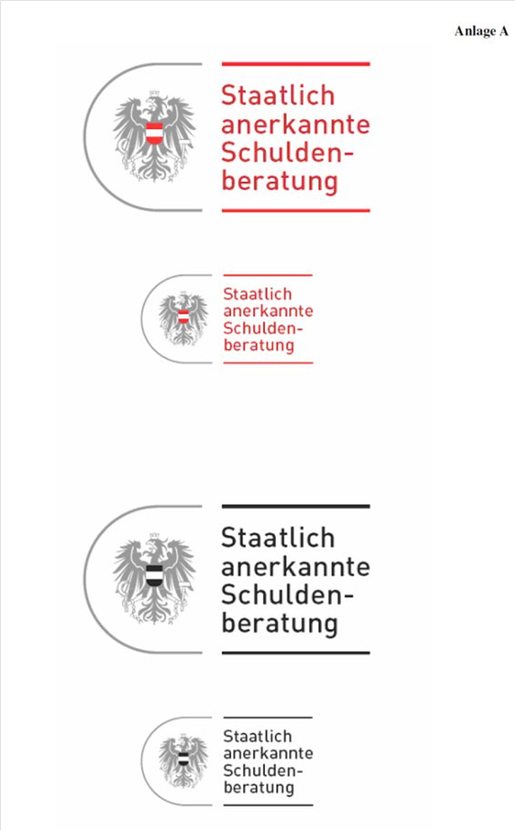

# BG.IO — Insolvenzordnung (IO)
**Typ:** Bundesgesetz  
**Kurztitel:** IO  
**Langtitel:** Bundesgesetz über das Insolvenzverfahren (Insolvenzordnung – IO)  
**Gesamte Rechtsvorschrift in der Fassung vom:** 23.07.2025  
**Quelle:** https://ris.bka.gv.at/GeltendeFassung.wxe?Abfrage=Bundesnormen&Gesetzesnummer=10001736  
**Letzte Änderung im RIS:** BGBl. I Nr. 77/2023 (NR: GP XXVII RV 2093 AB 2155 S. 226. BR: AB 11288 S. 957.)  
**LawAT Permalink:** https://github.com/clairexen/LawAT/blob/main/files/BG.IO.md  
*Mit RisEx für RisEn, RisEn-GPT, und LawAT von HTML zu MarkDown konvertiert. (Irrtümer und Fehler vorbehalten.)*

## Inhaltsverzeichnis

**Erster Teil**  
**Insolvenzrecht**  
**Erstes Hauptstück**  
**Wirkungen der Eröffnung eines Insolvenzverfahrens**  
**Erster Abschnitt**  
**Allgemeine Vorschriften**  
* [§ 1 IO — Insolvenzverfahren (Sanierungs- und Konkursverfahren)](#-1-io--insolvenzverfahren-sanierungs--und-konkursverfahren)

**Beginn der Wirkung, Insolvenzmasse**  
* [§ 2 IO](#-2-io)

**Rechtshandlungen des Schuldners**  
* [§ 3 IO](#-3-io)

**Erwerb durch Erbschaft, Vermächtnis oder Zuwendung unter Lebenden**  
* [§ 4 IO](#-4-io)

**Unterhalt des Schuldners und seiner Familie**  
* [§ 5 IO](#-5-io)

**Wirkung in Ansehung von Rechtsstreitigkeiten**  
* [§ 6 IO](#-6-io)

**Unterbrechung und Wiederaufnahme in anhängigen Rechtsstreitigkeiten**  
* [§ 7 IO](#-7-io)

**Ablehnung des Eintrittes in den Rechtsstreit**  
* [§ 8 IO](#-8-io)  
* [§ 8a IO — Außerstreitverfahren](#-8a-io--außerstreitverfahren)

**Verjährung**  
* [§ 9 IO](#-9-io)

**Absonderungsrechte und ihnen gleichgestellte Rechte**  
* [§ 10 IO](#-10-io)

**Wirkung der Eröffnung des Insolvenzverfahrens auf Absonderungs- und Aussonderungsrechte**  
* [§ 11 IO](#-11-io)  
* [§ 12 IO](#-12-io)  
* [§ 12a IO — Einkünfte aus einem Arbeitsverhältnis](#-12a-io--einkünfte-aus-einem-arbeitsverhältnis)  
* [§ 12b IO — Sicherheiten für Forderungen aus Eigenkapital ersetzenden Leistungen](#-12b-io--sicherheiten-für-forderungen-aus-eigenkapital-ersetzenden-leistungen)  
* [§ 12c IO — Räumungsexekution](#-12c-io--räumungsexekution)  
* [§ 12d IO — Zwangsverwaltung](#-12d-io--zwangsverwaltung)

**Grundbücherliche Eintragungen**  
* [§ 13 IO](#-13-io)

**Unbestimmte und betagte Forderungen**  
* [§ 14 IO](#-14-io)

**Forderungen auf wiederkehrende Leistungen**  
* [§ 15 IO](#-15-io)

**Bedingte Forderungen**  
* [§ 16 IO](#-16-io)

**Rechte der Mitschuldner und Bürgen gegen die Insolvenzmasse**  
* [§ 17 IO](#-17-io)

**Rechte der Gläubiger gegen Mitverpflichtete**  
* [§ 18 IO](#-18-io)  
* [§ 18a IO — Eigenkapital ersetzende Gesellschaftersicherheiten](#-18a-io--eigenkapital-ersetzende-gesellschaftersicherheiten)

**Aufrechnung**  
* [§ 19 IO](#-19-io)  
* [§ 20 IO](#-20-io)

**Erfüllung von zweiseitigen Rechtsgeschäften**  
**a) im allgemeinen**  
* [§ 21 IO](#-21-io)

**b) Fixgeschäfte**  
* [§ 22 IO](#-22-io)

**c) Bestandverträge**  
* [§ 23 IO](#-23-io)  
* [§ 24 IO](#-24-io)

**d) Arbeitsverträge**  
* [§ 25 IO](#-25-io)  
* [§ 25a IO — Auflösung von Verträgen durch Vertragspartner des Schuldners](#-25a-io--auflösung-von-verträgen-durch-vertragspartner-des-schuldners)  
* [§ 25b IO — Unwirksame Vereinbarungen](#-25b-io--unwirksame-vereinbarungen)

**Aufträge und Anträge**  
* [§ 26 IO](#-26-io)

**e) Gebrauchsüberlassung durch Gesellschafter**  
* [§ 26a IO](#-26a-io)

**Zweiter Abschnitt**  
**Anfechtung der vor Eröffnung des Insolvenzverfahrens vorgenommenen Rechtshandlungen**  
**Anfechtungsrecht**  
* [§ 27 IO](#-27-io)

**Anfechtung**  
**a) wegen Benachteiligungsabsicht**  
* [§ 28 IO](#-28-io)

**Anfechtung unentgeltlicher und ihnen gleichgestellter Verfügungen**  
* [§ 29 IO](#-29-io)

**Anfechtung wegen Begünstigung**  
* [§ 30 IO](#-30-io)

**Anfechtung wegen Kenntnis der Zahlungsunfähigkeit**  
* [§ 31 IO](#-31-io)  
* [§ 32 IO](#-32-io)

**Wechsel- und Scheckzahlungen**  
* [§ 33 IO](#-33-io)

**Einzelverkäufe**  
* [§ 34 IO](#-34-io)

**Exekution und Anfechtung**  
* [§ 35 IO](#-35-io)

**Anfechtung von Unterlassungen**  
* [§ 36 IO](#-36-io)  
* [§ 36a IO — Schutz für Finanzierungen im Zusammenhang mit einer Restrukturierung](#-36a-io--schutz-für-finanzierungen-im-zusammenhang-mit-einer-restrukturierung)  
* [§ 36b IO — Schutz für Transaktionen im Zusammenhang mit einer Restrukturierung](#-36b-io--schutz-für-transaktionen-im-zusammenhang-mit-einer-restrukturierung)

**Anfechtungsbefugnis**  
**Anhängige Rechtsstreitigkeiten**  
* [§ 37 IO](#-37-io)

**Anfechtungsgegner**  
* [§ 38 IO](#-38-io)

**Inhalt des Anfechtungsanspruches**  
* [§ 39 IO](#-39-io)  
* [§ 40 IO](#-40-io)

**Ansprüche des Anfechtungsgegners**  
* [§ 41 IO](#-41-io)

**Unzulässigkeit der Aufrechnung**  
* [§ 42 IO](#-42-io)

**Geltendmachung des Anfechtungsrechtes**  
* [§ 43 IO](#-43-io)

**Zweites Hauptstück**  
**Ansprüche im Insolvenzverfahren**  
**Aussonderungsansprüche**  
* [§ 44 IO](#-44-io)

**Verfolgungsrecht**  
* [§ 45 IO](#-45-io)  
* [§ 46 IO — Masseforderungen](#-46-io--masseforderungen)  
* [§ 47 IO](#-47-io)

**Absonderungsansprüche**  
* [§ 48 IO](#-48-io)  
* [§ 49 IO](#-49-io)  
* [§ 50 IO — Gemeinschaftliche Insolvenzmasse](#-50-io--gemeinschaftliche-insolvenzmasse)  
* [§ 51 IO — Insolvenzforderungen](#-51-io--insolvenzforderungen)

**Nebengebühren und Ersatzforderungen**  
* [§ 54 IO](#-54-io)  
* [§ 56 IO — Forderungen von Unternehmensgläubigern](#-56-io--forderungen-von-unternehmensgläubigern)  
* [§ 57 IO — Forderungen der Gesellschaftsgläubiger gegen einen unbeschränkt haftenden Gesellschafter](#-57-io--forderungen-der-gesellschaftsgläubiger-gegen-einen-unbeschränkt-haftenden-gesellschafter)  
* [§ 57a IO — Nachrangige Forderungen](#-57a-io--nachrangige-forderungen)

**Ausgeschlossene Ansprüche**  
* [§ 58 IO](#-58-io)

**Drittes Hauptstück**  
**Wirkungen der Aufhebung des Insolvenzverfahrens**  
* [§ 59 IO — Rechte des Schuldners nach Aufhebung des Insolvenzverfahrens](#-59-io--rechte-des-schuldners-nach-aufhebung-des-insolvenzverfahrens)

**Rechte der Gläubiger nach Aufhebung des Insolvenzverfahrens**  
**a) Klagerecht**  
* [§ 60 IO](#-60-io)

**b) Exekutionsrecht**  
* [§ 61 IO](#-61-io)

**Vorbehalt für den Sanierungsplan**  
* [§ 62 IO](#-62-io)

**Zweiter Teil**  
**Insolvenzverfahren**  
**Erstes Hauptstück**  
**Allgemeine Vorschriften**  
**Erster Abschnitt**  
**Gerichtsbarkeit im Insolvenzverfahren**  
**Zuständigkeit**  
* [§ 63 IO](#-63-io)  
* [§ 63a IO — Zuständigkeit für insolvenznahe Verfahren](#-63a-io--zuständigkeit-für-insolvenznahe-verfahren)  
* [§ 64 IO](#-64-io)  
* [§ 65 IO](#-65-io)

**Zweiter Abschnitt**  
**Eröffnung des Insolvenzverfahrens**  
**Erster Unterabschnitt**  
**Allgemeine Voraussetzungen**  
**Zahlungsunfähigkeit**  
* [§ 66 IO](#-66-io)

**Überschuldung**  
* [§ 67 IO](#-67-io)  
* [§ 68 IO — Aufgelöste juristische Person](#-68-io--aufgelöste-juristische-person)

**Antrag des Schuldners**  
* [§ 69 IO](#-69-io)

**Antrag eines Gläubigers**  
* [§ 70 IO](#-70-io)  
* [§ 71 IO — Kostendeckendes Vermögen](#-71-io--kostendeckendes-vermögen)  
* [§ 71a IO — Eröffnung trotz Fehlens kostendeckenden Vermögens](#-71a-io--eröffnung-trotz-fehlens-kostendeckenden-vermögens)  
* [§ 71b IO — Abweisung mangels kostendeckenden Vermögens](#-71b-io--abweisung-mangels-kostendeckenden-vermögens)  
* [§ 71c IO — Rechtsmittel](#-71c-io--rechtsmittel)  
* [§ 71d IO — Rückgriff](#-71d-io--rückgriff)

**Zweiter Unterabschnitt**  
**Sonderbestimmungen für juristische Personen**  
* [§ 72 IO — Fehlen kostendeckenden Vermögens](#-72-io--fehlen-kostendeckenden-vermögens)  
* [§ 72a IO — Organschaftliche Vertreter](#-72a-io--organschaftliche-vertreter)  
* [§ 72b IO — Kostenvorschuß und Vermögensverzeichnis der organschaftlichen Vertreter](#-72b-io--kostenvorschuß-und-vermögensverzeichnis-der-organschaftlichen-vertreter)  
* [§ 72c IO — Rückforderungsansprüche der organschaftlichen Vertreter](#-72c-io--rückforderungsansprüche-der-organschaftlichen-vertreter)  
* [§ 72d IO — Gesellschafter](#-72d-io--gesellschafter)

**Dritter Unterabschnitt**  
**Verfügungen des Gerichts**  
* [§ 73 IO — Einstweilige Vorkehrungen](#-73-io--einstweilige-vorkehrungen)

**Bekanntmachung der Eröffnung des Insolvenzverfahrens**  
* [§ 74 IO](#-74-io)  
* [§ 75 IO](#-75-io)  
* [§ 76 IO — Anhörung der gesetzlichen Interessenvertretungen und des Landesarbeitsamts](#-76-io--anhörung-der-gesetzlichen-interessenvertretungen-und-des-landesarbeitsamts)

**Anmerkung der Eröffnung des Insolvenzverfahrens**  
* [§ 77 IO](#-77-io)  
* [§ 77a IO — Eintragungen und Löschungen im Firmenbuch](#-77a-io--eintragungen-und-löschungen-im-firmenbuch)  
* [§ 78 IO — Sicherungsmaßnahmen und Benachrichtigungen von der Eröffnung des Insolvenzverfahrens](#-78-io--sicherungsmaßnahmen-und-benachrichtigungen-von-der-eröffnung-des-insolvenzverfahrens)  
* [§ 78a IO — Verständigung der Arbeitnehmer](#-78a-io--verständigung-der-arbeitnehmer)  
* [§ 79 IO — Bekanntmachung der Aufhebung des Insolvenzverfahrens](#-79-io--bekanntmachung-der-aufhebung-des-insolvenzverfahrens)

**Dritter Abschnitt**  
**Organe des Insolvenzverfahrens**  
* [§ 80 IO — Insolvenzverwalter](#-80-io--insolvenzverwalter)  
* [§ 80a IO — Auswahl des Insolvenzverwalters](#-80a-io--auswahl-des-insolvenzverwalters)  
* [§ 80b IO — Unabhängigkeit des Insolvenzverwalters](#-80b-io--unabhängigkeit-des-insolvenzverwalters)

**Pflichten und Verantwortlichkeit des Insolvenzverwalters**  
* [§ 81 IO](#-81-io)  
* [§ 81a IO — Tätigkeit des Insolvenzverwalters](#-81a-io--tätigkeit-des-insolvenzverwalters)  
* [§ 82 IO — Entlohnung des Insolvenzverwalters](#-82-io--entlohnung-des-insolvenzverwalters)  
* [§ 82a IO — Entlohnung bei Sanierungsplan](#-82a-io--entlohnung-bei-sanierungsplan)  
* [§ 82b IO — Erhöhung der Entlohnung](#-82b-io--erhöhung-der-entlohnung)  
* [§ 82c IO — Verminderung der Entlohnung](#-82c-io--verminderung-der-entlohnung)  
* [§ 82d IO — Entlohnung bei Verwertung einer Sondermasse](#-82d-io--entlohnung-bei-verwertung-einer-sondermasse)

**Befugnisse des Insolvenzverwalters**  
* [§ 83 IO](#-83-io)  
* [§ 84 IO — Überwachung des Insolvenzverwalters](#-84-io--überwachung-des-insolvenzverwalters)

**Stellvertreter des Insolvenzverwalters**  
* [§ 85 IO](#-85-io)

**Besondere Verwalter**  
* [§ 86 IO](#-86-io)  
* [§ 87 IO — Enthebung des Insolvenzverwalters](#-87-io--enthebung-des-insolvenzverwalters)  
* [§ 87a IO — Belohnung der bevorrechteten Gläubigerschutzverbände](#-87a-io--belohnung-der-bevorrechteten-gläubigerschutzverbände)  
* [§ 88 IO — Gläubigerausschuß](#-88-io--gläubigerausschuß)

**Pflichten, Verantwortlichkeit und Belohnung des Gläubigerausschusses**  
* [§ 89 IO](#-89-io)

**Rechte des Insolvenzgerichtes beim Mangel eines Gläubigerausschusses**  
* [§ 90 IO](#-90-io)

**Gläubigerversammlung**  
* [§ 91 IO](#-91-io)  
* [§ 91a IO — Berichtstagsatzung](#-91a-io--berichtstagsatzung)  
* [§ 92 IO — Beschlusserfordernisse in der Gläubigerversammlung](#-92-io--beschlusserfordernisse-in-der-gläubigerversammlung)  
* [§ 93 IO — Stimmrecht bei der Gläubigerversammlung](#-93-io--stimmrecht-bei-der-gläubigerversammlung)  
* [§ 94 IO — Forderungserwerb durch Abtretung](#-94-io--forderungserwerb-durch-abtretung)

**Aufhebung von Beschlüssen**  
* [§ 95 IO](#-95-io)  
* [§ 95a IO — Kurator](#-95a-io--kurator)

**Vierter Abschnitt**  
**Feststellung der Insolvenzmasse**  
**Inventar und Schätzung**  
* [§ 96 IO](#-96-io)

**a) bei fremden Sachen und Sachen in fremdem Gewahrsame**  
* [§ 97 IO](#-97-io)

**b) bei Erbschaften**  
* [§ 98 IO](#-98-io)

**Verpflichtung des Schuldners**  
* [§ 99 IO](#-99-io)

**Vermögensverzeichnis und Bilanz**  
* [§ 100 IO](#-100-io)  
* [§ 100a IO — Inhalt des Vermögensverzeichnisses](#-100a-io--inhalt-des-vermögensverzeichnisses)

**Maßregeln in Ansehung der Person des Schuldners**  
* [§ 101 IO](#-101-io)

**Fünfter Abschnitt**  
**Feststellung der Ansprüche**  
**Geltendmachung der Forderungen**  
* [§ 102 IO](#-102-io)

**Inhalt der Anmeldung**  
* [§ 103 IO](#-103-io)

**Einbringung und Behandlung der Anmeldungen**  
* [§ 104 IO](#-104-io)

**Prüfungsverhandlung**  
* [§ 105 IO](#-105-io)  
* [§ 106 IO](#-106-io)

**Nachträgliche Anmeldungen**  
* [§ 107 IO](#-107-io)

**Anmeldungsverzeichnis**  
* [§ 108 IO](#-108-io)

**Feststellung der Forderungen**  
* [§ 109 IO](#-109-io)

**Bestrittene Forderungen**  
* [§ 110 IO](#-110-io)

**Zuständigkeit für Klagen wegen bestrittener Forderungen**  
* [§ 111 IO](#-111-io)

**Wirkung der Entscheidung**  
* [§ 112 IO](#-112-io)

**Anwendbarkeit der Vorschriften auf anhängige Rechtssachen**  
* [§ 113 IO](#-113-io)  
* [§ 113a IO — Geltendmachung von Aus- oder Absonderungsrechten an Einkünften aus einem Arbeitsverhältnis](#-113a-io--geltendmachung-von-aus--oder-absonderungsrechten-an-einkünften-aus-einem-arbeitsverhältnis)

**Sechster Abschnitt**  
**Verfügungen über das Massevermögen und Rechnungslegung**  
* [§ 114 IO — Geschäftsführung durch den Insolvenzverwalter](#-114-io--geschäftsführung-durch-den-insolvenzverwalter)  
* [§ 114a IO — Fortführung des Unternehmens](#-114a-io--fortführung-des-unternehmens)  
* [§ 114b IO — Inhalt der Berichtstagsatzung](#-114b-io--inhalt-der-berichtstagsatzung)  
* [§ 114c IO — Sanierungsplanvorschlag](#-114c-io--sanierungsplanvorschlag)  
* [§ 115 IO — Schließung und Wiedereröffnung des Unternehmens](#-115-io--schließung-und-wiedereröffnung-des-unternehmens)  
* [§ 116 IO — Dem Insolvenzgericht mitzuteilende Geschäfte](#-116-io--dem-insolvenzgericht-mitzuteilende-geschäfte)  
* [§ 117 IO — Genehmigungspflichtige Geschäfte](#-117-io--genehmigungspflichtige-geschäfte)  
* [§ 118 IO — Äußerung des Schuldners](#-118-io--äußerung-des-schuldners)

**Gerichtliche Veräußerung**  
* [§ 119 IO](#-119-io)

**Veräußerung von Sachen, an denen ein Absonderungsrecht besteht**  
* [§ 120 IO](#-120-io)  
* [§ 120a IO — Aufschiebung des Exekutionsverfahrens](#-120a-io--aufschiebung-des-exekutionsverfahrens)

**Rechnungslegung**  
* [§ 121 IO](#-121-io)  
* [§ 122 IO — Genehmigung oder Bemängelung](#-122-io--genehmigung-oder-bemängelung)

**Siebenter Abschnitt**  
**Aufhebung des Insolvenzverfahrens**  
* [§ 123 IO — Bekanntmachung und Verständigungen](#-123-io--bekanntmachung-und-verständigungen)  
* [§ 123a IO — Aufhebung des Insolvenzverfahrens mangels Vermögens](#-123a-io--aufhebung-des-insolvenzverfahrens-mangels-vermögens)  
* [§ 123b IO — Aufhebung des Insolvenzverfahrens mit Einverständnis der Gläubiger](#-123b-io--aufhebung-des-insolvenzverfahrens-mit-einverständnis-der-gläubiger)

**Befriedigung der Massegläubiger**  
* [§ 124 IO](#-124-io)  
* [§ 124a IO — Masseunzulänglichkeit](#-124a-io--masseunzulänglichkeit)

**Insbesondere:**  
**a) Ansprüche des Insolvenzverwalters**  
* [§ 125 IO](#-125-io)  
* [§ 125a IO — Voraussichtliche Entlohnung bei Unternehmensfortführung](#-125a-io--voraussichtliche-entlohnung-bei-unternehmensfortführung)

**b) Ansprüche der Mitglieder des Gläubigerausschusses**  
* [§ 126 IO](#-126-io)

**c) Ansprüche der bevorrechteten Gläubigerschutzverbände**  
* [§ 127 IO](#-127-io)

**Zweites Hauptstück**  
**Verteilung**  
**Befriedigung der Insolvenzgläubiger**  
* [§ 128 IO](#-128-io)

**Formlose Verteilung und Verteilungsentwurf**  
* [§ 129 IO](#-129-io)

**Entscheidung über den Verteilungsentwurf**  
* [§ 130 IO](#-130-io)

**Berücksichtigung bestrittener Forderungen bei der Verteilung**  
* [§ 131 IO](#-131-io)

**Berücksichtigung der Absonderungs- und Ausfallsgläubiger bei der Verteilung**  
* [§ 132 IO](#-132-io)

**Erlag bei Gericht**  
* [§ 133 IO](#-133-io)

**Berücksichtigung verspätet angemeldeter Forderungen bei der Verteilung**  
* [§ 134 IO](#-134-io)

**Vollzug der Verteilung**  
* [§ 135 IO](#-135-io)

**Schlußverteilung**  
* [§ 136 IO](#-136-io)  
* [§ 137 IO](#-137-io)

**Nach der Schlußverteilung freiwerdendes oder zum Vorschein kommendes Insolvenzvermögen**  
* [§ 138 IO](#-138-io)  
* [§ 139 IO — Aufhebung des Insolvenzverfahrens](#-139-io--aufhebung-des-insolvenzverfahrens)

**Drittes Hauptstück**  
**Sanierungsplan**  
**Erster Abschnitt**  
**Allgemeines**  
* [§ 140 IO — Antrag auf Abschluss eines Sanierungsplans](#-140-io--antrag-auf-abschluss-eines-sanierungsplans)  
* [§ 141 IO — Inhalt und Unzulässigkeit des Sanierungsplans](#-141-io--inhalt-und-unzulässigkeit-des-sanierungsplans)  
* [§ 142 IO — Vorprüfung](#-142-io--vorprüfung)

**Berechtigung zur Stimmführung**  
* [§ 143 IO](#-143-io)  
* [§ 144 IO — Gemeinschaftliche Forderung](#-144-io--gemeinschaftliche-forderung)  
* [§ 145 IO — Sanierungsplantagsatzung](#-145-io--sanierungsplantagsatzung)  
* [§ 145a IO — Änderung des Sanierungsplans](#-145a-io--änderung-des-sanierungsplans)  
* [§ 145b IO — Besonderheiten der Rechnungslegung](#-145b-io--besonderheiten-der-rechnungslegung)  
* [§ 146 IO — Bericht des Insolvenzverwalters](#-146-io--bericht-des-insolvenzverwalters)  
* [§ 147 IO — Erfordernisse für die Annahme des Sanierungsplans](#-147-io--erfordernisse-für-die-annahme-des-sanierungsplans)  
* [§ 148 IO — Nahe Angehörige](#-148-io--nahe-angehörige)  
* [§ 148a IO — Erstreckung der Sanierungsplantagsatzung](#-148a-io--erstreckung-der-sanierungsplantagsatzung)  
* [§ 149 IO — Rechte der Aussonderungsberechtigten und Absonderungsgläubiger](#-149-io--rechte-der-aussonderungsberechtigten-und-absonderungsgläubiger)  
* [§ 150 IO — Rechte der Masse- und Insolvenzgläubiger](#-150-io--rechte-der-masse--und-insolvenzgläubiger)  
* [§ 150a IO — Sonderbegünstigungen](#-150a-io--sonderbegünstigungen)  
* [§ 151 IO — Rechte der Gläubiger gegen Mitverpflichtete](#-151-io--rechte-der-gläubiger-gegen-mitverpflichtete)  
* [§ 152 IO — Gerichtliche Bestätigung des Sanierungsplans](#-152-io--gerichtliche-bestätigung-des-sanierungsplans)  
* [§ 152a IO — Voraussetzungen der Bestätigung](#-152a-io--voraussetzungen-der-bestätigung)  
* [§ 152b IO — Aufhebung des Insolvenzverfahrens](#-152b-io--aufhebung-des-insolvenzverfahrens)  
* [§ 153 IO — Zwingende Versagung der Bestätigung](#-153-io--zwingende-versagung-der-bestätigung)  
* [§ 154 IO — Versagung der Bestätigung nach Ermessen](#-154-io--versagung-der-bestätigung-nach-ermessen)  
* [§ 155 IO — Rekurs](#-155-io--rekurs)  
* [§ 156 IO — Rechtswirkungen des Sanierungsplans](#-156-io--rechtswirkungen-des-sanierungsplans)  
* [§ 156a IO — Verzug](#-156a-io--verzug)  
* [§ 156b IO — Vorläufige Feststellung der Höhe bestrittener und des Ausfalls teilweise gedeckter Forderungen](#-156b-io--vorläufige-feststellung-der-höhe-bestrittener-und-des-ausfalls-teilweise-gedeckter-forderungen)  
* [§ 156c IO — Exekution](#-156c-io--exekution)

**Zweiter Abschnitt**  
**Überwachung durch einen Treuhänder**  
* [§ 157 IO — Allgemeine Vorschrift](#-157-io--allgemeine-vorschrift)  
* [§ 157a IO — Sicherungsmaßnahmen](#-157a-io--sicherungsmaßnahmen)  
* [§ 157b IO — Treuhänder](#-157b-io--treuhänder)  
* [§ 157c IO — Entlohnung des Treuhänders](#-157c-io--entlohnung-des-treuhänders)  
* [§ 157d IO — Beendigung](#-157d-io--beendigung)  
* [§ 157e IO — Einstellung](#-157e-io--einstellung)  
* [§ 157f IO — Einstellungsbeschluss](#-157f-io--einstellungsbeschluss)

**Dritter Abschnitt**  
**Vermögensübergabe**  
* [§ 157g IO — Rechtsstellung des Treuhänders bei Übergabe von Vermögen](#-157g-io--rechtsstellung-des-treuhänders-bei-übergabe-von-vermögen)  
* [§ 157h IO](#-157h-io)

**Vierter Abschnitt**  
**Sanierungsplan mit Übergabe von Vermögen zur Verwertung**  
* [§ 157i IO — Allgemeine Vorschriften](#-157i-io--allgemeine-vorschriften)  
* [§ 157j IO — Abstimmung](#-157j-io--abstimmung)  
* [§ 157k IO — Entlohnung des Treuhänders](#-157k-io--entlohnung-des-treuhänders)  
* [§ 157l IO — Einstellung](#-157l-io--einstellung)  
* [§ 157m IO — Verzug in der Erfüllung](#-157m-io--verzug-in-der-erfüllung)

**Fünfter Abschnitt**  
**Nichtigkeit und Unwirksamerklärung des Sanierungsplans**  
* [§ 158 IO — Nichtigkeit des Sanierungsplans](#-158-io--nichtigkeit-des-sanierungsplans)  
* [§ 159 IO — Verfahren bei Wiederaufnahme des Insolvenzverfahrens](#-159-io--verfahren-bei-wiederaufnahme-des-insolvenzverfahrens)  
* [§ 160 IO — Wirkung der Wiederaufnahme auf die Anfechtung und Aufrechnung](#-160-io--wirkung-der-wiederaufnahme-auf-die-anfechtung-und-aufrechnung)  
* [§ 161 IO — Unwirksamerklärung des Sanierungsplans](#-161-io--unwirksamerklärung-des-sanierungsplans)  
* [§ 162 IO — Zuständigkeit](#-162-io--zuständigkeit)  
* [§ 163 IO — Neuerliches Insolvenzverfahren](#-163-io--neuerliches-insolvenzverfahren)

**Sechster Abschnitt**  
**Sonderbestimmungen für eingetragene Personengesellschaften**  
* [§ 164 IO — Insolvenzverfahren einer eingetragenen Personengesellschaft oder Verlassenschaft](#-164-io--insolvenzverfahren-einer-eingetragenen-personengesellschaft-oder-verlassenschaft)  
* [§ 164a IO — Haftung eines ausgeschiedenen unbeschränkt haftenden Gesellschafters](#-164a-io--haftung-eines-ausgeschiedenen-unbeschränkt-haftenden-gesellschafters)  
* [§ 165 IO — Sanierungsplan eines unbeschränkt haftenden Gesellschafters](#-165-io--sanierungsplan-eines-unbeschränkt-haftenden-gesellschafters)

**Dritter Teil**  
**Sanierungsverfahren**  
* [§ 166 IO — Anwendungsbereich](#-166-io--anwendungsbereich)  
* [§ 167 IO — Antrag](#-167-io--antrag)  
* [§ 168 IO — Anberaumung der Sanierungsplantagsatzung](#-168-io--anberaumung-der-sanierungsplantagsatzung)

**Vierter Teil**  
**Sanierungsverfahren mit Eigenverwaltung unter Aufsicht eines Verwalters**  
* [§ 169 IO — Voraussetzungen](#-169-io--voraussetzungen)  
* [§ 170 IO — Entziehung der Eigenverwaltung](#-170-io--entziehung-der-eigenverwaltung)  
* [§ 171 IO — Umfang der Eigenverwaltung](#-171-io--umfang-der-eigenverwaltung)  
* [§ 172 IO — Beschränkung der Eigenverwaltung](#-172-io--beschränkung-der-eigenverwaltung)  
* [§ 173 IO — Prozessführungsbefugnis](#-173-io--prozessführungsbefugnis)  
* [§ 174 IO — Masseforderungen](#-174-io--masseforderungen)  
* [§ 175 IO — Unterhalt](#-175-io--unterhalt)  
* [§ 176 IO — Sonderregelungen](#-176-io--sonderregelungen)  
* [§ 177 IO — Befugnisse des Sanierungsverwalters](#-177-io--befugnisse-des-sanierungsverwalters)  
* [§ 178 IO — Aufgaben des Sanierungsverwalters](#-178-io--aufgaben-des-sanierungsverwalters)  
* [§ 179 IO — Tagsatzungen](#-179-io--tagsatzungen)

**Fünfter Teil**  
**Konkursverfahren**  
* [§ 180 IO — Bezeichnung](#-180-io--bezeichnung)  
* [§ 180a IO — Geringfügigkeit des Konkurses](#-180a-io--geringfügigkeit-des-konkurses)

**Sechster Teil**  
**Konzern**  
* [§ 180b IO — Zusammenarbeit und Koordination](#-180b-io--zusammenarbeit-und-koordination)  
* [§ 180c IO — Genehmigungspflichtige Anträge und Handlungen](#-180c-io--genehmigungspflichtige-anträge-und-handlungen)

**Siebenter Teil**  
**Sonderbestimmungen für natürliche Personen**  
**Erstes Hauptstück**  
**Insolvenz- und Schuldenregulierungsverfahren**  
* [§ 181 IO — Anwendungsbereich](#-181-io--anwendungsbereich)  
* [§ 182 IO — Zuständigkeit](#-182-io--zuständigkeit)  
* [§ 183 IO — Antrag des Schuldners](#-183-io--antrag-des-schuldners)  
* [§ 183a IO — Gläubigerantrag](#-183a-io--gläubigerantrag)  
* [§ 183b IO — Kostendeckendes Vermögen](#-183b-io--kostendeckendes-vermögen)  
* [§ 184 IO — Verfahrenskosten](#-184-io--verfahrenskosten)  
* [§ 184a IO — Gesamtvollstreckung – Verträge und Insolvenzforderungen](#-184a-io--gesamtvollstreckung--verträge-und-insolvenzforderungen)  
* [§ 185 IO — Vermögensverzeichnis](#-185-io--vermögensverzeichnis)  
* [§ 186 IO — Eigenverwaltung](#-186-io--eigenverwaltung)  
* [§ 187 IO — Umfang der Eigenverwaltung - Verfügungsrecht des Schuldners](#-187-io--umfang-der-eigenverwaltung---verfügungsrecht-des-schuldners)  
* [§ 188 IO — Feststellung der Forderungen](#-188-io--feststellung-der-forderungen)  
* [§ 189 IO — Anfechtung](#-189-io--anfechtung)  
* [§ 189a IO — Überprüfung der Vermögenslage](#-189a-io--überprüfung-der-vermögenslage)  
* [§ 189b IO — Arbeitseinkommen](#-189b-io--arbeitseinkommen)  
* [§ 190 IO — Bestellung eines Insolvenzverwalters](#-190-io--bestellung-eines-insolvenzverwalters)  
* [§ 191 IO — Entlohnung des Insolvenzverwalters und der bevorrechteten Gläubigerschutzverbände](#-191-io--entlohnung-des-insolvenzverwalters-und-der-bevorrechteten-gläubigerschutzverbände)  
* [§ 192 IO — Vertretung des Schuldners durch eine anerkannte Schuldenberatungsstelle](#-192-io--vertretung-des-schuldners-durch-eine-anerkannte-schuldenberatungsstelle)  
* [§ 192a IO — Verteilungen](#-192a-io--verteilungen)  
* [§ 192b IO — Aufhebung wegen dauerhaft fehlenden pfändbaren Bezugs](#-192b-io--aufhebung-wegen-dauerhaft-fehlenden-pfändbaren-bezugs)

**Zweites Hauptstück**  
**Zahlungsplan**  
* [§ 193 IO — Antrag](#-193-io--antrag)  
* [§ 194 IO — Inhalt und Unzulässigkeit des Zahlungsplans](#-194-io--inhalt-und-unzulässigkeit-des-zahlungsplans)  
* [§ 195 IO — Versagung der Bestätigung des Zahlungsplans](#-195-io--versagung-der-bestätigung-des-zahlungsplans)  
* [§ 196 IO — Aufhebung des Insolvenzverfahrens - Nichtigkeit des Zahlungsplans](#-196-io--aufhebung-des-insolvenzverfahrens---nichtigkeit-des-zahlungsplans)  
* [§ 197 IO — Berücksichtigung nicht angemeldeter Forderungen](#-197-io--berücksichtigung-nicht-angemeldeter-forderungen)  
* [§ 198 IO — Änderung des Zahlungsplans](#-198-io--änderung-des-zahlungsplans)

**Drittes Hauptstück**  
**Abschöpfungsverfahren mit Restschuldbefreiung**  
* [§ 199 IO — Antrag des Schuldners](#-199-io--antrag-des-schuldners)  
* [§ 200 IO — Entscheidung des Insolvenzgerichts](#-200-io--entscheidung-des-insolvenzgerichts)  
* [§ 201 IO — Einleitungshindernisse](#-201-io--einleitungshindernisse)  
* [§ 202 IO — Einleitung des Abschöpfungsverfahrens](#-202-io--einleitung-des-abschöpfungsverfahrens)  
* [§ 203 IO — Rechtsstellung des Treuhänders](#-203-io--rechtsstellung-des-treuhänders)  
* [§ 204 IO — Vergütung des Treuhänders](#-204-io--vergütung-des-treuhänders)  
* [§ 205 IO — Änderung des unpfändbaren Betrags der Einkünfte aus einem Arbeitsverhältnis](#-205-io--änderung-des-unpfändbaren-betrags-der-einkünfte-aus-einem-arbeitsverhältnis)  
* [§ 206 IO — Gleichbehandlung der Insolvenzgläubiger](#-206-io--gleichbehandlung-der-insolvenzgläubiger)  
* [§ 207 IO — Berücksichtigung nicht angemeldeter Forderungen während des Abschöpfungsverfahrens](#-207-io--berücksichtigung-nicht-angemeldeter-forderungen-während-des-abschöpfungsverfahrens)  
* [§ 208 IO — Eröffnung des Insolvenzverfahrens während des Abschöpfungsverfahrens](#-208-io--eröffnung-des-insolvenzverfahrens-während-des-abschöpfungsverfahrens)  
* [§ 209 IO — Aus- und Absonderungsberechtigte](#-209-io--aus--und-absonderungsberechtigte)  
* [§ 210 IO — Obliegenheiten des Schuldners](#-210-io--obliegenheiten-des-schuldners)  
* [§ 210a IO — Auskunftserteilung über die Erfüllung der Obliegenheiten](#-210a-io--auskunftserteilung-über-die-erfüllung-der-obliegenheiten)  
* [§ 211 IO — Vorzeitige Einstellung des Abschöpfungsverfahrens](#-211-io--vorzeitige-einstellung-des-abschöpfungsverfahrens)  
* [§ 212 IO — Wiederaufnahme des Insolvenzverfahrens](#-212-io--wiederaufnahme-des-insolvenzverfahrens)  
* [§ 213 IO — Beendigung des Abschöpfungsverfahrens - Entscheidung über die Restschuldbefreiung](#-213-io--beendigung-des-abschöpfungsverfahrens---entscheidung-über-die-restschuldbefreiung)  
* [§ 214 IO — Wirkung der Restschuldbefreiung](#-214-io--wirkung-der-restschuldbefreiung)  
* [§ 215 IO — Ausgenommene Forderungen](#-215-io--ausgenommene-forderungen)  
* [§ 216 IO — Widerruf der Restschuldbefreiung](#-216-io--widerruf-der-restschuldbefreiung)

**Achter Teil**  
**Internationales Insolvenzrecht**  
**Erstes Hauptstück**  
**Allgemeine Bestimmungen**  
* [§ 217 IO — Grundsatz](#-217-io--grundsatz)  
* [§ 218 IO — Bekanntmachung ausländischer Insolvenzverfahren](#-218-io--bekanntmachung-ausländischer-insolvenzverfahren)

**Zweites Hauptstück**  
**Ergänzende Bestimmungen zur EuInsVO**  
* [§ 219 IO — Zuständigkeit für Sicherungsmaßnahmen](#-219-io--zuständigkeit-für-sicherungsmaßnahmen)  
* [§ 220 IO — Haupt-, Partikular- oder Sekundärinsolvenzverfahren](#-220-io--haupt--partikular--oder-sekundärinsolvenzverfahren)  
* [§ 220a IO — Bekanntmachung und Registereintragung](#-220a-io--bekanntmachung-und-registereintragung)  
* [§ 220b IO — Zusicherung im inländischen Hauptinsolvenzverfahren zur Vermeidung eines Sekundärinsolvenzverfahrens](#-220b-io--zusicherung-im-inländischen-hauptinsolvenzverfahren-zur-vermeidung-eines-sekundärinsolvenzverfahrens)  
* [§ 220c IO — Abstimmung über die in einem anderen Mitgliedstaat abgegebene Zusicherung](#-220c-io--abstimmung-über-die-in-einem-anderen-mitgliedstaat-abgegebene-zusicherung)  
* [§ 220d IO — Gerichtliche Abstimmung](#-220d-io--gerichtliche-abstimmung)  
* [§ 220e IO — Prüfung des Stimmrechts](#-220e-io--prüfung-des-stimmrechts)  
* [§ 220f IO — Prüfung durch einen besonderen Verwalter](#-220f-io--prüfung-durch-einen-besonderen-verwalter)  
* [§ 220g IO — Bestätigung](#-220g-io--bestätigung)  
* [§ 220h IO — Verteilung im inländischen Hauptinsolvenzverfahren](#-220h-io--verteilung-im-inländischen-hauptinsolvenzverfahren)  
* [§ 220i IO — Maßnahmen zur Sicherung der Zusicherung](#-220i-io--maßnahmen-zur-sicherung-der-zusicherung)

**Drittes Hauptstück**  
**Nicht von der EuInsVO erfasste Verfahren**  
**Erster Abschnitt**  
**Anzuwendendes Recht**  
* [§ 221 IO — Grundsatz](#-221-io--grundsatz)  
* [§ 222 IO — Dingliche Rechte Dritter](#-222-io--dingliche-rechte-dritter)  
* [§ 223 IO — Aufrechnung](#-223-io--aufrechnung)  
* [§ 224 IO — Eigentumsvorbehalt](#-224-io--eigentumsvorbehalt)  
* [§ 225 IO — Vertrag über eine unbewegliche Sache](#-225-io--vertrag-über-eine-unbewegliche-sache)  
* [§ 226 IO — Geregelte Märkte](#-226-io--geregelte-märkte)  
* [§ 227 IO — Arbeitsvertrag](#-227-io--arbeitsvertrag)  
* [§ 228 IO — Wirkung auf eintragungspflichtige Rechte](#-228-io--wirkung-auf-eintragungspflichtige-rechte)  
* [§ 229 IO — Benachteiligende Handlungen](#-229-io--benachteiligende-handlungen)  
* [§ 230 IO — Schutz des Dritterwerbers](#-230-io--schutz-des-dritterwerbers)  
* [§ 231 IO — Wirkungen des Insolvenzverfahrens auf anhängige Rechtsstreitigkeiten](#-231-io--wirkungen-des-insolvenzverfahrens-auf-anhängige-rechtsstreitigkeiten)  
* [§ 232 IO — Recht der gelegenen Sache](#-232-io--recht-der-gelegenen-sache)  
* [§ 233 IO — Saldierungsvereinbarungen](#-233-io--saldierungsvereinbarungen)  
* [§ 234 IO — Wertpapierpensionsgeschäfte](#-234-io--wertpapierpensionsgeschäfte)  
* [§ 235 IO — Zahlungen nach Eröffnung eines Insolvenzverfahrens](#-235-io--zahlungen-nach-eröffnung-eines-insolvenzverfahrens)

**Zweiter Abschnitt**  
**Österreichische Insolvenzverfahren**  
* [§ 236 IO — Ausübung von Gläubigerrechten](#-236-io--ausübung-von-gläubigerrechten)  
* [§ 237 IO — Auslandsvermögen](#-237-io--auslandsvermögen)  
* [§ 238 IO — Vertreter des Insolvenzverwalters](#-238-io--vertreter-des-insolvenzverwalters)  
* [§ 239 IO — Koordination](#-239-io--koordination)

**Dritter Abschnitt**  
**Anerkennung ausländischer Verfahren**  
* [§ 240 IO — Grundsatz](#-240-io--grundsatz)  
* [§ 241 IO — Ausländische Insolvenzverwalter](#-241-io--ausländische-insolvenzverwalter)  
* [§ 242 IO — Bekanntmachungen und Registereintragungen](#-242-io--bekanntmachungen-und-registereintragungen)

**Viertes Hauptstück**  
**Sonderbestimmungen für Kreditinstitute und Versicherungsunternehmen**  
**Erster Abschnitt**  
**Grenzüberschreitende österreichische Insolvenzverfahren**  
* [§ 243 IO — Anwendungsbereich](#-243-io--anwendungsbereich)  
* [§ 244 IO — Internationale Zuständigkeit](#-244-io--internationale-zuständigkeit)  
* [§ 245 IO — Koordination](#-245-io--koordination)  
* [§ 246 IO — Zustellung des Insolvenzediktes](#-246-io--zustellung-des-insolvenzediktes)  
* [§ 247 IO — Bekanntmachungen im Ausland](#-247-io--bekanntmachungen-im-ausland)  
* [§ 248 IO — Eintragung in öffentliche Register](#-248-io--eintragung-in-öffentliche-register)  
* [§ 249 IO — Sprache der Forderungsanmeldungen](#-249-io--sprache-der-forderungsanmeldungen)

**Zweiter Abschnitt**  
**Anerkennung ausländischer Verfahren**  
* [§ 250 IO — Grundsatz](#-250-io--grundsatz)  
* [§ 251 IO — Bekanntmachungen und Registereintragungen](#-251-io--bekanntmachungen-und-registereintragungen)

**Neunter Teil**  
**Allgemeine Verfahrensbestimmungen**  
* [§ 252 IO — Anwendung der Prozessgesetze](#-252-io--anwendung-der-prozessgesetze)  
* [§ 253 IO — Zuständigkeit und Vertretung](#-253-io--zuständigkeit-und-vertretung)  
* [§ 254 IO](#-254-io)  
* [§ 255 IO — Öffentliche Bekanntmachung](#-255-io--öffentliche-bekanntmachung)  
* [§ 256 IO — Insolvenzdatei](#-256-io--insolvenzdatei)  
* [§ 257 IO — Verständigungen](#-257-io--verständigungen)  
* [§ 258 IO — Zustellung bei unbekanntem Aufenthalt](#-258-io--zustellung-bei-unbekanntem-aufenthalt)  
* [§ 258a IO — Gesellschaft ohne gesetzlichen Vertreter](#-258a-io--gesellschaft-ohne-gesetzlichen-vertreter)  
* [§ 259 IO — Fristen, Versäumnis](#-259-io--fristen-versäumnis)  
* [§ 260 IO — Rekurs](#-260-io--rekurs)  
* [§ 261 IO — Strafanzeige](#-261-io--strafanzeige)  
* [§ 262 IO — Rechtsstreitigkeiten - Zuständigkeit](#-262-io--rechtsstreitigkeiten---zuständigkeit)  
* [§ 263 IO — Verfahren](#-263-io--verfahren)

**Zehnter Teil**  
**Begleitregelungen**  
* [§ 264 IO — Vorabentscheidungsersuchen](#-264-io--vorabentscheidungsersuchen)  
* [§ 265 IO — Geschäftsverteilung in Insolvenzsachen](#-265-io--geschäftsverteilung-in-insolvenzsachen)  
* [§ 266 IO — Bevorrechtung eines Gläubigerschutzverbands](#-266-io--bevorrechtung-eines-gläubigerschutzverbands)  
* [§ 267 IO — Anerkennung einer Schuldenberatungsstelle](#-267-io--anerkennung-einer-schuldenberatungsstelle)  
* [§ 268 IO — Schuldenberatungszeichen](#-268-io--schuldenberatungszeichen)  
* [§ 269 IO — Insolvenzverwalterliste](#-269-io--insolvenzverwalterliste)

**Elfter Teil**  
**Schluß- und Übergangsbestimmungen**  
* [§ 270 IO — Vollziehung](#-270-io--vollziehung)  
* [§ 271 IO — Verweisungen](#-271-io--verweisungen)  
* [§ 272 IO — Inkrafttreten](#-272-io--inkrafttreten)  
* [§ 273 IO — Inkrafttretens- und Übergangsbestimmungen zum IRÄG 2010](#-273-io--inkrafttretens--und-übergangsbestimmungen-zum-iräg-2010)  
* [§ 274 IO — Weitergeltung von Bevorrechtungen](#-274-io--weitergeltung-von-bevorrechtungen)  
* [§ 275 IO — Ersetzung von Begriffen und Verweisen](#-275-io--ersetzung-von-begriffen-und-verweisen)  
* [§ 276 IO — Inkrafttretensbestimmung zum GesRÄG 2013](#-276-io--inkrafttretensbestimmung-zum-gesräg-2013)  
* [§ 277 IO — Inkrafttretensbestimmung zur Exekutionsordnungs-Novelle 2014](#-277-io--inkrafttretensbestimmung-zur-exekutionsordnungs-novelle-2014)  
* [§ 278 IO — Inkrafttretens- und Übergangsbestimmungen zum IRÄG 2017](#-278-io--inkrafttretens--und-übergangsbestimmungen-zum-iräg-2017)  
* [§ 279 IO — Weitere Inkrafttretens- und Übergangsbestimmungen](#-279-io--weitere-inkrafttretens--und-übergangsbestimmungen)  
* [§ 280 IO — Anhängige Abschöpfungsverfahren](#-280-io--anhängige-abschöpfungsverfahren)  
* [§ 281 IO — Zahlungsplan](#-281-io--zahlungsplan)  
* [§ 282 IO — Übergangsbestimmungen zur GREx](#-282-io--übergangsbestimmungen-zur-grex)  
* [§ 283 IO — Inkrafttretens- und Übergangsbestimmungen zum Restrukturierungs- und Insolvenz-Richtlinie-Umsetzungsgesetz](#-283-io--inkrafttretens--und-übergangsbestimmungen-zum-restrukturierungs--und-insolvenz-richtlinie-umsetzungsgesetz)  
* [§ 284 IO — Inkrafttretens- und Übergangsbestimmung zum BGBl. I Nr. 199/2021](#-284-io--inkrafttretens--und-übergangsbestimmung-zum-bgbl-i-nr-1992021)  
* [§ 285 IO — Inkrafttretens- und Übergangsbestimmung zum BGBl. I Nr. 77/2023](#-285-io--inkrafttretens--und-übergangsbestimmung-zum-bgbl-i-nr-772023)  
* [Anl. 1 IO](#anl-1-io)

----

## Erster Teil

## Insolvenzrecht

## Erstes Hauptstück

## Wirkungen der Eröffnung eines Insolvenzverfahrens

## Erster Abschnitt

## Allgemeine Vorschriften

### § 1 IO — Insolvenzverfahren (Sanierungs- und Konkursverfahren)

> Bei Zahlungsunfähigkeit oder Überschuldung \(§§ 66 und 67\) ist auf Antrag ein Insolvenzverfahren zu eröffnen\. Die Bestimmungen dieses Bundesgesetzes sind, soweit nichts anderes angegeben ist, auf Sanierungsverfahren und Konkursverfahren anzuwenden\.

\[ [🔗 Permalink](https://github.com/clairexen/LawAT/blob/main/files/BG.IO.md#-1-io--insolvenzverfahren-sanierungs--und-konkursverfahren) | [📜 RIS-Paragraphenansicht](http://www.ris.bka.gv.at/NormDokument.wxe?Abfrage=Bundesnormen&Gesetzesnummer=10001736&Paragraf=1) | [📖 RIS-Gesamtansicht](https://ris.bka.gv.at/GeltendeFassung.wxe?Abfrage=Bundesnormen&Gesetzesnummer=10001736#MainContent_DocumentRepeater_BundesnormenCompleteNormDocumentData_1_TextContainer_1) | [🤖 KI-freundliche Fassung](https://github.com/clairexen/LawAT/blob/main/files/BG.IO.001.md#-1-io--insolvenzverfahren-sanierungs--und-konkursverfahren) \]

----

## Beginn der Wirkung, Insolvenzmasse

### § 2 IO

> `(1)` Die Rechtswirkungen der Eröffnung des Insolvenzverfahrens treten mit Beginn des Tages ein, der der öffentlichen Bekanntmachung des Inhalts des Insolvenzedikts folgt\.

> `(2)` Durch Eröffnung des Insolvenzverfahrens wird das gesamte der Exekution unterworfene Vermögen, das dem Schuldner zu dieser Zeit gehört oder das er während des Insolvenzverfahrens erlangt \(Insolvenzmasse\), dessen freier Verfügung entzogen\.
> *\(Anm\.: Abs\. 3 aufgehoben durch BGBl\. I Nr\. 29/2010\)*

\[ [🔗 Permalink](https://github.com/clairexen/LawAT/blob/main/files/BG.IO.md#-2-io) | [📜 RIS-Paragraphenansicht](http://www.ris.bka.gv.at/NormDokument.wxe?Abfrage=Bundesnormen&Gesetzesnummer=10001736&Paragraf=2) | [📖 RIS-Gesamtansicht](https://ris.bka.gv.at/GeltendeFassung.wxe?Abfrage=Bundesnormen&Gesetzesnummer=10001736#MainContent_DocumentRepeater_BundesnormenCompleteNormDocumentData_2_TextContainer_2) | [🤖 KI-freundliche Fassung](https://github.com/clairexen/LawAT/blob/main/files/BG.IO.001.md#-2-io) \]

----

## Rechtshandlungen des Schuldners

### § 3 IO

> `(1)` Rechtshandlungen des Schuldners nach der Eröffnung des Insolvenzverfahrens, welche die Insolvenzmasse betreffen, sind den Insolvenzgläubigern gegenüber unwirksam\. Dem anderen Teil ist die Gegenleistung zurückzustellen, soweit sich die Masse durch sie bereichern würde\.

> `(2)` Durch Zahlung einer Schuld an den Schuldner nach der Eröffnung des Insolvenzverfahrens wird der Verpflichtete nicht befreit, es sei denn, daß das Geleistete der Insolvenzmasse zugewendet worden ist oder daß dem Verpflichteten zur Zeit der Leistung die Eröffnung des Insolvenzverfahrens nicht bekannt war und daß die Unkenntnis nicht auf einer Außerachtlassung der gehörigen Sorgfalt beruht \(bekannt sein mußte\)\.

\[ [🔗 Permalink](https://github.com/clairexen/LawAT/blob/main/files/BG.IO.md#-3-io) | [📜 RIS-Paragraphenansicht](http://www.ris.bka.gv.at/NormDokument.wxe?Abfrage=Bundesnormen&Gesetzesnummer=10001736&Paragraf=3) | [📖 RIS-Gesamtansicht](https://ris.bka.gv.at/GeltendeFassung.wxe?Abfrage=Bundesnormen&Gesetzesnummer=10001736#MainContent_DocumentRepeater_BundesnormenCompleteNormDocumentData_3_TextContainer_3) | [🤖 KI-freundliche Fassung](https://github.com/clairexen/LawAT/blob/main/files/BG.IO.001.md#-3-io) \]

----

## Erwerb durch Erbschaft, Vermächtnis oder Zuwendung unter Lebenden

### § 4 IO

> `(1)` Der Insolvenzverwalter kann an Stelle des Schuldners Erbschaften mit dem Vorbehalte der Rechtswohltat des Inventars antreten\.

> `(2)` Tritt er eine Erbschaft nicht an oder lehnt er ein Vermächtnis oder die Annahme einer unentgeltlichen Zuwendung unter Lebenden ab, so scheidet das Recht aus der Insolvenzmasse aus\.

\[ [🔗 Permalink](https://github.com/clairexen/LawAT/blob/main/files/BG.IO.md#-4-io) | [📜 RIS-Paragraphenansicht](http://www.ris.bka.gv.at/NormDokument.wxe?Abfrage=Bundesnormen&Gesetzesnummer=10001736&Paragraf=4) | [📖 RIS-Gesamtansicht](https://ris.bka.gv.at/GeltendeFassung.wxe?Abfrage=Bundesnormen&Gesetzesnummer=10001736#MainContent_DocumentRepeater_BundesnormenCompleteNormDocumentData_4_TextContainer_4) | [🤖 KI-freundliche Fassung](https://github.com/clairexen/LawAT/blob/main/files/BG.IO.001.md#-4-io) \]

----

## Unterhalt des Schuldners und seiner Familie

### § 5 IO

> `(1)` Der Schuldner hat keinen Anspruch auf Unterhalt aus der Masse\. Was der Schuldner durch eigene Tätigkeit erwirbt oder was ihm während des Insolvenzverfahrens unentgeltlich zugewendet wird, ist ihm zu überlassen, soweit es zu einer bescheidenen Lebensführung für ihn und für diejenigen, die gegen ihn einen gesetzlichen Anspruch auf Unterhalt haben, unerläßlich ist\.

> `(2)` Soweit dem Schuldner nichts zu überlassen ist, hat der Insolvenzverwalter mit Zustimmung des Gläubigerausschusses ihm und seiner Familie das zu gewähren, was zu einer bescheidenen Lebensführung unerläßlich ist; jedoch ist der Schuldner aus der Masse nicht zu unterstützen, soweit er nach seinen Kräften zu einem Erwerb durch eigene Tätigkeit imstande ist\.

> `(3)` Wohnt der Schuldner in einem zur Insolvenzmasse gehörigen Hause, so sind auf die Überlassung und Räumung der Wohnung des Schuldners die Vorschriften des § 105 EO sinngemäß anzuwenden\.

> `(4)` Das Insolvenzgericht hat dem Schuldner die Miet\- und sonstigen Nutzungsrechte an Wohnungen zur freien Verfügung zu überlassen, wenn sie Wohnräume betreffen, die für den Schuldner und die mit ihm im gemeinsamen Haushalt lebenden Familienangehörigen unentbehrlich sind\.

\[ [🔗 Permalink](https://github.com/clairexen/LawAT/blob/main/files/BG.IO.md#-5-io) | [📜 RIS-Paragraphenansicht](http://www.ris.bka.gv.at/NormDokument.wxe?Abfrage=Bundesnormen&Gesetzesnummer=10001736&Paragraf=5) | [📖 RIS-Gesamtansicht](https://ris.bka.gv.at/GeltendeFassung.wxe?Abfrage=Bundesnormen&Gesetzesnummer=10001736#MainContent_DocumentRepeater_BundesnormenCompleteNormDocumentData_5_TextContainer_5) | [🤖 KI-freundliche Fassung](https://github.com/clairexen/LawAT/blob/main/files/BG.IO.001.md#-5-io) \]

----

## Wirkung in Ansehung von Rechtsstreitigkeiten

### § 6 IO

> `(1)` Rechtsstreitigkeiten, welche die Geltendmachung oder Sicherstellung von Ansprüchen auf das zur Insolvenzmasse gehörige Vermögen bezwecken, können nach der Eröffnung des Insolvenzverfahrens gegen den Schuldner weder anhängig noch fortgesetzt werden\.

> `(2)` Rechtsstreitigkeiten über Absonderungsansprüche und über Ansprüche auf Aussonderung nicht zur Insolvenzmasse gehöriger Sachen können auch nach der Eröffnung des Insolvenzverfahrens, jedoch nur gegen den Insolvenzverwalter anhängig gemacht und fortgesetzt werden\.

> `(3)` Rechtsstreitigkeiten über Ansprüche, die das zur Insolvenzmasse gehörige Vermögen überhaupt nicht betreffen, insbesondere über Ansprüche auf persönliche Leistungen des Schuldners, können auch während des Insolvenzverfahrens gegen den Schuldner oder von ihm anhängig gemacht und fortgesetzt werden\.

\[ [🔗 Permalink](https://github.com/clairexen/LawAT/blob/main/files/BG.IO.md#-6-io) | [📜 RIS-Paragraphenansicht](http://www.ris.bka.gv.at/NormDokument.wxe?Abfrage=Bundesnormen&Gesetzesnummer=10001736&Paragraf=6) | [📖 RIS-Gesamtansicht](https://ris.bka.gv.at/GeltendeFassung.wxe?Abfrage=Bundesnormen&Gesetzesnummer=10001736#MainContent_DocumentRepeater_BundesnormenCompleteNormDocumentData_6_TextContainer_6) | [🤖 KI-freundliche Fassung](https://github.com/clairexen/LawAT/blob/main/files/BG.IO.001.md#-6-io) \]

----

## Unterbrechung und Wiederaufnahme in anhängigen Rechtsstreitigkeiten

### § 7 IO

> `(1)` Alle anhängigen Rechtsstreitigkeiten, in denen der Schuldner Kläger oder Beklagter ist, mit Ausnahme der in § 6, Absatz 3, bezeichneten Streitigkeiten, werden durch die Eröffnung des Insolvenzverfahrens unterbrochen\. Auf Streitgenossen des Schuldners wirkt die Unterbrechung nur dann, wenn sie mit dem Schuldner eine einheitliche Streitpartei bilden \(§ 14 Z P\. O\.\)\.

> `(2)` Das Verfahren kann vom Insolvenzverwalter, von den Streitgenossen des Schuldners und vom Gegner aufgenommen werden\.

> `(3)` Bei Rechtsstreitigkeiten über Ansprüche, die der Anmeldung im Insolvenzverfahren unterliegen, kann das Verfahren vor Abschluß der Prüfungstagsatzung nicht aufgenommen werden\. An Stelle des Insolvenzverwalters können auch Insolvenzgläubiger, die die Forderung bei der Prüfungstagsatzung bestritten haben, das Verfahren aufnehmen\.

\[ [🔗 Permalink](https://github.com/clairexen/LawAT/blob/main/files/BG.IO.md#-7-io) | [📜 RIS-Paragraphenansicht](http://www.ris.bka.gv.at/NormDokument.wxe?Abfrage=Bundesnormen&Gesetzesnummer=10001736&Paragraf=7) | [📖 RIS-Gesamtansicht](https://ris.bka.gv.at/GeltendeFassung.wxe?Abfrage=Bundesnormen&Gesetzesnummer=10001736#MainContent_DocumentRepeater_BundesnormenCompleteNormDocumentData_7_TextContainer_7) | [🤖 KI-freundliche Fassung](https://github.com/clairexen/LawAT/blob/main/files/BG.IO.001.md#-7-io) \]

----

## Ablehnung des Eintrittes in den Rechtsstreit

### § 8 IO

> `(1)` Lehnt der Insolvenzverwalter den Eintritt in einen Rechtsstreit ab, in dem der Schuldner Kläger ist oder in dem gegen den Schuldner der Anspruch auf Aussonderung nicht zur Insolvenzmasse gehöriger Sachen geltend gemacht wird, so scheiden der Anspruch oder die vom Aussonderungskläger beanspruchten Sachen aus der Insolvenzmasse aus\.

> `(2)` Es gilt als Ablehnung des Insolvenzverwalters, wenn er nicht binnen einer vom Prozeßgerichte bestimmten Frist erklärt, in den Rechtsstreit einzutreten\.

> `(3)` Das Verfahren kann in diesem Falle vom Schuldner, von dessen Streitgenossen und vom Gegner aufgenommen werden\.

\[ [🔗 Permalink](https://github.com/clairexen/LawAT/blob/main/files/BG.IO.md#-8-io) | [📜 RIS-Paragraphenansicht](http://www.ris.bka.gv.at/NormDokument.wxe?Abfrage=Bundesnormen&Gesetzesnummer=10001736&Paragraf=8) | [📖 RIS-Gesamtansicht](https://ris.bka.gv.at/GeltendeFassung.wxe?Abfrage=Bundesnormen&Gesetzesnummer=10001736#MainContent_DocumentRepeater_BundesnormenCompleteNormDocumentData_8_TextContainer_8) | [🤖 KI-freundliche Fassung](https://github.com/clairexen/LawAT/blob/main/files/BG.IO.001.md#-8-io) \]

----

### § 8a IO — Außerstreitverfahren

> Die Bestimmungen betreffend Rechtsstreitigkeiten im Sinne dieses Bundesgesetzes gelten sinngemäß für Außerstreitverfahren\.
>
> *\(Beachte: Ist auf Konkursverfahren anzuwenden, die nach dem 28\. Februar 2006 eröffnet werden\. Wird der Konkurs wieder aufgenommen \(§ 158 Abs\. 2 KO\), so ist der Tag des Wiederaufnahmebeschlusses maßgebend \(vgl\. Art\. 11 § 2, BGBl\. I Nr\. 8/2006\)\.\)*

\[ [🔗 Permalink](https://github.com/clairexen/LawAT/blob/main/files/BG.IO.md#-8a-io--außerstreitverfahren) | [📜 RIS-Paragraphenansicht](http://www.ris.bka.gv.at/NormDokument.wxe?Abfrage=Bundesnormen&Gesetzesnummer=10001736&Paragraf=8a) | [📖 RIS-Gesamtansicht](https://ris.bka.gv.at/GeltendeFassung.wxe?Abfrage=Bundesnormen&Gesetzesnummer=10001736#MainContent_DocumentRepeater_BundesnormenCompleteNormDocumentData_9_TextContainer_9) | [🤖 KI-freundliche Fassung](https://github.com/clairexen/LawAT/blob/main/files/BG.IO.001.md#-8a-io--außerstreitverfahren) \]

----

## Verjährung

### § 9 IO

> `(1)` Durch die Anmeldung im Insolvenzverfahren wird die Verjährung der angemeldeten Forderung unterbrochen\. Die Verjährung der Forderung gegen den Schuldner beginnt von neuem mit dem Ablauf des Tages, an dem der Beschluß über die Aufhebung des Insolvenzverfahrens rechtskräftig geworden ist\.

> `(2)` Wird ein Anspruch bei der Prüfungstagsatzung bestritten, so gilt die Verjährung vom Tage der Anmeldung bis zum Ablauf der für die Geltendmachung des Anspruches bestimmten Frist als gehemmt\.

\[ [🔗 Permalink](https://github.com/clairexen/LawAT/blob/main/files/BG.IO.md#-9-io) | [📜 RIS-Paragraphenansicht](http://www.ris.bka.gv.at/NormDokument.wxe?Abfrage=Bundesnormen&Gesetzesnummer=10001736&Paragraf=9) | [📖 RIS-Gesamtansicht](https://ris.bka.gv.at/GeltendeFassung.wxe?Abfrage=Bundesnormen&Gesetzesnummer=10001736#MainContent_DocumentRepeater_BundesnormenCompleteNormDocumentData_10_TextContainer_10) | [🤖 KI-freundliche Fassung](https://github.com/clairexen/LawAT/blob/main/files/BG.IO.001.md#-9-io) \]

----

## Absonderungsrechte und ihnen gleichgestellte Rechte

### § 10 IO

> `(1)` Nach der Eröffnung des Insolvenzverfahrens kann wegen einer Forderung gegen den Schuldner an den zur Insolvenzmasse gehörigen Sachen kein richterliches Pfand\- oder Befriedigungsrecht erworben werden\.

> `(2)` Zurückbehaltungsrechte sind im Insolvenzverfahren wie Pfandrechte zu behandeln\.

> `(3)` Soweit in der Insolvenzordnung nichts anderes bestimmt ist, gelten die für Absonderungsgläubiger getroffenen Bestimmungen auch für persönliche Gläubiger, die zur Sicherung ihrer Ansprüche bestimmte Vermögensstücke des Schuldners, insbesondere Buchforderungen, erworben haben\.

\[ [🔗 Permalink](https://github.com/clairexen/LawAT/blob/main/files/BG.IO.md#-10-io) | [📜 RIS-Paragraphenansicht](http://www.ris.bka.gv.at/NormDokument.wxe?Abfrage=Bundesnormen&Gesetzesnummer=10001736&Paragraf=10) | [📖 RIS-Gesamtansicht](https://ris.bka.gv.at/GeltendeFassung.wxe?Abfrage=Bundesnormen&Gesetzesnummer=10001736#MainContent_DocumentRepeater_BundesnormenCompleteNormDocumentData_11_TextContainer_11) | [🤖 KI-freundliche Fassung](https://github.com/clairexen/LawAT/blob/main/files/BG.IO.001.md#-10-io) \]

----

## Wirkung der Eröffnung des Insolvenzverfahrens auf Absonderungs- und Aussonderungsrechte

### § 11 IO

> `(1)` Absonderungsrechte sowie Rechte auf Aussonderung nicht zur Insolvenzmasse gehöriger Sachen werden durch die Eröffnung des Insolvenzverfahrens nicht berührt\.

> `(2)` Die Erfüllung eines Aussonderungsanspruchs, die die Fortführung des Unternehmens gefährden könnte, kann vor Ablauf von sechs Monaten ab der Eröffnung des Insolvenzverfahrens nicht gefordert werden; das gilt nicht, wenn die Erfüllung zur Abwendung schwerer persönlicher oder wirtschaftlicher Nachteile des Berechtigten unerläßlich ist und eine Zwangsvollstreckung in anderes Vermögen des Schuldners zu einer vollständigen Befriedigung des Gläubigers nicht geführt hat oder voraussichtlich nicht führen wird\. Diese Bestimmungen sind auch auf Ansprüche auf abgesonderte Befriedigung aus bestimmten Sachen anzuwenden\.

> `(3)` Das Exekutionsgericht hat auf Antrag des Insolvenzverwalters oder auf Ersuchen des Insolvenzgerichts ein Exekutionsverfahren wegen eines Aussonderungs\- oder eines Absonderungsanspruchs, ausgenommen die Begründung eines richterlichen Pfand\- oder Befriedigungsrechts, so weit und so lange aufzuschieben, als der Berechtigte Erfüllung nicht verlangen kann\. Die Frist des § 256 Abs\. 2 EO verlängert sich um die Zeit der Aufschiebung\. Das aufgeschobene Exekutionsverfahren ist nach Ablauf der Aufschiebungsfrist nur auf Antrag des Berechtigten wieder aufzunehmen\.

\[ [🔗 Permalink](https://github.com/clairexen/LawAT/blob/main/files/BG.IO.md#-11-io) | [📜 RIS-Paragraphenansicht](http://www.ris.bka.gv.at/NormDokument.wxe?Abfrage=Bundesnormen&Gesetzesnummer=10001736&Paragraf=11) | [📖 RIS-Gesamtansicht](https://ris.bka.gv.at/GeltendeFassung.wxe?Abfrage=Bundesnormen&Gesetzesnummer=10001736#MainContent_DocumentRepeater_BundesnormenCompleteNormDocumentData_12_TextContainer_12) | [🤖 KI-freundliche Fassung](https://github.com/clairexen/LawAT/blob/main/files/BG.IO.001.md#-11-io) \]

----

### § 12 IO

> `(1)` Absonderungsrechte, die in den letzten sechzig Tagen vor der Eröffnung des Insolvenzverfahrens durch Exekution zur Befriedigung oder Sicherstellung neu erworben worden sind, mit Ausnahme der für öffentliche Abgaben erworbenen Absonderungsrechte, erlöschen durch die Eröffnung des Insolvenzverfahrens; sie leben jedoch wieder auf, wenn das Insolvenzverfahren gemäß § 123a aufgehoben wird\. Bei der zwangsweisen Pfandrechtsbegründung nach § 152 EO entscheidet der Tag der Einleitung des Versteigerungsverfahrens\.

> `(2)` Ist lediglich auf Grund eines solchen Absonderungsrechtes die Verwertung beantragt worden, so ist auf Ersuchen des Insolvenzgerichts oder auf Antrag des Insolvenzverwalters das Verwertungsverfahren einzustellen\. Die in § 256 Abs\. 2 EO für das Erlöschen des Pfandrechtes festgesetzte Frist ist zugunsten dieses Absonderungsrechtes im Falle seines Wiederauflebens bis zum Ablaufe des Tages gehemmt, an dem der Beschluß über die Aufhebung des Insolvenzverfahrens rechtskräftig geworden ist\.

> `(3)` Ist bei einer vor oder nach der Eröffnung des Insolvenzverfahrens durchgeführten Verwertung ein Erlös erzielt worden, so ist der auf ein solches Absonderungsrecht entfallende Teil in die Insolvenzmasse einzubeziehen\.

\[ [🔗 Permalink](https://github.com/clairexen/LawAT/blob/main/files/BG.IO.md#-12-io) | [📜 RIS-Paragraphenansicht](http://www.ris.bka.gv.at/NormDokument.wxe?Abfrage=Bundesnormen&Gesetzesnummer=10001736&Paragraf=12) | [📖 RIS-Gesamtansicht](https://ris.bka.gv.at/GeltendeFassung.wxe?Abfrage=Bundesnormen&Gesetzesnummer=10001736#MainContent_DocumentRepeater_BundesnormenCompleteNormDocumentData_13_TextContainer_13) | [🤖 KI-freundliche Fassung](https://github.com/clairexen/LawAT/blob/main/files/BG.IO.001.md#-12-io) \]

----

### § 12a IO — Einkünfte aus einem Arbeitsverhältnis

> `(1)` Aus\- oder Absonderungsrechte, die vor Eröffnung des Insolvenzverfahrens durch Abtretung bzw\. Verpfändung einer Forderung auf Einkünfte aus einem Arbeitsverhältnis oder auf sonstige wiederkehrende Leistungen mit Einkommensersatzfunktion erworben worden sind, erlöschen zwei Jahre nach Ablauf des Kalendermonats, in den die Eröffnung des Insolvenzverfahrens fällt\.

> `(2)` Nur für den in Abs\. 1 bezeichneten Zeitraum kann der Drittschuldner gegen die Forderung auf Einkünfte aus einem Arbeitsverhältnis oder auf sonstige wiederkehrende Leistungen mit Einkommensersatzfunktion eine Forderung aufrechnen, die ihm gegen den Schuldner zusteht\. §§ 19 und 20 bleiben unberührt\.

> `(3)` Absonderungsrechte, die vor Eröffnung des Insolvenzverfahrens durch Exekution zur Befriedigung oder Sicherstellung einer Forderung auf Einkünfte aus einem Arbeitsverhältnis oder auf sonstige wiederkehrende Leistungen mit Einkommensersatzfunktion erworben worden sind, erlöschen mit Ablauf des zur Zeit der Eröffnung des Insolvenzverfahrens laufenden Kalendermonats\. Wird das Insolvenzverfahren nach dem 15\. Tag des Monats eröffnet, so erlischt das Absonderungsrecht erst mit Ablauf des folgenden Kalendermonats\.

> `(4)` Aus\- und Absonderungsrechte nach Abs\. 1 und 3 leben wieder auf, wenn
>
>> `1.` das Insolvenzverfahren nach §§ 123a, 123b und 139 aufgehoben wird oder
>
>> `2.` die gesicherte Forderung wieder auflebt oder
>
>> `3.` das Abschöpfungsverfahren vorzeitig eingestellt wird oder
>
>> `4.` die Restschuldbefreiung nicht erteilt oder widerrufen wird\.

> `(5)` Aus\- und Absonderungsrechte nach Abs\. 1 und 3, die zugunsten einer von der Restschuldbefreiung ausgenommenen Forderung erworben worden sind, leben auch bei Erteilung der Restschuldbefreiung wieder auf\.

> `(6)` Das Gericht hat dem Drittschuldner den Zeitpunkt des Erlöschens und auf Antrag des Gläubigers das Wiederaufleben der Rechte nach Abs\. 1 und 3 mitzuteilen\.

\[ [🔗 Permalink](https://github.com/clairexen/LawAT/blob/main/files/BG.IO.md#-12a-io--einkünfte-aus-einem-arbeitsverhältnis) | [📜 RIS-Paragraphenansicht](http://www.ris.bka.gv.at/NormDokument.wxe?Abfrage=Bundesnormen&Gesetzesnummer=10001736&Paragraf=12a) | [📖 RIS-Gesamtansicht](https://ris.bka.gv.at/GeltendeFassung.wxe?Abfrage=Bundesnormen&Gesetzesnummer=10001736#MainContent_DocumentRepeater_BundesnormenCompleteNormDocumentData_14_TextContainer_14) | [🤖 KI-freundliche Fassung](https://github.com/clairexen/LawAT/blob/main/files/BG.IO.001.md#-12a-io--einkünfte-aus-einem-arbeitsverhältnis) \]

----

### § 12b IO — Sicherheiten für Forderungen aus Eigenkapital ersetzenden Leistungen

> Ab\- oder Aussonderungsrechte, die aus dem Vermögen des Schuldners für eine diesem gewährte Eigenkapital ersetzende Leistung erworben wurden, und Ab\- oder Aussonderungsrechte, die aus dem Vermögen des Schuldners für eine diesem früher erbrachte Leistung in einem Zeitpunkt erworben wurden, in dem diese Eigenkapital ersetzend gewesen wäre, erlöschen mit Eröffnung des Insolvenzverfahrens\. Sie leben jedoch wieder auf, wenn das Insolvenzverfahren gemäß § 123a aufgehoben wird\. § 12 Abs\. 1 letzter Satz und Abs\. 2 und 3 gelten sinngemäß\.

\[ [🔗 Permalink](https://github.com/clairexen/LawAT/blob/main/files/BG.IO.md#-12b-io--sicherheiten-für-forderungen-aus-eigenkapital-ersetzenden-leistungen) | [📜 RIS-Paragraphenansicht](http://www.ris.bka.gv.at/NormDokument.wxe?Abfrage=Bundesnormen&Gesetzesnummer=10001736&Paragraf=12b) | [📖 RIS-Gesamtansicht](https://ris.bka.gv.at/GeltendeFassung.wxe?Abfrage=Bundesnormen&Gesetzesnummer=10001736#MainContent_DocumentRepeater_BundesnormenCompleteNormDocumentData_15_TextContainer_15) | [🤖 KI-freundliche Fassung](https://github.com/clairexen/LawAT/blob/main/files/BG.IO.001.md#-12b-io--sicherheiten-für-forderungen-aus-eigenkapital-ersetzenden-leistungen) \]

----

### § 12c IO — Räumungsexekution

> Auf Antrag des Insolvenzverwalters ist eine Exekution zur Räumung eines Bestandobjekts, in dem das Unternehmen betrieben wird, wegen Nichtzahlung des Bestandzinses in der Zeit vor Eröffnung des Insolvenzverfahrens aufzuschieben bis
>
>> `1.` das Unternehmen geschlossen wird,
>
>> `2.` der Schuldner den Sanierungsplan zurückzieht oder das Gericht den Antrag zurückweist,
>
>> `3.` der Sanierungsplan in der Sanierungsplantagsatzung abgelehnt und die Tagsatzung nicht erstreckt wurde,
>
>> `4.` dem Sanierungsplan die Bestätigung versagt wurde oder
>
>> `5.` die Forderung des Bestandgebers nach § 156a wieder auflebt\.
>
> &nbsp; Wird die Forderung mit dem im Sanierungsplan festgesetzten Betrag rechtzeitig voll befriedigt, so ist die Räumungsexekution auf Antrag einzustellen\. Das Bestandverhältnis gilt als fortgesetzt\.

\[ [🔗 Permalink](https://github.com/clairexen/LawAT/blob/main/files/BG.IO.md#-12c-io--räumungsexekution) | [📜 RIS-Paragraphenansicht](http://www.ris.bka.gv.at/NormDokument.wxe?Abfrage=Bundesnormen&Gesetzesnummer=10001736&Paragraf=12c) | [📖 RIS-Gesamtansicht](https://ris.bka.gv.at/GeltendeFassung.wxe?Abfrage=Bundesnormen&Gesetzesnummer=10001736#MainContent_DocumentRepeater_BundesnormenCompleteNormDocumentData_16_TextContainer_16) | [🤖 KI-freundliche Fassung](https://github.com/clairexen/LawAT/blob/main/files/BG.IO.001.md#-12c-io--räumungsexekution) \]

----

### § 12d IO — Zwangsverwaltung

> Die Zwangsverwaltung eines Unternehmens, einer Liegenschaft, eines Superädifikats oder eines Liegenschaftsanteils erlischt mit Ablauf des zur Zeit der Eröffnung des Insolvenzverfahrens laufenden Kalendermonats\. Wird das Insolvenzverfahren nach dem 15\. Tag des Monats eröffnet, so erlischt die Zwangsverwaltung erst mit Ablauf des folgenden Kalendermonats\.

\[ [🔗 Permalink](https://github.com/clairexen/LawAT/blob/main/files/BG.IO.md#-12d-io--zwangsverwaltung) | [📜 RIS-Paragraphenansicht](http://www.ris.bka.gv.at/NormDokument.wxe?Abfrage=Bundesnormen&Gesetzesnummer=10001736&Paragraf=12d) | [📖 RIS-Gesamtansicht](https://ris.bka.gv.at/GeltendeFassung.wxe?Abfrage=Bundesnormen&Gesetzesnummer=10001736#MainContent_DocumentRepeater_BundesnormenCompleteNormDocumentData_17_TextContainer_17) | [🤖 KI-freundliche Fassung](https://github.com/clairexen/LawAT/blob/main/files/BG.IO.001.md#-12d-io--zwangsverwaltung) \]

----

## Grundbücherliche Eintragungen

### § 13 IO

> Einverleibungen und Vormerkungen in den öffentlichen Büchern über unbewegliche Sachen können auch nach der Eröffnung des Insolvenzverfahrens bewilligt und vollzogen werden, wenn sich der Rang der Eintragung nach einem vor der Eröffnung des Insolvenzverfahrens liegenden Tage richtet\.

\[ [🔗 Permalink](https://github.com/clairexen/LawAT/blob/main/files/BG.IO.md#-13-io) | [📜 RIS-Paragraphenansicht](http://www.ris.bka.gv.at/NormDokument.wxe?Abfrage=Bundesnormen&Gesetzesnummer=10001736&Paragraf=13) | [📖 RIS-Gesamtansicht](https://ris.bka.gv.at/GeltendeFassung.wxe?Abfrage=Bundesnormen&Gesetzesnummer=10001736#MainContent_DocumentRepeater_BundesnormenCompleteNormDocumentData_18_TextContainer_18) | [🤖 KI-freundliche Fassung](https://github.com/clairexen/LawAT/blob/main/files/BG.IO.001.md#-13-io) \]

----

## Unbestimmte und betagte Forderungen

### § 14 IO

> `(1)` Forderungen, die nicht auf eine Geldleistung gerichtet sind oder deren Geldbetrag unbestimmt oder nicht in inländischer Währung festgesetzt ist, sind nach ihrem Schätzwert in inländischer Währung zur Zeit der Eröffnung des Insolvenzverfahrens geltend zu machen\.

> `(2)` Betagte Forderungen gelten im Insolvenzverfahren als fällig\.

> `(3)` Betagte unverzinsliche Forderungen können nur in dem Betrage geltend gemacht werden, der mit Hinzurechnung der gesetzlichen Zinsen für die Zeit von der Eröffnung des Insolvenzverfahrens bis zur Fälligkeit dem vollen Betrage der Forderung gleichkommt\.

\[ [🔗 Permalink](https://github.com/clairexen/LawAT/blob/main/files/BG.IO.md#-14-io) | [📜 RIS-Paragraphenansicht](http://www.ris.bka.gv.at/NormDokument.wxe?Abfrage=Bundesnormen&Gesetzesnummer=10001736&Paragraf=14) | [📖 RIS-Gesamtansicht](https://ris.bka.gv.at/GeltendeFassung.wxe?Abfrage=Bundesnormen&Gesetzesnummer=10001736#MainContent_DocumentRepeater_BundesnormenCompleteNormDocumentData_19_TextContainer_19) | [🤖 KI-freundliche Fassung](https://github.com/clairexen/LawAT/blob/main/files/BG.IO.001.md#-14-io) \]

----

## Forderungen auf wiederkehrende Leistungen

### § 15 IO

> `(1)` Forderungen auf Entrichtung von Renten, Ruhe\- und Unterhaltsgeldern oder anderen wiederkehrenden Leistungen von bestimmter Dauer sind unter Abzug der in § 14 Abs\. 3 bezeichneten Zwischenzinsen zusammenzurechnen\.

> `(2)` Forderungen der in Absatz 1 bezeichneten Art von unbestimmter Dauer sind nach ihrem Schätzwert zur Zeit der Eröffnung des Insolvenzverfahrens geltend zu machen\.

\[ [🔗 Permalink](https://github.com/clairexen/LawAT/blob/main/files/BG.IO.md#-15-io) | [📜 RIS-Paragraphenansicht](http://www.ris.bka.gv.at/NormDokument.wxe?Abfrage=Bundesnormen&Gesetzesnummer=10001736&Paragraf=15) | [📖 RIS-Gesamtansicht](https://ris.bka.gv.at/GeltendeFassung.wxe?Abfrage=Bundesnormen&Gesetzesnummer=10001736#MainContent_DocumentRepeater_BundesnormenCompleteNormDocumentData_20_TextContainer_20) | [🤖 KI-freundliche Fassung](https://github.com/clairexen/LawAT/blob/main/files/BG.IO.001.md#-15-io) \]

----

## Bedingte Forderungen

### § 16 IO

> `(1)` Wer eine bedingte Forderung hat, kann das Begehren auf Sicherstellung der Zahlung für den Fall des Eintrittes der aufschiebenden oder des Nichteintrittes der auflösenden Bedingung, wenn aber die Bedingung auflösend ist und wenn er für den Fall, daß die Bedingung eintritt, Sicherheit leistet, das Begehren auf Zahlung stellen\.

\[ [🔗 Permalink](https://github.com/clairexen/LawAT/blob/main/files/BG.IO.md#-16-io) | [📜 RIS-Paragraphenansicht](http://www.ris.bka.gv.at/NormDokument.wxe?Abfrage=Bundesnormen&Gesetzesnummer=10001736&Paragraf=16) | [📖 RIS-Gesamtansicht](https://ris.bka.gv.at/GeltendeFassung.wxe?Abfrage=Bundesnormen&Gesetzesnummer=10001736#MainContent_DocumentRepeater_BundesnormenCompleteNormDocumentData_21_TextContainer_21) | [🤖 KI-freundliche Fassung](https://github.com/clairexen/LawAT/blob/main/files/BG.IO.001.md#-16-io) \]

----

## Rechte der Mitschuldner und Bürgen gegen die Insolvenzmasse

### § 17 IO

> `(1)` Mitschuldner zur ungeteilten Hand und Bürgen des Schuldners können im Insolvenzverfahren das Begehren auf Ersatz der vor oder nach der Eröffnung des Insolvenzverfahrens von ihnen auf die Forderung geleisteten Zahlungen stellen, soweit ihnen ein Rückgriff gegen den Schuldner zusteht\.

> `(2)` In Ansehung der Zahlungen, die sie infolge ihrer Haftung etwa künftig treffen könnten, bleibt ihnen vorbehalten, ihre Ansprüche im Insolvenzverfahren für den Fall anzumelden, daß die Forderung von dem Gläubiger im Insolvenzverfahren nicht geltend gemacht wird\.

> `(3)` Nach der Eröffnung des Insolvenzverfahrens können Mitverpflichtete des Schuldners die Forderung vom Gläubiger oder von einem Nachmanne, der gegen sie Rückgriff nehmen kann, einlösen\.

\[ [🔗 Permalink](https://github.com/clairexen/LawAT/blob/main/files/BG.IO.md#-17-io) | [📜 RIS-Paragraphenansicht](http://www.ris.bka.gv.at/NormDokument.wxe?Abfrage=Bundesnormen&Gesetzesnummer=10001736&Paragraf=17) | [📖 RIS-Gesamtansicht](https://ris.bka.gv.at/GeltendeFassung.wxe?Abfrage=Bundesnormen&Gesetzesnummer=10001736#MainContent_DocumentRepeater_BundesnormenCompleteNormDocumentData_22_TextContainer_22) | [🤖 KI-freundliche Fassung](https://github.com/clairexen/LawAT/blob/main/files/BG.IO.001.md#-17-io) \]

----

## Rechte der Gläubiger gegen Mitverpflichtete

### § 18 IO

> `(1)` Haften dem Gläubiger mehrere Personen für dieselbe Forderung zur ungeteilten Hand, so kann der Gläubiger bis zu seiner vollen Befriedigung gegen jeden Schuldner, der sich im Insolvenzverfahren befindet, den ganzen Betrag der zur Zeit der Eröffnung des Insolvenzverfahrens noch ausständigen Forderung geltend machen\.

> `(2)` Wenn sich nach der vollen Befriedigung des Gläubigers ein Überschuß ergibt, so findet bis zur Höhe dieses Überschusses das Rückgriffsrecht nach den allgemeinen gesetzlichen Bestimmungen statt\.

\[ [🔗 Permalink](https://github.com/clairexen/LawAT/blob/main/files/BG.IO.md#-18-io) | [📜 RIS-Paragraphenansicht](http://www.ris.bka.gv.at/NormDokument.wxe?Abfrage=Bundesnormen&Gesetzesnummer=10001736&Paragraf=18) | [📖 RIS-Gesamtansicht](https://ris.bka.gv.at/GeltendeFassung.wxe?Abfrage=Bundesnormen&Gesetzesnummer=10001736#MainContent_DocumentRepeater_BundesnormenCompleteNormDocumentData_23_TextContainer_23) | [🤖 KI-freundliche Fassung](https://github.com/clairexen/LawAT/blob/main/files/BG.IO.001.md#-18-io) \]

----

### § 18a IO — Eigenkapital ersetzende Gesellschaftersicherheiten

> Liegen die Voraussetzungen des § 16 EKEG vor, so können Insolvenzgläubiger nur den Ausfall oder, solange dieser nicht endgültig feststeht, den mutmaßlichen Ausfall geltend machen\.

\[ [🔗 Permalink](https://github.com/clairexen/LawAT/blob/main/files/BG.IO.md#-18a-io--eigenkapital-ersetzende-gesellschaftersicherheiten) | [📜 RIS-Paragraphenansicht](http://www.ris.bka.gv.at/NormDokument.wxe?Abfrage=Bundesnormen&Gesetzesnummer=10001736&Paragraf=18a) | [📖 RIS-Gesamtansicht](https://ris.bka.gv.at/GeltendeFassung.wxe?Abfrage=Bundesnormen&Gesetzesnummer=10001736#MainContent_DocumentRepeater_BundesnormenCompleteNormDocumentData_24_TextContainer_24) | [🤖 KI-freundliche Fassung](https://github.com/clairexen/LawAT/blob/main/files/BG.IO.001.md#-18a-io--eigenkapital-ersetzende-gesellschaftersicherheiten) \]

----

## Aufrechnung

### § 19 IO

> `(1)` Forderungen, die zur Zeit der Eröffnung des Insolvenzverfahrens bereits aufrechenbar waren, brauchen im Insolvenzverfahren nicht geltend gemacht zu werden\.

> `(2)` Die Aufrechnung wird dadurch nicht ausgeschlossen, daß die Forderung des Gläubigers oder des Schuldners zur Zeit der Eröffnung des Insolvenzverfahrens noch bedingt oder betagt, oder daß die Forderung des Gläubigers nicht auf eine Geldleistung gerichtet war\. Die Forderung des Gläubigers ist zum Zwecke der Aufrechnung nach §§ 14 und 15 zu berechnen\. Ist die Forderung des Gläubigers bedingt, so kann das Gericht die Zulässigkeit der Aufrechnung von einer Sicherheitsleistung abhängig machen\.

\[ [🔗 Permalink](https://github.com/clairexen/LawAT/blob/main/files/BG.IO.md#-19-io) | [📜 RIS-Paragraphenansicht](http://www.ris.bka.gv.at/NormDokument.wxe?Abfrage=Bundesnormen&Gesetzesnummer=10001736&Paragraf=19) | [📖 RIS-Gesamtansicht](https://ris.bka.gv.at/GeltendeFassung.wxe?Abfrage=Bundesnormen&Gesetzesnummer=10001736#MainContent_DocumentRepeater_BundesnormenCompleteNormDocumentData_25_TextContainer_25) | [🤖 KI-freundliche Fassung](https://github.com/clairexen/LawAT/blob/main/files/BG.IO.001.md#-19-io) \]

----

### § 20 IO

> `(1)` Die Aufrechnung ist unzulässig, wenn ein Insolvenzgläubiger erst nach der Eröffnung des Insolvenzverfahrens Schuldner der Insolvenzmasse geworden oder wenn die Forderung gegen den Schuldner, über dessen Vermögen das Insolvenzverfahren eröffnet wurde, erst nach der Eröffnung des Insolvenzverfahrens erworben worden ist\. Das Gleiche gilt, wenn der Schuldner der Insolvenzmasse die Gegenforderung zwar vor der Eröffnung des Insolvenzverfahrens erworben hat, jedoch zur Zeit des Erwerbes von der Zahlungsunfähigkeit des Schuldners, über dessen Vermögen in der Folge das Insolvenzverfahren eröffnet wurde, Kenntnis hatte oder Kenntnis haben musste\.

> `(2)` Die Aufrechnung ist jedoch zulässig, wenn der Schuldner die Gegenforderung früher als sechs Monate vor der Eröffnung des Insolvenzverfahrens erworben hat oder wenn er zur Forderungsübernahme verpflichtet war und bei Eingehung dieser Verpflichtung von der Zahlungsunfähigkeit des Schuldners weder Kenntnis hatte noch Kenntnis haben mußte\.

> `(3)` Ferner können auch die Ansprüche aufgerechnet werden, die nach der Eröffnung des Insolvenzverfahrens auf Grund der §§ 21 bis 25 entstehen oder nach § 41, Absatz 2, wieder aufleben\.

> `(4)` Aufrechenbar sind auch Forderungen aus Verträgen, die auf Grund der Eröffnung des Insolvenzverfahrens aufgelöst worden sind, über
>
>> `1.` im Anhang II der Verordnung \(EU\) Nr\. 575/2013 über Aufsichtsanforderungen an Kreditinstitute und Wertpapierfirmen und zur Änderung der Verordnung \(EU\) Nr\. 648/2012 genannte besondere außerbilanzmäßige Finanzgeschäfte, einschließlich derivativer Instrumente für den Transfer von Kreditrisiken,
>
>> `2.` verkaufte Zinssatz\-, Währungs\-, Edelmetall\-, Rohstoff\-, Aktien\- und sonstige Wertpapieroptionen sowie Optionen auf Indices,
>
>> `2a.` Handelsgeschäfte mit börsennotierten Waren und Rohstoffen im Sinne des § 1 Z 3 Börsegesetz 2018, BGBl\. I Nr\. 107/2017, soweit sie nicht der Deckung des Eigenbedarfs dienen, sondern reine Handelsgeschäfte sind,
>
>> `3.` Pensionsgeschäfte \(§ 50 Abs\. 1 BWG und Art\. 4 Abs\. 1 Nr\. 83 der Verordnung \(EU\) Nr\. 575/2013\) und
>
>> `4.` Wertpapierverleih\- und Wertpapierleihgeschäfte,
>
> &nbsp; wenn vereinbart wurde, daß diese Verträge bei Eröffnung des Insolvenzverfahrens über das Vermögen eines Vertragspartners aufgelöst werden oder vom anderen Teil aufgelöst werden können und daß alle wechselseitigen Forderungen daraus aufzurechnen sind\.

\[ [🔗 Permalink](https://github.com/clairexen/LawAT/blob/main/files/BG.IO.md#-20-io) | [📜 RIS-Paragraphenansicht](http://www.ris.bka.gv.at/NormDokument.wxe?Abfrage=Bundesnormen&Gesetzesnummer=10001736&Paragraf=20) | [📖 RIS-Gesamtansicht](https://ris.bka.gv.at/GeltendeFassung.wxe?Abfrage=Bundesnormen&Gesetzesnummer=10001736#MainContent_DocumentRepeater_BundesnormenCompleteNormDocumentData_26_TextContainer_26) | [🤖 KI-freundliche Fassung](https://github.com/clairexen/LawAT/blob/main/files/BG.IO.001.md#-20-io) \]

----

## Erfüllung von zweiseitigen Rechtsgeschäften

## a) im allgemeinen

### § 21 IO

> `(1)` Ist ein zweiseitiger Vertrag von dem Schuldner und dem anderen Teil zur Zeit der Eröffnung des Insolvenzverfahrens noch nicht oder nicht vollständig erfüllt worden, so kann der Insolvenzverwalter entweder an Stelle des Schuldners den Vertrag erfüllen und vom anderen Teil Erfüllung verlangen oder vom Vertrag zurücktreten\.

> `(2)` Der Insolvenzverwalter muß sich darüber spätestens binnen einer vom Insolvenzgericht auf Antrag des anderen Teiles zu bestimmenden Frist erklären, widrigens angenommen wird, daß der Insolvenzverwalter vom Geschäfte zurücktritt\. Die vom Insolvenzgericht zu bestimmende Frist darf frühestens drei Tage nach der Berichtstagsatzung enden\. Im Falle des Rücktrittes kann der andere Teil den Ersatz des ihm verursachten Schadens als Insolvenzgläubiger verlangen\. Ist der Schuldner zu einer nicht in Geld bestehenden Leistung verpflichtet, mit deren Erfüllung er in Verzug ist, so muss sich der Insolvenzverwalter unverzüglich nach Einlangen des Ersuchens des Vertragspartners, längstens aber innerhalb von fünf Arbeitstagen erklären\. Erklärt er sich nicht binnen dieser Frist, so wird angenommen, dass er vom Geschäft zurücktritt\.

> `(3)` Ist der andere Teil zur Vorausleistung verpflichtet, so kann er seine Leistung bis zur Bewirkung oder Sicherstellung der Gegenleistung verweigern, wenn ihm zur Zeit des Vertragsabschlusses die schlechten Vermögensverhältnisse des Schuldners nicht bekannt sein mußten\.

> `(4)` Sind die geschuldeten Leistungen teilbar und hat der Gläubiger die ihm obliegende Leistung zur Zeit der Eröffnung des Insolvenzverfahrens bereits teilweise erbracht, so ist er mit dem der Teilleistung entsprechenden Betrag seiner Forderung auf die Gegenleistung Insolvenzgläubiger\.

\[ [🔗 Permalink](https://github.com/clairexen/LawAT/blob/main/files/BG.IO.md#-21-io) | [📜 RIS-Paragraphenansicht](http://www.ris.bka.gv.at/NormDokument.wxe?Abfrage=Bundesnormen&Gesetzesnummer=10001736&Paragraf=21) | [📖 RIS-Gesamtansicht](https://ris.bka.gv.at/GeltendeFassung.wxe?Abfrage=Bundesnormen&Gesetzesnummer=10001736#MainContent_DocumentRepeater_BundesnormenCompleteNormDocumentData_27_TextContainer_27) | [🤖 KI-freundliche Fassung](https://github.com/clairexen/LawAT/blob/main/files/BG.IO.001.md#-21-io) \]

----

## b) Fixgeschäfte

### § 22 IO

> `(1)` War die Ablieferung von Waren, die einen Markt\- oder Börsenpreis haben, genau zu einer festbestimmten Zeit oder binnen einer fest bestimmten Frist bedungen und tritt die Zeit oder der Ablauf der Frist erst nach der Eröffnung des Insolvenzverfahrens ein, so kann nicht Erfüllung verlangt, sondern nur Schadenersatz wegen Nichterfüllung gefordert werden\.

> `(2)` Der Betrag des Schadenersatzes besteht in dem Unterschied zwischen dem Kaufpreis und dem Markt\- oder Börsenpreis, der an dem Erfüllungsort oder an dem für diesen maßgebenden Handelsplatz für die am zweiten Werktage nach der Eröffnung des Insolvenzverfahrens mit der bedungenen Erfüllungszeit geschlossenen Geschäfte besteht\.

\[ [🔗 Permalink](https://github.com/clairexen/LawAT/blob/main/files/BG.IO.md#-22-io) | [📜 RIS-Paragraphenansicht](http://www.ris.bka.gv.at/NormDokument.wxe?Abfrage=Bundesnormen&Gesetzesnummer=10001736&Paragraf=22) | [📖 RIS-Gesamtansicht](https://ris.bka.gv.at/GeltendeFassung.wxe?Abfrage=Bundesnormen&Gesetzesnummer=10001736#MainContent_DocumentRepeater_BundesnormenCompleteNormDocumentData_28_TextContainer_28) | [🤖 KI-freundliche Fassung](https://github.com/clairexen/LawAT/blob/main/files/BG.IO.001.md#-22-io) \]

----

## c) Bestandverträge

### § 23 IO

> Hat der Schuldner eine Sache in Bestand genommen, so kann der Insolvenzverwalter, unbeschadet des Anspruches auf Ersatz des verursachten Schadens, den Vertrag unter Einhaltung der gesetzlichen oder der vereinbarten kürzeren Kündigungsfrist kündigen\.

\[ [🔗 Permalink](https://github.com/clairexen/LawAT/blob/main/files/BG.IO.md#-23-io) | [📜 RIS-Paragraphenansicht](http://www.ris.bka.gv.at/NormDokument.wxe?Abfrage=Bundesnormen&Gesetzesnummer=10001736&Paragraf=23) | [📖 RIS-Gesamtansicht](https://ris.bka.gv.at/GeltendeFassung.wxe?Abfrage=Bundesnormen&Gesetzesnummer=10001736#MainContent_DocumentRepeater_BundesnormenCompleteNormDocumentData_29_TextContainer_29) | [🤖 KI-freundliche Fassung](https://github.com/clairexen/LawAT/blob/main/files/BG.IO.001.md#-23-io) \]

----

### § 24 IO

> `(1)` Hat der Schuldner eine Sache in Bestand gegeben, so tritt der Insolvenzverwalter in den Vertrag ein\. Eine aus dem öffentlichen Buche nicht ersichtliche Vorauszahlung des Bestandzinses kann dem Insolvenzverwalter, unbeschadet des Anspruches auf Ersatz des verursachten Schadens, nur für die Zeit eingewendet werden, bis zu der das Bestandverhältnis im Falle unverzüglicher Kündigung unter Einhaltung der vereinbarten oder, in Ermangelung einer solchen, der gesetzlichen Kündigungsfrist dauern würde\.

> `(2)` Jede Veräußerung der Bestandsache im Insolvenzverfahren hat auf das Bestandverhältnis die Wirkung einer notwendigen Veräußerung\.

\[ [🔗 Permalink](https://github.com/clairexen/LawAT/blob/main/files/BG.IO.md#-24-io) | [📜 RIS-Paragraphenansicht](http://www.ris.bka.gv.at/NormDokument.wxe?Abfrage=Bundesnormen&Gesetzesnummer=10001736&Paragraf=24) | [📖 RIS-Gesamtansicht](https://ris.bka.gv.at/GeltendeFassung.wxe?Abfrage=Bundesnormen&Gesetzesnummer=10001736#MainContent_DocumentRepeater_BundesnormenCompleteNormDocumentData_30_TextContainer_30) | [🤖 KI-freundliche Fassung](https://github.com/clairexen/LawAT/blob/main/files/BG.IO.001.md#-24-io) \]

----

## d) Arbeitsverträge

### § 25 IO

> `(1)` Ist der Schuldner Arbeitgeber, so übt der Insolvenzverwalter die Rechte und Pflichten des Arbeitgebers aus\. Ist das Arbeitsverhältnis bereits angetreten worden, so kann es
>
>> `1.` im Schuldenregulierungsverfahren innerhalb eines Monats nach Eröffnung des Schuldenregulierungsverfahrens,
>
>> `2.` sonst innerhalb eines Monats nach
>>
>>> `a)` öffentlicher Bekanntmachung des Beschlusses, mit dem die Schließung des Unternehmens oder eines Unternehmensbereichs angeordnet, bewilligt oder festgestellt wird, oder
>>
>>> `b)` der Berichtstagsatzung, es sei denn, das Gericht hat dort die Fortführung des Unternehmens beschlossen, oder
>
>> `3.` im vierten Monat nach Eröffnung des Insolvenzverfahrens, wenn bis dahin keine Berichtstagsatzung stattgefunden hat und die Fortführung des Unternehmens nicht öffentlich bekannt gemacht wurde,
>
> &nbsp; vom Arbeitnehmer durch vorzeitigen Austritt, wobei die Eröffnung des Insolvenzverfahrens als wichtiger Grund gilt, und vom Insolvenzverwalter unter Einhaltung der gesetzlichen, kollektivvertraglichen oder der zulässigerweise vereinbarten kürzeren Kündigungsfrist unter Bedachtnahme auf die gesetzlichen Kündigungsbeschränkungen gelöst werden\.

> `(1a)` Bei Arbeitnehmern mit besonderem gesetzlichem Kündigungsschutz ist die Frist des Abs\. 1 gewahrt, wenn die Klage bzw\. der Antrag auf Zustimmung zur Kündigung durch den Insolvenzverwalter fristgerecht eingebracht worden ist\. Gleiches gilt auch für die Anzeigeverpflichtung nach § 45a AMFG\.

> `(1b)` Wurde nicht die Schließung des gesamten Unternehmens, sondern nur eines Unternehmensbereichs angeordnet, bewilligt oder festgestellt, so stehen das Austrittsrecht und das Kündigungsrecht nach Abs\. 1 nur den Arbeitnehmern bzw\. nur in Bezug auf die Arbeitnehmer zu, die in dem betroffenen Unternehmensbereich beschäftigt sind\. Hat das Gericht in der Berichtstagsatzung die Fortführung des Unternehmens beschlossen, so kann der Insolvenzverwalter nur Arbeitnehmer, die in einzuschränkenden Bereichen beschäftigt sind, innerhalb eines Monats nach der Berichtstagsatzung nach Abs\. 1 kündigen\. Dem gekündigten Arbeitnehmer steht ein Austrittsrecht nach Abs\. 1 zu\.

> `(1c)` Im Sanierungsverfahren mit Eigenverwaltung kann der Schuldner Arbeitnehmer, die in einzuschränkenden Bereichen beschäftigt sind, überdies innerhalb eines Monats nach der öffentlichen Bekanntmachung des Eröffnungsbeschlusses mit Zustimmung des Sanierungsverwalters nach Abs\. 1 kündigen, wenn die Aufrechterhaltung des Arbeitsverhältnisses das Zustandekommen oder die Erfüllbarkeit des Sanierungsplans oder die Fortführung des Unternehmens gefährden könnte\. Dem gekündigten Arbeitnehmer steht ein Austrittsrecht nach Abs\. 1 zu\. Abs\. 1a zweiter Satz ist nicht anzuwenden\.

> `(2)` Wird das Arbeitsverhältnis nach Abs\. 1 gelöst, so kann der Arbeitnehmer den Ersatz des verursachten Schadens als Insolvenzforderung verlangen\.

> `(3)` Nach Eröffnung des Insolvenzverfahrens ist ein Austritt unwirksam, wenn er nur darauf gestützt wird, dass dem Arbeitnehmer das vor Eröffnung des Insolvenzverfahrens zustehende Entgelt ungebührlich geschmälert oder vorenthalten wurde\.

> `(4)` Bestimmungen besonderer Gesetze über den Einfluß der Eröffnung des Insolvenzverfahrens auf das Arbeitsverhältnis bleiben unberührt\.

\[ [🔗 Permalink](https://github.com/clairexen/LawAT/blob/main/files/BG.IO.md#-25-io) | [📜 RIS-Paragraphenansicht](http://www.ris.bka.gv.at/NormDokument.wxe?Abfrage=Bundesnormen&Gesetzesnummer=10001736&Paragraf=25) | [📖 RIS-Gesamtansicht](https://ris.bka.gv.at/GeltendeFassung.wxe?Abfrage=Bundesnormen&Gesetzesnummer=10001736#MainContent_DocumentRepeater_BundesnormenCompleteNormDocumentData_31_TextContainer_31) | [🤖 KI-freundliche Fassung](https://github.com/clairexen/LawAT/blob/main/files/BG.IO.001.md#-25-io) \]

----

### § 25a IO — Auflösung von Verträgen durch Vertragspartner des Schuldners

> `(1)` Wenn die Vertragsauflösung die Fortführung des Unternehmens gefährden könnte, können Vertragspartner des Schuldners mit dem Schuldner geschlossene Verträge bis zum Ablauf von sechs Monaten nach Eröffnung des Insolvenzverfahrens nur aus wichtigem Grund auflösen\. Nicht als wichtiger Grund gilt
>
>> `1.` eine Verschlechterung der wirtschaftlichen Situation des Schuldners und
>
>> `2.` Verzug des Schuldners mit der Erfüllung von vor Eröffnung des Insolvenzverfahrens fällig gewordenen Forderungen\.

> `(2)` Die Beschränkungen des Abs\.1 gelten nicht,
>
>> `1.` wenn die Auflösung des Vertrags zur Abwendung schwerer persönlicher oder wirtschaftlicher Nachteile des Vertragspartners unerlässlich ist,
>
>> `2.` bei Ansprüchen auf Auszahlung von Krediten und
>
>> `3.` bei Arbeitsverträgen\.

\[ [🔗 Permalink](https://github.com/clairexen/LawAT/blob/main/files/BG.IO.md#-25a-io--auflösung-von-verträgen-durch-vertragspartner-des-schuldners) | [📜 RIS-Paragraphenansicht](http://www.ris.bka.gv.at/NormDokument.wxe?Abfrage=Bundesnormen&Gesetzesnummer=10001736&Paragraf=25a) | [📖 RIS-Gesamtansicht](https://ris.bka.gv.at/GeltendeFassung.wxe?Abfrage=Bundesnormen&Gesetzesnummer=10001736#MainContent_DocumentRepeater_BundesnormenCompleteNormDocumentData_32_TextContainer_32) | [🤖 KI-freundliche Fassung](https://github.com/clairexen/LawAT/blob/main/files/BG.IO.001.md#-25a-io--auflösung-von-verträgen-durch-vertragspartner-des-schuldners) \]

----

### § 25b IO — Unwirksame Vereinbarungen

> `(1)` Auf Vereinbarungen, wodurch die Anwendung der §§ 21 bis 25a im Verhältnis zwischen Gläubiger und Schuldner im voraus ausgeschlossen oder beschränkt wird, können sich die Vertragsteile nicht berufen\.

> `(2)` Die Vereinbarung eines Rücktrittsrechts oder der Vertragsauflösung für den Fall der Eröffnung eines Insolvenzverfahrens ist unzulässig, außer bei Verträgen nach § 20 Abs\. 4\.

> *\(Beachte: Ist auch auf vor dem 1\.7\.2010 abgeschlossene Vereinbarungen anzuwenden \(vgl\. § 273 Abs\. 7\)\.\)*

\[ [🔗 Permalink](https://github.com/clairexen/LawAT/blob/main/files/BG.IO.md#-25b-io--unwirksame-vereinbarungen) | [📜 RIS-Paragraphenansicht](http://www.ris.bka.gv.at/NormDokument.wxe?Abfrage=Bundesnormen&Gesetzesnummer=10001736&Paragraf=25b) | [📖 RIS-Gesamtansicht](https://ris.bka.gv.at/GeltendeFassung.wxe?Abfrage=Bundesnormen&Gesetzesnummer=10001736#MainContent_DocumentRepeater_BundesnormenCompleteNormDocumentData_33_TextContainer_33) | [🤖 KI-freundliche Fassung](https://github.com/clairexen/LawAT/blob/main/files/BG.IO.001.md#-25b-io--unwirksame-vereinbarungen) \]

----

## Aufträge und Anträge

### § 26 IO

> `(1)` Ein vom Schuldner erteilter Auftrag erlischt mit der Eröffnung des Insolvenzverfahrens\.

> `(2)` Anträge, die vor der Eröffnung des Insolvenzverfahrens vom Schuldner noch nicht angenommen worden sind, bleiben aufrecht, sofern nicht ein anderer Wille des Antragstellers aus den Umständen hervorgeht\.

> `(3)` An Anträge des Schuldners, die vor der Eröffnung des Insolvenzverfahrens noch nicht angenommen worden sind, ist der Insolvenzverwalter nicht gebunden\.

\[ [🔗 Permalink](https://github.com/clairexen/LawAT/blob/main/files/BG.IO.md#-26-io) | [📜 RIS-Paragraphenansicht](http://www.ris.bka.gv.at/NormDokument.wxe?Abfrage=Bundesnormen&Gesetzesnummer=10001736&Paragraf=26) | [📖 RIS-Gesamtansicht](https://ris.bka.gv.at/GeltendeFassung.wxe?Abfrage=Bundesnormen&Gesetzesnummer=10001736#MainContent_DocumentRepeater_BundesnormenCompleteNormDocumentData_34_TextContainer_34) | [🤖 KI-freundliche Fassung](https://github.com/clairexen/LawAT/blob/main/files/BG.IO.001.md#-26-io) \]

----

## e) Gebrauchsüberlassung durch Gesellschafter

### § 26a IO

> Wurde dem Schuldner von einem nach dem EKEG erfassten Gesellschafter eine Sache zum Gebrauch überlassen, so kann die Sache vor Ablauf von einem Jahr ab der Eröffnung des Insolvenzverfahrens nicht zurückgefordert werden, wenn dadurch die Fortführung des Unternehmens gefährdet wäre\. § 11 Abs\. 3 gilt sinngemäß\.

\[ [🔗 Permalink](https://github.com/clairexen/LawAT/blob/main/files/BG.IO.md#-26a-io) | [📜 RIS-Paragraphenansicht](http://www.ris.bka.gv.at/NormDokument.wxe?Abfrage=Bundesnormen&Gesetzesnummer=10001736&Paragraf=26a) | [📖 RIS-Gesamtansicht](https://ris.bka.gv.at/GeltendeFassung.wxe?Abfrage=Bundesnormen&Gesetzesnummer=10001736#MainContent_DocumentRepeater_BundesnormenCompleteNormDocumentData_35_TextContainer_35) | [🤖 KI-freundliche Fassung](https://github.com/clairexen/LawAT/blob/main/files/BG.IO.002.md#-26a-io) \]

----

## Zweiter Abschnitt

## Anfechtung der vor Eröffnung des Insolvenzverfahrens vorgenommenen Rechtshandlungen

## Anfechtungsrecht

### § 27 IO

> `(1)` Rechtshandlungen, die vor der Eröffnung des Insolvenzverfahrens vorgenommen worden sind und das Vermögen des Schuldners betreffen, können nach den Bestimmungen dieses Abschnittes angefochten und den Insolvenzgläubigern gegenüber als unwirksam erklärt werden\.

\[ [🔗 Permalink](https://github.com/clairexen/LawAT/blob/main/files/BG.IO.md#-27-io) | [📜 RIS-Paragraphenansicht](http://www.ris.bka.gv.at/NormDokument.wxe?Abfrage=Bundesnormen&Gesetzesnummer=10001736&Paragraf=27) | [📖 RIS-Gesamtansicht](https://ris.bka.gv.at/GeltendeFassung.wxe?Abfrage=Bundesnormen&Gesetzesnummer=10001736#MainContent_DocumentRepeater_BundesnormenCompleteNormDocumentData_36_TextContainer_36) | [🤖 KI-freundliche Fassung](https://github.com/clairexen/LawAT/blob/main/files/BG.IO.002.md#-27-io) \]

----

## Anfechtung

## a) wegen Benachteiligungsabsicht

### § 28 IO

> Anfechtbar sind:
>
>> `1.` Alle Rechtshandlungen, die der Schuldner in der dem anderen Teile bekannten Absicht, seine Gläubiger zu benachteiligen, in den letzten zehn Jahren vor der Eröffnung des Insolvenzverfahrens vorgenommen hat;
>
>> `2.` alle Rechtshandlungen, durch welche die Gläubiger des Schuldners benachteiligt werden und die er in den letzten zwei Jahren vor der Eröffnung des Insolvenzverfahrens vorgenommen hat, wenn dem anderen Teile die Benachteiligungsabsicht bekannt sein mußte;
>
>> `3.` alle Rechtshandlungen, durch welche die Gläubiger des Schuldners benachteiligt werden und die er in den letzten zwei Jahren vor der Eröffnung des Insolvenzverfahrens gegenüber seinem Ehegatten\- vor oder während der Ehe\- oder gegenüber anderen nahen Angehörigen oder zugunsten der genannten Personen vorgenommen hat, es sei denn, daß dem anderen Teile zur Zeit der Vornahme der Rechtshandlung eine Benachteiligungsabsicht des Schuldners weder bekannt war noch bekannt sein mußte;

#### b\) wegen Vermögensverschleuderung\.

> `4.` die im letzten Jahre vor der Eröffnung des Insolvenzverfahrens vom Schuldner eingegangenen Kauf\-, Tausch\- und Lieferungsverträge, sofern der andere Teil in dem Geschäfte eine die Gläubiger benachteiligende Vermögensverschleuderung erkannte oder erkennen mußte\.

\[ [🔗 Permalink](https://github.com/clairexen/LawAT/blob/main/files/BG.IO.md#-28-io) | [📜 RIS-Paragraphenansicht](http://www.ris.bka.gv.at/NormDokument.wxe?Abfrage=Bundesnormen&Gesetzesnummer=10001736&Paragraf=28) | [📖 RIS-Gesamtansicht](https://ris.bka.gv.at/GeltendeFassung.wxe?Abfrage=Bundesnormen&Gesetzesnummer=10001736#MainContent_DocumentRepeater_BundesnormenCompleteNormDocumentData_37_TextContainer_37) | [🤖 KI-freundliche Fassung](https://github.com/clairexen/LawAT/blob/main/files/BG.IO.002.md#-28-io) \]

----

## Anfechtung unentgeltlicher und ihnen gleichgestellter Verfügungen

### § 29 IO

> Anfechtbar sind folgende, in den letzten zwei Jahren vor der Eröffnung des Insolvenzverfahrens vorgenommene Rechtshandlungen:
>
>> `1.` unentgeltliche Verfügungen des Schuldners, soweit es sich nicht um die Erfüllung einer gesetzlichen Verpflichtung, um gebräuchliche Gelegenheitsgeschenke oder um Verfügungen in angemessener Höhe handelt, die zu gemeinnützigen Zwecken gemacht wurden oder durch die einer sittlichen Pflicht oder Rücksichten des Anstandes entsprochen worden ist;
>
>> `2.` der Erwerb von Sachen des Schuldners zufolge obrigkeitlicher Verfügung, wenn das Entgelt aus den Mitteln des Schuldners geleistet worden ist\. Sind diese Sachen von nahen Angehörigen des Schuldners erworben worden, so wird vermutet, daß das Entgelt aus den Mitteln des Schuldners geleistet worden ist\.
>
> &nbsp; *\(Anm\.: Z 3 aufgehoben durch BGBl\. I Nr\. 75/2009\)*

\[ [🔗 Permalink](https://github.com/clairexen/LawAT/blob/main/files/BG.IO.md#-29-io) | [📜 RIS-Paragraphenansicht](http://www.ris.bka.gv.at/NormDokument.wxe?Abfrage=Bundesnormen&Gesetzesnummer=10001736&Paragraf=29) | [📖 RIS-Gesamtansicht](https://ris.bka.gv.at/GeltendeFassung.wxe?Abfrage=Bundesnormen&Gesetzesnummer=10001736#MainContent_DocumentRepeater_BundesnormenCompleteNormDocumentData_38_TextContainer_38) | [🤖 KI-freundliche Fassung](https://github.com/clairexen/LawAT/blob/main/files/BG.IO.002.md#-29-io) \]

----

## Anfechtung wegen Begünstigung

### § 30 IO

> `(1)` Anfechtbar ist eine nach Eintritt der Zahlungsunfähigkeit oder nach dem Antrage auf Eröffnung des Insolvenzverfahrens oder in den letzten sechzig Tagen vorher vorgenommene Sicherstellung oder Befriedigung eines Gläubigers:
>
>> `1.` wenn der Gläubiger eine Sicherstellung oder Befriedigung erlangt hat, die er nicht oder nicht in der Art oder nicht in der Zeit zu beanspruchen hatte, es sei denn, daß er durch diese Rechtshandlung vor den anderen Gläubigern nicht begünstigt worden ist;
>
>> `2.` wenn die Sicherstellung oder Befriedigung zugunsten naher Angehöriger vorgenommen worden ist, es sei denn, daß diesen die Absicht des Schuldners, sie vor den anderen Gläubigern zu begünstigen, weder bekannt war noch bekannt sein mußte;
>
>> `3.` wenn sie zugunsten anderer als der unter Z 2 genannten Personen vorgenommen worden ist und diesen die Absicht des Schuldners, sie vor den anderen Gläubigern zu begünstigen, bekannt war oder bekannt sein mußte\.

> `(2)` Die Anfechtung ist ausgeschlossen, wenn die Begünstigung früher als ein Jahr vor der Eröffnung des Insolvenzverfahrens stattgefunden hat\.

\[ [🔗 Permalink](https://github.com/clairexen/LawAT/blob/main/files/BG.IO.md#-30-io) | [📜 RIS-Paragraphenansicht](http://www.ris.bka.gv.at/NormDokument.wxe?Abfrage=Bundesnormen&Gesetzesnummer=10001736&Paragraf=30) | [📖 RIS-Gesamtansicht](https://ris.bka.gv.at/GeltendeFassung.wxe?Abfrage=Bundesnormen&Gesetzesnummer=10001736#MainContent_DocumentRepeater_BundesnormenCompleteNormDocumentData_39_TextContainer_39) | [🤖 KI-freundliche Fassung](https://github.com/clairexen/LawAT/blob/main/files/BG.IO.002.md#-30-io) \]

----

## Anfechtung wegen Kenntnis der Zahlungsunfähigkeit

### § 31 IO

> `(1)` Anfechtbar sind folgende, nach Eintritt der Zahlungsunfähigkeit oder nach dem Antrage auf Eröffnung des Insolvenzverfahrens vorgenommene Rechtshandlungen:
>
>> `1.` Rechtshandlungen, durch die ein naher Angehöriger des Schuldners für seine Insolvenzforderung Sicherstellung oder Befriedigung erlangt, und alle vom Schuldner mit diesen Personen eingegangenen, für die Gläubiger nachteiligen Rechtsgeschäfte, es sei denn, dass dem nahen Angehörigen bei der Sicherstellung oder Befriedigung oder bei einem unmittelbar nachteiligen Rechtsgeschäft die Zahlungsunfähigkeit oder der Eröffnungsantrag weder bekannt war noch bekannt sein musste und dass bei einem sonst nachteiligen Rechtsgeschäft zudem der Eintritt eines Nachteils objektiv nicht vorhersehbar war;
>
>> `2.` Rechtshandlungen, durch die ein anderer Insolvenzgläubiger Sicherstellung oder Befriedigung erlangt, und alle vom Schuldner mit anderen Personen eingegangenen, für die Gläubiger unmittelbar nachteiligen Rechtsgeschäfte, wenn dem anderen Teil die Zahlungsunfähigkeit oder der Eröffnungsantrag bekannt war oder bekannt sein musste,
>
>> `3.` alle vom Schuldner mit anderen Personen eingegangenen, für die Gläubiger nachteiligen Rechtsgeschäfte, wenn dem anderen Teil die Zahlungsunfähigkeit oder der Eröffnungsantrag bekannt war oder bekannt sein musste und der Eintritt eines Nachteils für die Insolvenzmasse objektiv vorhersehbar war\. Eine solche objektive Vorhersehbarkeit liegt insbesondere dann vor, wenn ein Sanierungskonzept offensichtlich untauglich war\.

> `(2)` Die Anfechtung ist ausgeschlossen, wenn die anfechtbaren Rechtshandlungen früher als sechs Monate vor der Eröffnung des Insolvenzverfahrens vorgenommen worden sind\.

\[ [🔗 Permalink](https://github.com/clairexen/LawAT/blob/main/files/BG.IO.md#-31-io) | [📜 RIS-Paragraphenansicht](http://www.ris.bka.gv.at/NormDokument.wxe?Abfrage=Bundesnormen&Gesetzesnummer=10001736&Paragraf=31) | [📖 RIS-Gesamtansicht](https://ris.bka.gv.at/GeltendeFassung.wxe?Abfrage=Bundesnormen&Gesetzesnummer=10001736#MainContent_DocumentRepeater_BundesnormenCompleteNormDocumentData_40_TextContainer_40) | [🤖 KI-freundliche Fassung](https://github.com/clairexen/LawAT/blob/main/files/BG.IO.002.md#-31-io) \]

----

### § 32 IO

> `(1)` Als nahe Angehörige sind der Ehegatte und Personen anzusehen, die mit dem Schuldner oder dessen Ehegatten in gerader Linie oder bis zum vierten Grad der Seitenlinie verwandt oder verschwägert sind, ferner Wahl\- und Pflegekinder sowie Personen, die mit dem Schuldner in außerehelicher Gemeinschaft leben\. Außereheliche Verwandtschaft ist der ehelichen gleichzustellen\.

> `(2)` Ist der Schuldner eine juristische Person, eine Personengesellschaft oder ein sonstiges parteifähiges Gebilde, so gelten
>
>> `1.` die Mitglieder des Leitungs\- oder Aufsichtsorgans,
>
>> `2.` die unbeschränkt haftenden Gesellschafter sowie
>
>> `3.` Gesellschafter im Sinne des EKEG
>
> &nbsp; als nahe Angehörige des Schuldners\. Das Gleiche gilt für solche Personen, auf die dies im letzten Jahr vor der Eröffnung des Insolvenzverfahrens zugetroffen hat, sowie für die in Abs\. 1 aufgezählten nahen Angehörigen aller dieser Personen\.

\[ [🔗 Permalink](https://github.com/clairexen/LawAT/blob/main/files/BG.IO.md#-32-io) | [📜 RIS-Paragraphenansicht](http://www.ris.bka.gv.at/NormDokument.wxe?Abfrage=Bundesnormen&Gesetzesnummer=10001736&Paragraf=32) | [📖 RIS-Gesamtansicht](https://ris.bka.gv.at/GeltendeFassung.wxe?Abfrage=Bundesnormen&Gesetzesnummer=10001736#MainContent_DocumentRepeater_BundesnormenCompleteNormDocumentData_41_TextContainer_41) | [🤖 KI-freundliche Fassung](https://github.com/clairexen/LawAT/blob/main/files/BG.IO.002.md#-32-io) \]

----

## Wechsel- und Scheckzahlungen

### § 33 IO

> `(1)` Wechselzahlungen des Schuldners können auf Grund der §§ 30, Z 2 und 3, und 31, Absatz 1, nicht zurückgefordert werden, wenn nach Wechselrecht der Empfänger bei Verlust des Wechselanspruches gegen andere Wechselschuldner zur Annahme der Zahlung verpflichtet war\.

> `(2)` Doch kann der Anfechtungsberechtigte die Erstattung der gezahlten Wechselsumme vom letzten Rückgriffsverpflichteten oder, wenn dieser den Wechsel für Rechnung eines Dritten begeben hatte, von dem Dritten verlangen, wenn dem letzten Rückgriffsverpflichteten oder dem Dritten zur Zeit, als er den Wechsel begab oder begeben ließ, die Begünstigungsabsicht, die Zahlungsunfähigkeit oder der Eröffnungsantrag bekannt war oder bekannt sein mußte\.

> `(3)` Die vorstehenden Bestimmungen sind auf Scheckzahlungen sinngemäß anzuwenden\.

\[ [🔗 Permalink](https://github.com/clairexen/LawAT/blob/main/files/BG.IO.md#-33-io) | [📜 RIS-Paragraphenansicht](http://www.ris.bka.gv.at/NormDokument.wxe?Abfrage=Bundesnormen&Gesetzesnummer=10001736&Paragraf=33) | [📖 RIS-Gesamtansicht](https://ris.bka.gv.at/GeltendeFassung.wxe?Abfrage=Bundesnormen&Gesetzesnummer=10001736#MainContent_DocumentRepeater_BundesnormenCompleteNormDocumentData_42_TextContainer_42) | [🤖 KI-freundliche Fassung](https://github.com/clairexen/LawAT/blob/main/files/BG.IO.002.md#-33-io) \]

----

## Einzelverkäufe

### § 34 IO

> Leistungen auf Grund von Einzelverkäufen beweglicher Sachen im gewerbemäßigen Betriebe des Schuldners können nur unter den Voraussetzungen des § 28, Z 1 bis 3, angefochten werden\.

\[ [🔗 Permalink](https://github.com/clairexen/LawAT/blob/main/files/BG.IO.md#-34-io) | [📜 RIS-Paragraphenansicht](http://www.ris.bka.gv.at/NormDokument.wxe?Abfrage=Bundesnormen&Gesetzesnummer=10001736&Paragraf=34) | [📖 RIS-Gesamtansicht](https://ris.bka.gv.at/GeltendeFassung.wxe?Abfrage=Bundesnormen&Gesetzesnummer=10001736#MainContent_DocumentRepeater_BundesnormenCompleteNormDocumentData_43_TextContainer_43) | [🤖 KI-freundliche Fassung](https://github.com/clairexen/LawAT/blob/main/files/BG.IO.002.md#-34-io) \]

----

## Exekution und Anfechtung

### § 35 IO

> Die Anfechtung wird dadurch nicht ausgeschlossen, daß für die anzufechtende Handlung ein Exekutionstitel erworben oder daß sie durch Exekution bewirkt worden ist\. Wird die Rechtshandlung für unwirksam erklärt, so erlischt den Insolvenzgläubigern gegenüber auch die Wirksamkeit des Exekutionstitels\.

\[ [🔗 Permalink](https://github.com/clairexen/LawAT/blob/main/files/BG.IO.md#-35-io) | [📜 RIS-Paragraphenansicht](http://www.ris.bka.gv.at/NormDokument.wxe?Abfrage=Bundesnormen&Gesetzesnummer=10001736&Paragraf=35) | [📖 RIS-Gesamtansicht](https://ris.bka.gv.at/GeltendeFassung.wxe?Abfrage=Bundesnormen&Gesetzesnummer=10001736#MainContent_DocumentRepeater_BundesnormenCompleteNormDocumentData_44_TextContainer_44) | [🤖 KI-freundliche Fassung](https://github.com/clairexen/LawAT/blob/main/files/BG.IO.002.md#-35-io) \]

----

## Anfechtung von Unterlassungen

### § 36 IO

> Als Rechtshandlungen sind auch Unterlassungen des Schuldners anzusehen, durch die er ein Recht verliert oder durch die gegen ihn vermögensrechtliche Ansprüche begründet, erhalten oder gesichert werden\. Das gleiche gilt für die Unterlassung der Antretung einer Erbschaft\.

\[ [🔗 Permalink](https://github.com/clairexen/LawAT/blob/main/files/BG.IO.md#-36-io) | [📜 RIS-Paragraphenansicht](http://www.ris.bka.gv.at/NormDokument.wxe?Abfrage=Bundesnormen&Gesetzesnummer=10001736&Paragraf=36) | [📖 RIS-Gesamtansicht](https://ris.bka.gv.at/GeltendeFassung.wxe?Abfrage=Bundesnormen&Gesetzesnummer=10001736#MainContent_DocumentRepeater_BundesnormenCompleteNormDocumentData_45_TextContainer_45) | [🤖 KI-freundliche Fassung](https://github.com/clairexen/LawAT/blob/main/files/BG.IO.002.md#-36-io) \]

----

### § 36a IO — Schutz für Finanzierungen im Zusammenhang mit einer Restrukturierung

> `(1)` Neue Finanzierungen \(Abs\. 3\) und Zwischenfinanzierungen nach § 18 Abs\. 1 Restrukturierungsordnung \(ReO\) sind nach § 31 Abs\. 1 Z 3 nicht anfechtbar, wenn dem Anfechtungsgegner die Zahlungsunfähigkeit nicht bekannt war\.

> `(2)` Abs\. 1 gilt nur für neue Finanzierungen, die in einem vom Gericht bestätigten Restrukturierungsplan enthalten sind, und nur für Zwischenfinanzierungen, die vom Gericht genehmigt wurden\.

> `(3)` Eine neue Finanzierung im Zusammenhang mit einer Restrukturierung nach der ReO ist eine neue finanzielle Unterstützung, die von einem bestehenden oder einem neuen Gläubiger zur Umsetzung eines Restrukturierungsplans bereitgestellt wird und die in diesem Restrukturierungsplan enthalten ist\.

\[ [🔗 Permalink](https://github.com/clairexen/LawAT/blob/main/files/BG.IO.md#-36a-io--schutz-für-finanzierungen-im-zusammenhang-mit-einer-restrukturierung) | [📜 RIS-Paragraphenansicht](http://www.ris.bka.gv.at/NormDokument.wxe?Abfrage=Bundesnormen&Gesetzesnummer=10001736&Paragraf=36a) | [📖 RIS-Gesamtansicht](https://ris.bka.gv.at/GeltendeFassung.wxe?Abfrage=Bundesnormen&Gesetzesnummer=10001736#MainContent_DocumentRepeater_BundesnormenCompleteNormDocumentData_46_TextContainer_46) | [🤖 KI-freundliche Fassung](https://github.com/clairexen/LawAT/blob/main/files/BG.IO.002.md#-36a-io--schutz-für-finanzierungen-im-zusammenhang-mit-einer-restrukturierung) \]

----

### § 36b IO — Schutz für Transaktionen im Zusammenhang mit einer Restrukturierung

> `(1)` Transaktionen im Sinne des § 18 Abs\. 2 und 3 ReO während des Restrukturierungsverfahrens sind nicht nach § 31 anfechtbar, wenn sie vom Gericht genehmigt wurden und dem Anfechtungsgegner die Zahlungsunfähigkeit nicht bekannt war; Transaktionen nach § 18 Abs\. 3 Z 1 und 2 ReO auch dann nicht, wenn sie innerhalb von 14 Tagen vor dem Antrag auf Einleitung des Restrukturierungsverfahrens geleistet wurden\.

> `(2)` Transaktionen nach § 18 Abs\. 3 ReO, die angemessen und für die Umsetzung eines Restrukturierungsplans unmittelbar notwendig sind, sind nicht nach § 31 anfechtbar, wenn sie im Einklang mit dem vom Gericht bestätigten Restrukturierungsplan innerhalb von drei Monaten nach Eintritt der Rechtskraft der Bestätigung des Restrukturierungsplans durchgeführt werden und dem Anfechtungsgegner die Zahlungsunfähigkeit nicht bekannt war\.

\[ [🔗 Permalink](https://github.com/clairexen/LawAT/blob/main/files/BG.IO.md#-36b-io--schutz-für-transaktionen-im-zusammenhang-mit-einer-restrukturierung) | [📜 RIS-Paragraphenansicht](http://www.ris.bka.gv.at/NormDokument.wxe?Abfrage=Bundesnormen&Gesetzesnummer=10001736&Paragraf=36b) | [📖 RIS-Gesamtansicht](https://ris.bka.gv.at/GeltendeFassung.wxe?Abfrage=Bundesnormen&Gesetzesnummer=10001736#MainContent_DocumentRepeater_BundesnormenCompleteNormDocumentData_47_TextContainer_47) | [🤖 KI-freundliche Fassung](https://github.com/clairexen/LawAT/blob/main/files/BG.IO.002.md#-36b-io--schutz-für-transaktionen-im-zusammenhang-mit-einer-restrukturierung) \]

----

## Anfechtungsbefugnis

## Anhängige Rechtsstreitigkeiten

### § 37 IO

> `(1)` Das Anfechtungsrecht wird vom Insolvenzverwalter ausgeübt\.

> `(2)` Anfechtungsansprüche, die von Insolvenzgläubigern außerhalb des Insolvenzverfahrens erhoben worden sind, sowie Exekutionen auf Grund von Titeln, die von Insolvenzgläubigern für ihre Anfechtungsansprüche erwirkt worden sind, können während des Insolvenzverfahrens nur vom Insolvenzverwalter verfolgt werden\. Aus dem, was infolge solcher Ansprüche in die Insolvenzmasse gelangt, sind dem Gläubiger die Prozeßkosten vorweg zu ersetzen\.

> `(3)` Sind über Anfechtungsklagen von Gläubigern Rechtsstreitigkeiten noch anhängig, so werden sie durch die Eröffnung des Insolvenzverfahrens unterbrochen\. Der Insolvenzverwalter kann an Stelle des Gläubigers in den Rechtsstreit eintreten oder den Eintritt ablehnen\. Auf die Ablehnung findet die Bestimmung des § 8, Absatz 2, Anwendung\.

> `(4)` Lehnt der Insolvenzverwalter den Eintritt in den Rechtsstreit ab, so kann das Verfahren von den Parteien nur in Ansehung der Prozeßkosten aufgenommen und fortgesetzt werden\. Durch die Ablehnung wird das Recht des Insolvenzverwalters, nach den Bestimmungen dieses Bundesgesetzes anzufechten, nicht ausgeschlossen\.

> `(5)` Die Bestimmungen der Absätze 1 bis 4 gelten nicht für Anfechtungsansprüche, die Absonderungsgläubigern nach der Anfechtungsordnung zur Wahrung ihres Rechtes auf abgesonderte Befriedigung und zur Bestreitung des Anspruches eines anderen Absonderungsgläubigers auf dieselbe Sache zustehen\.

\[ [🔗 Permalink](https://github.com/clairexen/LawAT/blob/main/files/BG.IO.md#-37-io) | [📜 RIS-Paragraphenansicht](http://www.ris.bka.gv.at/NormDokument.wxe?Abfrage=Bundesnormen&Gesetzesnummer=10001736&Paragraf=37) | [📖 RIS-Gesamtansicht](https://ris.bka.gv.at/GeltendeFassung.wxe?Abfrage=Bundesnormen&Gesetzesnummer=10001736#MainContent_DocumentRepeater_BundesnormenCompleteNormDocumentData_48_TextContainer_48) | [🤖 KI-freundliche Fassung](https://github.com/clairexen/LawAT/blob/main/files/BG.IO.002.md#-37-io) \]

----

## Anfechtungsgegner

### § 38 IO

> `(1)` Die gegen den Erblasser begründete Anfechtung ist auch gegen den Erben zulässig\.

> `(2)` Gegen einen anderen Rechtsnachfolger oder Rechtsnehmer ist die gegen seinen Rechtsvorgänger begründete Anfechtung nur zulässig:
>
>> `1.` wenn ihm zur Zeit seines Erwerbes Umstände bekannt waren oder bekannt sein mußten, die das Anfechtungsrecht gegen seinen Vorgänger begründen;
>
>> `2.` wenn sein Erwerb auf einer unentgeltlichen Verfügung seines Vorgängers beruht;
>
>> `3.` wenn er ein naher Angehöriger des Schuldners ist, es sei denn, daß ihm zur Zeit seines Erwerbes die Umstände, die das Anfechtungsrecht gegen seinen Vorgänger begründen, weder bekannt waren noch bekannt sein mußten\.

\[ [🔗 Permalink](https://github.com/clairexen/LawAT/blob/main/files/BG.IO.md#-38-io) | [📜 RIS-Paragraphenansicht](http://www.ris.bka.gv.at/NormDokument.wxe?Abfrage=Bundesnormen&Gesetzesnummer=10001736&Paragraf=38) | [📖 RIS-Gesamtansicht](https://ris.bka.gv.at/GeltendeFassung.wxe?Abfrage=Bundesnormen&Gesetzesnummer=10001736#MainContent_DocumentRepeater_BundesnormenCompleteNormDocumentData_49_TextContainer_49) | [🤖 KI-freundliche Fassung](https://github.com/clairexen/LawAT/blob/main/files/BG.IO.002.md#-38-io) \]

----

## Inhalt des Anfechtungsanspruches

### § 39 IO

> `(1)` Was durch die anfechtbare Handlung dem Vermögen des Schuldners entgangen oder daraus veräußert oder aufgegeben worden ist, muß zur Insolvenzmasse geleistet werden; ist dies nicht tunlich, so ist Ersatz zu leisten\.

> `(2)` Der zur Leistung Verpflichtete ist als unredlicher Besitzer anzusehen, dessen Erbe jedoch nur dann, wenn ihm die Umstände, die das Anfechtungsrecht gegen den Erblasser begründen, bekannt waren oder bekannt sein mußten\.

> `(3)` Der gutgläubige Empfänger einer unentgeltlichen Leistung hat diese nur soweit zu erstatten, als er durch sie bereichert ist, es sei denn, daß sein Erwerb auch als entgeltlicher anfechtbar wäre\.

\[ [🔗 Permalink](https://github.com/clairexen/LawAT/blob/main/files/BG.IO.md#-39-io) | [📜 RIS-Paragraphenansicht](http://www.ris.bka.gv.at/NormDokument.wxe?Abfrage=Bundesnormen&Gesetzesnummer=10001736&Paragraf=39) | [📖 RIS-Gesamtansicht](https://ris.bka.gv.at/GeltendeFassung.wxe?Abfrage=Bundesnormen&Gesetzesnummer=10001736#MainContent_DocumentRepeater_BundesnormenCompleteNormDocumentData_50_TextContainer_50) | [🤖 KI-freundliche Fassung](https://github.com/clairexen/LawAT/blob/main/files/BG.IO.002.md#-39-io) \]

----

### § 40 IO

> Haben dritte Personen an Sachen, die zurückzustellen sind, unanfechtbare Rechte erworben, so ist derjenige, während dessen Besitz die Belastung stattgefunden hat, zum Ersatze des Schadens an die Insolvenzmasse verpflichtet, wenn sein Erwerb anfechtbar war\. Die Bestimmung des § 39, Absatz 3, findet Anwendung\.

\[ [🔗 Permalink](https://github.com/clairexen/LawAT/blob/main/files/BG.IO.md#-40-io) | [📜 RIS-Paragraphenansicht](http://www.ris.bka.gv.at/NormDokument.wxe?Abfrage=Bundesnormen&Gesetzesnummer=10001736&Paragraf=40) | [📖 RIS-Gesamtansicht](https://ris.bka.gv.at/GeltendeFassung.wxe?Abfrage=Bundesnormen&Gesetzesnummer=10001736#MainContent_DocumentRepeater_BundesnormenCompleteNormDocumentData_51_TextContainer_51) | [🤖 KI-freundliche Fassung](https://github.com/clairexen/LawAT/blob/main/files/BG.IO.002.md#-40-io) \]

----

## Ansprüche des Anfechtungsgegners

### § 41 IO

> `(1)` Der Anfechtungsgegner kann die Zurückstellung seiner Gegenleistung aus der Insolvenzmasse verlangen, soweit sie in dieser noch unterscheidbar vorhanden ist oder soweit die Masse um ihren Wert bereichert ist\.

> `(2)` Eine weitergehende Forderung auf Erstattung der Gegenleistung sowie die infolge Erstattung einer anfechtbaren Leistung an die Masse wieder auflebende Forderung können nur als Insolvenzforderungen geltend gemacht werden\.

\[ [🔗 Permalink](https://github.com/clairexen/LawAT/blob/main/files/BG.IO.md#-41-io) | [📜 RIS-Paragraphenansicht](http://www.ris.bka.gv.at/NormDokument.wxe?Abfrage=Bundesnormen&Gesetzesnummer=10001736&Paragraf=41) | [📖 RIS-Gesamtansicht](https://ris.bka.gv.at/GeltendeFassung.wxe?Abfrage=Bundesnormen&Gesetzesnummer=10001736#MainContent_DocumentRepeater_BundesnormenCompleteNormDocumentData_52_TextContainer_52) | [🤖 KI-freundliche Fassung](https://github.com/clairexen/LawAT/blob/main/files/BG.IO.002.md#-41-io) \]

----

## Unzulässigkeit der Aufrechnung

### § 42 IO

> Gegen den Anfechtungsanspruch kann eine Forderung an den Schuldner nicht aufgerechnet werden\.

\[ [🔗 Permalink](https://github.com/clairexen/LawAT/blob/main/files/BG.IO.md#-42-io) | [📜 RIS-Paragraphenansicht](http://www.ris.bka.gv.at/NormDokument.wxe?Abfrage=Bundesnormen&Gesetzesnummer=10001736&Paragraf=42) | [📖 RIS-Gesamtansicht](https://ris.bka.gv.at/GeltendeFassung.wxe?Abfrage=Bundesnormen&Gesetzesnummer=10001736#MainContent_DocumentRepeater_BundesnormenCompleteNormDocumentData_53_TextContainer_53) | [🤖 KI-freundliche Fassung](https://github.com/clairexen/LawAT/blob/main/files/BG.IO.002.md#-42-io) \]

----

## Geltendmachung des Anfechtungsrechtes

### § 43 IO

> `(1)` Die Anfechtung kann durch Klage oder Einrede geltend gemacht werden\.

> `(2)` Die Anfechtung durch Klage muß bei sonstigem Erlöschen des Anspruches binnen Jahresfrist nach der Eröffnung des Insolvenzverfahrens geltend gemacht werden\. Die Frist ist ab Annahme eines Sanierungsplanvorschlags bis zum Eintritt der Rechtskraft des Beschlusses, mit dem die Bestätigung versagt wird, gehemmt\. Die Jahresfrist verlängert sich, wenn Insolvenzverwalter und Anfechtungsgegner dies vereinbaren\. Die Verlängerung darf nur einmal vereinbart werden und darf drei Monate nicht übersteigen\.

> `(3)` Der Anfechtungsberechtigte kann beim Prozeßgericht um die Anmerkung der Klage bei den bücherlichen Einlagen ansuchen, bei denen die Durchführung des Anfechtungsanspruches Eintragungen erfordert\.

> `(4)` Diese Anmerkung hat zur Folge, daß das Urteil über die Anfechtungsklage auch gegen Personen wirkt, die nach der Anmerkung bücherliche Rechte erworben haben\.

> `(5)` Soweit das Anfechtungsrecht vom Insolvenzverwalter oder von den Insolvenzgläubigern nach § 189 ausgeübt wird, ist das Insolvenzgericht zur Verhandlung und Entscheidung über Anfechtungsklagen ausschließlich zuständig; dies gilt nicht, wenn der Insolvenzverwalter in einen anhängigen Rechtsstreit eintritt \(§ 37 Abs\. 3\)\.

\[ [🔗 Permalink](https://github.com/clairexen/LawAT/blob/main/files/BG.IO.md#-43-io) | [📜 RIS-Paragraphenansicht](http://www.ris.bka.gv.at/NormDokument.wxe?Abfrage=Bundesnormen&Gesetzesnummer=10001736&Paragraf=43) | [📖 RIS-Gesamtansicht](https://ris.bka.gv.at/GeltendeFassung.wxe?Abfrage=Bundesnormen&Gesetzesnummer=10001736#MainContent_DocumentRepeater_BundesnormenCompleteNormDocumentData_54_TextContainer_54) | [🤖 KI-freundliche Fassung](https://github.com/clairexen/LawAT/blob/main/files/BG.IO.002.md#-43-io) \]

----

## Zweites Hauptstück

## Ansprüche im Insolvenzverfahren

## Aussonderungsansprüche

### § 44 IO

> `(1)` Befinden sich in der Insolvenzmasse Sachen, die dem Schuldner ganz oder zum Teile nicht gehören, so ist das dingliche oder persönliche Recht auf Aussonderung nach den allgemeinen Rechtsgrundsätzen zu beurteilen\.

> `(2)` Ist eine solche Sache nach der Eröffnung des Insolvenzverfahrens veräußert worden, so kann der Berechtigte, unbeschadet weitergehender Ersatzansprüche, die Aussonderung des bereits geleisteten Entgeltes aus der Masse, wenn aber das Entgelt noch nicht geleistet worden ist, die Abtretung des Rechtes auf das ausstehende Entgelt verlangen\.

> `(3)` Sind dem Schuldner oder dem Insolvenzverwalter Auslagen zu vergüten, die für die zurückzustellende Sache oder zur Erzielung des Entgeltes aufgewendet worden sind, so sind sie vom Aussonderungsberechtigten Zug um Zug zu ersetzen\.

\[ [🔗 Permalink](https://github.com/clairexen/LawAT/blob/main/files/BG.IO.md#-44-io) | [📜 RIS-Paragraphenansicht](http://www.ris.bka.gv.at/NormDokument.wxe?Abfrage=Bundesnormen&Gesetzesnummer=10001736&Paragraf=44) | [📖 RIS-Gesamtansicht](https://ris.bka.gv.at/GeltendeFassung.wxe?Abfrage=Bundesnormen&Gesetzesnummer=10001736#MainContent_DocumentRepeater_BundesnormenCompleteNormDocumentData_55_TextContainer_55) | [🤖 KI-freundliche Fassung](https://github.com/clairexen/LawAT/blob/main/files/BG.IO.002.md#-44-io) \]

----

## Verfolgungsrecht

### § 45 IO

> Der Verkäufer oder Einkaufskommissionär kann Waren, die von einem anderen Ort an den Schuldner abgesendet und von diesem noch nicht vollständig bezahlt worden sind, zurückfordern, es sei denn, daß sie schon vor der Eröffnung des Insolvenzverfahrens am Ablieferungsorte angekommen und in die Gewahrsame des Schuldners oder einer anderen Person für ihn gelangt sind \(Verfolgungsrecht\)\.

\[ [🔗 Permalink](https://github.com/clairexen/LawAT/blob/main/files/BG.IO.md#-45-io) | [📜 RIS-Paragraphenansicht](http://www.ris.bka.gv.at/NormDokument.wxe?Abfrage=Bundesnormen&Gesetzesnummer=10001736&Paragraf=45) | [📖 RIS-Gesamtansicht](https://ris.bka.gv.at/GeltendeFassung.wxe?Abfrage=Bundesnormen&Gesetzesnummer=10001736#MainContent_DocumentRepeater_BundesnormenCompleteNormDocumentData_56_TextContainer_56) | [🤖 KI-freundliche Fassung](https://github.com/clairexen/LawAT/blob/main/files/BG.IO.002.md#-45-io) \]

----

### § 46 IO — Masseforderungen

> Masseforderungen sind:
>
>> `1.` die Kosten des Insolvenzverfahrens;
>
>> `2.` alle Auslagen, die mit der Erhaltung, Verwaltung und Bewirtschaftung der Masse verbunden sind, einschließlich der Forderungen von Fonds und anderen gemeinsamen Einrichtungen der Arbeitnehmer und der Arbeitgeber, sofern deren Leistungen Arbeitnehmern als Entgelt oder gleich diesem zugute kommen, sowie der die Masse treffenden Steuern, Gebühren, Zölle, Beiträge zur Sozialversicherung und anderen öffentlichen Abgaben, wenn und soweit der die Abgabepflicht auslösende Sachverhalt während des Insolvenzverfahrens verwirklicht wird\. Hiezu gehören auch die nach persönlichen Verhältnissen des Gemeinschuldners bemessenen öffentlichen Abgaben; soweit jedoch diese Abgaben nach den verwaltungsbehördlichen Feststellungen auf ein anderes als das für die Insolvenzmasse nach der Eröffnung des Insolvenzverfahrens erzielte Einkommen entfallen, ist dieser Teil auszuscheiden\. Inwieweit im Insolvenzverfahren eines Unternehmers die im ersten Satz bezeichneten Forderungen von Fonds und von anderen gemeinsamen Einrichtungen sowie die auf Forderungen der Arbeitnehmer \(arbeitnehmerähnlichen Personen\) entfallenden öffentlichen Abgaben Masseforderungen sind, richtet sich nach der Einordnung der Arbeitnehmerforderung;
>
>> `3.` Forderungen der Arbeitnehmer \(arbeitnehmerähnlichen Personen\) auf laufendes Entgelt \(einschließlich Sonderzahlungen\) für die Zeit nach der Eröffnung des Insolvenzverfahrens;
>
>> `3a.` Beendigungsansprüche, wenn
>>
>>> `a)` das Beschäftigungsverhältnis vor Eröffnung des Insolvenzverfahrens eingegangen worden ist und danach, jedoch nicht nach § 25, durch den Insolvenzverwalter oder\- wenn die Beendigung auf eine Rechtshandlung oder ein sonstiges Verhalten des Insolvenzverwalters, insbesondere die Nichtzahlung des Entgelts, zurückzuführen ist\- durch den Arbeitnehmer \(die arbeitnehmerähnliche Person\) gelöst wird; das gilt auch, wenn nach Eintritt der Masseunzulänglichkeit Entgelt nicht bezahlt wird;
>>
>>> `b)` das Beschäftigungsverhältnis während des Insolvenzverfahrens vom Insolvenzverwalter neu eingegangen wird;
>
>> `4.` unbeschadet der Z 3 und des § 21 Abs\. 4 Ansprüche auf Erfüllung zweiseitiger Verträge, in die der Insolvenzverwalter eingetreten ist;
>
>> `5.` unbeschadet der Z 3 alle Ansprüche aus Rechtshandlungen des Insolvenzverwalters;
>
>> `6.` die Ansprüche aus einer grundlosen Bereicherung der Masse;
>
>> `7.` die Kosten einer einfachen Bestattung des Schuldners;
>
>> `8.` die Belohnung der bevorrechteten Gläubigerschutzverbände\.

\[ [🔗 Permalink](https://github.com/clairexen/LawAT/blob/main/files/BG.IO.md#-46-io--masseforderungen) | [📜 RIS-Paragraphenansicht](http://www.ris.bka.gv.at/NormDokument.wxe?Abfrage=Bundesnormen&Gesetzesnummer=10001736&Paragraf=46) | [📖 RIS-Gesamtansicht](https://ris.bka.gv.at/GeltendeFassung.wxe?Abfrage=Bundesnormen&Gesetzesnummer=10001736#MainContent_DocumentRepeater_BundesnormenCompleteNormDocumentData_57_TextContainer_57) | [🤖 KI-freundliche Fassung](https://github.com/clairexen/LawAT/blob/main/files/BG.IO.002.md#-46-io--masseforderungen) \]

----

### § 47 IO

> `(1)` Aus der Insolvenzmasse sind vor allem die Masseforderungen, und zwar aus der Masse, auf die sie sich beziehen, zu berichtigen\.

> `(2)` Können die Masseforderungen nicht vollständig befriedigt werden, so sind sie nacheinander wie folgt zu zahlen:
>
>> `1.` die unter § 46 Z 1 fallenden, vom Insolvenzverwalter vorschußweise bestrittenen Barauslagen,
>
>> `2.` die übrigen Kosten des Verfahrens nach § 46 Z 1,
>
>> `3.` der von Dritten erlegte Kostenvorschuß, soweit er zur Deckung der Kosten des Insolvenzverfahrens benötigt wurde,
>
>> `4.` die Forderungen der Arbeitnehmer \(arbeitnehmerähnlichen Personen\) auf laufendes Entgelt, soweit sie nicht nach dem Insolvenz\-Entgeltsicherungsgesetz gesichert sind,
>
>> `5.` Beendigungsansprüche der Arbeitnehmer \(arbeitnehmerähnlichen Personen\), soweit sie nicht nach dem Insolvenz Entgeltsicherungsgesetz gesichert sind, und
>
>> `6.` die übrigen Masseforderungen\.
>
> &nbsp; Innerhalb gleicher Gruppen sind die Masseforderungen verhältnismäßig zu befriedigen\. Geleistete Zahlungen können nicht zurückgefordert werden\.

> `(3)` Im Zweifel, ob sich Masseforderungen auf die gemeinschaftliche oder auf eine besondere Masse beziehen, gilt das erste\. Darüber entscheidet das Insolvenzgericht nach Vornahme der erforderlichen Erhebungen \(§ 254 Abs\. 5\) unter Ausschluß des Rechtsweges\.

\[ [🔗 Permalink](https://github.com/clairexen/LawAT/blob/main/files/BG.IO.md#-47-io) | [📜 RIS-Paragraphenansicht](http://www.ris.bka.gv.at/NormDokument.wxe?Abfrage=Bundesnormen&Gesetzesnummer=10001736&Paragraf=47) | [📖 RIS-Gesamtansicht](https://ris.bka.gv.at/GeltendeFassung.wxe?Abfrage=Bundesnormen&Gesetzesnummer=10001736#MainContent_DocumentRepeater_BundesnormenCompleteNormDocumentData_58_TextContainer_58) | [🤖 KI-freundliche Fassung](https://github.com/clairexen/LawAT/blob/main/files/BG.IO.002.md#-47-io) \]

----

## Absonderungsansprüche

### § 48 IO

> `(1)` Gläubiger, die Ansprüche auf abgesonderte Befriedigung aus bestimmten Sachen des Schuldners haben \(Absonderungsgläubiger\), schließen, soweit ihre Forderungen reichen, die Insolvenzgläubiger von der Zahlung aus diesen Sachen \(Sondermassen\) aus\. Während des Insolvenzverfahrens anfallende Zinsen können bis zum Ablauf von sechs Monaten ab der Verfahrenseröffnung nur in der für die vertragsgemäße Zahlung vereinbarten Höhe geltend gemacht werden\. Sind für die vertragsgemäße Zahlung keine Zinsen vereinbart, sind die gesetzlichen Zinsen maßgebend\. Die Beschränkung entfällt, wenn das Insolvenzverfahren nach § 123a aufgehoben wird\.

> `(2)` Was nach Befriedigung der Absonderungsgläubiger von den Sondermassen übrig bleibt, fließt in die gemeinschaftliche Insolvenzmasse\.

> `(3)` Absonderungsgläubiger, denen zugleich ein persönlicher Anspruch gegen den Schuldner zusteht, können ihre Forderung gleichzeitig als Insolvenzgläubiger geltend machen\.

> `(4)` Das dem Bestandgeber nach § 1101 a\. b\. G\. B\. zustehende Pfandrecht kann in Ansehung des Bestandzinses für eine frühere Zeit als das letzte Jahr vor der Eröffnung des Insolvenzverfahrens nicht geltend gemacht werden\. Diese Bestimmung findet auf das Pfandrecht des Verpächters landwirtschaftlicher Liegenschaften keine Anwendung\.

\[ [🔗 Permalink](https://github.com/clairexen/LawAT/blob/main/files/BG.IO.md#-48-io) | [📜 RIS-Paragraphenansicht](http://www.ris.bka.gv.at/NormDokument.wxe?Abfrage=Bundesnormen&Gesetzesnummer=10001736&Paragraf=48) | [📖 RIS-Gesamtansicht](https://ris.bka.gv.at/GeltendeFassung.wxe?Abfrage=Bundesnormen&Gesetzesnummer=10001736#MainContent_DocumentRepeater_BundesnormenCompleteNormDocumentData_59_TextContainer_59) | [🤖 KI-freundliche Fassung](https://github.com/clairexen/LawAT/blob/main/files/BG.IO.002.md#-48-io) \]

----

### § 49 IO

> `(1)` Aus den Nutzungen sowie aus dem Erlös einer zur Sondermasse gehörigen Sache sind vor den Absonderungsgläubigern die Kosten der besonderen Verwaltung, Verwertung und Verteilung der Sondermasse zu berichtigen\.

> `(2)` Für die Rangordnung der Ansprüche, die aus den Sondermassen zu befriedigen sind, gelten bei allen Veräußerungen im Insolvenzverfahren die Vorschriften der Exekutionsordnung\.

\[ [🔗 Permalink](https://github.com/clairexen/LawAT/blob/main/files/BG.IO.md#-49-io) | [📜 RIS-Paragraphenansicht](http://www.ris.bka.gv.at/NormDokument.wxe?Abfrage=Bundesnormen&Gesetzesnummer=10001736&Paragraf=49) | [📖 RIS-Gesamtansicht](https://ris.bka.gv.at/GeltendeFassung.wxe?Abfrage=Bundesnormen&Gesetzesnummer=10001736#MainContent_DocumentRepeater_BundesnormenCompleteNormDocumentData_60_TextContainer_60) | [🤖 KI-freundliche Fassung](https://github.com/clairexen/LawAT/blob/main/files/BG.IO.002.md#-49-io) \]

----

### § 50 IO — Gemeinschaftliche Insolvenzmasse

> Soweit das Insolvenzvermögen nicht zur Befriedigung der Masseforderungen und der Ansprüche der Absonderungsberechtigten verwendet wird, bildet es die gemeinschaftliche Insolvenzmasse, aus der die Insolvenzforderungen, unbeschadet der §§ 56 und 57, nach dem Verhältnis ihrer Beträge zu befriedigen sind\.

\[ [🔗 Permalink](https://github.com/clairexen/LawAT/blob/main/files/BG.IO.md#-50-io--gemeinschaftliche-insolvenzmasse) | [📜 RIS-Paragraphenansicht](http://www.ris.bka.gv.at/NormDokument.wxe?Abfrage=Bundesnormen&Gesetzesnummer=10001736&Paragraf=50) | [📖 RIS-Gesamtansicht](https://ris.bka.gv.at/GeltendeFassung.wxe?Abfrage=Bundesnormen&Gesetzesnummer=10001736#MainContent_DocumentRepeater_BundesnormenCompleteNormDocumentData_61_TextContainer_61) | [🤖 KI-freundliche Fassung](https://github.com/clairexen/LawAT/blob/main/files/BG.IO.002.md#-50-io--gemeinschaftliche-insolvenzmasse) \]

----

### § 51 IO — Insolvenzforderungen

> `(1)` Insolvenzforderungen sind Forderungen von Gläubigern, denen vermögensrechtliche Ansprüche an den Schuldner zur Zeit der Eröffnung des Insolvenzverfahrens zustehen \(Insolvenzgläubiger\)\.

> `(2)` Insolvenzforderungen sind auch
>
>> `1.` aus dem Gesetz gebührende Unterhaltsansprüche für die Zeit nach der Eröffnung des Insolvenzverfahrens, soweit der Schuldner als Erbe des Unterhaltspflichtigen haftet;
>
>> `2.` Ansprüche aus der Beendigung des Beschäftigungsverhältnisses
>>
>>> `a)` nach § 25, auch wenn während der Kündigungsfrist das Arbeitsverhältnis wegen Nichtzahlung des Entgelts beendet wurde, oder
>>
>>> `b)` wenn die Auflösungserklärung vor Eröffnung des Insolvenzverfahrens rechtswirksam abgegeben wurde oder
>>
>>> `c)` wenn das Beschäftigungsverhältnis nach Eröffnung des Insolvenzverfahrens nicht nach § 25 vom Arbeitnehmer \(arbeitnehmerähnliche Person\) gelöst wird und dies nicht auf eine Rechtshandlung oder ein sonstiges Verhalten des Insolvenzverwalters zurückzuführen ist\.

\[ [🔗 Permalink](https://github.com/clairexen/LawAT/blob/main/files/BG.IO.md#-51-io--insolvenzforderungen) | [📜 RIS-Paragraphenansicht](http://www.ris.bka.gv.at/NormDokument.wxe?Abfrage=Bundesnormen&Gesetzesnummer=10001736&Paragraf=51) | [📖 RIS-Gesamtansicht](https://ris.bka.gv.at/GeltendeFassung.wxe?Abfrage=Bundesnormen&Gesetzesnummer=10001736#MainContent_DocumentRepeater_BundesnormenCompleteNormDocumentData_62_TextContainer_62) | [🤖 KI-freundliche Fassung](https://github.com/clairexen/LawAT/blob/main/files/BG.IO.002.md#-51-io--insolvenzforderungen) \]

----

## Nebengebühren und Ersatzforderungen

### § 54 IO

> `(1)` Die bis zur Eröffnung des Insolvenzverfahrens entstandenen Nebengebühren stehen mit den Forderungen im gleichen Range\.

> `(2)` Forderungen auf Ersatz einer für den Schuldner bezahlten Schuld genießen den Rang der bezahlten Forderung\.

\[ [🔗 Permalink](https://github.com/clairexen/LawAT/blob/main/files/BG.IO.md#-54-io) | [📜 RIS-Paragraphenansicht](http://www.ris.bka.gv.at/NormDokument.wxe?Abfrage=Bundesnormen&Gesetzesnummer=10001736&Paragraf=54) | [📖 RIS-Gesamtansicht](https://ris.bka.gv.at/GeltendeFassung.wxe?Abfrage=Bundesnormen&Gesetzesnummer=10001736#MainContent_DocumentRepeater_BundesnormenCompleteNormDocumentData_63_TextContainer_63) | [🤖 KI-freundliche Fassung](https://github.com/clairexen/LawAT/blob/main/files/BG.IO.002.md#-54-io) \]

----

### § 56 IO — Forderungen von Unternehmensgläubigern

> Forderungen von Unternehmensgläubigern, denen die Rechte des Ehegatten des Schuldners aus den Ehepakten nach § 36 UGB nachstehen, sind mit dem Betrage zu berücksichtigen, der auf sie ohne Rücksicht auf die Ehepakte aus der Insolvenzmasse entfallen würde\. Der Mehrbetrag, der dadurch den Unternehmensgläubigern zukommt, ist aus dem Anteil zuzuweisen, der dem Ehegatten des Schuldners als Insolvenzgläubiger für den Anspruch aus den Ehepakten gebührt\.

\[ [🔗 Permalink](https://github.com/clairexen/LawAT/blob/main/files/BG.IO.md#-56-io--forderungen-von-unternehmensgläubigern) | [📜 RIS-Paragraphenansicht](http://www.ris.bka.gv.at/NormDokument.wxe?Abfrage=Bundesnormen&Gesetzesnummer=10001736&Paragraf=56) | [📖 RIS-Gesamtansicht](https://ris.bka.gv.at/GeltendeFassung.wxe?Abfrage=Bundesnormen&Gesetzesnummer=10001736#MainContent_DocumentRepeater_BundesnormenCompleteNormDocumentData_64_TextContainer_64) | [🤖 KI-freundliche Fassung](https://github.com/clairexen/LawAT/blob/main/files/BG.IO.002.md#-56-io--forderungen-von-unternehmensgläubigern) \]

----

### § 57 IO — Forderungen der Gesellschaftsgläubiger gegen einen unbeschränkt haftenden Gesellschafter

> Gläubiger einer eingetragenen Personengesellschaft sind im Insolvenzverfahren gegen einen unbeschränkt haftenden Gesellschafter, wenn auch über das Vermögen der eingetragenen Personengesellschaft ein Insolvenzverfahren eröffnet ist, nur mit dem Betrag zu berücksichtigen, der durch die anderweitige Geltendmachung nicht befriedigt wird\. Auf die Begünstigungen, die dem Gesellschafter aufgrund eines Sanierungsplans der Gesellschaft zustatten kommen, ist Bedacht zu nehmen\.

\[ [🔗 Permalink](https://github.com/clairexen/LawAT/blob/main/files/BG.IO.md#-57-io--forderungen-der-gesellschaftsgläubiger-gegen-einen-unbeschränkt-haftenden-gesellschafter) | [📜 RIS-Paragraphenansicht](http://www.ris.bka.gv.at/NormDokument.wxe?Abfrage=Bundesnormen&Gesetzesnummer=10001736&Paragraf=57) | [📖 RIS-Gesamtansicht](https://ris.bka.gv.at/GeltendeFassung.wxe?Abfrage=Bundesnormen&Gesetzesnummer=10001736#MainContent_DocumentRepeater_BundesnormenCompleteNormDocumentData_65_TextContainer_65) | [🤖 KI-freundliche Fassung](https://github.com/clairexen/LawAT/blob/main/files/BG.IO.002.md#-57-io--forderungen-der-gesellschaftsgläubiger-gegen-einen-unbeschränkt-haftenden-gesellschafter) \]

----

### § 57a IO — Nachrangige Forderungen

> `(1)` Nach den Insolvenzforderungen sind die Forderungen aus Eigenkapital ersetzenden Leistungen zu befriedigen\.

> `(2)` Die nachrangigen Forderungen sind wie Insolvenzforderungen durchzusetzen\. Sie sind jedoch nur anzumelden, wenn das Insolvenzgericht besonders zur Anmeldung dieser Forderungen auffordert\. Das Insolvenzgericht hat eine solche Aufforderung zu erlassen, sobald zu erwarten ist, dass es zu einer\- wenn auch nur teilweisen\- Befriedigung nachrangiger Forderungen kommen wird\. Die besondere Aufforderung ist öffentlich bekannt zu machen und den Gläubigern, die nachrangige Forderungen haben und deren Anschrift bekannt ist, zuzustellen\. Bei der Anmeldung solcher Forderungen ist auf den Nachrang hinzuweisen\. Die Rechte der Insolvenzgläubiger werden durch die Befugnisse der Gläubiger mit nachrangigen Forderungen nicht berührt\.

> `(3)` Forderungen aufgrund von Finanzierungen, Zwischenfinanzierungen und Transaktionen nach §§ 36a und 36b sind nur dann nachrangige Forderungen, wenn die Nachrangigkeit vereinbart wurde\.

\[ [🔗 Permalink](https://github.com/clairexen/LawAT/blob/main/files/BG.IO.md#-57a-io--nachrangige-forderungen) | [📜 RIS-Paragraphenansicht](http://www.ris.bka.gv.at/NormDokument.wxe?Abfrage=Bundesnormen&Gesetzesnummer=10001736&Paragraf=57a) | [📖 RIS-Gesamtansicht](https://ris.bka.gv.at/GeltendeFassung.wxe?Abfrage=Bundesnormen&Gesetzesnummer=10001736#MainContent_DocumentRepeater_BundesnormenCompleteNormDocumentData_66_TextContainer_66) | [🤖 KI-freundliche Fassung](https://github.com/clairexen/LawAT/blob/main/files/BG.IO.002.md#-57a-io--nachrangige-forderungen) \]

----

## Ausgeschlossene Ansprüche

### § 58 IO

> Als Insolvenzforderungen können nicht geltend gemacht werden:
>
>> `1.` die seit der Eröffnung des Insolvenzverfahrens laufenden Zinsen von Insolvenzforderungen sowie Kosten, die den einzelnen Gläubigern aus ihrer Teilnahme am Verfahren erwachsen;
>
>> `2.` Geldstrafen wegen strafbarer Handlungen jeder Art;
>
>> `3.` Ansprüche aus Schenkungen und im Verlassenschaftsinsolvenzverfahren auch Ansprüche aus Vermächtnissen\.

\[ [🔗 Permalink](https://github.com/clairexen/LawAT/blob/main/files/BG.IO.md#-58-io) | [📜 RIS-Paragraphenansicht](http://www.ris.bka.gv.at/NormDokument.wxe?Abfrage=Bundesnormen&Gesetzesnummer=10001736&Paragraf=58) | [📖 RIS-Gesamtansicht](https://ris.bka.gv.at/GeltendeFassung.wxe?Abfrage=Bundesnormen&Gesetzesnummer=10001736#MainContent_DocumentRepeater_BundesnormenCompleteNormDocumentData_67_TextContainer_67) | [🤖 KI-freundliche Fassung](https://github.com/clairexen/LawAT/blob/main/files/BG.IO.002.md#-58-io) \]

----

## Drittes Hauptstück

## Wirkungen der Aufhebung des Insolvenzverfahrens

### § 59 IO — Rechte des Schuldners nach Aufhebung des Insolvenzverfahrens

> Durch den rechtskräftigen Beschluss des Insolvenzgerichts, dass der Sanierungsplan oder der Zahlungsplan bestätigt, das Abschöpfungsverfahren eingeleitet oder aus sonstigen Gründen das Insolvenzverfahren aufgehoben wird, tritt der Schuldner wieder in das Recht, über sein Vermögen frei zu verfügen, soweit dieses Bundesgesetz nicht eine Einschränkung festlegt\.

\[ [🔗 Permalink](https://github.com/clairexen/LawAT/blob/main/files/BG.IO.md#-59-io--rechte-des-schuldners-nach-aufhebung-des-insolvenzverfahrens) | [📜 RIS-Paragraphenansicht](http://www.ris.bka.gv.at/NormDokument.wxe?Abfrage=Bundesnormen&Gesetzesnummer=10001736&Paragraf=59) | [📖 RIS-Gesamtansicht](https://ris.bka.gv.at/GeltendeFassung.wxe?Abfrage=Bundesnormen&Gesetzesnummer=10001736#MainContent_DocumentRepeater_BundesnormenCompleteNormDocumentData_68_TextContainer_68) | [🤖 KI-freundliche Fassung](https://github.com/clairexen/LawAT/blob/main/files/BG.IO.002.md#-59-io--rechte-des-schuldners-nach-aufhebung-des-insolvenzverfahrens) \]

----

## Rechte der Gläubiger nach Aufhebung des Insolvenzverfahrens

## a) Klagerecht

### § 60 IO

> `(1)` Insolvenzgläubiger können, gleichviel ob sie ihre Forderungen im Insolvenzverfahren angemeldet haben oder nicht, ihre unberichtigten Forderungen auf das zur freien Verfügung bleibende oder nach der Aufhebung des Insolvenzverfahrens erworbene Vermögen des Schuldners geltend machen\. Ist das Insolvenzverfahren infolge Bestätigung eines Sanierungsplans aufgehoben \(§ 152b Abs\. 2\), so gilt dies auch für Massegläubiger\.

> `(2)` Wenn der Schuldner eine Insolvenzforderung nicht ausdrücklich bestritten hat, bindet ihre Feststellung die Gerichte und, wenn besondere Gesetze nichts anderes bestimmen, auch die Verwaltungsbehörden\. Leistungsklagen über solche Forderungen bleiben zulässig; jedoch sind dem unterlegenen Beklagten die Prozeßkosten zu ersetzen, es sei denn, er hat die Abweisung des Klagebegehrens beantragt oder der Kläger benötigt das Urteil zur Zwangsvollstreckung in einem Staat, der Auszüge aus dem Anmeldungsverzeichnis eines österreichischen Gerichtes nicht als Exekutionstitel anerkennt\.

\[ [🔗 Permalink](https://github.com/clairexen/LawAT/blob/main/files/BG.IO.md#-60-io) | [📜 RIS-Paragraphenansicht](http://www.ris.bka.gv.at/NormDokument.wxe?Abfrage=Bundesnormen&Gesetzesnummer=10001736&Paragraf=60) | [📖 RIS-Gesamtansicht](https://ris.bka.gv.at/GeltendeFassung.wxe?Abfrage=Bundesnormen&Gesetzesnummer=10001736#MainContent_DocumentRepeater_BundesnormenCompleteNormDocumentData_69_TextContainer_69) | [🤖 KI-freundliche Fassung](https://github.com/clairexen/LawAT/blob/main/files/BG.IO.002.md#-60-io) \]

----

## b) Exekutionsrecht

### § 61 IO

> Wenn eine Forderung im Insolvenzverfahren festgestellt und vom Schuldner nicht ausdrücklich bestritten worden ist, kann wegen dieser Forderung auch auf Grund der Eintragung in das Anmeldungsverzeichnis auf das zur freien Verfügung bleibende oder nach der Aufhebung des Insolvenzverfahrens erworbene Vermögen des Schuldners Exekution geführt werden\. Bestehen zugunsten derselben Forderung mehrere Exekutionstitel und ist auf Grund eines von ihnen die Exekution bewilligt worden, so ist während der Dauer des hierauf beruhenden Exekutionsverfahrens die Bewilligung der Exekution auf Grund eines anderen Exekutionstitels unzulässig; eine dennoch bewilligte Exekution ist von Amts wegen oder auf Antrag ohne Vernehmung der Parteien einzustellen\.

\[ [🔗 Permalink](https://github.com/clairexen/LawAT/blob/main/files/BG.IO.md#-61-io) | [📜 RIS-Paragraphenansicht](http://www.ris.bka.gv.at/NormDokument.wxe?Abfrage=Bundesnormen&Gesetzesnummer=10001736&Paragraf=61) | [📖 RIS-Gesamtansicht](https://ris.bka.gv.at/GeltendeFassung.wxe?Abfrage=Bundesnormen&Gesetzesnummer=10001736#MainContent_DocumentRepeater_BundesnormenCompleteNormDocumentData_70_TextContainer_70) | [🤖 KI-freundliche Fassung](https://github.com/clairexen/LawAT/blob/main/files/BG.IO.003.md#-61-io) \]

----

## Vorbehalt für den Sanierungsplan

### § 62 IO

> Durch die Bestimmungen der §§ 59 bis 61 werden die rechtlichen Folgen der Aufhebung des Insolvenzverfahrens durch Sanierungsplan nicht berührt\.

\[ [🔗 Permalink](https://github.com/clairexen/LawAT/blob/main/files/BG.IO.md#-62-io) | [📜 RIS-Paragraphenansicht](http://www.ris.bka.gv.at/NormDokument.wxe?Abfrage=Bundesnormen&Gesetzesnummer=10001736&Paragraf=62) | [📖 RIS-Gesamtansicht](https://ris.bka.gv.at/GeltendeFassung.wxe?Abfrage=Bundesnormen&Gesetzesnummer=10001736#MainContent_DocumentRepeater_BundesnormenCompleteNormDocumentData_71_TextContainer_71) | [🤖 KI-freundliche Fassung](https://github.com/clairexen/LawAT/blob/main/files/BG.IO.003.md#-62-io) \]

----

## Zweiter Teil

## Insolvenzverfahren

## Erstes Hauptstück

## Allgemeine Vorschriften

## Erster Abschnitt

## Gerichtsbarkeit im Insolvenzverfahren

## Zuständigkeit

### § 63 IO

> `(1)` Für das Insolvenzverfahren ist der Gerichtshof erster Instanz \(Insolvenzgericht\) zuständig, in dessen Sprengel der Schuldner im Zeitpunkt der Antragstellung sein Unternehmen betreibt oder mangels eines solchen seinen gewöhnlichen Aufenthalt hat\.

> `(2)` Betreibt der Schuldner im Inland kein Unternehmen und hat er im Inland keinen gewöhnlichen Aufenthalt, so ist der Gerichtshof erster Instanz zuständig, in dessen Sprengel sich eine Niederlassung, mangels einer solchen Vermögen des Schuldners befindet\.

> `(3)` Sind mehrere Gerichte zuständig, so entscheidet das Zuvorkommen mit der Eröffnung des Insolvenzverfahrens\.

> *\(Beachte: zum Bezugszeitraum vgl\. § 278 Abs\. 2\)*

\[ [🔗 Permalink](https://github.com/clairexen/LawAT/blob/main/files/BG.IO.md#-63-io) | [📜 RIS-Paragraphenansicht](http://www.ris.bka.gv.at/NormDokument.wxe?Abfrage=Bundesnormen&Gesetzesnummer=10001736&Paragraf=63) | [📖 RIS-Gesamtansicht](https://ris.bka.gv.at/GeltendeFassung.wxe?Abfrage=Bundesnormen&Gesetzesnummer=10001736#MainContent_DocumentRepeater_BundesnormenCompleteNormDocumentData_72_TextContainer_72) | [🤖 KI-freundliche Fassung](https://github.com/clairexen/LawAT/blob/main/files/BG.IO.003.md#-63-io) \]

----

### § 63a IO — Zuständigkeit für insolvenznahe Verfahren

> Das Insolvenzgericht ist für Klagen, die unmittelbar aus dem Insolvenzverfahren hervorgehen und in engem Zusammenhang damit stehen, sowie für andere zivil\- oder unternehmensrechtliche Klagen, die mit jenen im Zusammenhang stehen, ausschließlich zuständig\. Dies gilt nicht, wenn der Insolvenzverwalter in einen anhängigen Rechtsstreit eintritt\.

\[ [🔗 Permalink](https://github.com/clairexen/LawAT/blob/main/files/BG.IO.md#-63a-io--zuständigkeit-für-insolvenznahe-verfahren) | [📜 RIS-Paragraphenansicht](http://www.ris.bka.gv.at/NormDokument.wxe?Abfrage=Bundesnormen&Gesetzesnummer=10001736&Paragraf=63a) | [📖 RIS-Gesamtansicht](https://ris.bka.gv.at/GeltendeFassung.wxe?Abfrage=Bundesnormen&Gesetzesnummer=10001736#MainContent_DocumentRepeater_BundesnormenCompleteNormDocumentData_73_TextContainer_73) | [🤖 KI-freundliche Fassung](https://github.com/clairexen/LawAT/blob/main/files/BG.IO.003.md#-63a-io--zuständigkeit-für-insolvenznahe-verfahren) \]

----

### § 64 IO

> Das Handelsgericht Wien ist Insolvenzgericht für den Bereich des Landesgerichts für Zivilrechtssachen Wien\.

\[ [🔗 Permalink](https://github.com/clairexen/LawAT/blob/main/files/BG.IO.md#-64-io) | [📜 RIS-Paragraphenansicht](http://www.ris.bka.gv.at/NormDokument.wxe?Abfrage=Bundesnormen&Gesetzesnummer=10001736&Paragraf=64) | [📖 RIS-Gesamtansicht](https://ris.bka.gv.at/GeltendeFassung.wxe?Abfrage=Bundesnormen&Gesetzesnummer=10001736#MainContent_DocumentRepeater_BundesnormenCompleteNormDocumentData_74_TextContainer_74) | [🤖 KI-freundliche Fassung](https://github.com/clairexen/LawAT/blob/main/files/BG.IO.003.md#-64-io) \]

----

### § 65 IO

> Soll gleichzeitig mit der Eröffnung des Insolvenzverfahrens über das Vermögen einer eingetragenen Personengesellschaft oder im Laufe eines solchen Insolvenzverfahrens das Insolvenzverfahren über das Privatvermögen eines unbeschränkt haftenden Gesellschafters eröffnet werden, so ist das Gericht zuständig, bei dem das Verfahren im Gesellschaftsinsolvenzverfahren anhängig ist\.

\[ [🔗 Permalink](https://github.com/clairexen/LawAT/blob/main/files/BG.IO.md#-65-io) | [📜 RIS-Paragraphenansicht](http://www.ris.bka.gv.at/NormDokument.wxe?Abfrage=Bundesnormen&Gesetzesnummer=10001736&Paragraf=65) | [📖 RIS-Gesamtansicht](https://ris.bka.gv.at/GeltendeFassung.wxe?Abfrage=Bundesnormen&Gesetzesnummer=10001736#MainContent_DocumentRepeater_BundesnormenCompleteNormDocumentData_75_TextContainer_75) | [🤖 KI-freundliche Fassung](https://github.com/clairexen/LawAT/blob/main/files/BG.IO.003.md#-65-io) \]

----

## Zweiter Abschnitt

## Eröffnung des Insolvenzverfahrens

## Erster Unterabschnitt

## Allgemeine Voraussetzungen

## Zahlungsunfähigkeit

### § 66 IO

> `(1)` Die Eröffnung des Insolvenzverfahrens setzt voraus, daß der Schuldner zahlungsunfähig ist\.

> `(2)` Zahlungsunfähigkeit ist insbesondere anzunehmen, wenn der Schuldner seine Zahlungen einstellt\.

> `(3)` Zahlungsunfähigkeit setzt nicht voraus, daß Gläubiger andrängen\. Der Umstand, daß der Schuldner Forderungen einzelner Gläubiger ganz oder teilweise befriedigt hat oder noch befriedigen kann, begründet für sich allein nicht die Annahme, daß er zahlungsfähig ist\.

\[ [🔗 Permalink](https://github.com/clairexen/LawAT/blob/main/files/BG.IO.md#-66-io) | [📜 RIS-Paragraphenansicht](http://www.ris.bka.gv.at/NormDokument.wxe?Abfrage=Bundesnormen&Gesetzesnummer=10001736&Paragraf=66) | [📖 RIS-Gesamtansicht](https://ris.bka.gv.at/GeltendeFassung.wxe?Abfrage=Bundesnormen&Gesetzesnummer=10001736#MainContent_DocumentRepeater_BundesnormenCompleteNormDocumentData_76_TextContainer_76) | [🤖 KI-freundliche Fassung](https://github.com/clairexen/LawAT/blob/main/files/BG.IO.003.md#-66-io) \]

----

## Überschuldung

### § 67 IO

> `(1)` Die Eröffnung des Insolvenzverfahrens über eingetragene Personengesellschaften, bei denen kein unbeschränkt haftender Gesellschafter eine natürliche Person ist, über das Vermögen juristischer Personen und über Verlassenschaften findet, soweit besondere Gesetze nichts anderes bestimmen, auch bei Überschuldung statt\.

> `(2)` Die auf die Zahlungsunfähigkeit sich beziehenden Vorschriften dieses Bundesgesetzes gelten in diesen Fällen sinngemäß auch für die Überschuldung\.

> `(3)` Bei der Prüfung, ob rechnerische Überschuldung vorliegt, sind Verbindlichkeiten\- auch solche aus Eigenkapital ersetzenden Leistungen\- dann nicht zu berücksichtigen, wenn der Gläubiger erklärt, dass er Befriedigung erst nach Beseitigung eines negativen Eigenkapitals \(§ 225 Abs\. 1 HGB\) oder im Fall der Liquidation nach Befriedigung aller Gläubiger begehrt und dass wegen dieser Verbindlichkeiten kein Insolvenzverfahren eröffnet zu werden braucht\.

\[ [🔗 Permalink](https://github.com/clairexen/LawAT/blob/main/files/BG.IO.md#-67-io) | [📜 RIS-Paragraphenansicht](http://www.ris.bka.gv.at/NormDokument.wxe?Abfrage=Bundesnormen&Gesetzesnummer=10001736&Paragraf=67) | [📖 RIS-Gesamtansicht](https://ris.bka.gv.at/GeltendeFassung.wxe?Abfrage=Bundesnormen&Gesetzesnummer=10001736#MainContent_DocumentRepeater_BundesnormenCompleteNormDocumentData_77_TextContainer_77) | [🤖 KI-freundliche Fassung](https://github.com/clairexen/LawAT/blob/main/files/BG.IO.003.md#-67-io) \]

----

### § 68 IO — Aufgelöste juristische Person

> `(1)` Nach der Auflösung einer juristischen Person oder einer eingetragenen Personengesellschaft ist die Eröffnung eines Insolvenzverfahrens zulässig, solange das Vermögen nicht verteilt ist\.

> `(2)` Wird ein Insolvenzverfahren über das Vermögen einer aufgelösten juristischen Person oder eingetragenen Personengesellschaft nicht eröffnet, weil das Vermögen bereits verteilt wurde, so sind dieser Beschluss und der Eintritt der Rechtskraft dieses Beschlusses öffentlich bekanntzumachen\.

> *\(Beachte: zum Bezugszeitraum vgl\. § 278 Abs\. 4\)*

\[ [🔗 Permalink](https://github.com/clairexen/LawAT/blob/main/files/BG.IO.md#-68-io--aufgelöste-juristische-person) | [📜 RIS-Paragraphenansicht](http://www.ris.bka.gv.at/NormDokument.wxe?Abfrage=Bundesnormen&Gesetzesnummer=10001736&Paragraf=68) | [📖 RIS-Gesamtansicht](https://ris.bka.gv.at/GeltendeFassung.wxe?Abfrage=Bundesnormen&Gesetzesnummer=10001736#MainContent_DocumentRepeater_BundesnormenCompleteNormDocumentData_78_TextContainer_78) | [🤖 KI-freundliche Fassung](https://github.com/clairexen/LawAT/blob/main/files/BG.IO.003.md#-68-io--aufgelöste-juristische-person) \]

----

## Antrag des Schuldners

### § 69 IO

> `(1)` Auf Antrag des Schuldners ist das Insolvenzverfahren sofort zu eröffnen\. Die vom Schuldner an das Gericht erstattete Anzeige von der Zahlungseinstellung gilt als Antrag\. Im Beschluss auf Eröffnung des Insolvenzverfahrens ist jedenfalls das Vorliegen der Voraussetzungen für die örtliche Zuständigkeit zu begründen\.

> `(2)` Liegen die Voraussetzungen für die Eröffnung des Insolvenzverfahrens \(§§ 66 und 67\) vor, so ist diese ohne schuldhaftes Zögern, spätestens aber sechzig Tage nach dem Eintritt der Zahlungsunfähigkeit zu beantragen\. Schuldhaft verzögert ist der Antrag nicht, wenn die Eröffnung eines Sanierungsverfahrens mit Eigenverwaltung sorgfältig betrieben worden ist\.

> `(2a)` Bei einer durch eine Naturkatastrophe \(Hochwasser, Lawine, Schneedruck, Erdrutsch, Bergsturz, Orkan, Erdbeben Epidemie, Pandemie oder ähnliche Katastrophe vergleichbarer Tragweite\) eingetretenen Zahlungsunfähigkeit verlängert sich die Frist des Abs\. 2 auf 120 Tage\.

> `(3)` Die Verpflichtung nach Abs\. 2 trifft natürliche Personen, die unbeschränkt haftenden Gesellschafter und Liquidatoren einer eingetragenen Personengesellschaft und die organschaftlichen Vertreter juristischer Personen\. Ist eine solche Person nicht voll handlungsfähig, so trifft diese Verpflichtung ihre gesetzlichen Vertreter\. Ist ein zur Vertretung Berufener seinerseits eingetragene Personengesellschaft oder juristische Person oder setzt sich die Verbindung in dieser Art fort, so gilt der erste Satz entsprechend\.

> `(3a)` Hat eine inländische oder ausländische Kapitalgesellschaft keine organschaftlichen Vertreter, so trifft die Verpflichtung nach Abs\. 2 den Gesellschafter, der mit einem Anteil von mehr als der Hälfte am Stammkapital beteiligt ist\. Abs\. 3 letzter Satz gilt sinngemäß\.

> `(4)` Geht der Antrag nicht von allen natürlichen Personen aus, deren Antragspflicht sich aus Abs\. 3 ergibt, so sind die übrigen über den Antrag zu vernehmen\. Ist ein Einverständnis über den Antrag nicht zu erzielen oder die rechtzeitige Vernehmung nicht möglich, so ist das Insolvenzverfahren nur dann zu eröffnen, wenn die Zahlungsunfähigkeit glaubhaft gemacht wird\. Gleiches gilt, wenn die Eröffnung des Insolvenzverfahrens über eine Verlassenschaft nicht von allen Erben beantragt wird\.

> `(5)` Die Insolvenzgläubiger können Schadenersatzansprüche wegen einer Verschlechterung der Insolvenzquote infolge einer Verletzung der Verpflichtung nach Abs\. 2 erst nach Rechtskraft der Aufhebung des Insolvenzverfahrens geltend machen\.

\[ [🔗 Permalink](https://github.com/clairexen/LawAT/blob/main/files/BG.IO.md#-69-io) | [📜 RIS-Paragraphenansicht](http://www.ris.bka.gv.at/NormDokument.wxe?Abfrage=Bundesnormen&Gesetzesnummer=10001736&Paragraf=69) | [📖 RIS-Gesamtansicht](https://ris.bka.gv.at/GeltendeFassung.wxe?Abfrage=Bundesnormen&Gesetzesnummer=10001736#MainContent_DocumentRepeater_BundesnormenCompleteNormDocumentData_79_TextContainer_79) | [🤖 KI-freundliche Fassung](https://github.com/clairexen/LawAT/blob/main/files/BG.IO.003.md#-69-io) \]

----

## Antrag eines Gläubigers

### § 70 IO

> `(1)` Auf Antrag eines Gläubigers ist das Insolvenzverfahren unverzüglich zu eröffnen, wenn er glaubhaft macht, dass er eine\- wenngleich nicht fällige\- Insolvenzforderung oder Forderung aus einer Eigenkapital ersetzenden Leistung hat und dass der Schuldner zahlungsunfähig ist\.

> `(2)` Der Antrag ist dem Schuldner zuzustellen\. Eine Belehrung über die Eröffnung eines Sanierungsverfahrens bei rechtzeitiger Vorlage eines Sanierungsplans ist anzuschließen\. Das Gericht hat den Schuldner und sonstige Auskunftspersonen \(§ 254 Abs\. 5\) zu vernehmen, wenn es rechtzeitig möglich ist; jedoch ist der Antrag ohne Anhörung sofort abzuweisen, wenn er offenbar unbegründet ist, insbesondere, wenn die Glaubhaftmachung nicht erbracht ist, oder wenn er offenbar missbräuchlich gestellt ist\. Zur Vernehmung bestimmte Tagsatzungen dürfen nur von Amts wegen und nicht zum Zwecke des Abschlusses von Ratenvereinbarungen erstreckt werden\.

> `(3)` Ein vom Gläubiger zurückgezogener Antrag auf Eröffnung des Insolvenzverfahrens kann unter Berufung auf dieselbe Forderung nicht vor Ablauf von sechs Monaten erneuert werden\.

> `(4)` Bei der Entscheidung über den Antrag auf Eröffnung eines Insolvenzverfahrens ist nicht zu berücksichtigen, daß der Gläubiger den Antrag auf Eröffnung eines Insolvenzverfahrens zurückgezogen hat oder daß die Forderung des Gläubigers nach dem Antrag auf Eröffnung eines Insolvenzverfahrens befriedigt worden ist\. Wenn der Schuldner eine solche Befriedigung oder das Vorliegen einer Stundungsvereinbarung mit dem Gläubiger bescheinigt, so reicht dies allein nicht aus, um das Vorliegen der Zahlungsunfähigkeit zu entkräften\. Weist das Gericht den Antrag auf Eröffnung eines Insolvenzverfahrens dennoch ab, so ist der Beschluß auch den bevorrechteten Gläubigerschutzverbänden zuzustellen\.

\[ [🔗 Permalink](https://github.com/clairexen/LawAT/blob/main/files/BG.IO.md#-70-io) | [📜 RIS-Paragraphenansicht](http://www.ris.bka.gv.at/NormDokument.wxe?Abfrage=Bundesnormen&Gesetzesnummer=10001736&Paragraf=70) | [📖 RIS-Gesamtansicht](https://ris.bka.gv.at/GeltendeFassung.wxe?Abfrage=Bundesnormen&Gesetzesnummer=10001736#MainContent_DocumentRepeater_BundesnormenCompleteNormDocumentData_80_TextContainer_80) | [🤖 KI-freundliche Fassung](https://github.com/clairexen/LawAT/blob/main/files/BG.IO.003.md#-70-io) \]

----

### § 71 IO — Kostendeckendes Vermögen

> `(1)` Weitere Voraussetzung für die Eröffnung des Insolvenzverfahrens ist das Vorhandensein kostendeckenden Vermögens\.

> `(2)` Kostendeckendes Vermögen liegt vor, wenn das Vermögen des Schuldners zumindest ausreicht, um die Anlaufkosten des Insolvenzverfahrens zu decken\. Das Vermögen muß weder sofort noch ohne Aufwand verwertbar sein\.

> `(3)` Bei Prüfung, ob kostendeckendes Vermögen vorhanden ist, kann das Gericht auch Stellungnahmen der bevorrechteten Gläubigerschutzverbände einholen oder Vollstreckungsorgane mit Ermittlungen beauftragen\.

> `(4)` Der Schuldner hat bei seiner Einvernahme ein Vermögensverzeichnis vorzulegen und vor Gericht zu unterfertigen \(§§ 100a, 101\)\. Darin hat der Schuldner auch Auskunft über Anfechtungsansprüche zu geben\.

\[ [🔗 Permalink](https://github.com/clairexen/LawAT/blob/main/files/BG.IO.md#-71-io--kostendeckendes-vermögen) | [📜 RIS-Paragraphenansicht](http://www.ris.bka.gv.at/NormDokument.wxe?Abfrage=Bundesnormen&Gesetzesnummer=10001736&Paragraf=71) | [📖 RIS-Gesamtansicht](https://ris.bka.gv.at/GeltendeFassung.wxe?Abfrage=Bundesnormen&Gesetzesnummer=10001736#MainContent_DocumentRepeater_BundesnormenCompleteNormDocumentData_81_TextContainer_81) | [🤖 KI-freundliche Fassung](https://github.com/clairexen/LawAT/blob/main/files/BG.IO.003.md#-71-io--kostendeckendes-vermögen) \]

----

### § 71a IO — Eröffnung trotz Fehlens kostendeckenden Vermögens

> `(1)` Fehlt es an einem zur Deckung der Kosten des Insolvenzverfahrens voraussichtlich hinreichenden Vermögen, so ist das Insolvenzverfahren dennoch zu eröffnen, wenn der Antragsteller auf Anordnung des Gerichts innerhalb einer bestimmten Frist einen von diesem zu bestimmenden Betrag zur Deckung der Kosten vorschußweise erlegt\. Die Anordnung des Kostenvorschusses erfolgt durch Beschluß; dieser ist auch jedem bevorrechteten Gläubigerschutzverband zuzustellen\. Er ist nicht abgesondert anfechtbar und nicht vollstreckbar\. Einen solchen Kostenvorschuß kann das Gericht auch dann fordern, wenn das Vermögen in einem Anfechtungsanspruch oder sonstigen Ansprüchen und Forderungen besteht\.

> `(2)` Wenn der Vorschuß nicht rechtzeitig erlegt wird, ist der Antrag mangels kostendeckenden Vermögens abzuweisen; darauf ist der Antragsteller zugleich mit der Anordnung aufmerksam zu machen\.

> `(3)` Der Antragsteller kann den rechtzeitig als Kostenvorschuß geleisteten Betrag nur als Masseforderung geltend machen\.

\[ [🔗 Permalink](https://github.com/clairexen/LawAT/blob/main/files/BG.IO.md#-71a-io--eröffnung-trotz-fehlens-kostendeckenden-vermögens) | [📜 RIS-Paragraphenansicht](http://www.ris.bka.gv.at/NormDokument.wxe?Abfrage=Bundesnormen&Gesetzesnummer=10001736&Paragraf=71a) | [📖 RIS-Gesamtansicht](https://ris.bka.gv.at/GeltendeFassung.wxe?Abfrage=Bundesnormen&Gesetzesnummer=10001736#MainContent_DocumentRepeater_BundesnormenCompleteNormDocumentData_82_TextContainer_82) | [🤖 KI-freundliche Fassung](https://github.com/clairexen/LawAT/blob/main/files/BG.IO.003.md#-71a-io--eröffnung-trotz-fehlens-kostendeckenden-vermögens) \]

----

### § 71b IO — Abweisung mangels kostendeckenden Vermögens

> `(1)` Wird das Insolvenzverfahren mangels kostendeckenden Vermögens nicht eröffnet, so hat der Spruch des Beschlusses einen Hinweis darauf und auf die Zahlungsunfähigkeit des Schuldners zu enthalten\. Der Beschluss und der Eintritt der Rechtskraft dieses Beschlusses sind öffentlich bekannt zu machen\. In einem binnen sechs Monaten nach öffentlicher Bekanntmachung der Rechtskraft des Beschlusses eingebrachten Antrag auf Eröffnung eines Insolvenzverfahrens hat der Antragsteller zu bescheinigen, dass nunmehr Vermögen vorhanden ist, oder sich bereit zu erklären, einen Kostenvorschuss nach § 71a zu erlegen\.

> `(2)` Der Schuldner hat auf Antrag eines Gläubigers ein Vermögensverzeichnis vorzulegen und vor Gericht zu unterfertigen \(§§ 100a, 101\)\. Kommt hiebei Vermögen zum Vorschein, so kann ungeachtet des Abs\. 1 dritter Satz und des § 70 Abs\. 3 die Eröffnung des Insolvenzverfahrens neuerlich beantragt werden\.

> `(3)` Wird auf Grund eines Rekurses der Beschluß, mit dem das Insolvenzverfahren mangels kostendeckenden Vermögens nicht eröffnet wurde, dahin abgeändert, daß der Antrag auf Eröffnung eines Insolvenzverfahrens abgewiesen wird, so ist die Eintragung in der Insolvenzdatei zu löschen\.

\[ [🔗 Permalink](https://github.com/clairexen/LawAT/blob/main/files/BG.IO.md#-71b-io--abweisung-mangels-kostendeckenden-vermögens) | [📜 RIS-Paragraphenansicht](http://www.ris.bka.gv.at/NormDokument.wxe?Abfrage=Bundesnormen&Gesetzesnummer=10001736&Paragraf=71b) | [📖 RIS-Gesamtansicht](https://ris.bka.gv.at/GeltendeFassung.wxe?Abfrage=Bundesnormen&Gesetzesnummer=10001736#MainContent_DocumentRepeater_BundesnormenCompleteNormDocumentData_83_TextContainer_83) | [🤖 KI-freundliche Fassung](https://github.com/clairexen/LawAT/blob/main/files/BG.IO.003.md#-71b-io--abweisung-mangels-kostendeckenden-vermögens) \]

----

### § 71c IO — Rechtsmittel

> `(1)` Beschlüsse des Gerichtes, womit das Insolvenzverfahren eröffnet oder der Antrag auf Eröffnung des Insolvenzverfahrens abgewiesen wird, können von allen Personen, deren Rechte dadurch berührt werden, sowie von den bevorrechteten Gläubigerschutzverbänden angefochten werden\.

> `(2)` Rechtsmittel gegen Beschlüsse, womit das Insolvenzverfahren eröffnet wird, haben keine aufschiebende Wirkung\.

> *\(Beachte: Im Titel der BGBl\. I Nr\. 114/1997 findet sich folgende Fußnote: Diese Kundmachung ersetzt die Kundmachung BGBl\. I Nr\. 106/1997\.\)*

\[ [🔗 Permalink](https://github.com/clairexen/LawAT/blob/main/files/BG.IO.md#-71c-io--rechtsmittel) | [📜 RIS-Paragraphenansicht](http://www.ris.bka.gv.at/NormDokument.wxe?Abfrage=Bundesnormen&Gesetzesnummer=10001736&Paragraf=71c) | [📖 RIS-Gesamtansicht](https://ris.bka.gv.at/GeltendeFassung.wxe?Abfrage=Bundesnormen&Gesetzesnummer=10001736#MainContent_DocumentRepeater_BundesnormenCompleteNormDocumentData_84_TextContainer_84) | [🤖 KI-freundliche Fassung](https://github.com/clairexen/LawAT/blob/main/files/BG.IO.003.md#-71c-io--rechtsmittel) \]

----

### § 71d IO — Rückgriff

> `(1)` Wer einen Kostenvorschuß geleistet hat, kann diesen Betrag von jeder Person verlangen, die nach § 69 verpflichtet war, die Eröffnung des Insolvenzverfahrens zu beantragen, und die den Antrag schuldhaft nicht gestellt hat\. Der Anspruch verjährt in drei Jahren nach Aufhebung des Insolvenzverfahrens\.

> `(2)` Wer einen Kostenvorschuss geleistet hat, kann diesen Betrag unabhängig von den Voraussetzungen des Abs\. 1 von jeder Person verlangen, die gemäß § 72a oder § 72d zur Leistung eines Kostenvorschusses verpflichtet gewesen wäre\. Über diese Verpflichtung zum Ersatz des Kostenvorschusses hat das Insolvenzgericht auf Antrag mit Beschluss zu entscheiden\. Auf diesen Beschluss ist § 72b Abs\. 4 und 5 sinngemäß anzuwenden\.

\[ [🔗 Permalink](https://github.com/clairexen/LawAT/blob/main/files/BG.IO.md#-71d-io--rückgriff) | [📜 RIS-Paragraphenansicht](http://www.ris.bka.gv.at/NormDokument.wxe?Abfrage=Bundesnormen&Gesetzesnummer=10001736&Paragraf=71d) | [📖 RIS-Gesamtansicht](https://ris.bka.gv.at/GeltendeFassung.wxe?Abfrage=Bundesnormen&Gesetzesnummer=10001736#MainContent_DocumentRepeater_BundesnormenCompleteNormDocumentData_85_TextContainer_85) | [🤖 KI-freundliche Fassung](https://github.com/clairexen/LawAT/blob/main/files/BG.IO.003.md#-71d-io--rückgriff) \]

----

## Zweiter Unterabschnitt

## Sonderbestimmungen für juristische Personen

### § 72 IO — Fehlen kostendeckenden Vermögens

> `(1)` Fehlt es bei einer juristischen Person an einem kostendeckenden Vermögen, so ist das Insolvenzverfahren auch dann zu eröffnen, wenn
>
>> `1.` die organschaftlichen Vertreter dieser juristischen Person einen Betrag zur Deckung der Kosten vorschußweise erlegen oder
>
>> `2.` feststeht, daß die organschaftlichen Vertreter über Vermögen verfügen, das zur Deckung der Kosten ausreicht\.

> `(2)` Der Antrag des Gläubigers ist erst dann nach § 71a Abs\. 2 abzuweisen, wenn die organschaftlichen Vertreter weder einen Kostenvorschuß erlegen noch ein Vermögen feststeht, aus dem er hereingebracht werden kann\.

\[ [🔗 Permalink](https://github.com/clairexen/LawAT/blob/main/files/BG.IO.md#-72-io--fehlen-kostendeckenden-vermögens) | [📜 RIS-Paragraphenansicht](http://www.ris.bka.gv.at/NormDokument.wxe?Abfrage=Bundesnormen&Gesetzesnummer=10001736&Paragraf=72) | [📖 RIS-Gesamtansicht](https://ris.bka.gv.at/GeltendeFassung.wxe?Abfrage=Bundesnormen&Gesetzesnummer=10001736#MainContent_DocumentRepeater_BundesnormenCompleteNormDocumentData_86_TextContainer_86) | [🤖 KI-freundliche Fassung](https://github.com/clairexen/LawAT/blob/main/files/BG.IO.003.md#-72-io--fehlen-kostendeckenden-vermögens) \]

----

### § 72a IO — Organschaftliche Vertreter

> `(1)` Die organschaftlichen Vertreter einer juristischen Person sind zur Leistung eines Kostenvorschusses für die Anlaufkosten, höchstens jedoch zu 4 000 Euro, zur ungeteilten Hand verpflichtet\.

> `(2)` Zur Leistung dieses Kostenvorschusses sind auch sämtliche Personen, die innerhalb der letzten drei Monate vor der Einbringung des Antrags auf Eröffnung des Insolvenzverfahrens organschaftliche Vertreter des Schuldners waren, verpflichtet, nicht jedoch Notgeschäftsführer\.

\[ [🔗 Permalink](https://github.com/clairexen/LawAT/blob/main/files/BG.IO.md#-72a-io--organschaftliche-vertreter) | [📜 RIS-Paragraphenansicht](http://www.ris.bka.gv.at/NormDokument.wxe?Abfrage=Bundesnormen&Gesetzesnummer=10001736&Paragraf=72a) | [📖 RIS-Gesamtansicht](https://ris.bka.gv.at/GeltendeFassung.wxe?Abfrage=Bundesnormen&Gesetzesnummer=10001736#MainContent_DocumentRepeater_BundesnormenCompleteNormDocumentData_87_TextContainer_87) | [🤖 KI-freundliche Fassung](https://github.com/clairexen/LawAT/blob/main/files/BG.IO.003.md#-72a-io--organschaftliche-vertreter) \]

----

### § 72b IO — Kostenvorschuß und Vermögensverzeichnis der organschaftlichen Vertreter

> `(1)` Das Gericht hat die organschaftlichen Vertreter aufzufordern, binnen 14 Tagen einen vom Gericht festzulegenden Betrag zu zahlen und ein Vermögensverzeichnis über ihre Vermögenslage vorzulegen\. Die Verpflichtung zur Vorlage des Vermögensverzeichnisses entfällt, wenn der Vorschuß geleistet wird\. Dies ist den organschaftlichen Vertretern mitzuteilen\. Der Beschluß über die Leistung des Vorschusses ist sofort vollstreckbar\.

> `(2)` Der organschaftliche Vertreter hat auf Anordnung des Gerichts das Vermögensverzeichnis vor Gericht zu unterfertigen\.

> `(3)` Verfügen die organschaftlichen Vertreter über Vermögen, das die Anlaufkosten für das Insolvenzverfahren der juristischen Person deckt, so hat der Insolvenzverwalter den Kostenvorschuß von ihnen hereinzubringen\. Das Gericht kann einstweilige Vorkehrungen nach § 73 zu Lasten dieser Personen treffen\.

> `(4)` Der dem organschaftlichen Vertreter erteilte Auftrag zum Erlag eines Kostenvorschusses und zur Vorlage und Unterfertigung eines Vermögensverzeichnisses kann von diesem nur insoweit angefochten werden als er die sich aus der Organstellung ergebende Verpflichtung bestreitet\.

> `(5)` Rechtsmittel gegen Beschlüsse, womit dem organschaftlichen Vertreter ein Auftrag zum Erlag eines Kostenvorschusses und zur Vorlage und Unterfertigung eines Vermögensverzeichnisses erteilt wird, haben keine aufschiebende Wirkung\.

\[ [🔗 Permalink](https://github.com/clairexen/LawAT/blob/main/files/BG.IO.md#-72b-io--kostenvorschuß-und-vermögensverzeichnis-der-organschaftlichen-vertreter) | [📜 RIS-Paragraphenansicht](http://www.ris.bka.gv.at/NormDokument.wxe?Abfrage=Bundesnormen&Gesetzesnummer=10001736&Paragraf=72b) | [📖 RIS-Gesamtansicht](https://ris.bka.gv.at/GeltendeFassung.wxe?Abfrage=Bundesnormen&Gesetzesnummer=10001736#MainContent_DocumentRepeater_BundesnormenCompleteNormDocumentData_88_TextContainer_88) | [🤖 KI-freundliche Fassung](https://github.com/clairexen/LawAT/blob/main/files/BG.IO.003.md#-72b-io--kostenvorschuß-und-vermögensverzeichnis-der-organschaftlichen-vertreter) \]

----

### § 72c IO — Rückforderungsansprüche der organschaftlichen Vertreter

> Der organschaftliche Vertreter kann den als Kostenvorschuß geleisteten Betrag nur als Masseforderung geltend machen\.
>
> *\(Beachte: Im Titel der BGBl\. I Nr\. 114/1997 findet sich folgende Fußnote: Diese Kundmachung ersetzt die Kundmachung BGBl\. I Nr\. 106/1997\.\)*

\[ [🔗 Permalink](https://github.com/clairexen/LawAT/blob/main/files/BG.IO.md#-72c-io--rückforderungsansprüche-der-organschaftlichen-vertreter) | [📜 RIS-Paragraphenansicht](http://www.ris.bka.gv.at/NormDokument.wxe?Abfrage=Bundesnormen&Gesetzesnummer=10001736&Paragraf=72c) | [📖 RIS-Gesamtansicht](https://ris.bka.gv.at/GeltendeFassung.wxe?Abfrage=Bundesnormen&Gesetzesnummer=10001736#MainContent_DocumentRepeater_BundesnormenCompleteNormDocumentData_89_TextContainer_89) | [🤖 KI-freundliche Fassung](https://github.com/clairexen/LawAT/blob/main/files/BG.IO.003.md#-72c-io--rückforderungsansprüche-der-organschaftlichen-vertreter) \]

----

### § 72d IO — Gesellschafter

> Neben den organschaftlichen Vertretern ist auch ein Gesellschafter, dessen Anteil an der Gesellschaft mehr als 50 % beträgt, zur Leistung eines Kostenvorschusses verpflichtet\. Die §§ 72 bis 72c gelten für diesen Gesellschafter entsprechend\.

\[ [🔗 Permalink](https://github.com/clairexen/LawAT/blob/main/files/BG.IO.md#-72d-io--gesellschafter) | [📜 RIS-Paragraphenansicht](http://www.ris.bka.gv.at/NormDokument.wxe?Abfrage=Bundesnormen&Gesetzesnummer=10001736&Paragraf=72d) | [📖 RIS-Gesamtansicht](https://ris.bka.gv.at/GeltendeFassung.wxe?Abfrage=Bundesnormen&Gesetzesnummer=10001736#MainContent_DocumentRepeater_BundesnormenCompleteNormDocumentData_90_TextContainer_90) | [🤖 KI-freundliche Fassung](https://github.com/clairexen/LawAT/blob/main/files/BG.IO.003.md#-72d-io--gesellschafter) \]

----

## Dritter Unterabschnitt

## Verfügungen des Gerichts

### § 73 IO — Einstweilige Vorkehrungen

> `(1)` Wenn das Insolvenzverfahren nicht sofort eröffnet werden kann und der Antrag nicht offenbar unbegründet ist, hat das Insolvenzgericht zur Sicherung der Masse, insbesondere zur Unterbindung anfechtbarer Rechtshandlungen und zur Sicherung der Fortführung eines Unternehmens dienliche einstweilige Vorkehrungen nach Erhebungen anzuordnen\.

> &nbsp; \(2\) Dem Schuldner können insbesondere Rechtshandlungen, die nicht zum gewöhnlichen Unternehmensbetrieb gehören, das Veräußern oder Belasten von Liegenschaften, das Bestellen von Absonderungsrechten, das Eingehen von Bürgschaften und unentgeltliche Verfügungen überhaupt oder doch ohne Zustimmung des Richters oder eines von ihm bestellten einstweiligen Verwalters verboten werden\. Die Bestellung eines einstweiligen Verwalters und seine Befugnisse sind öffentlich bekanntzumachen; § 74 Abs\. 2 Z 6 ist anzuwenden\. Die Eintragung in der Insolvenzdatei ist nach Eintritt der Rechtskraft des Beschlusses, mit dem der Antrag auf Eröffnung eines Insolvenzverfahrens abgewiesen wird, zu löschen\.

> `(3)` Einstweilige Vorkehrungen sind in den öffentlichen Büchern und Registern anzumerken\. Entgegenstehende Rechtshandlungen sind den Gläubigern gegenüber unwirksam, wenn der Dritte das Verbot kannte oder kennen mußte oder wenn er selbst die Eröffnung des Insolvenzverfahrens beantragt hat\.

> `(4)` Einstweilige Vorkehrungen sind aufzuheben, wenn das Insolvenzverfahren nicht eröffnet wird oder wenn sich die Verhältnisse sonst so geändert haben, daß es ihrer nicht mehr bedarf\. Sie erlöschen mit der Eröffnung des Insolvenzverfahrens, soweit sie das Gericht nicht als Sicherungsmaßnahmen \(§ 78\) aufrechterhält\.

> `(5)` Über Rekurse gegen Beschlüsse, mit denen einstweilige Vorkehrungen angeordnet, geändert oder aufgehoben werden, entscheidet das Gericht zweiter Instanz endgültig\.

\[ [🔗 Permalink](https://github.com/clairexen/LawAT/blob/main/files/BG.IO.md#-73-io--einstweilige-vorkehrungen) | [📜 RIS-Paragraphenansicht](http://www.ris.bka.gv.at/NormDokument.wxe?Abfrage=Bundesnormen&Gesetzesnummer=10001736&Paragraf=73) | [📖 RIS-Gesamtansicht](https://ris.bka.gv.at/GeltendeFassung.wxe?Abfrage=Bundesnormen&Gesetzesnummer=10001736#MainContent_DocumentRepeater_BundesnormenCompleteNormDocumentData_91_TextContainer_91) | [🤖 KI-freundliche Fassung](https://github.com/clairexen/LawAT/blob/main/files/BG.IO.003.md#-73-io--einstweilige-vorkehrungen) \]

----

## Bekanntmachung der Eröffnung des Insolvenzverfahrens

### § 74 IO

> `(1)` Die Eröffnung des Insolvenzverfahrens ist durch ein Edikt öffentlich bekanntzumachen, wobei das Verfahren ausdrücklich entweder als Konkursverfahren oder als Sanierungsverfahren zu bezeichnen ist\.

> `(2)` Das Edikt hat zu enthalten:
>
>> `1.` das Datum der Eröffnung des Insolvenzverfahrens,
>
>> `2.` das Gericht, das das Insolvenzverfahren eröffnet hat, und das Aktenzeichen des Verfahrens,
>
>> `3.` die Art des eröffneten Insolvenzverfahrens,
>
>> `4.` bei einer eingetragenen Personengesellschaft oder einer juristischen Person die Firma, gegebenenfalls frühere Firmen, die Firmenbuchnummer oder ZVR\-Zahl, den Sitz und, sofern davon abweichend, die Geschäftsanschrift des Schuldners sowie die Anschriften der Niederlassungen,
>
>> `5.` bei einer natürlichen Person den Namen, die Wohn\- und Geschäftsanschrift und das Geburtsdatum des Schuldners, gegebenenfalls die Firma und Firmenbuchnummer und frühere Namen sowie, falls die Anschrift geschützt ist, den Geburtsort des Schuldners,
>
>> `6.` den Namen, die Anschrift, die Telefonnummer und die E\-Mail\-Adresse des Insolvenzverwalters und, wenn eine juristische Person bestellt wurde, der Person, die sie bei Ausübung der Insolvenzverwaltung vertritt, und ob dem Schuldner die Eigenverwaltung zusteht,
>
>> `7.` den Ort, die Zeit und den Zweck der ersten Gläubigerversammlung mit der Aufforderung an die Gläubiger, die Belege für die Glaubhaftmachung ihrer Forderungen mitzubringen,
>
>> `8.` die Frist für die Anmeldung der Forderungen und die Aufforderung an die Insolvenzgläubiger, ihre Forderungen innerhalb dieser Frist anzumelden,
>
>> `9.` die Aufforderung an die Aussonderungsberechtigten und Absonderungsgläubiger an einer Forderung auf Einkünfte aus einem Arbeitsverhältnis oder auf sonstige wiederkehrende Leistungen mit Einkommensersatzfunktion, ihre Aussonderungs\- oder Absonderungsrechte innerhalb der Anmeldungsfrist geltend zu machen,
>
>> `10.` eine kurze Belehrung über die Folgen einer Versäumung der Anmeldungsfrist und
>
>> `11.` den Ort und die Zeit der allgemeinen Prüfungstagsatzung\.

> `(3)` Die erste Gläubigerversammlung ist in der Regel nicht über 14 Tage, die allgemeine Prüfungstagsatzung in der Regel auf 60 bis 90 Tage nach der Eröffnung des Insolvenzverfahrens und die Anmeldungsfrist in der Regel auf 14 Tage vor der allgemeinen Prüfungstagsatzung anzuordnen\.

\[ [🔗 Permalink](https://github.com/clairexen/LawAT/blob/main/files/BG.IO.md#-74-io) | [📜 RIS-Paragraphenansicht](http://www.ris.bka.gv.at/NormDokument.wxe?Abfrage=Bundesnormen&Gesetzesnummer=10001736&Paragraf=74) | [📖 RIS-Gesamtansicht](https://ris.bka.gv.at/GeltendeFassung.wxe?Abfrage=Bundesnormen&Gesetzesnummer=10001736#MainContent_DocumentRepeater_BundesnormenCompleteNormDocumentData_92_TextContainer_92) | [🤖 KI-freundliche Fassung](https://github.com/clairexen/LawAT/blob/main/files/BG.IO.003.md#-74-io) \]

----

### § 75 IO

> `(1)` Ausfertigungen des Ediktes sind zuzustellen:
>
>> `1.` jedem Insolvenzgläubiger, dessen Anschrift bekannt ist;
>
>> `2.` jedem im Unternehmen errichteten Organ der Belegschaft\.
>
>> `3.` auf die nach den zur Verfügung stehenden technischen Mitteln schnellste Art der Oesterreichischen Nationalbank, wenn das Insolvenzverfahren vom Gerichtshof erster Instanz eröffnet wurde\.

> `(2)` Ausfertigungen des Ediktes sind, wenn der Schuldner Unternehmer ist, der für ihn und der für seine Arbeitnehmer zuständigen gesetzlichen Interessenvertretung zuzustellen\. Hat der Schuldner das Vermögensverzeichnis und die Bilanz \(§ 100\) bereits vorgelegt, so sind sie anzuschließen\.

\[ [🔗 Permalink](https://github.com/clairexen/LawAT/blob/main/files/BG.IO.md#-75-io) | [📜 RIS-Paragraphenansicht](http://www.ris.bka.gv.at/NormDokument.wxe?Abfrage=Bundesnormen&Gesetzesnummer=10001736&Paragraf=75) | [📖 RIS-Gesamtansicht](https://ris.bka.gv.at/GeltendeFassung.wxe?Abfrage=Bundesnormen&Gesetzesnummer=10001736#MainContent_DocumentRepeater_BundesnormenCompleteNormDocumentData_93_TextContainer_93) | [🤖 KI-freundliche Fassung](https://github.com/clairexen/LawAT/blob/main/files/BG.IO.003.md#-75-io) \]

----

### § 76 IO — Anhörung der gesetzlichen Interessenvertretungen und des Landesarbeitsamts

> Die gesetzlichen Interessenvertretungen \(§ 75 Abs\. 2\) und das Bundesamt für Soziales und Behindertenwesen sowie die Landesgeschäftsstelle des Arbeitsmarktservice können sich innerhalb dreier Wochen über die im § 81a Abs\. 1 bezeichneten Umstände äußern\. Die Äußerungen sind dem Insolvenzverwalter und dem Gläubigerausschuß zur Kenntnis zu bringen\. Wenn die hiefür notwendigen Abschriften beigebracht werden, sind die Äußerungen auf Verlangen der Äußerungsberechtigten auch den Gläubigern zuzustellen\.

\[ [🔗 Permalink](https://github.com/clairexen/LawAT/blob/main/files/BG.IO.md#-76-io--anhörung-der-gesetzlichen-interessenvertretungen-und-des-landesarbeitsamts) | [📜 RIS-Paragraphenansicht](http://www.ris.bka.gv.at/NormDokument.wxe?Abfrage=Bundesnormen&Gesetzesnummer=10001736&Paragraf=76) | [📖 RIS-Gesamtansicht](https://ris.bka.gv.at/GeltendeFassung.wxe?Abfrage=Bundesnormen&Gesetzesnummer=10001736#MainContent_DocumentRepeater_BundesnormenCompleteNormDocumentData_94_TextContainer_94) | [🤖 KI-freundliche Fassung](https://github.com/clairexen/LawAT/blob/main/files/BG.IO.003.md#-76-io--anhörung-der-gesetzlichen-interessenvertretungen-und-des-landesarbeitsamts) \]

----

## Anmerkung der Eröffnung des Insolvenzverfahrens

### § 77 IO

> Das Insolvenzgericht hat zu veranlassen, daß die Eröffnung des Insolvenzverfahrens im öffentlichen Buche bei den Liegenschaften und Forderungen des Schuldners und erforderlichenfalls auch in den Schiffs\- und Patentregistern sowie in den gegen den Schuldner aufgenommenen Pfändungsprotokollen unter Ersichtlichmachung des Tages der Eröffnung des Insolvenzverfahrens angemerkt wird\.

\[ [🔗 Permalink](https://github.com/clairexen/LawAT/blob/main/files/BG.IO.md#-77-io) | [📜 RIS-Paragraphenansicht](http://www.ris.bka.gv.at/NormDokument.wxe?Abfrage=Bundesnormen&Gesetzesnummer=10001736&Paragraf=77) | [📖 RIS-Gesamtansicht](https://ris.bka.gv.at/GeltendeFassung.wxe?Abfrage=Bundesnormen&Gesetzesnummer=10001736#MainContent_DocumentRepeater_BundesnormenCompleteNormDocumentData_95_TextContainer_95) | [🤖 KI-freundliche Fassung](https://github.com/clairexen/LawAT/blob/main/files/BG.IO.003.md#-77-io) \]

----

### § 77a IO — Eintragungen und Löschungen im Firmenbuch

> `(1)` Ist die Firma des Schuldners im Firmenbuch eingetragen, so hat das Insolvenzgericht folgende Eintragungen im Firmenbuch zu veranlassen:
>
>> `1.` die Eröffnung des Konkurs\- oder Sanierungsverfahrens unter Angabe, ob dem Schuldner die Eigenverwaltung zusteht, sowie die Änderung der Bezeichnung von Sanierungs\- auf Konkursverfahren und die Entziehung der Eigenverwaltung, jeweils unter Angabe ihres Tages;
>
>> `2.` die Aufhebung des Insolvenzverfahrens, sofern es sich nicht um den Fall des § 79 handelt;
>
>> `3.` die Art der Überwachung der Erfüllung des Sanierungsplans;
>
>> `4.` einstweilige Vorkehrungen nach § 73;
>
>> `5.` den Namen des Sanierungs\- oder Masseverwalters, des besonderen Verwalters nach § 86 und des Treuhänders;
>
>> `6.` die Nichteröffnung eines Insolvenzverfahrens mangels kostendeckenden Vermögens;
>
>> `7.` die Zurückweisung des Antrags auf Eröffnung des Insolvenzverfahrens gemäß § 63\.

> `(2)` Ändern sich die in Abs\. 1 Z 3 bis 5 angeführten Tatsachen oder wird das Insolvenzverfahren nach § 79 aufgehoben, so hat das Insolvenzgericht die Löschung dieser Eintragungen im Firmenbuch zu veranlassen\. Nach Ablauf von fünf Jahren ab Aufhebung des Insolvenzverfahrens oder nach einem beschlussmäßigen Ausschluss der Einsicht in die Insolvenzdatei wegen Erfüllung des Sanierungsplans oder des Zahlungsplans hat das Firmenbuchgericht sämtliche Eintragungen nach Abs\. 1 Z 1 bis 5 auf Antrag des Schuldners zu löschen\.

\[ [🔗 Permalink](https://github.com/clairexen/LawAT/blob/main/files/BG.IO.md#-77a-io--eintragungen-und-löschungen-im-firmenbuch) | [📜 RIS-Paragraphenansicht](http://www.ris.bka.gv.at/NormDokument.wxe?Abfrage=Bundesnormen&Gesetzesnummer=10001736&Paragraf=77a) | [📖 RIS-Gesamtansicht](https://ris.bka.gv.at/GeltendeFassung.wxe?Abfrage=Bundesnormen&Gesetzesnummer=10001736#MainContent_DocumentRepeater_BundesnormenCompleteNormDocumentData_96_TextContainer_96) | [🤖 KI-freundliche Fassung](https://github.com/clairexen/LawAT/blob/main/files/BG.IO.003.md#-77a-io--eintragungen-und-löschungen-im-firmenbuch) \]

----

### § 78 IO — Sicherungsmaßnahmen und Benachrichtigungen von der Eröffnung des Insolvenzverfahrens

> `(1)` Zugleich mit der Eröffnung des Insolvenzverfahrens hat das Insolvenzgericht alle Maßnahmen zu treffen, die zur Sicherung der Masse und zur Fortführung eines Unternehmens dienlich sind\. Vor dessen Schließung hat es den Insolvenzverwalter und den Gläubigerausschuß sowie, wenn es rechtzeitig möglich ist, den Schuldner und sonstige Auskunftspersonen \(§ 254 Abs\. 5\) zu vernehmen\.

> `(2)` Das Gericht hat zugleich mit der Eröffnung des Insolvenzverfahrens die Post\- und Telegraphendienststellen, die nach Lage der Wohnung und der Betriebsstätte in Betracht kommen, von der Eröffnung des Insolvenzverfahrens zu benachrichtigen\. Solange es keinen gegenteiligen Beschluß faßt, haben diese Stellen dem Insolvenzverwalter alle Sendungen auszuhändigen, die sonst dem Schuldner auszufolgen wären\. Das gilt nicht für die mit der Post beförderten gerichtlichen oder sonstigen amtlichen Briefsendungen, sofern sie mit einem auf die Zulässigkeit der Zustellung trotz der Postsperre hinweisenden amtlichen Vermerk versehen sind\.

> `(3)` Der Insolvenzverwalter darf die ihm ausgehändigten Sendungen öffnen\. Er hat gerichtliche und sonstige amtliche Schriftstücke, die die Masse nicht berühren, mit einem auf die Anhängigkeit des Insolvenzverfahrens hinweisenden Vermerk zurückzusenden\. Ansonsten hat der Insolvenzverwalter dem Schuldner Einsicht in die an diesen gerichteten Mitteilungen zu gewähren und ihm die Sendungen, die die Masse nicht berühren, unverzüglich auszufolgen\.
> *\(Anm\.: Abs\. 4 und 5 aufgehoben durch Art\. 33 Z 2, BGBl\. I Nr\. 24/2020\)*

\[ [🔗 Permalink](https://github.com/clairexen/LawAT/blob/main/files/BG.IO.md#-78-io--sicherungsmaßnahmen-und-benachrichtigungen-von-der-eröffnung-des-insolvenzverfahrens) | [📜 RIS-Paragraphenansicht](http://www.ris.bka.gv.at/NormDokument.wxe?Abfrage=Bundesnormen&Gesetzesnummer=10001736&Paragraf=78) | [📖 RIS-Gesamtansicht](https://ris.bka.gv.at/GeltendeFassung.wxe?Abfrage=Bundesnormen&Gesetzesnummer=10001736#MainContent_DocumentRepeater_BundesnormenCompleteNormDocumentData_97_TextContainer_97) | [🤖 KI-freundliche Fassung](https://github.com/clairexen/LawAT/blob/main/files/BG.IO.003.md#-78-io--sicherungsmaßnahmen-und-benachrichtigungen-von-der-eröffnung-des-insolvenzverfahrens) \]

----

### § 78a IO — Verständigung der Arbeitnehmer

> Der Insolvenzverwalter hat die Arbeitnehmer des Schuldners unverzüglich von der Eröffnung des Insolvenzverfahrens zu verständigen, wenn sie nicht bereits vom Insolvenzgericht verständigt worden sind oder die Eröffnung des Insolvenzverfahrens nicht allgemein bekannt ist\.

\[ [🔗 Permalink](https://github.com/clairexen/LawAT/blob/main/files/BG.IO.md#-78a-io--verständigung-der-arbeitnehmer) | [📜 RIS-Paragraphenansicht](http://www.ris.bka.gv.at/NormDokument.wxe?Abfrage=Bundesnormen&Gesetzesnummer=10001736&Paragraf=78a) | [📖 RIS-Gesamtansicht](https://ris.bka.gv.at/GeltendeFassung.wxe?Abfrage=Bundesnormen&Gesetzesnummer=10001736#MainContent_DocumentRepeater_BundesnormenCompleteNormDocumentData_98_TextContainer_98) | [🤖 KI-freundliche Fassung](https://github.com/clairexen/LawAT/blob/main/files/BG.IO.003.md#-78a-io--verständigung-der-arbeitnehmer) \]

----

### § 79 IO — Bekanntmachung der Aufhebung des Insolvenzverfahrens

> `(1)` Ist der Beschluss, mit dem das Insolvenzverfahren eröffnet worden ist, auf Grund eines Rekurses rechtskräftig abgeändert worden, so ist dies in derselben Weise öffentlich bekannt zu machen, wie die Eröffnung des Insolvenzverfahrens\.

> `(2)` Die Beendigung der Wirkungen der Eröffnung des Insolvenzverfahrens ist den Behörden und Stellen mitzuteilen, die gemäß §§ 75 und 78 von der Eröffnung des Insolvenzverfahrens benachrichtigt worden sind\.

> `(3)` Gleichzeitig ist zu veranlassen, daß die gemäß § 77 vollzogenen Anmerkungen der Eröffnung des Insolvenzverfahrens und die Eintragung in die Insolvenzdatei gelöscht und alle die freie Verfügung des Schuldners beschränkenden Maßnahmen aufgehoben werden\.

\[ [🔗 Permalink](https://github.com/clairexen/LawAT/blob/main/files/BG.IO.md#-79-io--bekanntmachung-der-aufhebung-des-insolvenzverfahrens) | [📜 RIS-Paragraphenansicht](http://www.ris.bka.gv.at/NormDokument.wxe?Abfrage=Bundesnormen&Gesetzesnummer=10001736&Paragraf=79) | [📖 RIS-Gesamtansicht](https://ris.bka.gv.at/GeltendeFassung.wxe?Abfrage=Bundesnormen&Gesetzesnummer=10001736#MainContent_DocumentRepeater_BundesnormenCompleteNormDocumentData_99_TextContainer_99) | [🤖 KI-freundliche Fassung](https://github.com/clairexen/LawAT/blob/main/files/BG.IO.003.md#-79-io--bekanntmachung-der-aufhebung-des-insolvenzverfahrens) \]

----

## Dritter Abschnitt

## Organe des Insolvenzverfahrens

### § 80 IO — Insolvenzverwalter

> `(1)` Das Insolvenzgericht hat bei der Eröffnung des Verfahrens von Amts wegen einen Insolvenzverwalter zu bestellen\. Lehnt der Bestellte die Übernahme der Tätigkeit ab, wird er seines Amtes enthoben oder fällt er sonst weg, so hat das Gericht von Amts wegen eine andere Person zum Insolvenzverwalter zu bestellen; die Bestellung eines anderen Insolvenzverwalters ist öffentlich bekanntzumachen\.

> `(2)` Zum Insolvenzverwalter ist eine unbescholtene, verlässliche und geschäftskundige Person zu bestellen, die Kenntnisse im Insolvenzwesen hat\.

> `(3)` Die in Aussicht genommene Person muss in Insolvenzverfahren, die Unternehmen betreffen, ausreichende Fachkenntnisse des Wirtschaftsrechts oder der Betriebswirtschaft haben oder eine erfahrene Persönlichkeit des Wirtschaftslebens sein\. Wenn das Insolvenzverfahren ein Unternehmen betrifft, das im Hinblick auf seine Größe, seinen Standort, seine wirtschaftlichen Verflechtungen oder aus anderen gleich wichtigen Gründen von wirtschaftlicher Bedeutung ist, ist eine im Insolvenzwesen besonders erfahrene Person heranzuziehen\. Erforderliche Anfragen des Gerichts über diese Eigenschaften sind von den Behörden und den zuständigen gesetzlichen Interessenvertretungen umgehend zu beantworten\.

> `(4)` Dem Insolvenzverwalter ist auf dessen Antrag eine Bestellungsurkunde auszufertigen\.

> `(5)` Zum Insolvenzverwalter kann auch eine juristische Person oder eine eingetragene Personengesellschaft bestellt werden\. Sie hat dem Gericht bekanntzugeben, wer sie bei Ausübung der Insolvenzverwaltung vertritt\.

\[ [🔗 Permalink](https://github.com/clairexen/LawAT/blob/main/files/BG.IO.md#-80-io--insolvenzverwalter) | [📜 RIS-Paragraphenansicht](http://www.ris.bka.gv.at/NormDokument.wxe?Abfrage=Bundesnormen&Gesetzesnummer=10001736&Paragraf=80) | [📖 RIS-Gesamtansicht](https://ris.bka.gv.at/GeltendeFassung.wxe?Abfrage=Bundesnormen&Gesetzesnummer=10001736#MainContent_DocumentRepeater_BundesnormenCompleteNormDocumentData_100_TextContainer_100) | [🤖 KI-freundliche Fassung](https://github.com/clairexen/LawAT/blob/main/files/BG.IO.004.md#-80-io--insolvenzverwalter) \]

----

### § 80a IO — Auswahl des Insolvenzverwalters

> `(1)` Das Insolvenzgericht hat eine für den jeweiligen Einzelfall geeignete Person auszuwählen, die eine zügige Durchführung des Insolvenzverfahrens gewährleistet\. Dabei hat das Gericht insbesondere das Vorhandensein einer hinreichenden Kanzleiorganisation und einer zeitgemäßen technischen Ausstattung sowie die Belastung mit anhängigen Insolvenzverfahren zu berücksichtigen\.

> `(2)` Bei der Auswahl hat das Gericht weiters zu berücksichtigen:
>
>> `1.` allfällige besondere Kenntnisse, insbesondere der Betriebswirtschaft sowie des Insolvenz\-, Steuer\- und Arbeitsrechts,
>
>> `2.` die bisherige Tätigkeit der in Aussicht genommenen Person als Insolvenzverwalter und
>
>> `3.` deren Berufserfahrung\.

> `(3)` Erfüllt keine der in die Insolvenzverwalterliste aufgenommenen Personen diese Anforderungen oder ist keine bereit, die Insolvenzverwaltung zu übernehmen, oder ist eine besser geeignete, zur Übernahme bereite Person nicht in die Liste eingetragen, so kann das Insolvenzgericht eine nicht in die Insolvenzverwalterliste eingetragene Person auswählen\.

\[ [🔗 Permalink](https://github.com/clairexen/LawAT/blob/main/files/BG.IO.md#-80a-io--auswahl-des-insolvenzverwalters) | [📜 RIS-Paragraphenansicht](http://www.ris.bka.gv.at/NormDokument.wxe?Abfrage=Bundesnormen&Gesetzesnummer=10001736&Paragraf=80a) | [📖 RIS-Gesamtansicht](https://ris.bka.gv.at/GeltendeFassung.wxe?Abfrage=Bundesnormen&Gesetzesnummer=10001736#MainContent_DocumentRepeater_BundesnormenCompleteNormDocumentData_101_TextContainer_101) | [🤖 KI-freundliche Fassung](https://github.com/clairexen/LawAT/blob/main/files/BG.IO.004.md#-80a-io--auswahl-des-insolvenzverwalters) \]

----

### § 80b IO — Unabhängigkeit des Insolvenzverwalters

> `(1)` Der Insolvenzverwalter muss vom Schuldner und von den Gläubigern unabhängig sein\. Er darf kein naher Angehöriger \(§ 32\) und kein Konkurrent des Schuldners sein und auch nicht in einem vorangegangenen Reorganisationsverfahren Reorganisationsprüfer gewesen sein\.

> `(2)` Der Insolvenzverwalter hat Umstände, die geeignet sind, seine Unabhängigkeit in Zweifel zu ziehen, unverzüglich dem Gericht anzuzeigen\. Er hat dem Insolvenzgericht jedenfalls bekannt zu geben, dass er
>
>> `1.` den Schuldner, dessen nahe Angehörige \(§ 32\) oder organschaftliche Vertreter vertritt oder berät oder dies innerhalb von fünf Jahren vor Eröffnung des Insolvenzverfahrens getan hat,
>
>> `2.` einen Gläubiger des Schuldners vertritt oder berät oder einen Gläubiger gegen den Schuldner innerhalb von drei Jahren vor Eröffnung des Insolvenzverfahrens vertreten oder beraten hat oder
>
>> `3.` einen unmittelbaren Konkurrenten oder vom Verfahren wesentlich Betroffenen vertritt oder berät\.

> `(3)` Ist der Insolvenzverwalter eine juristische Person oder eine eingetragene Personengesellschaft, so hat diese das Vorliegen einer Vertretung oder Beratung nach Abs\. 2 Z 1 bis 3 auch hinsichtlich der Gesellschafter, der zur Vertretung nach außen berufenen sowie der maßgeblich an dieser juristischen Person oder dieser eingetragenen Personengesellschaft beteiligten Personen dem Insolvenzgericht bekannt zu geben\.

> `(4)` Die vom Insolvenzverwalter bekannt gegebenen Umstände sind in der ersten Gläubigerversammlung zu erörtern; bei späterer Bekanntgabe in einer zu diesem Zweck vom Gericht einberufenen Gläubigerversammlung\.

\[ [🔗 Permalink](https://github.com/clairexen/LawAT/blob/main/files/BG.IO.md#-80b-io--unabhängigkeit-des-insolvenzverwalters) | [📜 RIS-Paragraphenansicht](http://www.ris.bka.gv.at/NormDokument.wxe?Abfrage=Bundesnormen&Gesetzesnummer=10001736&Paragraf=80b) | [📖 RIS-Gesamtansicht](https://ris.bka.gv.at/GeltendeFassung.wxe?Abfrage=Bundesnormen&Gesetzesnummer=10001736#MainContent_DocumentRepeater_BundesnormenCompleteNormDocumentData_102_TextContainer_102) | [🤖 KI-freundliche Fassung](https://github.com/clairexen/LawAT/blob/main/files/BG.IO.004.md#-80b-io--unabhängigkeit-des-insolvenzverwalters) \]

----

## Pflichten und Verantwortlichkeit des Insolvenzverwalters

### § 81 IO

> `(1)` Der Insolvenzverwalter hat die durch den Gegenstand seiner Geschäftsführung gebotene Sorgfalt \(§ 1299 ABGB\) anzuwenden und über seine Verwaltung genaue Rechnung zu legen\.

> `(2)` Gegenüber den Sonderinteressen einzelner Beteiligter hat er die gemeinsamen Interessen zu wahren\.

> `(3)` Der Insolvenzverwalter ist allen Beteiligten für Vermögensnachteile, die er ihnen durch pflichtwidrige Führung seines Amtes verursacht, verantwortlich\.

> `(4)` Der Insolvenzverwalter hat die ihm zugewiesenen Tätigkeiten selbst auszuüben\. Für einzelne Tätigkeiten, insbesondere die Prüfung der Bücher, die Schätzung des Anlage\- und Umlaufvermögens und die vorausschauende Beurteilung der Erfolgsaussichten einer Unternehmensfortführung kann er Dritte mit Zustimmung des Gerichtes heranziehen\. Diese darf nur erteilt werden, wenn die betreffende Tätigkeit besondere Schwierigkeiten bietet, der zu Betrauende zur Erfüllung der Aufgabe geeignet und verläßlich ist und eine wesentliche Schmälerung der Masse nicht zu gewärtigen ist\. Unter diesen Voraussetzungen kann das Gericht auch von Amts wegen oder auf Antrag des Insolvenzverwalters oder des Gläubigerausschusses die Prüfung durch Sachverständige anordnen\. Gegen diesen Beschluß ist kein Rechtsmittel zulässig\.

\[ [🔗 Permalink](https://github.com/clairexen/LawAT/blob/main/files/BG.IO.md#-81-io) | [📜 RIS-Paragraphenansicht](http://www.ris.bka.gv.at/NormDokument.wxe?Abfrage=Bundesnormen&Gesetzesnummer=10001736&Paragraf=81) | [📖 RIS-Gesamtansicht](https://ris.bka.gv.at/GeltendeFassung.wxe?Abfrage=Bundesnormen&Gesetzesnummer=10001736#MainContent_DocumentRepeater_BundesnormenCompleteNormDocumentData_103_TextContainer_103) | [🤖 KI-freundliche Fassung](https://github.com/clairexen/LawAT/blob/main/files/BG.IO.004.md#-81-io) \]

----

### § 81a IO — Tätigkeit des Insolvenzverwalters

> `(1)` Der Insolvenzverwalter hat sich unverzüglich genaue Kenntnis zu verschaffen über
>
>> `1.` die wirtschaftliche Lage,
>
>> `2.` die bisherige Geschäftsführung,
>
>> `3.` die Ursachen des Vermögensverfalls,
>
>> `4.` das Ausmaß der Gefährdung von Arbeitsplätzen,
>
>> `5.` das Vorliegen von Haftungserklärungen Dritter und
>
>> `6.` alle für die Entschließung der Gläubiger wichtigen Umstände\.

> `(2)` Er hat ferner unverzüglich den Stand der Masse zu ermitteln, für die Einbringung und Sicherstellung der Aktiven sowie für die Feststellung der Schulden, insbesondere durch Prüfung der angemeldeten Ansprüche, zu sorgen und Rechtsstreitigkeiten, die die Masse ganz oder teilweise betreffen, zu führen\.

> `(3)` Der Insolvenzverwalter hat unverzüglich zu prüfen, ob das Unternehmen fortgeführt oder wieder eröffnet werden kann\. Er hat spätestens bis zur Berichtstagsatzung zu prüfen, ob
>
>> `1.` eine Fortführung möglich ist und
>
>> `2.` ob ein Sanierungsplan dem gemeinsamen Interesse der Insolvenzgläubiger entspricht und ob dessen Erfüllung voraussichtlich möglich sein wird\.

\[ [🔗 Permalink](https://github.com/clairexen/LawAT/blob/main/files/BG.IO.md#-81a-io--tätigkeit-des-insolvenzverwalters) | [📜 RIS-Paragraphenansicht](http://www.ris.bka.gv.at/NormDokument.wxe?Abfrage=Bundesnormen&Gesetzesnummer=10001736&Paragraf=81a) | [📖 RIS-Gesamtansicht](https://ris.bka.gv.at/GeltendeFassung.wxe?Abfrage=Bundesnormen&Gesetzesnummer=10001736#MainContent_DocumentRepeater_BundesnormenCompleteNormDocumentData_104_TextContainer_104) | [🤖 KI-freundliche Fassung](https://github.com/clairexen/LawAT/blob/main/files/BG.IO.004.md#-81a-io--tätigkeit-des-insolvenzverwalters) \]

----

### § 82 IO — Entlohnung des Insolvenzverwalters

> `(1)` Der Insolvenzverwalter hat Anspruch auf eine Entlohnung zuzüglich Umsatzsteuer sowie auf Ersatz seiner Barauslagen\. Die Entlohnung beträgt in der Regel 3 000 Euro zuzüglich
>
>> `von` den ersten 22 000 Euro der Bemessungsgrundlage20%, 
>
>> `von` dem Mehrbetrag bis zu 100 000 Euro15%, 
>
>> `von` dem Mehrbetrag bis zu 500 000 Euro10%, 
>
>> `von` dem Mehrbetrag bis zu 1 000 000 Euro8%, 
>
>> `von` dem Mehrbetrag bis zu 2 000 000 Euro6%, 
>
>> `von` dem Mehrbetrag bis zu 3 000 000 Euro4%, 
>
>> `von` dem Mehrbetrag bis zu 6 000 000 Euro2%, 
>
>> `und` von dem darüber hinausgehenden Betrag1%\. 

> `(2)` Bemessungsgrundlage nach Abs\. 1 ist der bei der Verwertung erzielte Bruttoerlös, um dessen Einbringlichmachung sich der Insolvenzverwalter verdient gemacht hat, einschließlich der bei Verwertung von Sondermassen der Insolvenzmasse zufließenden Beträge und unter Abzug der Beträge, die aus der Masse an den Insolvenzverwalter oder an Dritte \(§ 81 Abs\. 4\) geleistet wurden\.

> `(3)` Für die Fortführung des Unternehmens gebührt dem Insolvenzverwalter bei Vorlage des Kostenvoranschlags längstens innerhalb eines Monats ab Eröffnung des Insolvenzverfahrens, sonst ab Vorlage eine besondere Entlohnung, die den vom Insolvenzverwalter nach § 125a angesprochenen Betrag nicht um mehr als 15% überschreiten darf\.

> `(4)` Der Insolvenzverwalter kann den Ersatz von Auslagen, die ihm dadurch erwachsen sind, daß er Dritte \(§ 81 Abs\. 4\) heranzieht, nur verlangen, wenn das Gericht zugestimmt hat\.

> *\(Beachte: zum Bezugszeitraum vgl\. § 278 Abs\. 6\)*

\[ [🔗 Permalink](https://github.com/clairexen/LawAT/blob/main/files/BG.IO.md#-82-io--entlohnung-des-insolvenzverwalters) | [📜 RIS-Paragraphenansicht](http://www.ris.bka.gv.at/NormDokument.wxe?Abfrage=Bundesnormen&Gesetzesnummer=10001736&Paragraf=82) | [📖 RIS-Gesamtansicht](https://ris.bka.gv.at/GeltendeFassung.wxe?Abfrage=Bundesnormen&Gesetzesnummer=10001736#MainContent_DocumentRepeater_BundesnormenCompleteNormDocumentData_105_TextContainer_105) | [🤖 KI-freundliche Fassung](https://github.com/clairexen/LawAT/blob/main/files/BG.IO.004.md#-82-io--entlohnung-des-insolvenzverwalters) \]

----

### § 82a IO — Entlohnung bei Sanierungsplan

> `(1)` Bei Annahme eines Sanierungsplans beträgt die Entlohnung des Insolvenzverwalters in der Regel 3 000 Euro zuzüglich

<table><tbody>
<tr><td style="vertical-align:top">von den ersten 50 000 Euro des zur Befriedigung der Insolvenzgläubiger erforderlichen Betrags</td><td style="vertical-align:bottom">4%,</td></tr>
<tr><td style="vertical-align:top">von dem Mehrbetrag bis zu 500 000 Euro</td><td style="vertical-align:bottom">3%,</td></tr>
<tr><td style="vertical-align:top">von dem Mehrbetrag bis zu 1 500 000 Euro</td><td style="vertical-align:bottom">2%,</td></tr>
<tr><td style="vertical-align:top">und von dem darüber hinausgehenden Betrag</td><td style="vertical-align:bottom">1%.</td></tr>
<tr><td></td><td></td></tr>
</tbody></table>

> `(2)` Wurden auch Erlöse im Sinn des § 82 erzielt, so gebührt dem Insolvenzverwalter auch eine Entlohnung nach § 82\. Die Mindestentlohnung nach § 82 Abs\. 1 steht ihm jedoch nicht zu\.

> *\(Beachte: zum Bezugszeitraum vgl\. § 278 Abs\. 6\)*

\[ [🔗 Permalink](https://github.com/clairexen/LawAT/blob/main/files/BG.IO.md#-82a-io--entlohnung-bei-sanierungsplan) | [📜 RIS-Paragraphenansicht](http://www.ris.bka.gv.at/NormDokument.wxe?Abfrage=Bundesnormen&Gesetzesnummer=10001736&Paragraf=82a) | [📖 RIS-Gesamtansicht](https://ris.bka.gv.at/GeltendeFassung.wxe?Abfrage=Bundesnormen&Gesetzesnummer=10001736#MainContent_DocumentRepeater_BundesnormenCompleteNormDocumentData_106_TextContainer_106) | [🤖 KI-freundliche Fassung](https://github.com/clairexen/LawAT/blob/main/files/BG.IO.004.md#-82a-io--entlohnung-bei-sanierungsplan) \]

----

### § 82b IO — Erhöhung der Entlohnung

> Die Regelentlohnung nach §§ 82 und 82a erhöht sich, soweit dies unter Berücksichtigung außergewöhnlicher Umstände geboten ist, und zwar insbesondere im Hinblick auf
>
>> `1.` die Größe und Schwierigkeit des Verfahrens,
>
>> `2.` den mit der Bearbeitung der Arbeitsverhältnisse verbundenen besonderen Aufwand,
>
>> `3.` den mit der Prüfung der Aus\- und Absonderungsrechte verbundenen besonderen Aufwand oder
>
>> `4.` den für die Insolvenzgläubiger erzielten besonderen Erfolg\.

\[ [🔗 Permalink](https://github.com/clairexen/LawAT/blob/main/files/BG.IO.md#-82b-io--erhöhung-der-entlohnung) | [📜 RIS-Paragraphenansicht](http://www.ris.bka.gv.at/NormDokument.wxe?Abfrage=Bundesnormen&Gesetzesnummer=10001736&Paragraf=82b) | [📖 RIS-Gesamtansicht](https://ris.bka.gv.at/GeltendeFassung.wxe?Abfrage=Bundesnormen&Gesetzesnummer=10001736#MainContent_DocumentRepeater_BundesnormenCompleteNormDocumentData_107_TextContainer_107) | [🤖 KI-freundliche Fassung](https://github.com/clairexen/LawAT/blob/main/files/BG.IO.004.md#-82b-io--erhöhung-der-entlohnung) \]

----

### § 82c IO — Verminderung der Entlohnung

> Die Regelentlohnung nach §§ 82 und 82a vermindert sich, soweit dies unter Berücksichtigung außergewöhnlicher Umstände geboten ist, und zwar insbesondere im Hinblick auf
>
>> `1.` die Einfachheit des Verfahrens,
>
>> `2.` die geringe Anzahl der Arbeitnehmer,
>
>> `3.` die Tatsache, dass der Insolvenzverwalter auf bestehende Strukturen des Unternehmens des Schuldners zurückgreifen konnte oder
>
>> `4.` die Tatsache, daß der erzielte Erfolg nicht auf die Tätigkeit des Insolvenzverwalters zurückzuführen war, sondern auf Leistungen des Schuldners oder Dritter\.
>
> *\(Beachte: zum Bezugszeitraum vgl\. § 278 Abs\. 6\)*

\[ [🔗 Permalink](https://github.com/clairexen/LawAT/blob/main/files/BG.IO.md#-82c-io--verminderung-der-entlohnung) | [📜 RIS-Paragraphenansicht](http://www.ris.bka.gv.at/NormDokument.wxe?Abfrage=Bundesnormen&Gesetzesnummer=10001736&Paragraf=82c) | [📖 RIS-Gesamtansicht](https://ris.bka.gv.at/GeltendeFassung.wxe?Abfrage=Bundesnormen&Gesetzesnummer=10001736#MainContent_DocumentRepeater_BundesnormenCompleteNormDocumentData_108_TextContainer_108) | [🤖 KI-freundliche Fassung](https://github.com/clairexen/LawAT/blob/main/files/BG.IO.004.md#-82c-io--verminderung-der-entlohnung) \]

----

### § 82d IO — Entlohnung bei Verwertung einer Sondermasse

> Für die besondere Verwaltung, Verwertung und Verteilung einer Sondermasse gebührt dem Insolvenzverwalter eine besondere Entlohnung\. Sie beträgt in der Regel
>
> <table><tbody>
> <tr><td style="vertical-align:top;text-align:center">1.</td><td style="vertical-align:top;text-align:left">bei gerichtlicher Veräußerung von den ersten 250 000 Euro des bei der Verwertung der Sondermasse erzielten, nicht in die gemeinschaftliche Insolvenzmasse fließenden Erlöses .......................................................................</td><td style="vertical-align:bottom;text-align:right">3%,</td></tr>
> <tr><td style="vertical-align:top"> </td><td style="vertical-align:top;text-align:left">von dem Mehrbetrag bis zu 1 000 000 Euro .........................................................</td><td style="vertical-align:bottom;text-align:right">2%,</td></tr>
> <tr><td style="vertical-align:top"> </td><td style="vertical-align:top;text-align:left">und von dem darüber hinausgehenden Betrag ......................................................</td><td style="vertical-align:bottom;text-align:right">1%;</td></tr>
> <tr><td style="vertical-align:top;text-align:center">2.</td><td style="vertical-align:top;text-align:left">bei anderer Verwertungsart von den ersten 250 000 Euro des bei der Verwertung der Sondermasse erzielten, nicht in die gemeinschaftliche Insolvenzmasse fließenden Erlöses ……………………………………………...</td><td style="vertical-align:bottom;text-align:right">4%,</td></tr>
> <tr><td style="vertical-align:top"> </td><td style="vertical-align:top;text-align:left">von dem Mehrbetrag bis zu 1 000 000 Euro .........................................................</td><td style="vertical-align:bottom;text-align:right">2,75%,</td></tr>
> <tr><td style="vertical-align:top"> </td><td style="vertical-align:top;text-align:left">und von dem darüber hinausgehenden Betrag ......................................................</td><td style="vertical-align:bottom;text-align:right">1,5%.</td></tr>
> <tr><td></td><td></td><td></td></tr>
> </tbody></table>
>
> &nbsp; §§ 82b und 82c gelten sinngemäß\.

\[ [🔗 Permalink](https://github.com/clairexen/LawAT/blob/main/files/BG.IO.md#-82d-io--entlohnung-bei-verwertung-einer-sondermasse) | [📜 RIS-Paragraphenansicht](http://www.ris.bka.gv.at/NormDokument.wxe?Abfrage=Bundesnormen&Gesetzesnummer=10001736&Paragraf=82d) | [📖 RIS-Gesamtansicht](https://ris.bka.gv.at/GeltendeFassung.wxe?Abfrage=Bundesnormen&Gesetzesnummer=10001736#MainContent_DocumentRepeater_BundesnormenCompleteNormDocumentData_109_TextContainer_109) | [🤖 KI-freundliche Fassung](https://github.com/clairexen/LawAT/blob/main/files/BG.IO.004.md#-82d-io--entlohnung-bei-verwertung-einer-sondermasse) \]

----

## Befugnisse des Insolvenzverwalters

### § 83 IO

> `(1)` Im Verhältnis zu Dritten ist der Insolvenzverwalter, außer in den Fällen des § 117, kraft seiner Bestellung befugt, alle Rechtsgeschäfte und Rechtshandlungen vorzunehmen, welche die Erfüllung der Obliegenheiten seines Amtes mit sich bringt, insoweit nicht das Insolvenzgericht im einzelnen Fall eine Beschränkung der Befugnisse des Insolvenzverwalters verfügt und dem Dritten bekannt gegeben hat\.

> `(2)` Bedarf der Insolvenzverwalter eines besonderen Ausweises zur Vornahme eines Geschäftes oder einer Rechtshandlung, so ist ihm vom Insolvenzgericht von Fall zu Fall eine Ermächtigungsurkunde auszufertigen\.

\[ [🔗 Permalink](https://github.com/clairexen/LawAT/blob/main/files/BG.IO.md#-83-io) | [📜 RIS-Paragraphenansicht](http://www.ris.bka.gv.at/NormDokument.wxe?Abfrage=Bundesnormen&Gesetzesnummer=10001736&Paragraf=83) | [📖 RIS-Gesamtansicht](https://ris.bka.gv.at/GeltendeFassung.wxe?Abfrage=Bundesnormen&Gesetzesnummer=10001736#MainContent_DocumentRepeater_BundesnormenCompleteNormDocumentData_110_TextContainer_110) | [🤖 KI-freundliche Fassung](https://github.com/clairexen/LawAT/blob/main/files/BG.IO.004.md#-83-io) \]

----

### § 84 IO — Überwachung des Insolvenzverwalters

> `(1)` Das Insolvenzgericht hat die Tätigkeit des Insolvenzverwalters zu überwachen\. Es kann ihm schriftlich oder mündlich Weisungen erteilen, Berichte und Aufklärungen einholen, Rechnungen oder sonstige Schriftstücke einsehen und die erforderlichen Erhebungen vornehmen\. Das Gericht kann anordnen, daß der Insolvenzverwalter über bestimmte Fragen Weisungen des Gläubigerausschusses einholt\.

> `(2)` Kommt der Insolvenzverwalter seinen Obliegenheiten nicht oder nicht rechtzeitig nach, so kann ihn das Gericht zur pünktlichen Erfüllung seiner Pflichten durch Geldstrafen anhalten und in dringenden Fällen auf seine Kosten und Gefahr zur Besorgung einzelner Geschäfte einen besonderen Verwalter bestellen\.

> `(3)` Über Beschwerden eines Gläubigers, eines Mitglieds des Gläubigerausschusses oder des Schuldners gegen einzelne Maßnahmen oder das Verhalten des Insolvenzverwalters entscheidet das Insolvenzgericht\. Gegen dessen Entscheidung ist kein Rechtsmittel zulässig\.

\[ [🔗 Permalink](https://github.com/clairexen/LawAT/blob/main/files/BG.IO.md#-84-io--überwachung-des-insolvenzverwalters) | [📜 RIS-Paragraphenansicht](http://www.ris.bka.gv.at/NormDokument.wxe?Abfrage=Bundesnormen&Gesetzesnummer=10001736&Paragraf=84) | [📖 RIS-Gesamtansicht](https://ris.bka.gv.at/GeltendeFassung.wxe?Abfrage=Bundesnormen&Gesetzesnummer=10001736#MainContent_DocumentRepeater_BundesnormenCompleteNormDocumentData_111_TextContainer_111) | [🤖 KI-freundliche Fassung](https://github.com/clairexen/LawAT/blob/main/files/BG.IO.004.md#-84-io--überwachung-des-insolvenzverwalters) \]

----

## Stellvertreter des Insolvenzverwalters

### § 85 IO

> Aus Zweckmäßigkeitsgründen kann ein Stellvertreter des Insolvenzverwalters bestellt werden, der ihn im Falle der Verhinderung zu vertreten hat\. Auf den Stellvertreter sind die für den Insolvenzverwalter geltenden Bestimmungen anzuwenden\.

\[ [🔗 Permalink](https://github.com/clairexen/LawAT/blob/main/files/BG.IO.md#-85-io) | [📜 RIS-Paragraphenansicht](http://www.ris.bka.gv.at/NormDokument.wxe?Abfrage=Bundesnormen&Gesetzesnummer=10001736&Paragraf=85) | [📖 RIS-Gesamtansicht](https://ris.bka.gv.at/GeltendeFassung.wxe?Abfrage=Bundesnormen&Gesetzesnummer=10001736#MainContent_DocumentRepeater_BundesnormenCompleteNormDocumentData_112_TextContainer_112) | [🤖 KI-freundliche Fassung](https://github.com/clairexen/LawAT/blob/main/files/BG.IO.004.md#-85-io) \]

----

## Besondere Verwalter

### § 86 IO

> `(1)` Das Insolvenzgericht kann dem Insolvenzverwalter besondere Verwalter beigeben, wenn
>
>> `1.` es der Umfang des Geschäfts erfordert,
>>
>>> `a)` für bestimmte Zweige der Verwaltung, insbesondere für die Verwaltung von unbeweglichem Vermögen,
>>
>>> `b)` für einzelne Tätigkeiten, insbesondere für solche, die besonderer Kenntnisse oder Fähigkeiten bedürfen,
>
>> `2.` dem Insolvenzverwalter die Unabhängigkeit gegenüber einem Gläubiger \(§ 80b Abs\. 2 Z 2\) fehlt\.
>
> &nbsp; Die Rechte und Pflichten solcher Verwalter richten sich innerhalb ihres Geschäftskreises nach den für den Insolvenzverwalter geltenden Bestimmungen\.

> `(2)` Ist jedoch schon vor der Eröffnung des Insolvenzverfahrens die Zwangsverwaltung erwirkt worden, so ist der Zwangsverwalter, wenn nicht überwiegende Gründe die Bestellung einer anderen Person notwendig machen, zum besonderen Verwalter zu bestellen\.

> `(3)` Haben Absonderungsgläubiger die Zwangsverwaltung erst nach der Eröffnung des Insolvenzverfahrens erwirkt, so ist dem schon bestellten besonderen Verwalter in der Regel auch das Amt des Zwangsverwalters zu übertragen\.

\[ [🔗 Permalink](https://github.com/clairexen/LawAT/blob/main/files/BG.IO.md#-86-io) | [📜 RIS-Paragraphenansicht](http://www.ris.bka.gv.at/NormDokument.wxe?Abfrage=Bundesnormen&Gesetzesnummer=10001736&Paragraf=86) | [📖 RIS-Gesamtansicht](https://ris.bka.gv.at/GeltendeFassung.wxe?Abfrage=Bundesnormen&Gesetzesnummer=10001736#MainContent_DocumentRepeater_BundesnormenCompleteNormDocumentData_113_TextContainer_113) | [🤖 KI-freundliche Fassung](https://github.com/clairexen/LawAT/blob/main/files/BG.IO.004.md#-86-io) \]

----

### § 87 IO — Enthebung des Insolvenzverwalters

> `(1)` Das Insolvenzgericht kann den Insolvenzverwalter aus wichtigen Gründen von Amts wegen oder auf Antrag entheben\.

> `(2)` Ein Enthebungsantrag kann jederzeit vom Schuldner oder von jedem Mitglied des Gläubigerausschusses gestellt werden\. Die erste und jede spätere zur Verhandlung dieses Gegenstands einberufene Gläubigerversammlung \(§ 91 Abs\. 1\) können die Enthebung beantragen\. Der Enthebungsantrag ist zu begründen\.

> `(3)` Vor der Entscheidung hat das Gericht die Mitglieder des Gläubigerausschusses, und, wenn tunlich, den Insolvenzverwalter zu vernehmen\.

\[ [🔗 Permalink](https://github.com/clairexen/LawAT/blob/main/files/BG.IO.md#-87-io--enthebung-des-insolvenzverwalters) | [📜 RIS-Paragraphenansicht](http://www.ris.bka.gv.at/NormDokument.wxe?Abfrage=Bundesnormen&Gesetzesnummer=10001736&Paragraf=87) | [📖 RIS-Gesamtansicht](https://ris.bka.gv.at/GeltendeFassung.wxe?Abfrage=Bundesnormen&Gesetzesnummer=10001736#MainContent_DocumentRepeater_BundesnormenCompleteNormDocumentData_114_TextContainer_114) | [🤖 KI-freundliche Fassung](https://github.com/clairexen/LawAT/blob/main/files/BG.IO.004.md#-87-io--enthebung-des-insolvenzverwalters) \]

----

### § 87a IO — Belohnung der bevorrechteten Gläubigerschutzverbände

> `(1)` Die bevorrechteten Gläubigerschutzverbände haben für ihre Tätigkeit zur Unterstützung des Gerichts sowie für die Vorbereitung eines Sanierungsplans bzw\. für die Ermittlung und Sicherung des Vermögens zum Vorteil aller Gläubiger einen Anspruch auf Belohnung zuzüglich Umsatzsteuer\. Diese beträgt für alle am Verfahren teilnehmenden bevorrechteten Gläubigerschutzverbände gemeinsam in der Regel
>
>> `1.` 10% der dem Insolvenzverwalter nach §§ 82 bis 82c zugesprochenen Nettoentlohnung, wenn es zu einer Verteilung an die Insolvenzgläubiger oder zu einer Aufhebung des Insolvenzverfahrens mit Einverständnis der Gläubiger kommt, und
>
>> `2.` 15% der dem Insolvenzverwalter nach §§ 82 bis 82c zugesprochenen Nettoentlohnung bei Annahme eines Sanierungsplans\.

> `(2)` Die Belohnung ist unter den bevorrechteten Gläubigerschutzverbänden in der Regel wie folgt aufzuteilen:
>
>> `1.` 30% der Belohnung sind gleichteilig aufzuteilen;
>
>> `2.` 70% der Belohnung sind nach Anzahl der vom jeweiligen bevorrechteten Gläubigerschutzverband vertretenen Gläubiger unter denjenigen bevorrechteten Gläubigerschutzverbänden aufzuteilen, die nicht überwiegend Gläubiger vertreten, deren Forderungen kraft Gesetzes großteils auf eine Garantieeinrichtung übergegangen sind\.

> `(3)` Von der Regelbelohnung kann das Gericht unter sinngemäßer Anwendung der §§ 82b und 82c abweichen\.

> *\(Beachte: zum Bezugszeitraum vgl\. § 278 Abs\. 7\)*

\[ [🔗 Permalink](https://github.com/clairexen/LawAT/blob/main/files/BG.IO.md#-87a-io--belohnung-der-bevorrechteten-gläubigerschutzverbände) | [📜 RIS-Paragraphenansicht](http://www.ris.bka.gv.at/NormDokument.wxe?Abfrage=Bundesnormen&Gesetzesnummer=10001736&Paragraf=87a) | [📖 RIS-Gesamtansicht](https://ris.bka.gv.at/GeltendeFassung.wxe?Abfrage=Bundesnormen&Gesetzesnummer=10001736#MainContent_DocumentRepeater_BundesnormenCompleteNormDocumentData_115_TextContainer_115) | [🤖 KI-freundliche Fassung](https://github.com/clairexen/LawAT/blob/main/files/BG.IO.004.md#-87a-io--belohnung-der-bevorrechteten-gläubigerschutzverbände) \]

----

### § 88 IO — Gläubigerausschuß

> `(1)` Das Gericht hat unverzüglich dem Insolvenzverwalter von Amts wegen oder auf Antrag der ersten oder einer späteren zur Verhandlung dieses Gegenstands einberufenen Gläubigerversammlung \(§ 91 Abs\. 1\) einen Gläubigerausschuß von drei bis sieben Mitgliedern \(hievon eines für die Belange der Arbeitnehmer\) beizuordnen, wenn die Eigenart oder der besondere Umfang des Unternehmens des Schuldners dies geboten erscheinen läßt\. Im Fall einer beabsichtigten Veräußerung oder Verpachtung nach § 117 Abs\. 1 Z 1 oder 2 hat das Gericht dem Insolvenzverwalter stets einen Gläubigerausschuss beizuordnen\. Hiebei ist, wenn tunlich, auf Vorschläge der Gläubiger, der im Unternehmen errichteten Organe der Belegschaft sowie der gesetzlichen und der freiwilligen Interessenvertretungen der Gläubiger \(einschließlich der bevorrechteten Gläubigerschutzverbände\) Bedacht zu nehmen\. Organe der Belegschaft und gesetzliche Interessenvertretungen sind, wenn es rechtzeitig möglich ist, jedenfalls zu vernehmen; erforderliche Anfragen des Gerichtes sind von den gesetzlichen Interessenvertretungen umgehend zu beantworten\. Die Beiordnung des Gläubigerausschusses und die Namen der Mitglieder sind öffentlich bekannt zu machen\.

> `(2)` Zu Mitgliedern des Gläubigerausschusses können auch physische und juristische Personen, die nicht Gläubiger sind, sowie Dienststellen der Gebietskörperschaften bestellt werden\. Jedes Mitglied kann sich bei der Erfüllung seiner Pflichten auf eigene Gefahr und Kosten vertreten lassen\.

> `(3)` Das Gericht hat Mitglieder des Gläubigerausschusses von Amts wegen oder auf Antrag der ersten oder einer späteren zur Verhandlung dieses Gegenstands einberufenen Gläubigerversammlung \(§ 91 Abs\. 1\) aus wichtigen Gründen, insbesondere, wenn sie ihren Obliegenheiten nicht oder nicht rechtzeitig nachkommen, zu entheben\.

> `(4)` Lehnt ein Mitglied des Gläubigerausschusses die Übernahme der Tätigkeit ab, wird es seines Amtes enthoben oder fällt es sonst weg, so hat das Gericht eine andere Person zum Mitglied des Gläubigerausschusses zu bestellen\.

\[ [🔗 Permalink](https://github.com/clairexen/LawAT/blob/main/files/BG.IO.md#-88-io--gläubigerausschuß) | [📜 RIS-Paragraphenansicht](http://www.ris.bka.gv.at/NormDokument.wxe?Abfrage=Bundesnormen&Gesetzesnummer=10001736&Paragraf=88) | [📖 RIS-Gesamtansicht](https://ris.bka.gv.at/GeltendeFassung.wxe?Abfrage=Bundesnormen&Gesetzesnummer=10001736#MainContent_DocumentRepeater_BundesnormenCompleteNormDocumentData_116_TextContainer_116) | [🤖 KI-freundliche Fassung](https://github.com/clairexen/LawAT/blob/main/files/BG.IO.004.md#-88-io--gläubigerausschuß) \]

----

## Pflichten, Verantwortlichkeit und Belohnung des Gläubigerausschusses

### § 89 IO

> `(1)` Der Gläubigerausschuß hat die Pflicht, den Insolvenzverwalter zu überwachen und zu unterstützen\. Er hat die Kasse des Insolvenzverwalters durch wenigstens zwei seiner Mitglieder von Zeit zu Zeit und jedesmal, wenn dies das Insolvenzgericht anordnet, prüfen zu lassen\.

> `(2)` Die Mitglieder des Gläubigerausschusses dürfen zur Insolvenzmasse gehörige Sachen selbst oder durch Dritte anders als durch Übernahmsantrag oder bei einer öffentlichen Versteigerung nur mit Genehmigung der Gläubigerversammlung an sich bringen\. Sie sind allen Beteiligten für Vermögensnachteile, die sie durch Übertretung dieser Vorschrift oder sonst durch pflichtwidriges Verhalten verursachen, verantwortlich und können vom Insolvenzgericht durch Ordnungsstrafen zur Erfüllung ihrer Pflichten angehalten werden\.

> `(3)` Der Gläubigerausschuss ist vom Insolvenzgericht oder vom Insolvenzverwalter schriftlich einzuberufen, wobei in den Fällen des § 117 auch der Schuldner mit dem Hinweis zu verständigen ist, dass ihm eine Teilnahme an der Sitzung freisteht\. Die Einberufung kann jedes Mitglied des Gläubigerausschusses unter Darlegung der Gründe beantragen; der Gläubigerausschuß ist insbesondere einzuberufen, wenn es von der Mehrheit des Gläubigerausschusses beantragt wird\. Zu einem Beschluß bedarf es so vieler Stimmen, als der Mehrheit aller Mitglieder des Gläubigerausschusses entspricht\. Die Abstimmung kann auf schriftlichem Weg stattfinden\. In eigener Sache kann niemand mitstimmen\.

> `(4)` Jedes Mitglied des Gläubigerausschusses, das mit seiner Auffassung nicht durchdringt, kann einen Minderheitsbericht abfassen und dem Gericht vorlegen\.

> `(5)` Den Mitgliedern des Gläubigerausschusses gebührt keine Belohnung, wohl aber der Ersatz ihrer notwendigen Auslagen\. Werden ihnen jedoch durch Verfügung des Insolvenzgerichts oder Beschluß des Gläubigerausschusses besondere Geschäfte übertragen, so kann ihnen mit Genehmigung des Insolvenzgerichts eine besondere Vergütung gewährt werden\.

\[ [🔗 Permalink](https://github.com/clairexen/LawAT/blob/main/files/BG.IO.md#-89-io) | [📜 RIS-Paragraphenansicht](http://www.ris.bka.gv.at/NormDokument.wxe?Abfrage=Bundesnormen&Gesetzesnummer=10001736&Paragraf=89) | [📖 RIS-Gesamtansicht](https://ris.bka.gv.at/GeltendeFassung.wxe?Abfrage=Bundesnormen&Gesetzesnummer=10001736#MainContent_DocumentRepeater_BundesnormenCompleteNormDocumentData_117_TextContainer_117) | [🤖 KI-freundliche Fassung](https://github.com/clairexen/LawAT/blob/main/files/BG.IO.004.md#-89-io) \]

----

## Rechte des Insolvenzgerichtes beim Mangel eines Gläubigerausschusses

### § 90 IO

> Solange ein Gläubigerausschuß nicht bestellt ist, hat das Insolvenzgericht die dem Gläubigerausschuß zugewiesenen Obliegenheiten\. Wenn die Zustimmung des Gläubigerausschusses vorgeschrieben ist, kann das Insolvenzgericht den Beschluß der Gläubigerversammlung einholen\.

\[ [🔗 Permalink](https://github.com/clairexen/LawAT/blob/main/files/BG.IO.md#-90-io) | [📜 RIS-Paragraphenansicht](http://www.ris.bka.gv.at/NormDokument.wxe?Abfrage=Bundesnormen&Gesetzesnummer=10001736&Paragraf=90) | [📖 RIS-Gesamtansicht](https://ris.bka.gv.at/GeltendeFassung.wxe?Abfrage=Bundesnormen&Gesetzesnummer=10001736#MainContent_DocumentRepeater_BundesnormenCompleteNormDocumentData_118_TextContainer_118) | [🤖 KI-freundliche Fassung](https://github.com/clairexen/LawAT/blob/main/files/BG.IO.004.md#-90-io) \]

----

## Gläubigerversammlung

### § 91 IO

> `(1)` Die Gläubigerversammlung wird vom Insolvenzgericht einberufen und geleitet\. Sie ist insbesondere einzuberufen, wenn es vom Insolvenzverwalter, vom Gläubigerausschuß oder von wenigstens zwei Insolvenzgläubigern, deren Forderungen nach Schätzung des Insolvenzgerichts den vierten Teil der Insolvenzforderungen erreichen, unter Angabe des Verhandlungsgegenstandes beantragt wird\.

> `(2)` Die Einberufung ist unter Angabe des Verhandlungsgegenstandes öffentlich bekanntzumachen\. Die öffentliche Bekanntmachung kann entfallen, wenn in einer Gläubigerversammlung die Fortsetzung der Verhandlung unter Festsetzung von Ort, Tag und Stunde angeordnet wird\.

> `(3)` Über Gegenstände, deren Verhandlung nicht in dieser Weise angekündigt worden ist, können Beschlüsse nicht gefaßt werden; hiervon ist jedoch der Beschluß über den Antrag auf Einberufung einer neuen Gläubigerversammlung ausgenommen\.

\[ [🔗 Permalink](https://github.com/clairexen/LawAT/blob/main/files/BG.IO.md#-91-io) | [📜 RIS-Paragraphenansicht](http://www.ris.bka.gv.at/NormDokument.wxe?Abfrage=Bundesnormen&Gesetzesnummer=10001736&Paragraf=91) | [📖 RIS-Gesamtansicht](https://ris.bka.gv.at/GeltendeFassung.wxe?Abfrage=Bundesnormen&Gesetzesnummer=10001736#MainContent_DocumentRepeater_BundesnormenCompleteNormDocumentData_119_TextContainer_119) | [🤖 KI-freundliche Fassung](https://github.com/clairexen/LawAT/blob/main/files/BG.IO.004.md#-91-io) \]

----

### § 91a IO — Berichtstagsatzung

> Das Gericht hat eine Gläubigerversammlung, in der die Entscheidung über die weitere Vorgangsweise \(Fortführung oder Schließung des Unternehmens, Sanierungsplan\) getroffen werden soll, anzuberaumen, wenn das Unternehmen noch nicht geschlossen wurde\. Diese Tagsatzung kann mit der allgemeinen Prüfungstagsatzung verbunden werden\. Sie hat spätestens 90 Tage nach Eröffnung des Insolvenzverfahrens stattzufinden\. Sie kann auch den Zweck der ersten Gläubigerversammlung erfüllen, die in diesem Fall entfällt\. Sie ist, wenn sie gleichzeitig mit der Eröffnung des Insolvenzverfahrens angeordnet wird, im Edikt, sonst gesondert, öffentlich bekanntzumachen\.

\[ [🔗 Permalink](https://github.com/clairexen/LawAT/blob/main/files/BG.IO.md#-91a-io--berichtstagsatzung) | [📜 RIS-Paragraphenansicht](http://www.ris.bka.gv.at/NormDokument.wxe?Abfrage=Bundesnormen&Gesetzesnummer=10001736&Paragraf=91a) | [📖 RIS-Gesamtansicht](https://ris.bka.gv.at/GeltendeFassung.wxe?Abfrage=Bundesnormen&Gesetzesnummer=10001736#MainContent_DocumentRepeater_BundesnormenCompleteNormDocumentData_120_TextContainer_120) | [🤖 KI-freundliche Fassung](https://github.com/clairexen/LawAT/blob/main/files/BG.IO.004.md#-91a-io--berichtstagsatzung) \]

----

### § 92 IO — Beschlusserfordernisse in der Gläubigerversammlung

> `(1)` Beschlüsse und Anträge bedürfen der absoluten Mehrheit der Stimmen, die nach dem Betrag der Forderungen zu berechnen ist\.

> `(2)` Es sind nur die Stimmen der bei der Gläubigerversammlung erschienenen Insolvenzgläubiger zu zählen\.

> `(3)` Ein Mitstimmen in eigener Sache ist nur bei Anträgen möglich\.

\[ [🔗 Permalink](https://github.com/clairexen/LawAT/blob/main/files/BG.IO.md#-92-io--beschlusserfordernisse-in-der-gläubigerversammlung) | [📜 RIS-Paragraphenansicht](http://www.ris.bka.gv.at/NormDokument.wxe?Abfrage=Bundesnormen&Gesetzesnummer=10001736&Paragraf=92) | [📖 RIS-Gesamtansicht](https://ris.bka.gv.at/GeltendeFassung.wxe?Abfrage=Bundesnormen&Gesetzesnummer=10001736#MainContent_DocumentRepeater_BundesnormenCompleteNormDocumentData_121_TextContainer_121) | [🤖 KI-freundliche Fassung](https://github.com/clairexen/LawAT/blob/main/files/BG.IO.004.md#-92-io--beschlusserfordernisse-in-der-gläubigerversammlung) \]

----

### § 93 IO — Stimmrecht bei der Gläubigerversammlung

> `(1)` Zur Teilnahme an den Abstimmungen berechtigen die festgestellten Insolvenzforderungen\.

> `(2)` Für Forderungen der Absonderungsgläubiger und der Gläubiger einer eingetragenen Personengesellschaft im Insolvenzverfahren eines unbeschränkt haftenden Gesellschafters wird ein Stimmrecht nur gewährt, soweit der Gläubiger dies begehrt, und nur für den Teil der Forderung, der voraussichtlich durch die anderweitige Geltendmachung nicht gedeckt ist\.

> `(3)` Gläubiger, deren Forderungen noch nicht geprüft, die bestritten oder bedingt sind, sowie Gläubiger im Sinne des Abs\. 2 nehmen zunächst an der Abstimmung teil\.

> `(4)` Stellt sich heraus, dass das Ergebnis der Abstimmung verschieden ist, je nachdem ob und inwieweit die von einem der in Abs\. 3 genannten Gläubiger abgegebene Stimme gezählt wird oder nicht, so hat das Insolvenzgericht nach vorläufiger Prüfung und Einvernehmung der Parteien zu entscheiden, ob und inwieweit die Stimme dieses Gläubigers zu zählen ist\. Ein Rechtsmittel gegen die Entscheidung ist unzulässig, doch kann die Entscheidung auf Antrag bei einer späteren Abstimmung abgeändert werden\.

\[ [🔗 Permalink](https://github.com/clairexen/LawAT/blob/main/files/BG.IO.md#-93-io--stimmrecht-bei-der-gläubigerversammlung) | [📜 RIS-Paragraphenansicht](http://www.ris.bka.gv.at/NormDokument.wxe?Abfrage=Bundesnormen&Gesetzesnummer=10001736&Paragraf=93) | [📖 RIS-Gesamtansicht](https://ris.bka.gv.at/GeltendeFassung.wxe?Abfrage=Bundesnormen&Gesetzesnummer=10001736#MainContent_DocumentRepeater_BundesnormenCompleteNormDocumentData_122_TextContainer_122) | [🤖 KI-freundliche Fassung](https://github.com/clairexen/LawAT/blob/main/files/BG.IO.004.md#-93-io--stimmrecht-bei-der-gläubigerversammlung) \]

----

### § 94 IO — Forderungserwerb durch Abtretung

> Insolvenzgläubigern, die erst nach der Eröffnung des Insolvenzverfahrens die Forderung durch rechtsgeschäftliche Abtretung erworben haben, gebührt kein Stimmrecht, es sei denn, dass sie die Forderung aufgrund eines vor der Eröffnung des Insolvenzverfahrens eingegangenen Verpflichtungsverhältnisses übernommen haben\.

\[ [🔗 Permalink](https://github.com/clairexen/LawAT/blob/main/files/BG.IO.md#-94-io--forderungserwerb-durch-abtretung) | [📜 RIS-Paragraphenansicht](http://www.ris.bka.gv.at/NormDokument.wxe?Abfrage=Bundesnormen&Gesetzesnummer=10001736&Paragraf=94) | [📖 RIS-Gesamtansicht](https://ris.bka.gv.at/GeltendeFassung.wxe?Abfrage=Bundesnormen&Gesetzesnummer=10001736#MainContent_DocumentRepeater_BundesnormenCompleteNormDocumentData_123_TextContainer_123) | [🤖 KI-freundliche Fassung](https://github.com/clairexen/LawAT/blob/main/files/BG.IO.004.md#-94-io--forderungserwerb-durch-abtretung) \]

----

## Aufhebung von Beschlüssen

### § 95 IO

> `(1)` Die Beschlüsse des Gläubigerausschusses sind vom Insolvenzverwalter dem Insolvenzgericht unverzüglich mitzuteilen\.

> `(2)` Das Insolvenzgericht hat einen Beschluss des Gläubigerausschusses oder der Gläubigerversammlung von Amts wegen oder auf Antrag des Insolvenzverwalters oder jedes Mitglieds des Gläubigerausschusses binnen acht Tagen aufzuheben, wenn er dem gemeinsamen Interesse der Insolvenzgläubiger widerspricht oder andere gleich gewichtige Gründe vorliegen\.

> `(3)` In dringenden Fällen kann das Gericht zur Unterbindung eines offenbaren Nachteils den Beschluß des Gläubigerausschusses oder der Gläubigerversammlung durch eine andere Verfügung ersetzen\.

\[ [🔗 Permalink](https://github.com/clairexen/LawAT/blob/main/files/BG.IO.md#-95-io) | [📜 RIS-Paragraphenansicht](http://www.ris.bka.gv.at/NormDokument.wxe?Abfrage=Bundesnormen&Gesetzesnummer=10001736&Paragraf=95) | [📖 RIS-Gesamtansicht](https://ris.bka.gv.at/GeltendeFassung.wxe?Abfrage=Bundesnormen&Gesetzesnummer=10001736#MainContent_DocumentRepeater_BundesnormenCompleteNormDocumentData_124_TextContainer_124) | [🤖 KI-freundliche Fassung](https://github.com/clairexen/LawAT/blob/main/files/BG.IO.004.md#-95-io) \]

----

### § 95a IO — Kurator

> `(1)` Hat das Insolvenzgericht bei Eröffnung des Insolvenzverfahrens einen Kurator zur Geltendmachung von Forderungen zu bestellen, so gilt Folgendes:
>
>> `1.` Der Kurator hat die Forderungen zu ermitteln und anzumelden\. Er ist verpflichtet, die Gläubiger auf ihr Verlangen vor Anmeldung der Forderung zu hören und sie von der Anmeldung zu benachrichtigen\. Das Recht der Gläubiger, die Forderungen selbst anzumelden, bleibt unberührt\.
>
>> `2.` Der Insolvenzverwalter hat dem Kurator und auf Verlangen den Gläubigern dieser Forderungen Einsicht in die Bücher und Aufzeichnungen des Schuldners zu gewähren\.

> `(2)` Dem Kurator steht das Stimmrecht in der Gläubigerversammlung nur gemäß § 93 Abs\. 2 zu, es sei denn, dass es sich um Angelegenheiten handelt, die lediglich die zur vorzugsweisen Befriedigung der von ihm vertretenen Gläubiger gewidmeten Vermögensstücke betreffen\.

> `(3)` Der Kurator hat gegen die Insolvenzmasse Anspruch auf Ersatz seiner Barauslagen und auf eine angemessene Vergütung seiner Mühewaltung\. § 125 ist anzuwenden\.

\[ [🔗 Permalink](https://github.com/clairexen/LawAT/blob/main/files/BG.IO.md#-95a-io--kurator) | [📜 RIS-Paragraphenansicht](http://www.ris.bka.gv.at/NormDokument.wxe?Abfrage=Bundesnormen&Gesetzesnummer=10001736&Paragraf=95a) | [📖 RIS-Gesamtansicht](https://ris.bka.gv.at/GeltendeFassung.wxe?Abfrage=Bundesnormen&Gesetzesnummer=10001736#MainContent_DocumentRepeater_BundesnormenCompleteNormDocumentData_125_TextContainer_125) | [🤖 KI-freundliche Fassung](https://github.com/clairexen/LawAT/blob/main/files/BG.IO.004.md#-95a-io--kurator) \]

----

## Vierter Abschnitt

## Feststellung der Insolvenzmasse

## Inventar und Schätzung

### § 96 IO

> `(1)` Über die Masse ist, wenn möglich unter Zuziehung des Schuldners, vom Insolvenzverwalter unverzüglich ein Inventar zu errichten\. Das Insolvenzgericht kann die zur Durchführung dieser Maßnahmen erforderlichen Anordnungen treffen; es kann von Amts wegen oder auf Antrag des Insolvenzverwalters ein Vollstreckungsorgan mit der Errichtung des Inventars betrauen, sofern voraussichtlich Gegenstände zur Masse gehören, die nach Abs\. 2 von diesem geschätzt werden können\.

> `(2)` Mit der Errichtung des Inventars ist in der Regel die Schätzung zu verbinden; sie kann jedoch aus Zweckmäßigkeitsgründen vom Insolvenzgericht aufgeschoben werden\. Die Zuziehung eines Sachverständigen zum Zwecke der Schätzung genügt; auch diese Zuziehung kann entfallen, wenn Mitglieder des Gläubigerausschusses die Bewertung mit Genehmigung des Insolvenzgerichts selbst vornehmen\. Wohnungseinrichtungsstücke und sonstige Gegenstände minderen und allgemein bekannten Werts können auch von dem mit der Inventarisierung betrauten Vollstreckungsorgan geschätzt werden\.

> `(3)` Auf Schätzungen unbeweglicher Sachen sind die Vorschriften der Exekutionsordnung sinngemäß anzuwenden\.
> *\(Anm\.: Abs\. 4 aufgehoben durch BGBl\. I Nr\. 92/2003\)*

\[ [🔗 Permalink](https://github.com/clairexen/LawAT/blob/main/files/BG.IO.md#-96-io) | [📜 RIS-Paragraphenansicht](http://www.ris.bka.gv.at/NormDokument.wxe?Abfrage=Bundesnormen&Gesetzesnummer=10001736&Paragraf=96) | [📖 RIS-Gesamtansicht](https://ris.bka.gv.at/GeltendeFassung.wxe?Abfrage=Bundesnormen&Gesetzesnummer=10001736#MainContent_DocumentRepeater_BundesnormenCompleteNormDocumentData_126_TextContainer_126) | [🤖 KI-freundliche Fassung](https://github.com/clairexen/LawAT/blob/main/files/BG.IO.004.md#-96-io) \]

----

## a) bei fremden Sachen und Sachen in fremdem Gewahrsame

### § 97 IO

> `(1)` Sachen, von denen es zweifelhaft ist, ob sie in die Masse gehören, sind in das Inventar aufzunehmen; die von dritten Personen erhobenen Ansprüche sind anzumerken\.

> `(2)` Wer Sachen, die zur Insolvenzmasse gehören, in seiner Gewahrsame hat, ist, sobald er von der Eröffnung des Insolvenzverfahrens Kenntnis erlangt, bei sonstiger Haftung für den durch sein Verschulden verursachten Schaden verpflichtet, dies dem Insolvenzverwalter anzuzeigen sowie die Verzeichnung und Abschätzung zu gestatten\.

> `(3)` Wer im letzten Jahre vor der Eröffnung des Insolvenzverfahrens Buchforderungen des Schuldners erworben hat, ist verpflichtet, auf Verlangen des Insolvenzverwalters ein Verzeichnis dieser Forderungen zur Verfügung zu stellen sowie Abrechnungen über die jeweils darauf eingegangenen Beträge zu erteilen\.

> `(4)` Das Insolvenzgericht kann die zur Durchführung dieser Maßnahmen erforderlichen Anordnungen treffen\.

\[ [🔗 Permalink](https://github.com/clairexen/LawAT/blob/main/files/BG.IO.md#-97-io) | [📜 RIS-Paragraphenansicht](http://www.ris.bka.gv.at/NormDokument.wxe?Abfrage=Bundesnormen&Gesetzesnummer=10001736&Paragraf=97) | [📖 RIS-Gesamtansicht](https://ris.bka.gv.at/GeltendeFassung.wxe?Abfrage=Bundesnormen&Gesetzesnummer=10001736#MainContent_DocumentRepeater_BundesnormenCompleteNormDocumentData_127_TextContainer_127) | [🤖 KI-freundliche Fassung](https://github.com/clairexen/LawAT/blob/main/files/BG.IO.005.md#-97-io) \]

----

## b) bei Erbschaften

### § 98 IO

> `(1)` Ist dem Schuldner noch vor der Eröffnung des Insolvenzverfahrens eine Erbschaft angefallen und bis zum Tage der Eröffnung des Insolvenzverfahrens noch nicht eingeantwortet worden, so ist in das Inventar über die Insolvenzmasse nur dasjenige aufzunehmen, was dem Schuldner nach dem Ergebnisse der Verlassenschaftsabhandlung zukommt\.

> `(2)` Wird auch über die Erbschaft das Insolvenzverfahren eröffnet, so ist dieses als abgesondertes Insolvenzverfahren zu verhandeln\.

> `(3)` Die vorstehenden Bestimmungen sind auch auf Erbschaften anzuwenden, die dem Schuldner erst während des Insolvenzverfahrens anfallen\.

\[ [🔗 Permalink](https://github.com/clairexen/LawAT/blob/main/files/BG.IO.md#-98-io) | [📜 RIS-Paragraphenansicht](http://www.ris.bka.gv.at/NormDokument.wxe?Abfrage=Bundesnormen&Gesetzesnummer=10001736&Paragraf=98) | [📖 RIS-Gesamtansicht](https://ris.bka.gv.at/GeltendeFassung.wxe?Abfrage=Bundesnormen&Gesetzesnummer=10001736#MainContent_DocumentRepeater_BundesnormenCompleteNormDocumentData_128_TextContainer_128) | [🤖 KI-freundliche Fassung](https://github.com/clairexen/LawAT/blob/main/files/BG.IO.005.md#-98-io) \]

----

## Verpflichtung des Schuldners

### § 99 IO

> Der Schuldner ist verpflichtet, dem Insolvenzverwalter alle zur Geschäftsführung erforderlichen Aufklärungen zu erteilen\.

\[ [🔗 Permalink](https://github.com/clairexen/LawAT/blob/main/files/BG.IO.md#-99-io) | [📜 RIS-Paragraphenansicht](http://www.ris.bka.gv.at/NormDokument.wxe?Abfrage=Bundesnormen&Gesetzesnummer=10001736&Paragraf=99) | [📖 RIS-Gesamtansicht](https://ris.bka.gv.at/GeltendeFassung.wxe?Abfrage=Bundesnormen&Gesetzesnummer=10001736#MainContent_DocumentRepeater_BundesnormenCompleteNormDocumentData_129_TextContainer_129) | [🤖 KI-freundliche Fassung](https://github.com/clairexen/LawAT/blob/main/files/BG.IO.005.md#-99-io) \]

----

## Vermögensverzeichnis und Bilanz

### § 100 IO

> `(1)` Das Insolvenzgericht hat einen Schuldner, der vor der Eröffnung des Insolvenzverfahrens ein genaues Vermögensverzeichnis nicht überreicht hat, zu dessen unverzüglicher Vorlage anzuhalten\. Vom Vermögensverzeichnis sind so viele gleichlautende Abschriften \(Ablichtungen\) vorzulegen, daß die Verständigungen \(§ 75\) bewirkt, eine Abschrift dem Insolvenzverwalter zugeleitet und eine weitere für die Gerichtsakten zurückbehalten werden kann; das gilt auch für etwa überreichte Bilanzen\.
> *\(Anm\.: Abs\. 2 aufgehoben durch BGBl\. I Nr\. 29/2010\)*

> `(3)` Hat der Schuldner eine Bilanz vorgelegt, so ist sie vom Insolvenzverwalter zu prüfen und zu berichtigen\. Andernfalls kann das Insolvenzgericht dem Insolvenzverwalter auftragen, unter Beobachtung der Vorschriften des § 96, Absatz 2, selbst eine Bilanz aufzustellen\.

> `(4)` Der Schuldner muß das Verzeichnis oder die von ihm vorgelegte Bilanz eigenhändig unterschreiben und sich zugleich bereiterklären, vor dem Insolvenzgericht zu unterfertigen, daß seine Angaben über den Aktiv\- und Passivstand richtig und vollständig seien und daß er von seinem Vermögen nichts verschwiegen habe\.

> `(5)` Sobald der Aktivstand durch das Inventar richtiggestellt ist, hat der Schuldner das Vermögensverzeichnis vor dem Insolvenzgericht auf Antrag des Insolvenzverwalters oder eines Insolvenzgläubigers oder auf Anordnung des Insolvenzgerichts zu unterfertigen\. Zu dieser Tagsatzung sind der Insolvenzverwalter, die Mitglieder des Gläubigerausschusses und der Antragsteller zu laden\.

> `(6)` Ist eine Verlassenschaft, eine eingetragene Personengesellschaft oder eine juristische Person Schuldner, so bestimmt das Insolvenzgericht, ob alle oder welche von den Erben, unbeschränkt haftenden Gesellschaftern oder Liquidatoren oder von den zur Vertretung der juristischen Person berechtigten Personen das Vermögensverzeichnis vor dem Insolvenzgericht zu unterfertigen haben\.

\[ [🔗 Permalink](https://github.com/clairexen/LawAT/blob/main/files/BG.IO.md#-100-io) | [📜 RIS-Paragraphenansicht](http://www.ris.bka.gv.at/NormDokument.wxe?Abfrage=Bundesnormen&Gesetzesnummer=10001736&Paragraf=100) | [📖 RIS-Gesamtansicht](https://ris.bka.gv.at/GeltendeFassung.wxe?Abfrage=Bundesnormen&Gesetzesnummer=10001736#MainContent_DocumentRepeater_BundesnormenCompleteNormDocumentData_130_TextContainer_130) | [🤖 KI-freundliche Fassung](https://github.com/clairexen/LawAT/blob/main/files/BG.IO.005.md#-100-io) \]

----

### § 100a IO — Inhalt des Vermögensverzeichnisses

> `(1)` In das Vermögensverzeichnis sind die einzelnen Vermögensstücke \(Aktiven\) und Verbindlichkeiten \(Passiven\) unter Anführung ihres Betrages oder Wertes aufzunehmen\. Bei Forderungen ist die Person des Schuldners, bei Verbindlichkeiten die Person des Gläubigers, bei beiden sind der Schuldgrund, der Zeitpunkt der Fälligkeit und etwa bestehende Sicherheiten anzugeben\. Bei Forderungen ist weiter anzuführen, ob und inwieweit sie vermutlich einbringlich sein werden\. Ist eine Forderung oder eine Schuld streitig, so ist dies anzugeben\. Bei Verbindlichkeiten, die dem Gläubiger ein Recht auf abgesonderte Befriedigung gewähren, ist die Höhe des mutmaßlichen Ausfalles anzugeben\. Ist ein Gläubiger oder ein Schuldner naher Angehöriger \(§ 32\) des Insolvenzschuldners, so ist darauf hinzuweisen, ebenso wenn ein Gläubiger oder Schuldner ein Angestellter des Insolvenzschuldners ist oder mit ihm in einem Gesellschafts\- oder anderem Gemeinschaftsverhältnis steht; das Gesellschafts\- oder Gemeinschaftsverhältnis ist genau zu bezeichnen\. Bei allen Gläubigern und Schuldnern ist die Anschrift anzugeben\.

> `(2)` In das Vermögensverzeichnis hat der Schuldner eine Erklärung darüber beizufügen, ob innerhalb der letzten zwei Jahre vor Stellung des Antrags zwischen ihm und seinen nahen Angehörigen eine Vermögensauseinandersetzung stattgefunden hat, ferner ob und welche Verfügungen über Vermögensgegenstände er innerhalb der letzten zwei Jahre vor Stellung des Antrags zugunsten seiner nahen Angehörigen vorgenommen hat\. Unentgeltliche Verfügungen bleiben, soweit sie gemäß § 29 Z 1 der Anfechtung entzogen sind, außer Betracht\.

\[ [🔗 Permalink](https://github.com/clairexen/LawAT/blob/main/files/BG.IO.md#-100a-io--inhalt-des-vermögensverzeichnisses) | [📜 RIS-Paragraphenansicht](http://www.ris.bka.gv.at/NormDokument.wxe?Abfrage=Bundesnormen&Gesetzesnummer=10001736&Paragraf=100a) | [📖 RIS-Gesamtansicht](https://ris.bka.gv.at/GeltendeFassung.wxe?Abfrage=Bundesnormen&Gesetzesnummer=10001736#MainContent_DocumentRepeater_BundesnormenCompleteNormDocumentData_131_TextContainer_131) | [🤖 KI-freundliche Fassung](https://github.com/clairexen/LawAT/blob/main/files/BG.IO.005.md#-100a-io--inhalt-des-vermögensverzeichnisses) \]

----

## Maßregeln in Ansehung der Person des Schuldners

### § 101 IO

> `(1)` Das Insolvenzgericht kann den Schuldner zwangsweise vorführen lassen, wenn er Ladungen nicht Folge leistet\. Desgleichen kann es den Schuldner in Haft nehmen, wenn er die im § 99 bezeichnete Pflicht beharrlich und ohne hinreichenden Grund nicht erfüllt, wenn er dem Auftrag zur Vorlage des Vermögensverzeichnisses oder zur Unterfertigung desselben vor dem Insolvenzgericht nicht nachkommt, oder wenn dies zur Sicherung der Masse oder zur Hintanhaltung von Umtrieben notwendig ist, durch welche die Gläubiger geschädigt werden können\.

> `(2)` Die Haft ist nach den Bestimmungen der §§ 360 bis 366 EO zu vollziehen\. Die Gesamtdauer der nach der Eröffnung des Insolvenzverfahrens verhängten Haft darf sechs Monate nicht übersteigen\. Die Vollzugs\- und Verpflegungskosten gehören zu den Kosten des Insolvenzverfahrens\.

> `(3)` Vor der Beschlußfassung über die Haft oder deren Aufhebung ist, soweit dies tunlich ist, der Gläubigerausschuß zu vernehmen\.

\[ [🔗 Permalink](https://github.com/clairexen/LawAT/blob/main/files/BG.IO.md#-101-io) | [📜 RIS-Paragraphenansicht](http://www.ris.bka.gv.at/NormDokument.wxe?Abfrage=Bundesnormen&Gesetzesnummer=10001736&Paragraf=101) | [📖 RIS-Gesamtansicht](https://ris.bka.gv.at/GeltendeFassung.wxe?Abfrage=Bundesnormen&Gesetzesnummer=10001736#MainContent_DocumentRepeater_BundesnormenCompleteNormDocumentData_132_TextContainer_132) | [🤖 KI-freundliche Fassung](https://github.com/clairexen/LawAT/blob/main/files/BG.IO.005.md#-101-io) \]

----

## Fünfter Abschnitt

## Feststellung der Ansprüche

## Geltendmachung der Forderungen

### § 102 IO

> Die Insolvenzgläubiger haben ihre Forderungen, auch wenn darüber ein Rechtsstreit anhängig ist, nach den folgenden Vorschriften im Insolvenzverfahren geltend zu machen\.

\[ [🔗 Permalink](https://github.com/clairexen/LawAT/blob/main/files/BG.IO.md#-102-io) | [📜 RIS-Paragraphenansicht](http://www.ris.bka.gv.at/NormDokument.wxe?Abfrage=Bundesnormen&Gesetzesnummer=10001736&Paragraf=102) | [📖 RIS-Gesamtansicht](https://ris.bka.gv.at/GeltendeFassung.wxe?Abfrage=Bundesnormen&Gesetzesnummer=10001736#MainContent_DocumentRepeater_BundesnormenCompleteNormDocumentData_133_TextContainer_133) | [🤖 KI-freundliche Fassung](https://github.com/clairexen/LawAT/blob/main/files/BG.IO.005.md#-102-io) \]

----

## Inhalt der Anmeldung

### § 103 IO

> `(1)` In der Anmeldung sind der Betrag der Forderung und die Tatsachen, auf die sie sich gründet, sowie die in Anspruch genommene Rangordnung anzugeben und die Beweismittel zu bezeichnen, die zum Nachweise der behaupteten Forderung beigebracht werden können\. Für die Anmeldung soll das auf der Website der Justiz kundgemachte Formblatt verwendet werden\. Meldet ein Gläubiger seine Forderung auf anderem Wege als mithilfe des Formulars an, so muss seine Anmeldung die darin genannten Angaben enthalten\.

> `(2)` Bei Forderungen, über die ein Rechtsstreit anhängig ist, hat die Anmeldung auch die Angabe des Prozeßgerichtes und des Aktenzeichens zu enthalten\.

> `(3)` Absonderungsgläubiger, die ihre Forderungen auch als Insolvenzgläubiger geltend machen, haben den Sachverhalt unter genauer Angabe des Gegenstandes der Absonderung darzulegen und anzugeben, bis zu welchem Betrage ihre Forderungen voraussichtlich durch das Absonderungsrecht gedeckt sind\.

> `(4)` Der Gläubiger hat auch anzugeben,
>
>> `1.` ob für die Forderung ein Eigentumsvorbehalt besteht und welche Vermögenswerte Gegenstand des Eigentumsvorbehalts sind sowie
>
>> `2.` ob eine Aufrechnung beansprucht wird und wenn ja, die Beträge der zum Zeitpunkt der Eröffnung des Insolvenzverfahrens bestehenden gegenseitigen Forderungen\.

> `(5)` Der Gläubiger soll auch seine E\-Mail\-Adresse und seine Bankverbindung angeben\.

\[ [🔗 Permalink](https://github.com/clairexen/LawAT/blob/main/files/BG.IO.md#-103-io) | [📜 RIS-Paragraphenansicht](http://www.ris.bka.gv.at/NormDokument.wxe?Abfrage=Bundesnormen&Gesetzesnummer=10001736&Paragraf=103) | [📖 RIS-Gesamtansicht](https://ris.bka.gv.at/GeltendeFassung.wxe?Abfrage=Bundesnormen&Gesetzesnummer=10001736#MainContent_DocumentRepeater_BundesnormenCompleteNormDocumentData_134_TextContainer_134) | [🤖 KI-freundliche Fassung](https://github.com/clairexen/LawAT/blob/main/files/BG.IO.005.md#-103-io) \]

----

## Einbringung und Behandlung der Anmeldungen

### § 104 IO

> `(1)` Die Forderungen sind beim Insolvenzgericht schriftlich oder mündlich zu Protokoll anzumelden\. Der schriftlichen Anmeldung kann der Antrag auf Insolvenz\-Entgelt beigelegt werden\. Diesen hat das Gericht ohne weitere Prüfung unverzüglich der zur Entscheidung zuständigen Geschäftsstelle der Insolvenz\-Entgelt\-Fonds\-Service GmbH zu übersenden; das zur Vorlage bei der Geschäftsstelle bestimmte Stück der Forderungsanmeldung ist anzuschließen\.

> `(2)` Mit der Anmeldung im Insolvenzverfahren einer eingetragenen Personengesellschaft kann die Anmeldung derselben Forderung im Insolvenzverfahren der Gesellschafter vereinigt werden\.

> `(3)` Schriftliche, nicht elektronisch eingebrachte Anmeldungen sind in doppelter Ausfertigung zu überreichen\. Von den in Urschrift vorgelegten Beilagen ist eine Abschrift anzuschließen\.

> `(4)` Die zweite Ausfertigung der schriftlichen Anmeldungen und amtliche Abschriften der zu Protokoll gegebenen oder der im elektronischen Rechtsverkehr eingebrachten Anmeldungen sowie Abschriften der Beilagen sind dem Insolvenzverwalter zuzustellen\.

> `(5)` Die Beteiligten können in die Anmeldungen und deren Beilagen Einsicht nehmen\.

> `(6)` Der Insolvenzverwalter hat die Forderungen nach der beanspruchten Rangordnung in ein Verzeichnis einzutragen, das dem Insolvenzgerichte vorzulegen ist\.

\[ [🔗 Permalink](https://github.com/clairexen/LawAT/blob/main/files/BG.IO.md#-104-io) | [📜 RIS-Paragraphenansicht](http://www.ris.bka.gv.at/NormDokument.wxe?Abfrage=Bundesnormen&Gesetzesnummer=10001736&Paragraf=104) | [📖 RIS-Gesamtansicht](https://ris.bka.gv.at/GeltendeFassung.wxe?Abfrage=Bundesnormen&Gesetzesnummer=10001736#MainContent_DocumentRepeater_BundesnormenCompleteNormDocumentData_135_TextContainer_135) | [🤖 KI-freundliche Fassung](https://github.com/clairexen/LawAT/blob/main/files/BG.IO.005.md#-104-io) \]

----

## Prüfungsverhandlung

### § 105 IO

> `(1)` Zur Prüfungstagsatzung haben der Insolvenzverwalter und der Schuldner zu erscheinen\. Die Geschäftsbücher und Aufzeichnungen des Schuldners sind, soweit tunlich, mitzubringen\.

> `(2)` Die angemeldeten Forderungen sind nach ihrer Rangordnung, bei gleicher Rangordnung nach der Reihenfolge der Anmeldung zu prüfen\.

> `(3)` Der Insolvenzverwalter hat bei jeder angemeldeten Forderung eine bestimmte Erklärung über ihre Richtigkeit und Rangordnung abzugeben; Vorbehalte des Insolvenzverwalters bei Abgabe dieser Erklärung sind unzulässig\.

> `(4)` Der Schuldner kann die Richtigkeit, aber nicht die Rangordnung angemeldeter Forderungen bestreiten\.

> `(5)` Insolvenzgläubiger, deren Forderung festgestellt oder deren Stimmrecht anerkannt wird, können die Richtigkeit und Rangordnung angemeldeter Forderungen bestreiten\.

\[ [🔗 Permalink](https://github.com/clairexen/LawAT/blob/main/files/BG.IO.md#-105-io) | [📜 RIS-Paragraphenansicht](http://www.ris.bka.gv.at/NormDokument.wxe?Abfrage=Bundesnormen&Gesetzesnummer=10001736&Paragraf=105) | [📖 RIS-Gesamtansicht](https://ris.bka.gv.at/GeltendeFassung.wxe?Abfrage=Bundesnormen&Gesetzesnummer=10001736#MainContent_DocumentRepeater_BundesnormenCompleteNormDocumentData_136_TextContainer_136) | [🤖 KI-freundliche Fassung](https://github.com/clairexen/LawAT/blob/main/files/BG.IO.005.md#-105-io) \]

----

### § 106 IO

> `(1)` Solange die Prüfungsverhandlung nicht abgeschlossen ist, kann der Gläubiger für seine angemeldete Forderung einen anderen Rang in Anspruch nehmen\.

> `(2)` Sonstige Anträge auf Ausdehnung oder Änderung der angemeldeten Forderung sind zuzulassen, wenn dadurch keine Erschwerung der Prüfungsverhandlung eintritt\.

> `(3)` Nach Ablauf der Anmeldungsfrist angemeldete Forderungen sind, soweit tunlich, in die Verhandlung einzubeziehen\.

\[ [🔗 Permalink](https://github.com/clairexen/LawAT/blob/main/files/BG.IO.md#-106-io) | [📜 RIS-Paragraphenansicht](http://www.ris.bka.gv.at/NormDokument.wxe?Abfrage=Bundesnormen&Gesetzesnummer=10001736&Paragraf=106) | [📖 RIS-Gesamtansicht](https://ris.bka.gv.at/GeltendeFassung.wxe?Abfrage=Bundesnormen&Gesetzesnummer=10001736#MainContent_DocumentRepeater_BundesnormenCompleteNormDocumentData_137_TextContainer_137) | [🤖 KI-freundliche Fassung](https://github.com/clairexen/LawAT/blob/main/files/BG.IO.005.md#-106-io) \]

----

## Nachträgliche Anmeldungen

### § 107 IO

> `(1)` Für Forderungen, die erst nach Ablauf der Anmeldungsfrist angemeldet und in der allgemeinen Prüfungstagsatzung nicht verhandelt worden sind, ist eine besondere Prüfungstagsatzung anzuordnen\. § 105, Absatz 1, findet Anwendung\. Forderungen, die später als 14 Tage vor der Tagsatzung zur Prüfung der Schlußrechnung angemeldet werden, sind nicht zu beachten\.

> `(2)` Das Insolvenzgericht hat die Gläubiger zu dieser besonderen Prüfungstagsatzung durch öffentliche Bekanntmachung oder besonders zu laden\. Für die mit dieser Ladung und der Erklärung des Insolvenzverwalters verbundenen Kosten hat jeder Gläubiger, der die Anmeldefrist versäumt hat, dem Insolvenzverwalter 50 Euro zuzüglich Umsatzsteuer zu ersetzen, es sei denn, eine frühere Anmeldung war dem Gläubiger nicht möglich\. Dies hat er in der Anmeldung zu behaupten und spätestens in der nachträglichen Prüfungstagsatzung zu bescheinigen\.

> `(3)` Gläubiger, über deren Forderungen erst bei einer besonderen Prüfungstagsatzung verhandelt wird, können früher geprüfte Forderungen nicht bestreiten\.

\[ [🔗 Permalink](https://github.com/clairexen/LawAT/blob/main/files/BG.IO.md#-107-io) | [📜 RIS-Paragraphenansicht](http://www.ris.bka.gv.at/NormDokument.wxe?Abfrage=Bundesnormen&Gesetzesnummer=10001736&Paragraf=107) | [📖 RIS-Gesamtansicht](https://ris.bka.gv.at/GeltendeFassung.wxe?Abfrage=Bundesnormen&Gesetzesnummer=10001736#MainContent_DocumentRepeater_BundesnormenCompleteNormDocumentData_138_TextContainer_138) | [🤖 KI-freundliche Fassung](https://github.com/clairexen/LawAT/blob/main/files/BG.IO.005.md#-107-io) \]

----

## Anmeldungsverzeichnis

### § 108 IO

> `(1)` Das Ergebnis der Prüfungsverhandlung ist in das Anmeldungsverzeichnis einzutragen\.

> `(2)` Das Verzeichnis gilt als Bestandteil des bei der Prüfungstagsatzung aufzunehmenden Protokolles\. Die Gläubiger können beglaubigte Auszüge verlangen\.

\[ [🔗 Permalink](https://github.com/clairexen/LawAT/blob/main/files/BG.IO.md#-108-io) | [📜 RIS-Paragraphenansicht](http://www.ris.bka.gv.at/NormDokument.wxe?Abfrage=Bundesnormen&Gesetzesnummer=10001736&Paragraf=108) | [📖 RIS-Gesamtansicht](https://ris.bka.gv.at/GeltendeFassung.wxe?Abfrage=Bundesnormen&Gesetzesnummer=10001736#MainContent_DocumentRepeater_BundesnormenCompleteNormDocumentData_139_TextContainer_139) | [🤖 KI-freundliche Fassung](https://github.com/clairexen/LawAT/blob/main/files/BG.IO.005.md#-108-io) \]

----

## Feststellung der Forderungen

### § 109 IO

> `(1)` Eine Forderung gilt im Insolvenzverfahren als festgestellt, wenn sie vom Insolvenzverwalter anerkannt und von keinem hierzu berechtigten Insolvenzgläubiger bestritten worden ist\.

> `(2)` Eine vom Schuldner ausgehende Bestreitung ist in dem Anmeldungsverzeichnis anzumerken; sie hat jedoch für das Insolvenzverfahren keine rechtliche Wirkung\.
> *\(Anm\.: Abs\. 3 aufgehoben durch BGBl\. I Nr\. 29/2010\)*

\[ [🔗 Permalink](https://github.com/clairexen/LawAT/blob/main/files/BG.IO.md#-109-io) | [📜 RIS-Paragraphenansicht](http://www.ris.bka.gv.at/NormDokument.wxe?Abfrage=Bundesnormen&Gesetzesnummer=10001736&Paragraf=109) | [📖 RIS-Gesamtansicht](https://ris.bka.gv.at/GeltendeFassung.wxe?Abfrage=Bundesnormen&Gesetzesnummer=10001736#MainContent_DocumentRepeater_BundesnormenCompleteNormDocumentData_140_TextContainer_140) | [🤖 KI-freundliche Fassung](https://github.com/clairexen/LawAT/blob/main/files/BG.IO.005.md#-109-io) \]

----

## Bestrittene Forderungen

### § 110 IO

> `(1)` Gläubiger, deren Forderungen in Ansehung der Richtigkeit oder Rangordnung streitig geblieben sind, können deren Feststellung, sofern der streitige Rechtsweg zulässig ist, mit Klage geltend machen, die gegen alle Bestreitenden zu richten ist \(§ 14 ZPO\)\. Das Klagebegehren kann nur auf den Grund, der in der Anmeldung und bei der Prüfungstagsatzung angegeben worden ist, gestützt und nicht auf einen höheren als den dort angegebenen Betrag gerichtet werden\.

> `(2)` Wird eine vollstreckbare Forderung bestritten, so hat der Bestreitende seinen Widerspruch mittels Klage geltend zu machen\.

> `(3)` Gehört die Sache nicht auf den streitigen Rechtsweg, so hat über die Richtigkeit der Forderung das zuständige Gericht bzw\. die zuständige Behörde zu entscheiden; über die Rangordnung entscheidet das Insolvenzgericht\.

> `(4)` Das Insolvenzgericht hat die Fristen zu bestimmen, innerhalb deren der Anspruch geltend zu machen ist, und die Beteiligten auf die Folgen einer Versäumung dieser Frist \(§ 123b Abs\. 2, § 131 Abs\. 3, § 134 Abs\. 2\) aufmerksam zu machen\. Die Frist muß wenigstens einen Monat betragen\.

> `(5)` Insolvenzgläubiger, deren Forderungen in Ansehung der Richtigkeit oder Rangordnung streitig geblieben sind und die bei der Prüfungstagsatzung nicht anwesend waren, sind vom Insolvenzgericht in Kenntnis zu setzen, in wie weit ihre Forderungen bestritten worden sind\.

\[ [🔗 Permalink](https://github.com/clairexen/LawAT/blob/main/files/BG.IO.md#-110-io) | [📜 RIS-Paragraphenansicht](http://www.ris.bka.gv.at/NormDokument.wxe?Abfrage=Bundesnormen&Gesetzesnummer=10001736&Paragraf=110) | [📖 RIS-Gesamtansicht](https://ris.bka.gv.at/GeltendeFassung.wxe?Abfrage=Bundesnormen&Gesetzesnummer=10001736#MainContent_DocumentRepeater_BundesnormenCompleteNormDocumentData_141_TextContainer_141) | [🤖 KI-freundliche Fassung](https://github.com/clairexen/LawAT/blob/main/files/BG.IO.005.md#-110-io) \]

----

## Zuständigkeit für Klagen wegen bestrittener Forderungen

### § 111 IO

> `(1)` Zur Verhandlung und Entscheidung von Rechtsstreitigkeiten über die Richtigkeit und die Rangordnung von Insolvenzforderungen ist ausschließlich das Insolvenzgericht zuständig\. Dies gilt nicht für Arbeitsrechtssachen nach § 50 ASGG\.

> `(2)` Die allgemeinen Vorschriften über die Zuständigkeit der Gerichte für Klagen wegen Ansprüche auf Aussonderung, Absonderung oder auf Grund von Masseforderungen werden nicht berührt\.

\[ [🔗 Permalink](https://github.com/clairexen/LawAT/blob/main/files/BG.IO.md#-111-io) | [📜 RIS-Paragraphenansicht](http://www.ris.bka.gv.at/NormDokument.wxe?Abfrage=Bundesnormen&Gesetzesnummer=10001736&Paragraf=111) | [📖 RIS-Gesamtansicht](https://ris.bka.gv.at/GeltendeFassung.wxe?Abfrage=Bundesnormen&Gesetzesnummer=10001736#MainContent_DocumentRepeater_BundesnormenCompleteNormDocumentData_142_TextContainer_142) | [🤖 KI-freundliche Fassung](https://github.com/clairexen/LawAT/blob/main/files/BG.IO.005.md#-111-io) \]

----

## Wirkung der Entscheidung

### § 112 IO

> `(1)` Rechtskräftige Entscheidungen über die Richtigkeit und Rangordnung der bestrittenen Ansprüche sind gegenüber allen Insolvenzgläubigern wirksam\.

> `(2)` Die Kosten des Rechtsstreites sind als Massekosten zu behandeln, insoweit der Insolvenzverwalter an der Bestreitung teilgenommen hat\. Das Prozeßgericht kann jedoch dem Insolvenzverwalter den Rückersatz der Kosten des Rechtsstreites an die Insolvenzmasse auferlegen, wenn er mutwillig bestritten oder Prozeß geführt hat\.

> `(3)` Hat der Insolvenzverwalter an dem Rechtsstreite nicht teilgenommen, so haben die bestreitenden Gläubiger auf die Vergütung der Kosten aus der Insolvenzmasse so weit Anspruch, als durch die Führung des Rechtsstreites der Insolvenzmasse ein Vorteil zugewendet worden ist\.

\[ [🔗 Permalink](https://github.com/clairexen/LawAT/blob/main/files/BG.IO.md#-112-io) | [📜 RIS-Paragraphenansicht](http://www.ris.bka.gv.at/NormDokument.wxe?Abfrage=Bundesnormen&Gesetzesnummer=10001736&Paragraf=112) | [📖 RIS-Gesamtansicht](https://ris.bka.gv.at/GeltendeFassung.wxe?Abfrage=Bundesnormen&Gesetzesnummer=10001736#MainContent_DocumentRepeater_BundesnormenCompleteNormDocumentData_143_TextContainer_143) | [🤖 KI-freundliche Fassung](https://github.com/clairexen/LawAT/blob/main/files/BG.IO.005.md#-112-io) \]

----

## Anwendbarkeit der Vorschriften auf anhängige Rechtssachen

### § 113 IO

> Die Bestimmungen der §§ 110 und 112 gelten auch für die Fortsetzung und Entscheidung der gegen den Schuldner vor der Eröffnung des Insolvenzverfahrens anhängig gewesenen und unterbrochenen Rechtsstreitigkeiten\.

\[ [🔗 Permalink](https://github.com/clairexen/LawAT/blob/main/files/BG.IO.md#-113-io) | [📜 RIS-Paragraphenansicht](http://www.ris.bka.gv.at/NormDokument.wxe?Abfrage=Bundesnormen&Gesetzesnummer=10001736&Paragraf=113) | [📖 RIS-Gesamtansicht](https://ris.bka.gv.at/GeltendeFassung.wxe?Abfrage=Bundesnormen&Gesetzesnummer=10001736#MainContent_DocumentRepeater_BundesnormenCompleteNormDocumentData_144_TextContainer_144) | [🤖 KI-freundliche Fassung](https://github.com/clairexen/LawAT/blob/main/files/BG.IO.005.md#-113-io) \]

----

### § 113a IO — Geltendmachung von Aus- oder Absonderungsrechten an Einkünften aus einem Arbeitsverhältnis

> `(1)` Aussonderungsberechtigte und Absonderungsgläubiger an einer Forderung auf Einkünfte aus einem Arbeitsverhältnis oder auf sonstige wiederkehrende Leistungen mit Einkommensersatzfunktion haben ihre Aussonderungs\- oder Absonderungsrechte schriftlich oder mündlich zu Protokoll beim Insolvenzgericht geltend zu machen\. Dabei ist der Betrag der dem Ab\- oder Aussonderungsrecht zugrunde liegenden Forderung und die Tatsachen, auf die sich diese Forderung sowie das Ab\- oder Aussonderungsrecht gründen, anzugeben sowie die Beweismittel zu bezeichnen, die zum Nachweis der behaupteten Forderung sowie des Ab\- oder Aussonderungsrechts beigebracht werden können\. § 103 Abs\. 2 und § 104 Abs\. 3 bis 5 gelten sinngemäß\.

> `(2)` Aussonderungs\- und Absonderungsrechte an einer Forderung auf Einkünfte aus einem Arbeitsverhältnis oder auf sonstige wiederkehrende Leistungen mit Einkommensersatzfunktion erlöschen, wenn sie nicht bis zur Abstimmung über einen Zahlungsplan geltend gemacht worden sind\. Muss die Zahlungsplantagsatzung wegen der Geltendmachung eines solchen Rechts erstreckt werden, so gilt hinsichtlich der Kosten § 107 Abs\. 2 sinngemäß\.

\[ [🔗 Permalink](https://github.com/clairexen/LawAT/blob/main/files/BG.IO.md#-113a-io--geltendmachung-von-aus--oder-absonderungsrechten-an-einkünften-aus-einem-arbeitsverhältnis) | [📜 RIS-Paragraphenansicht](http://www.ris.bka.gv.at/NormDokument.wxe?Abfrage=Bundesnormen&Gesetzesnummer=10001736&Paragraf=113a) | [📖 RIS-Gesamtansicht](https://ris.bka.gv.at/GeltendeFassung.wxe?Abfrage=Bundesnormen&Gesetzesnummer=10001736#MainContent_DocumentRepeater_BundesnormenCompleteNormDocumentData_145_TextContainer_145) | [🤖 KI-freundliche Fassung](https://github.com/clairexen/LawAT/blob/main/files/BG.IO.005.md#-113a-io--geltendmachung-von-aus--oder-absonderungsrechten-an-einkünften-aus-einem-arbeitsverhältnis) \]

----

## Sechster Abschnitt

## Verfügungen über das Massevermögen und Rechnungslegung

### § 114 IO — Geschäftsführung durch den Insolvenzverwalter

> `(1)` Der Insolvenzverwalter hat das zur Insolvenzmasse gehörige Vermögen zu verwalten und zu verwerten\. Geld, das zur Berichtigung der Masseforderungen nicht benötigt wird, hat der Insolvenzverwalter bis zur Verteilung unverzüglich sicher und bestmöglich fruchtbringend anzulegen\. Er hat bei allen wichtigen Vorkehrungen die Äußerung des Gläubigerausschusses einzuholen, insbesondere, wenn es sich um die freiwillige Veräußerung beweglicher Sachen, die nicht durch die Fortführung des Unternehmens veranlaßt wird, um die gerichtliche Geltendmachung von Forderungen, deren Einbringlichkeit zweifelhaft ist, die Erhebung von Anfechtungsklagen und den Eintritt in Anfechtungsprozesse, die zur Zeit der Eröffnung des Insolvenzverfahrens anhängig sind, oder um die Aufnahme von Darlehen und Krediten handelt\. Der Schuldner ist zu vernehmen, wenn es rechtzeitig möglich ist\.

> `(2)` In dringenden Fällen kann das Gericht gestatten, daß der Insolvenzverwalter solche Vorkehrungen ohne Vernehmung trifft\.
> *\(Anm\.: Abs\. 3 und 4 aufgehoben durch BGBl\. I Nr\. 114/1997\)*

\[ [🔗 Permalink](https://github.com/clairexen/LawAT/blob/main/files/BG.IO.md#-114-io--geschäftsführung-durch-den-insolvenzverwalter) | [📜 RIS-Paragraphenansicht](http://www.ris.bka.gv.at/NormDokument.wxe?Abfrage=Bundesnormen&Gesetzesnummer=10001736&Paragraf=114) | [📖 RIS-Gesamtansicht](https://ris.bka.gv.at/GeltendeFassung.wxe?Abfrage=Bundesnormen&Gesetzesnummer=10001736#MainContent_DocumentRepeater_BundesnormenCompleteNormDocumentData_146_TextContainer_146) | [🤖 KI-freundliche Fassung](https://github.com/clairexen/LawAT/blob/main/files/BG.IO.005.md#-114-io--geschäftsführung-durch-den-insolvenzverwalter) \]

----

### § 114a IO — Fortführung des Unternehmens

> `(1)` Der Insolvenzverwalter hat das Unternehmen bis zur Berichtstagsatzung fortzuführen, es sei denn, es ist offenkundig, daß eine Fortführung des Unternehmens zu einer Erhöhung des Ausfalls führen wird, den die Insolvenzgläubiger erleiden\. Solange das Unternehmen fortgeführt wird, kann es nur als Ganzes und nur dann veräußert werden, wenn der Verkauf offenkundig dem gemeinsamen Interesse der Insolvenzgläubiger entspricht\.

> `(2)` Der Insolvenzverwalter kann ein Unternehmen oder einzelne Unternehmensbereiche nur nach Bewilligung durch das Insolvenzgericht schließen oder wiedereröffnen\. Vor der Beschlußfassung hierüber hat das Gericht den Gläubigerausschuß sowie, wenn es rechtzeitig möglich ist, auch den Schuldner und sonstige Auskunftspersonen \(§ 254 Abs\. 5\) zu vernehmen\. Waren das Unternehmen oder einzelne Unternehmensbereiche zur Zeit der Eröffnung des Insolvenzverfahrens bereits geschlossen, bestehen aber noch aufrechte Arbeitsverhältnisse und kommt es zu keiner Wiedereröffnung, so hat das Gericht dies mit Beschluß festzustellen\.

> `(3)` Beschlüsse des Gerichts über die Schließung, die Wiedereröffnung und die Feststellung, daß das bereits geschlossene Unternehmen geschlossen bleibt, sind, wenn sie gleichzeitig mit der Eröffnung des Insolvenzverfahrens gefaßt werden, im Edikt, sonst gesondert, öffentlich bekanntzumachen\.

> `(4)` Können ein Unternehmen oder einzelne Unternehmensbereiche nicht fortgeführt werden, so hat der Gläubigerausschuß auf Vorschlag des Insolvenzverwalters und mit Genehmigung des Gerichts die für die Beteiligten günstigste Art der Verwertung des Unternehmens oder einzelner Unternehmensbereiche zu bestimmen; hiebei ist stets zu prüfen, ob statt der Abwicklung des Vermögens eine andere Art der Verwertung, insbesondere die Gesamtveräußerung des Unternehmens oder einzelner Unternehmensbereiche, vorteilhafter ist\.

\[ [🔗 Permalink](https://github.com/clairexen/LawAT/blob/main/files/BG.IO.md#-114a-io--fortführung-des-unternehmens) | [📜 RIS-Paragraphenansicht](http://www.ris.bka.gv.at/NormDokument.wxe?Abfrage=Bundesnormen&Gesetzesnummer=10001736&Paragraf=114a) | [📖 RIS-Gesamtansicht](https://ris.bka.gv.at/GeltendeFassung.wxe?Abfrage=Bundesnormen&Gesetzesnummer=10001736#MainContent_DocumentRepeater_BundesnormenCompleteNormDocumentData_147_TextContainer_147) | [🤖 KI-freundliche Fassung](https://github.com/clairexen/LawAT/blob/main/files/BG.IO.005.md#-114a-io--fortführung-des-unternehmens) \]

----

### § 114b IO — Inhalt der Berichtstagsatzung

> `(1)` Der Insolvenzverwalter hat in der Berichtstagsatzung zu berichten, ob die Voraussetzungen für eine sofortige Schließung des gesamten Unternehmens oder einzelner Unternehmensbereiche beziehungsweise für eine Fortführung gegeben sind sowie ob ein Sanierungsplan dem gemeinsamen Interesse der Insolvenzgläubiger entspricht und ob dessen Erfüllung voraussichtlich möglich sein wird\. In der Begründung seines Berichts hat der Insolvenzverwalter in einer der Größe und Bedeutung des Falles angemessenen Weise auf die Markt\-, Unternehmens\- und Finanzlage einzugehen\.

> `(2)` Sind die Voraussetzungen für eine Fortführung gegeben, so hat das Insolvenzgericht nach Anhörung der Insolvenzgläubiger mit Beschluss die Fortführung auszusprechen; entspricht überdies ein Sanierungsplan, dessen Erfüllung voraussichtlich möglich ist, dem gemeinsamen Interesse der Insolvenzgläubiger, so hat es auch dem Schuldner auf dessen Antrag eine Frist zum Sanierungsplanantrag einzuräumen\. Gegen diese Beschlüsse ist kein Rechtsmittel zulässig\. Die Frist darf 14 Tage nicht übersteigen\. Währenddessen darf das Unternehmen nicht verwertet werden\. Die Beschlüsse sind öffentlich bekannt zu machen\.

\[ [🔗 Permalink](https://github.com/clairexen/LawAT/blob/main/files/BG.IO.md#-114b-io--inhalt-der-berichtstagsatzung) | [📜 RIS-Paragraphenansicht](http://www.ris.bka.gv.at/NormDokument.wxe?Abfrage=Bundesnormen&Gesetzesnummer=10001736&Paragraf=114b) | [📖 RIS-Gesamtansicht](https://ris.bka.gv.at/GeltendeFassung.wxe?Abfrage=Bundesnormen&Gesetzesnummer=10001736#MainContent_DocumentRepeater_BundesnormenCompleteNormDocumentData_148_TextContainer_148) | [🤖 KI-freundliche Fassung](https://github.com/clairexen/LawAT/blob/main/files/BG.IO.005.md#-114b-io--inhalt-der-berichtstagsatzung) \]

----

### § 114c IO — Sanierungsplanvorschlag

> `(1)` Ist der Sanierungsplanantrag fristgerecht und zulässig, so hat das Gericht eine Sanierungsplantagsatzung auf längstens sechs Wochen anzuordnen\. Das Unternehmen ist erst zu verwerten, wenn der Sanierungsplanvorschlag nicht innerhalb von 90 Tagen angenommen wird oder wenn er nicht mehr dem gemeinsamen Interesse der Insolvenzgläubiger entspricht oder wenn die Voraussetzungen für eine Fortführung nicht mehr gegeben sind\.

> `(2)` Danach ist mit der Verwertung des Unternehmens nur dann innezuhalten, wenn der Sanierungsplanvorschlag auch mit den wirtschaftlichen Verhältnissen des Schuldners nicht im Widerspruch steht und im Hinblick auf das bisherige Ergebnis des Verfahrens, insbesondere die Abstimmung über den zuletzt vorgelegten Sanierungsplanvorschlag, zu erwarten ist, daß er von den Gläubigern angenommen werden wird\.

\[ [🔗 Permalink](https://github.com/clairexen/LawAT/blob/main/files/BG.IO.md#-114c-io--sanierungsplanvorschlag) | [📜 RIS-Paragraphenansicht](http://www.ris.bka.gv.at/NormDokument.wxe?Abfrage=Bundesnormen&Gesetzesnummer=10001736&Paragraf=114c) | [📖 RIS-Gesamtansicht](https://ris.bka.gv.at/GeltendeFassung.wxe?Abfrage=Bundesnormen&Gesetzesnummer=10001736#MainContent_DocumentRepeater_BundesnormenCompleteNormDocumentData_149_TextContainer_149) | [🤖 KI-freundliche Fassung](https://github.com/clairexen/LawAT/blob/main/files/BG.IO.005.md#-114c-io--sanierungsplanvorschlag) \]

----

### § 115 IO — Schließung und Wiedereröffnung des Unternehmens

> `(1)` Das Insolvenzgericht darf die Schließung eines Unternehmens nur anordnen oder bewilligen \(§ 78 Abs\. 1, § 114a Abs\. 2\), wenn auf Grund der Erhebungen feststeht, daß anders eine Erhöhung des Ausfalls, den die Insolvenzgläubiger erleiden, nicht vermeidbar ist\. Wird bei der Vernehmung glaubhaft gemacht, daß innerhalb vierzehn Tagen die Voraussetzungen zur Abwendung des Nachteils, der den Insolvenzgläubigern droht, geschaffen sein werden, insbesondere, daß eine Erklärung nach Abs\. 2 abgegeben werden wird, so ist die Beschlußfassung bis zum Ablauf dieser Frist auszusetzen\.

> `(2)` Als vermeidbar ist die Erhöhung des Ausfalls jedenfalls dann anzusehen, wenn sich eine oder mehrere Personen in gegenüber dem Gericht abgegebenen schriftlichen Erklärungen ausdrücklich verpflichten, den Insolvenzgläubigern in betraglich und zeitlich ausreichendem Umfang für den Ausfall zu haften, den diese auf Grund der Fortführung erleiden können, und keine Bedenken gegen die Einhaltung dieser Verpflichtungen bestehen\. Die Verpflichtung ist als ausreichend anzusehen, wenn ihr ein nicht vor dem Ablauf des dritten auf die Eröffnung des Insolvenzverfahrens folgenden Monats endender Fortführungszeitraum zugrunde liegt und wenn sie für diesen Zeitraum dem anteiligen Betrag entspricht, der sich aus der Ermittlung des ordentlichen Betriebserfolgs der letzten zwölf Monate vor der Eröffnung des Insolvenzverfahrens ergibt\.

> `(3)` Die Wiedereröffnung eines Unternehmens darf das Insolvenzgericht nur anordnen oder bewilligen, wenn bei dieser eine Erhöhung des Ausfalls voraussichtlich vermeidbar ist; Abs\. 1 und 2 sind entsprechend anzuwenden\.

> `(4)` Das Insolvenzgericht hat die Schließung eines Unternehmens jedenfalls ein Jahr nach Eröffnung des Insolvenzverfahrens anzuordnen oder zu bewilligen, wenn nicht innerhalb dieser Frist ein Sanierungsplanvorschlag angenommen wurde\. Die Frist ist auf Antrag des Insolvenzverwalters um höchstens ein Jahr zu erstrecken, wenn die Schließung dem gemeinsamen Interesse der Gläubiger widerspricht oder andere gleich wichtige Gründe vorliegen\. Die Frist kann auch mehrmals, jedoch höchstens insgesamt um zwei Jahre erstreckt werden\.

> *\(Beachte: Abs\. 4 ist auch auf am 30\.6\.2010 anhängige Verfahren anzuwenden \(vgl\. § 273 Abs\. 8\)\.\)*

\[ [🔗 Permalink](https://github.com/clairexen/LawAT/blob/main/files/BG.IO.md#-115-io--schließung-und-wiedereröffnung-des-unternehmens) | [📜 RIS-Paragraphenansicht](http://www.ris.bka.gv.at/NormDokument.wxe?Abfrage=Bundesnormen&Gesetzesnummer=10001736&Paragraf=115) | [📖 RIS-Gesamtansicht](https://ris.bka.gv.at/GeltendeFassung.wxe?Abfrage=Bundesnormen&Gesetzesnummer=10001736#MainContent_DocumentRepeater_BundesnormenCompleteNormDocumentData_150_TextContainer_150) | [🤖 KI-freundliche Fassung](https://github.com/clairexen/LawAT/blob/main/files/BG.IO.005.md#-115-io--schließung-und-wiedereröffnung-des-unternehmens) \]

----

### § 116 IO — Dem Insolvenzgericht mitzuteilende Geschäfte

> `(1)` Der Insolvenzverwalter hat dem Insolvenzgericht mindestens acht Tage im Vorhinein folgende Geschäfte zusammen mit der Äußerung des Gläubigerausschusses mitzuteilen:
>
>> `1.` den Abschluss von Vergleichen,
>
>> `2.` das Anerkenntnis von strittigen Aussonderungs\-, Absonderungs\- und Aufrechnungsansprüchen sowie von strittigen Masseforderungen,
>
>> `3.` die Erhebung von Anfechtungsklagen und den Eintritt in Anfechtungsprozesse, die zur Zeit der Eröffnung des Insolvenzverfahrens anhängig sind,
>
>> `4.` die Erfüllung oder Aufhebung von zweiseitigen Verträgen, die vom Schuldner und dem anderen Teil zur Zeit der Eröffnung des Insolvenzverfahrens noch nicht oder nicht vollständig erfüllt worden sind\.

> `(2)` Der Mitteilung bedarf es nicht, wenn der Wert 100 000 Euro nicht übersteigt\.

\[ [🔗 Permalink](https://github.com/clairexen/LawAT/blob/main/files/BG.IO.md#-116-io--dem-insolvenzgericht-mitzuteilende-geschäfte) | [📜 RIS-Paragraphenansicht](http://www.ris.bka.gv.at/NormDokument.wxe?Abfrage=Bundesnormen&Gesetzesnummer=10001736&Paragraf=116) | [📖 RIS-Gesamtansicht](https://ris.bka.gv.at/GeltendeFassung.wxe?Abfrage=Bundesnormen&Gesetzesnummer=10001736#MainContent_DocumentRepeater_BundesnormenCompleteNormDocumentData_151_TextContainer_151) | [🤖 KI-freundliche Fassung](https://github.com/clairexen/LawAT/blob/main/files/BG.IO.005.md#-116-io--dem-insolvenzgericht-mitzuteilende-geschäfte) \]

----

### § 117 IO — Genehmigungspflichtige Geschäfte

> `(1)` Der Genehmigung des Gläubigerausschusses und des Insolvenzgerichts bedürfen ohne Rücksicht auf den Wert des Gegenstands folgende Geschäfte:
>
>> `1.` die Veräußerung oder Verpachtung des Unternehmens des Schuldners oder seines Anteils an einem Unternehmen im Sinne des § 189a Z 2 UGB,
>
>> `2.` die Veräußerung oder Verpachtung des gesamten beweglichen Anlage\- und Umlaufvermögens oder eines für den Betrieb notwendigen Teils davon und
>
>> `3.` die freiwillige Veräußerung oder Verpachtung einer unbeweglichen Sache\.

> `(2)` Der Insolvenzverwalter hat die beabsichtigte Veräußerung oder Verpachtung öffentlich bekannt zu machen, insbesondere durch Aufnahme in die Ediktsdatei für 14 Tage\.

> `(3)` Die Genehmigung setzt voraus, dass seit dem Beginn der Bekanntmachung der beabsichtigten Veräußerung oder Verpachtung mindestens 14 Tage, oder wenn bei Aufschub der Genehmigung das Verkaufsobjekt beträchtlich an Wert verlieren würde, acht Tage vergangen sind\.

\[ [🔗 Permalink](https://github.com/clairexen/LawAT/blob/main/files/BG.IO.md#-117-io--genehmigungspflichtige-geschäfte) | [📜 RIS-Paragraphenansicht](http://www.ris.bka.gv.at/NormDokument.wxe?Abfrage=Bundesnormen&Gesetzesnummer=10001736&Paragraf=117) | [📖 RIS-Gesamtansicht](https://ris.bka.gv.at/GeltendeFassung.wxe?Abfrage=Bundesnormen&Gesetzesnummer=10001736#MainContent_DocumentRepeater_BundesnormenCompleteNormDocumentData_152_TextContainer_152) | [🤖 KI-freundliche Fassung](https://github.com/clairexen/LawAT/blob/main/files/BG.IO.005.md#-117-io--genehmigungspflichtige-geschäfte) \]

----

### § 118 IO — Äußerung des Schuldners

> `(1)` Der Insolvenzverwalter hat dem Schuldner Gelegenheit zu geben, sich zu den in den §§ 116 und 117 bezeichneten Angelegenheiten zu äußern und das Ergebnis oder die einer solchen Äußerung entgegenstehenden Hindernisse dem Gläubigerausschuss und dem Insolvenzgericht mitzuteilen\.

> `(2)` Das Insolvenzgericht hat dem Schuldner, soweit dies rechtzeitig möglich und im Hinblick auf Abs\. 1 noch geboten ist, Gelegenheit zur Äußerung \(§ 259 Abs\. 3\) zu geben\.

\[ [🔗 Permalink](https://github.com/clairexen/LawAT/blob/main/files/BG.IO.md#-118-io--äußerung-des-schuldners) | [📜 RIS-Paragraphenansicht](http://www.ris.bka.gv.at/NormDokument.wxe?Abfrage=Bundesnormen&Gesetzesnummer=10001736&Paragraf=118) | [📖 RIS-Gesamtansicht](https://ris.bka.gv.at/GeltendeFassung.wxe?Abfrage=Bundesnormen&Gesetzesnummer=10001736#MainContent_DocumentRepeater_BundesnormenCompleteNormDocumentData_153_TextContainer_153) | [🤖 KI-freundliche Fassung](https://github.com/clairexen/LawAT/blob/main/files/BG.IO.005.md#-118-io--äußerung-des-schuldners) \]

----

## Gerichtliche Veräußerung

### § 119 IO

> `(1)` Die zur Insolvenzmasse gehörenden Sachen sind nur dann gerichtlich zu veräußern, wenn dies auf Antrag des Insolvenzverwalters vom Insolvenzgericht beschlossen wird\.

> `(2)` Auf gerichtliche Veräußerungen sind die Vorschriften der Exekutionsordnung mit nachstehenden Abweichungen sinngemäß anzuwenden:
>
>> `1.` dem Insolvenzverwalter kommt die Stellung eines betreibenden Gläubigers zu;
>
>> `2.` § 148 Z 2 EO, wonach vor Ablauf eines halben Jahres seit dem Antrag auf Einstellung eine neue Versteigerung nicht beantragt werden kann, sowie die Frist zum Antrag auf Änderung der gesetzlichen Versteigerungsbedingungen nach § 146 Abs\. 2 EO und die Zweijahresfrist des § 188 Abs\. 4 EO sind nicht anzuwenden;
>
>> `3.` die Einhaltung der in § 140 Abs\. 1 und § 167 Abs\. 2 EO bestimmten Zwischenfristen für die Vornahme der Schätzung und der Versteigerung ist nicht erforderlich;
>
>> `4.` der Kostenersatz des Insolvenzverwalters für die Veräußerung einer Sondermasse richtet sich nach § 82d\.

> `(3)` Bei einer gerichtlichen Veräußerung hat das Exekutionsgericht die Veräußerung und die Verteilung des Erlöses unter die Absonderungsgläubiger vorzunehmen\.

> `(4)` Der Insolvenzverwalter kann in jedes gegen den Schuldner im Zuge befindliche Zwangsvollstreckungsverfahren als betreibender Gläubiger eintreten\.

> `(5)` Der Gläubigerausschuß kann mit Genehmigung des Insolvenzgerichts beschließen, daß von der Veräußerung von Forderungen, deren Eintreibung keinen ausreichenden Erfolg verspricht, und von der Veräußerung von Sachen unbedeutenden Wertes abzusehen sei und daß diese Forderungen und Sachen dem Schuldner zur freien Verfügung überlassen werden\.

\[ [🔗 Permalink](https://github.com/clairexen/LawAT/blob/main/files/BG.IO.md#-119-io) | [📜 RIS-Paragraphenansicht](http://www.ris.bka.gv.at/NormDokument.wxe?Abfrage=Bundesnormen&Gesetzesnummer=10001736&Paragraf=119) | [📖 RIS-Gesamtansicht](https://ris.bka.gv.at/GeltendeFassung.wxe?Abfrage=Bundesnormen&Gesetzesnummer=10001736#MainContent_DocumentRepeater_BundesnormenCompleteNormDocumentData_154_TextContainer_154) | [🤖 KI-freundliche Fassung](https://github.com/clairexen/LawAT/blob/main/files/BG.IO.005.md#-119-io) \]

----

## Veräußerung von Sachen, an denen ein Absonderungsrecht besteht

### § 120 IO

> `(1)` Sind Sachen des Schuldners mit Pfandrecht belastet, so kann der Insolvenzverwalter sie jederzeit durch Bezahlung der Pfandschuld einlösen und bei unbeweglichen Sachen durch Bezahlung der Pfandschuld in das Pfandrecht eintreten\. Diese Bestimmung findet sinngemäß auf andere Absonderungsrechte Anwendung\.

> `(2)` Sachen, an denen ein Absonderungsrecht besteht, können anders als durch gerichtliche Veräußerung nur verwertet werden, wenn der Insolvenzverwalter den Absonderungsgläubiger von der beabsichtigten Veräußerung verständigt hat, und der Absonderungsgläubiger nicht innerhalb vierzehn Tagen wirksam Widerspruch erhoben hat\. Der Widerspruch ist wirksam, wenn der Absonderungsgläubiger glaubhaft macht, daß die gerichtliche Veräußerung für ihn erheblich vorteilhafter wäre\. Über den Widerspruch entscheidet das Insolvenzgericht\. Bei der Anwendung dieser Bestimmungen steht die Veräußerung einer Sache, die einen Markt\- oder Börsenpreis hat, der gerichtlichen Veräußerung gleich, wenn die Veräußerung zum laufenden Preis erfolgt\. Der Insolvenzverwalter kann die Sache in dringenden Fällen, insbesondere wenn ihre Entwertung zu besorgen ist, mit Genehmigung des Insolvenzgerichts anders als durch gerichtliche Veräußerung verwerten\. Gegen die nach diesen Bestimmungen ergehenden Beschlüsse ist kein Rechtsmittel zulässig\.

> `(3)` Befinden sich solche Sachen in der Gewahrsame von Absonderungsgläubigern, deren Forderungen fällig sind, so kann das Insolvenzgericht auf Antrag des Insolvenzverwalters nach Einvernehmung der Absonderungsgläubiger eine angemessene Frist bestimmen, innerhalb deren sie die Sache verwerten müssen\. Wird die Sache innerhalb dieser Frist nicht verwertet, so kann das Insolvenzgericht deren Herausgabe zur Verwertung anordnen\. Ein Rechtsmittel gegen diesen Beschluß ist unzulässig\.

> `(4)` Die Vorschriften des Absatzes 3 finden auch auf Gläubiger Anwendung, die befugt sind, sich aus dem Pfande ohne gerichtliche Dazwischenkunft zu befriedigen; Anstalten, denen diese Befugnis auf Grund ihrer gesetzlich festgestellten oder staatlich genehmigten Satzungen zusteht, sind jedoch nur zur Erteilung der vom Insolvenzverwalter geforderten Auskünfte verpflichtet\.

\[ [🔗 Permalink](https://github.com/clairexen/LawAT/blob/main/files/BG.IO.md#-120-io) | [📜 RIS-Paragraphenansicht](http://www.ris.bka.gv.at/NormDokument.wxe?Abfrage=Bundesnormen&Gesetzesnummer=10001736&Paragraf=120) | [📖 RIS-Gesamtansicht](https://ris.bka.gv.at/GeltendeFassung.wxe?Abfrage=Bundesnormen&Gesetzesnummer=10001736#MainContent_DocumentRepeater_BundesnormenCompleteNormDocumentData_155_TextContainer_155) | [🤖 KI-freundliche Fassung](https://github.com/clairexen/LawAT/blob/main/files/BG.IO.006.md#-120-io) \]

----

### § 120a IO — Aufschiebung des Exekutionsverfahrens

> `(1)` Das Exekutionsgericht hat auf Antrag des Insolvenzverwalters oder auf Ersuchen des Insolvenzgerichts ein Exekutionsverfahren aufzuschieben, wenn eine andere Verwertung in Aussicht genommen ist \(§ 120 Abs\. 2\), es sei denn, die Verfahrensfortsetzung ist für den Absonderungsgläubiger zur Abwendung schwerer wirtschaftlicher Nachteile unerlässlich\. Ein solcher Antrag oder ein solches Ersuchen kann hinsichtlich eines eingeleiteten Exekutionsverfahrens nur einmal gestellt werden\. Die Frist des § 256 Abs\. 2 EO verlängert sich um die Dauer der Aufschiebung\.

> `(2)` Das Exekutionsgericht hat bei Veräußerung der Sache das Exekutionsverfahren auf Ersuchen des Insolvenzgerichts einzustellen, sonst nach einem vom Insolvenzgericht als wirksam erkannten Widerspruch des Absonderungsgläubigers oder nach Ablauf von 90 Tagen ab Einlangen des Aufschiebungsantrags oder des Ersuchens des Insolvenzgerichts beim Exekutionsgericht auf Antrag des Absonderungsgläubigers fortzusetzen\.

\[ [🔗 Permalink](https://github.com/clairexen/LawAT/blob/main/files/BG.IO.md#-120a-io--aufschiebung-des-exekutionsverfahrens) | [📜 RIS-Paragraphenansicht](http://www.ris.bka.gv.at/NormDokument.wxe?Abfrage=Bundesnormen&Gesetzesnummer=10001736&Paragraf=120a) | [📖 RIS-Gesamtansicht](https://ris.bka.gv.at/GeltendeFassung.wxe?Abfrage=Bundesnormen&Gesetzesnummer=10001736#MainContent_DocumentRepeater_BundesnormenCompleteNormDocumentData_156_TextContainer_156) | [🤖 KI-freundliche Fassung](https://github.com/clairexen/LawAT/blob/main/files/BG.IO.006.md#-120a-io--aufschiebung-des-exekutionsverfahrens) \]

----

## Rechnungslegung

### § 121 IO

> `(1)` Der Insolvenzverwalter hat auf jedesmalige Anordnung des Insolvenzgerichts, spätestens aber bei Beendigung seiner Tätigkeit, diesem Rechnung zu legen und erforderlichen Falles einen die Rechnung erläuternden Bericht zu erstatten\.

> `(2)` Das Insolvenzgericht hat die Rechnung zu prüfen und erforderlichen Falles deren Richtigstellung oder Ergänzung durch den Insolvenzverwalter zu veranlassen\. Es kann zur Prüfung Sachverständige oder einzelne Mitglieder des Gläubigerausschusses zuziehen\.

> `(3)` Zur Verhandlung über die Rechnung ist eine Tagsatzung anzuordnen, die öffentlich bekanntzumachen ist und zu der der Insolvenzverwalter, dessen Nachfolger, die Mitglieder des Gläubigerausschusses, der Schuldner und sämtliche Insolvenzgläubiger mit dem Bemerken zu laden sind, daß sie in die Rechnung Einsicht nehmen und allfällige Bemängelungen bei der Tagsatzung oder vorher durch Schriftsatz vorbringen können\.

\[ [🔗 Permalink](https://github.com/clairexen/LawAT/blob/main/files/BG.IO.md#-121-io) | [📜 RIS-Paragraphenansicht](http://www.ris.bka.gv.at/NormDokument.wxe?Abfrage=Bundesnormen&Gesetzesnummer=10001736&Paragraf=121) | [📖 RIS-Gesamtansicht](https://ris.bka.gv.at/GeltendeFassung.wxe?Abfrage=Bundesnormen&Gesetzesnummer=10001736#MainContent_DocumentRepeater_BundesnormenCompleteNormDocumentData_157_TextContainer_157) | [🤖 KI-freundliche Fassung](https://github.com/clairexen/LawAT/blob/main/files/BG.IO.006.md#-121-io) \]

----

### § 122 IO — Genehmigung oder Bemängelung

> `(1)` Die Rechnung ist vom Insolvenzgericht zu genehmigen, wenn nach dem Ergebnis der Prüfung dagegen keine Bedenken bestehen und Bemängelungen nicht vorgebracht wurden\.

> `(2)` Andernfalls entscheidet das Insolvenzgericht nach Vornahme der erforderlichen Erhebungen \(§ 254 Abs\. 5\) unter Ausschluss des Rechtsweges\.

> `(3)` Die Entscheidung ist öffentlich bekannt zu machen und dem Insolvenzverwalter sowie dem Schuldner zuzustellen\. Eine Verständigung der Gläubiger findet nur statt, wenn Bemängelungen Folge gegeben worden ist\. Sonst sind nur die Gläubiger zu verständigen, deren Bemängelungen verworfen worden sind\.

\[ [🔗 Permalink](https://github.com/clairexen/LawAT/blob/main/files/BG.IO.md#-122-io--genehmigung-oder-bemängelung) | [📜 RIS-Paragraphenansicht](http://www.ris.bka.gv.at/NormDokument.wxe?Abfrage=Bundesnormen&Gesetzesnummer=10001736&Paragraf=122) | [📖 RIS-Gesamtansicht](https://ris.bka.gv.at/GeltendeFassung.wxe?Abfrage=Bundesnormen&Gesetzesnummer=10001736#MainContent_DocumentRepeater_BundesnormenCompleteNormDocumentData_158_TextContainer_158) | [🤖 KI-freundliche Fassung](https://github.com/clairexen/LawAT/blob/main/files/BG.IO.006.md#-122-io--genehmigung-oder-bemängelung) \]

----

## Siebenter Abschnitt

## Aufhebung des Insolvenzverfahrens

### § 123 IO — Bekanntmachung und Verständigungen

> `(1)` Der Beschluss über die Aufhebung des Insolvenzverfahrens ist öffentlich bekanntzumachen\. Der Eintritt der Rechtskraft des Beschlusses über die Aufhebung des Insolvenzverfahrens ist in der Insolvenzdatei anzumerken\.

> `(2)` Für die Aufhebung des Insolvenzverfahrens gilt im Übrigen § 79 Abs\. 2 und 3\.

\[ [🔗 Permalink](https://github.com/clairexen/LawAT/blob/main/files/BG.IO.md#-123-io--bekanntmachung-und-verständigungen) | [📜 RIS-Paragraphenansicht](http://www.ris.bka.gv.at/NormDokument.wxe?Abfrage=Bundesnormen&Gesetzesnummer=10001736&Paragraf=123) | [📖 RIS-Gesamtansicht](https://ris.bka.gv.at/GeltendeFassung.wxe?Abfrage=Bundesnormen&Gesetzesnummer=10001736#MainContent_DocumentRepeater_BundesnormenCompleteNormDocumentData_159_TextContainer_159) | [🤖 KI-freundliche Fassung](https://github.com/clairexen/LawAT/blob/main/files/BG.IO.006.md#-123-io--bekanntmachung-und-verständigungen) \]

----

### § 123a IO — Aufhebung des Insolvenzverfahrens mangels Vermögens

> Kommt im Lauf des Insolvenzverfahrens hervor, dass das Vermögen zur Deckung der Kosten des Insolvenzverfahrens nicht hinreicht, so ist das Insolvenzverfahren aufzuheben\. Die Aufhebung unterbleibt, wenn ein angemessener Kostenvorschuss geleistet wird\.

\[ [🔗 Permalink](https://github.com/clairexen/LawAT/blob/main/files/BG.IO.md#-123a-io--aufhebung-des-insolvenzverfahrens-mangels-vermögens) | [📜 RIS-Paragraphenansicht](http://www.ris.bka.gv.at/NormDokument.wxe?Abfrage=Bundesnormen&Gesetzesnummer=10001736&Paragraf=123a) | [📖 RIS-Gesamtansicht](https://ris.bka.gv.at/GeltendeFassung.wxe?Abfrage=Bundesnormen&Gesetzesnummer=10001736#MainContent_DocumentRepeater_BundesnormenCompleteNormDocumentData_160_TextContainer_160) | [🤖 KI-freundliche Fassung](https://github.com/clairexen/LawAT/blob/main/files/BG.IO.006.md#-123a-io--aufhebung-des-insolvenzverfahrens-mangels-vermögens) \]

----

### § 123b IO — Aufhebung des Insolvenzverfahrens mit Einverständnis der Gläubiger

> `(1)` Das Insolvenzverfahren ist aufzuheben, wenn nach Ablauf der Anmeldungsfrist alle Insolvenzgläubiger, die Forderungen angemeldet haben, und alle Massegläubiger der Aufhebung zustimmen\.

> `(2)` Der ausdrücklichen Zustimmung eines Gläubigers bedarf es nicht, wenn seine Forderung befriedigt oder beim Insolvenzverwalter sichergestellt worden ist oder wenn bei bestrittenen Forderungen die Klagefrist abgelaufen und die Klage nicht spätestens an dem Tag, an dem die Aufhebung des Insolvenzverfahrens beantragt wird, angebracht worden ist\.

\[ [🔗 Permalink](https://github.com/clairexen/LawAT/blob/main/files/BG.IO.md#-123b-io--aufhebung-des-insolvenzverfahrens-mit-einverständnis-der-gläubiger) | [📜 RIS-Paragraphenansicht](http://www.ris.bka.gv.at/NormDokument.wxe?Abfrage=Bundesnormen&Gesetzesnummer=10001736&Paragraf=123b) | [📖 RIS-Gesamtansicht](https://ris.bka.gv.at/GeltendeFassung.wxe?Abfrage=Bundesnormen&Gesetzesnummer=10001736#MainContent_DocumentRepeater_BundesnormenCompleteNormDocumentData_161_TextContainer_161) | [🤖 KI-freundliche Fassung](https://github.com/clairexen/LawAT/blob/main/files/BG.IO.006.md#-123b-io--aufhebung-des-insolvenzverfahrens-mit-einverständnis-der-gläubiger) \]

----

## Befriedigung der Massegläubiger

### § 124 IO

> `(1)` Die Massegläubiger sind ohne Rücksicht auf den Stand des Verfahrens zu befriedigen, sobald ihre Ansprüche feststehen und fällig sind\.

> `(2)` Der Insolvenzverwalter hat dafür zu sorgen, daß die erforderlichen Beträge rechtzeitig verfügbar sind\.

> `(3)` Bei Verweigerung oder Verzögerung der Leistung können die Massegläubiger sich an das Insolvenzgericht um Abhilfe wenden oder ihre Ansprüche mit Klage gegen den Insolvenzverwalter geltend machen\.

\[ [🔗 Permalink](https://github.com/clairexen/LawAT/blob/main/files/BG.IO.md#-124-io) | [📜 RIS-Paragraphenansicht](http://www.ris.bka.gv.at/NormDokument.wxe?Abfrage=Bundesnormen&Gesetzesnummer=10001736&Paragraf=124) | [📖 RIS-Gesamtansicht](https://ris.bka.gv.at/GeltendeFassung.wxe?Abfrage=Bundesnormen&Gesetzesnummer=10001736#MainContent_DocumentRepeater_BundesnormenCompleteNormDocumentData_162_TextContainer_162) | [🤖 KI-freundliche Fassung](https://github.com/clairexen/LawAT/blob/main/files/BG.IO.006.md#-124-io) \]

----

### § 124a IO — Masseunzulänglichkeit

> `(1)` Reicht die Insolvenzmasse nicht aus, um die Masseforderungen zu erfüllen, so hat dies der Insolvenzverwalter unverzüglich dem Insolvenzgericht anzuzeigen und mit der Befriedigung der Massegläubiger innezuhalten\. Er darf jedoch solche Rechtshandlungen vornehmen, die zur Verwaltung und zur Verwertung geboten sind\. Daraus herrührende Masseforderungen sind unverzüglich zu befriedigen\.

> `(2)` Das Insolvenzgericht hat die Masseunzulänglichkeit öffentlich bekannt zu machen\. Ab diesem Zeitpunkt kann an den zur Insolvenzmasse gehörenden Sachen nur mehr wegen Masseforderungen nach Abs\. 1 dritter Satz ein richterliches Pfand\- oder Befriedigungsrecht erworben werden\.

> `(3)` Nach der Verwertung hat der Insolvenzverwalter dem Insolvenzgericht einen Verteilungsentwurf im Sinne des § 47 Abs\. 2 vorzulegen\. Nach Durchführung der Verteilung hat das Insolvenzgericht das Insolvenzverfahren aufzuheben \(§ 123a\)\.

> `(4)` Können die Masseforderungen auf Grund geänderter Umstände wieder erfüllt werden, so hat der Insolvenzverwalter dies dem Insolvenzgericht unverzüglich anzuzeigen\. Ab der vom Insolvenzgericht zu veranlassenden öffentlichen Bekanntmachung der Massezulänglichkeit hat der Insolvenzverwalter wieder nach § 124 Abs\. 1 vorzugehen\. Abs\. 2 zweiter Satz ist nicht mehr anzuwenden\.

\[ [🔗 Permalink](https://github.com/clairexen/LawAT/blob/main/files/BG.IO.md#-124a-io--masseunzulänglichkeit) | [📜 RIS-Paragraphenansicht](http://www.ris.bka.gv.at/NormDokument.wxe?Abfrage=Bundesnormen&Gesetzesnummer=10001736&Paragraf=124a) | [📖 RIS-Gesamtansicht](https://ris.bka.gv.at/GeltendeFassung.wxe?Abfrage=Bundesnormen&Gesetzesnummer=10001736#MainContent_DocumentRepeater_BundesnormenCompleteNormDocumentData_163_TextContainer_163) | [🤖 KI-freundliche Fassung](https://github.com/clairexen/LawAT/blob/main/files/BG.IO.006.md#-124a-io--masseunzulänglichkeit) \]

----

## Insbesondere:

## a) Ansprüche des Insolvenzverwalters

### § 125 IO

> `(1)` Der Insolvenzverwalter hat bei Beendigung seiner Tätigkeit, bei sonstigem Verluste spätestens in der Tagsatzung zur Prüfung der Schlussrechnung, seine Ansprüche auf Entlohnung sowie auf Ersatz der Barauslagen beim Insolvenzgericht geltend zu machen\. Dabei hat er die für die Bemessung der Entlohnung maßgebenden Umstände, insbesondere die Bemessungsgrundlage für die Entlohnung und die Verdienstlichkeit seiner Tätigkeit, nachvollziehbar darzustellen\. Das Insolvenzgericht kann dem Insolvenzverwalter jederzeit auftragen, seine Ansprüche bekanntzugeben\.

> `(2)` Über die Ansprüche des Insolvenzverwalters hat das Insolvenzgericht nach Einvernehmung des Gläubigerausschusses und des Schuldners zu entscheiden\. Es hat die Entlohnung entsprechend den Bestimmungen der §§ 82, 82a, 82b und 82c mit einem Pauschalbetrag festzusetzen\. Die Entscheidung ist dem Insolvenzverwalter, dem Schuldner und allen Mitgliedern des Gläubigerausschusses zuzustellen\. Sie können die Entscheidung mit Rekurs anfechten\. Die Rekursschrift oder eine Abschrift des sie ersetzenden Protokolls ist den anderen Rekursberechtigten zuzustellen\. Diese können binnen 14 Tagen ab Zustellung des Rekurses eine Rekursbeantwortung anbringen\. Das Gericht zweiter Instanz entscheidet endgültig\.

> `(3)` Auf die Ansprüche des Insolvenzverwalters können vom Insolvenzgericht nach Einvernehmung des Gläubigerausschusses Vorschüsse bewilligt werden\.

> `(4)` Kosten des Insolvenzverwalters, die er anläßlich der gerichtlichen Veräußerung von Sachen und der Verteilung des Erlöses beim Exekutionsgerichte zu beanspruchen hat, sind von diesem festzusetzen\.

> `(5)` Vereinbarungen des Insolvenzverwalters mit dem Schuldner oder den Gläubigern über die Höhe der Entlohnung und des Barauslagenersatzes sind ungültig\.

\[ [🔗 Permalink](https://github.com/clairexen/LawAT/blob/main/files/BG.IO.md#-125-io) | [📜 RIS-Paragraphenansicht](http://www.ris.bka.gv.at/NormDokument.wxe?Abfrage=Bundesnormen&Gesetzesnummer=10001736&Paragraf=125) | [📖 RIS-Gesamtansicht](https://ris.bka.gv.at/GeltendeFassung.wxe?Abfrage=Bundesnormen&Gesetzesnummer=10001736#MainContent_DocumentRepeater_BundesnormenCompleteNormDocumentData_164_TextContainer_164) | [🤖 KI-freundliche Fassung](https://github.com/clairexen/LawAT/blob/main/files/BG.IO.006.md#-125-io) \]

----

### § 125a IO — Voraussichtliche Entlohnung bei Unternehmensfortführung

> `(1)` Will der Insolvenzverwalter für die Fortführung des Unternehmens eine zusätzliche Entlohnung beanspruchen, so hat er spätestens in der Berichtstagsatzung einen Kostenvoranschlag vorzulegen, in dem er die erforderlichen Tätigkeiten und die voraussichtliche Entlohnung je Monat darzulegen hat\. Werden zusätzliche Tätigkeiten erforderlich und will der Insolvenzverwalter eine gegenüber dem früheren Kostenvoranschlag um mehr als 15% höhere Entlohnung beanspruchen, so hat er einen weiteren Kostenvoranschlag vorzulegen\. § 125 Abs\. 1 Satz 2, Abs\. 2 und Abs\. 5 ist sinngemäß anzuwenden\.

> `(2)` Der Gläubigerausschuß ist zum Kostenvoranschlag einzuvernehmen, wenn dieser nicht in der Berichtstagsatzung erörtert wird\.

\[ [🔗 Permalink](https://github.com/clairexen/LawAT/blob/main/files/BG.IO.md#-125a-io--voraussichtliche-entlohnung-bei-unternehmensfortführung) | [📜 RIS-Paragraphenansicht](http://www.ris.bka.gv.at/NormDokument.wxe?Abfrage=Bundesnormen&Gesetzesnummer=10001736&Paragraf=125a) | [📖 RIS-Gesamtansicht](https://ris.bka.gv.at/GeltendeFassung.wxe?Abfrage=Bundesnormen&Gesetzesnummer=10001736#MainContent_DocumentRepeater_BundesnormenCompleteNormDocumentData_165_TextContainer_165) | [🤖 KI-freundliche Fassung](https://github.com/clairexen/LawAT/blob/main/files/BG.IO.006.md#-125a-io--voraussichtliche-entlohnung-bei-unternehmensfortführung) \]

----

## b) Ansprüche der Mitglieder des Gläubigerausschusses

### § 126 IO

> Über die Höhe des von den Mitgliedern des Gläubigerausschusses beanspruchten Barauslagenersatzes oder einer besonderen Vergütung \(§ 89 Abs\. 5\) hat das Insolvenzgericht nach Vernehmung des Insolvenzverwalters zu entscheiden\. § 125 Abs\. 2 und 5 ist sinngemäß anzuwenden\.

\[ [🔗 Permalink](https://github.com/clairexen/LawAT/blob/main/files/BG.IO.md#-126-io) | [📜 RIS-Paragraphenansicht](http://www.ris.bka.gv.at/NormDokument.wxe?Abfrage=Bundesnormen&Gesetzesnummer=10001736&Paragraf=126) | [📖 RIS-Gesamtansicht](https://ris.bka.gv.at/GeltendeFassung.wxe?Abfrage=Bundesnormen&Gesetzesnummer=10001736#MainContent_DocumentRepeater_BundesnormenCompleteNormDocumentData_166_TextContainer_166) | [🤖 KI-freundliche Fassung](https://github.com/clairexen/LawAT/blob/main/files/BG.IO.006.md#-126-io) \]

----

## c) Ansprüche der bevorrechteten Gläubigerschutzverbände

### § 127 IO

> `(1)` Über die Ansprüche der bevorrechteten Gläubigerschutzverbände hat das Insolvenzgericht nach Vernehmung des Insolvenzverwalters und des Gläubigerausschusses zu entscheiden\. § 125 Abs\. 1, Abs\. 2 und Abs\. 5 ist mit der Maßgabe sinngemäß anzuwenden, dass Regelbelohnung \(§ 87a Abs\. 1 und 2\) ohne ziffernmäßig bestimmtes Begehren beantragt werden kann\.

> `(2)` Die Entscheidung ist dem Gläubigerschutzverband, dem Schuldner, dem Insolvenzverwalter und allen Mitgliedern des Gläubigerausschusses zuzustellen\. Sie können die Entscheidung durch Rekurs anfechten; das Gericht zweiter Instanz entscheidet endgültig\.

\[ [🔗 Permalink](https://github.com/clairexen/LawAT/blob/main/files/BG.IO.md#-127-io) | [📜 RIS-Paragraphenansicht](http://www.ris.bka.gv.at/NormDokument.wxe?Abfrage=Bundesnormen&Gesetzesnummer=10001736&Paragraf=127) | [📖 RIS-Gesamtansicht](https://ris.bka.gv.at/GeltendeFassung.wxe?Abfrage=Bundesnormen&Gesetzesnummer=10001736#MainContent_DocumentRepeater_BundesnormenCompleteNormDocumentData_167_TextContainer_167) | [🤖 KI-freundliche Fassung](https://github.com/clairexen/LawAT/blob/main/files/BG.IO.006.md#-127-io) \]

----

## Zweites Hauptstück

## Verteilung

## Befriedigung der Insolvenzgläubiger

### § 128 IO

> `(1)` Mit der Befriedigung der Insolvenzgläubiger kann erst nach der allgemeinen Prüfungstagsatzung begonnen werden\.

> `(2)` Verteilungen an die Insolvenzgläubiger haben so oft stattzufinden, als ein hinreichendes Massevermögen vorhanden ist\.

> `(2a)` Hat ein Insolvenzgläubiger im Rahmen eines ausländischen Insolvenzverfahrens eine Quote seiner Forderung erlangt, so nimmt er an der Verteilung erst dann teil, wenn die anderen Insolvenzgläubiger die gleiche Quote erlangt haben\.

> `(3)` Die Verteilung hat der Insolvenzverwalter nach Einvernehmung des Gläubigerausschusses und mit Zustimmung des Insolvenzgerichts vorzunehmen\.

\[ [🔗 Permalink](https://github.com/clairexen/LawAT/blob/main/files/BG.IO.md#-128-io) | [📜 RIS-Paragraphenansicht](http://www.ris.bka.gv.at/NormDokument.wxe?Abfrage=Bundesnormen&Gesetzesnummer=10001736&Paragraf=128) | [📖 RIS-Gesamtansicht](https://ris.bka.gv.at/GeltendeFassung.wxe?Abfrage=Bundesnormen&Gesetzesnummer=10001736#MainContent_DocumentRepeater_BundesnormenCompleteNormDocumentData_168_TextContainer_168) | [🤖 KI-freundliche Fassung](https://github.com/clairexen/LawAT/blob/main/files/BG.IO.006.md#-128-io) \]

----

## Formlose Verteilung und Verteilungsentwurf

### § 129 IO

> `(1)` In einfachen Fällen kann das Insolvenzgericht die vom Insolvenzverwalter mit Zustimmung des Gläubigerausschusses vorgeschlagene Verteilung ohne vorhergehende Verständigung der Gläubiger genehmigen\.

> `(2)` Trägt das Insolvenzgericht Bedenken, einer solchen Verteilung zuzustimmen, oder handelt es sich um schwierigere Verteilungen, insbesondere um Berücksichtigung von Insolvenzgläubigern, die nur mit dem Ausfalle ihrer Forderungen zu befriedigen sind, so hat der Insolvenzverwalter einen vom Gläubigerausschuß genehmigten Verteilungsentwurf vorzulegen\.

> `(3)` Im Verteilungsentwurfe sind sämtliche Forderungen in ihrer Rangordnung, ferner das zur Verteilung verfügbare Vermögen und die Beträge anzuführen, die auf jede einzelne Forderung entfallen\.

\[ [🔗 Permalink](https://github.com/clairexen/LawAT/blob/main/files/BG.IO.md#-129-io) | [📜 RIS-Paragraphenansicht](http://www.ris.bka.gv.at/NormDokument.wxe?Abfrage=Bundesnormen&Gesetzesnummer=10001736&Paragraf=129) | [📖 RIS-Gesamtansicht](https://ris.bka.gv.at/GeltendeFassung.wxe?Abfrage=Bundesnormen&Gesetzesnummer=10001736#MainContent_DocumentRepeater_BundesnormenCompleteNormDocumentData_169_TextContainer_169) | [🤖 KI-freundliche Fassung](https://github.com/clairexen/LawAT/blob/main/files/BG.IO.006.md#-129-io) \]

----

## Entscheidung über den Verteilungsentwurf

### § 130 IO

> `(1)` Das Insolvenzgericht hat die Vorlage des Verteilungsentwurfs nach dessen Prüfung und allfälliger Berichtigung und die darin vorgesehene Verteilungsquote öffentlich bekannt zu machen und den Schuldner sowie die Gläubiger davon mit dem Beifügen zu verständigen, dass es ihnen freisteht, Einsicht zu nehmen und binnen 14 Tagen ihre Erinnerungen anzubringen\. Zugleich ist ihnen und dem Insolvenzverwalter sowie den Mitgliedern des Gläubigerausschusses die Tagsatzung bekanntzugeben, bei der über allfällige Erinnerungen verhandelt werden wird\.

> `(2)` Der Verteilungsentwurf ist vom Insolvenzgericht zu genehmigen, wenn nach dem Ergebnisse der Prüfung ein Bedenken dagegen nicht obwaltet und wenn Erinnerungen nicht vorgebracht oder bei der Tagsatzung zurückgezogen worden sind\.

> `(3)` Andernfalls entscheidet das Insolvenzgericht nach Vornahme der erforderlichen Erhebungen \(§ 254 Abs\. 5\) unter Ausschluß des Rechtsweges\.

> `(4)` Die Entscheidung ist öffentlich bekanntzumachen und dem Insolvenzverwalter sowie dem Schuldner zuzustellen\. Eine Verständigung der Gläubiger findet nur statt, wenn Erinnerungen Folge gegeben worden ist\. Sonst sind nur die Gläubiger zu verständigen, deren Erinnerungen verworfen worden sind\.

> `(5)` Beträge, deren Auszahlung von der Entscheidung über die Erinnerungen abhängig ist, sind bis zur Rechtskraft der Entscheidung bei Gericht zu erlegen\.

\[ [🔗 Permalink](https://github.com/clairexen/LawAT/blob/main/files/BG.IO.md#-130-io) | [📜 RIS-Paragraphenansicht](http://www.ris.bka.gv.at/NormDokument.wxe?Abfrage=Bundesnormen&Gesetzesnummer=10001736&Paragraf=130) | [📖 RIS-Gesamtansicht](https://ris.bka.gv.at/GeltendeFassung.wxe?Abfrage=Bundesnormen&Gesetzesnummer=10001736#MainContent_DocumentRepeater_BundesnormenCompleteNormDocumentData_170_TextContainer_170) | [🤖 KI-freundliche Fassung](https://github.com/clairexen/LawAT/blob/main/files/BG.IO.006.md#-130-io) \]

----

## Berücksichtigung bestrittener Forderungen bei der Verteilung

### § 131 IO

> `(1)` Sind Forderungen bestritten, so können Verteilungen auf die im Range gleichstehenden Forderungen stattfinden, wenn der auf die bestrittene Forderung entfallende Betrag bei Gericht erlegt wird\.

> `(2)` Ist der volle Betrag der bestrittenen Forderung erlegt worden, so können Verteilungen auf Forderungen stattfinden, die der bestrittenen Forderung im Range nachstehen\.

> `(3)` Bestrittene Forderungen sind jedoch nur zu berücksichtigen, wenn die Frist zur Erhebung der Klage \(§ 110, Absatz 4\) noch offen oder wenn die Klage spätestens an dem Tage eingebracht worden ist, an dem der Insolvenzverwalter den Antrag auf Verteilung gestellt hat\.

> `(4)` Vollstreckbare Forderungen gelten nur dann als bestritten, wenn der Bestreitende innerhalb der Frist seinen Widerspruch mit Klage geltend gemacht hat\.

\[ [🔗 Permalink](https://github.com/clairexen/LawAT/blob/main/files/BG.IO.md#-131-io) | [📜 RIS-Paragraphenansicht](http://www.ris.bka.gv.at/NormDokument.wxe?Abfrage=Bundesnormen&Gesetzesnummer=10001736&Paragraf=131) | [📖 RIS-Gesamtansicht](https://ris.bka.gv.at/GeltendeFassung.wxe?Abfrage=Bundesnormen&Gesetzesnummer=10001736#MainContent_DocumentRepeater_BundesnormenCompleteNormDocumentData_171_TextContainer_171) | [🤖 KI-freundliche Fassung](https://github.com/clairexen/LawAT/blob/main/files/BG.IO.006.md#-131-io) \]

----

## Berücksichtigung der Absonderungs- und Ausfallsgläubiger bei der Verteilung

### § 132 IO

> `(1)` Insolvenzgläubiger, die zugleich Absonderungsgläubiger sind, sind bei Verteilungen, die der Verteilung des Erlöses aus der Sondermasse vorhergehen, mit dem ganzen Betrage ihrer Forderungen zu berücksichtigen\.

> `(2)` Stellt sich bei der nachfolgenden Verteilung des Erlöses aus der Sondermasse heraus, daß der Gläubiger bei der Verteilung mehr erhalten hat, als der nach der Höhe des tatsächlichen Ausfalles zu bemessende Anteil beträgt, so ist der Mehrbetrag unmittelbar aus der Sondermasse an die allgemeine Masse zurückzustellen\.

> `(3)` Die vorstehenden Bestimmungen gelten sinngemäß auch für die Forderungen der Gläubiger einer im Insolvenzverfahren befindlichen eingetragenen Personengesellschaft, die ihre Forderungen zugleich im Insolvenzverfahren eines unbeschränkt haftenden Gesellschafters angemeldet haben\.

> `(4)` Insolvenzgläubiger, die zur Sicherung ihrer Ansprüche bestimmte Vermögensstücke des Schuldners, insbesondere Buchforderungen erworben haben oder denen für ihre Forderung ein Pfandrecht an einem nicht im Inlande gelegenen unbeweglichen Vermögen des Schuldners zusteht, sind nur mit dem Betrage des mutmaßlichen Ausfalles zu berücksichtigen\. Die Höhe dieses Ausfalles ist von dem Insolvenzgläubiger bis zum Ablaufe der für die Anbringung von Erinnerungen festgesetzten Frist dem Insolvenzverwalter glaubhaft zu machen und vom Insolvenzgericht zu genehmigen\.

> `(5)` Die Bestimmungen des Absatzes 2 gelten auch für die im Absatz 4 genannten Insolvenzgläubiger\. Wenn sie jedoch bei der Verteilung weniger erhalten haben, als der nach der Höhe des tatsächlichen Ausfalles zu bemessende Anteil beträgt, ist ihnen der Unterschied aus der Masse zu vergüten\.

> `(6)` Bei der Berechnung des Ausfalls haben die nach Eröffnung des Insolvenzverfahrens anfallenden Zinsen und Kosten außer Betracht zu bleiben\.

\[ [🔗 Permalink](https://github.com/clairexen/LawAT/blob/main/files/BG.IO.md#-132-io) | [📜 RIS-Paragraphenansicht](http://www.ris.bka.gv.at/NormDokument.wxe?Abfrage=Bundesnormen&Gesetzesnummer=10001736&Paragraf=132) | [📖 RIS-Gesamtansicht](https://ris.bka.gv.at/GeltendeFassung.wxe?Abfrage=Bundesnormen&Gesetzesnummer=10001736#MainContent_DocumentRepeater_BundesnormenCompleteNormDocumentData_172_TextContainer_172) | [🤖 KI-freundliche Fassung](https://github.com/clairexen/LawAT/blob/main/files/BG.IO.006.md#-132-io) \]

----

## Erlag bei Gericht

### § 133 IO

> `(1)` Beträge, die auf bestrittene Forderungen sowie auf Forderungen entfallen, die nur auf Sicherheitsleistung gerichtet oder die gemäß § 132, Absatz 4, nur mit dem Ausfalle zu befriedigen sind, hat der Insolvenzverwalter bei Gericht zu erlegen\.

> `(2)` Das Gleiche gilt von Beträgen, die auf bedingte Forderungen entfallen, es sei denn, daß die Bedingung auflösend ist und daß der Gläubiger Sicherheit leistet\.

\[ [🔗 Permalink](https://github.com/clairexen/LawAT/blob/main/files/BG.IO.md#-133-io) | [📜 RIS-Paragraphenansicht](http://www.ris.bka.gv.at/NormDokument.wxe?Abfrage=Bundesnormen&Gesetzesnummer=10001736&Paragraf=133) | [📖 RIS-Gesamtansicht](https://ris.bka.gv.at/GeltendeFassung.wxe?Abfrage=Bundesnormen&Gesetzesnummer=10001736#MainContent_DocumentRepeater_BundesnormenCompleteNormDocumentData_173_TextContainer_173) | [🤖 KI-freundliche Fassung](https://github.com/clairexen/LawAT/blob/main/files/BG.IO.006.md#-133-io) \]

----

## Berücksichtigung verspätet angemeldeter Forderungen bei der Verteilung

### § 134 IO

> `(1)` Gläubiger, deren Forderungen wegen verspäteter Anmeldung bei einer Verteilung nicht berücksichtigt werden konnten, können verlangen, daß sie bei der folgenden Verteilung einen Betrag voraus erhalten, der ihrer Gleichstellung mit den übrigen Gläubigern entspricht\.

> `(2)` Ein solcher Anspruch steht den Gläubigern nicht zu, deren Forderungen wegen nicht rechtzeitiger Anbringung der Klage \(§ 131, Absatz 3\) bei der Verteilung unberücksichtigt geblieben sind\.

\[ [🔗 Permalink](https://github.com/clairexen/LawAT/blob/main/files/BG.IO.md#-134-io) | [📜 RIS-Paragraphenansicht](http://www.ris.bka.gv.at/NormDokument.wxe?Abfrage=Bundesnormen&Gesetzesnummer=10001736&Paragraf=134) | [📖 RIS-Gesamtansicht](https://ris.bka.gv.at/GeltendeFassung.wxe?Abfrage=Bundesnormen&Gesetzesnummer=10001736#MainContent_DocumentRepeater_BundesnormenCompleteNormDocumentData_174_TextContainer_174) | [🤖 KI-freundliche Fassung](https://github.com/clairexen/LawAT/blob/main/files/BG.IO.006.md#-134-io) \]

----

## Vollzug der Verteilung

### § 135 IO

> Der Vollzug jeder Verteilung ist dem Insolvenzgericht vom Insolvenzverwalter nachzuweisen\.

\[ [🔗 Permalink](https://github.com/clairexen/LawAT/blob/main/files/BG.IO.md#-135-io) | [📜 RIS-Paragraphenansicht](http://www.ris.bka.gv.at/NormDokument.wxe?Abfrage=Bundesnormen&Gesetzesnummer=10001736&Paragraf=135) | [📖 RIS-Gesamtansicht](https://ris.bka.gv.at/GeltendeFassung.wxe?Abfrage=Bundesnormen&Gesetzesnummer=10001736#MainContent_DocumentRepeater_BundesnormenCompleteNormDocumentData_175_TextContainer_175) | [🤖 KI-freundliche Fassung](https://github.com/clairexen/LawAT/blob/main/files/BG.IO.006.md#-135-io) \]

----

## Schlußverteilung

### § 136 IO

> `(1)` Ist die Masse vollständig verwertet und über sämtliche bestrittenen Forderungen endgültig entschieden, so ist nach Feststellung der Ansprüche des Insolvenzverwalters und Genehmigung der Schlußrechnung die Schlußverteilung vorzunehmen\.

> `(2)` Die Schlußverteilung kann nur auf Grund eines Verteilungsentwurfes im Sinne des § 129, Absatz 2 und 3, stattfinden\.

> `(3)` Auf die Schlußverteilung und das Verfahren sind die Vorschriften der §§ 130 bis 135 anzuwenden\.

\[ [🔗 Permalink](https://github.com/clairexen/LawAT/blob/main/files/BG.IO.md#-136-io) | [📜 RIS-Paragraphenansicht](http://www.ris.bka.gv.at/NormDokument.wxe?Abfrage=Bundesnormen&Gesetzesnummer=10001736&Paragraf=136) | [📖 RIS-Gesamtansicht](https://ris.bka.gv.at/GeltendeFassung.wxe?Abfrage=Bundesnormen&Gesetzesnummer=10001736#MainContent_DocumentRepeater_BundesnormenCompleteNormDocumentData_176_TextContainer_176) | [🤖 KI-freundliche Fassung](https://github.com/clairexen/LawAT/blob/main/files/BG.IO.006.md#-136-io) \]

----

### § 137 IO

> `(1)` Die Schlußverteilung darf nicht deshalb aufgeschoben werden, weil noch nicht feststeht, ob und inwieweit Sicherstellungsbeträge zur Deckung von Forderungen an die Masse zurückfallen werden\.

> `(2)` Ist der Eintritt einer Bedingung so unwahrscheinlich, dass die bedingte Forderung gegenwärtig keinen Vermögenswert hat, so ist der auf die Forderung entfallende Betrag nicht gerichtlich zu erlegen\.

> `(3)` Gläubiger, die gemäß § 132, Absatz 4, nur mit dem Ausfalle ihrer Forderung zu befriedigen sind, werden bei der Schlußverteilung nur dann berücksichtigt, wenn die Höhe ihres Ausfalles dem Insolvenzverwalter vor Ablauf der für die Erinnerungen festgesetzten Frist nachgewiesen und vom Insolvenzgericht genehmigt worden ist\.

\[ [🔗 Permalink](https://github.com/clairexen/LawAT/blob/main/files/BG.IO.md#-137-io) | [📜 RIS-Paragraphenansicht](http://www.ris.bka.gv.at/NormDokument.wxe?Abfrage=Bundesnormen&Gesetzesnummer=10001736&Paragraf=137) | [📖 RIS-Gesamtansicht](https://ris.bka.gv.at/GeltendeFassung.wxe?Abfrage=Bundesnormen&Gesetzesnummer=10001736#MainContent_DocumentRepeater_BundesnormenCompleteNormDocumentData_177_TextContainer_177) | [🤖 KI-freundliche Fassung](https://github.com/clairexen/LawAT/blob/main/files/BG.IO.006.md#-137-io) \]

----

## Nach der Schlußverteilung freiwerdendes oder zum Vorschein kommendes Insolvenzvermögen

### § 138 IO

> `(1)` Wenn nach dem Vollzuge der Schlußverteilung Beträge, die bei Gericht erlegt worden sind, für die Masse frei werden oder wenn sonst bezahlte Beträge in die Masse zurückfließen, so sind sie auf Grund des Schlußverteilungsentwurfes vom Insolvenzverwalter mit Genehmigung des Insolvenzgerichts zu verteilen\. Der Nachweis darüber ist dem Insolvenzgericht vorzulegen\.

> `(2)` Das Gleiche gilt, wenn nach der Schlußverteilung oder nach der Aufhebung des Insolvenzverfahrens Vermögensstücke ermittelt werden, die zur Insolvenzmasse gehören\.

> `(3)` Das Insolvenzgericht kann von einer nachträglichen Verteilung nach allfälliger Einvernehmung des Insolvenzverwalters und des Gläubigerausschusses absehen und den zur Verfügung stehenden Betrag dem Schuldner überlassen, wenn dies mit Rücksicht auf die Geringfügigkeit des Betrages und die Kosten einer nachträglichen Verteilung entsprechend erscheint\.

> `(4)` Insolvenzgläubiger, die weniger als 10 Euro erhalten würden, sind nicht zu berücksichtigen\. Dieser Betrag erhöht die den anderen Insolvenzgläubigern zukommenden Beträge\.

\[ [🔗 Permalink](https://github.com/clairexen/LawAT/blob/main/files/BG.IO.md#-138-io) | [📜 RIS-Paragraphenansicht](http://www.ris.bka.gv.at/NormDokument.wxe?Abfrage=Bundesnormen&Gesetzesnummer=10001736&Paragraf=138) | [📖 RIS-Gesamtansicht](https://ris.bka.gv.at/GeltendeFassung.wxe?Abfrage=Bundesnormen&Gesetzesnummer=10001736#MainContent_DocumentRepeater_BundesnormenCompleteNormDocumentData_178_TextContainer_178) | [🤖 KI-freundliche Fassung](https://github.com/clairexen/LawAT/blob/main/files/BG.IO.006.md#-138-io) \]

----

### § 139 IO — Aufhebung des Insolvenzverfahrens

> Ist der Vollzug der Schlussverteilung nachgewiesen, so ist das Insolvenzverfahren vom Insolvenzgericht aufzuheben\.

\[ [🔗 Permalink](https://github.com/clairexen/LawAT/blob/main/files/BG.IO.md#-139-io--aufhebung-des-insolvenzverfahrens) | [📜 RIS-Paragraphenansicht](http://www.ris.bka.gv.at/NormDokument.wxe?Abfrage=Bundesnormen&Gesetzesnummer=10001736&Paragraf=139) | [📖 RIS-Gesamtansicht](https://ris.bka.gv.at/GeltendeFassung.wxe?Abfrage=Bundesnormen&Gesetzesnummer=10001736#MainContent_DocumentRepeater_BundesnormenCompleteNormDocumentData_179_TextContainer_179) | [🤖 KI-freundliche Fassung](https://github.com/clairexen/LawAT/blob/main/files/BG.IO.006.md#-139-io--aufhebung-des-insolvenzverfahrens) \]

----

## Drittes Hauptstück

## Sanierungsplan

## Erster Abschnitt

## Allgemeines

### § 140 IO — Antrag auf Abschluss eines Sanierungsplans

> `(1)` Der Schuldner kann bereits zugleich mit dem Antrag auf Eröffnung des Insolvenzverfahrens oder danach bis zur Aufhebung des Insolvenzverfahrens den Abschluss eines Sanierungsplans beantragen\. Im Antrag ist anzugeben, in welcher Weise die Gläubiger befriedigt oder sichergestellt werden sollen\.

> `(2)` Wird der Antrag vom Insolvenzgericht nicht als unzulässig zurückgewiesen, so kann das Insolvenzgericht nach Einvernehmung des Insolvenzverwalters und des Gläubigerausschusses anordnen, dass mit der Verwertung der Insolvenzmasse bis zur Beschlussfassung durch die Gläubigerversammlung innegehalten wird\.

\[ [🔗 Permalink](https://github.com/clairexen/LawAT/blob/main/files/BG.IO.md#-140-io--antrag-auf-abschluss-eines-sanierungsplans) | [📜 RIS-Paragraphenansicht](http://www.ris.bka.gv.at/NormDokument.wxe?Abfrage=Bundesnormen&Gesetzesnummer=10001736&Paragraf=140) | [📖 RIS-Gesamtansicht](https://ris.bka.gv.at/GeltendeFassung.wxe?Abfrage=Bundesnormen&Gesetzesnummer=10001736#MainContent_DocumentRepeater_BundesnormenCompleteNormDocumentData_180_TextContainer_180) | [🤖 KI-freundliche Fassung](https://github.com/clairexen/LawAT/blob/main/files/BG.IO.006.md#-140-io--antrag-auf-abschluss-eines-sanierungsplans) \]

----

### § 141 IO — Inhalt und Unzulässigkeit des Sanierungsplans

> `(1)` Den Insolvenzgläubigern muss angeboten werden, die Quote innerhalb von längstens zwei Jahren vom Tag der Annahme des Sanierungsplans zu zahlen\. Die Quote hat mindestens 20 % der Forderungen zu betragen\. Natürliche Personen, die kein Unternehmen betreiben, können eine Zahlungsfrist von über zwei Jahren in Anspruch nehmen; diese Zahlungsfrist darf jedoch fünf Jahre nicht übersteigen\.

> `(2)` Der Antrag ist unzulässig:
>
>> `1.` solange der Schuldner flüchtig ist;
>
>> `2.` wenn der Schuldner nach Eintritt der Zahlungsunfähigkeit wegen betrügerischer Krida rechtskräftig verurteilt worden ist;
>
>> `3.` solange der Schuldner trotz Auftrag das Vermögensverzeichnis nicht vorgelegt und nicht vor dem Insolvenzgericht unterfertigt hat;
>
>> `4.` wenn der Inhalt des Vorschlags gegen die §§ 149 bis 151 oder gegen zwingende Rechtsvorschriften verstößt;
>
>> `5.` wenn der Schuldner den Sanierungsplan missbräuchlich vorschlägt, insbesondere wenn der Antrag offenbar Verschleppungszwecken dient;
>
>> `6.` wenn die Erfüllung des Sanierungsplans offensichtlich nicht möglich sein wird, wobei Forderungen aus Eigenkapital ersetzenden Leistungen nicht zu berücksichtigen sind\.

> `(3)` Ist der Schuldner eine juristische Person, so ist Abs\. 2 mit der Besonderheit anzuwenden, dass
>
>> `1.` die Voraussetzungen des Abs\. 2 Z 1 und 3 auf alle organschaftlichen Vertreter zutreffen müssen und
>
>> `2.` die Voraussetzung des Abs\. 2 Z 2 auf zumindest einen der organschaftlichen Vertreter zutreffen muss\.

\[ [🔗 Permalink](https://github.com/clairexen/LawAT/blob/main/files/BG.IO.md#-141-io--inhalt-und-unzulässigkeit-des-sanierungsplans) | [📜 RIS-Paragraphenansicht](http://www.ris.bka.gv.at/NormDokument.wxe?Abfrage=Bundesnormen&Gesetzesnummer=10001736&Paragraf=141) | [📖 RIS-Gesamtansicht](https://ris.bka.gv.at/GeltendeFassung.wxe?Abfrage=Bundesnormen&Gesetzesnummer=10001736#MainContent_DocumentRepeater_BundesnormenCompleteNormDocumentData_181_TextContainer_181) | [🤖 KI-freundliche Fassung](https://github.com/clairexen/LawAT/blob/main/files/BG.IO.006.md#-141-io--inhalt-und-unzulässigkeit-des-sanierungsplans) \]

----

### § 142 IO — Vorprüfung

> Das Insolvenzgericht kann einen Sanierungsplanantrag nach Einvernehmung des Insolvenzverwalters und des Gläubigerausschusses zurückweisen:
>
>> `1.` wenn über das Vermögen des Schuldners in den letzten fünf Jahren ein Insolvenzverfahren eröffnet worden ist oder wenn innerhalb dieser Frist das Insolvenzverfahren mangels eines kostendeckenden Vermögens nicht eröffnet worden ist;
>
>> `2.` wenn es infolge der Beschaffenheit oder des Mangels geschäftlicher Aufzeichnungen des Schuldners nicht möglich ist, einen hinreichenden Überblick über dessen Vermögenslage zu gewinnen;
>
>> `3.` wenn ein Sanierungsplan von den Gläubigern abgelehnt oder vom Schuldner nach der öffentlichen Bekanntmachung der Sanierungsplantagsatzung zurückgezogen oder wenn der Sanierungsplan vom Gericht nicht bestätigt worden ist\.

\[ [🔗 Permalink](https://github.com/clairexen/LawAT/blob/main/files/BG.IO.md#-142-io--vorprüfung) | [📜 RIS-Paragraphenansicht](http://www.ris.bka.gv.at/NormDokument.wxe?Abfrage=Bundesnormen&Gesetzesnummer=10001736&Paragraf=142) | [📖 RIS-Gesamtansicht](https://ris.bka.gv.at/GeltendeFassung.wxe?Abfrage=Bundesnormen&Gesetzesnummer=10001736#MainContent_DocumentRepeater_BundesnormenCompleteNormDocumentData_182_TextContainer_182) | [🤖 KI-freundliche Fassung](https://github.com/clairexen/LawAT/blob/main/files/BG.IO.006.md#-142-io--vorprüfung) \]

----

## Berechtigung zur Stimmführung

### § 143 IO

> `(1)` Gläubigern, deren Rechte durch den Inhalt des Sanierungsplans keinen Abbruch erleiden, gebührt kein Stimmrecht\.

> `(2)` Im übrigen gelten die Vorschriften des § 93 über das Stimmrecht\.

\[ [🔗 Permalink](https://github.com/clairexen/LawAT/blob/main/files/BG.IO.md#-143-io) | [📜 RIS-Paragraphenansicht](http://www.ris.bka.gv.at/NormDokument.wxe?Abfrage=Bundesnormen&Gesetzesnummer=10001736&Paragraf=143) | [📖 RIS-Gesamtansicht](https://ris.bka.gv.at/GeltendeFassung.wxe?Abfrage=Bundesnormen&Gesetzesnummer=10001736#MainContent_DocumentRepeater_BundesnormenCompleteNormDocumentData_183_TextContainer_183) | [🤖 KI-freundliche Fassung](https://github.com/clairexen/LawAT/blob/main/files/BG.IO.007.md#-143-io) \]

----

### § 144 IO — Gemeinschaftliche Forderung

> `(1)` Mehreren Insolvenzgläubigern, denen eine Forderung gemeinschaftlich zusteht oder deren Forderungen bis zur Eröffnung des Insolvenzverfahrens eine einheitliche Forderung gebildet haben, gebührt nur eine Stimme\. Diese Vorschrift ist sinngemäß anzuwenden, wenn an der Forderung des Insolvenzgläubigers ein Pfandrecht besteht\.

> `(2)` Die mehreren Personen müssen sich über die Ausübung des Stimmrechts einigen\.

> `(3)` Einem Gläubiger, der mehrere Forderungen angemeldet hat, gebührt nur eine Stimme\. Für eine Forderung, die er nach Eröffnung des Insolvenzverfahrens durch Abtretung erworben hat, gebührt ihm, soweit ihm dafür gemäß § 94 überhaupt ein Stimmrecht zusteht, auch die Stimme des Gläubigers, dem die Forderung vor Eröffnung des Insolvenzverfahrens zustand\.

\[ [🔗 Permalink](https://github.com/clairexen/LawAT/blob/main/files/BG.IO.md#-144-io--gemeinschaftliche-forderung) | [📜 RIS-Paragraphenansicht](http://www.ris.bka.gv.at/NormDokument.wxe?Abfrage=Bundesnormen&Gesetzesnummer=10001736&Paragraf=144) | [📖 RIS-Gesamtansicht](https://ris.bka.gv.at/GeltendeFassung.wxe?Abfrage=Bundesnormen&Gesetzesnummer=10001736#MainContent_DocumentRepeater_BundesnormenCompleteNormDocumentData_184_TextContainer_184) | [🤖 KI-freundliche Fassung](https://github.com/clairexen/LawAT/blob/main/files/BG.IO.007.md#-144-io--gemeinschaftliche-forderung) \]

----

### § 145 IO — Sanierungsplantagsatzung

> `(1)` Die Tagsatzung zur Verhandlung und Beschlussfassung über den Sanierungsplan darf nicht vor der Prüfungstagsatzung stattfinden\. Sie ist mit der Rechnungslegungstagsatzung \(§ 121 Abs\. 3\) zu verbinden\.

> `(2)` Die Tagsatzung ist öffentlich bekannt zu machen\. Außerdem sind der Schuldner und die Personen, die sich zur Übernahme einer Haftung für seine Verbindlichkeiten bereit erklären, sowie der Insolvenzverwalter, die Mitglieder des Gläubigerausschusses und die übrigen stimmberechtigten Insolvenzgläubiger besonders zu laden\. Gleichzeitig ist den Insolvenzgläubigern je eine Abschrift des Antrages auf Abschluss eines Sanierungsplans, die der Schuldner beizubringen hat, zuzustellen und der wesentliche Inhalt des Sanierungsplans öffentlich bekannt zu machen\.

> `(3)` Der Schuldner hat an der Tagsatzung persönlich teilzunehmen\. Seine Vertretung durch einen Bevollmächtigten ist nur zulässig, wenn er aus wichtigen Gründen verhindert ist und das Insolvenzgericht sein Ausbleiben für gerechtfertigt erklärt\. Andernfalls gilt der Antrag auf Abschluss eines Sanierungsplans als zurückgezogen\.

\[ [🔗 Permalink](https://github.com/clairexen/LawAT/blob/main/files/BG.IO.md#-145-io--sanierungsplantagsatzung) | [📜 RIS-Paragraphenansicht](http://www.ris.bka.gv.at/NormDokument.wxe?Abfrage=Bundesnormen&Gesetzesnummer=10001736&Paragraf=145) | [📖 RIS-Gesamtansicht](https://ris.bka.gv.at/GeltendeFassung.wxe?Abfrage=Bundesnormen&Gesetzesnummer=10001736#MainContent_DocumentRepeater_BundesnormenCompleteNormDocumentData_185_TextContainer_185) | [🤖 KI-freundliche Fassung](https://github.com/clairexen/LawAT/blob/main/files/BG.IO.007.md#-145-io--sanierungsplantagsatzung) \]

----

### § 145a IO — Änderung des Sanierungsplans

> Ändert der Schuldner bei der Tagsatzung den Sanierungsplan oder unterbreitet er einen neuen Vorschlag, so hat das Insolvenzgericht, wenn nicht alle stimmberechtigten Insolvenzgläubiger anwesend sind, die Abstimmung hierüber nur zuzulassen, wenn der geänderte oder der neue Vorschlag für die Insolvenzgläubiger nicht ungünstiger ist\.

\[ [🔗 Permalink](https://github.com/clairexen/LawAT/blob/main/files/BG.IO.md#-145a-io--änderung-des-sanierungsplans) | [📜 RIS-Paragraphenansicht](http://www.ris.bka.gv.at/NormDokument.wxe?Abfrage=Bundesnormen&Gesetzesnummer=10001736&Paragraf=145a) | [📖 RIS-Gesamtansicht](https://ris.bka.gv.at/GeltendeFassung.wxe?Abfrage=Bundesnormen&Gesetzesnummer=10001736#MainContent_DocumentRepeater_BundesnormenCompleteNormDocumentData_186_TextContainer_186) | [🤖 KI-freundliche Fassung](https://github.com/clairexen/LawAT/blob/main/files/BG.IO.007.md#-145a-io--änderung-des-sanierungsplans) \]

----

### § 145b IO — Besonderheiten der Rechnungslegung

> `(1)` Der Insolvenzverwalter hat
>
>> `1.` dem Insolvenzgericht spätestens 14 Tage vor der Sanierungsplantagsatzung Rechnung zu legen und
>
>> `2.` in der Sanierungsplantagsatzung die Rechnung zu ergänzen\.

> `(2)` Für den Zeitraum bis zum Eintritt der Rechtskraft der Bestätigung des Sanierungsplans hat der Insolvenzverwalter nur dann eine weitere ergänzende Rechnung zu legen, wenn der Schuldner dies in der Sanierungsplantagsatzung beantragt oder das Insolvenzgericht dies binnen vier Wochen ab Eintritt der Rechtskraft der Bestätigung verlangt\. Das Gericht hat über diese ergänzende Rechnung nur zu entscheiden, wenn der Schuldner binnen 14 Tagen Bemängelungen erhebt\. Eine Verhandlung über die ergänzende Rechnung kann unterbleiben\.

\[ [🔗 Permalink](https://github.com/clairexen/LawAT/blob/main/files/BG.IO.md#-145b-io--besonderheiten-der-rechnungslegung) | [📜 RIS-Paragraphenansicht](http://www.ris.bka.gv.at/NormDokument.wxe?Abfrage=Bundesnormen&Gesetzesnummer=10001736&Paragraf=145b) | [📖 RIS-Gesamtansicht](https://ris.bka.gv.at/GeltendeFassung.wxe?Abfrage=Bundesnormen&Gesetzesnummer=10001736#MainContent_DocumentRepeater_BundesnormenCompleteNormDocumentData_187_TextContainer_187) | [🤖 KI-freundliche Fassung](https://github.com/clairexen/LawAT/blob/main/files/BG.IO.007.md#-145b-io--besonderheiten-der-rechnungslegung) \]

----

### § 146 IO — Bericht des Insolvenzverwalters

> Vor Beginn der Abstimmung hat der Insolvenzverwalter über die wirtschaftliche Lage und die bisherige Geschäftsführung des Schuldners sowie über die Ursachen seines Vermögensverfalls und über die voraussichtlichen Ergebnisse einer Durchführung des Insolvenzverfahrens zu berichten\.

\[ [🔗 Permalink](https://github.com/clairexen/LawAT/blob/main/files/BG.IO.md#-146-io--bericht-des-insolvenzverwalters) | [📜 RIS-Paragraphenansicht](http://www.ris.bka.gv.at/NormDokument.wxe?Abfrage=Bundesnormen&Gesetzesnummer=10001736&Paragraf=146) | [📖 RIS-Gesamtansicht](https://ris.bka.gv.at/GeltendeFassung.wxe?Abfrage=Bundesnormen&Gesetzesnummer=10001736#MainContent_DocumentRepeater_BundesnormenCompleteNormDocumentData_188_TextContainer_188) | [🤖 KI-freundliche Fassung](https://github.com/clairexen/LawAT/blob/main/files/BG.IO.007.md#-146-io--bericht-des-insolvenzverwalters) \]

----

### § 147 IO — Erfordernisse für die Annahme des Sanierungsplans

> `(1)` Zur Annahme des Sanierungsplans ist erforderlich, dass die Mehrheit der bei der Tagsatzung anwesenden stimmberechtigten Insolvenzgläubiger dem Antrag zustimmt und dass die Gesamtsumme der Forderungen der zustimmenden Insolvenzgläubiger mehr als die Hälfte der Gesamtsumme der Forderungen der bei der Tagsatzung anwesenden stimmberechtigten Insolvenzgläubiger beträgt\. Die Annahme des Sanierungsplans und dessen wesentlicher Inhalt sind öffentlich bekannt zu machen\.

> `(2)` Wird nur eine der Mehrheiten erreicht, so kann der Schuldner bis zum Schluss der Tagsatzung begehren, dass bei einer neuerlichen Tagsatzung abermals abgestimmt wird\.

> `(3)` Im Falle einer neuerlichen Tagsatzung sind die Gläubiger an ihre Erklärungen bei der ersten Tagsatzung nicht gebunden\.

\[ [🔗 Permalink](https://github.com/clairexen/LawAT/blob/main/files/BG.IO.md#-147-io--erfordernisse-für-die-annahme-des-sanierungsplans) | [📜 RIS-Paragraphenansicht](http://www.ris.bka.gv.at/NormDokument.wxe?Abfrage=Bundesnormen&Gesetzesnummer=10001736&Paragraf=147) | [📖 RIS-Gesamtansicht](https://ris.bka.gv.at/GeltendeFassung.wxe?Abfrage=Bundesnormen&Gesetzesnummer=10001736#MainContent_DocumentRepeater_BundesnormenCompleteNormDocumentData_189_TextContainer_189) | [🤖 KI-freundliche Fassung](https://github.com/clairexen/LawAT/blob/main/files/BG.IO.007.md#-147-io--erfordernisse-für-die-annahme-des-sanierungsplans) \]

----

### § 148 IO — Nahe Angehörige

> Die nahen Angehörigen des Schuldners \(§ 32\) sowie Rechtsnachfolger, die deren Forderungen nicht früher als sechs Monate vor der Eröffnung des Insolvenzverfahrens erworben haben, werden bei Berechnung der Mehrheit der Insolvenzgläubiger und deren Forderungen bei Berechnung der Gesamtsumme der Forderungen nur mitgezählt, wenn sie gegen den Vorschlag stimmen\. Sofern sie die Forderung nach Eintritt der Zahlungsunfähigkeit des Schuldners von jemandem erworben haben, der kein naher Angehöriger des Schuldners ist, ist diese Bestimmung nicht anzuwenden\.

\[ [🔗 Permalink](https://github.com/clairexen/LawAT/blob/main/files/BG.IO.md#-148-io--nahe-angehörige) | [📜 RIS-Paragraphenansicht](http://www.ris.bka.gv.at/NormDokument.wxe?Abfrage=Bundesnormen&Gesetzesnummer=10001736&Paragraf=148) | [📖 RIS-Gesamtansicht](https://ris.bka.gv.at/GeltendeFassung.wxe?Abfrage=Bundesnormen&Gesetzesnummer=10001736#MainContent_DocumentRepeater_BundesnormenCompleteNormDocumentData_190_TextContainer_190) | [🤖 KI-freundliche Fassung](https://github.com/clairexen/LawAT/blob/main/files/BG.IO.007.md#-148-io--nahe-angehörige) \]

----

### § 148a IO — Erstreckung der Sanierungsplantagsatzung

> `(1)` Die Sanierungsplantagsatzung kann erstreckt werden
>
>> `1.` im Fall des § 147 Abs\. 2 oder
>
>> `2.` wenn das Gericht die Abstimmung über den bei der Tagsatzung geänderten oder neuen zulässigen Vorschlag nicht zugelassen hat oder
>
>> `3.` wenn zu erwarten ist, dass die Erstreckung der Tagsatzung zur Annahme des Vorschlags führen wird\.

> `(2)` Die neuerliche Tagsatzung ist vom Insolvenzgericht sofort festzusetzen, mündlich bekanntzugeben und öffentlich bekanntzumachen\. Wird in der neuerlichen Tagsatzung über einen geänderten oder neuen Vorschlag abgestimmt, so ist bei der öffentlichen Bekanntmachung darauf hinzuweisen und dessen wesentlicher Inhalt anzugeben\.

\[ [🔗 Permalink](https://github.com/clairexen/LawAT/blob/main/files/BG.IO.md#-148a-io--erstreckung-der-sanierungsplantagsatzung) | [📜 RIS-Paragraphenansicht](http://www.ris.bka.gv.at/NormDokument.wxe?Abfrage=Bundesnormen&Gesetzesnummer=10001736&Paragraf=148a) | [📖 RIS-Gesamtansicht](https://ris.bka.gv.at/GeltendeFassung.wxe?Abfrage=Bundesnormen&Gesetzesnummer=10001736#MainContent_DocumentRepeater_BundesnormenCompleteNormDocumentData_191_TextContainer_191) | [🤖 KI-freundliche Fassung](https://github.com/clairexen/LawAT/blob/main/files/BG.IO.007.md#-148a-io--erstreckung-der-sanierungsplantagsatzung) \]

----

### § 149 IO — Rechte der Aussonderungsberechtigten und Absonderungsgläubiger

> `(1)` Die Ansprüche der Aussonderungsberechtigten und der Absonderungsgläubiger werden durch den Sanierungsplan nicht berührt\. Wird der Sanierungsplan bestätigt, so sind die gesicherten Forderungen mit dem Wert der Sache begrenzt, an der Absonderungsrechte bestehen\. Gläubiger, deren Forderungen durch Absonderungsrechte zum Teil gedeckt sind, nehmen mit dem Ausfall \(§ 132 Abs\. 6\) am Sanierungsplanverfahren teil; solange dieser jedoch nicht endgültig feststeht, sind sie bei der Erfüllung des Sanierungsplans mit dem mutmaßlichen Ausfall zu berücksichtigen\.

> `(2)` Für die Ansprüche des Insolvenzverwalters gilt § 125\.

\[ [🔗 Permalink](https://github.com/clairexen/LawAT/blob/main/files/BG.IO.md#-149-io--rechte-der-aussonderungsberechtigten-und-absonderungsgläubiger) | [📜 RIS-Paragraphenansicht](http://www.ris.bka.gv.at/NormDokument.wxe?Abfrage=Bundesnormen&Gesetzesnummer=10001736&Paragraf=149) | [📖 RIS-Gesamtansicht](https://ris.bka.gv.at/GeltendeFassung.wxe?Abfrage=Bundesnormen&Gesetzesnummer=10001736#MainContent_DocumentRepeater_BundesnormenCompleteNormDocumentData_192_TextContainer_192) | [🤖 KI-freundliche Fassung](https://github.com/clairexen/LawAT/blob/main/files/BG.IO.007.md#-149-io--rechte-der-aussonderungsberechtigten-und-absonderungsgläubiger) \]

----

### § 150 IO — Rechte der Masse- und Insolvenzgläubiger

> `(1)` Massegläubiger müssen voll befriedigt werden\.

> `(2)` Insolvenzgläubiger müssen, unbeschadet der sinngemäßen Anwendung des § 56, im Sanierungsplan gleich behandelt werden\. Eine ungleiche Behandlung ist nur zulässig, wenn die Mehrheit der zurückgesetzten, bei der Tagsatzung anwesenden stimmberechtigten Insolvenzgläubiger zustimmt und die Gesamtsumme der Forderungen der zustimmenden Insolvenzgläubiger wenigstens drei Viertel der Gesamtsumme der Forderungen der bei der Tagsatzung anwesenden zurückgesetzten Insolvenzgläubiger beträgt\.

> `(3)` Beträge, die auf bestrittene Forderungen entfallen, sind in demselben Ausmaß und unter den gleichen Bedingungen, die für die Bezahlung unbestrittener Forderungen im Sanierungsplan festgesetzt worden sind, sicherzustellen, wenn die Frist zur Anbringung der Klage noch offen ist oder wenn die Klage bis zur Sanierungsplantagsatzung angebracht worden ist\.

> `(4)` Eine Sicherstellung in diesem Umfang hat auch stattzufinden, wenn die Forderung nur vom Schuldner bestritten worden ist\. Der sichergestellte Betrag wird frei, wenn der Gläubiger nicht innerhalb der vom Insolvenzgericht bestimmten Frist wegen der bestrittenen Forderung die Klage angebracht oder das bereits anhängige Verfahren wieder aufgenommen hat\.

\[ [🔗 Permalink](https://github.com/clairexen/LawAT/blob/main/files/BG.IO.md#-150-io--rechte-der-masse--und-insolvenzgläubiger) | [📜 RIS-Paragraphenansicht](http://www.ris.bka.gv.at/NormDokument.wxe?Abfrage=Bundesnormen&Gesetzesnummer=10001736&Paragraf=150) | [📖 RIS-Gesamtansicht](https://ris.bka.gv.at/GeltendeFassung.wxe?Abfrage=Bundesnormen&Gesetzesnummer=10001736#MainContent_DocumentRepeater_BundesnormenCompleteNormDocumentData_193_TextContainer_193) | [🤖 KI-freundliche Fassung](https://github.com/clairexen/LawAT/blob/main/files/BG.IO.007.md#-150-io--rechte-der-masse--und-insolvenzgläubiger) \]

----

### § 150a IO — Sonderbegünstigungen

> Eine Vereinbarung des Schuldners oder anderer Personen mit einem Gläubiger, wodurch diesem vor Abschluss des Sanierungsplans oder in der Zeit zwischen dem Abschluss und dem Eintritt der Rechtskraft des Bestätigungsbeschlusses besondere Vorteile eingeräumt werden, ist ungültig\. Was aufgrund einer ungültigen Vereinbarung oder aufgrund eines zur Verdeckung einer solchen Vereinbarung eingegangenen Verpflichtungsverhältnisses geleistet worden ist, kann, unbeschadet weitergehender Ersatzansprüche, binnen drei Jahren zurückgefordert werden\. Als ein besonderer Vorteil ist es nicht anzusehen, wenn einem Gläubiger für die Abtretung seiner Forderung ein Entgelt gewährt wird, das der wirtschaftlichen Lage des Schuldners unmittelbar vor der Eröffnung des Insolvenzverfahrens oder, wenn die Forderung früher abgetreten worden ist, dessen wirtschaftlicher Lage zur Zeit der Abtretung entsprochen hat\.

\[ [🔗 Permalink](https://github.com/clairexen/LawAT/blob/main/files/BG.IO.md#-150a-io--sonderbegünstigungen) | [📜 RIS-Paragraphenansicht](http://www.ris.bka.gv.at/NormDokument.wxe?Abfrage=Bundesnormen&Gesetzesnummer=10001736&Paragraf=150a) | [📖 RIS-Gesamtansicht](https://ris.bka.gv.at/GeltendeFassung.wxe?Abfrage=Bundesnormen&Gesetzesnummer=10001736#MainContent_DocumentRepeater_BundesnormenCompleteNormDocumentData_194_TextContainer_194) | [🤖 KI-freundliche Fassung](https://github.com/clairexen/LawAT/blob/main/files/BG.IO.007.md#-150a-io--sonderbegünstigungen) \]

----

### § 151 IO — Rechte der Gläubiger gegen Mitverpflichtete

> Die Rechte der Insolvenzgläubiger gegen Bürgen oder Mitschuldner des Schuldners sowie gegen Rückgriffsverpflichtete können ohne ausdrückliche Zustimmung der Berechtigten durch den Sanierungsplan nicht beschränkt werden\.

\[ [🔗 Permalink](https://github.com/clairexen/LawAT/blob/main/files/BG.IO.md#-151-io--rechte-der-gläubiger-gegen-mitverpflichtete) | [📜 RIS-Paragraphenansicht](http://www.ris.bka.gv.at/NormDokument.wxe?Abfrage=Bundesnormen&Gesetzesnummer=10001736&Paragraf=151) | [📖 RIS-Gesamtansicht](https://ris.bka.gv.at/GeltendeFassung.wxe?Abfrage=Bundesnormen&Gesetzesnummer=10001736#MainContent_DocumentRepeater_BundesnormenCompleteNormDocumentData_195_TextContainer_195) | [🤖 KI-freundliche Fassung](https://github.com/clairexen/LawAT/blob/main/files/BG.IO.007.md#-151-io--rechte-der-gläubiger-gegen-mitverpflichtete) \]

----

### § 152 IO — Gerichtliche Bestätigung des Sanierungsplans

> `(1)` Der Sanierungsplan bedarf der Bestätigung durch das Insolvenzgericht\.

> `(2)` Wird der Sanierungsplan bestätigt, so hat der Beschluss dessen wesentliche Bestimmungen anzugeben\.

> `(3)` Der Beschluss über die Bestätigung ist öffentlich bekannt zu machen und allen Insolvenzgläubigern und den übrigen Beteiligten zuzustellen\. Gegen den Beschluss ist weder eine Nichtigkeitsklage noch eine Wiederaufnahmsklage zulässig\.

\[ [🔗 Permalink](https://github.com/clairexen/LawAT/blob/main/files/BG.IO.md#-152-io--gerichtliche-bestätigung-des-sanierungsplans) | [📜 RIS-Paragraphenansicht](http://www.ris.bka.gv.at/NormDokument.wxe?Abfrage=Bundesnormen&Gesetzesnummer=10001736&Paragraf=152) | [📖 RIS-Gesamtansicht](https://ris.bka.gv.at/GeltendeFassung.wxe?Abfrage=Bundesnormen&Gesetzesnummer=10001736#MainContent_DocumentRepeater_BundesnormenCompleteNormDocumentData_196_TextContainer_196) | [🤖 KI-freundliche Fassung](https://github.com/clairexen/LawAT/blob/main/files/BG.IO.007.md#-152-io--gerichtliche-bestätigung-des-sanierungsplans) \]

----

### § 152a IO — Voraussetzungen der Bestätigung

> `(1)` Die Bestätigung ist erst zu erteilen, wenn
>
>> `1.` die Entlohnung des Insolvenzverwalters und die Belohnungen der Gläubigerschutzverbände vom Gericht bestimmt sowie gezahlt oder beim Insolvenzverwalter sichergestellt sind und
>
>> `2.` alle fälligen und feststehenden sonstigen Masseforderungen gezahlt sind sowie die bei Gericht oder einer Verwaltungsbehörde geltend gemachten Masseforderungen, von deren Geltendmachung der Insolvenzverwalter in Kenntnis gesetzt wurde, sichergestellt sind und
>
>> `3.` im Sanierungsplan vorgesehene Bedingungen für die Bestätigung erfüllt sind\.

> `(2)` Über das Vorliegen der in Abs\. 1 genannten Voraussetzungen hat der Insolvenzverwalter über Aufforderung des Insolvenzgerichts zu berichten, hinsichtlich jener in Abs\. 1 Z 1 und 2 jedenfalls in der Sanierungsplantagsatzung\.

\[ [🔗 Permalink](https://github.com/clairexen/LawAT/blob/main/files/BG.IO.md#-152a-io--voraussetzungen-der-bestätigung) | [📜 RIS-Paragraphenansicht](http://www.ris.bka.gv.at/NormDokument.wxe?Abfrage=Bundesnormen&Gesetzesnummer=10001736&Paragraf=152a) | [📖 RIS-Gesamtansicht](https://ris.bka.gv.at/GeltendeFassung.wxe?Abfrage=Bundesnormen&Gesetzesnummer=10001736#MainContent_DocumentRepeater_BundesnormenCompleteNormDocumentData_197_TextContainer_197) | [🤖 KI-freundliche Fassung](https://github.com/clairexen/LawAT/blob/main/files/BG.IO.007.md#-152a-io--voraussetzungen-der-bestätigung) \]

----

### § 152b IO — Aufhebung des Insolvenzverfahrens

> `(1)` Wird der Sanierungsplan bestätigt, so ist zugleich auch über die vom Insolvenzverwalter gelegte Rechnung abzusprechen \(§ 122\)\.

> `(2)` Das Insolvenzverfahren ist mit Eintritt der Rechtskraft der Bestätigung aufgehoben\. Dies ist gemeinsam mit dem Eintritt der Rechtskraft der Bestätigung in der Insolvenzdatei anzumerken\.

> `(3)` Soweit der Sanierungsplan nichts anderes bestimmt, tritt der Schuldner wieder in das Recht, über sein Vermögen frei zu verfügen\.

> `(4)` Für die Aufhebung des Insolvenzverfahrens gilt im Übrigen § 79 Abs\. 2 und 3\.

\[ [🔗 Permalink](https://github.com/clairexen/LawAT/blob/main/files/BG.IO.md#-152b-io--aufhebung-des-insolvenzverfahrens) | [📜 RIS-Paragraphenansicht](http://www.ris.bka.gv.at/NormDokument.wxe?Abfrage=Bundesnormen&Gesetzesnummer=10001736&Paragraf=152b) | [📖 RIS-Gesamtansicht](https://ris.bka.gv.at/GeltendeFassung.wxe?Abfrage=Bundesnormen&Gesetzesnummer=10001736#MainContent_DocumentRepeater_BundesnormenCompleteNormDocumentData_198_TextContainer_198) | [🤖 KI-freundliche Fassung](https://github.com/clairexen/LawAT/blob/main/files/BG.IO.007.md#-152b-io--aufhebung-des-insolvenzverfahrens) \]

----

### § 153 IO — Zwingende Versagung der Bestätigung

> Die Bestätigung ist zu versagen, wenn
>
>> `1.` ein Grund vorliegt, aus dem der Antrag auf Abschluss eines Sanierungsplans unzulässig ist \(§ 141\);
>
>> `2.` die für das Verfahren und den Abschluss des Sanierungsplans geltenden Vorschriften nicht beobachtet worden sind, es sei denn, dass diese Mängel nachträglich behoben werden können oder nach der Sachlage nicht erheblich sind;
>
>> `3.` der Sanierungsplan durch eine gegen § 150a verstoßende Begünstigung eines Gläubigers zustande gebracht worden ist\.

\[ [🔗 Permalink](https://github.com/clairexen/LawAT/blob/main/files/BG.IO.md#-153-io--zwingende-versagung-der-bestätigung) | [📜 RIS-Paragraphenansicht](http://www.ris.bka.gv.at/NormDokument.wxe?Abfrage=Bundesnormen&Gesetzesnummer=10001736&Paragraf=153) | [📖 RIS-Gesamtansicht](https://ris.bka.gv.at/GeltendeFassung.wxe?Abfrage=Bundesnormen&Gesetzesnummer=10001736#MainContent_DocumentRepeater_BundesnormenCompleteNormDocumentData_199_TextContainer_199) | [🤖 KI-freundliche Fassung](https://github.com/clairexen/LawAT/blob/main/files/BG.IO.007.md#-153-io--zwingende-versagung-der-bestätigung) \]

----

### § 154 IO — Versagung der Bestätigung nach Ermessen

> Die Bestätigung kann versagt werden, wenn
>
>> `1.` die dem Schuldner im Sanierungsplan gewährten Begünstigungen in Widerspruch mit dessen Verhältnissen stehen;
>
>> `2.` der Sanierungsplan dem gemeinsamen Interesse der Insolvenzgläubiger widerspricht, wobei Forderungen aus Eigenkapital ersetzenden Leistungen nicht zu berücksichtigen sind;
>
>> `3.` die Insolvenzgläubiger weniger als 30% ihrer Forderungen erhalten und dieses Ergebnis darauf zurückzuführen ist, dass der Schuldner seinen Vermögensverfall durch Unredlichkeit, Leichtsinn oder übermäßigen Aufwand für seine Lebenshaltung verursacht oder beschleunigt hat oder dass er den Antrag auf Eröffnung eines Insolvenzverfahrens verzögert hat\.

\[ [🔗 Permalink](https://github.com/clairexen/LawAT/blob/main/files/BG.IO.md#-154-io--versagung-der-bestätigung-nach-ermessen) | [📜 RIS-Paragraphenansicht](http://www.ris.bka.gv.at/NormDokument.wxe?Abfrage=Bundesnormen&Gesetzesnummer=10001736&Paragraf=154) | [📖 RIS-Gesamtansicht](https://ris.bka.gv.at/GeltendeFassung.wxe?Abfrage=Bundesnormen&Gesetzesnummer=10001736#MainContent_DocumentRepeater_BundesnormenCompleteNormDocumentData_200_TextContainer_200) | [🤖 KI-freundliche Fassung](https://github.com/clairexen/LawAT/blob/main/files/BG.IO.007.md#-154-io--versagung-der-bestätigung-nach-ermessen) \]

----

### § 155 IO — Rekurs

> `(1)` Gegen die Bestätigung des Sanierungsplans kann Rekurs erhoben werden von
>
>> `1.` jedem Beteiligten, der dem Sanierungsplan nicht ausdrücklich zugestimmt hat,
>
>> `2.` jedem Mitschuldner und Bürgen des Schuldners,
>
>> `3.` Massegläubigern bei Nichtvorliegen der in § 152a Abs\. 1 Z 1 und 2 genannten Voraussetzungen\.

> `(2)` Gegen die Versagung der Bestätigung des Sanierungsplans kann Rekurs erhoben werden:
>
>> `1.` vom Schuldner,
>
>> `2.` von jedem Insolvenzgläubiger, der dem Sanierungsplan nicht widersprochen hat\.

\[ [🔗 Permalink](https://github.com/clairexen/LawAT/blob/main/files/BG.IO.md#-155-io--rekurs) | [📜 RIS-Paragraphenansicht](http://www.ris.bka.gv.at/NormDokument.wxe?Abfrage=Bundesnormen&Gesetzesnummer=10001736&Paragraf=155) | [📖 RIS-Gesamtansicht](https://ris.bka.gv.at/GeltendeFassung.wxe?Abfrage=Bundesnormen&Gesetzesnummer=10001736#MainContent_DocumentRepeater_BundesnormenCompleteNormDocumentData_201_TextContainer_201) | [🤖 KI-freundliche Fassung](https://github.com/clairexen/LawAT/blob/main/files/BG.IO.007.md#-155-io--rekurs) \]

----

### § 156 IO — Rechtswirkungen des Sanierungsplans

> `(1)` Durch den rechtskräftig bestätigten Sanierungsplan wird der Schuldner von der Verbindlichkeit befreit, seinen Gläubigern den Ausfall, den sie erleiden, nachträglich zu ersetzen oder für die sonst gewährte Begünstigung nachträglich aufzukommen, gleichviel ob sie am Insolvenzverfahren oder an der Abstimmung über den Sanierungsplan teilgenommen oder gegen den Sanierungsplan gestimmt haben oder ob ihnen ein Stimmrecht überhaupt nicht gewährt worden ist\.

> `(2)` In gleicher Weise wird der Schuldner gegenüber den Bürgen und anderen Rückgriffsberechtigten befreit\.

> `(3)` Entgegenstehende Bestimmungen im Sanierungsplan sind nur soweit gültig, als sie den Erfordernissen des § 150 über die gleiche Behandlung der Gläubiger nicht widersprechen\.

> `(4)` Gläubiger, deren Forderungen nur aus Verschulden des Schuldners im Sanierungsplan unberücksichtigt geblieben sind, können nach Aufhebung des Insolvenzverfahrens die Bezahlung ihrer Forderungen im vollen Betrag vom Schuldner verlangen\.

> `(5)` Die in § 58 Z 1 bezeichneten Forderungen können nach Abschluss des Sanierungsplans nicht mehr geltend gemacht werden\. Die in § 58 Z 2 und 3 bezeichneten Forderungen werden durch den Sanierungsplan nicht berührt\.

\[ [🔗 Permalink](https://github.com/clairexen/LawAT/blob/main/files/BG.IO.md#-156-io--rechtswirkungen-des-sanierungsplans) | [📜 RIS-Paragraphenansicht](http://www.ris.bka.gv.at/NormDokument.wxe?Abfrage=Bundesnormen&Gesetzesnummer=10001736&Paragraf=156) | [📖 RIS-Gesamtansicht](https://ris.bka.gv.at/GeltendeFassung.wxe?Abfrage=Bundesnormen&Gesetzesnummer=10001736#MainContent_DocumentRepeater_BundesnormenCompleteNormDocumentData_202_TextContainer_202) | [🤖 KI-freundliche Fassung](https://github.com/clairexen/LawAT/blob/main/files/BG.IO.007.md#-156-io--rechtswirkungen-des-sanierungsplans) \]

----

### § 156a IO — Verzug

> `(1)` Der Nachlass und die sonstigen Begünstigungen, die der Sanierungsplan gewährt, werden für diejenigen Gläubiger hinfällig, gegenüber welchen der Schuldner mit der Erfüllung des Sanierungsplans in Verzug gerät\.

> `(2)` Ein solcher Verzug ist erst anzunehmen, wenn der Schuldner eine fällige Verbindlichkeit trotz einer vom Gläubiger unter Einräumung einer mindestens vierzehntägigen Nachfrist an ihn gerichteten schriftlichen Mahnung nicht gezahlt hat\. Ist der Schuldner eine natürliche Person, die kein Unternehmen betreibt, und ist die Sanierungsplanquote in Raten zu zahlen, deren Laufzeit ein Jahr übersteigt, so ist ein Verzug erst dann anzunehmen, wenn er eine seit mindestens sechs Wochen fällige Verbindlichkeit trotz einer vom Gläubiger unter Einräumung einer mindestens vierzehntägigen Nachfrist an ihn gerichteten schriftlichen Mahnung nicht gezahlt hat\.

> `(3)` Die Wirkung des Wiederauflebens erstreckt sich nicht auf Forderungen, die zur Zeit der eingetretenen Säumnis mit dem im Sanierungsplan festgesetzten Betrag voll befriedigt waren; andere Forderungen sind mit dem Bruchteile als getilgt anzusehen, der dem Verhältnis des bezahlten Betrags zu dem nach dem Sanierungsplan zu zahlenden Betrag entspricht\. Die Rechte, die der Sanierungsplan den Gläubigern gegenüber dem Schuldner oder dritten Personen einräumt, bleiben unberührt\.

> `(4)` Im Sanierungsplan kann von Abs\. 1 bis 3 nicht zum Nachteil des Schuldners abgewichen werden, von Abs\. 3 erster Satz kann jedoch abgewichen werden, wenn in den letzten fünf Jahren vor Eröffnung des Insolvenzverfahrens ein Sanierungsplan abgeschlossen worden ist\.

\[ [🔗 Permalink](https://github.com/clairexen/LawAT/blob/main/files/BG.IO.md#-156a-io--verzug) | [📜 RIS-Paragraphenansicht](http://www.ris.bka.gv.at/NormDokument.wxe?Abfrage=Bundesnormen&Gesetzesnummer=10001736&Paragraf=156a) | [📖 RIS-Gesamtansicht](https://ris.bka.gv.at/GeltendeFassung.wxe?Abfrage=Bundesnormen&Gesetzesnummer=10001736#MainContent_DocumentRepeater_BundesnormenCompleteNormDocumentData_203_TextContainer_203) | [🤖 KI-freundliche Fassung](https://github.com/clairexen/LawAT/blob/main/files/BG.IO.007.md#-156a-io--verzug) \]

----

### § 156b IO — Vorläufige Feststellung der Höhe bestrittener und des Ausfalls teilweise gedeckter Forderungen

> `(1)` Ist das Bestehen oder die Höhe einer Insolvenzforderung oder bei einer teilweise gedeckten Forderung die Höhe des Ausfalls strittig und liegt darüber keine Entscheidung nach § 93 vor, so hat das Insolvenzgericht auf Antrag des Schuldners oder des Gläubigers die mutmaßliche Höhe der bestrittenen Forderung oder des Ausfalls vorläufig festzustellen\. Gegen diese Entscheidung ist kein Rechtsmittel zulässig\.

> `(2)` Die für den Fall des Verzugs in der Erfüllung des Sanierungsplans vorgesehenen Rechtsfolgen \(§ 156a\) können den Schuldner jedenfalls dann nicht treffen, wenn er
>
>> `1.` bestrittene Forderungen bis zur endgültigen Feststellung des Bestehens oder der Höhe der Forderung in dem Ausmaß durch Erlag bei Gericht sichergestellt hat, das einer vom Insolvenzgericht gemäß Abs\. 1 oder § 93 getroffenen Entscheidung entspricht, oder
>
>> `2.` teilweise gedeckte Forderungen bis zur endgültigen Feststellung der Höhe des Ausfalls in dem Ausmaß beglichen hat, das einer vom Insolvenzgericht gemäß Abs\. 1 oder § 93 getroffenen Entscheidung entspricht\.

> `(3)` Nach endgültiger Feststellung der Höhe der bestrittenen Forderung oder des Ausfalls hat der Schuldner, der bis dahin die Forderung in dem sich aus der Entscheidung des Insolvenzgerichts ergebenden geringeren Ausmaß bei der Erfüllung des Sanierungsplans berücksichtigt hat, das Fehlende nachzuzahlen\.

> `(4)` Verzug in der Erfüllung des Sanierungsplans ist jedoch erst anzunehmen, wenn der Schuldner den Fehlbetrag trotz einer vom Gläubiger unter Einräumung einer mindestens vierzehntägigen Nachfrist an ihn gerichteten schriftlichen Mahnung nicht gezahlt hat\. Ergibt aber die endgültige Feststellung, dass der Schuldner zuviel gezahlt hat, so hat er nur insoweit Anspruch auf den Mehrbetrag, als der Gläubiger durch die vom Schuldner geleisteten Zahlungen mehr erhalten hat, als die gesamte ihm nach dem Sanierungsplan zustehende, wenn auch noch nicht fällige Forderung beträgt\.

\[ [🔗 Permalink](https://github.com/clairexen/LawAT/blob/main/files/BG.IO.md#-156b-io--vorläufige-feststellung-der-höhe-bestrittener-und-des-ausfalls-teilweise-gedeckter-forderungen) | [📜 RIS-Paragraphenansicht](http://www.ris.bka.gv.at/NormDokument.wxe?Abfrage=Bundesnormen&Gesetzesnummer=10001736&Paragraf=156b) | [📖 RIS-Gesamtansicht](https://ris.bka.gv.at/GeltendeFassung.wxe?Abfrage=Bundesnormen&Gesetzesnummer=10001736#MainContent_DocumentRepeater_BundesnormenCompleteNormDocumentData_204_TextContainer_204) | [🤖 KI-freundliche Fassung](https://github.com/clairexen/LawAT/blob/main/files/BG.IO.007.md#-156b-io--vorläufige-feststellung-der-höhe-bestrittener-und-des-ausfalls-teilweise-gedeckter-forderungen) \]

----

### § 156c IO — Exekution

> `(1)` Soweit eine Forderung im Insolvenzverfahren festgestellt und vom Schuldner nicht ausdrücklich bestritten worden ist, kann nach rechtskräftiger Bestätigung des Sanierungsplans auch aufgrund der Eintragung in das Anmeldungsverzeichnis zur Hereinbringung der nach Maßgabe des Sanierungsplans geschuldeten Beträge gegen die Personen, die sich als Mitschuldner oder als Bürgen und Zahler zur Erfüllung des Sanierungsplans verpflichtet haben, Exekution geführt werden, wenn sich diese Personen in einer gegenüber dem Insolvenzgericht abgegebenen schriftlichen Erklärung ausdrücklich verpflichtet haben, die von ihnen übernommenen Verbindlichkeiten bei Vermeidung unmittelbarer Zwangsvollstreckung zu erfüllen\. § 61 letzter Satz ist anzuwenden\.

> `(2)` Macht der Gläubiger die Rechte geltend, die ihm bei Verzug des Schuldners zustehen, so bedarf es zur Bewilligung der Exekution nicht des Nachweises, dass sich der Schuldner im Verzug befindet\.

> `(3)` Soweit aufgrund einer Eintragung in das Anmeldungsverzeichnis gegen die nach Abs\. 1 Verpflichteten Exekution geführt werden kann, gilt § 60 Abs\. 2 auch für sie\.

\[ [🔗 Permalink](https://github.com/clairexen/LawAT/blob/main/files/BG.IO.md#-156c-io--exekution) | [📜 RIS-Paragraphenansicht](http://www.ris.bka.gv.at/NormDokument.wxe?Abfrage=Bundesnormen&Gesetzesnummer=10001736&Paragraf=156c) | [📖 RIS-Gesamtansicht](https://ris.bka.gv.at/GeltendeFassung.wxe?Abfrage=Bundesnormen&Gesetzesnummer=10001736#MainContent_DocumentRepeater_BundesnormenCompleteNormDocumentData_205_TextContainer_205) | [🤖 KI-freundliche Fassung](https://github.com/clairexen/LawAT/blob/main/files/BG.IO.007.md#-156c-io--exekution) \]

----

## Zweiter Abschnitt

## Überwachung durch einen Treuhänder

### § 157 IO — Allgemeine Vorschrift

> `(1)` Wenn sich der Schuldner im Sanierungsplan bis zu dessen Erfüllung oder bis zum Eintritt einer im Sanierungsplan festgesetzten Bedingung der Überwachung durch eine im Sanierungsplan bezeichnete Person als Treuhänder der Gläubiger unterworfen hat, gelten die §§ 157a bis 157f, im Fall der Übergabe von Vermögen an einen Treuhänder auch die §§ 157g bis 157m\. Zum Nachteil des Schuldners oder der Gläubiger kann insbesondere von den Bestimmungen über die Rechnungslegung nicht abgewichen werden\.

> \(2\) Auf die Art der Überwachung ist in der Bekanntmachung über die Bestätigung des Sanierungsplans hinzuweisen\. Das Insolvenzgericht hat zu veranlassen, dass die Art der Überwachung in den öffentlichen Büchern und Registern \(§ 77\) angemerkt wird\.

\[ [🔗 Permalink](https://github.com/clairexen/LawAT/blob/main/files/BG.IO.md#-157-io--allgemeine-vorschrift) | [📜 RIS-Paragraphenansicht](http://www.ris.bka.gv.at/NormDokument.wxe?Abfrage=Bundesnormen&Gesetzesnummer=10001736&Paragraf=157) | [📖 RIS-Gesamtansicht](https://ris.bka.gv.at/GeltendeFassung.wxe?Abfrage=Bundesnormen&Gesetzesnummer=10001736#MainContent_DocumentRepeater_BundesnormenCompleteNormDocumentData_206_TextContainer_206) | [🤖 KI-freundliche Fassung](https://github.com/clairexen/LawAT/blob/main/files/BG.IO.007.md#-157-io--allgemeine-vorschrift) \]

----

### § 157a IO — Sicherungsmaßnahmen

> Während der Dauer der Überwachung kann das Insolvenzgericht auf Antrag des Treuhänders oder Schuldners Maßnahmen zur Sicherung des Vermögens des Schuldners erlassen, abändern und aufheben, wenn das zur Sicherung des Vermögens, zur Erfüllung des Sanierungsplans oder zur Fortführung des Unternehmens des Schuldners zweckmäßig ist\. Insbesondere kann das Gericht dem Schuldner bestimmte Rechtshandlungen während der Dauer des Verfahrens überhaupt oder doch ohne Zustimmung des Treuhänders verbieten\.

\[ [🔗 Permalink](https://github.com/clairexen/LawAT/blob/main/files/BG.IO.md#-157a-io--sicherungsmaßnahmen) | [📜 RIS-Paragraphenansicht](http://www.ris.bka.gv.at/NormDokument.wxe?Abfrage=Bundesnormen&Gesetzesnummer=10001736&Paragraf=157a) | [📖 RIS-Gesamtansicht](https://ris.bka.gv.at/GeltendeFassung.wxe?Abfrage=Bundesnormen&Gesetzesnummer=10001736#MainContent_DocumentRepeater_BundesnormenCompleteNormDocumentData_207_TextContainer_207) | [🤖 KI-freundliche Fassung](https://github.com/clairexen/LawAT/blob/main/files/BG.IO.007.md#-157a-io--sicherungsmaßnahmen) \]

----

### § 157b IO — Treuhänder

> `(1)` Die Stellung des Treuhänders richtet sich nach §§ 171 und 172\.

> `(2)` Im Verhältnis zu Dritten ist der Treuhänder zu allen Rechtsgeschäften und Rechtshandlungen befugt, welche die Erfüllung der mit seinen Aufgaben verbundenen Obliegenheiten mit sich bringt, soweit nicht das Insolvenzgericht im einzelnen Fall eine Beschränkung der Befugnisse verfügt und dem Dritten bekanntgegeben hat\.

> `(3)` Der Treuhänder darf die Geschäftsräume des Schuldners betreten und dort Nachforschungen anstellen\. Der Schuldner hat dem Treuhänder Einsicht in seine Bücher und Schriften zu gestatten; er und seine Bediensteten und Beauftragten haben dem Treuhänder alle erforderlichen Auskünfte zu geben\.

> `(4)` Der Treuhänder hat die durch den Gegenstand seiner Geschäftsführung gebotene Sorgfalt \(§ 1299 ABGB\) anzuwenden; § 81 Abs\. 2 und 3 gilt entsprechend\.

> `(5)` §§ 84 und 87 gelten entsprechend, § 87 jedoch mit der Maßgabe, dass die Enthebung von jedem Insolvenzgläubiger beantragt werden kann\. Lehnt der Treuhänder die Übernahme der Tätigkeit ab, wird er enthoben oder fällt er sonst weg, so hat das Insolvenzgericht einen anderen Treuhänder zu bestellen\. Die Bestellung eines anderen Treuhänders ist öffentlich bekanntzumachen; bei Bestellung eines anderen Treuhänders sind § 80 Abs\. 2, 3 und 5 sowie § 80b entsprechend anzuwenden\.

\[ [🔗 Permalink](https://github.com/clairexen/LawAT/blob/main/files/BG.IO.md#-157b-io--treuhänder) | [📜 RIS-Paragraphenansicht](http://www.ris.bka.gv.at/NormDokument.wxe?Abfrage=Bundesnormen&Gesetzesnummer=10001736&Paragraf=157b) | [📖 RIS-Gesamtansicht](https://ris.bka.gv.at/GeltendeFassung.wxe?Abfrage=Bundesnormen&Gesetzesnummer=10001736#MainContent_DocumentRepeater_BundesnormenCompleteNormDocumentData_208_TextContainer_208) | [🤖 KI-freundliche Fassung](https://github.com/clairexen/LawAT/blob/main/files/BG.IO.007.md#-157b-io--treuhänder) \]

----

### § 157c IO — Entlohnung des Treuhänders

> `(1)` Der Treuhänder hat Anspruch auf eine Entlohnung zuzüglich Umsatzsteuer sowie auf Ersatz seiner Barauslagen\.

> `(2)` Die Entlohnung des Treuhänders beträgt in der Regel 10% der dem Insolvenzverwalter zugesprochenen Entlohnung; §§ 82b, 82c sowie 125 Abs\. 1, 2, 3 und 5 sind entsprechend anzuwenden, wobei insbesondere auch zu berücksichtigen ist, ob der Sanierungsplan erfüllt worden ist\.

\[ [🔗 Permalink](https://github.com/clairexen/LawAT/blob/main/files/BG.IO.md#-157c-io--entlohnung-des-treuhänders) | [📜 RIS-Paragraphenansicht](http://www.ris.bka.gv.at/NormDokument.wxe?Abfrage=Bundesnormen&Gesetzesnummer=10001736&Paragraf=157c) | [📖 RIS-Gesamtansicht](https://ris.bka.gv.at/GeltendeFassung.wxe?Abfrage=Bundesnormen&Gesetzesnummer=10001736#MainContent_DocumentRepeater_BundesnormenCompleteNormDocumentData_209_TextContainer_209) | [🤖 KI-freundliche Fassung](https://github.com/clairexen/LawAT/blob/main/files/BG.IO.007.md#-157c-io--entlohnung-des-treuhänders) \]

----

### § 157d IO — Beendigung

> `(1)` Die Überwachung ist auf Antrag des Schuldners oder des Treuhänders durch das Insolvenzgericht auf Kosten des Schuldners für beendet zu erklären, wenn der Schuldner oder der Treuhänder glaubhaft macht, dass der Sanierungsplan erfüllt oder dass die festgesetzte Bedingung eingetreten ist\.

> `(2)` Der Beschluss, mit dem das Verfahren für beendet erklärt wird, ist öffentlich bekanntzumachen; § 79 Abs\. 2 und 3 ist entsprechend anzuwenden\. Der Eintritt der Rechtskraft des Beschlusses ist in der Insolvenzdatei anzumerken\.

> `(3)` Über Rekurse gegen Beschlüsse über die Beendigung der Überwachung entscheidet das Gericht zweiter Instanz endgültig\.

\[ [🔗 Permalink](https://github.com/clairexen/LawAT/blob/main/files/BG.IO.md#-157d-io--beendigung) | [📜 RIS-Paragraphenansicht](http://www.ris.bka.gv.at/NormDokument.wxe?Abfrage=Bundesnormen&Gesetzesnummer=10001736&Paragraf=157d) | [📖 RIS-Gesamtansicht](https://ris.bka.gv.at/GeltendeFassung.wxe?Abfrage=Bundesnormen&Gesetzesnummer=10001736#MainContent_DocumentRepeater_BundesnormenCompleteNormDocumentData_210_TextContainer_210) | [🤖 KI-freundliche Fassung](https://github.com/clairexen/LawAT/blob/main/files/BG.IO.007.md#-157d-io--beendigung) \]

----

### § 157e IO — Einstellung

> `(1)` Die Überwachung ist einzustellen, wenn
>
>> `1.` innerhalb von vierzehn Tagen nach Ablauf der letzten im Sanierungsplan bestimmten Zahlungsfrist kein Antrag nach § 157d vorliegt oder wenn der Antrag abgelehnt wird;
>
>> `2.` der Schuldner Verfügungsbeschränkungen so zuwiderhandelt, dass das Ziel der Überwachung gefährdet wird\.

> `(2)` Die Überwachung ist weiters einzustellen, wenn sich herausstellt, dass die Überwachung nicht zu einer Beendigung führen wird; der Treuhänder ist zu einer solchen Anzeige verpflichtet, sobald er den Eintritt dieses Einstellungsgrunds zu besorgen hat\.

\[ [🔗 Permalink](https://github.com/clairexen/LawAT/blob/main/files/BG.IO.md#-157e-io--einstellung) | [📜 RIS-Paragraphenansicht](http://www.ris.bka.gv.at/NormDokument.wxe?Abfrage=Bundesnormen&Gesetzesnummer=10001736&Paragraf=157e) | [📖 RIS-Gesamtansicht](https://ris.bka.gv.at/GeltendeFassung.wxe?Abfrage=Bundesnormen&Gesetzesnummer=10001736#MainContent_DocumentRepeater_BundesnormenCompleteNormDocumentData_211_TextContainer_211) | [🤖 KI-freundliche Fassung](https://github.com/clairexen/LawAT/blob/main/files/BG.IO.007.md#-157e-io--einstellung) \]

----

### § 157f IO — Einstellungsbeschluss

> `(1)` Der Beschluss, mit dem das Verfahren eingestellt wird, ist öffentlich bekanntzumachen; § 79 Abs\. 2 und 3 ist entsprechend anzuwenden\.

> `(2)` Das Insolvenzgericht hat unmittelbar nach Eintritt der Rechtskraft des Einstellungsbeschlusses nach § 157e Abs\. 2 von Amts wegen darüber zu entscheiden, ob das Insolvenzverfahren neuerlich zu eröffnen ist\. Wird das Insolvenzverfahren eröffnet, so ist der Eröffnungsbeschluss gemeinsam mit der Anmerkung des Eintritts der Rechtskraft des Einstellungsbeschlusses bekanntzumachen\. Die Wirkungen der Überwachung enden, wenn das Insolvenzverfahren von Amts wegen eröffnet wird, mit Beginn des Tages, der der öffentlichen Bekanntmachung des Insolvenzedikts folgt\. Wird das Insolvenzverfahren nicht eröffnet, so tritt der Schuldner mit der öffentlichen Bekanntmachung des Eintritts der Rechtskraft des Einstellungsbeschlusses wieder in sein Recht, über sein Vermögen frei zu verfügen\.

\[ [🔗 Permalink](https://github.com/clairexen/LawAT/blob/main/files/BG.IO.md#-157f-io--einstellungsbeschluss) | [📜 RIS-Paragraphenansicht](http://www.ris.bka.gv.at/NormDokument.wxe?Abfrage=Bundesnormen&Gesetzesnummer=10001736&Paragraf=157f) | [📖 RIS-Gesamtansicht](https://ris.bka.gv.at/GeltendeFassung.wxe?Abfrage=Bundesnormen&Gesetzesnummer=10001736#MainContent_DocumentRepeater_BundesnormenCompleteNormDocumentData_212_TextContainer_212) | [🤖 KI-freundliche Fassung](https://github.com/clairexen/LawAT/blob/main/files/BG.IO.007.md#-157f-io--einstellungsbeschluss) \]

----

## Dritter Abschnitt

## Vermögensübergabe

### § 157g IO — Rechtsstellung des Treuhänders bei Übergabe von Vermögen

> `(1)` Der Schuldner kann dem Treuhänder erteilte Ermächtigungen zur Verwaltung und zur Verwertung des Vermögens bis zur Beendigung der Tätigkeit des Treuhänders nicht widerrufen\.

> `(2)` Die Vorschriften des bürgerlichen Rechtes und des Unternehmensrechts über die Haftung des Vermögensübernehmers sind auf den übernehmenden Treuhänder nicht anzuwenden\.

> `(3)` Rechtshandlungen des Schuldners, die das übergebene Vermögen betreffen, sind Gläubigern gegenüber unwirksam, soweit ihn der Treuhänder hiezu nicht ermächtigt hat\.

> `(4)` Der Treuhänder hat dem Gericht jährlich zu der im Sanierungsplan bezeichneten Zeit und überdies auf jedesmalige Anordnung des Gerichts sowie nach Beendigung seiner Tätigkeit Rechnung zu legen und erforderlichenfalls einen die Rechnung erläuternden Bericht zu erstatten; § 121 Abs\. 2 und 3 sowie § 122 sind entsprechend anzuwenden\. Mangels einer Regelung im Sanierungsplan hat der Treuhänder innerhalb von 14 Tagen nach Abschluss jedes Rechnungsjahrs Rechnung zu legen\. Das erste Rechnungsjahr läuft bis zum Ende des Kalendermonats, in das der Beginn seiner Treuhandschaft gefallen ist\.

\[ [🔗 Permalink](https://github.com/clairexen/LawAT/blob/main/files/BG.IO.md#-157g-io--rechtsstellung-des-treuhänders-bei-übergabe-von-vermögen) | [📜 RIS-Paragraphenansicht](http://www.ris.bka.gv.at/NormDokument.wxe?Abfrage=Bundesnormen&Gesetzesnummer=10001736&Paragraf=157g) | [📖 RIS-Gesamtansicht](https://ris.bka.gv.at/GeltendeFassung.wxe?Abfrage=Bundesnormen&Gesetzesnummer=10001736#MainContent_DocumentRepeater_BundesnormenCompleteNormDocumentData_213_TextContainer_213) | [🤖 KI-freundliche Fassung](https://github.com/clairexen/LawAT/blob/main/files/BG.IO.007.md#-157g-io--rechtsstellung-des-treuhänders-bei-übergabe-von-vermögen) \]

----

### § 157h IO

> `(1)` Rechtskräftige Entscheidungen aus den vom Treuhänder oder gegen diesen geführten Prozessen über Angelegenheiten, die das übergebene Vermögen betreffen, wirken auch gegenüber dem Schuldner\.

> `(2)` Ein Insolvenzverfahren, das während der Überwachung eröffnet wird, erfasst solches Vermögen nicht, das gemäß dem Sanierungsplan einem Treuhänder übergeben worden ist; es ist jedoch in das Insolvenzverfahren einzubeziehen, wenn die Überwachung eingestellt wird\. Der Zwangsvollstreckung unterliegt dieses Vermögen, sofern es von ihr auch dann getroffen würde, wenn ein Insolvenzverfahren anhängig wäre; jedoch beginnt mit dem Eintritt der Rechtskraft der Bestätigung des Sanierungsplans neuerlich eine Frist von sechs Monaten \(§ 11 Abs\. 2\) zu laufen\.

> `(3)` Ist im Sanierungsplan vorgesehen, dass zur Sicherung der Erfüllung eine Hypothek bestellt werden soll, so ist sie in der Weise einzutragen, dass die Gläubiger ohne nähere Angabe als Berechtigte bezeichnet werden\. Die alleinige Berechtigung des jeweiligen Treuhänders, über die Hypothek mit Wirkung für und gegen die Gläubiger zu verfügen, ist anzumerken\. Das Insolvenzgericht hat dem Treuhänder auf dessen Antrag und nach Einvernahme des Schuldners die gerichtliche Verwertung der Liegenschaft zu bewilligen; dem Treuhänder kommt die Stellung eines betreibenden Gläubigers zu; § 119 Abs\. 2 bis 4 ist entsprechend anzuwenden\.

\[ [🔗 Permalink](https://github.com/clairexen/LawAT/blob/main/files/BG.IO.md#-157h-io) | [📜 RIS-Paragraphenansicht](http://www.ris.bka.gv.at/NormDokument.wxe?Abfrage=Bundesnormen&Gesetzesnummer=10001736&Paragraf=157h) | [📖 RIS-Gesamtansicht](https://ris.bka.gv.at/GeltendeFassung.wxe?Abfrage=Bundesnormen&Gesetzesnummer=10001736#MainContent_DocumentRepeater_BundesnormenCompleteNormDocumentData_214_TextContainer_214) | [🤖 KI-freundliche Fassung](https://github.com/clairexen/LawAT/blob/main/files/BG.IO.007.md#-157h-io) \]

----

## Vierter Abschnitt

## Sanierungsplan mit Übergabe von Vermögen zur Verwertung

### § 157i IO — Allgemeine Vorschriften

> `(1)` Der Schuldner kann im Sanierungsplan auch vorschlagen, sein Vermögen an einen Treuhänder zur Verwertung zu übergeben\. Hiebei kann auch vorgesehen werden, dass der Treuhänder bestimmt zu bezeichnende Ansprüche geltend zu machen hat, aus deren Beträgen die Insolvenzgläubiger zu befriedigen sind; insbesondere die Hereinbringung offener Forderungen und Anfechtungsansprüche\.

> `(2)` Soweit der Schuldner einem Treuhänder Vermögen zur Verwertung übergeben hat, beträgt diesbezüglich die Zahlungsfrist zwei Jahre vom Tag der Annahme des Sanierungsplans\. Das Insolvenzgericht hat die Überwachung auf Antrag des Treuhänders zu erstrecken, wenn dies dem überwiegenden Interesse der Beteiligten entspricht\. Die Frist kann auch mehrmals, jedoch höchstens insgesamt um drei Jahre erstreckt werden\. Der Antrag muss vor Ablauf der Frist angebracht werden; sie läuft nicht vor dem Eintritt der Rechtskraft der über den Antrag ergangenen Entscheidung ab\. Vor der Entscheidung ist auch der Schuldner zu vernehmen\. Die Entscheidung über die Verlängerung ist öffentlich bekanntzumachen\. Über Rekurse gegen Beschlüsse über die Verlängerung der Überwachung entscheidet das Gericht zweiter Instanz endgültig\.

\[ [🔗 Permalink](https://github.com/clairexen/LawAT/blob/main/files/BG.IO.md#-157i-io--allgemeine-vorschriften) | [📜 RIS-Paragraphenansicht](http://www.ris.bka.gv.at/NormDokument.wxe?Abfrage=Bundesnormen&Gesetzesnummer=10001736&Paragraf=157i) | [📖 RIS-Gesamtansicht](https://ris.bka.gv.at/GeltendeFassung.wxe?Abfrage=Bundesnormen&Gesetzesnummer=10001736#MainContent_DocumentRepeater_BundesnormenCompleteNormDocumentData_215_TextContainer_215) | [🤖 KI-freundliche Fassung](https://github.com/clairexen/LawAT/blob/main/files/BG.IO.008.md#-157i-io--allgemeine-vorschriften) \]

----

### § 157j IO — Abstimmung

> Die Abstimmung in der gleichen Tagsatzung ist auch dann zuzulassen, wenn
>
>> `1.` der Schuldner in der Tagsatzung den Vorschlag derart abändert, dass er sein gesamtes Vermögen innerhalb einer im Sanierungsplan zu bestimmenden Frist einem Treuhänder der Insolvenzgläubiger zur Erfüllung übergibt,
>
>> `2.` zu erwarten ist, dass die Insolvenzgläubiger die zuletzt angebotene Quote insgesamt erhalten werden, und
>
>> `3.` nach dem Vorschlag der Ausfall, den die Insolvenzgläubiger erleiden \(§ 156\), wenn diese Quote bei Beendigung der Tätigkeit des Treuhänders nicht erreicht sein sollte, nicht den auf die Quote noch fehlenden Betrag umfasst\.

\[ [🔗 Permalink](https://github.com/clairexen/LawAT/blob/main/files/BG.IO.md#-157j-io--abstimmung) | [📜 RIS-Paragraphenansicht](http://www.ris.bka.gv.at/NormDokument.wxe?Abfrage=Bundesnormen&Gesetzesnummer=10001736&Paragraf=157j) | [📖 RIS-Gesamtansicht](https://ris.bka.gv.at/GeltendeFassung.wxe?Abfrage=Bundesnormen&Gesetzesnummer=10001736#MainContent_DocumentRepeater_BundesnormenCompleteNormDocumentData_216_TextContainer_216) | [🤖 KI-freundliche Fassung](https://github.com/clairexen/LawAT/blob/main/files/BG.IO.008.md#-157j-io--abstimmung) \]

----

### § 157k IO — Entlohnung des Treuhänders

> `(1)` Die Entlohnung des Treuhänders ist in sinngemäßer Anwendung des § 82 Abs\. 1 zu bemessen\.

> `(2)` §§ 82b, 82c sowie 125 Abs\. 1, 2, 3 und 5 sind entsprechend anzuwenden, wobei insbesondere auch zu berücksichtigen ist, ob der Sanierungsplan erfüllt worden ist\.

\[ [🔗 Permalink](https://github.com/clairexen/LawAT/blob/main/files/BG.IO.md#-157k-io--entlohnung-des-treuhänders) | [📜 RIS-Paragraphenansicht](http://www.ris.bka.gv.at/NormDokument.wxe?Abfrage=Bundesnormen&Gesetzesnummer=10001736&Paragraf=157k) | [📖 RIS-Gesamtansicht](https://ris.bka.gv.at/GeltendeFassung.wxe?Abfrage=Bundesnormen&Gesetzesnummer=10001736#MainContent_DocumentRepeater_BundesnormenCompleteNormDocumentData_217_TextContainer_217) | [🤖 KI-freundliche Fassung](https://github.com/clairexen/LawAT/blob/main/files/BG.IO.008.md#-157k-io--entlohnung-des-treuhänders) \]

----

### § 157l IO — Einstellung

> Bei einem Sanierungsplan mit Übergabe von Vermögen zur Verwertung gilt § 157e Abs\. 2 nicht\.

\[ [🔗 Permalink](https://github.com/clairexen/LawAT/blob/main/files/BG.IO.md#-157l-io--einstellung) | [📜 RIS-Paragraphenansicht](http://www.ris.bka.gv.at/NormDokument.wxe?Abfrage=Bundesnormen&Gesetzesnummer=10001736&Paragraf=157l) | [📖 RIS-Gesamtansicht](https://ris.bka.gv.at/GeltendeFassung.wxe?Abfrage=Bundesnormen&Gesetzesnummer=10001736#MainContent_DocumentRepeater_BundesnormenCompleteNormDocumentData_218_TextContainer_218) | [🤖 KI-freundliche Fassung](https://github.com/clairexen/LawAT/blob/main/files/BG.IO.008.md#-157l-io--einstellung) \]

----

### § 157m IO — Verzug in der Erfüllung

> Die Verzugsfolgen nach § 156a treten nicht ein, wenn der Schuldner innerhalb der im Sanierungsplan bestimmten Frist sein gesamtes Vermögen übergeben hat, selbst wenn er nach Beendigung der Tätigkeit des Treuhänders mit der Entrichtung des Betrags in Verzug gerät, für den er wegen Nichterreichung der Quote weiter haftet\.

\[ [🔗 Permalink](https://github.com/clairexen/LawAT/blob/main/files/BG.IO.md#-157m-io--verzug-in-der-erfüllung) | [📜 RIS-Paragraphenansicht](http://www.ris.bka.gv.at/NormDokument.wxe?Abfrage=Bundesnormen&Gesetzesnummer=10001736&Paragraf=157m) | [📖 RIS-Gesamtansicht](https://ris.bka.gv.at/GeltendeFassung.wxe?Abfrage=Bundesnormen&Gesetzesnummer=10001736#MainContent_DocumentRepeater_BundesnormenCompleteNormDocumentData_219_TextContainer_219) | [🤖 KI-freundliche Fassung](https://github.com/clairexen/LawAT/blob/main/files/BG.IO.008.md#-157m-io--verzug-in-der-erfüllung) \]

----

## Fünfter Abschnitt

## Nichtigkeit und Unwirksamerklärung des Sanierungsplans

### § 158 IO — Nichtigkeit des Sanierungsplans

> `(1)` Die Verurteilung des Schuldners wegen betrügerischer Krida hebt, wenn sie innerhalb zweier Jahre nach der Bestätigung des Sanierungsplans rechtskräftig wird, für alle Gläubiger den im Sanierungsplan gewährten Nachlass sowie die sonstigen Begünstigungen auf, ohne den Verlust der Rechte nach sich zu ziehen, die ihnen der Sanierungsplan gegenüber dem Schuldner oder dritten Personen einräumt\.

> `(2)` Das Insolvenzgericht hat von Amts wegen oder auf Antrag eines Insolvenzgläubigers die Nichtigkeit festzustellen\. Der Beschluss ist öffentlich bekannt zu machen\. Ist kostendeckendes Vermögen vorhanden oder wird ein angemessener Kostenvorschuss \(§ 71a Abs\. 1\) geleistet, so ist das Insolvenzverfahren auf Antrag eines Insolvenzgläubigers wieder aufzunehmen\.

> `(3)` Die Vorschriften der §§ 74 bis 78 über die Bekanntmachung und die Anmerkung der Insolvenzeröffnung sowie über die Benachrichtigungen von der Insolvenzeröffnung sind auf die Wiederaufnahme des Insolvenzverfahrens anzuwenden\.

\[ [🔗 Permalink](https://github.com/clairexen/LawAT/blob/main/files/BG.IO.md#-158-io--nichtigkeit-des-sanierungsplans) | [📜 RIS-Paragraphenansicht](http://www.ris.bka.gv.at/NormDokument.wxe?Abfrage=Bundesnormen&Gesetzesnummer=10001736&Paragraf=158) | [📖 RIS-Gesamtansicht](https://ris.bka.gv.at/GeltendeFassung.wxe?Abfrage=Bundesnormen&Gesetzesnummer=10001736#MainContent_DocumentRepeater_BundesnormenCompleteNormDocumentData_220_TextContainer_220) | [🤖 KI-freundliche Fassung](https://github.com/clairexen/LawAT/blob/main/files/BG.IO.008.md#-158-io--nichtigkeit-des-sanierungsplans) \]

----

### § 159 IO — Verfahren bei Wiederaufnahme des Insolvenzverfahrens

> `(1)` An dem wieder aufgenommenen Insolvenzverfahren nehmen auch die Gläubiger teil, deren Ansprüche zwischen der Aufhebung und der Wiederaufnahme des Insolvenzverfahrens entstanden sind\.

> `(2)` Insolvenzgläubiger, für die der Sanierungsplan wirksam war, nehmen an dem wieder aufgenommenen Insolvenzverfahren mit dem noch nicht getilgten Betrag ihrer ursprünglichen Forderungen teil\.

> `(3)` Das Insolvenzverfahren ist, soweit dies notwendig ist, zu wiederholen\. Früher geprüfte Forderungen sind nicht neuerlich zu prüfen\.

\[ [🔗 Permalink](https://github.com/clairexen/LawAT/blob/main/files/BG.IO.md#-159-io--verfahren-bei-wiederaufnahme-des-insolvenzverfahrens) | [📜 RIS-Paragraphenansicht](http://www.ris.bka.gv.at/NormDokument.wxe?Abfrage=Bundesnormen&Gesetzesnummer=10001736&Paragraf=159) | [📖 RIS-Gesamtansicht](https://ris.bka.gv.at/GeltendeFassung.wxe?Abfrage=Bundesnormen&Gesetzesnummer=10001736#MainContent_DocumentRepeater_BundesnormenCompleteNormDocumentData_221_TextContainer_221) | [🤖 KI-freundliche Fassung](https://github.com/clairexen/LawAT/blob/main/files/BG.IO.008.md#-159-io--verfahren-bei-wiederaufnahme-des-insolvenzverfahrens) \]

----

### § 160 IO — Wirkung der Wiederaufnahme auf die Anfechtung und Aufrechnung

> `(1)` Für die Anfechtung von Rechtshandlungen, die zwischen der Aufhebung und der Wiederaufnahme des Insolvenzverfahrens vorgenommen worden sind, sowie für die in dieser Zeit entstandenen Aufrechnungsansprüche gilt, wenn nicht inzwischen Zahlungsunfähigkeit eingetreten ist, als Eintritt der Zahlungsunfähigkeit der Tag des ersten strafgerichtlichen Erkenntnisses, das die Verurteilung des Schuldners enthält\.

> `(2)` Die Frist für die gerichtliche Geltendmachung des Anfechtungsrechts ist für die Zeit von der Bestätigung des Sanierungsplans bis zur Wiederaufnahme des Insolvenzverfahrens gehemmt\.

\[ [🔗 Permalink](https://github.com/clairexen/LawAT/blob/main/files/BG.IO.md#-160-io--wirkung-der-wiederaufnahme-auf-die-anfechtung-und-aufrechnung) | [📜 RIS-Paragraphenansicht](http://www.ris.bka.gv.at/NormDokument.wxe?Abfrage=Bundesnormen&Gesetzesnummer=10001736&Paragraf=160) | [📖 RIS-Gesamtansicht](https://ris.bka.gv.at/GeltendeFassung.wxe?Abfrage=Bundesnormen&Gesetzesnummer=10001736#MainContent_DocumentRepeater_BundesnormenCompleteNormDocumentData_222_TextContainer_222) | [🤖 KI-freundliche Fassung](https://github.com/clairexen/LawAT/blob/main/files/BG.IO.008.md#-160-io--wirkung-der-wiederaufnahme-auf-die-anfechtung-und-aufrechnung) \]

----

### § 161 IO — Unwirksamerklärung des Sanierungsplans

> `(1)` Ist der Sanierungsplan durch betrügerische Handlungen oder durch unzulässige Einräumung besonderer Vorteile an einzelne Gläubiger zustande gebracht worden, ohne dass die Voraussetzungen des § 158 vorliegen, so kann jeder Insolvenzgläubiger innerhalb dreier Jahre nach Eintritt der Rechtskraft der Bestätigung des Sanierungsplans mit Klage den Anspruch auf Bezahlung des Ausfalls oder auf Unwirksamerklärung der sonst gewährten Begünstigung geltend machen, ohne die Rechte zu verlieren, die ihm der Sanierungsplan gegenüber dem Schuldner oder dritten Personen einräumt\.

> `(2)` Dieser Anspruch steht nur Insolvenzgläubigern zu, die an den betrügerischen Handlungen oder an den unzulässigen Abmachungen nicht teilgenommen haben und ohne Verschulden außerstande waren, die zur Klage berechtigenden Tatsachen im Bestätigungsverfahren geltend zu machen\.

\[ [🔗 Permalink](https://github.com/clairexen/LawAT/blob/main/files/BG.IO.md#-161-io--unwirksamerklärung-des-sanierungsplans) | [📜 RIS-Paragraphenansicht](http://www.ris.bka.gv.at/NormDokument.wxe?Abfrage=Bundesnormen&Gesetzesnummer=10001736&Paragraf=161) | [📖 RIS-Gesamtansicht](https://ris.bka.gv.at/GeltendeFassung.wxe?Abfrage=Bundesnormen&Gesetzesnummer=10001736#MainContent_DocumentRepeater_BundesnormenCompleteNormDocumentData_223_TextContainer_223) | [🤖 KI-freundliche Fassung](https://github.com/clairexen/LawAT/blob/main/files/BG.IO.008.md#-161-io--unwirksamerklärung-des-sanierungsplans) \]

----

### § 162 IO — Zuständigkeit

> Für den Anspruch des Gläubigers gegen den Schuldner aufgrund von § 150a oder § 161 ist das Insolvenzgericht zuständig\.

\[ [🔗 Permalink](https://github.com/clairexen/LawAT/blob/main/files/BG.IO.md#-162-io--zuständigkeit) | [📜 RIS-Paragraphenansicht](http://www.ris.bka.gv.at/NormDokument.wxe?Abfrage=Bundesnormen&Gesetzesnummer=10001736&Paragraf=162) | [📖 RIS-Gesamtansicht](https://ris.bka.gv.at/GeltendeFassung.wxe?Abfrage=Bundesnormen&Gesetzesnummer=10001736#MainContent_DocumentRepeater_BundesnormenCompleteNormDocumentData_224_TextContainer_224) | [🤖 KI-freundliche Fassung](https://github.com/clairexen/LawAT/blob/main/files/BG.IO.008.md#-162-io--zuständigkeit) \]

----

### § 163 IO — Neuerliches Insolvenzverfahren

> `(1)` Wird vor vollständiger Erfüllung des Sanierungsplans neuerlich ein Insolvenzverfahren eröffnet, ohne dass die Voraussetzungen des § 158 vorliegen, so sind die früheren Insolvenzgläubiger nicht verpflichtet, das im guten Glauben Bezogene zurückzuerstatten\.

> `(2)` Ihre Forderungen sind jedoch als vollständig getilgt anzusehen, wenn sie mit dem im Sanierungsplan festgesetzten Betrag befriedigt worden sind; andernfalls ist die Forderung nur mit dem Bruchteil als getilgt anzusehen, der dem Verhältnis des bezahlten Betrages zu dem nach dem Sanierungsplan zu zahlenden Betrag entspricht\.

\[ [🔗 Permalink](https://github.com/clairexen/LawAT/blob/main/files/BG.IO.md#-163-io--neuerliches-insolvenzverfahren) | [📜 RIS-Paragraphenansicht](http://www.ris.bka.gv.at/NormDokument.wxe?Abfrage=Bundesnormen&Gesetzesnummer=10001736&Paragraf=163) | [📖 RIS-Gesamtansicht](https://ris.bka.gv.at/GeltendeFassung.wxe?Abfrage=Bundesnormen&Gesetzesnummer=10001736#MainContent_DocumentRepeater_BundesnormenCompleteNormDocumentData_225_TextContainer_225) | [🤖 KI-freundliche Fassung](https://github.com/clairexen/LawAT/blob/main/files/BG.IO.008.md#-163-io--neuerliches-insolvenzverfahren) \]

----

## Sechster Abschnitt

## Sonderbestimmungen für eingetragene Personengesellschaften

### § 164 IO — Insolvenzverfahren einer eingetragenen Personengesellschaft oder Verlassenschaft

> `(1)` Ist der Schuldner eine eingetragene Personengesellschaft oder eine Verlassenschaft, so kann der Sanierungsplan nur mit Zustimmung sämtlicher unbeschränkt haftenden Gesellschafter oder sämtlicher Erben geschlossen werden\.

> `(2)` Die Rechtswirkungen des Sanierungsplans kommen, soweit im Sanierungsplan nichts anderes bestimmt ist, einem jeden solchen Gesellschafter oder Erben gegenüber den Gesellschaftsgläubigern oder Erbschaftsgläubigern zustatten\.

\[ [🔗 Permalink](https://github.com/clairexen/LawAT/blob/main/files/BG.IO.md#-164-io--insolvenzverfahren-einer-eingetragenen-personengesellschaft-oder-verlassenschaft) | [📜 RIS-Paragraphenansicht](http://www.ris.bka.gv.at/NormDokument.wxe?Abfrage=Bundesnormen&Gesetzesnummer=10001736&Paragraf=164) | [📖 RIS-Gesamtansicht](https://ris.bka.gv.at/GeltendeFassung.wxe?Abfrage=Bundesnormen&Gesetzesnummer=10001736#MainContent_DocumentRepeater_BundesnormenCompleteNormDocumentData_226_TextContainer_226) | [🤖 KI-freundliche Fassung](https://github.com/clairexen/LawAT/blob/main/files/BG.IO.008.md#-164-io--insolvenzverfahren-einer-eingetragenen-personengesellschaft-oder-verlassenschaft) \]

----

### § 164a IO — Haftung eines ausgeschiedenen unbeschränkt haftenden Gesellschafters

> Der Sanierungsplan einer eingetragenen Personengesellschaft oder eines Schuldners, der das Unternehmen einer solchen ohne Liquidation mit Aktiven und Passiven übernommen hat, begrenzt auch den Umfang der auf dem Gesetz beruhenden Haftung eines aus der eingetragenen Personengesellschaft bereits ausgeschiedenen unbeschränkt haftenden Gesellschafters\. Zu dessen Nachteil kann hievon im Sanierungsplan nicht abgewichen werden\.

\[ [🔗 Permalink](https://github.com/clairexen/LawAT/blob/main/files/BG.IO.md#-164a-io--haftung-eines-ausgeschiedenen-unbeschränkt-haftenden-gesellschafters) | [📜 RIS-Paragraphenansicht](http://www.ris.bka.gv.at/NormDokument.wxe?Abfrage=Bundesnormen&Gesetzesnummer=10001736&Paragraf=164a) | [📖 RIS-Gesamtansicht](https://ris.bka.gv.at/GeltendeFassung.wxe?Abfrage=Bundesnormen&Gesetzesnummer=10001736#MainContent_DocumentRepeater_BundesnormenCompleteNormDocumentData_227_TextContainer_227) | [🤖 KI-freundliche Fassung](https://github.com/clairexen/LawAT/blob/main/files/BG.IO.008.md#-164a-io--haftung-eines-ausgeschiedenen-unbeschränkt-haftenden-gesellschafters) \]

----

### § 165 IO — Sanierungsplan eines unbeschränkt haftenden Gesellschafters

> `(1)` Ist nur über das Privatvermögen eines unbeschränkt haftenden Gesellschafters einer eingetragenen Personengesellschaft ein Insolvenzverfahren eröffnet worden und in diesem Verfahren ein Sanierungsplan zustande gekommen, so wird hiedurch der Gesellschafter von einer weitergehenden Haftung für die Gesellschaftsschulden frei\.

> `(2)` Ist gleichzeitig mit dem Insolvenzverfahren über das Gesellschaftsvermögen ein Insolvenzverfahren über das Privatvermögen eines unbeschränkt haftenden Gesellschafters anhängig, so werden durch den Sanierungsplan des Gesellschafters die Forderungen der Gesellschaftsgläubiger so weit getroffen, als sie in diesem Insolvenzverfahren nach § 57 überhaupt zu berücksichtigen sind\.

\[ [🔗 Permalink](https://github.com/clairexen/LawAT/blob/main/files/BG.IO.md#-165-io--sanierungsplan-eines-unbeschränkt-haftenden-gesellschafters) | [📜 RIS-Paragraphenansicht](http://www.ris.bka.gv.at/NormDokument.wxe?Abfrage=Bundesnormen&Gesetzesnummer=10001736&Paragraf=165) | [📖 RIS-Gesamtansicht](https://ris.bka.gv.at/GeltendeFassung.wxe?Abfrage=Bundesnormen&Gesetzesnummer=10001736#MainContent_DocumentRepeater_BundesnormenCompleteNormDocumentData_228_TextContainer_228) | [🤖 KI-freundliche Fassung](https://github.com/clairexen/LawAT/blob/main/files/BG.IO.008.md#-165-io--sanierungsplan-eines-unbeschränkt-haftenden-gesellschafters) \]

----

## Dritter Teil

## Sanierungsverfahren

### § 166 IO — Anwendungsbereich

> Ist der Schuldner eine natürliche Person, die ein Unternehmen betreibt, eine juristische Person, eine Personengesellschaft oder eine Verlassenschaft, so gelten die Bestimmungen dieses und des Vierten Teils\.

\[ [🔗 Permalink](https://github.com/clairexen/LawAT/blob/main/files/BG.IO.md#-166-io--anwendungsbereich) | [📜 RIS-Paragraphenansicht](http://www.ris.bka.gv.at/NormDokument.wxe?Abfrage=Bundesnormen&Gesetzesnummer=10001736&Paragraf=166) | [📖 RIS-Gesamtansicht](https://ris.bka.gv.at/GeltendeFassung.wxe?Abfrage=Bundesnormen&Gesetzesnummer=10001736#MainContent_DocumentRepeater_BundesnormenCompleteNormDocumentData_229_TextContainer_229) | [🤖 KI-freundliche Fassung](https://github.com/clairexen/LawAT/blob/main/files/BG.IO.008.md#-166-io--anwendungsbereich) \]

----

### § 167 IO — Antrag

> `(1)` Das Insolvenzverfahren ist als Sanierungsverfahren zu bezeichnen, wenn der Schuldner
>
>> `1.` dessen Eröffnung sowie
>
>> `2.` unter Anschluss eines zulässigen Sanierungsplans die Annahme eines Sanierungsplans beantragt und dieser Antrag vom Gericht nicht zugleich mit der Eröffnung des Insolvenzverfahrens zurückgewiesen wird\.

> `(2)` Das Sanierungsverfahren kann auch bei drohender Zahlungsunfähigkeit eröffnet werden, jedoch nicht während eines Konkursverfahrens über das Vermögen des Schuldners\.

> `(3)` Die Bezeichnung ist auf Konkursverfahren abzuändern, wenn
>
>> `1.` der Insolvenzverwalter angezeigt hat, dass die Insolvenzmasse nicht ausreicht, um die Masseforderungen zu erfüllen, oder
>
>> `2.` der Schuldner den Sanierungsplanantrag zurückzieht oder das Gericht den Antrag zurückweist oder
>
>> `3.` der Sanierungsplan in der Sanierungsplantagsatzung abgelehnt und die Tagsatzung nicht erstreckt wurde oder
>
>> `4.` dem Sanierungsplan vom Gericht die Bestätigung versagt wurde\.

> `(4)` Die Änderung der Bezeichnung auf Konkursverfahren ist öffentlich bekannt zu machen\. Gegen die Bezeichnung und deren Änderung ist kein Rekurs zulässig; die Bezeichnung kann jedoch auf Antrag oder von Amts wegen vom Gericht berichtigt werden\.

\[ [🔗 Permalink](https://github.com/clairexen/LawAT/blob/main/files/BG.IO.md#-167-io--antrag) | [📜 RIS-Paragraphenansicht](http://www.ris.bka.gv.at/NormDokument.wxe?Abfrage=Bundesnormen&Gesetzesnummer=10001736&Paragraf=167) | [📖 RIS-Gesamtansicht](https://ris.bka.gv.at/GeltendeFassung.wxe?Abfrage=Bundesnormen&Gesetzesnummer=10001736#MainContent_DocumentRepeater_BundesnormenCompleteNormDocumentData_230_TextContainer_230) | [🤖 KI-freundliche Fassung](https://github.com/clairexen/LawAT/blob/main/files/BG.IO.008.md#-167-io--antrag) \]

----

### § 168 IO — Anberaumung der Sanierungsplantagsatzung

> `(1)` Das Gericht hat zugleich mit der Eröffnung die Sanierungsplantagsatzung in der Regel auf 60 bis 90 Tage anzuordnen\. Sie kann mit der Prüfungstagsatzung verbunden werden\.

> `(2)` Das Unternehmen ist erst zu verwerten, wenn der Sanierungsplanvorschlag nicht innerhalb von 90 Tagen nach Eröffnung des Verfahrens angenommen wird\.

\[ [🔗 Permalink](https://github.com/clairexen/LawAT/blob/main/files/BG.IO.md#-168-io--anberaumung-der-sanierungsplantagsatzung) | [📜 RIS-Paragraphenansicht](http://www.ris.bka.gv.at/NormDokument.wxe?Abfrage=Bundesnormen&Gesetzesnummer=10001736&Paragraf=168) | [📖 RIS-Gesamtansicht](https://ris.bka.gv.at/GeltendeFassung.wxe?Abfrage=Bundesnormen&Gesetzesnummer=10001736#MainContent_DocumentRepeater_BundesnormenCompleteNormDocumentData_231_TextContainer_231) | [🤖 KI-freundliche Fassung](https://github.com/clairexen/LawAT/blob/main/files/BG.IO.008.md#-168-io--anberaumung-der-sanierungsplantagsatzung) \]

----

## Vierter Teil

## Sanierungsverfahren mit Eigenverwaltung unter Aufsicht eines Verwalters

### § 169 IO — Voraussetzungen

> `(1)` Im Sanierungsverfahren steht dem Schuldner die Verwaltung der Insolvenzmasse unter Aufsicht eines Insolvenzverwalters \(Sanierungsverwalters\) nach den Bestimmungen des Vierten Teils zu \(Eigenverwaltung\), wenn er vor dessen Eröffnung
>
>> `1.` folgende Urkunden vorgelegt hat:
>>
>>> `a)` einen Sanierungsplan, in dem den Insolvenzgläubigern angeboten wird, innerhalb von längstens zwei Jahren vom Tag der Annahme des Sanierungsplans mindestens 30% der Forderungen zu zahlen;
>>
>>> `b)` ein genaues Vermögensverzeichnis;
>>
>>> `c)` eine aktuelle und vollständige Übersicht über den Vermögens\- und Schuldenstand, in der die Bestandteile des Vermögens auszuweisen und zu bewerten und die Verbindlichkeiten mit dem Rückzahlungsbetrag anzusetzen und aufzugliedern sind \(Status\);
>>
>>> `d)` eine Gegenüberstellung der voraussichtlichen Einnahmen und Ausgaben für die folgenden 90 Tage, aus der sich ergibt, wie die für die Fortführung des Unternehmens und die Bezahlung der Masseforderungen notwendigen Mittel aufgebracht und verwendet werden sollen \(Finanzplan\), und
>>
>>> `e)` ein Verzeichnis der nach §§ 75 und 145 Abs\. 2 zu Verständigenden sowie
>
>> `2.` der Antrag folgende Angaben enthält:
>>
>>> `a)` darüber, wie die zur Erfüllung des Sanierungsplans nötigen Mittel aufgebracht werden sollen,
>>
>>> `b)` über die Anzahl der Beschäftigten und über deren im Unternehmen errichteten Organe und
>>
>>> `c)` über die zur Erfüllung des Sanierungsplans nötigen Reorganisationsmaßnahmen, insbesondere Finanzierungsmaßnahmen\.

> `(2)` Ist der Schuldner nach Unternehmensrecht verpflichtet, Jahresabschlüsse aufzustellen, so hat er diese vorzulegen\. Betreibt er sein Unternehmen länger als drei Jahre, so genügt die Vorlage für die letzten drei Jahre\.

> `(3)` Der Schuldner hat das Vermögensverzeichnis eigenhändig zu unterschreiben und sich zugleich bereitzuerklären, vor dem Gericht zu unterfertigen, dass seine Angaben über den Aktiv\- und Passivstand richtig und vollständig seien und dass er von seinem Vermögen nichts verschwiegen habe\.

> `(4)` Der Schuldner hat die Angaben nach Abs\. 1, soweit zumutbar, zu belegen\.

> `(5)` Fehlt im Antrag das gesetzlich vorgeschriebene Vorbringen oder sind ihm nicht alle vorgeschriebenen Urkunden angeschlossen, so ist der Schriftsatz zur Verbesserung zurückzustellen\. Wird der Antrag nicht fristgerecht verbessert, so ist das Sanierungsverfahren nach dem Dritten Teil oder der Konkurs zu eröffnen\.

\[ [🔗 Permalink](https://github.com/clairexen/LawAT/blob/main/files/BG.IO.md#-169-io--voraussetzungen) | [📜 RIS-Paragraphenansicht](http://www.ris.bka.gv.at/NormDokument.wxe?Abfrage=Bundesnormen&Gesetzesnummer=10001736&Paragraf=169) | [📖 RIS-Gesamtansicht](https://ris.bka.gv.at/GeltendeFassung.wxe?Abfrage=Bundesnormen&Gesetzesnummer=10001736#MainContent_DocumentRepeater_BundesnormenCompleteNormDocumentData_232_TextContainer_232) | [🤖 KI-freundliche Fassung](https://github.com/clairexen/LawAT/blob/main/files/BG.IO.008.md#-169-io--voraussetzungen) \]

----

### § 170 IO — Entziehung der Eigenverwaltung

> `(1)` Das Gericht hat dem Schuldner die Eigenverwaltung zu entziehen und einen Masseverwalter zu bestellen, wenn
>
>> `1.` Umstände bekannt sind, die erwarten lassen, dass die Eigenverwaltung zu Nachteilen für die Gläubiger führen wird, insbesondere wenn der Schuldner Mitwirkungs\- oder Auskunftspflichten verletzt, Verfügungsbeschränkungen oder überhaupt den Interessen der Gläubiger zuwiderhandelt, die Voraussetzungen des § 169 nicht vorliegen, der Finanzplan nicht eingehalten werden kann, die Angaben im Status unrichtig sind oder der Schuldner die Masseforderungen nicht pünktlich erfüllt;
>
>> `2.` die Voraussetzungen des § 167 Abs\. 3 erfüllt sind;
>
>> `3.` der Sanierungsplan nicht innerhalb von 90 Tagen nach Eröffnung des Verfahrens von den Gläubigern angenommen wurde oder
>
>> `4.` der Schuldner dies beantragt\.

> `(2)` Die Entziehung der Eigenverwaltung ist öffentlich bekannt zu machen; die Rechtswirkungen treten mit Beginn des Tages ein, der der öffentlichen Bekanntmachung folgt\.

\[ [🔗 Permalink](https://github.com/clairexen/LawAT/blob/main/files/BG.IO.md#-170-io--entziehung-der-eigenverwaltung) | [📜 RIS-Paragraphenansicht](http://www.ris.bka.gv.at/NormDokument.wxe?Abfrage=Bundesnormen&Gesetzesnummer=10001736&Paragraf=170) | [📖 RIS-Gesamtansicht](https://ris.bka.gv.at/GeltendeFassung.wxe?Abfrage=Bundesnormen&Gesetzesnummer=10001736#MainContent_DocumentRepeater_BundesnormenCompleteNormDocumentData_233_TextContainer_233) | [🤖 KI-freundliche Fassung](https://github.com/clairexen/LawAT/blob/main/files/BG.IO.008.md#-170-io--entziehung-der-eigenverwaltung) \]

----

### § 171 IO — Umfang der Eigenverwaltung

> `(1)` Der Schuldner ist bei Eigenverwaltung berechtigt, alle Rechtshandlungen vorzunehmen\. Der Genehmigung des Sanierungsverwalters bedürfen Rechtshandlungen, die nicht zum gewöhnlichen Unternehmensbetrieb gehören, sowie der Rücktritt, die Kündigung oder die Auflösung der Verträge nach §§ 21, 23 und 25\. Der Schuldner muss aber auch eine zum gewöhnlichen Unternehmensbetrieb gehörende Handlung unterlassen, wenn der Sanierungsverwalter dagegen Einspruch erhebt\.

> `(2)` Von der Eröffnung des Verfahrens an bedarf der Schuldner zur Schließung oder Wiedereröffnung seines Unternehmens der Bewilligung des Gerichts; § 115 ist entsprechend anzuwenden\.

> `(3)` Rechtshandlungen, die der Schuldner entgegen Abs\. 1 ohne Zustimmung oder gegen Einspruch des Sanierungsverwalters vorgenommen hat, sind den Gläubigern gegenüber unwirksam, wenn der Dritte wusste oder wissen musste, dass sie über den gewöhnlichen Unternehmensbetrieb hinausgehen und dass der Sanierungsverwalter seine Zustimmung nicht erteilt oder dass er Einspruch gegen die Vornahme erhoben hat\.

\[ [🔗 Permalink](https://github.com/clairexen/LawAT/blob/main/files/BG.IO.md#-171-io--umfang-der-eigenverwaltung) | [📜 RIS-Paragraphenansicht](http://www.ris.bka.gv.at/NormDokument.wxe?Abfrage=Bundesnormen&Gesetzesnummer=10001736&Paragraf=171) | [📖 RIS-Gesamtansicht](https://ris.bka.gv.at/GeltendeFassung.wxe?Abfrage=Bundesnormen&Gesetzesnummer=10001736#MainContent_DocumentRepeater_BundesnormenCompleteNormDocumentData_234_TextContainer_234) | [🤖 KI-freundliche Fassung](https://github.com/clairexen/LawAT/blob/main/files/BG.IO.008.md#-171-io--umfang-der-eigenverwaltung) \]

----

### § 172 IO — Beschränkung der Eigenverwaltung

> `(1)` Dem Sanierungsverwalter sind vorbehalten:
>
>> `1.` die Anfechtung von Rechtshandlungen nach den §§ 27 bis 43, wobei das durch die anfechtbare Handlung dem Vermögen des Schuldners Entgangene an den Sanierungsverwalter zu leisten und zur Befriedigung der Gläubiger zu verwenden ist,
>
>> `2.` die Forderungsprüfung nach §§ 102 ff,
>
>> `3.` die Mitteilung der Geschäfte nach § 116,
>
>> `4.` der Abschluss der Geschäfte nach § 117,
>
>> `5.` die gerichtliche Veräußerung nach § 119,
>
>> `6.` die Veräußerung von Sachen, an denen ein Absonderungsrecht besteht, nach § 120 und
>
>> `7.` die Aufschiebung des Exekutionsverfahrens nach § 120a\.

> `(2)` Das Gericht kann dem Schuldner bestimmte Rechtshandlungen überhaupt oder doch ohne Zustimmung des Sanierungsverwalters verbieten, soweit dies notwendig ist, um Nachteile für die Gläubiger zu vermeiden\. Die Beschränkungen sind, wenn sie gleichzeitig mit der Eröffnung des Sanierungsverfahrens angeordnet werden, mit der Eröffnung, sonst gesondert öffentlich bekanntzumachen und in jedem Fall in den öffentlichen Büchern und Registern anzumerken\. In dringenden Fällen kann die Anordnung der Sanierungsverwalter treffen\.

> `(3)` Soweit der Schuldner zu Rechtshandlungen nicht befugt ist, hat der Sanierungsverwalter an dessen Stelle tätig zu werden\. Zur Verwertung bedarf der Sanierungsverwalter der Zustimmung des Schuldners\.

\[ [🔗 Permalink](https://github.com/clairexen/LawAT/blob/main/files/BG.IO.md#-172-io--beschränkung-der-eigenverwaltung) | [📜 RIS-Paragraphenansicht](http://www.ris.bka.gv.at/NormDokument.wxe?Abfrage=Bundesnormen&Gesetzesnummer=10001736&Paragraf=172) | [📖 RIS-Gesamtansicht](https://ris.bka.gv.at/GeltendeFassung.wxe?Abfrage=Bundesnormen&Gesetzesnummer=10001736#MainContent_DocumentRepeater_BundesnormenCompleteNormDocumentData_235_TextContainer_235) | [🤖 KI-freundliche Fassung](https://github.com/clairexen/LawAT/blob/main/files/BG.IO.008.md#-172-io--beschränkung-der-eigenverwaltung) \]

----

### § 173 IO — Prozessführungsbefugnis

> Der Schuldner ist in Angelegenheiten der Eigenverwaltung zur Führung von Rechtsstreitigkeiten und sonstigen Verfahren befugt\.

\[ [🔗 Permalink](https://github.com/clairexen/LawAT/blob/main/files/BG.IO.md#-173-io--prozessführungsbefugnis) | [📜 RIS-Paragraphenansicht](http://www.ris.bka.gv.at/NormDokument.wxe?Abfrage=Bundesnormen&Gesetzesnummer=10001736&Paragraf=173) | [📖 RIS-Gesamtansicht](https://ris.bka.gv.at/GeltendeFassung.wxe?Abfrage=Bundesnormen&Gesetzesnummer=10001736#MainContent_DocumentRepeater_BundesnormenCompleteNormDocumentData_236_TextContainer_236) | [🤖 KI-freundliche Fassung](https://github.com/clairexen/LawAT/blob/main/files/BG.IO.008.md#-173-io--prozessführungsbefugnis) \]

----

### § 174 IO — Masseforderungen

> Masseforderungen sind – unbeschadet des § 46 – auch Forderungen aus Rechtshandlungen des Schuldners, zu denen er nach § 171 berechtigt ist\.

\[ [🔗 Permalink](https://github.com/clairexen/LawAT/blob/main/files/BG.IO.md#-174-io--masseforderungen) | [📜 RIS-Paragraphenansicht](http://www.ris.bka.gv.at/NormDokument.wxe?Abfrage=Bundesnormen&Gesetzesnummer=10001736&Paragraf=174) | [📖 RIS-Gesamtansicht](https://ris.bka.gv.at/GeltendeFassung.wxe?Abfrage=Bundesnormen&Gesetzesnummer=10001736#MainContent_DocumentRepeater_BundesnormenCompleteNormDocumentData_237_TextContainer_237) | [🤖 KI-freundliche Fassung](https://github.com/clairexen/LawAT/blob/main/files/BG.IO.008.md#-174-io--masseforderungen) \]

----

### § 175 IO — Unterhalt

> Der Schuldner darf die vorhandenen Mittel nur insoweit für sich verbrauchen, als es zu einer bescheidenen Lebensführung für ihn und seine Familie unerlässlich ist\.

\[ [🔗 Permalink](https://github.com/clairexen/LawAT/blob/main/files/BG.IO.md#-175-io--unterhalt) | [📜 RIS-Paragraphenansicht](http://www.ris.bka.gv.at/NormDokument.wxe?Abfrage=Bundesnormen&Gesetzesnummer=10001736&Paragraf=175) | [📖 RIS-Gesamtansicht](https://ris.bka.gv.at/GeltendeFassung.wxe?Abfrage=Bundesnormen&Gesetzesnummer=10001736#MainContent_DocumentRepeater_BundesnormenCompleteNormDocumentData_238_TextContainer_238) | [🤖 KI-freundliche Fassung](https://github.com/clairexen/LawAT/blob/main/files/BG.IO.008.md#-175-io--unterhalt) \]

----

### § 176 IO — Sonderregelungen

> Bei Eigenverwaltung des Schuldners gilt Folgendes:
>
>> `1.` Der Schuldner ist berechtigt, alle Sendungen nach § 78 Abs\. 2 entgegenzunehmen; § 78 Abs\. 4 ist nicht anzuwenden\.
>
>> `2.` Ein Inventar ist nicht zu errichten\.
>
>> `3.` § 8 ist in Angelegenheiten der Eigenverwaltung nicht anzuwenden\.
>
>> `4.` Der Sanierungsverwalter ist zur Rechnungslegung nur insoweit verpflichtet, als er Handlungen nicht nur überwacht, sondern selbst vornimmt\.

\[ [🔗 Permalink](https://github.com/clairexen/LawAT/blob/main/files/BG.IO.md#-176-io--sonderregelungen) | [📜 RIS-Paragraphenansicht](http://www.ris.bka.gv.at/NormDokument.wxe?Abfrage=Bundesnormen&Gesetzesnummer=10001736&Paragraf=176) | [📖 RIS-Gesamtansicht](https://ris.bka.gv.at/GeltendeFassung.wxe?Abfrage=Bundesnormen&Gesetzesnummer=10001736#MainContent_DocumentRepeater_BundesnormenCompleteNormDocumentData_239_TextContainer_239) | [🤖 KI-freundliche Fassung](https://github.com/clairexen/LawAT/blob/main/files/BG.IO.008.md#-176-io--sonderregelungen) \]

----

### § 177 IO — Befugnisse des Sanierungsverwalters

> `(1)` Im Verhältnis zu Dritten ist der Sanierungsverwalter zu allen Rechtsgeschäften und Rechtshandlungen befugt, welche die Erfüllung der mit seinen Aufgaben verbundenen Obliegenheiten mit sich bringt, soweit nicht das Insolvenzgericht im einzelnen Fall eine Beschränkung der Befugnisse verfügt und dem Dritten bekanntgegeben hat\.

> `(2)` Der Sanierungsverwalter hat die durch den Gegenstand seiner Geschäftsführung gebotene Sorgfalt \(§ 1299 ABGB\) anzuwenden; § 81 Abs\. 2 und 3 gilt entsprechend\.

> `(3)` Der Sanierungsverwalter hat Anspruch auf eine Entlohnung zuzüglich Umsatzsteuer sowie auf Ersatz seiner Barauslagen\. §§ 82, 82a, 82b, 82c, 82d sowie 125 und 125a sind anzuwenden, wobei dem Sanierungsverwalter für die Überwachung der Fortführung eine besondere Entlohnung nach § 82 Abs\. 3 gebührt\. Ist der Sanierungsverwalter nicht zur Rechnungslegung verpflichtet und findet keine Schlussrechnungstagsatzung statt, so ist die Sanierungsplantagsatzung für die Frist des § 125 Abs\. 1 maßgebend\.

\[ [🔗 Permalink](https://github.com/clairexen/LawAT/blob/main/files/BG.IO.md#-177-io--befugnisse-des-sanierungsverwalters) | [📜 RIS-Paragraphenansicht](http://www.ris.bka.gv.at/NormDokument.wxe?Abfrage=Bundesnormen&Gesetzesnummer=10001736&Paragraf=177) | [📖 RIS-Gesamtansicht](https://ris.bka.gv.at/GeltendeFassung.wxe?Abfrage=Bundesnormen&Gesetzesnummer=10001736#MainContent_DocumentRepeater_BundesnormenCompleteNormDocumentData_240_TextContainer_240) | [🤖 KI-freundliche Fassung](https://github.com/clairexen/LawAT/blob/main/files/BG.IO.008.md#-177-io--befugnisse-des-sanierungsverwalters) \]

----

### § 178 IO — Aufgaben des Sanierungsverwalters

> `(1)` Der Sanierungsverwalter hat die Überprüfung der wirtschaftlichen Lage des Schuldners unverzüglich nach seiner Bestellung zu beginnen und die Geschäftsführung des Schuldners sowie die Ausgaben für dessen Lebensführung zu überwachen\.

> `(2)` Der Sanierungsverwalter hat spätestens bis zur ersten Gläubigerversammlung, sofern keine gesonderte erste Gläubigerversammlung stattfindet, bis zur Berichtstagsatzung über die wirtschaftliche Lage des Schuldners und darüber zu berichten, ob
>
>> `1.` der Finanzplan eingehalten werden kann,
>
>> `2.` der Sanierungsplan erfüllbar ist und
>
>> `3.` Gründe zur Entziehung der Eigenverwaltung vorliegen\.

> `(3)` Abschriften schriftlicher Berichte des Sanierungsverwalters sind den Mitgliedern des Gläubigerausschusses und erforderlichenfalls den Gläubigern zu übersenden\.

> `(4)` Dritte können sich gegenüber dem Sanierungsverwalter auf eine zugunsten des Schuldners bestehende Verpflichtung zur Verschwiegenheit nicht berufen, soweit der Schuldner der Einholung von Auskünften durch den Sanierungsverwalter zugestimmt oder auf Antrag des Sanierungsverwalters das Gericht die mangelnde Zustimmung mit Beschluss ersetzt hat\. Die mangelnde Zustimmung darf nur ersetzt werden, wenn der Sanierungsverwalter ein rechtliches Interesse an der Auskunft glaubhaft macht\. Gegen den Beschluss, mit dem die mangelnde Zustimmung ersetzt wird, ist kein Rechtsmittel zulässig\.

\[ [🔗 Permalink](https://github.com/clairexen/LawAT/blob/main/files/BG.IO.md#-178-io--aufgaben-des-sanierungsverwalters) | [📜 RIS-Paragraphenansicht](http://www.ris.bka.gv.at/NormDokument.wxe?Abfrage=Bundesnormen&Gesetzesnummer=10001736&Paragraf=178) | [📖 RIS-Gesamtansicht](https://ris.bka.gv.at/GeltendeFassung.wxe?Abfrage=Bundesnormen&Gesetzesnummer=10001736#MainContent_DocumentRepeater_BundesnormenCompleteNormDocumentData_241_TextContainer_241) | [🤖 KI-freundliche Fassung](https://github.com/clairexen/LawAT/blob/main/files/BG.IO.008.md#-178-io--aufgaben-des-sanierungsverwalters) \]

----

### § 179 IO — Tagsatzungen

> `(1)` Die erste Gläubigerversammlung oder die Berichtstagsatzung hat in der Regel innerhalb von 3 Wochen ab Eröffnung des Sanierungsverfahrens stattzufinden\.

> `(2)` Vor Beginn der Abstimmung in der Sanierungsplantagsatzung hat der Schuldner vor dem Gericht auf Antrag des Sanierungsverwalters oder eines Gläubigers oder auf Anordnung des Gerichts zu unterfertigen, dass seine Angaben im Vermögensverzeichnis über den Aktiv\- und Passivstand richtig und vollständig seien und dass er von seinem Vermögen nichts verschwiegen habe\.

\[ [🔗 Permalink](https://github.com/clairexen/LawAT/blob/main/files/BG.IO.md#-179-io--tagsatzungen) | [📜 RIS-Paragraphenansicht](http://www.ris.bka.gv.at/NormDokument.wxe?Abfrage=Bundesnormen&Gesetzesnummer=10001736&Paragraf=179) | [📖 RIS-Gesamtansicht](https://ris.bka.gv.at/GeltendeFassung.wxe?Abfrage=Bundesnormen&Gesetzesnummer=10001736#MainContent_DocumentRepeater_BundesnormenCompleteNormDocumentData_242_TextContainer_242) | [🤖 KI-freundliche Fassung](https://github.com/clairexen/LawAT/blob/main/files/BG.IO.008.md#-179-io--tagsatzungen) \]

----

## Fünfter Teil

## Konkursverfahren

### § 180 IO — Bezeichnung

> `(1)` Liegen die Voraussetzungen des § 167 Abs\. 1 nicht vor, so heißt das Insolvenzverfahren Konkursverfahren\.

> `(2)` Die Konkursmasse ist vom Masseverwalter, wenn es nicht zu einem Sanierungsplan kommt, zur gemeinschaftlichen Befriedigung der Konkursgläubiger zu verwenden\.

\[ [🔗 Permalink](https://github.com/clairexen/LawAT/blob/main/files/BG.IO.md#-180-io--bezeichnung) | [📜 RIS-Paragraphenansicht](http://www.ris.bka.gv.at/NormDokument.wxe?Abfrage=Bundesnormen&Gesetzesnummer=10001736&Paragraf=180) | [📖 RIS-Gesamtansicht](https://ris.bka.gv.at/GeltendeFassung.wxe?Abfrage=Bundesnormen&Gesetzesnummer=10001736#MainContent_DocumentRepeater_BundesnormenCompleteNormDocumentData_243_TextContainer_243) | [🤖 KI-freundliche Fassung](https://github.com/clairexen/LawAT/blob/main/files/BG.IO.008.md#-180-io--bezeichnung) \]

----

### § 180a IO — Geringfügigkeit des Konkurses

> Wenn das zur Konkursmasse gehörende Vermögen voraussichtlich nicht mehr als 50 000 Euro beträgt \(geringfügiger Konkurs\), kann bei der allgemeinen Prüfungstagsatzung gleichzeitig über alle der Beschlussfassung der Gläubigerversammlung unterliegenden Fragen und, soweit dies zweckmäßig ist, auch über die Verteilung der Konkursmasse verhandelt werden\.

\[ [🔗 Permalink](https://github.com/clairexen/LawAT/blob/main/files/BG.IO.md#-180a-io--geringfügigkeit-des-konkurses) | [📜 RIS-Paragraphenansicht](http://www.ris.bka.gv.at/NormDokument.wxe?Abfrage=Bundesnormen&Gesetzesnummer=10001736&Paragraf=180a) | [📖 RIS-Gesamtansicht](https://ris.bka.gv.at/GeltendeFassung.wxe?Abfrage=Bundesnormen&Gesetzesnummer=10001736#MainContent_DocumentRepeater_BundesnormenCompleteNormDocumentData_244_TextContainer_244) | [🤖 KI-freundliche Fassung](https://github.com/clairexen/LawAT/blob/main/files/BG.IO.008.md#-180a-io--geringfügigkeit-des-konkurses) \]

----

## Sechster Teil

## Konzern

### § 180b IO — Zusammenarbeit und Koordination

> Wenn Insolvenzverfahren über das Vermögen von Mitgliedern einer Unternehmensgruppe eröffnet werden, sind die Regelungen über die Zusammenarbeit und Kommunikation nach Art\. 56 bis 60 EuInsVO sowie die Koordinierung nach Art\. 61 bis 77 EuInsVO anzuwenden\.

\[ [🔗 Permalink](https://github.com/clairexen/LawAT/blob/main/files/BG.IO.md#-180b-io--zusammenarbeit-und-koordination) | [📜 RIS-Paragraphenansicht](http://www.ris.bka.gv.at/NormDokument.wxe?Abfrage=Bundesnormen&Gesetzesnummer=10001736&Paragraf=180b) | [📖 RIS-Gesamtansicht](https://ris.bka.gv.at/GeltendeFassung.wxe?Abfrage=Bundesnormen&Gesetzesnummer=10001736#MainContent_DocumentRepeater_BundesnormenCompleteNormDocumentData_245_TextContainer_245) | [🤖 KI-freundliche Fassung](https://github.com/clairexen/LawAT/blob/main/files/BG.IO.008.md#-180b-io--zusammenarbeit-und-koordination) \]

----

### § 180c IO — Genehmigungspflichtige Anträge und Handlungen

> `(1)` Der Genehmigung des Gläubigerausschusses und des Insolvenzgerichts bedürfen:
>
>> `1.` Vereinbarungen im Sinne des Art\. 56 Abs\. 2 EuInsVO,
>
>> `2.` der Antrag auf Eröffnung eines Gruppen\-Koordinationsverfahrens nach Art\. 61 EuInsVO,
>
>> `3.` die Teilnahme oder Nichtteilnahme am Gruppen\-Koordinationsverfahren nach Art\. 64 Abs\. 1 lit\. a EuInsVO sowie ein nachträglicher Beitritt nach Art\. 69 Abs\. 1 EuInsVO und
>
>> `4.` die Abstimmung bei der Wahl des Gerichts für ein Gruppen\-Koordinationsverfahren nach Art\. 66 EuInsVO\.

> `(2)` Das Insolvenzgericht hat den Koordinator von den Gläubigerversammlungen zu verständigen\.

> `(3)` Der Koordinator hat dem Gericht nach Art\. 72 Abs\. 1 EuInsVO zu berichten; der Verwalter nach Art\. 70 Abs\. 2\.

> `(4)` Die anteilige Vergütung des Koordinators ist eine Masseforderung nach § 46\.

\[ [🔗 Permalink](https://github.com/clairexen/LawAT/blob/main/files/BG.IO.md#-180c-io--genehmigungspflichtige-anträge-und-handlungen) | [📜 RIS-Paragraphenansicht](http://www.ris.bka.gv.at/NormDokument.wxe?Abfrage=Bundesnormen&Gesetzesnummer=10001736&Paragraf=180c) | [📖 RIS-Gesamtansicht](https://ris.bka.gv.at/GeltendeFassung.wxe?Abfrage=Bundesnormen&Gesetzesnummer=10001736#MainContent_DocumentRepeater_BundesnormenCompleteNormDocumentData_246_TextContainer_246) | [🤖 KI-freundliche Fassung](https://github.com/clairexen/LawAT/blob/main/files/BG.IO.008.md#-180c-io--genehmigungspflichtige-anträge-und-handlungen) \]

----

## Siebenter Teil

## Sonderbestimmungen für natürliche Personen

## Erstes Hauptstück

## Insolvenz- und Schuldenregulierungsverfahren

### § 181 IO — Anwendungsbereich

> Ist der Schuldner eine natürliche Person, so gelten die Bestimmungen des ordentlichen Verfahrens mit den in §§ 182 bis 216 festgelegten Besonderheiten\.

\[ [🔗 Permalink](https://github.com/clairexen/LawAT/blob/main/files/BG.IO.md#-181-io--anwendungsbereich) | [📜 RIS-Paragraphenansicht](http://www.ris.bka.gv.at/NormDokument.wxe?Abfrage=Bundesnormen&Gesetzesnummer=10001736&Paragraf=181) | [📖 RIS-Gesamtansicht](https://ris.bka.gv.at/GeltendeFassung.wxe?Abfrage=Bundesnormen&Gesetzesnummer=10001736#MainContent_DocumentRepeater_BundesnormenCompleteNormDocumentData_247_TextContainer_247) | [🤖 KI-freundliche Fassung](https://github.com/clairexen/LawAT/blob/main/files/BG.IO.009.md#-181-io--anwendungsbereich) \]

----

### § 182 IO — Zuständigkeit

> `(1)` Betreibt der Schuldner kein Unternehmen, so ist Insolvenzgericht das zum Zeitpunkt der Antragstellung örtlich zuständige Bezirksgericht; in Wien das Bezirksgericht, das für Exekutionssachen nach dem Bezirksgerichts\-Organisationsgesetz für Wien zuständig ist \(Schuldenregulierungsverfahren\)\.

> `(2)` Ist ein anderes als das angerufene Gericht sachlich zuständig, so hat letzteres seine Unzuständigkeit in jeder Lage des Verfahrens von Amts wegen oder auf Antrag durch Beschluss auszusprechen und die Sache an das sachlich zuständige Gericht zu überweisen\.

> *\(Beachte: zum Bezugszeitraum vgl\. § 278 Abs\. 2\)*

\[ [🔗 Permalink](https://github.com/clairexen/LawAT/blob/main/files/BG.IO.md#-182-io--zuständigkeit) | [📜 RIS-Paragraphenansicht](http://www.ris.bka.gv.at/NormDokument.wxe?Abfrage=Bundesnormen&Gesetzesnummer=10001736&Paragraf=182) | [📖 RIS-Gesamtansicht](https://ris.bka.gv.at/GeltendeFassung.wxe?Abfrage=Bundesnormen&Gesetzesnummer=10001736#MainContent_DocumentRepeater_BundesnormenCompleteNormDocumentData_248_TextContainer_248) | [🤖 KI-freundliche Fassung](https://github.com/clairexen/LawAT/blob/main/files/BG.IO.009.md#-182-io--zuständigkeit) \]

----

### § 183 IO — Antrag des Schuldners

> `(1)` Wenn es an einem zur Deckung der Kosten des Insolvenzverfahrens voraussichtlich hinreichenden Vermögen fehlt, ist der Antrag auf Eröffnung eines Insolvenzverfahrens aus diesem Grund nicht abzuweisen, wenn der Schuldner
>
>> `1.` ein genaues Vermögensverzeichnis vorlegt, das Vermögensverzeichnis eigenhändig unterschrieben hat und sich zugleich bereit erklärt, vor dem Insolvenzgericht zu unterfertigen, daß seine Angaben über den Aktiv\- und Passivstand vollständig sind und daß er von seinem Vermögen nichts verschwiegen hat,
>
>> `2.` einen zulässigen Zahlungsplan vorlegt, dessen Annahme beantragt und bescheinigt, daß er den Zahlungsplan erfüllen wird, und
>
>> `3.` bescheinigt, dass seine Einkünfte die Kosten des Verfahrens voraussichtlich decken werden\.

> `(2)` Die Bescheinigungen nach Abs\. 1  müssen in urkundlicher Form erfolgen\.

> `(3)` Das Gericht kann dem Schuldner eine Frist zur Vorlage des Vermögensverzeichnisses und des Zahlungsplans bewilligen\.

> `(4)` Solange die Voraussetzungen nach Abs\. 1 vorliegen, ist § 123a nicht anzuwenden\.

\[ [🔗 Permalink](https://github.com/clairexen/LawAT/blob/main/files/BG.IO.md#-183-io--antrag-des-schuldners) | [📜 RIS-Paragraphenansicht](http://www.ris.bka.gv.at/NormDokument.wxe?Abfrage=Bundesnormen&Gesetzesnummer=10001736&Paragraf=183) | [📖 RIS-Gesamtansicht](https://ris.bka.gv.at/GeltendeFassung.wxe?Abfrage=Bundesnormen&Gesetzesnummer=10001736#MainContent_DocumentRepeater_BundesnormenCompleteNormDocumentData_249_TextContainer_249) | [🤖 KI-freundliche Fassung](https://github.com/clairexen/LawAT/blob/main/files/BG.IO.009.md#-183-io--antrag-des-schuldners) \]

----

### § 183a IO — Gläubigerantrag

> Wenn es nach öffentlicher Bekanntmachung der offenkundigen Zahlungsunfähigkeit an einem zur Deckung der Kosten des Schuldenregulierungsverfahrens voraussichtlich hinreichenden Vermögen fehlt, ist der Antrag eines Gläubigers auf Eröffnung des Verfahrens aus diesem Grund nicht abzuweisen\.

\[ [🔗 Permalink](https://github.com/clairexen/LawAT/blob/main/files/BG.IO.md#-183a-io--gläubigerantrag) | [📜 RIS-Paragraphenansicht](http://www.ris.bka.gv.at/NormDokument.wxe?Abfrage=Bundesnormen&Gesetzesnummer=10001736&Paragraf=183a) | [📖 RIS-Gesamtansicht](https://ris.bka.gv.at/GeltendeFassung.wxe?Abfrage=Bundesnormen&Gesetzesnummer=10001736#MainContent_DocumentRepeater_BundesnormenCompleteNormDocumentData_250_TextContainer_250) | [🤖 KI-freundliche Fassung](https://github.com/clairexen/LawAT/blob/main/files/BG.IO.009.md#-183a-io--gläubigerantrag) \]

----

### § 183b IO — Kostendeckendes Vermögen

> § 71 ist im Schuldenregulierungsverfahren nur anzuwenden, wenn die Voraussetzungen zur Entziehung der Eigenverwaltung vorliegen\.

\[ [🔗 Permalink](https://github.com/clairexen/LawAT/blob/main/files/BG.IO.md#-183b-io--kostendeckendes-vermögen) | [📜 RIS-Paragraphenansicht](http://www.ris.bka.gv.at/NormDokument.wxe?Abfrage=Bundesnormen&Gesetzesnummer=10001736&Paragraf=183b) | [📖 RIS-Gesamtansicht](https://ris.bka.gv.at/GeltendeFassung.wxe?Abfrage=Bundesnormen&Gesetzesnummer=10001736#MainContent_DocumentRepeater_BundesnormenCompleteNormDocumentData_251_TextContainer_251) | [🤖 KI-freundliche Fassung](https://github.com/clairexen/LawAT/blob/main/files/BG.IO.009.md#-183b-io--kostendeckendes-vermögen) \]

----

### § 184 IO — Verfahrenskosten

> `(1)` Soweit die Kosten eines nach § 183 eröffneten Verfahrens, sobald sie feststehen und fällig sind, nicht aus der Masse bezahlt werden können, sind sie vorläufig aus Amtsgeldern zu zahlen\. Gleiches gilt für die Kosten eines Verfahrens, bei dem das Vorliegen der Voraussetzungen nach § 183 festgestellt wird\.

> `(2)` Die aus Amtsgeldern gezahlten Beträge sind dem Bund unmittelbar
>
>> `1.` aus der Insolvenzmasse und
>
>> `2.` im Abschöpfungsverfahren aus den Beträgen, die der Treuhänder durch Abtretung der Forderungen des Schuldners auf Einkünfte aus einem Arbeitsverhältnis oder auf sonstige wiederkehrende Leistungen mit Einkommensersatzfunktion erlangt, und aus sonstigen Leistungen des Schuldners oder Dritter, die der Treuhänder erhält,
>
> &nbsp; zu ersetzen\. Sie sind wie die ihnen zugrunde liegenden Forderungen zu behandeln\.

> `(3)` Der Schuldner ist mit Beschluß zur Nachzahlung der Beträge zu verpflichten, die vorläufig aus Amtsgeldern gezahlt und dem Bund noch nicht ersetzt wurden, soweit und sobald er ohne Beeinträchtigung des notwendigen Unterhalts dazu imstande ist\. Drei Jahre nach Beendigung oder Einstellung des Abschöpfungsverfahrens kann die Verpflichtung zur Nachzahlung nicht mehr auferlegt werden\.

\[ [🔗 Permalink](https://github.com/clairexen/LawAT/blob/main/files/BG.IO.md#-184-io--verfahrenskosten) | [📜 RIS-Paragraphenansicht](http://www.ris.bka.gv.at/NormDokument.wxe?Abfrage=Bundesnormen&Gesetzesnummer=10001736&Paragraf=184) | [📖 RIS-Gesamtansicht](https://ris.bka.gv.at/GeltendeFassung.wxe?Abfrage=Bundesnormen&Gesetzesnummer=10001736#MainContent_DocumentRepeater_BundesnormenCompleteNormDocumentData_252_TextContainer_252) | [🤖 KI-freundliche Fassung](https://github.com/clairexen/LawAT/blob/main/files/BG.IO.009.md#-184-io--verfahrenskosten) \]

----

### § 184a IO — Gesamtvollstreckung – Verträge und Insolvenzforderungen

> `(1)` Das auf Antrag eines Gläubigers eröffnete Schuldenregulierungsverfahren ist im Insolvenzedikt auch als Gesamtvollstreckung zu bezeichnen\. Die Gesamtvollstreckung ist zu beenden, sobald der Schuldner die Annahme eines Sanierungsplans oder Zahlungsplans oder die Einleitung eines Abschöpfungsverfahrens beantragt\. Die Beendigung ist öffentlich bekannt zu machen; sie wird mit Ablauf des Tages der öffentlichen Bekanntmachung wirksam und ist nicht anfechtbar\.

> `(2)` Während einer Gesamtvollstreckung können Vertragspartner des Schuldners mit dem Schuldner geschlossene Verträge nach § 5 Abs\. 4 und die zur Benutzung einer solchen Wohnung notwendigen Verträge, insbesondere zur Energieversorgung, nur aus wichtigem Grund auflösen, solange der Schuldner die während des Verfahrens anfallenden Entgelte leistet\. § 25a Abs\. 1 zweiter Satz und Abs\. 2 ist anzuwenden\.

> `(3)` Forderungen von Gläubigern, denen vertragliche vermögensrechtliche Ansprüche an den Schuldner bei Beendigung der Gesamtvollstreckung zustehen, sind Insolvenzforderungen, wenn sie weder Masseforderungen sind noch aus Verträgen zur Deckung des dringenden Lebensbedarfs stammen, nicht jedoch die Zinsen für diese Forderungen\. Diese Insolvenzgläubiger sind zur Anmeldung ihrer Forderungen aufzufordern\.

\[ [🔗 Permalink](https://github.com/clairexen/LawAT/blob/main/files/BG.IO.md#-184a-io--gesamtvollstreckung--verträge-und-insolvenzforderungen) | [📜 RIS-Paragraphenansicht](http://www.ris.bka.gv.at/NormDokument.wxe?Abfrage=Bundesnormen&Gesetzesnummer=10001736&Paragraf=184a) | [📖 RIS-Gesamtansicht](https://ris.bka.gv.at/GeltendeFassung.wxe?Abfrage=Bundesnormen&Gesetzesnummer=10001736#MainContent_DocumentRepeater_BundesnormenCompleteNormDocumentData_253_TextContainer_253) | [🤖 KI-freundliche Fassung](https://github.com/clairexen/LawAT/blob/main/files/BG.IO.009.md#-184a-io--gesamtvollstreckung--verträge-und-insolvenzforderungen) \]

----

### § 185 IO — Vermögensverzeichnis

> `(1)` In das Vermögensverzeichnis sind die einzelnen Vermögensstücke und Verbindlichkeiten unter Anführung ihres Betrags oder Werts aufzunehmen:
>
>> `1.` Bei Forderungen sind die Person des Schuldners, der Schuldgrund, der Zeitpunkt der Fälligkeit und etwa bestehende Sicherheiten anzugeben\. Unter den Forderungen sind insbesondere die Einkünfte aus einem Arbeitsverhältnis oder sonstige wiederkehrende Leistungen mit Einkommensersatzfunktion, deren Höhe in den letzten drei Monaten \(samt Sonderzahlungen\) sowie die für die Ermittlung des unpfändbaren Freibetrags nach § 291 Abs\. 1 EO abzuziehenden Beträge, die Unterhaltsverpflichtungen sowie die für die Zusammenrechnung, Erhöhung und Herabsetzung des unpfändbaren Freibetrags maßgebenden Umstände anzuführen\. Es ist weiters anzugeben, ob und inwieweit die Forderungen vermutlich einbringlich sein werden\. Ist eine Forderung streitig, so ist darauf hinzuweisen\.
>
>> `2.` Bei Verbindlichkeiten sind die Person des Gläubigers, der Schuldgrund, der Zeitpunkt der Fälligkeit und etwa bestehende Sicherheiten anzugeben\. Unter den Verbindlichkeiten sind insbesondere die laufenden Verbindlichkeiten, wie zB Wohnungskosten, Unterhaltsverpflichtungen und Versicherungsprämien, anzuführen\. Bei Verbindlichkeiten, die dem Gläubiger ein Recht auf abgesonderte Befriedigung gewähren, ist die Höhe des mutmaßlichen Ausfalls anzugeben\. Ist die Schuld streitig, so ist darauf hinzuweisen\.
>
>> `3.` Bei allen Gläubigern und Schuldnern, ist die Anschrift anzugeben\. Ist ein Gläubiger oder ein Schuldner naher Angehöriger \(§ 32 Abs\. 1\) des Schuldners, so ist darauf hinzuweisen\.

> `(2)` Im Vermögensverzeichnis hat der Schuldner auch anzugeben, ob innerhalb der letzten zehn Jahre vor Stellung des Antrags zwischen ihm und seinen nahen Angehörigen eine Vermögensauseinandersetzung stattgefunden hat, ferner ob und welche Verfügungen über Vermögensgegenstände er innerhalb der letzten zehn Jahre vor Stellung des Antrages zugunsten seiner nahen Angehörigen vorgenommen hat\. Unentgeltliche Verfügungen bleiben, soweit sie nach § 29 Z 1 der Anfechtung entzogen sind, außer Betracht\.

> `(3)` Der Schuldner hat die Angaben nach Abs\. 1, soweit zumutbar, zu belegen\.

> *\(Beachte: Abs\. 2 ist auf Verfahren anzuwenden, die nach dem 30\. Juni 2002 eröffnet werden\. Wird der Konkurs wieder aufgenommen \(§ 158 Abs\. 2 KO\), so ist der Tag des Wiederaufnahmebeschlusses maßgebend \(vgl\. Art\. VI Abs\. 3, BGBl\. I Nr\. 75/2002\)\.\)*

\[ [🔗 Permalink](https://github.com/clairexen/LawAT/blob/main/files/BG.IO.md#-185-io--vermögensverzeichnis) | [📜 RIS-Paragraphenansicht](http://www.ris.bka.gv.at/NormDokument.wxe?Abfrage=Bundesnormen&Gesetzesnummer=10001736&Paragraf=185) | [📖 RIS-Gesamtansicht](https://ris.bka.gv.at/GeltendeFassung.wxe?Abfrage=Bundesnormen&Gesetzesnummer=10001736#MainContent_DocumentRepeater_BundesnormenCompleteNormDocumentData_254_TextContainer_254) | [🤖 KI-freundliche Fassung](https://github.com/clairexen/LawAT/blob/main/files/BG.IO.009.md#-185-io--vermögensverzeichnis) \]

----

### § 186 IO — Eigenverwaltung

> `(1)` Im Schuldenregulierungsverfahren steht dem Schuldner, sofern das Gericht nicht anderes bestimmt, die Verwaltung der Insolvenzmasse zu \(Eigenverwaltung\)\.

> `(2)` Das Gericht hat dem Schuldner die Eigenverwaltung zu entziehen, wenn
>
>> `1.` die Vermögensverhältnisse des Schuldners nicht überschaubar sind, insbesondere wegen der Zahl der Gläubiger und der Höhe der Verbindlichkeiten, oder
>
>> `2.` Umstände bekannt sind, die erwarten lassen, daß die Eigenverwaltung zu Nachteilen für die Gläubiger führen wird, oder
>
>> `3.` der Schuldner nicht ein genaues Vermögensverzeichnis vorgelegt hat\.

\[ [🔗 Permalink](https://github.com/clairexen/LawAT/blob/main/files/BG.IO.md#-186-io--eigenverwaltung) | [📜 RIS-Paragraphenansicht](http://www.ris.bka.gv.at/NormDokument.wxe?Abfrage=Bundesnormen&Gesetzesnummer=10001736&Paragraf=186) | [📖 RIS-Gesamtansicht](https://ris.bka.gv.at/GeltendeFassung.wxe?Abfrage=Bundesnormen&Gesetzesnummer=10001736#MainContent_DocumentRepeater_BundesnormenCompleteNormDocumentData_255_TextContainer_255) | [🤖 KI-freundliche Fassung](https://github.com/clairexen/LawAT/blob/main/files/BG.IO.009.md#-186-io--eigenverwaltung) \]

----

### § 187 IO — Umfang der Eigenverwaltung - Verfügungsrecht des Schuldners

> `(1)` Bei Eigenverwaltung des Schuldners ist dieser zur Verwaltung und Verwertung der Insolvenzmasse in folgendem Umfang befugt:
>
>> `1.` Der Schuldner ist berechtigt, alle Sendungen nach § 78 Abs\. 2 entgegenzunehmen\.
>
>> `2.` Die Vorschriften über die Erfüllung von Rechtsgeschäften gelten mit der Maßgabe, daß an die Stelle des Insolvenzverwalters der Schuldner tritt\.
>
>> `3.` Verfügungen des Schuldners über die Insolvenzmasse sind nur wirksam, wenn das Insolvenzgericht zustimmt\. § 3 Abs\. 1 gilt entsprechend\.
>
>> `4.` Verbindlichkeiten, die der Schuldner nach Eröffnung des Insolvenzverfahrens begründet, sind nur dann Masseforderungen, wenn das Insolvenzgericht der Begründung der Verbindlichkeit zustimmt\.
>
>> `5.` Der Schuldner ist nicht zur Empfangnahme des pfändbaren Teils der Einkünfte aus einem Arbeitsverhältnis oder sonstiger wiederkehrender Leistungen mit Einkommensersatzfunktion berechtigt\. Er darf darüber auch nicht verfügen\.
>
>> `6.` Dem Schuldner steht nicht das Recht zu, die kridamäßige Verwertung der Insolvenzmasse zu beantragen\.

> `(2)` Die Zustimmung nach Abs\. 1 Z 3 und 4 kann allgemein für bestimmte Arten von Rechtshandlungen erteilt werden\.

\[ [🔗 Permalink](https://github.com/clairexen/LawAT/blob/main/files/BG.IO.md#-187-io--umfang-der-eigenverwaltung---verfügungsrecht-des-schuldners) | [📜 RIS-Paragraphenansicht](http://www.ris.bka.gv.at/NormDokument.wxe?Abfrage=Bundesnormen&Gesetzesnummer=10001736&Paragraf=187) | [📖 RIS-Gesamtansicht](https://ris.bka.gv.at/GeltendeFassung.wxe?Abfrage=Bundesnormen&Gesetzesnummer=10001736#MainContent_DocumentRepeater_BundesnormenCompleteNormDocumentData_256_TextContainer_256) | [🤖 KI-freundliche Fassung](https://github.com/clairexen/LawAT/blob/main/files/BG.IO.009.md#-187-io--umfang-der-eigenverwaltung---verfügungsrecht-des-schuldners) \]

----

### § 188 IO — Feststellung der Forderungen

> `(1)` Bei Eigenverwaltung hat der Schuldner in der Prüfungstagsatzung bei jeder angemeldeten Forderung eine bestimmte Erklärung über ihre Richtigkeit abzugeben; Vorbehalte des Schuldners bei Abgabe dieser Erklärungen sind unzulässig\. Die vom Schuldner abgegebenen Erklärungen hat das Gericht im Anmeldungsverzeichnis anzumerken\. Gibt der Schuldner zu einer Forderung keine Erklärung ab, so gilt die Forderung als anerkannt\.

> `(2)` Eine Forderung gilt im Insolvenzverfahren als festgestellt, wenn sie vom Schuldner anerkannt und von keinem hiezu berechtigten Insolvenzgläubiger bestritten worden ist\.

> `(3)` Eine Forderung gilt vom Schuldner als anerkannt, wenn er diese in der Tagsatzung nicht ausdrücklich bestreitet\. Nimmt er an der Tagsatzung nicht teil, so ist sie zu erstrecken\. Nimmt er neuerlich nicht teil, so gilt die angemeldete Forderung als anerkannt\. Auf diese Rechtsfolge ist der Schuldner in der neuerlichen Ladung hinzuweisen\.

\[ [🔗 Permalink](https://github.com/clairexen/LawAT/blob/main/files/BG.IO.md#-188-io--feststellung-der-forderungen) | [📜 RIS-Paragraphenansicht](http://www.ris.bka.gv.at/NormDokument.wxe?Abfrage=Bundesnormen&Gesetzesnummer=10001736&Paragraf=188) | [📖 RIS-Gesamtansicht](https://ris.bka.gv.at/GeltendeFassung.wxe?Abfrage=Bundesnormen&Gesetzesnummer=10001736#MainContent_DocumentRepeater_BundesnormenCompleteNormDocumentData_257_TextContainer_257) | [🤖 KI-freundliche Fassung](https://github.com/clairexen/LawAT/blob/main/files/BG.IO.009.md#-188-io--feststellung-der-forderungen) \]

----

### § 189 IO — Anfechtung

> Zur Anfechtung von Rechtshandlungen nach den §§ 27 bis 43 ist jeder Insolvenzgläubiger berechtigt\. Aus dem Erlangten sind dem Insolvenzgläubiger die ihm entstandenen Kosten vorweg zu erstatten\. Hat die Gläubigerversammlung den Insolvenzgläubiger mit der Anfechtung beauftragt, so sind diesem die entstandenen Kosten, soweit sie nicht aus dem Erlangten gedeckt werden können, aus der Insolvenzmasse zu ersetzen\.

\[ [🔗 Permalink](https://github.com/clairexen/LawAT/blob/main/files/BG.IO.md#-189-io--anfechtung) | [📜 RIS-Paragraphenansicht](http://www.ris.bka.gv.at/NormDokument.wxe?Abfrage=Bundesnormen&Gesetzesnummer=10001736&Paragraf=189) | [📖 RIS-Gesamtansicht](https://ris.bka.gv.at/GeltendeFassung.wxe?Abfrage=Bundesnormen&Gesetzesnummer=10001736#MainContent_DocumentRepeater_BundesnormenCompleteNormDocumentData_258_TextContainer_258) | [🤖 KI-freundliche Fassung](https://github.com/clairexen/LawAT/blob/main/files/BG.IO.009.md#-189-io--anfechtung) \]

----

### § 189a IO — Überprüfung der Vermögenslage

> Ist ein Insolvenzverwalter nicht bestellt, so gilt Folgendes:
>
>> `1.` Das Gericht hat alle sechs Monate eine Auskunft beim Dachverband der Sozialversicherungsträger einzuholen, bei einem Hinweis auf einen möglichen Drittschuldner auch früher\.
>
>> `2.` Das Gericht hat jährlich zu prüfen, ob der Schuldner Vermögen erworben hat, insbesondere durch Einsicht in das Grundbuch und eine Anfrage nach § 25b Abs\. 2a EO\.
>
>> `3.` Der Schuldner hat jährlich sein Vermögensverzeichnis zu ergänzen und zu bekräftigen; § 48 Abs\. 1 und 2 EO ist anzuwenden\.
>
>> `4.` Das Vollstreckungsorgan hat alle zwei Jahre an geeigneten Orten, insbesondere am Wohnort des Schuldners, zu prüfen, ob der Schuldner Vermögen erworben hat\.
>
>> `5.` Bei Hinweisen auf erworbenes Vermögen ist ein Inventar über das neu erworbene Vermögen zu errichten\.

\[ [🔗 Permalink](https://github.com/clairexen/LawAT/blob/main/files/BG.IO.md#-189a-io--überprüfung-der-vermögenslage) | [📜 RIS-Paragraphenansicht](http://www.ris.bka.gv.at/NormDokument.wxe?Abfrage=Bundesnormen&Gesetzesnummer=10001736&Paragraf=189a) | [📖 RIS-Gesamtansicht](https://ris.bka.gv.at/GeltendeFassung.wxe?Abfrage=Bundesnormen&Gesetzesnummer=10001736#MainContent_DocumentRepeater_BundesnormenCompleteNormDocumentData_259_TextContainer_259) | [🤖 KI-freundliche Fassung](https://github.com/clairexen/LawAT/blob/main/files/BG.IO.009.md#-189a-io--überprüfung-der-vermögenslage) \]

----

### § 189b IO — Arbeitseinkommen

> `(1)` Das Insolvenzgericht hat auf Antrag oder von Amts wegen
>
>> `1.` die Forderungen des Schuldners auf Einkünfte aus einem Arbeitsverhältnis oder auf sonstige wiederkehrende Leistungen mit Einkommensersatzfunktion nach § 292 EO zusammenzurechnen,
>
>> `2.` den unpfändbaren Freibetrag nach § 292a EO zu erhöhen oder
>
>> `3.` den unpfändbaren Freibetrag nach § 292b EO herabzusetzen\.

> `(2)` Das Insolvenzgericht hat überdies auf Antrag nach freier Überzeugung im Sinn des § 273 ZPO zu entscheiden,
>
>> `1.` ob bei der Berechnung des unpfändbaren Freibetrags Unterhaltspflichten zu berücksichtigen sind und
>
>> `2.` ob und inwieweit ein Bezug oder Bezugsteil pfändbar ist, insbesondere auch, ob die Entschädigungen nach § 290 Abs\. 1 Z 1 EO dem tatsächlich erwachsenden Mehraufwand entsprechen\.

> `(3)` Die Entscheidungen des Exekutionsgerichts nach §§ 292, 292a, 292b und 292g EO bleiben bei Eröffnung des Insolvenzverfahrens über das Vermögen des Verpflichteten wirksam\. Das Insolvenzgericht kann sie auf Antrag eines Gläubigers oder des Schuldners abändern, auf Antrag eines Gläubigers, in dessen Exekutionsverfahren die Entscheidung ergangen ist, oder des Schuldners nur bei Änderung der Umstände\.

> `(4)` Ein Beschluss nach Abs\. 1 bis 3 ist öffentlich bekanntzumachen und dem Drittschuldner, dem Schuldner und dem Antragsteller zuzustellen\.

\[ [🔗 Permalink](https://github.com/clairexen/LawAT/blob/main/files/BG.IO.md#-189b-io--arbeitseinkommen) | [📜 RIS-Paragraphenansicht](http://www.ris.bka.gv.at/NormDokument.wxe?Abfrage=Bundesnormen&Gesetzesnummer=10001736&Paragraf=189b) | [📖 RIS-Gesamtansicht](https://ris.bka.gv.at/GeltendeFassung.wxe?Abfrage=Bundesnormen&Gesetzesnummer=10001736#MainContent_DocumentRepeater_BundesnormenCompleteNormDocumentData_260_TextContainer_260) | [🤖 KI-freundliche Fassung](https://github.com/clairexen/LawAT/blob/main/files/BG.IO.009.md#-189b-io--arbeitseinkommen) \]

----

### § 190 IO — Bestellung eines Insolvenzverwalters

> `(1)` Ein Insolvenzverwalter ist nicht zu bestellen, wenn dem Schuldner Eigenverwaltung zusteht\. Bei Eröffnung eines Schuldenregulierungsverfahrens auf Antrag eines Gläubigers nach öffentlicher Bekanntmachung der offenkundigen Zahlungsunfähigkeit ist ein Insolvenzverwalter nur zu bestellen, wenn der Antragsteller auf Anordnung des Gerichts einen von diesem zu bestimmenden Betrag zur Deckung der Entlohnung vorschussweise erlegt\. Selbst wenn die Voraussetzungen zur Entziehung der Eigenverwaltung vorliegen und kein Insolvenzverwalter bestellt wird, ist § 187 Abs\. 1 Z 1 und 2 anzuwenden\.

> `(2)` Das Gericht kann für einzelne, mit besonderen Schwierigkeiten verbundene Tätigkeiten von Amts wegen oder auf Antrag eines Insolvenzgläubigers oder des Schuldners einen Insolvenzverwalter mit einem auf diese Tätigkeiten beschränkten Geschäftskreis bestellen\.

> `(3)` Die nach diesem Gesetz dem Insolvenzverwalter zugewiesenen Obliegenheiten sind, soweit ein Insolvenzverwalter nicht bestellt ist und auch der Schuldner hiezu nicht befugt ist, vom Gericht wahrzunehmen\. Insbesondere kann das Insolvenzgericht eine unbewegliche Sache der Insolvenzmasse selbst veräußern oder das hiefür zuständige Exekutionsgericht um die gerichtliche Veräußerung ersuchen\. Mit der Errichtung des Inventars kann das Gericht unabhängig von den Voraussetzungen des § 96 Abs\. 1 Vollstreckungsorgane beauftragen\. Die beweglichen Sachen sind vom Gerichtsvollzieher zu verwerten und Forderungen von ihm einzuziehen\.

\[ [🔗 Permalink](https://github.com/clairexen/LawAT/blob/main/files/BG.IO.md#-190-io--bestellung-eines-insolvenzverwalters) | [📜 RIS-Paragraphenansicht](http://www.ris.bka.gv.at/NormDokument.wxe?Abfrage=Bundesnormen&Gesetzesnummer=10001736&Paragraf=190) | [📖 RIS-Gesamtansicht](https://ris.bka.gv.at/GeltendeFassung.wxe?Abfrage=Bundesnormen&Gesetzesnummer=10001736#MainContent_DocumentRepeater_BundesnormenCompleteNormDocumentData_261_TextContainer_261) | [🤖 KI-freundliche Fassung](https://github.com/clairexen/LawAT/blob/main/files/BG.IO.009.md#-190-io--bestellung-eines-insolvenzverwalters) \]

----

### § 191 IO — Entlohnung des Insolvenzverwalters und der bevorrechteten Gläubigerschutzverbände

> `(1)` Die Entlohnung des Insolvenzverwalters beträgt mindestens 1 000 Euro\.

> `(2)` Für die Belohnung der bevorrechteten Gläubigerschutzverbände gilt § 87a Abs\. 1 Satz 1\.

> *\(Beachte: zum Bezugszeitraum vgl\. § 278 Abs\. 6\)*

\[ [🔗 Permalink](https://github.com/clairexen/LawAT/blob/main/files/BG.IO.md#-191-io--entlohnung-des-insolvenzverwalters-und-der-bevorrechteten-gläubigerschutzverbände) | [📜 RIS-Paragraphenansicht](http://www.ris.bka.gv.at/NormDokument.wxe?Abfrage=Bundesnormen&Gesetzesnummer=10001736&Paragraf=191) | [📖 RIS-Gesamtansicht](https://ris.bka.gv.at/GeltendeFassung.wxe?Abfrage=Bundesnormen&Gesetzesnummer=10001736#MainContent_DocumentRepeater_BundesnormenCompleteNormDocumentData_262_TextContainer_262) | [🤖 KI-freundliche Fassung](https://github.com/clairexen/LawAT/blob/main/files/BG.IO.009.md#-191-io--entlohnung-des-insolvenzverwalters-und-der-bevorrechteten-gläubigerschutzverbände) \]

----

### § 192 IO — Vertretung des Schuldners durch eine anerkannte Schuldenberatungsstelle

> Schuldner können sich im Schuldenregulierungsverfahren auch durch eine anerkannte Schuldenberatungsstelle vertreten lassen\. Zur Stellung eines Antrags auf Eröffnung des Insolvenzverfahrens und im Verfahren erster Instanz kann sich die anerkannte Schuldenberatungsstelle, wenn sie nicht durch ein satzungsgemäß berufenes Organ vertreten ist, nur eines ihrer Bediensteten oder eines gesetzlich befugten Parteienvertreters als Bevollmächtigten bedienen\. Lässt sich ein Schuldner zur Erhebung eines Revisionsrekurses durch eine anerkannte Schuldenberatungsstelle vertreten, so muss das Rechtsmittel mit der Unterschrift eines Rechtsanwalts versehen sein\.

\[ [🔗 Permalink](https://github.com/clairexen/LawAT/blob/main/files/BG.IO.md#-192-io--vertretung-des-schuldners-durch-eine-anerkannte-schuldenberatungsstelle) | [📜 RIS-Paragraphenansicht](http://www.ris.bka.gv.at/NormDokument.wxe?Abfrage=Bundesnormen&Gesetzesnummer=10001736&Paragraf=192) | [📖 RIS-Gesamtansicht](https://ris.bka.gv.at/GeltendeFassung.wxe?Abfrage=Bundesnormen&Gesetzesnummer=10001736#MainContent_DocumentRepeater_BundesnormenCompleteNormDocumentData_263_TextContainer_263) | [🤖 KI-freundliche Fassung](https://github.com/clairexen/LawAT/blob/main/files/BG.IO.009.md#-192-io--vertretung-des-schuldners-durch-eine-anerkannte-schuldenberatungsstelle) \]

----

### § 192a IO — Verteilungen

> Verteilungen an die Insolvenzgläubiger sind durchzuführen, sobald eine Quote von zumindest 10% verteilt werden kann, jedenfalls aber nach drei Jahren\.

\[ [🔗 Permalink](https://github.com/clairexen/LawAT/blob/main/files/BG.IO.md#-192a-io--verteilungen) | [📜 RIS-Paragraphenansicht](http://www.ris.bka.gv.at/NormDokument.wxe?Abfrage=Bundesnormen&Gesetzesnummer=10001736&Paragraf=192a) | [📖 RIS-Gesamtansicht](https://ris.bka.gv.at/GeltendeFassung.wxe?Abfrage=Bundesnormen&Gesetzesnummer=10001736#MainContent_DocumentRepeater_BundesnormenCompleteNormDocumentData_264_TextContainer_264) | [🤖 KI-freundliche Fassung](https://github.com/clairexen/LawAT/blob/main/files/BG.IO.009.md#-192a-io--verteilungen) \]

----

### § 192b IO — Aufhebung wegen dauerhaft fehlenden pfändbaren Bezugs

> Das Schuldenregulierungsverfahren ist nach § 123a oder § 139 erst aufzuheben, wenn der Schuldner seit mehr als fünf Jahren keinen den unpfändbaren Freibetrag übersteigenden Bezug hatte und ein solcher nicht zu erwarten ist\. Vor der Aufhebung sind der Schuldner und die Insolvenzgläubiger einzuvernehmen; der Schuldner ist überdies auf eine mögliche Beratung bei einer staatlich anerkannten Schuldenberatungsstelle hinzuweisen\.

\[ [🔗 Permalink](https://github.com/clairexen/LawAT/blob/main/files/BG.IO.md#-192b-io--aufhebung-wegen-dauerhaft-fehlenden-pfändbaren-bezugs) | [📜 RIS-Paragraphenansicht](http://www.ris.bka.gv.at/NormDokument.wxe?Abfrage=Bundesnormen&Gesetzesnummer=10001736&Paragraf=192b) | [📖 RIS-Gesamtansicht](https://ris.bka.gv.at/GeltendeFassung.wxe?Abfrage=Bundesnormen&Gesetzesnummer=10001736#MainContent_DocumentRepeater_BundesnormenCompleteNormDocumentData_265_TextContainer_265) | [🤖 KI-freundliche Fassung](https://github.com/clairexen/LawAT/blob/main/files/BG.IO.009.md#-192b-io--aufhebung-wegen-dauerhaft-fehlenden-pfändbaren-bezugs) \]

----

## Zweites Hauptstück

## Zahlungsplan

### § 193 IO — Antrag

> `(1)` Der Schuldner kann bereits zugleich mit dem Antrag auf Eröffnung des Insolvenzverfahrens oder danach bis zur Aufhebung des Insolvenzverfahrens den Abschluss eines Zahlungsplans beantragen\. Soweit nichts anderes angeordnet ist, gelten hiefür die Bestimmungen über den Sanierungsplan\.

> `(2)` Die Tagsatzung zur Verhandlung und Beschlussfassung über den Zahlungsplan darf nicht vor Verwertung des Vermögens des Schuldners stattfinden\. Die in § 250 Abs\. 1 Z 2 EO genannten Gegenstände sind erst nach Nichtannahme oder Versagung der Bestätigung des Zahlungsplans zu verwerten\. Die Tagsatzung kann mit der Verteilungstagsatzung verbunden werden\.

\[ [🔗 Permalink](https://github.com/clairexen/LawAT/blob/main/files/BG.IO.md#-193-io--antrag) | [📜 RIS-Paragraphenansicht](http://www.ris.bka.gv.at/NormDokument.wxe?Abfrage=Bundesnormen&Gesetzesnummer=10001736&Paragraf=193) | [📖 RIS-Gesamtansicht](https://ris.bka.gv.at/GeltendeFassung.wxe?Abfrage=Bundesnormen&Gesetzesnummer=10001736#MainContent_DocumentRepeater_BundesnormenCompleteNormDocumentData_266_TextContainer_266) | [🤖 KI-freundliche Fassung](https://github.com/clairexen/LawAT/blob/main/files/BG.IO.009.md#-193-io--antrag) \]

----

### § 194 IO — Inhalt und Unzulässigkeit des Zahlungsplans

> `(1)` Der Schuldner muß den Insolvenzgläubigern mindestens eine Quote anbieten, die seiner Einkommenslage in den folgenden drei Jahren entspricht\. Die Zahlungsfrist darf sieben Jahre nicht übersteigen\. Bezieht der Schuldner in diesem Zeitraum voraussichtlich kein pfändbares Einkommen oder übersteigt dieses das Existenzminimum nur geringfügig, so braucht er keine Zahlungen anzubieten\.

> `(2)` Der Antrag auf Annahme eines Zahlungsplans ist unzulässig, wenn
>
>> `1.` der Schuldner flüchtig ist oder
>
>> `2.` der Schuldner trotz Auftrag das Vermögensverzeichnis nicht vorgelegt oder vor dem Insolvenzgericht nicht unterfertigt hat oder
>
>> `3.` der Inhalt des Zahlungsplans gegen die §§ 149 bis 151 oder gegen zwingende Rechtsvorschriften verstößt oder
>
>> `4.` vor weniger als zehn Jahren ein Abschöpfungsverfahren eingeleitet wurde\.

\[ [🔗 Permalink](https://github.com/clairexen/LawAT/blob/main/files/BG.IO.md#-194-io--inhalt-und-unzulässigkeit-des-zahlungsplans) | [📜 RIS-Paragraphenansicht](http://www.ris.bka.gv.at/NormDokument.wxe?Abfrage=Bundesnormen&Gesetzesnummer=10001736&Paragraf=194) | [📖 RIS-Gesamtansicht](https://ris.bka.gv.at/GeltendeFassung.wxe?Abfrage=Bundesnormen&Gesetzesnummer=10001736#MainContent_DocumentRepeater_BundesnormenCompleteNormDocumentData_267_TextContainer_267) | [🤖 KI-freundliche Fassung](https://github.com/clairexen/LawAT/blob/main/files/BG.IO.009.md#-194-io--inhalt-und-unzulässigkeit-des-zahlungsplans) \]

----

### § 195 IO — Versagung der Bestätigung des Zahlungsplans

> Dem Zahlungsplan ist die Bestätigung zu versagen, wenn
>
>> `1.` ein Grund vorliegt, aus dem der Antrag auf Annahme des Zahlungsplans unzulässig ist \(§ 194 Abs\. 2\), oder
>
>> `2.` die für das Verfahren und die Annahme des Zahlungsplans geltenden Vorschriften nicht beachtet worden sind, es sei denn, daß diese Mängel nachträglich behoben werden können oder nach der Sachlage nicht erheblich sind, oder
>
>> `3.` wenn der Zahlungsplan durch eine gegen § 150a verstoßende Begünstigung eines Gläubigers zustande gebracht worden ist\.

\[ [🔗 Permalink](https://github.com/clairexen/LawAT/blob/main/files/BG.IO.md#-195-io--versagung-der-bestätigung-des-zahlungsplans) | [📜 RIS-Paragraphenansicht](http://www.ris.bka.gv.at/NormDokument.wxe?Abfrage=Bundesnormen&Gesetzesnummer=10001736&Paragraf=195) | [📖 RIS-Gesamtansicht](https://ris.bka.gv.at/GeltendeFassung.wxe?Abfrage=Bundesnormen&Gesetzesnummer=10001736#MainContent_DocumentRepeater_BundesnormenCompleteNormDocumentData_268_TextContainer_268) | [🤖 KI-freundliche Fassung](https://github.com/clairexen/LawAT/blob/main/files/BG.IO.009.md#-195-io--versagung-der-bestätigung-des-zahlungsplans) \]

----

### § 196 IO — Aufhebung des Insolvenzverfahrens - Nichtigkeit des Zahlungsplans

> `(1)` Das Insolvenzverfahren ist mit Eintritt der Rechtskraft der Bestätigung des Zahlungsplans aufgehoben\. Dies ist gemeinsam mit dem Eintritt der Rechtskraft der Bestätigung in der Insolvenzdatei anzumerken\.

> `(2)` Zahlt der Schuldner die Masseforderungen nicht binnen einer vom Gericht angemessen festzusetzenden Frist, die drei Jahre nicht übersteigen darf, so ist der Zahlungsplan nichtig\. Die Nichtigkeit des Zahlungsplans tritt erst dann ein, wenn der Schuldner die Masseforderungen trotz Aufforderung unter Einräumung einer mindestens vierwöchigen Nachfrist nicht gezahlt hat\. Die Aufforderung hat einen Hinweis auf diese Rechtsfolge zu enthalten\.

\[ [🔗 Permalink](https://github.com/clairexen/LawAT/blob/main/files/BG.IO.md#-196-io--aufhebung-des-insolvenzverfahrens---nichtigkeit-des-zahlungsplans) | [📜 RIS-Paragraphenansicht](http://www.ris.bka.gv.at/NormDokument.wxe?Abfrage=Bundesnormen&Gesetzesnummer=10001736&Paragraf=196) | [📖 RIS-Gesamtansicht](https://ris.bka.gv.at/GeltendeFassung.wxe?Abfrage=Bundesnormen&Gesetzesnummer=10001736#MainContent_DocumentRepeater_BundesnormenCompleteNormDocumentData_269_TextContainer_269) | [🤖 KI-freundliche Fassung](https://github.com/clairexen/LawAT/blob/main/files/BG.IO.009.md#-196-io--aufhebung-des-insolvenzverfahrens---nichtigkeit-des-zahlungsplans) \]

----

### § 197 IO — Berücksichtigung nicht angemeldeter Forderungen

> `(1)` Insolvenzgläubiger, die ihre Forderungen bei Abstimmung über den Zahlungsplan nicht angemeldet haben,haben nur unter der Voraussetzung, dass sie nicht von der Eröffnung des Insolvenzverfahrens verständigt wurden, Anspruch auf die nach dem Zahlungsplan zu zahlende Quote, jedoch nur für die Restlaufzeit des Zahlungsplans, mindestens aber bis zum Ablauf von drei Jahren ab der Annahme des Zahlungsplans, selbst wenn die Laufzeit früher endet, und nur insoweit, als diese Quote der Einkommens\- und Vermögenslage des Schuldners entspricht\. § 156 Abs\. 4 bleibt unberührt\.

> `(2)` Ob die zu zahlende Quote der nachträglich hervorgekommenen Forderung der Einkommens\- und Vermögenslage des Schuldners entspricht, hat das Insolvenzgericht auf Antrag vorläufig zu entscheiden \(§ 156b\)\.

> `(3)` Zu Gunsten eines Insolvenzgläubigers, der seine Forderung nicht angemeldet hat, kann die Exekution nur so weit stattfinden, als ein Beschluss nach Abs\. 2 ergangen ist\. Der Gläubiger hat dem Exekutionsantrag auch eine Ausfertigung des Beschlusses nach Abs\. 2 samt Bestätigung der Vollstreckbarkeit anzuschließen oder darzulegen, dass er die Forderung angemeldet hat\. Eine entgegen dem ersten Satz bewilligte Exekution ist von Amts wegen oder auf Antrag ohne Vernehmung der Parteien einzustellen\.

\[ [🔗 Permalink](https://github.com/clairexen/LawAT/blob/main/files/BG.IO.md#-197-io--berücksichtigung-nicht-angemeldeter-forderungen) | [📜 RIS-Paragraphenansicht](http://www.ris.bka.gv.at/NormDokument.wxe?Abfrage=Bundesnormen&Gesetzesnummer=10001736&Paragraf=197) | [📖 RIS-Gesamtansicht](https://ris.bka.gv.at/GeltendeFassung.wxe?Abfrage=Bundesnormen&Gesetzesnummer=10001736#MainContent_DocumentRepeater_BundesnormenCompleteNormDocumentData_270_TextContainer_270) | [🤖 KI-freundliche Fassung](https://github.com/clairexen/LawAT/blob/main/files/BG.IO.009.md#-197-io--berücksichtigung-nicht-angemeldeter-forderungen) \]

----

### § 198 IO — Änderung des Zahlungsplans

> `(1)` Ändert sich die Einkommens\- und Vermögenslage des Schuldners ohne dessen Verschulden, sodaß er fällige Verbindlichkeiten des Zahlungsplans nicht erfüllen kann und ist im Zahlungsplan nicht darauf Bedacht genommen worden, so kann der Schuldner binnen 14 Tagen nach Mahnung durch den Gläubiger neuerlich die Abstimmung über einen Zahlungsplan und die Einleitung eines Abschöpfungsverfahrens beantragen\. Hiebei gilt:
>
>> `1.` Die in § 194 Abs\. 1 vorgesehene Frist zur Beurteilung der Angemessenheit der Quote des Zahlungsplans verkürzt sich um die Hälfte der Frist des Zahlungsplans, während derer Zahlungen geleistet wurden;
>
>> `2.` auf die Dauer der Abtretungserklärung kann der Schuldner die Frist des Zahlungsplans, während derer Zahlungen geleistet wurden, zur Hälfte anrechnen\.

> `(2)` Die Forderungen leben erst bei Versagung der Bestätigung des Zahlungsplans und Abweisung des Antrags auf Einleitung des Abschöpfungsverfahrens auf\.

\[ [🔗 Permalink](https://github.com/clairexen/LawAT/blob/main/files/BG.IO.md#-198-io--änderung-des-zahlungsplans) | [📜 RIS-Paragraphenansicht](http://www.ris.bka.gv.at/NormDokument.wxe?Abfrage=Bundesnormen&Gesetzesnummer=10001736&Paragraf=198) | [📖 RIS-Gesamtansicht](https://ris.bka.gv.at/GeltendeFassung.wxe?Abfrage=Bundesnormen&Gesetzesnummer=10001736#MainContent_DocumentRepeater_BundesnormenCompleteNormDocumentData_271_TextContainer_271) | [🤖 KI-freundliche Fassung](https://github.com/clairexen/LawAT/blob/main/files/BG.IO.009.md#-198-io--änderung-des-zahlungsplans) \]

----

## Drittes Hauptstück

## Abschöpfungsverfahren mit Restschuldbefreiung

### § 199 IO — Antrag des Schuldners

> `(1)` Der Schuldner kann im Lauf des Insolvenzverfahrens, spätestens mit dem Antrag auf Annahme eines Zahlungsplans, die Durchführung eines Abschöpfungsverfahrens mit Tilgungsplan oder mit Abschöpfungsplan beantragen\.

> `(2)` Der Schuldner hat in den Tilgungsplan die Erklärung aufzunehmen, dass er den pfändbaren Teil seiner Forderungen auf Einkünfte aus einem Arbeitsverhältnis oder auf sonstige wiederkehrende Leistungen mit Einkommensersatzfunktion für die Zeit von drei Jahren nach Eintritt der Rechtskraft des Beschlusses, mit dem das Abschöpfungsverfahren eingeleitet wird, an einen vom Gericht zu bestellenden Treuhänder abtritt\. Bei einem Abschöpfungsplan hat der Schuldner die Erklärung nach dem ersten Satz mit einer Frist von fünf Jahren aufzunehmen\. Hat der Schuldner diese Forderungen bereits vorher an einen Dritten abgetreten oder verpfändet, so ist in der Erklärung darauf hinzuweisen\.

> *\(Beachte: Tritt soweit davon Verbraucher erfasst sind, mit Ablauf des 16\. Juli 2026 außer Kraft; diese Bestimmungen bleiben anwendbar, wenn der Antrag auf Durchführung des Abschöpfungsverfahrens mit Restschuldbefreiung mit Tilgungsplan vor dem 17\. Juli 2026 bei Gericht eingelangt ist, vgl\. § 283 Abs\. 9\.\)*

\[ [🔗 Permalink](https://github.com/clairexen/LawAT/blob/main/files/BG.IO.md#-199-io--antrag-des-schuldners) | [📜 RIS-Paragraphenansicht](http://www.ris.bka.gv.at/NormDokument.wxe?Abfrage=Bundesnormen&Gesetzesnummer=10001736&Paragraf=199) | [📖 RIS-Gesamtansicht](https://ris.bka.gv.at/GeltendeFassung.wxe?Abfrage=Bundesnormen&Gesetzesnummer=10001736#MainContent_DocumentRepeater_BundesnormenCompleteNormDocumentData_272_TextContainer_272) | [🤖 KI-freundliche Fassung](https://github.com/clairexen/LawAT/blob/main/files/BG.IO.010.md#-199-io--antrag-des-schuldners) \]

----

### § 200 IO — Entscheidung des Insolvenzgerichts

> `(1)` Über den Antrag auf Durchführung des Abschöpfungsverfahrens ist erst zu entscheiden, wenn einem Zahlungsplan, obwohl er zulässig gewesen ist und die für das Verfahren geltenden Vorschriften beachtet worden sind, die Bestätigung versagt wurde\. Anträge auf Durchführung des Abschöpfungsverfahrens, über die die Entscheidung nach Satz 1 ausgesetzt war, gelten mit dem Eintritt der Rechtskraft der Entscheidung über die Bestätigung des Zahlungsplans als nicht gestellt\.

> `(2)` Unmittelbar vor Beschlußfassung ist eine Tagsatzung abzuhalten, die öffentlich bekanntzumachen ist und zu der der Insolvenzverwalter, die Mitglieder des Gläubigerausschusses, die Insolvenzgläubiger und der Schuldner zu laden sind\. In der Tagsatzung hat das Gericht zu berichten, ob Einleitungshindernisse nach § 201 Abs\. 1 Z 1, 5 und 6 vorliegen\. Diese Tagsatzung soll mit der Tagsatzung zur Verhandlung und Beschlußfassung über den Zahlungsplan verbunden werden\.

> `(3)` Der Beschluß ist öffentlich bekanntzumachen und dem Insolvenzverwalter, den Mitgliedern des Gläubigerausschusses, den Insolvenzgläubigern und dem Schuldner zuzustellen\.

> `(4)` Das Insolvenzverfahren ist mit Eintritt der Rechtskraft des Beschlusses, mit dem das Abschöpfungsverfahren eingeleitet wird, aufgehoben\. Dies ist gemeinsam mit dem Eintritt der Rechtskraft des Beschlusses, mit dem das Abschöpfungsverfahren eingeleitet wird, in der Insolvenzdatei anzumerken\. Für die Aufhebung des Insolvenzverfahrens gilt im Übrigen § 79\.

> *\(Beachte: Ist anzuwenden, wenn der Antrag auf Einleitung des Abschöpfungsverfahrens nach dem 28\. Februar 2006 bei Gericht einlangt \(vgl\. Art\. 11 § 7, BGBl\. I Nr\. 8/2006\)\.\)*

\[ [🔗 Permalink](https://github.com/clairexen/LawAT/blob/main/files/BG.IO.md#-200-io--entscheidung-des-insolvenzgerichts) | [📜 RIS-Paragraphenansicht](http://www.ris.bka.gv.at/NormDokument.wxe?Abfrage=Bundesnormen&Gesetzesnummer=10001736&Paragraf=200) | [📖 RIS-Gesamtansicht](https://ris.bka.gv.at/GeltendeFassung.wxe?Abfrage=Bundesnormen&Gesetzesnummer=10001736#MainContent_DocumentRepeater_BundesnormenCompleteNormDocumentData_273_TextContainer_273) | [🤖 KI-freundliche Fassung](https://github.com/clairexen/LawAT/blob/main/files/BG.IO.010.md#-200-io--entscheidung-des-insolvenzgerichts) \]

----

### § 201 IO — Einleitungshindernisse

> `(1)` Der Antrag auf Durchführung des Abschöpfungsverfahrens ist nur abzuweisen, wenn
>
>> `1.` der Schuldner wegen einer Straftat nach den §§ 156, 158, 162 oder 292a StGB rechtskräftig verurteilt wurde und diese Verurteilung weder getilgt ist noch der beschränkten Auskunft aus dem Strafregister unterliegt oder
>
>> `2.` der Schuldner während des Insolvenzverfahrens Auskunfts\- oder Mitwirkungspflichten nach diesem Gesetz vorsätzlich oder grob fahrlässig verletzt hat oder
>
>> `2a.` der Schuldner während des Insolvenzverfahrens nicht eine angemessene Erwerbstätigkeit ausgeübt oder, wenn er ohne Beschäftigung war, sich nicht um eine solche bemüht oder eine zumutbare Tätigkeit abgelehnt hat oder
>
>> `2b.` der Schuldner dem Vertretungsorgan einer juristischen Person oder Personengesellschaft angehört oder in den letzten fünf Jahren vor Eröffnung des Insolvenzverfahrens angehört hat und im Insolvenzverfahren der juristischen Person oder Personengesellschaft die Auskunfts\- oder Mitwirkungspflicht nach diesem Gesetz vorsätzlich oder grob fahrlässig verletzt hat oder
>
>> `3.` der Schuldner innerhalb von drei Jahren vor dem Antrag auf Einleitung des Abschöpfungsverfahrens vorsätzlich oder grob fahrlässig die Befriedigung der Insolvenzgläubiger dadurch vereitelt oder geschmälert hat, dass er unverhältnismäßig Verbindlichkeiten begründet oder Vermögen verschleudert hat, oder
>
>> `4.` der Schuldner vorsätzlich oder grob fahrlässig schriftlich unrichtige oder unvollständige Angaben über seine wirtschaftlichen Verhältnisse oder die wirtschaftlichen Verhältnisse der von ihm als Organ vertretenen juristischen Person gemacht hat, um die einer Insolvenzforderung zugrundeliegende Leistung zu erhalten, und der Gläubiger daran nicht vorsätzlich mitgewirkt hat oder
>
>> `5.` dem Zahlungsplan nach § 195 Z 3 die Bestätigung versagt wurde oder
>
>> `6.` vor weniger als 20 Jahren vor dem Antrag auf Durchführung eines Abschöpfungsverfahrens bereits ein Abschöpfungsverfahren eingeleitet wurde\.

> `(2)` Liegt dem Abschöpfungsverfahren ein Tilgungsplan zugrunde, so ist der Antrag auf Durchführung des Abschöpfungsverfahrens auch dann abzuweisen, wenn
>
>> `1.` der Schuldner nicht längstens binnen 30 Tagen nach öffentlicher Bekanntmachung des Beschlusses über die Feststellung der offenkundigen Zahlungsunfähigkeit im Exekutionsverfahren die Eröffnung eines Insolvenzverfahrens beantragt oder
>
>> `2.` der Tatbestand des Abs\. 1 Z 3 innerhalb von fünf Jahren erfüllt wurde\.

> `(3)` Hat der Schuldner bei dem der öffentlichen Bekanntmachung des Beschlusses über die Feststellung der offenkundigen Zahlungsunfähigkeit vorangegangenen Vollzug kein Unternehmen betrieben, so ist Abs\. 2 Z 1 nicht erfüllt, wenn der Schuldner binnen 30 Tagen nach öffentlicher Bekanntmachung Maßnahmen zur Beseitigung der Zahlungsunfähigkeit oder zur Vorbereitung des Insolvenzverfahrens ergreift und ab der öffentlichen Bekanntmachung bis zur Eröffnung des Insolvenzverfahrens keine neuen Schulden eingeht, die er bei Fälligkeit nicht bezahlen kann\.

> `(4)` Das Gericht hat die Einleitung des Abschöpfungsverfahrens nur auf Antrag eines Insolvenzgläubigers abzuweisen\. Der Insolvenzgläubiger hat den Abweisungsgrund glaubhaft zu machen\.

> *\(Beachte: Die Bestimmungen über den Tilgungsplan \(Abs\. 2\) treten soweit davon Verbraucher erfasst sind, mit Ablauf des 16\. Juli 2026 außer Kraft; diese Bestimmungen bleiben anwendbar, wenn der Antrag auf Durchführung des Abschöpfungsverfahrens mit Restschuldbefreiung mit Tilgungsplan vor dem 17\. Juli 2026 bei Gericht eingelangt ist, vgl\. § 283 Abs\. 9\.\)*

\[ [🔗 Permalink](https://github.com/clairexen/LawAT/blob/main/files/BG.IO.md#-201-io--einleitungshindernisse) | [📜 RIS-Paragraphenansicht](http://www.ris.bka.gv.at/NormDokument.wxe?Abfrage=Bundesnormen&Gesetzesnummer=10001736&Paragraf=201) | [📖 RIS-Gesamtansicht](https://ris.bka.gv.at/GeltendeFassung.wxe?Abfrage=Bundesnormen&Gesetzesnummer=10001736#MainContent_DocumentRepeater_BundesnormenCompleteNormDocumentData_274_TextContainer_274) | [🤖 KI-freundliche Fassung](https://github.com/clairexen/LawAT/blob/main/files/BG.IO.010.md#-201-io--einleitungshindernisse) \]

----

### § 202 IO — Einleitung des Abschöpfungsverfahrens

> `(1)` Liegen keine Einleitungshindernisse vor und sind die Kosten des Abschöpfungsverfahrens durch die dem Treuhänder zukommenden Beträge voraussichtlich gedeckt, so leitet das Gericht das Abschöpfungsverfahren ein\.

> `(2)` Zugleich bestimmt das Gericht für die Dauer des Abschöpfungsverfahrens einen Treuhänder, auf den der pfändbare Teil der Forderungen des Schuldners auf Einkünfte aus einem Arbeitsverhältnis oder auf sonstige wiederkehrende Leistungen mit Einkommensersatzfunktion nach Maßgabe der Abtretungserklärung \(§ 199 Abs\. 2\) übergeht\. Wenn der Schuldner keinen, einen unpfändbaren oder keinen den unpfändbaren Freibetrag übersteigenden Bezug hat und dies eine Verletzung der Obliegenheit nach § 210 Abs\. 1 Z 1 sein kann, hat das Gericht bei Einleitung des Abschöpfungsverfahrens und anlässlich der Rechnungslegung des Treuhänders jeweils für das nächste Rechnungslegungsjahr dem Schuldner aufzutragen, zu festgelegten Zeitpunkten dem Gericht und dem Treuhänder Auskunft über seine Bemühungen um eine Erwerbstätigkeit zu erteilen\.

> `(3)` Zum Treuhänder kann auch ein bevorrechteter Gläubigerschutzverband bestellt werden\.

\[ [🔗 Permalink](https://github.com/clairexen/LawAT/blob/main/files/BG.IO.md#-202-io--einleitung-des-abschöpfungsverfahrens) | [📜 RIS-Paragraphenansicht](http://www.ris.bka.gv.at/NormDokument.wxe?Abfrage=Bundesnormen&Gesetzesnummer=10001736&Paragraf=202) | [📖 RIS-Gesamtansicht](https://ris.bka.gv.at/GeltendeFassung.wxe?Abfrage=Bundesnormen&Gesetzesnummer=10001736#MainContent_DocumentRepeater_BundesnormenCompleteNormDocumentData_275_TextContainer_275) | [🤖 KI-freundliche Fassung](https://github.com/clairexen/LawAT/blob/main/files/BG.IO.010.md#-202-io--einleitung-des-abschöpfungsverfahrens) \]

----

### § 203 IO — Rechtsstellung des Treuhänders

> `(1)` Der Treuhänder hat dem Drittschuldner die Abtretung mitzuteilen\. Er hat die Beträge, die er durch die Abtretung erlangt, und sonstige Leistungen des Schuldners oder Dritter von seinem Vermögen getrennt zu halten, fruchtbringend anzulegen und nach Ablauf der Abtretungserklärung binnen acht Wochen an die Gläubiger zu verteilen\. Hiebei sind
>
>> `1.` die Masseforderungen,
>
>> `2.` die Kosten des Abschöpfungsverfahrens und hierauf
>
>> `3.` die Forderungen der Insolvenzgläubiger
>
> &nbsp; nach den für das Insolvenzverfahren geltenden Bestimmungen zu befriedigen\. Verteilungen haben bereits vorher stattzufinden, wenn hinreichendes zu verteilendes Vermögen vorhanden ist, jedenfalls wenn eine Quote von zumindest 10% verteilt werden kann\.

> `(2)` Der Treuhänder hat das ihm vom Schuldner herausgegebene Vermögen zu verwerten; er kann stattdessen dem Schuldner die Verwertung auftragen; diese ist nur wirksam, wenn der Treuhänder zustimmt\. Das Gericht kann auf Antrag der Gläubigerversammlung dem Treuhänder zusätzlich die Aufgabe übertragen, durch angemessene Erhebungen zu prüfen, ob der Schuldner seine Obliegenheiten erfüllt\. Die dadurch entstehenden Kosten müssen voraussichtlich gedeckt sein oder bevorschußt werden\. Der Treuhänder hat die Insolvenzgläubiger unverzüglich zu benachrichtigen, wenn er einen Verstoß gegen diese Obliegenheiten feststellt\. 

> `(3)` Der Treuhänder hat dem Gericht und auf Aufforderung des Schuldners auch diesem
>
>> `1.` jährlich,
>
>> `2.` nach Ablauf der Abtretungserklärung und
>
>> `3.` bei Beendigung seiner Tätigkeit
>
> &nbsp; Rechnung zu legen\.

> `(4)` §§ 84 und 87 gelten entsprechend, § 87 jedoch mit der Maßgabe, daß die Enthebung von jedem Insolvenzgläubiger beantragt werden kann\.

\[ [🔗 Permalink](https://github.com/clairexen/LawAT/blob/main/files/BG.IO.md#-203-io--rechtsstellung-des-treuhänders) | [📜 RIS-Paragraphenansicht](http://www.ris.bka.gv.at/NormDokument.wxe?Abfrage=Bundesnormen&Gesetzesnummer=10001736&Paragraf=203) | [📖 RIS-Gesamtansicht](https://ris.bka.gv.at/GeltendeFassung.wxe?Abfrage=Bundesnormen&Gesetzesnummer=10001736#MainContent_DocumentRepeater_BundesnormenCompleteNormDocumentData_276_TextContainer_276) | [🤖 KI-freundliche Fassung](https://github.com/clairexen/LawAT/blob/main/files/BG.IO.010.md#-203-io--rechtsstellung-des-treuhänders) \]

----

### § 204 IO — Vergütung des Treuhänders

<table><tbody>
<tr><td style="vertical-align:top"></td><td style="vertical-align:bottom;text-align:right">6%,</td></tr>
<tr><td style="vertical-align:top;text-align:left">von dem Mehrbetrag bis zu 100 000 Euro ...........................................................................................</td><td style="vertical-align:bottom;text-align:right">4%</td></tr>
<tr><td style="vertical-align:top;text-align:left">und von dem darüber hinausgehenden Betrag .....................................................................................</td><td style="vertical-align:bottom;text-align:right">2%,</td></tr>
<tr><td></td><td></td></tr>
</tbody></table>

> &nbsp; mindestens jedoch 15 Euro monatlich, jeweils zuzüglich Umsatzsteuer\. Der Treuhänder kann diese Vergütung von den nach § 203 Abs\. 1 eingehenden Beträgen einbehalten\. Auf Antrag des Treuhänders kann die Vergütung aus Amtsgeldern gezahlt werden\.
>
>> `(2)` Die Mindestvergütung kann nicht herabgesetzt werden; im Übrigen sind §§ 82b und 82c anzuwenden\. Ein Erhöhungsgrund liegt auch dann vor, wenn dem Treuhänder die Aufgabe übertragen wurde, durch angemessene Erhebungen zu prüfen, ob der Schuldner seine Obliegenheiten erfüllt\. Bei einem Antrag auf Erhöhung oder Herabsetzung entscheidet über die Vergütung das Insolvenzgericht\. § 125 ist anzuwenden\.
>
> *\(Beachte: Ist auf Vergütungen für Tätigkeiten nach dem 1\. August 2021 anzuwenden, vgl\. § 283 Abs\. 7\.\)*

\[ [🔗 Permalink](https://github.com/clairexen/LawAT/blob/main/files/BG.IO.md#-204-io--vergütung-des-treuhänders) | [📜 RIS-Paragraphenansicht](http://www.ris.bka.gv.at/NormDokument.wxe?Abfrage=Bundesnormen&Gesetzesnummer=10001736&Paragraf=204) | [📖 RIS-Gesamtansicht](https://ris.bka.gv.at/GeltendeFassung.wxe?Abfrage=Bundesnormen&Gesetzesnummer=10001736#MainContent_DocumentRepeater_BundesnormenCompleteNormDocumentData_277_TextContainer_277) | [🤖 KI-freundliche Fassung](https://github.com/clairexen/LawAT/blob/main/files/BG.IO.010.md#-204-io--vergütung-des-treuhänders) \]

----

### § 205 IO — Änderung des unpfändbaren Betrags der Einkünfte aus einem Arbeitsverhältnis

> `(1)` Auf Antrag des Treuhänders, eines Insolvenzgläubigers oder des Schuldners hat das Insolvenzgericht die Forderungen des Schuldners auf Einkünfte aus einem Arbeitsverhältnis oder auf sonstige wiederkehrende Leistungen mit Einkommensersatzfunktion nach § 292 EO zusammenzurechnen, den unpfändbaren Freibetrag nach § 292a EO zu erhöhen oder nach § 292b EO herabzusetzen\. Die im Insolvenzverfahren oder vom Exekutionsgericht getroffenen Entscheidungen nach §§ 292, 292a, 292b und 292g EO bleiben wirksam\.

> `(2)` Der Beschluß nach Abs\. 1 ist öffentlich bekanntzumachen und dem Treuhänder, dem Drittschuldner, dem Schuldner und dem Antragsteller zuzustellen\.

\[ [🔗 Permalink](https://github.com/clairexen/LawAT/blob/main/files/BG.IO.md#-205-io--änderung-des-unpfändbaren-betrags-der-einkünfte-aus-einem-arbeitsverhältnis) | [📜 RIS-Paragraphenansicht](http://www.ris.bka.gv.at/NormDokument.wxe?Abfrage=Bundesnormen&Gesetzesnummer=10001736&Paragraf=205) | [📖 RIS-Gesamtansicht](https://ris.bka.gv.at/GeltendeFassung.wxe?Abfrage=Bundesnormen&Gesetzesnummer=10001736#MainContent_DocumentRepeater_BundesnormenCompleteNormDocumentData_278_TextContainer_278) | [🤖 KI-freundliche Fassung](https://github.com/clairexen/LawAT/blob/main/files/BG.IO.010.md#-205-io--änderung-des-unpfändbaren-betrags-der-einkünfte-aus-einem-arbeitsverhältnis) \]

----

### § 206 IO — Gleichbehandlung der Insolvenzgläubiger

> `(1)` Exekutionen einzelner Insolvenzgläubiger in das Vermögen des Schuldners sind während des Abschöpfungsverfahrens nicht zulässig\.

> `(2)` Eine Vereinbarung des Schuldners oder anderer Personen mit einem Insolvenzgläubiger, wodurch diesem besondere Vorteile eingeräumt werden, ist ungültig\. Was auf Grund einer ungültigen Vereinbarung oder auf Grund eines zur Verdeckung einer solchen Vereinbarung eingegangenen Verpflichtungsverhältnisses geleistet worden ist, kann, unbeschadet weitergehender Ersatzansprüche, binnen drei Jahren nach Beendigung oder Einstellung des Abschöpfungsverfahrens zurückgefordert werden\.

> `(3)` Gegen eine Forderung des Schuldners, insbesondere auf die Bezüge, die von der Abtretungserklärung erfaßt werden, kann der Drittschuldner eine Forderung gegen den Schuldner nur aufrechnen, soweit er bei einer Fortdauer des Insolvenzverfahrens nach §§ 19 und 20 zur Aufrechnung berechtigt wäre\.

\[ [🔗 Permalink](https://github.com/clairexen/LawAT/blob/main/files/BG.IO.md#-206-io--gleichbehandlung-der-insolvenzgläubiger) | [📜 RIS-Paragraphenansicht](http://www.ris.bka.gv.at/NormDokument.wxe?Abfrage=Bundesnormen&Gesetzesnummer=10001736&Paragraf=206) | [📖 RIS-Gesamtansicht](https://ris.bka.gv.at/GeltendeFassung.wxe?Abfrage=Bundesnormen&Gesetzesnummer=10001736#MainContent_DocumentRepeater_BundesnormenCompleteNormDocumentData_279_TextContainer_279) | [🤖 KI-freundliche Fassung](https://github.com/clairexen/LawAT/blob/main/files/BG.IO.010.md#-206-io--gleichbehandlung-der-insolvenzgläubiger) \]

----

### § 207 IO — Berücksichtigung nicht angemeldeter Forderungen während des Abschöpfungsverfahrens

> `(1)` Insolvenzgläubiger, die ihre Forderungen nicht angemeldet haben, sind bei den Verteilungen nur dann zu berücksichtigen, wenn sie von der Eröffnung des Insolvenzverfahrens nicht verständigt wurden, ihre Forderungen feststehen und die Insolvenzgläubiger dies dem Treuhänder angezeigt haben\.

> `(2)` Für die Forderungsprüfung nach Abs\. 1 haben die Insolvenzgläubiger dem Treuhänder 50 Euro zuzüglich Umsatzsteuer zu ersetzen\. Der Treuhänder kann diese Vergütung von den an den betreffenden Insolvenzgläubiger auszuzahlenden Beträgen einbehalten\.

\[ [🔗 Permalink](https://github.com/clairexen/LawAT/blob/main/files/BG.IO.md#-207-io--berücksichtigung-nicht-angemeldeter-forderungen-während-des-abschöpfungsverfahrens) | [📜 RIS-Paragraphenansicht](http://www.ris.bka.gv.at/NormDokument.wxe?Abfrage=Bundesnormen&Gesetzesnummer=10001736&Paragraf=207) | [📖 RIS-Gesamtansicht](https://ris.bka.gv.at/GeltendeFassung.wxe?Abfrage=Bundesnormen&Gesetzesnummer=10001736#MainContent_DocumentRepeater_BundesnormenCompleteNormDocumentData_280_TextContainer_280) | [🤖 KI-freundliche Fassung](https://github.com/clairexen/LawAT/blob/main/files/BG.IO.010.md#-207-io--berücksichtigung-nicht-angemeldeter-forderungen-während-des-abschöpfungsverfahrens) \]

----

### § 208 IO — Eröffnung des Insolvenzverfahrens während des Abschöpfungsverfahrens

> Wird während des Abschöpfungsverfahrens ein Insolvenzverfahren eröffnet, so fällt das Vermögen, das vom Abschöpfungsverfahren erfaßt wird, nicht in die Insolvenzmasse\. Dieses Vermögen ist auch der Exekution insoweit entzogen, als der Schuldner es dem Treuhänder herausgibt\. Auf Antrag des Schuldners ist die Exekution einzustellen, wenn er zustimmt, daß die in Exekution gezogene Sache dem Treuhänder ausgefolgt wird\.

\[ [🔗 Permalink](https://github.com/clairexen/LawAT/blob/main/files/BG.IO.md#-208-io--eröffnung-des-insolvenzverfahrens-während-des-abschöpfungsverfahrens) | [📜 RIS-Paragraphenansicht](http://www.ris.bka.gv.at/NormDokument.wxe?Abfrage=Bundesnormen&Gesetzesnummer=10001736&Paragraf=208) | [📖 RIS-Gesamtansicht](https://ris.bka.gv.at/GeltendeFassung.wxe?Abfrage=Bundesnormen&Gesetzesnummer=10001736#MainContent_DocumentRepeater_BundesnormenCompleteNormDocumentData_281_TextContainer_281) | [🤖 KI-freundliche Fassung](https://github.com/clairexen/LawAT/blob/main/files/BG.IO.010.md#-208-io--eröffnung-des-insolvenzverfahrens-während-des-abschöpfungsverfahrens) \]

----

### § 209 IO — Aus- und Absonderungsberechtigte

> `(1)` Solange der Ausfall bei einem Aus\- oder Absonderungsrecht auf zukünftig fällig werdende Forderungen nicht feststeht, hat der Insolvenzgläubiger dem Treuhänder 14 Tage vor Ende des Kalenderjahres eine Aufstellung über die offene Forderung zu übersenden, widrigenfalls er bei dieser Verteilung nicht berücksichtigt wird\. § 132 Abs\. 2 ist erst nach Erlöschen des Aus\- oder Absonderungsrechts anzuwenden\.

> `(2)` Nach dem Erlöschen des Aus\- oder Absonderungsrechts hat der Treuhänder die Forderung des Insolvenzgläubigers so lange nicht zu berücksichtigen, bis er eine Aufstellung über den Ausfall erhält\. Der Drittschuldner hat das vorzeitige Erlöschen des Aus\- oder Absonderungsrechts nach § 12a dem Insolvenzgläubiger und dem Treuhänder mitzuteilen\.

\[ [🔗 Permalink](https://github.com/clairexen/LawAT/blob/main/files/BG.IO.md#-209-io--aus--und-absonderungsberechtigte) | [📜 RIS-Paragraphenansicht](http://www.ris.bka.gv.at/NormDokument.wxe?Abfrage=Bundesnormen&Gesetzesnummer=10001736&Paragraf=209) | [📖 RIS-Gesamtansicht](https://ris.bka.gv.at/GeltendeFassung.wxe?Abfrage=Bundesnormen&Gesetzesnummer=10001736#MainContent_DocumentRepeater_BundesnormenCompleteNormDocumentData_282_TextContainer_282) | [🤖 KI-freundliche Fassung](https://github.com/clairexen/LawAT/blob/main/files/BG.IO.010.md#-209-io--aus--und-absonderungsberechtigte) \]

----

### § 210 IO — Obliegenheiten des Schuldners

> `(1)` Dem Schuldner obliegt es, während der Rechtswirksamkeit der Abtretungserklärung
>
>> `1.` eine angemessene Erwerbstätigkeit auszuüben oder, wenn er ohne Beschäftigung ist, sich um eine solche zu bemühen und keine zumutbare Tätigkeit abzulehnen;
>
>> `2.` Vermögen, das er von Todes wegen oder mit Rücksicht auf ein künftiges Erbrecht oder durch unentgeltliche Zuwendung oder als Gewinn in einem Glücksspiel erwirbt, herauszugeben;
>
>> `3.` jeden Wechsel des Wohnsitzes oder des Drittschuldners unverzüglich dem Gericht und dem Treuhänder anzuzeigen;
>
>> `4.` keine von der Abtretungserklärung erfaßten Bezüge und kein von Z 2 erfaßtes Vermögen zu verheimlichen oder dessen Erwerb zu unterlassen;
>
>> `5.` dem Gericht und dem Treuhänder auf Verlangen Auskunft über seine Erwerbstätigkeit bzw\. seine Bemühungen um eine solche sowie über seine Bezüge und sein Vermögen zu erteilen;
>
>> `5a.` dem Gericht und dem Treuhänder zu den vom Gericht nach § 202 Abs\. 2 festgelegten Zeitpunkten Auskunft über seine Bemühungen um eine Erwerbstätigkeit zu erteilen; unterbleibt die Auskunft, so hat das Gericht dem Schuldner eine Nachfrist von zwei Wochen einzuräumen, um die Auskunft zu erteilen;
>
>> `6.` Zahlungen zur Befriedigung der Gläubiger nur an den Treuhänder zu leisten;
>
>> `7.` keinem Insolvenzgläubiger besondere Vorteile \(§ 206 Abs\. 2\) einzuräumen und
>
>> `8.` keine neuen Schulden einzugehen, die er bei Fälligkeit nicht bezahlen kann\.

> `(2)` Soweit der Schuldner eine selbständige Tätigkeit ausübt, obliegt es ihm, die Gläubiger jedenfalls so zu stellen, als würde er eine angemessene unselbständige Erwerbstätigkeit ausüben\. Es darf ihm jedoch nicht mehr verbleiben, als wenn er Einkünfte aus einem Arbeitsverhältnis in der Höhe des Gewinns aus der selbständigen Tätigkeit hätte\. Der Treuhänder hat einen Betrag zu bestimmen, den der Schuldner monatlich vorläufig an ihn zu bezahlen hat\.

\[ [🔗 Permalink](https://github.com/clairexen/LawAT/blob/main/files/BG.IO.md#-210-io--obliegenheiten-des-schuldners) | [📜 RIS-Paragraphenansicht](http://www.ris.bka.gv.at/NormDokument.wxe?Abfrage=Bundesnormen&Gesetzesnummer=10001736&Paragraf=210) | [📖 RIS-Gesamtansicht](https://ris.bka.gv.at/GeltendeFassung.wxe?Abfrage=Bundesnormen&Gesetzesnummer=10001736#MainContent_DocumentRepeater_BundesnormenCompleteNormDocumentData_283_TextContainer_283) | [🤖 KI-freundliche Fassung](https://github.com/clairexen/LawAT/blob/main/files/BG.IO.010.md#-210-io--obliegenheiten-des-schuldners) \]

----

### § 210a IO — Auskunftserteilung über die Erfüllung der Obliegenheiten

> `(1)` Der Treuhänder hat den Schuldner bei wesentlicher Verminderung der auf Grund der Abtretung einlangenden Beträge aufzufordern, über seine Arbeitssituation zu berichten\.

> `(2)` Hat der Schuldner nicht nach Abs\. 1 oder nach § 210 Abs\. 1 Z 3, 5 und 5a dem Treuhänder auf sein Verlangen Auskunft erteilt, so hat das Gericht über Mitteilung des Treuhänders den Schuldner einzuvernehmen\. Der Schuldner hat über die Erfüllung seiner Obliegenheiten Auskunft zu erteilen\.

> `(3)` Erscheint der ordnungsgemäß geladene Schuldner ohne genügende Entschuldigung nicht zu seiner Einvernahme oder lehnt er die Erteilung der Auskunft ab, so ist das Verfahren von Amts wegen unabhängig vom Vorliegen der Voraussetzungen nach § 211 Abs\. 1 Z 2 vorzeitig einzustellen\. Die Ladung hat einen Hinweis auf diese Rechtsfolge zu enthalten\. Hat der Schuldner über die Erfüllung seiner Obliegenheiten Auskunft erteilt, so hat das Gericht dem Treuhänder eine Protokollsabschrift zu übermitteln\.

> `(4)` Liegt nach dem Bericht oder der Auskunft des Schuldners über seine Erwerbstätigkeit oder seine Bemühungen um eine solche offenkundig eine Verletzung einer Obliegenheit vor, so hat der Treuhänder die Insolvenzgläubiger darüber zu informieren\.

\[ [🔗 Permalink](https://github.com/clairexen/LawAT/blob/main/files/BG.IO.md#-210a-io--auskunftserteilung-über-die-erfüllung-der-obliegenheiten) | [📜 RIS-Paragraphenansicht](http://www.ris.bka.gv.at/NormDokument.wxe?Abfrage=Bundesnormen&Gesetzesnummer=10001736&Paragraf=210a) | [📖 RIS-Gesamtansicht](https://ris.bka.gv.at/GeltendeFassung.wxe?Abfrage=Bundesnormen&Gesetzesnummer=10001736#MainContent_DocumentRepeater_BundesnormenCompleteNormDocumentData_284_TextContainer_284) | [🤖 KI-freundliche Fassung](https://github.com/clairexen/LawAT/blob/main/files/BG.IO.010.md#-210a-io--auskunftserteilung-über-die-erfüllung-der-obliegenheiten) \]

----

### § 211 IO — Vorzeitige Einstellung des Abschöpfungsverfahrens

> `(1)` Das Gericht hat auf Antrag eines Insolvenzgläubigers das Abschöpfungsverfahren vorzeitig einzustellen, wenn der Schuldner
>
>> `1.` wegen einer Straftat nach den §§ 156, 158, 162 oder 292a StGB rechtskräftig verurteilt wurde und diese Verurteilung weder getilgt ist noch der beschränkten Auskunft aus dem Strafregister unterliegt oder die Obliegenheit nach § 210 Abs\. 1 Z 8 verletzt oder
>
>> `2.` eine seiner Obliegenheiten verletzt und dadurch die Befriedigung der Insolvenzgläubiger beeinträchtigt; dies gilt nicht, wenn den Schuldner kein Verschulden trifft\.
>
> &nbsp; Der Antrag kann nur binnen eines Jahres nach dem Zeitpunkt gestellt werden, in dem die Verurteilung bzw\. die Obliegenheitsverletzung dem Insolvenzgläubiger bekanntgeworden ist\. Er ist abzuweisen, wenn die Voraussetzungen der Z 2 nicht glaubhaft gemacht werden\.

> `(2)` Vor der Entscheidung über den Antrag nach Abs\. 1 Z 2 sind der Treuhänder und der Schuldner zu vernehmen\. Der Schuldner hat über die Erfüllung seiner Obliegenheiten Auskunft zu erteilen\. Erscheint der ordnungsgemäß geladene Schuldner ohne genügende Entschuldigung nicht zu seiner Einvernahme oder lehnt er die Erteilung der Auskunft ab, so ist das Verfahren vorzeitig einzustellen\. Die Ladung hat einen Hinweis auf diese Rechtsfolge zu enthalten\.

> `(3)` Das Gericht hat das Abschöpfungsverfahren bei Tod des Schuldners von Amts wegen vorzeitig einzustellen\.

> `(4)` Der Beschluß über die vorzeitige Einstellung des Verfahrens ist öffentlich bekanntzumachen\.

> `(5)` Mit Eintritt der Rechtskraft der Entscheidung enden die Wirksamkeit der Abtretungserklärung, das Amt des Treuhänders und die Beschränkung der Rechte der Insolvenzgläubiger\.

\[ [🔗 Permalink](https://github.com/clairexen/LawAT/blob/main/files/BG.IO.md#-211-io--vorzeitige-einstellung-des-abschöpfungsverfahrens) | [📜 RIS-Paragraphenansicht](http://www.ris.bka.gv.at/NormDokument.wxe?Abfrage=Bundesnormen&Gesetzesnummer=10001736&Paragraf=211) | [📖 RIS-Gesamtansicht](https://ris.bka.gv.at/GeltendeFassung.wxe?Abfrage=Bundesnormen&Gesetzesnummer=10001736#MainContent_DocumentRepeater_BundesnormenCompleteNormDocumentData_285_TextContainer_285) | [🤖 KI-freundliche Fassung](https://github.com/clairexen/LawAT/blob/main/files/BG.IO.010.md#-211-io--vorzeitige-einstellung-des-abschöpfungsverfahrens) \]

----

### § 212 IO — Wiederaufnahme des Insolvenzverfahrens

> Wird das Abschöpfungsverfahren vorzeitig eingestellt und ist hinreichendes Vermögen vorhanden oder wird ein angemessener Kostenvorschuß geleistet, so ist das Insolvenzverfahren auf Antrag eines Insolvenzgläubigers wieder aufzunehmen\.

\[ [🔗 Permalink](https://github.com/clairexen/LawAT/blob/main/files/BG.IO.md#-212-io--wiederaufnahme-des-insolvenzverfahrens) | [📜 RIS-Paragraphenansicht](http://www.ris.bka.gv.at/NormDokument.wxe?Abfrage=Bundesnormen&Gesetzesnummer=10001736&Paragraf=212) | [📖 RIS-Gesamtansicht](https://ris.bka.gv.at/GeltendeFassung.wxe?Abfrage=Bundesnormen&Gesetzesnummer=10001736#MainContent_DocumentRepeater_BundesnormenCompleteNormDocumentData_286_TextContainer_286) | [🤖 KI-freundliche Fassung](https://github.com/clairexen/LawAT/blob/main/files/BG.IO.010.md#-212-io--wiederaufnahme-des-insolvenzverfahrens) \]

----

### § 213 IO — Beendigung des Abschöpfungsverfahrens - Entscheidung über die Restschuldbefreiung

> `(1)` Nach Ende der Laufzeit der Abtretungserklärung oder wenn die Insolvenzforderungen aller Gläubiger, die ihre Forderungen angemeldet haben, befriedigt wurden, hat das Gericht das Abschöpfungsverfahren, das nicht eingestellt wurde, für beendet zu erklären und gleichzeitig auszusprechen, dass der Schuldner von den im Verfahren nicht erfüllten Verbindlichkeiten gegenüber den Insolvenzgläubigern befreit ist \(Restschuldbefreiung\)\. Wenn ein Antrag eines Insolvenzgläubigers auf vorzeitige Einstellung vorliegt, hat das Gericht die Entscheidung bis zum Eintritt der Rechtskraft dieses Beschlusses auszusetzen und erst dann zu treffen, wenn der Antrag eines Insolvenzgläubigers auf vorzeitige Einstellung rechtskräftig abgewiesen wurde\.

> `(2)` Der Beschluss über die Beendigung des Abschöpfungsverfahrens und über die Restschuldbefreiung ist öffentlich bekannt zu machen\.

\[ [🔗 Permalink](https://github.com/clairexen/LawAT/blob/main/files/BG.IO.md#-213-io--beendigung-des-abschöpfungsverfahrens---entscheidung-über-die-restschuldbefreiung) | [📜 RIS-Paragraphenansicht](http://www.ris.bka.gv.at/NormDokument.wxe?Abfrage=Bundesnormen&Gesetzesnummer=10001736&Paragraf=213) | [📖 RIS-Gesamtansicht](https://ris.bka.gv.at/GeltendeFassung.wxe?Abfrage=Bundesnormen&Gesetzesnummer=10001736#MainContent_DocumentRepeater_BundesnormenCompleteNormDocumentData_287_TextContainer_287) | [🤖 KI-freundliche Fassung](https://github.com/clairexen/LawAT/blob/main/files/BG.IO.010.md#-213-io--beendigung-des-abschöpfungsverfahrens---entscheidung-über-die-restschuldbefreiung) \]

----

### § 214 IO — Wirkung der Restschuldbefreiung

> `(1)` Wird die Restschuldbefreiung erteilt, so wirkt sie gegen alle Insolvenzgläubiger\. Dies gilt auch für Gläubiger, die ihre Forderungen nicht angemeldet haben, und für Forderungen nach § 58 Z 1\.

> `(2)` Die Rechte der Insolvenzgläubiger gegen Bürgen oder Mitschuldner des Schuldners sowie gegen Rückgriffsverpflichtete werden durch die Restschuldbefreiung nicht berührt\. Der Schuldner wird jedoch gegenüber den Bürgen und anderen Rückgriffsberechtigten in gleicher Weise befreit wie gegenüber den Insolvenzgläubigern\.

> `(3)` Wird ein Insolvenzgläubiger befriedigt, obwohl er auf Grund der Restschuldbefreiung keine Befriedigung zu beanspruchen hat, so begründet dies keine Pflicht zur Rückgabe des Erlangten\.

\[ [🔗 Permalink](https://github.com/clairexen/LawAT/blob/main/files/BG.IO.md#-214-io--wirkung-der-restschuldbefreiung) | [📜 RIS-Paragraphenansicht](http://www.ris.bka.gv.at/NormDokument.wxe?Abfrage=Bundesnormen&Gesetzesnummer=10001736&Paragraf=214) | [📖 RIS-Gesamtansicht](https://ris.bka.gv.at/GeltendeFassung.wxe?Abfrage=Bundesnormen&Gesetzesnummer=10001736#MainContent_DocumentRepeater_BundesnormenCompleteNormDocumentData_288_TextContainer_288) | [🤖 KI-freundliche Fassung](https://github.com/clairexen/LawAT/blob/main/files/BG.IO.010.md#-214-io--wirkung-der-restschuldbefreiung) \]

----

### § 215 IO — Ausgenommene Forderungen

> Von der Erteilung der Restschuldbefreiung werden
>
>> `1.` Verbindlichkeiten des Schuldners aus einer vorsätzlich begangenen unerlaubten Handlung oder einer vorsätzlichen strafgesetzwidrigen Unterlassung und
>
>> `2.` Verbindlichkeiten, die nur aus Verschulden des Schuldners unberücksichtigt geblieben sind,
>
> &nbsp; nicht berührt\.

\[ [🔗 Permalink](https://github.com/clairexen/LawAT/blob/main/files/BG.IO.md#-215-io--ausgenommene-forderungen) | [📜 RIS-Paragraphenansicht](http://www.ris.bka.gv.at/NormDokument.wxe?Abfrage=Bundesnormen&Gesetzesnummer=10001736&Paragraf=215) | [📖 RIS-Gesamtansicht](https://ris.bka.gv.at/GeltendeFassung.wxe?Abfrage=Bundesnormen&Gesetzesnummer=10001736#MainContent_DocumentRepeater_BundesnormenCompleteNormDocumentData_289_TextContainer_289) | [🤖 KI-freundliche Fassung](https://github.com/clairexen/LawAT/blob/main/files/BG.IO.010.md#-215-io--ausgenommene-forderungen) \]

----

### § 216 IO — Widerruf der Restschuldbefreiung

> `(1)` Auf Antrag eines Insolvenzgläubigers hat das Gericht die Erteilung der Restschuldbefreiung zu widerrufen, wenn sich nachträglich herausstellt, daß der Schuldner eine seiner Obliegenheiten vorsätzlich verletzt und dadurch die Befriedigung der Insolvenzgläubiger erheblich beeinträchtigt hat oder bei einem Tilgungsplan der Schuldner wegen einer Straftat nach den §§ 156, 158, 162 oder 292a StGB rechtskräftig verurteilt wurde und diese Verurteilung weder getilgt ist noch der beschränkten Auskunft aus dem Strafregister unterliegt\.

> `(2)` Der Antrag kann nur innerhalb von zwei Jahren nach Eintritt der Rechtskraft der Entscheidung über die Restschuldbefreiung gestellt werden\. Er ist abzuweisen, wenn nicht glaubhaft gemacht wird, daß die Voraussetzungen des Abs\. 1 vorliegen und daß der Insolvenzgläubiger bis zum Ende der Laufzeit der Abtretungserklärung keine Kenntnis von ihnen hatte\.

> `(3)` Vor der Entscheidung über den Antrag sind der Treuhänder und der Schuldner zu vernehmen\.

> `(4)` Die Entscheidung, mit der die Restschuldbefreiung widerrufen wird, ist öffentlich bekanntzumachen\.

> *\(Beachte: Die Bestimmungen über den Tilgungsplan \(Abs\. 1\) treten soweit davon Verbraucher erfasst sind, mit Ablauf des 16\. Juli 2026 außer Kraft; diese Bestimmungen bleiben anwendbar, wenn der Antrag auf Durchführung des Abschöpfungsverfahrens mit Restschuldbefreiung mit Tilgungsplan vor dem 17\. Juli 2026 bei Gericht eingelangt ist, vgl\. § 283 Abs\. 9\.\)*

\[ [🔗 Permalink](https://github.com/clairexen/LawAT/blob/main/files/BG.IO.md#-216-io--widerruf-der-restschuldbefreiung) | [📜 RIS-Paragraphenansicht](http://www.ris.bka.gv.at/NormDokument.wxe?Abfrage=Bundesnormen&Gesetzesnummer=10001736&Paragraf=216) | [📖 RIS-Gesamtansicht](https://ris.bka.gv.at/GeltendeFassung.wxe?Abfrage=Bundesnormen&Gesetzesnummer=10001736#MainContent_DocumentRepeater_BundesnormenCompleteNormDocumentData_290_TextContainer_290) | [🤖 KI-freundliche Fassung](https://github.com/clairexen/LawAT/blob/main/files/BG.IO.010.md#-216-io--widerruf-der-restschuldbefreiung) \]

----

## Achter Teil

## Internationales Insolvenzrecht

## Erstes Hauptstück

## Allgemeine Bestimmungen

### § 217 IO — Grundsatz

> Die Bestimmungen des Achten Teils sind nur anzuwenden, soweit nicht nach Völkerrecht oder in Rechtsakten der Europäischen Union, insbesondere nach der Verordnung \(EU\) Nr\. 848/2015 über Insolvenzverfahren \(EuInsVO\), anderes bestimmt ist\.

\[ [🔗 Permalink](https://github.com/clairexen/LawAT/blob/main/files/BG.IO.md#-217-io--grundsatz) | [📜 RIS-Paragraphenansicht](http://www.ris.bka.gv.at/NormDokument.wxe?Abfrage=Bundesnormen&Gesetzesnummer=10001736&Paragraf=217) | [📖 RIS-Gesamtansicht](https://ris.bka.gv.at/GeltendeFassung.wxe?Abfrage=Bundesnormen&Gesetzesnummer=10001736#MainContent_DocumentRepeater_BundesnormenCompleteNormDocumentData_291_TextContainer_291) | [🤖 KI-freundliche Fassung](https://github.com/clairexen/LawAT/blob/main/files/BG.IO.010.md#-217-io--grundsatz) \]

----

### § 218 IO — Bekanntmachung ausländischer Insolvenzverfahren

> `(1)` Anträge, ausländische Insolvenzverfahren öffentlich bekanntzumachen, sind an das Handelsgericht Wien zu richten, das die bekanntgegebenen Daten in die Insolvenzdatei aufzunehmen hat\.

> `(2)` Die öffentliche Bekanntmachung der Eröffnung eines Insolvenzverfahrens soll insbesondere enthalten:
>
>> `1.` das Datum der Eröffnung des Insolvenzverfahrens,
>
>> `2.` das Gericht, das das Insolvenzverfahren eröffnet hat, und das Aktenzeichen des Verfahrens,
>
>> `3.` die Art des eröffneten Insolvenzverfahrens,
>
>> `4.` bei einer Gesellschaft oder einer juristischen Person: die Firma, die Registernummer, den Sitz oder, sofern davon abweichend, die Postanschrift des Schuldners,
>
>> `5.` bei einer natürlichen Person: den Namen, gegebenenfalls die Registernummer sowie die Postanschrift des Schuldners oder, falls die Anschrift geschützt ist, den Geburtsort und das Geburtsdatum des Schuldners,
>
>> `6.` den Namen, die Anschrift, die Telefonnummer und die E\-Mail\-Adresse des Insolvenzverwalters und, wenn eine juristische Person bestellt wurde, der Person, die sie bei Ausübung der Insolvenzverwaltung vertritt, und ob dem Schuldner die Eigenverwaltung zusteht sowie
>
>> `7.` die Frist für die Anmeldung der Forderungen\.

\[ [🔗 Permalink](https://github.com/clairexen/LawAT/blob/main/files/BG.IO.md#-218-io--bekanntmachung-ausländischer-insolvenzverfahren) | [📜 RIS-Paragraphenansicht](http://www.ris.bka.gv.at/NormDokument.wxe?Abfrage=Bundesnormen&Gesetzesnummer=10001736&Paragraf=218) | [📖 RIS-Gesamtansicht](https://ris.bka.gv.at/GeltendeFassung.wxe?Abfrage=Bundesnormen&Gesetzesnummer=10001736#MainContent_DocumentRepeater_BundesnormenCompleteNormDocumentData_292_TextContainer_292) | [🤖 KI-freundliche Fassung](https://github.com/clairexen/LawAT/blob/main/files/BG.IO.010.md#-218-io--bekanntmachung-ausländischer-insolvenzverfahren) \]

----

## Zweites Hauptstück

## Ergänzende Bestimmungen zur EuInsVO

### § 219 IO — Zuständigkeit für Sicherungsmaßnahmen

> `(1)` Für Sicherungsmaßnahmen nach Art\. 52 EuInsVO und die Anordnung von Zwangsmitteln nach Art\. 21 Abs\. 3 EuInsVO ist das in § 63 bezeichnete Gericht zuständig\.

> `(2)` Betreibt der Schuldner im Inland kein Unternehmen und hat er im Inland weder eine Niederlassung noch einen gewöhnlichen Aufenthalt oder Vermögen, so ist das Handelsgericht Wien zuständig\.

\[ [🔗 Permalink](https://github.com/clairexen/LawAT/blob/main/files/BG.IO.md#-219-io--zuständigkeit-für-sicherungsmaßnahmen) | [📜 RIS-Paragraphenansicht](http://www.ris.bka.gv.at/NormDokument.wxe?Abfrage=Bundesnormen&Gesetzesnummer=10001736&Paragraf=219) | [📖 RIS-Gesamtansicht](https://ris.bka.gv.at/GeltendeFassung.wxe?Abfrage=Bundesnormen&Gesetzesnummer=10001736#MainContent_DocumentRepeater_BundesnormenCompleteNormDocumentData_293_TextContainer_293) | [🤖 KI-freundliche Fassung](https://github.com/clairexen/LawAT/blob/main/files/BG.IO.011.md#-219-io--zuständigkeit-für-sicherungsmaßnahmen) \]

----

### § 220 IO — Haupt-, Partikular- oder Sekundärinsolvenzverfahren

> `(1)` Im Anwendungsbereich der EuInsVO hat das Gericht in der Entscheidung über die Eröffnung des Insolvenzverfahrens auszusprechen, ob es sich um ein Haupt\-, Partikular\- oder Sekundärinsolvenzverfahren im Sinne der EuInsVO handelt\. Dies ist öffentlich bekanntzumachen\.

> `(2)` Stellt sich während des Insolvenzverfahrens heraus, dass Auslandsbezug gegeben ist, so ist auszusprechen, ob es sich um ein Haupt\-, Partikular\- oder Sekundärinsolvenzverfahren im Sinne der EuInsVO handelt\. Dies ist öffentlich bekanntzumachen\.

\[ [🔗 Permalink](https://github.com/clairexen/LawAT/blob/main/files/BG.IO.md#-220-io--haupt--partikular--oder-sekundärinsolvenzverfahren) | [📜 RIS-Paragraphenansicht](http://www.ris.bka.gv.at/NormDokument.wxe?Abfrage=Bundesnormen&Gesetzesnummer=10001736&Paragraf=220) | [📖 RIS-Gesamtansicht](https://ris.bka.gv.at/GeltendeFassung.wxe?Abfrage=Bundesnormen&Gesetzesnummer=10001736#MainContent_DocumentRepeater_BundesnormenCompleteNormDocumentData_294_TextContainer_294) | [🤖 KI-freundliche Fassung](https://github.com/clairexen/LawAT/blob/main/files/BG.IO.011.md#-220-io--haupt--partikular--oder-sekundärinsolvenzverfahren) \]

----

### § 220a IO — Bekanntmachung und Registereintragung

> `(1)` Auf Antrag des Verwalters oder des Schuldners in Eigenverwaltung hat das Handelsgericht Wien die Entscheidung über die Eröffnung des Insolvenzverfahrens und die Bestellung des Verwalters öffentlich bekanntzumachen\. In der Bekanntmachung ist anzugeben, wer als Verwalter bestellt wurde und ob sich die Zuständigkeit aus Art\. 3 Abs\. 1 oder Abs\. 2 EuInsVO ergibt\.

> `(2)` Auf Antrag des Verwalters oder des Schuldners in Eigenverwaltung ist die Eröffnung des Insolvenzverfahrens nach Abs\. 1 durch das zuständige Gericht im Grundbuch, im Firmenbuch oder in einem sonstigen öffentlichen Register einzutragen\.

> `(3)` Der im Rahmen eines ausländischen Hauptinsolvenzverfahrens bestellte Verwalter ist allen Beteiligten für Vermögensnachteile, die ihnen durch die Verletzung seiner Pflichten nach Art\. 28 und 29 EuInsVO entstehen, verantwortlich\.

\[ [🔗 Permalink](https://github.com/clairexen/LawAT/blob/main/files/BG.IO.md#-220a-io--bekanntmachung-und-registereintragung) | [📜 RIS-Paragraphenansicht](http://www.ris.bka.gv.at/NormDokument.wxe?Abfrage=Bundesnormen&Gesetzesnummer=10001736&Paragraf=220a) | [📖 RIS-Gesamtansicht](https://ris.bka.gv.at/GeltendeFassung.wxe?Abfrage=Bundesnormen&Gesetzesnummer=10001736#MainContent_DocumentRepeater_BundesnormenCompleteNormDocumentData_295_TextContainer_295) | [🤖 KI-freundliche Fassung](https://github.com/clairexen/LawAT/blob/main/files/BG.IO.011.md#-220a-io--bekanntmachung-und-registereintragung) \]

----

### § 220b IO — Zusicherung im inländischen Hauptinsolvenzverfahren zur Vermeidung eines Sekundärinsolvenzverfahrens

> `(1)` Das Insolvenzgericht hat die Vorlage und den wesentlichen Inhalt der vom Gläubigerausschuss genehmigten Zusicherung zur Vermeidung eines Sekundärinsolvenzverfahrens \(Art\. 36 EuInsVO\) in einem anderen Mitgliedstaat nach deren Prüfung und allfälliger Berichtigung öffentlich bekanntzumachen und den Schuldner sowie die Gläubiger davon mit dem Beifügen zu verständigen, dass es ihnen freisteht, Einsicht zu nehmen und binnen 14 Tagen ihre Erinnerungen anzubringen\. Zugleich ist ihnen und dem Insolvenzverwalter sowie den Mitgliedern des Gläubigerausschusses die Tagsatzung bekanntzugeben, bei der über allfällige Erinnerungen verhandelt werden wird\. § 130 Abs\. 2 bis 4 ist anzuwenden\.

> `(2)` Die Zusicherung hat auch Angaben darüber zu enthalten, welche Gegenstände der Insolvenzverwalter nach dem Antrag auf Eröffnung des Insolvenzverfahrens in einen anderen Staat verbracht hat\.

\[ [🔗 Permalink](https://github.com/clairexen/LawAT/blob/main/files/BG.IO.md#-220b-io--zusicherung-im-inländischen-hauptinsolvenzverfahren-zur-vermeidung-eines-sekundärinsolvenzverfahrens) | [📜 RIS-Paragraphenansicht](http://www.ris.bka.gv.at/NormDokument.wxe?Abfrage=Bundesnormen&Gesetzesnummer=10001736&Paragraf=220b) | [📖 RIS-Gesamtansicht](https://ris.bka.gv.at/GeltendeFassung.wxe?Abfrage=Bundesnormen&Gesetzesnummer=10001736#MainContent_DocumentRepeater_BundesnormenCompleteNormDocumentData_296_TextContainer_296) | [🤖 KI-freundliche Fassung](https://github.com/clairexen/LawAT/blob/main/files/BG.IO.011.md#-220b-io--zusicherung-im-inländischen-hauptinsolvenzverfahren-zur-vermeidung-eines-sekundärinsolvenzverfahrens) \]

----

### § 220c IO — Abstimmung über die in einem anderen Mitgliedstaat abgegebene Zusicherung

> `(1)` Auf die in einem anderen Mitgliedstaat abgegebene Zusicherung des Verwalters des Hauptinsolvenzverfahrens in Bezug auf in Österreich gelegenes Vermögen des Schuldners sind die Bestimmungen für den Sanierungsplan anzuwenden\.

> `(2)` Im Rahmen des Verfahrens über eine Zusicherung gilt der Insolvenz\-Entgelt\-Fonds als lokaler Gläubiger\.

\[ [🔗 Permalink](https://github.com/clairexen/LawAT/blob/main/files/BG.IO.md#-220c-io--abstimmung-über-die-in-einem-anderen-mitgliedstaat-abgegebene-zusicherung) | [📜 RIS-Paragraphenansicht](http://www.ris.bka.gv.at/NormDokument.wxe?Abfrage=Bundesnormen&Gesetzesnummer=10001736&Paragraf=220c) | [📖 RIS-Gesamtansicht](https://ris.bka.gv.at/GeltendeFassung.wxe?Abfrage=Bundesnormen&Gesetzesnummer=10001736#MainContent_DocumentRepeater_BundesnormenCompleteNormDocumentData_297_TextContainer_297) | [🤖 KI-freundliche Fassung](https://github.com/clairexen/LawAT/blob/main/files/BG.IO.011.md#-220c-io--abstimmung-über-die-in-einem-anderen-mitgliedstaat-abgegebene-zusicherung) \]

----

### § 220d IO — Gerichtliche Abstimmung

> `(1)` Das Gericht hat eine Tagsatzung zur Abstimmung über die Zusicherung anzuordnen\.

> `(2)` Zuständig ist das für die Eröffnung des Sekundärinsolvenzverfahrens zuständige Gericht\.

> `(3)` Der Verwalter hat dem Antrag auf Abschluss einer Zusicherung anzuschließen:
>
>> `1.` die Zusicherung und
>
>> `2.` eine Liste der bekannten lokalen Gläubiger, wobei anzugeben ist, ob die Forderungen angemeldet, geprüft, anerkannt oder bestritten wurden\.

> `(4)` Die lokalen Gläubiger sind aufzufordern, ihre Forderungen innerhalb einer vom Gericht bestimmten Frist, die öffentlich bekanntzumachen und den Gläubigern zugleich mit der Ladung zur Abstimmungstagsatzung mitzuteilen ist, anzumelden\. Im Schriftsatz hat der Gläubiger seine Forderung und auch den Bezug zur Niederlassung darzulegen\.

> `(5)` Für die Belohnung der bevorrechteten Gläubigerschutzverbände gilt § 87a Abs\. 1 Satz 1\.

\[ [🔗 Permalink](https://github.com/clairexen/LawAT/blob/main/files/BG.IO.md#-220d-io--gerichtliche-abstimmung) | [📜 RIS-Paragraphenansicht](http://www.ris.bka.gv.at/NormDokument.wxe?Abfrage=Bundesnormen&Gesetzesnummer=10001736&Paragraf=220d) | [📖 RIS-Gesamtansicht](https://ris.bka.gv.at/GeltendeFassung.wxe?Abfrage=Bundesnormen&Gesetzesnummer=10001736#MainContent_DocumentRepeater_BundesnormenCompleteNormDocumentData_298_TextContainer_298) | [🤖 KI-freundliche Fassung](https://github.com/clairexen/LawAT/blob/main/files/BG.IO.011.md#-220d-io--gerichtliche-abstimmung) \]

----

### § 220e IO — Prüfung des Stimmrechts

> `(1)` Das Gericht hat die angemeldeten Forderungen dem Verwalter des Hauptinsolvenzverfahrens zur Kenntnis zu bringen\. Der Verwalter des Hauptinsolvenzverfahrens hat hinsichtlich jeder dieser Forderungen innerhalb der ihm vom Gericht gesetzten Frist schriftlich zu erklären, ob die Forderungen im Hauptverfahren angemeldet, geprüft, anerkannt oder bestritten wurden; falls nicht, ob er sie anerkennt oder bestreitet\. Gibt der Verwalter des Hauptinsolvenzverfahrens zu einer Forderung keine Erklärung ab, so gilt die Forderung als anerkannt\. Der Verwalter hat sich auch dazu zu äußern, ob der Gläubiger ein lokaler ist\.

> `(2)` Das Gericht hat der Abstimmung die vom Verwalter des Hauptinsolvenzverfahrens anerkannten Forderungen der lokalen Gläubiger zugrunde zu legen\. Wurde eine Forderung nicht anerkannt oder die Forderung oder die Eigenschaft als lokaler Gläubiger von einem anderen lokalen Gläubiger in der Abstimmungstagsatzung bestritten, so hat das Gericht nach vorläufiger Prüfung und Einvernehmung der Parteien zu entscheiden, ob und inwieweit die Stimme des Gläubigers zu zählen ist\.

\[ [🔗 Permalink](https://github.com/clairexen/LawAT/blob/main/files/BG.IO.md#-220e-io--prüfung-des-stimmrechts) | [📜 RIS-Paragraphenansicht](http://www.ris.bka.gv.at/NormDokument.wxe?Abfrage=Bundesnormen&Gesetzesnummer=10001736&Paragraf=220e) | [📖 RIS-Gesamtansicht](https://ris.bka.gv.at/GeltendeFassung.wxe?Abfrage=Bundesnormen&Gesetzesnummer=10001736#MainContent_DocumentRepeater_BundesnormenCompleteNormDocumentData_299_TextContainer_299) | [🤖 KI-freundliche Fassung](https://github.com/clairexen/LawAT/blob/main/files/BG.IO.011.md#-220e-io--prüfung-des-stimmrechts) \]

----

### § 220f IO — Prüfung durch einen besonderen Verwalter

> `(1)` Das Gericht kann zur Prüfung der Forderungen einen besonderen Verwalter bestellen\. Es hat in diesem Fall den Verwalter des Hauptinsolvenzverfahrens zum Erlag eines Kostenvorschusses zur Deckung der Entlohnung des besonderen Verwalters aufzufordern\. Der besondere Verwalter muss vom Verwalter des Hauptinsolvenzverfahrens unabhängig sein\.

> `(2)` Der besondere Verwalter hat die nach § 220e angemeldeten Forderungen in ein Verzeichnis einzutragen und insbesondere anhand der Geschäftsbücher und Aufzeichnungen des Schuldners zu prüfen\.

> `(3)` Der besondere Verwalter ist berechtigt, in die Geschäftsbücher und Aufzeichnungen des Schuldners Einsicht zu nehmen und von diesem und vom Hauptinsolvenzverwalter alle erforderlichen Auskünfte zu verlangen\. Er hat die Anmeldungen dem Verwalter des Hauptinsolvenzverfahrens zur Kenntnis zu bringen\. § 220e Abs\. 1 zweiter und vierter Satz sind anzuwenden\.

> `(4)` Der besondere Verwalter hat den Bestand oder die Höhe einer Forderung zu bestreiten, wenn sich dagegen insbesondere aus den Geschäftsbüchern und Aufzeichnungen des Schuldners, aus Mitteilungen von Gläubigern oder sonst begründete Bedenken gegen das Bestehen, die Höhe oder die Eigenschaft des Gläubigers als lokaler Gläubiger ergeben, die der Verwalter des Hauptinsolvenzverfahrens nicht zu zerstreuen vermag\.

> `(5)` Der besondere Verwalter hat seine Bestreitung und die des Verwalters des Hauptinsolvenzverfahrens im Verzeichnis anzumerken und die vom Verwalter des Hauptinsolvenzverfahrens abgegebenen Erklärungen dem Verzeichnis beizulegen\. Der besondere Verwalter hat das Verzeichnis und die Beilagen spätestens an dem der Tagsatzung vorangehenden Tag dem Gericht vorzulegen\.

> `(6)` Das Gericht hat der Abstimmung die vom besonderen Verwalter anerkannten Forderungen der lokalen Gläubiger zugrunde zu legen\. § 220e Abs\. 2 zweiter Satz ist anzuwenden\.

\[ [🔗 Permalink](https://github.com/clairexen/LawAT/blob/main/files/BG.IO.md#-220f-io--prüfung-durch-einen-besonderen-verwalter) | [📜 RIS-Paragraphenansicht](http://www.ris.bka.gv.at/NormDokument.wxe?Abfrage=Bundesnormen&Gesetzesnummer=10001736&Paragraf=220f) | [📖 RIS-Gesamtansicht](https://ris.bka.gv.at/GeltendeFassung.wxe?Abfrage=Bundesnormen&Gesetzesnummer=10001736#MainContent_DocumentRepeater_BundesnormenCompleteNormDocumentData_300_TextContainer_300) | [🤖 KI-freundliche Fassung](https://github.com/clairexen/LawAT/blob/main/files/BG.IO.011.md#-220f-io--prüfung-durch-einen-besonderen-verwalter) \]

----

### § 220g IO — Bestätigung

> `(1)` Die Annahme der Zusicherung bedarf der gerichtlichen Bestätigung\.

> `(2)` Wird die Mehrheit der Gläubiger nicht erreicht, so ist der Antrag abzuweisen\. Dies ist öffentlich bekanntzumachen\.

\[ [🔗 Permalink](https://github.com/clairexen/LawAT/blob/main/files/BG.IO.md#-220g-io--bestätigung) | [📜 RIS-Paragraphenansicht](http://www.ris.bka.gv.at/NormDokument.wxe?Abfrage=Bundesnormen&Gesetzesnummer=10001736&Paragraf=220g) | [📖 RIS-Gesamtansicht](https://ris.bka.gv.at/GeltendeFassung.wxe?Abfrage=Bundesnormen&Gesetzesnummer=10001736#MainContent_DocumentRepeater_BundesnormenCompleteNormDocumentData_301_TextContainer_301) | [🤖 KI-freundliche Fassung](https://github.com/clairexen/LawAT/blob/main/files/BG.IO.011.md#-220g-io--bestätigung) \]

----

### § 220h IO — Verteilung im inländischen Hauptinsolvenzverfahren

> Auf das Verfahren zur Verteilung des Erlöses der von der Zusicherung umfassten Vermögenswerte im inländischen Hauptinsolvenzverfahren sind die §§ 129 bis 137 anzuwenden\.

\[ [🔗 Permalink](https://github.com/clairexen/LawAT/blob/main/files/BG.IO.md#-220h-io--verteilung-im-inländischen-hauptinsolvenzverfahren) | [📜 RIS-Paragraphenansicht](http://www.ris.bka.gv.at/NormDokument.wxe?Abfrage=Bundesnormen&Gesetzesnummer=10001736&Paragraf=220h) | [📖 RIS-Gesamtansicht](https://ris.bka.gv.at/GeltendeFassung.wxe?Abfrage=Bundesnormen&Gesetzesnummer=10001736#MainContent_DocumentRepeater_BundesnormenCompleteNormDocumentData_302_TextContainer_302) | [🤖 KI-freundliche Fassung](https://github.com/clairexen/LawAT/blob/main/files/BG.IO.011.md#-220h-io--verteilung-im-inländischen-hauptinsolvenzverfahren) \]

----

### § 220i IO — Maßnahmen zur Sicherung der Zusicherung

> Für einstweilige Maßnahmen oder Sicherungsmaßnahmen nach Art\. 36 Abs\. 9 EuInsVO ist das Gericht zuständig, das für die Eröffnung des Sekundärverfahrens zuständig wäre\.

\[ [🔗 Permalink](https://github.com/clairexen/LawAT/blob/main/files/BG.IO.md#-220i-io--maßnahmen-zur-sicherung-der-zusicherung) | [📜 RIS-Paragraphenansicht](http://www.ris.bka.gv.at/NormDokument.wxe?Abfrage=Bundesnormen&Gesetzesnummer=10001736&Paragraf=220i) | [📖 RIS-Gesamtansicht](https://ris.bka.gv.at/GeltendeFassung.wxe?Abfrage=Bundesnormen&Gesetzesnummer=10001736#MainContent_DocumentRepeater_BundesnormenCompleteNormDocumentData_303_TextContainer_303) | [🤖 KI-freundliche Fassung](https://github.com/clairexen/LawAT/blob/main/files/BG.IO.011.md#-220i-io--maßnahmen-zur-sicherung-der-zusicherung) \]

----

## Drittes Hauptstück

## Nicht von der EuInsVO erfasste Verfahren

## Erster Abschnitt

## Anzuwendendes Recht

### § 221 IO — Grundsatz

> `(1)` Für Insolvenzverfahren, die Voraussetzungen für ihre Eröffnung und ihre Wirkungen gilt, soweit in den §§ 222 bis 235 nichts anderes bestimmt ist, das Recht des Staates, in dem das Verfahren eröffnet wird\.

> `(2)` Nach dem Recht des Staates der Verfahrenseröffnung richten sich insbesondere:
>
>> `1.` bei welcher Art von Schuldnern ein Insolvenzverfahren zulässig ist;
>
>> `2.` welche Vermögenswerte zur Masse gehören und wie die nach der Verfahrenseröffnung vom Schuldner erlangten Vermögenswerte zu behandeln sind;
>
>> `3.` die jeweiligen Befugnisse des Schuldners und des Verwalters;
>
>> `4.` die Voraussetzungen für die Zulässigkeit einer Aufrechnung im Insolvenzverfahren;
>
>> `5.` wie sich die Eröffnung eines Insolvenzverfahrens auf laufende Verträge des Schuldners auswirkt;
>
>> `6.` wie sich die Eröffnung eines Insolvenzverfahrens auf Rechtsverfolgungsmaßnahmen einzelner Gläubiger auswirkt;  
>> &nbsp; ausgenommen sind die Wirkungen auf anhängige Rechtsstreitigkeiten gemäß § 231;
>
>> `7.` welche Forderungen als Insolvenzforderungen anzumelden sind und wie Forderungen im Insolvenzverfahren zu behandeln sind, die nach der Eröffnung des Insolvenzverfahrens entstehen;
>
>> `8.` die Anmeldung, die Prüfung und die Feststellung der Forderungen im Insolvenzverfahren;
>
>> `9.` die Verteilung des Erlöses aus der Verwertung des Vermögens, der Rang der Forderungen und die Rechte der Gläubiger, die nach der Eröffnung des Insolvenzverfahrens auf Grund eines dinglichen Rechts oder infolge einer Aufrechnung teilweise befriedigt wurden;
>
>> `10.` die Voraussetzungen und Wirkungen der Beendigung des Insolvenzverfahrens, insbesondere durch Abschluss eines Sanierungsplans;
>
>> `11.` die Rechte der Gläubiger nach Beendigung des Insolvenzverfahrens;
>
>> `12.` wer die Kosten des Insolvenzverfahrens einschließlich der Auslagen zu tragen hat;
>
>> `13.` welche Rechtshandlungen nichtig, anfechtbar oder relativ unwirksam sind, weil sie die Gesamtheit der Gläubiger benachteiligen\.

\[ [🔗 Permalink](https://github.com/clairexen/LawAT/blob/main/files/BG.IO.md#-221-io--grundsatz) | [📜 RIS-Paragraphenansicht](http://www.ris.bka.gv.at/NormDokument.wxe?Abfrage=Bundesnormen&Gesetzesnummer=10001736&Paragraf=221) | [📖 RIS-Gesamtansicht](https://ris.bka.gv.at/GeltendeFassung.wxe?Abfrage=Bundesnormen&Gesetzesnummer=10001736#MainContent_DocumentRepeater_BundesnormenCompleteNormDocumentData_304_TextContainer_304) | [🤖 KI-freundliche Fassung](https://github.com/clairexen/LawAT/blob/main/files/BG.IO.011.md#-221-io--grundsatz) \]

----

### § 222 IO — Dingliche Rechte Dritter

> `(1)` Das dingliche Recht eines Gläubigers oder eines Dritten an körperlichen oder unkörperlichen, beweglichen oder unbeweglichen Sachen des Schuldners\- sowohl an bestimmten Sachen als auch an einer Mehrheit von nicht bestimmten Sachen mit wechselnder Zusammensetzung\-, die sich zum Zeitpunkt der Eröffnung des Insolvenzverfahrens im Gebiet eines anderen Staates befinden, wird von der Eröffnung des Verfahrens nicht berührt\.

> `(2)` Rechte im Sinne des Abs\. 1 sind insbesondere
>
>> `1.` das Recht, die Sache zu verwerten oder verwerten zu lassen und aus dem Erlös oder den Nutzungen dieser Sache befriedigt zu werden, insbesondere auf Grund eines Pfandrechts oder einer Hypothek;
>
>> `2.` das ausschließliche Recht, eine Forderung einzuziehen, insbesondere auf Grund eines Pfandrechts an einer Forderung oder auf Grund einer Sicherungsabtretung dieser Forderung;
>
>> `3.` das Recht, die Herausgabe der Sache von jedermann zu verlangen, der diese gegen den Willen des Berechtigten besitzt oder nutzt;
>
>> `4.` das dingliche Recht, die Früchte einer Sache zu ziehen\.

> `(3)` Das in einem öffentlichen Register eingetragene und gegen jedermann wirksame Recht, ein dingliches Recht im Sinne des Abs\. 1 zu erlangen, wird einem dinglichen Recht gleichgestellt\.

> *\(Beachte: Tritt, soweit Versicherungsunternehmen betreffend, mit 19\. April 2003 in Kraft\. Tritt, soweit Kreditinstitute betreffend, mit 5\. Mai 2004 in Kraft \(vgl\. Art\. VI § 1 Abs\. 3 und 4, BGBl\. I Nr\. 35/2003\)\.\)*

\[ [🔗 Permalink](https://github.com/clairexen/LawAT/blob/main/files/BG.IO.md#-222-io--dingliche-rechte-dritter) | [📜 RIS-Paragraphenansicht](http://www.ris.bka.gv.at/NormDokument.wxe?Abfrage=Bundesnormen&Gesetzesnummer=10001736&Paragraf=222) | [📖 RIS-Gesamtansicht](https://ris.bka.gv.at/GeltendeFassung.wxe?Abfrage=Bundesnormen&Gesetzesnummer=10001736#MainContent_DocumentRepeater_BundesnormenCompleteNormDocumentData_305_TextContainer_305) | [🤖 KI-freundliche Fassung](https://github.com/clairexen/LawAT/blob/main/files/BG.IO.011.md#-222-io--dingliche-rechte-dritter) \]

----

### § 223 IO — Aufrechnung

> Die Befugnis eines Gläubigers, mit seiner Forderung gegen eine Forderung des Schuldners aufzurechnen, wird von der Eröffnung des Insolvenzverfahrens nicht berührt, wenn diese Aufrechnung nach dem für die Forderung des Schuldners maßgebenden Recht zulässig ist\.
>
> *\(Beachte: Tritt, soweit Versicherungsunternehmen betreffend, mit 19\. April 2003 in Kraft\. Tritt, soweit Kreditinstitute betreffend, mit 5\. Mai 2004 in Kraft \(vgl\. Art\. VI § 1 Abs\. 3 und 4, BGBl\. I Nr\. 35/2003\)\.\)*

\[ [🔗 Permalink](https://github.com/clairexen/LawAT/blob/main/files/BG.IO.md#-223-io--aufrechnung) | [📜 RIS-Paragraphenansicht](http://www.ris.bka.gv.at/NormDokument.wxe?Abfrage=Bundesnormen&Gesetzesnummer=10001736&Paragraf=223) | [📖 RIS-Gesamtansicht](https://ris.bka.gv.at/GeltendeFassung.wxe?Abfrage=Bundesnormen&Gesetzesnummer=10001736#MainContent_DocumentRepeater_BundesnormenCompleteNormDocumentData_306_TextContainer_306) | [🤖 KI-freundliche Fassung](https://github.com/clairexen/LawAT/blob/main/files/BG.IO.011.md#-223-io--aufrechnung) \]

----

### § 224 IO — Eigentumsvorbehalt

> `(1)` Die Eröffnung eines Insolvenzverfahrens über das Vermögen des Käufers einer Sache lässt die Rechte des Verkäufers aus einem Eigentumsvorbehalt unberührt, wenn sich diese Sache zum Zeitpunkt der Eröffnung des Verfahrens im Gebiet eines anderen Staates als dem der Verfahrenseröffnung befindet\.

> `(2)` Die Eröffnung eines Insolvenzverfahrens über das Vermögen des Verkäufers einer Sache nach deren Lieferung rechtfertigt nicht die Auflösung oder Beendigung des Kaufvertrags und steht dem Eigentumserwerb des Käufers nicht entgegen, wenn sich diese Sache bei Verfahrenseröffnung im Gebiet eines anderen Staates als dem der Verfahrenseröffnung befindet\.

> *\(Beachte: Tritt, soweit Versicherungsunternehmen betreffend, mit 19\. April 2003 in Kraft\. Tritt, soweit Kreditinstitute betreffend, mit 5\. Mai 2004 in Kraft \(vgl\. Art\. VI § 1 Abs\. 3 und 4, BGBl\. I Nr\. 35/2003\)\.\)*

\[ [🔗 Permalink](https://github.com/clairexen/LawAT/blob/main/files/BG.IO.md#-224-io--eigentumsvorbehalt) | [📜 RIS-Paragraphenansicht](http://www.ris.bka.gv.at/NormDokument.wxe?Abfrage=Bundesnormen&Gesetzesnummer=10001736&Paragraf=224) | [📖 RIS-Gesamtansicht](https://ris.bka.gv.at/GeltendeFassung.wxe?Abfrage=Bundesnormen&Gesetzesnummer=10001736#MainContent_DocumentRepeater_BundesnormenCompleteNormDocumentData_307_TextContainer_307) | [🤖 KI-freundliche Fassung](https://github.com/clairexen/LawAT/blob/main/files/BG.IO.011.md#-224-io--eigentumsvorbehalt) \]

----

### § 225 IO — Vertrag über eine unbewegliche Sache

> Für die Wirkungen eines Insolvenzverfahrens auf einen Vertrag, der zum Erwerb oder zur Nutzung einer unbeweglichen Sache berechtigt, ist ausschließlich das Recht des Staates maßgebend, in dessen Gebiet diese unbewegliche Sache gelegen ist\.
>
> *\(Beachte: Tritt, soweit Versicherungsunternehmen betreffend, mit 19\. April 2003 in Kraft\. Tritt, soweit Kreditinstitute betreffend, mit 5\. Mai 2004 in Kraft \(vgl\. Art\. VI § 1 Abs\. 3 und 4, BGBl\. I Nr\. 35/2003\)\.\)*

\[ [🔗 Permalink](https://github.com/clairexen/LawAT/blob/main/files/BG.IO.md#-225-io--vertrag-über-eine-unbewegliche-sache) | [📜 RIS-Paragraphenansicht](http://www.ris.bka.gv.at/NormDokument.wxe?Abfrage=Bundesnormen&Gesetzesnummer=10001736&Paragraf=225) | [📖 RIS-Gesamtansicht](https://ris.bka.gv.at/GeltendeFassung.wxe?Abfrage=Bundesnormen&Gesetzesnummer=10001736#MainContent_DocumentRepeater_BundesnormenCompleteNormDocumentData_308_TextContainer_308) | [🤖 KI-freundliche Fassung](https://github.com/clairexen/LawAT/blob/main/files/BG.IO.011.md#-225-io--vertrag-über-eine-unbewegliche-sache) \]

----

### § 226 IO — Geregelte Märkte

> `(1)` Für die Wirkungen der Eröffnung eines Insolvenzverfahrens auf die Rechte und Pflichten der Teilnehmer an einem geregelten Markt und für Transaktionen im Rahmen eines geregelten Marktes im Sinne des Art\. 4 Abs\. 1 Nr\. 21 der Richtlinie 2014/65/EU ist das Recht des Staates maßgebend, das für den betreffenden Markt gilt bzw\. das auf derartige Transaktionen anzuwenden ist\. §§ 222 und 232 werden dadurch nicht berührt\.

> `(2)` Abs\. 1 steht einer Nichtigkeit, Anfechtbarkeit oder relativen Unwirksamkeit nach § 221 Abs\. 2 Z 13 von Zahlungen oder Transaktionen gemäß dem für den betreffenden Markt geltenden Recht nicht entgegen\.

\[ [🔗 Permalink](https://github.com/clairexen/LawAT/blob/main/files/BG.IO.md#-226-io--geregelte-märkte) | [📜 RIS-Paragraphenansicht](http://www.ris.bka.gv.at/NormDokument.wxe?Abfrage=Bundesnormen&Gesetzesnummer=10001736&Paragraf=226) | [📖 RIS-Gesamtansicht](https://ris.bka.gv.at/GeltendeFassung.wxe?Abfrage=Bundesnormen&Gesetzesnummer=10001736#MainContent_DocumentRepeater_BundesnormenCompleteNormDocumentData_309_TextContainer_309) | [🤖 KI-freundliche Fassung](https://github.com/clairexen/LawAT/blob/main/files/BG.IO.011.md#-226-io--geregelte-märkte) \]

----

### § 227 IO — Arbeitsvertrag

> Für die Wirkungen des Insolvenzverfahrens auf einen Arbeitsvertrag und auf das Arbeitsverhältnis ist das Recht des Staates maßgebend, das auf den Arbeitsvertrag anzuwenden ist\.
>
> *\(Beachte: Tritt, soweit Versicherungsunternehmen betreffend, mit 19\. April 2003 in Kraft\. Tritt, soweit Kreditinstitute betreffend, mit 5\. Mai 2004 in Kraft \(vgl\. Art\. VI § 1 Abs\. 3 und 4, BGBl\. I Nr\. 35/2003\)\.\)*

\[ [🔗 Permalink](https://github.com/clairexen/LawAT/blob/main/files/BG.IO.md#-227-io--arbeitsvertrag) | [📜 RIS-Paragraphenansicht](http://www.ris.bka.gv.at/NormDokument.wxe?Abfrage=Bundesnormen&Gesetzesnummer=10001736&Paragraf=227) | [📖 RIS-Gesamtansicht](https://ris.bka.gv.at/GeltendeFassung.wxe?Abfrage=Bundesnormen&Gesetzesnummer=10001736#MainContent_DocumentRepeater_BundesnormenCompleteNormDocumentData_310_TextContainer_310) | [🤖 KI-freundliche Fassung](https://github.com/clairexen/LawAT/blob/main/files/BG.IO.011.md#-227-io--arbeitsvertrag) \]

----

### § 228 IO — Wirkung auf eintragungspflichtige Rechte

> Für die Wirkungen des Insolvenzverfahrens auf Rechte des Schuldners an einer unbeweglichen Sache, einem Schiff oder einem Luftfahrzeug, die der Eintragung in ein öffentliches Register unterliegen, ist das Recht des Staates maßgebend, unter dessen Aufsicht das Register geführt wird\.
>
> *\(Beachte: Tritt, soweit Versicherungsunternehmen betreffend, mit 19\. April 2003 in Kraft\. Tritt, soweit Kreditinstitute betreffend, mit 5\. Mai 2004 in Kraft \(vgl\. Art\. VI § 1 Abs\. 3 und 4, BGBl\. I Nr\. 35/2003\)\.\)*

\[ [🔗 Permalink](https://github.com/clairexen/LawAT/blob/main/files/BG.IO.md#-228-io--wirkung-auf-eintragungspflichtige-rechte) | [📜 RIS-Paragraphenansicht](http://www.ris.bka.gv.at/NormDokument.wxe?Abfrage=Bundesnormen&Gesetzesnummer=10001736&Paragraf=228) | [📖 RIS-Gesamtansicht](https://ris.bka.gv.at/GeltendeFassung.wxe?Abfrage=Bundesnormen&Gesetzesnummer=10001736#MainContent_DocumentRepeater_BundesnormenCompleteNormDocumentData_311_TextContainer_311) | [🤖 KI-freundliche Fassung](https://github.com/clairexen/LawAT/blob/main/files/BG.IO.011.md#-228-io--wirkung-auf-eintragungspflichtige-rechte) \]

----

### § 229 IO — Benachteiligende Handlungen

> `(1)` Wenn die Person, die durch eine die Gesamtheit der Gläubiger benachteiligende Rechtshandlung begünstigt wurde, nachweist, dass
>
>> `1.` für diese Handlung das Recht eines anderen Staates maßgebend ist und
>
>> `2.` in diesem Fall diese Handlung in keiner Weise nach diesem Recht angreifbar ist,
>
> &nbsp; ist § 221 Abs\. 2 Z 13 nicht anzuwenden\.

> `(2)` Hingegen stehen § 222 Abs\. 1, §§ 223 und 224 der Geltendmachung der Nichtigkeit, Anfechtbarkeit oder relativen Unwirksamkeit einer Rechtshandlung nach § 221 Abs\. 2 Z 13 nicht entgegen\.

> *\(Beachte: Tritt, soweit Versicherungsunternehmen betreffend, mit 19\. April 2003 in Kraft\. Tritt, soweit Kreditinstitute betreffend, mit 5\. Mai 2004 in Kraft \(vgl\. Art\. VI § 1 Abs\. 3 und 4, BGBl\. I Nr\. 35/2003\)\.\)*

\[ [🔗 Permalink](https://github.com/clairexen/LawAT/blob/main/files/BG.IO.md#-229-io--benachteiligende-handlungen) | [📜 RIS-Paragraphenansicht](http://www.ris.bka.gv.at/NormDokument.wxe?Abfrage=Bundesnormen&Gesetzesnummer=10001736&Paragraf=229) | [📖 RIS-Gesamtansicht](https://ris.bka.gv.at/GeltendeFassung.wxe?Abfrage=Bundesnormen&Gesetzesnummer=10001736#MainContent_DocumentRepeater_BundesnormenCompleteNormDocumentData_312_TextContainer_312) | [🤖 KI-freundliche Fassung](https://github.com/clairexen/LawAT/blob/main/files/BG.IO.011.md#-229-io--benachteiligende-handlungen) \]

----

### § 230 IO — Schutz des Dritterwerbers

> Verfügt der Schuldner durch eine nach Eröffnung des Insolvenzverfahrens vorgenommene Rechtshandlung gegen Entgelt über
>
>> `1.` eine unbewegliche Sache oder
>
>> `2.` ein Schiff oder ein Luftfahrzeug, das der Eintragung in ein öffentliches Register unterliegt, oder
>
>> `3.` Wertpapiere oder andere Finanzinstrumente im Sinne des Art\. 4 Abs\. 1 Nr\. 50 lit\. b der Verordnung \(EU\) Nr\. 575/2013, deren Existenz oder Übertragung die Eintragung in ein gesetzlich vorgeschriebenes Register oder Konto oder bei einer zentralen Verwahrstelle voraussetzt,
>
> &nbsp; so richtet sich die Wirksamkeit dieser Rechtshandlung nach dem Recht des Staates, in dem diese unbewegliche Sache gelegen ist oder unter dessen Aufsicht das Register, das Konto oder die Verwahrstelle steht\.

\[ [🔗 Permalink](https://github.com/clairexen/LawAT/blob/main/files/BG.IO.md#-230-io--schutz-des-dritterwerbers) | [📜 RIS-Paragraphenansicht](http://www.ris.bka.gv.at/NormDokument.wxe?Abfrage=Bundesnormen&Gesetzesnummer=10001736&Paragraf=230) | [📖 RIS-Gesamtansicht](https://ris.bka.gv.at/GeltendeFassung.wxe?Abfrage=Bundesnormen&Gesetzesnummer=10001736#MainContent_DocumentRepeater_BundesnormenCompleteNormDocumentData_313_TextContainer_313) | [🤖 KI-freundliche Fassung](https://github.com/clairexen/LawAT/blob/main/files/BG.IO.011.md#-230-io--schutz-des-dritterwerbers) \]

----

### § 231 IO — Wirkungen des Insolvenzverfahrens auf anhängige Rechtsstreitigkeiten

> Für die Wirkungen des Insolvenzverfahrens auf einen anhängigen Rechtsstreit über eine Sache oder ein Recht der Masse ist das Recht des Staates maßgebend, in dem der Rechtsstreit anhängig ist\.
>
> *\(Beachte: Tritt, soweit Versicherungsunternehmen betreffend, mit 19\. April 2003 in Kraft\. Tritt, soweit Kreditinstitute betreffend, mit 5\. Mai 2004 in Kraft \(vgl\. Art\. VI § 1 Abs\. 3 und 4, BGBl\. I Nr\. 35/2003\)\.\)*

\[ [🔗 Permalink](https://github.com/clairexen/LawAT/blob/main/files/BG.IO.md#-231-io--wirkungen-des-insolvenzverfahrens-auf-anhängige-rechtsstreitigkeiten) | [📜 RIS-Paragraphenansicht](http://www.ris.bka.gv.at/NormDokument.wxe?Abfrage=Bundesnormen&Gesetzesnummer=10001736&Paragraf=231) | [📖 RIS-Gesamtansicht](https://ris.bka.gv.at/GeltendeFassung.wxe?Abfrage=Bundesnormen&Gesetzesnummer=10001736#MainContent_DocumentRepeater_BundesnormenCompleteNormDocumentData_314_TextContainer_314) | [🤖 KI-freundliche Fassung](https://github.com/clairexen/LawAT/blob/main/files/BG.IO.011.md#-231-io--wirkungen-des-insolvenzverfahrens-auf-anhängige-rechtsstreitigkeiten) \]

----

### § 232 IO — Recht der gelegenen Sache

> Für die Ausübung von Eigentumsrechten oder anderen Rechten an Finanzinstrumenten im Sinne des Art\. 4 Abs\. 1 Nr\. 50 lit\. b der Verordnung \(EU\) Nr\. 575/2013, deren Existenz oder Übertragung ihre Eintragung in ein Register oder Konto oder bei einer zentralen Verwahrstelle voraussetzt, ist das Recht des Staates maßgebend, in dem sich das Register, das Konto bzw\. die zentrale Verwahrstelle befindet, in dem bzw\. bei der die betreffenden Rechte eingetragen wurden\.

\[ [🔗 Permalink](https://github.com/clairexen/LawAT/blob/main/files/BG.IO.md#-232-io--recht-der-gelegenen-sache) | [📜 RIS-Paragraphenansicht](http://www.ris.bka.gv.at/NormDokument.wxe?Abfrage=Bundesnormen&Gesetzesnummer=10001736&Paragraf=232) | [📖 RIS-Gesamtansicht](https://ris.bka.gv.at/GeltendeFassung.wxe?Abfrage=Bundesnormen&Gesetzesnummer=10001736#MainContent_DocumentRepeater_BundesnormenCompleteNormDocumentData_315_TextContainer_315) | [🤖 KI-freundliche Fassung](https://github.com/clairexen/LawAT/blob/main/files/BG.IO.011.md#-232-io--recht-der-gelegenen-sache) \]

----

### § 233 IO — Saldierungsvereinbarungen

> Für Saldierungsvereinbarungen gilt ausschließlich das Recht, das für den Vertrag über derartige Vereinbarungen maßgebend ist\.

\[ [🔗 Permalink](https://github.com/clairexen/LawAT/blob/main/files/BG.IO.md#-233-io--saldierungsvereinbarungen) | [📜 RIS-Paragraphenansicht](http://www.ris.bka.gv.at/NormDokument.wxe?Abfrage=Bundesnormen&Gesetzesnummer=10001736&Paragraf=233) | [📖 RIS-Gesamtansicht](https://ris.bka.gv.at/GeltendeFassung.wxe?Abfrage=Bundesnormen&Gesetzesnummer=10001736#MainContent_DocumentRepeater_BundesnormenCompleteNormDocumentData_316_TextContainer_316) | [🤖 KI-freundliche Fassung](https://github.com/clairexen/LawAT/blob/main/files/BG.IO.011.md#-233-io--saldierungsvereinbarungen) \]

----

### § 234 IO — Wertpapierpensionsgeschäfte

> Für Wertpapierpensionsgeschäfte gilt ausschließlich das Recht, das für den Vertrag über derartige Geschäfte maßgebend ist\.

\[ [🔗 Permalink](https://github.com/clairexen/LawAT/blob/main/files/BG.IO.md#-234-io--wertpapierpensionsgeschäfte) | [📜 RIS-Paragraphenansicht](http://www.ris.bka.gv.at/NormDokument.wxe?Abfrage=Bundesnormen&Gesetzesnummer=10001736&Paragraf=234) | [📖 RIS-Gesamtansicht](https://ris.bka.gv.at/GeltendeFassung.wxe?Abfrage=Bundesnormen&Gesetzesnummer=10001736#MainContent_DocumentRepeater_BundesnormenCompleteNormDocumentData_317_TextContainer_317) | [🤖 KI-freundliche Fassung](https://github.com/clairexen/LawAT/blob/main/files/BG.IO.011.md#-234-io--wertpapierpensionsgeschäfte) \]

----

### § 235 IO — Zahlungen nach Eröffnung eines Insolvenzverfahrens

> `(1)` Wer an eine Person, über deren Vermögen in einem anderen Staat ein Insolvenzverfahren eröffnet worden ist, leistet, obwohl er an den Verwalter des Insolvenzverfahrens hätte leisten müssen, wird befreit, wenn ihm die Eröffnung des Verfahrens nicht bekannt war\.

> `(2)` Erfolgt die Leistung vor der öffentlichen Bekanntmachung im Staat der Leistung, so wird bis zum Beweis des Gegenteils vermutet, dass dem Leistenden die Eröffnung nicht bekannt war\. Erfolgt die Leistung nach der Bekanntmachung, so wird bis zum Beweis des Gegenteils vermutet, dass dem Leistenden die Eröffnung bekannt war\. Bei Liquidationsverfahren über Kreditinstitute \(§ 243\) ist die öffentliche Bekanntmachung nach § 247 maßgebend\.

> *\(Beachte: Tritt, soweit Versicherungsunternehmen betreffend, mit 19\. April 2003 in Kraft\. Tritt, soweit Kreditinstitute betreffend, mit 5\. Mai 2004 in Kraft \(vgl\. Art\. VI § 1 Abs\. 3 und 4, BGBl\. I Nr\. 35/2003\)\.\)*

\[ [🔗 Permalink](https://github.com/clairexen/LawAT/blob/main/files/BG.IO.md#-235-io--zahlungen-nach-eröffnung-eines-insolvenzverfahrens) | [📜 RIS-Paragraphenansicht](http://www.ris.bka.gv.at/NormDokument.wxe?Abfrage=Bundesnormen&Gesetzesnummer=10001736&Paragraf=235) | [📖 RIS-Gesamtansicht](https://ris.bka.gv.at/GeltendeFassung.wxe?Abfrage=Bundesnormen&Gesetzesnummer=10001736#MainContent_DocumentRepeater_BundesnormenCompleteNormDocumentData_318_TextContainer_318) | [🤖 KI-freundliche Fassung](https://github.com/clairexen/LawAT/blob/main/files/BG.IO.011.md#-235-io--zahlungen-nach-eröffnung-eines-insolvenzverfahrens) \]

----

## Zweiter Abschnitt

## Österreichische Insolvenzverfahren

### § 236 IO — Ausübung von Gläubigerrechten

> Jeder Gläubiger hat das Recht, seine Forderungen im Insolvenzverfahren geltend zu machen \(§ 102\)\.

\[ [🔗 Permalink](https://github.com/clairexen/LawAT/blob/main/files/BG.IO.md#-236-io--ausübung-von-gläubigerrechten) | [📜 RIS-Paragraphenansicht](http://www.ris.bka.gv.at/NormDokument.wxe?Abfrage=Bundesnormen&Gesetzesnummer=10001736&Paragraf=236) | [📖 RIS-Gesamtansicht](https://ris.bka.gv.at/GeltendeFassung.wxe?Abfrage=Bundesnormen&Gesetzesnummer=10001736#MainContent_DocumentRepeater_BundesnormenCompleteNormDocumentData_319_TextContainer_319) | [🤖 KI-freundliche Fassung](https://github.com/clairexen/LawAT/blob/main/files/BG.IO.011.md#-236-io--ausübung-von-gläubigerrechten) \]

----

### § 237 IO — Auslandsvermögen

> `(1)` Die Wirkungen eines in Österreich eröffneten Insolvenzverfahrens erstrecken sich auch auf im Ausland gelegenes Vermögen, es sei denn,
>
>> `1.` der Mittelpunkt der hauptsächlichen Interessen des Schuldners liegt in einem anderen Staat,
>
>> `2.` in diesem Staat wurde ein Insolvenzverfahren eröffnet und
>
>> `3.` in dieses Insolvenzverfahren ist das Auslandsvermögen einbezogen\.

> `(2)` Der Schuldner ist verpflichtet, in Abstimmung mit dem Insolvenzverwalter an der Verwertung ausländischen Vermögens, auf das sich die Wirkungen des Insolvenzverfahrens erstrecken, mitzuwirken\. § 101 ist anzuwenden\.

> `(3)` Erlangt ein Gläubiger nach Eröffnung des Insolvenzverfahrens durch Verwertung von im Ausland gelegenem Vermögen Befriedigung, so hat er vorbehaltlich der §§ 222 und 224 das Erlangte abzüglich seiner zur zweckentsprechenden Rechtsverfolgung notwendigen Aufwändungen an die Insolvenzmasse herauszugeben\.

\[ [🔗 Permalink](https://github.com/clairexen/LawAT/blob/main/files/BG.IO.md#-237-io--auslandsvermögen) | [📜 RIS-Paragraphenansicht](http://www.ris.bka.gv.at/NormDokument.wxe?Abfrage=Bundesnormen&Gesetzesnummer=10001736&Paragraf=237) | [📖 RIS-Gesamtansicht](https://ris.bka.gv.at/GeltendeFassung.wxe?Abfrage=Bundesnormen&Gesetzesnummer=10001736#MainContent_DocumentRepeater_BundesnormenCompleteNormDocumentData_320_TextContainer_320) | [🤖 KI-freundliche Fassung](https://github.com/clairexen/LawAT/blob/main/files/BG.IO.011.md#-237-io--auslandsvermögen) \]

----

### § 238 IO — Vertreter des Insolvenzverwalters

> Der Insolvenzverwalter kann Personen bestellen, die ihn bei der Abwicklung des Insolvenzverfahrens im Ausland vertreten\.

\[ [🔗 Permalink](https://github.com/clairexen/LawAT/blob/main/files/BG.IO.md#-238-io--vertreter-des-insolvenzverwalters) | [📜 RIS-Paragraphenansicht](http://www.ris.bka.gv.at/NormDokument.wxe?Abfrage=Bundesnormen&Gesetzesnummer=10001736&Paragraf=238) | [📖 RIS-Gesamtansicht](https://ris.bka.gv.at/GeltendeFassung.wxe?Abfrage=Bundesnormen&Gesetzesnummer=10001736#MainContent_DocumentRepeater_BundesnormenCompleteNormDocumentData_321_TextContainer_321) | [🤖 KI-freundliche Fassung](https://github.com/clairexen/LawAT/blob/main/files/BG.IO.011.md#-238-io--vertreter-des-insolvenzverwalters) \]

----

### § 239 IO — Koordination

> `(1)` Das Insolvenzgericht oder der Insolvenzverwalter hat dem ausländischen Insolvenzverwalter unverzüglich alle Umstände mitzuteilen, die für die Durchführung des ausländischen Verfahrens Bedeutung haben können\.

> `(2)` Das Insolvenzgericht oder der Insolvenzverwalter hat dem ausländischen Insolvenzverwalter Gelegenheit zu geben, Vorschläge für die Verwertung oder sonstige Verwendung des inländischen Vermögens zu unterbreiten\. Ein Sanierungsplan ist dem ausländischen Insolvenzverwalter zur Stellungnahme zuzuleiten\.

\[ [🔗 Permalink](https://github.com/clairexen/LawAT/blob/main/files/BG.IO.md#-239-io--koordination) | [📜 RIS-Paragraphenansicht](http://www.ris.bka.gv.at/NormDokument.wxe?Abfrage=Bundesnormen&Gesetzesnummer=10001736&Paragraf=239) | [📖 RIS-Gesamtansicht](https://ris.bka.gv.at/GeltendeFassung.wxe?Abfrage=Bundesnormen&Gesetzesnummer=10001736#MainContent_DocumentRepeater_BundesnormenCompleteNormDocumentData_322_TextContainer_322) | [🤖 KI-freundliche Fassung](https://github.com/clairexen/LawAT/blob/main/files/BG.IO.011.md#-239-io--koordination) \]

----

## Dritter Abschnitt

## Anerkennung ausländischer Verfahren

### § 240 IO — Grundsatz

> `(1)` Die Wirkungen eines in einem anderen Staat eröffneten Insolvenzverfahrens und die in einem solchen Verfahren ergangenen Entscheidungen werden in Österreich anerkannt, wenn
>
>> `1.` der Mittelpunkt der hauptsächlichen Interessen des Schuldners im anderen Staat liegt und
>
>> `2.` das Insolvenzverfahren in den Grundzügen einem österreichischen vergleichbar ist, insbesondere österreichische Gläubiger wie Gläubiger aus dem Staat der Verfahrenseröffnung behandelt werden\.

> `(2)` Die Anerkennung unterbleibt, soweit
>
>> `1.` in Österreich ein Insolvenzverfahren eröffnet wurde oder einstweilige Vorkehrungen angeordnet wurden oder
>
>> `2.` die Anerkennung zu einem Ergebnis führt, das den Grundwertungen der österreichischen Rechtsordnung offensichtlich widerspricht\.

> `(3)` Ein ausländisches Insolvenzverfahren steht der Eröffnung und Durchführung eines österreichischen Insolvenzverfahrens nicht entgegen\.

> `(4)` Die Bewilligung der Exekution auf Grund von Akten und Urkunden, die
>
>> `1.` zur Durchführung des Insolvenzverfahrens erforderlich,
>
>> `2.` im anderen Staat vollstreckbar und
>
>> `3.` nach Abs\. 1 und 2 in Österreich anzuerkennen sind,
>
> &nbsp; setzt voraus, dass sie für Österreich in einem Verfahren nach den §§ 409 bis 416 EO für vollstreckbar erklärt wurden\. Für andere Akte und Urkunden richtet sich die Bewilligung der Exekution nach den §§ 406 ff EO\.

\[ [🔗 Permalink](https://github.com/clairexen/LawAT/blob/main/files/BG.IO.md#-240-io--grundsatz) | [📜 RIS-Paragraphenansicht](http://www.ris.bka.gv.at/NormDokument.wxe?Abfrage=Bundesnormen&Gesetzesnummer=10001736&Paragraf=240) | [📖 RIS-Gesamtansicht](https://ris.bka.gv.at/GeltendeFassung.wxe?Abfrage=Bundesnormen&Gesetzesnummer=10001736#MainContent_DocumentRepeater_BundesnormenCompleteNormDocumentData_323_TextContainer_323) | [🤖 KI-freundliche Fassung](https://github.com/clairexen/LawAT/blob/main/files/BG.IO.011.md#-240-io--grundsatz) \]

----

### § 241 IO — Ausländische Insolvenzverwalter

> `(1)` Die Insolvenzverwalter und deren Vertreter dürfen in Österreich alle Befugnisse ausüben, die ihnen in dem Staat, in dem das Insolvenzverfahren eröffnet wurde, zustehen\.

> `(2)` Bei der Ausübung ihrer Befugnisse haben sie das österreichische Recht zu beachten, insbesondere hinsichtlich der Art und Weise der Verwertung von Vermögenswerten und der Unterrichtung der Arbeitnehmer\. Die Befugnisse umfassen nicht die Anwendung von Zwangsmitteln oder das Recht, über Rechtsstreitigkeiten oder andere Auseinandersetzungen zu befinden\.

> `(3)` Der Insolvenzverwalter hat sich durch eine beglaubigte Abschrift der Entscheidung, durch die er bestellt worden ist, oder durch eine andere von der Behörde oder dem Gericht des Bestellungsstaates ausgestellte Bescheinigung auszuweisen, wobei eine Übersetzung in die deutsche Sprache verlangt werden kann\.

> *\(Beachte: Tritt, soweit Versicherungsunternehmen betreffend, mit 19\. April 2003 in Kraft\. Tritt, soweit Kreditinstitute betreffend, mit 5\. Mai 2004 in Kraft \(vgl\. Art\. VI § 1 Abs\. 3 und 4, BGBl\. I Nr\. 35/2003\)\.\)*

\[ [🔗 Permalink](https://github.com/clairexen/LawAT/blob/main/files/BG.IO.md#-241-io--ausländische-insolvenzverwalter) | [📜 RIS-Paragraphenansicht](http://www.ris.bka.gv.at/NormDokument.wxe?Abfrage=Bundesnormen&Gesetzesnummer=10001736&Paragraf=241) | [📖 RIS-Gesamtansicht](https://ris.bka.gv.at/GeltendeFassung.wxe?Abfrage=Bundesnormen&Gesetzesnummer=10001736#MainContent_DocumentRepeater_BundesnormenCompleteNormDocumentData_324_TextContainer_324) | [🤖 KI-freundliche Fassung](https://github.com/clairexen/LawAT/blob/main/files/BG.IO.011.md#-241-io--ausländische-insolvenzverwalter) \]

----

### § 242 IO — Bekanntmachungen und Registereintragungen

> `(1)` Wird im Ausland ein Insolvenzverfahren eröffnet, dessen Wirkungen nach § 240 anzuerkennen sind, und hat der Schuldner im Inland eine Niederlassung, so hat der im Rahmen des ausländischen Insolvenzverfahrens bestellte Verwalter oder die nach dem Recht des Staates der Verfahrenseröffnung zuständige Stelle die öffentliche Bekanntmachung der Eröffnung des Verfahrens im Inland zu beantragen\.

> `(2)` Hat der Schuldner im Inland unbewegliches Vermögen oder eine Niederlassung, so hat der im Rahmen des ausländischen Insolvenzverfahrens bestellte Verwalter oder die nach dem Recht des Staates der Verfahrenseröffnung zuständige Stelle die Eintragung der Eröffnung des Verfahrens im Grundbuch bzw\. Firmenbuch zu beantragen\. Das Grundbuchs\- bzw\. Firmenbuchgericht hat die Eröffnung des Verfahrens einzutragen\.

> `(3)` Der die Bekanntmachung oder Eintragung begehrende Verwalter hat das Vorliegen der Anerkennungsvoraussetzung nach § 240 Abs\. 1 Z 1 durch eine öffentliche Urkunde nachzuweisen\. Behauptet der Schuldner, dass die Voraussetzungen für eine Anerkennung nicht gegeben sind, so entscheidet das in § 63 bezeichnete Gericht\.

> `(4)` Der im Rahmen eines ausländischen Insolvenzverfahrens bestellte Verwalter ist allen Beteiligten für Vermögensnachteile, die ihnen durch Verletzung seiner Pflichten nach Abs\. 1 und 2 entstehen, verantwortlich\.

> `(5)` Auf Antrag des ausländischen Insolvenzverwalters ist vom Handelsgericht Wien die Fortführung des Unternehmens öffentlich bekannt zu machen\.

\[ [🔗 Permalink](https://github.com/clairexen/LawAT/blob/main/files/BG.IO.md#-242-io--bekanntmachungen-und-registereintragungen) | [📜 RIS-Paragraphenansicht](http://www.ris.bka.gv.at/NormDokument.wxe?Abfrage=Bundesnormen&Gesetzesnummer=10001736&Paragraf=242) | [📖 RIS-Gesamtansicht](https://ris.bka.gv.at/GeltendeFassung.wxe?Abfrage=Bundesnormen&Gesetzesnummer=10001736#MainContent_DocumentRepeater_BundesnormenCompleteNormDocumentData_325_TextContainer_325) | [🤖 KI-freundliche Fassung](https://github.com/clairexen/LawAT/blob/main/files/BG.IO.011.md#-242-io--bekanntmachungen-und-registereintragungen) \]

----

## Viertes Hauptstück

## Sonderbestimmungen für Kreditinstitute und Versicherungsunternehmen

## Erster Abschnitt

## Grenzüberschreitende österreichische Insolvenzverfahren

### § 243 IO — Anwendungsbereich

> `(1)` §§ 244 und 246 bis 251 sind auf Kreditinstitute, die in einem Vertragsstaat des Europäischen Wirtschaftsraums \(EWR\-Staat\) gemäß Art\. 8 der Richtlinie 2013/36/EU über den Zugang zur Tätigkeit von Kreditinstituten und die Beaufsichtigung von Kreditinstituten und Wertpapierfirmen, zur Änderung der Richtlinie 2002/87/EG und zur Aufhebung der Richtlinien 2006/48/EG und 2006/49/EG, ABl\. Nr\. L 176 vom 27\.06\.2013 S\. 338, zuletzt geändert durch Richtlinie 2019/878/EU, ABl\. Nr\. L 150 vom 07\.06\.2019 S\. 253, zuletzt berichtigt durch ABl\. Nr\. L 212 vom 03\.07\.2020 S\. 20, und Versicherungsunternehmen, die in einem EWR\-Staat gemäß Art\. 14 der Richtlinie 2009/138/EG betreffend die Aufnahme und Ausübung der Versicherungs\- und Rückversicherungstätigkeit \(Solvabilität II\), ABl\. Nr\. L 335 vom 17\.12\.2009 S\. 1, zuletzt geändert durch Richtlinie 2018/843/EU, ABl\. Nr\. L 156 vom 19\.6\.2018 S\. 43, in der Fassung der Berichtigung ABl\. Nr\. L 219 vom 25\.07\.2014 S\. 66, zugelassen wurden, anzuwenden\.

> `(2)` Auf Kreditinstitute und Versicherungsunternehmen mit Sitz außerhalb des EWR sind §§ 244 bis 251 dann anzuwenden, wenn in zumindest einem EWR\-Staat eine Zweigstelle oder eine Zweigniederlassung besteht\.

\[ [🔗 Permalink](https://github.com/clairexen/LawAT/blob/main/files/BG.IO.md#-243-io--anwendungsbereich) | [📜 RIS-Paragraphenansicht](http://www.ris.bka.gv.at/NormDokument.wxe?Abfrage=Bundesnormen&Gesetzesnummer=10001736&Paragraf=243) | [📖 RIS-Gesamtansicht](https://ris.bka.gv.at/GeltendeFassung.wxe?Abfrage=Bundesnormen&Gesetzesnummer=10001736#MainContent_DocumentRepeater_BundesnormenCompleteNormDocumentData_326_TextContainer_326) | [🤖 KI-freundliche Fassung](https://github.com/clairexen/LawAT/blob/main/files/BG.IO.012.md#-243-io--anwendungsbereich) \]

----

### § 244 IO — Internationale Zuständigkeit

> `(1)` Zur Eröffnung des Insolvenzverfahrens über das Vermögen von im EWR zugelassenen Kreditinstituten oder im EWR zugelassenen Versicherungsunternehmen sind die österreichischen Gerichte nur dann zuständig, wenn die Kreditinstitute gemäß § 1 Abs\. 1 BWG bzw\. die Versicherungsunternehmen gemäß § 6 Abs\. 1 des Versicherungsaufsichtsgesetzes 2016, BGBl\. I Nr\. 34/2015, in Österreich zugelassen sind\.

> `(2)` Zur Eröffnung des Insolvenzverfahrens über das Vermögen von Kreditinstituten und Versicherungsunternehmen mit Sitz außerhalb des EWR sind die österreichischen Gerichte nur dann zuständig, wenn eine Zweigstelle oder eine Zweigniederlassung in Österreich besteht\.

\[ [🔗 Permalink](https://github.com/clairexen/LawAT/blob/main/files/BG.IO.md#-244-io--internationale-zuständigkeit) | [📜 RIS-Paragraphenansicht](http://www.ris.bka.gv.at/NormDokument.wxe?Abfrage=Bundesnormen&Gesetzesnummer=10001736&Paragraf=244) | [📖 RIS-Gesamtansicht](https://ris.bka.gv.at/GeltendeFassung.wxe?Abfrage=Bundesnormen&Gesetzesnummer=10001736#MainContent_DocumentRepeater_BundesnormenCompleteNormDocumentData_327_TextContainer_327) | [🤖 KI-freundliche Fassung](https://github.com/clairexen/LawAT/blob/main/files/BG.IO.012.md#-244-io--internationale-zuständigkeit) \]

----

### § 245 IO — Koordination

> Wird sowohl in Österreich das Insolvenzverfahren als auch in einem anderen EWR\-Staat ein Liquidationsverfahren über das Vermögen eines Kreditinstitutes oder Versicherungsunternehmens mit Sitz außerhalb des EWR eröffnet, von dem in beiden EWR\-Staaten Zweigstellen oder Zweigniederlassungen bestehen, so haben das österreichische Insolvenzgericht und der Insolvenzverwalter ihr Vorgehen mit den ausländischen Behörden, Gerichten und Liquidatoren abzustimmen\.

\[ [🔗 Permalink](https://github.com/clairexen/LawAT/blob/main/files/BG.IO.md#-245-io--koordination) | [📜 RIS-Paragraphenansicht](http://www.ris.bka.gv.at/NormDokument.wxe?Abfrage=Bundesnormen&Gesetzesnummer=10001736&Paragraf=245) | [📖 RIS-Gesamtansicht](https://ris.bka.gv.at/GeltendeFassung.wxe?Abfrage=Bundesnormen&Gesetzesnummer=10001736#MainContent_DocumentRepeater_BundesnormenCompleteNormDocumentData_328_TextContainer_328) | [🤖 KI-freundliche Fassung](https://github.com/clairexen/LawAT/blob/main/files/BG.IO.012.md#-245-io--koordination) \]

----

### § 246 IO — Zustellung des Insolvenzediktes

> `(1)` Eine Ausfertigung des Insolvenzediktes ist unverzüglich auch der Finanzmarktaufsichtsbehörde \(FMA\) zuzustellen\. Die FMA hat bei einem Insolvenzverfahren über das Vermögen eines Versicherungsunternehmens unverzüglich die Aufsichtsbehörden \(Art\. 13 Nr\. 10 der Richtlinie 2009/138/EG\) aller anderen EWR\-Staaten, bei einem Insolvenzverfahren über das Vermögen eines Kreditinstitutes unverzüglich die zuständigen Behörden \(Art\. 2 4\. Teilstrich der Richtlinie 2001/24/EG\) jener EWR\-Staaten, in denen das Kreditinstitut eine Zweigstelle hat oder eine Dienstleistung erbringt, von der Eröffnung des Insolvenzverfahrens und den Wirkungen des Insolvenzverfahrens zu unterrichten\. Bei einem Insolvenzverfahren über das Vermögen eines Kreditinstituts mit Sitz außerhalb des EWR sind jedoch nur die zuständigen Behörden jener EWR\-Staaten, in denen das Kreditinstitut eine Zweigstelle hat, zu verständigen\.

> `(2)` Den bekannten Gläubigern, die ihren gewöhnlichen Aufenthalt, ihren Wohnsitz oder ihren Sitz in einem anderen EWR\-Staat haben, ist – selbst wenn die Voraussetzungen des § 257 Abs\. 3 vorliegen – eine Ausfertigung des Insolvenzedikts zuzustellen\. Dem Insolvenzedikt ist eine Belehrung anzuschließen, die in sämtlichen Amtssprachen des EWR mit den Worten „Aufforderung zur Anmeldung einer Forderung\. Fristen beachten\!“ überschrieben sein muss und in der anzugeben ist, ob die bevorrechteten oder dinglich gesicherten Gläubiger ihre Forderungen anmelden müssen\. Die Belehrung hat weiters einen Hinweis auf die Insolvenzdatei zu enthalten\.

> `(3)` Ist der Gläubiger Inhaber einer Versicherungsforderung, so hat die Belehrung in der Amtssprache des EWR\-Staats zu erfolgen, in dem der Gläubiger seinen gewöhnlichen Aufenthalt, seinen Wohnsitz oder seinen Sitz hat, und auch Angaben zu den allgemeinen Wirkungen des Insolvenzverfahrens auf die Versicherungsverträge zu enthalten\. Insbesondere hat sie den Zeitpunkt anzugeben, ab dem Versicherungsverträge oder \-geschäfte keine Rechtswirkung mehr entfalten, und die Rechte und Pflichten des Versicherten in Bezug auf den betreffenden Vertrag bzw\. das betreffende Geschäft zu nennen\.

\[ [🔗 Permalink](https://github.com/clairexen/LawAT/blob/main/files/BG.IO.md#-246-io--zustellung-des-insolvenzediktes) | [📜 RIS-Paragraphenansicht](http://www.ris.bka.gv.at/NormDokument.wxe?Abfrage=Bundesnormen&Gesetzesnummer=10001736&Paragraf=246) | [📖 RIS-Gesamtansicht](https://ris.bka.gv.at/GeltendeFassung.wxe?Abfrage=Bundesnormen&Gesetzesnummer=10001736#MainContent_DocumentRepeater_BundesnormenCompleteNormDocumentData_329_TextContainer_329) | [🤖 KI-freundliche Fassung](https://github.com/clairexen/LawAT/blob/main/files/BG.IO.012.md#-246-io--zustellung-des-insolvenzediktes) \]

----

### § 247 IO — Bekanntmachungen im Ausland

> Der Insolvenzverwalter hat das Insolvenzedikt im Amtsblatt der Europäischen Union und bei Insolvenzverfahren über das Vermögen von Kreditinstituten auch in mindestens jeweils zwei überregionalen Zeitungen jener Staaten bekannt zu machen, in denen das Kreditinstitut eine Zweigstelle hat oder Dienstleistungen erbringt\. Bei Insolvenzverfahren über das Vermögen von Kreditinstituten mit Sitz außerhalb des EWR ist das Insolvenzedikt nur im Amtsblatt der Europäischen Union bekannt zu machen\. Bei Insolvenzverfahren über das Vermögen von Versicherungsunternehmen ist in der Bekanntmachung darauf hinzuweisen, dass österreichisches Recht anwendbar ist\.

\[ [🔗 Permalink](https://github.com/clairexen/LawAT/blob/main/files/BG.IO.md#-247-io--bekanntmachungen-im-ausland) | [📜 RIS-Paragraphenansicht](http://www.ris.bka.gv.at/NormDokument.wxe?Abfrage=Bundesnormen&Gesetzesnummer=10001736&Paragraf=247) | [📖 RIS-Gesamtansicht](https://ris.bka.gv.at/GeltendeFassung.wxe?Abfrage=Bundesnormen&Gesetzesnummer=10001736#MainContent_DocumentRepeater_BundesnormenCompleteNormDocumentData_330_TextContainer_330) | [🤖 KI-freundliche Fassung](https://github.com/clairexen/LawAT/blob/main/files/BG.IO.012.md#-247-io--bekanntmachungen-im-ausland) \]

----

### § 248 IO — Eintragung in öffentliche Register

> Der Insolvenzverwalter ist berechtigt, die Eintragung der Eröffnung des Insolvenzverfahrens in das Grundbuch, das Handelsregister und alle sonstigen öffentlichen Register in den übrigen EWR\-Staaten zu verlangen\.

\[ [🔗 Permalink](https://github.com/clairexen/LawAT/blob/main/files/BG.IO.md#-248-io--eintragung-in-öffentliche-register) | [📜 RIS-Paragraphenansicht](http://www.ris.bka.gv.at/NormDokument.wxe?Abfrage=Bundesnormen&Gesetzesnummer=10001736&Paragraf=248) | [📖 RIS-Gesamtansicht](https://ris.bka.gv.at/GeltendeFassung.wxe?Abfrage=Bundesnormen&Gesetzesnummer=10001736#MainContent_DocumentRepeater_BundesnormenCompleteNormDocumentData_331_TextContainer_331) | [🤖 KI-freundliche Fassung](https://github.com/clairexen/LawAT/blob/main/files/BG.IO.012.md#-248-io--eintragung-in-öffentliche-register) \]

----

### § 249 IO — Sprache der Forderungsanmeldungen

> Jeder Gläubiger, der seinen Wohnsitz, gewöhnlichen Aufenthalt oder Sitz in einem anderen EWR\-Staat hat, kann seine Forderung in der Amtssprache dieses Staates anmelden und erläutern\. In diesem Fall muss die Anmeldung die Überschrift „Anmeldung einer Forderung“ in deutscher Sprache tragen\. Bei Insolvenzverfahren über das Vermögen von Kreditinstituten kann vom Gläubiger eine Übersetzung der Anmeldung verlangt werden\.

\[ [🔗 Permalink](https://github.com/clairexen/LawAT/blob/main/files/BG.IO.md#-249-io--sprache-der-forderungsanmeldungen) | [📜 RIS-Paragraphenansicht](http://www.ris.bka.gv.at/NormDokument.wxe?Abfrage=Bundesnormen&Gesetzesnummer=10001736&Paragraf=249) | [📖 RIS-Gesamtansicht](https://ris.bka.gv.at/GeltendeFassung.wxe?Abfrage=Bundesnormen&Gesetzesnummer=10001736#MainContent_DocumentRepeater_BundesnormenCompleteNormDocumentData_332_TextContainer_332) | [🤖 KI-freundliche Fassung](https://github.com/clairexen/LawAT/blob/main/files/BG.IO.012.md#-249-io--sprache-der-forderungsanmeldungen) \]

----

## Zweiter Abschnitt

## Anerkennung ausländischer Verfahren

### § 250 IO — Grundsatz

> Die Entscheidung eines EWR\-Staats zur Eröffnung eines Verfahrens zur Liquidation eines Kreditinstituts oder eines Versicherungsunternehmens wird in Österreich ohne Rücksicht auf die Voraussetzungen des § 240 anerkannt\. Sie ist in Österreich wirksam, sobald die Entscheidung in dem Staat der Verfahrenseröffnung wirksam wird\.
>
> *\(Beachte: Tritt, soweit Versicherungsunternehmen betreffend, mit 19\. April 2003 in Kraft\. Tritt, soweit Kreditinstitute betreffend, mit 5\. Mai 2004 in Kraft \(vgl\. Art\. VI § 1 Abs\. 3 und 4, BGBl\. I Nr\. 35/2003\)\.\)*

\[ [🔗 Permalink](https://github.com/clairexen/LawAT/blob/main/files/BG.IO.md#-250-io--grundsatz) | [📜 RIS-Paragraphenansicht](http://www.ris.bka.gv.at/NormDokument.wxe?Abfrage=Bundesnormen&Gesetzesnummer=10001736&Paragraf=250) | [📖 RIS-Gesamtansicht](https://ris.bka.gv.at/GeltendeFassung.wxe?Abfrage=Bundesnormen&Gesetzesnummer=10001736#MainContent_DocumentRepeater_BundesnormenCompleteNormDocumentData_333_TextContainer_333) | [🤖 KI-freundliche Fassung](https://github.com/clairexen/LawAT/blob/main/files/BG.IO.012.md#-250-io--grundsatz) \]

----

### § 251 IO — Bekanntmachungen und Registereintragungen

> Auf Antrag des Verwalters, des Liquidators oder auf Ersuchen jeder Behörde oder jedes Gerichts des Herkunftsmitgliedstaats ist die Eröffnung eines Liquidationsverfahrens in die Insolvenzdatei, das Grundbuch und das Firmenbuch einzutragen\. § 242 ist entsprechend anzuwenden\.

\[ [🔗 Permalink](https://github.com/clairexen/LawAT/blob/main/files/BG.IO.md#-251-io--bekanntmachungen-und-registereintragungen) | [📜 RIS-Paragraphenansicht](http://www.ris.bka.gv.at/NormDokument.wxe?Abfrage=Bundesnormen&Gesetzesnummer=10001736&Paragraf=251) | [📖 RIS-Gesamtansicht](https://ris.bka.gv.at/GeltendeFassung.wxe?Abfrage=Bundesnormen&Gesetzesnummer=10001736#MainContent_DocumentRepeater_BundesnormenCompleteNormDocumentData_334_TextContainer_334) | [🤖 KI-freundliche Fassung](https://github.com/clairexen/LawAT/blob/main/files/BG.IO.012.md#-251-io--bekanntmachungen-und-registereintragungen) \]

----

## Neunter Teil

## Allgemeine Verfahrensbestimmungen

### § 252 IO — Anwendung der Prozessgesetze

> Soweit in diesem Bundesgesetz nichts anderes angeordnet ist, sind auf das Verfahren die Jurisdiktionsnorm, die Zivilprozessordnung und ihre Einführungsgesetze sinngemäß anzuwenden\.

\[ [🔗 Permalink](https://github.com/clairexen/LawAT/blob/main/files/BG.IO.md#-252-io--anwendung-der-prozessgesetze) | [📜 RIS-Paragraphenansicht](http://www.ris.bka.gv.at/NormDokument.wxe?Abfrage=Bundesnormen&Gesetzesnummer=10001736&Paragraf=252) | [📖 RIS-Gesamtansicht](https://ris.bka.gv.at/GeltendeFassung.wxe?Abfrage=Bundesnormen&Gesetzesnummer=10001736#MainContent_DocumentRepeater_BundesnormenCompleteNormDocumentData_335_TextContainer_335) | [🤖 KI-freundliche Fassung](https://github.com/clairexen/LawAT/blob/main/files/BG.IO.012.md#-252-io--anwendung-der-prozessgesetze) \]

----

### § 253 IO — Zuständigkeit und Vertretung

> `(1)` Die Gerichtsbarkeit im Verfahren vor dem Insolvenzgericht übt in erster Instanz ein Mitglied des Gerichts als Einzelrichter aus\.

> `(2)` Vereinbarungen über die Zuständigkeit der Gerichte sind unwirksam\.

> `(3)` Gläubiger können sich auch durch einen bevorrechteten Gläubigerschutzverband vertreten lassen\. Die Berufung auf die erteilte Bevollmächtigung ersetzt deren urkundlichen Nachweis\. Zur Stellung eines Antrags auf Eröffnung des Insolvenzverfahrens und im Verfahren erster Instanz kann sich der Gläubigerschutzverband, wenn er nicht durch ein satzungsgemäß berufenes Organ vertreten ist, nur eines seiner Bediensteten oder eines gesetzlich befugten Parteienvertreters als Bevollmächtigten bedienen\. Lässt sich ein Gläubiger zur Erhebung eines Rekurses durch einen Gläubigerschutzverband vertreten, so muss das Rechtsmittel mit der Unterschrift eines Rechtsanwalts versehen sein\. Satzungsgemäß berufenen Organen der bevorrechteten Gläubigerschutzverbände sowie ihren Bevollmächtigten ist auch dann, wenn die Bevollmächtigung durch einen Gläubiger nicht ausgewiesen ist, die Einsichtnahme in die Insolvenzakten zu gestatten \(§ 219 Abs\. 2 ZPO\), ohne dass ein rechtliches Interesse glaubhaft gemacht werden muss\.

> `(4)` Durch einen Bevollmächtigten seiner gesetzlichen Interessenvertretung oder seiner freiwilligen kollektivvertragsfähigen Berufsvereinigung kann sich ein Gläubiger im gleichen Umfang wie durch einen bevorrechteten Gläubigerschutzverband vertreten lassen, wenn ein Rechtsstreit über die Forderung eine Arbeitsrechtssache nach § 50 ASGG wäre\.

> *\(Beachte: Ist auch auf am 30\.6\.2010 anhängige Verfahren anzuwenden \(vgl\. § 273 Abs\. 8\)\.\)*

\[ [🔗 Permalink](https://github.com/clairexen/LawAT/blob/main/files/BG.IO.md#-253-io--zuständigkeit-und-vertretung) | [📜 RIS-Paragraphenansicht](http://www.ris.bka.gv.at/NormDokument.wxe?Abfrage=Bundesnormen&Gesetzesnummer=10001736&Paragraf=253) | [📖 RIS-Gesamtansicht](https://ris.bka.gv.at/GeltendeFassung.wxe?Abfrage=Bundesnormen&Gesetzesnummer=10001736#MainContent_DocumentRepeater_BundesnormenCompleteNormDocumentData_336_TextContainer_336) | [🤖 KI-freundliche Fassung](https://github.com/clairexen/LawAT/blob/main/files/BG.IO.012.md#-253-io--zuständigkeit-und-vertretung) \]

----

### § 254 IO

> `(1)` Nicht anzuwenden sind die Bestimmungen über
>
>> `1.` die Prozesskosten,
>
>> `2.` das Erfordernis einer Sicherheitsleistung,
>
>> `3.` das Ruhen des Verfahrens,
>
>> `4.` die Hemmung von Fristen und die Erstreckung von Tagsatzungen nach § 222 ZPO,
>
>> `5.` die Zustellung zwischen Rechtsanwälten nach § 112 ZPO bei schriftlichen Forderungsanmeldungen und Anträgen auf Abschluss eines Sanierungsplans und
>
>> `6.` die Vertretung durch Rechtsanwälte, soweit § 253 Abs\. 3 vierter Satz nichts anderes bestimmt\.

> `(2)` Anträge können durch Schriftsatz angebracht oder mündlich zu Protokoll erklärt werden\. §§ 432 und 435 ZPO sind anzuwenden\.

> `(3)` Für mündliche Verhandlungen gilt § 59 EO\.

> `(3a)` Das Gericht kann mündliche Verhandlungen und Einvernehmungen unter Verwendung geeigneter technischer Kommunikationsmittel zur Wort\- und Bildübertragung durchführen, sofern die persönliche Anwesenheit des Schuldners oder der zu vernehmenden Person für die Durchführung des Verfahrens und die Entscheidungsfindung nicht erforderlich ist, diese Vorgangsweise unter dem Gesichtspunkt der Verfahrensökonomie tunlich ist und die technischen Voraussetzungen vorhanden sind, um die Durchführung verfahrenskonform sicherzustellen\. Die Parteien können eine solche Vorgangsweise bei Gericht lediglich anregen\. Die persönliche Anwesenheit des Schuldners ist jedenfalls erforderlich, wenn ein Sanierungs\- oder Zahlungsplan zur Abstimmung kommen soll\. Der Schuldner und sonstige geladene Personen sind berechtigt, persönlich am Gericht anwesend zu sein, wenn sie dies mindestens drei Tage vor der mündlichen Verhandlung oder Einvernehmung schriftlich bekanntgeben\.

> `(4)` Die gerichtlichen Entscheidungen können, soweit dieses Bundesgesetz nichts anderes bestimmt, ohne vorhergehende mündliche Verhandlung ergehen\. Das Gericht hat jede Entscheidung mit Blick auf eine zügige Bearbeitung der Angelegenheit auf effiziente Weise zu treffen\.

> `(5)` Das Gericht hat alle für seine Beurteilung erheblichen Tatsachen von Amts wegen zu erheben und festzustellen; es hat hiezu alle geeigneten Erhebungen, insbesondere durch Vernehmung von Auskunftspersonen, zu pflegen und Beweise aufzunehmen\. Auskunftsperson kann auch jedes im Unternehmen errichtete Organ der Belegschaft sein; die Bestimmungen über die Vertretung solcher Organe in gerichtlichen Verfahren sind anzuwenden\.

> `(6)` Gerichtliche Verfügungen sind vollstreckbar\.

\[ [🔗 Permalink](https://github.com/clairexen/LawAT/blob/main/files/BG.IO.md#-254-io) | [📜 RIS-Paragraphenansicht](http://www.ris.bka.gv.at/NormDokument.wxe?Abfrage=Bundesnormen&Gesetzesnummer=10001736&Paragraf=254) | [📖 RIS-Gesamtansicht](https://ris.bka.gv.at/GeltendeFassung.wxe?Abfrage=Bundesnormen&Gesetzesnummer=10001736#MainContent_DocumentRepeater_BundesnormenCompleteNormDocumentData_337_TextContainer_337) | [🤖 KI-freundliche Fassung](https://github.com/clairexen/LawAT/blob/main/files/BG.IO.012.md#-254-io) \]

----

### § 255 IO — Öffentliche Bekanntmachung

> Die öffentliche Bekanntmachung von Schriftstücken und Beschlüssen erfolgt durch Aufnahme in die Insolvenzdatei\.
>
> *\(Beachte: Ist auch auf am 30\.6\.2010 anhängige Verfahren anzuwenden \(vgl\. § 273 Abs\. 8\)\.\)*

\[ [🔗 Permalink](https://github.com/clairexen/LawAT/blob/main/files/BG.IO.md#-255-io--öffentliche-bekanntmachung) | [📜 RIS-Paragraphenansicht](http://www.ris.bka.gv.at/NormDokument.wxe?Abfrage=Bundesnormen&Gesetzesnummer=10001736&Paragraf=255) | [📖 RIS-Gesamtansicht](https://ris.bka.gv.at/GeltendeFassung.wxe?Abfrage=Bundesnormen&Gesetzesnummer=10001736#MainContent_DocumentRepeater_BundesnormenCompleteNormDocumentData_338_TextContainer_338) | [🤖 KI-freundliche Fassung](https://github.com/clairexen/LawAT/blob/main/files/BG.IO.012.md#-255-io--öffentliche-bekanntmachung) \]

----

### § 256 IO — Insolvenzdatei

> `(1)` In die Ediktsdatei sind die Daten aufzunehmen, die nach diesem Bundesgesetz öffentlich bekanntzumachen sind \(Insolvenzdatei\)\.

> `(2)` Die Einsicht in die Insolvenzdatei ist nicht mehr zu gewähren, wenn ein Jahr vergangen ist seit
>
>> `1.` der Aufhebung des Insolvenzverfahrens nach §§ 123a, 123b und 139,
>
>> `2.` Ablauf der im Sanierungsplan vorgesehenen Zahlungsfrist, wenn dessen Erfüllung nicht überwacht wird,
>
>> `3.` Beendigung oder Einstellung der Überwachung des Sanierungsplans,
>
>> `4.` Ablauf der im Zahlungsplan vorgesehenen Zahlungsfrist oder
>
>> `5.` der vorzeitigen Einstellung oder Beendigung des Abschöpfungsverfahrens\.

> `(3)` Auf Antrag des Schuldners ist die Einsicht in die Insolvenzdatei bereits dann nicht mehr zu gewähren, wenn der rechtskräftig bestätigte Sanierungsplan oder Zahlungsplan erfüllt worden ist\. Der Schuldner hat die Erfüllung urkundlich nachzuweisen\. Mit der Prüfung der Erfüllung kann das Gericht einen Sachverständigen beauftragen, dessen Kosten vom Schuldner zu tragen sind\. Über die Einsicht entscheidet das Gericht mit unanfechtbarem Beschluss\.

> `(4)` Die Einsicht in die Eintragung der mangels kostendeckenden Vermögens oder wegen Vermögenslosigkeit nach § 68 nicht eröffneten Insolvenzverfahren ist nach drei Jahren nach der Eintragung nicht mehr zu gewähren\.

> *\(Beachte: zum Bezugszeitraum vgl\. § 278 Abs\. 4\)*

\[ [🔗 Permalink](https://github.com/clairexen/LawAT/blob/main/files/BG.IO.md#-256-io--insolvenzdatei) | [📜 RIS-Paragraphenansicht](http://www.ris.bka.gv.at/NormDokument.wxe?Abfrage=Bundesnormen&Gesetzesnummer=10001736&Paragraf=256) | [📖 RIS-Gesamtansicht](https://ris.bka.gv.at/GeltendeFassung.wxe?Abfrage=Bundesnormen&Gesetzesnummer=10001736#MainContent_DocumentRepeater_BundesnormenCompleteNormDocumentData_339_TextContainer_339) | [🤖 KI-freundliche Fassung](https://github.com/clairexen/LawAT/blob/main/files/BG.IO.012.md#-256-io--insolvenzdatei) \]

----

### § 257 IO — Verständigungen

> `(1)` Die Verständigung einzelner Personen kann auch durch Umlaufschreiben stattfinden\.

> `(2)` Ist neben der öffentlichen Bekanntmachung eine besondere Zustellung vorgeschrieben, so treten, auch wenn die Zustellung unterblieben ist, die Folgen der Zustellung schon durch die öffentliche Bekanntmachung ein\.

> `(3)` Im Insolvenzverfahren mit einer ungewöhnlich großen Anzahl von Gläubigern kann nach Ermessen des Gerichts die besondere Zustellung an die Gläubiger unterbleiben, wenn der wesentliche Inhalt des zuzustellenden Schriftstücks öffentlich bekanntgemacht wird; doch ist auch in diesem Fall, wenn es sich um Entscheidungen handelt, den Gläubigern, die es verlangen, eine Ausfertigung zuzustellen\.

\[ [🔗 Permalink](https://github.com/clairexen/LawAT/blob/main/files/BG.IO.md#-257-io--verständigungen) | [📜 RIS-Paragraphenansicht](http://www.ris.bka.gv.at/NormDokument.wxe?Abfrage=Bundesnormen&Gesetzesnummer=10001736&Paragraf=257) | [📖 RIS-Gesamtansicht](https://ris.bka.gv.at/GeltendeFassung.wxe?Abfrage=Bundesnormen&Gesetzesnummer=10001736#MainContent_DocumentRepeater_BundesnormenCompleteNormDocumentData_340_TextContainer_340) | [🤖 KI-freundliche Fassung](https://github.com/clairexen/LawAT/blob/main/files/BG.IO.012.md#-257-io--verständigungen) \]

----

### § 258 IO — Zustellung bei unbekanntem Aufenthalt

> `(1)` Ist die Feststellung einer Abgabestelle nicht möglich, so kann die Zustellung an einen im Firmenbuch eingetragenen Rechtsträger und dessen Organe ohne Bestellung eines Kurators durch Aufnahme in die Ediktsdatei erfolgen \(§ 115 ZPO\)\. Auch alle weiteren Zustellungen können durch Aufnahme in die Ediktsdatei erfolgen\. Hierauf ist in der Bekanntmachung hinzuweisen\.

> `(2)` Ist der Beschluss in der Insolvenzdatei öffentlich bekannt zu machen \(§ 255\), so kann die zusätzliche Aufnahme in die Ediktsdatei entfallen\. In der Ediktsdatei ist auf die Bekanntmachung in der Insolvenzdatei hinzuweisen\.

> `(3)` Werden Daten eines Verfahrens in die Insolvenzdatei aufgenommen, so sind die nach Abs\. 1 in die Ediktsdatei aufgenommenen Daten zu löschen, sobald die Einsicht in die Insolvenzdatei nicht mehr zu gewähren ist; sonst nach einem Jahr nach deren Eintragung\.

> *\(Beachte: Ist auch auf am 30\.6\.2010 anhängige Verfahren anzuwenden \(vgl\. § 273 Abs\. 8\)\.\)*

\[ [🔗 Permalink](https://github.com/clairexen/LawAT/blob/main/files/BG.IO.md#-258-io--zustellung-bei-unbekanntem-aufenthalt) | [📜 RIS-Paragraphenansicht](http://www.ris.bka.gv.at/NormDokument.wxe?Abfrage=Bundesnormen&Gesetzesnummer=10001736&Paragraf=258) | [📖 RIS-Gesamtansicht](https://ris.bka.gv.at/GeltendeFassung.wxe?Abfrage=Bundesnormen&Gesetzesnummer=10001736#MainContent_DocumentRepeater_BundesnormenCompleteNormDocumentData_341_TextContainer_341) | [🤖 KI-freundliche Fassung](https://github.com/clairexen/LawAT/blob/main/files/BG.IO.012.md#-258-io--zustellung-bei-unbekanntem-aufenthalt) \]

----

### § 258a IO — Gesellschaft ohne gesetzlichen Vertreter

> `(1)` Hat eine Kapitalgesellschaft keinen organschaftlichen Vertreter, so kann die Zustellung an die Gesellschaft ohne Bestellung eines Kurators durch Aufnahme in die Ediktsdatei erfolgen \(§ 115 ZPO\)\. Diese Bekanntmachung ist durch den Hinweis zu ergänzen, dass alle weiteren Zustellungen an die zuletzt dem Gericht bekannte Anschrift der Gesellschafter erfolgen werden\. Das Gericht hat die Gesellschafter über Form und Inhalt dieser öffentlichen Bekanntmachung zu benachrichtigen\. Ein Zustellanstand hinsichtlich dieser Benachrichtigung hindert das weitere Verfahren nicht\. Die Zustellung an die Gesellschaft gilt vier Wochen nach Aufnahme in die Ediktsdatei als bewirkt\.

> `(1a)` Alle weiteren Zustellungen an die Kapitalgesellschaft sind unbeschadet des § 257 Abs\. 2 an die zuletzt dem Gericht bekannte Anschrift der Gesellschafter vorzunehmen\. Liegt an der zuletzt dem Gericht bekannten Anschrift eines Gesellschafters keine Abgabestelle vor, oder hat dieser selbst keinen organschaftlichen Vertreter, so ist an die Kapitalgesellschaft in sinngemäßer Anwendung von § 258 Abs\. 1 zuzustellen; den übrigen Gesellschaftern ist eine Ausfertigung des Beschlusses zu übersenden\.

> `(2)` Bei Aktiengesellschaften haben die Benachrichtigungen und Zustellungen statt an die Gesellschafter an die zuletzt im Firmenbuch eingetragen gewesenen oder noch aktuell eingetragenen Mitglieder des Vorstands und des Aufsichtsrats zu erfolgen\. Hat die Aktiengesellschaft einen im Firmenbuch eingetragenen Alleinaktionär \(§ 35 AktG\), so ist dieser ebenfalls zu verständigen\.

> *\(Beachte: zum Bezugszeitraum vgl\. § 278 Abs\. 2Ist anzuwenden, wenn der Antrag auf Eröffnung eines Insolvenzverfahrens nach dem 31\. Juli 2021 bei Gericht einlangt, vgl\. § 283 Abs\. 8\.\)*

\[ [🔗 Permalink](https://github.com/clairexen/LawAT/blob/main/files/BG.IO.md#-258a-io--gesellschaft-ohne-gesetzlichen-vertreter) | [📜 RIS-Paragraphenansicht](http://www.ris.bka.gv.at/NormDokument.wxe?Abfrage=Bundesnormen&Gesetzesnummer=10001736&Paragraf=258a) | [📖 RIS-Gesamtansicht](https://ris.bka.gv.at/GeltendeFassung.wxe?Abfrage=Bundesnormen&Gesetzesnummer=10001736#MainContent_DocumentRepeater_BundesnormenCompleteNormDocumentData_342_TextContainer_342) | [🤖 KI-freundliche Fassung](https://github.com/clairexen/LawAT/blob/main/files/BG.IO.012.md#-258a-io--gesellschaft-ohne-gesetzlichen-vertreter) \]

----

### § 259 IO — Fristen, Versäumnis

> `(1)` Die in diesem Bundesgesetz bestimmten Fristen sind unerstreckbar\.

> `(2)` Anträge, Erklärungen und Einwendungen, zu deren Anbringung eine Tagsatzung bestimmt ist, können von den nicht erschienenen, gehörig geladenen Personen nachträglich nicht mehr vorgebracht werden\.

> `(3)` Das Gericht kann jeden Beteiligten unter Setzung einer angemessenen Frist zur Äußerung über einen Antrag auffordern und im Fall der Nichtäußerung annehmen, dass der Beteiligte diesem keine Einwendungen entgegensetzt\. Die Aufforderung hat einen Hinweis auf diese Rechtsfolge zu enthalten\.

> `(4)` Eine Wiedereinsetzung in den vorigen Stand findet weder gegen die Versäumung einer Tagsatzung noch gegen die Versäumung einer Frist statt\.

> *\(Beachte: Ist auch auf am 30\.6\.2010 anhängige Verfahren anzuwenden \(vgl\. § 273 Abs\. 8\)\.\)*

\[ [🔗 Permalink](https://github.com/clairexen/LawAT/blob/main/files/BG.IO.md#-259-io--fristen-versäumnis) | [📜 RIS-Paragraphenansicht](http://www.ris.bka.gv.at/NormDokument.wxe?Abfrage=Bundesnormen&Gesetzesnummer=10001736&Paragraf=259) | [📖 RIS-Gesamtansicht](https://ris.bka.gv.at/GeltendeFassung.wxe?Abfrage=Bundesnormen&Gesetzesnummer=10001736#MainContent_DocumentRepeater_BundesnormenCompleteNormDocumentData_343_TextContainer_343) | [🤖 KI-freundliche Fassung](https://github.com/clairexen/LawAT/blob/main/files/BG.IO.012.md#-259-io--fristen-versäumnis) \]

----

### § 260 IO — Rekurs

> `(1)` Die Rekursfrist beträgt 14 Tage\.

> `(2)` In Rekursen können neue Tatsachen, soweit sie bereits zur Zeit der Beschlussfassung in erster Instanz entstanden waren, und neue Beweismittel angeführt werden\.

> `(3)` Das Gericht kann einem Rekurs außer in den in § 522 ZPO bezeichneten Fällen selbst stattgeben, wenn die Verfügung oder Entscheidung ohne Nachteil eines Beteiligten geändert werden kann\.

> `(4)` § 521a ZPO ist – soweit in diesem Bundesgesetz nichts anderes angeordnet ist – nicht anzuwenden\.

> `(5)` Die Rekursentscheidung ist öffentlich bekannt zu machen, wenn die Entscheidung des Insolvenzgerichts öffentlich bekannt zu machen war und nicht zur Gänze bestätigt worden ist\.

> `(6)` Ist das Rekursverfahren mehrseitig, so ist die Rekursschrift dem Schuldner und dem Insolvenzverwalter durch das Insolvenzgericht zuzustellen\. Das Einlangen des Rekurses ist in der Insolvenzdatei öffentlich bekanntzumachen\. Die Rekursgegner können binnen 14 Tagen ab der Bekanntmachung beim Insolvenzgericht eine Rekursbeantwortung einbringen\.

\[ [🔗 Permalink](https://github.com/clairexen/LawAT/blob/main/files/BG.IO.md#-260-io--rekurs) | [📜 RIS-Paragraphenansicht](http://www.ris.bka.gv.at/NormDokument.wxe?Abfrage=Bundesnormen&Gesetzesnummer=10001736&Paragraf=260) | [📖 RIS-Gesamtansicht](https://ris.bka.gv.at/GeltendeFassung.wxe?Abfrage=Bundesnormen&Gesetzesnummer=10001736#MainContent_DocumentRepeater_BundesnormenCompleteNormDocumentData_344_TextContainer_344) | [🤖 KI-freundliche Fassung](https://github.com/clairexen/LawAT/blob/main/files/BG.IO.012.md#-260-io--rekurs) \]

----

### § 261 IO — Strafanzeige

> Das Insolvenzgericht hat der Staatsanwaltschaft Anzeige zu erstatten, wenn
>
>> `1.` der Schuldner, die organschaftlichen Vertreter einer juristischen Person oder die Gesellschafter nach § 72d die Vorlage des Vermögensverzeichnisses \(§§ 71, 71b, 72b, 72d und 100\) oder dessen Unterfertigung vor dem Insolvenzgericht verweigern oder
>
>> `2.` der Schuldner flüchtig ist oder
>
>> `3.` sonst der Verdacht einer vom Schuldner begangenen strafbaren Handlung vorliegt\.

\[ [🔗 Permalink](https://github.com/clairexen/LawAT/blob/main/files/BG.IO.md#-261-io--strafanzeige) | [📜 RIS-Paragraphenansicht](http://www.ris.bka.gv.at/NormDokument.wxe?Abfrage=Bundesnormen&Gesetzesnummer=10001736&Paragraf=261) | [📖 RIS-Gesamtansicht](https://ris.bka.gv.at/GeltendeFassung.wxe?Abfrage=Bundesnormen&Gesetzesnummer=10001736#MainContent_DocumentRepeater_BundesnormenCompleteNormDocumentData_345_TextContainer_345) | [🤖 KI-freundliche Fassung](https://github.com/clairexen/LawAT/blob/main/files/BG.IO.012.md#-261-io--strafanzeige) \]

----

### § 262 IO — Rechtsstreitigkeiten - Zuständigkeit

> Vor das Insolvenzgericht können gebracht werden:
>
>> `1.` Klagen über Ansprüche auf Aussonderung und auf Absonderung;
>
>> `2.` Klagen über Masseforderungen;
>
>> `3.` Klagen über Ansprüche aus pflichtwidrigem Verhalten eines Insolvenzverwalters, eines Mitgliedes des Gläubigerausschusses, eines Sachverständigen und eines Treuhänders, gleichviel, ob das Insolvenzverfahren noch anhängig ist oder nicht;
>
>> `4.` Klagen über Ansprüche aus Erklärungen Dritter, mit denen diese die Haftung für Nachteile übernommen haben, die Insolvenzgläubigern aus dem Unterbleiben der Schließung eines Unternehmens erwachsen können\.
>
> *\(Beachte: Ist auch auf am 30\.6\.2010 anhängige Verfahren anzuwenden \(vgl\. § 273 Abs\. 8\)\.\)*

\[ [🔗 Permalink](https://github.com/clairexen/LawAT/blob/main/files/BG.IO.md#-262-io--rechtsstreitigkeiten---zuständigkeit) | [📜 RIS-Paragraphenansicht](http://www.ris.bka.gv.at/NormDokument.wxe?Abfrage=Bundesnormen&Gesetzesnummer=10001736&Paragraf=262) | [📖 RIS-Gesamtansicht](https://ris.bka.gv.at/GeltendeFassung.wxe?Abfrage=Bundesnormen&Gesetzesnummer=10001736#MainContent_DocumentRepeater_BundesnormenCompleteNormDocumentData_346_TextContainer_346) | [🤖 KI-freundliche Fassung](https://github.com/clairexen/LawAT/blob/main/files/BG.IO.012.md#-262-io--rechtsstreitigkeiten---zuständigkeit) \]

----

### § 263 IO — Verfahren

> Für Rechtsstreitigkeiten, die vor das Insolvenzgericht gehören oder gemäß § 262 vor dieses gebracht werden, gelten folgende Abweichungen:
>
>> `1.` im Verfahren erster Instanz entscheidet ohne Rücksicht auf den Wert des Streitgegenstandes ein Mitglied des Gerichts als Einzelrichter;
>
>> `2.` die Bestimmungen über das Verfahren vor den Bezirksgerichten sind anzuwenden, es sei denn, die Klage fiele auch sonst in die sachliche Zuständigkeit eines Gerichtshofs;
>
>> `3.` die §§ 252 bis 261 sind nicht anzuwenden\.
>
> *\(Beachte: Ist auch auf am 30\.6\.2010 anhängige Verfahren anzuwenden \(vgl\. § 273 Abs\. 8\)\.\)*

\[ [🔗 Permalink](https://github.com/clairexen/LawAT/blob/main/files/BG.IO.md#-263-io--verfahren) | [📜 RIS-Paragraphenansicht](http://www.ris.bka.gv.at/NormDokument.wxe?Abfrage=Bundesnormen&Gesetzesnummer=10001736&Paragraf=263) | [📖 RIS-Gesamtansicht](https://ris.bka.gv.at/GeltendeFassung.wxe?Abfrage=Bundesnormen&Gesetzesnummer=10001736#MainContent_DocumentRepeater_BundesnormenCompleteNormDocumentData_347_TextContainer_347) | [🤖 KI-freundliche Fassung](https://github.com/clairexen/LawAT/blob/main/files/BG.IO.012.md#-263-io--verfahren) \]

----

## Zehnter Teil

## Begleitregelungen

### § 264 IO — Vorabentscheidungsersuchen

> Einem Vorabentscheidungsersuchen kommt keine aufschiebende Wirkung zu\.

\[ [🔗 Permalink](https://github.com/clairexen/LawAT/blob/main/files/BG.IO.md#-264-io--vorabentscheidungsersuchen) | [📜 RIS-Paragraphenansicht](http://www.ris.bka.gv.at/NormDokument.wxe?Abfrage=Bundesnormen&Gesetzesnummer=10001736&Paragraf=264) | [📖 RIS-Gesamtansicht](https://ris.bka.gv.at/GeltendeFassung.wxe?Abfrage=Bundesnormen&Gesetzesnummer=10001736#MainContent_DocumentRepeater_BundesnormenCompleteNormDocumentData_348_TextContainer_348) | [🤖 KI-freundliche Fassung](https://github.com/clairexen/LawAT/blob/main/files/BG.IO.013.md#-264-io--vorabentscheidungsersuchen) \]

----

### § 265 IO — Geschäftsverteilung in Insolvenzsachen

> `(1)` In jeweils einer einzigen Abteilung sind zu vereinigen:
>
>> `1.` Sanierungsverfahren, Konkursverfahren, Schuldenregulierungsverfahren, Anträge auf Eröffnung eines Insolvenzverfahrens sowie Restrukturierungsverfahren nach der ReO und Reorganisationsverfahren nach dem URG;
>
>> `2.` Rechtsstreitigkeiten, die vor das Insolvenzgericht gehören, oder vor dieses gemäß § 262 gebracht werden können\.

> `(2)` Die in Abs\. 1 bezeichneten Angelegenheiten sind nur dann jeweils mehr als einer Abteilung zuzuweisen, wenn diese mit solchen bereits ausgelastet ist; die zusätzliche Anzahl der Abteilungen soll so gering wie möglich sein\. Müssen mehrere solche Abteilungen gebildet werden, so sind die Geschäfte unter ihnen so zu verteilen, dass
>
>> `1.` nicht nach der Art des Insolvenzverfahrens \(Abs\. 1 Z 1\) unterschieden wird; die Verteilung nach den Namen der Schuldner oder nach örtlich abgegrenzten Gebieten ist zulässig;
>
>> `2.` alle mit dem Insolvenzverfahren eines Schuldners zusammenhängenden Rechtsstreitigkeiten \(Abs\. 1 Z 2\) derselben Fachabteilung zufallen; eine Unterscheidung danach, ob der Rechtsstreit mit einem Konkursverfahren oder einem Sanierungsverfahren zusammenhängt, ist unzulässig\.

> `(3)` Die für die in Abs\. 2 genannten Angelegenheiten einmal angenommenen Verteilungsgründe sollen tunlichst beibehalten werden\.

> `(4)` Bei den Gerichten zweiter Instanz sind die in Abs\. 1 genannten Geschäfte nach denselben Grundsätzen wie bei den Gerichten erster Instanz zu verteilen\.

\[ [🔗 Permalink](https://github.com/clairexen/LawAT/blob/main/files/BG.IO.md#-265-io--geschäftsverteilung-in-insolvenzsachen) | [📜 RIS-Paragraphenansicht](http://www.ris.bka.gv.at/NormDokument.wxe?Abfrage=Bundesnormen&Gesetzesnummer=10001736&Paragraf=265) | [📖 RIS-Gesamtansicht](https://ris.bka.gv.at/GeltendeFassung.wxe?Abfrage=Bundesnormen&Gesetzesnummer=10001736#MainContent_DocumentRepeater_BundesnormenCompleteNormDocumentData_349_TextContainer_349) | [🤖 KI-freundliche Fassung](https://github.com/clairexen/LawAT/blob/main/files/BG.IO.013.md#-265-io--geschäftsverteilung-in-insolvenzsachen) \]

----

### § 266 IO — Bevorrechtung eines Gläubigerschutzverbands

> `(1)` Der Bundesminister für Justiz hat bei Bedarf, insbesondere unter Berücksichtigung der Erfordernisse eines umfassenden, wirksamen Schutzes der Gläubigerinteressen, deren zweckmäßigen Wahrnehmung in den Verfahren nach den Insolvenzgesetzen und einer damit verbundenen Unterstützung der Gerichte, Vereinen auf deren Antrag mit Verordnung die Stellung eines bevorrechteten Gläubigerschutzverbandes zuzuerkennen\.

> `(2)` Ein Gläubigerschutzverband muss verlässlich, in seinem Wirken auf ganz Österreich ausgerichtet und imstande sein, die Aufgaben nach Abs\. 1 zu erfüllen; er darf nicht auf Gewinn gerichtet sein\. Er muss zahlreiche Mitglieder haben, oder es müssen ihm Mitglieder angehören, die, ohne selbst auf Gewinn gerichtet zu sein, die Interessen einer großen Anzahl von Gläubigern vertreten\.

> `(3)` Wird ein neuer Gläubigerschutzverband zugelassen, so ist in der Verordnung ein sechsmonatiger Zeitraum bis zum Inkrafttreten der Verordnung zu bestimmen\.

> `(4)` Das Vorrecht erlischt mit der Auflösung des Gläubigerschutzverbands\. Der Bundesminister für Justiz hat das Erlöschen mit Verordnung festzustellen\.

> `(5)` Der Bundesminister für Justiz hat das Vorrecht mit Verordnung zu entziehen, wenn die Voraussetzungen wegfallen, unter denen es erteilt worden ist\.

\[ [🔗 Permalink](https://github.com/clairexen/LawAT/blob/main/files/BG.IO.md#-266-io--bevorrechtung-eines-gläubigerschutzverbands) | [📜 RIS-Paragraphenansicht](http://www.ris.bka.gv.at/NormDokument.wxe?Abfrage=Bundesnormen&Gesetzesnummer=10001736&Paragraf=266) | [📖 RIS-Gesamtansicht](https://ris.bka.gv.at/GeltendeFassung.wxe?Abfrage=Bundesnormen&Gesetzesnummer=10001736#MainContent_DocumentRepeater_BundesnormenCompleteNormDocumentData_350_TextContainer_350) | [🤖 KI-freundliche Fassung](https://github.com/clairexen/LawAT/blob/main/files/BG.IO.013.md#-266-io--bevorrechtung-eines-gläubigerschutzverbands) \]

----

### § 267 IO — Anerkennung einer Schuldenberatungsstelle

> `(1)` Eine Schuldenberatungsstelle ist auf Antrag mit Bescheid als anerkannte Schuldenberatungsstelle zu bevorrechten, wenn sie
>
>> `1.` nicht auf Gewinn gerichtet ist,
>
>> `2.` die Beratung unentgeltlich anbietet,
>
>> `3.` verlässlich ist, insbesondere finanziell abgesichert und auf Dauer ausgerichtet,
>
>> `4.` eine ausreichende Anzahl an Schuldnern berät, um im Geschäftsjahr durchschnittlich mindestens drei Schuldenberater ganztägig zu beschäftigen,
>
>> `5.` über eine an den Erfordernissen eines zeitgemäßen Qualitätsmanagements ausgerichtete Organisation verfügt und
>
>> `6.` sich seit mindestens zwei Jahren für Schuldner kostenlos auf dem Gebiet der Schuldenberatung erfolgreich betätigt\.
>
> &nbsp; Über die Bevorrechtung hat der Präsident jenes Oberlandesgerichts zu entscheiden, in dessen Sprengel die Schuldenberatungsstelle ihren Sitz hat\. Vor der Entscheidung ist eine Stellungnahme der Dachorganisation der Schuldenberatungsstellen einzuholen\. Gegen die Bevorrechtung steht auch der Dachorganisation ein Rechtsmittel zu\.

> `(2)` Ist eine Schuldenberatungsstelle als anerkannte Schuldenberatungsstelle bevorrechtet, so hat sie
>
>> `1.` im Rahmen der Überprüfung von Beschwerdefällen der Dachorganisation der Schuldenberatungsstellen mit Zustimmung des Schuldners Einsicht in die zu dem jeweiligen Fall geführten Unterlagen zu gewähren,
>
>> `2.` die Eckdaten ihrer Tätigkeit laufend zu erheben, insbesondere die Anzahl der Erstkontakte und Erstberatungen, die Verteilung nach Geschlecht, die Verschuldungshöhe, die Arbeitssituation, die Anzahl und das Ergebnis außergerichtlicher Ausgleiche sowie beantragter Schuldenregulierungsverfahren, und die Erhebungsergebnisse der Dachorganisation der Schuldenberatungsstellen zur Verfügung zu stellen und
>
>> `3.` das Schuldenberatungszeichen \(§ 268\) zu führen\.

> `(3)` Der Präsident des Oberlandesgerichts hat einer Schuldenberatungsstelle das Vorrecht mit Bescheid zu entziehen, wenn sie die Voraussetzungen des Abs\. 1 nicht mehr erfüllt oder eine Pflicht des Abs\. 2 verletzt\. Die Dachorganisation der Schuldenberatungsstellen hat dem Präsidenten des Oberlandesgerichts unverzüglich über das Vorliegen von Entziehungsgründen zu berichten\.

> `(4)` Das Vorrecht erlischt mit der Auflösung der Schuldenberatungsstelle\. Der Präsident des Oberlandesgerichts hat das Erlöschen mit Bescheid festzustellen\.

> `(5)` Der Präsident des Oberlandesgerichts hat die Erteilung, die Entziehung oder das Erlöschen des Vorrechts nach Eintritt der Rechtskraft unverzüglich dem Bundesministerium für Justiz zur Kundmachung in der Ediktsdatei mitzuteilen\.

> `(6)` Die Erteilung, die Entziehung und das Erlöschen des Vorrechts werden mit dem Ablauf des Tages der Kundmachung wirksam\.

\[ [🔗 Permalink](https://github.com/clairexen/LawAT/blob/main/files/BG.IO.md#-267-io--anerkennung-einer-schuldenberatungsstelle) | [📜 RIS-Paragraphenansicht](http://www.ris.bka.gv.at/NormDokument.wxe?Abfrage=Bundesnormen&Gesetzesnummer=10001736&Paragraf=267) | [📖 RIS-Gesamtansicht](https://ris.bka.gv.at/GeltendeFassung.wxe?Abfrage=Bundesnormen&Gesetzesnummer=10001736#MainContent_DocumentRepeater_BundesnormenCompleteNormDocumentData_351_TextContainer_351) | [🤖 KI-freundliche Fassung](https://github.com/clairexen/LawAT/blob/main/files/BG.IO.013.md#-267-io--anerkennung-einer-schuldenberatungsstelle) \]

----

### § 268 IO — Schuldenberatungszeichen

> `(1)` Das Schuldenberatungszeichen besteht aus dem Wappen der Republik Österreich \(Bundeswappen\) und der Wortfolge „Staatlich anerkannte Schuldenberatung“; es ist in der Anlage A festgelegt\.

> `(2)` Das Schuldenberatungszeichen darf nur von Schuldenberatungsstellen, die gemäß § 267 Abs\. 1 als anerkannte Schuldenberatungsstellen bevorrechtet sind, und von der Dachorganisation der Schuldenberatungsstellen geführt werden\. Die Dachorganisation hat bei Führung des Schuldenberatungszeichens einen Zusatz anzufügen, der auf ihre Funktion als Dachorganisation hinweist\.

> `(3)` Wer ein Schuldenberatungszeichen führt, ohne dazu berechtigt zu sein \(Abs\. 2\), begeht eine Verwaltungsübertretung und ist mit Geldstrafe bis zu 3000 Euro zu bestrafen\. Eine Verwaltungsübertretung liegt nicht vor, wenn die Tat den Tatbestand einer gerichtlich strafbaren Handlung bildet oder nach anderen Verwaltungsstrafbestimmungen mit strengerer Strafe bedroht ist\.

\[ [🔗 Permalink](https://github.com/clairexen/LawAT/blob/main/files/BG.IO.md#-268-io--schuldenberatungszeichen) | [📜 RIS-Paragraphenansicht](http://www.ris.bka.gv.at/NormDokument.wxe?Abfrage=Bundesnormen&Gesetzesnummer=10001736&Paragraf=268) | [📖 RIS-Gesamtansicht](https://ris.bka.gv.at/GeltendeFassung.wxe?Abfrage=Bundesnormen&Gesetzesnummer=10001736#MainContent_DocumentRepeater_BundesnormenCompleteNormDocumentData_352_TextContainer_352) | [🤖 KI-freundliche Fassung](https://github.com/clairexen/LawAT/blob/main/files/BG.IO.013.md#-268-io--schuldenberatungszeichen) \]

----

### § 269 IO — Insolvenzverwalterliste

> `(1)` Die Insolvenzverwalterliste hat Textfelder für folgende Angaben zu enthalten:
>
>> `1.` Name, Anschrift, Telefon\- und Telefaxnummer sowie E\-Mail\-Adresse;
>
>> `2.` Ausbildung;
>
>> `3.` berufliche Laufbahn;
>
>> `4.` eingetragen in eine Berufsliste \(seit wann\) oder Art der Berufserfahrung \(seit wann\);
>
>> `5.` besondere Fachkenntnisse \(in wirtschaftlichen Belangen\);
>
>> `6.` besondere Branchenkenntnisse;
>
>> `7.` Infrastruktur
>>
>>> `a)` Gesamtzahl der Mitarbeiter,
>>
>>> `b)` Zahl der Mitarbeiter mit Insolvenzpraxis,
>>
>>> `c)` Zahl der Mitarbeiter mit juristischer Ausbildung,
>>
>>> `d)` Zahl der Mitarbeiter mit betriebswirtschaftlicher Ausbildung,
>>
>>> `e)` EDV\-Insolvenzprogramm,
>>
>>> `f)` Haftpflichtversicherung als Insolvenzverwalter;
>
>> `8.` Erfahrung als Insolvenzverwalter \(insbesondere Anzahl der Bestellungen sowie Umsatz, Mitarbeiteranzahl und Fortbetriebsdauer der Unternehmen im Insolvenzverfahren\);
>
>> `9.` angestrebter örtlicher Tätigkeitsbereich;
>
>> `10.` bei juristischen Personen oder eingetragenen Personengesellschaften
>>
>>> `a)` Vertretung bei Ausübung der Insolvenzverwaltung samt Angaben nach Z 1 bis 6,
>>
>>> `b)` Gesellschafter und wirtschaftlich Beteiligte\.

> `(2)` Die Insolvenzverwalterliste ist als allgemein zugängliche Datenbank vom Oberlandesgericht Linz für ganz Österreich zu führen\. Eintragungen sind von Amts wegen zu löschen, wenn sie gegenstandslos sind oder wenn die Gebühr für die Veröffentlichung in der Insolvenzverwalterliste trotz Zahlungsauftrags samt Hinweis auf diese Rechtsfolge nicht innerhalb der im Zahlungsauftrag bestimmten Leistungsfrist entrichtet wurde\.

> `(3)` Die an der Insolvenzverwaltung interessierten Personen haben sich selbst in die Insolvenzverwalterliste einzutragen\. Sie können die Angaben auch jederzeit selbst ändern\.

> `(4)` § 89e GOG ist anzuwenden\.

\[ [🔗 Permalink](https://github.com/clairexen/LawAT/blob/main/files/BG.IO.md#-269-io--insolvenzverwalterliste) | [📜 RIS-Paragraphenansicht](http://www.ris.bka.gv.at/NormDokument.wxe?Abfrage=Bundesnormen&Gesetzesnummer=10001736&Paragraf=269) | [📖 RIS-Gesamtansicht](https://ris.bka.gv.at/GeltendeFassung.wxe?Abfrage=Bundesnormen&Gesetzesnummer=10001736#MainContent_DocumentRepeater_BundesnormenCompleteNormDocumentData_353_TextContainer_353) | [🤖 KI-freundliche Fassung](https://github.com/clairexen/LawAT/blob/main/files/BG.IO.013.md#-269-io--insolvenzverwalterliste) \]

----

## Elfter Teil

## Schluß- und Übergangsbestimmungen

### § 270 IO — Vollziehung

> Mit der Vollziehung dieses Gesetzes ist der Bundesminister für Justiz betraut\.

\[ [🔗 Permalink](https://github.com/clairexen/LawAT/blob/main/files/BG.IO.md#-270-io--vollziehung) | [📜 RIS-Paragraphenansicht](http://www.ris.bka.gv.at/NormDokument.wxe?Abfrage=Bundesnormen&Gesetzesnummer=10001736&Paragraf=270) | [📖 RIS-Gesamtansicht](https://ris.bka.gv.at/GeltendeFassung.wxe?Abfrage=Bundesnormen&Gesetzesnummer=10001736#MainContent_DocumentRepeater_BundesnormenCompleteNormDocumentData_354_TextContainer_354) | [🤖 KI-freundliche Fassung](https://github.com/clairexen/LawAT/blob/main/files/BG.IO.013.md#-270-io--vollziehung) \]

----

### § 271 IO — Verweisungen

> Soweit in diesem Bundesgesetz auf Bestimmungen anderer Bundesgesetze verwiesen wird, sind diese in ihrer jeweils geltenden Fassung anzuwenden\.

\[ [🔗 Permalink](https://github.com/clairexen/LawAT/blob/main/files/BG.IO.md#-271-io--verweisungen) | [📜 RIS-Paragraphenansicht](http://www.ris.bka.gv.at/NormDokument.wxe?Abfrage=Bundesnormen&Gesetzesnummer=10001736&Paragraf=271) | [📖 RIS-Gesamtansicht](https://ris.bka.gv.at/GeltendeFassung.wxe?Abfrage=Bundesnormen&Gesetzesnummer=10001736#MainContent_DocumentRepeater_BundesnormenCompleteNormDocumentData_355_TextContainer_355) | [🤖 KI-freundliche Fassung](https://github.com/clairexen/LawAT/blob/main/files/BG.IO.013.md#-271-io--verweisungen) \]

----

### § 272 IO — Inkrafttreten

> `(1)` Die §§ 72 Abs\. 3, 75 Abs\. 3 Z 6 und 7, 76 und 104 Abs\. 1 in der Fassung des Bundesgesetzes BGBl\. Nr\. 314/1994 treten mit 1\. Juli 1994 in Kraft\.

> `(2)` § 20 Abs\. 4 in der Fassung des Bundesgesetzes BGBl\. Nr\. 753/1996 tritt mit 1\. Jänner 1997 in Kraft\.

> `(3)` § 104 Abs\. 1 in der Fassung des Bundesgesetzes BGBl\. I Nr\. 88/2001 tritt mit 1\. August 2001 in Kraft\.

> `(4)` § 56, § 57, § 65, § 67 Abs\. 1, § 68, § 69 Abs\. 3, § 93 Abs\. 3, § 100 Abs\. 6, § 104 Abs\. 2, § 132 Abs\. 3, § 157e Abs\. 2, § 164 Abs\. 1, § 164a und § 165 Abs\. 1 in der Fassung des Handelsrechts\-Änderungsgesetzes, BGBl\. I Nr\. 120/2005, treten mit 1\. Jänner 2007 in Kraft\.

> `(5)` § 183 Abs\. 2 und § 192 in der Fassung des Bundesgesetzes BGBl\. I Nr\. 73/2007 treten mit 1\. Jänner 2008 in Kraft\.

> `(6)` § 104 Abs\. 1 in der Fassung des Bundesgesetzes BGBl\. I Nr\. 82/2008 tritt mit 1\. Juli 2008 in Kraft\.

> `(7)` § 176 Abs\. 4 in der Fassung des Bundesgesetzes BGBl\. I Nr\. 30/2009 tritt mit 1\. April 2009 in Kraft\. Die Bestimmung ist in dieser Fassung anzuwenden, wenn das Datum der Entscheidung erster Instanz nach dem 31\. März 2009 liegt\.

> `(8)` Die Aufhebungen des § 29 Z 3 und des § 55 in der Fassung des Bundesgesetzes BGBl\. I Nr\. 75/2009 treten mit 1\. Jänner 2010 in Kraft; § 29 Z 3 ist auf Rechtshandlungen weiterhin anzuwenden, die vor dem 1\. Jänner 2010 vorgenommen werden, § 55 auf davor gewährte Heiratsgüter\.

> `(9)` § 70 Abs\. 2 erster Satz und § 254 Abs\. 1 Z 4 in der Fassung des Budgetbegleitgesetzes 2011, BGBl\. I Nr\. 111/2010, treten mit 1\. Mai 2011 in Kraft\. § 70 Abs\. 2 erster Satz ist in dieser Fassung anzuwenden, wenn das zuzustellende Schriftstück nach dem 30\. April 2011 abgefertigt wird\.

> `(10)` § 243 Abs\. 1, § 244 Abs\. 1 und § 246 Abs\. 1 in der Fassung des Bundesgesetzes BGBl\. I Nr\. 34/2015 treten mit 1\. Jänner 2016 in Kraft\.

> `(11)` §§ 226, 230, 232 bis 234 und 243 in der Fassung des Bundesgesetzes über die Sanierung und Abwicklung von Banken, BGBl\. I Nr\. 98/2014, treten mit 1\. Jänner 2015 in Kraft\.

> `(12)` § 20 Abs\. 4 Z 2a in der Fassung des Bundesgesetzes BGBl\. I Nr\. 107/2017 tritt mit 3\. Jänner 2018 in Kraft\.

> `(13)` § 80 Abs\. 5, § 210a Abs\. 2, § 269 Abs\. 2 und § 279 Abs\. 1 in der Fassung des Bundesgesetzes BGBl\. I Nr\. 38/2019 treten mit dem der Kundmachung folgenden Tag in Kraft\.

\[ [🔗 Permalink](https://github.com/clairexen/LawAT/blob/main/files/BG.IO.md#-272-io--inkrafttreten) | [📜 RIS-Paragraphenansicht](http://www.ris.bka.gv.at/NormDokument.wxe?Abfrage=Bundesnormen&Gesetzesnummer=10001736&Paragraf=272) | [📖 RIS-Gesamtansicht](https://ris.bka.gv.at/GeltendeFassung.wxe?Abfrage=Bundesnormen&Gesetzesnummer=10001736#MainContent_DocumentRepeater_BundesnormenCompleteNormDocumentData_356_TextContainer_356) | [🤖 KI-freundliche Fassung](https://github.com/clairexen/LawAT/blob/main/files/BG.IO.013.md#-272-io--inkrafttreten) \]

----

### § 273 IO — Inkrafttretens- und Übergangsbestimmungen zum IRÄG 2010

> `(1)` Die Änderungen dieses Bundesgesetzes durch das Insolvenzrechtsänderungsgesetz 2010, BGBl\. I Nr\. 29/2010, treten mit 1\. Juli 2010 in Kraft\. Sie sind – soweit die folgenden Absätze nichts anderes bestimmen – auf Insolvenzverfahren \(Konkursverfahren, Sanierungsverfahren\) anzuwenden, die nach dem 30\. Juni 2010 eröffnet oder wieder aufgenommen \(§ 158 Abs\. 2\) werden\.

> `(2)` Auf Anschlusskonkurse, die auf vor dem 1\. Juli 2010 eröffnete Ausgleichsverfahren folgen, sind – soweit die Abs\. 5 und 6 nichts anderes vorsehen – die bisher geltenden Bestimmungen weiterhin anzuwenden\.

> `(3)` §§ 69, 70, 71, 71b, 71d und 72d in der Fassung des Insolvenzrechtsänderungsgesetzes 2010 sind auf Anträge auf Eröffnung eines Insolvenzverfahrens, die nach dem 30\. Juni 2010 bei Gericht einlangen, anzuwenden\.

> `(4)` § 31 in der Fassung des Insolvenzrechtsänderungsgesetzes 2010 ist auf Rechtshandlungen und Rechtsgeschäfte anzuwenden, die nach dem 30\. Juni 2010 vorgenommen bzw\. eingegangen werden\.

> `(5)` §§ 140 bis 146 und 148 bis 165 in der Fassung des Insolvenzrechtsänderungsgesetzes 2010 sind anzuwenden, wenn der Antrag auf Annahme eines Sanierungsplans nach dem 30\. Juni 2010 bei Gericht einlangt\. § 142 Z 2 in der bisher geltenden Fassung ist auf Verfahren, die vor dem 1\. Juli 2015 eröffnet werden, weiterhin anzuwenden\.

> `(6)` §§ 92 bis 94, 147 und 193 Abs\. 2 in der Fassung des Insolvenzrechtsänderungsgesetzes 2010 sind anzuwenden, wenn die Tagsatzung nach dem 30\. Juni 2010 stattfindet\. § 77a Abs\. 2 letzter Satz und § 256 Abs\. 3 in der Fassung des Insolvenzrechtsänderungsgesetzes 2010 sind auf Anträge auf Nichtgewährung der Einsicht anzuwenden, die nach dem 30\. Juni 2010 bei Gericht einlangen\.

> `(7)` § 25b in der Fassung des Insolvenzrechtsänderungsgesetzes 2010 ist auch auf vor dem 1\. Juli 2010 abgeschlossene Vereinbarungen anzuwenden\.

> `(8)` § 115 Abs\. 4, §§ 242 und 252 bis 263 in der Fassung des Insolvenzrechtsänderungsgesetzes 2010 sind auch auf am 30\. Juni 2010 anhängige Verfahren anzuwenden\.

\[ [🔗 Permalink](https://github.com/clairexen/LawAT/blob/main/files/BG.IO.md#-273-io--inkrafttretens--und-übergangsbestimmungen-zum-iräg-2010) | [📜 RIS-Paragraphenansicht](http://www.ris.bka.gv.at/NormDokument.wxe?Abfrage=Bundesnormen&Gesetzesnummer=10001736&Paragraf=273) | [📖 RIS-Gesamtansicht](https://ris.bka.gv.at/GeltendeFassung.wxe?Abfrage=Bundesnormen&Gesetzesnummer=10001736#MainContent_DocumentRepeater_BundesnormenCompleteNormDocumentData_357_TextContainer_357) | [🤖 KI-freundliche Fassung](https://github.com/clairexen/LawAT/blob/main/files/BG.IO.013.md#-273-io--inkrafttretens--und-übergangsbestimmungen-zum-iräg-2010) \]

----

### § 274 IO — Weitergeltung von Bevorrechtungen

> `(1)` Die auf § 11 IEG beruhenden Bevorrechtungen gelten als Bevorrechtungen nach § 266 in der Fassung des Insolvenzrechtsänderungsgesetzes 2010 weiter\.

> `(2)` Die auf § 12 IEG beruhenden Bevorrechtungen gelten als Bevorrechtungen nach § 267 in der Fassung des Insolvenzrechtsänderungsgesetzes 2010 weiter\. Die Anlage A des IEG wird als Anlage zur Insolvenzordnung übernommen\.

\[ [🔗 Permalink](https://github.com/clairexen/LawAT/blob/main/files/BG.IO.md#-274-io--weitergeltung-von-bevorrechtungen) | [📜 RIS-Paragraphenansicht](http://www.ris.bka.gv.at/NormDokument.wxe?Abfrage=Bundesnormen&Gesetzesnummer=10001736&Paragraf=274) | [📖 RIS-Gesamtansicht](https://ris.bka.gv.at/GeltendeFassung.wxe?Abfrage=Bundesnormen&Gesetzesnummer=10001736#MainContent_DocumentRepeater_BundesnormenCompleteNormDocumentData_358_TextContainer_358) | [🤖 KI-freundliche Fassung](https://github.com/clairexen/LawAT/blob/main/files/BG.IO.013.md#-274-io--weitergeltung-von-bevorrechtungen) \]

----

### § 275 IO — Ersetzung von Begriffen und Verweisen

> `(1)` Soweit die Bestimmungen dieses Bundesgesetzes durch das Insolvenzrechtsänderungsgesetz 2010 nicht geändert werden, werden folgende Begriffe in diesem Bundesgesetz \(auch in den Überschriften\), in der grammatikalisch jeweils richtigen Form und dem dazu passenden bestimmten oder unbestimmten Artikel, ersetzt:
>
>> `1.` Konkurseröffnung durch Eröffnung des Insolvenzverfahrens,
>
>> `2.` Konkursmasse durch Insolvenzmasse,
>
>> `3.` Konkursgläubiger durch Insolvenzgläubiger,
>
>> `4.` Konkurs und Konkursverfahren durch Insolvenzverfahren,
>
>> `5.` Konkursgericht durch Insolvenzgericht,
>
>> `6.` Konkursforderung durch Insolvenzforderung,
>
>> `7.` Konkursvermögen durch Insolvenzvermögen,
>
>> `8.` Konkursantrag und Konkurseröffnungsantrag durch Antrag auf Eröffnung eines Insolvenzverfahrens,
>
>> `9.` Konkursaufhebung durch Aufhebung des Insolvenzverfahrens,
>
>> `10.` Konkursquote durch Insolvenzquote,
>
>> `11.` Konkursedikt durch Insolvenzedikt,
>
>> `12.` Gesellschaftskonkurs durch Gesellschaftsinsolvenzverfahren,
>
>> `13.` Konkursantragstellung durch Insolvenzantragstellung,
>
>> `14.` Masseverwalter durch Insolvenzverwalter,
>
>> `15.` Masseverwaltung durch Insolvenzverwaltung,
>
>> `16.` Verlassenschaftskonkurs durch Verlassenschaftsinsolvenzverfahren,
>
>> `17.` Zwangsausgleich durch Sanierungsplan,
>
>> `18.` Zwangsausgleichsvorschlag und Ausgleichsvorschlag durch Sanierungsplanvorschlag,
>
>> `19.` Zwangsausgleichsantrag durch Sanierungsplanantrag,
>
>> `20.` Zwangsausgleichstagsatzung durch Sanierungsplantagsatzung,
>
>> `21.` Ausgleichserfüllung durch Erfüllung des Sanierungsplans,
>
>> `22.` Sachwalter durch Treuhänder,
>
>> `23.` Gemeinschuldner durch Schuldner,
>
>> `24.` persönlich haftender Gesellschafter durch unbeschränkt haftender Gesellschafter und
>
>> `25.` Konkursordnung durch Insolvenzordnung\.

> `(2)` Soweit in anderen Bundesgesetzen und Verordnungen auf Bestimmungen der Konkursordnung verwiesen ist, wird das Zitat „Konkursordnung“ durch das Zitat „Insolvenzordnung“ und das Zitat „KO“ durch das Zitat „IO“ ersetzt\.

\[ [🔗 Permalink](https://github.com/clairexen/LawAT/blob/main/files/BG.IO.md#-275-io--ersetzung-von-begriffen-und-verweisen) | [📜 RIS-Paragraphenansicht](http://www.ris.bka.gv.at/NormDokument.wxe?Abfrage=Bundesnormen&Gesetzesnummer=10001736&Paragraf=275) | [📖 RIS-Gesamtansicht](https://ris.bka.gv.at/GeltendeFassung.wxe?Abfrage=Bundesnormen&Gesetzesnummer=10001736#MainContent_DocumentRepeater_BundesnormenCompleteNormDocumentData_359_TextContainer_359) | [🤖 KI-freundliche Fassung](https://github.com/clairexen/LawAT/blob/main/files/BG.IO.013.md#-275-io--ersetzung-von-begriffen-und-verweisen) \]

----

### § 276 IO — Inkrafttretensbestimmung zum GesRÄG 2013

> § 69 Abs\. 3a in der Fassung des Gesellschaftsrechts\-Änderungsgesetzes 2013, BGBl\. I Nr\. 109/2013, tritt mit 1\. Juli 2013 in Kraft\.

\[ [🔗 Permalink](https://github.com/clairexen/LawAT/blob/main/files/BG.IO.md#-276-io--inkrafttretensbestimmung-zum-gesräg-2013) | [📜 RIS-Paragraphenansicht](http://www.ris.bka.gv.at/NormDokument.wxe?Abfrage=Bundesnormen&Gesetzesnummer=10001736&Paragraf=276) | [📖 RIS-Gesamtansicht](https://ris.bka.gv.at/GeltendeFassung.wxe?Abfrage=Bundesnormen&Gesetzesnummer=10001736#MainContent_DocumentRepeater_BundesnormenCompleteNormDocumentData_360_TextContainer_360) | [🤖 KI-freundliche Fassung](https://github.com/clairexen/LawAT/blob/main/files/BG.IO.013.md#-276-io--inkrafttretensbestimmung-zum-gesräg-2013) \]

----

### § 277 IO — Inkrafttretensbestimmung zur Exekutionsordnungs-Novelle 2014

> § 20 Abs\. 4 in der Fassung der Exekutionsordnungs\-Novelle 2014, BGBl\. I Nr\. 69/2014, tritt mit 1\. Jänner 2014 in Kraft\.

\[ [🔗 Permalink](https://github.com/clairexen/LawAT/blob/main/files/BG.IO.md#-277-io--inkrafttretensbestimmung-zur-exekutionsordnungs-novelle-2014) | [📜 RIS-Paragraphenansicht](http://www.ris.bka.gv.at/NormDokument.wxe?Abfrage=Bundesnormen&Gesetzesnummer=10001736&Paragraf=277) | [📖 RIS-Gesamtansicht](https://ris.bka.gv.at/GeltendeFassung.wxe?Abfrage=Bundesnormen&Gesetzesnummer=10001736#MainContent_DocumentRepeater_BundesnormenCompleteNormDocumentData_361_TextContainer_361) | [🤖 KI-freundliche Fassung](https://github.com/clairexen/LawAT/blob/main/files/BG.IO.013.md#-277-io--inkrafttretensbestimmung-zur-exekutionsordnungs-novelle-2014) \]

----

### § 278 IO — Inkrafttretens- und Übergangsbestimmungen zum IRÄG 2017

> `(1)` § 43 Abs\. 2, § 63 Abs\. 1, §§ 63a, 68, 73 Abs\. 2, § 74 Abs\. 2, § 82 Abs\. 1, § 82a Abs\. 1, § 82c Z 3, § 87a Abs\. 1 Z 1, §§ 103, 180b, 180c, 182, 191 Abs\. 1, §§ 217 bis 220i, 242, 251, 256 Abs\. 4 und § 258a in der Fassung des Insolvenzrechtsänderungsgesetzes 2017, BGBl\. I Nr\. 122/2017, treten mit 26\. Juni 2017 in Kraft\. Sie sind – soweit die folgenden Absätze nichts anderes bestimmen – auf Insolvenzverfahren \(Konkursverfahren, Sanierungsverfahren\) anzuwenden, die nach dem 25\. Juni 2017 eröffnet oder wieder aufgenommen \(§ 158 Abs\. 2\) werden\. Auf Insolvenzverfahren \(Konkursverfahren, Sanierungsverfahren\), die vor dem 26\. Juni 2017 eröffnet oder wieder aufgenommen \(§ 158 Abs\. 2\) wurden, sind die bisher geltenden Bestimmungen weiterhin anzuwenden\.

> `(2)` § 63 Abs\. 1, § 182 und § 258a sind anzuwenden, wenn der Antrag auf Eröffnung des Insolvenzverfahrens nach dem 15\. Juli 2017 bei Gericht einlangt\.

> `(3)` § 63a ist anzuwenden, wenn die Klage nach dem 25\. Juni 2017 bei Gericht eingebracht wird\.

> `(4)` §§ 68 und 256 Abs\. 4 sind anzuwenden, wenn der Beschluss über die Nichteröffnung des Insolvenzverfahrens nach dem 15\. Juli 2017 ergeht\.

> `(5)` § 73 Abs\. 2 ist anzuwenden, wenn der einstweilige Verwalter nach dem 25\. Juni 2017 bestellt wird\.

> `(6)` § 82 Abs\. 1, § 82a Abs\. 1, § 82c Z 3 und § 191 Abs\. 1 sind anzuwenden, wenn der Entlohnungsantrag des Insolvenzverwalters nach dem 15\. Juli 2017 gestellt wird\.

> `(7)` § 87a Abs\. 1 Z 1 ist anzuwenden, wenn das Insolvenzverfahren nach dem 15\. Juli 2017 aufgehoben wird\.

> `(8)` §§ 180b und 180c sind anzuwenden, wenn das Insolvenzverfahren über das Vermögen eines Unternehmens der Gruppe nach dem 25\. Juni 2017 eröffnet wird\.

> `(9)` §§ 242 und 251 sind anzuwenden, wenn das ausländische Insolvenzverfahren nach dem 25\. Juni 2017 eröffnet wird\.

\[ [🔗 Permalink](https://github.com/clairexen/LawAT/blob/main/files/BG.IO.md#-278-io--inkrafttretens--und-übergangsbestimmungen-zum-iräg-2017) | [📜 RIS-Paragraphenansicht](http://www.ris.bka.gv.at/NormDokument.wxe?Abfrage=Bundesnormen&Gesetzesnummer=10001736&Paragraf=278) | [📖 RIS-Gesamtansicht](https://ris.bka.gv.at/GeltendeFassung.wxe?Abfrage=Bundesnormen&Gesetzesnummer=10001736#MainContent_DocumentRepeater_BundesnormenCompleteNormDocumentData_362_TextContainer_362) | [🤖 KI-freundliche Fassung](https://github.com/clairexen/LawAT/blob/main/files/BG.IO.013.md#-278-io--inkrafttretens--und-übergangsbestimmungen-zum-iräg-2017) \]

----

### § 279 IO — Weitere Inkrafttretens- und Übergangsbestimmungen

> `(1)` §§ 183, 184 Abs\. 1, §§ 193, 194 Abs\. 1, § 199 Abs\. 2, § 201 Abs\. 1, § 203 Abs\. 1, §§ 213 und 257 Abs\. 3 in der Fassung des Insolvenzrechtsänderungsgesetzes 2017, BGBl\. I Nr\. 122/2017, und die Aufhebung des § 195a treten mit 1\. November 2017 in Kraft\. Die Bestimmungen sind, soweit die folgenden Absätze nichts anderes bestimmen, auf Insolvenzverfahren anzuwenden, die nach dem 31\. Oktober 2017 eröffnet werden\.

> `(2)` §§ 193 und 194 sowie die Aufhebung des § 195a sind anzuwenden, wenn der Antrag auf Abschluss eines Zahlungsplans nach dem 31\. Oktober 2017 bei Gericht einlangt\. § 194 Abs\. 2 Z 4 ist nur anzuwenden, wenn dem Schuldner eine Restschuldbefreiung erteilt oder ein Abschöpfungsverfahren vorzeitig eingestellt wurde\.

> `(3)` §§ 199, 201, 203 und 213 sind anzuwenden, wenn der Antrag auf Durchführung des Abschöpfungsverfahrens nach dem 31\. Oktober 2017 bei Gericht einlangt\. § 201 Abs\. 1 Z 6 ist nur anzuwenden, wenn dem Schuldner eine Restschuldbefreiung erteilt oder ein Abschöpfungsverfahren vorzeitig eingestellt wurde\.

> `(4)` § 183 ist anzuwenden, wenn der Antrag auf Eröffnung des Insolvenzverfahrens nach dem 31\. Oktober 2017 bei Gericht einlangt\.

\[ [🔗 Permalink](https://github.com/clairexen/LawAT/blob/main/files/BG.IO.md#-279-io--weitere-inkrafttretens--und-übergangsbestimmungen) | [📜 RIS-Paragraphenansicht](http://www.ris.bka.gv.at/NormDokument.wxe?Abfrage=Bundesnormen&Gesetzesnummer=10001736&Paragraf=279) | [📖 RIS-Gesamtansicht](https://ris.bka.gv.at/GeltendeFassung.wxe?Abfrage=Bundesnormen&Gesetzesnummer=10001736#MainContent_DocumentRepeater_BundesnormenCompleteNormDocumentData_363_TextContainer_363) | [🤖 KI-freundliche Fassung](https://github.com/clairexen/LawAT/blob/main/files/BG.IO.013.md#-279-io--weitere-inkrafttretens--und-übergangsbestimmungen) \]

----

### § 280 IO — Anhängige Abschöpfungsverfahren

> Nach Einleitung des Abschöpfungsverfahrens bis zur Entscheidung über die Restschuldbefreiung ist auf Antrag des Schuldners das Abschöpfungsverfahren zu beenden, wenn die Abtretungserklärung abgelaufen ist oder seit dem 1\. November 2017 fünf Jahre der Abtretungserklärung abgelaufen sind\. § 213 Abs\. 1 zweiter bis vierter Satz in der vor dem Insolvenzrechtsänderungsgesetz 2017 vorgesehenen Fassung sind anzuwenden\.

\[ [🔗 Permalink](https://github.com/clairexen/LawAT/blob/main/files/BG.IO.md#-280-io--anhängige-abschöpfungsverfahren) | [📜 RIS-Paragraphenansicht](http://www.ris.bka.gv.at/NormDokument.wxe?Abfrage=Bundesnormen&Gesetzesnummer=10001736&Paragraf=280) | [📖 RIS-Gesamtansicht](https://ris.bka.gv.at/GeltendeFassung.wxe?Abfrage=Bundesnormen&Gesetzesnummer=10001736#MainContent_DocumentRepeater_BundesnormenCompleteNormDocumentData_364_TextContainer_364) | [🤖 KI-freundliche Fassung](https://github.com/clairexen/LawAT/blob/main/files/BG.IO.013.md#-280-io--anhängige-abschöpfungsverfahren) \]

----

### § 281 IO — Zahlungsplan

> Während der am 1\. November 2017 noch nicht abgelaufenen Laufzeit des Zahlungsplans kann der Schuldner neuerlich die Abstimmung über einen Zahlungsplan und die Einleitung eines Abschöpfungsverfahrens beantragen\. Auf den Zahlungsplan und die Einleitung des Abschöpfungsverfahrens sind die Bestimmungen in der Fassung des Insolvenzrechtsänderungsgesetzes 2017 anzuwenden\.

\[ [🔗 Permalink](https://github.com/clairexen/LawAT/blob/main/files/BG.IO.md#-281-io--zahlungsplan) | [📜 RIS-Paragraphenansicht](http://www.ris.bka.gv.at/NormDokument.wxe?Abfrage=Bundesnormen&Gesetzesnummer=10001736&Paragraf=281) | [📖 RIS-Gesamtansicht](https://ris.bka.gv.at/GeltendeFassung.wxe?Abfrage=Bundesnormen&Gesetzesnummer=10001736#MainContent_DocumentRepeater_BundesnormenCompleteNormDocumentData_365_TextContainer_365) | [🤖 KI-freundliche Fassung](https://github.com/clairexen/LawAT/blob/main/files/BG.IO.013.md#-281-io--zahlungsplan) \]

----

### § 282 IO — Übergangsbestimmungen zur GREx

> `(1)` § 5 Abs\. 3, § 12 Abs\. 1 und 3, § 101 Abs\. 2, § 119 Abs\. 2, §§ 183a, 183b, 184a, § 186 Abs\. 2, § 188 Abs\. 3, §§ 189a, 189b, § 190 Abs\. 1 und 3, §§ 192a, 192b, § 201 Abs\. 1 Z 3, 4 und 6 und § 205 Abs\. 1 in der Fassung des Bundesgesetzes Gesamtreform des Exekutionsrechts – GREx, BGBl\. I Nr\. 86/2021, treten mit 1\. Juli 2021 in Kraft\.

> `(2)` §§ 183a, 183b, 184a, § 186 Abs\. 2, § 188 Abs\. 3, §§ 189a, 189b, § 190 Abs\. 1 und 3, §§ 192a, 192b, § 201 Abs\. 1 und § 205 Abs\. 1 in der Fassung GREx sind auf Insolvenzverfahren anzuwenden, die nach dem 30\. Juni 2021 eröffnet werden\.

\[ [🔗 Permalink](https://github.com/clairexen/LawAT/blob/main/files/BG.IO.md#-282-io--übergangsbestimmungen-zur-grex) | [📜 RIS-Paragraphenansicht](http://www.ris.bka.gv.at/NormDokument.wxe?Abfrage=Bundesnormen&Gesetzesnummer=10001736&Paragraf=282) | [📖 RIS-Gesamtansicht](https://ris.bka.gv.at/GeltendeFassung.wxe?Abfrage=Bundesnormen&Gesetzesnummer=10001736#MainContent_DocumentRepeater_BundesnormenCompleteNormDocumentData_366_TextContainer_366) | [🤖 KI-freundliche Fassung](https://github.com/clairexen/LawAT/blob/main/files/BG.IO.013.md#-282-io--übergangsbestimmungen-zur-grex) \]

----

### § 283 IO — Inkrafttretens- und Übergangsbestimmungen zum Restrukturierungs- und Insolvenz-Richtlinie-Umsetzungsgesetz

> `(1)` § 25 Abs\. 1 Z 3, § 32 Abs\. 2 Z 3, §§ 36a, 36b, 57a Abs\. 3, § 80b Abs\. 3, § 187 Abs\. 1, § 190 Abs\. 1, § 192, § 194 Abs\. 1, § 197 Abs\. 1, § 198 Abs\. 1, § 199, § 201 Abs\. 2, 3 und 4, § 202 Abs\. 2, § 203 Abs\. 2, §§ 204, 206 Abs\. 3, § 207 Abs\. 1, § 210, § 210a Abs\. 4, § 213 Abs\. 1, § 216 Abs\. 1, § 243 Abs\. 1, § 254 Abs\. 4, § 258a Abs\. 1a, § 265 Abs\. 1 Z 1 und § 269 Abs\. 1 Z 10 in der Fassung des Restrukturierungs\- und Insolvenz\-Richtlinie\-Umsetzungsgesetzes, BGBl\. I Nr\. 147/2021, treten mit 17\. Juli 2021 in Kraft\.

> `(2)` §§ 32, 57a, 187, 190 Abs\. 1 und § 265 in der Fassung des Restrukturierungs\- und Insolvenz\-Richtlinie\-Umsetzungsgesetzes sind auf Insolvenzverfahren \(Konkursverfahren, Sanierungsverfahren\) anzuwenden, die nach dem 16\. Juli 2021 eröffnet oder wiederaufgenommen \(§ 158 Abs\. 2\) werden\.

> `(3)` §§ 36a und 36b in der Fassung des Restrukturierungs\- und Insolvenz\-Richtlinie\-Umsetzungsgesetzes sind auf Rechtshandlungen und Rechtsgeschäfte anzuwenden, die nach dem 16\. Juli 2021 vorgenommen bzw\. eingegangen werden\.

> `(4)` §§ 194 und 197 in der Fassung des Restrukturierungs\- und Insolvenz\-Richtlinie\-Umsetzungsgesetzes sind auf Zahlungspläne anzuwenden, wenn der Antrag auf Annahme nach dem 16\. Juli 2021 bei Gericht einlangt\.

> `(5)` § 198 in der Fassung des Restrukturierungs\- und Insolvenz\-Richtlinie\-Umsetzungsgesetzes ist auf Zahlungspläne anzuwenden, wenn der Antrag auf neuerliche Abstimmung nach dem 16\. Juli 2021 bei Gericht einlangt\.

> `(6)` §§ 199, 201, 202, 203, 204 Abs\. 1 dritter Satz, §§ 206, 207, 210, 210a, 213 und 216 in der Fassung des Restrukturierungs\- und Insolvenz\-Richtlinie\-Umsetzungsgesetzes sind auf Abschöpfungsverfahren anzuwenden, wenn der Antrag auf die Einleitung nach dem 16\. Juli 2021 bei Gericht einlangt\.

> `(7)` § 204 Abs\. 1 erster Satz und Abs\. 2 erster Satz in der Fassung des Restrukturierungs\- und Insolvenz\-Richtlinie\-Umsetzungsgesetzes ist auf Vergütungen für Tätigkeiten nach dem 1\. August 2021 anzuwenden\.

> `(8)` § 258a in der Fassung des Restrukturierungs\- und Insolvenz\-Richtlinie\-Umsetzungsgesetzes ist anzuwenden, wenn der Antrag auf Eröffnung eines Insolvenzverfahrens nach dem 31\. Juli 2021 bei Gericht einlangt\.

> `(9)` Die Bestimmungen über den Tilgungsplan \(§§ 199, 201 Abs\. 2, § 216 Abs\. 1\) treten, soweit davon Verbraucher erfasst sind, mit Ablauf des 16\. Juli 2026 außer Kraft; diese Bestimmungen bleiben anwendbar, wenn der Antrag auf Durchführung des Abschöpfungsverfahrens mit Restschuldbefreiung mit Tilgungsplan vor dem 17\. Juli 2026 bei Gericht eingelangt ist\.

\[ [🔗 Permalink](https://github.com/clairexen/LawAT/blob/main/files/BG.IO.md#-283-io--inkrafttretens--und-übergangsbestimmungen-zum-restrukturierungs--und-insolvenz-richtlinie-umsetzungsgesetz) | [📜 RIS-Paragraphenansicht](http://www.ris.bka.gv.at/NormDokument.wxe?Abfrage=Bundesnormen&Gesetzesnummer=10001736&Paragraf=283) | [📖 RIS-Gesamtansicht](https://ris.bka.gv.at/GeltendeFassung.wxe?Abfrage=Bundesnormen&Gesetzesnummer=10001736#MainContent_DocumentRepeater_BundesnormenCompleteNormDocumentData_367_TextContainer_367) | [🤖 KI-freundliche Fassung](https://github.com/clairexen/LawAT/blob/main/files/BG.IO.013.md#-283-io--inkrafttretens--und-übergangsbestimmungen-zum-restrukturierungs--und-insolvenz-richtlinie-umsetzungsgesetz) \]

----

### § 284 IO — Inkrafttretens- und Übergangsbestimmung zum BGBl. I Nr. 199/2021

> 95a in der Fassung des Bundesgesetzes BGBl\. I Nr\. 199/2021 tritt mit 8\. Juli 2022 in Kraft\. Die Bestimmung ist auf Insolvenzverfahren anzuwenden, die nach dem 7\. Juli 2022 eröffnet oder wieder aufgenommen \(§ 158 Abs\. 2\) werden\.

\[ [🔗 Permalink](https://github.com/clairexen/LawAT/blob/main/files/BG.IO.md#-284-io--inkrafttretens--und-übergangsbestimmung-zum-bgbl-i-nr-1992021) | [📜 RIS-Paragraphenansicht](http://www.ris.bka.gv.at/NormDokument.wxe?Abfrage=Bundesnormen&Gesetzesnummer=10001736&Paragraf=284) | [📖 RIS-Gesamtansicht](https://ris.bka.gv.at/GeltendeFassung.wxe?Abfrage=Bundesnormen&Gesetzesnummer=10001736#MainContent_DocumentRepeater_BundesnormenCompleteNormDocumentData_368_TextContainer_368) | [🤖 KI-freundliche Fassung](https://github.com/clairexen/LawAT/blob/main/files/BG.IO.013.md#-284-io--inkrafttretens--und-übergangsbestimmung-zum-bgbl-i-nr-1992021) \]

----

### § 285 IO — Inkrafttretens- und Übergangsbestimmung zum BGBl. I Nr. 77/2023

> § 254 Abs\. 3a in der Fassung des Bundesgesetzes BGBl\. I Nr\. 77/2023 tritt mit 14\. Juli 2023 in Kraft\.

\[ [🔗 Permalink](https://github.com/clairexen/LawAT/blob/main/files/BG.IO.md#-285-io--inkrafttretens--und-übergangsbestimmung-zum-bgbl-i-nr-772023) | [📜 RIS-Paragraphenansicht](http://www.ris.bka.gv.at/NormDokument.wxe?Abfrage=Bundesnormen&Gesetzesnummer=10001736&Paragraf=285) | [📖 RIS-Gesamtansicht](https://ris.bka.gv.at/GeltendeFassung.wxe?Abfrage=Bundesnormen&Gesetzesnummer=10001736#MainContent_DocumentRepeater_BundesnormenCompleteNormDocumentData_369_TextContainer_369) | [🤖 KI-freundliche Fassung](https://github.com/clairexen/LawAT/blob/main/files/BG.IO.013.md#-285-io--inkrafttretens--und-übergangsbestimmung-zum-bgbl-i-nr-772023) \]

----

### Anl. 1 IO

> 

\[ [🔗 Permalink](https://github.com/clairexen/LawAT/blob/main/files/BG.IO.md#anl-1-io) | [📜 RIS-Paragraphenansicht](http://www.ris.bka.gv.at/NormDokument.wxe?Abfrage=Bundesnormen&Gesetzesnummer=10001736&Paragraf=1) | [📖 RIS-Gesamtansicht](https://ris.bka.gv.at/GeltendeFassung.wxe?Abfrage=Bundesnormen&Gesetzesnummer=10001736#MainContent_DocumentRepeater_BundesnormenCompleteNormDocumentData_370_TextContainer_370) | [🤖 KI-freundliche Fassung](https://github.com/clairexen/LawAT/blob/main/files/BG.IO.013.md#anl-1-io) \]

----

*(Weitere relevante Bestimmungen finden Sie am Ende der [📖 RIS-Gesamtansicht](https://ris.bka.gv.at/GeltendeFassung.wxe?Abfrage=Bundesnormen&Gesetzesnummer=10001736#MainContent_DocumentRepeater_BundesnormenCompleteNormDocumentData_371_TextContainer_371) zu dieser Rechtsvorschrift.)*
