# BG.StVO — Straßenverkehrsordnung (StVO)
**Typ:** Bundesgesetz  
**Kurztitel:** StVO  
**Langtitel:** Bundesgesetz vom 6. Juli 1960, mit dem Vorschriften über die Straßenpolizei erlassen werden (Straßenverkehrsordnung 1960 – StVO. 1960).  
**Gesamte Rechtsvorschrift in der Fassung vom:** 18.06.2025  
**Letzte Änderung:** BGBl. I Nr. 52/2024 (NR: GP XXVII IA 3975/A AB 2518 S. 259. BR: AB 11481 S. 966.)  
**Quelle:** https://ris.bka.gv.at/GeltendeFassung.wxe?Abfrage=Bundesnormen&Gesetzesnummer=10011336  
**RisEx-Link:** https://github.com/clairexen/RisEx/blob/main/files/BG.StVO.md  
*Mit RisEx für RisEn-GPT von HTML zu MarkDown konvertiert. (Irrtümer und Fehler vorbehalten.)*

## Inhaltsverzeichnis

**I. ABSCHNITT.**  
**Allgemeines.**  
* [§ 1 StVO — Geltungsbereich](#-1-stvo--geltungsbereich)  
* [§ 2 StVO — Begriffsbestimmungen](#-2-stvo--begriffsbestimmungen)  
* [§ 3 StVO — Vertrauensgrundsatz](#-3-stvo--vertrauensgrundsatz)  
* [§ 4 StVO — Verkehrsunfälle](#-4-stvo--verkehrsunfälle)  
* [§ 5 StVO — Besondere Sicherungsmaßnahmen gegen Beeinträchtigung durch Alkohol](#-5-stvo--besondere-sicherungsmaßnahmen-gegen-beeinträchtigung-durch-alkohol)  
* [§ 5a StVO](#-5a-stvo)  
* [§ 5b StVO — Zwangsmaßnahmen bei Alkoholisierung](#-5b-stvo--zwangsmaßnahmen-bei-alkoholisierung)  
* [§ 6 StVO — Benützung schienengleicher Eisenbahnübergänge](#-6-stvo--benützung-schienengleicher-eisenbahnübergänge)

**II. ABSCHNITT.**  
**Fahrregeln.**  
* [§ 7 StVO — Allgemeine Fahrordnung](#-7-stvo--allgemeine-fahrordnung)  
* [§ 8 StVO — Fahrordnung auf Straßen mit besonderen Anlagen](#-8-stvo--fahrordnung-auf-straßen-mit-besonderen-anlagen)  
* [§ 8a StVO — Fahrordnung auf Radfahranlagen](#-8a-stvo--fahrordnung-auf-radfahranlagen)  
* [§ 8b StVO](#-8b-stvo)  
* [§ 9 StVO — Verhalten bei Bodenmarkierungen](#-9-stvo--verhalten-bei-bodenmarkierungen)  
* [§ 10 StVO — Ausweichen](#-10-stvo--ausweichen)  
* [§ 11 StVO — Änderung der Fahrtrichtung und Wechsel des Fahrstreifens](#-11-stvo--änderung-der-fahrtrichtung-und-wechsel-des-fahrstreifens)  
* [§ 12 StVO — Einordnen](#-12-stvo--einordnen)  
* [§ 13 StVO — Einbiegen, Einfahren und Ausfahren](#-13-stvo--einbiegen-einfahren-und-ausfahren)  
* [§ 14 StVO — Umkehren und Rückwärtsfahren](#-14-stvo--umkehren-und-rückwärtsfahren)  
* [§ 15 StVO — Überholen](#-15-stvo--überholen)  
* [§ 16 StVO — Überholverbote](#-16-stvo--überholverbote)  
* [§ 17 StVO — Vorbeifahren](#-17-stvo--vorbeifahren)  
* [§ 18 StVO — Hintereinanderfahren](#-18-stvo--hintereinanderfahren)  
* [§ 19 StVO — Vorrang](#-19-stvo--vorrang)  
* [§ 20 StVO — Fahrgeschwindigkeit](#-20-stvo--fahrgeschwindigkeit)  
* [§ 21 StVO — Verminderung der Fahrgeschwindigkeit](#-21-stvo--verminderung-der-fahrgeschwindigkeit)  
* [§ 22 StVO — Warnzeichen](#-22-stvo--warnzeichen)  
* [§ 23 StVO — Halten und Parken](#-23-stvo--halten-und-parken)  
* [§ 24 StVO — Halte- und Parkverbote](#-24-stvo--halte--und-parkverbote)  
* [§ 25 StVO — Kurzparkzonen](#-25-stvo--kurzparkzonen)

**III. ABSCHNITT**  
**Bevorzugte Straßenbenützer.**  
* [§ 26 StVO — Einsatzfahrzeuge](#-26-stvo--einsatzfahrzeuge)  
* [§ 26a StVO — Fahrzeuge im öffentlichen Dienst](#-26a-stvo--fahrzeuge-im-öffentlichen-dienst)  
* [§ 27 StVO — Fahrzeuge des Straßendienstes, der Müllabfuhr und der Kanalwartung](#-27-stvo--fahrzeuge-des-straßendienstes-der-müllabfuhr-und-der-kanalwartung)  
* [§ 28 StVO — Schienenfahrzeuge](#-28-stvo--schienenfahrzeuge)  
* [§ 29 StVO — Geschlossene Züge von Straßenbenützern](#-29-stvo--geschlossene-züge-von-straßenbenützern)  
* [§ 29a StVO — Kinder](#-29a-stvo--kinder)  
* [§ 29b StVO — Menschen mit Behinderungen](#-29b-stvo--menschen-mit-behinderungen)  
* [§ 30 StVO — Wirtschaftsfuhren](#-30-stvo--wirtschaftsfuhren)

**IV. ABSCHNITT.**  
**Regelung und Sicherung des Verkehrs.**  
**A. Gemeinsame Bestimmungen.**  
* [§ 31 StVO — Einrichtungen zur Regelung und Sicherung des Verkehrs](#-31-stvo--einrichtungen-zur-regelung-und-sicherung-des-verkehrs)  
* [§ 32 StVO — Anbringungspflicht und Kosten](#-32-stvo--anbringungspflicht-und-kosten)  
* [§ 33 StVO — Einrichtungen auf benachbarten Grundstücken zur Regelung und Sicherung des Verkehrs](#-33-stvo--einrichtungen-auf-benachbarten-grundstücken-zur-regelung-und-sicherung-des-verkehrs)  
* [§ 34 StVO — Ausstattung der Einrichtungen zur Regelung und Sicherung des Verkehrs](#-34-stvo--ausstattung-der-einrichtungen-zur-regelung-und-sicherung-des-verkehrs)  
* [§ 35 StVO — Vermeidung von Verkehrsbeeinträchtigungen](#-35-stvo--vermeidung-von-verkehrsbeeinträchtigungen)

**B. Armzeichen und Lichtzeichen.**  
* [§ 36 StVO — Zeichengebung](#-36-stvo--zeichengebung)  
* [§ 37 StVO — Bedeutung der Armzeichen](#-37-stvo--bedeutung-der-armzeichen)  
* [§ 38 StVO — Bedeutung der Lichtzeichen](#-38-stvo--bedeutung-der-lichtzeichen)  
* [§ 39 StVO — Anordnung der Lichtzeichen](#-39-stvo--anordnung-der-lichtzeichen)  
* [§ 40 StVO — Signalscheiben](#-40-stvo--signalscheiben)  
* [§ 41 StVO — Hilfszeichen](#-41-stvo--hilfszeichen)

**C. Allgemeine Regelung und Sicherung des Verkehrs.**  
* [§ 42 StVO — Fahrverbot für Lastkraftfahrzeuge](#-42-stvo--fahrverbot-für-lastkraftfahrzeuge)  
* [§ 43 StVO — Verkehrsverbote, Verkehrserleichterungen und Hinweise](#-43-stvo--verkehrsverbote-verkehrserleichterungen-und-hinweise)  
* [§ 44 StVO — Kundmachung der Verordnungen](#-44-stvo--kundmachung-der-verordnungen)  
* [§ 44a StVO — Vorbereitende Verkehrsmaßnahmen](#-44a-stvo--vorbereitende-verkehrsmaßnahmen)  
* [§ 44b StVO — Unaufschiebbare Verkehrsbeschränkungen](#-44b-stvo--unaufschiebbare-verkehrsbeschränkungen)  
* [§ 44c StVO — Verkehrsbeeinflussung](#-44c-stvo--verkehrsbeeinflussung)  
* [§ 44d StVO — Pannenstreifenfreigabe](#-44d-stvo--pannenstreifenfreigabe)  
* [§ 45 StVO — Ausnahmen in Einzelfällen](#-45-stvo--ausnahmen-in-einzelfällen)  
* [§ 46 StVO — Autobahnen](#-46-stvo--autobahnen)  
* [§ 47 StVO — Autostraßen](#-47-stvo--autostraßen)

**D. Straßenverkehrszeichen.**  
* [§ 48 StVO — Anbringung der Straßenverkehrszeichen](#-48-stvo--anbringung-der-straßenverkehrszeichen)  
* [§ 49 StVO — Allgemeines über Gefahrenzeichen](#-49-stvo--allgemeines-über-gefahrenzeichen)  
* [§ 50 StVO — Die Gefahrenzeichen](#-50-stvo--die-gefahrenzeichen)  
* [§ 51 StVO — Allgemeines über Vorschriftszeichen](#-51-stvo--allgemeines-über-vorschriftszeichen)  
* [§ 52 StVO — Die Vorschriftszeichen](#-52-stvo--die-vorschriftszeichen)  
* [§ 53 StVO — Die Hinweiszeichen](#-53-stvo--die-hinweiszeichen)  
* [§ 54 StVO — Zusatztafeln](#-54-stvo--zusatztafeln)

**E. Verkehrsleiteinrichtungen.**  
* [§ 55 StVO — Bodenmarkierungen auf der Straße](#-55-stvo--bodenmarkierungen-auf-der-straße)  
* [§ 56 StVO — Schutzwegmarkierungen](#-56-stvo--schutzwegmarkierungen)  
* [§ 56a StVO — Radfahrerüberfahrtmarkierungen](#-56a-stvo--radfahrerüberfahrtmarkierungen)  
* [§ 57 StVO — Einrichtungen neben und auf der Fahrbahn](#-57-stvo--einrichtungen-neben-und-auf-der-fahrbahn)

**V. ABSCHNITT.**  
**Allgemeine Vorschriften über den Fahrzeugverkehr.**  
* [§ 58 StVO — Lenker von Fahrzeugen](#-58-stvo--lenker-von-fahrzeugen)  
* [§ 59 StVO — Verbot des Lenkens von Fahrzeugen](#-59-stvo--verbot-des-lenkens-von-fahrzeugen)  
* [§ 60 StVO — Zustand und Beleuchtung der Fahrzeuge](#-60-stvo--zustand-und-beleuchtung-der-fahrzeuge)  
* [§ 61 StVO — Verwahrung der Ladung](#-61-stvo--verwahrung-der-ladung)  
* [§ 62 StVO — Ladetätigkeit](#-62-stvo--ladetätigkeit)  
* [§ 64 StVO — Sportliche Veranstaltungen auf Straßen](#-64-stvo--sportliche-veranstaltungen-auf-straßen)

**VI. ABSCHNITT.**  
**Besondere Vorschriften für den Verkehr mit Fahrrädern und Motorfahrrädern.**  
* [§ 65 StVO — Benützung von Fahrrädern](#-65-stvo--benützung-von-fahrrädern)  
* [§ 66 StVO — Beschaffenheit von Fahrrädern, Fahrradanhängern und Kindersitzen](#-66-stvo--beschaffenheit-von-fahrrädern-fahrradanhängern-und-kindersitzen)  
* [§ 67 StVO — Fahrradstraße](#-67-stvo--fahrradstraße)  
* [§ 68 StVO — Fahrradverkehr](#-68-stvo--fahrradverkehr)  
* [§ 69 StVO — Motorfahrräder](#-69-stvo--motorfahrräder)

**VII. ABSCHNITT.**  
**Besondere Vorschriften für den Fuhrwerksverkehr.**  
* [§ 70 StVO — Lenkung von Fuhrwerken](#-70-stvo--lenkung-von-fuhrwerken)  
* [§ 71 StVO — Maße und Gewichte](#-71-stvo--maße-und-gewichte)  
* [§ 72 StVO — Beschaffenheit und Ausstattung des Fuhrwerkes](#-72-stvo--beschaffenheit-und-ausstattung-des-fuhrwerkes)  
* [§ 73 StVO — Beleuchtung des Fuhrwerkes](#-73-stvo--beleuchtung-des-fuhrwerkes)  
* [§ 74 StVO — Bespannung](#-74-stvo--bespannung)  
* [§ 75 StVO — Ankoppeln](#-75-stvo--ankoppeln)

**VIII. ABSCHNITT.**  
**Fußgängerverkehr.**  
* [§ 76 StVO — Fußverkehr](#-76-stvo--fußverkehr)  
* [§ 76a StVO — Fußgängerzone](#-76a-stvo--fußgängerzone)  
* [§ 76b StVO — Wohnstraße](#-76b-stvo--wohnstraße)  
* [§ 76c StVO — Begegnungszonen](#-76c-stvo--begegnungszonen)  
* [§ 76d StVO — Schulstraße](#-76d-stvo--schulstraße)  
* [§ 77 StVO — Geschlossene Züge von Fußgängern](#-77-stvo--geschlossene-züge-von-fußgängern)  
* [§ 78 StVO — Verhalten auf Verkehrsflächen mit Fußverkehr](#-78-stvo--verhalten-auf-verkehrsflächen-mit-fußverkehr)

**IX. ABSCHNITT.**  
**Verkehr nicht eingespannter Tiere.**  
* [§ 79 StVO — Reiten](#-79-stvo--reiten)  
* [§ 80 StVO — Viehtrieb](#-80-stvo--viehtrieb)  
* [§ 81 StVO — Weiden an Straßen](#-81-stvo--weiden-an-straßen)

**X. ABSCHNITT.**  
**Benützung von Straßen zu verkehrsfremden Zwecken.**  
* [§ 82 StVO — Bewilligungspflicht](#-82-stvo--bewilligungspflicht)  
* [§ 83 StVO — Prüfung des Vorhabens](#-83-stvo--prüfung-des-vorhabens)  
* [§ 84 StVO — Werbungen und Ankündigungen außerhalb des Straßengrundes](#-84-stvo--werbungen-und-ankündigungen-außerhalb-des-straßengrundes)  
* [§ 85 StVO — Ausübung von Erwerbstätigkeiten](#-85-stvo--ausübung-von-erwerbstätigkeiten)  
* [§ 86 StVO — Umzüge](#-86-stvo--umzüge)  
* [§ 87 StVO — Wintersport auf Straßen](#-87-stvo--wintersport-auf-straßen)  
* [§ 88 StVO — Spielen auf Straßen](#-88-stvo--spielen-auf-straßen)  
* [§ 88a StVO — Rollschuhfahren](#-88a-stvo--rollschuhfahren)  
* [§ 88b StVO — Rollerfahren](#-88b-stvo--rollerfahren)

**XI. ABSCHNITT.**  
**Verkehrserschwernisse.**  
* [§ 89 StVO — Kennzeichnung von Verkehrshindernissen](#-89-stvo--kennzeichnung-von-verkehrshindernissen)  
* [§ 89a StVO — Entfernung von Hindernissen](#-89a-stvo--entfernung-von-hindernissen)  
* [§ 90 StVO — Arbeiten auf oder neben der Straße](#-90-stvo--arbeiten-auf-oder-neben-der-straße)  
* [§ 91 StVO — Bäume und Einfriedungen neben der Straße](#-91-stvo--bäume-und-einfriedungen-neben-der-straße)  
* [§ 92 StVO — Verunreinigung der Straße](#-92-stvo--verunreinigung-der-straße)  
* [§ 93 StVO — Pflichten der Anrainer](#-93-stvo--pflichten-der-anrainer)

**XII. ABSCHNITT.**  
**Behörden und Straßenerhalter.**  
* [§ 94 StVO — Zuständigkeit des Bundesministers für Verkehr, Innovation und Technologie](#-94-stvo--zuständigkeit-des-bundesministers-für-verkehr-innovation-und-technologie)  
* [§ 94a StVO — Zuständigkeit der Landesregierung](#-94a-stvo--zuständigkeit-der-landesregierung)  
* [§ 94b StVO — Zuständigkeit der Bezirksverwaltungsbehörde](#-94b-stvo--zuständigkeit-der-bezirksverwaltungsbehörde)  
* [§ 94c StVO — Übertragener Wirkungsbereich der Gemeinde](#-94c-stvo--übertragener-wirkungsbereich-der-gemeinde)  
* [§ 94d StVO — Eigener Wirkungsbereich der Gemeinde](#-94d-stvo--eigener-wirkungsbereich-der-gemeinde)  
* [§ 94e StVO — Verordnungen](#-94e-stvo--verordnungen)  
* [§ 94f StVO — Mitwirkung](#-94f-stvo--mitwirkung)  
* [§ 95 StVO — Landespolizeidirektionen](#-95-stvo--landespolizeidirektionen)  
* [§ 96 StVO — Besondere Rechte und Pflichten der Behörde](#-96-stvo--besondere-rechte-und-pflichten-der-behörde)  
* [§ 97 StVO — Organe der Straßenaufsicht](#-97-stvo--organe-der-straßenaufsicht)  
* [§ 97a StVO — Sicherung des Schulweges](#-97a-stvo--sicherung-des-schulweges)  
* [§ 98 StVO — Besondere Rechte und Pflichten des Straßenerhalters](#-98-stvo--besondere-rechte-und-pflichten-des-straßenerhalters)

**XIII. ABSCHNITT**  
**Besondere Vorschriften für die Verkehrsüberwachung mittels bildverarbeitender technischer Einrichtungen, Straf- und Schlussbestimmungen**  
* [§ 98a StVO — Abschnittsbezogene Geschwindigkeitsüberwachung](#-98a-stvo--abschnittsbezogene-geschwindigkeitsüberwachung)  
* [§ 98b StVO — Punktuelle Geschwindigkeitsmessung](#-98b-stvo--punktuelle-geschwindigkeitsmessung)  
* [§ 98c StVO — Abstandsmessung](#-98c-stvo--abstandsmessung)  
* [§ 98d StVO — Überwachung der Beachtung von Lichtzeichen](#-98d-stvo--überwachung-der-beachtung-von-lichtzeichen)  
* [§ 98e StVO — Überwachung aus Fahrzeugen](#-98e-stvo--überwachung-aus-fahrzeugen)  
* [§ 98f StVO — Verkehrsbeobachtung](#-98f-stvo--verkehrsbeobachtung)  
* [§ 98g StVO — Zulässige Weiterverwendung von Daten in bestimmten Fällen](#-98g-stvo--zulässige-weiterverwendung-von-daten-in-bestimmten-fällen)  
* [§ 99 StVO — Strafbestimmungen](#-99-stvo--strafbestimmungen)  
* [§ 99a StVO — Vorläufige Beschlagnahme](#-99a-stvo--vorläufige-beschlagnahme)  
* [§ 99b StVO — Beschlagnahme](#-99b-stvo--beschlagnahme)  
* [§ 99c StVO — Verfall](#-99c-stvo--verfall)  
* [§ 99d StVO — Herausgabe von beschlagnahmten Fahrzeugen](#-99d-stvo--herausgabe-von-beschlagnahmten-fahrzeugen)  
* [§ 100 StVO — Besondere Vorschriften für das Strafverfahren](#-100-stvo--besondere-vorschriften-für-das-strafverfahren)  
* [§ 101 StVO — Verkehrsunterricht](#-101-stvo--verkehrsunterricht)  
* [§ 102 StVO — Abgrenzung zu anderen Rechtsvorschriften](#-102-stvo--abgrenzung-zu-anderen-rechtsvorschriften)  
* [§ 102a StVO — Verweisungen](#-102a-stvo--verweisungen)  
* [§ 103 StVO — Inkrafttreten und Aufhebung](#-103-stvo--inkrafttreten-und-aufhebung)  
* [§ 104 StVO — Übergangsbestimmungen](#-104-stvo--übergangsbestimmungen)  
* [§ 105 StVO — Vollziehung](#-105-stvo--vollziehung)  
* [§ 106 StVO — Bezugnahme auf Richtlinien](#-106-stvo--bezugnahme-auf-richtlinien)

Der Nationalrat hat beschlossen:

## I. ABSCHNITT.

## Allgemeines.

### § 1 StVO — Geltungsbereich

> `(1)` Dieses Bundesgesetz gilt für Straßen mit öffentlichem Verkehr\. Als solche gelten Straßen, die von jedermann unter den gleichen Bedingungen benützt werden können\.

> `(2)` Für Straßen ohne öffentlichen Verkehr gilt dieses Bundesgesetz insoweit, als andere Rechtsvorschriften oder die Straßenerhalter nichts anderes bestimmen\. Die Befugnisse der Behörden und Organe der Straßenaufsicht erstrecken sich auf diese Straßen nicht\.

\[ [🔗 Permalink](https://github.com/clairexen/RisEx/blob/main/files/BG.StVO.md#-1-stvo--geltungsbereich) | [📖 RIS-Gesamtansicht](https://ris.bka.gv.at/GeltendeFassung.wxe?Abfrage=Bundesnormen&Gesetzesnummer=10011336#MainContent_DocumentRepeater_BundesnormenCompleteNormDocumentData_1_TextContainer_1) \]

### § 2 StVO — Begriffsbestimmungen

> `(1)` Im Sinne dieses Bundesgesetzes gilt als
>
>> `1.` Straße: eine für den Fußgänger\- oder Fahrzeugverkehr bestimmte Landfläche samt den in ihrem Zuge befindlichen und diesem Verkehr dienenden baulichen Anlagen;
>
>> `1a.` Wohnstraße: eine für den Fußgänger\- und beschränkten Fahrzeugverkehr gemeinsam bestimmte und als solche gekennzeichnete Straße;
>
>> `2.` Fahrbahn: der für den Fahrzeugverkehr bestimmte Teil der Straße;
>
>> `2a.` Begegnungszone: eine Straße, deren Fahrbahn für die gemeinsame Nutzung durch Fahrzeuge und Fußgänger bestimmt ist, und die als solche gekennzeichnet ist;
>
>> `3.` Hauptfahrbahn: die Fahrbahn, die bei Vorhandensein von wenigstens zwei Fahrbahnen für den Durchzugsverkehr bestimmt und durch ihre besondere Ausführung erkennbar ist, sofern sich aus Straßenverkehrszeichen und Verkehrsleiteinrichtungen nichts anderes ergibt;
>
>> `3a.` Richtungsfahrbahn: eine Fahrbahn, die für den Verkehr in einer Fahrtrichtung bestimmt und von der Fahrbahn für den Verkehr in der entgegengesetzten Fahrtrichtung durch bauliche Einrichtungen getrennt ist;
>
>> `3b.` Einbahnstraße: eine Straße, deren Fahrbahn für den Verkehr in einer Richtung bestimmt ist;
>
>> `3c.` Kreisverkehr: eine kreisförmige oder annähernd kreisförmig verlaufende Fahrbahn, die für den Verkehr in eine Richtung bestimmt ist;
>
>> `4.` Nebenfahrbahn: jede neben einer Hauptfahrbahn verlaufende, von dieser jedoch getrennte Fahrbahn einer Straße;
>
>> `5.` Fahrstreifen: ein Teil der Fahrbahn, dessen Breite für die Fortbewegung einer Reihe mehrspuriger Fahrzeuge ausreicht;
>
>> `6.` Straßenbankett: der seitliche, nicht befestigte Teil einer Straße, der zwischen der Fahrbahn und dem Straßenrande liegt, soweit dieser Straßenteil nicht besonderen Zwecken vorbehalten ist \(z\. B\. Gehsteige, Rad\- oder Reitwege und sonstige besondere straßenbauliche Anlagen\);
>
>> `6a.` Pannenstreifen: der rechts neben den Fahrstreifen einer Richtungsfahrbahn befindliche befestigte Teil der Straße, sofern dieser nicht durch Bodenmarkierungen als Verzögerungs\- oder Beschleunigungsstreifen gekennzeichnet ist;
>
>> `6b.` Verzögerungsstreifen: der Fahrstreifen, der bei Ausfahrten zum Einordnen in die Ausfahrt dient;
>
>> `6c.` Beschleunigungsstreifen: der Fahrstreifen, der bei Einfahrten zum Einordnen in den fließenden Verkehr dient;
>
>> `7.` Radfahrstreifen: ein für den Fahrradverkehr bestimmter und besonders gekennzeichneter Teil der Fahrbahn, wobei der Verlauf durch wiederholte Markierung mit Fahrradsymbolen angezeigt wird;
>
>> `7a.` Mehrzweckstreifen: ein Radfahrstreifen oder ein Abschnitt eines Radfahrstreifens, der unter besonderer Rücksichtnahme auf die Radfahrer von anderen Fahrzeugen befahren werden darf, wenn für diese der links an den Mehrzweckstreifen angrenzende Fahrstreifen nicht breit genug ist oder wenn das Befahren durch Richtungspfeile auf der Fahrbahn für das Einordnen zur Weiterfahrt angeordnet ist\.
>
>> `8.` Radweg: ein für den Verkehr mit Fahrrädern bestimmter und als solcher gekennzeichneter Weg;
>
>> `9.` Reitweg: ein für den Reitverkehr bestimmter und als solcher gekennzeichneter Weg;
>
>> `10.` Gehsteig: ein für den Fußgängerverkehr bestimmter, von der Fahrbahn durch Randsteine, Bodenmarkierungen oder dgl\. abgegrenzter Teil der Straße;
>
>> `11.` Gehweg: ein für den Fußgängerverkehr bestimmter und als solcher gekennzeichneter Weg;
>
>> `11a.` Geh\- und Radweg: ein für den Fußgänger\- und Fahrradverkehr bestimmter und als solcher gekennzeichneter Weg;
>
>> `11b.` Radfahranlage: ein Radfahrstreifen, ein Mehrzweckstreifen, ein Radweg, Geh\- und Radweg oder eine Radfahrerüberfahrt;
>
>> `12.` Schutzweg: ein durch gleichmäßige Längsstreifen \(sogenannte „Zebrastreifen“\) gekennzeichneter, für die Überquerung der Fahrbahn durch Fußgänger bestimmter Fahrbahnteil;
>
>> `12a.` Radfahrerüberfahrt: ein auf beiden Seiten durch gleichmäßig unterbrochene Quermarkierungen gekennzeichneter, für die Überquerung der Fahrbahn durch Radfahrer bestimmter Fahrbahnteil; ist unmittelbar neben der Radfahrerüberfahrt ein Schutzweg markiert, so kann auf dieser Seite der Radfahrerüberfahrt die Quermarkierung entfallen; ist derselbe Fahrbahnteil in Fortsetzung eines Geh\-und Radwegs gemäß § 52 Z 17a lit\. a oder § 53 Abs\. 1 Z 28 lit\. a für die Überquerung der Fahrbahn durch Fußgänger und Radfahrer bestimmt, so sind die Quermarkierungen beiderseits des Schutzwegs jeweils versetzt zu den Längsstreifen des Schutzwegs anzubringen;
>
>> `13.` Schutzinsel: ein für Fußgänger innerhalb der Fahrbahn bestimmter und wie ein Gehsteig ausgeführter Straßenteil;
>
>> `14.` Selbständiger Gleiskörper: ein von der Fahrbahn durch bauliche Einrichtungen getrennter, dem Verkehr mit Schienenfahrzeugen dienender Bahnkörper im Verkehrsraum der Straße samt den darauf errichteten, dem Verkehr und Betrieb von Schienenfahrzeugen dienenden Anlagen und Einrichtungen;
>
>> `15.` Ortsgebiet: das Straßennetz innerhalb der Hinweiszeichen „Ortstafel“ \(§ 53 Z 17a\) und „Ortsende“ \(§ 53 Z 17b\);
>
>> `16.` Freilandstraße: eine Straße außerhalb von Ortsgebieten;
>
>> `17.` Kreuzung: eine Stelle, auf der eine Straße eine andere überschneidet oder in sie einmündet, gleichgültig in welchem Winkel;
>
>> `18.` geregelte Kreuzung: eine Kreuzung, auf welcher der Verkehr durch Lichtzeichen oder von Verkehrsposten durch Armzeichen geregelt wird; blinkendes gelbes Licht gilt nicht als Regelung;
>
>> `19.` Fahrzeug: ein zur Verwendung auf Straßen bestimmtes oder auf Straßen verwendetes Beförderungsmittel oder eine fahrbare Arbeitsmaschine, ausgenommen Rollstühle, Kinderwagen, Schubkarren und ähnliche, vorwiegend zur Verwendung außerhalb der Fahrbahn bestimmte Kleinfahrzeuge \(etwa Mini\- und Kleinroller ohne Sitzvorrichtung, mit Lenkstange, Trittbrett und mit einem äußeren Felgendurchmesser von höchstens 300 mm\) sowie fahrzeugähnliches Spielzeug \(etwa Kinderfahrräder mit einem äußeren Felgendurchmesser von höchstens 300 mm und einer erreichbaren Fahrgeschwindigkeit von höchstens 5 km/h\) und Wintersportgeräte;
>
>> `20.` Gesamtgewicht eines Fahrzeuges \(Anhängers\): das Gewicht des stillstehenden, fahrbereiten Fahrzeuges \(Anhängers\) samt Ladung, dem Lenker und allen gleichzeitig beförderten Personen;
>
>> `21.` Fuhrwerk: ein Fahrzeug, das nach seiner Bestimmung durch Menschen oder Tiere fortbewegt wird, sowie Kraftfahrzeuge mit einer Bauartgeschwindigkeit von nicht mehr als 10 km/h mit oder ohne Anhänger;
>
>> `22.` Fahrrad:
>>
>>> `a)` ein Fahrzeug, das mit einer Vorrichtung zur Übertragung der menschlichen Kraft auf die Antriebsräder ausgestattet ist,
>>
>>> `b)` ein Fahrzeug nach lit\. a, das zusätzlich mit einem elektrischen Antrieb gemäß § 1 Abs\. 2a KFG 1967 ausgestattet ist \(Elektrofahrrad\),
>>
>>> `c)` ein zweirädriges Fahrzeug, das unmittelbar durch menschliche Kraft angetrieben wird \(Roller\), oder
>>
>>> `d)` ein elektrisch angetriebenes Fahrzeug, dessen Antrieb dem eines Elektrofahrrads im Sinne des § 1 Abs\. 2a KFG 1967 entspricht;
>
>> `23.` Lastfahrzeug: ein zur Beförderung von Gütern bestimmtes Kraftfahrzeug, Fuhrwerk oder ein ausschließlich zur Beförderung von Gütern bestimmtes Fahrrad;
>
>> `24.` Schienenfahrzeug: ein an Gleise gebundenes Fahrbetriebsmittel; ein Oberleitungskraftfahrzeug ist jedoch kein Schienenfahrzeug im Sinne dieses Bundesgesetzes;
>
>> `24a.` Oberleitungsomnibus: unbeschadet § 5 Abs\. 3 Eisenbahngesetz 1957 und § 39 Abs\. 1 Kraftfahrliniengesetz ein Omnibus, der im regionalen Linienverkehr eingesetzt wird und dessen Antriebsenergie Oberleitungen entnommen wird;
>
>> `25.` Einsatzfahrzeug: ein Fahrzeug, das auf Grund kraftfahrrechtlicher oder straßenpolizeilicher Vorschriften als Warnzeichen \(§ 22\) blaues Licht und Schallzeichen mit Aufeinanderfolge verschieden hoher Töne führt, für die Dauer der Verwendung eines dieser Signale;
>
>> `26.` Anhalten: das durch die Verkehrslage oder durch sonstige wichtige Umstände erzwungene Zum\-Stillstand\-Bringen eines Fahrzeuges;
>
>> `27.` Halten: eine nicht durch die Verkehrslage oder durch sonstige wichtige Umstände erzwungene Fahrtunterbrechung bis zu zehn Minuten oder für die Dauer der Durchführung einer Ladetätigkeit \(§ 62\);
>
>> `28.` Parken: das Stehenlassen eines Fahrzeuges für eine längere als die in Z 27 angeführte Zeitdauer;
>
>> `29.` Überholen: das Vorbeibewegen eines Fahrzeuges an einem auf derselben Fahrbahn in der gleichen Richtung fahrenden Fahrzeug; nicht als Überholen gelten das Vorbeibewegen an einem auf einem Verzögerungs\- oder Beschleunigungsstreifen fahrenden Fahrzeug oder an einem auf einem Radfahrstreifen fahrenden Radfahrer sowie das Nebeneinanderfahren von Fahrzeugreihen, auch mit unterschiedlicher Geschwindigkeit, auf Fahrbahnen mit mehr als einem Fahrstreifen für die betreffende Fahrtrichtung und das Nebeneinanderfahren, auch mit unterschiedlicher Geschwindigkeit, im Sinne des § 7 Abs\. 3a\.
>
>> `30.` Vorbeifahren: das Vorbeibewegen eines Fahrzeuges an einer sich auf der Fahrbahn befindenden, sich nicht fortbewegenden Person oder Sache, insbesondere an einem anhaltenden, haltenden oder parkenden Fahrzeug\.

> `(2)` Die Begriffsbestimmungen für Kraftfahrzeuge sind in den kraftfahrrechtlichen Vorschriften enthalten\.

> `(3)` Soweit sich Bestimmungen dieses Bundesgesetzes auf den Kraftfahrlinienverkehr, Unternehmen oder Fahrzeuge des Kraftfahrlinienverkehrs oder Lenker von Fahrzeugen des Kraftfahrlinienverkehrs beziehen, gelten diese auch für Oberleitungsomnibusse, den Verkehr mit und Lenker von Oberleitungsomnibussen sowie Unternehmen, die Oberleitungsomnibusse im regionalen Linienverkehr einsetzen\.

\[ [🔗 Permalink](https://github.com/clairexen/RisEx/blob/main/files/BG.StVO.md#-2-stvo--begriffsbestimmungen) | [📖 RIS-Gesamtansicht](https://ris.bka.gv.at/GeltendeFassung.wxe?Abfrage=Bundesnormen&Gesetzesnummer=10011336#MainContent_DocumentRepeater_BundesnormenCompleteNormDocumentData_2_TextContainer_2) \]

### § 3 StVO — Vertrauensgrundsatz

> `(1)` Die Teilnahme am Straßenverkehr erfordert ständige Vorsicht und gegenseitige Rücksichtnahme; dessen ungeachtet darf jeder Straßenbenützer vertrauen, dass andere Personen die für die Benützung der Straße maßgeblichen Rechtsvorschriften befolgen, außer er müsste annehmen, dass es sich um Kinder, Menschen mit Sehbehinderung mit weißem Stock oder gelber Armbinde, Menschen mit offensichtlicher körperlicher Beeinträchtigung oder um Personen handelt, aus deren augenfälligem Gehaben geschlossen werden muss, dass sie unfähig sind, die Gefahren des Straßenverkehrs einzusehen oder sich dieser Einsicht gemäß zu verhalten\.

> `(2)` Der Lenker eines Fahrzeuges hat sich gegenüber Personen, gegenüber denen der Vertrauensgrundsatz gemäß Abs\. 1 nicht gilt, insbesondere durch Verminderung der Fahrgeschwindigkeit und durch Bremsbereitschaft so zu verhalten, daß eine Gefährdung dieser Personen ausgeschlossen ist\.

\[ [🔗 Permalink](https://github.com/clairexen/RisEx/blob/main/files/BG.StVO.md#-3-stvo--vertrauensgrundsatz) | [📖 RIS-Gesamtansicht](https://ris.bka.gv.at/GeltendeFassung.wxe?Abfrage=Bundesnormen&Gesetzesnummer=10011336#MainContent_DocumentRepeater_BundesnormenCompleteNormDocumentData_3_TextContainer_3) \]

### § 4 StVO — Verkehrsunfälle

> `(1)` Alle Personen, deren Verhalten am Unfallsort mit einem Verkehrsunfall in ursächlichem Zusammenhange steht, haben
>
>> `a)` wenn sie ein Fahrzeug lenken, sofort anzuhalten,
>
>> `b)` wenn als Folge des Verkehrsunfalles Schäden für Personen oder Sachen zu befürchten sind, die zur Vermeidung solcher Schäden notwendigen Maßnahmen zu treffen,
>
>> `c)` an der Feststellung des Sachverhaltes mitzuwirken\.

> `(2)` Sind bei einem Verkehrsunfall Personen verletzt worden, so haben die im Abs\. 1 genannten Personen Hilfe zu leisten; sind sie dazu nicht fähig, so haben sie unverzüglich für fremde Hilfe zu sorgen\. Ferner haben sie die nächste Polizeidienststelle sofort zu verständigen\. Wenn bei einem Verkehrsunfall, an dem ein Schienenfahrzeug oder ein Omnibus des Kraftfahrlinienverkehrs beteiligt ist, sich erst nach dem Wegfahren des Schienenfahrzeuges bzw\. des Omnibusses nach dem Unfall eine verletzte Person meldet, kann auch das Unternehmen, dem das Schienenfahrzeug bzw\. der Omnibus gehört, die Polizeidienststelle verständigen\.

> `(3)` Auch der Zeuge eines Verkehrsunfalles hat, sofern die nach Abs\. 2 verpflichteten Personen nicht für erforderliche Hilfe sorgen, den verletzten Personen die ihm zumutbare Hilfe zu leisten\. Die Hilfeleistung ist insbesondere dann nicht zumutbar, wenn sie nur unter erheblicher eigener Gefährdung oder Verletzung anderer wichtiger Interessen möglich wäre\. Ist der Zeuge zur Hilfeleistung nicht fähig, so hat er unverzüglich für fremde Hilfe zu sorgen\. Die gleichen Verpflichtungen wie der Zeuge eines Verkehrsunfalles haben auch Personen, die am Ort eines Verkehrsunfalles dessen Folgen wahrnehmen, es sei denn, daß nach den Umständen am Unfallsort die eigene Hilfeleistung oder die Besorgung fremder Hilfe offensichtlich nicht mehr erforderlich ist\.

> `(4)` Jedermann ist unter den im Abs\. 3 bezeichneten Voraussetzungen verpflichtet, die Herbeiholung einer Hilfe bei einem Verkehrsunfall zu ermöglichen\.

> `(5)` Wenn bei einem Verkehrsunfall nur Sachschaden entstanden ist, haben die im Abs\. 1 genannten Personen die nächste Polizeidienststelle vom Verkehrsunfall ohne unnötigen Aufschub zu verständigen\. Eine solche Verständigung darf jedoch unterbleiben, wenn die im Abs\. 1 genannten Personen oder jene, in deren Vermögen der Schaden eingetreten ist, einander ihren Namen und ihre Anschrift nachgewiesen haben\.

> `(5a)` Wenn nach einem Verkehrsunfall, bei dem nur Sachschaden entstanden ist, eine der im Abs\. 1 genannten Personen die nächste Polizeidienststelle von dem Unfall verständigt, obwohl dies im Sinne des Abs\. 5 nicht nötig wäre, haben die Organe dieser Dienststelle auf Verlangen der betreffenden Person Meldungen über diesen Verkehrsunfall, insbesondere über Unfallsort, Unfallszeit, Lichtverhältnisse, Straßenzustand, Unfallsbeteiligte, nähere Unfallsumstände und verursachte Schäden, entgegenzunehmen\.

> `(5b)` Für Verständigungen nach Abs\. 5 und Meldungen gemäß Abs\. 5a ist eine Gebühr von 36 Euro einzuheben, es sei denn, die Verständigung nach Abs\. 5 ist deshalb erfolgt, weil die im Abs\. 1 genannten Personen oder jene, in deren Vermögen der Schaden eingetreten ist, einander Namen und Anschrift nicht nachweisen konnten\. Von der Verpflichtung zur Entrichtung dieser Gebühr sind die Gebietskörperschaften, Lenker von Fahrzeugen und Reiter von Dienstpferden derselben sowie die Lenker von Rettungs\- und Feuerwehrfahrzeugen ausgenommen\. Auf Wunsch erhält jede Person des Abs\. 5, die eine gebührenpflichtige Verständigung oder Meldung vorgenommen hat oder die die Gebühr entrichtet, eine Ausfertigung des von der Polizeidienststelle erstatteten Unfallberichtes\. Die Gebühren sind, sofern sie nicht ohne weiteres entrichtet werden, von den Bezirksverwaltungsbehörden, im Gebiet einer Gemeinde, für das die Landespolizeidirektion zugleich Sicherheitsbehörde erster Instanz ist, von der Landespolizeidirektion vorzuschreiben\. Sie fließen der Gebietskörperschaft zu, die den Aufwand der Organe zu tragen hat\.

> `(6)` Aus einer Verletzung der Hilfeleistungspflicht können keine Ersatzansprüche nach dem bürgerlichen Recht abgeleitet werden\.

\[ [🔗 Permalink](https://github.com/clairexen/RisEx/blob/main/files/BG.StVO.md#-4-stvo--verkehrsunfälle) | [📖 RIS-Gesamtansicht](https://ris.bka.gv.at/GeltendeFassung.wxe?Abfrage=Bundesnormen&Gesetzesnummer=10011336#MainContent_DocumentRepeater_BundesnormenCompleteNormDocumentData_4_TextContainer_4) \]

### § 5 StVO — Besondere Sicherungsmaßnahmen gegen Beeinträchtigung durch Alkohol

> `(1)` Wer sich in einem durch Alkohol oder Suchtgift beeinträchtigten Zustand befindet, darf ein Fahrzeug weder lenken noch in Betrieb nehmen\. Bei einem Alkoholgehalt des Blutes von 0,8 g/l \(0,8 Promille\) oder darüber oder bei einem Alkoholgehalt der Atemluft von 0,4 mg/l oder darüber gilt der Zustand einer Person jedenfalls als von Alkohol beeinträchtigt\.

> `(1a)` Werden in anderen Gesetzen an die Beeinträchtigung durch Alkohol oder an das Vorliegen eines die Zurechnungsfähigkeit nicht ausschließenden Rauschzustandes zivilrechtliche Rechtswirkungen oder Auswirkungen im Bereich des gerichtlichen Strafrechts geknüpft, so treten diese nur in den Fällen des Abs\. 1 oder beim dritten oder häufigeren Verstoß innerhalb eines Zeitraumes von zwölf Monaten ab dem ersten Verstoß gegen § 14 Abs\. 8 FSG, BGBl\. I Nr\. 120/1997, ein\.

> `(2)` Organe des amtsärztlichen Dienstes oder besonders geschulte und – soweit es sich nicht um Organe der Bundespolizei handelt – von der Behörde hierzu ermächtigte Organe der Straßenaufsicht sind berechtigt, jederzeit die Atemluft von Personen, die ein Fahrzeug lenken, in Betrieb nehmen oder zu lenken oder in Betrieb zu nehmen versuchen, auf Alkoholgehalt zu untersuchen\. Sie sind außerdem berechtigt, die Atemluft von Personen,
>
>> `1.` die verdächtig sind, in einem vermutlich durch Alkohol beeinträchtigten Zustand ein Fahrzeug gelenkt zu haben, oder
>
>> `2.` bei denen der Verdacht besteht, dass ihr Verhalten am Unfallsort mit einem Verkehrsunfall in ursächlichem Zusammenhang steht,
>
> &nbsp; auf Alkoholgehalt zu untersuchen\. Wer zu einer Untersuchung der Atemluft aufgefordert wird, hat sich dieser zu unterziehen\.

> `(2a)` Die Organe des amtsärztlichen Dienstes oder besonders geschulte und – soweit es sich nicht um Organe der Bundespolizei handelt – von der Behörde hierzu ermächtigte Organe der Straßenaufsicht sind weiters berechtigt, jederzeit die Atemluft von Personen, die ein Fahrzeug lenken, in Betrieb nehmen oder zu lenken oder in Betrieb zu nehmen versuchen, auf den Verdacht der Beeinträchtigung durch Alkohol zu überprüfen\. Ergibt die Überprüfung der Atemluft den Verdacht der Beeinträchtigung durch Alkohol oder wird die Überprüfung verweigert, haben die genannten Organe eine Untersuchung der Atemluft gemäß Abs\. 2 vorzunehmen\.

> `(2b)` Abs\. 2 und 2a gelten auch für die Untersuchung und die Überprüfung der Atemluft von
>
>> `1.` Fahrlehrern bei Schulfahrten gemäß § 114 Abs\. 4 und 4a KFG 1967,
>
>> `2.` Begleitern bei Übungsfahrten gemäß § 122 Abs\. 2 und 5 KFG 1967 oder bei Ausbildungsfahrten gemäß § 19 Abs\. 3 und 6 FSG oder
>
>> `3.` Ausbildnern bei Lehrfahrten gemäß § 122a Abs\. 2 KFG 1967\.

> `(3)` Die Untersuchung der Atemluft auf Alkoholgehalt ist mit einem Gerät vorzunehmen, das den Alkoholgehalt der Atemluft mißt und entsprechend anzeigt \(Alkomat\)\.

> `(3a)` Die Überprüfung der Atemluft auf Verdacht der Beeinträchtigung durch Alkohol ist mit einem Gerät vorzunehmen, das den Alkoholgehalt der Atemluft zwar nicht bestimmt, aber in einer solchen Weise misst und anzeigt, dass daraus Rückschlüsse auf das Vorliegen des Verdachts einer Beeinträchtigung durch Alkohol gezogen werden können\.

> `(4)` Die Organe der Straßenaufsicht sind berechtigt, Personen, deren Atemluft auf Alkoholgehalt untersucht werden soll \(Abs\. 2\) zum Zweck der Feststellung des Atemalkoholgehaltes zur nächstgelegenen Dienststelle, bei der sich ein Atemalkoholmeßgerät befindet, zu bringen, sofern vermutet werden kann, daß sie sich in einem durch Alkohol beeinträchtigten Zustand befinden oder zur Zeit des Lenkens befunden haben\.

> `(4a)` Die Organe der Straßenaufsicht sind weiters berechtigt, Personen, bei denen eine Untersuchung gemäß Abs\. 2 aus Gründen, die in der Person des Probanden gelegen sind, nicht möglich war und die verdächtig sind, sich in einem durch Alkohol beeinträchtigten Zustand zu befinden, zu einem im öffentlichen Sanitätsdienst stehenden, bei einer Landespolizeidirektion tätigen, bei einer öffentlichen Krankenanstalt diensthabenden oder im Sinne des § 5a Abs\. 4 ausgebildeten und von der Landesregierung hierzu ermächtigten Arzt zur Blutabnahme zum Zweck der Bestimmung des Blutalkoholgehaltes zu bringen\.

> `(5)` Die Organe der Straßenaufsicht sind weiters berechtigt, Personen, von denen vermutet werden kann, dass sie sich in einem durch Alkohol beeinträchtigten Zustand befinden, zum Zweck der Feststellung des Grades der Beeinträchtigung durch Alkohol zu einem im öffentlichen Sanitätsdienst stehenden, bei einer Landespolizeidirektion tätigen, bei einer öffentlichen Krankenanstalt diensthabenden oder im Sinne des § 5a Abs\. 4 ausgebildeten und von der Landesregierung hierzu ermächtigten Arzt zu bringen, sofern eine Untersuchung gemäß Abs\. 2
>
>> `1.` keinen den gesetzlichen Grenzwert gemäß Abs\. 1 erreichenden Alkoholgehalt ergeben hat oder
>
>> `2.` aus in der Person des Probanden gelegenen Gründen nicht möglich war\.
>
> &nbsp; Wer zum Zweck der Feststellung des Grades der Beeinträchtigung durch Alkohol zu einem Arzt gebracht wird, hat sich einer Untersuchung durch diesen zu unterziehen; die genannten Ärzte sind verpflichtet, die Untersuchung durchzuführen\.

> `(6)` \(Verfassungsbestimmung\) An Personen, die gemäß Abs\. 4a zu einem Arzt gebracht werden, ist eine Blutabnahme zum Zweck der Bestimmung des Blutalkoholgehaltes vorzunehmen; die Betroffenen haben diese Blutabnahme vornehmen zu lassen\.
> *\(Anm\.:Abs\. 7 aufgehoben durch BGBl\. I Nr\. 92/1998\)*

> `(8)` Ein bei einer öffentlichen Krankenanstalt diensthabender Arzt hat eine Blutabnahme zum Zweck der Bestimmung des Blutalkoholgehaltes vorzunehmen, wenn eine Person
>
>> `1.` zu diesem Zweck zu ihm gebracht wurde oder
>
>> `2.` dies verlangt und angibt, bei ihr habe eine Untersuchung nach Abs\. 2 eine Alkoholbeeinträchtigung ergeben\.
>
> &nbsp; Der Arzt hat die Blutprobe der nächstgelegenen Polizeidienststelle ohne unnötigen Aufschub zu übermitteln und dieser im Fall der Z 2 Namen, Geburtsdatum und Adresse des Probanden sowie den Zeitpunkt der Blutabnahme bekanntzugeben\. Weiters hat der Arzt eine Blutabnahme vorzunehmen, wenn eine Person zu diesem Zweck zu ihm gebracht wurde, weil bei einer Untersuchung \(Abs\. 9\) eine Beeinträchtigung festgestellt wurde, die auf eine Suchtgifteinnahme schließen lässt; die Blutprobe ist der nächstgelegenen Polizeidienststelle ohne unnötigen Aufschub zu übermitteln\. Übermittelte Blutproben sind durch ein Institut für gerichtliche Medizin oder eine gleichwertige Einrichtung zu untersuchen\. Die Blutprobe darf nicht durch den Probanden selbst übermittelt werden\.

> `(9)` Die Bestimmungen des Abs\. 5 gelten auch für Personen, von denen vermutet werden kann, daß sie sich in einem durch Suchtgift beeinträchtigten Zustand befinden; wer zum Arzt gebracht wird, hat sich der Untersuchung zu unterziehen\. Die in Abs\. 5 genannten Ärzte sind verpflichtet, die Untersuchung durchzuführen\.

> `(9a)` Organe des amtsärztlichen Dienstes oder besonders geschulte und von der Behörde hiezu ermächtigte Organe der Straßenaufsicht sind berechtigt, den Speichel von in Abs\. 2 und 2b genannten Personen auf das Vorliegen von Suchtgiftspuren zu überprüfen, sofern zwar keine Vermutung im Sinne des Abs\. 9 vorliegt, aber vermutet werden kann, dass sie sich nicht in einer solchen körperlichen und geistigen Verfassung befinden oder zum Zeitpunkt des Lenkens befunden haben, in der sie ein Fahrzeug zu beherrschen und die beim Lenken eines Fahrzeuges zu beachtenden Rechtsvorschriften zu befolgen vermögen\. Die Überprüfung des Speichels ist mit Speichelvortestgeräten oder \-streifen, die das Vorliegen von Suchtgiftspuren im Speichel anzeigen, vorzunehmen\. Ergibt die Überprüfung des Speichels das Vorliegen von Suchtgiftspuren oder wird die Überprüfung verweigert, so gilt dies als Vermutung der Beeinträchtigung durch Suchtgift\. Diesfalls haben die genannten Organe gemäß Abs\. 9 vorzugehen; andernfalls hat ein Vorgehen gemäß Abs\. 9 zu unterbleiben\.

> `(10)` \(Verfassungsbestimmung\) An Personen, die gemäß Abs\. 9 zu einem Arzt gebracht werden, ist nach Feststellung einer Beeinträchtigung, die auf eine Suchtgifteinnahme schließen lässt, eine Blutabnahme vorzunehmen\. Die Betroffenen haben die Blutabnahme vornehmen zu lassen\.

> `(11)` Der Bundesminister für Inneres kann unter Bedachtnahme auf den jeweiligen Stand der Wissenschaft und Technik im Einvernehmen mit dem Bundesminister für Verkehr, Innovation und Technologie durch Verordnung für die Feststellung einer Beeinträchtigung durch Suchtgift geeignete Geräte und Testverfahren bestimmen\.

> `(12)` Ist auf Grund des Ergebnisses der Untersuchung
>
>> `1.` einer Person, die gemäß Abs\. 9 zu einem Arzt gebracht wurde, oder
>
>> `2.` einer Blutprobe, die von einer gemäß Abs\. 9 zu einem Arzt gebrachten Person stammt,
>
> &nbsp; anzunehmen, dass die zum Arzt gebrachte Person Suchtgift missbraucht, so ist an Stelle einer Strafanzeige nach dem Suchtmittelgesetz dieser Umstand der nach dem Hauptwohnsitz der untersuchten Person zuständigen Bezirksverwaltungsbehörde als Gesundheitsbehörde mitzuteilen \(§§ 12 bis 14 des Suchtmittelgesetzes, BGBl\. I Nr\. 112/1997\)\.

\[ [🔗 Permalink](https://github.com/clairexen/RisEx/blob/main/files/BG.StVO.md#-5-stvo--besondere-sicherungsmaßnahmen-gegen-beeinträchtigung-durch-alkohol) | [📖 RIS-Gesamtansicht](https://ris.bka.gv.at/GeltendeFassung.wxe?Abfrage=Bundesnormen&Gesetzesnummer=10011336#MainContent_DocumentRepeater_BundesnormenCompleteNormDocumentData_5_TextContainer_5) \]

### § 5a StVO

> `(1)` \(Grundsatzbestimmung\) Der Rechtsträger einer öffentlichen Krankenanstalt hat dem diensthabenden Arzt die für eine Blutabnahme gemäß § 5 Abs\. 4a, 8 und 10 erforderlichen Einrichtungen der Anstalt zur Verfügung zu stellen\. Die Ausführungsgesetze der Länder sind binnen sechs Monaten zu erlassen\.

> `(2)` Ist bei einer Untersuchung nach § 5 Abs\. 2, 4a, 5, 6 oder 8 Z 2 eine Alkoholbeeinträchtigung festgestellt worden, so sind die Kosten der Untersuchung vom Untersuchten zu tragen\. Dasselbe gilt im Falle der Feststellung einer Suchtgiftbeeinträchtigung\. Die Kosten der Untersuchung sind nach den Bestimmungen des Gebührenanspruchsgesetzes 1975, BGBl\. Nr\. 136, vorzuschreiben\.

> `(3)` Der Bundesminister für Inneres hat im Einvernehmen mit dem Bundesminister für Verkehr, Innovation und Technologie unter Bedachtnahme auf den Zweck der Untersuchung nach § 5 Abs\. 2 oder der Überprüfung nach § 5 Abs\. 2a oder 9a sowie zur Gewährleistung ihrer zweckmäßigen Durchführung die persönlichen Voraussetzungen der hiefür zu ermächtigenden Organe der Straßenaufsicht, einschließlich die Art ihrer Schulung sowie, unter Bedachtnahme auf den jeweiligen Stand der Wissenschaft und Technik, die für eine Untersuchung oder Überprüfung der Atemluft geeigneten Geräte und die für eine Überprüfung des Speichels geeigneten Speichelvortestgeräte oder \- streifen durch Verordnung zu bestimmen\. Bei den Geräten zur Überprüfung der Atemluft auf das Vorliegen des Verdachts einer Beeinträchtigung durch Alkohol ist zudem jener gerätespezifische Wert anzugeben, ab dem auf das Vorliegen des Verdachts der Beeinträchtigung durch Alkohol im Sinne des § 5 Abs\. 2a geschlossen werden kann\.

> `(4)` Der Bundesminister für Verkehr, Innovation und Technologie hat im Einvernehmen mit der Bundesministerin für Inneres und der Bundesministerin für Gesundheit und Frauen die für eine Ermächtigung zur Durchführung der in § 5 Abs\. 4a, 5 oder 6 genannten Untersuchungen erforderliche Weiterbildung für Ärzte durch Verordnung festzulegen\.

\[ [🔗 Permalink](https://github.com/clairexen/RisEx/blob/main/files/BG.StVO.md#-5a-stvo) | [📖 RIS-Gesamtansicht](https://ris.bka.gv.at/GeltendeFassung.wxe?Abfrage=Bundesnormen&Gesetzesnummer=10011336#MainContent_DocumentRepeater_BundesnormenCompleteNormDocumentData_6_TextContainer_6) \]

### § 5b StVO — Zwangsmaßnahmen bei Alkoholisierung

> `(1)` Die Organe der Straßenaufsicht sind berechtigt, Personen, die sich offenbar in einem durch Alkohol oder Suchtgift beeinträchtigten Zustand befinden \(§ 5 Abs\. 1\), oder bei denen der Alkoholgehalt des Blutes 0,5 g/l \(0,5 Promille\) oder mehr oder der Alkoholgehalt der Atemluft 0,25 mg/l oder mehr beträgt, an der Lenkung oder Inbetriebnahme eines Fahrzeuges zu hindern\. Zu diesem Zweck sind, falls erforderlich, je nach Lage des Falles und Art des Fahrzeuges, Zwangsmaßnahmen, wie etwa Abnahme der Fahrzeugschlüssel, Absperren oder Einstellung des Fahrzeuges, Anlegen von technischen Sperren und dergleichen, anzuwenden\. Solche Zwangsmaßnahmen sind unverzüglich aufzuheben, wenn bei der Person, gegen die sie angewendet worden sind, der durch Alkohol oder Suchtgift beeinträchtigte Zustand nicht mehr gegeben und ihr auch nicht ein zum Lenken des betreffenden Fahrzeuges allenfalls nötiger Führerschein nach den kraftfahrrechtlichen Vorschriften abgenommen ist oder wenn eine andere Person, bei der keine Hinderungsgründe gegeben sind, beabsichtigt, das Fahrzeug in Betrieb zu nehmen und zu lenken\.

> `(2)` Die Organe der Straßenaufsicht sind weiters berechtigt, Personen an der Lenkung oder Inbetriebnahme eines Fahrzeuges zu hindern, deren Fahrlehrer \(§ 114 Abs\. 4 und 4a KFG 1967\), Begleiter \(§§ 122 Abs\. 2 und 5 KFG 1967 oder 19 Abs\. 3 und 6 FSG\) oder Ausbildner \(§ 122a Abs\. 2 KFG 1967\) sich offenbar in einem durch Alkohol oder Suchtgift beeinträchtigten Zustand befinden oder bei deren Fahrlehrer, Begleiter oder Ausbildner der Alkoholgehalt des Blutes 0,5 g/l \(0,5 Promille\) oder mehr oder der Alkoholgehalt der Atemluft 0,25 mg/l oder mehr beträgt\. Zu diesem Zweck sind, falls erforderlich, je nach Lage des Falles und Art des Fahrzeuges, Zwangsmaßnahmen, wie etwa Abnahme der Fahrzeugschlüssel, Absperren oder Einstellung des Fahrzeuges, Anlegen von technischen Sperren und dergleichen, anzuwenden\. Solche Zwangsmaßnahmen sind unverzüglich aufzuheben, wenn beim Fahrlehrer, Begleiter oder Ausbildner der durch Alkohol oder Suchtgift beeinträchtigte Zustand nicht mehr gegeben und ihm auch nicht ein zum Lenken des betreffenden Fahrzeuges allenfalls nötiger Führerschein nach den kraftfahrrechtlichen Vorschriften abgenommen ist oder wenn eine andere Person, bei der keine Hinderungsgründe gegeben sind, entweder beabsichtigt, das Fahrzeug selbst in Betrieb zu nehmen und zu lenken, oder die Aufgaben des Fahrlehrers, Begleiters oder Ausbildners wahrzunehmen\.

\[ [🔗 Permalink](https://github.com/clairexen/RisEx/blob/main/files/BG.StVO.md#-5b-stvo--zwangsmaßnahmen-bei-alkoholisierung) | [📖 RIS-Gesamtansicht](https://ris.bka.gv.at/GeltendeFassung.wxe?Abfrage=Bundesnormen&Gesetzesnummer=10011336#MainContent_DocumentRepeater_BundesnormenCompleteNormDocumentData_7_TextContainer_7) \]

### § 6 StVO — Benützung schienengleicher Eisenbahnübergänge

> Für das Verhalten bei Annäherung an schienengleiche Eisenbahnübergänge und bei der Übersetzung solcher Übergänge sowie für die Beachtung der den schienengleichen Eisenbahnübergang sichernden Zeichen gelten die eisenbahnrechtlichen Vorschriften\.

\[ [🔗 Permalink](https://github.com/clairexen/RisEx/blob/main/files/BG.StVO.md#-6-stvo--benützung-schienengleicher-eisenbahnübergänge) | [📖 RIS-Gesamtansicht](https://ris.bka.gv.at/GeltendeFassung.wxe?Abfrage=Bundesnormen&Gesetzesnummer=10011336#MainContent_DocumentRepeater_BundesnormenCompleteNormDocumentData_8_TextContainer_8) \]

## II. ABSCHNITT.

## Fahrregeln.

### § 7 StVO — Allgemeine Fahrordnung

> `(1)` Der Lenker eines Fahrzeuges hat, sofern sich aus diesem Bundesgesetz nichts anderes ergibt, so weit rechts zu fahren, wie ihm dies unter Bedachtnahme auf die Leichtigkeit und Flüssigkeit des Verkehrs zumutbar und dies ohne Gefährdung, Behinderung oder Belästigung anderer Straßenbenützer, ohne eigene Gefährdung und ohne Beschädigung von Sachen möglich ist\. Gleise von Schienenfahrzeugen, die an beiden Rändern der Fahrbahn liegen, dürfen jedoch nicht in der Längsrichtung befahren werden, wenn der übrige Teil der Fahrbahn genügend Platz bietet\.

> `(2)` Wenn es die Verkehrssicherheit erfordert, insbesondere in unübersichtlichen Kurven, vor Fahrbahnkuppen, bei ungenügender Sicht, beim Überholtwerden und bei Gegenverkehr, hat der Lenker eines Fahrzeuges am rechten Fahrbahnrand zu fahren; er darf hiebei aber nicht Personen gefährden oder Sachen beschädigen\.

> `(3)` Auf Straßen mit wenigstens zwei Fahrstreifen für die betreffende Fahrtrichtung darf, wenn es die Leichtigkeit und Flüssigkeit des Verkehrs erfordert, der Lenker eines Kraftfahrzeuges neben einem anderen Fahrzeug fahren\. Er darf hiebei, außer auf Einbahnstraßen, die Fahrbahnmitte nicht überfahren\. Die Lenker nebeneinander fahrender Fahrzeuge dürfen beim Wechsel des Fahrstreifens den übrigen Verkehr weder gefährden noch behindern\.

> `(3a)` Im Ortsgebiet darf der Lenker eines Kraftfahrzeuges auf Straßen mit mindestens zwei durch Leit\- oder Sperrlinien gekennzeichneten Fahrstreifen für die betreffende Fahrtrichtung den Fahrstreifen frei wählen\.

> `(4)` Beim Zufahren zum linken Fahrbahnrand und beim Abfahren vom linken Fahrbahnrand dürfen andere Straßenbenützer nicht gefährdet oder behindert werden\. Bei starkem Verkehr, auf unübersichtlichen Straßenstellen, auf Vorrangstraßen im Ortsgebiet und auf Fahrbahnen mit Gleisen von Schienenfahrzeugen ist das Zufahren zum linken Fahrbahnrand, außer in Einbahnstraßen, verboten\.

> `(5)` Einbahnstraßen dürfen nur in der durch das Hinweiszeichen nach § 53 Abs\. 1 Z 10 angezeigten Fahrtrichtung befahren werden\. Dies gilt nicht für bestimmte Gruppen von Straßenbenützern, die hievon durch Verordnung ausgenommen werden, und für Radfahrer in solchen Einbahnstraßen, die zugleich Wohnstraßen im Sinne des § 76b sind\. Außer in Wohnstraßen sind in diesen Fällen Leit\- oder Sperrlinien zur Trennung der entgegen der Einbahnstraße fahrenden Verkehrsteilnehmer vom übrigen Fahrzeugverkehr anzubringen, sofern die Sicherheit oder die Flüssigkeit des Verkehrs dies erfordern\.

> `(6)` Mit Kraftfahrzeugen ist es verboten, dieselbe Straße oder dieselben Straßenzüge innerhalb eines örtlichen Bereiches ohne zwingenden Grund mehrmals hintereinander zu befahren oder den Motor am Stand länger als unbedingt notwendig laufen zu lassen\.

\[ [🔗 Permalink](https://github.com/clairexen/RisEx/blob/main/files/BG.StVO.md#-7-stvo--allgemeine-fahrordnung) | [📖 RIS-Gesamtansicht](https://ris.bka.gv.at/GeltendeFassung.wxe?Abfrage=Bundesnormen&Gesetzesnummer=10011336#MainContent_DocumentRepeater_BundesnormenCompleteNormDocumentData_9_TextContainer_9) \]

### § 8 StVO — Fahrordnung auf Straßen mit besonderen Anlagen

> `(1)` Nebenfahrbahnen sind zum Ziehen oder Schieben von Handwagen, Handkarren oder Handschlitten sowie zum Schieben von einspurigen Fahrzeugen zu benützen\. Radfahrer dürfen in Nebenfahrbahnen auch fahren, wenn kein Radfahrstreifen, Radweg oder Geh\- und Radweg vorhanden ist\. Sonst dürfen Nebenfahrbahnen, sofern sich aus Straßenverkehrszeichen oder Bodenmarkierungen nichts anderes ergibt, nur zum Zu\- oder Abfahren benützt werden\. Nebenfahrbahnen dürfen nur in der dem zunächst gelegenen Fahrstreifen der Hauptfahrbahn entsprechenden Fahrtrichtung befahren werden, sofern sich aus Straßenverkehrszeichen nichts anderes ergibt\.

> `(2)` Liegt eine Schutzinsel oder ein Parkplatz in der Mitte einer Straße, so ist rechts davon vorbeizufahren\. Befindet sich eine solche Anlage in einer Einbahnstraße oder Fahrbahnhälfte, so darf sowohl rechts als auch links von ihr vorbeigefahren werden, sofern sich aus Straßenverkehrszeichen oder Bodenmarkierungen nichts anderes ergibt\.

> `(3)` Liegt im Zuge einer Straße ein Platz, so darf die Fahrt in der gedachten Verlängerung der Straße fortgesetzt werden, sofern sich aus Straßenverkehrszeichen oder Bodenmarkierungen nichts anderes ergibt\.

> `(4)` Die Benützung von Gehsteigen, Gehwegen und Schutzinseln mit Fahrzeugen aller Art und die Benützung von Radfahranlagen mit Fahrzeugen, die keine Fahrräder sind, insbesondere mit Motorfahrrädern, ist verboten\. Dieses Verbot gilt nicht
>
>> `1.` für das Überqueren von Gehsteigen, Gehwegen und Radfahranlagen mit Fahrzeugen auf den hiefür vorgesehenen Stellen, sofern Fußgänger und Radfahrer nicht gefährdet oder gehindert werden,
>
>> `2.` für das Befahren von Mehrzweckstreifen mit Fahrzeugen, für welche der links an den Mehrzweckstreifen angrenzende Fahrstreifen nicht breit genug ist oder wenn das Befahren durch Richtungspfeile auf der Fahrbahn für das Einordnen zur Weiterfahrt angeordnet ist, wenn dadurch Radfahrer weder gefährdet noch behindert werden, sowie
>
>> `3.` für Arbeitsfahrten mit Fahrzeugen oder Arbeitsmaschinen, die nicht mehr als 1 500 kg Gesamtgewicht haben und für die Schneeräumung, die Streuung, die Reinigung oder Pflege verwendet werden\.

> `(4a)` Das Befahren von Schutzwegen mit Fahrzeugen in Gehrichtung der Fußgänger ist verboten; ausgenommen ist das Befahren mit Fahrrädern, wenn links und rechts des Schutzwegs Quermarkierungen gemäß § 2 Abs\. 1 Z 12a angebracht sind\.

> `(5)` Die Lenker von anderen als Schienenfahrzeugen dürfen selbständige Gleiskörper nicht in der Längsrichtung befahren und dürfen sie nur an den dazu bestimmten Stellen überqueren\. Von diesem Verbot sind Fahrzeuge des Verkehrsunternehmens, das den Verkehr mit den Schienenfahrzeugen betreibt, oder in dessen Auftrag fahrende Fahrzeuge und Fahrzeuge des Straßendienstes ausgenommen\.

\[ [🔗 Permalink](https://github.com/clairexen/RisEx/blob/main/files/BG.StVO.md#-8-stvo--fahrordnung-auf-straßen-mit-besonderen-anlagen) | [📖 RIS-Gesamtansicht](https://ris.bka.gv.at/GeltendeFassung.wxe?Abfrage=Bundesnormen&Gesetzesnummer=10011336#MainContent_DocumentRepeater_BundesnormenCompleteNormDocumentData_10_TextContainer_10) \]

### § 8a StVO — Fahrordnung auf Radfahranlagen

> `(1)` Radfahranlagen dürfen in beiden Fahrtrichtungen befahren werden, sofern sich aus Bodenmarkierungen \(Richtungspfeilen\) nichts anderes ergibt\.

> `(2)` Abweichend von Abs\. 1 darf jedoch ein Radfahrstreifen, ausgenommen in Einbahnstraßen, nur in der dem angrenzenden Fahrstreifen entsprechenden Fahrtrichtung befahren werden; diese Fahrtrichtung ist auch auf einer Radfahrerüberfahrt einzuhalten, die an den Radfahrstreifen anschließt\.

> `(3)` Die Behörde kann, abweichend von § 8 Abs\. 4, das Befahren von Radfahranlagen mit landwirtschaftlichen Fahrzeugen und, jedoch nur außerhalb des Ortsgebietes, Fahrzeugen der Klasse L1e mit elektrischem Antrieb erlauben\. Auf Geh\- und Radwegen dürfen Lenker von Kraftfahrzeugen, wenn sie sich Fußgängern nähern, mit einer Geschwindigkeit von höchstens 10 km/h fahren\.

\[ [🔗 Permalink](https://github.com/clairexen/RisEx/blob/main/files/BG.StVO.md#-8a-stvo--fahrordnung-auf-radfahranlagen) | [📖 RIS-Gesamtansicht](https://ris.bka.gv.at/GeltendeFassung.wxe?Abfrage=Bundesnormen&Gesetzesnummer=10011336#MainContent_DocumentRepeater_BundesnormenCompleteNormDocumentData_11_TextContainer_11) \]

### § 8b StVO

> `(1)` In Tunneln, die mit einem Straßenverkehrszeichen gemäß § 53 Abs\. 1 Z 9g gekennzeichnet sind, ist es verboten,
>
>> `1.` rückwärts zu fahren und
>
>> `2.` umzukehren\.

> `(2)` Muss wegen einer Panne, in Notfällen oder bei Gefahr angehalten werden, ist das Fahrzeug, soweit möglich, in den durch Hinweiszeichen gemäß § 53 Abs\. 1 Z 1c gekennzeichneten Pannenbuchten abzustellen\.

\[ [🔗 Permalink](https://github.com/clairexen/RisEx/blob/main/files/BG.StVO.md#-8b-stvo) | [📖 RIS-Gesamtansicht](https://ris.bka.gv.at/GeltendeFassung.wxe?Abfrage=Bundesnormen&Gesetzesnummer=10011336#MainContent_DocumentRepeater_BundesnormenCompleteNormDocumentData_12_TextContainer_12) \]

### § 9 StVO — Verhalten bei Bodenmarkierungen

> `(1)` Sperrlinien \(§ 55 Abs\. 2\) dürfen nicht überfahren, Sperrflächen \(§ 55 Abs\. 4\) nicht befahren werden\. Befinden sich eine Sperrlinie und eine Leitlinie nebeneinander, so hat der Lenker eines Fahrzeuges die Sperrlinie dann zu beachten, wenn sie dem von ihm benützten Fahrstreifen näher liegt\.

> `(2)` Der Lenker eines Fahrzeuges, das kein Schienenfahrzeug ist, hat einem Fußgänger oder Rollschuhfahrer, der sich auf einem Schutzweg befindet oder diesen erkennbar benützen will, das unbehinderte und ungefährdete Überqueren der Fahrbahn zu ermöglichen\. Zu diesem Zweck darf sich der Lenker eines solchen Fahrzeuges einem Schutzweg nur mit einer solchen Geschwindigkeit nähern, daß er das Fahrzeug vor dem Schutzweg anhalten kann, und er hat, falls erforderlich, vor dem Schutzweg anzuhalten\. In gleicher Weise hat sich der Lenker eines Fahrzeuges, das kein Schienenfahrzeug ist, vor einer Radfahrerüberfahrt zu verhalten, um einem Radfahrer oder Rollschuhfahrer, der sich auf einer solchen Radfahrerüberfahrt befindet oder diese erkennbar benützen will, das ungefährdete Überqueren der Fahrbahn zu ermöglichen\.

> `(3)` Ist an einer geregelten Kreuzung auf der Fahrbahn eine Haltelinie \(§ 55 Abs\. 2\) angebracht, so darf beim Anhalten nur bis an diese Haltelinie herangefahren werden\.

> `(4)` Ist an einer Kreuzung das Vorschriftszeichen „Halt“ und auf der Fahrbahn eine Haltelinie angebracht, so ist an dieser Haltelinie anzuhalten\.

> `(4a)` Sind an einer Kreuzung auf der Fahrbahn zwei parallele Haltelinien angebracht, so darf in dem in § 12 Abs\. 5 geregelten Fall mit einspurigen Fahrzeugen bis zu der dem Kreuzungsmittelpunkt näher liegenden Haltelinie herangefahren werden\.

> `(5)` Sind auf der Fahrbahn Bodenmarkierungen für das Einordnen bestimmter Fahrzeugarten angebracht, so haben die Lenker der in Betracht kommenden Fahrzeugarten ihre Fahrzeuge nach diesen Bodenmarkierungen einzuordnen\. Die Lenker anderer Fahrzeuge haben so gekennzeichnete Straßenteile freizuhalten\.

> `(6)` Sind auf der Fahrbahn für das Einordnen zur Weiterfahrt Richtungspfeile angebracht, so haben die Lenker ihre Fahrzeuge je nach der beabsichtigten Weiterfahrt einzuordnen\. Die Lenker von Fahrzeugen müssen jedoch auch dann im Sinne der Richtungspfeile weiterfahren, wenn sie sich nicht der beabsichtigten Weiterfahrt entsprechend eingeordnet haben\. Radfahrer und Fahrzeuge des Kraftfahrlinienverkehrs können durch Hinweiszeichen von der Verpflichtung des Einordnens nach Richtungspfeilen befreit werden; sie haben sich entsprechend den Hinweiszeichen zu verhalten\.

> `(7)` Wird die Aufstellung der Fahrzeuge zum Halten oder Parken durch Bodenmarkierungen geregelt, so haben die Lenker die Fahrzeuge dieser Regelung entsprechend aufzustellen\. Hiebei sind nach Maßgabe des zur Verfügung stehenden Platzes mehrere einspurige Fahrzeuge in eine für mehrspurige Fahrzeuge bestimmte Fläche aufzustellen\.

> `(8)` Im Fall des § 55 Abs\. 6 2\. Satz haben sich die Verkehrsteilnehmer ausschließlich entsprechend den vorübergehend geltenden Bodenmarkierungen zu verhalten\.

\[ [🔗 Permalink](https://github.com/clairexen/RisEx/blob/main/files/BG.StVO.md#-9-stvo--verhalten-bei-bodenmarkierungen) | [📖 RIS-Gesamtansicht](https://ris.bka.gv.at/GeltendeFassung.wxe?Abfrage=Bundesnormen&Gesetzesnummer=10011336#MainContent_DocumentRepeater_BundesnormenCompleteNormDocumentData_13_TextContainer_13) \]

### § 10 StVO — Ausweichen

> `(1)` Der Lenker eines Fahrzeuges hat einem entgegenkommenden Fahrzeug rechtzeitig und ausreichend nach rechts auszuweichen\. Einem entgegenkommenden Schienenfahrzeug ist jedoch, wenn der Abstand zwischen ihm und dem Fahrbahnrand ein Ausweichen nach rechts nicht zuläßt, unter Bedachtnahme auf den Gegenverkehr nach links auszuweichen\.

> `(2)` Kann nicht oder nicht ausreichend ausgewichen werden, so sind die einander begegnenden Fahrzeuge anzuhalten\. In einem solchen Fall muß jenes Fahrzeug zurückgefahren werden, mit dem dies wegen seiner Art und wegen der örtlichen Verhältnisse leichter möglich ist\.

\[ [🔗 Permalink](https://github.com/clairexen/RisEx/blob/main/files/BG.StVO.md#-10-stvo--ausweichen) | [📖 RIS-Gesamtansicht](https://ris.bka.gv.at/GeltendeFassung.wxe?Abfrage=Bundesnormen&Gesetzesnummer=10011336#MainContent_DocumentRepeater_BundesnormenCompleteNormDocumentData_14_TextContainer_14) \]

### § 11 StVO — Änderung der Fahrtrichtung und Wechsel des Fahrstreifens

> `(1)` Der Lenker eines Fahrzeuges darf die Fahrtrichtung nur ändern oder den Fahrstreifen wechseln, nachdem er sich davon überzeugt hat, daß dies ohne Gefährdung oder Behinderung anderer Straßenbenützer möglich ist\.

> `(2)` Der Lenker eines Fahrzeuges hat die bevorstehende Änderung der Fahrtrichtung oder den bevorstehenden Wechsel des Fahrstreifens so rechtzeitig anzuzeigen, daß sich andere Straßenbenützer auf den angezeigten Vorgang einstellen können\. Er hat die Anzeige zu beenden, wenn er sein Vorhaben ausgeführt hat oder von ihm Abstand nimmt\.

> `(3)` Die Änderung der Fahrtrichtung oder der Wechsel des Fahrstreifens ist mit den hiefür bestimmten, am Fahrzeug angebrachten Vorrichtungen anzuzeigen\. Sind solche Vorrichtungen nicht vorhanden oder gestört, so ist die Anzeige durch deutlich erkennbare Handzeichen durchzuführen\. Wenn diese Zeichen jedoch wegen der Beschaffenheit des Fahrzeuges oder seiner Ladung nicht erkennbar sind, so sind sie mit einer Signalstange zu geben\.

> `(4)` Ob und in welcher Weise die Führer von Schienenfahrzeugen die Fahrtrichtungsänderung oder den Wechsel des Fahrstreifens anzuzeigen haben, ergibt sich aus den eisenbahnrechtlichen Vorschriften\.

> `(5)` Wenn auf Straßen mit mehr als einem Fahrstreifen für die betreffende Fahrtrichtung das durchgehende Befahren eines Fahrstreifens nicht möglich oder nicht zulässig ist oder ein Fahrstreifen endet, ist den am Weiterfahren gehinderten Fahrzeugen der Wechsel auf den zunächst gelegen verbleibenden Fahrstreifen in der Weise zu ermöglichen, dass diese Fahrzeuge jeweils im Wechsel einem auf dem durchgehenden Fahrstreifen fahrenden Fahrzeug nachfolgen können \(Reißverschlusssystem\)\. Das Reißverschlusssystem ist auch anzuwenden, wenn die beschriebenen Umstände in Bezug auf einen Radfahrstreifen oder innerhalb des Ortsgebietes auf einen parallel einmündenden Radweg, nach dessen Verlassen der Radfahrer die Fahrtrichtung beibehält, auftreten\.

\[ [🔗 Permalink](https://github.com/clairexen/RisEx/blob/main/files/BG.StVO.md#-11-stvo--änderung-der-fahrtrichtung-und-wechsel-des-fahrstreifens) | [📖 RIS-Gesamtansicht](https://ris.bka.gv.at/GeltendeFassung.wxe?Abfrage=Bundesnormen&Gesetzesnummer=10011336#MainContent_DocumentRepeater_BundesnormenCompleteNormDocumentData_15_TextContainer_15) \]

### § 12 StVO — Einordnen

> `(1)` Beabsichtigt der Lenker eines Fahrzeuges nach links einzubiegen, so hat er das Fahrzeug, nachdem er sich davon überzeugt hat, daß niemand zum Überholen angesetzt hat, auf den der Fahrbahnmitte zunächst gelegenen Fahrstreifen seiner Fahrtrichtung, auf Einbahnstraßen jedoch auf den linken Fahrstreifen der Fahrbahn zu lenken\. Radfahrer können durch Hinweiszeichen von dieser Einordnungsverpflichtung befreit werden; sie haben sich entsprechend den Hinweiszeichen zu verhalten\.

> `(2)` Beabsichtigt der Lenker eines Fahrzeuges nach rechts einzubiegen, so hat er das Fahrzeug auf den rechten Fahrstreifen seiner Fahrtrichtung zu lenken\.

> `(3)` Beabsichtigt der Lenker eines Fahrzeuges geradeaus zu fahren, so darf er hiezu jeden Fahrstreifen seiner Fahrtrichtung benützen\.

> `(4)` Die Bestimmungen der Abs\. 1 bis 3 gelten nur insoweit, als es die Fahrbahnbreite zuläßt, die für das Verhalten gegenüber Schienenfahrzeugen getroffenen Bestimmungen \(§ 28 Abs\. 2\) nicht entgegenstehen und sich aus Bodenmarkierungen \(§ 9 Abs\. 6\) nichts anderes ergibt\.

> `(5)` Müssen Fahrzeuge vor Kreuzungen, Straßenengen, schienengleichen Eisenbahnübergängen und dergleichen angehalten werden, so dürfen die Lenker einspuriger, später ankommender Fahrzeuge nur dann neben oder zwischen den bereits angehaltenen Fahrzeugen vorfahren, um sich mit ihren Fahrzeugen weiter vorne aufzustellen, wenn für das Vorfahren ausreichend Platz vorhanden ist und die Lenker von Fahrzeugen, die ihre Absicht zum Einbiegen angezeigt haben, dadurch beim Einbiegen nicht behindert werden\.

\[ [🔗 Permalink](https://github.com/clairexen/RisEx/blob/main/files/BG.StVO.md#-12-stvo--einordnen) | [📖 RIS-Gesamtansicht](https://ris.bka.gv.at/GeltendeFassung.wxe?Abfrage=Bundesnormen&Gesetzesnummer=10011336#MainContent_DocumentRepeater_BundesnormenCompleteNormDocumentData_16_TextContainer_16) \]

### § 13 StVO — Einbiegen, Einfahren und Ausfahren

> `(1)` Nach rechts ist in kurzem, nach links in weitem Bogen einzubiegen\.

> `(2)` Auf Kreuzungen ist beim Linkseinbiegen nach dem Einordnen \(§ 12\) bis unmittelbar vor die Kreuzungsmitte vorzufahren; sobald es der Gegenverkehr zuläßt, ist einzubiegen, wobei am Kreuzungsmittelpunkt links vorbeizufahren ist, sofern sich aus Bodenmarkierungen oder aus Hilfszeichen \(§ 41\) nichts anderes ergibt\.

> `(2a)` Auf Kreuzungen mehrstreifiger Fahrbahnen ist der Fahrstreifen, der vor dem Einbiegen befahren wurde, auch beim Einbiegen zu benützen\. Der Lenker eines Fahrzeuges darf den Fahrstreifen wechseln, wenn er sich überzeugt hat, daß dies ohne Gefährdung oder Behinderung anderer Straßenbenützer möglich ist\.

> `(3)` Wenn es die Verkehrssicherheit erfordert, hat sich der Lenker beim Einfahren in Häuser oder Grundstücke und beim Ausfahren aus Häusern oder Grundstücken von einer geeigneten Person einweisen zu lassen\.

> `(4)` Beim Einbiegen in eine Fahrbahn hat der Lenker eines Fahrzeuges, das kein Schienenfahrzeug ist, einem Fußgänger, der die Fahrbahn bereits betreten hat, das unbehinderte und ungefährdete Überqueren dieser Fahrbahn zu ermöglichen\.

\[ [🔗 Permalink](https://github.com/clairexen/RisEx/blob/main/files/BG.StVO.md#-13-stvo--einbiegen-einfahren-und-ausfahren) | [📖 RIS-Gesamtansicht](https://ris.bka.gv.at/GeltendeFassung.wxe?Abfrage=Bundesnormen&Gesetzesnummer=10011336#MainContent_DocumentRepeater_BundesnormenCompleteNormDocumentData_17_TextContainer_17) \]

### § 14 StVO — Umkehren und Rückwärtsfahren

> `(1)` Der Lenker eines Fahrzeuges darf mit diesem nur umkehren, wenn dadurch andere Straßenbenützer weder gefährdet noch behindert werden\.

> `(2)` Das Umkehren ist verboten:
>
>> `a)` im Bereich der Vorschriftszeichen „Einbiegen nach links verboten“, „Umkehren verboten“ und „Vorgeschriebene Fahrtrichtung“,
>
>> `b)` auf engen oder unübersichtlichen Straßenstellen,
>
>> `c)` bei starkem Verkehr,
>
>> `d)` auf Vorrangstraßen im Ortsgebiet, ausgenommen auf geregelten Kreuzungen,
>
>> `e)` auf Einbahnstraßen und auf Richtungsfahrbahnen\.

> `(3)` Wenn es die Verkehrssicherheit erfordert, muß sich der Lenker beim Rückwärtsfahren von einer geeigneten Person einweisen lassen\.

> `(4)` Ob und inwieweit das Umkehren im Bereich schienengleicher Eisenbahnübergänge verboten ist, ergibt sich aus den eisenbahnrechtlichen Vorschriften\.

\[ [🔗 Permalink](https://github.com/clairexen/RisEx/blob/main/files/BG.StVO.md#-14-stvo--umkehren-und-rückwärtsfahren) | [📖 RIS-Gesamtansicht](https://ris.bka.gv.at/GeltendeFassung.wxe?Abfrage=Bundesnormen&Gesetzesnummer=10011336#MainContent_DocumentRepeater_BundesnormenCompleteNormDocumentData_18_TextContainer_18) \]

### § 15 StVO — Überholen

> `(1)` Außer in den Fällen der Abs\. 2 und 2a darf der Lenker eines Fahrzeuges nur links überholen\.

> `(2)` Rechts sind zu überholen:
>
>> `a)` Fahrzeuge, deren Lenker die Absicht anzeigen, nach links einzubiegen oder zum linken Fahrbahnrand zuzufahren und die Fahrzeuge links eingeordnet haben,
>
>> `b)` Schienenfahrzeuge, wenn der Abstand zwischen ihnen und dem rechten Fahrbahnrand genügend groß ist; auf Einbahnstraßen dürfen Schienenfahrzeuge auch in diesem Fall links überholt werden\.

> `(2a)` Fahrzeuge des Straßendienstes, die bei einer Arbeitsfahrt einen anderen als den rechten Fahrstreifen benützen, dürfen rechts überholt werden, sofern nicht noch genügend Platz vorhanden ist, um links zu überholen, und sich aus Straßenverkehrszeichen nichts anderes ergibt\.

> `(3)` Der Lenker des überholenden Fahrzeuges hat den bevorstehenden Überholvorgang nach § 11 über den Wechsel des Fahrstreifens und nach § 22 über die Abgabe von Warnzeichen rechtzeitig anzuzeigen\.

> `(4)` Beim Überholen ist ein der Verkehrssicherheit und der Fahrgeschwindigkeit entsprechender seitlicher Abstand vom Fahrzeug, das überholt wird, einzuhalten\. Beim Überholen mit Kraftfahrzeugen von Radfahrern und Rollerfahrern \(§ 88b\) hat der Seitenabstand im Ortsgebiet mindestens 1, 5 m und außerhalb des Ortsgebietes mindesten 2 m zu betragen; bei einer gefahrenen Geschwindigkeit des überholenden Kraftfahrzeuges von höchstens 30 km/h kann der Seitenabstand der Verkehrssicherheit entsprechend reduziert werden\.

> `(5)` Der Lenker eines Fahrzeuges, das überholt wird, darf die Geschwindigkeit nicht erhöhen, sobald ihm der Überholvorgang angezeigt worden ist \(Abs\. 3\) oder er den Überholvorgang nach den Verkehrsverhältnissen sonst wahrgenommen haben mußte\. Dies gilt nicht für die Führer von Schienenfahrzeugen\.

\[ [🔗 Permalink](https://github.com/clairexen/RisEx/blob/main/files/BG.StVO.md#-15-stvo--überholen) | [📖 RIS-Gesamtansicht](https://ris.bka.gv.at/GeltendeFassung.wxe?Abfrage=Bundesnormen&Gesetzesnummer=10011336#MainContent_DocumentRepeater_BundesnormenCompleteNormDocumentData_19_TextContainer_19) \]

### § 16 StVO — Überholverbote

> `(1)` Der Lenker eines Fahrzeuges darf nicht überholen:
>
>> `a)` wenn andere Straßenbenützer, insbesondere entgegenkommende, gefährdet oder behindert werden könnten oder wenn nicht genügend Platz für ein gefahrloses Überholen vorhanden ist,
>
>> `b)` wenn der Unterschied der Geschwindigkeiten des überholenden und des eingeholten Fahrzeuges unter Bedachtnahme auf allenfalls geltende Geschwindigkeitsbeschränkungen für einen kurzen Überholvorgang zu gering ist,
>
>> `c)` wenn er nicht einwandfrei erkennen kann, daß er sein Fahrzeug nach dem Überholvorgang in den Verkehr einordnen kann, ohne andere Straßenbenützer zu gefährden oder zu behindern,
>
>> `d)` auf und unmittelbar vor Schutzwegen und Radfahrerüberfahrten, sofern der Verkehr in einem solchen Bereich nicht durch Arm\- oder Lichtzeichen geregelt wird\.

> `(2)` Außer in den im Abs\. 1 angeführten Fällen darf der Lenker eines Fahrzeuges nicht überholen:
>
>> `a)` mehrspurige Kraftfahrzeuge auf Straßenstrecken, die durch das Vorschriftszeichen „Überholen verboten“ gekennzeichnet sind; es darf jedoch überholt werden, wenn rechts zu überholen ist“,
>
>> `b)` bei ungenügender Sicht und auf unübersichtlichen Straßenstellen, z\. B\. vor und in unübersichtlichen Kurven und vor Fahrbahnkuppen; es darf jedoch überholt werden, wenn die Fahrbahn durch eine Sperrlinie \(§ 55 Abs\. 2\) geteilt ist und diese Linie vom überholenden Fahrzeug nicht überragt wird,
>
>> `c)` mehrspurige Fahrzeuge auf Kreuzungen, auf denen der Verkehr nicht durch Arm\- oder Lichtzeichen \(§ 36\) geregelt wird; es darf jedoch überholt werden, wenn die Kreuzung auf einer Vorrangstraße durchfahren wird oder wenn rechts zu überholen ist \(§ 15 Abs\. 2\),
>
>> `d)` überholende mehrspurige Fahrzeuge; es darf jedoch überholt werden
>>
>>> `1.` auf der Autobahn, wenn getrennte Fahrbahnen vorhanden sind, die in der Fahrtrichtung mindestens drei Fahrstreifen aufweisen,
>>
>>> `2.` auf anderen Straßen, wenn die Fahrbahn durch eine Sperrlinie \(§ 55 Abs\. 2\) geteilt ist, in der Fahrtrichtung mindestens drei durch Leitlinien \(§ 55 Abs\. 3\) gekennzeichnete Fahrstreifen aufweist und die Sperrlinie vom überholenden Fahrzeug nicht überragt wird\.

> `(3)` Ob und inwieweit das Überholen im Bereich schienengleicher Eisenbahnübergänge verboten ist, richtet sich nach den eisenbahnrechtlichen Vorschriften\.

\[ [🔗 Permalink](https://github.com/clairexen/RisEx/blob/main/files/BG.StVO.md#-16-stvo--überholverbote) | [📖 RIS-Gesamtansicht](https://ris.bka.gv.at/GeltendeFassung.wxe?Abfrage=Bundesnormen&Gesetzesnummer=10011336#MainContent_DocumentRepeater_BundesnormenCompleteNormDocumentData_20_TextContainer_20) \]

### § 17 StVO — Vorbeifahren

> `(1)` Das Vorbeifahren ist nur gestattet, wenn dadurch andere Straßenbenützer, insbesondere entgegenkommende, weder gefährdet noch behindert werden\. Für die Anzeige des Vorbeifahrens, die Einhaltung eines Sicherheitsabstandes und das Vorbeifahren an Schienenfahrzeugen gelten die beim Überholen zu beachtenden Vorschriften \(§ 15\)\. An einem entsprechend eingeordneten Fahrzeug, dessen Lenker die Absicht nach links einzubiegen anzeigt \(§ 13 Abs\. 2\), ist rechts vorbeizufahren\.

> `(2)` Der Lenker eines Fahrzeuges darf an einem in eine Haltestelle einfahrenden oder dort stehenden Schienenfahrzeug oder an einem Omnibus des Schienenersatzverkehrs oder des Kraftfahrlinienverkehrs auf der Seite, die für das Ein\- oder Aussteigen bestimmt ist, nicht vorbeifahren\. Der Lenker eines Fahrzeugs darf dann vorbeifahren, wenn alle Türen des öffentlichen Verkehrsmittels wieder geschlossen sind und er sich vergewissert hat, dass keine Personen mehr zum öffentlichen Verkehrsmittel zulaufen; dabei ist Schrittgeschwindigkeit einzuhalten und anzuhalten, wenn es die Sicherheit erfordert\.

> `(2a)` Das Vorbeifahren an einem Fahrzeug, an dem hinten eine gelbrote Tafel mit der bildlichen Darstellung von Kindern angebracht ist, und bei dem die Alarmblinkanlage und gelbrote Warnleuchten eingeschaltet sind, ist verboten\. Die näheren Bestimmungen über das Aussehen und die Abmessungen der Tafel sind durch Verordnung des Bundesministers für Verkehr, Innovation und Technologie zu erlassen\.

> `(3)` Das Vorbeifahren an Fahrzeugen, die vor einem Schutzweg oder einer Radfahrerüberfahrt anhalten, um
>
>> `1.` Fußgängern das Überqueren der Fahrbahn,
>
>> `2.` Radfahrern das Benützen der Radfahrerüberfahrt oder
>
>> `3.` Rollschuhfahrern das Benützen des Schutzweges oder der Radfahrerüberfahrt
>
> &nbsp; zu ermöglichen, ist verboten\.

> `(4)` An Fahrzeugen, die gemäß § 18 Abs\. 3 anhalten, darf nur vorbeigefahren werden, wenn wenigstens zwei Fahrstreifen für die betreffende Fahrtrichtung vorhanden sind, auf Fahrbahnen mit Gegenverkehr die Fahrbahnmitte oder eine zur Trennung der Fahrtrichtungen angebrachte Sperrlinie nicht überfahren wird und für den weiteren Fahrstreifen nicht auch schon die Voraussetzungen des § 18 Abs\. 3 gegeben sind\.

\[ [🔗 Permalink](https://github.com/clairexen/RisEx/blob/main/files/BG.StVO.md#-17-stvo--vorbeifahren) | [📖 RIS-Gesamtansicht](https://ris.bka.gv.at/GeltendeFassung.wxe?Abfrage=Bundesnormen&Gesetzesnummer=10011336#MainContent_DocumentRepeater_BundesnormenCompleteNormDocumentData_21_TextContainer_21) \]

### § 18 StVO — Hintereinanderfahren

> `(1)` Der Lenker eines Fahrzeuges hat stets einen solchen Abstand vom nächsten vor ihm fahrenden Fahrzeug einzuhalten, daß ihm jederzeit das rechtzeitige Anhalten möglich ist, auch wenn das vordere Fahrzeug plötzlich abgebremst wird\.

> `(2)` Der Lenker eines Fahrzeuges hat von Schienenfahrzeugen, die er nicht zu überholen beabsichtigt oder wegen der Beschaffenheit seines Fahrzeuges nicht überholen kann, einen den jeweiligen Straßen\- und Witterungsverhältnissen angemessenen Abstand \(mindestens etwa 20 m\) einzuhalten\.

> `(3)` Müssen die Lenker hintereinanderfahrender Fahrzeuge anhalten und reicht die Reihe der anhaltenden Fahrzeuge auf dem betreffenden Fahrstreifen bis zu einer Querstraße, einem Schutzweg, einer Radfahrerüberfahrt oder einer die Fahrbahn querenden Gleisanlage zurück, so haben die Lenker weiterer auf demselben Fahrstreifen herannahender Fahrzeuge so anzuhalten, daß der Verkehr auf der Querstraße, dem Schutzweg, der Radfahrerüberfahrt oder Gleisanlage nicht behindert wird\.

> `(4)` Der Lenker eines Fahrzeuges mit größeren Längsabmessungen \(Lastfahrzeuge, Kraftwagenzüge, Omnibusse u\. dgl\.\) hat auf Freilandstraßen nach einem solchen Fahrzeug einen Abstand von mindestens 50 m einzuhalten\.

\[ [🔗 Permalink](https://github.com/clairexen/RisEx/blob/main/files/BG.StVO.md#-18-stvo--hintereinanderfahren) | [📖 RIS-Gesamtansicht](https://ris.bka.gv.at/GeltendeFassung.wxe?Abfrage=Bundesnormen&Gesetzesnummer=10011336#MainContent_DocumentRepeater_BundesnormenCompleteNormDocumentData_22_TextContainer_22) \]

### § 19 StVO — Vorrang

> `(1)` Fahrzeuge, die von rechts kommen, haben, sofern die folgenden Absätze nichts anderes bestimmen, den Vorrang; Schienenfahrzeuge jedoch auch dann, wenn sie von links kommen\.

> `(2)` Einsatzfahrzeuge \(§ 2 Abs\. 1 Z 25\) haben immer den Vorrang\.

> `(3)` Fahrzeuge, die auf einer Vorrangstraße fahren, haben den Vorrang gegenüber Fahrzeugen auf kreuzenden oder einmündenden Straßen\.

> `(4)` Ist vor einer Kreuzung das Vorschriftszeichen „Vorrang geben“ oder „Halt“ angebracht, so haben sowohl die von rechts als auch die von links kommenden Fahrzeuge den Vorrang\. Ist jedoch auf einer Zusatztafel ein besonderer Verlauf einer Straße mit Vorrang dargestellt, so haben die Fahrzeuge, die auf dem dargestellten Straßenzug kommen, den Vorrang, unabhängig davon, ob sie dem Straßenzug folgen oder ihn verlassen; ansonsten gilt Abs\. 1\. Beim Vorschriftszeichen „Halt“ ist überdies anzuhalten\.

> `(5)` Fahrzeuge, die ihre Fahrtrichtung beibehalten oder nach rechts einbiegen, haben, sofern sich aus Abs\. 4 nichts anderes ergibt, den Vorrang gegenüber entgegenkommenden, nach links einbiegenden Fahrzeugen; Fahrzeuge, die ihre Fahrtrichtung beibehalten, haben den Vorrang auch gegenüber aus derselben Richtung kommenden, nach rechts einbiegenden Fahrzeugen\.

> `(6)` Fahrzeuge im fließenden Verkehr haben den Vorrang gegenüber Fahrzeugen, die von Nebenfahrbahnen, von Fußgängerzonen, von Wohnstraßen, von Haus\- oder Grundstücksausfahrten, von Garagen, von Parkplätzen, von Tankstellen, von Feldwegen oder dgl\. kommen\.

> `(6a)` Radfahrer, die einen nicht durch eine Radfahrerüberfahrt fortgesetzten \(§ 56a\) Radweg oder Geh\- und Radweg verlassen, haben anderen Fahrzeugen im fließenden Verkehr, ausgenommen in Fällen parallel einmündender Radwege innerhalb des Ortsgebietes, nach deren Verlassen sie die Fahrtrichtung beibehalten \(§ 11 Abs\. 5 letzter Satz\), den Vorrang zu geben\.

> `(6b)` Fahrzeuge, die auf Nebenfahrbahnen fahren, haben den Vorrang gegenüber Fahrzeugen, die von Fußgängerzonen, von Wohnstraßen, von Haus\- oder Grundstücksausfahrten, von Garagen, von Parkplätzen, von Tankstellen, von Feldwegen oder dgl\. kommen\.

> `(7)` Wer keinen Vorrang hat \(der Wartepflichtige\), darf durch Kreuzen, Einbiegen oder Einordnen die Lenker von Fahrzeugen mit Vorrang \(die Vorrangberechtigten\) weder zu unvermitteltem Bremsen noch zum Ablenken ihrer Fahrzeuge nötigen\.

> `(8)` Der Lenker eines Fahrzeuges darf auf seinen Vorrang verzichten, wobei ein solcher Verzicht dem Wartepflichtigen deutlich erkennbar zu machen ist\. Das Zum\-Stillstand\-Bringen eines Fahrzeuges, ausgenommen eines Schienenfahrzeuges in Haltestellen, aus welchem Grund immer, insbesondere auch in Befolgung eines gesetzlichen Gebotes, gilt als Verzicht auf den Vorrang\. Der Wartepflichtige darf nicht annehmen, daß ein Vorrangberechtigter auf seinen Vorrang verzichten werde, und er darf insbesondere auch nicht annehmen, daß bei Vorrangverzicht eines Vorrangberechtigten ein anderer Vorrangberechtigter gleichfalls auf seinen Vorrang verzichten werde, es sei denn, dem Wartepflichtigen ist der Vorrangverzicht von Vorrangberechtigten zweifelsfrei erkennbar\.

\[ [🔗 Permalink](https://github.com/clairexen/RisEx/blob/main/files/BG.StVO.md#-19-stvo--vorrang) | [📖 RIS-Gesamtansicht](https://ris.bka.gv.at/GeltendeFassung.wxe?Abfrage=Bundesnormen&Gesetzesnummer=10011336#MainContent_DocumentRepeater_BundesnormenCompleteNormDocumentData_23_TextContainer_23) \]

### § 20 StVO — Fahrgeschwindigkeit

> `(1)` Der Lenker eines Fahrzeuges hat die Fahrgeschwindigkeit den gegebenen oder durch Straßenverkehrszeichen angekündigten Umständen, insbesondere den Straßen\-, Verkehrs\- und Sichtverhältnissen, sowie den Eigenschaften von Fahrzeug und Ladung anzupassen\. Er darf auch nicht so schnell fahren, daß er andere Straßenbenützer oder an der Straße gelegene Sachen beschmutzt oder Vieh verletzt, wenn dies vermeidbar ist\. Er darf auch nicht ohne zwingenden Grund so langsam fahren, daß er den übrigen Verkehr behindert\.

> `(2)` Sofern die Behörde nicht gemäß § 43 eine geringere Höchstgeschwindigkeit erläßt oder eine höhere Geschwindigkeit erlaubt, darf der Lenker eines Fahrzeuges im Ortsgebiet nicht schneller als 50 km/h, auf Autobahnen nicht schneller als 130 km/h und auf den übrigen Freilandstraßen nicht schneller als 100 km/h fahren\.

> `(2a)` Die Behörde kann, abgesehen von den in § 43 geregelten Fällen, durch Verordnung für ein gesamtes Ortsgebiet eine geringere als die nach Abs\. 2 zulässige Höchstgeschwindigkeit festlegen, sofern dies auf Grund der örtlichen oder verkehrsmäßigen Gegebenheiten nach dem Stand der Wissenschaft zur Erhöhung der Verkehrssicherheit oder zur Fernhaltung von Gefahren oder Belästigungen, insbesondere durch Lärm, Geruch oder Schadstoffe und zum Schutz der Bevölkerung oder der Umwelt oder aus anderen wichtigen Gründen geeignet erscheint\. Sofern dadurch der beabsichtigte Zweck der Verordnung nicht gefährdet wird, sind einzelne Straßen, Straßenabschnitte oder Straßenarten vom Geltungsbereich der Verordnung auszunehmen\.

> `(3)` Für Zeiten, während derer eine besondere Verkehrsdichte zu erwarten ist, oder zur Durchführung wissenschaftlicher Untersuchungen unter den im Abs\. 3a genannten Voraussetzungen kann der Bundesminister für Verkehr, Innovation und Technologie durch Verordnung für alle oder bestimmte Straßen bestimmen, daß die Lenker aller oder bestimmter Fahrzeugarten für die Dauer der besonderen Verkehrsdichte oder der Untersuchungen nicht schneller als mit einer unter Bedachtnahme auf die Verkehrssicherheit oder nach dem Zweck der Maßnahme bestimmten Fahrgeschwindigkeit fahren dürfen\. Zur Durchführung wissenschaftlicher Untersuchungen dürfen solche Geschwindigkeitsbeschränkungen nur im unbedingt nötigen Ausmaß und höchstens für die Dauer eines Jahres verordnet, und es dürfen für den gleichen Zweck solche Untersuchungen nicht vor Ablauf von fünf Jahren wiederholt werden\.

> `(3a)` Zur Durchführung wissenschaftlicher Untersuchungen darf eine Verordnung nach Abs\. 3 nur erlassen werden, wenn die Untersuchung im überwiegenden Interesse des Straßenverkehrs gelegen ist, wie insbesondere Untersuchungen über die Ursachen von Straßenverkehrsunfällen und Untersuchungen über die Lärm\- und Schadstoffemissionen auf Straßen, und von der Behörde oder vom Straßenerhalter in Auftrag gegeben wird\.

> `(4)` Die Bestimmungen des Abs\. 1 werden durch die Regelungen nach Abs\. 2 bis 3 nicht berührt\.

\[ [🔗 Permalink](https://github.com/clairexen/RisEx/blob/main/files/BG.StVO.md#-20-stvo--fahrgeschwindigkeit) | [📖 RIS-Gesamtansicht](https://ris.bka.gv.at/GeltendeFassung.wxe?Abfrage=Bundesnormen&Gesetzesnummer=10011336#MainContent_DocumentRepeater_BundesnormenCompleteNormDocumentData_24_TextContainer_24) \]

### § 21 StVO — Verminderung der Fahrgeschwindigkeit

> `(1)` Der Lenker darf das Fahrzeug nicht jäh und für den Lenker eines nachfolgenden Fahrzeuges überraschend abbremsen, wenn andere Straßenbenützer dadurch gefährdet oder behindert werden, es sei denn, daß es die Verkehrssicherheit erfordert\.

> `(2)` Der Lenker eines Kraftfahrzeuges hat die Verminderung der Geschwindigkeit den Lenkern nachfolgender Fahrzeuge mit den am Fahrzeug hiefür angebrachten Vorrichtungen anzuzeigen\. Sind solche Vorrichtungen nicht vorhanden oder gestört, so ist die Geschwindigkeitsverminderung durch Hochheben eines Armes, wenn diese Zeichen jedoch wegen der Beschaffenheit des Fahrzeuges oder seiner Ladung nicht erkennbar sind, durch Hochheben einer Signalstange anzuzeigen\.

> `(3)` Lenker von Kraftfahrzeugen mit einem höchst zulässigen Gesamtgewicht von über 3, 5 t haben innerhalb des Ortsgebietes beim Rechtsabbiegen mit Schrittgeschwindigkeit zu fahren, wenn mit geradeaus fahrendem Fahrradverkehr, in selber Fahrtrichtung rechts abbiegendem Fahrradverkehr oder im unmittelbaren Bereich des Einbiegens mit die Fahrbahn überquerendem Fußgängerverkehr zu rechnen ist\.

> `(4)` Ob und in welcher Weise die Führer von Schienenfahrzeugen die Geschwindigkeitsverminderung anzuzeigen haben, ergibt sich aus den eisenbahnrechtlichen Vorschriften\.

\[ [🔗 Permalink](https://github.com/clairexen/RisEx/blob/main/files/BG.StVO.md#-21-stvo--verminderung-der-fahrgeschwindigkeit) | [📖 RIS-Gesamtansicht](https://ris.bka.gv.at/GeltendeFassung.wxe?Abfrage=Bundesnormen&Gesetzesnummer=10011336#MainContent_DocumentRepeater_BundesnormenCompleteNormDocumentData_25_TextContainer_25) \]

### § 22 StVO — Warnzeichen

> `(1)` Wenn es die Verkehrssicherheit erfordert, hat der Lenker eines Fahrzeuges andere Straßenbenützer mit der zum Abgeben von akustischen Warnzeichen bestimmten Vorrichtung durch deutliche Schallzeichen, sofern solche Vorrichtungen nicht vorhanden oder gestört sind, durch deutliche Zurufe zu warnen\. Der Lenker darf auch durch Blinkzeichen warnen, wenn sie ausreichen und nicht blenden\.

> `(2)` Die Abgabe von Schallzeichen \(Abs\. 1\) ist unbeschadet der Bestimmungen über das Hupverbot \(§ 43 Abs\. 2\) verboten, wenn es die Sicherheit des Verkehrs nicht erfordert\. Schallzeichen dürfen insbesondere vor Kirchen und gekennzeichneten Schulen und Krankenhäusern sowie zur Nachtzeit nicht länger als unbedingt nötig gegeben werden\.

> `(3)` Der Lenker, der mit einem Kraftfahrzeug mit mehr als insgesamt 9 Sitzplätzen ausschließlich einen Schülertransport gemäß § 106 Abs\. 6 zweiter Satz KFG 1967 durchführt, hat dafür zu sorgen, daß an diesem Kraftfahrzeug während der Dauer der ausschließlichen Verwendung für Schülertransporte hinten eine Tafel gemäß § 17 Abs\. 2a angebracht ist\. In allen anderen Fällen ist die Tafel zu entfernen oder abzudecken\. Er hat die Alarmblinkanlage und mindestens zwei am Kraftfahrzeug angebrachte, von hinten sichtbare gelbrote Warnleuchten einzuschalten, wenn das Kraftfahrzeug stillsteht und Schüler ein\- oder aussteigen\.

\[ [🔗 Permalink](https://github.com/clairexen/RisEx/blob/main/files/BG.StVO.md#-22-stvo--warnzeichen) | [📖 RIS-Gesamtansicht](https://ris.bka.gv.at/GeltendeFassung.wxe?Abfrage=Bundesnormen&Gesetzesnummer=10011336#MainContent_DocumentRepeater_BundesnormenCompleteNormDocumentData_26_TextContainer_26) \]

### § 23 StVO — Halten und Parken

> `(1)` Der Lenker hat das Fahrzeug zum Halten oder Parken unter Bedachtnahme auf die beste Ausnützung des vorhandenen Platzes so aufzustellen, daß kein Straßenbenützer gefährdet und kein Lenker eines anderen Fahrzeuges am Vorbeifahren oder am Wegfahren gehindert wird\. Das Hineinragen von Teilen des aufgestellten Fahrzeuges auf Verkehrsflächen, die dem Fußgängerverkehr oder dem Fahrradverkehr vorbehalten sind, ist verboten\. Ausgenommen davon ist im Falle von Verkehrsflächen des Fußgängerverkehrs ein Hineinragen in geringfügigem Ausmaß \(z\. B\. Seitenspiegel, Stoßstange\) sowie für Ladetätigkeiten bis zu 10 Minuten\. In jedem Fall hat dabei der freibleibende Querschnitt mindestens 1, 5 m zu betragen\. Weiters hat auf Verkehrsflächen des Fußgängerverkehrs ein Querschnitt von mindestens 1, 5 m in Fällen der Aufstellung oder Anbringung von Gegenständen und Einbauten freizubleiben; die Aufstellung von temporären Hindernissen wie Gerüsten oder Leitern zur Durchführung von Bau\- oder Reparaturmaßnahmen ist zulässig\.

> `(2)` Außerhalb von Parkplätzen ist ein Fahrzeug, sofern sich aus Bodenmarkierungen oder Straßenverkehrszeichen nichts anderes ergibt, zum Halten oder Parken am Rand der Fahrbahn und parallel zum Fahrbahnrand aufzustellen\. Auf Fahrbahnen mit gekennzeichnetem Radfahrstreifen, der kein Mehrzweckstreifen ist, dürfen Fahrzeuge auch parallel zu diesem aufgestellt werden\. Einspurige Fahrzeuge sind am Fahrbahnrand platzsparend aufzustellen\. Ist auf Grund von Bodenmarkierungen das Aufstellen von Fahrzeugen auf Gehsteigen vorgesehen, so dürfen auf diesen Flächen nur Fahrzeuge mit einem Gesamtgewicht von nicht mehr als 3 500 kg aufgestellt werden\.

> `(2a)` In Wohnstraßen und Begegnungszonen ist das Parken von Kraftfahrzeugen nur an den dafür gekennzeichneten Stellen erlaubt\.

> `(3)` Hält der Lenker eines Fahrzeuges vor einer Haus\- oder Grundstückseinfahrt, so hat er im Fahrzeug zu verbleiben und hat beim Herannahen eines Fahrzeuges, dessen Lenker die Haus\- oder Grundstückseinfahrt benützen will, die Aus\- oder Einfahrt unverzüglich freizumachen\.

> `(3a)` Wenn die Sicherheit, Leichtigkeit und Flüssigkeit des Verkehrs nicht beeinträchtigt wird und innerhalb von 50 m ein Halten nach Abs\. 2 nicht möglich ist, darf mit Personen\- und Kombinationskraftwagen des Taxi\-, Mietwagen\- und Gästewagen\-Gewerbes sowie mit Krankentransportfahrzeugen neben den nach Abs\. 2 aufgestellten Fahrzeugen sowie im Bereich von weniger als 5 m vom nächsten Schnittpunkt einander kreuzender Fahrbahnränder außer auf Schutzwegen und Radfahrerüberfahrten und, wenn deren Benützung nicht durch Lichtzeichen geregelt ist, 5 m vor dem Schutzweg oder der Radfahrerüberfahrt aus der Sicht des ankommenden Verkehrs, zum Aus\- oder Einsteigenlassen kurz angehalten werden\.

> `(4)` Die Türen eines Fahrzeuges dürfen so lange nicht geöffnet werden und auch nicht geöffnet bleiben, als dadurch andere Straßenbenützer gefährdet oder behindert werden können\.

> `(5)` Bevor der Lenker das Fahrzeug verläßt, hat er es so zu sichern, daß es nicht abrollen kann\.

> `(6)` Unbespannte Fuhrwerke, Anhänger ohne Zugfahrzeug sowie Transportbehälter zur Güterbeförderung \(wie Container, Lademulden u\. dgl\.\) dürfen nur während des Beladens oder Entladens auf der Fahrbahn stehengelassen werden, es sei denn, die genannten Fahrzeuge und Behälter können nach der Ladetätigkeit nicht sofort entfernt werden, das Entfernen wäre eine unbillige Wirtschaftserschwernis oder es liegen sonstige wichtige Gründe für das Stehenlassen vor\. Für das Aufstellen der genannten Fahrzeuge und Behälter gelten die Bestimmungen über das Halten und Parken sinngemäß\. Bei unbespannten Fuhrwerken ist die Deichsel abzunehmen oder gesichert in eine solche Stellung zu bringen, daß niemand gefährdet oder behindert wird\.

\[ [🔗 Permalink](https://github.com/clairexen/RisEx/blob/main/files/BG.StVO.md#-23-stvo--halten-und-parken) | [📖 RIS-Gesamtansicht](https://ris.bka.gv.at/GeltendeFassung.wxe?Abfrage=Bundesnormen&Gesetzesnummer=10011336#MainContent_DocumentRepeater_BundesnormenCompleteNormDocumentData_27_TextContainer_27) \]

### § 24 StVO — Halte- und Parkverbote

> `(1)` Das Halten und das Parken ist verboten:
>
>> `a)` im Bereich des Vorschriftszeichens „Halten und Parken verboten“ nach Maßgabe der Bestimmungen des § 52 Z 13b,
>
>> `b)` auf engen Stellen der Fahrbahn, im Bereich von Fahrbahnkuppen oder von unübersichtlichen Kurven sowie auf Brücken, in Unterführungen und in Straßentunnels,
>
>> `c)` auf Schutzwegen und Radfahrerüberfahrten und, wenn deren Benützung nicht durch Lichtzeichen geregelt ist, 5 m vor dem Schutzweg oder der Radfahrerüberfahrt aus der Sicht des ankommenden Verkehrs,
>
>> `d)` unbeschadet der Regelung des § 23 Abs\. 3a im Bereich von weniger als 5 m vom nächsten Schnittpunkt einander kreuzender Fahrbahnränder,
>
>> `e)` im Haltestellenbereich eines Massenbeförderungsmittels, das ist \- sofern sich aus Bodenmarkierungen nichts anderes ergibt \- der Bereich innerhalb von 15 m vor und nach den Haltestellentafeln, während der Betriebszeiten des Massenbeförderungsmittels,
>
>> `f)` auf Hauptfahrbahnen in Ortsgebieten, wenn das Fahrzeug auf einer Nebenfahrbahn aufgestellt werden kann, ohne daß hiedurch der Verkehr behindert wird,
>
>> `g)` wenn durch das haltende oder parkende Fahrzeug der Lenker eines anderen Fahrzeuges gehindert wird, Einrichtungen zur Regelung und Sicherung des Verkehrs rechtzeitig wahrzunehmen,
>
>> `h)` auf Vorrangstraßen außerhalb des Ortsgebietes bei starkem Nebel oder sonstiger erheblicher Sichtbehinderung, ausgenommen auf Straßenteilen, die für das Abstellen von Fahrzeugen bestimmt sind \(wie etwa Abstellstreifen, Vorplätze von Häusern u\. dgl\.\),
>
>> `i)` in Fußgängerzonen\.
>>
>>> `1.` Während der Zeit, in der eine Ladetätigkeit vorgenommen werden darf, ist das Halten für die Dauer einer solchen Ladetätigkeit erlaubt\.
>>
>>> `2.` Während der Zeit, in der das Befahren der Fußgängerzone mit Fahrzeugen des Taxi\-, Mietwagen\- oder Gästewagen\-Gewerbes oder Fiakern jeweils erlaubt ist, ist das Halten mit solchen Fahrzeugen im Zusammenhang mit dem Aus\- und Einsteigenlassen der Fahrgäste erlaubt\.
>>
>>> `3.` Mit Fahrzeugen, die nach § 76a Abs\. 2 Z 4 und Abs\. 5 die Fußgängerzone befahren dürfen, ist das Halten und Parken für die Dauer der Tätigkeit in der Fußgängerzone erlaubt\.
>>
>>> `4.` Mit Fahrrädern ist das Halten und Parken erlaubt, sofern Fußgänger und der übrige Verkehr dadurch nicht behindert werden\.
>
>> `j)` auf Straßen für Omnibusse,
>
>> `k)` auf Radfahrstreifen, Radwegen und Rad\- und Gehwegen,
>
>> `l.` vor Rampen zur barrierefreien Erschließung von Verkehrsflächen oder wenn Leiteinrichtungen für Menschen mit Sehbehinderung nicht bestimmungsgemäß genutzt werden können,
>
>> `m)` auf Sperrflächen,
>
>> `n)` auf Straßenstellen, die nur durch Verletzen eines gesetzlichen Verbots \(zB nach § 7 Abs\. 4 oder nach § 52 Z 1\) erreicht werden können,
>
>> `o)` wenn Fußgänger, insbesondere auch Personen mit Kinderwagen oder Behinderte mit Rollstuhl, an der Benützung eines Gehsteiges, eines Gehweges oder eines Geh\- und Radweges erheblich behindert sind,
>
>> `p)` entlang von nicht unterbrochenen, am Fahrbahnrand angebrachten gelben Linien gemäß § 55 Abs\. 8\.

> `(2)` Die in Abs\. 1 lit\. b bis n und Abs\. 3 lit\. d angeführten Verbote gelten nicht, wenn sich aus Straßenverkehrszeichen oder Bodenmarkierungen etwas anderes ergibt\.

> `(2a)` Im Bereich des im Abs\. 1 lit\. e genannten Halteverbotes sowie im Bereich einer Ladezone \(§ 43 Abs\. 1 lit\. c\) oder eines Taxistandplatzes \(§ 96 Abs\. 4\) darf zum Aus\- oder Einsteigen kurz gehalten werden\.

> `(3)` Das Parken ist außer in den im Abs\. 1 angeführten Fällen noch verboten:
>
>> `a)` im Bereich der Vorschriftszeichen,Parken verboten‘ und;Wechselseitiges Parkverbot‘ nach Maßgabe der Bestimmungen des § 52 Z 13a und 13c, auf Straßenstellen, die mit einer Zickzacklinie gekennzeichnet sind, sowie entlang von unterbrochenen, am Fahrbahnrand angebrachten gelben Linien gemäß § 55 Abs\. 8,
>
>> `b)` vor Haus\- und Grundstückseinfahrten,
>
>> `c)` auf Gleisen von Schienenfahrzeugen und auf Fahrstreifen für Omnibusse,
>
>> `d)` auf Fahrbahnen mit Gegenverkehr, wenn nicht mindestens zwei Fahrstreifen für den fließenden Verkehr freibleiben,
>
>> `e)` auf der linken Seite von Einbahnstraßen, wenn nicht mindestens ein Fahrstreifen für den fließenden Verkehr freibleibt,
>
>> `f)` in der Zeit des Fahrverbotes gemäß § 42 Abs\. 1 sowie sonst von 22 Uhr bis 6 Uhr im Ortsgebiet weniger als 25 m von Häusern entfernt, die ausschließlich oder vorwiegend Wohnzwecken dienen oder die Krankenanstalten, Kuranstalten oder Altersheime sind, mit Lastkraftwagen, Spezialkraftwagen, Anhängern und Sattelzugfahrzeugen mit einem höchsten zulässigen Gesamtgewicht von jeweils mehr als 3,5 t,
>
>> `g)` während der Dunkelheit auf Vorrangstraßen außerhalb des Ortsgebietes, ausgenommen auf Straßenteilen, die für das Parken von Fahrzeugen bestimmt sind,
>
>> `h)` vor Tankstellen, sofern diese nicht durch bauliche Einrichtungen von der Fahrbahn getrennt sind,
>
>> `i)` in der Zeit von 22 Uhr bis 6 Uhr im Ortsgebiet weniger als 25 m von Häusern entfernt, die ausschließlich oder vorwiegend Wohnzwecken dienen oder die Krankenanstalten, Kuranstalten oder Altersheime sind, mit Omnibussen mit einem höchsten zulässigen Gesamtgewicht von mehr als 7,5 t; dies gilt nicht für das Parken auf Parkstreifen und Parkflächen, die für Omnibusse bestimmt sind\.

> `(4)` Die Bestimmungen der vorstehenden Absätze gelten nicht für das Halten und Parken auf Autobahnen und Autostraßen; hiefür sind die Bestimmungen der §§ 46 und 47 maßgebend\.

> `(5)` Ärzte, die zur selbständigen Berufsausübung berechtigt sind, dürfen bei einer Fahrt zur Leistung ärztlicher Hilfe das von ihnen selbst gelenkte Fahrzeug für die Dauer der Hilfeleistung auch auf einer Straßenstelle, auf der das Halten oder Parken verboten ist, abstellen, wenn in der unmittelbaren Nähe des Aufenthaltes des Kranken oder Verletzten kein Platz frei ist, auf dem gehalten oder geparkt werden darf, und durch das Aufstellen des Fahrzeuges die Sicherheit des Verkehrs nicht beeinträchtigt wird\. Während einer solchen Aufstellung ist das Fahrzeug mit einer Tafel, welche die Aufschrift „Arzt im Dienst“ und das Amtssiegel der Ärztekammer, welcher der Arzt angehört, tragen muß, zu kennzeichnen\. Außer in diesem Falle ist eine solche Kennzeichnung von Fahrzeugen verboten\.

> `(5a)` Personen, die im diplomierten ambulanten Pflegedienst zur Hauskrankenpflege eingesetzt sind, dürfen bei einer Fahrt zur Durchführung der Hauskrankenpflege das von ihnen selbst gelenkte Fahrzeug für die Dauer der Pflegeleistung auch auf einer Straßenstelle, auf der das Halten und Parken verboten ist, abstellen, wenn in der unmittelbaren Nähe des Aufenthaltes der Pflegeperson kein Platz frei ist, auf dem gehalten oder geparkt werden darf, und durch das Aufstellen des Fahrzeuges die Sicherheit und Flüssigkeit des Verkehrs nicht beeinträchtigt wird\. Während einer solchen Aufstellung ist das Fahrzeug mit einer Tafel, welche die Aufschrift „Mobile Hauskrankenpflege im Dienst“ und das Amtssiegel der Behörde, die diese Tätigkeit genehmigt hat, oder in deren Auftrag diese Tätigkeit durchgeführt wird, tragen muß, zu kennzeichnen\. Außer in diesem Falle ist eine solche Kennzeichnung von Fahrzeugen verboten\.

> `(5b)` Kommandanten von Feuerwehreinheiten, die vom zuständigen Landesfeuerwehrverband hiezu ermächtigt sind, dürfen bei einer Fahrt zum Einsatz das von ihnen selbst gelenkte Fahrzeug für die Dauer des Einsatzes auch auf einer Straßenstelle, auf der das Halten oder Parken verboten ist, abstellen, wenn in der unmittelbaren Nähe des Einsatzortes kein Platz frei ist, auf dem gehalten oder geparkt werden darf, und durch das Aufstellen des Fahrzeuges die Sicherheit des Verkehrs nicht beeinträchtigt wird\. Während einer solchen Aufstellung ist das Fahrzeug mit einer Tafel, welche die Aufschrift „Feuerwehr“ und das Dienstsiegel des Landesfeuerwehrverbandes tragen muß, zu kennzeichnen\. Außer in diesem Falle ist eine solche Kennzeichnung von Fahrzeugen verboten\.

> `(5c)` Personen, die zur selbstständigen Ausübung des Hebammenberufs berechtigt sind, dürfen bei einer Fahrt zur Leistung von Geburtshilfe das von ihnen selbst gelenkte Fahrzeug für die Dauer der Hilfeleistung auch auf einer Straßenstelle, auf der das Halten oder Parken verboten ist, abstellen, wenn in der unmittelbaren Nähe des Aufenthaltes der Patientin kein Platz frei ist, auf dem gehalten oder geparkt werden darf, und durch das Aufstellen des Fahrzeuges die Sicherheit des Verkehrs nicht beeinträchtigt wird\. Während einer solchen Aufstellung ist das Fahrzeug mit einer Tafel, welche die Aufschrift „Hebamme im Dienst“ und das Amtssiegel des Österreichischen Hebammengremiums tragen muss, zu kennzeichnen\. Außer in diesem Falle ist eine solche Kennzeichnung von Fahrzeugen verboten\.

> `(6)` Ob und inwieweit das Halten und Parken im Bereich schienengleicher Eisenbahnübergänge verboten ist, richtet sich nach den eisenbahnrechtlichen Vorschriften\.

> `(7)` Die Behörde kann, soweit dies unter Bedachtnahme auf die Erfordernisse des ruhenden Verkehrs oder die beste Ausnützung der Parkflächen erforderlich oder zweckmäßig ist, durch Verordnung das Parken von Fahrzeugen, die vorwiegend der Werbung dienen, auf bestimmten Straßen, Parkflächen oder Teilen eines Ortsgebietes entweder dauernd, für eine bestimmte Zeit oder über eine bestimmte Dauer hinaus verbieten\.

> `(8)` Wenn eine Beeinträchtigung der Umwelt nicht gegeben oder zu erwarten ist, kann die Behörde allgemein oder für bestimmte Gebiete Ausnahmen von dem im Abs\. 3 lit\. f angeführten Verbot bewilligen\. Eine solche Entscheidung ist durch Anschlag auf der Amtstafel der Behörde kundzumachen\.

\[ [🔗 Permalink](https://github.com/clairexen/RisEx/blob/main/files/BG.StVO.md#-24-stvo--halte--und-parkverbote) | [📖 RIS-Gesamtansicht](https://ris.bka.gv.at/GeltendeFassung.wxe?Abfrage=Bundesnormen&Gesetzesnummer=10011336#MainContent_DocumentRepeater_BundesnormenCompleteNormDocumentData_28_TextContainer_28) \]

### § 25 StVO — Kurzparkzonen

> `(1)` Wenn und insoweit es zu bestimmten Zeiten aus ortsbedingten Gründen \(auch im Interesse der Wohnbevölkerung\) oder zur Erleichterung der Verkehrslage erforderlich ist, kann die Behörde durch Verordnung für bestimmte Straßen oder Straßenstrecken oder für Straßen innerhalb eines bestimmten Gebietes das Parken zeitlich beschränken \(Kurzparkzone\)\. Die Kurzparkdauer darf nicht weniger als 30 Minuten und nicht mehr als 3 Stunden betragen\.

> `(2)` Verordnungen nach Abs\. 1 sind durch die Zeichen nach § 52 Z 13d und 13e kundzumachen; § 44 Abs\. 1 gilt hiefür sinngemäß\. Zusätzlich können Kurzparkzonen mit Bodenmarkierungen in blauer Farbe auf der Fahrbahn oder auf dem Randstein sowie mit blauen Markierungsstreifen an den im Bereich einer Kurzparkzone vorhandenen Anbringungsvorrichtungen für Straßenverkehrszeichen, Beleuchtungsmasten oder dergleichen gekennzeichnet werden\.

> `(3)` Beim Abstellen eines mehrspurigen Fahrzeuges in einer Kurzparkzone hat der Lenker das zur Überwachung der Kurzparkdauer bestimmte Hilfsmittel bestimmungsgemäß zu handhaben\.

> `(4)` Der Bundesminister für Verkehr, Innovation und Technologie hat durch Verordnung die Art der Überwachung der Kurzparkdauer und das hiefür notwendige Hilfsmittel zu bestimmen; er hat dabei auf den Zweck einer zeitlichen Parkbeschränkung sowie auf eine kostengünstige und einfache Handhabung des Hilfsmittels Bedacht zu nehmen\.

> `(4a)` Für Kurzparkzonen, in denen für das Abstellen eines mehrspurigen Fahrzeuges auf Grund abgabenrechtlicher Vorschriften eine Gebühr zu entrichten und für die Überwachung der Gebührenentrichtung die Verwendung eines technischen oder sonstigen Hilfsmittels vorgesehen ist, kann der Bundesminister für Verkehr, Innovation und Technologie mit Verordnung festlegen, unter welchen Voraussetzungen dieses Hilfsmittel zugleich auch als Hilfsmittel für die Überwachung der Kurzparkdauer gilt\. Wenn für die Überwachung der Gebührenentrichtung die Anbringung des Hilfsmittels am Fahrzeug vorgesehen ist, kann der Bundesminister für Verkehr, Innovation und Technologie weiters aus Gründen der Einheitlichkeit mit Verordnung auch die Art, das Aussehen und die Handhabung des Hilfsmittels bestimmen\.

> `(5)` Die Behörde hat unter Bedachtnahme auf den Zweck einer nach § 43 Abs\. 2a verordneten Regelung durch Verordnung das zur Kontrolle notwendige Hilfsmittel zu bestimmen\.

\[ [🔗 Permalink](https://github.com/clairexen/RisEx/blob/main/files/BG.StVO.md#-25-stvo--kurzparkzonen) | [📖 RIS-Gesamtansicht](https://ris.bka.gv.at/GeltendeFassung.wxe?Abfrage=Bundesnormen&Gesetzesnummer=10011336#MainContent_DocumentRepeater_BundesnormenCompleteNormDocumentData_29_TextContainer_29) \]

## III. ABSCHNITT

## Bevorzugte Straßenbenützer.

### § 26 StVO — Einsatzfahrzeuge

> `(1)` Die Lenker von Fahrzeugen, die nach den kraftfahrrechtlichen oder straßenpolizeilichen Vorschriften mit Leuchten mit blauem Licht oder blauem Drehlicht und mit Vorrichtungen zum Abgeben von Warnzeichen mit aufeinanderfolgenden verschieden hohen Tönen ausgestattet sind, dürfen diese Signale nur bei Gefahr im Verzuge, zum Beispiel bei Fahrten zum und vom Ort der dringenden Hilfeleistung oder zum Ort des sonstigen dringenden Einsatzes verwenden\. Außerdem dürfen die angeführten Signale soweit als notwendig nur noch zur Abwicklung eines protokollarisch festgelegten Programms für Staatsbesuche oder sonstige Staatsakte sowie in Erfüllung völkerrechtlicher Verpflichtungen verwendet werden\. Die Leuchten mit blauem Licht oder blauem Drehlicht dürfen aus Gründen der Verkehrssicherheit auch am Ort der Hilfeleistung oder des sonstigen Einsatzes oder bei einer behördlich vorgeschriebenen Transportbegleitung verwendet werden\.

> `(2)` Außer in den in Abs\. 3 angeführten Fällen ist der Lenker eines Einsatzfahrzeuges bei seiner Fahrt an Verkehrsverbote oder an Verkehrsbeschränkungen nicht gebunden\. Er darf jedoch hiebei nicht Personen gefährden oder Sachen beschädigen\.

> `(3)` Organe der Straßenaufsicht, die auf einer Kreuzung den Verkehr durch Arm\- oder Lichtzeichen regeln, haben Einsatzfahrzeugen „Freie Fahrt“ zu geben\. Die Lenker von Einsatzfahrzeugen dürfen auch bei rotem Licht in eine Kreuzung einfahren, wenn sie vorher angehalten und sich überzeugt haben, daß sie hiebei nicht Menschen gefährden oder Sachen beschädigen\. Einbahnstraßen und Richtungsfahrbahnen dürfen sie in der Gegenrichtung nur befahren, wenn der Einsatzort anders nicht oder nicht in der gebotenen Zeit erreichbar ist oder wenn Ausnahmen für andere Kraftfahrzeuge oder Fuhrwerke bestehen\.

> `(4)` Beim Zusammentreffen von Einsatzfahrzeugen haben der Reihe nach den Vorrang:
>
>> `1.` Rettungsfahrzeuge,
>
>> `2.` Fahrzeuge der Feuerwehr,
>
>> `3.` Fahrzeuge des Sicherheitsdienstes,
>
>> `4.` Sonstige Einsatzfahrzeuge\.

> `(5)` Alle Straßenbenützer haben einem herannahenden Einsatzfahrzeug Platz zu machen\. Kein Lenker eines anderen Fahrzeuges darf unmittelbar hinter einem Einsatzfahrzeug nachfahren oder, außer um ihm Platz zu machen, vor ihm in eine Kreuzung einfahren\.

\[ [🔗 Permalink](https://github.com/clairexen/RisEx/blob/main/files/BG.StVO.md#-26-stvo--einsatzfahrzeuge) | [📖 RIS-Gesamtansicht](https://ris.bka.gv.at/GeltendeFassung.wxe?Abfrage=Bundesnormen&Gesetzesnummer=10011336#MainContent_DocumentRepeater_BundesnormenCompleteNormDocumentData_30_TextContainer_30) \]

### § 26a StVO — Fahrzeuge im öffentlichen Dienst

> `(1)` Die Lenker von Fahrzeugen des öffentlichen Sicherheitsdienstes, des Entminungsdienstes, der Militärpolizei, der militärischen Nachrichtendienste, der Strafvollzugsverwaltung, des Rettungsdienstes, der Feuerwehr und der Finanzverwaltung sind bei Fahrten, soweit dies für die ordnungsgemäße Ausübung des Dienstes erforderlich ist, an Halte\- und Parkverbote, an Geschwindigkeitsbeschränkungen, an Fahrverbote gemäß § 52 lit\. a Z 1, Z 6a, Z 6b, Z 6c, Z 6d, Z 7a, Z 7b, Z 8a, Z 8b, und Z 8c und an die Verbote bezüglich des Zufahrens zum linken Fahrbahnrand nicht gebunden\. Sie dürfen auch Fahrstreifen und Straßen für Omnibusse und, sofern es sich um einspurige Fahrzeuge mit einer Bauartgeschwindigkeit von höchstens 45 km/h handelt, auch Radfahranlagen benützen\. Die Lenker von Fahrzeugen des öffentlichen Sicherheitsdienstes dürfen Radfahranlagen auch dann benutzen, wenn dies für die ordnungsgemäße Ausübung des Dienstes unerlässlich ist\. Sie dürfen dabei aber nicht Personen gefährden, Sachen beschädigen oder den Radverkehr übermäßig behindern\.

> `(1a)` Die Lenker von Fahrzeugen, die nach den kraftfahrrechtlichen oder straßenpolizeilichen Vorschriften mit Warnzeichen mit blauem Licht und Schallzeichen mit Aufeinanderfolge verschieden hoher Töne ausgestattet sind, sind auch außerhalb von Einsatzfahrten an die Verbote gemäß § 52 lit\. a Z 1 und 2 und die Gebote gemäß § 52 lit\. b Z 15 nicht gebunden, wenn Ausnahmen für andere Kraftfahrzeuge und Fuhrwerke bestehen\. Sie dürfen auch Fahrstreifen und Straßen für Omnibusse benützen\.

> `(1b)` Auf Fahrrädern, die durch den öffentlichen Sicherheitsdienst verwendet werden, dürfen Scheinwerfer und Warnleuchten mit blauem Licht und Vorrichtungen zum Abgeben von Warnzeichen mit aufeinanderfolgenden verschieden hohen Tönen angebracht werden\.

> `(2)` Den Omnibussen des Kraftfahrlinienverkehrs ist im Ortsgebiet das ungehinderte Abfahren von gekennzeichneten Haltestellen zu ermöglichen, sobald der Lenker eines solchen Fahrzeuges mit dem Fahrtrichtungsanzeiger die Absicht anzeigt, von der Haltestelle abzufahren\. Zu diesem Zweck haben die Lenker nachkommender Fahrzeuge die Fahrgeschwindigkeit zu vermindern und, falls erforderlich, anzuhalten\. Der Lenker des Kraftfahrlinienfahrzeuges darf die Absicht zum Abfahren erst anzeigen, wenn das Fahrzeug tatsächlich abfahrbereit ist und er darf beim Abfahren andere Straßenbenützer nicht gefährden\.

> `(3)` Beim Halten auf Fahrstreifen für Omnibusse müssen die Lenker während der Betriebszeiten des Kraftfahrlinienverkehrs im Fahrzeug verbleiben und haben beim Herannahen eines Fahrzeuges des Kraftfahrlinienverkehrs den Fahrstreifen so rasch wie möglich zu verlassen, um einem solchen Fahrzeug Platz zu machen\.

> `(4)` Die Lenker
>
>> `1.` von Fahrzeugen der Österreichischen Post Aktiengesellschaft und der Telekom Austria Aktiengesellschaft,
>
>> `2.` von Fahrzeugen sonstiger Post\-, Paket\-, Telekommunikations\- oder Fernmeldedienstanbieter,
>
>> `3.` von Fahrzeugen von Werttransportanbietern,
>
>> `4.` von Fahrzeugen der Fernmeldebüros oder
>
>> `5.` von Fahrzeugen, die im Auftrag eines der unter Z 1 bis 3 genannten Dienstanbieter fahren,
>
> &nbsp; sind bei der Zustellung und Abholung von Postsendungen, bei der Instandhaltung von Telekommunikations\- oder Fernmeldeeinrichtungen, bei der Zustellung und Abholung von Bargeld oder Edelmetallen sowie bei Einsätzen der Funküberwachung an Halte\- und Parkverbote nicht gebunden, sofern dies der Betriebseinsatz erfordert und der übrige Verkehr dadurch nicht wesentlich beeinträchtigt wird\.

\[ [🔗 Permalink](https://github.com/clairexen/RisEx/blob/main/files/BG.StVO.md#-26a-stvo--fahrzeuge-im-öffentlichen-dienst) | [📖 RIS-Gesamtansicht](https://ris.bka.gv.at/GeltendeFassung.wxe?Abfrage=Bundesnormen&Gesetzesnummer=10011336#MainContent_DocumentRepeater_BundesnormenCompleteNormDocumentData_31_TextContainer_31) \]

### § 27 StVO — Fahrzeuge des Straßendienstes, der Müllabfuhr und der Kanalwartung

> `(1)` Die Lenker von Fahrzeugen des Straßendienstes, wie Streufahrzeuge, Schneeräumfahrzeuge und \-geräte, Arbeitsmaschinen und sonstige Fahrzeuge, die für den Straßenbau, die Straßenerhaltung, die Straßenpflege, die Straßenreinigung oder die Instandhaltung von Einrichtungen zur Regelung und Sicherung des Verkehrs, der öffentlichen Beleuchtung oder der Straßenbahnanlagen verwendet werden, sind bei Arbeitsfahrten an die Bestimmungen über das Verhalten bei Bodenmarkierungen und über das Einordnen sowie an Zufahrtsbeschränkungen, an Halte\- und Parkverbote und an die Verbote bezüglich des Zufahrens zum linken Fahrbahnrand nicht gebunden\. Sie dürfen auch durch Nebenfahrbahnen durchfahren sowie an Schutzinseln in Einbahnstraßen oder in einer Fahrbahnhälfte, für die das Gebot, rechts vorbeizufahren, angeordnet ist, links vorbeifahren und dürfen die Betriebszufahrten und \-abfahrten sowie die Betriebsumkehren einer Autobahn befahren\. Weiters dürfen die Lenker von Fahrzeugen des Straßendienstes auch auf der linken Fahrbahnseite fahren, wenn durch die Ausstattung dieser Fahrzeuge oder durch sonstige Maßnahmen in ausreichender Weise für die Sicherheit anderer Straßenbenützer gesorgt ist\.

> `(2)` Alle Straßenbenützer haben unbeschadet der Bestimmungen des § 26 Abs\. 5 über das Verhalten gegenüber Einsatzfahrzeugen den Fahrzeugen des Straßendienstes, wenn sie sich auf einer Arbeitsfahrt befinden, insoweit Platz zu machen, als dies zur Erreichung des Zweckes der jeweiligen Arbeitsfahrt notwendig ist\. Entgegenkommenden Fahrzeugen des Straßendienstes, die auf einer Arbeitsfahrt die linke Fahrbahnseite benützen, ist links auszuweichen\.

> `(3)` Bei Arbeitsfahrten dürfen die Lenker von Fahrzeugen der Müllabfuhr durch Nebenfahrbahnen durchfahren und sind an Zufahrtsbeschränkungen und an Halteverbote nicht gebunden, sofern dies der Arbeitseinsatz erfordert und der übrige Verkehr dadurch nicht wesentlich beeinträchtigt wird\.

> `(4)` Die Lenker von Fahrzeugen des Straßendienstes und der Müllabfuhr haben bei Arbeitsfahrten die an den Fahrzeugen angebrachten Warnleuchten mit gelbrotem Licht einzuschalten\. Die eingeschaltete Warnleuchte gilt als ausreichender Hinweis auf Gefahren im Sinne des § 43 Abs\. 6\.

> `(5)` Soweit dies zur Erreichung des Zwecks der jeweiligen Arbeitsfahrt notwendig ist, sind auch die Lenker von Fahrzeugen der Kanalwartung und \-revision bei Arbeitsfahrten an die Bestimmungen über das Verhalten bei Bodenmarkierungen und über das Einordnen sowie an Zufahrtsbeschränkungen, an Halte\- und Parkverbote und an die Verbote bezüglich des Zufahrens zum linken Fahrbahnrand nicht gebunden\. Sie dürfen dabei auch durch Nebenfahrbahnen durchfahren und das Fahrzeug erforderlichenfalls abweichend von den Bestimmungen des § 23 Abs\. 2 aufstellen\. Abs\. 4 ist anzuwenden\.

\[ [🔗 Permalink](https://github.com/clairexen/RisEx/blob/main/files/BG.StVO.md#-27-stvo--fahrzeuge-des-straßendienstes-der-müllabfuhr-und-der-kanalwartung) | [📖 RIS-Gesamtansicht](https://ris.bka.gv.at/GeltendeFassung.wxe?Abfrage=Bundesnormen&Gesetzesnummer=10011336#MainContent_DocumentRepeater_BundesnormenCompleteNormDocumentData_32_TextContainer_32) \]

### § 28 StVO — Schienenfahrzeuge

> `(1)` Die Führer von Schienenfahrzeugen sind von der Einhaltung der straßenpolizeilichen Vorschriften insoweit befreit, als die Befolgung dieser Vorschriften wegen der Bindung dieser Fahrzeuge an Gleise nicht möglich ist\.

> `(2)` Sofern sich aus den Bestimmungen des § 19 Abs\. 2 bis 6 über den Vorrang nichts anderes ergibt, haben beim Herannahen eines Schienenfahrzeuges andere Straßenbenützer die Gleise jedenfalls so rasch wie möglich zu verlassen, um dem Schienenfahrzeug Platz zu machen; beim Halten auf Gleisen müssen die Lenker während der Betriebszeiten der Schienenfahrzeuge im Fahrzeug verbleiben, um dieser Verpflichtung nachkommen zu können\. Unmittelbar vor und unmittelbar nach dem Vorüberfahren eines Schienenfahrzeuges dürfen die Gleise nicht überquert werden\. Bodenmarkierungen für das Einordnen der Fahrzeuge vor Kreuzungen sind ungeachtet der Bestimmungen dieses Absatzes zu beachten\. Bodenschwellen oder ähnliche bauliche Einrichtungen, die entlang von Gleisen angebracht sind, dürfen nicht überfahren werden\.

\[ [🔗 Permalink](https://github.com/clairexen/RisEx/blob/main/files/BG.StVO.md#-28-stvo--schienenfahrzeuge) | [📖 RIS-Gesamtansicht](https://ris.bka.gv.at/GeltendeFassung.wxe?Abfrage=Bundesnormen&Gesetzesnummer=10011336#MainContent_DocumentRepeater_BundesnormenCompleteNormDocumentData_33_TextContainer_33) \]

### § 29 StVO — Geschlossene Züge von Straßenbenützern

> `(1)` Geschlossene Züge von Straßenbenützern, insbesondere Kinder\- und Schülergruppen in Begleitung einer Aufsichtsperson, geschlossene Verbände des Bundesheeres oder des Sicherheitsdienstes \(einschließlich der dazugehörigen Fahrzeuge\), Prozessionen und Leichenzüge, dürfen nur von Lenkern von Einsatzfahrzeugen \(§ 2 Abs\. 1 Z 25\) und, wenn dies aus Gründen der Sicherheit und Leichtigkeit des Verkehrs dringend erforderlich ist und keine andere Maßnahme ausreicht, von Organen der Straßenaufsicht unterbrochen oder in ihrer Fortbewegung behindert werden\.

> `(2)` Geschlossene Verbände des Bundesheeres und Soldaten, die einzelne Fahrzeuge des Bundesheeres lenken, sind beim Einsatz gemäß § 2 Abs\. 1 des Wehrgesetzes, BGBl\. Nr\. 181/1955, und bei der Vorbereitung dieses Einsatzes insoweit nicht an die Bestimmungen dieses Bundesgesetzes und der auf Grund dieses Bundesgesetzes erlassenen Verordnungen gebunden, als es der Zweck der Maßnahme erfordert und sonst in geeigneter Weise für die Sicherheit des Straßenverkehrs gesorgt ist\.

> `(3)` Wenn eine Verkehrsregelung durch Organe der Sicherheitsexekutive nicht möglich ist, dürfen besonders geschulte und ausgerüstete Soldaten des Bundesheeres und Angehörige der Heeresverwaltung im Rahmen der ihnen erteilten Befehle, insbesondere auf Freilandstraßen, bei
>
>> `1.` Einsatz\- und Einsatzübungsfahrten von Fahrzeugkolonnen und Einzelfahrzeugen des Bundesheeres sowie von zivilen Fahrzeugen, welche Zwecken des Bundesheeres dienen,
>
>> `2.` Transporten gefährlicher Güter mit Fahrzeugen des Bundesheeres oder mit zivilen Fahrzeugen, welche Zwecken des Bundesheeres dienen,
>
>> `3.` mit Fahrzeugen des Bundesheeres oder mit zivilen Fahrzeugen, welche Zwecken des Bundesheeres dienen, durchgeführten Transporten, die hinsichtlich der Abmessungen oder des Gesamtgewichtes einer besonderen Bewilligung nach den kraftfahrrechtlichen Bestimmungen bedürfen,
>
>> `4.` Fahrten ausländischer Militärfahrzeuge im Rahmen gemeinsam mit dem Bundesheer durchzuführender Einsätze, Übungen oder Ausbildungsmaßnahmen,
>
>> `5.` Fußmärschen geschlossener Verbände des Bundesheeres oder ausländischer Streitkräfte im Rahmen von Übungen oder Ausbildungsvorhaben in Österreich und
>
>> `6.` allen Bewegungen, bei denen militärischer Eigenschutz wahrzunehmen ist,
>
> &nbsp; die zur Gewährleistung von Ordnung, Sicherheit, Leichtigkeit und Flüssigkeit der militärischen Marschbewegung und des übrigen Verkehrs erforderlichen Maßnahmen treffen\. Hierbei können auch Armzeichen \(§ 37\) und Hilfszeichen \(§ 41\) gegeben werden, die einer bestehenden behördlichen Verkehrsregelung jedoch nur widersprechen dürfen, wenn dadurch die Sicherheit des übrigen Verkehrs nicht gefährdet wird\. Die Straßenbenützer haben den Anordnungen solcher Soldaten und Angehörigen der Heeresverwaltung Folge zu leisten, wenn dies ohne Gefährdung von Personen und ohne Beschädigung von Sachen möglich ist\.

> `(4)` Die Bestimmungen des Abs\. 3 gelten sinngemäß für Kolonnen der Feuerwehren auf einer Einsatzübungs\- oder Einsatzfahrt; in diesem Falle werden die nach Abs\. 3 den Soldaten zustehenden Rechte von besonders geschulten und ausgerüsteten Feuerwehrmännern ausgeübt\.

\[ [🔗 Permalink](https://github.com/clairexen/RisEx/blob/main/files/BG.StVO.md#-29-stvo--geschlossene-züge-von-straßenbenützern) | [📖 RIS-Gesamtansicht](https://ris.bka.gv.at/GeltendeFassung.wxe?Abfrage=Bundesnormen&Gesetzesnummer=10011336#MainContent_DocumentRepeater_BundesnormenCompleteNormDocumentData_34_TextContainer_34) \]

### § 29a StVO — Kinder

> `(1)` Vermag der Lenker eines Fahrzeuges zu erkennen, daß Kinder die Fahrbahn einzeln oder in Gruppen, sei es beaufsichtigt oder unbeaufsichtigt, überqueren oder überqueren wollen, so hat er ihnen das unbehinderte und ungefährdete Überqueren der Fahrbahn zu ermöglichen und hat zu diesem Zweck, falls erforderlich, anzuhalten\. Die Bestimmungen des § 76 werden dadurch nicht berührt\.

> `(2)` Wer Kinder beim Überqueren der Fahrbahn beaufsichtigt, insbesondere anleitet oder begleitet, darf auf der Fahrbahn verweilen, solange sich die Kinder auf der Fahrbahn befinden\. Die Aufsichtsperson hat darauf zu achten, daß das Überqueren der Fahrbahn nicht unnötig verzögert wird\.

> `(3)` Die Leitung einer Schule kann der Behörde geeignete Schüler als Aufsichtspersonen nach Abs\. 2 \(Schülerlotsen\) namhaft machen, die diese Aufgaben regelmäßig übernehmen\. Die Behörde hat diesen Schülerlotsen einen Ausweis, aus dem ihre Eigenschaft als Aufsichtsperson hervorgeht, auszufolgen\.

> `(4)` Die Schülerlotsen sind mit einem geeigneten Signalstab sowie mit einer gut wahrnehmbaren Schutzausrüstung auszustatten, die sie während der Aufsichtstätigkeit zu tragen haben\. Der Bundesminister für Inneres hat durch Verordnung die Ausführung, Beschaffenheit, Farbe und sonstige zur Wahrnehmbarkeit erforderlichen Eigenschaften des Signalstabes und der Schutzausrüstung sowie den Inhalt und die Form des Ausweises zu bestimmen\.

\[ [🔗 Permalink](https://github.com/clairexen/RisEx/blob/main/files/BG.StVO.md#-29a-stvo--kinder) | [📖 RIS-Gesamtansicht](https://ris.bka.gv.at/GeltendeFassung.wxe?Abfrage=Bundesnormen&Gesetzesnummer=10011336#MainContent_DocumentRepeater_BundesnormenCompleteNormDocumentData_35_TextContainer_35) \]

### § 29b StVO — Menschen mit Behinderungen

> `(1)` Inhabern und Inhaberinnen eines Behindertenpasses nach dem Bundesbehindertengesetz, BGBl\. Nr\. 283/1990, die über die Zusatzeintragung „Unzumutbarkeit der Benützung öffentlicher Verkehrsmittel wegen dauerhafter Mobilitätseinschränkung aufgrund einer Behinderung“ verfügen, ist als Nachweis über die Berechtigungen nach Abs\. 2 bis 4 auf Antrag vom Bundesamt für Soziales und Behindertenwesen ein Ausweis auszufolgen\. Die näheren Bestimmungen über diesen Ausweis sind durch Verordnung des Bundesministers für Arbeit, Soziales und Konsumentenschutz zu treffen\.

> `(1a)` \(Verfassungsbestimmung\) Die Ausfolgung und Einziehung eines Ausweises gemäß Abs\. 1 kann unmittelbar durch Bundesbehörden besorgt werden\.

> `(2)` Inhaber eines Ausweises gemäß Abs\. 1 dürfen
>
>> `a)` auf Straßenstellen, für die durch das Straßenverkehrszeichen „Halten und Parken verboten“ oder eine nicht unterbrochene, am Fahrbahnrand angebrachte gelbe Linie \(§ 24 Abs\. 1 lit\. p\) ein Halte\- und Parkverbot kundgemacht ist,
>
>> `b)` entgegen der Vorschrift des § 23 Abs\. 2 über das Abstellen eines Fahrzeuges am Rand der Fahrbahn
>
> &nbsp; mit dem von ihnen selbst gelenkten Fahrzeug oder mit einem Fahrzeug, das sie als Mitfahrer benützen, zum Aus\- oder Einsteigen einschließlich des Aus\- oder Einladens der für den Ausweisinhaber nötigen Behelfe \(wie etwa ein Rollstuhl u\. dgl\.\) für die Dauer dieser Tätigkeiten halten\.

> `(3)` Ferner dürfen Inhaber eines Ausweises gemäß Abs\. 1 das von ihnen selbst gelenkte Fahrzeug oder Lenker von Fahrzeugen in der Zeit, in der sie einen Inhaber eines Ausweises gemäß Abs\. 1 befördern,
>
>> `a)` auf Straßenstellen, für die durch das Straßenverkehrszeichen „Parken verboten“ oder eine unterbrochene, am Fahrbahnrand angebrachte gelbe Linie \(§ 24 Abs\. 3 lit\. a\) ein Parkverbot kundgemacht ist,
>
>> `b)` in einer Kurzparkzone ohne zeitliche Beschränkung,
>
>> `c)` auf Straßen, für die ein Parkverbot, das gemäß § 44 Abs\. 4 kundzumachen ist, erlassen worden ist, und
>
>> `d)` in einer Fußgängerzone während der Zeit, in der eine Ladetätigkeit vorgenommen oder die Fußgängerzone gemäß § 76a Abs\. 2a befahren werden darf,
>
> &nbsp; parken\.

> `(4)` Beim Halten gemäß Abs\. 2 sowie beim Befahren einer Fußgängerzone gemäß § 76a Abs\. 2a hat der Inhaber eines Ausweises gemäß Abs\. 1 diesen den Straßenaufsichtsorganen auf Verlangen vorzuweisen\. Beim Parken gemäß Abs\. 3 sowie beim Halten oder Parken auf den nach § 43 Abs\. 1 lit\. d freigehaltenen Straßenstellen hat der Ausweisinhaber den Ausweis bei mehrspurigen Kraftfahrzeugen hinter der Windschutzscheibe und durch diese gut erkennbar, bei anderen Fahrzeugen an einer sonst geeigneten Stelle gut wahrnehmbar anzubringen\.

> `(5)` Die Bestimmungen der Abs\. 2 bis 4 gelten auch für Inhaber eines Ausweises, der von einer ausländischen Behörde oder Organisation ausgestellt worden ist und der im wesentlichen einem Ausweis nach Abs\. 1 entspricht\.

> `(6)` Ausweise, die vor dem 1\. Jänner 2001 ausgestellt worden sind und der Verordnung des Bundesministers für Verkehr vom 16\. November 1976, BGBl\. Nr\. 655/1976, zuletzt geändert durch BGBl\. Nr\. 80/1990, entsprechen, verlieren ihre Gültigkeit mit 31\. Dezember 2015\. Ausweise, die nach dem 1\. Jänner 2001 ausgestellt worden sind und der Verordnung des Bundesministers für Verkehr, Innovation und Technologie über den Ausweis für dauernd stark gehbehinderte Personen \(Gehbehindertenausweisverordnung\), BGBl\. II Nr\. 252/2000, entsprechen, bleiben weiterhin gültig\.

\[ [🔗 Permalink](https://github.com/clairexen/RisEx/blob/main/files/BG.StVO.md#-29b-stvo--menschen-mit-behinderungen) | [📖 RIS-Gesamtansicht](https://ris.bka.gv.at/GeltendeFassung.wxe?Abfrage=Bundesnormen&Gesetzesnummer=10011336#MainContent_DocumentRepeater_BundesnormenCompleteNormDocumentData_36_TextContainer_36) \]

### § 30 StVO — Wirtschaftsfuhren

> `(1)` Als Wirtschaftsfuhre gilt die Beförderung von Gütern im Betriebe eines land\- und forstwirtschaftlichen Unternehmens innerhalb seines örtlichen Bereiches, insbesondere zwischen den zu diesem Unternehmen gehörenden Liegenschaften mit Fahrzeugen eines land\- und forstwirtschaftlichen Unternehmens\.

> `(2)` Wirtschaftsfuhren mit Zugmaschinen, die auf gerader waagrechter Fahrbahn eine Geschwindigkeit von 10 km/h nicht zu überschreiten vermögen, dürfen nur von Personen gelenkt werden, die mindestens 16 Jahre alt sind und die erforderliche körperliche und geistige Eignung besitzen\.

> `(3)` Wirtschaftsfuhren mit bespannten Fahrzeugen dürfen nur von Personen gelenkt werden, die mindestens zwölf Jahre alt sind und die erforderliche körperliche und geistige Eignung besitzen\. Ist der Lenker noch nicht 16 Jahre alt, so darf er nur Straßen benützen, die nicht Vorrangstraßen sind, keine besonders gefährlichen Stellen aufweisen und lediglich örtlichen Verkehrsbedürfnissen dienen\.

> `(4)` Die im § 74 \(Abs\. 4 zweiter Satz\) enthaltene Bestimmung über die Beschaffenheit der Zügel bei Fuhrwerken gilt nicht für Fuhrwerke für Wirtschaftsfuhren\.

> `(5)` Bei Wirtschaftsfuhren dürfen außerhalb von Ortsgebieten auch Wege, die ausschließlich für den Fußgängerverkehr bestimmt sind, benützt werden, wenn sonst keine für den Verkehr mit Fahrzeugen offene Straße vorhanden ist oder wenn die Erreichung des Zieles nur unter Zurücklegung eines unverhältnismäßig großen Umweges möglich ist\.

> `(6)` Im Betriebe eines land\- und forstwirtschaftlichen Unternehmens gelten für die Beförderung eigener Erzeugnisse mit eigenen Fahrzeugen bis zur nächsten Eisenbahn\- oder Schiffsstation oder bis zur nächsten Sammelstelle land\- und forstwirtschaftlicher Erzeugnisse die Bestimmungen der Abs\. 2 bis 5 sinngemäß, doch hat die Behörde eine solche Beförderung zu verbieten oder im erforderlichen Ausmaße einzuschränken, wenn es aus Gründen der Verkehrssicherheit geboten ist\.

\[ [🔗 Permalink](https://github.com/clairexen/RisEx/blob/main/files/BG.StVO.md#-30-stvo--wirtschaftsfuhren) | [📖 RIS-Gesamtansicht](https://ris.bka.gv.at/GeltendeFassung.wxe?Abfrage=Bundesnormen&Gesetzesnummer=10011336#MainContent_DocumentRepeater_BundesnormenCompleteNormDocumentData_37_TextContainer_37) \]

## IV. ABSCHNITT.

## Regelung und Sicherung des Verkehrs.

## A. Gemeinsame Bestimmungen.

### § 31 StVO — Einrichtungen zur Regelung und Sicherung des Verkehrs

> `(1)` Einrichtungen zur Regelung und Sicherung des Verkehrs \(insbesondere Verkehrsampeln, Signalscheiben, Straßenverkehrszeichen, Verkehrsleiteinrichtungen, Leiteinrichtungen für Menschen mit Sehbehinderung, Sockel für Verkehrsposten, Verkehrstürme, Schutzinseln, Sperrketten, Geländer, Begrenzungspfeiler, Randsteine, radableitende Randbegrenzungen, Straßenbeleuchtungseinrichtungen, Schneegatter, Verkehrsspiegel und das allenfalls mit solchen Einrichtungen verbundene Rückstrahlmaterial\) dürfen nicht beschädigt oder unbefugt angebracht, entfernt, verdeckt oder in ihrer Lage oder Bedeutung verändert werden\.

> `(2)` Es ist verboten, an den in Abs\. 1 bezeichneten Einrichtungen Beschriftungen, bildliche Darstellungen, Anschläge, geschäftliche Anpreisungen oder dgl\. anzubringen\. Dies gilt jedoch nicht für das Anbringen von Tabellen für Preise von Taxi\- und Ausflugsfahrten unter den in § 96 Abs\. 4 genannten Straßenverkehrszeichen, für die Nutzung der Rückseite der in Abs\. 1 bezeichneten Einrichtungen gemäß § 82 Abs\. 3 lit\. f sowie bei Vorliegen einer Bewilligung nach den §§ 82 bis 84\.

> `(3)` Die Behörde ist berechtigt, unbefugt an den in Abs\. 1 bezeichneten Einrichtungen angebrachte Beschriftungen, bildliche Darstellungen, Anschläge, geschäftliche Anpreisungen oder dgl\. auf Kosten des für die Anbringung Verantwortlichen ohne weiteres Verfahren entfernen zu lassen\.

\[ [🔗 Permalink](https://github.com/clairexen/RisEx/blob/main/files/BG.StVO.md#-31-stvo--einrichtungen-zur-regelung-und-sicherung-des-verkehrs) | [📖 RIS-Gesamtansicht](https://ris.bka.gv.at/GeltendeFassung.wxe?Abfrage=Bundesnormen&Gesetzesnummer=10011336#MainContent_DocumentRepeater_BundesnormenCompleteNormDocumentData_38_TextContainer_38) \]

### § 32 StVO — Anbringungspflicht und Kosten

> `(1)` Die Einrichtungen zur Regelung und Sicherung des Verkehrs sind, sofern sich aus den folgenden Absätzen nichts anderes ergibt, vom Straßenerhalter auf seine Kosten anzubringen und zu erhalten\. Die Kosten der Anbringung und Erhaltung dieser Einrichtungen auf und an Kreuzungen sind von den beteiligten Straßenerhaltern entsprechend dem Ausmaß des Verkehrs auf jeder Straße zu tragen\. Die Erhaltung der Einrichtungen umfaßt auch ihre allenfalls notwendige Beleuchtung\. Hinsichtlich des Hinweiszeichens „Gottesdienste“ gilt § 53 Abs\. 1 Z 3a und hinsichtlich der Hinweiszeichen „Pannenhilfe“, „Verkehrsfunk“ und „Tankstelle“ § 84 Abs\. 1\.

> `(2)` Die Kosten der Anbringung und Erhaltung von Straßenverkehrszeichen, die schienengleiche Eisenbahnübergänge ankündigen, sind bei nichtöffentlichen Eisenbahnen vom Eisenbahnunternehmer zu tragen, wenn die Verkehrsbedeutung der Straße jene der Eisenbahn eindeutig überwiegt\.

> `(3)` Die Kosten der Anbringung und Erhaltung von Einrichtungen zur Regelung und Sicherung des Verkehrs, die wegen des Betriebes eines Unternehmens aus Gründen der Verkehrssicherheit dauernd erforderlich sind oder im Interesse eines solchen Unternehmens angebracht werden mußten, sind vom Unternehmer zu tragen\. Eisenbahnunternehmen und Betriebe des Kraftfahrlinienverkehrs sind keine Unternehmen im Sinne dieses Bundesgesetzes\.

> `(3a)` Die Kosten der Anbringung und Erhaltung von Verkehrszeichen zur Festlegung von Standplätzen für Fahrzeuge des Platzfuhrwerks\-Gewerbes, des Ausflugswagen\-\(Stadtrundfahrten\-\)Gewerbes und für Fiaker sind vom Antragsteller zu tragen\.

> `(4)` Die Kosten der Anbringung und Erhaltung von Einrichtungen zur Regelung und Sicherung des Verkehrs, die wegen der Abhaltung einer sportlichen Veranstaltung \(§ 64\) angebracht werden müssen, sind vom Veranstalter zu tragen\.

> `(5)` Die Kosten der Anbringung und Erhaltung von Einrichtungen zur Regelung und Sicherung des Verkehrs, die wegen der Benützung der Straße zu verkehrsfremden Zwecken \(§§ 82 ff\.\) angebracht werden müssen, sind vom Inhaber der Bewilligung zu tragen\.

> `(6)` Sind aus Anlass von Arbeiten auf oder neben der Straße \(§ 90\) Einrichtungen zur Regelung und Sicherung des Verkehrs erforderlich, so sind sie vom Bauführer auf seine Kosten anzubringen, zu erhalten und zu entfernen\. Bei Säumigkeit des Bauführers kann die Behörde die ersatzweise Anbringung und Entfernung von Einrichtungen zur Regelung und Sicherung des Verkehrs veranlassen und die Kosten hierfür dem Bauführer mit Bescheid vorschreiben\.

> `(7)` Die Bestimmungen der Abs\. 1 bis 6 gelten nicht für das Zeichen „Andreaskreuz“ \(§ 50 Z 6d\); hiefür sind die eisenbahnrechtlichen Vorschriften maßgebend\.

\[ [🔗 Permalink](https://github.com/clairexen/RisEx/blob/main/files/BG.StVO.md#-32-stvo--anbringungspflicht-und-kosten) | [📖 RIS-Gesamtansicht](https://ris.bka.gv.at/GeltendeFassung.wxe?Abfrage=Bundesnormen&Gesetzesnummer=10011336#MainContent_DocumentRepeater_BundesnormenCompleteNormDocumentData_39_TextContainer_39) \]

### § 33 StVO — Einrichtungen auf benachbarten Grundstücken zur Regelung und Sicherung des Verkehrs

> `(1)` Ist die Anbringung der Einrichtungen zur Sicherung und Regelung des Verkehrs auf Straßengrund nicht zweckentsprechend oder wegen der Beschaffenheit der Straße oder ihrer Anlage nicht möglich, so sind diese Einrichtungen unter tunlichster Vermeidung von Wirtschaftserschwernissen auf den Liegenschaften neben der Straße anzubringen\. Die Eigentümer dieser Liegenschaften sind, wenn mit ihnen hierüber keine Einigung erzielt wurde, von der Behörde durch Bescheid zu verpflichten, die Anbringung zu dulden\.

> `(2)` Der Eigentümer der Liegenschaft ist, wenn durch die Anbringung der Einrichtungen die bestimmungsgemäße Verwendung der Liegenschaft erheblich beeinträchtigt wird, von demjenigen, der die Kosten der Anbringung zu tragen hat, zu entschädigen\. Werden Ersatzansprüche innerhalb von sechs Monaten, gerechnet vom Zeitpunkt, in dem der Eigentümer der Liegenschaft von der Anbringung Kenntnis erlangt hat, nicht anerkannt, so hat auf seinen Antrag das Gericht im Verfahren außer Streitsachen zu entscheiden\.

\[ [🔗 Permalink](https://github.com/clairexen/RisEx/blob/main/files/BG.StVO.md#-33-stvo--einrichtungen-auf-benachbarten-grundstücken-zur-regelung-und-sicherung-des-verkehrs) | [📖 RIS-Gesamtansicht](https://ris.bka.gv.at/GeltendeFassung.wxe?Abfrage=Bundesnormen&Gesetzesnummer=10011336#MainContent_DocumentRepeater_BundesnormenCompleteNormDocumentData_40_TextContainer_40) \]

### § 34 StVO — Ausstattung der Einrichtungen zur Regelung und Sicherung des Verkehrs

> `(1)` Der Bundesminister für Verkehr, Innovation und Technologie hat, soweit dies erforderlich oder zweckmäßig ist, unter Bedachtnahme auf die Erfordernisse der Sicherheit des Straßenverkehrs durch Verordnung die näheren Vorschriften über die Ausführung der Einrichtungen zur Regelung und Sicherung des Verkehrs \(§ 31 Abs\. 1\) zu erlassen und insbesondere die Abmessungen \(§ 48\) und die Farben sowie die Beschaffenheit und Ausstattung der Straßenverkehrszeichen und Verkehrsleiteinrichtungen \(§§ 55 ff\.\) zu bestimmen\.

> `(2)` Die Straßenverkehrszeichen und Verkehrsleiteinrichtungen sind so auszustatten, daß sie bei Tageslicht und bei Dunkelheit im Scheinwerferlicht deutlich erkennbar sind\. Ihre Rückstrahleinrichtungen dürfen die Straßenbenützer nicht blenden und die Erkennbarkeit ihrer Bedeutung nicht erschweren\.

> `(3)` Die Straßenverkehrszeichen müssen hinsichtlich Form und Farbe bei Tageslicht und bei Dunkelheit im Scheinwerferlicht das gleiche Bild zeigen\.

> `(4)` Straßenverkehrszeichen, die den fließenden Kraftfahrzeugverkehr betreffen, müssen entweder mit rückstrahlendem Material ausgestattet oder bei Dunkelheit beleuchtet sein\.

> `(5)` Zum Zwecke der Erprobung im Rahmen der Durchführung wissenschaftlicher Untersuchungen kann der Bundesminister für Verkehr, Innovation und Technologie durch Verordnung für eine bestimmte Zeit eine von den Bestimmungen dieses Gesetzes abweichende Ausführung von Einrichtungen zur Regelung und Sicherung des Verkehrs festlegen, wenn dagegen aus Gründen der Verkehrssicherheit keine Bedenken bestehen und eine solche Untersuchung im überwiegenden Interesse des Straßenverkehrs gelegen ist; der Zeitraum der Erprobung darf fünf Jahre ab dem In\-Kraft\-Treten der Verordnung nicht überschreiten\.

\[ [🔗 Permalink](https://github.com/clairexen/RisEx/blob/main/files/BG.StVO.md#-34-stvo--ausstattung-der-einrichtungen-zur-regelung-und-sicherung-des-verkehrs) | [📖 RIS-Gesamtansicht](https://ris.bka.gv.at/GeltendeFassung.wxe?Abfrage=Bundesnormen&Gesetzesnummer=10011336#MainContent_DocumentRepeater_BundesnormenCompleteNormDocumentData_41_TextContainer_41) \]

### § 35 StVO — Vermeidung von Verkehrsbeeinträchtigungen

> `(1)` Die Behörde hat, wenn es die Sicherheit des Straßenverkehrs erfordert, die Besitzer von Gegenständen, die auf der Straße oder auf Liegenschaften in der Umgebung der Straße angebracht sind und durch ihre Beschaffenheit oder Lage oder durch die Art ihrer Anbringung oder ihrer Anordnung geeignet sind, die Sicherheit des Straßenverkehrs zu beeinträchtigen, durch Bescheid zu verpflichten,
>
>> `a)` die Lage oder die Art der Anbringung oder die Anordnung des Gegenstandes so zu ändern, daß die Sicherheit des Straßenverkehrs nicht weiter beeinträchtigt wird, oder
>
>> `b)` wenn eine in lit\. a bezeichnete Änderung nicht ausreicht, die Gegenstände zu beseitigen\.

> `(2)` Eine Beeinträchtigung der Sicherheit des Straßenverkehrs durch die in Abs\. 1 bezeichneten Gegenstände ist insbesondere dann anzunehmen, wenn sie die Straßenbenützer blenden, die freie Sicht über den Verlauf der Straße oder auf Einrichtungen zur Regelung oder Sicherung des Verkehrs behindern oder mit solchen Einrichtungen, insbesondere mit Straßenverkehrszeichen oder mit Lichtzeichen \(§ 38\), verwechselt werden können oder die Wirkung solcher Einrichtungen herabmindern\.

> `(3)` Die Behörde hat auf Antrag dessen, der einen im Abs\. 1 bezeichneten Gegenstand anzubringen beabsichtigt, durch Bescheid festzustellen, ob durch die Verwirklichung des Vorhabens eine Beeinträchtigung der Sicherheit des Straßenverkehrs im Sinne des Abs\. 2 zu erwarten ist\.

\[ [🔗 Permalink](https://github.com/clairexen/RisEx/blob/main/files/BG.StVO.md#-35-stvo--vermeidung-von-verkehrsbeeinträchtigungen) | [📖 RIS-Gesamtansicht](https://ris.bka.gv.at/GeltendeFassung.wxe?Abfrage=Bundesnormen&Gesetzesnummer=10011336#MainContent_DocumentRepeater_BundesnormenCompleteNormDocumentData_42_TextContainer_42) \]

## B. Armzeichen und Lichtzeichen.

### § 36 StVO — Zeichengebung

> `(1)` Die Behörde hat zur Wahrung der Sicherheit, Leichtigkeit und Flüssigkeit des Verkehrs auf Straßen mit öffentlichem Verkehr unter Bedachtnahme auf die Verkehrserfordernisse zu bestimmen, ob und an welcher Stelle der Verkehr durch Armzeichen oder durch Lichtzeichen zu regeln ist\. Sie darf jedoch eine Verkehrsregelung durch Lichtzeichen \(§ 38\), die von Haupt\- oder Nebenbahnen im Sinne es Eisenbahngesetzes 1957 aus sichtbar sind, nur dann anordnen, wenn die Eisenbahnbehörde festgestellt hat, daß dagegen keine Bedenken nach § 39 Abs\. 1 des Eisenbahngesetzes 1957, BGBl\. Nr\. 60/1957, bestehen\.

> `(2)` Die Armzeichen und Lichtzeichen sind von den Organen der Straßenaufsicht \(Verkehrsposten\), und zwar unter Bedachtnahme auf die jeweilige Verkehrslage und nach den Erfordernissen der Sicherheit, Leichtigkeit und Flüssigkeit des Verkehrs sowie der Bedürfnisse von Fußgängern, nach kurzer Wartezeit und ohne Eile queren zu können, zu geben\.

> `(3)` Werden auf einer Straßenstelle die Lichtzeichen automatisch oder von Straßenbenützern ausgelöst, \(Abs\. 2\) so sind diese Vorrichtungen unter Bedachtnahme auf die Sicherheit, Leichtigkeit und Flüssigkeit des Verkehrs sowie auf Bedürfnisse von Fußgängern, nach kurzer Wartezeit und ohne Eile queren zu können, so einzustellen, dass die Zeichenfolge den auf dieser Straßenstelle bestehenden Verkehrsverhältnissen entspricht\.

> `(4)` Wenn der Verkehr durch Armzeichen oder Lichtzeichen geregelt wird, so gehen diese sowohl den Straßenverkehrszeichen als auch den Bodenmarkierungen vor\.

\[ [🔗 Permalink](https://github.com/clairexen/RisEx/blob/main/files/BG.StVO.md#-36-stvo--zeichengebung) | [📖 RIS-Gesamtansicht](https://ris.bka.gv.at/GeltendeFassung.wxe?Abfrage=Bundesnormen&Gesetzesnummer=10011336#MainContent_DocumentRepeater_BundesnormenCompleteNormDocumentData_43_TextContainer_43) \]

### § 37 StVO — Bedeutung der Armzeichen

> `(1)` Hält ein auf der Fahrbahn stehender Verkehrsposten einen Arm senkrecht nach oben, so gilt dies als Zeichen für „Halt“\. Bei diesem Zeichen haben die Lenker herannahender Fahrzeuge vor dem Verkehrsposten anzuhalten\. Wird dieses Zeichen auf einer Kreuzung gegeben, so haben die Lenker herannahender Fahrzeuge vor einem Schutzweg, einer Radfahrerüberfahrt oder einer Haltelinie, sonst vor der Kreuzung anzuhalten oder, wenn ihnen das Anhalten nicht mehr möglich ist, die Kreuzung zu durchfahren\. Fahrzeuglenker, die sich bei diesem Zeichen mit ihren Fahrzeugen bereits auf der Kreuzung befinden, haben sie so rasch wie dies möglich und erlaubt ist, zu verlassen\. Beim Einbiegen nach links ist den entgegenkommenden geradeausfahrenden sowie den entgegenkommenden nach rechts einbiegenden Fahrzeugen der Vorrang zu geben\. Fahrzeuge, die von Hauptfahrbahnen kommen, haben den Vorrang gegenüber Fahrzeugen, die aus Nebenfahrbahnen kommen\.

> `(2)` Hält ein auf der Fahrbahn stehender Verkehrsposten einen Arm quer zu einer Fahrtrichtung, so gilt dies als Zeichen für „Halt“ für den Verkehr in dieser Fahrtrichtung\. Bei diesem Zeichen haben die Lenker der in dieser Fahrtrichtung fahrenden Fahrzeuge vor dem Verkehrsposten, wenn das Zeichen jedoch auf einer Kreuzung gegeben wird, vor der Kreuzung anzuhalten\. Bei diesem Zeichen sind auch die senkrecht zur Brust und zum Rücken des Verkehrspostens verlaufenden Fahrtrichtungen gesperrt\.

> `(3)` Hält ein auf der Fahrbahn stehender Verkehrsposten beide Arme quer zu beiden Fahrtrichtungen, so gilt dies als Zeichen für „Halt“ für den Verkehr in diesen Fahrtrichtungen\. Bei diesem Zeichen haben die Lenker der in diesen Fahrtrichtungen fahrenden Fahrzeuge vor dem Verkehrsposten, wenn das Zeichen jedoch auf einer Kreuzung gegeben wird, vor der Kreuzung anzuhalten\.

> `(4)` Wenn es die Verkehrslage zuläßt, hat ein Verkehrsposten auch bei den Zeichen nach Abs\. 2 und 3 das Einbiegen nach rechts durch Hilfszeichen \(§ 41\) zu gestatten\.

> `(5)` Hält ein auf der Fahrbahn stehender Verkehrsposten einen Arm oder beide Arme parallel zu den Fahrtrichtungen, so gilt dies als Zeichen für „Freie Fahrt“ für den Verkehr in diesen Fahrtrichtungen\. Bei diesem Zeichen haben die Lenker von Fahrzeugen in der freigegebenen Fahrtrichtung weiterzufahren oder einzubiegen \(§ 13\)\. Beim Einbiegen dürfen jedoch Fußgänger und Radfahrer, welche die Fahrbahn im Sinne der für sie geltenden Regelungen überqueren, und die Benützer der freigegebenen Fahrbahn nicht behindert werden\. Beim Einbiegen nach links ist den entgegenkommenden geradeausfahrenden sowie den entgegenkommenden nach rechts einbiegenden Fahrzeugen der Vorrang zu geben\. Fahrzeuge, die von Hauptfahrbahnen kommen, haben den Vorrang gegenüber Fahrzeugen, die aus Nebenfahrbahnen kommen\.

> `(6)` Ein Verkehrsposten darf, nachdem er die Armzeichen gemäß Abs\. 3 und 5 gegeben hat, die Arme wieder senken\. In diesem Falle sind die senkrecht zur Brust und zum Rücken des Verkehrspostens verlaufenden Fahrtrichtungen gesperrt \(Abs\. 3\)\.

> `(7)` Bewegt ein Verkehrsposten einen Arm auf und ab, so bedeutet dies, daß die Fahrgeschwindigkeit zu verringern ist\.

\[ [🔗 Permalink](https://github.com/clairexen/RisEx/blob/main/files/BG.StVO.md#-37-stvo--bedeutung-der-armzeichen) | [📖 RIS-Gesamtansicht](https://ris.bka.gv.at/GeltendeFassung.wxe?Abfrage=Bundesnormen&Gesetzesnummer=10011336#MainContent_DocumentRepeater_BundesnormenCompleteNormDocumentData_44_TextContainer_44) \]

### § 38 StVO — Bedeutung der Lichtzeichen

> `(1)` Gelbes nicht blinkendes Licht gilt unbeschadet der Vorschriften des § 53 Z 10a über das Einbiegen der Straßenbahn bei gelbem Licht als Zeichen für „Halt“\. Bei diesem Zeichen haben die Lenker herannahender Fahrzeuge unbeschadet der Bestimmungen des Abs\. 7 anzuhalten:
>
>> `a)` wenn eine Haltelinie vorhanden ist, vor der Haltelinie;
>
>> `b)` wenn ein Schutzweg oder eine Radfahrerüberfahrt ohne Haltelinie vorhanden ist, vor der ersten Querungshilfe \(Schutzweg, Radfahrerüberfahrt\) aus der Sicht des ankommenden Verkehrs;
>
>> `c)` wenn eine Kreuzung ohne Schutzweg und ohne Haltelinie vorhanden ist, vor der Kreuzung,
>
>> `d)` ansonsten vor dem Lichtzeichen\.

> `(2)` Fahrzeuglenker, die sich bei gelbem nicht blinkendem Licht bereits auf der Kreuzung befinden, haben diese so rasch wie ihnen dies möglich und erlaubt ist zu verlassen\. Fahrzeuglenker, denen ein sicheres Anhalten nach Abs\. 1 nicht mehr möglich ist, haben weiterzufahren\. Beim Einbiegen nach links ist den entgegenkommenden geradeausfahrenden sowie den entgegenkommenden nach rechts einbiegenden Fahrzeugen der Vorrang zu geben\. Fahrzeuge, die von Hauptfahrbahnen kommen, haben den Vorrang gegenüber Fahrzeugen, die aus Nebenfahrbahnen kommen\.

> `(2a)` Gemeinsam mit dem roten Licht leuchtendes gelbes Licht bedeutet „Halt“ im Sinne des roten Lichtes und kündigt an, daß das Zeichen für „Freie Fahrt“ unmittelbar folgen wird\.

> `(2b)` Die Dauer des gelben nichtblinkenden Lichtes, das dem roten Licht folgt oder gemeinsam mit diesem leuchtet, hat zwei Sekunden zu betragen\.

> `(3)` Blinkendes gelbes Licht bedeutet „Vorsicht“\.

> `(4)` Grünes Licht gilt als Zeichen für „Freie Fahrt“\. Bei diesem Zeichen haben die Lenker von Fahrzeugen, wenn es die Verkehrslage zuläßt, weiterzufahren oder einzubiegen\. Beim Einbiegen dürfen die Benützer der freigegebenen Fahrstreifen sowie Fußgänger und Radfahrer, welche die Fahrbahn im Sinne der für sie geltenden Regelungen überqueren, weder gefährdet noch behindert werden\. Beim Einbiegen nach links ist den entgegenkommenden geradeaus fahrenden sowie den entgegenkommenden nach rechts einbiegenden Fahrzeugen der Vorrang zu geben\. Fahrzeuge, die von Hauptfahrbahnen kommen, haben den Vorrang gegenüber Fahrzeugen, die aus Nebenfahrbahnen kommen\.

> `(5)` Rotes Licht gilt als Zeichen für „Halt“\. Bei diesem Zeichen haben die Lenker von Fahrzeugen unbeschadet der Bestimmungen des Abs\. 7 und des § 53 Z 10a an den im Abs\. 1 bezeichneten Stellen anzuhalten\.

> `(5a)` Die Behörde kann durch Verordnung Kreuzungen bestimmen, an denen abweichend von Abs\. 5 die Lenker von Fahrrädern trotz rotem Licht rechts abbiegen oder an Stellen, an denen kein Fahrzeugverkehr von Rechts kreuzen kann \(T\-Kreuzungen\), geradeaus fahren dürfen, wenn
>
>> `1.` sie zuvor angehalten haben,
>
>> `2.` eine Behinderung oder Gefährdung anderer Verkehrsteilnehmer, insbesondere des Fußgänger\- und Fahrzeugverkehrs in der freigegebenen Fahrtrichtung, nicht zu erwarten ist und
>
>> `3.` neben dem roten Lichtzeichen eine Zusatztafel gemäß § 54 Abs\. 5 lit\. n angebracht ist\.

> `(5b)` Eine Verordnung nach Abs\. 5a darf nur erlassen werden, wenn hinsichtlich der dadurch bestimmten Kreuzungen aus Gründen der Verkehrssicherheit keine Bedenken bestehen; der jeweilige Stand der Technik ist dabei zu berücksichtigen\. In der Verordnung ist die Fahrtroute anzugeben, für die die Erlaubnis, bei rotem Licht rechts abzubiegen oder geradeaus zu fahren, gilt\. An den in der Verordnung genannten Kreuzungen ist neben dem roten Lichtzeichen eine Zusatztafel gemäß § 54 Abs\. 5 lit\. n anzubringen\.

> `(6)` Das grüne Licht ist jeweils mit viermal grünblinkendem Licht zu beenden, wobei die Leucht\- und die Dunkelphase abwechselnd je eine halbe Sekunde zu betragen haben\. Grünes blinkendes Licht bedeutet das unmittelbar bevorstehende Ende des Zeichens für „Freie Fahrt“\.

> `(6a)` Zur zielgerichteten Steuerung des Verkehrs und des Zuflusses auf Straßen \(Zuflussregelung\) ist eine von Abs\. 2b und 6 abweichende Ausführung von Lichtsignalanlagen dahingehend zulässig, dass die Dauer des gelben nichtblinkenden Lichtes, das gemeinsam mit dem roten Licht leuchtet, eine Sekunde beträgt und dass das Grünlicht ohne vorangehende Grünblinkphase beendet wird\. Zuflussregelungen sind mittels Zusatztafel anzukündigen\.

> `(7)` Leuchtende grüne Pfeile gelten als Zeichen für „Freie Fahrt“ im Sinne des grünen Lichtes\. In die Leuchtfläche des gelben nicht blinkenden Lichtes schwarz eingezeichnete Pfeile gelten als Zeichen für „Halt“ im Sinne des gelben nicht blinkenden Lichtes\. In die Leuchtfläche des roten Lichtes schwarz eingezeichnete Pfeile gelten als Zeichen für „Halt“ im Sinne des roten Lichtes\. Die Pfeilspitzen zeigen jeweils die Richtung an, für welche die Zeichen gelten\.

> `(8)` Zur gesonderten Regelung des Verkehrs auf einzelnen Fahrstreifen oder für bestimmte Gruppen von Straßenbenützern, wie etwa Fußgänger, Radfahrer oder Fahrzeuge des Kraftfahrlinienverkehrs sowie Taxifahrzeuge, dürfen auch andere leicht erkennbare Lichtzeichen verwendet werden, wobei hinsichtlich des grünen Lichtes die Bestimmung des Abs\. 6 erster Satz anzuwenden ist\. Hinsichtlich der Bedeutung solcher Lichtzeichen und des Verhaltens der betroffenen Straßenbenützer gelten die Bestimmungen der Abs\. 1 bis 7 sinngemäß\.

> `(9)` Im Bereich eines Grenzüberganges dürfen auch Lichtzeichen verwendet werden, die nur rotes und grünes Licht ausstrahlen\. solche Zeichen sind für jeden Fahrstreifen getrennt rechts oder oberhalb des Fahrstreifens anzubringen\. Bei Lichtzeichen dieser Art bedeutet rotes Licht, daß auf dem betreffenden Fahrstreifen keine Grenzabfertigung vorgenommen wird und dieser daher für den Fahrzeugverkehr gesperrt ist, und grünes Licht, daß der betreffende Fahrstreifen zur Grenzabfertigung zu benützen ist\. Diese Bestimmungen gelten sinngemäß für den Bereich einer Mautstelle hinsichtlich der Mauteinhebung\.

> `(10)` Für die Fahrstreifensignalisierung sind Lichtzeichen mit roten gekreuzten Schrägbalken, grün nach unten zeigendem Pfeil und gelb blinkendem halb links oder halb rechts nach unten zeigendem Pfeil auf nicht leuchtendem Hintergrund zu verwenden\. Solche Zeichen sind für jeden Fahrstreifen oberhalb des Fahrstreifens anzubringen\. Bei Lichtzeichen dieser Art bedeuten rote gekreuzte Schrägbalken, daß der betreffende Fahrstreifen gesperrt ist, der grün nach unten zeigende Pfeil, daß der Verkehr auf dem betreffenden Fahrstreifen gestattet ist und der gelb blinkende halb links oder halb rechts nach unten zeigende Pfeil, daß Fahrzeuglenker den betreffenden Fahrstreifen ehestmöglich in der angezeigten Richtung verlassen müssen\.

\[ [🔗 Permalink](https://github.com/clairexen/RisEx/blob/main/files/BG.StVO.md#-38-stvo--bedeutung-der-lichtzeichen) | [📖 RIS-Gesamtansicht](https://ris.bka.gv.at/GeltendeFassung.wxe?Abfrage=Bundesnormen&Gesetzesnummer=10011336#MainContent_DocumentRepeater_BundesnormenCompleteNormDocumentData_45_TextContainer_45) \]

### § 39 StVO — Anordnung der Lichtzeichen

> `(1)` Die Lichtzeichen sind entweder untereinander in der Reihenfolge oben rot, in der Mitte gelb und unten grün oder in Ausnahmefällen nebeneinander in der Reihenfolge links rot, in der Mitte gelb und rechts grün anzuordnen\.

> `(2)` Die Anlagen zur Abgabe von Lichtzeichen sind deutlich erkennbar anzubringen\. Sind mehrere Fahrstreifen vorhanden, so ist sowohl eine getrennte als auch eine unterschiedliche Regelung für einzelne Fahrstreifen oder Fahrtrichtungen zulässig \(Spurensignalisation\)\. Der Abstand zwischen dem unteren Rand des Gehäuses einer Lichtsignalanlage und der Fahrbahn darf bei Anordnung am Fahrbahnrand nicht weniger als 2 m und nicht mehr als 3,50 m, bei Anordnung oberhalb der Fahrbahn nicht weniger als 4,50 m und nur in Ausnahmefällen mehr als 5,50 m betragen\. Die Anbringung zusätzlicher Signale an anderen Stellen ist zulässig\.

\[ [🔗 Permalink](https://github.com/clairexen/RisEx/blob/main/files/BG.StVO.md#-39-stvo--anordnung-der-lichtzeichen) | [📖 RIS-Gesamtansicht](https://ris.bka.gv.at/GeltendeFassung.wxe?Abfrage=Bundesnormen&Gesetzesnummer=10011336#MainContent_DocumentRepeater_BundesnormenCompleteNormDocumentData_46_TextContainer_46) \]

### § 40 StVO — Signalscheiben

> `(1)` Die Zeichen „Halt“ oder „Freie Fahrt“ nach den §§ 37 Abs\. 3 und 5 und 38 Abs\. 4 und 5 können, wenn eine solche Zeichengebung an einer Straßenstelle zur Aufrechterhaltung der Sicherheit, Leichtigkeit und Flüssigkeit des Verkehrs vorübergehend erforderlich ist, mittels besonderer, den genannten Arm\- oder Lichtzeichen im wesentlichen entsprechenden Hilfseinrichtungen, insbesondere mittels roter und grüner Signalscheiben, gegeben werden\.

> `(2)` Wenn bei Arbeiten auf der Straße nur ein Fahrstreifen befahrbar ist, hat die Behörde unter Bedachtnahme auf die Verkehrssicherheit zu bestimmen, ob und inwieweit der Verkehr durch die in Abs\. 1 bezeichneten Hilfsmittel besonders zu regeln ist\. Sofern aus Gründen der Verkehrssicherheit keine erheblichen Bedenken entgegenstehen, kann die Behörde mit einer solchen Regelung des Verkehrs ein mit der Durchführung der Straßenbauarbeiten betrautes Unternehmen beauftragen\.

\[ [🔗 Permalink](https://github.com/clairexen/RisEx/blob/main/files/BG.StVO.md#-40-stvo--signalscheiben) | [📖 RIS-Gesamtansicht](https://ris.bka.gv.at/GeltendeFassung.wxe?Abfrage=Bundesnormen&Gesetzesnummer=10011336#MainContent_DocumentRepeater_BundesnormenCompleteNormDocumentData_47_TextContainer_47) \]

### § 41 StVO — Hilfszeichen

> `(1)` Wird der Verkehr durch Armzeichen oder Lichtzeichen geregelt, so sind die Organe der Straßenaufsicht berechtigt, durch leicht verständliche und gut wahrnehmbare Zeichen Straßenbenützern von einer solchen Regelung abweichende Anordnungen zu geben \(Hilfszeichen\)\. Im Bereich eines Grenzüberganges dürfen solche Hilfszeichen auch die mit der Grenzabfertigung betrauten Organe geben\.

> `(2)` Hilfszeichen dürfen nur gegeben werden, wenn
>
>> `a)` es die Sicherheit, Leichtigkeit und Flüssigkeit des Verkehrs erfordert und
>
>> `b)` ihre Befolgung ohne Gefährdung von Personen und ohne Beschädigung von Sachen möglich ist\.

> `(3)` Die Straßenbenützer, denen Hilfszeichen gegeben werden, haben sie nur zu befolgen, wenn dies ohne Gefährdung von Personen und ohne Beschädigung von Sachen möglich ist\.

\[ [🔗 Permalink](https://github.com/clairexen/RisEx/blob/main/files/BG.StVO.md#-41-stvo--hilfszeichen) | [📖 RIS-Gesamtansicht](https://ris.bka.gv.at/GeltendeFassung.wxe?Abfrage=Bundesnormen&Gesetzesnummer=10011336#MainContent_DocumentRepeater_BundesnormenCompleteNormDocumentData_48_TextContainer_48) \]

## C. Allgemeine Regelung und Sicherung des Verkehrs.

### § 42 StVO — Fahrverbot für Lastkraftfahrzeuge

> `(1)` An Samstagen von 15 Uhr bis 24 Uhr und an Sonntagen und gesetzlichen Feiertagen von 00 Uhr bis 22 Uhr ist das Befahren von Straßen mit Lastkraftwagen mit Anhänger verboten, wenn das höchste zulässige Gesamtgewicht des Lastkraftwagens oder des Anhängers mehr als 3,5 t beträgt\.

> `(2)` In der im Abs\. 1 angeführten Zeit ist ferner das Befahren von Straßen mit Lastkraftwagen, Sattelkraftfahrzeugen und selbstfahrenden Arbeitsmaschinen mit einem höchsten zulässigen Gesamtgewicht von mehr als 7,5 t verboten\.

> `(2a)` Von den in Abs\. 1 und 2 angeführten Verboten sind Fahrten ausgenommen, die ausschließlich der Beförderung von Gütern von oder zu Flughäfen \(§ 64 Luftfahrtgesetz\) oder Militärflugplätzen, die gemäß § 62 Abs\. 3 des Luftfahrtgesetzes für Zwecke der Zivilluftfahrt benützt werden, dienen oder ausschließlich im Rahmen des Kombinierten Verkehrs \(§ 2 Abs\. 1 Z 40 KFG 1967\) innerhalb eines Umkreises mit einem Radius von 65 km von den durch Verordnung gemäß Abs\. 2b festgelegten Be\- oder Entladebahnhöfen oder Be\- und Entladehäfen durchgeführt werden\.

> `(2b)` Der Bundesminister für Verkehr, Innovation und Technologie hat die Be\- und Entladebahnhöfe sowie die Be\- und Entladehäfen gemäß Abs\. 2a unter Bedachtnahme auf die technischen Anforderungen für den Kombinierten Verkehr mit Verordnung festzusetzen\.

> `(3)` Von den im Abs\. 1 und 2 angeführten Verboten sind Fahrten ausgenommen, die ausschließlich der Beförderung von Schlacht\- oder Stechvieh, von Postsendungen sowie periodischen Druckwerken oder der Getränkeversorgung in Ausflugsgebieten, unaufschiebbaren Reparaturen an Kühlanlagen, Wasser\- oder Energieversorgungsanlagen oder von Kanalgebrechen, dem Abschleppdienst, der Pannenhilfe, dem Einsatz in Katastrophenfällen, dem Einsatz von Fahrzeugen des Straßenerhalters zur Aufrechterhaltung des Straßenverkehrs, dem Einsatz von Fahrzeugen des öffentlichen Sicherheitsdienstes, der Müllabfuhr oder dem Einsatz von Fahrzeugen eines Linienverkehrsunternehmens zur Aufrechterhaltung des regelmäßigen Linienverkehrs dienen, Fahrten mit Fahrzeugen nach Schaustellerart \(§ 2 Abs\. 1 Z 42 KFG 1967\) und mit Fahrzeugen der Berufsgruppe der Beleuchter und Beschaller zum und vom Ort der Auftragserfüllung sowie unaufschiebbare Fahrten mit Lastkraftwagen des Bundesheeres, mit selbstfahrenden landwirtschaftlichen Arbeitsmaschinen, zur Durchführung humanitärer Hilfstransporte sowie Fahrten im Ortsgebiet an den letzten beiden Samstagen vor dem 24\. Dezember\.

> `(3a)` Von den in Abs\. 1 und 2 angeführten Verboten sind Fahrten ausgenommen, die ausschließlich der Beförderung von frischem Obst und Gemüse, frischer Milch und frischen Milcherzeugnissen, frischem Fleisch und frischen Fleischerzeugnissen, frischem Fisch und frischen Fischerzeugnissen, lebenden Fischen, Eiern, frischen Pilzen, frischen Back\- und Konditorwaren, frischen Kräutern als Topfpflanzen oder geschnitten, und von genussfertigen Lebensmittelzubereitungen dienen sowie damit verbundene Leerfahrten oder Rückfahrten zur Beförderung von Transporthilfsmitteln und Verpackungen der vorgenannten Gütergruppen\. Bei der Beförderung ist ein Frachtbrief bzw\. eine Ladeliste für die einzelnen Entladestellen mitzuführen und bei Kontrollen vorzuweisen\. Der Status der Beladung \(Menge\) hat zu Beginn und während einer Beförderung jederzeit nachvollziehbar zu sein\.

> `(4)` Zur Verhinderung von Übertretungen der in Abs\. 1, 2 und 6 angeführten Verbote sowie einer Verordnung nach Abs\. 5 ist, falls erforderlich, ein für eine Fahrt mit dem betreffenden Fahrzeug nötiges Dokument abzunehmen oder eine der im § 5b angeführten Zwangsmaßnahmen anzuwenden\. Die getroffene Maßnahme ist mit Ablauf der im Abs\. 1 oder 6 oder der in einer Verordnung nach Abs\. 5 angeführten Zeit aufzuheben\.

> `(5)` Wenn und insoweit es die Sicherheit, Leichtigkeit oder Flüssigkeit des Verkehrs, insbesondere zu Zeiten starken Verkehrs \(zB Ferienreiseverkehr\), oder eine gleichartige Verkehrsregelung in Nachbarstaaten Österreichs erfordert, kann der Bundesminister für Verkehr, Innovation und Technologie durch Verordnung bestimmen, daß die Lenker der in Abs\. 1 oder 2 genannten Fahrzeuge zu den im Abs\. 1 angeführten Zeiten bestimmte Straßen befahren oder zu anderen als den im Abs\. 1 angeführten Zeiten bestimmte Straßen nicht befahren dürfen\.

> `(6)` Ab 1\. Jänner 1995 ist das Fahren mit Lastkraftfahrzeugen mit einem höchsten zulässigen Gesamtgewicht von mehr als 7,5 t in der Zeit von 22 Uhr bis 5 Uhr verboten\. Ausgenommen von diesem Fahrverbot sind Fahrten
>
>> `a)` mit Fahrzeugen des Straßendienstes,
>
>> `b)` mit Fahrzeugen des Bundesheeres, die zur Aufrechterhaltung des militärischen Dienstbetriebes unumgänglich sind und
>
>> `c)` mit lärmarmen Kraftfahrzeugen, bei denen eine Bestätigung nach § 8b Abs\. 4 KDV 1967 mitgeführt wird\.

> `(7)` Der Bundesminister für Verkehr, Innovation und Technologie kann durch Verordnung bestimmte Straßen oder Straßenstrecken vom Verbot gemäß Abs\. 6 ausnehmen, soweit dies zur Förderung oder Erleichterung des Kombinierten Verkehrs notwendig ist\.

> `(8)` Ab 1\. Jänner 1995 dürfen Lastkraftfahrzeuge mit einem höchsten zulässigen Gesamtgewicht von mehr als 7,5 t in der Zeit von 22 Uhr bis 5 Uhr nicht schneller als 60 km/h fahren\. Die Behörde hat für bestimmte Gebiete, Straßen oder Straßenstrecken durch Verordnung diese erlaubte Höchstgeschwindigkeit zu erhöhen, sofern dadurch nicht der Schutz der Bevölkerung vor Lärm beeinträchtigt wird\.

> `(9)` Für die Kundmachung von Verordnungen gemäß Abs\. 7 und 8 gilt § 44 sinngemäß\.

> `(10)` Rechtsvorschriften, mit denen weitergehende Fahrverbote oder Geschwindigkeitsbeschränkungen angeordnet werden, bleiben unberührt\.
> *\(Anm\.: Abs\. 11 und 12 mit Ablauf des 31\.12\.2021 außer Kraft getreten\)*

\[ [🔗 Permalink](https://github.com/clairexen/RisEx/blob/main/files/BG.StVO.md#-42-stvo--fahrverbot-für-lastkraftfahrzeuge) | [📖 RIS-Gesamtansicht](https://ris.bka.gv.at/GeltendeFassung.wxe?Abfrage=Bundesnormen&Gesetzesnummer=10011336#MainContent_DocumentRepeater_BundesnormenCompleteNormDocumentData_49_TextContainer_49) \]

### § 43 StVO — Verkehrsverbote, Verkehrserleichterungen und Hinweise

> `(1)` Die Behörde hat für bestimmte Straßen oder Straßenstrecken oder für Straßen innerhalb eines bestimmten Gebietes durch Verordnung
>
>> `a)` wenn ein Elementarereignis bereits eingetreten oder nach den örtlich gewonnenen Erfahrungen oder nach sonst erheblichen Umständen mit hoher Wahrscheinlichkeit zu erwarten ist, die zum Schutze der Straßenbenützer oder zur Verkehrsabwicklung erforderlichen Verkehrsverbote oder Verkehrsbeschränkungen zu erlassen;
>
>> `b)` wenn und insoweit es die Sicherheit, Leichtigkeit oder Flüssigkeit des sich bewegenden oder die Ordnung des ruhenden Verkehrs, die Lage, Widmung, Pflege, Reinigung oder Beschaffenheit der Straße, die Lage, Widmung oder Beschaffenheit eines an der Straße gelegenen Gebäudes oder Gebietes oder wenn und insoweit es die Sicherheit eines Gebäudes oder Gebietes und/oder der Personen, die sich dort aufhalten, erfordert,
>>
>>> `1.` dauernde oder vorübergehende Verkehrsbeschränkungen oder Verkehrsverbote, insbesondere die Erklärung von Straßen zu Einbahnstraßen, Maß\-, Gewichts\- oder Geschwindigkeitsbeschränkungen, Halte\- oder Parkverbote und dergleichen, zu erlassen,
>>
>>> `2.` den Straßenbenützern ein bestimmtes Verhalten vorzuschreiben, insbesondere bestimmte Gruppen von der Benützung einer Straße oder eines Straßenteiles auszuschließen oder sie auf besonders bezeichnete Straßenteile zu verweisen;
>
>> `c)` wenn ein erhebliches wirtschaftliches Interesse von einem oder von mehreren umliegenden Unternehmungen vorliegt, Straßenstellen für die unbedingt notwendige Zeit und Strecke für Ladetätigkeiten durch Parkverbote, wenn jedoch eine Ladetätigkeit unter Berücksichtigung der zur Verfügung stehenden Abstellflächen und deren beste Ausnützung erfahrungsgemäß durch ein Parkverbot nicht gewährleistet ist, durch Halteverbote freizuhalten \(Ladezonen\);
>
>> `d)` für Menschen mit Behinderungen, die wegen ihrer Behinderung darauf angewiesen sind, das von ihnen selbst gelenkte Kraftfahrzeug oder ein Kraftfahrzeug, das sie als Mitfahrer benützen, in unmittelbarer Nähe ihrer Wohnung oder ihrer Arbeitsstätte oder in unmittelbarer Nähe von Gebäuden, die von solchen Personen in der Regel häufig besucht werden, wie etwa Invalidenämter, bestimmte Krankenhäuser oder Ambulatorien, Sozialversicherungseinrichtungen u\. dgl\., oder in unmittelbarer Nähe einer Fußgängerzone abstellen zu können, Straßenstellen für die unbedingt notwendige Zeit und Strecke zum Abstellen der betreffenden Kraftfahrzeuge durch ein Halteverbot freizuhalten\.

> `(1a)` Sofern es sich nicht um Arbeitsfahrten im Sinne des § 27 Abs\. 1 handelt, hat die Behörde zur Durchführung von Arbeiten auf oder neben einer Straße, die zwar vorhersehbar sind und entsprechend geplant werden können, bei denen aber die für die Arbeitsdurchführung erforderlichen Verkehrsregelungen örtlich und/oder zeitlich nicht genau vorherbestimmbar sind, durch Verordnung die aus Gründen der Sicherheit, Leichtigkeit oder Flüssigkeit des Verkehrs oder zur Sicherheit der mit den Arbeiten beschäftigten Personen erforderlichen Verkehrsbeschränkungen, Verkehrsverbote und/oder Verkehrsgebote zu erlassen\. In diesen Fällen sind die Organe des Bauführers ermächtigt, nach Maßgabe der Arbeitsdurchführung den örtlichen und zeitlichen Umfang der von der Behörde verordneten Verkehrsmaßnahmen durch die Anbringung oder Sichtbarmachung der betreffenden Straßenverkehrszeichen mit der Wirkung zu bestimmen, als ob der örtliche und zeitliche Umfang von der Behörde bestimmt worden wäre\. Der Zeitpunkt und der Ort \(Bereich\) der Anbringung \(Sichtbarmachung\) ist von den Organen des Bauführers in einem Aktenvermerk \(§ 16 des Allgemeinen Verwaltungsverfahrensgesetzes 1991 – AVG, BGBl\. Nr\. 51/1991\) festzuhalten\.

> `(2)` Zur Fernhaltung von Gefahren oder Belästigungen, insbesondere durch Lärm, Geruch oder Schadstoffe, hat die Behörde, wenn und insoweit es zum Schutz der Bevölkerung oder der Umwelt oder aus anderen wichtigen Gründen erforderlich ist, durch Verordnung
>
>> `a)` für bestimmte Gebiete, Straßen oder Straßenstrecken für alle oder für bestimmte Fahrzeugarten oder für Fahrzeuge mit bestimmten Ladungen dauernde oder zeitweise Verkehrsbeschränkungen oder Verkehrsverbote zu erlassen,
>
>> `b)` zu bestimmen, dass mit bestimmten Arten von Fahrzeugen oder mit Fahrzeugen mit bestimmten Ladungen nur bestimmte Straßen oder bestimmte Arten von Straßen befahren werden dürfen \(Routenbindung\), oder
>
>> `c)` zu bestimmen, dass in bestimmten Gebieten oder auf bestimmten Straßen Vorrichtungen zur Abgabe von Schallzeichen nicht betätigt werden dürfen, es sei denn, dass ein solches Zeichen das einzige Mittel ist, um Gefahren von Personen abzuwenden \(Hupverbot\)\.
>
> &nbsp; Bei der Erlassung solcher Verordnungen ist auf den angestrebten Zweck und auf die Verkehrserfordernisse Bedacht zu nehmen\.

> `(2a)` > `1.` Um Erschwernisse für die Wohnbevölkerung auszugleichen, die durch Verkehrsbeschränkungen hervorgerufen werden, kann die Behörde durch Verordnung Gebiete bestimmen, deren Bewohner die Erteilung einer Ausnahmegenehmigung für ein zeitlich uneingeschränktes Parken in \- in der Verordnung zu bezeichnenden \- nahegelegenen Kurzparkzonen mit Kraftfahrzeugen mit einem höchsten zulässigen Gesamtgewicht von nicht mehr als 3 500 kg gemäß § 45 Abs\. 4 beantragen können\.
>
>> `2.` Wenn es in den nach Z 1 bestimmten Gebieten auf Grund der örtlichen Gegebenheiten möglich ist und eine Notwendigkeit dafür besteht, hat die Behörde durch Verordnung zu bestimmen, daß auch Angehörige bestimmter Personenkreise, die in diesen Gebieten ständig tätig sind, die Erteilung einer Ausnahmegenehmigung für ein auf das notwendige zeitliche Ausmaß eingeschränktes Parken in den in der Verordnung nach Z 1 bezeichneten nahegelegenen Kurzparkzonen mit Kraftfahrzeugen mit einem höchsten zulässigen Gesamtgewicht von nicht mehr als 3 500 kg gemäß § 45 Abs\. 4a beantragen können\.

> `(2b)` Organe der Straßenaufsicht sind berechtigt, zur Verhinderung von Übertretungen der in Abs\. 2 lit\. a angeführten Verordnungen, falls erforderlich, ein für eine Fahrt mit dem betreffenden Kraftfahrzeug nötiges Dokument abzunehmen oder eine der im § 5b angeführten Zwangsmaßnahmen anzuwenden\. Die getroffene Maßnahme ist aufzuheben, wenn der Grund für ihre Anordnung weggefallen ist\.

> `(3)` Zum Zwecke der Erleichterung oder Beschleunigung des Verkehrs, insbesondere des Durchzugsverkehrs, hat die Behörde durch Verordnung
>
>> `a)` Bundesstraßen, die das Bundesstraßengesetz 1971, BGBl\. Nr\. 286, als Bundesautobahn bezeichnet, sowie Straßen ohne Überschneidungen mit anderen Straßen, sofern sie sich für den Schnellverkehr \(§ 46 Abs\. 1\) eignen und besondere Anschlußstellen für die Zu\- und Abfahrt vorhanden sind, einschließlich der Zu\- und Abfahrtsstraßen zu Autobahnen zu erklären,
>
>> `b)` Straßen, die sich für den Schnellverkehr \(§ 46 Abs\. 1\) eignen und für welche die in lit\. a genannten Voraussetzungen nicht zutreffen, zu Autostraßen zu erklären, sofern dadurch die Verkehrsinteressen der von der Benützung der Autostraße ausgeschlossenen Straßenbenützer nicht wesentlich beeinträchtigt werden,
>
>> `c)` Straßen zu Vorrangstraßen zu erklären,
>
>> `d)` geeignete Autobahnstrecken festzulegen, auf denen das zeitweilige Befahren des Pannenstreifens erlaubt werden darf \(§ 44d\)\.

> `(4)` Wenn es der Leichtigkeit und Flüssigkeit des Verkehrs dient und aus Gründen der Sicherheit des Verkehrs keine Bedenken dagegen bestehen, kann die Behörde durch Verordnung die gemäß § 20 Abs\. 2 erlaubten Höchstgeschwindigkeiten erhöhen\.

> `(4a)` Die Behörde kann in Ortsgebieten in Bereichen mit besonderem Schutzbedürfnis wie zB Schulen, Kindergärten, Freizeiteinrichtungen, Krankenhäusern oder Senioreneinrichtungen die gemäß § 20 Abs\. 2 erlaubte Höchstgeschwindigkeit verringern, sofern die Maßnahme zur Erhöhung der Verkehrssicherheit insbesondere von Fußgängern oder Radfahrern geeignet ist\.

> `(5)` Zur besseren Orientierung der Benützer von Straßen, insbesondere von Straßen, die dem zwischenstaatlichen Fernverkehr und dem binnenländischen Durchzugsverkehr dienen, hat die Behörde Straßen durch Verordnung mit Buchstaben oder Nummern zu bezeichnen\.

> `(6)` Außer in den in diesem Bundesgesetz besonders angeführten Fällen, darf ein Hinweis auf Gefahren und sonstige verkehrswichtige Umstände nur unterbleiben, wenn die Gefahr oder der verkehrswichtige Umstand auch ohne einen solchen Hinweis leicht erkannt werden kann\.

> `(7)` Ein allgemeines Fahrverbot darf die Behörde nur erlassen \(Abs\. 1 lit\. b Z 1\), wenn dadurch der Verkehr in größeren bestehenden Ortsteilen nicht unmöglich wird\. Ist ein solches Fahrverbot wegen besonderer Umstände, z\. B\. wegen Straßenbau oder \-erhaltungsarbeiten unvermeidbar, so hat die Behörde für die Umleitung und Aufrechterhaltung der Leichtigkeit und Flüssigkeit des Verkehrs zu sorgen\.

> `(8)` Die Behörde kann durch Verordnung für ein gesamtes Ortsgebiet, Teile von Ortsgebieten oder näher bestimmte Gebiete für Lastkraftfahrzeuge ohne Assistenzsysteme mit einem höchsten zulässigen Gesamtgewicht von über 7,5 t zur Vermeidung des toten Winkels Rechtsabbiegeverbote erlassen, sofern dies aufgrund der örtlichen oder verkehrsmäßigen Gegebenheiten nach dem Stand der Wissenschaft zur Erhöhung der Verkehrssicherheit oder aus anderen wichtigen Gründen geeignet erscheint\. Ist ein Assistenzsystem nicht vorhanden, kann die Hilfestellung durch einen volljährigen Beifahrer dieses ersetzen\. Sofern dadurch der Zweck der Verordnung nicht gefährdet wird, sind einzelne Straßen, Straßenabschnitte oder Straßenarten vom Geltungsbereich der Verordnung auszunehmen\.

> `(9)` Die Behörde hat bei der Erlassung von Verordnungen gemäß Abs\. 1 lit\. b Bedacht zu nehmen, ob die Maßnahme dem Fahrradverkehr bzw\. Fußgängerverkehr dient, sofern sich die Verordnung auf Straßen bezieht, auf denen nicht motorisierter Verkehr zulässig ist\.*\(Anm\.: Abs\. 10 aufgehoben durch BGBl\. I Nr\. 52/2005\)*

> `(11)` Wenn Bedenken aus Gründen der Sicherheit des Straßenverkehrs nicht entgegenstehen, hat die Behörde von einem von ihr erlassenen Halteverbot \(Abs\. 1\) das rasche Auf\- oder Abladen geringer Warenmengen im Zustell\- oder Abholdienst gewerblicher Betriebe sowie das rasche Einsteigen oder das rasche Aussteigen auf Antrag der gesetzlichen Interessenvertretung der in Betracht kommenden Gewerbebetriebe allgemein auszunehmen\.

\[ [🔗 Permalink](https://github.com/clairexen/RisEx/blob/main/files/BG.StVO.md#-43-stvo--verkehrsverbote-verkehrserleichterungen-und-hinweise) | [📖 RIS-Gesamtansicht](https://ris.bka.gv.at/GeltendeFassung.wxe?Abfrage=Bundesnormen&Gesetzesnummer=10011336#MainContent_DocumentRepeater_BundesnormenCompleteNormDocumentData_50_TextContainer_50) \]

### § 44 StVO — Kundmachung der Verordnungen

> `(1)` Die im § 43 bezeichneten Verordnungen sind, sofern sich aus den folgenden Absätzen nichts anderes ergibt, durch Straßenverkehrszeichen oder Bodenmarkierungen kundzumachen und treten mit deren Anbringung in Kraft\. Der Zeitpunkt der erfolgten Anbringung ist in einem Aktenvermerk \(§ 16 AVG\) festzuhalten\. Parteien im Sinne des § 8 AVG ist die Einsicht in einen solchen Aktenvermerk und die Abschriftnahme zu gestatten\. Als Straßenverkehrszeichen zur Kundmachung von im § 43 bezeichneten Verordnungen kommen die Vorschriftszeichen sowie die Hinweiszeichen „Autobahn“, „Ende der Autobahn“, „Autostraße“, „Ende der Autostraße“, „Einbahnstraße“, „Ortstafel“, „Ortsende“, „Internationaler Hauptverkehrsweg“, „Straße mit Vorrang“, „Straße ohne Vorrang“, „Straße für Omnibusse“ und „Fahrstreifen für Omnibusse“ in Betracht\. Als Bodenmarkierungen zur Kundmachung von im § 43 bezeichneten Verordnungen kommen Markierungen, die ein Verbot oder Gebot bedeuten, wie etwa Sperrlinien, Haltelinien vor Kreuzungen, Richtungspfeile, Sperrflächen, Zickzacklinien, Schutzwegmarkierungen oder Radfahrerüberfahrtmarkierungen in Betracht\.

> `(1a)` Werden Verkehrsverbote, Verkehrsbeschränkungen oder Verkehrserleichterungen für den Fall zeitlich nicht vorherbestimmbarer Verkehrsbedingungen \(wie etwa Regen, Schneefall, besondere Verkehrsdichte\) verordnet und erfolgt die Kundmachung dieser Verordnung im Rahmen eines Systems, das selbsttätig bei Eintritt und für die Dauer dieser Verkehrsbedingungen die entsprechenden Straßenverkehrszeichen anzeigt \(Verkehrsbeeinflussungssystem\), so kann der in Abs\. 1 genannte Aktenvermerk entfallen\. In diesem Fall ist jedoch sicherzustellen, dass der Inhalt, der Zeitpunkt und die Dauer der Anzeige selbsttätig durch das System aufgezeichnet werden; diese Aufzeichnungen sind entweder in elektronisch lesbarer Form zu speichern oder in Form von Ausdrucken aufzubewahren\. Parteien im Sinne des § 8 AVG ist auf Verlangen ein Ausdruck der Aufzeichnungen oder eine Kopie des Ausdrucks auszufolgen\.

> `(2)` Läßt sich der Inhalt einer Verordnung \(§ 43\) des Bundesministers für Verkehr, Innovation und Technologie durch Straßenverkehrszeichen oder Bodenmarkierungen nicht ausdrücken oder bezieht sie sich auf das ganze Bundesgebiet, so gelten für die Kundmachung die einschlägigen gesetzlichen Vorschriften\. Das gleiche gilt für Verordnungen \(§ 43\) einer Landesregierung sinngemäß\.

> `(2a)` Bezieht sich eine Verordnung \(§ 43\) einer Landesregierung auf das ganze Landesgebiet, ist die Verordnung zusätzlich zur Kundmachung nach den einschlägigen gesetzlichen Vorschriften \(Abs\. 2\) an allen für den Kraftfahrzeugverkehr bestimmten Straßen, die die Landesgrenzen überschreiten, unmittelbar an der Landesgrenze durch geeignete Hinweistafeln zu verlautbaren\. Für solche Hinweistafeln sind insbesondere auch die in § 52 angeführten Straßenverkehrszeichen heranzuziehen\. Auf solchen Hinweistafeln oder auf einer Zusatztafel ist der zeitliche und örtliche Geltungsbereich der Verordnung anzugeben\.

> `(2b)` Bei Verordnungen \(§ 43\) einer Bezirksverwaltungsbehörde, die sich durch Straßenverkehrszeichen nicht ausdrücken lassen, gelten für die Kundmachung die einschlägigen gesetzlichen Vorschriften\. Der Inhalt solcher Verordnungen ist zusätzlich zur Kundmachung durch Hinweistafeln am Beginn der von der Verordnung betroffenen Straßenstrecke zu verlautbaren\. Für solche Hinweistafeln sind insbesondere auch die in § 52 angeführten Straßenverkehrszeichen heranzuziehen\. Auf solchen Hinweistafeln oder auf einer Zusatztafel ist auf die entsprechende Fundstelle im Kundmachungsorgan hinzuweisen\.

> `(3)` Sonstige Verordnungen, die von einer anderen als in Abs\. 2 genannten Behörde auf Grund des § 43 erlassen werden und sich durch Straßenverkehrszeichen oder Bodenmarkierungen nicht ausdrücken lassen, werden durch Anschlag auf der Amtstafel der Behörde gehörig kundgemacht\. Solche Verordnungen treten, sofern darin kein späterer Zeitpunkt bestimmt wird, an dem dem Anschlag folgenden zweiten Tag in Kraft\. Der Tag der Kundmachung ist auf dem Anschlag zu vermerken\. Der Anschlag ist sechs Wochen auf der Amtstafel zu belassen\. Der Inhalt der Verordnung ist überdies ortsüblich zu verlautbaren\.

> `(4)` Verordnungen, die sich durch ein Vorschriftszeichen ausdrücken lassen und für ein ganzes Ortsgebiet oder für Straßen mit bestimmten Merkmalen innerhalb eines Ortsgebietes gelten, werden mit den entsprechenden Vorschriftszeichen und der etwa erforderlichen Zusatztafel in unmittelbarer Verbindung mit dem Hinweiszeichen „Ortstafel“ gehörig kundgemacht\. Der Zeitpunkt der erfolgten Anbringung dieser Zeichen ist in einem Aktenvermerk \(§ 16 des Allgemeinen Verwaltungsverfahrensgesetzes 1991 – AVG, BGBl\. Nr\. 51/1991\) festzuhalten\. Solche Verordnungen sind im Ortsgebiet überdies ortsüblich zu verlautbaren\.

> `(5)` Verordnungen, die vom Bundesminister für Verkehr, Innovation und Technologie, von einer Landesregierung oder von einer Bezirksverwaltungsbehörde erlassen werden, sind, sofern sie nicht anders rechtzeitig und wirksam kundgemacht werden können, durch Verlautbarungen in der Presse oder im Rundfunk oder im Fernsehen kundzumachen\.

\[ [🔗 Permalink](https://github.com/clairexen/RisEx/blob/main/files/BG.StVO.md#-44-stvo--kundmachung-der-verordnungen) | [📖 RIS-Gesamtansicht](https://ris.bka.gv.at/GeltendeFassung.wxe?Abfrage=Bundesnormen&Gesetzesnummer=10011336#MainContent_DocumentRepeater_BundesnormenCompleteNormDocumentData_51_TextContainer_51) \]

### § 44a StVO — Vorbereitende Verkehrsmaßnahmen

> `(1)` Wenn auf Grund von Verkehrsbeobachtungen, Verkehrszählungen oder Verkehrserfahrungen aus Anlaß vorhersehbarer Ereignisse oder Umstände Verkehrsverhältnisse zu erwarten sind, für deren Bewältigung besondere Verkehrsmaßnahmen \(Verkehrsverbote, Verkehrsbeschränkungen, Verkehrserleichterungen\) notwendig sind, hat die Behörde diese unter Bedachtnahme auf die Sicherheit, Leichtigkeit und Flüssigkeit des sich bewegenden und die Ordnung des ruhenden Verkehrs durch Verordnung zu bestimmen\.

> `(2)` Die Verordnung nach Abs\. 1 hat zu enthalten:
>
>> `a)` Die Bestimmung der Strecke, auf der die Verkehrsmaßnahmen wirksam werden sollen,
>
>> `b)` die Festsetzung der Zeiten, in denen die Verkehrsmaßnahmen wirksam werden sollen,
>
>> `c)` die Voraussetzungen, unter denen die Verkehrsmaßnahmen wirksam werden sollen,
>
>> `d)` die in Betracht kommenden Verkehrsmaßnahmen, wie Geschwindigkeitsbeschränkungen, Fahrverbote, Einfahrtverbote, Beschränkungen für Halten und Parken, Einbahnregelungen, Ausnahmen von bestehenden Verkehrsverboten oder Verkehrsbeschränkungen u\. dgl\.

> `(3)` Verordnungen nach Abs\. 1 treten mit der Anbringung oder Sichtbarmachung der ihnen entsprechenden Straßenverkehrszeichen oder Bodenmarkierungen in Kraft\. Die Behörde hat die Person, Dienststelle oder Unternehmung zu bestimmen, welche die Straßenverkehrszeichen oder Bodenmarkierungen anzubringen oder sichtbar zu machen hat\. Die Aufstellung oder Sichtbarmachung der Straßenverkehrszeichen oder die Anbringung der Bodenmarkierungen ist der Behörde unverzüglich zur Kenntnis zu bringen; diese hat den Zeitpunkt der erfolgten Anbringung oder Sichtbarmachung in einem Aktenvermerk \(§ 16 AVG\) festzuhalten\.

\[ [🔗 Permalink](https://github.com/clairexen/RisEx/blob/main/files/BG.StVO.md#-44a-stvo--vorbereitende-verkehrsmaßnahmen) | [📖 RIS-Gesamtansicht](https://ris.bka.gv.at/GeltendeFassung.wxe?Abfrage=Bundesnormen&Gesetzesnummer=10011336#MainContent_DocumentRepeater_BundesnormenCompleteNormDocumentData_52_TextContainer_52) \]

### § 44b StVO — Unaufschiebbare Verkehrsbeschränkungen

> `(1)` Im Falle der Unaufschiebbarkeit dürfen die Organe der Straßenaufsicht, des Straßenerhalters, der Feuerwehr, des Bundesheeres oder des Gebrechendienstes öffentlicher Versorgungs\- oder Entsorgungsunternehmen \(zB Gasgebrechendienste\) nach Erfordernis eine besondere Verkehrsregelung durch Anweisungen an die Straßenbenützer oder durch Anbringung von Verkehrsampeln oder Signalscheiben veranlassen oder eine der in § 43 Abs\. 1 lit\. b Z 1 und 2 bezeichneten Maßnahmen durch Anbringung der entsprechenden Straßenverkehrszeichen oder Bodenmarkierungen mit der Wirkung treffen, als ob die Veranlassung oder Maßnahme von der Behörde getroffen worden wäre\. Dies gilt insbesondere,
>
>> `a)` wenn ein Elementarereignis bereits eingetreten oder nach den örtlich gewonnenen Erfahrungen oder nach sonst erheblichen Umständen mit hoher Wahrscheinlichkeit zu erwarten ist,
>
>> `b)` bei unvorhersehbar aufgetretenen Straßen\- oder Baugebrechen u\. dgl\.,
>
>> `c)` bei unvorhersehbar eingetretenen Ereignissen, wie zB Brände, Unfälle, Ordnungsstörungen u\. dgl\., die besondere Verkehrsverbote oder Verkehrsbeschränkungen oder eine besondere Verkehrsregelung \(zB Einbahnverkehr, abwechselnder Gegenverkehr, Umleitungen u\. dgl\.\) erfordern\.

> `(2)` Ist der Grund für die Veranlassung oder Maßnahme weggefallen, so hat das nach Abs\. 1 tätig gewordene Organ oder dessen Dienststelle die Veranlassung oder Maßnahme unverzüglich aufzuheben\.

> `(3)` Von der Veranlassung oder Maßnahme und von deren Aufhebung ist die Behörde von der Dienststelle des nach Abs\. 1 tätig gewordenen Organs unverzüglich zu verständigen\. Die Behörde hat diese Verständigungen in einem Aktenvermerk \(§ 16 des Allgemeinen Verwaltungsverfahrensgesetzes 1991 – AVG, BGBl\. Nr\. 51/1991\) festzuhalten\.

> `(3a)` Von der Verpflichtung zur Verständigung der Behörde gemäß Abs\. 3 ausgenommen sind die von den Organen des Straßenerhalters veranlassten Verkehrsbeschränkungen gemäß Abs\. 1\. Das nach Abs\. 1 tätig gewordene Organ des Straßenerhalters hat in diesem Fall die Veranlassung oder Maßnahme und deren Aufhebung zu dokumentieren\. Die Behörde kann in diese Dokumentation bei dem nach Abs\. 1 tätig gewordenen Organ Einsicht nehmen\. Diese Dokumentation ersetzt den von der Behörde gemäß Abs\. 3 anzulegenden Aktenvermerk\.

> `(4)` Unbeschadet der Bestimmungen des Abs\. 2 hat die Behörde von der Dienststelle des nach Abs\. 1 tätig gewordenen Organs die Aufhebung der Veranlassung oder Maßnahme zu verlangen, wenn der Grund dafür weggefallen ist oder die Veranlassung oder Maßnahme gesetzwidrig oder sachlich unrichtig ist\.

> `(5)` Im Fall von Arbeiten gemäß § 90 Abs\. 2, die voraussichtlich nicht länger als 24 Stunden dauern werden, dürfen die Organe des Straßenerhalters eine besondere Verkehrsregelung durch Anweisungen an die Straßenbenützer oder durch Anbringung von Verkehrsampeln oder Signalscheiben veranlassen oder eine der in § 43 Abs\. 1 lit\. b bezeichneten Maßnahmen durch Anbringung der entsprechenden Straßenverkehrszeichen oder Bodenmarkierungen mit der Wirkung treffen, als ob die Veranlassung oder Maßnahme von der Behörde getroffen worden wäre; darüber hinaus ist der Arbeitsbereich entsprechend dem Stand der Technik abzusichern\. Die Abs\. 2, 3a und 4 gelten mit der Maßgabe, dass die Veranlassungen oder Maßnahmen jedenfalls nach 24 Stunden aufzuheben sind; sofern die Arbeiten zu diesem Zeitpunkt noch nicht abgeschlossen sind, hat der Straßenerhalter unverzüglich die Behörde zu verständigen und ihr alle Umstände, die für die Erlassung einer Verordnung nach § 43 maßgebend sein können, bekanntzugeben\.

\[ [🔗 Permalink](https://github.com/clairexen/RisEx/blob/main/files/BG.StVO.md#-44b-stvo--unaufschiebbare-verkehrsbeschränkungen) | [📖 RIS-Gesamtansicht](https://ris.bka.gv.at/GeltendeFassung.wxe?Abfrage=Bundesnormen&Gesetzesnummer=10011336#MainContent_DocumentRepeater_BundesnormenCompleteNormDocumentData_53_TextContainer_53) \]

### § 44c StVO — Verkehrsbeeinflussung

> `(1)` Die Behörde kann für eine bestimmte Straße oder Straßenstrecke für den Fall besonderer Verkehrs\- oder Fahrbahnverhältnisse, deren Auftreten zeitlich und/oder örtlich nicht vorhersehbar ist, durch Verordnung Verkehrsmaßnahmen \(Verkehrsverbote, Verkehrsbeschränkungen, Verkehrserleichterungen\) festlegen, die auf Grund der örtlichen oder verkehrsmäßigen Gegebenheiten nach dem Stand der Wissenschaft zur Aufrechterhaltung oder Förderung der Leichtigkeit oder Flüssigkeit des Verkehrs unter Bedachtnahme auf die Verkehrssicherheit zweckmäßig sind\.

> `(2)` In der Verordnung sind festzulegen:
>
>> `1.` die Straße oder Straßenstrecke, auf der die Verkehrsmaßnahmen gelten sollen,
>
>> `2.` die beim Auftreten besonderer Verkehrs\- oder Fahrbahnverhältnisse jeweils geltenden Verkehrsmaßnahmen und
>
>> `3.` die Verkehrs\- oder Fahrbahnverhältnisse, bei deren Auftreten die Verkehrsmaßnahmen gelten sollen\.

> `(3)` Verordnungen gemäß Abs\. 1 sind mittels eines Verkehrsbeeinflussungssystems \(§ 44 Abs\. 1a\) kundzumachen\. Der örtliche und zeitliche Umfang der von der Behörde verordneten Verkehrsmaßnahmen wird dabei durch die Anzeige der betreffenden Straßenverkehrszeichen mit der Wirkung bestimmt, als ob der örtliche und zeitliche Umfang von der Behörde bestimmt worden wäre\.

\[ [🔗 Permalink](https://github.com/clairexen/RisEx/blob/main/files/BG.StVO.md#-44c-stvo--verkehrsbeeinflussung) | [📖 RIS-Gesamtansicht](https://ris.bka.gv.at/GeltendeFassung.wxe?Abfrage=Bundesnormen&Gesetzesnummer=10011336#MainContent_DocumentRepeater_BundesnormenCompleteNormDocumentData_54_TextContainer_54) \]

### § 44d StVO — Pannenstreifenfreigabe

> `(1)` Auf einer gemäß § 43 Abs\. 3 lit\. d verordneten Autobahnstrecke oder auf Teilen derselben dürfen Organe des Straßenerhalters das Befahren des Pannenstreifens erlauben \(Pannenstreifenfreigabe\), wenn
>
>> `1.` eine Beeinträchtigung der Leichtigkeit und Flüssigkeit des Verkehrs bereits eingetreten ist oder die Pannenstreifenfreigabe aufgrund der örtlichen oder verkehrsmäßigen Gegebenheiten nach dem Stand der Wissenschaft zur Aufrechterhaltung oder Förderung der Leichtigkeit oder Flüssigkeit des Verkehrs zweckmäßig ist und
>
>> `2.` das gefahrlose Befahren des Pannenstreifens möglich ist\.

> `(2)` Eine Pannenstreifenfreigabe ist mittels Fahrstreifensignalisierung \(§ 38 Abs\. 10\) anzuzeigen\. § 38 Abs\. 10 gilt mit der Maßgabe, dass die Zeichen auch nur über dem Pannenstreifen angebracht werden dürfen\.

> `(3)` Randlinien gelten im Bereich und zu Zeiten einer Pannenstreifenfreigabe nicht als Sperrlinie und dürfen überfahren werden; dasselbe gilt für Sperrflächen im Zuge der Pannenstreifensignalisierung\.

> `(4)` Der Straßenerhalter hat sicherzustellen, dass der Zeitpunkt und die Dauer der Anzeige selbsttätig durch das System aufgezeichnet werden; diese Aufzeichnungen sind entweder in elektronisch lesbarer Form zu speichern oder in Form von Ausdrucken aufzubewahren\. Parteien im Sinne des § 8 AVG ist auf Verlangen ein Ausdruck der Aufzeichnungen oder eine Kopie des Ausdruckes auszufolgen

\[ [🔗 Permalink](https://github.com/clairexen/RisEx/blob/main/files/BG.StVO.md#-44d-stvo--pannenstreifenfreigabe) | [📖 RIS-Gesamtansicht](https://ris.bka.gv.at/GeltendeFassung.wxe?Abfrage=Bundesnormen&Gesetzesnummer=10011336#MainContent_DocumentRepeater_BundesnormenCompleteNormDocumentData_55_TextContainer_55) \]

### § 45 StVO — Ausnahmen in Einzelfällen

> `(1)` Die Behörde kann auf Antrag durch Bescheid die Benützung von Straßen mit einem Fahrzeug oder einer Ladung mit größeren als den zulässigen Maßen und Gewichten bewilligen, wenn das Vorhaben im besonderen Interesse der österreichischen Volkswirtschaft liegt, sich anders nicht durchführen läßt und keine erheblichen Erschwerungen des Verkehrs und keine wesentlichen Überlastungen der Straße verursacht\. Antragsberechtigt sind der Fahrzeugbesitzer oder die Person, für welche die Beförderung durchgeführt werden soll\. Liegt bereits eine entsprechende kraftfahrrechtliche Bewilligung vor, so ist eine Bewilligung nach diesem Absatz nicht erforderlich\.

> `(2)` In anderen als in Abs\. 1 bezeichneten Fällen kann die Behörde Ausnahmen von Geboten oder Verboten, die für die Benützung der Straßen gelten, auf Antrag bewilligen, wenn ein erhebliches persönliches \(wie zB auch wegen einer schweren Körperbehinderung\) oder wirtschaftliches Interesse des Antragstellers eine solche Ausnahme erfordert, oder wenn sich die ihm gesetzlich oder sonst obliegenden Aufgaben anders nicht oder nur mit besonderen Erschwernissen durchführen ließen und weder eine wesentliche Beeinträchtigung von Sicherheit, Leichtigkeit und Flüssigkeit des Verkehrs, noch wesentliche schädliche Einwirkungen auf die Bevölkerung oder die Umwelt durch Lärm, Geruch oder Schadstoffe zu erwarten sind\.

> `(2a)` Die Behörde hat Ausnahmen von Verkehrsbeschränkungen und Verkehrsverboten \(§ 42 Abs\. 6 und § 43 Abs\. 2 lit\. a\) nur für Fahrten zu bewilligen, die ausschließlich der Beförderung von Milch, Schlacht\- und Stechvieh, leicht verderblichen Lebensmitteln im Sinne des § 42 Abs\. 3a, von periodischen Druckwerken, unaufschiebbaren Reparaturen an Kühlanlagen oder dem Einsatz von Fahrzeugen des Straßenerhalters zur Aufrechterhaltung des Straßenverkehrs dienen\. In allen anderen Fällen ist eine Ausnahmebewilligung nur zu erteilen, wenn daran ein erhebliches öffentliches Interesse besteht\. Der Antragsteller hat in beiden Fällen glaubhaft zu machen, daß die Fahrt weder durch organisatorische Maßnahmen noch durch die Wahl eines anderen Verkehrsmittels vermieden werden kann\.

> `(2b)` Eine Bewilligung nach Abs\. 2 kann auch für alle Straßenbenützungen des Antragstellers von der annähernd gleichen Art für die Dauer von höchstens zwei Jahren, nach Abs\. 2a für die Dauer von höchstens sechs Monaten, erteilt werden, wenn für die Dauer dieser Befristung eine erhebliche Änderung der Verkehrsverhältnisse nicht zu erwarten ist\.

> `(2c)` Soll sich die Bewilligung einer Ausnahme gemäß Abs\. 1 bis 2a auf Antrag auf zwei oder mehrere Bundesländer erstrecken, ist zur Erteilung der Bewilligung jene Landesregierung zuständig, in deren örtlichem Wirkungsbereich die Fahrt beginnt, bei Fahrten aus dem Ausland kommend jene Landesregierung, deren örtlicher Wirkungsbereich zuerst befahren wird; das Einvernehmen mit den übrigen in Betracht kommenden Landesregierungen ist herzustellen\.

> `(3)` Eine Bewilligung \(Abs\. 1, 2, 2a, 4 oder 4a\) ist, wenn es die Sicherheit, Leichtigkeit und Flüssigkeit des Verkehrs oder der Schutz der Bevölkerung und der Umwelt erfordert, bedingt, befristet, mit Auflagen oder unter Vorschreibung der Benützung eines bestimmten Straßenzuges zu erteilen\. Die Behörde hat im Falle einer Bewilligung nach Abs\. 1 den Ersatz der dem Straßenerhalter aus Anlaß der ausnahmsweisen Straßenbenützung erwachsenden Kosten \(z\. B\. für die Stützung von Brücken, für die spätere Beseitigung solcher Vorkehrungen und für die Wiederinstandsetzung\) und, wenn nötig, eine vor der ersten ausnahmsweisen Straßenbenützung zu erlegende angemessene Sicherheitsleistung vorzuschreiben\.

> `(4)` Eine Bewilligung kann für die in der Verordnung gemäß § 43 Abs\. 2a Z 1 angegebenen Kurzparkzonen auf die Dauer von höchstens zwei Jahren erteilt werden, wenn der Antragsteller in dem gemäß dieser Verordnung umschriebenen Gebiet wohnt und dort auch den Mittelpunkt seiner Lebensinteressen hat und ein persönliches Interesse nachweist, in der Nähe dieses Wohnsitzes zu parken und
>
>> `1.` Zulassungsbesitzer oder
>
>> `2.` dauernd ausschließlicher Nutzer eines Kraftfahrzeugs ist, der nachweist, dass er ein Dauerschuldverhältnis \(insbesondere Leasingvertrag oder Mietvertrag\) über einen Zeitraum von mindestens 4 Monaten hat oder nachweist, dass ihm ein arbeitgebereigenes oder von seinem Arbeitgeber geleastes Kraftfahrzeug zur Privatnutzung überlassen wird\.

> `(4a)` Eine Bewilligung kann für die in der Verordnung gemäß § 43 Abs\. 2a Z 1 angegebenen Kurzparkzonen auf die Dauer von höchstens zwei Jahren im notwendigen zeitlichen Ausmaß erteilt werden, wenn der Antragsteller zu dem in der Verordnung gemäß § 43 Abs\. 2a Z 2 umschriebenen Personenkreis gehört und
>
>> `1.` Zulassungsbesitzer oder dauernd ausschließlicher Nutzer eines Kraftfahrzeuges ist, der nachweist, dass er ein Dauerschuldverhältnis \(insbesondere Leasingvertrag oder Mietvertrag\) über einen Zeitraum von mindesten 4 Monaten hat oder nachweislich ein arbeitgebereigenes Kraftfahrzeug beruflich benützt, und
>
>> `2.` entweder die Tätigkeit des Antragstellers ohne Bewilligung erheblich erschwert oder unmöglich wäre, oder die Erteilung der Bewilligung im Interesse der Nahversorgung liegt\.

> `(5)` Behördliche Erledigungen gemäß den vorstehenden Absätzen können im Wege der automationsunterstützten Datenverarbeitung ohne Unterschrift hergestellt und ausgefertigt werden\.

\[ [🔗 Permalink](https://github.com/clairexen/RisEx/blob/main/files/BG.StVO.md#-45-stvo--ausnahmen-in-einzelfällen) | [📖 RIS-Gesamtansicht](https://ris.bka.gv.at/GeltendeFassung.wxe?Abfrage=Bundesnormen&Gesetzesnummer=10011336#MainContent_DocumentRepeater_BundesnormenCompleteNormDocumentData_56_TextContainer_56) \]

### § 46 StVO — Autobahnen

> `(1)` Autobahnen dürfen nur mit Kraftfahrzeugen benützt werden, die eine Bauartgeschwindigkeit von mindestens 60 km/h aufweisen und mit denen diese Geschwindigkeit überschritten werden darf; dies gilt nicht für Fahrzeuge des Straßendienstes\. Jeder andere Verkehr, insbesondere der Fußgängerverkehr, der Verkehr mit Fahrrädern, Motorfahrrädern und Fuhrwerken, der Viehtrieb und das Reiten, ist auf der Autobahn verboten\. Im Bereich eines Grenzüberganges darf die Autobahn betreten werden, um Tätigkeiten zu verrichten, die mit der Grenzabfertigung zusammenhängen oder einem vordringlichen Bedürfnis der Straßenbenützer dienen \(wie Geldwechsel, Aufsuchen von Informationsstellen u\. dgl\.\); das gleiche gilt für den Bereich einer Mautstelle sinngemäß\. Die Autobahn darf weiters betreten werden:
>
>> `1.` im Bereich eines Kontrollplatzes, um Tätigkeiten zu verrichten, die mit Personen\- oder Fahrzeugkontrollen zusammenhängen, oder
>
>> `2.` um Tätigkeiten zu verrichten, die mit einer Verkehrszählung zusammenhängen\.

> `(2)` Zur Autobahn darf nur über die durch Hinweiszeichen gekennzeichneten Zufahrtstraßen zugefahren und von der Autobahn nur über die ebenso gekennzeichneten Abfahrtstraßen abgefahren werden\. Ein zwischen den Fahrbahnen angelegter, der Trennung entgegengesetzter Fahrtrichtungen dienender Mittelstreifen darf weder befahren noch überfahren werden\. Beim Ausfahren aus einer Autobahn ist der Verzögerungsstreifen, beim Einfahren der Beschleunigungsstreifen zu benützen; das gleiche gilt im Bereich der Zu\- und Abfahrten von Parkplätzen, sofern dort solche Fahrstreifen vorhanden sind\.

> `(3)` Muß auf der Autobahn ein Fahrzeug wegen eines Gebrechens o\. dgl\. angehalten werden, so ist es möglichst auf dem Pannenstreifen abzustellen\. Der Lenker des Fahrzeuges hat dafür zu sorgen, daß er mit ihm die Fahrt ehestens fortsetzen kann\. Ist dies nicht möglich, so ist das Fahrzeug unverzüglich über die nächste Abfahrtsstraße von der Autobahn zu entfernen\.

> `(4)` Auf der Autobahn ist verboten:
>
>> `a)` eine Richtungsfahrbahn entgegen der vorgesehenen Fahrtrichtung zu befahren, sofern sich nicht aus Straßenverkehrszeichen oder Bodenmarkierungen etwas anderes ergibt,
>
>> `b)` umzukehren, ausgenommen im Bereich eines Grenzüberganges auf Anordnung von öffentlichen Organen,
>
>> `c)` Betriebsumkehren zu befahren, ausgenommen mit Fahrzeugen des Straßendienstes, der Straßenaufsicht, des Pannendienstes oder der Arbeitsinspektionsorgane in Erfüllung ihrer gesetzlichen Aufgaben,
>
>> `d)` den Pannenstreifen zu befahren, ausgenommen mit Fahrzeugen des Straßendienstes, der Straßenaufsicht oder des Pannendienstes, in den Fällen des § 44d, im Zuge des Beschleunigens zum Zweck des Wiedereinordnens in den fließenden Verkehr, zwecks Bildung einer Rettungsgasse und sofern sich nicht aus Straßenverkehrszeichen oder Bodenmarkierungen etwas anderes ergibt,
>
>> `e)` außerhalb der durch Hinweiszeichen gekennzeichneten Stellen zu halten oder zu parken,
>
>> `f)` rückwärts zu fahren; dieses Verbot gilt jedoch nicht, wenn mit einem Fahrzeug des Straßendienstes bei Arbeitsfahrten zurückgefahren werden muß\.

> `(4a)` Auf Abschnitten einer Richtungsfahrbahn mit mindestens drei Fahrstreifen ist das Befahren des äußerst linken Fahrstreifens mit Lastkraftfahrzeugen mit einem höchsten zulässigen Gesamtgewicht von mehr als 7,5 t verboten; dies gilt nicht, soweit das Befahren dieses Fahrstreifens notwendig ist, um sich entsprechend der beabsichtigten Weiterfahrt einzuordnen\.

> `(5)` Die Errichtung von Anlagen, aus denen Fahrzeuge ihre elektrische Antriebskraft entnehmen können \(z\. B\. Oberleitungen\), ist auf, über oder neben der Autobahn verboten\.

> `(6)` Stockt der Verkehr auf einer Richtungsfahrbahn in einem Abschnitt mit mindestens zwei Fahrstreifen, so müssen Fahrzeuge für die Durchfahrt von Einsatzfahrzeugen in der Mitte zwischen den Fahrstreifen, in Abschnitten mit mehr als zwei Fahrstreifen zwischen dem äußerst linken und dem daneben liegenden Fahrstreifen, eine freie Gasse bilden \(Rettungsgasse\); diese Gasse darf, außer von Einsatzfahrzeugen, nur von Fahrzeugen des Straßendienstes, Fahrzeugen des Pannendienstes und Leichenwägen benützt werden\.

\[ [🔗 Permalink](https://github.com/clairexen/RisEx/blob/main/files/BG.StVO.md#-46-stvo--autobahnen) | [📖 RIS-Gesamtansicht](https://ris.bka.gv.at/GeltendeFassung.wxe?Abfrage=Bundesnormen&Gesetzesnummer=10011336#MainContent_DocumentRepeater_BundesnormenCompleteNormDocumentData_57_TextContainer_57) \]

### § 47 StVO — Autostraßen

> Autostraßen sind Vorrangstraßen; für sie gelten die im § 46 Abs\. 1, 3, 4 und 6 enthaltenen Bestimmungen über den Verkehr auf Autobahnen sinngemäß\.

\[ [🔗 Permalink](https://github.com/clairexen/RisEx/blob/main/files/BG.StVO.md#-47-stvo--autostraßen) | [📖 RIS-Gesamtansicht](https://ris.bka.gv.at/GeltendeFassung.wxe?Abfrage=Bundesnormen&Gesetzesnummer=10011336#MainContent_DocumentRepeater_BundesnormenCompleteNormDocumentData_58_TextContainer_58) \]

## D. Straßenverkehrszeichen.

### § 48 StVO — Anbringung der Straßenverkehrszeichen

> `(1)` Die Straßenverkehrszeichen \(§§ 50, 52 und 53\) sind als Schilder aus festem Material unter Bedachtnahme auf die Art der Straße und unter Berücksichtigung der auf ihr üblichen Verkehrsverhältnisse, namentlich der darauf üblichen Geschwindigkeit von Fahrzeugen, in einer solchen Art und Größe anzubringen, daß sie von den Lenkern herannahender Fahrzeuge leicht und rechtzeitig erkannt werden können\. Im Verlauf derselben Straße sind womöglich Straßenverkehrszeichen mit gleichen Abmessungen zu verwenden\.

> `(1a)` Abweichend von Abs\. 1 können für Straßenverkehrszeichen auch optische \(Glasfasertechnik\) oder elektronische Anzeigevorrichtungen verwendet werden; in diesem Falle können die Straßenverkehrszeichen abweichend von den Abbildungen in den §§ 50 und 52 auch „farbumgekehrt“ \(der weiße Untergrund schwarz und die schwarzen Symbole sowie die schwarze Schrift weiß\) dargestellt werden\. Weiters kann die Darstellung der Linie, welche die Fahrbahn symbolisiert, in den Straßenverkehrszeichen gem\. § 52 lit\. a Z 4a bis 4d und 7a bis 7c entfallen\.

> `(2)` Die Straßenverkehrszeichen sind auf der rechten Straßenseite oder oberhalb der Fahrbahn anzubringen, sofern sich aus diesem Bundesgesetz nichts anderes ergibt\. Die zusätzliche Anbringung an anderen Stellen ist zulässig\. Auf Autobahnen sind Gefahrenzeichen und Vorschriftszeichen auf beiden Seiten oder oberhalb der Fahrbahn anzubringen, ausgenommen auf Streckenteilen, die in der jeweiligen Fahrtrichtung nur einen Fahrstreifen aufweisen, oder in Gegenverkehrsbereichen\.

> `(3)` Bei Arbeitsfahrten gemäß § 27 Abs\. 1 können Straßenverkehrszeichen an Fahrzeugen des Straßendienstes angebracht werden\. Solcherart angebrachte Straßenverkehrszeichen gelten nur für den Bereich der Arbeitstätigkeit; das Ende einer Beschränkung ist daher in diesem Falle nicht anzuzeigen\. Beim Anbringen von Straßenverkehrszeichen an Fahrzeugen des Straßendienstes finden auch die Bestimmungen des Abs\. 2 über das beiderseitige Anbringen von Gefahrenzeichen und Vorschriftszeichen auf Autobahnen und des § 52 Z 4a und 4c über das beiderseitige Anbringen der dort angeführten Zeichen keine Anwendung\.

> `(4)` Auf einer Anbringungsvorrichtung für Straßenverkehrszeichen \(wie Standsäulen, Rahmen, Träger und dgl\.\) dürfen nicht mehr als zwei Straßenverkehrszeichen angebracht werden; dies gilt nicht
>
>> `1.` für eine Kundmachung nach § 25 Abs\. 2 oder § 44 Abs\. 4,
>
>> `2.` für die Anbringung der Hinweiszeichen „Wegweiser“ sowie
>
>> `3.` für die Anbringung von Straßenverkehrszeichen, deren Inhalt miteinander in Zusammenhang steht\.
>
> &nbsp; Die Anbringung sonstiger Beschriftungen, bildlicher Darstellungen, Tafeln oder dgl\. auf derselben Anbringungsvorrichtung bewirkt \- unbeschadet der §§ 31 Abs\. 2 und 53 Abs\. 1 Z 17a \- nicht die Unwirksamkeit der Kundmachung einer Verordnung \(§ 44 Abs\. 1\)\.

> `(5)` Der Abstand zwischen dem unteren Rand eines Straßenverkehrszeichens und der Fahrbahn darf bei seitlicher Anbringung nicht weniger als 0,60 m und nur in Ausnahmefällen mehr als 2,50 m, bei Anbringung oberhalb der Fahrbahn nicht weniger als 4,50 m und nur in Ausnahmefällen oder bei Verwendung beleuchteter Straßenverkehrszeichen mehr als 5,50 m betragen, sofern sich aus den Bestimmungen dieses Bundesgesetzes bei einzelnen Straßenverkehrszeichen nichts anderes ergibt; der Abstand zwischen dem unteren Rand eines Straßenverkehrszeichens und einer für den Fußgängerverkehr bestimmten Fläche darf bei Anbringung auf einer solchen Fläche nur in Ausnahmefällen weniger als 2,20 m betragen\. Bei seitlicher Anbringung darf unter Berücksichtigung des fließenden und ruhenden Verkehrs der seitliche Abstand zwischen dem der Fahrbahn zunächst liegenden Rand eines Straßenverkehrszeichens und dem Fahrbahnrand im Ortsgebiet zwischen 0 m und nur im Ausnahmefall mehr als 2, 50 m, auf Freilandstraßen nur in Ausnahmefällen weniger als 30 cm und mehr als 2, 50 m betragen\. Eine nicht fest mit dem Untergrund verbundene Anbringungsvorrichtung darf auch auf der Fahrbahn angebracht werden, wenn die Sicherheit, Leichtigkeit und Flüssigkeit des fließenden Verkehrs nicht gefährdet wird; in diesem Fall darf der seitliche Abstand zwischen dem dem Fahrbahnrand zunächst liegenden Rand eines Straßenverkehrszeichens und dem Fahrbahnrand nicht mehr als 0,30 m betragen\. Sind auf einer Anbringungsvorrichtung mehr als ein Straßenverkehrszeichen angebracht, so gelten bei untereinander angebrachten Zeichen die Maßangaben bezüglich des Höhenabstandes für das untere Zeichen, bei nebeneinander angebrachten Zeichen die Maßangaben bezüglich des Seitenabstandes für das näher der Fahrbahn angebrachte Zeichen\. Die weiteren Zeichen sind in einem solchen Fall entsprechend den Größenverhältnissen anzubringen\.

> `(6)` Wenn es die Verkehrssicherheit erfordert, insbesondere bei unübersichtlichem Straßenverlauf, sind in angemessener Entfernung vor einem nach den Bestimmungen der §§ 49, 50, 52 oder 53 angebrachten Straßenverkehrszeichen ein oder mehrere gleiche Zeichen \- ausgenommen beim Zeichen „Halt“ \- anzubringen, unter denen auf einer Zusatztafel nach § 54 Abs\. 5 lit\. a die Entfernung bis zu der Straßenstelle anzugeben ist, auf die sich das Straßenverkehrszeichen bezieht\. Dies gilt insbesondere für die Gefahrenzeichen „Fußgängerübergang“ und „Voranzeiger für Verkehrsampel“, für die Vorschriftszeichen „Vorrang geben“ und „Wartepflicht bei Gegenverkehr“ sowie für das Hinweiszeichen „Krankenhaus“\. Wird das Vorschriftszeichen „Halt“ vorangekündigt, so ist hiefür das Vorschriftszeichen „Vorrang geben“ mit einer Zusatztafel nach § 54 Abs\. 5 lit\. c zu verwenden\.

\[ [🔗 Permalink](https://github.com/clairexen/RisEx/blob/main/files/BG.StVO.md#-48-stvo--anbringung-der-straßenverkehrszeichen) | [📖 RIS-Gesamtansicht](https://ris.bka.gv.at/GeltendeFassung.wxe?Abfrage=Bundesnormen&Gesetzesnummer=10011336#MainContent_DocumentRepeater_BundesnormenCompleteNormDocumentData_59_TextContainer_59) \]

### § 49 StVO — Allgemeines über Gefahrenzeichen

> `(1)` Die Gefahrenzeichen kündigen an, daß sich in der Fahrtrichtung auf der Fahrbahn Gefahrenstellen befinden\. Die Lenker von Fahrzeugen haben sich in geeigneter Weise, erforderlichenfalls durch Verminderung der Geschwindigkeit, der angekündigten Gefahr entsprechend zu verhalten\.

> `(2)` Auf Autobahnen sind die Gefahrenzeichen 250 m bis 400 m, auf anderen Straßen 150 m bis 250 m vor der Gefahrenstelle anzubringen, sofern sich aus § 50 nichts anderes ergibt\.

> `(3)` Wenn es jedoch der Verkehrssicherheit besser entspricht, sind die Gefahrenzeichen in einer anderen als im Abs\. 2 bezeichneten Entfernung anzubringen\. In einem solchen Fall ist auf Freilandstraßen unter dem Zeichen auf einer Zusatztafel nach § 54 Abs\. 5 lit\. a die Entfernung bis zur Gefahrenstelle anzugeben\.

> `(4)` Wenn sich Gefahrenstellen über einen längeren Straßenabschnitt erstrecken \(wie etwa Gefälle, Schleudergefahr, Steinschlag, Wildwechsel u\. a\.\) und dies nicht erkennbar ist oder nicht vermutet werden kann, so ist auf einer Zusatztafel nach § 54 Abs\. 5 lit\. b die Länge der Gefahrenstelle anzugeben\. Innerhalb einer längeren Gefahrenstelle ist das betreffende Gefahrenzeichen zu wiederholen, wenn dies die Verkehrssicherheit erfordert\.

\[ [🔗 Permalink](https://github.com/clairexen/RisEx/blob/main/files/BG.StVO.md#-49-stvo--allgemeines-über-gefahrenzeichen) | [📖 RIS-Gesamtansicht](https://ris.bka.gv.at/GeltendeFassung.wxe?Abfrage=Bundesnormen&Gesetzesnummer=10011336#MainContent_DocumentRepeater_BundesnormenCompleteNormDocumentData_60_TextContainer_60) \]

### § 50 StVO — Die Gefahrenzeichen

> Die Gefahrenzeichen sind

#### 1\. „QUERRINNE“ oder „AUFWÖLBUNG“

> 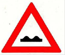
>
> Dieses Zeichen zeigt Hindernisse, wie Querrinnen, Aufwölbungen oder aufgewölbte Brücken, an\.

#### 2\. „GEFÄHRLICHE KURVEN“ oder „GEFÄHRLICHE KURVE“

> 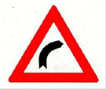  
>   
> 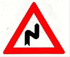  
> 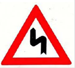
>
> Diese Zeichen zeigen an:
>
>> `a)` eine Rechtskurve,
>
>> `b)` eine Linkskurve,
>
>> `c)` eine Doppelkurve rechts beginnend,
>
>> `d)` eine Doppelkurve links beginnend;
>
> sie sind vor Kurven, die wegen ihrer Beschaffenheit oder Unübersichtlichkeit gefährlich sind, dem Verlauf der Kurve entsprechend anzubringen\. Sind auf einer kurvenreichen Strecke die Kurven nicht mehr als 240 m voneinander entfernt, so genügt die Anbringung eines der ersten Kurve entsprechenden Zeichens nach lit\. c oder d, unter dem auf einer Zusatztafel nach § 54 Abs\. 5 lit\. b die Länge der kurvenreichen Strecke anzugeben ist\.

#### 3\. „KREUZUNG“

> 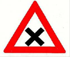
>
> Dieses Zeichen zeigt eine Kreuzung an; in Ortsgebieten ist es nur anzubringen, wenn es die Verkehrssicherheit im besonderen Maße erfordert\.

#### 3a\. „KREUZUNG MIT KREISVERKEHR“

> 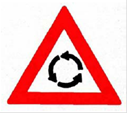
>
> Dieses Zeichen kann an Stelle des Zeichens nach Z 3 und nach Maßgabe der Bestimmungen der Z 3 aufgestellt werden, um eine Kreuzung mit Kreisverkehr anzuzeigen\.

#### 4\. „KREUZUNG MIT STRASSE OHNE VORRANG“

> 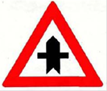
>
> Dieses Zeichen zeigt eine Kreuzung mit einer Straße ohne Vorrang an und bedeutet, dass das in der Richtung des starken Striches fahrende Fahrzeug den Vorrang hat \(§ 19\)\.
>
> *\(Anm\.: 5 aufgehoben durch Art I Z 55 BG, BGBl\. Nr\. 412/1976\.\)*

#### 6a\. „BAHNÜBERGANG MIT SCHRANKEN“

> 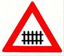
>
> Dieses Zeichen kündigt einen durch Schranken gesicherten Eisenbahnübergang an; es ist vor jedem so gesicherten Bahnübergang anzubringen\.

#### 6b\. „BAHNÜBERGANG OHNE SCHRANKEN“

> 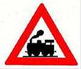
>
> Dieses Zeichen kündigt einen nicht durch Schranken gesicherten Eisenbahnübergang an; es ist vor jedem solchen Bahnübergang, ausgenommen bei Straßenbahnen im Ortsgebiet, anzubringen\. Die Behörde kann die Anbringung des Zeichens bei Bahnübergängen von Anschluß\- oder Materialbahnen erlassen, wenn diese durch Bewachung gesichert werden und die Zeichen des Bewachungsorganes für den Straßenbenützer rechtzeitig erkennbar sind\.

#### 6c\. „BAKEN“

> 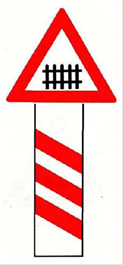 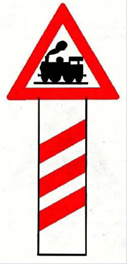  
> 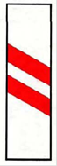 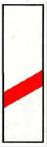
>
> Diese Zeichen kündigen Eisenbahnübergänge an und sind beiderseits der Straße anzubringen; die Baken mit den 3 roten schräg gestellten Balken sind unter den in Z 6a und 6b angeführten Zeichen ungefähr 240 m, die Baken mit 2 Balken ungefähr 160 m und die Baken mit einem Balken ungefähr 80 m vor dem Bahnübergang anzubringen\. Diese Zeichen sind vor allen schienengleichen Eisenbahnübergängen auf Straßen, die für den Durchzugsverkehr von Bedeutung sind, dann anzubringen, wenn es sich um eine Haupt\- oder Nebenbahn im Sinne des § 4 Eisenbahngesetz 1957, BGBl\. Nr\. 60/1957, handelt\. In anderen Fällen sind die Baken dann anzubringen, wenn es die Verkehrssicherheit erfordert\.

#### 6d\. „ANDREASKREUZ“

>   
> 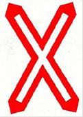  
>   
> 
>
> Dieses Zeichen zeigt einen Bahnübergang an\. Näheres über die Anbringung dieses Zeichens und über das Verhalten der Straßenbenützer bei einem solchen Zeichen ergibt sich aus eisenbahnrechtlichen Vorschriften\.
>
> *\(Anm\.: 6e aufgehoben durch Art I Z 34 BG, BGBl\. Nr\. 204/1964\)*

#### 7\. „GEFÄHRLICHES GEFÄLLE“

> 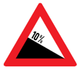
>
> Dieses Zeichen kündigt ein starkes Gefälle der Straße an\. Das Gefälle ist in Prozenten anzugeben und hat sich auf den steilsten Teil der Strecke zu beziehen\.

#### 7a\. „STARKE STEIGUNG“

> 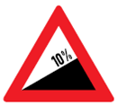
>
> Dieses Zeichen kündigt eine starke Steigung der Straße an\. Die Steigung ist in Prozenten anzugeben und hat sich auf den steilsten Teil der Strecke zu beziehen\.

#### 8\. „FAHRBAHNVERENGUNG“

> 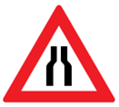
>
> 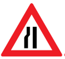
>
> 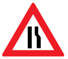
>
> Diese Zeichen kündigen
>
>> `a)` eine beiderseitige,
>
>> `b)` eine linksseitige und
>
>> `c)` eine rechtsseitige
>
> &nbsp; Verengung der Fahrbahn an\.

#### 9\. „BAUSTELLE“

> 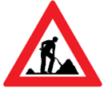
>
> Dieses Zeichen zeigt Arbeiten auf oder neben der Straße sowie damit üblicherweise verbundene Gefahren \(wie Straßenverunreinigungen, Rollsplitt, Künettenabdeckungen und dgl\.\) an\.

#### 10\. „SCHLEUDERGEFAHR“

> 
>
> Dieses Zeichen zeigt Stellen an, auf denen auf der Fahrbahn unter besonderen Verhältnissen Gleitgefahr besteht\. Auf einer Zusatztafel kann die Ursache der Gleitgefahr angekündigt werden\.

#### 10a\. „SEITENWIND“

> 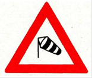
>
> Dieses Zeichen zeigt Stellen an, auf denen häufig starker Seitenwind auftritt, dessen Stärke und Richtung durch einen Windsack angezeigt werden kann\.

#### 10b\. „STEINSCHLAG“

> 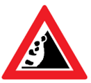
>
> Dieses Zeichen kündigt einen Straßenabschnitt an, wo mit Steinschlag und daher auch mit Steinen auf der Straße zu rechnen ist\.

#### 10c\. „FLUGBETRIEB“

> 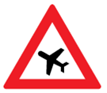
>
> Dieses Zeichen kündigt einen Straßenabschnitt an, wo mit tieffliegenden Luftfahrzeugen zu rechnen ist\.

#### 11\. „FUSSGÄNGERÜBERGANG“

> 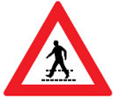
>
> Dieses Zeichen zeigt einen Schutzweg \(§ 2 Abs\. 1 Z 12\) an\.

#### 11a\. „RADFAHRERÜBERFAHRT“

> 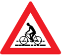
>
> Dieses Zeichen kündigt eine Radfahrerüberfahrt an\.

#### 12\. „KINDER“

> 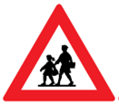
>
> Dieses Zeichen zeigt Stellen z\. B\. in der Nähe von Schulen, Kindergärten und Spielplätzen an, wo sich häufig Kinder aufhalten\.

#### 13a\. „ACHTUNG TIERE“

> 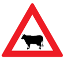
>
> Dieses Zeichen zeigt den Beginn eines Gebietes an, in dem mit unbegleiteten Weidetieren zu rechnen ist\. Es ist insbesondere in Alpgebieten und in Gebieten, in denen der unbeaufsichtigte Weidegang nach altem Herkommen üblich ist, anzubringen \(§ 81 Abs\. 3\)\.

#### 13b\. „ACHTUNG WILDWECHSEL“

> 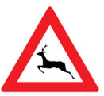
>
> Dieses Zeichen zeigt ein Gebiet an, wo damit zu rechnen ist, dass Wild die Straße überquert\.

#### 14\. „ACHTUNG GEGENVERKEHR“

> 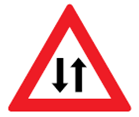
>
> Dieses Zeichen zeigt an, dass auf Straßen, auf denen sonst nur in einer Richtung gefahren wird, mit Gegenverkehr zu rechnen ist\.

#### 14a\.    ‚ACHTUNG FALSCHFAHRER’

> 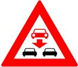
>
> Dieses Zeichen zeigt an, dass ein Fahrzeug auf einer Richtungsfahrbahn entgegen der vorgesehenen Fahrtrichtung fährt, obwohl das nicht durch Straßenverkehrszeichen oder Bodenmarkierungen erlaubt ist\.

#### 15\. „VORANKÜNDIGUNG EINES LICHTZEICHENS“

> 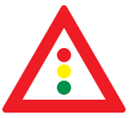
>
> Dieses Zeichen kündigt eine Lichtsignalanlage an\. Es ist nur dann anzubringen, wenn mit einer Lichtsignalanlage üblicherweise nicht gerechnet werden muss oder wenn eine solche Anlage schlecht wahrnehmbar ist\.

#### 16\. „ANDERE GEFAHREN“

> 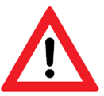
>
> Dieses Zeichen kündigt andere als in Z 1 bis 15 angeführte Gefahrenstellen an\. Auf einer Zusatztafel unter dem Zeichen kann die Gefahr näher bezeichnet werden, wie etwa Bankett nicht befahrbar, Holzbringung, Lawinengefahr, Wasserschutzgebiet u\. dgl\.

\[ [🔗 Permalink](https://github.com/clairexen/RisEx/blob/main/files/BG.StVO.md#-50-stvo--die-gefahrenzeichen) | [📖 RIS-Gesamtansicht](https://ris.bka.gv.at/GeltendeFassung.wxe?Abfrage=Bundesnormen&Gesetzesnummer=10011336#MainContent_DocumentRepeater_BundesnormenCompleteNormDocumentData_61_TextContainer_61) \]

### § 51 StVO — Allgemeines über Vorschriftszeichen

> `(1)` Die Vorschriftszeichen sind vor der Stelle, für die sie gelten, anzubringen\. Gilt die Vorschrift für eine längere Straßenstrecke, so ist das Ende der Strecke durch ein gleiches Zeichen, unter dem eine Zusatztafel mit der Aufschrift „ENDE“ anzubringen ist, kenntlich zu machen, sofern sich aus den Bestimmungen des § 52 nichts anderes ergibt\. Innerhalb dieser Strecke ist das Zeichen zu wiederholen, wenn es die Verkehrssicherheit erfordert\. Gilt ein Überholverbot oder eine Geschwindigkeitsbeschränkung für eine Straßenstrecke von mehr als 1 km, so ist bei den betreffenden Vorschriftszeichen die Länge der Strecke mit einer Zusatztafel nach § 54 Abs\. 5 lit\. b anzugeben, wenn es die Verkehrssicherheit erfordert; dies gilt für allfällige Wiederholungszeichen sinngemäß\.

> `(2)` Die Vorschriftszeichen „Einbiegen verboten“ und „Umkehren verboten“ sind in angemessenem Abstand vor der betreffenden Kreuzung, die Vorschriftszeichen „Vorrang geben“ und „Halt“ sind im Ortsgebiet höchstens 10 m und auf Freilandstraßen höchstens 20 m vor der Kreuzung anzubringen\. Die äußere Form der Zeichen „Vorrang geben“ und „Halt“ muß auch von der Rückseite her erkennbar sein\.

> `(3)` Bei den Vorschriftszeichen können an Stelle einer Zusatztafel die in § 54 bezeichneten Angaben im roten Rand des Straßenverkehrszeichens einzeilig und leicht lesbar angebracht werden, wenn die Erkennbarkeit des Zeichens nicht beeinträchtigt wird\.

> `(4)` Für die Anbringung von Vorschriftszeichen, die sich auf ein ganzes Ortsgebiet oder auf Straßen mit bestimmten Merkmalen innerhalb eines Ortsgebietes beziehen, gilt § 44 Abs\. 4\.

> `(5)` Mündet in einen Straßenabschnitt, für den durch Vorschriftszeichen Verkehrsbeschränkungen kundgemacht sind, eine andere Straße ein, so können diese Beschränkungen auch schon auf der einmündenden Straße durch die betreffenden Vorschriftszeichen mit einer Zusatztafel mit Pfeilen angezeigt werden\. Solche Zeichen sind im Ortsgebiet höchstens 20 m und auf Freilandstraßen höchstens 50 m vor der Einmündung anzubringen\.

\[ [🔗 Permalink](https://github.com/clairexen/RisEx/blob/main/files/BG.StVO.md#-51-stvo--allgemeines-über-vorschriftszeichen) | [📖 RIS-Gesamtansicht](https://ris.bka.gv.at/GeltendeFassung.wxe?Abfrage=Bundesnormen&Gesetzesnummer=10011336#MainContent_DocumentRepeater_BundesnormenCompleteNormDocumentData_62_TextContainer_62) \]

### § 52 StVO — Die Vorschriftszeichen

> Die Vorschriftszeichen sind
>
>> `a)` Verbots\- oder Beschränkungszeichen,
>
>> `b)` Gebotszeichen oder
>
>> `c)` Vorrangzeichen\.

#### a\) Verbots\- oder Beschränkungszeichen

#### 1\. „FAHRVERBOT \(IN BEIDEN RICHTUNGEN\)“

> 
>
> Dieses Zeichen zeigt an, dass das Fahren in beiden Fahrtrichtungen verboten ist; das Schieben eines Fahrrades ist erlaubt\.

#### 2\. „EINFAHRT VERBOTEN“

> 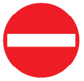
>
> Dieses Zeichen zeigt an, dass die Einfahrt verboten ist\.

#### 3a\. „EINBIEGEN NACH LINKS VERBOTEN“

> 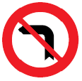

#### 3b\. „EINBIEGEN NACH RECHTS VERBOTEN“

> 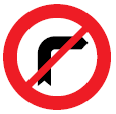
>
> Diese unter Z 3a und 3b angeführten Zeichen zeigen je nach der Richtung des Pfeiles an, dass das Einbiegen in die nächste Querstraße nach rechts oder links verboten ist\.

#### 3c\. „UMKEHREN VERBOTEN“

> 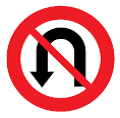
>
> Dieses Zeichen zeigt an, dass an der betreffenden Straßenstelle oder Kreuzung das Umkehren verboten ist\.

#### 4a\. „ÜBERHOLEN VERBOTEN“

> 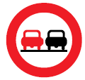
>
> Dieses Zeichen zeigt an, dass das Überholen von mehrspurigen Kraftfahrzeugen verboten ist\. Es ist auf beiden Seiten der Fahrbahn anzubringen\.

#### 4b\. „ENDE DES ÜBERHOLVERBOTES“

> 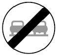
>
> Dieses Zeichen zeigt das Ende des Überholverbotes \(Z 4a\) an\.

#### 4c\. „ÜBERHOLEN FÜR LASTKRAFTFAHRZEUGE VERBOTEN“

> 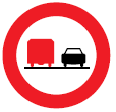
>
> Dieses Zeichen zeigt an, dass mit Lastkraftfahrzeugen mit einem höchsten zulässigen Gesamtgewicht von mehr als 3,5 t das Überholen von mehrspurigen Kraftfahrzeugen verboten ist\. Es ist auf beiden Seiten der Fahrbahn anzubringen\.

#### 4d\. „ENDE DES ÜBERHOLVERBOTES FÜR LASTKRAFTFAHRZEUGE“

> 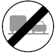
>
> Dieses Zeichen zeigt das Ende des Überholverbotes für Lastkraftfahrzeuge \(Z 4c\) an\.

#### 5\. „WARTEPFLICHT BEI GEGENVERKEHR“

> 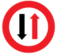
>
> Dieses Zeichen zeigt an, dass der Lenker eines in der durch den roten Pfeil bezeichneten Fahrtrichtung fahrenden Fahrzeuges bei Gegenverkehr zu warten hat\.

#### 6a\. „FAHRVERBOT FÜR ALLE KRAFTFAHRZEUGE AUSSER EINSPURIGEN MOTORRÄDERN“

> 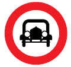
>
> Dieses Zeichen zeigt an, dass das Fahren mit allen mehrspurigen Kraftfahrzeugen verboten ist\.

#### 6b\. „FAHRVERBOT FÜR MOTORRÄDER“

> 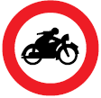
>
> Dieses Zeichen zeigt an, dass das Fahren mit allen einspurigen Kraftfahrzeugen verboten ist\.

#### 6c\. „FAHRVERBOT FÜR ALLE KRAFTFAHRZEUGE“

> 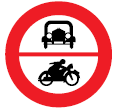
>
> Dieses Zeichen zeigt an, dass das Fahren mit allen Kraftfahrzeugen verboten ist\.

#### 6d\. „FAHRVERBOT FÜR KRAFTFAHRZEUGE MIT ANHÄNGER“

> 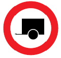
>
> Dieses Zeichen zeigt an, dass das Fahren mit Kraftfahrzeugen mit allen Arten von Anhängern verboten ist\. Eine Gewichtsangabe bedeutet, dass das Verbot nur gilt, wenn das höchste zulässige Gesamtgewicht des Anhängers das im Zeichen angegebene Gewicht überschreitet\. Eine Längenangabe bedeutet, dass das Verbot nur gilt, wenn die Länge des Anhängers die im Zeichen angegebene Länge überschreitet\.

#### 7a\. „FAHRVERBOT FÜR LASTKRAFTFAHRZEUGE“

> 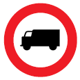  
> 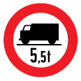  
> 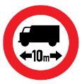
>
> Diese Zeichen zeigen an, dass das Fahren mit Lastkraftfahrzeugen verboten ist\.
>
> Eine Gewichtsangabe bedeutet, dass das Verbot nur für ein Lastkraftfahrzeug gilt, wenn das höchste zulässige Gesamtgewicht des Lastkraftfahrzeuges oder das höchste zulässige Gesamtgewicht eines mitgeführten Anhängers das im Zeichen angegebene Gewicht überschreitet\.
>
> Eine Längenangabe bedeutet, dass das Verbot nur gilt, wenn die Länge des Lastkraftfahrzeuges oder die Länge eines mitgeführten Anhängers oder die Länge des Lastkraftfahrzeuges samt Anhänger die im Zeichen angegebene Länge überschreitet\.

#### 7b\. „FAHRVERBOT FÜR LASTKRAFTFAHRZEUGE MIT ANHÄNGER“

> 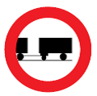
>
> Dieses Zeichen zeigt an, dass das Fahren mit Lastkraftfahrzeugen mit Anhänger verboten ist\. Die Gewichtsangabe bedeutet, dass das Mitführen von Anhängern verboten ist, deren Gesamtgewicht das im Zeichen angegebene Gewicht überschreitet\. Der Verkehr von Sattelkraftfahrzeugen und von Zugmaschinen mit einem Anhänger ist jedoch gestattet\.

#### 7c\. „FAHRVERBOT FÜR FUHRWERKE“

> 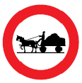
>
> Dieses Zeichen zeigt an, dass die Einfahrt für Fuhrwerke \(§ 2 Abs\. 1 Z 21\) verboten ist\.
>
> 7d\. *entfällt*

#### 7e\. „FAHRVERBOT FÜR KRAFTFAHRZEUGE MIT GEFÄHRLICHEN GÜTERN“

>   
> &nbsp; Dieses Zeichen zeigt an, dass das Fahren mit Beförderungseinheiten, mit denen gefährliche Güter gemäß den in § 2 Z 1 GGBG, BGBl\. I Nr\. 145/1998, angeführten Vorschriften befördert werden und die gemäß diesen Vorschriften mit orangefarbenen Tafeln zu kennzeichnen sind, verboten ist\. Bezieht sich das Verbot auf einen gemäß diesen Vorschriften kategorisierten Tunnel, ist auf einer Zusatztafel mit den Großbuchstaben „B“, „C“, „D“ oder „E“ die diesem Tunnel gemäß den genannten Vorschriften zugeordnete Tunnelkategorie anzugeben; in diesem Fall gilt das Verbot nur für Beförderungseinheiten, mit denen gefährliche Güter befördert werden, die in Tunneln der jeweiligen Tunnelkategorie nicht zugelassen sind\.

#### 7f\. „FAHRVERBOT FÜR OMNIBUSSE“

> 
>
> Dieses Zeichen zeigt an, dass das Fahren mit Omnibussen verboten ist\. Eine Gewichtsangabe bedeutet, dass das Verbot nur gilt, wenn das höchste zulässige Gesamtgewicht des Omnibusses das im Zeichen angegebene Gewicht überschreitet\. Eine Längenangabe bedeutet, dass das Verbot nur gilt, wenn die Länge des Omnibusses die im Zeichen angegebene Länge überschreitet\.

#### 8a\. „FAHRVERBOT FÜR FAHRRÄDER UND MOTORFAHRRÄDER“

> 
>
> Dieses Zeichen zeigt an, dass das Fahren mit Fahrrädern und mit Motorfahrrädern verboten ist\. Das Schieben dieser Fahrzeuge ist jedoch gestattet\. Für die Lenker von Motorfahrrädern gilt überdies die Z 8b\.

#### 8b\. „FAHRVERBOT FÜR MOTORFAHRRÄDER“

> 
>
> Dieses Zeichen zeigt an, dass das Fahren mit Motorfahrrädern mit laufendem Motor sowie das Laufenlassen der Motore solcher Fahrzeuge am Stand verboten ist\. Das Schieben dieser Fahrzeuge ohne laufenden Motor ist jedoch gestattet\.

#### 8c\. „FAHRVERBOT FÜR FAHRRÄDER“

> 
>
> Dieses Zeichen zeigt an, dass das Fahren mit Fahrrädern verboten ist; das Schieben dieser Fahrzeuge ist jedoch gestattet\.

#### 9a\. „FAHRVERBOT FÜR ÜBER m BREITE FAHRZEUGE“

> 
>
> Dieses Zeichen zeigt an, dass das Fahren mit Fahrzeugen, deren größte Breite die im Zeichen angegebene Breite überschreitet, verboten ist\.

#### 9b\. „FAHRVERBOT FÜR ÜBER m HOHE FAHRZEUGE“

> 
>
> Dieses Zeichen zeigt an, dass das Fahren mit Fahrzeugen, deren größte Höhe die im Zeichen angegebene Höhe überschreitet, verboten ist\. Es kann oberhalb der Fahrbahn entsprechend der vorhandenen Höhe angebracht werden\.

#### 9c\. „FAHRVERBOT FÜR FAHRZEUGE MIT ÜBER t GESAMTGEWICHT“

> 
>
> Dieses Zeichen zeigt an, dass das Fahren mit Fahrzeugen, deren Gesamtgewicht das im Zeichen angegebene Gewicht überschreitet, verboten ist\.

#### 9d\. „FAHRVERBOT FÜR ALLE FAHRZEUGE MIT ÜBER … t ACHSLAST“

> 
>
> Dieses Zeichen zeigt an, dass das Fahren mit Fahrzeugen, deren Achslast die im Zeichen angegebene Achslast überschreitet, verboten ist\.

#### 10a\. “GESCHWINDIGKEITSBESCHRÄNKUNG \(ERLAUBTE HÖCHSTGESCHWINDIGKEIT\)“

> 
>
> Dieses Zeichen zeigt an, dass das Überschreiten der Fahrgeschwindigkeit, die als Stundenkilometeranzahl im Zeichen angegeben ist, ab dem Standort des Zeichens verboten ist\. Ob und in welcher Entfernung es vor schienengleichen Eisenbahnübergängen anzubringen ist, ergibt sich aus den eisenbahnrechtlichen Vorschriften\.

#### 10b\. „ENDE DER GESCHWINDIGKEITSBESCHRÄNKUNG“

> 
>
> Dieses Zeichen zeigt das Ende der Geschwindigkeitsbeschränkung an\. Es ist nach jedem Zeichen gemäß Z 10a anzubringen und kann auch auf der Rückseite des für die Gegenrichtung geltenden Zeichens angebracht werden\. Es kann entfallen, wenn am Ende der Geschwindigkeitsbeschränkung eine neue Geschwindigkeitsbeschränkung, sei es auch nicht aufgrund dieses Bundesgesetzes, beginnt\.

#### 11\. „ENDE VON ÜBERHOLVERBOTEN UND GESCHWINDIGKEITSBEGRENZUNGEN“

> 
>
> Dieses Zeichen zeigt das Ende von Überholverboten und Geschwindigkeitsbegrenzungen an, die für den betreffenden Straßenabschnitt durch Straßenverkehrszeichen kundgemacht worden sind\.

#### 11a\. „ZONENBESCHRÄNKUNG“

> 
>
> Ein solches Zeichen zeigt den Beginn einer Zone an, innerhalb der die durch das eingefügte Zeichen zum Ausdruck gebrachte Verkehrsbeschränkung gilt, wobei in einem Zeichen auch zwei Beschränkungen dargestellt werden können\.

#### 11b\. „ENDE EINER ZONENBESCHRÄNKUNG“

> 
>
> Ein solches Zeichen zeigt das Ende einer Zonenbeschränkung an\. Es kann auch auf der Rückseite des für die Gegenrichtung geltenden Zeichens \(Z 11a\) angebracht werden\.

#### 12\. „HALT ZOLL“

> 
>
> Dieses Zeichen zeigt eine Zollstelle an, bei der zwecks Zollkontrolle anzuhalten ist\. Mit entsprechend geänderter Aufschrift zeigt das Zeichen auch andere Stellen an, an denen der Fahrzeuglenker anzuhalten und bestimmte Bedingungen zu erfüllen hat, z\. B\. „MAUT“\.

#### 13a\. „PARKEN VERBOTEN“

> 
>
> Dieses Zeichen zeigt mit der Zusatztafel „ANFANG“ den Beginn und mit der Zusatztafel „ENDE“ das Ende eines Straßenabschnittes an, in dem das Parken verboten ist\. Das Verbot bezieht sich auf die Straßenseite, auf der sich dieses Zeichen befindet\.

#### Folgende unter dem Zeichen angebrachte Zusatztafeln zeigen an:

> `a)` Eine Zusatztafel mit der Angabe bestimmter Stunden, dass das Verbot während der angegebenen Stunden gilt;

> `b)` eine Zusatztafel mit der Angabe bestimmter Tage, dass das Verbot an den angegebenen Tagen gilt; beginnt das Verbot nicht um 00 Uhr oder endet es nicht um 24 Uhr, so ist auf der Zusatztafel überdies auch noch der Zeitpunkt des Beginnes oder des Endes des Verbotes anzugeben;

> `c)` eine Zusatztafel mit Pfeilen den Verlauf des Straßenabschnittes, in dem das Verbot gilt; solche Pfeile können statt auf einer Zusatztafel auch im Zeichen selbst angebracht werden, sind dort aber in weißer Farbe auszuführen\. Wenn der Geltungsbereich des Verbotes auf diese Weise unmißverständlich zum Ausdruck gebracht werden kann, so genügt ein Vorschriftszeichen\.

> Die Anbringung weiterer Angaben auf den unter lit\. a bis c angeführten Zusatztafeln sowie die Anbringung von Zusatztafeln mit anderen Angaben ist unbeschadet des § 51 Abs\. 3 zulässig\.

#### 13b\. „HALTEN UND PARKEN VERBOTEN“

> 
>
> Dieses Zeichen zeigt mit der Zusatztafel „ANFANG“ den Beginn und mit der Zusatztafel „ENDE“ das Ende eines Straßenabschnittes an, in dem das Halten und Parken verboten ist\. Das Verbot bezieht sich auf die Straßenseite, auf der sich dieses Zeichen befindet\.
>
> Eine Zusatztafel mit der Aufschrift „AUSGENOMMEN ZUSTELLDIENSTE“ zeigt an, dass das rasche Auf\- oder Abladen geringer Warenmengen vom Halteverbot ausgenommen ist\.
>
> Eine Zusatztafel mit der Aufschrift „AUSGENOMMEN LADETÄTIGKEIT“ zeigt eine Ladezone an\.
>
> Hinsichtlich weiterer Zusatztafeln gelten die Bestimmungen der Z 13a sinngemäß\.

#### 13c\. „WECHSELSEITIGES PARKVERBOT“

> 
>
> Dieses Zeichen zeigt an, dass auf der Straßenseite, auf der dieses Zeichen angebracht ist, das Parken an ungeraden Tagen verboten ist\.
> 
>
> Dieses Zeichen zeigt an, dass auf der Straßenseite, auf der dieses Zeichen angebracht ist, das Parken an geraden Tagen verboten ist\.
>
> Beginnt bei den beiden angeführten Zeichen die wechselseitige Beschränkung für das Parken nicht um 00 Uhr, so ist auf einer Zusatztafel der Zeitpunkt des Beginnes des wechselseitigen Parkverbotes anzugeben, das dann ab diesem Zeitpunkt für 24 Stunden gilt\.
>
> Hinsichtlich der Zusatztafeln „ANFANG“ und „ENDE“ sowie weiterer Zusatztafeln gelten die Bestimmungen der Z 13a sinngemäß\.

#### 13d\. „KURZPARKZONE“

> 
>
> Dieses Zeichen zeigt den Beginn einer Kurzparkzone an\. Wird dieses Zeichen auf der linken Straßenseite angebracht, so bezieht sich die Kurzparkzonenregelung nur auf diese Straßenseite\. Im unteren Teil des Zeichens oder auf einer Zusatztafel ist die Zeit, während der die Kurzparkzonenregelung gilt, und die zulässige Kurzparkdauer anzugeben\. Falls für das Abstellen eines Fahrzeuges in einer Kurzparkzone auf Grund abgabenrechtlicher Vorschriften eine Gebühr zu entrichten ist, so ist auf diesen Umstand durch das Wort „gebührenpflichtig“, das im unteren Teil des Zeichens oder auf einer Zusatztafel anzubringen ist, hinzuweisen\.

#### 13e\. „ENDE DER KURZPARKZONE“

>   
> &nbsp; Dieses Zeichen zeigt das Ende einer Kurzparkzone an\.

#### 14\. „HUPVERBOT“

> 
>
> Dieses Zeichen zeigt an, dass die Betätigung der Vorrichtungen zur Abgabe von Schallzeichen verboten ist, wenn zur Abwendung einer Gefahr von einer Person ein anderes Mittel ausreicht\. Die Zusatztafel mit der Angabe bestimmter Stunden zeigt die Geltungsdauer des Verbotes an\. Das Ende dieses Verbotes ist durch das gleiche Zeichen mit der Zusatztafel „ENDE“ kenntlich zu machen\.

#### 14a\.    ,REITVERBOT’

> 
>
> Dieses Zeichen zeigt an, dass das Reiten verboten ist\. Ausgenommen sind Organe der Bundespolizei als Reiter von Dienstpferden\.

#### 14b\.    ,VERBOT FÜR FUSSGÄNGER’

>   
> &nbsp; Dieses Zeichen zeigt an, dass das Betreten für Fußgänger verboten ist\.

#### b\) Gebotszeichen\.

#### 15\. „VORGESCHRIEBENE FAHRTRICHTUNG“

> 
>
> Dieses Zeichen zeigt an, dass Lenker von Fahrzeugen nur in der durch den Pfeil angegebenen Fahrtrichtung fahren dürfen\. Der Pfeil kann der jeweiligen örtlichen Verkehrslage entsprechend, z\. B\. senkrecht, gebogen, geneigt oder mit mehr als einer Spitze ausgeführt sein\. Ein nach unten geneigter Pfeil zeigt den zu benützenden Fahrstreifen an\. Durch eine Zusatztafel oder durch weiße Aufschrift im blauen Feld unter dem Pfeil kann angezeigt werden, dass das Gebot nur für eine bestimmte Gruppe von Straßenbenützern gilt\.
>
> Das Zeichen ist, sofern es sich auf eine Kreuzung bezieht, in angemessenem Abstand vor der Kreuzung, sonst vor der Stelle, für die es gilt, anzubringen; bei einer einmündenden Straße darf dieses Zeichen statt vor der Kreuzung auch nur gegenüber der einmündenden Straße angebracht werden\. Das Zeichen darf entsprechend dem angestrebten Gebot auch nur auf der Fahrbahn \(wie etwa auf einer Schutzinsel oder vor einem Hindernis\) angebracht werden\.

#### 15a\. “VORGESCHRIEBENE FAHRTRICHTUNG FÜR KRAFTFAHRZEUGE MIT GEFÄHRLICHEN GÜTERN“

>     
> &nbsp; Dieses Zeichen zeigt an, dass Lenker von Beförderungseinheiten, mit denen gefährliche Güter gemäß den in § 2 Z 1 GGBG, BGBl\. I Nr\. 145/1998, angeführten Vorschriften befördert werden und die gemäß diesen Vorschriften mit orangefarbenen Tafeln zu kennzeichnen sind, nur in der durch den Pfeil angegebenen Fahrtrichtung fahren dürfen\. Ist dieses Gebot auf Grund eines für einen kategorisierten Tunnel im Sinn der Z 7e geltenden Fahrverbots erforderlich, so ist auf einer Zusatztafel mit den Großbuchstaben „B“, „C“, „D“ oder „E“ die diesem Tunnel zugeordnete Tunnelkategorie anzugeben; in diesem Fall gilt das Gebot nur für Beförderungseinheiten, mit denen gefährliche Güter befördert werden, die in Tunneln der jeweiligen Tunnelkategorie nicht zugelassen sind\.

#### 16\. „RADWEG“

> 
>
> Dieses Zeichen zeigt an, dass Lenker von einspurigen Fahrrädern nur den Radweg benützen dürfen\.

#### 17\. „GEHWEG“

> 
>
> Dieses Zeichen zeigt einen Gehweg an\.

#### 17a\. „GEH\- UND RADWEG“

> 
>
> 
>
> Diese Zeichen zeigen einen Geh\- und Radweg an, und zwar ein Zeichen nach a\) einen für Fußgänger und Radfahrer gemeinsam zu benützenden Geh\- und Radweg und ein Zeichen nach b\) einen Geh\- und Radweg, bei dem der Fußgänger\- und Fahrradverkehr getrennt geführt werden, wobei die Symbole im Zeichen nach b\) der tatsächlichen Verkehrsführung entsprechend anzuordnen sind \(Fußgänger rechts, Fahrrad links oder umgekehrt\)\.

#### 17b\. „REITWEG“

> 
>
> Dieses Zeichen zeigt einen Reitweg an\.
>
> *\(Anm\.: Z 18 aufgehoben durch BGBl\. I Nr\. 52/2024\)*

#### 19\. „VORGESCHRIEBENE MINDESTGESCHWINDIGKEIT“

> 
>
> Dieses Zeichen zeigt an, dass die Lenker von Fahrzeugen unbeschadet der Bestimmungen des § 20 über die Fahrgeschwindigkeit ab dem Standort des Zeichens nicht langsamer fahren dürfen, als mit der im Zeichen angegebenen Anzahl von Kilometern pro Stunde\.
>
> *\(Anm\.: 20 aufgehoben durch BGBl\. Nr\. 518/1994\)*

#### 21\. „UMKEHRGEBOT“

> 
>
> Dieses Zeichen zeigt an, dass die Lenker von Fahrzeugen an der betreffenden Straßenstelle umzukehren haben\.

#### 22\. „SCHNEEKETTEN VORGESCHRIEBEN“

> 
>
> Dieses Zeichen zeigt an, dass Kraftwagen, die auf der Straße fahren, an deren Beginn das Zeichen angebracht ist, auf mindestens zwei Antriebsrädern Schneeketten haben müssen\.

#### 22a\. „ENDE EINES GEBOTES“

> Ein roter Querbalken von links unten nach rechts oben in den Zeichen nach Z 16, 17, 17a, 19 und 22 zeigt das Ende des durch das Zeichen ausgedrückten Gebotes an\. Ein solches Zeichen kann auch auf der Rückseite des für die Gegenrichtung geltenden Zeichens angebracht werden\.

#### c\) Vorrangzeichen

#### 23\. „VORRANG GEBEN“

> 
>
> Dieses Zeichen zeigt an, dass gemäß § 19 Abs\. 4 Vorrang zu geben ist\. Es ist vor einer Kreuzung mit einer Vorrangstraße oder mit einer Straße mit starkem Verkehr anzubringen, sofern nicht das Vorschriftszeichen „Halt“ erforderlich ist\.

#### 24\. „HALT“

> 
>
> Dieses Zeichen ordnet an, dass vor einer Kreuzung anzuhalten und gemäß § 19 Abs\. 4 Vorrang zu geben ist\. Fehlt eine Bodenmarkierung oder ist sie nicht sichtbar, so ist das Fahrzeug an einer Stelle anzuhalten, von der aus gute Übersicht besteht\. Das Zeichen ist vor allem vor solchen Kreuzungen anzubringen, die besonders gefährlich sind und an denen die Lenker von Fahrzeugen die Verkehrslage in der Regel nur dann richtig beurteilen können, wenn sie anhalten\. Ob und in welcher Entfernung es vor schienengleichen Eisenbahnübergängen anzubringen ist, ergibt sich aus den eisenbahnrechtlichen Vorschriften\.

#### 25a\. „VORRANGSTRASSE“

> 
>
> Dieses Zeichen zeigt den Beginn und den Verlauf einer Vorrangstraße an\. Wenn eine Vorrangstraße auf einer Kreuzung die Richtung ihres Verlaufes ändert, so ist der Verlauf der Vorrangstraße auf einer Zusatztafel nach § 54 Abs\. 5 lit\. e erkennbar zu machen\.

#### 25b\. „ENDE DER VORRANGSTRASSE“

>   
> &nbsp; Dieses Zeichen zeigt das Ende einer Vorrangstraße an\.

\[ [🔗 Permalink](https://github.com/clairexen/RisEx/blob/main/files/BG.StVO.md#-52-stvo--die-vorschriftszeichen) | [📖 RIS-Gesamtansicht](https://ris.bka.gv.at/GeltendeFassung.wxe?Abfrage=Bundesnormen&Gesetzesnummer=10011336#MainContent_DocumentRepeater_BundesnormenCompleteNormDocumentData_63_TextContainer_63) \]

### § 53 StVO — Die Hinweiszeichen

> `(1)` Die Hinweiszeichen weisen auf verkehrswichtige Umstände hin\. Hinweiszeichen sind die folgenden Zeichen:

#### 1a\. „PARKEN“

>   
> &nbsp; Dieses Zeichen kennzeichnet einen Parkplatz oder einen Parkstreifen\.  
> &nbsp; Im unteren Teil des Zeichens oder auf einer Zusatztafel kann eine besondere Art des Aufstellens der Fahrzeuge für das Parken \(Schräg\- oder Querparken\) angegeben werden; in einem solchen Fall kann die Bodenmarkierung entfallen\.

#### 1b\. „ZUM PARKPLATZ“

>   
> &nbsp; Dieses Zeichen weist auf einen Parkplatz hin\.

#### 1c\. „PANNENBUCHT“

>   
> &nbsp; Dieses Zeichen zeigt eine Pannenbucht an; das Abstellen eines Fahrzeuges in einer Pannenbucht ist nur bei Pannen, in Notfällen oder bei Gefahr oder für Fahrzeuge des Straßendienstes, der Straßenaufsicht oder des Pannendienstes erlaubt\.

#### 2\. „SPITAL“

>   
> &nbsp; Dieses Zeichen weist auf eine Heilstätte oder auf ein Krankenhaus hin\. Jeder Lärm ist zu vermeiden; es muss damit gerechnet werden, dass Kranke und Gebrechliche die Straße überqueren\.

#### 2a\. „KENNZEICHNUNG EINES SCHUTZWEGES“

>   
> &nbsp; Dieses Zeichen kennzeichnet einen Schutzweg \(§ 2 Abs\. 1 Z 12\), bei dem ständig betriebene Lichtzeichen zur Regelung des Verkehrs oder zur Abgabe blinkenden gelben Lichtes nicht vorhanden sind\. Es ist beim Schutzweg anzubringen, und zwar auf Einbahnstraßen an beiden Seiten, auf anderen Straßen an der rechten Seite\. Wenn jedoch die Verkehrssicherheit dadurch nicht beeinträchtigt wird, ist statt der seitlichen Anbringung die Anbringung des Zeichens über dem Schutzweg zulässig\.

#### 2b\. „KENNZEICHNUNG EINER RADFAHRERÜBERFAHRT“

>   
> &nbsp; Dieses Zeichen kennzeichnet eine Radfahrerüberfahrt \(§ 2 Abs\. 1 Z 12a\), bei der ständig betriebene Lichtzeichen zur Regelung des Verkehrs oder zur Abgabe blinkenden gelben Lichtes nicht vorhanden sind\. Für die Anbringung dieses Zeichens gelten die diesbezüglichen Bestimmungen der Z 2a sinngemäß\.
>
>> `2c.` „Kennzeichnung eines Schutzweges und einer Radfahrerüberfahrt“
>
>   
> &nbsp; Dieses Zeichen kennzeichnet die Fortsetzung eines Geh\- und Radwegs sowie eines gemeinsam geführten Geh\- und Radwegs für die Überquerung der Fahrbahn durch Fußgänger und Radfahrer\. Für die Anbringung dieses Zeichens gelten die Bestimmungen der Z 2a sinngemäß\.
>
>> `2d.` Unterführung
>
>   
> &nbsp; Dieses Zeichen kennzeichnet eine Fußgängerunterführung\.

#### 3\. „ERSTE HILFE“

>   
> &nbsp; Dieses Zeichen weist auf einen Hilfsposten hin, der für die Leistung erster Hilfe ausgerüstet ist\. Wird dieses Zeichen nicht beim Hilfsposten selbst angebracht, so ist auf einer Zusatztafel oder in weißer Farbe auf dem Zeichen selbst in die Richtung des Hilfspostens zu weisen und die Entfernung anzugeben\.

#### 3a\. „GOTTESDIENSTE“

>   
> &nbsp; Dieses Zeichen weist auf Einrichtungen für Gottesdienste hin\. Im blauen Feld des Zeichens oder auf einer Zusatztafel können nähere Angaben über Art, Ort und Zeit des Gottesdienstes angegeben werden \(Symbole, Schriftzeichen, Ziffern\)\. Dieses Zeichen darf nur innerhalb des Ortsgebietes angebracht werden\. Die Kosten für die Anbringung und Erhaltung dieses Zeichens sind von demjenigen zu tragen, der die Anbringung des Zeichens beantragt\.

#### 4\. „PANNENHILFE“

>   
> &nbsp; Dieses Zeichen weist auf eine Reparaturwerkstätte hin\. Wenn nötig, ist auf Zusatztafeln oder in weißer Farbe auf dem Zeichen selbst die Art der Werkstätte und die Entfernung bis zur Werkstätte anzugeben und in die Richtung der Werkstätte zu weisen\.

#### 4a\. „VERKEHRSFUNK“

> &nbsp; Dieses Zeichen informiert über den örtlichen Frequenzbereich von Radiostationen, die Verkehrsinformationen durchgeben\. Es entspricht dem Zeichen gemäß Z 4 mit der Maßgabe, dass in dem weißen Feld der Name der Radiostation und anstelle der Entfernungsangabe der jeweilige örtliche Frequenzbereich anzugeben ist\. Außerhalb des Ortsgebietes darf dieses Zeichen \- abgesehen vom Fall einer Frequenzänderung \- innerhalb einer Entfernung von 50 km nur einmal in der gleichen Fahrtrichtung, auf Autobahnen jedoch nur nach der Einmündung einer Auffahrt angebracht werden\.

#### 5\. „TELEFON“

>   
> &nbsp; Dieses Zeichen weist auf eine Fernsprechstelle hin\. Wenn nötig, ist auf einer Zusatztafel oder mit weißer Farbe auf dem Zeichen selbst in die Richtung der Fernsprechstelle zu weisen und die Entfernung bis zur Fernsprechstelle anzugeben\.

#### 6\. „TANKSTELLE“

>   
> &nbsp; Dieses Zeichen weist auf eine Tankstelle hin\. Auf einer Zusatztafel kann die Entfernung bis zur Tankstelle sowie die Marke des Treibstoffes auch in anderen Farben angegeben werden\. Die Anbringung des Markenzeichens unter diesem Zeichen ist zulässig\. Auf derselben Straße darf dieses Zeichen jedoch innerhalb einer Entfernung von 1000 m nur einmal in der gleichen Fahrtrichtung angebracht werden\.

#### 6a\.

>   
> &nbsp; Dieses Zeichen weist auf einen Taxistandplatz hin\.“

#### 6b\. „E\-Ladestelle“

>   
> &nbsp; Dieses Zeichen weist auf eine E\-Ladestelle hin\. Im blauen Rand kann die Entfernung bis zur E\-Ladestelle angegeben werden\. Auf derselben Straße darf dieses Zeichen innerhalb einer Entfernung von 1000 m nur einmal in der gleichen Fahrtrichtung angegeben werden\.

#### 7\. „ENDE DES GEGENVERKEHRS“

>   
> &nbsp; Dieses Zeichen zeigt an, dass mit dem angekündigten \(§ 50 Z 14\) ausnahmsweisen Gegenverkehr nicht mehr gerechnet zu werden braucht\.

#### 7a\. „WARTEPFLICHT FÜR GEGENVERKEHR“

>   
> &nbsp; Dieses Zeichen zeigt an, dass der Lenker eines entgegenkommenden Fahrzeuges gemäß § 52 Z 5 zu warten hat\.

#### 8a\. „AUTOBAHN“

>   
> &nbsp; Dieses Zeichen zeigt den Beginn einer Autobahn an\.

#### 8b\. „ENDE DER AUTOBAHN“

>   
> &nbsp; Dieses Zeichen zeigt das Ende einer Autobahn an\.

#### 8c\. „AUTOSTRASSE“

>   
> &nbsp; Dieses Zeichen zeigt den Beginn einer Autostraße an\.

#### 8d\. „ENDE DER AUTOSTRASSE“

>   
> &nbsp; Dieses Zeichen zeigt das Ende einer Autostraße an\.

#### 9a\. „FUSSGÄNGERZONE“

>   
> &nbsp; Dieses Zeichen zeigt den Beginn einer Fußgängerzone an\. Es bedeutet gleichzeitig, dass hier jeglicher Fahrzeugverkehr verboten ist, sofern sich aus § 76a nichts anderes ergibt\. Dieses Zeichen darf auch nur auf der Fahrbahn angebracht werden\.

#### 9b\. „ENDE EINER FUSSGÄNGERZONE“

>   
> &nbsp; Dieses Zeichen zeigt das Ende einer Fußgängerzone an\. Es darf auch nur auf der Fahrbahn angebracht werden\.

#### 9c\. „WOHNSTRASSE“

>   
> &nbsp; Dieses Zeichen zeigt den Beginn einer Wohnstraße an und bedeutet, dass hier die besonderen Bestimmungen des § 76b gelten\. Dieses Zeichen darf auch nur auf der Fahrbahn angebracht werden\.

#### 9d\. „ENDE EINER WOHNSTRASSE“

>   
> &nbsp; Dieses Zeichen zeigt das Ende einer Wohnstraße an und bedeutet, dass die besonderen Bestimmungen des § 76b nun nicht mehr gelten und dass dem außerhalb der Wohnstraße fließenden Verkehr Vorrang zu geben ist\. Dieses Zeichen darf auch nur auf der Fahrbahn angebracht werden\.

#### 9e\. „BEGEGNUNGSZONE“

>   
> &nbsp; Dieses Zeichen zeigt den Beginn einer Begegnungszone an und bedeutet, dass hier die besonderen Bestimmungen des § 76c gelten\. Wurde in der Begegnungszone die erlaubte Höchstgeschwindigkeit gemäß § 76c Abs\. 6 auf 30 km/h erhöht, ist auf dem Zeichen die Zahl „20“ durch die Zahl „30“ zu ersetzen\.

#### 9f\. „ENDE EINER BEGEGNUNGSZONE“

>   
> &nbsp; Dieses Zeichen zeigt das Ende einer Begegnungszone an und bedeutet, dass die besonderen Bestimmungen des § 76c nun nicht mehr gelten\. Wurde in der Begegnungszone die erlaubte Höchstgeschwindigkeit gemäß § 76c Abs\. 6 auf 30 km/h erhöht, ist auf dem Zeichen die Zahl „20“ durch die Zahl „30“ zu ersetzen\.

#### 9g\. „TUNNEL“

>   
> &nbsp; Dieses Zeichen zeigt einen Tunnel an, in dem die Bestimmungen des § 8b gelten\. Es ist vor dem Portal eines jeden Tunnels mit einer Länge von mehr als 500 m anzubringen\.

#### 10\. „EINBAHNSTRASSE“

>   
> &nbsp; Dieses Zeichen zeigt eine Einbahnstraße an und weist in die zulässige Fahrtrichtung\.

#### 10a\. „STRASSENBAHN BIEGT BEI GELB ODER ROT EIN“

>   
> &nbsp; Dieses Zeichen an einem Abspanndraht für Oberleitungen von Schienenfahrzeugen zeigt an, dass auf geregelten Kreuzungen Schienenfahrzeuge bei „Gelb“ bzw\. bei „Rot“ in der durch die Spitze angezeigten Richtung einbiegen\.

#### 11\. „SACKGASSE“

>   
> &nbsp; Dieses Zeichen zeigt an, dass die Durchfahrt durch eine Straße nicht möglich ist\. Es kann der Anlage der Straße entsprechend angebracht werden\.

#### 11a\. „Sackgasse mit Durchgehmöglichkeit“

>   
> &nbsp; Dieses Zeichen zeigt an, dass die Durchfahrt durch eine Straße nicht möglich ist\. Ein Durchgehen für Fußgänger ist möglich\. Es kann der Anlage der Straße entsprechend angebracht werden\.

#### 11b\. „Sackgasse mit Durchfahrmöglichkeit für Radfahrer und Durchgehmöglichkeit“

>   
> &nbsp; Dieses Zeichen zeigt an, dass die Durchfahrt durch eine Straße nicht möglich ist\. Ein Durchfahren für Radfahrer und ein Durchgehen für Fußgänger ist möglich\. Es kann der Anlage der Straße entsprechend angebracht werden\.

#### 12\. „LATERNEN, DIE NICHT DIE GANZE NACHT ÜBER LEUCHTEN“

>   
> &nbsp; Dieses Zeichen an einer Straßenlaterne weist darauf hin, dass sie noch während der Dunkelheit abgeschaltet wird\.

#### 13a\. „VORWEGWEISER“

>   
>   
> &nbsp; Diese Zeichen zeigen den Straßenverlauf und wichtige Abzweigungen an\. Ein solches Zeichen ist 150 m bis 250 m vor der Kreuzung anzubringen\. Straßen mit Vorrang werden mit breiten, andere Straßen mit schmalen Strichen angezeigt\. Außer den Ortsnamen können auch die Straßennummern und Symbole angebracht werden\.

#### 13b\. „WEGWEISER“

>   
>   
>   
> &nbsp; Diese Zeichen zeigen im Bereich einer Kreuzung die Richtung an, in der ein Ort liegt\. Sie dürfen auch nur auf der linken Straßenseite angebracht werden, wenn dies eine bessere Erkennbarkeit erwarten läßt\. Auf den Zeichen können auch die Namen mehrerer Orte sowie die Entfernungen, die Straßennummern, Symbole und allenfalls Hinweise auf Beschränkungen angegeben werden\. Ist auf einem solchen Zeichen ein Symbol für eine bestimmte Fahrzeugart angebracht, so bedeutet dies, dass der Wegweiser nur für Fahrzeuge der betreffenden Fahrzeugart gilt\.

#### 13c\. „WEGWEISER ZU ANDEREN VERKEHRSEINRICHTUNGEN“

>   
> &nbsp; Dieses Zeichen zeigt im Bereich einer Kreuzung die Richtung an, in der Einrichtungen anderer Verkehrsträger, ausgenommen Seilbahnen und Lifte, liegen\. Es darf auch nur auf der linken Straßenseite angebracht werden, wenn dies eine bessere Erkennbarkeit erwarten läßt\. Auf dem Zeichen können auch Symbole und Entfernungen angegeben werden\.

#### 13d\. „WEGWEISER ZU LOKAL\- ODER BEREICHSZIELEN“

>   
>   
> &nbsp; Diese Zeichen zeigen im Bereich einer Kreuzung die Richtung an, in der bedeutende Ziele innerhalb eines Ortsgebietes oder Gebiets\- oder Landschaftsziele liegen\. Ein Zeichen dieser Art und Ausführung ist auch zu verwenden, wenn die Richtung zu Seilbahnen und Liften angezeigt wird\. Diese Zeichen dürfen auch nur auf der linken Straßenseite angebracht werden, wenn dies eine bessere Erkennbarkeit erwarten läßt\. Auf den Zeichen können auch Symbole und Entfernungen angegeben werden\. Ist auf einem solchen Zeichen ein Symbol für eine bestimmte Fahrzeugart angebracht, so bedeutet dies, dass der Wegweiser nur für Fahrzeuge der betreffenden Fahrzeugart gilt

#### 13e\. „Vorwegweiser Fahrradverkehr“

>   
> &nbsp; Dieses Zeichen zeigt den Straßenverlauf und wichtige Abzweigungen für den Fahrradverkehr an\. Das Zeichen ist 50 m bis 150 m vor der Kreuzung anzubringen\. Sie dürfen auch nur auf der linken Straßenseite angebracht werden, wenn dies eine bessere Erkennbarkeit erwarten lässt\. Außer den Ortsnamen ist die zusätzliche Angabe von Nummern, Buchstaben, Symbolen und die Bezeichnung der Radroute zulässig\.

#### 13f\. „Hauptwegweiser Fahrradverkehr“

>   
>   
> &nbsp; Dieses Zeichen zeigt im Bereich einer Kreuzung die Richtung für den Fahrradverkehr an, in der ein Ort liegt\. Sie dürfen auch nur auf der linken Straßenseite angebracht werden, wenn dies eine bessere Erkennbarkeit erwarten lässt\. Außer den Ortsnamen ist die zusätzliche Angabe von Nummern, Buchstaben, Symbolen, Lokal\- oder Bereichsziele und die Bezeichnung der Radroute zulässig\.

#### 13g\. „Zwischenwegweiser Fahrradverkehr“

>   
> &nbsp; Dieses Zeichen zeigt den Verlauf von Radrouten an\. Sie dürfen auch nur auf der linken Straßenseite angebracht werden, wenn dies eine bessere Erkennbarkeit erwarten lässt\. Außer einem Ortsnamen ist die zusätzliche Angabe von Nummern, Buchstaben, Symbolen, Lokal\- oder Bereichsziele und die Bezeichnung der Radroute zulässig\.

#### 14a\. „VORWEGWEISER ZUR AUTOBAHN ODER AUTOSTRASSE“

>   
> &nbsp; Dieses Zeichen zeigt vor einer Kreuzung den Weg zu einer Autobahn oder Autostraße an\. Das Zeichen ist 150 m bis 250 m vor der Kreuzung anzubringen\.

#### 14b\. „WEGWEISER ZUR AUTOBAHN ODER AUTOSTRASSE“

>   
>   
> &nbsp; Diese Zeichen zeigen im Bereich einer Kreuzung den Weg zu einer Autobahn oder Autostraße an\. Sie dürfen auch nur auf der linken Straßenseite angebracht werden, wenn dies eine bessere Erkennbarkeit erwarten läßt\.

#### 15a\. „VORWEGWEISER \- AUTOBAHN ODER AUTOSTRASSE“

> 
>
> 
>
> 
>
>   
> &nbsp; Diese Zeichen zeigen den weiteren Verlauf einer Autobahn oder Autostraße und die nächste Ausfahrt an\. Ein Zeichen nach a\) ist etwa 1000 m, ein Zeichen nach b\) etwa 700 m oder, wenn ein Zeichen nach c\) nicht angebracht wird, etwa 500 m, ein Zeichen nach c\) etwa 400 m vor dem Beginn einer Ausfahrt aus einer Autobahn oder Autostraße anzubringen; ein Zeichen nach d\) ist etwa 1000 m vor dem Beginn einer Ausfahrt zu einer anderen Autobahn oder Autostraße anzubringen\.  
> &nbsp; Die Aufschriften \(und allfällige Symbole\) auf einem Zeichen nach c\) \- ausgenommen die Bezeichnung der Anschlußstelle \- hat die Landesregierung auf Antrag von Fremdenverkehrsorganisationen oder von Gemeinden unter Bedachtnahme darauf zu bestimmen, dass die Information einem vordringlichen Bedürfnis der Straßenbenützer dient oder für diese immerhin von erheblichem Interesse ist\. Die Kosten für die Anbringung und Erhaltung eines Zeichens nach c\) sind von demjenigen zu tragen, der die Anbringung dieses Zeichens beantragt\.

#### 15b\. „AUSFAHRTSWEGWEISER \- AUTOBAHN ODER AUTOSTRASSE“

> 
>
>   
>   
> &nbsp; Diese Zeichen zeigen eine Ausfahrt aus einer Autobahn oder Autostraße an\. Ein Zeichen nach a\) ist am Beginn der Ausfahrt, ein Zeichen nach b\) am Ende der Ausfahrt auf der linken Seite anzubringen\.

#### 15c\. „ORIENTIERUNGSTAFEL \- AUTOBAHN ODER AUTOSTRASSE“

>   
> &nbsp; Dieses Zeichen zeigt Entfernungen auf Autobahnen oder Autostraßen an\.

#### 16a\. „VORANKÜNDIGUNG EINER UMLEITUNG“

>   
> &nbsp; Dieses Zeichen kündigt den Verlauf einer Umleitung an\. Im Zeichen kann angegeben werden, ob die Umleitung für alle Fahrzeuge oder nur für bestimmte Fahrzeugarten oder für bestimmte andere Umstände gilt \(zB nur für Fahrzeuge, deren Höhe oder deren Gesamtgewicht ein bestimmtes Ausmaß überschreitet\)\. Außerdem kann die Länge der Umleitungsstrecke angegeben werden\.

#### 16b\. „UMLEITUNG“

>   
> &nbsp; Diese Zeichen zeigen eine Umleitung des Verkehrs an\. Ist auf einem solchen Zeichen ein Symbol für eine bestimmte Fahrzeugart angebracht, so bedeutet dies, dass die Umleitung nur für Fahrzeuge der betreffenden Fahrzeugart gilt\.

#### 16c\. „WECHSEL DER RICHTUNGSFAHRBAHN“

> 
>
>   
> &nbsp; Diese Zeichen kündigen auf Straßen mit Richtungsfahrbahnen einen Wechsel der Richtungsfahrbahn an, und zwar ein Zeichen nach a\) die Überleitung des Verkehrs von einer dann gesperrten Richtungsfahrbahn auf die Gegenfahrbahn, ein Zeichen nach b\) die Rückleitung zum getrennten Richtungsverkehr\. Auf den Zeichen ist die Anzahl und der Verlauf der zur Verfügung stehenden Fahrstreifen anzuzeigen\. In den Pfeilen können auch Hinweise auf Beschränkungen oder Verbote enthalten sein\. Auf den Zeichen können auch Entfernungsangaben angebracht werden\.

#### 17a\. „ORTSTAFEL“

>   
> &nbsp; Dieses Zeichen gibt den Namen eines Ortes an und ist jeweils am Beginn des verbauten Gebietes anzubringen\. Ein Gebiet ist dann verbaut, wenn die örtliche Zusammengehörigkeit mehrerer Bauwerke leicht erkennbar ist\.  
> &nbsp; Auf Autobahnen, ausgenommen am Ende einer Ausfahrtsstraße, darf dieses Zeichen nicht angebracht werden\. Die Anbringung einer grünen Tafel mit der weißen Aufschrift „Erholungsdorf“ \- bei Orten, die berechtigt sind, die Bezeichnung Erholungsdorf zu führen \- oder einer ähnlichen, die Gemeinde näher beschreibenden Tafel unterhalb der Ortstafel ist zulässig, wenn dadurch die leichte Erkennbarkeit der Ortstafel nicht beeinträchtigt und die Sicherheit des Verkehrs nicht gefährdet wird; eine solche Tafel darf die Ortstafel seitlich nicht überragen\.

#### 17b\. „ORTSENDE“

>   
> &nbsp; Dieses Zeichen ist auf der Rückseite des Zeichens „Ortstafel“ anzubringen; dem Zeichen kann ein Hinweis auf die Entfernung bis zum nächsten Ort mit Verkehrsbedeutung beigefügt werden\.

#### 18\. „INTERNATIONALER HAUPTVERKEHRSWEG“

>   
> &nbsp; Dieses Zeichen zeigt den Verlauf eines internationalen Hauptverkehrsweges an\. Ein internationaler Hauptverkehrsweg ist eine Vorrangstraße\.

#### 19\. „STRASSE MIT VORRANG“

>   
> &nbsp; Dieses Zeichen zeigt die Nummer \(§ 43 Abs\. 5\) einer Vorrangstraße an\.  
> &nbsp; *\(Anm\.: 20 aufgehoben durch BGBl\. I Nr\. 50/2002\)*

#### 21\. „STRASSE OHNE VORRANG“

> 
>
> Dieses Zeichen zeigt die Nummer \(§ 43 Abs\. 5\) einer nicht zur Vorrangstraße erklärten Straße an\.

#### 22\. „ALLGEMEINE GESCHWINDIGKEITSBESCHRÄNKUNG“

>   
> &nbsp; Dieses Zeichen zeigt eine allgemeine Geschwindigkeitsbeschränkung auf Freilandstraßen an\. Ein für eine bestimmte Straßenart beigefügtes Symbol bedeutet, dass für diese Straßenart abweichend von der für die übrigen Freilandstraßen geltenden Geschwindigkeitsbeschränkung die neben dem Symbol angegebene Geschwindigkeitsbeschränkung gilt\. Das Zeichen ist an den für den Kraftfahrzeugverkehr geöffneten Grenzübergängen anzubringen; es kann im Verlauf wichtiger Durchzugsstraßen wiederholt werden\.

#### 23\. „VORANZEIGER FÜR EINORDNEN“

>   
> &nbsp; Dieses Zeichen zeigt an, wie sich der Lenker eines Fahrzeuges vor der nächsten Kreuzung auf Grund der dort angebrachten Bodenmarkierungen einzuordnen haben wird\. Orientierungsangaben können beigefügt werden\.  
> &nbsp; Dieses Zeichen ist anzubringen, wenn Bodenmarkierungen ein besonderes Einordnen vorschreiben, es sei denn, diese Bodenmarkierungen können auch ohne Zeichen leicht und rechtzeitig erkannt werden\.

#### 23a\. „VORANZEIGER FÜR EINBIEGEN“

>   
>   
> &nbsp; Diese Zeichen zeigen eine besondere Verkehrsführung, insbesondere für das Linkseinbiegen, an, wenn im Zuge der betreffenden Straße Fahrtrichtungsbeschränkungen \(zB ein Linkseinbiegeverbot\) verordnet sind\. Bei besonderen Verkehrsführungen wegen vorübergehender Bauarbeiten sind die Zeichen mit gelbem Grund auszuführen\.

#### 23b\. „VORANZEIGER FÜR FAHRSTREIFENVERLAUF“

>   
>   
> &nbsp; Diese Zeichen zeigen den Verlauf und die Veränderung von Fahrstreifen an\. Die Anzahl und die Darstellung der Pfeile hat den tatsächlichen Verhältnissen zu entsprechen\. In den Pfeilen können Hinweise auf Beschränkungen, Verbote oder Gebote enthalten sein\. Auf den Zeichen können auch Entfernungsangaben angebracht werden\. Auf Autobahnen und Autostraßen sind die Zeichen mit blauem Grund und weißen Pfeilen auszuführen\. Wird ein besonderer Fahrstreifenverlauf wegen vorübergehender Bauarbeiten angezeigt, so sind die Zeichen mit gelbem Grund und schwarzen Pfeilen auszuführen\.

#### 23c\. „FAHRSTREIFENVERMINDERUNG“

>   
> &nbsp; Dieses Zeichen zeigt eine Fahrstreifenverminderung im Sinne des § 11 Abs\. 5 an; es ist der Art der Verminderung entsprechend auszuführen\.

#### 23d\. „Pannenstreifenfreigabe“

>      
> &nbsp; Diese Zeichen zeigen einen zum Befahren freigegebenen Pannenstreifen an\. Die Anzahl und die Darstellung der Pfeile haben den tatsächlichen Verhältnissen zu entsprechen\. In den Pfeilen können Hinweise auf Beschränkungen, Verbote oder Gebote enthalten sein\. Auf den Zeichen können auch Entfernungsangaben angebracht werden\.

#### 24\. „STRASSE FÜR OMNIBUSSE“

>   
> &nbsp; Dieses Zeichen zeigt eine Straße an, die nur von Fahrzeugen des Kraftfahrlinienverkehrs, von Taxi\- und Krankentransportfahrzeugen und bei Arbeitsfahrten auch von Fahrzeugen des Straßendienstes und der Müllabfuhr benützt werden darf\. Auf einer Zusatztafel kann angegeben werden, dass die betreffende Straße auch mit anderen Fahrzeugarten \(zB Omnibusse des Stadtrundfahrten\-Gewerbes oder einspurige Fahrzeuge\) benützt werden darf; diese Angaben können auch im weißen Feld des Hinweiszeichens angebracht werden, wenn dadurch die Erkennbarkeit des Verkehrszeichens nicht beeinträchtigt wird\. Dies gilt auch für das Zeichen nach Z 25\.

#### 25\. „FAHRSTREIFEN FÜR OMNIBUSSE“

>   
> &nbsp; Dieses Zeichen zeigt einen den Fahrzeugen des Kraftfahrlinienverkehrs vorbehaltenen Fahrstreifen an, für dessen Benützung die Bestimmungen der Z 24 sinngemäß gelten\. Falls es die Sicherheit, Leichtigkeit oder Flüssigkeit des Verkehrs erfordert, sind auf diesem Zeichen durch Fahrstreifenkennzeichnung und Pfeile die Fahrstreifen anzugeben, die für den übrigen Verkehr zur Verfügung stehen\.

#### 26\. „FAHRRADSTRASSE“

>   
> &nbsp; Dieses Zeichen zeigt den Beginn einer Fahrradstraße an und bedeutet, dass hier die besonderen Bestimmungen des § 67 gelten\.

#### 26a\. „Schulstraße“

>   
> &nbsp; Dieses Zeichen zeigt den Beginn einer Schulstraße an und bedeutet, dass hier die besonderen Bestimmungen des § 76 d gelten\.

#### 27\. „RADWEG OHNE BENÜTZUNGSPFLICHT“

>   
> &nbsp; Dieses Zeichen zeigt einen Radweg an, der von Radfahrern benützt werden darf, aber nicht muss\.

#### 28\. „GEH\- UND RADWEG OHNE BENÜTZUNGSPFLICHT“

> **a\)**   
> **b\)**   
> &nbsp; Diese Zeichen zeigen einen Geh\- und Radweg an, der von Radfahrern benützt werden darf, aber nicht muss, und zwar ein Zeichen nach a\) einen für die gemeinsame Benützung durch Fußgänger und Radfahrer bestimmten Geh\- und Radweg und ein Zeichen nach b\) einen Geh\- und Radweg, bei dem der Fußgänger\- und Fahrradverkehr getrennt geführt werden, wobei die Symbole im Zeichen nach b\) der tatsächlichen Verkehrsführung entsprechend anzuordnen sind \(Fußgänger rechts, Fahrrad links oder umgekehrt\)\.
>
>> `undefined` „Ende einer Fahrradstraße, einer Schulstraße, eines Radweges oder eines Geh\- und Radweges ohne Benützungspflicht“  
>> &nbsp; Ein roter Querbalken von links unten nach rechts oben in den Zeichen nach Z 26, 26a, 27, 28 und 29 zeigt das Ende der jeweiligen Fahrradstraße, Schulstraße oder Radfahranlage an\.

\[ [🔗 Permalink](https://github.com/clairexen/RisEx/blob/main/files/BG.StVO.md#-53-stvo--die-hinweiszeichen) | [📖 RIS-Gesamtansicht](https://ris.bka.gv.at/GeltendeFassung.wxe?Abfrage=Bundesnormen&Gesetzesnummer=10011336#MainContent_DocumentRepeater_BundesnormenCompleteNormDocumentData_64_TextContainer_64) \]

### § 54 StVO — Zusatztafeln

> `(1)` Unter den in den §§ 50, 52 und 53 genannten Straßenverkehrszeichen sowie unter den in § 38 genannten Lichtzeichen können auf Zusatztafeln weitere, das Straßenverkehrszeichen oder Lichtzeichen erläuternde oder wichtige, sich auf das Straßenverkehrszeichen oder Lichtzeichen beziehende, dieses erweiternde oder einschränkende oder der Sicherheit oder Leichtigkeit des Verkehrs dienliche Angaben gemacht werden\.

> `(2)` Die Angaben und Zeichen auf Zusatztafeln müssen leicht verständlich sein\. Insbesondere kann auch durch Pfeile in die Richtung der Gefahr oder des verkehrswichtigen Umstandes gewiesen werden\.

> `(3)` Die Zusatztafeln sind Straßenverkehrszeichen\. Sie sind, sofern sich aus den Bestimmungen des § 53 Z 6 nichts anderes ergibt, rechteckige, weiße Tafeln; sie dürfen das darüber befindliche Straßenverkehrszeichen seitlich nicht überragen\.

> `(4)` Zusatztafeln dürfen nicht verwendet werden, wenn ihre Bedeutung durch ein anderes Straßenverkehrszeichen \(§§ 50, 52 und 53\) zum Ausdruck gebracht werden kann\.

> `(5)` Die nachstehenden Zusatztafeln bedeuten:

> 
>
> Eine solche Zusatztafel gibt die Entfernung bis zu der Straßenstelle an, auf die sich das betreffende Straßenverkehrszeichen bezieht\.
>
> 
>
> Eine solche Zusatztafel gibt die Länge eines Straßenabschnittes an, für den das betreffende Straßenverkehrszeichen gilt, wie etwa eine längere Gefahrenstelle, die Länge einer Verbots\- oder Beschränkungsstrecke u\. dgl\.
>
> 
>
> Eine solche Zusatztafel unter dem Zeichen „Vorrang geben“ kündigt das Zeichen „Halt“ an \(§ 48 Abs\. 6\)\.
>
> 
>
> Eine solche Zusatztafel unter den Zeichen „Vorrang geben“ oder „Halt“ zeigt an, dass die Querstraße eine Vorrangstraße ist\.
>
> 
>
> Eine solche Zusatztafel unter den Zeichen „Vorrang geben“, „Halt“ oder „Vorrangstraße“ zeigt an, dass eine Straße mit Vorrang einen besonderen Verlauf nimmt \(§ 19 Abs\. 4\)\.
>
> 
>
> Diese Zusatztafel weist darauf hin, dass das Straßenverkehrszeichen bei Schneelage oder Eisbildung auf der Fahrbahn zu beachten ist\.
>
> 
>
> Diese Zusatztafel weist darauf hin, dass das Straßenverkehrszeichen bei nasser Fahrbahn zu beachten ist\. Die Symbole der Zusatztafeln nach lit\. f und g dürfen auch auf einer Zusatztafel nebeneinander angebracht werden\.
>
> 
>
> Eine solche Zusatztafel unter dem Zeichen „Halten und Parken verboten“ zeigt an, dass das Halte\- und Parkverbot nicht für Fahrzeuge gilt, die nach der Bestimmung des § 29b Abs\. 4 gekennzeichnet sind\.
>
> 
>
> Eine solche Zusatztafel unter dem Zeichen „Überholen verboten“ zeigt an, dass Zugmaschinen, Motorkarren, selbstfahrende Arbeitsmaschinen und vierrädrige Leichtkraftfahrzeuge überholt werden dürfen\.
>
> 
>
> Eine solche Zusatztafel unter dem Zeichen „Halten und Parken verboten“ zeigt eine Abschleppzone \(§ 89a Abs\. 2 lit\. b\) an\.
>
> 
>
> Diese Zusatztafel darf nur verwendet werden, wenn auf einer Fahrbahn mit mehreren Fahrstreifen für dieselbe Fahrtrichtung Straßenverkehrszeichen oberhalb eines Fahrstreifens angebracht sind; sie zeigt an, dass das Straßenverkehrszeichen nur für diesen Fahrstreifen gilt\.
>
> 
>
> Diese Zusatztafel darf nur in Verbindung mit einem Straßenverkehrszeichen verwendet werden, das auf einer Verkehrsinsel, einem Fahrbahnteiler oder einer ähnlichen baulichen Einrichtung, die die Fahrbahn in mehrere Fahrstreifen für dieselbe Fahrtrichtung aufteilt, angebracht ist\. Sie zeigt an, dass das Straßenverkehrszeichen nur für den Fahrstreifen gilt, der links an der Trennungseinrichtung vorbeiführt\.
>
>   
> &nbsp; Eine solche Zusatztafel unter dem Zeichen ‚Halten und Parken verboten‘ zeigt an, dass das Halte\- und Parkverbot nicht für ein von außen aufladbares Kraftfahrzeug mit einem Antriebsstrang, der mindestens einen nicht\-peripheren elektrischen Motor als Energiewandler mit einem elektrisch aufladbaren Energiespeichersystem, das extern aufgeladen werden kann, enthält \(Elektrofahrzeug\), während des Ladevorgangs gilt\.
>
>         n\) 
>    
> &nbsp; Eine solche Zusatztafel neben einem roten Lichtzeichen zeigt an, dass i\. S\. von § 38 Abs\. 5a die Lenker von Fahrrädern trotz rotem Licht rechts abbiegen bzw\. bei T\-Kreuzungen geradeaus fahren dürfen\.

\[ [🔗 Permalink](https://github.com/clairexen/RisEx/blob/main/files/BG.StVO.md#-54-stvo--zusatztafeln) | [📖 RIS-Gesamtansicht](https://ris.bka.gv.at/GeltendeFassung.wxe?Abfrage=Bundesnormen&Gesetzesnummer=10011336#MainContent_DocumentRepeater_BundesnormenCompleteNormDocumentData_65_TextContainer_65) \]

## E. Verkehrsleiteinrichtungen.

### § 55 StVO — Bodenmarkierungen auf der Straße

> `(1)` Zur Sicherung, Leitung und Ordnung des fließenden und des ruhenden Verkehrs können auf der Straße Bodenmarkierungen angebracht werden; sie können als Längsmarkierungen, Quermarkierungen, Richtungspfeile, Schraffen, Schriftzeichen, Symbole u\. dgl\. ausgeführt werden\.

> `(2)` Längs\- oder Quermarkierungen, die ein Verbot oder Gebot bedeuten, wie Sperrlinien \(§ 9 Abs\. 1\), Haltelinien vor Kreuzungen \(§ 9 Abs\. 3 und 4\) und Längsmarkierungen, die dazu dienen, den Fahrbahnrand anzuzeigen \(Randlinien\), sind als nicht unterbrochene Linien auszuführen\.

> `(3)` Längs\- oder Quermarkierungen, die dazu dienen, den Verkehr zu leiten oder zu ordnen \(Leit\- oder Ordnungslinien\) und Längsmarkierungen, die dazu dienen, die Fahrbahn von anderen Verkehrsflächen, wie Einmündungen, Ausfahrten u\. dgl\., abzugrenzen \(Begrenzungslinien\), sind als unterbrochene Linien auszuführen\.

> `(4)` Sperrflächen sind als schräge, parallele Linien \(Schraffen\), die durch nichtunterbrochene Linien begrenzt sind, auszuführen\. Parkverbote können mit einer Zickzacklinie kundgemacht werden\.

> `(5)` Wenn die Anlage einer Straße entsprechende Fahrmanöver zuläßt, kann unmittelbar neben einer Sperrlinie eine Leitlinie angebracht werden \(§ 9 Abs\. 1\)\. Wenn es die Verkehrsverhältnisse erfordern, daß in jeder Fahrtrichtung zumindest zwei Fahrstreifen durch Markierung gekennzeichnet werden, dann sind zum Trennen der Fahrtrichtungen zwei Sperrlinien nebeneinander anzubringen\.

> `(6)` Bodenmarkierungen, ausgenommen die Darstellung von Verkehrszeichen, sind in weißer Farbe auszuführen; Zickzacklinien sind jedoch in gelber, Kurzparkzonen in blauer Farbe auszuführen\. Wenn es erforderlich ist, eine durch Bodenmarkierungen zum Ausdruck gebrachte Verkehrsregelung vorübergehend durch eine andere Regelung zu ersetzen, sind die dafür notwendigen Bodenmarkierungen in einer anderen Farbe auszuführen\.

> `(7)` Bodenmarkierungen können dem jeweiligen Stand der Wissenschaft und Technik entsprechend durch Beschichten der Fahrbahn, durch Aufbringen von Belägen, durch den Einbau von Kunst\- oder Natursteinen oder von Formstücken, durch Aufbringen von Fahrstreifenbegrenzern u\. dgl\. dargestellt werden\.

> `(8)` Abweichend von Abs\. 6 sind die in § 24 Abs\. 1 lit\. p und 3 lit\. a genannten Linien in gelber Farbe auszuführen; die in § 24 Abs\. 3 lit\. a angeführten Linien sind überdies abweichend von Abs\. 2 als unterbrochene Linien auszuführen\. Die genannten Linien sind außerhalb einer allenfalls vorhandenen Randlinie anzubringen und können bei Vorhandensein eines Gehsteigs auch auf diesem in einer Entfernung von nicht mehr als 0,30 m zum Fahrbahnrand angebracht werden\.
> *\(Anm\.: Abs\. 9 aufgehoben durch BGBl\. Nr\. 518/1994\)*

\[ [🔗 Permalink](https://github.com/clairexen/RisEx/blob/main/files/BG.StVO.md#-55-stvo--bodenmarkierungen-auf-der-straße) | [📖 RIS-Gesamtansicht](https://ris.bka.gv.at/GeltendeFassung.wxe?Abfrage=Bundesnormen&Gesetzesnummer=10011336#MainContent_DocumentRepeater_BundesnormenCompleteNormDocumentData_66_TextContainer_66) \]

### § 56 StVO — Schutzwegmarkierungen

> `(1)` In Ortsgebieten sind auf Straßenstellen, wo ständig betriebene Lichtzeichen zur Regelung des Verkehrs oder zur Abgabe blinkenden gelben Lichtes vorhanden sind, auch Schutzwege \(§ 2 Abs\. 1 Z 12\) in entsprechender Anzahl anzulegen, sofern für den Fußgängerverkehr nicht in anderer Weise, etwa durch Über\- oder Unterführungen, Vorsorge getroffen ist\.

> `(2)` Auf anderen als den in Abs\. 1 bezeichneten Straßenstellen sind Schutzwege dann anzulegen, wenn es Sicherheit und Umfang des Fußgängerverkehrs erfordern\. Die Benützung solcher Schutzwege ist durch Lichtzeichen zu regeln\.

> `(3)` Solange es die Verkehrsverhältnisse nicht erfordern, kann von einer Regelung des Verkehrs durch Lichtzeichen bei den in Abs\. 2 genannten Schutzwegen Abstand genommen werden\. In diesem Falle ist der Schutzweg mit blinkendem gelbem Licht \(§ 38 Abs\. 3\) oder mit dem Hinweiszeichen nach § 53 Z 2a \(„Kennzeichnung eines Schutzweges“\) zu kennzeichnen\.

\[ [🔗 Permalink](https://github.com/clairexen/RisEx/blob/main/files/BG.StVO.md#-56-stvo--schutzwegmarkierungen) | [📖 RIS-Gesamtansicht](https://ris.bka.gv.at/GeltendeFassung.wxe?Abfrage=Bundesnormen&Gesetzesnummer=10011336#MainContent_DocumentRepeater_BundesnormenCompleteNormDocumentData_67_TextContainer_67) \]

### § 56a StVO — Radfahrerüberfahrtmarkierungen

> `(1)` Im Ortsgebiet sind auf Straßenstellen, wo ständig betriebene Lichtzeichen zur Regelung des Verkehrs oder zur Abgabe blinkenden gelben Lichtes vorhanden sind, auch Radfahrerüberfahrten \(§ 2 Abs\. 1 Z 12a\) anzulegen, sofern dies in Fortsetzung von Radfahrstreifen, Radwegen oder Geh\- und Radwegen erforderlich ist und für den Fahrradverkehr nicht in anderer Weise, etwa durch Über\- oder Unterführungen, Vorsorge getroffen ist\.

> `(2)` Auf anderen als den in Abs\. 1 bezeichneten Straßenstellen sind Radfahrerüberfahrten dann anzulegen, wenn es die Sicherheit und der Umfang des Fahrradverkehrs erfordern\. Die Benützung solcher Radfahrerüberfahrten ist durch Lichtzeichen zu regeln\.

> `(3)` Solange es die Verkehrsverhältnisse nicht erfordern, kann von einer Regelung des Verkehrs durch Lichtzeichen bei den in Abs\. 2 genannten Radfahrerüberfahrten Abstand genommen werden\. In diesem Falle ist die Radfahrerüberfahrt mit blinkendem gelben Licht oder mit dem Hinweiszeichen nach § 53 Abs\. 1 Z 2b \(„Kennzeichnung einer Radfahrerüberfahrt“\) zu kennzeichnen\.

\[ [🔗 Permalink](https://github.com/clairexen/RisEx/blob/main/files/BG.StVO.md#-56a-stvo--radfahrerüberfahrtmarkierungen) | [📖 RIS-Gesamtansicht](https://ris.bka.gv.at/GeltendeFassung.wxe?Abfrage=Bundesnormen&Gesetzesnummer=10011336#MainContent_DocumentRepeater_BundesnormenCompleteNormDocumentData_68_TextContainer_68) \]

### § 57 StVO — Einrichtungen neben und auf der Fahrbahn

> `(1)` Zur besseren Kenntlichmachung des Verlaufes einer Straße können neben der Fahrbahn Leitpflöcke, Leitplanken, Leitbaken, Leitmale, Schneestangen u\. dgl\. angebracht werden\. Überdies können, wenn es die Anlageverhältnisse der Straße erfordern, zur Sicherung des Straßenverkehrs Sicherheitsleitschienen, Lauflichtanlagen, andere Anlagen zur Abgabe von blinkendem Licht oder ähnliche Einrichtungen verwendet werden\. Solche Einrichtungen sowie Fahrstreifenbegrenzer, straßenbauliche Einrichtungen u\. dgl\. können zur Ordnung und Sicherung des Verkehrs, insbesondere zur Teilung der Verkehrseinrichtungen, auch auf der Fahrbahn vorgesehen werden\. Außerhalb von Ortsgebieten sind auf Bundes\- und Landesstraßen ab einer Fahrbahnbreite von 5,5 m Randlinien anzubringen\.

> `(2)` Leitplanken, Leitbaken und Leitmale sind zur besseren Erkennbarkeit mit rückstrahlendem Material in roter und weißer Farbe auszustatten\. Lauflichtanlagen und andere Anlagen zur Abgabe von blinkendem Licht haben weißgelbes oder gelbes Licht auszustrahlen\. Werden die übrigen Einrichtungen gemäß Abs\. 1 zur besseren Erkennbarkeit mit rückstrahlendem Material ausgestattet, so ist an der rechten Straßenseite im Sinne der Fahrtrichtung die Farbe Rot, an der linken die Farbe Weiß zu verwenden\. Kann an solchen Einrichtungen an beiden Seiten vorbeigefahren werden, so ist die Farbe Gelb zu verwenden\. Anstelle des rückstrahlenden Materials kann auch eine Lichtquelle in der entsprechenden Farbe verwendet werden\.

\[ [🔗 Permalink](https://github.com/clairexen/RisEx/blob/main/files/BG.StVO.md#-57-stvo--einrichtungen-neben-und-auf-der-fahrbahn) | [📖 RIS-Gesamtansicht](https://ris.bka.gv.at/GeltendeFassung.wxe?Abfrage=Bundesnormen&Gesetzesnummer=10011336#MainContent_DocumentRepeater_BundesnormenCompleteNormDocumentData_69_TextContainer_69) \]

## V. ABSCHNITT.

## Allgemeine Vorschriften über den Fahrzeugverkehr.

### § 58 StVO — Lenker von Fahrzeugen

> `(1)` Unbeschadet der Bestimmungen des § 5 Abs\. 1 darf ein Fahrzeug nur lenken, wer sich in einer solchen körperlichen und geistigen Verfassung befindet, in der er ein Fahrzeug zu beherrschen und die beim Lenken eines Fahrzeuges zu beachtenden Rechtsvorschriften zu befolgen vermag\. Sind diese Voraussetzungen offenbar nicht gegeben, so sind die Bestimmungen des § 5b sinngemäß anzuwenden\.

> `(2)` Stellt der Lenker unterwegs fest, daß der Zustand des Fahrzeuges oder der sich darauf befindlichen Ladung nicht den rechtlichen Vorschriften entspricht, und kann er einen solchen Zustand nicht sofort beheben, so darf er die Fahrt bis zum nächsten Ort, wo der vorschriftswidrige Zustand behoben werden kann, fortsetzen, jedoch nur dann, wenn er die notwendigen Sicherheitsvorkehrungen zur Hintanhaltung einer Gefährdung von Personen oder einer Beschädigung von Sachen trifft\.

> `(3)` Die Bestimmungen des Abs\. 2 gelten auch dann, wenn der Lenker wegen eines nicht den rechtlichen Vorschriften entsprechenden Zustandes des Fahrzeuges oder der Ladung von einem Organ der Straßenaufsicht beanstandet wird\. Die Organe der Straßenaufsicht können jedoch aus Gründen der Verkehrssicherheit die Weiterfahrt verbieten, wenn die Sicherheitsvorkehrungen des Lenkers \(Abs\. 2\) nicht ausreichen\.

> `(4)` Ist der Lenker eines Fahrzeuges nicht auch dessen Besitzer, bei Kraftfahrzeugen dessen Zulassungsbesitzer, so hat er, wenn sich das Fahrzeug oder die Ladung nicht in einem den rechtlichen Vorschriften entsprechenden Zustand befindet, dies dem Besitzer des Fahrzeuges oder dem Verfügungsberechtigten, bei Kraftfahrzeugen dem Zulassungsbesitzer, zu melden\.

\[ [🔗 Permalink](https://github.com/clairexen/RisEx/blob/main/files/BG.StVO.md#-58-stvo--lenker-von-fahrzeugen) | [📖 RIS-Gesamtansicht](https://ris.bka.gv.at/GeltendeFassung.wxe?Abfrage=Bundesnormen&Gesetzesnummer=10011336#MainContent_DocumentRepeater_BundesnormenCompleteNormDocumentData_70_TextContainer_70) \]

### § 59 StVO — Verbot des Lenkens von Fahrzeugen

> `(1)` Die Behörde hat einer Person das Lenken eines Fahrzeuges, das ohne besondere Berechtigung gelenkt werden darf, ausdrücklich zu verbieten, wenn diese
>
>> `a)` wegen körperlicher oder geistiger Mängel zum Lenken eines Fahrzeuges ungeeignet ist oder
>
>> `b)` wegen ihres Verhaltens im Straßenverkehr, insbesondere im Hinblick auf wiederholte einschlägige Bestrafungen, eine Gefahr für die Sicherheit des Straßenverkehrs bildet\.

> `(2)` Ein Verbot nach Abs\. 1 kann je nach den Umständen auf eine bestimmte Fahrzeugart eingeschränkt, befristet oder unbefristet erlassen werden\. Es ist aufzuheben oder einzuschränken, wenn die Mängel nicht mehr oder nicht mehr in vollem Umfange bestehen\. Wurde das Verbot wegen eines den Straßenverkehr gefährdenden Verhaltens \(Abs\. 1 lit\. b\) unbefristet oder für mehr als zwei Jahre verfügt, so darf es überdies nur dann aufgehoben werden, wenn es wenigstens zwei Jahre wirksam war\.

> `(3)` Soll eine Verfügung nach Abs\. 1 oder 2 für zwei oder mehrere Bundesländer wirksam werden, so ist hiefür die Landesregierung, in deren örtlichem Wirkungsbereich die Partei ihren Wohnsitz hat, zuständig\. Diese Behörde hat das Einvernehmen mit den anderen in Betracht kommenden Landesregierungen herzustellen\.

\[ [🔗 Permalink](https://github.com/clairexen/RisEx/blob/main/files/BG.StVO.md#-59-stvo--verbot-des-lenkens-von-fahrzeugen) | [📖 RIS-Gesamtansicht](https://ris.bka.gv.at/GeltendeFassung.wxe?Abfrage=Bundesnormen&Gesetzesnummer=10011336#MainContent_DocumentRepeater_BundesnormenCompleteNormDocumentData_71_TextContainer_71) \]

### § 60 StVO — Zustand und Beleuchtung der Fahrzeuge

> `(1)` Ein Fahrzeug darf auf Straßen nur verwendet werden, wenn es so gebaut und ausgerüstet ist, daß durch seinen sachgemäßen Betrieb Personen nicht gefährdet oder durch Geruch, Geräusch, Staub, Schmutz u\. dgl\. nicht über das gewöhnliche Maß hinaus belästigt oder Sachen, insbesondere die Fahrbahn, nicht beschädigt werden\.

> `(2)` Schneekufen sind nur zulässig, wenn die Straße mit einer ununterbrochenen oder doch wenigstens nicht nennenswert unterbrochenen Schnee\- oder Eisschicht bedeckt ist\.

> `(3)` Während der Dämmerung, bei Dunkelheit oder Nebel oder wenn es die Witterung sonst erfordert, sind Fahrzeuge auf der Fahrbahn zu beleuchten; ausgenommen hievon sind Fahrräder, die geschoben werden\. Weißes Licht darf nicht nach hinten und rotes Licht nicht nach vorne leuchten\. Eine Beleuchtung des Fahrzeuges darf unterbleiben, wenn es stillsteht und die sonstige Beleuchtung ausreicht, um es aus einer Entfernung von ungefähr 50 m zu erkennen\.

> `(4)` Wenn es die Verkehrssicherheit erfordert, hat der Bundesminister für Verkehr, Innovation und Technologie unter Bedachtnahme auf den jeweiligen Stand der Technik nähere Vorschriften über die Ausführung und Beschaffenheit der an Fahrzeugen anzubringenden Rückstrahleinrichtungen einschließlich der gelben Rückstrahler an den Pedalen von Fahrrädern und über ihre Lichtwirkungen durch Verordnung zu erlassen\.

\[ [🔗 Permalink](https://github.com/clairexen/RisEx/blob/main/files/BG.StVO.md#-60-stvo--zustand-und-beleuchtung-der-fahrzeuge) | [📖 RIS-Gesamtansicht](https://ris.bka.gv.at/GeltendeFassung.wxe?Abfrage=Bundesnormen&Gesetzesnummer=10011336#MainContent_DocumentRepeater_BundesnormenCompleteNormDocumentData_72_TextContainer_72) \]

### § 61 StVO — Verwahrung der Ladung

> `(1)` Die Ladung ist am Fahrzeug so zu verwahren, daß sein sicherer Betrieb nicht beeinträchtigt, niemand gefährdet, behindert oder belästigt und die Straße weder beschädigt noch verunreinigt wird\. Es ist verboten, einen Teil der Ladung nachzuschleifen, es sei denn, daß es sich um eine vom Straßenerhalter erlaubte Beförderung von Baumstämmen auf Holzbringungswegen handelt\.

> `(2)` Das hintere Ende der Ladung ist, wenn sie das Fahrzeug mehr als 1 m überragt, deutlich zu kennzeichnen und bei Dunkelheit mit einer weißen Tafel mit rotem Rand aus rückstrahlendem Material zu versehen\.

> `(3)` Ladungen, die durch Staub\- oder Geruchsentwicklung oder durch Abfallen, Ausrinnen oder Verspritzen Personen belästigen oder die Straße verunreinigen oder vereisen können, sind in geschlossenen und undurchlässigen Fahrzeugen oder in ebenso beschaffenen Behältern zu befördern\. Ladungen, die abgeweht werden können, sind mit Plachen oder dergleichen zu überdecken; dies gilt für die Beförderung von Heu oder Stroh sowie für Düngerfuhren jedoch nur, wenn sie mit Fahrzeugen transportiert werden, mit denen eine Geschwindigkeit von 50 km/h überschritten werden darf\.

> `(4)` Ladungen, die durch die Bewegung des Fahrzeuges Lärm verursachen können, müssen mit schalldämpfenden Unter\- oder Zwischenlagen versehen, fest zusammengebunden oder aneinandergepreßt werden\.

> `(5)` Blendende Gegenstände sind auf offenen Fahrzeugen verhüllt zu befördern\.

> `(6)` Ist die Ladung ganz oder teilweise auf die Straße gefallen, so hat der Lenker zunächst allenfalls erforderliche Maßnahmen zur Verhinderung von Verkehrsstörungen zu treffen, das Beförderungsgut von der Straße zu entfernen und die Straße zu reinigen\.

\[ [🔗 Permalink](https://github.com/clairexen/RisEx/blob/main/files/BG.StVO.md#-61-stvo--verwahrung-der-ladung) | [📖 RIS-Gesamtansicht](https://ris.bka.gv.at/GeltendeFassung.wxe?Abfrage=Bundesnormen&Gesetzesnummer=10011336#MainContent_DocumentRepeater_BundesnormenCompleteNormDocumentData_73_TextContainer_73) \]

### § 62 StVO — Ladetätigkeit

> `(1)` Durch eine Ladetätigkeit auf Straßen, das ist das Beladen oder Entladen von Fahrzeugen sowie das Abschlauchen von Flüssigkeiten aus Fahrzeugen oder in Fahrzeuge, darf die Sicherheit des Verkehrs nicht und die Leichtigkeit des Verkehrs nicht wesentlich beeinträchtigt werden\.

> `(2)` Beim Beladen oder Entladen eines Fahrzeuges ist nach Möglichkeit jeder Lärm zu vermeiden; wenn nötig, ist eine schalldämpfende Unterlage zu verwenden oder zwischen dem Ladegut schalldämpfendes Material anzubringen\.

> `(3)` Wird ein Fahrzeug auf der Straße für eine Ladetätigkeit aufgestellt, so muß sie unverzüglich begonnen und durchgeführt werden\.

> `(4)` Für eine Ladetätigkeit auf Straßenstellen, wo das Halten verboten ist, ist, sofern sich aus den im zweiten und dritten Absatz des § 52 Z 13b bezeichneten Zusatztafeln nichts anderes ergibt, eine Bewilligung erforderlich; gleiches gilt für das Aufstellen von Fahrzeugen auf Gehsteigen für Zwecke einer Ladetätigkeit, es sei denn, daß auf den in Betracht kommenden Stellen gehalten werden darf\. Insoweit es die Sicherheit, Leichtigkeit oder Flüssigkeit des Verkehrs erfordert, ist die Bewilligung bedingt, befristet oder mit Auflagen zu erteilen\.

> `(5)` Eine Bewilligung nach Abs\. 4 ist von der Behörde zu erteilen, wenn die Ladetätigkeit an einer anderen Stelle besonders umständlich wäre und weder eine Beschädigung des Gehsteiges oder seiner Einbauten noch eine Beeinträchtigung der Sicherheit oder eine wesentliche Behinderung des Verkehrs zu befürchten ist\. Auf Grund der Bewilligung dürfen nicht nur die Ladetätigkeiten des Antragstellers, sondern auch alle anderen im wesentlichen gleichartigen Ladetätigkeiten ausgeübt werden\. Auch ein Organ der Straßenaufsicht darf eine solche Bewilligung erteilen, jedoch nur dann, wenn es sich um einen dringenden Einzelfall handelt und die sonstigen Voraussetzungen zur Erteilung vorliegen; das Aufstellen von Fahrzeugen auf Gehsteigen darf ein Organ der Straßenaufsicht jedoch nicht bewilligen\.

\[ [🔗 Permalink](https://github.com/clairexen/RisEx/blob/main/files/BG.StVO.md#-62-stvo--ladetätigkeit) | [📖 RIS-Gesamtansicht](https://ris.bka.gv.at/GeltendeFassung.wxe?Abfrage=Bundesnormen&Gesetzesnummer=10011336#MainContent_DocumentRepeater_BundesnormenCompleteNormDocumentData_74_TextContainer_74) \]

### § 64 StVO — Sportliche Veranstaltungen auf Straßen

> `(1)` Wer auf der Straße sportliche Veranstaltungen wie Wettlaufen, Wettfahren usw\. durchführen will, bedarf hiezu der Bewilligung der Behörde\. Die Bewilligung darf nur erteilt werden, wenn die Veranstaltung die Sicherheit, Leichtigkeit und Flüssigkeit des Verkehrs nicht wesentlich beeinträchtigt und schädliche Einwirkungen auf die Bevölkerung und die Umwelt durch Lärm, Geruch oder Schadstoffe nicht zu erwarten sind\.

> `(2)` Die Bewilligung ist, wenn es der Schutz der Bevölkerung und der Umwelt oder die Sicherheit, Leichtigkeit und Flüssigkeit des Verkehrs erfordern, unter Bedingungen oder mit Auflagen zu erteilen\. Insbesondere kann vorgeschrieben werden, daß der Veranstalter und die einzelnen Teilnehmer an der Veranstaltung bei einer in Österreich zugelassenen Versicherungsanstalt eine Versicherung für die gesetzliche Haftpflicht für Personen\- und Sachschäden in einer von der Behörde zu bestimmenden angemessenen Höhe abzuschließen haben\.

> `(3)` Wenn es die Verkehrssicherheit erfordert und die Verkehrslage es zuläßt, kann die Behörde eine Straße für die Dauer der sportlichen Veranstaltung ganz oder teilweise für den sonstigen Verkehr sperren\. In einem solchen Fall kann die Behörde, wenn aus Gründen der Verkehrssicherheit keine Bedenken bestehen, Ausnahmen von den Fahrregeln zulassen\.

> `(3a)` Wer auf der Straße kraftfahrsportliche Veranstaltungen, einschließlich Rennen, Wettbewerbe, Trainings, Tests und Demonstrationen durchführt, bedarf der Bewilligung der Behörde\. Für den Fall der für den gesamten übrigen Verkehr gesperrten Straße darf die Bewilligung nur dann erteilt werden, wenn der Veranstalter eine Haftpflichtversicherung im Sinne des Abs\. 2 abgeschlossen hat\.

> `(4)` Erstreckt sich eine sportliche Veranstaltung auf zwei oder mehrere Bundesländer, so ist zur Erteilung der Bewilligung nach Abs\. 1 die Landesregierung zuständig, in deren örtlichem Wirkungsbereich die Veranstaltung beginnt; das Einvernehmen mit den übrigen in Betracht kommenden Landesregierungen ist herzustellen\.

\[ [🔗 Permalink](https://github.com/clairexen/RisEx/blob/main/files/BG.StVO.md#-64-stvo--sportliche-veranstaltungen-auf-straßen) | [📖 RIS-Gesamtansicht](https://ris.bka.gv.at/GeltendeFassung.wxe?Abfrage=Bundesnormen&Gesetzesnummer=10011336#MainContent_DocumentRepeater_BundesnormenCompleteNormDocumentData_75_TextContainer_75) \]

## VI. ABSCHNITT.

## Besondere Vorschriften für den Verkehr mit Fahrrädern und Motorfahrrädern.

### § 65 StVO — Benützung von Fahrrädern

> `(1)` Der Lenker eines Fahrrades \(Radfahrer\) muß mindestens zwölf Jahre alt sein; wer ein Fahrrad schiebt, gilt nicht als Radfahrer\. Kinder unter zwölf Jahren dürfen ein Fahrrad nur unter Aufsicht einer Person, die das 16\. Lebensjahr vollendet hat, oder mit behördlicher Bewilligung lenken\.

> `(2)` Die Behörde hat auf Antrag des gesetzlichen Vertreters des Kindes die Bewilligung nach Abs\. 1 zu erteilen, wenn das Kind
>
>> `1.` das 9\. Lebensjahr vollendet hat und die 4\. Schulstufe besucht oder
>
>> `2.` das 10\. Lebensjahr vollendet hat
>
> &nbsp; und anzunehmen ist, dass es die erforderliche körperliche und geistige Eignung sowie Kenntnisse der straßenpolizeilichen Vorschriften besitzt\. Die Bewilligung gilt für das ganze Bundesgebiet, sofern nicht der gesetzliche Vertreter des Kindes eine örtlich eingeschränkte Geltung beantragt hat\. Sie ist unter Bedingungen und mit Auflagen zu erteilen, wenn dies die Verkehrssicherheit erfordert\. Die Behörde kann die Bewilligung widerrufen, wenn sich die Verkehrsverhältnisse seit der Erteilung geändert haben oder nachträglich zutage tritt, daß das Kind die erforderliche körperliche oder geistige Eignung nicht besitzt\. Über die von ihr erteilte Bewilligung hat die Behörde eine Bestätigung, den Radfahrausweis, auszustellen\. Inhalt und Form des Radfahrausweises hat der Bundesminister für Verkehr, Innovation und Technologie durch Verordnung zu bestimmen\. Der auf Grund dieser Bestimmung gestellte Antrag, die erteilte Bewilligung und der ausgestellte Radfahrausweis sind von Bundesstempelgebühren befreit\.

> `(3)` Radfahrer, die auf dem Fahrrad Personen mitführen, müssen das 16\. Lebensjahr vollendet haben\. Ist die mitgeführte Person noch nicht acht Jahre alt, so muß für sie ein eigener, der Größe des Kindes entsprechender Sitz vorhanden sein\. Ist die mitgeführte Person mehr als acht Jahre alt, so darf nur ein Fahrrad verwendet werden, das hinsichtlich seiner Bauart den Anforderungen der Produktsicherheitsbestimmungen für Fahrräder zum Transport mehrerer Personen \(§ 104 Abs\. 8\) entspricht\.

\[ [🔗 Permalink](https://github.com/clairexen/RisEx/blob/main/files/BG.StVO.md#-65-stvo--benützung-von-fahrrädern) | [📖 RIS-Gesamtansicht](https://ris.bka.gv.at/GeltendeFassung.wxe?Abfrage=Bundesnormen&Gesetzesnummer=10011336#MainContent_DocumentRepeater_BundesnormenCompleteNormDocumentData_76_TextContainer_76) \]

### § 66 StVO — Beschaffenheit von Fahrrädern, Fahrradanhängern und Kindersitzen

> `(1)` Fahrräder müssen der Größe des Benützers entsprechen\. Fahrräder, Fahrradanhänger und Kindersitze müssen in einem Zustand erhalten werden, der den Anforderungen der Produktsicherheitsbestimmungen für Fahrräder \(§ 104 Abs\. 8\) entspricht\.

> `(2)` Der Bundesminister für Verkehr, Innovation und Technologie hat unter Bedachtnahme auf die Verkehrssicherheit und den Stand der Technik durch Verordnung festzulegen:
>
>> `1.` unter welchen Voraussetzungen bestimmte Teile der Ausrüstung von Fahrrädern oder Fahrradanhängern entfallen können;
>
>> `2.` unter welchen Voraussetzungen die Beförderung von Kindern in Kindersitzen oder Personen mit Fahrradanhängern und mehrspurigen Fahrrädern zulässig ist;
>
>> `3.` das Ladegewicht, das bei der Beförderung von Lasten oder Personen mit Fahrrädern oder mit Fahrradanhängern nicht überschritten werden darf\.

\[ [🔗 Permalink](https://github.com/clairexen/RisEx/blob/main/files/BG.StVO.md#-66-stvo--beschaffenheit-von-fahrrädern-fahrradanhängern-und-kindersitzen) | [📖 RIS-Gesamtansicht](https://ris.bka.gv.at/GeltendeFassung.wxe?Abfrage=Bundesnormen&Gesetzesnummer=10011336#MainContent_DocumentRepeater_BundesnormenCompleteNormDocumentData_77_TextContainer_77) \]

### § 67 StVO — Fahrradstraße

> `(1)` Die Behörde kann, wenn es der Sicherheit, Leichtigkeit oder Flüssigkeit des Verkehrs, insbesondere des Fahrradverkehrs, oder der Entflechtung des Verkehrs dient oder aufgrund der Lage, Widmung oder Beschaffenheit eines Gebäudes oder Gebietes im öffentlichen Interesse gelegen ist, durch Verordnung Straßen oder Straßenabschnitte dauernd oder zeitweilig zu Fahrradstraßen erklären\. In einer solchen Fahrradstraße ist außer dem Fahrradverkehr jeder Fahrzeugverkehr verboten; ausgenommen davon ist das Befahren mit den in § 76a Abs\. 5 genannten Fahrzeugen sowie das Befahren zum Zweck des Zu\- und Abfahrens\.

> `(2)` Die Behörde kann in der Verordnung nach Abs\. 1 nach Maßgabe der Erfordernisse und unter Bedachtnahme auf die örtlichen Gegebenheiten bestimmen, dass die Fahrradstraße auch mit anderen als den in Abs\. 1 genannten Fahrzeugen dauernd oder zu bestimmten Zeiten oder zu Zwecken der Durchfahrt befahren werden darf; das Queren von Fahrradstraßen ist jedenfalls erlaubt\.

> `(3)` Die Lenker von Fahrzeugen dürfen in Fahrradstraßen nicht schneller als 30 km/h fahren\. Radfahrer dürfen weder gefährdet noch behindert werden\.

> `(4)` Für die Kundmachung einer Verordnung nach Abs\. 1 gelten die Bestimmungen des § 44 Abs\. 1 mit der Maßgabe, dass am Anfang und am Ende einer Fahrradstraße die betreffenden Hinweiszeichen \(§ 53 Abs\. 1 Z 26 und 29\) anzubringen sind\.

\[ [🔗 Permalink](https://github.com/clairexen/RisEx/blob/main/files/BG.StVO.md#-67-stvo--fahrradstraße) | [📖 RIS-Gesamtansicht](https://ris.bka.gv.at/GeltendeFassung.wxe?Abfrage=Bundesnormen&Gesetzesnummer=10011336#MainContent_DocumentRepeater_BundesnormenCompleteNormDocumentData_78_TextContainer_78) \]

### § 68 StVO — Fahrradverkehr

> `(1)` Auf Straßen mit einer Radfahranlage ist mit einspurigen Fahrrädern ohne Anhänger die Radfahranlage zu benützen, wenn der Abstand der Naben des Vorderrades und des Hinterrades nicht mehr als 1,7 m beträgt und das Befahren der Radfahranlage in der vom Radfahrer beabsichtigten Fahrtrichtung gemäß § 8a erlaubt ist\. Mit Fahrrädern mit einem Anhänger, der nicht breiter als 100 cm ist, mit mehrspurigen Fahrrädern, die nicht breiter als 100 cm sind, sowie bei Trainingsfahrten mit Rennfahrrädern darf die Radfahranlage benützt werden; mit Fahrrädern mit einem sonstigen Anhänger oder mit sonstigen mehrspurigen Fahrrädern ist die für den übrigen Verkehr bestimmte Fahrbahn zu benützen\. Auf Gehsteigen und Gehwegen ist das Radfahren in Längsrichtung verboten\. Auf Geh\- und Radwegen haben sich Radfahrer so zu verhalten, dass Fußgänger nicht gefährdet werden\.

> `(1a)` Wenn es der Leichtigkeit und Flüssigkeit des Fahrradverkehrs dient und aus Gründen der Leichtigkeit und Flüssigkeit des übrigen Verkehrs sowie der Verkehrssicherheit keine Bedenken dagegen bestehen, kann die Behörde bestimmen, dass abweichend von Abs\. 1 von Radfahrern mit einspurigen Fahrrädern ohne Anhänger ein Radweg oder ein Geh\- und Radweg benützt werden darf, aber nicht muss\. Derartige Radwege oder Geh\- und Radwege sind mit den Zeichen gemäß § 53 Abs\. 1 Z 27 bis 29 anzuzeigen\.

> `(2)` Radfahrer dürfen auf Radwegen, in Fahrradstraßen, in Wohnstraßen und in Begegnungszonen neben einem anderen Radfahrer fahren sowie bei Trainingsfahrten mit Rennfahrrädern nebeneinander fahren\. In Fußgängerzonen dürfen Radfahrer neben einem anderen Radfahrer fahren, wenn das Befahren der Fußgängerzone mit Fahrrädern erlaubt ist\. Auf allen sonstigen Radfahranlagen und auf Fahrbahnen, auf denen eine Höchstgeschwindigkeit von höchstens 30 km/h und Fahrradverkehr erlaubt sind, ausgenommen auf Schienenstraßen, Vorrangstraßen und Einbahnstraßen gegen die Fahrtrichtung, darf mit einem einspurigen Fahrrad neben einem anderen Radfahrer gefahren werden, sofern niemand gefährdet wird, das Verkehrsaufkommen es zulässt und andere Verkehrsteilnehmer nicht am Überholen gehindert werden\. Bei der Begleitung eines Kindes unter 12 Jahren durch eine Person, die mindestens 16 Jahre alt ist, ist das Fahren neben dem Kind, ausgenommen auf Schienenstraßen, zulässig\. Beim Fahren neben einem anderen Radfahrer darf nur der äußerst rechte Fahrstreifen benützt werden und Fahrzeuge des Kraftfahrlinienverkehrs dürfen nicht behindert werden\. Radfahrer in Gruppen ab zehn Personen ist das Queren einer Kreuzung im Verband durch den übrigen Fahrzeugverkehr zu erlauben\. Dabei sind beim Einfahren in die Kreuzung die für Radfahrer geltenden Vorrangregeln zu beachten; der voran fahrende Radfahrer hat im Kreuzungsbereich den übrigen Fahrzeuglenkern das Ende der Gruppe durch Handzeichen zu signalisieren und erforderlichenfalls vom Fahrrad abzusteigen\. Der erste und letzte Radfahrer der Gruppe haben dabei eine reflektierende Warnweste zu tragen\.

> `(3)` Es ist verboten,
>
>> `a)` auf einem Fahrrad freihändig zu fahren oder die Füße während der Fahrt von den Treteinrichtungen zu entfernen,
>
>> `b)` sich mit einem Fahrrad an ein anderes Fahrzeug anzuhängen, um sich ziehen zu lassen,
>
>> `c)` Fahrräder in einer nicht verkehrsgemäßen Art zu gebrauchen, zum Beispiel Karussellfahren, Wettfahren und dgl\.,
>
>> `d)` beim Radfahren andere Fahrzeuge oder Kleinfahrzeuge mitzuführen,
>
>> `e)` während des Radfahrens ohne Benützung einer Freisprecheinrichtung zu telefonieren; hinsichtlich der Anforderungen für Freisprecheinrichtungen gilt § 102 Abs\. 3 KFG 1967\.

> `(3a)` Radfahrer dürfen sich Radfahrerüberfahrten, wo der Verkehr nicht durch Arm\- oder Lichtzeichen geregelt wird, nur mit einer Geschwindigkeit von höchstens 10 km/h nähern und diese nicht unmittelbar vor einem herannahenden Fahrzeug und für dessen Lenker überraschend befahren, es sei denn, dass in unmittelbarer Nähe keine Kraftfahrzeuge aktuell fahren\.

> `(4)` Fahrräder sind so aufzustellen, daß sie nicht umfallen oder den Verkehr behindern können\. Ist ein Gehsteig mehr als 2,5 m breit, so dürfen Fahrräder auch auf dem Gehsteig abgestellt werden; dies gilt nicht im Haltestellenbereich öffentlicher Verkehrsmittel, außer wenn dort Fahrradständer aufgestellt sind\. Auf einem Gehsteig sind Fahrräder platzsparend so aufzustellen, daß Fußgänger nicht behindert und Sachen nicht beschädigt werden\.

> `(5)` Gegenstände, die am Anzeigen der Fahrtrichtungsänderung hindern oder die freie Sicht oder die Bewegungsfreiheit des Radfahrers beeinträchtigen oder Personen gefährden oder Sachen beschädigen können, wie zum Beispiel ungeschützte Sägen oder Sensen, geöffnete Schirme und dgl\., dürfen am Fahrrad nicht mitgeführt werden\.

> `(6)` Kinder unter 12 Jahren müssen beim Rad fahren, beim Transport in einem Fahrradanhänger und wenn sie auf einem Fahrrad mitgeführt werden, einen Sturzhelm in bestimmungsgemäßer Weise gebrauchen\. Dies gilt nicht, wenn der Gebrauch des Helms wegen der körperlichen Beschaffenheit des Kindes nicht möglich ist\. Wer ein Kind beim Rad fahren beaufsichtigt, auf einem Fahrrad mitführt oder in einem Fahrradanhänger transportiert, muss dafür sorgen, dass das Kind den Sturzhelm in bestimmungsgemäßer Weise gebraucht\. Im Falle eines Verkehrsunfalls begründet das Nichttragen des Helms kein Mitverschulden im Sinne des § 1304 des allgemeinen bürgerlichen Gesetzbuches, JGS Nr\. 946/1811, an den Folgen des Unfalls\.

\[ [🔗 Permalink](https://github.com/clairexen/RisEx/blob/main/files/BG.StVO.md#-68-stvo--fahrradverkehr) | [📖 RIS-Gesamtansicht](https://ris.bka.gv.at/GeltendeFassung.wxe?Abfrage=Bundesnormen&Gesetzesnummer=10011336#MainContent_DocumentRepeater_BundesnormenCompleteNormDocumentData_79_TextContainer_79) \]

### § 69 StVO — Motorfahrräder

> `(1)` Mit Motorfahrrädern ist ausschließlich die Fahrbahn zu benützen\.

> `(2)` Für die Lenker von Motorfahrrädern gelten die Bestimmungen des § 68 Abs\. 3 bis 5 über das Verhalten von Radfahrern sinngemäß\.

> Überdies ist ihnen verboten:
>
>> `a)` Das Nebeneinanderfahren mit anderen Motorfahrrädern oder Fahrrädern,
>
>> `b)` Motorfahrräder neben einem anderen Motorfahrrad oder Fahrrad zu schieben,
>
> &nbsp; *\(Anm\.: lit\. c aufgehoben durch BGBl\. I Nr\. 122/2022\)*

\[ [🔗 Permalink](https://github.com/clairexen/RisEx/blob/main/files/BG.StVO.md#-69-stvo--motorfahrräder) | [📖 RIS-Gesamtansicht](https://ris.bka.gv.at/GeltendeFassung.wxe?Abfrage=Bundesnormen&Gesetzesnummer=10011336#MainContent_DocumentRepeater_BundesnormenCompleteNormDocumentData_80_TextContainer_80) \]

## VII. ABSCHNITT.

## Besondere Vorschriften für den Fuhrwerksverkehr.

### § 70 StVO — Lenkung von Fuhrwerken

> `(1)` Der Lenker eines Fuhrwerks muss, sofern sich aus den Bestimmungen über Wirtschaftsfuhren nichts anderes ergibt, mindestens 16 Jahre alt sein; abweichend hiervon ist das Lenken von Gespannen im Rahmen der Ausbildung an einer landwirtschaftlichen Fachschule im Beisein von geprüften Fahrinstruktoren oder Fahrlehrern ab dem vollendeten 15\. Lebensjahr zulässig\.

> `(2)` Hochbeladene Handwagen und Handkarren dürfen nicht geschoben, sondern müssen gezogen werden\. Es ist verboten, abschüssige Wegstrecken auf solchen Fahrzeugen sitzend herabzufahren\.

> `(3)` Der Besitzer eines Fuhrwerkes hat dafür zu sorgen, daß es nur im vorschriftsmäßigen Zustand in Betrieb genommen wird\. Werden Frachtstücke auf geteilte Fahrzeuge geladen, deren rückwärtiger Teil frei beweglich ist, so ist dem Fuhrwerk eine zweite Person beizugeben, die das Ende des Fuhrwerkes zu beaufsichtigen und zu bedienen hat\.

> `(4)` Werden auf einem Fuhrwerk Personen befördert, so hat der Lenker dafür zu sorgen, daß sie so untergebracht sind, daß sie den sicheren Betrieb des Fuhrwerkes und die Verkehrssicherheit nicht beeinträchtigen und gefahrlos befördert werden können\.

\[ [🔗 Permalink](https://github.com/clairexen/RisEx/blob/main/files/BG.StVO.md#-70-stvo--lenkung-von-fuhrwerken) | [📖 RIS-Gesamtansicht](https://ris.bka.gv.at/GeltendeFassung.wxe?Abfrage=Bundesnormen&Gesetzesnummer=10011336#MainContent_DocumentRepeater_BundesnormenCompleteNormDocumentData_81_TextContainer_81) \]

### § 71 StVO — Maße und Gewichte

> `(1)` Die Länge eines Fuhrwerkes darf bei Möbel\-, Theaterkulissen\- und Langgutwagen ohne Deichsel, bei anderen Fuhrwerken mit der Deichsel 10 m nicht überschreiten\. Die Ladung darf bei Möbel\-, Theaterkulissen\- und Langgutwagen nicht länger als 16 m sein und bei anderen Fuhrwerken um nicht mehr als die Hälfte des Achsabstandes über die Hinterachse hinausragen\.

> `(2)` Die Breite eines Fuhrwerkes darf bei Möbelwagen nicht mehr als

> 2\.40 m, bei anderen Fuhrwerken nicht mehr als 2\.20 m betragen\. Die Breite der Ladung darf bei Erntefuhren und bei Fuhren mit Heu, Stroh oder Schilf in nicht gepreßtem Zustande, wenn sie nicht länger als 11 m sind, 3\.50 m nicht überschreiten\. Ansonsten darf die Ladung nicht breiter als das Fuhrwerk sein\.
>
>> `(3)` Fuhrwerke dürfen auch mit der Ladung nicht höher als 3\.80 m sein\.
>
>> `(4)` Das Gesamtgewicht \(§ 2 Abs\. 1 Z 20\) eines Fuhrwerkes darf unter Bedachtnahme auf die Beschaffenheit der Straße und ihrer Neigungsverhältnisse und unter Bedachtnahme auf die Länge der zu befahrenden Strecke sowie auf die Art und Beschaffenheit des Fahrzeuges und auf die Witterungsverhältnisse die Leistungsfähigkeit des Gespannes nicht übersteigen\. Das Gesamtgewicht eines einspännigen Fuhrwerkes darf 2 t, das eines zweispännigen Fuhrwerkes
>
> 4\.8 t nicht überschreiten\. Werden bei Fuhren in einem ebenen Gelände besonders kräftige Pferde verwendet, so darf das Gesamtgewicht für einspännige Fuhrwerke bis 2\.5 t und für zweispännige Fuhrwerke
>
> 5\.5 t betragen\. Im ebenen Gelände und bei Verwendung luftbereifter und mit Wälzlagern ausgestatteter Fuhrwerke darf das Gesamtgewicht um ein Drittel erhöht werden\.
>
>> `(5)` Die im Abs\. 4 angeführten Gesamtgewichte dürfen bei mehr als zweispännigen Fuhrwerken überschritten werden, doch darf das Gesamtgewicht keinesfalls 10 t übersteigen\.

\[ [🔗 Permalink](https://github.com/clairexen/RisEx/blob/main/files/BG.StVO.md#-71-stvo--maße-und-gewichte) | [📖 RIS-Gesamtansicht](https://ris.bka.gv.at/GeltendeFassung.wxe?Abfrage=Bundesnormen&Gesetzesnummer=10011336#MainContent_DocumentRepeater_BundesnormenCompleteNormDocumentData_82_TextContainer_82) \]

### § 72 StVO — Beschaffenheit und Ausstattung des Fuhrwerkes

> `(1)` Der Lenker eines Fuhrwerkes, das nicht durch eine Zugmaschine fortbewegt wird, darf keine Vorrichtungen zur Abgabe von Schall\- oder Blinkzeichen \(§ 22\) verwenden\. Glocken und Schellen an Zugtieren und Schlitten werden von diesem Verbot nicht berührt\.

> `(2)` Die Radfelgen eines Fuhrwerkes müssen so breit sein, daß sie die Fahrbahn auch bei voller Belastung des Fuhrwerkes nicht mehr als unvermeidbar abnützen\.

> `(3)` Fuhrwerke müssen mit sicher wirkenden Bremsvorrichtungen ausgestattet sein\. Dies gilt nicht für zweirädrige Karren, für Handwagen, Handkarren und Handschlitten\. Beim Bremsen des Fuhrwerkes darf die Umdrehung der Räder nicht gänzlich verhindert und durch die Betätigung der Hemmvorrichtungen von Schlitten die Fahrbahn nicht beschädigt werden\.

> `(4)` Zur Verstärkung der Wirkung der Bremsvorrichtungen \(Abs\. 3\) dürfen Radschuhe nur zur Abwendung einer Gefahr und Ketten nur bei Glatteis oder verschneiter Fahrbahn verwendet werden\. Die Glieder der Schneeketten aus starrem Material ohne elastische Überzüge dürfen nicht länger als 3 cm und nicht höher als 2 cm sein\. Sie dürfen weder scharfe Kanten, Ecken, ebene Flächen noch wulstartige Erhöhungen aufweisen und müssen so am Rad befestigt sein, daß eine Schlagwirkung auf die Fahrbahn möglichst vermieden wird\.

> `(5)` Radfelgen, Radreifen und Radschuhe, die wulstartige Erhöhungen, hervorstehende Nägel oder Schrauben aufweisen oder sonst geeignet sind, die Fahrbahn zu beschädigen, dürfen nicht verwendet werden\. Durch das Ziehen von Maschinen und Geräten darf die Fahrbahn nicht beschädigt werden\.

\[ [🔗 Permalink](https://github.com/clairexen/RisEx/blob/main/files/BG.StVO.md#-72-stvo--beschaffenheit-und-ausstattung-des-fuhrwerkes) | [📖 RIS-Gesamtansicht](https://ris.bka.gv.at/GeltendeFassung.wxe?Abfrage=Bundesnormen&Gesetzesnummer=10011336#MainContent_DocumentRepeater_BundesnormenCompleteNormDocumentData_83_TextContainer_83) \]

### § 73 StVO — Beleuchtung des Fuhrwerkes

> `(1)` Zur Beleuchtung eines Fuhrwerkes \(§ 60\) sind zwei Lampen zu verwenden, die beide nach vorne weiß und nach hinten rot leuchten\. Die Lichter müssen deutlich erkennbar sein und die Breite des Fahrzeuges erkennen lassen; sie können auch an der Ladung angebracht werden, wenn dies zweckmäßiger ist\. Bei Handwagen, Handkarren und Handschlitten genügt jedoch eine Lampe, die nach vorne weiß und nach hinten rot leuchtet; kann die Lampe an solchen Fahrzeugen oder an deren Ladungen nicht deutlich sichtbar angebracht werden, so ist sie hinter dem Fahrzeug gut sichtbar zu tragen\.

> `(2)` Fuhrwerke dürfen weder mit Fackeln noch mit Laternen mit offenem Licht beleuchtet werden\.

> `(3)` An der Rückseite von Fuhrwerken sind höchstens 60 cm über der Fahrbahn zwei rote Rückstrahler mit einer Lichteintrittsfläche von mindestens 20 cm2 so anzubringen, daß sie bei Dunkelheit und klarem Wetter im Lichte eines Scheinwerfers auf 150 m sichtbar sind und die Breite des Fahrzeuges erkennen lassen\. Bei Handwagen, Handkarren und Handschlitten genügt ein solcher Rückstrahler, der nicht weiter als 40 cm vom linken Fahrzeugrand anzubringen ist\.

> `(4)` Am vorderen Ende der Deichsel sind weiße oder gelbe Rückstrahler beweglich aufzuhängen, die im Scheinwerferlicht einer 25\-Watt\-Lampe auf 150 m sichtbar sind\.

> `(5)` Die Beleuchtungseinrichtungen und Rückstrahler müssen in einem solchen Zustand gehalten werden, daß sie voll wirksam sind\.

\[ [🔗 Permalink](https://github.com/clairexen/RisEx/blob/main/files/BG.StVO.md#-73-stvo--beleuchtung-des-fuhrwerkes) | [📖 RIS-Gesamtansicht](https://ris.bka.gv.at/GeltendeFassung.wxe?Abfrage=Bundesnormen&Gesetzesnummer=10011336#MainContent_DocumentRepeater_BundesnormenCompleteNormDocumentData_84_TextContainer_84) \]

### § 74 StVO — Bespannung

> `(1)` Die Zugtiere müssen zum Ziehen des Fuhrwerkes tauglich sein\. Lahme oder übermüdete Tiere sowie solche, deren Eignung zum Ziehen eines Fuhrwerkes insbesondere durch äußerlich erkennbare Leiden oder Wunden herabgemindert ist, dürfen nicht als Zugtiere verwendet werden\.

> `(2)` Bissigen Zugtieren sind Maulkörbe anzulegen\. Sofern es sich nicht um Rinder handelt, müssen die Zugtiere bei Schnee\- oder Eisglätte mit scharfen Hufeisen oder anderen geeigneten Gleitschutzmitteln versehen sein\.

> `(3)` Werden Tiere uneingespannt an einem Fuhrwerk mitgeführt, so sind sie an ein Zugtier oder an das Fuhrwerk so anzubinden, daß sie sich nur an der rechten Seite des Fuhrwerkes oder hinter dem Fuhrwerk fortbewegen können und andere Straßenbenützer nicht behindern\.

> `(4)` Geschirr und Zügel müssen zweckmäßig sein und sich in gutem Zustand befinden\. Die Verwendung von Gabelzügeln ist verboten\.

\[ [🔗 Permalink](https://github.com/clairexen/RisEx/blob/main/files/BG.StVO.md#-74-stvo--bespannung) | [📖 RIS-Gesamtansicht](https://ris.bka.gv.at/GeltendeFassung.wxe?Abfrage=Bundesnormen&Gesetzesnummer=10011336#MainContent_DocumentRepeater_BundesnormenCompleteNormDocumentData_85_TextContainer_85) \]

### § 75 StVO — Ankoppeln

> `(1)` An ein Fuhrwerk darf nur ein weiteres Fuhrwerk angekoppelt werden\. Dies gilt jedoch nur dann, wenn beide Fuhrwerke mit besonders leichtem Gut oder nur mäßig beladen sind oder wenn das zweite Fuhrwerk unbeladen, ein zweirädriger Karren oder ein Handwagen ist\. Das Fuhrwerk ist so anzukoppeln, daß es nicht losreißen kann\.

> `(2)` Die Länge des gekoppelten Wagenzuges einschließlich der Deichsel und der Ladung darf 16 m nicht überschreiten\.

> `(3)` Die Bestimmungen der Abs\. 1 und 2 gelten auch für das Ankoppeln von Fuhrwerken an Kraftfahrzeuge, sofern sich aus den kraftfahrrechtlichen Vorschriften nichts anderes ergibt\.

\[ [🔗 Permalink](https://github.com/clairexen/RisEx/blob/main/files/BG.StVO.md#-75-stvo--ankoppeln) | [📖 RIS-Gesamtansicht](https://ris.bka.gv.at/GeltendeFassung.wxe?Abfrage=Bundesnormen&Gesetzesnummer=10011336#MainContent_DocumentRepeater_BundesnormenCompleteNormDocumentData_86_TextContainer_86) \]

## VIII. ABSCHNITT.

## Fußgängerverkehr.

### § 76 StVO — Fußverkehr

> `(1)` Fußgänger haben, auch wenn sie Kinderwagen oder Rollstühle schieben oder ziehen, auf Gehsteigen oder Gehwegen zu gehen, sofern dies zumutbar ist; beim Betreten der Fahrbahn ist auf den übrigen Verkehr achtzugeben\. Sind Gehsteige oder Gehwege nicht vorhanden, so haben Fußgänger das Straßenbankett und, wenn auch dieses fehlt, den äußersten Fahrbahnrand zu benützen; hiebei haben sie auf Freilandstraßen, außer im Falle der Unzumutbarkeit, auf dem linken Straßenbankett \(auf dem linken Fahrbahnrand\) zu gehen\. Benützer von selbstfahrenden Rollstühlen dürfen Gehsteige, Gehwege und Fußgängerzonen in Schrittgeschwindigkeit befahren\.

> `(2)` Fußgänger in Gruppen auf Gehsteigen oder Gehwegen, auf dem Straßenbankett oder am Fahrbahnrand dürfen andere Straßenbenützer weder gefährden noch behindern und haben, wenn es die Umstände erfordern, rechts auszuweichen und links vorzugehen\.

> `(3)` An Stellen, wo der Verkehr für Fußgänger durch besondere Lichtzeichen \(§ 38 Abs\. 8\) geregelt ist, dürfen Fußgänger nur bei grünem Licht die Fahrbahn zum Überqueren betreten\. An Stellen, wo der Verkehr sonst durch Arm\- oder Lichtzeichen geregelt ist, dürfen Fußgänger die Fahrbahn nur überqueren, wenn für den Fahrzeugverkehr auf dieser Fahrbahn das Zeichen „Halt“ \(§§ 37 Abs\. 3 und 38 Abs\. 5\) gilt\. Hält ein Verkehrsposten einen Arm senkrecht nach oben oder leuchtet gelbes, nicht blinkendes Licht, so dürfen Fußgänger die Fahrbahn nicht betreten\. Wenn Fußgänger die Fahrbahn in Übereinstimmung mit den angeführten Arm\- oder Lichtzeichen betreten haben, sich diese Zeichen jedoch ändern, während sich die Fußgänger auf der Fahrbahn befinden, so dürfen sie die Überquerung der Fahrbahn fortsetzen, bei Vorhandensein einer Schutzinsel jedoch nur bis zu dieser\.

> `(4)` An Stellen, wo der Verkehr weder durch Arm\- noch durch Lichtzeichen geregelt wird, dürfen Fußgänger
>
>> `a)` die Fahrbahn unter Bedachtnahme auf das Verkehrsaufkommen auf geradem Weg überqueren\. Dabei haben sie sich vor Betreten der Fahrbahn zu vergewissern, dass sie hiebei sich selbst oder andere Straßenbenützer nicht gefährden oder diese übermäßig behindern und
>
>> `b)` einen Schutzweg nicht unmittelbar vor einem herannahenden Fahrzeug und für dessen Lenker überraschend betreten\.

> `(5)` Ist ein Schutzweg vorhanden oder nicht mehr als 25 m entfernt, ist dieser zum Überqueren der Fahrbahn zu benutzen; dies gilt nicht, wenn es die Verkehrslage zweifellos zulässt und der Fahrzeugverkehr nicht behindert wird\.

> `(6)` Fußgänger dürfen die Fahrbahn auf geradem Weg überqueren, um eine Haltestelleninsel zu erreichen oder zu verlassen, wenn der Verkehr weder durch Arm\- noch durch Lichtzeichen geregelt wird\.

> `(7)` An Haltestellen öffentlicher Verkehrsmittel darf die Fahrbahn zum Einsteigen in Schienenfahrzeuge erst nach deren Einfahren in den Haltestellenbereich \(§ 24 Abs\. 1 lit\. e\), zum Einsteigen in andere Fahrzeuge erst nach deren Stillstand betreten werden\.

> `(8)` Fußgänger dürfen Schranken, Seil\- oder Kettenabsperrungen nicht übersteigen, eigenmächtig öffnen oder unter diesen Einrichtungen durchschlüpfen\.

> `(9)` Mit anderen als den im Abs\. 1 genannten Kleinfahrzeugen und von Lastenträgern dürfen Gehsteige, Gehwege oder Straßenbankette dann benützt werden, wenn der Fußgängerverkehr dadurch nicht übermäßig behindert wird\. Jedoch dürfen Gehsteige oder Gehwege mit Schubkarren in Ortsgebieten in der Nähe von Baustellen, landwirtschaftlichen Betrieben oder Gärten in Längsrichtung befahren werden\.

> `(10)` entfällt\.

\[ [🔗 Permalink](https://github.com/clairexen/RisEx/blob/main/files/BG.StVO.md#-76-stvo--fußverkehr) | [📖 RIS-Gesamtansicht](https://ris.bka.gv.at/GeltendeFassung.wxe?Abfrage=Bundesnormen&Gesetzesnummer=10011336#MainContent_DocumentRepeater_BundesnormenCompleteNormDocumentData_87_TextContainer_87) \]

### § 76a StVO — Fußgängerzone

> `(1)` Die Behörde kann, wenn es die Sicherheit, Leichtigkeit oder Flüssigkeit des Verkehrs, insbesondere des Fußgängerverkehrs, die Entflechtung des Verkehrs oder die Lage, Widmung oder Beschaffenheit eines Gebäudes oder Gebietes erfordert, durch Verordnung Straßenstellen oder Gebiete dauernd oder zeitweilig dem Fußgängerverkehr vorbehalten \(Fußgängerzone\)\. Vor Erlassung einer solchen Verordnung ist die Eisenbahnbehörde anzuhören, wenn auf der betroffenen Straßenstelle oder in dem betroffenen Gebiet Schienenfahrzeuge verkehren\. In einer solchen Fußgängerzone ist jeglicher Fahrzeugverkehr verboten, sofern sich aus den folgenden Bestimmungen nichts anderes ergibt; das Schieben eines Fahrrades ist erlaubt\. Die Bestimmungen des § 45 über Ausnahmen in Einzelfällen bleiben unberührt\.

> `(2)` Sind in einer Fußgängerzone Ladetätigkeiten erforderlich, so hat die Behörde in der Verordnung nach Abs\. 1 nach Maßgabe der Erfordernisse die Zeiträume zu bestimmen, innerhalb deren eine Ladetätigkeit vorgenommen werden darf\. Ferner kann die Behörde in der Verordnung nach Abs\. 1 nach Maßgabe der Erfordernisse und unter Bedachtnahme auf die örtlichen Gegebenheiten bestimmen, daß mit
>
>> `1.` Kraftfahrzeugen des Taxi\- und Mietwagen\-Gewerbes und Fiakern jeweils zum Zubringen oder Abholen von Fahrgästen,
>
>> `2.` Kraftfahrzeugen des Gästewagen\-Gewerbes zum Zubringen oder Abholen von Fahrgästen von Beherbergungsbetrieben,
>
>> `3.` Fahrrädern und
>
>> `4.` Kraftfahrzeugen mit einem höchsten zulässigen Gesamtgewicht bis zu 3 500 kg, die zur Ausübung der Tätigkeit als Handelsvertreter dienen und die mit einer Tafel mit der Aufschrift „Bundesgremium der Handelsvertreter, Kommissionäre und Vermittler“ und mit dem Amtssiegel des Landesgremiums, dem der Handelsvertreter angehört, gekennzeichnet sind,
>
> &nbsp; die Fußgängerzone dauernd oder zu bestimmten Zeiten befahren werden darf\.

> `(2a)` Die Behörde kann weiters in der Verordnung nach Abs\. 1 nach Maßgabe der Erfordernisse \(wie insbesondere der Erreichbarkeit von Ärztezentren, Ambulatorien, Sozialversicherungseinrichtungen und dgl\.\) und unter Bedachtnahme auf die örtlichen Gegebenheiten auch bestimmen, dass Inhaber eines Ausweises gemäß § 29b Abs\. 1 oder Lenker von Fahrzeugen in der Zeit, in der sie einen Inhaber eines Ausweises gemäß § 29b Abs\. 1 befördern, die Fußgängerzone dauernd oder zu bestimmten Zeiten befahren dürfen\. Hat die Behörde in der Verordnung nach Abs\. 1 Zeiträume bestimmt, innerhalb derer eine Ladetätigkeit vorgenommen werden darf, dürfen Inhaber eines Ausweises gemäß § 29b Abs\. 1 oder Lenker von Fahrzeugen in der Zeit, in der sie einen Inhaber eines Ausweises gemäß § 29b Abs\. 1 befördern, zu diesen Zeiten jedenfalls die Fußgängerzone befahren\.

> `(3)` Für die Kundmachung einer Verordnung nach Abs\. 1 gelten die Bestimmungen des § 44 Abs\. 1 mit der Maßgabe sinngemäß, daß am Anfang und am Ende einer Fußgängerzone die betreffenden Hinweiszeichen \(§ 53 Z 9a bzw\. 9b\) anzubringen sind\.

> `(4)` An Stelle einer Zusatztafel können die vorgesehenen Angaben im blauen Feld des Hinweiszeichens angebracht werden, wenn dadurch die Erkennbarkeit des Zeichens nicht beeinträchtigt wird\.

> `(5)` Unbeschadet der Bestimmung des Abs\. 2 dürfen Fußgängerzonen
>
>> `a)` mit Fahrzeugen des Straßendienstes und der Müllabfuhr sowie gegebenenfalls mit Schienenfahrzeugen und Omnibussen des Kraftfahrlinienverkehrs,
>
>> `b)` mit den zur Durchführung einer unaufschiebbaren Reparatur eines unvorhersehbar aufgetretenen Gebrechens notwendigen Fahrzeugen,
>
>> `c)` mit Fahrzeugen des öffentlichen Sicherheitsdienstes, der Strafvollzugsverwaltung und der Feuerwehr in Ausübung des Dienstes und
>
>> `d)` mit Krankentransportfahrzeugen, sofern der Ausgangs\- oder Endpunkt des Krankentransports in der Fußgängerzone liegt,
>
> &nbsp; befahren werden\.

> `(6)` Die Lenker von Fahrzeugen dürfen in eine Fußgängerzone nur an den hiefür vorgesehenen Stellen einfahren\. Sie haben von ortsgebundenen Gegenständen oder Einrichtungen \(wie Häusern, Brunnen, Laternen, Bänken, Bäumen u\. dgl\.\) einen der Verkehrssicherheit entsprechenden seitlichen Abstand einzuhalten und dürfen nur mit Schrittgeschwindigkeit fahren\. Die zulässige Höchstgeschwindigkeit für Schienenfahrzeuge ist nach den eisenbahnrechtlichen Vorschriften festzusetzen\.

> `(7)` Fußgänger dürfen in Fußgängerzonen auch die Fahrbahn benützen\. Sie dürfen dabei aber den erlaubten Fahrzeugverkehr nicht mutwillig behindern\.

\[ [🔗 Permalink](https://github.com/clairexen/RisEx/blob/main/files/BG.StVO.md#-76a-stvo--fußgängerzone) | [📖 RIS-Gesamtansicht](https://ris.bka.gv.at/GeltendeFassung.wxe?Abfrage=Bundesnormen&Gesetzesnummer=10011336#MainContent_DocumentRepeater_BundesnormenCompleteNormDocumentData_88_TextContainer_88) \]

### § 76b StVO — Wohnstraße

> `(1)` Die Behörde kann, wenn es die Sicherheit, Leichtigkeit oder Flüssigkeit des Verkehrs, insbesondere des Fußgängerverkehrs, die Entflechtung des Verkehrs oder die Lage, Widmung oder Beschaffenheit eines Gebäudes oder Gebietes erfordert, durch Verordnung Straßenstellen oder Gebiete dauernd oder zeitweilig zu Wohnstraßen erklären\. In einer solchen Wohnstraße ist der Fahrzeugverkehr verboten; ausgenommen davon sind der Fahrradverkehr, das Befahren mit Fahrzeugen des Straßendienstes, der Müllabfuhr, des öffentlichen Sicherheitsdienstes, der Strafvollzugsverwaltung und der Feuerwehr in Ausübung des Dienstes sowie das Befahren zum Zwecke des Zu\- und Abfahrens\.

> `(2)` In Wohnstraßen ist das Betreten der Fahrbahn und das Spielen gestattet\. Der erlaubte Fahrzeugverkehr darf aber nicht mutwillig behindert werden\.

> `(3)` Die Lenker von Fahrzeugen in Wohnstraßen dürfen Fußgänger und Radfahrer nicht behindern oder gefährden, haben von ortsgebundenen Gegenständen oder Einrichtungen einen der Verkehrssicherheit entsprechenden seitlichen Abstand einzuhalten und dürfen nur mit Schrittgeschwindigkeit fahren\. Beim Ausfahren aus einer Wohnstraße ist dem außerhalb der Wohnstraße fließenden Verkehr Vorrang zu geben\.

> `(4)` Die Anbringung von Schwellen, Rillen, Bordsteinen u\. dgl\. sowie von horizontalen baulichen Einrichtungen ist in verkehrsgerechter Gestaltung zulässig, wenn dadurch die Einhaltung der Schrittgeschwindigkeit nach Abs\. 3 gewährleistet wird\.

> `(5)` Für die Kundmachung einer Verordnung nach Abs\. 1 gelten die Bestimmungen des § 44 Abs\. 1 mit der Maßgabe, daß am Anfang und am Ende einer Wohnstraße die betreffenden Hinweiszeichen \(§ 53 Abs\. 1 Z 9c bzw\. 9d\) anzubringen sind\.

\[ [🔗 Permalink](https://github.com/clairexen/RisEx/blob/main/files/BG.StVO.md#-76b-stvo--wohnstraße) | [📖 RIS-Gesamtansicht](https://ris.bka.gv.at/GeltendeFassung.wxe?Abfrage=Bundesnormen&Gesetzesnummer=10011336#MainContent_DocumentRepeater_BundesnormenCompleteNormDocumentData_89_TextContainer_89) \]

### § 76c StVO — Begegnungszonen

> `(1)` Die Behörde kann, wenn es der Sicherheit, Leichtigkeit oder Flüssigkeit des Verkehrs, insbesondere des Fußgängerverkehrs, dient, oder aufgrund der Lage, Widmung oder Beschaffenheit eines Gebäudes oder Gebietes angebracht erscheint, durch Verordnung Straßen, Straßenstellen oder Gebiete dauernd oder zeitweilig zu Begegnungszonen erklären\.

> `(2)` In Begegnungszonen dürfen die Lenker von Fahrzeugen Fußgänger weder gefährden noch behindern, haben von ortsgebundenen Gegenständen oder Einrichtungen einen der Verkehrssicherheit entsprechenden seitlichen Abstand einzuhalten und dürfen nur mit einer Geschwindigkeit von höchstens 20 km/h fahren\. Lenker von Kraftfahrzeugen dürfen auch Radfahrer weder gefährden noch behindern\.

> `(3)` In Begegnungszonen dürfen Fußgänger die gesamte Fahrbahn benützen\. Sie dürfen den Fahrzeugverkehr jedoch nicht mutwillig behindern\.

> `(4)` Die Anbringung von Schwellen, Rillen, Bordsteinen und dergleichen sowie von horizontalen baulichen Einrichtungen ist in verkehrsgerechter Gestaltung zulässig, wenn dadurch die Verkehrssicherheit gefördert oder die Einhaltung der erlaubten Höchstgeschwindigkeit unterstützt wird\.

> `(5)` Für die Kundmachung einer Verordnung nach Abs\. 1 gelten die Bestimmungen des § 44 Abs\. 1 mit der Maßgabe, dass am Anfang und am Ende einer Begegnungszone die betreffenden Hinweiszeichen \(§ 53 Abs\. 1 Z 9e bzw\. 9f\) anzubringen sind\.

> `(6)` Wenn es der Leichtigkeit und Flüssigkeit des Verkehrs dient und aus Gründen der Sicherheit des Verkehrs keine Bedenken dagegen bestehen, kann die Behörde in der Verordnung nach Abs\. 1 die erlaubte Höchstgeschwindigkeit auf 30 km/h erhöhen\.

\[ [🔗 Permalink](https://github.com/clairexen/RisEx/blob/main/files/BG.StVO.md#-76c-stvo--begegnungszonen) | [📖 RIS-Gesamtansicht](https://ris.bka.gv.at/GeltendeFassung.wxe?Abfrage=Bundesnormen&Gesetzesnummer=10011336#MainContent_DocumentRepeater_BundesnormenCompleteNormDocumentData_90_TextContainer_90) \]

### § 76d StVO — Schulstraße

> `(1)` Die Behörde kann, wenn es der Sicherheit, Leichtigkeit oder Flüssigkeit des Verkehrs, insbesondere des Fußgängerverkehrs, dient, durch Verordnung Straßenstellen oder Gebiete in der unmittelbaren Umgebung von Schulgebäuden, zu Schulstraßen erklären\. Bei der Verordnung ist insbesondere auf Schultage sowie die Tageszeiten von Schulbeginn und Schulende Bedacht zu nehmen\.

> `(2)` In Schulstraßen ist der Fahrzeugverkehr verboten; ausgenommen davon ist der Fahrradverkehr\. Krankentransporte, Schülertransporte gemäß § 106 Abs\. 10 KFG, Fahrzeuge des Straßendienstes, der Müllabfuhr, des öffentlichen Sicherheitsdienstes und der Feuerwehr in Ausübung des Dienstes, Fahrzeuge des Öffentlichen Verkehrs, von Abschleppdiensten, der Pannenhilfe und Anrainer sind zum Zwecke des Zu\- und Abfahrens ausgenommen\. Die Behörde kann weitere Ausnahmen für Anrainerverkehre festlegen\. Die Anbringung mechanischer Sperren durch von der Behörde ermächtigte Personen ist zulässig, sofern der erlaubte Fahrzeugverkehr dadurch nicht am Befahren gehindert wird\. Den ermächtigten Personen ist von der Behörde eine Bestätigung über den Umfang der Ermächtigung auszustellen\.

> `(3)` In Schulstraßen ist das Gehen auf der Fahrbahn gestattet\. Der erlaubte Fahrzeugverkehr darf aber nicht mutwillig behindert werden\.

> `(4)` Die Lenker von Fahrzeugen dürfen Fußgänger nicht behindern oder gefährden, haben von ortsgebundenen Gegenständen oder Einrichtungen einen der Verkehrssicherheit entsprechenden seitlichen Abstand einzuhalten und dürfen nur mit Schrittgeschwindigkeit fahren\.

> `(5)` Für die Kundmachung einer Verordnung nach Abs\. 1 gelten die Bestimmungen des § 44 Abs\. 1 mit der Maßgabe, dass am Anfang und am Ende einer Schulstraße die betreffenden Hinweiszeichen \(§ 53 Abs\. 1 Z 26a und 29\) anzubringen sind\.

\[ [🔗 Permalink](https://github.com/clairexen/RisEx/blob/main/files/BG.StVO.md#-76d-stvo--schulstraße) | [📖 RIS-Gesamtansicht](https://ris.bka.gv.at/GeltendeFassung.wxe?Abfrage=Bundesnormen&Gesetzesnummer=10011336#MainContent_DocumentRepeater_BundesnormenCompleteNormDocumentData_91_TextContainer_91) \]

### § 77 StVO — Geschlossene Züge von Fußgängern

> `(1)` Geschlossene Züge von Fußgängern, insbesondere geschlossene Verbände des Bundesheeres oder des Sicherheitsdienstes, Prozessionen, Leichenbegängnisse und sonstige Umzüge haben die Fahrbahn zu benützen\. Für geschlossene Kinder\- oder Schülergruppen gilt dies jedoch nur dann, wenn Gehsteige, Gehwege oder Straßenbankette nicht vorhanden sind\. Geschlossene Züge von Fußgängern dürfen über Brücken und Stege nicht im Gleichschritt marschieren\. Bei der Benützung der Fahrbahn durch solche Züge gelten die Bestimmungen des II\. Abschnittes sowie die Bestimmungen über die Bedeutung der Arm\- oder Lichtzeichen sinngemäß\.

> `(2)` Bei Dämmerung, Dunkelheit, Nebel oder wenn es die Witterung sonst erfordert, ist, wenn die sonstige Beleuchtung nicht ausreicht, die Spitze eines die Fahrbahn benützenden geschlossenen Zuges durch nach vorne weiß und das Ende durch nach hinten rot leuchtende Lampen kenntlich zu machen\. Besteht der Zug aus einer Reihe, so ist an Spitze und Ende je eine Lampe, besteht er aus mehreren Reihen, so sind an beiden Flügeln der Spitze und des Endes je eine Lampe mitzuführen\.

> `(3)` Ein geschlossener Zug von Fußgängern darf auch durch mitfahrende Fahrzeuge beleuchtet werden\. In einem solchen Falle gelten die Bestimmungen des Abs\. 2 sinngemäß\. Das linke Licht muß in einer Linie mit den links gehenden Personen liegen\.

\[ [🔗 Permalink](https://github.com/clairexen/RisEx/blob/main/files/BG.StVO.md#-77-stvo--geschlossene-züge-von-fußgängern) | [📖 RIS-Gesamtansicht](https://ris.bka.gv.at/GeltendeFassung.wxe?Abfrage=Bundesnormen&Gesetzesnummer=10011336#MainContent_DocumentRepeater_BundesnormenCompleteNormDocumentData_92_TextContainer_92) \]

### § 78 StVO — Verhalten auf Verkehrsflächen mit Fußverkehr

> Auf Verkehrsflächen mit Fußgängerverkehr ist verboten:
>
>> `a)` andere Straßenbenützer zu gefährden, insbesondere mit Gegenständen, die scharf, spitz oder sonst gefährlich sind sowie
>
>> `b)` den Fußgängerverkehr mutwillig zu behindern\.

\[ [🔗 Permalink](https://github.com/clairexen/RisEx/blob/main/files/BG.StVO.md#-78-stvo--verhalten-auf-verkehrsflächen-mit-fußverkehr) | [📖 RIS-Gesamtansicht](https://ris.bka.gv.at/GeltendeFassung.wxe?Abfrage=Bundesnormen&Gesetzesnummer=10011336#MainContent_DocumentRepeater_BundesnormenCompleteNormDocumentData_93_TextContainer_93) \]

## IX. ABSCHNITT.

## Verkehr nicht eingespannter Tiere.

### § 79 StVO — Reiten

> `(1)` Reiter müssen körperlich geeignet und des Reitens kundig sein und das 16\. Lebensjahr vollendet haben\. Jüngere Personen dürfen nur in Begleitung Erwachsener reiten; dies gilt jedoch nicht für das Reiten im Rahmen eines landwirtschaftlichen Betriebes, wenn der Reiter das zwölfte Lebensjahr vollendet hat\.

> `(2)` Reiter dürfen nur die Fahrbahn und auf Straßen mit Reitwegen nur die Reitwege benützen\. Bei der Benützung der Fahrbahn gelten für sie die Bestimmungen des II\. Abschnittes sinngemäß und sie haben Arm\- oder Lichtzeichen zu beachten\.

> `(3)` Bei Dämmerung, Dunkelheit, starkem Nebel oder wenn es die Witterung sonst erfordert, müssen Reiter bei Benützung der Fahrbahn, wenn die sonstige Beleuchtung nicht ausreicht durch helleuchtende Laternen an der linken Seite gekennzeichnet sein\.

> `(4)` Absatz 2 und 3 gelten nicht für Organe der Bundespolizei als Reiter von Dienstpferden\.

\[ [🔗 Permalink](https://github.com/clairexen/RisEx/blob/main/files/BG.StVO.md#-79-stvo--reiten) | [📖 RIS-Gesamtansicht](https://ris.bka.gv.at/GeltendeFassung.wxe?Abfrage=Bundesnormen&Gesetzesnummer=10011336#MainContent_DocumentRepeater_BundesnormenCompleteNormDocumentData_94_TextContainer_94) \]

### § 80 StVO — Viehtrieb

> `(1)` Treiber und Führer von Vieh müssen im Hinblick auf die Anzahl und die Art der Tiere sowie im Hinblick auf die für den Viehtrieb in Betracht kommenden Straßen körperlich und geistig geeignet sein\.

> `(2)` Das Führen von Zug\- oder Reittieren in Koppeln von mehr als drei Tieren durch eine Person ist verboten\. Bei Stieren sind besondere Sicherheitsmaßnahmen zu treffen\. Bei größeren Viehtrieben sind Gruppen zu bilden und zwischen den einzelnen Gruppen größere Abstände einzuhalten\.

> `(3)` Das Vieh muß auf der Straße so getrieben oder geführt werden, daß der übrige Verkehr dadurch möglichst wenig behindert wird\. Das Vieh muß auf der rechten Fahrbahnseite getrieben und von einer angemessenen Zahl Treiber begleitet werden\.

> `(4)` Es ist verboten, Vieh auf der Fahrbahn, auf Gehwegen, Gehsteigen, Radfahranlagen und auf Straßenbanketten lagern zu lassen\.

> `(5)` Bei kurzzeitig auf der Straße haltenden Tieren haben die Treiber Vorsorge zu treffen, daß übrige Straßenbenützer nicht behindert oder gefährdet werden\.

> `(6)` Bei Dämmerung und Dunkelheit, starkem Nebel oder wenn es die Witterung sonst erfordert, muß der Viehtrieb, wenn die sonstige Beleuchtung nicht ausreicht, an seinem Anfang durch einen Treiber mit einer nach vorne weiß und an seinem Ende durch einen Treiber mit einer nach hinten rot leuchtenden Lampe gesichert werden\. Beim Treiben oder Führen von einzelnen Tieren genügt eine helleuchtende Lampe\.

\[ [🔗 Permalink](https://github.com/clairexen/RisEx/blob/main/files/BG.StVO.md#-80-stvo--viehtrieb) | [📖 RIS-Gesamtansicht](https://ris.bka.gv.at/GeltendeFassung.wxe?Abfrage=Bundesnormen&Gesetzesnummer=10011336#MainContent_DocumentRepeater_BundesnormenCompleteNormDocumentData_95_TextContainer_95) \]

### § 81 StVO — Weiden an Straßen

> `(1)` Vieh, das auf nicht abgezäunten Grundstücken an Autobahnen oder Vorrangstraßen weidet, muß von Personen, die zum Treiben und Führen von Vieh geeignet sind \(§ 80 Abs\. 1\), beaufsichtigt und von der Straße ferngehalten werden\.

> `(2)` Die Bestimmungen des Abs\. 1 gelten auch für das Weiden von Vieh auf nicht abgezäunten Grundstücken an anderen als den in Abs\. 1 genannten Straßen, die keine ausreichende Sicht auf diese Grundstücke gewähren\.

> `(3)` Die Behörde hat Alpgebiete und Gebiete, in denen der unbeaufsichtigte Weidegang nach altem Herkommen üblich ist, von den Bestimmungen des Abs\. 2 überhaupt, von den Bestimmungen des Abs\. 1 dann auszunehmen, wenn nicht erhebliche Bedenken aus Gründen der Verkehrssicherheit entgegenstehen\.

> `(4)` Eine Verordnung gemäß Abs\. 3 ist durch Anschlag auf der Amtstafel der Behörde kundzumachen\.

\[ [🔗 Permalink](https://github.com/clairexen/RisEx/blob/main/files/BG.StVO.md#-81-stvo--weiden-an-straßen) | [📖 RIS-Gesamtansicht](https://ris.bka.gv.at/GeltendeFassung.wxe?Abfrage=Bundesnormen&Gesetzesnummer=10011336#MainContent_DocumentRepeater_BundesnormenCompleteNormDocumentData_96_TextContainer_96) \]

## X. ABSCHNITT.

## Benützung von Straßen zu verkehrsfremden Zwecken.

### § 82 StVO — Bewilligungspflicht

> `(1)` Für die Benützung von Straßen einschließlich des darüber befindlichen, für die Sicherheit des Straßenverkehrs in Betracht kommenden Luftraumes zu anderen Zwecken als zu solchen des Straßenverkehrs, z\. B\. zu gewerblichen Tätigkeiten und zur Werbung, ist unbeschadet sonstiger Rechtsvorschriften eine Bewilligung nach diesem Bundesgesetz erforderlich\. Das gleiche gilt für Tätigkeiten, die geeignet sind, Menschenansammlungen auf der Straße herbeizuführen oder die Aufmerksamkeit der Lenker von Fahrzeugen zu beeinträchtigen\.

> `(2)` Eine Bewilligung nach Abs\. 1 ist auch für das Aufstellen von Kraftfahrzeugen oder Anhängern ohne Kennzeichentafeln erforderlich\.

> `(3)` Eine Bewilligung nach Abs\. 1 ist nicht erforderlich
>
>> `a)` für gewerbliche Tätigkeiten auf Gehsteigen oder Gehwegen ohne feste Standplätze,
>
>> `b)` für das Wegschaffen eines betriebsunfähig gewordenen Fahrzeuges oder für dessen Instandsetzung, sofern dies einfacher als das Wegschaffen ist und der fließende Verkehr dadurch nicht behindert wird,
>
>> `c)` für eine gewerbliche Tätigkeit, die ihrem Wesen nach auf der Straße ausgeübt wird und deren Betriebsanlage genehmigt ist,
>
>> `d)` für das Aufstellen oder die Lagerung von Sachen, die für Bau, Erhaltung, Pflege und Reinigung der Straße erforderlich sind,
>
>> `e)` für das Musizieren bei Umzügen und dergleichen \(§ 86\),
>
>> `f)` für die Nutzung der Rückseite von Verkehrszeichen oder anderen Einrichtungen zur Verhinderung von Falschfahrten im Zuge von Autobahnabfahrten zu Werbezwecken, wenn diese Nutzung nicht der Sicherheit und Leichtigkeit des Verkehrs entgegensteht und die Behörde, die diese Verkehrszeichen oder diese Einrichtungen verfügt hat, zustimmt und die Gesamtkosten der Anbringung und Erhaltung vom Unternehmer getragen werden\.

> `(4)` Eine Bewilligung nach Abs\. 1 ist ferner nicht erforderlich für geringfügige Instandsetzungs\- oder Instandhaltungsarbeiten an Fahrzeugen, z\. B\. Vergaserreinigung, Reifenwechsel, Arbeiten an der elektrischen Anlage oder dergleichen, vor der Betriebsstätte eines hiezu befugten Gewerbetreibenden, wenn dort das Halten und Parken nicht verboten ist \(§§ 23 und 24\)\.

> `(5)` Die Bewilligung nach Abs\. 1 ist zu erteilen, wenn durch diese Straßenbenützung die Sicherheit, Leichtigkeit und Flüssigkeit des Verkehrs nicht wesentlich beeinträchtigt wird oder eine über das gewöhnliche Maß hinausgehende Lärmentwicklung nicht zu erwarten ist\. Wenn es die Sicherheit, Leichtigkeit oder Flüssigkeit des Verkehrs erfordert, ist die Bewilligung bedingt, befristet oder mit Auflagen zu erteilen; die Bewilligung ist zu widerrufen, wenn die Voraussetzungen für die Erteilung weggefallen sind\.

> `(6)` Die Organe der Straßenaufsicht sind befugt, verkehrsfremde Tätigkeiten auf und an der Straße, auch wenn für sie eine Bewilligung nach Abs\. 1 vorliegt, vorübergehend zu untersagen, wenn es die Verkehrssicherheit erfordert\.

> `(7)` Das Aufstellen von Kisten, Brettern, Tafeln u\. dgl\. auf Parkflächen ist unbeschadet der Bestimmungen des Abs\. 1 bis 6 verboten\.

\[ [🔗 Permalink](https://github.com/clairexen/RisEx/blob/main/files/BG.StVO.md#-82-stvo--bewilligungspflicht) | [📖 RIS-Gesamtansicht](https://ris.bka.gv.at/GeltendeFassung.wxe?Abfrage=Bundesnormen&Gesetzesnummer=10011336#MainContent_DocumentRepeater_BundesnormenCompleteNormDocumentData_97_TextContainer_97) \]

### § 83 StVO — Prüfung des Vorhabens

> `(1)` Vor Erteilung einer Bewilligung nach § 82 ist das Vorhaben unter Bedachtnahme auf die gegenwärtigen und zu erwartenden Verkehrsverhältnisse zu prüfen\. Eine wesentliche, die Erteilung der Bewilligung ausschließende Beeinträchtigung der Sicherheit, Leichtigkeit und Flüssigkeit des Verkehrs \(§ 82 Abs\. 5\) liegt insbesondere vor, wenn
>
>> `a)` die Straße beschädigt wird,
>
>> `b)` die Straßenbeleuchtung und die Straßen\- oder Hausbezeichnungstafeln verdeckt werden,
>
>> `c)` sich die Gegenstände im Luftraum oberhalb der Straße nicht mindestens 2\.20 m über dem Gehsteig und 4\.50 m über der Fahrbahn befinden,
>
>> `d)` die Gegenstände seitlich der Fahrbahn den Fußgängerverkehr auf Gehsteigen oder Straßenbanketten behindern und nicht mindestens 60 cm von der Fahrbahn entfernt sind\.

> `(2)` Wenn in einer Fußgängerzone, in einer Wohnstraße oder in einer Begegnungszone kein Gehsteig vorhanden ist, so gilt die Maßangabe nach Abs\. 1 lit\. c bezüglich eines Gehsteiges für einen 1,5 m breiten Streifen entlang der Häuserfronten, für den übrigen Teil der Fußgängerzone, Wohnstraße oder Begegnungszone gilt die Angabe bezüglich der Fahrbahn\.

> `(3)` Ist aufgrund bestimmter Tatsachen anzunehmen, dass der Zweck des Vorhabens \(§ 82 Abs\. 1\) gegen die öffentliche Ordnung im Sinne des § 81 SPG oder öffentliche Sicherheit verstößt, so sind davon die Sicherheitsbehörden in Kenntnis zu setzen\. Eine Bewilligung nach § 82 Abs\. 1 ist nicht zu erteilen, wenn die jeweilige Landespolizeidirektion in der Stellungnahme erklärt hat, dass die Durchführung des Vorhabens \(§ 82 Abs\. 1\) eine Gefährdung der öffentlichen Ordnung oder Sicherheit darstellen würde\. Die Stellungnahme ist ohne unnötigen Aufschub, möglichst innerhalb von 10 Werktagen zu übermitteln\.

\[ [🔗 Permalink](https://github.com/clairexen/RisEx/blob/main/files/BG.StVO.md#-83-stvo--prüfung-des-vorhabens) | [📖 RIS-Gesamtansicht](https://ris.bka.gv.at/GeltendeFassung.wxe?Abfrage=Bundesnormen&Gesetzesnummer=10011336#MainContent_DocumentRepeater_BundesnormenCompleteNormDocumentData_98_TextContainer_98) \]

### § 84 StVO — Werbungen und Ankündigungen außerhalb des Straßengrundes

> `(1)` Werkstätten, wo Fahrzeuge repariert werden, Radiostationen, die Verkehrsinformationen durchgeben, und Tankstellen dürfen außerhalb von Ortsgebieten nur mit den Hinweiszeichen „Pannenhilfe“ \(§ 53 Abs\. 1 Z 4\), „Verkehrsfunk“ \(§ 53 Abs\. 1 Z 4a\) beziehungsweise „Tankstelle“ \(§ 53 Abs\. 1 Z 6\) angekündigt werden\. Die Kosten für die Anbringung und Erhaltung dieser Zeichen sind von demjenigen zu tragen, der ihre Anbringung beantragt hat\.

> `(2)` Ansonsten sind außerhalb von Ortsgebieten Werbungen und Ankündigungen an Straßen innerhalb einer Entfernung von 100 m vom Fahrbahnrand verboten\. Dies gilt jedoch nicht für die Nutzung zu Werbezwecken gemäß § 82 Abs\. 3 lit\. f\.

> `(3)` Die Behörde hat Ausnahmen von dem in Abs\. 2 enthaltenen Verbot zu bewilligen, wenn die Werbungen und Ankündigungen
>
>> `1.` einem dringlichen Bedürfnis der Straßenbenützer dienen oder
>
>> `2.` für diese immerhin von erheblichem Interesse sind oder
>
>> `3.` in einem Gebiet errichtet werden sollen, das nach den Raumordnungsgesetzen bzw\. Bauordnungen der Länder als Bauland gewidmet ist,
>
> &nbsp; und von dem Vorhaben eine Beeinträchtigung des Straßenverkehrs und der Verkehrssicherheit – insbesondere unter Berücksichtigung der erlaubten Höchstgeschwindigkeit – nicht zu erwarten ist\. Für eine solche Ausnahmebewilligung gelten die Bestimmungen des § 82 Abs\. 5 letzter Satz sinngemäß\.

> `(4)` Ist eine Werbung oder Ankündigung entgegen der Bestimmung des Abs\. 2 und ohne Bewilligung nach Abs\. 3 angebracht worden, so hat die Behörde die Entfernung ohne weiteres Verfahren zu veranlassen\. Die Kosten für die Entfernung sind vom Besitzer oder Verfügungsberechtigten zu tragen und sind ihm mit Bescheid vorzuschreiben\.

\[ [🔗 Permalink](https://github.com/clairexen/RisEx/blob/main/files/BG.StVO.md#-84-stvo--werbungen-und-ankündigungen-außerhalb-des-straßengrundes) | [📖 RIS-Gesamtansicht](https://ris.bka.gv.at/GeltendeFassung.wxe?Abfrage=Bundesnormen&Gesetzesnummer=10011336#MainContent_DocumentRepeater_BundesnormenCompleteNormDocumentData_99_TextContainer_99) \]

### § 85 StVO — Ausübung von Erwerbstätigkeiten

> `(1)` Die Ausübung von Erwerbstätigkeiten im Umherziehen auf Straßen ist bei starkem Verkehr oder wenn sie mit lärmender Kundenwerbung verbunden ist, in der Nähe von Krankenhäusern, Schulen, Theatern, Kinos, Markthallen, Marktplätzen und dergleichen während der Betriebszeit sowie vor Kirchen während des Gottesdienstes verboten\.

> `(2)` Von der Straße aus dürfen Waren in Schaufenstern nur in Zeiten schwachen Verkehrs geordnet werden; der Verkehr darf hiedurch nicht behindert werden\.

> `(3)` Inhabern einer Lizenz zur Ausübung der Bettelmusik ist auf Antrag oder von Amts wegen von der Behörde ein geeigneter Platz zur Ausübung dieser Tätigkeit unter Bedachtnahme auf die Sicherheit, Leichtigkeit und Flüssigkeit des Verkehrs anzuweisen\.

\[ [🔗 Permalink](https://github.com/clairexen/RisEx/blob/main/files/BG.StVO.md#-85-stvo--ausübung-von-erwerbstätigkeiten) | [📖 RIS-Gesamtansicht](https://ris.bka.gv.at/GeltendeFassung.wxe?Abfrage=Bundesnormen&Gesetzesnummer=10011336#MainContent_DocumentRepeater_BundesnormenCompleteNormDocumentData_100_TextContainer_100) \]

### § 86 StVO — Umzüge

> Sofern eine Benützung der Straße hiefür in Betracht kommt, sind, unbeschadet sonstiger Rechtsvorschriften, Versammlungen unter freiem Himmel, öffentliche oder ortsübliche Umzüge, volkstümliche Feste, Prozessionen oder dergleichen von den Veranstaltern drei Tage, Leichenbegängnisse von der Leichenbestattung 24 Stunden vorher der Behörde anzuzeigen\.

\[ [🔗 Permalink](https://github.com/clairexen/RisEx/blob/main/files/BG.StVO.md#-86-stvo--umzüge) | [📖 RIS-Gesamtansicht](https://ris.bka.gv.at/GeltendeFassung.wxe?Abfrage=Bundesnormen&Gesetzesnummer=10011336#MainContent_DocumentRepeater_BundesnormenCompleteNormDocumentData_101_TextContainer_101) \]

### § 87 StVO — Wintersport auf Straßen

> `(1)` Auf Straßen im Ortsgebiet, auf Bundes\-, Landes\- und Vorrangstraßen ist die Ausübung von Wintersport verboten, sofern eine solche Straße für den Fahrzeugverkehr nicht auf Grund der folgenden Bestimmung gesperrt oder auf Grund der Witterungsverhältnisse unbenützbar ist\. Wenn es das öffentliche Interesse erfordert und keine erheblichen Interessen am unbehinderten Straßenverkehr entgegenstehen, kann die Behörde durch Verordnung einzelne Straßen von dem Verbot der Ausübung von Wintersport ausnehmen und für den übrigen Fahrzeugverkehr sperren\.

> `(2)` Eine Verordnung nach Abs\. 1 ist durch Anschlag auf der Amtstafel der Behörde kundzumachen\.

> `(3)` Personen, die auf Straßen skifahren, schlittschuhlaufen oder rodeln, haben auf andere Straßenbenützer Rücksicht zu nehmen und ihnen auszuweichen\.

\[ [🔗 Permalink](https://github.com/clairexen/RisEx/blob/main/files/BG.StVO.md#-87-stvo--wintersport-auf-straßen) | [📖 RIS-Gesamtansicht](https://ris.bka.gv.at/GeltendeFassung.wxe?Abfrage=Bundesnormen&Gesetzesnummer=10011336#MainContent_DocumentRepeater_BundesnormenCompleteNormDocumentData_102_TextContainer_102) \]

### § 88 StVO — Spielen auf Straßen

> `(1)` Auf der Fahrbahn sind Spiele jeder Art verboten; dies gilt nicht für Wohnstraßen\. Wenn es das öffentliche Interesse erfordert und keine erheblichen Interessen am unbehinderten Straßenverkehr entgegenstehen, kann die Behörde durch Verordnung einzelne Fahrbahnen oder Fahrbahnabschnitte entweder dauernd oder für bestimmte Zeiten von diesem Verbot ausnehmen und für den übrigen Verkehr sperren\. Eine solche Fahrbahn darf jedoch mit fahrzeugähnlichem Spielzeug und ähnlichen Bewegungsmitteln nur befahren werden, wenn sie keine oder nur eine geringe Neigung aufweist\. Weiters kann die Behörde durch Verordnung auf einzelnen Fahrbahnen oder Fahrbahnabschnitten entweder dauernd oder für bestimmte Zeiten das Fahren mit Rollschuhen zulassen\.

> `(1a)` Eine Verordnung nach Abs\. 1 ist durch Anschlag auf der Amtstafel der Behörde kundzumachen\.

> `(2)` Spiele auf Gehsteigen oder Gehwegen und deren Befahren mit fahrzeugähnlichem Spielzeug und ähnlichen Bewegungsmitteln in Schrittgeschwindigkeit sind gestattet, wenn hiedurch der Verkehr auf der Fahrbahn oder Fußgänger nicht gefährdet oder behindert werden\. Kinder unter zwölf Jahren müssen beim Befahren von Gehsteigen oder Gehwegen mit den genannten Geräten von einer Person, die das 16\. Lebensjahr vollendet hat, beaufsichtigt werden, wenn sie nicht Inhaber eines Radfahrausweises gemäß § 65 sind\. Die Beaufsichtigungspflicht entfällt für Kinder über 8 Jahren für die Benützung der genannten Geräte, sofern diese ausschließlich durch Muskelkraft betrieben werden\.

> `(3)` Es ist verboten, die Ordnung des Straßenverkehrs durch Werfen von Steinen, Schießen mit Schleudern, Auslösen von Knallpräparaten, Eisschleifen, Eisstockschießen, Blenden mit Spiegeln und ähnlichen Betätigungen zu stören oder Straßenbenützer auf diese Weise zu belästigen\.

\[ [🔗 Permalink](https://github.com/clairexen/RisEx/blob/main/files/BG.StVO.md#-88-stvo--spielen-auf-straßen) | [📖 RIS-Gesamtansicht](https://ris.bka.gv.at/GeltendeFassung.wxe?Abfrage=Bundesnormen&Gesetzesnummer=10011336#MainContent_DocumentRepeater_BundesnormenCompleteNormDocumentData_103_TextContainer_103) \]

### § 88a StVO — Rollschuhfahren

> `(1)` Das Rollschuhfahren ist auf Gehsteigen, Gehwegen und Schutzwegen erlaubt\. Das Befahren der Fahrbahn mit Rollschuhen in der Längsrichtung ist verboten; ausgenommen von diesem Verbot sind:
>
>> `1.` Radfahranlagen, nicht jedoch Radfahrstreifen außerhalb des Ortsgebietes,
>
>> `2.` Wohnstraßen, Begegnungszonen und Fußgängerzonen,
>
>> `3.` Fahrbahnen, die gemäß § 88 Abs\. 1 vom Verbot des Spielens auf der Fahrbahn ausgenommen wurden und
>
>> `4.` Fahrbahnen, auf denen durch Verordnung der zuständigen Behörde das Fahren mit Rollschuhen zugelassen wurde\.

> `(2)` Bei der Benützung von Radfahranlagen haben Rollschuhfahrer die gemäß § 8a vorgeschriebene Fahrtrichtung einzuhalten und die für Radfahrer geltenden Verhaltensvorschriften zu beachten\.

> `(3)` Rollschuhfahrer haben sich so zu verhalten, dass andere Verkehrsteilnehmer weder gefährdet noch behindert werden; insbesondere haben sie ihre Geschwindigkeit auf Gehsteigen, Gehwegen, Schutzwegen, in Fußgängerzonen, in Wohnstraßen und in Begegnungszonen dem Fußgängerverkehr anzupassen\. Abgesehen von Abs\. 2 haben Rollschuhfahrer die für Fußgänger geltenden Verhaltensvorschriften zu beachten\.

> `(4)` Kinder unter zwölf Jahren dürfen auf Straßen mit öffentlichem Verkehr, außer in Wohnstraßen, nur unter Aufsicht einer Person, die das 16\. Lebensjahr vollendet hat, rollschuhfahren, wenn sie nicht Inhaber eines Radfahrausweises gemäß § 65 sind\.

\[ [🔗 Permalink](https://github.com/clairexen/RisEx/blob/main/files/BG.StVO.md#-88a-stvo--rollschuhfahren) | [📖 RIS-Gesamtansicht](https://ris.bka.gv.at/GeltendeFassung.wxe?Abfrage=Bundesnormen&Gesetzesnummer=10011336#MainContent_DocumentRepeater_BundesnormenCompleteNormDocumentData_104_TextContainer_104) \]

### § 88b StVO — Rollerfahren

> `(1)` Das Fahren mit Klein\- und Minirollern mit elektrischem Antrieb \(elektrisch betriebene Klein\- und Miniroller\) ist auf Gehsteigen, Gehwegen und Schutzwegen verboten\. Ausgenommen von diesem Verbot sind Gehsteige und Gehwege, auf denen durch Verordnung der Behörde das Fahren mit elektrisch betriebenen Klein\- und Minirollern mit einer höchsten zulässigen Leistung von nicht mehr als 600 Watt und einer Bauartgeschwindigkeit von nicht mehr als 25 km/h erlaubt wurde\. Das Fahren ist ferner mit elektrisch betriebenen Klein\- und Minirollern mit einer höchsten zulässigen Leistung von nicht mehr als 600 Watt und einer Bauartgeschwindigkeit von nicht mehr als 25 km/h auf Fahrbahnen, auf denen das Radfahren erlaubt ist, zulässig\.

> `(2)` Bei der Benutzung von elektrisch betriebenen Klein\- und Minirollern sind alle für Radfahrer geltenden Verhaltensvorschriften zu beachten; insbesondere gilt die Benützungspflicht für Radfahranlagen \(§ 68 Abs\. 1\) sinngemäß\. Bei der Benützung von Radfahranlagen haben Rollerfahrer die gemäß § 8a vorgeschriebene Fahrtrichtung einzuhalten\.

> `(3)` Benutzer von elektrisch betriebenen Klein\- und Minirollern haben sich so zu verhalten, dass andere Verkehrsteilnehmer weder gefährdet noch behindert werden; insbesondere haben sie auf Gehsteigen und Gehwegen Schrittgeschwindigkeit einzuhalten sowie die Geschwindigkeit in Fußgängerzonen, in Wohnstraßen und in Begegnungszonen dem Fußgängerverkehr anzupassen\.

> `(4)` Kinder unter 12 Jahren dürfen auf Straßen mit öffentlichem Verkehr, außer in Wohnstraßen, nur unter Aufsicht einer Person, die das 16\. Lebensjahr vollendet hat, mit elektrisch betriebenen Klein\- und Minirollern fahren, wenn sie nicht Inhaber eines Radfahrausweises gemäß § 65 sind\.

> `(5)` Elektrisch betriebene Klein\- und Miniroller sind mit einer wirksamen Bremsvorrichtung, mit Rückstrahlern oder Rückstrahlfolien, die nach vorne in weiß, nach hinten in rot und zur Seite in gelb wirken sowie bei Dunkelheit und schlechter Sicht mit weißem Licht nach vorne und rotem Rücklicht auszurüsten\.

\[ [🔗 Permalink](https://github.com/clairexen/RisEx/blob/main/files/BG.StVO.md#-88b-stvo--rollerfahren) | [📖 RIS-Gesamtansicht](https://ris.bka.gv.at/GeltendeFassung.wxe?Abfrage=Bundesnormen&Gesetzesnummer=10011336#MainContent_DocumentRepeater_BundesnormenCompleteNormDocumentData_105_TextContainer_105) \]

## XI. ABSCHNITT.

## Verkehrserschwernisse.

### § 89 StVO — Kennzeichnung von Verkehrshindernissen

> `(1)` Gegenstände, die auf der Straße stehen oder liegen, sind von den Verfügungsberechtigten durch das Gefahrenzeichen „Andere Gefahren“ und bei Dämmerung, Dunkelheit, Nebel oder wenn es die Witterung sonst erfordert durch Lampen kenntlich zu machen\. Kann nur an einer Seite vorbeigefahren werden, so ist der Gegenstand für diejenigen, die links vorbeifahren, durch rotes Licht und für diejenigen, die rechts vorbeifahren, durch weißes Licht zu kennzeichnen\. Kann an beiden Seiten vorbeigefahren werden, so ist der Gegenstand durch gelbes Licht zu kennzeichnen\. Die Kennzeichnung darf unterbleiben, wenn die Gegenstände am Straßenrand so gelagert sind, daß niemand gefährdet oder behindert wird und sie bei schlechten Sichtverhältnissen durch rückstrahlendes Material oder eine sonstige Beleuchtung erkennbar sind\. Dauernde Absperrungen, wie etwa Mautschranken u\. dgl\., müssen ständig gut erkennbar sein\.

> `(2)` Ist ein mehrspuriges Fahrzeug auf einer Freilandstraße auf einer unübersichtlichen Straßenstelle, bei durch Witterung bedingter schlechter Sicht, Dämmerung oder Dunkelheit zum Stillstand gelangt, so hat der Lenker diesen Umstand unverzüglich den Lenkern anderer, auf dem verlegten Fahrstreifen herannahender Fahrzeuge durch das Aufstellen einer nach den kraftfahrrechtlichen Vorschriften genehmigten Warneinrichtung anzuzeigen\. Diese Warneinrichtung ist auf dem verlegten Fahrstreifen in der Richtung des ankommenden Verkehrs in einer der Verkehrssicherheit entsprechenden Entfernung von dem zum Stillstand gelangten Fahrzeug aufzustellen, damit sich die Lenker herannahender Fahrzeuge rechtzeitig auf das Verkehrshindernis einstellen können\.

\[ [🔗 Permalink](https://github.com/clairexen/RisEx/blob/main/files/BG.StVO.md#-89-stvo--kennzeichnung-von-verkehrshindernissen) | [📖 RIS-Gesamtansicht](https://ris.bka.gv.at/GeltendeFassung.wxe?Abfrage=Bundesnormen&Gesetzesnummer=10011336#MainContent_DocumentRepeater_BundesnormenCompleteNormDocumentData_106_TextContainer_106) \]

### § 89a StVO — Entfernung von Hindernissen

> `(1)` Die Lenker von Fahrzeugen haben dafür zu sorgen, daß Steine oder andere Gegenstände, die unter die Räder des Fahrzeuges gelegt worden sind, um das Abrollen zu verhindern, vor der Weiterfahrt von der Straße entfernt werden\. Kann mit einem Fahrzeug wegen einer Betriebsstörung die Fahrt nicht fortgesetzt werden, so hat der Lenker, wenn das Fahrzeug ein Hindernis bildet, für die eheste Entfernung des Fahrzeuges von der Fahrbahn zu sorgen\.

> `(2)` Wird durch einen Gegenstand auf der Straße, insbesondere durch ein stehendes Fahrzeug, mag es betriebsfähig oder nicht betriebsfähig sein, durch Schutt, Baumaterial, Hausrat und dergleichen der Verkehr beeinträchtigt, so hat die Behörde die Entfernung des Gegenstandes ohne weiteres Verfahren zu veranlassen\. Die Entfernung ist ferner ohne weiteres Verfahren zu veranlassen
>
>> `a)` bei einem Gegenstand, bei dem zu vermuten ist, daß sich dessen der Inhaber entledigen wollte, sowie bei einem ohne Kennzeichentafeln abgestellten Kraftfahrzeug oder Anhänger und
>
>> `b)` bei einem Gegenstand \(Fahrzeug, Container u\. dgl\.\), der im Bereich eines Halte\- und Parkverbotes abgestellt ist, das aus Gründen der Sicherheit erlassen worden und durch das Vorschriftszeichen nach § 52 Z 13b mit einer Zusatztafel „Abschleppzone“ \(§ 54 Abs\. 5 lit\. j\) kundgemacht ist\.

> `(2a)` Eine Verkehrsbeeinträchtigung im Sinne des Abs\. 2 ist insbesondere gegeben,
>
>> `a)` wenn Schienenfahrzeuge nicht unbehindert fahren können,
>
>> `b)` wenn der Lenker eines Omnibusses des Kraftfahrlinienverkehrs am Vorbeifahren oder Wegfahren, am Zufahren zu einer Haltestelle oder zu einer Garage oder am Befahren eines Fahrstreifens für Omnibusse gehindert ist,
>
>> `c)` wenn der Lenker eines sonstigen Fahrzeuges am Vorbeifahren oder Wegfahren oder am Zufahren zu einer Ladezone oder zu einer Garagen\- oder Grundstückseinfahrt gehindert ist,
>
>> `d)` wenn ein Fahrzeug, bei dem kein Ausweis im Sinne des § 29b Abs\. 4 angebracht ist, auf einem gemäß § 43 Abs\. 1 lit\. d freigehaltenen Abstellplatz abgestellt ist oder wenn der Inhaber eines Ausweises nach § 29b Abs\. 1 oder 5 am Zufahren zu einem solchen Abstellplatz gehindert ist,
>
>> `e)` wenn Fußgänger, insbesondere auch Personen mit Kinderwagen oder Menschen mit Behinderungen, die auf einen Rollstuhl angewiesen sind, an der Benützung eines Gehsteiges, eines Gehweges oder eines Geh\- und Radweges erheblich behindert sind,
>
>> `f)` wenn Radfahrer an der Benützung eines Radfahrstreifens, eines Radweges oder eines Geh\- und Radweges gehindert sind,
>
>> `g)` wenn ein Fahrzeug auf einem Schutzweg, auf einer Radfahrerüberfahrt oder entgegen den Bestimmungen des § 24 Abs\. 1 lit\. l abgestellt ist oder
>
>> `h)` wenn ein Fahrzeug, das nicht ein Omnibus ist, auf einer für Omnibusse vorbehaltenen Fläche \(„Buszone“\) abgestellt ist\.
>
>> `i)` wenn der Lenker eines Taxifahrzeuges oder einer Fiakerkutsche am Zufahren zum Standplatz gehindert ist\.

> `(3)` Im Falle der Unaufschiebbarkeit sind auch die Organe der Straßenaufsicht, des Straßenerhalters, der Feuerwehr oder eines Kraftfahrlinien\- oder Eisenbahnunternehmens berechtigt, unter den im Abs\. 2 genannten Voraussetzungen die dort bezeichneten Gegenstände zu entfernen oder entfernen zu lassen\. Dies gilt insbesondere auch bei Vorliegen der Voraussetzungen für unaufschiebbare Verkehrsbeschränkungen nach § 44b Abs\. 1\.

> `(4)` Von der Entfernung des Gegenstandes nach Abs\. 2 und von dem Ort der Verbringung ist sowohl die dem Orte der bisherigen Aufstellung oder Lagerung am nächsten gelegene als auch die hiefür örtlich zuständige Polizeidienststelle unverzüglich zu verständigen\. Von einer Entfernung des Gegenstandes nach Abs\. 3\. ist darüber hinaus die Behörde unverzüglich zu verständigen\. Die Polizeidienststelle hat alle die Verbringung betreffenden Auskünfte zu erteilen\.

> `(5)` Sofern der Gegenstand noch nicht übernommen worden ist, hat die Behörde innerhalb einer Frist von einer Woche nach dem Entfernen des Gegenstandes den Eigentümer, im Falle des Entfernen eines zum Verkehr zugelassenen Kraftfahrzeuges oder Anhängers jedoch den Zulassungsbesitzer, durch Zustellung zu eigenen Handen \(§ 22 des Allgemeinen Verwaltungsverfahrensgesetzes 1991 – AVG, BGBl\. Nr\. 51/1991\) aufzufordern, den Gegenstand innerhalb einer Frist von sechs Monaten, einen im letzten Satz des Abs\. 2 genannten Gegenstand aber innerhalb einer Frist von zwei Monaten, gerechnet vom Tage der Zustellung, zu übernehmen\. Kann die Person, an welche die Aufforderung zu richten wäre, nicht festgestellt werden, ist § 25 des Zustellgesetzes – ZustG, BGBl\. Nr\. 200/1982, sinngemäß anzuwenden\.

> `(6)` Nach erfolglosem Ablauf der gemäß Abs\. 5 gesetzten Frist geht das Eigentum am entfernten Gegenstand auf den Erhalter jener Straße über, von der der Gegenstand entfernt worden ist\. Dieser Eigentumsübergang findet jedoch nicht statt, wenn
>
>> `a)` der Gegenstand zu einem Zeitpunkt aufgestellt oder gelagert worden ist, zu dem die Voraussetzungen zur Entfernung nach Abs\. 2 oder 3 noch nicht vorlagen und dem Inhaber des Gegenstandes der bevorstehende Eintritt der Voraussetzungen nicht bekannt war und
>
>> `b)` die Aufstellung oder Lagerung nicht schon von Anbeginn gesetzwidrig war\.

> `(7)` Das Entfernen und Aufbewahren des Gegenstandes erfolgt auf Kosten desjenigen, der im Zeitpunkt des Aufstellens oder Lagerns des Gegenstandes dessen Inhaber, bei zum Verkehr zugelassenen Kraftfahrzeugen oder Anhängern dessen Zulassungsbesitzer war\. Die Kosten sind vom Inhaber, bei zum Verkehr zugelassenen Kraftfahrzeugen oder Anhängern vom Zulassungsbesitzer oder deren Erfüllungsgehilfen \(Beauftragten\) bei der Übernahme des Gegenstandes zu bezahlen\. Wird der Gegenstand innerhalb der gemäß Abs\. 5 festgesetzten Frist nicht übernommen oder die Bezahlung der Kosten verweigert, so sind die Kosten dem Inhaber des entfernten Gegenstandes, bei zum Verkehr zugelassenen Kraftfahrzeugen dem Zulassungsbesitzer mit Bescheid vorzuschreiben\. Ist der Gegenstand widerrechtlich entzogen worden, so sind die Kosten demjenigen vorzuschreiben, der den Gegenstand entzogen hat\. Ist der Gegenstand jedoch zu einem Zeitpunkt aufgestellt oder gelagert worden, zu dem die Voraussetzungen zur Entfernung nach Abs\. 2 oder 3 noch nicht vorlagen, so sind die Kosten für die Entfernung, Aufbewahrung und Übernahme des Gegenstandes und die Gefahr der Entfernung und Aufbewahrung von dem Rechtsträger zu tragen, dessen Organ die Entfernung veranlaßt hat, es sei denn, daß dem Inhaber der bevorstehende Eintritt der Voraussetzung bekannt war oder daß die Aufstellung oder Lagerung von Anbeginn gesetzwidrig war\. Eine Kostenvorschreibung nach Ablauf von drei Jahren nach Entfernung des Gegenstandes ist unzulässig\.

> `(7a)` Die Höhe der zu bezahlenden Kosten \(Abs\. 7\) kann durch Verordnung in Bauschbeträgen \(Tarifen\) gestaffelt bei Fahrzeugen nach der Art, sonst nach Größe oder Gewicht der Gegenstände auf Grund einer Ausschreibung nach dem kostengünstigsten Angebot festgesetzt werden\. Die Festsetzung ist derart vorzunehmen, daß die notwendigen, der Behörde aus der Entfernung und Aufbewahrung der Gegenstände tatsächlich erwachsenden durchschnittlichen Kosten gedeckt sind\. Hiezu gehören insbesondere die Kosten des Einsatzes der Transportfahrzeuge, der Entlohnung des für das Entfernen benötigten Personals, der Amortisation der Geräte sowie der Errichtung, des Betriebes, der Erhaltung, der Sicherung und der Bewachung des Ortes der Aufbewahrung, wobei jedoch jene Kosten unberücksichtigt zu bleiben haben, die die Behörde aus dem allgemeinen Aufwand zu tragen hat\. Die für die Aufbewahrung der Gegenstände zu entrichteten Bauschbeträge sind nach der Dauer der Verwahrung zu bestimmen\.

> `(8)` Durch die Bestimmungen der Abs\. 2 bis 7 werden Rechtsvorschriften über gefundene oder vom Eigentümer preisgegebene Sachen nicht berührt\. Ist die Entsorgung einer preisgegebenen Sache erforderlich, so sind die Kosten hierfür vom letzten Eigentümer, im Fall eines Kraftfahrzeuges vom letzten Zulassungsbesitzer, zu tragen\. Wird die Bezahlung der Kosten verweigert, so sind die Kosten dem letzten Eigentümer, im Fall eines Kraftfahrzeuges dem letzten Zulassungsbesitzer mit Bescheid vorzuschreiben\. Ein bei der Entsorgung erzielter Gewinn ist von den Kosten in Abzug zu bringen\.

\[ [🔗 Permalink](https://github.com/clairexen/RisEx/blob/main/files/BG.StVO.md#-89a-stvo--entfernung-von-hindernissen) | [📖 RIS-Gesamtansicht](https://ris.bka.gv.at/GeltendeFassung.wxe?Abfrage=Bundesnormen&Gesetzesnummer=10011336#MainContent_DocumentRepeater_BundesnormenCompleteNormDocumentData_107_TextContainer_107) \]

### § 90 StVO — Arbeiten auf oder neben der Straße

> `(1)` Wird durch Arbeiten auf oder neben der Straße der Straßenverkehr beeinträchtigt, so ist hiefür unbeschadet sonstiger Rechtsvorschriften eine Bewilligung der Behörde erforderlich\. Die Bewilligung ist auf Antrag des Bauführers zu erteilen, wenn die Beeinträchtigung nicht wesentlich ist oder wenn es möglich ist, für die Aufrechterhaltung der Sicherheit, Leichtigkeit und Flüssigkeit des Verkehrs in anderer Weise zu sorgen\.

> `(2)` Die Bestimmungen des Abs\. 1 finden keine Anwendung auf verkehrsfremde Tätigkeiten, für die gemäß § 82 eine Bewilligung erforderlich ist, sowie für Arbeiten an Mautanlagen und zur Erhaltung, Pflege und Reinigung der Straßen, für Vermessungsarbeiten und für nur kurzfristige dringende Reparaturen an öffentlichen Einrichtungen\. Solche Arbeiten sind, sofern dies die Verkehrssicherheit erfordert, durch das Gefahrenzeichen „Baustelle“ anzuzeigen\. Für Personen, die mit Vermessungsarbeiten oder den dringenden Reparaturen an öffentlichen Einrichtungen beschäftigt sind, gelten die Bestimmungen des § 98 Abs\. 2 sinngemäß\.

> `(3)` Die Bewilligung ist unter Berücksichtigung der Art und des Umfanges der Bauführung und der Verkehrsbedeutung der Straße zur Wahrung der Sicherheit, Leichtigkeit und Flüssigkeit des Verkehrs bedingt, befristet oder mit Auflagen \(z\. B\. Absperrung mit rot\-weiß gestreiften Schranken\) zu erteilen\. Geschwindigkeitsbeschränkungen aus Anlaß von Arbeiten auf oder neben der Straße dürfen nur von der Behörde und nur im unbedingt notwendigen Ausmaß und nur für die unbedingt notwendige Strecke angeordnet werden\.

> `(4)` Der Antragsteller hat dem Antrag sämtliche Unterlagen beizulegen, die erforderlich sind, damit die Behörde das Vorliegen der Voraussetzungen gemäß Abs\. 1 beurteilen kann\.

\[ [🔗 Permalink](https://github.com/clairexen/RisEx/blob/main/files/BG.StVO.md#-90-stvo--arbeiten-auf-oder-neben-der-straße) | [📖 RIS-Gesamtansicht](https://ris.bka.gv.at/GeltendeFassung.wxe?Abfrage=Bundesnormen&Gesetzesnummer=10011336#MainContent_DocumentRepeater_BundesnormenCompleteNormDocumentData_108_TextContainer_108) \]

### § 91 StVO — Bäume und Einfriedungen neben der Straße

> `(1)` Die Behörde hat die Grundeigentümer aufzufordern, Bäume, Sträucher, Hecken und dergleichen, welche die Verkehrssicherheit, insbesondere die freie Sicht über den Straßenverlauf oder auf die Einrichtungen zur Regelung und Sicherung des Verkehrs oder welche die Benützbarkeit der Straße einschließlich der auf oder über ihr befindlichen, dem Straßenverkehr dienenden Anlagen, z\. B\. Oberleitungs\- und Beleuchtungsanlagen, beeinträchtigen, auszuästen oder zu entfernen\.

> `(2)` Ein Anspruch auf Entschädigung für die Ausästung oder Beseitigung \(Abs\. 1\) besteht nur bei Obstbäumen, die nicht in den Luftraum über der Straße hineinragen\. Über die Entschädigung entscheidet die Behörde nach den Bestimmungen des Eisenbahnenteignungsgesetzes 1954\.

> `(3)` An Einfriedungen, die von einer Straße nicht mehr als zwei Meter entfernt sind, dürfen spitze Gegenstände, wie Stacheldraht und Glasscherben, nur in einer Höhe von mehr als zwei Metern über der Straße und nur so angebracht werden, daß eine Gefährdung der Straßenbenützer nicht möglich ist\.
> *\(Anm\.: Abs\. 4 aufgehoben durch BGBl\. I Nr\. 93/2009\)*

> `(5)` Frisch gestrichene Gegenstände auf oder an der Straße müssen, solange sie abfärben, auffallend kenntlich gemacht werden\.

\[ [🔗 Permalink](https://github.com/clairexen/RisEx/blob/main/files/BG.StVO.md#-91-stvo--bäume-und-einfriedungen-neben-der-straße) | [📖 RIS-Gesamtansicht](https://ris.bka.gv.at/GeltendeFassung.wxe?Abfrage=Bundesnormen&Gesetzesnummer=10011336#MainContent_DocumentRepeater_BundesnormenCompleteNormDocumentData_109_TextContainer_109) \]

### § 92 StVO — Verunreinigung der Straße

> `(1)` Jede gröbliche oder die Sicherheit der Straßenbenützer gefährdende Verunreinigung der Straße durch feste oder flüssige Stoffe, insbesondere durch Schutt, Kehricht, Abfälle und Unrat aller Art, sowie das Ausgießen von Flüssigkeiten bei Gefahr einer Glatteisbildung ist verboten\. Haften an einem Fahrzeug, insbesondere auf seinen Rädern, größere Erdmengen, so hat sie der Lenker vor dem Einfahren auf eine staubfreie Straße zu entfernen\.

> `(2)` Die Besitzer oder Verwahrer von Hunden haben dafür zu sorgen, dass diese Gehsteige, Gehwege, Geh\- und Radwege, Fußgängerzonen, Wohnstraßen und Begegnungszonen nicht verunreinigen\.

> `(3)` Personen, die den Vorschriften der vorhergehenden Absätze zuwiderhandeln, können, abgesehen von den Straffolgen, zur Entfernung, Reinigung oder zur Kostentragung für die Entfernung oder Reinigung verhalten werden\.

\[ [🔗 Permalink](https://github.com/clairexen/RisEx/blob/main/files/BG.StVO.md#-92-stvo--verunreinigung-der-straße) | [📖 RIS-Gesamtansicht](https://ris.bka.gv.at/GeltendeFassung.wxe?Abfrage=Bundesnormen&Gesetzesnummer=10011336#MainContent_DocumentRepeater_BundesnormenCompleteNormDocumentData_110_TextContainer_110) \]

### § 93 StVO — Pflichten der Anrainer

> `(1)` Die Eigentümer von Liegenschaften in Ortsgebieten, ausgenommen die Eigentümer von unverbauten, land\- und forstwirtschaftlich genutzten Liegenschaften, haben dafür zu sorgen, daß die entlang der Liegenschaft in einer Entfernung von nicht mehr als 3 m vorhandenen, dem öffentlichen Verkehr dienenden Gehsteige und Gehwege einschließlich der in ihrem Zuge befindlichen Stiegenanlagen entlang der ganzen Liegenschaft in der Zeit von 6 bis 22 Uhr von Schnee und Verunreinigungen gesäubert sowie bei Schnee und Glatteis bestreut sind\. Ist ein Gehsteig \(Gehweg\) nicht vorhanden, so ist der Straßenrand in der Breite von 1 m zu säubern und zu bestreuen\. Die gleiche Verpflichtung trifft die Eigentümer von Verkaufshütten\.

> `(1a)` In einer Fußgängerzone oder Wohnstraße ohne Gehsteige gilt die Verpflichtung nach Abs\. 1 für einen 1 m breiten Streifen entlang der Häuserfronten\.

> `(2)` Die in Abs\. 1 genannten Personen haben ferner dafür zu sorgen, daß Schneewächten oder Eisbildungen von den Dächern ihrer an der Straße gelegenen Gebäude bzw\. Verkaufshütten entfernt werden\.

> `(3)` Durch die in Abs\. 1 und 2 genannten Verrichtungen dürfen Straßenbenützer nicht gefährdet oder behindert werden; wenn nötig, sind die gefährdeten Straßenstellen längstens für die Dauer der Verrichtung abzuschranken oder sonst in geeigneter Weise zu kennzeichnen\. Bei den Arbeiten ist darauf Bedacht zu nehmen, daß der Abfluß des Wassers von der Straße nicht behindert, Wasserablaufgitter und Rinnsale nicht verlegt, Sachen, insbesondere Leitungsdrähte, Oberleitungs\- und Beleuchtungsanlagen nicht beschädigt und Anlagen für den Betrieb von Eisenbahnen, insbesondere von Straßenbahnen oder Oberleitungsomnibussen in ihrem Betrieb nicht gestört werden\. Weiters ist darauf Bedacht zu nehmen, dass Bäume und sonstige Bepflanzungen nicht beschädigt werden; bei Streuung mit Salz sind Baumscheiben und Grünflächen von der Bestreuung jedenfalls auszunehmen\.

> `(4)` Nach Maßgabe des Erfordernisses des Fußgängerverkehrs, sowie der Sicherheit, Leichtigkeit oder Flüssigkeit des übrigen Verkehrs hat die Behörde, sofern im Einzelfall unter den gleichen Voraussetzungen auf Antrag des nach Abs\. 1 oder 5 Verpflichteten nicht die Erlassung eines Bescheides in Betracht kommt, durch Verordnung
>
>> `a)` die in Abs\. 1 bezeichneten Zeiten, in denen die dort genannten Verkehrsflächen von Schnee oder Verunreinigung gesäubert oder bestreut sein müssen, einzuschränken;
>
>> `b)` die in Abs\. 1 bezeichneten Verrichtungen auf bestimmte Straßenteile, insbesondere auf eine bestimmte Breite des Gehsteiges \(Gehweges\) oder der Straße einzuschränken;
>
>> `c)` zu bestimmen, daß auf gewissen Straßen oder Straßenteilen nicht alle in Abs\. 1 genannten Verrichtungen vorgenommen werden müssen;
>
>> `d)` die Vorsichtsmaßregeln näher zu bestimmen, unter denen die in Abs\. 1 und 2 bezeichneten Verrichtungen durchzuführen sind\.

> `(5)` Andere Rechtsvorschriften, insbesondere das Hausbesorgergesetz, BGBl\. Nr\. 16/1970, werden durch die Abs\. 1 bis 4 nicht berührt\. Wird durch ein Rechtsgeschäft eine Verpflichtung nach Abs\. 1 bis 3 übertragen, so tritt in einem solchen Falle der durch das Rechtsgeschäft Verpflichtete an die Stelle des Eigentümers\.

> `(6)` Zum Ablagern von Schnee aus Häusern oder Grundstücken auf die Straße ist eine Bewilligung der Behörde erforderlich\. Die Bewilligung ist zu erteilen, wenn das Vorhaben die Sicherheit, Leichtigkeit und Flüssigkeit des Verkehrs nicht beeinträchtigt\.

\[ [🔗 Permalink](https://github.com/clairexen/RisEx/blob/main/files/BG.StVO.md#-93-stvo--pflichten-der-anrainer) | [📖 RIS-Gesamtansicht](https://ris.bka.gv.at/GeltendeFassung.wxe?Abfrage=Bundesnormen&Gesetzesnummer=10011336#MainContent_DocumentRepeater_BundesnormenCompleteNormDocumentData_111_TextContainer_111) \]

## XII. ABSCHNITT.

## Behörden und Straßenerhalter.

### § 94 StVO — Zuständigkeit des Bundesministers für Verkehr, Innovation und Technologie

> Behörde im Sinne dieses Bundesgesetzes ist der Bundesminister für Verkehr, Innovation und Technologie
>
>> `1.` für die Erlassung der ihm in diesem Bundesgesetz ausdrücklich vorbehaltenen Verordnungen,
>
>> `2.` für die Erlassung von Verordnungen, die Autobahnen betreffen, ausgenommen jedoch Verordnungen gemäß § 43 Abs\. 1a, und
>
>> `3.` für die Erlassung von Verordnungen, mit denen Bundesstraßen zu Autostraßen oder Vorrangstraßen erklärt werden\.

\[ [🔗 Permalink](https://github.com/clairexen/RisEx/blob/main/files/BG.StVO.md#-94-stvo--zuständigkeit-des-bundesministers-für-verkehr-innovation-und-technologie) | [📖 RIS-Gesamtansicht](https://ris.bka.gv.at/GeltendeFassung.wxe?Abfrage=Bundesnormen&Gesetzesnummer=10011336#MainContent_DocumentRepeater_BundesnormenCompleteNormDocumentData_112_TextContainer_112) \]

### § 94a StVO — Zuständigkeit der Landesregierung

> `(1)` Behörde im Sinne dieses Bundesgesetzes ist, sofern sich nicht eine andere Zuständigkeit ergibt, die Landesregierung\. Diese ist jedenfalls für die Handhabung der Verkehrspolizei \(§ 94b Abs\. 1 lit\. a\) auf Autobahnen zuständig\.

> `(2)` Die Landesregierung kann Organe, die der Landespolizeidirektion angehören oder dieser zugeteilt sind und in Angelegenheiten des Straßenverkehrs besonders geschult sind, zur Handhabung der Verkehrspolizei einsetzen:
>
>> `a)` auf der Autobahn,
>
>> `b)` auf verkehrsreichen Straßenzügen,
>
>> `c)` wenn die Verkehrsverhältnisse diesen Einsatz erfordern,
>
>> `d)` wenn auf Grund von Verkehrsbeobachtungen, Verkehrszählungen oder Verkehrserfahrungen aus Anlaß vorhersehbarer Ereignisse dieser Einsatz notwendig ist,
>
>> `e)` zur Hintanhaltung von schweren Verwaltungsübertretungen, insbesondere solchen nach § 5, § 99 Abs\. 1 bis 2 und Überschreitungen von erlaubten Höchstgeschwindigkeiten, oder wenn ein über den Bereich einer Bezirksverwaltungsbehörde hinausgehendes Einschreiten erforderlich ist\.

> `(3)` Abs\. 2 lit\. b bis e gilt nicht für das Gebiet einer Gemeinde, für das die Landespolizeidirektion zugleich Sicherheitsbehörde erster Instanz ist\.

> `(4)` Die Landesregierung kann sich im Gebiet einer Gemeinde, für das eine Landespolizeidirektion zugleich Sicherheitsbehörde erster Instanz ist zur Vollziehung des Abs\. 1 zweiter Satz auch der Angehörigen des Wachkörpers Bundespolizei dieser Behörden bedienen\.

\[ [🔗 Permalink](https://github.com/clairexen/RisEx/blob/main/files/BG.StVO.md#-94a-stvo--zuständigkeit-der-landesregierung) | [📖 RIS-Gesamtansicht](https://ris.bka.gv.at/GeltendeFassung.wxe?Abfrage=Bundesnormen&Gesetzesnummer=10011336#MainContent_DocumentRepeater_BundesnormenCompleteNormDocumentData_113_TextContainer_113) \]

### § 94b StVO — Zuständigkeit der Bezirksverwaltungsbehörde

> `(1)` Behörde im Sinne dieses Bundesgesetzes ist, sofern der Akt der Vollziehung nur für den betreffenden politischen Bezirk wirksam werden soll und sich nicht die Zuständigkeit der Gemeinde oder – im Gebiet einer Gemeinde, für das die Landespolizeidirektion zugleich Sicherheitsbehörde erster Instanz ist – der Landespolizeidirektion ergibt, die Bezirksverwaltungsbehörde
>
>> `a)` für die Verkehrspolizei, das ist die Überwachung der Einhaltung straßenpolizeilicher Vorschriften und die unmittelbare Regelung des Verkehrs durch Arm\- oder Lichtzeichen, nicht jedoch für die Verkehrspolizei auf der Autobahn,
>
>> `b)` für die Erlassung von Verordnungen und Bescheiden,
>
>> `c)` für die Entfernung von Hindernissen \(§ 89a\) mit Ausnahme der Erlassung von Verordnungen nach § 89a Abs\. 7a,
>
>> `d)` für Hinweise auf Gefahren und sonstige verkehrswichtige Umstände, unbeschadet des Rechtes des Straßenerhalters nach § 98 Abs\. 3,
>
>> `e)` für die Führung des Verzeichnisses von Bestrafungen nach § 96 Abs\. 7,
>
>> `f)` für die Sicherung des Schulweges \(§§ 29a und 97a\),
>
>> `g)` für die Anordnung der Teilnahme am Verkehrsunterricht und die Durchführung des Verkehrsunterrichtes \(§ 101\),
>
>> `h)` für die Feststellung von unfallverhütenden Maßnahmen gemäß § 96 Abs\. 1\.

> `(2)` Die Bezirksverwaltungsbehörde ist ferner Behörde im Sinne dieses Bundesgesetzes für Personen, die ihren Hauptwohnsitz im örtlichen Wirkungsbereich der Behörde haben  
> &nbsp; *\(Anm\.: lit\. a aufgehoben durch BGBl\. I Nr\. 39/2013\)*
>
>> `b)` für die Erteilung einer Bewilligung sowie die Ausstellung eines Radfahrausweises nach § 65 Abs\. 2\.

\[ [🔗 Permalink](https://github.com/clairexen/RisEx/blob/main/files/BG.StVO.md#-94b-stvo--zuständigkeit-der-bezirksverwaltungsbehörde) | [📖 RIS-Gesamtansicht](https://ris.bka.gv.at/GeltendeFassung.wxe?Abfrage=Bundesnormen&Gesetzesnummer=10011336#MainContent_DocumentRepeater_BundesnormenCompleteNormDocumentData_114_TextContainer_114) \]

### § 94c StVO — Übertragener Wirkungsbereich der Gemeinde

> `(1)` Die Landesregierung kann durch Verordnung von der Bezirksverwaltungsbehörde zu besorgende Angelegenheiten \(§ 94b\), die nur das Gebiet einer Gemeinde betreffen, wenn und insoweit dies im Interesse der Zweckmäßigkeit, Raschheit und Einfachheit gelegen ist, dieser Gemeinde übertragen\. Bei der Besorgung der übertragenen Angelegenheiten tritt die Gemeinde an die Stelle der Bezirksverwaltungsbehörde\. Vor Erlassung der Verordnung ist der Bezirksverwaltungsbehörde Gelegenheit zur Stellungnahme zu geben\.

> `(2)` Die Übertragung kann sich, sofern sich aus Abs\. 3 nichts anderes ergibt, sowohl auf gleichartige einzelne, als auch auf alle im § 94b bezeichneten Angelegenheiten hinsichtlich einzelner oder aller Straßen beziehen\. Angelegenheiten des Verwaltungsstrafverfahrens mit Ausnahme der Vollziehung des § 50 VStG und Angelegenheiten des Verkehrsunterrichtes \(§ 101\) sind von der Übertragung ausgeschlossen\. Die Übertragung ist durch Verordnung zu widerrufen oder einzuschränken, wenn die Voraussetzungen, unter denen sie erfolgt ist, überhaupt weggefallen bzw\. nicht mehr im seinerzeitigen Umfang gegeben sind\.

> `(3)` Sofern eine Gemeinde über einen Gemeindewachkörper verfügt, kann ihr die Handhabung der Verkehrspolizei \(§ 94b Abs\. 1 lit\. a\) durch diesen übertragen werden\. Hiebei können alle oder nur bestimmte Angelegenheiten der Verkehrspolizei hinsichtlich aller oder nur einzelner Straßen übertragen werden\. Verfügt eine Gemeinde über keinen Gemeindewachkörper, so darf ihr die Handhabung der Verkehrspolizei ausschließlich hinsichtlich der punktuellen Geschwindigkeitsmessung gemäß § 98b hinsichtlich aller oder nur einzelner Straßen übertragen werden, wenn dies aus Gründen der Verkehrssicherheit \(zB bei vermehrtem Unfallgeschehen oder zum Schutz schwacher Verkehrsteilnehmer\) erforderlich und sichergestellt ist, dass diese Aufgabe von der Gemeinde mit den ihr zur Verfügung gestellten Mitteln besorgt werden kann\. Im Gebiet einer Gemeinde, für das die Landespolizeidirektion zugleich Sicherheitsbehörde erster Instanz ist, ist eine Übertragung der Handhabung der Verkehrspolizei nicht zulässig\. Die Ermächtigung der übrigen Organe der Straßenaufsicht, die Verkehrspolizei im Gemeindegebiet zu handhaben, bleibt unberührt\.

\[ [🔗 Permalink](https://github.com/clairexen/RisEx/blob/main/files/BG.StVO.md#-94c-stvo--übertragener-wirkungsbereich-der-gemeinde) | [📖 RIS-Gesamtansicht](https://ris.bka.gv.at/GeltendeFassung.wxe?Abfrage=Bundesnormen&Gesetzesnummer=10011336#MainContent_DocumentRepeater_BundesnormenCompleteNormDocumentData_115_TextContainer_115) \]

### § 94d StVO — Eigener Wirkungsbereich der Gemeinde

> Sofern der Akt der Vollziehung nur für das Gebiet der betreffenden Gemeinde wirksam werden und sich auf Straßen, die nach den Rechtsvorschriften weder als Autobahnen, Autostraßen, Bundesstraßen oder Landesstraßen gelten noch diesen Straßen gleichzuhalten sind, beziehen soll, sind folgende Angelegenheiten von der Gemeinde im eigenen Wirkungsbereich zu besorgen:
>
>> `1.` die Erlassung von Verordnungen nach § 20 Abs\. 2a,
>
>> `1a.` die Bewilligung von Ausnahmen nach § 24 Abs\. 8,
>
>> `1b.` die Bestimmung von Kurzparkzonen \(§ 25\),
>
>> `1c.` die Erlassung einer Verordnung nach § 25 Abs\. 5,
>
>> `2.` das Verbot oder die Einschränkung von Wirtschaftsfuhren \(§ 30 Abs\. 6\),
>
>> `3.` die Verpflichtung eines Anrainers, die Anbringung von Einrichtungen zur Regelung und Sicherung des Verkehrs zu dulden \(§ 33 Abs\. 1\),
>
>> `3a.` die Erlassung von Bescheiden betreffend Vermeidung von Verkehrsbeeinträchtigungen \(§ 35\),
>
>> `4.` die Erlassung von Verordnungen nach § 43, mit denen
>>
>>> `a)` Beschränkungen für das Halten und Parken,
>>
>>> `b)` ein Hupverbot,
>>
>>> `c)` ein Benützungsverbot für Radfahranlagen durch Rollschuhfahrer oder
>>
>>> `d)` Geschwindigkeitsbeschränkungen
>>
>> &nbsp; erlassen werden,
>
>> `4a.` die Erlassung von Verordnungen nach § 43 Abs\. 2a,
>
>> `5.` Hinweise auf Gefahren und sonstige verkehrswichtige Umstände, unbeschadet des diesbezüglichen Rechtes des Straßenerhalters nach § 98 Abs\. 3,
>
>> `6.` die Bewilligung von Ausnahmen \(§ 45\) von den erlassenen Beschränkungen und Verboten,
>
>> `7.` die Bewilligung der Ladetätigkeit nach § 62 Abs\. 4 und 5,
>
>> `8.` die Bestimmung von Fußgängerzonen und die Bewilligung von Ausnahmen für Fußgängerzonen \(§ 76a\),
>
>> `8a.` die Bestimmung von Wohnstraßen \(§ 76b\),
>
>> `8b.` die Bestimmung von Fahrradstraßen einschließlich der Bewilligung von Ausnahmen für Fahrradstraßen \(§ 67\),
>
>> `8c.` die Bestimmung von Begegnungszonen \(§ 76c\),
>
>> `8d.` die Bestimmung von Schulstraßen einschließlich der Verordnung und Bewilligung von Ausnahmen sowie die Ermächtigung von Personen \(§ 76d\),
>
>> `9.` die Bewilligung nach § 82,
>
>> `10.` die Bewilligung von Werbungen und Ankündigungen \(§ 84 Abs\. 3\),
>
>> `11.` die Anweisung eines Platzes zur Ausübung der Bettelmusik \(§ 85 Abs\. 3\),
>
>> `12.` die Entgegennahme der Anzeigen von Umzügen \(§ 86\), sofern sich nicht aus § 95 die Zuständigkeit der Landespolizeidirektion ergibt,
>
>> `13.` die Erlassung von Verordnungen nach § 87 Abs\. 1 \(Wintersport auf Straßen\),
>
>> `14.` die Erlassung von Verordnungen nach § 88 Abs\. 1 \(Spielen auf Straßen, Rollschuhfahren auf Fahrbahnen\),
>
>> `15.` die Entfernung von Hindernissen \(§ 89a\),
>
>> `15a.` Die Erlassung von Verordnungen nach § 89a Abs\. 7a \(Tariffestsetzung für die Entfernung und Aufbewahrung von Hindernissen\),
>
>> `16.` die Bewilligung von Arbeiten \(§ 90\) einschließlich der Erlassung der durch diese Arbeiten erforderlichen Verkehrsverbote und Verkehrsbeschränkungen,
>
>> `17.` die Verpflichtung, Straßenverunreinigungen zu beseitigen bzw\. die Kosten hiefür zu tragen \(§ 92 Abs\. 3\),
>
>> `18.` die Erlassung von Verordnungen und Bescheiden nach § 93 Abs\. 4 und 6 \(Pflichten der Anrainer\),
>
>> `19.` die Handhabung der Bestimmungen des § 96 Abs\. 4,
>
>> `20.` die Sicherung des Schulweges \(§§ 29a und 97a\),
>
>> `21.` die Erlassung von Verordnungen nach § 88b Abs\. 1 StVO\.

\[ [🔗 Permalink](https://github.com/clairexen/RisEx/blob/main/files/BG.StVO.md#-94d-stvo--eigener-wirkungsbereich-der-gemeinde) | [📖 RIS-Gesamtansicht](https://ris.bka.gv.at/GeltendeFassung.wxe?Abfrage=Bundesnormen&Gesetzesnummer=10011336#MainContent_DocumentRepeater_BundesnormenCompleteNormDocumentData_116_TextContainer_116) \]

### § 94e StVO — Verordnungen

> Soweit Verordnungen nicht gemäß § 94 vom Bundesminister für Verkehr, Innovation und Technologie zu erlassen sind, steht ihre Erlassung den Ländern zu\.

\[ [🔗 Permalink](https://github.com/clairexen/RisEx/blob/main/files/BG.StVO.md#-94e-stvo--verordnungen) | [📖 RIS-Gesamtansicht](https://ris.bka.gv.at/GeltendeFassung.wxe?Abfrage=Bundesnormen&Gesetzesnummer=10011336#MainContent_DocumentRepeater_BundesnormenCompleteNormDocumentData_117_TextContainer_117) \]

### § 94f StVO — Mitwirkung

> `(1)` Vor Erlassung einer Verordnung ist, außer bei Gefahr im Verzuge und bei Verordnungen gemäß § 43 Abs\. 1a, die Autobahnen betreffen, anzuhören:
>
>> `a)` von der Landesregierung und von der Bezirksverwaltungsbehörde:
>>
>>> `1.` die betroffene Gemeinde,
>>
>>> `2.` wenn sich der Geltungsbereich einer Verordnung auch auf das Gebiet einer Gemeinde, für das die Landespolizeidirektion zugleich Sicherheitsbehörde erster Instanz ist, erstrecken soll, diese Behörde,
>>
>>> `3.` wenn Interessen von Mitgliedern einer Berufsgruppe berührt werden, die gesetzliche Interessenvertretung dieser Berufsgruppe;
>
>> `b)` von der Gemeinde \(§ 94c und d\):
>>
>>> `1.` wenn sich der Geltungsbereich einer Verordnung auch auf das Gebiet einer Gemeinde, für das die Landespolizeidirektion zugleich Sicherheitsbehörde erster Instanz ist, erstrecken soll, diese Behörde,
>>
>>> `2.` wenn Interessen von Mitgliedern einer Berufsgruppe berührt werden, die gesetzliche Interessenvertretung dieser Berufsgruppe\.

> `(2)` Die Landesregierung und die Bezirksverwaltungsbehörde haben, außer bei Gefahr im Verzuge, vor Erlassung eines Bescheides in Angelegenheiten, die das Gebiet einer Gemeinde, für das die Landespolizeidirektion zugleich Sicherheitsbehörde erster Instanz ist, oder das Gebiet nur einer Gemeinde berühren, die Landespolizeidirektion bzw\. die Gemeinde anzuhören\. Dies gilt jedoch nicht für Strafverfügungen oder Straferkenntnisse wegen Übertretungen nach § 99 und für die Anordnung der Teilnahme am Verkehrsunterricht \(§ 101\)\. Die Gemeinde \(§ 94c und d\) hat, außer bei Gefahr im Verzuge, vor Erlassung eines Bescheides in Angelegenheiten, die das Gebiet einer Gemeinde, für das die Landespolizeidirektion zugleich Sicherheitsbehörde erster Instanz ist, berühren, die Landespolizeidirektion anzuhören\.

> `(3)` Die Anhörung der Gemeinde nach den Abs\. 1 und 2 hat zu entfallen, wenn die Gemeinde Straßenerhalter ist\. In diesem Falle gilt § 98 Abs\. 1\.

\[ [🔗 Permalink](https://github.com/clairexen/RisEx/blob/main/files/BG.StVO.md#-94f-stvo--mitwirkung) | [📖 RIS-Gesamtansicht](https://ris.bka.gv.at/GeltendeFassung.wxe?Abfrage=Bundesnormen&Gesetzesnummer=10011336#MainContent_DocumentRepeater_BundesnormenCompleteNormDocumentData_118_TextContainer_118) \]

### § 95 StVO — Landespolizeidirektionen

> `(1)` Im Gebiet einer Gemeinde, für das die Landespolizeidirektion zugleich Sicherheitsbehörde erster Instanz ist, obliegt der Landespolizeidirektion, soweit in den folgenden Absätzen nichts anderes bestimmt ist,
>
>> `a)` die Handhabung der Verkehrspolizei \(§ 94b lit\. a\), jedoch nicht auf der Autobahn,
>
>> `b)` die Ausübung des Verwaltungsstrafrechts \(§§ 99 und 100\) einschließlich der Führung des Verzeichnisses von Bestrafungen \(§ 96\), jedoch nicht die Ausübung des Verwaltungsstrafrechts hinsichtlich Übertretungen der Bestimmungen über die Benützung der Straße zu verkehrsfremden Zwecken in den Fällen der §§ 82 bis 88a,
>
>> `c)` die Anordnung der Teilnahme am Verkehrsunterricht und die Durchführung des Verkehrsunterrichts \(§ 101\),
>
>> `d)` die Schulung und Ermächtigung von Organen der Straßenaufsicht zur Prüfung der Atemluft auf Alkoholgehalt sowie überhaupt die Handhabung der §§ 5, 5a und 5b,
>
>> `e)` das Verbot des Lenkens von Fahrzeugen \(§ 59\),
>
>> `f)` die Bewilligung sportlicher Veranstaltungen \(§ 64\),
>
>> `g)` die Entgegennahme der Anzeigen von Umzügen \(§ 86\),
>
>> `h)` die Sicherung des Schulweges \(§§ 29a und 97a\), sofern sich nicht die Zuständigkeit der Gemeinde \(§ 94d\) ergibt\.

> `(1a)` Im Gebiet einer Gemeinde, für das die Landespolizeidirektion zugleich Sicherheitsbehörde erster Instanz ist, obliegen der Landespolizeidirektion die in Abs\. 1 lit\. a bis h genannten Aufgaben, ausgenommen die Ausübung des Verwaltungsstrafrechtes hinsichtlich Übertretungen der §§ 8 Abs\. 4, 9 Abs\. 7, 23 bis 25 und 26a Abs\. 3 sowie der Kurzparkzonen\-Überwachungsverordnung\.
> *\(Anm\.: Abs\. 1b und 1c aufgehoben durch BGBl\. I Nr\. 52/2005\)*

> `(2)` Die Landespolizeidirektionen dürfen die ihnen obliegenden Angelegenheiten nicht auf die Gemeinde \(§ 94 Abs\. 3\) übertragen\.

> `(3)` Die Landespolizeidirektionen haben bei Amtshandlungen nach Abs\. 1 lit\. f und g den Ortsgemeinden Gelegenheit zur Stellungnahme zu geben\.

\[ [🔗 Permalink](https://github.com/clairexen/RisEx/blob/main/files/BG.StVO.md#-95-stvo--landespolizeidirektionen) | [📖 RIS-Gesamtansicht](https://ris.bka.gv.at/GeltendeFassung.wxe?Abfrage=Bundesnormen&Gesetzesnummer=10011336#MainContent_DocumentRepeater_BundesnormenCompleteNormDocumentData_119_TextContainer_119) \]

### § 96 StVO — Besondere Rechte und Pflichten der Behörde

> `(1)` Ereignen sich an einer Straßenstelle oder \-strecke, unter besonderer Berücksichtigung von Abbiegevorgängen an Kreuzungen, wiederholt Unfälle mit Personen\- oder Sachschaden, so hat die Behörde unverzüglich – insbesondere auf Grund von Berichten der Dienststellen von Organen der Straßenaufsicht oder sonstiger geeigneter Stellen, unter Durchführung eines Lokalaugenscheins, Einholung eines Sachverständigengutachten, Auswertung von Unfallverzeichnissen u\. dgl\. – festzustellen, welche Maßnahmen zur Verhütung weiterer Unfälle ergriffen werden können; hiebei ist auf den jeweiligen Stand der Wissenschaft und Forschung Bedacht zu nehmen\. Das Ergebnis dieser Feststellungen ist demjenigen, der für die Ergreifung der jeweiligen Maßnahme zuständig ist, und der Landesregierung mitzuteilen\.

> `(1a)` Als unfallverhütend festgestellte Maßnahmen sind unverzüglich zu verwirklichen; ist das nicht möglich, so hat die Stelle, die für die Ergreifung der Maßnahme zuständig ist, der feststellenden Behörde und der Landesregierung die Umstände mitzuteilen, die diesen Maßnahmen entgegenstehen\. Ist jedoch die Landesregierung oder der Bundesminister für Verkehr, Innovation und Technologie für die Ergreifung der Maßnahme zuständig, so sind die der Maßnahme entgegenstehenden Umstände in einem Aktenvermerk \(§ 16 AVG\) festzuhalten\.
> *\(Anm\.: Abs\. 1b aufgehoben durch BGBl\. I Nr\. 123/2015\)*

> `(2)` Die Behörde hat mindestens alle fünf Jahre unter Beiziehung des Straßenerhalters alle angebrachten Einrichtungen zur Regelung und Sicherung des Verkehrs daraufhin zu überprüfen, ob sie noch erforderlich sind\. Nicht mehr erforderliche Einrichtungen dieser Art sind zu entfernen\.

> `(3)` Die Behörde hat bei Kreuzungen von zwei Vorrangstraßen durch Anbringen der Straßenverkehrszeichen „Ende der Vorrangstraße“ und „Vorrang geben“ oder „Halt“ zu bestimmen, welcher Fahrzeuglenker auf einer solchen Kreuzung den Vorrang hat\.

> `(4)` Die Behörde hat unter Bedachtnahme auf die Sicherheit, Leichtigkeit und Flüssigkeit des Verkehrs von Amts wegen oder auf Antrag der gesetzlichen Interessenvertretung die Standplätze für Fahrzeuge des Platzfuhrwerks\-Gewerbes \(Taxi\-Gewerbes\) sowie des Ausflugswagen\-\(Stadtrundfahrten\-\)Gewerbes festzusetzen\. Dabei hat sie unter Berücksichtigung der zur Verfügung stehenden Abstellflächen und deren beste Ausnützung für diese Standplätze entweder nur das Parken oder für den ganzen Bereich des Standplatzes oder nur für einen Teil desselben auch das Halten zu verbieten\. Die Standplätze sind durch die Vorschriftszeichen nach § 52 Z 13a bzw\. 13b mit den entsprechenden Zusatztafeln, zum Beispiel mit der Aufschrift „AUSGENOMMEN \.\.\. TAXI“, zu kennzeichnen\. Die Vorschriften dieses Absatzes gelten sinngemäß auch für die Standplätze des mit Pferden betriebenen Platzfuhrwerks\-Gewerbes mit der Maßgabe, daß an Stelle des Ausdruckes „TAXI“ der Ausdruck „FIAKER“ zu verwenden ist\.

> `(5)` Wird durch eine Haltestelle des Kraftfahrlinienverkehrs die Sicherheit, Leichtigkeit und Flüssigkeit des Verkehrs beeinträchtigt, so hat die Behörde die Verlegung der Haltestelle zu verfügen\. Das Recht der Konzessionsbehörde zur bedarfsmäßigen Festsetzung der Haltestellen von Kraftfahrlinien nach den hiefür geltenden Rechtsvorschriften bleibt unberührt\. Das gleiche gilt für Haltestellen von Straßenbahnen\.

> `(6)` Sofern es die Sicherheit, Leichtigkeit und Flüssigkeit des Straßenverkehrs erfordert, hat die Behörde zu verfügen, daß bestimmte Arten der Straßenbenützung, insbesondere solche, für die eine behördliche Bewilligung erforderlich ist, von Organen der Straßenaufsicht besonders zu überwachen sind\. Die Behörde hat in regelmäßigen Abständen den Einsatz von Organen der Straßenaufsicht zur besonderen Überwachung der Bestimmungen des § 42 anzuordnen\.

> `(7)` Die Behörde hat ein Verzeichnis aller Personen zu führen, die in ihrem örtlichen Wirkungsbereich den Hauptwohnsitz haben und innerhalb der letzten fünf Jahre wegen einer Übertretung nach § 99 Abs\. 1 bis 2 oder § 37a FSG bestraft worden sind\. Hat eine Person ihren Hauptwohnsitz nicht innerhalb des örtlichen Wirkungsbereiches der Behörde, die das Strafverfahren durchführt, so hat diese die Bestrafung nach Rechtskraft der Behörde des Hauptwohnsitzes bekanntzugeben\.
> *\(Anm\.: Abs\. 8 aufgehoben durch BGBl\. Nr\. 518/1994\)*

\[ [🔗 Permalink](https://github.com/clairexen/RisEx/blob/main/files/BG.StVO.md#-96-stvo--besondere-rechte-und-pflichten-der-behörde) | [📖 RIS-Gesamtansicht](https://ris.bka.gv.at/GeltendeFassung.wxe?Abfrage=Bundesnormen&Gesetzesnummer=10011336#MainContent_DocumentRepeater_BundesnormenCompleteNormDocumentData_120_TextContainer_120) \]

### § 97 StVO — Organe der Straßenaufsicht

> `(1)` Die Organe der Straßenaufsicht, insbesondere der Bundespolizei und im Falle des § 94c Abs\. 1 auch der Gemeindewachkörper, haben die Verkehrspolizei \(§ 94b Abs\. 1 lit\. a\) zu handhaben und bei der Vollziehung dieses Bundesgesetzes durch
>
>> `a)` Vorbeugungsmaßnahmen gegen drohende Verwaltungsübertretungen,
>
>> `b)` Maßnahmen, die für die Einleitung von Verwaltungsstrafverfahren erforderlich sind,
>
>> `c)` Anwendung körperlichen Zwanges, soweit er gesetzlich vorgesehen ist,
>
> &nbsp; mitzuwirken\. Die Mitwirkungsverpflichtung gemäß lit\. b gilt für Organe der Bundespolizei nicht im Falle punktueller Geschwindigkeitsüberwachung gemäß § 98b StVO im übertragenen Wirkungsbereich \(§ 94c\) einer Gemeinde\. Darüber hinaus können Mitglieder eines Gemeindewachkörpers mit Zustimmung der Gemeinde von der zuständigen Bezirksverwaltungsbehörde in dem Umfang und unter den Voraussetzungen wie die sonstigen Organe der Straßenaufsicht zur Mitwirkung bei der Vollziehung dieses Bundesgesetzes durch die in lit\. a bis c angeführten Maßnahmen ermächtigt werden\. In diesem Fall unterstehen die Mitglieder des Gemeindewachkörpers in fachlicher Hinsicht der zuständigen Bezirksverwaltungsbehörde\.

> `(1a)` Zollorgane haben im Bereich des Amtsplatzes im Sinne des § 11 des Zollrechts\-Durchführungsgesetzes, BGBl\. Nr\. 659/1994, an der Vollziehung dieses Bundesgesetzes im Rahmen der ihnen sonst obliegenden Aufgaben in dem in Abs\. 1 bezeichneten Umfang mitzuwirken und gelten hiebei als Organe der Straßenaufsicht\. Im Bereich einer Mautstelle dürfen auch die mit der Mauteinhebung betrauten Organe den Verkehr durch Arm\- oder Lichtzeichen regeln\.

> `(2)` Organe der Straßenaufsicht, ausgenommen Organe der Bundespolizei oder einer Gemeindesicherheitswache oder Zollorgane, sind auf ihre Dienstpflichten zu vereidigen und mit einem Dienstabzeichen auszustatten\. Form, Ausstattung und Tragweise des Dienstabzeichens sind unter Bedachtnahme auf seinen Zweck und seine Erkennbarkeit durch Verordnung des Bundesministers für Verkehr, Innovation und Technologie zu bestimmen\.

> `(3)` Bei Gefahr im Verzuge, wie zum Beispiel bei Bränden oder Unfällen, oder in besonderen Ausnahmefällen, wie zum Beispiel bei Straßenbauten, kann die Behörde, wenn es die Sicherheit, Leichtigkeit und Flüssigkeit des Verkehrs erfordert, außer den Organen der Straßenaufsicht auch andere geeignete Personen mit der Regelung des Verkehrs auf den in Betracht kommenden Straßenteilen vorübergehend betrauen\. Sie hat diese Personen nach Möglichkeit mit einer weißen Armbinde kenntlich zu machen und mit einem Ausweis, aus dem diese Betrauung hervorgeht, zu versehen\. Wenn es die Sicherheit, Leichtigkeit und Flüssigkeit des Verkehrs erfordert, kann die Behörde auch Organe eines Straßenbahnunternehmens mit der Regelung des Verkehrs im Bereiche von Straßenbahnhaltestellen betrauen\.

> `(4)` Die Organe der Straßenaufsicht sowie die nach Abs\. 3 betrauten Organe sind, wenn es die Sicherheit, Leichtigkeit und Flüssigkeit des sich bewegenden oder die Ordnung des ruhenden Verkehrs erfordert, berechtigt, einzelnen Straßenbenützern für den Einzelfall Anordnungen für die Benützung der Straße zu erteilen, und zwar auch solche, die von den sonstigen diesbezüglichen Bestimmungen abweichen\. Diese Anordnungen dürfen
>
>> `a)` nur gegeben werden, wenn ihre Befolgung ohne Gefährdung von Personen und ohne Beschädigung von Sachen möglich ist,
>
>> `b)` nur befolgt werden, wenn dies ohne Gefährdung von Personen und ohne Beschädigung von Sachen möglich ist\.

> `(5)` Die Organe der Straßenaufsicht sind berechtigt, durch deutlich sichtbare oder hörbare Zeichen Fahrzeuglenker zwecks Lenker\- oder Fahrzeugkontrolle, zwecks anderer, den Fahrzeuglenker oder eine beförderte Person betreffende Amtshandlungen oder zwecks Durchführung von Verkehrserhebungen \(wie Verkehrszählungen u\. dgl\.\) zum Anhalten aufzufordern\. Der Fahrzeuglenker hat der Aufforderung Folge zu leisten\. Bei solchen Amtshandlungen sind die Organe der Straßenaufsicht auch berechtigt, die aus Gründen der Verkehrssicherheit allenfalls notwendigen Verkehrsbeschränkungen \(zB sogenannte Geschwindigkeitstrichter\) anzuordnen und durch Straßenverkehrszeichen kundzumachen sowie eine allenfalls notwendige Regelung mit Lichtzeichen vorzunehmen\. Art, Zeit und Dauer der angeordneten Verkehrsbeschränkungen sind in einem Aktenvermerk \(§ 16 AVG\) festzuhalten\.

> `(5a)` Die Organe der Straßenaufsicht während der bescheidmäßig vorgeschriebenen Begleitung von Sondertransporten sowie die im § 29 Abs\. 3 genannten Soldaten und Angehörigen der Heeresverwaltung während der Begleitung eines Sondertransports gemäß § 97 Abs\. 3 KFG 1967 sind nicht an die Bestimmungen über das Verhalten bei Bodenmarkierungen gebunden und überdies berechtigt, durch Anbringung der Straßenverkehrszeichen gemäß § 52 Z 4a und 4c an dem hinter dem Sondertransport fahrenden Begleitfahrzeug Fahrzeuglenkern das Überholen zu verbieten, soweit dies im Bescheid bzw\. nach den vom Bundesminister für Landesverteidigung und Sport entwickelten Regeln für Transportabsicherung und Transportbegleitung vorgesehen ist\. Hinsichtlich der Anbringung der Zeichen und deren Geltungsbereich gilt § 48 Abs\. 3\.

> `(6)` Alle Personen, die auf Grund der Bestimmungen dieses Bundesgesetzes mit der unmittelbaren Regelung des Verkehrs befaßt sind, müssen während dieser Tätigkeit so ausgerüstet sein und sich so aufstellen, daß sie von allen Straßenbenützern bei gehöriger Aufmerksamkeit leicht gesehen werden können\.

\[ [🔗 Permalink](https://github.com/clairexen/RisEx/blob/main/files/BG.StVO.md#-97-stvo--organe-der-straßenaufsicht) | [📖 RIS-Gesamtansicht](https://ris.bka.gv.at/GeltendeFassung.wxe?Abfrage=Bundesnormen&Gesetzesnummer=10011336#MainContent_DocumentRepeater_BundesnormenCompleteNormDocumentData_121_TextContainer_121) \]

### § 97a StVO — Sicherung des Schulweges

> `(1)` Die Behörde kann auf Vorschlag oder nach Anhörung der Leitung eines Kindergartens oder einer Schule geeignete Personen mit der Regelung des Verkehrs nach Maßgabe des Abs\. 3 betrauen; sie hat den betrauten Personen einen Ausweis, aus dem die Betrauung hervorgeht, auszufolgen\.

> `(2)` Die betrauten Personen sind mit einem geeigneten Signalstab sowie mit einer gut wahrnehmbaren Schutzausrüstung auszustatten, die sie während der Verkehrsregelung zu tragen haben\. Der Bundesminister für Inneres hat durch Verordnung die Ausführung, Beschaffenheit, Farbe und sonstige zur Wahrnehmbarkeit erforderlichen Eigenschaften des Signalstabes und der Schutzausrüstung sowie den Inhalt und die Form des Ausweises zu bestimmen\.

> `(3)` Die betrauten Personen dürfen durch deutlich erkennbare Zeichen mit dem Signalstab die Lenker von Fahrzeugen zum Anhalten auffordern, um Kindern das Überqueren der Fahrbahn zu ermöglichen\. Die betrauten Personen dürfen diese Verkehrsregelung nur an Straßenstellen, an denen der Verkehr nicht durch Lichtzeichen geregelt wird, und nur ausüben
>
>> `a)` in der unmittelbaren Umgebung von Gebäuden, in denen Schulen, die von Kindern unter 15 Jahren besucht werden, oder Kindergärten untergebracht sind, aber nur auf Fahrbahnstellen, die von Kindern in der Regel auf dem Schulweg \(Weg zum oder vom Kindergarten\) überquert werden, oder
>
>> `b)` als Begleitung von geschlossenen Kindergruppen\.

> `(4)` Den Anordnungen \(Abs\. 3\) der betrauten Personen ist Folge zu leisten\.

\[ [🔗 Permalink](https://github.com/clairexen/RisEx/blob/main/files/BG.StVO.md#-97a-stvo--sicherung-des-schulweges) | [📖 RIS-Gesamtansicht](https://ris.bka.gv.at/GeltendeFassung.wxe?Abfrage=Bundesnormen&Gesetzesnummer=10011336#MainContent_DocumentRepeater_BundesnormenCompleteNormDocumentData_122_TextContainer_122) \]

### § 98 StVO — Besondere Rechte und Pflichten des Straßenerhalters

> `(1)` Der Straßenerhalter ist in jedem nach den Bestimmungen dieses Bundesgesetzes durchzuführenden Verfahren Partei im Sinne des § 8 des Allgemeinen Verwaltungsverfahrensgesetzes 1991 – AVG, BGBl\. Nr\. 51/1991; dies gilt jedoch nicht für Verfahren nach § 59 über das Verbot des Lenkens von Fahrzeugen, nach § 65 über die Bewilligung der Benützung von Fahrrädern durch Personen unter 12 Jahren, nach § 99 über die Bestrafung von Übertretungen straßenpolizeilicher Vorschriften, es sei denn, daß auch über privatrechtliche Ansprüche des Straßenerhalters zu entscheiden ist \(§ 100 Abs\. 6\) und nach § 101 über die Verpflichtung zur Teilnahme am Verkehrsunterricht\. Vor Erlassung einer Verordnung auf Grund dieses Bundesgesetzes hat die Behörde den Straßenerhalter anzuhören, es sei denn, daß Gefahr im Verzuge ist und er nicht rechtzeitig beteiligt werden kann\. Vom Inhalt der Verordnung ist er in jedem Falle in Kenntnis zu setzen\.

> `(2)` Der Straßenerhalter hat seine Organe, die mit der Erhaltung, Pflege und Reinigung der Straßen beauftragt sind, mit einer auffallenden Schutzausrüstung auszustatten und sie anzuweisen, diese Ausrüstung während der Dauer der Arbeitsverrichtungen zu tragen\. Die Schutzausrüstung braucht auf Straßenstellen, die durch das Gefahrenzeichen „Baustelle“ \(§ 50 Z 9\) gekennzeichnet sind, nicht getragen zu werden\.

> `(3)` Der Straßenerhalter darf auch ohne behördlichen Auftrag Einrichtungen zur Regelung und Sicherung des Verkehrs \(§ 31 Abs\. 1\) anbringen; dies gilt unbeschadet der Bestimmungen über unaufschiebbare Verkehrsbeschränkungen \(§ 44b\), jedoch nicht für die in § 44 Abs\. 1 genannten Straßenverkehrszeichen und Bodenmarkierungen\. Die Behörde kann ihm jedoch, wenn es die Sicherheit, Leichtigkeit oder Flüssigkeit des Verkehrs erfordert, vorschreiben, Einrichtungen zur Regelung und Sicherung des Verkehrs zu entfernen oder an den von ihr zu bestimmenden Stellen anzubringen\. Die Entfernung der genannten Einrichtungen kann die Behörde insbesondere verlangen, wenn ihre Anbringung gesetzwidrig oder sachlich unrichtig ist\.

> `(4)` Der Straßenerhalter hat der Behörde Umstände, die in der Anlage oder Beschaffenheit der Straße begründet sind und für die Erlassung einer Verordnung nach § 43 maßgebend sein können, bekanntzugeben\.

\[ [🔗 Permalink](https://github.com/clairexen/RisEx/blob/main/files/BG.StVO.md#-98-stvo--besondere-rechte-und-pflichten-des-straßenerhalters) | [📖 RIS-Gesamtansicht](https://ris.bka.gv.at/GeltendeFassung.wxe?Abfrage=Bundesnormen&Gesetzesnummer=10011336#MainContent_DocumentRepeater_BundesnormenCompleteNormDocumentData_123_TextContainer_123) \]

## XIII. ABSCHNITT

## Besondere Vorschriften für die Verkehrsüberwachung mittels bildverarbeitender technischer Einrichtungen, Straf- und Schlussbestimmungen

### § 98a StVO — Abschnittsbezogene Geschwindigkeitsüberwachung

> `(1)` Wenn es zur Erhöhung oder Gewährleistung der Verkehrssicherheit oder zur Fernhaltung von Gefahren oder Belästigungen, insbesondere durch Lärm, Geruch oder Schadstoffe und zum Schutz der Bevölkerung oder der Umwelt dringend erforderlich erscheint, darf die Behörde zur automationsunterstützten Feststellung einer Überschreitung einer ziffernmäßig festgesetzten zulässigen Höchstgeschwindigkeit bildverarbeitende technische Einrichtungen verwenden, mit denen die durchschnittliche Fahrgeschwindigkeit eines Fahrzeuges auf einer festgelegten Wegstrecke gemessen werden kann\. Diese technischen Einrichtungen umfassen jeweils alle Anlagenteile, die dem vorgenannten Zweck dienen\. Die Messstrecke ist durch Verordnung festzulegen\. Der Einsatz dieser technischen Einrichtungen ist der Landespolizeidirektion, in deren örtlichem Wirkungsbereich die festgelegte Messstrecke endet, sieben Tage vor seinem Beginn für Zwecke des Abs\. 2 erster Satz mitzuteilen\.

> `(2)` Im Übrigen dürfen diese Daten über den Zeitpunkt der Feststellung der durchschnittlichen Fahrgeschwindigkeit auf einer festgelegten Wegstrecke hinaus nur im Überschreitungsfall und nur insoweit verwendet werden, als dies zur Identifizierung eines Fahrzeuges oder eines Fahrzeuglenkers erforderlich ist, und zwar ausschließlich für Zwecke eines Verwaltungsstrafverfahrens wegen der Überschreitung der zulässigen Höchstgeschwindigkeit\. Daten, die keine Überschreitungsfälle betreffen, sind unverzüglich und in nicht rückführbarer Weise zu löschen\.

> `(3)` Soweit die bildgebende Erfassung von Personen außer dem Fahrzeuglenker technisch nicht ausgeschlossen werden kann, sind diese Personen ohne unnötigen Verzug in nicht rückführbarer Weise unkenntlich zu machen\.

> `(4)` Beginn und Ende der mit einer technischen Einrichtung gemäß Abs\. 1 überwachten Messstrecke sind anzukündigen\.

\[ [🔗 Permalink](https://github.com/clairexen/RisEx/blob/main/files/BG.StVO.md#-98a-stvo--abschnittsbezogene-geschwindigkeitsüberwachung) | [📖 RIS-Gesamtansicht](https://ris.bka.gv.at/GeltendeFassung.wxe?Abfrage=Bundesnormen&Gesetzesnummer=10011336#MainContent_DocumentRepeater_BundesnormenCompleteNormDocumentData_124_TextContainer_124) \]

### § 98b StVO — Punktuelle Geschwindigkeitsmessung

> `(1)` Die Behörden dürfen zur automationsunterstützten Feststellung einer Überschreitung einer ziffernmäßig festgesetzten zulässigen Höchstgeschwindigkeit bildverarbeitende technische Einrichtungen verwenden, mit denen die Fahrgeschwindigkeit eines Fahrzeuges an einem Punkt gemessen werden kann\. Diese technischen Einrichtungen umfassen jeweils alle Anlagenteile, die dem vorgenannten Zweck dienen\. Ihr Einsatz hat dort zu erfolgen, wo dies aus Gründen der Erhöhung oder Gewährleistung der Verkehrssicherheit oder zur Fernhaltung von Gefahren oder Belästigungen, insbesondere durch Lärm, Geruch oder Schadstoffe und zum Schutz der Bevölkerung oder der Umwelt oder aus anderen wichtigen Gründen erforderlich erscheint\.

> `(2)` Die Ermittlung von Daten, die zur Identifizierung von Fahrzeugen oder Fahrzeuglenkern geeignet sind, mittels Einrichtungen gemäß Abs\. 1 ist jeweils auf den Fall einer festgestellten Überschreitung einer ziffernmäßig festgesetzten zulässigen Höchstgeschwindigkeit zu beschränken\. Soweit die bildgebende Erfassung von Personen außer dem Fahrzeuglenker technisch nicht ausgeschlossen werden kann, sind diese Personen ohne unnötigen Verzug in nicht rückführbarer Weise unkenntlich zu machen\.

> `(3)` Die bei einer Messung gemäß Abs\. 1 ermittelten Daten dürfen ausschließlich für die Identifizierung des Fahrzeuges oder des Fahrzeuglenkers und nur für Zwecke eines Verwaltungsstrafverfahrens wegen einer Überschreitung einer ziffernmäßig festgesetzten zulässigen Höchstgeschwindigkeit verwendet werden\.

\[ [🔗 Permalink](https://github.com/clairexen/RisEx/blob/main/files/BG.StVO.md#-98b-stvo--punktuelle-geschwindigkeitsmessung) | [📖 RIS-Gesamtansicht](https://ris.bka.gv.at/GeltendeFassung.wxe?Abfrage=Bundesnormen&Gesetzesnummer=10011336#MainContent_DocumentRepeater_BundesnormenCompleteNormDocumentData_125_TextContainer_125) \]

### § 98c StVO — Abstandsmessung

> `(1)` Für Zwecke der automationsunterstützten Feststellung einer Unterschreitung des erforderlichen Sicherheitsabstands beim Hintereinanderfahren gemäß § 18 dürfen die Behörden jeweils räumlich und zeitlich begrenzt bildverarbeitende technische Einrichtungen verwenden\. Diese technischen Einrichtungen umfassen jeweils alle Anlagenteile, die diesem Zweck dienen\. Die Ermittlung von Daten mittels dieser Einrichtungen hat sich auf Fälle des begründeten Verdachtes von Unterschreitungen des erforderlichen Sicherheitsabstandes zu beschränken\.

> `(2)` Wird mittels einer technischen Einrichtung gemäß Abs\. 1 eine Unterschreitung eines notwendigen Sicherheitsabstands beim Hintereinanderfahren gemäß § 18 festgestellt, dürfen über den Zeitpunkt der Feststellung der Unterschreitung hinaus ausschließlich die Daten verwendet werden, die zur Identifizierung des auffahrenden Fahrzeuges oder des betreffenden Fahrzeuglenkers erforderlich sind, und zwar ausschließlich für Zwecke eines Verwaltungsstrafverfahrens wegen einer solchen Unterschreitung sowie wegen einer allenfalls gleichzeitig festgestellten Überschreitung einer ziffernmäßig festgesetzten zulässigen Höchstgeschwindigkeit\. Soweit mittels einer technischen Einrichtung gemäß Abs\. 1 zwar keine Unterschreitung eines notwendigen Sicherheitsabstandes, jedoch eine Überschreitung einer ziffernmäßig festgesetzten zulässigen Höchstgeschwindigkeit festgestellt wird, dürfen die bezüglichen Daten auch für die Zwecke eines darauf Bezug nehmenden Verwaltungsstrafverfahrens verwendet werden\.

> `(3)` Soweit die bildgebende Erfassung von Personen außer dem Fahrzeuglenker technisch nicht ausgeschlossen werden kann, sind diese Personen ohne unnötigen Verzug in nicht rückführbarer Weise unkenntlich zu machen\. Dasselbe gilt für Kennzeichen von anderen Fahrzeugen als des auffahrenden Fahrzeuges, soweit ein solches Kennzeichen nicht für Zwecke des Ermittlungsverfahrens zwingend erforderlich ist\.

\[ [🔗 Permalink](https://github.com/clairexen/RisEx/blob/main/files/BG.StVO.md#-98c-stvo--abstandsmessung) | [📖 RIS-Gesamtansicht](https://ris.bka.gv.at/GeltendeFassung.wxe?Abfrage=Bundesnormen&Gesetzesnummer=10011336#MainContent_DocumentRepeater_BundesnormenCompleteNormDocumentData_126_TextContainer_126) \]

### § 98d StVO — Überwachung der Beachtung von Lichtzeichen

> `(1)` Für Zwecke der automationsunterstützten Feststellung einer Missachtung eines Rotlichtzeichens durch Verkehrsteilnehmer dürfen Behörden bildverarbeitende technische Einrichtungen verwenden\. Diese technischen Einrichtungen umfassen jeweils alle Anlagenteile, die diesem Zweck dienen\.

> `(2)` Die Ermittlung von Daten, die zur Identifizierung von Fahrzeugen oder Verkehrsteilnehmern geeignet sind, mittels Einrichtungen gemäß Abs\. 1 ist jeweils auf den Fall einer festgestellten Missachtung eines Rotlichtzeichens zu beschränken\. Soweit die bildgebende Erfassung von Personen, die keine Übertretung begangen haben, technisch nicht ausgeschlossen werden kann, sind diese Personen ohne unnötigen Verzug in nicht rückführbarer Weise unkenntlich zu machen\.

> `(3)` Gemäß Abs\. 1 ermittelte Daten dürfen ausschließlich für die Identifizierung des Fahrzeuges oder des Verkehrsteilnehmers verwendet werden, und zwar ausschließlich für Zwecke eines Verwaltungsstrafverfahrens wegen einer Missachtung gemäß Abs\. 1\.

\[ [🔗 Permalink](https://github.com/clairexen/RisEx/blob/main/files/BG.StVO.md#-98d-stvo--überwachung-der-beachtung-von-lichtzeichen) | [📖 RIS-Gesamtansicht](https://ris.bka.gv.at/GeltendeFassung.wxe?Abfrage=Bundesnormen&Gesetzesnummer=10011336#MainContent_DocumentRepeater_BundesnormenCompleteNormDocumentData_127_TextContainer_127) \]

### § 98e StVO — Überwachung aus Fahrzeugen

> `(1)` Die Behörde darf die
>
>> `1.` bei Vorliegen eines durch eigene dienstliche Wahrnehmung eines Organs des öffentlichen Sicherheitsdienstes begründeten Verdachts hinsichtlich einer in Abs\. 2 genannten Übertretung und
>
>> `2.` durch die genannten Organe zum Zweck der Dokumentation dieser Verwaltungsübertretung zum Einsatz gelangenden, in Fahrzeugen installierten, bildverarbeitenden technischen Einrichtungen
>
> &nbsp; gewonnenen Daten für Zwecke nachfolgender Verwaltungsstrafverfahren verwenden\.

> `(2)` Als Verwaltungsübertretung gemäß Abs\. 1 gelten Verstöße gegen Vorschriften dieses Bundesgesetzes oder aufgrund dieses Bundesgesetzes erlassener Verordnungen, insbesondere eine ziffernmäßig bestimmte Überschreitung der zulässigen Höchstgeschwindigkeit, eine Unterschreitung eines erforderlichen Sicherheitsabstands beim Hintereinanderfahren gemäß § 18 oder die Missachtung einer Verkehrsregelung durch Lichtzeichen oder Verstöße gegen kraftfahrrechtliche Vorschriften\.

> `(3)` Gemäß Abs\. 1 gewonnene Daten dürfen über den Zeitpunkt der Feststellung von Übertretungen hinaus nur verwendet werden, soweit dies zur unmittelbaren Ahndung der Übertretungen oder für Zwecke nachfolgender Verwaltungsstrafverfahren erforderlich ist\.

> `(4)` Soweit die bildgebende Erfassung von Personen, die nicht im Verdacht stehen, eine der in Abs\. 1 genannten Übertretungen begangen zu haben, technisch nicht ausgeschlossen werden kann, sind diese Personen ohne unnötigen Verzug in nicht rückführbarer Weise unkenntlich zu machen\. Dies gilt nicht, wenn und insoweit die Daten für Zwecke eines nachfolgenden Ermittlungsverfahrens zwingend erforderlich sind\.

\[ [🔗 Permalink](https://github.com/clairexen/RisEx/blob/main/files/BG.StVO.md#-98e-stvo--überwachung-aus-fahrzeugen) | [📖 RIS-Gesamtansicht](https://ris.bka.gv.at/GeltendeFassung.wxe?Abfrage=Bundesnormen&Gesetzesnummer=10011336#MainContent_DocumentRepeater_BundesnormenCompleteNormDocumentData_128_TextContainer_128) \]

### § 98f StVO — Verkehrsbeobachtung

> `(1)` Soweit dies
>
>> `1.` für die Regelung sowie die Leichtigkeit, Flüssigkeit und Sicherheit des Verkehrs oder
>
>> `2.` für die Erfüllung der den Behörden und Straßenerhaltern gesetzlich obliegenden Aufgaben
>
> &nbsp; erforderlich ist, dürfen die Behörden und Straßenerhalter zur Beobachtung des Verkehrsgeschehens technische Einrichtungen zur Bildübertragung einsetzen\.

> `(2)` Eine bildgebende Erfassung, die eine Identifizierung von Personen oder Fahrzeugen ermöglicht, ist jedoch nur zulässig, soweit dies im Einzelfall zwingend erforderlich ist, um die Aufgaben nach Abs\. 1 zu erfüllen\.

> `(3)` Eine Speicherung von gemäß Abs\. 1 gewonnenen Daten ist nicht zulässig\. Für Zwecke der Information der Öffentlichkeit im Wege von Medien dürfen im Bedarfsfall auf Anfrage manuell einzelne Bildquellen ausgewählt und daraus kurze Bildfolgen gespeichert und an Medien übermittelt werden, soweit eine Identifizierung von Personen oder Fahrzeugen nicht möglich ist\.

\[ [🔗 Permalink](https://github.com/clairexen/RisEx/blob/main/files/BG.StVO.md#-98f-stvo--verkehrsbeobachtung) | [📖 RIS-Gesamtansicht](https://ris.bka.gv.at/GeltendeFassung.wxe?Abfrage=Bundesnormen&Gesetzesnummer=10011336#MainContent_DocumentRepeater_BundesnormenCompleteNormDocumentData_129_TextContainer_129) \]

### § 98g StVO — Zulässige Weiterverwendung von Daten in bestimmten Fällen

> `(1)` Die Behörde darf durch Verwendung bildverarbeitender technischer Einrichtungen gemäß den §§ 98a bis 98d ermittelte Daten außer für die dort genannten Zwecke auch für Zwecke eines nachfolgenden Verwaltungsstrafverfahrens wegen einer in Abs\. 2 genannten Verwaltungsübertretung verwenden\. Bei bildgebender Erfassung von Personen außer dem Fahrzeuglenker müssen diese Personen nicht unkenntlich gemacht werden, wenn aufgrund der bildgebenden Erfassung der Verdacht hinsichtlich einer Übertretung durch diese Personen besteht\.

> `(2)` Als Verwaltungsübertretung im Sinne des Abs\. 1 gelten Verstöße gegen § 102 Abs\. 3 5\. Satz sowie § 106 Abs\. 1, 2, 5, 7 und 12 KFG\.

\[ [🔗 Permalink](https://github.com/clairexen/RisEx/blob/main/files/BG.StVO.md#-98g-stvo--zulässige-weiterverwendung-von-daten-in-bestimmten-fällen) | [📖 RIS-Gesamtansicht](https://ris.bka.gv.at/GeltendeFassung.wxe?Abfrage=Bundesnormen&Gesetzesnummer=10011336#MainContent_DocumentRepeater_BundesnormenCompleteNormDocumentData_130_TextContainer_130) \]

### § 99 StVO — Strafbestimmungen

> `(1)` Eine Verwaltungsübertretung begeht und ist mit einer Geldstrafe von 1600 Euro bis 5900 Euro, im Fall ihrer Uneinbringlichkeit mit Freiheitsstrafe von zwei bis sechs Wochen, zu bestrafen,
>
>> `a)` wer ein Fahrzeug lenkt oder in Betrieb nimmt, obwohl der Alkoholgehalt seines Blutes 1,6 g/l \(1,6 Promille\) oder mehr oder der Alkoholgehalt seiner Atemluft 0,8 mg/l oder mehr beträgt,
>
>> `b)` wer sich bei Vorliegen der in § 5 bezeichneten Voraussetzungen weigert, seine Atemluft auf Alkoholgehalt untersuchen oder sich vorführen zu lassen, oder sich bei Vorliegen der bezeichneten Voraussetzungen nicht der ärztlichen Untersuchung unterzieht,
>
>> `c)` \(Verfassungsbestimmung\) wer sich bei Vorliegen der im § 5 bezeichneten Voraussetzungen weigert, sich Blut abnehmen zu lassen\.

> `(1a)` Eine Verwaltungsübertretung begeht und ist mit einer Geldstrafe von 1200 Euro bis 4400 Euro, im Fall ihrer Uneinbringlichkeit mit Freiheitsstrafe von zehn Tagen bis sechs Wochen, zu bestrafen, wer ein Fahrzeug lenkt oder in Betrieb nimmt, obwohl der Alkoholgehalt seines Blutes 1,2 g/l \(1,2 Promille\) oder mehr, aber weniger als 1,6 g/l \(1,6 Promille\) oder der Alkoholgehalt seiner Atemluft 0,6 mg/l oder mehr, aber weniger als 0,8 mg/l beträgt\.

> `(1b)` Eine Verwaltungsübertretung begeht und ist mit einer Geldstrafe von 800 Euro bis 3700 Euro, im Fall ihrer Uneinbringlichkeit mit Freiheitsstrafe von einer bis sechs Wochen, zu bestrafen, wer in einem durch Alkohol oder Suchtgift beeinträchtigten Zustand ein Fahrzeug lenkt oder in Betrieb nimmt\.

> `(2)` Eine Verwaltungsübertretung begeht und ist mit einer Geldstrafe von 36 Euro bis 2 180 Euro, im Fall ihrer Uneinbringlichkeit mit Freiheitsstrafe von 24 Stunden bis sechs Wochen, zu bestrafen,
>
>> `a)` der Lenker eines Fahrzeuges, dessen Verhalten am Unfallsort mit einem Verkehrsunfall in ursächlichem Zusammenhang steht, sofern er den Bestimmungen des § 4 Abs\. 1 und 2 zuwiderhandelt, insbesondere nicht anhält, nicht Hilfe leistet oder herbeiholt oder nicht die nächste Polizeidienststelle verständigt,
>
> &nbsp; *\(Anm\.: lit\. b aufgehoben durch Abs\. 1 VfGH, BGBl\. Nr\. 228/1963\.\)*
>
>> `c)` wer als Lenker eines Fahrzeuges, zB beim Überholen, als Wartepflichtiger oder in Hinblick auf eine allgemeine oder durch Straßenverkehrszeichen kundgemachte Geschwindigkeitsbeschränkung, unter besonders gefährlichen Verhältnissen oder mit besonderer Rücksichtslosigkeit gegenüber anderen Straßenbenützern gegen die Vorschriften dieses Bundesgesetzes oder der auf Grund dieses Bundesgesetzes erlassenen Verordnungen verstößt, sofern nicht eine Übertretung nach Abs\. 2d oder 2e vorliegt,
>
>> `d)` wer im Bereich von Fahrbahnkuppen oder von unübersichtlichen Kurven auf einem von den Lenkern herannahender Fahrzeuge zu benützenden Fahrstreifen oder auf Vorrangstraßen außerhalb des Ortsgebietes bei starkem Nebel oder bei sonstiger erheblicher Sichtbehinderung hält oder parkt \(§ 24 Abs\. 1\) oder wer ein Verkehrshindernis nicht kennzeichnet \(§ 89\),
>
>> `e)` wer Einrichtungen zur Regelung und Sicherung des Verkehrs unbefugt anbringt, entfernt, verdeckt oder in ihrer Lage oder Bedeutung verändert oder solche Einrichtungen beschädigt, es sei denn, die Beschädigung ist bei einem Verkehrsunfall entstanden und die nächste Polizeidienststelle oder der Straßenerhalter ist von der Beschädigung unter Bekanntgabe der Identität des Beschädigers ohne unnötigen Aufschub verständigt worden,
>
>> `f)` wer ein Fahrzeug lenkt, obwohl ihm dies gemäß § 59 verboten ist\.

> `(2a)` Eine Verwaltungsübertretung begeht und ist mit einer Geldstrafe von 218 Euro bis 2 180 Euro, im Fall ihrer Uneinbringlichkeit mit Freiheitsstrafe von 48 Stunden bis sechs Wochen zu bestrafen, wer als Lenker eines Fahrzeuges gegen die Fahrverbote des § 42 oder einer auf Grund des § 42 erlassenen Fahrverbotsverordnung verstößt\.

> `(2b)` Wer als Lenker eines Fahrzeuges die in Abs\. 2a genannte Verwaltungsübertretung innerhalb von 2 Stunden ab Beginn des jeweiligen Fahrverbotes begeht, ist mit einer Geldstrafe bis zu 726 Euro, im Falle ihrer Uneinbringlichkeit mit Freiheitsstrafe bis zu zwei Wochen zu bestrafen\.

> `(2c)` Eine Verwaltungsübertretung begeht und ist mit einer Geldstrafe von 72 Euro bis 2 180 Euro, im Fall ihrer Uneinbringlichkeit mit Freiheitsstrafe von 24 Stunden bis sechs Wochen, zu bestrafen, wer als Lenker eines Fahrzeuges
>
>> `1.` Fußgänger, die Schutzwege vorschriftsmäßig benützen, gefährdet,
>
>> `2.` Radfahrer, die Radfahrerüberfahrten vorschriftsmäßig benützen, gefährdet,
>
>> `3.` Fußgänger, die Schutzwege vorschriftsmäßig benützen oder Radfahrer, die Radfahrerüberfahrten vorschriftsmäßig benützen, behindert,
>
>> `4.` den erforderlichen Sicherheitsabstand zum nächsten vor ihm fahrenden Fahrzeug gemäß § 18 Abs\. 1 nicht einhält, sofern der zeitliche Sicherheitsabstand 0,2 Sekunden oder mehr, aber weniger als 0,4 Sekunden beträgt,
>
>> `5.` unter Nichtbeachtung des Vorschriftszeichens „Halt“ gegen § 19 Abs\. 7 verstößt,
>
>> `6.` bei rotem Licht nicht anhält und dadurch Lenker von Fahrzeugen, für die gemäß § 38 Abs\. 4 auf Grund grünen Lichts „Freie Fahrt“ gilt, zu unvermitteltem Bremsen oder zum Ablenken ihrer Fahrzeuge nötigt,
>
>> `7.` verbotenerweise den Pannenstreifen auf der Autobahn mit einem mehrspurigen Kraftfahrzeug befährt, wenn damit eine Behinderung von Einsatzfahrzeugen, Fahrzeugen des Straßendienstes, der Straßenaufsicht oder des Pannendienstes verbunden ist,
>
>> `8.` verbotenerweise den Pannenstreifen auf der Autobahn mit einem einspurigen Kraftfahrzeug befährt, wenn damit eine Behinderung von Einsatzfahrzeugen, Fahrzeugen des Straßendienstes, der Straßenaufsicht oder des Pannendienstes verbunden ist,
>
>> `9.` trotz Vorliegens der Voraussetzungen keine Rettungsgasse bildet, wenn damit eine Behinderung von Einsatzfahrzeugen, Fahrzeugen des Straßendienstes oder Fahrzeugen des Pannendienstes verbunden ist,
>
>> `10.` verbotenerweise eine Rettungsgasse befährt, wenn damit eine Behinderung von Einsatzfahrzeugen, Fahrzeugen des Straßendienstes oder Fahrzeugen des Pannendienstes verbunden ist\.

> `(2d)` Eine Verwaltungsübertretung begeht und ist mit einer Geldstrafe von 150 bis 5000 Euro, im Fall ihrer Uneinbringlichkeit mit Freiheitsstrafe von 24 Stunden bis zu sechs Wochen, zu bestrafen, wer die zulässige Höchstgeschwindigkeit um mehr als 30 km/h überschreitet\.

> `(2e)` Eine Verwaltungsübertretung begeht und ist mit einer Geldstrafe von 300 bis 5000 Euro, im Fall ihrer Uneinbringlichkeit mit Freiheitsstrafe von 48 Stunden bis zu sechs Wochen, zu bestrafen, wer die jeweils zulässige Höchstgeschwindigkeit im Ortsgebiet um mehr als 40 km/h oder außerhalb des Ortsgebiets um mehr als 50 km/h überschreitet\.

> `(2f)` Eine Verwaltungsübertretung begeht und ist mit einer Geldstrafe von 500 bis 7500 Euro, im Falle ihrer Uneinbringlichkeit mit Freiheitsstrafe von 72 Stunden bis zu sechs Wochen zu bestrafen, wer die jeweils zulässige Geschwindigkeit im Ortsgebiet um mehr als 60 km/h und außerhalb des Ortsgebietes um mehr als 70 km/h überschreitet\.

> `(2g)` Eine Verwaltungsübertretung begeht und ist mit einer Geldstrafe von 700 bis 2200 Euro, im Falle ihrer Uneinbringlichkeit mit Freiheitsstrafe von 24 Stunden bis zu sechs Wochen zu bestrafen, wer gegen ein Lenkverbot gemäß § 99d Abs\. 2 verstößt\.

> `(3)` Eine Verwaltungsübertretung begeht und ist mit einer Geldstrafe bis zu 726 Euro, im Fall ihrer Uneinbringlichkeit mit Freiheitsstrafe bis zu zwei Wochen, zu bestrafen,
>
>> `a)` wer als Lenker eines Fahrzeuges, als Fußgänger, als Reiter oder als Treiber oder Führer von Vieh gegen die Vorschriften dieses Bundesgesetzes oder der auf Grund dieses Bundesgesetzes erlassenen Verordnungen verstößt und das Verhalten nicht nach den Abs\. 1, 1a, 1b, 2, 2a, 2b, 2c, 2d, 2e oder 4 zu bestrafen ist,
>
>> `b)` wer in anderer als der in Abs\. 2 lit\. a bezeichneten Weise gegen die Bestimmungen des § 4 verstößt, insbesondere die Herbeiholung einer Hilfe nicht ermöglicht, den bei einem Verkehrsunfall entstandenen Sachschaden nicht meldet oder als Zeuge eines Verkehrsunfalles nicht Hilfe leistet,
>
>> `c)` wer die Kennzeichnung „Arzt im Dienst“, „Mobile Hauskrankenpflege im Dienst“, „Feuerwehr“ oder „Hebamme im Dienst“ unbefugt oder zu anderen als im § 24 bezeichneten Zwecken gebraucht,
>
>> `d)` wer Straßen ohne Bewilligung zu verkehrsfremden Zwecken \(X\. Abschnitt\) benützt, insbesondere ohne Bewilligung eine nach § 82 bewilligungspflichtige Tätigkeit oder Herstellung vornimmt oder ohne Bewilligung sportliche Veranstaltungen nach § 64 abhält,
>
>> `e)` wer sich an Fahrzeuge anhängt, um sich ziehen zu lassen,
>
>> `f)` wer Tiere während der Fahrt an einer Leine hält oder an Fahrzeuge anhängt, um sie mitlaufen zu lassen, ausgenommen die Fälle des § 74 Abs\. 3,
>
>> `g)` wer Straßenbenützer blendet,
>
>> `h)` wer als Besitzer eines Fuhrwerkes dieses einem anderen in unvorschriftsmäßigem Zustand zum Betrieb überläßt,
>
>> `i)` wer beim Betrieb eines Fahrzeuges oder bei einer Ladetätigkeit vermeidbaren Lärm erregt oder sonst gegen die in diesem Bundesgesetz oder in Verordnungen auf Grund dieses Bundesgesetzes enthaltenen Bestimmungen zum Schutze vor Lärmbelästigung, z\. B\. gegen § 69, verstößt,
>
>> `j)` wer in anderer als der in lit\. a bis h sowie in den Abs\. 1, 1a, 1b, 2, 2a, 2b, 2c und 4 bezeichneten Weise Gebote, Verbote oder Beschränkungen sowie Auflagen, Bedingungen oder Fristen in Bescheiden nicht beachtet,
>
>> `k)` wer durch Arbeiten auf oder neben der Straße entgegen den Bestimmungen des § 90 den Straßenverkehr beeinträchtigt\.

> `(4)` Eine Verwaltungsübertretung begeht und ist mit einer Geldstrafe bis zu 72 Euro, im Fall ihrer Uneinbringlichkeit mit Freiheitsstrafe bis zu 48 Stunden, zu bestrafen,
>
>> `a)` wer auf fahrende Fahrzeuge aufspringt oder von ihnen abspringt,
>
>> `b)` wer Erwerbstätigkeiten auf Straßen entgegen den Bestimmungen des § 85 Abs\. 1 ausübt oder durch Arbeiten an Schaufenstern den Verkehr behindert \(§ 85 Abs\. 2\),
>
>> `c)` wer Versammlungen, öffentliche oder ortsübliche Umzüge, volkstümliche Feste, Prozessionen und Leichenbegängnisse nicht gemäß § 86 anzeigt,
>
>> `d)` wer auf Straßen trotz Verbot Wintersport betreibt,
>
>> `e)` wer durch Spiele auf oder neben der Straße oder sonst gegen die Bestimmungen des § 88 verstößt oder als gesetzlicher Vertreter von Kindern zuläßt, daß sie gegen diese Bestimmungen verstoßen,
>
>> `f)` wer an Einfriedungen spitze Gegenstände anbringt oder frisch gestrichene Gegenstände nicht kenntlich macht \(§ 91\),
>
>> `g)` wer Straßen gröblich verunreinigt oder als Besitzer oder Verwahrer eines Hundes die in § 92 bezeichnete Sorgfaltpflicht verletzt,
>
>> `h)` wer entgegen der sich für ihn aus § 93 ergebenden Verpflichtung nicht für die Säuberung oder Bestreuung der Straße sorgt,
>
> &nbsp; *\(Anm\.: lit\. i aufgehoben durch BGBl\. Nr\. 518/1994\)*

> `(4a)` Wer als Radfahrer die in § 68 Abs\. 3 lit\. e angeführte Verpflichtung nicht erfüllt, begeht, wenn dies bei einer Anhaltung gemäß § 97 Abs\. 5 StVO 1960 festgestellt wird, eine Verwaltungsübertretung, welche mit einer Organstrafverfügung gemäß § 50 VStG mit einer Geldstrafe von 50 Euro zu ahnden ist\. Wenn die Zahlung des Strafbetrages verweigert wird, ist von der Behörde eine Geldstrafe bis zu 72 Euro, im Falle der Uneinbringlichkeit eine Freiheitsstrafe bis zu 24 Stunden, zu verhängen\.

> `(5)` Der Versuch ist strafbar\. Wer in einem durch Alkohol beeinträchtigten Zustand versucht, ein Fahrzeug in Betrieb zu nehmen, wird jedoch nicht bestraft, wenn er aus freien Stücken oder von wem immer auf seinen Zustand aufmerksam gemacht, die Ausführung aufgibt\.

> `(6)` Eine Verwaltungsübertretung liegt nicht vor,
>
>> `a)` wenn durch die Tat lediglich Sachschaden entstanden ist, die Bestimmungen über das Verhalten bei einem Verkehrsunfall mit bloßem Sachschaden \(§ 4 Abs\. 5\) eingehalten worden sind und nicht eine Übertretung nach Abs\. 1, 1a oder 1b vorliegt,
>
>> `b)` wenn die Tat auf einer Straße ohne öffentlichen Verkehr begangen wurde \(§ 1 Abs\. 2\),
>
>> `c)` wenn eine Tat nach diesem Bundesgesetz oder nach den §§ 37 und 37a FSG den Tatbestand einer in die Zuständigkeit der Gerichte fallenden strafbaren Handlung verwirklicht,
>
>> `d)` wenn durch eine Zuwiderhandlung gegen § 25 Abs\. 3 oder gegen eine auf Grund des § 25 Abs\. 1 oder 4 erlassene Verordnung auch ein abgabenrechtlich strafbarer Tatbestand verwirklicht wird,
>
>> `e)` wenn die in § 68 Abs\.6 genannten Personen einer dort genannten Verpflichtung nicht nachkommen\.

> `(7)` Wegen einer in Abs\. 1 bis 5 genannten Verwaltungsübertretung ist auch strafbar, wer diese auf dem Gebiet einer österreichischen Grenzabfertigungsstelle, die auf ausländischem Gebiet liegt, begeht\. Die Überwachung der Einhaltung straßenpolizeilicher Vorschriften zählt zur Grenzabfertigung\.

\[ [🔗 Permalink](https://github.com/clairexen/RisEx/blob/main/files/BG.StVO.md#-99-stvo--strafbestimmungen) | [📖 RIS-Gesamtansicht](https://ris.bka.gv.at/GeltendeFassung.wxe?Abfrage=Bundesnormen&Gesetzesnummer=10011336#MainContent_DocumentRepeater_BundesnormenCompleteNormDocumentData_131_TextContainer_131) \]

### § 99a StVO — Vorläufige Beschlagnahme

> `(1)` Die Organe der Straßenaufsicht haben unter Bedachtnahme auf die Verkehrssicherheit Fahrzeuge vorläufig zu beschlagnahmen, wenn mit technischen Hilfsmitteln festgestellt wurde, dass der Lenker die erlaubte Höchstgeschwindigkeit im Ortsgebiet um mehr als 60 km/h oder außerhalb des Ortsgebiets um mehr als 70 km/h überschritten hat\.

> `(2)` Die Organe der Straßenaufsicht haben die vorläufige Beschlagnahme der Behörde unverzüglich anzuzeigen\. Die Behörde hat den Eigentümer des Fahrzeugs bzw\. sonst dinglich Berechtigte nach Möglichkeit auszuforschen und über die vorläufige Beschlagnahme in Kenntnis zu setzen\. Die vorläufige Beschlagnahme erlischt, sobald die Behörde die Beschlagnahme mit Bescheid gemäß § 99b anordnet, jedenfalls aber, wenn die Behörde nicht binnen zwei Wochen nach Einlangen der Anzeige die Beschlagnahme mit Bescheid gemäß § 99b anordnet\.

> `(3)` Über die vorläufige Beschlagnahme hat das Organ der Straßenaufsicht dem Lenker eine Bescheinigung auszuhändigen, in welcher die Marke und Type und das Kennzeichen des beschlagnahmten Fahrzeugs anzugeben sind\.

> `(4)` Das Verfügungsrecht über die gemäß Abs\. 1 vorläufig beschlagnahmten Fahrzeuge steht der Behörde zu\.

\[ [🔗 Permalink](https://github.com/clairexen/RisEx/blob/main/files/BG.StVO.md#-99a-stvo--vorläufige-beschlagnahme) | [📖 RIS-Gesamtansicht](https://ris.bka.gv.at/GeltendeFassung.wxe?Abfrage=Bundesnormen&Gesetzesnummer=10011336#MainContent_DocumentRepeater_BundesnormenCompleteNormDocumentData_132_TextContainer_132) \]

### § 99b StVO — Beschlagnahme

> `(1)` Die Behörde hat unter Bedachtnahme auf die Verkehrssicherheit mit Bescheid die Beschlagnahme von Fahrzeugen zu verfügen, wenn dies zur Sicherung des Verfalls geboten erscheint und
>
>> `1.` entweder
>>
>>> `a)` mit technischen Hilfsmitteln festgestellt wurde, dass der Lenker die erlaubte Höchstgeschwindigkeit im Ortsgebiet um mehr als 60 km/h oder außerhalb des Ortsgebiets um mehr als 70 km/h überschritten hat, und
>>
>>> `b)` dem Lenker innerhalb der letzten vier Jahre die Lenkberechtigung wegen einer der in § 7 Abs\. 3 Z 3 oder 4 FSG genannten Übertretungen entzogen worden ist oder
>
>> `2.` mit technischen Hilfsmitteln festgestellt wurde, dass der Lenker die erlaubte Höchstgeschwindigkeit im Ortsgebiet um mehr als 80 km/h oder außerhalb des Ortsgebiets um mehr als 90 km/h überschritten hat\.
>
> &nbsp; Eine Beschwerde gegen den Bescheid hat keine aufschiebende Wirkung\.

> `(2)` Die Behörde hat den Eigentümer des Fahrzeuges bzw\. sonst dinglich Berechtigte auszuforschen und von der Beschlagnahme in Kenntnis zu setzen, sofern die Ausforschung und Mitteilung nicht bereits im Rahmen einer vorläufigen Beschlagnahme erfolgt ist\. Die Beschlagnahme ist von der Behörde unverzüglich aufzuheben bzw\. hat zu unterbleiben,
>
>> `1.` wenn eine vom Lenker verschiedene Person nachweist, dass ihr dingliche Rechte an dem beschlagnahmten Fahrzeug zukommen, oder
>
>> `2.` wenn eine vom Lenker verschiedene Person nachweist, dass ihr bis zu einer vorläufigen Beschlagnahme dingliche Rechte an dem beschlagnahmten Fahrzeug zugekommen sind, oder
>
>> `3.` sobald die Voraussetzungen gemäß Abs\. 1 nicht mehr vorliegen\.

> `(3)` Das Verfügungsrecht über die gemäß Abs\. 1 beschlagnahmten Fahrzeuge steht der Behörde zu\.

> `(4)` Die bei der Behörde anfallenden Transport\- und Lagerkosten gelten als Barauslagen gemäß § 64 VStG\.

\[ [🔗 Permalink](https://github.com/clairexen/RisEx/blob/main/files/BG.StVO.md#-99b-stvo--beschlagnahme) | [📖 RIS-Gesamtansicht](https://ris.bka.gv.at/GeltendeFassung.wxe?Abfrage=Bundesnormen&Gesetzesnummer=10011336#MainContent_DocumentRepeater_BundesnormenCompleteNormDocumentData_133_TextContainer_133) \]

### § 99c StVO — Verfall

> `(1)` Die Behörde hat zusätzlich zu einer Geldstrafe nach § 99 ein von ihr beschlagnahmtes Fahrzeug gemäß § 17 VStG für verfallen zu erklären, wenn das geboten erscheint, um den Täter von weiteren gleichartigen Übertretungen abzuhalten, und
>
>> `1.` entweder
>>
>>> `a)` mit dem Fahrzeug die erlaubte Höchstgeschwindigkeit im Ortsgebiet um mehr als 60 km/h oder außerhalb des Ortsgebiets um mehr als 70 km/h überschritten wurde und
>>
>>> `b)` dem Lenker innerhalb der letzten vier Jahre die Lenkberechtigung wegen einer der in § 7 Abs\. 3 Z 3 oder 4 FSG genannten Übertretungen entzogen wurde oder
>
>> `2.` mit dem Fahrzeug die erlaubte Höchstgeschwindigkeit im Ortsgebiet um mehr als 80 km/h oder außerhalb des Ortsgebiets um mehr als 90 km/h überschritten wurde\.

> `(2)` Verfallene Fahrzeuge sind bestmöglich zu verwerten\. 70 vH des Erlöses aus der Verwertung fließen dem Österreichischen Verkehrssicherheitsfonds zu; 30 vH des Erlöses fließen der Gebietskörperschaft zu, die den Aufwand jener Behörde zu tragen hat, die das Strafverfahren in erster Instanz durchführt\.

\[ [🔗 Permalink](https://github.com/clairexen/RisEx/blob/main/files/BG.StVO.md#-99c-stvo--verfall) | [📖 RIS-Gesamtansicht](https://ris.bka.gv.at/GeltendeFassung.wxe?Abfrage=Bundesnormen&Gesetzesnummer=10011336#MainContent_DocumentRepeater_BundesnormenCompleteNormDocumentData_134_TextContainer_134) \]

### § 99d StVO — Herausgabe von beschlagnahmten Fahrzeugen

> `(1)` Weist eine vom Lenker verschiedene Person dingliche Rechte an einem gemäß § 99a vorläufig beschlagnahmten oder gemäß § 99b beschlagnahmten Fahrzeug nach, so ist das Fahrzeug ausschließlich an diese Person auszuhändigen\.

> `(2)` Liegen die Voraussetzungen des § 99b Abs\. 1 Z 1 oder 2 oder § 99c Abs\. 1 Z 1 oder 2 vor, werden jedoch von einer vom Lenker verschiedenen Person dingliche Rechte am Fahrzeug nachgewiesen, so darf der Lenker dieses Fahrzeug nicht mehr lenken; dieses Lenkverbot ist von der Behörde mit Bescheid zu verhängen und im Führerscheinregister zu vermerken\. Der Zulassungsbesitzer des Fahrzeugs ist von der Behörde vom Lenkverbot zu verständigen\.

\[ [🔗 Permalink](https://github.com/clairexen/RisEx/blob/main/files/BG.StVO.md#-99d-stvo--herausgabe-von-beschlagnahmten-fahrzeugen) | [📖 RIS-Gesamtansicht](https://ris.bka.gv.at/GeltendeFassung.wxe?Abfrage=Bundesnormen&Gesetzesnummer=10011336#MainContent_DocumentRepeater_BundesnormenCompleteNormDocumentData_135_TextContainer_135) \]

### § 100 StVO — Besondere Vorschriften für das Strafverfahren

> `(1)` Ist eine Person einer Verwaltungsübertretung nach § 99 schuldig, derentwegen sie bereits einmal bestraft worden ist, so kann an Stelle der Geldstrafe eine Freiheitsstrafe im Ausmaß der für die betreffende Tat angedrohten Ersatzfreiheitsstrafe verhängt werden; ist eine solche Person bereits zweimal bestraft worden, so können die Geldstrafe und die Freiheitsstrafe auch nebeneinander verhängt werden\. Bei Übertretungen nach § 99 Abs\. 3 und 4 ist die Verhängung einer Freiheitsstrafe nach den vorstehenden Bestimmungen aber nur zulässig, wenn es ihrer bedarf, um die betreffende Person von weiteren Verwaltungsübertretungen der gleichen Art abzuhalten\.

> `(2)` Die im § 99 Abs\. 1 lit\. a bis c, Abs\. 1a und Abs\. 1b enthaltenen Strafdrohungen schließen einander aus\.

> `(3)` Der Verstoß eines Radfahrers gegen eine oder mehrere Ausrüstungsbestimmungen des § 1 Abs\. 1 der Fahrradverordnung ist als eine einzige Verwaltungsübertretung zu bestrafen\.

> `(3a)` Ist ein Fahrzeug entgegen den Bestimmungen des § 8 Abs\. 4, § 23 Abs\. 1, 2, 2a, § 24 Abs\. 1 lit\. a, d, e, f, i, k, m und n, Abs\. 3 lit\. a, f und i abgestellt und auf Grund bestimmter Tatsachen anzunehmen, daß bei dem Lenker des Fahrzeuges die Strafverfolgung aus in seiner Person gelegenen Gründen offenbar unmöglich oder wesentlich erschwert sein werde, so können die Organe der Straßenaufsicht technische Sperren an das Fahrzeug anlegen, um den Lenker am Wegfahren zu hindern\. Der Lenker ist mit einer an jeder Tür, die zum Lenkersitz Zugang gewährt \- wenn dies nicht möglich ist, sonst auf geeignete Weise \-, anzubringenden Verständigung auf die Unmöglichkeit, das Fahrzeug ohne Beschädigung in Betrieb zu nehmen, hinzuweisen\. Diese Verständigung soll in deutscher Sprache sowie in jener Sprache gehalten sein, die der Lenker vermutlich versteht, und einen Hinweis auf die zur Durchführung des Strafverfahrens zuständige Behörde enthalten\. Eine solche Sperre ist unverzüglich aufzuheben, sobald das gegen den Lenker des Fahrzeuges einzuleitende Verfahren abgeschlossen und die verhängte Strafe vollzogen ist oder eine Sicherheit gemäß §§ 37, 37a VStG geleistet wurde\. Die eingehobenen Strafgelder fließen dem Rechtsträger zu, der den Aufwand der Behörde zu tragen hat\.

> `(3b)` Abgesehen von den in Abs\. 3a genannten Fällen können die Organe der Straßenaufsicht die Unterbrechung der Fahrt anordnen und ihre Fortsetzung durch geeignete Vorkehrungen \(Abnahme der Fahrzeugschlüssel und der Fahrzeugpapiere, Anbringung technischer Sperren am Fahrzeug, Abstellung an geeignetem Ort u\. dgl\.\) verhindern, solange die gemäß Abs\. 3 festgesetzte vorläufige Sicherheit nicht geleistet wird\. Hierbei ist mit möglichster Schonung der Person vorzugehen und der Grundsatz der Verhältnismäßigkeit zu wahren\. Eine solche Sperre ist unverzüglich aufzuheben, sobald das gegen den Lenker des Fahrzeugs einzuleitende Verfahren abgeschlossen und die verhängte Strafe vollzogen ist oder eine Sicherheit gemäß §§ 37, 37a VStG geleistet wurde\. Wird die Unterbrechung der Fahrt nicht innerhalb von 72 Stunden aufgehoben, so kann die Behörde das Kraftfahrzeug als Sicherheit beschlagnahmen\. § 37 Abs\. 3 bis 6 VStG ist sinngemäß anzuwenden\.

> `(4)` Die Bestrafung einer Übertretung nach § 99 steht der Erlassung und Vollstreckung eines Bescheides, womit der Auftrag erteilt wird, einen den Vorschriften dieses Bundesgesetzes zuwiderlaufenden Tatbestand zu beseitigen, nicht entgegen\.

> `(5)` Bei einer Verwaltungsübertretung nach § 99 Abs\. 1, 1a, 1b, 2, 2a, 2c oder 2e finden die Bestimmungen des § 50 VStG keine Anwendung\.

> `(5a)` Bei mit Messgeräten festgestellten Überschreitungen von mehr als 30 km/h einer ziffernmäßig festgesetzten erlaubten Höchstgeschwindigkeit können \- sofern in diesen Fällen nicht Umstände im Sinne des § 99 Abs\. 2 lit\. c oder 2e vorliegen – die Bestimmungen des § 50 VStG mit der Maßgabe angewendet werden, dass Geldstrafen von 70 Euro sofort eingehoben werden\.

> `(5b)` Bei mit Messgeräten festgestellten Überschreitungen der auf Autobahnen erlaubten Höchstgeschwindigkeit von 130 km/h können \- sofern in diesen Fällen nicht Umstände im Sinne des § 99 Abs\. 2 lit\. c vorliegen – die Bestimmungen des § 50 VStG mit der Maßgabe angewendet werden, dass
>
>> `1.` bei einer festgestellten Überschreitung bis 10 km/h eine Geldstrafe von 20 Euro,
>
>> `2.` bei einer festgestellten Überschreitung von mehr als 10 bis 20 km/h eine Geldstrafe von 35 Euro und
>
>> `3.` bei einer festgestellten Überschreitung von mehr als 20 bis 30 km/h eine Geldstrafe von 50 Euro
>
> &nbsp; sofort eingehoben wird\.

> `(5c)` Bei mit Messgeräten festgestellten Überschreitungen der auf Autobahnen erlaubten Höchstgeschwindigkeit von 130 km/h können \- sofern in diesen Fällen nicht Umstände im Sinne des § 99 Abs\. 2 lit\. c vorliegen – die Bestimmungen des § 49a VStG mit der Maßgabe angewendet werden, dass
>
>> `1.` bei einer festgestellten Überschreitung bis 10 km/h eine Geldstrafe von 30 Euro,
>
>> `2.` bei einer festgestellten Überschreitung von mehr als 10 bis 20 km/h eine Geldstrafe von 45 Euro und
>
>> `3.` bei einer festgestellten Überschreitung von mehr als 20 bis 30 km/h eine Geldstrafe von 60 Euro
>
> &nbsp; durch Anonymverfügung vorgeschrieben wird\.

> `(5d)` Werden zur Feststellung einer Überschreitung einer ziffernmäßig festgesetzten zulässigen Höchstgeschwindigkeit technische Einrichtungen verwendet, mit denen die durchschnittliche Fahrgeschwindigkeit eines Fahrzeuges auf einer festgelegten Wegstrecke gemessen werden kann, gilt die Messstrecke als Ort der Begehung der Übertretung\. Wurden dabei auf der Messstrecke im Messzeitraum mehrere Geschwindigkeitsübertretungen begangen, so gelten diese als eine Übertretung\. Erstreckt sich die Messstrecke auf den Sprengel mehrerer Behörden, so ist die Behörde zuständig, in deren Sprengel das Ende der Messstrecke fällt\.

> `(6)` Die Behörde hat im Straferkenntnis im Sinne des § 57 des Verwaltungsstrafgesetzes 1991 – VStG, BGBl\. Nr\. 52/1991, auch über die aus einer Übertretung nach § 99 abgeleiteten privatrechtlichen Ansprüche des Straßenerhalters gegen den Beschuldigten zu entscheiden\.

> `(7)` Eingehobene Strafgelder, ausgenommen jene nach Abs\. 3a, sind dem Erhalter jener Straße abzuführen, auf der die Verwaltungsübertretung begangen worden ist; Strafgelder, die auf Straßen eingehoben werden, die gemäß Art\. 5 § 1 des Bundesgesetzes BGBl\. I Nr\. 50/2002 als Bundesstraßen aufgelassen wurden, sind jedoch an den Bund abzuführen; in Wien gilt das Land Wien als Erhalter jener Straßen, die weder Bundesstraßen sind noch gemäß Art\. 5 § 1 des Bundesgesetzes BGBl\. I Nr\. 50/2002 als Bundesstraßen aufgelassen wurden\. In Ortsgebieten mit Landes\- und Gemeindestraßen können die eingehobenen Strafgelder zwischen Land und Gemeinde auch nach dem Verhältnis der Straßenlänge zwischen Landes\- und Gemeindestraßen aufgeteilt und abgeführt werden, sofern zwischen Land und Gemeinde ein diesbezügliches Einvernehmen besteht\. Sofern sich aus den Abs\. 8, 9 und 10 nichts anderes ergibt, sind die eingehobenen Strafgelder, ausgenommen jene, die auf Straßen eingehoben werden, die gemäß Art\. 5 § 1 des Bundesgesetzes BGBl\. I Nr\. 50/2002 als Bundesstraßen aufgelassen wurden, für die Straßenerhaltung, für die Beschaffung und Erhaltung von Einrichtungen zur Verkehrsüberwachung sowie für Maßnahmen zur Verkehrsüberwachung zu verwenden\. Im Falle der Verwaltungsübertretung nach § 99 Abs\. 4 lit\. h gilt als Straßenerhalter der Erhalter der Fahrbahn; ist eine solche nicht vorhanden, so fließen die Strafgelder dem Träger der Sozialhilfe zu, der für den Ort, wo die Verwaltungsübertretung begangen worden ist, zuständig ist\.

> `(8)` Bestellt ein Land Straßenaufsichtsorgane oder ordnet ein Land zum Zwecke der Überwachung des Verkehrs Personal zur Dienstleistung bei einer Bezirksverwaltungsbehörde oder Landespolizeidirektion ab, so ist der Personal\- und Sachaufwand für diese Organe aus den Strafgeldern jener Verwaltungsübertretungen, die von diesen Organen wahrgenommen werden, zu bestreiten\. Dies gilt nur dann, wenn die Bestellung oder Abordnung der Organe im Einvernehmen mit dem Bundesminister für Inneres erfolgt und nur für Übertretungen der §§ 8 Abs\. 4, 9 Abs\. 7, 23 bis 25 und 26a Abs\. 3 sowie der Kurzparkzonen\-Überwachungsverordnung\. Ein nach Abzug dieses Aufwandes verbleibender Rest ist auf die Erhalter jener Straßen aufzuteilen, auf denen die den eingenommenen Strafgeldern zu Grunde liegenden Verwaltungsübertretungen begangen wurden\. Die Aufteilung hat im Verhältnis jener Beträge zu erfolgen, die den Straßenerhaltern ohne Abzug des Personal\- und Sachaufwandes für diese Organe zugeflossen wären\. Dieser Rest an Strafgeldern ist vorrangig für die Straßenerhaltung und ein danach noch verbleibender Rest zur Förderung von Investitionen des öffentlichen Nahverkehrs zu verwenden\.

> `(9)` Werden Angelegenheiten der Straßenpolizei, die bisher gemäß § 95 von Landespolizeidirektionen vollzogen wurden, auf Bezirksverwaltungsbehörden rückübertragen, so sind die im örtlichen Wirkungsbereich einer Bezirksverwaltungsbehörde anfallenden Strafgelder zur Abdeckung des dieser Bezirksverwaltungsbehörde durch die Rückübertragung entstehenden Mehraufwandes, mit Ausnahme des in Abs\. 8 bezeichneten Aufwandes, zu verwenden; dabei haben der Bund und das jeweilige Land im Verhältnis der ihnen jeweils im Bereich dieser Bezirksverwaltungsbehörde im vorangegangenen Kalenderjahr zugeflossenen Strafgelder zur Abdeckung beizutragen\.

> `(10)` 20 vH der Strafgelder aus jenen Verwaltungsübertretungen, die von Organen der Bundespolizei wahrgenommen werden, fließen der Gebietskörperschaft zu, die den Aufwand für diese Organe zu tragen hat\. Dies gilt nicht für Verwaltungsübertretungen auf Gemeindestraßen in Gemeinden mit weniger als 10 000 Einwohnern\. Die Strafgelder sind für die Abdeckung des Personal\- und Sachaufwandes, der aus dem Einsatz solcher zusätzlichen Organe auf dem Gebiet der Verkehrsüberwachung entsteht, und für die Beschaffung und Erhaltung von Einrichtungen zur Verkehrsüberwachung zu verwenden\.

> `(10a)` 20 vH der Strafgelder aus jenen Verwaltungsübertretungen, die gemäß § 94c Abs\. 3 3\. Satz durch die Gemeinden wahrgenommen werden, fließen der Gebietskörperschaft zu, die den Aufwand jener Behörde zu tragen hat, die das Strafverfahren in erster Instanz durchführt\.

> `(11)` Abweichend von Abs\. 10 fließen 30 vH der Strafgelder aus jenen Verwaltungsübertretungen, die 2019 von Organen der Bundespolizei auf Bundesstraßen wahrgenommen werden, der Gebietskörperschaft zu, die den Aufwand für diese Organe zu tragen hat\. Die Strafgelder sind für die Abdeckung des Personal\- und Sachaufwandes, der aus dem Einsatz der Organe auf dem Gebiet der Verkehrsüberwachung entsteht, und für die Beschaffung und Erhaltung von Einrichtungen zur Verkehrsüberwachung zu verwenden\.

\[ [🔗 Permalink](https://github.com/clairexen/RisEx/blob/main/files/BG.StVO.md#-100-stvo--besondere-vorschriften-für-das-strafverfahren) | [📖 RIS-Gesamtansicht](https://ris.bka.gv.at/GeltendeFassung.wxe?Abfrage=Bundesnormen&Gesetzesnummer=10011336#MainContent_DocumentRepeater_BundesnormenCompleteNormDocumentData_136_TextContainer_136) \]

### § 101 StVO — Verkehrsunterricht

> `(1)` Wer als Lenker eines Fahrzeuges wegen einer Übertretung dieses Bundesgesetzes bestraft oder ermahnt \(§ 21 des Verwaltungsstrafgesetzes 1991 – VStG, BGBl\. Nr\. 52/1991\) wurde, kann von der Behörde seines Hauptwohnsitzes durch Bescheid zur Teilnahme an einem von ihr abzuhaltenden Verkehrsunterricht bis zu einer Gesamtdauer von sechs Stunden verpflichtet werden, wenn sein Verhalten im Straßenverkehr insbesondere mit Rücksicht auf wiederholte Beanstandungen vermuten läßt, daß er die Verkehrsvorschriften nicht beherrscht\.

> `(2)` Zur Teilnahme am Verkehrsunterricht kann der Lenker eines Fahrzeuges bei Vorliegen der Voraussetzungen des Abs\. 1 auch dann verpflichtet werden, wenn er lediglich mit Rücksicht auf die Bestimmungen des § 99 Abs\. 6 lit\. c von der Verwaltungsbehörde nicht bestraft wird\.

> `(3)` Der Verkehrsunterricht kann auch an Sonn\- oder Feiertagen abgehalten werden, darf aber an solchen Tagen nicht länger als zwei Stunden dauern\. Die Bestimmung des § 20 des Allgemeinen Verwaltungsverfahrensgesetzes 1991 – AVG, BGBl\. Nr\. 51/1991, ist anzuwenden\.

\[ [🔗 Permalink](https://github.com/clairexen/RisEx/blob/main/files/BG.StVO.md#-101-stvo--verkehrsunterricht) | [📖 RIS-Gesamtansicht](https://ris.bka.gv.at/GeltendeFassung.wxe?Abfrage=Bundesnormen&Gesetzesnummer=10011336#MainContent_DocumentRepeater_BundesnormenCompleteNormDocumentData_137_TextContainer_137) \]

### § 102 StVO — Abgrenzung zu anderen Rechtsvorschriften

> Durch dieses Bundesgesetz werden die Straßenverwaltungsgesetze sowie eisenbahnrechtliche und arbeitsrechtliche Vorschriften nicht berührt\.

\[ [🔗 Permalink](https://github.com/clairexen/RisEx/blob/main/files/BG.StVO.md#-102-stvo--abgrenzung-zu-anderen-rechtsvorschriften) | [📖 RIS-Gesamtansicht](https://ris.bka.gv.at/GeltendeFassung.wxe?Abfrage=Bundesnormen&Gesetzesnummer=10011336#MainContent_DocumentRepeater_BundesnormenCompleteNormDocumentData_138_TextContainer_138) \]

### § 102a StVO — Verweisungen

> Soweit in diesem Bundesgesetz auf Bestimmungen anderer Bundesgesetze verwiesen wird, sind diese, sofern nichts anderes ausdrücklich angeordnet ist, in ihrer jeweils geltenden Fassung anzuwenden\.

\[ [🔗 Permalink](https://github.com/clairexen/RisEx/blob/main/files/BG.StVO.md#-102a-stvo--verweisungen) | [📖 RIS-Gesamtansicht](https://ris.bka.gv.at/GeltendeFassung.wxe?Abfrage=Bundesnormen&Gesetzesnummer=10011336#MainContent_DocumentRepeater_BundesnormenCompleteNormDocumentData_139_TextContainer_139) \]

### § 103 StVO — Inkrafttreten und Aufhebung

> `(1)` Dieses Bundesgesetz tritt, sofern sich aus Abs\. 2 nichts anderes ergibt, am 1\. Jänner 1961 in Kraft\. Die §§ 4 Abs\. 5b und 105 Abs\. 1 in der Fassung des Bundesgesetzes BGBl\. Nr\. 201/1996 treten mit 1\. Juli 1996 in Kraft\.

> `(2)` Der § 95 dieses Bundesgesetzes tritt in den einzelnen Ländern mit dem Inkrafttreten des ihm entsprechenden Landesgesetzes \(Art\. 15 Abs\. 4 B\.\-VG\.\), frühestens jedoch zugleich mit den übrigen Bestimmungen dieses Bundesgesetzes in Kraft\.

> `(2a)` Dieses Bundesgesetz, BGBl\. Nr\. 518/1994, ausgenommen § 24 Abs\. 3 lit\. i und § 95, tritt mit 1\. Oktober 1994 in Kraft\. Verordnungen auf Grund dieser Bestimmungen können bereits ab dem der Kundmachung folgenden Tag erlassen werden; sie dürfen jedoch frühestens mit 1\. Oktober 1994 in Kraft gesetzt werden\. § 24 Abs\. 3 lit\. i tritt mit 1\. Jänner 1996 in Kraft\.

> `(2b)` Der § 95 dieses Bundesgesetzes, in der Fassung BGBl\. Nr\. 518/1994, tritt in den einzelnen Ländern mit dem Inkrafttreten des ihm entsprechenden Landesgesetzes, frühestens jedoch mit 1\. Oktober 1994 in Kraft\. Die Zuständigkeit zur Ausübung des Verwaltungsstrafrechtes für die bis zum Inkrafttreten des jeweils entsprechenden Landesgesetzes begangenen Übertretungen richtet sich nach den bisherigen Vorschriften\.

> `(2c)` Dieses Bundesgesetz, BGBl\. I Nr\. 92/1998, ausgenommen § 95 Abs\. 1b und 1c, tritt mit xx\. xxxxxxxx 1998 in Kraft\. § 95 Abs\. 1b und 1c, in der Fassung BGBl\. I Nr\. 92/1998, tritt in den einzelnen Ländern mit dem Inkrafttreten des entsprechenden Landesgesetzes, frühestens jedoch mit xx\. xxxxxxxx 1998 in Kraft; die Zuständigkeit zur Ausübung des Verwaltungsstrafrechtes für die bis zum Inkrafttreten des jeweils entsprechenden Landesgesetzes begangenen Übertretungen richtet sich nach den bisherigen Vorschriften\.
> *\(Anm\.: Abs\. 2d durch Art\. 2 § 2 Abs\. 2 Z 4, BGBl\. I Nr\. 2/2008, als nicht mehr geltend festgestellt\)*

> `(2e)` § 100 Abs\. 3a letzter Satz in der Fassung des Bundesgesetzes BGBl\. I Nr\. 142/2000 tritt mit 1\. Jänner 2001 in Kraft\.

> `(2e)` § 99 Abs\. 1 bis 4 und § 100 Abs\. 3 und 5a in der Fassung des Bundesgesetzes BGBl\. I Nr\. 32/2002 treten mit 1\. Jänner 2002 in Kraft\.

> `(2f)` Dieses Bundesgesetz BGBl\. I Nr\. 50/2002 tritt mit 1\. April 2002 in Kraft\.

> `(3)` Mit dem Inkrafttreten dieses Bundesgesetzes tritt das Straßenpolizeigesetz vom 12\. Dezember 1946, BGBl\. Nr\. 46/1947, mit Ausnahme der darin enthaltenen Verfassungsbestimmungen, außer Kraft\.

> `(4)` Die §§ 5 Abs\. 8, 11 und 12 sowie 5a Abs\. 1 dieses Bundesgesetzes, in der Fassung BGBl\. I Nr\. 128/2002, treten mit 1\. Jänner 2003 in Kraft\.
> *\(Anm\.: Abs\. 5 durch Art\. 2 § 2 Abs\. 2 Z 4, BGBl\. I Nr\. 2/2008, als nicht mehr geltend festgestellt\)*

> `(6)` § 100 Abs\. 7 in der Fassung des Bundesgesetzes BGBl\. I Nr\. 71/2003 tritt mit 1\. Juli 2003 in Kraft\.

> `(7)` Dieses Bundesgesetz, BGBl\. I Nr\. 52/2005, tritt mit 1\. Juli 2005 in Kraft; Verordnungen auf Grund dieser Bestimmungen können bereits ab dem der Kundmachung folgenden Tag erlassen werden; sie dürfen jedoch frühestens mit 1\. Juli 2005 in Kraft gesetzt werden\. Abweichend hiervon treten die §§ 94 und 94f Abs\. 1 mit 1\. Oktober 2005 in Kraft\. § 95 Abs\. 1a tritt in den einzelnen Ländern mit InKraft\-Treten des ihm entsprechenden Landesgesetzes, frühestens jedoch zugleich mit den übrigen Bestimmungen dieses Bundesgesetzes in Kraft\.

> `(8)` § 99 Abs\. 1 bis 1b, 2 lit\. c, 2c bis 2e und 3 lit\. a, und § 100 Abs\. 5 bis 5d in der Fassung des Bundesgesetzes BGBl\. I Nr\. 93/2009 treten am 1\. September 2009 in Kraft\.

> `(9)` Dieses Bundesgesetz, BGBl\. I Nr\. 34/2011, tritt mit 31\. Mai 2011 in Kraft\.

> `(10)` § 46 Abs\. 6, § 47 und § 99 Abs\. 2c Z 8 bis 10 in der Fassung des Bundesgesetzes BGBl\. I Nr\. 59/2011, treten mit 1\. Jänner 2012 in Kraft\.

> `(11)` § 4 Abs\. 2, 5, 5a und 5b, § 5 Abs\. 4a, 5 und 8, § 89a Abs\. 4, § 94a Abs\. 2, 3 und 4, § 94b Abs\. 1, § 94d Z 12, § 94f Abs\. 1 lit\. a Z 2 und lit\. b Z 1 sowie Abs\. 2, die Überschrift des § 95, § 95 Abs\. 1, 1a, 2 und 3, § 99 Abs\. 2 lit\. a und e, § 100 Abs\. 8 und 9 sowie Art\. II, Art\. III Abs\. 2 und 3 und Art\. IV des Bundesgesetzes, BGBl\. Nr\. 159/1960, in der Fassung des Bundesgesetzes BGBl\. I Nr\. 50/2012 treten mit 1\. September 2012 in Kraft\.

> `(12)` § 2 Abs\. 1 Z 2a, § 8b Abs\. 1, § 23 Abs\. 2a, § 24 Abs\. 5c, § 26a Abs\. 1, § 42 Abs\. 3, § 43 Abs\. 1a, § 44 Abs\. 4, § 44b Abs\. 3, § 48 Abs\. 5, § 53 Abs\. 1 Z 9e bis 9g und 26 bis 29, § 67, § 68 Abs\. 1a, Abs\. 2 und Abs\. 3 lit\. d und e, § 76c, § 83 Abs\. 2, § 88a Abs\. 1 Z 2 und Abs\. 3, § 89a Abs\. 5, § 90 Abs\. 4, § 92 Abs\. 2, § 94d Z 8b und 8c, § 98 Abs\. 1, § 98c Abs\. 2, § 99 Abs\. 1 bis 4a, § 100 Abs\. 1 und 6 und § 101 Abs\. 1 und 3 in der Fassung des Bundesgesetzes BGBl\. I Nr\. 39/2013 treten mit 31\. März 2013 in Kraft\.

> `(13)` Die Überschrift zu § 29b sowie dessen Abs\. 1 und 6, § 43 Abs\. 1 lit\. d, § 94b Abs\. 2 lit\. a und § 105 Abs\. 3 in der Fassung des Bundesgesetzes BGBl\. I Nr\. 39/2013 treten mit 1\. Jänner 2014 in Kraft\. Mit demselben Zeitpunkt tritt die Verordnung des Bundesministers für Verkehr, Innovation und Technologie über den Ausweis für dauernd stark gehbehinderte Personen \(Gehbehindertenausweisverordnung\), BGBl\. II Nr\. 252/2000, außer Kraft\.

> `(14)` \(Verfassungsbestimmung\) § 29b Abs\. 1a und § 105 Abs\. 5 in der Fassung des Bundesgesetzes BGBl\. I Nr\. 39/2013 treten mit 1\. Jänner 2014 in Kraft\.

> `(15)` § 26a Abs\. 1 und § 46 Abs\. 4a in der Fassung des Bundesgesetzes BGBl\. I Nr\. 27/2014 treten mit 1\. Juni 2014 in Kraft\.

> `(16)` § 45 Abs\. 2a und § 45 Abs\. 2c in der Fassung des Bundesgesetzes BGBl\. I Nr\. 88/2014 treten mit 1\.1\.2015 in Kraft\.

> `(17)` § 5 Abs\. 2 und 2a, § 26a Abs\. 4, § 31 Abs\. 2, § 42 Abs\. 3, § 45 Abs\. 4 Z 2, § 48 Abs\. 5, § 54 Abs\. 5 lit\. m und § 98g in der Fassung des Bundesgesetzes BGBl\. I Nr\. 6/2017 treten mit Ablauf des Tages der Kundmachung in Kraft\.

> `(18)` § 83 Abs\. 3 in der Fassung des Bundesgesetzes BGBl\. I Nr\. 68/2017 tritt mit Ablauf des Tages der Kundmachung in Kraft\.

> `(19)` § 98a Abs\. 1 und 2 in der Fassung des Bundesgesetzes BGBl\. I Nr\. 29/2018 tritt mit 25\. Mai 2018 in Kraft\.

> `(20)` § 2 Abs\. 1 Z 7 und 12a, § 8 Abs\. 4a, § 11 Abs\. 5, § 19 Abs\. 5 und 6a, § 38 Abs\. 5a und 5b, § 54 Abs\. 5 lit\. n, § 65 Abs\. 2, § 68 Abs\. 1, § 88 Abs\. 2 und § 104 Abs\. 13 in der Fassung des Bundesgesetzes BGBl\. I Nr\. 18/2019 treten mit 1\. April 2019 in Kraft\.

> `(21)` § 2 Abs\. 1 Z 19 und Z 23, § 4 Abs\. 5b 2\. Satz, § 26a Abs\. 1, § 44b Abs\. 3a, § 46 Abs\. 6, § 52 lit\. a Z 14a, § 79 Abs\. 4, § 88 Abs\. 1 und 2, § 88b sowie § 94d Z 21 in der Fassung des Bundesgesetzes BGBl\. I Nr\. 37/2019 treten mit 1\. Juni 2019 in Kraft\.

> `(22)` § 43 Abs\. 8 sowie § 96 Abs\. 1 1\. Satz in der Fassung des Bundesgesetzes BGBl\. I Nr\. 77/2019, treten mit 1\. September 2019 in Kraft\.

> `(23)` § 42 Abs\. 11 und 12 in der Fassung dieses Bundesgesetzes, BGBl\. I Nr\. 24/2020, tritt mit Ablauf des Tages der Kundmachung in Kraft und mit 31\. Dezember 2021 außer Kraft\. § 76 Abs\. 11 in der Fassung dieses Bundesgesetzes, BGBl\. I Nr\. 24/2020, tritt mit Ablauf des Tages der Kundmachung in Kraft und mit 30\. Juni 2021 außer Kraft; aufgrund § 76 Abs\. 11 erlassene Verordnungen treten spätestens mit 30\. Juni 2021 außer Kraft\.

> `(24)` § 99 Abs\. 2d und 2e in der Fassung des Bundesgesetzes BGBl\. I Nr\. 154/2021 tritt mit 1\. September 2021 in Kraft\.

> `(25)` § 2 Abs\. 1 Z 25, § 7 Abs\. 7 *\(Anm\.: offensichtlich gemeint § 7 Abs\. 6\)*, § 8 Abs\. 4 Z 1, § 8a Abs\. 3, § 11 Abs\. 5, § 15 Abs\. 4, § 17 Abs\. 2, § 19 Abs\. 6a, § 21 Abs\. 3, § 23 Abs\. 1, § 24 Abs\. 1 lit\. i Z 3 und 4, § 26 Abs\. 1, § 26a Abs\. 1, § 26a Abs\. 1a und 1b, § 36 Abs\. 2 und 3, § 38 Abs\. 5a und 5b, § 43 Abs\. 8 und 9, § 45 Abs\. 4 und 4a, § 48 Abs\. 5, § 53 Abs\. 1 Z 2c, 6b, 11a, 11b 13e, 13f, 13g, 26a, 29, § 54 Abs\. 5 lit\. n, § 67 Abs\. 2, § 68, § 68 Abs\. 2 und 3a, § 69 Abs\. 2 lit\. c, § 76, § 76a Abs\. 5 lit c, § 76b Abs\. 1, § 76 d, § 78, § 89a Abs\. 2a lit\. e, § 93 Abs\. 3, § 95 Abs\. 1 lit\. b, § 100 Abs\. 3, § 104 Abs\. 14 treten mit 1\. Oktober 2022 in Kraft\.

> `(26)` Die §§ 99 Abs\. 2f und 2g, 99a, 99b, 99c und 99d in der Fassung des Bundesgesetzes BGBl\. I Nr\. 90/2023 treten am 1\. März 2024 in Kraft\.

> `(27)` § 64 Abs\. 3a in der Fassung des Bundesgesetzes BGBl\. I Nr\. 129/2023 tritt mit 23\. Dezember 2023 in Kraft\.

> `(28)` § 2 Abs\. 1 Z 12a, § 24 Abs\. 1 lit\. o, § 26a Abs\. 1, § 38 Abs\. 6a, § 43 Abs\. 2 und 4a, § 44b Abs\. 5, § 53 Abs\. 1 Z 2d, § 94c Abs\. 3, § 94d Z 8d, § 97 Abs\. 1 und § 100 Abs\. 10a in der Fassung des Bundesgesetzes BGBl\. I Nr\. 52/2024 treten am 1\. Juli 2024 in Kraft; gleichzeitig tritt § 52 lit\. b Z 18 außer Kraft\.

\[ [🔗 Permalink](https://github.com/clairexen/RisEx/blob/main/files/BG.StVO.md#-103-stvo--inkrafttreten-und-aufhebung) | [📖 RIS-Gesamtansicht](https://ris.bka.gv.at/GeltendeFassung.wxe?Abfrage=Bundesnormen&Gesetzesnummer=10011336#MainContent_DocumentRepeater_BundesnormenCompleteNormDocumentData_140_TextContainer_140) \]

### § 104 StVO — Übergangsbestimmungen

> `(1)` Soweit die bisher in Verwendung stehenden Einrichtungen zur Regelung und Sicherung des Verkehrs den Vorschriften dieses Bundesgesetzes nicht entsprechen, sind sie bis zum 31\. Dezember 1964 durch die diesem Bundesgesetz entsprechenden Einrichtungen zu ersetzen und bis dahin zu beachten\.

> `(2)` Bewilligungen, die auf Grund der bis zum Inkrafttreten dieses Bundesgesetzes geltenden straßenpolizeilichen Vorschriften rechtskräftig erteilt wurden, gelten als auf Grund dieses Bundesgesetzes erlassen, wenn sie seinen Vorschriften nicht widersprechen\. Widerspricht eine solche Bewilligung den Vorschriften dieses Bundesgesetzes, so ist sie erloschen; dies hat die Behörde durch Bescheid festzustellen\.

> `(3)` Die Bestimmungen dieses Bundesgesetzes über den Zustand oder die Ausrüstung von Fahrzeugen finden auf Fahrzeuge, die sich im Zeitpunkt des Inkrafttretens dieses Bundesgesetzes bereits in Betrieb befunden haben, erst ab 1\. Jänner 1962 Anwendung, wenn ihr Zustand und ihre Ausrüstung den bisherigen straßenpolizeilichen Vorschriften entsprechen\.

> `(4)` Der Bundesminister für Verkehr, Innovation und Technologie wird ermächtigt, durch Verordnung zu bestimmen, daß die auf Grund des Straßenpolizeigesetzes, BGBl\. Nr\. 46/1947, erlassenen und durch Verkehrsschilder kundgemachten Verordnungen, soweit sie nicht mit den Bestimmungen dieses Bundesgesetzes im Widerspruch stehen, bis zur Erlassung der entsprechenden Verordnungen auf Grund dieses Bundesgesetzes weiter gelten\.

> `(5)` Schutzwege sind bis 30\. Juni 1961 den Bestimmungen dieses Bundesgesetzes gemäß auszustatten oder, falls sie unter Berücksichtigung von Umfang und Sicherheit des Fußgängerverkehrs entbehrlich sind, zu entfernen\. Sind in Ortsgebieten an Straßenstellen, wo sich ständig betriebene Lichtanlagen zur Regelung des Verkehrs oder zur Abgabe blinkenden gelben Lichtes befinden, Schutzwege nicht vorhanden, so sind sie dort bis 30\. Juni 1961 in entsprechender Anzahl anzulegen, falls nicht in anderer Weise, etwa durch Über\- oder Unterführungen, für die Sicherheit des Fußgängerverkehrs Vorsorge getroffen ist\.

> `(6)` Die Richtzeichen „Ortstafel“ \(§ 53 Z 17a\) und „Ortsende“ \(§ 53 Z 17b\) sind bis 31\. Jänner 1961 den Bestimmungen des § 53 Z 17a und 17b gemäß anzubringen und von anderen Stellen zu entfernen\. Bis 31\. Jänner 1961 gilt das im § 20 Abs\. 2 festgelegte Verbot, im Ortsgebiet schneller als 50 km/h zu fahren, innerhalb des verbauten Gebietes \(§ 53 Z 17a\)\.

> `(7)` Straßenverkehrszeichen und Bodenmarkierungen, die den Bestimmungen dieses Bundesgesetzes in der Fassung der 19\. StVO\-Novelle, BGBl\. Nr\. 518/1994, nicht entsprechen, sind bei einer allfälligen Neuanbringung, spätestens aber bis 31\. Dezember 2003, durch Straßenverkehrszeichen oder Bodenmarkierungen nach diesem Bundesgesetz zu ersetzen\. Bis dahin sind Straßenverkehrszeichen und Bodenmarkierungen nach den Bestimmungen dieses Bundesgesetzes in der Fassung der 18\. StVO\-Novelle, BGBl\. Nr\. 522/1993, zu beachten\. Randlinien gemäß § 57 Abs\. 1 letzter Satz sind spätestens bis zum 31\. Dezember 2000 anzubringen\.

> `(8)` Bis zum Inkrafttreten einer Verordnung des Bundesministers für Verkehr, Innovation und Technologie im Einvernehmen mit der Bundesministerin für Frauenangelegenheiten und Verbraucherschutz gemäß § 8 Abs\. 1 Produktsicherheitsgesetz 1994, BGBl\. Nr\. 63/1995, sind die §§ 65 Abs\. 3, 66 und 67, jeweils in der Fassung BGBl\. Nr\. 518/1994, anstelle der §§ 65 Abs\. 3, 66 und 67 in der Fassung BGBl\. I Nr\. 92/1998 anzuwenden\.

> `(9)` Straßenverkehrszeichen, die den Bestimmungen dieses Bundesgesetzes in der Fassung der 20\. StVO\-Novelle, BGBl\. I Nr\. 92/1998, nicht entsprechen, sind bei einer allfälligen Neuanbringung, spätestens aber bis 31\. Dezember 2003, durch Straßenverkehrszeichen nach diesem Bundesgesetz zu ersetzen\. Bis dahin sind Straßenverkehrszeichen nach den Bestimmungen dieses Bundesgesetzes in der Fassung der 19\. StVO\-Novelle, BGBl\. Nr\. 518/1994, zu beachten\.

> `(10)` Straßenverkehrszeichen, die den Bestimmungen dieses Bundesgesetzes in der Fassung des Bundesgesetzes BGBl\. I Nr\. 50/2002 nicht entsprechen, sind bei einer allfälligen Neuanbringung, spätestens aber bis 31\. Dezember 2005, durch Straßenverkehrszeichen nach diesem Bundesgesetz zu ersetzen\. Bis dahin sind Straßenverkehrszeichen nach den Bestimmungen dieses Bundesgesetzes in der Fassung des Bundesgesetzes BGBl\. I Nr\. 142/2000 zu beachten\.

> `(11)` Straßenverkehrszeichen, die den Bestimmungen dieses Bundesgesetzes in der Fassung des Bundesgesetzes BGBl\. I Nr\. 52/2005 nicht entsprechen, sind bei einer allfälligen Neuanbringung, spätestens aber bis 31\. Dezember 2015, durch Straßenverkehrszeichen nach diesem Bundesgesetz zu ersetzen\. Vom Bundesminister für Verkehr, Innovation und Technologie vor dem Inkrafttreten des § 94 in der Fassung des Bundesgesetzes BGBl\. I Nr\. 52/2005 erlassene Verordnungen gemäß § 43 Abs\. 1a bleiben in Kraft; für Änderungen solcher Verordnungen gilt jedoch § 94 in der Fassung des Bundesgesetzes BGBl\. I Nr\. 52/2005\.

> `(12)` Straßenverkehrszeichen, deren Anbringung den Bestimmungen dieses Bundesgesetzes in der Fassung des Bundesgesetzes BGBl\. I Nr\. 123/2015 nicht entspricht, sind bei einer allfälligen Neuanbringung entsprechend den Bestimmungen dieses Bundesgesetzes anzubringen\.

> `(13)` Bodenmarkierungen, die den Bestimmungen dieses Bundesgesetzes in der Fassung des Bundesgesetzes BGBl\. I Nr\. 18/2019 nicht entsprechen, sind bei einer allfälligen Neuanbringung, spätestens aber bis 31\. Dezember 2024 durch Bodenmarkierungen nach diesem Bundesgesetz zu ersetzen\.

> `(14)` Straßenverkehrszeichen, deren Anbringung den Bestimmungen dieses Bundesgesetzes in der Fassung des Bundesgesetzes BGBl\. I Nr\. /2022 nicht entspricht, sind bei einer allfälligen Neuanbringung entsprechend den Bestimmungen dieses Bundesgesetzes anzubringen\. Bis dahin sind Straßenverkehrszeichen nach den Bestimmungen dieses Bundesgesetzes in der Fassung des Bundesgesetzes BGBl\. I Nr\. 154/2021 zu beachten\.

\[ [🔗 Permalink](https://github.com/clairexen/RisEx/blob/main/files/BG.StVO.md#-104-stvo--übergangsbestimmungen) | [📖 RIS-Gesamtansicht](https://ris.bka.gv.at/GeltendeFassung.wxe?Abfrage=Bundesnormen&Gesetzesnummer=10011336#MainContent_DocumentRepeater_BundesnormenCompleteNormDocumentData_141_TextContainer_141) \]

### § 105 StVO — Vollziehung

> `(1)` Mit der Vollziehung der §§ 4 Abs\. 5b und 95 ist der Bundesminister für Verkehr, Innovation und Technologie im Einvernehmen mit dem Bundesminister für Inneres betraut\.

> `(2)` Mit der Vollziehung der zivilrechtlichen Vorschriften dieses Bundesgesetzes ist der Bundesminister für Justiz im Einvernehmen mit dem Bundesminister für Verkehr, Innovation und Technologie betraut\.

> `(3)` Soweit die Vollziehung dieses Bundesgesetzes den Ländern zusteht, obliegt sie den Landesregierungen, im Übrigen, soweit sich aus den Abs\. 1 und 2 und aus § 29b Abs\. 1 nicht anderes ergibt, der Bundesministerin bzw\. dem Bundesminister für Verkehr, Innovation und Technologie\.

> `(4)` \(Verfassungsbestimmung\) Die Vollziehung der §§ 5 Abs\. 6 und 10 sowie 99 Abs\. 1 lit\. c obliegt den Landesregierungen\.

> `(5)` \(Verfassungsbestimmung\) Mit der Vollziehung des § 29b Abs\. 1a ist die Bundesregierung betraut\.

\[ [🔗 Permalink](https://github.com/clairexen/RisEx/blob/main/files/BG.StVO.md#-105-stvo--vollziehung) | [📖 RIS-Gesamtansicht](https://ris.bka.gv.at/GeltendeFassung.wxe?Abfrage=Bundesnormen&Gesetzesnummer=10011336#MainContent_DocumentRepeater_BundesnormenCompleteNormDocumentData_142_TextContainer_142) \]

### § 106 StVO — Bezugnahme auf Richtlinien

> Durch dieses Bundesgesetz, in der Fassung des Bundesgesetzes BGBl\. I Nr\. 54/2006, wird die Richtlinie 2004/54/EG über Mindestanforderungen an die Sicherheit von Tunneln im transeuropäischen Straßennetz, ABl\. Nr\. L 201 vom 7\.6\.2004, S\. 56 in österreichisches Recht umgesetzt\.

\[ [🔗 Permalink](https://github.com/clairexen/RisEx/blob/main/files/BG.StVO.md#-106-stvo--bezugnahme-auf-richtlinien) | [📖 RIS-Gesamtansicht](https://ris.bka.gv.at/GeltendeFassung.wxe?Abfrage=Bundesnormen&Gesetzesnummer=10011336#MainContent_DocumentRepeater_BundesnormenCompleteNormDocumentData_143_TextContainer_143) \]
