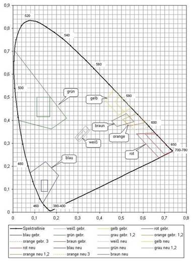

# BV.StVZVO.002 — BMIMI: Straßenverkehrszeichenverordnung (StVZVO)
**Typ:** Verordnung eines Bundesministeriums  
**Kurztitel:** StVZVO  
**Langtitel:** Verordnung des Bundesministers für Wissenschaft und Verkehr über Straßenverkehrszeichen (Straßenverkehrszeichenverordnung 1998 – StVZVO 1998)  
**Gesamte Rechtsvorschrift in der Fassung vom:** 17.07.2025  
**Quelle:** https://ris.bka.gv.at/GeltendeFassung.wxe?Abfrage=Bundesnormen&Gesetzesnummer=10012793  
**Letzte Änderung im RIS:** BGBl. II Nr. 292/2013  
**LawAT Permalink:** https://github.com/clairexen/LawAT/blob/main/files/BV.StVZVO.002.md  
*Mit RisEx für RisEn, RisEn-GPT, und LawAT von HTML zu MarkDown konvertiert. (Irrtümer und Fehler vorbehalten.)*

*Das ist die "AI-Friendly" multi-part Variante dieser Rechtsvorschrift mit kompakter Formatierung. Siehe [BV.StVZVO.md](BV.StVZVO.md) für die "Human-Friendly" single-page Variante dieser Norm mit hübscherer Formatierung.*

*(Fortsetzg. v. [BV.StVZVO.001](BV.StVZVO.001.md))*

## (Anm.: Anlage 1) # Farbwertdiagramm für den 2°-Normalbeobachter

### Anl. 1 StVZVO

<table><tbody>
<tr><td colspan=14 style="vertical-align:bottom;text-align:center">Tabelle 1</td></tr>
<tr><td colspan=14 style="vertical-align:bottom;text-align:center">Farbbereiche und Leuchtdichtefaktoren für den Gebrauchszustand</td></tr>
<tr><td style="vertical-align:bottom;text-align:center">Farbe</td><td style="vertical-align:bottom;text-align:center">Typ</td><td colspan=2 style="vertical-align:bottom;text-align:center">1</td><td colspan=2 style="vertical-align:bottom;text-align:center">2</td><td colspan=2 style="vertical-align:bottom;text-align:center">3</td><td colspan=2 style="vertical-align:bottom;text-align:center">4</td><td colspan=4 style="vertical-align:bottom;text-align:center">Leuchtdichtefaktoren</td></tr>
<tr><td style="vertical-align:bottom"> </td><td style="vertical-align:bottom"> </td><td style="vertical-align:bottom"> </td><td style="vertical-align:bottom"> </td><td style="vertical-align:bottom"> </td><td style="vertical-align:bottom"> </td><td style="vertical-align:bottom"> </td><td style="vertical-align:bottom"> </td><td style="vertical-align:bottom"> </td><td style="vertical-align:bottom"> </td><td colspan=3 style="vertical-align:bottom;text-align:center">retroreflektierend</td><td style="vertical-align:bottom;text-align:center">nicht retroreflektierend</td></tr>
<tr><td style="vertical-align:bottom"> </td><td style="vertical-align:bottom"> </td><td style="text-align:center">x</td><td style="text-align:center">y</td><td style="text-align:center">x</td><td style="text-align:center">y</td><td style="text-align:center">x</td><td style="text-align:center">y</td><td style="text-align:center">x</td><td style="text-align:center">y</td><td style="text-align:center">Typ 1</td><td style="text-align:center">Typ 2</td><td style="text-align:center">Typ 3</td><td style="vertical-align:bottom"> </td></tr>
<tr><td style="vertical-align:bottom;text-align:left">Weiß</td><td style="text-align:center">1, 2, 3</td><td style="text-align:center">0,355</td><td style="text-align:center">0,355</td><td style="text-align:center">0,305</td><td style="text-align:center">0,305</td><td style="text-align:center">0,285</td><td style="text-align:center">0,325</td><td style="text-align:center">0,335</td><td style="text-align:center">0,375</td><td style="text-align:center">>=0,35</td><td style="text-align:center">>=0,27</td><td style="text-align:center">>=0,40</td><td style="text-align:center">>=0,75</td></tr>
<tr><td style="vertical-align:bottom;text-align:left">Gelb</td><td style="text-align:center">1, 2, 3</td><td style="text-align:center">0,545</td><td style="text-align:center">0,454</td><td style="text-align:center">0,487</td><td style="text-align:center">0,423</td><td style="text-align:center">0,427</td><td style="text-align:center">0,483</td><td style="text-align:center">0,465</td><td style="text-align:center">0,534</td><td style="text-align:center">>=0,27</td><td style="text-align:center">>=0,16</td><td style="text-align:center">>=0,24</td><td style="text-align:center">>=0,45</td></tr>
<tr><td style="vertical-align:bottom;text-align:left">Rot</td><td style="text-align:center">1, 2, 3</td><td style="text-align:center">0,735</td><td style="text-align:center">0,265</td><td style="text-align:center">0,674</td><td style="text-align:center">0,236</td><td style="text-align:center">0,569</td><td style="text-align:center">0,341</td><td style="text-align:center">0,655</td><td style="text-align:center">0,345</td><td style="text-align:center">>=0,05</td><td style="text-align:center">>=0,03</td><td style="text-align:center">>=0,03</td><td style="text-align:center">>=0,07</td></tr>
<tr><td style="vertical-align:bottom;text-align:left">Blau</td><td style="text-align:center">1, 2, 3</td><td style="text-align:center">0,078</td><td style="text-align:center">0,171</td><td style="text-align:center">0,150</td><td style="text-align:center">0,220</td><td style="text-align:center">0,210</td><td style="text-align:center">0,160</td><td style="text-align:center">0,137</td><td style="text-align:center">0,038</td><td style="text-align:center">>=0,01</td><td style="text-align:center">>=0,01</td><td style="text-align:center">>=0,01</td><td style="text-align:center">>=0,05</td></tr>
<tr><td style="vertical-align:bottom;text-align:left">Grün</td><td style="text-align:center">1, 2, 3</td><td style="text-align:center">0,007</td><td style="text-align:center">0,703</td><td style="text-align:center">0,248</td><td style="text-align:center">0,409</td><td style="text-align:center">0,177</td><td style="text-align:center">0,362</td><td style="text-align:center">0,026</td><td style="text-align:center">0,399</td><td style="text-align:center">>=0,04</td><td style="text-align:center">>=0,03</td><td style="text-align:center">>=0,03</td><td style="text-align:center">>=0,10</td></tr>
<tr><td style="vertical-align:bottom;text-align:left">Grau</td><td style="text-align:center">1, 2</td><td style="text-align:center">0,350</td><td style="text-align:center">0,360</td><td style="text-align:center">0,300</td><td style="text-align:center">0,310</td><td style="text-align:center">0,285</td><td style="text-align:center">0,325</td><td style="text-align:center">0,335</td><td style="text-align:center">0,375</td><td colspan=2 style="text-align:center">0,12 – 0,18</td><td> </td><td style="text-align:center">0,16 – 0,29</td></tr>
<tr><td style="vertical-align:bottom;text-align:left">Orange</td><td style="text-align:center">1,2</td><td style="text-align:center">0,610</td><td style="text-align:center">0,390</td><td style="text-align:center">0,535</td><td style="text-align:center">0,375</td><td style="text-align:center">0,506</td><td style="text-align:center">0,404</td><td style="text-align:center">0,570</td><td style="text-align:center">0,429</td><td style="text-align:center">>=0,17</td><td style="text-align:center">>=0,14</td><td> </td><td style="text-align:center">>=0,20</td></tr>
<tr><td style="vertical-align:bottom"> </td><td style="text-align:center">3</td><td style="text-align:center">0,631</td><td style="text-align:center">0,369</td><td style="text-align:center">0,560</td><td style="text-align:center">0,360</td><td style="text-align:center">0,506</td><td style="text-align:center">0,404</td><td style="text-align:center">0,570</td><td style="text-align:center">0,429</td><td> </td><td> </td><td style="text-align:center">>=0,14</td><td> </td></tr>
<tr><td style="vertical-align:bottom;text-align:left">Braun</td><td style="text-align:center">1, 2, 3</td><td style="text-align:center">0,455</td><td style="text-align:center">0,397</td><td style="text-align:center">0,523</td><td style="text-align:center">0,429</td><td style="text-align:center">0,479</td><td style="text-align:center">0,373</td><td style="text-align:center">0,558</td><td style="text-align:center">0,394</td><td colspan=3 style="text-align:center">0,03 – 0,09</td><td style="text-align:center">0,04 – 0,15</td></tr>
<tr><td></td><td></td><td></td><td></td><td></td><td></td><td></td><td></td><td></td><td></td><td></td><td></td><td></td><td></td></tr>
</tbody></table>

<table><tbody>
<tr><td colspan=14 style="vertical-align:bottom;text-align:center">Tabelle 2</td></tr>
<tr><td colspan=14 style="vertical-align:bottom;text-align:center">Farbbereiche und Leuchtdichtefaktoren für den Neuzustand</td></tr>
<tr><td style="vertical-align:bottom;text-align:center">Farbe</td><td style="vertical-align:bottom;text-align:center">Typ</td><td colspan=2 style="vertical-align:bottom;text-align:center">1</td><td colspan=2 style="vertical-align:bottom;text-align:center">2</td><td colspan=2 style="vertical-align:bottom;text-align:center">3</td><td colspan=2 style="vertical-align:bottom;text-align:center">4</td><td colspan=4 style="vertical-align:bottom;text-align:center">Leuchtdichtefaktoren</td></tr>
<tr><td style="vertical-align:bottom"> </td><td style="vertical-align:bottom"> </td><td style="vertical-align:bottom"> </td><td style="vertical-align:bottom"> </td><td style="vertical-align:bottom"> </td><td style="vertical-align:bottom"> </td><td style="vertical-align:bottom"> </td><td style="vertical-align:bottom"> </td><td style="vertical-align:bottom"> </td><td style="vertical-align:bottom"> </td><td colspan=3 style="vertical-align:bottom;text-align:center">retroreflektierend</td><td style="vertical-align:bottom;text-align:center">nicht retroreflektierend</td></tr>
<tr><td style="vertical-align:bottom"> </td><td style="vertical-align:bottom"> </td><td style="text-align:center">x</td><td style="text-align:center">y</td><td style="text-align:center">x</td><td style="text-align:center">y</td><td style="text-align:center">x</td><td style="text-align:center">y</td><td style="text-align:center">x</td><td style="text-align:center">y</td><td style="text-align:center">Typ 1</td><td style="text-align:center">Typ 2</td><td style="text-align:center">Typ 3</td><td style="vertical-align:bottom"> </td></tr>
<tr><td style="vertical-align:bottom;text-align:left">Weiß</td><td style="vertical-align:bottom;text-align:center">1, 2, 3</td><td style="text-align:center">0,305</td><td style="text-align:center">0,315</td><td style="text-align:center">0,335</td><td style="text-align:center">0,345</td><td style="text-align:center">0,325</td><td style="text-align:center">0,355</td><td style="text-align:center">0,295</td><td style="text-align:center">0,325</td><td style="text-align:center">>=0,35</td><td style="text-align:center">>=0,27</td><td style="text-align:center">>=0,40</td><td style="text-align:center">>=0,75</td></tr>
<tr><td style="vertical-align:bottom;text-align:left">Gelb</td><td style="vertical-align:bottom;text-align:center">1, 2, 3</td><td style="text-align:center">0,494</td><td style="text-align:center">0,505</td><td style="text-align:center">0,470</td><td style="text-align:center">0,480</td><td style="text-align:center">0,513</td><td style="text-align:center">0,437</td><td style="text-align:center">0,545</td><td style="text-align:center">0,454</td><td style="text-align:center">>=0,27</td><td style="text-align:center">>=0,16</td><td style="text-align:center">>=0,24</td><td style="text-align:center">>=0,45</td></tr>
<tr><td style="vertical-align:bottom;text-align:left">Rot</td><td style="vertical-align:bottom;text-align:center">1, 2, 3</td><td style="text-align:center">0,735</td><td style="text-align:center">0,265</td><td style="text-align:center">0,700</td><td style="text-align:center">0,250</td><td style="text-align:center">0,610</td><td style="text-align:center">0,340</td><td style="text-align:center">0,660</td><td style="text-align:center">0,340</td><td style="text-align:center">>=0,05</td><td style="text-align:center">>=0,03</td><td style="text-align:center">>=0,03</td><td style="text-align:center">>=0,07</td></tr>
<tr><td style="vertical-align:bottom;text-align:left">Blau</td><td style="vertical-align:bottom;text-align:center">1, 2, 3</td><td style="text-align:center">0,130</td><td style="text-align:center">0,090</td><td style="text-align:center">0,160</td><td style="text-align:center">0,090</td><td style="text-align:center">0,160</td><td style="text-align:center">0,140</td><td style="text-align:center">0,130</td><td style="text-align:center">0,140</td><td style="text-align:center">>=0,01</td><td style="text-align:center">>=0,01</td><td style="text-align:center">>=0,01</td><td style="text-align:center">>=0,05</td></tr>
<tr><td style="vertical-align:bottom;text-align:left">Grün</td><td style="vertical-align:bottom;text-align:center">1, 2, 3</td><td style="text-align:center">0,110</td><td style="text-align:center">0,415</td><td style="text-align:center">0,170</td><td style="text-align:center">0,415</td><td style="text-align:center">0,170</td><td style="text-align:center">0,500</td><td style="text-align:center">0,110</td><td style="text-align:center">0,500</td><td style="text-align:center">>=0,04</td><td style="text-align:center">>=0,03</td><td style="text-align:center">>=0,03</td><td style="text-align:center">>=0,10</td></tr>
<tr><td style="vertical-align:bottom;text-align:left">Orange</td><td style="vertical-align:bottom;text-align:center">1, 2</td><td style="text-align:center">0,610</td><td style="text-align:center">0,390</td><td style="text-align:center">0,535</td><td style="text-align:center">0,375</td><td style="text-align:center">0,506</td><td style="text-align:center">0,404</td><td style="text-align:center">0,570</td><td style="text-align:center">0,429</td><td style="text-align:center">>=0,17</td><td style="text-align:center">>=0,14</td><td> </td><td style="text-align:center">>=0,20</td></tr>
<tr><td style="vertical-align:bottom"> </td><td style="vertical-align:bottom;text-align:center">3</td><td style="text-align:center">0,631</td><td style="text-align:center">0,369</td><td style="text-align:center">0,560</td><td style="text-align:center">0,360</td><td style="text-align:center">0,506</td><td style="text-align:center">0,404</td><td style="text-align:center">0,570</td><td style="text-align:center">0,429</td><td> </td><td> </td><td style="text-align:center">>=0,14</td><td> </td></tr>
<tr><td style="vertical-align:bottom;text-align:left">Braun</td><td style="vertical-align:bottom;text-align:center">1, 2, 3</td><td style="text-align:center">0,455</td><td style="text-align:center">0,397</td><td style="text-align:center">0,523</td><td style="text-align:center">0,429</td><td style="text-align:center">0,479</td><td style="text-align:center">0,373</td><td style="text-align:center">0,558</td><td style="text-align:center">0,394</td><td colspan=3 style="text-align:center">0,03 – 0,09</td><td style="text-align:center">0,04 – 0,15</td></tr>
<tr><td style="vertical-align:bottom;text-align:left">Grau</td><td style="vertical-align:bottom;text-align:center">1, 2</td><td style="text-align:center">0,305</td><td style="text-align:center">0,315</td><td style="text-align:center">0,335</td><td style="text-align:center">0,345</td><td style="text-align:center">0,325</td><td style="text-align:center">0,355</td><td style="text-align:center">0,295</td><td style="text-align:center">0,325</td><td colspan=2 style="text-align:center">0,12 – 0,18</td><td> </td><td style="text-align:center">0,16 – 0,29</td></tr>
<tr><td></td><td></td><td></td><td></td><td></td><td></td><td></td><td></td><td></td><td></td><td></td><td></td><td></td><td></td></tr>
</tbody></table>

### Anl. 2 StVZVO

<table><tbody>
<tr><td colspan=7 style="vertical-align:bottom;text-align:left">Mindestrückstrahlwerte R' in cd lx-1 m-2</td><td colspan=13 style="vertical-align:bottom"></td></tr>
<tr><td colspan=2 style="vertical-align:bottom;text-align:center">Aufsichtsfarbe</td><td colspan=3 style="vertical-align:bottom;text-align:center">α=0,2°</td><td colspan=4 style="vertical-align:bottom;text-align:center">0,33°</td><td colspan=4 style="vertical-align:bottom;text-align:center">1°</td><td colspan=4 style="vertical-align:bottom;text-align:center">1,5°</td><td colspan=3 style="vertical-align:bottom;text-align:center">2°</td></tr>
<tr><td style="vertical-align:bottom"> </td><td style="vertical-align:bottom"> </td><td style="vertical-align:bottom;text-align:center">β=5°</td><td style="vertical-align:bottom;text-align:center">30°</td><td style="vertical-align:bottom;text-align:center">40°</td><td style="vertical-align:bottom;text-align:center">5°</td><td style="vertical-align:bottom;text-align:center">20°</td><td style="vertical-align:bottom;text-align:center">30°</td><td style="vertical-align:bottom;text-align:center">40°</td><td style="vertical-align:bottom;text-align:center">5°</td><td style="vertical-align:bottom;text-align:center">20°</td><td style="vertical-align:bottom;text-align:center">30°</td><td style="vertical-align:bottom;text-align:center">40°</td><td style="vertical-align:bottom;text-align:center">5°</td><td style="vertical-align:bottom;text-align:center">20°</td><td style="vertical-align:bottom;text-align:center">30°</td><td style="vertical-align:bottom;text-align:center">40°</td><td style="vertical-align:bottom;text-align:center">5°</td><td style="vertical-align:bottom;text-align:center">30°</td><td style="vertical-align:bottom;text-align:center">40°</td></tr>
<tr><td style="vertical-align:bottom;text-align:left">Rot</td><td style="vertical-align:bottom;text-align:left">Typ 1</td><td style="vertical-align:bottom;text-align:right">14,5</td><td style="vertical-align:bottom;text-align:right">6</td><td style="vertical-align:bottom;text-align:right">2</td><td style="vertical-align:bottom;text-align:right">10</td><td style="vertical-align:bottom;text-align:right">-</td><td style="vertical-align:bottom;text-align:right">4</td><td style="vertical-align:bottom;text-align:right">1,8</td><td style="vertical-align:bottom;text-align:right">-</td><td style="vertical-align:bottom;text-align:right">-</td><td style="vertical-align:bottom;text-align:right">-</td><td style="vertical-align:bottom;text-align:right">-</td><td style="vertical-align:bottom;text-align:right">-</td><td style="vertical-align:bottom;text-align:right">-</td><td style="vertical-align:bottom;text-align:right">-</td><td style="vertical-align:bottom;text-align:right">-</td><td style="vertical-align:bottom;text-align:right">1</td><td style="vertical-align:bottom;text-align:right">0,5</td><td style="vertical-align:bottom;text-align:right">0,5</td></tr>
<tr><td style="vertical-align:bottom"> </td><td style="vertical-align:bottom;text-align:left">Typ 2</td><td style="vertical-align:bottom;text-align:right">45</td><td style="vertical-align:bottom;text-align:right">25</td><td style="vertical-align:bottom;text-align:right">15</td><td style="vertical-align:bottom;text-align:right">25</td><td style="vertical-align:bottom;text-align:right">-</td><td style="vertical-align:bottom;text-align:right">14</td><td style="vertical-align:bottom;text-align:right">13</td><td style="vertical-align:bottom;text-align:right">-</td><td style="vertical-align:bottom;text-align:right">-</td><td style="vertical-align:bottom;text-align:right">-</td><td style="vertical-align:bottom;text-align:right">-</td><td style="vertical-align:bottom;text-align:right">-</td><td style="vertical-align:bottom;text-align:right">-</td><td style="vertical-align:bottom;text-align:right">-</td><td style="vertical-align:bottom;text-align:right">-</td><td style="vertical-align:bottom;text-align:right">1</td><td style="vertical-align:bottom;text-align:right">0,4</td><td style="vertical-align:bottom;text-align:right">0,3</td></tr>
<tr><td style="vertical-align:bottom"> </td><td style="vertical-align:bottom;text-align:left">Typ 3</td><td style="vertical-align:bottom;text-align:right">-</td><td style="vertical-align:bottom;text-align:right">-</td><td style="vertical-align:bottom;text-align:right">-</td><td style="vertical-align:bottom;text-align:right">60</td><td style="vertical-align:bottom;text-align:right">48</td><td style="vertical-align:bottom;text-align:right">33</td><td style="vertical-align:bottom;text-align:right">6</td><td style="vertical-align:bottom;text-align:right">7</td><td style="vertical-align:bottom;text-align:right">6</td><td style="vertical-align:bottom;text-align:right">4</td><td style="vertical-align:bottom;text-align:right">1</td><td style="vertical-align:bottom;text-align:right">3</td><td style="vertical-align:bottom;text-align:right">2,5</td><td style="vertical-align:bottom;text-align:right">2</td><td style="vertical-align:bottom;text-align:right">#</td><td style="vertical-align:bottom;text-align:right">-</td><td style="vertical-align:bottom;text-align:right">-</td><td style="vertical-align:bottom;text-align:right">-</td></tr>
<tr><td style="vertical-align:bottom;text-align:left">Orange</td><td style="vertical-align:bottom;text-align:left">Typ 1</td><td style="vertical-align:bottom;text-align:right">25</td><td style="vertical-align:bottom;text-align:right">10</td><td style="vertical-align:bottom;text-align:right">2,2</td><td style="vertical-align:bottom;text-align:right">20</td><td style="vertical-align:bottom;text-align:right">-</td><td style="vertical-align:bottom;text-align:right">8</td><td style="vertical-align:bottom;text-align:right">2,2</td><td style="vertical-align:bottom;text-align:right">-</td><td style="vertical-align:bottom;text-align:right">-</td><td style="vertical-align:bottom;text-align:right">-</td><td style="vertical-align:bottom;text-align:right">-</td><td style="vertical-align:bottom;text-align:right">-</td><td style="vertical-align:bottom;text-align:right">-</td><td style="vertical-align:bottom;text-align:right">-</td><td style="vertical-align:bottom;text-align:right">-</td><td style="vertical-align:bottom;text-align:right">1,2</td><td style="vertical-align:bottom;text-align:right">0,5</td><td style="vertical-align:bottom;text-align:right">#</td></tr>
<tr><td style="vertical-align:bottom"> </td><td style="vertical-align:bottom;text-align:left">Typ 2</td><td style="vertical-align:bottom;text-align:right">100</td><td style="vertical-align:bottom;text-align:right">60</td><td style="vertical-align:bottom;text-align:right">29</td><td style="vertical-align:bottom;text-align:right">65</td><td style="vertical-align:bottom;text-align:right">-</td><td style="vertical-align:bottom;text-align:right">40</td><td style="vertical-align:bottom;text-align:right">20</td><td style="vertical-align:bottom;text-align:right">-</td><td style="vertical-align:bottom;text-align:right">-</td><td style="vertical-align:bottom;text-align:right">-</td><td style="vertical-align:bottom;text-align:right">-</td><td style="vertical-align:bottom;text-align:right">-</td><td style="vertical-align:bottom;text-align:right">-</td><td style="vertical-align:bottom;text-align:right">-</td><td style="vertical-align:bottom;text-align:right">-</td><td style="vertical-align:bottom;text-align:right">1,5</td><td style="vertical-align:bottom;text-align:right">1</td><td style="vertical-align:bottom;text-align:right">#</td></tr>
<tr><td style="vertical-align:bottom"> </td><td style="vertical-align:bottom;text-align:left">Typ 3</td><td style="vertical-align:bottom;text-align:right">-</td><td style="vertical-align:bottom;text-align:right">-</td><td style="vertical-align:bottom;text-align:right">-</td><td style="vertical-align:bottom;text-align:right">150</td><td style="vertical-align:bottom;text-align:right">120</td><td style="vertical-align:bottom;text-align:right">83</td><td style="vertical-align:bottom;text-align:right">15</td><td style="vertical-align:bottom;text-align:right">18</td><td style="vertical-align:bottom;text-align:right">15</td><td style="vertical-align:bottom;text-align:right">10</td><td style="vertical-align:bottom;text-align:right">2</td><td style="vertical-align:bottom;text-align:right">7,5</td><td style="vertical-align:bottom;text-align:right">6,5</td><td style="vertical-align:bottom;text-align:right">4,5</td><td style="vertical-align:bottom;text-align:right">1</td><td style="vertical-align:bottom;text-align:right">-</td><td style="vertical-align:bottom;text-align:right">-</td><td style="vertical-align:bottom;text-align:right">-</td></tr>
<tr><td style="vertical-align:bottom;text-align:left">Braun</td><td style="vertical-align:bottom;text-align:left">Typ 1</td><td style="vertical-align:bottom;text-align:right">1</td><td style="vertical-align:bottom;text-align:right">0,3</td><td style="vertical-align:bottom;text-align:right">#</td><td style="vertical-align:bottom;text-align:right">0,6</td><td style="vertical-align:bottom;text-align:right">-</td><td style="vertical-align:bottom;text-align:right">0,2</td><td style="vertical-align:bottom;text-align:right">#</td><td style="vertical-align:bottom;text-align:right">-</td><td style="vertical-align:bottom;text-align:right">-</td><td style="vertical-align:bottom;text-align:right">-</td><td style="vertical-align:bottom;text-align:right">-</td><td style="vertical-align:bottom;text-align:right">-</td><td style="vertical-align:bottom;text-align:right">-</td><td style="vertical-align:bottom;text-align:right">-</td><td style="vertical-align:bottom;text-align:right">-</td><td style="vertical-align:bottom;text-align:right">#</td><td style="vertical-align:bottom;text-align:right">#</td><td style="vertical-align:bottom;text-align:right">#</td></tr>
<tr><td style="vertical-align:bottom"> </td><td style="vertical-align:bottom;text-align:left">Typ 2</td><td style="vertical-align:bottom;text-align:right">12</td><td style="vertical-align:bottom;text-align:right">8,5</td><td style="vertical-align:bottom;text-align:right">5</td><td style="vertical-align:bottom;text-align:right">8</td><td style="vertical-align:bottom;text-align:right">-</td><td style="vertical-align:bottom;text-align:right">5</td><td style="vertical-align:bottom;text-align:right">3</td><td style="vertical-align:bottom;text-align:right">-</td><td style="vertical-align:bottom;text-align:right">-</td><td style="vertical-align:bottom;text-align:right">-</td><td style="vertical-align:bottom;text-align:right">-</td><td style="vertical-align:bottom;text-align:right">-</td><td style="vertical-align:bottom;text-align:right">-</td><td style="vertical-align:bottom;text-align:right">-</td><td style="vertical-align:bottom;text-align:right">-</td><td style="vertical-align:bottom;text-align:right">0,2</td><td style="vertical-align:bottom;text-align:right">#</td><td style="vertical-align:bottom;text-align:right">#</td></tr>
<tr><td style="vertical-align:bottom;text-align:left">Gelb</td><td style="vertical-align:bottom;text-align:left">Typ 1</td><td style="vertical-align:bottom;text-align:right">50</td><td style="vertical-align:bottom;text-align:right">22</td><td style="vertical-align:bottom;text-align:right">7</td><td style="vertical-align:bottom;text-align:right">35</td><td style="vertical-align:bottom;text-align:right">-</td><td style="vertical-align:bottom;text-align:right">16</td><td style="vertical-align:bottom;text-align:right">6</td><td style="vertical-align:bottom;text-align:right">-</td><td style="vertical-align:bottom;text-align:right">-</td><td style="vertical-align:bottom;text-align:right">-</td><td style="vertical-align:bottom;text-align:right">-</td><td style="vertical-align:bottom;text-align:right">-</td><td style="vertical-align:bottom;text-align:right">-</td><td style="vertical-align:bottom;text-align:right">-</td><td style="vertical-align:bottom;text-align:right">-</td><td style="vertical-align:bottom;text-align:right">3</td><td style="vertical-align:bottom;text-align:right">1,5</td><td style="vertical-align:bottom;text-align:right">1</td></tr>
<tr><td style="vertical-align:bottom"> </td><td style="vertical-align:bottom;text-align:left">Typ 2</td><td style="vertical-align:bottom;text-align:right">170</td><td style="vertical-align:bottom;text-align:right">100</td><td style="vertical-align:bottom;text-align:right">70</td><td style="vertical-align:bottom;text-align:right">120</td><td style="vertical-align:bottom;text-align:right">-</td><td style="vertical-align:bottom;text-align:right">70</td><td style="vertical-align:bottom;text-align:right">60</td><td style="vertical-align:bottom;text-align:right">-</td><td style="vertical-align:bottom;text-align:right">-</td><td style="vertical-align:bottom;text-align:right">-</td><td style="vertical-align:bottom;text-align:right">-</td><td style="vertical-align:bottom;text-align:right">-</td><td style="vertical-align:bottom;text-align:right">-</td><td style="vertical-align:bottom;text-align:right">-</td><td style="vertical-align:bottom;text-align:right">-</td><td style="vertical-align:bottom;text-align:right">3</td><td style="vertical-align:bottom;text-align:right">1,5</td><td style="vertical-align:bottom;text-align:right">1</td></tr>
<tr><td style="vertical-align:bottom"> </td><td style="vertical-align:bottom;text-align:left">Typ 3</td><td style="vertical-align:bottom;text-align:right">-</td><td style="vertical-align:bottom;text-align:right">-</td><td style="vertical-align:bottom;text-align:right">-</td><td style="vertical-align:bottom;text-align:right">195</td><td style="vertical-align:bottom;text-align:right">155</td><td style="vertical-align:bottom;text-align:right">110</td><td style="vertical-align:bottom;text-align:right">20</td><td style="vertical-align:bottom;text-align:right">23</td><td style="vertical-align:bottom;text-align:right">20</td><td style="vertical-align:bottom;text-align:right">13</td><td style="vertical-align:bottom;text-align:right">2</td><td style="vertical-align:bottom;text-align:right">10</td><td style="vertical-align:bottom;text-align:right">8</td><td style="vertical-align:bottom;text-align:right">6</td><td style="vertical-align:bottom;text-align:right">1</td><td style="vertical-align:bottom;text-align:right">-</td><td style="vertical-align:bottom;text-align:right">-</td><td style="vertical-align:bottom;text-align:right">-</td></tr>
<tr><td style="vertical-align:bottom;text-align:left">Grün</td><td style="vertical-align:bottom;text-align:left">Typ 1</td><td style="vertical-align:bottom;text-align:right">9</td><td style="vertical-align:bottom;text-align:right">3,5</td><td style="vertical-align:bottom;text-align:right">1,5</td><td style="vertical-align:bottom;text-align:right">7</td><td style="vertical-align:bottom;text-align:right">-</td><td style="vertical-align:bottom;text-align:right">3</td><td style="vertical-align:bottom;text-align:right">1,2</td><td style="vertical-align:bottom;text-align:right">-</td><td style="vertical-align:bottom;text-align:right">-</td><td style="vertical-align:bottom;text-align:right">-</td><td style="vertical-align:bottom;text-align:right">-</td><td style="vertical-align:bottom;text-align:right">-</td><td style="vertical-align:bottom;text-align:right">-</td><td style="vertical-align:bottom;text-align:right">-</td><td style="vertical-align:bottom;text-align:right">-</td><td style="vertical-align:bottom;text-align:right">0,5</td><td style="vertical-align:bottom;text-align:right">0,3</td><td style="vertical-align:bottom;text-align:right">0,2</td></tr>
<tr><td style="vertical-align:bottom"> </td><td style="vertical-align:bottom;text-align:left">Typ 2</td><td style="vertical-align:bottom;text-align:right">45</td><td style="vertical-align:bottom;text-align:right">25</td><td style="vertical-align:bottom;text-align:right">12</td><td style="vertical-align:bottom;text-align:right">21</td><td style="vertical-align:bottom;text-align:right">-</td><td style="vertical-align:bottom;text-align:right">12</td><td style="vertical-align:bottom;text-align:right">11</td><td style="vertical-align:bottom;text-align:right">-</td><td style="vertical-align:bottom;text-align:right">-</td><td style="vertical-align:bottom;text-align:right">-</td><td style="vertical-align:bottom;text-align:right">-</td><td style="vertical-align:bottom;text-align:right">-</td><td style="vertical-align:bottom;text-align:right">-</td><td style="vertical-align:bottom;text-align:right">-</td><td style="vertical-align:bottom;text-align:right">-</td><td style="vertical-align:bottom;text-align:right">0,5</td><td style="vertical-align:bottom;text-align:right">0,3</td><td style="vertical-align:bottom;text-align:right">0,2</td></tr>
<tr><td style="vertical-align:bottom"> </td><td style="vertical-align:bottom;text-align:left">Typ 3</td><td style="vertical-align:bottom;text-align:right">-</td><td style="vertical-align:bottom;text-align:right">-</td><td style="vertical-align:bottom;text-align:right">-</td><td style="vertical-align:bottom;text-align:right">30</td><td style="vertical-align:bottom;text-align:right">24</td><td style="vertical-align:bottom;text-align:right">17</td><td style="vertical-align:bottom;text-align:right">3</td><td style="vertical-align:bottom;text-align:right">3,5</td><td style="vertical-align:bottom;text-align:right">3</td><td style="vertical-align:bottom;text-align:right">2</td><td style="vertical-align:bottom;text-align:right">#</td><td style="vertical-align:bottom;text-align:right">1,5</td><td style="vertical-align:bottom;text-align:right">1</td><td style="vertical-align:bottom;text-align:right">#</td><td style="vertical-align:bottom;text-align:right">#</td><td style="vertical-align:bottom;text-align:right">-</td><td style="vertical-align:bottom;text-align:right">-</td><td style="vertical-align:bottom;text-align:right">-</td></tr>
<tr><td style="vertical-align:bottom;text-align:left">Blau</td><td style="vertical-align:bottom;text-align:left">Typ 1</td><td style="vertical-align:bottom;text-align:right">4</td><td style="vertical-align:bottom;text-align:right">1,7</td><td style="vertical-align:bottom;text-align:right">0,5</td><td style="vertical-align:bottom;text-align:right">2</td><td style="vertical-align:bottom;text-align:right">-</td><td style="vertical-align:bottom;text-align:right">1</td><td style="vertical-align:bottom;text-align:right">#</td><td style="vertical-align:bottom;text-align:right">-</td><td style="vertical-align:bottom;text-align:right">-</td><td style="vertical-align:bottom;text-align:right">-</td><td style="vertical-align:bottom;text-align:right">-</td><td style="vertical-align:bottom;text-align:right">-</td><td style="vertical-align:bottom;text-align:right">-</td><td style="vertical-align:bottom;text-align:right">-</td><td style="vertical-align:bottom;text-align:right">-</td><td style="vertical-align:bottom;text-align:right">#</td><td style="vertical-align:bottom;text-align:right">#</td><td style="vertical-align:bottom;text-align:right">#</td></tr>
<tr><td style="vertical-align:bottom"> </td><td style="vertical-align:bottom;text-align:left">Typ 2</td><td style="vertical-align:bottom;text-align:right">20</td><td style="vertical-align:bottom;text-align:right">11</td><td style="vertical-align:bottom;text-align:right">8</td><td style="vertical-align:bottom;text-align:right">14</td><td style="vertical-align:bottom;text-align:right">-</td><td style="vertical-align:bottom;text-align:right">8</td><td style="vertical-align:bottom;text-align:right">7</td><td style="vertical-align:bottom;text-align:right">-</td><td style="vertical-align:bottom;text-align:right">-</td><td style="vertical-align:bottom;text-align:right">-</td><td style="vertical-align:bottom;text-align:right">-</td><td style="vertical-align:bottom;text-align:right">-</td><td style="vertical-align:bottom;text-align:right">-</td><td style="vertical-align:bottom;text-align:right">-</td><td style="vertical-align:bottom;text-align:right">-</td><td style="vertical-align:bottom;text-align:right">0,2</td><td style="vertical-align:bottom;text-align:right">#</td><td style="vertical-align:bottom;text-align:right">#</td></tr>
<tr><td style="vertical-align:bottom"> </td><td style="vertical-align:bottom;text-align:left">Typ 3</td><td style="vertical-align:bottom;text-align:right">-</td><td style="vertical-align:bottom;text-align:right">-</td><td style="vertical-align:bottom;text-align:right">-</td><td style="vertical-align:bottom;text-align:right">19</td><td style="vertical-align:bottom;text-align:right">16</td><td style="vertical-align:bottom;text-align:right">11</td><td style="vertical-align:bottom;text-align:right">2</td><td style="vertical-align:bottom;text-align:right">2,5</td><td style="vertical-align:bottom;text-align:right">2</td><td style="vertical-align:bottom;text-align:right">1,5</td><td style="vertical-align:bottom;text-align:right">#</td><td style="vertical-align:bottom;text-align:right">1</td><td style="vertical-align:bottom;text-align:right">#</td><td style="vertical-align:bottom;text-align:right">#</td><td style="vertical-align:bottom;text-align:right">#</td><td style="vertical-align:bottom;text-align:right">-</td><td style="vertical-align:bottom;text-align:right">-</td><td style="vertical-align:bottom;text-align:right">-</td></tr>
<tr><td style="vertical-align:bottom;text-align:left">Weiß</td><td style="vertical-align:bottom;text-align:left">Typ 1</td><td style="vertical-align:bottom;text-align:right">70</td><td style="vertical-align:bottom;text-align:right">30</td><td style="vertical-align:bottom;text-align:right">10</td><td style="vertical-align:bottom;text-align:right">50</td><td style="vertical-align:bottom;text-align:right">-</td><td style="vertical-align:bottom;text-align:right">24</td><td style="vertical-align:bottom;text-align:right">9</td><td style="vertical-align:bottom;text-align:right">-</td><td style="vertical-align:bottom;text-align:right">-</td><td style="vertical-align:bottom;text-align:right">-</td><td style="vertical-align:bottom;text-align:right">-</td><td style="vertical-align:bottom;text-align:right">-</td><td style="vertical-align:bottom;text-align:right">-</td><td style="vertical-align:bottom;text-align:right">-</td><td style="vertical-align:bottom;text-align:right">-</td><td style="vertical-align:bottom;text-align:right">5</td><td style="vertical-align:bottom;text-align:right">2,5</td><td style="vertical-align:bottom;text-align:right">1,5</td></tr>
<tr><td style="vertical-align:bottom"> </td><td style="vertical-align:bottom;text-align:left">Typ 2</td><td style="vertical-align:bottom;text-align:right">250</td><td style="vertical-align:bottom;text-align:right">150</td><td style="vertical-align:bottom;text-align:right">110</td><td style="vertical-align:bottom;text-align:right">180</td><td style="vertical-align:bottom;text-align:right">-</td><td style="vertical-align:bottom;text-align:right">100</td><td style="vertical-align:bottom;text-align:right">95</td><td style="vertical-align:bottom;text-align:right">-</td><td style="vertical-align:bottom;text-align:right">-</td><td style="vertical-align:bottom;text-align:right">-</td><td style="vertical-align:bottom;text-align:right">-</td><td style="vertical-align:bottom;text-align:right">-</td><td style="vertical-align:bottom;text-align:right">-</td><td style="vertical-align:bottom;text-align:right">-</td><td style="vertical-align:bottom;text-align:right">-</td><td style="vertical-align:bottom;text-align:right">5</td><td style="vertical-align:bottom;text-align:right">2,5</td><td style="vertical-align:bottom;text-align:right">1,5</td></tr>
<tr><td style="vertical-align:bottom"> </td><td style="vertical-align:bottom;text-align:left">Typ 3</td><td style="vertical-align:bottom;text-align:right">-</td><td style="vertical-align:bottom;text-align:right">-</td><td style="vertical-align:bottom;text-align:right">-</td><td style="vertical-align:bottom;text-align:right">300</td><td style="vertical-align:bottom;text-align:right">240</td><td style="vertical-align:bottom;text-align:right">165</td><td style="vertical-align:bottom;text-align:right">30</td><td style="vertical-align:bottom;text-align:right">35</td><td style="vertical-align:bottom;text-align:right">30</td><td style="vertical-align:bottom;text-align:right">20</td><td style="vertical-align:bottom;text-align:right">3,5</td><td style="vertical-align:bottom;text-align:right">15</td><td style="vertical-align:bottom;text-align:right">13</td><td style="vertical-align:bottom;text-align:right">9</td><td style="vertical-align:bottom;text-align:right">1,5</td><td style="vertical-align:bottom;text-align:right">-</td><td style="vertical-align:bottom;text-align:right">-</td><td style="vertical-align:bottom;text-align:right">-</td></tr>
<tr><td style="vertical-align:bottom;text-align:left">Grau</td><td style="vertical-align:bottom;text-align:left">Typ 1</td><td style="vertical-align:bottom;text-align:right">42</td><td style="vertical-align:bottom;text-align:right">18</td><td style="vertical-align:bottom;text-align:right">6</td><td style="vertical-align:bottom;text-align:right">30</td><td style="vertical-align:bottom;text-align:right">-</td><td style="vertical-align:bottom;text-align:right">14,4</td><td style="vertical-align:bottom;text-align:right">5,4</td><td style="vertical-align:bottom;text-align:right">-</td><td style="vertical-align:bottom;text-align:right">-</td><td style="vertical-align:bottom;text-align:right">-</td><td style="vertical-align:bottom;text-align:right">-</td><td style="vertical-align:bottom;text-align:right">-</td><td style="vertical-align:bottom;text-align:right">-</td><td style="vertical-align:bottom;text-align:right">-</td><td style="vertical-align:bottom;text-align:right">-</td><td style="vertical-align:bottom;text-align:right">3</td><td style="vertical-align:bottom;text-align:right">1,5</td><td style="vertical-align:bottom;text-align:right">0,9</td></tr>
<tr><td style="vertical-align:bottom"> </td><td style="vertical-align:bottom;text-align:left">Typ 2</td><td style="vertical-align:bottom;text-align:right">125</td><td style="vertical-align:bottom;text-align:right">75</td><td style="vertical-align:bottom;text-align:right">55</td><td style="vertical-align:bottom;text-align:right">90</td><td style="vertical-align:bottom;text-align:right">-</td><td style="vertical-align:bottom;text-align:right">50</td><td style="vertical-align:bottom;text-align:right">47</td><td style="vertical-align:bottom;text-align:right">-</td><td style="vertical-align:bottom;text-align:right">-</td><td style="vertical-align:bottom;text-align:right">-</td><td style="vertical-align:bottom;text-align:right">-</td><td style="vertical-align:bottom;text-align:right">-</td><td style="vertical-align:bottom;text-align:right">-</td><td style="vertical-align:bottom;text-align:right">-</td><td style="vertical-align:bottom;text-align:right">-</td><td style="vertical-align:bottom;text-align:right">2,5</td><td style="vertical-align:bottom;text-align:right">1,2</td><td style="vertical-align:bottom;text-align:right">0,7</td></tr>
<tr><td style="vertical-align:bottom"> </td><td style="vertical-align:bottom"> </td><td style="vertical-align:bottom"> </td><td style="vertical-align:bottom"> </td><td style="vertical-align:bottom"> </td><td style="vertical-align:bottom"> </td><td style="vertical-align:bottom"> </td><td style="vertical-align:bottom"> </td><td style="vertical-align:bottom"> </td><td style="vertical-align:bottom"> </td><td style="vertical-align:bottom"> </td><td style="vertical-align:bottom"> </td><td style="vertical-align:bottom"> </td><td style="vertical-align:bottom"> </td><td style="vertical-align:bottom"> </td><td style="vertical-align:bottom"> </td><td style="vertical-align:bottom"> </td><td style="vertical-align:bottom"> </td><td style="vertical-align:bottom"> </td><td style="vertical-align:bottom"> </td></tr>
<tr><td colspan=5 style="vertical-align:bottom;text-align:left"># bedeutet Werte über Null, aber nicht anwendbar</td><td style="vertical-align:bottom"> </td><td style="vertical-align:bottom"> </td><td style="vertical-align:bottom"> </td><td style="vertical-align:bottom"> </td><td style="vertical-align:bottom"> </td><td style="vertical-align:bottom"> </td><td style="vertical-align:bottom"> </td><td style="vertical-align:bottom"> </td><td style="vertical-align:bottom"> </td><td style="vertical-align:bottom"> </td><td style="vertical-align:bottom"> </td><td style="vertical-align:bottom"> </td><td style="vertical-align:bottom"> </td><td style="vertical-align:bottom"> </td><td style="vertical-align:bottom"> </td></tr>
<tr><td></td><td></td><td></td><td></td><td></td><td></td><td></td><td></td><td></td><td></td><td></td><td></td><td></td><td></td><td></td><td></td><td></td><td></td><td></td><td></td></tr>
</tbody></table>

### Anl. 3 StVZVO

<table><tbody>
<tr><td colspan=17 style="vertical-align:top"></td></tr>
<tr><td colspan=17 style="vertical-align:top"></td></tr>
<tr><td colspan=17 style="text-align:center">(Die Ziffern entsprechen den Abbildungen in Anlage 4, 5, 6 und 7)</td></tr>
<tr><td colspan=17 style="vertical-align:top"></td></tr>
<tr><td style="vertical-align:top"> </td><td colspan=6 style="vertical-align:top;text-align:right">Großformat</td><td colspan=4 style="vertical-align:top;text-align:right">Mittelformat</td><td colspan=4 style="vertical-align:top;text-align:right">Kleinformat</td><td colspan=2 style="vertical-align:top"> </td></tr>
<tr><td style="vertical-align:top;text-align:left">Seitenlänge</td><td colspan=6 style="vertical-align:top;text-align:right">1 500 mm</td><td colspan=4 style="vertical-align:top;text-align:right">1 000 mm</td><td colspan=4 style="vertical-align:top;text-align:right">700 mm</td><td colspan=2 style="vertical-align:top"> </td></tr>
<tr><td style="vertical-align:top;text-align:left">Breite des roten Randes</td><td colspan=6 style="vertical-align:top;text-align:right">150 mm</td><td colspan=4 style="vertical-align:top;text-align:right">100 mm</td><td colspan=4 style="vertical-align:top;text-align:right">70 mm</td><td colspan=2 style="vertical-align:top"> </td></tr>
<tr><td style="vertical-align:top;text-align:left">Eckenabrundung</td><td colspan=6 style="vertical-align:top;text-align:right">50 mm</td><td colspan=4 style="vertical-align:top;text-align:right">30 mm</td><td colspan=4 style="vertical-align:top;text-align:right">30 mm</td><td colspan=2 style="vertical-align:top"> </td></tr>
<tr><td style="vertical-align:top;text-align:left">Z 6c (Baken)</td><td colspan=6 style="vertical-align:top;text-align:right">–</td><td colspan=4 style="vertical-align:top;text-align:right">380 × 1 200 mm</td><td colspan=4 style="vertical-align:top;text-align:right">310 × 960 mm</td><td colspan=2 style="vertical-align:top"> </td></tr>
<tr><td style="vertical-align:top;text-align:left">Z 6d (Tafel)</td><td colspan=6 style="vertical-align:top;text-align:right">–</td><td colspan=4 style="vertical-align:top;text-align:right">750 × 1 150 mm</td><td colspan=4 style="vertical-align:top;text-align:right">630 × 1 400 mm</td><td colspan=2 style="vertical-align:top"> </td></tr>
<tr><td style="vertical-align:top"> </td><td colspan=6 style="vertical-align:top"> </td><td colspan=4 style="vertical-align:top;text-align:right">750 × 1 600 mm</td><td colspan=4 style="vertical-align:top;text-align:right">630 × 960 mm</td><td colspan=2 style="vertical-align:top"> </td></tr>
<tr><td colspan=17 style="vertical-align:top"></td></tr>
<tr><td colspan=2 style="vertical-align:top"> </td><td colspan=5 style="vertical-align:top;text-align:right">Großformat</td><td colspan=5 style="vertical-align:top;text-align:right">Mittel 1</td><td colspan=3 style="vertical-align:top;text-align:right">Mittel 2</td><td colspan=2 style="vertical-align:top;text-align:right">Kleinformat</td></tr>
<tr><td colspan=17 style="vertical-align:top"></td></tr>
<tr><td style="vertical-align:top;text-align:left">Durchmesser</td><td colspan=6 style="vertical-align:bottom;text-align:right">1 200 mm</td><td colspan=5 style="vertical-align:bottom;text-align:right">960 mm</td><td colspan=3 style="vertical-align:bottom;text-align:right">670 mm</td><td colspan=2 style="vertical-align:bottom;text-align:right">480 mm</td></tr>
<tr><td style="vertical-align:top;text-align:left">Breite des roten Randes</td><td colspan=6 style="vertical-align:bottom;text-align:right">150 mm</td><td colspan=5 style="vertical-align:bottom;text-align:right">120 mm</td><td colspan=3 style="vertical-align:bottom;text-align:right">80 mm</td><td colspan=2 style="vertical-align:bottom;text-align:right">60 mm</td></tr>
<tr><td style="vertical-align:top;text-align:left">Breite des roten Quer- oder Schrägbalkens bei Z 3a, 3b, 3c, 8a, 13a, 13b, 13c/a, 13c/b, 14</td><td colspan=6 style="vertical-align:bottom;text-align:right">90 mm</td><td colspan=5 style="vertical-align:bottom;text-align:right">70 mm</td><td colspan=3 style="vertical-align:bottom;text-align:right">50 mm</td><td colspan=2 style="vertical-align:bottom;text-align:right">40 mm</td></tr>
<tr><td style="vertical-align:top;text-align:left">Breite des roten Schrägbalkens bei Z 16a, 17a/c, 17a/d, 17c, 19a, 22a</td><td colspan=6 style="vertical-align:bottom;text-align:right">180 mm</td><td colspan=5 style="vertical-align:bottom;text-align:right">130 mm</td><td colspan=3 style="vertical-align:bottom;text-align:right">90 mm</td><td colspan=2 style="vertical-align:bottom;text-align:right">65 mm</td></tr>
<tr><td style="vertical-align:top;text-align:left">Breite von schwarzen Schrägbalken</td><td colspan=6 style="vertical-align:bottom;text-align:right">230 mm</td><td colspan=5 style="vertical-align:bottom;text-align:right">180 mm</td><td colspan=3 style="vertical-align:bottom;text-align:right">130 mm</td><td colspan=2 style="vertical-align:bottom;text-align:right">90 mm</td></tr>
<tr><td style="vertical-align:top;text-align:left">Breite von schwarzen Schrägbalken Z 11b</td><td colspan=6 style="vertical-align:bottom;text-align:right">115 mm</td><td colspan=5 style="vertical-align:bottom;text-align:right">90 mm</td><td colspan=3 style="vertical-align:bottom;text-align:right">65 mm</td><td colspan=2 style="vertical-align:bottom;text-align:right">45 mm</td></tr>
<tr><td style="vertical-align:top;text-align:left">Z 11a, 11b, 13d</td><td colspan=6 style="vertical-align:bottom"> </td><td colspan=5 style="vertical-align:bottom;text-align:right">960 × 1 200 mm</td><td colspan=3 style="vertical-align:bottom;text-align:right">630 × 960 mm</td><td colspan=2 style="vertical-align:bottom;text-align:right">470 × 630 mm</td></tr>
<tr><td style="vertical-align:top;text-align:left">Z 13e</td><td colspan=6 style="vertical-align:bottom"> </td><td colspan=5 style="vertical-align:bottom;text-align:right">960 × 960 mm</td><td colspan=3 style="vertical-align:bottom;text-align:right">630 × 630 mm</td><td colspan=2 style="vertical-align:bottom;text-align:right">470 × 470 mm</td></tr>
<tr><td style="vertical-align:top;text-align:left">Z 15a</td><td colspan=6 style="vertical-align:bottom;text-align:right">1500 x 2500 mm</td><td colspan=5 style="vertical-align:bottom;text-align:right">1000 x 1500 mm</td><td colspan=3 style="vertical-align:bottom;text-align:right">630 x 960 mm</td><td colspan=2 style="vertical-align:bottom"> </td></tr>
<tr><td colspan=17></td></tr>
<tr><td colspan=3 style="vertical-align:top;text-align:left">Z 23</td><td colspan=4 style="vertical-align:bottom"> </td><td colspan=5 style="vertical-align:bottom"> </td><td colspan=4 style="vertical-align:bottom"> </td><td style="vertical-align:bottom"> </td></tr>
<tr><td colspan=3 style="vertical-align:top;text-align:left">Seitenlänge</td><td colspan=4 style="vertical-align:bottom;text-align:right">1 500 mm</td><td colspan=5 style="vertical-align:bottom;text-align:right">1 000 mm</td><td colspan=4 style="vertical-align:bottom;text-align:right">700 mm</td><td style="vertical-align:bottom"> </td></tr>
<tr><td colspan=3 style="vertical-align:top;text-align:left">Breite des roten Randes</td><td colspan=4 style="vertical-align:bottom;text-align:right">150 mm</td><td colspan=5 style="vertical-align:bottom;text-align:right">100 mm</td><td colspan=4 style="vertical-align:bottom;text-align:right">70 mm</td><td style="vertical-align:bottom"> </td></tr>
<tr><td colspan=3 style="vertical-align:top;text-align:left">Eckenabrundung</td><td colspan=4 style="vertical-align:bottom;text-align:right">50 mm</td><td colspan=5 style="vertical-align:bottom;text-align:right">30 mm</td><td colspan=4 style="vertical-align:bottom;text-align:right">30 mm</td><td style="vertical-align:bottom"> </td></tr>
<tr><td colspan=3 style="vertical-align:top;text-align:left">Z 24 (gleichseitiges Achteck)</td><td colspan=4 style="vertical-align:bottom"> </td><td colspan=5 style="vertical-align:bottom"> </td><td colspan=4 style="vertical-align:bottom"> </td><td style="vertical-align:bottom"> </td></tr>
<tr><td colspan=3 style="vertical-align:top;text-align:left">Höhe × Breite</td><td colspan=4 style="vertical-align:bottom;text-align:right">je 1 160 mm</td><td colspan=5 style="vertical-align:bottom;text-align:right">je 940 mm</td><td colspan=4 style="vertical-align:bottom;text-align:right">je 630 mm</td><td style="vertical-align:bottom"> </td></tr>
<tr><td colspan=3 style="vertical-align:top;text-align:left">Schrifthöhe</td><td colspan=4 style="vertical-align:bottom;text-align:right">390 mm</td><td colspan=5 style="vertical-align:bottom;text-align:right">310 mm</td><td colspan=4 style="vertical-align:bottom;text-align:right">210 mm</td><td style="vertical-align:bottom"> </td></tr>
<tr><td colspan=3 style="vertical-align:top;text-align:left">Buchstabenstärke u. Breite des weißen Randes</td><td colspan=4 style="vertical-align:bottom;text-align:right">57 mm</td><td colspan=5 style="vertical-align:bottom;text-align:right">45 mm</td><td colspan=4 style="vertical-align:bottom;text-align:right">30 mm</td><td style="vertical-align:bottom"> </td></tr>
<tr><td colspan=3 style="vertical-align:top;text-align:left">Z 25a u. 25b</td><td colspan=4 style="vertical-align:bottom"> </td><td colspan=5 style="vertical-align:bottom"> </td><td colspan=4 style="vertical-align:bottom"> </td><td style="vertical-align:bottom"> </td></tr>
<tr><td colspan=3 style="vertical-align:top;text-align:left">Seitenlänge</td><td colspan=4 style="vertical-align:bottom"> </td><td colspan=5 style="vertical-align:bottom;text-align:right">960 mm</td><td colspan=4 style="vertical-align:bottom;text-align:right">630 mm</td><td style="vertical-align:bottom;text-align:right">470 mm</td></tr>
<tr><td colspan=3 style="vertical-align:top;text-align:left">Breite des schwarzen Schrägbalkens bei Z 25b</td><td colspan=4 style="vertical-align:bottom"> </td><td colspan=5 style="vertical-align:bottom;text-align:right">180 mm</td><td colspan=4 style="vertical-align:bottom;text-align:right">130 mm</td><td style="vertical-align:bottom;text-align:right">90 mm</td></tr>
<tr><td colspan=17 style="vertical-align:top"> </td></tr>
<tr><td colspan=3 style="vertical-align:top"> </td><td colspan=5 style="vertical-align:bottom;text-align:right">Großformat</td><td colspan=4 style="vertical-align:bottom;text-align:right">Mittel 1</td><td colspan=4 style="vertical-align:bottom;text-align:right">Mittel 2</td><td style="vertical-align:bottom;text-align:right">Kleinformat</td></tr>
<tr><td colspan=17 style="vertical-align:top"></td></tr>
<tr><td colspan=17>a) Alle Zeichen mit Ausnahme der unter lit. b gesondert angeführten Zeichen</td></tr>
<tr><td colspan=5 style="text-align:left">Quadratische Form (Seitenlänge)</td><td colspan=3 style="vertical-align:top"> </td><td colspan=5 style="text-align:right">960 mm</td><td colspan=3 style="text-align:right">630 mm</td><td style="text-align:right">470 mm</td></tr>
<tr><td colspan=5 style="text-align:left">Rechteckige Form (Seitenlänge)</td><td colspan=3 style="vertical-align:top"> </td><td colspan=5 style="text-align:right">960 x 1200 mm</td><td colspan=3 style="text-align:right">630 x 960 mm</td><td style="text-align:right">470 x 630 mm</td></tr>
<tr><td colspan=17>b) Die nachstehend angeführten Hinweiszeichen sind in den jeweils angegebenen Abmessungen auszuführen</td></tr>
<tr><td colspan=3 style="vertical-align:top;text-align:left">Z 1b</td><td colspan=5 style="vertical-align:top;text-align:right">1000 x 1500 mm</td><td colspan=5 style="vertical-align:top;text-align:right">960 x 1200 mm</td><td colspan=3 style="vertical-align:top;text-align:right">630 x 960 mm</td><td style="vertical-align:top;text-align:right">470 x 630 mm</td></tr>
<tr><td colspan=3 style="text-align:left">Z 1c</td><td colspan=5 style="vertical-align:top;text-align:right">1000 x 1500 mm</td><td colspan=5 style="vertical-align:top"> </td><td colspan=3 style="vertical-align:top;text-align:right">630 x 960 mm</td><td style="vertical-align:top"> </td></tr>
<tr><td colspan=3 style="text-align:left">Z 8a, 8b, 8c und 8d</td><td colspan=5 style="vertical-align:top"> </td><td colspan=5 style="vertical-align:top"> </td><td colspan=3 style="vertical-align:top;text-align:right">960 x 1 200 mm</td><td style="vertical-align:top"> </td></tr>
<tr><td colspan=3 style="text-align:left">Breite des roten Schrägbalkens bei Z 8b und 8d</td><td colspan=5 style="vertical-align:top"> </td><td colspan=5 style="vertical-align:top"> </td><td colspan=3 style="text-align:right">130 mm</td><td style="vertical-align:top"> </td></tr>
<tr><td colspan=3 style="text-align:left">Z 9a, 9b, 9c und 9d</td><td colspan=5> </td><td colspan=5 style="text-align:right">960 x 1200 mm</td><td colspan=3 style="text-align:right">630 x 960 mm</td><td style="text-align:right">470 x 630 mm</td></tr>
<tr><td colspan=3 style="text-align:left">Breite des roten Schrägbalkens bei Z 9b und 9d</td><td colspan=5 style="vertical-align:top"> </td><td colspan=5 style="text-align:right">130 mm</td><td colspan=3 style="text-align:right">90 mm</td><td style="text-align:right">70 mm</td></tr>
<tr><td colspan=3 style="text-align:left">Z 9e</td><td colspan=5 style="vertical-align:top;text-align:right">mm</td><td colspan=5 style="vertical-align:top;text-align:right">960 x 1200 mm</td><td colspan=3 style="vertical-align:top;text-align:right">630 x 960 mm</td><td style="vertical-align:top"> </td></tr>
<tr><td colspan=3 style="text-align:left">Z 10</td><td colspan=5 style="vertical-align:top"> </td><td colspan=5 style="vertical-align:top"> </td><td colspan=3 style="vertical-align:top;text-align:right">960 x 310 mm</td><td style="vertical-align:top"> </td></tr>
<tr><td colspan=3 style="text-align:left">Z 10a (ohne Spitze)</td><td colspan=5 style="vertical-align:top"> </td><td colspan=5 style="vertical-align:top"> </td><td colspan=3 style="vertical-align:top;text-align:right">110 x 330 mm</td><td style="vertical-align:top"> </td></tr>
<tr><td colspan=3 style="text-align:left">Z 12</td><td colspan=5 style="vertical-align:top"> </td><td colspan=5 style="vertical-align:top"> </td><td colspan=3 style="vertical-align:top;text-align:right">70 x 150 mm</td><td style="vertical-align:top"> </td></tr>
<tr><td colspan=3> </td><td colspan=5 style="vertical-align:top"> </td><td colspan=5 style="vertical-align:top"> </td><td colspan=3 style="vertical-align:top"> </td><td style="vertical-align:top"> </td></tr>
<tr><td colspan=4></td><td colspan=4> </td><td colspan=2> </td><td colspan=6> </td><td> </td></tr>
<tr><td colspan=4 style="text-align:left">Höhe</td><td colspan=4> </td><td colspan=2> </td><td colspan=6> </td><td> </td></tr>
<tr><td colspan=4> </td><td colspan=4> </td><td colspan=2> </td><td colspan=6 style="text-align:right">1500 mm</td><td> </td></tr>
<tr><td colspan=4> </td><td colspan=4> </td><td colspan=2> </td><td colspan=6 style="text-align:right">2000 mm</td><td> </td></tr>
<tr><td colspan=4> </td><td colspan=4> </td><td colspan=2> </td><td colspan=6 style="text-align:right">2500 mm</td><td> </td></tr>
<tr><td colspan=4> </td><td colspan=4> </td><td colspan=2> </td><td colspan=6 style="text-align:right">3000 mm</td><td> </td></tr>
<tr><td colspan=4> </td><td colspan=4> </td><td colspan=2> </td><td colspan=6 style="text-align:right">3500 mm</td><td> </td></tr>
<tr><td colspan=4></td><td colspan=4> </td><td colspan=2> </td><td colspan=6> </td><td> </td></tr>
<tr><td colspan=4 style="text-align:left">Z 13a Vorwegweiser</td><td colspan=4> </td><td colspan=2> </td><td colspan=6> </td><td> </td></tr>
<tr><td colspan=4> </td><td colspan=4> </td><td colspan=2> </td><td colspan=6 style="text-align:right">1500 x 1000 mm</td><td> </td></tr>
<tr><td colspan=4> </td><td colspan=4> </td><td colspan=2> </td><td colspan=6 style="text-align:right">2000 x 1000 mm</td><td> </td></tr>
<tr><td colspan=4> </td><td colspan=4> </td><td colspan=2> </td><td colspan=6 style="text-align:right">1500 x 1500 mm</td><td> </td></tr>
<tr><td colspan=4> </td><td colspan=4> </td><td colspan=2> </td><td colspan=6 style="text-align:right">2000 x 1500 mm</td><td> </td></tr>
<tr><td colspan=4> </td><td colspan=4> </td><td colspan=2> </td><td colspan=6 style="text-align:right">2500 x 1500 mm</td><td> </td></tr>
<tr><td colspan=4> </td><td colspan=4> </td><td colspan=2> </td><td colspan=6 style="text-align:right">2000 x 2500 mm</td><td> </td></tr>
<tr><td colspan=4> </td><td colspan=4> </td><td colspan=2> </td><td colspan=6 style="text-align:right">2500 x 2500 mm</td><td> </td></tr>
<tr><td colspan=4> </td><td colspan=4> </td><td colspan=2> </td><td colspan=6 style="text-align:right">3500 x 2500 mm</td><td> </td></tr>
<tr><td colspan=4> </td><td colspan=4> </td><td colspan=2> </td><td colspan=6> </td><td> </td></tr>
<tr><td colspan=17 style="text-align:left">Z 13b, 13c, 13d, 14b, 16b Wegweiser</td></tr>
<tr><td colspan=4> </td><td colspan=4> </td><td colspan=2> </td><td colspan=6 style="text-align:right">1150 x 250 mm</td><td> </td></tr>
<tr><td colspan=4> </td><td colspan=4> </td><td colspan=2> </td><td colspan=6 style="text-align:right">1150 x 400 mm</td><td> </td></tr>
<tr><td colspan=4> </td><td colspan=4> </td><td colspan=2> </td><td colspan=6 style="text-align:right">1150 x 620 mm</td><td> </td></tr>
<tr><td colspan=4> </td><td colspan=4> </td><td colspan=2> </td><td colspan=6 style="text-align:right">1460 x 250 mm</td><td> </td></tr>
<tr><td colspan=4> </td><td colspan=4> </td><td colspan=2> </td><td colspan=6 style="text-align:right">1460 x 330 mm</td><td> </td></tr>
<tr><td colspan=4> </td><td colspan=4> </td><td colspan=2> </td><td colspan=6 style="text-align:right">1460 x 400 mm</td><td> </td></tr>
<tr><td colspan=4> </td><td colspan=4> </td><td colspan=2> </td><td colspan=6 style="text-align:right">1460 x 500 mm</td><td> </td></tr>
<tr><td colspan=4> </td><td colspan=4> </td><td colspan=2> </td><td colspan=6 style="text-align:right">1460 x 620 mm</td><td> </td></tr>
<tr><td colspan=4> </td><td colspan=4> </td><td colspan=2> </td><td colspan=6 style="text-align:right">1460 x 660 mm</td><td> </td></tr>
<tr><td colspan=4> </td><td colspan=4> </td><td colspan=2> </td><td colspan=6 style="text-align:right">1740 x 330 mm</td><td> </td></tr>
<tr><td colspan=4> </td><td colspan=4> </td><td colspan=2> </td><td colspan=6 style="text-align:right">1740 x 500 mm</td><td> </td></tr>
<tr><td colspan=4> </td><td colspan=4> </td><td colspan=2> </td><td colspan=6 style="text-align:right">1740 x 660 mm</td><td> </td></tr>
<tr><td colspan=4> </td><td colspan=4> </td><td colspan=2> </td><td colspan=6 style="text-align:right">1740 x 750 mm</td><td> </td></tr>
<tr><td colspan=4> </td><td colspan=4> </td><td colspan=2> </td><td colspan=6 style="text-align:right">2200 x 330 mm</td><td> </td></tr>
<tr><td colspan=4> </td><td colspan=4> </td><td colspan=2> </td><td colspan=6 style="text-align:right">2200 x 400 mm</td><td> </td></tr>
<tr><td colspan=4> </td><td colspan=4> </td><td colspan=2> </td><td colspan=6 style="text-align:right">2200 x 500 mm</td><td> </td></tr>
<tr><td colspan=4> </td><td colspan=4> </td><td colspan=2> </td><td colspan=6 style="text-align:right">2200 x 660 mm</td><td> </td></tr>
<tr><td colspan=4> </td><td colspan=4> </td><td colspan=2> </td><td colspan=6 style="text-align:right">2200 x 750 mm</td><td> </td></tr>
<tr><td colspan=4> </td><td colspan=4> </td><td colspan=2> </td><td colspan=6 style="text-align:right">2200 x 900 mm</td><td> </td></tr>
<tr><td colspan=4> </td><td colspan=4> </td><td colspan=2> </td><td colspan=6 style="text-align:right">2500 x 400 mm</td><td> </td></tr>
<tr><td colspan=4> </td><td colspan=4> </td><td colspan=2> </td><td colspan=6 style="text-align:right">2500 x 660 mm</td><td> </td></tr>
<tr><td colspan=4> </td><td colspan=4> </td><td colspan=2> </td><td colspan=6 style="text-align:right">2500 x 900 mm</td><td> </td></tr>
<tr><td colspan=4> </td><td colspan=4> </td><td colspan=2> </td><td colspan=6> </td><td> </td></tr>
<tr><td colspan=17 style="vertical-align:bottom;text-align:left">zusätzliches Format für Wegweiser an Autobahnauffahrten:</td></tr>
<tr><td colspan=4> </td><td colspan=4> </td><td colspan=2> </td><td colspan=6 style="text-align:right">1500 x 2000 mm</td><td> </td></tr>
<tr><td colspan=4> </td><td colspan=4> </td><td colspan=2> </td><td colspan=6 style="text-align:right">2000 x 1500 mm</td><td> </td></tr>
<tr><td colspan=17 style="vertical-align:bottom;text-align:left">Z 14a Vorwegweiser</td></tr>
<tr><td colspan=4> </td><td colspan=4> </td><td colspan=2> </td><td colspan=6 style="text-align:right">2000 x 1500 mm</td><td> </td></tr>
<tr><td colspan=4> </td><td colspan=4> </td><td colspan=2> </td><td colspan=6 style="text-align:right">2500 x 1500 mm</td><td> </td></tr>
<tr><td colspan=4> </td><td colspan=4> </td><td colspan=2> </td><td colspan=6 style="text-align:right">2500 x 2500 mm</td><td> </td></tr>
<tr><td colspan=4> </td><td colspan=4> </td><td colspan=2> </td><td colspan=6 style="text-align:right">3500 x 2500 mm</td><td> </td></tr>
<tr><td colspan=4> </td><td colspan=4> </td><td colspan=2> </td><td colspan=6 style="text-align:right">3500 x 3500 mm</td><td> </td></tr>
<tr><td colspan=4> </td><td colspan=4> </td><td colspan=2> </td><td colspan=6> </td><td> </td></tr>
<tr><td colspan=17 style="vertical-align:bottom;text-align:left">Z 15a/a, 15a/d Vorwegweiser</td></tr>
<tr><td colspan=4> </td><td colspan=4> </td><td colspan=2> </td><td colspan=6 style="text-align:right">3500 x 3500 mm</td><td> </td></tr>
<tr><td colspan=4> </td><td colspan=4> </td><td colspan=2> </td><td colspan=6 style="text-align:right">3500 x 4000 mm</td><td> </td></tr>
<tr><td colspan=4> </td><td colspan=4> </td><td colspan=2> </td><td colspan=6 style="text-align:right">4000 x 4000 mm</td><td> </td></tr>
<tr><td colspan=4> </td><td colspan=4> </td><td colspan=2> </td><td colspan=6 style="text-align:right">3500 x 4500 mm</td><td> </td></tr>
<tr><td colspan=4> </td><td colspan=4> </td><td colspan=2> </td><td colspan=6 style="text-align:right">4000 x 4500 mm</td><td> </td></tr>
<tr><td colspan=4> </td><td colspan=4> </td><td colspan=2> </td><td colspan=6 style="text-align:right">3500 x 5000 mm</td><td> </td></tr>
<tr><td colspan=4> </td><td colspan=4> </td><td colspan=2> </td><td colspan=6 style="text-align:right">4000 x 5000 mm</td><td> </td></tr>
<tr><td colspan=4> </td><td colspan=4> </td><td colspan=2> </td><td colspan=6> </td><td> </td></tr>
<tr><td colspan=17 style="vertical-align:bottom;text-align:left">Z 15a/b, 15a/c Vorwegweiser</td></tr>
<tr><td colspan=4> </td><td colspan=4> </td><td colspan=2> </td><td colspan=6 style="text-align:right">2500 x 2000 mm</td><td> </td></tr>
<tr><td colspan=4> </td><td colspan=4> </td><td colspan=2> </td><td colspan=6 style="text-align:right">3000 x 2000 mm</td><td> </td></tr>
<tr><td colspan=4> </td><td colspan=4> </td><td colspan=2> </td><td colspan=6 style="text-align:right">2500 x 2500 mm</td><td> </td></tr>
<tr><td colspan=4> </td><td colspan=4> </td><td colspan=2> </td><td colspan=6 style="text-align:right">3000 x 2500 mm</td><td> </td></tr>
<tr><td colspan=4> </td><td colspan=4> </td><td colspan=2> </td><td colspan=6 style="text-align:right">2500 x 3500 mm</td><td> </td></tr>
<tr><td colspan=4> </td><td colspan=4> </td><td colspan=2> </td><td colspan=6 style="text-align:right">3000 x 3500 mm</td><td> </td></tr>
<tr><td colspan=4> </td><td colspan=4> </td><td colspan=2> </td><td colspan=6> </td><td> </td></tr>
<tr><td colspan=17 style="text-align:left">Z 15a/b, Z 15a/c Vorwegweiser Überkopftafel</td></tr>
<tr><td colspan=4> </td><td colspan=4> </td><td colspan=2> </td><td colspan=6 style="text-align:right">4500 x 2500 mm</td><td> </td></tr>
<tr><td colspan=4> </td><td colspan=4> </td><td colspan=2> </td><td colspan=6 style="text-align:right">5000 x 2500 mm</td><td> </td></tr>
<tr><td colspan=4> </td><td colspan=4> </td><td colspan=2> </td><td colspan=6> </td><td> </td></tr>
<tr><td colspan=17 style="text-align:left">Z 15b/a Ausfahrtswegweiser Überkopftafel</td></tr>
<tr><td colspan=4> </td><td colspan=4> </td><td colspan=2> </td><td colspan=6 style="text-align:right">3500 x 2000 mm</td><td> </td></tr>
<tr><td colspan=4> </td><td colspan=4> </td><td colspan=2> </td><td colspan=6 style="text-align:right">4000 x 2000 mm</td><td> </td></tr>
<tr><td colspan=4> </td><td colspan=4> </td><td colspan=2> </td><td colspan=6 style="text-align:right">3500 x 3000 mm</td><td> </td></tr>
<tr><td colspan=4> </td><td colspan=4> </td><td colspan=2> </td><td colspan=6 style="text-align:right">4000 x 3000 mm</td><td> </td></tr>
<tr><td colspan=4> </td><td colspan=4> </td><td colspan=2> </td><td colspan=6> </td><td> </td></tr>
<tr><td colspan=17 style="text-align:left">Z 15b/b Ausfahrtswegweiser</td></tr>
<tr><td colspan=4> </td><td colspan=4> </td><td colspan=2> </td><td colspan=6 style="text-align:right">2500 x 1500 mm</td><td> </td></tr>
<tr><td colspan=4> </td><td colspan=4> </td><td colspan=2> </td><td colspan=6 style="text-align:right">3000 x 1500 mm</td><td> </td></tr>
<tr><td colspan=4> </td><td colspan=4> </td><td colspan=2> </td><td colspan=6 style="text-align:right">2000 x 2500 mm</td><td> </td></tr>
<tr><td colspan=4> </td><td colspan=4> </td><td colspan=2> </td><td colspan=6> </td><td> </td></tr>
<tr><td colspan=17 style="text-align:left">Z 15c Orientierungstafel</td></tr>
<tr><td colspan=4> </td><td colspan=5> </td><td> </td><td colspan=5 style="text-align:right">2500 x 2000 mm</td><td colspan=2> </td></tr>
<tr><td colspan=4> </td><td colspan=5> </td><td> </td><td colspan=5 style="text-align:right">3000 x 2000 mm</td><td colspan=2> </td></tr>
<tr><td colspan=4> </td><td colspan=5> </td><td> </td><td colspan=5 style="text-align:right">2500 x 2500 mm</td><td colspan=2> </td></tr>
<tr><td colspan=4> </td><td colspan=5> </td><td> </td><td colspan=5 style="text-align:right">3000 x 2500 mm</td><td colspan=2> </td></tr>
<tr><td colspan=4> </td><td colspan=5> </td><td> </td><td colspan=5 style="text-align:right">2500 x 3000 mm</td><td colspan=2> </td></tr>
<tr><td colspan=4> </td><td colspan=5> </td><td> </td><td colspan=5 style="text-align:right">3000 x 3000 mm</td><td colspan=2> </td></tr>
<tr><td colspan=4> </td><td colspan=5> </td><td> </td><td colspan=5 style="text-align:right">2500 x 3500 mm</td><td colspan=2> </td></tr>
<tr><td colspan=4> </td><td colspan=5> </td><td> </td><td colspan=5 style="text-align:right">3000 x 3500 mm</td><td colspan=2> </td></tr>
<tr><td colspan=4> </td><td colspan=5> </td><td> </td><td colspan=5> </td><td colspan=2> </td></tr>
<tr><td colspan=17 style="text-align:left">Z 16a Vorankündigung einer Umleitung</td></tr>
<tr><td colspan=4> </td><td colspan=5> </td><td> </td><td colspan=5 style="text-align:right">1000 x 1500 mm</td><td colspan=2> </td></tr>
<tr><td colspan=4> </td><td colspan=5> </td><td> </td><td colspan=5 style="text-align:right">1500 x 1500 mm</td><td colspan=2> </td></tr>
<tr><td colspan=4> </td><td colspan=5> </td><td> </td><td colspan=5 style="text-align:right">1500 x 2000 mm</td><td colspan=2> </td></tr>
<tr><td colspan=4> </td><td colspan=5> </td><td> </td><td colspan=5 style="text-align:right">1500 x 2500 mm</td><td colspan=2> </td></tr>
<tr><td colspan=4> </td><td colspan=5> </td><td> </td><td colspan=5 style="text-align:right">2000 x 2500 mm</td><td colspan=2> </td></tr>
<tr><td colspan=4> </td><td colspan=5> </td><td> </td><td colspan=5 style="text-align:right">2500 x 2500 mm</td><td colspan=2> </td></tr>
<tr><td colspan=4> </td><td colspan=5> </td><td> </td><td colspan=5> </td><td colspan=2> </td></tr>
<tr><td colspan=17 style="text-align:left">Z 16c/a, 16c/b Wechsel der Richtungsfahrbahn</td></tr>
<tr><td colspan=4> </td><td colspan=5> </td><td> </td><td colspan=5 style="text-align:right">1000 x 1500 mm</td><td colspan=2> </td></tr>
<tr><td colspan=4> </td><td colspan=5> </td><td> </td><td colspan=5 style="text-align:right">1500 x 1500 mm</td><td colspan=2> </td></tr>
<tr><td colspan=4> </td><td colspan=5> </td><td> </td><td colspan=5 style="text-align:right">1500 x 2500 mm</td><td colspan=2> </td></tr>
<tr><td colspan=4> </td><td colspan=5> </td><td> </td><td colspan=5 style="text-align:right">2000 x 2500 mm</td><td colspan=2> </td></tr>
<tr><td colspan=4> </td><td colspan=5> </td><td> </td><td colspan=5 style="text-align:right">2500 x 2500 mm</td><td colspan=2> </td></tr>
<tr><td colspan=4> </td><td colspan=5> </td><td> </td><td colspan=5> </td><td colspan=2> </td></tr>
<tr><td colspan=6 style="text-align:left">Z 17a und 17b</td><td colspan=4 style="text-align:right">2000 x 1000 mm</td><td colspan=5 style="text-align:right">1500 x 1000 mm</td><td colspan=2 style="text-align:right">960 x 630 mm</td></tr>
<tr><td colspan=6 style="text-align:left">Breite des roten Schrägbalkens bei Z 17b</td><td colspan=4 style="text-align:right">140 mm</td><td colspan=5 style="text-align:right">130 mm</td><td colspan=2 style="text-align:right">90 mm</td></tr>
<tr><td colspan=6> </td><td colspan=4> </td><td colspan=5> </td><td colspan=2> </td></tr>
<tr><td colspan=6 style="text-align:left">Z 18 und 19 Internationaler Hauptverkehrsweg, Straße mit Vorrang</td><td colspan=4> </td><td colspan=5> </td><td colspan=2> </td></tr>
<tr><td colspan=4> </td><td colspan=5> </td><td> </td><td colspan=5 style="text-align:left">zweistellig</td><td colspan=2 style="text-align:right">310 x 310 mm</td></tr>
<tr><td colspan=4> </td><td colspan=5> </td><td> </td><td colspan=5> </td><td colspan=2 style="text-align:right">470 x 470 mm</td></tr>
<tr><td colspan=4> </td><td colspan=5> </td><td> </td><td colspan=5> </td><td colspan=2 style="text-align:right">630 x 630 mm</td></tr>
<tr><td colspan=4> </td><td colspan=5> </td><td> </td><td colspan=5 style="text-align:left">dreistellig</td><td colspan=2 style="text-align:right">470 x 310 mm</td></tr>
<tr><td colspan=4> </td><td colspan=5> </td><td> </td><td colspan=5> </td><td colspan=2 style="text-align:right">630 x 470 mm</td></tr>
<tr><td colspan=4> </td><td colspan=5> </td><td> </td><td colspan=5> </td><td colspan=2 style="text-align:right">960 x 630 mm</td></tr>
<tr><td colspan=4> </td><td colspan=5> </td><td> </td><td colspan=5> </td><td colspan=2> </td></tr>
<tr><td colspan=4 style="text-align:left">Z 21 Straße ohne Vorrang</td><td colspan=5> </td><td> </td><td colspan=5> </td><td colspan=2> </td></tr>
<tr><td colspan=4> </td><td colspan=5> </td><td> </td><td colspan=5> </td><td colspan=2 style="text-align:right">310 x 150 mm</td></tr>
<tr><td colspan=4> </td><td colspan=5> </td><td> </td><td colspan=5> </td><td colspan=2> </td></tr>
<tr><td colspan=17 style="vertical-align:bottom;text-align:left">Z 22 Allgemeine Geschwindigkeitsbeschränkung</td></tr>
<tr><td colspan=14 style="vertical-align:bottom"> </td><td colspan=3 style="vertical-align:bottom;text-align:right">1000 x 1500 mm</td></tr>
<tr><td colspan=14 style="vertical-align:bottom"> </td><td colspan=3 style="vertical-align:bottom;text-align:right">1500 x 2500 mm</td></tr>
<tr><td colspan=14 style="vertical-align:bottom"> </td><td colspan=3 style="vertical-align:bottom;text-align:right">2000 x 3500 mm</td></tr>
<tr><td colspan=14 style="vertical-align:bottom"> </td><td colspan=3 style="vertical-align:bottom"> </td></tr>
<tr><td colspan=14 style="vertical-align:bottom;text-align:left">Z 23 Voranzeiger für Einordnen</td><td colspan=3 style="vertical-align:bottom"> </td></tr>
<tr><td colspan=14 style="vertical-align:bottom"> </td><td colspan=3 style="vertical-align:bottom;text-align:right">630 x 960 mm</td></tr>
<tr><td colspan=14 style="vertical-align:bottom"> </td><td colspan=3 style="vertical-align:bottom;text-align:right">960 x 960 mm</td></tr>
<tr><td colspan=14 style="vertical-align:bottom"> </td><td colspan=3 style="vertical-align:bottom;text-align:right">1000 x 1500 mm</td></tr>
<tr><td colspan=14 style="vertical-align:bottom"> </td><td colspan=3 style="vertical-align:bottom;text-align:right">1500 x 1500 mm</td></tr>
<tr><td colspan=14 style="vertical-align:bottom"> </td><td colspan=3 style="vertical-align:bottom;text-align:right">1500 x 2000 mm</td></tr>
<tr><td colspan=14 style="vertical-align:bottom"> </td><td colspan=3 style="vertical-align:bottom;text-align:right">1500 x 2500 mm</td></tr>
<tr><td colspan=14 style="vertical-align:bottom"> </td><td colspan=3 style="vertical-align:bottom;text-align:right">2000 x 2500 mm</td></tr>
<tr><td colspan=14 style="vertical-align:bottom"> </td><td colspan=3 style="vertical-align:bottom;text-align:right">2500 x 2500 mm</td></tr>
<tr><td colspan=14 style="vertical-align:bottom"> </td><td colspan=3 style="vertical-align:bottom"> </td></tr>
<tr><td colspan=14 style="vertical-align:bottom;text-align:left">Z 23b, 23c Voranzeiger für Fahrstreifenverlauf, Fahrstreifenverminderung</td><td colspan=3 style="vertical-align:bottom"> </td></tr>
<tr><td colspan=14 style="vertical-align:bottom"> </td><td colspan=3 style="vertical-align:bottom;text-align:right">1000 x 1500 mm</td></tr>
<tr><td colspan=14 style="vertical-align:bottom"> </td><td colspan=3 style="vertical-align:bottom;text-align:right">1500 x 1500 mm</td></tr>
<tr><td colspan=14 style="vertical-align:bottom"> </td><td colspan=3 style="vertical-align:bottom;text-align:right">1500 x 2500 mm</td></tr>
<tr><td colspan=14 style="vertical-align:bottom"> </td><td colspan=3 style="vertical-align:bottom;text-align:right">2000 x 2500 mm</td></tr>
<tr><td colspan=14 style="vertical-align:bottom"> </td><td colspan=3 style="vertical-align:bottom;text-align:right">2500 x 2500 mm</td></tr>
<tr><td colspan=14 style="vertical-align:bottom"> </td><td colspan=3 style="vertical-align:bottom"> </td></tr>
<tr><td colspan=14 style="vertical-align:bottom;text-align:left">Z 23a Voranzeiger für Einbiegen</td><td colspan=3 style="vertical-align:bottom"> </td></tr>
<tr><td colspan=14 style="vertical-align:bottom"> </td><td colspan=3 style="vertical-align:bottom;text-align:right">630 x 960 mm</td></tr>
<tr><td colspan=14 style="vertical-align:bottom"> </td><td colspan=3 style="vertical-align:bottom;text-align:right">1000 x 1500 mm</td></tr>
<tr><td colspan=14 style="vertical-align:bottom"> </td><td colspan=3 style="vertical-align:bottom;text-align:right">1500 x 2500 mm</td></tr>
<tr><td colspan=14 style="vertical-align:bottom"> </td><td colspan=3 style="vertical-align:bottom"> </td></tr>
<tr><td colspan=14 style="vertical-align:bottom;text-align:left">Z 24 und 24a Straße für Omnibusse</td><td colspan=3 style="vertical-align:bottom"> </td></tr>
<tr><td colspan=14 style="vertical-align:bottom"> </td><td colspan=3 style="vertical-align:bottom;text-align:right">470 x 470 mm</td></tr>
<tr><td colspan=14 style="vertical-align:bottom"> </td><td colspan=3 style="vertical-align:bottom;text-align:right">630 x 630 mm</td></tr>
<tr><td colspan=14 style="vertical-align:bottom"> </td><td colspan=3 style="vertical-align:bottom;text-align:right">960 x 960 mm</td></tr>
<tr><td colspan=14 style="vertical-align:bottom;text-align:left">Breite des roten Schrägbalkens bei Z 24a</td><td colspan=3 style="vertical-align:bottom"> </td></tr>
<tr><td colspan=14 style="vertical-align:bottom"> </td><td colspan=3 style="vertical-align:bottom;text-align:right">65 mm</td></tr>
<tr><td colspan=14 style="vertical-align:bottom"> </td><td colspan=3 style="vertical-align:bottom;text-align:right">90 mm</td></tr>
<tr><td colspan=14 style="vertical-align:bottom"> </td><td colspan=3 style="vertical-align:bottom;text-align:right">130 mm</td></tr>
<tr><td colspan=14 style="vertical-align:bottom"> </td><td colspan=3 style="vertical-align:bottom"> </td></tr>
<tr><td colspan=14 style="vertical-align:bottom;text-align:left">Z 25 und 25a Fahrstreifen für Omnibusse</td><td colspan=3 style="vertical-align:bottom;text-align:right">1200 x 600 mm</td></tr>
<tr><td colspan=14 style="vertical-align:bottom;text-align:left">Breite des roten Schrägbalkens bei Z 24a</td><td colspan=3 style="vertical-align:bottom;text-align:right">90 mm</td></tr>
<tr><td colspan=14 style="vertical-align:bottom"> </td><td colspan=3 style="vertical-align:bottom"> </td></tr>
<tr><td colspan=14 style="vertical-align:bottom"></td><td colspan=3 style="vertical-align:bottom"> </td></tr>
<tr><td colspan=14 style="vertical-align:bottom"> </td><td colspan=3 style="vertical-align:bottom;text-align:right">310 x 150 mm</td></tr>
<tr><td colspan=14 style="vertical-align:bottom"> </td><td colspan=3 style="vertical-align:bottom;text-align:right">400 x 150 mm</td></tr>
<tr><td colspan=14 style="vertical-align:bottom"> </td><td colspan=3 style="vertical-align:bottom;text-align:right">470 x 150 mm</td></tr>
<tr><td colspan=14 style="vertical-align:bottom"> </td><td colspan=3 style="vertical-align:bottom;text-align:right">470 x 230 mm</td></tr>
<tr><td colspan=14 style="vertical-align:bottom"> </td><td colspan=3 style="vertical-align:bottom;text-align:right">470 x 310 mm</td></tr>
<tr><td colspan=14 style="vertical-align:bottom"> </td><td colspan=3 style="vertical-align:bottom;text-align:right">470 x 470 mm</td></tr>
<tr><td colspan=14 style="vertical-align:bottom"> </td><td colspan=3 style="vertical-align:bottom;text-align:right">630 x 230 mm</td></tr>
<tr><td colspan=14 style="vertical-align:bottom"> </td><td colspan=3 style="vertical-align:bottom;text-align:right">630 x 310 mm</td></tr>
<tr><td colspan=14 style="vertical-align:bottom"> </td><td colspan=3 style="vertical-align:bottom;text-align:right">630 x 470 mm</td></tr>
<tr><td colspan=14 style="vertical-align:bottom"> </td><td colspan=3 style="vertical-align:bottom;text-align:right">630 x 630 mm</td></tr>
<tr><td colspan=14 style="vertical-align:bottom"> </td><td colspan=3 style="vertical-align:bottom;text-align:right">960 x 310 mm</td></tr>
<tr><td colspan=14 style="vertical-align:bottom"> </td><td colspan=3 style="vertical-align:bottom;text-align:right">960 x 470 mm</td></tr>
<tr><td colspan=14 style="vertical-align:bottom"> </td><td colspan=3 style="vertical-align:bottom;text-align:right">960 x 630 mm</td></tr>
<tr><td colspan=14 style="vertical-align:bottom"> </td><td colspan=3 style="vertical-align:bottom;text-align:right">960 x 960 mm</td></tr>
<tr><td colspan=14 style="vertical-align:bottom"> </td><td colspan=3 style="vertical-align:bottom;text-align:right">1000 x 500 mm</td></tr>
<tr><td colspan=14 style="vertical-align:bottom"> </td><td colspan=3 style="vertical-align:bottom;text-align:right">1500 x 500 mm</td></tr>
<tr><td></td><td></td><td></td><td></td><td></td><td></td><td></td><td></td><td></td><td></td><td></td><td></td><td></td><td></td><td></td><td></td><td></td></tr>
</tbody></table>

`END-OF-DATA-FILE` *(fortges. in [BV.StVZVO.003](BV.StVZVO.003.md))*
