# BV.StVZVO.003 — BMIMI: Straßenverkehrszeichenverordnung (StVZVO)
**Typ:** Verordnung eines Bundesministeriums  
**Kurztitel:** StVZVO  
**Langtitel:** Verordnung des Bundesministers für Wissenschaft und Verkehr über Straßenverkehrszeichen (Straßenverkehrszeichenverordnung 1998 – StVZVO 1998)  
**Gesamte Rechtsvorschrift in der Fassung vom:** 17.07.2025  
**Quelle:** https://ris.bka.gv.at/GeltendeFassung.wxe?Abfrage=Bundesnormen&Gesetzesnummer=10012793  
**Letzte Änderung im RIS:** BGBl. II Nr. 292/2013  
**LawAT Permalink:** https://github.com/clairexen/LawAT/blob/main/files/BV.StVZVO.003.md  
*Mit RisEx für RisEn, RisEn-GPT, und LawAT von HTML zu MarkDown konvertiert. (Irrtümer und Fehler vorbehalten.)*

*Das ist die "AI-Friendly" multi-part Variante dieser Rechtsvorschrift mit kompakter Formatierung. Siehe [BV.StVZVO.md](BV.StVZVO.md) für die "Human-Friendly" single-page Variante dieser Norm mit hübscherer Formatierung.*

*(Fortsetzg. v. [BV.StVZVO.002](BV.StVZVO.002.md))*

## Anlage 4 # Gefahrenzeichen

### Anl. 4 StVZVO

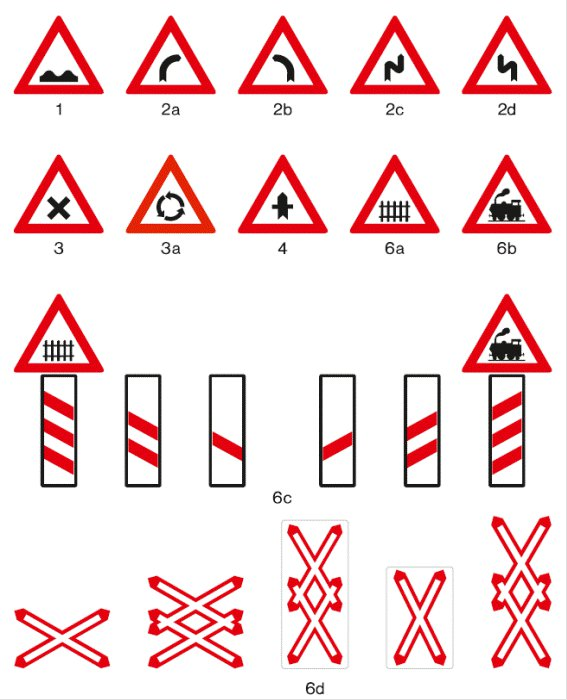

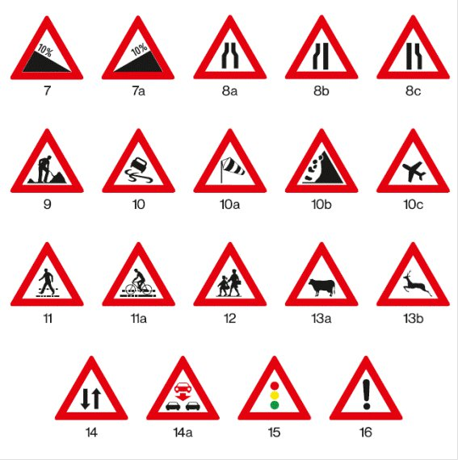

## Anlage 5 # Vorschriftszeichen # Verbots- oder Beschränkungszeichen

### Anl. 5 StVZVO

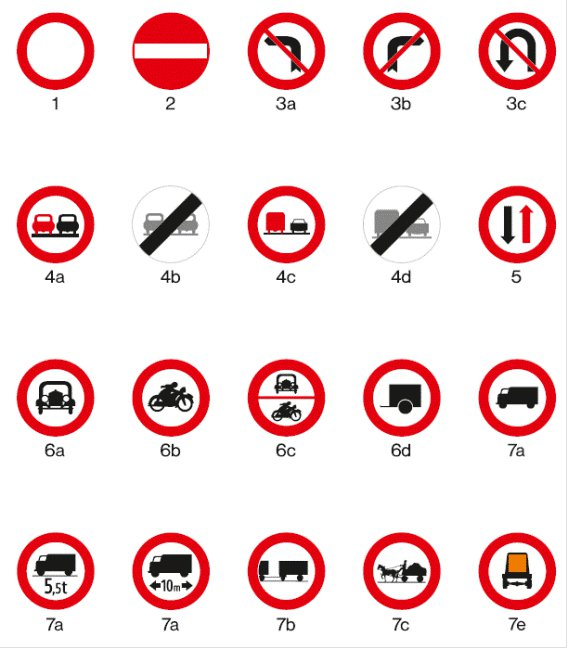  
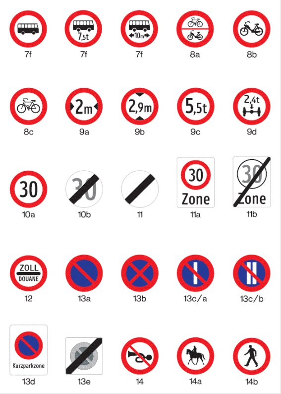  
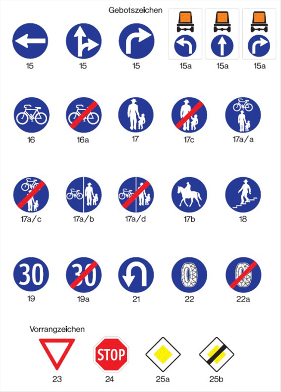

## Anlage 6 # Hinweiszeichen

### Anl. 6 StVZVO

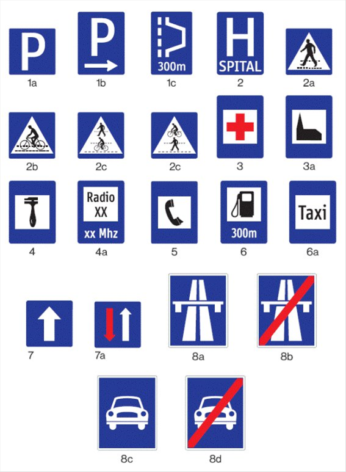  
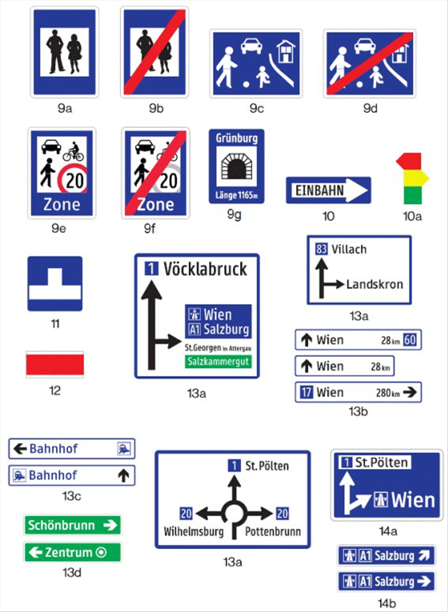  
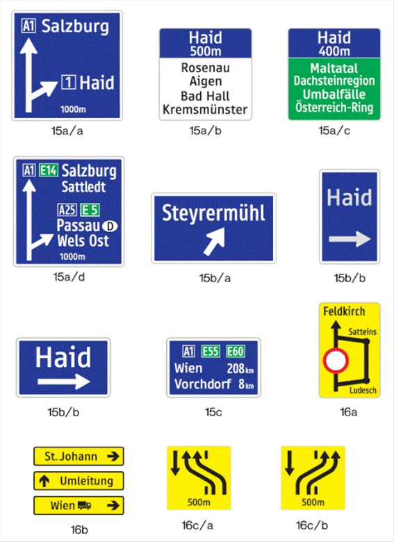  
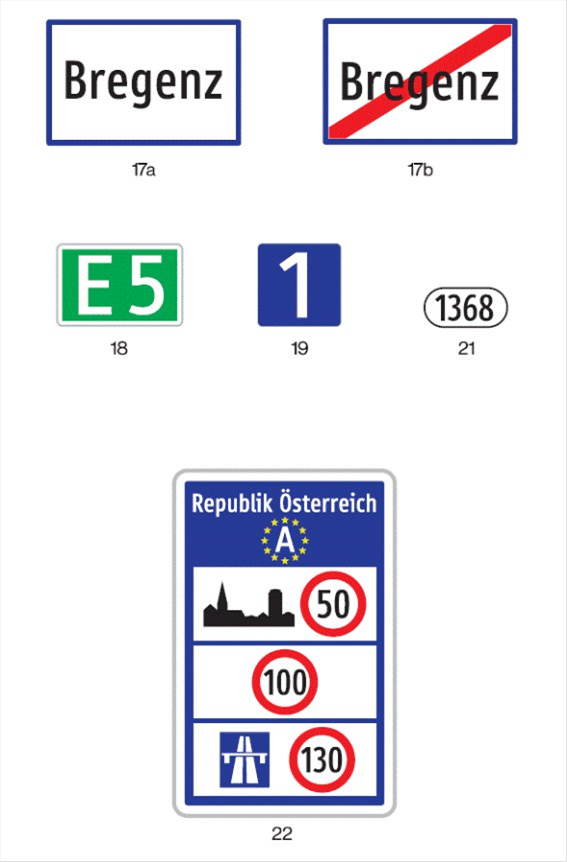  
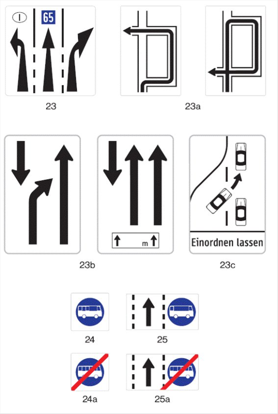  
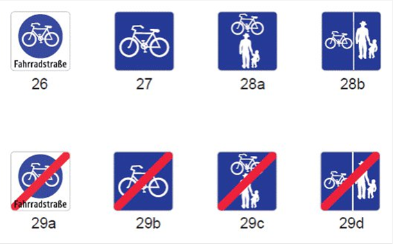

## Anlage 7 # Zusatztafeln

### Anl. 7 StVZVO

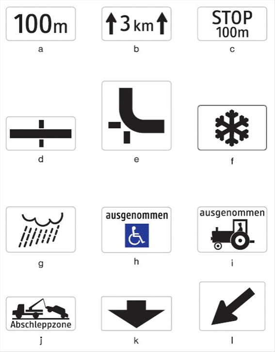

## Anlage 8 # Schriftzeichen mit Schriftart Tern

### Anl. 8 StVZVO

`END-OF-DATA-SET`
