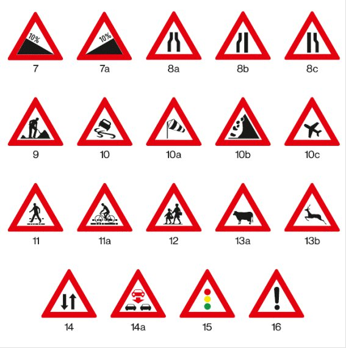
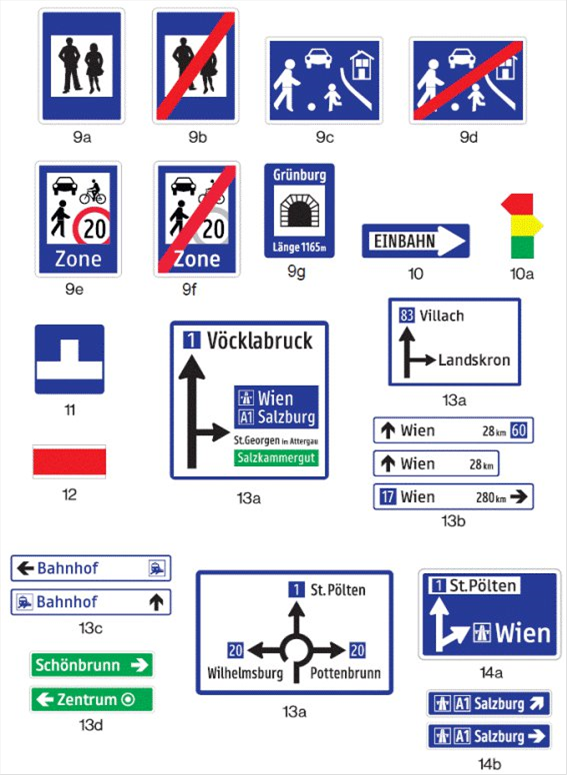
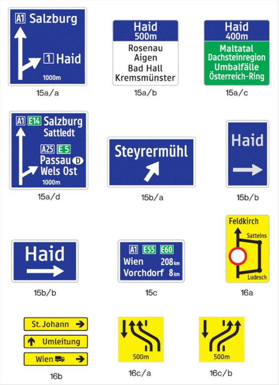
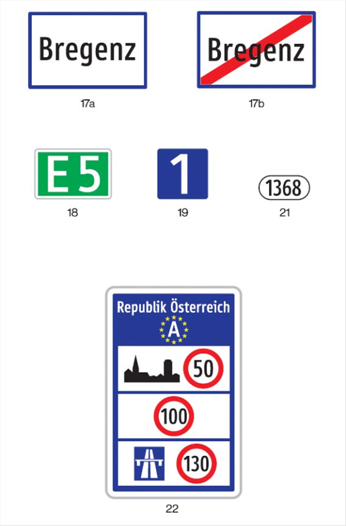
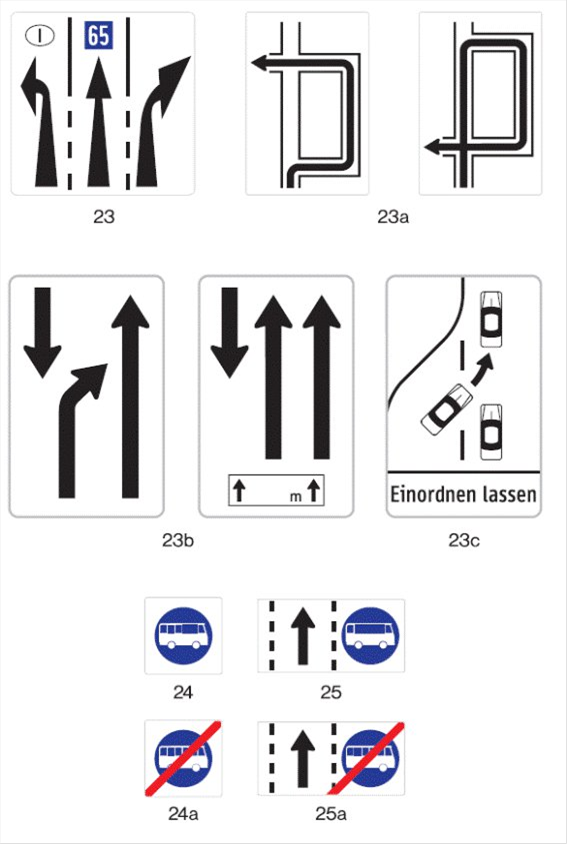
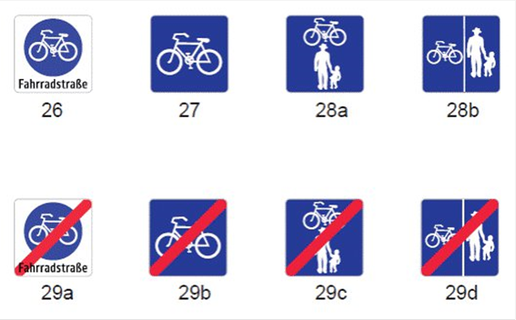

# BV.StVZVO — BMIMI: Straßenverkehrszeichenverordnung (StVZVO)
**Typ:** Verordnung eines Bundesministeriums  
**Kurztitel:** StVZVO  
**Langtitel:** Verordnung des Bundesministers für Wissenschaft und Verkehr über Straßenverkehrszeichen (Straßenverkehrszeichenverordnung 1998 – StVZVO 1998)  
**Gesamte Rechtsvorschrift in der Fassung vom:** 07.07.2025  
**Quelle:** https://www.ris.bka.gv.at/GeltendeFassung.wxe?Abfrage=Bundesnormen&Gesetzesnummer=10012793  
**Letzte Änderung im RIS:** BGBl. II Nr. 292/2013  
**LawAT Permalink:** https://github.com/clairexen/LawAT/blob/main/files/BV.StVZVO.md  
*Mit RisEx für RisEn, RisEn-GPT, und LawAT von HTML zu MarkDown konvertiert. (Irrtümer und Fehler vorbehalten.)*

## Inhaltsverzeichnis

* [§ 1 StVZVO — Anwendungsbereich](#-1-stvzvo--anwendungsbereich)  
* [§ 2 StVZVO — Allgemeine Beschaffenheit](#-2-stvzvo--allgemeine-beschaffenheit)  
* [§ 3 StVZVO — Farben](#-3-stvzvo--farben)  
* [§ 4 StVZVO — Rückstrahlwirkung](#-4-stvzvo--rückstrahlwirkung)  
* [§ 5 StVZVO — Beleuchtung](#-5-stvzvo--beleuchtung)  
* [§ 6 StVZVO — Abmessungen](#-6-stvzvo--abmessungen)  
* [§ 7 StVZVO — Bildliche Darstellung](#-7-stvzvo--bildliche-darstellung)  
* [§ 8 StVZVO — Schriftzeichen](#-8-stvzvo--schriftzeichen)  
* [§ 9 StVZVO — Übergangsbestimmungen](#-9-stvzvo--übergangsbestimmungen)  
* [§ 10 StVZVO — Inkrafttreten](#-10-stvzvo--inkrafttreten)  
* [§ 11 StVZVO — Notifizierungen](#-11-stvzvo--notifizierungen)

**(Anm.: Anlage 1)**  
**Farbwertdiagramm für den 2°-Normalbeobachter**  
* [Anl. 1 StVZVO](#anl-1-stvzvo)  
* [Anl. 2 StVZVO](#anl-2-stvzvo)  
* [Anl. 3 StVZVO](#anl-3-stvzvo)

**Anlage 4**  
**Gefahrenzeichen**  
* [Anl. 4 StVZVO](#anl-4-stvzvo)

**Anlage 5**  
**Vorschriftszeichen**  
**Verbots- oder Beschränkungszeichen**  
* [Anl. 5 StVZVO](#anl-5-stvzvo)

**Anlage 6**  
**Hinweiszeichen**  
* [Anl. 6 StVZVO](#anl-6-stvzvo)

**Anlage 7**  
**Zusatztafeln**  
* [Anl. 7 StVZVO](#anl-7-stvzvo)

**Anlage 8**  
**Schriftzeichen mit Schriftart Tern**  
* [Anl. 8 StVZVO](#anl-8-stvzvo)

----

Auf Grund des § 34 Abs. 1 Straßenverkehrsordnung 1960, BGBl. Nr. 159, zuletzt geändert durch BGBl. I Nr. 3/1998, wird – nach erfolgter Notifizierung gemäß der Richtlinie 83/189/EWG des Rates vom 28. März 1983 in der Fassung der Richtlinien 88/182/EWG und 94/10/EG (Notifikationsnummer 96/0413/A) – verordnet:Auf Grund des Paragraph 34, Absatz eins, Straßenverkehrsordnung 1960, BGBl. Nr. 159, zuletzt geändert durch Bundesgesetzblatt Teil eins, Nr. 3 aus 1998,, wird – nach erfolgter Notifizierung gemäß der Richtlinie 83/189/EWG des Rates vom 28. März 1983 in der Fassung der Richtlinien 88/182/EWG und 94/10/EG (Notifikationsnummer 96/0413/A) – verordnet:

### § 1 StVZVO — Anwendungsbereich

> Diese Verordnung findet auf alle Straßenverkehrszeichen Anwendung, die nach Maßgabe des § 32 StVO 1960 angebracht werden\.

\[ [🔗 Permalink](https://github.com/clairexen/LawAT/blob/main/files/BV.StVZVO.md#-1-stvzvo--anwendungsbereich) | [📜 RIS-Paragraphenansicht](http://www.ris.bka.gv.at/NormDokument.wxe?Abfrage=Bundesnormen&Gesetzesnummer=None&Paragraf=1) | [📖 RIS-Gesamtansicht](https://www.ris.bka.gv.at/GeltendeFassung.wxe?Abfrage=Bundesnormen&Gesetzesnummer=10012793#MainContent_DocumentRepeater_BundesnormenCompleteNormDocumentData_1_TextContainer_1) | [🤖 KI-freundliche Fassung](https://github.com/clairexen/LawAT/blob/main/files/BV.StVZVO.001.md#-1-stvzvo--anwendungsbereich) \]

----

### § 2 StVZVO — Allgemeine Beschaffenheit

> Die Straßenverkehrszeichen sind als Schilder aus form\- und witterungsbeständigem Material herzustellen, wobei die Rückseite blendfrei sein muß; Reflexstoffe \(§ 4\) sind auf solchem Material anzubringen\. Straßenverkehrszeichen können beleuchtet \(§ 5\), rückstrahlend \(§ 4\) oder als optische oder elektronische Anzeigevorrichtung \(§ 48 Abs\. 1a StVO\) ausgeführt sein\.

\[ [🔗 Permalink](https://github.com/clairexen/LawAT/blob/main/files/BV.StVZVO.md#-2-stvzvo--allgemeine-beschaffenheit) | [📜 RIS-Paragraphenansicht](http://www.ris.bka.gv.at/NormDokument.wxe?Abfrage=Bundesnormen&Gesetzesnummer=None&Paragraf=2) | [📖 RIS-Gesamtansicht](https://www.ris.bka.gv.at/GeltendeFassung.wxe?Abfrage=Bundesnormen&Gesetzesnummer=10012793#MainContent_DocumentRepeater_BundesnormenCompleteNormDocumentData_2_TextContainer_2) | [🤖 KI-freundliche Fassung](https://github.com/clairexen/LawAT/blob/main/files/BV.StVZVO.001.md#-2-stvzvo--allgemeine-beschaffenheit) \]

----

### § 3 StVZVO — Farben

> `(1)` Die Farbtöne des für die Herstellung von Straßenverkehrszeichen verwendeten Materials müssen in trockenem Zustand innerhalb der Farbbereiche der Normfarbtafel der Internationalen Beleuchtungskommission \(Commission Internationale d'Eclairage\-CIE\) für das 2°\-Normvalenzsystem liegen, die durch die in Anlage 1 Tabelle 1 für Straßenverkehrszeichen im Gebrauchszustand und in Anlage 1 Tabelle 2 für Straßenverkehrszeichen im Neuzustand angegebenen Koordinaten bestimmt sind\.

> `(2)` Die Farbtöne und Leuchtdichtefaktoren sind bei Anleuchtung mit gerichtetem Licht der Normlichtart D 65 unter einem Winkel von 45° zur Flächennormalen und bei einer Meßrichtung von 0° \(45/0\-Meßgeometrie\) zu messen\.

> `(3)` Das verwendete Farbmaterial muß lichtecht und entsprechend dauerhaft sein\. Der Farbton darf sich nach dem Aufbringen des Farbmaterials auf das Straßenverkehrszeichen nur in einem solchen Ausmaß ändern, daß er immer noch innerhalb der in Anlage 1 Tabelle 1 angegebenen Farbbereiche liegt\.

\[ [🔗 Permalink](https://github.com/clairexen/LawAT/blob/main/files/BV.StVZVO.md#-3-stvzvo--farben) | [📜 RIS-Paragraphenansicht](http://www.ris.bka.gv.at/NormDokument.wxe?Abfrage=Bundesnormen&Gesetzesnummer=None&Paragraf=3) | [📖 RIS-Gesamtansicht](https://www.ris.bka.gv.at/GeltendeFassung.wxe?Abfrage=Bundesnormen&Gesetzesnummer=10012793#MainContent_DocumentRepeater_BundesnormenCompleteNormDocumentData_3_TextContainer_3) | [🤖 KI-freundliche Fassung](https://github.com/clairexen/LawAT/blob/main/files/BV.StVZVO.001.md#-3-stvzvo--farben) \]

----

### § 4 StVZVO — Rückstrahlwirkung

> `(1)` Die zu verwendenden Reflexstoffe \(retroreflektierende Folien\) müssen entweder dem Typ 1, dem Typ 2 oder dem Typ 3 entsprechen\.
>
>> `a)` Typ 1: Der Reflexstoff besteht aus einem Lichtbündelsystem, das einfallendes Licht in gebündelter Form zurücksendet \(retroreflektierende Folie\)\.
>
>> `b)` Typ 2: Der Reflexstoff besteht aus einem Lichtbündelsystem, der eine höhere Retroreflexion als Typ 1 aufweist\.
>
>> `c)` Typ 3: Der Reflexstoff besteht aus einem Lichtbündelsystem, der eine höhere Retroreflexion als Typ 2 aufweist\.

> `(2)` Die Reflexstoffe müssen mit Kennzeichnungssymbolen versehen sein, die derart im reflektierenden Material eingebracht sind, daß ihre Erkennbarkeit weder durch chemische noch physikalische Einwirkungen beeinträchtigt werden kann, ohne daß zugleich die Folien zerstört werden\. Aus den Kennzeichnungssymbolen muß der Name des Folienherstellers ermittelbar sein\. Zusätzlich ist das Straßenverkehrszeichen auf der Rückseite mit dem Namen des Herstellers und dem Auslieferungsjahr des Straßenverkehrszeichens sichtbar und dauerhaft in einer Größe von höchstens 30 mm x 80 mm zu kennzeichnen\. Die Anbringung eines Gütezeichens auf der Rückseite des Straßenverkehrszeichens ist in einer Größe von höchstens 20 mm x 40 mm zulässig\.

> `(3)` Die Reflexstoffe haben weiters den in den folgenden Absätzen in Verbindung mit Anlage 2 festgelegten Mindestwerten für den spezifischen Rückstrahlwert R\` zu entsprechen\. Diese Mindestwerte gelten jeweils für Folien des entsprechenden Typs im Neuzustand bei Anleuchtung mit der Normallichtart A für die angegebenen Anleuchtungswinkel  und Beobachtungswinkel  sowie für die festgelegten Meßgeometrien\.

> `(4)` Der Rückstrahlwert darf sich bei Folien vom Typ 1 während eines Zeitraumes von sieben Jahren nicht um mehr als 50%, bei Folien vom Typ 2 während eines Zeitraumes von zehn Jahren nicht um mehr als 20% und bei Folien vom Typ 3 während eines Zeitraumes von zwölf Jahren nicht um mehr als 20% gegenüber den Mindestrückstrahlwerten im Neuzustand vermindern\. Diese Bedingungen gelten für einen Beobachtungswinkel von 0,33° und einen Anleuchtungswinkel von 5° für dauernd angebrachte Straßenverkehrszeichen bei üblicher Beanspruchung\.

> `(5)` Für Straßenverkehrszeichen gemäß § 50 Z 6a bis d, 11, 11a und 12, § 52 lit\. a Z 2, 4a, 4c, lit\. b Z 15, 23 und 24 sowie § 53 Z 2a, 2b, 2c, 8a und 8c StVO 1960 sind, sofern sie nicht beleuchtet oder als optische oder elektronische Anzeigevorrichtungen ausgeführt sind, Reflexstoffe vom Typ 2 oder Typ 3 zu verwenden\. Dies gilt sinngemäß für Straßenverkehrszeichen, die als Überkopfwegweiser ausgeführt sind\.

\[ [🔗 Permalink](https://github.com/clairexen/LawAT/blob/main/files/BV.StVZVO.md#-4-stvzvo--rückstrahlwirkung) | [📜 RIS-Paragraphenansicht](http://www.ris.bka.gv.at/NormDokument.wxe?Abfrage=Bundesnormen&Gesetzesnummer=None&Paragraf=4) | [📖 RIS-Gesamtansicht](https://www.ris.bka.gv.at/GeltendeFassung.wxe?Abfrage=Bundesnormen&Gesetzesnummer=10012793#MainContent_DocumentRepeater_BundesnormenCompleteNormDocumentData_4_TextContainer_4) | [🤖 KI-freundliche Fassung](https://github.com/clairexen/LawAT/blob/main/files/BV.StVZVO.001.md#-4-stvzvo--rückstrahlwirkung) \]

----

### § 5 StVZVO — Beleuchtung

> `(1)` Als beleuchtete Straßenverkehrszeichen gelten angeleuchtete \(außen beleuchtete\) oder innen beleuchtete Verkehrszeichen\. Die mittlere Leuchtdichte von beleuchteten oder als optische oder elektronische Anzeigevorrichtungen ausgeführten Straßenverkehrszeichen hat mindestens den in der Tabelle angeführten Werten zu entsprechen\.

<table id="Tabelle1"><tbody>
<tr><td style="text-align:left">Farbe</td><td style="text-align:center">mittlere Leuchtdichte L m in cd/m2</td></tr>
<tr><td style="vertical-align:top;text-align:left">Rot</td><td style="vertical-align:top;text-align:center">20</td></tr>
<tr><td style="vertical-align:top;text-align:left">Gelb</td><td style="vertical-align:top;text-align:center">150</td></tr>
<tr><td style="vertical-align:top;text-align:left">Grün</td><td style="vertical-align:top;text-align:center">40</td></tr>
<tr><td style="vertical-align:top;text-align:left">Blau</td><td style="vertical-align:top;text-align:center">10</td></tr>
<tr><td style="vertical-align:top;text-align:left">Weiß</td><td style="vertical-align:top;text-align:center">150</td></tr>
<tr><td></td><td></td></tr>
</tbody></table>

> `(2)` Die Leuchtdichte darf bei optischen oder elektronischen Anzeigevorrichtungen einen Wert von 2 000 cd/m2 nicht überschreiten\.

\[ [🔗 Permalink](https://github.com/clairexen/LawAT/blob/main/files/BV.StVZVO.md#-5-stvzvo--beleuchtung) | [📜 RIS-Paragraphenansicht](http://www.ris.bka.gv.at/NormDokument.wxe?Abfrage=Bundesnormen&Gesetzesnummer=None&Paragraf=5) | [📖 RIS-Gesamtansicht](https://www.ris.bka.gv.at/GeltendeFassung.wxe?Abfrage=Bundesnormen&Gesetzesnummer=10012793#MainContent_DocumentRepeater_BundesnormenCompleteNormDocumentData_5_TextContainer_5) | [🤖 KI-freundliche Fassung](https://github.com/clairexen/LawAT/blob/main/files/BV.StVZVO.001.md#-5-stvzvo--beleuchtung) \]

----

### § 6 StVZVO — Abmessungen

> Die Straßenverkehrszeichen sind nach den Maßangaben der in Anlage 3 angefügten Tabelle herzustellen\. Abweichungen bis zu \+/\-3% der Maßangaben sind zulässig\. Bei Hinweiszeichen sind dabei je nach Größe Eckabrundungen mit einem Radius bis zu 100 mm zulässig\.

\[ [🔗 Permalink](https://github.com/clairexen/LawAT/blob/main/files/BV.StVZVO.md#-6-stvzvo--abmessungen) | [📜 RIS-Paragraphenansicht](http://www.ris.bka.gv.at/NormDokument.wxe?Abfrage=Bundesnormen&Gesetzesnummer=None&Paragraf=6) | [📖 RIS-Gesamtansicht](https://www.ris.bka.gv.at/GeltendeFassung.wxe?Abfrage=Bundesnormen&Gesetzesnummer=10012793#MainContent_DocumentRepeater_BundesnormenCompleteNormDocumentData_6_TextContainer_6) | [🤖 KI-freundliche Fassung](https://github.com/clairexen/LawAT/blob/main/files/BV.StVZVO.001.md#-6-stvzvo--abmessungen) \]

----

### § 7 StVZVO — Bildliche Darstellung

> Die Straßenverkehrszeichen sind in ihrer bildlichen Darstellung verhältnismäßig entsprechend den in Anlage 4, 5, 6 und 7 angeführten Abbildungen auszuführen\. Das Anbringen eines bis zu 10 mm breiten weißen oder grauen Außenrandes ist zulässig, sofern nicht schon nach der Abbildung eine andere Umrandung des Straßenverkehrszeichens vorgesehen ist\.

\[ [🔗 Permalink](https://github.com/clairexen/LawAT/blob/main/files/BV.StVZVO.md#-7-stvzvo--bildliche-darstellung) | [📜 RIS-Paragraphenansicht](http://www.ris.bka.gv.at/NormDokument.wxe?Abfrage=Bundesnormen&Gesetzesnummer=None&Paragraf=7) | [📖 RIS-Gesamtansicht](https://www.ris.bka.gv.at/GeltendeFassung.wxe?Abfrage=Bundesnormen&Gesetzesnummer=10012793#MainContent_DocumentRepeater_BundesnormenCompleteNormDocumentData_7_TextContainer_7) | [🤖 KI-freundliche Fassung](https://github.com/clairexen/LawAT/blob/main/files/BV.StVZVO.001.md#-7-stvzvo--bildliche-darstellung) \]

----

### § 8 StVZVO — Schriftzeichen

> Für Aufschriften auf Straßenverkehrszeichen sind Schriftzeichen nach der Anlage 8 zu verwenden\.

\[ [🔗 Permalink](https://github.com/clairexen/LawAT/blob/main/files/BV.StVZVO.md#-8-stvzvo--schriftzeichen) | [📜 RIS-Paragraphenansicht](http://www.ris.bka.gv.at/NormDokument.wxe?Abfrage=Bundesnormen&Gesetzesnummer=None&Paragraf=8) | [📖 RIS-Gesamtansicht](https://www.ris.bka.gv.at/GeltendeFassung.wxe?Abfrage=Bundesnormen&Gesetzesnummer=10012793#MainContent_DocumentRepeater_BundesnormenCompleteNormDocumentData_8_TextContainer_8) | [🤖 KI-freundliche Fassung](https://github.com/clairexen/LawAT/blob/main/files/BV.StVZVO.001.md#-8-stvzvo--schriftzeichen) \]

----

### § 9 StVZVO — Übergangsbestimmungen

> `(1)` Die im Zeitpunkt des Inkrafttretens dieser Verordnung angebrachten Straßenverkehrszeichen, deren Ausführung zwar nicht den Bestimmungen dieser Verordnung, hingegen aber den Bestimmungen der Straßenverkehrszeichenverordnung 1966, BGBl\. Nr\. 83, in der Fassung BGBl\. Nr\. 703/1976 entspricht, sind erst bei ihrer Erneuerung, spätestens jedoch bis 31\. Dezember 2005 durch Straßenverkehrszeichen, die dieser Verordnung entsprechen, zu ersetzen\.

> `(2)` Straßenverkehrszeichen, die der Straßenverkehrszeichenverordnung 1966, BGBl\. Nr\. 83, in der Fassung BGBl\. Nr\. 703/1976 entsprechen, können bis zum 31\. Dezember 1997 angebracht werden und sind erst bei ihrer Erneuerung, spätestens jedoch bis 31\. Dezember 2005 durch Straßenverkehrszeichen, die dieser Verordnung entsprechen, zu ersetzen\.

> `(3)` Straßenverkehrszeichen, deren Ausführung den Bestimmungen der Straßenverkehrszeichenverordnung 1995 – StVZVO 1995, BGBl\. Nr\. 770/1995, entspricht, gelten als dieser Verordnung entsprechend\.

> `(4)` Straßenverkehrszeichen, deren Ausführung den Bestimmungen der Straßenverkehrszeichenverordnung 1998, BGBl II Nr\. 238/1998, entsprechen, können bis zum 31\. Dezember 2014 angebracht werden; bereits angebrachte Straßenverkehrszeichen sind erst bei ihrer Erneuerung durch Straßenverkehrszeichen, die dieser Verordnung in der Fassung des BGBl\. II Nr\. 292/2013 entsprechen, zu ersetzen\. Straßenverkehrszeichen, die vorübergehend angebracht werden, insbesondere im Zuge von Baustellen, und deren Ausführung den Bestimmungen der Straßenverkehrszeichenverordnung 1998, BGBl II Nr\. 238/1998, entspricht, dürfen weiterhin angebracht werden\.

\[ [🔗 Permalink](https://github.com/clairexen/LawAT/blob/main/files/BV.StVZVO.md#-9-stvzvo--übergangsbestimmungen) | [📜 RIS-Paragraphenansicht](http://www.ris.bka.gv.at/NormDokument.wxe?Abfrage=Bundesnormen&Gesetzesnummer=None&Paragraf=9) | [📖 RIS-Gesamtansicht](https://www.ris.bka.gv.at/GeltendeFassung.wxe?Abfrage=Bundesnormen&Gesetzesnummer=10012793#MainContent_DocumentRepeater_BundesnormenCompleteNormDocumentData_9_TextContainer_9) | [🤖 KI-freundliche Fassung](https://github.com/clairexen/LawAT/blob/main/files/BV.StVZVO.001.md#-9-stvzvo--übergangsbestimmungen) \]

----

### § 10 StVZVO — Inkrafttreten

> Diese Verordnung tritt mit 1\. August 1998 in Kraft\. Mit Inkrafttreten dieser Verordnung tritt die Straßenverkehrszeichenverordnung 1995 – StVZVO 1995, BGBl\. Nr\. 770/1995, außer Kraft\.

\[ [🔗 Permalink](https://github.com/clairexen/LawAT/blob/main/files/BV.StVZVO.md#-10-stvzvo--inkrafttreten) | [📜 RIS-Paragraphenansicht](http://www.ris.bka.gv.at/NormDokument.wxe?Abfrage=Bundesnormen&Gesetzesnummer=None&Paragraf=10) | [📖 RIS-Gesamtansicht](https://www.ris.bka.gv.at/GeltendeFassung.wxe?Abfrage=Bundesnormen&Gesetzesnummer=10012793#MainContent_DocumentRepeater_BundesnormenCompleteNormDocumentData_10_TextContainer_10) | [🤖 KI-freundliche Fassung](https://github.com/clairexen/LawAT/blob/main/files/BV.StVZVO.001.md#-10-stvzvo--inkrafttreten) \]

----

### § 11 StVZVO — Notifizierungen

> Die Verordnung in der Fassung des BGBl\. II Nr\. 292/2013 wurde unter Einhaltung der Bestimmungen der Richtlinie 98/34/EG über ein Informationsverfahren auf dem Gebiet der Normen und technischen Vorschriften, welches das Verfahren nach der Richtlinie 83/189/EWG kodifiziert, unter der Notifikationsnummer 2013/170/A notifiziert\.

\[ [🔗 Permalink](https://github.com/clairexen/LawAT/blob/main/files/BV.StVZVO.md#-11-stvzvo--notifizierungen) | [📜 RIS-Paragraphenansicht](http://www.ris.bka.gv.at/NormDokument.wxe?Abfrage=Bundesnormen&Gesetzesnummer=None&Paragraf=11) | [📖 RIS-Gesamtansicht](https://www.ris.bka.gv.at/GeltendeFassung.wxe?Abfrage=Bundesnormen&Gesetzesnummer=10012793#MainContent_DocumentRepeater_BundesnormenCompleteNormDocumentData_11_TextContainer_11) | [🤖 KI-freundliche Fassung](https://github.com/clairexen/LawAT/blob/main/files/BV.StVZVO.001.md#-11-stvzvo--notifizierungen) \]

----

## (Anm.: Anlage 1)

## Farbwertdiagramm für den 2°-Normalbeobachter

### Anl. 1 StVZVO

> 
>
> <table id="Tabelle1"><tbody>
> <tr><td colspan=14 style="vertical-align:bottom;text-align:center">Tabelle 1</td></tr>
> <tr><td colspan=14 style="vertical-align:bottom;text-align:center">Farbbereiche und Leuchtdichtefaktoren für den Gebrauchszustand</td></tr>
> <tr><td style="vertical-align:bottom;text-align:center">Farbe</td><td style="vertical-align:bottom;text-align:center">Typ</td><td colspan=2 style="vertical-align:bottom;text-align:center">1</td><td colspan=2 style="vertical-align:bottom;text-align:center">2</td><td colspan=2 style="vertical-align:bottom;text-align:center">3</td><td colspan=2 style="vertical-align:bottom;text-align:center">4</td><td colspan=4 style="vertical-align:bottom;text-align:center">Leuchtdichtefaktoren</td></tr>
> <tr><td style="vertical-align:bottom"> </td><td style="vertical-align:bottom"> </td><td style="vertical-align:bottom"> </td><td style="vertical-align:bottom"> </td><td style="vertical-align:bottom"> </td><td style="vertical-align:bottom"> </td><td style="vertical-align:bottom"> </td><td style="vertical-align:bottom"> </td><td style="vertical-align:bottom"> </td><td style="vertical-align:bottom"> </td><td colspan=3 style="vertical-align:bottom;text-align:center">retroreflektierend</td><td style="vertical-align:bottom;text-align:center">nicht retroreflektierend</td></tr>
> <tr><td style="vertical-align:bottom"> </td><td style="vertical-align:bottom"> </td><td style="text-align:center">x</td><td style="text-align:center">y</td><td style="text-align:center">x</td><td style="text-align:center">y</td><td style="text-align:center">x</td><td style="text-align:center">y</td><td style="text-align:center">x</td><td style="text-align:center">y</td><td style="text-align:center">Typ 1</td><td style="text-align:center">Typ 2</td><td style="text-align:center">Typ 3</td><td style="vertical-align:bottom"> </td></tr>
> <tr><td style="vertical-align:bottom;text-align:left">Weiß</td><td style="text-align:center">1, 2, 3</td><td style="text-align:center">0,355</td><td style="text-align:center">0,355</td><td style="text-align:center">0,305</td><td style="text-align:center">0,305</td><td style="text-align:center">0,285</td><td style="text-align:center">0,325</td><td style="text-align:center">0,335</td><td style="text-align:center">0,375</td><td style="text-align:center">>=0,35</td><td style="text-align:center">>=0,27</td><td style="text-align:center">>=0,40</td><td style="text-align:center">>=0,75</td></tr>
> <tr><td style="vertical-align:bottom;text-align:left">Gelb</td><td style="text-align:center">1, 2, 3</td><td style="text-align:center">0,545</td><td style="text-align:center">0,454</td><td style="text-align:center">0,487</td><td style="text-align:center">0,423</td><td style="text-align:center">0,427</td><td style="text-align:center">0,483</td><td style="text-align:center">0,465</td><td style="text-align:center">0,534</td><td style="text-align:center">>=0,27</td><td style="text-align:center">>=0,16</td><td style="text-align:center">>=0,24</td><td style="text-align:center">>=0,45</td></tr>
> <tr><td style="vertical-align:bottom;text-align:left">Rot</td><td style="text-align:center">1, 2, 3</td><td style="text-align:center">0,735</td><td style="text-align:center">0,265</td><td style="text-align:center">0,674</td><td style="text-align:center">0,236</td><td style="text-align:center">0,569</td><td style="text-align:center">0,341</td><td style="text-align:center">0,655</td><td style="text-align:center">0,345</td><td style="text-align:center">>=0,05</td><td style="text-align:center">>=0,03</td><td style="text-align:center">>=0,03</td><td style="text-align:center">>=0,07</td></tr>
> <tr><td style="vertical-align:bottom;text-align:left">Blau</td><td style="text-align:center">1, 2, 3</td><td style="text-align:center">0,078</td><td style="text-align:center">0,171</td><td style="text-align:center">0,150</td><td style="text-align:center">0,220</td><td style="text-align:center">0,210</td><td style="text-align:center">0,160</td><td style="text-align:center">0,137</td><td style="text-align:center">0,038</td><td style="text-align:center">>=0,01</td><td style="text-align:center">>=0,01</td><td style="text-align:center">>=0,01</td><td style="text-align:center">>=0,05</td></tr>
> <tr><td style="vertical-align:bottom;text-align:left">Grün</td><td style="text-align:center">1, 2, 3</td><td style="text-align:center">0,007</td><td style="text-align:center">0,703</td><td style="text-align:center">0,248</td><td style="text-align:center">0,409</td><td style="text-align:center">0,177</td><td style="text-align:center">0,362</td><td style="text-align:center">0,026</td><td style="text-align:center">0,399</td><td style="text-align:center">>=0,04</td><td style="text-align:center">>=0,03</td><td style="text-align:center">>=0,03</td><td style="text-align:center">>=0,10</td></tr>
> <tr><td style="vertical-align:bottom;text-align:left">Grau</td><td style="text-align:center">1, 2</td><td style="text-align:center">0,350</td><td style="text-align:center">0,360</td><td style="text-align:center">0,300</td><td style="text-align:center">0,310</td><td style="text-align:center">0,285</td><td style="text-align:center">0,325</td><td style="text-align:center">0,335</td><td style="text-align:center">0,375</td><td colspan=2 style="text-align:center">0,12 – 0,18</td><td> </td><td style="text-align:center">0,16 – 0,29</td></tr>
> <tr><td style="vertical-align:bottom;text-align:left">Orange</td><td style="text-align:center">1,2</td><td style="text-align:center">0,610</td><td style="text-align:center">0,390</td><td style="text-align:center">0,535</td><td style="text-align:center">0,375</td><td style="text-align:center">0,506</td><td style="text-align:center">0,404</td><td style="text-align:center">0,570</td><td style="text-align:center">0,429</td><td style="text-align:center">>=0,17</td><td style="text-align:center">>=0,14</td><td> </td><td style="text-align:center">>=0,20</td></tr>
> <tr><td style="vertical-align:bottom"> </td><td style="text-align:center">3</td><td style="text-align:center">0,631</td><td style="text-align:center">0,369</td><td style="text-align:center">0,560</td><td style="text-align:center">0,360</td><td style="text-align:center">0,506</td><td style="text-align:center">0,404</td><td style="text-align:center">0,570</td><td style="text-align:center">0,429</td><td> </td><td> </td><td style="text-align:center">>=0,14</td><td> </td></tr>
> <tr><td style="vertical-align:bottom;text-align:left">Braun</td><td style="text-align:center">1, 2, 3</td><td style="text-align:center">0,455</td><td style="text-align:center">0,397</td><td style="text-align:center">0,523</td><td style="text-align:center">0,429</td><td style="text-align:center">0,479</td><td style="text-align:center">0,373</td><td style="text-align:center">0,558</td><td style="text-align:center">0,394</td><td colspan=3 style="text-align:center">0,03 – 0,09</td><td style="text-align:center">0,04 – 0,15</td></tr>
> <tr><td></td><td></td><td></td><td></td><td></td><td></td><td></td><td></td><td></td><td></td><td></td><td></td><td></td><td></td></tr>
> </tbody></table>
>
> <table id="Tabelle2"><tbody>
> <tr><td colspan=14 style="vertical-align:bottom;text-align:center">Tabelle 2</td></tr>
> <tr><td colspan=14 style="vertical-align:bottom;text-align:center">Farbbereiche und Leuchtdichtefaktoren für den Neuzustand</td></tr>
> <tr><td style="vertical-align:bottom;text-align:center">Farbe</td><td style="vertical-align:bottom;text-align:center">Typ</td><td colspan=2 style="vertical-align:bottom;text-align:center">1</td><td colspan=2 style="vertical-align:bottom;text-align:center">2</td><td colspan=2 style="vertical-align:bottom;text-align:center">3</td><td colspan=2 style="vertical-align:bottom;text-align:center">4</td><td colspan=4 style="vertical-align:bottom;text-align:center">Leuchtdichtefaktoren</td></tr>
> <tr><td style="vertical-align:bottom"> </td><td style="vertical-align:bottom"> </td><td style="vertical-align:bottom"> </td><td style="vertical-align:bottom"> </td><td style="vertical-align:bottom"> </td><td style="vertical-align:bottom"> </td><td style="vertical-align:bottom"> </td><td style="vertical-align:bottom"> </td><td style="vertical-align:bottom"> </td><td style="vertical-align:bottom"> </td><td colspan=3 style="vertical-align:bottom;text-align:center">retroreflektierend</td><td style="vertical-align:bottom;text-align:center">nicht retroreflektierend</td></tr>
> <tr><td style="vertical-align:bottom"> </td><td style="vertical-align:bottom"> </td><td style="text-align:center">x</td><td style="text-align:center">y</td><td style="text-align:center">x</td><td style="text-align:center">y</td><td style="text-align:center">x</td><td style="text-align:center">y</td><td style="text-align:center">x</td><td style="text-align:center">y</td><td style="text-align:center">Typ 1</td><td style="text-align:center">Typ 2</td><td style="text-align:center">Typ 3</td><td style="vertical-align:bottom"> </td></tr>
> <tr><td style="vertical-align:bottom;text-align:left">Weiß</td><td style="vertical-align:bottom;text-align:center">1, 2, 3</td><td style="text-align:center">0,305</td><td style="text-align:center">0,315</td><td style="text-align:center">0,335</td><td style="text-align:center">0,345</td><td style="text-align:center">0,325</td><td style="text-align:center">0,355</td><td style="text-align:center">0,295</td><td style="text-align:center">0,325</td><td style="text-align:center">>=0,35</td><td style="text-align:center">>=0,27</td><td style="text-align:center">>=0,40</td><td style="text-align:center">>=0,75</td></tr>
> <tr><td style="vertical-align:bottom;text-align:left">Gelb</td><td style="vertical-align:bottom;text-align:center">1, 2, 3</td><td style="text-align:center">0,494</td><td style="text-align:center">0,505</td><td style="text-align:center">0,470</td><td style="text-align:center">0,480</td><td style="text-align:center">0,513</td><td style="text-align:center">0,437</td><td style="text-align:center">0,545</td><td style="text-align:center">0,454</td><td style="text-align:center">>=0,27</td><td style="text-align:center">>=0,16</td><td style="text-align:center">>=0,24</td><td style="text-align:center">>=0,45</td></tr>
> <tr><td style="vertical-align:bottom;text-align:left">Rot</td><td style="vertical-align:bottom;text-align:center">1, 2, 3</td><td style="text-align:center">0,735</td><td style="text-align:center">0,265</td><td style="text-align:center">0,700</td><td style="text-align:center">0,250</td><td style="text-align:center">0,610</td><td style="text-align:center">0,340</td><td style="text-align:center">0,660</td><td style="text-align:center">0,340</td><td style="text-align:center">>=0,05</td><td style="text-align:center">>=0,03</td><td style="text-align:center">>=0,03</td><td style="text-align:center">>=0,07</td></tr>
> <tr><td style="vertical-align:bottom;text-align:left">Blau</td><td style="vertical-align:bottom;text-align:center">1, 2, 3</td><td style="text-align:center">0,130</td><td style="text-align:center">0,090</td><td style="text-align:center">0,160</td><td style="text-align:center">0,090</td><td style="text-align:center">0,160</td><td style="text-align:center">0,140</td><td style="text-align:center">0,130</td><td style="text-align:center">0,140</td><td style="text-align:center">>=0,01</td><td style="text-align:center">>=0,01</td><td style="text-align:center">>=0,01</td><td style="text-align:center">>=0,05</td></tr>
> <tr><td style="vertical-align:bottom;text-align:left">Grün</td><td style="vertical-align:bottom;text-align:center">1, 2, 3</td><td style="text-align:center">0,110</td><td style="text-align:center">0,415</td><td style="text-align:center">0,170</td><td style="text-align:center">0,415</td><td style="text-align:center">0,170</td><td style="text-align:center">0,500</td><td style="text-align:center">0,110</td><td style="text-align:center">0,500</td><td style="text-align:center">>=0,04</td><td style="text-align:center">>=0,03</td><td style="text-align:center">>=0,03</td><td style="text-align:center">>=0,10</td></tr>
> <tr><td style="vertical-align:bottom;text-align:left">Orange</td><td style="vertical-align:bottom;text-align:center">1, 2</td><td style="text-align:center">0,610</td><td style="text-align:center">0,390</td><td style="text-align:center">0,535</td><td style="text-align:center">0,375</td><td style="text-align:center">0,506</td><td style="text-align:center">0,404</td><td style="text-align:center">0,570</td><td style="text-align:center">0,429</td><td style="text-align:center">>=0,17</td><td style="text-align:center">>=0,14</td><td> </td><td style="text-align:center">>=0,20</td></tr>
> <tr><td style="vertical-align:bottom"> </td><td style="vertical-align:bottom;text-align:center">3</td><td style="text-align:center">0,631</td><td style="text-align:center">0,369</td><td style="text-align:center">0,560</td><td style="text-align:center">0,360</td><td style="text-align:center">0,506</td><td style="text-align:center">0,404</td><td style="text-align:center">0,570</td><td style="text-align:center">0,429</td><td> </td><td> </td><td style="text-align:center">>=0,14</td><td> </td></tr>
> <tr><td style="vertical-align:bottom;text-align:left">Braun</td><td style="vertical-align:bottom;text-align:center">1, 2, 3</td><td style="text-align:center">0,455</td><td style="text-align:center">0,397</td><td style="text-align:center">0,523</td><td style="text-align:center">0,429</td><td style="text-align:center">0,479</td><td style="text-align:center">0,373</td><td style="text-align:center">0,558</td><td style="text-align:center">0,394</td><td colspan=3 style="text-align:center">0,03 – 0,09</td><td style="text-align:center">0,04 – 0,15</td></tr>
> <tr><td style="vertical-align:bottom;text-align:left">Grau</td><td style="vertical-align:bottom;text-align:center">1, 2</td><td style="text-align:center">0,305</td><td style="text-align:center">0,315</td><td style="text-align:center">0,335</td><td style="text-align:center">0,345</td><td style="text-align:center">0,325</td><td style="text-align:center">0,355</td><td style="text-align:center">0,295</td><td style="text-align:center">0,325</td><td colspan=2 style="text-align:center">0,12 – 0,18</td><td> </td><td style="text-align:center">0,16 – 0,29</td></tr>
> <tr><td></td><td></td><td></td><td></td><td></td><td></td><td></td><td></td><td></td><td></td><td></td><td></td><td></td><td></td></tr>
> </tbody></table>

\[ [🔗 Permalink](https://github.com/clairexen/LawAT/blob/main/files/BV.StVZVO.md#anl-1-stvzvo) | [📜 RIS-Paragraphenansicht](http://www.ris.bka.gv.at/NormDokument.wxe?Abfrage=Bundesnormen&Gesetzesnummer=None&Paragraf=1) | [📖 RIS-Gesamtansicht](https://www.ris.bka.gv.at/GeltendeFassung.wxe?Abfrage=Bundesnormen&Gesetzesnummer=10012793#MainContent_DocumentRepeater_BundesnormenCompleteNormDocumentData_12_TextContainer_12) | [🤖 KI-freundliche Fassung](https://github.com/clairexen/LawAT/blob/main/files/BV.StVZVO.002.md#anl-1-stvzvo) \]

----

### Anl. 2 StVZVO

<table id="Tabelle1"><tbody>
<tr><td colspan=7 style="vertical-align:bottom;text-align:left">Mindestrückstrahlwerte R' in cd lx-1 m-2</td><td colspan=13 style="vertical-align:bottom"></td></tr>
<tr><td colspan=2 style="vertical-align:bottom;text-align:center">Aufsichtsfarbe</td><td colspan=3 style="vertical-align:bottom;text-align:center">α=0,2°</td><td colspan=4 style="vertical-align:bottom;text-align:center">0,33°</td><td colspan=4 style="vertical-align:bottom;text-align:center">1°</td><td colspan=4 style="vertical-align:bottom;text-align:center">1,5°</td><td colspan=3 style="vertical-align:bottom;text-align:center">2°</td></tr>
<tr><td style="vertical-align:bottom"> </td><td style="vertical-align:bottom"> </td><td style="vertical-align:bottom;text-align:center">β=5°</td><td style="vertical-align:bottom;text-align:center">30°</td><td style="vertical-align:bottom;text-align:center">40°</td><td style="vertical-align:bottom;text-align:center">5°</td><td style="vertical-align:bottom;text-align:center">20°</td><td style="vertical-align:bottom;text-align:center">30°</td><td style="vertical-align:bottom;text-align:center">40°</td><td style="vertical-align:bottom;text-align:center">5°</td><td style="vertical-align:bottom;text-align:center">20°</td><td style="vertical-align:bottom;text-align:center">30°</td><td style="vertical-align:bottom;text-align:center">40°</td><td style="vertical-align:bottom;text-align:center">5°</td><td style="vertical-align:bottom;text-align:center">20°</td><td style="vertical-align:bottom;text-align:center">30°</td><td style="vertical-align:bottom;text-align:center">40°</td><td style="vertical-align:bottom;text-align:center">5°</td><td style="vertical-align:bottom;text-align:center">30°</td><td style="vertical-align:bottom;text-align:center">40°</td></tr>
<tr><td style="vertical-align:bottom;text-align:left">Rot</td><td style="vertical-align:bottom;text-align:left">Typ 1</td><td style="vertical-align:bottom;text-align:right">14,5</td><td style="vertical-align:bottom;text-align:right">6</td><td style="vertical-align:bottom;text-align:right">2</td><td style="vertical-align:bottom;text-align:right">10</td><td style="vertical-align:bottom;text-align:right">-</td><td style="vertical-align:bottom;text-align:right">4</td><td style="vertical-align:bottom;text-align:right">1,8</td><td style="vertical-align:bottom;text-align:right">-</td><td style="vertical-align:bottom;text-align:right">-</td><td style="vertical-align:bottom;text-align:right">-</td><td style="vertical-align:bottom;text-align:right">-</td><td style="vertical-align:bottom;text-align:right">-</td><td style="vertical-align:bottom;text-align:right">-</td><td style="vertical-align:bottom;text-align:right">-</td><td style="vertical-align:bottom;text-align:right">-</td><td style="vertical-align:bottom;text-align:right">1</td><td style="vertical-align:bottom;text-align:right">0,5</td><td style="vertical-align:bottom;text-align:right">0,5</td></tr>
<tr><td style="vertical-align:bottom"> </td><td style="vertical-align:bottom;text-align:left">Typ 2</td><td style="vertical-align:bottom;text-align:right">45</td><td style="vertical-align:bottom;text-align:right">25</td><td style="vertical-align:bottom;text-align:right">15</td><td style="vertical-align:bottom;text-align:right">25</td><td style="vertical-align:bottom;text-align:right">-</td><td style="vertical-align:bottom;text-align:right">14</td><td style="vertical-align:bottom;text-align:right">13</td><td style="vertical-align:bottom;text-align:right">-</td><td style="vertical-align:bottom;text-align:right">-</td><td style="vertical-align:bottom;text-align:right">-</td><td style="vertical-align:bottom;text-align:right">-</td><td style="vertical-align:bottom;text-align:right">-</td><td style="vertical-align:bottom;text-align:right">-</td><td style="vertical-align:bottom;text-align:right">-</td><td style="vertical-align:bottom;text-align:right">-</td><td style="vertical-align:bottom;text-align:right">1</td><td style="vertical-align:bottom;text-align:right">0,4</td><td style="vertical-align:bottom;text-align:right">0,3</td></tr>
<tr><td style="vertical-align:bottom"> </td><td style="vertical-align:bottom;text-align:left">Typ 3</td><td style="vertical-align:bottom;text-align:right">-</td><td style="vertical-align:bottom;text-align:right">-</td><td style="vertical-align:bottom;text-align:right">-</td><td style="vertical-align:bottom;text-align:right">60</td><td style="vertical-align:bottom;text-align:right">48</td><td style="vertical-align:bottom;text-align:right">33</td><td style="vertical-align:bottom;text-align:right">6</td><td style="vertical-align:bottom;text-align:right">7</td><td style="vertical-align:bottom;text-align:right">6</td><td style="vertical-align:bottom;text-align:right">4</td><td style="vertical-align:bottom;text-align:right">1</td><td style="vertical-align:bottom;text-align:right">3</td><td style="vertical-align:bottom;text-align:right">2,5</td><td style="vertical-align:bottom;text-align:right">2</td><td style="vertical-align:bottom;text-align:right">#</td><td style="vertical-align:bottom;text-align:right">-</td><td style="vertical-align:bottom;text-align:right">-</td><td style="vertical-align:bottom;text-align:right">-</td></tr>
<tr><td style="vertical-align:bottom;text-align:left">Orange</td><td style="vertical-align:bottom;text-align:left">Typ 1</td><td style="vertical-align:bottom;text-align:right">25</td><td style="vertical-align:bottom;text-align:right">10</td><td style="vertical-align:bottom;text-align:right">2,2</td><td style="vertical-align:bottom;text-align:right">20</td><td style="vertical-align:bottom;text-align:right">-</td><td style="vertical-align:bottom;text-align:right">8</td><td style="vertical-align:bottom;text-align:right">2,2</td><td style="vertical-align:bottom;text-align:right">-</td><td style="vertical-align:bottom;text-align:right">-</td><td style="vertical-align:bottom;text-align:right">-</td><td style="vertical-align:bottom;text-align:right">-</td><td style="vertical-align:bottom;text-align:right">-</td><td style="vertical-align:bottom;text-align:right">-</td><td style="vertical-align:bottom;text-align:right">-</td><td style="vertical-align:bottom;text-align:right">-</td><td style="vertical-align:bottom;text-align:right">1,2</td><td style="vertical-align:bottom;text-align:right">0,5</td><td style="vertical-align:bottom;text-align:right">#</td></tr>
<tr><td style="vertical-align:bottom"> </td><td style="vertical-align:bottom;text-align:left">Typ 2</td><td style="vertical-align:bottom;text-align:right">100</td><td style="vertical-align:bottom;text-align:right">60</td><td style="vertical-align:bottom;text-align:right">29</td><td style="vertical-align:bottom;text-align:right">65</td><td style="vertical-align:bottom;text-align:right">-</td><td style="vertical-align:bottom;text-align:right">40</td><td style="vertical-align:bottom;text-align:right">20</td><td style="vertical-align:bottom;text-align:right">-</td><td style="vertical-align:bottom;text-align:right">-</td><td style="vertical-align:bottom;text-align:right">-</td><td style="vertical-align:bottom;text-align:right">-</td><td style="vertical-align:bottom;text-align:right">-</td><td style="vertical-align:bottom;text-align:right">-</td><td style="vertical-align:bottom;text-align:right">-</td><td style="vertical-align:bottom;text-align:right">-</td><td style="vertical-align:bottom;text-align:right">1,5</td><td style="vertical-align:bottom;text-align:right">1</td><td style="vertical-align:bottom;text-align:right">#</td></tr>
<tr><td style="vertical-align:bottom"> </td><td style="vertical-align:bottom;text-align:left">Typ 3</td><td style="vertical-align:bottom;text-align:right">-</td><td style="vertical-align:bottom;text-align:right">-</td><td style="vertical-align:bottom;text-align:right">-</td><td style="vertical-align:bottom;text-align:right">150</td><td style="vertical-align:bottom;text-align:right">120</td><td style="vertical-align:bottom;text-align:right">83</td><td style="vertical-align:bottom;text-align:right">15</td><td style="vertical-align:bottom;text-align:right">18</td><td style="vertical-align:bottom;text-align:right">15</td><td style="vertical-align:bottom;text-align:right">10</td><td style="vertical-align:bottom;text-align:right">2</td><td style="vertical-align:bottom;text-align:right">7,5</td><td style="vertical-align:bottom;text-align:right">6,5</td><td style="vertical-align:bottom;text-align:right">4,5</td><td style="vertical-align:bottom;text-align:right">1</td><td style="vertical-align:bottom;text-align:right">-</td><td style="vertical-align:bottom;text-align:right">-</td><td style="vertical-align:bottom;text-align:right">-</td></tr>
<tr><td style="vertical-align:bottom;text-align:left">Braun</td><td style="vertical-align:bottom;text-align:left">Typ 1</td><td style="vertical-align:bottom;text-align:right">1</td><td style="vertical-align:bottom;text-align:right">0,3</td><td style="vertical-align:bottom;text-align:right">#</td><td style="vertical-align:bottom;text-align:right">0,6</td><td style="vertical-align:bottom;text-align:right">-</td><td style="vertical-align:bottom;text-align:right">0,2</td><td style="vertical-align:bottom;text-align:right">#</td><td style="vertical-align:bottom;text-align:right">-</td><td style="vertical-align:bottom;text-align:right">-</td><td style="vertical-align:bottom;text-align:right">-</td><td style="vertical-align:bottom;text-align:right">-</td><td style="vertical-align:bottom;text-align:right">-</td><td style="vertical-align:bottom;text-align:right">-</td><td style="vertical-align:bottom;text-align:right">-</td><td style="vertical-align:bottom;text-align:right">-</td><td style="vertical-align:bottom;text-align:right">#</td><td style="vertical-align:bottom;text-align:right">#</td><td style="vertical-align:bottom;text-align:right">#</td></tr>
<tr><td style="vertical-align:bottom"> </td><td style="vertical-align:bottom;text-align:left">Typ 2</td><td style="vertical-align:bottom;text-align:right">12</td><td style="vertical-align:bottom;text-align:right">8,5</td><td style="vertical-align:bottom;text-align:right">5</td><td style="vertical-align:bottom;text-align:right">8</td><td style="vertical-align:bottom;text-align:right">-</td><td style="vertical-align:bottom;text-align:right">5</td><td style="vertical-align:bottom;text-align:right">3</td><td style="vertical-align:bottom;text-align:right">-</td><td style="vertical-align:bottom;text-align:right">-</td><td style="vertical-align:bottom;text-align:right">-</td><td style="vertical-align:bottom;text-align:right">-</td><td style="vertical-align:bottom;text-align:right">-</td><td style="vertical-align:bottom;text-align:right">-</td><td style="vertical-align:bottom;text-align:right">-</td><td style="vertical-align:bottom;text-align:right">-</td><td style="vertical-align:bottom;text-align:right">0,2</td><td style="vertical-align:bottom;text-align:right">#</td><td style="vertical-align:bottom;text-align:right">#</td></tr>
<tr><td style="vertical-align:bottom;text-align:left">Gelb</td><td style="vertical-align:bottom;text-align:left">Typ 1</td><td style="vertical-align:bottom;text-align:right">50</td><td style="vertical-align:bottom;text-align:right">22</td><td style="vertical-align:bottom;text-align:right">7</td><td style="vertical-align:bottom;text-align:right">35</td><td style="vertical-align:bottom;text-align:right">-</td><td style="vertical-align:bottom;text-align:right">16</td><td style="vertical-align:bottom;text-align:right">6</td><td style="vertical-align:bottom;text-align:right">-</td><td style="vertical-align:bottom;text-align:right">-</td><td style="vertical-align:bottom;text-align:right">-</td><td style="vertical-align:bottom;text-align:right">-</td><td style="vertical-align:bottom;text-align:right">-</td><td style="vertical-align:bottom;text-align:right">-</td><td style="vertical-align:bottom;text-align:right">-</td><td style="vertical-align:bottom;text-align:right">-</td><td style="vertical-align:bottom;text-align:right">3</td><td style="vertical-align:bottom;text-align:right">1,5</td><td style="vertical-align:bottom;text-align:right">1</td></tr>
<tr><td style="vertical-align:bottom"> </td><td style="vertical-align:bottom;text-align:left">Typ 2</td><td style="vertical-align:bottom;text-align:right">170</td><td style="vertical-align:bottom;text-align:right">100</td><td style="vertical-align:bottom;text-align:right">70</td><td style="vertical-align:bottom;text-align:right">120</td><td style="vertical-align:bottom;text-align:right">-</td><td style="vertical-align:bottom;text-align:right">70</td><td style="vertical-align:bottom;text-align:right">60</td><td style="vertical-align:bottom;text-align:right">-</td><td style="vertical-align:bottom;text-align:right">-</td><td style="vertical-align:bottom;text-align:right">-</td><td style="vertical-align:bottom;text-align:right">-</td><td style="vertical-align:bottom;text-align:right">-</td><td style="vertical-align:bottom;text-align:right">-</td><td style="vertical-align:bottom;text-align:right">-</td><td style="vertical-align:bottom;text-align:right">-</td><td style="vertical-align:bottom;text-align:right">3</td><td style="vertical-align:bottom;text-align:right">1,5</td><td style="vertical-align:bottom;text-align:right">1</td></tr>
<tr><td style="vertical-align:bottom"> </td><td style="vertical-align:bottom;text-align:left">Typ 3</td><td style="vertical-align:bottom;text-align:right">-</td><td style="vertical-align:bottom;text-align:right">-</td><td style="vertical-align:bottom;text-align:right">-</td><td style="vertical-align:bottom;text-align:right">195</td><td style="vertical-align:bottom;text-align:right">155</td><td style="vertical-align:bottom;text-align:right">110</td><td style="vertical-align:bottom;text-align:right">20</td><td style="vertical-align:bottom;text-align:right">23</td><td style="vertical-align:bottom;text-align:right">20</td><td style="vertical-align:bottom;text-align:right">13</td><td style="vertical-align:bottom;text-align:right">2</td><td style="vertical-align:bottom;text-align:right">10</td><td style="vertical-align:bottom;text-align:right">8</td><td style="vertical-align:bottom;text-align:right">6</td><td style="vertical-align:bottom;text-align:right">1</td><td style="vertical-align:bottom;text-align:right">-</td><td style="vertical-align:bottom;text-align:right">-</td><td style="vertical-align:bottom;text-align:right">-</td></tr>
<tr><td style="vertical-align:bottom;text-align:left">Grün</td><td style="vertical-align:bottom;text-align:left">Typ 1</td><td style="vertical-align:bottom;text-align:right">9</td><td style="vertical-align:bottom;text-align:right">3,5</td><td style="vertical-align:bottom;text-align:right">1,5</td><td style="vertical-align:bottom;text-align:right">7</td><td style="vertical-align:bottom;text-align:right">-</td><td style="vertical-align:bottom;text-align:right">3</td><td style="vertical-align:bottom;text-align:right">1,2</td><td style="vertical-align:bottom;text-align:right">-</td><td style="vertical-align:bottom;text-align:right">-</td><td style="vertical-align:bottom;text-align:right">-</td><td style="vertical-align:bottom;text-align:right">-</td><td style="vertical-align:bottom;text-align:right">-</td><td style="vertical-align:bottom;text-align:right">-</td><td style="vertical-align:bottom;text-align:right">-</td><td style="vertical-align:bottom;text-align:right">-</td><td style="vertical-align:bottom;text-align:right">0,5</td><td style="vertical-align:bottom;text-align:right">0,3</td><td style="vertical-align:bottom;text-align:right">0,2</td></tr>
<tr><td style="vertical-align:bottom"> </td><td style="vertical-align:bottom;text-align:left">Typ 2</td><td style="vertical-align:bottom;text-align:right">45</td><td style="vertical-align:bottom;text-align:right">25</td><td style="vertical-align:bottom;text-align:right">12</td><td style="vertical-align:bottom;text-align:right">21</td><td style="vertical-align:bottom;text-align:right">-</td><td style="vertical-align:bottom;text-align:right">12</td><td style="vertical-align:bottom;text-align:right">11</td><td style="vertical-align:bottom;text-align:right">-</td><td style="vertical-align:bottom;text-align:right">-</td><td style="vertical-align:bottom;text-align:right">-</td><td style="vertical-align:bottom;text-align:right">-</td><td style="vertical-align:bottom;text-align:right">-</td><td style="vertical-align:bottom;text-align:right">-</td><td style="vertical-align:bottom;text-align:right">-</td><td style="vertical-align:bottom;text-align:right">-</td><td style="vertical-align:bottom;text-align:right">0,5</td><td style="vertical-align:bottom;text-align:right">0,3</td><td style="vertical-align:bottom;text-align:right">0,2</td></tr>
<tr><td style="vertical-align:bottom"> </td><td style="vertical-align:bottom;text-align:left">Typ 3</td><td style="vertical-align:bottom;text-align:right">-</td><td style="vertical-align:bottom;text-align:right">-</td><td style="vertical-align:bottom;text-align:right">-</td><td style="vertical-align:bottom;text-align:right">30</td><td style="vertical-align:bottom;text-align:right">24</td><td style="vertical-align:bottom;text-align:right">17</td><td style="vertical-align:bottom;text-align:right">3</td><td style="vertical-align:bottom;text-align:right">3,5</td><td style="vertical-align:bottom;text-align:right">3</td><td style="vertical-align:bottom;text-align:right">2</td><td style="vertical-align:bottom;text-align:right">#</td><td style="vertical-align:bottom;text-align:right">1,5</td><td style="vertical-align:bottom;text-align:right">1</td><td style="vertical-align:bottom;text-align:right">#</td><td style="vertical-align:bottom;text-align:right">#</td><td style="vertical-align:bottom;text-align:right">-</td><td style="vertical-align:bottom;text-align:right">-</td><td style="vertical-align:bottom;text-align:right">-</td></tr>
<tr><td style="vertical-align:bottom;text-align:left">Blau</td><td style="vertical-align:bottom;text-align:left">Typ 1</td><td style="vertical-align:bottom;text-align:right">4</td><td style="vertical-align:bottom;text-align:right">1,7</td><td style="vertical-align:bottom;text-align:right">0,5</td><td style="vertical-align:bottom;text-align:right">2</td><td style="vertical-align:bottom;text-align:right">-</td><td style="vertical-align:bottom;text-align:right">1</td><td style="vertical-align:bottom;text-align:right">#</td><td style="vertical-align:bottom;text-align:right">-</td><td style="vertical-align:bottom;text-align:right">-</td><td style="vertical-align:bottom;text-align:right">-</td><td style="vertical-align:bottom;text-align:right">-</td><td style="vertical-align:bottom;text-align:right">-</td><td style="vertical-align:bottom;text-align:right">-</td><td style="vertical-align:bottom;text-align:right">-</td><td style="vertical-align:bottom;text-align:right">-</td><td style="vertical-align:bottom;text-align:right">#</td><td style="vertical-align:bottom;text-align:right">#</td><td style="vertical-align:bottom;text-align:right">#</td></tr>
<tr><td style="vertical-align:bottom"> </td><td style="vertical-align:bottom;text-align:left">Typ 2</td><td style="vertical-align:bottom;text-align:right">20</td><td style="vertical-align:bottom;text-align:right">11</td><td style="vertical-align:bottom;text-align:right">8</td><td style="vertical-align:bottom;text-align:right">14</td><td style="vertical-align:bottom;text-align:right">-</td><td style="vertical-align:bottom;text-align:right">8</td><td style="vertical-align:bottom;text-align:right">7</td><td style="vertical-align:bottom;text-align:right">-</td><td style="vertical-align:bottom;text-align:right">-</td><td style="vertical-align:bottom;text-align:right">-</td><td style="vertical-align:bottom;text-align:right">-</td><td style="vertical-align:bottom;text-align:right">-</td><td style="vertical-align:bottom;text-align:right">-</td><td style="vertical-align:bottom;text-align:right">-</td><td style="vertical-align:bottom;text-align:right">-</td><td style="vertical-align:bottom;text-align:right">0,2</td><td style="vertical-align:bottom;text-align:right">#</td><td style="vertical-align:bottom;text-align:right">#</td></tr>
<tr><td style="vertical-align:bottom"> </td><td style="vertical-align:bottom;text-align:left">Typ 3</td><td style="vertical-align:bottom;text-align:right">-</td><td style="vertical-align:bottom;text-align:right">-</td><td style="vertical-align:bottom;text-align:right">-</td><td style="vertical-align:bottom;text-align:right">19</td><td style="vertical-align:bottom;text-align:right">16</td><td style="vertical-align:bottom;text-align:right">11</td><td style="vertical-align:bottom;text-align:right">2</td><td style="vertical-align:bottom;text-align:right">2,5</td><td style="vertical-align:bottom;text-align:right">2</td><td style="vertical-align:bottom;text-align:right">1,5</td><td style="vertical-align:bottom;text-align:right">#</td><td style="vertical-align:bottom;text-align:right">1</td><td style="vertical-align:bottom;text-align:right">#</td><td style="vertical-align:bottom;text-align:right">#</td><td style="vertical-align:bottom;text-align:right">#</td><td style="vertical-align:bottom;text-align:right">-</td><td style="vertical-align:bottom;text-align:right">-</td><td style="vertical-align:bottom;text-align:right">-</td></tr>
<tr><td style="vertical-align:bottom;text-align:left">Weiß</td><td style="vertical-align:bottom;text-align:left">Typ 1</td><td style="vertical-align:bottom;text-align:right">70</td><td style="vertical-align:bottom;text-align:right">30</td><td style="vertical-align:bottom;text-align:right">10</td><td style="vertical-align:bottom;text-align:right">50</td><td style="vertical-align:bottom;text-align:right">-</td><td style="vertical-align:bottom;text-align:right">24</td><td style="vertical-align:bottom;text-align:right">9</td><td style="vertical-align:bottom;text-align:right">-</td><td style="vertical-align:bottom;text-align:right">-</td><td style="vertical-align:bottom;text-align:right">-</td><td style="vertical-align:bottom;text-align:right">-</td><td style="vertical-align:bottom;text-align:right">-</td><td style="vertical-align:bottom;text-align:right">-</td><td style="vertical-align:bottom;text-align:right">-</td><td style="vertical-align:bottom;text-align:right">-</td><td style="vertical-align:bottom;text-align:right">5</td><td style="vertical-align:bottom;text-align:right">2,5</td><td style="vertical-align:bottom;text-align:right">1,5</td></tr>
<tr><td style="vertical-align:bottom"> </td><td style="vertical-align:bottom;text-align:left">Typ 2</td><td style="vertical-align:bottom;text-align:right">250</td><td style="vertical-align:bottom;text-align:right">150</td><td style="vertical-align:bottom;text-align:right">110</td><td style="vertical-align:bottom;text-align:right">180</td><td style="vertical-align:bottom;text-align:right">-</td><td style="vertical-align:bottom;text-align:right">100</td><td style="vertical-align:bottom;text-align:right">95</td><td style="vertical-align:bottom;text-align:right">-</td><td style="vertical-align:bottom;text-align:right">-</td><td style="vertical-align:bottom;text-align:right">-</td><td style="vertical-align:bottom;text-align:right">-</td><td style="vertical-align:bottom;text-align:right">-</td><td style="vertical-align:bottom;text-align:right">-</td><td style="vertical-align:bottom;text-align:right">-</td><td style="vertical-align:bottom;text-align:right">-</td><td style="vertical-align:bottom;text-align:right">5</td><td style="vertical-align:bottom;text-align:right">2,5</td><td style="vertical-align:bottom;text-align:right">1,5</td></tr>
<tr><td style="vertical-align:bottom"> </td><td style="vertical-align:bottom;text-align:left">Typ 3</td><td style="vertical-align:bottom;text-align:right">-</td><td style="vertical-align:bottom;text-align:right">-</td><td style="vertical-align:bottom;text-align:right">-</td><td style="vertical-align:bottom;text-align:right">300</td><td style="vertical-align:bottom;text-align:right">240</td><td style="vertical-align:bottom;text-align:right">165</td><td style="vertical-align:bottom;text-align:right">30</td><td style="vertical-align:bottom;text-align:right">35</td><td style="vertical-align:bottom;text-align:right">30</td><td style="vertical-align:bottom;text-align:right">20</td><td style="vertical-align:bottom;text-align:right">3,5</td><td style="vertical-align:bottom;text-align:right">15</td><td style="vertical-align:bottom;text-align:right">13</td><td style="vertical-align:bottom;text-align:right">9</td><td style="vertical-align:bottom;text-align:right">1,5</td><td style="vertical-align:bottom;text-align:right">-</td><td style="vertical-align:bottom;text-align:right">-</td><td style="vertical-align:bottom;text-align:right">-</td></tr>
<tr><td style="vertical-align:bottom;text-align:left">Grau</td><td style="vertical-align:bottom;text-align:left">Typ 1</td><td style="vertical-align:bottom;text-align:right">42</td><td style="vertical-align:bottom;text-align:right">18</td><td style="vertical-align:bottom;text-align:right">6</td><td style="vertical-align:bottom;text-align:right">30</td><td style="vertical-align:bottom;text-align:right">-</td><td style="vertical-align:bottom;text-align:right">14,4</td><td style="vertical-align:bottom;text-align:right">5,4</td><td style="vertical-align:bottom;text-align:right">-</td><td style="vertical-align:bottom;text-align:right">-</td><td style="vertical-align:bottom;text-align:right">-</td><td style="vertical-align:bottom;text-align:right">-</td><td style="vertical-align:bottom;text-align:right">-</td><td style="vertical-align:bottom;text-align:right">-</td><td style="vertical-align:bottom;text-align:right">-</td><td style="vertical-align:bottom;text-align:right">-</td><td style="vertical-align:bottom;text-align:right">3</td><td style="vertical-align:bottom;text-align:right">1,5</td><td style="vertical-align:bottom;text-align:right">0,9</td></tr>
<tr><td style="vertical-align:bottom"> </td><td style="vertical-align:bottom;text-align:left">Typ 2</td><td style="vertical-align:bottom;text-align:right">125</td><td style="vertical-align:bottom;text-align:right">75</td><td style="vertical-align:bottom;text-align:right">55</td><td style="vertical-align:bottom;text-align:right">90</td><td style="vertical-align:bottom;text-align:right">-</td><td style="vertical-align:bottom;text-align:right">50</td><td style="vertical-align:bottom;text-align:right">47</td><td style="vertical-align:bottom;text-align:right">-</td><td style="vertical-align:bottom;text-align:right">-</td><td style="vertical-align:bottom;text-align:right">-</td><td style="vertical-align:bottom;text-align:right">-</td><td style="vertical-align:bottom;text-align:right">-</td><td style="vertical-align:bottom;text-align:right">-</td><td style="vertical-align:bottom;text-align:right">-</td><td style="vertical-align:bottom;text-align:right">-</td><td style="vertical-align:bottom;text-align:right">2,5</td><td style="vertical-align:bottom;text-align:right">1,2</td><td style="vertical-align:bottom;text-align:right">0,7</td></tr>
<tr><td style="vertical-align:bottom"> </td><td style="vertical-align:bottom"> </td><td style="vertical-align:bottom"> </td><td style="vertical-align:bottom"> </td><td style="vertical-align:bottom"> </td><td style="vertical-align:bottom"> </td><td style="vertical-align:bottom"> </td><td style="vertical-align:bottom"> </td><td style="vertical-align:bottom"> </td><td style="vertical-align:bottom"> </td><td style="vertical-align:bottom"> </td><td style="vertical-align:bottom"> </td><td style="vertical-align:bottom"> </td><td style="vertical-align:bottom"> </td><td style="vertical-align:bottom"> </td><td style="vertical-align:bottom"> </td><td style="vertical-align:bottom"> </td><td style="vertical-align:bottom"> </td><td style="vertical-align:bottom"> </td><td style="vertical-align:bottom"> </td></tr>
<tr><td colspan=5 style="vertical-align:bottom;text-align:left"># bedeutet Werte über Null, aber nicht anwendbar</td><td style="vertical-align:bottom"> </td><td style="vertical-align:bottom"> </td><td style="vertical-align:bottom"> </td><td style="vertical-align:bottom"> </td><td style="vertical-align:bottom"> </td><td style="vertical-align:bottom"> </td><td style="vertical-align:bottom"> </td><td style="vertical-align:bottom"> </td><td style="vertical-align:bottom"> </td><td style="vertical-align:bottom"> </td><td style="vertical-align:bottom"> </td><td style="vertical-align:bottom"> </td><td style="vertical-align:bottom"> </td><td style="vertical-align:bottom"> </td><td style="vertical-align:bottom"> </td></tr>
<tr><td></td><td></td><td></td><td></td><td></td><td></td><td></td><td></td><td></td><td></td><td></td><td></td><td></td><td></td><td></td><td></td><td></td><td></td><td></td><td></td></tr>
</tbody></table>

\[ [🔗 Permalink](https://github.com/clairexen/LawAT/blob/main/files/BV.StVZVO.md#anl-2-stvzvo) | [📜 RIS-Paragraphenansicht](http://www.ris.bka.gv.at/NormDokument.wxe?Abfrage=Bundesnormen&Gesetzesnummer=None&Paragraf=2) | [📖 RIS-Gesamtansicht](https://www.ris.bka.gv.at/GeltendeFassung.wxe?Abfrage=Bundesnormen&Gesetzesnummer=10012793#MainContent_DocumentRepeater_BundesnormenCompleteNormDocumentData_13_TextContainer_13) | [🤖 KI-freundliche Fassung](https://github.com/clairexen/LawAT/blob/main/files/BV.StVZVO.002.md#anl-2-stvzvo) \]

----

### Anl. 3 StVZVO

<table id="Tabelle1"><tbody>
<tr><td colspan=17 style="vertical-align:top"></td></tr>
<tr><td colspan=17 style="vertical-align:top"></td></tr>
<tr><td colspan=17 style="text-align:center">(Die Ziffern entsprechen den Abbildungen in Anlage 4, 5, 6 und 7)</td></tr>
<tr><td colspan=17 style="vertical-align:top"></td></tr>
<tr><td style="vertical-align:top"> </td><td colspan=6 style="vertical-align:top;text-align:right">Großformat</td><td colspan=4 style="vertical-align:top;text-align:right">Mittelformat</td><td colspan=4 style="vertical-align:top;text-align:right">Kleinformat</td><td colspan=2 style="vertical-align:top"> </td></tr>
<tr><td style="vertical-align:top;text-align:left">Seitenlänge</td><td colspan=6 style="vertical-align:top;text-align:right">1 500 mm</td><td colspan=4 style="vertical-align:top;text-align:right">1 000 mm</td><td colspan=4 style="vertical-align:top;text-align:right">700 mm</td><td colspan=2 style="vertical-align:top"> </td></tr>
<tr><td style="vertical-align:top;text-align:left">Breite des roten Randes</td><td colspan=6 style="vertical-align:top;text-align:right">150 mm</td><td colspan=4 style="vertical-align:top;text-align:right">100 mm</td><td colspan=4 style="vertical-align:top;text-align:right">70 mm</td><td colspan=2 style="vertical-align:top"> </td></tr>
<tr><td style="vertical-align:top;text-align:left">Eckenabrundung</td><td colspan=6 style="vertical-align:top;text-align:right">50 mm</td><td colspan=4 style="vertical-align:top;text-align:right">30 mm</td><td colspan=4 style="vertical-align:top;text-align:right">30 mm</td><td colspan=2 style="vertical-align:top"> </td></tr>
<tr><td style="vertical-align:top;text-align:left">Z 6c (Baken)</td><td colspan=6 style="vertical-align:top;text-align:right">–</td><td colspan=4 style="vertical-align:top;text-align:right">380 × 1 200 mm</td><td colspan=4 style="vertical-align:top;text-align:right">310 × 960 mm</td><td colspan=2 style="vertical-align:top"> </td></tr>
<tr><td style="vertical-align:top;text-align:left">Z 6d (Tafel)</td><td colspan=6 style="vertical-align:top;text-align:right">–</td><td colspan=4 style="vertical-align:top;text-align:right">750 × 1 150 mm</td><td colspan=4 style="vertical-align:top;text-align:right">630 × 1 400 mm</td><td colspan=2 style="vertical-align:top"> </td></tr>
<tr><td style="vertical-align:top"> </td><td colspan=6 style="vertical-align:top"> </td><td colspan=4 style="vertical-align:top;text-align:right">750 × 1 600 mm</td><td colspan=4 style="vertical-align:top;text-align:right">630 × 960 mm</td><td colspan=2 style="vertical-align:top"> </td></tr>
<tr><td colspan=17 style="vertical-align:top"></td></tr>
<tr><td colspan=2 style="vertical-align:top"> </td><td colspan=5 style="vertical-align:top;text-align:right">Großformat</td><td colspan=5 style="vertical-align:top;text-align:right">Mittel 1</td><td colspan=3 style="vertical-align:top;text-align:right">Mittel 2</td><td colspan=2 style="vertical-align:top;text-align:right">Kleinformat</td></tr>
<tr><td colspan=17 style="vertical-align:top"></td></tr>
<tr><td style="vertical-align:top;text-align:left">Durchmesser</td><td colspan=6 style="vertical-align:bottom;text-align:right">1 200 mm</td><td colspan=5 style="vertical-align:bottom;text-align:right">960 mm</td><td colspan=3 style="vertical-align:bottom;text-align:right">670 mm</td><td colspan=2 style="vertical-align:bottom;text-align:right">480 mm</td></tr>
<tr><td style="vertical-align:top;text-align:left">Breite des roten Randes</td><td colspan=6 style="vertical-align:bottom;text-align:right">150 mm</td><td colspan=5 style="vertical-align:bottom;text-align:right">120 mm</td><td colspan=3 style="vertical-align:bottom;text-align:right">80 mm</td><td colspan=2 style="vertical-align:bottom;text-align:right">60 mm</td></tr>
<tr><td style="vertical-align:top;text-align:left">Breite des roten Quer- oder Schrägbalkens bei Z 3a, 3b, 3c, 8a, 13a, 13b, 13c/a, 13c/b, 14</td><td colspan=6 style="vertical-align:bottom;text-align:right">90 mm</td><td colspan=5 style="vertical-align:bottom;text-align:right">70 mm</td><td colspan=3 style="vertical-align:bottom;text-align:right">50 mm</td><td colspan=2 style="vertical-align:bottom;text-align:right">40 mm</td></tr>
<tr><td style="vertical-align:top;text-align:left">Breite des roten Schrägbalkens bei Z 16a, 17a/c, 17a/d, 17c, 19a, 22a</td><td colspan=6 style="vertical-align:bottom;text-align:right">180 mm</td><td colspan=5 style="vertical-align:bottom;text-align:right">130 mm</td><td colspan=3 style="vertical-align:bottom;text-align:right">90 mm</td><td colspan=2 style="vertical-align:bottom;text-align:right">65 mm</td></tr>
<tr><td style="vertical-align:top;text-align:left">Breite von schwarzen Schrägbalken</td><td colspan=6 style="vertical-align:bottom;text-align:right">230 mm</td><td colspan=5 style="vertical-align:bottom;text-align:right">180 mm</td><td colspan=3 style="vertical-align:bottom;text-align:right">130 mm</td><td colspan=2 style="vertical-align:bottom;text-align:right">90 mm</td></tr>
<tr><td style="vertical-align:top;text-align:left">Breite von schwarzen Schrägbalken Z 11b</td><td colspan=6 style="vertical-align:bottom;text-align:right">115 mm</td><td colspan=5 style="vertical-align:bottom;text-align:right">90 mm</td><td colspan=3 style="vertical-align:bottom;text-align:right">65 mm</td><td colspan=2 style="vertical-align:bottom;text-align:right">45 mm</td></tr>
<tr><td style="vertical-align:top;text-align:left">Z 11a, 11b, 13d</td><td colspan=6 style="vertical-align:bottom"> </td><td colspan=5 style="vertical-align:bottom;text-align:right">960 × 1 200 mm</td><td colspan=3 style="vertical-align:bottom;text-align:right">630 × 960 mm</td><td colspan=2 style="vertical-align:bottom;text-align:right">470 × 630 mm</td></tr>
<tr><td style="vertical-align:top;text-align:left">Z 13e</td><td colspan=6 style="vertical-align:bottom"> </td><td colspan=5 style="vertical-align:bottom;text-align:right">960 × 960 mm</td><td colspan=3 style="vertical-align:bottom;text-align:right">630 × 630 mm</td><td colspan=2 style="vertical-align:bottom;text-align:right">470 × 470 mm</td></tr>
<tr><td style="vertical-align:top;text-align:left">Z 15a</td><td colspan=6 style="vertical-align:bottom;text-align:right">1500 x 2500 mm</td><td colspan=5 style="vertical-align:bottom;text-align:right">1000 x 1500 mm</td><td colspan=3 style="vertical-align:bottom;text-align:right">630 x 960 mm</td><td colspan=2 style="vertical-align:bottom"> </td></tr>
<tr><td colspan=17></td></tr>
<tr><td colspan=3 style="vertical-align:top;text-align:left">Z 23</td><td colspan=4 style="vertical-align:bottom"> </td><td colspan=5 style="vertical-align:bottom"> </td><td colspan=4 style="vertical-align:bottom"> </td><td style="vertical-align:bottom"> </td></tr>
<tr><td colspan=3 style="vertical-align:top;text-align:left">Seitenlänge</td><td colspan=4 style="vertical-align:bottom;text-align:right">1 500 mm</td><td colspan=5 style="vertical-align:bottom;text-align:right">1 000 mm</td><td colspan=4 style="vertical-align:bottom;text-align:right">700 mm</td><td style="vertical-align:bottom"> </td></tr>
<tr><td colspan=3 style="vertical-align:top;text-align:left">Breite des roten Randes</td><td colspan=4 style="vertical-align:bottom;text-align:right">150 mm</td><td colspan=5 style="vertical-align:bottom;text-align:right">100 mm</td><td colspan=4 style="vertical-align:bottom;text-align:right">70 mm</td><td style="vertical-align:bottom"> </td></tr>
<tr><td colspan=3 style="vertical-align:top;text-align:left">Eckenabrundung</td><td colspan=4 style="vertical-align:bottom;text-align:right">50 mm</td><td colspan=5 style="vertical-align:bottom;text-align:right">30 mm</td><td colspan=4 style="vertical-align:bottom;text-align:right">30 mm</td><td style="vertical-align:bottom"> </td></tr>
<tr><td colspan=3 style="vertical-align:top;text-align:left">Z 24 (gleichseitiges Achteck)</td><td colspan=4 style="vertical-align:bottom"> </td><td colspan=5 style="vertical-align:bottom"> </td><td colspan=4 style="vertical-align:bottom"> </td><td style="vertical-align:bottom"> </td></tr>
<tr><td colspan=3 style="vertical-align:top;text-align:left">Höhe × Breite</td><td colspan=4 style="vertical-align:bottom;text-align:right">je 1 160 mm</td><td colspan=5 style="vertical-align:bottom;text-align:right">je 940 mm</td><td colspan=4 style="vertical-align:bottom;text-align:right">je 630 mm</td><td style="vertical-align:bottom"> </td></tr>
<tr><td colspan=3 style="vertical-align:top;text-align:left">Schrifthöhe</td><td colspan=4 style="vertical-align:bottom;text-align:right">390 mm</td><td colspan=5 style="vertical-align:bottom;text-align:right">310 mm</td><td colspan=4 style="vertical-align:bottom;text-align:right">210 mm</td><td style="vertical-align:bottom"> </td></tr>
<tr><td colspan=3 style="vertical-align:top;text-align:left">Buchstabenstärke u. Breite des weißen Randes</td><td colspan=4 style="vertical-align:bottom;text-align:right">57 mm</td><td colspan=5 style="vertical-align:bottom;text-align:right">45 mm</td><td colspan=4 style="vertical-align:bottom;text-align:right">30 mm</td><td style="vertical-align:bottom"> </td></tr>
<tr><td colspan=3 style="vertical-align:top;text-align:left">Z 25a u. 25b</td><td colspan=4 style="vertical-align:bottom"> </td><td colspan=5 style="vertical-align:bottom"> </td><td colspan=4 style="vertical-align:bottom"> </td><td style="vertical-align:bottom"> </td></tr>
<tr><td colspan=3 style="vertical-align:top;text-align:left">Seitenlänge</td><td colspan=4 style="vertical-align:bottom"> </td><td colspan=5 style="vertical-align:bottom;text-align:right">960 mm</td><td colspan=4 style="vertical-align:bottom;text-align:right">630 mm</td><td style="vertical-align:bottom;text-align:right">470 mm</td></tr>
<tr><td colspan=3 style="vertical-align:top;text-align:left">Breite des schwarzen Schrägbalkens bei Z 25b</td><td colspan=4 style="vertical-align:bottom"> </td><td colspan=5 style="vertical-align:bottom;text-align:right">180 mm</td><td colspan=4 style="vertical-align:bottom;text-align:right">130 mm</td><td style="vertical-align:bottom;text-align:right">90 mm</td></tr>
<tr><td colspan=17 style="vertical-align:top"> </td></tr>
<tr><td colspan=3 style="vertical-align:top"> </td><td colspan=5 style="vertical-align:bottom;text-align:right">Großformat</td><td colspan=4 style="vertical-align:bottom;text-align:right">Mittel 1</td><td colspan=4 style="vertical-align:bottom;text-align:right">Mittel 2</td><td style="vertical-align:bottom;text-align:right">Kleinformat</td></tr>
<tr><td colspan=17 style="vertical-align:top"></td></tr>
<tr><td colspan=17>a) Alle Zeichen mit Ausnahme der unter lit. b gesondert angeführten Zeichen</td></tr>
<tr><td colspan=5 style="text-align:left">Quadratische Form (Seitenlänge)</td><td colspan=3 style="vertical-align:top"> </td><td colspan=5 style="text-align:right">960 mm</td><td colspan=3 style="text-align:right">630 mm</td><td style="text-align:right">470 mm</td></tr>
<tr><td colspan=5 style="text-align:left">Rechteckige Form (Seitenlänge)</td><td colspan=3 style="vertical-align:top"> </td><td colspan=5 style="text-align:right">960 x 1200 mm</td><td colspan=3 style="text-align:right">630 x 960 mm</td><td style="text-align:right">470 x 630 mm</td></tr>
<tr><td colspan=17>b) Die nachstehend angeführten Hinweiszeichen sind in den jeweils angegebenen Abmessungen auszuführen</td></tr>
<tr><td colspan=3 style="vertical-align:top;text-align:left">Z 1b</td><td colspan=5 style="vertical-align:top;text-align:right">1000 x 1500 mm</td><td colspan=5 style="vertical-align:top;text-align:right">960 x 1200 mm</td><td colspan=3 style="vertical-align:top;text-align:right">630 x 960 mm</td><td style="vertical-align:top;text-align:right">470 x 630 mm</td></tr>
<tr><td colspan=3 style="text-align:left">Z 1c</td><td colspan=5 style="vertical-align:top;text-align:right">1000 x 1500 mm</td><td colspan=5 style="vertical-align:top"> </td><td colspan=3 style="vertical-align:top;text-align:right">630 x 960 mm</td><td style="vertical-align:top"> </td></tr>
<tr><td colspan=3 style="text-align:left">Z 8a, 8b, 8c und 8d</td><td colspan=5 style="vertical-align:top"> </td><td colspan=5 style="vertical-align:top"> </td><td colspan=3 style="vertical-align:top;text-align:right">960 x 1 200 mm</td><td style="vertical-align:top"> </td></tr>
<tr><td colspan=3 style="text-align:left">Breite des roten Schrägbalkens bei Z 8b und 8d</td><td colspan=5 style="vertical-align:top"> </td><td colspan=5 style="vertical-align:top"> </td><td colspan=3 style="text-align:right">130 mm</td><td style="vertical-align:top"> </td></tr>
<tr><td colspan=3 style="text-align:left">Z 9a, 9b, 9c und 9d</td><td colspan=5> </td><td colspan=5 style="text-align:right">960 x 1200 mm</td><td colspan=3 style="text-align:right">630 x 960 mm</td><td style="text-align:right">470 x 630 mm</td></tr>
<tr><td colspan=3 style="text-align:left">Breite des roten Schrägbalkens bei Z 9b und 9d</td><td colspan=5 style="vertical-align:top"> </td><td colspan=5 style="text-align:right">130 mm</td><td colspan=3 style="text-align:right">90 mm</td><td style="text-align:right">70 mm</td></tr>
<tr><td colspan=3 style="text-align:left">Z 9e</td><td colspan=5 style="vertical-align:top;text-align:right">mm</td><td colspan=5 style="vertical-align:top;text-align:right">960 x 1200 mm</td><td colspan=3 style="vertical-align:top;text-align:right">630 x 960 mm</td><td style="vertical-align:top"> </td></tr>
<tr><td colspan=3 style="text-align:left">Z 10</td><td colspan=5 style="vertical-align:top"> </td><td colspan=5 style="vertical-align:top"> </td><td colspan=3 style="vertical-align:top;text-align:right">960 x 310 mm</td><td style="vertical-align:top"> </td></tr>
<tr><td colspan=3 style="text-align:left">Z 10a (ohne Spitze)</td><td colspan=5 style="vertical-align:top"> </td><td colspan=5 style="vertical-align:top"> </td><td colspan=3 style="vertical-align:top;text-align:right">110 x 330 mm</td><td style="vertical-align:top"> </td></tr>
<tr><td colspan=3 style="text-align:left">Z 12</td><td colspan=5 style="vertical-align:top"> </td><td colspan=5 style="vertical-align:top"> </td><td colspan=3 style="vertical-align:top;text-align:right">70 x 150 mm</td><td style="vertical-align:top"> </td></tr>
<tr><td colspan=3> </td><td colspan=5 style="vertical-align:top"> </td><td colspan=5 style="vertical-align:top"> </td><td colspan=3 style="vertical-align:top"> </td><td style="vertical-align:top"> </td></tr>
<tr><td colspan=4></td><td colspan=4> </td><td colspan=2> </td><td colspan=6> </td><td> </td></tr>
<tr><td colspan=4 style="text-align:left">Höhe</td><td colspan=4> </td><td colspan=2> </td><td colspan=6> </td><td> </td></tr>
<tr><td colspan=4> </td><td colspan=4> </td><td colspan=2> </td><td colspan=6 style="text-align:right">1500 mm</td><td> </td></tr>
<tr><td colspan=4> </td><td colspan=4> </td><td colspan=2> </td><td colspan=6 style="text-align:right">2000 mm</td><td> </td></tr>
<tr><td colspan=4> </td><td colspan=4> </td><td colspan=2> </td><td colspan=6 style="text-align:right">2500 mm</td><td> </td></tr>
<tr><td colspan=4> </td><td colspan=4> </td><td colspan=2> </td><td colspan=6 style="text-align:right">3000 mm</td><td> </td></tr>
<tr><td colspan=4> </td><td colspan=4> </td><td colspan=2> </td><td colspan=6 style="text-align:right">3500 mm</td><td> </td></tr>
<tr><td colspan=4></td><td colspan=4> </td><td colspan=2> </td><td colspan=6> </td><td> </td></tr>
<tr><td colspan=4 style="text-align:left">Z 13a Vorwegweiser</td><td colspan=4> </td><td colspan=2> </td><td colspan=6> </td><td> </td></tr>
<tr><td colspan=4> </td><td colspan=4> </td><td colspan=2> </td><td colspan=6 style="text-align:right">1500 x 1000 mm</td><td> </td></tr>
<tr><td colspan=4> </td><td colspan=4> </td><td colspan=2> </td><td colspan=6 style="text-align:right">2000 x 1000 mm</td><td> </td></tr>
<tr><td colspan=4> </td><td colspan=4> </td><td colspan=2> </td><td colspan=6 style="text-align:right">1500 x 1500 mm</td><td> </td></tr>
<tr><td colspan=4> </td><td colspan=4> </td><td colspan=2> </td><td colspan=6 style="text-align:right">2000 x 1500 mm</td><td> </td></tr>
<tr><td colspan=4> </td><td colspan=4> </td><td colspan=2> </td><td colspan=6 style="text-align:right">2500 x 1500 mm</td><td> </td></tr>
<tr><td colspan=4> </td><td colspan=4> </td><td colspan=2> </td><td colspan=6 style="text-align:right">2000 x 2500 mm</td><td> </td></tr>
<tr><td colspan=4> </td><td colspan=4> </td><td colspan=2> </td><td colspan=6 style="text-align:right">2500 x 2500 mm</td><td> </td></tr>
<tr><td colspan=4> </td><td colspan=4> </td><td colspan=2> </td><td colspan=6 style="text-align:right">3500 x 2500 mm</td><td> </td></tr>
<tr><td colspan=4> </td><td colspan=4> </td><td colspan=2> </td><td colspan=6> </td><td> </td></tr>
<tr><td colspan=17 style="text-align:left">Z 13b, 13c, 13d, 14b, 16b Wegweiser</td></tr>
<tr><td colspan=4> </td><td colspan=4> </td><td colspan=2> </td><td colspan=6 style="text-align:right">1150 x 250 mm</td><td> </td></tr>
<tr><td colspan=4> </td><td colspan=4> </td><td colspan=2> </td><td colspan=6 style="text-align:right">1150 x 400 mm</td><td> </td></tr>
<tr><td colspan=4> </td><td colspan=4> </td><td colspan=2> </td><td colspan=6 style="text-align:right">1150 x 620 mm</td><td> </td></tr>
<tr><td colspan=4> </td><td colspan=4> </td><td colspan=2> </td><td colspan=6 style="text-align:right">1460 x 250 mm</td><td> </td></tr>
<tr><td colspan=4> </td><td colspan=4> </td><td colspan=2> </td><td colspan=6 style="text-align:right">1460 x 330 mm</td><td> </td></tr>
<tr><td colspan=4> </td><td colspan=4> </td><td colspan=2> </td><td colspan=6 style="text-align:right">1460 x 400 mm</td><td> </td></tr>
<tr><td colspan=4> </td><td colspan=4> </td><td colspan=2> </td><td colspan=6 style="text-align:right">1460 x 500 mm</td><td> </td></tr>
<tr><td colspan=4> </td><td colspan=4> </td><td colspan=2> </td><td colspan=6 style="text-align:right">1460 x 620 mm</td><td> </td></tr>
<tr><td colspan=4> </td><td colspan=4> </td><td colspan=2> </td><td colspan=6 style="text-align:right">1460 x 660 mm</td><td> </td></tr>
<tr><td colspan=4> </td><td colspan=4> </td><td colspan=2> </td><td colspan=6 style="text-align:right">1740 x 330 mm</td><td> </td></tr>
<tr><td colspan=4> </td><td colspan=4> </td><td colspan=2> </td><td colspan=6 style="text-align:right">1740 x 500 mm</td><td> </td></tr>
<tr><td colspan=4> </td><td colspan=4> </td><td colspan=2> </td><td colspan=6 style="text-align:right">1740 x 660 mm</td><td> </td></tr>
<tr><td colspan=4> </td><td colspan=4> </td><td colspan=2> </td><td colspan=6 style="text-align:right">1740 x 750 mm</td><td> </td></tr>
<tr><td colspan=4> </td><td colspan=4> </td><td colspan=2> </td><td colspan=6 style="text-align:right">2200 x 330 mm</td><td> </td></tr>
<tr><td colspan=4> </td><td colspan=4> </td><td colspan=2> </td><td colspan=6 style="text-align:right">2200 x 400 mm</td><td> </td></tr>
<tr><td colspan=4> </td><td colspan=4> </td><td colspan=2> </td><td colspan=6 style="text-align:right">2200 x 500 mm</td><td> </td></tr>
<tr><td colspan=4> </td><td colspan=4> </td><td colspan=2> </td><td colspan=6 style="text-align:right">2200 x 660 mm</td><td> </td></tr>
<tr><td colspan=4> </td><td colspan=4> </td><td colspan=2> </td><td colspan=6 style="text-align:right">2200 x 750 mm</td><td> </td></tr>
<tr><td colspan=4> </td><td colspan=4> </td><td colspan=2> </td><td colspan=6 style="text-align:right">2200 x 900 mm</td><td> </td></tr>
<tr><td colspan=4> </td><td colspan=4> </td><td colspan=2> </td><td colspan=6 style="text-align:right">2500 x 400 mm</td><td> </td></tr>
<tr><td colspan=4> </td><td colspan=4> </td><td colspan=2> </td><td colspan=6 style="text-align:right">2500 x 660 mm</td><td> </td></tr>
<tr><td colspan=4> </td><td colspan=4> </td><td colspan=2> </td><td colspan=6 style="text-align:right">2500 x 900 mm</td><td> </td></tr>
<tr><td colspan=4> </td><td colspan=4> </td><td colspan=2> </td><td colspan=6> </td><td> </td></tr>
<tr><td colspan=17 style="vertical-align:bottom;text-align:left">zusätzliches Format für Wegweiser an Autobahnauffahrten:</td></tr>
<tr><td colspan=4> </td><td colspan=4> </td><td colspan=2> </td><td colspan=6 style="text-align:right">1500 x 2000 mm</td><td> </td></tr>
<tr><td colspan=4> </td><td colspan=4> </td><td colspan=2> </td><td colspan=6 style="text-align:right">2000 x 1500 mm</td><td> </td></tr>
<tr><td colspan=17 style="vertical-align:bottom;text-align:left">Z 14a Vorwegweiser</td></tr>
<tr><td colspan=4> </td><td colspan=4> </td><td colspan=2> </td><td colspan=6 style="text-align:right">2000 x 1500 mm</td><td> </td></tr>
<tr><td colspan=4> </td><td colspan=4> </td><td colspan=2> </td><td colspan=6 style="text-align:right">2500 x 1500 mm</td><td> </td></tr>
<tr><td colspan=4> </td><td colspan=4> </td><td colspan=2> </td><td colspan=6 style="text-align:right">2500 x 2500 mm</td><td> </td></tr>
<tr><td colspan=4> </td><td colspan=4> </td><td colspan=2> </td><td colspan=6 style="text-align:right">3500 x 2500 mm</td><td> </td></tr>
<tr><td colspan=4> </td><td colspan=4> </td><td colspan=2> </td><td colspan=6 style="text-align:right">3500 x 3500 mm</td><td> </td></tr>
<tr><td colspan=4> </td><td colspan=4> </td><td colspan=2> </td><td colspan=6> </td><td> </td></tr>
<tr><td colspan=17 style="vertical-align:bottom;text-align:left">Z 15a/a, 15a/d Vorwegweiser</td></tr>
<tr><td colspan=4> </td><td colspan=4> </td><td colspan=2> </td><td colspan=6 style="text-align:right">3500 x 3500 mm</td><td> </td></tr>
<tr><td colspan=4> </td><td colspan=4> </td><td colspan=2> </td><td colspan=6 style="text-align:right">3500 x 4000 mm</td><td> </td></tr>
<tr><td colspan=4> </td><td colspan=4> </td><td colspan=2> </td><td colspan=6 style="text-align:right">4000 x 4000 mm</td><td> </td></tr>
<tr><td colspan=4> </td><td colspan=4> </td><td colspan=2> </td><td colspan=6 style="text-align:right">3500 x 4500 mm</td><td> </td></tr>
<tr><td colspan=4> </td><td colspan=4> </td><td colspan=2> </td><td colspan=6 style="text-align:right">4000 x 4500 mm</td><td> </td></tr>
<tr><td colspan=4> </td><td colspan=4> </td><td colspan=2> </td><td colspan=6 style="text-align:right">3500 x 5000 mm</td><td> </td></tr>
<tr><td colspan=4> </td><td colspan=4> </td><td colspan=2> </td><td colspan=6 style="text-align:right">4000 x 5000 mm</td><td> </td></tr>
<tr><td colspan=4> </td><td colspan=4> </td><td colspan=2> </td><td colspan=6> </td><td> </td></tr>
<tr><td colspan=17 style="vertical-align:bottom;text-align:left">Z 15a/b, 15a/c Vorwegweiser</td></tr>
<tr><td colspan=4> </td><td colspan=4> </td><td colspan=2> </td><td colspan=6 style="text-align:right">2500 x 2000 mm</td><td> </td></tr>
<tr><td colspan=4> </td><td colspan=4> </td><td colspan=2> </td><td colspan=6 style="text-align:right">3000 x 2000 mm</td><td> </td></tr>
<tr><td colspan=4> </td><td colspan=4> </td><td colspan=2> </td><td colspan=6 style="text-align:right">2500 x 2500 mm</td><td> </td></tr>
<tr><td colspan=4> </td><td colspan=4> </td><td colspan=2> </td><td colspan=6 style="text-align:right">3000 x 2500 mm</td><td> </td></tr>
<tr><td colspan=4> </td><td colspan=4> </td><td colspan=2> </td><td colspan=6 style="text-align:right">2500 x 3500 mm</td><td> </td></tr>
<tr><td colspan=4> </td><td colspan=4> </td><td colspan=2> </td><td colspan=6 style="text-align:right">3000 x 3500 mm</td><td> </td></tr>
<tr><td colspan=4> </td><td colspan=4> </td><td colspan=2> </td><td colspan=6> </td><td> </td></tr>
<tr><td colspan=17 style="text-align:left">Z 15a/b, Z 15a/c Vorwegweiser Überkopftafel</td></tr>
<tr><td colspan=4> </td><td colspan=4> </td><td colspan=2> </td><td colspan=6 style="text-align:right">4500 x 2500 mm</td><td> </td></tr>
<tr><td colspan=4> </td><td colspan=4> </td><td colspan=2> </td><td colspan=6 style="text-align:right">5000 x 2500 mm</td><td> </td></tr>
<tr><td colspan=4> </td><td colspan=4> </td><td colspan=2> </td><td colspan=6> </td><td> </td></tr>
<tr><td colspan=17 style="text-align:left">Z 15b/a Ausfahrtswegweiser Überkopftafel</td></tr>
<tr><td colspan=4> </td><td colspan=4> </td><td colspan=2> </td><td colspan=6 style="text-align:right">3500 x 2000 mm</td><td> </td></tr>
<tr><td colspan=4> </td><td colspan=4> </td><td colspan=2> </td><td colspan=6 style="text-align:right">4000 x 2000 mm</td><td> </td></tr>
<tr><td colspan=4> </td><td colspan=4> </td><td colspan=2> </td><td colspan=6 style="text-align:right">3500 x 3000 mm</td><td> </td></tr>
<tr><td colspan=4> </td><td colspan=4> </td><td colspan=2> </td><td colspan=6 style="text-align:right">4000 x 3000 mm</td><td> </td></tr>
<tr><td colspan=4> </td><td colspan=4> </td><td colspan=2> </td><td colspan=6> </td><td> </td></tr>
<tr><td colspan=17 style="text-align:left">Z 15b/b Ausfahrtswegweiser</td></tr>
<tr><td colspan=4> </td><td colspan=4> </td><td colspan=2> </td><td colspan=6 style="text-align:right">2500 x 1500 mm</td><td> </td></tr>
<tr><td colspan=4> </td><td colspan=4> </td><td colspan=2> </td><td colspan=6 style="text-align:right">3000 x 1500 mm</td><td> </td></tr>
<tr><td colspan=4> </td><td colspan=4> </td><td colspan=2> </td><td colspan=6 style="text-align:right">2000 x 2500 mm</td><td> </td></tr>
<tr><td colspan=4> </td><td colspan=4> </td><td colspan=2> </td><td colspan=6> </td><td> </td></tr>
<tr><td colspan=17 style="text-align:left">Z 15c Orientierungstafel</td></tr>
<tr><td colspan=4> </td><td colspan=5> </td><td> </td><td colspan=5 style="text-align:right">2500 x 2000 mm</td><td colspan=2> </td></tr>
<tr><td colspan=4> </td><td colspan=5> </td><td> </td><td colspan=5 style="text-align:right">3000 x 2000 mm</td><td colspan=2> </td></tr>
<tr><td colspan=4> </td><td colspan=5> </td><td> </td><td colspan=5 style="text-align:right">2500 x 2500 mm</td><td colspan=2> </td></tr>
<tr><td colspan=4> </td><td colspan=5> </td><td> </td><td colspan=5 style="text-align:right">3000 x 2500 mm</td><td colspan=2> </td></tr>
<tr><td colspan=4> </td><td colspan=5> </td><td> </td><td colspan=5 style="text-align:right">2500 x 3000 mm</td><td colspan=2> </td></tr>
<tr><td colspan=4> </td><td colspan=5> </td><td> </td><td colspan=5 style="text-align:right">3000 x 3000 mm</td><td colspan=2> </td></tr>
<tr><td colspan=4> </td><td colspan=5> </td><td> </td><td colspan=5 style="text-align:right">2500 x 3500 mm</td><td colspan=2> </td></tr>
<tr><td colspan=4> </td><td colspan=5> </td><td> </td><td colspan=5 style="text-align:right">3000 x 3500 mm</td><td colspan=2> </td></tr>
<tr><td colspan=4> </td><td colspan=5> </td><td> </td><td colspan=5> </td><td colspan=2> </td></tr>
<tr><td colspan=17 style="text-align:left">Z 16a Vorankündigung einer Umleitung</td></tr>
<tr><td colspan=4> </td><td colspan=5> </td><td> </td><td colspan=5 style="text-align:right">1000 x 1500 mm</td><td colspan=2> </td></tr>
<tr><td colspan=4> </td><td colspan=5> </td><td> </td><td colspan=5 style="text-align:right">1500 x 1500 mm</td><td colspan=2> </td></tr>
<tr><td colspan=4> </td><td colspan=5> </td><td> </td><td colspan=5 style="text-align:right">1500 x 2000 mm</td><td colspan=2> </td></tr>
<tr><td colspan=4> </td><td colspan=5> </td><td> </td><td colspan=5 style="text-align:right">1500 x 2500 mm</td><td colspan=2> </td></tr>
<tr><td colspan=4> </td><td colspan=5> </td><td> </td><td colspan=5 style="text-align:right">2000 x 2500 mm</td><td colspan=2> </td></tr>
<tr><td colspan=4> </td><td colspan=5> </td><td> </td><td colspan=5 style="text-align:right">2500 x 2500 mm</td><td colspan=2> </td></tr>
<tr><td colspan=4> </td><td colspan=5> </td><td> </td><td colspan=5> </td><td colspan=2> </td></tr>
<tr><td colspan=17 style="text-align:left">Z 16c/a, 16c/b Wechsel der Richtungsfahrbahn</td></tr>
<tr><td colspan=4> </td><td colspan=5> </td><td> </td><td colspan=5 style="text-align:right">1000 x 1500 mm</td><td colspan=2> </td></tr>
<tr><td colspan=4> </td><td colspan=5> </td><td> </td><td colspan=5 style="text-align:right">1500 x 1500 mm</td><td colspan=2> </td></tr>
<tr><td colspan=4> </td><td colspan=5> </td><td> </td><td colspan=5 style="text-align:right">1500 x 2500 mm</td><td colspan=2> </td></tr>
<tr><td colspan=4> </td><td colspan=5> </td><td> </td><td colspan=5 style="text-align:right">2000 x 2500 mm</td><td colspan=2> </td></tr>
<tr><td colspan=4> </td><td colspan=5> </td><td> </td><td colspan=5 style="text-align:right">2500 x 2500 mm</td><td colspan=2> </td></tr>
<tr><td colspan=4> </td><td colspan=5> </td><td> </td><td colspan=5> </td><td colspan=2> </td></tr>
<tr><td colspan=6 style="text-align:left">Z 17a und 17b</td><td colspan=4 style="text-align:right">2000 x 1000 mm</td><td colspan=5 style="text-align:right">1500 x 1000 mm</td><td colspan=2 style="text-align:right">960 x 630 mm</td></tr>
<tr><td colspan=6 style="text-align:left">Breite des roten Schrägbalkens bei Z 17b</td><td colspan=4 style="text-align:right">140 mm</td><td colspan=5 style="text-align:right">130 mm</td><td colspan=2 style="text-align:right">90 mm</td></tr>
<tr><td colspan=6> </td><td colspan=4> </td><td colspan=5> </td><td colspan=2> </td></tr>
<tr><td colspan=6 style="text-align:left">Z 18 und 19 Internationaler Hauptverkehrsweg, Straße mit Vorrang</td><td colspan=4> </td><td colspan=5> </td><td colspan=2> </td></tr>
<tr><td colspan=4> </td><td colspan=5> </td><td> </td><td colspan=5 style="text-align:left">zweistellig</td><td colspan=2 style="text-align:right">310 x 310 mm</td></tr>
<tr><td colspan=4> </td><td colspan=5> </td><td> </td><td colspan=5> </td><td colspan=2 style="text-align:right">470 x 470 mm</td></tr>
<tr><td colspan=4> </td><td colspan=5> </td><td> </td><td colspan=5> </td><td colspan=2 style="text-align:right">630 x 630 mm</td></tr>
<tr><td colspan=4> </td><td colspan=5> </td><td> </td><td colspan=5 style="text-align:left">dreistellig</td><td colspan=2 style="text-align:right">470 x 310 mm</td></tr>
<tr><td colspan=4> </td><td colspan=5> </td><td> </td><td colspan=5> </td><td colspan=2 style="text-align:right">630 x 470 mm</td></tr>
<tr><td colspan=4> </td><td colspan=5> </td><td> </td><td colspan=5> </td><td colspan=2 style="text-align:right">960 x 630 mm</td></tr>
<tr><td colspan=4> </td><td colspan=5> </td><td> </td><td colspan=5> </td><td colspan=2> </td></tr>
<tr><td colspan=4 style="text-align:left">Z 21 Straße ohne Vorrang</td><td colspan=5> </td><td> </td><td colspan=5> </td><td colspan=2> </td></tr>
<tr><td colspan=4> </td><td colspan=5> </td><td> </td><td colspan=5> </td><td colspan=2 style="text-align:right">310 x 150 mm</td></tr>
<tr><td colspan=4> </td><td colspan=5> </td><td> </td><td colspan=5> </td><td colspan=2> </td></tr>
<tr><td colspan=17 style="vertical-align:bottom;text-align:left">Z 22 Allgemeine Geschwindigkeitsbeschränkung</td></tr>
<tr><td colspan=14 style="vertical-align:bottom"> </td><td colspan=3 style="vertical-align:bottom;text-align:right">1000 x 1500 mm</td></tr>
<tr><td colspan=14 style="vertical-align:bottom"> </td><td colspan=3 style="vertical-align:bottom;text-align:right">1500 x 2500 mm</td></tr>
<tr><td colspan=14 style="vertical-align:bottom"> </td><td colspan=3 style="vertical-align:bottom;text-align:right">2000 x 3500 mm</td></tr>
<tr><td colspan=14 style="vertical-align:bottom"> </td><td colspan=3 style="vertical-align:bottom"> </td></tr>
<tr><td colspan=14 style="vertical-align:bottom;text-align:left">Z 23 Voranzeiger für Einordnen</td><td colspan=3 style="vertical-align:bottom"> </td></tr>
<tr><td colspan=14 style="vertical-align:bottom"> </td><td colspan=3 style="vertical-align:bottom;text-align:right">630 x 960 mm</td></tr>
<tr><td colspan=14 style="vertical-align:bottom"> </td><td colspan=3 style="vertical-align:bottom;text-align:right">960 x 960 mm</td></tr>
<tr><td colspan=14 style="vertical-align:bottom"> </td><td colspan=3 style="vertical-align:bottom;text-align:right">1000 x 1500 mm</td></tr>
<tr><td colspan=14 style="vertical-align:bottom"> </td><td colspan=3 style="vertical-align:bottom;text-align:right">1500 x 1500 mm</td></tr>
<tr><td colspan=14 style="vertical-align:bottom"> </td><td colspan=3 style="vertical-align:bottom;text-align:right">1500 x 2000 mm</td></tr>
<tr><td colspan=14 style="vertical-align:bottom"> </td><td colspan=3 style="vertical-align:bottom;text-align:right">1500 x 2500 mm</td></tr>
<tr><td colspan=14 style="vertical-align:bottom"> </td><td colspan=3 style="vertical-align:bottom;text-align:right">2000 x 2500 mm</td></tr>
<tr><td colspan=14 style="vertical-align:bottom"> </td><td colspan=3 style="vertical-align:bottom;text-align:right">2500 x 2500 mm</td></tr>
<tr><td colspan=14 style="vertical-align:bottom"> </td><td colspan=3 style="vertical-align:bottom"> </td></tr>
<tr><td colspan=14 style="vertical-align:bottom;text-align:left">Z 23b, 23c Voranzeiger für Fahrstreifenverlauf, Fahrstreifenverminderung</td><td colspan=3 style="vertical-align:bottom"> </td></tr>
<tr><td colspan=14 style="vertical-align:bottom"> </td><td colspan=3 style="vertical-align:bottom;text-align:right">1000 x 1500 mm</td></tr>
<tr><td colspan=14 style="vertical-align:bottom"> </td><td colspan=3 style="vertical-align:bottom;text-align:right">1500 x 1500 mm</td></tr>
<tr><td colspan=14 style="vertical-align:bottom"> </td><td colspan=3 style="vertical-align:bottom;text-align:right">1500 x 2500 mm</td></tr>
<tr><td colspan=14 style="vertical-align:bottom"> </td><td colspan=3 style="vertical-align:bottom;text-align:right">2000 x 2500 mm</td></tr>
<tr><td colspan=14 style="vertical-align:bottom"> </td><td colspan=3 style="vertical-align:bottom;text-align:right">2500 x 2500 mm</td></tr>
<tr><td colspan=14 style="vertical-align:bottom"> </td><td colspan=3 style="vertical-align:bottom"> </td></tr>
<tr><td colspan=14 style="vertical-align:bottom;text-align:left">Z 23a Voranzeiger für Einbiegen</td><td colspan=3 style="vertical-align:bottom"> </td></tr>
<tr><td colspan=14 style="vertical-align:bottom"> </td><td colspan=3 style="vertical-align:bottom;text-align:right">630 x 960 mm</td></tr>
<tr><td colspan=14 style="vertical-align:bottom"> </td><td colspan=3 style="vertical-align:bottom;text-align:right">1000 x 1500 mm</td></tr>
<tr><td colspan=14 style="vertical-align:bottom"> </td><td colspan=3 style="vertical-align:bottom;text-align:right">1500 x 2500 mm</td></tr>
<tr><td colspan=14 style="vertical-align:bottom"> </td><td colspan=3 style="vertical-align:bottom"> </td></tr>
<tr><td colspan=14 style="vertical-align:bottom;text-align:left">Z 24 und 24a Straße für Omnibusse</td><td colspan=3 style="vertical-align:bottom"> </td></tr>
<tr><td colspan=14 style="vertical-align:bottom"> </td><td colspan=3 style="vertical-align:bottom;text-align:right">470 x 470 mm</td></tr>
<tr><td colspan=14 style="vertical-align:bottom"> </td><td colspan=3 style="vertical-align:bottom;text-align:right">630 x 630 mm</td></tr>
<tr><td colspan=14 style="vertical-align:bottom"> </td><td colspan=3 style="vertical-align:bottom;text-align:right">960 x 960 mm</td></tr>
<tr><td colspan=14 style="vertical-align:bottom;text-align:left">Breite des roten Schrägbalkens bei Z 24a</td><td colspan=3 style="vertical-align:bottom"> </td></tr>
<tr><td colspan=14 style="vertical-align:bottom"> </td><td colspan=3 style="vertical-align:bottom;text-align:right">65 mm</td></tr>
<tr><td colspan=14 style="vertical-align:bottom"> </td><td colspan=3 style="vertical-align:bottom;text-align:right">90 mm</td></tr>
<tr><td colspan=14 style="vertical-align:bottom"> </td><td colspan=3 style="vertical-align:bottom;text-align:right">130 mm</td></tr>
<tr><td colspan=14 style="vertical-align:bottom"> </td><td colspan=3 style="vertical-align:bottom"> </td></tr>
<tr><td colspan=14 style="vertical-align:bottom;text-align:left">Z 25 und 25a Fahrstreifen für Omnibusse</td><td colspan=3 style="vertical-align:bottom;text-align:right">1200 x 600 mm</td></tr>
<tr><td colspan=14 style="vertical-align:bottom;text-align:left">Breite des roten Schrägbalkens bei Z 24a</td><td colspan=3 style="vertical-align:bottom;text-align:right">90 mm</td></tr>
<tr><td colspan=14 style="vertical-align:bottom"> </td><td colspan=3 style="vertical-align:bottom"> </td></tr>
<tr><td colspan=14 style="vertical-align:bottom"></td><td colspan=3 style="vertical-align:bottom"> </td></tr>
<tr><td colspan=14 style="vertical-align:bottom"> </td><td colspan=3 style="vertical-align:bottom;text-align:right">310 x 150 mm</td></tr>
<tr><td colspan=14 style="vertical-align:bottom"> </td><td colspan=3 style="vertical-align:bottom;text-align:right">400 x 150 mm</td></tr>
<tr><td colspan=14 style="vertical-align:bottom"> </td><td colspan=3 style="vertical-align:bottom;text-align:right">470 x 150 mm</td></tr>
<tr><td colspan=14 style="vertical-align:bottom"> </td><td colspan=3 style="vertical-align:bottom;text-align:right">470 x 230 mm</td></tr>
<tr><td colspan=14 style="vertical-align:bottom"> </td><td colspan=3 style="vertical-align:bottom;text-align:right">470 x 310 mm</td></tr>
<tr><td colspan=14 style="vertical-align:bottom"> </td><td colspan=3 style="vertical-align:bottom;text-align:right">470 x 470 mm</td></tr>
<tr><td colspan=14 style="vertical-align:bottom"> </td><td colspan=3 style="vertical-align:bottom;text-align:right">630 x 230 mm</td></tr>
<tr><td colspan=14 style="vertical-align:bottom"> </td><td colspan=3 style="vertical-align:bottom;text-align:right">630 x 310 mm</td></tr>
<tr><td colspan=14 style="vertical-align:bottom"> </td><td colspan=3 style="vertical-align:bottom;text-align:right">630 x 470 mm</td></tr>
<tr><td colspan=14 style="vertical-align:bottom"> </td><td colspan=3 style="vertical-align:bottom;text-align:right">630 x 630 mm</td></tr>
<tr><td colspan=14 style="vertical-align:bottom"> </td><td colspan=3 style="vertical-align:bottom;text-align:right">960 x 310 mm</td></tr>
<tr><td colspan=14 style="vertical-align:bottom"> </td><td colspan=3 style="vertical-align:bottom;text-align:right">960 x 470 mm</td></tr>
<tr><td colspan=14 style="vertical-align:bottom"> </td><td colspan=3 style="vertical-align:bottom;text-align:right">960 x 630 mm</td></tr>
<tr><td colspan=14 style="vertical-align:bottom"> </td><td colspan=3 style="vertical-align:bottom;text-align:right">960 x 960 mm</td></tr>
<tr><td colspan=14 style="vertical-align:bottom"> </td><td colspan=3 style="vertical-align:bottom;text-align:right">1000 x 500 mm</td></tr>
<tr><td colspan=14 style="vertical-align:bottom"> </td><td colspan=3 style="vertical-align:bottom;text-align:right">1500 x 500 mm</td></tr>
<tr><td></td><td></td><td></td><td></td><td></td><td></td><td></td><td></td><td></td><td></td><td></td><td></td><td></td><td></td><td></td><td></td><td></td></tr>
</tbody></table>

\[ [🔗 Permalink](https://github.com/clairexen/LawAT/blob/main/files/BV.StVZVO.md#anl-3-stvzvo) | [📜 RIS-Paragraphenansicht](http://www.ris.bka.gv.at/NormDokument.wxe?Abfrage=Bundesnormen&Gesetzesnummer=None&Paragraf=3) | [📖 RIS-Gesamtansicht](https://www.ris.bka.gv.at/GeltendeFassung.wxe?Abfrage=Bundesnormen&Gesetzesnummer=10012793#MainContent_DocumentRepeater_BundesnormenCompleteNormDocumentData_14_TextContainer_14) | [🤖 KI-freundliche Fassung](https://github.com/clairexen/LawAT/blob/main/files/BV.StVZVO.002.md#anl-3-stvzvo) \]

----

## Anlage 4

## Gefahrenzeichen

### Anl. 4 StVZVO

> 
>
> 

\[ [🔗 Permalink](https://github.com/clairexen/LawAT/blob/main/files/BV.StVZVO.md#anl-4-stvzvo) | [📜 RIS-Paragraphenansicht](http://www.ris.bka.gv.at/NormDokument.wxe?Abfrage=Bundesnormen&Gesetzesnummer=None&Paragraf=4) | [📖 RIS-Gesamtansicht](https://www.ris.bka.gv.at/GeltendeFassung.wxe?Abfrage=Bundesnormen&Gesetzesnummer=10012793#MainContent_DocumentRepeater_BundesnormenCompleteNormDocumentData_15_TextContainer_15) | [🤖 KI-freundliche Fassung](https://github.com/clairexen/LawAT/blob/main/files/BV.StVZVO.003.md#anl-4-stvzvo) \]

----

## Anlage 5

## Vorschriftszeichen

## Verbots- oder Beschränkungszeichen

### Anl. 5 StVZVO

>   
>   
> 

\[ [🔗 Permalink](https://github.com/clairexen/LawAT/blob/main/files/BV.StVZVO.md#anl-5-stvzvo) | [📜 RIS-Paragraphenansicht](http://www.ris.bka.gv.at/NormDokument.wxe?Abfrage=Bundesnormen&Gesetzesnummer=None&Paragraf=5) | [📖 RIS-Gesamtansicht](https://www.ris.bka.gv.at/GeltendeFassung.wxe?Abfrage=Bundesnormen&Gesetzesnummer=10012793#MainContent_DocumentRepeater_BundesnormenCompleteNormDocumentData_16_TextContainer_16) | [🤖 KI-freundliche Fassung](https://github.com/clairexen/LawAT/blob/main/files/BV.StVZVO.003.md#anl-5-stvzvo) \]

----

## Anlage 6

## Hinweiszeichen

### Anl. 6 StVZVO

>   
>   
>   
>   
>   
> 

\[ [🔗 Permalink](https://github.com/clairexen/LawAT/blob/main/files/BV.StVZVO.md#anl-6-stvzvo) | [📜 RIS-Paragraphenansicht](http://www.ris.bka.gv.at/NormDokument.wxe?Abfrage=Bundesnormen&Gesetzesnummer=None&Paragraf=6) | [📖 RIS-Gesamtansicht](https://www.ris.bka.gv.at/GeltendeFassung.wxe?Abfrage=Bundesnormen&Gesetzesnummer=10012793#MainContent_DocumentRepeater_BundesnormenCompleteNormDocumentData_17_TextContainer_17) | [🤖 KI-freundliche Fassung](https://github.com/clairexen/LawAT/blob/main/files/BV.StVZVO.003.md#anl-6-stvzvo) \]

----

## Anlage 7

## Zusatztafeln

### Anl. 7 StVZVO

> 

\[ [🔗 Permalink](https://github.com/clairexen/LawAT/blob/main/files/BV.StVZVO.md#anl-7-stvzvo) | [📜 RIS-Paragraphenansicht](http://www.ris.bka.gv.at/NormDokument.wxe?Abfrage=Bundesnormen&Gesetzesnummer=None&Paragraf=7) | [📖 RIS-Gesamtansicht](https://www.ris.bka.gv.at/GeltendeFassung.wxe?Abfrage=Bundesnormen&Gesetzesnummer=10012793#MainContent_DocumentRepeater_BundesnormenCompleteNormDocumentData_18_TextContainer_18) | [🤖 KI-freundliche Fassung](https://github.com/clairexen/LawAT/blob/main/files/BV.StVZVO.003.md#anl-7-stvzvo) \]

----

## Anlage 8

## Schriftzeichen mit Schriftart Tern

### Anl. 8 StVZVO

> 

\[ [🔗 Permalink](https://github.com/clairexen/LawAT/blob/main/files/BV.StVZVO.md#anl-8-stvzvo) | [📜 RIS-Paragraphenansicht](http://www.ris.bka.gv.at/NormDokument.wxe?Abfrage=Bundesnormen&Gesetzesnummer=None&Paragraf=8) | [📖 RIS-Gesamtansicht](https://www.ris.bka.gv.at/GeltendeFassung.wxe?Abfrage=Bundesnormen&Gesetzesnummer=10012793#MainContent_DocumentRepeater_BundesnormenCompleteNormDocumentData_19_TextContainer_19) | [🤖 KI-freundliche Fassung](https://github.com/clairexen/LawAT/blob/main/files/BV.StVZVO.003.md#anl-8-stvzvo) \]
